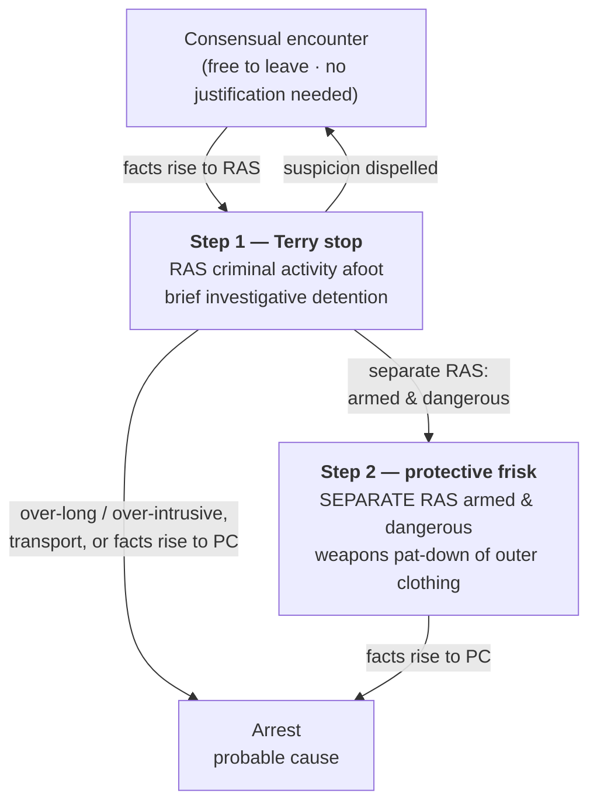

# S9 R1 panel-review — Opus model-diversity lane (prompt pack)

You are the **Claude/Opus** leg of the S9 three-lane adversarial panel (1 Claude + 2 Codex, R1). The two Codex lanes carry the A (support/quote-fidelity) and B (currency/treatment) attack lenses; **you carry model diversity and MUST vote on every paneled assertion across BOTH lenses' concerns.** You are refute-framed: try hard to break each assertion; **default to REFUTED on uncertainty**; never fabricate a cite, quote, or holding; use ONLY the evidence inlined below (no search, no outside knowledge). You are a SIGHTED reviewer — the FULL lake record (judgment fields included) is inlined.

You are a WRITER lane, not an adjudicator: you FIND and VOTE. You do not tally, adjudicate, or close any row — the orchestrator does.

For EACH group below, return one JSON object with the exact `reviewed[]` shape from the output contract (identical framing to the Codex lenses). Emit a finding object ONLY for a real defect (verdict refuted / stands-modified); a group you find wholly clean returns all-`stands` verdicts (the harness records a clean attestation). Concatenate the per-group JSON objects into a top-level `{"packs": [ ... ]}` array, one entry per group, each carrying its `group_id`.


OUTPUT CONTRACT — return ONE JSON object, nothing else:
{
  "lens": "A" | "B",
  "group_id": "<echo the group id>",
  "reviewed": [
    {
      "assertion_id": "<from group_inventory.jsonl>",
      "dimension": "existence|support|quote_fidelity|pincite|treatment|black_letter",
      "verdict": "stands" | "refuted" | "stands-modified",
      "verifiable_from_disclosed": true | false,
      "defect": null,   // null when verdict=="stands"; else an object:
      //  {"problem": "...", "severity": "high|medium|low", "proposed_fix": "...", "evidence_quote": "verbatim from disclosed evidence or null", "needs_cl": true|false, "locator_note": "..."}
      "reasons": ["short evidence-grounded reason", "..."],
      "breaks_true_positives": true | false,
      "residual_risks": ["..."],
      "suggested_tightening": "... or null"
    }
  ],
  "notes": ""
}
Rules: verdict=='stands' <=> defect==null (assertion survives your attack). verdict=='refuted' <=> a real defect (the assertion as framed is wrong). verdict=='stands-modified' <=> survives but needs a stated modification (a minor defect). Review EVERY assertion_id in group_inventory.jsonl exactly once. Output ONLY the JSON object.
---

## GROUP: content/seizures/Terry Stops and Reasonable Suspicion.md  (`doctrine`, 20 assertions)

### content_page

```
---
weight: 30
aliases:
  - "Stop and Frisk"
  - "Terry Stop"
  - "Terry Stops and Reasonable Suspicion"
  - "4-what-is-a-seizure/Terry-Stops-and-Reasonable-Suspicion"
  - "terry-stops"
title: "Terry Stops and Reasonable Suspicion"
topic: Terry Stops and Reasonable Suspicion
type: doctrine
amendment: "U.S. Const. amend. IV"
jurisdiction: "Federal (U.S. Const. amend. IV); SCOTUS baseline"
status: draft
related:
  - "[[Seizure of the Person]]"
  - "[[Reasonable Suspicion]]"
  - "[[Stop-and-Identify]]"
  - "[[Traffic Stops]]"
  - "[[Collective Knowledge and the Fellow-Officer Rule]]"
  - "[[Plain View & Plain Feel]]"
  - "[[Use of Force]]"
---

# Terry Stops and Reasonable Suspicion

*Do I have reasonable suspicion to stop, and, separately, reasonable suspicion the person is armed and dangerous, to frisk? These are two calls, not one; clearing the stop never clears the frisk.*

> [!rule] Black-letter rule
> A *[[Terry v. Ohio|Terry]]* stop rests on **two separate showings**. On **reasonable, articulable suspicion** that criminal activity is afoot, an officer may make a **brief investigative stop**: the officer "must be able to point to specific and articulable facts which, taken together with rational inferences from those facts, reasonably warrant that intrusion." *[[Terry v. Ohio#^pin-21|Terry]]*, 392 U.S. 1, [21](https://www.courtlistener.com/opinion/107729/terry-v-ohio/) (1968). And on **separate** suspicion that the person is **armed and presently dangerous**, the officer may conduct a **limited protective frisk**, a pat-down of the outer clothing for weapons. *[[Terry v. Ohio#^pin-30|Id.]]* at 30. The quantum for both is **[[Reasonable Suspicion|reasonable suspicion]]**; this page owns the **stop** and the **frisk** it unlocks: their trigger, scope, and duration.
> ^rule-terry-stop

## The Brief

**What a *[[Terry v. Ohio|Terry]]* stop is, and the two showings it demands.** *[[Terry v. Ohio|Terry]]* carved a middle category between a consensual encounter and an arrest: a brief, investigative detention on less than probable cause. It authorizes two things, and each needs its own justification. The **stop** needs reasonable suspicion that criminal activity "may be afoot." The **frisk** needs *separate* reasonable suspicion that the person is armed and presently dangerous. A lawful stop is not automatic authority to frisk, and neither showing borrows from the other. A reliable informant's tip, not just the officer's own observation, can supply the suspicion for both. *[[Adams v. Williams|Adams v. Williams]]*, 407 U.S. 143, [147](https://www.courtlistener.com/opinion/108571/adams-v-williams/) (1972).

**The stop turns on reasonable suspicion, and the standard lives next door.** Reasonable suspicion is more than a hunch and less than probable cause, judged on the [[Common Legal Terms#totality-of-the-circumstances|totality of the circumstances]] on a particularized and objective basis. The full quantum, including how innocent factors combine, how anonymous and 911 tips are weighed, and what flight in a high-crime area adds, is developed on **[[Reasonable Suspicion]]**. What matters here is that the standard governs the **stop's threshold**: without it there is no lawful detention, and a court reviews the whole picture rather than picking the facts apart. A reviewing court may not "excis[e]" individual factors, such as a radio dispatch or a companion's unprovoked flight, before weighing the rest. *[[District of Columbia v. R.W.|District of Columbia v. R.W.]]* (2026) (per curiam).

**The frisk is a separate showing, for weapons, not evidence.** A frisk is a pat-down of the outer clothing to find weapons, and it needs its **own** armed-and-dangerous suspicion grounded in particular facts: the officer "must be able to point to particular facts from which he reasonably inferred that the individual was armed and dangerous." *[[Sibron v. New York#^pin-64|Sibron v. New York]]*, 392 U.S. 40, [64](https://www.courtlistener.com/opinion/107730/sibron-v-new-york/) (1968). Reaching past that purpose is unlawful. In *[[Sibron v. New York|Sibron]]* the officer "thrust his hand into Sibron's pocket" for narcotics without first patting down for weapons, and the search was "not reasonably limited in scope." *[[Sibron v. New York|Id.]]* at 65–66. The armed-and-dangerous suspicion must also be **particularized to the person**: an officer may not frisk everyone present, because "mere propinquity to others independently suspected of criminal activity does not, without more," justify it. *[[Ybarra v. Illinois#^pin-92|Ybarra v. Illinois]]*, 444 U.S. 85, [92–93](https://www.courtlistener.com/opinion/110158/ybarra-v-illinois/) (1979).

**Scope and duration: brief, diligent, least intrusive.** A *[[Terry v. Ohio|Terry]]* stop must stay **temporary** and use "the least intrusive means reasonably available to verify or dispel the officer's suspicion in a short period of time." *[[Florida v. Royer#^pin-500|Florida v. Royer]]*, 460 U.S. 491, [500](https://www.courtlistener.com/opinion/110890/florida-v-royer/) (1983) (plurality). There is **no rigid time limit**. The test is **diligence**: "whether the police diligently pursued a means of investigation that was likely to confirm or dispel their suspicions quickly." *[[United States v. Sharpe#^pin-685|United States v. Sharpe]]*, 470 U.S. 675, [685–86](https://www.courtlistener.com/opinion/111378/united-states-v-sharpe/) (1985). A stop that drags on without diligent investigation, or that seizes property far past what investigation needs, breaks the limit: a 90-minute detention of luggage "exceeded the permissible limits of a *Terry*-type investigative stop." *[[United States v. Place#^pin-709|United States v. Place]]*, 462 U.S. 696, [709](https://www.courtlistener.com/opinion/110979/united-states-v-place/) (1983). And once the suspicion that justified the stop is **dispelled**, the detention must end; the officer may not hold the person to keep looking for something else.

**When a stop hardens into an arrest: the [[Common Legal Terms#de-facto|de facto]]-arrest and transport line.** Over-intrusiveness, not just clock time, can convert a stop into an arrest that needs probable cause. Holding a suspect's ticket and identification in a small interrogation room did just that: "[a]s a practical matter, Royer was under arrest." *[[Florida v. Royer#^pin-503|Royer]]*, 460 U.S. at [503](https://www.courtlistener.com/opinion/110890/florida-v-royer/). The clearest line is **removal and transport**: taking a suspect from the scene to the stationhouse for investigation is an arrest requiring probable cause, whether the purpose is interrogation or fingerprinting. The two-road analysis and the transport cases (*[[Davis v. Mississippi|Davis]]*, *[[Hayes v. Florida|Hayes]]*, *[[Dunaway v. New York|Dunaway]]*) are developed on **[[Seizure of the Person]]**; the point for the field is that a *[[Terry v. Ohio|Terry]]* detention that grows into a custodial removal has left *[[Terry v. Ohio|Terry]]* behind.

**The frisk reaches the car, and what it yields.** The protective-frisk rationale extends to a vehicle. On specific articulable facts giving a reasonable belief the suspect is dangerous and may gain immediate control of weapons, an officer may search the passenger compartment "limited to those areas in which a weapon may be placed or hidden." *[[Michigan v. Long|Michigan v. Long]]*, 463 U.S. 1032 (1983); the vehicle setting is developed on **[[Traffic Stops]]** (*[[Arizona v. Johnson|Arizona v. Johnson]]* applies the two-showing rule to passengers). As for the fruits of a lawful pat-down: contraband whose incriminating character is **immediately apparent by touch**, with no further manipulation, may be seized. That is the **plain-feel** rule, and it lives on **[[Plain View & Plain Feel]]** (*[[Minnesota v. Dickerson|Dickerson]]*).

**Acting on another officer's suspicion, and compelling a name.** The suspicion that justifies a stop need not sit in the stopping officer's own head. An officer may stop in objective reliance on a **wanted flyer, BOLO, or dispatch** if the issuing agency had reasonable suspicion; that is the fellow-officer rule, developed on **[[Collective Knowledge and the Fellow-Officer Rule]]** (*[[United States v. Hensley|Hensley]]*). Separately, during a **valid** stop a State may, by statute, compel the suspect to give his **name**; whether it may, and the vagueness limit on such statutes, is the stop-and-identify question owned by **[[Stop-and-Identify]]** (*[[Hiibel v. Sixth Judicial Dist. Court|Hiibel]]*; *[[Kolender v. Lawson|Kolender]]*). Note only that there is no power to demand identity without reasonable suspicion in the first place. *[[Brown v. Texas#^pin-51|Brown v. Texas]]*, 443 U.S. 47, [51](https://www.courtlistener.com/opinion/110128/brown-v-texas/) (1979).

**In the traffic setting.** An ordinary traffic stop is a *[[Terry v. Ohio|Terry]]*-type seizure, and its duration is policed by the **mission** rule: an officer may not prolong the stop beyond the time needed to complete its purpose without independent reasonable suspicion. That rule, and the dog-sniff and control-measure cases around it, are owned by **[[Traffic Stops]]** (*[[Rodriguez v. United States|Rodriguez]]*).

**Burden, standard of review, and remedy.** The **government** bears the burden of pointing to specific, articulable facts establishing reasonable suspicion for the stop and, separately, for any frisk; a bare "I had a hunch" will not do. On appeal, reasonable suspicion is reviewed **[[Common Legal Terms#de-novo|de novo]]**, with the historical facts reviewed for **[[Common Legal Terms#clear-error|clear error]]** and due weight given to the inferences of local officers. *[[Ornelas v. United States|Ornelas]]*, 517 U.S. 690, [699](https://www.courtlistener.com/opinion/118030/ornelas-v-united-states/) (1996); see [[Reasonable Suspicion]]. The **remedy** for a stop or frisk made without the requisite suspicion, or for a detention that ripened into an unlawful [[Common Legal Terms#de-facto|de facto]] arrest, is **suppression** of the evidence and its fruits. See [[The Exclusionary Rule]].

**Apply it.**
1. **Justify the stop.** Name the specific facts and rational inferences that make you reasonably suspect *this person* of criminal activity. That, and only that, authorizes the detention (*[[Terry v. Ohio|Terry]]*; quantum on [[Reasonable Suspicion]]).
2. **Justify the frisk separately.** Ask a second question: what specific facts make you reasonably suspect this person is **armed and dangerous**? Only that justifies a pat-down, and only of the outer clothing for weapons (*[[Sibron v. New York|Sibron]]*).
3. **Keep it particular.** You cannot frisk everyone on the scene; the armed-and-dangerous suspicion must point to the person you pat down (*[[Ybarra v. Illinois|Ybarra]]*).
4. **Stay brief and diligent.** Work the investigation that will confirm or dispel your suspicion quickly; do not hold the person longer or more intrusively than that takes (*[[United States v. Sharpe|Sharpe]]*; *[[Florida v. Royer|Royer]]*).
5. **Stop when suspicion dies, or climb to an arrest.** If the facts dispel your suspicion, release; if they rise to probable cause, you may arrest. Removing and transporting the person is an arrest that needs probable cause (see [[Seizure of the Person]]).

**Common pitfalls.**
- **Treating a lawful stop as automatic authority to frisk.** The frisk needs its own armed-and-dangerous suspicion; two separate showings (*[[Terry v. Ohio|Terry]]*; *[[Sibron v. New York|Sibron]]*).
- **Frisking for evidence rather than weapons.** The pat-down is for weapons; only contraband immediately apparent by [[Plain View Doctrine#plain-feel-minnesota-v-dickerson|plain feel]] may be seized (*[[Sibron v. New York|Sibron]]*; [[Plain View Doctrine#plain-feel-minnesota-v-dickerson|plain feel]] on [[Plain View & Plain Feel]]).
- **Frisking everyone present.** Armed-and-dangerous suspicion must be particularized to the person; mere proximity is not enough (*[[Ybarra v. Illinois|Ybarra]]*).
- **Prolonging the stop past its purpose.** A diligence-less or over-intrusive detention becomes a [[Common Legal Terms#de-facto|de facto]] arrest needing probable cause (*[[Florida v. Royer|Royer]]*; *[[United States v. Place|Place]]*; in traffic, *[[Rodriguez v. United States|Rodriguez]]* on [[Traffic Stops]]).
- **Demanding identification with no suspicion.** A name may be compelled only during a **valid** stop, and only where a statute so provides (*[[Brown v. Texas|Brown v. Texas]]*; the statute question on [[Stop-and-Identify]]).
- **Picking the facts apart on review.** The stop is judged on the whole picture; a court may not excise the dispatch or the flight and weigh only what is left (*[[District of Columbia v. R.W.|R.W.]]*; quantum on [[Reasonable Suspicion]]).

## Lower-court developments

- **[[United States v. Daniels]] (10th Cir. 2024)** — *narrows: tightens the stop threshold.* On [[Common Legal Terms#de-novo|de novo]] totality review, a near-anonymous 911 tip (three men in dark hoodies near an idling SUV, reporting no actual illegality) plus the suspect's presence did not amount to reasonable suspicion for the stop, and suppression was affirmed; vague, uncorroborated tips reporting lawful-sounding conduct fall below the floor. **Binding in-circuit — 10th Cir.** [opinion](https://www.courtlistener.com/opinion/9500360/united-states-v-daniels/)
- **[[United States v. Robinson]] (4th Cir. 2017) (en banc)** — *split: armed alone is enough to frisk.* Once a lawful stop has occurred, reasonable suspicion that the person is **armed** is by itself enough to frisk, on the theory that a forcibly stopped armed person is necessarily dangerous; the presumptive lawfulness of gun possession under state law does not negate the officer-safety basis. "[A]n officer who makes a lawful traffic stop and who has a reasonable suspicion that one of the automobile's occupants is armed may frisk that individual." 846 F.3d 694, 696. **Binding in-circuit — 4th Cir. (en banc).** (This is the 4th Cir. [[Reading and Citing Cases#en-banc|en banc]] decision, not the SCOTUS search-incident case *[[United States v. Robinson|United States v. Robinson]]*, 414 U.S. 218 (1973).) [opinion](https://www.courtlistener.com/opinion/4340460/united-states-v-shaquille-robinson/)
- **[[United States v. Black]] (4th Cir. 2013)** — *split: open carry, without more, is not suspicion.* Where a State permits open carry, the exercise of that right "without more" cannot justify an investigatory detention; the court refused to stack innocent, suspicion-free facts (high-crime area, late hour, a companion's minor record) around the gun. 707 F.3d 531, 540. **Binding in-circuit — 4th Cir.** [opinion](https://www.courtlistener.com/opinion/821235/united-states-v-nathaniel-black/)
- **Northrup v. City of Toledo Police Dep't (6th Cir. 2015)** — *split: open carry, without more, is not suspicion.* In an open-carry State, the mere sight of a lawfully carried firearm did not give reasonable suspicion to stop and disarm a pedestrian; officers who did so were denied [[Qualified Immunity|qualified immunity]]. 785 F.3d 1128. **Binding in-circuit — 6th Cir.** [opinion](https://www.courtlistener.com/opinion/2800431/shawn-northrup-v-city-of-toledo-police-dept/)

The SCOTUS two-showing framework is stable, but the circuits divide over the **frisk branch** where a State permits gun carry: the Fourth Circuit [[Reading and Citing Cases#en-banc|en banc]] treats reasonable suspicion that a stopped person is *armed* as by itself enough to frisk (*[[United States v. Robinson|Robinson]]*), while the open-carry cases hold that lawfully carrying a firearm, without more, supplies neither suspicion of a crime nor a basis to disarm (*[[United States v. Black|Black]]*; *[[Northrup v. City of Toledo Police Dept|Northrup]]*). The dividing question is whether "armed and dangerous" collapses into "armed" once a State makes public carry lawful.

## Key cases

| Case | Holding | Opinion |
|---|---|---|
| *[[Terry v. Ohio]]*, 392 U.S. 1 (1968) | Foundation: on reasonable suspicion criminal activity is afoot an officer may make a brief stop, and on **separate** suspicion the person is **armed and presently dangerous** may conduct a protective pat-down of the outer clothing for weapons. | [opinion](https://www.courtlistener.com/opinion/107729/terry-v-ohio/) |
| *[[Sibron v. New York]]*, 392 U.S. 40 (1968) | **Frisk scope:** a frisk is a limited pat-down for weapons on particular armed-and-dangerous facts; thrusting a hand into a pocket to search for narcotics **exceeds** what *[[Terry v. Ohio\|Terry]]* allows. | [opinion](https://www.courtlistener.com/opinion/107730/sibron-v-new-york/) |
| *[[Adams v. Williams]]*, 407 U.S. 143 (1972) | Reasonable suspicion for a stop **and** a frisk may rest on a **reliable informant's tip**, not only the officer's own observation. | [opinion](https://www.courtlistener.com/opinion/108571/adams-v-williams/) |
| *[[United States v. Sharpe]]*, 470 U.S. 675 (1985) | **Duration:** no rigid time limit; a ~20-minute detention was reasonable where police **diligently** pursued an investigation likely to confirm or dispel suspicion quickly. | [opinion](https://www.courtlistener.com/opinion/111378/united-states-v-sharpe/) |
| *[[Brown v. Texas]]*, 443 U.S. 47 (1979) | Police may **not** stop a person and demand identification **without** reasonable suspicion; a suspicionless seizure fails the balancing test. | [opinion](https://www.courtlistener.com/opinion/110128/brown-v-texas/) |
| *[[United States v. Cooley]]*, 593 U.S. 345 (2021) | A tribal officer on a public right-of-way through a reservation may **stop** a non-Indian on reasonable suspicion and **search** to the extent needed for safety; a *[[Terry v. Ohio\|Terry]]*-stop application confirming the detain-and-protect authority. | [opinion](https://www.courtlistener.com/opinion/4887958/united-states-v-cooley/) |
| *[[District of Columbia v. R.W.]]*, No. 25-248 (U.S. 2026) (per curiam) | A reviewing court may not **excise** individual factors (a radio dispatch, a companion's unprovoked flight) before weighing the rest; the stop is tested on the totality, not a divide-and-conquer of each fact. | [opinion](https://www.courtlistener.com/opinion/10845431/district-of-columbia-v-rw/) |

## Related cases across doctrines

These cases are treated in full on other pages but bear directly on the *[[Terry v. Ohio|Terry]]* stop-and-frisk; each row frames the holding for this doctrine.

| Case | Relevance here | Primary home | Opinion |
|---|---|---|---|
| *[[Michigan v. Long]]*, 463 U.S. 1032 (1983) | ***Extends.*** The protective-frisk rationale reaches a vehicle: on facts that the suspect is dangerous and may reach a weapon, an officer may frisk the passenger compartment where a weapon could be hidden. | [[Traffic Stops]] | [opinion](https://www.courtlistener.com/opinion/111020/michigan-v-long/) |
| *[[Arizona v. Johnson]]*, 555 U.S. 323 (2009) | ***Applies.*** In a traffic stop the lawful-stop condition is met for **passengers** without separate suspicion of their crime; a passenger may be frisked on reasonable suspicion he is armed and dangerous. | [[Traffic Stops]] | [opinion](https://www.courtlistener.com/opinion/145912/arizona-v-johnson/) |
| *[[Ybarra v. Illinois]]*, 444 U.S. 85 (1979) | ***Particularization.*** A premises search warrant does not authorize frisking persons merely present; the frisk needs suspicion **particular to that person**. | [[Securing the Scene]] | [opinion](https://www.courtlistener.com/opinion/110158/ybarra-v-illinois/) |
| *[[Florida v. Royer]]*, 460 U.S. 491 (1983) | ***[[Common Legal Terms#de-facto\|De facto]] arrest.*** A detention must use the least intrusive means; holding the suspect's ticket and ID in a small room turned the stop into an arrest requiring probable cause. | [[Seizure of the Person]] | [opinion](https://www.courtlistener.com/opinion/110890/florida-v-royer/) |
| *[[United States v. Place]]*, 462 U.S. 696 (1983) | ***Duration.*** A 90-minute investigative seizure of luggage exceeded the permissible limits of a *[[Terry v. Ohio\|Terry]]*-type stop. | [[Reasonable Expectation of Privacy]] | [opinion](https://www.courtlistener.com/opinion/110979/united-states-v-place/) |
| *[[Davis v. Mississippi]]*, 394 U.S. 721 (1969) | ***Transport.*** Detaining and transporting a suspect to the station for fingerprinting **without probable cause** is an unreasonable seizure. | [[Seizure of the Person]] | [opinion](https://www.courtlistener.com/opinion/107912/davis-v-mississippi/) |
| *[[Hayes v. Florida]]*, 470 U.S. 811 (1985) | ***Transport.*** Forcibly removing a suspect to the stationhouse without probable cause is an arrest; brief field fingerprinting on reasonable suspicion is left open. | [[Seizure of the Person]] | [opinion](https://www.courtlistener.com/opinion/111382/hayes-v-florida/) |
| *[[Rodriguez v. United States]]*, 575 U.S. 348 (2015) | ***Traffic duration.*** A stop may last no longer than needed to complete its **mission**; absent independent suspicion, an officer may not prolong it for unrelated investigation. | [[Traffic Stops]] | [opinion](https://www.courtlistener.com/opinion/2795278/rodriguez-v-united-states/) |
| *[[Hiibel v. Sixth Judicial Dist. Court]]*, 542 U.S. 177 (2004) | ***Compelled name.*** During a **valid** *[[Terry v. Ohio\|Terry]]* stop a State stop-and-identify statute may compel the suspect's name, consistent with the Fourth Amendment. | [[Stop-and-Identify]] | [opinion](https://www.courtlistener.com/opinion/136990/hiibel-v-sixth-judicial-dist-court-of-nev-humboldt-cty/) |
| *[[Kolender v. Lawson]]*, 461 U.S. 352 (1983) | ***Vagueness limit.*** A stop-and-identify statute requiring "credible and reliable" identification is void for vagueness; it hands police standardless discretion. | [[Stop-and-Identify]] | [opinion](https://www.courtlistener.com/opinion/110926/kolender-v-lawson/) |
| *[[Minnesota v. Dickerson]]*, 508 U.S. 366 (1993) | ***[[Plain View Doctrine#plain-feel-minnesota-v-dickerson\|Plain feel]].*** Contraband whose identity is immediately apparent by touch during a lawful weapons frisk may be seized; manipulating an object to identify it is not. | [[Plain View & Plain Feel]] | [opinion](https://www.courtlistener.com/opinion/112879/minnesota-v-dickerson/) |
| *[[United States v. Hensley]]*, 469 U.S. 221 (1985) | ***Collective knowledge.*** An officer may make a *[[Terry v. Ohio\|Terry]]* stop in objective reliance on another department's **wanted flyer** if the issuing agency had reasonable suspicion. | [[Collective Knowledge and the Fellow-Officer Rule]] | [opinion](https://www.courtlistener.com/opinion/111294/united-states-v-hensley/) |

## Visual



## Sources

- [*Terry v. Ohio*, 392 U.S. 1 (1968)](https://www.courtlistener.com/opinion/107729/terry-v-ohio/) (pinpoints: 21, 30)
- [*Sibron v. New York*, 392 U.S. 40 (1968)](https://www.courtlistener.com/opinion/107730/sibron-v-new-york/) (pinpoints: 64, 65–66)
- [*Adams v. Williams*, 407 U.S. 143 (1972)](https://www.courtlistener.com/opinion/108571/adams-v-williams/) (pinpoint: 147)
- [*Ybarra v. Illinois*, 444 U.S. 85 (1979)](https://www.courtlistener.com/opinion/110158/ybarra-v-illinois/) (pinpoints: 91, 92–93)
- [*Florida v. Royer*, 460 U.S. 491 (1983) (plurality)](https://www.courtlistener.com/opinion/110890/florida-v-royer/) (pinpoints: 500, 503) (home: [[Seizure of the Person]])
- [*United States v. Sharpe*, 470 U.S. 675 (1985)](https://www.courtlistener.com/opinion/111378/united-states-v-sharpe/) (pinpoints: 685–86)
- [*United States v. Place*, 462 U.S. 696 (1983)](https://www.courtlistener.com/opinion/110979/united-states-v-place/) (pinpoint: 709) (home: [[Reasonable Expectation of Privacy]])
- [*Brown v. Texas*, 443 U.S. 47 (1979)](https://www.courtlistener.com/opinion/110128/brown-v-texas/) (pinpoint: 51)
- [*United States v. Cooley*, 593 U.S. 345 (2021)](https://www.courtlistener.com/opinion/4887958/united-states-v-cooley/)
- [*District of Columbia v. R.W.*, No. 25-248 (U.S. 2026) (per curiam)](https://www.courtlistener.com/opinion/10845431/district-of-columbia-v-rw/)
- [*Michigan v. Long*, 463 U.S. 1032 (1983)](https://www.courtlistener.com/opinion/111020/michigan-v-long/) (home: [[Traffic Stops]])
- [*Arizona v. Johnson*, 555 U.S. 323 (2009)](https://www.courtlistener.com/opinion/145912/arizona-v-johnson/) (home: [[Traffic Stops]])
- [*Davis v. Mississippi*, 394 U.S. 721 (1969)](https://www.courtlistener.com/opinion/107912/davis-v-mississippi/) (pinpoint: 727) (home: [[Seizure of the Person]])
- [*Hayes v. Florida*, 470 U.S. 811 (1985)](https://www.courtlistener.com/opinion/111382/hayes-v-florida/) (home: [[Seizure of the Person]])
- [*Rodriguez v. United States*, 575 U.S. 348 (2015)](https://www.courtlistener.com/opinion/2795278/rodriguez-v-united-states/) (home: [[Traffic Stops]])
- [*Hiibel v. Sixth Judicial Dist. Court of Nev.*, 542 U.S. 177 (2004)](https://www.courtlistener.com/opinion/136990/hiibel-v-sixth-judicial-dist-court-of-nev-humboldt-cty/) (home: [[Stop-and-Identify]])
- [*Kolender v. Lawson*, 461 U.S. 352 (1983)](https://www.courtlistener.com/opinion/110926/kolender-v-lawson/) (home: [[Stop-and-Identify]])
- [*Minnesota v. Dickerson*, 508 U.S. 366 (1993)](https://www.courtlistener.com/opinion/112879/minnesota-v-dickerson/) (home: [[Plain View & Plain Feel]])
- [*United States v. Hensley*, 469 U.S. 221 (1985)](https://www.courtlistener.com/opinion/111294/united-states-v-hensley/) (home: [[Collective Knowledge and the Fellow-Officer Rule]])
- [*Ornelas v. United States*, 517 U.S. 690 (1996)](https://www.courtlistener.com/opinion/118030/ornelas-v-united-states/) (pinpoint: 699) (home: [[Reasonable Suspicion]])
- [*United States v. Daniels*, 101 F.4th 770 (10th Cir. 2024)](https://www.courtlistener.com/opinion/9500360/united-states-v-daniels/)
- [*United States v. Robinson*, 846 F.3d 694 (4th Cir. 2017) (en banc)](https://www.courtlistener.com/opinion/4340460/united-states-v-shaquille-robinson/)
- [*United States v. Black*, 707 F.3d 531 (4th Cir. 2013)](https://www.courtlistener.com/opinion/821235/united-states-v-nathaniel-black/)
- [*Northrup v. City of Toledo Police Dep't*, 785 F.3d 1128 (6th Cir. 2015)](https://www.courtlistener.com/opinion/2800431/shawn-northrup-v-city-of-toledo-police-dept/)

```

### group_inventory (assertions under review)

```jsonl
{"assertion_id": "0ba4f525bc3b8af8", "dimension": "existence", "kind": "case_cite", "locator": {"case": "Arizona v. Johnson", "table_line": 73}, "payload": {"case": "Arizona v. Johnson", "cells": ["*[[Arizona v. Johnson]]*, 555 U.S. 323 (2009)", "***Applies.*** In a traffic stop the lawful-stop condition is met for **passengers** without separate suspicion of their crime; a passenger may be frisked on reasonable suspicion he is armed and dangerous.", "[[Traffic Stops]]", "[opinion](https://www.courtlistener.com/opinion/145912/arizona-v-johnson/)"], "header": ["Case", "Relevance here", "Primary home", "Opinion"]}}
{"assertion_id": "1c7d3d585291af45", "dimension": "existence", "kind": "case_cite", "locator": {"case": "Ybarra v. Illinois", "table_line": 74}, "payload": {"case": "Ybarra v. Illinois", "cells": ["*[[Ybarra v. Illinois]]*, 444 U.S. 85 (1979)", "***Particularization.*** A premises search warrant does not authorize frisking persons merely present; the frisk needs suspicion **particular to that person**.", "[[Securing the Scene]]", "[opinion](https://www.courtlistener.com/opinion/110158/ybarra-v-illinois/)"], "header": ["Case", "Relevance here", "Primary home", "Opinion"]}}
{"assertion_id": "2536d64c7fdcc25b", "dimension": "existence", "kind": "case_cite", "locator": {"case": "United States v. Place", "table_line": 76}, "payload": {"case": "United States v. Place", "cells": ["*[[United States v. Place]]*, 462 U.S. 696 (1983)", "***Duration.*** A 90-minute investigative seizure of luggage exceeded the permissible limits of a *[[Terry v. Ohio\\|Terry]]*-type stop.", "[[Reasonable Expectation of Privacy]]", "[opinion](https://www.courtlistener.com/opinion/110979/united-states-v-place/)"], "header": ["Case", "Relevance here", "Primary home", "Opinion"]}}
{"assertion_id": "293d5523308ee520", "dimension": "existence", "kind": "case_cite", "locator": {"case": "Hayes v. Florida", "table_line": 78}, "payload": {"case": "Hayes v. Florida", "cells": ["*[[Hayes v. Florida]]*, 470 U.S. 811 (1985)", "***Transport.*** Forcibly removing a suspect to the stationhouse without probable cause is an arrest; brief field fingerprinting on reasonable suspicion is left open.", "[[Seizure of the Person]]", "[opinion](https://www.courtlistener.com/opinion/111382/hayes-v-florida/)"], "header": ["Case", "Relevance here", "Primary home", "Opinion"]}}
{"assertion_id": "2afdc99f582547d7", "dimension": "existence", "kind": "case_cite", "locator": {"case": "Michigan v. Long", "table_line": 72}, "payload": {"case": "Michigan v. Long", "cells": ["*[[Michigan v. Long]]*, 463 U.S. 1032 (1983)", "***Extends.*** The protective-frisk rationale reaches a vehicle: on facts that the suspect is dangerous and may reach a weapon, an officer may frisk the passenger compartment where a weapon could be hidden.", "[[Traffic Stops]]", "[opinion](https://www.courtlistener.com/opinion/111020/michigan-v-long/)"], "header": ["Case", "Relevance here", "Primary home", "Opinion"]}}
{"assertion_id": "33d9d30837bb8dc3", "dimension": "existence", "kind": "case_cite", "locator": {"case": "United States v. Cooley", "table_line": 63}, "payload": {"case": "United States v. Cooley", "cells": ["*[[United States v. Cooley]]*, 593 U.S. 345 (2021)", "A tribal officer on a public right-of-way through a reservation may **stop** a non-Indian on reasonable suspicion and **search** to the extent needed for safety; a *[[Terry v. Ohio\\|Terry]]*-stop application confirming the detain-and-protect authority.", "[opinion](https://www.courtlistener.com/opinion/4887958/united-states-v-cooley/)"], "header": ["Case", "Holding", "Opinion"]}}
{"assertion_id": "3b3e87c66c08b3ec", "dimension": "existence", "kind": "case_cite", "locator": {"case": "United States v. Sharpe", "table_line": 61}, "payload": {"case": "United States v. Sharpe", "cells": ["*[[United States v. Sharpe]]*, 470 U.S. 675 (1985)", "**Duration:** no rigid time limit; a ~20-minute detention was reasonable where police **diligently** pursued an investigation likely to confirm or dispel suspicion quickly.", "[opinion](https://www.courtlistener.com/opinion/111378/united-states-v-sharpe/)"], "header": ["Case", "Holding", "Opinion"]}}
{"assertion_id": "419b725381b66733", "dimension": "existence", "kind": "case_cite", "locator": {"case": "Brown v. Texas", "table_line": 62}, "payload": {"case": "Brown v. Texas", "cells": ["*[[Brown v. Texas]]*, 443 U.S. 47 (1979)", "Police may **not** stop a person and demand identification **without** reasonable suspicion; a suspicionless seizure fails the balancing test.", "[opinion](https://www.courtlistener.com/opinion/110128/brown-v-texas/)"], "header": ["Case", "Holding", "Opinion"]}}
{"assertion_id": "431e127b0d7a7d59", "dimension": "existence", "kind": "case_cite", "locator": {"case": "Davis v. Mississippi", "table_line": 77}, "payload": {"case": "Davis v. Mississippi", "cells": ["*[[Davis v. Mississippi]]*, 394 U.S. 721 (1969)", "***Transport.*** Detaining and transporting a suspect to the station for fingerprinting **without probable cause** is an unreasonable seizure.", "[[Seizure of the Person]]", "[opinion](https://www.courtlistener.com/opinion/107912/davis-v-mississippi/)"], "header": ["Case", "Relevance here", "Primary home", "Opinion"]}}
{"assertion_id": "4e63746c0a9c4bb8", "dimension": "existence", "kind": "case_cite", "locator": {"case": "Sibron v. New York", "table_line": 59}, "payload": {"case": "Sibron v. New York", "cells": ["*[[Sibron v. New York]]*, 392 U.S. 40 (1968)", "**Frisk scope:** a frisk is a limited pat-down for weapons on particular armed-and-dangerous facts; thrusting a hand into a pocket to search for narcotics **exceeds** what *[[Terry v. Ohio\\|Terry]]* allows.", "[opinion](https://www.courtlistener.com/opinion/107730/sibron-v-new-york/)"], "header": ["Case", "Holding", "Opinion"]}}
{"assertion_id": "595624c5c395ef1a", "dimension": "existence", "kind": "case_cite", "locator": {"case": "Florida v. Royer", "table_line": 75}, "payload": {"case": "Florida v. Royer", "cells": ["*[[Florida v. Royer]]*, 460 U.S. 491 (1983)", "***[[Common Legal Terms#de-facto\\|De facto]] arrest.*** A detention must use the least intrusive means; holding the suspect's ticket and ID in a small room turned the stop into an arrest requiring probable cause.", "[[Seizure of the Person]]", "[opinion](https://www.courtlistener.com/opinion/110890/florida-v-royer/)"], "header": ["Case", "Relevance here", "Primary home", "Opinion"]}}
{"assertion_id": "703472c5d8ed03ba", "dimension": "existence", "kind": "case_cite", "locator": {"case": "Terry v. Ohio", "table_line": 58}, "payload": {"case": "Terry v. Ohio", "cells": ["*[[Terry v. Ohio]]*, 392 U.S. 1 (1968)", "Foundation: on reasonable suspicion criminal activity is afoot an officer may make a brief stop, and on **separate** suspicion the person is **armed and presently dangerous** may conduct a protective pat-down of the outer clothing for weapons.", "[opinion](https://www.courtlistener.com/opinion/107729/terry-v-ohio/)"], "header": ["Case", "Holding", "Opinion"]}}
{"assertion_id": "a966c7e6d0e4ff94", "dimension": "existence", "kind": "case_cite", "locator": {"case": "Minnesota v. Dickerson", "table_line": 82}, "payload": {"case": "Minnesota v. Dickerson", "cells": ["*[[Minnesota v. Dickerson]]*, 508 U.S. 366 (1993)", "***[[Plain View Doctrine#plain-feel-minnesota-v-dickerson\\|Plain feel]].*** Contraband whose identity is immediately apparent by touch during a lawful weapons frisk may be seized; manipulating an object to identify it is not.", "[[Plain View & Plain Feel]]", "[opinion](https://www.courtlistener.com/opinion/112879/minnesota-v-dickerson/)"], "header": ["Case", "Relevance here", "Primary home", "Opinion"]}}
{"assertion_id": "abe60491b69b0413", "dimension": "existence", "kind": "case_cite", "locator": {"case": "United States v. Hensley", "table_line": 83}, "payload": {"case": "United States v. Hensley", "cells": ["*[[United States v. Hensley]]*, 469 U.S. 221 (1985)", "***Collective knowledge.*** An officer may make a *[[Terry v. Ohio\\|Terry]]* stop in objective reliance on another department's **wanted flyer** if the issuing agency had reasonable suspicion.", "[[Collective Knowledge and the Fellow-Officer Rule]]", "[opinion](https://www.courtlistener.com/opinion/111294/united-states-v-hensley/)"], "header": ["Case", "Relevance here", "Primary home", "Opinion"]}}
{"assertion_id": "ac74b687dd59c436", "dimension": "existence", "kind": "case_cite", "locator": {"case": "District of Columbia v. R.W.", "table_line": 64}, "payload": {"case": "District of Columbia v. R.W.", "cells": ["*[[District of Columbia v. R.W.]]*, No. 25-248 (U.S. 2026) (per curiam)", "A reviewing court may not **excise** individual factors (a radio dispatch, a companion's unprovoked flight) before weighing the rest; the stop is tested on the totality, not a divide-and-conquer of each fact.", "[opinion](https://www.courtlistener.com/opinion/10845431/district-of-columbia-v-rw/)"], "header": ["Case", "Holding", "Opinion"]}}
{"assertion_id": "c62f58f5cb75108e", "dimension": "existence", "kind": "case_cite", "locator": {"case": "Adams v. Williams", "table_line": 60}, "payload": {"case": "Adams v. Williams", "cells": ["*[[Adams v. Williams]]*, 407 U.S. 143 (1972)", "Reasonable suspicion for a stop **and** a frisk may rest on a **reliable informant's tip**, not only the officer's own observation.", "[opinion](https://www.courtlistener.com/opinion/108571/adams-v-williams/)"], "header": ["Case", "Holding", "Opinion"]}}
{"assertion_id": "ea761f6c42397a60", "dimension": "existence", "kind": "case_cite", "locator": {"case": "Kolender v. Lawson", "table_line": 81}, "payload": {"case": "Kolender v. Lawson", "cells": ["*[[Kolender v. Lawson]]*, 461 U.S. 352 (1983)", "***Vagueness limit.*** A stop-and-identify statute requiring \"credible and reliable\" identification is void for vagueness; it hands police standardless discretion.", "[[Stop-and-Identify]]", "[opinion](https://www.courtlistener.com/opinion/110926/kolender-v-lawson/)"], "header": ["Case", "Relevance here", "Primary home", "Opinion"]}}
{"assertion_id": "f0553640866aec49", "dimension": "existence", "kind": "case_cite", "locator": {"case": "Hiibel v. Sixth Judicial Dist. Court", "table_line": 80}, "payload": {"case": "Hiibel v. Sixth Judicial Dist. Court", "cells": ["*[[Hiibel v. Sixth Judicial Dist. Court]]*, 542 U.S. 177 (2004)", "***Compelled name.*** During a **valid** *[[Terry v. Ohio\\|Terry]]* stop a State stop-and-identify statute may compel the suspect's name, consistent with the Fourth Amendment.", "[[Stop-and-Identify]]", "[opinion](https://www.courtlistener.com/opinion/136990/hiibel-v-sixth-judicial-dist-court-of-nev-humboldt-cty/)"], "header": ["Case", "Relevance here", "Primary home", "Opinion"]}}
{"assertion_id": "f543d12f86772b57", "dimension": "existence", "kind": "case_cite", "locator": {"case": "Rodriguez v. United States", "table_line": 79}, "payload": {"case": "Rodriguez v. United States", "cells": ["*[[Rodriguez v. United States]]*, 575 U.S. 348 (2015)", "***Traffic duration.*** A stop may last no longer than needed to complete its **mission**; absent independent suspicion, an officer may not prolong it for unrelated investigation.", "[[Traffic Stops]]", "[opinion](https://www.courtlistener.com/opinion/2795278/rodriguez-v-united-states/)"], "header": ["Case", "Relevance here", "Primary home", "Opinion"]}}
{"assertion_id": "3d1eff07ff0651b5", "dimension": "support", "kind": "proposition", "locator": {"callout": "^rule-terry-stop"}, "payload": {"anchor": "^rule-terry-stop", "statement": "[!rule] Black-letter rule\nA *[[Terry v. Ohio|Terry]]* stop rests on **two separate showings**. On **reasonable, articulable suspicion** that criminal activity is afoot, an officer may make a **brief investigative stop**: the officer \"must be able to point to specific and articulable facts which, taken together with rational inferences from those facts, reasonably warrant that intrusion.\" *[[Terry v. Ohio#^pin-21|Terry]]*, 392 U.S. 1, [21](https://www.courtlistener.com/opinion/107729/terry-v-ohio/) (1968). And on **separate** suspicion that the person is **armed and presently dangerous**, the officer may conduct a **limited protective frisk**, a pat-down of the outer clothing for weapons. *[[Terry v. Ohio#^pin-30|Id.]]* at 30. The quantum for both is **[[Reasonable Suspicion|reasonable suspicion]]**; this page owns the **stop** and the **frisk** it unlocks: their trigger, scope, and duration."}}
```

### lake record — Adams v. Williams

```json
{
  "schema_version": "s2.v1",
  "record_id": "Adams v. Williams",
  "stub": false,
  "status": "verified",
  "identity": {
    "case_name": "Adams v. Williams",
    "case_name_short": "Adams",
    "case_name_full": "Adams, Warden v. Williams",
    "input_case_name": "Adams v. Williams",
    "court": "U.S. Supreme Court",
    "court_id": "scotus",
    "court_level": "scotus",
    "circuit": null,
    "state": null,
    "date_decided": "1972-06-12",
    "year": 1972,
    "docket": null,
    "cluster_id": 108571,
    "lead_opinion_id": 108571,
    "sibling_ids": [
      108571,
      9424935,
      9424936,
      9424937,
      9424938
    ],
    "absolute_url": "/opinion/108571/adams-v-williams/",
    "identity_method": "citation+party-text",
    "expected_citation_found": true,
    "party_name_in_text": true,
    "canonical_name_match": true,
    "alternates": [
      {
        "cluster_id": 8987525,
        "score": 10,
        "case_name": "Adams v. Williams"
      },
      {
        "cluster_id": 8987276,
        "score": 10,
        "case_name": "Adams v. Williams"
      },
      {
        "cluster_id": 8986252,
        "score": 10,
        "case_name": "Adams v. Williams"
      }
    ],
    "reason_code": null
  },
  "citations": {
    "official": {
      "cite": "407 U.S. 143",
      "volume": "407",
      "reporter": "U.S.",
      "page": "143",
      "type": 1,
      "selected_official": true,
      "source": "cluster.citations[]"
    },
    "parallel": [
      {
        "cite": "92 S. Ct. 1921",
        "volume": "92",
        "reporter": "S. Ct.",
        "page": "1921",
        "type": 1,
        "selected_official": false,
        "source": "cluster.citations[]"
      },
      {
        "cite": "32 L. Ed. 2d 612",
        "volume": "32",
        "reporter": "L. Ed. 2d",
        "page": "612",
        "type": 1,
        "selected_official": false,
        "source": "cluster.citations[]"
      }
    ],
    "vendor_neutral": [
      {
        "cite": "1972 U.S. LEXIS 2206",
        "volume": "1972",
        "reporter": "U.S. LEXIS",
        "page": "2206",
        "type": 6,
        "selected_official": false,
        "source": "cluster.citations[]"
      }
    ],
    "all": [
      {
        "cite": "407 U.S. 143",
        "volume": "407",
        "reporter": "U.S.",
        "page": "143",
        "type": 1,
        "selected_official": false,
        "source": "cluster.citations[]"
      },
      {
        "cite": "92 S. Ct. 1921",
        "volume": "92",
        "reporter": "S. Ct.",
        "page": "1921",
        "type": 1,
        "selected_official": false,
        "source": "cluster.citations[]"
      },
      {
        "cite": "32 L. Ed. 2d 612",
        "volume": "32",
        "reporter": "L. Ed. 2d",
        "page": "612",
        "type": 1,
        "selected_official": false,
        "source": "cluster.citations[]"
      },
      {
        "cite": "1972 U.S. LEXIS 2206",
        "volume": "1972",
        "reporter": "U.S. LEXIS",
        "page": "2206",
        "type": 6,
        "selected_official": false,
        "source": "cluster.citations[]"
      }
    ],
    "display": "407 U.S. 143",
    "official_selection": {
      "court_class": "scotus",
      "selected": "407 U.S. 143",
      "reason": "selected_rank_1"
    }
  },
  "pinpoints": [
    {
      "id": "pin-147",
      "page": null,
      "quote": "--- # Adams v. Williams *407 U.S. 143 (1972)* \u00b7 U.S. Supreme Court \u00b7 **Binding \u2014 SCOTUS** \u00b7 Treatment: **good** *(as of 2026-06-30)* <!-- header line; TreatmentBadge + weight render here, degrading to the text above --> ## Background At about 2:15 a.m., Sergeant Connolly was on patrol in a high-crime area when a person known to him personally, who had given him information before, approached his cruiser and told him that a man seated in a nearby car was carrying narcotics and had a gun at his waist. Connolly approached the car and asked Williams to open the door; instead Williams rolled down the window. Connolly reached into the car to the spot at Williams's waistband the informant had described and removed a loaded revolver. Williams was arrested; a search incident to the arrest produced heroin. He was convicted of unlawful possession of the handgun and of the heroin and challenged the stop and frisk. ## Issue Whether reasonable suspicion for a *Terry* stop and protective frisk may be based on a known informant's tip rather than the officer's own observation, and whether reaching to the place the informant identified to remove a weapon was a reasonable protective search. ## Rule Yes. Reasonable suspicion can rest on a reliable informant's tip, not only on the officer's personal observation:",
      "star_marker": null,
      "quote_fidelity": "mismatch",
      "pinpoint_status": "slip-only",
      "position": null
    },
    {
      "id": "pin-147b",
      "page": null,
      "quote": "Informants' tips, like all other clues and evidence coming to a policeman on the scene, may vary greatly in their value and reliability. One simple rule will not cover every situation. . . . But in some situations \u2014 for example, when the victim of a street crime seeks immediate police aid and gives a description of his assailant, or when a credible informant warns of a specific impending crime \u2014 the subtleties of the hearsay rule should not thwart an appropriate police response.",
      "star_marker": null,
      "quote_fidelity": "mismatch",
      "pinpoint_status": "slip-only",
      "position": null
    },
    {
      "id": "pin-148",
      "page": null,
      "quote": "Under these circumstances the policeman's action in reaching to the spot where the gun was thought to be hidden constituted a limited intrusion designed to insure his safety, and we conclude that it was reasonable.",
      "star_marker": "148",
      "quote_fidelity": "matched",
      "pinpoint_status": "star-verified",
      "position": 11530,
      "fragment": "#:~:text=Under%20these%20circumstances%20the%20policeman%27s",
      "fragment_validated_at": "2026-07-09T15:40:45Z"
    }
  ],
  "treatment": {
    "field_i_validity": "good_law",
    "as_of_content": "1972-06-12",
    "as_of_treatment": "2026-06-30",
    "composite_basis": "migration-seed",
    "composite_basis_ref": "Adams v. Williams",
    "varies_by_point": false,
    "scope_note": "Good law. A tip from a known, face-to-face informant carries enough indicia of reliability to justify a Terry stop and protective frisk; reasonable suspicion need not rest on the officer's personal observation. The anonymous-tip line (Alabama v. White, Florida v. J.L., Navarette) develops the contrast but does not disturb Adams.",
    "point_overrides": [],
    "edges": [
      {
        "citing_case": {
          "name": "The People of the State of Colorado, In the Interest of T.J.W., Juvenile-Appellee L.C.W. and D.W. and Concerning",
          "cluster_id": 10871666,
          "cite": [
            "2026 CO 38"
          ],
          "field_ii": "overruled"
        },
        "field_ii": "overruled",
        "field_iii": "mentioned",
        "point": null,
        "proposed": true,
        "journal_ref": "Adams v. Williams:lane1_negative"
      },
      {
        "citing_case": {
          "name": "Kopp v. State",
          "cluster_id": 10864408,
          "cite": null,
          "field_ii": "overruled"
        },
        "field_ii": "overruled",
        "field_iii": "mentioned",
        "point": null,
        "proposed": true,
        "journal_ref": "Adams v. Williams:lane1_negative"
      },
      {
        "citing_case": {
          "name": "State v. Stone",
          "cluster_id": 10780071,
          "cite": null,
          "field_ii": "overruled"
        },
        "field_ii": "overruled",
        "field_iii": "mentioned",
        "point": null,
        "proposed": true,
        "journal_ref": "Adams v. Williams:lane1_negative"
      },
      {
        "citing_case": {
          "name": "United States v. Johnson",
          "cluster_id": 10770653,
          "cite": null,
          "field_ii": "criticized"
        },
        "field_ii": "criticized",
        "field_iii": "mentioned",
        "point": null,
        "proposed": true,
        "journal_ref": "Adams v. Williams:lane1_negative"
      },
      {
        "citing_case": {
          "name": "State v. Tower",
          "cluster_id": 10759279,
          "cite": [
            "2025 Ohio 5593"
          ],
          "field_ii": "overruled"
        },
        "field_ii": "overruled",
        "field_iii": "mentioned",
        "point": null,
        "proposed": true,
        "journal_ref": "Adams v. Williams:lane1_negative"
      },
      {
        "citing_case": {
          "name": "Swanson v. State",
          "cluster_id": 10758425,
          "cite": null,
          "field_ii": "questioned"
        },
        "field_ii": "questioned",
        "field_iii": "mentioned",
        "point": null,
        "proposed": true,
        "journal_ref": "Adams v. Williams:lane1_negative"
      },
      {
        "citing_case": {
          "name": "Thomas Wesley Hollingsworth v. Commonwealth of Virginia",
          "cluster_id": 10741964,
          "cite": null,
          "field_ii": "questioned"
        },
        "field_ii": "questioned",
        "field_iii": "mentioned",
        "point": null,
        "proposed": true,
        "journal_ref": "Adams v. Williams:lane1_negative"
      },
      {
        "citing_case": {
          "name": "State of Minnesota, Respondent, vs. Matthew Sam Mitchell, Appellant",
          "cluster_id": 10696233,
          "cite": null,
          "field_ii": "questioned"
        },
        "field_ii": "questioned",
        "field_iii": "mentioned",
        "point": null,
        "proposed": true,
        "journal_ref": "Adams v. Williams:lane1_negative"
      },
      {
        "citing_case": {
          "name": "Commonwealth v. Lewis, A., Aplt.",
          "cluster_id": 10677596,
          "cite": null,
          "field_ii": "questioned"
        },
        "field_ii": "questioned",
        "field_iii": "mentioned",
        "point": null,
        "proposed": true,
        "journal_ref": "Adams v. Williams:lane1_negative"
      },
      {
        "citing_case": {
          "name": "State v. Scerba",
          "cluster_id": 10650412,
          "cite": [
            "2025 Ohio 2791"
          ],
          "field_ii": "overruled"
        },
        "field_ii": "overruled",
        "field_iii": "mentioned",
        "point": null,
        "proposed": true,
        "journal_ref": "Adams v. Williams:lane1_negative"
      },
      {
        "citing_case": {
          "name": "United States v. Wilson",
          "cluster_id": 10636220,
          "cite": null,
          "field_ii": "abrogated"
        },
        "field_ii": "abrogated",
        "field_iii": "mentioned",
        "point": null,
        "proposed": true,
        "journal_ref": "Adams v. Williams:lane1_negative"
      },
      {
        "citing_case": {
          "name": "State v. Wolfe",
          "cluster_id": 10604482,
          "cite": [
            "2025 Ohio 2096"
          ],
          "field_ii": "overruled"
        },
        "field_ii": "overruled",
        "field_iii": "mentioned",
        "point": null,
        "proposed": true,
        "journal_ref": "Adams v. Williams:lane1_negative"
      },
      {
        "citing_case": {
          "name": "State v. Robinson",
          "cluster_id": 10589223,
          "cite": [
            "2025 Ohio 1537"
          ],
          "field_ii": "overruled"
        },
        "field_ii": "overruled",
        "field_iii": "mentioned",
        "point": null,
        "proposed": true,
        "journal_ref": "Adams v. Williams:lane1_negative"
      },
      {
        "citing_case": {
          "name": "State v. Pullom",
          "cluster_id": 10582017,
          "cite": [
            "2025 Ohio 1700"
          ],
          "field_ii": "overruled"
        },
        "field_ii": "overruled",
        "field_iii": "mentioned",
        "point": null,
        "proposed": true,
        "journal_ref": "Adams v. Williams:lane1_negative"
      },
      {
        "citing_case": {
          "name": "State v. Buckingham",
          "cluster_id": 10581986,
          "cite": [
            "2025 Ohio 1688"
          ],
          "field_ii": "overruled"
        },
        "field_ii": "overruled",
        "field_iii": "mentioned",
        "point": null,
        "proposed": true,
        "journal_ref": "Adams v. Williams:lane1_negative"
      },
      {
        "citing_case": {
          "name": "State of Louisiana v. K.B.",
          "cluster_id": 10581696,
          "cite": null,
          "field_ii": "questioned"
        },
        "field_ii": "questioned",
        "field_iii": "mentioned",
        "point": null,
        "proposed": true,
        "journal_ref": "Adams v. Williams:lane1_negative"
      },
      {
        "citing_case": {
          "name": "State v. Robinson",
          "cluster_id": 10517584,
          "cite": [
            "2025 Ohio 1539"
          ],
          "field_ii": "overruled"
        },
        "field_ii": "overruled",
        "field_iii": "mentioned",
        "point": null,
        "proposed": true,
        "journal_ref": "Adams v. Williams:lane1_negative"
      },
      {
        "citing_case": {
          "name": "State v. Shannon",
          "cluster_id": 10373759,
          "cite": [
            "2025 Ohio 1224"
          ],
          "field_ii": "overruled"
        },
        "field_ii": "overruled",
        "field_iii": "mentioned",
        "point": null,
        "proposed": true,
        "journal_ref": "Adams v. Williams:lane1_negative"
      },
      {
        "citing_case": {
          "name": "Commonwealth v. Dasahn Crowder",
          "cluster_id": 10363504,
          "cite": null,
          "field_ii": "abrogated"
        },
        "field_ii": "abrogated",
        "field_iii": "mentioned",
        "point": null,
        "proposed": true,
        "journal_ref": "Adams v. Williams:lane1_negative"
      },
      {
        "citing_case": {
          "name": "Com. v. Gibson, T.",
          "cluster_id": 10358162,
          "cite": [
            "2025 Pa. Super. 65"
          ],
          "field_ii": "criticized"
        },
        "field_ii": "criticized",
        "field_iii": "mentioned",
        "point": null,
        "proposed": true,
        "journal_ref": "Adams v. Williams:lane1_negative"
      },
      {
        "citing_case": {
          "name": "Hylton v. District of Columbia",
          "cluster_id": 10352120,
          "cite": null,
          "field_ii": "criticized"
        },
        "field_ii": "criticized",
        "field_iii": "mentioned",
        "point": null,
        "proposed": true,
        "journal_ref": "Adams v. Williams:lane1_negative"
      },
      {
        "citing_case": {
          "name": "United States v. Duane Gary Underwood, II",
          "cluster_id": 10340565,
          "cite": [
            "129 F.4th 912"
          ],
          "field_ii": "questioned"
        },
        "field_ii": "questioned",
        "field_iii": "mentioned",
        "point": null,
        "proposed": true,
        "journal_ref": "Adams v. Williams:lane1_negative"
      },
      {
        "citing_case": {
          "name": "State v. Sanders",
          "cluster_id": 10329396,
          "cite": [
            "2025 Ohio 411"
          ],
          "field_ii": "overruled"
        },
        "field_ii": "overruled",
        "field_iii": "mentioned",
        "point": null,
        "proposed": true,
        "journal_ref": "Adams v. Williams:lane1_negative"
      },
      {
        "citing_case": {
          "name": "State v. McKenzie",
          "cluster_id": 10318233,
          "cite": [
            "2025 Ohio 150"
          ],
          "field_ii": "overruled"
        },
        "field_ii": "overruled",
        "field_iii": "mentioned",
        "point": null,
        "proposed": true,
        "journal_ref": "Adams v. Williams:lane1_negative"
      },
      {
        "citing_case": {
          "name": "In re A.M.J.",
          "cluster_id": 10295535,
          "cite": [
            "2024 Ohio 5889"
          ],
          "field_ii": "overruled"
        },
        "field_ii": "overruled",
        "field_iii": "mentioned",
        "point": null,
        "proposed": true,
        "journal_ref": "Adams v. Williams:lane1_negative"
      },
      {
        "citing_case": {
          "name": "State v. Stollings",
          "cluster_id": 10293438,
          "cite": null,
          "field_ii": "questioned"
        },
        "field_ii": "questioned",
        "field_iii": "mentioned",
        "point": null,
        "proposed": true,
        "journal_ref": "Adams v. Williams:lane1_negative"
      },
      {
        "citing_case": {
          "name": "State v. Barnes",
          "cluster_id": 10293080,
          "cite": [
            "2024 Ohio 5865"
          ],
          "field_ii": "overruled"
        },
        "field_ii": "overruled",
        "field_iii": "mentioned",
        "point": null,
        "proposed": true,
        "journal_ref": "Adams v. Williams:lane1_negative"
      },
      {
        "citing_case": {
          "name": "State v. Dyson",
          "cluster_id": 10284857,
          "cite": [
            "2024 Ohio 5591"
          ],
          "field_ii": "overruled"
        },
        "field_ii": "overruled",
        "field_iii": "mentioned",
        "point": null,
        "proposed": true,
        "journal_ref": "Adams v. Williams:lane1_negative"
      },
      {
        "citing_case": {
          "name": "State v. Jackson",
          "cluster_id": 10276151,
          "cite": [
            "2024 Ohio 4770"
          ],
          "field_ii": "overruled"
        },
        "field_ii": "overruled",
        "field_iii": "mentioned",
        "point": null,
        "proposed": true,
        "journal_ref": "Adams v. Williams:lane1_negative"
      },
      {
        "citing_case": {
          "name": "State v. Swanson",
          "cluster_id": 10007955,
          "cite": null,
          "field_ii": "criticized"
        },
        "field_ii": "criticized",
        "field_iii": "mentioned",
        "point": null,
        "proposed": true,
        "journal_ref": "Adams v. Williams:lane1_negative"
      },
      {
        "citing_case": {
          "name": "Melissa Trevino v. the State of Texas",
          "cluster_id": 10008832,
          "cite": null,
          "field_ii": "overruled"
        },
        "field_ii": "overruled",
        "field_iii": "mentioned",
        "point": null,
        "proposed": true,
        "journal_ref": "Adams v. Williams:lane1_negative"
      },
      {
        "citing_case": {
          "name": "State v. Napoleao Pires",
          "cluster_id": 9997524,
          "cite": null,
          "field_ii": "questioned"
        },
        "field_ii": "questioned",
        "field_iii": "mentioned",
        "point": null,
        "proposed": true,
        "journal_ref": "Adams v. Williams:lane1_negative"
      },
      {
        "citing_case": {
          "name": "State v. Michael Gene Wiskowski",
          "cluster_id": 9576066,
          "cite": [
            "2024 WI 23"
          ],
          "field_ii": "superseded_by_statute"
        },
        "field_ii": "superseded_by_statute",
        "field_iii": "mentioned",
        "point": null,
        "proposed": true,
        "journal_ref": "Adams v. Williams:lane1_negative"
      },
      {
        "citing_case": {
          "name": "State v. Michael Gene Wiskowski",
          "cluster_id": 9567763,
          "cite": [
            "2024 WI 23"
          ],
          "field_ii": "superseded_by_statute"
        },
        "field_ii": "superseded_by_statute",
        "field_iii": "mentioned",
        "point": null,
        "proposed": true,
        "journal_ref": "Adams v. Williams:lane1_negative"
      },
      {
        "citing_case": {
          "name": "State v. Shaw",
          "cluster_id": 9507576,
          "cite": [
            "2024 Ohio 2022"
          ],
          "field_ii": "overruled"
        },
        "field_ii": "overruled",
        "field_iii": "mentioned",
        "point": null,
        "proposed": true,
        "journal_ref": "Adams v. Williams:lane1_negative"
      },
      {
        "citing_case": {
          "name": "State of Tennessee v. Antonio Demetrius Adkisson a/k/a Antonio Demetrius Turner, Jr. - DISSENT",
          "cluster_id": 9487427,
          "cite": null,
          "field_ii": "questioned"
        },
        "field_ii": "questioned",
        "field_iii": "mentioned",
        "point": null,
        "proposed": true,
        "journal_ref": "Adams v. Williams:lane1_negative"
      },
      {
        "citing_case": {
          "name": "State v. Williams",
          "cluster_id": 9484217,
          "cite": [
            "237 N.E.3d 948",
            "2024 Ohio 943"
          ],
          "field_ii": "overruled"
        },
        "field_ii": "overruled",
        "field_iii": "mentioned",
        "point": null,
        "proposed": true,
        "journal_ref": "Adams v. Williams:lane1_negative"
      },
      {
        "citing_case": {
          "name": "Savannah Marie Scarborough v. the State of Texas",
          "cluster_id": 9480115,
          "cite": null,
          "field_ii": "overruled"
        },
        "field_ii": "overruled",
        "field_iii": "mentioned",
        "point": null,
        "proposed": true,
        "journal_ref": "Adams v. Williams:lane1_negative"
      },
      {
        "citing_case": {
          "name": "State v. Wells",
          "cluster_id": 9469432,
          "cite": [
            "2024 Ohio 236"
          ],
          "field_ii": "overruled"
        },
        "field_ii": "overruled",
        "field_iii": "mentioned",
        "point": null,
        "proposed": true,
        "journal_ref": "Adams v. Williams:lane1_negative"
      },
      {
        "citing_case": {
          "name": "Villarreal v. City of Laredo",
          "cluster_id": 9468368,
          "cite": [
            "94 F.4th 374"
          ],
          "field_ii": "abrogated"
        },
        "field_ii": "abrogated",
        "field_iii": "mentioned",
        "point": null,
        "proposed": true,
        "journal_ref": "Adams v. Williams:lane1_negative"
      },
      {
        "citing_case": {
          "name": "Commonwealth v. Dobson, J., Aplt.",
          "cluster_id": 9458062,
          "cite": null,
          "field_ii": "questioned"
        },
        "field_ii": "questioned",
        "field_iii": "mentioned",
        "point": null,
        "proposed": true,
        "journal_ref": "Adams v. Williams:lane1_negative"
      },
      {
        "citing_case": {
          "name": "State of Missouri v. Jason Scott Klein",
          "cluster_id": 10631102,
          "cite": null,
          "field_ii": "overruled"
        },
        "field_ii": "overruled",
        "field_iii": "mentioned",
        "point": null,
        "proposed": true,
        "journal_ref": "Adams v. Williams:lane1_negative"
      },
      {
        "citing_case": {
          "name": "State v. Hicks",
          "cluster_id": 9441433,
          "cite": [
            "229 N.E.3d 172",
            "2023 Ohio 4126"
          ],
          "field_ii": "superseded_by_statute"
        },
        "field_ii": "superseded_by_statute",
        "field_iii": "mentioned",
        "point": null,
        "proposed": true,
        "journal_ref": "Adams v. Williams:lane1_negative"
      },
      {
        "citing_case": {
          "name": "State v. Houston",
          "cluster_id": 9439762,
          "cite": [
            "2023 Ohio 4101"
          ],
          "field_ii": "overruled"
        },
        "field_ii": "overruled",
        "field_iii": "mentioned",
        "point": null,
        "proposed": true,
        "journal_ref": "Adams v. Williams:lane1_negative"
      },
      {
        "citing_case": {
          "name": "Narce v. Mervilus",
          "cluster_id": 9436102,
          "cite": null,
          "field_ii": "questioned"
        },
        "field_ii": "questioned",
        "field_iii": "mentioned",
        "point": null,
        "proposed": true,
        "journal_ref": "Adams v. Williams:lane1_negative"
      },
      {
        "citing_case": {
          "name": "Commonwealth v. Jackson, K., Aplt.",
          "cluster_id": 9429771,
          "cite": null,
          "field_ii": "questioned"
        },
        "field_ii": "questioned",
        "field_iii": "mentioned",
        "point": null,
        "proposed": true,
        "journal_ref": "Adams v. Williams:lane1_negative"
      },
      {
        "citing_case": {
          "name": "Commonwealth v. Jackson, K., Aplt.",
          "cluster_id": 9429770,
          "cite": null,
          "field_ii": "criticized"
        },
        "field_ii": "criticized",
        "field_iii": "mentioned",
        "point": null,
        "proposed": true,
        "journal_ref": "Adams v. Williams:lane1_negative"
      },
      {
        "citing_case": {
          "name": "State v. Escobedo",
          "cluster_id": 9430770,
          "cite": [
            "224 N.E.3d 1274",
            "2023 Ohio 3410"
          ],
          "field_ii": "questioned"
        },
        "field_ii": "questioned",
        "field_iii": "mentioned",
        "point": null,
        "proposed": true,
        "journal_ref": "Adams v. Williams:lane1_negative"
      },
      {
        "citing_case": {
          "name": "People v. Lozano",
          "cluster_id": 9427519,
          "cite": [
            "226 N.E.3d 1246",
            "2023 IL 128609"
          ],
          "field_ii": "questioned"
        },
        "field_ii": "questioned",
        "field_iii": "mentioned",
        "point": null,
        "proposed": true,
        "journal_ref": "Adams v. Williams:lane1_negative"
      },
      {
        "citing_case": {
          "name": "State v. Wright",
          "cluster_id": 9425749,
          "cite": null,
          "field_ii": "questioned"
        },
        "field_ii": "questioned",
        "field_iii": "mentioned",
        "point": null,
        "proposed": true,
        "journal_ref": "Adams v. Williams:lane1_negative"
      },
      {
        "citing_case": {
          "name": "Timothy Davis, Sr. v. City of Apopka",
          "cluster_id": 9422919,
          "cite": [
            "78 F.4th 1326"
          ],
          "field_ii": "criticized"
        },
        "field_ii": "criticized",
        "field_iii": "mentioned",
        "point": null,
        "proposed": true,
        "journal_ref": "Adams v. Williams:lane1_negative"
      },
      {
        "citing_case": {
          "name": "Phillip Alexander Duty v. State of Alaska",
          "cluster_id": 9409154,
          "cite": [
            "532 P.3d 742"
          ],
          "field_ii": "questioned"
        },
        "field_ii": "questioned",
        "field_iii": "mentioned",
        "point": null,
        "proposed": true,
        "journal_ref": "Adams v. Williams:lane1_negative"
      },
      {
        "citing_case": {
          "name": "State v. Oliver",
          "cluster_id": 9397810,
          "cite": [
            "214 N.E.3d 624",
            "2023 Ohio 1550"
          ],
          "field_ii": "overruled"
        },
        "field_ii": "overruled",
        "field_iii": "mentioned",
        "point": null,
        "proposed": true,
        "journal_ref": "Adams v. Williams:lane1_negative"
      },
      {
        "citing_case": {
          "name": "State v. Thornton",
          "cluster_id": 9395271,
          "cite": [
            "213 N.E.3d 808",
            "2023 Ohio 1404"
          ],
          "field_ii": "overruled"
        },
        "field_ii": "overruled",
        "field_iii": "mentioned",
        "point": null,
        "proposed": true,
        "journal_ref": "Adams v. Williams:lane1_negative"
      },
      {
        "citing_case": {
          "name": "State v. Hall-Johnson",
          "cluster_id": 8245698,
          "cite": [
            "2022 Ohio 3512"
          ],
          "field_ii": "overruled"
        },
        "field_ii": "overruled",
        "field_iii": "mentioned",
        "point": null,
        "proposed": true,
        "journal_ref": "Adams v. Williams:lane1_negative"
      },
      {
        "citing_case": {
          "name": "State of Maine v. Timothy Barclift",
          "cluster_id": 8244189,
          "cite": [
            "282 A.3d 607",
            "2022 ME 50"
          ],
          "field_ii": "questioned"
        },
        "field_ii": "questioned",
        "field_iii": "mentioned",
        "point": null,
        "proposed": true,
        "journal_ref": "Adams v. Williams:lane1_negative"
      },
      {
        "citing_case": {
          "name": "People of Michigan v. Claudell Turner",
          "cluster_id": 7858037,
          "cite": null,
          "field_ii": "questioned"
        },
        "field_ii": "questioned",
        "field_iii": "mentioned",
        "point": null,
        "proposed": true,
        "journal_ref": "Adams v. Williams:lane1_negative"
      },
      {
        "citing_case": {
          "name": "People v. Ayon",
          "cluster_id": 7854147,
          "cite": null,
          "field_ii": "questioned"
        },
        "field_ii": "questioned",
        "field_iii": "mentioned",
        "point": null,
        "proposed": true,
        "journal_ref": "Adams v. Williams:lane1_negative"
      },
      {
        "citing_case": {
          "name": "State v. Barcus",
          "cluster_id": 6681080,
          "cite": [
            "2022 Ohio 2491"
          ],
          "field_ii": "questioned"
        },
        "field_ii": "questioned",
        "field_iii": "mentioned",
        "point": null,
        "proposed": true,
        "journal_ref": "Adams v. Williams:lane1_negative"
      },
      {
        "citing_case": {
          "name": "United States v. Alvarez",
          "cluster_id": 6623468,
          "cite": [
            "40 F.4th 339"
          ],
          "field_ii": "overruled"
        },
        "field_ii": "overruled",
        "field_iii": "mentioned",
        "point": null,
        "proposed": true,
        "journal_ref": "Adams v. Williams:lane1_negative"
      },
      {
        "citing_case": {
          "name": "United States v. Dazhan McCallister",
          "cluster_id": 6622139,
          "cite": [
            "39 F.4th 368"
          ],
          "field_ii": "questioned"
        },
        "field_ii": "questioned",
        "field_iii": "mentioned",
        "point": null,
        "proposed": true,
        "journal_ref": "Adams v. Williams:lane1_negative"
      },
      {
        "citing_case": {
          "name": "People v. Ayon",
          "cluster_id": 6621924,
          "cite": null,
          "field_ii": "questioned"
        },
        "field_ii": "questioned",
        "field_iii": "mentioned",
        "point": null,
        "proposed": true,
        "journal_ref": "Adams v. Williams:lane1_negative"
      },
      {
        "citing_case": {
          "name": "State v. Huntley",
          "cluster_id": 6620233,
          "cite": [
            "513 P.3d 1141"
          ],
          "field_ii": "questioned"
        },
        "field_ii": "questioned",
        "field_iii": "mentioned",
        "point": null,
        "proposed": true,
        "journal_ref": "Adams v. Williams:lane1_negative"
      },
      {
        "citing_case": {
          "name": "State v. Wright",
          "cluster_id": 6481332,
          "cite": [
            "2022 Ohio 2161"
          ],
          "field_ii": "overruled"
        },
        "field_ii": "overruled",
        "field_iii": "mentioned",
        "point": null,
        "proposed": true,
        "journal_ref": "Adams v. Williams:lane1_negative"
      },
      {
        "citing_case": {
          "name": "In re: D.D.",
          "cluster_id": 10048705,
          "cite": [
            "479 Md. 206"
          ],
          "field_ii": "questioned"
        },
        "field_ii": "questioned",
        "field_iii": "mentioned",
        "point": null,
        "proposed": true,
        "journal_ref": "Adams v. Williams:lane1_negative"
      },
      {
        "citing_case": {
          "name": "In re: D.D.",
          "cluster_id": 6479680,
          "cite": null,
          "field_ii": "questioned"
        },
        "field_ii": "questioned",
        "field_iii": "mentioned",
        "point": null,
        "proposed": true,
        "journal_ref": "Adams v. Williams:lane1_negative"
      },
      {
        "citing_case": {
          "name": "State v. Ferguson, III",
          "cluster_id": 6473582,
          "cite": null,
          "field_ii": "questioned"
        },
        "field_ii": "questioned",
        "field_iii": "mentioned",
        "point": null,
        "proposed": true,
        "journal_ref": "Adams v. Williams:lane1_negative"
      },
      {
        "citing_case": {
          "name": "Jonathan Russell Shook v. the State of Texas",
          "cluster_id": 6472617,
          "cite": null,
          "field_ii": "overruled"
        },
        "field_ii": "overruled",
        "field_iii": "mentioned",
        "point": null,
        "proposed": true,
        "journal_ref": "Adams v. Williams:lane1_negative"
      },
      {
        "citing_case": {
          "name": "State v. Wharton",
          "cluster_id": 6470917,
          "cite": [
            "510 P.3d 682",
            "170 Idaho 329"
          ],
          "field_ii": "questioned"
        },
        "field_ii": "questioned",
        "field_iii": "mentioned",
        "point": null,
        "proposed": true,
        "journal_ref": "Adams v. Williams:lane1_negative"
      },
      {
        "citing_case": {
          "name": "State of Iowa v. Kha Len Richard Price-Williams",
          "cluster_id": 6461978,
          "cite": null,
          "field_ii": "overruled"
        },
        "field_ii": "overruled",
        "field_iii": "mentioned",
        "point": null,
        "proposed": true,
        "journal_ref": "Adams v. Williams:lane1_negative"
      },
      {
        "citing_case": {
          "name": "State v. Kent",
          "cluster_id": 6452197,
          "cite": [
            "2022 Ohio 834"
          ],
          "field_ii": "overruled"
        },
        "field_ii": "overruled",
        "field_iii": "mentioned",
        "point": null,
        "proposed": true,
        "journal_ref": "Adams v. Williams:lane1_negative"
      },
      {
        "citing_case": {
          "name": "United States v. Anthony Buster",
          "cluster_id": 7454472,
          "cite": [
            "26 F.4th 627"
          ],
          "field_ii": "overruled"
        },
        "field_ii": "overruled",
        "field_iii": "mentioned",
        "point": null,
        "proposed": true,
        "journal_ref": "Adams v. Williams:lane1_negative"
      },
      {
        "citing_case": {
          "name": "United States v. Anthony Buster",
          "cluster_id": 6444299,
          "cite": null,
          "field_ii": "overruled"
        },
        "field_ii": "overruled",
        "field_iii": "mentioned",
        "point": null,
        "proposed": true,
        "journal_ref": "Adams v. Williams:lane1_negative"
      },
      {
        "citing_case": {
          "name": "Bingman v. United States",
          "cluster_id": 6245901,
          "cite": null,
          "field_ii": "questioned"
        },
        "field_ii": "questioned",
        "field_iii": "mentioned",
        "point": null,
        "proposed": true,
        "journal_ref": "Adams v. Williams:lane1_negative"
      },
      {
        "citing_case": {
          "name": "State v. Carter",
          "cluster_id": 6236798,
          "cite": [
            "183 N.E.3d 611",
            "2022 Ohio 91"
          ],
          "field_ii": "overruled"
        },
        "field_ii": "overruled",
        "field_iii": "mentioned",
        "point": null,
        "proposed": true,
        "journal_ref": "Adams v. Williams:lane1_negative"
      },
      {
        "citing_case": {
          "name": "People v. Carter",
          "cluster_id": 5306903,
          "cite": [
            "454 Ill. Dec. 624",
            "190 N.E.3d 224",
            "2021 IL 125954"
          ],
          "field_ii": "questioned"
        },
        "field_ii": "questioned",
        "field_iii": "mentioned",
        "point": null,
        "proposed": true,
        "journal_ref": "Adams v. Williams:lane1_negative"
      },
      {
        "citing_case": {
          "name": "United States v. Guerrero",
          "cluster_id": 5303613,
          "cite": [
            "19 F.4th 547"
          ],
          "field_ii": "overruled"
        },
        "field_ii": "overruled",
        "field_iii": "mentioned",
        "point": null,
        "proposed": true,
        "journal_ref": "Adams v. Williams:lane1_negative"
      },
      {
        "citing_case": {
          "name": "Ricardo Villa v. the State of Texas",
          "cluster_id": 5302956,
          "cite": null,
          "field_ii": "overruled"
        },
        "field_ii": "overruled",
        "field_iii": "mentioned",
        "point": null,
        "proposed": true,
        "journal_ref": "Adams v. Williams:lane1_negative"
      },
      {
        "citing_case": {
          "name": "In the Interest of: T.W.; Apl: T.W.",
          "cluster_id": 10278823,
          "cite": null,
          "field_ii": "questioned"
        },
        "field_ii": "questioned",
        "field_iii": "mentioned",
        "point": null,
        "proposed": true,
        "journal_ref": "Adams v. Williams:lane1_negative"
      },
      {
        "citing_case": {
          "name": "the State of Texas v. Georgia Donnell",
          "cluster_id": 5173560,
          "cite": null,
          "field_ii": "overruled"
        },
        "field_ii": "overruled",
        "field_iii": "mentioned",
        "point": null,
        "proposed": true,
        "journal_ref": "Adams v. Williams:lane1_negative"
      },
      {
        "citing_case": {
          "name": "State v. Wyatt",
          "cluster_id": 5093140,
          "cite": [
            "2021 Ohio 3146"
          ],
          "field_ii": "overruled"
        },
        "field_ii": "overruled",
        "field_iii": "mentioned",
        "point": null,
        "proposed": true,
        "journal_ref": "Adams v. Williams:lane1_negative"
      },
      {
        "citing_case": {
          "name": "State v. Allen",
          "cluster_id": 5090790,
          "cite": [
            "2021 Ohio 3047"
          ],
          "field_ii": "overruled"
        },
        "field_ii": "overruled",
        "field_iii": "mentioned",
        "point": null,
        "proposed": true,
        "journal_ref": "Adams v. Williams:lane1_negative"
      },
      {
        "citing_case": {
          "name": "Newman v. United States",
          "cluster_id": 5091720,
          "cite": null,
          "field_ii": "questioned"
        },
        "field_ii": "questioned",
        "field_iii": "mentioned",
        "point": null,
        "proposed": true,
        "journal_ref": "Adams v. Williams:lane1_negative"
      },
      {
        "citing_case": {
          "name": "United States v. Weaver",
          "cluster_id": 4957807,
          "cite": [
            "9 F.4th 129"
          ],
          "field_ii": "overruled"
        },
        "field_ii": "overruled",
        "field_iii": "mentioned",
        "point": null,
        "proposed": true,
        "journal_ref": "Adams v. Williams:lane1_negative"
      },
      {
        "citing_case": {
          "name": "FUENTES v. STATE",
          "cluster_id": 5307680,
          "cite": [
            "517 P.3d 971",
            "2021 OK CR 18"
          ],
          "field_ii": "overruled"
        },
        "field_ii": "overruled",
        "field_iii": "mentioned",
        "point": null,
        "proposed": true,
        "journal_ref": "Adams v. Williams:lane1_negative"
      },
      {
        "citing_case": {
          "name": "United States v. Maximo Gondres-Medrano",
          "cluster_id": 4898417,
          "cite": [
            "3 F.4th 708"
          ],
          "field_ii": "abrogated"
        },
        "field_ii": "abrogated",
        "field_iii": "mentioned",
        "point": null,
        "proposed": true,
        "journal_ref": "Adams v. Williams:lane1_negative"
      },
      {
        "citing_case": {
          "name": "State v. Tidwell (Slip Opinion)",
          "cluster_id": 4894377,
          "cite": [
            "165 Ohio St. 3d 57",
            "175 N.E.3d 527",
            "2021 Ohio 2072"
          ],
          "field_ii": "overruled"
        },
        "field_ii": "overruled",
        "field_iii": "mentioned",
        "point": null,
        "proposed": true,
        "journal_ref": "Adams v. Williams:lane1_negative"
      },
      {
        "citing_case": {
          "name": "State v. Howard",
          "cluster_id": 4886187,
          "cite": [
            "2021 Ohio 1792"
          ],
          "field_ii": "overruled"
        },
        "field_ii": "overruled",
        "field_iii": "mentioned",
        "point": null,
        "proposed": true,
        "journal_ref": "Adams v. Williams:lane1_negative"
      },
      {
        "citing_case": {
          "name": "United States v. James Brown",
          "cluster_id": 4882342,
          "cite": [
            "996 F.3d 998"
          ],
          "field_ii": "questioned"
        },
        "field_ii": "questioned",
        "field_iii": "mentioned",
        "point": null,
        "proposed": true,
        "journal_ref": "Adams v. Williams:lane1_negative"
      },
      {
        "citing_case": {
          "name": "United States v. Bass",
          "cluster_id": 4881990,
          "cite": [
            "996 F.3d 729"
          ],
          "field_ii": "overruled"
        },
        "field_ii": "overruled",
        "field_iii": "mentioned",
        "point": null,
        "proposed": true,
        "journal_ref": "Adams v. Williams:lane1_negative"
      },
      {
        "citing_case": {
          "name": "Juan Antonio Gutierrez v. State",
          "cluster_id": 4876118,
          "cite": null,
          "field_ii": "overruled"
        },
        "field_ii": "overruled",
        "field_iii": "mentioned",
        "point": null,
        "proposed": true,
        "journal_ref": "Adams v. Williams:lane1_negative"
      },
      {
        "citing_case": {
          "name": "United States v. Timothy Cloud",
          "cluster_id": 4872727,
          "cite": [
            "994 F.3d 233"
          ],
          "field_ii": "superseded_by_statute"
        },
        "field_ii": "superseded_by_statute",
        "field_iii": "mentioned",
        "point": null,
        "proposed": true,
        "journal_ref": "Adams v. Williams:lane1_negative"
      },
      {
        "citing_case": {
          "name": "Reagan v. Idaho Transportation Department",
          "cluster_id": 10732814,
          "cite": null,
          "field_ii": "questioned"
        },
        "field_ii": "questioned",
        "field_iii": "mentioned",
        "point": null,
        "proposed": true,
        "journal_ref": "Adams v. Williams:lane1_negative"
      },
      {
        "citing_case": {
          "name": "State v. Yoder",
          "cluster_id": 4858742,
          "cite": [
            "2021 Ohio 496"
          ],
          "field_ii": "overruled"
        },
        "field_ii": "overruled",
        "field_iii": "mentioned",
        "point": null,
        "proposed": true,
        "journal_ref": "Adams v. Williams:lane1_negative"
      },
      {
        "citing_case": {
          "name": "State of Iowa v. Otoniel Decanini-Hernandez",
          "cluster_id": 4857008,
          "cite": null,
          "field_ii": "questioned"
        },
        "field_ii": "questioned",
        "field_iii": "mentioned",
        "point": null,
        "proposed": true,
        "journal_ref": "Adams v. Williams:lane1_negative"
      },
      {
        "citing_case": {
          "name": "People v. Carter",
          "cluster_id": 4853848,
          "cite": [
            "2019 IL App (1st) 170803"
          ],
          "field_ii": "questioned"
        },
        "field_ii": "questioned",
        "field_iii": "mentioned",
        "point": null,
        "proposed": true,
        "journal_ref": "Adams v. Williams:lane1_negative"
      },
      {
        "citing_case": {
          "name": "State v. Tracy Todd Adrian",
          "cluster_id": 4853916,
          "cite": null,
          "field_ii": "questioned"
        },
        "field_ii": "questioned",
        "field_iii": "mentioned",
        "point": null,
        "proposed": true,
        "journal_ref": "Adams v. Williams:lane1_negative"
      },
      {
        "citing_case": {
          "name": "Freeman v. State",
          "cluster_id": 5313799,
          "cite": [
            "245 A.3d 164",
            "249 Md. App. 269"
          ],
          "field_ii": "abrogated"
        },
        "field_ii": "abrogated",
        "field_iii": "mentioned",
        "point": null,
        "proposed": true,
        "journal_ref": "Adams v. Williams:lane1_negative"
      },
      {
        "citing_case": {
          "name": "Calvin Dibrell v. City of Knoxville, Tenn.",
          "cluster_id": 4846329,
          "cite": [
            "984 F.3d 1156"
          ],
          "field_ii": "questioned"
        },
        "field_ii": "questioned",
        "field_iii": "mentioned",
        "point": null,
        "proposed": true,
        "journal_ref": "Adams v. Williams:lane1_negative"
      },
      {
        "citing_case": {
          "name": "Lonnie Gene Kinnett v. State",
          "cluster_id": 4843169,
          "cite": null,
          "field_ii": "overruled"
        },
        "field_ii": "overruled",
        "field_iii": "mentioned",
        "point": null,
        "proposed": true,
        "journal_ref": "Adams v. Williams:lane1_negative"
      },
      {
        "citing_case": {
          "name": "In re Edgerrin J.",
          "cluster_id": 4838065,
          "cite": null,
          "field_ii": "questioned"
        },
        "field_ii": "questioned",
        "field_iii": "mentioned",
        "point": null,
        "proposed": true,
        "journal_ref": "Adams v. Williams:lane1_negative"
      },
      {
        "citing_case": {
          "name": "In re Edgerrin J.",
          "cluster_id": 4837847,
          "cite": null,
          "field_ii": "questioned"
        },
        "field_ii": "questioned",
        "field_iii": "mentioned",
        "point": null,
        "proposed": true,
        "journal_ref": "Adams v. Williams:lane1_negative"
      },
      {
        "citing_case": {
          "name": "Michael D. Johnson v. State of Indiana",
          "cluster_id": 4834676,
          "cite": null,
          "field_ii": "questioned"
        },
        "field_ii": "questioned",
        "field_iii": "mentioned",
        "point": null,
        "proposed": true,
        "journal_ref": "Adams v. Williams:lane1_negative"
      },
      {
        "citing_case": {
          "name": "State v. Hansard",
          "cluster_id": 4835582,
          "cite": [
            "2020 Ohio 5528"
          ],
          "field_ii": "overruled"
        },
        "field_ii": "overruled",
        "field_iii": "mentioned",
        "point": null,
        "proposed": true,
        "journal_ref": "Adams v. Williams:lane1_negative"
      },
      {
        "citing_case": {
          "name": "In re Edgerrin J.",
          "cluster_id": 4820971,
          "cite": null,
          "field_ii": "questioned"
        },
        "field_ii": "questioned",
        "field_iii": "mentioned",
        "point": null,
        "proposed": true,
        "journal_ref": "Adams v. Williams:lane1_negative"
      },
      {
        "citing_case": {
          "name": "State v. Mallory",
          "cluster_id": 4794674,
          "cite": [
            "160 N.E.3d 399",
            "2020 Ohio 4848"
          ],
          "field_ii": "overruled"
        },
        "field_ii": "overruled",
        "field_iii": "mentioned",
        "point": null,
        "proposed": true,
        "journal_ref": "Adams v. Williams:lane1_negative"
      },
      {
        "citing_case": {
          "name": "United States v. Toddrey Willie Bruce",
          "cluster_id": 4794438,
          "cite": [
            "977 F.3d 1112"
          ],
          "field_ii": "questioned"
        },
        "field_ii": "questioned",
        "field_iii": "mentioned",
        "point": null,
        "proposed": true,
        "journal_ref": "Adams v. Williams:lane1_negative"
      },
      {
        "citing_case": {
          "name": "Morrison v. Horseshoe Casino",
          "cluster_id": 4776888,
          "cite": [
            "157 N.E.3d 406",
            "2020 Ohio 4131"
          ],
          "field_ii": "overruled"
        },
        "field_ii": "overruled",
        "field_iii": "mentioned",
        "point": null,
        "proposed": true,
        "journal_ref": "Adams v. Williams:lane1_negative"
      },
      {
        "citing_case": {
          "name": "State v. Ellis",
          "cluster_id": 4772243,
          "cite": [
            "2020 Ohio 3910"
          ],
          "field_ii": "overruled"
        },
        "field_ii": "overruled",
        "field_iii": "mentioned",
        "point": null,
        "proposed": true,
        "journal_ref": "Adams v. Williams:lane1_negative"
      },
      {
        "citing_case": {
          "name": "Aaron Emile McArthur v. Commonwealth of Virginia",
          "cluster_id": 4771110,
          "cite": null,
          "field_ii": "overruled"
        },
        "field_ii": "overruled",
        "field_iii": "mentioned",
        "point": null,
        "proposed": true,
        "journal_ref": "Adams v. Williams:lane1_negative"
      },
      {
        "citing_case": {
          "name": "In re D.L.",
          "cluster_id": 4832659,
          "cite": [
            "2018 IL App (1st) 171764"
          ],
          "field_ii": "questioned"
        },
        "field_ii": "questioned",
        "field_iii": "mentioned",
        "point": null,
        "proposed": true,
        "journal_ref": "Adams v. Williams:lane1_negative"
      },
      {
        "citing_case": {
          "name": "United States v. Jonathan Eymann",
          "cluster_id": 4760956,
          "cite": null,
          "field_ii": "overruled"
        },
        "field_ii": "overruled",
        "field_iii": "mentioned",
        "point": null,
        "proposed": true,
        "journal_ref": "Adams v. Williams:lane1_negative"
      },
      {
        "citing_case": {
          "name": "United States v. Jonathan Eymann",
          "cluster_id": 4760946,
          "cite": null,
          "field_ii": "overruled"
        },
        "field_ii": "overruled",
        "field_iii": "mentioned",
        "point": null,
        "proposed": true,
        "journal_ref": "Adams v. Williams:lane1_negative"
      },
      {
        "citing_case": {
          "name": "Com. v. Arrington, W.",
          "cluster_id": 10315555,
          "cite": [
            "233 A.3d 910",
            "2020 Pa. Super. 138"
          ],
          "field_ii": "questioned"
        },
        "field_ii": "questioned",
        "field_iii": "mentioned",
        "point": null,
        "proposed": true,
        "journal_ref": "Adams v. Williams:lane1_negative"
      },
      {
        "citing_case": {
          "name": "Com. v. Arrington, W.",
          "cluster_id": 4759745,
          "cite": [
            "2020 Pa. Super. 138"
          ],
          "field_ii": "questioned"
        },
        "field_ii": "questioned",
        "field_iii": "mentioned",
        "point": null,
        "proposed": true,
        "journal_ref": "Adams v. Williams:lane1_negative"
      },
      {
        "citing_case": {
          "name": "State v. Johnson",
          "cluster_id": 4750440,
          "cite": [
            "154 N.E.3d 387",
            "2020 Ohio 2742"
          ],
          "field_ii": "overruled"
        },
        "field_ii": "overruled",
        "field_iii": "mentioned",
        "point": null,
        "proposed": true,
        "journal_ref": "Adams v. Williams:lane1_negative"
      },
      {
        "citing_case": {
          "name": "Gerald Allen Spikes v. State",
          "cluster_id": 4747272,
          "cite": null,
          "field_ii": "overruled"
        },
        "field_ii": "overruled",
        "field_iii": "mentioned",
        "point": null,
        "proposed": true,
        "journal_ref": "Adams v. Williams:lane1_negative"
      },
      {
        "citing_case": {
          "name": "State v. Zadeh",
          "cluster_id": 10021010,
          "cite": [
            "226 A.3d 463",
            "468 Md. 124"
          ],
          "field_ii": "questioned"
        },
        "field_ii": "questioned",
        "field_iii": "mentioned",
        "point": null,
        "proposed": true,
        "journal_ref": "Adams v. Williams:lane1_negative"
      },
      {
        "citing_case": {
          "name": "Hoang Thanh Dang v. State",
          "cluster_id": 4741688,
          "cite": null,
          "field_ii": "overruled"
        },
        "field_ii": "overruled",
        "field_iii": "mentioned",
        "point": null,
        "proposed": true,
        "journal_ref": "Adams v. Williams:lane1_negative"
      },
      {
        "citing_case": {
          "name": "People v. Thornton",
          "cluster_id": 9504236,
          "cite": [
            "170 N.E.3d 123",
            "446 Ill. Dec. 297",
            "2020 IL App (1st) 170753"
          ],
          "field_ii": "overruled"
        },
        "field_ii": "overruled",
        "field_iii": "mentioned",
        "point": null,
        "proposed": true,
        "journal_ref": "Adams v. Williams:lane1_negative"
      },
      {
        "citing_case": {
          "name": "State v. Davis",
          "cluster_id": 4729465,
          "cite": [
            "2020 Ohio 619"
          ],
          "field_ii": "overruled"
        },
        "field_ii": "overruled",
        "field_iii": "mentioned",
        "point": null,
        "proposed": true,
        "journal_ref": "Adams v. Williams:lane1_negative"
      },
      {
        "citing_case": {
          "name": "State v. Nolen",
          "cluster_id": 4696266,
          "cite": [
            "2020 Ohio 118"
          ],
          "field_ii": "overruled"
        },
        "field_ii": "overruled",
        "field_iii": "mentioned",
        "point": null,
        "proposed": true,
        "journal_ref": "Adams v. Williams:lane1_negative"
      },
      {
        "citing_case": {
          "name": "Andrew Dollard v. Gary Whisenand",
          "cluster_id": 4690360,
          "cite": [
            "946 F.3d 342"
          ],
          "field_ii": "criticized"
        },
        "field_ii": "criticized",
        "field_iii": "mentioned",
        "point": null,
        "proposed": true,
        "journal_ref": "Adams v. Williams:lane1_negative"
      },
      {
        "citing_case": {
          "name": "Andrew Dollard v. Gary Whisenand",
          "cluster_id": 4690001,
          "cite": null,
          "field_ii": "criticized"
        },
        "field_ii": "criticized",
        "field_iii": "mentioned",
        "point": null,
        "proposed": true,
        "journal_ref": "Adams v. Williams:lane1_negative"
      },
      {
        "citing_case": {
          "name": "Ronald Vierk v. Gary Whisenand",
          "cluster_id": 4690000,
          "cite": null,
          "field_ii": "criticized"
        },
        "field_ii": "criticized",
        "field_iii": "mentioned",
        "point": null,
        "proposed": true,
        "journal_ref": "Adams v. Williams:lane1_negative"
      },
      {
        "citing_case": {
          "name": "Ronald Vierk v. Gary Whisenand",
          "cluster_id": 4689841,
          "cite": null,
          "field_ii": "criticized"
        },
        "field_ii": "criticized",
        "field_iii": "mentioned",
        "point": null,
        "proposed": true,
        "journal_ref": "Adams v. Williams:lane1_negative"
      },
      {
        "citing_case": {
          "name": "State v. Phipps",
          "cluster_id": 10733097,
          "cite": [
            "166 Idaho 1",
            "454 P.3d 1084"
          ],
          "field_ii": "overruled"
        },
        "field_ii": "overruled",
        "field_iii": "mentioned",
        "point": null,
        "proposed": true,
        "journal_ref": "Adams v. Williams:lane1_negative"
      },
      {
        "citing_case": {
          "name": "State of Iowa v. Kari Lee Fogg",
          "cluster_id": 4689069,
          "cite": null,
          "field_ii": "overruled"
        },
        "field_ii": "overruled",
        "field_iii": "mentioned",
        "point": null,
        "proposed": true,
        "journal_ref": "Adams v. Williams:lane1_negative"
      },
      {
        "citing_case": {
          "name": "Dozier v. United States",
          "cluster_id": 4685444,
          "cite": null,
          "field_ii": "questioned"
        },
        "field_ii": "questioned",
        "field_iii": "mentioned",
        "point": null,
        "proposed": true,
        "journal_ref": "Adams v. Williams:lane1_negative"
      },
      {
        "citing_case": {
          "name": "Dozier v. United States",
          "cluster_id": 4684945,
          "cite": null,
          "field_ii": "questioned"
        },
        "field_ii": "questioned",
        "field_iii": "mentioned",
        "point": null,
        "proposed": true,
        "journal_ref": "Adams v. Williams:lane1_negative"
      },
      {
        "citing_case": {
          "name": "Dozier v. United States",
          "cluster_id": 4684387,
          "cite": null,
          "field_ii": "questioned"
        },
        "field_ii": "questioned",
        "field_iii": "mentioned",
        "point": null,
        "proposed": true,
        "journal_ref": "Adams v. Williams:lane1_negative"
      },
      {
        "citing_case": {
          "name": "In re J.C.",
          "cluster_id": 4681481,
          "cite": [
            "2019 Ohio 4815"
          ],
          "field_ii": "overruled"
        },
        "field_ii": "overruled",
        "field_iii": "mentioned",
        "point": null,
        "proposed": true,
        "journal_ref": "Adams v. Williams:lane1_negative"
      },
      {
        "citing_case": {
          "name": "State v. Tidwell",
          "cluster_id": 4675183,
          "cite": [
            "2019 Ohio 4493"
          ],
          "field_ii": "overruled"
        },
        "field_ii": "overruled",
        "field_iii": "mentioned",
        "point": null,
        "proposed": true,
        "journal_ref": "Adams v. Williams:lane1_negative"
      },
      {
        "citing_case": {
          "name": "Kenneth Aaron Mims v. State",
          "cluster_id": 4664361,
          "cite": null,
          "field_ii": "overruled"
        },
        "field_ii": "overruled",
        "field_iii": "mentioned",
        "point": null,
        "proposed": true,
        "journal_ref": "Adams v. Williams:lane1_negative"
      },
      {
        "citing_case": {
          "name": "Shelly Ioane v. Jean Noll",
          "cluster_id": 4662528,
          "cite": null,
          "field_ii": "abrogated"
        },
        "field_ii": "abrogated",
        "field_iii": "mentioned",
        "point": null,
        "proposed": true,
        "journal_ref": "Adams v. Williams:lane1_negative"
      },
      {
        "citing_case": {
          "name": "State v. Sanderson",
          "cluster_id": 4659008,
          "cite": [
            "2019 Ohio 3589"
          ],
          "field_ii": "overruled"
        },
        "field_ii": "overruled",
        "field_iii": "mentioned",
        "point": null,
        "proposed": true,
        "journal_ref": "Adams v. Williams:lane1_negative"
      },
      {
        "citing_case": {
          "name": "Christopher Lewis Roth v. State",
          "cluster_id": 4657067,
          "cite": null,
          "field_ii": "questioned"
        },
        "field_ii": "questioned",
        "field_iii": "mentioned",
        "point": null,
        "proposed": true,
        "journal_ref": "Adams v. Williams:lane1_negative"
      },
      {
        "citing_case": {
          "name": "State v. Klase",
          "cluster_id": 4655386,
          "cite": [
            "2019 Ohio 3392"
          ],
          "field_ii": "overruled"
        },
        "field_ii": "overruled",
        "field_iii": "mentioned",
        "point": null,
        "proposed": true,
        "journal_ref": "Adams v. Williams:lane1_negative"
      },
      {
        "citing_case": {
          "name": "State v. Arrizabalaga",
          "cluster_id": 4643311,
          "cite": [
            "447 P.3d 391"
          ],
          "field_ii": "questioned"
        },
        "field_ii": "questioned",
        "field_iii": "mentioned",
        "point": null,
        "proposed": true,
        "journal_ref": "Adams v. Williams:lane1_negative"
      },
      {
        "citing_case": {
          "name": "People v. Holmes",
          "cluster_id": 4635398,
          "cite": [
            "2019 IL App (1st) 160987"
          ],
          "field_ii": "overruled"
        },
        "field_ii": "overruled",
        "field_iii": "mentioned",
        "point": null,
        "proposed": true,
        "journal_ref": "Adams v. Williams:lane1_negative"
      },
      {
        "citing_case": {
          "name": "Commonwealth v. Hicks, M., Aplt.",
          "cluster_id": 4625131,
          "cite": null,
          "field_ii": "questioned"
        },
        "field_ii": "questioned",
        "field_iii": "mentioned",
        "point": null,
        "proposed": true,
        "journal_ref": "Adams v. Williams:lane1_negative"
      },
      {
        "citing_case": {
          "name": "Commonwealth v. Hicks, M., Aplt.",
          "cluster_id": 4625130,
          "cite": [
            "208 A.3d 916"
          ],
          "field_ii": "overruled"
        },
        "field_ii": "overruled",
        "field_iii": "mentioned",
        "point": null,
        "proposed": true,
        "journal_ref": "Adams v. Williams:lane1_negative"
      },
      {
        "citing_case": {
          "name": "United States v. Antoine Richmond",
          "cluster_id": 4619114,
          "cite": null,
          "field_ii": "questioned"
        },
        "field_ii": "questioned",
        "field_iii": "mentioned",
        "point": null,
        "proposed": true,
        "journal_ref": "Adams v. Williams:lane1_negative"
      },
      {
        "citing_case": {
          "name": "United States v. Antoine Richmond",
          "cluster_id": 4619085,
          "cite": [
            "924 F.3d 404"
          ],
          "field_ii": "questioned"
        },
        "field_ii": "questioned",
        "field_iii": "mentioned",
        "point": null,
        "proposed": true,
        "journal_ref": "Adams v. Williams:lane1_negative"
      },
      {
        "citing_case": {
          "name": "United States v. Portillo-Saravia",
          "cluster_id": 7335834,
          "cite": [
            "379 F. Supp. 3d 600"
          ],
          "field_ii": "questioned"
        },
        "field_ii": "questioned",
        "field_iii": "mentioned",
        "point": null,
        "proposed": true,
        "journal_ref": "Adams v. Williams:lane1_negative"
      },
      {
        "citing_case": {
          "name": "State v. Hairston (Slip Opinion)",
          "cluster_id": 4615930,
          "cite": [
            "2019 Ohio 1622",
            "126 N.E.3d 1132",
            "156 Ohio St. 3d 363"
          ],
          "field_ii": "questioned"
        },
        "field_ii": "questioned",
        "field_iii": "mentioned",
        "point": null,
        "proposed": true,
        "journal_ref": "Adams v. Williams:lane1_negative"
      },
      {
        "citing_case": {
          "name": "State v. Cummins",
          "cluster_id": 4612084,
          "cite": [
            "2019 Ohio 1496"
          ],
          "field_ii": "overruled"
        },
        "field_ii": "overruled",
        "field_iii": "mentioned",
        "point": null,
        "proposed": true,
        "journal_ref": "Adams v. Williams:lane1_negative"
      },
      {
        "citing_case": {
          "name": "United States v. Deandre Cherry",
          "cluster_id": 4607955,
          "cite": null,
          "field_ii": "superseded_by_statute"
        },
        "field_ii": "superseded_by_statute",
        "field_iii": "mentioned",
        "point": null,
        "proposed": true,
        "journal_ref": "Adams v. Williams:lane1_negative"
      },
      {
        "citing_case": {
          "name": "United States v. Deandre Cherry",
          "cluster_id": 4607774,
          "cite": [
            "920 F.3d 1126"
          ],
          "field_ii": "superseded_by_statute"
        },
        "field_ii": "superseded_by_statute",
        "field_iii": "mentioned",
        "point": null,
        "proposed": true,
        "journal_ref": "Adams v. Williams:lane1_negative"
      },
      {
        "citing_case": {
          "name": "State v. Davis",
          "cluster_id": 4603580,
          "cite": [
            "203 A.3d 1233",
            "331 Conn. 239"
          ],
          "field_ii": "overruled"
        },
        "field_ii": "overruled",
        "field_iii": "mentioned",
        "point": null,
        "proposed": true,
        "journal_ref": "Adams v. Williams:lane1_negative"
      },
      {
        "citing_case": {
          "name": "United States v. Smith",
          "cluster_id": 4586041,
          "cite": null,
          "field_ii": "questioned"
        },
        "field_ii": "questioned",
        "field_iii": "mentioned",
        "point": null,
        "proposed": true,
        "journal_ref": "Adams v. Williams:lane1_negative"
      },
      {
        "citing_case": {
          "name": "Daniel Andrew Ralicki v. State",
          "cluster_id": 4585027,
          "cite": null,
          "field_ii": "overruled"
        },
        "field_ii": "overruled",
        "field_iii": "mentioned",
        "point": null,
        "proposed": true,
        "journal_ref": "Adams v. Williams:lane1_negative"
      },
      {
        "citing_case": {
          "name": "United States v. Temarco Pope, Jr.",
          "cluster_id": 4571610,
          "cite": [
            "910 F.3d 413"
          ],
          "field_ii": "overruled"
        },
        "field_ii": "overruled",
        "field_iii": "mentioned",
        "point": null,
        "proposed": true,
        "journal_ref": "Adams v. Williams:lane1_negative"
      },
      {
        "citing_case": {
          "name": "United States v. Michael Hester",
          "cluster_id": 4568875,
          "cite": [
            "910 F.3d 78"
          ],
          "field_ii": "questioned"
        },
        "field_ii": "questioned",
        "field_iii": "mentioned",
        "point": null,
        "proposed": true,
        "journal_ref": "Adams v. Williams:lane1_negative"
      },
      {
        "citing_case": {
          "name": "State v. Luther",
          "cluster_id": 4552852,
          "cite": [
            "2018 Ohio 4568",
            "123 N.E.3d 296"
          ],
          "field_ii": "questioned"
        },
        "field_ii": "questioned",
        "field_iii": "mentioned",
        "point": null,
        "proposed": true,
        "journal_ref": "Adams v. Williams:lane1_negative"
      },
      {
        "citing_case": {
          "name": "Robyn Kaye Tanton v. State",
          "cluster_id": 4551555,
          "cite": null,
          "field_ii": "overruled"
        },
        "field_ii": "overruled",
        "field_iii": "mentioned",
        "point": null,
        "proposed": true,
        "journal_ref": "Adams v. Williams:lane1_negative"
      },
      {
        "citing_case": {
          "name": "Donald Ray King v. State",
          "cluster_id": 4549914,
          "cite": null,
          "field_ii": "overruled"
        },
        "field_ii": "overruled",
        "field_iii": "mentioned",
        "point": null,
        "proposed": true,
        "journal_ref": "Adams v. Williams:lane1_negative"
      },
      {
        "citing_case": {
          "name": "Calvin Lindsey v. Vince Macias",
          "cluster_id": 4546462,
          "cite": null,
          "field_ii": "questioned"
        },
        "field_ii": "questioned",
        "field_iii": "mentioned",
        "point": null,
        "proposed": true,
        "journal_ref": "Adams v. Williams:lane1_negative"
      },
      {
        "citing_case": {
          "name": "Calvin Lindsey v. Vince Macias",
          "cluster_id": 4546314,
          "cite": null,
          "field_ii": "questioned"
        },
        "field_ii": "questioned",
        "field_iii": "mentioned",
        "point": null,
        "proposed": true,
        "journal_ref": "Adams v. Williams:lane1_negative"
      },
      {
        "citing_case": {
          "name": "United States v. Fausto Lopez",
          "cluster_id": 4545359,
          "cite": null,
          "field_ii": "questioned"
        },
        "field_ii": "questioned",
        "field_iii": "mentioned",
        "point": null,
        "proposed": true,
        "journal_ref": "Adams v. Williams:lane1_negative"
      },
      {
        "citing_case": {
          "name": "United States v. Fausto Lopez",
          "cluster_id": 4545246,
          "cite": [
            "907 F.3d 472"
          ],
          "field_ii": "questioned"
        },
        "field_ii": "questioned",
        "field_iii": "mentioned",
        "point": null,
        "proposed": true,
        "journal_ref": "Adams v. Williams:lane1_negative"
      },
      {
        "citing_case": {
          "name": "Shelly Ioane v. Jean Noll",
          "cluster_id": 4533737,
          "cite": [
            "939 F.3d 945",
            "903 F.3d 929"
          ],
          "field_ii": "abrogated"
        },
        "field_ii": "abrogated",
        "field_iii": "mentioned",
        "point": null,
        "proposed": true,
        "journal_ref": "Adams v. Williams:lane1_negative"
      },
      {
        "citing_case": {
          "name": "State v. Laster",
          "cluster_id": 4533341,
          "cite": [
            "2018 Ohio 3601"
          ],
          "field_ii": "overruled"
        },
        "field_ii": "overruled",
        "field_iii": "mentioned",
        "point": null,
        "proposed": true,
        "journal_ref": "Adams v. Williams:lane1_negative"
      },
      {
        "citing_case": {
          "name": "State v. Olagbemiro",
          "cluster_id": 4532502,
          "cite": [
            "2018 Ohio 3540"
          ],
          "field_ii": "overruled"
        },
        "field_ii": "overruled",
        "field_iii": "mentioned",
        "point": null,
        "proposed": true,
        "journal_ref": "Adams v. Williams:lane1_negative"
      },
      {
        "citing_case": {
          "name": "State v. Lenzy",
          "cluster_id": 4531151,
          "cite": [
            "2018 Ohio 3485"
          ],
          "field_ii": "overruled"
        },
        "field_ii": "overruled",
        "field_iii": "mentioned",
        "point": null,
        "proposed": true,
        "journal_ref": "Adams v. Williams:lane1_negative"
      },
      {
        "citing_case": {
          "name": "Commonwealth v. Hemingway",
          "cluster_id": 4511381,
          "cite": [
            "192 A.3d 126"
          ],
          "field_ii": "questioned"
        },
        "field_ii": "questioned",
        "field_iii": "mentioned",
        "point": null,
        "proposed": true,
        "journal_ref": "Adams v. Williams:lane1_negative"
      },
      {
        "citing_case": {
          "name": "State v. Nicholson",
          "cluster_id": 4505529,
          "cite": [
            "813 S.E.2d 840",
            "371 N.C. 284"
          ],
          "field_ii": "questioned"
        },
        "field_ii": "questioned",
        "field_iii": "mentioned",
        "point": null,
        "proposed": true,
        "journal_ref": "Adams v. Williams:lane1_negative"
      },
      {
        "citing_case": {
          "name": "People v. Gates",
          "cluster_id": 10688465,
          "cite": [
            "31 N.Y.3d 1028",
            "2018 NY Slip Op 03096"
          ],
          "field_ii": "criticized"
        },
        "field_ii": "criticized",
        "field_iii": "mentioned",
        "point": null,
        "proposed": true,
        "journal_ref": "Adams v. Williams:lane1_negative"
      },
      {
        "citing_case": {
          "name": "People v. Gates",
          "cluster_id": 7173630,
          "cite": [
            "99 N.E.3d 861",
            "31 N.Y.3d 1028",
            "75 N.Y.S.3d 468"
          ],
          "field_ii": "criticized"
        },
        "field_ii": "criticized",
        "field_iii": "mentioned",
        "point": null,
        "proposed": true,
        "journal_ref": "Adams v. Williams:lane1_negative"
      },
      {
        "citing_case": {
          "name": "Everett Miles v. United States",
          "cluster_id": 4484257,
          "cite": null,
          "field_ii": "criticized"
        },
        "field_ii": "criticized",
        "field_iii": "mentioned",
        "point": null,
        "proposed": true,
        "journal_ref": "Adams v. Williams:lane1_negative"
      },
      {
        "citing_case": {
          "name": "Everett Miles v. United States",
          "cluster_id": 4482035,
          "cite": [
            "181 A.3d 633"
          ],
          "field_ii": "criticized"
        },
        "field_ii": "criticized",
        "field_iii": "mentioned",
        "point": null,
        "proposed": true,
        "journal_ref": "Adams v. Williams:lane1_negative"
      },
      {
        "citing_case": {
          "name": "United States v. Paul Johnson, Jr.",
          "cluster_id": 4480008,
          "cite": [
            "885 F.3d 1313"
          ],
          "field_ii": "overruled"
        },
        "field_ii": "overruled",
        "field_iii": "mentioned",
        "point": null,
        "proposed": true,
        "journal_ref": "Adams v. Williams:lane1_negative"
      },
      {
        "citing_case": {
          "name": "Pamela Sue Wolfe v. State",
          "cluster_id": 4474671,
          "cite": null,
          "field_ii": "overruled"
        },
        "field_ii": "overruled",
        "field_iii": "mentioned",
        "point": null,
        "proposed": true,
        "journal_ref": "Adams v. Williams:lane1_negative"
      },
      {
        "citing_case": {
          "name": "Rafael De Los Santos v. State",
          "cluster_id": 4468933,
          "cite": null,
          "field_ii": "overruled"
        },
        "field_ii": "overruled",
        "field_iii": "mentioned",
        "point": null,
        "proposed": true,
        "journal_ref": "Adams v. Williams:lane1_negative"
      },
      {
        "citing_case": {
          "name": "In re Tyreke H.",
          "cluster_id": 4465187,
          "cite": [
            "2017 IL App (1st) 170406"
          ],
          "field_ii": "questioned"
        },
        "field_ii": "questioned",
        "field_iii": "mentioned",
        "point": null,
        "proposed": true,
        "journal_ref": "Adams v. Williams:lane1_negative"
      },
      {
        "citing_case": {
          "name": "State v. Trice",
          "cluster_id": 4458299,
          "cite": [
            "2018 Ohio 78"
          ],
          "field_ii": "overruled"
        },
        "field_ii": "overruled",
        "field_iii": "mentioned",
        "point": null,
        "proposed": true,
        "journal_ref": "Adams v. Williams:lane1_negative"
      },
      {
        "citing_case": {
          "name": "People v. Stanley",
          "cluster_id": 4450785,
          "cite": null,
          "field_ii": "questioned"
        },
        "field_ii": "questioned",
        "field_iii": "mentioned",
        "point": null,
        "proposed": true,
        "journal_ref": "Adams v. Williams:lane1_negative"
      },
      {
        "citing_case": {
          "name": "Sizer v. State",
          "cluster_id": 4446705,
          "cite": [
            "174 A.3d 326",
            "456 Md. 350"
          ],
          "field_ii": "criticized"
        },
        "field_ii": "criticized",
        "field_iii": "mentioned",
        "point": null,
        "proposed": true,
        "journal_ref": "Adams v. Williams:lane1_negative"
      },
      {
        "citing_case": {
          "name": "People v. Stanley",
          "cluster_id": 6239232,
          "cite": [
            "226 Cal. Rptr. 3d 291",
            "18 Cal. App. 5th 398"
          ],
          "field_ii": "questioned"
        },
        "field_ii": "questioned",
        "field_iii": "mentioned",
        "point": null,
        "proposed": true,
        "journal_ref": "Adams v. Williams:lane1_negative"
      },
      {
        "citing_case": {
          "name": "Schreiner v. Hodge",
          "cluster_id": 4441833,
          "cite": null,
          "field_ii": "abrogated"
        },
        "field_ii": "abrogated",
        "field_iii": "mentioned",
        "point": null,
        "proposed": true,
        "journal_ref": "Adams v. Williams:lane1_negative"
      },
      {
        "citing_case": {
          "name": "State v. Eversole",
          "cluster_id": 4440680,
          "cite": [
            "2017 Ohio 8436"
          ],
          "field_ii": "overruled"
        },
        "field_ii": "overruled",
        "field_iii": "mentioned",
        "point": null,
        "proposed": true,
        "journal_ref": "Adams v. Williams:lane1_negative"
      },
      {
        "citing_case": {
          "name": "State v. Hamilton",
          "cluster_id": 4433424,
          "cite": [
            "2017 Ohio 8140"
          ],
          "field_ii": "overruled"
        },
        "field_ii": "overruled",
        "field_iii": "mentioned",
        "point": null,
        "proposed": true,
        "journal_ref": "Adams v. Williams:lane1_negative"
      },
      {
        "citing_case": {
          "name": "State v. Imani",
          "cluster_id": 4432643,
          "cite": [
            "2017 Ohio 8113",
            "98 N.E.3d 1149"
          ],
          "field_ii": "overruled"
        },
        "field_ii": "overruled",
        "field_iii": "mentioned",
        "point": null,
        "proposed": true,
        "journal_ref": "Adams v. Williams:lane1_negative"
      },
      {
        "citing_case": {
          "name": "State v. Nicholson",
          "cluster_id": 4427100,
          "cite": [
            "805 S.E.2d 348",
            "255 N.C. App. 665",
            "2017 N.C. App. LEXIS 769"
          ],
          "field_ii": "questioned"
        },
        "field_ii": "questioned",
        "field_iii": "mentioned",
        "point": null,
        "proposed": true,
        "journal_ref": "Adams v. Williams:lane1_negative"
      },
      {
        "citing_case": {
          "name": "United States v. Belin",
          "cluster_id": 4420810,
          "cite": [
            "868 F.3d 43",
            "2017 WL 3599066",
            "2017 U.S. App. LEXIS 15992"
          ],
          "field_ii": "overruled"
        },
        "field_ii": "overruled",
        "field_iii": "mentioned",
        "point": null,
        "proposed": true,
        "journal_ref": "Adams v. Williams:lane1_negative"
      },
      {
        "citing_case": {
          "name": "Michele Hall v. District of Columbia",
          "cluster_id": 4418006,
          "cite": [
            "867 F.3d 138",
            "2017 WL 3443060",
            "2017 U.S. App. LEXIS 14888"
          ],
          "field_ii": "questioned"
        },
        "field_ii": "questioned",
        "field_iii": "mentioned",
        "point": null,
        "proposed": true,
        "journal_ref": "Adams v. Williams:lane1_negative"
      },
      {
        "citing_case": {
          "name": "State v. Ewing",
          "cluster_id": 4417944,
          "cite": [
            "2017 Ohio 7194",
            "95 N.E.3d 1112"
          ],
          "field_ii": "overruled"
        },
        "field_ii": "overruled",
        "field_iii": "mentioned",
        "point": null,
        "proposed": true,
        "journal_ref": "Adams v. Williams:lane1_negative"
      },
      {
        "citing_case": {
          "name": "State v. Pickett",
          "cluster_id": 4409162,
          "cite": [
            "2017 Ohio 5830",
            "94 N.E.3d 1046"
          ],
          "field_ii": "questioned"
        },
        "field_ii": "questioned",
        "field_iii": "mentioned",
        "point": null,
        "proposed": true,
        "journal_ref": "Adams v. Williams:lane1_negative"
      },
      {
        "citing_case": {
          "name": "State v. Davis",
          "cluster_id": 4405370,
          "cite": [
            "2017 Ohio 5613",
            "94 N.E.3d 194"
          ],
          "field_ii": "overruled"
        },
        "field_ii": "overruled",
        "field_iii": "mentioned",
        "point": null,
        "proposed": true,
        "journal_ref": "Adams v. Williams:lane1_negative"
      },
      {
        "citing_case": {
          "name": "State v. Johnson",
          "cluster_id": 4404068,
          "cite": [
            "2017 Ohio 5527",
            "92 N.E.3d 1256"
          ],
          "field_ii": "overruled"
        },
        "field_ii": "overruled",
        "field_iii": "mentioned",
        "point": null,
        "proposed": true,
        "journal_ref": "Adams v. Williams:lane1_negative"
      },
      {
        "citing_case": {
          "name": "State v. Stanley",
          "cluster_id": 4396236,
          "cite": [
            "2017 SD 32",
            "896 N.W.2d 669",
            "2017 S.D. LEXIS 66",
            "2017 WL 2376527"
          ],
          "field_ii": "overruled"
        },
        "field_ii": "overruled",
        "field_iii": "mentioned",
        "point": null,
        "proposed": true,
        "journal_ref": "Adams v. Williams:lane1_negative"
      },
      {
        "citing_case": {
          "name": "State v. Wheeler",
          "cluster_id": 4394879,
          "cite": [
            "2017 Ohio 4013"
          ],
          "field_ii": "overruled"
        },
        "field_ii": "overruled",
        "field_iii": "mentioned",
        "point": null,
        "proposed": true,
        "journal_ref": "Adams v. Williams:lane1_negative"
      },
      {
        "citing_case": {
          "name": "Denishio Johnson v. Curt Vanderkooi",
          "cluster_id": 4394299,
          "cite": null,
          "field_ii": "questioned"
        },
        "field_ii": "questioned",
        "field_iii": "mentioned",
        "point": null,
        "proposed": true,
        "journal_ref": "Adams v. Williams:lane1_negative"
      },
      {
        "citing_case": {
          "name": "Denishio Johnson v. Curt Vanderkooi",
          "cluster_id": 4393974,
          "cite": null,
          "field_ii": "questioned"
        },
        "field_ii": "questioned",
        "field_iii": "mentioned",
        "point": null,
        "proposed": true,
        "journal_ref": "Adams v. Williams:lane1_negative"
      },
      {
        "citing_case": {
          "name": "Thomas Pinner v. State of Indiana",
          "cluster_id": 4390020,
          "cite": [
            "74 N.E.3d 226",
            "2017 WL 1900295",
            "2017 Ind. LEXIS 354"
          ],
          "field_ii": "questioned"
        },
        "field_ii": "questioned",
        "field_iii": "mentioned",
        "point": null,
        "proposed": true,
        "journal_ref": "Adams v. Williams:lane1_negative"
      },
      {
        "citing_case": {
          "name": "People v. Reyes-Valenzuela",
          "cluster_id": 4385739,
          "cite": [
            "2017 CO 31",
            "392 P.3d 520",
            "2017 WL 1450113"
          ],
          "field_ii": "questioned"
        },
        "field_ii": "questioned",
        "field_iii": "mentioned",
        "point": null,
        "proposed": true,
        "journal_ref": "Adams v. Williams:lane1_negative"
      },
      {
        "citing_case": {
          "name": "Nathan P. Jackson v. United States",
          "cluster_id": 4382813,
          "cite": [
            "157 A.3d 1259",
            "2017 WL 1373326",
            "2017 D.C. App. LEXIS 81"
          ],
          "field_ii": "criticized"
        },
        "field_ii": "criticized",
        "field_iii": "mentioned",
        "point": null,
        "proposed": true,
        "journal_ref": "Adams v. Williams:lane1_negative"
      },
      {
        "citing_case": {
          "name": "State v. Stanage",
          "cluster_id": 4381186,
          "cite": [
            "2017 SD 12",
            "893 N.W.2d 522",
            "2017 S.D. 12",
            "2017 S.D. LEXIS 33",
            "2017 WL 1281421"
          ],
          "field_ii": "abrogated"
        },
        "field_ii": "abrogated",
        "field_iii": "mentioned",
        "point": null,
        "proposed": true,
        "journal_ref": "Adams v. Williams:lane1_negative"
      },
      {
        "citing_case": {
          "name": "Illinois v. Gates",
          "cluster_id": 110959,
          "cite": [
            "76 L. Ed. 2d 527",
            "103 S. Ct. 2317",
            "462 U.S. 213",
            "1983 U.S. LEXIS 54",
            "51 U.S.L.W. 4709"
          ],
          "field_ii": "overruled"
        },
        "field_ii": "overruled",
        "field_iii": "mentioned",
        "point": null,
        "proposed": true,
        "journal_ref": "Adams v. Williams:lane2_top_cited"
      },
      {
        "citing_case": {
          "name": "Florida v. Royer",
          "cluster_id": 110890,
          "cite": [
            "75 L. Ed. 2d 229",
            "103 S. Ct. 1319",
            "460 U.S. 491",
            "1983 U.S. LEXIS 151",
            "51 U.S.L.W. 4293"
          ],
          "field_ii": "questioned"
        },
        "field_ii": "questioned",
        "field_iii": "mentioned",
        "point": null,
        "proposed": true,
        "journal_ref": "Adams v. Williams:lane2_top_cited"
      },
      {
        "citing_case": {
          "name": "United States v. Cortez",
          "cluster_id": 110377,
          "cite": [
            "66 L. Ed. 2d 621",
            "101 S. Ct. 690",
            "449 U.S. 411",
            "1981 U.S. LEXIS 58",
            "49 U.S.L.W. 4099"
          ],
          "field_ii": "questioned"
        },
        "field_ii": "questioned",
        "field_iii": "mentioned",
        "point": null,
        "proposed": true,
        "journal_ref": "Adams v. Williams:lane2_top_cited"
      },
      {
        "citing_case": {
          "name": "Delaware v. Prouse",
          "cluster_id": 110045,
          "cite": [
            "59 L. Ed. 2d 660",
            "99 S. Ct. 1391",
            "440 U.S. 648",
            "1979 U.S. LEXIS 80"
          ],
          "field_ii": "questioned"
        },
        "field_ii": "questioned",
        "field_iii": "mentioned",
        "point": null,
        "proposed": true,
        "journal_ref": "Adams v. Williams:lane2_top_cited"
      },
      {
        "citing_case": {
          "name": "Berkemer v. McCarty",
          "cluster_id": 111249,
          "cite": [
            "82 L. Ed. 2d 317",
            "104 S. Ct. 3138",
            "468 U.S. 420",
            "1984 U.S. LEXIS 140",
            "52 U.S.L.W. 5023"
          ],
          "field_ii": "overruled"
        },
        "field_ii": "overruled",
        "field_iii": "mentioned",
        "point": null,
        "proposed": true,
        "journal_ref": "Adams v. Williams:lane2_top_cited"
      },
      {
        "citing_case": {
          "name": "Stone v. Powell",
          "cluster_id": 109540,
          "cite": [
            "49 L. Ed. 2d 1067",
            "96 S. Ct. 3037",
            "428 U.S. 465",
            "1976 U.S. LEXIS 86"
          ],
          "field_ii": "overruled"
        },
        "field_ii": "overruled",
        "field_iii": "mentioned",
        "point": null,
        "proposed": true,
        "journal_ref": "Adams v. Williams:lane2_top_cited"
      },
      {
        "citing_case": {
          "name": "Illinois v. Wardlow",
          "cluster_id": 118326,
          "cite": [
            "145 L. Ed. 2d 570",
            "120 S. Ct. 673",
            "528 U.S. 119",
            "2000 U.S. LEXIS 504"
          ],
          "field_ii": "questioned"
        },
        "field_ii": "questioned",
        "field_iii": "mentioned",
        "point": null,
        "proposed": true,
        "journal_ref": "Adams v. Williams:lane2_top_cited"
      },
      {
        "citing_case": {
          "name": "Michigan v. Long",
          "cluster_id": 111020,
          "cite": [
            "77 L. Ed. 2d 1201",
            "103 S. Ct. 3469",
            "463 U.S. 1032",
            "1983 U.S. LEXIS 7",
            "51 U.S.L.W. 5231"
          ],
          "field_ii": "questioned"
        },
        "field_ii": "questioned",
        "field_iii": "mentioned",
        "point": null,
        "proposed": true,
        "journal_ref": "Adams v. Williams:lane2_top_cited"
      },
      {
        "citing_case": {
          "name": "United States v. Brignoni-Ponce",
          "cluster_id": 109311,
          "cite": [
            "45 L. Ed. 2d 607",
            "95 S. Ct. 2574",
            "422 U.S. 873",
            "1975 U.S. LEXIS 10"
          ],
          "field_ii": "questioned"
        },
        "field_ii": "questioned",
        "field_iii": "mentioned",
        "point": null,
        "proposed": true,
        "journal_ref": "Adams v. Williams:lane2_top_cited"
      },
      {
        "citing_case": {
          "name": "Dunaway v. New York",
          "cluster_id": 110096,
          "cite": [
            "60 L. Ed. 2d 824",
            "99 S. Ct. 2248",
            "442 U.S. 200",
            "1979 U.S. LEXIS 126"
          ],
          "field_ii": "questioned"
        },
        "field_ii": "questioned",
        "field_iii": "mentioned",
        "point": null,
        "proposed": true,
        "journal_ref": "Adams v. Williams:lane2_top_cited"
      },
      {
        "citing_case": {
          "name": "United States v. Robinson",
          "cluster_id": 108893,
          "cite": [
            "38 L. Ed. 2d 427",
            "94 S. Ct. 467",
            "414 U.S. 218",
            "1973 U.S. LEXIS 21",
            "66 Ohio Op. 2d 202"
          ],
          "field_ii": "overruled"
        },
        "field_ii": "overruled",
        "field_iii": "mentioned",
        "point": null,
        "proposed": true,
        "journal_ref": "Adams v. Williams:lane2_top_cited"
      },
      {
        "citing_case": {
          "name": "United States v. Place",
          "cluster_id": 110979,
          "cite": [
            "77 L. Ed. 2d 110",
            "103 S. Ct. 2637",
            "462 U.S. 696",
            "1983 U.S. LEXIS 74",
            "51 U.S.L.W. 4844"
          ],
          "field_ii": "questioned"
        },
        "field_ii": "questioned",
        "field_iii": "mentioned",
        "point": null,
        "proposed": true,
        "journal_ref": "Adams v. Williams:lane2_top_cited"
      },
      {
        "citing_case": {
          "name": "Kolender v. Lawson",
          "cluster_id": 110926,
          "cite": [
            "75 L. Ed. 2d 903",
            "103 S. Ct. 1855",
            "461 U.S. 352",
            "1983 U.S. LEXIS 159",
            "51 U.S.L.W. 4532"
          ],
          "field_ii": "questioned"
        },
        "field_ii": "questioned",
        "field_iii": "mentioned",
        "point": null,
        "proposed": true,
        "journal_ref": "Adams v. Williams:lane2_top_cited"
      },
      {
        "citing_case": {
          "name": "Alabama v. White",
          "cluster_id": 112454,
          "cite": [
            "110 L. Ed. 2d 301",
            "110 S. Ct. 2412",
            "496 U.S. 325",
            "1990 U.S. LEXIS 3053"
          ],
          "field_ii": "questioned"
        },
        "field_ii": "questioned",
        "field_iii": "mentioned",
        "point": null,
        "proposed": true,
        "journal_ref": "Adams v. Williams:lane2_top_cited"
      },
      {
        "citing_case": {
          "name": "Pennsylvania v. Mimms",
          "cluster_id": 109751,
          "cite": [
            "54 L. Ed. 2d 331",
            "98 S. Ct. 330",
            "434 U.S. 106",
            "1977 U.S. LEXIS 157"
          ],
          "field_ii": "questioned"
        },
        "field_ii": "questioned",
        "field_iii": "mentioned",
        "point": null,
        "proposed": true,
        "journal_ref": "Adams v. Williams:lane2_top_cited"
      },
      {
        "citing_case": {
          "name": "Carmouche v. State",
          "cluster_id": 1463452,
          "cite": [
            "10 S.W.3d 323",
            "2000 Tex. Crim. App. LEXIS 8",
            "2000 WL 60020"
          ],
          "field_ii": "overruled"
        },
        "field_ii": "overruled",
        "field_iii": "mentioned",
        "point": null,
        "proposed": true,
        "journal_ref": "Adams v. Williams:lane2_top_cited"
      },
      {
        "citing_case": {
          "name": "United States v. Sharpe",
          "cluster_id": 111378,
          "cite": [
            "84 L. Ed. 2d 605",
            "105 S. Ct. 1568",
            "470 U.S. 675",
            "1985 U.S. LEXIS 74",
            "53 U.S.L.W. 4346"
          ],
          "field_ii": "overruled"
        },
        "field_ii": "overruled",
        "field_iii": "mentioned",
        "point": null,
        "proposed": true,
        "journal_ref": "Adams v. Williams:lane2_top_cited"
      },
      {
        "citing_case": {
          "name": "People v. De Bour",
          "cluster_id": 5682261,
          "cite": [
            "40 N.Y.2d 210",
            "386 N.Y.S.2d 375",
            "1976 N.Y. LEXIS 2873",
            "352 N.E.2d 562"
          ],
          "field_ii": "questioned"
        },
        "field_ii": "questioned",
        "field_iii": "mentioned",
        "point": null,
        "proposed": true,
        "journal_ref": "Adams v. Williams:lane2_top_cited"
      },
      {
        "citing_case": {
          "name": "Minnesota v. Dickerson",
          "cluster_id": 112873,
          "cite": [
            "124 L. Ed. 2d 334",
            "113 S. Ct. 2130",
            "508 U.S. 366",
            "1993 U.S. LEXIS 4018"
          ],
          "field_ii": "questioned"
        },
        "field_ii": "questioned",
        "field_iii": "mentioned",
        "point": null,
        "proposed": true,
        "journal_ref": "Adams v. Williams:lane2_top_cited"
      },
      {
        "citing_case": {
          "name": "Skinner v. Railway Labor Executives' Assn.",
          "cluster_id": 112219,
          "cite": [
            "103 L. Ed. 2d 639",
            "109 S. Ct. 1402",
            "489 U.S. 602",
            "1989 U.S. LEXIS 1568",
            "4 I.E.R. Cas. (BNA) 224",
            "1989 CCH OSHD 28,476",
            "57 U.S.L.W. 4324",
            "13 OSHC (BNA) 2065",
            "130 L.R.R.M. (BNA) 2857",
            "49 Empl. Prac. Dec. (CCH) 38,791"
          ],
          "field_ii": "abrogated"
        },
        "field_ii": "abrogated",
        "field_iii": "mentioned",
        "point": null,
        "proposed": true,
        "journal_ref": "Adams v. Williams:lane2_top_cited"
      },
      {
        "citing_case": {
          "name": "New Jersey v. T. L. O.",
          "cluster_id": 111301,
          "cite": [
            "83 L. Ed. 2d 720",
            "105 S. Ct. 733",
            "469 U.S. 325",
            "1985 U.S. LEXIS 41",
            "53 U.S.L.W. 4083"
          ],
          "field_ii": "questioned"
        },
        "field_ii": "questioned",
        "field_iii": "mentioned",
        "point": null,
        "proposed": true,
        "journal_ref": "Adams v. Williams:lane2_top_cited"
      },
      {
        "citing_case": {
          "name": "United States v. Hensley",
          "cluster_id": 111294,
          "cite": [
            "83 L. Ed. 2d 604",
            "105 S. Ct. 675",
            "469 U.S. 221",
            "1985 U.S. LEXIS 34",
            "53 U.S.L.W. 4053"
          ],
          "field_ii": "questioned"
        },
        "field_ii": "questioned",
        "field_iii": "mentioned",
        "point": null,
        "proposed": true,
        "journal_ref": "Adams v. Williams:lane2_top_cited"
      },
      {
        "citing_case": {
          "name": "Ybarra v. Illinois",
          "cluster_id": 110158,
          "cite": [
            "62 L. Ed. 2d 238",
            "100 S. Ct. 338",
            "444 U.S. 85",
            "1979 U.S. LEXIS 151"
          ],
          "field_ii": "questioned"
        },
        "field_ii": "questioned",
        "field_iii": "mentioned",
        "point": null,
        "proposed": true,
        "journal_ref": "Adams v. Williams:lane2_top_cited"
      },
      {
        "citing_case": {
          "name": "Michigan v. Summers",
          "cluster_id": 110534,
          "cite": [
            "69 L. Ed. 2d 340",
            "101 S. Ct. 2587",
            "452 U.S. 692",
            "1981 U.S. LEXIS 118",
            "49 U.S.L.W. 4776"
          ],
          "field_ii": "questioned"
        },
        "field_ii": "questioned",
        "field_iii": "mentioned",
        "point": null,
        "proposed": true,
        "journal_ref": "Adams v. Williams:lane2_top_cited"
      },
      {
        "citing_case": {
          "name": "Immigration & Naturalization Service v. Delgado",
          "cluster_id": 111148,
          "cite": [
            "80 L. Ed. 2d 247",
            "104 S. Ct. 1758",
            "466 U.S. 210",
            "1984 U.S. LEXIS 57",
            "52 U.S.L.W. 4436"
          ],
          "field_ii": "questioned"
        },
        "field_ii": "questioned",
        "field_iii": "mentioned",
        "point": null,
        "proposed": true,
        "journal_ref": "Adams v. Williams:lane2_top_cited"
      }
    ],
    "derivation": {
      "lane1_negative": {
        "query": "cites:(108571 OR 9424935 OR 9424936 OR 9424937 OR 9424938) AND (overrul* OR abrogat* OR supersed* OR \"recede from\" OR \"no longer good law\" OR vacat* OR reversed) ",
        "reviewed": 200,
        "cap": 200,
        "cap_hit": true,
        "final_cursor": "https://www.courtlistener.com/api/rest/v4/search/?cursor=cz0xNDkxMzUwNDAwMDAwJnM9NDM4MTE4NiZ0PW8mZD0yMDI2LTA3LTA0JnA9MTE%3D&order_by=dateFiled+desc&page_size=100&q=cites%3A%28108571+OR+9424935+OR+9424936+OR+9424937+OR+9424938%29+AND+%28overrul%2A+OR+abrogat%2A+OR+supersed%2A+OR+%22recede+from%22+OR+%22no+longer+good+law%22+OR+vacat%2A+OR+reversed%29+&stat_Published=on&type=o",
        "audit_needed": true,
        "audit_marker": "R15 treatment audit required",
        "proposed_negative_events": 198
      },
      "lane2_top_cited": {
        "query": "cites:(108571 OR 9424935 OR 9424936 OR 9424937 OR 9424938)",
        "reviewed": 25,
        "cap": 25,
        "cap_hit": true,
        "final_cursor": "https://www.courtlistener.com/api/rest/v4/search/?cursor=cz02OTkmcz0xMDg4OTQmdD1vJmQ9MjAyNi0wNy0wNCZwPTM%3D&order_by=citeCount+desc&page_size=25&q=cites%3A%28108571+OR+9424935+OR+9424936+OR+9424937+OR+9424938%29&type=o",
        "audit_needed": true,
        "audit_marker": "R15 treatment audit required",
        "proposed_negative_events": 25
      },
      "lane3_recency": {
        "query": "cites:(108571 OR 9424935 OR 9424936 OR 9424937 OR 9424938)",
        "reviewed": 65,
        "cap": 200,
        "cap_hit": false,
        "final_cursor": null,
        "audit_needed": false,
        "proposed_negative_events": 1,
        "audit_marker": null,
        "triage_mode": "snippet-first",
        "snippet_field": "results[].opinions[].snippet",
        "triage_journaled": 65,
        "triage_read": 1,
        "triage_snippet_classified": 64
      }
    }
  },
  "progeny": {
    "complete_query": "cites:(108571 OR 9424935 OR 9424936 OR 9424937 OR 9424938)",
    "indexed_citing_opinions": 3297,
    "count_source": "search",
    "per_sibling": [
      {
        "opinion_id": 108571,
        "count": 3006,
        "count_source": "search"
      },
      {
        "opinion_id": 9424935,
        "count": 385,
        "count_source": "search"
      },
      {
        "opinion_id": 9424936,
        "count": 0,
        "count_source": "search"
      },
      {
        "opinion_id": 9424937,
        "count": 0,
        "count_source": "search"
      },
      {
        "opinion_id": 9424938,
        "count": 0,
        "count_source": "search"
      }
    ],
    "citation_count": 5121,
    "cache_path": "/Users/johngalt/cssi-lake/cache/progeny/adams-v-williams.jsonl",
    "enumeration": "bounded",
    "cursor": "https://www.courtlistener.com/api/rest/v4/search/?cursor=cz0xLjkyNjU2ODcmcz0xMDM1ODE2MiZ0PW8mZD0yMDI2LTA3LTA0JnA9Mg%3D%3D&order_by=score+desc&page_size=100&q=cites%3A%28108571+OR+9424935+OR+9424936+OR+9424937+OR+9424938%29&type=o",
    "rows_cached": 20,
    "outbound_opinion_edges": [
      {
        "source_opinion_id": 108571,
        "cited_id": 89833,
        "source": "search.opinions[].cites[]"
      },
      {
        "source_opinion_id": 108571,
        "cited_id": 100265,
        "source": "search.opinions[].cites[]"
      },
      {
        "source_opinion_id": 108571,
        "cited_id": 100567,
        "source": "search.opinions[].cites[]"
      },
      {
        "source_opinion_id": 108571,
        "cited_id": 103203,
        "source": "search.opinions[].cites[]"
      },
      {
        "source_opinion_id": 108571,
        "cited_id": 104504,
        "source": "search.opinions[].cites[]"
      },
      {
        "source_opinion_id": 108571,
        "cited_id": 104716,
        "source": "search.opinions[].cites[]"
      },
      {
        "source_opinion_id": 108571,
        "cited_id": 105820,
        "source": "search.opinions[].cites[]"
      },
      {
        "source_opinion_id": 108571,
        "cited_id": 106865,
        "source": "search.opinions[].cites[]"
      },
      {
        "source_opinion_id": 108571,
        "cited_id": 106936,
        "source": "search.opinions[].cites[]"
      },
      {
        "source_opinion_id": 108571,
        "cited_id": 107729,
        "source": "search.opinions[].cites[]"
      },
      {
        "source_opinion_id": 108571,
        "cited_id": 107730,
        "source": "search.opinions[].cites[]"
      },
      {
        "source_opinion_id": 108571,
        "cited_id": 107831,
        "source": "search.opinions[].cites[]"
      },
      {
        "source_opinion_id": 108571,
        "cited_id": 108377,
        "source": "search.opinions[].cites[]"
      },
      {
        "source_opinion_id": 108571,
        "cited_id": 289453,
        "source": "search.opinions[].cites[]"
      },
      {
        "source_opinion_id": 108571,
        "cited_id": 293975,
        "source": "search.opinions[].cites[]"
      },
      {
        "source_opinion_id": 108571,
        "cited_id": 296170,
        "source": "search.opinions[].cites[]"
      },
      {
        "source_opinion_id": 108571,
        "cited_id": 299230,
        "source": "search.opinions[].cites[]"
      },
      {
        "source_opinion_id": 108571,
        "cited_id": 1158944,
        "source": "search.opinions[].cites[]"
      },
      {
        "source_opinion_id": 108571,
        "cited_id": 1559595,
        "source": "search.opinions[].cites[]"
      },
      {
        "source_opinion_id": 108571,
        "cited_id": 2084121,
        "source": "search.opinions[].cites[]"
      },
      {
        "source_opinion_id": 108571,
        "cited_id": 2084189,
        "source": "search.opinions[].cites[]"
      },
      {
        "source_opinion_id": 108571,
        "cited_id": 2614276,
        "source": "search.opinions[].cites[]"
      }
    ]
  },
  "off_cl_links": [],
  "provenance": {
    "cl_source": "LRU",
    "cl_api": "https://www.courtlistener.com/api/rest/v4",
    "built_by": "S2-BUILDER-AUTHORING",
    "build_run": "s2-build-96d841cbb12e",
    "date_created": "2026-07-04T15:30:02Z",
    "date_modified": "2026-07-09T15:47:29Z",
    "warnings": [
      "legacy treatment migrated: good -> good_law"
    ],
    "field_provenance": {
      "identity": {
        "src": "CourtListener search + clusters + lead opinion text",
        "at": "2026-07-04T15:30:34Z",
        "verifier": "S2-BUILDER-AUTHORING"
      },
      "treatment.field_i_validity": {
        "src": "_treatment-migration.json + page frontmatter",
        "at": "2026-07-04T15:30:34Z",
        "verifier": "S2-BUILDER-AUTHORING"
      },
      "point_overrides": {
        "src": "S2 treatment derivation proposed only",
        "at": "2026-07-04T15:53:16Z",
        "verifier": "S2-BUILDER-AUTHORING"
      },
      "pinpoints": {
        "src": "content page quote harvest + lead opinion text",
        "at": "2026-07-04T15:30:34Z",
        "verifier": "S2-BUILDER-AUTHORING"
      }
    }
  }
}

```

### lake record — Arizona v. Johnson

```json
{
  "schema_version": "s2.v1",
  "record_id": "Arizona v. Johnson",
  "stub": false,
  "status": "verified",
  "identity": {
    "case_name": "Arizona v. Johnson",
    "case_name_short": "",
    "case_name_full": "Arizona v. Johnson",
    "input_case_name": "Arizona v. Johnson",
    "court": "U.S. Supreme Court",
    "court_id": "scotus",
    "court_level": "scotus",
    "circuit": null,
    "state": null,
    "date_decided": "2009-01-26",
    "year": 2009,
    "docket": null,
    "cluster_id": 145912,
    "lead_opinion_id": 145912,
    "sibling_ids": [
      145912
    ],
    "absolute_url": "/opinion/145912/arizona-v-johnson/",
    "identity_method": "citation+party-text",
    "expected_citation_found": true,
    "party_name_in_text": true,
    "canonical_name_match": true,
    "alternates": [],
    "reason_code": null
  },
  "citations": {
    "official": {
      "cite": "555 U.S. 323",
      "volume": "555",
      "reporter": "U.S.",
      "page": "323",
      "type": 1,
      "selected_official": true,
      "source": "cluster.citations[]"
    },
    "parallel": [
      {
        "cite": "129 S. Ct. 781",
        "volume": "129",
        "reporter": "S. Ct.",
        "page": "781",
        "type": 1,
        "selected_official": false,
        "source": "cluster.citations[]"
      },
      {
        "cite": "172 L. Ed. 2d 694",
        "volume": "172",
        "reporter": "L. Ed. 2d",
        "page": "694",
        "type": 1,
        "selected_official": false,
        "source": "cluster.citations[]"
      }
    ],
    "vendor_neutral": [
      {
        "cite": "2009 U.S. LEXIS 868",
        "volume": "2009",
        "reporter": "U.S. LEXIS",
        "page": "868",
        "type": 6,
        "selected_official": false,
        "source": "cluster.citations[]"
      }
    ],
    "all": [
      {
        "cite": "555 U.S. 323",
        "volume": "555",
        "reporter": "U.S.",
        "page": "323",
        "type": 1,
        "selected_official": false,
        "source": "cluster.citations[]"
      },
      {
        "cite": "129 S. Ct. 781",
        "volume": "129",
        "reporter": "S. Ct.",
        "page": "781",
        "type": 1,
        "selected_official": false,
        "source": "cluster.citations[]"
      },
      {
        "cite": "172 L. Ed. 2d 694",
        "volume": "172",
        "reporter": "L. Ed. 2d",
        "page": "694",
        "type": 1,
        "selected_official": false,
        "source": "cluster.citations[]"
      },
      {
        "cite": "2009 U.S. LEXIS 868",
        "volume": "2009",
        "reporter": "U.S. LEXIS",
        "page": "868",
        "type": 6,
        "selected_official": false,
        "source": "cluster.citations[]"
      }
    ],
    "display": "555 U.S. 323",
    "official_selection": {
      "court_class": "scotus",
      "selected": "555 U.S. 323",
      "reason": "selected_rank_1"
    }
  },
  "pinpoints": [
    {
      "id": "pin-326",
      "page": null,
      "quote": "--- # Arizona v. Johnson *555 U.S. 323 (2009)* \u00b7 U.S. Supreme Court \u00b7 **Binding \u2014 SCOTUS** \u00b7 Treatment: **good** *(as of 2026-06-30)* <!-- header line; TreatmentBadge + weight render here, degrading to the text above --> ## Background Members of an Arizona gang task force stopped a car near a Crips neighborhood in Tucson after a plate check showed the registration was suspended \u2014 a civil infraction warranting only a citation. The car had three occupants, including back-seat passenger Lemon Johnson. Officer Trevizo learned that Johnson was from a town with a Crips gang, had a police scanner in his jacket, and gave answers suggesting gang affiliation. Suspecting he was armed, she had him step out and patted him down, finding a gun. Johnson was convicted of unlawful gun possession; the Arizona Court of Appeals reversed, reasoning that because the encounter had become consensual and Johnson was not suspected of separate criminal activity, the frisk was unlawful. ## Issue Whether, during a lawful traffic stop, an officer may frisk a passenger for weapons when the officer has reasonable suspicion the passenger is armed and dangerous but lacks suspicion that the passenger is independently engaged in criminal activity. ## Rule Yes. A *Terry* stop and frisk requires two things:",
      "star_marker": null,
      "quote_fidelity": "mismatch",
      "pinpoint_status": "slip-only",
      "position": null
    },
    {
      "id": "pin-327",
      "page": null,
      "quote": "in a traffic-stop setting, the first *Terry* condition \u2014 a lawful investigatory stop \u2014 is met whenever it is lawful for police to detain an automobile and its occupants pending inquiry into a vehicular violation. The police need not have, in addition, cause to believe any occupant of the vehicle is involved in criminal activity. To justify a patdown of the driver or a passenger during a traffic stop, however, just as in the case of a pedestrian reasonably suspected of criminal activity, the police must harbor reasonable suspicion that the person subjected to the frisk is armed and dangerous.",
      "star_marker": null,
      "quote_fidelity": "mismatch",
      "pinpoint_status": "slip-only",
      "position": null
    },
    {
      "id": "pin-327b",
      "page": null,
      "quote": "[f]or the duration of a traffic stop, . . . a police officer effectively seizes 'everyone in the vehicle,' the driver and all passengers.",
      "star_marker": null,
      "quote_fidelity": "mismatch",
      "pinpoint_status": "slip-only",
      "position": null
    }
  ],
  "treatment": {
    "field_i_validity": "good_law",
    "as_of_content": "2009-01-26",
    "as_of_treatment": "2026-06-30",
    "composite_basis": "migration-seed",
    "composite_basis_ref": "Arizona v. Johnson",
    "varies_by_point": false,
    "scope_note": "Good law. During a lawful traffic stop every occupant is seized for the stop's duration, so the first Terry condition is satisfied without separate suspicion that a passenger is committing a crime; to frisk that passenger the officer needs reasonable suspicion the passenger is armed and dangerous.",
    "point_overrides": [],
    "edges": [
      {
        "citing_case": {
          "name": "State of Iowa v. Juan Daniel Salcedo",
          "cluster_id": 4678847,
          "cite": null,
          "field_ii": "questioned"
        },
        "field_ii": "questioned",
        "field_iii": "mentioned",
        "point": null,
        "proposed": true,
        "journal_ref": "Arizona v. Johnson:lane1_negative"
      },
      {
        "citing_case": {
          "name": "State of Iowa v. Juan Daniel Salcedo",
          "cluster_id": 4677110,
          "cite": null,
          "field_ii": "questioned"
        },
        "field_ii": "questioned",
        "field_iii": "mentioned",
        "point": null,
        "proposed": true,
        "journal_ref": "Arizona v. Johnson:lane1_negative"
      },
      {
        "citing_case": {
          "name": "Rodriguez v. United States",
          "cluster_id": 2795278,
          "cite": [
            "575 U.S. 348",
            "135 S. Ct. 1609",
            "191 L. Ed. 2d 492",
            "2015 U.S. LEXIS 2807",
            "83 U.S.L.W. 4241",
            "25 Fla. L. Weekly Fed. S 191"
          ],
          "field_ii": "abrogated"
        },
        "field_ii": "abrogated",
        "field_iii": "mentioned",
        "point": null,
        "proposed": true,
        "journal_ref": "Arizona v. Johnson:lane2_top_cited"
      },
      {
        "citing_case": {
          "name": "Arizona v. United States",
          "cluster_id": 803270,
          "cite": [
            "183 L. Ed. 2d 351",
            "132 S. Ct. 2492",
            "567 U.S. 387",
            "2012 U.S. LEXIS 4872",
            "80 U.S.L.W. 4539",
            "23 Fla. L. Weekly Fed. S 437",
            "2012 WL 2368661",
            "95 Empl. Prac. Dec. (CCH) 44,539",
            "115 Fair Empl. Prac. Cas. (BNA) 353"
          ],
          "field_ii": "overruled"
        },
        "field_ii": "overruled",
        "field_iii": "mentioned",
        "point": null,
        "proposed": true,
        "journal_ref": "Arizona v. Johnson:lane2_top_cited"
      },
      {
        "citing_case": {
          "name": "People v. Chavez-Barragan",
          "cluster_id": 4260741,
          "cite": [
            "2016 CO 66",
            "379 P.3d 330",
            "2016 WL 5375502"
          ],
          "field_ii": "questioned"
        },
        "field_ii": "questioned",
        "field_iii": "mentioned",
        "point": null,
        "proposed": true,
        "journal_ref": "Arizona v. Johnson:lane2_top_cited"
      },
      {
        "citing_case": {
          "name": "Manuel De Jesus Ortega Melendr v. Joseph M. Arpaio",
          "cluster_id": 809224,
          "cite": [
            "695 F.3d 990",
            "2012 WL 4358727",
            "2012 U.S. App. LEXIS 20120"
          ],
          "field_ii": "overruled"
        },
        "field_ii": "overruled",
        "field_iii": "mentioned",
        "point": null,
        "proposed": true,
        "journal_ref": "Arizona v. Johnson:lane2_top_cited"
      },
      {
        "citing_case": {
          "name": "United States v. Erickson Meko Campbell",
          "cluster_id": 6357475,
          "cite": [
            "26 F.4th 860"
          ],
          "field_ii": "overruled"
        },
        "field_ii": "overruled",
        "field_iii": "mentioned",
        "point": null,
        "proposed": true,
        "journal_ref": "Arizona v. Johnson:lane2_top_cited"
      },
      {
        "citing_case": {
          "name": "Gonzalez Ex Rel. Gonzalez v. City of Anaheim",
          "cluster_id": 2658912,
          "cite": [
            "747 F.3d 789",
            "2014 WL 1274551",
            "2014 U.S. App. LEXIS 5895"
          ],
          "field_ii": "questioned"
        },
        "field_ii": "questioned",
        "field_iii": "mentioned",
        "point": null,
        "proposed": true,
        "journal_ref": "Arizona v. Johnson:lane2_top_cited"
      },
      {
        "citing_case": {
          "name": "v. Harmon",
          "cluster_id": 4670342,
          "cite": [
            "2019 COA 156"
          ],
          "field_ii": "overruled"
        },
        "field_ii": "overruled",
        "field_iii": "mentioned",
        "point": null,
        "proposed": true,
        "journal_ref": "Arizona v. Johnson:lane2_top_cited"
      },
      {
        "citing_case": {
          "name": "Kelly v. Borough of Carlisle",
          "cluster_id": 176451,
          "cite": [
            "622 F.3d 248",
            "38 Media L. Rep. (BNA) 2473",
            "2010 U.S. App. LEXIS 20430",
            "2010 WL 3835209"
          ],
          "field_ii": "overruled"
        },
        "field_ii": "overruled",
        "field_iii": "mentioned",
        "point": null,
        "proposed": true,
        "journal_ref": "Arizona v. Johnson:lane2_top_cited"
      },
      {
        "citing_case": {
          "name": "State of Iowa v. Randall Lee Pals",
          "cluster_id": 4472392,
          "cite": [
            "805 N.W.2d 767",
            "2011 Iowa Sup. LEXIS 87"
          ],
          "field_ii": "overruled"
        },
        "field_ii": "overruled",
        "field_iii": "mentioned",
        "point": null,
        "proposed": true,
        "journal_ref": "Arizona v. Johnson:lane2_top_cited"
      },
      {
        "citing_case": {
          "name": "State v. Castleberry",
          "cluster_id": 2282066,
          "cite": [
            "332 S.W.3d 460",
            "2011 Tex. Crim. App. LEXIS 283",
            "2011 WL 709697"
          ],
          "field_ii": "questioned"
        },
        "field_ii": "questioned",
        "field_iii": "mentioned",
        "point": null,
        "proposed": true,
        "journal_ref": "Arizona v. Johnson:lane2_top_cited"
      },
      {
        "citing_case": {
          "name": "Lerma v. State",
          "cluster_id": 6241263,
          "cite": [
            "543 S.W.3d 184"
          ],
          "field_ii": "questioned"
        },
        "field_ii": "questioned",
        "field_iii": "mentioned",
        "point": null,
        "proposed": true,
        "journal_ref": "Arizona v. Johnson:lane2_top_cited"
      },
      {
        "citing_case": {
          "name": "Commonwealth v. Hicks, M., Aplt.",
          "cluster_id": 4625130,
          "cite": [
            "208 A.3d 916"
          ],
          "field_ii": "overruled"
        },
        "field_ii": "overruled",
        "field_iii": "mentioned",
        "point": null,
        "proposed": true,
        "journal_ref": "Arizona v. Johnson:lane2_top_cited"
      },
      {
        "citing_case": {
          "name": "State v. Leyva",
          "cluster_id": 891705,
          "cite": [
            "2011 NMSC 9",
            "250 P.3d 861",
            "149 N.M. 435",
            "2011 NMSC 009"
          ],
          "field_ii": "overruled"
        },
        "field_ii": "overruled",
        "field_iii": "mentioned",
        "point": null,
        "proposed": true,
        "journal_ref": "Arizona v. Johnson:lane2_top_cited"
      },
      {
        "citing_case": {
          "name": "United States v. Lewis",
          "cluster_id": 626016,
          "cite": [
            "674 F.3d 1298",
            "2012 WL 967969"
          ],
          "field_ii": "questioned"
        },
        "field_ii": "questioned",
        "field_iii": "mentioned",
        "point": null,
        "proposed": true,
        "journal_ref": "Arizona v. Johnson:lane2_top_cited"
      },
      {
        "citing_case": {
          "name": "United States v. Decarlos George",
          "cluster_id": 1085503,
          "cite": [
            "732 F.3d 296",
            "2013 WL 5630234",
            "2013 U.S. App. LEXIS 20902"
          ],
          "field_ii": "questioned"
        },
        "field_ii": "questioned",
        "field_iii": "mentioned",
        "point": null,
        "proposed": true,
        "journal_ref": "Arizona v. Johnson:lane2_top_cited"
      },
      {
        "citing_case": {
          "name": "Dancy v. McGinley",
          "cluster_id": 4327925,
          "cite": [
            "843 F.3d 93",
            "2016 U.S. App. LEXIS 21753",
            "2016 WL 7118403"
          ],
          "field_ii": "overruled"
        },
        "field_ii": "overruled",
        "field_iii": "mentioned",
        "point": null,
        "proposed": true,
        "journal_ref": "Arizona v. Johnson:lane2_top_cited"
      },
      {
        "citing_case": {
          "name": "People v. Colyar",
          "cluster_id": 2643140,
          "cite": [
            "2013 IL 111835"
          ],
          "field_ii": "overruled"
        },
        "field_ii": "overruled",
        "field_iii": "mentioned",
        "point": null,
        "proposed": true,
        "journal_ref": "Arizona v. Johnson:lane2_top_cited"
      },
      {
        "citing_case": {
          "name": "United States v. White",
          "cluster_id": 172784,
          "cite": [
            "584 F.3d 935",
            "2009 U.S. App. LEXIS 23296",
            "2009 WL 3381528"
          ],
          "field_ii": "superseded_by_statute"
        },
        "field_ii": "superseded_by_statute",
        "field_iii": "mentioned",
        "point": null,
        "proposed": true,
        "journal_ref": "Arizona v. Johnson:lane2_top_cited"
      },
      {
        "citing_case": {
          "name": "United States v. Vinton",
          "cluster_id": 187527,
          "cite": [
            "594 F.3d 14",
            "389 U.S. App. D.C. 199",
            "2010 U.S. App. LEXIS 2450",
            "2010 WL 392347"
          ],
          "field_ii": "questioned"
        },
        "field_ii": "questioned",
        "field_iii": "mentioned",
        "point": null,
        "proposed": true,
        "journal_ref": "Arizona v. Johnson:lane2_top_cited"
      },
      {
        "citing_case": {
          "name": "Liberal v. Estrada",
          "cluster_id": 183026,
          "cite": [
            "632 F.3d 1064",
            "2011 U.S. App. LEXIS 957",
            "2011 WL 149348"
          ],
          "field_ii": "overruled"
        },
        "field_ii": "overruled",
        "field_iii": "mentioned",
        "point": null,
        "proposed": true,
        "journal_ref": "Arizona v. Johnson:lane2_top_cited"
      },
      {
        "citing_case": {
          "name": "State v. Mark Dunbar (077839) (Monmouth and Statewide",
          "cluster_id": 4407425,
          "cite": [
            "229 N.J. 521",
            "163 A.3d 875",
            "2017 WL 2962256",
            "2017 N.J. LEXIS 747"
          ],
          "field_ii": "questioned"
        },
        "field_ii": "questioned",
        "field_iii": "mentioned",
        "point": null,
        "proposed": true,
        "journal_ref": "Arizona v. Johnson:lane2_top_cited"
      },
      {
        "citing_case": {
          "name": "United States v. Kenneth Cochrane",
          "cluster_id": 814022,
          "cite": [
            "702 F.3d 334",
            "2012 U.S. App. LEXIS 25980"
          ],
          "field_ii": "questioned"
        },
        "field_ii": "questioned",
        "field_iii": "mentioned",
        "point": null,
        "proposed": true,
        "journal_ref": "Arizona v. Johnson:lane2_top_cited"
      },
      {
        "citing_case": {
          "name": "United States v. Michael Palmer",
          "cluster_id": 3196774,
          "cite": [
            "820 F.3d 640",
            "2016 WL 1594793"
          ],
          "field_ii": "questioned"
        },
        "field_ii": "questioned",
        "field_iii": "mentioned",
        "point": null,
        "proposed": true,
        "journal_ref": "Arizona v. Johnson:lane2_top_cited"
      },
      {
        "citing_case": {
          "name": "United States v. Gomez",
          "cluster_id": 8443636,
          "cite": [
            "877 F.3d 76"
          ],
          "field_ii": "overruled"
        },
        "field_ii": "overruled",
        "field_iii": "mentioned",
        "point": null,
        "proposed": true,
        "journal_ref": "Arizona v. Johnson:lane2_top_cited"
      },
      {
        "citing_case": {
          "name": "Estrada v. Rhode Island",
          "cluster_id": 204167,
          "cite": [
            "594 F.3d 56",
            "102 A.L.R. 6th 845",
            "2010 U.S. App. LEXIS 2390",
            "2010 WL 376978"
          ],
          "field_ii": "questioned"
        },
        "field_ii": "questioned",
        "field_iii": "mentioned",
        "point": null,
        "proposed": true,
        "journal_ref": "Arizona v. Johnson:lane2_top_cited"
      }
    ],
    "derivation": {
      "lane1_negative": {
        "query": "cites:(145912) AND (overrul* OR abrogat* OR supersed* OR \"recede from\" OR \"no longer good law\" OR vacat* OR reversed) ",
        "reviewed": 200,
        "cap": 200,
        "cap_hit": true,
        "final_cursor": "https://www.courtlistener.com/api/rest/v4/search/?cursor=cz0xNTU3OTY0ODAwMDAwJnM9NDYyMDQyMiZ0PW8mZD0yMDI2LTA3LTA0JnA9MTE%3D&fields=absolute_url%2CcaseName%2CcaseNameFull%2Ccitation%2CciteCount%2Ccluster_id%2Ccourt%2Ccourt_citation_string%2Ccourt_id%2CdateFiled%2Copinions%2Csibling_ids%2Cstatus%2Csyllabus&order_by=dateFiled+desc&page_size=100&q=cites%3A%28145912%29+AND+%28overrul%2A+OR+abrogat%2A+OR+supersed%2A+OR+%22recede+from%22+OR+%22no+longer+good+law%22+OR+vacat%2A+OR+reversed%29+&stat_Published=on&type=o",
        "audit_needed": true,
        "proposed_negative_events": 2,
        "audit_marker": "R15 treatment audit required",
        "triage_mode": "snippet-first",
        "snippet_field": "results[].opinions[].snippet",
        "triage_journaled": 200,
        "triage_read": 3,
        "triage_snippet_classified": 197
      },
      "lane2_top_cited": {
        "query": "cites:(145912)",
        "reviewed": 25,
        "cap": 25,
        "cap_hit": true,
        "final_cursor": "https://www.courtlistener.com/api/rest/v4/search/?cursor=cz04MyZzPTQ0NzY3OTAmdD1vJmQ9MjAyNi0wNy0wNCZwPTM%3D&order_by=citeCount+desc&page_size=25&q=cites%3A%28145912%29&type=o",
        "audit_needed": true,
        "proposed_negative_events": 25,
        "audit_marker": "R15 treatment audit required"
      },
      "lane3_recency": {
        "query": "cites:(145912)",
        "reviewed": 85,
        "cap": 200,
        "cap_hit": false,
        "final_cursor": null,
        "audit_needed": false,
        "proposed_negative_events": 0,
        "audit_marker": null,
        "triage_mode": "snippet-first",
        "snippet_field": "results[].opinions[].snippet",
        "triage_journaled": 85,
        "triage_read": 0,
        "triage_snippet_classified": 85
      }
    }
  },
  "progeny": {
    "complete_query": "cites:(145912)",
    "indexed_citing_opinions": 743,
    "count_source": "search",
    "per_sibling": [
      {
        "opinion_id": 145912,
        "count": 743,
        "count_source": "search"
      }
    ],
    "citation_count": 1709,
    "cache_path": "/Users/johngalt/cssi-lake/cache/progeny/arizona-v-johnson.jsonl",
    "enumeration": "bounded",
    "cursor": "https://www.courtlistener.com/api/rest/v4/search/?cursor=cz0xLjkyNjI2NDImcz0xMDM1NzIwOSZ0PW8mZD0yMDI2LTA3LTA0JnA9Mg%3D%3D&order_by=score+desc&page_size=100&q=cites%3A%28145912%29&type=o",
    "rows_cached": 20,
    "outbound_opinion_edges": [
      {
        "source_opinion_id": 145912,
        "cited_id": 96405,
        "source": "search.opinions[].cites[]"
      },
      {
        "source_opinion_id": 145912,
        "cited_id": 107729,
        "source": "search.opinions[].cites[]"
      },
      {
        "source_opinion_id": 145912,
        "cited_id": 109751,
        "source": "search.opinions[].cites[]"
      },
      {
        "source_opinion_id": 145912,
        "cited_id": 110534,
        "source": "search.opinions[].cites[]"
      },
      {
        "source_opinion_id": 145912,
        "cited_id": 111020,
        "source": "search.opinions[].cites[]"
      },
      {
        "source_opinion_id": 145912,
        "cited_id": 111249,
        "source": "search.opinions[].cites[]"
      },
      {
        "source_opinion_id": 145912,
        "cited_id": 112631,
        "source": "search.opinions[].cites[]"
      },
      {
        "source_opinion_id": 145912,
        "cited_id": 118086,
        "source": "search.opinions[].cites[]"
      },
      {
        "source_opinion_id": 145912,
        "cited_id": 118250,
        "source": "search.opinions[].cites[]"
      },
      {
        "source_opinion_id": 145912,
        "cited_id": 142878,
        "source": "search.opinions[].cites[]"
      },
      {
        "source_opinion_id": 145912,
        "cited_id": 145712,
        "source": "search.opinions[].cites[]"
      },
      {
        "source_opinion_id": 145912,
        "cited_id": 2600240,
        "source": "search.opinions[].cites[]"
      }
    ]
  },
  "off_cl_links": [],
  "provenance": {
    "cl_source": "CU",
    "cl_api": "https://www.courtlistener.com/api/rest/v4",
    "built_by": "S2-BUILDER-AUTHORING",
    "build_run": "s2-build-96d841cbb12e",
    "date_created": "2026-07-04T18:30:31Z",
    "date_modified": "2026-07-06T10:25:11Z",
    "warnings": [
      "legacy treatment migrated: good -> good_law"
    ],
    "field_provenance": {
      "identity": {
        "src": "CourtListener search + clusters + lead opinion text",
        "at": "2026-07-04T18:30:49Z",
        "verifier": "S2-BUILDER-AUTHORING"
      },
      "treatment.field_i_validity": {
        "src": "_treatment-migration.json + page frontmatter",
        "at": "2026-07-04T18:30:49Z",
        "verifier": "S2-BUILDER-AUTHORING"
      },
      "point_overrides": {
        "src": "S2 treatment derivation proposed only",
        "at": "2026-07-04T18:35:04Z",
        "verifier": "S2-BUILDER-AUTHORING"
      },
      "pinpoints": {
        "src": "content page quote harvest + lead opinion text",
        "at": "2026-07-04T18:30:49Z",
        "verifier": "S2-BUILDER-AUTHORING"
      }
    }
  }
}

```

### lake record — Brown v. Texas

```json
{
  "schema_version": "s2.v1",
  "record_id": "Brown v. Texas",
  "stub": false,
  "status": "under_review",
  "identity": {
    "case_name": "Brown v. Texas",
    "case_name_short": "Brown",
    "case_name_full": "Brown v. Texas",
    "input_case_name": "Brown v. Texas",
    "court": "U.S. Supreme Court",
    "court_id": "scotus",
    "court_level": "scotus",
    "circuit": null,
    "state": null,
    "date_decided": "1979-06-25",
    "year": 1979,
    "docket": null,
    "cluster_id": 110128,
    "lead_opinion_id": 110128,
    "sibling_ids": [
      110128
    ],
    "absolute_url": "/opinion/110128/brown-v-texas/",
    "identity_method": "pending",
    "expected_citation_found": true,
    "party_name_in_text": false,
    "canonical_name_match": true,
    "alternates": [
      {
        "cluster_id": 9021114,
        "score": 10,
        "case_name": "Brown v. Texas"
      },
      {
        "cluster_id": 9020748,
        "score": 10,
        "case_name": "Brown v. Texas"
      }
    ],
    "reason_code": "two_key_not_satisfied"
  },
  "citations": {
    "official": {
      "cite": "443 U.S. 47",
      "volume": "443",
      "reporter": "U.S.",
      "page": "47",
      "type": 1,
      "selected_official": true,
      "source": "cluster.citations[]"
    },
    "parallel": [
      {
        "cite": "99 S. Ct. 2637",
        "volume": "99",
        "reporter": "S. Ct.",
        "page": "2637",
        "type": 1,
        "selected_official": false,
        "source": "cluster.citations[]"
      },
      {
        "cite": "61 L. Ed. 2d 357",
        "volume": "61",
        "reporter": "L. Ed. 2d",
        "page": "357",
        "type": 1,
        "selected_official": false,
        "source": "cluster.citations[]"
      }
    ],
    "vendor_neutral": [
      {
        "cite": "1979 U.S. LEXIS 136",
        "volume": "1979",
        "reporter": "U.S. LEXIS",
        "page": "136",
        "type": 6,
        "selected_official": false,
        "source": "cluster.citations[]"
      }
    ],
    "all": [
      {
        "cite": "443 U.S. 47",
        "volume": "443",
        "reporter": "U.S.",
        "page": "47",
        "type": 1,
        "selected_official": false,
        "source": "cluster.citations[]"
      },
      {
        "cite": "99 S. Ct. 2637",
        "volume": "99",
        "reporter": "S. Ct.",
        "page": "2637",
        "type": 1,
        "selected_official": false,
        "source": "cluster.citations[]"
      },
      {
        "cite": "61 L. Ed. 2d 357",
        "volume": "61",
        "reporter": "L. Ed. 2d",
        "page": "357",
        "type": 1,
        "selected_official": false,
        "source": "cluster.citations[]"
      },
      {
        "cite": "1979 U.S. LEXIS 136",
        "volume": "1979",
        "reporter": "U.S. LEXIS",
        "page": "136",
        "type": 6,
        "selected_official": false,
        "source": "cluster.citations[]"
      }
    ],
    "display": "443 U.S. 47",
    "official_selection": {
      "court_class": "scotus",
      "selected": "443 U.S. 47",
      "reason": "selected_rank_1"
    }
  },
  "pinpoints": [
    {
      "id": "pin-51",
      "page": null,
      "quote": "but could point to no specific facts; he acknowledged the only reason for the stop was to ascertain Brown's identity. Brown refused to identify himself and was arrested and convicted under a Texas statute (\u00a7 38.02) making it a crime to refuse to give one's name to an officer who has lawfully stopped him. ## Issue Whether officers may detain an individual and require him to identify himself, on penalty of criminal punishment for refusing, when they lack reasonable suspicion that he is engaged in criminal activity. ## Rule No. The constitutionality of a seizure short of arrest is judged by a balancing test:",
      "star_marker": null,
      "quote_fidelity": "mismatch",
      "pinpoint_status": "slip-only",
      "position": null
    },
    {
      "id": "pin-51b",
      "page": null,
      "quote": "the Fourth Amendment requires that a seizure must be based on specific, objective facts indicating that society's legitimate interests require the seizure of the particular individual, or that the seizure must be carried out pursuant to a plan embodying explicit, neutral limitations on the conduct of individual officers.",
      "star_marker": null,
      "quote_fidelity": "mismatch",
      "pinpoint_status": "slip-only",
      "position": null
    },
    {
      "id": "pin-53",
      "page": null,
      "quote": "## Application The officers had no such basis. One could say only that the alley",
      "star_marker": null,
      "quote_fidelity": "mismatch",
      "pinpoint_status": "slip-only",
      "position": null
    }
  ],
  "treatment": {
    "field_i_validity": "good_law",
    "as_of_content": "1979-06-25",
    "as_of_treatment": "2026-06-30",
    "composite_basis": "migration-seed",
    "composite_basis_ref": "Brown v. Texas",
    "varies_by_point": false,
    "scope_note": "Good law. Police may not detain a person and demand identification without reasonable suspicion; the case supplies the three-factor balancing test for suspicionless seizures. Hiibel v. Sixth Judicial Dist. Court (2004) later upheld an identify-yourself demand during a lawful Terry stop \u2014 the question Brown expressly reserved \u2014 and does not disturb Brown.",
    "point_overrides": [],
    "edges": [
      {
        "citing_case": {
          "name": "Commonwealth v. Arias",
          "cluster_id": 10843215,
          "cite": null,
          "field_ii": "superseded_by_statute"
        },
        "field_ii": "superseded_by_statute",
        "field_iii": "mentioned",
        "point": null,
        "proposed": true,
        "journal_ref": "Brown v. Texas:lane1_negative"
      },
      {
        "citing_case": {
          "name": "State v. Cobb",
          "cluster_id": 9352626,
          "cite": null,
          "field_ii": "questioned"
        },
        "field_ii": "questioned",
        "field_iii": "mentioned",
        "point": null,
        "proposed": true,
        "journal_ref": "Brown v. Texas:lane1_negative"
      },
      {
        "citing_case": {
          "name": "State v. Cobb",
          "cluster_id": 6466320,
          "cite": null,
          "field_ii": "questioned"
        },
        "field_ii": "questioned",
        "field_iii": "mentioned",
        "point": null,
        "proposed": true,
        "journal_ref": "Brown v. Texas:lane1_negative"
      },
      {
        "citing_case": {
          "name": "State v. Sievers - supplemental opinion",
          "cluster_id": 4571040,
          "cite": [
            "301 Neb. 806",
            "920 N.W.2d 443"
          ],
          "field_ii": "overruled"
        },
        "field_ii": "overruled",
        "field_iii": "mentioned",
        "point": null,
        "proposed": true,
        "journal_ref": "Brown v. Texas:lane1_negative"
      },
      {
        "citing_case": {
          "name": "State v. Baskins",
          "cluster_id": 4524209,
          "cite": [
            "818 S.E.2d 381",
            "260 N.C. App. 589"
          ],
          "field_ii": "overruled"
        },
        "field_ii": "overruled",
        "field_iii": "mentioned",
        "point": null,
        "proposed": true,
        "journal_ref": "Brown v. Texas:lane1_negative"
      },
      {
        "citing_case": {
          "name": "State v. Christian",
          "cluster_id": 4477521,
          "cite": [
            "2018 Ohio 957",
            "109 N.E.3d 183"
          ],
          "field_ii": "questioned"
        },
        "field_ii": "questioned",
        "field_iii": "mentioned",
        "point": null,
        "proposed": true,
        "journal_ref": "Brown v. Texas:lane1_negative"
      },
      {
        "citing_case": {
          "name": "State v. Hairston",
          "cluster_id": 4426228,
          "cite": [
            "2017 Ohio 7612",
            "97 N.E.3d 784"
          ],
          "field_ii": "overruled"
        },
        "field_ii": "overruled",
        "field_iii": "mentioned",
        "point": null,
        "proposed": true,
        "journal_ref": "Brown v. Texas:lane1_negative"
      },
      {
        "citing_case": {
          "name": "Elvis Elvis Ramirez-Tamayo v. State",
          "cluster_id": 4311099,
          "cite": [
            "501 S.W.3d 788",
            "2016 Tex. App. LEXIS 10905",
            "2016 WL 5874327"
          ],
          "field_ii": "questioned"
        },
        "field_ii": "questioned",
        "field_iii": "mentioned",
        "point": null,
        "proposed": true,
        "journal_ref": "Brown v. Texas:lane1_negative"
      },
      {
        "citing_case": {
          "name": "State v. Ashworth",
          "cluster_id": 4243394,
          "cite": [
            "790 S.E.2d 173",
            "248 N.C. App. 649",
            "2016 N.C. App. LEXIS 816"
          ],
          "field_ii": "questioned"
        },
        "field_ii": "questioned",
        "field_iii": "mentioned",
        "point": null,
        "proposed": true,
        "journal_ref": "Brown v. Texas:lane1_negative"
      },
      {
        "citing_case": {
          "name": "Carlos Gonzalez v. Able Huerta",
          "cluster_id": 3216824,
          "cite": [
            "826 F.3d 854",
            "2016 U.S. App. LEXIS 11530",
            "2016 WL 3457258"
          ],
          "field_ii": "questioned"
        },
        "field_ii": "questioned",
        "field_iii": "mentioned",
        "point": null,
        "proposed": true,
        "journal_ref": "Brown v. Texas:lane1_negative"
      },
      {
        "citing_case": {
          "name": "Leming v. State",
          "cluster_id": 5447022,
          "cite": [
            "493 S.W.3d 552",
            "2016 WL 1458242",
            "2016 Tex. Crim. App. LEXIS 73"
          ],
          "field_ii": "questioned"
        },
        "field_ii": "questioned",
        "field_iii": "mentioned",
        "point": null,
        "proposed": true,
        "journal_ref": "Brown v. Texas:lane1_negative"
      },
      {
        "citing_case": {
          "name": "Mocek v. City of Albuquerque",
          "cluster_id": 3164764,
          "cite": [
            "813 F.3d 912",
            "2015 U.S. App. LEXIS 22435",
            "2015 WL 9298662"
          ],
          "field_ii": "abrogated"
        },
        "field_ii": "abrogated",
        "field_iii": "mentioned",
        "point": null,
        "proposed": true,
        "journal_ref": "Brown v. Texas:lane1_negative"
      },
      {
        "citing_case": {
          "name": "United States v. Mercedes-De la Cruz",
          "cluster_id": 2803337,
          "cite": [
            "787 F.3d 61",
            "2015 U.S. App. LEXIS 8624",
            "2015 WL 3378255"
          ],
          "field_ii": "questioned"
        },
        "field_ii": "questioned",
        "field_iii": "mentioned",
        "point": null,
        "proposed": true,
        "journal_ref": "Brown v. Texas:lane1_negative"
      },
      {
        "citing_case": {
          "name": "Illinois v. Gates",
          "cluster_id": 110959,
          "cite": [
            "76 L. Ed. 2d 527",
            "103 S. Ct. 2317",
            "462 U.S. 213",
            "1983 U.S. LEXIS 54",
            "51 U.S.L.W. 4709"
          ],
          "field_ii": "overruled"
        },
        "field_ii": "overruled",
        "field_iii": "mentioned",
        "point": null,
        "proposed": true,
        "journal_ref": "Brown v. Texas:lane2_top_cited"
      },
      {
        "citing_case": {
          "name": "Florida v. Royer",
          "cluster_id": 110890,
          "cite": [
            "75 L. Ed. 2d 229",
            "103 S. Ct. 1319",
            "460 U.S. 491",
            "1983 U.S. LEXIS 151",
            "51 U.S.L.W. 4293"
          ],
          "field_ii": "questioned"
        },
        "field_ii": "questioned",
        "field_iii": "mentioned",
        "point": null,
        "proposed": true,
        "journal_ref": "Brown v. Texas:lane2_top_cited"
      },
      {
        "citing_case": {
          "name": "United States v. Mendenhall",
          "cluster_id": 110264,
          "cite": [
            "64 L. Ed. 2d 497",
            "100 S. Ct. 1870",
            "446 U.S. 544",
            "1980 U.S. LEXIS 102"
          ],
          "field_ii": "questioned"
        },
        "field_ii": "questioned",
        "field_iii": "mentioned",
        "point": null,
        "proposed": true,
        "journal_ref": "Brown v. Texas:lane2_top_cited"
      },
      {
        "citing_case": {
          "name": "United States v. Cortez",
          "cluster_id": 110377,
          "cite": [
            "66 L. Ed. 2d 621",
            "101 S. Ct. 690",
            "449 U.S. 411",
            "1981 U.S. LEXIS 58",
            "49 U.S.L.W. 4099"
          ],
          "field_ii": "questioned"
        },
        "field_ii": "questioned",
        "field_iii": "mentioned",
        "point": null,
        "proposed": true,
        "journal_ref": "Brown v. Texas:lane2_top_cited"
      },
      {
        "citing_case": {
          "name": "United States v. Sokolow",
          "cluster_id": 112239,
          "cite": [
            "104 L. Ed. 2d 1",
            "109 S. Ct. 1581",
            "490 U.S. 1",
            "1989 U.S. LEXIS 1694",
            "57 U.S.L.W. 4401"
          ],
          "field_ii": "questioned"
        },
        "field_ii": "questioned",
        "field_iii": "mentioned",
        "point": null,
        "proposed": true,
        "journal_ref": "Brown v. Texas:lane2_top_cited"
      },
      {
        "citing_case": {
          "name": "Florida v. Bostick",
          "cluster_id": 112631,
          "cite": [
            "115 L. Ed. 2d 389",
            "111 S. Ct. 2382",
            "501 U.S. 429",
            "1991 U.S. LEXIS 3625",
            "59 U.S.L.W. 4708",
            "91 Daily Journal DAR 7328",
            "91 Cal. Daily Op. Serv. 4671",
            "1991 WL 105224"
          ],
          "field_ii": "overruled"
        },
        "field_ii": "overruled",
        "field_iii": "mentioned",
        "point": null,
        "proposed": true,
        "journal_ref": "Brown v. Texas:lane2_top_cited"
      },
      {
        "citing_case": {
          "name": "Illinois v. Wardlow",
          "cluster_id": 118326,
          "cite": [
            "145 L. Ed. 2d 570",
            "120 S. Ct. 673",
            "528 U.S. 119",
            "2000 U.S. LEXIS 504"
          ],
          "field_ii": "questioned"
        },
        "field_ii": "questioned",
        "field_iii": "mentioned",
        "point": null,
        "proposed": true,
        "journal_ref": "Brown v. Texas:lane2_top_cited"
      },
      {
        "citing_case": {
          "name": "California v. Hodari D.",
          "cluster_id": 112579,
          "cite": [
            "113 L. Ed. 2d 690",
            "111 S. Ct. 1547",
            "499 U.S. 621",
            "1991 U.S. LEXIS 2397",
            "91 Cal. Daily Op. Serv. 2893",
            "59 U.S.L.W. 4335",
            "91 Daily Journal DAR 4665"
          ],
          "field_ii": "criticized"
        },
        "field_ii": "criticized",
        "field_iii": "mentioned",
        "point": null,
        "proposed": true,
        "journal_ref": "Brown v. Texas:lane2_top_cited"
      },
      {
        "citing_case": {
          "name": "Kolender v. Lawson",
          "cluster_id": 110926,
          "cite": [
            "75 L. Ed. 2d 903",
            "103 S. Ct. 1855",
            "461 U.S. 352",
            "1983 U.S. LEXIS 159",
            "51 U.S.L.W. 4532"
          ],
          "field_ii": "questioned"
        },
        "field_ii": "questioned",
        "field_iii": "mentioned",
        "point": null,
        "proposed": true,
        "journal_ref": "Brown v. Texas:lane2_top_cited"
      },
      {
        "citing_case": {
          "name": "United States v. Jacobsen",
          "cluster_id": 111143,
          "cite": [
            "80 L. Ed. 2d 85",
            "104 S. Ct. 1652",
            "466 U.S. 109",
            "1984 U.S. LEXIS 53",
            "52 U.S.L.W. 4414"
          ],
          "field_ii": "overruled"
        },
        "field_ii": "overruled",
        "field_iii": "mentioned",
        "point": null,
        "proposed": true,
        "journal_ref": "Brown v. Texas:lane2_top_cited"
      },
      {
        "citing_case": {
          "name": "Rawlings v. Kentucky",
          "cluster_id": 110326,
          "cite": [
            "65 L. Ed. 2d 633",
            "100 S. Ct. 2556",
            "448 U.S. 98",
            "1980 U.S. LEXIS 142"
          ],
          "field_ii": "overruled"
        },
        "field_ii": "overruled",
        "field_iii": "mentioned",
        "point": null,
        "proposed": true,
        "journal_ref": "Brown v. Texas:lane2_top_cited"
      },
      {
        "citing_case": {
          "name": "United States v. Hensley",
          "cluster_id": 111294,
          "cite": [
            "83 L. Ed. 2d 604",
            "105 S. Ct. 675",
            "469 U.S. 221",
            "1985 U.S. LEXIS 34",
            "53 U.S.L.W. 4053"
          ],
          "field_ii": "questioned"
        },
        "field_ii": "questioned",
        "field_iii": "mentioned",
        "point": null,
        "proposed": true,
        "journal_ref": "Brown v. Texas:lane2_top_cited"
      },
      {
        "citing_case": {
          "name": "Michigan v. Summers",
          "cluster_id": 110534,
          "cite": [
            "69 L. Ed. 2d 340",
            "101 S. Ct. 2587",
            "452 U.S. 692",
            "1981 U.S. LEXIS 118",
            "49 U.S.L.W. 4776"
          ],
          "field_ii": "questioned"
        },
        "field_ii": "questioned",
        "field_iii": "mentioned",
        "point": null,
        "proposed": true,
        "journal_ref": "Brown v. Texas:lane2_top_cited"
      },
      {
        "citing_case": {
          "name": "Immigration & Naturalization Service v. Delgado",
          "cluster_id": 111148,
          "cite": [
            "80 L. Ed. 2d 247",
            "104 S. Ct. 1758",
            "466 U.S. 210",
            "1984 U.S. LEXIS 57",
            "52 U.S.L.W. 4436"
          ],
          "field_ii": "questioned"
        },
        "field_ii": "questioned",
        "field_iii": "mentioned",
        "point": null,
        "proposed": true,
        "journal_ref": "Brown v. Texas:lane2_top_cited"
      },
      {
        "citing_case": {
          "name": "Ford v. State",
          "cluster_id": 1355298,
          "cite": [
            "158 S.W.3d 488",
            "2005 Tex. Crim. App. LEXIS 399",
            "2005 WL 544796"
          ],
          "field_ii": "overruled"
        },
        "field_ii": "overruled",
        "field_iii": "mentioned",
        "point": null,
        "proposed": true,
        "journal_ref": "Brown v. Texas:lane2_top_cited"
      },
      {
        "citing_case": {
          "name": "State v. Smith",
          "cluster_id": 1828048,
          "cite": [
            "433 So. 2d 688"
          ],
          "field_ii": "questioned"
        },
        "field_ii": "questioned",
        "field_iii": "mentioned",
        "point": null,
        "proposed": true,
        "journal_ref": "Brown v. Texas:lane2_top_cited"
      },
      {
        "citing_case": {
          "name": "Michigan Department of State Police v. Sitz",
          "cluster_id": 112459,
          "cite": [
            "110 L. Ed. 2d 412",
            "110 S. Ct. 2481",
            "496 U.S. 444",
            "1990 U.S. LEXIS 3144",
            "58 U.S.L.W. 4781"
          ],
          "field_ii": "questioned"
        },
        "field_ii": "questioned",
        "field_iii": "mentioned",
        "point": null,
        "proposed": true,
        "journal_ref": "Brown v. Texas:lane2_top_cited"
      },
      {
        "citing_case": {
          "name": "Davis v. State",
          "cluster_id": 2419717,
          "cite": [
            "947 S.W.2d 240",
            "1997 Tex. Crim. App. LEXIS 43",
            "1997 WL 292676"
          ],
          "field_ii": "overruled"
        },
        "field_ii": "overruled",
        "field_iii": "mentioned",
        "point": null,
        "proposed": true,
        "journal_ref": "Brown v. Texas:lane2_top_cited"
      },
      {
        "citing_case": {
          "name": "City of Indianapolis v. Edmond",
          "cluster_id": 118391,
          "cite": [
            "148 L. Ed. 2d 333",
            "121 S. Ct. 447",
            "531 U.S. 32",
            "2000 U.S. LEXIS 8084",
            "69 U.S.L.W. 4009",
            "14 Fla. L. Weekly Fed. S 9",
            "2000 Colo. J. C.A.R. 6401",
            "2000 Cal. Daily Op. Serv. 9549"
          ],
          "field_ii": "overruled"
        },
        "field_ii": "overruled",
        "field_iii": "mentioned",
        "point": null,
        "proposed": true,
        "journal_ref": "Brown v. Texas:lane2_top_cited"
      },
      {
        "citing_case": {
          "name": "Reid v. Georgia",
          "cluster_id": 110336,
          "cite": [
            "65 L. Ed. 2d 890",
            "100 S. Ct. 2752",
            "448 U.S. 438",
            "1980 U.S. LEXIS 148"
          ],
          "field_ii": "questioned"
        },
        "field_ii": "questioned",
        "field_iii": "mentioned",
        "point": null,
        "proposed": true,
        "journal_ref": "Brown v. Texas:lane2_top_cited"
      },
      {
        "citing_case": {
          "name": "Wyoming v. Houghton",
          "cluster_id": 118277,
          "cite": [
            "143 L. Ed. 2d 408",
            "119 S. Ct. 1297",
            "526 U.S. 295",
            "1999 U.S. LEXIS 2347"
          ],
          "field_ii": "questioned"
        },
        "field_ii": "questioned",
        "field_iii": "mentioned",
        "point": null,
        "proposed": true,
        "journal_ref": "Brown v. Texas:lane2_top_cited"
      },
      {
        "citing_case": {
          "name": "Hiibel v. Sixth Judicial Dist. Court of Nev., Humboldt Cty.",
          "cluster_id": 136990,
          "cite": [
            "159 L. Ed. 2d 292",
            "124 S. Ct. 2451",
            "542 U.S. 177",
            "2004 U.S. LEXIS 4385",
            "17 Fla. L. Weekly Fed. S 406",
            "72 U.S.L.W. 4509"
          ],
          "field_ii": "questioned"
        },
        "field_ii": "questioned",
        "field_iii": "mentioned",
        "point": null,
        "proposed": true,
        "journal_ref": "Brown v. Texas:lane2_top_cited"
      },
      {
        "citing_case": {
          "name": "Schall v. Martin",
          "cluster_id": 111198,
          "cite": [
            "81 L. Ed. 2d 207",
            "104 S. Ct. 2403",
            "467 U.S. 253",
            "1984 U.S. LEXIS 96",
            "52 U.S.L.W. 4681"
          ],
          "field_ii": "questioned"
        },
        "field_ii": "questioned",
        "field_iii": "mentioned",
        "point": null,
        "proposed": true,
        "journal_ref": "Brown v. Texas:lane2_top_cited"
      },
      {
        "citing_case": {
          "name": "State v. Yeargan",
          "cluster_id": 1060948,
          "cite": [
            "958 S.W.2d 626",
            "1997 Tenn. LEXIS 574",
            "1997 WL 724993"
          ],
          "field_ii": "questioned"
        },
        "field_ii": "questioned",
        "field_iii": "mentioned",
        "point": null,
        "proposed": true,
        "journal_ref": "Brown v. Texas:lane2_top_cited"
      },
      {
        "citing_case": {
          "name": "People v. Howard",
          "cluster_id": 5684310,
          "cite": [
            "50 N.Y.2d 583",
            "408 N.E.2d 908",
            "430 N.Y.S.2d 578",
            "1980 N.Y. LEXIS 2454"
          ],
          "field_ii": "questioned"
        },
        "field_ii": "questioned",
        "field_iii": "mentioned",
        "point": null,
        "proposed": true,
        "journal_ref": "Brown v. Texas:lane2_top_cited"
      }
    ],
    "derivation": {
      "lane1_negative": {
        "query": "cites:(110128) AND (overrul* OR abrogat* OR supersed* OR \"recede from\" OR \"no longer good law\" OR vacat* OR reversed) ",
        "reviewed": 200,
        "cap": 200,
        "cap_hit": true,
        "final_cursor": "https://www.courtlistener.com/api/rest/v4/search/?cursor=cz0xMzkyNzY4MDAwMDAwJnM9MjY3OTQ2MSZ0PW8mZD0yMDI2LTA3LTA0JnA9MTE%3D&fields=absolute_url%2CcaseName%2CcaseNameFull%2Ccitation%2CciteCount%2Ccluster_id%2Ccourt%2Ccourt_citation_string%2Ccourt_id%2CdateFiled%2Copinions%2Csibling_ids%2Cstatus%2Csyllabus&order_by=dateFiled+desc&page_size=100&q=cites%3A%28110128%29+AND+%28overrul%2A+OR+abrogat%2A+OR+supersed%2A+OR+%22recede+from%22+OR+%22no+longer+good+law%22+OR+vacat%2A+OR+reversed%29+&stat_Published=on&type=o",
        "audit_needed": true,
        "proposed_negative_events": 13,
        "audit_marker": "R15 treatment audit required",
        "triage_mode": "snippet-first",
        "snippet_field": "results[].opinions[].snippet",
        "triage_journaled": 200,
        "triage_read": 13,
        "triage_snippet_classified": 187
      },
      "lane2_top_cited": {
        "query": "cites:(110128)",
        "reviewed": 25,
        "cap": 25,
        "cap_hit": true,
        "final_cursor": "https://www.courtlistener.com/api/rest/v4/search/?cursor=cz0yNzEmcz0yOTQ3NzE2JnQ9byZkPTIwMjYtMDctMDQmcD0z&order_by=citeCount+desc&page_size=25&q=cites%3A%28110128%29&type=o",
        "audit_needed": true,
        "proposed_negative_events": 25,
        "audit_marker": "R15 treatment audit required"
      },
      "lane3_recency": {
        "query": "cites:(110128)",
        "reviewed": 32,
        "cap": 200,
        "cap_hit": false,
        "final_cursor": null,
        "audit_needed": false,
        "proposed_negative_events": 1,
        "audit_marker": null,
        "triage_mode": "snippet-first",
        "snippet_field": "results[].opinions[].snippet",
        "triage_journaled": 32,
        "triage_read": 1,
        "triage_snippet_classified": 31
      }
    }
  },
  "progeny": {
    "complete_query": "cites:(110128)",
    "indexed_citing_opinions": 1635,
    "count_source": "search",
    "per_sibling": [
      {
        "opinion_id": 110128,
        "count": 1635,
        "count_source": "search"
      }
    ],
    "citation_count": 2680,
    "cache_path": "/Users/johngalt/cssi-lake/cache/progeny/brown-v-texas.jsonl",
    "enumeration": "bounded",
    "cursor": "https://www.courtlistener.com/api/rest/v4/search/?cursor=cz0xLjg1MjY3NCZzPTk0Mzg0MTMmdD1vJmQ9MjAyNi0wNy0wNCZwPTI%3D&order_by=score+desc&page_size=100&q=cites%3A%28110128%29&type=o",
    "rows_cached": 20,
    "outbound_opinion_edges": [
      {
        "source_opinion_id": 110128,
        "cited_id": 103170,
        "source": "search.opinions[].cites[]"
      },
      {
        "source_opinion_id": 110128,
        "cited_id": 107729,
        "source": "search.opinions[].cites[]"
      },
      {
        "source_opinion_id": 110128,
        "cited_id": 107912,
        "source": "search.opinions[].cites[]"
      },
      {
        "source_opinion_id": 110128,
        "cited_id": 109311,
        "source": "search.opinions[].cites[]"
      },
      {
        "source_opinion_id": 110128,
        "cited_id": 109541,
        "source": "search.opinions[].cites[]"
      },
      {
        "source_opinion_id": 110128,
        "cited_id": 109751,
        "source": "search.opinions[].cites[]"
      },
      {
        "source_opinion_id": 110128,
        "cited_id": 110045,
        "source": "search.opinions[].cites[]"
      },
      {
        "source_opinion_id": 110128,
        "cited_id": 110096,
        "source": "search.opinions[].cites[]"
      },
      {
        "source_opinion_id": 110128,
        "cited_id": 246074,
        "source": "search.opinions[].cites[]"
      }
    ]
  },
  "off_cl_links": [],
  "provenance": {
    "cl_source": "LRU",
    "cl_api": "https://www.courtlistener.com/api/rest/v4",
    "built_by": "S2-BUILDER-AUTHORING",
    "build_run": "s2-build-96d841cbb12e",
    "date_created": "2026-07-04T20:53:09Z",
    "date_modified": "2026-07-06T07:26:24Z",
    "warnings": [
      "two-key identity check did not fully satisfy citation plus party text",
      "legacy treatment migrated: good -> good_law"
    ],
    "field_provenance": {
      "identity": {
        "src": "CourtListener search + clusters + lead opinion text",
        "at": "2026-07-04T20:53:33Z",
        "verifier": "S2-BUILDER-AUTHORING"
      },
      "treatment.field_i_validity": {
        "src": "_treatment-migration.json + page frontmatter",
        "at": "2026-07-04T20:53:33Z",
        "verifier": "S2-BUILDER-AUTHORING"
      },
      "point_overrides": {
        "src": "S2 treatment derivation proposed only",
        "at": "2026-07-04T20:56:59Z",
        "verifier": "S2-BUILDER-AUTHORING"
      },
      "pinpoints": {
        "src": "content page quote harvest + lead opinion text",
        "at": "2026-07-04T20:53:33Z",
        "verifier": "S2-BUILDER-AUTHORING"
      }
    }
  }
}

```

### lake record — Davis v. Mississippi

```json
{
  "schema_version": "s2.v1",
  "record_id": "Davis v. Mississippi",
  "stub": false,
  "status": "verified",
  "identity": {
    "case_name": "Davis v. Mississippi",
    "case_name_short": "Davis",
    "case_name_full": "Davis v. Mississippi",
    "input_case_name": "Davis v. Mississippi",
    "court": "U.S. Supreme Court",
    "court_id": "scotus",
    "court_level": "scotus",
    "circuit": null,
    "state": null,
    "date_decided": "1969-04-23",
    "year": 1969,
    "docket": null,
    "cluster_id": 107912,
    "lead_opinion_id": 107912,
    "sibling_ids": [
      107912,
      9424010,
      9424011,
      9424012,
      9424013
    ],
    "absolute_url": "/opinion/107912/davis-v-mississippi/",
    "identity_method": "citation+party-text",
    "expected_citation_found": true,
    "party_name_in_text": true,
    "canonical_name_match": true,
    "alternates": [
      {
        "cluster_id": 8975607,
        "score": 20,
        "case_name": "Davis v. Mississippi"
      }
    ],
    "reason_code": null
  },
  "citations": {
    "official": {
      "cite": "394 U.S. 721",
      "volume": "394",
      "reporter": "U.S.",
      "page": "721",
      "type": 1,
      "selected_official": true,
      "source": "cluster.citations[]"
    },
    "parallel": [
      {
        "cite": "89 S. Ct. 1394",
        "volume": "89",
        "reporter": "S. Ct.",
        "page": "1394",
        "type": 1,
        "selected_official": false,
        "source": "cluster.citations[]"
      },
      {
        "cite": "22 L. Ed. 2d 676",
        "volume": "22",
        "reporter": "L. Ed. 2d",
        "page": "676",
        "type": 1,
        "selected_official": false,
        "source": "cluster.citations[]"
      }
    ],
    "vendor_neutral": [
      {
        "cite": "1969 U.S. LEXIS 1869",
        "volume": "1969",
        "reporter": "U.S. LEXIS",
        "page": "1869",
        "type": 6,
        "selected_official": false,
        "source": "cluster.citations[]"
      }
    ],
    "all": [
      {
        "cite": "394 U.S. 721",
        "volume": "394",
        "reporter": "U.S.",
        "page": "721",
        "type": 1,
        "selected_official": false,
        "source": "cluster.citations[]"
      },
      {
        "cite": "89 S. Ct. 1394",
        "volume": "89",
        "reporter": "S. Ct.",
        "page": "1394",
        "type": 1,
        "selected_official": false,
        "source": "cluster.citations[]"
      },
      {
        "cite": "22 L. Ed. 2d 676",
        "volume": "22",
        "reporter": "L. Ed. 2d",
        "page": "676",
        "type": 1,
        "selected_official": false,
        "source": "cluster.citations[]"
      },
      {
        "cite": "1969 U.S. LEXIS 1869",
        "volume": "1969",
        "reporter": "U.S. LEXIS",
        "page": "1869",
        "type": 6,
        "selected_official": false,
        "source": "cluster.citations[]"
      }
    ],
    "display": "394 U.S. 721",
    "official_selection": {
      "court_class": "scotus",
      "selected": "394 U.S. 721",
      "reason": "selected_rank_1"
    }
  },
  "pinpoints": [
    {
      "id": "pin-726",
      "page": null,
      "quote": "--- # Davis v. Mississippi *394 U.S. 721 (1969)* \u00b7 U.S. Supreme Court \u00b7 **Binding \u2014 SCOTUS** \u00b7 Treatment: **good** *(as of 2026-06-30)* <!-- header line; TreatmentBadge + weight render here, degrading to the text above --> ## Background Investigating a rape in which the only leads were the victim's general description and a set of fingerprints, police rounded up and questioned at least two dozen young Black men, taking many to headquarters for fingerprinting without warrants or probable cause. Davis was among those detained; his prints, taken during a station-house detention, matched those at the scene and were used to convict him. He moved to suppress the fingerprint evidence as the fruit of an unlawful detention. ## Issue Whether fingerprints obtained during an investigative detention undertaken without probable cause or judicial authorization must be excluded as the product of an unreasonable Fourth Amendment seizure. ## Rule Investigative seizures are subject to the Fourth Amendment regardless of the label:",
      "star_marker": null,
      "quote_fidelity": "mismatch",
      "pinpoint_status": "slip-only",
      "position": null
    },
    {
      "id": "pin-727",
      "page": null,
      "quote": "Detentions for the sole purpose of obtaining fingerprints are no less subject to the constraints of the Fourth Amendment.",
      "star_marker": "727",
      "quote_fidelity": "matched",
      "pinpoint_status": "star-verified",
      "position": 10565,
      "fragment": "#:~:text=Detentions%20for%20the%20sole%20purpose",
      "fragment_validated_at": "2026-07-09T15:40:45Z"
    }
  ],
  "treatment": {
    "field_i_validity": "good_law",
    "as_of_content": "1969-04-23",
    "as_of_treatment": "2026-06-30",
    "composite_basis": "migration-seed",
    "composite_basis_ref": "Davis v. Mississippi",
    "varies_by_point": false,
    "scope_note": "Good law; dragnet station-house detention for fingerprinting without probable cause or judicial authorization is unreasonable. The Court reserved whether a narrowly circumscribed fingerprinting procedure on less than probable cause might be permissible \u2014 a question revisited in Hayes v. Florida.",
    "point_overrides": [],
    "edges": [
      {
        "citing_case": {
          "name": "Southerland v. City of New York",
          "cluster_id": 8441115,
          "cite": [
            "667 F.3d 87",
            "2012 WL 310836",
            "2011 U.S. App. LEXIS 26144"
          ],
          "field_ii": "questioned"
        },
        "field_ii": "questioned",
        "field_iii": "mentioned",
        "point": null,
        "proposed": true,
        "journal_ref": "Davis v. Mississippi:lane1_negative"
      },
      {
        "citing_case": {
          "name": "Opinion Number",
          "cluster_id": 3463196,
          "cite": null,
          "field_ii": "overruled"
        },
        "field_ii": "overruled",
        "field_iii": "mentioned",
        "point": null,
        "proposed": true,
        "journal_ref": "Davis v. Mississippi:lane1_negative"
      },
      {
        "citing_case": {
          "name": "Cerrone v. Brown",
          "cluster_id": 7090171,
          "cite": [
            "246 F.3d 194",
            "2001 WL 356717"
          ],
          "field_ii": "questioned"
        },
        "field_ii": "questioned",
        "field_iii": "mentioned",
        "point": null,
        "proposed": true,
        "journal_ref": "Davis v. Mississippi:lane1_negative"
      },
      {
        "citing_case": {
          "name": "Guardiola v. State",
          "cluster_id": 1383318,
          "cite": [
            "20 S.W.3d 216",
            "2000 WL 552189"
          ],
          "field_ii": "overruled"
        },
        "field_ii": "overruled",
        "field_iii": "mentioned",
        "point": null,
        "proposed": true,
        "journal_ref": "Davis v. Mississippi:lane1_negative"
      },
      {
        "citing_case": {
          "name": "State v. Firth",
          "cluster_id": 1997671,
          "cite": [
            "708 A.2d 526",
            "1998 R.I. LEXIS 53",
            "1998 WL 97794"
          ],
          "field_ii": "questioned"
        },
        "field_ii": "questioned",
        "field_iii": "mentioned",
        "point": null,
        "proposed": true,
        "journal_ref": "Davis v. Mississippi:lane1_negative"
      },
      {
        "citing_case": {
          "name": "Donald Johnson v. Bart Ross, Superintendent, Arthur Kill Correctional Facility",
          "cluster_id": 577020,
          "cite": [
            "955 F.2d 178",
            "1992 U.S. App. LEXIS 1068"
          ],
          "field_ii": "questioned"
        },
        "field_ii": "questioned",
        "field_iii": "mentioned",
        "point": null,
        "proposed": true,
        "journal_ref": "Davis v. Mississippi:lane1_negative"
      },
      {
        "citing_case": {
          "name": "Boyle v. State",
          "cluster_id": 1522051,
          "cite": [
            "820 S.W.2d 122",
            "1989 WL 114545"
          ],
          "field_ii": "overruled"
        },
        "field_ii": "overruled",
        "field_iii": "mentioned",
        "point": null,
        "proposed": true,
        "journal_ref": "Davis v. Mississippi:lane1_negative"
      },
      {
        "citing_case": {
          "name": "Coolidge v. New Hampshire",
          "cluster_id": 108377,
          "cite": [
            "29 L. Ed. 2d 564",
            "91 S. Ct. 2022",
            "403 U.S. 443",
            "1971 U.S. LEXIS 25"
          ],
          "field_ii": "overruled"
        },
        "field_ii": "overruled",
        "field_iii": "mentioned",
        "point": null,
        "proposed": true,
        "journal_ref": "Davis v. Mississippi:lane2_top_cited"
      },
      {
        "citing_case": {
          "name": "Florida v. Royer",
          "cluster_id": 110890,
          "cite": [
            "75 L. Ed. 2d 229",
            "103 S. Ct. 1319",
            "460 U.S. 491",
            "1983 U.S. LEXIS 151",
            "51 U.S.L.W. 4293"
          ],
          "field_ii": "questioned"
        },
        "field_ii": "questioned",
        "field_iii": "mentioned",
        "point": null,
        "proposed": true,
        "journal_ref": "Davis v. Mississippi:lane2_top_cited"
      },
      {
        "citing_case": {
          "name": "Chimel v. California",
          "cluster_id": 107979,
          "cite": [
            "23 L. Ed. 2d 685",
            "89 S. Ct. 2034",
            "395 U.S. 752",
            "1969 U.S. LEXIS 1166"
          ],
          "field_ii": "questioned"
        },
        "field_ii": "questioned",
        "field_iii": "mentioned",
        "point": null,
        "proposed": true,
        "journal_ref": "Davis v. Mississippi:lane2_top_cited"
      },
      {
        "citing_case": {
          "name": "United States v. Mendenhall",
          "cluster_id": 110264,
          "cite": [
            "64 L. Ed. 2d 497",
            "100 S. Ct. 1870",
            "446 U.S. 544",
            "1980 U.S. LEXIS 102"
          ],
          "field_ii": "questioned"
        },
        "field_ii": "questioned",
        "field_iii": "mentioned",
        "point": null,
        "proposed": true,
        "journal_ref": "Davis v. Mississippi:lane2_top_cited"
      },
      {
        "citing_case": {
          "name": "United States v. Cortez",
          "cluster_id": 110377,
          "cite": [
            "66 L. Ed. 2d 621",
            "101 S. Ct. 690",
            "449 U.S. 411",
            "1981 U.S. LEXIS 58",
            "49 U.S.L.W. 4099"
          ],
          "field_ii": "questioned"
        },
        "field_ii": "questioned",
        "field_iii": "mentioned",
        "point": null,
        "proposed": true,
        "journal_ref": "Davis v. Mississippi:lane2_top_cited"
      },
      {
        "citing_case": {
          "name": "Brown v. Illinois",
          "cluster_id": 109304,
          "cite": [
            "45 L. Ed. 2d 416",
            "95 S. Ct. 2254",
            "422 U.S. 590",
            "1975 U.S. LEXIS 82"
          ],
          "field_ii": "overruled"
        },
        "field_ii": "overruled",
        "field_iii": "mentioned",
        "point": null,
        "proposed": true,
        "journal_ref": "Davis v. Mississippi:lane2_top_cited"
      },
      {
        "citing_case": {
          "name": "Tennessee v. Garner",
          "cluster_id": 111397,
          "cite": [
            "85 L. Ed. 2d 1",
            "105 S. Ct. 1694",
            "471 U.S. 1",
            "1985 U.S. LEXIS 195",
            "53 U.S.L.W. 4410"
          ],
          "field_ii": "questioned"
        },
        "field_ii": "questioned",
        "field_iii": "mentioned",
        "point": null,
        "proposed": true,
        "journal_ref": "Davis v. Mississippi:lane2_top_cited"
      },
      {
        "citing_case": {
          "name": "United States v. Brignoni-Ponce",
          "cluster_id": 109311,
          "cite": [
            "45 L. Ed. 2d 607",
            "95 S. Ct. 2574",
            "422 U.S. 873",
            "1975 U.S. LEXIS 10"
          ],
          "field_ii": "questioned"
        },
        "field_ii": "questioned",
        "field_iii": "mentioned",
        "point": null,
        "proposed": true,
        "journal_ref": "Davis v. Mississippi:lane2_top_cited"
      },
      {
        "citing_case": {
          "name": "California v. Hodari D.",
          "cluster_id": 112579,
          "cite": [
            "113 L. Ed. 2d 690",
            "111 S. Ct. 1547",
            "499 U.S. 621",
            "1991 U.S. LEXIS 2397",
            "91 Cal. Daily Op. Serv. 2893",
            "59 U.S.L.W. 4335",
            "91 Daily Journal DAR 4665"
          ],
          "field_ii": "criticized"
        },
        "field_ii": "criticized",
        "field_iii": "mentioned",
        "point": null,
        "proposed": true,
        "journal_ref": "Davis v. Mississippi:lane2_top_cited"
      },
      {
        "citing_case": {
          "name": "Dunaway v. New York",
          "cluster_id": 110096,
          "cite": [
            "60 L. Ed. 2d 824",
            "99 S. Ct. 2248",
            "442 U.S. 200",
            "1979 U.S. LEXIS 126"
          ],
          "field_ii": "questioned"
        },
        "field_ii": "questioned",
        "field_iii": "mentioned",
        "point": null,
        "proposed": true,
        "journal_ref": "Davis v. Mississippi:lane2_top_cited"
      },
      {
        "citing_case": {
          "name": "Browder v. Director, Dept. of Corrections of Ill.",
          "cluster_id": 109761,
          "cite": [
            "54 L. Ed. 2d 521",
            "98 S. Ct. 556",
            "434 U.S. 257",
            "1978 U.S. LEXIS 53"
          ],
          "field_ii": "questioned"
        },
        "field_ii": "questioned",
        "field_iii": "mentioned",
        "point": null,
        "proposed": true,
        "journal_ref": "Davis v. Mississippi:lane2_top_cited"
      },
      {
        "citing_case": {
          "name": "Kolender v. Lawson",
          "cluster_id": 110926,
          "cite": [
            "75 L. Ed. 2d 903",
            "103 S. Ct. 1855",
            "461 U.S. 352",
            "1983 U.S. LEXIS 159",
            "51 U.S.L.W. 4532"
          ],
          "field_ii": "questioned"
        },
        "field_ii": "questioned",
        "field_iii": "mentioned",
        "point": null,
        "proposed": true,
        "journal_ref": "Davis v. Mississippi:lane2_top_cited"
      },
      {
        "citing_case": {
          "name": "United States v. Jacobsen",
          "cluster_id": 111143,
          "cite": [
            "80 L. Ed. 2d 85",
            "104 S. Ct. 1652",
            "466 U.S. 109",
            "1984 U.S. LEXIS 53",
            "52 U.S.L.W. 4414"
          ],
          "field_ii": "overruled"
        },
        "field_ii": "overruled",
        "field_iii": "mentioned",
        "point": null,
        "proposed": true,
        "journal_ref": "Davis v. Mississippi:lane2_top_cited"
      },
      {
        "citing_case": {
          "name": "United States v. Sharpe",
          "cluster_id": 111378,
          "cite": [
            "84 L. Ed. 2d 605",
            "105 S. Ct. 1568",
            "470 U.S. 675",
            "1985 U.S. LEXIS 74",
            "53 U.S.L.W. 4346"
          ],
          "field_ii": "overruled"
        },
        "field_ii": "overruled",
        "field_iii": "mentioned",
        "point": null,
        "proposed": true,
        "journal_ref": "Davis v. Mississippi:lane2_top_cited"
      },
      {
        "citing_case": {
          "name": "Brown v. Texas",
          "cluster_id": 110128,
          "cite": [
            "61 L. Ed. 2d 357",
            "99 S. Ct. 2637",
            "443 U.S. 47",
            "1979 U.S. LEXIS 136"
          ],
          "field_ii": "questioned"
        },
        "field_ii": "questioned",
        "field_iii": "mentioned",
        "point": null,
        "proposed": true,
        "journal_ref": "Davis v. Mississippi:lane2_top_cited"
      },
      {
        "citing_case": {
          "name": "Skinner v. Railway Labor Executives' Assn.",
          "cluster_id": 112219,
          "cite": [
            "103 L. Ed. 2d 639",
            "109 S. Ct. 1402",
            "489 U.S. 602",
            "1989 U.S. LEXIS 1568",
            "4 I.E.R. Cas. (BNA) 224",
            "1989 CCH OSHD 28,476",
            "57 U.S.L.W. 4324",
            "13 OSHC (BNA) 2065",
            "130 L.R.R.M. (BNA) 2857",
            "49 Empl. Prac. Dec. (CCH) 38,791"
          ],
          "field_ii": "abrogated"
        },
        "field_ii": "abrogated",
        "field_iii": "mentioned",
        "point": null,
        "proposed": true,
        "journal_ref": "Davis v. Mississippi:lane2_top_cited"
      },
      {
        "citing_case": {
          "name": "United States v. Watson",
          "cluster_id": 109352,
          "cite": [
            "46 L. Ed. 2d 598",
            "96 S. Ct. 820",
            "423 U.S. 411",
            "1976 U.S. LEXIS 121"
          ],
          "field_ii": "overruled"
        },
        "field_ii": "overruled",
        "field_iii": "mentioned",
        "point": null,
        "proposed": true,
        "journal_ref": "Davis v. Mississippi:lane2_top_cited"
      },
      {
        "citing_case": {
          "name": "Michigan v. Summers",
          "cluster_id": 110534,
          "cite": [
            "69 L. Ed. 2d 340",
            "101 S. Ct. 2587",
            "452 U.S. 692",
            "1981 U.S. LEXIS 118",
            "49 U.S.L.W. 4776"
          ],
          "field_ii": "questioned"
        },
        "field_ii": "questioned",
        "field_iii": "mentioned",
        "point": null,
        "proposed": true,
        "journal_ref": "Davis v. Mississippi:lane2_top_cited"
      },
      {
        "citing_case": {
          "name": "Immigration & Naturalization Service v. Delgado",
          "cluster_id": 111148,
          "cite": [
            "80 L. Ed. 2d 247",
            "104 S. Ct. 1758",
            "466 U.S. 210",
            "1984 U.S. LEXIS 57",
            "52 U.S.L.W. 4436"
          ],
          "field_ii": "questioned"
        },
        "field_ii": "questioned",
        "field_iii": "mentioned",
        "point": null,
        "proposed": true,
        "journal_ref": "Davis v. Mississippi:lane2_top_cited"
      },
      {
        "citing_case": {
          "name": "Michigan v. DeFillippo",
          "cluster_id": 110127,
          "cite": [
            "61 L. Ed. 2d 343",
            "99 S. Ct. 2627",
            "443 U.S. 31",
            "1979 U.S. LEXIS 135"
          ],
          "field_ii": "questioned"
        },
        "field_ii": "questioned",
        "field_iii": "mentioned",
        "point": null,
        "proposed": true,
        "journal_ref": "Davis v. Mississippi:lane2_top_cited"
      },
      {
        "citing_case": {
          "name": "Maryland v. Wilson",
          "cluster_id": 118086,
          "cite": [
            "137 L. Ed. 2d 41",
            "117 S. Ct. 882",
            "519 U.S. 408",
            "1997 U.S. LEXIS 1271"
          ],
          "field_ii": "criticized"
        },
        "field_ii": "criticized",
        "field_iii": "mentioned",
        "point": null,
        "proposed": true,
        "journal_ref": "Davis v. Mississippi:lane2_top_cited"
      },
      {
        "citing_case": {
          "name": "United States v. Dionisio",
          "cluster_id": 108709,
          "cite": [
            "35 L. Ed. 2d 67",
            "93 S. Ct. 764",
            "410 U.S. 1",
            "1973 U.S. LEXIS 110"
          ],
          "field_ii": "questioned"
        },
        "field_ii": "questioned",
        "field_iii": "mentioned",
        "point": null,
        "proposed": true,
        "journal_ref": "Davis v. Mississippi:lane2_top_cited"
      },
      {
        "citing_case": {
          "name": "People v. Cantor",
          "cluster_id": 5681132,
          "cite": [
            "36 N.Y.2d 106",
            "324 N.E.2d 872",
            "365 N.Y.S.2d 509",
            "1975 N.Y. LEXIS 3100"
          ],
          "field_ii": "questioned"
        },
        "field_ii": "questioned",
        "field_iii": "mentioned",
        "point": null,
        "proposed": true,
        "journal_ref": "Davis v. Mississippi:lane2_top_cited"
      },
      {
        "citing_case": {
          "name": "United States v. White",
          "cluster_id": 108304,
          "cite": [
            "28 L. Ed. 2d 453",
            "91 S. Ct. 1122",
            "401 U.S. 745",
            "1971 U.S. LEXIS 132"
          ],
          "field_ii": "overruled"
        },
        "field_ii": "overruled",
        "field_iii": "mentioned",
        "point": null,
        "proposed": true,
        "journal_ref": "Davis v. Mississippi:lane2_top_cited"
      },
      {
        "citing_case": {
          "name": "United States v. Crews",
          "cluster_id": 110230,
          "cite": [
            "63 L. Ed. 2d 537",
            "100 S. Ct. 1244",
            "445 U.S. 463",
            "1980 U.S. LEXIS 1293"
          ],
          "field_ii": "questioned"
        },
        "field_ii": "questioned",
        "field_iii": "mentioned",
        "point": null,
        "proposed": true,
        "journal_ref": "Davis v. Mississippi:lane2_top_cited"
      }
    ],
    "derivation": {
      "lane1_negative": {
        "query": "cites:(107912 OR 9424010 OR 9424011 OR 9424012 OR 9424013) AND (overrul* OR abrogat* OR supersed* OR \"recede from\" OR \"no longer good law\" OR vacat* OR reversed) ",
        "reviewed": 200,
        "cap": 200,
        "cap_hit": true,
        "final_cursor": "https://www.courtlistener.com/api/rest/v4/search/?cursor=cz02NTM4NzUyMDAwMDAmcz0xNzY3NTQ4JnQ9byZkPTIwMjYtMDctMDQmcD0xMQ%3D%3D&fields=absolute_url%2CcaseName%2CcaseNameFull%2Ccitation%2CciteCount%2Ccluster_id%2Ccourt%2Ccourt_citation_string%2Ccourt_id%2CdateFiled%2Copinions%2Csibling_ids%2Cstatus%2Csyllabus&order_by=dateFiled+desc&page_size=100&q=cites%3A%28107912+OR+9424010+OR+9424011+OR+9424012+OR+9424013%29+AND+%28overrul%2A+OR+abrogat%2A+OR+supersed%2A+OR+%22recede+from%22+OR+%22no+longer+good+law%22+OR+vacat%2A+OR+reversed%29+&stat_Published=on&type=o",
        "audit_needed": true,
        "proposed_negative_events": 7,
        "audit_marker": "R15 treatment audit required",
        "triage_mode": "snippet-first",
        "snippet_field": "results[].opinions[].snippet",
        "triage_journaled": 200,
        "triage_read": 7,
        "triage_snippet_classified": 193
      },
      "lane2_top_cited": {
        "query": "cites:(107912 OR 9424010 OR 9424011 OR 9424012 OR 9424013)",
        "reviewed": 25,
        "cap": 25,
        "cap_hit": true,
        "final_cursor": "https://www.courtlistener.com/api/rest/v4/search/?cursor=cz0zNDImcz0zOTkzMDkmdD1vJmQ9MjAyNi0wNy0wNCZwPTM%3D&order_by=citeCount+desc&page_size=25&q=cites%3A%28107912+OR+9424010+OR+9424011+OR+9424012+OR+9424013%29&type=o",
        "audit_needed": true,
        "proposed_negative_events": 25,
        "audit_marker": "R15 treatment audit required"
      },
      "lane3_recency": {
        "query": "cites:(107912 OR 9424010 OR 9424011 OR 9424012 OR 9424013)",
        "reviewed": 6,
        "cap": 200,
        "cap_hit": false,
        "final_cursor": null,
        "audit_needed": false,
        "proposed_negative_events": 0,
        "audit_marker": null,
        "triage_mode": "snippet-first",
        "snippet_field": "results[].opinions[].snippet",
        "triage_journaled": 6,
        "triage_read": 0,
        "triage_snippet_classified": 6
      }
    }
  },
  "progeny": {
    "complete_query": "cites:(107912 OR 9424010 OR 9424011 OR 9424012 OR 9424013)",
    "indexed_citing_opinions": 898,
    "count_source": "search",
    "per_sibling": [
      {
        "opinion_id": 107912,
        "count": 852,
        "count_source": "search"
      },
      {
        "opinion_id": 9424010,
        "count": 69,
        "count_source": "search"
      },
      {
        "opinion_id": 9424011,
        "count": 0,
        "count_source": "search"
      },
      {
        "opinion_id": 9424012,
        "count": 0,
        "count_source": "search"
      },
      {
        "opinion_id": 9424013,
        "count": 0,
        "count_source": "search"
      }
    ],
    "citation_count": 1385,
    "cache_path": "/Users/johngalt/cssi-lake/cache/progeny/davis-v-mississippi.jsonl",
    "enumeration": "bounded",
    "cursor": "https://www.courtlistener.com/api/rest/v4/search/?cursor=cz0xLjU3OTcwOTUmcz00NDgyOTUzJnQ9byZkPTIwMjYtMDctMDQmcD0y&order_by=score+desc&page_size=100&q=cites%3A%28107912+OR+9424010+OR+9424011+OR+9424012+OR+9424013%29&type=o",
    "rows_cached": 20,
    "outbound_opinion_edges": [
      {
        "source_opinion_id": 107912,
        "cited_id": 106284,
        "source": "search.opinions[].cites[]"
      },
      {
        "source_opinion_id": 107912,
        "cited_id": 106285,
        "source": "search.opinions[].cites[]"
      },
      {
        "source_opinion_id": 107912,
        "cited_id": 106865,
        "source": "search.opinions[].cites[]"
      },
      {
        "source_opinion_id": 107912,
        "cited_id": 107082,
        "source": "search.opinions[].cites[]"
      },
      {
        "source_opinion_id": 107912,
        "cited_id": 107252,
        "source": "search.opinions[].cites[]"
      },
      {
        "source_opinion_id": 107912,
        "cited_id": 107473,
        "source": "search.opinions[].cites[]"
      },
      {
        "source_opinion_id": 107912,
        "cited_id": 107716,
        "source": "search.opinions[].cites[]"
      },
      {
        "source_opinion_id": 107912,
        "cited_id": 107729,
        "source": "search.opinions[].cites[]"
      },
      {
        "source_opinion_id": 107912,
        "cited_id": 107800,
        "source": "search.opinions[].cites[]"
      },
      {
        "source_opinion_id": 107912,
        "cited_id": 107831,
        "source": "search.opinions[].cites[]"
      },
      {
        "source_opinion_id": 107912,
        "cited_id": 107848,
        "source": "search.opinions[].cites[]"
      },
      {
        "source_opinion_id": 107912,
        "cited_id": 246966,
        "source": "search.opinions[].cites[]"
      },
      {
        "source_opinion_id": 107912,
        "cited_id": 250068,
        "source": "search.opinions[].cites[]"
      },
      {
        "source_opinion_id": 107912,
        "cited_id": 1722004,
        "source": "search.opinions[].cites[]"
      }
    ]
  },
  "off_cl_links": [],
  "provenance": {
    "cl_source": "LRU",
    "cl_api": "https://www.courtlistener.com/api/rest/v4",
    "built_by": "S2-BUILDER-AUTHORING",
    "build_run": "s2-build-96d841cbb12e",
    "date_created": "2026-07-05T02:04:14Z",
    "date_modified": "2026-07-09T15:47:29Z",
    "warnings": [
      "legacy treatment migrated: good -> good_law"
    ],
    "field_provenance": {
      "identity": {
        "src": "CourtListener search + clusters + lead opinion text",
        "at": "2026-07-05T02:05:40Z",
        "verifier": "S2-BUILDER-AUTHORING"
      },
      "treatment.field_i_validity": {
        "src": "_treatment-migration.json + page frontmatter",
        "at": "2026-07-05T02:05:40Z",
        "verifier": "S2-BUILDER-AUTHORING"
      },
      "point_overrides": {
        "src": "S2 treatment derivation proposed only",
        "at": "2026-07-05T02:15:41Z",
        "verifier": "S2-BUILDER-AUTHORING"
      },
      "pinpoints": {
        "src": "content page quote harvest + lead opinion text",
        "at": "2026-07-05T02:05:40Z",
        "verifier": "S2-BUILDER-AUTHORING"
      }
    }
  }
}

```

### lake record — District of Columbia v. R.W.

```json
{
  "schema_version": "s2.v1",
  "record_id": "District of Columbia v. R.W.",
  "status": "under_review",
  "identity": {
    "case_name": "District of Columbia v. R.W.",
    "case_name_short": "R.W.",
    "case_name_full": "",
    "input_case_name": "District of Columbia v. R.W.",
    "court": "scotus",
    "court_id": null,
    "court_level": "scotus",
    "circuit": null,
    "state": null,
    "date_decided": null,
    "year": 2026,
    "docket": "25-248",
    "cluster_id": 10845431,
    "lead_opinion_id": 11312795,
    "sibling_ids": [],
    "absolute_url": "/opinion/10845431/district-of-columbia-v-rw/",
    "identity_method": "frontier-identity",
    "expected_citation_found": false,
    "party_name_in_text": false,
    "canonical_name_match": true,
    "alternates": [],
    "reason_code": null
  },
  "citations": {
    "official": null,
    "parallel": [],
    "vendor_neutral": [],
    "all": [],
    "display": null,
    "official_selection": {
      "court_class": "scotus",
      "selected": null,
      "reason": "no_official_class_citation"
    },
    "slip_only": true,
    "slip_only_provenance": {
      "source": "R8-R3-web-cites.jsonl",
      "as_of": "2026-07-07",
      "by": "s6-slip-stamp",
      "note": "SCOTUS per curiam No. 25-248, decided 2026-04-20 (608 U.S. ___; reasonable-suspicion vehicle stop). No S. Ct. page yet.",
      "legs": [
        {
          "source": "Cornell LII",
          "url": "https://www.law.cornell.edu/supremecourt/text/25-248",
          "cite": "No. 25-248, per curiam 2026-04-20"
        },
        {
          "source": "Justia",
          "url": "https://supreme.justia.com/cases/federal/us/608/25-248/",
          "cite": "608 U.S. ___ (2026) placeholder"
        }
      ]
    }
  },
  "pinpoints": [],
  "treatment": {
    "field_i_validity": "unverified",
    "as_of_content": null,
    "as_of_treatment": null,
    "composite_basis": "unverified",
    "composite_basis_ref": null,
    "varies_by_point": false,
    "scope_note": "Frontier stub: treatment/progeny intentionally not derived until S6 promotion.",
    "point_overrides": [],
    "edges": [],
    "derivation": {}
  },
  "progeny": {
    "complete_query": null,
    "indexed_citing_opinions": null,
    "count_source": null,
    "per_sibling": [],
    "citation_count": null,
    "cache_path": null,
    "enumeration": null,
    "cursor": null,
    "rows_cached": 0,
    "outbound_opinion_edges": []
  },
  "off_cl_links": [],
  "provenance": {
    "cl_source": null,
    "cl_api": "https://www.courtlistener.com/api/rest/v4",
    "built_by": "S2-BUILDER-AUTHORING",
    "build_run": "s2-build-96d841cbb12e",
    "date_created": "2026-07-06T12:13:53Z",
    "date_modified": "2026-07-09T05:52:34Z",
    "warnings": [],
    "field_provenance": {
      "identity": {
        "src": "CourtListener frontier identity search",
        "at": "2026-07-06T12:14:05Z",
        "verifier": "S2-BUILDER-AUTHORING"
      },
      "treatment.field_i_validity": {
        "src": "frontier stub, no treatment",
        "at": "2026-07-06T12:14:05Z",
        "verifier": "S2-BUILDER-AUTHORING"
      },
      "point_overrides": {
        "src": "frontier stub, no treatment",
        "at": "2026-07-06T12:14:05Z",
        "verifier": "S2-BUILDER-AUTHORING"
      },
      "pinpoints": {
        "src": "frontier stub, no pinpoints",
        "at": "2026-07-06T12:14:05Z",
        "verifier": "S2-BUILDER-AUTHORING"
      }
    },
    "s6_promotion": {
      "from_record_id": "district-of-columbia-v-r-w--10845431",
      "to_record_id": "District of Columbia v. R.W.",
      "as_of": "2026-07-07",
      "born_status": "under_review"
    }
  }
}

```

### lake record — Florida v. Royer

```json
{
  "schema_version": "s2.v1",
  "record_id": "Florida v. Royer",
  "stub": false,
  "status": "verified",
  "identity": {
    "case_name": "Florida v. Royer",
    "case_name_short": "Royer",
    "case_name_full": "Florida v. Royer",
    "input_case_name": "Florida v. Royer",
    "court": "U.S. Supreme Court",
    "court_id": "scotus",
    "court_level": "scotus",
    "circuit": null,
    "state": null,
    "date_decided": "1983-03-23",
    "year": 1983,
    "docket": null,
    "cluster_id": 110890,
    "lead_opinion_id": 9429117,
    "sibling_ids": [
      110890,
      9429117,
      9429118,
      9429119,
      9429120,
      9429121
    ],
    "absolute_url": "/opinion/110890/florida-v-royer/",
    "identity_method": "citation+party-text",
    "expected_citation_found": true,
    "party_name_in_text": true,
    "canonical_name_match": true,
    "alternates": [],
    "reason_code": null
  },
  "citations": {
    "official": {
      "cite": "460 U.S. 491",
      "volume": "460",
      "reporter": "U.S.",
      "page": "491",
      "type": 1,
      "selected_official": true,
      "source": "cluster.citations[]"
    },
    "parallel": [
      {
        "cite": "103 S. Ct. 1319",
        "volume": "103",
        "reporter": "S. Ct.",
        "page": "1319",
        "type": 1,
        "selected_official": false,
        "source": "cluster.citations[]"
      },
      {
        "cite": "75 L. Ed. 2d 229",
        "volume": "75",
        "reporter": "L. Ed. 2d",
        "page": "229",
        "type": 1,
        "selected_official": false,
        "source": "cluster.citations[]"
      },
      {
        "cite": "51 U.S.L.W. 4293",
        "volume": "51",
        "reporter": "U.S.L.W.",
        "page": "4293",
        "type": 4,
        "selected_official": false,
        "source": "cluster.citations[]"
      }
    ],
    "vendor_neutral": [
      {
        "cite": "1983 U.S. LEXIS 151",
        "volume": "1983",
        "reporter": "U.S. LEXIS",
        "page": "151",
        "type": 6,
        "selected_official": false,
        "source": "cluster.citations[]"
      }
    ],
    "all": [
      {
        "cite": "460 U.S. 491",
        "volume": "460",
        "reporter": "U.S.",
        "page": "491",
        "type": 1,
        "selected_official": false,
        "source": "cluster.citations[]"
      },
      {
        "cite": "103 S. Ct. 1319",
        "volume": "103",
        "reporter": "S. Ct.",
        "page": "1319",
        "type": 1,
        "selected_official": false,
        "source": "cluster.citations[]"
      },
      {
        "cite": "75 L. Ed. 2d 229",
        "volume": "75",
        "reporter": "L. Ed. 2d",
        "page": "229",
        "type": 1,
        "selected_official": false,
        "source": "cluster.citations[]"
      },
      {
        "cite": "1983 U.S. LEXIS 151",
        "volume": "1983",
        "reporter": "U.S. LEXIS",
        "page": "151",
        "type": 6,
        "selected_official": false,
        "source": "cluster.citations[]"
      },
      {
        "cite": "51 U.S.L.W. 4293",
        "volume": "51",
        "reporter": "U.S.L.W.",
        "page": "4293",
        "type": 4,
        "selected_official": false,
        "source": "cluster.citations[]"
      }
    ],
    "display": "460 U.S. 491",
    "official_selection": {
      "court_class": "scotus",
      "selected": "460 U.S. 491",
      "reason": "selected_rank_1"
    }
  },
  "pinpoints": [
    {
      "id": "pin-500",
      "page": null,
      "quote": "approached him, asked for and kept his airline ticket and driver's license, told him he was suspected of transporting drugs, and asked him to accompany them to a small room. Without his consent they retrieved his checked luggage. Royer then produced a key and the agents found marijuana. He moved to suppress, arguing his consent was the product of an illegal detention. ## Issue Whether a consensual airport encounter and permissible *Terry* stop escalated into a detention tantamount to arrest \u2014 requiring probable cause \u2014 such that Royer's later consent to search his luggage was tainted. ## Rule Investigative detentions must be limited and minimally intrusive:",
      "star_marker": null,
      "quote_fidelity": "mismatch",
      "pinpoint_status": "slip-only",
      "position": null
    },
    {
      "id": "pin-503",
      "page": null,
      "quote": "What had begun as a consensual inquiry in a public place had escalated into an investigatory procedure in a police interrogation room . . . . As a practical matter, Royer was under arrest.",
      "star_marker": null,
      "quote_fidelity": "mismatch",
      "pinpoint_status": "slip-only",
      "position": null
    }
  ],
  "treatment": {
    "field_i_validity": "good_law",
    "as_of_content": "1983-03-23",
    "as_of_treatment": "2026-06-30",
    "composite_basis": "migration-seed",
    "composite_basis_ref": "Florida v. Royer",
    "varies_by_point": false,
    "scope_note": "Controlling plurality (White, J.); Brennan, J., concurred in the result and Powell, J., concurred. Good law; the least-intrusive-means and de-facto-arrest principles for investigative detentions remain well established.",
    "point_overrides": [],
    "edges": [
      {
        "citing_case": {
          "name": "State v. Wright",
          "cluster_id": 10658752,
          "cite": null,
          "field_ii": "questioned"
        },
        "field_ii": "questioned",
        "field_iii": "mentioned",
        "point": null,
        "proposed": true,
        "journal_ref": "Florida v. Royer:lane1_negative"
      },
      {
        "citing_case": {
          "name": "State of Louisiana v. K.B.",
          "cluster_id": 10581696,
          "cite": null,
          "field_ii": "questioned"
        },
        "field_ii": "questioned",
        "field_iii": "mentioned",
        "point": null,
        "proposed": true,
        "journal_ref": "Florida v. Royer:lane1_negative"
      },
      {
        "citing_case": {
          "name": "Illinois v. Gates",
          "cluster_id": 110959,
          "cite": [
            "76 L. Ed. 2d 527",
            "103 S. Ct. 2317",
            "462 U.S. 213",
            "1983 U.S. LEXIS 54",
            "51 U.S.L.W. 4709"
          ],
          "field_ii": "overruled"
        },
        "field_ii": "overruled",
        "field_iii": "mentioned",
        "point": null,
        "proposed": true,
        "journal_ref": "Florida v. Royer:lane2_top_cited"
      },
      {
        "citing_case": {
          "name": "Ornelas v. United States",
          "cluster_id": 118030,
          "cite": [
            "134 L. Ed. 2d 911",
            "116 S. Ct. 1657",
            "517 U.S. 690",
            "1996 U.S. LEXIS 3391"
          ],
          "field_ii": "questioned"
        },
        "field_ii": "questioned",
        "field_iii": "mentioned",
        "point": null,
        "proposed": true,
        "journal_ref": "Florida v. Royer:lane2_top_cited"
      },
      {
        "citing_case": {
          "name": "United States v. Sokolow",
          "cluster_id": 112239,
          "cite": [
            "104 L. Ed. 2d 1",
            "109 S. Ct. 1581",
            "490 U.S. 1",
            "1989 U.S. LEXIS 1694",
            "57 U.S.L.W. 4401"
          ],
          "field_ii": "questioned"
        },
        "field_ii": "questioned",
        "field_iii": "mentioned",
        "point": null,
        "proposed": true,
        "journal_ref": "Florida v. Royer:lane2_top_cited"
      },
      {
        "citing_case": {
          "name": "Harmelin v. Michigan",
          "cluster_id": 112646,
          "cite": [
            "115 L. Ed. 2d 836",
            "111 S. Ct. 2680",
            "501 U.S. 957",
            "1991 U.S. LEXIS 3816"
          ],
          "field_ii": "overruled"
        },
        "field_ii": "overruled",
        "field_iii": "mentioned",
        "point": null,
        "proposed": true,
        "journal_ref": "Florida v. Royer:lane2_top_cited"
      },
      {
        "citing_case": {
          "name": "Florida v. Bostick",
          "cluster_id": 112631,
          "cite": [
            "115 L. Ed. 2d 389",
            "111 S. Ct. 2382",
            "501 U.S. 429",
            "1991 U.S. LEXIS 3625",
            "59 U.S.L.W. 4708",
            "91 Daily Journal DAR 7328",
            "91 Cal. Daily Op. Serv. 4671",
            "1991 WL 105224"
          ],
          "field_ii": "overruled"
        },
        "field_ii": "overruled",
        "field_iii": "mentioned",
        "point": null,
        "proposed": true,
        "journal_ref": "Florida v. Royer:lane2_top_cited"
      },
      {
        "citing_case": {
          "name": "Tennessee v. Garner",
          "cluster_id": 111397,
          "cite": [
            "85 L. Ed. 2d 1",
            "105 S. Ct. 1694",
            "471 U.S. 1",
            "1985 U.S. LEXIS 195",
            "53 U.S.L.W. 4410"
          ],
          "field_ii": "questioned"
        },
        "field_ii": "questioned",
        "field_iii": "mentioned",
        "point": null,
        "proposed": true,
        "journal_ref": "Florida v. Royer:lane2_top_cited"
      },
      {
        "citing_case": {
          "name": "Illinois v. Wardlow",
          "cluster_id": 118326,
          "cite": [
            "145 L. Ed. 2d 570",
            "120 S. Ct. 673",
            "528 U.S. 119",
            "2000 U.S. LEXIS 504"
          ],
          "field_ii": "questioned"
        },
        "field_ii": "questioned",
        "field_iii": "mentioned",
        "point": null,
        "proposed": true,
        "journal_ref": "Florida v. Royer:lane2_top_cited"
      },
      {
        "citing_case": {
          "name": "Michigan v. Long",
          "cluster_id": 111020,
          "cite": [
            "77 L. Ed. 2d 1201",
            "103 S. Ct. 3469",
            "463 U.S. 1032",
            "1983 U.S. LEXIS 7",
            "51 U.S.L.W. 5231"
          ],
          "field_ii": "questioned"
        },
        "field_ii": "questioned",
        "field_iii": "mentioned",
        "point": null,
        "proposed": true,
        "journal_ref": "Florida v. Royer:lane2_top_cited"
      },
      {
        "citing_case": {
          "name": "California v. Hodari D.",
          "cluster_id": 112579,
          "cite": [
            "113 L. Ed. 2d 690",
            "111 S. Ct. 1547",
            "499 U.S. 621",
            "1991 U.S. LEXIS 2397",
            "91 Cal. Daily Op. Serv. 2893",
            "59 U.S.L.W. 4335",
            "91 Daily Journal DAR 4665"
          ],
          "field_ii": "criticized"
        },
        "field_ii": "criticized",
        "field_iii": "mentioned",
        "point": null,
        "proposed": true,
        "journal_ref": "Florida v. Royer:lane2_top_cited"
      },
      {
        "citing_case": {
          "name": "United States v. Place",
          "cluster_id": 110979,
          "cite": [
            "77 L. Ed. 2d 110",
            "103 S. Ct. 2637",
            "462 U.S. 696",
            "1983 U.S. LEXIS 74",
            "51 U.S.L.W. 4844"
          ],
          "field_ii": "questioned"
        },
        "field_ii": "questioned",
        "field_iii": "mentioned",
        "point": null,
        "proposed": true,
        "journal_ref": "Florida v. Royer:lane2_top_cited"
      },
      {
        "citing_case": {
          "name": "Kolender v. Lawson",
          "cluster_id": 110926,
          "cite": [
            "75 L. Ed. 2d 903",
            "103 S. Ct. 1855",
            "461 U.S. 352",
            "1983 U.S. LEXIS 159",
            "51 U.S.L.W. 4532"
          ],
          "field_ii": "questioned"
        },
        "field_ii": "questioned",
        "field_iii": "mentioned",
        "point": null,
        "proposed": true,
        "journal_ref": "Florida v. Royer:lane2_top_cited"
      },
      {
        "citing_case": {
          "name": "United States v. Sharpe",
          "cluster_id": 111378,
          "cite": [
            "84 L. Ed. 2d 605",
            "105 S. Ct. 1568",
            "470 U.S. 675",
            "1985 U.S. LEXIS 74",
            "53 U.S.L.W. 4346"
          ],
          "field_ii": "overruled"
        },
        "field_ii": "overruled",
        "field_iii": "mentioned",
        "point": null,
        "proposed": true,
        "journal_ref": "Florida v. Royer:lane2_top_cited"
      },
      {
        "citing_case": {
          "name": "New Jersey v. T. L. O.",
          "cluster_id": 111301,
          "cite": [
            "83 L. Ed. 2d 720",
            "105 S. Ct. 733",
            "469 U.S. 325",
            "1985 U.S. LEXIS 41",
            "53 U.S.L.W. 4083"
          ],
          "field_ii": "questioned"
        },
        "field_ii": "questioned",
        "field_iii": "mentioned",
        "point": null,
        "proposed": true,
        "journal_ref": "Florida v. Royer:lane2_top_cited"
      },
      {
        "citing_case": {
          "name": "United States v. Hensley",
          "cluster_id": 111294,
          "cite": [
            "83 L. Ed. 2d 604",
            "105 S. Ct. 675",
            "469 U.S. 221",
            "1985 U.S. LEXIS 34",
            "53 U.S.L.W. 4053"
          ],
          "field_ii": "questioned"
        },
        "field_ii": "questioned",
        "field_iii": "mentioned",
        "point": null,
        "proposed": true,
        "journal_ref": "Florida v. Royer:lane2_top_cited"
      },
      {
        "citing_case": {
          "name": "Florida v. Jimeno",
          "cluster_id": 112595,
          "cite": [
            "114 L. Ed. 2d 297",
            "111 S. Ct. 1801",
            "500 U.S. 248",
            "1991 U.S. LEXIS 2910"
          ],
          "field_ii": "questioned"
        },
        "field_ii": "questioned",
        "field_iii": "mentioned",
        "point": null,
        "proposed": true,
        "journal_ref": "Florida v. Royer:lane2_top_cited"
      },
      {
        "citing_case": {
          "name": "Rodriguez v. United States",
          "cluster_id": 2795278,
          "cite": [
            "575 U.S. 348",
            "135 S. Ct. 1609",
            "191 L. Ed. 2d 492",
            "2015 U.S. LEXIS 2807",
            "83 U.S.L.W. 4241",
            "25 Fla. L. Weekly Fed. S 191"
          ],
          "field_ii": "abrogated"
        },
        "field_ii": "abrogated",
        "field_iii": "mentioned",
        "point": null,
        "proposed": true,
        "journal_ref": "Florida v. Royer:lane2_top_cited"
      },
      {
        "citing_case": {
          "name": "Ohio v. Robinette",
          "cluster_id": 118066,
          "cite": [
            "136 L. Ed. 2d 347",
            "117 S. Ct. 417",
            "519 U.S. 33",
            "1996 U.S. LEXIS 6971"
          ],
          "field_ii": "criticized"
        },
        "field_ii": "criticized",
        "field_iii": "mentioned",
        "point": null,
        "proposed": true,
        "journal_ref": "Florida v. Royer:lane2_top_cited"
      },
      {
        "citing_case": {
          "name": "Illinois v. Caballes",
          "cluster_id": 137742,
          "cite": [
            "160 L. Ed. 2d 842",
            "125 S. Ct. 834",
            "543 U.S. 405",
            "2005 U.S. LEXIS 769"
          ],
          "field_ii": "questioned"
        },
        "field_ii": "questioned",
        "field_iii": "mentioned",
        "point": null,
        "proposed": true,
        "journal_ref": "Florida v. Royer:lane2_top_cited"
      },
      {
        "citing_case": {
          "name": "Immigration & Naturalization Service v. Delgado",
          "cluster_id": 111148,
          "cite": [
            "80 L. Ed. 2d 247",
            "104 S. Ct. 1758",
            "466 U.S. 210",
            "1984 U.S. LEXIS 57",
            "52 U.S.L.W. 4436"
          ],
          "field_ii": "questioned"
        },
        "field_ii": "questioned",
        "field_iii": "mentioned",
        "point": null,
        "proposed": true,
        "journal_ref": "Florida v. Royer:lane2_top_cited"
      },
      {
        "citing_case": {
          "name": "Michigan v. Chesternut",
          "cluster_id": 112095,
          "cite": [
            "100 L. Ed. 2d 565",
            "108 S. Ct. 1975",
            "486 U.S. 567",
            "1988 U.S. LEXIS 2582",
            "56 U.S.L.W. 4558"
          ],
          "field_ii": "questioned"
        },
        "field_ii": "questioned",
        "field_iii": "mentioned",
        "point": null,
        "proposed": true,
        "journal_ref": "Florida v. Royer:lane2_top_cited"
      },
      {
        "citing_case": {
          "name": "Kentucky v. King",
          "cluster_id": 216733,
          "cite": [
            "179 L. Ed. 2d 865",
            "131 S. Ct. 1849",
            "563 U.S. 452",
            "2011 U.S. LEXIS 3541"
          ],
          "field_ii": "questioned"
        },
        "field_ii": "questioned",
        "field_iii": "mentioned",
        "point": null,
        "proposed": true,
        "journal_ref": "Florida v. Royer:lane2_top_cited"
      },
      {
        "citing_case": {
          "name": "California v. Acevedo",
          "cluster_id": 112608,
          "cite": [
            "114 L. Ed. 2d 619",
            "111 S. Ct. 1982",
            "500 U.S. 565",
            "1991 U.S. LEXIS 3016"
          ],
          "field_ii": "overruled"
        },
        "field_ii": "overruled",
        "field_iii": "mentioned",
        "point": null,
        "proposed": true,
        "journal_ref": "Florida v. Royer:lane2_top_cited"
      },
      {
        "citing_case": {
          "name": "Davis v. State",
          "cluster_id": 2419717,
          "cite": [
            "947 S.W.2d 240",
            "1997 Tex. Crim. App. LEXIS 43",
            "1997 WL 292676"
          ],
          "field_ii": "overruled"
        },
        "field_ii": "overruled",
        "field_iii": "mentioned",
        "point": null,
        "proposed": true,
        "journal_ref": "Florida v. Royer:lane2_top_cited"
      },
      {
        "citing_case": {
          "name": "People v. Zamudio",
          "cluster_id": 2634388,
          "cite": [
            "181 P.3d 105",
            "75 Cal. Rptr. 3d 289",
            "43 Cal. 4th 327",
            "2008 Cal. LEXIS 4431"
          ],
          "field_ii": "overruled"
        },
        "field_ii": "overruled",
        "field_iii": "mentioned",
        "point": null,
        "proposed": true,
        "journal_ref": "Florida v. Royer:lane2_top_cited"
      },
      {
        "citing_case": {
          "name": "Georgia v. Randolph",
          "cluster_id": 145669,
          "cite": [
            "164 L. Ed. 2d 208",
            "126 S. Ct. 1515",
            "547 U.S. 103",
            "2006 U.S. LEXIS 2498"
          ],
          "field_ii": "questioned"
        },
        "field_ii": "questioned",
        "field_iii": "mentioned",
        "point": null,
        "proposed": true,
        "journal_ref": "Florida v. Royer:lane2_top_cited"
      }
    ],
    "derivation": {
      "lane1_negative": {
        "query": "cites:(110890 OR 9429117 OR 9429118 OR 9429119 OR 9429120 OR 9429121) AND (overrul* OR abrogat* OR supersed* OR \"recede from\" OR \"no longer good law\" OR vacat* OR reversed) ",
        "reviewed": 200,
        "cap": 200,
        "cap_hit": true,
        "final_cursor": "https://www.courtlistener.com/api/rest/v4/search/?cursor=cz0xNjExMDE0NDAwMDAwJnM9NDg0ODk0MCZ0PW8mZD0yMDI2LTA3LTA0JnA9MTE%3D&fields=absolute_url%2CcaseName%2CcaseNameFull%2Ccitation%2CciteCount%2Ccluster_id%2Ccourt%2Ccourt_citation_string%2Ccourt_id%2CdateFiled%2Copinions%2Csibling_ids%2Cstatus%2Csyllabus&order_by=dateFiled+desc&page_size=100&q=cites%3A%28110890+OR+9429117+OR+9429118+OR+9429119+OR+9429120+OR+9429121%29+AND+%28overrul%2A+OR+abrogat%2A+OR+supersed%2A+OR+%22recede+from%22+OR+%22no+longer+good+law%22+OR+vacat%2A+OR+reversed%29+&stat_Published=on&type=o",
        "audit_needed": true,
        "proposed_negative_events": 2,
        "audit_marker": "R15 treatment audit required",
        "triage_mode": "snippet-first",
        "snippet_field": "results[].opinions[].snippet",
        "triage_journaled": 200,
        "triage_read": 2,
        "triage_snippet_classified": 198
      },
      "lane2_top_cited": {
        "query": "cites:(110890 OR 9429117 OR 9429118 OR 9429119 OR 9429120 OR 9429121)",
        "reviewed": 25,
        "cap": 25,
        "cap_hit": true,
        "final_cursor": "https://www.courtlistener.com/api/rest/v4/search/?cursor=cz02MDQmcz0xMTEzODImdD1vJmQ9MjAyNi0wNy0wNCZwPTM%3D&order_by=citeCount+desc&page_size=25&q=cites%3A%28110890+OR+9429117+OR+9429118+OR+9429119+OR+9429120+OR+9429121%29&type=o",
        "audit_needed": true,
        "proposed_negative_events": 25,
        "audit_marker": "R15 treatment audit required"
      },
      "lane3_recency": {
        "query": "cites:(110890 OR 9429117 OR 9429118 OR 9429119 OR 9429120 OR 9429121)",
        "reviewed": 111,
        "cap": 200,
        "cap_hit": false,
        "final_cursor": null,
        "audit_needed": false,
        "proposed_negative_events": 2,
        "audit_marker": null,
        "triage_mode": "snippet-first",
        "snippet_field": "results[].opinions[].snippet",
        "triage_journaled": 111,
        "triage_read": 2,
        "triage_snippet_classified": 109
      }
    }
  },
  "progeny": {
    "complete_query": "cites:(110890 OR 9429117 OR 9429118 OR 9429119 OR 9429120 OR 9429121)",
    "indexed_citing_opinions": 4172,
    "count_source": "search",
    "per_sibling": [
      {
        "opinion_id": 110890,
        "count": 3750,
        "count_source": "search"
      },
      {
        "opinion_id": 9429117,
        "count": 484,
        "count_source": "search"
      },
      {
        "opinion_id": 9429118,
        "count": 0,
        "count_source": "search"
      },
      {
        "opinion_id": 9429119,
        "count": 0,
        "count_source": "search"
      },
      {
        "opinion_id": 9429120,
        "count": 1,
        "count_source": "search"
      },
      {
        "opinion_id": 9429121,
        "count": 0,
        "count_source": "search"
      }
    ],
    "citation_count": 6730,
    "cache_path": "/Users/johngalt/cssi-lake/cache/progeny/florida-v-royer.jsonl",
    "enumeration": "bounded",
    "cursor": "https://www.courtlistener.com/api/rest/v4/search/?cursor=cz0xLjkyODg1NDEmcz0xMDM3NDUxNCZ0PW8mZD0yMDI2LTA3LTA0JnA9Mg%3D%3D&order_by=score+desc&page_size=100&q=cites%3A%28110890+OR+9429117+OR+9429118+OR+9429119+OR+9429120+OR+9429121%29&type=o",
    "rows_cached": 20,
    "outbound_opinion_edges": [
      {
        "source_opinion_id": 110890,
        "cited_id": 99746,
        "source": "search.opinions[].cites[]"
      },
      {
        "source_opinion_id": 110890,
        "cited_id": 101098,
        "source": "search.opinions[].cites[]"
      },
      {
        "source_opinion_id": 110890,
        "cited_id": 104504,
        "source": "search.opinions[].cites[]"
      },
      {
        "source_opinion_id": 110890,
        "cited_id": 104716,
        "source": "search.opinions[].cites[]"
      },
      {
        "source_opinion_id": 110890,
        "cited_id": 105149,
        "source": "search.opinions[].cites[]"
      },
      {
        "source_opinion_id": 110890,
        "cited_id": 106515,
        "source": "search.opinions[].cites[]"
      },
      {
        "source_opinion_id": 110890,
        "cited_id": 106625,
        "source": "search.opinions[].cites[]"
      },
      {
        "source_opinion_id": 110890,
        "cited_id": 107465,
        "source": "search.opinions[].cites[]"
      },
      {
        "source_opinion_id": 110890,
        "cited_id": 107716,
        "source": "search.opinions[].cites[]"
      },
      {
        "source_opinion_id": 110890,
        "cited_id": 107729,
        "source": "search.opinions[].cites[]"
      },
      {
        "source_opinion_id": 110890,
        "cited_id": 107730,
        "source": "search.opinions[].cites[]"
      },
      {
        "source_opinion_id": 110890,
        "cited_id": 107912,
        "source": "search.opinions[].cites[]"
      },
      {
        "source_opinion_id": 110890,
        "cited_id": 107979,
        "source": "search.opinions[].cites[]"
      },
      {
        "source_opinion_id": 110890,
        "cited_id": 108377,
        "source": "search.opinions[].cites[]"
      },
      {
        "source_opinion_id": 110890,
        "cited_id": 108571,
        "source": "search.opinions[].cites[]"
      },
      {
        "source_opinion_id": 110890,
        "cited_id": 108800,
        "source": "search.opinions[].cites[]"
      },
      {
        "source_opinion_id": 110890,
        "cited_id": 109304,
        "source": "search.opinions[].cites[]"
      },
      {
        "source_opinion_id": 110890,
        "cited_id": 109311,
        "source": "search.opinions[].cites[]"
      },
      {
        "source_opinion_id": 110890,
        "cited_id": 109541,
        "source": "search.opinions[].cites[]"
      },
      {
        "source_opinion_id": 110890,
        "cited_id": 109751,
        "source": "search.opinions[].cites[]"
      },
      {
        "source_opinion_id": 110890,
        "cited_id": 110096,
        "source": "search.opinions[].cites[]"
      },
      {
        "source_opinion_id": 110890,
        "cited_id": 110100,
        "source": "search.opinions[].cites[]"
      },
      {
        "source_opinion_id": 110890,
        "cited_id": 110128,
        "source": "search.opinions[].cites[]"
      },
      {
        "source_opinion_id": 110890,
        "cited_id": 110264,
        "source": "search.opinions[].cites[]"
      },
      {
        "source_opinion_id": 110890,
        "cited_id": 110336,
        "source": "search.opinions[].cites[]"
      },
      {
        "source_opinion_id": 110890,
        "cited_id": 110377,
        "source": "search.opinions[].cites[]"
      },
      {
        "source_opinion_id": 110890,
        "cited_id": 110534,
        "source": "search.opinions[].cites[]"
      },
      {
        "source_opinion_id": 110890,
        "cited_id": 321920,
        "source": "search.opinions[].cites[]"
      },
      {
        "source_opinion_id": 110890,
        "cited_id": 345757,
        "source": "search.opinions[].cites[]"
      },
      {
        "source_opinion_id": 110890,
        "cited_id": 354343,
        "source": "search.opinions[].cites[]"
      },
      {
        "source_opinion_id": 110890,
        "cited_id": 355301,
        "source": "search.opinions[].cites[]"
      },
      {
        "source_opinion_id": 110890,
        "cited_id": 364902,
        "source": "search.opinions[].cites[]"
      },
      {
        "source_opinion_id": 110890,
        "cited_id": 366054,
        "source": "search.opinions[].cites[]"
      },
      {
        "source_opinion_id": 110890,
        "cited_id": 366535,
        "source": "search.opinions[].cites[]"
      },
      {
        "source_opinion_id": 110890,
        "cited_id": 373660,
        "source": "search.opinions[].cites[]"
      },
      {
        "source_opinion_id": 110890,
        "cited_id": 379013,
        "source": "search.opinions[].cites[]"
      },
      {
        "source_opinion_id": 110890,
        "cited_id": 379320,
        "source": "search.opinions[].cites[]"
      },
      {
        "source_opinion_id": 110890,
        "cited_id": 380029,
        "source": "search.opinions[].cites[]"
      },
      {
        "source_opinion_id": 110890,
        "cited_id": 380433,
        "source": "search.opinions[].cites[]"
      },
      {
        "source_opinion_id": 110890,
        "cited_id": 380469,
        "source": "search.opinions[].cites[]"
      },
      {
        "source_opinion_id": 110890,
        "cited_id": 381325,
        "source": "search.opinions[].cites[]"
      },
      {
        "source_opinion_id": 110890,
        "cited_id": 384403,
        "source": "search.opinions[].cites[]"
      },
      {
        "source_opinion_id": 110890,
        "cited_id": 384586,
        "source": "search.opinions[].cites[]"
      },
      {
        "source_opinion_id": 110890,
        "cited_id": 387382,
        "source": "search.opinions[].cites[]"
      },
      {
        "source_opinion_id": 110890,
        "cited_id": 388379,
        "source": "search.opinions[].cites[]"
      },
      {
        "source_opinion_id": 110890,
        "cited_id": 396175,
        "source": "search.opinions[].cites[]"
      },
      {
        "source_opinion_id": 110890,
        "cited_id": 1693550,
        "source": "search.opinions[].cites[]"
      },
      {
        "source_opinion_id": 110890,
        "cited_id": 2302762,
        "source": "search.opinions[].cites[]"
      },
      {
        "source_opinion_id": 110890,
        "cited_id": 2364698,
        "source": "search.opinions[].cites[]"
      }
    ]
  },
  "off_cl_links": [],
  "provenance": {
    "cl_source": "LRU",
    "cl_api": "https://www.courtlistener.com/api/rest/v4",
    "built_by": "S2-BUILDER-AUTHORING",
    "build_run": "s2-build-96d841cbb12e",
    "date_created": "2026-07-05T04:25:44Z",
    "date_modified": "2026-07-06T10:25:11Z",
    "warnings": [
      "legacy treatment migrated: good -> good_law"
    ],
    "field_provenance": {
      "identity": {
        "src": "CourtListener search + clusters + lead opinion text",
        "at": "2026-07-05T04:26:00Z",
        "verifier": "S2-BUILDER-AUTHORING"
      },
      "treatment.field_i_validity": {
        "src": "_treatment-migration.json + page frontmatter",
        "at": "2026-07-05T04:26:00Z",
        "verifier": "S2-BUILDER-AUTHORING"
      },
      "point_overrides": {
        "src": "S2 treatment derivation proposed only",
        "at": "2026-07-05T04:29:18Z",
        "verifier": "S2-BUILDER-AUTHORING"
      },
      "pinpoints": {
        "src": "content page quote harvest + lead opinion text",
        "at": "2026-07-05T04:26:00Z",
        "verifier": "S2-BUILDER-AUTHORING"
      }
    }
  }
}

```

### lake record — Hayes v. Florida

```json
{
  "schema_version": "s2.v1",
  "record_id": "Hayes v. Florida",
  "stub": false,
  "status": "verified",
  "identity": {
    "case_name": "Hayes v. Florida",
    "case_name_short": "Hayes",
    "case_name_full": "Hayes v. Florida",
    "input_case_name": "Hayes v. Florida",
    "court": "U.S. Supreme Court",
    "court_id": "scotus",
    "court_level": "scotus",
    "circuit": null,
    "state": null,
    "date_decided": "1985-03-20",
    "year": 1985,
    "docket": null,
    "cluster_id": 111382,
    "lead_opinion_id": 9429967,
    "sibling_ids": [
      111382,
      9429967,
      9429968
    ],
    "absolute_url": "/opinion/111382/hayes-v-florida/",
    "identity_method": "citation+party-text",
    "expected_citation_found": true,
    "party_name_in_text": true,
    "canonical_name_match": true,
    "alternates": [],
    "reason_code": null
  },
  "citations": {
    "official": {
      "cite": "470 U.S. 811",
      "volume": "470",
      "reporter": "U.S.",
      "page": "811",
      "type": 1,
      "selected_official": true,
      "source": "cluster.citations[]"
    },
    "parallel": [
      {
        "cite": "105 S. Ct. 1643",
        "volume": "105",
        "reporter": "S. Ct.",
        "page": "1643",
        "type": 1,
        "selected_official": false,
        "source": "cluster.citations[]"
      },
      {
        "cite": "84 L. Ed. 2d 705",
        "volume": "84",
        "reporter": "L. Ed. 2d",
        "page": "705",
        "type": 1,
        "selected_official": false,
        "source": "cluster.citations[]"
      },
      {
        "cite": "53 U.S.L.W. 4382",
        "volume": "53",
        "reporter": "U.S.L.W.",
        "page": "4382",
        "type": 4,
        "selected_official": false,
        "source": "cluster.citations[]"
      }
    ],
    "vendor_neutral": [
      {
        "cite": "1985 U.S. LEXIS 1523",
        "volume": "1985",
        "reporter": "U.S. LEXIS",
        "page": "1523",
        "type": 6,
        "selected_official": false,
        "source": "cluster.citations[]"
      }
    ],
    "all": [
      {
        "cite": "470 U.S. 811",
        "volume": "470",
        "reporter": "U.S.",
        "page": "811",
        "type": 1,
        "selected_official": false,
        "source": "cluster.citations[]"
      },
      {
        "cite": "105 S. Ct. 1643",
        "volume": "105",
        "reporter": "S. Ct.",
        "page": "1643",
        "type": 1,
        "selected_official": false,
        "source": "cluster.citations[]"
      },
      {
        "cite": "84 L. Ed. 2d 705",
        "volume": "84",
        "reporter": "L. Ed. 2d",
        "page": "705",
        "type": 1,
        "selected_official": false,
        "source": "cluster.citations[]"
      },
      {
        "cite": "1985 U.S. LEXIS 1523",
        "volume": "1985",
        "reporter": "U.S. LEXIS",
        "page": "1523",
        "type": 6,
        "selected_official": false,
        "source": "cluster.citations[]"
      },
      {
        "cite": "53 U.S.L.W. 4382",
        "volume": "53",
        "reporter": "U.S.L.W.",
        "page": "4382",
        "type": 4,
        "selected_official": false,
        "source": "cluster.citations[]"
      }
    ],
    "display": "470 U.S. 811",
    "official_selection": {
      "court_class": "scotus",
      "selected": "470 U.S. 811",
      "reason": "selected_rank_1"
    }
  },
  "pinpoints": [
    {
      "id": "pin-816",
      "page": null,
      "quote": "--- # Hayes v. Florida *470 U.S. 811 (1985)* \u00b7 U.S. Supreme Court \u00b7 **Binding \u2014 SCOTUS** \u00b7 Treatment: **good** *(as of 2026-06-30)* <!-- header line; TreatmentBadge + weight render here, degrading to the text above --> ## Background Investigating a series of burglary-rapes, officers without probable cause or a warrant went to Hayes's home, and \u2014 when he balked \u2014 effectively told him he would be arrested if he did not accompany them. They transported him to the station and fingerprinted him; the prints matched those at a crime scene and were used to convict him. Hayes moved to suppress, relying on *Davis v. Mississippi*. ## Issue Whether the Fourth Amendment permits police, without probable cause or judicial authorization, to transport a suspect from his home to the station and detain him there for fingerprinting. ## Rule No \u2014 such a station-house detention is an arrest requiring probable cause:",
      "star_marker": null,
      "quote_fidelity": "mismatch",
      "pinpoint_status": "slip-only",
      "position": null
    },
    {
      "id": "pin-817",
      "page": null,
      "quote": "There is thus support in our cases for the view that the Fourth Amendment would permit seizures for the purpose of fingerprinting, if there is reasonable suspicion that the suspect has committed a criminal act, if there is a reasonable basis for believing that fingerprinting will establish or negate the suspect's connection with that crime, and if the procedure is carried out with dispatch.",
      "star_marker": null,
      "quote_fidelity": "mismatch",
      "pinpoint_status": "slip-only",
      "position": null
    }
  ],
  "treatment": {
    "field_i_validity": "good_law",
    "as_of_content": "1985-03-20",
    "as_of_treatment": "2026-06-30",
    "composite_basis": "migration-seed",
    "composite_basis_ref": "Hayes v. Florida",
    "varies_by_point": false,
    "scope_note": "Good law; transporting a suspect to the station for fingerprinting without consent, a warrant, or probable cause is a seizure tantamount to arrest. The Court left open (dicta) that brief field fingerprinting on reasonable suspicion, carried out with dispatch, might be permissible.",
    "point_overrides": [],
    "edges": [
      {
        "citing_case": {
          "name": "People v. Financial Casualty & Surety, Inc.",
          "cluster_id": 4380249,
          "cite": [
            "10 Cal. App. 5th 369",
            "216 Cal. Rptr. 3d 173",
            "2017 Cal. App. LEXIS 294"
          ],
          "field_ii": "questioned"
        },
        "field_ii": "questioned",
        "field_iii": "mentioned",
        "point": null,
        "proposed": true,
        "journal_ref": "Hayes v. Florida:lane1_negative"
      },
      {
        "citing_case": {
          "name": "Paul Allen Decker v. State of Indiana",
          "cluster_id": 2745993,
          "cite": [
            "19 N.E.3d 368",
            "2014 Ind. App. LEXIS 515",
            "2014 WL 5461790"
          ],
          "field_ii": "questioned"
        },
        "field_ii": "questioned",
        "field_iii": "mentioned",
        "point": null,
        "proposed": true,
        "journal_ref": "Hayes v. Florida:lane1_negative"
      },
      {
        "citing_case": {
          "name": "United States v. Cabral",
          "cluster_id": 8727521,
          "cite": [
            "965 F. Supp. 2d 161",
            "2013 WL 1684162",
            "2013 U.S. Dist. LEXIS 53890"
          ],
          "field_ii": "superseded_by_statute"
        },
        "field_ii": "superseded_by_statute",
        "field_iii": "mentioned",
        "point": null,
        "proposed": true,
        "journal_ref": "Hayes v. Florida:lane1_negative"
      },
      {
        "citing_case": {
          "name": "Branham v. Commonwealth",
          "cluster_id": 1057965,
          "cite": null,
          "field_ii": "questioned"
        },
        "field_ii": "questioned",
        "field_iii": "mentioned",
        "point": null,
        "proposed": true,
        "journal_ref": "Hayes v. Florida:lane1_negative"
      },
      {
        "citing_case": {
          "name": "Porter v. State",
          "cluster_id": 1759540,
          "cite": [
            "255 S.W.3d 234",
            "2008 WL 553648"
          ],
          "field_ii": "overruled"
        },
        "field_ii": "overruled",
        "field_iii": "mentioned",
        "point": null,
        "proposed": true,
        "journal_ref": "Hayes v. Florida:lane1_negative"
      },
      {
        "citing_case": {
          "name": "Corbin v. State",
          "cluster_id": 1636551,
          "cite": [
            "91 S.W.3d 383",
            "2002 Tex. App. LEXIS 7528",
            "2002 WL 31374687"
          ],
          "field_ii": "overruled"
        },
        "field_ii": "overruled",
        "field_iii": "mentioned",
        "point": null,
        "proposed": true,
        "journal_ref": "Hayes v. Florida:lane1_negative"
      },
      {
        "citing_case": {
          "name": "Elmer Pace and Linda Pace v. City of Des Moines, Iowa, and Brian Danner",
          "cluster_id": 767420,
          "cite": [
            "201 F.3d 1050",
            "2000 U.S. App. LEXIS 388",
            "2000 WL 31713"
          ],
          "field_ii": "criticized"
        },
        "field_ii": "criticized",
        "field_iii": "mentioned",
        "point": null,
        "proposed": true,
        "journal_ref": "Hayes v. Florida:lane1_negative"
      },
      {
        "citing_case": {
          "name": "United States v. Shareef",
          "cluster_id": 154170,
          "cite": [
            "100 F.3d 1491",
            "1996 U.S. App. LEXIS 29483",
            "1996 WL 657885"
          ],
          "field_ii": "overruled"
        },
        "field_ii": "overruled",
        "field_iii": "mentioned",
        "point": null,
        "proposed": true,
        "journal_ref": "Hayes v. Florida:lane1_negative"
      },
      {
        "citing_case": {
          "name": "Tennessee v. Garner",
          "cluster_id": 111397,
          "cite": [
            "85 L. Ed. 2d 1",
            "105 S. Ct. 1694",
            "471 U.S. 1",
            "1985 U.S. LEXIS 195",
            "53 U.S.L.W. 4410"
          ],
          "field_ii": "questioned"
        },
        "field_ii": "questioned",
        "field_iii": "mentioned",
        "point": null,
        "proposed": true,
        "journal_ref": "Hayes v. Florida:lane2_top_cited"
      },
      {
        "citing_case": {
          "name": "Arizona v. United States",
          "cluster_id": 803270,
          "cite": [
            "183 L. Ed. 2d 351",
            "132 S. Ct. 2492",
            "567 U.S. 387",
            "2012 U.S. LEXIS 4872",
            "80 U.S.L.W. 4539",
            "23 Fla. L. Weekly Fed. S 437",
            "2012 WL 2368661",
            "95 Empl. Prac. Dec. (CCH) 44,539",
            "115 Fair Empl. Prac. Cas. (BNA) 353"
          ],
          "field_ii": "overruled"
        },
        "field_ii": "overruled",
        "field_iii": "mentioned",
        "point": null,
        "proposed": true,
        "journal_ref": "Hayes v. Florida:lane2_top_cited"
      },
      {
        "citing_case": {
          "name": "United States v. Montoya De Hernandez",
          "cluster_id": 111509,
          "cite": [
            "87 L. Ed. 2d 381",
            "105 S. Ct. 3304",
            "473 U.S. 531",
            "1985 U.S. LEXIS 120",
            "53 U.S.L.W. 5048"
          ],
          "field_ii": "questioned"
        },
        "field_ii": "questioned",
        "field_iii": "mentioned",
        "point": null,
        "proposed": true,
        "journal_ref": "Hayes v. Florida:lane2_top_cited"
      },
      {
        "citing_case": {
          "name": "Hiibel v. Sixth Judicial Dist. Court of Nev., Humboldt Cty.",
          "cluster_id": 136990,
          "cite": [
            "159 L. Ed. 2d 292",
            "124 S. Ct. 2451",
            "542 U.S. 177",
            "2004 U.S. LEXIS 4385",
            "17 Fla. L. Weekly Fed. S 406",
            "72 U.S.L.W. 4509"
          ],
          "field_ii": "questioned"
        },
        "field_ii": "questioned",
        "field_iii": "mentioned",
        "point": null,
        "proposed": true,
        "journal_ref": "Hayes v. Florida:lane2_top_cited"
      },
      {
        "citing_case": {
          "name": "Cheryl James v. Wilkes Barre City",
          "cluster_id": 812864,
          "cite": [
            "700 F.3d 675",
            "2012 U.S. App. LEXIS 24592",
            "2012 WL 5954632"
          ],
          "field_ii": "questioned"
        },
        "field_ii": "questioned",
        "field_iii": "mentioned",
        "point": null,
        "proposed": true,
        "journal_ref": "Hayes v. Florida:lane2_top_cited"
      },
      {
        "citing_case": {
          "name": "Cindy Abbott v. Sangamon County",
          "cluster_id": 816250,
          "cite": [
            "705 F.3d 706",
            "2013 WL 322920",
            "2013 U.S. App. LEXIS 1963"
          ],
          "field_ii": "abrogated"
        },
        "field_ii": "abrogated",
        "field_iii": "mentioned",
        "point": null,
        "proposed": true,
        "journal_ref": "Hayes v. Florida:lane2_top_cited"
      },
      {
        "citing_case": {
          "name": "Cortez v. McCauley",
          "cluster_id": 167088,
          "cite": [
            "478 F.3d 1108",
            "2007 WL 503819"
          ],
          "field_ii": "abrogated"
        },
        "field_ii": "abrogated",
        "field_iii": "mentioned",
        "point": null,
        "proposed": true,
        "journal_ref": "Hayes v. Florida:lane2_top_cited"
      },
      {
        "citing_case": {
          "name": "Katherine Gardenhire and Walter Gardenhire v. Donald Schubert, in His Individual and Official Capacity as Chief of Police",
          "cluster_id": 767858,
          "cite": [
            "205 F.3d 303",
            "2000 U.S. App. LEXIS 3126",
            "2000 WL 232311"
          ],
          "field_ii": "questioned"
        },
        "field_ii": "questioned",
        "field_iii": "mentioned",
        "point": null,
        "proposed": true,
        "journal_ref": "Hayes v. Florida:lane2_top_cited"
      },
      {
        "citing_case": {
          "name": "David Evans v. Patrick Baker",
          "cluster_id": 813710,
          "cite": [
            "703 F.3d 636"
          ],
          "field_ii": "overruled"
        },
        "field_ii": "overruled",
        "field_iii": "mentioned",
        "point": null,
        "proposed": true,
        "journal_ref": "Hayes v. Florida:lane2_top_cited"
      },
      {
        "citing_case": {
          "name": "Kaupp v. Texas",
          "cluster_id": 127919,
          "cite": [
            "155 L. Ed. 2d 814",
            "123 S. Ct. 1843",
            "538 U.S. 626",
            "2003 U.S. LEXIS 3670"
          ],
          "field_ii": "questioned"
        },
        "field_ii": "questioned",
        "field_iii": "mentioned",
        "point": null,
        "proposed": true,
        "journal_ref": "Hayes v. Florida:lane2_top_cited"
      },
      {
        "citing_case": {
          "name": "State v. Huddleston",
          "cluster_id": 2435833,
          "cite": [
            "924 S.W.2d 666",
            "1996 Tenn. LEXIS 387",
            "1996 WL 328642"
          ],
          "field_ii": "questioned"
        },
        "field_ii": "questioned",
        "field_iii": "mentioned",
        "point": null,
        "proposed": true,
        "journal_ref": "Hayes v. Florida:lane2_top_cited"
      },
      {
        "citing_case": {
          "name": "United States v. Jaime Soto, Also Known as Leonel Guerra",
          "cluster_id": 602824,
          "cite": [
            "988 F.2d 1548",
            "1993 U.S. App. LEXIS 5415",
            "1993 WL 77475"
          ],
          "field_ii": "questioned"
        },
        "field_ii": "questioned",
        "field_iii": "mentioned",
        "point": null,
        "proposed": true,
        "journal_ref": "Hayes v. Florida:lane2_top_cited"
      },
      {
        "citing_case": {
          "name": "United States v. James Thomas Cherry",
          "cluster_id": 450747,
          "cite": [
            "759 F.2d 1196",
            "81 A.L.R. Fed. 303",
            "1985 U.S. App. LEXIS 29511"
          ],
          "field_ii": "questioned"
        },
        "field_ii": "questioned",
        "field_iii": "mentioned",
        "point": null,
        "proposed": true,
        "journal_ref": "Hayes v. Florida:lane2_top_cited"
      },
      {
        "citing_case": {
          "name": "State v. Villarreal, David",
          "cluster_id": 2948963,
          "cite": [
            "475 S.W.3d 784",
            "2014 Tex. Crim. App. LEXIS 1898",
            "2014 WL 6734178"
          ],
          "field_ii": "overruled"
        },
        "field_ii": "overruled",
        "field_iii": "mentioned",
        "point": null,
        "proposed": true,
        "journal_ref": "Hayes v. Florida:lane2_top_cited"
      },
      {
        "citing_case": {
          "name": "United States v. Luis Lopez-Medina",
          "cluster_id": 795541,
          "cite": [
            "461 F.3d 724",
            "71 Fed. R. Serv. 50",
            "2006 U.S. App. LEXIS 21682",
            "2006 WL 2454962"
          ],
          "field_ii": "overruled"
        },
        "field_ii": "overruled",
        "field_iii": "mentioned",
        "point": null,
        "proposed": true,
        "journal_ref": "Hayes v. Florida:lane2_top_cited"
      },
      {
        "citing_case": {
          "name": "Turner v. City of Taylor",
          "cluster_id": 2972481,
          "cite": [
            "412 F.3d 629",
            "2005 WL 1398522"
          ],
          "field_ii": "questioned"
        },
        "field_ii": "questioned",
        "field_iii": "mentioned",
        "point": null,
        "proposed": true,
        "journal_ref": "Hayes v. Florida:lane2_top_cited"
      },
      {
        "citing_case": {
          "name": "Johnny L. Marshall v. Secretary, Florida Department of Corrections",
          "cluster_id": 4237860,
          "cite": [
            "828 F.3d 1277",
            "2016 U.S. App. LEXIS 12812",
            "2016 WL 3742164"
          ],
          "field_ii": "questioned"
        },
        "field_ii": "questioned",
        "field_iii": "mentioned",
        "point": null,
        "proposed": true,
        "journal_ref": "Hayes v. Florida:lane2_top_cited"
      },
      {
        "citing_case": {
          "name": "Williams v. Commonwealth",
          "cluster_id": 1206381,
          "cite": [
            "354 S.E.2d 79",
            "4 Va. App. 53",
            "3 Va. Law Rep. 2081",
            "1987 Va. App. LEXIS 165"
          ],
          "field_ii": "overruled"
        },
        "field_ii": "overruled",
        "field_iii": "mentioned",
        "point": null,
        "proposed": true,
        "journal_ref": "Hayes v. Florida:lane2_top_cited"
      },
      {
        "citing_case": {
          "name": "Juarez v. State",
          "cluster_id": 1562920,
          "cite": [
            "758 S.W.2d 772",
            "1988 Tex. Crim. App. LEXIS 172",
            "1988 WL 98938"
          ],
          "field_ii": "overruled"
        },
        "field_ii": "overruled",
        "field_iii": "mentioned",
        "point": null,
        "proposed": true,
        "journal_ref": "Hayes v. Florida:lane2_top_cited"
      },
      {
        "citing_case": {
          "name": "Cynthia Kernats v. Thomas O'Sullivan",
          "cluster_id": 678542,
          "cite": [
            "35 F.3d 1171",
            "1994 U.S. App. LEXIS 25789",
            "1994 WL 503404"
          ],
          "field_ii": "overruled"
        },
        "field_ii": "overruled",
        "field_iii": "mentioned",
        "point": null,
        "proposed": true,
        "journal_ref": "Hayes v. Florida:lane2_top_cited"
      },
      {
        "citing_case": {
          "name": "United States v. Henry Espinosa",
          "cluster_id": 463815,
          "cite": [
            "782 F.2d 888",
            "1986 U.S. App. LEXIS 21494"
          ],
          "field_ii": "questioned"
        },
        "field_ii": "questioned",
        "field_iii": "mentioned",
        "point": null,
        "proposed": true,
        "journal_ref": "Hayes v. Florida:lane2_top_cited"
      },
      {
        "citing_case": {
          "name": "Sornberger v. City Of Knoxville",
          "cluster_id": 792982,
          "cite": [
            "434 F.3d 1006",
            "2006 U.S. App. LEXIS 1394"
          ],
          "field_ii": "questioned"
        },
        "field_ii": "questioned",
        "field_iii": "mentioned",
        "point": null,
        "proposed": true,
        "journal_ref": "Hayes v. Florida:lane2_top_cited"
      },
      {
        "citing_case": {
          "name": "United States v. Arthur Maez",
          "cluster_id": 521939,
          "cite": [
            "872 F.2d 1444",
            "1989 U.S. App. LEXIS 5092",
            "1989 WL 36532"
          ],
          "field_ii": "questioned"
        },
        "field_ii": "questioned",
        "field_iii": "mentioned",
        "point": null,
        "proposed": true,
        "journal_ref": "Hayes v. Florida:lane2_top_cited"
      }
    ],
    "derivation": {
      "lane1_negative": {
        "query": "cites:(111382 OR 9429967 OR 9429968) AND (overrul* OR abrogat* OR supersed* OR \"recede from\" OR \"no longer good law\" OR vacat* OR reversed) ",
        "reviewed": 200,
        "cap": 200,
        "cap_hit": true,
        "final_cursor": "https://www.courtlistener.com/api/rest/v4/search/?cursor=cz03MTcwMzM2MDAwMDAmcz01OTEyMDAmdD1vJmQ9MjAyNi0wNy0wNCZwPTEx&fields=absolute_url%2CcaseName%2CcaseNameFull%2Ccitation%2CciteCount%2Ccluster_id%2Ccourt%2Ccourt_citation_string%2Ccourt_id%2CdateFiled%2Copinions%2Csibling_ids%2Cstatus%2Csyllabus&order_by=dateFiled+desc&page_size=100&q=cites%3A%28111382+OR+9429967+OR+9429968%29+AND+%28overrul%2A+OR+abrogat%2A+OR+supersed%2A+OR+%22recede+from%22+OR+%22no+longer+good+law%22+OR+vacat%2A+OR+reversed%29+&stat_Published=on&type=o",
        "audit_needed": true,
        "proposed_negative_events": 8,
        "audit_marker": "R15 treatment audit required",
        "triage_mode": "snippet-first",
        "snippet_field": "results[].opinions[].snippet",
        "triage_journaled": 200,
        "triage_read": 8,
        "triage_snippet_classified": 192
      },
      "lane2_top_cited": {
        "query": "cites:(111382 OR 9429967 OR 9429968)",
        "reviewed": 25,
        "cap": 25,
        "cap_hit": true,
        "final_cursor": "https://www.courtlistener.com/api/rest/v4/search/?cursor=cz0xMTkmcz0xODkxNTA0JnQ9byZkPTIwMjYtMDctMDQmcD0z&order_by=citeCount+desc&page_size=25&q=cites%3A%28111382+OR+9429967+OR+9429968%29&type=o",
        "audit_needed": true,
        "proposed_negative_events": 25,
        "audit_marker": "R15 treatment audit required"
      },
      "lane3_recency": {
        "query": "cites:(111382 OR 9429967 OR 9429968)",
        "reviewed": 9,
        "cap": 200,
        "cap_hit": false,
        "final_cursor": null,
        "audit_needed": false,
        "proposed_negative_events": 0,
        "audit_marker": null,
        "triage_mode": "snippet-first",
        "snippet_field": "results[].opinions[].snippet",
        "triage_journaled": 9,
        "triage_read": 0,
        "triage_snippet_classified": 9
      }
    }
  },
  "progeny": {
    "complete_query": "cites:(111382 OR 9429967 OR 9429968)",
    "indexed_citing_opinions": 357,
    "count_source": "search",
    "per_sibling": [
      {
        "opinion_id": 111382,
        "count": 319,
        "count_source": "search"
      },
      {
        "opinion_id": 9429967,
        "count": 44,
        "count_source": "search"
      },
      {
        "opinion_id": 9429968,
        "count": 0,
        "count_source": "search"
      }
    ],
    "citation_count": 604,
    "cache_path": "/Users/johngalt/cssi-lake/cache/progeny/hayes-v-florida.jsonl",
    "enumeration": "bounded",
    "cursor": "https://www.courtlistener.com/api/rest/v4/search/?cursor=cz0xLjY3MTMyMzQmcz05NTA0MjM2JnQ9byZkPTIwMjYtMDctMDQmcD0y&order_by=score+desc&page_size=100&q=cites%3A%28111382+OR+9429967+OR+9429968%29&type=o",
    "rows_cached": 20,
    "outbound_opinion_edges": [
      {
        "source_opinion_id": 111382,
        "cited_id": 107252,
        "source": "search.opinions[].cites[]"
      },
      {
        "source_opinion_id": 111382,
        "cited_id": 107729,
        "source": "search.opinions[].cites[]"
      },
      {
        "source_opinion_id": 111382,
        "cited_id": 107912,
        "source": "search.opinions[].cites[]"
      },
      {
        "source_opinion_id": 111382,
        "cited_id": 108571,
        "source": "search.opinions[].cites[]"
      },
      {
        "source_opinion_id": 111382,
        "cited_id": 109311,
        "source": "search.opinions[].cites[]"
      },
      {
        "source_opinion_id": 111382,
        "cited_id": 109541,
        "source": "search.opinions[].cites[]"
      },
      {
        "source_opinion_id": 111382,
        "cited_id": 110096,
        "source": "search.opinions[].cites[]"
      },
      {
        "source_opinion_id": 111382,
        "cited_id": 110235,
        "source": "search.opinions[].cites[]"
      },
      {
        "source_opinion_id": 111382,
        "cited_id": 110890,
        "source": "search.opinions[].cites[]"
      },
      {
        "source_opinion_id": 111382,
        "cited_id": 110979,
        "source": "search.opinions[].cites[]"
      },
      {
        "source_opinion_id": 111382,
        "cited_id": 111204,
        "source": "search.opinions[].cites[]"
      },
      {
        "source_opinion_id": 111382,
        "cited_id": 111294,
        "source": "search.opinions[].cites[]"
      },
      {
        "source_opinion_id": 111382,
        "cited_id": 1226554,
        "source": "search.opinions[].cites[]"
      },
      {
        "source_opinion_id": 111382,
        "cited_id": 1677682,
        "source": "search.opinions[].cites[]"
      },
      {
        "source_opinion_id": 111382,
        "cited_id": 2223532,
        "source": "search.opinions[].cites[]"
      }
    ]
  },
  "off_cl_links": [],
  "provenance": {
    "cl_source": "LRU",
    "cl_api": "https://www.courtlistener.com/api/rest/v4",
    "built_by": "S2-BUILDER-AUTHORING",
    "build_run": "s2-build-96d841cbb12e",
    "date_created": "2026-07-05T06:34:43Z",
    "date_modified": "2026-07-06T10:25:11Z",
    "warnings": [
      "legacy treatment migrated: good -> good_law"
    ],
    "field_provenance": {
      "identity": {
        "src": "CourtListener search + clusters + lead opinion text",
        "at": "2026-07-05T06:34:57Z",
        "verifier": "S2-BUILDER-AUTHORING"
      },
      "treatment.field_i_validity": {
        "src": "_treatment-migration.json + page frontmatter",
        "at": "2026-07-05T06:34:57Z",
        "verifier": "S2-BUILDER-AUTHORING"
      },
      "point_overrides": {
        "src": "S2 treatment derivation proposed only",
        "at": "2026-07-05T06:38:39Z",
        "verifier": "S2-BUILDER-AUTHORING"
      },
      "pinpoints": {
        "src": "content page quote harvest + lead opinion text",
        "at": "2026-07-05T06:34:57Z",
        "verifier": "S2-BUILDER-AUTHORING"
      }
    }
  }
}

```

### lake record — Hiibel v. Sixth Judicial Dist. Court

```json
{
  "schema_version": "s2.v1",
  "record_id": "Hiibel v. Sixth Judicial Dist. Court",
  "stub": false,
  "status": "verified",
  "identity": {
    "case_name": "Hiibel v. Sixth Judicial Dist. Court of Nev., Humboldt Cty.",
    "case_name_short": "Hiibel",
    "case_name_full": "HIIBEL v. SIXTH JUDICIAL DISTRICT COURT OF NEVADA, HUMBOLDT COUNTY, Et Al.",
    "input_case_name": "Hiibel v. Sixth Judicial Dist. Court",
    "court": "U.S. Supreme Court",
    "court_id": "scotus",
    "court_level": "scotus",
    "circuit": null,
    "state": null,
    "date_decided": "2004-06-21",
    "year": 2004,
    "docket": null,
    "cluster_id": 136990,
    "lead_opinion_id": 136990,
    "sibling_ids": [
      136990,
      9434645,
      9434646,
      9434647
    ],
    "absolute_url": "/opinion/136990/hiibel-v-sixth-judicial-dist-court-of-nev-humboldt-cty/",
    "identity_method": "citation+party-text",
    "expected_citation_found": true,
    "party_name_in_text": true,
    "canonical_name_match": true,
    "alternates": [],
    "reason_code": null
  },
  "citations": {
    "official": null,
    "parallel": [
      {
        "cite": "542 U.S. 177",
        "volume": "542",
        "reporter": "U.S.",
        "page": "177",
        "type": 1,
        "selected_official": false,
        "source": "cluster.citations[]"
      },
      {
        "cite": "124 S. Ct. 2451",
        "volume": "124",
        "reporter": "S. Ct.",
        "page": "2451",
        "type": 1,
        "selected_official": false,
        "source": "cluster.citations[]"
      },
      {
        "cite": "159 L. Ed. 2d 292",
        "volume": "159",
        "reporter": "L. Ed. 2d",
        "page": "292",
        "type": 1,
        "selected_official": false,
        "source": "cluster.citations[]"
      },
      {
        "cite": "17 Fla. L. Weekly Fed. S 406",
        "volume": "17",
        "reporter": "Fla. L. Weekly Fed. S",
        "page": "406",
        "type": 1,
        "selected_official": false,
        "source": "cluster.citations[]"
      },
      {
        "cite": "72 U.S.L.W. 4509",
        "volume": "72",
        "reporter": "U.S.L.W.",
        "page": "4509",
        "type": 4,
        "selected_official": false,
        "source": "cluster.citations[]"
      }
    ],
    "vendor_neutral": [
      {
        "cite": "2004 U.S. LEXIS 4385",
        "volume": "2004",
        "reporter": "U.S. LEXIS",
        "page": "4385",
        "type": 6,
        "selected_official": false,
        "source": "cluster.citations[]"
      }
    ],
    "all": [
      {
        "cite": "542 U.S. 177",
        "volume": "542",
        "reporter": "U.S.",
        "page": "177",
        "type": 1,
        "selected_official": false,
        "source": "cluster.citations[]"
      },
      {
        "cite": "124 S. Ct. 2451",
        "volume": "124",
        "reporter": "S. Ct.",
        "page": "2451",
        "type": 1,
        "selected_official": false,
        "source": "cluster.citations[]"
      },
      {
        "cite": "159 L. Ed. 2d 292",
        "volume": "159",
        "reporter": "L. Ed. 2d",
        "page": "292",
        "type": 1,
        "selected_official": false,
        "source": "cluster.citations[]"
      },
      {
        "cite": "2004 U.S. LEXIS 4385",
        "volume": "2004",
        "reporter": "U.S. LEXIS",
        "page": "4385",
        "type": 6,
        "selected_official": false,
        "source": "cluster.citations[]"
      },
      {
        "cite": "17 Fla. L. Weekly Fed. S 406",
        "volume": "17",
        "reporter": "Fla. L. Weekly Fed. S",
        "page": "406",
        "type": 1,
        "selected_official": false,
        "source": "cluster.citations[]"
      },
      {
        "cite": "72 U.S.L.W. 4509",
        "volume": "72",
        "reporter": "U.S.L.W.",
        "page": "4509",
        "type": 4,
        "selected_official": false,
        "source": "cluster.citations[]"
      }
    ],
    "display": null,
    "official_selection": {
      "court_class": "scotus",
      "selected": null,
      "reason": "unlisted_reporter:Fla. L. Weekly Fed. S"
    }
  },
  "pinpoints": [
    {
      "id": "pin-186",
      "page": null,
      "quote": "statute requiring a person detained on reasonable suspicion to disclose his name. ## Issue Whether a state stop-and-identify law that compels a suspect to disclose his name during a valid *Terry* stop is consistent with the Fourth Amendment. ## Rule Yes.",
      "star_marker": null,
      "quote_fidelity": "mismatch",
      "pinpoint_status": "slip-only",
      "position": null
    },
    {
      "id": "pin-187",
      "page": null,
      "quote": "[t]he principles of Terry permit a State to require a suspect to disclose his name in the course of a Terry stop.",
      "star_marker": null,
      "quote_fidelity": "mismatch",
      "pinpoint_status": "slip-only",
      "position": null
    },
    {
      "id": "pin-188",
      "page": null,
      "quote": "[a] state law requiring a suspect to disclose his name in the course of a valid Terry stop is consistent with Fourth Amendment prohibitions against unreasonable searches and seizures.",
      "star_marker": null,
      "quote_fidelity": "mismatch",
      "pinpoint_status": "slip-only",
      "position": null
    }
  ],
  "treatment": {
    "field_i_validity": "good_law",
    "as_of_content": "2004-06-21",
    "as_of_treatment": "2026-06-30",
    "composite_basis": "migration-seed",
    "composite_basis_ref": "Hiibel v. Sixth Judicial Dist. Court",
    "varies_by_point": false,
    "scope_note": "Old as_of seeds as_of_treatment; S2 derivation re-derives and may downgrade.",
    "point_overrides": [],
    "edges": [
      {
        "citing_case": {
          "name": "United States v. Tanguay",
          "cluster_id": 4598184,
          "cite": [
            "918 F.3d 1"
          ],
          "field_ii": "criticized"
        },
        "field_ii": "criticized",
        "field_iii": "mentioned",
        "point": null,
        "proposed": true,
        "journal_ref": "Hiibel v. Sixth Judicial Dist. Court:lane1_negative"
      },
      {
        "citing_case": {
          "name": "State v. Young",
          "cluster_id": 4460263,
          "cite": [
            "2018 Ohio 164",
            "104 N.E.3d 128"
          ],
          "field_ii": "overruled"
        },
        "field_ii": "overruled",
        "field_iii": "mentioned",
        "point": null,
        "proposed": true,
        "journal_ref": "Hiibel v. Sixth Judicial Dist. Court:lane1_negative"
      },
      {
        "citing_case": {
          "name": "Carlos Gonzalez v. Able Huerta",
          "cluster_id": 3216824,
          "cite": [
            "826 F.3d 854",
            "2016 U.S. App. LEXIS 11530",
            "2016 WL 3457258"
          ],
          "field_ii": "questioned"
        },
        "field_ii": "questioned",
        "field_iii": "mentioned",
        "point": null,
        "proposed": true,
        "journal_ref": "Hiibel v. Sixth Judicial Dist. Court:lane1_negative"
      },
      {
        "citing_case": {
          "name": "United States v. Von Behren",
          "cluster_id": 3202148,
          "cite": [
            "822 F.3d 1139",
            "2016 U.S. App. LEXIS 8567",
            "2016 WL 2641270"
          ],
          "field_ii": "questioned"
        },
        "field_ii": "questioned",
        "field_iii": "mentioned",
        "point": null,
        "proposed": true,
        "journal_ref": "Hiibel v. Sixth Judicial Dist. Court:lane1_negative"
      },
      {
        "citing_case": {
          "name": "Mocek v. City of Albuquerque",
          "cluster_id": 3164764,
          "cite": [
            "813 F.3d 912",
            "2015 U.S. App. LEXIS 22435",
            "2015 WL 9298662"
          ],
          "field_ii": "abrogated"
        },
        "field_ii": "abrogated",
        "field_iii": "mentioned",
        "point": null,
        "proposed": true,
        "journal_ref": "Hiibel v. Sixth Judicial Dist. Court:lane1_negative"
      },
      {
        "citing_case": {
          "name": "Cruz, Adelfo Ramirez",
          "cluster_id": 2950538,
          "cite": [
            "461 S.W.3d 531",
            "2015 Tex. Crim. App. LEXIS 561",
            "2015 WL 2236982"
          ],
          "field_ii": "questioned"
        },
        "field_ii": "questioned",
        "field_iii": "mentioned",
        "point": null,
        "proposed": true,
        "journal_ref": "Hiibel v. Sixth Judicial Dist. Court:lane1_negative"
      },
      {
        "citing_case": {
          "name": "Prall v. City of Boston",
          "cluster_id": 8729956,
          "cite": [
            "985 F. Supp. 2d 115",
            "2013 WL 6076462",
            "2013 U.S. Dist. LEXIS 166128"
          ],
          "field_ii": "overruled"
        },
        "field_ii": "overruled",
        "field_iii": "mentioned",
        "point": null,
        "proposed": true,
        "journal_ref": "Hiibel v. Sixth Judicial Dist. Court:lane1_negative"
      },
      {
        "citing_case": {
          "name": "United States v. Kareen Rasul Griffin",
          "cluster_id": 809546,
          "cite": [
            "696 F.3d 1354",
            "2012 WL 4496817",
            "2012 U.S. App. LEXIS 20543"
          ],
          "field_ii": "overruled"
        },
        "field_ii": "overruled",
        "field_iii": "mentioned",
        "point": null,
        "proposed": true,
        "journal_ref": "Hiibel v. Sixth Judicial Dist. Court:lane1_negative"
      },
      {
        "citing_case": {
          "name": "Davis v. Washington",
          "cluster_id": 145641,
          "cite": [
            "165 L. Ed. 2d 224",
            "126 S. Ct. 2266",
            "547 U.S. 813",
            "2006 U.S. LEXIS 4886"
          ],
          "field_ii": "overruled"
        },
        "field_ii": "overruled",
        "field_iii": "mentioned",
        "point": null,
        "proposed": true,
        "journal_ref": "Hiibel v. Sixth Judicial Dist. Court:lane2_top_cited"
      },
      {
        "citing_case": {
          "name": "Rodriguez v. United States",
          "cluster_id": 2795278,
          "cite": [
            "575 U.S. 348",
            "135 S. Ct. 1609",
            "191 L. Ed. 2d 492",
            "2015 U.S. LEXIS 2807",
            "83 U.S.L.W. 4241",
            "25 Fla. L. Weekly Fed. S 191"
          ],
          "field_ii": "abrogated"
        },
        "field_ii": "abrogated",
        "field_iii": "mentioned",
        "point": null,
        "proposed": true,
        "journal_ref": "Hiibel v. Sixth Judicial Dist. Court:lane2_top_cited"
      },
      {
        "citing_case": {
          "name": "Illinois v. Caballes",
          "cluster_id": 137742,
          "cite": [
            "160 L. Ed. 2d 842",
            "125 S. Ct. 834",
            "543 U.S. 405",
            "2005 U.S. LEXIS 769"
          ],
          "field_ii": "questioned"
        },
        "field_ii": "questioned",
        "field_iii": "mentioned",
        "point": null,
        "proposed": true,
        "journal_ref": "Hiibel v. Sixth Judicial Dist. Court:lane2_top_cited"
      },
      {
        "citing_case": {
          "name": "Michigan v. Bryant",
          "cluster_id": 2959736,
          "cite": [
            "179 L. Ed. 2d 93",
            "131 S. Ct. 1143",
            "562 U.S. 344",
            "2011 U.S. LEXIS 1713"
          ],
          "field_ii": "overruled"
        },
        "field_ii": "overruled",
        "field_iii": "mentioned",
        "point": null,
        "proposed": true,
        "journal_ref": "Hiibel v. Sixth Judicial Dist. Court:lane2_top_cited"
      },
      {
        "citing_case": {
          "name": "Laurie Tsao v. Desert Palace, Inc.",
          "cluster_id": 810771,
          "cite": [
            "698 F.3d 1128",
            "2012 WL 5200336"
          ],
          "field_ii": "overruled"
        },
        "field_ii": "overruled",
        "field_iii": "mentioned",
        "point": null,
        "proposed": true,
        "journal_ref": "Hiibel v. Sixth Judicial Dist. Court:lane2_top_cited"
      },
      {
        "citing_case": {
          "name": "Maryland v. King",
          "cluster_id": 873669,
          "cite": [
            "186 L. Ed. 2d 1",
            "133 S. Ct. 1958",
            "2013 U.S. LEXIS 4165",
            "569 U.S. 435",
            "24 Fla. L. Weekly Fed. S 234",
            "81 U.S.L.W. 4343",
            "2013 WL 2371466"
          ],
          "field_ii": "questioned"
        },
        "field_ii": "questioned",
        "field_iii": "mentioned",
        "point": null,
        "proposed": true,
        "journal_ref": "Hiibel v. Sixth Judicial Dist. Court:lane2_top_cited"
      },
      {
        "citing_case": {
          "name": "Cortez v. McCauley",
          "cluster_id": 167088,
          "cite": [
            "478 F.3d 1108",
            "2007 WL 503819"
          ],
          "field_ii": "abrogated"
        },
        "field_ii": "abrogated",
        "field_iii": "mentioned",
        "point": null,
        "proposed": true,
        "journal_ref": "Hiibel v. Sixth Judicial Dist. Court:lane2_top_cited"
      },
      {
        "citing_case": {
          "name": "United States v. Scroggins",
          "cluster_id": 71470,
          "cite": [
            "599 F.3d 433",
            "2010 U.S. App. LEXIS 4551",
            "2010 WL 724688"
          ],
          "field_ii": "questioned"
        },
        "field_ii": "questioned",
        "field_iii": "mentioned",
        "point": null,
        "proposed": true,
        "journal_ref": "Hiibel v. Sixth Judicial Dist. Court:lane2_top_cited"
      },
      {
        "citing_case": {
          "name": "People v. Letner and Tobin",
          "cluster_id": 2630926,
          "cite": [
            "235 P.3d 62",
            "50 Cal. 4th 99",
            "112 Cal. Rptr. 3d 746",
            "2010 Cal. LEXIS 7290"
          ],
          "field_ii": "overruled"
        },
        "field_ii": "overruled",
        "field_iii": "mentioned",
        "point": null,
        "proposed": true,
        "journal_ref": "Hiibel v. Sixth Judicial Dist. Court:lane2_top_cited"
      },
      {
        "citing_case": {
          "name": "Koch v. City of Del City",
          "cluster_id": 616534,
          "cite": [
            "660 F.3d 1228",
            "2011 U.S. App. LEXIS 22095",
            "2011 WL 5176164"
          ],
          "field_ii": "questioned"
        },
        "field_ii": "questioned",
        "field_iii": "mentioned",
        "point": null,
        "proposed": true,
        "journal_ref": "Hiibel v. Sixth Judicial Dist. Court:lane2_top_cited"
      },
      {
        "citing_case": {
          "name": "Cady, Davy v. Sheahan, Michael",
          "cluster_id": 2999846,
          "cite": [
            "467 F.3d 1057",
            "2006 WL 3113670"
          ],
          "field_ii": "questioned"
        },
        "field_ii": "questioned",
        "field_iii": "mentioned",
        "point": null,
        "proposed": true,
        "journal_ref": "Hiibel v. Sixth Judicial Dist. Court:lane2_top_cited"
      },
      {
        "citing_case": {
          "name": "State v. Woodard",
          "cluster_id": 2540788,
          "cite": [
            "341 S.W.3d 404",
            "2011 Tex. Crim. App. LEXIS 447",
            "2011 WL 1261320"
          ],
          "field_ii": "criticized"
        },
        "field_ii": "criticized",
        "field_iii": "mentioned",
        "point": null,
        "proposed": true,
        "journal_ref": "Hiibel v. Sixth Judicial Dist. Court:lane2_top_cited"
      },
      {
        "citing_case": {
          "name": "United States v. Hosvaldo Lopez",
          "cluster_id": 797423,
          "cite": [
            "482 F.3d 1067",
            "2007 WL 725641",
            "2007 U.S. App. LEXIS 5709"
          ],
          "field_ii": "abrogated"
        },
        "field_ii": "abrogated",
        "field_iii": "mentioned",
        "point": null,
        "proposed": true,
        "journal_ref": "Hiibel v. Sixth Judicial Dist. Court:lane2_top_cited"
      },
      {
        "citing_case": {
          "name": "State v. Pineiro",
          "cluster_id": 1980861,
          "cite": [
            "853 A.2d 887",
            "181 N.J. 13",
            "2004 N.J. LEXIS 931"
          ],
          "field_ii": "questioned"
        },
        "field_ii": "questioned",
        "field_iii": "mentioned",
        "point": null,
        "proposed": true,
        "journal_ref": "Hiibel v. Sixth Judicial Dist. Court:lane2_top_cited"
      },
      {
        "citing_case": {
          "name": "Center for Bio-Ethical Reform, Inc. v. Los Angeles County Sheriff Department",
          "cluster_id": 1235108,
          "cite": [
            "533 F.3d 780",
            "2008 U.S. App. LEXIS 13975",
            "2008 WL 2599683"
          ],
          "field_ii": "questioned"
        },
        "field_ii": "questioned",
        "field_iii": "mentioned",
        "point": null,
        "proposed": true,
        "journal_ref": "Hiibel v. Sixth Judicial Dist. Court:lane2_top_cited"
      },
      {
        "citing_case": {
          "name": "State of Texas v. Kerwick, Stacie Michelle",
          "cluster_id": 2948618,
          "cite": [
            "393 S.W.3d 270",
            "2013 WL 690840",
            "2013 Tex. Crim. App. LEXIS 430"
          ],
          "field_ii": "questioned"
        },
        "field_ii": "questioned",
        "field_iii": "mentioned",
        "point": null,
        "proposed": true,
        "journal_ref": "Hiibel v. Sixth Judicial Dist. Court:lane2_top_cited"
      },
      {
        "citing_case": {
          "name": "State v. Castleberry",
          "cluster_id": 2282066,
          "cite": [
            "332 S.W.3d 460",
            "2011 Tex. Crim. App. LEXIS 283",
            "2011 WL 709697"
          ],
          "field_ii": "questioned"
        },
        "field_ii": "questioned",
        "field_iii": "mentioned",
        "point": null,
        "proposed": true,
        "journal_ref": "Hiibel v. Sixth Judicial Dist. Court:lane2_top_cited"
      },
      {
        "citing_case": {
          "name": "Morris v. Noe",
          "cluster_id": 623700,
          "cite": [
            "672 F.3d 1185",
            "2012 WL 604170",
            "2012 U.S. App. LEXIS 3927"
          ],
          "field_ii": "overruled"
        },
        "field_ii": "overruled",
        "field_iii": "mentioned",
        "point": null,
        "proposed": true,
        "journal_ref": "Hiibel v. Sixth Judicial Dist. Court:lane2_top_cited"
      },
      {
        "citing_case": {
          "name": "United States v. Joseph Arnold",
          "cluster_id": 797722,
          "cite": [
            "486 F.3d 177",
            "73 Fed. R. Serv. 583",
            "2007 U.S. App. LEXIS 11616",
            "2007 WL 1452230"
          ],
          "field_ii": "overruled"
        },
        "field_ii": "overruled",
        "field_iii": "mentioned",
        "point": null,
        "proposed": true,
        "journal_ref": "Hiibel v. Sixth Judicial Dist. Court:lane2_top_cited"
      },
      {
        "citing_case": {
          "name": "Charles Waters v. B. Madson",
          "cluster_id": 4609057,
          "cite": [
            "921 F.3d 725"
          ],
          "field_ii": "questioned"
        },
        "field_ii": "questioned",
        "field_iii": "mentioned",
        "point": null,
        "proposed": true,
        "journal_ref": "Hiibel v. Sixth Judicial Dist. Court:lane2_top_cited"
      },
      {
        "citing_case": {
          "name": "Phillip Turner v. Driver",
          "cluster_id": 4349754,
          "cite": [
            "848 F.3d 678",
            "2017 WL 650186",
            "2017 U.S. App. LEXIS 2769"
          ],
          "field_ii": "questioned"
        },
        "field_ii": "questioned",
        "field_iii": "mentioned",
        "point": null,
        "proposed": true,
        "journal_ref": "Hiibel v. Sixth Judicial Dist. Court:lane2_top_cited"
      },
      {
        "citing_case": {
          "name": "United States v. Thomas Cameron Kincade",
          "cluster_id": 787362,
          "cite": [
            "379 F.3d 813",
            "2004 U.S. App. LEXIS 17191",
            "2004 WL 1837840"
          ],
          "field_ii": "overruled"
        },
        "field_ii": "overruled",
        "field_iii": "mentioned",
        "point": null,
        "proposed": true,
        "journal_ref": "Hiibel v. Sixth Judicial Dist. Court:lane2_top_cited"
      },
      {
        "citing_case": {
          "name": "United States v. Derrick L. Foster",
          "cluster_id": 787028,
          "cite": [
            "376 F.3d 577",
            "65 Fed. R. Serv. 1",
            "2004 U.S. App. LEXIS 15267",
            "2004 WL 1606725"
          ],
          "field_ii": "overruled"
        },
        "field_ii": "overruled",
        "field_iii": "mentioned",
        "point": null,
        "proposed": true,
        "journal_ref": "Hiibel v. Sixth Judicial Dist. Court:lane2_top_cited"
      },
      {
        "citing_case": {
          "name": "Brown v. City of New York",
          "cluster_id": 2828542,
          "cite": [
            "798 F.3d 94",
            "2015 U.S. App. LEXIS 14517",
            "2015 WL 4924395"
          ],
          "field_ii": "criticized"
        },
        "field_ii": "criticized",
        "field_iii": "mentioned",
        "point": null,
        "proposed": true,
        "journal_ref": "Hiibel v. Sixth Judicial Dist. Court:lane2_top_cited"
      }
    ],
    "derivation": {
      "lane1_negative": {
        "query": "cites:(136990 OR 9434645 OR 9434646 OR 9434647) AND (overrul* OR abrogat* OR supersed* OR \"recede from\" OR \"no longer good law\" OR vacat* OR reversed) ",
        "reviewed": 200,
        "cap": 200,
        "cap_hit": true,
        "final_cursor": "https://www.courtlistener.com/api/rest/v4/search/?cursor=cz0xMzEzNDUyODAwMDAwJnM9Mjk5MTYwNCZ0PW8mZD0yMDI2LTA3LTA1JnA9MTE%3D&fields=absolute_url%2CcaseName%2CcaseNameFull%2Ccitation%2CciteCount%2Ccluster_id%2Ccourt%2Ccourt_citation_string%2Ccourt_id%2CdateFiled%2Copinions%2Csibling_ids%2Cstatus%2Csyllabus&order_by=dateFiled+desc&page_size=100&q=cites%3A%28136990+OR+9434645+OR+9434646+OR+9434647%29+AND+%28overrul%2A+OR+abrogat%2A+OR+supersed%2A+OR+%22recede+from%22+OR+%22no+longer+good+law%22+OR+vacat%2A+OR+reversed%29+&stat_Published=on&type=o",
        "audit_needed": true,
        "proposed_negative_events": 8,
        "audit_marker": "R15 treatment audit required",
        "triage_mode": "snippet-first",
        "snippet_field": "results[].opinions[].snippet",
        "triage_journaled": 200,
        "triage_read": 8,
        "triage_snippet_classified": 192
      },
      "lane2_top_cited": {
        "query": "cites:(136990 OR 9434645 OR 9434646 OR 9434647)",
        "reviewed": 25,
        "cap": 25,
        "cap_hit": true,
        "final_cursor": "https://www.courtlistener.com/api/rest/v4/search/?cursor=cz0xMTMmcz0xNDI3ODc4JnQ9byZkPTIwMjYtMDctMDUmcD0z&order_by=citeCount+desc&page_size=25&q=cites%3A%28136990+OR+9434645+OR+9434646+OR+9434647%29&type=o",
        "audit_needed": true,
        "proposed_negative_events": 25,
        "audit_marker": "R15 treatment audit required"
      },
      "lane3_recency": {
        "query": "cites:(136990 OR 9434645 OR 9434646 OR 9434647)",
        "reviewed": 26,
        "cap": 200,
        "cap_hit": false,
        "final_cursor": null,
        "audit_needed": false,
        "proposed_negative_events": 0,
        "audit_marker": null,
        "triage_mode": "snippet-first",
        "snippet_field": "results[].opinions[].snippet",
        "triage_journaled": 26,
        "triage_read": 0,
        "triage_snippet_classified": 26
      }
    }
  },
  "progeny": {
    "complete_query": "cites:(136990 OR 9434645 OR 9434646 OR 9434647)",
    "indexed_citing_opinions": 480,
    "count_source": "search",
    "per_sibling": [
      {
        "opinion_id": 136990,
        "count": 392,
        "count_source": "search"
      },
      {
        "opinion_id": 9434645,
        "count": 95,
        "count_source": "search"
      },
      {
        "opinion_id": 9434646,
        "count": 0,
        "count_source": "search"
      },
      {
        "opinion_id": 9434647,
        "count": 0,
        "count_source": "search"
      }
    ],
    "citation_count": 890,
    "cache_path": "/Users/johngalt/cssi-lake/cache/progeny/hiibel-v-sixth-judicial-dist-court.jsonl",
    "enumeration": "bounded",
    "cursor": "https://www.courtlistener.com/api/rest/v4/search/?cursor=cz0xLjg0NjEyODUmcz05NDI4NDMyJnQ9byZkPTIwMjYtMDctMDUmcD0y&order_by=score+desc&page_size=100&q=cites%3A%28136990+OR+9434645+OR+9434646+OR+9434647%29&type=o",
    "rows_cached": 20,
    "outbound_opinion_edges": [
      {
        "source_opinion_id": 136990,
        "cited_id": 93149,
        "source": "search.opinions[].cites[]"
      },
      {
        "source_opinion_id": 136990,
        "cited_id": 94410,
        "source": "search.opinions[].cites[]"
      },
      {
        "source_opinion_id": 136990,
        "cited_id": 104912,
        "source": "search.opinions[].cites[]"
      },
      {
        "source_opinion_id": 136990,
        "cited_id": 106862,
        "source": "search.opinions[].cites[]"
      },
      {
        "source_opinion_id": 136990,
        "cited_id": 107252,
        "source": "search.opinions[].cites[]"
      },
      {
        "source_opinion_id": 136990,
        "cited_id": 107262,
        "source": "search.opinions[].cites[]"
      },
      {
        "source_opinion_id": 136990,
        "cited_id": 107486,
        "source": "search.opinions[].cites[]"
      },
      {
        "source_opinion_id": 136990,
        "cited_id": 107487,
        "source": "search.opinions[].cites[]"
      },
      {
        "source_opinion_id": 136990,
        "cited_id": 107729,
        "source": "search.opinions[].cites[]"
      },
      {
        "source_opinion_id": 136990,
        "cited_id": 107912,
        "source": "search.opinions[].cites[]"
      },
      {
        "source_opinion_id": 136990,
        "cited_id": 108335,
        "source": "search.opinions[].cites[]"
      },
      {
        "source_opinion_id": 136990,
        "cited_id": 108472,
        "source": "search.opinions[].cites[]"
      },
      {
        "source_opinion_id": 136990,
        "cited_id": 108541,
        "source": "search.opinions[].cites[]"
      },
      {
        "source_opinion_id": 136990,
        "cited_id": 108571,
        "source": "search.opinions[].cites[]"
      },
      {
        "source_opinion_id": 136990,
        "cited_id": 108709,
        "source": "search.opinions[].cites[]"
      },
      {
        "source_opinion_id": 136990,
        "cited_id": 108965,
        "source": "search.opinions[].cites[]"
      },
      {
        "source_opinion_id": 136990,
        "cited_id": 109311,
        "source": "search.opinions[].cites[]"
      },
      {
        "source_opinion_id": 136990,
        "cited_id": 109432,
        "source": "search.opinions[].cites[]"
      },
      {
        "source_opinion_id": 136990,
        "cited_id": 110045,
        "source": "search.opinions[].cites[]"
      },
      {
        "source_opinion_id": 136990,
        "cited_id": 110096,
        "source": "search.opinions[].cites[]"
      },
      {
        "source_opinion_id": 136990,
        "cited_id": 110128,
        "source": "search.opinions[].cites[]"
      },
      {
        "source_opinion_id": 136990,
        "cited_id": 110426,
        "source": "search.opinions[].cites[]"
      },
      {
        "source_opinion_id": 136990,
        "cited_id": 110926,
        "source": "search.opinions[].cites[]"
      },
      {
        "source_opinion_id": 136990,
        "cited_id": 110979,
        "source": "search.opinions[].cites[]"
      },
      {
        "source_opinion_id": 136990,
        "cited_id": 111148,
        "source": "search.opinions[].cites[]"
      },
      {
        "source_opinion_id": 136990,
        "cited_id": 111249,
        "source": "search.opinions[].cites[]"
      },
      {
        "source_opinion_id": 136990,
        "cited_id": 111294,
        "source": "search.opinions[].cites[]"
      },
      {
        "source_opinion_id": 136990,
        "cited_id": 111378,
        "source": "search.opinions[].cites[]"
      },
      {
        "source_opinion_id": 136990,
        "cited_id": 111382,
        "source": "search.opinions[].cites[]"
      },
      {
        "source_opinion_id": 136990,
        "cited_id": 112123,
        "source": "search.opinions[].cites[]"
      },
      {
        "source_opinion_id": 136990,
        "cited_id": 112464,
        "source": "search.opinions[].cites[]"
      },
      {
        "source_opinion_id": 136990,
        "cited_id": 118326,
        "source": "search.opinions[].cites[]"
      },
      {
        "source_opinion_id": 136990,
        "cited_id": 127927,
        "source": "search.opinions[].cites[]"
      },
      {
        "source_opinion_id": 136990,
        "cited_id": 134724,
        "source": "search.opinions[].cites[]"
      },
      {
        "source_opinion_id": 136990,
        "cited_id": 1087666,
        "source": "search.opinions[].cites[]"
      },
      {
        "source_opinion_id": 136990,
        "cited_id": 2621305,
        "source": "search.opinions[].cites[]"
      }
    ]
  },
  "off_cl_links": [],
  "provenance": {
    "cl_source": "LRU",
    "cl_api": "https://www.courtlistener.com/api/rest/v4",
    "built_by": "S2-BUILDER-AUTHORING",
    "build_run": "s2-build-96d841cbb12e",
    "date_created": "2026-07-05T07:06:13Z",
    "date_modified": "2026-07-06T10:25:11Z",
    "warnings": [
      "official cite selection failed closed: unlisted_reporter:Fla. L. Weekly Fed. S",
      "legacy treatment migrated: good -> good_law"
    ],
    "field_provenance": {
      "identity": {
        "src": "CourtListener search + clusters + lead opinion text",
        "at": "2026-07-05T07:06:22Z",
        "verifier": "S2-BUILDER-AUTHORING"
      },
      "treatment.field_i_validity": {
        "src": "_treatment-migration.json + page frontmatter",
        "at": "2026-07-05T07:06:22Z",
        "verifier": "S2-BUILDER-AUTHORING"
      },
      "point_overrides": {
        "src": "S2 treatment derivation proposed only",
        "at": "2026-07-05T07:10:36Z",
        "verifier": "S2-BUILDER-AUTHORING"
      },
      "pinpoints": {
        "src": "content page quote harvest + lead opinion text",
        "at": "2026-07-05T07:06:22Z",
        "verifier": "S2-BUILDER-AUTHORING"
      }
    }
  }
}

```

### lake record — Kolender v. Lawson

```json
{
  "schema_version": "s2.v1",
  "record_id": "Kolender v. Lawson",
  "stub": false,
  "status": "under_review",
  "identity": {
    "case_name": "Kolender v. Lawson",
    "case_name_short": "Kolender",
    "case_name_full": "KOLENDER, CHIEF OF POLICE OF SAN DIEGO, Et Al. v. LAWSON",
    "input_case_name": "Kolender v. Lawson",
    "court": "U.S. Supreme Court",
    "court_id": "scotus",
    "court_level": "scotus",
    "circuit": null,
    "state": null,
    "date_decided": "1983-05-02",
    "year": 1983,
    "docket": null,
    "cluster_id": 110926,
    "lead_opinion_id": 9429183,
    "sibling_ids": [
      110926,
      9429183,
      9429184,
      9429185
    ],
    "absolute_url": "/opinion/110926/kolender-v-lawson/",
    "identity_method": "pending",
    "expected_citation_found": true,
    "party_name_in_text": false,
    "canonical_name_match": true,
    "alternates": [],
    "reason_code": "two_key_not_satisfied"
  },
  "citations": {
    "official": {
      "cite": "461 U.S. 352",
      "volume": "461",
      "reporter": "U.S.",
      "page": "352",
      "type": 1,
      "selected_official": true,
      "source": "cluster.citations[]"
    },
    "parallel": [
      {
        "cite": "103 S. Ct. 1855",
        "volume": "103",
        "reporter": "S. Ct.",
        "page": "1855",
        "type": 1,
        "selected_official": false,
        "source": "cluster.citations[]"
      },
      {
        "cite": "75 L. Ed. 2d 903",
        "volume": "75",
        "reporter": "L. Ed. 2d",
        "page": "903",
        "type": 1,
        "selected_official": false,
        "source": "cluster.citations[]"
      },
      {
        "cite": "51 U.S.L.W. 4532",
        "volume": "51",
        "reporter": "U.S.L.W.",
        "page": "4532",
        "type": 4,
        "selected_official": false,
        "source": "cluster.citations[]"
      }
    ],
    "vendor_neutral": [
      {
        "cite": "1983 U.S. LEXIS 159",
        "volume": "1983",
        "reporter": "U.S. LEXIS",
        "page": "159",
        "type": 6,
        "selected_official": false,
        "source": "cluster.citations[]"
      }
    ],
    "all": [
      {
        "cite": "461 U.S. 352",
        "volume": "461",
        "reporter": "U.S.",
        "page": "352",
        "type": 1,
        "selected_official": false,
        "source": "cluster.citations[]"
      },
      {
        "cite": "103 S. Ct. 1855",
        "volume": "103",
        "reporter": "S. Ct.",
        "page": "1855",
        "type": 1,
        "selected_official": false,
        "source": "cluster.citations[]"
      },
      {
        "cite": "75 L. Ed. 2d 903",
        "volume": "75",
        "reporter": "L. Ed. 2d",
        "page": "903",
        "type": 1,
        "selected_official": false,
        "source": "cluster.citations[]"
      },
      {
        "cite": "1983 U.S. LEXIS 159",
        "volume": "1983",
        "reporter": "U.S. LEXIS",
        "page": "159",
        "type": 6,
        "selected_official": false,
        "source": "cluster.citations[]"
      },
      {
        "cite": "51 U.S.L.W. 4532",
        "volume": "51",
        "reporter": "U.S.L.W.",
        "page": "4532",
        "type": 4,
        "selected_official": false,
        "source": "cluster.citations[]"
      }
    ],
    "display": "461 U.S. 352",
    "official_selection": {
      "court_class": "scotus",
      "selected": "461 U.S. 352",
      "reason": "selected_rank_1"
    }
  },
  "pinpoints": [
    {
      "id": "pin-353",
      "page": null,
      "quote": "identification is unconstitutionally vague under the Due Process Clause. ## Rule Yes.",
      "star_marker": null,
      "quote_fidelity": "mismatch",
      "pinpoint_status": "slip-only",
      "position": null
    },
    {
      "id": "pin-357",
      "page": null,
      "quote": "the void-for-vagueness doctrine requires that a penal statute define the criminal offense with sufficient definiteness that ordinary people can understand what conduct is prohibited and in a manner that does not encourage arbitrary and discriminatory enforcement.",
      "star_marker": "357",
      "quote_fidelity": "matched",
      "pinpoint_status": "star-verified",
      "position": 6679,
      "fragment": "#:~:text=the%20void%2Dfor%2Dvagueness%20doctrine%20requires%20that",
      "fragment_validated_at": "2026-07-09T15:40:45Z"
    },
    {
      "id": "pin-358",
      "page": null,
      "quote": "contains no standard for determining what a suspect has to do in order to satisfy the requirement to provide a 'credible and reliable' identification. As such, the statute vests virtually complete discretion in the hands of the police to determine whether the suspect has satisfied the statute and must be permitted to go on his way in the absence of probable cause to arrest.",
      "star_marker": null,
      "quote_fidelity": "mismatch",
      "pinpoint_status": "slip-only",
      "position": null
    }
  ],
  "treatment": {
    "field_i_validity": "good_law",
    "as_of_content": "1983-05-02",
    "as_of_treatment": "2026-06-30",
    "composite_basis": "migration-seed",
    "composite_basis_ref": "Kolender v. Lawson",
    "varies_by_point": false,
    "scope_note": "Good law. A stop-and-identify statute requiring a suspect to provide 'credible and reliable' identification is void for vagueness (Fourteenth Amendment Due Process) because it gives police standardless discretion. Hiibel v. Sixth Judicial Dist. Court (2004) distinguished Kolender, upholding a narrower statute that required only that the suspect state his name.",
    "point_overrides": [],
    "edges": [
      {
        "citing_case": {
          "name": "Manning v. Caldwell for City of Roanoke",
          "cluster_id": 4639944,
          "cite": [
            "930 F.3d 264"
          ],
          "field_ii": "overruled"
        },
        "field_ii": "overruled",
        "field_iii": "mentioned",
        "point": null,
        "proposed": true,
        "journal_ref": "Kolender v. Lawson:lane1_negative"
      },
      {
        "citing_case": {
          "name": "United States v. Demott",
          "cluster_id": 8443719,
          "cite": [
            "906 F.3d 231"
          ],
          "field_ii": "overruled"
        },
        "field_ii": "overruled",
        "field_iii": "mentioned",
        "point": null,
        "proposed": true,
        "journal_ref": "Kolender v. Lawson:lane1_negative"
      },
      {
        "citing_case": {
          "name": "Dianna Helmers v. City of Des Moines",
          "cluster_id": 4483928,
          "cite": [
            "918 N.W.2d 501"
          ],
          "field_ii": "questioned"
        },
        "field_ii": "questioned",
        "field_iii": "mentioned",
        "point": null,
        "proposed": true,
        "journal_ref": "Kolender v. Lawson:lane1_negative"
      },
      {
        "citing_case": {
          "name": "Illinois v. Gates",
          "cluster_id": 110959,
          "cite": [
            "76 L. Ed. 2d 527",
            "103 S. Ct. 2317",
            "462 U.S. 213",
            "1983 U.S. LEXIS 54",
            "51 U.S.L.W. 4709"
          ],
          "field_ii": "overruled"
        },
        "field_ii": "overruled",
        "field_iii": "mentioned",
        "point": null,
        "proposed": true,
        "journal_ref": "Kolender v. Lawson:lane2_top_cited"
      },
      {
        "citing_case": {
          "name": "Johnson v. United States",
          "cluster_id": 2812210,
          "cite": [
            "576 U.S. 591",
            "135 S. Ct. 2551",
            "192 L. Ed. 2d 569",
            "2015 U.S. LEXIS 4251",
            "83 U.S.L.W. 4576",
            "25 Fla. L. Weekly Fed. S 459"
          ],
          "field_ii": "overruled"
        },
        "field_ii": "overruled",
        "field_iii": "mentioned",
        "point": null,
        "proposed": true,
        "journal_ref": "Kolender v. Lawson:lane2_top_cited"
      },
      {
        "citing_case": {
          "name": "Michigan v. Long",
          "cluster_id": 111020,
          "cite": [
            "77 L. Ed. 2d 1201",
            "103 S. Ct. 3469",
            "463 U.S. 1032",
            "1983 U.S. LEXIS 7",
            "51 U.S.L.W. 5231"
          ],
          "field_ii": "questioned"
        },
        "field_ii": "questioned",
        "field_iii": "mentioned",
        "point": null,
        "proposed": true,
        "journal_ref": "Kolender v. Lawson:lane2_top_cited"
      },
      {
        "citing_case": {
          "name": "United States v. Place",
          "cluster_id": 110979,
          "cite": [
            "77 L. Ed. 2d 110",
            "103 S. Ct. 2637",
            "462 U.S. 696",
            "1983 U.S. LEXIS 74",
            "51 U.S.L.W. 4844"
          ],
          "field_ii": "questioned"
        },
        "field_ii": "questioned",
        "field_iii": "mentioned",
        "point": null,
        "proposed": true,
        "journal_ref": "Kolender v. Lawson:lane2_top_cited"
      },
      {
        "citing_case": {
          "name": "United States v. Sharpe",
          "cluster_id": 111378,
          "cite": [
            "84 L. Ed. 2d 605",
            "105 S. Ct. 1568",
            "470 U.S. 675",
            "1985 U.S. LEXIS 74",
            "53 U.S.L.W. 4346"
          ],
          "field_ii": "overruled"
        },
        "field_ii": "overruled",
        "field_iii": "mentioned",
        "point": null,
        "proposed": true,
        "journal_ref": "Kolender v. Lawson:lane2_top_cited"
      },
      {
        "citing_case": {
          "name": "Pruitt v. Mote",
          "cluster_id": 1218369,
          "cite": [
            "503 F.3d 647",
            "2007 U.S. App. LEXIS 23109",
            "2007 WL 2850448"
          ],
          "field_ii": "overruled"
        },
        "field_ii": "overruled",
        "field_iii": "mentioned",
        "point": null,
        "proposed": true,
        "journal_ref": "Kolender v. Lawson:lane2_top_cited"
      },
      {
        "citing_case": {
          "name": "United States v. Davis",
          "cluster_id": 4632235,
          "cite": [
            "588 U.S. 445",
            "139 S. Ct. 2319",
            "2019 U.S. LEXIS 4210",
            "204 L. Ed. 2d 757"
          ],
          "field_ii": "abrogated"
        },
        "field_ii": "abrogated",
        "field_iii": "mentioned",
        "point": null,
        "proposed": true,
        "journal_ref": "Kolender v. Lawson:lane2_top_cited"
      },
      {
        "citing_case": {
          "name": "Griffin v. Wisconsin",
          "cluster_id": 111959,
          "cite": [
            "97 L. Ed. 2d 709",
            "107 S. Ct. 3164",
            "483 U.S. 868",
            "1987 U.S. LEXIS 2897",
            "55 U.S.L.W. 5156"
          ],
          "field_ii": "questioned"
        },
        "field_ii": "questioned",
        "field_iii": "mentioned",
        "point": null,
        "proposed": true,
        "journal_ref": "Kolender v. Lawson:lane2_top_cited"
      },
      {
        "citing_case": {
          "name": "United States v. Lanier",
          "cluster_id": 118098,
          "cite": [
            "137 L. Ed. 2d 432",
            "117 S. Ct. 1219",
            "520 U.S. 259",
            "1997 U.S. LEXIS 2079"
          ],
          "field_ii": "questioned"
        },
        "field_ii": "questioned",
        "field_iii": "mentioned",
        "point": null,
        "proposed": true,
        "journal_ref": "Kolender v. Lawson:lane2_top_cited"
      },
      {
        "citing_case": {
          "name": "R. A. v. v. City of St. Paul",
          "cluster_id": 112774,
          "cite": [
            "120 L. Ed. 2d 305",
            "112 S. Ct. 2538",
            "505 U.S. 377",
            "1992 U.S. LEXIS 3863"
          ],
          "field_ii": "questioned"
        },
        "field_ii": "questioned",
        "field_iii": "mentioned",
        "point": null,
        "proposed": true,
        "journal_ref": "Kolender v. Lawson:lane2_top_cited"
      },
      {
        "citing_case": {
          "name": "Roberts v. United States Jaycees",
          "cluster_id": 111255,
          "cite": [
            "82 L. Ed. 2d 462",
            "104 S. Ct. 3244",
            "468 U.S. 609",
            "1984 U.S. LEXIS 146",
            "52 U.S.L.W. 5076"
          ],
          "field_ii": "questioned"
        },
        "field_ii": "questioned",
        "field_iii": "mentioned",
        "point": null,
        "proposed": true,
        "journal_ref": "Kolender v. Lawson:lane2_top_cited"
      },
      {
        "citing_case": {
          "name": "Isassi v. State",
          "cluster_id": 2280007,
          "cite": [
            "330 S.W.3d 633",
            "2010 Tex. Crim. App. LEXIS 1641",
            "2010 WL 3894792"
          ],
          "field_ii": "questioned"
        },
        "field_ii": "questioned",
        "field_iii": "mentioned",
        "point": null,
        "proposed": true,
        "journal_ref": "Kolender v. Lawson:lane2_top_cited"
      },
      {
        "citing_case": {
          "name": "City of Houston v. Hill",
          "cluster_id": 111919,
          "cite": [
            "96 L. Ed. 2d 398",
            "107 S. Ct. 2502",
            "482 U.S. 451",
            "1987 U.S. LEXIS 2617",
            "55 U.S.L.W. 4823"
          ],
          "field_ii": "questioned"
        },
        "field_ii": "questioned",
        "field_iii": "mentioned",
        "point": null,
        "proposed": true,
        "journal_ref": "Kolender v. Lawson:lane2_top_cited"
      },
      {
        "citing_case": {
          "name": "Pacific Mutual Life Insurance v. Haslip",
          "cluster_id": 112557,
          "cite": [
            "113 L. Ed. 2d 1",
            "111 S. Ct. 1032",
            "499 U.S. 1",
            "1991 U.S. LEXIS 1306",
            "59 U.S.L.W. 4157",
            "18 Media L. Rep. (BNA) 1753",
            "91 Daily Journal DAR 2599",
            "91 Cal. Daily Op. Serv. 1626"
          ],
          "field_ii": "overruled"
        },
        "field_ii": "overruled",
        "field_iii": "mentioned",
        "point": null,
        "proposed": true,
        "journal_ref": "Kolender v. Lawson:lane2_top_cited"
      },
      {
        "citing_case": {
          "name": "Hill v. Colorado",
          "cluster_id": 118385,
          "cite": [
            "147 L. Ed. 2d 597",
            "120 S. Ct. 2480",
            "530 U.S. 703",
            "2000 U.S. LEXIS 4486"
          ],
          "field_ii": "questioned"
        },
        "field_ii": "questioned",
        "field_iii": "mentioned",
        "point": null,
        "proposed": true,
        "journal_ref": "Kolender v. Lawson:lane2_top_cited"
      },
      {
        "citing_case": {
          "name": "City of Chicago v. Morales",
          "cluster_id": 118299,
          "cite": [
            "144 L. Ed. 2d 67",
            "119 S. Ct. 1849",
            "527 U.S. 41",
            "1999 U.S. LEXIS 4005"
          ],
          "field_ii": "criticized"
        },
        "field_ii": "criticized",
        "field_iii": "mentioned",
        "point": null,
        "proposed": true,
        "journal_ref": "Kolender v. Lawson:lane2_top_cited"
      },
      {
        "citing_case": {
          "name": "James v. United States",
          "cluster_id": 145743,
          "cite": [
            "167 L. Ed. 2d 532",
            "127 S. Ct. 1586",
            "550 U.S. 192",
            "2007 U.S. LEXIS 4337"
          ],
          "field_ii": "criticized"
        },
        "field_ii": "criticized",
        "field_iii": "mentioned",
        "point": null,
        "proposed": true,
        "journal_ref": "Kolender v. Lawson:lane2_top_cited"
      },
      {
        "citing_case": {
          "name": "Boos v. Barry",
          "cluster_id": 112027,
          "cite": [
            "99 L. Ed. 2d 333",
            "108 S. Ct. 1157",
            "485 U.S. 312",
            "1988 U.S. LEXIS 1445"
          ],
          "field_ii": "criticized"
        },
        "field_ii": "criticized",
        "field_iii": "mentioned",
        "point": null,
        "proposed": true,
        "journal_ref": "Kolender v. Lawson:lane2_top_cited"
      },
      {
        "citing_case": {
          "name": "Secretary of State of Md. v. Joseph H. Munson Co.",
          "cluster_id": 111226,
          "cite": [
            "81 L. Ed. 2d 786",
            "104 S. Ct. 2839",
            "467 U.S. 947",
            "1984 U.S. LEXIS 123",
            "52 U.S.L.W. 4875"
          ],
          "field_ii": "questioned"
        },
        "field_ii": "questioned",
        "field_iii": "mentioned",
        "point": null,
        "proposed": true,
        "journal_ref": "Kolender v. Lawson:lane2_top_cited"
      },
      {
        "citing_case": {
          "name": "Skilling v. United States",
          "cluster_id": 149286,
          "cite": [
            "561 U.S. 358",
            "130 S. Ct. 2896",
            "177 L. Ed. 2d 619",
            "2010 U.S. LEXIS 5259"
          ],
          "field_ii": "overruled"
        },
        "field_ii": "overruled",
        "field_iii": "mentioned",
        "point": null,
        "proposed": true,
        "journal_ref": "Kolender v. Lawson:lane2_top_cited"
      },
      {
        "citing_case": {
          "name": "United States v. Montoya De Hernandez",
          "cluster_id": 111509,
          "cite": [
            "87 L. Ed. 2d 381",
            "105 S. Ct. 3304",
            "473 U.S. 531",
            "1985 U.S. LEXIS 120",
            "53 U.S.L.W. 5048"
          ],
          "field_ii": "questioned"
        },
        "field_ii": "questioned",
        "field_iii": "mentioned",
        "point": null,
        "proposed": true,
        "journal_ref": "Kolender v. Lawson:lane2_top_cited"
      },
      {
        "citing_case": {
          "name": "Sessions v. Dimaya",
          "cluster_id": 4487345,
          "cite": [
            "584 U.S. 148",
            "138 S. Ct. 1204",
            "200 L. Ed. 2d 549",
            "2018 U.S. LEXIS 2497"
          ],
          "field_ii": "overruled"
        },
        "field_ii": "overruled",
        "field_iii": "mentioned",
        "point": null,
        "proposed": true,
        "journal_ref": "Kolender v. Lawson:lane2_top_cited"
      },
      {
        "citing_case": {
          "name": "Osborne v. Ohio",
          "cluster_id": 112417,
          "cite": [
            "109 L. Ed. 2d 98",
            "110 S. Ct. 1691",
            "495 U.S. 103",
            "1990 U.S. LEXIS 2036"
          ],
          "field_ii": "overruled"
        },
        "field_ii": "overruled",
        "field_iii": "mentioned",
        "point": null,
        "proposed": true,
        "journal_ref": "Kolender v. Lawson:lane2_top_cited"
      },
      {
        "citing_case": {
          "name": "Hiibel v. Sixth Judicial Dist. Court of Nev., Humboldt Cty.",
          "cluster_id": 136990,
          "cite": [
            "159 L. Ed. 2d 292",
            "124 S. Ct. 2451",
            "542 U.S. 177",
            "2004 U.S. LEXIS 4385",
            "17 Fla. L. Weekly Fed. S 406",
            "72 U.S.L.W. 4509"
          ],
          "field_ii": "questioned"
        },
        "field_ii": "questioned",
        "field_iii": "mentioned",
        "point": null,
        "proposed": true,
        "journal_ref": "Kolender v. Lawson:lane2_top_cited"
      },
      {
        "citing_case": {
          "name": "Clark v. Martinez",
          "cluster_id": 137741,
          "cite": [
            "160 L. Ed. 2d 734",
            "125 S. Ct. 716",
            "543 U.S. 371",
            "2005 U.S. LEXIS 627"
          ],
          "field_ii": "overruled"
        },
        "field_ii": "overruled",
        "field_iii": "mentioned",
        "point": null,
        "proposed": true,
        "journal_ref": "Kolender v. Lawson:lane2_top_cited"
      }
    ],
    "derivation": {
      "lane1_negative": {
        "query": "cites:(110926 OR 9429183 OR 9429184 OR 9429185) AND (overrul* OR abrogat* OR supersed* OR \"recede from\" OR \"no longer good law\" OR vacat* OR reversed) ",
        "reviewed": 200,
        "cap": 200,
        "cap_hit": true,
        "final_cursor": "https://www.courtlistener.com/api/rest/v4/search/?cursor=cz0xNTIxMDcyMDAwMDAwJnM9NDQ3NzkwMSZ0PW8mZD0yMDI2LTA3LTA1JnA9MTE%3D&fields=absolute_url%2CcaseName%2CcaseNameFull%2Ccitation%2CciteCount%2Ccluster_id%2Ccourt%2Ccourt_citation_string%2Ccourt_id%2CdateFiled%2Copinions%2Csibling_ids%2Cstatus%2Csyllabus&order_by=dateFiled+desc&page_size=100&q=cites%3A%28110926+OR+9429183+OR+9429184+OR+9429185%29+AND+%28overrul%2A+OR+abrogat%2A+OR+supersed%2A+OR+%22recede+from%22+OR+%22no+longer+good+law%22+OR+vacat%2A+OR+reversed%29+&stat_Published=on&type=o",
        "audit_needed": true,
        "proposed_negative_events": 3,
        "audit_marker": "R15 treatment audit required",
        "triage_mode": "snippet-first",
        "snippet_field": "results[].opinions[].snippet",
        "triage_journaled": 200,
        "triage_read": 3,
        "triage_snippet_classified": 197
      },
      "lane2_top_cited": {
        "query": "cites:(110926 OR 9429183 OR 9429184 OR 9429185)",
        "reviewed": 25,
        "cap": 25,
        "cap_hit": true,
        "final_cursor": "https://www.courtlistener.com/api/rest/v4/search/?cursor=cz00Nzgmcz0xNzIxOTImdD1vJmQ9MjAyNi0wNy0wNSZwPTM%3D&order_by=citeCount+desc&page_size=25&q=cites%3A%28110926+OR+9429183+OR+9429184+OR+9429185%29&type=o",
        "audit_needed": true,
        "proposed_negative_events": 25,
        "audit_marker": "R15 treatment audit required"
      },
      "lane3_recency": {
        "query": "cites:(110926 OR 9429183 OR 9429184 OR 9429185)",
        "reviewed": 69,
        "cap": 200,
        "cap_hit": false,
        "final_cursor": null,
        "audit_needed": false,
        "proposed_negative_events": 0,
        "audit_marker": null,
        "triage_mode": "snippet-first",
        "snippet_field": "results[].opinions[].snippet",
        "triage_journaled": 69,
        "triage_read": 0,
        "triage_snippet_classified": 69
      }
    }
  },
  "progeny": {
    "complete_query": "cites:(110926 OR 9429183 OR 9429184 OR 9429185)",
    "indexed_citing_opinions": 2222,
    "count_source": "search",
    "per_sibling": [
      {
        "opinion_id": 110926,
        "count": 1927,
        "count_source": "search"
      },
      {
        "opinion_id": 9429183,
        "count": 345,
        "count_source": "search"
      },
      {
        "opinion_id": 9429184,
        "count": 0,
        "count_source": "search"
      },
      {
        "opinion_id": 9429185,
        "count": 0,
        "count_source": "search"
      }
    ],
    "citation_count": 3308,
    "cache_path": "/Users/johngalt/cssi-lake/cache/progeny/kolender-v-lawson.jsonl",
    "enumeration": "bounded",
    "cursor": "https://www.courtlistener.com/api/rest/v4/search/?cursor=cz0xLjkzOTA5OTYmcz0xMDYwMTgzOSZ0PW8mZD0yMDI2LTA3LTA1JnA9Mg%3D%3D&order_by=score+desc&page_size=100&q=cites%3A%28110926+OR+9429183+OR+9429184+OR+9429185%29&type=o",
    "rows_cached": 20,
    "outbound_opinion_edges": [
      {
        "source_opinion_id": 110926,
        "cited_id": 89266,
        "source": "search.opinions[].cites[]"
      },
      {
        "source_opinion_id": 110926,
        "cited_id": 91256,
        "source": "search.opinions[].cites[]"
      },
      {
        "source_opinion_id": 110926,
        "cited_id": 96198,
        "source": "search.opinions[].cites[]"
      },
      {
        "source_opinion_id": 110926,
        "cited_id": 100759,
        "source": "search.opinions[].cites[]"
      },
      {
        "source_opinion_id": 110926,
        "cited_id": 102605,
        "source": "search.opinions[].cites[]"
      },
      {
        "source_opinion_id": 110926,
        "cited_id": 102991,
        "source": "search.opinions[].cites[]"
      },
      {
        "source_opinion_id": 110926,
        "cited_id": 103170,
        "source": "search.opinions[].cites[]"
      },
      {
        "source_opinion_id": 110926,
        "cited_id": 103243,
        "source": "search.opinions[].cites[]"
      },
      {
        "source_opinion_id": 110926,
        "cited_id": 103305,
        "source": "search.opinions[].cites[]"
      },
      {
        "source_opinion_id": 110926,
        "cited_id": 103347,
        "source": "search.opinions[].cites[]"
      },
      {
        "source_opinion_id": 110926,
        "cited_id": 104453,
        "source": "search.opinions[].cites[]"
      },
      {
        "source_opinion_id": 110926,
        "cited_id": 104532,
        "source": "search.opinions[].cites[]"
      },
      {
        "source_opinion_id": 110926,
        "cited_id": 105716,
        "source": "search.opinions[].cites[]"
      },
      {
        "source_opinion_id": 110926,
        "cited_id": 106514,
        "source": "search.opinions[].cites[]"
      },
      {
        "source_opinion_id": 110926,
        "cited_id": 106884,
        "source": "search.opinions[].cites[]"
      },
      {
        "source_opinion_id": 110926,
        "cited_id": 107252,
        "source": "search.opinions[].cites[]"
      },
      {
        "source_opinion_id": 110926,
        "cited_id": 107729,
        "source": "search.opinions[].cites[]"
      },
      {
        "source_opinion_id": 110926,
        "cited_id": 107730,
        "source": "search.opinions[].cites[]"
      },
      {
        "source_opinion_id": 110926,
        "cited_id": 107869,
        "source": "search.opinions[].cites[]"
      },
      {
        "source_opinion_id": 110926,
        "cited_id": 107912,
        "source": "search.opinions[].cites[]"
      },
      {
        "source_opinion_id": 110926,
        "cited_id": 108335,
        "source": "search.opinions[].cites[]"
      },
      {
        "source_opinion_id": 110926,
        "cited_id": 108472,
        "source": "search.opinions[].cites[]"
      },
      {
        "source_opinion_id": 110926,
        "cited_id": 108571,
        "source": "search.opinions[].cites[]"
      },
      {
        "source_opinion_id": 110926,
        "cited_id": 108598,
        "source": "search.opinions[].cites[]"
      },
      {
        "source_opinion_id": 110926,
        "cited_id": 108876,
        "source": "search.opinions[].cites[]"
      },
      {
        "source_opinion_id": 110926,
        "cited_id": 108965,
        "source": "search.opinions[].cites[]"
      },
      {
        "source_opinion_id": 110926,
        "cited_id": 108985,
        "source": "search.opinions[].cites[]"
      },
      {
        "source_opinion_id": 110926,
        "cited_id": 108988,
        "source": "search.opinions[].cites[]"
      },
      {
        "source_opinion_id": 110926,
        "cited_id": 109077,
        "source": "search.opinions[].cites[]"
      },
      {
        "source_opinion_id": 110926,
        "cited_id": 109134,
        "source": "search.opinions[].cites[]"
      },
      {
        "source_opinion_id": 110926,
        "cited_id": 109253,
        "source": "search.opinions[].cites[]"
      },
      {
        "source_opinion_id": 110926,
        "cited_id": 109311,
        "source": "search.opinions[].cites[]"
      },
      {
        "source_opinion_id": 110926,
        "cited_id": 109335,
        "source": "search.opinions[].cites[]"
      },
      {
        "source_opinion_id": 110926,
        "cited_id": 109966,
        "source": "search.opinions[].cites[]"
      },
      {
        "source_opinion_id": 110926,
        "cited_id": 110096,
        "source": "search.opinions[].cites[]"
      },
      {
        "source_opinion_id": 110926,
        "cited_id": 110127,
        "source": "search.opinions[].cites[]"
      },
      {
        "source_opinion_id": 110926,
        "cited_id": 110128,
        "source": "search.opinions[].cites[]"
      },
      {
        "source_opinion_id": 110926,
        "cited_id": 110264,
        "source": "search.opinions[].cites[]"
      },
      {
        "source_opinion_id": 110926,
        "cited_id": 110534,
        "source": "search.opinions[].cites[]"
      },
      {
        "source_opinion_id": 110926,
        "cited_id": 110661,
        "source": "search.opinions[].cites[]"
      },
      {
        "source_opinion_id": 110926,
        "cited_id": 110890,
        "source": "search.opinions[].cites[]"
      },
      {
        "source_opinion_id": 110926,
        "cited_id": 280147,
        "source": "search.opinions[].cites[]"
      },
      {
        "source_opinion_id": 110926,
        "cited_id": 393990,
        "source": "search.opinions[].cites[]"
      },
      {
        "source_opinion_id": 110926,
        "cited_id": 2138359,
        "source": "search.opinions[].cites[]"
      },
      {
        "source_opinion_id": 110926,
        "cited_id": 2169575,
        "source": "search.opinions[].cites[]"
      }
    ]
  },
  "off_cl_links": [],
  "provenance": {
    "cl_source": "LRU",
    "cl_api": "https://www.courtlistener.com/api/rest/v4",
    "built_by": "S2-BUILDER-AUTHORING",
    "build_run": "s2-build-96d841cbb12e",
    "date_created": "2026-07-05T10:24:36Z",
    "date_modified": "2026-07-09T15:47:29Z",
    "warnings": [
      "two-key identity check did not fully satisfy citation plus party text",
      "legacy treatment migrated: good -> good_law"
    ],
    "field_provenance": {
      "identity": {
        "src": "CourtListener search + clusters + lead opinion text",
        "at": "2026-07-05T10:26:00Z",
        "verifier": "S2-BUILDER-AUTHORING"
      },
      "treatment.field_i_validity": {
        "src": "_treatment-migration.json + page frontmatter",
        "at": "2026-07-05T10:26:00Z",
        "verifier": "S2-BUILDER-AUTHORING"
      },
      "point_overrides": {
        "src": "S2 treatment derivation proposed only",
        "at": "2026-07-05T10:29:37Z",
        "verifier": "S2-BUILDER-AUTHORING"
      },
      "pinpoints": {
        "src": "content page quote harvest + lead opinion text",
        "at": "2026-07-05T10:26:00Z",
        "verifier": "S2-BUILDER-AUTHORING"
      }
    }
  }
}

```

### lake record — Michigan v. Long

```json
{
  "schema_version": "s2.v1",
  "record_id": "Michigan v. Long",
  "stub": false,
  "status": "verified",
  "identity": {
    "case_name": "Michigan v. Long",
    "case_name_short": "Long",
    "case_name_full": "Michigan v. Long",
    "input_case_name": "Michigan v. Long",
    "court": "U.S. Supreme Court",
    "court_id": "scotus",
    "court_level": "scotus",
    "circuit": null,
    "state": null,
    "date_decided": "1983-07-06",
    "year": 1983,
    "docket": null,
    "cluster_id": 111020,
    "lead_opinion_id": 9842054,
    "sibling_ids": [
      111020,
      9842054,
      9842055
    ],
    "absolute_url": "/opinion/111020/michigan-v-long/",
    "identity_method": "citation+party-text",
    "expected_citation_found": true,
    "party_name_in_text": true,
    "canonical_name_match": true,
    "alternates": [
      {
        "cluster_id": 9042910,
        "score": 20,
        "case_name": "Michigan v. Long"
      }
    ],
    "reason_code": null
  },
  "citations": {
    "official": {
      "cite": "463 U.S. 1032",
      "volume": "463",
      "reporter": "U.S.",
      "page": "1032",
      "type": 1,
      "selected_official": true,
      "source": "cluster.citations[]"
    },
    "parallel": [
      {
        "cite": "103 S. Ct. 3469",
        "volume": "103",
        "reporter": "S. Ct.",
        "page": "3469",
        "type": 1,
        "selected_official": false,
        "source": "cluster.citations[]"
      },
      {
        "cite": "77 L. Ed. 2d 1201",
        "volume": "77",
        "reporter": "L. Ed. 2d",
        "page": "1201",
        "type": 1,
        "selected_official": false,
        "source": "cluster.citations[]"
      },
      {
        "cite": "51 U.S.L.W. 5231",
        "volume": "51",
        "reporter": "U.S.L.W.",
        "page": "5231",
        "type": 4,
        "selected_official": false,
        "source": "cluster.citations[]"
      }
    ],
    "vendor_neutral": [
      {
        "cite": "1983 U.S. LEXIS 7",
        "volume": "1983",
        "reporter": "U.S. LEXIS",
        "page": "7",
        "type": 6,
        "selected_official": false,
        "source": "cluster.citations[]"
      }
    ],
    "all": [
      {
        "cite": "463 U.S. 1032",
        "volume": "463",
        "reporter": "U.S.",
        "page": "1032",
        "type": 1,
        "selected_official": false,
        "source": "cluster.citations[]"
      },
      {
        "cite": "103 S. Ct. 3469",
        "volume": "103",
        "reporter": "S. Ct.",
        "page": "3469",
        "type": 1,
        "selected_official": false,
        "source": "cluster.citations[]"
      },
      {
        "cite": "77 L. Ed. 2d 1201",
        "volume": "77",
        "reporter": "L. Ed. 2d",
        "page": "1201",
        "type": 1,
        "selected_official": false,
        "source": "cluster.citations[]"
      },
      {
        "cite": "1983 U.S. LEXIS 7",
        "volume": "1983",
        "reporter": "U.S. LEXIS",
        "page": "7",
        "type": 6,
        "selected_official": false,
        "source": "cluster.citations[]"
      },
      {
        "cite": "51 U.S.L.W. 5231",
        "volume": "51",
        "reporter": "U.S.L.W.",
        "page": "5231",
        "type": 4,
        "selected_official": false,
        "source": "cluster.citations[]"
      }
    ],
    "display": "463 U.S. 1032",
    "official_selection": {
      "court_class": "scotus",
      "selected": "463 U.S. 1032",
      "reason": "selected_rank_1"
    }
  },
  "pinpoints": [
    {
      "id": "pin-1049",
      "page": null,
      "quote": "--- # Michigan v. Long *463 U.S. 1032 (1983)* \u00b7 U.S. Supreme Court \u00b7 **Binding \u2014 SCOTUS** \u00b7 Treatment: **good** *(as of 2026-06-30)* <!-- header line; TreatmentBadge + weight render here, degrading to the text above --> ## Background Late at night in a rural area, officers saw Long's car swerve into a ditch. Long, who appeared intoxicated, met them at the rear of the car and was unresponsive to questions. The officers saw a hunting knife on the floorboard, and when Long began moving toward the car's interior they conducted a protective search of the passenger compartment, finding marijuana. ## Issue Whether *Terry*'s protective-search rationale permits an officer to search the passenger compartment of a vehicle for weapons during an investigative stop. ## Rule Yes.",
      "star_marker": null,
      "quote_fidelity": "mismatch",
      "pinpoint_status": "slip-only",
      "position": null
    }
  ],
  "treatment": {
    "field_i_validity": "good_law",
    "as_of_content": "1983-07-06",
    "as_of_treatment": "2026-06-30",
    "composite_basis": "migration-seed",
    "composite_basis_ref": "Michigan v. Long",
    "varies_by_point": false,
    "scope_note": "Old as_of seeds as_of_treatment; S2 derivation re-derives and may downgrade.",
    "point_overrides": [],
    "edges": [
      {
        "citing_case": {
          "name": "Commonwealth v. Watt",
          "cluster_id": 9459195,
          "cite": null,
          "field_ii": "superseded_by_statute"
        },
        "field_ii": "superseded_by_statute",
        "field_iii": "mentioned",
        "point": null,
        "proposed": true,
        "journal_ref": "Michigan v. Long:lane1_negative"
      },
      {
        "citing_case": {
          "name": "McGirt v. Oklahoma",
          "cluster_id": 4766667,
          "cite": [
            "591 U. S. 894",
            "140 S. Ct. 2452",
            "207 L. Ed. 2d 985"
          ],
          "field_ii": "overruled"
        },
        "field_ii": "overruled",
        "field_iii": "mentioned",
        "point": null,
        "proposed": true,
        "journal_ref": "Michigan v. Long:lane1_negative"
      },
      {
        "citing_case": {
          "name": "Lerma v. State",
          "cluster_id": 6241263,
          "cite": [
            "543 S.W.3d 184"
          ],
          "field_ii": "questioned"
        },
        "field_ii": "questioned",
        "field_iii": "mentioned",
        "point": null,
        "proposed": true,
        "journal_ref": "Michigan v. Long:lane1_negative"
      },
      {
        "citing_case": {
          "name": "Commonwealth v. Owens",
          "cluster_id": 4425178,
          "cite": null,
          "field_ii": "abrogated"
        },
        "field_ii": "abrogated",
        "field_iii": "mentioned",
        "point": null,
        "proposed": true,
        "journal_ref": "Michigan v. Long:lane1_negative"
      },
      {
        "citing_case": {
          "name": "Coleman v. Thompson",
          "cluster_id": 112640,
          "cite": [
            "115 L. Ed. 2d 640",
            "111 S. Ct. 2546",
            "501 U.S. 722",
            "1991 U.S. LEXIS 3640"
          ],
          "field_ii": "overruled"
        },
        "field_ii": "overruled",
        "field_iii": "mentioned",
        "point": null,
        "proposed": true,
        "journal_ref": "Michigan v. Long:lane2_top_cited"
      },
      {
        "citing_case": {
          "name": "Hudson v. Palmer",
          "cluster_id": 111252,
          "cite": [
            "82 L. Ed. 2d 393",
            "104 S. Ct. 3194",
            "468 U.S. 517",
            "1984 U.S. LEXIS 143",
            "52 U.S.L.W. 5052"
          ],
          "field_ii": "questioned"
        },
        "field_ii": "questioned",
        "field_iii": "mentioned",
        "point": null,
        "proposed": true,
        "journal_ref": "Michigan v. Long:lane2_top_cited"
      },
      {
        "citing_case": {
          "name": "Delaware v. Van Arsdall",
          "cluster_id": 111625,
          "cite": [
            "89 L. Ed. 2d 674",
            "106 S. Ct. 1431",
            "475 U.S. 673",
            "1986 U.S. LEXIS 94",
            "20 Fed. R. Serv. 1",
            "54 U.S.L.W. 4347"
          ],
          "field_ii": "superseded_by_statute"
        },
        "field_ii": "superseded_by_statute",
        "field_iii": "mentioned",
        "point": null,
        "proposed": true,
        "journal_ref": "Michigan v. Long:lane2_top_cited"
      },
      {
        "citing_case": {
          "name": "Teague v. Lane",
          "cluster_id": 112206,
          "cite": [
            "103 L. Ed. 2d 334",
            "109 S. Ct. 1060",
            "489 U.S. 288",
            "1989 U.S. LEXIS 1043"
          ],
          "field_ii": "overruled"
        },
        "field_ii": "overruled",
        "field_iii": "mentioned",
        "point": null,
        "proposed": true,
        "journal_ref": "Michigan v. Long:lane2_top_cited"
      },
      {
        "citing_case": {
          "name": "Pennsylvania v. Finley",
          "cluster_id": 111880,
          "cite": [
            "95 L. Ed. 2d 539",
            "107 S. Ct. 1990",
            "481 U.S. 551",
            "1987 U.S. LEXIS 2058",
            "55 U.S.L.W. 4612"
          ],
          "field_ii": "questioned"
        },
        "field_ii": "questioned",
        "field_iii": "mentioned",
        "point": null,
        "proposed": true,
        "journal_ref": "Michigan v. Long:lane2_top_cited"
      },
      {
        "citing_case": {
          "name": "United States v. Jacobsen",
          "cluster_id": 111143,
          "cite": [
            "80 L. Ed. 2d 85",
            "104 S. Ct. 1652",
            "466 U.S. 109",
            "1984 U.S. LEXIS 53",
            "52 U.S.L.W. 4414"
          ],
          "field_ii": "overruled"
        },
        "field_ii": "overruled",
        "field_iii": "mentioned",
        "point": null,
        "proposed": true,
        "journal_ref": "Michigan v. Long:lane2_top_cited"
      },
      {
        "citing_case": {
          "name": "Carmouche v. State",
          "cluster_id": 1463452,
          "cite": [
            "10 S.W.3d 323",
            "2000 Tex. Crim. App. LEXIS 8",
            "2000 WL 60020"
          ],
          "field_ii": "overruled"
        },
        "field_ii": "overruled",
        "field_iii": "mentioned",
        "point": null,
        "proposed": true,
        "journal_ref": "Michigan v. Long:lane2_top_cited"
      },
      {
        "citing_case": {
          "name": "Harris v. Reed",
          "cluster_id": 112205,
          "cite": [
            "103 L. Ed. 2d 308",
            "109 S. Ct. 1038",
            "489 U.S. 255",
            "1989 U.S. LEXIS 1044",
            "57 U.S.L.W. 4224"
          ],
          "field_ii": "overruled"
        },
        "field_ii": "overruled",
        "field_iii": "mentioned",
        "point": null,
        "proposed": true,
        "journal_ref": "Michigan v. Long:lane2_top_cited"
      },
      {
        "citing_case": {
          "name": "United States v. Lopez",
          "cluster_id": 117927,
          "cite": [
            "131 L. Ed. 2d 626",
            "115 S. Ct. 1624",
            "514 U.S. 549",
            "1995 U.S. LEXIS 3039"
          ],
          "field_ii": "overruled"
        },
        "field_ii": "overruled",
        "field_iii": "mentioned",
        "point": null,
        "proposed": true,
        "journal_ref": "Michigan v. Long:lane2_top_cited"
      },
      {
        "citing_case": {
          "name": "Caldwell v. Mississippi",
          "cluster_id": 111471,
          "cite": [
            "86 L. Ed. 2d 231",
            "105 S. Ct. 2633",
            "472 U.S. 320",
            "1985 U.S. LEXIS 96",
            "53 U.S.L.W. 4743"
          ],
          "field_ii": "questioned"
        },
        "field_ii": "questioned",
        "field_iii": "mentioned",
        "point": null,
        "proposed": true,
        "journal_ref": "Michigan v. Long:lane2_top_cited"
      },
      {
        "citing_case": {
          "name": "Arizona v. Gant",
          "cluster_id": 145887,
          "cite": [
            "173 L. Ed. 2d 485",
            "129 S. Ct. 1710",
            "556 U.S. 332",
            "2009 U.S. LEXIS 3120"
          ],
          "field_ii": "overruled"
        },
        "field_ii": "overruled",
        "field_iii": "mentioned",
        "point": null,
        "proposed": true,
        "journal_ref": "Michigan v. Long:lane2_top_cited"
      },
      {
        "citing_case": {
          "name": "Minnesota v. Dickerson",
          "cluster_id": 112873,
          "cite": [
            "124 L. Ed. 2d 334",
            "113 S. Ct. 2130",
            "508 U.S. 366",
            "1993 U.S. LEXIS 4018"
          ],
          "field_ii": "questioned"
        },
        "field_ii": "questioned",
        "field_iii": "mentioned",
        "point": null,
        "proposed": true,
        "journal_ref": "Michigan v. Long:lane2_top_cited"
      },
      {
        "citing_case": {
          "name": "Illinois v. Rodriguez",
          "cluster_id": 112475,
          "cite": [
            "111 L. Ed. 2d 148",
            "110 S. Ct. 2793",
            "497 U.S. 177",
            "1990 U.S. LEXIS 3295",
            "58 U.S.L.W. 4892"
          ],
          "field_ii": "questioned"
        },
        "field_ii": "questioned",
        "field_iii": "mentioned",
        "point": null,
        "proposed": true,
        "journal_ref": "Michigan v. Long:lane2_top_cited"
      },
      {
        "citing_case": {
          "name": "New Jersey v. T. L. O.",
          "cluster_id": 111301,
          "cite": [
            "83 L. Ed. 2d 720",
            "105 S. Ct. 733",
            "469 U.S. 325",
            "1985 U.S. LEXIS 41",
            "53 U.S.L.W. 4083"
          ],
          "field_ii": "questioned"
        },
        "field_ii": "questioned",
        "field_iii": "mentioned",
        "point": null,
        "proposed": true,
        "journal_ref": "Michigan v. Long:lane2_top_cited"
      },
      {
        "citing_case": {
          "name": "United States v. Hensley",
          "cluster_id": 111294,
          "cite": [
            "83 L. Ed. 2d 604",
            "105 S. Ct. 675",
            "469 U.S. 221",
            "1985 U.S. LEXIS 34",
            "53 U.S.L.W. 4053"
          ],
          "field_ii": "questioned"
        },
        "field_ii": "questioned",
        "field_iii": "mentioned",
        "point": null,
        "proposed": true,
        "journal_ref": "Michigan v. Long:lane2_top_cited"
      },
      {
        "citing_case": {
          "name": "Brigham City v. Stuart",
          "cluster_id": 145654,
          "cite": [
            "164 L. Ed. 2d 650",
            "126 S. Ct. 1943",
            "547 U.S. 398",
            "2006 U.S. LEXIS 4155"
          ],
          "field_ii": "questioned"
        },
        "field_ii": "questioned",
        "field_iii": "mentioned",
        "point": null,
        "proposed": true,
        "journal_ref": "Michigan v. Long:lane2_top_cited"
      },
      {
        "citing_case": {
          "name": "Maryland v. Buie",
          "cluster_id": 112384,
          "cite": [
            "108 L. Ed. 2d 276",
            "110 S. Ct. 1093",
            "494 U.S. 325",
            "1990 U.S. LEXIS 1176"
          ],
          "field_ii": "questioned"
        },
        "field_ii": "questioned",
        "field_iii": "mentioned",
        "point": null,
        "proposed": true,
        "journal_ref": "Michigan v. Long:lane2_top_cited"
      },
      {
        "citing_case": {
          "name": "Ohio v. Robinette",
          "cluster_id": 118066,
          "cite": [
            "136 L. Ed. 2d 347",
            "117 S. Ct. 417",
            "519 U.S. 33",
            "1996 U.S. LEXIS 6971"
          ],
          "field_ii": "criticized"
        },
        "field_ii": "criticized",
        "field_iii": "mentioned",
        "point": null,
        "proposed": true,
        "journal_ref": "Michigan v. Long:lane2_top_cited"
      },
      {
        "citing_case": {
          "name": "Oliver v. United States",
          "cluster_id": 111146,
          "cite": [
            "80 L. Ed. 2d 214",
            "104 S. Ct. 1735",
            "466 U.S. 170",
            "1984 U.S. LEXIS 55",
            "52 U.S.L.W. 4425"
          ],
          "field_ii": "overruled"
        },
        "field_ii": "overruled",
        "field_iii": "mentioned",
        "point": null,
        "proposed": true,
        "journal_ref": "Michigan v. Long:lane2_top_cited"
      },
      {
        "citing_case": {
          "name": "Milkovich v. Lorain Journal Co.",
          "cluster_id": 112470,
          "cite": [
            "111 L. Ed. 2d 1",
            "110 S. Ct. 2695",
            "497 U.S. 1",
            "1990 U.S. LEXIS 3296",
            "17 Media L. Rep. (BNA) 2009",
            "58 U.S.L.W. 4846"
          ],
          "field_ii": "overruled"
        },
        "field_ii": "overruled",
        "field_iii": "mentioned",
        "point": null,
        "proposed": true,
        "journal_ref": "Michigan v. Long:lane2_top_cited"
      },
      {
        "citing_case": {
          "name": "Minnesota v. Olson",
          "cluster_id": 112416,
          "cite": [
            "109 L. Ed. 2d 85",
            "110 S. Ct. 1684",
            "495 U.S. 91",
            "1990 U.S. LEXIS 2038",
            "58 U.S.L.W. 4464"
          ],
          "field_ii": "questioned"
        },
        "field_ii": "questioned",
        "field_iii": "mentioned",
        "point": null,
        "proposed": true,
        "journal_ref": "Michigan v. Long:lane2_top_cited"
      },
      {
        "citing_case": {
          "name": "Arizona v. Johnson",
          "cluster_id": 145912,
          "cite": [
            "172 L. Ed. 2d 694",
            "129 S. Ct. 781",
            "555 U.S. 323",
            "2009 U.S. LEXIS 868"
          ],
          "field_ii": "questioned"
        },
        "field_ii": "questioned",
        "field_iii": "mentioned",
        "point": null,
        "proposed": true,
        "journal_ref": "Michigan v. Long:lane2_top_cited"
      },
      {
        "citing_case": {
          "name": "Maryland v. Wilson",
          "cluster_id": 118086,
          "cite": [
            "137 L. Ed. 2d 41",
            "117 S. Ct. 882",
            "519 U.S. 408",
            "1997 U.S. LEXIS 1271"
          ],
          "field_ii": "criticized"
        },
        "field_ii": "criticized",
        "field_iii": "mentioned",
        "point": null,
        "proposed": true,
        "journal_ref": "Michigan v. Long:lane2_top_cited"
      },
      {
        "citing_case": {
          "name": "Michigan v. Chesternut",
          "cluster_id": 112095,
          "cite": [
            "100 L. Ed. 2d 565",
            "108 S. Ct. 1975",
            "486 U.S. 567",
            "1988 U.S. LEXIS 2582",
            "56 U.S.L.W. 4558"
          ],
          "field_ii": "questioned"
        },
        "field_ii": "questioned",
        "field_iii": "mentioned",
        "point": null,
        "proposed": true,
        "journal_ref": "Michigan v. Long:lane2_top_cited"
      },
      {
        "citing_case": {
          "name": "New York v. Quarles",
          "cluster_id": 111214,
          "cite": [
            "81 L. Ed. 2d 550",
            "104 S. Ct. 2626",
            "467 U.S. 649",
            "1984 U.S. LEXIS 111",
            "52 U.S.L.W. 4790"
          ],
          "field_ii": "questioned"
        },
        "field_ii": "questioned",
        "field_iii": "mentioned",
        "point": null,
        "proposed": true,
        "journal_ref": "Michigan v. Long:lane2_top_cited"
      }
    ],
    "derivation": {
      "lane1_negative": {
        "query": "cites:(111020 OR 9842054 OR 9842055) AND (overrul* OR abrogat* OR supersed* OR \"recede from\" OR \"no longer good law\" OR vacat* OR reversed) ",
        "reviewed": 200,
        "cap": 200,
        "cap_hit": true,
        "final_cursor": "https://www.courtlistener.com/api/rest/v4/search/?cursor=cz0xNDY3MjQ0ODAwMDAwJnM9Mzc3NTg2NSZ0PW8mZD0yMDI2LTA3LTA1JnA9MTE%3D&fields=absolute_url%2CcaseName%2CcaseNameFull%2Ccitation%2CciteCount%2Ccluster_id%2Ccourt%2Ccourt_citation_string%2Ccourt_id%2CdateFiled%2Copinions%2Csibling_ids%2Cstatus%2Csyllabus&order_by=dateFiled+desc&page_size=100&q=cites%3A%28111020+OR+9842054+OR+9842055%29+AND+%28overrul%2A+OR+abrogat%2A+OR+supersed%2A+OR+%22recede+from%22+OR+%22no+longer+good+law%22+OR+vacat%2A+OR+reversed%29+&stat_Published=on&type=o",
        "audit_needed": true,
        "proposed_negative_events": 4,
        "audit_marker": "R15 treatment audit required",
        "triage_mode": "snippet-first",
        "snippet_field": "results[].opinions[].snippet",
        "triage_journaled": 200,
        "triage_read": 4,
        "triage_snippet_classified": 196
      },
      "lane2_top_cited": {
        "query": "cites:(111020 OR 9842054 OR 9842055)",
        "reviewed": 25,
        "cap": 25,
        "cap_hit": true,
        "final_cursor": "https://www.courtlistener.com/api/rest/v4/search/?cursor=cz03NzYmcz0yMzE2Njk4JnQ9byZkPTIwMjYtMDctMDUmcD0z&order_by=citeCount+desc&page_size=25&q=cites%3A%28111020+OR+9842054+OR+9842055%29&type=o",
        "audit_needed": true,
        "proposed_negative_events": 25,
        "audit_marker": "R15 treatment audit required"
      },
      "lane3_recency": {
        "query": "cites:(111020 OR 9842054 OR 9842055)",
        "reviewed": 58,
        "cap": 200,
        "cap_hit": false,
        "final_cursor": null,
        "audit_needed": false,
        "proposed_negative_events": 1,
        "audit_marker": null,
        "triage_mode": "snippet-first",
        "snippet_field": "results[].opinions[].snippet",
        "triage_journaled": 58,
        "triage_read": 1,
        "triage_snippet_classified": 57
      }
    }
  },
  "progeny": {
    "complete_query": "cites:(111020 OR 9842054 OR 9842055)",
    "indexed_citing_opinions": 2137,
    "count_source": "search",
    "per_sibling": [
      {
        "opinion_id": 111020,
        "count": 1892,
        "count_source": "search"
      },
      {
        "opinion_id": 9842054,
        "count": 292,
        "count_source": "search"
      },
      {
        "opinion_id": 9842055,
        "count": 0,
        "count_source": "search"
      }
    ],
    "citation_count": 3765,
    "cache_path": "/Users/johngalt/cssi-lake/cache/progeny/michigan-v-long.jsonl",
    "enumeration": "bounded",
    "cursor": "https://www.courtlistener.com/api/rest/v4/search/?cursor=cz0xLjkyMzA3MDImcz0xMDMzOTE5MyZ0PW8mZD0yMDI2LTA3LTA1JnA9Mg%3D%3D&order_by=score+desc&page_size=100&q=cites%3A%28111020+OR+9842054+OR+9842055%29&type=o",
    "rows_cached": 20,
    "outbound_opinion_edges": [
      {
        "source_opinion_id": 111020,
        "cited_id": 92881,
        "source": "search.opinions[].cites[]"
      },
      {
        "source_opinion_id": 111020,
        "cited_id": 93015,
        "source": "search.opinions[].cites[]"
      },
      {
        "source_opinion_id": 111020,
        "cited_id": 96285,
        "source": "search.opinions[].cites[]"
      },
      {
        "source_opinion_id": 111020,
        "cited_id": 97658,
        "source": "search.opinions[].cites[]"
      },
      {
        "source_opinion_id": 111020,
        "cited_id": 97878,
        "source": "search.opinions[].cites[]"
      },
      {
        "source_opinion_id": 111020,
        "cited_id": 98886,
        "source": "search.opinions[].cites[]"
      },
      {
        "source_opinion_id": 111020,
        "cited_id": 98966,
        "source": "search.opinions[].cites[]"
      },
      {
        "source_opinion_id": 111020,
        "cited_id": 99227,
        "source": "search.opinions[].cites[]"
      },
      {
        "source_opinion_id": 111020,
        "cited_id": 100567,
        "source": "search.opinions[].cites[]"
      },
      {
        "source_opinion_id": 111020,
        "cited_id": 101688,
        "source": "search.opinions[].cites[]"
      },
      {
        "source_opinion_id": 111020,
        "cited_id": 102305,
        "source": "search.opinions[].cites[]"
      },
      {
        "source_opinion_id": 111020,
        "cited_id": 102505,
        "source": "search.opinions[].cites[]"
      },
      {
        "source_opinion_id": 111020,
        "cited_id": 102747,
        "source": "search.opinions[].cites[]"
      },
      {
        "source_opinion_id": 111020,
        "cited_id": 103332,
        "source": "search.opinions[].cites[]"
      },
      {
        "source_opinion_id": 111020,
        "cited_id": 104716,
        "source": "search.opinions[].cites[]"
      },
      {
        "source_opinion_id": 111020,
        "cited_id": 104769,
        "source": "search.opinions[].cites[]"
      },
      {
        "source_opinion_id": 111020,
        "cited_id": 105015,
        "source": "search.opinions[].cites[]"
      },
      {
        "source_opinion_id": 111020,
        "cited_id": 105047,
        "source": "search.opinions[].cites[]"
      },
      {
        "source_opinion_id": 111020,
        "cited_id": 105403,
        "source": "search.opinions[].cites[]"
      },
      {
        "source_opinion_id": 111020,
        "cited_id": 107473,
        "source": "search.opinions[].cites[]"
      },
      {
        "source_opinion_id": 111020,
        "cited_id": 107526,
        "source": "search.opinions[].cites[]"
      },
      {
        "source_opinion_id": 111020,
        "cited_id": 107729,
        "source": "search.opinions[].cites[]"
      },
      {
        "source_opinion_id": 111020,
        "cited_id": 107730,
        "source": "search.opinions[].cites[]"
      },
      {
        "source_opinion_id": 111020,
        "cited_id": 107889,
        "source": "search.opinions[].cites[]"
      },
      {
        "source_opinion_id": 111020,
        "cited_id": 107979,
        "source": "search.opinions[].cites[]"
      },
      {
        "source_opinion_id": 111020,
        "cited_id": 108377,
        "source": "search.opinions[].cites[]"
      },
      {
        "source_opinion_id": 111020,
        "cited_id": 108571,
        "source": "search.opinions[].cites[]"
      },
      {
        "source_opinion_id": 111020,
        "cited_id": 108622,
        "source": "search.opinions[].cites[]"
      },
      {
        "source_opinion_id": 111020,
        "cited_id": 108726,
        "source": "search.opinions[].cites[]"
      },
      {
        "source_opinion_id": 111020,
        "cited_id": 108845,
        "source": "search.opinions[].cites[]"
      },
      {
        "source_opinion_id": 111020,
        "cited_id": 108893,
        "source": "search.opinions[].cites[]"
      },
      {
        "source_opinion_id": 111020,
        "cited_id": 108894,
        "source": "search.opinions[].cites[]"
      },
      {
        "source_opinion_id": 111020,
        "cited_id": 109537,
        "source": "search.opinions[].cites[]"
      },
      {
        "source_opinion_id": 111020,
        "cited_id": 109730,
        "source": "search.opinions[].cites[]"
      },
      {
        "source_opinion_id": 111020,
        "cited_id": 109751,
        "source": "search.opinions[].cites[]"
      },
      {
        "source_opinion_id": 111020,
        "cited_id": 109759,
        "source": "search.opinions[].cites[]"
      },
      {
        "source_opinion_id": 111020,
        "cited_id": 109874,
        "source": "search.opinions[].cites[]"
      },
      {
        "source_opinion_id": 111020,
        "cited_id": 110044,
        "source": "search.opinions[].cites[]"
      },
      {
        "source_opinion_id": 111020,
        "cited_id": 110045,
        "source": "search.opinions[].cites[]"
      },
      {
        "source_opinion_id": 111020,
        "cited_id": 110096,
        "source": "search.opinions[].cites[]"
      },
      {
        "source_opinion_id": 111020,
        "cited_id": 110534,
        "source": "search.opinions[].cites[]"
      },
      {
        "source_opinion_id": 111020,
        "cited_id": 110559,
        "source": "search.opinions[].cites[]"
      },
      {
        "source_opinion_id": 111020,
        "cited_id": 110714,
        "source": "search.opinions[].cites[]"
      },
      {
        "source_opinion_id": 111020,
        "cited_id": 110719,
        "source": "search.opinions[].cites[]"
      },
      {
        "source_opinion_id": 111020,
        "cited_id": 110824,
        "source": "search.opinions[].cites[]"
      },
      {
        "source_opinion_id": 111020,
        "cited_id": 110832,
        "source": "search.opinions[].cites[]"
      },
      {
        "source_opinion_id": 111020,
        "cited_id": 110875,
        "source": "search.opinions[].cites[]"
      },
      {
        "source_opinion_id": 111020,
        "cited_id": 110890,
        "source": "search.opinions[].cites[]"
      },
      {
        "source_opinion_id": 111020,
        "cited_id": 110901,
        "source": "search.opinions[].cites[]"
      },
      {
        "source_opinion_id": 111020,
        "cited_id": 110926,
        "source": "search.opinions[].cites[]"
      },
      {
        "source_opinion_id": 111020,
        "cited_id": 110959,
        "source": "search.opinions[].cites[]"
      },
      {
        "source_opinion_id": 111020,
        "cited_id": 110975,
        "source": "search.opinions[].cites[]"
      },
      {
        "source_opinion_id": 111020,
        "cited_id": 110976,
        "source": "search.opinions[].cites[]"
      },
      {
        "source_opinion_id": 111020,
        "cited_id": 110979,
        "source": "search.opinions[].cites[]"
      },
      {
        "source_opinion_id": 111020,
        "cited_id": 110987,
        "source": "search.opinions[].cites[]"
      },
      {
        "source_opinion_id": 111020,
        "cited_id": 341408,
        "source": "search.opinions[].cites[]"
      },
      {
        "source_opinion_id": 111020,
        "cited_id": 360888,
        "source": "search.opinions[].cites[]"
      },
      {
        "source_opinion_id": 111020,
        "cited_id": 1087618,
        "source": "search.opinions[].cites[]"
      },
      {
        "source_opinion_id": 111020,
        "cited_id": 1266827,
        "source": "search.opinions[].cites[]"
      },
      {
        "source_opinion_id": 111020,
        "cited_id": 1270558,
        "source": "search.opinions[].cites[]"
      },
      {
        "source_opinion_id": 111020,
        "cited_id": 1585735,
        "source": "search.opinions[].cites[]"
      },
      {
        "source_opinion_id": 111020,
        "cited_id": 1724817,
        "source": "search.opinions[].cites[]"
      },
      {
        "source_opinion_id": 111020,
        "cited_id": 1752565,
        "source": "search.opinions[].cites[]"
      },
      {
        "source_opinion_id": 111020,
        "cited_id": 1851863,
        "source": "search.opinions[].cites[]"
      },
      {
        "source_opinion_id": 111020,
        "cited_id": 1938258,
        "source": "search.opinions[].cites[]"
      },
      {
        "source_opinion_id": 111020,
        "cited_id": 2041383,
        "source": "search.opinions[].cites[]"
      },
      {
        "source_opinion_id": 111020,
        "cited_id": 2115863,
        "source": "search.opinions[].cites[]"
      },
      {
        "source_opinion_id": 111020,
        "cited_id": 2128917,
        "source": "search.opinions[].cites[]"
      },
      {
        "source_opinion_id": 111020,
        "cited_id": 2354063,
        "source": "search.opinions[].cites[]"
      }
    ]
  },
  "off_cl_links": [],
  "provenance": {
    "cl_source": "LRU",
    "cl_api": "https://www.courtlistener.com/api/rest/v4",
    "built_by": "S2-BUILDER-AUTHORING",
    "build_run": "s2-build-96d841cbb12e",
    "date_created": "2026-07-05T13:30:29Z",
    "date_modified": "2026-07-06T10:25:12Z",
    "warnings": [
      "legacy treatment migrated: good -> good_law"
    ],
    "field_provenance": {
      "identity": {
        "src": "CourtListener search + clusters + lead opinion text",
        "at": "2026-07-05T13:30:44Z",
        "verifier": "S2-BUILDER-AUTHORING"
      },
      "treatment.field_i_validity": {
        "src": "_treatment-migration.json + page frontmatter",
        "at": "2026-07-05T13:30:44Z",
        "verifier": "S2-BUILDER-AUTHORING"
      },
      "point_overrides": {
        "src": "S2 treatment derivation proposed only",
        "at": "2026-07-05T13:34:04Z",
        "verifier": "S2-BUILDER-AUTHORING"
      },
      "pinpoints": {
        "src": "content page quote harvest + lead opinion text",
        "at": "2026-07-05T13:30:44Z",
        "verifier": "S2-BUILDER-AUTHORING"
      }
    }
  }
}

```

### lake record — Minnesota v. Dickerson

```json
{
  "schema_version": "s2.v1",
  "record_id": "Minnesota v. Dickerson",
  "stub": false,
  "status": "verified",
  "identity": {
    "case_name": "Minnesota v. Dickerson",
    "case_name_short": "Dickerson",
    "case_name_full": "Minnesota v. Dickerson",
    "input_case_name": "Minnesota v. Dickerson",
    "court": "U.S. Supreme Court",
    "court_id": "scotus",
    "court_level": "scotus",
    "circuit": null,
    "state": null,
    "date_decided": "1993-06-07",
    "year": 1993,
    "docket": null,
    "cluster_id": 112873,
    "lead_opinion_id": 9432823,
    "sibling_ids": [
      112873,
      9432823,
      9432824,
      9432825
    ],
    "absolute_url": "/opinion/112873/minnesota-v-dickerson/",
    "identity_method": "citation+party-text",
    "expected_citation_found": true,
    "party_name_in_text": true,
    "canonical_name_match": true,
    "alternates": [],
    "reason_code": null
  },
  "citations": {
    "official": {
      "cite": "508 U.S. 366",
      "volume": "508",
      "reporter": "U.S.",
      "page": "366",
      "type": 1,
      "selected_official": true,
      "source": "cluster.citations[]"
    },
    "parallel": [
      {
        "cite": "113 S. Ct. 2130",
        "volume": "113",
        "reporter": "S. Ct.",
        "page": "2130",
        "type": 1,
        "selected_official": false,
        "source": "cluster.citations[]"
      },
      {
        "cite": "124 L. Ed. 2d 334",
        "volume": "124",
        "reporter": "L. Ed. 2d",
        "page": "334",
        "type": 1,
        "selected_official": false,
        "source": "cluster.citations[]"
      }
    ],
    "vendor_neutral": [
      {
        "cite": "1993 U.S. LEXIS 4018",
        "volume": "1993",
        "reporter": "U.S. LEXIS",
        "page": "4018",
        "type": 6,
        "selected_official": false,
        "source": "cluster.citations[]"
      }
    ],
    "all": [
      {
        "cite": "508 U.S. 366",
        "volume": "508",
        "reporter": "U.S.",
        "page": "366",
        "type": 1,
        "selected_official": false,
        "source": "cluster.citations[]"
      },
      {
        "cite": "113 S. Ct. 2130",
        "volume": "113",
        "reporter": "S. Ct.",
        "page": "2130",
        "type": 1,
        "selected_official": false,
        "source": "cluster.citations[]"
      },
      {
        "cite": "124 L. Ed. 2d 334",
        "volume": "124",
        "reporter": "L. Ed. 2d",
        "page": "334",
        "type": 1,
        "selected_official": false,
        "source": "cluster.citations[]"
      },
      {
        "cite": "1993 U.S. LEXIS 4018",
        "volume": "1993",
        "reporter": "U.S. LEXIS",
        "page": "4018",
        "type": 6,
        "selected_official": false,
        "source": "cluster.citations[]"
      }
    ],
    "display": "508 U.S. 366",
    "official_selection": {
      "court_class": "scotus",
      "selected": "508 U.S. 366",
      "reason": "selected_rank_1"
    }
  },
  "pinpoints": [
    {
      "id": "pin-375",
      "page": null,
      "quote": "--- # Minnesota v. Dickerson *508 U.S. 366 (1993)* \u00b7 U.S. Supreme Court \u00b7 **Binding \u2014 SCOTUS** \u00b7 Treatment: **good** *(as of 2026-06-30)* <!-- header line; TreatmentBadge + weight render here, degrading to the text above --> ## Background Officers conducting a *Terry* stop frisked Dickerson. The officer felt a small lump in his jacket pocket and, after squeezing, sliding, and otherwise manipulating it, concluded it was crack cocaine and seized it. He had already satisfied himself that the object was not a weapon before manipulating it. ## Issue Whether contraband detected through the sense of touch during a lawful *Terry* frisk may be seized without a warrant. ## Rule Yes, within limits \u2014 a",
      "star_marker": null,
      "quote_fidelity": "mismatch",
      "pinpoint_status": "slip-only",
      "position": null
    }
  ],
  "treatment": {
    "field_i_validity": "good_law",
    "as_of_content": "1993-06-07",
    "as_of_treatment": "2026-06-30",
    "composite_basis": "migration-seed",
    "composite_basis_ref": "Minnesota v. Dickerson",
    "varies_by_point": false,
    "scope_note": "Old as_of seeds as_of_treatment; S2 derivation re-derives and may downgrade.",
    "point_overrides": [],
    "edges": [
      {
        "citing_case": {
          "name": "Commonwealth v. Ivarson",
          "cluster_id": 10780539,
          "cite": null,
          "field_ii": "superseded_by_statute"
        },
        "field_ii": "superseded_by_statute",
        "field_iii": "mentioned",
        "point": null,
        "proposed": true,
        "journal_ref": "Minnesota v. Dickerson:lane1_negative"
      },
      {
        "citing_case": {
          "name": "State of Louisiana v. K.B.",
          "cluster_id": 10581696,
          "cite": null,
          "field_ii": "questioned"
        },
        "field_ii": "questioned",
        "field_iii": "mentioned",
        "point": null,
        "proposed": true,
        "journal_ref": "Minnesota v. Dickerson:lane1_negative"
      },
      {
        "citing_case": {
          "name": "Commonwealth v. Torres",
          "cluster_id": 9381469,
          "cite": null,
          "field_ii": "superseded_by_statute"
        },
        "field_ii": "superseded_by_statute",
        "field_iii": "mentioned",
        "point": null,
        "proposed": true,
        "journal_ref": "Minnesota v. Dickerson:lane1_negative"
      },
      {
        "citing_case": {
          "name": "State v. Tripp",
          "cluster_id": 9352593,
          "cite": null,
          "field_ii": "abrogated"
        },
        "field_ii": "abrogated",
        "field_iii": "mentioned",
        "point": null,
        "proposed": true,
        "journal_ref": "Minnesota v. Dickerson:lane1_negative"
      },
      {
        "citing_case": {
          "name": "State v. Tripp",
          "cluster_id": 6620965,
          "cite": null,
          "field_ii": "abrogated"
        },
        "field_ii": "abrogated",
        "field_iii": "mentioned",
        "point": null,
        "proposed": true,
        "journal_ref": "Minnesota v. Dickerson:lane1_negative"
      },
      {
        "citing_case": {
          "name": "State v. Tripp",
          "cluster_id": 6478743,
          "cite": null,
          "field_ii": "abrogated"
        },
        "field_ii": "abrogated",
        "field_iii": "mentioned",
        "point": null,
        "proposed": true,
        "journal_ref": "Minnesota v. Dickerson:lane1_negative"
      },
      {
        "citing_case": {
          "name": "State v. Bock (A169480)",
          "cluster_id": 10134134,
          "cite": [
            "310 Or. App. 329",
            "485 P.3d 931"
          ],
          "field_ii": "overruled"
        },
        "field_ii": "overruled",
        "field_iii": "mentioned",
        "point": null,
        "proposed": true,
        "journal_ref": "Minnesota v. Dickerson:lane1_negative"
      },
      {
        "citing_case": {
          "name": "State v. Garrett",
          "cluster_id": 4552162,
          "cite": [
            "2018 Ohio 4530",
            "123 N.E.3d 327"
          ],
          "field_ii": "overruled"
        },
        "field_ii": "overruled",
        "field_iii": "mentioned",
        "point": null,
        "proposed": true,
        "journal_ref": "Minnesota v. Dickerson:lane1_negative"
      },
      {
        "citing_case": {
          "name": "Spencer v. Kemna",
          "cluster_id": 118176,
          "cite": [
            "140 L. Ed. 2d 43",
            "118 S. Ct. 978",
            "523 U.S. 1",
            "1998 U.S. LEXIS 1597"
          ],
          "field_ii": "questioned"
        },
        "field_ii": "questioned",
        "field_iii": "mentioned",
        "point": null,
        "proposed": true,
        "journal_ref": "Minnesota v. Dickerson:lane2_top_cited"
      },
      {
        "citing_case": {
          "name": "Carmouche v. State",
          "cluster_id": 1463452,
          "cite": [
            "10 S.W.3d 323",
            "2000 Tex. Crim. App. LEXIS 8",
            "2000 WL 60020"
          ],
          "field_ii": "overruled"
        },
        "field_ii": "overruled",
        "field_iii": "mentioned",
        "point": null,
        "proposed": true,
        "journal_ref": "Minnesota v. Dickerson:lane2_top_cited"
      },
      {
        "citing_case": {
          "name": "Jackson v. State",
          "cluster_id": 2466562,
          "cite": [
            "973 S.W.2d 954",
            "1998 Tex. Crim. App. LEXIS 87",
            "1998 WL 375422"
          ],
          "field_ii": "overruled"
        },
        "field_ii": "overruled",
        "field_iii": "mentioned",
        "point": null,
        "proposed": true,
        "journal_ref": "Minnesota v. Dickerson:lane2_top_cited"
      },
      {
        "citing_case": {
          "name": "Estrada v. State",
          "cluster_id": 1397881,
          "cite": [
            "154 S.W.3d 604",
            "2005 Tex. Crim. App. LEXIS 112",
            "2005 WL 156830"
          ],
          "field_ii": "questioned"
        },
        "field_ii": "questioned",
        "field_iii": "mentioned",
        "point": null,
        "proposed": true,
        "journal_ref": "Minnesota v. Dickerson:lane2_top_cited"
      },
      {
        "citing_case": {
          "name": "Richards v. Wisconsin",
          "cluster_id": 118103,
          "cite": [
            "137 L. Ed. 2d 615",
            "117 S. Ct. 1416",
            "520 U.S. 385",
            "1997 U.S. LEXIS 2794"
          ],
          "field_ii": "abrogated"
        },
        "field_ii": "abrogated",
        "field_iii": "mentioned",
        "point": null,
        "proposed": true,
        "journal_ref": "Minnesota v. Dickerson:lane2_top_cited"
      },
      {
        "citing_case": {
          "name": "Neal v. State",
          "cluster_id": 2347917,
          "cite": [
            "256 S.W.3d 264",
            "2008 Tex. Crim. App. LEXIS 754",
            "2008 WL 2437667"
          ],
          "field_ii": "overruled"
        },
        "field_ii": "overruled",
        "field_iii": "mentioned",
        "point": null,
        "proposed": true,
        "journal_ref": "Minnesota v. Dickerson:lane2_top_cited"
      },
      {
        "citing_case": {
          "name": "State v. Yeargan",
          "cluster_id": 1060948,
          "cite": [
            "958 S.W.2d 626",
            "1997 Tenn. LEXIS 574",
            "1997 WL 724993"
          ],
          "field_ii": "questioned"
        },
        "field_ii": "questioned",
        "field_iii": "mentioned",
        "point": null,
        "proposed": true,
        "journal_ref": "Minnesota v. Dickerson:lane2_top_cited"
      },
      {
        "citing_case": {
          "name": "People v. Bradford",
          "cluster_id": 1239150,
          "cite": [
            "15 Cal. 4th 1229",
            "939 P.2d 259",
            "97 Daily Journal DAR 9003",
            "97 Cal. Daily Op. Serv. 5537",
            "65 Cal. Rptr. 2d 145",
            "1997 Cal. LEXIS 3699"
          ],
          "field_ii": "overruled"
        },
        "field_ii": "overruled",
        "field_iii": "mentioned",
        "point": null,
        "proposed": true,
        "journal_ref": "Minnesota v. Dickerson:lane2_top_cited"
      },
      {
        "citing_case": {
          "name": "State v. Ehly",
          "cluster_id": 1448102,
          "cite": [
            "854 P.2d 421",
            "317 Or. 66",
            "1993 Ore. LEXIS 91"
          ],
          "field_ii": "questioned"
        },
        "field_ii": "questioned",
        "field_iii": "mentioned",
        "point": null,
        "proposed": true,
        "journal_ref": "Minnesota v. Dickerson:lane2_top_cited"
      },
      {
        "citing_case": {
          "name": "Torres v. State",
          "cluster_id": 1796535,
          "cite": [
            "182 S.W.3d 899",
            "2005 Tex. Crim. App. LEXIS 2038",
            "2005 WL 3310462"
          ],
          "field_ii": "overruled"
        },
        "field_ii": "overruled",
        "field_iii": "mentioned",
        "point": null,
        "proposed": true,
        "journal_ref": "Minnesota v. Dickerson:lane2_top_cited"
      },
      {
        "citing_case": {
          "name": "Walter v. State",
          "cluster_id": 1755500,
          "cite": [
            "28 S.W.3d 538",
            "2000 Tex. Crim. App. LEXIS 84",
            "2000 WL 1348504"
          ],
          "field_ii": "questioned"
        },
        "field_ii": "questioned",
        "field_iii": "mentioned",
        "point": null,
        "proposed": true,
        "journal_ref": "Minnesota v. Dickerson:lane2_top_cited"
      },
      {
        "citing_case": {
          "name": "United States v. John Windell Clay",
          "cluster_id": 77667,
          "cite": [
            "483 F.3d 739",
            "2007 U.S. App. LEXIS 7616",
            "2007 WL 968837"
          ],
          "field_ii": "questioned"
        },
        "field_ii": "questioned",
        "field_iii": "mentioned",
        "point": null,
        "proposed": true,
        "journal_ref": "Minnesota v. Dickerson:lane2_top_cited"
      },
      {
        "citing_case": {
          "name": "Petitioner: Wesley Richard DePriest v. Respondent: The People of the State of Colorado.",
          "cluster_id": 10018912,
          "cite": [
            "2021 CO 40"
          ],
          "field_ii": "superseded_by_statute"
        },
        "field_ii": "superseded_by_statute",
        "field_iii": "mentioned",
        "point": null,
        "proposed": true,
        "journal_ref": "Minnesota v. Dickerson:lane2_top_cited"
      },
      {
        "citing_case": {
          "name": "McGee v. State",
          "cluster_id": 1960022,
          "cite": [
            "105 S.W.3d 609",
            "2003 Tex. Crim. App. LEXIS 75",
            "2003 WL 1918091"
          ],
          "field_ii": "questioned"
        },
        "field_ii": "questioned",
        "field_iii": "mentioned",
        "point": null,
        "proposed": true,
        "journal_ref": "Minnesota v. Dickerson:lane2_top_cited"
      },
      {
        "citing_case": {
          "name": "State v. Ross",
          "cluster_id": 1060457,
          "cite": [
            "49 S.W.3d 833",
            "2001 Tenn. LEXIS 563",
            "2001 WL 760100"
          ],
          "field_ii": "questioned"
        },
        "field_ii": "questioned",
        "field_iii": "mentioned",
        "point": null,
        "proposed": true,
        "journal_ref": "Minnesota v. Dickerson:lane2_top_cited"
      },
      {
        "citing_case": {
          "name": "People v. Sorenson",
          "cluster_id": 2167114,
          "cite": [
            "752 N.E.2d 1078",
            "196 Ill. 2d 425",
            "256 Ill. Dec. 836",
            "2001 Ill. LEXIS 776"
          ],
          "field_ii": "questioned"
        },
        "field_ii": "questioned",
        "field_iii": "mentioned",
        "point": null,
        "proposed": true,
        "journal_ref": "Minnesota v. Dickerson:lane2_top_cited"
      },
      {
        "citing_case": {
          "name": "Walczyk v. Rio",
          "cluster_id": 2704,
          "cite": [
            "496 F.3d 139",
            "2007 WL 2199005"
          ],
          "field_ii": "overruled"
        },
        "field_ii": "overruled",
        "field_iii": "mentioned",
        "point": null,
        "proposed": true,
        "journal_ref": "Minnesota v. Dickerson:lane2_top_cited"
      },
      {
        "citing_case": {
          "name": "Cady, Davy v. Sheahan, Michael",
          "cluster_id": 2999846,
          "cite": [
            "467 F.3d 1057",
            "2006 WL 3113670"
          ],
          "field_ii": "questioned"
        },
        "field_ii": "questioned",
        "field_iii": "mentioned",
        "point": null,
        "proposed": true,
        "journal_ref": "Minnesota v. Dickerson:lane2_top_cited"
      },
      {
        "citing_case": {
          "name": "United States v. Martin Gonzalez Munoz",
          "cluster_id": 756462,
          "cite": [
            "150 F.3d 401"
          ],
          "field_ii": "overruled"
        },
        "field_ii": "overruled",
        "field_iii": "mentioned",
        "point": null,
        "proposed": true,
        "journal_ref": "Minnesota v. Dickerson:lane2_top_cited"
      },
      {
        "citing_case": {
          "name": "Baker v. Monroe Township",
          "cluster_id": 692283,
          "cite": [
            "50 F.3d 1186",
            "1995 U.S. App. LEXIS 10075"
          ],
          "field_ii": "questioned"
        },
        "field_ii": "questioned",
        "field_iii": "mentioned",
        "point": null,
        "proposed": true,
        "journal_ref": "Minnesota v. Dickerson:lane2_top_cited"
      },
      {
        "citing_case": {
          "name": "Prost v. Anderson",
          "cluster_id": 205239,
          "cite": [
            "636 F.3d 578",
            "2011 U.S. App. LEXIS 3461",
            "2011 WL 590334"
          ],
          "field_ii": "criticized"
        },
        "field_ii": "criticized",
        "field_iii": "mentioned",
        "point": null,
        "proposed": true,
        "journal_ref": "Minnesota v. Dickerson:lane2_top_cited"
      },
      {
        "citing_case": {
          "name": "El Bey v. Roop",
          "cluster_id": 1189624,
          "cite": [
            "530 F.3d 407",
            "2008 U.S. App. LEXIS 13776",
            "2008 WL 2572935"
          ],
          "field_ii": "questioned"
        },
        "field_ii": "questioned",
        "field_iii": "mentioned",
        "point": null,
        "proposed": true,
        "journal_ref": "Minnesota v. Dickerson:lane2_top_cited"
      },
      {
        "citing_case": {
          "name": "People v. Caballes",
          "cluster_id": 2192166,
          "cite": [
            "851 N.E.2d 26",
            "221 Ill. 2d 282",
            "303 Ill. Dec. 128",
            "2006 Ill. LEXIS 625"
          ],
          "field_ii": "overruled"
        },
        "field_ii": "overruled",
        "field_iii": "mentioned",
        "point": null,
        "proposed": true,
        "journal_ref": "Minnesota v. Dickerson:lane2_top_cited"
      },
      {
        "citing_case": {
          "name": "State v. Garvin",
          "cluster_id": 2592928,
          "cite": [
            "207 P.3d 1266"
          ],
          "field_ii": "abrogated"
        },
        "field_ii": "abrogated",
        "field_iii": "mentioned",
        "point": null,
        "proposed": true,
        "journal_ref": "Minnesota v. Dickerson:lane2_top_cited"
      },
      {
        "citing_case": {
          "name": "People v. Jones",
          "cluster_id": 2058953,
          "cite": [
            "830 N.E.2d 541",
            "215 Ill. 2d 261",
            "294 Ill. Dec. 129",
            "2005 Ill. LEXIS 632"
          ],
          "field_ii": "overruled"
        },
        "field_ii": "overruled",
        "field_iii": "mentioned",
        "point": null,
        "proposed": true,
        "journal_ref": "Minnesota v. Dickerson:lane2_top_cited"
      }
    ],
    "derivation": {
      "lane1_negative": {
        "query": "cites:(112873 OR 9432823 OR 9432824 OR 9432825) AND (overrul* OR abrogat* OR supersed* OR \"recede from\" OR \"no longer good law\" OR vacat* OR reversed) ",
        "reviewed": 200,
        "cap": 200,
        "cap_hit": true,
        "final_cursor": "https://www.courtlistener.com/api/rest/v4/search/?cursor=cz0xNTAzMjczNjAwMDAwJnM9NDQyMDMyNyZ0PW8mZD0yMDI2LTA3LTA1JnA9MTE%3D&fields=absolute_url%2CcaseName%2CcaseNameFull%2Ccitation%2CciteCount%2Ccluster_id%2Ccourt%2Ccourt_citation_string%2Ccourt_id%2CdateFiled%2Copinions%2Csibling_ids%2Cstatus%2Csyllabus&order_by=dateFiled+desc&page_size=100&q=cites%3A%28112873+OR+9432823+OR+9432824+OR+9432825%29+AND+%28overrul%2A+OR+abrogat%2A+OR+supersed%2A+OR+%22recede+from%22+OR+%22no+longer+good+law%22+OR+vacat%2A+OR+reversed%29+&stat_Published=on&type=o",
        "audit_needed": true,
        "proposed_negative_events": 8,
        "audit_marker": "R15 treatment audit required",
        "triage_mode": "snippet-first",
        "snippet_field": "results[].opinions[].snippet",
        "triage_journaled": 200,
        "triage_read": 8,
        "triage_snippet_classified": 192
      },
      "lane2_top_cited": {
        "query": "cites:(112873 OR 9432823 OR 9432824 OR 9432825)",
        "reviewed": 25,
        "cap": 25,
        "cap_hit": true,
        "final_cursor": "https://www.courtlistener.com/api/rest/v4/search/?cursor=cz0xOTEmcz03NzY5MDEmdD1vJmQ9MjAyNi0wNy0wNSZwPTM%3D&order_by=citeCount+desc&page_size=25&q=cites%3A%28112873+OR+9432823+OR+9432824+OR+9432825%29&type=o",
        "audit_needed": true,
        "proposed_negative_events": 25,
        "audit_marker": "R15 treatment audit required"
      },
      "lane3_recency": {
        "query": "cites:(112873 OR 9432823 OR 9432824 OR 9432825)",
        "reviewed": 61,
        "cap": 200,
        "cap_hit": false,
        "final_cursor": null,
        "audit_needed": false,
        "proposed_negative_events": 2,
        "audit_marker": null,
        "triage_mode": "snippet-first",
        "snippet_field": "results[].opinions[].snippet",
        "triage_journaled": 61,
        "triage_read": 2,
        "triage_snippet_classified": 59
      }
    }
  },
  "progeny": {
    "complete_query": "cites:(112873 OR 9432823 OR 9432824 OR 9432825)",
    "indexed_citing_opinions": 1630,
    "count_source": "search",
    "per_sibling": [
      {
        "opinion_id": 112873,
        "count": 1432,
        "count_source": "search"
      },
      {
        "opinion_id": 9432823,
        "count": 224,
        "count_source": "search"
      },
      {
        "opinion_id": 9432824,
        "count": 0,
        "count_source": "search"
      },
      {
        "opinion_id": 9432825,
        "count": 0,
        "count_source": "search"
      }
    ],
    "citation_count": 2670,
    "cache_path": "/Users/johngalt/cssi-lake/cache/progeny/minnesota-v-dickerson.jsonl",
    "enumeration": "bounded",
    "cursor": "https://www.courtlistener.com/api/rest/v4/search/?cursor=cz0xLjg4MzU2NiZzPTk1MTQwMzcmdD1vJmQ9MjAyNi0wNy0wNSZwPTI%3D&order_by=score+desc&page_size=100&q=cites%3A%28112873+OR+9432823+OR+9432824+OR+9432825%29&type=o",
    "rows_cached": 20,
    "outbound_opinion_edges": [
      {
        "source_opinion_id": 112873,
        "cited_id": 100567,
        "source": "search.opinions[].cites[]"
      },
      {
        "source_opinion_id": 112873,
        "cited_id": 106285,
        "source": "search.opinions[].cites[]"
      },
      {
        "source_opinion_id": 112873,
        "cited_id": 107564,
        "source": "search.opinions[].cites[]"
      },
      {
        "source_opinion_id": 112873,
        "cited_id": 107729,
        "source": "search.opinions[].cites[]"
      },
      {
        "source_opinion_id": 112873,
        "cited_id": 107730,
        "source": "search.opinions[].cites[]"
      },
      {
        "source_opinion_id": 112873,
        "cited_id": 108377,
        "source": "search.opinions[].cites[]"
      },
      {
        "source_opinion_id": 112873,
        "cited_id": 108571,
        "source": "search.opinions[].cites[]"
      },
      {
        "source_opinion_id": 112873,
        "cited_id": 109751,
        "source": "search.opinions[].cites[]"
      },
      {
        "source_opinion_id": 112873,
        "cited_id": 109905,
        "source": "search.opinions[].cites[]"
      },
      {
        "source_opinion_id": 112873,
        "cited_id": 110901,
        "source": "search.opinions[].cites[]"
      },
      {
        "source_opinion_id": 112873,
        "cited_id": 110979,
        "source": "search.opinions[].cites[]"
      },
      {
        "source_opinion_id": 112873,
        "cited_id": 111013,
        "source": "search.opinions[].cites[]"
      },
      {
        "source_opinion_id": 112873,
        "cited_id": 111020,
        "source": "search.opinions[].cites[]"
      },
      {
        "source_opinion_id": 112873,
        "cited_id": 111143,
        "source": "search.opinions[].cites[]"
      },
      {
        "source_opinion_id": 112873,
        "cited_id": 111294,
        "source": "search.opinions[].cites[]"
      },
      {
        "source_opinion_id": 112873,
        "cited_id": 111302,
        "source": "search.opinions[].cites[]"
      },
      {
        "source_opinion_id": 112873,
        "cited_id": 111834,
        "source": "search.opinions[].cites[]"
      },
      {
        "source_opinion_id": 112873,
        "cited_id": 112448,
        "source": "search.opinions[].cites[]"
      },
      {
        "source_opinion_id": 112873,
        "cited_id": 112608,
        "source": "search.opinions[].cites[]"
      },
      {
        "source_opinion_id": 112873,
        "cited_id": 112795,
        "source": "search.opinions[].cites[]"
      },
      {
        "source_opinion_id": 112873,
        "cited_id": 112814,
        "source": "search.opinions[].cites[]"
      },
      {
        "source_opinion_id": 112873,
        "cited_id": 490903,
        "source": "search.opinions[].cites[]"
      },
      {
        "source_opinion_id": 112873,
        "cited_id": 525639,
        "source": "search.opinions[].cites[]"
      },
      {
        "source_opinion_id": 112873,
        "cited_id": 560550,
        "source": "search.opinions[].cites[]"
      },
      {
        "source_opinion_id": 112873,
        "cited_id": 568550,
        "source": "search.opinions[].cites[]"
      },
      {
        "source_opinion_id": 112873,
        "cited_id": 586858,
        "source": "search.opinions[].cites[]"
      },
      {
        "source_opinion_id": 112873,
        "cited_id": 1173996,
        "source": "search.opinions[].cites[]"
      },
      {
        "source_opinion_id": 112873,
        "cited_id": 1251064,
        "source": "search.opinions[].cites[]"
      },
      {
        "source_opinion_id": 112873,
        "cited_id": 1281913,
        "source": "search.opinions[].cites[]"
      },
      {
        "source_opinion_id": 112873,
        "cited_id": 1293458,
        "source": "search.opinions[].cites[]"
      },
      {
        "source_opinion_id": 112873,
        "cited_id": 1350157,
        "source": "search.opinions[].cites[]"
      },
      {
        "source_opinion_id": 112873,
        "cited_id": 1369743,
        "source": "search.opinions[].cites[]"
      },
      {
        "source_opinion_id": 112873,
        "cited_id": 1527482,
        "source": "search.opinions[].cites[]"
      },
      {
        "source_opinion_id": 112873,
        "cited_id": 1865816,
        "source": "search.opinions[].cites[]"
      },
      {
        "source_opinion_id": 112873,
        "cited_id": 2001156,
        "source": "search.opinions[].cites[]"
      }
    ]
  },
  "off_cl_links": [],
  "provenance": {
    "cl_source": "LRU",
    "cl_api": "https://www.courtlistener.com/api/rest/v4",
    "built_by": "S2-BUILDER-AUTHORING",
    "build_run": "s2-build-96d841cbb12e",
    "date_created": "2026-07-05T13:58:41Z",
    "date_modified": "2026-07-06T10:25:12Z",
    "warnings": [
      "legacy treatment migrated: good -> good_law"
    ],
    "field_provenance": {
      "identity": {
        "src": "CourtListener search + clusters + lead opinion text",
        "at": "2026-07-05T13:58:57Z",
        "verifier": "S2-BUILDER-AUTHORING"
      },
      "treatment.field_i_validity": {
        "src": "_treatment-migration.json + page frontmatter",
        "at": "2026-07-05T13:58:57Z",
        "verifier": "S2-BUILDER-AUTHORING"
      },
      "point_overrides": {
        "src": "S2 treatment derivation proposed only",
        "at": "2026-07-05T14:02:15Z",
        "verifier": "S2-BUILDER-AUTHORING"
      },
      "pinpoints": {
        "src": "content page quote harvest + lead opinion text",
        "at": "2026-07-05T13:58:57Z",
        "verifier": "S2-BUILDER-AUTHORING"
      }
    }
  }
}

```

### lake record — Rodriguez v. United States

```json
{
  "schema_version": "s2.v1",
  "record_id": "Rodriguez v. United States",
  "stub": false,
  "status": "verified",
  "identity": {
    "case_name": "Rodriguez v. United States",
    "case_name_short": "Rodriguez",
    "case_name_full": "Dennys RODRIGUEZ, Petitioner v. UNITED STATES.",
    "input_case_name": "Rodriguez v. United States",
    "court": "U.S. Supreme Court",
    "court_id": "scotus",
    "court_level": "scotus",
    "circuit": null,
    "state": null,
    "date_decided": "2015-04-21",
    "year": 2015,
    "docket": "13-9972",
    "cluster_id": 2795278,
    "lead_opinion_id": 9806947,
    "sibling_ids": [
      2795278,
      9806947,
      9806948,
      9806949
    ],
    "absolute_url": "/opinion/2795278/rodriguez-v-united-states/",
    "identity_method": "citation+party-text",
    "expected_citation_found": true,
    "party_name_in_text": true,
    "canonical_name_match": true,
    "alternates": [
      {
        "cluster_id": 9271110,
        "score": 10,
        "case_name": "Bruff v. North Mississippi Health Services, Inc."
      }
    ],
    "reason_code": null
  },
  "citations": {
    "official": null,
    "parallel": [
      {
        "cite": "575 U.S. 348",
        "volume": "575",
        "reporter": "U.S.",
        "page": "348",
        "type": 1,
        "selected_official": false,
        "source": "cluster.citations[]"
      },
      {
        "cite": "135 S. Ct. 1609",
        "volume": "135",
        "reporter": "S. Ct.",
        "page": "1609",
        "type": 1,
        "selected_official": false,
        "source": "cluster.citations[]"
      },
      {
        "cite": "191 L. Ed. 2d 492",
        "volume": "191",
        "reporter": "L. Ed. 2d",
        "page": "492",
        "type": 1,
        "selected_official": false,
        "source": "cluster.citations[]"
      },
      {
        "cite": "83 U.S.L.W. 4241",
        "volume": "83",
        "reporter": "U.S.L.W.",
        "page": "4241",
        "type": 4,
        "selected_official": false,
        "source": "cluster.citations[]"
      },
      {
        "cite": "25 Fla. L. Weekly Fed. S 191",
        "volume": "25",
        "reporter": "Fla. L. Weekly Fed. S",
        "page": "191",
        "type": 1,
        "selected_official": false,
        "source": "cluster.citations[]"
      }
    ],
    "vendor_neutral": [
      {
        "cite": "2015 U.S. LEXIS 2807",
        "volume": "2015",
        "reporter": "U.S. LEXIS",
        "page": "2807",
        "type": 6,
        "selected_official": false,
        "source": "cluster.citations[]"
      }
    ],
    "all": [
      {
        "cite": "575 U.S. 348",
        "volume": "575",
        "reporter": "U.S.",
        "page": "348",
        "type": 1,
        "selected_official": false,
        "source": "cluster.citations[]"
      },
      {
        "cite": "135 S. Ct. 1609",
        "volume": "135",
        "reporter": "S. Ct.",
        "page": "1609",
        "type": 1,
        "selected_official": false,
        "source": "cluster.citations[]"
      },
      {
        "cite": "191 L. Ed. 2d 492",
        "volume": "191",
        "reporter": "L. Ed. 2d",
        "page": "492",
        "type": 1,
        "selected_official": false,
        "source": "cluster.citations[]"
      },
      {
        "cite": "2015 U.S. LEXIS 2807",
        "volume": "2015",
        "reporter": "U.S. LEXIS",
        "page": "2807",
        "type": 6,
        "selected_official": false,
        "source": "cluster.citations[]"
      },
      {
        "cite": "83 U.S.L.W. 4241",
        "volume": "83",
        "reporter": "U.S.L.W.",
        "page": "4241",
        "type": 4,
        "selected_official": false,
        "source": "cluster.citations[]"
      },
      {
        "cite": "25 Fla. L. Weekly Fed. S 191",
        "volume": "25",
        "reporter": "Fla. L. Weekly Fed. S",
        "page": "191",
        "type": 1,
        "selected_official": false,
        "source": "cluster.citations[]"
      }
    ],
    "display": null,
    "official_selection": {
      "court_class": "scotus",
      "selected": null,
      "reason": "unlisted_reporter:Fla. L. Weekly Fed. S"
    }
  },
  "pinpoints": [
    {
      "id": "pin-op1",
      "page": null,
      "quote": "--- # Rodriguez v. United States *575 U.S. 348 (2015)* \u00b7 U.S. Supreme Court \u00b7 **Binding \u2014 SCOTUS** \u00b7 Treatment: **good** *(as of 2026-06-30)* <!-- header line; TreatmentBadge + weight render here, degrading to the text above --> ## Background Officer Struble, a K-9 officer, stopped Rodriguez for driving on the highway shoulder. After attending to everything relating to the stop \u2014 checking the licenses of Rodriguez and his passenger and issuing a written warning \u2014 Struble asked to walk his dog around the car. Rodriguez refused. Struble detained him until a second officer arrived, then ran the dog, which alerted; the ensuing search found methamphetamine. Seven or eight minutes elapsed from the written warning to the alert. ## Issue Whether a traffic stop, otherwise completed, may be extended \u2014 even briefly \u2014 to conduct a dog sniff without independent reasonable suspicion. ## Rule No.",
      "star_marker": null,
      "quote_fidelity": "mismatch",
      "pinpoint_status": "slip-only",
      "position": null
    },
    {
      "id": "pin-op5",
      "page": null,
      "quote": "\u2014 addressing the traffic violation and related safety concerns, plus ordinary inquiries like license, warrant, registration, and insurance checks \u2014 defines its permissible length:",
      "star_marker": null,
      "quote_fidelity": "mismatch",
      "pinpoint_status": "slip-only",
      "position": null
    }
  ],
  "treatment": {
    "field_i_validity": "good_law",
    "as_of_content": "2015-04-21",
    "as_of_treatment": "2026-06-30",
    "composite_basis": "migration-seed",
    "composite_basis_ref": "Rodriguez v. United States",
    "varies_by_point": false,
    "scope_note": "Old as_of seeds as_of_treatment; S2 derivation re-derives and may downgrade.",
    "point_overrides": [],
    "edges": [
      {
        "citing_case": {
          "name": "Commonwealth v. Arias",
          "cluster_id": 10843215,
          "cite": null,
          "field_ii": "superseded_by_statute"
        },
        "field_ii": "superseded_by_statute",
        "field_iii": "mentioned",
        "point": null,
        "proposed": true,
        "journal_ref": "Rodriguez v. United States:lane1_negative"
      },
      {
        "citing_case": {
          "name": "Marlon Juan Lall v. the State of Texas",
          "cluster_id": 10046849,
          "cite": null,
          "field_ii": "overruled"
        },
        "field_ii": "overruled",
        "field_iii": "mentioned",
        "point": null,
        "proposed": true,
        "journal_ref": "Rodriguez v. United States:lane1_negative"
      },
      {
        "citing_case": {
          "name": "People v. Chavez-Barragan",
          "cluster_id": 4260741,
          "cite": [
            "2016 CO 66",
            "379 P.3d 330",
            "2016 WL 5375502"
          ],
          "field_ii": "questioned"
        },
        "field_ii": "questioned",
        "field_iii": "mentioned",
        "point": null,
        "proposed": true,
        "journal_ref": "Rodriguez v. United States:lane2_top_cited"
      },
      {
        "citing_case": {
          "name": "United States v. Erickson Meko Campbell",
          "cluster_id": 6357475,
          "cite": [
            "26 F.4th 860"
          ],
          "field_ii": "overruled"
        },
        "field_ii": "overruled",
        "field_iii": "mentioned",
        "point": null,
        "proposed": true,
        "journal_ref": "Rodriguez v. United States:lane2_top_cited"
      },
      {
        "citing_case": {
          "name": "People v. McKnight",
          "cluster_id": 4621444,
          "cite": [
            "2019 CO 36",
            "446 P.3d 397"
          ],
          "field_ii": "overruled"
        },
        "field_ii": "overruled",
        "field_iii": "mentioned",
        "point": null,
        "proposed": true,
        "journal_ref": "Rodriguez v. United States:lane2_top_cited"
      },
      {
        "citing_case": {
          "name": "State v. Barbeau",
          "cluster_id": 4543099,
          "cite": [
            "301 Neb. 293",
            "917 N.W.2d 913"
          ],
          "field_ii": "overruled"
        },
        "field_ii": "overruled",
        "field_iii": "mentioned",
        "point": null,
        "proposed": true,
        "journal_ref": "Rodriguez v. United States:lane2_top_cited"
      },
      {
        "citing_case": {
          "name": "Lerma v. State",
          "cluster_id": 6241263,
          "cite": [
            "543 S.W.3d 184"
          ],
          "field_ii": "questioned"
        },
        "field_ii": "questioned",
        "field_iii": "mentioned",
        "point": null,
        "proposed": true,
        "journal_ref": "Rodriguez v. United States:lane2_top_cited"
      },
      {
        "citing_case": {
          "name": "State v. Kruse",
          "cluster_id": 4643214,
          "cite": [
            "303 Neb. 799",
            "931 N.W.2d 148"
          ],
          "field_ii": "overruled"
        },
        "field_ii": "overruled",
        "field_iii": "mentioned",
        "point": null,
        "proposed": true,
        "journal_ref": "Rodriguez v. United States:lane2_top_cited"
      },
      {
        "citing_case": {
          "name": "William Windham v. Harris County, Texas",
          "cluster_id": 4442638,
          "cite": [
            "875 F.3d 229"
          ],
          "field_ii": "abrogated"
        },
        "field_ii": "abrogated",
        "field_iii": "mentioned",
        "point": null,
        "proposed": true,
        "journal_ref": "Rodriguez v. United States:lane2_top_cited"
      },
      {
        "citing_case": {
          "name": "State v. Boyce",
          "cluster_id": 4765497,
          "cite": [
            "2020 Ohio 3573"
          ],
          "field_ii": "overruled"
        },
        "field_ii": "overruled",
        "field_iii": "mentioned",
        "point": null,
        "proposed": true,
        "journal_ref": "Rodriguez v. United States:lane2_top_cited"
      },
      {
        "citing_case": {
          "name": "United States v. David Casillas",
          "cluster_id": 4240603,
          "cite": [
            "830 F.3d 403",
            "2016 FED App. 0171P",
            "2016 U.S. App. LEXIS 13303"
          ],
          "field_ii": "overruled"
        },
        "field_ii": "overruled",
        "field_iii": "mentioned",
        "point": null,
        "proposed": true,
        "journal_ref": "Rodriguez v. United States:lane2_top_cited"
      },
      {
        "citing_case": {
          "name": "State v. Mark Dunbar (077839) (Monmouth and Statewide",
          "cluster_id": 4407425,
          "cite": [
            "229 N.J. 521",
            "163 A.3d 875",
            "2017 WL 2962256",
            "2017 N.J. LEXIS 747"
          ],
          "field_ii": "questioned"
        },
        "field_ii": "questioned",
        "field_iii": "mentioned",
        "point": null,
        "proposed": true,
        "journal_ref": "Rodriguez v. United States:lane2_top_cited"
      },
      {
        "citing_case": {
          "name": "United States v. Michael Palmer",
          "cluster_id": 3196774,
          "cite": [
            "820 F.3d 640",
            "2016 WL 1594793"
          ],
          "field_ii": "questioned"
        },
        "field_ii": "questioned",
        "field_iii": "mentioned",
        "point": null,
        "proposed": true,
        "journal_ref": "Rodriguez v. United States:lane2_top_cited"
      },
      {
        "citing_case": {
          "name": "United States v. Gomez",
          "cluster_id": 8443636,
          "cite": [
            "877 F.3d 76"
          ],
          "field_ii": "overruled"
        },
        "field_ii": "overruled",
        "field_iii": "mentioned",
        "point": null,
        "proposed": true,
        "journal_ref": "Rodriguez v. United States:lane2_top_cited"
      },
      {
        "citing_case": {
          "name": "Andrea Miller v. Woodston Maddox",
          "cluster_id": 4415813,
          "cite": [
            "866 F.3d 386",
            "2017 FED App. 0170P",
            "2017 WL 3298570",
            "2017 U.S. App. LEXIS 14256"
          ],
          "field_ii": "questioned"
        },
        "field_ii": "questioned",
        "field_iii": "mentioned",
        "point": null,
        "proposed": true,
        "journal_ref": "Rodriguez v. United States:lane2_top_cited"
      },
      {
        "citing_case": {
          "name": "Chiaverini v. City of Napoleon",
          "cluster_id": 9598798,
          "cite": [
            "602 U.S. 556"
          ],
          "field_ii": "questioned"
        },
        "field_ii": "questioned",
        "field_iii": "mentioned",
        "point": null,
        "proposed": true,
        "journal_ref": "Rodriguez v. United States:lane2_top_cited"
      },
      {
        "citing_case": {
          "name": "United States v. Wayne Hill",
          "cluster_id": 3187279,
          "cite": [
            "818 F.3d 289",
            "2016 U.S. App. LEXIS 5073",
            "2016 WL 1085115"
          ],
          "field_ii": "questioned"
        },
        "field_ii": "questioned",
        "field_iii": "mentioned",
        "point": null,
        "proposed": true,
        "journal_ref": "Rodriguez v. United States:lane2_top_cited"
      },
      {
        "citing_case": {
          "name": "Raul De La Rosa v. Mark White",
          "cluster_id": 4378490,
          "cite": [
            "852 F.3d 740",
            "2017 WL 1130225",
            "2017 U.S. App. LEXIS 5273"
          ],
          "field_ii": "questioned"
        },
        "field_ii": "questioned",
        "field_iii": "mentioned",
        "point": null,
        "proposed": true,
        "journal_ref": "Rodriguez v. United States:lane2_top_cited"
      },
      {
        "citing_case": {
          "name": "United States v. James Evans",
          "cluster_id": 2802206,
          "cite": [
            "786 F.3d 779",
            "15 Cal. Daily Op. Serv. 4997",
            "2015 U.S. App. LEXIS 8293",
            "2015 WL 2385010"
          ],
          "field_ii": "questioned"
        },
        "field_ii": "questioned",
        "field_iii": "mentioned",
        "point": null,
        "proposed": true,
        "journal_ref": "Rodriguez v. United States:lane2_top_cited"
      },
      {
        "citing_case": {
          "name": "State of Iowa v. Jayel Antrone Coleman",
          "cluster_id": 4347860,
          "cite": [
            "890 N.W.2d 284",
            "2017 WL 541063",
            "2017 Iowa Sup. LEXIS 11"
          ],
          "field_ii": "overruled"
        },
        "field_ii": "overruled",
        "field_iii": "mentioned",
        "point": null,
        "proposed": true,
        "journal_ref": "Rodriguez v. United States:lane2_top_cited"
      },
      {
        "citing_case": {
          "name": "People v. Bass",
          "cluster_id": 4873731,
          "cite": [
            "182 N.E.3d 714",
            "450 Ill. Dec. 902",
            "2021 IL 125434"
          ],
          "field_ii": "questioned"
        },
        "field_ii": "questioned",
        "field_iii": "mentioned",
        "point": null,
        "proposed": true,
        "journal_ref": "Rodriguez v. United States:lane2_top_cited"
      },
      {
        "citing_case": {
          "name": "John Hall v. City of Chicago",
          "cluster_id": 4738333,
          "cite": [
            "953 F.3d 945"
          ],
          "field_ii": "questioned"
        },
        "field_ii": "questioned",
        "field_iii": "mentioned",
        "point": null,
        "proposed": true,
        "journal_ref": "Rodriguez v. United States:lane2_top_cited"
      },
      {
        "citing_case": {
          "name": "In the Matter of Property Seized From Robert Pardee, Robert Pardee",
          "cluster_id": 3161850,
          "cite": [
            "872 N.W.2d 384",
            "2015 Iowa Sup. LEXIS 101"
          ],
          "field_ii": "overruled"
        },
        "field_ii": "overruled",
        "field_iii": "mentioned",
        "point": null,
        "proposed": true,
        "journal_ref": "Rodriguez v. United States:lane2_top_cited"
      },
      {
        "citing_case": {
          "name": "United States v. Ernest D. Shields",
          "cluster_id": 2808513,
          "cite": [
            "789 F.3d 733",
            "2015 U.S. App. LEXIS 10058",
            "2015 WL 3654318"
          ],
          "field_ii": "overruled"
        },
        "field_ii": "overruled",
        "field_iii": "mentioned",
        "point": null,
        "proposed": true,
        "journal_ref": "Rodriguez v. United States:lane2_top_cited"
      },
      {
        "citing_case": {
          "name": "State v. Dwight M. Nelson a/k/a Nelson Dwight (080612)(Union County and Statewide)",
          "cluster_id": 4650558,
          "cite": [
            "206 A.3d 408",
            "237 N.J. 540"
          ],
          "field_ii": "questioned"
        },
        "field_ii": "questioned",
        "field_iii": "mentioned",
        "point": null,
        "proposed": true,
        "journal_ref": "Rodriguez v. United States:lane2_top_cited"
      },
      {
        "citing_case": {
          "name": "United States v. Zavian Jordan",
          "cluster_id": 4731958,
          "cite": [
            "952 F.3d 160"
          ],
          "field_ii": "superseded_by_statute"
        },
        "field_ii": "superseded_by_statute",
        "field_iii": "mentioned",
        "point": null,
        "proposed": true,
        "journal_ref": "Rodriguez v. United States:lane2_top_cited"
      }
    ],
    "derivation": {
      "lane1_negative": {
        "query": "cites:(2795278 OR 9806947 OR 9806948 OR 9806949) AND (overrul* OR abrogat* OR supersed* OR \"recede from\" OR \"no longer good law\" OR vacat* OR reversed) ",
        "reviewed": 200,
        "cap": 200,
        "cap_hit": true,
        "final_cursor": "https://www.courtlistener.com/api/rest/v4/search/?cursor=cz0xNjU0ODE5MjAwMDAwJnM9NjQ3NjYzNyZ0PW8mZD0yMDI2LTA3LTA1JnA9MTE%3D&fields=absolute_url%2CcaseName%2CcaseNameFull%2Ccitation%2CciteCount%2Ccluster_id%2Ccourt%2Ccourt_citation_string%2Ccourt_id%2CdateFiled%2Copinions%2Csibling_ids%2Cstatus%2Csyllabus&order_by=dateFiled+desc&page_size=100&q=cites%3A%282795278+OR+9806947+OR+9806948+OR+9806949%29+AND+%28overrul%2A+OR+abrogat%2A+OR+supersed%2A+OR+%22recede+from%22+OR+%22no+longer+good+law%22+OR+vacat%2A+OR+reversed%29+&stat_Published=on&type=o",
        "audit_needed": true,
        "proposed_negative_events": 2,
        "audit_marker": "R15 treatment audit required",
        "triage_mode": "snippet-first",
        "snippet_field": "results[].opinions[].snippet",
        "triage_journaled": 200,
        "triage_read": 2,
        "triage_snippet_classified": 198
      },
      "lane2_top_cited": {
        "query": "cites:(2795278 OR 9806947 OR 9806948 OR 9806949)",
        "reviewed": 25,
        "cap": 25,
        "cap_hit": true,
        "final_cursor": "https://www.courtlistener.com/api/rest/v4/search/?cursor=cz01MiZzPTI4MDA0MzMmdD1vJmQ9MjAyNi0wNy0wNSZwPTM%3D&order_by=citeCount+desc&page_size=25&q=cites%3A%282795278+OR+9806947+OR+9806948+OR+9806949%29&type=o",
        "audit_needed": true,
        "proposed_negative_events": 24,
        "audit_marker": "R15 treatment audit required"
      },
      "lane3_recency": {
        "query": "cites:(2795278 OR 9806947 OR 9806948 OR 9806949)",
        "reviewed": 186,
        "cap": 200,
        "cap_hit": false,
        "final_cursor": null,
        "audit_needed": false,
        "proposed_negative_events": 2,
        "audit_marker": null,
        "triage_mode": "snippet-first",
        "snippet_field": "results[].opinions[].snippet",
        "triage_journaled": 186,
        "triage_read": 2,
        "triage_snippet_classified": 184
      }
    }
  },
  "progeny": {
    "complete_query": "cites:(2795278 OR 9806947 OR 9806948 OR 9806949)",
    "indexed_citing_opinions": 923,
    "count_source": "search",
    "per_sibling": [
      {
        "opinion_id": 2795278,
        "count": 434,
        "count_source": "search"
      },
      {
        "opinion_id": 9806947,
        "count": 492,
        "count_source": "search"
      },
      {
        "opinion_id": 9806948,
        "count": 0,
        "count_source": "search"
      },
      {
        "opinion_id": 9806949,
        "count": 0,
        "count_source": "search"
      }
    ],
    "citation_count": 2097,
    "cache_path": "/Users/johngalt/cssi-lake/cache/progeny/rodriguez-v-united-states.jsonl",
    "enumeration": "bounded",
    "cursor": "https://www.courtlistener.com/api/rest/v4/search/?cursor=cz0xLjkzNjk1Mzcmcz0xMDU5MzA2MyZ0PW8mZD0yMDI2LTA3LTA1JnA9Mg%3D%3D&order_by=score+desc&page_size=100&q=cites%3A%282795278+OR+9806947+OR+9806948+OR+9806949%29&type=o",
    "rows_cached": 20,
    "outbound_opinion_edges": [
      {
        "source_opinion_id": 2795278,
        "cited_id": 73644,
        "source": "search.opinions[].cites[]"
      },
      {
        "source_opinion_id": 2795278,
        "cited_id": 96405,
        "source": "search.opinions[].cites[]"
      },
      {
        "source_opinion_id": 2795278,
        "cited_id": 107729,
        "source": "search.opinions[].cites[]"
      },
      {
        "source_opinion_id": 2795278,
        "cited_id": 109751,
        "source": "search.opinions[].cites[]"
      },
      {
        "source_opinion_id": 2795278,
        "cited_id": 110045,
        "source": "search.opinions[].cites[]"
      },
      {
        "source_opinion_id": 2795278,
        "cited_id": 110096,
        "source": "search.opinions[].cites[]"
      },
      {
        "source_opinion_id": 2795278,
        "cited_id": 110534,
        "source": "search.opinions[].cites[]"
      },
      {
        "source_opinion_id": 2795278,
        "cited_id": 110890,
        "source": "search.opinions[].cites[]"
      },
      {
        "source_opinion_id": 2795278,
        "cited_id": 111249,
        "source": "search.opinions[].cites[]"
      },
      {
        "source_opinion_id": 2795278,
        "cited_id": 111378,
        "source": "search.opinions[].cites[]"
      },
      {
        "source_opinion_id": 2795278,
        "cited_id": 112239,
        "source": "search.opinions[].cites[]"
      },
      {
        "source_opinion_id": 2795278,
        "cited_id": 118030,
        "source": "search.opinions[].cites[]"
      },
      {
        "source_opinion_id": 2795278,
        "cited_id": 118036,
        "source": "search.opinions[].cites[]"
      },
      {
        "source_opinion_id": 2795278,
        "cited_id": 118066,
        "source": "search.opinions[].cites[]"
      },
      {
        "source_opinion_id": 2795278,
        "cited_id": 118086,
        "source": "search.opinions[].cites[]"
      },
      {
        "source_opinion_id": 2795278,
        "cited_id": 118250,
        "source": "search.opinions[].cites[]"
      },
      {
        "source_opinion_id": 2795278,
        "cited_id": 118326,
        "source": "search.opinions[].cites[]"
      },
      {
        "source_opinion_id": 2795278,
        "cited_id": 118391,
        "source": "search.opinions[].cites[]"
      },
      {
        "source_opinion_id": 2795278,
        "cited_id": 118474,
        "source": "search.opinions[].cites[]"
      },
      {
        "source_opinion_id": 2795278,
        "cited_id": 136990,
        "source": "search.opinions[].cites[]"
      },
      {
        "source_opinion_id": 2795278,
        "cited_id": 137733,
        "source": "search.opinions[].cites[]"
      },
      {
        "source_opinion_id": 2795278,
        "cited_id": 137742,
        "source": "search.opinions[].cites[]"
      },
      {
        "source_opinion_id": 2795278,
        "cited_id": 142878,
        "source": "search.opinions[].cites[]"
      },
      {
        "source_opinion_id": 2795278,
        "cited_id": 145654,
        "source": "search.opinions[].cites[]"
      },
      {
        "source_opinion_id": 2795278,
        "cited_id": 145814,
        "source": "search.opinions[].cites[]"
      },
      {
        "source_opinion_id": 2795278,
        "cited_id": 145887,
        "source": "search.opinions[].cites[]"
      },
      {
        "source_opinion_id": 2795278,
        "cited_id": 145912,
        "source": "search.opinions[].cites[]"
      },
      {
        "source_opinion_id": 2795278,
        "cited_id": 155035,
        "source": "search.opinions[].cites[]"
      },
      {
        "source_opinion_id": 2795278,
        "cited_id": 168633,
        "source": "search.opinions[].cites[]"
      },
      {
        "source_opinion_id": 2795278,
        "cited_id": 215288,
        "source": "search.opinions[].cites[]"
      },
      {
        "source_opinion_id": 2795278,
        "cited_id": 606689,
        "source": "search.opinions[].cites[]"
      },
      {
        "source_opinion_id": 2795278,
        "cited_id": 688703,
        "source": "search.opinions[].cites[]"
      },
      {
        "source_opinion_id": 2795278,
        "cited_id": 765041,
        "source": "search.opinions[].cites[]"
      },
      {
        "source_opinion_id": 2795278,
        "cited_id": 774866,
        "source": "search.opinions[].cites[]"
      },
      {
        "source_opinion_id": 2795278,
        "cited_id": 775454,
        "source": "search.opinions[].cites[]"
      },
      {
        "source_opinion_id": 2795278,
        "cited_id": 776249,
        "source": "search.opinions[].cites[]"
      },
      {
        "source_opinion_id": 2795278,
        "cited_id": 787338,
        "source": "search.opinions[].cites[]"
      },
      {
        "source_opinion_id": 2795278,
        "cited_id": 794433,
        "source": "search.opinions[].cites[]"
      },
      {
        "source_opinion_id": 2795278,
        "cited_id": 795668,
        "source": "search.opinions[].cites[]"
      },
      {
        "source_opinion_id": 2795278,
        "cited_id": 1196784,
        "source": "search.opinions[].cites[]"
      },
      {
        "source_opinion_id": 2795278,
        "cited_id": 1274645,
        "source": "search.opinions[].cites[]"
      },
      {
        "source_opinion_id": 2795278,
        "cited_id": 2600016,
        "source": "search.opinions[].cites[]"
      },
      {
        "source_opinion_id": 2795278,
        "cited_id": 2620702,
        "source": "search.opinions[].cites[]"
      }
    ]
  },
  "off_cl_links": [],
  "provenance": {
    "cl_source": "CU",
    "cl_api": "https://www.courtlistener.com/api/rest/v4",
    "built_by": "S2-BUILDER-AUTHORING",
    "build_run": "s2-build-96d841cbb12e",
    "date_created": "2026-07-05T17:38:44Z",
    "date_modified": "2026-07-06T10:25:12Z",
    "warnings": [
      "official cite selection failed closed: unlisted_reporter:Fla. L. Weekly Fed. S",
      "legacy treatment migrated: good -> good_law"
    ],
    "field_provenance": {
      "identity": {
        "src": "CourtListener search + clusters + lead opinion text",
        "at": "2026-07-05T17:41:09Z",
        "verifier": "S2-BUILDER-AUTHORING"
      },
      "treatment.field_i_validity": {
        "src": "_treatment-migration.json + page frontmatter",
        "at": "2026-07-05T17:41:09Z",
        "verifier": "S2-BUILDER-AUTHORING"
      },
      "point_overrides": {
        "src": "S2 treatment derivation proposed only",
        "at": "2026-07-05T17:44:17Z",
        "verifier": "S2-BUILDER-AUTHORING"
      },
      "pinpoints": {
        "src": "content page quote harvest + lead opinion text",
        "at": "2026-07-05T17:41:09Z",
        "verifier": "S2-BUILDER-AUTHORING"
      }
    }
  }
}

```

### lake record — Sibron v. New York

```json
{
  "schema_version": "s2.v1",
  "record_id": "Sibron v. New York",
  "stub": false,
  "status": "verified",
  "identity": {
    "case_name": "Sibron v. New York",
    "case_name_short": "Sibron",
    "case_name_full": "Sibron v. New York",
    "input_case_name": "Sibron v. New York",
    "court": "U.S. Supreme Court",
    "court_id": "scotus",
    "court_level": "scotus",
    "circuit": null,
    "state": null,
    "date_decided": "1968-06-10",
    "year": 1968,
    "docket": null,
    "cluster_id": 107730,
    "lead_opinion_id": 107730,
    "sibling_ids": [
      107730,
      9423756,
      9423757,
      9423758,
      9423759,
      9423760,
      9423761,
      9423762
    ],
    "absolute_url": "/opinion/107730/sibron-v-new-york/",
    "identity_method": "citation+party-text",
    "expected_citation_found": true,
    "party_name_in_text": true,
    "canonical_name_match": true,
    "alternates": [],
    "reason_code": null
  },
  "citations": {
    "official": {
      "cite": "392 U.S. 40",
      "volume": "392",
      "reporter": "U.S.",
      "page": "40",
      "type": 1,
      "selected_official": true,
      "source": "cluster.citations[]"
    },
    "parallel": [
      {
        "cite": "88 S. Ct. 1889",
        "volume": "88",
        "reporter": "S. Ct.",
        "page": "1889",
        "type": 1,
        "selected_official": false,
        "source": "cluster.citations[]"
      },
      {
        "cite": "20 L. Ed. 2d 917",
        "volume": "20",
        "reporter": "L. Ed. 2d",
        "page": "917",
        "type": 1,
        "selected_official": false,
        "source": "cluster.citations[]"
      },
      {
        "cite": "44 Ohio Op. 2d 402",
        "volume": "44",
        "reporter": "Ohio Op. 2d",
        "page": "402",
        "type": 2,
        "selected_official": false,
        "source": "cluster.citations[]"
      }
    ],
    "vendor_neutral": [
      {
        "cite": "1968 U.S. LEXIS 1346",
        "volume": "1968",
        "reporter": "U.S. LEXIS",
        "page": "1346",
        "type": 6,
        "selected_official": false,
        "source": "cluster.citations[]"
      }
    ],
    "all": [
      {
        "cite": "392 U.S. 40",
        "volume": "392",
        "reporter": "U.S.",
        "page": "40",
        "type": 1,
        "selected_official": false,
        "source": "cluster.citations[]"
      },
      {
        "cite": "88 S. Ct. 1889",
        "volume": "88",
        "reporter": "S. Ct.",
        "page": "1889",
        "type": 1,
        "selected_official": false,
        "source": "cluster.citations[]"
      },
      {
        "cite": "20 L. Ed. 2d 917",
        "volume": "20",
        "reporter": "L. Ed. 2d",
        "page": "917",
        "type": 1,
        "selected_official": false,
        "source": "cluster.citations[]"
      },
      {
        "cite": "1968 U.S. LEXIS 1346",
        "volume": "1968",
        "reporter": "U.S. LEXIS",
        "page": "1346",
        "type": 6,
        "selected_official": false,
        "source": "cluster.citations[]"
      },
      {
        "cite": "44 Ohio Op. 2d 402",
        "volume": "44",
        "reporter": "Ohio Op. 2d",
        "page": "402",
        "type": 2,
        "selected_official": false,
        "source": "cluster.citations[]"
      }
    ],
    "display": "392 U.S. 40",
    "official_selection": {
      "court_class": "scotus",
      "selected": "392 U.S. 40",
      "reason": "selected_rank_1"
    }
  },
  "pinpoints": [
    {
      "id": "pin-64",
      "page": null,
      "quote": "When Sibron reached into his pocket, Martin thrust his own hand into the same pocket and pulled out glassine envelopes of heroin. Sibron was convicted of unlawful possession of heroin; New York defended the search as a self-protective frisk authorized by its stop-and-frisk statute (\u00a7 180-a). The case was decided with *Terry v. Ohio* and the companion case *Peters v. New York*. ## Issue Whether seizing heroin from a suspect's pocket can be sustained as a *Terry* self-protective frisk, where the officer reached directly into the pocket searching for narcotics without first conducting a limited pat-down for weapons and without particular facts indicating the suspect was armed and dangerous. ## Rule No. A frisk must rest on reasonable grounds and be confined to weapons:",
      "star_marker": null,
      "quote_fidelity": "mismatch",
      "pinpoint_status": "slip-only",
      "position": null
    },
    {
      "id": "pin-65",
      "page": null,
      "quote": "Even assuming *arguendo* that there were adequate grounds to search Sibron for weapons, the nature and scope of the search conducted by Patrolman Martin were so clearly unrelated to that justification as to render the heroin inadmissible.",
      "star_marker": null,
      "quote_fidelity": "mismatch",
      "pinpoint_status": "slip-only",
      "position": null
    },
    {
      "id": "pin-65b",
      "page": null,
      "quote": "In this case, with no attempt at an initial limited exploration for arms, Patrolman Martin thrust his hand into Sibron's pocket and took from him envelopes of heroin. . . . The search was not reasonably limited in scope to the accomplishment of the only goal which might conceivably have justified its inception \u2014 the protection of the officer by disarming a potentially dangerous man.",
      "star_marker": null,
      "quote_fidelity": "mismatch",
      "pinpoint_status": "slip-only",
      "position": null
    }
  ],
  "treatment": {
    "field_i_validity": "good_law",
    "as_of_content": "1968-06-10",
    "as_of_treatment": "2026-06-30",
    "composite_basis": "migration-seed",
    "composite_basis_ref": "Sibron v. New York",
    "varies_by_point": false,
    "scope_note": "Good law. A protective frisk is confined to a limited pat-down of outer clothing for weapons on reasonable grounds the suspect is armed and dangerous; reaching directly into a pocket for narcotics exceeds Terry. Decided the same day as, and as a companion to, Terry v. Ohio (consolidated with Peters v. New York).",
    "point_overrides": [],
    "edges": [
      {
        "citing_case": {
          "name": "State of Louisiana v. K.B.",
          "cluster_id": 10581696,
          "cite": null,
          "field_ii": "questioned"
        },
        "field_ii": "questioned",
        "field_iii": "mentioned",
        "point": null,
        "proposed": true,
        "journal_ref": "Sibron v. New York:lane1_negative"
      },
      {
        "citing_case": {
          "name": "Commonwealth v. Powell",
          "cluster_id": 9409078,
          "cite": null,
          "field_ii": "superseded_by_statute"
        },
        "field_ii": "superseded_by_statute",
        "field_iii": "mentioned",
        "point": null,
        "proposed": true,
        "journal_ref": "Sibron v. New York:lane1_negative"
      },
      {
        "citing_case": {
          "name": "Commonwealth v. McGann",
          "cluster_id": 4736928,
          "cite": null,
          "field_ii": "overruled"
        },
        "field_ii": "overruled",
        "field_iii": "mentioned",
        "point": null,
        "proposed": true,
        "journal_ref": "Sibron v. New York:lane1_negative"
      },
      {
        "citing_case": {
          "name": "D.L. v. Sheppard Pratt Health Sys.",
          "cluster_id": 4649052,
          "cite": null,
          "field_ii": "questioned"
        },
        "field_ii": "questioned",
        "field_iii": "mentioned",
        "point": null,
        "proposed": true,
        "journal_ref": "Sibron v. New York:lane1_negative"
      },
      {
        "citing_case": {
          "name": "D.L. v. Sheppard Pratt Health Sys.",
          "cluster_id": 4647891,
          "cite": null,
          "field_ii": "questioned"
        },
        "field_ii": "questioned",
        "field_iii": "mentioned",
        "point": null,
        "proposed": true,
        "journal_ref": "Sibron v. New York:lane1_negative"
      },
      {
        "citing_case": {
          "name": "Wanda Horn v. Timothy Arnold Horn",
          "cluster_id": 4522724,
          "cite": null,
          "field_ii": "questioned"
        },
        "field_ii": "questioned",
        "field_iii": "mentioned",
        "point": null,
        "proposed": true,
        "journal_ref": "Sibron v. New York:lane1_negative"
      },
      {
        "citing_case": {
          "name": "People v. Perez",
          "cluster_id": 7172931,
          "cite": [
            "96 N.E.3d 772",
            "31 N.Y.3d 964",
            "73 N.Y.S.3d 508"
          ],
          "field_ii": "questioned"
        },
        "field_ii": "questioned",
        "field_iii": "mentioned",
        "point": null,
        "proposed": true,
        "journal_ref": "Sibron v. New York:lane1_negative"
      },
      {
        "citing_case": {
          "name": "The People v. Sean Garvin",
          "cluster_id": 4436829,
          "cite": null,
          "field_ii": "overruled"
        },
        "field_ii": "overruled",
        "field_iii": "mentioned",
        "point": null,
        "proposed": true,
        "journal_ref": "Sibron v. New York:lane1_negative"
      },
      {
        "citing_case": {
          "name": "United States v. Thomas Steiner",
          "cluster_id": 4345072,
          "cite": [
            "847 F.3d 103",
            "102 Fed. R. Serv. 711",
            "2017 WL 437657",
            "2017 U.S. App. LEXIS 1823"
          ],
          "field_ii": "overruled"
        },
        "field_ii": "overruled",
        "field_iii": "mentioned",
        "point": null,
        "proposed": true,
        "journal_ref": "Sibron v. New York:lane1_negative"
      },
      {
        "citing_case": {
          "name": "Robert Gordon v. Loretta E. Lynch",
          "cluster_id": 3191464,
          "cite": [
            "422 U.S. App. D.C. 30",
            "817 F.3d 804",
            "2016 U.S. App. LEXIS 6175",
            "2016 WL 1319282"
          ],
          "field_ii": "questioned"
        },
        "field_ii": "questioned",
        "field_iii": "mentioned",
        "point": null,
        "proposed": true,
        "journal_ref": "Sibron v. New York:lane1_negative"
      },
      {
        "citing_case": {
          "name": "Callahan v. Unified Govt of Wyandotte",
          "cluster_id": 3154974,
          "cite": [
            "806 F.3d 1022",
            "2015 U.S. App. LEXIS 19872",
            "2015 WL 7172922"
          ],
          "field_ii": "overruled"
        },
        "field_ii": "overruled",
        "field_iii": "mentioned",
        "point": null,
        "proposed": true,
        "journal_ref": "Sibron v. New York:lane1_negative"
      },
      {
        "citing_case": {
          "name": "State of Missouri v. Nicholas Carr",
          "cluster_id": 2731166,
          "cite": [
            "441 S.W.3d 166",
            "2014 Mo. App. LEXIS 997",
            "2014 WL 4411614"
          ],
          "field_ii": "questioned"
        },
        "field_ii": "questioned",
        "field_iii": "mentioned",
        "point": null,
        "proposed": true,
        "journal_ref": "Sibron v. New York:lane1_negative"
      },
      {
        "citing_case": {
          "name": "Illinois v. Gates",
          "cluster_id": 110959,
          "cite": [
            "76 L. Ed. 2d 527",
            "103 S. Ct. 2317",
            "462 U.S. 213",
            "1983 U.S. LEXIS 54",
            "51 U.S.L.W. 4709"
          ],
          "field_ii": "overruled"
        },
        "field_ii": "overruled",
        "field_iii": "mentioned",
        "point": null,
        "proposed": true,
        "journal_ref": "Sibron v. New York:lane2_top_cited"
      },
      {
        "citing_case": {
          "name": "United States v. Leon",
          "cluster_id": 111262,
          "cite": [
            "82 L. Ed. 2d 677",
            "104 S. Ct. 3405",
            "468 U.S. 897",
            "1984 U.S. LEXIS 153"
          ],
          "field_ii": "overruled"
        },
        "field_ii": "overruled",
        "field_iii": "mentioned",
        "point": null,
        "proposed": true,
        "journal_ref": "Sibron v. New York:lane2_top_cited"
      },
      {
        "citing_case": {
          "name": "Coolidge v. New Hampshire",
          "cluster_id": 108377,
          "cite": [
            "29 L. Ed. 2d 564",
            "91 S. Ct. 2022",
            "403 U.S. 443",
            "1971 U.S. LEXIS 25"
          ],
          "field_ii": "overruled"
        },
        "field_ii": "overruled",
        "field_iii": "mentioned",
        "point": null,
        "proposed": true,
        "journal_ref": "Sibron v. New York:lane2_top_cited"
      },
      {
        "citing_case": {
          "name": "North Carolina v. Pearce",
          "cluster_id": 107978,
          "cite": [
            "23 L. Ed. 2d 656",
            "89 S. Ct. 2072",
            "395 U.S. 711",
            "1969 U.S. LEXIS 1165"
          ],
          "field_ii": "questioned"
        },
        "field_ii": "questioned",
        "field_iii": "mentioned",
        "point": null,
        "proposed": true,
        "journal_ref": "Sibron v. New York:lane2_top_cited"
      },
      {
        "citing_case": {
          "name": "Florida v. Royer",
          "cluster_id": 110890,
          "cite": [
            "75 L. Ed. 2d 229",
            "103 S. Ct. 1319",
            "460 U.S. 491",
            "1983 U.S. LEXIS 151",
            "51 U.S.L.W. 4293"
          ],
          "field_ii": "questioned"
        },
        "field_ii": "questioned",
        "field_iii": "mentioned",
        "point": null,
        "proposed": true,
        "journal_ref": "Sibron v. New York:lane2_top_cited"
      },
      {
        "citing_case": {
          "name": "Chimel v. California",
          "cluster_id": 107979,
          "cite": [
            "23 L. Ed. 2d 685",
            "89 S. Ct. 2034",
            "395 U.S. 752",
            "1969 U.S. LEXIS 1166"
          ],
          "field_ii": "questioned"
        },
        "field_ii": "questioned",
        "field_iii": "mentioned",
        "point": null,
        "proposed": true,
        "journal_ref": "Sibron v. New York:lane2_top_cited"
      },
      {
        "citing_case": {
          "name": "United States v. Mendenhall",
          "cluster_id": 110264,
          "cite": [
            "64 L. Ed. 2d 497",
            "100 S. Ct. 1870",
            "446 U.S. 544",
            "1980 U.S. LEXIS 102"
          ],
          "field_ii": "questioned"
        },
        "field_ii": "questioned",
        "field_iii": "mentioned",
        "point": null,
        "proposed": true,
        "journal_ref": "Sibron v. New York:lane2_top_cited"
      },
      {
        "citing_case": {
          "name": "Adams v. Williams",
          "cluster_id": 108571,
          "cite": [
            "32 L. Ed. 2d 612",
            "92 S. Ct. 1921",
            "407 U.S. 143",
            "1972 U.S. LEXIS 2206"
          ],
          "field_ii": "questioned"
        },
        "field_ii": "questioned",
        "field_iii": "mentioned",
        "point": null,
        "proposed": true,
        "journal_ref": "Sibron v. New York:lane2_top_cited"
      },
      {
        "citing_case": {
          "name": "Benton v. Maryland",
          "cluster_id": 107980,
          "cite": [
            "23 L. Ed. 2d 707",
            "89 S. Ct. 2056",
            "395 U.S. 784",
            "1969 U.S. LEXIS 1167"
          ],
          "field_ii": "overruled"
        },
        "field_ii": "overruled",
        "field_iii": "mentioned",
        "point": null,
        "proposed": true,
        "journal_ref": "Sibron v. New York:lane2_top_cited"
      },
      {
        "citing_case": {
          "name": "Michigan v. Long",
          "cluster_id": 111020,
          "cite": [
            "77 L. Ed. 2d 1201",
            "103 S. Ct. 3469",
            "463 U.S. 1032",
            "1983 U.S. LEXIS 7",
            "51 U.S.L.W. 5231"
          ],
          "field_ii": "questioned"
        },
        "field_ii": "questioned",
        "field_iii": "mentioned",
        "point": null,
        "proposed": true,
        "journal_ref": "Sibron v. New York:lane2_top_cited"
      },
      {
        "citing_case": {
          "name": "Dunaway v. New York",
          "cluster_id": 110096,
          "cite": [
            "60 L. Ed. 2d 824",
            "99 S. Ct. 2248",
            "442 U.S. 200",
            "1979 U.S. LEXIS 126"
          ],
          "field_ii": "questioned"
        },
        "field_ii": "questioned",
        "field_iii": "mentioned",
        "point": null,
        "proposed": true,
        "journal_ref": "Sibron v. New York:lane2_top_cited"
      },
      {
        "citing_case": {
          "name": "Spencer v. Kemna",
          "cluster_id": 118176,
          "cite": [
            "140 L. Ed. 2d 43",
            "118 S. Ct. 978",
            "523 U.S. 1",
            "1998 U.S. LEXIS 1597"
          ],
          "field_ii": "questioned"
        },
        "field_ii": "questioned",
        "field_iii": "mentioned",
        "point": null,
        "proposed": true,
        "journal_ref": "Sibron v. New York:lane2_top_cited"
      },
      {
        "citing_case": {
          "name": "United States v. Robinson",
          "cluster_id": 108893,
          "cite": [
            "38 L. Ed. 2d 427",
            "94 S. Ct. 467",
            "414 U.S. 218",
            "1973 U.S. LEXIS 21",
            "66 Ohio Op. 2d 202"
          ],
          "field_ii": "overruled"
        },
        "field_ii": "overruled",
        "field_iii": "mentioned",
        "point": null,
        "proposed": true,
        "journal_ref": "Sibron v. New York:lane2_top_cited"
      },
      {
        "citing_case": {
          "name": "New York v. Belton",
          "cluster_id": 110559,
          "cite": [
            "69 L. Ed. 2d 768",
            "101 S. Ct. 2860",
            "453 U.S. 454",
            "1981 U.S. LEXIS 13"
          ],
          "field_ii": "overruled"
        },
        "field_ii": "overruled",
        "field_iii": "mentioned",
        "point": null,
        "proposed": true,
        "journal_ref": "Sibron v. New York:lane2_top_cited"
      },
      {
        "citing_case": {
          "name": "Kolender v. Lawson",
          "cluster_id": 110926,
          "cite": [
            "75 L. Ed. 2d 903",
            "103 S. Ct. 1855",
            "461 U.S. 352",
            "1983 U.S. LEXIS 159",
            "51 U.S.L.W. 4532"
          ],
          "field_ii": "questioned"
        },
        "field_ii": "questioned",
        "field_iii": "mentioned",
        "point": null,
        "proposed": true,
        "journal_ref": "Sibron v. New York:lane2_top_cited"
      },
      {
        "citing_case": {
          "name": "Pennsylvania v. Mimms",
          "cluster_id": 109751,
          "cite": [
            "54 L. Ed. 2d 331",
            "98 S. Ct. 330",
            "434 U.S. 106",
            "1977 U.S. LEXIS 157"
          ],
          "field_ii": "questioned"
        },
        "field_ii": "questioned",
        "field_iii": "mentioned",
        "point": null,
        "proposed": true,
        "journal_ref": "Sibron v. New York:lane2_top_cited"
      },
      {
        "citing_case": {
          "name": "Carmouche v. State",
          "cluster_id": 1463452,
          "cite": [
            "10 S.W.3d 323",
            "2000 Tex. Crim. App. LEXIS 8",
            "2000 WL 60020"
          ],
          "field_ii": "overruled"
        },
        "field_ii": "overruled",
        "field_iii": "mentioned",
        "point": null,
        "proposed": true,
        "journal_ref": "Sibron v. New York:lane2_top_cited"
      },
      {
        "citing_case": {
          "name": "Evitts v. Lucey",
          "cluster_id": 111302,
          "cite": [
            "83 L. Ed. 2d 821",
            "105 S. Ct. 830",
            "469 U.S. 387",
            "1985 U.S. LEXIS 42"
          ],
          "field_ii": "superseded_by_statute"
        },
        "field_ii": "superseded_by_statute",
        "field_iii": "mentioned",
        "point": null,
        "proposed": true,
        "journal_ref": "Sibron v. New York:lane2_top_cited"
      },
      {
        "citing_case": {
          "name": "Powell v. McCormack",
          "cluster_id": 107969,
          "cite": [
            "23 L. Ed. 2d 491",
            "89 S. Ct. 1944",
            "395 U.S. 486",
            "1969 U.S. LEXIS 3103"
          ],
          "field_ii": "overruled"
        },
        "field_ii": "overruled",
        "field_iii": "mentioned",
        "point": null,
        "proposed": true,
        "journal_ref": "Sibron v. New York:lane2_top_cited"
      },
      {
        "citing_case": {
          "name": "United States v. Sharpe",
          "cluster_id": 111378,
          "cite": [
            "84 L. Ed. 2d 605",
            "105 S. Ct. 1568",
            "470 U.S. 675",
            "1985 U.S. LEXIS 74",
            "53 U.S.L.W. 4346"
          ],
          "field_ii": "overruled"
        },
        "field_ii": "overruled",
        "field_iii": "mentioned",
        "point": null,
        "proposed": true,
        "journal_ref": "Sibron v. New York:lane2_top_cited"
      },
      {
        "citing_case": {
          "name": "People v. De Bour",
          "cluster_id": 5682261,
          "cite": [
            "40 N.Y.2d 210",
            "386 N.Y.S.2d 375",
            "1976 N.Y. LEXIS 2873",
            "352 N.E.2d 562"
          ],
          "field_ii": "questioned"
        },
        "field_ii": "questioned",
        "field_iii": "mentioned",
        "point": null,
        "proposed": true,
        "journal_ref": "Sibron v. New York:lane2_top_cited"
      },
      {
        "citing_case": {
          "name": "Minnesota v. Dickerson",
          "cluster_id": 112873,
          "cite": [
            "124 L. Ed. 2d 334",
            "113 S. Ct. 2130",
            "508 U.S. 366",
            "1993 U.S. LEXIS 4018"
          ],
          "field_ii": "questioned"
        },
        "field_ii": "questioned",
        "field_iii": "mentioned",
        "point": null,
        "proposed": true,
        "journal_ref": "Sibron v. New York:lane2_top_cited"
      },
      {
        "citing_case": {
          "name": "District of Columbia v. Wesby",
          "cluster_id": 4460854,
          "cite": [
            "583 U.S. 48",
            "138 S. Ct. 577",
            "199 L. Ed. 2d 453",
            "2018 U.S. LEXIS 760"
          ],
          "field_ii": "criticized"
        },
        "field_ii": "criticized",
        "field_iii": "mentioned",
        "point": null,
        "proposed": true,
        "journal_ref": "Sibron v. New York:lane2_top_cited"
      },
      {
        "citing_case": {
          "name": "New Jersey v. T. L. O.",
          "cluster_id": 111301,
          "cite": [
            "83 L. Ed. 2d 720",
            "105 S. Ct. 733",
            "469 U.S. 325",
            "1985 U.S. LEXIS 41",
            "53 U.S.L.W. 4083"
          ],
          "field_ii": "questioned"
        },
        "field_ii": "questioned",
        "field_iii": "mentioned",
        "point": null,
        "proposed": true,
        "journal_ref": "Sibron v. New York:lane2_top_cited"
      }
    ],
    "derivation": {
      "lane1_negative": {
        "query": "cites:(107730 OR 9423756 OR 9423757 OR 9423758 OR 9423759 OR 9423760 OR 9423761 OR 9423762) AND (overrul* OR abrogat* OR supersed* OR \"recede from\" OR \"no longer good law\" OR vacat* OR reversed) ",
        "reviewed": 200,
        "cap": 200,
        "cap_hit": true,
        "final_cursor": "https://www.courtlistener.com/api/rest/v4/search/?cursor=cz0xNDA3MTk2ODAwMDAwJnM9MjcwODMzNiZ0PW8mZD0yMDI2LTA3LTA1JnA9MTE%3D&fields=absolute_url%2CcaseName%2CcaseNameFull%2Ccitation%2CciteCount%2Ccluster_id%2Ccourt%2Ccourt_citation_string%2Ccourt_id%2CdateFiled%2Copinions%2Csibling_ids%2Cstatus%2Csyllabus&order_by=dateFiled+desc&page_size=100&q=cites%3A%28107730+OR+9423756+OR+9423757+OR+9423758+OR+9423759+OR+9423760+OR+9423761+OR+9423762%29+AND+%28overrul%2A+OR+abrogat%2A+OR+supersed%2A+OR+%22recede+from%22+OR+%22no+longer+good+law%22+OR+vacat%2A+OR+reversed%29+&stat_Published=on&type=o",
        "audit_needed": true,
        "proposed_negative_events": 12,
        "audit_marker": "R15 treatment audit required",
        "triage_mode": "snippet-first",
        "snippet_field": "results[].opinions[].snippet",
        "triage_journaled": 200,
        "triage_read": 13,
        "triage_snippet_classified": 187
      },
      "lane2_top_cited": {
        "query": "cites:(107730 OR 9423756 OR 9423757 OR 9423758 OR 9423759 OR 9423760 OR 9423761 OR 9423762)",
        "reviewed": 25,
        "cap": 25,
        "cap_hit": true,
        "final_cursor": "https://www.courtlistener.com/api/rest/v4/search/?cursor=cz0xMTcwJnM9MTExODM1JnQ9byZkPTIwMjYtMDctMDUmcD0z&order_by=citeCount+desc&page_size=25&q=cites%3A%28107730+OR+9423756+OR+9423757+OR+9423758+OR+9423759+OR+9423760+OR+9423761+OR+9423762%29&type=o",
        "audit_needed": true,
        "proposed_negative_events": 24,
        "audit_marker": "R15 treatment audit required"
      },
      "lane3_recency": {
        "query": "cites:(107730 OR 9423756 OR 9423757 OR 9423758 OR 9423759 OR 9423760 OR 9423761 OR 9423762)",
        "reviewed": 44,
        "cap": 200,
        "cap_hit": false,
        "final_cursor": null,
        "audit_needed": false,
        "proposed_negative_events": 1,
        "audit_marker": null,
        "triage_mode": "snippet-first",
        "snippet_field": "results[].opinions[].snippet",
        "triage_journaled": 44,
        "triage_read": 1,
        "triage_snippet_classified": 43
      }
    }
  },
  "progeny": {
    "complete_query": "cites:(107730 OR 9423756 OR 9423757 OR 9423758 OR 9423759 OR 9423760 OR 9423761 OR 9423762)",
    "indexed_citing_opinions": 2550,
    "count_source": "search",
    "per_sibling": [
      {
        "opinion_id": 107730,
        "count": 2329,
        "count_source": "search"
      },
      {
        "opinion_id": 9423756,
        "count": 293,
        "count_source": "search"
      },
      {
        "opinion_id": 9423757,
        "count": 0,
        "count_source": "search"
      },
      {
        "opinion_id": 9423758,
        "count": 0,
        "count_source": "search"
      },
      {
        "opinion_id": 9423759,
        "count": 0,
        "count_source": "search"
      },
      {
        "opinion_id": 9423760,
        "count": 0,
        "count_source": "search"
      },
      {
        "opinion_id": 9423761,
        "count": 0,
        "count_source": "search"
      },
      {
        "opinion_id": 9423762,
        "count": 0,
        "count_source": "search"
      }
    ],
    "citation_count": 4328,
    "cache_path": "/Users/johngalt/cssi-lake/cache/progeny/sibron-v-new-york.jsonl",
    "enumeration": "bounded",
    "cursor": "https://www.courtlistener.com/api/rest/v4/search/?cursor=cz0xLjkyNjU2ODcmcz0xMDM2MDczMiZ0PW8mZD0yMDI2LTA3LTA1JnA9Mg%3D%3D&order_by=score+desc&page_size=100&q=cites%3A%28107730+OR+9423756+OR+9423757+OR+9423758+OR+9423759+OR+9423760+OR+9423761+OR+9423762%29&type=o",
    "rows_cached": 20,
    "outbound_opinion_edges": [
      {
        "source_opinion_id": 107730,
        "cited_id": 91800,
        "source": "search.opinions[].cites[]"
      },
      {
        "source_opinion_id": 107730,
        "cited_id": 101682,
        "source": "search.opinions[].cites[]"
      },
      {
        "source_opinion_id": 107730,
        "cited_id": 103481,
        "source": "search.opinions[].cites[]"
      },
      {
        "source_opinion_id": 107730,
        "cited_id": 103610,
        "source": "search.opinions[].cites[]"
      },
      {
        "source_opinion_id": 107730,
        "cited_id": 103823,
        "source": "search.opinions[].cites[]"
      },
      {
        "source_opinion_id": 107730,
        "cited_id": 104336,
        "source": "search.opinions[].cites[]"
      },
      {
        "source_opinion_id": 107730,
        "cited_id": 104504,
        "source": "search.opinions[].cites[]"
      },
      {
        "source_opinion_id": 107730,
        "cited_id": 104716,
        "source": "search.opinions[].cites[]"
      },
      {
        "source_opinion_id": 107730,
        "cited_id": 104769,
        "source": "search.opinions[].cites[]"
      },
      {
        "source_opinion_id": 107730,
        "cited_id": 105176,
        "source": "search.opinions[].cites[]"
      },
      {
        "source_opinion_id": 107730,
        "cited_id": 105450,
        "source": "search.opinions[].cites[]"
      },
      {
        "source_opinion_id": 107730,
        "cited_id": 105748,
        "source": "search.opinions[].cites[]"
      },
      {
        "source_opinion_id": 107730,
        "cited_id": 105963,
        "source": "search.opinions[].cites[]"
      },
      {
        "source_opinion_id": 107730,
        "cited_id": 106017,
        "source": "search.opinions[].cites[]"
      },
      {
        "source_opinion_id": 107730,
        "cited_id": 106050,
        "source": "search.opinions[].cites[]"
      },
      {
        "source_opinion_id": 107730,
        "cited_id": 106108,
        "source": "search.opinions[].cites[]"
      },
      {
        "source_opinion_id": 107730,
        "cited_id": 106285,
        "source": "search.opinions[].cites[]"
      },
      {
        "source_opinion_id": 107730,
        "cited_id": 106548,
        "source": "search.opinions[].cites[]"
      },
      {
        "source_opinion_id": 107730,
        "cited_id": 106641,
        "source": "search.opinions[].cites[]"
      },
      {
        "source_opinion_id": 107730,
        "cited_id": 106771,
        "source": "search.opinions[].cites[]"
      },
      {
        "source_opinion_id": 107730,
        "cited_id": 106865,
        "source": "search.opinions[].cites[]"
      },
      {
        "source_opinion_id": 107730,
        "cited_id": 106936,
        "source": "search.opinions[].cites[]"
      },
      {
        "source_opinion_id": 107730,
        "cited_id": 107252,
        "source": "search.opinions[].cites[]"
      },
      {
        "source_opinion_id": 107730,
        "cited_id": 107360,
        "source": "search.opinions[].cites[]"
      },
      {
        "source_opinion_id": 107730,
        "cited_id": 107431,
        "source": "search.opinions[].cites[]"
      },
      {
        "source_opinion_id": 107730,
        "cited_id": 107483,
        "source": "search.opinions[].cites[]"
      },
      {
        "source_opinion_id": 107730,
        "cited_id": 107540,
        "source": "search.opinions[].cites[]"
      },
      {
        "source_opinion_id": 107730,
        "cited_id": 107663,
        "source": "search.opinions[].cites[]"
      },
      {
        "source_opinion_id": 107730,
        "cited_id": 107679,
        "source": "search.opinions[].cites[]"
      },
      {
        "source_opinion_id": 107730,
        "cited_id": 107689,
        "source": "search.opinions[].cites[]"
      }
    ]
  },
  "off_cl_links": [],
  "provenance": {
    "cl_source": "LRU",
    "cl_api": "https://www.courtlistener.com/api/rest/v4",
    "built_by": "S2-BUILDER-AUTHORING",
    "build_run": "s2-build-96d841cbb12e",
    "date_created": "2026-07-05T19:34:15Z",
    "date_modified": "2026-07-06T10:25:12Z",
    "warnings": [
      "legacy treatment migrated: good -> good_law"
    ],
    "field_provenance": {
      "identity": {
        "src": "CourtListener search + clusters + lead opinion text",
        "at": "2026-07-05T19:34:26Z",
        "verifier": "S2-BUILDER-AUTHORING"
      },
      "treatment.field_i_validity": {
        "src": "_treatment-migration.json + page frontmatter",
        "at": "2026-07-05T19:34:26Z",
        "verifier": "S2-BUILDER-AUTHORING"
      },
      "point_overrides": {
        "src": "S2 treatment derivation proposed only",
        "at": "2026-07-05T19:36:35Z",
        "verifier": "S2-BUILDER-AUTHORING"
      },
      "pinpoints": {
        "src": "content page quote harvest + lead opinion text",
        "at": "2026-07-05T19:34:26Z",
        "verifier": "S2-BUILDER-AUTHORING"
      }
    }
  }
}

```

### lake record — Terry v. Ohio

```json
{
  "schema_version": "s2.v1",
  "record_id": "Terry v. Ohio",
  "stub": false,
  "status": "verified",
  "identity": {
    "case_name": "Terry v. Ohio",
    "case_name_short": "Terry",
    "case_name_full": "Terry v. Ohio",
    "input_case_name": "Terry v. Ohio",
    "court": "U.S. Supreme Court",
    "court_id": null,
    "court_level": "scotus",
    "circuit": null,
    "state": null,
    "date_decided": "1968-06-10",
    "year": 1968,
    "docket": null,
    "cluster_id": 107729,
    "lead_opinion_id": 9423752,
    "sibling_ids": [
      107729,
      9423752,
      9423753,
      9423754,
      9423755
    ],
    "absolute_url": "/opinion/107729/terry-v-ohio/",
    "identity_method": "citation+party-text",
    "expected_citation_found": true,
    "party_name_in_text": true,
    "canonical_name_match": true,
    "alternates": [],
    "reason_code": null
  },
  "citations": {
    "official": {
      "cite": "392 U.S. 1",
      "volume": "392",
      "reporter": "U.S.",
      "page": "1",
      "type": 1,
      "selected_official": true,
      "source": "cluster.citations[]"
    },
    "parallel": [
      {
        "cite": "88 S. Ct. 1868",
        "volume": "88",
        "reporter": "S. Ct.",
        "page": "1868",
        "type": 1,
        "selected_official": false,
        "source": "cluster.citations[]"
      },
      {
        "cite": "20 L. Ed. 2d 889",
        "volume": "20",
        "reporter": "L. Ed. 2d",
        "page": "889",
        "type": 1,
        "selected_official": false,
        "source": "cluster.citations[]"
      },
      {
        "cite": "44 Ohio Op. 2d 383",
        "volume": "44",
        "reporter": "Ohio Op. 2d",
        "page": "383",
        "type": 2,
        "selected_official": false,
        "source": "cluster.citations[]"
      }
    ],
    "vendor_neutral": [
      {
        "cite": "1968 U.S. LEXIS 1345",
        "volume": "1968",
        "reporter": "U.S. LEXIS",
        "page": "1345",
        "type": 6,
        "selected_official": false,
        "source": "cluster.citations[]"
      }
    ],
    "all": [
      {
        "cite": "392 U.S. 1",
        "volume": "392",
        "reporter": "U.S.",
        "page": "1",
        "type": 1,
        "selected_official": false,
        "source": "cluster.citations[]"
      },
      {
        "cite": "88 S. Ct. 1868",
        "volume": "88",
        "reporter": "S. Ct.",
        "page": "1868",
        "type": 1,
        "selected_official": false,
        "source": "cluster.citations[]"
      },
      {
        "cite": "20 L. Ed. 2d 889",
        "volume": "20",
        "reporter": "L. Ed. 2d",
        "page": "889",
        "type": 1,
        "selected_official": false,
        "source": "cluster.citations[]"
      },
      {
        "cite": "1968 U.S. LEXIS 1345",
        "volume": "1968",
        "reporter": "U.S. LEXIS",
        "page": "1345",
        "type": 6,
        "selected_official": false,
        "source": "cluster.citations[]"
      },
      {
        "cite": "44 Ohio Op. 2d 383",
        "volume": "44",
        "reporter": "Ohio Op. 2d",
        "page": "383",
        "type": 2,
        "selected_official": false,
        "source": "cluster.citations[]"
      }
    ],
    "display": "392 U.S. 1",
    "official_selection": {
      "court_class": "scotus",
      "selected": "392 U.S. 1",
      "reason": "selected_rank_1"
    }
  },
  "pinpoints": [
    {
      "id": "pin-21",
      "page": null,
      "quote": "he spun Terry around and patted down the outside of his clothing, feeling a pistol. Terry was charged with carrying a concealed weapon and moved to suppress the gun. ## Issue Whether a police officer who lacks probable cause to arrest may, consistent with the Fourth Amendment, stop a person to investigate suspicious conduct and conduct a limited pat-down of the outer clothing for weapons. ## Rule A brief investigative stop must rest on specific, objective facts, not a hunch:",
      "star_marker": null,
      "quote_fidelity": "mismatch",
      "pinpoint_status": "slip-only",
      "position": null
    },
    {
      "id": "pin-27",
      "page": null,
      "quote": "the issue is whether a reasonably prudent man in the circumstances would be warranted in the belief that his safety or that of others was in danger.",
      "star_marker": "27",
      "quote_fidelity": "matched",
      "pinpoint_status": "star-verified",
      "position": 43222,
      "fragment": "#:~:text=the%20issue%20is%20whether%20a",
      "fragment_validated_at": "2026-07-09T15:40:45Z"
    },
    {
      "id": "pin-30",
      "page": null,
      "quote": "where a police officer observes unusual conduct which leads him reasonably to conclude in light of his experience that criminal activity may be afoot and that the persons with whom he is dealing may be armed and presently dangerous, where in the course of investigating this behavior he identifies himself as a policeman and makes reasonable inquiries, and where nothing in the initial stages of the encounter serves to dispel his reasonable fear for his own or others' safety, he is entitled for the protection of himself and others in the area to conduct a carefully limited search of the outer clothing of such persons in an attempt to discover weapons which might be used to assault him.",
      "star_marker": null,
      "quote_fidelity": "mismatch",
      "pinpoint_status": "slip-only",
      "position": null
    }
  ],
  "treatment": {
    "field_i_validity": "good_law",
    "as_of_content": "1968-06-10",
    "as_of_treatment": "2026-06-30",
    "composite_basis": "migration-seed",
    "composite_basis_ref": "Terry v. Ohio",
    "varies_by_point": false,
    "scope_note": "Foundational stop-and-frisk authority; repeatedly reaffirmed and refined (Cortez, Arvizu, Wardlow).",
    "point_overrides": [],
    "edges": [
      {
        "citing_case": {
          "name": "State of Louisiana v. K.B.",
          "cluster_id": 10581696,
          "cite": null,
          "field_ii": "questioned"
        },
        "field_ii": "questioned",
        "field_iii": "mentioned",
        "point": null,
        "proposed": true,
        "journal_ref": "Terry v. Ohio:lane1_negative"
      },
      {
        "citing_case": {
          "name": "Bivens v. Six Unknown Named Agents of Federal Bureau of Narcotics",
          "cluster_id": 108375,
          "cite": [
            "29 L. Ed. 2d 619",
            "91 S. Ct. 1999",
            "403 U.S. 388",
            "1971 U.S. LEXIS 23"
          ],
          "field_ii": "overruled"
        },
        "field_ii": "overruled",
        "field_iii": "mentioned",
        "point": null,
        "proposed": true,
        "journal_ref": "Terry v. Ohio:lane2_top_cited"
      },
      {
        "citing_case": {
          "name": "Illinois v. Gates",
          "cluster_id": 110959,
          "cite": [
            "76 L. Ed. 2d 527",
            "103 S. Ct. 2317",
            "462 U.S. 213",
            "1983 U.S. LEXIS 54",
            "51 U.S.L.W. 4709"
          ],
          "field_ii": "overruled"
        },
        "field_ii": "overruled",
        "field_iii": "mentioned",
        "point": null,
        "proposed": true,
        "journal_ref": "Terry v. Ohio:lane2_top_cited"
      },
      {
        "citing_case": {
          "name": "Graham v. Connor",
          "cluster_id": 112257,
          "cite": [
            "104 L. Ed. 2d 443",
            "109 S. Ct. 1865",
            "490 U.S. 386",
            "1989 U.S. LEXIS 2467",
            "57 U.S.L.W. 4513"
          ],
          "field_ii": "questioned"
        },
        "field_ii": "questioned",
        "field_iii": "mentioned",
        "point": null,
        "proposed": true,
        "journal_ref": "Terry v. Ohio:lane2_top_cited"
      },
      {
        "citing_case": {
          "name": "Schneckloth v. Bustamonte",
          "cluster_id": 108800,
          "cite": [
            "36 L. Ed. 2d 854",
            "93 S. Ct. 2041",
            "412 U.S. 218",
            "1973 U.S. LEXIS 6"
          ],
          "field_ii": "questioned"
        },
        "field_ii": "questioned",
        "field_iii": "mentioned",
        "point": null,
        "proposed": true,
        "journal_ref": "Terry v. Ohio:lane2_top_cited"
      },
      {
        "citing_case": {
          "name": "Bell v. Wolfish",
          "cluster_id": 110075,
          "cite": [
            "60 L. Ed. 2d 447",
            "99 S. Ct. 1861",
            "441 U.S. 520",
            "1979 U.S. LEXIS 100"
          ],
          "field_ii": "questioned"
        },
        "field_ii": "questioned",
        "field_iii": "mentioned",
        "point": null,
        "proposed": true,
        "journal_ref": "Terry v. Ohio:lane2_top_cited"
      },
      {
        "citing_case": {
          "name": "United States v. Leon",
          "cluster_id": 111262,
          "cite": [
            "82 L. Ed. 2d 677",
            "104 S. Ct. 3405",
            "468 U.S. 897",
            "1984 U.S. LEXIS 153"
          ],
          "field_ii": "overruled"
        },
        "field_ii": "overruled",
        "field_iii": "mentioned",
        "point": null,
        "proposed": true,
        "journal_ref": "Terry v. Ohio:lane2_top_cited"
      },
      {
        "citing_case": {
          "name": "Coolidge v. New Hampshire",
          "cluster_id": 108377,
          "cite": [
            "29 L. Ed. 2d 564",
            "91 S. Ct. 2022",
            "403 U.S. 443",
            "1971 U.S. LEXIS 25"
          ],
          "field_ii": "overruled"
        },
        "field_ii": "overruled",
        "field_iii": "mentioned",
        "point": null,
        "proposed": true,
        "journal_ref": "Terry v. Ohio:lane2_top_cited"
      },
      {
        "citing_case": {
          "name": "Hudson v. Palmer",
          "cluster_id": 111252,
          "cite": [
            "82 L. Ed. 2d 393",
            "104 S. Ct. 3194",
            "468 U.S. 517",
            "1984 U.S. LEXIS 143",
            "52 U.S.L.W. 5052"
          ],
          "field_ii": "questioned"
        },
        "field_ii": "questioned",
        "field_iii": "mentioned",
        "point": null,
        "proposed": true,
        "journal_ref": "Terry v. Ohio:lane2_top_cited"
      },
      {
        "citing_case": {
          "name": "Ornelas v. United States",
          "cluster_id": 118030,
          "cite": [
            "134 L. Ed. 2d 911",
            "116 S. Ct. 1657",
            "517 U.S. 690",
            "1996 U.S. LEXIS 3391"
          ],
          "field_ii": "questioned"
        },
        "field_ii": "questioned",
        "field_iii": "mentioned",
        "point": null,
        "proposed": true,
        "journal_ref": "Terry v. Ohio:lane2_top_cited"
      },
      {
        "citing_case": {
          "name": "Albright v. Oliver",
          "cluster_id": 112924,
          "cite": [
            "127 L. Ed. 2d 114",
            "114 S. Ct. 807",
            "510 U.S. 266",
            "1994 U.S. LEXIS 1319"
          ],
          "field_ii": "overruled"
        },
        "field_ii": "overruled",
        "field_iii": "mentioned",
        "point": null,
        "proposed": true,
        "journal_ref": "Terry v. Ohio:lane2_top_cited"
      },
      {
        "citing_case": {
          "name": "Florida v. Royer",
          "cluster_id": 110890,
          "cite": [
            "75 L. Ed. 2d 229",
            "103 S. Ct. 1319",
            "460 U.S. 491",
            "1983 U.S. LEXIS 151",
            "51 U.S.L.W. 4293"
          ],
          "field_ii": "questioned"
        },
        "field_ii": "questioned",
        "field_iii": "mentioned",
        "point": null,
        "proposed": true,
        "journal_ref": "Terry v. Ohio:lane2_top_cited"
      },
      {
        "citing_case": {
          "name": "Guzman v. State",
          "cluster_id": 2449770,
          "cite": [
            "955 S.W.2d 85",
            "1997 Tex. Crim. App. LEXIS 72",
            "1997 WL 587024"
          ],
          "field_ii": "overruled"
        },
        "field_ii": "overruled",
        "field_iii": "mentioned",
        "point": null,
        "proposed": true,
        "journal_ref": "Terry v. Ohio:lane2_top_cited"
      },
      {
        "citing_case": {
          "name": "Chimel v. California",
          "cluster_id": 107979,
          "cite": [
            "23 L. Ed. 2d 685",
            "89 S. Ct. 2034",
            "395 U.S. 752",
            "1969 U.S. LEXIS 1166"
          ],
          "field_ii": "questioned"
        },
        "field_ii": "questioned",
        "field_iii": "mentioned",
        "point": null,
        "proposed": true,
        "journal_ref": "Terry v. Ohio:lane2_top_cited"
      },
      {
        "citing_case": {
          "name": "United States v. Mendenhall",
          "cluster_id": 110264,
          "cite": [
            "64 L. Ed. 2d 497",
            "100 S. Ct. 1870",
            "446 U.S. 544",
            "1980 U.S. LEXIS 102"
          ],
          "field_ii": "questioned"
        },
        "field_ii": "questioned",
        "field_iii": "mentioned",
        "point": null,
        "proposed": true,
        "journal_ref": "Terry v. Ohio:lane2_top_cited"
      },
      {
        "citing_case": {
          "name": "Rakas v. Illinois",
          "cluster_id": 109953,
          "cite": [
            "58 L. Ed. 2d 387",
            "99 S. Ct. 421",
            "439 U.S. 128",
            "1978 U.S. LEXIS 2452"
          ],
          "field_ii": "overruled"
        },
        "field_ii": "overruled",
        "field_iii": "mentioned",
        "point": null,
        "proposed": true,
        "journal_ref": "Terry v. Ohio:lane2_top_cited"
      },
      {
        "citing_case": {
          "name": "United States v. Cortez",
          "cluster_id": 110377,
          "cite": [
            "66 L. Ed. 2d 621",
            "101 S. Ct. 690",
            "449 U.S. 411",
            "1981 U.S. LEXIS 58",
            "49 U.S.L.W. 4099"
          ],
          "field_ii": "questioned"
        },
        "field_ii": "questioned",
        "field_iii": "mentioned",
        "point": null,
        "proposed": true,
        "journal_ref": "Terry v. Ohio:lane2_top_cited"
      },
      {
        "citing_case": {
          "name": "Baker v. McCollan",
          "cluster_id": 110132,
          "cite": [
            "61 L. Ed. 2d 433",
            "99 S. Ct. 2689",
            "443 U.S. 137",
            "1979 U.S. LEXIS 141"
          ],
          "field_ii": "questioned"
        },
        "field_ii": "questioned",
        "field_iii": "mentioned",
        "point": null,
        "proposed": true,
        "journal_ref": "Terry v. Ohio:lane2_top_cited"
      },
      {
        "citing_case": {
          "name": "Roe v. Wade",
          "cluster_id": 108713,
          "cite": [
            "35 L. Ed. 2d 147",
            "93 S. Ct. 705",
            "410 U.S. 113",
            "1973 U.S. LEXIS 159"
          ],
          "field_ii": "superseded_by_statute"
        },
        "field_ii": "superseded_by_statute",
        "field_iii": "mentioned",
        "point": null,
        "proposed": true,
        "journal_ref": "Terry v. Ohio:lane2_top_cited"
      },
      {
        "citing_case": {
          "name": "Delaware v. Prouse",
          "cluster_id": 110045,
          "cite": [
            "59 L. Ed. 2d 660",
            "99 S. Ct. 1391",
            "440 U.S. 648",
            "1979 U.S. LEXIS 80"
          ],
          "field_ii": "questioned"
        },
        "field_ii": "questioned",
        "field_iii": "mentioned",
        "point": null,
        "proposed": true,
        "journal_ref": "Terry v. Ohio:lane2_top_cited"
      },
      {
        "citing_case": {
          "name": "Adams v. Williams",
          "cluster_id": 108571,
          "cite": [
            "32 L. Ed. 2d 612",
            "92 S. Ct. 1921",
            "407 U.S. 143",
            "1972 U.S. LEXIS 2206"
          ],
          "field_ii": "questioned"
        },
        "field_ii": "questioned",
        "field_iii": "mentioned",
        "point": null,
        "proposed": true,
        "journal_ref": "Terry v. Ohio:lane2_top_cited"
      },
      {
        "citing_case": {
          "name": "Berkemer v. McCarty",
          "cluster_id": 111249,
          "cite": [
            "82 L. Ed. 2d 317",
            "104 S. Ct. 3138",
            "468 U.S. 420",
            "1984 U.S. LEXIS 140",
            "52 U.S.L.W. 5023"
          ],
          "field_ii": "overruled"
        },
        "field_ii": "overruled",
        "field_iii": "mentioned",
        "point": null,
        "proposed": true,
        "journal_ref": "Terry v. Ohio:lane2_top_cited"
      },
      {
        "citing_case": {
          "name": "Paul v. Davis",
          "cluster_id": 109402,
          "cite": [
            "47 L. Ed. 2d 405",
            "96 S. Ct. 1155",
            "424 U.S. 693",
            "1976 U.S. LEXIS 112"
          ],
          "field_ii": "questioned"
        },
        "field_ii": "questioned",
        "field_iii": "mentioned",
        "point": null,
        "proposed": true,
        "journal_ref": "Terry v. Ohio:lane2_top_cited"
      },
      {
        "citing_case": {
          "name": "United States v. Sokolow",
          "cluster_id": 112239,
          "cite": [
            "104 L. Ed. 2d 1",
            "109 S. Ct. 1581",
            "490 U.S. 1",
            "1989 U.S. LEXIS 1694",
            "57 U.S.L.W. 4401"
          ],
          "field_ii": "questioned"
        },
        "field_ii": "questioned",
        "field_iii": "mentioned",
        "point": null,
        "proposed": true,
        "journal_ref": "Terry v. Ohio:lane2_top_cited"
      },
      {
        "citing_case": {
          "name": "Brown v. Illinois",
          "cluster_id": 109304,
          "cite": [
            "45 L. Ed. 2d 416",
            "95 S. Ct. 2254",
            "422 U.S. 590",
            "1975 U.S. LEXIS 82"
          ],
          "field_ii": "overruled"
        },
        "field_ii": "overruled",
        "field_iii": "mentioned",
        "point": null,
        "proposed": true,
        "journal_ref": "Terry v. Ohio:lane2_top_cited"
      },
      {
        "citing_case": {
          "name": "Florida v. Bostick",
          "cluster_id": 112631,
          "cite": [
            "115 L. Ed. 2d 389",
            "111 S. Ct. 2382",
            "501 U.S. 429",
            "1991 U.S. LEXIS 3625",
            "59 U.S.L.W. 4708",
            "91 Daily Journal DAR 7328",
            "91 Cal. Daily Op. Serv. 4671",
            "1991 WL 105224"
          ],
          "field_ii": "overruled"
        },
        "field_ii": "overruled",
        "field_iii": "mentioned",
        "point": null,
        "proposed": true,
        "journal_ref": "Terry v. Ohio:lane2_top_cited"
      },
      {
        "citing_case": {
          "name": "Commonwealth v. Atweri",
          "cluster_id": 10807071,
          "cite": null,
          "field_ii": "superseded_by_statute"
        },
        "field_ii": "superseded_by_statute",
        "field_iii": "mentioned",
        "point": null,
        "proposed": true,
        "journal_ref": "Terry v. Ohio:lane3_recency"
      }
    ],
    "derivation": {
      "lane1_negative": {
        "query": "cites:(107729 OR 9423752 OR 9423753 OR 9423754 OR 9423755) AND (overrul* OR abrogat* OR supersed* OR \"recede from\" OR \"no longer good law\" OR vacat* OR reversed) ",
        "reviewed": 200,
        "cap": 200,
        "cap_hit": true,
        "final_cursor": "https://www.courtlistener.com/api/rest/v4/search/?cursor=cz0xNzQ2NjYyNDAwMDAwJnM9MTA1NzMxMzgmdD1vJmQ9MjAyNi0wNy0wNCZwPTEx&order_by=dateFiled+desc&page_size=100&q=cites%3A%28107729+OR+9423752+OR+9423753+OR+9423754+OR+9423755%29+AND+%28overrul%2A+OR+abrogat%2A+OR+supersed%2A+OR+%22recede+from%22+OR+%22no+longer+good+law%22+OR+vacat%2A+OR+reversed%29+&stat_Published=on&type=o",
        "audit_needed": true,
        "proposed_negative_events": 1,
        "audit_marker": "R15 treatment audit required",
        "triage_mode": "snippet-first",
        "snippet_field": "results[].opinions[].snippet",
        "triage_journaled": 100,
        "triage_read": 1,
        "triage_snippet_classified": 99
      },
      "lane2_top_cited": {
        "query": "cites:(107729 OR 9423752 OR 9423753 OR 9423754 OR 9423755)",
        "reviewed": 25,
        "cap": 25,
        "cap_hit": true,
        "final_cursor": "https://www.courtlistener.com/api/rest/v4/search/?cursor=cz0zNDE1JnM9MTA4ODk4JnQ9byZkPTIwMjYtMDctMDUmcD0z&order_by=citeCount+desc&page_size=25&q=cites%3A%28107729+OR+9423752+OR+9423753+OR+9423754+OR+9423755%29&type=o",
        "audit_needed": true,
        "proposed_negative_events": 25,
        "audit_marker": "R15 treatment audit required"
      },
      "lane3_recency": {
        "query": "cites:(107729 OR 9423752 OR 9423753 OR 9423754 OR 9423755)",
        "reviewed": 200,
        "cap": 200,
        "cap_hit": true,
        "final_cursor": "https://www.courtlistener.com/api/rest/v4/search/?cursor=cz0xNzU0MDA2NDAwMDAwJnM9MTA2NDYyNjQmdD1vJmQ9MjAyNi0wNy0wNiZwPTEx&fields=absolute_url%2CcaseName%2CcaseNameFull%2Ccitation%2CciteCount%2Ccluster_id%2Ccourt%2Ccourt_citation_string%2Ccourt_id%2CdateFiled%2Copinions%2Csibling_ids%2Cstatus%2Csyllabus&filed_after=2023-07-06&order_by=dateFiled+desc&page_size=100&q=cites%3A%28107729+OR+9423752+OR+9423753+OR+9423754+OR+9423755%29&type=o",
        "audit_needed": true,
        "proposed_negative_events": 1,
        "audit_marker": "R15 treatment audit required",
        "triage_mode": "snippet-first",
        "snippet_field": "results[].opinions[].snippet",
        "triage_journaled": 200,
        "triage_read": 1,
        "triage_snippet_classified": 199
      }
    }
  },
  "progeny": {
    "complete_query": "cites:(107729 OR 9423752 OR 9423753 OR 9423754 OR 9423755)",
    "indexed_citing_opinions": 22182,
    "count_source": "search",
    "per_sibling": [
      {
        "opinion_id": 107729,
        "count": 19711,
        "count_source": "search"
      },
      {
        "opinion_id": 9423752,
        "count": 2968,
        "count_source": "search"
      },
      {
        "opinion_id": 9423753,
        "count": 0,
        "count_source": "search"
      },
      {
        "opinion_id": 9423754,
        "count": 0,
        "count_source": "search"
      },
      {
        "opinion_id": 9423755,
        "count": 0,
        "count_source": "search"
      }
    ],
    "citation_count": 37960,
    "cache_path": "/Users/johngalt/cssi-lake/cache/progeny/terry-v-ohio.jsonl",
    "enumeration": "bounded",
    "cursor": "https://www.courtlistener.com/api/rest/v4/search/?cursor=cz0yLjYyMDg3MyZzPTIyMDM1NiZ0PW8mZD0yMDI2LTA3LTA0JnA9Mg%3D%3D&order_by=score+desc&page_size=100&q=cites%3A%28107729+OR+9423752+OR+9423753+OR+9423754+OR+9423755%29&type=o",
    "rows_cached": 20,
    "outbound_opinion_edges": []
  },
  "off_cl_links": [],
  "provenance": {
    "cl_source": "LRU",
    "cl_api": "https://www.courtlistener.com/api/rest/v4",
    "built_by": "S2-BUILDER-AUTHORING",
    "build_run": "s2-build-96d841cbb12e",
    "date_created": "2026-07-04T14:57:50Z",
    "date_modified": "2026-07-09T15:47:29Z",
    "warnings": [
      "legacy treatment migrated: good -> good_law"
    ],
    "field_provenance": {
      "identity": {
        "src": "CourtListener search + clusters + lead opinion text",
        "at": "2026-07-04T14:57:50Z",
        "verifier": "S2-BUILDER-AUTHORING"
      },
      "treatment.field_i_validity": {
        "src": "_treatment-migration.json + page frontmatter",
        "at": "2026-07-04T14:57:50Z",
        "verifier": "S2-BUILDER-AUTHORING"
      },
      "point_overrides": {
        "src": "S2 treatment derivation proposed only",
        "at": "2026-07-05T21:24:55Z",
        "verifier": "S2-BUILDER-AUTHORING"
      },
      "pinpoints": {
        "src": "content page quote harvest + lead opinion text",
        "at": "2026-07-04T14:57:50Z",
        "verifier": "S2-BUILDER-AUTHORING"
      }
    }
  }
}

```

### lake record — United States v. Cooley

```json
{
  "schema_version": "s2.v1",
  "record_id": "United States v. Cooley",
  "status": "under_review",
  "identity": {
    "case_name": "United States v. Cooley",
    "case_name_short": "Cooley",
    "case_name_full": "",
    "input_case_name": "United States v. Cooley",
    "court": "scotus",
    "court_id": null,
    "court_level": "scotus",
    "circuit": null,
    "state": null,
    "date_decided": null,
    "year": 2021,
    "docket": "19-1414",
    "cluster_id": 4887958,
    "lead_opinion_id": 4691737,
    "sibling_ids": [],
    "absolute_url": "/opinion/4887958/united-states-v-cooley/",
    "identity_method": "frontier-identity",
    "expected_citation_found": true,
    "party_name_in_text": false,
    "canonical_name_match": true,
    "alternates": [],
    "reason_code": null
  },
  "citations": {
    "official": {
      "cite": "593 U.S. 345",
      "volume": "593",
      "reporter": "U.S.",
      "page": "345",
      "type": 1,
      "selected_official": true,
      "source": "cluster.citations[]"
    },
    "parallel": [
      {
        "cite": "141 S. Ct. 1638",
        "volume": "141",
        "reporter": "S. Ct.",
        "page": "1638",
        "type": 1,
        "selected_official": false,
        "source": "cluster.citations[]"
      },
      {
        "cite": "210 L. Ed. 2d 1",
        "volume": "210",
        "reporter": "L. Ed. 2d",
        "page": "1",
        "type": 1,
        "selected_official": false,
        "source": "cluster.citations[]"
      }
    ],
    "vendor_neutral": [],
    "all": [
      {
        "cite": "593 U.S. 345",
        "volume": "593",
        "reporter": "U.S.",
        "page": "345",
        "type": 1,
        "selected_official": false,
        "source": "cluster.citations[]"
      },
      {
        "cite": "141 S. Ct. 1638",
        "volume": "141",
        "reporter": "S. Ct.",
        "page": "1638",
        "type": 1,
        "selected_official": false,
        "source": "cluster.citations[]"
      },
      {
        "cite": "210 L. Ed. 2d 1",
        "volume": "210",
        "reporter": "L. Ed. 2d",
        "page": "1",
        "type": 1,
        "selected_official": false,
        "source": "cluster.citations[]"
      }
    ],
    "display": "593 U.S. 345",
    "official_selection": {
      "court_class": "scotus",
      "selected": "593 U.S. 345",
      "reason": "selected_rank_1"
    }
  },
  "pinpoints": [],
  "treatment": {
    "field_i_validity": "unverified",
    "as_of_content": null,
    "as_of_treatment": null,
    "composite_basis": "unverified",
    "composite_basis_ref": null,
    "varies_by_point": false,
    "scope_note": "Frontier stub: treatment/progeny intentionally not derived until S6 promotion.",
    "point_overrides": [],
    "edges": [],
    "derivation": {}
  },
  "progeny": {
    "complete_query": null,
    "indexed_citing_opinions": null,
    "count_source": null,
    "per_sibling": [],
    "citation_count": null,
    "cache_path": null,
    "enumeration": null,
    "cursor": null,
    "rows_cached": 0,
    "outbound_opinion_edges": []
  },
  "off_cl_links": [],
  "provenance": {
    "cl_source": null,
    "cl_api": "https://www.courtlistener.com/api/rest/v4",
    "built_by": "S2-BUILDER-AUTHORING",
    "build_run": "s2-build-96d841cbb12e",
    "date_created": "2026-07-06T12:10:17Z",
    "date_modified": "2026-07-10T20:54:54Z",
    "warnings": [],
    "field_provenance": {
      "identity": {
        "src": "CourtListener frontier identity search",
        "at": "2026-07-06T12:10:28Z",
        "verifier": "S2-BUILDER-AUTHORING"
      },
      "treatment.field_i_validity": {
        "src": "frontier stub, no treatment",
        "at": "2026-07-06T12:10:28Z",
        "verifier": "S2-BUILDER-AUTHORING"
      },
      "point_overrides": {
        "src": "frontier stub, no treatment",
        "at": "2026-07-06T12:10:28Z",
        "verifier": "S2-BUILDER-AUTHORING"
      },
      "pinpoints": {
        "src": "frontier stub, no pinpoints",
        "at": "2026-07-06T12:10:28Z",
        "verifier": "S2-BUILDER-AUTHORING"
      }
    },
    "s6_promotion": {
      "from_record_id": "united-states-v-cooley--4887958",
      "to_record_id": "United States v. Cooley",
      "as_of": "2026-07-07",
      "born_status": "under_review"
    }
  }
}

```

### lake record — United States v. Hensley

```json
{
  "schema_version": "s2.v1",
  "record_id": "United States v. Hensley",
  "stub": false,
  "status": "verified",
  "identity": {
    "case_name": "United States v. Hensley",
    "case_name_short": "Hensley",
    "case_name_full": "United States v. Hensley",
    "input_case_name": "United States v. Hensley",
    "court": "U.S. Supreme Court",
    "court_id": "scotus",
    "court_level": "scotus",
    "circuit": null,
    "state": null,
    "date_decided": "1985-01-08",
    "year": 1985,
    "docket": "83-1330",
    "cluster_id": 111294,
    "lead_opinion_id": 9429804,
    "sibling_ids": [
      111294,
      9429804,
      9429805
    ],
    "absolute_url": "/opinion/111294/united-states-v-hensley/",
    "identity_method": "citation+party-text",
    "expected_citation_found": true,
    "party_name_in_text": true,
    "canonical_name_match": true,
    "alternates": [],
    "reason_code": null
  },
  "citations": {
    "official": {
      "cite": "469 U.S. 221",
      "volume": "469",
      "reporter": "U.S.",
      "page": "221",
      "type": 1,
      "selected_official": true,
      "source": "cluster.citations[]"
    },
    "parallel": [
      {
        "cite": "105 S. Ct. 675",
        "volume": "105",
        "reporter": "S. Ct.",
        "page": "675",
        "type": 1,
        "selected_official": false,
        "source": "cluster.citations[]"
      },
      {
        "cite": "83 L. Ed. 2d 604",
        "volume": "83",
        "reporter": "L. Ed. 2d",
        "page": "604",
        "type": 1,
        "selected_official": false,
        "source": "cluster.citations[]"
      },
      {
        "cite": "53 U.S.L.W. 4053",
        "volume": "53",
        "reporter": "U.S.L.W.",
        "page": "4053",
        "type": 4,
        "selected_official": false,
        "source": "cluster.citations[]"
      }
    ],
    "vendor_neutral": [
      {
        "cite": "1985 U.S. LEXIS 34",
        "volume": "1985",
        "reporter": "U.S. LEXIS",
        "page": "34",
        "type": 6,
        "selected_official": false,
        "source": "cluster.citations[]"
      }
    ],
    "all": [
      {
        "cite": "469 U.S. 221",
        "volume": "469",
        "reporter": "U.S.",
        "page": "221",
        "type": 1,
        "selected_official": false,
        "source": "cluster.citations[]"
      },
      {
        "cite": "105 S. Ct. 675",
        "volume": "105",
        "reporter": "S. Ct.",
        "page": "675",
        "type": 1,
        "selected_official": false,
        "source": "cluster.citations[]"
      },
      {
        "cite": "83 L. Ed. 2d 604",
        "volume": "83",
        "reporter": "L. Ed. 2d",
        "page": "604",
        "type": 1,
        "selected_official": false,
        "source": "cluster.citations[]"
      },
      {
        "cite": "1985 U.S. LEXIS 34",
        "volume": "1985",
        "reporter": "U.S. LEXIS",
        "page": "34",
        "type": 6,
        "selected_official": false,
        "source": "cluster.citations[]"
      },
      {
        "cite": "53 U.S.L.W. 4053",
        "volume": "53",
        "reporter": "U.S.L.W.",
        "page": "4053",
        "type": 4,
        "selected_official": false,
        "source": "cluster.citations[]"
      }
    ],
    "display": "469 U.S. 221",
    "official_selection": {
      "court_class": "scotus",
      "selected": "469 U.S. 221",
      "reason": "selected_rank_1"
    }
  },
  "pinpoints": [
    {
      "id": "pin-229",
      "page": null,
      "quote": "issued by another department. ## Rule Yes to both. First, *Terry* stops are not confined to ongoing or imminent crimes:",
      "star_marker": null,
      "quote_fidelity": "mismatch",
      "pinpoint_status": "slip-only",
      "position": null
    },
    {
      "id": "pin-232",
      "page": null,
      "quote": "It is the objective reading of the flyer or bulletin that determines whether other police officers can defensibly act in reliance on it.",
      "star_marker": null,
      "quote_fidelity": "mismatch",
      "pinpoint_status": "slip-only",
      "position": null
    },
    {
      "id": "pin-233",
      "page": null,
      "quote": "Assuming the police make a *Terry* stop in objective reliance on a flyer or bulletin, we hold that the evidence uncovered in the course of the stop is admissible if the police who *issued* the flyer or bulletin possessed a reasonable suspicion justifying a stop, and if the stop that in fact occurred was not significantly more intrusive than would have been permitted the issuing department.",
      "star_marker": null,
      "quote_fidelity": "mismatch",
      "pinpoint_status": "slip-only",
      "position": null
    }
  ],
  "treatment": {
    "field_i_validity": "good_law",
    "as_of_content": "1985-01-08",
    "as_of_treatment": "2026-06-30",
    "composite_basis": "migration-seed",
    "composite_basis_ref": "United States v. Hensley",
    "varies_by_point": false,
    "scope_note": "Old as_of seeds as_of_treatment; S2 derivation re-derives and may downgrade.",
    "point_overrides": [],
    "edges": [
      {
        "citing_case": {
          "name": "Commonwealth v. Arias",
          "cluster_id": 10843215,
          "cite": null,
          "field_ii": "superseded_by_statute"
        },
        "field_ii": "superseded_by_statute",
        "field_iii": "mentioned",
        "point": null,
        "proposed": true,
        "journal_ref": "United States v. Hensley:lane1_negative"
      },
      {
        "citing_case": {
          "name": "Martin v. State",
          "cluster_id": 10740496,
          "cite": null,
          "field_ii": "questioned"
        },
        "field_ii": "questioned",
        "field_iii": "mentioned",
        "point": null,
        "proposed": true,
        "journal_ref": "United States v. Hensley:lane1_negative"
      },
      {
        "citing_case": {
          "name": "Commonwealth v. Privette",
          "cluster_id": 9387170,
          "cite": null,
          "field_ii": "overruled"
        },
        "field_ii": "overruled",
        "field_iii": "mentioned",
        "point": null,
        "proposed": true,
        "journal_ref": "United States v. Hensley:lane1_negative"
      },
      {
        "citing_case": {
          "name": "State of Iowa v. Connor William Clar Steffens",
          "cluster_id": 4332280,
          "cite": [
            "889 N.W.2d 691",
            "2016 Iowa App. LEXIS 1316",
            "2016 WL 7393893"
          ],
          "field_ii": "questioned"
        },
        "field_ii": "questioned",
        "field_iii": "mentioned",
        "point": null,
        "proposed": true,
        "journal_ref": "United States v. Hensley:lane1_negative"
      },
      {
        "citing_case": {
          "name": "Commonwealth v. Keene",
          "cluster_id": 3189183,
          "cite": null,
          "field_ii": "superseded_by_statute"
        },
        "field_ii": "superseded_by_statute",
        "field_iii": "mentioned",
        "point": null,
        "proposed": true,
        "journal_ref": "United States v. Hensley:lane1_negative"
      },
      {
        "citing_case": {
          "name": "State v. Emerson",
          "cluster_id": 2830814,
          "cite": [
            "2015 MT 254",
            "380 Mont. 487",
            "2015 Mont. LEXIS 441",
            "355 P.3d 763"
          ],
          "field_ii": "questioned"
        },
        "field_ii": "questioned",
        "field_iii": "mentioned",
        "point": null,
        "proposed": true,
        "journal_ref": "United States v. Hensley:lane1_negative"
      },
      {
        "citing_case": {
          "name": "Guzman v. State",
          "cluster_id": 2449770,
          "cite": [
            "955 S.W.2d 85",
            "1997 Tex. Crim. App. LEXIS 72",
            "1997 WL 587024"
          ],
          "field_ii": "overruled"
        },
        "field_ii": "overruled",
        "field_iii": "mentioned",
        "point": null,
        "proposed": true,
        "journal_ref": "United States v. Hensley:lane2_top_cited"
      },
      {
        "citing_case": {
          "name": "United States v. Sharpe",
          "cluster_id": 111378,
          "cite": [
            "84 L. Ed. 2d 605",
            "105 S. Ct. 1568",
            "470 U.S. 675",
            "1985 U.S. LEXIS 74",
            "53 U.S.L.W. 4346"
          ],
          "field_ii": "overruled"
        },
        "field_ii": "overruled",
        "field_iii": "mentioned",
        "point": null,
        "proposed": true,
        "journal_ref": "United States v. Hensley:lane2_top_cited"
      },
      {
        "citing_case": {
          "name": "Minnesota v. Dickerson",
          "cluster_id": 112873,
          "cite": [
            "124 L. Ed. 2d 334",
            "113 S. Ct. 2130",
            "508 U.S. 366",
            "1993 U.S. LEXIS 4018"
          ],
          "field_ii": "questioned"
        },
        "field_ii": "questioned",
        "field_iii": "mentioned",
        "point": null,
        "proposed": true,
        "journal_ref": "United States v. Hensley:lane2_top_cited"
      },
      {
        "citing_case": {
          "name": "Skinner v. Railway Labor Executives' Assn.",
          "cluster_id": 112219,
          "cite": [
            "103 L. Ed. 2d 639",
            "109 S. Ct. 1402",
            "489 U.S. 602",
            "1989 U.S. LEXIS 1568",
            "4 I.E.R. Cas. (BNA) 224",
            "1989 CCH OSHD 28,476",
            "57 U.S.L.W. 4324",
            "13 OSHC (BNA) 2065",
            "130 L.R.R.M. (BNA) 2857",
            "49 Empl. Prac. Dec. (CCH) 38,791"
          ],
          "field_ii": "abrogated"
        },
        "field_ii": "abrogated",
        "field_iii": "mentioned",
        "point": null,
        "proposed": true,
        "journal_ref": "United States v. Hensley:lane2_top_cited"
      },
      {
        "citing_case": {
          "name": "Illinois v. Caballes",
          "cluster_id": 137742,
          "cite": [
            "160 L. Ed. 2d 842",
            "125 S. Ct. 834",
            "543 U.S. 405",
            "2005 U.S. LEXIS 769"
          ],
          "field_ii": "questioned"
        },
        "field_ii": "questioned",
        "field_iii": "mentioned",
        "point": null,
        "proposed": true,
        "journal_ref": "United States v. Hensley:lane2_top_cited"
      },
      {
        "citing_case": {
          "name": "Brendlin v. California",
          "cluster_id": 145712,
          "cite": [
            "168 L. Ed. 2d 132",
            "127 S. Ct. 2400",
            "551 U.S. 249",
            "2007 U.S. LEXIS 7897"
          ],
          "field_ii": "questioned"
        },
        "field_ii": "questioned",
        "field_iii": "mentioned",
        "point": null,
        "proposed": true,
        "journal_ref": "United States v. Hensley:lane2_top_cited"
      },
      {
        "citing_case": {
          "name": "Davis v. State",
          "cluster_id": 2419717,
          "cite": [
            "947 S.W.2d 240",
            "1997 Tex. Crim. App. LEXIS 43",
            "1997 WL 292676"
          ],
          "field_ii": "overruled"
        },
        "field_ii": "overruled",
        "field_iii": "mentioned",
        "point": null,
        "proposed": true,
        "journal_ref": "United States v. Hensley:lane2_top_cited"
      },
      {
        "citing_case": {
          "name": "Prado Navarette v. California",
          "cluster_id": 2670795,
          "cite": [
            "188 L. Ed. 2d 680",
            "134 S. Ct. 1683",
            "2014 U.S. LEXIS 2930",
            "82 U.S.L.W. 4282",
            "572 U.S. 393",
            "24 Fla. L. Weekly Fed. S 690",
            "2014 WL 1577513"
          ],
          "field_ii": "questioned"
        },
        "field_ii": "questioned",
        "field_iii": "mentioned",
        "point": null,
        "proposed": true,
        "journal_ref": "United States v. Hensley:lane2_top_cited"
      },
      {
        "citing_case": {
          "name": "Hiibel v. Sixth Judicial Dist. Court of Nev., Humboldt Cty.",
          "cluster_id": 136990,
          "cite": [
            "159 L. Ed. 2d 292",
            "124 S. Ct. 2451",
            "542 U.S. 177",
            "2004 U.S. LEXIS 4385",
            "17 Fla. L. Weekly Fed. S 406",
            "72 U.S.L.W. 4509"
          ],
          "field_ii": "questioned"
        },
        "field_ii": "questioned",
        "field_iii": "mentioned",
        "point": null,
        "proposed": true,
        "journal_ref": "United States v. Hensley:lane2_top_cited"
      },
      {
        "citing_case": {
          "name": "Arizona v. Evans",
          "cluster_id": 117905,
          "cite": [
            "131 L. Ed. 2d 34",
            "115 S. Ct. 1185",
            "514 U.S. 1",
            "1995 U.S. LEXIS 1806"
          ],
          "field_ii": "overruled"
        },
        "field_ii": "overruled",
        "field_iii": "mentioned",
        "point": null,
        "proposed": true,
        "journal_ref": "United States v. Hensley:lane2_top_cited"
      },
      {
        "citing_case": {
          "name": "State v. Yeargan",
          "cluster_id": 1060948,
          "cite": [
            "958 S.W.2d 626",
            "1997 Tenn. LEXIS 574",
            "1997 WL 724993"
          ],
          "field_ii": "questioned"
        },
        "field_ii": "questioned",
        "field_iii": "mentioned",
        "point": null,
        "proposed": true,
        "journal_ref": "United States v. Hensley:lane2_top_cited"
      },
      {
        "citing_case": {
          "name": "Winston v. Lee",
          "cluster_id": 111380,
          "cite": [
            "84 L. Ed. 2d 662",
            "105 S. Ct. 1611",
            "470 U.S. 753",
            "1985 U.S. LEXIS 76",
            "53 U.S.L.W. 4367"
          ],
          "field_ii": "questioned"
        },
        "field_ii": "questioned",
        "field_iii": "mentioned",
        "point": null,
        "proposed": true,
        "journal_ref": "United States v. Hensley:lane2_top_cited"
      },
      {
        "citing_case": {
          "name": "Hayes v. Florida",
          "cluster_id": 111382,
          "cite": [
            "84 L. Ed. 2d 705",
            "105 S. Ct. 1643",
            "470 U.S. 811",
            "1985 U.S. LEXIS 1523",
            "53 U.S.L.W. 4382"
          ],
          "field_ii": "questioned"
        },
        "field_ii": "questioned",
        "field_iii": "mentioned",
        "point": null,
        "proposed": true,
        "journal_ref": "United States v. Hensley:lane2_top_cited"
      },
      {
        "citing_case": {
          "name": "Cortez v. McCauley",
          "cluster_id": 167088,
          "cite": [
            "478 F.3d 1108",
            "2007 WL 503819"
          ],
          "field_ii": "abrogated"
        },
        "field_ii": "abrogated",
        "field_iii": "mentioned",
        "point": null,
        "proposed": true,
        "journal_ref": "United States v. Hensley:lane2_top_cited"
      },
      {
        "citing_case": {
          "name": "Derichsweiler v. State",
          "cluster_id": 2539048,
          "cite": [
            "348 S.W.3d 906",
            "2011 Tex. Crim. App. LEXIS 112",
            "2011 WL 255299"
          ],
          "field_ii": "questioned"
        },
        "field_ii": "questioned",
        "field_iii": "mentioned",
        "point": null,
        "proposed": true,
        "journal_ref": "United States v. Hensley:lane2_top_cited"
      },
      {
        "citing_case": {
          "name": "United States v. Scroggins",
          "cluster_id": 71470,
          "cite": [
            "599 F.3d 433",
            "2010 U.S. App. LEXIS 4551",
            "2010 WL 724688"
          ],
          "field_ii": "questioned"
        },
        "field_ii": "questioned",
        "field_iii": "mentioned",
        "point": null,
        "proposed": true,
        "journal_ref": "United States v. Hensley:lane2_top_cited"
      },
      {
        "citing_case": {
          "name": "People v. Letner and Tobin",
          "cluster_id": 2630926,
          "cite": [
            "235 P.3d 62",
            "50 Cal. 4th 99",
            "112 Cal. Rptr. 3d 746",
            "2010 Cal. LEXIS 7290"
          ],
          "field_ii": "overruled"
        },
        "field_ii": "overruled",
        "field_iii": "mentioned",
        "point": null,
        "proposed": true,
        "journal_ref": "United States v. Hensley:lane2_top_cited"
      },
      {
        "citing_case": {
          "name": "City of Maumee v. Weisner",
          "cluster_id": 2689810,
          "cite": [
            "1999 Ohio 68",
            "87 Ohio St. 3d 295"
          ],
          "field_ii": "questioned"
        },
        "field_ii": "questioned",
        "field_iii": "mentioned",
        "point": null,
        "proposed": true,
        "journal_ref": "United States v. Hensley:lane2_top_cited"
      },
      {
        "citing_case": {
          "name": "Zellner v. Summerlin",
          "cluster_id": 2707,
          "cite": [
            "494 F.3d 344",
            "2007 U.S. App. LEXIS 17272",
            "2007 WL 2067932"
          ],
          "field_ii": "questioned"
        },
        "field_ii": "questioned",
        "field_iii": "mentioned",
        "point": null,
        "proposed": true,
        "journal_ref": "United States v. Hensley:lane2_top_cited"
      },
      {
        "citing_case": {
          "name": "United States v. Vincent Anthony Perdue",
          "cluster_id": 656633,
          "cite": [
            "8 F.3d 1455",
            "1993 U.S. App. LEXIS 28321",
            "1993 WL 437983"
          ],
          "field_ii": "questioned"
        },
        "field_ii": "questioned",
        "field_iii": "mentioned",
        "point": null,
        "proposed": true,
        "journal_ref": "United States v. Hensley:lane2_top_cited"
      },
      {
        "citing_case": {
          "name": "State v. McKnight",
          "cluster_id": 6894158,
          "cite": [
            "107 Ohio St. 3d 101",
            "837 N.E.2d 315"
          ],
          "field_ii": "overruled"
        },
        "field_ii": "overruled",
        "field_iii": "mentioned",
        "point": null,
        "proposed": true,
        "journal_ref": "United States v. Hensley:lane2_top_cited"
      },
      {
        "citing_case": {
          "name": "Delk v. State",
          "cluster_id": 1669263,
          "cite": [
            "855 S.W.2d 700",
            "1993 Tex. Crim. App. LEXIS 88",
            "1993 WL 120353"
          ],
          "field_ii": "overruled"
        },
        "field_ii": "overruled",
        "field_iii": "mentioned",
        "point": null,
        "proposed": true,
        "journal_ref": "United States v. Hensley:lane2_top_cited"
      },
      {
        "citing_case": {
          "name": "Gates v. Texas Deparment of Protective & Regulatory Services",
          "cluster_id": 62905,
          "cite": [
            "537 F.3d 404",
            "2008 WL 2875378"
          ],
          "field_ii": "questioned"
        },
        "field_ii": "questioned",
        "field_iii": "mentioned",
        "point": null,
        "proposed": true,
        "journal_ref": "United States v. Hensley:lane2_top_cited"
      },
      {
        "citing_case": {
          "name": "Thomas L. Feathers Kathleen Feathers v. William Aey J.P. Donohue, City of Akron",
          "cluster_id": 780866,
          "cite": [
            "319 F.3d 843",
            "2003 U.S. App. LEXIS 2642",
            "2003 WL 296924"
          ],
          "field_ii": "questioned"
        },
        "field_ii": "questioned",
        "field_iii": "mentioned",
        "point": null,
        "proposed": true,
        "journal_ref": "United States v. Hensley:lane2_top_cited"
      },
      {
        "citing_case": {
          "name": "State v. Kennedy",
          "cluster_id": 1374527,
          "cite": [
            "726 P.2d 445",
            "107 Wash. 2d 1",
            "1986 Wash. LEXIS 1273"
          ],
          "field_ii": "criticized"
        },
        "field_ii": "criticized",
        "field_iii": "mentioned",
        "point": null,
        "proposed": true,
        "journal_ref": "United States v. Hensley:lane2_top_cited"
      }
    ],
    "derivation": {
      "lane1_negative": {
        "query": "cites:(111294 OR 9429804 OR 9429805) AND (overrul* OR abrogat* OR supersed* OR \"recede from\" OR \"no longer good law\" OR vacat* OR reversed) ",
        "reviewed": 200,
        "cap": 200,
        "cap_hit": true,
        "final_cursor": "https://www.courtlistener.com/api/rest/v4/search/?cursor=cz0xMzk4MTI0ODAwMDAwJnM9MjY3MDc5NSZ0PW8mZD0yMDI2LTA3LTA1JnA9MTE%3D&fields=absolute_url%2CcaseName%2CcaseNameFull%2Ccitation%2CciteCount%2Ccluster_id%2Ccourt%2Ccourt_citation_string%2Ccourt_id%2CdateFiled%2Copinions%2Csibling_ids%2Cstatus%2Csyllabus&order_by=dateFiled+desc&page_size=100&q=cites%3A%28111294+OR+9429804+OR+9429805%29+AND+%28overrul%2A+OR+abrogat%2A+OR+supersed%2A+OR+%22recede+from%22+OR+%22no+longer+good+law%22+OR+vacat%2A+OR+reversed%29+&stat_Published=on&type=o",
        "audit_needed": true,
        "proposed_negative_events": 6,
        "audit_marker": "R15 treatment audit required",
        "triage_mode": "snippet-first",
        "snippet_field": "results[].opinions[].snippet",
        "triage_journaled": 200,
        "triage_read": 6,
        "triage_snippet_classified": 194
      },
      "lane2_top_cited": {
        "query": "cites:(111294 OR 9429804 OR 9429805)",
        "reviewed": 25,
        "cap": 25,
        "cap_hit": true,
        "final_cursor": "https://www.courtlistener.com/api/rest/v4/search/?cursor=cz0yNDEmcz0yNDI5NjQ2JnQ9byZkPTIwMjYtMDctMDUmcD0z&order_by=citeCount+desc&page_size=25&q=cites%3A%28111294+OR+9429804+OR+9429805%29&type=o",
        "audit_needed": true,
        "proposed_negative_events": 25,
        "audit_marker": "R15 treatment audit required"
      },
      "lane3_recency": {
        "query": "cites:(111294 OR 9429804 OR 9429805)",
        "reviewed": 54,
        "cap": 200,
        "cap_hit": false,
        "final_cursor": null,
        "audit_needed": false,
        "proposed_negative_events": 2,
        "audit_marker": null,
        "triage_mode": "snippet-first",
        "snippet_field": "results[].opinions[].snippet",
        "triage_journaled": 54,
        "triage_read": 2,
        "triage_snippet_classified": 52
      }
    }
  },
  "progeny": {
    "complete_query": "cites:(111294 OR 9429804 OR 9429805)",
    "indexed_citing_opinions": 1345,
    "count_source": "search",
    "per_sibling": [
      {
        "opinion_id": 111294,
        "count": 1147,
        "count_source": "search"
      },
      {
        "opinion_id": 9429804,
        "count": 216,
        "count_source": "search"
      },
      {
        "opinion_id": 9429805,
        "count": 0,
        "count_source": "search"
      }
    ],
    "citation_count": 2344,
    "cache_path": "/Users/johngalt/cssi-lake/cache/progeny/united-states-v-hensley.jsonl",
    "enumeration": "bounded",
    "cursor": "https://www.courtlistener.com/api/rest/v4/search/?cursor=cz0xLjkwNDQ4MDgmcz0xMDE2MTI2OSZ0PW8mZD0yMDI2LTA3LTA1JnA9Mg%3D%3D&order_by=score+desc&page_size=100&q=cites%3A%28111294+OR+9429804+OR+9429805%29&type=o",
    "rows_cached": 20,
    "outbound_opinion_edges": [
      {
        "source_opinion_id": 111294,
        "cited_id": 107411,
        "source": "search.opinions[].cites[]"
      },
      {
        "source_opinion_id": 111294,
        "cited_id": 107729,
        "source": "search.opinions[].cites[]"
      },
      {
        "source_opinion_id": 111294,
        "cited_id": 108297,
        "source": "search.opinions[].cites[]"
      },
      {
        "source_opinion_id": 111294,
        "cited_id": 108571,
        "source": "search.opinions[].cites[]"
      },
      {
        "source_opinion_id": 111294,
        "cited_id": 109009,
        "source": "search.opinions[].cites[]"
      },
      {
        "source_opinion_id": 111294,
        "cited_id": 109311,
        "source": "search.opinions[].cites[]"
      },
      {
        "source_opinion_id": 111294,
        "cited_id": 109751,
        "source": "search.opinions[].cites[]"
      },
      {
        "source_opinion_id": 111294,
        "cited_id": 110045,
        "source": "search.opinions[].cites[]"
      },
      {
        "source_opinion_id": 111294,
        "cited_id": 110096,
        "source": "search.opinions[].cites[]"
      },
      {
        "source_opinion_id": 111294,
        "cited_id": 110128,
        "source": "search.opinions[].cites[]"
      },
      {
        "source_opinion_id": 111294,
        "cited_id": 110377,
        "source": "search.opinions[].cites[]"
      },
      {
        "source_opinion_id": 111294,
        "cited_id": 110534,
        "source": "search.opinions[].cites[]"
      },
      {
        "source_opinion_id": 111294,
        "cited_id": 110559,
        "source": "search.opinions[].cites[]"
      },
      {
        "source_opinion_id": 111294,
        "cited_id": 110890,
        "source": "search.opinions[].cites[]"
      },
      {
        "source_opinion_id": 111294,
        "cited_id": 110901,
        "source": "search.opinions[].cites[]"
      },
      {
        "source_opinion_id": 111294,
        "cited_id": 110979,
        "source": "search.opinions[].cites[]"
      },
      {
        "source_opinion_id": 111294,
        "cited_id": 111020,
        "source": "search.opinions[].cites[]"
      },
      {
        "source_opinion_id": 111294,
        "cited_id": 311449,
        "source": "search.opinions[].cites[]"
      },
      {
        "source_opinion_id": 111294,
        "cited_id": 324941,
        "source": "search.opinions[].cites[]"
      },
      {
        "source_opinion_id": 111294,
        "cited_id": 336263,
        "source": "search.opinions[].cites[]"
      },
      {
        "source_opinion_id": 111294,
        "cited_id": 372580,
        "source": "search.opinions[].cites[]"
      },
      {
        "source_opinion_id": 111294,
        "cited_id": 422083,
        "source": "search.opinions[].cites[]"
      }
    ]
  },
  "off_cl_links": [],
  "provenance": {
    "cl_source": "LRU",
    "cl_api": "https://www.courtlistener.com/api/rest/v4",
    "built_by": "S2-BUILDER-AUTHORING",
    "build_run": "s2-build-96d841cbb12e",
    "date_created": "2026-07-06T00:38:19Z",
    "date_modified": "2026-07-06T10:25:12Z",
    "warnings": [
      "legacy treatment migrated: good -> good_law"
    ],
    "field_provenance": {
      "identity": {
        "src": "CourtListener search + clusters + lead opinion text",
        "at": "2026-07-06T00:38:44Z",
        "verifier": "S2-BUILDER-AUTHORING"
      },
      "treatment.field_i_validity": {
        "src": "_treatment-migration.json + page frontmatter",
        "at": "2026-07-06T00:38:44Z",
        "verifier": "S2-BUILDER-AUTHORING"
      },
      "point_overrides": {
        "src": "S2 treatment derivation proposed only",
        "at": "2026-07-06T00:41:36Z",
        "verifier": "S2-BUILDER-AUTHORING"
      },
      "pinpoints": {
        "src": "content page quote harvest + lead opinion text",
        "at": "2026-07-06T00:38:44Z",
        "verifier": "S2-BUILDER-AUTHORING"
      }
    }
  }
}

```

### lake record — United States v. Place

```json
{
  "schema_version": "s2.v1",
  "record_id": "United States v. Place",
  "stub": false,
  "status": "verified",
  "identity": {
    "case_name": "United States v. Place",
    "case_name_short": "Place",
    "case_name_full": "United States v. Place",
    "input_case_name": "United States v. Place",
    "court": "U.S. Supreme Court",
    "court_id": "scotus",
    "court_level": "scotus",
    "circuit": null,
    "state": null,
    "date_decided": "1983-06-20",
    "year": 1983,
    "docket": null,
    "cluster_id": 110979,
    "lead_opinion_id": 9429264,
    "sibling_ids": [
      110979,
      9429264,
      9429265,
      9429266
    ],
    "absolute_url": "/opinion/110979/united-states-v-place/",
    "identity_method": "citation+party-text",
    "expected_citation_found": true,
    "party_name_in_text": true,
    "canonical_name_match": true,
    "alternates": [],
    "reason_code": null
  },
  "citations": {
    "official": {
      "cite": "462 U.S. 696",
      "volume": "462",
      "reporter": "U.S.",
      "page": "696",
      "type": 1,
      "selected_official": true,
      "source": "cluster.citations[]"
    },
    "parallel": [
      {
        "cite": "103 S. Ct. 2637",
        "volume": "103",
        "reporter": "S. Ct.",
        "page": "2637",
        "type": 1,
        "selected_official": false,
        "source": "cluster.citations[]"
      },
      {
        "cite": "77 L. Ed. 2d 110",
        "volume": "77",
        "reporter": "L. Ed. 2d",
        "page": "110",
        "type": 1,
        "selected_official": false,
        "source": "cluster.citations[]"
      },
      {
        "cite": "51 U.S.L.W. 4844",
        "volume": "51",
        "reporter": "U.S.L.W.",
        "page": "4844",
        "type": 4,
        "selected_official": false,
        "source": "cluster.citations[]"
      }
    ],
    "vendor_neutral": [
      {
        "cite": "1983 U.S. LEXIS 74",
        "volume": "1983",
        "reporter": "U.S. LEXIS",
        "page": "74",
        "type": 6,
        "selected_official": false,
        "source": "cluster.citations[]"
      }
    ],
    "all": [
      {
        "cite": "462 U.S. 696",
        "volume": "462",
        "reporter": "U.S.",
        "page": "696",
        "type": 1,
        "selected_official": false,
        "source": "cluster.citations[]"
      },
      {
        "cite": "103 S. Ct. 2637",
        "volume": "103",
        "reporter": "S. Ct.",
        "page": "2637",
        "type": 1,
        "selected_official": false,
        "source": "cluster.citations[]"
      },
      {
        "cite": "77 L. Ed. 2d 110",
        "volume": "77",
        "reporter": "L. Ed. 2d",
        "page": "110",
        "type": 1,
        "selected_official": false,
        "source": "cluster.citations[]"
      },
      {
        "cite": "1983 U.S. LEXIS 74",
        "volume": "1983",
        "reporter": "U.S. LEXIS",
        "page": "74",
        "type": 6,
        "selected_official": false,
        "source": "cluster.citations[]"
      },
      {
        "cite": "51 U.S.L.W. 4844",
        "volume": "51",
        "reporter": "U.S.L.W.",
        "page": "4844",
        "type": 4,
        "selected_official": false,
        "source": "cluster.citations[]"
      }
    ],
    "display": "462 U.S. 696",
    "official_selection": {
      "court_class": "scotus",
      "selected": "462 U.S. 696",
      "reason": "selected_rank_1"
    }
  },
  "pinpoints": [
    {
      "id": "pin-707",
      "page": null,
      "quote": "(2) Whether the 90-minute seizure of the luggage on reasonable suspicion was a permissible *Terry*-type investigative detention. ## Rule **Dog sniff.** A canine sniff of luggage is unique and not a search:",
      "star_marker": null,
      "quote_fidelity": "mismatch",
      "pinpoint_status": "slip-only",
      "position": null
    },
    {
      "id": "pin-709",
      "page": null,
      "quote": "Under this standard, it is clear that the police conduct here exceeded the permissible limits of a *Terry*-type investigative stop. The length of the detention of respondent's luggage alone precludes the conclusion that the seizure was reasonable in the absence of probable cause.",
      "star_marker": null,
      "quote_fidelity": "mismatch",
      "pinpoint_status": "slip-only",
      "position": null
    }
  ],
  "treatment": {
    "field_i_validity": "good_law",
    "as_of_content": "1983-06-20",
    "as_of_treatment": "2026-06-30",
    "composite_basis": "migration-seed",
    "composite_basis_ref": "United States v. Place",
    "varies_by_point": false,
    "scope_note": "Good law. The luggage dog-sniff-is-not-a-search holding was applied in Illinois v. Caballes (2005); Florida v. Jardines (2013) held a dog sniff at a home's curtilage IS a search (trespass), a boundary on context, not an overruling. The duration holding is developed by United States v. Sharpe (no rigid time limit) and Rodriguez v. United States (no prolongation).",
    "point_overrides": [],
    "edges": [
      {
        "citing_case": {
          "name": "Marlon Juan Lall v. the State of Texas",
          "cluster_id": 10046849,
          "cite": null,
          "field_ii": "overruled"
        },
        "field_ii": "overruled",
        "field_iii": "mentioned",
        "point": null,
        "proposed": true,
        "journal_ref": "United States v. Place:lane1_negative"
      },
      {
        "citing_case": {
          "name": "Jerel Chinedu Igboji v. State",
          "cluster_id": 4789820,
          "cite": null,
          "field_ii": "questioned"
        },
        "field_ii": "questioned",
        "field_iii": "mentioned",
        "point": null,
        "proposed": true,
        "journal_ref": "United States v. Place:lane1_negative"
      },
      {
        "citing_case": {
          "name": "State v. Grady",
          "cluster_id": 4649078,
          "cite": [
            "831 S.E.2d 542",
            "372 N.C. 509"
          ],
          "field_ii": "questioned"
        },
        "field_ii": "questioned",
        "field_iii": "mentioned",
        "point": null,
        "proposed": true,
        "journal_ref": "United States v. Place:lane1_negative"
      },
      {
        "citing_case": {
          "name": "United States v. Darrell Mark Babcock",
          "cluster_id": 4623035,
          "cite": [
            "924 F.3d 1180"
          ],
          "field_ii": "questioned"
        },
        "field_ii": "questioned",
        "field_iii": "mentioned",
        "point": null,
        "proposed": true,
        "journal_ref": "United States v. Place:lane1_negative"
      },
      {
        "citing_case": {
          "name": "Graham v. Connor",
          "cluster_id": 112257,
          "cite": [
            "104 L. Ed. 2d 443",
            "109 S. Ct. 1865",
            "490 U.S. 386",
            "1989 U.S. LEXIS 2467",
            "57 U.S.L.W. 4513"
          ],
          "field_ii": "questioned"
        },
        "field_ii": "questioned",
        "field_iii": "mentioned",
        "point": null,
        "proposed": true,
        "journal_ref": "United States v. Place:lane2_top_cited"
      },
      {
        "citing_case": {
          "name": "Scott v. Harris",
          "cluster_id": 145738,
          "cite": [
            "167 L. Ed. 2d 686",
            "127 S. Ct. 1769",
            "550 U.S. 372",
            "2007 U.S. LEXIS 4748"
          ],
          "field_ii": "overruled"
        },
        "field_ii": "overruled",
        "field_iii": "mentioned",
        "point": null,
        "proposed": true,
        "journal_ref": "United States v. Place:lane2_top_cited"
      },
      {
        "citing_case": {
          "name": "Hudson v. Palmer",
          "cluster_id": 111252,
          "cite": [
            "82 L. Ed. 2d 393",
            "104 S. Ct. 3194",
            "468 U.S. 517",
            "1984 U.S. LEXIS 143",
            "52 U.S.L.W. 5052"
          ],
          "field_ii": "questioned"
        },
        "field_ii": "questioned",
        "field_iii": "mentioned",
        "point": null,
        "proposed": true,
        "journal_ref": "United States v. Place:lane2_top_cited"
      },
      {
        "citing_case": {
          "name": "Tennessee v. Garner",
          "cluster_id": 111397,
          "cite": [
            "85 L. Ed. 2d 1",
            "105 S. Ct. 1694",
            "471 U.S. 1",
            "1985 U.S. LEXIS 195",
            "53 U.S.L.W. 4410"
          ],
          "field_ii": "questioned"
        },
        "field_ii": "questioned",
        "field_iii": "mentioned",
        "point": null,
        "proposed": true,
        "journal_ref": "United States v. Place:lane2_top_cited"
      },
      {
        "citing_case": {
          "name": "Michigan v. Long",
          "cluster_id": 111020,
          "cite": [
            "77 L. Ed. 2d 1201",
            "103 S. Ct. 3469",
            "463 U.S. 1032",
            "1983 U.S. LEXIS 7",
            "51 U.S.L.W. 5231"
          ],
          "field_ii": "questioned"
        },
        "field_ii": "questioned",
        "field_iii": "mentioned",
        "point": null,
        "proposed": true,
        "journal_ref": "United States v. Place:lane2_top_cited"
      },
      {
        "citing_case": {
          "name": "California v. Hodari D.",
          "cluster_id": 112579,
          "cite": [
            "113 L. Ed. 2d 690",
            "111 S. Ct. 1547",
            "499 U.S. 621",
            "1991 U.S. LEXIS 2397",
            "91 Cal. Daily Op. Serv. 2893",
            "59 U.S.L.W. 4335",
            "91 Daily Journal DAR 4665"
          ],
          "field_ii": "criticized"
        },
        "field_ii": "criticized",
        "field_iii": "mentioned",
        "point": null,
        "proposed": true,
        "journal_ref": "United States v. Place:lane2_top_cited"
      },
      {
        "citing_case": {
          "name": "Mullenix v. Luna",
          "cluster_id": 3153112,
          "cite": [
            "577 U.S. 7",
            "136 S. Ct. 305",
            "193 L. Ed. 2d 255",
            "2015 U.S. LEXIS 7160",
            "84 U.S.L.W. 4003",
            "25 Fla. L. Weekly Fed. S 555"
          ],
          "field_ii": "questioned"
        },
        "field_ii": "questioned",
        "field_iii": "mentioned",
        "point": null,
        "proposed": true,
        "journal_ref": "United States v. Place:lane2_top_cited"
      },
      {
        "citing_case": {
          "name": "United States v. Jacobsen",
          "cluster_id": 111143,
          "cite": [
            "80 L. Ed. 2d 85",
            "104 S. Ct. 1652",
            "466 U.S. 109",
            "1984 U.S. LEXIS 53",
            "52 U.S.L.W. 4414"
          ],
          "field_ii": "overruled"
        },
        "field_ii": "overruled",
        "field_iii": "mentioned",
        "point": null,
        "proposed": true,
        "journal_ref": "United States v. Place:lane2_top_cited"
      },
      {
        "citing_case": {
          "name": "United States v. Sharpe",
          "cluster_id": 111378,
          "cite": [
            "84 L. Ed. 2d 605",
            "105 S. Ct. 1568",
            "470 U.S. 675",
            "1985 U.S. LEXIS 74",
            "53 U.S.L.W. 4346"
          ],
          "field_ii": "overruled"
        },
        "field_ii": "overruled",
        "field_iii": "mentioned",
        "point": null,
        "proposed": true,
        "journal_ref": "United States v. Place:lane2_top_cited"
      },
      {
        "citing_case": {
          "name": "Horton v. California",
          "cluster_id": 112448,
          "cite": [
            "110 L. Ed. 2d 112",
            "110 S. Ct. 2301",
            "496 U.S. 128",
            "1990 U.S. LEXIS 2937"
          ],
          "field_ii": "questioned"
        },
        "field_ii": "questioned",
        "field_iii": "mentioned",
        "point": null,
        "proposed": true,
        "journal_ref": "United States v. Place:lane2_top_cited"
      },
      {
        "citing_case": {
          "name": "Minnesota v. Dickerson",
          "cluster_id": 112873,
          "cite": [
            "124 L. Ed. 2d 334",
            "113 S. Ct. 2130",
            "508 U.S. 366",
            "1993 U.S. LEXIS 4018"
          ],
          "field_ii": "questioned"
        },
        "field_ii": "questioned",
        "field_iii": "mentioned",
        "point": null,
        "proposed": true,
        "journal_ref": "United States v. Place:lane2_top_cited"
      },
      {
        "citing_case": {
          "name": "Skinner v. Railway Labor Executives' Assn.",
          "cluster_id": 112219,
          "cite": [
            "103 L. Ed. 2d 639",
            "109 S. Ct. 1402",
            "489 U.S. 602",
            "1989 U.S. LEXIS 1568",
            "4 I.E.R. Cas. (BNA) 224",
            "1989 CCH OSHD 28,476",
            "57 U.S.L.W. 4324",
            "13 OSHC (BNA) 2065",
            "130 L.R.R.M. (BNA) 2857",
            "49 Empl. Prac. Dec. (CCH) 38,791"
          ],
          "field_ii": "abrogated"
        },
        "field_ii": "abrogated",
        "field_iii": "mentioned",
        "point": null,
        "proposed": true,
        "journal_ref": "United States v. Place:lane2_top_cited"
      },
      {
        "citing_case": {
          "name": "New Jersey v. T. L. O.",
          "cluster_id": 111301,
          "cite": [
            "83 L. Ed. 2d 720",
            "105 S. Ct. 733",
            "469 U.S. 325",
            "1985 U.S. LEXIS 41",
            "53 U.S.L.W. 4083"
          ],
          "field_ii": "questioned"
        },
        "field_ii": "questioned",
        "field_iii": "mentioned",
        "point": null,
        "proposed": true,
        "journal_ref": "United States v. Place:lane2_top_cited"
      },
      {
        "citing_case": {
          "name": "United States v. Hensley",
          "cluster_id": 111294,
          "cite": [
            "83 L. Ed. 2d 604",
            "105 S. Ct. 675",
            "469 U.S. 221",
            "1985 U.S. LEXIS 34",
            "53 U.S.L.W. 4053"
          ],
          "field_ii": "questioned"
        },
        "field_ii": "questioned",
        "field_iii": "mentioned",
        "point": null,
        "proposed": true,
        "journal_ref": "United States v. Place:lane2_top_cited"
      },
      {
        "citing_case": {
          "name": "Maryland v. Buie",
          "cluster_id": 112384,
          "cite": [
            "108 L. Ed. 2d 276",
            "110 S. Ct. 1093",
            "494 U.S. 325",
            "1990 U.S. LEXIS 1176"
          ],
          "field_ii": "questioned"
        },
        "field_ii": "questioned",
        "field_iii": "mentioned",
        "point": null,
        "proposed": true,
        "journal_ref": "United States v. Place:lane2_top_cited"
      },
      {
        "citing_case": {
          "name": "Illinois v. Caballes",
          "cluster_id": 137742,
          "cite": [
            "160 L. Ed. 2d 842",
            "125 S. Ct. 834",
            "543 U.S. 405",
            "2005 U.S. LEXIS 769"
          ],
          "field_ii": "questioned"
        },
        "field_ii": "questioned",
        "field_iii": "mentioned",
        "point": null,
        "proposed": true,
        "journal_ref": "United States v. Place:lane2_top_cited"
      },
      {
        "citing_case": {
          "name": "Oliver v. United States",
          "cluster_id": 111146,
          "cite": [
            "80 L. Ed. 2d 214",
            "104 S. Ct. 1735",
            "466 U.S. 170",
            "1984 U.S. LEXIS 55",
            "52 U.S.L.W. 4425"
          ],
          "field_ii": "overruled"
        },
        "field_ii": "overruled",
        "field_iii": "mentioned",
        "point": null,
        "proposed": true,
        "journal_ref": "United States v. Place:lane2_top_cited"
      },
      {
        "citing_case": {
          "name": "Kyllo v. United States",
          "cluster_id": 118443,
          "cite": [
            "150 L. Ed. 2d 94",
            "121 S. Ct. 2038",
            "533 U.S. 27",
            "2001 U.S. LEXIS 4487"
          ],
          "field_ii": "criticized"
        },
        "field_ii": "criticized",
        "field_iii": "mentioned",
        "point": null,
        "proposed": true,
        "journal_ref": "United States v. Place:lane2_top_cited"
      },
      {
        "citing_case": {
          "name": "Florida v. Jardines",
          "cluster_id": 856347,
          "cite": [
            "185 L. Ed. 2d 495",
            "133 S. Ct. 1409",
            "569 U.S. 1",
            "2013 U.S. LEXIS 2542",
            "24 Fla. L. Weekly Fed. S 117",
            "81 U.S.L.W. 4209",
            "2013 WL 1196577"
          ],
          "field_ii": "questioned"
        },
        "field_ii": "questioned",
        "field_iii": "mentioned",
        "point": null,
        "proposed": true,
        "journal_ref": "United States v. Place:lane2_top_cited"
      },
      {
        "citing_case": {
          "name": "Segura v. United States",
          "cluster_id": 111259,
          "cite": [
            "82 L. Ed. 2d 599",
            "104 S. Ct. 3380",
            "468 U.S. 796",
            "1984 U.S. LEXIS 150",
            "52 U.S.L.W. 5128"
          ],
          "field_ii": "superseded_by_statute"
        },
        "field_ii": "superseded_by_statute",
        "field_iii": "mentioned",
        "point": null,
        "proposed": true,
        "journal_ref": "United States v. Place:lane2_top_cited"
      },
      {
        "citing_case": {
          "name": "Arizona v. Hicks",
          "cluster_id": 111834,
          "cite": [
            "94 L. Ed. 2d 347",
            "107 S. Ct. 1149",
            "480 U.S. 321",
            "1987 U.S. LEXIS 1056",
            "55 U.S.L.W. 4258"
          ],
          "field_ii": "overruled"
        },
        "field_ii": "overruled",
        "field_iii": "mentioned",
        "point": null,
        "proposed": true,
        "journal_ref": "United States v. Place:lane2_top_cited"
      },
      {
        "citing_case": {
          "name": "California v. Acevedo",
          "cluster_id": 112608,
          "cite": [
            "114 L. Ed. 2d 619",
            "111 S. Ct. 1982",
            "500 U.S. 565",
            "1991 U.S. LEXIS 3016"
          ],
          "field_ii": "overruled"
        },
        "field_ii": "overruled",
        "field_iii": "mentioned",
        "point": null,
        "proposed": true,
        "journal_ref": "United States v. Place:lane2_top_cited"
      },
      {
        "citing_case": {
          "name": "Davis v. State",
          "cluster_id": 2419717,
          "cite": [
            "947 S.W.2d 240",
            "1997 Tex. Crim. App. LEXIS 43",
            "1997 WL 292676"
          ],
          "field_ii": "overruled"
        },
        "field_ii": "overruled",
        "field_iii": "mentioned",
        "point": null,
        "proposed": true,
        "journal_ref": "United States v. Place:lane2_top_cited"
      },
      {
        "citing_case": {
          "name": "City of Indianapolis v. Edmond",
          "cluster_id": 118391,
          "cite": [
            "148 L. Ed. 2d 333",
            "121 S. Ct. 447",
            "531 U.S. 32",
            "2000 U.S. LEXIS 8084",
            "69 U.S.L.W. 4009",
            "14 Fla. L. Weekly Fed. S 9",
            "2000 Colo. J. C.A.R. 6401",
            "2000 Cal. Daily Op. Serv. 9549"
          ],
          "field_ii": "overruled"
        },
        "field_ii": "overruled",
        "field_iii": "mentioned",
        "point": null,
        "proposed": true,
        "journal_ref": "United States v. Place:lane2_top_cited"
      },
      {
        "citing_case": {
          "name": "Soldal v. Cook County",
          "cluster_id": 112795,
          "cite": [
            "121 L. Ed. 2d 450",
            "113 S. Ct. 538",
            "506 U.S. 56",
            "1992 U.S. LEXIS 7835",
            "92 Daily Journal DAR 16378",
            "61 U.S.L.W. 4019",
            "6 Fla. L. Weekly Fed. S 769",
            "92 Cal. Daily Op. Serv. 9794"
          ],
          "field_ii": "questioned"
        },
        "field_ii": "questioned",
        "field_iii": "mentioned",
        "point": null,
        "proposed": true,
        "journal_ref": "United States v. Place:lane2_top_cited"
      }
    ],
    "derivation": {
      "lane1_negative": {
        "query": "cites:(110979 OR 9429264 OR 9429265 OR 9429266) AND (overrul* OR abrogat* OR supersed* OR \"recede from\" OR \"no longer good law\" OR vacat* OR reversed) ",
        "reviewed": 200,
        "cap": 200,
        "cap_hit": true,
        "final_cursor": "https://www.courtlistener.com/api/rest/v4/search/?cursor=cz0xNTI2NTE1MjAwMDAwJnM9NDQ5OTAxOSZ0PW8mZD0yMDI2LTA3LTA1JnA9MTE%3D&fields=absolute_url%2CcaseName%2CcaseNameFull%2Ccitation%2CciteCount%2Ccluster_id%2Ccourt%2Ccourt_citation_string%2Ccourt_id%2CdateFiled%2Copinions%2Csibling_ids%2Cstatus%2Csyllabus&order_by=dateFiled+desc&page_size=100&q=cites%3A%28110979+OR+9429264+OR+9429265+OR+9429266%29+AND+%28overrul%2A+OR+abrogat%2A+OR+supersed%2A+OR+%22recede+from%22+OR+%22no+longer+good+law%22+OR+vacat%2A+OR+reversed%29+&stat_Published=on&type=o",
        "audit_needed": true,
        "proposed_negative_events": 4,
        "audit_marker": "R15 treatment audit required",
        "triage_mode": "snippet-first",
        "snippet_field": "results[].opinions[].snippet",
        "triage_journaled": 200,
        "triage_read": 4,
        "triage_snippet_classified": 196
      },
      "lane2_top_cited": {
        "query": "cites:(110979 OR 9429264 OR 9429265 OR 9429266)",
        "reviewed": 25,
        "cap": 25,
        "cap_hit": true,
        "final_cursor": "https://www.courtlistener.com/api/rest/v4/search/?cursor=cz00NDUmcz0yMzE2NjU4JnQ9byZkPTIwMjYtMDctMDUmcD0z&order_by=citeCount+desc&page_size=25&q=cites%3A%28110979+OR+9429264+OR+9429265+OR+9429266%29&type=o",
        "audit_needed": true,
        "proposed_negative_events": 25,
        "audit_marker": "R15 treatment audit required"
      },
      "lane3_recency": {
        "query": "cites:(110979 OR 9429264 OR 9429265 OR 9429266)",
        "reviewed": 74,
        "cap": 200,
        "cap_hit": false,
        "final_cursor": null,
        "audit_needed": false,
        "proposed_negative_events": 1,
        "audit_marker": null,
        "triage_mode": "snippet-first",
        "snippet_field": "results[].opinions[].snippet",
        "triage_journaled": 74,
        "triage_read": 1,
        "triage_snippet_classified": 73
      }
    }
  },
  "progeny": {
    "complete_query": "cites:(110979 OR 9429264 OR 9429265 OR 9429266)",
    "indexed_citing_opinions": 2066,
    "count_source": "search",
    "per_sibling": [
      {
        "opinion_id": 110979,
        "count": 1822,
        "count_source": "search"
      },
      {
        "opinion_id": 9429264,
        "count": 275,
        "count_source": "search"
      },
      {
        "opinion_id": 9429265,
        "count": 0,
        "count_source": "search"
      },
      {
        "opinion_id": 9429266,
        "count": 0,
        "count_source": "search"
      }
    ],
    "citation_count": 3379,
    "cache_path": "/Users/johngalt/cssi-lake/cache/progeny/united-states-v-place.jsonl",
    "enumeration": "bounded",
    "cursor": "https://www.courtlistener.com/api/rest/v4/search/?cursor=cz0xLjkyNDI4NjImcz0xMDM1MDM5NyZ0PW8mZD0yMDI2LTA3LTA1JnA9Mg%3D%3D&order_by=score+desc&page_size=100&q=cites%3A%28110979+OR+9429264+OR+9429265+OR+9429266%29&type=o",
    "rows_cached": 20,
    "outbound_opinion_edges": [
      {
        "source_opinion_id": 110979,
        "cited_id": 101164,
        "source": "search.opinions[].cites[]"
      },
      {
        "source_opinion_id": 110979,
        "cited_id": 104504,
        "source": "search.opinions[].cites[]"
      },
      {
        "source_opinion_id": 110979,
        "cited_id": 104769,
        "source": "search.opinions[].cites[]"
      },
      {
        "source_opinion_id": 110979,
        "cited_id": 107465,
        "source": "search.opinions[].cites[]"
      },
      {
        "source_opinion_id": 110979,
        "cited_id": 107473,
        "source": "search.opinions[].cites[]"
      },
      {
        "source_opinion_id": 110979,
        "cited_id": 107564,
        "source": "search.opinions[].cites[]"
      },
      {
        "source_opinion_id": 110979,
        "cited_id": 107729,
        "source": "search.opinions[].cites[]"
      },
      {
        "source_opinion_id": 110979,
        "cited_id": 107900,
        "source": "search.opinions[].cites[]"
      },
      {
        "source_opinion_id": 110979,
        "cited_id": 108099,
        "source": "search.opinions[].cites[]"
      },
      {
        "source_opinion_id": 110979,
        "cited_id": 108184,
        "source": "search.opinions[].cites[]"
      },
      {
        "source_opinion_id": 110979,
        "cited_id": 108377,
        "source": "search.opinions[].cites[]"
      },
      {
        "source_opinion_id": 110979,
        "cited_id": 108571,
        "source": "search.opinions[].cites[]"
      },
      {
        "source_opinion_id": 110979,
        "cited_id": 109311,
        "source": "search.opinions[].cites[]"
      },
      {
        "source_opinion_id": 110979,
        "cited_id": 109579,
        "source": "search.opinions[].cites[]"
      },
      {
        "source_opinion_id": 110979,
        "cited_id": 109714,
        "source": "search.opinions[].cites[]"
      },
      {
        "source_opinion_id": 110979,
        "cited_id": 109751,
        "source": "search.opinions[].cites[]"
      },
      {
        "source_opinion_id": 110979,
        "cited_id": 110096,
        "source": "search.opinions[].cites[]"
      },
      {
        "source_opinion_id": 110979,
        "cited_id": 110119,
        "source": "search.opinions[].cites[]"
      },
      {
        "source_opinion_id": 110979,
        "cited_id": 110235,
        "source": "search.opinions[].cites[]"
      },
      {
        "source_opinion_id": 110979,
        "cited_id": 110264,
        "source": "search.opinions[].cites[]"
      },
      {
        "source_opinion_id": 110979,
        "cited_id": 110351,
        "source": "search.opinions[].cites[]"
      },
      {
        "source_opinion_id": 110979,
        "cited_id": 110377,
        "source": "search.opinions[].cites[]"
      },
      {
        "source_opinion_id": 110979,
        "cited_id": 110501,
        "source": "search.opinions[].cites[]"
      },
      {
        "source_opinion_id": 110979,
        "cited_id": 110534,
        "source": "search.opinions[].cites[]"
      },
      {
        "source_opinion_id": 110979,
        "cited_id": 110719,
        "source": "search.opinions[].cites[]"
      },
      {
        "source_opinion_id": 110979,
        "cited_id": 110882,
        "source": "search.opinions[].cites[]"
      },
      {
        "source_opinion_id": 110979,
        "cited_id": 110890,
        "source": "search.opinions[].cites[]"
      },
      {
        "source_opinion_id": 110979,
        "cited_id": 110901,
        "source": "search.opinions[].cites[]"
      },
      {
        "source_opinion_id": 110979,
        "cited_id": 110926,
        "source": "search.opinions[].cites[]"
      },
      {
        "source_opinion_id": 110979,
        "cited_id": 394856,
        "source": "search.opinions[].cites[]"
      },
      {
        "source_opinion_id": 110979,
        "cited_id": 1652001,
        "source": "search.opinions[].cites[]"
      }
    ]
  },
  "off_cl_links": [],
  "provenance": {
    "cl_source": "LRU",
    "cl_api": "https://www.courtlistener.com/api/rest/v4",
    "built_by": "S2-BUILDER-AUTHORING",
    "build_run": "s2-build-96d841cbb12e",
    "date_created": "2026-07-06T02:17:45Z",
    "date_modified": "2026-07-06T10:25:12Z",
    "warnings": [
      "legacy treatment migrated: good -> good_law"
    ],
    "field_provenance": {
      "identity": {
        "src": "CourtListener search + clusters + lead opinion text",
        "at": "2026-07-06T02:18:00Z",
        "verifier": "S2-BUILDER-AUTHORING"
      },
      "treatment.field_i_validity": {
        "src": "_treatment-migration.json + page frontmatter",
        "at": "2026-07-06T02:18:00Z",
        "verifier": "S2-BUILDER-AUTHORING"
      },
      "point_overrides": {
        "src": "S2 treatment derivation proposed only",
        "at": "2026-07-06T02:21:26Z",
        "verifier": "S2-BUILDER-AUTHORING"
      },
      "pinpoints": {
        "src": "content page quote harvest + lead opinion text",
        "at": "2026-07-06T02:18:00Z",
        "verifier": "S2-BUILDER-AUTHORING"
      }
    }
  }
}

```

### lake record — United States v. Sharpe

```json
{
  "schema_version": "s2.v1",
  "record_id": "United States v. Sharpe",
  "stub": false,
  "status": "verified",
  "identity": {
    "case_name": "United States v. Sharpe",
    "case_name_short": "Sharpe",
    "case_name_full": "UNITED STATES v. SHARPE Et Al.",
    "input_case_name": "United States v. Sharpe",
    "court": "U.S. Supreme Court",
    "court_id": "scotus",
    "court_level": "scotus",
    "circuit": null,
    "state": null,
    "date_decided": "1985-03-20",
    "year": 1985,
    "docket": null,
    "cluster_id": 111378,
    "lead_opinion_id": 9429956,
    "sibling_ids": [
      111378,
      9429956,
      9429957,
      9429958,
      9429959,
      9429960
    ],
    "absolute_url": "/opinion/111378/united-states-v-sharpe/",
    "identity_method": "citation+party-text",
    "expected_citation_found": true,
    "party_name_in_text": true,
    "canonical_name_match": true,
    "alternates": [],
    "reason_code": null
  },
  "citations": {
    "official": {
      "cite": "470 U.S. 675",
      "volume": "470",
      "reporter": "U.S.",
      "page": "675",
      "type": 1,
      "selected_official": true,
      "source": "cluster.citations[]"
    },
    "parallel": [
      {
        "cite": "105 S. Ct. 1568",
        "volume": "105",
        "reporter": "S. Ct.",
        "page": "1568",
        "type": 1,
        "selected_official": false,
        "source": "cluster.citations[]"
      },
      {
        "cite": "84 L. Ed. 2d 605",
        "volume": "84",
        "reporter": "L. Ed. 2d",
        "page": "605",
        "type": 1,
        "selected_official": false,
        "source": "cluster.citations[]"
      },
      {
        "cite": "53 U.S.L.W. 4346",
        "volume": "53",
        "reporter": "U.S.L.W.",
        "page": "4346",
        "type": 4,
        "selected_official": false,
        "source": "cluster.citations[]"
      }
    ],
    "vendor_neutral": [
      {
        "cite": "1985 U.S. LEXIS 74",
        "volume": "1985",
        "reporter": "U.S. LEXIS",
        "page": "74",
        "type": 6,
        "selected_official": false,
        "source": "cluster.citations[]"
      }
    ],
    "all": [
      {
        "cite": "470 U.S. 675",
        "volume": "470",
        "reporter": "U.S.",
        "page": "675",
        "type": 1,
        "selected_official": false,
        "source": "cluster.citations[]"
      },
      {
        "cite": "105 S. Ct. 1568",
        "volume": "105",
        "reporter": "S. Ct.",
        "page": "1568",
        "type": 1,
        "selected_official": false,
        "source": "cluster.citations[]"
      },
      {
        "cite": "84 L. Ed. 2d 605",
        "volume": "84",
        "reporter": "L. Ed. 2d",
        "page": "605",
        "type": 1,
        "selected_official": false,
        "source": "cluster.citations[]"
      },
      {
        "cite": "1985 U.S. LEXIS 74",
        "volume": "1985",
        "reporter": "U.S. LEXIS",
        "page": "74",
        "type": 6,
        "selected_official": false,
        "source": "cluster.citations[]"
      },
      {
        "cite": "53 U.S.L.W. 4346",
        "volume": "53",
        "reporter": "U.S.L.W.",
        "page": "4346",
        "type": 4,
        "selected_official": false,
        "source": "cluster.citations[]"
      }
    ],
    "display": "470 U.S. 675",
    "official_selection": {
      "court_class": "scotus",
      "selected": "470 U.S. 675",
      "reason": "selected_rank_1"
    }
  },
  "pinpoints": [
    {
      "id": "pin-685",
      "page": null,
      "quote": "--- # United States v. Sharpe *470 U.S. 675 (1985)* \u00b7 U.S. Supreme Court \u00b7 **Binding \u2014 SCOTUS** \u00b7 Treatment: **good** *(as of 2026-06-30)* <!-- header line; TreatmentBadge + weight render here, degrading to the text above --> ## Background A DEA agent and a state patrolman, suspecting drug trafficking, tried to stop a Pontiac and an overloaded pickup traveling in tandem. The pickup's driver, Savage, evaded the patrolman and was stopped about half a mile ahead. The agent stayed with Sharpe (the Pontiac) and then drove to Savage's truck; Savage was detained roughly 20 minutes while the agent coordinated with the patrolman, after which the agent smelled marijuana and discovered bales in the truck. The Court of Appeals held the 20-minute detention too long to be a *Terry* stop. ## Issue Whether a roughly 20-minute investigative detention exceeded the permissible bounds of a *Terry* stop and became a de facto arrest requiring probable cause. ## Rule There is no fixed durational ceiling on a *Terry* stop:",
      "star_marker": null,
      "quote_fidelity": "mismatch",
      "pinpoint_status": "slip-only",
      "position": null
    },
    {
      "id": "pin-686",
      "page": null,
      "quote": "In assessing whether a detention is too long in duration to be justified as an investigative stop, we consider it appropriate to examine whether the police diligently pursued a means of investigation that was likely to confirm or dispel their suspicions quickly, during which time it was necessary to detain the defendant.",
      "star_marker": "686",
      "quote_fidelity": "matched",
      "pinpoint_status": "star-verified",
      "position": 28085,
      "fragment": "#:~:text=In%20assessing%20whether%20a%20detention",
      "fragment_validated_at": "2026-07-09T15:40:45Z"
    }
  ],
  "treatment": {
    "field_i_validity": "good_law",
    "as_of_content": "1985-03-20",
    "as_of_treatment": "2026-06-30",
    "composite_basis": "migration-seed",
    "composite_basis_ref": "United States v. Sharpe",
    "varies_by_point": false,
    "scope_note": "Good law; the diligence test for the permissible duration of a Terry stop (no rigid time limit) remains controlling and underlies Rodriguez v. United States.",
    "point_overrides": [],
    "edges": [
      {
        "citing_case": {
          "name": "State v. Tripp",
          "cluster_id": 9352593,
          "cite": null,
          "field_ii": "abrogated"
        },
        "field_ii": "abrogated",
        "field_iii": "mentioned",
        "point": null,
        "proposed": true,
        "journal_ref": "United States v. Sharpe:lane1_negative"
      },
      {
        "citing_case": {
          "name": "State v. Tripp",
          "cluster_id": 6620965,
          "cite": null,
          "field_ii": "abrogated"
        },
        "field_ii": "abrogated",
        "field_iii": "mentioned",
        "point": null,
        "proposed": true,
        "journal_ref": "United States v. Sharpe:lane1_negative"
      },
      {
        "citing_case": {
          "name": "State v. Tripp",
          "cluster_id": 6478743,
          "cite": null,
          "field_ii": "abrogated"
        },
        "field_ii": "abrogated",
        "field_iii": "mentioned",
        "point": null,
        "proposed": true,
        "journal_ref": "United States v. Sharpe:lane1_negative"
      },
      {
        "citing_case": {
          "name": "Commonwealth v. Soriano-Lara",
          "cluster_id": 4881582,
          "cite": null,
          "field_ii": "superseded_by_statute"
        },
        "field_ii": "superseded_by_statute",
        "field_iii": "mentioned",
        "point": null,
        "proposed": true,
        "journal_ref": "United States v. Sharpe:lane1_negative"
      },
      {
        "citing_case": {
          "name": "State v. Reed",
          "cluster_id": 10018647,
          "cite": null,
          "field_ii": "superseded_by_statute"
        },
        "field_ii": "superseded_by_statute",
        "field_iii": "mentioned",
        "point": null,
        "proposed": true,
        "journal_ref": "United States v. Sharpe:lane1_negative"
      },
      {
        "citing_case": {
          "name": "State v. Reed",
          "cluster_id": 4731165,
          "cite": null,
          "field_ii": "superseded_by_statute"
        },
        "field_ii": "superseded_by_statute",
        "field_iii": "mentioned",
        "point": null,
        "proposed": true,
        "journal_ref": "United States v. Sharpe:lane1_negative"
      },
      {
        "citing_case": {
          "name": "United States v. Sokolow",
          "cluster_id": 112239,
          "cite": [
            "104 L. Ed. 2d 1",
            "109 S. Ct. 1581",
            "490 U.S. 1",
            "1989 U.S. LEXIS 1694",
            "57 U.S.L.W. 4401"
          ],
          "field_ii": "questioned"
        },
        "field_ii": "questioned",
        "field_iii": "mentioned",
        "point": null,
        "proposed": true,
        "journal_ref": "United States v. Sharpe:lane2_top_cited"
      },
      {
        "citing_case": {
          "name": "Skinner v. Railway Labor Executives' Assn.",
          "cluster_id": 112219,
          "cite": [
            "103 L. Ed. 2d 639",
            "109 S. Ct. 1402",
            "489 U.S. 602",
            "1989 U.S. LEXIS 1568",
            "4 I.E.R. Cas. (BNA) 224",
            "1989 CCH OSHD 28,476",
            "57 U.S.L.W. 4324",
            "13 OSHC (BNA) 2065",
            "130 L.R.R.M. (BNA) 2857",
            "49 Empl. Prac. Dec. (CCH) 38,791"
          ],
          "field_ii": "abrogated"
        },
        "field_ii": "abrogated",
        "field_iii": "mentioned",
        "point": null,
        "proposed": true,
        "journal_ref": "United States v. Sharpe:lane2_top_cited"
      },
      {
        "citing_case": {
          "name": "Rodriguez v. United States",
          "cluster_id": 2795278,
          "cite": [
            "575 U.S. 348",
            "135 S. Ct. 1609",
            "191 L. Ed. 2d 492",
            "2015 U.S. LEXIS 2807",
            "83 U.S.L.W. 4241",
            "25 Fla. L. Weekly Fed. S 191"
          ],
          "field_ii": "abrogated"
        },
        "field_ii": "abrogated",
        "field_iii": "mentioned",
        "point": null,
        "proposed": true,
        "journal_ref": "United States v. Sharpe:lane2_top_cited"
      },
      {
        "citing_case": {
          "name": "Ohio v. Robinette",
          "cluster_id": 118066,
          "cite": [
            "136 L. Ed. 2d 347",
            "117 S. Ct. 417",
            "519 U.S. 33",
            "1996 U.S. LEXIS 6971"
          ],
          "field_ii": "criticized"
        },
        "field_ii": "criticized",
        "field_iii": "mentioned",
        "point": null,
        "proposed": true,
        "journal_ref": "United States v. Sharpe:lane2_top_cited"
      },
      {
        "citing_case": {
          "name": "California v. Acevedo",
          "cluster_id": 112608,
          "cite": [
            "114 L. Ed. 2d 619",
            "111 S. Ct. 1982",
            "500 U.S. 565",
            "1991 U.S. LEXIS 3016"
          ],
          "field_ii": "overruled"
        },
        "field_ii": "overruled",
        "field_iii": "mentioned",
        "point": null,
        "proposed": true,
        "journal_ref": "United States v. Sharpe:lane2_top_cited"
      },
      {
        "citing_case": {
          "name": "California v. Carney",
          "cluster_id": 111423,
          "cite": [
            "85 L. Ed. 2d 406",
            "105 S. Ct. 2066",
            "471 U.S. 386",
            "1985 U.S. LEXIS 8",
            "53 U.S.L.W. 4521"
          ],
          "field_ii": "questioned"
        },
        "field_ii": "questioned",
        "field_iii": "mentioned",
        "point": null,
        "proposed": true,
        "journal_ref": "United States v. Sharpe:lane2_top_cited"
      },
      {
        "citing_case": {
          "name": "Davis v. State",
          "cluster_id": 2419717,
          "cite": [
            "947 S.W.2d 240",
            "1997 Tex. Crim. App. LEXIS 43",
            "1997 WL 292676"
          ],
          "field_ii": "overruled"
        },
        "field_ii": "overruled",
        "field_iii": "mentioned",
        "point": null,
        "proposed": true,
        "journal_ref": "United States v. Sharpe:lane2_top_cited"
      },
      {
        "citing_case": {
          "name": "United States v. Montoya De Hernandez",
          "cluster_id": 111509,
          "cite": [
            "87 L. Ed. 2d 381",
            "105 S. Ct. 3304",
            "473 U.S. 531",
            "1985 U.S. LEXIS 120",
            "53 U.S.L.W. 5048"
          ],
          "field_ii": "questioned"
        },
        "field_ii": "questioned",
        "field_iii": "mentioned",
        "point": null,
        "proposed": true,
        "journal_ref": "United States v. Sharpe:lane2_top_cited"
      },
      {
        "citing_case": {
          "name": "Kothe v. State",
          "cluster_id": 1504839,
          "cite": [
            "152 S.W.3d 54",
            "2004 Tex. Crim. App. LEXIS 1749",
            "2004 WL 2347781"
          ],
          "field_ii": "questioned"
        },
        "field_ii": "questioned",
        "field_iii": "mentioned",
        "point": null,
        "proposed": true,
        "journal_ref": "United States v. Sharpe:lane2_top_cited"
      },
      {
        "citing_case": {
          "name": "Hiibel v. Sixth Judicial Dist. Court of Nev., Humboldt Cty.",
          "cluster_id": 136990,
          "cite": [
            "159 L. Ed. 2d 292",
            "124 S. Ct. 2451",
            "542 U.S. 177",
            "2004 U.S. LEXIS 4385",
            "17 Fla. L. Weekly Fed. S 406",
            "72 U.S.L.W. 4509"
          ],
          "field_ii": "questioned"
        },
        "field_ii": "questioned",
        "field_iii": "mentioned",
        "point": null,
        "proposed": true,
        "journal_ref": "United States v. Sharpe:lane2_top_cited"
      },
      {
        "citing_case": {
          "name": "Balentine v. State",
          "cluster_id": 1662103,
          "cite": [
            "71 S.W.3d 763",
            "2002 WL 496960"
          ],
          "field_ii": "overruled"
        },
        "field_ii": "overruled",
        "field_iii": "mentioned",
        "point": null,
        "proposed": true,
        "journal_ref": "United States v. Sharpe:lane2_top_cited"
      },
      {
        "citing_case": {
          "name": "Henry v. Purnell",
          "cluster_id": 220962,
          "cite": [
            "652 F.3d 524",
            "2011 U.S. App. LEXIS 14391",
            "2011 WL 2725816"
          ],
          "field_ii": "overruled"
        },
        "field_ii": "overruled",
        "field_iii": "mentioned",
        "point": null,
        "proposed": true,
        "journal_ref": "United States v. Sharpe:lane2_top_cited"
      },
      {
        "citing_case": {
          "name": "Cortez v. McCauley",
          "cluster_id": 167088,
          "cite": [
            "478 F.3d 1108",
            "2007 WL 503819"
          ],
          "field_ii": "abrogated"
        },
        "field_ii": "abrogated",
        "field_iii": "mentioned",
        "point": null,
        "proposed": true,
        "journal_ref": "United States v. Sharpe:lane2_top_cited"
      },
      {
        "citing_case": {
          "name": "United States v. Scroggins",
          "cluster_id": 71470,
          "cite": [
            "599 F.3d 433",
            "2010 U.S. App. LEXIS 4551",
            "2010 WL 724688"
          ],
          "field_ii": "questioned"
        },
        "field_ii": "questioned",
        "field_iii": "mentioned",
        "point": null,
        "proposed": true,
        "journal_ref": "United States v. Sharpe:lane2_top_cited"
      },
      {
        "citing_case": {
          "name": "Amores v. State",
          "cluster_id": 1670855,
          "cite": [
            "816 S.W.2d 407",
            "1991 Tex. Crim. App. LEXIS 183",
            "1991 WL 183121"
          ],
          "field_ii": "overruled"
        },
        "field_ii": "overruled",
        "field_iii": "mentioned",
        "point": null,
        "proposed": true,
        "journal_ref": "United States v. Sharpe:lane2_top_cited"
      },
      {
        "citing_case": {
          "name": "Foote v. Spiegel",
          "cluster_id": 155036,
          "cite": [
            "118 F.3d 1416",
            "1997 U.S. App. LEXIS 16800",
            "1997 WL 374158"
          ],
          "field_ii": "questioned"
        },
        "field_ii": "questioned",
        "field_iii": "mentioned",
        "point": null,
        "proposed": true,
        "journal_ref": "United States v. Sharpe:lane2_top_cited"
      },
      {
        "citing_case": {
          "name": "People v. Hicks",
          "cluster_id": 5688381,
          "cite": [
            "68 N.Y.2d 234",
            "508 N.Y.S.2d 163",
            "500 N.E.2d 861",
            "1986 N.Y. LEXIS 21211"
          ],
          "field_ii": "questioned"
        },
        "field_ii": "questioned",
        "field_iii": "mentioned",
        "point": null,
        "proposed": true,
        "journal_ref": "United States v. Sharpe:lane2_top_cited"
      },
      {
        "citing_case": {
          "name": "United States v. Mateen Yusuf Shabazz, A/K/A Edward L. Eberhart, A/K/A Edward Wallace, and Keith Lamar Parker",
          "cluster_id": 606689,
          "cite": [
            "993 F.2d 431",
            "1993 U.S. App. LEXIS 13132",
            "1993 WL 187994"
          ],
          "field_ii": "questioned"
        },
        "field_ii": "questioned",
        "field_iii": "mentioned",
        "point": null,
        "proposed": true,
        "journal_ref": "United States v. Sharpe:lane2_top_cited"
      },
      {
        "citing_case": {
          "name": "Rhodes v. State",
          "cluster_id": 2427083,
          "cite": [
            "945 S.W.2d 115",
            "1997 Tex. Crim. App. LEXIS 26",
            "1997 WL 209529"
          ],
          "field_ii": "overruled"
        },
        "field_ii": "overruled",
        "field_iii": "mentioned",
        "point": null,
        "proposed": true,
        "journal_ref": "United States v. Sharpe:lane2_top_cited"
      },
      {
        "citing_case": {
          "name": "Degen v. United States",
          "cluster_id": 2621067,
          "cite": [
            "135 L. Ed. 2d 102",
            "116 S. Ct. 1777",
            "517 U.S. 820",
            "1996 U.S. LEXIS 3719"
          ],
          "field_ii": "questioned"
        },
        "field_ii": "questioned",
        "field_iii": "mentioned",
        "point": null,
        "proposed": true,
        "journal_ref": "United States v. Sharpe:lane2_top_cited"
      },
      {
        "citing_case": {
          "name": "United States v. Gregory B. Bloomfield, Also Known as Earl Marcum Johnson",
          "cluster_id": 682770,
          "cite": [
            "40 F.3d 910",
            "1994 U.S. App. LEXIS 32273",
            "1994 WL 643872"
          ],
          "field_ii": "overruled"
        },
        "field_ii": "overruled",
        "field_iii": "mentioned",
        "point": null,
        "proposed": true,
        "journal_ref": "United States v. Sharpe:lane2_top_cited"
      },
      {
        "citing_case": {
          "name": "Ortega-Rodriguez v. United States",
          "cluster_id": 112829,
          "cite": [
            "122 L. Ed. 2d 581",
            "113 S. Ct. 1199",
            "507 U.S. 234",
            "1993 U.S. LEXIS 1949"
          ],
          "field_ii": "questioned"
        },
        "field_ii": "questioned",
        "field_iii": "mentioned",
        "point": null,
        "proposed": true,
        "journal_ref": "United States v. Sharpe:lane2_top_cited"
      },
      {
        "citing_case": {
          "name": "Donald Bennett v. City of Eastpointe",
          "cluster_id": 790530,
          "cite": [
            "410 F.3d 810",
            "2005 U.S. App. LEXIS 10587",
            "2005 WL 1384366"
          ],
          "field_ii": "questioned"
        },
        "field_ii": "questioned",
        "field_iii": "mentioned",
        "point": null,
        "proposed": true,
        "journal_ref": "United States v. Sharpe:lane2_top_cited"
      },
      {
        "citing_case": {
          "name": "United States v. Jose Luis Guzman and Sonia Cruz-Lazo",
          "cluster_id": 516479,
          "cite": [
            "864 F.2d 1512",
            "1988 U.S. App. LEXIS 17681",
            "1988 WL 138644"
          ],
          "field_ii": "questioned"
        },
        "field_ii": "questioned",
        "field_iii": "mentioned",
        "point": null,
        "proposed": true,
        "journal_ref": "United States v. Sharpe:lane2_top_cited"
      },
      {
        "citing_case": {
          "name": "Cady, Davy v. Sheahan, Michael",
          "cluster_id": 2999846,
          "cite": [
            "467 F.3d 1057",
            "2006 WL 3113670"
          ],
          "field_ii": "questioned"
        },
        "field_ii": "questioned",
        "field_iii": "mentioned",
        "point": null,
        "proposed": true,
        "journal_ref": "United States v. Sharpe:lane2_top_cited"
      }
    ],
    "derivation": {
      "lane1_negative": {
        "query": "cites:(111378 OR 9429956 OR 9429957 OR 9429958 OR 9429959 OR 9429960) AND (overrul* OR abrogat* OR supersed* OR \"recede from\" OR \"no longer good law\" OR vacat* OR reversed) ",
        "reviewed": 200,
        "cap": 200,
        "cap_hit": true,
        "final_cursor": "https://www.courtlistener.com/api/rest/v4/search/?cursor=cz0xNTMzMTY4MDAwMDAwJnM9NDUyMzg4OSZ0PW8mZD0yMDI2LTA3LTA1JnA9MTE%3D&fields=absolute_url%2CcaseName%2CcaseNameFull%2Ccitation%2CciteCount%2Ccluster_id%2Ccourt%2Ccourt_citation_string%2Ccourt_id%2CdateFiled%2Copinions%2Csibling_ids%2Cstatus%2Csyllabus&order_by=dateFiled+desc&page_size=100&q=cites%3A%28111378+OR+9429956+OR+9429957+OR+9429958+OR+9429959+OR+9429960%29+AND+%28overrul%2A+OR+abrogat%2A+OR+supersed%2A+OR+%22recede+from%22+OR+%22no+longer+good+law%22+OR+vacat%2A+OR+reversed%29+&stat_Published=on&type=o",
        "audit_needed": true,
        "proposed_negative_events": 6,
        "audit_marker": "R15 treatment audit required",
        "triage_mode": "snippet-first",
        "snippet_field": "results[].opinions[].snippet",
        "triage_journaled": 200,
        "triage_read": 6,
        "triage_snippet_classified": 194
      },
      "lane2_top_cited": {
        "query": "cites:(111378 OR 9429956 OR 9429957 OR 9429958 OR 9429959 OR 9429960)",
        "reviewed": 25,
        "cap": 25,
        "cap_hit": true,
        "final_cursor": "https://www.courtlistener.com/api/rest/v4/search/?cursor=cz0yNzAmcz0yMTkyODEwJnQ9byZkPTIwMjYtMDctMDUmcD0z&order_by=citeCount+desc&page_size=25&q=cites%3A%28111378+OR+9429956+OR+9429957+OR+9429958+OR+9429959+OR+9429960%29&type=o",
        "audit_needed": true,
        "proposed_negative_events": 25,
        "audit_marker": "R15 treatment audit required"
      },
      "lane3_recency": {
        "query": "cites:(111378 OR 9429956 OR 9429957 OR 9429958 OR 9429959 OR 9429960)",
        "reviewed": 77,
        "cap": 200,
        "cap_hit": false,
        "final_cursor": null,
        "audit_needed": false,
        "proposed_negative_events": 0,
        "audit_marker": null,
        "triage_mode": "snippet-first",
        "snippet_field": "results[].opinions[].snippet",
        "triage_journaled": 77,
        "triage_read": 0,
        "triage_snippet_classified": 77
      }
    }
  },
  "progeny": {
    "complete_query": "cites:(111378 OR 9429956 OR 9429957 OR 9429958 OR 9429959 OR 9429960)",
    "indexed_citing_opinions": 1882,
    "count_source": "search",
    "per_sibling": [
      {
        "opinion_id": 111378,
        "count": 1607,
        "count_source": "search"
      },
      {
        "opinion_id": 9429956,
        "count": 307,
        "count_source": "search"
      },
      {
        "opinion_id": 9429957,
        "count": 0,
        "count_source": "search"
      },
      {
        "opinion_id": 9429958,
        "count": 0,
        "count_source": "search"
      },
      {
        "opinion_id": 9429959,
        "count": 0,
        "count_source": "search"
      },
      {
        "opinion_id": 9429960,
        "count": 0,
        "count_source": "search"
      }
    ],
    "citation_count": 2971,
    "cache_path": "/Users/johngalt/cssi-lake/cache/progeny/united-states-v-sharpe.jsonl",
    "enumeration": "bounded",
    "cursor": "https://www.courtlistener.com/api/rest/v4/search/?cursor=cz0xLjkyNDEzNDMmcz0xMDM0OTQxNiZ0PW8mZD0yMDI2LTA3LTA1JnA9Mg%3D%3D&order_by=score+desc&page_size=100&q=cites%3A%28111378+OR+9429956+OR+9429957+OR+9429958+OR+9429959+OR+9429960%29&type=o",
    "rows_cached": 20,
    "outbound_opinion_edges": [
      {
        "source_opinion_id": 111378,
        "cited_id": 89440,
        "source": "search.opinions[].cites[]"
      },
      {
        "source_opinion_id": 111378,
        "cited_id": 92216,
        "source": "search.opinions[].cites[]"
      },
      {
        "source_opinion_id": 111378,
        "cited_id": 96198,
        "source": "search.opinions[].cites[]"
      },
      {
        "source_opinion_id": 111378,
        "cited_id": 101682,
        "source": "search.opinions[].cites[]"
      },
      {
        "source_opinion_id": 111378,
        "cited_id": 102605,
        "source": "search.opinions[].cites[]"
      },
      {
        "source_opinion_id": 111378,
        "cited_id": 104029,
        "source": "search.opinions[].cites[]"
      },
      {
        "source_opinion_id": 111378,
        "cited_id": 104442,
        "source": "search.opinions[].cites[]"
      },
      {
        "source_opinion_id": 111378,
        "cited_id": 104504,
        "source": "search.opinions[].cites[]"
      },
      {
        "source_opinion_id": 111378,
        "cited_id": 104716,
        "source": "search.opinions[].cites[]"
      },
      {
        "source_opinion_id": 111378,
        "cited_id": 104717,
        "source": "search.opinions[].cites[]"
      },
      {
        "source_opinion_id": 111378,
        "cited_id": 104822,
        "source": "search.opinions[].cites[]"
      },
      {
        "source_opinion_id": 111378,
        "cited_id": 105188,
        "source": "search.opinions[].cites[]"
      },
      {
        "source_opinion_id": 111378,
        "cited_id": 105963,
        "source": "search.opinions[].cites[]"
      },
      {
        "source_opinion_id": 111378,
        "cited_id": 106515,
        "source": "search.opinions[].cites[]"
      },
      {
        "source_opinion_id": 111378,
        "cited_id": 107729,
        "source": "search.opinions[].cites[]"
      },
      {
        "source_opinion_id": 111378,
        "cited_id": 107730,
        "source": "search.opinions[].cites[]"
      },
      {
        "source_opinion_id": 111378,
        "cited_id": 107912,
        "source": "search.opinions[].cites[]"
      },
      {
        "source_opinion_id": 111378,
        "cited_id": 108028,
        "source": "search.opinions[].cites[]"
      },
      {
        "source_opinion_id": 111378,
        "cited_id": 108419,
        "source": "search.opinions[].cites[]"
      },
      {
        "source_opinion_id": 111378,
        "cited_id": 108571,
        "source": "search.opinions[].cites[]"
      },
      {
        "source_opinion_id": 111378,
        "cited_id": 108845,
        "source": "search.opinions[].cites[]"
      },
      {
        "source_opinion_id": 111378,
        "cited_id": 108850,
        "source": "search.opinions[].cites[]"
      },
      {
        "source_opinion_id": 111378,
        "cited_id": 109213,
        "source": "search.opinions[].cites[]"
      },
      {
        "source_opinion_id": 111378,
        "cited_id": 109311,
        "source": "search.opinions[].cites[]"
      },
      {
        "source_opinion_id": 111378,
        "cited_id": 109540,
        "source": "search.opinions[].cites[]"
      },
      {
        "source_opinion_id": 111378,
        "cited_id": 109541,
        "source": "search.opinions[].cites[]"
      },
      {
        "source_opinion_id": 111378,
        "cited_id": 109751,
        "source": "search.opinions[].cites[]"
      },
      {
        "source_opinion_id": 111378,
        "cited_id": 110045,
        "source": "search.opinions[].cites[]"
      },
      {
        "source_opinion_id": 111378,
        "cited_id": 110096,
        "source": "search.opinions[].cites[]"
      },
      {
        "source_opinion_id": 111378,
        "cited_id": 110264,
        "source": "search.opinions[].cites[]"
      },
      {
        "source_opinion_id": 111378,
        "cited_id": 110377,
        "source": "search.opinions[].cites[]"
      },
      {
        "source_opinion_id": 111378,
        "cited_id": 110534,
        "source": "search.opinions[].cites[]"
      },
      {
        "source_opinion_id": 111378,
        "cited_id": 110558,
        "source": "search.opinions[].cites[]"
      },
      {
        "source_opinion_id": 111378,
        "cited_id": 110719,
        "source": "search.opinions[].cites[]"
      },
      {
        "source_opinion_id": 111378,
        "cited_id": 110890,
        "source": "search.opinions[].cites[]"
      },
      {
        "source_opinion_id": 111378,
        "cited_id": 110926,
        "source": "search.opinions[].cites[]"
      },
      {
        "source_opinion_id": 111378,
        "cited_id": 110933,
        "source": "search.opinions[].cites[]"
      },
      {
        "source_opinion_id": 111378,
        "cited_id": 110973,
        "source": "search.opinions[].cites[]"
      },
      {
        "source_opinion_id": 111378,
        "cited_id": 110979,
        "source": "search.opinions[].cites[]"
      },
      {
        "source_opinion_id": 111378,
        "cited_id": 111157,
        "source": "search.opinions[].cites[]"
      },
      {
        "source_opinion_id": 111378,
        "cited_id": 111214,
        "source": "search.opinions[].cites[]"
      },
      {
        "source_opinion_id": 111378,
        "cited_id": 111226,
        "source": "search.opinions[].cites[]"
      },
      {
        "source_opinion_id": 111378,
        "cited_id": 111262,
        "source": "search.opinions[].cites[]"
      },
      {
        "source_opinion_id": 111378,
        "cited_id": 111280,
        "source": "search.opinions[].cites[]"
      },
      {
        "source_opinion_id": 111378,
        "cited_id": 111294,
        "source": "search.opinions[].cites[]"
      },
      {
        "source_opinion_id": 111378,
        "cited_id": 111305,
        "source": "search.opinions[].cites[]"
      },
      {
        "source_opinion_id": 111378,
        "cited_id": 335159,
        "source": "search.opinions[].cites[]"
      },
      {
        "source_opinion_id": 111378,
        "cited_id": 383730,
        "source": "search.opinions[].cites[]"
      },
      {
        "source_opinion_id": 111378,
        "cited_id": 395186,
        "source": "search.opinions[].cites[]"
      },
      {
        "source_opinion_id": 111378,
        "cited_id": 399391,
        "source": "search.opinions[].cites[]"
      },
      {
        "source_opinion_id": 111378,
        "cited_id": 405243,
        "source": "search.opinions[].cites[]"
      },
      {
        "source_opinion_id": 111378,
        "cited_id": 407760,
        "source": "search.opinions[].cites[]"
      },
      {
        "source_opinion_id": 111378,
        "cited_id": 421705,
        "source": "search.opinions[].cites[]"
      },
      {
        "source_opinion_id": 111378,
        "cited_id": 1930576,
        "source": "search.opinions[].cites[]"
      },
      {
        "source_opinion_id": 111378,
        "cited_id": 2040129,
        "source": "search.opinions[].cites[]"
      },
      {
        "source_opinion_id": 111378,
        "cited_id": 2090628,
        "source": "search.opinions[].cites[]"
      },
      {
        "source_opinion_id": 111378,
        "cited_id": 2107294,
        "source": "search.opinions[].cites[]"
      },
      {
        "source_opinion_id": 111378,
        "cited_id": 2293646,
        "source": "search.opinions[].cites[]"
      }
    ]
  },
  "off_cl_links": [],
  "provenance": {
    "cl_source": "LRU",
    "cl_api": "https://www.courtlistener.com/api/rest/v4",
    "built_by": "S2-BUILDER-AUTHORING",
    "build_run": "s2-build-96d841cbb12e",
    "date_created": "2026-07-06T02:59:39Z",
    "date_modified": "2026-07-09T15:47:29Z",
    "warnings": [
      "legacy treatment migrated: good -> good_law"
    ],
    "field_provenance": {
      "identity": {
        "src": "CourtListener search + clusters + lead opinion text",
        "at": "2026-07-06T03:00:00Z",
        "verifier": "S2-BUILDER-AUTHORING"
      },
      "treatment.field_i_validity": {
        "src": "_treatment-migration.json + page frontmatter",
        "at": "2026-07-06T03:00:00Z",
        "verifier": "S2-BUILDER-AUTHORING"
      },
      "point_overrides": {
        "src": "S2 treatment derivation proposed only",
        "at": "2026-07-06T03:04:09Z",
        "verifier": "S2-BUILDER-AUTHORING"
      },
      "pinpoints": {
        "src": "content page quote harvest + lead opinion text",
        "at": "2026-07-06T03:00:00Z",
        "verifier": "S2-BUILDER-AUTHORING"
      }
    }
  }
}

```

### lake record — Ybarra v. Illinois

```json
{
  "schema_version": "s2.v1",
  "record_id": "Ybarra v. Illinois",
  "stub": false,
  "status": "verified",
  "identity": {
    "case_name": "Ybarra v. Illinois",
    "case_name_short": "Ybarra",
    "case_name_full": "Ybarra v. Illinois",
    "input_case_name": "Ybarra v. Illinois",
    "court": "U.S. Supreme Court",
    "court_id": "scotus",
    "court_level": "scotus",
    "circuit": null,
    "state": null,
    "date_decided": "1979-11-28",
    "year": 1979,
    "docket": "78-5937",
    "cluster_id": 110158,
    "lead_opinion_id": 9427721,
    "sibling_ids": [
      110158,
      9427721,
      9427722,
      9427723
    ],
    "absolute_url": "/opinion/110158/ybarra-v-illinois/",
    "identity_method": "citation+party-text",
    "expected_citation_found": true,
    "party_name_in_text": true,
    "canonical_name_match": true,
    "alternates": [],
    "reason_code": null
  },
  "citations": {
    "official": {
      "cite": "444 U.S. 85",
      "volume": "444",
      "reporter": "U.S.",
      "page": "85",
      "type": 1,
      "selected_official": true,
      "source": "cluster.citations[]"
    },
    "parallel": [
      {
        "cite": "100 S. Ct. 338",
        "volume": "100",
        "reporter": "S. Ct.",
        "page": "338",
        "type": 1,
        "selected_official": false,
        "source": "cluster.citations[]"
      },
      {
        "cite": "62 L. Ed. 2d 238",
        "volume": "62",
        "reporter": "L. Ed. 2d",
        "page": "238",
        "type": 1,
        "selected_official": false,
        "source": "cluster.citations[]"
      }
    ],
    "vendor_neutral": [
      {
        "cite": "1979 U.S. LEXIS 151",
        "volume": "1979",
        "reporter": "U.S. LEXIS",
        "page": "151",
        "type": 6,
        "selected_official": false,
        "source": "cluster.citations[]"
      }
    ],
    "all": [
      {
        "cite": "444 U.S. 85",
        "volume": "444",
        "reporter": "U.S.",
        "page": "85",
        "type": 1,
        "selected_official": false,
        "source": "cluster.citations[]"
      },
      {
        "cite": "100 S. Ct. 338",
        "volume": "100",
        "reporter": "S. Ct.",
        "page": "338",
        "type": 1,
        "selected_official": false,
        "source": "cluster.citations[]"
      },
      {
        "cite": "62 L. Ed. 2d 238",
        "volume": "62",
        "reporter": "L. Ed. 2d",
        "page": "238",
        "type": 1,
        "selected_official": false,
        "source": "cluster.citations[]"
      },
      {
        "cite": "1979 U.S. LEXIS 151",
        "volume": "1979",
        "reporter": "U.S. LEXIS",
        "page": "151",
        "type": 6,
        "selected_official": false,
        "source": "cluster.citations[]"
      }
    ],
    "display": "444 U.S. 85",
    "official_selection": {
      "court_class": "scotus",
      "selected": "444 U.S. 85",
      "reason": "selected_rank_1"
    }
  },
  "pinpoints": [
    {
      "id": "pin-91",
      "page": null,
      "quote": "for heroin, based on an informant who reported seeing heroin on Greg and in a drawer behind the bar. Executing the warrant, officers patted down every patron present, including Ybarra, a customer about whom they knew nothing. The first patdown detected a cigarette pack; an officer later retrieved it and found heroin inside. Ybarra moved to suppress. ## Issue Whether a warrant authorizing the search of a tavern and its bartender permits officers to search a patron who merely happens to be present, and whether the patdown of that patron was a valid *Terry* frisk. ## Rule No. A premises warrant does not reach the persons of those merely present; cause must be individualized.",
      "star_marker": null,
      "quote_fidelity": "mismatch",
      "pinpoint_status": "slip-only",
      "position": null
    },
    {
      "id": "pin-91a",
      "page": null,
      "quote": "Where the standard is probable cause, a search or seizure of a person must be supported by probable cause particularized with respect to that person.",
      "star_marker": "91",
      "quote_fidelity": "matched",
      "pinpoint_status": "star-verified",
      "position": 9860,
      "fragment": "#:~:text=Where%20the%20standard%20is%20probable",
      "fragment_validated_at": "2026-07-09T15:40:45Z"
    },
    {
      "id": "pin-92",
      "page": null,
      "quote": "The initial frisk of Ybarra was simply not supported by a reasonable belief that he was armed and presently dangerous, a belief which this Court has invariably held must form the predicate to a patdown of a person for weapons.",
      "star_marker": null,
      "quote_fidelity": "mismatch",
      "pinpoint_status": "slip-only",
      "position": null
    }
  ],
  "treatment": {
    "field_i_validity": "good_law",
    "as_of_content": "1979-11-28",
    "as_of_treatment": "2026-06-30",
    "composite_basis": "migration-seed",
    "composite_basis_ref": "Ybarra v. Illinois",
    "varies_by_point": false,
    "scope_note": "Good law; the rule that a premises warrant confers no authority to search persons merely present remains controlling. Distinct from Michigan v. Summers / Bailey v. United States, which permit detaining occupants during execution of a premises warrant.",
    "point_overrides": [],
    "edges": [
      {
        "citing_case": {
          "name": "State of Louisiana v. K.B.",
          "cluster_id": 10581696,
          "cite": null,
          "field_ii": "questioned"
        },
        "field_ii": "questioned",
        "field_iii": "mentioned",
        "point": null,
        "proposed": true,
        "journal_ref": "Ybarra v. Illinois:lane1_negative"
      },
      {
        "citing_case": {
          "name": "Correll Thomas v. C. Dillard",
          "cluster_id": 3191530,
          "cite": [
            "818 F.3d 864",
            "2016 U.S. App. LEXIS 6210",
            "2016 WL 1319765"
          ],
          "field_ii": "overruled"
        },
        "field_ii": "overruled",
        "field_iii": "mentioned",
        "point": null,
        "proposed": true,
        "journal_ref": "Ybarra v. Illinois:lane1_negative"
      },
      {
        "citing_case": {
          "name": "United States v. Mercedes-De la Cruz",
          "cluster_id": 2803337,
          "cite": [
            "787 F.3d 61",
            "2015 U.S. App. LEXIS 8624",
            "2015 WL 3378255"
          ],
          "field_ii": "questioned"
        },
        "field_ii": "questioned",
        "field_iii": "mentioned",
        "point": null,
        "proposed": true,
        "journal_ref": "Ybarra v. Illinois:lane1_negative"
      },
      {
        "citing_case": {
          "name": "Hubert v. State",
          "cluster_id": 1464366,
          "cite": [
            "312 S.W.3d 554",
            "2010 Tex. Crim. App. LEXIS 636",
            "2010 WL 2077166"
          ],
          "field_ii": "overruled"
        },
        "field_ii": "overruled",
        "field_iii": "mentioned",
        "point": null,
        "proposed": true,
        "journal_ref": "Ybarra v. Illinois:lane1_negative"
      },
      {
        "citing_case": {
          "name": "United States v. Andrew Milton Flatter",
          "cluster_id": 795237,
          "cite": [
            "456 F.3d 1154",
            "2006 U.S. App. LEXIS 20435",
            "2006 WL 2269055"
          ],
          "field_ii": "questioned"
        },
        "field_ii": "questioned",
        "field_iii": "mentioned",
        "point": null,
        "proposed": true,
        "journal_ref": "Ybarra v. Illinois:lane1_negative"
      },
      {
        "citing_case": {
          "name": "State v. Quigley",
          "cluster_id": 1925418,
          "cite": [
            "2005 VT 128",
            "892 A.2d 211",
            "179 Vt. 567",
            "2005 Vt. LEXIS 312"
          ],
          "field_ii": "overruled"
        },
        "field_ii": "overruled",
        "field_iii": "mentioned",
        "point": null,
        "proposed": true,
        "journal_ref": "Ybarra v. Illinois:lane1_negative"
      },
      {
        "citing_case": {
          "name": "United States v. Ngai Man Lee",
          "cluster_id": 200295,
          "cite": [
            "317 F.3d 26",
            "2003 U.S. App. LEXIS 657",
            "2003 WL 133007"
          ],
          "field_ii": "questioned"
        },
        "field_ii": "questioned",
        "field_iii": "mentioned",
        "point": null,
        "proposed": true,
        "journal_ref": "Ybarra v. Illinois:lane1_negative"
      },
      {
        "citing_case": {
          "name": "Leday v. State",
          "cluster_id": 5269706,
          "cite": [
            "997 S.W.2d 406",
            "1999 Tex. App. LEXIS 6452",
            "1999 WL 650783"
          ],
          "field_ii": "overruled"
        },
        "field_ii": "overruled",
        "field_iii": "mentioned",
        "point": null,
        "proposed": true,
        "journal_ref": "Ybarra v. Illinois:lane1_negative"
      },
      {
        "citing_case": {
          "name": "United States v. Proctor",
          "cluster_id": 198057,
          "cite": [
            "148 F.3d 39",
            "1998 WL 377739"
          ],
          "field_ii": "superseded_by_statute"
        },
        "field_ii": "superseded_by_statute",
        "field_iii": "mentioned",
        "point": null,
        "proposed": true,
        "journal_ref": "Ybarra v. Illinois:lane1_negative"
      },
      {
        "citing_case": {
          "name": "United States v. Fernando Vizcarra-Martinez",
          "cluster_id": 698348,
          "cite": [
            "57 F.3d 1506",
            "42 Fed. R. Serv. 215",
            "95 Daily Journal DAR 8123",
            "95 Cal. Daily Op. Serv. 4735",
            "1995 U.S. App. LEXIS 15146",
            "1995 WL 366970"
          ],
          "field_ii": "questioned"
        },
        "field_ii": "questioned",
        "field_iii": "mentioned",
        "point": null,
        "proposed": true,
        "journal_ref": "Ybarra v. Illinois:lane1_negative"
      },
      {
        "citing_case": {
          "name": "Michigan v. Summers",
          "cluster_id": 110534,
          "cite": [
            "69 L. Ed. 2d 340",
            "101 S. Ct. 2587",
            "452 U.S. 692",
            "1981 U.S. LEXIS 118",
            "49 U.S.L.W. 4776"
          ],
          "field_ii": "questioned"
        },
        "field_ii": "questioned",
        "field_iii": "mentioned",
        "point": null,
        "proposed": true,
        "journal_ref": "Ybarra v. Illinois:lane2_top_cited"
      },
      {
        "citing_case": {
          "name": "Walczyk v. Rio",
          "cluster_id": 2704,
          "cite": [
            "496 F.3d 139",
            "2007 WL 2199005"
          ],
          "field_ii": "overruled"
        },
        "field_ii": "overruled",
        "field_iii": "mentioned",
        "point": null,
        "proposed": true,
        "journal_ref": "Ybarra v. Illinois:lane2_top_cited"
      },
      {
        "citing_case": {
          "name": "Club Retro, L.L.C. v. Hilton",
          "cluster_id": 1459439,
          "cite": [
            "568 F.3d 181",
            "2009 U.S. App. LEXIS 9864",
            "2006 WL 6245546"
          ],
          "field_ii": "questioned"
        },
        "field_ii": "questioned",
        "field_iii": "mentioned",
        "point": null,
        "proposed": true,
        "journal_ref": "Ybarra v. Illinois:lane2_top_cited"
      },
      {
        "citing_case": {
          "name": "People v. Glaser",
          "cluster_id": 2607117,
          "cite": [
            "902 P.2d 729",
            "11 Cal. 4th 354",
            "45 Cal. Rptr. 2d 425",
            "95 Daily Journal DAR 13816",
            "95 Cal. Daily Op. Serv. 8067",
            "1995 Cal. LEXIS 5961"
          ],
          "field_ii": "overruled"
        },
        "field_ii": "overruled",
        "field_iii": "mentioned",
        "point": null,
        "proposed": true,
        "journal_ref": "Ybarra v. Illinois:lane2_top_cited"
      },
      {
        "citing_case": {
          "name": "United States v. Dudley Lee Berry, A/K/A David Sarver, United States of America v. Jessica Linda Ann Zabish, A/K/A Joanne Sarver",
          "cluster_id": 399309,
          "cite": [
            "670 F.2d 583",
            "1982 U.S. App. LEXIS 20874"
          ],
          "field_ii": "overruled"
        },
        "field_ii": "overruled",
        "field_iii": "mentioned",
        "point": null,
        "proposed": true,
        "journal_ref": "Ybarra v. Illinois:lane2_top_cited"
      },
      {
        "citing_case": {
          "name": "People v. Dodt",
          "cluster_id": 5686979,
          "cite": [
            "61 N.Y.2d 408",
            "462 N.E.2d 1159",
            "474 N.Y.S.2d 441",
            "1984 N.Y. LEXIS 4120"
          ],
          "field_ii": "questioned"
        },
        "field_ii": "questioned",
        "field_iii": "mentioned",
        "point": null,
        "proposed": true,
        "journal_ref": "Ybarra v. Illinois:lane2_top_cited"
      },
      {
        "citing_case": {
          "name": "Freeman v. City of Santa Ana",
          "cluster_id": 7034204,
          "cite": [
            "68 F.3d 1180",
            "96 Cal. Daily Op. Serv. 25",
            "96 Daily Journal DAR 29",
            "1995 U.S. App. LEXIS 37134",
            "1995 WL 611554"
          ],
          "field_ii": "questioned"
        },
        "field_ii": "questioned",
        "field_iii": "mentioned",
        "point": null,
        "proposed": true,
        "journal_ref": "Ybarra v. Illinois:lane2_top_cited"
      },
      {
        "citing_case": {
          "name": "Johnson v. State",
          "cluster_id": 1783262,
          "cite": [
            "658 S.W.2d 623",
            "1983 Tex. Crim. App. LEXIS 1212"
          ],
          "field_ii": "questioned"
        },
        "field_ii": "questioned",
        "field_iii": "mentioned",
        "point": null,
        "proposed": true,
        "journal_ref": "Ybarra v. Illinois:lane2_top_cited"
      },
      {
        "citing_case": {
          "name": "United States v. Hosvaldo Lopez",
          "cluster_id": 797423,
          "cite": [
            "482 F.3d 1067",
            "2007 WL 725641",
            "2007 U.S. App. LEXIS 5709"
          ],
          "field_ii": "abrogated"
        },
        "field_ii": "abrogated",
        "field_iii": "mentioned",
        "point": null,
        "proposed": true,
        "journal_ref": "Ybarra v. Illinois:lane2_top_cited"
      },
      {
        "citing_case": {
          "name": "O'HARA v. State",
          "cluster_id": 2275765,
          "cite": [
            "27 S.W.3d 548",
            "2000 Tex. Crim. App. LEXIS 83",
            "2000 WL 1347932"
          ],
          "field_ii": "overruled"
        },
        "field_ii": "overruled",
        "field_iii": "mentioned",
        "point": null,
        "proposed": true,
        "journal_ref": "Ybarra v. Illinois:lane2_top_cited"
      },
      {
        "citing_case": {
          "name": "United States v. Kevin Davis (03-1451) and Keith Presley (03-1621)",
          "cluster_id": 792556,
          "cite": [
            "430 F.3d 345",
            "2005 U.S. App. LEXIS 25124",
            "2005 WL 3108503"
          ],
          "field_ii": "questioned"
        },
        "field_ii": "questioned",
        "field_iii": "mentioned",
        "point": null,
        "proposed": true,
        "journal_ref": "Ybarra v. Illinois:lane2_top_cited"
      },
      {
        "citing_case": {
          "name": "United States v. Micah J. Gourde",
          "cluster_id": 793638,
          "cite": [
            "440 F.3d 1065",
            "2006 U.S. App. LEXIS 5890",
            "2006 WL 574302"
          ],
          "field_ii": "questioned"
        },
        "field_ii": "questioned",
        "field_iii": "mentioned",
        "point": null,
        "proposed": true,
        "journal_ref": "Ybarra v. Illinois:lane2_top_cited"
      },
      {
        "citing_case": {
          "name": "Oliveira v. Mayer",
          "cluster_id": 7028788,
          "cite": [
            "23 F.3d 642",
            "1994 WL 161075"
          ],
          "field_ii": "questioned"
        },
        "field_ii": "questioned",
        "field_iii": "mentioned",
        "point": null,
        "proposed": true,
        "journal_ref": "Ybarra v. Illinois:lane2_top_cited"
      },
      {
        "citing_case": {
          "name": "Wright v. State",
          "cluster_id": 1870455,
          "cite": [
            "7 S.W.3d 148",
            "1999 Tex. Crim. App. LEXIS 146",
            "1999 WL 1178566"
          ],
          "field_ii": "overruled"
        },
        "field_ii": "overruled",
        "field_iii": "mentioned",
        "point": null,
        "proposed": true,
        "journal_ref": "Ybarra v. Illinois:lane2_top_cited"
      },
      {
        "citing_case": {
          "name": "Dufort v. City of New York",
          "cluster_id": 8443570,
          "cite": [
            "874 F.3d 338",
            "2017 WL 4847620",
            "2017 U.S. App. LEXIS 21322"
          ],
          "field_ii": "questioned"
        },
        "field_ii": "questioned",
        "field_iii": "mentioned",
        "point": null,
        "proposed": true,
        "journal_ref": "Ybarra v. Illinois:lane2_top_cited"
      },
      {
        "citing_case": {
          "name": "United States v. Michelletti",
          "cluster_id": 6205,
          "cite": [
            "13 F.3d 838",
            "1994 U.S. App. LEXIS 1229",
            "1994 WL 19106"
          ],
          "field_ii": "questioned"
        },
        "field_ii": "questioned",
        "field_iii": "mentioned",
        "point": null,
        "proposed": true,
        "journal_ref": "Ybarra v. Illinois:lane2_top_cited"
      },
      {
        "citing_case": {
          "name": "Ramirez v. City of Buena Park",
          "cluster_id": 1227729,
          "cite": [
            "560 F.3d 1012",
            "2009 U.S. App. LEXIS 6394",
            "2009 WL 764568"
          ],
          "field_ii": "questioned"
        },
        "field_ii": "questioned",
        "field_iii": "mentioned",
        "point": null,
        "proposed": true,
        "journal_ref": "Ybarra v. Illinois:lane2_top_cited"
      },
      {
        "citing_case": {
          "name": "United States v. Fernando Vizcarra-Martinez",
          "cluster_id": 705138,
          "cite": [
            "66 F.3d 1006"
          ],
          "field_ii": "questioned"
        },
        "field_ii": "questioned",
        "field_iii": "mentioned",
        "point": null,
        "proposed": true,
        "journal_ref": "Ybarra v. Illinois:lane2_top_cited"
      },
      {
        "citing_case": {
          "name": "Hart v. O'Brien",
          "cluster_id": 13422,
          "cite": [
            "127 F.3d 424",
            "47 Fed. R. Serv. 1447",
            "1997 U.S. App. LEXIS 30452",
            "1997 WL 656282"
          ],
          "field_ii": "superseded_by_statute"
        },
        "field_ii": "superseded_by_statute",
        "field_iii": "mentioned",
        "point": null,
        "proposed": true,
        "journal_ref": "Ybarra v. Illinois:lane2_top_cited"
      },
      {
        "citing_case": {
          "name": "Rivera v. United States",
          "cluster_id": 8996598,
          "cite": [
            "928 F.2d 592",
            "1991 U.S. App. LEXIS 4608",
            "1991 WL 37132"
          ],
          "field_ii": "criticized"
        },
        "field_ii": "criticized",
        "field_iii": "mentioned",
        "point": null,
        "proposed": true,
        "journal_ref": "Ybarra v. Illinois:lane2_top_cited"
      },
      {
        "citing_case": {
          "name": "United States v. Romain",
          "cluster_id": 201394,
          "cite": [
            "393 F.3d 63",
            "2004 WL 2997954"
          ],
          "field_ii": "questioned"
        },
        "field_ii": "questioned",
        "field_iii": "mentioned",
        "point": null,
        "proposed": true,
        "journal_ref": "Ybarra v. Illinois:lane2_top_cited"
      },
      {
        "citing_case": {
          "name": "Price v. Kramer",
          "cluster_id": 7079802,
          "cite": [
            "200 F.3d 1237",
            "2000 WL 14442"
          ],
          "field_ii": "criticized"
        },
        "field_ii": "criticized",
        "field_iii": "mentioned",
        "point": null,
        "proposed": true,
        "journal_ref": "Ybarra v. Illinois:lane2_top_cited"
      },
      {
        "citing_case": {
          "name": "State v. Perry",
          "cluster_id": 3176980,
          "cite": [
            "292 Neb. 708",
            "874 N.W.2d 36"
          ],
          "field_ii": "overruled"
        },
        "field_ii": "overruled",
        "field_iii": "mentioned",
        "point": null,
        "proposed": true,
        "journal_ref": "Ybarra v. Illinois:lane2_top_cited"
      },
      {
        "citing_case": {
          "name": "People v. James",
          "cluster_id": 2127694,
          "cite": [
            "645 N.E.2d 195",
            "163 Ill. 2d 302",
            "206 Ill. Dec. 190",
            "1994 Ill. LEXIS 173"
          ],
          "field_ii": "questioned"
        },
        "field_ii": "questioned",
        "field_iii": "mentioned",
        "point": null,
        "proposed": true,
        "journal_ref": "Ybarra v. Illinois:lane2_top_cited"
      }
    ],
    "derivation": {
      "lane1_negative": {
        "query": "cites:(110158 OR 9427721 OR 9427722 OR 9427723) AND (overrul* OR abrogat* OR supersed* OR \"recede from\" OR \"no longer good law\" OR vacat* OR reversed) ",
        "reviewed": 200,
        "cap": 200,
        "cap_hit": true,
        "final_cursor": "https://www.courtlistener.com/api/rest/v4/search/?cursor=cz03OTM0MTEyMDAwMDAmcz0xNDk0MTU2JnQ9byZkPTIwMjYtMDctMDUmcD0xMQ%3D%3D&fields=absolute_url%2CcaseName%2CcaseNameFull%2Ccitation%2CciteCount%2Ccluster_id%2Ccourt%2Ccourt_citation_string%2Ccourt_id%2CdateFiled%2Copinions%2Csibling_ids%2Cstatus%2Csyllabus&order_by=dateFiled+desc&page_size=100&q=cites%3A%28110158+OR+9427721+OR+9427722+OR+9427723%29+AND+%28overrul%2A+OR+abrogat%2A+OR+supersed%2A+OR+%22recede+from%22+OR+%22no+longer+good+law%22+OR+vacat%2A+OR+reversed%29+&stat_Published=on&type=o",
        "audit_needed": true,
        "proposed_negative_events": 10,
        "audit_marker": "R15 treatment audit required",
        "triage_mode": "snippet-first",
        "snippet_field": "results[].opinions[].snippet",
        "triage_journaled": 200,
        "triage_read": 10,
        "triage_snippet_classified": 190
      },
      "lane2_top_cited": {
        "query": "cites:(110158 OR 9427721 OR 9427722 OR 9427723)",
        "reviewed": 25,
        "cap": 25,
        "cap_hit": true,
        "final_cursor": "https://www.courtlistener.com/api/rest/v4/search/?cursor=cz0xMDAmcz0zMjU4OSZ0PW8mZD0yMDI2LTA3LTA1JnA9Mw%3D%3D&order_by=citeCount+desc&page_size=25&q=cites%3A%28110158+OR+9427721+OR+9427722+OR+9427723%29&type=o",
        "audit_needed": true,
        "proposed_negative_events": 25,
        "audit_marker": "R15 treatment audit required"
      },
      "lane3_recency": {
        "query": "cites:(110158 OR 9427721 OR 9427722 OR 9427723)",
        "reviewed": 35,
        "cap": 200,
        "cap_hit": false,
        "final_cursor": null,
        "audit_needed": false,
        "proposed_negative_events": 1,
        "audit_marker": null,
        "triage_mode": "snippet-first",
        "snippet_field": "results[].opinions[].snippet",
        "triage_journaled": 35,
        "triage_read": 1,
        "triage_snippet_classified": 34
      }
    }
  },
  "progeny": {
    "complete_query": "cites:(110158 OR 9427721 OR 9427722 OR 9427723)",
    "indexed_citing_opinions": 454,
    "count_source": "search",
    "per_sibling": [
      {
        "opinion_id": 110158,
        "count": 198,
        "count_source": "search"
      },
      {
        "opinion_id": 9427721,
        "count": 272,
        "count_source": "search"
      },
      {
        "opinion_id": 9427722,
        "count": 0,
        "count_source": "search"
      },
      {
        "opinion_id": 9427723,
        "count": 0,
        "count_source": "search"
      }
    ],
    "citation_count": 2086,
    "cache_path": "/Users/johngalt/cssi-lake/cache/progeny/ybarra-v-illinois.jsonl",
    "enumeration": "bounded",
    "cursor": "https://www.courtlistener.com/api/rest/v4/search/?cursor=cz0xLjkzNDE5ODYmcz0xMDU4MTY5NiZ0PW8mZD0yMDI2LTA3LTA1JnA9Mg%3D%3D&order_by=score+desc&page_size=100&q=cites%3A%28110158+OR+9427721+OR+9427722+OR+9427723%29&type=o",
    "rows_cached": 20,
    "outbound_opinion_edges": [
      {
        "source_opinion_id": 110158,
        "cited_id": 100621,
        "source": "search.opinions[].cites[]"
      },
      {
        "source_opinion_id": 110158,
        "cited_id": 101164,
        "source": "search.opinions[].cites[]"
      },
      {
        "source_opinion_id": 110158,
        "cited_id": 101643,
        "source": "search.opinions[].cites[]"
      },
      {
        "source_opinion_id": 110158,
        "cited_id": 104490,
        "source": "search.opinions[].cites[]"
      },
      {
        "source_opinion_id": 110158,
        "cited_id": 104504,
        "source": "search.opinions[].cites[]"
      },
      {
        "source_opinion_id": 110158,
        "cited_id": 104716,
        "source": "search.opinions[].cites[]"
      },
      {
        "source_opinion_id": 110158,
        "cited_id": 104769,
        "source": "search.opinions[].cites[]"
      },
      {
        "source_opinion_id": 110158,
        "cited_id": 105749,
        "source": "search.opinions[].cites[]"
      },
      {
        "source_opinion_id": 110158,
        "cited_id": 106964,
        "source": "search.opinions[].cites[]"
      },
      {
        "source_opinion_id": 110158,
        "cited_id": 107473,
        "source": "search.opinions[].cites[]"
      },
      {
        "source_opinion_id": 110158,
        "cited_id": 107483,
        "source": "search.opinions[].cites[]"
      },
      {
        "source_opinion_id": 110158,
        "cited_id": 107564,
        "source": "search.opinions[].cites[]"
      },
      {
        "source_opinion_id": 110158,
        "cited_id": 107729,
        "source": "search.opinions[].cites[]"
      },
      {
        "source_opinion_id": 110158,
        "cited_id": 107730,
        "source": "search.opinions[].cites[]"
      },
      {
        "source_opinion_id": 110158,
        "cited_id": 107979,
        "source": "search.opinions[].cites[]"
      },
      {
        "source_opinion_id": 110158,
        "cited_id": 108375,
        "source": "search.opinions[].cites[]"
      },
      {
        "source_opinion_id": 110158,
        "cited_id": 108377,
        "source": "search.opinions[].cites[]"
      },
      {
        "source_opinion_id": 110158,
        "cited_id": 108533,
        "source": "search.opinions[].cites[]"
      },
      {
        "source_opinion_id": 110158,
        "cited_id": 108571,
        "source": "search.opinions[].cites[]"
      },
      {
        "source_opinion_id": 110158,
        "cited_id": 108800,
        "source": "search.opinions[].cites[]"
      },
      {
        "source_opinion_id": 110158,
        "cited_id": 108845,
        "source": "search.opinions[].cites[]"
      },
      {
        "source_opinion_id": 110158,
        "cited_id": 108966,
        "source": "search.opinions[].cites[]"
      },
      {
        "source_opinion_id": 110158,
        "cited_id": 109311,
        "source": "search.opinions[].cites[]"
      },
      {
        "source_opinion_id": 110158,
        "cited_id": 109432,
        "source": "search.opinions[].cites[]"
      },
      {
        "source_opinion_id": 110158,
        "cited_id": 109537,
        "source": "search.opinions[].cites[]"
      },
      {
        "source_opinion_id": 110158,
        "cited_id": 109541,
        "source": "search.opinions[].cites[]"
      },
      {
        "source_opinion_id": 110158,
        "cited_id": 109584,
        "source": "search.opinions[].cites[]"
      },
      {
        "source_opinion_id": 110158,
        "cited_id": 109714,
        "source": "search.opinions[].cites[]"
      },
      {
        "source_opinion_id": 110158,
        "cited_id": 109866,
        "source": "search.opinions[].cites[]"
      },
      {
        "source_opinion_id": 110158,
        "cited_id": 109953,
        "source": "search.opinions[].cites[]"
      },
      {
        "source_opinion_id": 110158,
        "cited_id": 110045,
        "source": "search.opinions[].cites[]"
      },
      {
        "source_opinion_id": 110158,
        "cited_id": 110096,
        "source": "search.opinions[].cites[]"
      },
      {
        "source_opinion_id": 110158,
        "cited_id": 110100,
        "source": "search.opinions[].cites[]"
      },
      {
        "source_opinion_id": 110158,
        "cited_id": 110127,
        "source": "search.opinions[].cites[]"
      },
      {
        "source_opinion_id": 110158,
        "cited_id": 266664,
        "source": "search.opinions[].cites[]"
      },
      {
        "source_opinion_id": 110158,
        "cited_id": 348314,
        "source": "search.opinions[].cites[]"
      },
      {
        "source_opinion_id": 110158,
        "cited_id": 1545697,
        "source": "search.opinions[].cites[]"
      },
      {
        "source_opinion_id": 110158,
        "cited_id": 2141409,
        "source": "search.opinions[].cites[]"
      },
      {
        "source_opinion_id": 110158,
        "cited_id": 2281017,
        "source": "search.opinions[].cites[]"
      },
      {
        "source_opinion_id": 110158,
        "cited_id": 2620876,
        "source": "search.opinions[].cites[]"
      },
      {
        "source_opinion_id": 110158,
        "cited_id": 4004065,
        "source": "search.opinions[].cites[]"
      },
      {
        "source_opinion_id": 110158,
        "cited_id": 5171457,
        "source": "search.opinions[].cites[]"
      }
    ]
  },
  "off_cl_links": [],
  "provenance": {
    "cl_source": "LRU",
    "cl_api": "https://www.courtlistener.com/api/rest/v4",
    "built_by": "S2-BUILDER-AUTHORING",
    "build_run": "s2-build-96d841cbb12e",
    "date_created": "2026-07-06T04:55:11Z",
    "date_modified": "2026-07-10T00:12:42Z",
    "warnings": [
      "legacy treatment migrated: good -> good_law"
    ],
    "field_provenance": {
      "identity": {
        "src": "CourtListener search + clusters + lead opinion text",
        "at": "2026-07-06T04:55:45Z",
        "verifier": "S2-BUILDER-AUTHORING"
      },
      "treatment.field_i_validity": {
        "src": "_treatment-migration.json + page frontmatter",
        "at": "2026-07-06T04:55:45Z",
        "verifier": "S2-BUILDER-AUTHORING"
      },
      "point_overrides": {
        "src": "S2 treatment derivation proposed only",
        "at": "2026-07-06T04:59:04Z",
        "verifier": "S2-BUILDER-AUTHORING"
      },
      "pinpoints": {
        "src": "content page quote harvest + lead opinion text",
        "at": "2026-07-06T04:55:45Z",
        "verifier": "S2-BUILDER-AUTHORING"
      }
    }
  }
}

```

---
