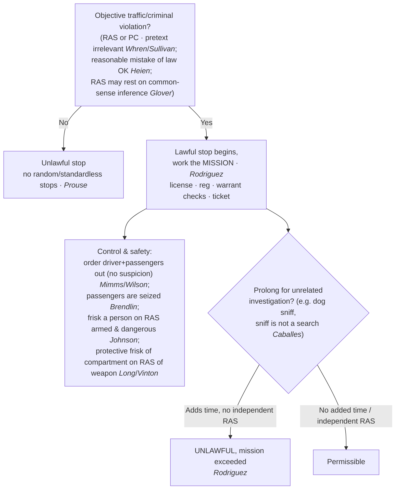

# S9 R1 panel-review — Opus model-diversity lane (prompt pack)

You are the **Claude/Opus** leg of the S9 three-lane adversarial panel (1 Claude + 2 Codex, R1). The two Codex lanes carry the A (support/quote-fidelity) and B (currency/treatment) attack lenses; **you carry model diversity and MUST vote on every paneled assertion across BOTH lenses' concerns.** You are refute-framed: try hard to break each assertion; **default to REFUTED on uncertainty**; never fabricate a cite, quote, or holding; use ONLY the evidence inlined below (no search, no outside knowledge). You are a SIGHTED reviewer — the FULL lake record (judgment fields included) is inlined.

You are a WRITER lane, not an adjudicator: you FIND and VOTE. You do not tally, adjudicate, or close any row — the orchestrator does.

For EACH group below, return one JSON object with the exact `reviewed[]` shape from the output contract (identical framing to the Codex lenses). Emit a finding object ONLY for a real defect (verdict refuted / stands-modified); a group you find wholly clean returns all-`stands` verdicts (the harness records a clean attestation). Concatenate the per-group JSON objects into a top-level `{"packs": [ ... ]}` array, one entry per group, each carrying its `group_id`.


OUTPUT CONTRACT — return ONE JSON object, nothing else:
{
  "lens": "A" | "B",
  "group_id": "<echo the group id>",
  "reviewed": [
    {
      "assertion_id": "<from group_inventory.jsonl>",
      "dimension": "existence|support|quote_fidelity|pincite|treatment|black_letter",
      "verdict": "stands" | "refuted" | "stands-modified",
      "verifiable_from_disclosed": true | false,
      "defect": null,   // null when verdict=="stands"; else an object:
      //  {"problem": "...", "severity": "high|medium|low", "proposed_fix": "...", "evidence_quote": "verbatim from disclosed evidence or null", "needs_cl": true|false, "locator_note": "..."}
      "reasons": ["short evidence-grounded reason", "..."],
      "breaks_true_positives": true | false,
      "residual_risks": ["..."],
      "suggested_tightening": "... or null"
    }
  ],
  "notes": ""
}
Rules: verdict=='stands' <=> defect==null (assertion survives your attack). verdict=='refuted' <=> a real defect (the assertion as framed is wrong). verdict=='stands-modified' <=> survives but needs a stated modification (a minor defect). Review EVERY assertion_id in group_inventory.jsonl exactly once. Output ONLY the JSON object.
---

## GROUP: content/seizures/Traffic Stops.md  (`doctrine`, 29 assertions)

### content_page

```
---
weight: 50
aliases:
  - "Traffic Stops"
  - "4-what-is-a-seizure/Traffic-Stops"
title: "Traffic Stops"
topic: Traffic Stops
type: doctrine
amendment: "U.S. Const. amend. IV"
jurisdiction: Federal (U.S. Const. amend. IV); SCOTUS baseline
status: draft
related:
  - "[[Terry Stops and Reasonable Suspicion]]"
  - "[[Reasonable Suspicion]]"
  - "[[Search Incident to Arrest]]"
  - "[[Automobile Exception]]"
  - "[[Special Needs and Administrative Searches]]"
  - "[[Seizure of the Person]]"
  - "[[Collective Knowledge and the Fellow-Officer Rule]]"
---

# Traffic Stops

*What may I do during a traffic stop, and how long may it last?*

> [!rule] Black-letter rule
> A traffic stop is a Fourth Amendment **seizure of everyone in the vehicle**, justified, like a *[[Terry v. Ohio|Terry]]* stop, by **reasonable articulable suspicion or probable cause of a traffic or criminal violation**; random, standardless stops are forbidden. *[[Delaware v. Prouse|Prouse]]*, 440 U.S. 648 (1979). The officer's real motive is irrelevant so long as an objective violation exists, *[[Whren v. United States|Whren]]*, 517 U.S. 806, [813](https://www.courtlistener.com/opinion/118036/whren-v-united-states/) (1996), and the stop may last **no longer than needed to complete its mission**, *[[Rodriguez v. United States|Rodriguez]]*, 575 U.S. 348 (2015).
> ^rule-traffic-stop

## The Brief

**What a traffic stop is, and its floor.** Stopping a car seizes **everyone in it**, and the seizure needs reasonable articulable suspicion or probable cause of a traffic or criminal violation. Random, standardless stops are forbidden: an officer needs at least articulable reasonable suspicion before pulling a car over to check a license or registration. *[[Delaware v. Prouse|Delaware v. Prouse]]*, 440 U.S. at [663](https://www.courtlistener.com/opinion/110045/delaware-v-prouse/). The suspicion need not come from watching the driver misbehave. It may rest on a **common-sense inference**: when an officer knows a car's registered owner has a revoked license and "lacks information negating an inference that the owner is the driver," the stop is reasonable. *[[Kansas v. Glover|Kansas v. Glover]]*, 589 U.S. 376, [376–77](https://www.courtlistener.com/opinion/9231313/kansas-v-glover/) (2020). That is a deliberately narrow holding, defeated the moment the officer sees the driver is plainly not the owner.

**Pretext is irrelevant; the test is objective.** The officer's real reason for the stop is beside the point. "Subjective intentions play no role in ordinary, probable-cause Fourth Amendment analysis." *[[Whren v. United States#^pin-813|Whren v. United States]]*, 517 U.S. at [813](https://www.courtlistener.com/opinion/118036/whren-v-united-states/#:~:text=Subjective%20intentions%20play%20no%20role). An objectively valid violation makes the stop reasonable even if the officer's motive was pretextual, and *[[Arkansas v. Sullivan|Arkansas v. Sullivan]]* carries that rule from stops to **arrests**. An officer's **objectively reasonable mistake of law** can also supply the justification, *[[Heien v. North Carolina|Heien v. North Carolina]]*, 574 U.S. at [61](https://www.courtlistener.com/opinion/2760668/heien-v-north-carolina/), but only a reasonable one; *[[Heien v. North Carolina|Heien]]* is no license to be ignorant of settled law.

**Mission and duration: the stop is tethered to its purpose.** The stop's **mission** governs its lawful length. Police may address the violation and its ordinary incidents (checking license, registration, and warrants, and writing the ticket) but may **not prolong** the stop, even briefly, for unrelated investigation absent independent reasonable suspicion. A stop "become[s] unlawful if it is prolonged beyond the time reasonably required to complete th[e] mission" of issuing the ticket. *[[Rodriguez v. United States|Rodriguez v. United States]]*, 575 U.S. at [350–51](https://www.courtlistener.com/opinion/2795278/rodriguez-v-united-states/). The measure is **diligence, not a stopwatch**: courts ask "whether the police diligently pursued a means of investigation that was likely to confirm or dispel their suspicions quickly." *[[United States v. Sharpe#^pin-686|United States v. Sharpe]]*, 470 U.S. 675, [686](https://www.courtlistener.com/opinion/111378/united-states-v-sharpe/#:~:text=In%20assessing%20whether%20a%20detention) (1985). Unrelated questions and unavoidable downtime are fine **so long as they add no time**.

**The dog sniff shows the rule at work.** A canine sniff during a lawful stop "does not violate the Fourth Amendment" because it "reveals no information other than the location of a substance that no individual has any right to possess." *[[Illinois v. Caballes#^pin-409|Illinois v. Caballes]]*, 543 U.S. 405, [409](https://www.courtlistener.com/opinion/137742/illinois-v-caballes/) (2005). The sniff is **not a search**, so its only constitutional defect is the **added time** *[[Rodriguez v. United States|Rodriguez]]* polices. A positive alert then supplies probable cause to search the vehicle under the [[Automobile Exception]].

**Control measures: who may be moved, and who may be frisked.** During a lawful stop the officer may, **as a control measure needing no separate suspicion**, order the **driver** out, *[[Pennsylvania v. Mimms|Pennsylvania v. Mimms]]*, 434 U.S. 106, [111](https://www.courtlistener.com/opinion/109751/pennsylvania-v-mimms/) n.6 (1977), and the **passengers** out "pending completion of the stop," *[[Maryland v. Wilson|Maryland v. Wilson]]*, 519 U.S. 408, [415](https://www.courtlistener.com/opinion/118086/maryland-v-wilson/) (1997). Everyone in the car is **seized**, including a passenger, who therefore has **standing** to challenge the stop. "We hold that a passenger is seized as well and so may challenge the constitutionality of the stop." *[[Brendlin v. California#^pin-251|Brendlin v. California]]*, 551 U.S. 249, [251](https://www.courtlistener.com/opinion/145712/brendlin-v-california/) (2007). Ordering occupants out is not a search; a **frisk is different**. To pat down a driver or passenger the officer must "harbor reasonable suspicion that the person subjected to the frisk is armed and dangerous," *[[Arizona v. Johnson|Arizona v. Johnson]]*, 555 U.S. 323, [327](https://www.courtlistener.com/opinion/145912/arizona-v-johnson/) (2009), and the **passenger compartment** itself may be frisked on a reasonable belief the suspect is dangerous and may reach a weapon, *[[Michigan v. Long|Michigan v. Long]]*, 463 U.S. 1032, [1049](https://www.courtlistener.com/opinion/111020/michigan-v-long/) (1983). That protective search is **not abated by handcuffing or removing** the detainee, who may be returned to the car. *[[United States v. Vinton|United States v. Vinton]]*, 594 F.3d 14, 24–25 (D.C. Cir. 2010).

**Checkpoints: the suspicionless exception (cross-doctrine).** The bar on random, *individualized* stops does not forbid **suspicionless checkpoints** run on a programmatic basis. A sobriety checkpoint aimed at highway safety is permissible, *[[Michigan Dept. of State Police v. Sitz|Sitz]]*; a checkpoint whose primary purpose is **general crime control** is not, *[[City of Indianapolis v. Edmond|Edmond]]*; and a brief **information-seeking** checkpoint about a recent crime is reasonable, *[[Illinois v. Lidster|Lidster]]*. Checkpoints are treated in full under [[Special Needs and Administrative Searches]].

**Cross-doctrine clarifier (Fifth Amendment, not Fourth).** Roadside questioning during a routine stop is **not** Miranda "custody," because "the usual traffic stop is more analogous to a so-called 'Terry stop' ... than to a formal arrest." *[[Berkemer v. McCarty|Berkemer v. McCarty]]*, 468 U.S. 420, [439](https://www.courtlistener.com/opinion/111249/berkemer-v-mccarty/) (1984). This is a **Fifth Amendment** point, included only to reinforce the seizure framing; it is not a Fourth Amendment reasonableness holding.

**Burden, standard of review, and remedy.** On a motion to suppress, the **movant** bears the initial burden of showing a seizure; because a traffic stop is warrantless, the **government** must then justify it with reasonable suspicion or probable cause of a violation, plus independent suspicion for any prolongation. Reasonable suspicion and probable cause are reviewed **[[Common Legal Terms#de-novo|de novo]]**, the historical facts for **[[Common Legal Terms#clear-error|clear error]]**. *[[Ornelas v. United States|Ornelas]]*, 517 U.S. 690, [699](https://www.courtlistener.com/opinion/118030/ornelas-v-united-states/) (1996). **Remedy:** an unlawful stop or prolongation leads to **suppression** of its fruits unless an exception applies; a valid pre-existing warrant discovered mid-stop can **attenuate** the taint, *[[Utah v. Strieff|Utah v. Strieff]]* (see [[The Exclusionary Rule]]).

**Apply it.**
1. **Anchor the stop in an objective violation.** A traffic or criminal violation, or reasonable suspicion of one, justifies the stop; your motive does not matter, and a reasonable mistake of law still counts (*[[Whren v. United States|Whren]]*; *[[Heien v. North Carolina|Heien]]*).
2. **Work the mission.** License, registration, warrant checks, and the ticket are the mission; multitask, but add no time to it (*[[Rodriguez v. United States|Rodriguez]]*).
3. **Do not extend for a hunch.** A dog sniff or unrelated questioning is fine only if it adds no time or you have independent reasonable suspicion (*[[Illinois v. Caballes|Caballes]]*; *[[Rodriguez v. United States|Rodriguez]]*).
4. **Control the scene within limits.** Order occupants out with no separate suspicion; frisk a person or the compartment only on reasonable suspicion of a weapon (*[[Pennsylvania v. Mimms|Mimms]]*; *[[Maryland v. Wilson|Wilson]]*; *[[Arizona v. Johnson|Johnson]]*; *[[Michigan v. Long|Long]]*).
5. **Remember every occupant is seized.** A passenger may challenge the stop, so an unlawful stop taints the evidence as to everyone in the car (*[[Brendlin v. California|Brendlin]]*).

**Common pitfalls.**
- **Conflating pretext with race.** *[[Whren v. United States|Whren]]* blesses a pretextual stop built on an objective violation, but race-based selective enforcement remains unconstitutional under the **Equal Protection Clause, not the Fourth Amendment**. Do not teach *[[Whren v. United States|Whren]]* as cover for profiling.
- **The "[[Common Legal Terms#de-minimis|de minimis]]" extension myth.** After *[[Rodriguez v. United States|Rodriguez]]*, even a brief added delay once the mission is complete is unlawful without independent reasonable suspicion. The question is never "how long" but "did it add time."
- **"The dog sniff is the violation."** Wrong: *[[Illinois v. Caballes|Caballes]]* holds the sniff is **not a search**; the only defect is added time.
- **"Ordering a passenger out equals authority to frisk."** Two thresholds: *[[Maryland v. Wilson|Wilson]]* lets you order a passenger out with **no** suspicion; *[[Arizona v. Johnson|Johnson]]* requires reasonable suspicion the person is **armed and dangerous** before any pat-down.
- **Treating the *[[Michigan v. Long|Long]]* frisk as a [[Search Incident to Arrest|search incident to arrest]].** The protective vehicle search needs reasonable suspicion of a **weapon** and reaches only weapon-sized areas; it is not the broader *[[New York v. Belton|Belton]]*/*[[Arizona v. Gant|Gant]]* [[Search Incident to Arrest|search incident to arrest]], and handcuffs do not end the threat (*[[Michigan v. Long|Long]]*; *[[United States v. Vinton|Vinton]]*).
- **Mistake-of-law overreach.** *[[Heien v. North Carolina|Heien]]* is narrow: only **objectively reasonable** legal mistakes validate a stop.
- **No "search incident to citation."** Issuing a citation rather than making a custodial arrest does not authorize a full search of the driver or car (*[[Knowles v. Iowa|Knowles v. Iowa]]*).

## Lower-court developments

- **[[United States v. Cole]] (7th Cir. 2021) (en banc)** — *split / expand: travel-plan questioning within the mission.* The [[Reading and Citing Cases#en-banc|en banc]] court held that **travel-plan questions ordinarily fall within the "mission"** of a traffic stop under *[[Rodriguez v. United States|Rodriguez]]*, so asking them does not by itself unlawfully prolong the stop; the majority's survey groups the permissive circuits against a stricter camp. 21 F.4th 421. **Binding in-circuit — 7th Cir.** [opinion](https://www.courtlistener.com/opinion/5307612/united-states-v-janhoi-cole/)
- **[[United States v. Mayville]] (10th Cir. 2020)** — *expand: criminal-history check within the mission.* A Triple-I criminal-history check during a speeding stop is a "negligibly burdensome" officer-safety inquiry **within the stop's mission** under *[[Rodriguez v. United States|Rodriguez]]*, so it did not unlawfully prolong the stop. 955 F.3d 825. **Binding in-circuit — 10th Cir.** [opinion](https://www.courtlistener.com/opinion/4742862/united-states-v-mayville/)

The *[[Rodriguez v. United States|Rodriguez]]* "mission" framework drives the modern caselaw, and the live battleground is how strictly the circuits police "**mission creep**": whether ordinary travel-plan questions and records checks are part of the mission (the permissive reading of *[[United States v. Cole|Cole]]* and *[[United States v. Mayville|Mayville]]*) or unrelated inquiries that must add no time. *[[Rodriguez v. United States|Rodriguez]]* remains the controlling anchor.

## Key cases

| Case | Holding | Opinion |
|---|---|---|
| *[[Whren v. United States]]*, 517 U.S. 806 (1996) | **Pretext is irrelevant:** an objective violation or probable cause justifies the stop; subjective motive plays no role. | [opinion](https://www.courtlistener.com/opinion/118036/whren-v-united-states/) |
| *[[Arkansas v. Sullivan]]*, 532 U.S. 769 (2001) | Extends *[[Whren v. United States\|Whren]]* to **arrests**: a probable-cause arrest is valid regardless of pretextual motive, and a State may not read the federal Constitution to forbid pretextual arrests. | [opinion](https://www.courtlistener.com/opinion/2620699/arkansas-v-sullivan/) |
| *[[Delaware v. Prouse]]*, 440 U.S. 648 (1979) | No random, suspicionless license or registration stops; an officer needs at least articulable reasonable suspicion. | [opinion](https://www.courtlistener.com/opinion/110045/delaware-v-prouse/) |
| *[[Kansas v. Glover]]*, 589 U.S. 376 (2020) | Reasonable suspicion may rest on a **common-sense inference** (registered owner with a revoked license is likely the driver) absent information negating it. | [opinion](https://www.courtlistener.com/opinion/9231313/kansas-v-glover/) |
| *[[Heien v. North Carolina]]*, 574 U.S. 54 (2014) | An **objectively reasonable mistake of law** can supply the reasonable suspicion for a stop. | [opinion](https://www.courtlistener.com/opinion/2760668/heien-v-north-carolina/) |
| *[[Rodriguez v. United States]]*, 575 U.S. 348 (2015) | No prolonging beyond the stop's **mission** without independent reasonable suspicion; diligence, not a stopwatch, is the measure. | [opinion](https://www.courtlistener.com/opinion/2795278/rodriguez-v-united-states/) |
| *[[Illinois v. Caballes]]*, 543 U.S. 405 (2005) | A **dog sniff** during a lawful stop is **not a search**; the only defect is added time. | [opinion](https://www.courtlistener.com/opinion/137742/illinois-v-caballes/) |
| *[[Pennsylvania v. Mimms]]*, 434 U.S. 106 (1977) | Officer may order the **driver** out of a lawfully stopped car as a matter of course. | [opinion](https://www.courtlistener.com/opinion/109751/pennsylvania-v-mimms/) |
| *[[Maryland v. Wilson]]*, 519 U.S. 408 (1997) | Officer may order **passengers** out too, pending completion of the stop. | [opinion](https://www.courtlistener.com/opinion/118086/maryland-v-wilson/) |
| *[[Brendlin v. California]]*, 551 U.S. 249 (2007) | A **passenger is seized** by the stop just as the driver is, and so has **standing** to challenge its constitutionality. | [opinion](https://www.courtlistener.com/opinion/145712/brendlin-v-california/) |
| *[[Arizona v. Johnson]]*, 555 U.S. 323 (2009) | A **frisk** of a driver or passenger requires reasonable suspicion the person is **armed and dangerous**. | [opinion](https://www.courtlistener.com/opinion/145912/arizona-v-johnson/) |
| *[[Michigan v. Long]]*, 463 U.S. 1032 (1983) | **Protective vehicle frisk** of the passenger compartment on reasonable suspicion of a weapon (*[[Terry v. Ohio\|Terry]]* for cars). | [opinion](https://www.courtlistener.com/opinion/111020/michigan-v-long/) |
| *[[United States v. Vinton]]*, 594 F.3d 14 (D.C. Cir. 2010) | The *[[Michigan v. Long\|Long]]* protective search is **not abated** by handcuffing or removing the detainee. | [opinion](https://www.courtlistener.com/opinion/187527/united-states-v-vinton/) |

## Related cases across doctrines

These cases are treated in full on other doctrine pages but bear on the law of traffic stops; each is framed here for this doctrine.

| Case | Relevance here | Primary home | Opinion |
|---|---|---|---|
| *[[Terry v. Ohio]]*, 392 U.S. 1 (1968) | ***Predicate.*** A traffic stop is a *[[Terry v. Ohio\|Terry]]*-type seizure needing specific, articulable facts, not a hunch. | [[Terry Stops and Reasonable Suspicion]] | [opinion](https://www.courtlistener.com/opinion/107729/terry-v-ohio/) |
| *[[United States v. Sharpe]]*, 470 U.S. 675 (1985) | ***Duration.*** Duration is a **diligence** test (confirm or dispel quickly), not a rigid time limit. | [[Terry Stops and Reasonable Suspicion]] | [opinion](https://www.courtlistener.com/opinion/111378/united-states-v-sharpe/) |
| *[[Knowles v. Iowa]]*, 525 U.S. 113 (1998) | ***No search on citation.*** Issuing a ticket instead of arresting does not authorize a full search. | [[Search Incident to Arrest]] | [opinion](https://www.courtlistener.com/opinion/118250/knowles-v-iowa/) |
| *[[New York v. Belton]]*, 453 U.S. 454 (1981) | ***Vehicle SITA.*** Scope reaches the passenger compartment and containers, **limited by** *[[Arizona v. Gant\|Gant]]*. | [[Search Incident to Arrest]] | [opinion](https://www.courtlistener.com/opinion/110559/new-york-v-belton/) |
| *[[Arizona v. Gant]]*, 556 U.S. 332 (2009) | ***Vehicle SITA.*** When a vehicle [[Search Incident to Arrest\|search incident to arrest]] is allowed (two prongs); narrows *[[New York v. Belton\|Belton]]*. | [[Search Incident to Arrest]] | [opinion](https://www.courtlistener.com/opinion/145887/arizona-v-gant/) |
| *[[Riley v. California]]*, 573 U.S. 373 (2014) | ***Phones.*** If a stop ripens into arrest and a phone is seized, its digital contents need a warrant. | [[Search Incident to Arrest]] | [opinion](https://www.courtlistener.com/opinion/2680439/riley-v-cal-united-states/) |
| *[[Berkemer v. McCarty]]*, 468 U.S. 420 (1984) | ***5A / Miranda.*** An ordinary traffic stop is *[[Terry v. Ohio\|Terry]]*-like and is **not** Miranda "custody." | [[Miranda and Custodial Interrogation]] | [opinion](https://www.courtlistener.com/opinion/111249/berkemer-v-mccarty/) |
| *[[Navarette v. California]]*, 572 U.S. 393 (2014) | ***Initiating tip.*** A 911 tip with adequate indicia of reliability can supply the suspicion to **initiate** the stop. | [[Reasonable Suspicion]] | [opinion](https://www.courtlistener.com/opinion/2670795/prado-navarette-v-california/) |
| *[[Illinois v. Wardlow]]*, 528 U.S. 119 (2000) | ***Flight.*** Unprovoked **headlong flight** in a high-crime area can supply the suspicion for a *[[Terry v. Ohio\|Terry]]*-type detention. | [[Reasonable Suspicion]] | [opinion](https://www.courtlistener.com/opinion/118326/illinois-v-wardlow/) |
| *[[Florida v. Harris]]*, 568 U.S. 237 (2013) | ***Dog alert.*** A trained dog's **alert** furnishes probable cause to search the vehicle, the back end of the sniff sequence. | [[Probable Cause]] | [opinion](https://www.courtlistener.com/opinion/820744/florida-v-harris/) |
| *[[Maryland v. Pringle]]*, 540 U.S. 366 (2003) | ***Arrest.*** When contraband is found and no occupant claims it, probable cause to **arrest every occupant**. | [[Probable Cause]] | [opinion](https://www.courtlistener.com/opinion/131150/maryland-v-pringle/) |
| *[[Devenpeck v. Alford]]*, 543 U.S. 146 (2004) | ***Objective rule.*** A stop or arrest is valid if the known facts give probable cause for **some** offense, whatever the stated reason. | [[Probable Cause]] | [opinion](https://www.courtlistener.com/opinion/137733/devenpeck-v-alford/) |
| *[[United States v. Hensley]]*, 469 U.S. 221 (1985) | ***Collective knowledge.*** An officer may stop in objective reliance on another department's **wanted flyer** if the issuer had suspicion. | [[Collective Knowledge and the Fellow-Officer Rule]] | [opinion](https://www.courtlistener.com/opinion/111294/united-states-v-hensley/) |
| *[[Utah v. Strieff]]*, 579 U.S. 232 (2016) | ***[[Fruits and Attenuation\|Attenuation]].*** A valid pre-existing warrant found during an unlawful stop can **attenuate** the taint. | [[The Exclusionary Rule]] | [opinion](https://www.courtlistener.com/opinion/8176208/utah-v-strieff/) |
| *[[Barnes v. Felix]]*, 605 U.S. 73 (2025) | ***Force.*** Force to effect a stop is judged on the **[[Common Legal Terms#totality-of-the-circumstances\|totality of the circumstances]]** ("no time limit"), rejecting the "moment of threat" rule. | [[Use of Force]] | [opinion](https://www.courtlistener.com/opinion/10584846/barnes-v-felix/) |

## Visual



## Sources

- [*Whren v. United States*, 517 U.S. 806 (1996)](https://www.courtlistener.com/opinion/118036/whren-v-united-states/) (pinpoint: 813)
- [*Arkansas v. Sullivan*, 532 U.S. 769 (2001)](https://www.courtlistener.com/opinion/2620699/arkansas-v-sullivan/) (pinpoint: 772)
- [*Delaware v. Prouse*, 440 U.S. 648 (1979)](https://www.courtlistener.com/opinion/110045/delaware-v-prouse/) (pinpoint: 663)
- [*Kansas v. Glover*, 589 U.S. 376 (2020)](https://www.courtlistener.com/opinion/9231313/kansas-v-glover/) (pinpoint: 376–77)
- [*Heien v. North Carolina*, 574 U.S. 54 (2014)](https://www.courtlistener.com/opinion/2760668/heien-v-north-carolina/) (pinpoint: 61)
- [*Rodriguez v. United States*, 575 U.S. 348 (2015)](https://www.courtlistener.com/opinion/2795278/rodriguez-v-united-states/) (pinpoint: 350–51)
- [*United States v. Sharpe*, 470 U.S. 675 (1985)](https://www.courtlistener.com/opinion/111378/united-states-v-sharpe/) (pinpoint: 686) (home: [[Terry Stops and Reasonable Suspicion]])
- [*Illinois v. Caballes*, 543 U.S. 405 (2005)](https://www.courtlistener.com/opinion/137742/illinois-v-caballes/) (pinpoint: 409)
- [*Pennsylvania v. Mimms*, 434 U.S. 106 (1977)](https://www.courtlistener.com/opinion/109751/pennsylvania-v-mimms/) (pinpoint: 111 n.6)
- [*Maryland v. Wilson*, 519 U.S. 408 (1997)](https://www.courtlistener.com/opinion/118086/maryland-v-wilson/) (pinpoint: 415)
- [*Brendlin v. California*, 551 U.S. 249 (2007)](https://www.courtlistener.com/opinion/145712/brendlin-v-california/) (pinpoint: 251)
- [*Arizona v. Johnson*, 555 U.S. 323 (2009)](https://www.courtlistener.com/opinion/145912/arizona-v-johnson/) (pinpoint: 327)
- [*Michigan v. Long*, 463 U.S. 1032 (1983)](https://www.courtlistener.com/opinion/111020/michigan-v-long/) (pinpoint: 1049)
- [*United States v. Vinton*, 594 F.3d 14 (D.C. Cir. 2010)](https://www.courtlistener.com/opinion/187527/united-states-v-vinton/) (pinpoint: 24–25)
- [*Ornelas v. United States*, 517 U.S. 690 (1996)](https://www.courtlistener.com/opinion/118030/ornelas-v-united-states/) (pinpoint: 699) (home: [[Probable Cause]])
- [*Knowles v. Iowa*, 525 U.S. 113 (1998)](https://www.courtlistener.com/opinion/118250/knowles-v-iowa/) (home: [[Search Incident to Arrest]])
- [*New York v. Belton*, 453 U.S. 454 (1981)](https://www.courtlistener.com/opinion/110559/new-york-v-belton/) (limited by [[Arizona v. Gant]]; home: [[Search Incident to Arrest]])
- [*Arizona v. Gant*, 556 U.S. 332 (2009)](https://www.courtlistener.com/opinion/145887/arizona-v-gant/) (home: [[Search Incident to Arrest]])
- [*Riley v. California*, 573 U.S. 373 (2014)](https://www.courtlistener.com/opinion/2680439/riley-v-cal-united-states/) (home: [[Search Incident to Arrest]])
- [*Berkemer v. McCarty*, 468 U.S. 420 (1984)](https://www.courtlistener.com/opinion/111249/berkemer-v-mccarty/) (pinpoint: 439) (5A / Miranda cross-doctrine clarifier; home: [[Miranda and Custodial Interrogation]])
- [*Michigan Dep't of State Police v. Sitz*, 496 U.S. 444 (1990)](https://www.courtlistener.com/opinion/112459/michigan-department-of-state-police-v-sitz/) (home: [[Special Needs and Administrative Searches]])
- [*City of Indianapolis v. Edmond*, 531 U.S. 32 (2000)](https://www.courtlistener.com/opinion/118391/city-of-indianapolis-v-edmond/) (home: [[Special Needs and Administrative Searches]])
- [*Illinois v. Lidster*, 540 U.S. 419 (2004)](https://www.courtlistener.com/opinion/131154/illinois-v-lidster/) (home: [[Special Needs and Administrative Searches]])
- [*Navarette v. California*, 572 U.S. 393 (2014)](https://www.courtlistener.com/opinion/2670795/prado-navarette-v-california/) (home: [[Reasonable Suspicion]])
- [*Illinois v. Wardlow*, 528 U.S. 119 (2000)](https://www.courtlistener.com/opinion/118326/illinois-v-wardlow/) (home: [[Reasonable Suspicion]])
- [*Florida v. Harris*, 568 U.S. 237 (2013)](https://www.courtlistener.com/opinion/820744/florida-v-harris/) (home: [[Probable Cause]])
- [*Maryland v. Pringle*, 540 U.S. 366 (2003)](https://www.courtlistener.com/opinion/131150/maryland-v-pringle/) (home: [[Probable Cause]])
- [*Devenpeck v. Alford*, 543 U.S. 146 (2004)](https://www.courtlistener.com/opinion/137733/devenpeck-v-alford/) (home: [[Probable Cause]])
- [*United States v. Hensley*, 469 U.S. 221 (1985)](https://www.courtlistener.com/opinion/111294/united-states-v-hensley/) (home: [[Collective Knowledge and the Fellow-Officer Rule]])
- [*Utah v. Strieff*, 579 U.S. 232 (2016)](https://www.courtlistener.com/opinion/8176208/utah-v-strieff/) (home: [[The Exclusionary Rule]])
- [*Barnes v. Felix*, 605 U.S. 73 (2025)](https://www.courtlistener.com/opinion/10584846/barnes-v-felix/) (pinpoint: 80) (home: [[Use of Force]])
- [*United States v. Cole*, 21 F.4th 421 (7th Cir. 2021) (en banc)](https://www.courtlistener.com/opinion/5307612/united-states-v-janhoi-cole/)
- [*United States v. Mayville*, 955 F.3d 825 (10th Cir. 2020)](https://www.courtlistener.com/opinion/4742862/united-states-v-mayville/)

```

### group_inventory (assertions under review)

```jsonl
{"assertion_id": "0bee29c28ba2f5e1", "dimension": "existence", "kind": "case_cite", "locator": {"case": "Illinois v. Caballes", "table_line": 61}, "payload": {"case": "Illinois v. Caballes", "cells": ["*[[Illinois v. Caballes]]*, 543 U.S. 405 (2005)", "A **dog sniff** during a lawful stop is **not a search**; the only defect is added time.", "[opinion](https://www.courtlistener.com/opinion/137742/illinois-v-caballes/)"], "header": ["Case", "Holding", "Opinion"]}}
{"assertion_id": "2142b4407951c8b0", "dimension": "existence", "kind": "case_cite", "locator": {"case": "Navarette v. California", "table_line": 82}, "payload": {"case": "Navarette v. California", "cells": ["*[[Navarette v. California]]*, 572 U.S. 393 (2014)", "***Initiating tip.*** A 911 tip with adequate indicia of reliability can supply the suspicion to **initiate** the stop.", "[[Reasonable Suspicion]]", "[opinion](https://www.courtlistener.com/opinion/2670795/prado-navarette-v-california/)"], "header": ["Case", "Relevance here", "Primary home", "Opinion"]}}
{"assertion_id": "29ed8ec66d9a4e82", "dimension": "existence", "kind": "case_cite", "locator": {"case": "Michigan v. Long", "table_line": 66}, "payload": {"case": "Michigan v. Long", "cells": ["*[[Michigan v. Long]]*, 463 U.S. 1032 (1983)", "**Protective vehicle frisk** of the passenger compartment on reasonable suspicion of a weapon (*[[Terry v. Ohio\\|Terry]]* for cars).", "[opinion](https://www.courtlistener.com/opinion/111020/michigan-v-long/)"], "header": ["Case", "Holding", "Opinion"]}}
{"assertion_id": "40a0ffaaff808f6c", "dimension": "existence", "kind": "case_cite", "locator": {"case": "Delaware v. Prouse", "table_line": 57}, "payload": {"case": "Delaware v. Prouse", "cells": ["*[[Delaware v. Prouse]]*, 440 U.S. 648 (1979)", "No random, suspicionless license or registration stops; an officer needs at least articulable reasonable suspicion.", "[opinion](https://www.courtlistener.com/opinion/110045/delaware-v-prouse/)"], "header": ["Case", "Holding", "Opinion"]}}
{"assertion_id": "4c4482f416d7a4b7", "dimension": "existence", "kind": "case_cite", "locator": {"case": "Maryland v. Wilson", "table_line": 63}, "payload": {"case": "Maryland v. Wilson", "cells": ["*[[Maryland v. Wilson]]*, 519 U.S. 408 (1997)", "Officer may order **passengers** out too, pending completion of the stop.", "[opinion](https://www.courtlistener.com/opinion/118086/maryland-v-wilson/)"], "header": ["Case", "Holding", "Opinion"]}}
{"assertion_id": "4e987060bf59aeac", "dimension": "existence", "kind": "case_cite", "locator": {"case": "United States v. Hensley", "table_line": 87}, "payload": {"case": "United States v. Hensley", "cells": ["*[[United States v. Hensley]]*, 469 U.S. 221 (1985)", "***Collective knowledge.*** An officer may stop in objective reliance on another department's **wanted flyer** if the issuer had suspicion.", "[[Collective Knowledge and the Fellow-Officer Rule]]", "[opinion](https://www.courtlistener.com/opinion/111294/united-states-v-hensley/)"], "header": ["Case", "Relevance here", "Primary home", "Opinion"]}}
{"assertion_id": "5950f5356a09ad8a", "dimension": "existence", "kind": "case_cite", "locator": {"case": "Whren v. United States", "table_line": 55}, "payload": {"case": "Whren v. United States", "cells": ["*[[Whren v. United States]]*, 517 U.S. 806 (1996)", "**Pretext is irrelevant:** an objective violation or probable cause justifies the stop; subjective motive plays no role.", "[opinion](https://www.courtlistener.com/opinion/118036/whren-v-united-states/)"], "header": ["Case", "Holding", "Opinion"]}}
{"assertion_id": "654307c44e250efb", "dimension": "existence", "kind": "case_cite", "locator": {"case": "Kansas v. Glover", "table_line": 58}, "payload": {"case": "Kansas v. Glover", "cells": ["*[[Kansas v. Glover]]*, 589 U.S. 376 (2020)", "Reasonable suspicion may rest on a **common-sense inference** (registered owner with a revoked license is likely the driver) absent information negating it.", "[opinion](https://www.courtlistener.com/opinion/9231313/kansas-v-glover/)"], "header": ["Case", "Holding", "Opinion"]}}
{"assertion_id": "7cada92a927a912e", "dimension": "existence", "kind": "case_cite", "locator": {"case": "United States v. Vinton", "table_line": 67}, "payload": {"case": "United States v. Vinton", "cells": ["*[[United States v. Vinton]]*, 594 F.3d 14 (D.C. Cir. 2010)", "The *[[Michigan v. Long\\|Long]]* protective search is **not abated** by handcuffing or removing the detainee.", "[opinion](https://www.courtlistener.com/opinion/187527/united-states-v-vinton/)"], "header": ["Case", "Holding", "Opinion"]}}
{"assertion_id": "80e5497828162092", "dimension": "existence", "kind": "case_cite", "locator": {"case": "Heien v. North Carolina", "table_line": 59}, "payload": {"case": "Heien v. North Carolina", "cells": ["*[[Heien v. North Carolina]]*, 574 U.S. 54 (2014)", "An **objectively reasonable mistake of law** can supply the reasonable suspicion for a stop.", "[opinion](https://www.courtlistener.com/opinion/2760668/heien-v-north-carolina/)"], "header": ["Case", "Holding", "Opinion"]}}
{"assertion_id": "8db561afe1f1bddc", "dimension": "existence", "kind": "case_cite", "locator": {"case": "Devenpeck v. Alford", "table_line": 86}, "payload": {"case": "Devenpeck v. Alford", "cells": ["*[[Devenpeck v. Alford]]*, 543 U.S. 146 (2004)", "***Objective rule.*** A stop or arrest is valid if the known facts give probable cause for **some** offense, whatever the stated reason.", "[[Probable Cause]]", "[opinion](https://www.courtlistener.com/opinion/137733/devenpeck-v-alford/)"], "header": ["Case", "Relevance here", "Primary home", "Opinion"]}}
{"assertion_id": "8e16f1e0007cf045", "dimension": "existence", "kind": "case_cite", "locator": {"case": "Knowles v. Iowa", "table_line": 77}, "payload": {"case": "Knowles v. Iowa", "cells": ["*[[Knowles v. Iowa]]*, 525 U.S. 113 (1998)", "***No search on citation.*** Issuing a ticket instead of arresting does not authorize a full search.", "[[Search Incident to Arrest]]", "[opinion](https://www.courtlistener.com/opinion/118250/knowles-v-iowa/)"], "header": ["Case", "Relevance here", "Primary home", "Opinion"]}}
{"assertion_id": "8edcb39c23d407d4", "dimension": "existence", "kind": "case_cite", "locator": {"case": "United States v. Sharpe", "table_line": 76}, "payload": {"case": "United States v. Sharpe", "cells": ["*[[United States v. Sharpe]]*, 470 U.S. 675 (1985)", "***Duration.*** Duration is a **diligence** test (confirm or dispel quickly), not a rigid time limit.", "[[Terry Stops and Reasonable Suspicion]]", "[opinion](https://www.courtlistener.com/opinion/111378/united-states-v-sharpe/)"], "header": ["Case", "Relevance here", "Primary home", "Opinion"]}}
{"assertion_id": "8f5d85439d2b8564", "dimension": "existence", "kind": "case_cite", "locator": {"case": "Florida v. Harris", "table_line": 84}, "payload": {"case": "Florida v. Harris", "cells": ["*[[Florida v. Harris]]*, 568 U.S. 237 (2013)", "***Dog alert.*** A trained dog's **alert** furnishes probable cause to search the vehicle, the back end of the sniff sequence.", "[[Probable Cause]]", "[opinion](https://www.courtlistener.com/opinion/820744/florida-v-harris/)"], "header": ["Case", "Relevance here", "Primary home", "Opinion"]}}
{"assertion_id": "96a4f3a40aa11a5e", "dimension": "existence", "kind": "case_cite", "locator": {"case": "Arkansas v. Sullivan", "table_line": 56}, "payload": {"case": "Arkansas v. Sullivan", "cells": ["*[[Arkansas v. Sullivan]]*, 532 U.S. 769 (2001)", "Extends *[[Whren v. United States\\|Whren]]* to **arrests**: a probable-cause arrest is valid regardless of pretextual motive, and a State may not read the federal Constitution to forbid pretextual arrests.", "[opinion](https://www.courtlistener.com/opinion/2620699/arkansas-v-sullivan/)"], "header": ["Case", "Holding", "Opinion"]}}
{"assertion_id": "979f803f4139c983", "dimension": "existence", "kind": "case_cite", "locator": {"case": "Barnes v. Felix", "table_line": 89}, "payload": {"case": "Barnes v. Felix", "cells": ["*[[Barnes v. Felix]]*, 605 U.S. 73 (2025)", "***Force.*** Force to effect a stop is judged on the **[[Common Legal Terms#totality-of-the-circumstances\\|totality of the circumstances]]** (\"no time limit\"), rejecting the \"moment of threat\" rule.", "[[Use of Force]]", "[opinion](https://www.courtlistener.com/opinion/10584846/barnes-v-felix/)"], "header": ["Case", "Relevance here", "Primary home", "Opinion"]}}
{"assertion_id": "9c7327c22bd5a6cc", "dimension": "existence", "kind": "case_cite", "locator": {"case": "Arizona v. Johnson", "table_line": 65}, "payload": {"case": "Arizona v. Johnson", "cells": ["*[[Arizona v. Johnson]]*, 555 U.S. 323 (2009)", "A **frisk** of a driver or passenger requires reasonable suspicion the person is **armed and dangerous**.", "[opinion](https://www.courtlistener.com/opinion/145912/arizona-v-johnson/)"], "header": ["Case", "Holding", "Opinion"]}}
{"assertion_id": "adf2e27de9bae0ec", "dimension": "existence", "kind": "case_cite", "locator": {"case": "Illinois v. Wardlow", "table_line": 83}, "payload": {"case": "Illinois v. Wardlow", "cells": ["*[[Illinois v. Wardlow]]*, 528 U.S. 119 (2000)", "***Flight.*** Unprovoked **headlong flight** in a high-crime area can supply the suspicion for a *[[Terry v. Ohio\\|Terry]]*-type detention.", "[[Reasonable Suspicion]]", "[opinion](https://www.courtlistener.com/opinion/118326/illinois-v-wardlow/)"], "header": ["Case", "Relevance here", "Primary home", "Opinion"]}}
{"assertion_id": "b4fe54571a577e00", "dimension": "existence", "kind": "case_cite", "locator": {"case": "Pennsylvania v. Mimms", "table_line": 62}, "payload": {"case": "Pennsylvania v. Mimms", "cells": ["*[[Pennsylvania v. Mimms]]*, 434 U.S. 106 (1977)", "Officer may order the **driver** out of a lawfully stopped car as a matter of course.", "[opinion](https://www.courtlistener.com/opinion/109751/pennsylvania-v-mimms/)"], "header": ["Case", "Holding", "Opinion"]}}
{"assertion_id": "bf0806dcff526e5c", "dimension": "existence", "kind": "case_cite", "locator": {"case": "Rodriguez v. United States", "table_line": 60}, "payload": {"case": "Rodriguez v. United States", "cells": ["*[[Rodriguez v. United States]]*, 575 U.S. 348 (2015)", "No prolonging beyond the stop's **mission** without independent reasonable suspicion; diligence, not a stopwatch, is the measure.", "[opinion](https://www.courtlistener.com/opinion/2795278/rodriguez-v-united-states/)"], "header": ["Case", "Holding", "Opinion"]}}
{"assertion_id": "c86fca6f87b3ee60", "dimension": "existence", "kind": "case_cite", "locator": {"case": "Brendlin v. California", "table_line": 64}, "payload": {"case": "Brendlin v. California", "cells": ["*[[Brendlin v. California]]*, 551 U.S. 249 (2007)", "A **passenger is seized** by the stop just as the driver is, and so has **standing** to challenge its constitutionality.", "[opinion](https://www.courtlistener.com/opinion/145712/brendlin-v-california/)"], "header": ["Case", "Holding", "Opinion"]}}
{"assertion_id": "c95828d45a81a6c4", "dimension": "existence", "kind": "case_cite", "locator": {"case": "Utah v. Strieff", "table_line": 88}, "payload": {"case": "Utah v. Strieff", "cells": ["*[[Utah v. Strieff]]*, 579 U.S. 232 (2016)", "***[[Fruits and Attenuation\\|Attenuation]].*** A valid pre-existing warrant found during an unlawful stop can **attenuate** the taint.", "[[The Exclusionary Rule]]", "[opinion](https://www.courtlistener.com/opinion/8176208/utah-v-strieff/)"], "header": ["Case", "Relevance here", "Primary home", "Opinion"]}}
{"assertion_id": "cdcd3d99fe49aed9", "dimension": "existence", "kind": "case_cite", "locator": {"case": "Maryland v. Pringle", "table_line": 85}, "payload": {"case": "Maryland v. Pringle", "cells": ["*[[Maryland v. Pringle]]*, 540 U.S. 366 (2003)", "***Arrest.*** When contraband is found and no occupant claims it, probable cause to **arrest every occupant**.", "[[Probable Cause]]", "[opinion](https://www.courtlistener.com/opinion/131150/maryland-v-pringle/)"], "header": ["Case", "Relevance here", "Primary home", "Opinion"]}}
{"assertion_id": "d0db0f6e93c583c9", "dimension": "existence", "kind": "case_cite", "locator": {"case": "Arizona v. Gant", "table_line": 79}, "payload": {"case": "Arizona v. Gant", "cells": ["*[[Arizona v. Gant]]*, 556 U.S. 332 (2009)", "***Vehicle SITA.*** When a vehicle [[Search Incident to Arrest\\|search incident to arrest]] is allowed (two prongs); narrows *[[New York v. Belton\\|Belton]]*.", "[[Search Incident to Arrest]]", "[opinion](https://www.courtlistener.com/opinion/145887/arizona-v-gant/)"], "header": ["Case", "Relevance here", "Primary home", "Opinion"]}}
{"assertion_id": "de30044f888693ae", "dimension": "existence", "kind": "case_cite", "locator": {"case": "Terry v. Ohio", "table_line": 75}, "payload": {"case": "Terry v. Ohio", "cells": ["*[[Terry v. Ohio]]*, 392 U.S. 1 (1968)", "***Predicate.*** A traffic stop is a *[[Terry v. Ohio\\|Terry]]*-type seizure needing specific, articulable facts, not a hunch.", "[[Terry Stops and Reasonable Suspicion]]", "[opinion](https://www.courtlistener.com/opinion/107729/terry-v-ohio/)"], "header": ["Case", "Relevance here", "Primary home", "Opinion"]}}
{"assertion_id": "eb8ae5b5f95745d9", "dimension": "existence", "kind": "case_cite", "locator": {"case": "Berkemer v. McCarty", "table_line": 81}, "payload": {"case": "Berkemer v. McCarty", "cells": ["*[[Berkemer v. McCarty]]*, 468 U.S. 420 (1984)", "***5A / Miranda.*** An ordinary traffic stop is *[[Terry v. Ohio\\|Terry]]*-like and is **not** Miranda \"custody.\"", "[[Miranda and Custodial Interrogation]]", "[opinion](https://www.courtlistener.com/opinion/111249/berkemer-v-mccarty/)"], "header": ["Case", "Relevance here", "Primary home", "Opinion"]}}
{"assertion_id": "f990d155e386223a", "dimension": "existence", "kind": "case_cite", "locator": {"case": "Riley v. California", "table_line": 80}, "payload": {"case": "Riley v. California", "cells": ["*[[Riley v. California]]*, 573 U.S. 373 (2014)", "***Phones.*** If a stop ripens into arrest and a phone is seized, its digital contents need a warrant.", "[[Search Incident to Arrest]]", "[opinion](https://www.courtlistener.com/opinion/2680439/riley-v-cal-united-states/)"], "header": ["Case", "Relevance here", "Primary home", "Opinion"]}}
{"assertion_id": "fa735c21deb15877", "dimension": "existence", "kind": "case_cite", "locator": {"case": "New York v. Belton", "table_line": 78}, "payload": {"case": "New York v. Belton", "cells": ["*[[New York v. Belton]]*, 453 U.S. 454 (1981)", "***Vehicle SITA.*** Scope reaches the passenger compartment and containers, **limited by** *[[Arizona v. Gant\\|Gant]]*.", "[[Search Incident to Arrest]]", "[opinion](https://www.courtlistener.com/opinion/110559/new-york-v-belton/)"], "header": ["Case", "Relevance here", "Primary home", "Opinion"]}}
{"assertion_id": "ba69efd3f83d5cb8", "dimension": "support", "kind": "proposition", "locator": {"callout": "^rule-traffic-stop"}, "payload": {"anchor": "^rule-traffic-stop", "statement": "[!rule] Black-letter rule\nA traffic stop is a Fourth Amendment **seizure of everyone in the vehicle**, justified, like a *[[Terry v. Ohio|Terry]]* stop, by **reasonable articulable suspicion or probable cause of a traffic or criminal violation**; random, standardless stops are forbidden. *[[Delaware v. Prouse|Prouse]]*, 440 U.S. 648 (1979). The officer's real motive is irrelevant so long as an objective violation exists, *[[Whren v. United States|Whren]]*, 517 U.S. 806, [813](https://www.courtlistener.com/opinion/118036/whren-v-united-states/) (1996), and the stop may last **no longer than needed to complete its mission**, *[[Rodriguez v. United States|Rodriguez]]*, 575 U.S. 348 (2015)."}}
```

### lake record — Arizona v. Gant

```json
{
  "schema_version": "s2.v1",
  "record_id": "Arizona v. Gant",
  "stub": false,
  "status": "verified",
  "identity": {
    "case_name": "Arizona v. Gant",
    "case_name_short": "Gant",
    "case_name_full": "Arizona v. Gant",
    "input_case_name": "Arizona v. Gant",
    "court": "U.S. Supreme Court",
    "court_id": "scotus",
    "court_level": "scotus",
    "circuit": null,
    "state": null,
    "date_decided": "2009-04-21",
    "year": 2009,
    "docket": null,
    "cluster_id": 145887,
    "lead_opinion_id": 9435359,
    "sibling_ids": [
      145887,
      9435359,
      9435360,
      9435361
    ],
    "absolute_url": "/opinion/145887/arizona-v-gant/",
    "identity_method": "citation+party-text",
    "expected_citation_found": true,
    "party_name_in_text": true,
    "canonical_name_match": true,
    "alternates": [],
    "reason_code": null
  },
  "citations": {
    "official": {
      "cite": "556 U.S. 332",
      "volume": "556",
      "reporter": "U.S.",
      "page": "332",
      "type": 1,
      "selected_official": true,
      "source": "cluster.citations[]"
    },
    "parallel": [
      {
        "cite": "129 S. Ct. 1710",
        "volume": "129",
        "reporter": "S. Ct.",
        "page": "1710",
        "type": 1,
        "selected_official": false,
        "source": "cluster.citations[]"
      },
      {
        "cite": "173 L. Ed. 2d 485",
        "volume": "173",
        "reporter": "L. Ed. 2d",
        "page": "485",
        "type": 1,
        "selected_official": false,
        "source": "cluster.citations[]"
      }
    ],
    "vendor_neutral": [
      {
        "cite": "2009 U.S. LEXIS 3120",
        "volume": "2009",
        "reporter": "U.S. LEXIS",
        "page": "3120",
        "type": 6,
        "selected_official": false,
        "source": "cluster.citations[]"
      }
    ],
    "all": [
      {
        "cite": "556 U.S. 332",
        "volume": "556",
        "reporter": "U.S.",
        "page": "332",
        "type": 1,
        "selected_official": false,
        "source": "cluster.citations[]"
      },
      {
        "cite": "129 S. Ct. 1710",
        "volume": "129",
        "reporter": "S. Ct.",
        "page": "1710",
        "type": 1,
        "selected_official": false,
        "source": "cluster.citations[]"
      },
      {
        "cite": "173 L. Ed. 2d 485",
        "volume": "173",
        "reporter": "L. Ed. 2d",
        "page": "485",
        "type": 1,
        "selected_official": false,
        "source": "cluster.citations[]"
      },
      {
        "cite": "2009 U.S. LEXIS 3120",
        "volume": "2009",
        "reporter": "U.S. LEXIS",
        "page": "3120",
        "type": 6,
        "selected_official": false,
        "source": "cluster.citations[]"
      }
    ],
    "display": "556 U.S. 332",
    "official_selection": {
      "court_class": "scotus",
      "selected": "556 U.S. 332",
      "reason": "selected_rank_1"
    }
  },
  "pinpoints": [
    {
      "id": "pin-351",
      "page": null,
      "quote": "--- # Arizona v. Gant *556 U.S. 332 (2009)* \u00b7 U.S. Supreme Court \u00b7 **Binding \u2014 SCOTUS** \u00b7 Treatment: **good** *(as of 2026-06-30)* <!-- header line; TreatmentBadge + weight render here, degrading to the text above --> ## Background Gant was arrested for driving on a suspended license. After he was handcuffed and locked in the back of a patrol car, officers searched his car and found cocaine in a jacket on the back seat. He moved to suppress the cocaine as the product of an unlawful search incident to arrest. ## Issue Whether police may search the passenger compartment of a vehicle incident to a recent occupant's arrest when the arrestee has been secured and cannot reach the vehicle, and there is no reason to believe the vehicle contains evidence of the offense of arrest. ## Rule A vehicle search incident to a recent occupant's arrest is allowed only on one of two independent justifications:",
      "star_marker": null,
      "quote_fidelity": "mismatch",
      "pinpoint_status": "slip-only",
      "position": null
    }
  ],
  "treatment": {
    "field_i_validity": "good_law",
    "as_of_content": "2009-04-21",
    "as_of_treatment": "2026-06-30",
    "composite_basis": "migration-seed",
    "composite_basis_ref": "Arizona v. Gant",
    "varies_by_point": false,
    "scope_note": "Gant itself cabins the broad reading of New York v. Belton; Gant is good law.",
    "point_overrides": [],
    "edges": [
      {
        "citing_case": {
          "name": "State of Minnesota v. Raenard Romalle Douglas",
          "cluster_id": 10129058,
          "cite": null,
          "field_ii": "overruled"
        },
        "field_ii": "overruled",
        "field_iii": "mentioned",
        "point": null,
        "proposed": true,
        "journal_ref": "Arizona v. Gant:lane1_negative"
      },
      {
        "citing_case": {
          "name": "Commonwealth v. Williams",
          "cluster_id": 10027459,
          "cite": null,
          "field_ii": "overruled"
        },
        "field_ii": "overruled",
        "field_iii": "mentioned",
        "point": null,
        "proposed": true,
        "journal_ref": "Arizona v. Gant:lane1_negative"
      },
      {
        "citing_case": {
          "name": "Commonwealth v. Silvelo",
          "cluster_id": 4796646,
          "cite": null,
          "field_ii": "overruled"
        },
        "field_ii": "overruled",
        "field_iii": "mentioned",
        "point": null,
        "proposed": true,
        "journal_ref": "Arizona v. Gant:lane1_negative"
      },
      {
        "citing_case": {
          "name": "Ramos v. Louisiana",
          "cluster_id": 9231323,
          "cite": [
            "140 S. Ct. 1390",
            "206 L. Ed. 2d 583"
          ],
          "field_ii": "overruled"
        },
        "field_ii": "overruled",
        "field_iii": "mentioned",
        "point": null,
        "proposed": true,
        "journal_ref": "Arizona v. Gant:lane1_negative"
      },
      {
        "citing_case": {
          "name": "Alleyne v. United States",
          "cluster_id": 903985,
          "cite": [
            "186 L. Ed. 2d 314",
            "133 S. Ct. 2151",
            "2013 U.S. LEXIS 4543",
            "570 U.S. 99",
            "81 U.S.L.W. 4444",
            "24 Fla. L. Weekly Fed. S 310",
            "2013 WL 2922116"
          ],
          "field_ii": "overruled"
        },
        "field_ii": "overruled",
        "field_iii": "mentioned",
        "point": null,
        "proposed": true,
        "journal_ref": "Arizona v. Gant:lane2_top_cited"
      },
      {
        "citing_case": {
          "name": "Rodriguez v. United States",
          "cluster_id": 2795278,
          "cite": [
            "575 U.S. 348",
            "135 S. Ct. 1609",
            "191 L. Ed. 2d 492",
            "2015 U.S. LEXIS 2807",
            "83 U.S.L.W. 4241",
            "25 Fla. L. Weekly Fed. S 191"
          ],
          "field_ii": "abrogated"
        },
        "field_ii": "abrogated",
        "field_iii": "mentioned",
        "point": null,
        "proposed": true,
        "journal_ref": "Arizona v. Gant:lane2_top_cited"
      },
      {
        "citing_case": {
          "name": "Florida v. Jardines",
          "cluster_id": 856347,
          "cite": [
            "185 L. Ed. 2d 495",
            "133 S. Ct. 1409",
            "569 U.S. 1",
            "2013 U.S. LEXIS 2542",
            "24 Fla. L. Weekly Fed. S 117",
            "81 U.S.L.W. 4209",
            "2013 WL 1196577"
          ],
          "field_ii": "questioned"
        },
        "field_ii": "questioned",
        "field_iii": "mentioned",
        "point": null,
        "proposed": true,
        "journal_ref": "Arizona v. Gant:lane2_top_cited"
      },
      {
        "citing_case": {
          "name": "Birchfield v. N. Dakota. William Robert Bernard",
          "cluster_id": 3216497,
          "cite": [
            "579 U.S. 438",
            "195 L. Ed. 2d 560",
            "2016 U.S. LEXIS 4058",
            "136 S. Ct. 2160"
          ],
          "field_ii": "abrogated"
        },
        "field_ii": "abrogated",
        "field_iii": "mentioned",
        "point": null,
        "proposed": true,
        "journal_ref": "Arizona v. Gant:lane2_top_cited"
      },
      {
        "citing_case": {
          "name": "Riley v. Cal. United States",
          "cluster_id": 2680439,
          "cite": [
            "189 L. Ed. 2d 430",
            "134 S. Ct. 2473",
            "2014 U.S. LEXIS 4497",
            "82 U.S.L.W. 4558"
          ],
          "field_ii": "overruled"
        },
        "field_ii": "overruled",
        "field_iii": "mentioned",
        "point": null,
        "proposed": true,
        "journal_ref": "Arizona v. Gant:lane2_top_cited"
      },
      {
        "citing_case": {
          "name": "Kisor v. Wilkie",
          "cluster_id": 4632953,
          "cite": [
            "588 U.S. 558",
            "139 S. Ct. 2400",
            "204 L. Ed. 2d 841",
            "2019 U.S. LEXIS 4397"
          ],
          "field_ii": "overruled"
        },
        "field_ii": "overruled",
        "field_iii": "mentioned",
        "point": null,
        "proposed": true,
        "journal_ref": "Arizona v. Gant:lane2_top_cited"
      },
      {
        "citing_case": {
          "name": "Maryland v. King",
          "cluster_id": 873669,
          "cite": [
            "186 L. Ed. 2d 1",
            "133 S. Ct. 1958",
            "2013 U.S. LEXIS 4165",
            "569 U.S. 435",
            "24 Fla. L. Weekly Fed. S 234",
            "81 U.S.L.W. 4343",
            "2013 WL 2371466"
          ],
          "field_ii": "questioned"
        },
        "field_ii": "questioned",
        "field_iii": "mentioned",
        "point": null,
        "proposed": true,
        "journal_ref": "Arizona v. Gant:lane2_top_cited"
      },
      {
        "citing_case": {
          "name": "Janus v. State, County, and Municipal Employees",
          "cluster_id": 4511640,
          "cite": [
            "585 U.S. 878",
            "138 S. Ct. 2448",
            "201 L. Ed. 2d 924",
            "2018 U.S. LEXIS 4028"
          ],
          "field_ii": "overruled"
        },
        "field_ii": "overruled",
        "field_iii": "mentioned",
        "point": null,
        "proposed": true,
        "journal_ref": "Arizona v. Gant:lane2_top_cited"
      },
      {
        "citing_case": {
          "name": "United States v. Manigan",
          "cluster_id": 1031401,
          "cite": [
            "592 F.3d 621",
            "2010 U.S. App. LEXIS 1713",
            "2010 WL 298031"
          ],
          "field_ii": "overruled"
        },
        "field_ii": "overruled",
        "field_iii": "mentioned",
        "point": null,
        "proposed": true,
        "journal_ref": "Arizona v. Gant:lane2_top_cited"
      },
      {
        "citing_case": {
          "name": "State v. Rocha",
          "cluster_id": 4345763,
          "cite": [
            "295 Neb. 716",
            "890 N.W.2d 178"
          ],
          "field_ii": "overruled"
        },
        "field_ii": "overruled",
        "field_iii": "mentioned",
        "point": null,
        "proposed": true,
        "journal_ref": "Arizona v. Gant:lane2_top_cited"
      },
      {
        "citing_case": {
          "name": "v. Allen",
          "cluster_id": 4673511,
          "cite": [
            "2019 CO 88"
          ],
          "field_ii": "abrogated"
        },
        "field_ii": "abrogated",
        "field_iii": "mentioned",
        "point": null,
        "proposed": true,
        "journal_ref": "Arizona v. Gant:lane2_top_cited"
      },
      {
        "citing_case": {
          "name": "Bailey v. United States",
          "cluster_id": 820749,
          "cite": [
            "185 L. Ed. 2d 19",
            "133 S. Ct. 1031",
            "568 U.S. 186",
            "2013 U.S. LEXIS 1075"
          ],
          "field_ii": "questioned"
        },
        "field_ii": "questioned",
        "field_iii": "mentioned",
        "point": null,
        "proposed": true,
        "journal_ref": "Arizona v. Gant:lane2_top_cited"
      },
      {
        "citing_case": {
          "name": "Utah v. Strieff",
          "cluster_id": 3214882,
          "cite": [
            "579 U.S. 232",
            "195 L. Ed. 2d 400",
            "2016 U.S. LEXIS 3926"
          ],
          "field_ii": "questioned"
        },
        "field_ii": "questioned",
        "field_iii": "mentioned",
        "point": null,
        "proposed": true,
        "journal_ref": "Arizona v. Gant:lane2_top_cited"
      },
      {
        "citing_case": {
          "name": "Collins v. Virginia",
          "cluster_id": 4501697,
          "cite": [
            "584 U.S. 586",
            "138 S. Ct. 1663",
            "201 L. Ed. 2d 9",
            "2018 U.S. LEXIS 3210"
          ],
          "field_ii": "overruled"
        },
        "field_ii": "overruled",
        "field_iii": "mentioned",
        "point": null,
        "proposed": true,
        "journal_ref": "Arizona v. Gant:lane2_top_cited"
      },
      {
        "citing_case": {
          "name": "Heller v. District of Columbia",
          "cluster_id": 614652,
          "cite": [
            "670 F.3d 1244",
            "399 U.S. App. D.C. 314",
            "2011 U.S. App. LEXIS 20130",
            "2011 WL 4551558"
          ],
          "field_ii": "superseded_by_statute"
        },
        "field_ii": "superseded_by_statute",
        "field_iii": "mentioned",
        "point": null,
        "proposed": true,
        "journal_ref": "Arizona v. Gant:lane2_top_cited"
      },
      {
        "citing_case": {
          "name": "Byrd v. United States",
          "cluster_id": 4497658,
          "cite": [
            "584 U.S. 395",
            "138 S. Ct. 1518",
            "200 L. Ed. 2d 805",
            "2018 U.S. LEXIS 2803"
          ],
          "field_ii": "questioned"
        },
        "field_ii": "questioned",
        "field_iii": "mentioned",
        "point": null,
        "proposed": true,
        "journal_ref": "Arizona v. Gant:lane2_top_cited"
      },
      {
        "citing_case": {
          "name": "State v. William L. Witt(074468)",
          "cluster_id": 2993869,
          "cite": [
            "223 N.J. 409",
            "126 A.3d 850",
            "2015 N.J. LEXIS 890"
          ],
          "field_ii": "overruled"
        },
        "field_ii": "overruled",
        "field_iii": "mentioned",
        "point": null,
        "proposed": true,
        "journal_ref": "Arizona v. Gant:lane2_top_cited"
      },
      {
        "citing_case": {
          "name": "Kevin M. Clark v. State of Indiana",
          "cluster_id": 1041668,
          "cite": [
            "994 N.E.2d 252",
            "2013 WL 5228498",
            "2013 Ind. LEXIS 700"
          ],
          "field_ii": "overruled"
        },
        "field_ii": "overruled",
        "field_iii": "mentioned",
        "point": null,
        "proposed": true,
        "journal_ref": "Arizona v. Gant:lane2_top_cited"
      },
      {
        "citing_case": {
          "name": "State v. Swick",
          "cluster_id": 891802,
          "cite": [
            "2012 NMSC 18",
            "2 N.M. 30",
            "2012 NMSC 018"
          ],
          "field_ii": "overruled"
        },
        "field_ii": "overruled",
        "field_iii": "mentioned",
        "point": null,
        "proposed": true,
        "journal_ref": "Arizona v. Gant:lane2_top_cited"
      },
      {
        "citing_case": {
          "name": "State v. Elias",
          "cluster_id": 2539936,
          "cite": [
            "339 S.W.3d 667",
            "2011 Tex. Crim. App. LEXIS 448",
            "2011 WL 1267248"
          ],
          "field_ii": "questioned"
        },
        "field_ii": "questioned",
        "field_iii": "mentioned",
        "point": null,
        "proposed": true,
        "journal_ref": "Arizona v. Gant:lane2_top_cited"
      },
      {
        "citing_case": {
          "name": "State v. Villarreal, David",
          "cluster_id": 2948963,
          "cite": [
            "475 S.W.3d 784",
            "2014 Tex. Crim. App. LEXIS 1898",
            "2014 WL 6734178"
          ],
          "field_ii": "overruled"
        },
        "field_ii": "overruled",
        "field_iii": "mentioned",
        "point": null,
        "proposed": true,
        "journal_ref": "Arizona v. Gant:lane2_top_cited"
      },
      {
        "citing_case": {
          "name": "Ramos v. Louisiana",
          "cluster_id": 4746633,
          "cite": [
            "590 U.S. 83"
          ],
          "field_ii": "overruled"
        },
        "field_ii": "overruled",
        "field_iii": "mentioned",
        "point": null,
        "proposed": true,
        "journal_ref": "Arizona v. Gant:lane2_top_cited"
      }
    ],
    "derivation": {
      "lane1_negative": {
        "query": "cites:(145887 OR 9435359 OR 9435360 OR 9435361) AND (overrul* OR abrogat* OR supersed* OR \"recede from\" OR \"no longer good law\" OR vacat* OR reversed) ",
        "reviewed": 200,
        "cap": 200,
        "cap_hit": true,
        "final_cursor": "https://www.courtlistener.com/api/rest/v4/search/?cursor=cz0xNTg1ODcyMDAwMDAwJnM9MTAwMjEwMTAmdD1vJmQ9MjAyNi0wNy0wNCZwPTEx&fields=absolute_url%2CcaseName%2CcaseNameFull%2Ccitation%2CciteCount%2Ccluster_id%2Ccourt%2Ccourt_citation_string%2Ccourt_id%2CdateFiled%2Copinions%2Csibling_ids%2Cstatus%2Csyllabus&order_by=dateFiled+desc&page_size=100&q=cites%3A%28145887+OR+9435359+OR+9435360+OR+9435361%29+AND+%28overrul%2A+OR+abrogat%2A+OR+supersed%2A+OR+%22recede+from%22+OR+%22no+longer+good+law%22+OR+vacat%2A+OR+reversed%29+&stat_Published=on&type=o",
        "audit_needed": true,
        "proposed_negative_events": 4,
        "audit_marker": "R15 treatment audit required",
        "triage_mode": "snippet-first",
        "snippet_field": "results[].opinions[].snippet",
        "triage_journaled": 200,
        "triage_read": 4,
        "triage_snippet_classified": 196
      },
      "lane2_top_cited": {
        "query": "cites:(145887 OR 9435359 OR 9435360 OR 9435361)",
        "reviewed": 25,
        "cap": 25,
        "cap_hit": true,
        "final_cursor": "https://www.courtlistener.com/api/rest/v4/search/?cursor=cz0xNTQmcz0yNjgxODE4JnQ9byZkPTIwMjYtMDctMDQmcD0z&order_by=citeCount+desc&page_size=25&q=cites%3A%28145887+OR+9435359+OR+9435360+OR+9435361%29&type=o",
        "audit_needed": true,
        "proposed_negative_events": 23,
        "audit_marker": "R15 treatment audit required"
      },
      "lane3_recency": {
        "query": "cites:(145887 OR 9435359 OR 9435360 OR 9435361)",
        "reviewed": 117,
        "cap": 200,
        "cap_hit": false,
        "final_cursor": null,
        "audit_needed": false,
        "proposed_negative_events": 2,
        "audit_marker": null,
        "triage_mode": "snippet-first",
        "snippet_field": "results[].opinions[].snippet",
        "triage_journaled": 117,
        "triage_read": 2,
        "triage_snippet_classified": 115
      }
    }
  },
  "progeny": {
    "complete_query": "cites:(145887 OR 9435359 OR 9435360 OR 9435361)",
    "indexed_citing_opinions": 1426,
    "count_source": "search",
    "per_sibling": [
      {
        "opinion_id": 145887,
        "count": 1166,
        "count_source": "search"
      },
      {
        "opinion_id": 9435359,
        "count": 280,
        "count_source": "search"
      },
      {
        "opinion_id": 9435360,
        "count": 0,
        "count_source": "search"
      },
      {
        "opinion_id": 9435361,
        "count": 0,
        "count_source": "search"
      }
    ],
    "citation_count": 2728,
    "cache_path": "/Users/johngalt/cssi-lake/cache/progeny/arizona-v-gant.jsonl",
    "enumeration": "bounded",
    "cursor": "https://www.courtlistener.com/api/rest/v4/search/?cursor=cz0xLjkyNDc0MjUmcz0xMDM1MjEwNCZ0PW8mZD0yMDI2LTA3LTA0JnA9Mg%3D%3D&order_by=score+desc&page_size=100&q=cites%3A%28145887+OR+9435359+OR+9435360+OR+9435361%29&type=o",
    "rows_cached": 20,
    "outbound_opinion_edges": [
      {
        "source_opinion_id": 145887,
        "cited_id": 30547,
        "source": "search.opinions[].cites[]"
      },
      {
        "source_opinion_id": 145887,
        "cited_id": 91573,
        "source": "search.opinions[].cites[]"
      },
      {
        "source_opinion_id": 145887,
        "cited_id": 98094,
        "source": "search.opinions[].cites[]"
      },
      {
        "source_opinion_id": 145887,
        "cited_id": 101164,
        "source": "search.opinions[].cites[]"
      },
      {
        "source_opinion_id": 145887,
        "cited_id": 101643,
        "source": "search.opinions[].cites[]"
      },
      {
        "source_opinion_id": 145887,
        "cited_id": 101894,
        "source": "search.opinions[].cites[]"
      },
      {
        "source_opinion_id": 145887,
        "cited_id": 101899,
        "source": "search.opinions[].cites[]"
      },
      {
        "source_opinion_id": 145887,
        "cited_id": 104422,
        "source": "search.opinions[].cites[]"
      },
      {
        "source_opinion_id": 145887,
        "cited_id": 104576,
        "source": "search.opinions[].cites[]"
      },
      {
        "source_opinion_id": 145887,
        "cited_id": 104769,
        "source": "search.opinions[].cites[]"
      },
      {
        "source_opinion_id": 145887,
        "cited_id": 106447,
        "source": "search.opinions[].cites[]"
      },
      {
        "source_opinion_id": 145887,
        "cited_id": 106771,
        "source": "search.opinions[].cites[]"
      },
      {
        "source_opinion_id": 145887,
        "cited_id": 106964,
        "source": "search.opinions[].cites[]"
      },
      {
        "source_opinion_id": 145887,
        "cited_id": 107252,
        "source": "search.opinions[].cites[]"
      },
      {
        "source_opinion_id": 145887,
        "cited_id": 107564,
        "source": "search.opinions[].cites[]"
      },
      {
        "source_opinion_id": 145887,
        "cited_id": 107729,
        "source": "search.opinions[].cites[]"
      },
      {
        "source_opinion_id": 145887,
        "cited_id": 107979,
        "source": "search.opinions[].cites[]"
      },
      {
        "source_opinion_id": 145887,
        "cited_id": 108893,
        "source": "search.opinions[].cites[]"
      },
      {
        "source_opinion_id": 145887,
        "cited_id": 109905,
        "source": "search.opinions[].cites[]"
      },
      {
        "source_opinion_id": 145887,
        "cited_id": 110096,
        "source": "search.opinions[].cites[]"
      },
      {
        "source_opinion_id": 145887,
        "cited_id": 110558,
        "source": "search.opinions[].cites[]"
      },
      {
        "source_opinion_id": 145887,
        "cited_id": 110559,
        "source": "search.opinions[].cites[]"
      },
      {
        "source_opinion_id": 145887,
        "cited_id": 110719,
        "source": "search.opinions[].cites[]"
      },
      {
        "source_opinion_id": 145887,
        "cited_id": 111020,
        "source": "search.opinions[].cites[]"
      },
      {
        "source_opinion_id": 145887,
        "cited_id": 111600,
        "source": "search.opinions[].cites[]"
      },
      {
        "source_opinion_id": 145887,
        "cited_id": 111823,
        "source": "search.opinions[].cites[]"
      },
      {
        "source_opinion_id": 145887,
        "cited_id": 112296,
        "source": "search.opinions[].cites[]"
      },
      {
        "source_opinion_id": 145887,
        "cited_id": 112384,
        "source": "search.opinions[].cites[]"
      },
      {
        "source_opinion_id": 145887,
        "cited_id": 112643,
        "source": "search.opinions[].cites[]"
      },
      {
        "source_opinion_id": 145887,
        "cited_id": 118250,
        "source": "search.opinions[].cites[]"
      },
      {
        "source_opinion_id": 145887,
        "cited_id": 118380,
        "source": "search.opinions[].cites[]"
      },
      {
        "source_opinion_id": 145887,
        "cited_id": 130160,
        "source": "search.opinions[].cites[]"
      },
      {
        "source_opinion_id": 145887,
        "cited_id": 134735,
        "source": "search.opinions[].cites[]"
      },
      {
        "source_opinion_id": 145887,
        "cited_id": 134746,
        "source": "search.opinions[].cites[]"
      },
      {
        "source_opinion_id": 145887,
        "cited_id": 145630,
        "source": "search.opinions[].cites[]"
      },
      {
        "source_opinion_id": 145887,
        "cited_id": 145701,
        "source": "search.opinions[].cites[]"
      },
      {
        "source_opinion_id": 145887,
        "cited_id": 145814,
        "source": "search.opinions[].cites[]"
      },
      {
        "source_opinion_id": 145887,
        "cited_id": 195782,
        "source": "search.opinions[].cites[]"
      },
      {
        "source_opinion_id": 145887,
        "cited_id": 498214,
        "source": "search.opinions[].cites[]"
      },
      {
        "source_opinion_id": 145887,
        "cited_id": 520415,
        "source": "search.opinions[].cites[]"
      },
      {
        "source_opinion_id": 145887,
        "cited_id": 593396,
        "source": "search.opinions[].cites[]"
      },
      {
        "source_opinion_id": 145887,
        "cited_id": 719587,
        "source": "search.opinions[].cites[]"
      },
      {
        "source_opinion_id": 145887,
        "cited_id": 721372,
        "source": "search.opinions[].cites[]"
      },
      {
        "source_opinion_id": 145887,
        "cited_id": 762479,
        "source": "search.opinions[].cites[]"
      },
      {
        "source_opinion_id": 145887,
        "cited_id": 789343,
        "source": "search.opinions[].cites[]"
      },
      {
        "source_opinion_id": 145887,
        "cited_id": 791442,
        "source": "search.opinions[].cites[]"
      },
      {
        "source_opinion_id": 145887,
        "cited_id": 792893,
        "source": "search.opinions[].cites[]"
      },
      {
        "source_opinion_id": 145887,
        "cited_id": 794927,
        "source": "search.opinions[].cites[]"
      },
      {
        "source_opinion_id": 145887,
        "cited_id": 867371,
        "source": "search.opinions[].cites[]"
      },
      {
        "source_opinion_id": 145887,
        "cited_id": 1057451,
        "source": "search.opinions[].cites[]"
      },
      {
        "source_opinion_id": 145887,
        "cited_id": 1195099,
        "source": "search.opinions[].cites[]"
      },
      {
        "source_opinion_id": 145887,
        "cited_id": 1223809,
        "source": "search.opinions[].cites[]"
      },
      {
        "source_opinion_id": 145887,
        "cited_id": 1234081,
        "source": "search.opinions[].cites[]"
      },
      {
        "source_opinion_id": 145887,
        "cited_id": 1399986,
        "source": "search.opinions[].cites[]"
      },
      {
        "source_opinion_id": 145887,
        "cited_id": 1401546,
        "source": "search.opinions[].cites[]"
      },
      {
        "source_opinion_id": 145887,
        "cited_id": 1427013,
        "source": "search.opinions[].cites[]"
      },
      {
        "source_opinion_id": 145887,
        "cited_id": 1983319,
        "source": "search.opinions[].cites[]"
      },
      {
        "source_opinion_id": 145887,
        "cited_id": 2009627,
        "source": "search.opinions[].cites[]"
      },
      {
        "source_opinion_id": 145887,
        "cited_id": 2080120,
        "source": "search.opinions[].cites[]"
      },
      {
        "source_opinion_id": 145887,
        "cited_id": 2112994,
        "source": "search.opinions[].cites[]"
      },
      {
        "source_opinion_id": 145887,
        "cited_id": 2221553,
        "source": "search.opinions[].cites[]"
      },
      {
        "source_opinion_id": 145887,
        "cited_id": 2598312,
        "source": "search.opinions[].cites[]"
      },
      {
        "source_opinion_id": 145887,
        "cited_id": 2620702,
        "source": "search.opinions[].cites[]"
      },
      {
        "source_opinion_id": 145887,
        "cited_id": 5538778,
        "source": "search.opinions[].cites[]"
      }
    ]
  },
  "off_cl_links": [],
  "provenance": {
    "cl_source": "LCU",
    "cl_api": "https://www.courtlistener.com/api/rest/v4",
    "built_by": "S2-BUILDER-AUTHORING",
    "build_run": "s2-build-96d841cbb12e",
    "date_created": "2026-07-04T18:20:38Z",
    "date_modified": "2026-07-06T10:25:11Z",
    "warnings": [
      "legacy treatment migrated: good -> good_law"
    ],
    "field_provenance": {
      "identity": {
        "src": "CourtListener search + clusters + lead opinion text",
        "at": "2026-07-04T18:20:55Z",
        "verifier": "S2-BUILDER-AUTHORING"
      },
      "treatment.field_i_validity": {
        "src": "_treatment-migration.json + page frontmatter",
        "at": "2026-07-04T18:20:55Z",
        "verifier": "S2-BUILDER-AUTHORING"
      },
      "point_overrides": {
        "src": "S2 treatment derivation proposed only",
        "at": "2026-07-04T18:25:14Z",
        "verifier": "S2-BUILDER-AUTHORING"
      },
      "pinpoints": {
        "src": "content page quote harvest + lead opinion text",
        "at": "2026-07-04T18:20:55Z",
        "verifier": "S2-BUILDER-AUTHORING"
      }
    }
  }
}

```

### lake record — Arizona v. Johnson

```json
{
  "schema_version": "s2.v1",
  "record_id": "Arizona v. Johnson",
  "stub": false,
  "status": "verified",
  "identity": {
    "case_name": "Arizona v. Johnson",
    "case_name_short": "",
    "case_name_full": "Arizona v. Johnson",
    "input_case_name": "Arizona v. Johnson",
    "court": "U.S. Supreme Court",
    "court_id": "scotus",
    "court_level": "scotus",
    "circuit": null,
    "state": null,
    "date_decided": "2009-01-26",
    "year": 2009,
    "docket": null,
    "cluster_id": 145912,
    "lead_opinion_id": 145912,
    "sibling_ids": [
      145912
    ],
    "absolute_url": "/opinion/145912/arizona-v-johnson/",
    "identity_method": "citation+party-text",
    "expected_citation_found": true,
    "party_name_in_text": true,
    "canonical_name_match": true,
    "alternates": [],
    "reason_code": null
  },
  "citations": {
    "official": {
      "cite": "555 U.S. 323",
      "volume": "555",
      "reporter": "U.S.",
      "page": "323",
      "type": 1,
      "selected_official": true,
      "source": "cluster.citations[]"
    },
    "parallel": [
      {
        "cite": "129 S. Ct. 781",
        "volume": "129",
        "reporter": "S. Ct.",
        "page": "781",
        "type": 1,
        "selected_official": false,
        "source": "cluster.citations[]"
      },
      {
        "cite": "172 L. Ed. 2d 694",
        "volume": "172",
        "reporter": "L. Ed. 2d",
        "page": "694",
        "type": 1,
        "selected_official": false,
        "source": "cluster.citations[]"
      }
    ],
    "vendor_neutral": [
      {
        "cite": "2009 U.S. LEXIS 868",
        "volume": "2009",
        "reporter": "U.S. LEXIS",
        "page": "868",
        "type": 6,
        "selected_official": false,
        "source": "cluster.citations[]"
      }
    ],
    "all": [
      {
        "cite": "555 U.S. 323",
        "volume": "555",
        "reporter": "U.S.",
        "page": "323",
        "type": 1,
        "selected_official": false,
        "source": "cluster.citations[]"
      },
      {
        "cite": "129 S. Ct. 781",
        "volume": "129",
        "reporter": "S. Ct.",
        "page": "781",
        "type": 1,
        "selected_official": false,
        "source": "cluster.citations[]"
      },
      {
        "cite": "172 L. Ed. 2d 694",
        "volume": "172",
        "reporter": "L. Ed. 2d",
        "page": "694",
        "type": 1,
        "selected_official": false,
        "source": "cluster.citations[]"
      },
      {
        "cite": "2009 U.S. LEXIS 868",
        "volume": "2009",
        "reporter": "U.S. LEXIS",
        "page": "868",
        "type": 6,
        "selected_official": false,
        "source": "cluster.citations[]"
      }
    ],
    "display": "555 U.S. 323",
    "official_selection": {
      "court_class": "scotus",
      "selected": "555 U.S. 323",
      "reason": "selected_rank_1"
    }
  },
  "pinpoints": [
    {
      "id": "pin-326",
      "page": null,
      "quote": "--- # Arizona v. Johnson *555 U.S. 323 (2009)* \u00b7 U.S. Supreme Court \u00b7 **Binding \u2014 SCOTUS** \u00b7 Treatment: **good** *(as of 2026-06-30)* <!-- header line; TreatmentBadge + weight render here, degrading to the text above --> ## Background Members of an Arizona gang task force stopped a car near a Crips neighborhood in Tucson after a plate check showed the registration was suspended \u2014 a civil infraction warranting only a citation. The car had three occupants, including back-seat passenger Lemon Johnson. Officer Trevizo learned that Johnson was from a town with a Crips gang, had a police scanner in his jacket, and gave answers suggesting gang affiliation. Suspecting he was armed, she had him step out and patted him down, finding a gun. Johnson was convicted of unlawful gun possession; the Arizona Court of Appeals reversed, reasoning that because the encounter had become consensual and Johnson was not suspected of separate criminal activity, the frisk was unlawful. ## Issue Whether, during a lawful traffic stop, an officer may frisk a passenger for weapons when the officer has reasonable suspicion the passenger is armed and dangerous but lacks suspicion that the passenger is independently engaged in criminal activity. ## Rule Yes. A *Terry* stop and frisk requires two things:",
      "star_marker": null,
      "quote_fidelity": "mismatch",
      "pinpoint_status": "slip-only",
      "position": null
    },
    {
      "id": "pin-327",
      "page": null,
      "quote": "in a traffic-stop setting, the first *Terry* condition \u2014 a lawful investigatory stop \u2014 is met whenever it is lawful for police to detain an automobile and its occupants pending inquiry into a vehicular violation. The police need not have, in addition, cause to believe any occupant of the vehicle is involved in criminal activity. To justify a patdown of the driver or a passenger during a traffic stop, however, just as in the case of a pedestrian reasonably suspected of criminal activity, the police must harbor reasonable suspicion that the person subjected to the frisk is armed and dangerous.",
      "star_marker": null,
      "quote_fidelity": "mismatch",
      "pinpoint_status": "slip-only",
      "position": null
    },
    {
      "id": "pin-327b",
      "page": null,
      "quote": "[f]or the duration of a traffic stop, . . . a police officer effectively seizes 'everyone in the vehicle,' the driver and all passengers.",
      "star_marker": null,
      "quote_fidelity": "mismatch",
      "pinpoint_status": "slip-only",
      "position": null
    }
  ],
  "treatment": {
    "field_i_validity": "good_law",
    "as_of_content": "2009-01-26",
    "as_of_treatment": "2026-06-30",
    "composite_basis": "migration-seed",
    "composite_basis_ref": "Arizona v. Johnson",
    "varies_by_point": false,
    "scope_note": "Good law. During a lawful traffic stop every occupant is seized for the stop's duration, so the first Terry condition is satisfied without separate suspicion that a passenger is committing a crime; to frisk that passenger the officer needs reasonable suspicion the passenger is armed and dangerous.",
    "point_overrides": [],
    "edges": [
      {
        "citing_case": {
          "name": "State of Iowa v. Juan Daniel Salcedo",
          "cluster_id": 4678847,
          "cite": null,
          "field_ii": "questioned"
        },
        "field_ii": "questioned",
        "field_iii": "mentioned",
        "point": null,
        "proposed": true,
        "journal_ref": "Arizona v. Johnson:lane1_negative"
      },
      {
        "citing_case": {
          "name": "State of Iowa v. Juan Daniel Salcedo",
          "cluster_id": 4677110,
          "cite": null,
          "field_ii": "questioned"
        },
        "field_ii": "questioned",
        "field_iii": "mentioned",
        "point": null,
        "proposed": true,
        "journal_ref": "Arizona v. Johnson:lane1_negative"
      },
      {
        "citing_case": {
          "name": "Rodriguez v. United States",
          "cluster_id": 2795278,
          "cite": [
            "575 U.S. 348",
            "135 S. Ct. 1609",
            "191 L. Ed. 2d 492",
            "2015 U.S. LEXIS 2807",
            "83 U.S.L.W. 4241",
            "25 Fla. L. Weekly Fed. S 191"
          ],
          "field_ii": "abrogated"
        },
        "field_ii": "abrogated",
        "field_iii": "mentioned",
        "point": null,
        "proposed": true,
        "journal_ref": "Arizona v. Johnson:lane2_top_cited"
      },
      {
        "citing_case": {
          "name": "Arizona v. United States",
          "cluster_id": 803270,
          "cite": [
            "183 L. Ed. 2d 351",
            "132 S. Ct. 2492",
            "567 U.S. 387",
            "2012 U.S. LEXIS 4872",
            "80 U.S.L.W. 4539",
            "23 Fla. L. Weekly Fed. S 437",
            "2012 WL 2368661",
            "95 Empl. Prac. Dec. (CCH) 44,539",
            "115 Fair Empl. Prac. Cas. (BNA) 353"
          ],
          "field_ii": "overruled"
        },
        "field_ii": "overruled",
        "field_iii": "mentioned",
        "point": null,
        "proposed": true,
        "journal_ref": "Arizona v. Johnson:lane2_top_cited"
      },
      {
        "citing_case": {
          "name": "People v. Chavez-Barragan",
          "cluster_id": 4260741,
          "cite": [
            "2016 CO 66",
            "379 P.3d 330",
            "2016 WL 5375502"
          ],
          "field_ii": "questioned"
        },
        "field_ii": "questioned",
        "field_iii": "mentioned",
        "point": null,
        "proposed": true,
        "journal_ref": "Arizona v. Johnson:lane2_top_cited"
      },
      {
        "citing_case": {
          "name": "Manuel De Jesus Ortega Melendr v. Joseph M. Arpaio",
          "cluster_id": 809224,
          "cite": [
            "695 F.3d 990",
            "2012 WL 4358727",
            "2012 U.S. App. LEXIS 20120"
          ],
          "field_ii": "overruled"
        },
        "field_ii": "overruled",
        "field_iii": "mentioned",
        "point": null,
        "proposed": true,
        "journal_ref": "Arizona v. Johnson:lane2_top_cited"
      },
      {
        "citing_case": {
          "name": "United States v. Erickson Meko Campbell",
          "cluster_id": 6357475,
          "cite": [
            "26 F.4th 860"
          ],
          "field_ii": "overruled"
        },
        "field_ii": "overruled",
        "field_iii": "mentioned",
        "point": null,
        "proposed": true,
        "journal_ref": "Arizona v. Johnson:lane2_top_cited"
      },
      {
        "citing_case": {
          "name": "Gonzalez Ex Rel. Gonzalez v. City of Anaheim",
          "cluster_id": 2658912,
          "cite": [
            "747 F.3d 789",
            "2014 WL 1274551",
            "2014 U.S. App. LEXIS 5895"
          ],
          "field_ii": "questioned"
        },
        "field_ii": "questioned",
        "field_iii": "mentioned",
        "point": null,
        "proposed": true,
        "journal_ref": "Arizona v. Johnson:lane2_top_cited"
      },
      {
        "citing_case": {
          "name": "v. Harmon",
          "cluster_id": 4670342,
          "cite": [
            "2019 COA 156"
          ],
          "field_ii": "overruled"
        },
        "field_ii": "overruled",
        "field_iii": "mentioned",
        "point": null,
        "proposed": true,
        "journal_ref": "Arizona v. Johnson:lane2_top_cited"
      },
      {
        "citing_case": {
          "name": "Kelly v. Borough of Carlisle",
          "cluster_id": 176451,
          "cite": [
            "622 F.3d 248",
            "38 Media L. Rep. (BNA) 2473",
            "2010 U.S. App. LEXIS 20430",
            "2010 WL 3835209"
          ],
          "field_ii": "overruled"
        },
        "field_ii": "overruled",
        "field_iii": "mentioned",
        "point": null,
        "proposed": true,
        "journal_ref": "Arizona v. Johnson:lane2_top_cited"
      },
      {
        "citing_case": {
          "name": "State of Iowa v. Randall Lee Pals",
          "cluster_id": 4472392,
          "cite": [
            "805 N.W.2d 767",
            "2011 Iowa Sup. LEXIS 87"
          ],
          "field_ii": "overruled"
        },
        "field_ii": "overruled",
        "field_iii": "mentioned",
        "point": null,
        "proposed": true,
        "journal_ref": "Arizona v. Johnson:lane2_top_cited"
      },
      {
        "citing_case": {
          "name": "State v. Castleberry",
          "cluster_id": 2282066,
          "cite": [
            "332 S.W.3d 460",
            "2011 Tex. Crim. App. LEXIS 283",
            "2011 WL 709697"
          ],
          "field_ii": "questioned"
        },
        "field_ii": "questioned",
        "field_iii": "mentioned",
        "point": null,
        "proposed": true,
        "journal_ref": "Arizona v. Johnson:lane2_top_cited"
      },
      {
        "citing_case": {
          "name": "Lerma v. State",
          "cluster_id": 6241263,
          "cite": [
            "543 S.W.3d 184"
          ],
          "field_ii": "questioned"
        },
        "field_ii": "questioned",
        "field_iii": "mentioned",
        "point": null,
        "proposed": true,
        "journal_ref": "Arizona v. Johnson:lane2_top_cited"
      },
      {
        "citing_case": {
          "name": "Commonwealth v. Hicks, M., Aplt.",
          "cluster_id": 4625130,
          "cite": [
            "208 A.3d 916"
          ],
          "field_ii": "overruled"
        },
        "field_ii": "overruled",
        "field_iii": "mentioned",
        "point": null,
        "proposed": true,
        "journal_ref": "Arizona v. Johnson:lane2_top_cited"
      },
      {
        "citing_case": {
          "name": "State v. Leyva",
          "cluster_id": 891705,
          "cite": [
            "2011 NMSC 9",
            "250 P.3d 861",
            "149 N.M. 435",
            "2011 NMSC 009"
          ],
          "field_ii": "overruled"
        },
        "field_ii": "overruled",
        "field_iii": "mentioned",
        "point": null,
        "proposed": true,
        "journal_ref": "Arizona v. Johnson:lane2_top_cited"
      },
      {
        "citing_case": {
          "name": "United States v. Lewis",
          "cluster_id": 626016,
          "cite": [
            "674 F.3d 1298",
            "2012 WL 967969"
          ],
          "field_ii": "questioned"
        },
        "field_ii": "questioned",
        "field_iii": "mentioned",
        "point": null,
        "proposed": true,
        "journal_ref": "Arizona v. Johnson:lane2_top_cited"
      },
      {
        "citing_case": {
          "name": "United States v. Decarlos George",
          "cluster_id": 1085503,
          "cite": [
            "732 F.3d 296",
            "2013 WL 5630234",
            "2013 U.S. App. LEXIS 20902"
          ],
          "field_ii": "questioned"
        },
        "field_ii": "questioned",
        "field_iii": "mentioned",
        "point": null,
        "proposed": true,
        "journal_ref": "Arizona v. Johnson:lane2_top_cited"
      },
      {
        "citing_case": {
          "name": "Dancy v. McGinley",
          "cluster_id": 4327925,
          "cite": [
            "843 F.3d 93",
            "2016 U.S. App. LEXIS 21753",
            "2016 WL 7118403"
          ],
          "field_ii": "overruled"
        },
        "field_ii": "overruled",
        "field_iii": "mentioned",
        "point": null,
        "proposed": true,
        "journal_ref": "Arizona v. Johnson:lane2_top_cited"
      },
      {
        "citing_case": {
          "name": "People v. Colyar",
          "cluster_id": 2643140,
          "cite": [
            "2013 IL 111835"
          ],
          "field_ii": "overruled"
        },
        "field_ii": "overruled",
        "field_iii": "mentioned",
        "point": null,
        "proposed": true,
        "journal_ref": "Arizona v. Johnson:lane2_top_cited"
      },
      {
        "citing_case": {
          "name": "United States v. White",
          "cluster_id": 172784,
          "cite": [
            "584 F.3d 935",
            "2009 U.S. App. LEXIS 23296",
            "2009 WL 3381528"
          ],
          "field_ii": "superseded_by_statute"
        },
        "field_ii": "superseded_by_statute",
        "field_iii": "mentioned",
        "point": null,
        "proposed": true,
        "journal_ref": "Arizona v. Johnson:lane2_top_cited"
      },
      {
        "citing_case": {
          "name": "United States v. Vinton",
          "cluster_id": 187527,
          "cite": [
            "594 F.3d 14",
            "389 U.S. App. D.C. 199",
            "2010 U.S. App. LEXIS 2450",
            "2010 WL 392347"
          ],
          "field_ii": "questioned"
        },
        "field_ii": "questioned",
        "field_iii": "mentioned",
        "point": null,
        "proposed": true,
        "journal_ref": "Arizona v. Johnson:lane2_top_cited"
      },
      {
        "citing_case": {
          "name": "Liberal v. Estrada",
          "cluster_id": 183026,
          "cite": [
            "632 F.3d 1064",
            "2011 U.S. App. LEXIS 957",
            "2011 WL 149348"
          ],
          "field_ii": "overruled"
        },
        "field_ii": "overruled",
        "field_iii": "mentioned",
        "point": null,
        "proposed": true,
        "journal_ref": "Arizona v. Johnson:lane2_top_cited"
      },
      {
        "citing_case": {
          "name": "State v. Mark Dunbar (077839) (Monmouth and Statewide",
          "cluster_id": 4407425,
          "cite": [
            "229 N.J. 521",
            "163 A.3d 875",
            "2017 WL 2962256",
            "2017 N.J. LEXIS 747"
          ],
          "field_ii": "questioned"
        },
        "field_ii": "questioned",
        "field_iii": "mentioned",
        "point": null,
        "proposed": true,
        "journal_ref": "Arizona v. Johnson:lane2_top_cited"
      },
      {
        "citing_case": {
          "name": "United States v. Kenneth Cochrane",
          "cluster_id": 814022,
          "cite": [
            "702 F.3d 334",
            "2012 U.S. App. LEXIS 25980"
          ],
          "field_ii": "questioned"
        },
        "field_ii": "questioned",
        "field_iii": "mentioned",
        "point": null,
        "proposed": true,
        "journal_ref": "Arizona v. Johnson:lane2_top_cited"
      },
      {
        "citing_case": {
          "name": "United States v. Michael Palmer",
          "cluster_id": 3196774,
          "cite": [
            "820 F.3d 640",
            "2016 WL 1594793"
          ],
          "field_ii": "questioned"
        },
        "field_ii": "questioned",
        "field_iii": "mentioned",
        "point": null,
        "proposed": true,
        "journal_ref": "Arizona v. Johnson:lane2_top_cited"
      },
      {
        "citing_case": {
          "name": "United States v. Gomez",
          "cluster_id": 8443636,
          "cite": [
            "877 F.3d 76"
          ],
          "field_ii": "overruled"
        },
        "field_ii": "overruled",
        "field_iii": "mentioned",
        "point": null,
        "proposed": true,
        "journal_ref": "Arizona v. Johnson:lane2_top_cited"
      },
      {
        "citing_case": {
          "name": "Estrada v. Rhode Island",
          "cluster_id": 204167,
          "cite": [
            "594 F.3d 56",
            "102 A.L.R. 6th 845",
            "2010 U.S. App. LEXIS 2390",
            "2010 WL 376978"
          ],
          "field_ii": "questioned"
        },
        "field_ii": "questioned",
        "field_iii": "mentioned",
        "point": null,
        "proposed": true,
        "journal_ref": "Arizona v. Johnson:lane2_top_cited"
      }
    ],
    "derivation": {
      "lane1_negative": {
        "query": "cites:(145912) AND (overrul* OR abrogat* OR supersed* OR \"recede from\" OR \"no longer good law\" OR vacat* OR reversed) ",
        "reviewed": 200,
        "cap": 200,
        "cap_hit": true,
        "final_cursor": "https://www.courtlistener.com/api/rest/v4/search/?cursor=cz0xNTU3OTY0ODAwMDAwJnM9NDYyMDQyMiZ0PW8mZD0yMDI2LTA3LTA0JnA9MTE%3D&fields=absolute_url%2CcaseName%2CcaseNameFull%2Ccitation%2CciteCount%2Ccluster_id%2Ccourt%2Ccourt_citation_string%2Ccourt_id%2CdateFiled%2Copinions%2Csibling_ids%2Cstatus%2Csyllabus&order_by=dateFiled+desc&page_size=100&q=cites%3A%28145912%29+AND+%28overrul%2A+OR+abrogat%2A+OR+supersed%2A+OR+%22recede+from%22+OR+%22no+longer+good+law%22+OR+vacat%2A+OR+reversed%29+&stat_Published=on&type=o",
        "audit_needed": true,
        "proposed_negative_events": 2,
        "audit_marker": "R15 treatment audit required",
        "triage_mode": "snippet-first",
        "snippet_field": "results[].opinions[].snippet",
        "triage_journaled": 200,
        "triage_read": 3,
        "triage_snippet_classified": 197
      },
      "lane2_top_cited": {
        "query": "cites:(145912)",
        "reviewed": 25,
        "cap": 25,
        "cap_hit": true,
        "final_cursor": "https://www.courtlistener.com/api/rest/v4/search/?cursor=cz04MyZzPTQ0NzY3OTAmdD1vJmQ9MjAyNi0wNy0wNCZwPTM%3D&order_by=citeCount+desc&page_size=25&q=cites%3A%28145912%29&type=o",
        "audit_needed": true,
        "proposed_negative_events": 25,
        "audit_marker": "R15 treatment audit required"
      },
      "lane3_recency": {
        "query": "cites:(145912)",
        "reviewed": 85,
        "cap": 200,
        "cap_hit": false,
        "final_cursor": null,
        "audit_needed": false,
        "proposed_negative_events": 0,
        "audit_marker": null,
        "triage_mode": "snippet-first",
        "snippet_field": "results[].opinions[].snippet",
        "triage_journaled": 85,
        "triage_read": 0,
        "triage_snippet_classified": 85
      }
    }
  },
  "progeny": {
    "complete_query": "cites:(145912)",
    "indexed_citing_opinions": 743,
    "count_source": "search",
    "per_sibling": [
      {
        "opinion_id": 145912,
        "count": 743,
        "count_source": "search"
      }
    ],
    "citation_count": 1709,
    "cache_path": "/Users/johngalt/cssi-lake/cache/progeny/arizona-v-johnson.jsonl",
    "enumeration": "bounded",
    "cursor": "https://www.courtlistener.com/api/rest/v4/search/?cursor=cz0xLjkyNjI2NDImcz0xMDM1NzIwOSZ0PW8mZD0yMDI2LTA3LTA0JnA9Mg%3D%3D&order_by=score+desc&page_size=100&q=cites%3A%28145912%29&type=o",
    "rows_cached": 20,
    "outbound_opinion_edges": [
      {
        "source_opinion_id": 145912,
        "cited_id": 96405,
        "source": "search.opinions[].cites[]"
      },
      {
        "source_opinion_id": 145912,
        "cited_id": 107729,
        "source": "search.opinions[].cites[]"
      },
      {
        "source_opinion_id": 145912,
        "cited_id": 109751,
        "source": "search.opinions[].cites[]"
      },
      {
        "source_opinion_id": 145912,
        "cited_id": 110534,
        "source": "search.opinions[].cites[]"
      },
      {
        "source_opinion_id": 145912,
        "cited_id": 111020,
        "source": "search.opinions[].cites[]"
      },
      {
        "source_opinion_id": 145912,
        "cited_id": 111249,
        "source": "search.opinions[].cites[]"
      },
      {
        "source_opinion_id": 145912,
        "cited_id": 112631,
        "source": "search.opinions[].cites[]"
      },
      {
        "source_opinion_id": 145912,
        "cited_id": 118086,
        "source": "search.opinions[].cites[]"
      },
      {
        "source_opinion_id": 145912,
        "cited_id": 118250,
        "source": "search.opinions[].cites[]"
      },
      {
        "source_opinion_id": 145912,
        "cited_id": 142878,
        "source": "search.opinions[].cites[]"
      },
      {
        "source_opinion_id": 145912,
        "cited_id": 145712,
        "source": "search.opinions[].cites[]"
      },
      {
        "source_opinion_id": 145912,
        "cited_id": 2600240,
        "source": "search.opinions[].cites[]"
      }
    ]
  },
  "off_cl_links": [],
  "provenance": {
    "cl_source": "CU",
    "cl_api": "https://www.courtlistener.com/api/rest/v4",
    "built_by": "S2-BUILDER-AUTHORING",
    "build_run": "s2-build-96d841cbb12e",
    "date_created": "2026-07-04T18:30:31Z",
    "date_modified": "2026-07-06T10:25:11Z",
    "warnings": [
      "legacy treatment migrated: good -> good_law"
    ],
    "field_provenance": {
      "identity": {
        "src": "CourtListener search + clusters + lead opinion text",
        "at": "2026-07-04T18:30:49Z",
        "verifier": "S2-BUILDER-AUTHORING"
      },
      "treatment.field_i_validity": {
        "src": "_treatment-migration.json + page frontmatter",
        "at": "2026-07-04T18:30:49Z",
        "verifier": "S2-BUILDER-AUTHORING"
      },
      "point_overrides": {
        "src": "S2 treatment derivation proposed only",
        "at": "2026-07-04T18:35:04Z",
        "verifier": "S2-BUILDER-AUTHORING"
      },
      "pinpoints": {
        "src": "content page quote harvest + lead opinion text",
        "at": "2026-07-04T18:30:49Z",
        "verifier": "S2-BUILDER-AUTHORING"
      }
    }
  }
}

```

### lake record — Arkansas v. Sullivan

```json
{
  "schema_version": "s2.v1",
  "record_id": "Arkansas v. Sullivan",
  "stub": false,
  "status": "verified",
  "identity": {
    "case_name": "Arkansas v. Sullivan",
    "case_name_short": "Sullivan",
    "case_name_full": "Arkansas v. Sullivan",
    "input_case_name": "Arkansas v. Sullivan",
    "court": "U.S. Supreme Court",
    "court_id": "scotus",
    "court_level": "scotus",
    "circuit": null,
    "state": null,
    "date_decided": "2001-05-29",
    "year": 2001,
    "docket": null,
    "cluster_id": 2620699,
    "lead_opinion_id": 9795082,
    "sibling_ids": [
      2620699,
      9795082,
      9795083
    ],
    "absolute_url": "/opinion/2620699/arkansas-v-sullivan/",
    "identity_method": "citation+party-text",
    "expected_citation_found": true,
    "party_name_in_text": true,
    "canonical_name_match": true,
    "alternates": [],
    "reason_code": null
  },
  "citations": {
    "official": {
      "cite": "532 U.S. 769",
      "volume": "532",
      "reporter": "U.S.",
      "page": "769",
      "type": 1,
      "selected_official": true,
      "source": "cluster.citations[]"
    },
    "parallel": [
      {
        "cite": "121 S. Ct. 1876",
        "volume": "121",
        "reporter": "S. Ct.",
        "page": "1876",
        "type": 1,
        "selected_official": false,
        "source": "cluster.citations[]"
      },
      {
        "cite": "149 L. Ed. 2d 994",
        "volume": "149",
        "reporter": "L. Ed. 2d",
        "page": "994",
        "type": 1,
        "selected_official": false,
        "source": "cluster.citations[]"
      }
    ],
    "vendor_neutral": [
      {
        "cite": "2001 U.S. LEXIS 4118",
        "volume": "2001",
        "reporter": "U.S. LEXIS",
        "page": "4118",
        "type": 6,
        "selected_official": false,
        "source": "cluster.citations[]"
      }
    ],
    "all": [
      {
        "cite": "532 U.S. 769",
        "volume": "532",
        "reporter": "U.S.",
        "page": "769",
        "type": 1,
        "selected_official": false,
        "source": "cluster.citations[]"
      },
      {
        "cite": "121 S. Ct. 1876",
        "volume": "121",
        "reporter": "S. Ct.",
        "page": "1876",
        "type": 1,
        "selected_official": false,
        "source": "cluster.citations[]"
      },
      {
        "cite": "149 L. Ed. 2d 994",
        "volume": "149",
        "reporter": "L. Ed. 2d",
        "page": "994",
        "type": 1,
        "selected_official": false,
        "source": "cluster.citations[]"
      },
      {
        "cite": "2001 U.S. LEXIS 4118",
        "volume": "2001",
        "reporter": "U.S. LEXIS",
        "page": "4118",
        "type": 6,
        "selected_official": false,
        "source": "cluster.citations[]"
      }
    ],
    "display": "532 U.S. 769",
    "official_selection": {
      "court_class": "scotus",
      "selected": "532 U.S. 769",
      "reason": "selected_rank_1"
    }
  },
  "pinpoints": [
    {
      "id": "pin-772",
      "page": null,
      "quote": "and therefore violated the Fourth Amendment. The trial court suppressed the evidence and the Arkansas Supreme Court affirmed on rehearing, holding that an arrest \u2014 even one supported by probable cause \u2014 violates the Fourth Amendment if the officer's true motivation was to conduct a search, and that Arkansas could in any event read the Constitution to provide such protection. The State sought certiorari, and the Court decided the case per curiam. ## Issue Whether an arrest supported by probable cause violates the Fourth Amendment because the arresting officer had a pretextual or improper subjective motivation, and whether a state may interpret the Federal Constitution to forbid such pretextual arrests. ## Rule No to both. The officer's subjective motive is irrelevant to an objectively justified, probable-cause arrest: the Court",
      "star_marker": null,
      "quote_fidelity": "mismatch",
      "pinpoint_status": "slip-only",
      "position": null
    },
    {
      "id": "pin-772b",
      "page": null,
      "quote": "cannot be squared with our decision in *Whren*, in which we noted our 'unwilling[ness] to entertain Fourth Amendment challenges based on the actual motivations of individual officers.'",
      "star_marker": null,
      "quote_fidelity": "mismatch",
      "pinpoint_status": "slip-only",
      "position": null
    },
    {
      "id": "pin-772c",
      "page": null,
      "quote": "as a matter of its own law to impose greater restrictions on police activity,",
      "star_marker": null,
      "quote_fidelity": "mismatch",
      "pinpoint_status": "slip-only",
      "position": null
    }
  ],
  "treatment": {
    "field_i_validity": "good_law",
    "as_of_content": "2001-05-29",
    "as_of_treatment": "2026-06-30",
    "composite_basis": "migration-seed",
    "composite_basis_ref": "Arkansas v. Sullivan",
    "varies_by_point": false,
    "scope_note": "Good law. Per curiam. An arrest supported by probable cause is valid under the Fourth Amendment regardless of the officer's pretextual or subjective motivation, extending Whren v. United States from traffic stops to arrests; a state may not, as a matter of federal constitutional law, provide greater protection by inquiring into subjective motive.",
    "point_overrides": [],
    "edges": [
      {
        "citing_case": {
          "name": "Commonwealth v. Long",
          "cluster_id": 4786330,
          "cite": null,
          "field_ii": "overruled"
        },
        "field_ii": "overruled",
        "field_iii": "mentioned",
        "point": null,
        "proposed": true,
        "journal_ref": "Arkansas v. Sullivan:lane1_negative"
      },
      {
        "citing_case": {
          "name": "State v. Dickson",
          "cluster_id": 4244499,
          "cite": [
            "141 A.3d 810",
            "322 Conn. 410",
            "2016 Conn. LEXIS 236"
          ],
          "field_ii": "overruled"
        },
        "field_ii": "overruled",
        "field_iii": "mentioned",
        "point": null,
        "proposed": true,
        "journal_ref": "Arkansas v. Sullivan:lane1_negative"
      },
      {
        "citing_case": {
          "name": "Vennus v. State",
          "cluster_id": 1496491,
          "cite": [
            "282 S.W.3d 70",
            "2009 Tex. Crim. App. LEXIS 977",
            "2009 WL 1066947"
          ],
          "field_ii": "overruled"
        },
        "field_ii": "overruled",
        "field_iii": "mentioned",
        "point": null,
        "proposed": true,
        "journal_ref": "Arkansas v. Sullivan:lane1_negative"
      },
      {
        "citing_case": {
          "name": "Mount v. State",
          "cluster_id": 1505113,
          "cite": [
            "217 S.W.3d 716",
            "2007 Tex. App. LEXIS 1135",
            "2007 WL 484784"
          ],
          "field_ii": "overruled"
        },
        "field_ii": "overruled",
        "field_iii": "mentioned",
        "point": null,
        "proposed": true,
        "journal_ref": "Arkansas v. Sullivan:lane1_negative"
      },
      {
        "citing_case": {
          "name": "United States v. Bookhardt, Ronnie",
          "cluster_id": 185564,
          "cite": [
            "277 F.3d 558",
            "349 U.S. App. D.C. 317",
            "2002 U.S. App. LEXIS 1224",
            "2002 WL 104531"
          ],
          "field_ii": "questioned"
        },
        "field_ii": "questioned",
        "field_iii": "mentioned",
        "point": null,
        "proposed": true,
        "journal_ref": "Arkansas v. Sullivan:lane1_negative"
      },
      {
        "citing_case": {
          "name": "Devenpeck v. Alford",
          "cluster_id": 137733,
          "cite": [
            "160 L. Ed. 2d 537",
            "125 S. Ct. 588",
            "543 U.S. 146",
            "2004 U.S. LEXIS 8272"
          ],
          "field_ii": "questioned"
        },
        "field_ii": "questioned",
        "field_iii": "mentioned",
        "point": null,
        "proposed": true,
        "journal_ref": "Arkansas v. Sullivan:lane2_top_cited"
      },
      {
        "citing_case": {
          "name": "People v. Robinson",
          "cluster_id": 2140668,
          "cite": [
            "767 N.E.2d 638",
            "97 N.Y.2d 341",
            "741 N.Y.S.2d 147"
          ],
          "field_ii": "overruled"
        },
        "field_ii": "overruled",
        "field_iii": "mentioned",
        "point": null,
        "proposed": true,
        "journal_ref": "Arkansas v. Sullivan:lane2_top_cited"
      },
      {
        "citing_case": {
          "name": "Zellner v. Summerlin",
          "cluster_id": 2707,
          "cite": [
            "494 F.3d 344",
            "2007 U.S. App. LEXIS 17272",
            "2007 WL 2067932"
          ],
          "field_ii": "questioned"
        },
        "field_ii": "questioned",
        "field_iii": "mentioned",
        "point": null,
        "proposed": true,
        "journal_ref": "Arkansas v. Sullivan:lane2_top_cited"
      },
      {
        "citing_case": {
          "name": "Albert Darruthy v. City of Miami",
          "cluster_id": 76372,
          "cite": [
            "351 F.3d 1080",
            "2003 U.S. App. LEXIS 24048",
            "2003 WL 22799497"
          ],
          "field_ii": "questioned"
        },
        "field_ii": "questioned",
        "field_iii": "mentioned",
        "point": null,
        "proposed": true,
        "journal_ref": "Arkansas v. Sullivan:lane2_top_cited"
      },
      {
        "citing_case": {
          "name": "State v. Hicks",
          "cluster_id": 1060443,
          "cite": [
            "55 S.W.3d 515",
            "2001 Tenn. LEXIS 658",
            "2001 WL 1035172"
          ],
          "field_ii": "abrogated"
        },
        "field_ii": "abrogated",
        "field_iii": "mentioned",
        "point": null,
        "proposed": true,
        "journal_ref": "Arkansas v. Sullivan:lane2_top_cited"
      },
      {
        "citing_case": {
          "name": "Ex parte Argent",
          "cluster_id": 5284517,
          "cite": [
            "393 S.W.3d 781",
            "2013 WL 1136518",
            "2013 Tex. Crim. App. LEXIS 532"
          ],
          "field_ii": "overruled"
        },
        "field_ii": "overruled",
        "field_iii": "mentioned",
        "point": null,
        "proposed": true,
        "journal_ref": "Arkansas v. Sullivan:lane2_top_cited"
      },
      {
        "citing_case": {
          "name": "State of Iowa v. Scottize Danyelle Brown",
          "cluster_id": 4635121,
          "cite": [
            "930 N.W.2d 840"
          ],
          "field_ii": "overruled"
        },
        "field_ii": "overruled",
        "field_iii": "mentioned",
        "point": null,
        "proposed": true,
        "journal_ref": "Arkansas v. Sullivan:lane2_top_cited"
      },
      {
        "citing_case": {
          "name": "Raymond Anthony Miller v. Terry J. Harget",
          "cluster_id": 77447,
          "cite": [
            "458 F.3d 1251",
            "2006 U.S. App. LEXIS 19887",
            "2006 WL 2190555"
          ],
          "field_ii": "questioned"
        },
        "field_ii": "questioned",
        "field_iii": "mentioned",
        "point": null,
        "proposed": true,
        "journal_ref": "Arkansas v. Sullivan:lane2_top_cited"
      },
      {
        "citing_case": {
          "name": "People v. McKay",
          "cluster_id": 2600831,
          "cite": [
            "41 P.3d 59",
            "117 Cal. Rptr. 2d 236",
            "27 Cal. 4th 601",
            "2002 Cal. Daily Op. Serv. 2036",
            "2002 Daily Journal DAR 2485",
            "2002 Cal. LEXIS 624"
          ],
          "field_ii": "criticized"
        },
        "field_ii": "criticized",
        "field_iii": "mentioned",
        "point": null,
        "proposed": true,
        "journal_ref": "Arkansas v. Sullivan:lane2_top_cited"
      },
      {
        "citing_case": {
          "name": "O'BOYLE v. State",
          "cluster_id": 2629952,
          "cite": [
            "2005 WY 83",
            "117 P.3d 401",
            "2005 Wyo. LEXIS 97",
            "2005 WL 1771001"
          ],
          "field_ii": "questioned"
        },
        "field_ii": "questioned",
        "field_iii": "mentioned",
        "point": null,
        "proposed": true,
        "journal_ref": "Arkansas v. Sullivan:lane2_top_cited"
      },
      {
        "citing_case": {
          "name": "Robinson v. Com.",
          "cluster_id": 1058715,
          "cite": [
            "639 S.E.2d 217",
            "273 Va. 26",
            "2007 Va. LEXIS 14"
          ],
          "field_ii": "questioned"
        },
        "field_ii": "questioned",
        "field_iii": "mentioned",
        "point": null,
        "proposed": true,
        "journal_ref": "Arkansas v. Sullivan:lane2_top_cited"
      },
      {
        "citing_case": {
          "name": "State v. Sykes",
          "cluster_id": 1278169,
          "cite": [
            "2005 WI 48",
            "279 Wis. 2d 742",
            "695 N.W.2d 277",
            "2005 Wisc. LEXIS 155"
          ],
          "field_ii": "overruled"
        },
        "field_ii": "overruled",
        "field_iii": "mentioned",
        "point": null,
        "proposed": true,
        "journal_ref": "Arkansas v. Sullivan:lane2_top_cited"
      },
      {
        "citing_case": {
          "name": "United States of America v. Curtis Dennis Callarman",
          "cluster_id": 775859,
          "cite": [
            "273 F.3d 1284",
            "2001 U.S. App. LEXIS 26204",
            "2001 WL 1561112"
          ],
          "field_ii": "questioned"
        },
        "field_ii": "questioned",
        "field_iii": "mentioned",
        "point": null,
        "proposed": true,
        "journal_ref": "Arkansas v. Sullivan:lane2_top_cited"
      },
      {
        "citing_case": {
          "name": "Chris Hartman v. Jeremy Thompson",
          "cluster_id": 4642062,
          "cite": [
            "931 F.3d 471"
          ],
          "field_ii": "questioned"
        },
        "field_ii": "questioned",
        "field_iii": "mentioned",
        "point": null,
        "proposed": true,
        "journal_ref": "Arkansas v. Sullivan:lane2_top_cited"
      },
      {
        "citing_case": {
          "name": "State v. Johnson",
          "cluster_id": 1812472,
          "cite": [
            "2007 WI 32",
            "729 N.W.2d 182",
            "299 Wis. 2d 675",
            "2007 Wisc. LEXIS 33"
          ],
          "field_ii": "questioned"
        },
        "field_ii": "questioned",
        "field_iii": "mentioned",
        "point": null,
        "proposed": true,
        "journal_ref": "Arkansas v. Sullivan:lane2_top_cited"
      },
      {
        "citing_case": {
          "name": "Damato v. State",
          "cluster_id": 2571711,
          "cite": [
            "2003 WY 13",
            "64 P.3d 700",
            "2003 WL 186628"
          ],
          "field_ii": "questioned"
        },
        "field_ii": "questioned",
        "field_iii": "mentioned",
        "point": null,
        "proposed": true,
        "journal_ref": "Arkansas v. Sullivan:lane2_top_cited"
      },
      {
        "citing_case": {
          "name": "J & J Construction Co. v. Bricklayers & Allied Craftsmen, Local 1",
          "cluster_id": 848785,
          "cite": [
            "664 N.W.2d 728",
            "468 Mich. 722"
          ],
          "field_ii": "questioned"
        },
        "field_ii": "questioned",
        "field_iii": "mentioned",
        "point": null,
        "proposed": true,
        "journal_ref": "Arkansas v. Sullivan:lane2_top_cited"
      },
      {
        "citing_case": {
          "name": "Mikal Mahdi v. Bryan Stirling",
          "cluster_id": 5308013,
          "cite": [
            "20 F.4th 846"
          ],
          "field_ii": "abrogated"
        },
        "field_ii": "abrogated",
        "field_iii": "mentioned",
        "point": null,
        "proposed": true,
        "journal_ref": "Arkansas v. Sullivan:lane2_top_cited"
      },
      {
        "citing_case": {
          "name": "United States v. Franklin",
          "cluster_id": 1225871,
          "cite": [
            "547 F.3d 726",
            "2008 U.S. App. LEXIS 22305",
            "2008 WL 4694937"
          ],
          "field_ii": "questioned"
        },
        "field_ii": "questioned",
        "field_iii": "mentioned",
        "point": null,
        "proposed": true,
        "journal_ref": "Arkansas v. Sullivan:lane2_top_cited"
      },
      {
        "citing_case": {
          "name": "State Ex Rel. Appleby v. Recht",
          "cluster_id": 1309488,
          "cite": [
            "583 S.E.2d 800",
            "213 W. Va. 503"
          ],
          "field_ii": "overruled"
        },
        "field_ii": "overruled",
        "field_iii": "mentioned",
        "point": null,
        "proposed": true,
        "journal_ref": "Arkansas v. Sullivan:lane2_top_cited"
      },
      {
        "citing_case": {
          "name": "Griffin v. State",
          "cluster_id": 2335692,
          "cite": [
            "67 S.W.3d 582",
            "347 Ark. 788",
            "2002 Ark. LEXIS 128"
          ],
          "field_ii": "questioned"
        },
        "field_ii": "questioned",
        "field_iii": "mentioned",
        "point": null,
        "proposed": true,
        "journal_ref": "Arkansas v. Sullivan:lane2_top_cited"
      }
    ],
    "derivation": {
      "lane1_negative": {
        "query": "cites:(2620699 OR 9795082 OR 9795083) AND (overrul* OR abrogat* OR supersed* OR \"recede from\" OR \"no longer good law\" OR vacat* OR reversed) ",
        "reviewed": 119,
        "cap": 200,
        "cap_hit": false,
        "final_cursor": null,
        "audit_needed": false,
        "proposed_negative_events": 5,
        "audit_marker": null,
        "triage_mode": "snippet-first",
        "snippet_field": "results[].opinions[].snippet",
        "triage_journaled": 119,
        "triage_read": 6,
        "triage_snippet_classified": 113
      },
      "lane2_top_cited": {
        "query": "cites:(2620699 OR 9795082 OR 9795083)",
        "reviewed": 25,
        "cap": 25,
        "cap_hit": true,
        "final_cursor": "https://www.courtlistener.com/api/rest/v4/search/?cursor=cz0zMSZzPTIyNTUzODcmdD1vJmQ9MjAyNi0wNy0wNCZwPTM%3D&order_by=citeCount+desc&page_size=25&q=cites%3A%282620699+OR+9795082+OR+9795083%29&type=o",
        "audit_needed": true,
        "proposed_negative_events": 25,
        "audit_marker": "R15 treatment audit required"
      },
      "lane3_recency": {
        "query": "cites:(2620699 OR 9795082 OR 9795083)",
        "reviewed": 7,
        "cap": 200,
        "cap_hit": false,
        "final_cursor": null,
        "audit_needed": false,
        "proposed_negative_events": 0,
        "audit_marker": null,
        "triage_mode": "snippet-first",
        "snippet_field": "results[].opinions[].snippet",
        "triage_journaled": 7,
        "triage_read": 0,
        "triage_snippet_classified": 7
      }
    }
  },
  "progeny": {
    "complete_query": "cites:(2620699 OR 9795082 OR 9795083)",
    "indexed_citing_opinions": 156,
    "count_source": "search",
    "per_sibling": [
      {
        "opinion_id": 2620699,
        "count": 139,
        "count_source": "search"
      },
      {
        "opinion_id": 9795082,
        "count": 21,
        "count_source": "search"
      },
      {
        "opinion_id": 9795083,
        "count": 0,
        "count_source": "search"
      }
    ],
    "citation_count": 234,
    "cache_path": "/Users/johngalt/cssi-lake/cache/progeny/arkansas-v-sullivan.jsonl",
    "enumeration": "bounded",
    "cursor": "https://www.courtlistener.com/api/rest/v4/search/?cursor=cz0xLjY2Njc4OSZzPTEwMDQ0Mjg1JnQ9byZkPTIwMjYtMDctMDQmcD0y&order_by=score+desc&page_size=100&q=cites%3A%282620699+OR+9795082+OR+9795083%29&type=o",
    "rows_cached": 20,
    "outbound_opinion_edges": [
      {
        "source_opinion_id": 2620699,
        "cited_id": 101894,
        "source": "search.opinions[].cites[]"
      },
      {
        "source_opinion_id": 2620699,
        "cited_id": 108893,
        "source": "search.opinions[].cites[]"
      },
      {
        "source_opinion_id": 2620699,
        "cited_id": 109221,
        "source": "search.opinions[].cites[]"
      },
      {
        "source_opinion_id": 2620699,
        "cited_id": 111214,
        "source": "search.opinions[].cites[]"
      },
      {
        "source_opinion_id": 2620699,
        "cited_id": 111552,
        "source": "search.opinions[].cites[]"
      },
      {
        "source_opinion_id": 2620699,
        "cited_id": 118036,
        "source": "search.opinions[].cites[]"
      },
      {
        "source_opinion_id": 2620699,
        "cited_id": 1448404,
        "source": "search.opinions[].cites[]"
      },
      {
        "source_opinion_id": 2620699,
        "cited_id": 1960847,
        "source": "search.opinions[].cites[]"
      }
    ]
  },
  "off_cl_links": [],
  "provenance": {
    "cl_source": "LU",
    "cl_api": "https://www.courtlistener.com/api/rest/v4",
    "built_by": "S2-BUILDER-AUTHORING",
    "build_run": "s2-build-96d841cbb12e",
    "date_created": "2026-07-04T18:46:09Z",
    "date_modified": "2026-07-06T10:25:11Z",
    "warnings": [
      "legacy treatment migrated: good -> good_law"
    ],
    "field_provenance": {
      "identity": {
        "src": "CourtListener search + clusters + lead opinion text",
        "at": "2026-07-04T18:46:25Z",
        "verifier": "S2-BUILDER-AUTHORING"
      },
      "treatment.field_i_validity": {
        "src": "_treatment-migration.json + page frontmatter",
        "at": "2026-07-04T18:46:25Z",
        "verifier": "S2-BUILDER-AUTHORING"
      },
      "point_overrides": {
        "src": "S2 treatment derivation proposed only",
        "at": "2026-07-04T18:55:02Z",
        "verifier": "S2-BUILDER-AUTHORING"
      },
      "pinpoints": {
        "src": "content page quote harvest + lead opinion text",
        "at": "2026-07-04T18:46:25Z",
        "verifier": "S2-BUILDER-AUTHORING"
      }
    }
  }
}

```

### lake record — Barnes v. Felix

```json
{
  "schema_version": "s2.v1",
  "record_id": "Barnes v. Felix",
  "stub": false,
  "status": "verified",
  "identity": {
    "case_name": "Barnes v. Felix",
    "case_name_short": "Barnes",
    "case_name_full": "",
    "input_case_name": "Barnes v. Felix",
    "court": "U.S. Supreme Court",
    "court_id": "scotus",
    "court_level": "scotus",
    "circuit": null,
    "state": null,
    "date_decided": "2025-05-15",
    "year": 2025,
    "docket": "23-1239",
    "cluster_id": 10776852,
    "lead_opinion_id": 11243439,
    "sibling_ids": [
      11243439
    ],
    "absolute_url": "/opinion/10776852/barnes-v-felix/",
    "identity_method": "citation+party-text",
    "expected_citation_found": true,
    "party_name_in_text": true,
    "canonical_name_match": true,
    "alternates": [
      {
        "cluster_id": 10584846,
        "score": 110,
        "case_name": "Barnes v. Felix"
      }
    ],
    "reason_code": null
  },
  "citations": {
    "official": {
      "cite": "605 U.S. 73",
      "volume": "605",
      "reporter": "U.S.",
      "page": "73",
      "type": 1,
      "selected_official": true,
      "source": "cluster.citations[]"
    },
    "parallel": [],
    "vendor_neutral": [],
    "all": [
      {
        "cite": "605 U.S. 73",
        "volume": "605",
        "reporter": "U.S.",
        "page": "73",
        "type": 1,
        "selected_official": false,
        "source": "cluster.citations[]"
      }
    ],
    "display": "605 U.S. 73",
    "official_selection": {
      "court_class": "scotus",
      "selected": "605 U.S. 73",
      "reason": "selected_rank_1"
    }
  },
  "pinpoints": [
    {
      "id": "pin-73",
      "page": null,
      "quote": "rule that confines the inquiry to the circumstances at the precise instant force was used, ignoring the events leading up to it. ## Rule No \u2014 the inquiry is the totality of the circumstances, with no time limit.",
      "star_marker": null,
      "quote_fidelity": "mismatch",
      "pinpoint_status": "slip-only",
      "position": null
    },
    {
      "id": "pin-73b",
      "page": null,
      "quote": "A court deciding a use-of-force case cannot review the totality of the circumstances if it has put on chronological blinders.",
      "star_marker": null,
      "quote_fidelity": "mismatch",
      "pinpoint_status": "slip-only",
      "position": null
    }
  ],
  "treatment": {
    "field_i_validity": "good_law",
    "as_of_content": "2025-05-15",
    "as_of_treatment": "2026-06-30",
    "composite_basis": "migration-seed",
    "composite_basis_ref": "Barnes v. Felix",
    "varies_by_point": false,
    "scope_note": "Good law (2025, unanimous): excessive-force reasonableness is judged on the totality of the circumstances with no 'moment of threat' time limit. Slip opinion subject to formal revision.",
    "point_overrides": [],
    "edges": [],
    "derivation": {
      "lane1_negative": {
        "query": "cites:(11243439) AND (overrul* OR abrogat* OR supersed* OR \"recede from\" OR \"no longer good law\" OR vacat* OR reversed) ",
        "reviewed": 0,
        "cap": 200,
        "cap_hit": false,
        "final_cursor": null,
        "audit_needed": false,
        "proposed_negative_events": 0,
        "audit_marker": null,
        "triage_mode": "snippet-first",
        "snippet_field": "results[].opinions[].snippet",
        "triage_journaled": 0,
        "triage_read": 0,
        "triage_snippet_classified": 0
      },
      "lane2_top_cited": {
        "query": "cites:(11243439)",
        "reviewed": 0,
        "cap": 25,
        "cap_hit": false,
        "final_cursor": null,
        "audit_needed": false,
        "proposed_negative_events": 0,
        "audit_marker": null
      },
      "lane3_recency": {
        "query": "cites:(11243439)",
        "reviewed": 0,
        "cap": 200,
        "cap_hit": false,
        "final_cursor": null,
        "audit_needed": false,
        "proposed_negative_events": 0,
        "audit_marker": null,
        "triage_mode": "snippet-first",
        "snippet_field": "results[].opinions[].snippet",
        "triage_journaled": 0,
        "triage_read": 0,
        "triage_snippet_classified": 0
      }
    }
  },
  "progeny": {
    "complete_query": "cites:(11243439)",
    "indexed_citing_opinions": 0,
    "count_source": "search",
    "per_sibling": [
      {
        "opinion_id": 11243439,
        "count": 0,
        "count_source": "search"
      }
    ],
    "citation_count": 0,
    "cache_path": "/Users/johngalt/cssi-lake/cache/progeny/barnes-v-felix.jsonl",
    "enumeration": "bounded",
    "cursor": null,
    "rows_cached": 0,
    "outbound_opinion_edges": [
      {
        "source_opinion_id": 11243439,
        "cited_id": 508475,
        "source": "search.opinions[].cites[]"
      },
      {
        "source_opinion_id": 11243439,
        "cited_id": 2656509,
        "source": "search.opinions[].cites[]"
      },
      {
        "source_opinion_id": 11243439,
        "cited_id": 2675750,
        "source": "search.opinions[].cites[]"
      },
      {
        "source_opinion_id": 11243439,
        "cited_id": 4172499,
        "source": "search.opinions[].cites[]"
      },
      {
        "source_opinion_id": 11243439,
        "cited_id": 4697833,
        "source": "search.opinions[].cites[]"
      },
      {
        "source_opinion_id": 11243439,
        "cited_id": 9425474,
        "source": "search.opinions[].cites[]"
      },
      {
        "source_opinion_id": 11243439,
        "cited_id": 9427002,
        "source": "search.opinions[].cites[]"
      },
      {
        "source_opinion_id": 11243439,
        "cited_id": 9429990,
        "source": "search.opinions[].cites[]"
      },
      {
        "source_opinion_id": 11243439,
        "cited_id": 9431666,
        "source": "search.opinions[].cites[]"
      },
      {
        "source_opinion_id": 11243439,
        "cited_id": 9434949,
        "source": "search.opinions[].cites[]"
      },
      {
        "source_opinion_id": 11243439,
        "cited_id": 9435077,
        "source": "search.opinions[].cites[]"
      },
      {
        "source_opinion_id": 11243439,
        "cited_id": 9485101,
        "source": "search.opinions[].cites[]"
      },
      {
        "source_opinion_id": 11243439,
        "cited_id": 9485643,
        "source": "search.opinions[].cites[]"
      },
      {
        "source_opinion_id": 11243439,
        "cited_id": 9808641,
        "source": "search.opinions[].cites[]"
      },
      {
        "source_opinion_id": 11243439,
        "cited_id": 9842054,
        "source": "search.opinions[].cites[]"
      },
      {
        "source_opinion_id": 11243439,
        "cited_id": 9926212,
        "source": "search.opinions[].cites[]"
      },
      {
        "source_opinion_id": 11243439,
        "cited_id": 11051434,
        "source": "search.opinions[].cites[]"
      }
    ]
  },
  "off_cl_links": [],
  "provenance": {
    "cl_source": "C",
    "cl_api": "https://www.courtlistener.com/api/rest/v4",
    "built_by": "S2-BUILDER-AUTHORING",
    "build_run": "s2-build-96d841cbb12e",
    "date_created": "2026-07-04T19:26:45Z",
    "date_modified": "2026-07-06T10:25:11Z",
    "warnings": [
      "legacy treatment migrated: good -> good_law"
    ],
    "field_provenance": {
      "identity": {
        "src": "CourtListener search + clusters + lead opinion text",
        "at": "2026-07-04T19:27:05Z",
        "verifier": "S2-BUILDER-AUTHORING"
      },
      "treatment.field_i_validity": {
        "src": "_treatment-migration.json + page frontmatter",
        "at": "2026-07-04T19:27:05Z",
        "verifier": "S2-BUILDER-AUTHORING"
      },
      "point_overrides": {
        "src": "S2 treatment derivation proposed only",
        "at": "2026-07-04T19:27:30Z",
        "verifier": "S2-BUILDER-AUTHORING"
      },
      "pinpoints": {
        "src": "content page quote harvest + lead opinion text",
        "at": "2026-07-04T19:27:05Z",
        "verifier": "S2-BUILDER-AUTHORING"
      }
    }
  }
}

```

### lake record — Berkemer v. McCarty

```json
{
  "schema_version": "s2.v1",
  "record_id": "Berkemer v. McCarty",
  "stub": false,
  "status": "under_review",
  "identity": {
    "case_name": "Berkemer v. McCarty",
    "case_name_short": "Berkemer",
    "case_name_full": "BERKEMER, SHERIFF OF FRANKLIN COUNTY, OHIO v. McCARTY",
    "input_case_name": "Berkemer v. McCarty",
    "court": "U.S. Supreme Court",
    "court_id": "scotus",
    "court_level": "scotus",
    "circuit": null,
    "state": null,
    "date_decided": "1984-07-02",
    "year": 1984,
    "docket": "83-710",
    "cluster_id": 111249,
    "lead_opinion_id": 9429728,
    "sibling_ids": [
      111249,
      9429728,
      9429729
    ],
    "absolute_url": "/opinion/111249/berkemer-v-mccarty/",
    "identity_method": "name+docket",
    "expected_citation_found": true,
    "party_name_in_text": false,
    "canonical_name_match": true,
    "alternates": [
      {
        "cluster_id": 9047277,
        "score": 10,
        "case_name": "Berkemer v. McCarty"
      },
      {
        "cluster_id": 9287487,
        "score": 10,
        "case_name": "Berkemer v. McCarty"
      }
    ],
    "reason_code": "recent_or_no_official_cite"
  },
  "citations": {
    "official": {
      "cite": "468 U.S. 420",
      "volume": "468",
      "reporter": "U.S.",
      "page": "420",
      "type": 1,
      "selected_official": true,
      "source": "cluster.citations[]"
    },
    "parallel": [
      {
        "cite": "104 S. Ct. 3138",
        "volume": "104",
        "reporter": "S. Ct.",
        "page": "3138",
        "type": 1,
        "selected_official": false,
        "source": "cluster.citations[]"
      },
      {
        "cite": "82 L. Ed. 2d 317",
        "volume": "82",
        "reporter": "L. Ed. 2d",
        "page": "317",
        "type": 1,
        "selected_official": false,
        "source": "cluster.citations[]"
      },
      {
        "cite": "52 U.S.L.W. 5023",
        "volume": "52",
        "reporter": "U.S.L.W.",
        "page": "5023",
        "type": 4,
        "selected_official": false,
        "source": "cluster.citations[]"
      }
    ],
    "vendor_neutral": [
      {
        "cite": "1984 U.S. LEXIS 140",
        "volume": "1984",
        "reporter": "U.S. LEXIS",
        "page": "140",
        "type": 6,
        "selected_official": false,
        "source": "cluster.citations[]"
      }
    ],
    "all": [
      {
        "cite": "468 U.S. 420",
        "volume": "468",
        "reporter": "U.S.",
        "page": "420",
        "type": 1,
        "selected_official": false,
        "source": "cluster.citations[]"
      },
      {
        "cite": "104 S. Ct. 3138",
        "volume": "104",
        "reporter": "S. Ct.",
        "page": "3138",
        "type": 1,
        "selected_official": false,
        "source": "cluster.citations[]"
      },
      {
        "cite": "82 L. Ed. 2d 317",
        "volume": "82",
        "reporter": "L. Ed. 2d",
        "page": "317",
        "type": 1,
        "selected_official": false,
        "source": "cluster.citations[]"
      },
      {
        "cite": "1984 U.S. LEXIS 140",
        "volume": "1984",
        "reporter": "U.S. LEXIS",
        "page": "140",
        "type": 6,
        "selected_official": false,
        "source": "cluster.citations[]"
      },
      {
        "cite": "52 U.S.L.W. 5023",
        "volume": "52",
        "reporter": "U.S.L.W.",
        "page": "5023",
        "type": 4,
        "selected_official": false,
        "source": "cluster.citations[]"
      }
    ],
    "display": "468 U.S. 420",
    "official_selection": {
      "court_class": "scotus",
      "selected": "468 U.S. 420",
      "reason": "selected_rank_1"
    }
  },
  "pinpoints": [
    {
      "id": "pin-434",
      "page": null,
      "quote": "requiring Miranda warnings. ## Rule Miranda applies to custodial interrogation no matter how minor the offense:",
      "star_marker": null,
      "quote_fidelity": "mismatch",
      "pinpoint_status": "slip-only",
      "position": null
    },
    {
      "id": "pin-440",
      "page": null,
      "quote": "The similarly noncoercive aspect of ordinary traffic stops prompts us to hold that persons temporarily detained pursuant to such stops are not 'in custody' for the purposes of *Miranda*.",
      "star_marker": null,
      "quote_fidelity": "mismatch",
      "pinpoint_status": "slip-only",
      "position": null
    }
  ],
  "treatment": {
    "field_i_validity": "good_law",
    "as_of_content": "1984-07-02",
    "as_of_treatment": "2026-06-30",
    "composite_basis": "migration-seed",
    "composite_basis_ref": "Berkemer v. McCarty",
    "varies_by_point": false,
    "scope_note": "Old as_of seeds as_of_treatment; S2 derivation re-derives and may downgrade.",
    "point_overrides": [],
    "edges": [
      {
        "citing_case": {
          "name": "State of Louisiana v. John Noehl and Analise Noehl",
          "cluster_id": 10618700,
          "cite": null,
          "field_ii": "questioned"
        },
        "field_ii": "questioned",
        "field_iii": "mentioned",
        "point": null,
        "proposed": true,
        "journal_ref": "Berkemer v. McCarty:lane1_negative"
      },
      {
        "citing_case": {
          "name": "Poulson v. Commonwealth",
          "cluster_id": 10375911,
          "cite": null,
          "field_ii": "questioned"
        },
        "field_ii": "questioned",
        "field_iii": "mentioned",
        "point": null,
        "proposed": true,
        "journal_ref": "Berkemer v. McCarty:lane1_negative"
      },
      {
        "citing_case": {
          "name": "Marlon Juan Lall v. the State of Texas",
          "cluster_id": 10046849,
          "cite": null,
          "field_ii": "overruled"
        },
        "field_ii": "overruled",
        "field_iii": "mentioned",
        "point": null,
        "proposed": true,
        "journal_ref": "Berkemer v. McCarty:lane1_negative"
      },
      {
        "citing_case": {
          "name": "State of Iowa v. Chase Robert Griffin",
          "cluster_id": 9438185,
          "cite": null,
          "field_ii": "questioned"
        },
        "field_ii": "questioned",
        "field_iii": "mentioned",
        "point": null,
        "proposed": true,
        "journal_ref": "Berkemer v. McCarty:lane1_negative"
      },
      {
        "citing_case": {
          "name": "Jenkins v. State",
          "cluster_id": 10680001,
          "cite": [
            "894 S.E.2d 566",
            "317 Ga. 585"
          ],
          "field_ii": "criticized"
        },
        "field_ii": "criticized",
        "field_iii": "mentioned",
        "point": null,
        "proposed": true,
        "journal_ref": "Berkemer v. McCarty:lane1_negative"
      },
      {
        "citing_case": {
          "name": "State v. Barksdale",
          "cluster_id": 4867083,
          "cite": null,
          "field_ii": "overruled"
        },
        "field_ii": "overruled",
        "field_iii": "mentioned",
        "point": null,
        "proposed": true,
        "journal_ref": "Berkemer v. McCarty:lane1_negative"
      },
      {
        "citing_case": {
          "name": "Commonwealth v. Evelyn",
          "cluster_id": 4786331,
          "cite": null,
          "field_ii": "superseded_by_statute"
        },
        "field_ii": "superseded_by_statute",
        "field_iii": "mentioned",
        "point": null,
        "proposed": true,
        "journal_ref": "Berkemer v. McCarty:lane1_negative"
      },
      {
        "citing_case": {
          "name": "Yarborough v. Alvarado",
          "cluster_id": 134748,
          "cite": [
            "158 L. Ed. 2d 938",
            "124 S. Ct. 2140",
            "541 U.S. 652",
            "2004 U.S. LEXIS 3843"
          ],
          "field_ii": "questioned"
        },
        "field_ii": "questioned",
        "field_iii": "mentioned",
        "point": null,
        "proposed": true,
        "journal_ref": "Berkemer v. McCarty:lane2_top_cited"
      },
      {
        "citing_case": {
          "name": "Moran v. Burbine",
          "cluster_id": 111614,
          "cite": [
            "89 L. Ed. 2d 410",
            "106 S. Ct. 1135",
            "475 U.S. 412",
            "1986 U.S. LEXIS 32",
            "54 U.S.L.W. 4265"
          ],
          "field_ii": "questioned"
        },
        "field_ii": "questioned",
        "field_iii": "mentioned",
        "point": null,
        "proposed": true,
        "journal_ref": "Berkemer v. McCarty:lane2_top_cited"
      },
      {
        "citing_case": {
          "name": "Siegert v. Gilley",
          "cluster_id": 112594,
          "cite": [
            "114 L. Ed. 2d 277",
            "111 S. Ct. 1789",
            "500 U.S. 226",
            "1991 U.S. LEXIS 2909",
            "59 U.S.L.W. 4465"
          ],
          "field_ii": "questioned"
        },
        "field_ii": "questioned",
        "field_iii": "mentioned",
        "point": null,
        "proposed": true,
        "journal_ref": "Berkemer v. McCarty:lane2_top_cited"
      },
      {
        "citing_case": {
          "name": "Stansbury v. California",
          "cluster_id": 117843,
          "cite": [
            "128 L. Ed. 2d 293",
            "114 S. Ct. 1526",
            "511 U.S. 318",
            "1994 U.S. LEXIS 3293"
          ],
          "field_ii": "questioned"
        },
        "field_ii": "questioned",
        "field_iii": "mentioned",
        "point": null,
        "proposed": true,
        "journal_ref": "Berkemer v. McCarty:lane2_top_cited"
      },
      {
        "citing_case": {
          "name": "Rodriguez v. United States",
          "cluster_id": 2795278,
          "cite": [
            "575 U.S. 348",
            "135 S. Ct. 1609",
            "191 L. Ed. 2d 492",
            "2015 U.S. LEXIS 2807",
            "83 U.S.L.W. 4241",
            "25 Fla. L. Weekly Fed. S 191"
          ],
          "field_ii": "abrogated"
        },
        "field_ii": "abrogated",
        "field_iii": "mentioned",
        "point": null,
        "proposed": true,
        "journal_ref": "Berkemer v. McCarty:lane2_top_cited"
      },
      {
        "citing_case": {
          "name": "Illinois v. Caballes",
          "cluster_id": 137742,
          "cite": [
            "160 L. Ed. 2d 842",
            "125 S. Ct. 834",
            "543 U.S. 405",
            "2005 U.S. LEXIS 769"
          ],
          "field_ii": "questioned"
        },
        "field_ii": "questioned",
        "field_iii": "mentioned",
        "point": null,
        "proposed": true,
        "journal_ref": "Berkemer v. McCarty:lane2_top_cited"
      },
      {
        "citing_case": {
          "name": "Dickerson v. United States",
          "cluster_id": 118380,
          "cite": [
            "147 L. Ed. 2d 405",
            "120 S. Ct. 2326",
            "530 U.S. 428",
            "2000 U.S. LEXIS 4305"
          ],
          "field_ii": "overruled"
        },
        "field_ii": "overruled",
        "field_iii": "mentioned",
        "point": null,
        "proposed": true,
        "journal_ref": "Berkemer v. McCarty:lane2_top_cited"
      },
      {
        "citing_case": {
          "name": "Thompson v. Keohane",
          "cluster_id": 117982,
          "cite": [
            "133 L. Ed. 2d 383",
            "116 S. Ct. 457",
            "516 U.S. 99",
            "1995 U.S. LEXIS 8315",
            "95 Cal. Daily Op. Serv. 8968"
          ],
          "field_ii": "overruled"
        },
        "field_ii": "overruled",
        "field_iii": "mentioned",
        "point": null,
        "proposed": true,
        "journal_ref": "Berkemer v. McCarty:lane2_top_cited"
      },
      {
        "citing_case": {
          "name": "Arizona v. Johnson",
          "cluster_id": 145912,
          "cite": [
            "172 L. Ed. 2d 694",
            "129 S. Ct. 781",
            "555 U.S. 323",
            "2009 U.S. LEXIS 868"
          ],
          "field_ii": "questioned"
        },
        "field_ii": "questioned",
        "field_iii": "mentioned",
        "point": null,
        "proposed": true,
        "journal_ref": "Berkemer v. McCarty:lane2_top_cited"
      },
      {
        "citing_case": {
          "name": "Wright v. West",
          "cluster_id": 112771,
          "cite": [
            "120 L. Ed. 2d 225",
            "112 S. Ct. 2482",
            "505 U.S. 277",
            "1992 U.S. LEXIS 3689"
          ],
          "field_ii": "overruled"
        },
        "field_ii": "overruled",
        "field_iii": "mentioned",
        "point": null,
        "proposed": true,
        "journal_ref": "Berkemer v. McCarty:lane2_top_cited"
      },
      {
        "citing_case": {
          "name": "Missouri v. Seibert",
          "cluster_id": 137002,
          "cite": [
            "159 L. Ed. 2d 643",
            "124 S. Ct. 2601",
            "542 U.S. 600",
            "2004 U.S. LEXIS 4578"
          ],
          "field_ii": "overruled"
        },
        "field_ii": "overruled",
        "field_iii": "mentioned",
        "point": null,
        "proposed": true,
        "journal_ref": "Berkemer v. McCarty:lane2_top_cited"
      },
      {
        "citing_case": {
          "name": "Brendlin v. California",
          "cluster_id": 145712,
          "cite": [
            "168 L. Ed. 2d 132",
            "127 S. Ct. 2400",
            "551 U.S. 249",
            "2007 U.S. LEXIS 7897"
          ],
          "field_ii": "questioned"
        },
        "field_ii": "questioned",
        "field_iii": "mentioned",
        "point": null,
        "proposed": true,
        "journal_ref": "Berkemer v. McCarty:lane2_top_cited"
      },
      {
        "citing_case": {
          "name": "Atwater v. City of Lago Vista",
          "cluster_id": 2620702,
          "cite": [
            "149 L. Ed. 2d 549",
            "121 S. Ct. 1536",
            "532 U.S. 318",
            "2001 U.S. LEXIS 3366",
            "2001 Daily Journal DAR 3953",
            "2001 Colo. J. C.A.R. 2069",
            "14 Fla. L. Weekly Fed. S 193",
            "69 U.S.L.W. 4262",
            "2001 Cal. Daily Op. Serv. 3203"
          ],
          "field_ii": "overruled"
        },
        "field_ii": "overruled",
        "field_iii": "mentioned",
        "point": null,
        "proposed": true,
        "journal_ref": "Berkemer v. McCarty:lane2_top_cited"
      },
      {
        "citing_case": {
          "name": "Board of Trustees of State Univ. of NY v. Fox",
          "cluster_id": 112329,
          "cite": [
            "106 L. Ed. 2d 388",
            "109 S. Ct. 3028",
            "492 U.S. 469",
            "1989 U.S. LEXIS 3289",
            "57 U.S.L.W. 5015"
          ],
          "field_ii": "questioned"
        },
        "field_ii": "questioned",
        "field_iii": "mentioned",
        "point": null,
        "proposed": true,
        "journal_ref": "Berkemer v. McCarty:lane2_top_cited"
      },
      {
        "citing_case": {
          "name": "Jones v. United States",
          "cluster_id": 118309,
          "cite": [
            "144 L. Ed. 2d 370",
            "119 S. Ct. 2090",
            "527 U.S. 373",
            "1999 U.S. LEXIS 4201"
          ],
          "field_ii": "questioned"
        },
        "field_ii": "questioned",
        "field_iii": "mentioned",
        "point": null,
        "proposed": true,
        "journal_ref": "Berkemer v. McCarty:lane2_top_cited"
      },
      {
        "citing_case": {
          "name": "Taylor v. Freeland & Kronz",
          "cluster_id": 112725,
          "cite": [
            "118 L. Ed. 2d 280",
            "112 S. Ct. 1644",
            "503 U.S. 638",
            "1992 U.S. LEXIS 2546"
          ],
          "field_ii": "questioned"
        },
        "field_ii": "questioned",
        "field_iii": "mentioned",
        "point": null,
        "proposed": true,
        "journal_ref": "Berkemer v. McCarty:lane2_top_cited"
      },
      {
        "citing_case": {
          "name": "Arizona v. Roberson",
          "cluster_id": 112100,
          "cite": [
            "100 L. Ed. 2d 704",
            "108 S. Ct. 2093",
            "486 U.S. 675",
            "1988 U.S. LEXIS 2726",
            "56 U.S.L.W. 4590"
          ],
          "field_ii": "questioned"
        },
        "field_ii": "questioned",
        "field_iii": "mentioned",
        "point": null,
        "proposed": true,
        "journal_ref": "Berkemer v. McCarty:lane2_top_cited"
      },
      {
        "citing_case": {
          "name": "Yee v. City of Escondido",
          "cluster_id": 112719,
          "cite": [
            "118 L. Ed. 2d 153",
            "112 S. Ct. 1522",
            "503 U.S. 519",
            "1992 U.S. LEXIS 2115"
          ],
          "field_ii": "questioned"
        },
        "field_ii": "questioned",
        "field_iii": "mentioned",
        "point": null,
        "proposed": true,
        "journal_ref": "Berkemer v. McCarty:lane2_top_cited"
      },
      {
        "citing_case": {
          "name": "McKune v. Lile",
          "cluster_id": 121146,
          "cite": [
            "153 L. Ed. 2d 47",
            "122 S. Ct. 2017",
            "536 U.S. 24",
            "2002 U.S. LEXIS 4206"
          ],
          "field_ii": "overruled"
        },
        "field_ii": "overruled",
        "field_iii": "mentioned",
        "point": null,
        "proposed": true,
        "journal_ref": "Berkemer v. McCarty:lane2_top_cited"
      },
      {
        "citing_case": {
          "name": "People v. Minjarez",
          "cluster_id": 2623400,
          "cite": [
            "81 P.3d 348",
            "2003 WL 22938909"
          ],
          "field_ii": "questioned"
        },
        "field_ii": "questioned",
        "field_iii": "mentioned",
        "point": null,
        "proposed": true,
        "journal_ref": "Berkemer v. McCarty:lane2_top_cited"
      },
      {
        "citing_case": {
          "name": "Illinois v. Perkins",
          "cluster_id": 112452,
          "cite": [
            "110 L. Ed. 2d 243",
            "110 S. Ct. 2394",
            "496 U.S. 292",
            "1990 U.S. LEXIS 2885"
          ],
          "field_ii": "questioned"
        },
        "field_ii": "questioned",
        "field_iii": "mentioned",
        "point": null,
        "proposed": true,
        "journal_ref": "Berkemer v. McCarty:lane2_top_cited"
      },
      {
        "citing_case": {
          "name": "Hiibel v. Sixth Judicial Dist. Court of Nev., Humboldt Cty.",
          "cluster_id": 136990,
          "cite": [
            "159 L. Ed. 2d 292",
            "124 S. Ct. 2451",
            "542 U.S. 177",
            "2004 U.S. LEXIS 4385",
            "17 Fla. L. Weekly Fed. S 406",
            "72 U.S.L.W. 4509"
          ],
          "field_ii": "questioned"
        },
        "field_ii": "questioned",
        "field_iii": "mentioned",
        "point": null,
        "proposed": true,
        "journal_ref": "Berkemer v. McCarty:lane2_top_cited"
      },
      {
        "citing_case": {
          "name": "Knowles v. Iowa",
          "cluster_id": 118250,
          "cite": [
            "142 L. Ed. 2d 492",
            "119 S. Ct. 484",
            "525 U.S. 113",
            "1998 U.S. LEXIS 8068"
          ],
          "field_ii": "questioned"
        },
        "field_ii": "questioned",
        "field_iii": "mentioned",
        "point": null,
        "proposed": true,
        "journal_ref": "Berkemer v. McCarty:lane2_top_cited"
      },
      {
        "citing_case": {
          "name": "Howes v. Fields",
          "cluster_id": 623144,
          "cite": [
            "182 L. Ed. 2d 17",
            "132 S. Ct. 1181",
            "565 U.S. 499",
            "2012 U.S. LEXIS 1077",
            "2012 WL 538280"
          ],
          "field_ii": "questioned"
        },
        "field_ii": "questioned",
        "field_iii": "mentioned",
        "point": null,
        "proposed": true,
        "journal_ref": "Berkemer v. McCarty:lane2_top_cited"
      },
      {
        "citing_case": {
          "name": "United States v. David Lee Rusher, United States of America v. Sarah Jean Shoemaker Rusher, A/K/A Sarah Anne Rusher, United States of America v. James Joseph Flannery, A/K/A James Joseph Fleming, A/K/A Richard J. Mutschler",
          "cluster_id": 584528,
          "cite": [
            "966 F.2d 868",
            "1992 U.S. App. LEXIS 12338"
          ],
          "field_ii": "questioned"
        },
        "field_ii": "questioned",
        "field_iii": "mentioned",
        "point": null,
        "proposed": true,
        "journal_ref": "Berkemer v. McCarty:lane2_top_cited"
      }
    ],
    "derivation": {
      "lane1_negative": {
        "query": "cites:(111249 OR 9429728 OR 9429729) AND (overrul* OR abrogat* OR supersed* OR \"recede from\" OR \"no longer good law\" OR vacat* OR reversed) ",
        "reviewed": 200,
        "cap": 200,
        "cap_hit": true,
        "final_cursor": "https://www.courtlistener.com/api/rest/v4/search/?cursor=cz0xNTk0MDgwMDAwMDAwJnM9MTAwMTkyNDAmdD1vJmQ9MjAyNi0wNy0wNCZwPTEx&fields=absolute_url%2CcaseName%2CcaseNameFull%2Ccitation%2CciteCount%2Ccluster_id%2Ccourt%2Ccourt_citation_string%2Ccourt_id%2CdateFiled%2Copinions%2Csibling_ids%2Cstatus%2Csyllabus&order_by=dateFiled+desc&page_size=100&q=cites%3A%28111249+OR+9429728+OR+9429729%29+AND+%28overrul%2A+OR+abrogat%2A+OR+supersed%2A+OR+%22recede+from%22+OR+%22no+longer+good+law%22+OR+vacat%2A+OR+reversed%29+&stat_Published=on&type=o",
        "audit_needed": true,
        "proposed_negative_events": 7,
        "audit_marker": "R15 treatment audit required",
        "triage_mode": "snippet-first",
        "snippet_field": "results[].opinions[].snippet",
        "triage_journaled": 200,
        "triage_read": 7,
        "triage_snippet_classified": 193
      },
      "lane2_top_cited": {
        "query": "cites:(111249 OR 9429728 OR 9429729)",
        "reviewed": 25,
        "cap": 25,
        "cap_hit": true,
        "final_cursor": "https://www.courtlistener.com/api/rest/v4/search/?cursor=cz00Mjkmcz0zOTQxMzE2JnQ9byZkPTIwMjYtMDctMDQmcD0z&order_by=citeCount+desc&page_size=25&q=cites%3A%28111249+OR+9429728+OR+9429729%29&type=o",
        "audit_needed": true,
        "proposed_negative_events": 25,
        "audit_marker": "R15 treatment audit required"
      },
      "lane3_recency": {
        "query": "cites:(111249 OR 9429728 OR 9429729)",
        "reviewed": 116,
        "cap": 200,
        "cap_hit": false,
        "final_cursor": null,
        "audit_needed": false,
        "proposed_negative_events": 5,
        "audit_marker": null,
        "triage_mode": "snippet-first",
        "snippet_field": "results[].opinions[].snippet",
        "triage_journaled": 116,
        "triage_read": 5,
        "triage_snippet_classified": 111
      }
    }
  },
  "progeny": {
    "complete_query": "cites:(111249 OR 9429728 OR 9429729)",
    "indexed_citing_opinions": 3076,
    "count_source": "search",
    "per_sibling": [
      {
        "opinion_id": 111249,
        "count": 2653,
        "count_source": "search"
      },
      {
        "opinion_id": 9429728,
        "count": 474,
        "count_source": "search"
      },
      {
        "opinion_id": 9429729,
        "count": 0,
        "count_source": "search"
      }
    ],
    "citation_count": 4858,
    "cache_path": "/Users/johngalt/cssi-lake/cache/progeny/berkemer-v-mccarty.jsonl",
    "enumeration": "bounded",
    "cursor": "https://www.courtlistener.com/api/rest/v4/search/?cursor=cz0xLjkzODE3OTYmcz0xMDU5NzQ3NCZ0PW8mZD0yMDI2LTA3LTA0JnA9Mg%3D%3D&order_by=score+desc&page_size=100&q=cites%3A%28111249+OR+9429728+OR+9429729%29&type=o",
    "rows_cached": 20,
    "outbound_opinion_edges": [
      {
        "source_opinion_id": 111249,
        "cited_id": 102605,
        "source": "search.opinions[].cites[]"
      },
      {
        "source_opinion_id": 111249,
        "cited_id": 105591,
        "source": "search.opinions[].cites[]"
      },
      {
        "source_opinion_id": 111249,
        "cited_id": 106862,
        "source": "search.opinions[].cites[]"
      },
      {
        "source_opinion_id": 111249,
        "cited_id": 107252,
        "source": "search.opinions[].cites[]"
      },
      {
        "source_opinion_id": 111249,
        "cited_id": 107359,
        "source": "search.opinions[].cites[]"
      },
      {
        "source_opinion_id": 111249,
        "cited_id": 107676,
        "source": "search.opinions[].cites[]"
      },
      {
        "source_opinion_id": 111249,
        "cited_id": 107729,
        "source": "search.opinions[].cites[]"
      },
      {
        "source_opinion_id": 111249,
        "cited_id": 107883,
        "source": "search.opinions[].cites[]"
      },
      {
        "source_opinion_id": 111249,
        "cited_id": 108153,
        "source": "search.opinions[].cites[]"
      },
      {
        "source_opinion_id": 111249,
        "cited_id": 108272,
        "source": "search.opinions[].cites[]"
      },
      {
        "source_opinion_id": 111249,
        "cited_id": 108350,
        "source": "search.opinions[].cites[]"
      },
      {
        "source_opinion_id": 111249,
        "cited_id": 108571,
        "source": "search.opinions[].cites[]"
      },
      {
        "source_opinion_id": 111249,
        "cited_id": 108585,
        "source": "search.opinions[].cites[]"
      },
      {
        "source_opinion_id": 111249,
        "cited_id": 108893,
        "source": "search.opinions[].cites[]"
      },
      {
        "source_opinion_id": 111249,
        "cited_id": 109252,
        "source": "search.opinions[].cites[]"
      },
      {
        "source_opinion_id": 111249,
        "cited_id": 109311,
        "source": "search.opinions[].cites[]"
      },
      {
        "source_opinion_id": 111249,
        "cited_id": 109430,
        "source": "search.opinions[].cites[]"
      },
      {
        "source_opinion_id": 111249,
        "cited_id": 109587,
        "source": "search.opinions[].cites[]"
      },
      {
        "source_opinion_id": 111249,
        "cited_id": 109659,
        "source": "search.opinions[].cites[]"
      },
      {
        "source_opinion_id": 111249,
        "cited_id": 109881,
        "source": "search.opinions[].cites[]"
      },
      {
        "source_opinion_id": 111249,
        "cited_id": 109930,
        "source": "search.opinions[].cites[]"
      },
      {
        "source_opinion_id": 111249,
        "cited_id": 110032,
        "source": "search.opinions[].cites[]"
      },
      {
        "source_opinion_id": 111249,
        "cited_id": 110045,
        "source": "search.opinions[].cites[]"
      },
      {
        "source_opinion_id": 111249,
        "cited_id": 110117,
        "source": "search.opinions[].cites[]"
      },
      {
        "source_opinion_id": 111249,
        "cited_id": 110183,
        "source": "search.opinions[].cites[]"
      },
      {
        "source_opinion_id": 111249,
        "cited_id": 110245,
        "source": "search.opinions[].cites[]"
      },
      {
        "source_opinion_id": 111249,
        "cited_id": 110254,
        "source": "search.opinions[].cites[]"
      },
      {
        "source_opinion_id": 111249,
        "cited_id": 110474,
        "source": "search.opinions[].cites[]"
      },
      {
        "source_opinion_id": 111249,
        "cited_id": 110832,
        "source": "search.opinions[].cites[]"
      },
      {
        "source_opinion_id": 111249,
        "cited_id": 111000,
        "source": "search.opinions[].cites[]"
      },
      {
        "source_opinion_id": 111249,
        "cited_id": 111023,
        "source": "search.opinions[].cites[]"
      },
      {
        "source_opinion_id": 111249,
        "cited_id": 111101,
        "source": "search.opinions[].cites[]"
      },
      {
        "source_opinion_id": 111249,
        "cited_id": 111105,
        "source": "search.opinions[].cites[]"
      },
      {
        "source_opinion_id": 111249,
        "cited_id": 111109,
        "source": "search.opinions[].cites[]"
      },
      {
        "source_opinion_id": 111249,
        "cited_id": 111110,
        "source": "search.opinions[].cites[]"
      },
      {
        "source_opinion_id": 111249,
        "cited_id": 111173,
        "source": "search.opinions[].cites[]"
      },
      {
        "source_opinion_id": 111249,
        "cited_id": 111193,
        "source": "search.opinions[].cites[]"
      },
      {
        "source_opinion_id": 111249,
        "cited_id": 111197,
        "source": "search.opinions[].cites[]"
      },
      {
        "source_opinion_id": 111249,
        "cited_id": 111206,
        "source": "search.opinions[].cites[]"
      },
      {
        "source_opinion_id": 111249,
        "cited_id": 111211,
        "source": "search.opinions[].cites[]"
      },
      {
        "source_opinion_id": 111249,
        "cited_id": 111214,
        "source": "search.opinions[].cites[]"
      },
      {
        "source_opinion_id": 111249,
        "cited_id": 279036,
        "source": "search.opinions[].cites[]"
      },
      {
        "source_opinion_id": 111249,
        "cited_id": 282815,
        "source": "search.opinions[].cites[]"
      },
      {
        "source_opinion_id": 111249,
        "cited_id": 283849,
        "source": "search.opinions[].cites[]"
      },
      {
        "source_opinion_id": 111249,
        "cited_id": 338963,
        "source": "search.opinions[].cites[]"
      },
      {
        "source_opinion_id": 111249,
        "cited_id": 421705,
        "source": "search.opinions[].cites[]"
      },
      {
        "source_opinion_id": 111249,
        "cited_id": 424072,
        "source": "search.opinions[].cites[]"
      },
      {
        "source_opinion_id": 111249,
        "cited_id": 1146993,
        "source": "search.opinions[].cites[]"
      },
      {
        "source_opinion_id": 111249,
        "cited_id": 1158866,
        "source": "search.opinions[].cites[]"
      },
      {
        "source_opinion_id": 111249,
        "cited_id": 1217972,
        "source": "search.opinions[].cites[]"
      },
      {
        "source_opinion_id": 111249,
        "cited_id": 1220711,
        "source": "search.opinions[].cites[]"
      },
      {
        "source_opinion_id": 111249,
        "cited_id": 1223447,
        "source": "search.opinions[].cites[]"
      },
      {
        "source_opinion_id": 111249,
        "cited_id": 1262034,
        "source": "search.opinions[].cites[]"
      },
      {
        "source_opinion_id": 111249,
        "cited_id": 1325690,
        "source": "search.opinions[].cites[]"
      },
      {
        "source_opinion_id": 111249,
        "cited_id": 1381407,
        "source": "search.opinions[].cites[]"
      },
      {
        "source_opinion_id": 111249,
        "cited_id": 1430357,
        "source": "search.opinions[].cites[]"
      },
      {
        "source_opinion_id": 111249,
        "cited_id": 1592530,
        "source": "search.opinions[].cites[]"
      },
      {
        "source_opinion_id": 111249,
        "cited_id": 1725045,
        "source": "search.opinions[].cites[]"
      },
      {
        "source_opinion_id": 111249,
        "cited_id": 1935505,
        "source": "search.opinions[].cites[]"
      },
      {
        "source_opinion_id": 111249,
        "cited_id": 1939088,
        "source": "search.opinions[].cites[]"
      },
      {
        "source_opinion_id": 111249,
        "cited_id": 1981202,
        "source": "search.opinions[].cites[]"
      },
      {
        "source_opinion_id": 111249,
        "cited_id": 2011645,
        "source": "search.opinions[].cites[]"
      },
      {
        "source_opinion_id": 111249,
        "cited_id": 2086722,
        "source": "search.opinions[].cites[]"
      },
      {
        "source_opinion_id": 111249,
        "cited_id": 2102837,
        "source": "search.opinions[].cites[]"
      },
      {
        "source_opinion_id": 111249,
        "cited_id": 2380940,
        "source": "search.opinions[].cites[]"
      },
      {
        "source_opinion_id": 111249,
        "cited_id": 2452444,
        "source": "search.opinions[].cites[]"
      }
    ]
  },
  "off_cl_links": [],
  "provenance": {
    "cl_source": "LRU",
    "cl_api": "https://www.courtlistener.com/api/rest/v4",
    "built_by": "S2-BUILDER-AUTHORING",
    "build_run": "s2-build-96d841cbb12e",
    "date_created": "2026-07-04T19:55:03Z",
    "date_modified": "2026-07-06T07:20:20Z",
    "warnings": [
      "legacy treatment migrated: good -> good_law"
    ],
    "field_provenance": {
      "identity": {
        "src": "CourtListener search + clusters + lead opinion text",
        "at": "2026-07-04T19:55:41Z",
        "verifier": "S2-BUILDER-AUTHORING"
      },
      "treatment.field_i_validity": {
        "src": "_treatment-migration.json + page frontmatter",
        "at": "2026-07-04T19:55:41Z",
        "verifier": "S2-BUILDER-AUTHORING"
      },
      "point_overrides": {
        "src": "S2 treatment derivation proposed only",
        "at": "2026-07-04T19:59:30Z",
        "verifier": "S2-BUILDER-AUTHORING"
      },
      "pinpoints": {
        "src": "content page quote harvest + lead opinion text",
        "at": "2026-07-04T19:55:41Z",
        "verifier": "S2-BUILDER-AUTHORING"
      }
    }
  }
}

```

### lake record — Brendlin v. California

```json
{
  "schema_version": "s2.v1",
  "record_id": "Brendlin v. California",
  "stub": false,
  "status": "verified",
  "identity": {
    "case_name": "Brendlin v. California",
    "case_name_short": "Brendlin",
    "case_name_full": "Brendlin v. California",
    "input_case_name": "Brendlin v. California",
    "court": "U.S. Supreme Court",
    "court_id": "scotus",
    "court_level": "scotus",
    "circuit": null,
    "state": null,
    "date_decided": "2007-06-18",
    "year": 2007,
    "docket": "06-8120",
    "cluster_id": 145712,
    "lead_opinion_id": 145712,
    "sibling_ids": [
      145712
    ],
    "absolute_url": "/opinion/145712/brendlin-v-california/",
    "identity_method": "citation+party-text",
    "expected_citation_found": true,
    "party_name_in_text": true,
    "canonical_name_match": true,
    "alternates": [],
    "reason_code": null
  },
  "citations": {
    "official": {
      "cite": "551 U.S. 249",
      "volume": "551",
      "reporter": "U.S.",
      "page": "249",
      "type": 1,
      "selected_official": true,
      "source": "cluster.citations[]"
    },
    "parallel": [
      {
        "cite": "127 S. Ct. 2400",
        "volume": "127",
        "reporter": "S. Ct.",
        "page": "2400",
        "type": 1,
        "selected_official": false,
        "source": "cluster.citations[]"
      },
      {
        "cite": "168 L. Ed. 2d 132",
        "volume": "168",
        "reporter": "L. Ed. 2d",
        "page": "132",
        "type": 1,
        "selected_official": false,
        "source": "cluster.citations[]"
      }
    ],
    "vendor_neutral": [
      {
        "cite": "2007 U.S. LEXIS 7897",
        "volume": "2007",
        "reporter": "U.S. LEXIS",
        "page": "7897",
        "type": 6,
        "selected_official": false,
        "source": "cluster.citations[]"
      }
    ],
    "all": [
      {
        "cite": "551 U.S. 249",
        "volume": "551",
        "reporter": "U.S.",
        "page": "249",
        "type": 1,
        "selected_official": false,
        "source": "cluster.citations[]"
      },
      {
        "cite": "127 S. Ct. 2400",
        "volume": "127",
        "reporter": "S. Ct.",
        "page": "2400",
        "type": 1,
        "selected_official": false,
        "source": "cluster.citations[]"
      },
      {
        "cite": "168 L. Ed. 2d 132",
        "volume": "168",
        "reporter": "L. Ed. 2d",
        "page": "132",
        "type": 1,
        "selected_official": false,
        "source": "cluster.citations[]"
      },
      {
        "cite": "2007 U.S. LEXIS 7897",
        "volume": "2007",
        "reporter": "U.S. LEXIS",
        "page": "7897",
        "type": 6,
        "selected_official": false,
        "source": "cluster.citations[]"
      }
    ],
    "display": "551 U.S. 249",
    "official_selection": {
      "court_class": "scotus",
      "selected": "551 U.S. 249",
      "reason": "selected_rank_1"
    }
  },
  "pinpoints": [
    {
      "id": "pin-251",
      "page": null,
      "quote": "by a traffic stop, so that he has standing to challenge the constitutionality of the stop. ## Rule",
      "star_marker": null,
      "quote_fidelity": "mismatch",
      "pinpoint_status": "slip-only",
      "position": null
    },
    {
      "id": "pin-251b",
      "page": null,
      "quote": "We hold that a passenger is seized as well and so may challenge the constitutionality of the stop.",
      "star_marker": null,
      "quote_fidelity": "matched",
      "pinpoint_status": "slip-only",
      "position": 7394,
      "fragment": "#:~:text=We%20hold%20that%20a%20passenger",
      "fragment_validated_at": "2026-07-09T15:40:45Z"
    }
  ],
  "treatment": {
    "field_i_validity": "good_law",
    "as_of_content": "2007-06-18",
    "as_of_treatment": "2026-06-30",
    "composite_basis": "migration-seed",
    "composite_basis_ref": "Brendlin v. California",
    "varies_by_point": false,
    "scope_note": "Old as_of seeds as_of_treatment; S2 derivation re-derives and may downgrade.",
    "point_overrides": [],
    "edges": [
      {
        "citing_case": {
          "name": "Commonwealth v. Matta",
          "cluster_id": 4671437,
          "cite": null,
          "field_ii": "superseded_by_statute"
        },
        "field_ii": "superseded_by_statute",
        "field_iii": "mentioned",
        "point": null,
        "proposed": true,
        "journal_ref": "Brendlin v. California:lane1_negative"
      },
      {
        "citing_case": {
          "name": "Zachariah J. Marshall v. State of Indiana",
          "cluster_id": 4594526,
          "cite": [
            "117 N.E.3d 1254"
          ],
          "field_ii": "questioned"
        },
        "field_ii": "questioned",
        "field_iii": "mentioned",
        "point": null,
        "proposed": true,
        "journal_ref": "Brendlin v. California:lane1_negative"
      },
      {
        "citing_case": {
          "name": "Commonwealth v. Buckley",
          "cluster_id": 4468007,
          "cite": [
            "90 N.E.3d 767",
            "478 Mass. 861"
          ],
          "field_ii": "superseded_by_statute"
        },
        "field_ii": "superseded_by_statute",
        "field_iii": "mentioned",
        "point": null,
        "proposed": true,
        "journal_ref": "Brendlin v. California:lane1_negative"
      },
      {
        "citing_case": {
          "name": "Arizona v. Johnson",
          "cluster_id": 145912,
          "cite": [
            "172 L. Ed. 2d 694",
            "129 S. Ct. 781",
            "555 U.S. 323",
            "2009 U.S. LEXIS 868"
          ],
          "field_ii": "questioned"
        },
        "field_ii": "questioned",
        "field_iii": "mentioned",
        "point": null,
        "proposed": true,
        "journal_ref": "Brendlin v. California:lane2_top_cited"
      },
      {
        "citing_case": {
          "name": "People v. Zamudio",
          "cluster_id": 2634388,
          "cite": [
            "181 P.3d 105",
            "75 Cal. Rptr. 3d 289",
            "43 Cal. 4th 327",
            "2008 Cal. LEXIS 4431"
          ],
          "field_ii": "overruled"
        },
        "field_ii": "overruled",
        "field_iii": "mentioned",
        "point": null,
        "proposed": true,
        "journal_ref": "Brendlin v. California:lane2_top_cited"
      },
      {
        "citing_case": {
          "name": "Manuel v. City of Joliet",
          "cluster_id": 4376986,
          "cite": [
            "580 U.S. 357",
            "137 S. Ct. 911",
            "197 L. Ed. 2d 312",
            "2017 U.S. LEXIS 2021",
            "26 Fla. L. Weekly Fed. S 476",
            "85 U.S.L.W. 4130"
          ],
          "field_ii": "overruled"
        },
        "field_ii": "overruled",
        "field_iii": "mentioned",
        "point": null,
        "proposed": true,
        "journal_ref": "Brendlin v. California:lane2_top_cited"
      },
      {
        "citing_case": {
          "name": "Heien v. North Carolina",
          "cluster_id": 2760668,
          "cite": [
            "190 L. Ed. 2d 475",
            "135 S. Ct. 530",
            "2014 U.S. LEXIS 8306",
            "83 U.S.L.W. 4021",
            "25 Fla. L. Weekly Fed. S 20"
          ],
          "field_ii": "questioned"
        },
        "field_ii": "questioned",
        "field_iii": "mentioned",
        "point": null,
        "proposed": true,
        "journal_ref": "Brendlin v. California:lane2_top_cited"
      },
      {
        "citing_case": {
          "name": "Cindy Abbott v. Sangamon County",
          "cluster_id": 816250,
          "cite": [
            "705 F.3d 706",
            "2013 WL 322920",
            "2013 U.S. App. LEXIS 1963"
          ],
          "field_ii": "abrogated"
        },
        "field_ii": "abrogated",
        "field_iii": "mentioned",
        "point": null,
        "proposed": true,
        "journal_ref": "Brendlin v. California:lane2_top_cited"
      },
      {
        "citing_case": {
          "name": "People v. Letner and Tobin",
          "cluster_id": 2630926,
          "cite": [
            "235 P.3d 62",
            "50 Cal. 4th 99",
            "112 Cal. Rptr. 3d 746",
            "2010 Cal. LEXIS 7290"
          ],
          "field_ii": "overruled"
        },
        "field_ii": "overruled",
        "field_iii": "mentioned",
        "point": null,
        "proposed": true,
        "journal_ref": "Brendlin v. California:lane2_top_cited"
      },
      {
        "citing_case": {
          "name": "Torres v. Madrid",
          "cluster_id": 4867542,
          "cite": [
            "592 U.S. 306",
            "141 S. Ct. 989",
            "209 L. Ed. 2d 190"
          ],
          "field_ii": "criticized"
        },
        "field_ii": "criticized",
        "field_iii": "mentioned",
        "point": null,
        "proposed": true,
        "journal_ref": "Brendlin v. California:lane2_top_cited"
      },
      {
        "citing_case": {
          "name": "Mark Atkinson v. City of Mountain View",
          "cluster_id": 819982,
          "cite": [
            "709 F.3d 1201",
            "2013 WL 462381",
            "2013 U.S. App. LEXIS 2703"
          ],
          "field_ii": "questioned"
        },
        "field_ii": "questioned",
        "field_iii": "mentioned",
        "point": null,
        "proposed": true,
        "journal_ref": "Brendlin v. California:lane2_top_cited"
      },
      {
        "citing_case": {
          "name": "State v. Woodard",
          "cluster_id": 2540788,
          "cite": [
            "341 S.W.3d 404",
            "2011 Tex. Crim. App. LEXIS 447",
            "2011 WL 1261320"
          ],
          "field_ii": "criticized"
        },
        "field_ii": "criticized",
        "field_iii": "mentioned",
        "point": null,
        "proposed": true,
        "journal_ref": "Brendlin v. California:lane2_top_cited"
      },
      {
        "citing_case": {
          "name": "Gonzalez Ex Rel. Gonzalez v. City of Anaheim",
          "cluster_id": 2658912,
          "cite": [
            "747 F.3d 789",
            "2014 WL 1274551",
            "2014 U.S. App. LEXIS 5895"
          ],
          "field_ii": "questioned"
        },
        "field_ii": "questioned",
        "field_iii": "mentioned",
        "point": null,
        "proposed": true,
        "journal_ref": "Brendlin v. California:lane2_top_cited"
      },
      {
        "citing_case": {
          "name": "People v. Henderson",
          "cluster_id": 1057155,
          "cite": [
            "2013 IL 114040"
          ],
          "field_ii": "overruled"
        },
        "field_ii": "overruled",
        "field_iii": "mentioned",
        "point": null,
        "proposed": true,
        "journal_ref": "Brendlin v. California:lane2_top_cited"
      },
      {
        "citing_case": {
          "name": "v. Harmon",
          "cluster_id": 4670342,
          "cite": [
            "2019 COA 156"
          ],
          "field_ii": "overruled"
        },
        "field_ii": "overruled",
        "field_iii": "mentioned",
        "point": null,
        "proposed": true,
        "journal_ref": "Brendlin v. California:lane2_top_cited"
      },
      {
        "citing_case": {
          "name": "Maurice Lewis v. City of Chicago",
          "cluster_id": 4583974,
          "cite": [
            "914 F.3d 472"
          ],
          "field_ii": "overruled"
        },
        "field_ii": "overruled",
        "field_iii": "mentioned",
        "point": null,
        "proposed": true,
        "journal_ref": "Brendlin v. California:lane2_top_cited"
      },
      {
        "citing_case": {
          "name": "Wade, Christopher James",
          "cluster_id": 2947716,
          "cite": [
            "422 S.W.3d 661",
            "2013 WL 4820299",
            "2013 Tex. Crim. App. LEXIS 1314"
          ],
          "field_ii": "questioned"
        },
        "field_ii": "questioned",
        "field_iii": "mentioned",
        "point": null,
        "proposed": true,
        "journal_ref": "Brendlin v. California:lane2_top_cited"
      },
      {
        "citing_case": {
          "name": "Gutierrez v. Luna County",
          "cluster_id": 4321034,
          "cite": [
            "841 F.3d 895",
            "96 Fed. R. Serv. 3d 126",
            "2016 U.S. App. LEXIS 20466",
            "2016 WL 6694533"
          ],
          "field_ii": "overruled"
        },
        "field_ii": "overruled",
        "field_iii": "mentioned",
        "point": null,
        "proposed": true,
        "journal_ref": "Brendlin v. California:lane2_top_cited"
      },
      {
        "citing_case": {
          "name": "Brooks v. Gaenzle",
          "cluster_id": 152652,
          "cite": [
            "614 F.3d 1213",
            "2010 U.S. App. LEXIS 16488",
            "2010 WL 3122800"
          ],
          "field_ii": "overruled"
        },
        "field_ii": "overruled",
        "field_iii": "mentioned",
        "point": null,
        "proposed": true,
        "journal_ref": "Brendlin v. California:lane2_top_cited"
      },
      {
        "citing_case": {
          "name": "United States v. Pack",
          "cluster_id": 150729,
          "cite": [
            "612 F.3d 341",
            "2010 U.S. App. LEXIS 14562",
            "2010 WL 2777061"
          ],
          "field_ii": "overruled"
        },
        "field_ii": "overruled",
        "field_iii": "mentioned",
        "point": null,
        "proposed": true,
        "journal_ref": "Brendlin v. California:lane2_top_cited"
      },
      {
        "citing_case": {
          "name": "Shaun J. Matz v. Rodney Klotka",
          "cluster_id": 2739950,
          "cite": [
            "769 F.3d 517",
            "2014 U.S. App. LEXIS 19074",
            "2014 WL 4960311"
          ],
          "field_ii": "questioned"
        },
        "field_ii": "questioned",
        "field_iii": "mentioned",
        "point": null,
        "proposed": true,
        "journal_ref": "Brendlin v. California:lane2_top_cited"
      },
      {
        "citing_case": {
          "name": "State v. Castleberry",
          "cluster_id": 2282066,
          "cite": [
            "332 S.W.3d 460",
            "2011 Tex. Crim. App. LEXIS 283",
            "2011 WL 709697"
          ],
          "field_ii": "questioned"
        },
        "field_ii": "questioned",
        "field_iii": "mentioned",
        "point": null,
        "proposed": true,
        "journal_ref": "Brendlin v. California:lane2_top_cited"
      },
      {
        "citing_case": {
          "name": "Morris v. Noe",
          "cluster_id": 623700,
          "cite": [
            "672 F.3d 1185",
            "2012 WL 604170",
            "2012 U.S. App. LEXIS 3927"
          ],
          "field_ii": "overruled"
        },
        "field_ii": "overruled",
        "field_iii": "mentioned",
        "point": null,
        "proposed": true,
        "journal_ref": "Brendlin v. California:lane2_top_cited"
      },
      {
        "citing_case": {
          "name": "Charles Waters v. B. Madson",
          "cluster_id": 4609057,
          "cite": [
            "921 F.3d 725"
          ],
          "field_ii": "questioned"
        },
        "field_ii": "questioned",
        "field_iii": "mentioned",
        "point": null,
        "proposed": true,
        "journal_ref": "Brendlin v. California:lane2_top_cited"
      },
      {
        "citing_case": {
          "name": "People v. Cosby",
          "cluster_id": 2105166,
          "cite": [
            "898 N.E.2d 603",
            "231 Ill. 2d 262",
            "325 Ill. Dec. 556",
            "2008 Ill. LEXIS 890"
          ],
          "field_ii": "overruled"
        },
        "field_ii": "overruled",
        "field_iii": "mentioned",
        "point": null,
        "proposed": true,
        "journal_ref": "Brendlin v. California:lane2_top_cited"
      },
      {
        "citing_case": {
          "name": "State v. Thompson",
          "cluster_id": 2623710,
          "cite": [
            "166 P.3d 1015",
            "284 Kan. 763",
            "2007 Kan. LEXIS 487"
          ],
          "field_ii": "criticized"
        },
        "field_ii": "criticized",
        "field_iii": "mentioned",
        "point": null,
        "proposed": true,
        "journal_ref": "Brendlin v. California:lane2_top_cited"
      },
      {
        "citing_case": {
          "name": "People v. Johnson",
          "cluster_id": 2012814,
          "cite": [
            "927 N.E.2d 1179",
            "237 Ill. 2d 81",
            "340 Ill. Dec. 168",
            "2010 Ill. LEXIS 657"
          ],
          "field_ii": "overruled"
        },
        "field_ii": "overruled",
        "field_iii": "mentioned",
        "point": null,
        "proposed": true,
        "journal_ref": "Brendlin v. California:lane2_top_cited"
      },
      {
        "citing_case": {
          "name": "United States v. Campbell",
          "cluster_id": 1353842,
          "cite": [
            "549 F.3d 364",
            "2008 U.S. App. LEXIS 24313",
            "2008 WL 5060374"
          ],
          "field_ii": "superseded_by_statute"
        },
        "field_ii": "superseded_by_statute",
        "field_iii": "mentioned",
        "point": null,
        "proposed": true,
        "journal_ref": "Brendlin v. California:lane2_top_cited"
      }
    ],
    "derivation": {
      "lane1_negative": {
        "query": "cites:(145712) AND (overrul* OR abrogat* OR supersed* OR \"recede from\" OR \"no longer good law\" OR vacat* OR reversed) ",
        "reviewed": 200,
        "cap": 200,
        "cap_hit": true,
        "final_cursor": "https://www.courtlistener.com/api/rest/v4/search/?cursor=cz0xNTAwOTQwODAwMDAwJnM9NDQxMTk3NiZ0PW8mZD0yMDI2LTA3LTA0JnA9MTE%3D&fields=absolute_url%2CcaseName%2CcaseNameFull%2Ccitation%2CciteCount%2Ccluster_id%2Ccourt%2Ccourt_citation_string%2Ccourt_id%2CdateFiled%2Copinions%2Csibling_ids%2Cstatus%2Csyllabus&order_by=dateFiled+desc&page_size=100&q=cites%3A%28145712%29+AND+%28overrul%2A+OR+abrogat%2A+OR+supersed%2A+OR+%22recede+from%22+OR+%22no+longer+good+law%22+OR+vacat%2A+OR+reversed%29+&stat_Published=on&type=o",
        "audit_needed": true,
        "proposed_negative_events": 3,
        "audit_marker": "R15 treatment audit required",
        "triage_mode": "snippet-first",
        "snippet_field": "results[].opinions[].snippet",
        "triage_journaled": 200,
        "triage_read": 3,
        "triage_snippet_classified": 197
      },
      "lane2_top_cited": {
        "query": "cites:(145712)",
        "reviewed": 25,
        "cap": 25,
        "cap_hit": true,
        "final_cursor": "https://www.courtlistener.com/api/rest/v4/search/?cursor=cz0xNDImcz0yNDc5NTE5JnQ9byZkPTIwMjYtMDctMDQmcD0z&order_by=citeCount+desc&page_size=25&q=cites%3A%28145712%29&type=o",
        "audit_needed": true,
        "proposed_negative_events": 25,
        "audit_marker": "R15 treatment audit required"
      },
      "lane3_recency": {
        "query": "cites:(145712)",
        "reviewed": 69,
        "cap": 200,
        "cap_hit": false,
        "final_cursor": null,
        "audit_needed": false,
        "proposed_negative_events": 0,
        "audit_marker": null,
        "triage_mode": "snippet-first",
        "snippet_field": "results[].opinions[].snippet",
        "triage_journaled": 69,
        "triage_read": 0,
        "triage_snippet_classified": 69
      }
    }
  },
  "progeny": {
    "complete_query": "cites:(145712)",
    "indexed_citing_opinions": 780,
    "count_source": "search",
    "per_sibling": [
      {
        "opinion_id": 145712,
        "count": 780,
        "count_source": "search"
      }
    ],
    "citation_count": 1525,
    "cache_path": "/Users/johngalt/cssi-lake/cache/progeny/brendlin-v-california.jsonl",
    "enumeration": "bounded",
    "cursor": "https://www.courtlistener.com/api/rest/v4/search/?cursor=cz0xLjkxMzUyMzYmcz0xMDMwMzI4MiZ0PW8mZD0yMDI2LTA3LTA0JnA9Mg%3D%3D&order_by=score+desc&page_size=100&q=cites%3A%28145712%29&type=o",
    "rows_cached": 20,
    "outbound_opinion_edges": [
      {
        "source_opinion_id": 145712,
        "cited_id": 32811,
        "source": "search.opinions[].cites[]"
      },
      {
        "source_opinion_id": 145712,
        "cited_id": 107729,
        "source": "search.opinions[].cites[]"
      },
      {
        "source_opinion_id": 145712,
        "cited_id": 108845,
        "source": "search.opinions[].cites[]"
      },
      {
        "source_opinion_id": 145712,
        "cited_id": 109311,
        "source": "search.opinions[].cites[]"
      },
      {
        "source_opinion_id": 145712,
        "cited_id": 109541,
        "source": "search.opinions[].cites[]"
      },
      {
        "source_opinion_id": 145712,
        "cited_id": 109751,
        "source": "search.opinions[].cites[]"
      },
      {
        "source_opinion_id": 145712,
        "cited_id": 109953,
        "source": "search.opinions[].cites[]"
      },
      {
        "source_opinion_id": 145712,
        "cited_id": 110045,
        "source": "search.opinions[].cites[]"
      },
      {
        "source_opinion_id": 145712,
        "cited_id": 110264,
        "source": "search.opinions[].cites[]"
      },
      {
        "source_opinion_id": 145712,
        "cited_id": 110351,
        "source": "search.opinions[].cites[]"
      },
      {
        "source_opinion_id": 145712,
        "cited_id": 110534,
        "source": "search.opinions[].cites[]"
      },
      {
        "source_opinion_id": 145712,
        "cited_id": 111148,
        "source": "search.opinions[].cites[]"
      },
      {
        "source_opinion_id": 145712,
        "cited_id": 111249,
        "source": "search.opinions[].cites[]"
      },
      {
        "source_opinion_id": 145712,
        "cited_id": 111294,
        "source": "search.opinions[].cites[]"
      },
      {
        "source_opinion_id": 145712,
        "cited_id": 112095,
        "source": "search.opinions[].cites[]"
      },
      {
        "source_opinion_id": 145712,
        "cited_id": 112218,
        "source": "search.opinions[].cites[]"
      },
      {
        "source_opinion_id": 145712,
        "cited_id": 112579,
        "source": "search.opinions[].cites[]"
      },
      {
        "source_opinion_id": 145712,
        "cited_id": 112631,
        "source": "search.opinions[].cites[]"
      },
      {
        "source_opinion_id": 145712,
        "cited_id": 118036,
        "source": "search.opinions[].cites[]"
      },
      {
        "source_opinion_id": 145712,
        "cited_id": 118086,
        "source": "search.opinions[].cites[]"
      },
      {
        "source_opinion_id": 145712,
        "cited_id": 118214,
        "source": "search.opinions[].cites[]"
      },
      {
        "source_opinion_id": 145712,
        "cited_id": 121153,
        "source": "search.opinions[].cites[]"
      },
      {
        "source_opinion_id": 145712,
        "cited_id": 195379,
        "source": "search.opinions[].cites[]"
      },
      {
        "source_opinion_id": 145712,
        "cited_id": 558629,
        "source": "search.opinions[].cites[]"
      },
      {
        "source_opinion_id": 145712,
        "cited_id": 584528,
        "source": "search.opinions[].cites[]"
      },
      {
        "source_opinion_id": 145712,
        "cited_id": 708240,
        "source": "search.opinions[].cites[]"
      },
      {
        "source_opinion_id": 145712,
        "cited_id": 769930,
        "source": "search.opinions[].cites[]"
      },
      {
        "source_opinion_id": 145712,
        "cited_id": 781879,
        "source": "search.opinions[].cites[]"
      },
      {
        "source_opinion_id": 145712,
        "cited_id": 793575,
        "source": "search.opinions[].cites[]"
      },
      {
        "source_opinion_id": 145712,
        "cited_id": 794964,
        "source": "search.opinions[].cites[]"
      },
      {
        "source_opinion_id": 145712,
        "cited_id": 1254533,
        "source": "search.opinions[].cites[]"
      },
      {
        "source_opinion_id": 145712,
        "cited_id": 1314003,
        "source": "search.opinions[].cites[]"
      },
      {
        "source_opinion_id": 145712,
        "cited_id": 1344951,
        "source": "search.opinions[].cites[]"
      },
      {
        "source_opinion_id": 145712,
        "cited_id": 2150438,
        "source": "search.opinions[].cites[]"
      },
      {
        "source_opinion_id": 145712,
        "cited_id": 2177108,
        "source": "search.opinions[].cites[]"
      },
      {
        "source_opinion_id": 145712,
        "cited_id": 2226476,
        "source": "search.opinions[].cites[]"
      },
      {
        "source_opinion_id": 145712,
        "cited_id": 2388757,
        "source": "search.opinions[].cites[]"
      },
      {
        "source_opinion_id": 145712,
        "cited_id": 2460636,
        "source": "search.opinions[].cites[]"
      },
      {
        "source_opinion_id": 145712,
        "cited_id": 2575734,
        "source": "search.opinions[].cites[]"
      },
      {
        "source_opinion_id": 145712,
        "cited_id": 2581401,
        "source": "search.opinions[].cites[]"
      },
      {
        "source_opinion_id": 145712,
        "cited_id": 2620702,
        "source": "search.opinions[].cites[]"
      },
      {
        "source_opinion_id": 145712,
        "cited_id": 2639027,
        "source": "search.opinions[].cites[]"
      }
    ]
  },
  "off_cl_links": [],
  "provenance": {
    "cl_source": "LCU",
    "cl_api": "https://www.courtlistener.com/api/rest/v4",
    "built_by": "S2-BUILDER-AUTHORING",
    "build_run": "s2-build-96d841cbb12e",
    "date_created": "2026-07-04T20:22:58Z",
    "date_modified": "2026-07-09T15:47:29Z",
    "warnings": [
      "legacy treatment migrated: good -> good_law"
    ],
    "field_provenance": {
      "identity": {
        "src": "CourtListener search + clusters + lead opinion text",
        "at": "2026-07-04T20:23:14Z",
        "verifier": "S2-BUILDER-AUTHORING"
      },
      "treatment.field_i_validity": {
        "src": "_treatment-migration.json + page frontmatter",
        "at": "2026-07-04T20:23:14Z",
        "verifier": "S2-BUILDER-AUTHORING"
      },
      "point_overrides": {
        "src": "S2 treatment derivation proposed only",
        "at": "2026-07-04T20:26:27Z",
        "verifier": "S2-BUILDER-AUTHORING"
      },
      "pinpoints": {
        "src": "content page quote harvest + lead opinion text",
        "at": "2026-07-04T20:23:14Z",
        "verifier": "S2-BUILDER-AUTHORING"
      }
    }
  }
}

```

### lake record — Delaware v. Prouse

```json
{
  "schema_version": "s2.v1",
  "record_id": "Delaware v. Prouse",
  "stub": false,
  "status": "verified",
  "identity": {
    "case_name": "Delaware v. Prouse",
    "case_name_short": "Prouse",
    "case_name_full": "Delaware v. Prouse",
    "input_case_name": "Delaware v. Prouse",
    "court": "U.S. Supreme Court",
    "court_id": "scotus",
    "court_level": "scotus",
    "circuit": null,
    "state": null,
    "date_decided": "1979-03-27",
    "year": 1979,
    "docket": null,
    "cluster_id": 110045,
    "lead_opinion_id": 110045,
    "sibling_ids": [
      110045,
      9427509,
      9427510,
      9427511
    ],
    "absolute_url": "/opinion/110045/delaware-v-prouse/",
    "identity_method": "citation+party-text",
    "expected_citation_found": true,
    "party_name_in_text": true,
    "canonical_name_match": true,
    "alternates": [],
    "reason_code": null
  },
  "citations": {
    "official": {
      "cite": "440 U.S. 648",
      "volume": "440",
      "reporter": "U.S.",
      "page": "648",
      "type": 1,
      "selected_official": true,
      "source": "cluster.citations[]"
    },
    "parallel": [
      {
        "cite": "99 S. Ct. 1391",
        "volume": "99",
        "reporter": "S. Ct.",
        "page": "1391",
        "type": 1,
        "selected_official": false,
        "source": "cluster.citations[]"
      },
      {
        "cite": "59 L. Ed. 2d 660",
        "volume": "59",
        "reporter": "L. Ed. 2d",
        "page": "660",
        "type": 1,
        "selected_official": false,
        "source": "cluster.citations[]"
      }
    ],
    "vendor_neutral": [
      {
        "cite": "1979 U.S. LEXIS 80",
        "volume": "1979",
        "reporter": "U.S. LEXIS",
        "page": "80",
        "type": 6,
        "selected_official": false,
        "source": "cluster.citations[]"
      }
    ],
    "all": [
      {
        "cite": "440 U.S. 648",
        "volume": "440",
        "reporter": "U.S.",
        "page": "648",
        "type": 1,
        "selected_official": false,
        "source": "cluster.citations[]"
      },
      {
        "cite": "99 S. Ct. 1391",
        "volume": "99",
        "reporter": "S. Ct.",
        "page": "1391",
        "type": 1,
        "selected_official": false,
        "source": "cluster.citations[]"
      },
      {
        "cite": "59 L. Ed. 2d 660",
        "volume": "59",
        "reporter": "L. Ed. 2d",
        "page": "660",
        "type": 1,
        "selected_official": false,
        "source": "cluster.citations[]"
      },
      {
        "cite": "1979 U.S. LEXIS 80",
        "volume": "1979",
        "reporter": "U.S. LEXIS",
        "page": "80",
        "type": 6,
        "selected_official": false,
        "source": "cluster.citations[]"
      }
    ],
    "display": "440 U.S. 648",
    "official_selection": {
      "court_class": "scotus",
      "selected": "440 U.S. 648",
      "reason": "selected_rank_1"
    }
  },
  "pinpoints": [
    {
      "id": "pin-663",
      "page": null,
      "quote": "--- # Delaware v. Prouse *440 U.S. 648 (1979)* \u00b7 U.S. Supreme Court \u00b7 **Binding \u2014 SCOTUS** \u00b7 Treatment: **good** *(as of 2026-06-30)* <!-- header line; TreatmentBadge + weight render here, degrading to the text above --> ## Background A patrolman, acting on no observed violation or articulable suspicion, stopped Prouse's car solely to check his license and registration; he smelled and then saw marijuana in plain view, leading to charges. Prouse moved to suppress, and the Delaware courts held the random, suspicionless stop unconstitutional. ## Issue Whether police may stop a motorist to check his driver's license and registration without any articulable and reasonable suspicion of wrongdoing. ## Rule No.",
      "star_marker": null,
      "quote_fidelity": "mismatch",
      "pinpoint_status": "slip-only",
      "position": null
    }
  ],
  "treatment": {
    "field_i_validity": "good_law",
    "as_of_content": "1979-03-27",
    "as_of_treatment": "2026-06-30",
    "composite_basis": "migration-seed",
    "composite_basis_ref": "Delaware v. Prouse",
    "varies_by_point": false,
    "scope_note": "Old as_of seeds as_of_treatment; S2 derivation re-derives and may downgrade.",
    "point_overrides": [],
    "edges": [
      {
        "citing_case": {
          "name": "Commonwealth v. Arias",
          "cluster_id": 10843215,
          "cite": null,
          "field_ii": "superseded_by_statute"
        },
        "field_ii": "superseded_by_statute",
        "field_iii": "mentioned",
        "point": null,
        "proposed": true,
        "journal_ref": "Delaware v. Prouse:lane1_negative"
      },
      {
        "citing_case": {
          "name": "Marlon Juan Lall v. the State of Texas",
          "cluster_id": 10046849,
          "cite": null,
          "field_ii": "overruled"
        },
        "field_ii": "overruled",
        "field_iii": "mentioned",
        "point": null,
        "proposed": true,
        "journal_ref": "Delaware v. Prouse:lane1_negative"
      },
      {
        "citing_case": {
          "name": "State v. Cobb",
          "cluster_id": 9352626,
          "cite": null,
          "field_ii": "questioned"
        },
        "field_ii": "questioned",
        "field_iii": "mentioned",
        "point": null,
        "proposed": true,
        "journal_ref": "Delaware v. Prouse:lane1_negative"
      },
      {
        "citing_case": {
          "name": "State v. Cobb",
          "cluster_id": 6466320,
          "cite": null,
          "field_ii": "questioned"
        },
        "field_ii": "questioned",
        "field_iii": "mentioned",
        "point": null,
        "proposed": true,
        "journal_ref": "Delaware v. Prouse:lane1_negative"
      },
      {
        "citing_case": {
          "name": "Illinois v. Gates",
          "cluster_id": 110959,
          "cite": [
            "76 L. Ed. 2d 527",
            "103 S. Ct. 2317",
            "462 U.S. 213",
            "1983 U.S. LEXIS 54",
            "51 U.S.L.W. 4709"
          ],
          "field_ii": "overruled"
        },
        "field_ii": "overruled",
        "field_iii": "mentioned",
        "point": null,
        "proposed": true,
        "journal_ref": "Delaware v. Prouse:lane2_top_cited"
      },
      {
        "citing_case": {
          "name": "Payton v. New York",
          "cluster_id": 110235,
          "cite": [
            "63 L. Ed. 2d 639",
            "100 S. Ct. 1371",
            "445 U.S. 573",
            "1980 U.S. LEXIS 13"
          ],
          "field_ii": "questioned"
        },
        "field_ii": "questioned",
        "field_iii": "mentioned",
        "point": null,
        "proposed": true,
        "journal_ref": "Delaware v. Prouse:lane2_top_cited"
      },
      {
        "citing_case": {
          "name": "Whren v. United States",
          "cluster_id": 118036,
          "cite": [
            "135 L. Ed. 2d 89",
            "116 S. Ct. 1769",
            "517 U.S. 806",
            "1996 U.S. LEXIS 3720"
          ],
          "field_ii": "questioned"
        },
        "field_ii": "questioned",
        "field_iii": "mentioned",
        "point": null,
        "proposed": true,
        "journal_ref": "Delaware v. Prouse:lane2_top_cited"
      },
      {
        "citing_case": {
          "name": "United States v. Mendenhall",
          "cluster_id": 110264,
          "cite": [
            "64 L. Ed. 2d 497",
            "100 S. Ct. 1870",
            "446 U.S. 544",
            "1980 U.S. LEXIS 102"
          ],
          "field_ii": "questioned"
        },
        "field_ii": "questioned",
        "field_iii": "mentioned",
        "point": null,
        "proposed": true,
        "journal_ref": "Delaware v. Prouse:lane2_top_cited"
      },
      {
        "citing_case": {
          "name": "United States v. Cortez",
          "cluster_id": 110377,
          "cite": [
            "66 L. Ed. 2d 621",
            "101 S. Ct. 690",
            "449 U.S. 411",
            "1981 U.S. LEXIS 58",
            "49 U.S.L.W. 4099"
          ],
          "field_ii": "questioned"
        },
        "field_ii": "questioned",
        "field_iii": "mentioned",
        "point": null,
        "proposed": true,
        "journal_ref": "Delaware v. Prouse:lane2_top_cited"
      },
      {
        "citing_case": {
          "name": "Baker v. McCollan",
          "cluster_id": 110132,
          "cite": [
            "61 L. Ed. 2d 433",
            "99 S. Ct. 2689",
            "443 U.S. 137",
            "1979 U.S. LEXIS 141"
          ],
          "field_ii": "questioned"
        },
        "field_ii": "questioned",
        "field_iii": "mentioned",
        "point": null,
        "proposed": true,
        "journal_ref": "Delaware v. Prouse:lane2_top_cited"
      },
      {
        "citing_case": {
          "name": "Berkemer v. McCarty",
          "cluster_id": 111249,
          "cite": [
            "82 L. Ed. 2d 317",
            "104 S. Ct. 3138",
            "468 U.S. 420",
            "1984 U.S. LEXIS 140",
            "52 U.S.L.W. 5023"
          ],
          "field_ii": "overruled"
        },
        "field_ii": "overruled",
        "field_iii": "mentioned",
        "point": null,
        "proposed": true,
        "journal_ref": "Delaware v. Prouse:lane2_top_cited"
      },
      {
        "citing_case": {
          "name": "Tennessee v. Garner",
          "cluster_id": 111397,
          "cite": [
            "85 L. Ed. 2d 1",
            "105 S. Ct. 1694",
            "471 U.S. 1",
            "1985 U.S. LEXIS 195",
            "53 U.S.L.W. 4410"
          ],
          "field_ii": "questioned"
        },
        "field_ii": "questioned",
        "field_iii": "mentioned",
        "point": null,
        "proposed": true,
        "journal_ref": "Delaware v. Prouse:lane2_top_cited"
      },
      {
        "citing_case": {
          "name": "Michigan v. Long",
          "cluster_id": 111020,
          "cite": [
            "77 L. Ed. 2d 1201",
            "103 S. Ct. 3469",
            "463 U.S. 1032",
            "1983 U.S. LEXIS 7",
            "51 U.S.L.W. 5231"
          ],
          "field_ii": "questioned"
        },
        "field_ii": "questioned",
        "field_iii": "mentioned",
        "point": null,
        "proposed": true,
        "journal_ref": "Delaware v. Prouse:lane2_top_cited"
      },
      {
        "citing_case": {
          "name": "California v. Hodari D.",
          "cluster_id": 112579,
          "cite": [
            "113 L. Ed. 2d 690",
            "111 S. Ct. 1547",
            "499 U.S. 621",
            "1991 U.S. LEXIS 2397",
            "91 Cal. Daily Op. Serv. 2893",
            "59 U.S.L.W. 4335",
            "91 Daily Journal DAR 4665"
          ],
          "field_ii": "criticized"
        },
        "field_ii": "criticized",
        "field_iii": "mentioned",
        "point": null,
        "proposed": true,
        "journal_ref": "Delaware v. Prouse:lane2_top_cited"
      },
      {
        "citing_case": {
          "name": "Dunaway v. New York",
          "cluster_id": 110096,
          "cite": [
            "60 L. Ed. 2d 824",
            "99 S. Ct. 2248",
            "442 U.S. 200",
            "1979 U.S. LEXIS 126"
          ],
          "field_ii": "questioned"
        },
        "field_ii": "questioned",
        "field_iii": "mentioned",
        "point": null,
        "proposed": true,
        "journal_ref": "Delaware v. Prouse:lane2_top_cited"
      },
      {
        "citing_case": {
          "name": "United States v. Jacobsen",
          "cluster_id": 111143,
          "cite": [
            "80 L. Ed. 2d 85",
            "104 S. Ct. 1652",
            "466 U.S. 109",
            "1984 U.S. LEXIS 53",
            "52 U.S.L.W. 4414"
          ],
          "field_ii": "overruled"
        },
        "field_ii": "overruled",
        "field_iii": "mentioned",
        "point": null,
        "proposed": true,
        "journal_ref": "Delaware v. Prouse:lane2_top_cited"
      },
      {
        "citing_case": {
          "name": "Texas v. Brown",
          "cluster_id": 110901,
          "cite": [
            "75 L. Ed. 2d 502",
            "103 S. Ct. 1535",
            "460 U.S. 730",
            "1983 U.S. LEXIS 143",
            "51 U.S.L.W. 4361"
          ],
          "field_ii": "criticized"
        },
        "field_ii": "criticized",
        "field_iii": "mentioned",
        "point": null,
        "proposed": true,
        "journal_ref": "Delaware v. Prouse:lane2_top_cited"
      },
      {
        "citing_case": {
          "name": "United States v. Sharpe",
          "cluster_id": 111378,
          "cite": [
            "84 L. Ed. 2d 605",
            "105 S. Ct. 1568",
            "470 U.S. 675",
            "1985 U.S. LEXIS 74",
            "53 U.S.L.W. 4346"
          ],
          "field_ii": "overruled"
        },
        "field_ii": "overruled",
        "field_iii": "mentioned",
        "point": null,
        "proposed": true,
        "journal_ref": "Delaware v. Prouse:lane2_top_cited"
      },
      {
        "citing_case": {
          "name": "Ashcroft v. al-Kidd",
          "cluster_id": 217703,
          "cite": [
            "179 L. Ed. 2d 1149",
            "131 S. Ct. 2074",
            "563 U.S. 731",
            "2011 U.S. LEXIS 4021"
          ],
          "field_ii": "questioned"
        },
        "field_ii": "questioned",
        "field_iii": "mentioned",
        "point": null,
        "proposed": true,
        "journal_ref": "Delaware v. Prouse:lane2_top_cited"
      },
      {
        "citing_case": {
          "name": "Brown v. Texas",
          "cluster_id": 110128,
          "cite": [
            "61 L. Ed. 2d 357",
            "99 S. Ct. 2637",
            "443 U.S. 47",
            "1979 U.S. LEXIS 136"
          ],
          "field_ii": "questioned"
        },
        "field_ii": "questioned",
        "field_iii": "mentioned",
        "point": null,
        "proposed": true,
        "journal_ref": "Delaware v. Prouse:lane2_top_cited"
      },
      {
        "citing_case": {
          "name": "Illinois v. Rodriguez",
          "cluster_id": 112475,
          "cite": [
            "111 L. Ed. 2d 148",
            "110 S. Ct. 2793",
            "497 U.S. 177",
            "1990 U.S. LEXIS 3295",
            "58 U.S.L.W. 4892"
          ],
          "field_ii": "questioned"
        },
        "field_ii": "questioned",
        "field_iii": "mentioned",
        "point": null,
        "proposed": true,
        "journal_ref": "Delaware v. Prouse:lane2_top_cited"
      },
      {
        "citing_case": {
          "name": "Skinner v. Railway Labor Executives' Assn.",
          "cluster_id": 112219,
          "cite": [
            "103 L. Ed. 2d 639",
            "109 S. Ct. 1402",
            "489 U.S. 602",
            "1989 U.S. LEXIS 1568",
            "4 I.E.R. Cas. (BNA) 224",
            "1989 CCH OSHD 28,476",
            "57 U.S.L.W. 4324",
            "13 OSHC (BNA) 2065",
            "130 L.R.R.M. (BNA) 2857",
            "49 Empl. Prac. Dec. (CCH) 38,791"
          ],
          "field_ii": "abrogated"
        },
        "field_ii": "abrogated",
        "field_iii": "mentioned",
        "point": null,
        "proposed": true,
        "journal_ref": "Delaware v. Prouse:lane2_top_cited"
      },
      {
        "citing_case": {
          "name": "New Jersey v. T. L. O.",
          "cluster_id": 111301,
          "cite": [
            "83 L. Ed. 2d 720",
            "105 S. Ct. 733",
            "469 U.S. 325",
            "1985 U.S. LEXIS 41",
            "53 U.S.L.W. 4083"
          ],
          "field_ii": "questioned"
        },
        "field_ii": "questioned",
        "field_iii": "mentioned",
        "point": null,
        "proposed": true,
        "journal_ref": "Delaware v. Prouse:lane2_top_cited"
      },
      {
        "citing_case": {
          "name": "United States v. Hensley",
          "cluster_id": 111294,
          "cite": [
            "83 L. Ed. 2d 604",
            "105 S. Ct. 675",
            "469 U.S. 221",
            "1985 U.S. LEXIS 34",
            "53 U.S.L.W. 4053"
          ],
          "field_ii": "questioned"
        },
        "field_ii": "questioned",
        "field_iii": "mentioned",
        "point": null,
        "proposed": true,
        "journal_ref": "Delaware v. Prouse:lane2_top_cited"
      },
      {
        "citing_case": {
          "name": "Maryland v. Buie",
          "cluster_id": 112384,
          "cite": [
            "108 L. Ed. 2d 276",
            "110 S. Ct. 1093",
            "494 U.S. 325",
            "1990 U.S. LEXIS 1176"
          ],
          "field_ii": "questioned"
        },
        "field_ii": "questioned",
        "field_iii": "mentioned",
        "point": null,
        "proposed": true,
        "journal_ref": "Delaware v. Prouse:lane2_top_cited"
      },
      {
        "citing_case": {
          "name": "Oregon v. Kennedy",
          "cluster_id": 110714,
          "cite": [
            "72 L. Ed. 2d 416",
            "102 S. Ct. 2083",
            "456 U.S. 667",
            "1982 U.S. LEXIS 111",
            "50 U.S.L.W. 4544"
          ],
          "field_ii": "overruled"
        },
        "field_ii": "overruled",
        "field_iii": "mentioned",
        "point": null,
        "proposed": true,
        "journal_ref": "Delaware v. Prouse:lane2_top_cited"
      },
      {
        "citing_case": {
          "name": "Rodriguez v. United States",
          "cluster_id": 2795278,
          "cite": [
            "575 U.S. 348",
            "135 S. Ct. 1609",
            "191 L. Ed. 2d 492",
            "2015 U.S. LEXIS 2807",
            "83 U.S.L.W. 4241",
            "25 Fla. L. Weekly Fed. S 191"
          ],
          "field_ii": "abrogated"
        },
        "field_ii": "abrogated",
        "field_iii": "mentioned",
        "point": null,
        "proposed": true,
        "journal_ref": "Delaware v. Prouse:lane2_top_cited"
      },
      {
        "citing_case": {
          "name": "Ybarra v. Illinois",
          "cluster_id": 110158,
          "cite": [
            "62 L. Ed. 2d 238",
            "100 S. Ct. 338",
            "444 U.S. 85",
            "1979 U.S. LEXIS 151"
          ],
          "field_ii": "questioned"
        },
        "field_ii": "questioned",
        "field_iii": "mentioned",
        "point": null,
        "proposed": true,
        "journal_ref": "Delaware v. Prouse:lane2_top_cited"
      },
      {
        "citing_case": {
          "name": "Michigan v. Summers",
          "cluster_id": 110534,
          "cite": [
            "69 L. Ed. 2d 340",
            "101 S. Ct. 2587",
            "452 U.S. 692",
            "1981 U.S. LEXIS 118",
            "49 U.S.L.W. 4776"
          ],
          "field_ii": "questioned"
        },
        "field_ii": "questioned",
        "field_iii": "mentioned",
        "point": null,
        "proposed": true,
        "journal_ref": "Delaware v. Prouse:lane2_top_cited"
      }
    ],
    "derivation": {
      "lane1_negative": {
        "query": "cites:(110045 OR 9427509 OR 9427510 OR 9427511) AND (overrul* OR abrogat* OR supersed* OR \"recede from\" OR \"no longer good law\" OR vacat* OR reversed) ",
        "reviewed": 200,
        "cap": 200,
        "cap_hit": true,
        "final_cursor": "https://www.courtlistener.com/api/rest/v4/search/?cursor=cz0xNTkxNTc0NDAwMDAwJnM9NDc2MDAwMCZ0PW8mZD0yMDI2LTA3LTA0JnA9MTE%3D&fields=absolute_url%2CcaseName%2CcaseNameFull%2Ccitation%2CciteCount%2Ccluster_id%2Ccourt%2Ccourt_citation_string%2Ccourt_id%2CdateFiled%2Copinions%2Csibling_ids%2Cstatus%2Csyllabus&order_by=dateFiled+desc&page_size=100&q=cites%3A%28110045+OR+9427509+OR+9427510+OR+9427511%29+AND+%28overrul%2A+OR+abrogat%2A+OR+supersed%2A+OR+%22recede+from%22+OR+%22no+longer+good+law%22+OR+vacat%2A+OR+reversed%29+&stat_Published=on&type=o",
        "audit_needed": true,
        "proposed_negative_events": 4,
        "audit_marker": "R15 treatment audit required",
        "triage_mode": "snippet-first",
        "snippet_field": "results[].opinions[].snippet",
        "triage_journaled": 200,
        "triage_read": 4,
        "triage_snippet_classified": 196
      },
      "lane2_top_cited": {
        "query": "cites:(110045 OR 9427509 OR 9427510 OR 9427511)",
        "reviewed": 25,
        "cap": 25,
        "cap_hit": true,
        "final_cursor": "https://www.courtlistener.com/api/rest/v4/search/?cursor=cz05ODUmcz0xNDU2NDAmdD1vJmQ9MjAyNi0wNy0wNCZwPTM%3D&order_by=citeCount+desc&page_size=25&q=cites%3A%28110045+OR+9427509+OR+9427510+OR+9427511%29&type=o",
        "audit_needed": true,
        "proposed_negative_events": 25,
        "audit_marker": "R15 treatment audit required"
      },
      "lane3_recency": {
        "query": "cites:(110045 OR 9427509 OR 9427510 OR 9427511)",
        "reviewed": 109,
        "cap": 200,
        "cap_hit": false,
        "final_cursor": null,
        "audit_needed": false,
        "proposed_negative_events": 2,
        "audit_marker": null,
        "triage_mode": "snippet-first",
        "snippet_field": "results[].opinions[].snippet",
        "triage_journaled": 109,
        "triage_read": 2,
        "triage_snippet_classified": 107
      }
    }
  },
  "progeny": {
    "complete_query": "cites:(110045 OR 9427509 OR 9427510 OR 9427511)",
    "indexed_citing_opinions": 3221,
    "count_source": "search",
    "per_sibling": [
      {
        "opinion_id": 110045,
        "count": 2856,
        "count_source": "search"
      },
      {
        "opinion_id": 9427509,
        "count": 435,
        "count_source": "search"
      },
      {
        "opinion_id": 9427510,
        "count": 0,
        "count_source": "search"
      },
      {
        "opinion_id": 9427511,
        "count": 0,
        "count_source": "search"
      }
    ],
    "citation_count": 5550,
    "cache_path": "/Users/johngalt/cssi-lake/cache/progeny/delaware-v-prouse.jsonl",
    "enumeration": "bounded",
    "cursor": "https://www.courtlistener.com/api/rest/v4/search/?cursor=cz0xLjkzMzEyODUmcz0xMDQ2MjY1NCZ0PW8mZD0yMDI2LTA3LTA0JnA9Mg%3D%3D&order_by=score+desc&page_size=100&q=cites%3A%28110045+OR+9427509+OR+9427510+OR+9427511%29&type=o",
    "rows_cached": 20,
    "outbound_opinion_edges": [
      {
        "source_opinion_id": 110045,
        "cited_id": 90041,
        "source": "search.opinions[].cites[]"
      },
      {
        "source_opinion_id": 110045,
        "cited_id": 100567,
        "source": "search.opinions[].cites[]"
      },
      {
        "source_opinion_id": 110045,
        "cited_id": 102505,
        "source": "search.opinions[].cites[]"
      },
      {
        "source_opinion_id": 110045,
        "cited_id": 104605,
        "source": "search.opinions[].cites[]"
      },
      {
        "source_opinion_id": 110045,
        "cited_id": 106285,
        "source": "search.opinions[].cites[]"
      },
      {
        "source_opinion_id": 110045,
        "cited_id": 106641,
        "source": "search.opinions[].cites[]"
      },
      {
        "source_opinion_id": 110045,
        "cited_id": 106936,
        "source": "search.opinions[].cites[]"
      },
      {
        "source_opinion_id": 110045,
        "cited_id": 107465,
        "source": "search.opinions[].cites[]"
      },
      {
        "source_opinion_id": 110045,
        "cited_id": 107473,
        "source": "search.opinions[].cites[]"
      },
      {
        "source_opinion_id": 110045,
        "cited_id": 107474,
        "source": "search.opinions[].cites[]"
      },
      {
        "source_opinion_id": 110045,
        "cited_id": 107729,
        "source": "search.opinions[].cites[]"
      },
      {
        "source_opinion_id": 110045,
        "cited_id": 107917,
        "source": "search.opinions[].cites[]"
      },
      {
        "source_opinion_id": 110045,
        "cited_id": 108077,
        "source": "search.opinions[].cites[]"
      },
      {
        "source_opinion_id": 110045,
        "cited_id": 108533,
        "source": "search.opinions[].cites[]"
      },
      {
        "source_opinion_id": 110045,
        "cited_id": 108571,
        "source": "search.opinions[].cites[]"
      },
      {
        "source_opinion_id": 110045,
        "cited_id": 108581,
        "source": "search.opinions[].cites[]"
      },
      {
        "source_opinion_id": 110045,
        "cited_id": 108622,
        "source": "search.opinions[].cites[]"
      },
      {
        "source_opinion_id": 110045,
        "cited_id": 108767,
        "source": "search.opinions[].cites[]"
      },
      {
        "source_opinion_id": 110045,
        "cited_id": 108845,
        "source": "search.opinions[].cites[]"
      },
      {
        "source_opinion_id": 110045,
        "cited_id": 108850,
        "source": "search.opinions[].cites[]"
      },
      {
        "source_opinion_id": 110045,
        "cited_id": 109186,
        "source": "search.opinions[].cites[]"
      },
      {
        "source_opinion_id": 110045,
        "cited_id": 109311,
        "source": "search.opinions[].cites[]"
      },
      {
        "source_opinion_id": 110045,
        "cited_id": 109312,
        "source": "search.opinions[].cites[]"
      },
      {
        "source_opinion_id": 110045,
        "cited_id": 109504,
        "source": "search.opinions[].cites[]"
      },
      {
        "source_opinion_id": 110045,
        "cited_id": 109541,
        "source": "search.opinions[].cites[]"
      },
      {
        "source_opinion_id": 110045,
        "cited_id": 109675,
        "source": "search.opinions[].cites[]"
      },
      {
        "source_opinion_id": 110045,
        "cited_id": 109730,
        "source": "search.opinions[].cites[]"
      },
      {
        "source_opinion_id": 110045,
        "cited_id": 109860,
        "source": "search.opinions[].cites[]"
      },
      {
        "source_opinion_id": 110045,
        "cited_id": 109866,
        "source": "search.opinions[].cites[]"
      },
      {
        "source_opinion_id": 110045,
        "cited_id": 109905,
        "source": "search.opinions[].cites[]"
      },
      {
        "source_opinion_id": 110045,
        "cited_id": 274285,
        "source": "search.opinions[].cites[]"
      },
      {
        "source_opinion_id": 110045,
        "cited_id": 299088,
        "source": "search.opinions[].cites[]"
      },
      {
        "source_opinion_id": 110045,
        "cited_id": 321729,
        "source": "search.opinions[].cites[]"
      },
      {
        "source_opinion_id": 110045,
        "cited_id": 332182,
        "source": "search.opinions[].cites[]"
      },
      {
        "source_opinion_id": 110045,
        "cited_id": 348709,
        "source": "search.opinions[].cites[]"
      },
      {
        "source_opinion_id": 110045,
        "cited_id": 1087989,
        "source": "search.opinions[].cites[]"
      },
      {
        "source_opinion_id": 110045,
        "cited_id": 1190270,
        "source": "search.opinions[].cites[]"
      },
      {
        "source_opinion_id": 110045,
        "cited_id": 1332651,
        "source": "search.opinions[].cites[]"
      },
      {
        "source_opinion_id": 110045,
        "cited_id": 1367261,
        "source": "search.opinions[].cites[]"
      },
      {
        "source_opinion_id": 110045,
        "cited_id": 1442373,
        "source": "search.opinions[].cites[]"
      },
      {
        "source_opinion_id": 110045,
        "cited_id": 1471204,
        "source": "search.opinions[].cites[]"
      },
      {
        "source_opinion_id": 110045,
        "cited_id": 1500552,
        "source": "search.opinions[].cites[]"
      },
      {
        "source_opinion_id": 110045,
        "cited_id": 1518042,
        "source": "search.opinions[].cites[]"
      },
      {
        "source_opinion_id": 110045,
        "cited_id": 1701839,
        "source": "search.opinions[].cites[]"
      },
      {
        "source_opinion_id": 110045,
        "cited_id": 1778812,
        "source": "search.opinions[].cites[]"
      },
      {
        "source_opinion_id": 110045,
        "cited_id": 1893463,
        "source": "search.opinions[].cites[]"
      },
      {
        "source_opinion_id": 110045,
        "cited_id": 2170567,
        "source": "search.opinions[].cites[]"
      },
      {
        "source_opinion_id": 110045,
        "cited_id": 2354841,
        "source": "search.opinions[].cites[]"
      },
      {
        "source_opinion_id": 110045,
        "cited_id": 2378216,
        "source": "search.opinions[].cites[]"
      }
    ]
  },
  "off_cl_links": [],
  "provenance": {
    "cl_source": "LRU",
    "cl_api": "https://www.courtlistener.com/api/rest/v4",
    "built_by": "S2-BUILDER-AUTHORING",
    "build_run": "s2-build-96d841cbb12e",
    "date_created": "2026-07-05T02:20:37Z",
    "date_modified": "2026-07-06T10:25:11Z",
    "warnings": [
      "legacy treatment migrated: good -> good_law"
    ],
    "field_provenance": {
      "identity": {
        "src": "CourtListener search + clusters + lead opinion text",
        "at": "2026-07-05T02:20:48Z",
        "verifier": "S2-BUILDER-AUTHORING"
      },
      "treatment.field_i_validity": {
        "src": "_treatment-migration.json + page frontmatter",
        "at": "2026-07-05T02:20:48Z",
        "verifier": "S2-BUILDER-AUTHORING"
      },
      "point_overrides": {
        "src": "S2 treatment derivation proposed only",
        "at": "2026-07-05T02:24:44Z",
        "verifier": "S2-BUILDER-AUTHORING"
      },
      "pinpoints": {
        "src": "content page quote harvest + lead opinion text",
        "at": "2026-07-05T02:20:48Z",
        "verifier": "S2-BUILDER-AUTHORING"
      }
    }
  }
}

```

### lake record — Devenpeck v. Alford

```json
{
  "schema_version": "s2.v1",
  "record_id": "Devenpeck v. Alford",
  "stub": false,
  "status": "verified",
  "identity": {
    "case_name": "Devenpeck v. Alford",
    "case_name_short": "Devenpeck",
    "case_name_full": "DEVENPECK Et Al. v. ALFORD",
    "input_case_name": "Devenpeck v. Alford",
    "court": "U.S. Supreme Court",
    "court_id": "scotus",
    "court_level": "scotus",
    "circuit": null,
    "state": null,
    "date_decided": "2004-12-13",
    "year": 2004,
    "docket": null,
    "cluster_id": 137733,
    "lead_opinion_id": 137733,
    "sibling_ids": [
      137733
    ],
    "absolute_url": "/opinion/137733/devenpeck-v-alford/",
    "identity_method": "citation+party-text",
    "expected_citation_found": true,
    "party_name_in_text": true,
    "canonical_name_match": true,
    "alternates": [
      {
        "cluster_id": 139725,
        "score": 20,
        "case_name": "Devenpeck v. Alford"
      },
      {
        "cluster_id": 137710,
        "score": 20,
        "case_name": "Devenpeck v. Alford"
      },
      {
        "cluster_id": 9223394,
        "score": 20,
        "case_name": "Devenpeck v. Alford"
      },
      {
        "cluster_id": 9223393,
        "score": 20,
        "case_name": "Devenpeck v. Alford"
      },
      {
        "cluster_id": 135641,
        "score": 20,
        "case_name": "Devenpeck v. Alford"
      }
    ],
    "reason_code": null
  },
  "citations": {
    "official": {
      "cite": "543 U.S. 146",
      "volume": "543",
      "reporter": "U.S.",
      "page": "146",
      "type": 1,
      "selected_official": true,
      "source": "cluster.citations[]"
    },
    "parallel": [
      {
        "cite": "125 S. Ct. 588",
        "volume": "125",
        "reporter": "S. Ct.",
        "page": "588",
        "type": 1,
        "selected_official": false,
        "source": "cluster.citations[]"
      },
      {
        "cite": "160 L. Ed. 2d 537",
        "volume": "160",
        "reporter": "L. Ed. 2d",
        "page": "537",
        "type": 1,
        "selected_official": false,
        "source": "cluster.citations[]"
      }
    ],
    "vendor_neutral": [
      {
        "cite": "2004 U.S. LEXIS 8272",
        "volume": "2004",
        "reporter": "U.S. LEXIS",
        "page": "8272",
        "type": 6,
        "selected_official": false,
        "source": "cluster.citations[]"
      }
    ],
    "all": [
      {
        "cite": "543 U.S. 146",
        "volume": "543",
        "reporter": "U.S.",
        "page": "146",
        "type": 1,
        "selected_official": false,
        "source": "cluster.citations[]"
      },
      {
        "cite": "125 S. Ct. 588",
        "volume": "125",
        "reporter": "S. Ct.",
        "page": "588",
        "type": 1,
        "selected_official": false,
        "source": "cluster.citations[]"
      },
      {
        "cite": "160 L. Ed. 2d 537",
        "volume": "160",
        "reporter": "L. Ed. 2d",
        "page": "537",
        "type": 1,
        "selected_official": false,
        "source": "cluster.citations[]"
      },
      {
        "cite": "2004 U.S. LEXIS 8272",
        "volume": "2004",
        "reporter": "U.S. LEXIS",
        "page": "8272",
        "type": 6,
        "selected_official": false,
        "source": "cluster.citations[]"
      }
    ],
    "display": "543 U.S. 146",
    "official_selection": {
      "court_class": "scotus",
      "selected": "543 U.S. 146",
      "reason": "selected_rank_1"
    }
  },
  "pinpoints": [
    {
      "id": "pin-153",
      "page": null,
      "quote": "to the one the officer invoked. The State sought review of that limitation. ## Issue Whether a warrantless arrest is lawful only if there is probable cause for an offense closely related to the one the arresting officer announced. ## Rule No; the inquiry is objective and offense-agnostic.",
      "star_marker": null,
      "quote_fidelity": "mismatch",
      "pinpoint_status": "slip-only",
      "position": null
    }
  ],
  "treatment": {
    "field_i_validity": "good_law",
    "as_of_content": "2004-12-13",
    "as_of_treatment": "2026-06-30",
    "composite_basis": "migration-seed",
    "composite_basis_ref": "Devenpeck v. Alford",
    "varies_by_point": false,
    "scope_note": "Old as_of seeds as_of_treatment; S2 derivation re-derives and may downgrade.",
    "point_overrides": [],
    "edges": [
      {
        "citing_case": {
          "name": "United States v. Darrell Mark Babcock",
          "cluster_id": 4623035,
          "cite": [
            "924 F.3d 1180"
          ],
          "field_ii": "questioned"
        },
        "field_ii": "questioned",
        "field_iii": "mentioned",
        "point": null,
        "proposed": true,
        "journal_ref": "Devenpeck v. Alford:lane1_negative"
      },
      {
        "citing_case": {
          "name": "Lionel Alexander v. City of Round Rock",
          "cluster_id": 4384027,
          "cite": [
            "854 F.3d 298",
            "2017 U.S. App. LEXIS 6692",
            "2017 WL 1393702"
          ],
          "field_ii": "questioned"
        },
        "field_ii": "questioned",
        "field_iii": "mentioned",
        "point": null,
        "proposed": true,
        "journal_ref": "Devenpeck v. Alford:lane1_negative"
      },
      {
        "citing_case": {
          "name": "Rife v. Oklahoma Department of Public Safety",
          "cluster_id": 4340429,
          "cite": [
            "846 F.3d 1119",
            "2017 WL 280700",
            "2017 U.S. App. LEXIS 1117"
          ],
          "field_ii": "questioned"
        },
        "field_ii": "questioned",
        "field_iii": "mentioned",
        "point": null,
        "proposed": true,
        "journal_ref": "Devenpeck v. Alford:lane1_negative"
      },
      {
        "citing_case": {
          "name": "Brandon Pegg v. Grant Herrnberger",
          "cluster_id": 4335908,
          "cite": [
            "845 F.3d 112",
            "2017 WL 35722",
            "2017 U.S. App. LEXIS 109"
          ],
          "field_ii": "questioned"
        },
        "field_ii": "questioned",
        "field_iii": "mentioned",
        "point": null,
        "proposed": true,
        "journal_ref": "Devenpeck v. Alford:lane1_negative"
      },
      {
        "citing_case": {
          "name": "United States v. Raymond Demilia",
          "cluster_id": 2746456,
          "cite": [
            "771 F.3d 1051",
            "2014 U.S. App. LEXIS 20684",
            "2014 WL 5462413"
          ],
          "field_ii": "questioned"
        },
        "field_ii": "questioned",
        "field_iii": "mentioned",
        "point": null,
        "proposed": true,
        "journal_ref": "Devenpeck v. Alford:lane1_negative"
      },
      {
        "citing_case": {
          "name": "Ashcroft v. al-Kidd",
          "cluster_id": 217703,
          "cite": [
            "179 L. Ed. 2d 1149",
            "131 S. Ct. 2074",
            "563 U.S. 731",
            "2011 U.S. LEXIS 4021"
          ],
          "field_ii": "questioned"
        },
        "field_ii": "questioned",
        "field_iii": "mentioned",
        "point": null,
        "proposed": true,
        "journal_ref": "Devenpeck v. Alford:lane2_top_cited"
      },
      {
        "citing_case": {
          "name": "District of Columbia v. Wesby",
          "cluster_id": 4460854,
          "cite": [
            "583 U.S. 48",
            "138 S. Ct. 577",
            "199 L. Ed. 2d 453",
            "2018 U.S. LEXIS 760"
          ],
          "field_ii": "criticized"
        },
        "field_ii": "criticized",
        "field_iii": "mentioned",
        "point": null,
        "proposed": true,
        "journal_ref": "Devenpeck v. Alford:lane2_top_cited"
      },
      {
        "citing_case": {
          "name": "Rodriguez v. United States",
          "cluster_id": 2795278,
          "cite": [
            "575 U.S. 348",
            "135 S. Ct. 1609",
            "191 L. Ed. 2d 492",
            "2015 U.S. LEXIS 2807",
            "83 U.S.L.W. 4241",
            "25 Fla. L. Weekly Fed. S 191"
          ],
          "field_ii": "abrogated"
        },
        "field_ii": "abrogated",
        "field_iii": "mentioned",
        "point": null,
        "proposed": true,
        "journal_ref": "Devenpeck v. Alford:lane2_top_cited"
      },
      {
        "citing_case": {
          "name": "Laurie Tsao v. Desert Palace, Inc.",
          "cluster_id": 810771,
          "cite": [
            "698 F.3d 1128",
            "2012 WL 5200336"
          ],
          "field_ii": "overruled"
        },
        "field_ii": "overruled",
        "field_iii": "mentioned",
        "point": null,
        "proposed": true,
        "journal_ref": "Devenpeck v. Alford:lane2_top_cited"
      },
      {
        "citing_case": {
          "name": "Fogarty v. Gallegos",
          "cluster_id": 170599,
          "cite": [
            "523 F.3d 1147",
            "2008 U.S. App. LEXIS 8587",
            "2008 WL 1765018"
          ],
          "field_ii": "questioned"
        },
        "field_ii": "questioned",
        "field_iii": "mentioned",
        "point": null,
        "proposed": true,
        "journal_ref": "Devenpeck v. Alford:lane2_top_cited"
      },
      {
        "citing_case": {
          "name": "Gary Blankenhorn v. City of Orange Andy Romero Dung Nguyen Garrett Ross Tamara South Gray, Sergeant Montano, Officer Kayano, Officer Roman, Officer",
          "cluster_id": 797658,
          "cite": [
            "485 F.3d 463",
            "2007 U.S. App. LEXIS 10856",
            "2007 D.A.R. 6484"
          ],
          "field_ii": "questioned"
        },
        "field_ii": "questioned",
        "field_iii": "mentioned",
        "point": null,
        "proposed": true,
        "journal_ref": "Devenpeck v. Alford:lane2_top_cited"
      },
      {
        "citing_case": {
          "name": "District of Columbia v. Wesby",
          "cluster_id": 4460811,
          "cite": [
            "583 U.S. 48"
          ],
          "field_ii": "criticized"
        },
        "field_ii": "criticized",
        "field_iii": "mentioned",
        "point": null,
        "proposed": true,
        "journal_ref": "Devenpeck v. Alford:lane2_top_cited"
      },
      {
        "citing_case": {
          "name": "People v. Campbell",
          "cluster_id": 4463634,
          "cite": [
            "2018 COA 5",
            "425 P.3d 1163"
          ],
          "field_ii": "questioned"
        },
        "field_ii": "questioned",
        "field_iii": "mentioned",
        "point": null,
        "proposed": true,
        "journal_ref": "Devenpeck v. Alford:lane2_top_cited"
      },
      {
        "citing_case": {
          "name": "Heien v. North Carolina",
          "cluster_id": 2760668,
          "cite": [
            "190 L. Ed. 2d 475",
            "135 S. Ct. 530",
            "2014 U.S. LEXIS 8306",
            "83 U.S.L.W. 4021",
            "25 Fla. L. Weekly Fed. S 20"
          ],
          "field_ii": "questioned"
        },
        "field_ii": "questioned",
        "field_iii": "mentioned",
        "point": null,
        "proposed": true,
        "journal_ref": "Devenpeck v. Alford:lane2_top_cited"
      },
      {
        "citing_case": {
          "name": "Cindy Abbott v. Sangamon County",
          "cluster_id": 816250,
          "cite": [
            "705 F.3d 706",
            "2013 WL 322920",
            "2013 U.S. App. LEXIS 1963"
          ],
          "field_ii": "abrogated"
        },
        "field_ii": "abrogated",
        "field_iii": "mentioned",
        "point": null,
        "proposed": true,
        "journal_ref": "Devenpeck v. Alford:lane2_top_cited"
      },
      {
        "citing_case": {
          "name": "Tracey White v. Thomas Jackson",
          "cluster_id": 4414209,
          "cite": [
            "865 F.3d 1064",
            "2017 WL 3254496",
            "2017 U.S. App. LEXIS 13926"
          ],
          "field_ii": "questioned"
        },
        "field_ii": "questioned",
        "field_iii": "mentioned",
        "point": null,
        "proposed": true,
        "journal_ref": "Devenpeck v. Alford:lane2_top_cited"
      },
      {
        "citing_case": {
          "name": "Byron Halsey v. Frank Pfeiffer",
          "cluster_id": 2671183,
          "cite": [
            "750 F.3d 273",
            "2014 WL 1622769",
            "2014 U.S. App. LEXIS 7696"
          ],
          "field_ii": "questioned"
        },
        "field_ii": "questioned",
        "field_iii": "mentioned",
        "point": null,
        "proposed": true,
        "journal_ref": "Devenpeck v. Alford:lane2_top_cited"
      },
      {
        "citing_case": {
          "name": "Fabrikant v. French",
          "cluster_id": 806776,
          "cite": [
            "691 F.3d 193",
            "2012 U.S. App. LEXIS 17254",
            "2012 WL 3518527"
          ],
          "field_ii": "questioned"
        },
        "field_ii": "questioned",
        "field_iii": "mentioned",
        "point": null,
        "proposed": true,
        "journal_ref": "Devenpeck v. Alford:lane2_top_cited"
      },
      {
        "citing_case": {
          "name": "Robert Jaegly, Jr. v. Matthew Couch, Bernard Santandria, Paula Breen and City of Albany, Docket No. 05-2191-Cv",
          "cluster_id": 793434,
          "cite": [
            "439 F.3d 149",
            "2006 U.S. App. LEXIS 4533"
          ],
          "field_ii": "questioned"
        },
        "field_ii": "questioned",
        "field_iii": "mentioned",
        "point": null,
        "proposed": true,
        "journal_ref": "Devenpeck v. Alford:lane2_top_cited"
      },
      {
        "citing_case": {
          "name": "Zellner v. Summerlin",
          "cluster_id": 2707,
          "cite": [
            "494 F.3d 344",
            "2007 U.S. App. LEXIS 17272",
            "2007 WL 2067932"
          ],
          "field_ii": "questioned"
        },
        "field_ii": "questioned",
        "field_iii": "mentioned",
        "point": null,
        "proposed": true,
        "journal_ref": "Devenpeck v. Alford:lane2_top_cited"
      },
      {
        "citing_case": {
          "name": "Brian Ulrich v. Pope County",
          "cluster_id": 868496,
          "cite": [
            "715 F.3d 1054",
            "2013 U.S. App. LEXIS 10157",
            "2013 WL 2157812"
          ],
          "field_ii": "questioned"
        },
        "field_ii": "questioned",
        "field_iii": "mentioned",
        "point": null,
        "proposed": true,
        "journal_ref": "Devenpeck v. Alford:lane2_top_cited"
      },
      {
        "citing_case": {
          "name": "Club Retro, L.L.C. v. Hilton",
          "cluster_id": 1459439,
          "cite": [
            "568 F.3d 181",
            "2009 U.S. App. LEXIS 9864",
            "2006 WL 6245546"
          ],
          "field_ii": "questioned"
        },
        "field_ii": "questioned",
        "field_iii": "mentioned",
        "point": null,
        "proposed": true,
        "journal_ref": "Devenpeck v. Alford:lane2_top_cited"
      },
      {
        "citing_case": {
          "name": "Utah v. Strieff",
          "cluster_id": 3214882,
          "cite": [
            "579 U.S. 232",
            "195 L. Ed. 2d 400",
            "2016 U.S. LEXIS 3926"
          ],
          "field_ii": "questioned"
        },
        "field_ii": "questioned",
        "field_iii": "mentioned",
        "point": null,
        "proposed": true,
        "journal_ref": "Devenpeck v. Alford:lane2_top_cited"
      },
      {
        "citing_case": {
          "name": "Carmichael v. Village of Palatine, Ill.",
          "cluster_id": 146911,
          "cite": [
            "605 F.3d 451",
            "2010 U.S. App. LEXIS 10378",
            "2010 WL 2011509"
          ],
          "field_ii": "questioned"
        },
        "field_ii": "questioned",
        "field_iii": "mentioned",
        "point": null,
        "proposed": true,
        "journal_ref": "Devenpeck v. Alford:lane2_top_cited"
      },
      {
        "citing_case": {
          "name": "Freeman v. Gore",
          "cluster_id": 48719,
          "cite": [
            "483 F.3d 404",
            "2007 WL 968131"
          ],
          "field_ii": "questioned"
        },
        "field_ii": "questioned",
        "field_iii": "mentioned",
        "point": null,
        "proposed": true,
        "journal_ref": "Devenpeck v. Alford:lane2_top_cited"
      },
      {
        "citing_case": {
          "name": "Figueroa v. Mazza",
          "cluster_id": 3209159,
          "cite": [
            "825 F.3d 89",
            "2016 U.S. App. LEXIS 10152",
            "2016 WL 3126772"
          ],
          "field_ii": "questioned"
        },
        "field_ii": "questioned",
        "field_iii": "mentioned",
        "point": null,
        "proposed": true,
        "journal_ref": "Devenpeck v. Alford:lane2_top_cited"
      },
      {
        "citing_case": {
          "name": "Fayer v. Vaughn",
          "cluster_id": 216101,
          "cite": [
            "649 F.3d 1061",
            "2011 U.S. App. LEXIS 9103",
            "2011 WL 1663595"
          ],
          "field_ii": "abrogated"
        },
        "field_ii": "abrogated",
        "field_iii": "mentioned",
        "point": null,
        "proposed": true,
        "journal_ref": "Devenpeck v. Alford:lane2_top_cited"
      },
      {
        "citing_case": {
          "name": "Dickerson Ex Rel. Davison v. Napolitano",
          "cluster_id": 146453,
          "cite": [
            "604 F.3d 732",
            "2010 U.S. App. LEXIS 9887",
            "2010 WL 1931683"
          ],
          "field_ii": "questioned"
        },
        "field_ii": "questioned",
        "field_iii": "mentioned",
        "point": null,
        "proposed": true,
        "journal_ref": "Devenpeck v. Alford:lane2_top_cited"
      },
      {
        "citing_case": {
          "name": "Revell v. Port Authority of New York & New Jersey",
          "cluster_id": 423,
          "cite": [
            "598 F.3d 128",
            "2010 U.S. App. LEXIS 5803",
            "2010 WL 1006651"
          ],
          "field_ii": "overruled"
        },
        "field_ii": "overruled",
        "field_iii": "mentioned",
        "point": null,
        "proposed": true,
        "journal_ref": "Devenpeck v. Alford:lane2_top_cited"
      }
    ],
    "derivation": {
      "lane1_negative": {
        "query": "cites:(137733) AND (overrul* OR abrogat* OR supersed* OR \"recede from\" OR \"no longer good law\" OR vacat* OR reversed) ",
        "reviewed": 200,
        "cap": 200,
        "cap_hit": true,
        "final_cursor": "https://www.courtlistener.com/api/rest/v4/search/?cursor=cz0xNDA4NjY1NjAwMDAwJnM9MzE0OTI4NCZ0PW8mZD0yMDI2LTA3LTA0JnA9MTE%3D&fields=absolute_url%2CcaseName%2CcaseNameFull%2Ccitation%2CciteCount%2Ccluster_id%2Ccourt%2Ccourt_citation_string%2Ccourt_id%2CdateFiled%2Copinions%2Csibling_ids%2Cstatus%2Csyllabus&order_by=dateFiled+desc&page_size=100&q=cites%3A%28137733%29+AND+%28overrul%2A+OR+abrogat%2A+OR+supersed%2A+OR+%22recede+from%22+OR+%22no+longer+good+law%22+OR+vacat%2A+OR+reversed%29+&stat_Published=on&type=o",
        "audit_needed": true,
        "proposed_negative_events": 5,
        "audit_marker": "R15 treatment audit required",
        "triage_mode": "snippet-first",
        "snippet_field": "results[].opinions[].snippet",
        "triage_journaled": 200,
        "triage_read": 6,
        "triage_snippet_classified": 194
      },
      "lane2_top_cited": {
        "query": "cites:(137733)",
        "reviewed": 25,
        "cap": 25,
        "cap_hit": true,
        "final_cursor": "https://www.courtlistener.com/api/rest/v4/search/?cursor=cz0yMTUmcz0xMzAzNzEwJnQ9byZkPTIwMjYtMDctMDQmcD0z&order_by=citeCount+desc&page_size=25&q=cites%3A%28137733%29&type=o",
        "audit_needed": true,
        "proposed_negative_events": 24,
        "audit_marker": "R15 treatment audit required"
      },
      "lane3_recency": {
        "query": "cites:(137733)",
        "reviewed": 54,
        "cap": 200,
        "cap_hit": false,
        "final_cursor": null,
        "audit_needed": false,
        "proposed_negative_events": 0,
        "audit_marker": null,
        "triage_mode": "snippet-first",
        "snippet_field": "results[].opinions[].snippet",
        "triage_journaled": 54,
        "triage_read": 0,
        "triage_snippet_classified": 54
      }
    }
  },
  "progeny": {
    "complete_query": "cites:(137733)",
    "indexed_citing_opinions": 689,
    "count_source": "search",
    "per_sibling": [
      {
        "opinion_id": 137733,
        "count": 689,
        "count_source": "search"
      }
    ],
    "citation_count": 1834,
    "cache_path": "/Users/johngalt/cssi-lake/cache/progeny/devenpeck-v-alford.jsonl",
    "enumeration": "bounded",
    "cursor": "https://www.courtlistener.com/api/rest/v4/search/?cursor=cz0xLjkwMjA3NzQmcz0xMDEzMTc2MyZ0PW8mZD0yMDI2LTA3LTA0JnA9Mg%3D%3D&order_by=score+desc&page_size=100&q=cites%3A%28137733%29&type=o",
    "rows_cached": 20,
    "outbound_opinion_edges": [
      {
        "source_opinion_id": 137733,
        "cited_id": 104716,
        "source": "search.opinions[].cites[]"
      },
      {
        "source_opinion_id": 137733,
        "cited_id": 109860,
        "source": "search.opinions[].cites[]"
      },
      {
        "source_opinion_id": 137733,
        "cited_id": 112448,
        "source": "search.opinions[].cites[]"
      },
      {
        "source_opinion_id": 137733,
        "cited_id": 112585,
        "source": "search.opinions[].cites[]"
      },
      {
        "source_opinion_id": 137733,
        "cited_id": 118036,
        "source": "search.opinions[].cites[]"
      },
      {
        "source_opinion_id": 137733,
        "cited_id": 131150,
        "source": "search.opinions[].cites[]"
      },
      {
        "source_opinion_id": 137733,
        "cited_id": 198626,
        "source": "search.opinions[].cites[]"
      },
      {
        "source_opinion_id": 137733,
        "cited_id": 411158,
        "source": "search.opinions[].cites[]"
      },
      {
        "source_opinion_id": 137733,
        "cited_id": 516197,
        "source": "search.opinions[].cites[]"
      },
      {
        "source_opinion_id": 137733,
        "cited_id": 782475,
        "source": "search.opinions[].cites[]"
      },
      {
        "source_opinion_id": 137733,
        "cited_id": 1202122,
        "source": "search.opinions[].cites[]"
      },
      {
        "source_opinion_id": 137733,
        "cited_id": 2620699,
        "source": "search.opinions[].cites[]"
      }
    ]
  },
  "off_cl_links": [],
  "provenance": {
    "cl_source": "LRU",
    "cl_api": "https://www.courtlistener.com/api/rest/v4",
    "built_by": "S2-BUILDER-AUTHORING",
    "build_run": "s2-build-96d841cbb12e",
    "date_created": "2026-07-05T02:24:44Z",
    "date_modified": "2026-07-06T10:25:11Z",
    "warnings": [
      "legacy treatment migrated: good -> good_law"
    ],
    "field_provenance": {
      "identity": {
        "src": "CourtListener search + clusters + lead opinion text",
        "at": "2026-07-05T02:25:52Z",
        "verifier": "S2-BUILDER-AUTHORING"
      },
      "treatment.field_i_validity": {
        "src": "_treatment-migration.json + page frontmatter",
        "at": "2026-07-05T02:25:52Z",
        "verifier": "S2-BUILDER-AUTHORING"
      },
      "point_overrides": {
        "src": "S2 treatment derivation proposed only",
        "at": "2026-07-05T02:29:36Z",
        "verifier": "S2-BUILDER-AUTHORING"
      },
      "pinpoints": {
        "src": "content page quote harvest + lead opinion text",
        "at": "2026-07-05T02:25:52Z",
        "verifier": "S2-BUILDER-AUTHORING"
      }
    }
  }
}

```

### lake record — Florida v. Harris

```json
{
  "schema_version": "s2.v1",
  "record_id": "Florida v. Harris",
  "stub": false,
  "status": "verified",
  "identity": {
    "case_name": "Florida v. Harris",
    "case_name_short": "Harris",
    "case_name_full": "Florida v. Harris",
    "input_case_name": "Florida v. Harris",
    "court": "U.S. Supreme Court",
    "court_id": "scotus",
    "court_level": "scotus",
    "circuit": null,
    "state": null,
    "date_decided": "2013-02-19",
    "year": 2013,
    "docket": null,
    "cluster_id": 820744,
    "lead_opinion_id": 820744,
    "sibling_ids": [
      820744
    ],
    "absolute_url": "/opinion/820744/florida-v-harris/",
    "identity_method": "citation+party-text",
    "expected_citation_found": true,
    "party_name_in_text": true,
    "canonical_name_match": true,
    "alternates": [],
    "reason_code": null
  },
  "citations": {
    "official": {
      "cite": "568 U.S. 237",
      "volume": "568",
      "reporter": "U.S.",
      "page": "237",
      "type": 1,
      "selected_official": true,
      "source": "cluster.citations[]"
    },
    "parallel": [
      {
        "cite": "133 S. Ct. 1050",
        "volume": "133",
        "reporter": "S. Ct.",
        "page": "1050",
        "type": 1,
        "selected_official": false,
        "source": "cluster.citations[]"
      },
      {
        "cite": "185 L. Ed. 2d 61",
        "volume": "185",
        "reporter": "L. Ed. 2d",
        "page": "61",
        "type": 1,
        "selected_official": false,
        "source": "cluster.citations[]"
      }
    ],
    "vendor_neutral": [
      {
        "cite": "2013 U.S. LEXIS 1121",
        "volume": "2013",
        "reporter": "U.S. LEXIS",
        "page": "1121",
        "type": 6,
        "selected_official": false,
        "source": "cluster.citations[]"
      }
    ],
    "all": [
      {
        "cite": "133 S. Ct. 1050",
        "volume": "133",
        "reporter": "S. Ct.",
        "page": "1050",
        "type": 1,
        "selected_official": false,
        "source": "cluster.citations[]"
      },
      {
        "cite": "185 L. Ed. 2d 61",
        "volume": "185",
        "reporter": "L. Ed. 2d",
        "page": "61",
        "type": 1,
        "selected_official": false,
        "source": "cluster.citations[]"
      },
      {
        "cite": "2013 U.S. LEXIS 1121",
        "volume": "2013",
        "reporter": "U.S. LEXIS",
        "page": "1121",
        "type": 6,
        "selected_official": false,
        "source": "cluster.citations[]"
      },
      {
        "cite": "568 U.S. 237",
        "volume": "568",
        "reporter": "U.S.",
        "page": "237",
        "type": 1,
        "selected_official": false,
        "source": "cluster.citations[]"
      }
    ],
    "display": "568 U.S. 237",
    "official_selection": {
      "court_class": "scotus",
      "selected": "568 U.S. 237",
      "reason": "selected_rank_1"
    }
  },
  "pinpoints": [
    {
      "id": "pin-248",
      "page": null,
      "quote": "--- # Florida v. Harris *568 U.S. 237 (2013)* \u00b7 U.S. Supreme Court \u00b7 **Binding \u2014 SCOTUS** \u00b7 Treatment: **good** *(as of 2026-06-30)* <!-- header line; TreatmentBadge + weight render here, degrading to the text above --> ## Background A Florida deputy stopped Clayton Harris's truck for an expired tag and deployed his drug-detection dog, Aldo, who alerted at the driver's door. The ensuing search turned up materials for making methamphetamine. Harris moved to suppress, attacking Aldo's reliability; the Florida Supreme Court held that to establish probable cause the State must produce an exhaustive set of records, including the dog's field-performance history. ## Issue Whether a trained drug-detection dog's alert establishes probable cause to search, and what a court must consider in evaluating the dog's reliability. ## Rule Whether a dog's alert supplies probable cause is a totality-of-the-circumstances question, not a rigid checklist:",
      "star_marker": null,
      "quote_fidelity": "mismatch",
      "pinpoint_status": "slip-only",
      "position": null
    },
    {
      "id": "pin-247",
      "page": null,
      "quote": "evidence of a dog's satisfactory performance in a certification or training program can itself provide sufficient reason to trust his alert.",
      "star_marker": null,
      "quote_fidelity": "mismatch",
      "pinpoint_status": "slip-only",
      "position": null
    }
  ],
  "treatment": {
    "field_i_validity": "good_law",
    "as_of_content": "2013-02-19",
    "as_of_treatment": "2026-06-30",
    "composite_basis": "migration-seed",
    "composite_basis_ref": "Florida v. Harris",
    "varies_by_point": false,
    "scope_note": "Old as_of seeds as_of_treatment; S2 derivation re-derives and may downgrade.",
    "point_overrides": [],
    "edges": [
      {
        "citing_case": {
          "name": "State v. Mickel",
          "cluster_id": 10680424,
          "cite": [
            "321 Ga. 751"
          ],
          "field_ii": "questioned"
        },
        "field_ii": "questioned",
        "field_iii": "mentioned",
        "point": null,
        "proposed": true,
        "journal_ref": "Florida v. Harris:lane1_negative"
      },
      {
        "citing_case": {
          "name": "State v. Knight",
          "cluster_id": 4499332,
          "cite": [
            "419 P.3d 637",
            "55 Kan. App. 2d 642"
          ],
          "field_ii": "overruled"
        },
        "field_ii": "overruled",
        "field_iii": "mentioned",
        "point": null,
        "proposed": true,
        "journal_ref": "Florida v. Harris:lane1_negative"
      },
      {
        "citing_case": {
          "name": "Grimm v. State",
          "cluster_id": 4488743,
          "cite": [
            "183 A.3d 167",
            "458 Md. 602"
          ],
          "field_ii": "criticized"
        },
        "field_ii": "criticized",
        "field_iii": "mentioned",
        "point": null,
        "proposed": true,
        "journal_ref": "Florida v. Harris:lane1_negative"
      },
      {
        "citing_case": {
          "name": "State v. Hadley",
          "cluster_id": 4454377,
          "cite": [
            "410 P.3d 140",
            "55 Kan. App. 2d 141"
          ],
          "field_ii": "questioned"
        },
        "field_ii": "questioned",
        "field_iii": "mentioned",
        "point": null,
        "proposed": true,
        "journal_ref": "Florida v. Harris:lane1_negative"
      },
      {
        "citing_case": {
          "name": "Figueroa v. Mazza",
          "cluster_id": 3209159,
          "cite": [
            "825 F.3d 89",
            "2016 U.S. App. LEXIS 10152",
            "2016 WL 3126772"
          ],
          "field_ii": "questioned"
        },
        "field_ii": "questioned",
        "field_iii": "mentioned",
        "point": null,
        "proposed": true,
        "journal_ref": "Florida v. Harris:lane2_top_cited"
      },
      {
        "citing_case": {
          "name": "Felders v. Malcom",
          "cluster_id": 2679716,
          "cite": [
            "755 F.3d 870",
            "2014 WL 2782368",
            "2014 U.S. App. LEXIS 11627"
          ],
          "field_ii": "questioned"
        },
        "field_ii": "questioned",
        "field_iii": "mentioned",
        "point": null,
        "proposed": true,
        "journal_ref": "Florida v. Harris:lane2_top_cited"
      },
      {
        "citing_case": {
          "name": "People v. Westerfield",
          "cluster_id": 4587116,
          "cite": [
            "243 Cal. Rptr. 3d 18",
            "433 P.3d 914",
            "6 Cal. 5th 632"
          ],
          "field_ii": "overruled"
        },
        "field_ii": "overruled",
        "field_iii": "mentioned",
        "point": null,
        "proposed": true,
        "journal_ref": "Florida v. Harris:lane2_top_cited"
      },
      {
        "citing_case": {
          "name": "Omar Paez v. Claudia Mulvey",
          "cluster_id": 4588729,
          "cite": [
            "915 F.3d 1276"
          ],
          "field_ii": "abrogated"
        },
        "field_ii": "abrogated",
        "field_iii": "mentioned",
        "point": null,
        "proposed": true,
        "journal_ref": "Florida v. Harris:lane2_top_cited"
      },
      {
        "citing_case": {
          "name": "United States v. Albert White",
          "cluster_id": 4438318,
          "cite": [
            "874 F.3d 490",
            "2017 FED App. 0242P",
            "2017 WL 4848911",
            "2017 U.S. App. LEXIS 21332"
          ],
          "field_ii": "questioned"
        },
        "field_ii": "questioned",
        "field_iii": "mentioned",
        "point": null,
        "proposed": true,
        "journal_ref": "Florida v. Harris:lane2_top_cited"
      },
      {
        "citing_case": {
          "name": "Zalaski v. City of Hartford",
          "cluster_id": 1034747,
          "cite": [
            "723 F.3d 382",
            "2013 WL 3796448",
            "2013 U.S. App. LEXIS 14898"
          ],
          "field_ii": "overruled"
        },
        "field_ii": "overruled",
        "field_iii": "mentioned",
        "point": null,
        "proposed": true,
        "journal_ref": "Florida v. Harris:lane2_top_cited"
      },
      {
        "citing_case": {
          "name": "April Smith v. Jason Munday",
          "cluster_id": 4345933,
          "cite": [
            "848 F.3d 248"
          ],
          "field_ii": "questioned"
        },
        "field_ii": "questioned",
        "field_iii": "mentioned",
        "point": null,
        "proposed": true,
        "journal_ref": "Florida v. Harris:lane2_top_cited"
      },
      {
        "citing_case": {
          "name": "United States v. Anthony Gadson",
          "cluster_id": 2719320,
          "cite": [
            "763 F.3d 1189",
            "2014 WL 4067203"
          ],
          "field_ii": "overruled"
        },
        "field_ii": "overruled",
        "field_iii": "mentioned",
        "point": null,
        "proposed": true,
        "journal_ref": "Florida v. Harris:lane2_top_cited"
      },
      {
        "citing_case": {
          "name": "Matthews, Cornelious L.",
          "cluster_id": 2949477,
          "cite": [
            "431 S.W.3d 596",
            "2014 WL 3029070",
            "2014 Tex. Crim. App. LEXIS 820"
          ],
          "field_ii": "questioned"
        },
        "field_ii": "questioned",
        "field_iii": "mentioned",
        "point": null,
        "proposed": true,
        "journal_ref": "Florida v. Harris:lane2_top_cited"
      },
      {
        "citing_case": {
          "name": "State v. Boyce",
          "cluster_id": 4765497,
          "cite": [
            "2020 Ohio 3573"
          ],
          "field_ii": "overruled"
        },
        "field_ii": "overruled",
        "field_iii": "mentioned",
        "point": null,
        "proposed": true,
        "journal_ref": "Florida v. Harris:lane2_top_cited"
      },
      {
        "citing_case": {
          "name": "United States v. Ricky Brown",
          "cluster_id": 3219351,
          "cite": [
            "828 F.3d 375",
            "2016 FED App. 0148P",
            "2016 U.S. App. LEXIS 11739",
            "2016 WL 3584723"
          ],
          "field_ii": "questioned"
        },
        "field_ii": "questioned",
        "field_iii": "mentioned",
        "point": null,
        "proposed": true,
        "journal_ref": "Florida v. Harris:lane2_top_cited"
      },
      {
        "citing_case": {
          "name": "United States v. Booker Powell",
          "cluster_id": 1043365,
          "cite": [
            "732 F.3d 361",
            "2013 WL 5493969"
          ],
          "field_ii": "overruled"
        },
        "field_ii": "overruled",
        "field_iii": "mentioned",
        "point": null,
        "proposed": true,
        "journal_ref": "Florida v. Harris:lane2_top_cited"
      },
      {
        "citing_case": {
          "name": "Hinkle v. Beckham County Board of County",
          "cluster_id": 4762695,
          "cite": [
            "962 F.3d 1204"
          ],
          "field_ii": "overruled"
        },
        "field_ii": "overruled",
        "field_iii": "mentioned",
        "point": null,
        "proposed": true,
        "journal_ref": "Florida v. Harris:lane2_top_cited"
      },
      {
        "citing_case": {
          "name": "Ganek v. Leibowitz",
          "cluster_id": 4434937,
          "cite": [
            "874 F.3d 73",
            "2017 WL 4639594",
            "2017 U.S. App. LEXIS 20226"
          ],
          "field_ii": "overruled"
        },
        "field_ii": "overruled",
        "field_iii": "mentioned",
        "point": null,
        "proposed": true,
        "journal_ref": "Florida v. Harris:lane2_top_cited"
      },
      {
        "citing_case": {
          "name": "People v. Zuniga",
          "cluster_id": 4247572,
          "cite": [
            "2016 CO 52",
            "372 P.3d 1052",
            "2016 WL 3574390"
          ],
          "field_ii": "questioned"
        },
        "field_ii": "questioned",
        "field_iii": "mentioned",
        "point": null,
        "proposed": true,
        "journal_ref": "Florida v. Harris:lane2_top_cited"
      },
      {
        "citing_case": {
          "name": "Miguel Gutierrez v. Michael Kermon",
          "cluster_id": 2709559,
          "cite": [
            "722 F.3d 1003",
            "2013 WL 3481359",
            "2013 U.S. App. LEXIS 14101"
          ],
          "field_ii": "superseded_by_statute"
        },
        "field_ii": "superseded_by_statute",
        "field_iii": "mentioned",
        "point": null,
        "proposed": true,
        "journal_ref": "Florida v. Harris:lane2_top_cited"
      },
      {
        "citing_case": {
          "name": "David Jones v. Clark Cty., Ky.",
          "cluster_id": 4754762,
          "cite": [
            "959 F.3d 748"
          ],
          "field_ii": "questioned"
        },
        "field_ii": "questioned",
        "field_iii": "mentioned",
        "point": null,
        "proposed": true,
        "journal_ref": "Florida v. Harris:lane2_top_cited"
      },
      {
        "citing_case": {
          "name": "Robinson, Williams & Spriggs v. State",
          "cluster_id": 4340111,
          "cite": [
            "152 A.3d 661",
            "451 Md. 94"
          ],
          "field_ii": "questioned"
        },
        "field_ii": "questioned",
        "field_iii": "mentioned",
        "point": null,
        "proposed": true,
        "journal_ref": "Florida v. Harris:lane2_top_cited"
      },
      {
        "citing_case": {
          "name": "Rasanen v. Brown",
          "cluster_id": 1034417,
          "cite": [
            "723 F.3d 325",
            "86 Fed. R. Serv. 3d 351",
            "2013 WL 3766538",
            "2013 U.S. App. LEXIS 14628"
          ],
          "field_ii": "criticized"
        },
        "field_ii": "criticized",
        "field_iii": "mentioned",
        "point": null,
        "proposed": true,
        "journal_ref": "Florida v. Harris:lane2_top_cited"
      },
      {
        "citing_case": {
          "name": "United States v. Eleuterio Murillo-Salgado",
          "cluster_id": 4382837,
          "cite": [
            "854 F.3d 407",
            "2017 WL 1359478",
            "2017 U.S. App. LEXIS 6324"
          ],
          "field_ii": "overruled"
        },
        "field_ii": "overruled",
        "field_iii": "mentioned",
        "point": null,
        "proposed": true,
        "journal_ref": "Florida v. Harris:lane2_top_cited"
      },
      {
        "citing_case": {
          "name": "United States v. William Miller",
          "cluster_id": 4835528,
          "cite": [
            "982 F.3d 412"
          ],
          "field_ii": "overruled"
        },
        "field_ii": "overruled",
        "field_iii": "mentioned",
        "point": null,
        "proposed": true,
        "journal_ref": "Florida v. Harris:lane2_top_cited"
      },
      {
        "citing_case": {
          "name": "United States v. Christie",
          "cluster_id": 899673,
          "cite": [
            "717 F.3d 1156",
            "2013 U.S. App. LEXIS 11704",
            "2013 WL 2477252"
          ],
          "field_ii": "questioned"
        },
        "field_ii": "questioned",
        "field_iii": "mentioned",
        "point": null,
        "proposed": true,
        "journal_ref": "Florida v. Harris:lane2_top_cited"
      },
      {
        "citing_case": {
          "name": "Glenda Smith v. City of Wyoming",
          "cluster_id": 3194781,
          "cite": [
            "821 F.3d 697",
            "2016 FED App. 0094P",
            "2016 U.S. App. LEXIS 6833",
            "2016 WL 1533998"
          ],
          "field_ii": "questioned"
        },
        "field_ii": "questioned",
        "field_iii": "mentioned",
        "point": null,
        "proposed": true,
        "journal_ref": "Florida v. Harris:lane2_top_cited"
      },
      {
        "citing_case": {
          "name": "People v. Manzo",
          "cluster_id": 4658488,
          "cite": [
            "2018 IL 122761"
          ],
          "field_ii": "questioned"
        },
        "field_ii": "questioned",
        "field_iii": "mentioned",
        "point": null,
        "proposed": true,
        "journal_ref": "Florida v. Harris:lane2_top_cited"
      },
      {
        "citing_case": {
          "name": "Tyree Bell v. Officer Peter Neukirch",
          "cluster_id": 4801444,
          "cite": [
            "979 F.3d 594"
          ],
          "field_ii": "questioned"
        },
        "field_ii": "questioned",
        "field_iii": "mentioned",
        "point": null,
        "proposed": true,
        "journal_ref": "Florida v. Harris:lane2_top_cited"
      }
    ],
    "derivation": {
      "lane1_negative": {
        "query": "cites:(820744) AND (overrul* OR abrogat* OR supersed* OR \"recede from\" OR \"no longer good law\" OR vacat* OR reversed) ",
        "reviewed": 200,
        "cap": 200,
        "cap_hit": true,
        "final_cursor": "https://www.courtlistener.com/api/rest/v4/search/?cursor=cz0xNDY0OTEyMDAwMDAwJnM9MzIwOTE1OSZ0PW8mZD0yMDI2LTA3LTA0JnA9MTE%3D&fields=absolute_url%2CcaseName%2CcaseNameFull%2Ccitation%2CciteCount%2Ccluster_id%2Ccourt%2Ccourt_citation_string%2Ccourt_id%2CdateFiled%2Copinions%2Csibling_ids%2Cstatus%2Csyllabus&order_by=dateFiled+desc&page_size=100&q=cites%3A%28820744%29+AND+%28overrul%2A+OR+abrogat%2A+OR+supersed%2A+OR+%22recede+from%22+OR+%22no+longer+good+law%22+OR+vacat%2A+OR+reversed%29+&stat_Published=on&type=o",
        "audit_needed": true,
        "proposed_negative_events": 4,
        "audit_marker": "R15 treatment audit required",
        "triage_mode": "snippet-first",
        "snippet_field": "results[].opinions[].snippet",
        "triage_journaled": 200,
        "triage_read": 4,
        "triage_snippet_classified": 196
      },
      "lane2_top_cited": {
        "query": "cites:(820744)",
        "reviewed": 25,
        "cap": 25,
        "cap_hit": true,
        "final_cursor": "https://www.courtlistener.com/api/rest/v4/search/?cursor=cz0zNyZzPTQ2Mjc0MTImdD1vJmQ9MjAyNi0wNy0wNCZwPTM%3D&order_by=citeCount+desc&page_size=25&q=cites%3A%28820744%29&type=o",
        "audit_needed": true,
        "proposed_negative_events": 25,
        "audit_marker": "R15 treatment audit required"
      },
      "lane3_recency": {
        "query": "cites:(820744)",
        "reviewed": 98,
        "cap": 200,
        "cap_hit": false,
        "final_cursor": null,
        "audit_needed": false,
        "proposed_negative_events": 1,
        "audit_marker": null,
        "triage_mode": "snippet-first",
        "snippet_field": "results[].opinions[].snippet",
        "triage_journaled": 98,
        "triage_read": 1,
        "triage_snippet_classified": 97
      }
    }
  },
  "progeny": {
    "complete_query": "cites:(820744)",
    "indexed_citing_opinions": 351,
    "count_source": "search",
    "per_sibling": [
      {
        "opinion_id": 820744,
        "count": 351,
        "count_source": "search"
      }
    ],
    "citation_count": 784,
    "cache_path": "/Users/johngalt/cssi-lake/cache/progeny/florida-v-harris.jsonl",
    "enumeration": "bounded",
    "cursor": "https://www.courtlistener.com/api/rest/v4/search/?cursor=cz0xLjkzNzU2NjUmcz0xMDU5NTU4NCZ0PW8mZD0yMDI2LTA3LTA0JnA9Mg%3D%3D&order_by=score+desc&page_size=100&q=cites%3A%28820744%29&type=o",
    "rows_cached": 20,
    "outbound_opinion_edges": [
      {
        "source_opinion_id": 820744,
        "cited_id": 96405,
        "source": "search.opinions[].cites[]"
      },
      {
        "source_opinion_id": 820744,
        "cited_id": 100567,
        "source": "search.opinions[].cites[]"
      },
      {
        "source_opinion_id": 820744,
        "cited_id": 104490,
        "source": "search.opinions[].cites[]"
      },
      {
        "source_opinion_id": 820744,
        "cited_id": 104716,
        "source": "search.opinions[].cites[]"
      },
      {
        "source_opinion_id": 820744,
        "cited_id": 106783,
        "source": "search.opinions[].cites[]"
      },
      {
        "source_opinion_id": 820744,
        "cited_id": 110901,
        "source": "search.opinions[].cites[]"
      },
      {
        "source_opinion_id": 820744,
        "cited_id": 110959,
        "source": "search.opinions[].cites[]"
      },
      {
        "source_opinion_id": 820744,
        "cited_id": 131150,
        "source": "search.opinions[].cites[]"
      },
      {
        "source_opinion_id": 820744,
        "cited_id": 145852,
        "source": "search.opinions[].cites[]"
      },
      {
        "source_opinion_id": 820744,
        "cited_id": 1640193,
        "source": "search.opinions[].cites[]"
      },
      {
        "source_opinion_id": 820744,
        "cited_id": 2490998,
        "source": "search.opinions[].cites[]"
      }
    ]
  },
  "off_cl_links": [],
  "provenance": {
    "cl_source": "CU",
    "cl_api": "https://www.courtlistener.com/api/rest/v4",
    "built_by": "S2-BUILDER-AUTHORING",
    "build_run": "s2-build-96d841cbb12e",
    "date_created": "2026-07-05T03:48:49Z",
    "date_modified": "2026-07-06T10:25:11Z",
    "warnings": [
      "legacy treatment migrated: good -> good_law"
    ],
    "field_provenance": {
      "identity": {
        "src": "CourtListener search + clusters + lead opinion text",
        "at": "2026-07-05T03:49:07Z",
        "verifier": "S2-BUILDER-AUTHORING"
      },
      "treatment.field_i_validity": {
        "src": "_treatment-migration.json + page frontmatter",
        "at": "2026-07-05T03:49:07Z",
        "verifier": "S2-BUILDER-AUTHORING"
      },
      "point_overrides": {
        "src": "S2 treatment derivation proposed only",
        "at": "2026-07-05T03:54:45Z",
        "verifier": "S2-BUILDER-AUTHORING"
      },
      "pinpoints": {
        "src": "content page quote harvest + lead opinion text",
        "at": "2026-07-05T03:49:07Z",
        "verifier": "S2-BUILDER-AUTHORING"
      }
    }
  }
}

```

### lake record — Heien v. North Carolina

```json
{
  "schema_version": "s2.v1",
  "record_id": "Heien v. North Carolina",
  "stub": false,
  "status": "under_review",
  "identity": {
    "case_name": "Heien v. North Carolina",
    "case_name_short": "Heien",
    "case_name_full": "Nicholas Brady HEIEN, Petitioner v. NORTH CAROLINA.",
    "input_case_name": "Heien v. North Carolina",
    "court": "U.S. Supreme Court",
    "court_id": "scotus",
    "court_level": "scotus",
    "circuit": null,
    "state": null,
    "date_decided": "2014-12-15",
    "year": 2014,
    "docket": null,
    "cluster_id": 2760668,
    "lead_opinion_id": 9805193,
    "sibling_ids": [
      2760668,
      9805193,
      9805194
    ],
    "absolute_url": "/opinion/2760668/heien-v-north-carolina/",
    "identity_method": "pending",
    "expected_citation_found": false,
    "party_name_in_text": true,
    "canonical_name_match": true,
    "alternates": [],
    "reason_code": "two_key_not_satisfied"
  },
  "citations": {
    "official": null,
    "parallel": [
      {
        "cite": "135 S. Ct. 530",
        "volume": "135",
        "reporter": "S. Ct.",
        "page": "530",
        "type": 1,
        "selected_official": false,
        "source": "cluster.citations[]"
      },
      {
        "cite": "190 L. Ed. 2d 475",
        "volume": "190",
        "reporter": "L. Ed. 2d",
        "page": "475",
        "type": 1,
        "selected_official": false,
        "source": "cluster.citations[]"
      },
      {
        "cite": "83 U.S.L.W. 4021",
        "volume": "83",
        "reporter": "U.S.L.W.",
        "page": "4021",
        "type": 4,
        "selected_official": false,
        "source": "cluster.citations[]"
      },
      {
        "cite": "25 Fla. L. Weekly Fed. S 20",
        "volume": "25",
        "reporter": "Fla. L. Weekly Fed. S",
        "page": "20",
        "type": 1,
        "selected_official": false,
        "source": "cluster.citations[]"
      }
    ],
    "vendor_neutral": [
      {
        "cite": "2014 U.S. LEXIS 8306",
        "volume": "2014",
        "reporter": "U.S. LEXIS",
        "page": "8306",
        "type": 6,
        "selected_official": false,
        "source": "cluster.citations[]"
      }
    ],
    "all": [
      {
        "cite": "135 S. Ct. 530",
        "volume": "135",
        "reporter": "S. Ct.",
        "page": "530",
        "type": 1,
        "selected_official": false,
        "source": "cluster.citations[]"
      },
      {
        "cite": "190 L. Ed. 2d 475",
        "volume": "190",
        "reporter": "L. Ed. 2d",
        "page": "475",
        "type": 1,
        "selected_official": false,
        "source": "cluster.citations[]"
      },
      {
        "cite": "2014 U.S. LEXIS 8306",
        "volume": "2014",
        "reporter": "U.S. LEXIS",
        "page": "8306",
        "type": 6,
        "selected_official": false,
        "source": "cluster.citations[]"
      },
      {
        "cite": "83 U.S.L.W. 4021",
        "volume": "83",
        "reporter": "U.S.L.W.",
        "page": "4021",
        "type": 4,
        "selected_official": false,
        "source": "cluster.citations[]"
      },
      {
        "cite": "25 Fla. L. Weekly Fed. S 20",
        "volume": "25",
        "reporter": "Fla. L. Weekly Fed. S",
        "page": "20",
        "type": 1,
        "selected_official": false,
        "source": "cluster.citations[]"
      }
    ],
    "display": null,
    "official_selection": {
      "court_class": "scotus",
      "selected": null,
      "reason": "unlisted_reporter:Fla. L. Weekly Fed. S"
    }
  },
  "pinpoints": [
    {
      "id": "pin-60",
      "page": null,
      "quote": "so the stop rested on a mistaken reading of the law. During the stop the occupants consented to a search, and officers found cocaine. The North Carolina Supreme Court held the stop valid because the officer's mistake of law was objectively reasonable. ## Issue Whether a traffic stop is valid under the Fourth Amendment when it is based on an officer's reasonable mistake about what the law prohibits. ## Rule Yes. Reasonable suspicion can rest on a reasonable mistake of law, as well as a reasonable mistake of fact, because the Fourth Amendment demands reasonableness, not perfection.",
      "star_marker": null,
      "quote_fidelity": "mismatch",
      "pinpoint_status": "slip-only",
      "position": null
    },
    {
      "id": "pin-60a",
      "page": null,
      "quote": "To be reasonable is not to be perfect, and so the Fourth Amendment allows for some mistakes on the part of government officials, giving them 'fair leeway for enforcing the law in the community's protection.'",
      "star_marker": null,
      "quote_fidelity": "mismatch",
      "pinpoint_status": "slip-only",
      "position": null
    }
  ],
  "treatment": {
    "field_i_validity": "good_law",
    "as_of_content": "2014-12-15",
    "as_of_treatment": "2026-06-30",
    "composite_basis": "migration-seed",
    "composite_basis_ref": "Heien v. North Carolina",
    "varies_by_point": false,
    "scope_note": "Old as_of seeds as_of_treatment; S2 derivation re-derives and may downgrade.",
    "point_overrides": [],
    "edges": [
      {
        "citing_case": {
          "name": "State v. Reed",
          "cluster_id": 10018647,
          "cite": null,
          "field_ii": "superseded_by_statute"
        },
        "field_ii": "superseded_by_statute",
        "field_iii": "mentioned",
        "point": null,
        "proposed": true,
        "journal_ref": "Heien v. North Carolina:lane1_negative"
      },
      {
        "citing_case": {
          "name": "State v. Reed",
          "cluster_id": 4731165,
          "cite": null,
          "field_ii": "superseded_by_statute"
        },
        "field_ii": "superseded_by_statute",
        "field_iii": "mentioned",
        "point": null,
        "proposed": true,
        "journal_ref": "Heien v. North Carolina:lane1_negative"
      },
      {
        "citing_case": {
          "name": "Zachariah J. Marshall v. State of Indiana",
          "cluster_id": 4594526,
          "cite": [
            "117 N.E.3d 1254"
          ],
          "field_ii": "questioned"
        },
        "field_ii": "questioned",
        "field_iii": "mentioned",
        "point": null,
        "proposed": true,
        "journal_ref": "Heien v. North Carolina:lane1_negative"
      },
      {
        "citing_case": {
          "name": "State v. Barbeau",
          "cluster_id": 4543099,
          "cite": [
            "301 Neb. 293",
            "917 N.W.2d 913"
          ],
          "field_ii": "overruled"
        },
        "field_ii": "overruled",
        "field_iii": "mentioned",
        "point": null,
        "proposed": true,
        "journal_ref": "Heien v. North Carolina:lane1_negative"
      },
      {
        "citing_case": {
          "name": "State v. Baskins",
          "cluster_id": 4524209,
          "cite": [
            "818 S.E.2d 381",
            "260 N.C. App. 589"
          ],
          "field_ii": "overruled"
        },
        "field_ii": "overruled",
        "field_iii": "mentioned",
        "point": null,
        "proposed": true,
        "journal_ref": "Heien v. North Carolina:lane1_negative"
      },
      {
        "citing_case": {
          "name": "State v. Nicholson",
          "cluster_id": 4505529,
          "cite": [
            "813 S.E.2d 840",
            "371 N.C. 284"
          ],
          "field_ii": "questioned"
        },
        "field_ii": "questioned",
        "field_iii": "mentioned",
        "point": null,
        "proposed": true,
        "journal_ref": "Heien v. North Carolina:lane1_negative"
      },
      {
        "citing_case": {
          "name": "United States v. Henry Bams",
          "cluster_id": 4396584,
          "cite": [
            "858 F.3d 937",
            "2017 WL 2380680",
            "2017 U.S. App. LEXIS 9735"
          ],
          "field_ii": "questioned"
        },
        "field_ii": "questioned",
        "field_iii": "mentioned",
        "point": null,
        "proposed": true,
        "journal_ref": "Heien v. North Carolina:lane1_negative"
      },
      {
        "citing_case": {
          "name": "State of Minnesota v. Catherine Nyree McCabe",
          "cluster_id": 4348155,
          "cite": [
            "890 N.W.2d 173",
            "2017 WL 474456",
            "2017 Minn. App. LEXIS 22"
          ],
          "field_ii": "questioned"
        },
        "field_ii": "questioned",
        "field_iii": "mentioned",
        "point": null,
        "proposed": true,
        "journal_ref": "Heien v. North Carolina:lane1_negative"
      },
      {
        "citing_case": {
          "name": "State v. Cameron William Varley",
          "cluster_id": 4253887,
          "cite": [
            "501 S.W.3d 273",
            "2016 Tex. App. LEXIS 9816",
            "2016 WL 4540491"
          ],
          "field_ii": "questioned"
        },
        "field_ii": "questioned",
        "field_iii": "mentioned",
        "point": null,
        "proposed": true,
        "journal_ref": "Heien v. North Carolina:lane1_negative"
      },
      {
        "citing_case": {
          "name": "State v. Hirschkorn",
          "cluster_id": 3219245,
          "cite": [
            "2016 ND 117",
            "881 N.W.2d 244",
            "2016 N.D. LEXIS 121",
            "2016 WL 3551359"
          ],
          "field_ii": "questioned"
        },
        "field_ii": "questioned",
        "field_iii": "mentioned",
        "point": null,
        "proposed": true,
        "journal_ref": "Heien v. North Carolina:lane1_negative"
      },
      {
        "citing_case": {
          "name": "Jeremy Darringer v. State of Indiana",
          "cluster_id": 3154500,
          "cite": [
            "46 N.E.3d 464",
            "2015 Ind. App. LEXIS 712",
            "2015 WL 7074714"
          ],
          "field_ii": "overruled"
        },
        "field_ii": "overruled",
        "field_iii": "mentioned",
        "point": null,
        "proposed": true,
        "journal_ref": "Heien v. North Carolina:lane1_negative"
      },
      {
        "citing_case": {
          "name": "In Re Adoption of B.Y.",
          "cluster_id": 2826262,
          "cite": [
            "2015 UT 67",
            "356 P.3d 1215",
            "2015 WL 4730762"
          ],
          "field_ii": "abrogated"
        },
        "field_ii": "abrogated",
        "field_iii": "mentioned",
        "point": null,
        "proposed": true,
        "journal_ref": "Heien v. North Carolina:lane1_negative"
      },
      {
        "citing_case": {
          "name": "Robert Cahaly v. Paul LaRosa, III",
          "cluster_id": 2823574,
          "cite": [
            "796 F.3d 399",
            "2015 WL 4646922"
          ],
          "field_ii": "abrogated"
        },
        "field_ii": "abrogated",
        "field_iii": "mentioned",
        "point": null,
        "proposed": true,
        "journal_ref": "Heien v. North Carolina:lane1_negative"
      },
      {
        "citing_case": {
          "name": "People v. Marko",
          "cluster_id": 3008904,
          "cite": [
            "2015 COA 139",
            "434 P.3d 618"
          ],
          "field_ii": "overruled"
        },
        "field_ii": "overruled",
        "field_iii": "mentioned",
        "point": null,
        "proposed": true,
        "journal_ref": "Heien v. North Carolina:lane2_top_cited"
      },
      {
        "citing_case": {
          "name": "United States v. Erickson Meko Campbell",
          "cluster_id": 6357475,
          "cite": [
            "26 F.4th 860"
          ],
          "field_ii": "overruled"
        },
        "field_ii": "overruled",
        "field_iii": "mentioned",
        "point": null,
        "proposed": true,
        "journal_ref": "Heien v. North Carolina:lane2_top_cited"
      },
      {
        "citing_case": {
          "name": "Reed Dempsey v. Bucknell University",
          "cluster_id": 4249767,
          "cite": [
            "834 F.3d 457",
            "2016 U.S. App. LEXIS 15334",
            "2016 WL 4434400"
          ],
          "field_ii": "questioned"
        },
        "field_ii": "questioned",
        "field_iii": "mentioned",
        "point": null,
        "proposed": true,
        "journal_ref": "Heien v. North Carolina:lane2_top_cited"
      },
      {
        "citing_case": {
          "name": "State v. Villarreal, David",
          "cluster_id": 2948963,
          "cite": [
            "475 S.W.3d 784",
            "2014 Tex. Crim. App. LEXIS 1898",
            "2014 WL 6734178"
          ],
          "field_ii": "overruled"
        },
        "field_ii": "overruled",
        "field_iii": "mentioned",
        "point": null,
        "proposed": true,
        "journal_ref": "Heien v. North Carolina:lane2_top_cited"
      },
      {
        "citing_case": {
          "name": "The People v. Rebecca Guthrie",
          "cluster_id": 2791646,
          "cite": [
            "25 N.Y.3d 130",
            "30 N.E.3d 880",
            "8 N.Y.S.3d 237"
          ],
          "field_ii": "questioned"
        },
        "field_ii": "questioned",
        "field_iii": "mentioned",
        "point": null,
        "proposed": true,
        "journal_ref": "Heien v. North Carolina:lane2_top_cited"
      },
      {
        "citing_case": {
          "name": "People v. Burnett",
          "cluster_id": 4581383,
          "cite": [
            "2019 CO 2",
            "432 P.3d 617"
          ],
          "field_ii": "superseded_by_statute"
        },
        "field_ii": "superseded_by_statute",
        "field_iii": "mentioned",
        "point": null,
        "proposed": true,
        "journal_ref": "Heien v. North Carolina:lane2_top_cited"
      },
      {
        "citing_case": {
          "name": "State v. Al-Sharif Scriven(075682)",
          "cluster_id": 4240125,
          "cite": [
            "226 N.J. 20",
            "140 A.3d 535",
            "2016 N.J. LEXIS 698"
          ],
          "field_ii": "questioned"
        },
        "field_ii": "questioned",
        "field_iii": "mentioned",
        "point": null,
        "proposed": true,
        "journal_ref": "Heien v. North Carolina:lane2_top_cited"
      },
      {
        "citing_case": {
          "name": "State of Iowa v. Scottize Danyelle Brown",
          "cluster_id": 4635121,
          "cite": [
            "930 N.W.2d 840"
          ],
          "field_ii": "overruled"
        },
        "field_ii": "overruled",
        "field_iii": "mentioned",
        "point": null,
        "proposed": true,
        "journal_ref": "Heien v. North Carolina:lane2_top_cited"
      },
      {
        "citing_case": {
          "name": "Bosarge v. Mississippi Bureau of Narcotics",
          "cluster_id": 2817283,
          "cite": [
            "796 F.3d 435",
            "2015 U.S. App. LEXIS 12193",
            "2015 WL 4282372"
          ],
          "field_ii": "superseded_by_statute"
        },
        "field_ii": "superseded_by_statute",
        "field_iii": "mentioned",
        "point": null,
        "proposed": true,
        "journal_ref": "Heien v. North Carolina:lane2_top_cited"
      },
      {
        "citing_case": {
          "name": "State v. Cortez",
          "cluster_id": 6241264,
          "cite": [
            "543 S.W.3d 198"
          ],
          "field_ii": "overruled"
        },
        "field_ii": "overruled",
        "field_iii": "mentioned",
        "point": null,
        "proposed": true,
        "journal_ref": "Heien v. North Carolina:lane2_top_cited"
      },
      {
        "citing_case": {
          "name": "Mason v. Commonwealth",
          "cluster_id": 3200832,
          "cite": [
            "786 S.E.2d 148",
            "291 Va. 362",
            "2016 WL 2586178",
            "2016 Va. LEXIS 59"
          ],
          "field_ii": "questioned"
        },
        "field_ii": "questioned",
        "field_iii": "mentioned",
        "point": null,
        "proposed": true,
        "journal_ref": "Heien v. North Carolina:lane2_top_cited"
      },
      {
        "citing_case": {
          "name": "State of Iowa v. Jayel Antrone Coleman",
          "cluster_id": 4347860,
          "cite": [
            "890 N.W.2d 284",
            "2017 WL 541063",
            "2017 Iowa Sup. LEXIS 11"
          ],
          "field_ii": "overruled"
        },
        "field_ii": "overruled",
        "field_iii": "mentioned",
        "point": null,
        "proposed": true,
        "journal_ref": "Heien v. North Carolina:lane2_top_cited"
      },
      {
        "citing_case": {
          "name": "People v. Gaytan",
          "cluster_id": 2812404,
          "cite": [
            "2015 IL 116223"
          ],
          "field_ii": "questioned"
        },
        "field_ii": "questioned",
        "field_iii": "mentioned",
        "point": null,
        "proposed": true,
        "journal_ref": "Heien v. North Carolina:lane2_top_cited"
      },
      {
        "citing_case": {
          "name": "Najee Finique Hairston v. Commonwealth of Virginia",
          "cluster_id": 4382075,
          "cite": [
            "67 Va. App. 552",
            "797 S.E.2d 794",
            "2017 Va. App. LEXIS 99"
          ],
          "field_ii": "questioned"
        },
        "field_ii": "questioned",
        "field_iii": "mentioned",
        "point": null,
        "proposed": true,
        "journal_ref": "Heien v. North Carolina:lane2_top_cited"
      },
      {
        "citing_case": {
          "name": "United States v. Ernest D. Shields",
          "cluster_id": 2808513,
          "cite": [
            "789 F.3d 733",
            "2015 U.S. App. LEXIS 10058",
            "2015 WL 3654318"
          ],
          "field_ii": "overruled"
        },
        "field_ii": "overruled",
        "field_iii": "mentioned",
        "point": null,
        "proposed": true,
        "journal_ref": "Heien v. North Carolina:lane2_top_cited"
      },
      {
        "citing_case": {
          "name": "People v. Hill",
          "cluster_id": 4737513,
          "cite": [
            "162 N.E.3d 260",
            "443 Ill. Dec. 626",
            "2020 IL 124595"
          ],
          "field_ii": "overruled"
        },
        "field_ii": "overruled",
        "field_iii": "mentioned",
        "point": null,
        "proposed": true,
        "journal_ref": "Heien v. North Carolina:lane2_top_cited"
      },
      {
        "citing_case": {
          "name": "State v. Richard E. Houghton, Jr.",
          "cluster_id": 2816804,
          "cite": [
            "364 Wis. 2d 234",
            "2015 WI 79",
            "868 N.W.2d 143",
            "2015 Wisc. LEXIS 484"
          ],
          "field_ii": "overruled"
        },
        "field_ii": "overruled",
        "field_iii": "mentioned",
        "point": null,
        "proposed": true,
        "journal_ref": "Heien v. North Carolina:lane2_top_cited"
      },
      {
        "citing_case": {
          "name": "United States v. Hernandez",
          "cluster_id": 4347480,
          "cite": [
            "847 F.3d 1257",
            "2017 WL 526028",
            "2017 U.S. App. LEXIS 2324"
          ],
          "field_ii": "overruled"
        },
        "field_ii": "overruled",
        "field_iii": "mentioned",
        "point": null,
        "proposed": true,
        "journal_ref": "Heien v. North Carolina:lane2_top_cited"
      },
      {
        "citing_case": {
          "name": "United States v. Diaz",
          "cluster_id": 8443247,
          "cite": [
            "854 F.3d 197",
            "2017 WL 1379188",
            "2017 U.S. App. LEXIS 6579"
          ],
          "field_ii": "overruled"
        },
        "field_ii": "overruled",
        "field_iii": "mentioned",
        "point": null,
        "proposed": true,
        "journal_ref": "Heien v. North Carolina:lane2_top_cited"
      },
      {
        "citing_case": {
          "name": "State of Minnesota, Respondent/Cross-Appellant v. Bonnie Ann Lindquist, Appellant/Cross-Respondent.",
          "cluster_id": 2828527,
          "cite": [
            "869 N.W.2d 863",
            "2015 Minn. LEXIS 469"
          ],
          "field_ii": "overruled"
        },
        "field_ii": "overruled",
        "field_iii": "mentioned",
        "point": null,
        "proposed": true,
        "journal_ref": "Heien v. North Carolina:lane2_top_cited"
      },
      {
        "citing_case": {
          "name": "Shawn Northrup v. City of Toledo Police Dep't",
          "cluster_id": 2800431,
          "cite": [
            "785 F.3d 1128",
            "2015 FED App. 0092P",
            "2015 U.S. App. LEXIS 7868",
            "2015 WL 2217061"
          ],
          "field_ii": "questioned"
        },
        "field_ii": "questioned",
        "field_iii": "mentioned",
        "point": null,
        "proposed": true,
        "journal_ref": "Heien v. North Carolina:lane2_top_cited"
      },
      {
        "citing_case": {
          "name": "United States v. Mario Rodriguez-Escalera",
          "cluster_id": 4475216,
          "cite": [
            "884 F.3d 661"
          ],
          "field_ii": "questioned"
        },
        "field_ii": "questioned",
        "field_iii": "mentioned",
        "point": null,
        "proposed": true,
        "journal_ref": "Heien v. North Carolina:lane2_top_cited"
      },
      {
        "citing_case": {
          "name": "Hargraves v. District of Columbia",
          "cluster_id": 2977017,
          "cite": [
            "134 F. Supp. 3d 68",
            "2015 U.S. Dist. LEXIS 126401",
            "2015 WL 5611550"
          ],
          "field_ii": "criticized"
        },
        "field_ii": "criticized",
        "field_iii": "mentioned",
        "point": null,
        "proposed": true,
        "journal_ref": "Heien v. North Carolina:lane2_top_cited"
      }
    ],
    "derivation": {
      "lane1_negative": {
        "query": "cites:(2760668 OR 9805193 OR 9805194) AND (overrul* OR abrogat* OR supersed* OR \"recede from\" OR \"no longer good law\" OR vacat* OR reversed) ",
        "reviewed": 200,
        "cap": 200,
        "cap_hit": true,
        "final_cursor": "https://www.courtlistener.com/api/rest/v4/search/?cursor=cz0xNDM3MDkxMjAwMDAwJnM9NDI3MTg5OCZ0PW8mZD0yMDI2LTA3LTA0JnA9MTE%3D&fields=absolute_url%2CcaseName%2CcaseNameFull%2Ccitation%2CciteCount%2Ccluster_id%2Ccourt%2Ccourt_citation_string%2Ccourt_id%2CdateFiled%2Copinions%2Csibling_ids%2Cstatus%2Csyllabus&order_by=dateFiled+desc&page_size=100&q=cites%3A%282760668+OR+9805193+OR+9805194%29+AND+%28overrul%2A+OR+abrogat%2A+OR+supersed%2A+OR+%22recede+from%22+OR+%22no+longer+good+law%22+OR+vacat%2A+OR+reversed%29+&stat_Published=on&type=o",
        "audit_needed": true,
        "proposed_negative_events": 13,
        "audit_marker": "R15 treatment audit required",
        "triage_mode": "snippet-first",
        "snippet_field": "results[].opinions[].snippet",
        "triage_journaled": 200,
        "triage_read": 14,
        "triage_snippet_classified": 186
      },
      "lane2_top_cited": {
        "query": "cites:(2760668 OR 9805193 OR 9805194)",
        "reviewed": 25,
        "cap": 25,
        "cap_hit": true,
        "final_cursor": "https://www.courtlistener.com/api/rest/v4/search/?cursor=cz0yMiZzPTk0NjgzNjgmdD1vJmQ9MjAyNi0wNy0wNCZwPTM%3D&order_by=citeCount+desc&page_size=25&q=cites%3A%282760668+OR+9805193+OR+9805194%29&type=o",
        "audit_needed": true,
        "proposed_negative_events": 25,
        "audit_marker": "R15 treatment audit required"
      },
      "lane3_recency": {
        "query": "cites:(2760668 OR 9805193 OR 9805194)",
        "reviewed": 13,
        "cap": 200,
        "cap_hit": false,
        "final_cursor": null,
        "audit_needed": false,
        "proposed_negative_events": 0,
        "audit_marker": null,
        "triage_mode": "snippet-first",
        "snippet_field": "results[].opinions[].snippet",
        "triage_journaled": 13,
        "triage_read": 0,
        "triage_snippet_classified": 13
      }
    }
  },
  "progeny": {
    "complete_query": "cites:(2760668 OR 9805193 OR 9805194)",
    "indexed_citing_opinions": 280,
    "count_source": "search",
    "per_sibling": [
      {
        "opinion_id": 2760668,
        "count": 239,
        "count_source": "search"
      },
      {
        "opinion_id": 9805193,
        "count": 44,
        "count_source": "search"
      },
      {
        "opinion_id": 9805194,
        "count": 0,
        "count_source": "search"
      }
    ],
    "citation_count": 620,
    "cache_path": "/Users/johngalt/cssi-lake/cache/progeny/heien-v-north-carolina.jsonl",
    "enumeration": "bounded",
    "cursor": "https://www.courtlistener.com/api/rest/v4/search/?cursor=cz0xLjc3OTk5JnM9NjQ3ODgyNCZ0PW8mZD0yMDI2LTA3LTA0JnA9Mg%3D%3D&order_by=score+desc&page_size=100&q=cites%3A%282760668+OR+9805193+OR+9805194%29&type=o",
    "rows_cached": 20,
    "outbound_opinion_edges": [
      {
        "source_opinion_id": 2760668,
        "cited_id": 76272,
        "source": "search.opinions[].cites[]"
      },
      {
        "source_opinion_id": 2760668,
        "cited_id": 84913,
        "source": "search.opinions[].cites[]"
      },
      {
        "source_opinion_id": 2760668,
        "cited_id": 85007,
        "source": "search.opinions[].cites[]"
      },
      {
        "source_opinion_id": 2760668,
        "cited_id": 85416,
        "source": "search.opinions[].cites[]"
      },
      {
        "source_opinion_id": 2760668,
        "cited_id": 85835,
        "source": "search.opinions[].cites[]"
      },
      {
        "source_opinion_id": 2760668,
        "cited_id": 96405,
        "source": "search.opinions[].cites[]"
      },
      {
        "source_opinion_id": 2760668,
        "cited_id": 100567,
        "source": "search.opinions[].cites[]"
      },
      {
        "source_opinion_id": 2760668,
        "cited_id": 104716,
        "source": "search.opinions[].cites[]"
      },
      {
        "source_opinion_id": 2760668,
        "cited_id": 107729,
        "source": "search.opinions[].cites[]"
      },
      {
        "source_opinion_id": 2760668,
        "cited_id": 108305,
        "source": "search.opinions[].cites[]"
      },
      {
        "source_opinion_id": 2760668,
        "cited_id": 110045,
        "source": "search.opinions[].cites[]"
      },
      {
        "source_opinion_id": 2760668,
        "cited_id": 110127,
        "source": "search.opinions[].cites[]"
      },
      {
        "source_opinion_id": 2760668,
        "cited_id": 110377,
        "source": "search.opinions[].cites[]"
      },
      {
        "source_opinion_id": 2760668,
        "cited_id": 110959,
        "source": "search.opinions[].cites[]"
      },
      {
        "source_opinion_id": 2760668,
        "cited_id": 111262,
        "source": "search.opinions[].cites[]"
      },
      {
        "source_opinion_id": 2760668,
        "cited_id": 111611,
        "source": "search.opinions[].cites[]"
      },
      {
        "source_opinion_id": 2760668,
        "cited_id": 111835,
        "source": "search.opinions[].cites[]"
      },
      {
        "source_opinion_id": 2760668,
        "cited_id": 111953,
        "source": "search.opinions[].cites[]"
      },
      {
        "source_opinion_id": 2760668,
        "cited_id": 112475,
        "source": "search.opinions[].cites[]"
      },
      {
        "source_opinion_id": 2760668,
        "cited_id": 112517,
        "source": "search.opinions[].cites[]"
      },
      {
        "source_opinion_id": 2760668,
        "cited_id": 118030,
        "source": "search.opinions[].cites[]"
      },
      {
        "source_opinion_id": 2760668,
        "cited_id": 118036,
        "source": "search.opinions[].cites[]"
      },
      {
        "source_opinion_id": 2760668,
        "cited_id": 118289,
        "source": "search.opinions[].cites[]"
      },
      {
        "source_opinion_id": 2760668,
        "cited_id": 137733,
        "source": "search.opinions[].cites[]"
      },
      {
        "source_opinion_id": 2760668,
        "cited_id": 145712,
        "source": "search.opinions[].cites[]"
      },
      {
        "source_opinion_id": 2760668,
        "cited_id": 145832,
        "source": "search.opinions[].cites[]"
      },
      {
        "source_opinion_id": 2760668,
        "cited_id": 145922,
        "source": "search.opinions[].cites[]"
      },
      {
        "source_opinion_id": 2760668,
        "cited_id": 755171,
        "source": "search.opinions[].cites[]"
      },
      {
        "source_opinion_id": 2760668,
        "cited_id": 772609,
        "source": "search.opinions[].cites[]"
      },
      {
        "source_opinion_id": 2760668,
        "cited_id": 794005,
        "source": "search.opinions[].cites[]"
      },
      {
        "source_opinion_id": 2760668,
        "cited_id": 794904,
        "source": "search.opinions[].cites[]"
      },
      {
        "source_opinion_id": 2760668,
        "cited_id": 885939,
        "source": "search.opinions[].cites[]"
      },
      {
        "source_opinion_id": 2760668,
        "cited_id": 1107672,
        "source": "search.opinions[].cites[]"
      },
      {
        "source_opinion_id": 2760668,
        "cited_id": 1201458,
        "source": "search.opinions[].cites[]"
      },
      {
        "source_opinion_id": 2760668,
        "cited_id": 1205245,
        "source": "search.opinions[].cites[]"
      },
      {
        "source_opinion_id": 2760668,
        "cited_id": 1253121,
        "source": "search.opinions[].cites[]"
      },
      {
        "source_opinion_id": 2760668,
        "cited_id": 1294313,
        "source": "search.opinions[].cites[]"
      },
      {
        "source_opinion_id": 2760668,
        "cited_id": 1325858,
        "source": "search.opinions[].cites[]"
      },
      {
        "source_opinion_id": 2760668,
        "cited_id": 1929805,
        "source": "search.opinions[].cites[]"
      },
      {
        "source_opinion_id": 2760668,
        "cited_id": 2028985,
        "source": "search.opinions[].cites[]"
      },
      {
        "source_opinion_id": 2760668,
        "cited_id": 2050799,
        "source": "search.opinions[].cites[]"
      },
      {
        "source_opinion_id": 2760668,
        "cited_id": 2179687,
        "source": "search.opinions[].cites[]"
      },
      {
        "source_opinion_id": 2760668,
        "cited_id": 2199548,
        "source": "search.opinions[].cites[]"
      },
      {
        "source_opinion_id": 2760668,
        "cited_id": 2227359,
        "source": "search.opinions[].cites[]"
      },
      {
        "source_opinion_id": 2760668,
        "cited_id": 2316698,
        "source": "search.opinions[].cites[]"
      },
      {
        "source_opinion_id": 2760668,
        "cited_id": 2507522,
        "source": "search.opinions[].cites[]"
      },
      {
        "source_opinion_id": 2760668,
        "cited_id": 2584726,
        "source": "search.opinions[].cites[]"
      },
      {
        "source_opinion_id": 2760668,
        "cited_id": 2633783,
        "source": "search.opinions[].cites[]"
      },
      {
        "source_opinion_id": 2760668,
        "cited_id": 4714396,
        "source": "search.opinions[].cites[]"
      }
    ]
  },
  "off_cl_links": [],
  "provenance": {
    "cl_source": "CU",
    "cl_api": "https://www.courtlistener.com/api/rest/v4",
    "built_by": "S2-BUILDER-AUTHORING",
    "build_run": "s2-build-96d841cbb12e",
    "date_created": "2026-07-05T06:45:48Z",
    "date_modified": "2026-07-06T07:55:53Z",
    "warnings": [
      "two-key identity check did not fully satisfy citation plus party text",
      "official cite selection failed closed: unlisted_reporter:Fla. L. Weekly Fed. S",
      "legacy treatment migrated: good -> good_law"
    ],
    "field_provenance": {
      "identity": {
        "src": "CourtListener search + clusters + lead opinion text",
        "at": "2026-07-05T06:45:58Z",
        "verifier": "S2-BUILDER-AUTHORING"
      },
      "treatment.field_i_validity": {
        "src": "_treatment-migration.json + page frontmatter",
        "at": "2026-07-05T06:49:40Z",
        "verifier": "S2-BUILDER-AUTHORING"
      },
      "point_overrides": {
        "src": "S2 treatment derivation proposed only",
        "at": "2026-07-05T06:55:21Z",
        "verifier": "S2-BUILDER-AUTHORING"
      },
      "pinpoints": {
        "src": "content page quote harvest + lead opinion text",
        "at": "2026-07-05T06:49:40Z",
        "verifier": "S2-BUILDER-AUTHORING"
      }
    }
  }
}

```

### lake record — Illinois v. Caballes

```json
{
  "schema_version": "s2.v1",
  "record_id": "Illinois v. Caballes",
  "stub": false,
  "status": "verified",
  "identity": {
    "case_name": "Illinois v. Caballes",
    "case_name_short": "Caballes",
    "case_name_full": "Illinois v. Caballes",
    "input_case_name": "Illinois v. Caballes",
    "court": "U.S. Supreme Court",
    "court_id": "scotus",
    "court_level": "scotus",
    "circuit": null,
    "state": null,
    "date_decided": "2005-01-24",
    "year": 2005,
    "docket": null,
    "cluster_id": 137742,
    "lead_opinion_id": 137742,
    "sibling_ids": [
      137742,
      9434728,
      9434729,
      9434730
    ],
    "absolute_url": "/opinion/137742/illinois-v-caballes/",
    "identity_method": "citation+party-text",
    "expected_citation_found": true,
    "party_name_in_text": true,
    "canonical_name_match": true,
    "alternates": [],
    "reason_code": null
  },
  "citations": {
    "official": {
      "cite": "543 U.S. 405",
      "volume": "543",
      "reporter": "U.S.",
      "page": "405",
      "type": 1,
      "selected_official": true,
      "source": "cluster.citations[]"
    },
    "parallel": [
      {
        "cite": "125 S. Ct. 834",
        "volume": "125",
        "reporter": "S. Ct.",
        "page": "834",
        "type": 1,
        "selected_official": false,
        "source": "cluster.citations[]"
      },
      {
        "cite": "160 L. Ed. 2d 842",
        "volume": "160",
        "reporter": "L. Ed. 2d",
        "page": "842",
        "type": 1,
        "selected_official": false,
        "source": "cluster.citations[]"
      }
    ],
    "vendor_neutral": [
      {
        "cite": "2005 U.S. LEXIS 769",
        "volume": "2005",
        "reporter": "U.S. LEXIS",
        "page": "769",
        "type": 6,
        "selected_official": false,
        "source": "cluster.citations[]"
      }
    ],
    "all": [
      {
        "cite": "543 U.S. 405",
        "volume": "543",
        "reporter": "U.S.",
        "page": "405",
        "type": 1,
        "selected_official": false,
        "source": "cluster.citations[]"
      },
      {
        "cite": "125 S. Ct. 834",
        "volume": "125",
        "reporter": "S. Ct.",
        "page": "834",
        "type": 1,
        "selected_official": false,
        "source": "cluster.citations[]"
      },
      {
        "cite": "160 L. Ed. 2d 842",
        "volume": "160",
        "reporter": "L. Ed. 2d",
        "page": "842",
        "type": 1,
        "selected_official": false,
        "source": "cluster.citations[]"
      },
      {
        "cite": "2005 U.S. LEXIS 769",
        "volume": "2005",
        "reporter": "U.S. LEXIS",
        "page": "769",
        "type": 6,
        "selected_official": false,
        "source": "cluster.citations[]"
      }
    ],
    "display": "543 U.S. 405",
    "official_selection": {
      "court_class": "scotus",
      "selected": "543 U.S. 405",
      "reason": "selected_rank_1"
    }
  },
  "pinpoints": [
    {
      "id": "pin-407",
      "page": null,
      "quote": "--- # Illinois v. Caballes *543 U.S. 405 (2005)* \u00b7 U.S. Supreme Court \u00b7 **Binding \u2014 SCOTUS** \u00b7 Treatment: **good** *(as of 2026-06-30)* <!-- header line; TreatmentBadge + weight render here, degrading to the text above --> ## Background An Illinois trooper stopped Caballes for speeding. While the trooper wrote a warning ticket, a second trooper arrived and walked a drug-detection dog around the car. The dog alerted at the trunk; a search revealed marijuana. The entire stop lasted under ten minutes and was not prolonged by the sniff. Caballes argued the dog sniff converted a routine traffic stop into an unjustified drug investigation. ## Issue Whether the Fourth Amendment requires reasonable, articulable suspicion to justify a dog sniff of a vehicle's exterior conducted during an otherwise lawful traffic stop. ## Rule A lawful stop must not be prolonged for the sniff:",
      "star_marker": null,
      "quote_fidelity": "mismatch",
      "pinpoint_status": "slip-only",
      "position": null
    },
    {
      "id": "pin-409",
      "page": null,
      "quote": "the use of a well-trained narcotics-detection dog \u2014 one that 'does not expose noncontraband items that otherwise would remain hidden from public view,' *Place*, 462 U.S., at 707 \u2014 during a lawful traffic stop, generally does not implicate legitimate privacy interests.",
      "star_marker": null,
      "quote_fidelity": "mismatch",
      "pinpoint_status": "slip-only",
      "position": null
    },
    {
      "id": "pin-410",
      "page": null,
      "quote": "A dog sniff conducted during a concededly lawful traffic stop that reveals no information other than the location of a substance that no individual has any right to possess does not violate the Fourth Amendment.",
      "star_marker": "410",
      "quote_fidelity": "matched",
      "pinpoint_status": "star-verified",
      "position": 11448,
      "fragment": "#:~:text=A%20dog%20sniff%20conducted%20during",
      "fragment_validated_at": "2026-07-09T15:40:45Z"
    }
  ],
  "treatment": {
    "field_i_validity": "good_law",
    "as_of_content": "2005-01-24",
    "as_of_treatment": "2026-06-30",
    "composite_basis": "migration-seed",
    "composite_basis_ref": "Illinois v. Caballes",
    "varies_by_point": false,
    "scope_note": "Good law. Rodriguez v. United States (2015) applied the no-prolongation principle (a stop may not be extended even briefly for a dog sniff absent reasonable suspicion). Florida v. Jardines (2013) held a dog sniff at a home's curtilage is a search \u2014 a context boundary, not an overruling of the vehicle holding.",
    "point_overrides": [],
    "edges": [
      {
        "citing_case": {
          "name": "Marlon Juan Lall v. the State of Texas",
          "cluster_id": 10046849,
          "cite": null,
          "field_ii": "overruled"
        },
        "field_ii": "overruled",
        "field_iii": "mentioned",
        "point": null,
        "proposed": true,
        "journal_ref": "Illinois v. Caballes:lane1_negative"
      },
      {
        "citing_case": {
          "name": "Rodriguez v. United States",
          "cluster_id": 2795278,
          "cite": [
            "575 U.S. 348",
            "135 S. Ct. 1609",
            "191 L. Ed. 2d 492",
            "2015 U.S. LEXIS 2807",
            "83 U.S.L.W. 4241",
            "25 Fla. L. Weekly Fed. S 191"
          ],
          "field_ii": "abrogated"
        },
        "field_ii": "abrogated",
        "field_iii": "mentioned",
        "point": null,
        "proposed": true,
        "journal_ref": "Illinois v. Caballes:lane2_top_cited"
      },
      {
        "citing_case": {
          "name": "Florida v. Jardines",
          "cluster_id": 856347,
          "cite": [
            "185 L. Ed. 2d 495",
            "133 S. Ct. 1409",
            "569 U.S. 1",
            "2013 U.S. LEXIS 2542",
            "24 Fla. L. Weekly Fed. S 117",
            "81 U.S.L.W. 4209",
            "2013 WL 1196577"
          ],
          "field_ii": "questioned"
        },
        "field_ii": "questioned",
        "field_iii": "mentioned",
        "point": null,
        "proposed": true,
        "journal_ref": "Illinois v. Caballes:lane2_top_cited"
      },
      {
        "citing_case": {
          "name": "Arizona v. United States",
          "cluster_id": 803270,
          "cite": [
            "183 L. Ed. 2d 351",
            "132 S. Ct. 2492",
            "567 U.S. 387",
            "2012 U.S. LEXIS 4872",
            "80 U.S.L.W. 4539",
            "23 Fla. L. Weekly Fed. S 437",
            "2012 WL 2368661",
            "95 Empl. Prac. Dec. (CCH) 44,539",
            "115 Fair Empl. Prac. Cas. (BNA) 353"
          ],
          "field_ii": "overruled"
        },
        "field_ii": "overruled",
        "field_iii": "mentioned",
        "point": null,
        "proposed": true,
        "journal_ref": "Illinois v. Caballes:lane2_top_cited"
      },
      {
        "citing_case": {
          "name": "Muehler v. Mena",
          "cluster_id": 142878,
          "cite": [
            "161 L. Ed. 2d 299",
            "125 S. Ct. 1465",
            "544 U.S. 93",
            "2005 U.S. LEXIS 2755"
          ],
          "field_ii": "questioned"
        },
        "field_ii": "questioned",
        "field_iii": "mentioned",
        "point": null,
        "proposed": true,
        "journal_ref": "Illinois v. Caballes:lane2_top_cited"
      },
      {
        "citing_case": {
          "name": "People v. Chavez-Barragan",
          "cluster_id": 4260741,
          "cite": [
            "2016 CO 66",
            "379 P.3d 330",
            "2016 WL 5375502"
          ],
          "field_ii": "questioned"
        },
        "field_ii": "questioned",
        "field_iii": "mentioned",
        "point": null,
        "proposed": true,
        "journal_ref": "Illinois v. Caballes:lane2_top_cited"
      },
      {
        "citing_case": {
          "name": "United States v. Erickson Meko Campbell",
          "cluster_id": 6357475,
          "cite": [
            "26 F.4th 860"
          ],
          "field_ii": "overruled"
        },
        "field_ii": "overruled",
        "field_iii": "mentioned",
        "point": null,
        "proposed": true,
        "journal_ref": "Illinois v. Caballes:lane2_top_cited"
      },
      {
        "citing_case": {
          "name": "People v. Henderson",
          "cluster_id": 1057155,
          "cite": [
            "2013 IL 114040"
          ],
          "field_ii": "overruled"
        },
        "field_ii": "overruled",
        "field_iii": "mentioned",
        "point": null,
        "proposed": true,
        "journal_ref": "Illinois v. Caballes:lane2_top_cited"
      },
      {
        "citing_case": {
          "name": "United States v. Branch",
          "cluster_id": 1026476,
          "cite": [
            "537 F.3d 328",
            "2008 U.S. App. LEXIS 17710",
            "2008 WL 3854500"
          ],
          "field_ii": "questioned"
        },
        "field_ii": "questioned",
        "field_iii": "mentioned",
        "point": null,
        "proposed": true,
        "journal_ref": "Illinois v. Caballes:lane2_top_cited"
      },
      {
        "citing_case": {
          "name": "Felders v. Malcom",
          "cluster_id": 2679716,
          "cite": [
            "755 F.3d 870",
            "2014 WL 2782368",
            "2014 U.S. App. LEXIS 11627"
          ],
          "field_ii": "questioned"
        },
        "field_ii": "questioned",
        "field_iii": "mentioned",
        "point": null,
        "proposed": true,
        "journal_ref": "Illinois v. Caballes:lane2_top_cited"
      },
      {
        "citing_case": {
          "name": "Kevin M. Clark v. State of Indiana",
          "cluster_id": 1041668,
          "cite": [
            "994 N.E.2d 252",
            "2013 WL 5228498",
            "2013 Ind. LEXIS 700"
          ],
          "field_ii": "overruled"
        },
        "field_ii": "overruled",
        "field_iii": "mentioned",
        "point": null,
        "proposed": true,
        "journal_ref": "Illinois v. Caballes:lane2_top_cited"
      },
      {
        "citing_case": {
          "name": "People v. Caballes",
          "cluster_id": 2192166,
          "cite": [
            "851 N.E.2d 26",
            "221 Ill. 2d 282",
            "303 Ill. Dec. 128",
            "2006 Ill. LEXIS 625"
          ],
          "field_ii": "overruled"
        },
        "field_ii": "overruled",
        "field_iii": "mentioned",
        "point": null,
        "proposed": true,
        "journal_ref": "Illinois v. Caballes:lane2_top_cited"
      },
      {
        "citing_case": {
          "name": "State v. Elias",
          "cluster_id": 2539936,
          "cite": [
            "339 S.W.3d 667",
            "2011 Tex. Crim. App. LEXIS 448",
            "2011 WL 1267248"
          ],
          "field_ii": "questioned"
        },
        "field_ii": "questioned",
        "field_iii": "mentioned",
        "point": null,
        "proposed": true,
        "journal_ref": "Illinois v. Caballes:lane2_top_cited"
      },
      {
        "citing_case": {
          "name": "State of Iowa v. Randall Lee Pals",
          "cluster_id": 4472392,
          "cite": [
            "805 N.W.2d 767",
            "2011 Iowa Sup. LEXIS 87"
          ],
          "field_ii": "overruled"
        },
        "field_ii": "overruled",
        "field_iii": "mentioned",
        "point": null,
        "proposed": true,
        "journal_ref": "Illinois v. Caballes:lane2_top_cited"
      },
      {
        "citing_case": {
          "name": "People v. McKnight",
          "cluster_id": 4621444,
          "cite": [
            "2019 CO 36",
            "446 P.3d 397"
          ],
          "field_ii": "overruled"
        },
        "field_ii": "overruled",
        "field_iii": "mentioned",
        "point": null,
        "proposed": true,
        "journal_ref": "Illinois v. Caballes:lane2_top_cited"
      },
      {
        "citing_case": {
          "name": "United States v. Kevin Davis (03-1451) and Keith Presley (03-1621)",
          "cluster_id": 792556,
          "cite": [
            "430 F.3d 345",
            "2005 U.S. App. LEXIS 25124",
            "2005 WL 3108503"
          ],
          "field_ii": "questioned"
        },
        "field_ii": "questioned",
        "field_iii": "mentioned",
        "point": null,
        "proposed": true,
        "journal_ref": "Illinois v. Caballes:lane2_top_cited"
      },
      {
        "citing_case": {
          "name": "People v. Bew",
          "cluster_id": 2231907,
          "cite": [
            "886 N.E.2d 1002",
            "228 Ill. 2d 122",
            "319 Ill. Dec. 878",
            "2008 Ill. LEXIS 291"
          ],
          "field_ii": "overruled"
        },
        "field_ii": "overruled",
        "field_iii": "mentioned",
        "point": null,
        "proposed": true,
        "journal_ref": "Illinois v. Caballes:lane2_top_cited"
      },
      {
        "citing_case": {
          "name": "United States v. Maynard",
          "cluster_id": 152441,
          "cite": [
            "615 F.3d 544",
            "392 U.S. App. D.C. 291",
            "2010 U.S. App. LEXIS 16417",
            "2010 WL 3063788"
          ],
          "field_ii": "superseded_by_statute"
        },
        "field_ii": "superseded_by_statute",
        "field_iii": "mentioned",
        "point": null,
        "proposed": true,
        "journal_ref": "Illinois v. Caballes:lane2_top_cited"
      },
      {
        "citing_case": {
          "name": "Lerma v. State",
          "cluster_id": 6241263,
          "cite": [
            "543 S.W.3d 184"
          ],
          "field_ii": "questioned"
        },
        "field_ii": "questioned",
        "field_iii": "mentioned",
        "point": null,
        "proposed": true,
        "journal_ref": "Illinois v. Caballes:lane2_top_cited"
      },
      {
        "citing_case": {
          "name": "Hernandez v. United States",
          "cluster_id": 4661436,
          "cite": [
            "939 F.3d 191"
          ],
          "field_ii": "abrogated"
        },
        "field_ii": "abrogated",
        "field_iii": "mentioned",
        "point": null,
        "proposed": true,
        "journal_ref": "Illinois v. Caballes:lane2_top_cited"
      },
      {
        "citing_case": {
          "name": "People v. Cosby",
          "cluster_id": 2105166,
          "cite": [
            "898 N.E.2d 603",
            "231 Ill. 2d 262",
            "325 Ill. Dec. 556",
            "2008 Ill. LEXIS 890"
          ],
          "field_ii": "overruled"
        },
        "field_ii": "overruled",
        "field_iii": "mentioned",
        "point": null,
        "proposed": true,
        "journal_ref": "Illinois v. Caballes:lane2_top_cited"
      },
      {
        "citing_case": {
          "name": "State v. Thompson",
          "cluster_id": 2623710,
          "cite": [
            "166 P.3d 1015",
            "284 Kan. 763",
            "2007 Kan. LEXIS 487"
          ],
          "field_ii": "criticized"
        },
        "field_ii": "criticized",
        "field_iii": "mentioned",
        "point": null,
        "proposed": true,
        "journal_ref": "Illinois v. Caballes:lane2_top_cited"
      },
      {
        "citing_case": {
          "name": "State v. Leyva",
          "cluster_id": 891705,
          "cite": [
            "2011 NMSC 9",
            "250 P.3d 861",
            "149 N.M. 435",
            "2011 NMSC 009"
          ],
          "field_ii": "overruled"
        },
        "field_ii": "overruled",
        "field_iii": "mentioned",
        "point": null,
        "proposed": true,
        "journal_ref": "Illinois v. Caballes:lane2_top_cited"
      },
      {
        "citing_case": {
          "name": "United States v. Farrior",
          "cluster_id": 1026364,
          "cite": [
            "535 F.3d 210",
            "2008 U.S. App. LEXIS 16575",
            "2008 WL 2971779"
          ],
          "field_ii": "questioned"
        },
        "field_ii": "questioned",
        "field_iii": "mentioned",
        "point": null,
        "proposed": true,
        "journal_ref": "Illinois v. Caballes:lane2_top_cited"
      },
      {
        "citing_case": {
          "name": "William Windham v. Harris County, Texas",
          "cluster_id": 4442638,
          "cite": [
            "875 F.3d 229"
          ],
          "field_ii": "abrogated"
        },
        "field_ii": "abrogated",
        "field_iii": "mentioned",
        "point": null,
        "proposed": true,
        "journal_ref": "Illinois v. Caballes:lane2_top_cited"
      },
      {
        "citing_case": {
          "name": "State v. Weaver",
          "cluster_id": 2546485,
          "cite": [
            "349 S.W.3d 521",
            "2011 Tex. Crim. App. LEXIS 1320",
            "2011 WL 4715178"
          ],
          "field_ii": "questioned"
        },
        "field_ii": "questioned",
        "field_iii": "mentioned",
        "point": null,
        "proposed": true,
        "journal_ref": "Illinois v. Caballes:lane2_top_cited"
      }
    ],
    "derivation": {
      "lane1_negative": {
        "query": "cites:(137742 OR 9434728 OR 9434729 OR 9434730) AND (overrul* OR abrogat* OR supersed* OR \"recede from\" OR \"no longer good law\" OR vacat* OR reversed) ",
        "reviewed": 200,
        "cap": 200,
        "cap_hit": true,
        "final_cursor": "https://www.courtlistener.com/api/rest/v4/search/?cursor=cz0xNTkzOTkzNjAwMDAwJnM9NDgzMjU4NiZ0PW8mZD0yMDI2LTA3LTA1JnA9MTE%3D&fields=absolute_url%2CcaseName%2CcaseNameFull%2Ccitation%2CciteCount%2Ccluster_id%2Ccourt%2Ccourt_citation_string%2Ccourt_id%2CdateFiled%2Copinions%2Csibling_ids%2Cstatus%2Csyllabus&order_by=dateFiled+desc&page_size=100&q=cites%3A%28137742+OR+9434728+OR+9434729+OR+9434730%29+AND+%28overrul%2A+OR+abrogat%2A+OR+supersed%2A+OR+%22recede+from%22+OR+%22no+longer+good+law%22+OR+vacat%2A+OR+reversed%29+&stat_Published=on&type=o",
        "audit_needed": true,
        "proposed_negative_events": 1,
        "audit_marker": "R15 treatment audit required",
        "triage_mode": "snippet-first",
        "snippet_field": "results[].opinions[].snippet",
        "triage_journaled": 200,
        "triage_read": 1,
        "triage_snippet_classified": 199
      },
      "lane2_top_cited": {
        "query": "cites:(137742 OR 9434728 OR 9434729 OR 9434730)",
        "reviewed": 25,
        "cap": 25,
        "cap_hit": true,
        "final_cursor": "https://www.courtlistener.com/api/rest/v4/search/?cursor=cz0xMjImcz0yNjMxMTA5JnQ9byZkPTIwMjYtMDctMDUmcD0z&order_by=citeCount+desc&page_size=25&q=cites%3A%28137742+OR+9434728+OR+9434729+OR+9434730%29&type=o",
        "audit_needed": true,
        "proposed_negative_events": 25,
        "audit_marker": "R15 treatment audit required"
      },
      "lane3_recency": {
        "query": "cites:(137742 OR 9434728 OR 9434729 OR 9434730)",
        "reviewed": 121,
        "cap": 200,
        "cap_hit": false,
        "final_cursor": null,
        "audit_needed": false,
        "proposed_negative_events": 1,
        "audit_marker": null,
        "triage_mode": "snippet-first",
        "snippet_field": "results[].opinions[].snippet",
        "triage_journaled": 121,
        "triage_read": 1,
        "triage_snippet_classified": 120
      }
    }
  },
  "progeny": {
    "complete_query": "cites:(137742 OR 9434728 OR 9434729 OR 9434730)",
    "indexed_citing_opinions": 1117,
    "count_source": "search",
    "per_sibling": [
      {
        "opinion_id": 137742,
        "count": 818,
        "count_source": "search"
      },
      {
        "opinion_id": 9434728,
        "count": 312,
        "count_source": "search"
      },
      {
        "opinion_id": 9434729,
        "count": 0,
        "count_source": "search"
      },
      {
        "opinion_id": 9434730,
        "count": 0,
        "count_source": "search"
      }
    ],
    "citation_count": 2012,
    "cache_path": "/Users/johngalt/cssi-lake/cache/progeny/illinois-v-caballes.jsonl",
    "enumeration": "bounded",
    "cursor": "https://www.courtlistener.com/api/rest/v4/search/?cursor=cz0xLjkyOTYxNjcmcz0xMDM3NTI0OSZ0PW8mZD0yMDI2LTA3LTA1JnA9Mg%3D%3D&order_by=score+desc&page_size=100&q=cites%3A%28137742+OR+9434728+OR+9434729+OR+9434730%29&type=o",
    "rows_cached": 20,
    "outbound_opinion_edges": [
      {
        "source_opinion_id": 137742,
        "cited_id": 76430,
        "source": "search.opinions[].cites[]"
      },
      {
        "source_opinion_id": 137742,
        "cited_id": 107564,
        "source": "search.opinions[].cites[]"
      },
      {
        "source_opinion_id": 137742,
        "cited_id": 107729,
        "source": "search.opinions[].cites[]"
      },
      {
        "source_opinion_id": 137742,
        "cited_id": 109751,
        "source": "search.opinions[].cites[]"
      },
      {
        "source_opinion_id": 137742,
        "cited_id": 110559,
        "source": "search.opinions[].cites[]"
      },
      {
        "source_opinion_id": 137742,
        "cited_id": 110890,
        "source": "search.opinions[].cites[]"
      },
      {
        "source_opinion_id": 137742,
        "cited_id": 110979,
        "source": "search.opinions[].cites[]"
      },
      {
        "source_opinion_id": 137742,
        "cited_id": 111143,
        "source": "search.opinions[].cites[]"
      },
      {
        "source_opinion_id": 137742,
        "cited_id": 111249,
        "source": "search.opinions[].cites[]"
      },
      {
        "source_opinion_id": 137742,
        "cited_id": 111257,
        "source": "search.opinions[].cites[]"
      },
      {
        "source_opinion_id": 137742,
        "cited_id": 111294,
        "source": "search.opinions[].cites[]"
      },
      {
        "source_opinion_id": 137742,
        "cited_id": 111301,
        "source": "search.opinions[].cites[]"
      },
      {
        "source_opinion_id": 137742,
        "cited_id": 111667,
        "source": "search.opinions[].cites[]"
      },
      {
        "source_opinion_id": 137742,
        "cited_id": 111959,
        "source": "search.opinions[].cites[]"
      },
      {
        "source_opinion_id": 137742,
        "cited_id": 112459,
        "source": "search.opinions[].cites[]"
      },
      {
        "source_opinion_id": 137742,
        "cited_id": 112631,
        "source": "search.opinions[].cites[]"
      },
      {
        "source_opinion_id": 137742,
        "cited_id": 118250,
        "source": "search.opinions[].cites[]"
      },
      {
        "source_opinion_id": 137742,
        "cited_id": 118354,
        "source": "search.opinions[].cites[]"
      },
      {
        "source_opinion_id": 137742,
        "cited_id": 118391,
        "source": "search.opinions[].cites[]"
      },
      {
        "source_opinion_id": 137742,
        "cited_id": 118443,
        "source": "search.opinions[].cites[]"
      },
      {
        "source_opinion_id": 137742,
        "cited_id": 136990,
        "source": "search.opinions[].cites[]"
      },
      {
        "source_opinion_id": 137742,
        "cited_id": 155490,
        "source": "search.opinions[].cites[]"
      },
      {
        "source_opinion_id": 137742,
        "cited_id": 164282,
        "source": "search.opinions[].cites[]"
      },
      {
        "source_opinion_id": 137742,
        "cited_id": 485654,
        "source": "search.opinions[].cites[]"
      },
      {
        "source_opinion_id": 137742,
        "cited_id": 671474,
        "source": "search.opinions[].cites[]"
      },
      {
        "source_opinion_id": 137742,
        "cited_id": 749428,
        "source": "search.opinions[].cites[]"
      },
      {
        "source_opinion_id": 137742,
        "cited_id": 775355,
        "source": "search.opinions[].cites[]"
      },
      {
        "source_opinion_id": 137742,
        "cited_id": 1882050,
        "source": "search.opinions[].cites[]"
      },
      {
        "source_opinion_id": 137742,
        "cited_id": 2038990,
        "source": "search.opinions[].cites[]"
      },
      {
        "source_opinion_id": 137742,
        "cited_id": 2106553,
        "source": "search.opinions[].cites[]"
      },
      {
        "source_opinion_id": 137742,
        "cited_id": 2207633,
        "source": "search.opinions[].cites[]"
      }
    ]
  },
  "off_cl_links": [],
  "provenance": {
    "cl_source": "LRU",
    "cl_api": "https://www.courtlistener.com/api/rest/v4",
    "built_by": "S2-BUILDER-AUTHORING",
    "build_run": "s2-build-96d841cbb12e",
    "date_created": "2026-07-05T07:51:31Z",
    "date_modified": "2026-07-09T15:47:29Z",
    "warnings": [
      "legacy treatment migrated: good -> good_law"
    ],
    "field_provenance": {
      "identity": {
        "src": "CourtListener search + clusters + lead opinion text",
        "at": "2026-07-05T07:51:42Z",
        "verifier": "S2-BUILDER-AUTHORING"
      },
      "treatment.field_i_validity": {
        "src": "_treatment-migration.json + page frontmatter",
        "at": "2026-07-05T07:51:42Z",
        "verifier": "S2-BUILDER-AUTHORING"
      },
      "point_overrides": {
        "src": "S2 treatment derivation proposed only",
        "at": "2026-07-05T07:54:35Z",
        "verifier": "S2-BUILDER-AUTHORING"
      },
      "pinpoints": {
        "src": "content page quote harvest + lead opinion text",
        "at": "2026-07-05T07:51:42Z",
        "verifier": "S2-BUILDER-AUTHORING"
      }
    }
  }
}

```

### lake record — Illinois v. Wardlow

```json
{
  "schema_version": "s2.v1",
  "record_id": "Illinois v. Wardlow",
  "stub": false,
  "status": "verified",
  "identity": {
    "case_name": "Illinois v. Wardlow",
    "case_name_short": "Wardlow",
    "case_name_full": "Illinois v. Wardlow",
    "input_case_name": "Illinois v. Wardlow",
    "court": "U.S. Supreme Court",
    "court_id": "scotus",
    "court_level": "scotus",
    "circuit": null,
    "state": null,
    "date_decided": "2000-01-19",
    "year": 2000,
    "docket": null,
    "cluster_id": 118326,
    "lead_opinion_id": 9433881,
    "sibling_ids": [
      118326,
      9433881,
      9433882
    ],
    "absolute_url": "/opinion/118326/illinois-v-wardlow/",
    "identity_method": "citation+party-text",
    "expected_citation_found": true,
    "party_name_in_text": true,
    "canonical_name_match": true,
    "alternates": [],
    "reason_code": null
  },
  "citations": {
    "official": {
      "cite": "528 U.S. 119",
      "volume": "528",
      "reporter": "U.S.",
      "page": "119",
      "type": 1,
      "selected_official": true,
      "source": "cluster.citations[]"
    },
    "parallel": [
      {
        "cite": "120 S. Ct. 673",
        "volume": "120",
        "reporter": "S. Ct.",
        "page": "673",
        "type": 1,
        "selected_official": false,
        "source": "cluster.citations[]"
      },
      {
        "cite": "145 L. Ed. 2d 570",
        "volume": "145",
        "reporter": "L. Ed. 2d",
        "page": "570",
        "type": 1,
        "selected_official": false,
        "source": "cluster.citations[]"
      }
    ],
    "vendor_neutral": [
      {
        "cite": "2000 U.S. LEXIS 504",
        "volume": "2000",
        "reporter": "U.S. LEXIS",
        "page": "504",
        "type": 6,
        "selected_official": false,
        "source": "cluster.citations[]"
      }
    ],
    "all": [
      {
        "cite": "528 U.S. 119",
        "volume": "528",
        "reporter": "U.S.",
        "page": "119",
        "type": 1,
        "selected_official": false,
        "source": "cluster.citations[]"
      },
      {
        "cite": "120 S. Ct. 673",
        "volume": "120",
        "reporter": "S. Ct.",
        "page": "673",
        "type": 1,
        "selected_official": false,
        "source": "cluster.citations[]"
      },
      {
        "cite": "145 L. Ed. 2d 570",
        "volume": "145",
        "reporter": "L. Ed. 2d",
        "page": "570",
        "type": 1,
        "selected_official": false,
        "source": "cluster.citations[]"
      },
      {
        "cite": "2000 U.S. LEXIS 504",
        "volume": "2000",
        "reporter": "U.S. LEXIS",
        "page": "504",
        "type": 6,
        "selected_official": false,
        "source": "cluster.citations[]"
      }
    ],
    "display": "528 U.S. 119",
    "official_selection": {
      "court_class": "scotus",
      "selected": "528 U.S. 119",
      "reason": "selected_rank_1"
    }
  },
  "pinpoints": [
    {
      "id": "pin-124",
      "page": null,
      "quote": "--- # Illinois v. Wardlow *528 U.S. 119 (2000)* \u00b7 U.S. Supreme Court \u00b7 **Binding \u2014 SCOTUS** \u00b7 Treatment: **good** *(as of 2026-06-30)* <!-- header line; TreatmentBadge + weight render here, degrading to the text above --> ## Background Officers in a four-car caravan converged on a Chicago area known for heavy narcotics trafficking. Officer Nolan saw Wardlow standing next to a building holding an opaque bag; when Wardlow looked at the officers, he fled. Nolan caught him, conducted a protective pat-down, felt a hard object, and found a handgun. Wardlow moved to suppress the gun, arguing the stop lacked reasonable suspicion. ## Issue Whether unprovoked flight upon noticing the police, in an area of heavy narcotics trafficking, can furnish the reasonable suspicion needed for a *Terry* stop. ## Rule Yes.",
      "star_marker": null,
      "quote_fidelity": "mismatch",
      "pinpoint_status": "slip-only",
      "position": null
    },
    {
      "id": "pin-124a",
      "page": null,
      "quote": "Headlong flight\u2014wherever it occurs\u2014is the consummate act of evasion: It is not necessarily indicative of wrongdoing, but it is certainly suggestive of such.",
      "star_marker": "124",
      "quote_fidelity": "matched",
      "pinpoint_status": "star-verified",
      "position": 10036,
      "fragment": "#:~:text=Headlong%20flight%E2%80%94wherever%20it%20occurs%E2%80%94is%20the",
      "fragment_validated_at": "2026-07-09T15:40:45Z"
    },
    {
      "id": "pin-124b",
      "page": null,
      "quote": "An individual's presence in an area of expected criminal activity, standing alone, is not enough to support a reasonable, particularized suspicion that the person is committing a crime. But officers are not required to ignore the relevant characteristics of a location in determining whether the circumstances are sufficiently suspicious to warrant further investigation.",
      "star_marker": null,
      "quote_fidelity": "mismatch",
      "pinpoint_status": "slip-only",
      "position": null
    }
  ],
  "treatment": {
    "field_i_validity": "good_law",
    "as_of_content": "2000-01-12",
    "as_of_treatment": "2026-06-30",
    "composite_basis": "migration-seed",
    "composite_basis_ref": "Illinois v. Wardlow",
    "varies_by_point": false,
    "scope_note": "Old as_of seeds as_of_treatment; S2 derivation re-derives and may downgrade.",
    "point_overrides": [],
    "edges": [
      {
        "citing_case": {
          "name": "State of Louisiana v. K.B.",
          "cluster_id": 10581696,
          "cite": null,
          "field_ii": "questioned"
        },
        "field_ii": "questioned",
        "field_iii": "mentioned",
        "point": null,
        "proposed": true,
        "journal_ref": "Illinois v. Wardlow:lane1_negative"
      },
      {
        "citing_case": {
          "name": "State v. Connecticut State University Organization of Administrative Faculty, AFSCME, Council 4, Local 2836, AFL-CIO",
          "cluster_id": 10131753,
          "cite": [
            "349 Conn. 148"
          ],
          "field_ii": "overruled"
        },
        "field_ii": "overruled",
        "field_iii": "mentioned",
        "point": null,
        "proposed": true,
        "journal_ref": "Illinois v. Wardlow:lane1_negative"
      },
      {
        "citing_case": {
          "name": "The State of Texas v. Martin Eduardo Velasquezreyes",
          "cluster_id": 9481403,
          "cite": null,
          "field_ii": "questioned"
        },
        "field_ii": "questioned",
        "field_iii": "mentioned",
        "point": null,
        "proposed": true,
        "journal_ref": "Illinois v. Wardlow:lane1_negative"
      },
      {
        "citing_case": {
          "name": "District of Columbia v. Wesby",
          "cluster_id": 4460854,
          "cite": [
            "583 U.S. 48",
            "138 S. Ct. 577",
            "199 L. Ed. 2d 453",
            "2018 U.S. LEXIS 760"
          ],
          "field_ii": "criticized"
        },
        "field_ii": "criticized",
        "field_iii": "mentioned",
        "point": null,
        "proposed": true,
        "journal_ref": "Illinois v. Wardlow:lane2_top_cited"
      },
      {
        "citing_case": {
          "name": "Rodriguez v. United States",
          "cluster_id": 2795278,
          "cite": [
            "575 U.S. 348",
            "135 S. Ct. 1609",
            "191 L. Ed. 2d 492",
            "2015 U.S. LEXIS 2807",
            "83 U.S.L.W. 4241",
            "25 Fla. L. Weekly Fed. S 191"
          ],
          "field_ii": "abrogated"
        },
        "field_ii": "abrogated",
        "field_iii": "mentioned",
        "point": null,
        "proposed": true,
        "journal_ref": "Illinois v. Wardlow:lane2_top_cited"
      },
      {
        "citing_case": {
          "name": "Missouri v. McNeely",
          "cluster_id": 858288,
          "cite": [
            "185 L. Ed. 2d 696",
            "133 S. Ct. 1552",
            "569 U.S. 141",
            "2013 U.S. LEXIS 3160",
            "81 U.S.L.W. 4250",
            "24 Fla. L. Weekly Fed. S 150",
            "2013 WL 1628934"
          ],
          "field_ii": "questioned"
        },
        "field_ii": "questioned",
        "field_iii": "mentioned",
        "point": null,
        "proposed": true,
        "journal_ref": "Illinois v. Wardlow:lane2_top_cited"
      },
      {
        "citing_case": {
          "name": "United States v. Nicholas Omar Midgette",
          "cluster_id": 796984,
          "cite": [
            "478 F.3d 616",
            "2007 U.S. App. LEXIS 4153",
            "2007 WL 572127"
          ],
          "field_ii": "overruled"
        },
        "field_ii": "overruled",
        "field_iii": "mentioned",
        "point": null,
        "proposed": true,
        "journal_ref": "Illinois v. Wardlow:lane2_top_cited"
      },
      {
        "citing_case": {
          "name": "Georgia v. Randolph",
          "cluster_id": 145669,
          "cite": [
            "164 L. Ed. 2d 208",
            "126 S. Ct. 1515",
            "547 U.S. 103",
            "2006 U.S. LEXIS 2498"
          ],
          "field_ii": "questioned"
        },
        "field_ii": "questioned",
        "field_iii": "mentioned",
        "point": null,
        "proposed": true,
        "journal_ref": "Illinois v. Wardlow:lane2_top_cited"
      },
      {
        "citing_case": {
          "name": "Hiibel v. Sixth Judicial Dist. Court of Nev., Humboldt Cty.",
          "cluster_id": 136990,
          "cite": [
            "159 L. Ed. 2d 292",
            "124 S. Ct. 2451",
            "542 U.S. 177",
            "2004 U.S. LEXIS 4385",
            "17 Fla. L. Weekly Fed. S 406",
            "72 U.S.L.W. 4509"
          ],
          "field_ii": "questioned"
        },
        "field_ii": "questioned",
        "field_iii": "mentioned",
        "point": null,
        "proposed": true,
        "journal_ref": "Illinois v. Wardlow:lane2_top_cited"
      },
      {
        "citing_case": {
          "name": "Balentine v. State",
          "cluster_id": 1662103,
          "cite": [
            "71 S.W.3d 763",
            "2002 WL 496960"
          ],
          "field_ii": "overruled"
        },
        "field_ii": "overruled",
        "field_iii": "mentioned",
        "point": null,
        "proposed": true,
        "journal_ref": "Illinois v. Wardlow:lane2_top_cited"
      },
      {
        "citing_case": {
          "name": "Peso Chavez and Gregory Lee, Individually and on Behalf of All Persons Similarly Situated v. The Illinois State Police, Terrance W. Gainer, Individually and in His Official Capacity as Director of the Illinois State Police, Michael Snyders, Individually and in His Official Capacity as Illinois State Police Operation Valkyrie Coordinator, Edward Kresl, Individually and in His Official Capacity as District Commander of the Illinois State Police, and Larry Thomas, Daniel Gillette, Craig Graham, Robert P. Cessna, Robert Lauterbach, and Dale Fraher, Officers of the Illinois State Police, in Their Individual Capacities",
          "cluster_id": 773427,
          "cite": [
            "251 F.3d 612",
            "49 Fed. R. Serv. 3d 1127",
            "2001 U.S. App. LEXIS 10560"
          ],
          "field_ii": "overruled"
        },
        "field_ii": "overruled",
        "field_iii": "mentioned",
        "point": null,
        "proposed": true,
        "journal_ref": "Illinois v. Wardlow:lane2_top_cited"
      },
      {
        "citing_case": {
          "name": "Henry v. Purnell",
          "cluster_id": 220962,
          "cite": [
            "652 F.3d 524",
            "2011 U.S. App. LEXIS 14391",
            "2011 WL 2725816"
          ],
          "field_ii": "overruled"
        },
        "field_ii": "overruled",
        "field_iii": "mentioned",
        "point": null,
        "proposed": true,
        "journal_ref": "Illinois v. Wardlow:lane2_top_cited"
      },
      {
        "citing_case": {
          "name": "District of Columbia v. Wesby",
          "cluster_id": 4460811,
          "cite": [
            "583 U.S. 48"
          ],
          "field_ii": "criticized"
        },
        "field_ii": "criticized",
        "field_iii": "mentioned",
        "point": null,
        "proposed": true,
        "journal_ref": "Illinois v. Wardlow:lane2_top_cited"
      },
      {
        "citing_case": {
          "name": "Jenkins v. City of New York",
          "cluster_id": 8439619,
          "cite": [
            "478 F.3d 76",
            "2007 U.S. App. LEXIS 2782",
            "2007 WL 415171"
          ],
          "field_ii": "questioned"
        },
        "field_ii": "questioned",
        "field_iii": "mentioned",
        "point": null,
        "proposed": true,
        "journal_ref": "Illinois v. Wardlow:lane2_top_cited"
      },
      {
        "citing_case": {
          "name": "People v. Mendoza",
          "cluster_id": 2594735,
          "cite": [
            "6 P.3d 150",
            "99 Cal. Rptr. 2d 485",
            "24 Cal. 4th 130",
            "24 Cal. 130",
            "2000 Daily Journal DAR 9423",
            "2000 Cal. Daily Op. Serv. 7144",
            "2000 Cal. LEXIS 6118"
          ],
          "field_ii": "overruled"
        },
        "field_ii": "overruled",
        "field_iii": "mentioned",
        "point": null,
        "proposed": true,
        "journal_ref": "Illinois v. Wardlow:lane2_top_cited"
      },
      {
        "citing_case": {
          "name": "Jenkins v. City Of New York",
          "cluster_id": 796947,
          "cite": [
            "478 F.3d 76"
          ],
          "field_ii": "questioned"
        },
        "field_ii": "questioned",
        "field_iii": "mentioned",
        "point": null,
        "proposed": true,
        "journal_ref": "Illinois v. Wardlow:lane2_top_cited"
      },
      {
        "citing_case": {
          "name": "Derichsweiler v. State",
          "cluster_id": 2539048,
          "cite": [
            "348 S.W.3d 906",
            "2011 Tex. Crim. App. LEXIS 112",
            "2011 WL 255299"
          ],
          "field_ii": "questioned"
        },
        "field_ii": "questioned",
        "field_iii": "mentioned",
        "point": null,
        "proposed": true,
        "journal_ref": "Illinois v. Wardlow:lane2_top_cited"
      },
      {
        "citing_case": {
          "name": "United States v. Scroggins",
          "cluster_id": 71470,
          "cite": [
            "599 F.3d 433",
            "2010 U.S. App. LEXIS 4551",
            "2010 WL 724688"
          ],
          "field_ii": "questioned"
        },
        "field_ii": "questioned",
        "field_iii": "mentioned",
        "point": null,
        "proposed": true,
        "journal_ref": "Illinois v. Wardlow:lane2_top_cited"
      },
      {
        "citing_case": {
          "name": "People v. Letner and Tobin",
          "cluster_id": 2630926,
          "cite": [
            "235 P.3d 62",
            "50 Cal. 4th 99",
            "112 Cal. Rptr. 3d 746",
            "2010 Cal. LEXIS 7290"
          ],
          "field_ii": "overruled"
        },
        "field_ii": "overruled",
        "field_iii": "mentioned",
        "point": null,
        "proposed": true,
        "journal_ref": "Illinois v. Wardlow:lane2_top_cited"
      },
      {
        "citing_case": {
          "name": "State of Tennessee v. Christopher Lee Davis",
          "cluster_id": 1043997,
          "cite": [
            "354 S.W.3d 718",
            "2011 Tenn. LEXIS 962"
          ],
          "field_ii": "criticized"
        },
        "field_ii": "criticized",
        "field_iii": "mentioned",
        "point": null,
        "proposed": true,
        "journal_ref": "Illinois v. Wardlow:lane2_top_cited"
      },
      {
        "citing_case": {
          "name": "United States v. Michael Johnson",
          "cluster_id": 773999,
          "cite": [
            "256 F.3d 895",
            "2001 Daily Journal DAR 7479",
            "2001 Cal. Daily Op. Serv. 6099",
            "2001 U.S. App. LEXIS 16092",
            "2001 WL 817633"
          ],
          "field_ii": "overruled"
        },
        "field_ii": "overruled",
        "field_iii": "mentioned",
        "point": null,
        "proposed": true,
        "journal_ref": "Illinois v. Wardlow:lane2_top_cited"
      },
      {
        "citing_case": {
          "name": "Donald Bennett v. City of Eastpointe",
          "cluster_id": 790530,
          "cite": [
            "410 F.3d 810",
            "2005 U.S. App. LEXIS 10587",
            "2005 WL 1384366"
          ],
          "field_ii": "questioned"
        },
        "field_ii": "questioned",
        "field_iii": "mentioned",
        "point": null,
        "proposed": true,
        "journal_ref": "Illinois v. Wardlow:lane2_top_cited"
      },
      {
        "citing_case": {
          "name": "People v. Huggins",
          "cluster_id": 2575903,
          "cite": [
            "131 P.3d 995",
            "41 Cal. Rptr. 3d 593",
            "38 Cal. 4th 175",
            "2006 Cal. Daily Op. Serv. 2949",
            "2006 Daily Journal DAR 4247",
            "2006 Cal. LEXIS 4393"
          ],
          "field_ii": "overruled"
        },
        "field_ii": "overruled",
        "field_iii": "mentioned",
        "point": null,
        "proposed": true,
        "journal_ref": "Illinois v. Wardlow:lane2_top_cited"
      },
      {
        "citing_case": {
          "name": "Utah v. Strieff",
          "cluster_id": 3214882,
          "cite": [
            "579 U.S. 232",
            "195 L. Ed. 2d 400",
            "2016 U.S. LEXIS 3926"
          ],
          "field_ii": "questioned"
        },
        "field_ii": "questioned",
        "field_iii": "mentioned",
        "point": null,
        "proposed": true,
        "journal_ref": "Illinois v. Wardlow:lane2_top_cited"
      },
      {
        "citing_case": {
          "name": "State v. Woodard",
          "cluster_id": 2540788,
          "cite": [
            "341 S.W.3d 404",
            "2011 Tex. Crim. App. LEXIS 447",
            "2011 WL 1261320"
          ],
          "field_ii": "criticized"
        },
        "field_ii": "criticized",
        "field_iii": "mentioned",
        "point": null,
        "proposed": true,
        "journal_ref": "Illinois v. Wardlow:lane2_top_cited"
      },
      {
        "citing_case": {
          "name": "Patricia Scott v. Clay County, Tennessee Chinn Anderson Billy Pierce Michael Thompson",
          "cluster_id": 767897,
          "cite": [
            "205 F.3d 867",
            "2000 U.S. App. LEXIS 2965",
            "2000 WL 228300"
          ],
          "field_ii": "questioned"
        },
        "field_ii": "questioned",
        "field_iii": "mentioned",
        "point": null,
        "proposed": true,
        "journal_ref": "Illinois v. Wardlow:lane2_top_cited"
      },
      {
        "citing_case": {
          "name": "United States v. German Espinoza Montero-Camargo, United States of America v. Lorenzo Sanchez-Guillen",
          "cluster_id": 768288,
          "cite": [
            "208 F.3d 1122",
            "2000 Daily Journal DAR 3733",
            "2000 Cal. Daily Op. Serv. 2774",
            "2000 U.S. App. LEXIS 6494",
            "2000 WL 364861"
          ],
          "field_ii": "overruled"
        },
        "field_ii": "overruled",
        "field_iii": "mentioned",
        "point": null,
        "proposed": true,
        "journal_ref": "Illinois v. Wardlow:lane2_top_cited"
      }
    ],
    "derivation": {
      "lane1_negative": {
        "query": "cites:(118326 OR 9433881 OR 9433882) AND (overrul* OR abrogat* OR supersed* OR \"recede from\" OR \"no longer good law\" OR vacat* OR reversed) ",
        "reviewed": 200,
        "cap": 200,
        "cap_hit": true,
        "final_cursor": "https://www.courtlistener.com/api/rest/v4/search/?cursor=cz0xNjI2MzA3MjAwMDAwJnM9NDg5OTkwNyZ0PW8mZD0yMDI2LTA3LTA1JnA9MTE%3D&fields=absolute_url%2CcaseName%2CcaseNameFull%2Ccitation%2CciteCount%2Ccluster_id%2Ccourt%2Ccourt_citation_string%2Ccourt_id%2CdateFiled%2Copinions%2Csibling_ids%2Cstatus%2Csyllabus&order_by=dateFiled+desc&page_size=100&q=cites%3A%28118326+OR+9433881+OR+9433882%29+AND+%28overrul%2A+OR+abrogat%2A+OR+supersed%2A+OR+%22recede+from%22+OR+%22no+longer+good+law%22+OR+vacat%2A+OR+reversed%29+&stat_Published=on&type=o",
        "audit_needed": true,
        "proposed_negative_events": 3,
        "audit_marker": "R15 treatment audit required",
        "triage_mode": "snippet-first",
        "snippet_field": "results[].opinions[].snippet",
        "triage_journaled": 200,
        "triage_read": 3,
        "triage_snippet_classified": 197
      },
      "lane2_top_cited": {
        "query": "cites:(118326 OR 9433881 OR 9433882)",
        "reviewed": 25,
        "cap": 25,
        "cap_hit": true,
        "final_cursor": "https://www.courtlistener.com/api/rest/v4/search/?cursor=cz0yMjkmcz03NzE2MjQmdD1vJmQ9MjAyNi0wNy0wNSZwPTM%3D&order_by=citeCount+desc&page_size=25&q=cites%3A%28118326+OR+9433881+OR+9433882%29&type=o",
        "audit_needed": true,
        "proposed_negative_events": 24,
        "audit_marker": "R15 treatment audit required"
      },
      "lane3_recency": {
        "query": "cites:(118326 OR 9433881 OR 9433882)",
        "reviewed": 158,
        "cap": 200,
        "cap_hit": false,
        "final_cursor": null,
        "audit_needed": false,
        "proposed_negative_events": 3,
        "audit_marker": null,
        "triage_mode": "snippet-first",
        "snippet_field": "results[].opinions[].snippet",
        "triage_journaled": 158,
        "triage_read": 3,
        "triage_snippet_classified": 155
      }
    }
  },
  "progeny": {
    "complete_query": "cites:(118326 OR 9433881 OR 9433882)",
    "indexed_citing_opinions": 2136,
    "count_source": "search",
    "per_sibling": [
      {
        "opinion_id": 118326,
        "count": 1819,
        "count_source": "search"
      },
      {
        "opinion_id": 9433881,
        "count": 347,
        "count_source": "search"
      },
      {
        "opinion_id": 9433882,
        "count": 0,
        "count_source": "search"
      }
    ],
    "citation_count": 4171,
    "cache_path": "/Users/johngalt/cssi-lake/cache/progeny/illinois-v-wardlow.jsonl",
    "enumeration": "bounded",
    "cursor": "https://www.courtlistener.com/api/rest/v4/search/?cursor=cz0xLjk0OTg2ODYmcz0xMDY1NjYyNCZ0PW8mZD0yMDI2LTA3LTA1JnA9Mg%3D%3D&order_by=score+desc&page_size=100&q=cites%3A%28118326+OR+9433881+OR+9433882%29&type=o",
    "rows_cached": 20,
    "outbound_opinion_edges": [
      {
        "source_opinion_id": 118326,
        "cited_id": 94334,
        "source": "search.opinions[].cites[]"
      },
      {
        "source_opinion_id": 118326,
        "cited_id": 94447,
        "source": "search.opinions[].cites[]"
      },
      {
        "source_opinion_id": 118326,
        "cited_id": 107729,
        "source": "search.opinions[].cites[]"
      },
      {
        "source_opinion_id": 118326,
        "cited_id": 108571,
        "source": "search.opinions[].cites[]"
      },
      {
        "source_opinion_id": 118326,
        "cited_id": 109311,
        "source": "search.opinions[].cites[]"
      },
      {
        "source_opinion_id": 118326,
        "cited_id": 110128,
        "source": "search.opinions[].cites[]"
      },
      {
        "source_opinion_id": 118326,
        "cited_id": 110377,
        "source": "search.opinions[].cites[]"
      },
      {
        "source_opinion_id": 118326,
        "cited_id": 110890,
        "source": "search.opinions[].cites[]"
      },
      {
        "source_opinion_id": 118326,
        "cited_id": 111280,
        "source": "search.opinions[].cites[]"
      },
      {
        "source_opinion_id": 118326,
        "cited_id": 112239,
        "source": "search.opinions[].cites[]"
      },
      {
        "source_opinion_id": 118326,
        "cited_id": 112579,
        "source": "search.opinions[].cites[]"
      },
      {
        "source_opinion_id": 118326,
        "cited_id": 112631,
        "source": "search.opinions[].cites[]"
      },
      {
        "source_opinion_id": 118326,
        "cited_id": 1420729,
        "source": "search.opinions[].cites[]"
      },
      {
        "source_opinion_id": 118326,
        "cited_id": 1439197,
        "source": "search.opinions[].cites[]"
      },
      {
        "source_opinion_id": 118326,
        "cited_id": 1613365,
        "source": "search.opinions[].cites[]"
      },
      {
        "source_opinion_id": 118326,
        "cited_id": 2010084,
        "source": "search.opinions[].cites[]"
      },
      {
        "source_opinion_id": 118326,
        "cited_id": 2115969,
        "source": "search.opinions[].cites[]"
      },
      {
        "source_opinion_id": 118326,
        "cited_id": 2116553,
        "source": "search.opinions[].cites[]"
      },
      {
        "source_opinion_id": 118326,
        "cited_id": 2189647,
        "source": "search.opinions[].cites[]"
      },
      {
        "source_opinion_id": 118326,
        "cited_id": 2207148,
        "source": "search.opinions[].cites[]"
      },
      {
        "source_opinion_id": 118326,
        "cited_id": 2239930,
        "source": "search.opinions[].cites[]"
      }
    ]
  },
  "off_cl_links": [],
  "provenance": {
    "cl_source": "LRU",
    "cl_api": "https://www.courtlistener.com/api/rest/v4",
    "built_by": "S2-BUILDER-AUTHORING",
    "build_run": "s2-build-96d841cbb12e",
    "date_created": "2026-07-05T08:31:25Z",
    "date_modified": "2026-07-09T15:47:29Z",
    "warnings": [
      "legacy treatment migrated: good -> good_law"
    ],
    "field_provenance": {
      "identity": {
        "src": "CourtListener search + clusters + lead opinion text",
        "at": "2026-07-05T08:31:49Z",
        "verifier": "S2-BUILDER-AUTHORING"
      },
      "treatment.field_i_validity": {
        "src": "_treatment-migration.json + page frontmatter",
        "at": "2026-07-05T08:31:49Z",
        "verifier": "S2-BUILDER-AUTHORING"
      },
      "point_overrides": {
        "src": "S2 treatment derivation proposed only",
        "at": "2026-07-05T08:36:35Z",
        "verifier": "S2-BUILDER-AUTHORING"
      },
      "pinpoints": {
        "src": "content page quote harvest + lead opinion text",
        "at": "2026-07-05T08:31:49Z",
        "verifier": "S2-BUILDER-AUTHORING"
      }
    }
  }
}

```

### lake record — Kansas v. Glover

```json
{
  "schema_version": "s2.v1",
  "record_id": "Kansas v. Glover",
  "stub": false,
  "status": "verified",
  "identity": {
    "case_name": "Kansas v. Glover",
    "case_name_short": "Glover",
    "case_name_full": "KANSAS v. Charles GLOVER",
    "input_case_name": "Kansas v. Glover",
    "court": "U.S. Supreme Court",
    "court_id": "scotus",
    "court_level": "scotus",
    "circuit": null,
    "state": null,
    "date_decided": "2020-04-06",
    "year": 2020,
    "docket": null,
    "cluster_id": 9231313,
    "lead_opinion_id": 9226123,
    "sibling_ids": [
      9226123,
      9226124
    ],
    "absolute_url": "/opinion/9231313/kansas-v-glover/",
    "identity_method": "citation+party-text",
    "expected_citation_found": true,
    "party_name_in_text": true,
    "canonical_name_match": true,
    "alternates": [
      {
        "cluster_id": 4742386,
        "score": 120,
        "case_name": "Kansas v. Glover"
      }
    ],
    "reason_code": null
  },
  "citations": {
    "official": {
      "cite": "589 U.S. 376",
      "volume": "589",
      "reporter": "U.S.",
      "page": "376",
      "type": 1,
      "selected_official": true,
      "source": "cluster.citations[]"
    },
    "parallel": [
      {
        "cite": "140 S. Ct. 1183",
        "volume": "140",
        "reporter": "S. Ct.",
        "page": "1183",
        "type": 1,
        "selected_official": false,
        "source": "cluster.citations[]"
      },
      {
        "cite": "206 L. Ed. 2d 412",
        "volume": "206",
        "reporter": "L. Ed. 2d",
        "page": "412",
        "type": 1,
        "selected_official": false,
        "source": "cluster.citations[]"
      }
    ],
    "vendor_neutral": [],
    "all": [
      {
        "cite": "589 U.S. 376",
        "volume": "589",
        "reporter": "U.S.",
        "page": "376",
        "type": 1,
        "selected_official": false,
        "source": "cluster.citations[]"
      },
      {
        "cite": "140 S. Ct. 1183",
        "volume": "140",
        "reporter": "S. Ct.",
        "page": "1183",
        "type": 1,
        "selected_official": false,
        "source": "cluster.citations[]"
      },
      {
        "cite": "206 L. Ed. 2d 412",
        "volume": "206",
        "reporter": "L. Ed. 2d",
        "page": "412",
        "type": 1,
        "selected_official": false,
        "source": "cluster.citations[]"
      }
    ],
    "display": "589 U.S. 376",
    "official_selection": {
      "court_class": "scotus",
      "selected": "589 U.S. 376",
      "reason": "selected_rank_1"
    }
  },
  "pinpoints": [
    {
      "id": "pin-1186",
      "page": null,
      "quote": "--- # Kansas v. Glover *589 U.S. 376 (2020)* \u00b7 U.S. Supreme Court \u00b7 **Binding \u2014 SCOTUS** \u00b7 Treatment: **good** *(as of 2026-06-30)* <!-- header line; TreatmentBadge + weight render here, degrading to the text above --> ## Background A Kansas deputy ran the license plate of a pickup truck and learned that the registered owner, Charles Glover, had a revoked driver's license. Without observing any traffic violation and without confirming who was actually driving, the deputy stopped the truck on the assumption that the owner was behind the wheel. Glover was in fact driving and was charged as a habitual violator. The parties stipulated that the deputy stopped the truck solely because he had learned the registered owner's license was revoked; Glover moved to suppress, arguing the stop lacked reasonable suspicion. ## Issue Whether a police officer has reasonable suspicion to initiate an investigative traffic stop where he knows the vehicle's registered owner has a revoked license and lacks any information indicating that the owner is not the one driving. ## Rule Yes.",
      "star_marker": null,
      "quote_fidelity": "mismatch",
      "pinpoint_status": "slip-only",
      "position": null
    },
    {
      "id": "pin-1191",
      "page": null,
      "quote": "so the everyday inference that a vehicle's registered owner is its driver \u2014 combined with the fact that the owner's license is revoked \u2014 supplies reasonable suspicion to stop. The Court cabined the rule.",
      "star_marker": null,
      "quote_fidelity": "mismatch",
      "pinpoint_status": "slip-only",
      "position": null
    },
    {
      "id": "pin-1191b",
      "page": null,
      "quote": "justified at its inception,",
      "star_marker": null,
      "quote_fidelity": "mismatch",
      "pinpoint_status": "slip-only",
      "position": null
    },
    {
      "id": "pin-1188",
      "page": null,
      "quote": "From these three facts, Deputy Mehrer drew the commonsense inference that Glover was likely the driver of the vehicle, which provided more than reasonable suspicion to initiate the stop.",
      "star_marker": "1188",
      "quote_fidelity": "matched",
      "pinpoint_status": "star-verified",
      "position": 15488,
      "fragment": "#:~:text=From%20these%20three%20facts%2C%20Deputy",
      "fragment_validated_at": "2026-07-09T15:40:45Z"
    }
  ],
  "treatment": {
    "field_i_validity": "good_law",
    "as_of_content": "2020-04-06",
    "as_of_treatment": "2026-06-30",
    "composite_basis": "migration-seed",
    "composite_basis_ref": "Kansas v. Glover",
    "varies_by_point": false,
    "scope_note": "Good law; an officer who learns a vehicle's registered owner has a revoked license has reasonable suspicion to stop it absent information negating the inference that the owner is driving. The Court stressed the narrow scope of the holding: additional facts (e.g., an obvious mismatch between the owner and the observed driver) can dispel that suspicion.",
    "point_overrides": [],
    "edges": [
      {
        "citing_case": {
          "name": "Commonwealth v. Castillo-Martinez",
          "cluster_id": 9489871,
          "cite": null,
          "field_ii": "superseded_by_statute"
        },
        "field_ii": "superseded_by_statute",
        "field_iii": "mentioned",
        "point": null,
        "proposed": true,
        "journal_ref": "Kansas v. Glover:lane1_negative"
      },
      {
        "citing_case": {
          "name": "People v. Silveria and Travis",
          "cluster_id": 4774990,
          "cite": [
            "267 Cal. Rptr. 3d 303",
            "471 P.3d 412",
            "10 Cal. 5th 195"
          ],
          "field_ii": "overruled"
        },
        "field_ii": "overruled",
        "field_iii": "mentioned",
        "point": null,
        "proposed": true,
        "journal_ref": "Kansas v. Glover:lane2_top_cited"
      },
      {
        "citing_case": {
          "name": "Robert Taylor v. Ricky Hughes",
          "cluster_id": 6358157,
          "cite": [
            "26 F.4th 419"
          ],
          "field_ii": "abrogated"
        },
        "field_ii": "abrogated",
        "field_iii": "mentioned",
        "point": null,
        "proposed": true,
        "journal_ref": "Kansas v. Glover:lane2_top_cited"
      },
      {
        "citing_case": {
          "name": "United States v. Dwayne Sheckles",
          "cluster_id": 4879211,
          "cite": [
            "996 F.3d 330"
          ],
          "field_ii": "abrogated"
        },
        "field_ii": "abrogated",
        "field_iii": "mentioned",
        "point": null,
        "proposed": true,
        "journal_ref": "Kansas v. Glover:lane2_top_cited"
      },
      {
        "citing_case": {
          "name": "United States v. Janhoi Cole",
          "cluster_id": 5307612,
          "cite": [
            "21 F.4th 421"
          ],
          "field_ii": "abrogated"
        },
        "field_ii": "abrogated",
        "field_iii": "mentioned",
        "point": null,
        "proposed": true,
        "journal_ref": "Kansas v. Glover:lane2_top_cited"
      },
      {
        "citing_case": {
          "name": "United States v. Bass",
          "cluster_id": 4881990,
          "cite": [
            "996 F.3d 729"
          ],
          "field_ii": "overruled"
        },
        "field_ii": "overruled",
        "field_iii": "mentioned",
        "point": null,
        "proposed": true,
        "journal_ref": "Kansas v. Glover:lane2_top_cited"
      },
      {
        "citing_case": {
          "name": "United States v. Xzavione Taylor",
          "cluster_id": 9380817,
          "cite": [
            "60 F.4th 1233"
          ],
          "field_ii": "questioned"
        },
        "field_ii": "questioned",
        "field_iii": "mentioned",
        "point": null,
        "proposed": true,
        "journal_ref": "Kansas v. Glover:lane2_top_cited"
      },
      {
        "citing_case": {
          "name": "United States v. Weaver",
          "cluster_id": 4957807,
          "cite": [
            "9 F.4th 129"
          ],
          "field_ii": "overruled"
        },
        "field_ii": "overruled",
        "field_iii": "mentioned",
        "point": null,
        "proposed": true,
        "journal_ref": "Kansas v. Glover:lane2_top_cited"
      },
      {
        "citing_case": {
          "name": "United States v. Thomas",
          "cluster_id": 4883758,
          "cite": [
            "997 F.3d 603"
          ],
          "field_ii": "questioned"
        },
        "field_ii": "questioned",
        "field_iii": "mentioned",
        "point": null,
        "proposed": true,
        "journal_ref": "Kansas v. Glover:lane2_top_cited"
      },
      {
        "citing_case": {
          "name": "Soukaneh v. Andrzejewski",
          "cluster_id": 10038252,
          "cite": [
            "112 F.4th 107"
          ],
          "field_ii": "questioned"
        },
        "field_ii": "questioned",
        "field_iii": "mentioned",
        "point": null,
        "proposed": true,
        "journal_ref": "Kansas v. Glover:lane2_top_cited"
      },
      {
        "citing_case": {
          "name": "Degenhardt v. Bintliff",
          "cluster_id": 10124683,
          "cite": [
            "117 F.4th 747"
          ],
          "field_ii": "questioned"
        },
        "field_ii": "questioned",
        "field_iii": "mentioned",
        "point": null,
        "proposed": true,
        "journal_ref": "Kansas v. Glover:lane2_top_cited"
      },
      {
        "citing_case": {
          "name": "United States v. Dazhan McCallister",
          "cluster_id": 6622139,
          "cite": [
            "39 F.4th 368"
          ],
          "field_ii": "questioned"
        },
        "field_ii": "questioned",
        "field_iii": "mentioned",
        "point": null,
        "proposed": true,
        "journal_ref": "Kansas v. Glover:lane2_top_cited"
      },
      {
        "citing_case": {
          "name": "United States v. Patterson",
          "cluster_id": 6251538,
          "cite": [
            "25 F.4th 123"
          ],
          "field_ii": "abrogated"
        },
        "field_ii": "abrogated",
        "field_iii": "mentioned",
        "point": null,
        "proposed": true,
        "journal_ref": "Kansas v. Glover:lane2_top_cited"
      },
      {
        "citing_case": {
          "name": "Vasquez v. Maloney",
          "cluster_id": 4860984,
          "cite": [
            "990 F.3d 232"
          ],
          "field_ii": "questioned"
        },
        "field_ii": "questioned",
        "field_iii": "mentioned",
        "point": null,
        "proposed": true,
        "journal_ref": "Kansas v. Glover:lane2_top_cited"
      },
      {
        "citing_case": {
          "name": "United States v. Kendrick Brinkley",
          "cluster_id": 4805913,
          "cite": [
            "980 F.3d 377"
          ],
          "field_ii": "questioned"
        },
        "field_ii": "questioned",
        "field_iii": "mentioned",
        "point": null,
        "proposed": true,
        "journal_ref": "Kansas v. Glover:lane2_top_cited"
      },
      {
        "citing_case": {
          "name": "United States v. Mayra Reyes",
          "cluster_id": 4765369,
          "cite": [
            "963 F.3d 482"
          ],
          "field_ii": "questioned"
        },
        "field_ii": "questioned",
        "field_iii": "mentioned",
        "point": null,
        "proposed": true,
        "journal_ref": "Kansas v. Glover:lane2_top_cited"
      },
      {
        "citing_case": {
          "name": "United States v. Timothy Cloud",
          "cluster_id": 4872727,
          "cite": [
            "994 F.3d 233"
          ],
          "field_ii": "superseded_by_statute"
        },
        "field_ii": "superseded_by_statute",
        "field_iii": "mentioned",
        "point": null,
        "proposed": true,
        "journal_ref": "Kansas v. Glover:lane2_top_cited"
      },
      {
        "citing_case": {
          "name": "United States v. Nathaniel Taylor",
          "cluster_id": 10274900,
          "cite": [
            "121 F.4th 590"
          ],
          "field_ii": "questioned"
        },
        "field_ii": "questioned",
        "field_iii": "mentioned",
        "point": null,
        "proposed": true,
        "journal_ref": "Kansas v. Glover:lane2_top_cited"
      },
      {
        "citing_case": {
          "name": "United States v. Tremayne Drakeford",
          "cluster_id": 4868158,
          "cite": [
            "992 F.3d 255"
          ],
          "field_ii": "questioned"
        },
        "field_ii": "questioned",
        "field_iii": "mentioned",
        "point": null,
        "proposed": true,
        "journal_ref": "Kansas v. Glover:lane2_top_cited"
      },
      {
        "citing_case": {
          "name": "Schreiner v. Hodge",
          "cluster_id": 6406532,
          "cite": [
            "504 P.3d 410"
          ],
          "field_ii": "overruled"
        },
        "field_ii": "overruled",
        "field_iii": "mentioned",
        "point": null,
        "proposed": true,
        "journal_ref": "Kansas v. Glover:lane2_top_cited"
      },
      {
        "citing_case": {
          "name": "Hunter Bishop v. State of Arkansas",
          "cluster_id": 9435394,
          "cite": [
            "675 S.W.3d 869",
            "2023 Ark. 150"
          ],
          "field_ii": "questioned"
        },
        "field_ii": "questioned",
        "field_iii": "mentioned",
        "point": null,
        "proposed": true,
        "journal_ref": "Kansas v. Glover:lane2_top_cited"
      },
      {
        "citing_case": {
          "name": "United States v. Shane Nault",
          "cluster_id": 6905392,
          "cite": [
            "41 F.4th 1073"
          ],
          "field_ii": "questioned"
        },
        "field_ii": "questioned",
        "field_iii": "mentioned",
        "point": null,
        "proposed": true,
        "journal_ref": "Kansas v. Glover:lane2_top_cited"
      },
      {
        "citing_case": {
          "name": "United States v. Toddrey Willie Bruce",
          "cluster_id": 4794438,
          "cite": [
            "977 F.3d 1112"
          ],
          "field_ii": "questioned"
        },
        "field_ii": "questioned",
        "field_iii": "mentioned",
        "point": null,
        "proposed": true,
        "journal_ref": "Kansas v. Glover:lane2_top_cited"
      },
      {
        "citing_case": {
          "name": "State v. Keister",
          "cluster_id": 6452593,
          "cite": [
            "2022 Ohio 856"
          ],
          "field_ii": "overruled"
        },
        "field_ii": "overruled",
        "field_iii": "mentioned",
        "point": null,
        "proposed": true,
        "journal_ref": "Kansas v. Glover:lane2_top_cited"
      },
      {
        "citing_case": {
          "name": "United States v. Alkheqani",
          "cluster_id": 9421073,
          "cite": [
            "78 F.4th 707"
          ],
          "field_ii": "overruled"
        },
        "field_ii": "overruled",
        "field_iii": "mentioned",
        "point": null,
        "proposed": true,
        "journal_ref": "Kansas v. Glover:lane2_top_cited"
      },
      {
        "citing_case": {
          "name": "Washington v. State",
          "cluster_id": 10048684,
          "cite": [
            "482 Md. 395"
          ],
          "field_ii": "overruled"
        },
        "field_ii": "overruled",
        "field_iii": "mentioned",
        "point": null,
        "proposed": true,
        "journal_ref": "Kansas v. Glover:lane2_top_cited"
      }
    ],
    "derivation": {
      "lane1_negative": {
        "query": "cites:(9226123 OR 9226124) AND (overrul* OR abrogat* OR supersed* OR \"recede from\" OR \"no longer good law\" OR vacat* OR reversed) ",
        "reviewed": 98,
        "cap": 200,
        "cap_hit": false,
        "final_cursor": null,
        "audit_needed": false,
        "proposed_negative_events": 1,
        "audit_marker": null,
        "triage_mode": "snippet-first",
        "snippet_field": "results[].opinions[].snippet",
        "triage_journaled": 98,
        "triage_read": 1,
        "triage_snippet_classified": 97
      },
      "lane2_top_cited": {
        "query": "cites:(9226123 OR 9226124)",
        "reviewed": 25,
        "cap": 25,
        "cap_hit": true,
        "final_cursor": "https://www.courtlistener.com/api/rest/v4/search/?cursor=cz0zJnM9ODI0NDQ1NSZ0PW8mZD0yMDI2LTA3LTA1JnA9Mw%3D%3D&order_by=citeCount+desc&page_size=25&q=cites%3A%289226123+OR+9226124%29&type=o",
        "audit_needed": true,
        "proposed_negative_events": 25,
        "audit_marker": "R15 treatment audit required"
      },
      "lane3_recency": {
        "query": "cites:(9226123 OR 9226124)",
        "reviewed": 72,
        "cap": 200,
        "cap_hit": false,
        "final_cursor": null,
        "audit_needed": false,
        "proposed_negative_events": 1,
        "audit_marker": null,
        "triage_mode": "snippet-first",
        "snippet_field": "results[].opinions[].snippet",
        "triage_journaled": 72,
        "triage_read": 1,
        "triage_snippet_classified": 71
      }
    }
  },
  "progeny": {
    "complete_query": "cites:(9226123 OR 9226124)",
    "indexed_citing_opinions": 128,
    "count_source": "search",
    "per_sibling": [
      {
        "opinion_id": 9226123,
        "count": 128,
        "count_source": "search"
      },
      {
        "opinion_id": 9226124,
        "count": 0,
        "count_source": "search"
      }
    ],
    "citation_count": 286,
    "cache_path": "/Users/johngalt/cssi-lake/cache/progeny/kansas-v-glover.jsonl",
    "enumeration": "bounded",
    "cursor": "https://www.courtlistener.com/api/rest/v4/search/?cursor=cz0xLjkwMjgyODEmcz0xMDE0MzEzMCZ0PW8mZD0yMDI2LTA3LTA1JnA9Mg%3D%3D&order_by=score+desc&page_size=100&q=cites%3A%289226123+OR+9226124%29&type=o",
    "rows_cached": 20,
    "outbound_opinion_edges": []
  },
  "off_cl_links": [],
  "provenance": {
    "cl_source": "U",
    "cl_api": "https://www.courtlistener.com/api/rest/v4",
    "built_by": "S2-BUILDER-AUTHORING",
    "build_run": "s2-build-96d841cbb12e",
    "date_created": "2026-07-05T09:04:51Z",
    "date_modified": "2026-07-09T15:47:29Z",
    "warnings": [
      "legacy treatment migrated: good -> good_law"
    ],
    "field_provenance": {
      "identity": {
        "src": "CourtListener search + clusters + lead opinion text",
        "at": "2026-07-05T09:05:12Z",
        "verifier": "S2-BUILDER-AUTHORING"
      },
      "treatment.field_i_validity": {
        "src": "_treatment-migration.json + page frontmatter",
        "at": "2026-07-05T09:05:12Z",
        "verifier": "S2-BUILDER-AUTHORING"
      },
      "point_overrides": {
        "src": "S2 treatment derivation proposed only",
        "at": "2026-07-05T09:08:01Z",
        "verifier": "S2-BUILDER-AUTHORING"
      },
      "pinpoints": {
        "src": "content page quote harvest + lead opinion text",
        "at": "2026-07-05T09:05:12Z",
        "verifier": "S2-BUILDER-AUTHORING"
      }
    }
  }
}

```

### lake record — Knowles v. Iowa

```json
{
  "schema_version": "s2.v1",
  "record_id": "Knowles v. Iowa",
  "stub": false,
  "status": "verified",
  "identity": {
    "case_name": "Knowles v. Iowa",
    "case_name_short": "Knowles",
    "case_name_full": "Knowles v. Iowa",
    "input_case_name": "Knowles v. Iowa",
    "court": "U.S. Supreme Court",
    "court_id": "scotus",
    "court_level": "scotus",
    "circuit": null,
    "state": null,
    "date_decided": "1998-12-08",
    "year": 1998,
    "docket": "97-7597",
    "cluster_id": 118250,
    "lead_opinion_id": 118250,
    "sibling_ids": [
      118250
    ],
    "absolute_url": "/opinion/118250/knowles-v-iowa/",
    "identity_method": "citation+party-text",
    "expected_citation_found": true,
    "party_name_in_text": true,
    "canonical_name_match": true,
    "alternates": [
      {
        "cluster_id": 9179844,
        "score": 20,
        "case_name": "Knowles v. Iowa"
      },
      {
        "cluster_id": 9179843,
        "score": 20,
        "case_name": "Knowles v. Iowa"
      },
      {
        "cluster_id": 9170706,
        "score": 20,
        "case_name": "Knowles v. Iowa"
      },
      {
        "cluster_id": 9168391,
        "score": 20,
        "case_name": "Knowles v. Iowa"
      }
    ],
    "reason_code": null
  },
  "citations": {
    "official": {
      "cite": "525 U.S. 113",
      "volume": "525",
      "reporter": "U.S.",
      "page": "113",
      "type": 1,
      "selected_official": true,
      "source": "cluster.citations[]"
    },
    "parallel": [
      {
        "cite": "119 S. Ct. 484",
        "volume": "119",
        "reporter": "S. Ct.",
        "page": "484",
        "type": 1,
        "selected_official": false,
        "source": "cluster.citations[]"
      },
      {
        "cite": "142 L. Ed. 2d 492",
        "volume": "142",
        "reporter": "L. Ed. 2d",
        "page": "492",
        "type": 1,
        "selected_official": false,
        "source": "cluster.citations[]"
      }
    ],
    "vendor_neutral": [
      {
        "cite": "1998 U.S. LEXIS 8068",
        "volume": "1998",
        "reporter": "U.S. LEXIS",
        "page": "8068",
        "type": 6,
        "selected_official": false,
        "source": "cluster.citations[]"
      }
    ],
    "all": [
      {
        "cite": "525 U.S. 113",
        "volume": "525",
        "reporter": "U.S.",
        "page": "113",
        "type": 1,
        "selected_official": false,
        "source": "cluster.citations[]"
      },
      {
        "cite": "119 S. Ct. 484",
        "volume": "119",
        "reporter": "S. Ct.",
        "page": "484",
        "type": 1,
        "selected_official": false,
        "source": "cluster.citations[]"
      },
      {
        "cite": "142 L. Ed. 2d 492",
        "volume": "142",
        "reporter": "L. Ed. 2d",
        "page": "492",
        "type": 1,
        "selected_official": false,
        "source": "cluster.citations[]"
      },
      {
        "cite": "1998 U.S. LEXIS 8068",
        "volume": "1998",
        "reporter": "U.S. LEXIS",
        "page": "8068",
        "type": 6,
        "selected_official": false,
        "source": "cluster.citations[]"
      }
    ],
    "display": "525 U.S. 113",
    "official_selection": {
      "court_class": "scotus",
      "selected": "525 U.S. 113",
      "reason": "selected_rank_1"
    }
  },
  "pinpoints": [
    {
      "id": "pin-113",
      "page": null,
      "quote": "the officer then conducted a full search of the car and found marijuana and a pipe under the driver's seat. Knowles was arrested on drug charges. At the suppression hearing the officer conceded he had neither Knowles' consent nor probable cause to search. ## Issue Does the Fourth Amendment permit an officer to conduct a full search of a vehicle incident to the issuance of a traffic citation, where the driver has not been placed under custodial arrest? ## Rule No. The question",
      "star_marker": null,
      "quote_fidelity": "mismatch",
      "pinpoint_status": "slip-only",
      "position": null
    },
    {
      "id": "pin-116",
      "page": null,
      "quote": "neither of these underlying rationales for the search incident to arrest exception is sufficient to justify the search in the present case.",
      "star_marker": "117",
      "quote_fidelity": "matched",
      "pinpoint_status": "star-verified",
      "position": 7271,
      "fragment": "#:~:text=neither%20of%20these%20underlying%20rationales",
      "fragment_validated_at": "2026-07-09T15:40:45Z"
    },
    {
      "id": "pin-118",
      "page": null,
      "quote": "[o]nce Knowles was stopped for speeding and issued a citation, all the evidence necessary to prosecute that offense had been obtained.",
      "star_marker": null,
      "quote_fidelity": "mismatch",
      "pinpoint_status": "slip-only",
      "position": null
    },
    {
      "id": "pin-119",
      "page": null,
      "quote": "to a situation where the concern for officer safety is not present to the same extent and the concern for destruction or loss of evidence is not present at all. We decline to do so.",
      "star_marker": "119",
      "quote_fidelity": "matched",
      "pinpoint_status": "star-verified",
      "position": 14092,
      "fragment": "#:~:text=to%20a%20situation%20where%20the",
      "fragment_validated_at": "2026-07-09T15:40:45Z"
    }
  ],
  "treatment": {
    "field_i_validity": "good_law",
    "as_of_content": "1998-12-08",
    "as_of_treatment": "2026-06-30",
    "composite_basis": "migration-seed",
    "composite_basis_ref": "Knowles v. Iowa",
    "varies_by_point": false,
    "scope_note": "Controlling: there is no 'search incident to citation' \u2014 issuing a citation, without a custodial arrest, does not authorize a full search.",
    "point_overrides": [],
    "edges": [
      {
        "citing_case": {
          "name": "State v. Solorio",
          "cluster_id": 10133534,
          "cite": [
            "304 Or. App. 666",
            "468 P.3d 522"
          ],
          "field_ii": "questioned"
        },
        "field_ii": "questioned",
        "field_iii": "mentioned",
        "point": null,
        "proposed": true,
        "journal_ref": "Knowles v. Iowa:lane1_negative"
      },
      {
        "citing_case": {
          "name": "United States v. James Evans",
          "cluster_id": 2802206,
          "cite": [
            "786 F.3d 779",
            "15 Cal. Daily Op. Serv. 4997",
            "2015 U.S. App. LEXIS 8293",
            "2015 WL 2385010"
          ],
          "field_ii": "questioned"
        },
        "field_ii": "questioned",
        "field_iii": "mentioned",
        "point": null,
        "proposed": true,
        "journal_ref": "Knowles v. Iowa:lane1_negative"
      },
      {
        "citing_case": {
          "name": "United States v. William A. Nash, Jr. and David Lewis",
          "cluster_id": 2736697,
          "cite": [
            "100 A.3d 157",
            "2014 D.C. App. LEXIS 393"
          ],
          "field_ii": "overruled"
        },
        "field_ii": "overruled",
        "field_iii": "mentioned",
        "point": null,
        "proposed": true,
        "journal_ref": "Knowles v. Iowa:lane1_negative"
      },
      {
        "citing_case": {
          "name": "Riley v. Cal. United States",
          "cluster_id": 2680439,
          "cite": [
            "189 L. Ed. 2d 430",
            "134 S. Ct. 2473",
            "2014 U.S. LEXIS 4497",
            "82 U.S.L.W. 4558"
          ],
          "field_ii": "overruled"
        },
        "field_ii": "overruled",
        "field_iii": "mentioned",
        "point": null,
        "proposed": true,
        "journal_ref": "Knowles v. Iowa:lane1_negative"
      },
      {
        "citing_case": {
          "name": "Danielle Kelly v. State of Indiana",
          "cluster_id": 2644345,
          "cite": [
            "997 N.E.2d 1045",
            "2013 WL 6122278",
            "2013 Ind. LEXIS 904"
          ],
          "field_ii": "questioned"
        },
        "field_ii": "questioned",
        "field_iii": "mentioned",
        "point": null,
        "proposed": true,
        "journal_ref": "Knowles v. Iowa:lane1_negative"
      },
      {
        "citing_case": {
          "name": "State v. Green",
          "cluster_id": 2487584,
          "cite": [
            "79 So. 3d 1013",
            "2012 La. LEXIS 268",
            "2012 WL 415483"
          ],
          "field_ii": "questioned"
        },
        "field_ii": "questioned",
        "field_iii": "mentioned",
        "point": null,
        "proposed": true,
        "journal_ref": "Knowles v. Iowa:lane1_negative"
      },
      {
        "citing_case": {
          "name": "Samuel Cendejas Fernandez v. State",
          "cluster_id": 3130718,
          "cite": null,
          "field_ii": "overruled"
        },
        "field_ii": "overruled",
        "field_iii": "mentioned",
        "point": null,
        "proposed": true,
        "journal_ref": "Knowles v. Iowa:lane1_negative"
      },
      {
        "citing_case": {
          "name": "Fernandez v. State",
          "cluster_id": 1748290,
          "cite": [
            "306 S.W.3d 354",
            "2010 Tex. App. LEXIS 1039",
            "2010 WL 520810"
          ],
          "field_ii": "overruled"
        },
        "field_ii": "overruled",
        "field_iii": "mentioned",
        "point": null,
        "proposed": true,
        "journal_ref": "Knowles v. Iowa:lane1_negative"
      },
      {
        "citing_case": {
          "name": "State of Tennessee v. Triston Lee Harris",
          "cluster_id": 1052778,
          "cite": [
            "280 S.W.3d 832",
            "2008 Tenn. Crim. App. LEXIS 112"
          ],
          "field_ii": "overruled"
        },
        "field_ii": "overruled",
        "field_iii": "mentioned",
        "point": null,
        "proposed": true,
        "journal_ref": "Knowles v. Iowa:lane1_negative"
      },
      {
        "citing_case": {
          "name": "Arizona v. Gant",
          "cluster_id": 145887,
          "cite": [
            "173 L. Ed. 2d 485",
            "129 S. Ct. 1710",
            "556 U.S. 332",
            "2009 U.S. LEXIS 3120"
          ],
          "field_ii": "overruled"
        },
        "field_ii": "overruled",
        "field_iii": "mentioned",
        "point": null,
        "proposed": true,
        "journal_ref": "Knowles v. Iowa:lane2_top_cited"
      },
      {
        "citing_case": {
          "name": "Rodriguez v. United States",
          "cluster_id": 2795278,
          "cite": [
            "575 U.S. 348",
            "135 S. Ct. 1609",
            "191 L. Ed. 2d 492",
            "2015 U.S. LEXIS 2807",
            "83 U.S.L.W. 4241",
            "25 Fla. L. Weekly Fed. S 191"
          ],
          "field_ii": "abrogated"
        },
        "field_ii": "abrogated",
        "field_iii": "mentioned",
        "point": null,
        "proposed": true,
        "journal_ref": "Knowles v. Iowa:lane2_top_cited"
      },
      {
        "citing_case": {
          "name": "Illinois v. Caballes",
          "cluster_id": 137742,
          "cite": [
            "160 L. Ed. 2d 842",
            "125 S. Ct. 834",
            "543 U.S. 405",
            "2005 U.S. LEXIS 769"
          ],
          "field_ii": "questioned"
        },
        "field_ii": "questioned",
        "field_iii": "mentioned",
        "point": null,
        "proposed": true,
        "journal_ref": "Knowles v. Iowa:lane2_top_cited"
      },
      {
        "citing_case": {
          "name": "Arizona v. Johnson",
          "cluster_id": 145912,
          "cite": [
            "172 L. Ed. 2d 694",
            "129 S. Ct. 781",
            "555 U.S. 323",
            "2009 U.S. LEXIS 868"
          ],
          "field_ii": "questioned"
        },
        "field_ii": "questioned",
        "field_iii": "mentioned",
        "point": null,
        "proposed": true,
        "journal_ref": "Knowles v. Iowa:lane2_top_cited"
      },
      {
        "citing_case": {
          "name": "Birchfield v. N. Dakota. William Robert Bernard",
          "cluster_id": 3216497,
          "cite": [
            "579 U.S. 438",
            "195 L. Ed. 2d 560",
            "2016 U.S. LEXIS 4058",
            "136 S. Ct. 2160"
          ],
          "field_ii": "abrogated"
        },
        "field_ii": "abrogated",
        "field_iii": "mentioned",
        "point": null,
        "proposed": true,
        "journal_ref": "Knowles v. Iowa:lane2_top_cited"
      },
      {
        "citing_case": {
          "name": "Henry v. Purnell",
          "cluster_id": 220962,
          "cite": [
            "652 F.3d 524",
            "2011 U.S. App. LEXIS 14391",
            "2011 WL 2725816"
          ],
          "field_ii": "overruled"
        },
        "field_ii": "overruled",
        "field_iii": "mentioned",
        "point": null,
        "proposed": true,
        "journal_ref": "Knowles v. Iowa:lane2_top_cited"
      },
      {
        "citing_case": {
          "name": "Thornton v. United States",
          "cluster_id": 134746,
          "cite": [
            "158 L. Ed. 2d 905",
            "124 S. Ct. 2127",
            "541 U.S. 615",
            "2004 U.S. LEXIS 3681"
          ],
          "field_ii": "overruled"
        },
        "field_ii": "overruled",
        "field_iii": "mentioned",
        "point": null,
        "proposed": true,
        "journal_ref": "Knowles v. Iowa:lane2_top_cited"
      },
      {
        "citing_case": {
          "name": "Donald Bennett v. City of Eastpointe",
          "cluster_id": 790530,
          "cite": [
            "410 F.3d 810",
            "2005 U.S. App. LEXIS 10587",
            "2005 WL 1384366"
          ],
          "field_ii": "questioned"
        },
        "field_ii": "questioned",
        "field_iii": "mentioned",
        "point": null,
        "proposed": true,
        "journal_ref": "Knowles v. Iowa:lane2_top_cited"
      },
      {
        "citing_case": {
          "name": "United States v. John Jay Hill and Malcolm Scott Hill",
          "cluster_id": 766585,
          "cite": [
            "195 F.3d 258",
            "1999 U.S. App. LEXIS 24597",
            "1999 WL 781810"
          ],
          "field_ii": "questioned"
        },
        "field_ii": "questioned",
        "field_iii": "mentioned",
        "point": null,
        "proposed": true,
        "journal_ref": "Knowles v. Iowa:lane2_top_cited"
      },
      {
        "citing_case": {
          "name": "Menotti v. City of Seattle",
          "cluster_id": 3032002,
          "cite": [
            "409 F.3d 1113",
            "2005 WL 1300994"
          ],
          "field_ii": "overruled"
        },
        "field_ii": "overruled",
        "field_iii": "mentioned",
        "point": null,
        "proposed": true,
        "journal_ref": "Knowles v. Iowa:lane2_top_cited"
      },
      {
        "citing_case": {
          "name": "United States v. Eleuterio Lopez-Moreno, Also Known as Eleuterio Lopez",
          "cluster_id": 791593,
          "cite": [
            "420 F.3d 420",
            "2005 U.S. App. LEXIS 16564",
            "2005 WL 1864257"
          ],
          "field_ii": "overruled"
        },
        "field_ii": "overruled",
        "field_iii": "mentioned",
        "point": null,
        "proposed": true,
        "journal_ref": "Knowles v. Iowa:lane2_top_cited"
      },
      {
        "citing_case": {
          "name": "United States v. Dennis Dayton Holt",
          "cluster_id": 774866,
          "cite": [
            "264 F.3d 1215",
            "2001 Colo. J. C.A.R. 4452",
            "2001 U.S. App. LEXIS 19759",
            "2001 WL 1013251"
          ],
          "field_ii": "overruled"
        },
        "field_ii": "overruled",
        "field_iii": "mentioned",
        "point": null,
        "proposed": true,
        "journal_ref": "Knowles v. Iowa:lane2_top_cited"
      },
      {
        "citing_case": {
          "name": "People v. Jones",
          "cluster_id": 2058953,
          "cite": [
            "830 N.E.2d 541",
            "215 Ill. 2d 261",
            "294 Ill. Dec. 129",
            "2005 Ill. LEXIS 632"
          ],
          "field_ii": "overruled"
        },
        "field_ii": "overruled",
        "field_iii": "mentioned",
        "point": null,
        "proposed": true,
        "journal_ref": "Knowles v. Iowa:lane2_top_cited"
      },
      {
        "citing_case": {
          "name": "E.W. v. Rosemary Dolgos",
          "cluster_id": 4467174,
          "cite": [
            "884 F.3d 172"
          ],
          "field_ii": "criticized"
        },
        "field_ii": "criticized",
        "field_iii": "mentioned",
        "point": null,
        "proposed": true,
        "journal_ref": "Knowles v. Iowa:lane2_top_cited"
      },
      {
        "citing_case": {
          "name": "People v. Woods",
          "cluster_id": 5607944,
          "cite": [
            "21 Cal. 4th 668",
            "99 Cal. Daily Op. Serv. 6990",
            "99 Daily Journal DAR 8867",
            "981 P.2d 1019",
            "88 Cal. Rptr. 2d 88",
            "1999 Cal. LEXIS 5534"
          ],
          "field_ii": "overruled"
        },
        "field_ii": "overruled",
        "field_iii": "mentioned",
        "point": null,
        "proposed": true,
        "journal_ref": "Knowles v. Iowa:lane2_top_cited"
      },
      {
        "citing_case": {
          "name": "State v. Jenkins",
          "cluster_id": 1195377,
          "cite": [
            "997 P.2d 13",
            "93 Haw. 87",
            "2000 Haw. LEXIS 97"
          ],
          "field_ii": "overruled"
        },
        "field_ii": "overruled",
        "field_iii": "mentioned",
        "point": null,
        "proposed": true,
        "journal_ref": "Knowles v. Iowa:lane2_top_cited"
      },
      {
        "citing_case": {
          "name": "United States v. Kevin Davis (03-1451) and Keith Presley (03-1621)",
          "cluster_id": 792556,
          "cite": [
            "430 F.3d 345",
            "2005 U.S. App. LEXIS 25124",
            "2005 WL 3108503"
          ],
          "field_ii": "questioned"
        },
        "field_ii": "questioned",
        "field_iii": "mentioned",
        "point": null,
        "proposed": true,
        "journal_ref": "Knowles v. Iowa:lane2_top_cited"
      },
      {
        "citing_case": {
          "name": "Jones v. State",
          "cluster_id": 2087727,
          "cite": [
            "745 A.2d 856",
            "1999 Del. LEXIS 445",
            "1999 WL 1259008"
          ],
          "field_ii": "questioned"
        },
        "field_ii": "questioned",
        "field_iii": "mentioned",
        "point": null,
        "proposed": true,
        "journal_ref": "Knowles v. Iowa:lane2_top_cited"
      },
      {
        "citing_case": {
          "name": "Salazar v. Buono",
          "cluster_id": 145221,
          "cite": [
            "176 L. Ed. 2d 634",
            "130 S. Ct. 1803",
            "559 U.S. 700",
            "2010 U.S. LEXIS 3674"
          ],
          "field_ii": "criticized"
        },
        "field_ii": "criticized",
        "field_iii": "mentioned",
        "point": null,
        "proposed": true,
        "journal_ref": "Knowles v. Iowa:lane2_top_cited"
      },
      {
        "citing_case": {
          "name": "Floyd v. City of Crystal Springs",
          "cluster_id": 1711298,
          "cite": [
            "749 So. 2d 110",
            "1999 WL 1063627"
          ],
          "field_ii": "overruled"
        },
        "field_ii": "overruled",
        "field_iii": "mentioned",
        "point": null,
        "proposed": true,
        "journal_ref": "Knowles v. Iowa:lane2_top_cited"
      },
      {
        "citing_case": {
          "name": "Ramirez v. City of Buena Park",
          "cluster_id": 1227729,
          "cite": [
            "560 F.3d 1012",
            "2009 U.S. App. LEXIS 6394",
            "2009 WL 764568"
          ],
          "field_ii": "questioned"
        },
        "field_ii": "questioned",
        "field_iii": "mentioned",
        "point": null,
        "proposed": true,
        "journal_ref": "Knowles v. Iowa:lane2_top_cited"
      },
      {
        "citing_case": {
          "name": "People v. Woods",
          "cluster_id": 1160907,
          "cite": [
            "981 P.2d 1019",
            "88 Cal. Rptr. 2d 88",
            "21 Cal. 4th 668"
          ],
          "field_ii": "overruled"
        },
        "field_ii": "overruled",
        "field_iii": "mentioned",
        "point": null,
        "proposed": true,
        "journal_ref": "Knowles v. Iowa:lane2_top_cited"
      },
      {
        "citing_case": {
          "name": "Mitchell v. State",
          "cluster_id": 853407,
          "cite": [
            "745 N.E.2d 775",
            "2001 Ind. LEXIS 300",
            "2001 WL 371941"
          ],
          "field_ii": "questioned"
        },
        "field_ii": "questioned",
        "field_iii": "mentioned",
        "point": null,
        "proposed": true,
        "journal_ref": "Knowles v. Iowa:lane2_top_cited"
      }
    ],
    "derivation": {
      "lane1_negative": {
        "query": "cites:(118250) AND (overrul* OR abrogat* OR supersed* OR \"recede from\" OR \"no longer good law\" OR vacat* OR reversed) ",
        "reviewed": 200,
        "cap": 200,
        "cap_hit": true,
        "final_cursor": "https://www.courtlistener.com/api/rest/v4/search/?cursor=cz0xMTMyNjE3NjAwMDAwJnM9NzkyNTU2JnQ9byZkPTIwMjYtMDctMDUmcD0xMQ%3D%3D&fields=absolute_url%2CcaseName%2CcaseNameFull%2Ccitation%2CciteCount%2Ccluster_id%2Ccourt%2Ccourt_citation_string%2Ccourt_id%2CdateFiled%2Copinions%2Csibling_ids%2Cstatus%2Csyllabus&order_by=dateFiled+desc&page_size=100&q=cites%3A%28118250%29+AND+%28overrul%2A+OR+abrogat%2A+OR+supersed%2A+OR+%22recede+from%22+OR+%22no+longer+good+law%22+OR+vacat%2A+OR+reversed%29+&stat_Published=on&type=o",
        "audit_needed": true,
        "proposed_negative_events": 9,
        "audit_marker": "R15 treatment audit required",
        "triage_mode": "snippet-first",
        "snippet_field": "results[].opinions[].snippet",
        "triage_journaled": 200,
        "triage_read": 9,
        "triage_snippet_classified": 191
      },
      "lane2_top_cited": {
        "query": "cites:(118250)",
        "reviewed": 25,
        "cap": 25,
        "cap_hit": true,
        "final_cursor": "https://www.courtlistener.com/api/rest/v4/search/?cursor=cz0xMjAmcz0yNzc4NzcyJnQ9byZkPTIwMjYtMDctMDUmcD0z&order_by=citeCount+desc&page_size=25&q=cites%3A%28118250%29&type=o",
        "audit_needed": true,
        "proposed_negative_events": 24,
        "audit_marker": "R15 treatment audit required"
      },
      "lane3_recency": {
        "query": "cites:(118250)",
        "reviewed": 18,
        "cap": 200,
        "cap_hit": false,
        "final_cursor": null,
        "audit_needed": false,
        "proposed_negative_events": 0,
        "audit_marker": null,
        "triage_mode": "snippet-first",
        "snippet_field": "results[].opinions[].snippet",
        "triage_journaled": 18,
        "triage_read": 0,
        "triage_snippet_classified": 18
      }
    }
  },
  "progeny": {
    "complete_query": "cites:(118250)",
    "indexed_citing_opinions": 490,
    "count_source": "search",
    "per_sibling": [
      {
        "opinion_id": 118250,
        "count": 490,
        "count_source": "search"
      }
    ],
    "citation_count": 801,
    "cache_path": "/Users/johngalt/cssi-lake/cache/progeny/knowles-v-iowa.jsonl",
    "enumeration": "bounded",
    "cursor": "https://www.courtlistener.com/api/rest/v4/search/?cursor=cz0xLjc4NzI1MjImcz03ODU1MzIyJnQ9byZkPTIwMjYtMDctMDUmcD0y&order_by=score+desc&page_size=100&q=cites%3A%28118250%29&type=o",
    "rows_cached": 20,
    "outbound_opinion_edges": [
      {
        "source_opinion_id": 118250,
        "cited_id": 98094,
        "source": "search.opinions[].cites[]"
      },
      {
        "source_opinion_id": 118250,
        "cited_id": 100711,
        "source": "search.opinions[].cites[]"
      },
      {
        "source_opinion_id": 118250,
        "cited_id": 106771,
        "source": "search.opinions[].cites[]"
      },
      {
        "source_opinion_id": 118250,
        "cited_id": 107729,
        "source": "search.opinions[].cites[]"
      },
      {
        "source_opinion_id": 118250,
        "cited_id": 107730,
        "source": "search.opinions[].cites[]"
      },
      {
        "source_opinion_id": 118250,
        "cited_id": 107979,
        "source": "search.opinions[].cites[]"
      },
      {
        "source_opinion_id": 118250,
        "cited_id": 108801,
        "source": "search.opinions[].cites[]"
      },
      {
        "source_opinion_id": 118250,
        "cited_id": 108893,
        "source": "search.opinions[].cites[]"
      },
      {
        "source_opinion_id": 118250,
        "cited_id": 108995,
        "source": "search.opinions[].cites[]"
      },
      {
        "source_opinion_id": 118250,
        "cited_id": 109751,
        "source": "search.opinions[].cites[]"
      },
      {
        "source_opinion_id": 118250,
        "cited_id": 110559,
        "source": "search.opinions[].cites[]"
      },
      {
        "source_opinion_id": 118250,
        "cited_id": 111020,
        "source": "search.opinions[].cites[]"
      },
      {
        "source_opinion_id": 118250,
        "cited_id": 111249,
        "source": "search.opinions[].cites[]"
      },
      {
        "source_opinion_id": 118250,
        "cited_id": 118086,
        "source": "search.opinions[].cites[]"
      },
      {
        "source_opinion_id": 118250,
        "cited_id": 1734862,
        "source": "search.opinions[].cites[]"
      },
      {
        "source_opinion_id": 118250,
        "cited_id": 1833134,
        "source": "search.opinions[].cites[]"
      },
      {
        "source_opinion_id": 118250,
        "cited_id": 1877452,
        "source": "search.opinions[].cites[]"
      },
      {
        "source_opinion_id": 118250,
        "cited_id": 2075076,
        "source": "search.opinions[].cites[]"
      }
    ]
  },
  "off_cl_links": [],
  "provenance": {
    "cl_source": "LRU",
    "cl_api": "https://www.courtlistener.com/api/rest/v4",
    "built_by": "S2-BUILDER-AUTHORING",
    "build_run": "s2-build-96d841cbb12e",
    "date_created": "2026-07-05T10:19:41Z",
    "date_modified": "2026-07-09T15:47:29Z",
    "warnings": [
      "legacy treatment migrated: good -> good_law"
    ],
    "field_provenance": {
      "identity": {
        "src": "CourtListener search + clusters + lead opinion text",
        "at": "2026-07-05T10:21:18Z",
        "verifier": "S2-BUILDER-AUTHORING"
      },
      "treatment.field_i_validity": {
        "src": "_treatment-migration.json + page frontmatter",
        "at": "2026-07-05T10:21:18Z",
        "verifier": "S2-BUILDER-AUTHORING"
      },
      "point_overrides": {
        "src": "S2 treatment derivation proposed only",
        "at": "2026-07-05T10:24:35Z",
        "verifier": "S2-BUILDER-AUTHORING"
      },
      "pinpoints": {
        "src": "content page quote harvest + lead opinion text",
        "at": "2026-07-05T10:21:18Z",
        "verifier": "S2-BUILDER-AUTHORING"
      }
    }
  }
}

```

### lake record — Maryland v. Pringle

```json
{
  "schema_version": "s2.v1",
  "record_id": "Maryland v. Pringle",
  "stub": false,
  "status": "verified",
  "identity": {
    "case_name": "Maryland v. Pringle",
    "case_name_short": "Pringle",
    "case_name_full": "Maryland v. Pringle",
    "input_case_name": "Maryland v. Pringle",
    "court": "U.S. Supreme Court",
    "court_id": "scotus",
    "court_level": "scotus",
    "circuit": null,
    "state": null,
    "date_decided": "2003-12-15",
    "year": 2003,
    "docket": null,
    "cluster_id": 131150,
    "lead_opinion_id": 131150,
    "sibling_ids": [
      131150
    ],
    "absolute_url": "/opinion/131150/maryland-v-pringle/",
    "identity_method": "citation+party-text",
    "expected_citation_found": true,
    "party_name_in_text": true,
    "canonical_name_match": true,
    "alternates": [
      {
        "cluster_id": 131050,
        "score": 20,
        "case_name": "Maryland v. Pringle"
      },
      {
        "cluster_id": 128150,
        "score": 20,
        "case_name": "Maryland v. Pringle"
      }
    ],
    "reason_code": null
  },
  "citations": {
    "official": {
      "cite": "540 U.S. 366",
      "volume": "540",
      "reporter": "U.S.",
      "page": "366",
      "type": 1,
      "selected_official": true,
      "source": "cluster.citations[]"
    },
    "parallel": [
      {
        "cite": "124 S. Ct. 795",
        "volume": "124",
        "reporter": "S. Ct.",
        "page": "795",
        "type": 1,
        "selected_official": false,
        "source": "cluster.citations[]"
      },
      {
        "cite": "157 L. Ed. 2d 769",
        "volume": "157",
        "reporter": "L. Ed. 2d",
        "page": "769",
        "type": 1,
        "selected_official": false,
        "source": "cluster.citations[]"
      }
    ],
    "vendor_neutral": [
      {
        "cite": "2003 U.S. LEXIS 9198",
        "volume": "2003",
        "reporter": "U.S. LEXIS",
        "page": "9198",
        "type": 6,
        "selected_official": false,
        "source": "cluster.citations[]"
      }
    ],
    "all": [
      {
        "cite": "540 U.S. 366",
        "volume": "540",
        "reporter": "U.S.",
        "page": "366",
        "type": 1,
        "selected_official": false,
        "source": "cluster.citations[]"
      },
      {
        "cite": "124 S. Ct. 795",
        "volume": "124",
        "reporter": "S. Ct.",
        "page": "795",
        "type": 1,
        "selected_official": false,
        "source": "cluster.citations[]"
      },
      {
        "cite": "157 L. Ed. 2d 769",
        "volume": "157",
        "reporter": "L. Ed. 2d",
        "page": "769",
        "type": 1,
        "selected_official": false,
        "source": "cluster.citations[]"
      },
      {
        "cite": "2003 U.S. LEXIS 9198",
        "volume": "2003",
        "reporter": "U.S. LEXIS",
        "page": "9198",
        "type": 6,
        "selected_official": false,
        "source": "cluster.citations[]"
      }
    ],
    "display": "540 U.S. 366",
    "official_selection": {
      "court_class": "scotus",
      "selected": "540 U.S. 366",
      "reason": "selected_rank_1"
    }
  },
  "pinpoints": [
    {
      "id": "pin-372",
      "page": null,
      "quote": "--- # Maryland v. Pringle *540 U.S. 366 (2003)* \u00b7 U.S. Supreme Court \u00b7 **Binding \u2014 SCOTUS** \u00b7 Treatment: **good** *(as of 2026-06-30)* <!-- header line; TreatmentBadge + weight render here, degrading to the text above --> ## Background An officer stopped a car with three occupants at 3:16 a.m. and, with consent, found $763 of rolled-up cash in the glove compartment in front of Pringle (the front-seat passenger) and five baggies of cocaine behind the back-seat armrest, accessible to all three. None of the men admitted ownership of the drugs or money, so the officer arrested all three. Pringle later confessed and argued his arrest lacked probable cause. ## Issue Whether an officer has probable cause to arrest a vehicle's occupant for possession of drugs found in the car when no occupant admits ownership and the drugs are accessible to all. ## Rule Yes \u2014 the circumstances support a reasonable inference of common possession.",
      "star_marker": null,
      "quote_fidelity": "mismatch",
      "pinpoint_status": "slip-only",
      "position": null
    }
  ],
  "treatment": {
    "field_i_validity": "good_law",
    "as_of_content": "2003-12-15",
    "as_of_treatment": "2026-06-30",
    "composite_basis": "migration-seed",
    "composite_basis_ref": "Maryland v. Pringle",
    "varies_by_point": false,
    "scope_note": "Old as_of seeds as_of_treatment; S2 derivation re-derives and may downgrade.",
    "point_overrides": [],
    "edges": [
      {
        "citing_case": {
          "name": "State of Louisiana v. K.B.",
          "cluster_id": 10581696,
          "cite": null,
          "field_ii": "questioned"
        },
        "field_ii": "questioned",
        "field_iii": "mentioned",
        "point": null,
        "proposed": true,
        "journal_ref": "Maryland v. Pringle:lane1_negative"
      },
      {
        "citing_case": {
          "name": "Michael Hodges v. State of Indiana",
          "cluster_id": 4633575,
          "cite": [
            "125 N.E.3d 578"
          ],
          "field_ii": "questioned"
        },
        "field_ii": "questioned",
        "field_iii": "mentioned",
        "point": null,
        "proposed": true,
        "journal_ref": "Maryland v. Pringle:lane1_negative"
      },
      {
        "citing_case": {
          "name": "Pat Reed, Commissioner of the WV DMV v. Joseph M. Winesburg",
          "cluster_id": 4597286,
          "cite": [
            "825 S.E.2d 85"
          ],
          "field_ii": "questioned"
        },
        "field_ii": "questioned",
        "field_iii": "mentioned",
        "point": null,
        "proposed": true,
        "journal_ref": "Maryland v. Pringle:lane1_negative"
      },
      {
        "citing_case": {
          "name": "State v. Knight",
          "cluster_id": 4499332,
          "cite": [
            "419 P.3d 637",
            "55 Kan. App. 2d 642"
          ],
          "field_ii": "overruled"
        },
        "field_ii": "overruled",
        "field_iii": "mentioned",
        "point": null,
        "proposed": true,
        "journal_ref": "Maryland v. Pringle:lane1_negative"
      },
      {
        "citing_case": {
          "name": "District of Columbia v. Wesby",
          "cluster_id": 4460854,
          "cite": [
            "583 U.S. 48",
            "138 S. Ct. 577",
            "199 L. Ed. 2d 453",
            "2018 U.S. LEXIS 760"
          ],
          "field_ii": "criticized"
        },
        "field_ii": "criticized",
        "field_iii": "mentioned",
        "point": null,
        "proposed": true,
        "journal_ref": "Maryland v. Pringle:lane2_top_cited"
      },
      {
        "citing_case": {
          "name": "Devenpeck v. Alford",
          "cluster_id": 137733,
          "cite": [
            "160 L. Ed. 2d 537",
            "125 S. Ct. 588",
            "543 U.S. 146",
            "2004 U.S. LEXIS 8272"
          ],
          "field_ii": "questioned"
        },
        "field_ii": "questioned",
        "field_iii": "mentioned",
        "point": null,
        "proposed": true,
        "journal_ref": "Maryland v. Pringle:lane2_top_cited"
      },
      {
        "citing_case": {
          "name": "State v. Pigford",
          "cluster_id": 1694070,
          "cite": [
            "922 So. 2d 517",
            "2006 WL 408710"
          ],
          "field_ii": "questioned"
        },
        "field_ii": "questioned",
        "field_iii": "mentioned",
        "point": null,
        "proposed": true,
        "journal_ref": "Maryland v. Pringle:lane2_top_cited"
      },
      {
        "citing_case": {
          "name": "Florida v. Harris",
          "cluster_id": 820744,
          "cite": [
            "185 L. Ed. 2d 61",
            "133 S. Ct. 1050",
            "568 U.S. 237",
            "2013 U.S. LEXIS 1121"
          ],
          "field_ii": "criticized"
        },
        "field_ii": "criticized",
        "field_iii": "mentioned",
        "point": null,
        "proposed": true,
        "journal_ref": "Maryland v. Pringle:lane2_top_cited"
      },
      {
        "citing_case": {
          "name": "Laura Skop v. City of Atlanta, Georgia",
          "cluster_id": 77695,
          "cite": [
            "485 F.3d 1130",
            "2007 U.S. App. LEXIS 10341",
            "2007 WL 1288012"
          ],
          "field_ii": "overruled"
        },
        "field_ii": "overruled",
        "field_iii": "mentioned",
        "point": null,
        "proposed": true,
        "journal_ref": "Maryland v. Pringle:lane2_top_cited"
      },
      {
        "citing_case": {
          "name": "District of Columbia v. Wesby",
          "cluster_id": 4460811,
          "cite": [
            "583 U.S. 48"
          ],
          "field_ii": "criticized"
        },
        "field_ii": "criticized",
        "field_iii": "mentioned",
        "point": null,
        "proposed": true,
        "journal_ref": "Maryland v. Pringle:lane2_top_cited"
      },
      {
        "citing_case": {
          "name": "Cindy Abbott v. Sangamon County",
          "cluster_id": 816250,
          "cite": [
            "705 F.3d 706",
            "2013 WL 322920",
            "2013 U.S. App. LEXIS 1963"
          ],
          "field_ii": "abrogated"
        },
        "field_ii": "abrogated",
        "field_iii": "mentioned",
        "point": null,
        "proposed": true,
        "journal_ref": "Maryland v. Pringle:lane2_top_cited"
      },
      {
        "citing_case": {
          "name": "Byron Halsey v. Frank Pfeiffer",
          "cluster_id": 2671183,
          "cite": [
            "750 F.3d 273",
            "2014 WL 1622769",
            "2014 U.S. App. LEXIS 7696"
          ],
          "field_ii": "questioned"
        },
        "field_ii": "questioned",
        "field_iii": "mentioned",
        "point": null,
        "proposed": true,
        "journal_ref": "Maryland v. Pringle:lane2_top_cited"
      },
      {
        "citing_case": {
          "name": "Cortez v. McCauley",
          "cluster_id": 167088,
          "cite": [
            "478 F.3d 1108",
            "2007 WL 503819"
          ],
          "field_ii": "abrogated"
        },
        "field_ii": "abrogated",
        "field_iii": "mentioned",
        "point": null,
        "proposed": true,
        "journal_ref": "Maryland v. Pringle:lane2_top_cited"
      },
      {
        "citing_case": {
          "name": "People v. Perea",
          "cluster_id": 2640415,
          "cite": [
            "126 P.3d 241",
            "2005 Colo. App. LEXIS 1207",
            "2005 WL 1773880"
          ],
          "field_ii": "overruled"
        },
        "field_ii": "overruled",
        "field_iii": "mentioned",
        "point": null,
        "proposed": true,
        "journal_ref": "Maryland v. Pringle:lane2_top_cited"
      },
      {
        "citing_case": {
          "name": "Rodriguez v. State",
          "cluster_id": 1685476,
          "cite": [
            "232 S.W.3d 55",
            "2007 Tex. Crim. App. LEXIS 624",
            "2007 WL 1343066"
          ],
          "field_ii": "questioned"
        },
        "field_ii": "questioned",
        "field_iii": "mentioned",
        "point": null,
        "proposed": true,
        "journal_ref": "Maryland v. Pringle:lane2_top_cited"
      },
      {
        "citing_case": {
          "name": "Amador v. State",
          "cluster_id": 1450770,
          "cite": [
            "275 S.W.3d 872",
            "2009 Tex. Crim. App. LEXIS 4",
            "2009 WL 80204"
          ],
          "field_ii": "overruled"
        },
        "field_ii": "overruled",
        "field_iii": "mentioned",
        "point": null,
        "proposed": true,
        "journal_ref": "Maryland v. Pringle:lane2_top_cited"
      },
      {
        "citing_case": {
          "name": "People v. Scott",
          "cluster_id": 844257,
          "cite": [
            "257 P.3d 703",
            "52 Cal. 4th 452",
            "129 Cal. Rptr. 3d 91",
            "2011 Cal. LEXIS 8086"
          ],
          "field_ii": "overruled"
        },
        "field_ii": "overruled",
        "field_iii": "mentioned",
        "point": null,
        "proposed": true,
        "journal_ref": "Maryland v. Pringle:lane2_top_cited"
      },
      {
        "citing_case": {
          "name": "Nicole Schneyder v. Gina Smith",
          "cluster_id": 222150,
          "cite": [
            "653 F.3d 313",
            "2011 U.S. App. LEXIS 15831",
            "2011 WL 3211504"
          ],
          "field_ii": "abrogated"
        },
        "field_ii": "abrogated",
        "field_iii": "mentioned",
        "point": null,
        "proposed": true,
        "journal_ref": "Maryland v. Pringle:lane2_top_cited"
      },
      {
        "citing_case": {
          "name": "State v. Ball",
          "cluster_id": 1742701,
          "cite": [
            "710 N.W.2d 592",
            "271 Neb. 140",
            "2006 Neb. LEXIS 37"
          ],
          "field_ii": "overruled"
        },
        "field_ii": "overruled",
        "field_iii": "mentioned",
        "point": null,
        "proposed": true,
        "journal_ref": "Maryland v. Pringle:lane2_top_cited"
      },
      {
        "citing_case": {
          "name": "A.M. Ex Rel. F.M. v. Holmes",
          "cluster_id": 4241340,
          "cite": [
            "830 F.3d 1123"
          ],
          "field_ii": "overruled"
        },
        "field_ii": "overruled",
        "field_iii": "mentioned",
        "point": null,
        "proposed": true,
        "journal_ref": "Maryland v. Pringle:lane2_top_cited"
      },
      {
        "citing_case": {
          "name": "People v. Jones",
          "cluster_id": 2058953,
          "cite": [
            "830 N.E.2d 541",
            "215 Ill. 2d 261",
            "294 Ill. Dec. 129",
            "2005 Ill. LEXIS 632"
          ],
          "field_ii": "overruled"
        },
        "field_ii": "overruled",
        "field_iii": "mentioned",
        "point": null,
        "proposed": true,
        "journal_ref": "Maryland v. Pringle:lane2_top_cited"
      },
      {
        "citing_case": {
          "name": "State v. Pineiro",
          "cluster_id": 1980861,
          "cite": [
            "853 A.2d 887",
            "181 N.J. 13",
            "2004 N.J. LEXIS 931"
          ],
          "field_ii": "questioned"
        },
        "field_ii": "questioned",
        "field_iii": "mentioned",
        "point": null,
        "proposed": true,
        "journal_ref": "Maryland v. Pringle:lane2_top_cited"
      },
      {
        "citing_case": {
          "name": "Commonwealth v. Thompson",
          "cluster_id": 2056760,
          "cite": [
            "985 A.2d 928",
            "604 Pa. 198",
            "2009 Pa. LEXIS 2793"
          ],
          "field_ii": "overruled"
        },
        "field_ii": "overruled",
        "field_iii": "mentioned",
        "point": null,
        "proposed": true,
        "journal_ref": "Maryland v. Pringle:lane2_top_cited"
      },
      {
        "citing_case": {
          "name": "Price v. Sery",
          "cluster_id": 1272546,
          "cite": [
            "513 F.3d 962",
            "2008 U.S. App. LEXIS 1196",
            "2008 WL 170205"
          ],
          "field_ii": "overruled"
        },
        "field_ii": "overruled",
        "field_iii": "mentioned",
        "point": null,
        "proposed": true,
        "journal_ref": "Maryland v. Pringle:lane2_top_cited"
      },
      {
        "citing_case": {
          "name": "Omar Paez v. Claudia Mulvey",
          "cluster_id": 4588729,
          "cite": [
            "915 F.3d 1276"
          ],
          "field_ii": "abrogated"
        },
        "field_ii": "abrogated",
        "field_iii": "mentioned",
        "point": null,
        "proposed": true,
        "journal_ref": "Maryland v. Pringle:lane2_top_cited"
      },
      {
        "citing_case": {
          "name": "People v. Brady",
          "cluster_id": 2387577,
          "cite": [
            "236 P.3d 312",
            "50 Cal. 4th 547",
            "113 Cal. Rptr. 3d 458",
            "2010 Cal. LEXIS 7625"
          ],
          "field_ii": "overruled"
        },
        "field_ii": "overruled",
        "field_iii": "mentioned",
        "point": null,
        "proposed": true,
        "journal_ref": "Maryland v. Pringle:lane2_top_cited"
      },
      {
        "citing_case": {
          "name": "Commonwealth v. Freeman",
          "cluster_id": 3159439,
          "cite": [
            "128 A.3d 1231",
            "2015 Pa. Super. 252",
            "2015 Pa. Super. LEXIS 783",
            "2015 WL 7756864"
          ],
          "field_ii": "questioned"
        },
        "field_ii": "questioned",
        "field_iii": "mentioned",
        "point": null,
        "proposed": true,
        "journal_ref": "Maryland v. Pringle:lane2_top_cited"
      },
      {
        "citing_case": {
          "name": "William Hawkins v. Rodney Mitchell",
          "cluster_id": 2708520,
          "cite": [
            "756 F.3d 983",
            "2014 WL 2808981",
            "2014 U.S. App. LEXIS 11906"
          ],
          "field_ii": "questioned"
        },
        "field_ii": "questioned",
        "field_iii": "mentioned",
        "point": null,
        "proposed": true,
        "journal_ref": "Maryland v. Pringle:lane2_top_cited"
      },
      {
        "citing_case": {
          "name": "Commonwealth v. Jones",
          "cluster_id": 2820294,
          "cite": [
            "121 A.3d 524",
            "2015 Pa. Super. 160",
            "2015 Pa. Super. LEXIS 424",
            "2015 WL 4503123"
          ],
          "field_ii": "questioned"
        },
        "field_ii": "questioned",
        "field_iii": "mentioned",
        "point": null,
        "proposed": true,
        "journal_ref": "Maryland v. Pringle:lane2_top_cited"
      }
    ],
    "derivation": {
      "lane1_negative": {
        "query": "cites:(131150) AND (overrul* OR abrogat* OR supersed* OR \"recede from\" OR \"no longer good law\" OR vacat* OR reversed) ",
        "reviewed": 200,
        "cap": 200,
        "cap_hit": true,
        "final_cursor": "https://www.courtlistener.com/api/rest/v4/search/?cursor=cz0xNDk1NTg0MDAwMDAwJnM9NDM5NDExNCZ0PW8mZD0yMDI2LTA3LTA1JnA9MTE%3D&fields=absolute_url%2CcaseName%2CcaseNameFull%2Ccitation%2CciteCount%2Ccluster_id%2Ccourt%2Ccourt_citation_string%2Ccourt_id%2CdateFiled%2Copinions%2Csibling_ids%2Cstatus%2Csyllabus&order_by=dateFiled+desc&page_size=100&q=cites%3A%28131150%29+AND+%28overrul%2A+OR+abrogat%2A+OR+supersed%2A+OR+%22recede+from%22+OR+%22no+longer+good+law%22+OR+vacat%2A+OR+reversed%29+&stat_Published=on&type=o",
        "audit_needed": true,
        "proposed_negative_events": 4,
        "audit_marker": "R15 treatment audit required",
        "triage_mode": "snippet-first",
        "snippet_field": "results[].opinions[].snippet",
        "triage_journaled": 200,
        "triage_read": 4,
        "triage_snippet_classified": 196
      },
      "lane2_top_cited": {
        "query": "cites:(131150)",
        "reviewed": 25,
        "cap": 25,
        "cap_hit": true,
        "final_cursor": "https://www.courtlistener.com/api/rest/v4/search/?cursor=cz0xNTUmcz0zMTc2OTgwJnQ9byZkPTIwMjYtMDctMDUmcD0z&order_by=citeCount+desc&page_size=25&q=cites%3A%28131150%29&type=o",
        "audit_needed": true,
        "proposed_negative_events": 25,
        "audit_marker": "R15 treatment audit required"
      },
      "lane3_recency": {
        "query": "cites:(131150)",
        "reviewed": 102,
        "cap": 200,
        "cap_hit": false,
        "final_cursor": null,
        "audit_needed": false,
        "proposed_negative_events": 1,
        "audit_marker": null,
        "triage_mode": "snippet-first",
        "snippet_field": "results[].opinions[].snippet",
        "triage_journaled": 102,
        "triage_read": 1,
        "triage_snippet_classified": 101
      }
    }
  },
  "progeny": {
    "complete_query": "cites:(131150)",
    "indexed_citing_opinions": 833,
    "count_source": "search",
    "per_sibling": [
      {
        "opinion_id": 131150,
        "count": 833,
        "count_source": "search"
      }
    ],
    "citation_count": 1614,
    "cache_path": "/Users/johngalt/cssi-lake/cache/progeny/maryland-v-pringle.jsonl",
    "enumeration": "bounded",
    "cursor": "https://www.courtlistener.com/api/rest/v4/search/?cursor=cz0xLjkzNDE5ODYmcz0xMDU4MTY5NiZ0PW8mZD0yMDI2LTA3LTA1JnA9Mg%3D%3D&order_by=score+desc&page_size=100&q=cites%3A%28131150%29&type=o",
    "rows_cached": 20,
    "outbound_opinion_edges": [
      {
        "source_opinion_id": 131150,
        "cited_id": 85007,
        "source": "search.opinions[].cites[]"
      },
      {
        "source_opinion_id": 131150,
        "cited_id": 104490,
        "source": "search.opinions[].cites[]"
      },
      {
        "source_opinion_id": 131150,
        "cited_id": 104716,
        "source": "search.opinions[].cites[]"
      },
      {
        "source_opinion_id": 131150,
        "cited_id": 106285,
        "source": "search.opinions[].cites[]"
      },
      {
        "source_opinion_id": 131150,
        "cited_id": 107252,
        "source": "search.opinions[].cites[]"
      },
      {
        "source_opinion_id": 131150,
        "cited_id": 107730,
        "source": "search.opinions[].cites[]"
      },
      {
        "source_opinion_id": 131150,
        "cited_id": 110959,
        "source": "search.opinions[].cites[]"
      },
      {
        "source_opinion_id": 131150,
        "cited_id": 112239,
        "source": "search.opinions[].cites[]"
      },
      {
        "source_opinion_id": 131150,
        "cited_id": 118030,
        "source": "search.opinions[].cites[]"
      },
      {
        "source_opinion_id": 131150,
        "cited_id": 118277,
        "source": "search.opinions[].cites[]"
      },
      {
        "source_opinion_id": 131150,
        "cited_id": 1435281,
        "source": "search.opinions[].cites[]"
      },
      {
        "source_opinion_id": 131150,
        "cited_id": 2376130,
        "source": "search.opinions[].cites[]"
      },
      {
        "source_opinion_id": 131150,
        "cited_id": 2620702,
        "source": "search.opinions[].cites[]"
      }
    ]
  },
  "off_cl_links": [],
  "provenance": {
    "cl_source": "LRU",
    "cl_api": "https://www.courtlistener.com/api/rest/v4",
    "built_by": "S2-BUILDER-AUTHORING",
    "build_run": "s2-build-96d841cbb12e",
    "date_created": "2026-07-05T12:09:02Z",
    "date_modified": "2026-07-06T10:25:11Z",
    "warnings": [
      "legacy treatment migrated: good -> good_law"
    ],
    "field_provenance": {
      "identity": {
        "src": "CourtListener search + clusters + lead opinion text",
        "at": "2026-07-05T12:09:23Z",
        "verifier": "S2-BUILDER-AUTHORING"
      },
      "treatment.field_i_validity": {
        "src": "_treatment-migration.json + page frontmatter",
        "at": "2026-07-05T12:09:23Z",
        "verifier": "S2-BUILDER-AUTHORING"
      },
      "point_overrides": {
        "src": "S2 treatment derivation proposed only",
        "at": "2026-07-05T12:12:55Z",
        "verifier": "S2-BUILDER-AUTHORING"
      },
      "pinpoints": {
        "src": "content page quote harvest + lead opinion text",
        "at": "2026-07-05T12:09:23Z",
        "verifier": "S2-BUILDER-AUTHORING"
      }
    }
  }
}

```

### lake record — Maryland v. Wilson

```json
{
  "schema_version": "s2.v1",
  "record_id": "Maryland v. Wilson",
  "stub": false,
  "status": "verified",
  "identity": {
    "case_name": "Maryland v. Wilson",
    "case_name_short": "Wilson",
    "case_name_full": "Maryland v. Wilson",
    "input_case_name": "Maryland v. Wilson",
    "court": "U.S. Supreme Court",
    "court_id": "scotus",
    "court_level": "scotus",
    "circuit": null,
    "state": null,
    "date_decided": "1997-02-19",
    "year": 1997,
    "docket": null,
    "cluster_id": 118086,
    "lead_opinion_id": 118086,
    "sibling_ids": [
      118086,
      9433418,
      9433419,
      9433420
    ],
    "absolute_url": "/opinion/118086/maryland-v-wilson/",
    "identity_method": "citation+party-text",
    "expected_citation_found": true,
    "party_name_in_text": true,
    "canonical_name_match": true,
    "alternates": [],
    "reason_code": null
  },
  "citations": {
    "official": {
      "cite": "519 U.S. 408",
      "volume": "519",
      "reporter": "U.S.",
      "page": "408",
      "type": 1,
      "selected_official": true,
      "source": "cluster.citations[]"
    },
    "parallel": [
      {
        "cite": "117 S. Ct. 882",
        "volume": "117",
        "reporter": "S. Ct.",
        "page": "882",
        "type": 1,
        "selected_official": false,
        "source": "cluster.citations[]"
      },
      {
        "cite": "137 L. Ed. 2d 41",
        "volume": "137",
        "reporter": "L. Ed. 2d",
        "page": "41",
        "type": 1,
        "selected_official": false,
        "source": "cluster.citations[]"
      }
    ],
    "vendor_neutral": [
      {
        "cite": "1997 U.S. LEXIS 1271",
        "volume": "1997",
        "reporter": "U.S. LEXIS",
        "page": "1271",
        "type": 6,
        "selected_official": false,
        "source": "cluster.citations[]"
      }
    ],
    "all": [
      {
        "cite": "519 U.S. 408",
        "volume": "519",
        "reporter": "U.S.",
        "page": "408",
        "type": 1,
        "selected_official": false,
        "source": "cluster.citations[]"
      },
      {
        "cite": "117 S. Ct. 882",
        "volume": "117",
        "reporter": "S. Ct.",
        "page": "882",
        "type": 1,
        "selected_official": false,
        "source": "cluster.citations[]"
      },
      {
        "cite": "137 L. Ed. 2d 41",
        "volume": "137",
        "reporter": "L. Ed. 2d",
        "page": "41",
        "type": 1,
        "selected_official": false,
        "source": "cluster.citations[]"
      },
      {
        "cite": "1997 U.S. LEXIS 1271",
        "volume": "1997",
        "reporter": "U.S. LEXIS",
        "page": "1271",
        "type": 6,
        "selected_official": false,
        "source": "cluster.citations[]"
      }
    ],
    "display": "519 U.S. 408",
    "official_selection": {
      "court_class": "scotus",
      "selected": "519 U.S. 408",
      "reason": "selected_rank_1"
    }
  },
  "pinpoints": [
    {
      "id": "pin-415",
      "page": null,
      "quote": "--- # Maryland v. Wilson *519 U.S. 408 (1997)* \u00b7 U.S. Supreme Court \u00b7 **Binding \u2014 SCOTUS** \u00b7 Treatment: **good** *(as of 2026-06-30)* <!-- header line; TreatmentBadge + weight render here, degrading to the text above --> ## Background A Maryland trooper stopped a speeding car with three occupants. While the driver produced his license, the front-seat passenger, Wilson, was sweating and nervous; when ordered out of the car, he dropped a quantity of crack cocaine. Wilson argued the order to exit was an unreasonable seizure because, unlike the driver in *Pennsylvania v. Mimms*, he was a mere passenger. ## Issue Whether the rule of *Pennsylvania v. Mimms* \u2014 that an officer may order the driver out of a lawfully stopped vehicle \u2014 extends to passengers. ## Rule Yes.",
      "star_marker": null,
      "quote_fidelity": "mismatch",
      "pinpoint_status": "slip-only",
      "position": null
    }
  ],
  "treatment": {
    "field_i_validity": "good_law",
    "as_of_content": "1997-02-19",
    "as_of_treatment": "2026-06-30",
    "composite_basis": "migration-seed",
    "composite_basis_ref": "Maryland v. Wilson",
    "varies_by_point": false,
    "scope_note": "Old as_of seeds as_of_treatment; S2 derivation re-derives and may downgrade.",
    "point_overrides": [],
    "edges": [
      {
        "citing_case": {
          "name": "Commonwealth v. Long",
          "cluster_id": 4786330,
          "cite": null,
          "field_ii": "overruled"
        },
        "field_ii": "overruled",
        "field_iii": "mentioned",
        "point": null,
        "proposed": true,
        "journal_ref": "Maryland v. Wilson:lane1_negative"
      },
      {
        "citing_case": {
          "name": "Lerma v. State",
          "cluster_id": 6241263,
          "cite": [
            "543 S.W.3d 184"
          ],
          "field_ii": "questioned"
        },
        "field_ii": "questioned",
        "field_iii": "mentioned",
        "point": null,
        "proposed": true,
        "journal_ref": "Maryland v. Wilson:lane1_negative"
      },
      {
        "citing_case": {
          "name": "Commonwealth v. Amado",
          "cluster_id": 3195514,
          "cite": [
            "474 Mass. 147",
            "48 N.E.3d 414"
          ],
          "field_ii": "superseded_by_statute"
        },
        "field_ii": "superseded_by_statute",
        "field_iii": "mentioned",
        "point": null,
        "proposed": true,
        "journal_ref": "Maryland v. Wilson:lane1_negative"
      },
      {
        "citing_case": {
          "name": "Rodriguez v. United States",
          "cluster_id": 2795278,
          "cite": [
            "575 U.S. 348",
            "135 S. Ct. 1609",
            "191 L. Ed. 2d 492",
            "2015 U.S. LEXIS 2807",
            "83 U.S.L.W. 4241",
            "25 Fla. L. Weekly Fed. S 191"
          ],
          "field_ii": "abrogated"
        },
        "field_ii": "abrogated",
        "field_iii": "mentioned",
        "point": null,
        "proposed": true,
        "journal_ref": "Maryland v. Wilson:lane2_top_cited"
      },
      {
        "citing_case": {
          "name": "Arizona v. Johnson",
          "cluster_id": 145912,
          "cite": [
            "172 L. Ed. 2d 694",
            "129 S. Ct. 781",
            "555 U.S. 323",
            "2009 U.S. LEXIS 868"
          ],
          "field_ii": "questioned"
        },
        "field_ii": "questioned",
        "field_iii": "mentioned",
        "point": null,
        "proposed": true,
        "journal_ref": "Maryland v. Wilson:lane2_top_cited"
      },
      {
        "citing_case": {
          "name": "Brendlin v. California",
          "cluster_id": 145712,
          "cite": [
            "168 L. Ed. 2d 132",
            "127 S. Ct. 2400",
            "551 U.S. 249",
            "2007 U.S. LEXIS 7897"
          ],
          "field_ii": "questioned"
        },
        "field_ii": "questioned",
        "field_iii": "mentioned",
        "point": null,
        "proposed": true,
        "journal_ref": "Maryland v. Wilson:lane2_top_cited"
      },
      {
        "citing_case": {
          "name": "Atwater v. City of Lago Vista",
          "cluster_id": 2620702,
          "cite": [
            "149 L. Ed. 2d 549",
            "121 S. Ct. 1536",
            "532 U.S. 318",
            "2001 U.S. LEXIS 3366",
            "2001 Daily Journal DAR 3953",
            "2001 Colo. J. C.A.R. 2069",
            "14 Fla. L. Weekly Fed. S 193",
            "69 U.S.L.W. 4262",
            "2001 Cal. Daily Op. Serv. 3203"
          ],
          "field_ii": "overruled"
        },
        "field_ii": "overruled",
        "field_iii": "mentioned",
        "point": null,
        "proposed": true,
        "journal_ref": "Maryland v. Wilson:lane2_top_cited"
      },
      {
        "citing_case": {
          "name": "Wyoming v. Houghton",
          "cluster_id": 118277,
          "cite": [
            "143 L. Ed. 2d 408",
            "119 S. Ct. 1297",
            "526 U.S. 295",
            "1999 U.S. LEXIS 2347"
          ],
          "field_ii": "questioned"
        },
        "field_ii": "questioned",
        "field_iii": "mentioned",
        "point": null,
        "proposed": true,
        "journal_ref": "Maryland v. Wilson:lane2_top_cited"
      },
      {
        "citing_case": {
          "name": "Muehler v. Mena",
          "cluster_id": 142878,
          "cite": [
            "161 L. Ed. 2d 299",
            "125 S. Ct. 1465",
            "544 U.S. 93",
            "2005 U.S. LEXIS 2755"
          ],
          "field_ii": "questioned"
        },
        "field_ii": "questioned",
        "field_iii": "mentioned",
        "point": null,
        "proposed": true,
        "journal_ref": "Maryland v. Wilson:lane2_top_cited"
      },
      {
        "citing_case": {
          "name": "Knowles v. Iowa",
          "cluster_id": 118250,
          "cite": [
            "142 L. Ed. 2d 492",
            "119 S. Ct. 484",
            "525 U.S. 113",
            "1998 U.S. LEXIS 8068"
          ],
          "field_ii": "questioned"
        },
        "field_ii": "questioned",
        "field_iii": "mentioned",
        "point": null,
        "proposed": true,
        "journal_ref": "Maryland v. Wilson:lane2_top_cited"
      },
      {
        "citing_case": {
          "name": "People v. Mendoza Tello",
          "cluster_id": 1375527,
          "cite": [
            "15 Cal. 4th 264",
            "62 Cal. Rptr. 2d 437",
            "933 P.2d 1134",
            "97 Cal. Daily Op. Serv. 2823",
            "97 Daily Journal DAR 4991",
            "1997 Cal. LEXIS 1567"
          ],
          "field_ii": "questioned"
        },
        "field_ii": "questioned",
        "field_iii": "mentioned",
        "point": null,
        "proposed": true,
        "journal_ref": "Maryland v. Wilson:lane2_top_cited"
      },
      {
        "citing_case": {
          "name": "People v. Robinson",
          "cluster_id": 2140668,
          "cite": [
            "767 N.E.2d 638",
            "97 N.Y.2d 341",
            "741 N.Y.S.2d 147"
          ],
          "field_ii": "overruled"
        },
        "field_ii": "overruled",
        "field_iii": "mentioned",
        "point": null,
        "proposed": true,
        "journal_ref": "Maryland v. Wilson:lane2_top_cited"
      },
      {
        "citing_case": {
          "name": "People v. Chavez-Barragan",
          "cluster_id": 4260741,
          "cite": [
            "2016 CO 66",
            "379 P.3d 330",
            "2016 WL 5375502"
          ],
          "field_ii": "questioned"
        },
        "field_ii": "questioned",
        "field_iii": "mentioned",
        "point": null,
        "proposed": true,
        "journal_ref": "Maryland v. Wilson:lane2_top_cited"
      },
      {
        "citing_case": {
          "name": "Rhodes v. State",
          "cluster_id": 2427083,
          "cite": [
            "945 S.W.2d 115",
            "1997 Tex. Crim. App. LEXIS 26",
            "1997 WL 209529"
          ],
          "field_ii": "overruled"
        },
        "field_ii": "overruled",
        "field_iii": "mentioned",
        "point": null,
        "proposed": true,
        "journal_ref": "Maryland v. Wilson:lane2_top_cited"
      },
      {
        "citing_case": {
          "name": "Bryan v. MacPherson",
          "cluster_id": 148934,
          "cite": [
            "630 F.3d 805"
          ],
          "field_ii": "questioned"
        },
        "field_ii": "questioned",
        "field_iii": "mentioned",
        "point": null,
        "proposed": true,
        "journal_ref": "Maryland v. Wilson:lane2_top_cited"
      },
      {
        "citing_case": {
          "name": "People v. Chapo",
          "cluster_id": 2197767,
          "cite": [
            "770 N.W.2d 68",
            "283 Mich. App. 360"
          ],
          "field_ii": "abrogated"
        },
        "field_ii": "abrogated",
        "field_iii": "mentioned",
        "point": null,
        "proposed": true,
        "journal_ref": "Maryland v. Wilson:lane2_top_cited"
      },
      {
        "citing_case": {
          "name": "Donald Bennett v. City of Eastpointe",
          "cluster_id": 790530,
          "cite": [
            "410 F.3d 810",
            "2005 U.S. App. LEXIS 10587",
            "2005 WL 1384366"
          ],
          "field_ii": "questioned"
        },
        "field_ii": "questioned",
        "field_iii": "mentioned",
        "point": null,
        "proposed": true,
        "journal_ref": "Maryland v. Wilson:lane2_top_cited"
      },
      {
        "citing_case": {
          "name": "Gonzalez Ex Rel. Gonzalez v. City of Anaheim",
          "cluster_id": 2658912,
          "cite": [
            "747 F.3d 789",
            "2014 WL 1274551",
            "2014 U.S. App. LEXIS 5895"
          ],
          "field_ii": "questioned"
        },
        "field_ii": "questioned",
        "field_iii": "mentioned",
        "point": null,
        "proposed": true,
        "journal_ref": "Maryland v. Wilson:lane2_top_cited"
      },
      {
        "citing_case": {
          "name": "v. Harmon",
          "cluster_id": 4670342,
          "cite": [
            "2019 COA 156"
          ],
          "field_ii": "overruled"
        },
        "field_ii": "overruled",
        "field_iii": "mentioned",
        "point": null,
        "proposed": true,
        "journal_ref": "Maryland v. Wilson:lane2_top_cited"
      },
      {
        "citing_case": {
          "name": "Roberts v. City of Shreveport",
          "cluster_id": 37439,
          "cite": [
            "397 F.3d 287",
            "2005 U.S. App. LEXIS 589",
            "2005 WL 67028"
          ],
          "field_ii": "questioned"
        },
        "field_ii": "questioned",
        "field_iii": "mentioned",
        "point": null,
        "proposed": true,
        "journal_ref": "Maryland v. Wilson:lane2_top_cited"
      },
      {
        "citing_case": {
          "name": "Corbin v. State",
          "cluster_id": 1588733,
          "cite": [
            "85 S.W.3d 272",
            "2002 Tex. Crim. App. LEXIS 116",
            "2002 WL 1174569"
          ],
          "field_ii": "overruled"
        },
        "field_ii": "overruled",
        "field_iii": "mentioned",
        "point": null,
        "proposed": true,
        "journal_ref": "Maryland v. Wilson:lane2_top_cited"
      },
      {
        "citing_case": {
          "name": "United States v. Dennis Dayton Holt",
          "cluster_id": 774866,
          "cite": [
            "264 F.3d 1215",
            "2001 Colo. J. C.A.R. 4452",
            "2001 U.S. App. LEXIS 19759",
            "2001 WL 1013251"
          ],
          "field_ii": "overruled"
        },
        "field_ii": "overruled",
        "field_iii": "mentioned",
        "point": null,
        "proposed": true,
        "journal_ref": "Maryland v. Wilson:lane2_top_cited"
      },
      {
        "citing_case": {
          "name": "People v. Lomax",
          "cluster_id": 2512057,
          "cite": [
            "234 P.3d 377",
            "49 Cal. 4th 530",
            "112 Cal. Rptr. 3d 96",
            "2010 Cal. LEXIS 6017"
          ],
          "field_ii": "superseded_by_statute"
        },
        "field_ii": "superseded_by_statute",
        "field_iii": "mentioned",
        "point": null,
        "proposed": true,
        "journal_ref": "Maryland v. Wilson:lane2_top_cited"
      },
      {
        "citing_case": {
          "name": "Derrick Newman v. James Guedry",
          "cluster_id": 3071815,
          "cite": [
            "703 F.3d 757",
            "2012 U.S. App. LEXIS 26205",
            "2012 WL 6634975"
          ],
          "field_ii": "abrogated"
        },
        "field_ii": "abrogated",
        "field_iii": "mentioned",
        "point": null,
        "proposed": true,
        "journal_ref": "Maryland v. Wilson:lane2_top_cited"
      },
      {
        "citing_case": {
          "name": "Commonwealth v. Reppert",
          "cluster_id": 2258199,
          "cite": [
            "814 A.2d 1196",
            "2002 Pa. Super. 383",
            "2002 Pa. Super. LEXIS 3779"
          ],
          "field_ii": "questioned"
        },
        "field_ii": "questioned",
        "field_iii": "mentioned",
        "point": null,
        "proposed": true,
        "journal_ref": "Maryland v. Wilson:lane2_top_cited"
      },
      {
        "citing_case": {
          "name": "United States v. Tommie T. Childs",
          "cluster_id": 776249,
          "cite": [
            "277 F.3d 947",
            "2002 U.S. App. LEXIS 760",
            "2002 WL 63798"
          ],
          "field_ii": "overruled"
        },
        "field_ii": "overruled",
        "field_iii": "mentioned",
        "point": null,
        "proposed": true,
        "journal_ref": "Maryland v. Wilson:lane2_top_cited"
      },
      {
        "citing_case": {
          "name": "State v. Ferreira",
          "cluster_id": 1196184,
          "cite": [
            "988 P.2d 700",
            "133 Idaho 474"
          ],
          "field_ii": "questioned"
        },
        "field_ii": "questioned",
        "field_iii": "mentioned",
        "point": null,
        "proposed": true,
        "journal_ref": "Maryland v. Wilson:lane2_top_cited"
      },
      {
        "citing_case": {
          "name": "United States v. Acosta-Colon",
          "cluster_id": 198134,
          "cite": [
            "157 F.3d 9",
            "1998 U.S. App. LEXIS 24862",
            "1998 WL 671324"
          ],
          "field_ii": "questioned"
        },
        "field_ii": "questioned",
        "field_iii": "mentioned",
        "point": null,
        "proposed": true,
        "journal_ref": "Maryland v. Wilson:lane2_top_cited"
      }
    ],
    "derivation": {
      "lane1_negative": {
        "query": "cites:(118086 OR 9433418 OR 9433419 OR 9433420) AND (overrul* OR abrogat* OR supersed* OR \"recede from\" OR \"no longer good law\" OR vacat* OR reversed) ",
        "reviewed": 200,
        "cap": 200,
        "cap_hit": true,
        "final_cursor": "https://www.courtlistener.com/api/rest/v4/search/?cursor=cz0xNDM0MzI2NDAwMDAwJnM9NDI3MDA4MSZ0PW8mZD0yMDI2LTA3LTA1JnA9MTE%3D&fields=absolute_url%2CcaseName%2CcaseNameFull%2Ccitation%2CciteCount%2Ccluster_id%2Ccourt%2Ccourt_citation_string%2Ccourt_id%2CdateFiled%2Copinions%2Csibling_ids%2Cstatus%2Csyllabus&order_by=dateFiled+desc&page_size=100&q=cites%3A%28118086+OR+9433418+OR+9433419+OR+9433420%29+AND+%28overrul%2A+OR+abrogat%2A+OR+supersed%2A+OR+%22recede+from%22+OR+%22no+longer+good+law%22+OR+vacat%2A+OR+reversed%29+&stat_Published=on&type=o",
        "audit_needed": true,
        "proposed_negative_events": 3,
        "audit_marker": "R15 treatment audit required",
        "triage_mode": "snippet-first",
        "snippet_field": "results[].opinions[].snippet",
        "triage_journaled": 200,
        "triage_read": 3,
        "triage_snippet_classified": 197
      },
      "lane2_top_cited": {
        "query": "cites:(118086 OR 9433418 OR 9433419 OR 9433420)",
        "reviewed": 25,
        "cap": 25,
        "cap_hit": true,
        "final_cursor": "https://www.courtlistener.com/api/rest/v4/search/?cursor=cz0xNTkmcz0yNTIxNDUzJnQ9byZkPTIwMjYtMDctMDUmcD0z&order_by=citeCount+desc&page_size=25&q=cites%3A%28118086+OR+9433418+OR+9433419+OR+9433420%29&type=o",
        "audit_needed": true,
        "proposed_negative_events": 25,
        "audit_marker": "R15 treatment audit required"
      },
      "lane3_recency": {
        "query": "cites:(118086 OR 9433418 OR 9433419 OR 9433420)",
        "reviewed": 54,
        "cap": 200,
        "cap_hit": false,
        "final_cursor": null,
        "audit_needed": false,
        "proposed_negative_events": 0,
        "audit_marker": null,
        "triage_mode": "snippet-first",
        "snippet_field": "results[].opinions[].snippet",
        "triage_journaled": 54,
        "triage_read": 0,
        "triage_snippet_classified": 54
      }
    }
  },
  "progeny": {
    "complete_query": "cites:(118086 OR 9433418 OR 9433419 OR 9433420)",
    "indexed_citing_opinions": 892,
    "count_source": "search",
    "per_sibling": [
      {
        "opinion_id": 118086,
        "count": 720,
        "count_source": "search"
      },
      {
        "opinion_id": 9433418,
        "count": 183,
        "count_source": "search"
      },
      {
        "opinion_id": 9433419,
        "count": 0,
        "count_source": "search"
      },
      {
        "opinion_id": 9433420,
        "count": 0,
        "count_source": "search"
      }
    ],
    "citation_count": 1557,
    "cache_path": "/Users/johngalt/cssi-lake/cache/progeny/maryland-v-wilson.jsonl",
    "enumeration": "bounded",
    "cursor": "https://www.courtlistener.com/api/rest/v4/search/?cursor=cz0xLjkwMjIyNzUmcz0xMDY4MDU5NiZ0PW8mZD0yMDI2LTA3LTA1JnA9Mg%3D%3D&order_by=score+desc&page_size=100&q=cites%3A%28118086+OR+9433418+OR+9433419+OR+9433420%29&type=o",
    "rows_cached": 20,
    "outbound_opinion_edges": [
      {
        "source_opinion_id": 118086,
        "cited_id": 98094,
        "source": "search.opinions[].cites[]"
      },
      {
        "source_opinion_id": 118086,
        "cited_id": 100567,
        "source": "search.opinions[].cites[]"
      },
      {
        "source_opinion_id": 118086,
        "cited_id": 107729,
        "source": "search.opinions[].cites[]"
      },
      {
        "source_opinion_id": 118086,
        "cited_id": 107730,
        "source": "search.opinions[].cites[]"
      },
      {
        "source_opinion_id": 118086,
        "cited_id": 107912,
        "source": "search.opinions[].cites[]"
      },
      {
        "source_opinion_id": 118086,
        "cited_id": 108184,
        "source": "search.opinions[].cites[]"
      },
      {
        "source_opinion_id": 118086,
        "cited_id": 108850,
        "source": "search.opinions[].cites[]"
      },
      {
        "source_opinion_id": 118086,
        "cited_id": 109311,
        "source": "search.opinions[].cites[]"
      },
      {
        "source_opinion_id": 118086,
        "cited_id": 109537,
        "source": "search.opinions[].cites[]"
      },
      {
        "source_opinion_id": 118086,
        "cited_id": 109751,
        "source": "search.opinions[].cites[]"
      },
      {
        "source_opinion_id": 118086,
        "cited_id": 110045,
        "source": "search.opinions[].cites[]"
      },
      {
        "source_opinion_id": 118086,
        "cited_id": 110534,
        "source": "search.opinions[].cites[]"
      },
      {
        "source_opinion_id": 118086,
        "cited_id": 110559,
        "source": "search.opinions[].cites[]"
      },
      {
        "source_opinion_id": 118086,
        "cited_id": 111020,
        "source": "search.opinions[].cites[]"
      },
      {
        "source_opinion_id": 118086,
        "cited_id": 111471,
        "source": "search.opinions[].cites[]"
      },
      {
        "source_opinion_id": 118086,
        "cited_id": 111600,
        "source": "search.opinions[].cites[]"
      },
      {
        "source_opinion_id": 118086,
        "cited_id": 118036,
        "source": "search.opinions[].cites[]"
      }
    ]
  },
  "off_cl_links": [],
  "provenance": {
    "cl_source": "LRU",
    "cl_api": "https://www.courtlistener.com/api/rest/v4",
    "built_by": "S2-BUILDER-AUTHORING",
    "build_run": "s2-build-96d841cbb12e",
    "date_created": "2026-07-05T12:16:51Z",
    "date_modified": "2026-07-06T10:25:12Z",
    "warnings": [
      "legacy treatment migrated: good -> good_law"
    ],
    "field_provenance": {
      "identity": {
        "src": "CourtListener search + clusters + lead opinion text",
        "at": "2026-07-05T12:17:01Z",
        "verifier": "S2-BUILDER-AUTHORING"
      },
      "treatment.field_i_validity": {
        "src": "_treatment-migration.json + page frontmatter",
        "at": "2026-07-05T12:17:01Z",
        "verifier": "S2-BUILDER-AUTHORING"
      },
      "point_overrides": {
        "src": "S2 treatment derivation proposed only",
        "at": "2026-07-05T12:20:02Z",
        "verifier": "S2-BUILDER-AUTHORING"
      },
      "pinpoints": {
        "src": "content page quote harvest + lead opinion text",
        "at": "2026-07-05T12:17:01Z",
        "verifier": "S2-BUILDER-AUTHORING"
      }
    }
  }
}

```

### lake record — Michigan v. Long

```json
{
  "schema_version": "s2.v1",
  "record_id": "Michigan v. Long",
  "stub": false,
  "status": "verified",
  "identity": {
    "case_name": "Michigan v. Long",
    "case_name_short": "Long",
    "case_name_full": "Michigan v. Long",
    "input_case_name": "Michigan v. Long",
    "court": "U.S. Supreme Court",
    "court_id": "scotus",
    "court_level": "scotus",
    "circuit": null,
    "state": null,
    "date_decided": "1983-07-06",
    "year": 1983,
    "docket": null,
    "cluster_id": 111020,
    "lead_opinion_id": 9842054,
    "sibling_ids": [
      111020,
      9842054,
      9842055
    ],
    "absolute_url": "/opinion/111020/michigan-v-long/",
    "identity_method": "citation+party-text",
    "expected_citation_found": true,
    "party_name_in_text": true,
    "canonical_name_match": true,
    "alternates": [
      {
        "cluster_id": 9042910,
        "score": 20,
        "case_name": "Michigan v. Long"
      }
    ],
    "reason_code": null
  },
  "citations": {
    "official": {
      "cite": "463 U.S. 1032",
      "volume": "463",
      "reporter": "U.S.",
      "page": "1032",
      "type": 1,
      "selected_official": true,
      "source": "cluster.citations[]"
    },
    "parallel": [
      {
        "cite": "103 S. Ct. 3469",
        "volume": "103",
        "reporter": "S. Ct.",
        "page": "3469",
        "type": 1,
        "selected_official": false,
        "source": "cluster.citations[]"
      },
      {
        "cite": "77 L. Ed. 2d 1201",
        "volume": "77",
        "reporter": "L. Ed. 2d",
        "page": "1201",
        "type": 1,
        "selected_official": false,
        "source": "cluster.citations[]"
      },
      {
        "cite": "51 U.S.L.W. 5231",
        "volume": "51",
        "reporter": "U.S.L.W.",
        "page": "5231",
        "type": 4,
        "selected_official": false,
        "source": "cluster.citations[]"
      }
    ],
    "vendor_neutral": [
      {
        "cite": "1983 U.S. LEXIS 7",
        "volume": "1983",
        "reporter": "U.S. LEXIS",
        "page": "7",
        "type": 6,
        "selected_official": false,
        "source": "cluster.citations[]"
      }
    ],
    "all": [
      {
        "cite": "463 U.S. 1032",
        "volume": "463",
        "reporter": "U.S.",
        "page": "1032",
        "type": 1,
        "selected_official": false,
        "source": "cluster.citations[]"
      },
      {
        "cite": "103 S. Ct. 3469",
        "volume": "103",
        "reporter": "S. Ct.",
        "page": "3469",
        "type": 1,
        "selected_official": false,
        "source": "cluster.citations[]"
      },
      {
        "cite": "77 L. Ed. 2d 1201",
        "volume": "77",
        "reporter": "L. Ed. 2d",
        "page": "1201",
        "type": 1,
        "selected_official": false,
        "source": "cluster.citations[]"
      },
      {
        "cite": "1983 U.S. LEXIS 7",
        "volume": "1983",
        "reporter": "U.S. LEXIS",
        "page": "7",
        "type": 6,
        "selected_official": false,
        "source": "cluster.citations[]"
      },
      {
        "cite": "51 U.S.L.W. 5231",
        "volume": "51",
        "reporter": "U.S.L.W.",
        "page": "5231",
        "type": 4,
        "selected_official": false,
        "source": "cluster.citations[]"
      }
    ],
    "display": "463 U.S. 1032",
    "official_selection": {
      "court_class": "scotus",
      "selected": "463 U.S. 1032",
      "reason": "selected_rank_1"
    }
  },
  "pinpoints": [
    {
      "id": "pin-1049",
      "page": null,
      "quote": "--- # Michigan v. Long *463 U.S. 1032 (1983)* \u00b7 U.S. Supreme Court \u00b7 **Binding \u2014 SCOTUS** \u00b7 Treatment: **good** *(as of 2026-06-30)* <!-- header line; TreatmentBadge + weight render here, degrading to the text above --> ## Background Late at night in a rural area, officers saw Long's car swerve into a ditch. Long, who appeared intoxicated, met them at the rear of the car and was unresponsive to questions. The officers saw a hunting knife on the floorboard, and when Long began moving toward the car's interior they conducted a protective search of the passenger compartment, finding marijuana. ## Issue Whether *Terry*'s protective-search rationale permits an officer to search the passenger compartment of a vehicle for weapons during an investigative stop. ## Rule Yes.",
      "star_marker": null,
      "quote_fidelity": "mismatch",
      "pinpoint_status": "slip-only",
      "position": null
    }
  ],
  "treatment": {
    "field_i_validity": "good_law",
    "as_of_content": "1983-07-06",
    "as_of_treatment": "2026-06-30",
    "composite_basis": "migration-seed",
    "composite_basis_ref": "Michigan v. Long",
    "varies_by_point": false,
    "scope_note": "Old as_of seeds as_of_treatment; S2 derivation re-derives and may downgrade.",
    "point_overrides": [],
    "edges": [
      {
        "citing_case": {
          "name": "Commonwealth v. Watt",
          "cluster_id": 9459195,
          "cite": null,
          "field_ii": "superseded_by_statute"
        },
        "field_ii": "superseded_by_statute",
        "field_iii": "mentioned",
        "point": null,
        "proposed": true,
        "journal_ref": "Michigan v. Long:lane1_negative"
      },
      {
        "citing_case": {
          "name": "McGirt v. Oklahoma",
          "cluster_id": 4766667,
          "cite": [
            "591 U. S. 894",
            "140 S. Ct. 2452",
            "207 L. Ed. 2d 985"
          ],
          "field_ii": "overruled"
        },
        "field_ii": "overruled",
        "field_iii": "mentioned",
        "point": null,
        "proposed": true,
        "journal_ref": "Michigan v. Long:lane1_negative"
      },
      {
        "citing_case": {
          "name": "Lerma v. State",
          "cluster_id": 6241263,
          "cite": [
            "543 S.W.3d 184"
          ],
          "field_ii": "questioned"
        },
        "field_ii": "questioned",
        "field_iii": "mentioned",
        "point": null,
        "proposed": true,
        "journal_ref": "Michigan v. Long:lane1_negative"
      },
      {
        "citing_case": {
          "name": "Commonwealth v. Owens",
          "cluster_id": 4425178,
          "cite": null,
          "field_ii": "abrogated"
        },
        "field_ii": "abrogated",
        "field_iii": "mentioned",
        "point": null,
        "proposed": true,
        "journal_ref": "Michigan v. Long:lane1_negative"
      },
      {
        "citing_case": {
          "name": "Coleman v. Thompson",
          "cluster_id": 112640,
          "cite": [
            "115 L. Ed. 2d 640",
            "111 S. Ct. 2546",
            "501 U.S. 722",
            "1991 U.S. LEXIS 3640"
          ],
          "field_ii": "overruled"
        },
        "field_ii": "overruled",
        "field_iii": "mentioned",
        "point": null,
        "proposed": true,
        "journal_ref": "Michigan v. Long:lane2_top_cited"
      },
      {
        "citing_case": {
          "name": "Hudson v. Palmer",
          "cluster_id": 111252,
          "cite": [
            "82 L. Ed. 2d 393",
            "104 S. Ct. 3194",
            "468 U.S. 517",
            "1984 U.S. LEXIS 143",
            "52 U.S.L.W. 5052"
          ],
          "field_ii": "questioned"
        },
        "field_ii": "questioned",
        "field_iii": "mentioned",
        "point": null,
        "proposed": true,
        "journal_ref": "Michigan v. Long:lane2_top_cited"
      },
      {
        "citing_case": {
          "name": "Delaware v. Van Arsdall",
          "cluster_id": 111625,
          "cite": [
            "89 L. Ed. 2d 674",
            "106 S. Ct. 1431",
            "475 U.S. 673",
            "1986 U.S. LEXIS 94",
            "20 Fed. R. Serv. 1",
            "54 U.S.L.W. 4347"
          ],
          "field_ii": "superseded_by_statute"
        },
        "field_ii": "superseded_by_statute",
        "field_iii": "mentioned",
        "point": null,
        "proposed": true,
        "journal_ref": "Michigan v. Long:lane2_top_cited"
      },
      {
        "citing_case": {
          "name": "Teague v. Lane",
          "cluster_id": 112206,
          "cite": [
            "103 L. Ed. 2d 334",
            "109 S. Ct. 1060",
            "489 U.S. 288",
            "1989 U.S. LEXIS 1043"
          ],
          "field_ii": "overruled"
        },
        "field_ii": "overruled",
        "field_iii": "mentioned",
        "point": null,
        "proposed": true,
        "journal_ref": "Michigan v. Long:lane2_top_cited"
      },
      {
        "citing_case": {
          "name": "Pennsylvania v. Finley",
          "cluster_id": 111880,
          "cite": [
            "95 L. Ed. 2d 539",
            "107 S. Ct. 1990",
            "481 U.S. 551",
            "1987 U.S. LEXIS 2058",
            "55 U.S.L.W. 4612"
          ],
          "field_ii": "questioned"
        },
        "field_ii": "questioned",
        "field_iii": "mentioned",
        "point": null,
        "proposed": true,
        "journal_ref": "Michigan v. Long:lane2_top_cited"
      },
      {
        "citing_case": {
          "name": "United States v. Jacobsen",
          "cluster_id": 111143,
          "cite": [
            "80 L. Ed. 2d 85",
            "104 S. Ct. 1652",
            "466 U.S. 109",
            "1984 U.S. LEXIS 53",
            "52 U.S.L.W. 4414"
          ],
          "field_ii": "overruled"
        },
        "field_ii": "overruled",
        "field_iii": "mentioned",
        "point": null,
        "proposed": true,
        "journal_ref": "Michigan v. Long:lane2_top_cited"
      },
      {
        "citing_case": {
          "name": "Carmouche v. State",
          "cluster_id": 1463452,
          "cite": [
            "10 S.W.3d 323",
            "2000 Tex. Crim. App. LEXIS 8",
            "2000 WL 60020"
          ],
          "field_ii": "overruled"
        },
        "field_ii": "overruled",
        "field_iii": "mentioned",
        "point": null,
        "proposed": true,
        "journal_ref": "Michigan v. Long:lane2_top_cited"
      },
      {
        "citing_case": {
          "name": "Harris v. Reed",
          "cluster_id": 112205,
          "cite": [
            "103 L. Ed. 2d 308",
            "109 S. Ct. 1038",
            "489 U.S. 255",
            "1989 U.S. LEXIS 1044",
            "57 U.S.L.W. 4224"
          ],
          "field_ii": "overruled"
        },
        "field_ii": "overruled",
        "field_iii": "mentioned",
        "point": null,
        "proposed": true,
        "journal_ref": "Michigan v. Long:lane2_top_cited"
      },
      {
        "citing_case": {
          "name": "United States v. Lopez",
          "cluster_id": 117927,
          "cite": [
            "131 L. Ed. 2d 626",
            "115 S. Ct. 1624",
            "514 U.S. 549",
            "1995 U.S. LEXIS 3039"
          ],
          "field_ii": "overruled"
        },
        "field_ii": "overruled",
        "field_iii": "mentioned",
        "point": null,
        "proposed": true,
        "journal_ref": "Michigan v. Long:lane2_top_cited"
      },
      {
        "citing_case": {
          "name": "Caldwell v. Mississippi",
          "cluster_id": 111471,
          "cite": [
            "86 L. Ed. 2d 231",
            "105 S. Ct. 2633",
            "472 U.S. 320",
            "1985 U.S. LEXIS 96",
            "53 U.S.L.W. 4743"
          ],
          "field_ii": "questioned"
        },
        "field_ii": "questioned",
        "field_iii": "mentioned",
        "point": null,
        "proposed": true,
        "journal_ref": "Michigan v. Long:lane2_top_cited"
      },
      {
        "citing_case": {
          "name": "Arizona v. Gant",
          "cluster_id": 145887,
          "cite": [
            "173 L. Ed. 2d 485",
            "129 S. Ct. 1710",
            "556 U.S. 332",
            "2009 U.S. LEXIS 3120"
          ],
          "field_ii": "overruled"
        },
        "field_ii": "overruled",
        "field_iii": "mentioned",
        "point": null,
        "proposed": true,
        "journal_ref": "Michigan v. Long:lane2_top_cited"
      },
      {
        "citing_case": {
          "name": "Minnesota v. Dickerson",
          "cluster_id": 112873,
          "cite": [
            "124 L. Ed. 2d 334",
            "113 S. Ct. 2130",
            "508 U.S. 366",
            "1993 U.S. LEXIS 4018"
          ],
          "field_ii": "questioned"
        },
        "field_ii": "questioned",
        "field_iii": "mentioned",
        "point": null,
        "proposed": true,
        "journal_ref": "Michigan v. Long:lane2_top_cited"
      },
      {
        "citing_case": {
          "name": "Illinois v. Rodriguez",
          "cluster_id": 112475,
          "cite": [
            "111 L. Ed. 2d 148",
            "110 S. Ct. 2793",
            "497 U.S. 177",
            "1990 U.S. LEXIS 3295",
            "58 U.S.L.W. 4892"
          ],
          "field_ii": "questioned"
        },
        "field_ii": "questioned",
        "field_iii": "mentioned",
        "point": null,
        "proposed": true,
        "journal_ref": "Michigan v. Long:lane2_top_cited"
      },
      {
        "citing_case": {
          "name": "New Jersey v. T. L. O.",
          "cluster_id": 111301,
          "cite": [
            "83 L. Ed. 2d 720",
            "105 S. Ct. 733",
            "469 U.S. 325",
            "1985 U.S. LEXIS 41",
            "53 U.S.L.W. 4083"
          ],
          "field_ii": "questioned"
        },
        "field_ii": "questioned",
        "field_iii": "mentioned",
        "point": null,
        "proposed": true,
        "journal_ref": "Michigan v. Long:lane2_top_cited"
      },
      {
        "citing_case": {
          "name": "United States v. Hensley",
          "cluster_id": 111294,
          "cite": [
            "83 L. Ed. 2d 604",
            "105 S. Ct. 675",
            "469 U.S. 221",
            "1985 U.S. LEXIS 34",
            "53 U.S.L.W. 4053"
          ],
          "field_ii": "questioned"
        },
        "field_ii": "questioned",
        "field_iii": "mentioned",
        "point": null,
        "proposed": true,
        "journal_ref": "Michigan v. Long:lane2_top_cited"
      },
      {
        "citing_case": {
          "name": "Brigham City v. Stuart",
          "cluster_id": 145654,
          "cite": [
            "164 L. Ed. 2d 650",
            "126 S. Ct. 1943",
            "547 U.S. 398",
            "2006 U.S. LEXIS 4155"
          ],
          "field_ii": "questioned"
        },
        "field_ii": "questioned",
        "field_iii": "mentioned",
        "point": null,
        "proposed": true,
        "journal_ref": "Michigan v. Long:lane2_top_cited"
      },
      {
        "citing_case": {
          "name": "Maryland v. Buie",
          "cluster_id": 112384,
          "cite": [
            "108 L. Ed. 2d 276",
            "110 S. Ct. 1093",
            "494 U.S. 325",
            "1990 U.S. LEXIS 1176"
          ],
          "field_ii": "questioned"
        },
        "field_ii": "questioned",
        "field_iii": "mentioned",
        "point": null,
        "proposed": true,
        "journal_ref": "Michigan v. Long:lane2_top_cited"
      },
      {
        "citing_case": {
          "name": "Ohio v. Robinette",
          "cluster_id": 118066,
          "cite": [
            "136 L. Ed. 2d 347",
            "117 S. Ct. 417",
            "519 U.S. 33",
            "1996 U.S. LEXIS 6971"
          ],
          "field_ii": "criticized"
        },
        "field_ii": "criticized",
        "field_iii": "mentioned",
        "point": null,
        "proposed": true,
        "journal_ref": "Michigan v. Long:lane2_top_cited"
      },
      {
        "citing_case": {
          "name": "Oliver v. United States",
          "cluster_id": 111146,
          "cite": [
            "80 L. Ed. 2d 214",
            "104 S. Ct. 1735",
            "466 U.S. 170",
            "1984 U.S. LEXIS 55",
            "52 U.S.L.W. 4425"
          ],
          "field_ii": "overruled"
        },
        "field_ii": "overruled",
        "field_iii": "mentioned",
        "point": null,
        "proposed": true,
        "journal_ref": "Michigan v. Long:lane2_top_cited"
      },
      {
        "citing_case": {
          "name": "Milkovich v. Lorain Journal Co.",
          "cluster_id": 112470,
          "cite": [
            "111 L. Ed. 2d 1",
            "110 S. Ct. 2695",
            "497 U.S. 1",
            "1990 U.S. LEXIS 3296",
            "17 Media L. Rep. (BNA) 2009",
            "58 U.S.L.W. 4846"
          ],
          "field_ii": "overruled"
        },
        "field_ii": "overruled",
        "field_iii": "mentioned",
        "point": null,
        "proposed": true,
        "journal_ref": "Michigan v. Long:lane2_top_cited"
      },
      {
        "citing_case": {
          "name": "Minnesota v. Olson",
          "cluster_id": 112416,
          "cite": [
            "109 L. Ed. 2d 85",
            "110 S. Ct. 1684",
            "495 U.S. 91",
            "1990 U.S. LEXIS 2038",
            "58 U.S.L.W. 4464"
          ],
          "field_ii": "questioned"
        },
        "field_ii": "questioned",
        "field_iii": "mentioned",
        "point": null,
        "proposed": true,
        "journal_ref": "Michigan v. Long:lane2_top_cited"
      },
      {
        "citing_case": {
          "name": "Arizona v. Johnson",
          "cluster_id": 145912,
          "cite": [
            "172 L. Ed. 2d 694",
            "129 S. Ct. 781",
            "555 U.S. 323",
            "2009 U.S. LEXIS 868"
          ],
          "field_ii": "questioned"
        },
        "field_ii": "questioned",
        "field_iii": "mentioned",
        "point": null,
        "proposed": true,
        "journal_ref": "Michigan v. Long:lane2_top_cited"
      },
      {
        "citing_case": {
          "name": "Maryland v. Wilson",
          "cluster_id": 118086,
          "cite": [
            "137 L. Ed. 2d 41",
            "117 S. Ct. 882",
            "519 U.S. 408",
            "1997 U.S. LEXIS 1271"
          ],
          "field_ii": "criticized"
        },
        "field_ii": "criticized",
        "field_iii": "mentioned",
        "point": null,
        "proposed": true,
        "journal_ref": "Michigan v. Long:lane2_top_cited"
      },
      {
        "citing_case": {
          "name": "Michigan v. Chesternut",
          "cluster_id": 112095,
          "cite": [
            "100 L. Ed. 2d 565",
            "108 S. Ct. 1975",
            "486 U.S. 567",
            "1988 U.S. LEXIS 2582",
            "56 U.S.L.W. 4558"
          ],
          "field_ii": "questioned"
        },
        "field_ii": "questioned",
        "field_iii": "mentioned",
        "point": null,
        "proposed": true,
        "journal_ref": "Michigan v. Long:lane2_top_cited"
      },
      {
        "citing_case": {
          "name": "New York v. Quarles",
          "cluster_id": 111214,
          "cite": [
            "81 L. Ed. 2d 550",
            "104 S. Ct. 2626",
            "467 U.S. 649",
            "1984 U.S. LEXIS 111",
            "52 U.S.L.W. 4790"
          ],
          "field_ii": "questioned"
        },
        "field_ii": "questioned",
        "field_iii": "mentioned",
        "point": null,
        "proposed": true,
        "journal_ref": "Michigan v. Long:lane2_top_cited"
      }
    ],
    "derivation": {
      "lane1_negative": {
        "query": "cites:(111020 OR 9842054 OR 9842055) AND (overrul* OR abrogat* OR supersed* OR \"recede from\" OR \"no longer good law\" OR vacat* OR reversed) ",
        "reviewed": 200,
        "cap": 200,
        "cap_hit": true,
        "final_cursor": "https://www.courtlistener.com/api/rest/v4/search/?cursor=cz0xNDY3MjQ0ODAwMDAwJnM9Mzc3NTg2NSZ0PW8mZD0yMDI2LTA3LTA1JnA9MTE%3D&fields=absolute_url%2CcaseName%2CcaseNameFull%2Ccitation%2CciteCount%2Ccluster_id%2Ccourt%2Ccourt_citation_string%2Ccourt_id%2CdateFiled%2Copinions%2Csibling_ids%2Cstatus%2Csyllabus&order_by=dateFiled+desc&page_size=100&q=cites%3A%28111020+OR+9842054+OR+9842055%29+AND+%28overrul%2A+OR+abrogat%2A+OR+supersed%2A+OR+%22recede+from%22+OR+%22no+longer+good+law%22+OR+vacat%2A+OR+reversed%29+&stat_Published=on&type=o",
        "audit_needed": true,
        "proposed_negative_events": 4,
        "audit_marker": "R15 treatment audit required",
        "triage_mode": "snippet-first",
        "snippet_field": "results[].opinions[].snippet",
        "triage_journaled": 200,
        "triage_read": 4,
        "triage_snippet_classified": 196
      },
      "lane2_top_cited": {
        "query": "cites:(111020 OR 9842054 OR 9842055)",
        "reviewed": 25,
        "cap": 25,
        "cap_hit": true,
        "final_cursor": "https://www.courtlistener.com/api/rest/v4/search/?cursor=cz03NzYmcz0yMzE2Njk4JnQ9byZkPTIwMjYtMDctMDUmcD0z&order_by=citeCount+desc&page_size=25&q=cites%3A%28111020+OR+9842054+OR+9842055%29&type=o",
        "audit_needed": true,
        "proposed_negative_events": 25,
        "audit_marker": "R15 treatment audit required"
      },
      "lane3_recency": {
        "query": "cites:(111020 OR 9842054 OR 9842055)",
        "reviewed": 58,
        "cap": 200,
        "cap_hit": false,
        "final_cursor": null,
        "audit_needed": false,
        "proposed_negative_events": 1,
        "audit_marker": null,
        "triage_mode": "snippet-first",
        "snippet_field": "results[].opinions[].snippet",
        "triage_journaled": 58,
        "triage_read": 1,
        "triage_snippet_classified": 57
      }
    }
  },
  "progeny": {
    "complete_query": "cites:(111020 OR 9842054 OR 9842055)",
    "indexed_citing_opinions": 2137,
    "count_source": "search",
    "per_sibling": [
      {
        "opinion_id": 111020,
        "count": 1892,
        "count_source": "search"
      },
      {
        "opinion_id": 9842054,
        "count": 292,
        "count_source": "search"
      },
      {
        "opinion_id": 9842055,
        "count": 0,
        "count_source": "search"
      }
    ],
    "citation_count": 3765,
    "cache_path": "/Users/johngalt/cssi-lake/cache/progeny/michigan-v-long.jsonl",
    "enumeration": "bounded",
    "cursor": "https://www.courtlistener.com/api/rest/v4/search/?cursor=cz0xLjkyMzA3MDImcz0xMDMzOTE5MyZ0PW8mZD0yMDI2LTA3LTA1JnA9Mg%3D%3D&order_by=score+desc&page_size=100&q=cites%3A%28111020+OR+9842054+OR+9842055%29&type=o",
    "rows_cached": 20,
    "outbound_opinion_edges": [
      {
        "source_opinion_id": 111020,
        "cited_id": 92881,
        "source": "search.opinions[].cites[]"
      },
      {
        "source_opinion_id": 111020,
        "cited_id": 93015,
        "source": "search.opinions[].cites[]"
      },
      {
        "source_opinion_id": 111020,
        "cited_id": 96285,
        "source": "search.opinions[].cites[]"
      },
      {
        "source_opinion_id": 111020,
        "cited_id": 97658,
        "source": "search.opinions[].cites[]"
      },
      {
        "source_opinion_id": 111020,
        "cited_id": 97878,
        "source": "search.opinions[].cites[]"
      },
      {
        "source_opinion_id": 111020,
        "cited_id": 98886,
        "source": "search.opinions[].cites[]"
      },
      {
        "source_opinion_id": 111020,
        "cited_id": 98966,
        "source": "search.opinions[].cites[]"
      },
      {
        "source_opinion_id": 111020,
        "cited_id": 99227,
        "source": "search.opinions[].cites[]"
      },
      {
        "source_opinion_id": 111020,
        "cited_id": 100567,
        "source": "search.opinions[].cites[]"
      },
      {
        "source_opinion_id": 111020,
        "cited_id": 101688,
        "source": "search.opinions[].cites[]"
      },
      {
        "source_opinion_id": 111020,
        "cited_id": 102305,
        "source": "search.opinions[].cites[]"
      },
      {
        "source_opinion_id": 111020,
        "cited_id": 102505,
        "source": "search.opinions[].cites[]"
      },
      {
        "source_opinion_id": 111020,
        "cited_id": 102747,
        "source": "search.opinions[].cites[]"
      },
      {
        "source_opinion_id": 111020,
        "cited_id": 103332,
        "source": "search.opinions[].cites[]"
      },
      {
        "source_opinion_id": 111020,
        "cited_id": 104716,
        "source": "search.opinions[].cites[]"
      },
      {
        "source_opinion_id": 111020,
        "cited_id": 104769,
        "source": "search.opinions[].cites[]"
      },
      {
        "source_opinion_id": 111020,
        "cited_id": 105015,
        "source": "search.opinions[].cites[]"
      },
      {
        "source_opinion_id": 111020,
        "cited_id": 105047,
        "source": "search.opinions[].cites[]"
      },
      {
        "source_opinion_id": 111020,
        "cited_id": 105403,
        "source": "search.opinions[].cites[]"
      },
      {
        "source_opinion_id": 111020,
        "cited_id": 107473,
        "source": "search.opinions[].cites[]"
      },
      {
        "source_opinion_id": 111020,
        "cited_id": 107526,
        "source": "search.opinions[].cites[]"
      },
      {
        "source_opinion_id": 111020,
        "cited_id": 107729,
        "source": "search.opinions[].cites[]"
      },
      {
        "source_opinion_id": 111020,
        "cited_id": 107730,
        "source": "search.opinions[].cites[]"
      },
      {
        "source_opinion_id": 111020,
        "cited_id": 107889,
        "source": "search.opinions[].cites[]"
      },
      {
        "source_opinion_id": 111020,
        "cited_id": 107979,
        "source": "search.opinions[].cites[]"
      },
      {
        "source_opinion_id": 111020,
        "cited_id": 108377,
        "source": "search.opinions[].cites[]"
      },
      {
        "source_opinion_id": 111020,
        "cited_id": 108571,
        "source": "search.opinions[].cites[]"
      },
      {
        "source_opinion_id": 111020,
        "cited_id": 108622,
        "source": "search.opinions[].cites[]"
      },
      {
        "source_opinion_id": 111020,
        "cited_id": 108726,
        "source": "search.opinions[].cites[]"
      },
      {
        "source_opinion_id": 111020,
        "cited_id": 108845,
        "source": "search.opinions[].cites[]"
      },
      {
        "source_opinion_id": 111020,
        "cited_id": 108893,
        "source": "search.opinions[].cites[]"
      },
      {
        "source_opinion_id": 111020,
        "cited_id": 108894,
        "source": "search.opinions[].cites[]"
      },
      {
        "source_opinion_id": 111020,
        "cited_id": 109537,
        "source": "search.opinions[].cites[]"
      },
      {
        "source_opinion_id": 111020,
        "cited_id": 109730,
        "source": "search.opinions[].cites[]"
      },
      {
        "source_opinion_id": 111020,
        "cited_id": 109751,
        "source": "search.opinions[].cites[]"
      },
      {
        "source_opinion_id": 111020,
        "cited_id": 109759,
        "source": "search.opinions[].cites[]"
      },
      {
        "source_opinion_id": 111020,
        "cited_id": 109874,
        "source": "search.opinions[].cites[]"
      },
      {
        "source_opinion_id": 111020,
        "cited_id": 110044,
        "source": "search.opinions[].cites[]"
      },
      {
        "source_opinion_id": 111020,
        "cited_id": 110045,
        "source": "search.opinions[].cites[]"
      },
      {
        "source_opinion_id": 111020,
        "cited_id": 110096,
        "source": "search.opinions[].cites[]"
      },
      {
        "source_opinion_id": 111020,
        "cited_id": 110534,
        "source": "search.opinions[].cites[]"
      },
      {
        "source_opinion_id": 111020,
        "cited_id": 110559,
        "source": "search.opinions[].cites[]"
      },
      {
        "source_opinion_id": 111020,
        "cited_id": 110714,
        "source": "search.opinions[].cites[]"
      },
      {
        "source_opinion_id": 111020,
        "cited_id": 110719,
        "source": "search.opinions[].cites[]"
      },
      {
        "source_opinion_id": 111020,
        "cited_id": 110824,
        "source": "search.opinions[].cites[]"
      },
      {
        "source_opinion_id": 111020,
        "cited_id": 110832,
        "source": "search.opinions[].cites[]"
      },
      {
        "source_opinion_id": 111020,
        "cited_id": 110875,
        "source": "search.opinions[].cites[]"
      },
      {
        "source_opinion_id": 111020,
        "cited_id": 110890,
        "source": "search.opinions[].cites[]"
      },
      {
        "source_opinion_id": 111020,
        "cited_id": 110901,
        "source": "search.opinions[].cites[]"
      },
      {
        "source_opinion_id": 111020,
        "cited_id": 110926,
        "source": "search.opinions[].cites[]"
      },
      {
        "source_opinion_id": 111020,
        "cited_id": 110959,
        "source": "search.opinions[].cites[]"
      },
      {
        "source_opinion_id": 111020,
        "cited_id": 110975,
        "source": "search.opinions[].cites[]"
      },
      {
        "source_opinion_id": 111020,
        "cited_id": 110976,
        "source": "search.opinions[].cites[]"
      },
      {
        "source_opinion_id": 111020,
        "cited_id": 110979,
        "source": "search.opinions[].cites[]"
      },
      {
        "source_opinion_id": 111020,
        "cited_id": 110987,
        "source": "search.opinions[].cites[]"
      },
      {
        "source_opinion_id": 111020,
        "cited_id": 341408,
        "source": "search.opinions[].cites[]"
      },
      {
        "source_opinion_id": 111020,
        "cited_id": 360888,
        "source": "search.opinions[].cites[]"
      },
      {
        "source_opinion_id": 111020,
        "cited_id": 1087618,
        "source": "search.opinions[].cites[]"
      },
      {
        "source_opinion_id": 111020,
        "cited_id": 1266827,
        "source": "search.opinions[].cites[]"
      },
      {
        "source_opinion_id": 111020,
        "cited_id": 1270558,
        "source": "search.opinions[].cites[]"
      },
      {
        "source_opinion_id": 111020,
        "cited_id": 1585735,
        "source": "search.opinions[].cites[]"
      },
      {
        "source_opinion_id": 111020,
        "cited_id": 1724817,
        "source": "search.opinions[].cites[]"
      },
      {
        "source_opinion_id": 111020,
        "cited_id": 1752565,
        "source": "search.opinions[].cites[]"
      },
      {
        "source_opinion_id": 111020,
        "cited_id": 1851863,
        "source": "search.opinions[].cites[]"
      },
      {
        "source_opinion_id": 111020,
        "cited_id": 1938258,
        "source": "search.opinions[].cites[]"
      },
      {
        "source_opinion_id": 111020,
        "cited_id": 2041383,
        "source": "search.opinions[].cites[]"
      },
      {
        "source_opinion_id": 111020,
        "cited_id": 2115863,
        "source": "search.opinions[].cites[]"
      },
      {
        "source_opinion_id": 111020,
        "cited_id": 2128917,
        "source": "search.opinions[].cites[]"
      },
      {
        "source_opinion_id": 111020,
        "cited_id": 2354063,
        "source": "search.opinions[].cites[]"
      }
    ]
  },
  "off_cl_links": [],
  "provenance": {
    "cl_source": "LRU",
    "cl_api": "https://www.courtlistener.com/api/rest/v4",
    "built_by": "S2-BUILDER-AUTHORING",
    "build_run": "s2-build-96d841cbb12e",
    "date_created": "2026-07-05T13:30:29Z",
    "date_modified": "2026-07-06T10:25:12Z",
    "warnings": [
      "legacy treatment migrated: good -> good_law"
    ],
    "field_provenance": {
      "identity": {
        "src": "CourtListener search + clusters + lead opinion text",
        "at": "2026-07-05T13:30:44Z",
        "verifier": "S2-BUILDER-AUTHORING"
      },
      "treatment.field_i_validity": {
        "src": "_treatment-migration.json + page frontmatter",
        "at": "2026-07-05T13:30:44Z",
        "verifier": "S2-BUILDER-AUTHORING"
      },
      "point_overrides": {
        "src": "S2 treatment derivation proposed only",
        "at": "2026-07-05T13:34:04Z",
        "verifier": "S2-BUILDER-AUTHORING"
      },
      "pinpoints": {
        "src": "content page quote harvest + lead opinion text",
        "at": "2026-07-05T13:30:44Z",
        "verifier": "S2-BUILDER-AUTHORING"
      }
    }
  }
}

```

### lake record — Navarette v. California

```json
{
  "schema_version": "s2.v1",
  "record_id": "Navarette v. California",
  "stub": false,
  "status": "verified",
  "identity": {
    "case_name": "Prado Navarette v. California",
    "case_name_short": "Navarette",
    "case_name_full": "Lorenzo Prado NAVARETTE and Jos\u00e9 Prado Navarette, Petitioners, v. CALIFORNIA.",
    "input_case_name": "Navarette v. California",
    "court": "U.S. Supreme Court",
    "court_id": "scotus",
    "court_level": "scotus",
    "circuit": null,
    "state": null,
    "date_decided": "2014-04-22",
    "year": 2014,
    "docket": null,
    "cluster_id": 2670795,
    "lead_opinion_id": 2670795,
    "sibling_ids": [
      2670795
    ],
    "absolute_url": "/opinion/2670795/prado-navarette-v-california/",
    "identity_method": "citation+party-text",
    "expected_citation_found": true,
    "party_name_in_text": true,
    "canonical_name_match": true,
    "alternates": [
      {
        "cluster_id": 8414100,
        "score": 20,
        "case_name": "Navarette v. California"
      }
    ],
    "reason_code": null
  },
  "citations": {
    "official": null,
    "parallel": [
      {
        "cite": "134 S. Ct. 1683",
        "volume": "134",
        "reporter": "S. Ct.",
        "page": "1683",
        "type": 1,
        "selected_official": false,
        "source": "cluster.citations[]"
      },
      {
        "cite": "188 L. Ed. 2d 680",
        "volume": "188",
        "reporter": "L. Ed. 2d",
        "page": "680",
        "type": 1,
        "selected_official": false,
        "source": "cluster.citations[]"
      },
      {
        "cite": "82 U.S.L.W. 4282",
        "volume": "82",
        "reporter": "U.S.L.W.",
        "page": "4282",
        "type": 4,
        "selected_official": false,
        "source": "cluster.citations[]"
      },
      {
        "cite": "572 U.S. 393",
        "volume": "572",
        "reporter": "U.S.",
        "page": "393",
        "type": 1,
        "selected_official": false,
        "source": "cluster.citations[]"
      },
      {
        "cite": "24 Fla. L. Weekly Fed. S 690",
        "volume": "24",
        "reporter": "Fla. L. Weekly Fed. S",
        "page": "690",
        "type": 1,
        "selected_official": false,
        "source": "cluster.citations[]"
      }
    ],
    "vendor_neutral": [
      {
        "cite": "2014 U.S. LEXIS 2930",
        "volume": "2014",
        "reporter": "U.S. LEXIS",
        "page": "2930",
        "type": 6,
        "selected_official": false,
        "source": "cluster.citations[]"
      },
      {
        "cite": "2014 WL 1577513",
        "volume": "2014",
        "reporter": "WL",
        "page": "1577513",
        "type": 7,
        "selected_official": false,
        "source": "cluster.citations[]"
      }
    ],
    "all": [
      {
        "cite": "134 S. Ct. 1683",
        "volume": "134",
        "reporter": "S. Ct.",
        "page": "1683",
        "type": 1,
        "selected_official": false,
        "source": "cluster.citations[]"
      },
      {
        "cite": "188 L. Ed. 2d 680",
        "volume": "188",
        "reporter": "L. Ed. 2d",
        "page": "680",
        "type": 1,
        "selected_official": false,
        "source": "cluster.citations[]"
      },
      {
        "cite": "2014 U.S. LEXIS 2930",
        "volume": "2014",
        "reporter": "U.S. LEXIS",
        "page": "2930",
        "type": 6,
        "selected_official": false,
        "source": "cluster.citations[]"
      },
      {
        "cite": "82 U.S.L.W. 4282",
        "volume": "82",
        "reporter": "U.S.L.W.",
        "page": "4282",
        "type": 4,
        "selected_official": false,
        "source": "cluster.citations[]"
      },
      {
        "cite": "572 U.S. 393",
        "volume": "572",
        "reporter": "U.S.",
        "page": "393",
        "type": 1,
        "selected_official": false,
        "source": "cluster.citations[]"
      },
      {
        "cite": "24 Fla. L. Weekly Fed. S 690",
        "volume": "24",
        "reporter": "Fla. L. Weekly Fed. S",
        "page": "690",
        "type": 1,
        "selected_official": false,
        "source": "cluster.citations[]"
      },
      {
        "cite": "2014 WL 1577513",
        "volume": "2014",
        "reporter": "WL",
        "page": "1577513",
        "type": 7,
        "selected_official": false,
        "source": "cluster.citations[]"
      }
    ],
    "display": null,
    "official_selection": {
      "court_class": "scotus",
      "selected": null,
      "reason": "unlisted_reporter:Fla. L. Weekly Fed. S"
    }
  },
  "pinpoints": [
    {
      "id": "pin-398",
      "page": null,
      "quote": "--- # Navarette v. California *572 U.S. 393 (2014)* \u00b7 U.S. Supreme Court \u00b7 **Binding \u2014 SCOTUS** \u00b7 Treatment: **good** *(as of 2026-06-30)* <!-- header line; TreatmentBadge + weight render here, degrading to the text above --> ## Background A 911 caller reported that a specific silver Ford pickup truck had just run her off the road, giving the truck's license plate and location. Officers located the truck and stopped it without independently observing any traffic violation; as they approached they smelled marijuana and found 30 pounds of it. The occupants moved to suppress, arguing the anonymous tip did not supply reasonable suspicion. ## Issue Whether an anonymous 911 tip reporting dangerous driving can supply reasonable suspicion for an investigatory traffic stop. ## Rule Under the totality of the circumstances, an anonymous tip may supply reasonable suspicion when it bears adequate indicia of reliability. Here,",
      "star_marker": null,
      "quote_fidelity": "mismatch",
      "pinpoint_status": "slip-only",
      "position": null
    }
  ],
  "treatment": {
    "field_i_validity": "good_law",
    "as_of_content": "2014-04-22",
    "as_of_treatment": "2026-06-30",
    "composite_basis": "migration-seed",
    "composite_basis_ref": "Navarette v. California",
    "varies_by_point": false,
    "scope_note": "Good law on anonymous-tip reliability for reasonable suspicion.",
    "point_overrides": [],
    "edges": [
      {
        "citing_case": {
          "name": "Commonwealth v. Castillo-Martinez",
          "cluster_id": 9489871,
          "cite": null,
          "field_ii": "superseded_by_statute"
        },
        "field_ii": "superseded_by_statute",
        "field_iii": "mentioned",
        "point": null,
        "proposed": true,
        "journal_ref": "Navarette v. California:lane1_negative"
      },
      {
        "citing_case": {
          "name": "The State of Texas v. Martin Eduardo Velasquezreyes",
          "cluster_id": 9481403,
          "cite": null,
          "field_ii": "questioned"
        },
        "field_ii": "questioned",
        "field_iii": "mentioned",
        "point": null,
        "proposed": true,
        "journal_ref": "Navarette v. California:lane1_negative"
      },
      {
        "citing_case": {
          "name": "State v. Reed",
          "cluster_id": 10018647,
          "cite": null,
          "field_ii": "superseded_by_statute"
        },
        "field_ii": "superseded_by_statute",
        "field_iii": "mentioned",
        "point": null,
        "proposed": true,
        "journal_ref": "Navarette v. California:lane1_negative"
      },
      {
        "citing_case": {
          "name": "State v. Reed",
          "cluster_id": 4731165,
          "cite": null,
          "field_ii": "superseded_by_statute"
        },
        "field_ii": "superseded_by_statute",
        "field_iii": "mentioned",
        "point": null,
        "proposed": true,
        "journal_ref": "Navarette v. California:lane1_negative"
      },
      {
        "citing_case": {
          "name": "State v. Kevin Gamble (071234)",
          "cluster_id": 2686119,
          "cite": [
            "218 N.J. 412",
            "95 A.3d 188",
            "2014 WL 3858497",
            "2014 N.J. LEXIS 801"
          ],
          "field_ii": "questioned"
        },
        "field_ii": "questioned",
        "field_iii": "mentioned",
        "point": null,
        "proposed": true,
        "journal_ref": "Navarette v. California:lane2_top_cited"
      },
      {
        "citing_case": {
          "name": "United States v. Erickson Meko Campbell",
          "cluster_id": 6357475,
          "cite": [
            "26 F.4th 860"
          ],
          "field_ii": "overruled"
        },
        "field_ii": "overruled",
        "field_iii": "mentioned",
        "point": null,
        "proposed": true,
        "journal_ref": "Navarette v. California:lane2_top_cited"
      },
      {
        "citing_case": {
          "name": "Charles Beal, Jr. v. James Beller",
          "cluster_id": 4348069,
          "cite": [
            "847 F.3d 897",
            "2017 WL 544599",
            "2017 U.S. App. LEXIS 2439"
          ],
          "field_ii": "questioned"
        },
        "field_ii": "questioned",
        "field_iii": "mentioned",
        "point": null,
        "proposed": true,
        "journal_ref": "Navarette v. California:lane2_top_cited"
      },
      {
        "citing_case": {
          "name": "Jeff Courtright v. City of Battle Creek",
          "cluster_id": 4312445,
          "cite": [
            "839 F.3d 513",
            "2016 FED App. 0256P",
            "2016 U.S. App. LEXIS 18502",
            "2016 WL 5956725"
          ],
          "field_ii": "questioned"
        },
        "field_ii": "questioned",
        "field_iii": "mentioned",
        "point": null,
        "proposed": true,
        "journal_ref": "Navarette v. California:lane2_top_cited"
      },
      {
        "citing_case": {
          "name": "A.M. Ex Rel. F.M. v. Holmes",
          "cluster_id": 4241340,
          "cite": [
            "830 F.3d 1123"
          ],
          "field_ii": "overruled"
        },
        "field_ii": "overruled",
        "field_iii": "mentioned",
        "point": null,
        "proposed": true,
        "journal_ref": "Navarette v. California:lane2_top_cited"
      },
      {
        "citing_case": {
          "name": "State v. Barbeau",
          "cluster_id": 4543099,
          "cite": [
            "301 Neb. 293",
            "917 N.W.2d 913"
          ],
          "field_ii": "overruled"
        },
        "field_ii": "overruled",
        "field_iii": "mentioned",
        "point": null,
        "proposed": true,
        "journal_ref": "Navarette v. California:lane2_top_cited"
      },
      {
        "citing_case": {
          "name": "Halley v. Huckaby",
          "cluster_id": 4530346,
          "cite": [
            "902 F.3d 1136"
          ],
          "field_ii": "questioned"
        },
        "field_ii": "questioned",
        "field_iii": "mentioned",
        "point": null,
        "proposed": true,
        "journal_ref": "Navarette v. California:lane2_top_cited"
      },
      {
        "citing_case": {
          "name": "Matthews, Cornelious L.",
          "cluster_id": 2949477,
          "cite": [
            "431 S.W.3d 596",
            "2014 WL 3029070",
            "2014 Tex. Crim. App. LEXIS 820"
          ],
          "field_ii": "questioned"
        },
        "field_ii": "questioned",
        "field_iii": "mentioned",
        "point": null,
        "proposed": true,
        "journal_ref": "Navarette v. California:lane2_top_cited"
      },
      {
        "citing_case": {
          "name": "Linda Brooks v. Avancez",
          "cluster_id": 6621840,
          "cite": [
            "39 F.4th 424"
          ],
          "field_ii": "questioned"
        },
        "field_ii": "questioned",
        "field_iii": "mentioned",
        "point": null,
        "proposed": true,
        "journal_ref": "Navarette v. California:lane2_top_cited"
      },
      {
        "citing_case": {
          "name": "People v. Silveria and Travis",
          "cluster_id": 4774990,
          "cite": [
            "267 Cal. Rptr. 3d 303",
            "471 P.3d 412",
            "10 Cal. 5th 195"
          ],
          "field_ii": "overruled"
        },
        "field_ii": "overruled",
        "field_iii": "mentioned",
        "point": null,
        "proposed": true,
        "journal_ref": "Navarette v. California:lane2_top_cited"
      },
      {
        "citing_case": {
          "name": "State of Iowa v. Scottize Danyelle Brown",
          "cluster_id": 4635121,
          "cite": [
            "930 N.W.2d 840"
          ],
          "field_ii": "overruled"
        },
        "field_ii": "overruled",
        "field_iii": "mentioned",
        "point": null,
        "proposed": true,
        "journal_ref": "Navarette v. California:lane2_top_cited"
      },
      {
        "citing_case": {
          "name": "Sloley v. VanBramer",
          "cluster_id": 4686314,
          "cite": [
            "945 F.3d 30"
          ],
          "field_ii": "abrogated"
        },
        "field_ii": "abrogated",
        "field_iii": "mentioned",
        "point": null,
        "proposed": true,
        "journal_ref": "Navarette v. California:lane2_top_cited"
      },
      {
        "citing_case": {
          "name": "United States v. Ezekiel Gardner",
          "cluster_id": 3204635,
          "cite": [
            "823 F.3d 793",
            "2016 U.S. App. LEXIS 9066",
            "2016 WL 2893881"
          ],
          "field_ii": "abrogated"
        },
        "field_ii": "abrogated",
        "field_iii": "mentioned",
        "point": null,
        "proposed": true,
        "journal_ref": "Navarette v. California:lane2_top_cited"
      },
      {
        "citing_case": {
          "name": "People v. Brown",
          "cluster_id": 2824888,
          "cite": [
            "61 Cal. 4th 968",
            "353 P.3d 305",
            "190 Cal. Rptr. 3d 583",
            "2015 Cal. LEXIS 5404"
          ],
          "field_ii": "questioned"
        },
        "field_ii": "questioned",
        "field_iii": "mentioned",
        "point": null,
        "proposed": true,
        "journal_ref": "Navarette v. California:lane2_top_cited"
      },
      {
        "citing_case": {
          "name": "Commonwealth v. Carter",
          "cluster_id": 2756719,
          "cite": [
            "105 A.3d 765",
            "2014 Pa. Super. 265",
            "2014 Pa. Super. LEXIS 4539",
            "2014 WL 6756271"
          ],
          "field_ii": "criticized"
        },
        "field_ii": "criticized",
        "field_iii": "mentioned",
        "point": null,
        "proposed": true,
        "journal_ref": "Navarette v. California:lane2_top_cited"
      },
      {
        "citing_case": {
          "name": "Mason v. Commonwealth",
          "cluster_id": 3200832,
          "cite": [
            "786 S.E.2d 148",
            "291 Va. 362",
            "2016 WL 2586178",
            "2016 Va. LEXIS 59"
          ],
          "field_ii": "questioned"
        },
        "field_ii": "questioned",
        "field_iii": "mentioned",
        "point": null,
        "proposed": true,
        "journal_ref": "Navarette v. California:lane2_top_cited"
      },
      {
        "citing_case": {
          "name": "People v. Gaytan",
          "cluster_id": 2812404,
          "cite": [
            "2015 IL 116223"
          ],
          "field_ii": "questioned"
        },
        "field_ii": "questioned",
        "field_iii": "mentioned",
        "point": null,
        "proposed": true,
        "journal_ref": "Navarette v. California:lane2_top_cited"
      },
      {
        "citing_case": {
          "name": "Leming v. State",
          "cluster_id": 5447022,
          "cite": [
            "493 S.W.3d 552",
            "2016 WL 1458242",
            "2016 Tex. Crim. App. LEXIS 73"
          ],
          "field_ii": "questioned"
        },
        "field_ii": "questioned",
        "field_iii": "mentioned",
        "point": null,
        "proposed": true,
        "journal_ref": "Navarette v. California:lane2_top_cited"
      },
      {
        "citing_case": {
          "name": "United States v. Ernest D. Shields",
          "cluster_id": 2808513,
          "cite": [
            "789 F.3d 733",
            "2015 U.S. App. LEXIS 10058",
            "2015 WL 3654318"
          ],
          "field_ii": "overruled"
        },
        "field_ii": "overruled",
        "field_iii": "mentioned",
        "point": null,
        "proposed": true,
        "journal_ref": "Navarette v. California:lane2_top_cited"
      },
      {
        "citing_case": {
          "name": "State v. Hawkins (Slip Opinion)",
          "cluster_id": 4669773,
          "cite": [
            "2019 Ohio 4210"
          ],
          "field_ii": "overruled"
        },
        "field_ii": "overruled",
        "field_iii": "mentioned",
        "point": null,
        "proposed": true,
        "journal_ref": "Navarette v. California:lane2_top_cited"
      },
      {
        "citing_case": {
          "name": "Correll Thomas v. C. Dillard",
          "cluster_id": 3191530,
          "cite": [
            "818 F.3d 864",
            "2016 U.S. App. LEXIS 6210",
            "2016 WL 1319765"
          ],
          "field_ii": "overruled"
        },
        "field_ii": "overruled",
        "field_iii": "mentioned",
        "point": null,
        "proposed": true,
        "journal_ref": "Navarette v. California:lane2_top_cited"
      },
      {
        "citing_case": {
          "name": "United States v. Warren Green, IV",
          "cluster_id": 4520277,
          "cite": [
            "897 F.3d 173"
          ],
          "field_ii": "criticized"
        },
        "field_ii": "criticized",
        "field_iii": "mentioned",
        "point": null,
        "proposed": true,
        "journal_ref": "Navarette v. California:lane2_top_cited"
      },
      {
        "citing_case": {
          "name": "Commonwealth v. Williams",
          "cluster_id": 3007498,
          "cite": [
            "125 A.3d 425",
            "2015 Pa. Super. 216",
            "2015 Pa. Super. LEXIS 581",
            "2015 WL 5810631"
          ],
          "field_ii": "overruled"
        },
        "field_ii": "overruled",
        "field_iii": "mentioned",
        "point": null,
        "proposed": true,
        "journal_ref": "Navarette v. California:lane2_top_cited"
      },
      {
        "citing_case": {
          "name": "State v. Patrick I. Hogan",
          "cluster_id": 2816261,
          "cite": [
            "364 Wis. 2d 167",
            "2015 WI 76",
            "868 N.W.2d 124",
            "2015 Wisc. LEXIS 348"
          ],
          "field_ii": "questioned"
        },
        "field_ii": "questioned",
        "field_iii": "mentioned",
        "point": null,
        "proposed": true,
        "journal_ref": "Navarette v. California:lane2_top_cited"
      },
      {
        "citing_case": {
          "name": "United States v. Hernandez",
          "cluster_id": 4347480,
          "cite": [
            "847 F.3d 1257",
            "2017 WL 526028",
            "2017 U.S. App. LEXIS 2324"
          ],
          "field_ii": "overruled"
        },
        "field_ii": "overruled",
        "field_iii": "mentioned",
        "point": null,
        "proposed": true,
        "journal_ref": "Navarette v. California:lane2_top_cited"
      }
    ],
    "derivation": {
      "lane1_negative": {
        "query": "cites:(2670795) AND (overrul* OR abrogat* OR supersed* OR \"recede from\" OR \"no longer good law\" OR vacat* OR reversed) ",
        "reviewed": 200,
        "cap": 200,
        "cap_hit": true,
        "final_cursor": "https://www.courtlistener.com/api/rest/v4/search/?cursor=cz0xNTU0MTYzMjAwMDAwJnM9NDYwMzU4MCZ0PW8mZD0yMDI2LTA3LTA1JnA9MTE%3D&fields=absolute_url%2CcaseName%2CcaseNameFull%2Ccitation%2CciteCount%2Ccluster_id%2Ccourt%2Ccourt_citation_string%2Ccourt_id%2CdateFiled%2Copinions%2Csibling_ids%2Cstatus%2Csyllabus&order_by=dateFiled+desc&page_size=100&q=cites%3A%282670795%29+AND+%28overrul%2A+OR+abrogat%2A+OR+supersed%2A+OR+%22recede+from%22+OR+%22no+longer+good+law%22+OR+vacat%2A+OR+reversed%29+&stat_Published=on&type=o",
        "audit_needed": true,
        "proposed_negative_events": 4,
        "audit_marker": "R15 treatment audit required",
        "triage_mode": "snippet-first",
        "snippet_field": "results[].opinions[].snippet",
        "triage_journaled": 200,
        "triage_read": 4,
        "triage_snippet_classified": 196
      },
      "lane2_top_cited": {
        "query": "cites:(2670795)",
        "reviewed": 25,
        "cap": 25,
        "cap_hit": true,
        "final_cursor": "https://www.courtlistener.com/api/rest/v4/search/?cursor=cz0zNyZzPTMxMzMzMjUmdD1vJmQ9MjAyNi0wNy0wNSZwPTM%3D&order_by=citeCount+desc&page_size=25&q=cites%3A%282670795%29&type=o",
        "audit_needed": true,
        "proposed_negative_events": 25,
        "audit_marker": "R15 treatment audit required"
      },
      "lane3_recency": {
        "query": "cites:(2670795)",
        "reviewed": 116,
        "cap": 200,
        "cap_hit": false,
        "final_cursor": null,
        "audit_needed": false,
        "proposed_negative_events": 2,
        "audit_marker": null,
        "triage_mode": "snippet-first",
        "snippet_field": "results[].opinions[].snippet",
        "triage_journaled": 116,
        "triage_read": 2,
        "triage_snippet_classified": 114
      }
    }
  },
  "progeny": {
    "complete_query": "cites:(2670795)",
    "indexed_citing_opinions": 442,
    "count_source": "search",
    "per_sibling": [
      {
        "opinion_id": 2670795,
        "count": 442,
        "count_source": "search"
      }
    ],
    "citation_count": 1112,
    "cache_path": "/Users/johngalt/cssi-lake/cache/progeny/navarette-v-california.jsonl",
    "enumeration": "bounded",
    "cursor": "https://www.courtlistener.com/api/rest/v4/search/?cursor=cz0xLjkyNjI2NDImcz0xMDM1NzU4NCZ0PW8mZD0yMDI2LTA3LTA1JnA9Mg%3D%3D&order_by=score+desc&page_size=100&q=cites%3A%282670795%29&type=o",
    "rows_cached": 20,
    "outbound_opinion_edges": [
      {
        "source_opinion_id": 2670795,
        "cited_id": 96405,
        "source": "search.opinions[].cites[]"
      },
      {
        "source_opinion_id": 2670795,
        "cited_id": 107729,
        "source": "search.opinions[].cites[]"
      },
      {
        "source_opinion_id": 2670795,
        "cited_id": 107831,
        "source": "search.opinions[].cites[]"
      },
      {
        "source_opinion_id": 2670795,
        "cited_id": 108571,
        "source": "search.opinions[].cites[]"
      },
      {
        "source_opinion_id": 2670795,
        "cited_id": 110377,
        "source": "search.opinions[].cites[]"
      },
      {
        "source_opinion_id": 2670795,
        "cited_id": 110959,
        "source": "search.opinions[].cites[]"
      },
      {
        "source_opinion_id": 2670795,
        "cited_id": 111294,
        "source": "search.opinions[].cites[]"
      },
      {
        "source_opinion_id": 2670795,
        "cited_id": 112239,
        "source": "search.opinions[].cites[]"
      },
      {
        "source_opinion_id": 2670795,
        "cited_id": 112454,
        "source": "search.opinions[].cites[]"
      },
      {
        "source_opinion_id": 2670795,
        "cited_id": 117921,
        "source": "search.opinions[].cites[]"
      },
      {
        "source_opinion_id": 2670795,
        "cited_id": 118030,
        "source": "search.opinions[].cites[]"
      },
      {
        "source_opinion_id": 2670795,
        "cited_id": 118036,
        "source": "search.opinions[].cites[]"
      },
      {
        "source_opinion_id": 2670795,
        "cited_id": 118352,
        "source": "search.opinions[].cites[]"
      },
      {
        "source_opinion_id": 2670795,
        "cited_id": 118474,
        "source": "search.opinions[].cites[]"
      },
      {
        "source_opinion_id": 2670795,
        "cited_id": 776340,
        "source": "search.opinions[].cites[]"
      },
      {
        "source_opinion_id": 2670795,
        "cited_id": 1990652,
        "source": "search.opinions[].cites[]"
      },
      {
        "source_opinion_id": 2670795,
        "cited_id": 2089507,
        "source": "search.opinions[].cites[]"
      },
      {
        "source_opinion_id": 2670795,
        "cited_id": 2575791,
        "source": "search.opinions[].cites[]"
      },
      {
        "source_opinion_id": 2670795,
        "cited_id": 2629186,
        "source": "search.opinions[].cites[]"
      }
    ]
  },
  "off_cl_links": [],
  "provenance": {
    "cl_source": "CU",
    "cl_api": "https://www.courtlistener.com/api/rest/v4",
    "built_by": "S2-BUILDER-AUTHORING",
    "build_run": "s2-build-96d841cbb12e",
    "date_created": "2026-07-05T15:09:29Z",
    "date_modified": "2026-07-06T10:25:12Z",
    "warnings": [
      "official cite selection failed closed: unlisted_reporter:Fla. L. Weekly Fed. S",
      "legacy treatment migrated: good -> good_law"
    ],
    "field_provenance": {
      "identity": {
        "src": "CourtListener search + clusters + lead opinion text",
        "at": "2026-07-05T15:09:45Z",
        "verifier": "S2-BUILDER-AUTHORING"
      },
      "treatment.field_i_validity": {
        "src": "_treatment-migration.json + page frontmatter",
        "at": "2026-07-05T15:09:45Z",
        "verifier": "S2-BUILDER-AUTHORING"
      },
      "point_overrides": {
        "src": "S2 treatment derivation proposed only",
        "at": "2026-07-05T15:14:05Z",
        "verifier": "S2-BUILDER-AUTHORING"
      },
      "pinpoints": {
        "src": "content page quote harvest + lead opinion text",
        "at": "2026-07-05T15:09:45Z",
        "verifier": "S2-BUILDER-AUTHORING"
      }
    }
  }
}

```

### lake record — New York v. Belton

```json
{
  "schema_version": "s2.v1",
  "record_id": "New York v. Belton",
  "stub": false,
  "status": "verified",
  "identity": {
    "case_name": "New York v. Belton",
    "case_name_short": "Belton",
    "case_name_full": "New York v. Belton",
    "input_case_name": "New York v. Belton",
    "court": "U.S. Supreme Court",
    "court_id": "scotus",
    "court_level": "scotus",
    "circuit": null,
    "state": null,
    "date_decided": "1981-09-23",
    "year": 1981,
    "docket": null,
    "cluster_id": 110559,
    "lead_opinion_id": 9428488,
    "sibling_ids": [
      110559,
      9428488,
      9428489,
      9428490,
      9428491,
      9428492
    ],
    "absolute_url": "/opinion/110559/new-york-v-belton/",
    "identity_method": "citation+party-text",
    "expected_citation_found": true,
    "party_name_in_text": true,
    "canonical_name_match": true,
    "alternates": [
      {
        "cluster_id": 9031723,
        "score": 20,
        "case_name": "New York v. Belton"
      },
      {
        "cluster_id": 9030420,
        "score": 20,
        "case_name": "New York v. Belton"
      }
    ],
    "reason_code": null
  },
  "citations": {
    "official": {
      "cite": "453 U.S. 454",
      "volume": "453",
      "reporter": "U.S.",
      "page": "454",
      "type": 1,
      "selected_official": true,
      "source": "cluster.citations[]"
    },
    "parallel": [
      {
        "cite": "101 S. Ct. 2860",
        "volume": "101",
        "reporter": "S. Ct.",
        "page": "2860",
        "type": 1,
        "selected_official": false,
        "source": "cluster.citations[]"
      },
      {
        "cite": "69 L. Ed. 2d 768",
        "volume": "69",
        "reporter": "L. Ed. 2d",
        "page": "768",
        "type": 1,
        "selected_official": false,
        "source": "cluster.citations[]"
      }
    ],
    "vendor_neutral": [
      {
        "cite": "1981 U.S. LEXIS 13",
        "volume": "1981",
        "reporter": "U.S. LEXIS",
        "page": "13",
        "type": 6,
        "selected_official": false,
        "source": "cluster.citations[]"
      }
    ],
    "all": [
      {
        "cite": "453 U.S. 454",
        "volume": "453",
        "reporter": "U.S.",
        "page": "454",
        "type": 1,
        "selected_official": false,
        "source": "cluster.citations[]"
      },
      {
        "cite": "101 S. Ct. 2860",
        "volume": "101",
        "reporter": "S. Ct.",
        "page": "2860",
        "type": 1,
        "selected_official": false,
        "source": "cluster.citations[]"
      },
      {
        "cite": "69 L. Ed. 2d 768",
        "volume": "69",
        "reporter": "L. Ed. 2d",
        "page": "768",
        "type": 1,
        "selected_official": false,
        "source": "cluster.citations[]"
      },
      {
        "cite": "1981 U.S. LEXIS 13",
        "volume": "1981",
        "reporter": "U.S. LEXIS",
        "page": "13",
        "type": 6,
        "selected_official": false,
        "source": "cluster.citations[]"
      }
    ],
    "display": "453 U.S. 454",
    "official_selection": {
      "court_class": "scotus",
      "selected": "453 U.S. 454",
      "reason": "selected_rank_1"
    }
  },
  "pinpoints": [
    {
      "id": "pin-460",
      "page": null,
      "quote": "--- # New York v. Belton *453 U.S. 454 (1981)* \u00b7 U.S. Supreme Court \u00b7 **Binding \u2014 SCOTUS** \u00b7 Treatment: **Caution \u2014 varies by point** <!-- header line; TreatmentBadge + weight render here, degrading to the text above --> ## Background A police officer stopped a speeding car with four occupants, smelled marijuana, and saw an envelope he associated with marijuana. He ordered the occupants out, arrested all four, and searched the passenger compartment, finding cocaine in the zipped pocket of Belton's jacket on the back seat. ## Issue What is the permissible scope of a search of an automobile's passenger compartment incident to the lawful custodial arrest of an occupant. ## Rule The Court adopted a bright-line rule:",
      "star_marker": null,
      "quote_fidelity": "mismatch",
      "pinpoint_status": "slip-only",
      "position": null
    },
    {
      "id": "pin-460b",
      "page": null,
      "quote": "It follows from this conclusion that the police may also examine the contents of any containers found within the passenger compartment.",
      "star_marker": null,
      "quote_fidelity": "mismatch",
      "pinpoint_status": "slip-only",
      "position": null
    }
  ],
  "treatment": {
    "field_i_validity": "caution",
    "as_of_content": "2026-06-30",
    "as_of_treatment": "2026-06-30",
    "composite_basis": "principal-holding",
    "composite_basis_ref": "search.vehicle.sia-recent-occupant",
    "varies_by_point": true,
    "scope_note": "Composite reflects the principal holding; the vehicle-search point is superseded by Arizona v. Gant (2009) \u2014 Belton's container rule survives within Gant's narrowed framework.",
    "point_overrides": [
      {
        "point": "search.vehicle.sia-recent-occupant",
        "point_label": "Vehicle search incident to a recent occupant's arrest",
        "field_i_validity": "superseded",
        "as_of_treatment": "2026-06-30",
        "s3_binding_status": "bound",
        "by": [
          {
            "name": "Arizona v. Gant",
            "cluster_id": 145887,
            "cite": "556 U.S. 332",
            "field_ii": "limited"
          }
        ],
        "scope_note": "The automatic passenger-compartment rule is replaced by Gant's two-justification test."
      }
    ],
    "edges": [
      {
        "citing_case": {
          "name": "State of Minnesota v. Raenard Romalle Douglas",
          "cluster_id": 10129058,
          "cite": null,
          "field_ii": "overruled"
        },
        "field_ii": "overruled",
        "field_iii": "mentioned",
        "point": null,
        "proposed": true,
        "journal_ref": "New York v. Belton:lane1_negative"
      },
      {
        "citing_case": {
          "name": "Commonwealth v. Privette",
          "cluster_id": 9387170,
          "cite": null,
          "field_ii": "overruled"
        },
        "field_ii": "overruled",
        "field_iii": "mentioned",
        "point": null,
        "proposed": true,
        "journal_ref": "New York v. Belton:lane1_negative"
      },
      {
        "citing_case": {
          "name": "Ramos v. Louisiana",
          "cluster_id": 9231323,
          "cite": [
            "140 S. Ct. 1390",
            "206 L. Ed. 2d 583"
          ],
          "field_ii": "overruled"
        },
        "field_ii": "overruled",
        "field_iii": "mentioned",
        "point": null,
        "proposed": true,
        "journal_ref": "New York v. Belton:lane1_negative"
      },
      {
        "citing_case": {
          "name": "Andre Anderson v. State of Indiana",
          "cluster_id": 4327181,
          "cite": [
            "64 N.E.3d 903",
            "2016 Ind. App. LEXIS 432",
            "2016 WL 7078344"
          ],
          "field_ii": "overruled"
        },
        "field_ii": "overruled",
        "field_iii": "mentioned",
        "point": null,
        "proposed": true,
        "journal_ref": "New York v. Belton:lane1_negative"
      },
      {
        "citing_case": {
          "name": "People v. Arredondo",
          "cluster_id": 6238731,
          "cite": [
            "199 Cal. Rptr. 3d 563",
            "245 Cal. App. 4th 186",
            "2016 Cal. App. LEXIS 153"
          ],
          "field_ii": "overruled"
        },
        "field_ii": "overruled",
        "field_iii": "mentioned",
        "point": null,
        "proposed": true,
        "journal_ref": "New York v. Belton:lane1_negative"
      },
      {
        "citing_case": {
          "name": "United States v. Chad Camou",
          "cluster_id": 2759861,
          "cite": [
            "773 F.3d 932",
            "2014 U.S. App. LEXIS 23347",
            "2014 WL 6980135"
          ],
          "field_ii": "overruled"
        },
        "field_ii": "overruled",
        "field_iii": "mentioned",
        "point": null,
        "proposed": true,
        "journal_ref": "New York v. Belton:lane1_negative"
      },
      {
        "citing_case": {
          "name": "Riley v. Cal. United States",
          "cluster_id": 2680439,
          "cite": [
            "189 L. Ed. 2d 430",
            "134 S. Ct. 2473",
            "2014 U.S. LEXIS 4497",
            "82 U.S.L.W. 4558"
          ],
          "field_ii": "overruled"
        },
        "field_ii": "overruled",
        "field_iii": "mentioned",
        "point": null,
        "proposed": true,
        "journal_ref": "New York v. Belton:lane1_negative"
      },
      {
        "citing_case": {
          "name": "Jermaine Lebron v. State of Florida",
          "cluster_id": 2686855,
          "cite": [
            "135 So. 3d 1040",
            "39 Fla. L. Weekly Supp. 62",
            "2014 WL 321817",
            "2014 Fla. LEXIS 376"
          ],
          "field_ii": "overruled"
        },
        "field_ii": "overruled",
        "field_iii": "mentioned",
        "point": null,
        "proposed": true,
        "journal_ref": "New York v. Belton:lane1_negative"
      },
      {
        "citing_case": {
          "name": "United States v. Jonathan Thomas",
          "cluster_id": 1036878,
          "cite": [
            "726 F.3d 1086",
            "2013 U.S. App. LEXIS 16413",
            "2013 WL 4017239"
          ],
          "field_ii": "overruled"
        },
        "field_ii": "overruled",
        "field_iii": "mentioned",
        "point": null,
        "proposed": true,
        "journal_ref": "New York v. Belton:lane1_negative"
      },
      {
        "citing_case": {
          "name": "State of Iowa v. Isaac Andrew Baldon III",
          "cluster_id": 4472245,
          "cite": [
            "829 N.W.2d 785",
            "2013 WL 1694553",
            "2013 Iowa Sup. LEXIS 42"
          ],
          "field_ii": "superseded_by_statute"
        },
        "field_ii": "superseded_by_statute",
        "field_iii": "mentioned",
        "point": null,
        "proposed": true,
        "journal_ref": "New York v. Belton:lane1_negative"
      },
      {
        "citing_case": {
          "name": "Gary Lynn Patton v. State",
          "cluster_id": 3128917,
          "cite": null,
          "field_ii": "overruled"
        },
        "field_ii": "overruled",
        "field_iii": "mentioned",
        "point": null,
        "proposed": true,
        "journal_ref": "New York v. Belton:lane1_negative"
      },
      {
        "citing_case": {
          "name": "Ornelas v. United States",
          "cluster_id": 118030,
          "cite": [
            "134 L. Ed. 2d 911",
            "116 S. Ct. 1657",
            "517 U.S. 690",
            "1996 U.S. LEXIS 3391"
          ],
          "field_ii": "questioned"
        },
        "field_ii": "questioned",
        "field_iii": "mentioned",
        "point": null,
        "proposed": true,
        "journal_ref": "New York v. Belton:lane2_top_cited"
      },
      {
        "citing_case": {
          "name": "United States v. Ross",
          "cluster_id": 110719,
          "cite": [
            "72 L. Ed. 2d 572",
            "102 S. Ct. 2157",
            "456 U.S. 798",
            "1982 U.S. LEXIS 18",
            "50 U.S.L.W. 4580"
          ],
          "field_ii": "overruled"
        },
        "field_ii": "overruled",
        "field_iii": "mentioned",
        "point": null,
        "proposed": true,
        "journal_ref": "New York v. Belton:lane2_top_cited"
      },
      {
        "citing_case": {
          "name": "Michigan v. Long",
          "cluster_id": 111020,
          "cite": [
            "77 L. Ed. 2d 1201",
            "103 S. Ct. 3469",
            "463 U.S. 1032",
            "1983 U.S. LEXIS 7",
            "51 U.S.L.W. 5231"
          ],
          "field_ii": "questioned"
        },
        "field_ii": "questioned",
        "field_iii": "mentioned",
        "point": null,
        "proposed": true,
        "journal_ref": "New York v. Belton:lane2_top_cited"
      },
      {
        "citing_case": {
          "name": "Texas v. Brown",
          "cluster_id": 110901,
          "cite": [
            "75 L. Ed. 2d 502",
            "103 S. Ct. 1535",
            "460 U.S. 730",
            "1983 U.S. LEXIS 143",
            "51 U.S.L.W. 4361"
          ],
          "field_ii": "criticized"
        },
        "field_ii": "criticized",
        "field_iii": "mentioned",
        "point": null,
        "proposed": true,
        "journal_ref": "New York v. Belton:lane2_top_cited"
      },
      {
        "citing_case": {
          "name": "Arizona v. Gant",
          "cluster_id": 145887,
          "cite": [
            "173 L. Ed. 2d 485",
            "129 S. Ct. 1710",
            "556 U.S. 332",
            "2009 U.S. LEXIS 3120"
          ],
          "field_ii": "overruled"
        },
        "field_ii": "overruled",
        "field_iii": "mentioned",
        "point": null,
        "proposed": true,
        "journal_ref": "New York v. Belton:lane2_top_cited"
      },
      {
        "citing_case": {
          "name": "United States v. Hensley",
          "cluster_id": 111294,
          "cite": [
            "83 L. Ed. 2d 604",
            "105 S. Ct. 675",
            "469 U.S. 221",
            "1985 U.S. LEXIS 34",
            "53 U.S.L.W. 4053"
          ],
          "field_ii": "questioned"
        },
        "field_ii": "questioned",
        "field_iii": "mentioned",
        "point": null,
        "proposed": true,
        "journal_ref": "New York v. Belton:lane2_top_cited"
      },
      {
        "citing_case": {
          "name": "Illinois v. Caballes",
          "cluster_id": 137742,
          "cite": [
            "160 L. Ed. 2d 842",
            "125 S. Ct. 834",
            "543 U.S. 405",
            "2005 U.S. LEXIS 769"
          ],
          "field_ii": "questioned"
        },
        "field_ii": "questioned",
        "field_iii": "mentioned",
        "point": null,
        "proposed": true,
        "journal_ref": "New York v. Belton:lane2_top_cited"
      },
      {
        "citing_case": {
          "name": "Oliver v. United States",
          "cluster_id": 111146,
          "cite": [
            "80 L. Ed. 2d 214",
            "104 S. Ct. 1735",
            "466 U.S. 170",
            "1984 U.S. LEXIS 55",
            "52 U.S.L.W. 4425"
          ],
          "field_ii": "overruled"
        },
        "field_ii": "overruled",
        "field_iii": "mentioned",
        "point": null,
        "proposed": true,
        "journal_ref": "New York v. Belton:lane2_top_cited"
      },
      {
        "citing_case": {
          "name": "Colorado v. Bertine",
          "cluster_id": 111788,
          "cite": [
            "93 L. Ed. 2d 739",
            "107 S. Ct. 738",
            "479 U.S. 367",
            "1987 U.S. LEXIS 286",
            "55 U.S.L.W. 4105"
          ],
          "field_ii": "questioned"
        },
        "field_ii": "questioned",
        "field_iii": "mentioned",
        "point": null,
        "proposed": true,
        "journal_ref": "New York v. Belton:lane2_top_cited"
      },
      {
        "citing_case": {
          "name": "Maryland v. Wilson",
          "cluster_id": 118086,
          "cite": [
            "137 L. Ed. 2d 41",
            "117 S. Ct. 882",
            "519 U.S. 408",
            "1997 U.S. LEXIS 1271"
          ],
          "field_ii": "criticized"
        },
        "field_ii": "criticized",
        "field_iii": "mentioned",
        "point": null,
        "proposed": true,
        "journal_ref": "New York v. Belton:lane2_top_cited"
      },
      {
        "citing_case": {
          "name": "Davis v. United States",
          "cluster_id": 218926,
          "cite": [
            "180 L. Ed. 2d 285",
            "131 S. Ct. 2419",
            "564 U.S. 229",
            "2011 U.S. LEXIS 4560"
          ],
          "field_ii": "overruled"
        },
        "field_ii": "overruled",
        "field_iii": "mentioned",
        "point": null,
        "proposed": true,
        "journal_ref": "New York v. Belton:lane2_top_cited"
      },
      {
        "citing_case": {
          "name": "California v. Acevedo",
          "cluster_id": 112608,
          "cite": [
            "114 L. Ed. 2d 619",
            "111 S. Ct. 1982",
            "500 U.S. 565",
            "1991 U.S. LEXIS 3016"
          ],
          "field_ii": "overruled"
        },
        "field_ii": "overruled",
        "field_iii": "mentioned",
        "point": null,
        "proposed": true,
        "journal_ref": "New York v. Belton:lane2_top_cited"
      },
      {
        "citing_case": {
          "name": "Atwater v. City of Lago Vista",
          "cluster_id": 2620702,
          "cite": [
            "149 L. Ed. 2d 549",
            "121 S. Ct. 1536",
            "532 U.S. 318",
            "2001 U.S. LEXIS 3366",
            "2001 Daily Journal DAR 3953",
            "2001 Colo. J. C.A.R. 2069",
            "14 Fla. L. Weekly Fed. S 193",
            "69 U.S.L.W. 4262",
            "2001 Cal. Daily Op. Serv. 3203"
          ],
          "field_ii": "overruled"
        },
        "field_ii": "overruled",
        "field_iii": "mentioned",
        "point": null,
        "proposed": true,
        "journal_ref": "New York v. Belton:lane2_top_cited"
      },
      {
        "citing_case": {
          "name": "Illinois v. Lafayette",
          "cluster_id": 110976,
          "cite": [
            "77 L. Ed. 2d 65",
            "103 S. Ct. 2605",
            "462 U.S. 640",
            "1983 U.S. LEXIS 71"
          ],
          "field_ii": "questioned"
        },
        "field_ii": "questioned",
        "field_iii": "mentioned",
        "point": null,
        "proposed": true,
        "journal_ref": "New York v. Belton:lane2_top_cited"
      },
      {
        "citing_case": {
          "name": "California v. Greenwood",
          "cluster_id": 112067,
          "cite": [
            "100 L. Ed. 2d 30",
            "108 S. Ct. 1625",
            "486 U.S. 35",
            "1988 U.S. LEXIS 2279",
            "56 U.S.L.W. 4409"
          ],
          "field_ii": "overruled"
        },
        "field_ii": "overruled",
        "field_iii": "mentioned",
        "point": null,
        "proposed": true,
        "journal_ref": "New York v. Belton:lane2_top_cited"
      },
      {
        "citing_case": {
          "name": "State v. Ballard",
          "cluster_id": 1533349,
          "cite": [
            "987 S.W.2d 889",
            "1999 Tex. Crim. App. LEXIS 14",
            "1999 WL 89535"
          ],
          "field_ii": "overruled"
        },
        "field_ii": "overruled",
        "field_iii": "mentioned",
        "point": null,
        "proposed": true,
        "journal_ref": "New York v. Belton:lane2_top_cited"
      },
      {
        "citing_case": {
          "name": "Knowles v. Iowa",
          "cluster_id": 118250,
          "cite": [
            "142 L. Ed. 2d 492",
            "119 S. Ct. 484",
            "525 U.S. 113",
            "1998 U.S. LEXIS 8068"
          ],
          "field_ii": "questioned"
        },
        "field_ii": "questioned",
        "field_iii": "mentioned",
        "point": null,
        "proposed": true,
        "journal_ref": "New York v. Belton:lane2_top_cited"
      },
      {
        "citing_case": {
          "name": "New York v. Class",
          "cluster_id": 111600,
          "cite": [
            "89 L. Ed. 2d 81",
            "106 S. Ct. 960",
            "475 U.S. 106",
            "1986 U.S. LEXIS 5",
            "54 U.S.L.W. 4178"
          ],
          "field_ii": "questioned"
        },
        "field_ii": "questioned",
        "field_iii": "mentioned",
        "point": null,
        "proposed": true,
        "journal_ref": "New York v. Belton:lane2_top_cited"
      },
      {
        "citing_case": {
          "name": "State v. Square",
          "cluster_id": 1827528,
          "cite": [
            "433 So. 2d 104"
          ],
          "field_ii": "overruled"
        },
        "field_ii": "overruled",
        "field_iii": "mentioned",
        "point": null,
        "proposed": true,
        "journal_ref": "New York v. Belton:lane2_top_cited"
      },
      {
        "citing_case": {
          "name": "Florence v. Board of Chosen Freeholders of County of Burlington",
          "cluster_id": 626454,
          "cite": [
            "182 L. Ed. 2d 566",
            "132 S. Ct. 1510",
            "566 U.S. 318",
            "2012 U.S. LEXIS 2712"
          ],
          "field_ii": "questioned"
        },
        "field_ii": "questioned",
        "field_iii": "mentioned",
        "point": null,
        "proposed": true,
        "journal_ref": "New York v. Belton:lane2_top_cited"
      },
      {
        "citing_case": {
          "name": "Archer v. Commonwealth",
          "cluster_id": 1067256,
          "cite": [
            "492 S.E.2d 826",
            "26 Va. App. 1",
            "1997 Va. App. LEXIS 683"
          ],
          "field_ii": "overruled"
        },
        "field_ii": "overruled",
        "field_iii": "mentioned",
        "point": null,
        "proposed": true,
        "journal_ref": "New York v. Belton:lane2_top_cited"
      },
      {
        "citing_case": {
          "name": "Maryland v. King",
          "cluster_id": 873669,
          "cite": [
            "186 L. Ed. 2d 1",
            "133 S. Ct. 1958",
            "2013 U.S. LEXIS 4165",
            "569 U.S. 435",
            "24 Fla. L. Weekly Fed. S 234",
            "81 U.S.L.W. 4343",
            "2013 WL 2371466"
          ],
          "field_ii": "questioned"
        },
        "field_ii": "questioned",
        "field_iii": "mentioned",
        "point": null,
        "proposed": true,
        "journal_ref": "New York v. Belton:lane2_top_cited"
      },
      {
        "citing_case": {
          "name": "Montejo v. Louisiana",
          "cluster_id": 145873,
          "cite": [
            "173 L. Ed. 2d 955",
            "129 S. Ct. 2079",
            "556 U.S. 778",
            "2009 U.S. LEXIS 3973"
          ],
          "field_ii": "overruled"
        },
        "field_ii": "overruled",
        "field_iii": "mentioned",
        "point": null,
        "proposed": true,
        "journal_ref": "New York v. Belton:lane2_top_cited"
      }
    ],
    "derivation": {
      "lane1_negative": {
        "query": "cites:(110559 OR 9428488 OR 9428489 OR 9428490 OR 9428491 OR 9428492) AND (overrul* OR abrogat* OR supersed* OR \"recede from\" OR \"no longer good law\" OR vacat* OR reversed) ",
        "reviewed": 200,
        "cap": 200,
        "cap_hit": true,
        "final_cursor": "https://www.courtlistener.com/api/rest/v4/search/?cursor=cz0xMjk3ODE0NDAwMDAwJnM9MzEyODkxNyZ0PW8mZD0yMDI2LTA3LTA1JnA9MTE%3D&fields=absolute_url%2CcaseName%2CcaseNameFull%2Ccitation%2CciteCount%2Ccluster_id%2Ccourt%2Ccourt_citation_string%2Ccourt_id%2CdateFiled%2Copinions%2Csibling_ids%2Cstatus%2Csyllabus&order_by=dateFiled+desc&page_size=100&q=cites%3A%28110559+OR+9428488+OR+9428489+OR+9428490+OR+9428491+OR+9428492%29+AND+%28overrul%2A+OR+abrogat%2A+OR+supersed%2A+OR+%22recede+from%22+OR+%22no+longer+good+law%22+OR+vacat%2A+OR+reversed%29+&stat_Published=on&type=o",
        "audit_needed": true,
        "proposed_negative_events": 11,
        "audit_marker": "R15 treatment audit required",
        "triage_mode": "snippet-first",
        "snippet_field": "results[].opinions[].snippet",
        "triage_journaled": 200,
        "triage_read": 11,
        "triage_snippet_classified": 189
      },
      "lane2_top_cited": {
        "query": "cites:(110559 OR 9428488 OR 9428489 OR 9428490 OR 9428491 OR 9428492)",
        "reviewed": 25,
        "cap": 25,
        "cap_hit": true,
        "final_cursor": "https://www.courtlistener.com/api/rest/v4/search/?cursor=cz0zNzYmcz0zMDA2NDExJnQ9byZkPTIwMjYtMDctMDUmcD0z&order_by=citeCount+desc&page_size=25&q=cites%3A%28110559+OR+9428488+OR+9428489+OR+9428490+OR+9428491+OR+9428492%29&type=o",
        "audit_needed": true,
        "proposed_negative_events": 25,
        "audit_marker": "R15 treatment audit required"
      },
      "lane3_recency": {
        "query": "cites:(110559 OR 9428488 OR 9428489 OR 9428490 OR 9428491 OR 9428492)",
        "reviewed": 27,
        "cap": 200,
        "cap_hit": false,
        "final_cursor": null,
        "audit_needed": false,
        "proposed_negative_events": 1,
        "audit_marker": null,
        "triage_mode": "snippet-first",
        "snippet_field": "results[].opinions[].snippet",
        "triage_journaled": 27,
        "triage_read": 1,
        "triage_snippet_classified": 26
      }
    }
  },
  "progeny": {
    "complete_query": "cites:(110559 OR 9428488 OR 9428489 OR 9428490 OR 9428491 OR 9428492)",
    "indexed_citing_opinions": 2230,
    "count_source": "search",
    "per_sibling": [
      {
        "opinion_id": 110559,
        "count": 2032,
        "count_source": "search"
      },
      {
        "opinion_id": 9428488,
        "count": 238,
        "count_source": "search"
      },
      {
        "opinion_id": 9428489,
        "count": 0,
        "count_source": "search"
      },
      {
        "opinion_id": 9428490,
        "count": 0,
        "count_source": "search"
      },
      {
        "opinion_id": 9428491,
        "count": 0,
        "count_source": "search"
      },
      {
        "opinion_id": 9428492,
        "count": 0,
        "count_source": "search"
      }
    ],
    "citation_count": 3483,
    "cache_path": "/Users/johngalt/cssi-lake/cache/progeny/new-york-v-belton.jsonl",
    "enumeration": "bounded",
    "cursor": "https://www.courtlistener.com/api/rest/v4/search/?cursor=cz0xLjg4NTY0NTkmcz05NjkxMjk4JnQ9byZkPTIwMjYtMDctMDUmcD0y&order_by=score+desc&page_size=100&q=cites%3A%28110559+OR+9428488+OR+9428489+OR+9428490+OR+9428491+OR+9428492%29&type=o",
    "rows_cached": 20,
    "outbound_opinion_edges": [
      {
        "source_opinion_id": 110559,
        "cited_id": 101643,
        "source": "search.opinions[].cites[]"
      },
      {
        "source_opinion_id": 110559,
        "cited_id": 104605,
        "source": "search.opinions[].cites[]"
      },
      {
        "source_opinion_id": 110559,
        "cited_id": 105749,
        "source": "search.opinions[].cites[]"
      },
      {
        "source_opinion_id": 110559,
        "cited_id": 105820,
        "source": "search.opinions[].cites[]"
      },
      {
        "source_opinion_id": 110559,
        "cited_id": 106285,
        "source": "search.opinions[].cites[]"
      },
      {
        "source_opinion_id": 110559,
        "cited_id": 106771,
        "source": "search.opinions[].cites[]"
      },
      {
        "source_opinion_id": 110559,
        "cited_id": 106777,
        "source": "search.opinions[].cites[]"
      },
      {
        "source_opinion_id": 110559,
        "cited_id": 107252,
        "source": "search.opinions[].cites[]"
      },
      {
        "source_opinion_id": 110559,
        "cited_id": 107465,
        "source": "search.opinions[].cites[]"
      },
      {
        "source_opinion_id": 110559,
        "cited_id": 107564,
        "source": "search.opinions[].cites[]"
      },
      {
        "source_opinion_id": 110559,
        "cited_id": 107687,
        "source": "search.opinions[].cites[]"
      },
      {
        "source_opinion_id": 110559,
        "cited_id": 107729,
        "source": "search.opinions[].cites[]"
      },
      {
        "source_opinion_id": 110559,
        "cited_id": 107730,
        "source": "search.opinions[].cites[]"
      },
      {
        "source_opinion_id": 110559,
        "cited_id": 107979,
        "source": "search.opinions[].cites[]"
      },
      {
        "source_opinion_id": 110559,
        "cited_id": 107982,
        "source": "search.opinions[].cites[]"
      },
      {
        "source_opinion_id": 110559,
        "cited_id": 108183,
        "source": "search.opinions[].cites[]"
      },
      {
        "source_opinion_id": 110559,
        "cited_id": 108184,
        "source": "search.opinions[].cites[]"
      },
      {
        "source_opinion_id": 110559,
        "cited_id": 108377,
        "source": "search.opinions[].cites[]"
      },
      {
        "source_opinion_id": 110559,
        "cited_id": 108801,
        "source": "search.opinions[].cites[]"
      },
      {
        "source_opinion_id": 110559,
        "cited_id": 108893,
        "source": "search.opinions[].cites[]"
      },
      {
        "source_opinion_id": 110559,
        "cited_id": 108894,
        "source": "search.opinions[].cites[]"
      },
      {
        "source_opinion_id": 110559,
        "cited_id": 108995,
        "source": "search.opinions[].cites[]"
      },
      {
        "source_opinion_id": 110559,
        "cited_id": 109196,
        "source": "search.opinions[].cites[]"
      },
      {
        "source_opinion_id": 110559,
        "cited_id": 109714,
        "source": "search.opinions[].cites[]"
      },
      {
        "source_opinion_id": 110559,
        "cited_id": 109905,
        "source": "search.opinions[].cites[]"
      },
      {
        "source_opinion_id": 110559,
        "cited_id": 110096,
        "source": "search.opinions[].cites[]"
      },
      {
        "source_opinion_id": 110559,
        "cited_id": 110119,
        "source": "search.opinions[].cites[]"
      },
      {
        "source_opinion_id": 110559,
        "cited_id": 347138,
        "source": "search.opinions[].cites[]"
      },
      {
        "source_opinion_id": 110559,
        "cited_id": 382105,
        "source": "search.opinions[].cites[]"
      },
      {
        "source_opinion_id": 110559,
        "cited_id": 382713,
        "source": "search.opinions[].cites[]"
      },
      {
        "source_opinion_id": 110559,
        "cited_id": 382715,
        "source": "search.opinions[].cites[]"
      },
      {
        "source_opinion_id": 110559,
        "cited_id": 1391930,
        "source": "search.opinions[].cites[]"
      },
      {
        "source_opinion_id": 110559,
        "cited_id": 1687668,
        "source": "search.opinions[].cites[]"
      }
    ]
  },
  "off_cl_links": [],
  "provenance": {
    "cl_source": "LRU",
    "cl_api": "https://www.courtlistener.com/api/rest/v4",
    "built_by": "S2-BUILDER-AUTHORING",
    "build_run": "s2-build-96d841cbb12e",
    "date_created": "2026-07-05T15:31:51Z",
    "date_modified": "2026-07-06T10:25:12Z",
    "warnings": [
      "pre-seeded new-schema treatment (planning-time projection); R6 derivation to confirm",
      "F-S2-29 migration reference repair"
    ],
    "field_provenance": {
      "identity": {
        "src": "CourtListener search + clusters + lead opinion text",
        "at": "2026-07-05T15:32:16Z",
        "verifier": "S2-BUILDER-AUTHORING"
      },
      "treatment.field_i_validity": {
        "src": "pre-seeded new-schema treatment (planning-time projection); R6 derivation to confirm",
        "at": "2026-07-05T15:32:16Z",
        "verifier": "S2-BUILDER-AUTHORING"
      },
      "point_overrides": {
        "src": "F-S2-29 migration reference repair",
        "at": "2026-07-06T07:11:32Z",
        "verifier": "orchestrator claude-fable-5"
      },
      "pinpoints": {
        "src": "content page quote harvest + lead opinion text",
        "at": "2026-07-05T15:32:16Z",
        "verifier": "S2-BUILDER-AUTHORING"
      }
    }
  }
}

```

### lake record — Pennsylvania v. Mimms

```json
{
  "schema_version": "s2.v1",
  "record_id": "Pennsylvania v. Mimms",
  "stub": false,
  "status": "verified",
  "identity": {
    "case_name": "Pennsylvania v. Mimms",
    "case_name_short": "Mimms",
    "case_name_full": "Pennsylvania v. Mimms",
    "input_case_name": "Pennsylvania v. Mimms",
    "court": "U.S. Supreme Court",
    "court_id": "scotus",
    "court_level": "scotus",
    "circuit": null,
    "state": null,
    "date_decided": "1977-12-05",
    "year": 1977,
    "docket": "76-1830",
    "cluster_id": 109751,
    "lead_opinion_id": 9427002,
    "sibling_ids": [
      109751,
      9427002,
      9427003,
      9427004
    ],
    "absolute_url": "/opinion/109751/pennsylvania-v-mimms/",
    "identity_method": "citation+party-text",
    "expected_citation_found": true,
    "party_name_in_text": true,
    "canonical_name_match": true,
    "alternates": [],
    "reason_code": null
  },
  "citations": {
    "official": {
      "cite": "434 U.S. 106",
      "volume": "434",
      "reporter": "U.S.",
      "page": "106",
      "type": 1,
      "selected_official": true,
      "source": "cluster.citations[]"
    },
    "parallel": [
      {
        "cite": "98 S. Ct. 330",
        "volume": "98",
        "reporter": "S. Ct.",
        "page": "330",
        "type": 1,
        "selected_official": false,
        "source": "cluster.citations[]"
      },
      {
        "cite": "54 L. Ed. 2d 331",
        "volume": "54",
        "reporter": "L. Ed. 2d",
        "page": "331",
        "type": 1,
        "selected_official": false,
        "source": "cluster.citations[]"
      }
    ],
    "vendor_neutral": [
      {
        "cite": "1977 U.S. LEXIS 157",
        "volume": "1977",
        "reporter": "U.S. LEXIS",
        "page": "157",
        "type": 6,
        "selected_official": false,
        "source": "cluster.citations[]"
      }
    ],
    "all": [
      {
        "cite": "434 U.S. 106",
        "volume": "434",
        "reporter": "U.S.",
        "page": "106",
        "type": 1,
        "selected_official": false,
        "source": "cluster.citations[]"
      },
      {
        "cite": "98 S. Ct. 330",
        "volume": "98",
        "reporter": "S. Ct.",
        "page": "330",
        "type": 1,
        "selected_official": false,
        "source": "cluster.citations[]"
      },
      {
        "cite": "54 L. Ed. 2d 331",
        "volume": "54",
        "reporter": "L. Ed. 2d",
        "page": "331",
        "type": 1,
        "selected_official": false,
        "source": "cluster.citations[]"
      },
      {
        "cite": "1977 U.S. LEXIS 157",
        "volume": "1977",
        "reporter": "U.S. LEXIS",
        "page": "157",
        "type": 6,
        "selected_official": false,
        "source": "cluster.citations[]"
      }
    ],
    "display": "434 U.S. 106",
    "official_selection": {
      "court_class": "scotus",
      "selected": "434 U.S. 106",
      "reason": "selected_rank_1"
    }
  },
  "pinpoints": [
    {
      "id": "pin-111",
      "page": null,
      "quote": "--- # Pennsylvania v. Mimms *434 U.S. 106 (1977)* \u00b7 U.S. Supreme Court \u00b7 **Binding \u2014 SCOTUS** \u00b7 Treatment: **good** *(as of 2026-06-30)* <!-- header line; TreatmentBadge + weight render here, degrading to the text above --> ## Background A Philadelphia officer stopped Mimms's car for an expired license plate to issue a summons. The officer asked Mimms to step out of the car; as Mimms got out, the officer noticed a large bulge under his jacket, frisked him, and found a loaded revolver. Mimms was convicted of carrying a concealed firearm. ## Issue Whether, consistent with the Fourth Amendment, an officer may order a driver lawfully stopped for a traffic violation to get out of the vehicle as a matter of course. ## Rule Yes. Ordering the driver out is at most a",
      "star_marker": null,
      "quote_fidelity": "mismatch",
      "pinpoint_status": "slip-only",
      "position": null
    },
    {
      "id": "pin-111a",
      "page": null,
      "quote": "[O]nce a motor vehicle has been lawfully detained for a traffic violation, the police officers may order the driver to get out of the vehicle without violating the Fourth Amendment's proscription of unreasonable searches and seizures.",
      "star_marker": null,
      "quote_fidelity": "mismatch",
      "pinpoint_status": "slip-only",
      "position": null
    }
  ],
  "treatment": {
    "field_i_validity": "good_law",
    "as_of_content": "1977-12-05",
    "as_of_treatment": "2026-06-30",
    "composite_basis": "migration-seed",
    "composite_basis_ref": "Pennsylvania v. Mimms",
    "varies_by_point": false,
    "scope_note": "Old as_of seeds as_of_treatment; S2 derivation re-derives and may downgrade.",
    "point_overrides": [],
    "edges": [
      {
        "citing_case": {
          "name": "Commonwealth v. Long",
          "cluster_id": 4786330,
          "cite": null,
          "field_ii": "overruled"
        },
        "field_ii": "overruled",
        "field_iii": "mentioned",
        "point": null,
        "proposed": true,
        "journal_ref": "Pennsylvania v. Mimms:lane1_negative"
      },
      {
        "citing_case": {
          "name": "Whren v. United States",
          "cluster_id": 118036,
          "cite": [
            "135 L. Ed. 2d 89",
            "116 S. Ct. 1769",
            "517 U.S. 806",
            "1996 U.S. LEXIS 3720"
          ],
          "field_ii": "questioned"
        },
        "field_ii": "questioned",
        "field_iii": "mentioned",
        "point": null,
        "proposed": true,
        "journal_ref": "Pennsylvania v. Mimms:lane2_top_cited"
      },
      {
        "citing_case": {
          "name": "Florida v. Royer",
          "cluster_id": 110890,
          "cite": [
            "75 L. Ed. 2d 229",
            "103 S. Ct. 1319",
            "460 U.S. 491",
            "1983 U.S. LEXIS 151",
            "51 U.S.L.W. 4293"
          ],
          "field_ii": "questioned"
        },
        "field_ii": "questioned",
        "field_iii": "mentioned",
        "point": null,
        "proposed": true,
        "journal_ref": "Pennsylvania v. Mimms:lane2_top_cited"
      },
      {
        "citing_case": {
          "name": "Rakas v. Illinois",
          "cluster_id": 109953,
          "cite": [
            "58 L. Ed. 2d 387",
            "99 S. Ct. 421",
            "439 U.S. 128",
            "1978 U.S. LEXIS 2452"
          ],
          "field_ii": "overruled"
        },
        "field_ii": "overruled",
        "field_iii": "mentioned",
        "point": null,
        "proposed": true,
        "journal_ref": "Pennsylvania v. Mimms:lane2_top_cited"
      },
      {
        "citing_case": {
          "name": "Mincey v. Arizona",
          "cluster_id": 109905,
          "cite": [
            "57 L. Ed. 2d 290",
            "98 S. Ct. 2408",
            "437 U.S. 385",
            "1978 U.S. LEXIS 115"
          ],
          "field_ii": "overruled"
        },
        "field_ii": "overruled",
        "field_iii": "mentioned",
        "point": null,
        "proposed": true,
        "journal_ref": "Pennsylvania v. Mimms:lane2_top_cited"
      },
      {
        "citing_case": {
          "name": "Michigan v. Long",
          "cluster_id": 111020,
          "cite": [
            "77 L. Ed. 2d 1201",
            "103 S. Ct. 3469",
            "463 U.S. 1032",
            "1983 U.S. LEXIS 7",
            "51 U.S.L.W. 5231"
          ],
          "field_ii": "questioned"
        },
        "field_ii": "questioned",
        "field_iii": "mentioned",
        "point": null,
        "proposed": true,
        "journal_ref": "Pennsylvania v. Mimms:lane2_top_cited"
      },
      {
        "citing_case": {
          "name": "Dunaway v. New York",
          "cluster_id": 110096,
          "cite": [
            "60 L. Ed. 2d 824",
            "99 S. Ct. 2248",
            "442 U.S. 200",
            "1979 U.S. LEXIS 126"
          ],
          "field_ii": "questioned"
        },
        "field_ii": "questioned",
        "field_iii": "mentioned",
        "point": null,
        "proposed": true,
        "journal_ref": "Pennsylvania v. Mimms:lane2_top_cited"
      },
      {
        "citing_case": {
          "name": "Spencer v. Kemna",
          "cluster_id": 118176,
          "cite": [
            "140 L. Ed. 2d 43",
            "118 S. Ct. 978",
            "523 U.S. 1",
            "1998 U.S. LEXIS 1597"
          ],
          "field_ii": "questioned"
        },
        "field_ii": "questioned",
        "field_iii": "mentioned",
        "point": null,
        "proposed": true,
        "journal_ref": "Pennsylvania v. Mimms:lane2_top_cited"
      },
      {
        "citing_case": {
          "name": "United States v. Place",
          "cluster_id": 110979,
          "cite": [
            "77 L. Ed. 2d 110",
            "103 S. Ct. 2637",
            "462 U.S. 696",
            "1983 U.S. LEXIS 74",
            "51 U.S.L.W. 4844"
          ],
          "field_ii": "questioned"
        },
        "field_ii": "questioned",
        "field_iii": "mentioned",
        "point": null,
        "proposed": true,
        "journal_ref": "Pennsylvania v. Mimms:lane2_top_cited"
      },
      {
        "citing_case": {
          "name": "United States v. Sharpe",
          "cluster_id": 111378,
          "cite": [
            "84 L. Ed. 2d 605",
            "105 S. Ct. 1568",
            "470 U.S. 675",
            "1985 U.S. LEXIS 74",
            "53 U.S.L.W. 4346"
          ],
          "field_ii": "overruled"
        },
        "field_ii": "overruled",
        "field_iii": "mentioned",
        "point": null,
        "proposed": true,
        "journal_ref": "Pennsylvania v. Mimms:lane2_top_cited"
      },
      {
        "citing_case": {
          "name": "Brown v. Texas",
          "cluster_id": 110128,
          "cite": [
            "61 L. Ed. 2d 357",
            "99 S. Ct. 2637",
            "443 U.S. 47",
            "1979 U.S. LEXIS 136"
          ],
          "field_ii": "questioned"
        },
        "field_ii": "questioned",
        "field_iii": "mentioned",
        "point": null,
        "proposed": true,
        "journal_ref": "Pennsylvania v. Mimms:lane2_top_cited"
      },
      {
        "citing_case": {
          "name": "Minnesota v. Dickerson",
          "cluster_id": 112873,
          "cite": [
            "124 L. Ed. 2d 334",
            "113 S. Ct. 2130",
            "508 U.S. 366",
            "1993 U.S. LEXIS 4018"
          ],
          "field_ii": "questioned"
        },
        "field_ii": "questioned",
        "field_iii": "mentioned",
        "point": null,
        "proposed": true,
        "journal_ref": "Pennsylvania v. Mimms:lane2_top_cited"
      },
      {
        "citing_case": {
          "name": "Skinner v. Railway Labor Executives' Assn.",
          "cluster_id": 112219,
          "cite": [
            "103 L. Ed. 2d 639",
            "109 S. Ct. 1402",
            "489 U.S. 602",
            "1989 U.S. LEXIS 1568",
            "4 I.E.R. Cas. (BNA) 224",
            "1989 CCH OSHD 28,476",
            "57 U.S.L.W. 4324",
            "13 OSHC (BNA) 2065",
            "130 L.R.R.M. (BNA) 2857",
            "49 Empl. Prac. Dec. (CCH) 38,791"
          ],
          "field_ii": "abrogated"
        },
        "field_ii": "abrogated",
        "field_iii": "mentioned",
        "point": null,
        "proposed": true,
        "journal_ref": "Pennsylvania v. Mimms:lane2_top_cited"
      },
      {
        "citing_case": {
          "name": "Rawlings v. Kentucky",
          "cluster_id": 110326,
          "cite": [
            "65 L. Ed. 2d 633",
            "100 S. Ct. 2556",
            "448 U.S. 98",
            "1980 U.S. LEXIS 142"
          ],
          "field_ii": "overruled"
        },
        "field_ii": "overruled",
        "field_iii": "mentioned",
        "point": null,
        "proposed": true,
        "journal_ref": "Pennsylvania v. Mimms:lane2_top_cited"
      },
      {
        "citing_case": {
          "name": "New Jersey v. T. L. O.",
          "cluster_id": 111301,
          "cite": [
            "83 L. Ed. 2d 720",
            "105 S. Ct. 733",
            "469 U.S. 325",
            "1985 U.S. LEXIS 41",
            "53 U.S.L.W. 4083"
          ],
          "field_ii": "questioned"
        },
        "field_ii": "questioned",
        "field_iii": "mentioned",
        "point": null,
        "proposed": true,
        "journal_ref": "Pennsylvania v. Mimms:lane2_top_cited"
      },
      {
        "citing_case": {
          "name": "United States v. Hensley",
          "cluster_id": 111294,
          "cite": [
            "83 L. Ed. 2d 604",
            "105 S. Ct. 675",
            "469 U.S. 221",
            "1985 U.S. LEXIS 34",
            "53 U.S.L.W. 4053"
          ],
          "field_ii": "questioned"
        },
        "field_ii": "questioned",
        "field_iii": "mentioned",
        "point": null,
        "proposed": true,
        "journal_ref": "Pennsylvania v. Mimms:lane2_top_cited"
      },
      {
        "citing_case": {
          "name": "Maryland v. Buie",
          "cluster_id": 112384,
          "cite": [
            "108 L. Ed. 2d 276",
            "110 S. Ct. 1093",
            "494 U.S. 325",
            "1990 U.S. LEXIS 1176"
          ],
          "field_ii": "questioned"
        },
        "field_ii": "questioned",
        "field_iii": "mentioned",
        "point": null,
        "proposed": true,
        "journal_ref": "Pennsylvania v. Mimms:lane2_top_cited"
      },
      {
        "citing_case": {
          "name": "Rodriguez v. United States",
          "cluster_id": 2795278,
          "cite": [
            "575 U.S. 348",
            "135 S. Ct. 1609",
            "191 L. Ed. 2d 492",
            "2015 U.S. LEXIS 2807",
            "83 U.S.L.W. 4241",
            "25 Fla. L. Weekly Fed. S 191"
          ],
          "field_ii": "abrogated"
        },
        "field_ii": "abrogated",
        "field_iii": "mentioned",
        "point": null,
        "proposed": true,
        "journal_ref": "Pennsylvania v. Mimms:lane2_top_cited"
      },
      {
        "citing_case": {
          "name": "Michigan v. Summers",
          "cluster_id": 110534,
          "cite": [
            "69 L. Ed. 2d 340",
            "101 S. Ct. 2587",
            "452 U.S. 692",
            "1981 U.S. LEXIS 118",
            "49 U.S.L.W. 4776"
          ],
          "field_ii": "questioned"
        },
        "field_ii": "questioned",
        "field_iii": "mentioned",
        "point": null,
        "proposed": true,
        "journal_ref": "Pennsylvania v. Mimms:lane2_top_cited"
      },
      {
        "citing_case": {
          "name": "Ohio v. Robinette",
          "cluster_id": 118066,
          "cite": [
            "136 L. Ed. 2d 347",
            "117 S. Ct. 417",
            "519 U.S. 33",
            "1996 U.S. LEXIS 6971"
          ],
          "field_ii": "criticized"
        },
        "field_ii": "criticized",
        "field_iii": "mentioned",
        "point": null,
        "proposed": true,
        "journal_ref": "Pennsylvania v. Mimms:lane2_top_cited"
      },
      {
        "citing_case": {
          "name": "Illinois v. Caballes",
          "cluster_id": 137742,
          "cite": [
            "160 L. Ed. 2d 842",
            "125 S. Ct. 834",
            "543 U.S. 405",
            "2005 U.S. LEXIS 769"
          ],
          "field_ii": "questioned"
        },
        "field_ii": "questioned",
        "field_iii": "mentioned",
        "point": null,
        "proposed": true,
        "journal_ref": "Pennsylvania v. Mimms:lane2_top_cited"
      },
      {
        "citing_case": {
          "name": "Murphy v. Hunt",
          "cluster_id": 110660,
          "cite": [
            "71 L. Ed. 2d 353",
            "102 S. Ct. 1181",
            "455 U.S. 478",
            "1982 U.S. LEXIS 77"
          ],
          "field_ii": "superseded_by_statute"
        },
        "field_ii": "superseded_by_statute",
        "field_iii": "mentioned",
        "point": null,
        "proposed": true,
        "journal_ref": "Pennsylvania v. Mimms:lane2_top_cited"
      },
      {
        "citing_case": {
          "name": "Arizona v. Johnson",
          "cluster_id": 145912,
          "cite": [
            "172 L. Ed. 2d 694",
            "129 S. Ct. 781",
            "555 U.S. 323",
            "2009 U.S. LEXIS 868"
          ],
          "field_ii": "questioned"
        },
        "field_ii": "questioned",
        "field_iii": "mentioned",
        "point": null,
        "proposed": true,
        "journal_ref": "Pennsylvania v. Mimms:lane2_top_cited"
      },
      {
        "citing_case": {
          "name": "Maryland v. Wilson",
          "cluster_id": 118086,
          "cite": [
            "137 L. Ed. 2d 41",
            "117 S. Ct. 882",
            "519 U.S. 408",
            "1997 U.S. LEXIS 1271"
          ],
          "field_ii": "criticized"
        },
        "field_ii": "criticized",
        "field_iii": "mentioned",
        "point": null,
        "proposed": true,
        "journal_ref": "Pennsylvania v. Mimms:lane2_top_cited"
      },
      {
        "citing_case": {
          "name": "Brendlin v. California",
          "cluster_id": 145712,
          "cite": [
            "168 L. Ed. 2d 132",
            "127 S. Ct. 2400",
            "551 U.S. 249",
            "2007 U.S. LEXIS 7897"
          ],
          "field_ii": "questioned"
        },
        "field_ii": "questioned",
        "field_iii": "mentioned",
        "point": null,
        "proposed": true,
        "journal_ref": "Pennsylvania v. Mimms:lane2_top_cited"
      },
      {
        "citing_case": {
          "name": "Atwater v. City of Lago Vista",
          "cluster_id": 2620702,
          "cite": [
            "149 L. Ed. 2d 549",
            "121 S. Ct. 1536",
            "532 U.S. 318",
            "2001 U.S. LEXIS 3366",
            "2001 Daily Journal DAR 3953",
            "2001 Colo. J. C.A.R. 2069",
            "14 Fla. L. Weekly Fed. S 193",
            "69 U.S.L.W. 4262",
            "2001 Cal. Daily Op. Serv. 3203"
          ],
          "field_ii": "overruled"
        },
        "field_ii": "overruled",
        "field_iii": "mentioned",
        "point": null,
        "proposed": true,
        "journal_ref": "Pennsylvania v. Mimms:lane2_top_cited"
      }
    ],
    "derivation": {
      "lane1_negative": {
        "query": "cites:(109751 OR 9427002 OR 9427003 OR 9427004) AND (overrul* OR abrogat* OR supersed* OR \"recede from\" OR \"no longer good law\" OR vacat* OR reversed) ",
        "reviewed": 200,
        "cap": 200,
        "cap_hit": true,
        "final_cursor": "https://www.courtlistener.com/api/rest/v4/search/?cursor=cz0xNTQ5NDExMjAwMDAwJnM9NDU4Nzk5MiZ0PW8mZD0yMDI2LTA3LTA1JnA9MTE%3D&fields=absolute_url%2CcaseName%2CcaseNameFull%2Ccitation%2CciteCount%2Ccluster_id%2Ccourt%2Ccourt_citation_string%2Ccourt_id%2CdateFiled%2Copinions%2Csibling_ids%2Cstatus%2Csyllabus&order_by=dateFiled+desc&page_size=100&q=cites%3A%28109751+OR+9427002+OR+9427003+OR+9427004%29+AND+%28overrul%2A+OR+abrogat%2A+OR+supersed%2A+OR+%22recede+from%22+OR+%22no+longer+good+law%22+OR+vacat%2A+OR+reversed%29+&stat_Published=on&type=o",
        "audit_needed": true,
        "proposed_negative_events": 1,
        "audit_marker": "R15 treatment audit required",
        "triage_mode": "snippet-first",
        "snippet_field": "results[].opinions[].snippet",
        "triage_journaled": 200,
        "triage_read": 1,
        "triage_snippet_classified": 199
      },
      "lane2_top_cited": {
        "query": "cites:(109751 OR 9427002 OR 9427003 OR 9427004)",
        "reviewed": 25,
        "cap": 25,
        "cap_hit": true,
        "final_cursor": "https://www.courtlistener.com/api/rest/v4/search/?cursor=cz00MTUmcz0xMTkxOTQ3JnQ9byZkPTIwMjYtMDctMDUmcD0z&order_by=citeCount+desc&page_size=25&q=cites%3A%28109751+OR+9427002+OR+9427003+OR+9427004%29&type=o",
        "audit_needed": true,
        "proposed_negative_events": 25,
        "audit_marker": "R15 treatment audit required"
      },
      "lane3_recency": {
        "query": "cites:(109751 OR 9427002 OR 9427003 OR 9427004)",
        "reviewed": 94,
        "cap": 200,
        "cap_hit": false,
        "final_cursor": null,
        "audit_needed": false,
        "proposed_negative_events": 0,
        "audit_marker": null,
        "triage_mode": "snippet-first",
        "snippet_field": "results[].opinions[].snippet",
        "triage_journaled": 94,
        "triage_read": 0,
        "triage_snippet_classified": 94
      }
    }
  },
  "progeny": {
    "complete_query": "cites:(109751 OR 9427002 OR 9427003 OR 9427004)",
    "indexed_citing_opinions": 1974,
    "count_source": "search",
    "per_sibling": [
      {
        "opinion_id": 109751,
        "count": 1693,
        "count_source": "search"
      },
      {
        "opinion_id": 9427002,
        "count": 309,
        "count_source": "search"
      },
      {
        "opinion_id": 9427003,
        "count": 0,
        "count_source": "search"
      },
      {
        "opinion_id": 9427004,
        "count": 0,
        "count_source": "search"
      }
    ],
    "citation_count": 3270,
    "cache_path": "/Users/johngalt/cssi-lake/cache/progeny/pennsylvania-v-mimms.jsonl",
    "enumeration": "bounded",
    "cursor": "https://www.courtlistener.com/api/rest/v4/search/?cursor=cz0xLjkyODU0OTMmcz0xMDU5NzQ0MiZ0PW8mZD0yMDI2LTA3LTA1JnA9Mg%3D%3D&order_by=score+desc&page_size=100&q=cites%3A%28109751+OR+9427002+OR+9427003+OR+9427004%29&type=o",
    "rows_cached": 20,
    "outbound_opinion_edges": [
      {
        "source_opinion_id": 109751,
        "cited_id": 103823,
        "source": "search.opinions[].cites[]"
      },
      {
        "source_opinion_id": 109751,
        "cited_id": 107473,
        "source": "search.opinions[].cites[]"
      },
      {
        "source_opinion_id": 109751,
        "cited_id": 107663,
        "source": "search.opinions[].cites[]"
      },
      {
        "source_opinion_id": 109751,
        "cited_id": 107689,
        "source": "search.opinions[].cites[]"
      },
      {
        "source_opinion_id": 109751,
        "cited_id": 107729,
        "source": "search.opinions[].cites[]"
      },
      {
        "source_opinion_id": 109751,
        "cited_id": 107730,
        "source": "search.opinions[].cites[]"
      },
      {
        "source_opinion_id": 109751,
        "cited_id": 107900,
        "source": "search.opinions[].cites[]"
      },
      {
        "source_opinion_id": 109751,
        "cited_id": 108571,
        "source": "search.opinions[].cites[]"
      },
      {
        "source_opinion_id": 109751,
        "cited_id": 108893,
        "source": "search.opinions[].cites[]"
      },
      {
        "source_opinion_id": 109751,
        "cited_id": 108894,
        "source": "search.opinions[].cites[]"
      },
      {
        "source_opinion_id": 109751,
        "cited_id": 109311,
        "source": "search.opinions[].cites[]"
      },
      {
        "source_opinion_id": 109751,
        "cited_id": 109537,
        "source": "search.opinions[].cites[]"
      },
      {
        "source_opinion_id": 109751,
        "cited_id": 109541,
        "source": "search.opinions[].cites[]"
      },
      {
        "source_opinion_id": 109751,
        "cited_id": 1311789,
        "source": "search.opinions[].cites[]"
      },
      {
        "source_opinion_id": 109751,
        "cited_id": 2131784,
        "source": "search.opinions[].cites[]"
      },
      {
        "source_opinion_id": 109751,
        "cited_id": 2267362,
        "source": "search.opinions[].cites[]"
      }
    ]
  },
  "off_cl_links": [],
  "provenance": {
    "cl_source": "LRU",
    "cl_api": "https://www.courtlistener.com/api/rest/v4",
    "built_by": "S2-BUILDER-AUTHORING",
    "build_run": "s2-build-96d841cbb12e",
    "date_created": "2026-07-05T16:58:02Z",
    "date_modified": "2026-07-06T10:25:12Z",
    "warnings": [
      "legacy treatment migrated: good -> good_law"
    ],
    "field_provenance": {
      "identity": {
        "src": "CourtListener search + clusters + lead opinion text",
        "at": "2026-07-05T16:58:17Z",
        "verifier": "S2-BUILDER-AUTHORING"
      },
      "treatment.field_i_validity": {
        "src": "_treatment-migration.json + page frontmatter",
        "at": "2026-07-05T16:58:17Z",
        "verifier": "S2-BUILDER-AUTHORING"
      },
      "point_overrides": {
        "src": "S2 treatment derivation proposed only",
        "at": "2026-07-05T17:00:21Z",
        "verifier": "S2-BUILDER-AUTHORING"
      },
      "pinpoints": {
        "src": "content page quote harvest + lead opinion text",
        "at": "2026-07-05T16:58:17Z",
        "verifier": "S2-BUILDER-AUTHORING"
      }
    }
  }
}

```

### lake record — Riley v. California

```json
{
  "schema_version": "s2.v1",
  "record_id": "Riley v. California",
  "stub": false,
  "status": "under_review",
  "identity": {
    "case_name": "Riley v. California",
    "case_name_short": "Riley",
    "case_name_full": "David Leon RILEY v. CALIFORNIA.",
    "input_case_name": "Riley v. California",
    "court": "U.S. Supreme Court",
    "court_id": "scotus",
    "court_level": "scotus",
    "circuit": null,
    "state": null,
    "date_decided": "2014-06-25",
    "year": 2014,
    "docket": "13-132",
    "cluster_id": 2680439,
    "lead_opinion_id": 2680439,
    "sibling_ids": [
      2680439
    ],
    "absolute_url": "/opinion/2680439/riley-v-cal-united-states/",
    "identity_method": "panel-cluster-rekey",
    "expected_citation_found": true,
    "party_name_in_text": false,
    "canonical_name_match": true,
    "alternates": [
      {
        "cluster_id": 8414700,
        "score": 20,
        "case_name": "Riley v. California"
      }
    ],
    "reason_code": "recent_or_no_official_cite"
  },
  "citations": {
    "official": {
      "cite": "134 S. Ct. 2473",
      "volume": "134",
      "reporter": "S. Ct.",
      "page": "2473",
      "type": 1,
      "selected_official": true,
      "source": "cluster.citations[]"
    },
    "parallel": [
      {
        "cite": "189 L. Ed. 2d 430",
        "volume": "189",
        "reporter": "L. Ed. 2d",
        "page": "430",
        "type": 1,
        "selected_official": false,
        "source": "cluster.citations[]"
      },
      {
        "cite": "82 U.S.L.W. 4558",
        "volume": "82",
        "reporter": "U.S.L.W.",
        "page": "4558",
        "type": 4,
        "selected_official": false,
        "source": "cluster.citations[]"
      }
    ],
    "vendor_neutral": [
      {
        "cite": "2014 U.S. LEXIS 4497",
        "volume": "2014",
        "reporter": "U.S. LEXIS",
        "page": "4497",
        "type": 6,
        "selected_official": false,
        "source": "cluster.citations[]"
      }
    ],
    "all": [
      {
        "cite": "134 S. Ct. 2473",
        "volume": "134",
        "reporter": "S. Ct.",
        "page": "2473",
        "type": 1,
        "selected_official": false,
        "source": "cluster.citations[]"
      },
      {
        "cite": "189 L. Ed. 2d 430",
        "volume": "189",
        "reporter": "L. Ed. 2d",
        "page": "430",
        "type": 1,
        "selected_official": false,
        "source": "cluster.citations[]"
      },
      {
        "cite": "2014 U.S. LEXIS 4497",
        "volume": "2014",
        "reporter": "U.S. LEXIS",
        "page": "4497",
        "type": 6,
        "selected_official": false,
        "source": "cluster.citations[]"
      },
      {
        "cite": "82 U.S.L.W. 4558",
        "volume": "82",
        "reporter": "U.S.L.W.",
        "page": "4558",
        "type": 4,
        "selected_official": false,
        "source": "cluster.citations[]"
      }
    ],
    "display": "134 S. Ct. 2473",
    "official_selection": {
      "court_class": "scotus",
      "selected": "134 S. Ct. 2473",
      "reason": "selected_rank_2"
    }
  },
  "pinpoints": [
    {
      "id": "pin-403",
      "page": null,
      "quote": "--- # Riley v. California *573 U.S. 373 (2014)* \u00b7 U.S. Supreme Court \u00b7 **Binding \u2014 SCOTUS** \u00b7 Treatment: **good** *(as of 2026-06-30)* <!-- header line; TreatmentBadge + weight render here, degrading to the text above --> ## Background In two consolidated cases, police searched the digital contents of arrestees' cell phones without a warrant, as searches incident to arrest. After arresting Riley on weapons charges, an officer searched his smart phone and found photos, videos, and contacts linking him to a gang shooting. In the companion *Wurie* case, officers searched a flip phone's call log. ## Issue Whether police may, without a warrant, search the digital contents of a cell phone seized from an individual incident to arrest. ## Rule A warrant is generally required.",
      "star_marker": null,
      "quote_fidelity": "mismatch",
      "pinpoint_status": "slip-only",
      "position": null
    }
  ],
  "treatment": {
    "field_i_validity": "good_law",
    "as_of_content": "2014-06-25",
    "as_of_treatment": "2026-06-30",
    "composite_basis": "migration-seed",
    "composite_basis_ref": "Riley v. California",
    "varies_by_point": false,
    "scope_note": "Old as_of seeds as_of_treatment; S2 derivation re-derives and may downgrade.",
    "point_overrides": [],
    "edges": [],
    "derivation": {
      "lane1_negative": {
        "query": "cites:(8386852) AND (overrul* OR abrogat* OR supersed* OR \"recede from\" OR \"no longer good law\" OR vacat* OR reversed) ",
        "reviewed": 0,
        "cap": 200,
        "cap_hit": false,
        "final_cursor": null,
        "audit_needed": false,
        "proposed_negative_events": 0,
        "audit_marker": null,
        "triage_mode": "snippet-first",
        "snippet_field": "results[].opinions[].snippet",
        "triage_journaled": 0,
        "triage_read": 0,
        "triage_snippet_classified": 0
      },
      "lane2_top_cited": {
        "query": "cites:(8386852)",
        "reviewed": 0,
        "cap": 25,
        "cap_hit": false,
        "final_cursor": null,
        "audit_needed": false,
        "proposed_negative_events": 0,
        "audit_marker": null
      },
      "lane3_recency": {
        "query": "cites:(8386852)",
        "reviewed": 0,
        "cap": 200,
        "cap_hit": false,
        "final_cursor": null,
        "audit_needed": false,
        "proposed_negative_events": 0,
        "audit_marker": null,
        "triage_mode": "snippet-first",
        "snippet_field": "results[].opinions[].snippet",
        "triage_journaled": 0,
        "triage_read": 0,
        "triage_snippet_classified": 0
      }
    }
  },
  "progeny": {
    "complete_query": "cites:(8386852)",
    "indexed_citing_opinions": 0,
    "count_source": "search",
    "per_sibling": [
      {
        "opinion_id": 8386852,
        "count": 0,
        "count_source": "search"
      }
    ],
    "citation_count": 0,
    "cache_path": "/Users/johngalt/cssi-lake/cache/progeny/riley-v-california.jsonl",
    "enumeration": "bounded",
    "cursor": null,
    "rows_cached": 0,
    "outbound_opinion_edges": []
  },
  "off_cl_links": [],
  "provenance": {
    "cl_source": "U",
    "cl_api": "https://www.courtlistener.com/api/rest/v4",
    "built_by": "S2-BUILDER-AUTHORING",
    "build_run": "s2-build-96d841cbb12e",
    "date_created": "2026-07-05T17:33:55Z",
    "date_modified": "2026-07-09T05:52:51Z",
    "warnings": [
      "legacy treatment migrated: good -> good_law",
      "panel cluster re-key -> cluster 2680439 (evidence: batch-11 catch #5; phase-a cache verification (merits cluster 2680439 vs SG-order 8416508))"
    ],
    "field_provenance": {
      "identity": {
        "src": "CourtListener search + clusters + lead opinion text",
        "at": "2026-07-05T17:35:05Z",
        "verifier": "S2-BUILDER-AUTHORING"
      },
      "treatment.field_i_validity": {
        "src": "_treatment-migration.json + page frontmatter",
        "at": "2026-07-05T17:35:05Z",
        "verifier": "S2-BUILDER-AUTHORING"
      },
      "point_overrides": {
        "src": "S2 treatment derivation proposed only",
        "at": "2026-07-05T17:35:44Z",
        "verifier": "S2-BUILDER-AUTHORING"
      },
      "pinpoints": {
        "src": "content page quote harvest + lead opinion text",
        "at": "2026-07-05T17:35:05Z",
        "verifier": "S2-BUILDER-AUTHORING"
      }
    }
  }
}

```

### lake record — Rodriguez v. United States

```json
{
  "schema_version": "s2.v1",
  "record_id": "Rodriguez v. United States",
  "stub": false,
  "status": "verified",
  "identity": {
    "case_name": "Rodriguez v. United States",
    "case_name_short": "Rodriguez",
    "case_name_full": "Dennys RODRIGUEZ, Petitioner v. UNITED STATES.",
    "input_case_name": "Rodriguez v. United States",
    "court": "U.S. Supreme Court",
    "court_id": "scotus",
    "court_level": "scotus",
    "circuit": null,
    "state": null,
    "date_decided": "2015-04-21",
    "year": 2015,
    "docket": "13-9972",
    "cluster_id": 2795278,
    "lead_opinion_id": 9806947,
    "sibling_ids": [
      2795278,
      9806947,
      9806948,
      9806949
    ],
    "absolute_url": "/opinion/2795278/rodriguez-v-united-states/",
    "identity_method": "citation+party-text",
    "expected_citation_found": true,
    "party_name_in_text": true,
    "canonical_name_match": true,
    "alternates": [
      {
        "cluster_id": 9271110,
        "score": 10,
        "case_name": "Bruff v. North Mississippi Health Services, Inc."
      }
    ],
    "reason_code": null
  },
  "citations": {
    "official": null,
    "parallel": [
      {
        "cite": "575 U.S. 348",
        "volume": "575",
        "reporter": "U.S.",
        "page": "348",
        "type": 1,
        "selected_official": false,
        "source": "cluster.citations[]"
      },
      {
        "cite": "135 S. Ct. 1609",
        "volume": "135",
        "reporter": "S. Ct.",
        "page": "1609",
        "type": 1,
        "selected_official": false,
        "source": "cluster.citations[]"
      },
      {
        "cite": "191 L. Ed. 2d 492",
        "volume": "191",
        "reporter": "L. Ed. 2d",
        "page": "492",
        "type": 1,
        "selected_official": false,
        "source": "cluster.citations[]"
      },
      {
        "cite": "83 U.S.L.W. 4241",
        "volume": "83",
        "reporter": "U.S.L.W.",
        "page": "4241",
        "type": 4,
        "selected_official": false,
        "source": "cluster.citations[]"
      },
      {
        "cite": "25 Fla. L. Weekly Fed. S 191",
        "volume": "25",
        "reporter": "Fla. L. Weekly Fed. S",
        "page": "191",
        "type": 1,
        "selected_official": false,
        "source": "cluster.citations[]"
      }
    ],
    "vendor_neutral": [
      {
        "cite": "2015 U.S. LEXIS 2807",
        "volume": "2015",
        "reporter": "U.S. LEXIS",
        "page": "2807",
        "type": 6,
        "selected_official": false,
        "source": "cluster.citations[]"
      }
    ],
    "all": [
      {
        "cite": "575 U.S. 348",
        "volume": "575",
        "reporter": "U.S.",
        "page": "348",
        "type": 1,
        "selected_official": false,
        "source": "cluster.citations[]"
      },
      {
        "cite": "135 S. Ct. 1609",
        "volume": "135",
        "reporter": "S. Ct.",
        "page": "1609",
        "type": 1,
        "selected_official": false,
        "source": "cluster.citations[]"
      },
      {
        "cite": "191 L. Ed. 2d 492",
        "volume": "191",
        "reporter": "L. Ed. 2d",
        "page": "492",
        "type": 1,
        "selected_official": false,
        "source": "cluster.citations[]"
      },
      {
        "cite": "2015 U.S. LEXIS 2807",
        "volume": "2015",
        "reporter": "U.S. LEXIS",
        "page": "2807",
        "type": 6,
        "selected_official": false,
        "source": "cluster.citations[]"
      },
      {
        "cite": "83 U.S.L.W. 4241",
        "volume": "83",
        "reporter": "U.S.L.W.",
        "page": "4241",
        "type": 4,
        "selected_official": false,
        "source": "cluster.citations[]"
      },
      {
        "cite": "25 Fla. L. Weekly Fed. S 191",
        "volume": "25",
        "reporter": "Fla. L. Weekly Fed. S",
        "page": "191",
        "type": 1,
        "selected_official": false,
        "source": "cluster.citations[]"
      }
    ],
    "display": null,
    "official_selection": {
      "court_class": "scotus",
      "selected": null,
      "reason": "unlisted_reporter:Fla. L. Weekly Fed. S"
    }
  },
  "pinpoints": [
    {
      "id": "pin-op1",
      "page": null,
      "quote": "--- # Rodriguez v. United States *575 U.S. 348 (2015)* \u00b7 U.S. Supreme Court \u00b7 **Binding \u2014 SCOTUS** \u00b7 Treatment: **good** *(as of 2026-06-30)* <!-- header line; TreatmentBadge + weight render here, degrading to the text above --> ## Background Officer Struble, a K-9 officer, stopped Rodriguez for driving on the highway shoulder. After attending to everything relating to the stop \u2014 checking the licenses of Rodriguez and his passenger and issuing a written warning \u2014 Struble asked to walk his dog around the car. Rodriguez refused. Struble detained him until a second officer arrived, then ran the dog, which alerted; the ensuing search found methamphetamine. Seven or eight minutes elapsed from the written warning to the alert. ## Issue Whether a traffic stop, otherwise completed, may be extended \u2014 even briefly \u2014 to conduct a dog sniff without independent reasonable suspicion. ## Rule No.",
      "star_marker": null,
      "quote_fidelity": "mismatch",
      "pinpoint_status": "slip-only",
      "position": null
    },
    {
      "id": "pin-op5",
      "page": null,
      "quote": "\u2014 addressing the traffic violation and related safety concerns, plus ordinary inquiries like license, warrant, registration, and insurance checks \u2014 defines its permissible length:",
      "star_marker": null,
      "quote_fidelity": "mismatch",
      "pinpoint_status": "slip-only",
      "position": null
    }
  ],
  "treatment": {
    "field_i_validity": "good_law",
    "as_of_content": "2015-04-21",
    "as_of_treatment": "2026-06-30",
    "composite_basis": "migration-seed",
    "composite_basis_ref": "Rodriguez v. United States",
    "varies_by_point": false,
    "scope_note": "Old as_of seeds as_of_treatment; S2 derivation re-derives and may downgrade.",
    "point_overrides": [],
    "edges": [
      {
        "citing_case": {
          "name": "Commonwealth v. Arias",
          "cluster_id": 10843215,
          "cite": null,
          "field_ii": "superseded_by_statute"
        },
        "field_ii": "superseded_by_statute",
        "field_iii": "mentioned",
        "point": null,
        "proposed": true,
        "journal_ref": "Rodriguez v. United States:lane1_negative"
      },
      {
        "citing_case": {
          "name": "Marlon Juan Lall v. the State of Texas",
          "cluster_id": 10046849,
          "cite": null,
          "field_ii": "overruled"
        },
        "field_ii": "overruled",
        "field_iii": "mentioned",
        "point": null,
        "proposed": true,
        "journal_ref": "Rodriguez v. United States:lane1_negative"
      },
      {
        "citing_case": {
          "name": "People v. Chavez-Barragan",
          "cluster_id": 4260741,
          "cite": [
            "2016 CO 66",
            "379 P.3d 330",
            "2016 WL 5375502"
          ],
          "field_ii": "questioned"
        },
        "field_ii": "questioned",
        "field_iii": "mentioned",
        "point": null,
        "proposed": true,
        "journal_ref": "Rodriguez v. United States:lane2_top_cited"
      },
      {
        "citing_case": {
          "name": "United States v. Erickson Meko Campbell",
          "cluster_id": 6357475,
          "cite": [
            "26 F.4th 860"
          ],
          "field_ii": "overruled"
        },
        "field_ii": "overruled",
        "field_iii": "mentioned",
        "point": null,
        "proposed": true,
        "journal_ref": "Rodriguez v. United States:lane2_top_cited"
      },
      {
        "citing_case": {
          "name": "People v. McKnight",
          "cluster_id": 4621444,
          "cite": [
            "2019 CO 36",
            "446 P.3d 397"
          ],
          "field_ii": "overruled"
        },
        "field_ii": "overruled",
        "field_iii": "mentioned",
        "point": null,
        "proposed": true,
        "journal_ref": "Rodriguez v. United States:lane2_top_cited"
      },
      {
        "citing_case": {
          "name": "State v. Barbeau",
          "cluster_id": 4543099,
          "cite": [
            "301 Neb. 293",
            "917 N.W.2d 913"
          ],
          "field_ii": "overruled"
        },
        "field_ii": "overruled",
        "field_iii": "mentioned",
        "point": null,
        "proposed": true,
        "journal_ref": "Rodriguez v. United States:lane2_top_cited"
      },
      {
        "citing_case": {
          "name": "Lerma v. State",
          "cluster_id": 6241263,
          "cite": [
            "543 S.W.3d 184"
          ],
          "field_ii": "questioned"
        },
        "field_ii": "questioned",
        "field_iii": "mentioned",
        "point": null,
        "proposed": true,
        "journal_ref": "Rodriguez v. United States:lane2_top_cited"
      },
      {
        "citing_case": {
          "name": "State v. Kruse",
          "cluster_id": 4643214,
          "cite": [
            "303 Neb. 799",
            "931 N.W.2d 148"
          ],
          "field_ii": "overruled"
        },
        "field_ii": "overruled",
        "field_iii": "mentioned",
        "point": null,
        "proposed": true,
        "journal_ref": "Rodriguez v. United States:lane2_top_cited"
      },
      {
        "citing_case": {
          "name": "William Windham v. Harris County, Texas",
          "cluster_id": 4442638,
          "cite": [
            "875 F.3d 229"
          ],
          "field_ii": "abrogated"
        },
        "field_ii": "abrogated",
        "field_iii": "mentioned",
        "point": null,
        "proposed": true,
        "journal_ref": "Rodriguez v. United States:lane2_top_cited"
      },
      {
        "citing_case": {
          "name": "State v. Boyce",
          "cluster_id": 4765497,
          "cite": [
            "2020 Ohio 3573"
          ],
          "field_ii": "overruled"
        },
        "field_ii": "overruled",
        "field_iii": "mentioned",
        "point": null,
        "proposed": true,
        "journal_ref": "Rodriguez v. United States:lane2_top_cited"
      },
      {
        "citing_case": {
          "name": "United States v. David Casillas",
          "cluster_id": 4240603,
          "cite": [
            "830 F.3d 403",
            "2016 FED App. 0171P",
            "2016 U.S. App. LEXIS 13303"
          ],
          "field_ii": "overruled"
        },
        "field_ii": "overruled",
        "field_iii": "mentioned",
        "point": null,
        "proposed": true,
        "journal_ref": "Rodriguez v. United States:lane2_top_cited"
      },
      {
        "citing_case": {
          "name": "State v. Mark Dunbar (077839) (Monmouth and Statewide",
          "cluster_id": 4407425,
          "cite": [
            "229 N.J. 521",
            "163 A.3d 875",
            "2017 WL 2962256",
            "2017 N.J. LEXIS 747"
          ],
          "field_ii": "questioned"
        },
        "field_ii": "questioned",
        "field_iii": "mentioned",
        "point": null,
        "proposed": true,
        "journal_ref": "Rodriguez v. United States:lane2_top_cited"
      },
      {
        "citing_case": {
          "name": "United States v. Michael Palmer",
          "cluster_id": 3196774,
          "cite": [
            "820 F.3d 640",
            "2016 WL 1594793"
          ],
          "field_ii": "questioned"
        },
        "field_ii": "questioned",
        "field_iii": "mentioned",
        "point": null,
        "proposed": true,
        "journal_ref": "Rodriguez v. United States:lane2_top_cited"
      },
      {
        "citing_case": {
          "name": "United States v. Gomez",
          "cluster_id": 8443636,
          "cite": [
            "877 F.3d 76"
          ],
          "field_ii": "overruled"
        },
        "field_ii": "overruled",
        "field_iii": "mentioned",
        "point": null,
        "proposed": true,
        "journal_ref": "Rodriguez v. United States:lane2_top_cited"
      },
      {
        "citing_case": {
          "name": "Andrea Miller v. Woodston Maddox",
          "cluster_id": 4415813,
          "cite": [
            "866 F.3d 386",
            "2017 FED App. 0170P",
            "2017 WL 3298570",
            "2017 U.S. App. LEXIS 14256"
          ],
          "field_ii": "questioned"
        },
        "field_ii": "questioned",
        "field_iii": "mentioned",
        "point": null,
        "proposed": true,
        "journal_ref": "Rodriguez v. United States:lane2_top_cited"
      },
      {
        "citing_case": {
          "name": "Chiaverini v. City of Napoleon",
          "cluster_id": 9598798,
          "cite": [
            "602 U.S. 556"
          ],
          "field_ii": "questioned"
        },
        "field_ii": "questioned",
        "field_iii": "mentioned",
        "point": null,
        "proposed": true,
        "journal_ref": "Rodriguez v. United States:lane2_top_cited"
      },
      {
        "citing_case": {
          "name": "United States v. Wayne Hill",
          "cluster_id": 3187279,
          "cite": [
            "818 F.3d 289",
            "2016 U.S. App. LEXIS 5073",
            "2016 WL 1085115"
          ],
          "field_ii": "questioned"
        },
        "field_ii": "questioned",
        "field_iii": "mentioned",
        "point": null,
        "proposed": true,
        "journal_ref": "Rodriguez v. United States:lane2_top_cited"
      },
      {
        "citing_case": {
          "name": "Raul De La Rosa v. Mark White",
          "cluster_id": 4378490,
          "cite": [
            "852 F.3d 740",
            "2017 WL 1130225",
            "2017 U.S. App. LEXIS 5273"
          ],
          "field_ii": "questioned"
        },
        "field_ii": "questioned",
        "field_iii": "mentioned",
        "point": null,
        "proposed": true,
        "journal_ref": "Rodriguez v. United States:lane2_top_cited"
      },
      {
        "citing_case": {
          "name": "United States v. James Evans",
          "cluster_id": 2802206,
          "cite": [
            "786 F.3d 779",
            "15 Cal. Daily Op. Serv. 4997",
            "2015 U.S. App. LEXIS 8293",
            "2015 WL 2385010"
          ],
          "field_ii": "questioned"
        },
        "field_ii": "questioned",
        "field_iii": "mentioned",
        "point": null,
        "proposed": true,
        "journal_ref": "Rodriguez v. United States:lane2_top_cited"
      },
      {
        "citing_case": {
          "name": "State of Iowa v. Jayel Antrone Coleman",
          "cluster_id": 4347860,
          "cite": [
            "890 N.W.2d 284",
            "2017 WL 541063",
            "2017 Iowa Sup. LEXIS 11"
          ],
          "field_ii": "overruled"
        },
        "field_ii": "overruled",
        "field_iii": "mentioned",
        "point": null,
        "proposed": true,
        "journal_ref": "Rodriguez v. United States:lane2_top_cited"
      },
      {
        "citing_case": {
          "name": "People v. Bass",
          "cluster_id": 4873731,
          "cite": [
            "182 N.E.3d 714",
            "450 Ill. Dec. 902",
            "2021 IL 125434"
          ],
          "field_ii": "questioned"
        },
        "field_ii": "questioned",
        "field_iii": "mentioned",
        "point": null,
        "proposed": true,
        "journal_ref": "Rodriguez v. United States:lane2_top_cited"
      },
      {
        "citing_case": {
          "name": "John Hall v. City of Chicago",
          "cluster_id": 4738333,
          "cite": [
            "953 F.3d 945"
          ],
          "field_ii": "questioned"
        },
        "field_ii": "questioned",
        "field_iii": "mentioned",
        "point": null,
        "proposed": true,
        "journal_ref": "Rodriguez v. United States:lane2_top_cited"
      },
      {
        "citing_case": {
          "name": "In the Matter of Property Seized From Robert Pardee, Robert Pardee",
          "cluster_id": 3161850,
          "cite": [
            "872 N.W.2d 384",
            "2015 Iowa Sup. LEXIS 101"
          ],
          "field_ii": "overruled"
        },
        "field_ii": "overruled",
        "field_iii": "mentioned",
        "point": null,
        "proposed": true,
        "journal_ref": "Rodriguez v. United States:lane2_top_cited"
      },
      {
        "citing_case": {
          "name": "United States v. Ernest D. Shields",
          "cluster_id": 2808513,
          "cite": [
            "789 F.3d 733",
            "2015 U.S. App. LEXIS 10058",
            "2015 WL 3654318"
          ],
          "field_ii": "overruled"
        },
        "field_ii": "overruled",
        "field_iii": "mentioned",
        "point": null,
        "proposed": true,
        "journal_ref": "Rodriguez v. United States:lane2_top_cited"
      },
      {
        "citing_case": {
          "name": "State v. Dwight M. Nelson a/k/a Nelson Dwight (080612)(Union County and Statewide)",
          "cluster_id": 4650558,
          "cite": [
            "206 A.3d 408",
            "237 N.J. 540"
          ],
          "field_ii": "questioned"
        },
        "field_ii": "questioned",
        "field_iii": "mentioned",
        "point": null,
        "proposed": true,
        "journal_ref": "Rodriguez v. United States:lane2_top_cited"
      },
      {
        "citing_case": {
          "name": "United States v. Zavian Jordan",
          "cluster_id": 4731958,
          "cite": [
            "952 F.3d 160"
          ],
          "field_ii": "superseded_by_statute"
        },
        "field_ii": "superseded_by_statute",
        "field_iii": "mentioned",
        "point": null,
        "proposed": true,
        "journal_ref": "Rodriguez v. United States:lane2_top_cited"
      }
    ],
    "derivation": {
      "lane1_negative": {
        "query": "cites:(2795278 OR 9806947 OR 9806948 OR 9806949) AND (overrul* OR abrogat* OR supersed* OR \"recede from\" OR \"no longer good law\" OR vacat* OR reversed) ",
        "reviewed": 200,
        "cap": 200,
        "cap_hit": true,
        "final_cursor": "https://www.courtlistener.com/api/rest/v4/search/?cursor=cz0xNjU0ODE5MjAwMDAwJnM9NjQ3NjYzNyZ0PW8mZD0yMDI2LTA3LTA1JnA9MTE%3D&fields=absolute_url%2CcaseName%2CcaseNameFull%2Ccitation%2CciteCount%2Ccluster_id%2Ccourt%2Ccourt_citation_string%2Ccourt_id%2CdateFiled%2Copinions%2Csibling_ids%2Cstatus%2Csyllabus&order_by=dateFiled+desc&page_size=100&q=cites%3A%282795278+OR+9806947+OR+9806948+OR+9806949%29+AND+%28overrul%2A+OR+abrogat%2A+OR+supersed%2A+OR+%22recede+from%22+OR+%22no+longer+good+law%22+OR+vacat%2A+OR+reversed%29+&stat_Published=on&type=o",
        "audit_needed": true,
        "proposed_negative_events": 2,
        "audit_marker": "R15 treatment audit required",
        "triage_mode": "snippet-first",
        "snippet_field": "results[].opinions[].snippet",
        "triage_journaled": 200,
        "triage_read": 2,
        "triage_snippet_classified": 198
      },
      "lane2_top_cited": {
        "query": "cites:(2795278 OR 9806947 OR 9806948 OR 9806949)",
        "reviewed": 25,
        "cap": 25,
        "cap_hit": true,
        "final_cursor": "https://www.courtlistener.com/api/rest/v4/search/?cursor=cz01MiZzPTI4MDA0MzMmdD1vJmQ9MjAyNi0wNy0wNSZwPTM%3D&order_by=citeCount+desc&page_size=25&q=cites%3A%282795278+OR+9806947+OR+9806948+OR+9806949%29&type=o",
        "audit_needed": true,
        "proposed_negative_events": 24,
        "audit_marker": "R15 treatment audit required"
      },
      "lane3_recency": {
        "query": "cites:(2795278 OR 9806947 OR 9806948 OR 9806949)",
        "reviewed": 186,
        "cap": 200,
        "cap_hit": false,
        "final_cursor": null,
        "audit_needed": false,
        "proposed_negative_events": 2,
        "audit_marker": null,
        "triage_mode": "snippet-first",
        "snippet_field": "results[].opinions[].snippet",
        "triage_journaled": 186,
        "triage_read": 2,
        "triage_snippet_classified": 184
      }
    }
  },
  "progeny": {
    "complete_query": "cites:(2795278 OR 9806947 OR 9806948 OR 9806949)",
    "indexed_citing_opinions": 923,
    "count_source": "search",
    "per_sibling": [
      {
        "opinion_id": 2795278,
        "count": 434,
        "count_source": "search"
      },
      {
        "opinion_id": 9806947,
        "count": 492,
        "count_source": "search"
      },
      {
        "opinion_id": 9806948,
        "count": 0,
        "count_source": "search"
      },
      {
        "opinion_id": 9806949,
        "count": 0,
        "count_source": "search"
      }
    ],
    "citation_count": 2097,
    "cache_path": "/Users/johngalt/cssi-lake/cache/progeny/rodriguez-v-united-states.jsonl",
    "enumeration": "bounded",
    "cursor": "https://www.courtlistener.com/api/rest/v4/search/?cursor=cz0xLjkzNjk1Mzcmcz0xMDU5MzA2MyZ0PW8mZD0yMDI2LTA3LTA1JnA9Mg%3D%3D&order_by=score+desc&page_size=100&q=cites%3A%282795278+OR+9806947+OR+9806948+OR+9806949%29&type=o",
    "rows_cached": 20,
    "outbound_opinion_edges": [
      {
        "source_opinion_id": 2795278,
        "cited_id": 73644,
        "source": "search.opinions[].cites[]"
      },
      {
        "source_opinion_id": 2795278,
        "cited_id": 96405,
        "source": "search.opinions[].cites[]"
      },
      {
        "source_opinion_id": 2795278,
        "cited_id": 107729,
        "source": "search.opinions[].cites[]"
      },
      {
        "source_opinion_id": 2795278,
        "cited_id": 109751,
        "source": "search.opinions[].cites[]"
      },
      {
        "source_opinion_id": 2795278,
        "cited_id": 110045,
        "source": "search.opinions[].cites[]"
      },
      {
        "source_opinion_id": 2795278,
        "cited_id": 110096,
        "source": "search.opinions[].cites[]"
      },
      {
        "source_opinion_id": 2795278,
        "cited_id": 110534,
        "source": "search.opinions[].cites[]"
      },
      {
        "source_opinion_id": 2795278,
        "cited_id": 110890,
        "source": "search.opinions[].cites[]"
      },
      {
        "source_opinion_id": 2795278,
        "cited_id": 111249,
        "source": "search.opinions[].cites[]"
      },
      {
        "source_opinion_id": 2795278,
        "cited_id": 111378,
        "source": "search.opinions[].cites[]"
      },
      {
        "source_opinion_id": 2795278,
        "cited_id": 112239,
        "source": "search.opinions[].cites[]"
      },
      {
        "source_opinion_id": 2795278,
        "cited_id": 118030,
        "source": "search.opinions[].cites[]"
      },
      {
        "source_opinion_id": 2795278,
        "cited_id": 118036,
        "source": "search.opinions[].cites[]"
      },
      {
        "source_opinion_id": 2795278,
        "cited_id": 118066,
        "source": "search.opinions[].cites[]"
      },
      {
        "source_opinion_id": 2795278,
        "cited_id": 118086,
        "source": "search.opinions[].cites[]"
      },
      {
        "source_opinion_id": 2795278,
        "cited_id": 118250,
        "source": "search.opinions[].cites[]"
      },
      {
        "source_opinion_id": 2795278,
        "cited_id": 118326,
        "source": "search.opinions[].cites[]"
      },
      {
        "source_opinion_id": 2795278,
        "cited_id": 118391,
        "source": "search.opinions[].cites[]"
      },
      {
        "source_opinion_id": 2795278,
        "cited_id": 118474,
        "source": "search.opinions[].cites[]"
      },
      {
        "source_opinion_id": 2795278,
        "cited_id": 136990,
        "source": "search.opinions[].cites[]"
      },
      {
        "source_opinion_id": 2795278,
        "cited_id": 137733,
        "source": "search.opinions[].cites[]"
      },
      {
        "source_opinion_id": 2795278,
        "cited_id": 137742,
        "source": "search.opinions[].cites[]"
      },
      {
        "source_opinion_id": 2795278,
        "cited_id": 142878,
        "source": "search.opinions[].cites[]"
      },
      {
        "source_opinion_id": 2795278,
        "cited_id": 145654,
        "source": "search.opinions[].cites[]"
      },
      {
        "source_opinion_id": 2795278,
        "cited_id": 145814,
        "source": "search.opinions[].cites[]"
      },
      {
        "source_opinion_id": 2795278,
        "cited_id": 145887,
        "source": "search.opinions[].cites[]"
      },
      {
        "source_opinion_id": 2795278,
        "cited_id": 145912,
        "source": "search.opinions[].cites[]"
      },
      {
        "source_opinion_id": 2795278,
        "cited_id": 155035,
        "source": "search.opinions[].cites[]"
      },
      {
        "source_opinion_id": 2795278,
        "cited_id": 168633,
        "source": "search.opinions[].cites[]"
      },
      {
        "source_opinion_id": 2795278,
        "cited_id": 215288,
        "source": "search.opinions[].cites[]"
      },
      {
        "source_opinion_id": 2795278,
        "cited_id": 606689,
        "source": "search.opinions[].cites[]"
      },
      {
        "source_opinion_id": 2795278,
        "cited_id": 688703,
        "source": "search.opinions[].cites[]"
      },
      {
        "source_opinion_id": 2795278,
        "cited_id": 765041,
        "source": "search.opinions[].cites[]"
      },
      {
        "source_opinion_id": 2795278,
        "cited_id": 774866,
        "source": "search.opinions[].cites[]"
      },
      {
        "source_opinion_id": 2795278,
        "cited_id": 775454,
        "source": "search.opinions[].cites[]"
      },
      {
        "source_opinion_id": 2795278,
        "cited_id": 776249,
        "source": "search.opinions[].cites[]"
      },
      {
        "source_opinion_id": 2795278,
        "cited_id": 787338,
        "source": "search.opinions[].cites[]"
      },
      {
        "source_opinion_id": 2795278,
        "cited_id": 794433,
        "source": "search.opinions[].cites[]"
      },
      {
        "source_opinion_id": 2795278,
        "cited_id": 795668,
        "source": "search.opinions[].cites[]"
      },
      {
        "source_opinion_id": 2795278,
        "cited_id": 1196784,
        "source": "search.opinions[].cites[]"
      },
      {
        "source_opinion_id": 2795278,
        "cited_id": 1274645,
        "source": "search.opinions[].cites[]"
      },
      {
        "source_opinion_id": 2795278,
        "cited_id": 2600016,
        "source": "search.opinions[].cites[]"
      },
      {
        "source_opinion_id": 2795278,
        "cited_id": 2620702,
        "source": "search.opinions[].cites[]"
      }
    ]
  },
  "off_cl_links": [],
  "provenance": {
    "cl_source": "CU",
    "cl_api": "https://www.courtlistener.com/api/rest/v4",
    "built_by": "S2-BUILDER-AUTHORING",
    "build_run": "s2-build-96d841cbb12e",
    "date_created": "2026-07-05T17:38:44Z",
    "date_modified": "2026-07-06T10:25:12Z",
    "warnings": [
      "official cite selection failed closed: unlisted_reporter:Fla. L. Weekly Fed. S",
      "legacy treatment migrated: good -> good_law"
    ],
    "field_provenance": {
      "identity": {
        "src": "CourtListener search + clusters + lead opinion text",
        "at": "2026-07-05T17:41:09Z",
        "verifier": "S2-BUILDER-AUTHORING"
      },
      "treatment.field_i_validity": {
        "src": "_treatment-migration.json + page frontmatter",
        "at": "2026-07-05T17:41:09Z",
        "verifier": "S2-BUILDER-AUTHORING"
      },
      "point_overrides": {
        "src": "S2 treatment derivation proposed only",
        "at": "2026-07-05T17:44:17Z",
        "verifier": "S2-BUILDER-AUTHORING"
      },
      "pinpoints": {
        "src": "content page quote harvest + lead opinion text",
        "at": "2026-07-05T17:41:09Z",
        "verifier": "S2-BUILDER-AUTHORING"
      }
    }
  }
}

```

### lake record — Terry v. Ohio

```json
{
  "schema_version": "s2.v1",
  "record_id": "Terry v. Ohio",
  "stub": false,
  "status": "verified",
  "identity": {
    "case_name": "Terry v. Ohio",
    "case_name_short": "Terry",
    "case_name_full": "Terry v. Ohio",
    "input_case_name": "Terry v. Ohio",
    "court": "U.S. Supreme Court",
    "court_id": null,
    "court_level": "scotus",
    "circuit": null,
    "state": null,
    "date_decided": "1968-06-10",
    "year": 1968,
    "docket": null,
    "cluster_id": 107729,
    "lead_opinion_id": 9423752,
    "sibling_ids": [
      107729,
      9423752,
      9423753,
      9423754,
      9423755
    ],
    "absolute_url": "/opinion/107729/terry-v-ohio/",
    "identity_method": "citation+party-text",
    "expected_citation_found": true,
    "party_name_in_text": true,
    "canonical_name_match": true,
    "alternates": [],
    "reason_code": null
  },
  "citations": {
    "official": {
      "cite": "392 U.S. 1",
      "volume": "392",
      "reporter": "U.S.",
      "page": "1",
      "type": 1,
      "selected_official": true,
      "source": "cluster.citations[]"
    },
    "parallel": [
      {
        "cite": "88 S. Ct. 1868",
        "volume": "88",
        "reporter": "S. Ct.",
        "page": "1868",
        "type": 1,
        "selected_official": false,
        "source": "cluster.citations[]"
      },
      {
        "cite": "20 L. Ed. 2d 889",
        "volume": "20",
        "reporter": "L. Ed. 2d",
        "page": "889",
        "type": 1,
        "selected_official": false,
        "source": "cluster.citations[]"
      },
      {
        "cite": "44 Ohio Op. 2d 383",
        "volume": "44",
        "reporter": "Ohio Op. 2d",
        "page": "383",
        "type": 2,
        "selected_official": false,
        "source": "cluster.citations[]"
      }
    ],
    "vendor_neutral": [
      {
        "cite": "1968 U.S. LEXIS 1345",
        "volume": "1968",
        "reporter": "U.S. LEXIS",
        "page": "1345",
        "type": 6,
        "selected_official": false,
        "source": "cluster.citations[]"
      }
    ],
    "all": [
      {
        "cite": "392 U.S. 1",
        "volume": "392",
        "reporter": "U.S.",
        "page": "1",
        "type": 1,
        "selected_official": false,
        "source": "cluster.citations[]"
      },
      {
        "cite": "88 S. Ct. 1868",
        "volume": "88",
        "reporter": "S. Ct.",
        "page": "1868",
        "type": 1,
        "selected_official": false,
        "source": "cluster.citations[]"
      },
      {
        "cite": "20 L. Ed. 2d 889",
        "volume": "20",
        "reporter": "L. Ed. 2d",
        "page": "889",
        "type": 1,
        "selected_official": false,
        "source": "cluster.citations[]"
      },
      {
        "cite": "1968 U.S. LEXIS 1345",
        "volume": "1968",
        "reporter": "U.S. LEXIS",
        "page": "1345",
        "type": 6,
        "selected_official": false,
        "source": "cluster.citations[]"
      },
      {
        "cite": "44 Ohio Op. 2d 383",
        "volume": "44",
        "reporter": "Ohio Op. 2d",
        "page": "383",
        "type": 2,
        "selected_official": false,
        "source": "cluster.citations[]"
      }
    ],
    "display": "392 U.S. 1",
    "official_selection": {
      "court_class": "scotus",
      "selected": "392 U.S. 1",
      "reason": "selected_rank_1"
    }
  },
  "pinpoints": [
    {
      "id": "pin-21",
      "page": null,
      "quote": "he spun Terry around and patted down the outside of his clothing, feeling a pistol. Terry was charged with carrying a concealed weapon and moved to suppress the gun. ## Issue Whether a police officer who lacks probable cause to arrest may, consistent with the Fourth Amendment, stop a person to investigate suspicious conduct and conduct a limited pat-down of the outer clothing for weapons. ## Rule A brief investigative stop must rest on specific, objective facts, not a hunch:",
      "star_marker": null,
      "quote_fidelity": "mismatch",
      "pinpoint_status": "slip-only",
      "position": null
    },
    {
      "id": "pin-27",
      "page": null,
      "quote": "the issue is whether a reasonably prudent man in the circumstances would be warranted in the belief that his safety or that of others was in danger.",
      "star_marker": "27",
      "quote_fidelity": "matched",
      "pinpoint_status": "star-verified",
      "position": 43222,
      "fragment": "#:~:text=the%20issue%20is%20whether%20a",
      "fragment_validated_at": "2026-07-09T15:40:45Z"
    },
    {
      "id": "pin-30",
      "page": null,
      "quote": "where a police officer observes unusual conduct which leads him reasonably to conclude in light of his experience that criminal activity may be afoot and that the persons with whom he is dealing may be armed and presently dangerous, where in the course of investigating this behavior he identifies himself as a policeman and makes reasonable inquiries, and where nothing in the initial stages of the encounter serves to dispel his reasonable fear for his own or others' safety, he is entitled for the protection of himself and others in the area to conduct a carefully limited search of the outer clothing of such persons in an attempt to discover weapons which might be used to assault him.",
      "star_marker": null,
      "quote_fidelity": "mismatch",
      "pinpoint_status": "slip-only",
      "position": null
    }
  ],
  "treatment": {
    "field_i_validity": "good_law",
    "as_of_content": "1968-06-10",
    "as_of_treatment": "2026-06-30",
    "composite_basis": "migration-seed",
    "composite_basis_ref": "Terry v. Ohio",
    "varies_by_point": false,
    "scope_note": "Foundational stop-and-frisk authority; repeatedly reaffirmed and refined (Cortez, Arvizu, Wardlow).",
    "point_overrides": [],
    "edges": [
      {
        "citing_case": {
          "name": "State of Louisiana v. K.B.",
          "cluster_id": 10581696,
          "cite": null,
          "field_ii": "questioned"
        },
        "field_ii": "questioned",
        "field_iii": "mentioned",
        "point": null,
        "proposed": true,
        "journal_ref": "Terry v. Ohio:lane1_negative"
      },
      {
        "citing_case": {
          "name": "Bivens v. Six Unknown Named Agents of Federal Bureau of Narcotics",
          "cluster_id": 108375,
          "cite": [
            "29 L. Ed. 2d 619",
            "91 S. Ct. 1999",
            "403 U.S. 388",
            "1971 U.S. LEXIS 23"
          ],
          "field_ii": "overruled"
        },
        "field_ii": "overruled",
        "field_iii": "mentioned",
        "point": null,
        "proposed": true,
        "journal_ref": "Terry v. Ohio:lane2_top_cited"
      },
      {
        "citing_case": {
          "name": "Illinois v. Gates",
          "cluster_id": 110959,
          "cite": [
            "76 L. Ed. 2d 527",
            "103 S. Ct. 2317",
            "462 U.S. 213",
            "1983 U.S. LEXIS 54",
            "51 U.S.L.W. 4709"
          ],
          "field_ii": "overruled"
        },
        "field_ii": "overruled",
        "field_iii": "mentioned",
        "point": null,
        "proposed": true,
        "journal_ref": "Terry v. Ohio:lane2_top_cited"
      },
      {
        "citing_case": {
          "name": "Graham v. Connor",
          "cluster_id": 112257,
          "cite": [
            "104 L. Ed. 2d 443",
            "109 S. Ct. 1865",
            "490 U.S. 386",
            "1989 U.S. LEXIS 2467",
            "57 U.S.L.W. 4513"
          ],
          "field_ii": "questioned"
        },
        "field_ii": "questioned",
        "field_iii": "mentioned",
        "point": null,
        "proposed": true,
        "journal_ref": "Terry v. Ohio:lane2_top_cited"
      },
      {
        "citing_case": {
          "name": "Schneckloth v. Bustamonte",
          "cluster_id": 108800,
          "cite": [
            "36 L. Ed. 2d 854",
            "93 S. Ct. 2041",
            "412 U.S. 218",
            "1973 U.S. LEXIS 6"
          ],
          "field_ii": "questioned"
        },
        "field_ii": "questioned",
        "field_iii": "mentioned",
        "point": null,
        "proposed": true,
        "journal_ref": "Terry v. Ohio:lane2_top_cited"
      },
      {
        "citing_case": {
          "name": "Bell v. Wolfish",
          "cluster_id": 110075,
          "cite": [
            "60 L. Ed. 2d 447",
            "99 S. Ct. 1861",
            "441 U.S. 520",
            "1979 U.S. LEXIS 100"
          ],
          "field_ii": "questioned"
        },
        "field_ii": "questioned",
        "field_iii": "mentioned",
        "point": null,
        "proposed": true,
        "journal_ref": "Terry v. Ohio:lane2_top_cited"
      },
      {
        "citing_case": {
          "name": "United States v. Leon",
          "cluster_id": 111262,
          "cite": [
            "82 L. Ed. 2d 677",
            "104 S. Ct. 3405",
            "468 U.S. 897",
            "1984 U.S. LEXIS 153"
          ],
          "field_ii": "overruled"
        },
        "field_ii": "overruled",
        "field_iii": "mentioned",
        "point": null,
        "proposed": true,
        "journal_ref": "Terry v. Ohio:lane2_top_cited"
      },
      {
        "citing_case": {
          "name": "Coolidge v. New Hampshire",
          "cluster_id": 108377,
          "cite": [
            "29 L. Ed. 2d 564",
            "91 S. Ct. 2022",
            "403 U.S. 443",
            "1971 U.S. LEXIS 25"
          ],
          "field_ii": "overruled"
        },
        "field_ii": "overruled",
        "field_iii": "mentioned",
        "point": null,
        "proposed": true,
        "journal_ref": "Terry v. Ohio:lane2_top_cited"
      },
      {
        "citing_case": {
          "name": "Hudson v. Palmer",
          "cluster_id": 111252,
          "cite": [
            "82 L. Ed. 2d 393",
            "104 S. Ct. 3194",
            "468 U.S. 517",
            "1984 U.S. LEXIS 143",
            "52 U.S.L.W. 5052"
          ],
          "field_ii": "questioned"
        },
        "field_ii": "questioned",
        "field_iii": "mentioned",
        "point": null,
        "proposed": true,
        "journal_ref": "Terry v. Ohio:lane2_top_cited"
      },
      {
        "citing_case": {
          "name": "Ornelas v. United States",
          "cluster_id": 118030,
          "cite": [
            "134 L. Ed. 2d 911",
            "116 S. Ct. 1657",
            "517 U.S. 690",
            "1996 U.S. LEXIS 3391"
          ],
          "field_ii": "questioned"
        },
        "field_ii": "questioned",
        "field_iii": "mentioned",
        "point": null,
        "proposed": true,
        "journal_ref": "Terry v. Ohio:lane2_top_cited"
      },
      {
        "citing_case": {
          "name": "Albright v. Oliver",
          "cluster_id": 112924,
          "cite": [
            "127 L. Ed. 2d 114",
            "114 S. Ct. 807",
            "510 U.S. 266",
            "1994 U.S. LEXIS 1319"
          ],
          "field_ii": "overruled"
        },
        "field_ii": "overruled",
        "field_iii": "mentioned",
        "point": null,
        "proposed": true,
        "journal_ref": "Terry v. Ohio:lane2_top_cited"
      },
      {
        "citing_case": {
          "name": "Florida v. Royer",
          "cluster_id": 110890,
          "cite": [
            "75 L. Ed. 2d 229",
            "103 S. Ct. 1319",
            "460 U.S. 491",
            "1983 U.S. LEXIS 151",
            "51 U.S.L.W. 4293"
          ],
          "field_ii": "questioned"
        },
        "field_ii": "questioned",
        "field_iii": "mentioned",
        "point": null,
        "proposed": true,
        "journal_ref": "Terry v. Ohio:lane2_top_cited"
      },
      {
        "citing_case": {
          "name": "Guzman v. State",
          "cluster_id": 2449770,
          "cite": [
            "955 S.W.2d 85",
            "1997 Tex. Crim. App. LEXIS 72",
            "1997 WL 587024"
          ],
          "field_ii": "overruled"
        },
        "field_ii": "overruled",
        "field_iii": "mentioned",
        "point": null,
        "proposed": true,
        "journal_ref": "Terry v. Ohio:lane2_top_cited"
      },
      {
        "citing_case": {
          "name": "Chimel v. California",
          "cluster_id": 107979,
          "cite": [
            "23 L. Ed. 2d 685",
            "89 S. Ct. 2034",
            "395 U.S. 752",
            "1969 U.S. LEXIS 1166"
          ],
          "field_ii": "questioned"
        },
        "field_ii": "questioned",
        "field_iii": "mentioned",
        "point": null,
        "proposed": true,
        "journal_ref": "Terry v. Ohio:lane2_top_cited"
      },
      {
        "citing_case": {
          "name": "United States v. Mendenhall",
          "cluster_id": 110264,
          "cite": [
            "64 L. Ed. 2d 497",
            "100 S. Ct. 1870",
            "446 U.S. 544",
            "1980 U.S. LEXIS 102"
          ],
          "field_ii": "questioned"
        },
        "field_ii": "questioned",
        "field_iii": "mentioned",
        "point": null,
        "proposed": true,
        "journal_ref": "Terry v. Ohio:lane2_top_cited"
      },
      {
        "citing_case": {
          "name": "Rakas v. Illinois",
          "cluster_id": 109953,
          "cite": [
            "58 L. Ed. 2d 387",
            "99 S. Ct. 421",
            "439 U.S. 128",
            "1978 U.S. LEXIS 2452"
          ],
          "field_ii": "overruled"
        },
        "field_ii": "overruled",
        "field_iii": "mentioned",
        "point": null,
        "proposed": true,
        "journal_ref": "Terry v. Ohio:lane2_top_cited"
      },
      {
        "citing_case": {
          "name": "United States v. Cortez",
          "cluster_id": 110377,
          "cite": [
            "66 L. Ed. 2d 621",
            "101 S. Ct. 690",
            "449 U.S. 411",
            "1981 U.S. LEXIS 58",
            "49 U.S.L.W. 4099"
          ],
          "field_ii": "questioned"
        },
        "field_ii": "questioned",
        "field_iii": "mentioned",
        "point": null,
        "proposed": true,
        "journal_ref": "Terry v. Ohio:lane2_top_cited"
      },
      {
        "citing_case": {
          "name": "Baker v. McCollan",
          "cluster_id": 110132,
          "cite": [
            "61 L. Ed. 2d 433",
            "99 S. Ct. 2689",
            "443 U.S. 137",
            "1979 U.S. LEXIS 141"
          ],
          "field_ii": "questioned"
        },
        "field_ii": "questioned",
        "field_iii": "mentioned",
        "point": null,
        "proposed": true,
        "journal_ref": "Terry v. Ohio:lane2_top_cited"
      },
      {
        "citing_case": {
          "name": "Roe v. Wade",
          "cluster_id": 108713,
          "cite": [
            "35 L. Ed. 2d 147",
            "93 S. Ct. 705",
            "410 U.S. 113",
            "1973 U.S. LEXIS 159"
          ],
          "field_ii": "superseded_by_statute"
        },
        "field_ii": "superseded_by_statute",
        "field_iii": "mentioned",
        "point": null,
        "proposed": true,
        "journal_ref": "Terry v. Ohio:lane2_top_cited"
      },
      {
        "citing_case": {
          "name": "Delaware v. Prouse",
          "cluster_id": 110045,
          "cite": [
            "59 L. Ed. 2d 660",
            "99 S. Ct. 1391",
            "440 U.S. 648",
            "1979 U.S. LEXIS 80"
          ],
          "field_ii": "questioned"
        },
        "field_ii": "questioned",
        "field_iii": "mentioned",
        "point": null,
        "proposed": true,
        "journal_ref": "Terry v. Ohio:lane2_top_cited"
      },
      {
        "citing_case": {
          "name": "Adams v. Williams",
          "cluster_id": 108571,
          "cite": [
            "32 L. Ed. 2d 612",
            "92 S. Ct. 1921",
            "407 U.S. 143",
            "1972 U.S. LEXIS 2206"
          ],
          "field_ii": "questioned"
        },
        "field_ii": "questioned",
        "field_iii": "mentioned",
        "point": null,
        "proposed": true,
        "journal_ref": "Terry v. Ohio:lane2_top_cited"
      },
      {
        "citing_case": {
          "name": "Berkemer v. McCarty",
          "cluster_id": 111249,
          "cite": [
            "82 L. Ed. 2d 317",
            "104 S. Ct. 3138",
            "468 U.S. 420",
            "1984 U.S. LEXIS 140",
            "52 U.S.L.W. 5023"
          ],
          "field_ii": "overruled"
        },
        "field_ii": "overruled",
        "field_iii": "mentioned",
        "point": null,
        "proposed": true,
        "journal_ref": "Terry v. Ohio:lane2_top_cited"
      },
      {
        "citing_case": {
          "name": "Paul v. Davis",
          "cluster_id": 109402,
          "cite": [
            "47 L. Ed. 2d 405",
            "96 S. Ct. 1155",
            "424 U.S. 693",
            "1976 U.S. LEXIS 112"
          ],
          "field_ii": "questioned"
        },
        "field_ii": "questioned",
        "field_iii": "mentioned",
        "point": null,
        "proposed": true,
        "journal_ref": "Terry v. Ohio:lane2_top_cited"
      },
      {
        "citing_case": {
          "name": "United States v. Sokolow",
          "cluster_id": 112239,
          "cite": [
            "104 L. Ed. 2d 1",
            "109 S. Ct. 1581",
            "490 U.S. 1",
            "1989 U.S. LEXIS 1694",
            "57 U.S.L.W. 4401"
          ],
          "field_ii": "questioned"
        },
        "field_ii": "questioned",
        "field_iii": "mentioned",
        "point": null,
        "proposed": true,
        "journal_ref": "Terry v. Ohio:lane2_top_cited"
      },
      {
        "citing_case": {
          "name": "Brown v. Illinois",
          "cluster_id": 109304,
          "cite": [
            "45 L. Ed. 2d 416",
            "95 S. Ct. 2254",
            "422 U.S. 590",
            "1975 U.S. LEXIS 82"
          ],
          "field_ii": "overruled"
        },
        "field_ii": "overruled",
        "field_iii": "mentioned",
        "point": null,
        "proposed": true,
        "journal_ref": "Terry v. Ohio:lane2_top_cited"
      },
      {
        "citing_case": {
          "name": "Florida v. Bostick",
          "cluster_id": 112631,
          "cite": [
            "115 L. Ed. 2d 389",
            "111 S. Ct. 2382",
            "501 U.S. 429",
            "1991 U.S. LEXIS 3625",
            "59 U.S.L.W. 4708",
            "91 Daily Journal DAR 7328",
            "91 Cal. Daily Op. Serv. 4671",
            "1991 WL 105224"
          ],
          "field_ii": "overruled"
        },
        "field_ii": "overruled",
        "field_iii": "mentioned",
        "point": null,
        "proposed": true,
        "journal_ref": "Terry v. Ohio:lane2_top_cited"
      },
      {
        "citing_case": {
          "name": "Commonwealth v. Atweri",
          "cluster_id": 10807071,
          "cite": null,
          "field_ii": "superseded_by_statute"
        },
        "field_ii": "superseded_by_statute",
        "field_iii": "mentioned",
        "point": null,
        "proposed": true,
        "journal_ref": "Terry v. Ohio:lane3_recency"
      }
    ],
    "derivation": {
      "lane1_negative": {
        "query": "cites:(107729 OR 9423752 OR 9423753 OR 9423754 OR 9423755) AND (overrul* OR abrogat* OR supersed* OR \"recede from\" OR \"no longer good law\" OR vacat* OR reversed) ",
        "reviewed": 200,
        "cap": 200,
        "cap_hit": true,
        "final_cursor": "https://www.courtlistener.com/api/rest/v4/search/?cursor=cz0xNzQ2NjYyNDAwMDAwJnM9MTA1NzMxMzgmdD1vJmQ9MjAyNi0wNy0wNCZwPTEx&order_by=dateFiled+desc&page_size=100&q=cites%3A%28107729+OR+9423752+OR+9423753+OR+9423754+OR+9423755%29+AND+%28overrul%2A+OR+abrogat%2A+OR+supersed%2A+OR+%22recede+from%22+OR+%22no+longer+good+law%22+OR+vacat%2A+OR+reversed%29+&stat_Published=on&type=o",
        "audit_needed": true,
        "proposed_negative_events": 1,
        "audit_marker": "R15 treatment audit required",
        "triage_mode": "snippet-first",
        "snippet_field": "results[].opinions[].snippet",
        "triage_journaled": 100,
        "triage_read": 1,
        "triage_snippet_classified": 99
      },
      "lane2_top_cited": {
        "query": "cites:(107729 OR 9423752 OR 9423753 OR 9423754 OR 9423755)",
        "reviewed": 25,
        "cap": 25,
        "cap_hit": true,
        "final_cursor": "https://www.courtlistener.com/api/rest/v4/search/?cursor=cz0zNDE1JnM9MTA4ODk4JnQ9byZkPTIwMjYtMDctMDUmcD0z&order_by=citeCount+desc&page_size=25&q=cites%3A%28107729+OR+9423752+OR+9423753+OR+9423754+OR+9423755%29&type=o",
        "audit_needed": true,
        "proposed_negative_events": 25,
        "audit_marker": "R15 treatment audit required"
      },
      "lane3_recency": {
        "query": "cites:(107729 OR 9423752 OR 9423753 OR 9423754 OR 9423755)",
        "reviewed": 200,
        "cap": 200,
        "cap_hit": true,
        "final_cursor": "https://www.courtlistener.com/api/rest/v4/search/?cursor=cz0xNzU0MDA2NDAwMDAwJnM9MTA2NDYyNjQmdD1vJmQ9MjAyNi0wNy0wNiZwPTEx&fields=absolute_url%2CcaseName%2CcaseNameFull%2Ccitation%2CciteCount%2Ccluster_id%2Ccourt%2Ccourt_citation_string%2Ccourt_id%2CdateFiled%2Copinions%2Csibling_ids%2Cstatus%2Csyllabus&filed_after=2023-07-06&order_by=dateFiled+desc&page_size=100&q=cites%3A%28107729+OR+9423752+OR+9423753+OR+9423754+OR+9423755%29&type=o",
        "audit_needed": true,
        "proposed_negative_events": 1,
        "audit_marker": "R15 treatment audit required",
        "triage_mode": "snippet-first",
        "snippet_field": "results[].opinions[].snippet",
        "triage_journaled": 200,
        "triage_read": 1,
        "triage_snippet_classified": 199
      }
    }
  },
  "progeny": {
    "complete_query": "cites:(107729 OR 9423752 OR 9423753 OR 9423754 OR 9423755)",
    "indexed_citing_opinions": 22182,
    "count_source": "search",
    "per_sibling": [
      {
        "opinion_id": 107729,
        "count": 19711,
        "count_source": "search"
      },
      {
        "opinion_id": 9423752,
        "count": 2968,
        "count_source": "search"
      },
      {
        "opinion_id": 9423753,
        "count": 0,
        "count_source": "search"
      },
      {
        "opinion_id": 9423754,
        "count": 0,
        "count_source": "search"
      },
      {
        "opinion_id": 9423755,
        "count": 0,
        "count_source": "search"
      }
    ],
    "citation_count": 37960,
    "cache_path": "/Users/johngalt/cssi-lake/cache/progeny/terry-v-ohio.jsonl",
    "enumeration": "bounded",
    "cursor": "https://www.courtlistener.com/api/rest/v4/search/?cursor=cz0yLjYyMDg3MyZzPTIyMDM1NiZ0PW8mZD0yMDI2LTA3LTA0JnA9Mg%3D%3D&order_by=score+desc&page_size=100&q=cites%3A%28107729+OR+9423752+OR+9423753+OR+9423754+OR+9423755%29&type=o",
    "rows_cached": 20,
    "outbound_opinion_edges": []
  },
  "off_cl_links": [],
  "provenance": {
    "cl_source": "LRU",
    "cl_api": "https://www.courtlistener.com/api/rest/v4",
    "built_by": "S2-BUILDER-AUTHORING",
    "build_run": "s2-build-96d841cbb12e",
    "date_created": "2026-07-04T14:57:50Z",
    "date_modified": "2026-07-09T15:47:29Z",
    "warnings": [
      "legacy treatment migrated: good -> good_law"
    ],
    "field_provenance": {
      "identity": {
        "src": "CourtListener search + clusters + lead opinion text",
        "at": "2026-07-04T14:57:50Z",
        "verifier": "S2-BUILDER-AUTHORING"
      },
      "treatment.field_i_validity": {
        "src": "_treatment-migration.json + page frontmatter",
        "at": "2026-07-04T14:57:50Z",
        "verifier": "S2-BUILDER-AUTHORING"
      },
      "point_overrides": {
        "src": "S2 treatment derivation proposed only",
        "at": "2026-07-05T21:24:55Z",
        "verifier": "S2-BUILDER-AUTHORING"
      },
      "pinpoints": {
        "src": "content page quote harvest + lead opinion text",
        "at": "2026-07-04T14:57:50Z",
        "verifier": "S2-BUILDER-AUTHORING"
      }
    }
  }
}

```

### lake record — United States v. Hensley

```json
{
  "schema_version": "s2.v1",
  "record_id": "United States v. Hensley",
  "stub": false,
  "status": "verified",
  "identity": {
    "case_name": "United States v. Hensley",
    "case_name_short": "Hensley",
    "case_name_full": "United States v. Hensley",
    "input_case_name": "United States v. Hensley",
    "court": "U.S. Supreme Court",
    "court_id": "scotus",
    "court_level": "scotus",
    "circuit": null,
    "state": null,
    "date_decided": "1985-01-08",
    "year": 1985,
    "docket": "83-1330",
    "cluster_id": 111294,
    "lead_opinion_id": 9429804,
    "sibling_ids": [
      111294,
      9429804,
      9429805
    ],
    "absolute_url": "/opinion/111294/united-states-v-hensley/",
    "identity_method": "citation+party-text",
    "expected_citation_found": true,
    "party_name_in_text": true,
    "canonical_name_match": true,
    "alternates": [],
    "reason_code": null
  },
  "citations": {
    "official": {
      "cite": "469 U.S. 221",
      "volume": "469",
      "reporter": "U.S.",
      "page": "221",
      "type": 1,
      "selected_official": true,
      "source": "cluster.citations[]"
    },
    "parallel": [
      {
        "cite": "105 S. Ct. 675",
        "volume": "105",
        "reporter": "S. Ct.",
        "page": "675",
        "type": 1,
        "selected_official": false,
        "source": "cluster.citations[]"
      },
      {
        "cite": "83 L. Ed. 2d 604",
        "volume": "83",
        "reporter": "L. Ed. 2d",
        "page": "604",
        "type": 1,
        "selected_official": false,
        "source": "cluster.citations[]"
      },
      {
        "cite": "53 U.S.L.W. 4053",
        "volume": "53",
        "reporter": "U.S.L.W.",
        "page": "4053",
        "type": 4,
        "selected_official": false,
        "source": "cluster.citations[]"
      }
    ],
    "vendor_neutral": [
      {
        "cite": "1985 U.S. LEXIS 34",
        "volume": "1985",
        "reporter": "U.S. LEXIS",
        "page": "34",
        "type": 6,
        "selected_official": false,
        "source": "cluster.citations[]"
      }
    ],
    "all": [
      {
        "cite": "469 U.S. 221",
        "volume": "469",
        "reporter": "U.S.",
        "page": "221",
        "type": 1,
        "selected_official": false,
        "source": "cluster.citations[]"
      },
      {
        "cite": "105 S. Ct. 675",
        "volume": "105",
        "reporter": "S. Ct.",
        "page": "675",
        "type": 1,
        "selected_official": false,
        "source": "cluster.citations[]"
      },
      {
        "cite": "83 L. Ed. 2d 604",
        "volume": "83",
        "reporter": "L. Ed. 2d",
        "page": "604",
        "type": 1,
        "selected_official": false,
        "source": "cluster.citations[]"
      },
      {
        "cite": "1985 U.S. LEXIS 34",
        "volume": "1985",
        "reporter": "U.S. LEXIS",
        "page": "34",
        "type": 6,
        "selected_official": false,
        "source": "cluster.citations[]"
      },
      {
        "cite": "53 U.S.L.W. 4053",
        "volume": "53",
        "reporter": "U.S.L.W.",
        "page": "4053",
        "type": 4,
        "selected_official": false,
        "source": "cluster.citations[]"
      }
    ],
    "display": "469 U.S. 221",
    "official_selection": {
      "court_class": "scotus",
      "selected": "469 U.S. 221",
      "reason": "selected_rank_1"
    }
  },
  "pinpoints": [
    {
      "id": "pin-229",
      "page": null,
      "quote": "issued by another department. ## Rule Yes to both. First, *Terry* stops are not confined to ongoing or imminent crimes:",
      "star_marker": null,
      "quote_fidelity": "mismatch",
      "pinpoint_status": "slip-only",
      "position": null
    },
    {
      "id": "pin-232",
      "page": null,
      "quote": "It is the objective reading of the flyer or bulletin that determines whether other police officers can defensibly act in reliance on it.",
      "star_marker": null,
      "quote_fidelity": "mismatch",
      "pinpoint_status": "slip-only",
      "position": null
    },
    {
      "id": "pin-233",
      "page": null,
      "quote": "Assuming the police make a *Terry* stop in objective reliance on a flyer or bulletin, we hold that the evidence uncovered in the course of the stop is admissible if the police who *issued* the flyer or bulletin possessed a reasonable suspicion justifying a stop, and if the stop that in fact occurred was not significantly more intrusive than would have been permitted the issuing department.",
      "star_marker": null,
      "quote_fidelity": "mismatch",
      "pinpoint_status": "slip-only",
      "position": null
    }
  ],
  "treatment": {
    "field_i_validity": "good_law",
    "as_of_content": "1985-01-08",
    "as_of_treatment": "2026-06-30",
    "composite_basis": "migration-seed",
    "composite_basis_ref": "United States v. Hensley",
    "varies_by_point": false,
    "scope_note": "Old as_of seeds as_of_treatment; S2 derivation re-derives and may downgrade.",
    "point_overrides": [],
    "edges": [
      {
        "citing_case": {
          "name": "Commonwealth v. Arias",
          "cluster_id": 10843215,
          "cite": null,
          "field_ii": "superseded_by_statute"
        },
        "field_ii": "superseded_by_statute",
        "field_iii": "mentioned",
        "point": null,
        "proposed": true,
        "journal_ref": "United States v. Hensley:lane1_negative"
      },
      {
        "citing_case": {
          "name": "Martin v. State",
          "cluster_id": 10740496,
          "cite": null,
          "field_ii": "questioned"
        },
        "field_ii": "questioned",
        "field_iii": "mentioned",
        "point": null,
        "proposed": true,
        "journal_ref": "United States v. Hensley:lane1_negative"
      },
      {
        "citing_case": {
          "name": "Commonwealth v. Privette",
          "cluster_id": 9387170,
          "cite": null,
          "field_ii": "overruled"
        },
        "field_ii": "overruled",
        "field_iii": "mentioned",
        "point": null,
        "proposed": true,
        "journal_ref": "United States v. Hensley:lane1_negative"
      },
      {
        "citing_case": {
          "name": "State of Iowa v. Connor William Clar Steffens",
          "cluster_id": 4332280,
          "cite": [
            "889 N.W.2d 691",
            "2016 Iowa App. LEXIS 1316",
            "2016 WL 7393893"
          ],
          "field_ii": "questioned"
        },
        "field_ii": "questioned",
        "field_iii": "mentioned",
        "point": null,
        "proposed": true,
        "journal_ref": "United States v. Hensley:lane1_negative"
      },
      {
        "citing_case": {
          "name": "Commonwealth v. Keene",
          "cluster_id": 3189183,
          "cite": null,
          "field_ii": "superseded_by_statute"
        },
        "field_ii": "superseded_by_statute",
        "field_iii": "mentioned",
        "point": null,
        "proposed": true,
        "journal_ref": "United States v. Hensley:lane1_negative"
      },
      {
        "citing_case": {
          "name": "State v. Emerson",
          "cluster_id": 2830814,
          "cite": [
            "2015 MT 254",
            "380 Mont. 487",
            "2015 Mont. LEXIS 441",
            "355 P.3d 763"
          ],
          "field_ii": "questioned"
        },
        "field_ii": "questioned",
        "field_iii": "mentioned",
        "point": null,
        "proposed": true,
        "journal_ref": "United States v. Hensley:lane1_negative"
      },
      {
        "citing_case": {
          "name": "Guzman v. State",
          "cluster_id": 2449770,
          "cite": [
            "955 S.W.2d 85",
            "1997 Tex. Crim. App. LEXIS 72",
            "1997 WL 587024"
          ],
          "field_ii": "overruled"
        },
        "field_ii": "overruled",
        "field_iii": "mentioned",
        "point": null,
        "proposed": true,
        "journal_ref": "United States v. Hensley:lane2_top_cited"
      },
      {
        "citing_case": {
          "name": "United States v. Sharpe",
          "cluster_id": 111378,
          "cite": [
            "84 L. Ed. 2d 605",
            "105 S. Ct. 1568",
            "470 U.S. 675",
            "1985 U.S. LEXIS 74",
            "53 U.S.L.W. 4346"
          ],
          "field_ii": "overruled"
        },
        "field_ii": "overruled",
        "field_iii": "mentioned",
        "point": null,
        "proposed": true,
        "journal_ref": "United States v. Hensley:lane2_top_cited"
      },
      {
        "citing_case": {
          "name": "Minnesota v. Dickerson",
          "cluster_id": 112873,
          "cite": [
            "124 L. Ed. 2d 334",
            "113 S. Ct. 2130",
            "508 U.S. 366",
            "1993 U.S. LEXIS 4018"
          ],
          "field_ii": "questioned"
        },
        "field_ii": "questioned",
        "field_iii": "mentioned",
        "point": null,
        "proposed": true,
        "journal_ref": "United States v. Hensley:lane2_top_cited"
      },
      {
        "citing_case": {
          "name": "Skinner v. Railway Labor Executives' Assn.",
          "cluster_id": 112219,
          "cite": [
            "103 L. Ed. 2d 639",
            "109 S. Ct. 1402",
            "489 U.S. 602",
            "1989 U.S. LEXIS 1568",
            "4 I.E.R. Cas. (BNA) 224",
            "1989 CCH OSHD 28,476",
            "57 U.S.L.W. 4324",
            "13 OSHC (BNA) 2065",
            "130 L.R.R.M. (BNA) 2857",
            "49 Empl. Prac. Dec. (CCH) 38,791"
          ],
          "field_ii": "abrogated"
        },
        "field_ii": "abrogated",
        "field_iii": "mentioned",
        "point": null,
        "proposed": true,
        "journal_ref": "United States v. Hensley:lane2_top_cited"
      },
      {
        "citing_case": {
          "name": "Illinois v. Caballes",
          "cluster_id": 137742,
          "cite": [
            "160 L. Ed. 2d 842",
            "125 S. Ct. 834",
            "543 U.S. 405",
            "2005 U.S. LEXIS 769"
          ],
          "field_ii": "questioned"
        },
        "field_ii": "questioned",
        "field_iii": "mentioned",
        "point": null,
        "proposed": true,
        "journal_ref": "United States v. Hensley:lane2_top_cited"
      },
      {
        "citing_case": {
          "name": "Brendlin v. California",
          "cluster_id": 145712,
          "cite": [
            "168 L. Ed. 2d 132",
            "127 S. Ct. 2400",
            "551 U.S. 249",
            "2007 U.S. LEXIS 7897"
          ],
          "field_ii": "questioned"
        },
        "field_ii": "questioned",
        "field_iii": "mentioned",
        "point": null,
        "proposed": true,
        "journal_ref": "United States v. Hensley:lane2_top_cited"
      },
      {
        "citing_case": {
          "name": "Davis v. State",
          "cluster_id": 2419717,
          "cite": [
            "947 S.W.2d 240",
            "1997 Tex. Crim. App. LEXIS 43",
            "1997 WL 292676"
          ],
          "field_ii": "overruled"
        },
        "field_ii": "overruled",
        "field_iii": "mentioned",
        "point": null,
        "proposed": true,
        "journal_ref": "United States v. Hensley:lane2_top_cited"
      },
      {
        "citing_case": {
          "name": "Prado Navarette v. California",
          "cluster_id": 2670795,
          "cite": [
            "188 L. Ed. 2d 680",
            "134 S. Ct. 1683",
            "2014 U.S. LEXIS 2930",
            "82 U.S.L.W. 4282",
            "572 U.S. 393",
            "24 Fla. L. Weekly Fed. S 690",
            "2014 WL 1577513"
          ],
          "field_ii": "questioned"
        },
        "field_ii": "questioned",
        "field_iii": "mentioned",
        "point": null,
        "proposed": true,
        "journal_ref": "United States v. Hensley:lane2_top_cited"
      },
      {
        "citing_case": {
          "name": "Hiibel v. Sixth Judicial Dist. Court of Nev., Humboldt Cty.",
          "cluster_id": 136990,
          "cite": [
            "159 L. Ed. 2d 292",
            "124 S. Ct. 2451",
            "542 U.S. 177",
            "2004 U.S. LEXIS 4385",
            "17 Fla. L. Weekly Fed. S 406",
            "72 U.S.L.W. 4509"
          ],
          "field_ii": "questioned"
        },
        "field_ii": "questioned",
        "field_iii": "mentioned",
        "point": null,
        "proposed": true,
        "journal_ref": "United States v. Hensley:lane2_top_cited"
      },
      {
        "citing_case": {
          "name": "Arizona v. Evans",
          "cluster_id": 117905,
          "cite": [
            "131 L. Ed. 2d 34",
            "115 S. Ct. 1185",
            "514 U.S. 1",
            "1995 U.S. LEXIS 1806"
          ],
          "field_ii": "overruled"
        },
        "field_ii": "overruled",
        "field_iii": "mentioned",
        "point": null,
        "proposed": true,
        "journal_ref": "United States v. Hensley:lane2_top_cited"
      },
      {
        "citing_case": {
          "name": "State v. Yeargan",
          "cluster_id": 1060948,
          "cite": [
            "958 S.W.2d 626",
            "1997 Tenn. LEXIS 574",
            "1997 WL 724993"
          ],
          "field_ii": "questioned"
        },
        "field_ii": "questioned",
        "field_iii": "mentioned",
        "point": null,
        "proposed": true,
        "journal_ref": "United States v. Hensley:lane2_top_cited"
      },
      {
        "citing_case": {
          "name": "Winston v. Lee",
          "cluster_id": 111380,
          "cite": [
            "84 L. Ed. 2d 662",
            "105 S. Ct. 1611",
            "470 U.S. 753",
            "1985 U.S. LEXIS 76",
            "53 U.S.L.W. 4367"
          ],
          "field_ii": "questioned"
        },
        "field_ii": "questioned",
        "field_iii": "mentioned",
        "point": null,
        "proposed": true,
        "journal_ref": "United States v. Hensley:lane2_top_cited"
      },
      {
        "citing_case": {
          "name": "Hayes v. Florida",
          "cluster_id": 111382,
          "cite": [
            "84 L. Ed. 2d 705",
            "105 S. Ct. 1643",
            "470 U.S. 811",
            "1985 U.S. LEXIS 1523",
            "53 U.S.L.W. 4382"
          ],
          "field_ii": "questioned"
        },
        "field_ii": "questioned",
        "field_iii": "mentioned",
        "point": null,
        "proposed": true,
        "journal_ref": "United States v. Hensley:lane2_top_cited"
      },
      {
        "citing_case": {
          "name": "Cortez v. McCauley",
          "cluster_id": 167088,
          "cite": [
            "478 F.3d 1108",
            "2007 WL 503819"
          ],
          "field_ii": "abrogated"
        },
        "field_ii": "abrogated",
        "field_iii": "mentioned",
        "point": null,
        "proposed": true,
        "journal_ref": "United States v. Hensley:lane2_top_cited"
      },
      {
        "citing_case": {
          "name": "Derichsweiler v. State",
          "cluster_id": 2539048,
          "cite": [
            "348 S.W.3d 906",
            "2011 Tex. Crim. App. LEXIS 112",
            "2011 WL 255299"
          ],
          "field_ii": "questioned"
        },
        "field_ii": "questioned",
        "field_iii": "mentioned",
        "point": null,
        "proposed": true,
        "journal_ref": "United States v. Hensley:lane2_top_cited"
      },
      {
        "citing_case": {
          "name": "United States v. Scroggins",
          "cluster_id": 71470,
          "cite": [
            "599 F.3d 433",
            "2010 U.S. App. LEXIS 4551",
            "2010 WL 724688"
          ],
          "field_ii": "questioned"
        },
        "field_ii": "questioned",
        "field_iii": "mentioned",
        "point": null,
        "proposed": true,
        "journal_ref": "United States v. Hensley:lane2_top_cited"
      },
      {
        "citing_case": {
          "name": "People v. Letner and Tobin",
          "cluster_id": 2630926,
          "cite": [
            "235 P.3d 62",
            "50 Cal. 4th 99",
            "112 Cal. Rptr. 3d 746",
            "2010 Cal. LEXIS 7290"
          ],
          "field_ii": "overruled"
        },
        "field_ii": "overruled",
        "field_iii": "mentioned",
        "point": null,
        "proposed": true,
        "journal_ref": "United States v. Hensley:lane2_top_cited"
      },
      {
        "citing_case": {
          "name": "City of Maumee v. Weisner",
          "cluster_id": 2689810,
          "cite": [
            "1999 Ohio 68",
            "87 Ohio St. 3d 295"
          ],
          "field_ii": "questioned"
        },
        "field_ii": "questioned",
        "field_iii": "mentioned",
        "point": null,
        "proposed": true,
        "journal_ref": "United States v. Hensley:lane2_top_cited"
      },
      {
        "citing_case": {
          "name": "Zellner v. Summerlin",
          "cluster_id": 2707,
          "cite": [
            "494 F.3d 344",
            "2007 U.S. App. LEXIS 17272",
            "2007 WL 2067932"
          ],
          "field_ii": "questioned"
        },
        "field_ii": "questioned",
        "field_iii": "mentioned",
        "point": null,
        "proposed": true,
        "journal_ref": "United States v. Hensley:lane2_top_cited"
      },
      {
        "citing_case": {
          "name": "United States v. Vincent Anthony Perdue",
          "cluster_id": 656633,
          "cite": [
            "8 F.3d 1455",
            "1993 U.S. App. LEXIS 28321",
            "1993 WL 437983"
          ],
          "field_ii": "questioned"
        },
        "field_ii": "questioned",
        "field_iii": "mentioned",
        "point": null,
        "proposed": true,
        "journal_ref": "United States v. Hensley:lane2_top_cited"
      },
      {
        "citing_case": {
          "name": "State v. McKnight",
          "cluster_id": 6894158,
          "cite": [
            "107 Ohio St. 3d 101",
            "837 N.E.2d 315"
          ],
          "field_ii": "overruled"
        },
        "field_ii": "overruled",
        "field_iii": "mentioned",
        "point": null,
        "proposed": true,
        "journal_ref": "United States v. Hensley:lane2_top_cited"
      },
      {
        "citing_case": {
          "name": "Delk v. State",
          "cluster_id": 1669263,
          "cite": [
            "855 S.W.2d 700",
            "1993 Tex. Crim. App. LEXIS 88",
            "1993 WL 120353"
          ],
          "field_ii": "overruled"
        },
        "field_ii": "overruled",
        "field_iii": "mentioned",
        "point": null,
        "proposed": true,
        "journal_ref": "United States v. Hensley:lane2_top_cited"
      },
      {
        "citing_case": {
          "name": "Gates v. Texas Deparment of Protective & Regulatory Services",
          "cluster_id": 62905,
          "cite": [
            "537 F.3d 404",
            "2008 WL 2875378"
          ],
          "field_ii": "questioned"
        },
        "field_ii": "questioned",
        "field_iii": "mentioned",
        "point": null,
        "proposed": true,
        "journal_ref": "United States v. Hensley:lane2_top_cited"
      },
      {
        "citing_case": {
          "name": "Thomas L. Feathers Kathleen Feathers v. William Aey J.P. Donohue, City of Akron",
          "cluster_id": 780866,
          "cite": [
            "319 F.3d 843",
            "2003 U.S. App. LEXIS 2642",
            "2003 WL 296924"
          ],
          "field_ii": "questioned"
        },
        "field_ii": "questioned",
        "field_iii": "mentioned",
        "point": null,
        "proposed": true,
        "journal_ref": "United States v. Hensley:lane2_top_cited"
      },
      {
        "citing_case": {
          "name": "State v. Kennedy",
          "cluster_id": 1374527,
          "cite": [
            "726 P.2d 445",
            "107 Wash. 2d 1",
            "1986 Wash. LEXIS 1273"
          ],
          "field_ii": "criticized"
        },
        "field_ii": "criticized",
        "field_iii": "mentioned",
        "point": null,
        "proposed": true,
        "journal_ref": "United States v. Hensley:lane2_top_cited"
      }
    ],
    "derivation": {
      "lane1_negative": {
        "query": "cites:(111294 OR 9429804 OR 9429805) AND (overrul* OR abrogat* OR supersed* OR \"recede from\" OR \"no longer good law\" OR vacat* OR reversed) ",
        "reviewed": 200,
        "cap": 200,
        "cap_hit": true,
        "final_cursor": "https://www.courtlistener.com/api/rest/v4/search/?cursor=cz0xMzk4MTI0ODAwMDAwJnM9MjY3MDc5NSZ0PW8mZD0yMDI2LTA3LTA1JnA9MTE%3D&fields=absolute_url%2CcaseName%2CcaseNameFull%2Ccitation%2CciteCount%2Ccluster_id%2Ccourt%2Ccourt_citation_string%2Ccourt_id%2CdateFiled%2Copinions%2Csibling_ids%2Cstatus%2Csyllabus&order_by=dateFiled+desc&page_size=100&q=cites%3A%28111294+OR+9429804+OR+9429805%29+AND+%28overrul%2A+OR+abrogat%2A+OR+supersed%2A+OR+%22recede+from%22+OR+%22no+longer+good+law%22+OR+vacat%2A+OR+reversed%29+&stat_Published=on&type=o",
        "audit_needed": true,
        "proposed_negative_events": 6,
        "audit_marker": "R15 treatment audit required",
        "triage_mode": "snippet-first",
        "snippet_field": "results[].opinions[].snippet",
        "triage_journaled": 200,
        "triage_read": 6,
        "triage_snippet_classified": 194
      },
      "lane2_top_cited": {
        "query": "cites:(111294 OR 9429804 OR 9429805)",
        "reviewed": 25,
        "cap": 25,
        "cap_hit": true,
        "final_cursor": "https://www.courtlistener.com/api/rest/v4/search/?cursor=cz0yNDEmcz0yNDI5NjQ2JnQ9byZkPTIwMjYtMDctMDUmcD0z&order_by=citeCount+desc&page_size=25&q=cites%3A%28111294+OR+9429804+OR+9429805%29&type=o",
        "audit_needed": true,
        "proposed_negative_events": 25,
        "audit_marker": "R15 treatment audit required"
      },
      "lane3_recency": {
        "query": "cites:(111294 OR 9429804 OR 9429805)",
        "reviewed": 54,
        "cap": 200,
        "cap_hit": false,
        "final_cursor": null,
        "audit_needed": false,
        "proposed_negative_events": 2,
        "audit_marker": null,
        "triage_mode": "snippet-first",
        "snippet_field": "results[].opinions[].snippet",
        "triage_journaled": 54,
        "triage_read": 2,
        "triage_snippet_classified": 52
      }
    }
  },
  "progeny": {
    "complete_query": "cites:(111294 OR 9429804 OR 9429805)",
    "indexed_citing_opinions": 1345,
    "count_source": "search",
    "per_sibling": [
      {
        "opinion_id": 111294,
        "count": 1147,
        "count_source": "search"
      },
      {
        "opinion_id": 9429804,
        "count": 216,
        "count_source": "search"
      },
      {
        "opinion_id": 9429805,
        "count": 0,
        "count_source": "search"
      }
    ],
    "citation_count": 2344,
    "cache_path": "/Users/johngalt/cssi-lake/cache/progeny/united-states-v-hensley.jsonl",
    "enumeration": "bounded",
    "cursor": "https://www.courtlistener.com/api/rest/v4/search/?cursor=cz0xLjkwNDQ4MDgmcz0xMDE2MTI2OSZ0PW8mZD0yMDI2LTA3LTA1JnA9Mg%3D%3D&order_by=score+desc&page_size=100&q=cites%3A%28111294+OR+9429804+OR+9429805%29&type=o",
    "rows_cached": 20,
    "outbound_opinion_edges": [
      {
        "source_opinion_id": 111294,
        "cited_id": 107411,
        "source": "search.opinions[].cites[]"
      },
      {
        "source_opinion_id": 111294,
        "cited_id": 107729,
        "source": "search.opinions[].cites[]"
      },
      {
        "source_opinion_id": 111294,
        "cited_id": 108297,
        "source": "search.opinions[].cites[]"
      },
      {
        "source_opinion_id": 111294,
        "cited_id": 108571,
        "source": "search.opinions[].cites[]"
      },
      {
        "source_opinion_id": 111294,
        "cited_id": 109009,
        "source": "search.opinions[].cites[]"
      },
      {
        "source_opinion_id": 111294,
        "cited_id": 109311,
        "source": "search.opinions[].cites[]"
      },
      {
        "source_opinion_id": 111294,
        "cited_id": 109751,
        "source": "search.opinions[].cites[]"
      },
      {
        "source_opinion_id": 111294,
        "cited_id": 110045,
        "source": "search.opinions[].cites[]"
      },
      {
        "source_opinion_id": 111294,
        "cited_id": 110096,
        "source": "search.opinions[].cites[]"
      },
      {
        "source_opinion_id": 111294,
        "cited_id": 110128,
        "source": "search.opinions[].cites[]"
      },
      {
        "source_opinion_id": 111294,
        "cited_id": 110377,
        "source": "search.opinions[].cites[]"
      },
      {
        "source_opinion_id": 111294,
        "cited_id": 110534,
        "source": "search.opinions[].cites[]"
      },
      {
        "source_opinion_id": 111294,
        "cited_id": 110559,
        "source": "search.opinions[].cites[]"
      },
      {
        "source_opinion_id": 111294,
        "cited_id": 110890,
        "source": "search.opinions[].cites[]"
      },
      {
        "source_opinion_id": 111294,
        "cited_id": 110901,
        "source": "search.opinions[].cites[]"
      },
      {
        "source_opinion_id": 111294,
        "cited_id": 110979,
        "source": "search.opinions[].cites[]"
      },
      {
        "source_opinion_id": 111294,
        "cited_id": 111020,
        "source": "search.opinions[].cites[]"
      },
      {
        "source_opinion_id": 111294,
        "cited_id": 311449,
        "source": "search.opinions[].cites[]"
      },
      {
        "source_opinion_id": 111294,
        "cited_id": 324941,
        "source": "search.opinions[].cites[]"
      },
      {
        "source_opinion_id": 111294,
        "cited_id": 336263,
        "source": "search.opinions[].cites[]"
      },
      {
        "source_opinion_id": 111294,
        "cited_id": 372580,
        "source": "search.opinions[].cites[]"
      },
      {
        "source_opinion_id": 111294,
        "cited_id": 422083,
        "source": "search.opinions[].cites[]"
      }
    ]
  },
  "off_cl_links": [],
  "provenance": {
    "cl_source": "LRU",
    "cl_api": "https://www.courtlistener.com/api/rest/v4",
    "built_by": "S2-BUILDER-AUTHORING",
    "build_run": "s2-build-96d841cbb12e",
    "date_created": "2026-07-06T00:38:19Z",
    "date_modified": "2026-07-06T10:25:12Z",
    "warnings": [
      "legacy treatment migrated: good -> good_law"
    ],
    "field_provenance": {
      "identity": {
        "src": "CourtListener search + clusters + lead opinion text",
        "at": "2026-07-06T00:38:44Z",
        "verifier": "S2-BUILDER-AUTHORING"
      },
      "treatment.field_i_validity": {
        "src": "_treatment-migration.json + page frontmatter",
        "at": "2026-07-06T00:38:44Z",
        "verifier": "S2-BUILDER-AUTHORING"
      },
      "point_overrides": {
        "src": "S2 treatment derivation proposed only",
        "at": "2026-07-06T00:41:36Z",
        "verifier": "S2-BUILDER-AUTHORING"
      },
      "pinpoints": {
        "src": "content page quote harvest + lead opinion text",
        "at": "2026-07-06T00:38:44Z",
        "verifier": "S2-BUILDER-AUTHORING"
      }
    }
  }
}

```

### lake record — United States v. Sharpe

```json
{
  "schema_version": "s2.v1",
  "record_id": "United States v. Sharpe",
  "stub": false,
  "status": "verified",
  "identity": {
    "case_name": "United States v. Sharpe",
    "case_name_short": "Sharpe",
    "case_name_full": "UNITED STATES v. SHARPE Et Al.",
    "input_case_name": "United States v. Sharpe",
    "court": "U.S. Supreme Court",
    "court_id": "scotus",
    "court_level": "scotus",
    "circuit": null,
    "state": null,
    "date_decided": "1985-03-20",
    "year": 1985,
    "docket": null,
    "cluster_id": 111378,
    "lead_opinion_id": 9429956,
    "sibling_ids": [
      111378,
      9429956,
      9429957,
      9429958,
      9429959,
      9429960
    ],
    "absolute_url": "/opinion/111378/united-states-v-sharpe/",
    "identity_method": "citation+party-text",
    "expected_citation_found": true,
    "party_name_in_text": true,
    "canonical_name_match": true,
    "alternates": [],
    "reason_code": null
  },
  "citations": {
    "official": {
      "cite": "470 U.S. 675",
      "volume": "470",
      "reporter": "U.S.",
      "page": "675",
      "type": 1,
      "selected_official": true,
      "source": "cluster.citations[]"
    },
    "parallel": [
      {
        "cite": "105 S. Ct. 1568",
        "volume": "105",
        "reporter": "S. Ct.",
        "page": "1568",
        "type": 1,
        "selected_official": false,
        "source": "cluster.citations[]"
      },
      {
        "cite": "84 L. Ed. 2d 605",
        "volume": "84",
        "reporter": "L. Ed. 2d",
        "page": "605",
        "type": 1,
        "selected_official": false,
        "source": "cluster.citations[]"
      },
      {
        "cite": "53 U.S.L.W. 4346",
        "volume": "53",
        "reporter": "U.S.L.W.",
        "page": "4346",
        "type": 4,
        "selected_official": false,
        "source": "cluster.citations[]"
      }
    ],
    "vendor_neutral": [
      {
        "cite": "1985 U.S. LEXIS 74",
        "volume": "1985",
        "reporter": "U.S. LEXIS",
        "page": "74",
        "type": 6,
        "selected_official": false,
        "source": "cluster.citations[]"
      }
    ],
    "all": [
      {
        "cite": "470 U.S. 675",
        "volume": "470",
        "reporter": "U.S.",
        "page": "675",
        "type": 1,
        "selected_official": false,
        "source": "cluster.citations[]"
      },
      {
        "cite": "105 S. Ct. 1568",
        "volume": "105",
        "reporter": "S. Ct.",
        "page": "1568",
        "type": 1,
        "selected_official": false,
        "source": "cluster.citations[]"
      },
      {
        "cite": "84 L. Ed. 2d 605",
        "volume": "84",
        "reporter": "L. Ed. 2d",
        "page": "605",
        "type": 1,
        "selected_official": false,
        "source": "cluster.citations[]"
      },
      {
        "cite": "1985 U.S. LEXIS 74",
        "volume": "1985",
        "reporter": "U.S. LEXIS",
        "page": "74",
        "type": 6,
        "selected_official": false,
        "source": "cluster.citations[]"
      },
      {
        "cite": "53 U.S.L.W. 4346",
        "volume": "53",
        "reporter": "U.S.L.W.",
        "page": "4346",
        "type": 4,
        "selected_official": false,
        "source": "cluster.citations[]"
      }
    ],
    "display": "470 U.S. 675",
    "official_selection": {
      "court_class": "scotus",
      "selected": "470 U.S. 675",
      "reason": "selected_rank_1"
    }
  },
  "pinpoints": [
    {
      "id": "pin-685",
      "page": null,
      "quote": "--- # United States v. Sharpe *470 U.S. 675 (1985)* \u00b7 U.S. Supreme Court \u00b7 **Binding \u2014 SCOTUS** \u00b7 Treatment: **good** *(as of 2026-06-30)* <!-- header line; TreatmentBadge + weight render here, degrading to the text above --> ## Background A DEA agent and a state patrolman, suspecting drug trafficking, tried to stop a Pontiac and an overloaded pickup traveling in tandem. The pickup's driver, Savage, evaded the patrolman and was stopped about half a mile ahead. The agent stayed with Sharpe (the Pontiac) and then drove to Savage's truck; Savage was detained roughly 20 minutes while the agent coordinated with the patrolman, after which the agent smelled marijuana and discovered bales in the truck. The Court of Appeals held the 20-minute detention too long to be a *Terry* stop. ## Issue Whether a roughly 20-minute investigative detention exceeded the permissible bounds of a *Terry* stop and became a de facto arrest requiring probable cause. ## Rule There is no fixed durational ceiling on a *Terry* stop:",
      "star_marker": null,
      "quote_fidelity": "mismatch",
      "pinpoint_status": "slip-only",
      "position": null
    },
    {
      "id": "pin-686",
      "page": null,
      "quote": "In assessing whether a detention is too long in duration to be justified as an investigative stop, we consider it appropriate to examine whether the police diligently pursued a means of investigation that was likely to confirm or dispel their suspicions quickly, during which time it was necessary to detain the defendant.",
      "star_marker": "686",
      "quote_fidelity": "matched",
      "pinpoint_status": "star-verified",
      "position": 28085,
      "fragment": "#:~:text=In%20assessing%20whether%20a%20detention",
      "fragment_validated_at": "2026-07-09T15:40:45Z"
    }
  ],
  "treatment": {
    "field_i_validity": "good_law",
    "as_of_content": "1985-03-20",
    "as_of_treatment": "2026-06-30",
    "composite_basis": "migration-seed",
    "composite_basis_ref": "United States v. Sharpe",
    "varies_by_point": false,
    "scope_note": "Good law; the diligence test for the permissible duration of a Terry stop (no rigid time limit) remains controlling and underlies Rodriguez v. United States.",
    "point_overrides": [],
    "edges": [
      {
        "citing_case": {
          "name": "State v. Tripp",
          "cluster_id": 9352593,
          "cite": null,
          "field_ii": "abrogated"
        },
        "field_ii": "abrogated",
        "field_iii": "mentioned",
        "point": null,
        "proposed": true,
        "journal_ref": "United States v. Sharpe:lane1_negative"
      },
      {
        "citing_case": {
          "name": "State v. Tripp",
          "cluster_id": 6620965,
          "cite": null,
          "field_ii": "abrogated"
        },
        "field_ii": "abrogated",
        "field_iii": "mentioned",
        "point": null,
        "proposed": true,
        "journal_ref": "United States v. Sharpe:lane1_negative"
      },
      {
        "citing_case": {
          "name": "State v. Tripp",
          "cluster_id": 6478743,
          "cite": null,
          "field_ii": "abrogated"
        },
        "field_ii": "abrogated",
        "field_iii": "mentioned",
        "point": null,
        "proposed": true,
        "journal_ref": "United States v. Sharpe:lane1_negative"
      },
      {
        "citing_case": {
          "name": "Commonwealth v. Soriano-Lara",
          "cluster_id": 4881582,
          "cite": null,
          "field_ii": "superseded_by_statute"
        },
        "field_ii": "superseded_by_statute",
        "field_iii": "mentioned",
        "point": null,
        "proposed": true,
        "journal_ref": "United States v. Sharpe:lane1_negative"
      },
      {
        "citing_case": {
          "name": "State v. Reed",
          "cluster_id": 10018647,
          "cite": null,
          "field_ii": "superseded_by_statute"
        },
        "field_ii": "superseded_by_statute",
        "field_iii": "mentioned",
        "point": null,
        "proposed": true,
        "journal_ref": "United States v. Sharpe:lane1_negative"
      },
      {
        "citing_case": {
          "name": "State v. Reed",
          "cluster_id": 4731165,
          "cite": null,
          "field_ii": "superseded_by_statute"
        },
        "field_ii": "superseded_by_statute",
        "field_iii": "mentioned",
        "point": null,
        "proposed": true,
        "journal_ref": "United States v. Sharpe:lane1_negative"
      },
      {
        "citing_case": {
          "name": "United States v. Sokolow",
          "cluster_id": 112239,
          "cite": [
            "104 L. Ed. 2d 1",
            "109 S. Ct. 1581",
            "490 U.S. 1",
            "1989 U.S. LEXIS 1694",
            "57 U.S.L.W. 4401"
          ],
          "field_ii": "questioned"
        },
        "field_ii": "questioned",
        "field_iii": "mentioned",
        "point": null,
        "proposed": true,
        "journal_ref": "United States v. Sharpe:lane2_top_cited"
      },
      {
        "citing_case": {
          "name": "Skinner v. Railway Labor Executives' Assn.",
          "cluster_id": 112219,
          "cite": [
            "103 L. Ed. 2d 639",
            "109 S. Ct. 1402",
            "489 U.S. 602",
            "1989 U.S. LEXIS 1568",
            "4 I.E.R. Cas. (BNA) 224",
            "1989 CCH OSHD 28,476",
            "57 U.S.L.W. 4324",
            "13 OSHC (BNA) 2065",
            "130 L.R.R.M. (BNA) 2857",
            "49 Empl. Prac. Dec. (CCH) 38,791"
          ],
          "field_ii": "abrogated"
        },
        "field_ii": "abrogated",
        "field_iii": "mentioned",
        "point": null,
        "proposed": true,
        "journal_ref": "United States v. Sharpe:lane2_top_cited"
      },
      {
        "citing_case": {
          "name": "Rodriguez v. United States",
          "cluster_id": 2795278,
          "cite": [
            "575 U.S. 348",
            "135 S. Ct. 1609",
            "191 L. Ed. 2d 492",
            "2015 U.S. LEXIS 2807",
            "83 U.S.L.W. 4241",
            "25 Fla. L. Weekly Fed. S 191"
          ],
          "field_ii": "abrogated"
        },
        "field_ii": "abrogated",
        "field_iii": "mentioned",
        "point": null,
        "proposed": true,
        "journal_ref": "United States v. Sharpe:lane2_top_cited"
      },
      {
        "citing_case": {
          "name": "Ohio v. Robinette",
          "cluster_id": 118066,
          "cite": [
            "136 L. Ed. 2d 347",
            "117 S. Ct. 417",
            "519 U.S. 33",
            "1996 U.S. LEXIS 6971"
          ],
          "field_ii": "criticized"
        },
        "field_ii": "criticized",
        "field_iii": "mentioned",
        "point": null,
        "proposed": true,
        "journal_ref": "United States v. Sharpe:lane2_top_cited"
      },
      {
        "citing_case": {
          "name": "California v. Acevedo",
          "cluster_id": 112608,
          "cite": [
            "114 L. Ed. 2d 619",
            "111 S. Ct. 1982",
            "500 U.S. 565",
            "1991 U.S. LEXIS 3016"
          ],
          "field_ii": "overruled"
        },
        "field_ii": "overruled",
        "field_iii": "mentioned",
        "point": null,
        "proposed": true,
        "journal_ref": "United States v. Sharpe:lane2_top_cited"
      },
      {
        "citing_case": {
          "name": "California v. Carney",
          "cluster_id": 111423,
          "cite": [
            "85 L. Ed. 2d 406",
            "105 S. Ct. 2066",
            "471 U.S. 386",
            "1985 U.S. LEXIS 8",
            "53 U.S.L.W. 4521"
          ],
          "field_ii": "questioned"
        },
        "field_ii": "questioned",
        "field_iii": "mentioned",
        "point": null,
        "proposed": true,
        "journal_ref": "United States v. Sharpe:lane2_top_cited"
      },
      {
        "citing_case": {
          "name": "Davis v. State",
          "cluster_id": 2419717,
          "cite": [
            "947 S.W.2d 240",
            "1997 Tex. Crim. App. LEXIS 43",
            "1997 WL 292676"
          ],
          "field_ii": "overruled"
        },
        "field_ii": "overruled",
        "field_iii": "mentioned",
        "point": null,
        "proposed": true,
        "journal_ref": "United States v. Sharpe:lane2_top_cited"
      },
      {
        "citing_case": {
          "name": "United States v. Montoya De Hernandez",
          "cluster_id": 111509,
          "cite": [
            "87 L. Ed. 2d 381",
            "105 S. Ct. 3304",
            "473 U.S. 531",
            "1985 U.S. LEXIS 120",
            "53 U.S.L.W. 5048"
          ],
          "field_ii": "questioned"
        },
        "field_ii": "questioned",
        "field_iii": "mentioned",
        "point": null,
        "proposed": true,
        "journal_ref": "United States v. Sharpe:lane2_top_cited"
      },
      {
        "citing_case": {
          "name": "Kothe v. State",
          "cluster_id": 1504839,
          "cite": [
            "152 S.W.3d 54",
            "2004 Tex. Crim. App. LEXIS 1749",
            "2004 WL 2347781"
          ],
          "field_ii": "questioned"
        },
        "field_ii": "questioned",
        "field_iii": "mentioned",
        "point": null,
        "proposed": true,
        "journal_ref": "United States v. Sharpe:lane2_top_cited"
      },
      {
        "citing_case": {
          "name": "Hiibel v. Sixth Judicial Dist. Court of Nev., Humboldt Cty.",
          "cluster_id": 136990,
          "cite": [
            "159 L. Ed. 2d 292",
            "124 S. Ct. 2451",
            "542 U.S. 177",
            "2004 U.S. LEXIS 4385",
            "17 Fla. L. Weekly Fed. S 406",
            "72 U.S.L.W. 4509"
          ],
          "field_ii": "questioned"
        },
        "field_ii": "questioned",
        "field_iii": "mentioned",
        "point": null,
        "proposed": true,
        "journal_ref": "United States v. Sharpe:lane2_top_cited"
      },
      {
        "citing_case": {
          "name": "Balentine v. State",
          "cluster_id": 1662103,
          "cite": [
            "71 S.W.3d 763",
            "2002 WL 496960"
          ],
          "field_ii": "overruled"
        },
        "field_ii": "overruled",
        "field_iii": "mentioned",
        "point": null,
        "proposed": true,
        "journal_ref": "United States v. Sharpe:lane2_top_cited"
      },
      {
        "citing_case": {
          "name": "Henry v. Purnell",
          "cluster_id": 220962,
          "cite": [
            "652 F.3d 524",
            "2011 U.S. App. LEXIS 14391",
            "2011 WL 2725816"
          ],
          "field_ii": "overruled"
        },
        "field_ii": "overruled",
        "field_iii": "mentioned",
        "point": null,
        "proposed": true,
        "journal_ref": "United States v. Sharpe:lane2_top_cited"
      },
      {
        "citing_case": {
          "name": "Cortez v. McCauley",
          "cluster_id": 167088,
          "cite": [
            "478 F.3d 1108",
            "2007 WL 503819"
          ],
          "field_ii": "abrogated"
        },
        "field_ii": "abrogated",
        "field_iii": "mentioned",
        "point": null,
        "proposed": true,
        "journal_ref": "United States v. Sharpe:lane2_top_cited"
      },
      {
        "citing_case": {
          "name": "United States v. Scroggins",
          "cluster_id": 71470,
          "cite": [
            "599 F.3d 433",
            "2010 U.S. App. LEXIS 4551",
            "2010 WL 724688"
          ],
          "field_ii": "questioned"
        },
        "field_ii": "questioned",
        "field_iii": "mentioned",
        "point": null,
        "proposed": true,
        "journal_ref": "United States v. Sharpe:lane2_top_cited"
      },
      {
        "citing_case": {
          "name": "Amores v. State",
          "cluster_id": 1670855,
          "cite": [
            "816 S.W.2d 407",
            "1991 Tex. Crim. App. LEXIS 183",
            "1991 WL 183121"
          ],
          "field_ii": "overruled"
        },
        "field_ii": "overruled",
        "field_iii": "mentioned",
        "point": null,
        "proposed": true,
        "journal_ref": "United States v. Sharpe:lane2_top_cited"
      },
      {
        "citing_case": {
          "name": "Foote v. Spiegel",
          "cluster_id": 155036,
          "cite": [
            "118 F.3d 1416",
            "1997 U.S. App. LEXIS 16800",
            "1997 WL 374158"
          ],
          "field_ii": "questioned"
        },
        "field_ii": "questioned",
        "field_iii": "mentioned",
        "point": null,
        "proposed": true,
        "journal_ref": "United States v. Sharpe:lane2_top_cited"
      },
      {
        "citing_case": {
          "name": "People v. Hicks",
          "cluster_id": 5688381,
          "cite": [
            "68 N.Y.2d 234",
            "508 N.Y.S.2d 163",
            "500 N.E.2d 861",
            "1986 N.Y. LEXIS 21211"
          ],
          "field_ii": "questioned"
        },
        "field_ii": "questioned",
        "field_iii": "mentioned",
        "point": null,
        "proposed": true,
        "journal_ref": "United States v. Sharpe:lane2_top_cited"
      },
      {
        "citing_case": {
          "name": "United States v. Mateen Yusuf Shabazz, A/K/A Edward L. Eberhart, A/K/A Edward Wallace, and Keith Lamar Parker",
          "cluster_id": 606689,
          "cite": [
            "993 F.2d 431",
            "1993 U.S. App. LEXIS 13132",
            "1993 WL 187994"
          ],
          "field_ii": "questioned"
        },
        "field_ii": "questioned",
        "field_iii": "mentioned",
        "point": null,
        "proposed": true,
        "journal_ref": "United States v. Sharpe:lane2_top_cited"
      },
      {
        "citing_case": {
          "name": "Rhodes v. State",
          "cluster_id": 2427083,
          "cite": [
            "945 S.W.2d 115",
            "1997 Tex. Crim. App. LEXIS 26",
            "1997 WL 209529"
          ],
          "field_ii": "overruled"
        },
        "field_ii": "overruled",
        "field_iii": "mentioned",
        "point": null,
        "proposed": true,
        "journal_ref": "United States v. Sharpe:lane2_top_cited"
      },
      {
        "citing_case": {
          "name": "Degen v. United States",
          "cluster_id": 2621067,
          "cite": [
            "135 L. Ed. 2d 102",
            "116 S. Ct. 1777",
            "517 U.S. 820",
            "1996 U.S. LEXIS 3719"
          ],
          "field_ii": "questioned"
        },
        "field_ii": "questioned",
        "field_iii": "mentioned",
        "point": null,
        "proposed": true,
        "journal_ref": "United States v. Sharpe:lane2_top_cited"
      },
      {
        "citing_case": {
          "name": "United States v. Gregory B. Bloomfield, Also Known as Earl Marcum Johnson",
          "cluster_id": 682770,
          "cite": [
            "40 F.3d 910",
            "1994 U.S. App. LEXIS 32273",
            "1994 WL 643872"
          ],
          "field_ii": "overruled"
        },
        "field_ii": "overruled",
        "field_iii": "mentioned",
        "point": null,
        "proposed": true,
        "journal_ref": "United States v. Sharpe:lane2_top_cited"
      },
      {
        "citing_case": {
          "name": "Ortega-Rodriguez v. United States",
          "cluster_id": 112829,
          "cite": [
            "122 L. Ed. 2d 581",
            "113 S. Ct. 1199",
            "507 U.S. 234",
            "1993 U.S. LEXIS 1949"
          ],
          "field_ii": "questioned"
        },
        "field_ii": "questioned",
        "field_iii": "mentioned",
        "point": null,
        "proposed": true,
        "journal_ref": "United States v. Sharpe:lane2_top_cited"
      },
      {
        "citing_case": {
          "name": "Donald Bennett v. City of Eastpointe",
          "cluster_id": 790530,
          "cite": [
            "410 F.3d 810",
            "2005 U.S. App. LEXIS 10587",
            "2005 WL 1384366"
          ],
          "field_ii": "questioned"
        },
        "field_ii": "questioned",
        "field_iii": "mentioned",
        "point": null,
        "proposed": true,
        "journal_ref": "United States v. Sharpe:lane2_top_cited"
      },
      {
        "citing_case": {
          "name": "United States v. Jose Luis Guzman and Sonia Cruz-Lazo",
          "cluster_id": 516479,
          "cite": [
            "864 F.2d 1512",
            "1988 U.S. App. LEXIS 17681",
            "1988 WL 138644"
          ],
          "field_ii": "questioned"
        },
        "field_ii": "questioned",
        "field_iii": "mentioned",
        "point": null,
        "proposed": true,
        "journal_ref": "United States v. Sharpe:lane2_top_cited"
      },
      {
        "citing_case": {
          "name": "Cady, Davy v. Sheahan, Michael",
          "cluster_id": 2999846,
          "cite": [
            "467 F.3d 1057",
            "2006 WL 3113670"
          ],
          "field_ii": "questioned"
        },
        "field_ii": "questioned",
        "field_iii": "mentioned",
        "point": null,
        "proposed": true,
        "journal_ref": "United States v. Sharpe:lane2_top_cited"
      }
    ],
    "derivation": {
      "lane1_negative": {
        "query": "cites:(111378 OR 9429956 OR 9429957 OR 9429958 OR 9429959 OR 9429960) AND (overrul* OR abrogat* OR supersed* OR \"recede from\" OR \"no longer good law\" OR vacat* OR reversed) ",
        "reviewed": 200,
        "cap": 200,
        "cap_hit": true,
        "final_cursor": "https://www.courtlistener.com/api/rest/v4/search/?cursor=cz0xNTMzMTY4MDAwMDAwJnM9NDUyMzg4OSZ0PW8mZD0yMDI2LTA3LTA1JnA9MTE%3D&fields=absolute_url%2CcaseName%2CcaseNameFull%2Ccitation%2CciteCount%2Ccluster_id%2Ccourt%2Ccourt_citation_string%2Ccourt_id%2CdateFiled%2Copinions%2Csibling_ids%2Cstatus%2Csyllabus&order_by=dateFiled+desc&page_size=100&q=cites%3A%28111378+OR+9429956+OR+9429957+OR+9429958+OR+9429959+OR+9429960%29+AND+%28overrul%2A+OR+abrogat%2A+OR+supersed%2A+OR+%22recede+from%22+OR+%22no+longer+good+law%22+OR+vacat%2A+OR+reversed%29+&stat_Published=on&type=o",
        "audit_needed": true,
        "proposed_negative_events": 6,
        "audit_marker": "R15 treatment audit required",
        "triage_mode": "snippet-first",
        "snippet_field": "results[].opinions[].snippet",
        "triage_journaled": 200,
        "triage_read": 6,
        "triage_snippet_classified": 194
      },
      "lane2_top_cited": {
        "query": "cites:(111378 OR 9429956 OR 9429957 OR 9429958 OR 9429959 OR 9429960)",
        "reviewed": 25,
        "cap": 25,
        "cap_hit": true,
        "final_cursor": "https://www.courtlistener.com/api/rest/v4/search/?cursor=cz0yNzAmcz0yMTkyODEwJnQ9byZkPTIwMjYtMDctMDUmcD0z&order_by=citeCount+desc&page_size=25&q=cites%3A%28111378+OR+9429956+OR+9429957+OR+9429958+OR+9429959+OR+9429960%29&type=o",
        "audit_needed": true,
        "proposed_negative_events": 25,
        "audit_marker": "R15 treatment audit required"
      },
      "lane3_recency": {
        "query": "cites:(111378 OR 9429956 OR 9429957 OR 9429958 OR 9429959 OR 9429960)",
        "reviewed": 77,
        "cap": 200,
        "cap_hit": false,
        "final_cursor": null,
        "audit_needed": false,
        "proposed_negative_events": 0,
        "audit_marker": null,
        "triage_mode": "snippet-first",
        "snippet_field": "results[].opinions[].snippet",
        "triage_journaled": 77,
        "triage_read": 0,
        "triage_snippet_classified": 77
      }
    }
  },
  "progeny": {
    "complete_query": "cites:(111378 OR 9429956 OR 9429957 OR 9429958 OR 9429959 OR 9429960)",
    "indexed_citing_opinions": 1882,
    "count_source": "search",
    "per_sibling": [
      {
        "opinion_id": 111378,
        "count": 1607,
        "count_source": "search"
      },
      {
        "opinion_id": 9429956,
        "count": 307,
        "count_source": "search"
      },
      {
        "opinion_id": 9429957,
        "count": 0,
        "count_source": "search"
      },
      {
        "opinion_id": 9429958,
        "count": 0,
        "count_source": "search"
      },
      {
        "opinion_id": 9429959,
        "count": 0,
        "count_source": "search"
      },
      {
        "opinion_id": 9429960,
        "count": 0,
        "count_source": "search"
      }
    ],
    "citation_count": 2971,
    "cache_path": "/Users/johngalt/cssi-lake/cache/progeny/united-states-v-sharpe.jsonl",
    "enumeration": "bounded",
    "cursor": "https://www.courtlistener.com/api/rest/v4/search/?cursor=cz0xLjkyNDEzNDMmcz0xMDM0OTQxNiZ0PW8mZD0yMDI2LTA3LTA1JnA9Mg%3D%3D&order_by=score+desc&page_size=100&q=cites%3A%28111378+OR+9429956+OR+9429957+OR+9429958+OR+9429959+OR+9429960%29&type=o",
    "rows_cached": 20,
    "outbound_opinion_edges": [
      {
        "source_opinion_id": 111378,
        "cited_id": 89440,
        "source": "search.opinions[].cites[]"
      },
      {
        "source_opinion_id": 111378,
        "cited_id": 92216,
        "source": "search.opinions[].cites[]"
      },
      {
        "source_opinion_id": 111378,
        "cited_id": 96198,
        "source": "search.opinions[].cites[]"
      },
      {
        "source_opinion_id": 111378,
        "cited_id": 101682,
        "source": "search.opinions[].cites[]"
      },
      {
        "source_opinion_id": 111378,
        "cited_id": 102605,
        "source": "search.opinions[].cites[]"
      },
      {
        "source_opinion_id": 111378,
        "cited_id": 104029,
        "source": "search.opinions[].cites[]"
      },
      {
        "source_opinion_id": 111378,
        "cited_id": 104442,
        "source": "search.opinions[].cites[]"
      },
      {
        "source_opinion_id": 111378,
        "cited_id": 104504,
        "source": "search.opinions[].cites[]"
      },
      {
        "source_opinion_id": 111378,
        "cited_id": 104716,
        "source": "search.opinions[].cites[]"
      },
      {
        "source_opinion_id": 111378,
        "cited_id": 104717,
        "source": "search.opinions[].cites[]"
      },
      {
        "source_opinion_id": 111378,
        "cited_id": 104822,
        "source": "search.opinions[].cites[]"
      },
      {
        "source_opinion_id": 111378,
        "cited_id": 105188,
        "source": "search.opinions[].cites[]"
      },
      {
        "source_opinion_id": 111378,
        "cited_id": 105963,
        "source": "search.opinions[].cites[]"
      },
      {
        "source_opinion_id": 111378,
        "cited_id": 106515,
        "source": "search.opinions[].cites[]"
      },
      {
        "source_opinion_id": 111378,
        "cited_id": 107729,
        "source": "search.opinions[].cites[]"
      },
      {
        "source_opinion_id": 111378,
        "cited_id": 107730,
        "source": "search.opinions[].cites[]"
      },
      {
        "source_opinion_id": 111378,
        "cited_id": 107912,
        "source": "search.opinions[].cites[]"
      },
      {
        "source_opinion_id": 111378,
        "cited_id": 108028,
        "source": "search.opinions[].cites[]"
      },
      {
        "source_opinion_id": 111378,
        "cited_id": 108419,
        "source": "search.opinions[].cites[]"
      },
      {
        "source_opinion_id": 111378,
        "cited_id": 108571,
        "source": "search.opinions[].cites[]"
      },
      {
        "source_opinion_id": 111378,
        "cited_id": 108845,
        "source": "search.opinions[].cites[]"
      },
      {
        "source_opinion_id": 111378,
        "cited_id": 108850,
        "source": "search.opinions[].cites[]"
      },
      {
        "source_opinion_id": 111378,
        "cited_id": 109213,
        "source": "search.opinions[].cites[]"
      },
      {
        "source_opinion_id": 111378,
        "cited_id": 109311,
        "source": "search.opinions[].cites[]"
      },
      {
        "source_opinion_id": 111378,
        "cited_id": 109540,
        "source": "search.opinions[].cites[]"
      },
      {
        "source_opinion_id": 111378,
        "cited_id": 109541,
        "source": "search.opinions[].cites[]"
      },
      {
        "source_opinion_id": 111378,
        "cited_id": 109751,
        "source": "search.opinions[].cites[]"
      },
      {
        "source_opinion_id": 111378,
        "cited_id": 110045,
        "source": "search.opinions[].cites[]"
      },
      {
        "source_opinion_id": 111378,
        "cited_id": 110096,
        "source": "search.opinions[].cites[]"
      },
      {
        "source_opinion_id": 111378,
        "cited_id": 110264,
        "source": "search.opinions[].cites[]"
      },
      {
        "source_opinion_id": 111378,
        "cited_id": 110377,
        "source": "search.opinions[].cites[]"
      },
      {
        "source_opinion_id": 111378,
        "cited_id": 110534,
        "source": "search.opinions[].cites[]"
      },
      {
        "source_opinion_id": 111378,
        "cited_id": 110558,
        "source": "search.opinions[].cites[]"
      },
      {
        "source_opinion_id": 111378,
        "cited_id": 110719,
        "source": "search.opinions[].cites[]"
      },
      {
        "source_opinion_id": 111378,
        "cited_id": 110890,
        "source": "search.opinions[].cites[]"
      },
      {
        "source_opinion_id": 111378,
        "cited_id": 110926,
        "source": "search.opinions[].cites[]"
      },
      {
        "source_opinion_id": 111378,
        "cited_id": 110933,
        "source": "search.opinions[].cites[]"
      },
      {
        "source_opinion_id": 111378,
        "cited_id": 110973,
        "source": "search.opinions[].cites[]"
      },
      {
        "source_opinion_id": 111378,
        "cited_id": 110979,
        "source": "search.opinions[].cites[]"
      },
      {
        "source_opinion_id": 111378,
        "cited_id": 111157,
        "source": "search.opinions[].cites[]"
      },
      {
        "source_opinion_id": 111378,
        "cited_id": 111214,
        "source": "search.opinions[].cites[]"
      },
      {
        "source_opinion_id": 111378,
        "cited_id": 111226,
        "source": "search.opinions[].cites[]"
      },
      {
        "source_opinion_id": 111378,
        "cited_id": 111262,
        "source": "search.opinions[].cites[]"
      },
      {
        "source_opinion_id": 111378,
        "cited_id": 111280,
        "source": "search.opinions[].cites[]"
      },
      {
        "source_opinion_id": 111378,
        "cited_id": 111294,
        "source": "search.opinions[].cites[]"
      },
      {
        "source_opinion_id": 111378,
        "cited_id": 111305,
        "source": "search.opinions[].cites[]"
      },
      {
        "source_opinion_id": 111378,
        "cited_id": 335159,
        "source": "search.opinions[].cites[]"
      },
      {
        "source_opinion_id": 111378,
        "cited_id": 383730,
        "source": "search.opinions[].cites[]"
      },
      {
        "source_opinion_id": 111378,
        "cited_id": 395186,
        "source": "search.opinions[].cites[]"
      },
      {
        "source_opinion_id": 111378,
        "cited_id": 399391,
        "source": "search.opinions[].cites[]"
      },
      {
        "source_opinion_id": 111378,
        "cited_id": 405243,
        "source": "search.opinions[].cites[]"
      },
      {
        "source_opinion_id": 111378,
        "cited_id": 407760,
        "source": "search.opinions[].cites[]"
      },
      {
        "source_opinion_id": 111378,
        "cited_id": 421705,
        "source": "search.opinions[].cites[]"
      },
      {
        "source_opinion_id": 111378,
        "cited_id": 1930576,
        "source": "search.opinions[].cites[]"
      },
      {
        "source_opinion_id": 111378,
        "cited_id": 2040129,
        "source": "search.opinions[].cites[]"
      },
      {
        "source_opinion_id": 111378,
        "cited_id": 2090628,
        "source": "search.opinions[].cites[]"
      },
      {
        "source_opinion_id": 111378,
        "cited_id": 2107294,
        "source": "search.opinions[].cites[]"
      },
      {
        "source_opinion_id": 111378,
        "cited_id": 2293646,
        "source": "search.opinions[].cites[]"
      }
    ]
  },
  "off_cl_links": [],
  "provenance": {
    "cl_source": "LRU",
    "cl_api": "https://www.courtlistener.com/api/rest/v4",
    "built_by": "S2-BUILDER-AUTHORING",
    "build_run": "s2-build-96d841cbb12e",
    "date_created": "2026-07-06T02:59:39Z",
    "date_modified": "2026-07-09T15:47:29Z",
    "warnings": [
      "legacy treatment migrated: good -> good_law"
    ],
    "field_provenance": {
      "identity": {
        "src": "CourtListener search + clusters + lead opinion text",
        "at": "2026-07-06T03:00:00Z",
        "verifier": "S2-BUILDER-AUTHORING"
      },
      "treatment.field_i_validity": {
        "src": "_treatment-migration.json + page frontmatter",
        "at": "2026-07-06T03:00:00Z",
        "verifier": "S2-BUILDER-AUTHORING"
      },
      "point_overrides": {
        "src": "S2 treatment derivation proposed only",
        "at": "2026-07-06T03:04:09Z",
        "verifier": "S2-BUILDER-AUTHORING"
      },
      "pinpoints": {
        "src": "content page quote harvest + lead opinion text",
        "at": "2026-07-06T03:00:00Z",
        "verifier": "S2-BUILDER-AUTHORING"
      }
    }
  }
}

```

### lake record — United States v. Vinton

```json
{
  "schema_version": "s2.v1",
  "record_id": "United States v. Vinton",
  "stub": false,
  "status": "verified",
  "identity": {
    "case_name": "United States v. Vinton",
    "case_name_short": "Vinton",
    "case_name_full": "UNITED STATES of America, Appellee v. Samuel H. VINTON, Jr., Appellant",
    "input_case_name": "United States v. Vinton",
    "court": "U.S. Court of Appeals, District of Columbia Circuit",
    "court_id": "cadc",
    "court_level": "coa",
    "circuit": "D.C.",
    "state": null,
    "date_decided": "2010-02-05",
    "year": 2010,
    "docket": null,
    "cluster_id": 187527,
    "lead_opinion_id": 187527,
    "sibling_ids": [
      187527
    ],
    "absolute_url": "/opinion/187527/united-states-v-vinton/",
    "identity_method": "citation+party-text",
    "expected_citation_found": true,
    "party_name_in_text": true,
    "canonical_name_match": true,
    "alternates": [],
    "reason_code": null
  },
  "citations": {
    "official": {
      "cite": "594 F.3d 14",
      "volume": "594",
      "reporter": "F.3d",
      "page": "14",
      "type": 1,
      "selected_official": true,
      "source": "cluster.citations[]"
    },
    "parallel": [
      {
        "cite": "389 U.S. App. D.C. 199",
        "volume": "389",
        "reporter": "U.S. App. D.C.",
        "page": "199",
        "type": 2,
        "selected_official": false,
        "source": "cluster.citations[]"
      }
    ],
    "vendor_neutral": [
      {
        "cite": "2010 U.S. App. LEXIS 2450",
        "volume": "2010",
        "reporter": "U.S. App. LEXIS",
        "page": "2450",
        "type": 6,
        "selected_official": false,
        "source": "cluster.citations[]"
      },
      {
        "cite": "2010 WL 392347",
        "volume": "2010",
        "reporter": "WL",
        "page": "392347",
        "type": 7,
        "selected_official": false,
        "source": "cluster.citations[]"
      }
    ],
    "all": [
      {
        "cite": "594 F.3d 14",
        "volume": "594",
        "reporter": "F.3d",
        "page": "14",
        "type": 1,
        "selected_official": false,
        "source": "cluster.citations[]"
      },
      {
        "cite": "389 U.S. App. D.C. 199",
        "volume": "389",
        "reporter": "U.S. App. D.C.",
        "page": "199",
        "type": 2,
        "selected_official": false,
        "source": "cluster.citations[]"
      },
      {
        "cite": "2010 U.S. App. LEXIS 2450",
        "volume": "2010",
        "reporter": "U.S. App. LEXIS",
        "page": "2450",
        "type": 6,
        "selected_official": false,
        "source": "cluster.citations[]"
      },
      {
        "cite": "2010 WL 392347",
        "volume": "2010",
        "reporter": "WL",
        "page": "392347",
        "type": 7,
        "selected_official": false,
        "source": "cluster.citations[]"
      }
    ],
    "display": "594 F.3d 14",
    "official_selection": {
      "court_class": "coa",
      "selected": "594 F.3d 14",
      "reason": "selected_rank_1"
    }
  },
  "pinpoints": [
    {
      "id": "pin-20",
      "page": null,
      "quote": "sticker that could suggest a false law-enforcement affiliation, and knowledge of a recent nearby double-stabbing, Aton conducted a protective search of the passenger compartment, then arrested and handcuffed Vinton and pried open the locked briefcase, finding contraband and a firearm. While Vinton's appeal was pending, the Supreme Court decided *Arizona v. Gant*; Vinton argued *Gant* required suppression. ## Issue Whether a protective search of a vehicle's passenger compartment for weapons under *Michigan v. Long* remains valid after the suspect has been removed and handcuffed, and whether *Arizona v. Gant*'s limits on searches incident to arrest displace that protective-search authority. ## Rule A *Michigan v. Long* protective search of the passenger compartment is justified by reasonable suspicion that the driver is dangerous and could gain access to weapons, and that justification is not eliminated by securing the suspect:",
      "star_marker": null,
      "quote_fidelity": "mismatch",
      "pinpoint_status": "slip-only",
      "position": null
    },
    {
      "id": "pin-21",
      "page": null,
      "quote": "Examining the totality of the circumstances objectively, Officer Aton had a reasonable belief, based on specific and articulable facts, that Vinton was armed and dangerous. . . . Thus, he properly searched the passenger compartment of Vinton's car for additional weapons.",
      "star_marker": null,
      "quote_fidelity": "mismatch",
      "pinpoint_status": "slip-only",
      "position": null
    }
  ],
  "treatment": {
    "field_i_validity": "good_law",
    "as_of_content": "2010-02-05",
    "as_of_treatment": "2026-06-30",
    "composite_basis": "migration-seed",
    "composite_basis_ref": "United States v. Vinton",
    "varies_by_point": false,
    "scope_note": "Old as_of seeds as_of_treatment; S2 derivation re-derives and may downgrade.",
    "point_overrides": [],
    "edges": [
      {
        "citing_case": {
          "name": "State of Iowa v. Jesse Michael Gaskins",
          "cluster_id": 2812905,
          "cite": [
            "866 N.W.2d 1",
            "2015 Iowa Sup. LEXIS 80"
          ],
          "field_ii": "overruled"
        },
        "field_ii": "overruled",
        "field_iii": "mentioned",
        "point": null,
        "proposed": true,
        "journal_ref": "United States v. Vinton:lane2_top_cited"
      },
      {
        "citing_case": {
          "name": "People v. Evans",
          "cluster_id": 5810664,
          "cite": [
            "200 Cal. App. 4th 735",
            "133 Cal. Rptr. 3d 323",
            "2011 Cal. App. LEXIS 1382"
          ],
          "field_ii": "questioned"
        },
        "field_ii": "questioned",
        "field_iii": "mentioned",
        "point": null,
        "proposed": true,
        "journal_ref": "United States v. Vinton:lane2_top_cited"
      },
      {
        "citing_case": {
          "name": "United States v. Dante Sheffield",
          "cluster_id": 4246586,
          "cite": [
            "832 F.3d 296",
            "101 Fed. R. Serv. 182",
            "2016 U.S. App. LEXIS 14826",
            "2016 WL 4254995"
          ],
          "field_ii": "questioned"
        },
        "field_ii": "questioned",
        "field_iii": "mentioned",
        "point": null,
        "proposed": true,
        "journal_ref": "United States v. Vinton:lane2_top_cited"
      },
      {
        "citing_case": {
          "name": "United States v. Rodgers",
          "cluster_id": 613267,
          "cite": [
            "656 F.3d 1023",
            "2011 U.S. App. LEXIS 18564",
            "2011 WL 3907115"
          ],
          "field_ii": "abrogated"
        },
        "field_ii": "abrogated",
        "field_iii": "mentioned",
        "point": null,
        "proposed": true,
        "journal_ref": "United States v. Vinton:lane2_top_cited"
      },
      {
        "citing_case": {
          "name": "United States v. Polanco",
          "cluster_id": 204415,
          "cite": [
            "634 F.3d 39",
            "2011 U.S. App. LEXIS 2411",
            "2011 WL 420747"
          ],
          "field_ii": "questioned"
        },
        "field_ii": "questioned",
        "field_iii": "mentioned",
        "point": null,
        "proposed": true,
        "journal_ref": "United States v. Vinton:lane2_top_cited"
      },
      {
        "citing_case": {
          "name": "United States v. Joseph Donahue",
          "cluster_id": 2720208,
          "cite": [
            "764 F.3d 293",
            "2014 U.S. App. LEXIS 16221",
            "2014 WL 4115949"
          ],
          "field_ii": "abrogated"
        },
        "field_ii": "abrogated",
        "field_iii": "mentioned",
        "point": null,
        "proposed": true,
        "journal_ref": "United States v. Vinton:lane2_top_cited"
      },
      {
        "citing_case": {
          "name": "United States v. Gerry Burnett",
          "cluster_id": 4236825,
          "cite": [
            "424 U.S. App. D.C. 42",
            "827 F.3d 1108",
            "2016 U.S. App. LEXIS 12549"
          ],
          "field_ii": "questioned"
        },
        "field_ii": "questioned",
        "field_iii": "mentioned",
        "point": null,
        "proposed": true,
        "journal_ref": "United States v. Vinton:lane2_top_cited"
      },
      {
        "citing_case": {
          "name": "Cortes v. State",
          "cluster_id": 2458832,
          "cite": [
            "260 P.3d 184",
            "127 Nev. 505",
            "127 Nev. Adv. Rep. 44",
            "2011 Nev. LEXIS 46"
          ],
          "field_ii": "overruled"
        },
        "field_ii": "overruled",
        "field_iii": "mentioned",
        "point": null,
        "proposed": true,
        "journal_ref": "United States v. Vinton:lane2_top_cited"
      },
      {
        "citing_case": {
          "name": "United States v. Justin Edwards",
          "cluster_id": 2739791,
          "cite": [
            "769 F.3d 509",
            "2014 U.S. App. LEXIS 18985",
            "2014 WL 4977492"
          ],
          "field_ii": "questioned"
        },
        "field_ii": "questioned",
        "field_iii": "mentioned",
        "point": null,
        "proposed": true,
        "journal_ref": "United States v. Vinton:lane2_top_cited"
      },
      {
        "citing_case": {
          "name": "United States v. Davon Peyton",
          "cluster_id": 2657561,
          "cite": [
            "409 U.S. App. D.C. 26",
            "745 F.3d 546",
            "2014 WL 1099576",
            "2014 U.S. App. LEXIS 5296"
          ],
          "field_ii": "superseded_by_statute"
        },
        "field_ii": "superseded_by_statute",
        "field_iii": "mentioned",
        "point": null,
        "proposed": true,
        "journal_ref": "United States v. Vinton:lane2_top_cited"
      },
      {
        "citing_case": {
          "name": "OLANIYI v. District of Columbia",
          "cluster_id": 2472991,
          "cite": [
            "763 F. Supp. 2d 70",
            "2011 U.S. Dist. LEXIS 10953",
            "2011 WL 339215"
          ],
          "field_ii": "questioned"
        },
        "field_ii": "questioned",
        "field_iii": "mentioned",
        "point": null,
        "proposed": true,
        "journal_ref": "United States v. Vinton:lane2_top_cited"
      },
      {
        "citing_case": {
          "name": "United States v. Williams",
          "cluster_id": 2662144,
          "cite": [
            "878 F. Supp. 2d 190",
            "2012 WL 2951386",
            "2012 U.S. Dist. LEXIS 100618"
          ],
          "field_ii": "questioned"
        },
        "field_ii": "questioned",
        "field_iii": "mentioned",
        "point": null,
        "proposed": true,
        "journal_ref": "United States v. Vinton:lane2_top_cited"
      },
      {
        "citing_case": {
          "name": "United States v. Howard Davis",
          "cluster_id": 4881258,
          "cite": [
            "997 F.3d 191"
          ],
          "field_ii": "questioned"
        },
        "field_ii": "questioned",
        "field_iii": "mentioned",
        "point": null,
        "proposed": true,
        "journal_ref": "United States v. Vinton:lane2_top_cited"
      },
      {
        "citing_case": {
          "name": "United States v. Sheffield",
          "cluster_id": 2114119,
          "cite": [
            "799 F. Supp. 2d 22",
            "2011 U.S. Dist. LEXIS 106177",
            "2011 WL 4363893"
          ],
          "field_ii": "questioned"
        },
        "field_ii": "questioned",
        "field_iii": "mentioned",
        "point": null,
        "proposed": true,
        "journal_ref": "United States v. Vinton:lane2_top_cited"
      },
      {
        "citing_case": {
          "name": "United States v. Guerrero",
          "cluster_id": 5303613,
          "cite": [
            "19 F.4th 547"
          ],
          "field_ii": "overruled"
        },
        "field_ii": "overruled",
        "field_iii": "mentioned",
        "point": null,
        "proposed": true,
        "journal_ref": "United States v. Vinton:lane2_top_cited"
      },
      {
        "citing_case": {
          "name": "State v. King",
          "cluster_id": 1223116,
          "cite": [
            "696 S.E.2d 913",
            "206 N.C. App. 585",
            "2010 N.C. App. LEXIS 1555"
          ],
          "field_ii": "questioned"
        },
        "field_ii": "questioned",
        "field_iii": "mentioned",
        "point": null,
        "proposed": true,
        "journal_ref": "United States v. Vinton:lane2_top_cited"
      },
      {
        "citing_case": {
          "name": "State v. Fischer",
          "cluster_id": 3167754,
          "cite": [
            "2016 SD 1",
            "873 N.W.2d 681",
            "2016 S.D. LEXIS 3",
            "2016 WL 97324"
          ],
          "field_ii": "abrogated"
        },
        "field_ii": "abrogated",
        "field_iii": "mentioned",
        "point": null,
        "proposed": true,
        "journal_ref": "United States v. Vinton:lane2_top_cited"
      },
      {
        "citing_case": {
          "name": "United States v. Robinson",
          "cluster_id": 4403321,
          "cite": [
            "256 F. Supp. 3d 15",
            "2017 WL 2728393",
            "2017 U.S. Dist. LEXIS 97127"
          ],
          "field_ii": "questioned"
        },
        "field_ii": "questioned",
        "field_iii": "mentioned",
        "point": null,
        "proposed": true,
        "journal_ref": "United States v. Vinton:lane2_top_cited"
      },
      {
        "citing_case": {
          "name": "Taylor v. State",
          "cluster_id": 2831720,
          "cite": [
            "224 Md. App. 476",
            "121 A.3d 167",
            "2015 Md. App. LEXIS 124"
          ],
          "field_ii": "questioned"
        },
        "field_ii": "questioned",
        "field_iii": "mentioned",
        "point": null,
        "proposed": true,
        "journal_ref": "United States v. Vinton:lane2_top_cited"
      },
      {
        "citing_case": {
          "name": "United States v. Terrell Armstead",
          "cluster_id": 10103154,
          "cite": [
            "116 F.4th 519"
          ],
          "field_ii": "questioned"
        },
        "field_ii": "questioned",
        "field_iii": "mentioned",
        "point": null,
        "proposed": true,
        "journal_ref": "United States v. Vinton:lane2_top_cited"
      },
      {
        "citing_case": {
          "name": "State v. Eversole",
          "cluster_id": 4440680,
          "cite": [
            "2017 Ohio 8436"
          ],
          "field_ii": "overruled"
        },
        "field_ii": "overruled",
        "field_iii": "mentioned",
        "point": null,
        "proposed": true,
        "journal_ref": "United States v. Vinton:lane2_top_cited"
      }
    ],
    "derivation": {
      "lane1_negative": {
        "query": "cites:(187527) AND (overrul* OR abrogat* OR supersed* OR \"recede from\" OR \"no longer good law\" OR vacat* OR reversed) AND court_id:(scotus OR cadc)",
        "reviewed": 5,
        "cap": 200,
        "cap_hit": false,
        "final_cursor": null,
        "audit_needed": false,
        "proposed_negative_events": 0,
        "audit_marker": null,
        "triage_mode": "snippet-first",
        "snippet_field": "results[].opinions[].snippet",
        "triage_journaled": 5,
        "triage_read": 0,
        "triage_snippet_classified": 5
      },
      "lane2_top_cited": {
        "query": "cites:(187527)",
        "reviewed": 25,
        "cap": 25,
        "cap_hit": true,
        "final_cursor": "https://www.courtlistener.com/api/rest/v4/search/?cursor=cz0wJnM9Nzg1OTgyNCZ0PW8mZD0yMDI2LTA3LTA1JnA9Mw%3D%3D&order_by=citeCount+desc&page_size=25&q=cites%3A%28187527%29&type=o",
        "audit_needed": true,
        "proposed_negative_events": 21,
        "audit_marker": "R15 treatment audit required"
      },
      "lane3_recency": {
        "query": "cites:(187527)",
        "reviewed": 9,
        "cap": 200,
        "cap_hit": false,
        "final_cursor": null,
        "audit_needed": false,
        "proposed_negative_events": 0,
        "audit_marker": null,
        "triage_mode": "snippet-first",
        "snippet_field": "results[].opinions[].snippet",
        "triage_journaled": 9,
        "triage_read": 0,
        "triage_snippet_classified": 9
      }
    }
  },
  "progeny": {
    "complete_query": "cites:(187527)",
    "indexed_citing_opinions": 58,
    "count_source": "search",
    "per_sibling": [
      {
        "opinion_id": 187527,
        "count": 58,
        "count_source": "search"
      }
    ],
    "citation_count": 121,
    "cache_path": "/Users/johngalt/cssi-lake/cache/progeny/united-states-v-vinton.jsonl",
    "enumeration": "bounded",
    "cursor": "https://www.courtlistener.com/api/rest/v4/search/?cursor=cz0xLjU2MTgxODcmcz00NDQwNjgwJnQ9byZkPTIwMjYtMDctMDUmcD0y&order_by=score+desc&page_size=100&q=cites%3A%28187527%29&type=o",
    "rows_cached": 20,
    "outbound_opinion_edges": [
      {
        "source_opinion_id": 187527,
        "cited_id": 107252,
        "source": "search.opinions[].cites[]"
      },
      {
        "source_opinion_id": 187527,
        "cited_id": 107729,
        "source": "search.opinions[].cites[]"
      },
      {
        "source_opinion_id": 187527,
        "cited_id": 107979,
        "source": "search.opinions[].cites[]"
      },
      {
        "source_opinion_id": 187527,
        "cited_id": 108571,
        "source": "search.opinions[].cites[]"
      },
      {
        "source_opinion_id": 187527,
        "cited_id": 109751,
        "source": "search.opinions[].cites[]"
      },
      {
        "source_opinion_id": 187527,
        "cited_id": 110254,
        "source": "search.opinions[].cites[]"
      },
      {
        "source_opinion_id": 187527,
        "cited_id": 110559,
        "source": "search.opinions[].cites[]"
      },
      {
        "source_opinion_id": 187527,
        "cited_id": 110719,
        "source": "search.opinions[].cites[]"
      },
      {
        "source_opinion_id": 187527,
        "cited_id": 111020,
        "source": "search.opinions[].cites[]"
      },
      {
        "source_opinion_id": 187527,
        "cited_id": 111249,
        "source": "search.opinions[].cites[]"
      },
      {
        "source_opinion_id": 187527,
        "cited_id": 111378,
        "source": "search.opinions[].cites[]"
      },
      {
        "source_opinion_id": 187527,
        "cited_id": 112873,
        "source": "search.opinions[].cites[]"
      },
      {
        "source_opinion_id": 187527,
        "cited_id": 118030,
        "source": "search.opinions[].cites[]"
      },
      {
        "source_opinion_id": 187527,
        "cited_id": 118036,
        "source": "search.opinions[].cites[]"
      },
      {
        "source_opinion_id": 187527,
        "cited_id": 118474,
        "source": "search.opinions[].cites[]"
      },
      {
        "source_opinion_id": 187527,
        "cited_id": 134746,
        "source": "search.opinions[].cites[]"
      },
      {
        "source_opinion_id": 187527,
        "cited_id": 137733,
        "source": "search.opinions[].cites[]"
      },
      {
        "source_opinion_id": 187527,
        "cited_id": 145887,
        "source": "search.opinions[].cites[]"
      },
      {
        "source_opinion_id": 187527,
        "cited_id": 145912,
        "source": "search.opinions[].cites[]"
      },
      {
        "source_opinion_id": 187527,
        "cited_id": 184963,
        "source": "search.opinions[].cites[]"
      },
      {
        "source_opinion_id": 187527,
        "cited_id": 185969,
        "source": "search.opinions[].cites[]"
      },
      {
        "source_opinion_id": 187527,
        "cited_id": 186083,
        "source": "search.opinions[].cites[]"
      },
      {
        "source_opinion_id": 187527,
        "cited_id": 186738,
        "source": "search.opinions[].cites[]"
      },
      {
        "source_opinion_id": 187527,
        "cited_id": 186847,
        "source": "search.opinions[].cites[]"
      },
      {
        "source_opinion_id": 187527,
        "cited_id": 187086,
        "source": "search.opinions[].cites[]"
      },
      {
        "source_opinion_id": 187527,
        "cited_id": 187317,
        "source": "search.opinions[].cites[]"
      },
      {
        "source_opinion_id": 187527,
        "cited_id": 507145,
        "source": "search.opinions[].cites[]"
      },
      {
        "source_opinion_id": 187527,
        "cited_id": 777993,
        "source": "search.opinions[].cites[]"
      }
    ]
  },
  "off_cl_links": [],
  "provenance": {
    "cl_source": "LCU",
    "cl_api": "https://www.courtlistener.com/api/rest/v4",
    "built_by": "S2-BUILDER-AUTHORING",
    "build_run": "s2-build-96d841cbb12e",
    "date_created": "2026-07-06T03:22:46Z",
    "date_modified": "2026-07-06T10:25:12Z",
    "warnings": [
      "legacy treatment migrated: good -> good_law"
    ],
    "field_provenance": {
      "identity": {
        "src": "CourtListener search + clusters + lead opinion text",
        "at": "2026-07-06T03:22:56Z",
        "verifier": "S2-BUILDER-AUTHORING"
      },
      "treatment.field_i_validity": {
        "src": "_treatment-migration.json + page frontmatter",
        "at": "2026-07-06T03:22:56Z",
        "verifier": "S2-BUILDER-AUTHORING"
      },
      "point_overrides": {
        "src": "S2 treatment derivation proposed only",
        "at": "2026-07-06T03:26:40Z",
        "verifier": "S2-BUILDER-AUTHORING"
      },
      "pinpoints": {
        "src": "content page quote harvest + lead opinion text",
        "at": "2026-07-06T03:22:56Z",
        "verifier": "S2-BUILDER-AUTHORING"
      }
    }
  }
}

```

### lake record — Utah v. Strieff

```json
{
  "schema_version": "s2.v1",
  "record_id": "Utah v. Strieff",
  "stub": false,
  "status": "verified",
  "identity": {
    "case_name": "Utah v. Strieff",
    "case_name_short": "Strieff",
    "case_name_full": "UTAH v. Edward Joseph STRIEFF, Jr.",
    "input_case_name": "Utah v. Strieff",
    "court": "U.S. Supreme Court",
    "court_id": "scotus",
    "court_level": "scotus",
    "circuit": null,
    "state": null,
    "date_decided": "2016-06-20",
    "year": 2016,
    "docket": null,
    "cluster_id": 8176208,
    "lead_opinion_id": 8137990,
    "sibling_ids": [
      8137990
    ],
    "absolute_url": "/opinion/8176208/utah-v-strieff/",
    "identity_method": "citation+party-text",
    "expected_citation_found": true,
    "party_name_in_text": true,
    "canonical_name_match": true,
    "alternates": [
      {
        "cluster_id": 3214882,
        "score": 120,
        "case_name": "Utah v. Strieff"
      }
    ],
    "reason_code": null
  },
  "citations": {
    "official": null,
    "parallel": [
      {
        "cite": "579 U.S. 232",
        "volume": "579",
        "reporter": "U.S.",
        "page": "232",
        "type": 1,
        "selected_official": false,
        "source": "cluster.citations[]"
      },
      {
        "cite": "136 S. Ct. 2056",
        "volume": "136",
        "reporter": "S. Ct.",
        "page": "2056",
        "type": 1,
        "selected_official": false,
        "source": "cluster.citations[]"
      },
      {
        "cite": "195 L. Ed. 2d 400",
        "volume": "195",
        "reporter": "L. Ed. 2d",
        "page": "400",
        "type": 1,
        "selected_official": false,
        "source": "cluster.citations[]"
      },
      {
        "cite": "84 U.S.L.W. 4430",
        "volume": "84",
        "reporter": "U.S.L.W.",
        "page": "4430",
        "type": 4,
        "selected_official": false,
        "source": "cluster.citations[]"
      },
      {
        "cite": "26 Fla. L. Weekly Fed. S 288",
        "volume": "26",
        "reporter": "Fla. L. Weekly Fed. S",
        "page": "288",
        "type": 1,
        "selected_official": false,
        "source": "cluster.citations[]"
      }
    ],
    "vendor_neutral": [
      {
        "cite": "2016 U.S. LEXIS 3926",
        "volume": "2016",
        "reporter": "U.S. LEXIS",
        "page": "3926",
        "type": 6,
        "selected_official": false,
        "source": "cluster.citations[]"
      }
    ],
    "all": [
      {
        "cite": "579 U.S. 232",
        "volume": "579",
        "reporter": "U.S.",
        "page": "232",
        "type": 1,
        "selected_official": false,
        "source": "cluster.citations[]"
      },
      {
        "cite": "136 S. Ct. 2056",
        "volume": "136",
        "reporter": "S. Ct.",
        "page": "2056",
        "type": 1,
        "selected_official": false,
        "source": "cluster.citations[]"
      },
      {
        "cite": "195 L. Ed. 2d 400",
        "volume": "195",
        "reporter": "L. Ed. 2d",
        "page": "400",
        "type": 1,
        "selected_official": false,
        "source": "cluster.citations[]"
      },
      {
        "cite": "84 U.S.L.W. 4430",
        "volume": "84",
        "reporter": "U.S.L.W.",
        "page": "4430",
        "type": 4,
        "selected_official": false,
        "source": "cluster.citations[]"
      },
      {
        "cite": "26 Fla. L. Weekly Fed. S 288",
        "volume": "26",
        "reporter": "Fla. L. Weekly Fed. S",
        "page": "288",
        "type": 1,
        "selected_official": false,
        "source": "cluster.citations[]"
      },
      {
        "cite": "2016 U.S. LEXIS 3926",
        "volume": "2016",
        "reporter": "U.S. LEXIS",
        "page": "3926",
        "type": 6,
        "selected_official": false,
        "source": "cluster.citations[]"
      }
    ],
    "display": null,
    "official_selection": {
      "court_class": "scotus",
      "selected": null,
      "reason": "unlisted_reporter:Fla. L. Weekly Fed. S"
    }
  },
  "pinpoints": [
    {
      "id": "pin-2062",
      "page": null,
      "quote": "--- # Utah v. Strieff *579 U.S. 232 (2016)* \u00b7 U.S. Supreme Court \u00b7 **Binding \u2014 SCOTUS** \u00b7 Treatment: **good** *(as of 2026-06-30)* <!-- header line; TreatmentBadge + weight render here, degrading to the text above --> ## Background After an anonymous tip about drug activity at a house, Detective Fackrell conducted intermittent surveillance, observed visitors consistent with drug dealing, and stopped Strieff after he left the house. The State later conceded the stop lacked reasonable suspicion. During the stop, Fackrell ran Strieff's identification, discovered a valid outstanding arrest warrant for a traffic offense, arrested Strieff on that warrant, and \u2014 searching him incident to the arrest \u2014 found methamphetamine and drug paraphernalia. Strieff moved to suppress; the Utah Supreme Court ordered suppression, and the State sought review. ## Issue Whether the discovery of a valid pre-existing arrest warrant during an unlawful investigatory stop attenuates the connection between the unlawful stop and evidence seized incident to the arrest on that warrant, making the evidence admissible. ## Rule The attenuation exception is governed by the three *Brown v. Illinois* factors. The Court looks to",
      "star_marker": null,
      "quote_fidelity": "mismatch",
      "pinpoint_status": "slip-only",
      "position": null
    },
    {
      "id": "pin-2062a",
      "page": null,
      "quote": "the second factor, the presence of intervening circumstances, strongly favors the State",
      "star_marker": "2062",
      "quote_fidelity": "matched",
      "pinpoint_status": "star-verified",
      "position": 23227,
      "fragment": "#:~:text=the%20second%20factor%2C%20the%20presence",
      "fragment_validated_at": "2026-07-09T15:40:45Z"
    }
  ],
  "treatment": {
    "field_i_validity": "good_law",
    "as_of_content": "2016-06-20",
    "as_of_treatment": "2026-06-30",
    "composite_basis": "migration-seed",
    "composite_basis_ref": "Utah v. Strieff",
    "varies_by_point": false,
    "scope_note": "Old as_of seeds as_of_treatment; S2 derivation re-derives and may downgrade.",
    "point_overrides": [],
    "edges": [
      {
        "citing_case": {
          "name": "People v. Silveria and Travis",
          "cluster_id": 4774990,
          "cite": [
            "267 Cal. Rptr. 3d 303",
            "471 P.3d 412",
            "10 Cal. 5th 195"
          ],
          "field_ii": "overruled"
        },
        "field_ii": "overruled",
        "field_iii": "mentioned",
        "point": null,
        "proposed": true,
        "journal_ref": "Utah v. Strieff:lane2_top_cited"
      },
      {
        "citing_case": {
          "name": "Dancy v. McGinley",
          "cluster_id": 4327925,
          "cite": [
            "843 F.3d 93",
            "2016 U.S. App. LEXIS 21753",
            "2016 WL 7118403"
          ],
          "field_ii": "overruled"
        },
        "field_ii": "overruled",
        "field_iii": "mentioned",
        "point": null,
        "proposed": true,
        "journal_ref": "Utah v. Strieff:lane2_top_cited"
      },
      {
        "citing_case": {
          "name": "John Hall v. City of Chicago",
          "cluster_id": 4738333,
          "cite": [
            "953 F.3d 945"
          ],
          "field_ii": "questioned"
        },
        "field_ii": "questioned",
        "field_iii": "mentioned",
        "point": null,
        "proposed": true,
        "journal_ref": "Utah v. Strieff:lane2_top_cited"
      },
      {
        "citing_case": {
          "name": "United States v. Tyslen Baker",
          "cluster_id": 4788854,
          "cite": [
            "976 F.3d 636"
          ],
          "field_ii": "questioned"
        },
        "field_ii": "questioned",
        "field_iii": "mentioned",
        "point": null,
        "proposed": true,
        "journal_ref": "Utah v. Strieff:lane2_top_cited"
      },
      {
        "citing_case": {
          "name": "United States v. Young",
          "cluster_id": 4249369,
          "cite": [
            "835 F.3d 13",
            "2016 U.S. App. LEXIS 15275",
            "2016 WL 4410064"
          ],
          "field_ii": "questioned"
        },
        "field_ii": "questioned",
        "field_iii": "mentioned",
        "point": null,
        "proposed": true,
        "journal_ref": "Utah v. Strieff:lane2_top_cited"
      },
      {
        "citing_case": {
          "name": "United States v. Levin",
          "cluster_id": 4438375,
          "cite": [
            "874 F.3d 316",
            "2017 U.S. App. LEXIS 21354"
          ],
          "field_ii": "questioned"
        },
        "field_ii": "questioned",
        "field_iii": "mentioned",
        "point": null,
        "proposed": true,
        "journal_ref": "Utah v. Strieff:lane2_top_cited"
      },
      {
        "citing_case": {
          "name": "United States v. Oniel McKenzie",
          "cluster_id": 5092475,
          "cite": [
            "13 F.4th 223"
          ],
          "field_ii": "overruled"
        },
        "field_ii": "overruled",
        "field_iii": "mentioned",
        "point": null,
        "proposed": true,
        "journal_ref": "Utah v. Strieff:lane2_top_cited"
      },
      {
        "citing_case": {
          "name": "United States v. Lambis",
          "cluster_id": 7321245,
          "cite": [
            "197 F. Supp. 3d 606",
            "2016 WL 3870940"
          ],
          "field_ii": "questioned"
        },
        "field_ii": "questioned",
        "field_iii": "mentioned",
        "point": null,
        "proposed": true,
        "journal_ref": "Utah v. Strieff:lane2_top_cited"
      },
      {
        "citing_case": {
          "name": "State v. Ellis",
          "cluster_id": 4773617,
          "cite": [
            "469 P.3d 65"
          ],
          "field_ii": "abrogated"
        },
        "field_ii": "abrogated",
        "field_iii": "mentioned",
        "point": null,
        "proposed": true,
        "journal_ref": "Utah v. Strieff:lane2_top_cited"
      },
      {
        "citing_case": {
          "name": "United States v. Kelvin Baez",
          "cluster_id": 4843626,
          "cite": [
            "983 F.3d 1029"
          ],
          "field_ii": "questioned"
        },
        "field_ii": "questioned",
        "field_iii": "mentioned",
        "point": null,
        "proposed": true,
        "journal_ref": "Utah v. Strieff:lane2_top_cited"
      },
      {
        "citing_case": {
          "name": "United States v. Fiseku",
          "cluster_id": 8443878,
          "cite": [
            "915 F.3d 863"
          ],
          "field_ii": "questioned"
        },
        "field_ii": "questioned",
        "field_iii": "mentioned",
        "point": null,
        "proposed": true,
        "journal_ref": "Utah v. Strieff:lane2_top_cited"
      },
      {
        "citing_case": {
          "name": "United States v. Mark McGill",
          "cluster_id": 4906577,
          "cite": [
            "8 F.4th 617"
          ],
          "field_ii": "questioned"
        },
        "field_ii": "questioned",
        "field_iii": "mentioned",
        "point": null,
        "proposed": true,
        "journal_ref": "Utah v. Strieff:lane2_top_cited"
      },
      {
        "citing_case": {
          "name": "United States v. Taurus Cooper",
          "cluster_id": 6248903,
          "cite": [
            "24 F.4th 1086"
          ],
          "field_ii": "questioned"
        },
        "field_ii": "questioned",
        "field_iii": "mentioned",
        "point": null,
        "proposed": true,
        "journal_ref": "Utah v. Strieff:lane2_top_cited"
      },
      {
        "citing_case": {
          "name": "State of Maine v. Bruce Akers",
          "cluster_id": 5093384,
          "cite": [
            "259 A.3d 127",
            "2021 ME 43"
          ],
          "field_ii": "questioned"
        },
        "field_ii": "questioned",
        "field_iii": "mentioned",
        "point": null,
        "proposed": true,
        "journal_ref": "Utah v. Strieff:lane2_top_cited"
      },
      {
        "citing_case": {
          "name": "United States v. Kyle Matthews",
          "cluster_id": 5064152,
          "cite": [
            "12 F.4th 647"
          ],
          "field_ii": "questioned"
        },
        "field_ii": "questioned",
        "field_iii": "mentioned",
        "point": null,
        "proposed": true,
        "journal_ref": "Utah v. Strieff:lane2_top_cited"
      },
      {
        "citing_case": {
          "name": "State v. Ramey",
          "cluster_id": 10607224,
          "cite": [
            "473 P.3d 13",
            "2020 NMCA 041"
          ],
          "field_ii": "abrogated"
        },
        "field_ii": "abrogated",
        "field_iii": "mentioned",
        "point": null,
        "proposed": true,
        "journal_ref": "Utah v. Strieff:lane2_top_cited"
      },
      {
        "citing_case": {
          "name": "State v. McGovern",
          "cluster_id": 7862081,
          "cite": [
            "974 N.W.2d 595",
            "311 Neb. 705"
          ],
          "field_ii": "overruled"
        },
        "field_ii": "overruled",
        "field_iii": "mentioned",
        "point": null,
        "proposed": true,
        "journal_ref": "Utah v. Strieff:lane2_top_cited"
      },
      {
        "citing_case": {
          "name": "United States v. Latecia Watkins",
          "cluster_id": 5094052,
          "cite": [
            "13 F.4th 1202"
          ],
          "field_ii": "overruled"
        },
        "field_ii": "overruled",
        "field_iii": "mentioned",
        "point": null,
        "proposed": true,
        "journal_ref": "Utah v. Strieff:lane2_top_cited"
      },
      {
        "citing_case": {
          "name": "State v. Edwards",
          "cluster_id": 10606090,
          "cite": [
            "452 P.3d 413",
            "2019 NMCA 070"
          ],
          "field_ii": "overruled"
        },
        "field_ii": "overruled",
        "field_iii": "mentioned",
        "point": null,
        "proposed": true,
        "journal_ref": "Utah v. Strieff:lane2_top_cited"
      },
      {
        "citing_case": {
          "name": "United States v. Jeremy Lillich",
          "cluster_id": 4903633,
          "cite": [
            "6 F.4th 869"
          ],
          "field_ii": "superseded_by_statute"
        },
        "field_ii": "superseded_by_statute",
        "field_iii": "mentioned",
        "point": null,
        "proposed": true,
        "journal_ref": "Utah v. Strieff:lane2_top_cited"
      },
      {
        "citing_case": {
          "name": "Washington v. State",
          "cluster_id": 10048684,
          "cite": [
            "482 Md. 395"
          ],
          "field_ii": "overruled"
        },
        "field_ii": "overruled",
        "field_iii": "mentioned",
        "point": null,
        "proposed": true,
        "journal_ref": "Utah v. Strieff:lane2_top_cited"
      },
      {
        "citing_case": {
          "name": "Harold William Barney Iii v. The State of Wyoming",
          "cluster_id": 9998680,
          "cite": [
            "2022 WY 49"
          ],
          "field_ii": "questioned"
        },
        "field_ii": "questioned",
        "field_iii": "mentioned",
        "point": null,
        "proposed": true,
        "journal_ref": "Utah v. Strieff:lane2_top_cited"
      },
      {
        "citing_case": {
          "name": "United States v. Malik Ngumezi",
          "cluster_id": 4808091,
          "cite": [
            "980 F.3d 1285"
          ],
          "field_ii": "questioned"
        },
        "field_ii": "questioned",
        "field_iii": "mentioned",
        "point": null,
        "proposed": true,
        "journal_ref": "Utah v. Strieff:lane2_top_cited"
      },
      {
        "citing_case": {
          "name": "State v. Bray",
          "cluster_id": 4446093,
          "cite": [
            "902 N.W.2d 98",
            "297 Neb. 916"
          ],
          "field_ii": "overruled"
        },
        "field_ii": "overruled",
        "field_iii": "mentioned",
        "point": null,
        "proposed": true,
        "journal_ref": "Utah v. Strieff:lane2_top_cited"
      },
      {
        "citing_case": {
          "name": "United States v. Javier Garcia",
          "cluster_id": 4784058,
          "cite": [
            "974 F.3d 1071"
          ],
          "field_ii": "questioned"
        },
        "field_ii": "questioned",
        "field_iii": "mentioned",
        "point": null,
        "proposed": true,
        "journal_ref": "Utah v. Strieff:lane2_top_cited"
      }
    ],
    "derivation": {
      "lane1_negative": {
        "query": "cites:(8137990) AND (overrul* OR abrogat* OR supersed* OR \"recede from\" OR \"no longer good law\" OR vacat* OR reversed) ",
        "reviewed": 58,
        "cap": 200,
        "cap_hit": false,
        "final_cursor": null,
        "audit_needed": false,
        "proposed_negative_events": 0,
        "audit_marker": null,
        "triage_mode": "snippet-first",
        "snippet_field": "results[].opinions[].snippet",
        "triage_journaled": 58,
        "triage_read": 0,
        "triage_snippet_classified": 58
      },
      "lane2_top_cited": {
        "query": "cites:(8137990)",
        "reviewed": 25,
        "cap": 25,
        "cap_hit": true,
        "final_cursor": "https://www.courtlistener.com/api/rest/v4/search/?cursor=cz0xJnM9NzMzNTgzNCZ0PW8mZD0yMDI2LTA3LTA1JnA9Mw%3D%3D&order_by=citeCount+desc&page_size=25&q=cites%3A%288137990%29&type=o",
        "audit_needed": true,
        "proposed_negative_events": 25,
        "audit_marker": "R15 treatment audit required"
      },
      "lane3_recency": {
        "query": "cites:(8137990)",
        "reviewed": 5,
        "cap": 200,
        "cap_hit": false,
        "final_cursor": null,
        "audit_needed": false,
        "proposed_negative_events": 0,
        "audit_marker": null,
        "triage_mode": "snippet-first",
        "snippet_field": "results[].opinions[].snippet",
        "triage_journaled": 5,
        "triage_read": 0,
        "triage_snippet_classified": 5
      }
    }
  },
  "progeny": {
    "complete_query": "cites:(8137990)",
    "indexed_citing_opinions": 79,
    "count_source": "search",
    "per_sibling": [
      {
        "opinion_id": 8137990,
        "count": 79,
        "count_source": "search"
      }
    ],
    "citation_count": 424,
    "cache_path": "/Users/johngalt/cssi-lake/cache/progeny/utah-v-strieff.jsonl",
    "enumeration": "bounded",
    "cursor": "https://www.courtlistener.com/api/rest/v4/search/?cursor=cz0xLjc0MTg2MTMmcz01MDkzMzg0JnQ9byZkPTIwMjYtMDctMDUmcD0y&order_by=score+desc&page_size=100&q=cites%3A%288137990%29&type=o",
    "rows_cached": 20,
    "outbound_opinion_edges": []
  },
  "off_cl_links": [],
  "provenance": {
    "cl_source": "U",
    "cl_api": "https://www.courtlistener.com/api/rest/v4",
    "built_by": "S2-BUILDER-AUTHORING",
    "build_run": "s2-build-96d841cbb12e",
    "date_created": "2026-07-06T03:39:55Z",
    "date_modified": "2026-07-09T15:47:29Z",
    "warnings": [
      "official cite selection failed closed: unlisted_reporter:Fla. L. Weekly Fed. S",
      "legacy treatment migrated: good -> good_law"
    ],
    "field_provenance": {
      "identity": {
        "src": "CourtListener search + clusters + lead opinion text",
        "at": "2026-07-06T03:40:16Z",
        "verifier": "S2-BUILDER-AUTHORING"
      },
      "treatment.field_i_validity": {
        "src": "_treatment-migration.json + page frontmatter",
        "at": "2026-07-06T03:40:16Z",
        "verifier": "S2-BUILDER-AUTHORING"
      },
      "point_overrides": {
        "src": "S2 treatment derivation proposed only",
        "at": "2026-07-06T03:43:43Z",
        "verifier": "S2-BUILDER-AUTHORING"
      },
      "pinpoints": {
        "src": "content page quote harvest + lead opinion text",
        "at": "2026-07-06T03:40:16Z",
        "verifier": "S2-BUILDER-AUTHORING"
      }
    }
  }
}

```

### lake record — Whren v. United States

```json
{
  "schema_version": "s2.v1",
  "record_id": "Whren v. United States",
  "stub": false,
  "status": "verified",
  "identity": {
    "case_name": "Whren v. United States",
    "case_name_short": "Whren",
    "case_name_full": "WHREN Et Al. v. UNITED STATES",
    "input_case_name": "Whren v. United States",
    "court": "U.S. Supreme Court",
    "court_id": "scotus",
    "court_level": "scotus",
    "circuit": null,
    "state": null,
    "date_decided": "1996-05-15",
    "year": 1996,
    "docket": "95-5841",
    "cluster_id": 118036,
    "lead_opinion_id": 118036,
    "sibling_ids": [
      118036
    ],
    "absolute_url": "/opinion/118036/whren-v-united-states/",
    "identity_method": "citation+party-text",
    "expected_citation_found": true,
    "party_name_in_text": true,
    "canonical_name_match": true,
    "alternates": [],
    "reason_code": null
  },
  "citations": {
    "official": {
      "cite": "517 U.S. 806",
      "volume": "517",
      "reporter": "U.S.",
      "page": "806",
      "type": 1,
      "selected_official": true,
      "source": "cluster.citations[]"
    },
    "parallel": [
      {
        "cite": "116 S. Ct. 1769",
        "volume": "116",
        "reporter": "S. Ct.",
        "page": "1769",
        "type": 1,
        "selected_official": false,
        "source": "cluster.citations[]"
      },
      {
        "cite": "135 L. Ed. 2d 89",
        "volume": "135",
        "reporter": "L. Ed. 2d",
        "page": "89",
        "type": 1,
        "selected_official": false,
        "source": "cluster.citations[]"
      }
    ],
    "vendor_neutral": [
      {
        "cite": "1996 U.S. LEXIS 3720",
        "volume": "1996",
        "reporter": "U.S. LEXIS",
        "page": "3720",
        "type": 6,
        "selected_official": false,
        "source": "cluster.citations[]"
      }
    ],
    "all": [
      {
        "cite": "517 U.S. 806",
        "volume": "517",
        "reporter": "U.S.",
        "page": "806",
        "type": 1,
        "selected_official": false,
        "source": "cluster.citations[]"
      },
      {
        "cite": "116 S. Ct. 1769",
        "volume": "116",
        "reporter": "S. Ct.",
        "page": "1769",
        "type": 1,
        "selected_official": false,
        "source": "cluster.citations[]"
      },
      {
        "cite": "135 L. Ed. 2d 89",
        "volume": "135",
        "reporter": "L. Ed. 2d",
        "page": "89",
        "type": 1,
        "selected_official": false,
        "source": "cluster.citations[]"
      },
      {
        "cite": "1996 U.S. LEXIS 3720",
        "volume": "1996",
        "reporter": "U.S. LEXIS",
        "page": "3720",
        "type": 6,
        "selected_official": false,
        "source": "cluster.citations[]"
      }
    ],
    "display": "517 U.S. 806",
    "official_selection": {
      "court_class": "scotus",
      "selected": "517 U.S. 806",
      "reason": "selected_rank_1"
    }
  },
  "pinpoints": [
    {
      "id": "pin-810",
      "page": null,
      "quote": "of Washington, D.C. in an unmarked car grew suspicious of a Pathfinder with youthful occupants stopped unusually long at a stop sign, the driver looking into the passenger's lap. When the police made a U-turn, the truck turned right without signaling and sped off at an unreasonable speed. The officers stopped it; approaching the window, Officer Soto saw bags of crack cocaine in Whren's hands. The occupants, charged with drug offenses, argued the traffic stop was a pretext to investigate a drug hunch for which the officers lacked probable cause. ## Issue Whether a traffic stop supported by probable cause of a traffic violation violates the Fourth Amendment when the officer's actual motivation was to investigate other suspected crime, or whether the test should be whether a reasonable officer would have made the stop for the stated traffic reason. ## Rule A stop is reasonable when there is probable cause of a traffic violation:",
      "star_marker": null,
      "quote_fidelity": "mismatch",
      "pinpoint_status": "slip-only",
      "position": null
    },
    {
      "id": "pin-813",
      "page": null,
      "quote": "Subjective intentions play no role in ordinary, probable-cause Fourth Amendment analysis.",
      "star_marker": "813",
      "quote_fidelity": "matched",
      "pinpoint_status": "star-verified",
      "position": 15842,
      "fragment": "#:~:text=Subjective%20intentions%20play%20no%20role",
      "fragment_validated_at": "2026-07-09T15:40:45Z"
    }
  ],
  "treatment": {
    "field_i_validity": "good_law",
    "as_of_content": "1996-06-10",
    "as_of_treatment": "2026-06-30",
    "composite_basis": "migration-seed",
    "composite_basis_ref": "Whren v. United States",
    "varies_by_point": false,
    "scope_note": "Pretext-irrelevance rule reaffirmed throughout; good law.",
    "point_overrides": [],
    "edges": [
      {
        "citing_case": {
          "name": "Commonwealth v. Arias",
          "cluster_id": 10843215,
          "cite": null,
          "field_ii": "superseded_by_statute"
        },
        "field_ii": "superseded_by_statute",
        "field_iii": "mentioned",
        "point": null,
        "proposed": true,
        "journal_ref": "Whren v. United States:lane1_negative"
      },
      {
        "citing_case": {
          "name": "Commonwealth v. Robinson-Van Rader",
          "cluster_id": 9398953,
          "cite": null,
          "field_ii": "superseded_by_statute"
        },
        "field_ii": "superseded_by_statute",
        "field_iii": "mentioned",
        "point": null,
        "proposed": true,
        "journal_ref": "Whren v. United States:lane1_negative"
      },
      {
        "citing_case": {
          "name": "Commonwealth v. Privette",
          "cluster_id": 9387170,
          "cite": null,
          "field_ii": "overruled"
        },
        "field_ii": "overruled",
        "field_iii": "mentioned",
        "point": null,
        "proposed": true,
        "journal_ref": "Whren v. United States:lane1_negative"
      },
      {
        "citing_case": {
          "name": "Davis v. Washington",
          "cluster_id": 145641,
          "cite": [
            "165 L. Ed. 2d 224",
            "126 S. Ct. 2266",
            "547 U.S. 813",
            "2006 U.S. LEXIS 4886"
          ],
          "field_ii": "overruled"
        },
        "field_ii": "overruled",
        "field_iii": "mentioned",
        "point": null,
        "proposed": true,
        "journal_ref": "Whren v. United States:lane2_top_cited"
      },
      {
        "citing_case": {
          "name": "Carmouche v. State",
          "cluster_id": 1463452,
          "cite": [
            "10 S.W.3d 323",
            "2000 Tex. Crim. App. LEXIS 8",
            "2000 WL 60020"
          ],
          "field_ii": "overruled"
        },
        "field_ii": "overruled",
        "field_iii": "mentioned",
        "point": null,
        "proposed": true,
        "journal_ref": "Whren v. United States:lane2_top_cited"
      },
      {
        "citing_case": {
          "name": "Reichle v. Howards",
          "cluster_id": 801500,
          "cite": [
            "182 L. Ed. 2d 985",
            "132 S. Ct. 2088",
            "566 U.S. 658",
            "2012 U.S. LEXIS 4132"
          ],
          "field_ii": "abrogated"
        },
        "field_ii": "abrogated",
        "field_iii": "mentioned",
        "point": null,
        "proposed": true,
        "journal_ref": "Whren v. United States:lane2_top_cited"
      },
      {
        "citing_case": {
          "name": "Ashcroft v. al-Kidd",
          "cluster_id": 217703,
          "cite": [
            "179 L. Ed. 2d 1149",
            "131 S. Ct. 2074",
            "563 U.S. 731",
            "2011 U.S. LEXIS 4021"
          ],
          "field_ii": "questioned"
        },
        "field_ii": "questioned",
        "field_iii": "mentioned",
        "point": null,
        "proposed": true,
        "journal_ref": "Whren v. United States:lane2_top_cited"
      },
      {
        "citing_case": {
          "name": "District of Columbia v. Wesby",
          "cluster_id": 4460854,
          "cite": [
            "583 U.S. 48",
            "138 S. Ct. 577",
            "199 L. Ed. 2d 453",
            "2018 U.S. LEXIS 760"
          ],
          "field_ii": "criticized"
        },
        "field_ii": "criticized",
        "field_iii": "mentioned",
        "point": null,
        "proposed": true,
        "journal_ref": "Whren v. United States:lane2_top_cited"
      },
      {
        "citing_case": {
          "name": "Brigham City v. Stuart",
          "cluster_id": 145654,
          "cite": [
            "164 L. Ed. 2d 650",
            "126 S. Ct. 1943",
            "547 U.S. 398",
            "2006 U.S. LEXIS 4155"
          ],
          "field_ii": "questioned"
        },
        "field_ii": "questioned",
        "field_iii": "mentioned",
        "point": null,
        "proposed": true,
        "journal_ref": "Whren v. United States:lane2_top_cited"
      },
      {
        "citing_case": {
          "name": "Rodriguez v. United States",
          "cluster_id": 2795278,
          "cite": [
            "575 U.S. 348",
            "135 S. Ct. 1609",
            "191 L. Ed. 2d 492",
            "2015 U.S. LEXIS 2807",
            "83 U.S.L.W. 4241",
            "25 Fla. L. Weekly Fed. S 191"
          ],
          "field_ii": "abrogated"
        },
        "field_ii": "abrogated",
        "field_iii": "mentioned",
        "point": null,
        "proposed": true,
        "journal_ref": "Whren v. United States:lane2_top_cited"
      },
      {
        "citing_case": {
          "name": "Ohio v. Robinette",
          "cluster_id": 118066,
          "cite": [
            "136 L. Ed. 2d 347",
            "117 S. Ct. 417",
            "519 U.S. 33",
            "1996 U.S. LEXIS 6971"
          ],
          "field_ii": "criticized"
        },
        "field_ii": "criticized",
        "field_iii": "mentioned",
        "point": null,
        "proposed": true,
        "journal_ref": "Whren v. United States:lane2_top_cited"
      },
      {
        "citing_case": {
          "name": "Devenpeck v. Alford",
          "cluster_id": 137733,
          "cite": [
            "160 L. Ed. 2d 537",
            "125 S. Ct. 588",
            "543 U.S. 146",
            "2004 U.S. LEXIS 8272"
          ],
          "field_ii": "questioned"
        },
        "field_ii": "questioned",
        "field_iii": "mentioned",
        "point": null,
        "proposed": true,
        "journal_ref": "Whren v. United States:lane2_top_cited"
      },
      {
        "citing_case": {
          "name": "Florida v. Jardines",
          "cluster_id": 856347,
          "cite": [
            "185 L. Ed. 2d 495",
            "133 S. Ct. 1409",
            "569 U.S. 1",
            "2013 U.S. LEXIS 2542",
            "24 Fla. L. Weekly Fed. S 117",
            "81 U.S.L.W. 4209",
            "2013 WL 1196577"
          ],
          "field_ii": "questioned"
        },
        "field_ii": "questioned",
        "field_iii": "mentioned",
        "point": null,
        "proposed": true,
        "journal_ref": "Whren v. United States:lane2_top_cited"
      },
      {
        "citing_case": {
          "name": "Maryland v. Wilson",
          "cluster_id": 118086,
          "cite": [
            "137 L. Ed. 2d 41",
            "117 S. Ct. 882",
            "519 U.S. 408",
            "1997 U.S. LEXIS 1271"
          ],
          "field_ii": "criticized"
        },
        "field_ii": "criticized",
        "field_iii": "mentioned",
        "point": null,
        "proposed": true,
        "journal_ref": "Whren v. United States:lane2_top_cited"
      },
      {
        "citing_case": {
          "name": "Herring v. United States",
          "cluster_id": 145922,
          "cite": [
            "172 L. Ed. 2d 496",
            "129 S. Ct. 695",
            "555 U.S. 135",
            "2009 U.S. LEXIS 581"
          ],
          "field_ii": "overruled"
        },
        "field_ii": "overruled",
        "field_iii": "mentioned",
        "point": null,
        "proposed": true,
        "journal_ref": "Whren v. United States:lane2_top_cited"
      },
      {
        "citing_case": {
          "name": "Missouri v. Seibert",
          "cluster_id": 137002,
          "cite": [
            "159 L. Ed. 2d 643",
            "124 S. Ct. 2601",
            "542 U.S. 600",
            "2004 U.S. LEXIS 4578"
          ],
          "field_ii": "overruled"
        },
        "field_ii": "overruled",
        "field_iii": "mentioned",
        "point": null,
        "proposed": true,
        "journal_ref": "Whren v. United States:lane2_top_cited"
      },
      {
        "citing_case": {
          "name": "Brendlin v. California",
          "cluster_id": 145712,
          "cite": [
            "168 L. Ed. 2d 132",
            "127 S. Ct. 2400",
            "551 U.S. 249",
            "2007 U.S. LEXIS 7897"
          ],
          "field_ii": "questioned"
        },
        "field_ii": "questioned",
        "field_iii": "mentioned",
        "point": null,
        "proposed": true,
        "journal_ref": "Whren v. United States:lane2_top_cited"
      },
      {
        "citing_case": {
          "name": "United States v. Knights",
          "cluster_id": 118468,
          "cite": [
            "151 L. Ed. 2d 497",
            "122 S. Ct. 587",
            "534 U.S. 112",
            "2001 U.S. LEXIS 10950"
          ],
          "field_ii": "questioned"
        },
        "field_ii": "questioned",
        "field_iii": "mentioned",
        "point": null,
        "proposed": true,
        "journal_ref": "Whren v. United States:lane2_top_cited"
      },
      {
        "citing_case": {
          "name": "Kentucky v. King",
          "cluster_id": 216733,
          "cite": [
            "179 L. Ed. 2d 865",
            "131 S. Ct. 1849",
            "563 U.S. 452",
            "2011 U.S. LEXIS 3541"
          ],
          "field_ii": "questioned"
        },
        "field_ii": "questioned",
        "field_iii": "mentioned",
        "point": null,
        "proposed": true,
        "journal_ref": "Whren v. United States:lane2_top_cited"
      },
      {
        "citing_case": {
          "name": "Michigan v. Bryant",
          "cluster_id": 2959736,
          "cite": [
            "179 L. Ed. 2d 93",
            "131 S. Ct. 1143",
            "562 U.S. 344",
            "2011 U.S. LEXIS 1713"
          ],
          "field_ii": "overruled"
        },
        "field_ii": "overruled",
        "field_iii": "mentioned",
        "point": null,
        "proposed": true,
        "journal_ref": "Whren v. United States:lane2_top_cited"
      },
      {
        "citing_case": {
          "name": "Atwater v. City of Lago Vista",
          "cluster_id": 2620702,
          "cite": [
            "149 L. Ed. 2d 549",
            "121 S. Ct. 1536",
            "532 U.S. 318",
            "2001 U.S. LEXIS 3366",
            "2001 Daily Journal DAR 3953",
            "2001 Colo. J. C.A.R. 2069",
            "14 Fla. L. Weekly Fed. S 193",
            "69 U.S.L.W. 4262",
            "2001 Cal. Daily Op. Serv. 3203"
          ],
          "field_ii": "overruled"
        },
        "field_ii": "overruled",
        "field_iii": "mentioned",
        "point": null,
        "proposed": true,
        "journal_ref": "Whren v. United States:lane2_top_cited"
      },
      {
        "citing_case": {
          "name": "Wiede v. State",
          "cluster_id": 1404049,
          "cite": [
            "214 S.W.3d 17",
            "2007 Tex. Crim. App. LEXIS 100",
            "2007 WL 257624"
          ],
          "field_ii": "questioned"
        },
        "field_ii": "questioned",
        "field_iii": "mentioned",
        "point": null,
        "proposed": true,
        "journal_ref": "Whren v. United States:lane2_top_cited"
      },
      {
        "citing_case": {
          "name": "City of Indianapolis v. Edmond",
          "cluster_id": 118391,
          "cite": [
            "148 L. Ed. 2d 333",
            "121 S. Ct. 447",
            "531 U.S. 32",
            "2000 U.S. LEXIS 8084",
            "69 U.S.L.W. 4009",
            "14 Fla. L. Weekly Fed. S 9",
            "2000 Colo. J. C.A.R. 6401",
            "2000 Cal. Daily Op. Serv. 9549"
          ],
          "field_ii": "overruled"
        },
        "field_ii": "overruled",
        "field_iii": "mentioned",
        "point": null,
        "proposed": true,
        "journal_ref": "Whren v. United States:lane2_top_cited"
      },
      {
        "citing_case": {
          "name": "Georgia v. Randolph",
          "cluster_id": 145669,
          "cite": [
            "164 L. Ed. 2d 208",
            "126 S. Ct. 1515",
            "547 U.S. 103",
            "2006 U.S. LEXIS 2498"
          ],
          "field_ii": "questioned"
        },
        "field_ii": "questioned",
        "field_iii": "mentioned",
        "point": null,
        "proposed": true,
        "journal_ref": "Whren v. United States:lane2_top_cited"
      },
      {
        "citing_case": {
          "name": "Prado Navarette v. California",
          "cluster_id": 2670795,
          "cite": [
            "188 L. Ed. 2d 680",
            "134 S. Ct. 1683",
            "2014 U.S. LEXIS 2930",
            "82 U.S.L.W. 4282",
            "572 U.S. 393",
            "24 Fla. L. Weekly Fed. S 690",
            "2014 WL 1577513"
          ],
          "field_ii": "questioned"
        },
        "field_ii": "questioned",
        "field_iii": "mentioned",
        "point": null,
        "proposed": true,
        "journal_ref": "Whren v. United States:lane2_top_cited"
      },
      {
        "citing_case": {
          "name": "Peso Chavez and Gregory Lee, Individually and on Behalf of All Persons Similarly Situated v. The Illinois State Police, Terrance W. Gainer, Individually and in His Official Capacity as Director of the Illinois State Police, Michael Snyders, Individually and in His Official Capacity as Illinois State Police Operation Valkyrie Coordinator, Edward Kresl, Individually and in His Official Capacity as District Commander of the Illinois State Police, and Larry Thomas, Daniel Gillette, Craig Graham, Robert P. Cessna, Robert Lauterbach, and Dale Fraher, Officers of the Illinois State Police, in Their Individual Capacities",
          "cluster_id": 773427,
          "cite": [
            "251 F.3d 612",
            "49 Fed. R. Serv. 3d 1127",
            "2001 U.S. App. LEXIS 10560"
          ],
          "field_ii": "overruled"
        },
        "field_ii": "overruled",
        "field_iii": "mentioned",
        "point": null,
        "proposed": true,
        "journal_ref": "Whren v. United States:lane2_top_cited"
      },
      {
        "citing_case": {
          "name": "Thompson v. Clark",
          "cluster_id": 6457347,
          "cite": [
            "596 U.S. 36",
            "142 S. Ct. 1332"
          ],
          "field_ii": "questioned"
        },
        "field_ii": "questioned",
        "field_iii": "mentioned",
        "point": null,
        "proposed": true,
        "journal_ref": "Whren v. United States:lane2_top_cited"
      }
    ],
    "derivation": {
      "lane1_negative": {
        "query": "cites:(118036) AND (overrul* OR abrogat* OR supersed* OR \"recede from\" OR \"no longer good law\" OR vacat* OR reversed) ",
        "reviewed": 200,
        "cap": 200,
        "cap_hit": true,
        "final_cursor": "https://www.courtlistener.com/api/rest/v4/search/?cursor=cz0xNjY0ODQxNjAwMDAwJnM9ODI0NjUzMCZ0PW8mZD0yMDI2LTA3LTA1JnA9MTE%3D&fields=absolute_url%2CcaseName%2CcaseNameFull%2Ccitation%2CciteCount%2Ccluster_id%2Ccourt%2Ccourt_citation_string%2Ccourt_id%2CdateFiled%2Copinions%2Csibling_ids%2Cstatus%2Csyllabus&order_by=dateFiled+desc&page_size=100&q=cites%3A%28118036%29+AND+%28overrul%2A+OR+abrogat%2A+OR+supersed%2A+OR+%22recede+from%22+OR+%22no+longer+good+law%22+OR+vacat%2A+OR+reversed%29+&stat_Published=on&type=o",
        "audit_needed": true,
        "proposed_negative_events": 3,
        "audit_marker": "R15 treatment audit required",
        "triage_mode": "snippet-first",
        "snippet_field": "results[].opinions[].snippet",
        "triage_journaled": 200,
        "triage_read": 3,
        "triage_snippet_classified": 197
      },
      "lane2_top_cited": {
        "query": "cites:(118036)",
        "reviewed": 25,
        "cap": 25,
        "cap_hit": true,
        "final_cursor": "https://www.courtlistener.com/api/rest/v4/search/?cursor=cz00NzEmcz00NTAyMzA2JnQ9byZkPTIwMjYtMDctMDUmcD0z&order_by=citeCount+desc&page_size=25&q=cites%3A%28118036%29&type=o",
        "audit_needed": true,
        "proposed_negative_events": 24,
        "audit_marker": "R15 treatment audit required"
      },
      "lane3_recency": {
        "query": "cites:(118036)",
        "reviewed": 200,
        "cap": 200,
        "cap_hit": true,
        "final_cursor": "https://www.courtlistener.com/api/rest/v4/search/?cursor=cz0xNjkyNzQ4ODAwMDAwJnM9OTQyMjc4MyZ0PW8mZD0yMDI2LTA3LTA2JnA9MTE%3D&fields=absolute_url%2CcaseName%2CcaseNameFull%2Ccitation%2CciteCount%2Ccluster_id%2Ccourt%2Ccourt_citation_string%2Ccourt_id%2CdateFiled%2Copinions%2Csibling_ids%2Cstatus%2Csyllabus&filed_after=2023-07-06&order_by=dateFiled+desc&page_size=100&q=cites%3A%28118036%29&type=o",
        "audit_needed": true,
        "proposed_negative_events": 1,
        "audit_marker": "R15 treatment audit required",
        "triage_mode": "snippet-first",
        "snippet_field": "results[].opinions[].snippet",
        "triage_journaled": 200,
        "triage_read": 1,
        "triage_snippet_classified": 199
      }
    }
  },
  "progeny": {
    "complete_query": "cites:(118036)",
    "indexed_citing_opinions": 3965,
    "count_source": "search",
    "per_sibling": [
      {
        "opinion_id": 118036,
        "count": 3965,
        "count_source": "search"
      }
    ],
    "citation_count": 7126,
    "cache_path": "/Users/johngalt/cssi-lake/cache/progeny/whren-v-united-states.jsonl",
    "enumeration": "bounded",
    "cursor": "https://www.courtlistener.com/api/rest/v4/search/?cursor=cz0xLjk0MjQ3Njkmcz0xMDYyMTk5NiZ0PW8mZD0yMDI2LTA3LTA1JnA9Mg%3D%3D&order_by=score+desc&page_size=100&q=cites%3A%28118036%29&type=o",
    "rows_cached": 20,
    "outbound_opinion_edges": [
      {
        "source_opinion_id": 118036,
        "cited_id": 106021,
        "source": "search.opinions[].cites[]"
      },
      {
        "source_opinion_id": 118036,
        "cited_id": 108893,
        "source": "search.opinions[].cites[]"
      },
      {
        "source_opinion_id": 118036,
        "cited_id": 108894,
        "source": "search.opinions[].cites[]"
      },
      {
        "source_opinion_id": 118036,
        "cited_id": 109311,
        "source": "search.opinions[].cites[]"
      },
      {
        "source_opinion_id": 118036,
        "cited_id": 109537,
        "source": "search.opinions[].cites[]"
      },
      {
        "source_opinion_id": 118036,
        "cited_id": 109541,
        "source": "search.opinions[].cites[]"
      },
      {
        "source_opinion_id": 118036,
        "cited_id": 109751,
        "source": "search.opinions[].cites[]"
      },
      {
        "source_opinion_id": 118036,
        "cited_id": 109860,
        "source": "search.opinions[].cites[]"
      },
      {
        "source_opinion_id": 118036,
        "cited_id": 110045,
        "source": "search.opinions[].cites[]"
      },
      {
        "source_opinion_id": 118036,
        "cited_id": 110049,
        "source": "search.opinions[].cites[]"
      },
      {
        "source_opinion_id": 118036,
        "cited_id": 110351,
        "source": "search.opinions[].cites[]"
      },
      {
        "source_opinion_id": 118036,
        "cited_id": 110530,
        "source": "search.opinions[].cites[]"
      },
      {
        "source_opinion_id": 118036,
        "cited_id": 110973,
        "source": "search.opinions[].cites[]"
      },
      {
        "source_opinion_id": 118036,
        "cited_id": 111173,
        "source": "search.opinions[].cites[]"
      },
      {
        "source_opinion_id": 118036,
        "cited_id": 111380,
        "source": "search.opinions[].cites[]"
      },
      {
        "source_opinion_id": 118036,
        "cited_id": 111397,
        "source": "search.opinions[].cites[]"
      },
      {
        "source_opinion_id": 118036,
        "cited_id": 111788,
        "source": "search.opinions[].cites[]"
      },
      {
        "source_opinion_id": 118036,
        "cited_id": 111927,
        "source": "search.opinions[].cites[]"
      },
      {
        "source_opinion_id": 118036,
        "cited_id": 112412,
        "source": "search.opinions[].cites[]"
      },
      {
        "source_opinion_id": 118036,
        "cited_id": 117936,
        "source": "search.opinions[].cites[]"
      },
      {
        "source_opinion_id": 118036,
        "cited_id": 695142,
        "source": "search.opinions[].cites[]"
      }
    ]
  },
  "off_cl_links": [],
  "provenance": {
    "cl_source": "LRU",
    "cl_api": "https://www.courtlistener.com/api/rest/v4",
    "built_by": "S2-BUILDER-AUTHORING",
    "build_run": "s2-build-96d841cbb12e",
    "date_created": "2026-07-06T04:22:20Z",
    "date_modified": "2026-07-09T15:47:29Z",
    "warnings": [
      "legacy treatment migrated: good -> good_law"
    ],
    "field_provenance": {
      "identity": {
        "src": "CourtListener search + clusters + lead opinion text",
        "at": "2026-07-06T04:22:29Z",
        "verifier": "S2-BUILDER-AUTHORING"
      },
      "treatment.field_i_validity": {
        "src": "_treatment-migration.json + page frontmatter",
        "at": "2026-07-06T04:22:29Z",
        "verifier": "S2-BUILDER-AUTHORING"
      },
      "point_overrides": {
        "src": "S2 treatment derivation proposed only",
        "at": "2026-07-06T04:24:30Z",
        "verifier": "S2-BUILDER-AUTHORING"
      },
      "pinpoints": {
        "src": "content page quote harvest + lead opinion text",
        "at": "2026-07-06T04:22:29Z",
        "verifier": "S2-BUILDER-AUTHORING"
      }
    }
  }
}

```

---
