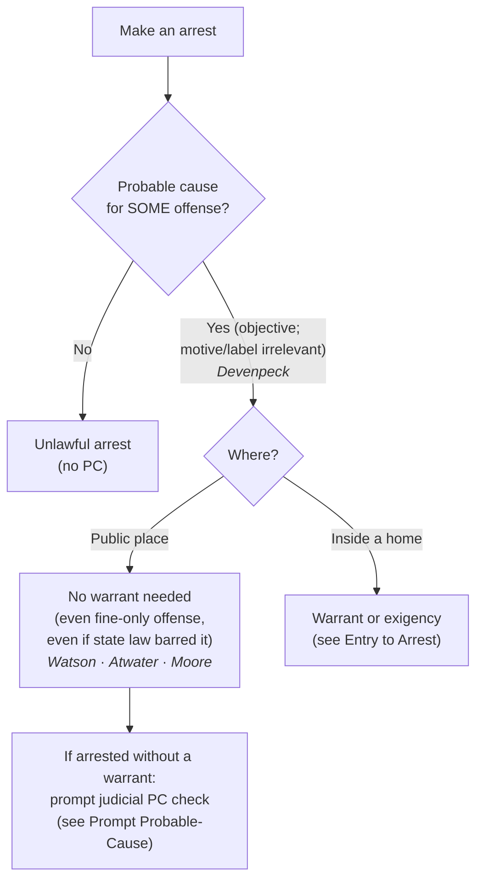

# S9 R1 panel-review — Opus model-diversity lane (prompt pack)

You are the **Claude/Opus** leg of the S9 three-lane adversarial panel (1 Claude + 2 Codex, R1). The two Codex lanes carry the A (support/quote-fidelity) and B (currency/treatment) attack lenses; **you carry model diversity and MUST vote on every paneled assertion across BOTH lenses' concerns.** You are refute-framed: try hard to break each assertion; **default to REFUTED on uncertainty**; never fabricate a cite, quote, or holding; use ONLY the evidence inlined below (no search, no outside knowledge). You are a SIGHTED reviewer — the FULL lake record (judgment fields included) is inlined.

You are a WRITER lane, not an adjudicator: you FIND and VOTE. You do not tally, adjudicate, or close any row — the orchestrator does.

For EACH group below, return one JSON object with the exact `reviewed[]` shape from the output contract (identical framing to the Codex lenses). Emit a finding object ONLY for a real defect (verdict refuted / stands-modified); a group you find wholly clean returns all-`stands` verdicts (the harness records a clean attestation). Concatenate the per-group JSON objects into a top-level `{"packs": [ ... ]}` array, one entry per group, each carrying its `group_id`.


OUTPUT CONTRACT — return ONE JSON object, nothing else:
{
  "lens": "A" | "B",
  "group_id": "<echo the group id>",
  "reviewed": [
    {
      "assertion_id": "<from group_inventory.jsonl>",
      "dimension": "existence|support|quote_fidelity|pincite|treatment|black_letter",
      "verdict": "stands" | "refuted" | "stands-modified",
      "verifiable_from_disclosed": true | false,
      "defect": null,   // null when verdict=="stands"; else an object:
      //  {"problem": "...", "severity": "high|medium|low", "proposed_fix": "...", "evidence_quote": "verbatim from disclosed evidence or null", "needs_cl": true|false, "locator_note": "..."}
      "reasons": ["short evidence-grounded reason", "..."],
      "breaks_true_positives": true | false,
      "residual_risks": ["..."],
      "suggested_tightening": "... or null"
    }
  ],
  "notes": ""
}
Rules: verdict=='stands' <=> defect==null (assertion survives your attack). verdict=='refuted' <=> a real defect (the assertion as framed is wrong). verdict=='stands-modified' <=> survives but needs a stated modification (a minor defect). Review EVERY assertion_id in group_inventory.jsonl exactly once. Output ONLY the JSON object.
---

## GROUP: content/seizures/arrests/Arrest and Arrest Warrants.md  (`doctrine`, 10 assertions)

### content_page

```
---
title: "Arrest & Arrest Warrants"
weight: 10
aliases:
  - "Arrest & Arrest Warrants"
  - "Arrest and Arrest Warrants"
  - "seizures/arrests/Arrest and Arrest Warrants"
topic: "Arrest and arrest warrants: the probable-cause standard for arrests and when a warrant is required"
type: doctrine
amendment: "U.S. Const. amend. IV"
jurisdiction: "Federal (U.S. Const. amend. IV); SCOTUS baseline"
status: draft
related:
  - "[[Seizure of the Person]]"
  - "[[Arrest in the Home]]"
  - "[[Entry to Arrest]]"
  - "[[Prompt Probable-Cause Determination]]"
  - "[[Probable Cause]]"
  - "[[Search Incident to Arrest]]"
---

# Arrest & Arrest Warrants

*What makes an arrest lawful, and when does an arrest need a warrant? This page fixes the probable-cause standard for arrests; the home-entry warrant question lives at [[Entry to Arrest]], and the after-arrest judicial check at [[Prompt Probable-Cause Determination]].*

> [!rule] Black-letter rule
> **Probable cause governs every arrest; a warrant is the exception, not the rule.** A warrantless arrest in a **public place** on **probable cause** is reasonable under the Fourth Amendment, even for a minor, fine-only offense and even when there was time to get a warrant. *[[United States v. Watson]]*, 423 U.S. 411, [423–24](https://www.courtlistener.com/opinion/109352/united-states-v-watson/) (1976); *[[Atwater v. City of Lago Vista#^pin-354|Atwater v. City of Lago Vista]]*, 532 U.S. 318, [354](https://www.courtlistener.com/opinion/2620702/atwater-v-city-of-lago-vista/) (2001). The standard is **objective**: the offense supplying probable cause need not be the one the officer named, and the officer's subjective motive is irrelevant. *[[Devenpeck v. Alford#^pin-153|Devenpeck v. Alford]]*, 543 U.S. 146, [153](https://www.courtlistener.com/opinion/137733/devenpeck-v-alford/) (2004). A warrant is required to cross a **home's** threshold to arrest (*[[Arrest in the Home]]*), not for the public arrest itself.
> ^rule-arrest-warrant

## The Brief

**A public arrest on probable cause needs no warrant.** The Fourth Amendment permits a warrantless arrest in public on probable cause, even where the officer had ample time to get a warrant. The Court "decline[d] to transform [the] judicial preference [for warrants] into a constitutional rule when the judgment of the Nation and Congress has for so long been to authorize warrantless public arrests on probable cause." *[[United States v. Watson]]*, 423 U.S. 411, [423–24](https://www.courtlistener.com/opinion/109352/united-states-v-watson/) (1976). The warrant preference that governs **searches** does not govern **arrests** made in public; probable cause is the whole of it.

**The rule reaches even the most minor offense.** Probable cause governs *all* arrests without any case-by-case balancing. "If an officer has probable cause to believe that an individual has committed even a very minor criminal offense in his presence, he may, without violating the Fourth Amendment, arrest the offender." *[[Atwater v. City of Lago Vista#^pin-354|Atwater v. City of Lago Vista]]*, 532 U.S. 318, [354](https://www.courtlistener.com/opinion/2620702/atwater-v-city-of-lago-vista/) (2001). A custodial arrest for a fine-only seatbelt violation was therefore reasonable; the remedy for over-arresting on petty offenses is legislative, not Fourth Amendment. The narrow exception is an arrest "conducted in an extraordinary manner, unusually harmful" to privacy or physical interests.

**The inquiry is objective, and the offense of arrest is flexible.** An arrest is lawful so long as the facts known to the officer establish probable cause for **some** criminal offense, whether or not it is the offense the officer announced or one "closely related" to it: the officer's "subjective reason for making the arrest need not be the criminal offense as to which the known facts provide probable cause." *[[Devenpeck v. Alford#^pin-153|Devenpeck v. Alford]]*, 543 U.S. 146, [153](https://www.courtlistener.com/opinion/137733/devenpeck-v-alford/) (2004). The officer's motive does not matter, and neither does the label he puts on the arrest; what matters is whether the known facts add up to probable cause for a crime. *See* [[Probable Cause]]; *[[Whren v. United States]]*; *[[Ashcroft v. al-Kidd]]*.

**A state-law violation is not a Fourth Amendment violation.** An arrest supported by probable cause is reasonable under the Fourth Amendment **even if state law forbade it**. Where state law directed a summons but officers made a custodial arrest, "while States are free to regulate such arrests however they desire, state restrictions do not alter the Fourth Amendment's protections." *[[Virginia v. Moore#^pin-1607|Virginia v. Moore]]*, 553 U.S. 164, [168](https://www.courtlistener.com/opinion/145814/virginia-v-moore/) (2008) (128 S. Ct. at 1607). Because the arrest was constitutionally valid, the search incident to it needed no additional justification, and the state-law-only violation triggered no exclusion.

**When a warrant *is* required.** The public-arrest rule does not reach a **home**. To cross the threshold of a dwelling to arrest, officers need an **arrest warrant** for the suspect's own home (plus reason to believe he is within) or a **search warrant** for a third party's home, absent consent or [[Exigent Circumstances and Hot Pursuit|exigency]]. *See* [[Arrest in the Home]] and [[Entry to Arrest]]. An arrest warrant also secures the neutral-magistrate judgment before the seizure; where officers arrest **without** a warrant, that neutral check moves to the **back end** as a prompt post-arrest determination. *See* [[Prompt Probable-Cause Determination]].

**Common pitfalls.**
- **Thinking a warrant is needed for an ordinary public arrest.** It is not; probable cause suffices, even with time to get a warrant. *[[United States v. Watson]]*.
- **Assuming a petty offense cannot support a custodial arrest.** *[[Atwater v. City of Lago Vista|Atwater]]* holds it can, on probable cause, without balancing. *[[Atwater v. City of Lago Vista]]*.
- **Testing the arrest against the offense the officer named.** The question is whether the known facts give probable cause for **any** offense; the stated charge and the officer's motive do not control. *[[Devenpeck v. Alford]]*.
- **Treating a state-law arrest violation as a Fourth Amendment violation.** It is not, and it triggers no exclusion. *[[Virginia v. Moore]]*.
- **Forgetting the home line.** The public-arrest rule stops at the threshold; a home arrest needs a warrant or [[Exigent Circumstances and Hot Pursuit|exigency]]. *[[Entry to Arrest]]*.

## Lower-court developments

The arrest-standard core is settled at the Supreme Court, so the live questions are refinements rather than a circuit split on the basic rule.

- **Retaliatory-arrest overlay.** An arrest supported by probable cause generally defeats a First Amendment retaliatory-arrest claim, subject to a narrow exception for otherwise-unarrested comparators. *[[Nieves v. Bartlett|Nieves v. Bartlett]]*, 587 U.S. 391 (2019). This is a §1983 overlay on an otherwise-valid arrest, treated at [[Retaliatory Arrest]]. **Binding — SCOTUS.**
- **Totality restated.** The Court has reaffirmed that probable cause is assessed on the **totality** of the known facts, rejecting a divide-and-conquer approach that dismisses innocent explanations for each fact in isolation. *[[District of Columbia v. Wesby|District of Columbia v. Wesby]]*, 583 U.S. 48 (2018). **Binding — SCOTUS.**

## Key cases

| Case | Holding | Opinion |
|---|---|---|
| *[[United States v. Watson]]*, 423 U.S. 411 (1976) | **Anchor.** A warrantless arrest in a public place on probable cause is reasonable under the Fourth Amendment, even where the officer had time to obtain a warrant. | [opinion](https://www.courtlistener.com/opinion/109352/united-states-v-watson/) |
| *[[Atwater v. City of Lago Vista]]*, 532 U.S. 318 (2001) | Probable cause governs all arrests without case-by-case balancing; a warrantless custodial arrest for a fine-only misdemeanor on probable cause does not violate the Fourth Amendment. | [opinion](https://www.courtlistener.com/opinion/2620702/atwater-v-city-of-lago-vista/) |
| *[[Devenpeck v. Alford]]*, 543 U.S. 146 (2004) | An arrest is lawful if the known facts give probable cause for **some** offense; the offense need not be the one the officer invoked or "closely related" to it, and the officer's subjective motive is irrelevant. | [opinion](https://www.courtlistener.com/opinion/137733/devenpeck-v-alford/) |
| *[[Virginia v. Moore]]*, 553 U.S. 164 (2008) | A warrantless arrest on probable cause is reasonable even if state law forbade it (requiring a summons); a state-law-only violation does not trigger exclusion, and the search incident follows. | [opinion](https://www.courtlistener.com/opinion/145814/virginia-v-moore/) |

## Related cases across doctrines

These cases are treated in full elsewhere but bear on when an arrest is lawful, framed here for this doctrine.

| Case | Relevance here | Primary home | Opinion |
|---|---|---|---|
| *[[Payton v. New York]]*, 445 U.S. 573 (1980) | ***Home line.*** The public-arrest rule stops at the threshold; a warrantless, nonconsensual home arrest is presumptively unreasonable. | [[Arrest in the Home]] | [opinion](https://www.courtlistener.com/opinion/110235/payton-v-new-york/) |
| *[[Gerstein v. Pugh]]*, 420 U.S. 103 (1975) | ***Back-end check.*** A warrantless arrestee is entitled to a prompt judicial probable-cause determination before extended detention. | [[Prompt Probable-Cause Determination]] | [opinion](https://www.courtlistener.com/opinion/109186/gerstein-v-pugh/) |
| *[[Whren v. United States]]*, 517 U.S. 806 (1996) | ***Motive irrelevant.*** An objectively justified seizure is not rendered unlawful by the officer's subjective or pretextual motive. | [[Traffic Stops]] | [opinion](https://www.courtlistener.com/opinion/118036/whren-v-united-states/) |
| *[[Ashcroft v. al-Kidd]]*, 563 U.S. 731 (2011) | ***Motive irrelevant.*** An objectively reasonable arrest on a valid basis cannot be challenged on the officer's subjective intent. | [[Section 1983 Liability and Qualified Immunity]] | [opinion](https://www.courtlistener.com/opinion/7344719/ashcroft-v-al-kidd/) |
| *[[Knowles v. Iowa]]*, 525 U.S. 113 (1998) | ***Citation is not arrest.*** Issuing a citation instead of arresting does not authorize a full search incident; the custodial arrest is what unlocks that search. | [[Search Incident to Arrest]] | [opinion](https://www.courtlistener.com/opinion/118250/knowles-v-iowa/) |

## Visual



## Sources

- [*United States v. Watson*, 423 U.S. 411 (1976)](https://www.courtlistener.com/opinion/109352/united-states-v-watson/) (pinpoints: 423–24)
- [*Atwater v. City of Lago Vista*, 532 U.S. 318 (2001)](https://www.courtlistener.com/opinion/2620702/atwater-v-city-of-lago-vista/) (pinpoints: 354, 355)
- [*Devenpeck v. Alford*, 543 U.S. 146 (2004)](https://www.courtlistener.com/opinion/137733/devenpeck-v-alford/) (pinpoint: 153)
- [*Virginia v. Moore*, 553 U.S. 164 (2008)](https://www.courtlistener.com/opinion/145814/virginia-v-moore/) (pinpoints: 1607, 1608 (S. Ct. reporter))
- [*District of Columbia v. Wesby*, 583 U.S. 48 (2018)](https://www.courtlistener.com/opinion/4460854/district-of-columbia-v-wesby/)
- [*Nieves v. Bartlett*, 587 U.S. 391 (2019)](https://www.courtlistener.com/opinion/9231236/nieves-v-bartlett/)

```

### group_inventory (assertions under review)

```jsonl
{"assertion_id": "0bea74168375bda6", "dimension": "existence", "kind": "case_cite", "locator": {"case": "Atwater v. City of Lago Vista", "table_line": 41}, "payload": {"case": "Atwater v. City of Lago Vista", "cells": ["*[[Atwater v. City of Lago Vista]]*, 532 U.S. 318 (2001)", "Probable cause governs all arrests without case-by-case balancing; a warrantless custodial arrest for a fine-only misdemeanor on probable cause does not violate the Fourth Amendment.", "[opinion](https://www.courtlistener.com/opinion/2620702/atwater-v-city-of-lago-vista/)"], "header": ["Case", "Holding", "Opinion"]}}
{"assertion_id": "11463a70d8dbf5d2", "dimension": "existence", "kind": "case_cite", "locator": {"case": "Devenpeck v. Alford", "table_line": 42}, "payload": {"case": "Devenpeck v. Alford", "cells": ["*[[Devenpeck v. Alford]]*, 543 U.S. 146 (2004)", "An arrest is lawful if the known facts give probable cause for **some** offense; the offense need not be the one the officer invoked or \"closely related\" to it, and the officer's subjective motive is irrelevant.", "[opinion](https://www.courtlistener.com/opinion/137733/devenpeck-v-alford/)"], "header": ["Case", "Holding", "Opinion"]}}
{"assertion_id": "30322ef5b3ae3f01", "dimension": "existence", "kind": "case_cite", "locator": {"case": "Whren v. United States", "table_line": 53}, "payload": {"case": "Whren v. United States", "cells": ["*[[Whren v. United States]]*, 517 U.S. 806 (1996)", "***Motive irrelevant.*** An objectively justified seizure is not rendered unlawful by the officer's subjective or pretextual motive.", "[[Traffic Stops]]", "[opinion](https://www.courtlistener.com/opinion/118036/whren-v-united-states/)"], "header": ["Case", "Relevance here", "Primary home", "Opinion"]}}
{"assertion_id": "45ab9a38bda520a9", "dimension": "existence", "kind": "case_cite", "locator": {"case": "Virginia v. Moore", "table_line": 43}, "payload": {"case": "Virginia v. Moore", "cells": ["*[[Virginia v. Moore]]*, 553 U.S. 164 (2008)", "A warrantless arrest on probable cause is reasonable even if state law forbade it (requiring a summons); a state-law-only violation does not trigger exclusion, and the search incident follows.", "[opinion](https://www.courtlistener.com/opinion/145814/virginia-v-moore/)"], "header": ["Case", "Holding", "Opinion"]}}
{"assertion_id": "5bb50bc82aa07d23", "dimension": "existence", "kind": "case_cite", "locator": {"case": "Knowles v. Iowa", "table_line": 55}, "payload": {"case": "Knowles v. Iowa", "cells": ["*[[Knowles v. Iowa]]*, 525 U.S. 113 (1998)", "***Citation is not arrest.*** Issuing a citation instead of arresting does not authorize a full search incident; the custodial arrest is what unlocks that search.", "[[Search Incident to Arrest]]", "[opinion](https://www.courtlistener.com/opinion/118250/knowles-v-iowa/)"], "header": ["Case", "Relevance here", "Primary home", "Opinion"]}}
{"assertion_id": "73db46db36657a5d", "dimension": "existence", "kind": "case_cite", "locator": {"case": "Gerstein v. Pugh", "table_line": 52}, "payload": {"case": "Gerstein v. Pugh", "cells": ["*[[Gerstein v. Pugh]]*, 420 U.S. 103 (1975)", "***Back-end check.*** A warrantless arrestee is entitled to a prompt judicial probable-cause determination before extended detention.", "[[Prompt Probable-Cause Determination]]", "[opinion](https://www.courtlistener.com/opinion/109186/gerstein-v-pugh/)"], "header": ["Case", "Relevance here", "Primary home", "Opinion"]}}
{"assertion_id": "7f9796203dde88fe", "dimension": "existence", "kind": "case_cite", "locator": {"case": "United States v. Watson", "table_line": 40}, "payload": {"case": "United States v. Watson", "cells": ["*[[United States v. Watson]]*, 423 U.S. 411 (1976)", "**Anchor.** A warrantless arrest in a public place on probable cause is reasonable under the Fourth Amendment, even where the officer had time to obtain a warrant.", "[opinion](https://www.courtlistener.com/opinion/109352/united-states-v-watson/)"], "header": ["Case", "Holding", "Opinion"]}}
{"assertion_id": "86217cc96bf71506", "dimension": "existence", "kind": "case_cite", "locator": {"case": "Payton v. New York", "table_line": 51}, "payload": {"case": "Payton v. New York", "cells": ["*[[Payton v. New York]]*, 445 U.S. 573 (1980)", "***Home line.*** The public-arrest rule stops at the threshold; a warrantless, nonconsensual home arrest is presumptively unreasonable.", "[[Arrest in the Home]]", "[opinion](https://www.courtlistener.com/opinion/110235/payton-v-new-york/)"], "header": ["Case", "Relevance here", "Primary home", "Opinion"]}}
{"assertion_id": "a79cf78d79fe2500", "dimension": "existence", "kind": "case_cite", "locator": {"case": "Ashcroft v. al-Kidd", "table_line": 54}, "payload": {"case": "Ashcroft v. al-Kidd", "cells": ["*[[Ashcroft v. al-Kidd]]*, 563 U.S. 731 (2011)", "***Motive irrelevant.*** An objectively reasonable arrest on a valid basis cannot be challenged on the officer's subjective intent.", "[[Section 1983 Liability and Qualified Immunity]]", "[opinion](https://www.courtlistener.com/opinion/7344719/ashcroft-v-al-kidd/)"], "header": ["Case", "Relevance here", "Primary home", "Opinion"]}}
{"assertion_id": "03cc13e38a4ba87e", "dimension": "support", "kind": "proposition", "locator": {"callout": "^rule-arrest-warrant"}, "payload": {"anchor": "^rule-arrest-warrant", "statement": "[!rule] Black-letter rule\n**Probable cause governs every arrest; a warrant is the exception, not the rule.** A warrantless arrest in a **public place** on **probable cause** is reasonable under the Fourth Amendment, even for a minor, fine-only offense and even when there was time to get a warrant. *[[United States v. Watson]]*, 423 U.S. 411, [423–24](https://www.courtlistener.com/opinion/109352/united-states-v-watson/) (1976); *[[Atwater v. City of Lago Vista#^pin-354|Atwater v. City of Lago Vista]]*, 532 U.S. 318, [354](https://www.courtlistener.com/opinion/2620702/atwater-v-city-of-lago-vista/) (2001). The standard is **objective**: the offense supplying probable cause need not be the one the officer named, and the officer's subjective motive is irrelevant. *[[Devenpeck v. Alford#^pin-153|Devenpeck v. Alford]]*, 543 U.S. 146, [153](https://www.courtlistener.com/opinion/137733/devenpeck-v-alford/) (2004). A warrant is required to cross a **home's** threshold to arrest (*[[Arrest in the Home]]*), not for the public arrest itself."}}
```

### lake record — Ashcroft v. al-Kidd

```json
{
  "schema_version": "s2.v1",
  "record_id": "Ashcroft v. al-Kidd",
  "stub": false,
  "status": "verified",
  "identity": {
    "case_name": "Ashcroft v. al-Kidd",
    "case_name_short": "al-Kidd",
    "case_name_full": "JOHN D. ASHCROFT v. ABDULLAH al-KIDD",
    "input_case_name": "Ashcroft v. al-Kidd",
    "court": "U.S. Supreme Court",
    "court_id": "scotus",
    "court_level": "scotus",
    "circuit": null,
    "state": null,
    "date_decided": "2011-05-31",
    "year": 2011,
    "docket": "10-98",
    "cluster_id": 7344719,
    "lead_opinion_id": 7262676,
    "sibling_ids": [
      7262676,
      7262677,
      7262678,
      7262679
    ],
    "absolute_url": "/opinion/7344719/ashcroft-v-al-kidd/",
    "identity_method": "citation+party-text",
    "expected_citation_found": true,
    "party_name_in_text": true,
    "canonical_name_match": true,
    "alternates": [
      {
        "cluster_id": 217703,
        "score": 110,
        "case_name": "Ashcroft v. al-Kidd"
      }
    ],
    "reason_code": null
  },
  "citations": {
    "official": null,
    "parallel": [
      {
        "cite": "179 L. Ed. 2d 1149",
        "volume": "179",
        "reporter": "L. Ed. 2d",
        "page": "1149",
        "type": 1,
        "selected_official": false,
        "source": "cluster.citations[]"
      },
      {
        "cite": "131 S. Ct. 2074",
        "volume": "131",
        "reporter": "S. Ct.",
        "page": "2074",
        "type": 1,
        "selected_official": false,
        "source": "cluster.citations[]"
      },
      {
        "cite": "563 U.S. 731",
        "volume": "563",
        "reporter": "U.S.",
        "page": "731",
        "type": 1,
        "selected_official": false,
        "source": "cluster.citations[]"
      },
      {
        "cite": "79 U.S.L.W. 4393",
        "volume": "79",
        "reporter": "U.S.L.W.",
        "page": "4393",
        "type": 4,
        "selected_official": false,
        "source": "cluster.citations[]"
      },
      {
        "cite": "22 Fla. L. Weekly Fed. S 1057",
        "volume": "22",
        "reporter": "Fla. L. Weekly Fed. S",
        "page": "1057",
        "type": 1,
        "selected_official": false,
        "source": "cluster.citations[]"
      }
    ],
    "vendor_neutral": [
      {
        "cite": "2011 U.S. LEXIS 4021",
        "volume": "2011",
        "reporter": "U.S. LEXIS",
        "page": "4021",
        "type": 6,
        "selected_official": false,
        "source": "cluster.citations[]"
      }
    ],
    "all": [
      {
        "cite": "179 L. Ed. 2d 1149",
        "volume": "179",
        "reporter": "L. Ed. 2d",
        "page": "1149",
        "type": 1,
        "selected_official": false,
        "source": "cluster.citations[]"
      },
      {
        "cite": "2011 U.S. LEXIS 4021",
        "volume": "2011",
        "reporter": "U.S. LEXIS",
        "page": "4021",
        "type": 6,
        "selected_official": false,
        "source": "cluster.citations[]"
      },
      {
        "cite": "131 S. Ct. 2074",
        "volume": "131",
        "reporter": "S. Ct.",
        "page": "2074",
        "type": 1,
        "selected_official": false,
        "source": "cluster.citations[]"
      },
      {
        "cite": "563 U.S. 731",
        "volume": "563",
        "reporter": "U.S.",
        "page": "731",
        "type": 1,
        "selected_official": false,
        "source": "cluster.citations[]"
      },
      {
        "cite": "79 U.S.L.W. 4393",
        "volume": "79",
        "reporter": "U.S.L.W.",
        "page": "4393",
        "type": 4,
        "selected_official": false,
        "source": "cluster.citations[]"
      },
      {
        "cite": "22 Fla. L. Weekly Fed. S 1057",
        "volume": "22",
        "reporter": "Fla. L. Weekly Fed. S",
        "page": "1057",
        "type": 1,
        "selected_official": false,
        "source": "cluster.citations[]"
      }
    ],
    "display": null,
    "official_selection": {
      "court_class": "scotus",
      "selected": null,
      "reason": "unlisted_reporter:Fla. L. Weekly Fed. S"
    }
  },
  "pinpoints": [
    {
      "id": "pin-736",
      "page": null,
      "quote": "--- # Ashcroft v. al-Kidd *563 U.S. 731 (2011)* \u00b7 U.S. Supreme Court \u00b7 **Binding \u2014 SCOTUS** \u00b7 Treatment: **good** *(as of 2026-06-30)* <!-- header line; TreatmentBadge + weight render here, degrading to the text above --> ## Background Abdullah al-Kidd, a U.S. citizen, was arrested in 2003 on a federal material-witness warrant \u2014 ostensibly to secure his testimony in a terrorism prosecution \u2014 but was never called to testify. He sued former Attorney General John Ashcroft under *Bivens*, alleging that Ashcroft had adopted a policy of using the material-witness statute as a **pretext** to detain terrorism suspects whom the government lacked probable cause to charge, in violation of the Fourth Amendment. Ashcroft asserted qualified immunity. ## Issue Whether an arrest made on a valid material-witness warrant can be challenged as unconstitutional based on the officer's alleged improper subjective motive \u2014 and, if the theory is doubtful, whether Ashcroft violated clearly established law. ## Rule Fourth Amendment reasonableness is judged objectively, so subjective motive does not invalidate an otherwise-valid arrest.",
      "star_marker": null,
      "quote_fidelity": "mismatch",
      "pinpoint_status": "slip-only",
      "position": null
    },
    {
      "id": "pin-743",
      "page": null,
      "quote": "We hold that an objectively reasonable arrest and detention of a material witness pursuant to a validly obtained warrant cannot be challenged as unconstitutional on the basis of allegations that the arresting authority had an improper motive.",
      "star_marker": "1161",
      "quote_fidelity": "matched",
      "pinpoint_status": "star-verified",
      "position": 52473,
      "fragment": "#:~:text=We%20hold%20that%20an%20objectively",
      "fragment_validated_at": "2026-07-09T15:40:45Z"
    }
  ],
  "treatment": {
    "field_i_validity": "good_law",
    "as_of_content": "2011-05-31",
    "as_of_treatment": "2026-06-30",
    "composite_basis": "migration-seed",
    "composite_basis_ref": "Ashcroft v. al-Kidd",
    "varies_by_point": false,
    "scope_note": "Good law: subjective intent is irrelevant to Fourth Amendment objective reasonableness; leading 'clearly established' qualified-immunity statement.",
    "point_overrides": [],
    "edges": [
      {
        "citing_case": {
          "name": "Morrow v. Meachum",
          "cluster_id": 8443910,
          "cite": [
            "917 F.3d 870"
          ],
          "field_ii": "questioned"
        },
        "field_ii": "questioned",
        "field_iii": "mentioned",
        "point": null,
        "proposed": true,
        "journal_ref": "Ashcroft v. al-Kidd:lane1_negative"
      },
      {
        "citing_case": {
          "name": "George Trammell v. Kevin Fruge",
          "cluster_id": 4419631,
          "cite": [
            "868 F.3d 332",
            "2017 WL 3528437",
            "2017 U.S. App. LEXIS 15529"
          ],
          "field_ii": "questioned"
        },
        "field_ii": "questioned",
        "field_iii": "mentioned",
        "point": null,
        "proposed": true,
        "journal_ref": "Ashcroft v. al-Kidd:lane1_negative"
      },
      {
        "citing_case": {
          "name": "Phillip Turner v. Driver",
          "cluster_id": 4349754,
          "cite": [
            "848 F.3d 678",
            "2017 WL 650186",
            "2017 U.S. App. LEXIS 2769"
          ],
          "field_ii": "questioned"
        },
        "field_ii": "questioned",
        "field_iii": "mentioned",
        "point": null,
        "proposed": true,
        "journal_ref": "Ashcroft v. al-Kidd:lane1_negative"
      },
      {
        "citing_case": {
          "name": "Carlos Gonzalez v. Able Huerta",
          "cluster_id": 3216824,
          "cite": [
            "826 F.3d 854",
            "2016 U.S. App. LEXIS 11530",
            "2016 WL 3457258"
          ],
          "field_ii": "questioned"
        },
        "field_ii": "questioned",
        "field_iii": "mentioned",
        "point": null,
        "proposed": true,
        "journal_ref": "Ashcroft v. al-Kidd:lane1_negative"
      },
      {
        "citing_case": {
          "name": "Ramona Hinojosa v. Brad Livingston",
          "cluster_id": 3155936,
          "cite": [
            "807 F.3d 657",
            "2015 U.S. App. LEXIS 20016",
            "2015 WL 7422990"
          ],
          "field_ii": "overruled"
        },
        "field_ii": "overruled",
        "field_iii": "mentioned",
        "point": null,
        "proposed": true,
        "journal_ref": "Ashcroft v. al-Kidd:lane1_negative"
      },
      {
        "citing_case": {
          "name": "MacDonald v. Town of Eastham",
          "cluster_id": 2656464,
          "cite": [
            "745 F.3d 8",
            "2014 WL 944707",
            "2014 U.S. App. LEXIS 4618"
          ],
          "field_ii": "questioned"
        },
        "field_ii": "questioned",
        "field_iii": "mentioned",
        "point": null,
        "proposed": true,
        "journal_ref": "Ashcroft v. al-Kidd:lane1_negative"
      },
      {
        "citing_case": {
          "name": "Prall v. City of Boston",
          "cluster_id": 8729956,
          "cite": [
            "985 F. Supp. 2d 115",
            "2013 WL 6076462",
            "2013 U.S. Dist. LEXIS 166128"
          ],
          "field_ii": "overruled"
        },
        "field_ii": "overruled",
        "field_iii": "mentioned",
        "point": null,
        "proposed": true,
        "journal_ref": "Ashcroft v. al-Kidd:lane1_negative"
      },
      {
        "citing_case": {
          "name": "Morgan v. Swanson",
          "cluster_id": 8441074,
          "cite": [
            "659 F.3d 359",
            "2011 U.S. App. LEXIS 19656",
            "2011 WL 4470233"
          ],
          "field_ii": "overruled"
        },
        "field_ii": "overruled",
        "field_iii": "mentioned",
        "point": null,
        "proposed": true,
        "journal_ref": "Ashcroft v. al-Kidd:lane1_negative"
      },
      {
        "citing_case": {
          "name": "Egbert v. Boule",
          "cluster_id": 6475794,
          "cite": [
            "596 U.S. 482",
            "142 S. Ct. 1793"
          ],
          "field_ii": "overruled"
        },
        "field_ii": "overruled",
        "field_iii": "mentioned",
        "point": null,
        "proposed": true,
        "journal_ref": "Ashcroft v. al-Kidd:lane2_top_cited"
      },
      {
        "citing_case": {
          "name": "Natasha Whitley v. John Hanna",
          "cluster_id": 1036944,
          "cite": [
            "726 F.3d 631",
            "2013 WL 4029134",
            "2013 U.S. App. LEXIS 16485"
          ],
          "field_ii": "criticized"
        },
        "field_ii": "criticized",
        "field_iii": "mentioned",
        "point": null,
        "proposed": true,
        "journal_ref": "Ashcroft v. al-Kidd:lane2_top_cited"
      },
      {
        "citing_case": {
          "name": "Roger Poole v. City of Shreveport",
          "cluster_id": 806839,
          "cite": [
            "691 F.3d 624",
            "2012 WL 3517357",
            "2012 U.S. App. LEXIS 17243"
          ],
          "field_ii": "criticized"
        },
        "field_ii": "criticized",
        "field_iii": "mentioned",
        "point": null,
        "proposed": true,
        "journal_ref": "Ashcroft v. al-Kidd:lane2_top_cited"
      },
      {
        "citing_case": {
          "name": "DiStiso ex rel. DiStiso v. Cook",
          "cluster_id": 807074,
          "cite": [
            "691 F.3d 226",
            "2012 WL 3570755"
          ],
          "field_ii": "overruled"
        },
        "field_ii": "overruled",
        "field_iii": "mentioned",
        "point": null,
        "proposed": true,
        "journal_ref": "Ashcroft v. al-Kidd:lane2_top_cited"
      },
      {
        "citing_case": {
          "name": "Derrick Newman v. James Guedry",
          "cluster_id": 3071815,
          "cite": [
            "703 F.3d 757",
            "2012 U.S. App. LEXIS 26205",
            "2012 WL 6634975"
          ],
          "field_ii": "abrogated"
        },
        "field_ii": "abrogated",
        "field_iii": "mentioned",
        "point": null,
        "proposed": true,
        "journal_ref": "Ashcroft v. al-Kidd:lane2_top_cited"
      },
      {
        "citing_case": {
          "name": "Michael-Ryan Kruger v. State of Nebraska",
          "cluster_id": 3192229,
          "cite": [
            "820 F.3d 295",
            "2016 U.S. App. LEXIS 6326",
            "2016 WL 1376343"
          ],
          "field_ii": "questioned"
        },
        "field_ii": "questioned",
        "field_iii": "mentioned",
        "point": null,
        "proposed": true,
        "journal_ref": "Ashcroft v. al-Kidd:lane2_top_cited"
      },
      {
        "citing_case": {
          "name": "Glik v. Cunniffe",
          "cluster_id": 612667,
          "cite": [
            "655 F.3d 78",
            "84 A.L.R. 6th 647",
            "39 Media L. Rep. (BNA) 2257",
            "2011 U.S. App. LEXIS 17841",
            "2011 WL 3769092"
          ],
          "field_ii": "overruled"
        },
        "field_ii": "overruled",
        "field_iii": "mentioned",
        "point": null,
        "proposed": true,
        "journal_ref": "Ashcroft v. al-Kidd:lane2_top_cited"
      },
      {
        "citing_case": {
          "name": "Gray v. Cummings",
          "cluster_id": 4593291,
          "cite": [
            "917 F.3d 1"
          ],
          "field_ii": "overruled"
        },
        "field_ii": "overruled",
        "field_iii": "mentioned",
        "point": null,
        "proposed": true,
        "journal_ref": "Ashcroft v. al-Kidd:lane2_top_cited"
      },
      {
        "citing_case": {
          "name": "Corey Hughes v. Michael Rodriguez",
          "cluster_id": 6461702,
          "cite": [
            "31 F.4th 1211"
          ],
          "field_ii": "questioned"
        },
        "field_ii": "questioned",
        "field_iii": "mentioned",
        "point": null,
        "proposed": true,
        "journal_ref": "Ashcroft v. al-Kidd:lane2_top_cited"
      },
      {
        "citing_case": {
          "name": "Pratt Ex Rel. Estate of Pratt v. Harris County",
          "cluster_id": 3200293,
          "cite": [
            "822 F.3d 174",
            "2016 U.S. App. LEXIS 8049",
            "2016 WL 2343032"
          ],
          "field_ii": "questioned"
        },
        "field_ii": "questioned",
        "field_iii": "mentioned",
        "point": null,
        "proposed": true,
        "journal_ref": "Ashcroft v. al-Kidd:lane2_top_cited"
      },
      {
        "citing_case": {
          "name": "Barbara Wyatt v. Rhonda Fletcher",
          "cluster_id": 873536,
          "cite": [
            "718 F.3d 496",
            "2013 WL 2371280",
            "2013 U.S. App. LEXIS 11045"
          ],
          "field_ii": "criticized"
        },
        "field_ii": "criticized",
        "field_iii": "mentioned",
        "point": null,
        "proposed": true,
        "journal_ref": "Ashcroft v. al-Kidd:lane2_top_cited"
      },
      {
        "citing_case": {
          "name": "Lamont Shepard v. T. Quillen",
          "cluster_id": 4315689,
          "cite": [
            "840 F.3d 686",
            "2016 U.S. App. LEXIS 19352",
            "2016 WL 6246873"
          ],
          "field_ii": "abrogated"
        },
        "field_ii": "abrogated",
        "field_iii": "mentioned",
        "point": null,
        "proposed": true,
        "journal_ref": "Ashcroft v. al-Kidd:lane2_top_cited"
      },
      {
        "citing_case": {
          "name": "Irish v. Fowler",
          "cluster_id": 4803838,
          "cite": [
            "979 F.3d 65"
          ],
          "field_ii": "questioned"
        },
        "field_ii": "questioned",
        "field_iii": "mentioned",
        "point": null,
        "proposed": true,
        "journal_ref": "Ashcroft v. al-Kidd:lane2_top_cited"
      },
      {
        "citing_case": {
          "name": "Tucker v. City of Shreveport",
          "cluster_id": 4884106,
          "cite": [
            "998 F.3d 165"
          ],
          "field_ii": "questioned"
        },
        "field_ii": "questioned",
        "field_iii": "mentioned",
        "point": null,
        "proposed": true,
        "journal_ref": "Ashcroft v. al-Kidd:lane2_top_cited"
      },
      {
        "citing_case": {
          "name": "Susan Doxtator v. Erik O'Brien",
          "cluster_id": 6623081,
          "cite": [
            "39 F.4th 852"
          ],
          "field_ii": "questioned"
        },
        "field_ii": "questioned",
        "field_iii": "mentioned",
        "point": null,
        "proposed": true,
        "journal_ref": "Ashcroft v. al-Kidd:lane2_top_cited"
      },
      {
        "citing_case": {
          "name": "Stamps Ex Rel. Estate of Stamps v. Town of Framingham",
          "cluster_id": 3175226,
          "cite": [
            "813 F.3d 27",
            "2016 U.S. App. LEXIS 2026",
            "2016 WL 457153"
          ],
          "field_ii": "overruled"
        },
        "field_ii": "overruled",
        "field_iii": "mentioned",
        "point": null,
        "proposed": true,
        "journal_ref": "Ashcroft v. al-Kidd:lane2_top_cited"
      },
      {
        "citing_case": {
          "name": "Matalon v. Hynnes",
          "cluster_id": 3155905,
          "cite": [
            "806 F.3d 627",
            "2015 U.S. App. LEXIS 20008",
            "2015 WL 7280627"
          ],
          "field_ii": "questioned"
        },
        "field_ii": "questioned",
        "field_iii": "mentioned",
        "point": null,
        "proposed": true,
        "journal_ref": "Ashcroft v. al-Kidd:lane2_top_cited"
      },
      {
        "citing_case": {
          "name": "Jacob Pfaller v. Mark Amonette",
          "cluster_id": 9344950,
          "cite": [
            "55 F.4th 436"
          ],
          "field_ii": "superseded_by_statute"
        },
        "field_ii": "superseded_by_statute",
        "field_iii": "mentioned",
        "point": null,
        "proposed": true,
        "journal_ref": "Ashcroft v. al-Kidd:lane2_top_cited"
      },
      {
        "citing_case": {
          "name": "Drumgold v. Callahan",
          "cluster_id": 816494,
          "cite": [
            "707 F.3d 28",
            "2013 U.S. App. LEXIS 2301",
            "2013 WL 376747"
          ],
          "field_ii": "questioned"
        },
        "field_ii": "questioned",
        "field_iii": "mentioned",
        "point": null,
        "proposed": true,
        "journal_ref": "Ashcroft v. al-Kidd:lane2_top_cited"
      }
    ],
    "derivation": {
      "lane1_negative": {
        "query": "cites:(7262676 OR 7262677 OR 7262678 OR 7262679) AND (overrul* OR abrogat* OR supersed* OR \"recede from\" OR \"no longer good law\" OR vacat* OR reversed) ",
        "reviewed": 106,
        "cap": 200,
        "cap_hit": false,
        "final_cursor": null,
        "audit_needed": false,
        "proposed_negative_events": 8,
        "audit_marker": null,
        "triage_mode": "snippet-first",
        "snippet_field": "results[].opinions[].snippet",
        "triage_journaled": 106,
        "triage_read": 8,
        "triage_snippet_classified": 98
      },
      "lane2_top_cited": {
        "query": "cites:(7262676 OR 7262677 OR 7262678 OR 7262679)",
        "reviewed": 25,
        "cap": 25,
        "cap_hit": true,
        "final_cursor": "https://www.courtlistener.com/api/rest/v4/search/?cursor=cz00MiZzPTk0MjE3NjMmdD1vJmQ9MjAyNi0wNy0wNCZwPTM%3D&order_by=citeCount+desc&page_size=25&q=cites%3A%287262676+OR+7262677+OR+7262678+OR+7262679%29&type=o",
        "audit_needed": true,
        "proposed_negative_events": 25,
        "audit_marker": "R15 treatment audit required"
      },
      "lane3_recency": {
        "query": "cites:(7262676 OR 7262677 OR 7262678 OR 7262679)",
        "reviewed": 24,
        "cap": 200,
        "cap_hit": false,
        "final_cursor": null,
        "audit_needed": false,
        "proposed_negative_events": 0,
        "audit_marker": null,
        "triage_mode": "snippet-first",
        "snippet_field": "results[].opinions[].snippet",
        "triage_journaled": 24,
        "triage_read": 0,
        "triage_snippet_classified": 24
      }
    }
  },
  "progeny": {
    "complete_query": "cites:(7262676 OR 7262677 OR 7262678 OR 7262679)",
    "indexed_citing_opinions": 168,
    "count_source": "search",
    "per_sibling": [
      {
        "opinion_id": 7262676,
        "count": 168,
        "count_source": "search"
      },
      {
        "opinion_id": 7262677,
        "count": 0,
        "count_source": "search"
      },
      {
        "opinion_id": 7262678,
        "count": 0,
        "count_source": "search"
      },
      {
        "opinion_id": 7262679,
        "count": 0,
        "count_source": "search"
      }
    ],
    "citation_count": 1746,
    "cache_path": "/Users/johngalt/cssi-lake/cache/progeny/ashcroft-v-al-kidd.jsonl",
    "enumeration": "bounded",
    "cursor": "https://www.courtlistener.com/api/rest/v4/search/?cursor=cz0xLjgzNDU1NTcmcz05NDEyMTU0JnQ9byZkPTIwMjYtMDctMDQmcD0y&order_by=score+desc&page_size=100&q=cites%3A%287262676+OR+7262677+OR+7262678+OR+7262679%29&type=o",
    "rows_cached": 20,
    "outbound_opinion_edges": []
  },
  "off_cl_links": [],
  "provenance": {
    "cl_source": "U",
    "cl_api": "https://www.courtlistener.com/api/rest/v4",
    "built_by": "S2-BUILDER-AUTHORING",
    "build_run": "s2-build-96d841cbb12e",
    "date_created": "2026-07-04T19:06:31Z",
    "date_modified": "2026-07-09T15:47:29Z",
    "warnings": [
      "official cite selection failed closed: unlisted_reporter:Fla. L. Weekly Fed. S",
      "legacy treatment migrated: good -> good_law"
    ],
    "field_provenance": {
      "identity": {
        "src": "CourtListener search + clusters + lead opinion text",
        "at": "2026-07-04T19:06:52Z",
        "verifier": "S2-BUILDER-AUTHORING"
      },
      "treatment.field_i_validity": {
        "src": "_treatment-migration.json + page frontmatter",
        "at": "2026-07-04T19:06:52Z",
        "verifier": "S2-BUILDER-AUTHORING"
      },
      "point_overrides": {
        "src": "S2 treatment derivation proposed only",
        "at": "2026-07-04T19:10:49Z",
        "verifier": "S2-BUILDER-AUTHORING"
      },
      "pinpoints": {
        "src": "content page quote harvest + lead opinion text",
        "at": "2026-07-04T19:06:52Z",
        "verifier": "S2-BUILDER-AUTHORING"
      }
    }
  }
}

```

### lake record — Atwater v. City of Lago Vista

```json
{
  "schema_version": "s2.v1",
  "record_id": "Atwater v. City of Lago Vista",
  "stub": false,
  "status": "verified",
  "identity": {
    "case_name": "Atwater v. City of Lago Vista",
    "case_name_short": "Atwater",
    "case_name_full": "ATWATER Et Al. v. CITY OF LAGO VISTA Et Al.",
    "input_case_name": "Atwater v. City of Lago Vista",
    "court": "U.S. Supreme Court",
    "court_id": "scotus",
    "court_level": "scotus",
    "circuit": null,
    "state": null,
    "date_decided": "2001-04-24",
    "year": 2001,
    "docket": null,
    "cluster_id": 2620702,
    "lead_opinion_id": 2620702,
    "sibling_ids": [
      2620702,
      9795084,
      9795085
    ],
    "absolute_url": "/opinion/2620702/atwater-v-city-of-lago-vista/",
    "identity_method": "citation+party-text",
    "expected_citation_found": true,
    "party_name_in_text": true,
    "canonical_name_match": true,
    "alternates": [
      {
        "cluster_id": 9199445,
        "score": 10,
        "case_name": "Atwater v. City of Lago Vista"
      },
      {
        "cluster_id": 9199444,
        "score": 10,
        "case_name": "Atwater v. City of Lago Vista"
      }
    ],
    "reason_code": null
  },
  "citations": {
    "official": null,
    "parallel": [
      {
        "cite": "532 U.S. 318",
        "volume": "532",
        "reporter": "U.S.",
        "page": "318",
        "type": 1,
        "selected_official": false,
        "source": "cluster.citations[]"
      },
      {
        "cite": "121 S. Ct. 1536",
        "volume": "121",
        "reporter": "S. Ct.",
        "page": "1536",
        "type": 1,
        "selected_official": false,
        "source": "cluster.citations[]"
      },
      {
        "cite": "149 L. Ed. 2d 549",
        "volume": "149",
        "reporter": "L. Ed. 2d",
        "page": "549",
        "type": 1,
        "selected_official": false,
        "source": "cluster.citations[]"
      },
      {
        "cite": "2001 Daily Journal DAR 3953",
        "volume": "2001",
        "reporter": "Daily Journal DAR",
        "page": "3953",
        "type": 2,
        "selected_official": false,
        "source": "cluster.citations[]"
      },
      {
        "cite": "2001 Colo. J. C.A.R. 2069",
        "volume": "2001",
        "reporter": "Colo. J. C.A.R.",
        "page": "2069",
        "type": 2,
        "selected_official": false,
        "source": "cluster.citations[]"
      },
      {
        "cite": "14 Fla. L. Weekly Fed. S 193",
        "volume": "14",
        "reporter": "Fla. L. Weekly Fed. S",
        "page": "193",
        "type": 1,
        "selected_official": false,
        "source": "cluster.citations[]"
      },
      {
        "cite": "69 U.S.L.W. 4262",
        "volume": "69",
        "reporter": "U.S.L.W.",
        "page": "4262",
        "type": 4,
        "selected_official": false,
        "source": "cluster.citations[]"
      }
    ],
    "vendor_neutral": [
      {
        "cite": "2001 U.S. LEXIS 3366",
        "volume": "2001",
        "reporter": "U.S. LEXIS",
        "page": "3366",
        "type": 6,
        "selected_official": false,
        "source": "cluster.citations[]"
      },
      {
        "cite": "2001 Cal. Daily Op. Serv. 3203",
        "volume": "2001",
        "reporter": "Cal. Daily Op. Serv.",
        "page": "3203",
        "type": 6,
        "selected_official": false,
        "source": "cluster.citations[]"
      }
    ],
    "all": [
      {
        "cite": "532 U.S. 318",
        "volume": "532",
        "reporter": "U.S.",
        "page": "318",
        "type": 1,
        "selected_official": false,
        "source": "cluster.citations[]"
      },
      {
        "cite": "121 S. Ct. 1536",
        "volume": "121",
        "reporter": "S. Ct.",
        "page": "1536",
        "type": 1,
        "selected_official": false,
        "source": "cluster.citations[]"
      },
      {
        "cite": "149 L. Ed. 2d 549",
        "volume": "149",
        "reporter": "L. Ed. 2d",
        "page": "549",
        "type": 1,
        "selected_official": false,
        "source": "cluster.citations[]"
      },
      {
        "cite": "2001 U.S. LEXIS 3366",
        "volume": "2001",
        "reporter": "U.S. LEXIS",
        "page": "3366",
        "type": 6,
        "selected_official": false,
        "source": "cluster.citations[]"
      },
      {
        "cite": "2001 Daily Journal DAR 3953",
        "volume": "2001",
        "reporter": "Daily Journal DAR",
        "page": "3953",
        "type": 2,
        "selected_official": false,
        "source": "cluster.citations[]"
      },
      {
        "cite": "2001 Colo. J. C.A.R. 2069",
        "volume": "2001",
        "reporter": "Colo. J. C.A.R.",
        "page": "2069",
        "type": 2,
        "selected_official": false,
        "source": "cluster.citations[]"
      },
      {
        "cite": "14 Fla. L. Weekly Fed. S 193",
        "volume": "14",
        "reporter": "Fla. L. Weekly Fed. S",
        "page": "193",
        "type": 1,
        "selected_official": false,
        "source": "cluster.citations[]"
      },
      {
        "cite": "69 U.S.L.W. 4262",
        "volume": "69",
        "reporter": "U.S.L.W.",
        "page": "4262",
        "type": 4,
        "selected_official": false,
        "source": "cluster.citations[]"
      },
      {
        "cite": "2001 Cal. Daily Op. Serv. 3203",
        "volume": "2001",
        "reporter": "Cal. Daily Op. Serv.",
        "page": "3203",
        "type": 6,
        "selected_official": false,
        "source": "cluster.citations[]"
      }
    ],
    "display": null,
    "official_selection": {
      "court_class": "scotus",
      "selected": null,
      "reason": "unlisted_reporter:Fla. L. Weekly Fed. S"
    }
  },
  "pinpoints": [
    {
      "id": "pin-354",
      "page": null,
      "quote": "--- # Atwater v. City of Lago Vista *532 U.S. 318 (2001)* \u00b7 U.S. Supreme Court \u00b7 **Binding \u2014 SCOTUS** \u00b7 Treatment: **good** *(as of 2026-06-30)* <!-- header line; TreatmentBadge + weight render here, degrading to the text above --> ## Background Gail Atwater was driving her pickup in Lago Vista, Texas, with her two young children; none of them was wearing a seatbelt, a misdemeanor punishable under Texas law only by a fine. Officer Turek stopped her, and rather than issue a citation, he handcuffed her, placed her in his squad car, and took her to the police station, where she was booked \u2014 required to remove her shoes, jewelry, and glasses, photographed, and held in a cell for about an hour before being taken to a magistrate and released on bond. She ultimately pleaded no contest and paid a $50 fine, then sued the City, the police chief, and Officer Turek under 42 U.S.C. \u00a7 1983, contending the custodial arrest was an unreasonable seizure. ## Issue Whether the Fourth Amendment forbids a warrantless custodial arrest, supported by probable cause, for a minor criminal offense \u2014 such as a misdemeanor seatbelt violation punishable only by a fine \u2014 committed in the officer's presence. ## Rule No. Probable cause governs all arrests, without case-by-case balancing: the Court",
      "star_marker": null,
      "quote_fidelity": "mismatch",
      "pinpoint_status": "slip-only",
      "position": null
    },
    {
      "id": "pin-355",
      "page": null,
      "quote": "(quoting *Whren v. United States*). ## Application There was no dispute that Officer Turek had probable cause: Atwater admitted that neither she nor her children were belted, a crime committed in his presence, so he was",
      "star_marker": null,
      "quote_fidelity": "mismatch",
      "pinpoint_status": "slip-only",
      "position": null
    }
  ],
  "treatment": {
    "field_i_validity": "good_law",
    "as_of_content": "2001-04-24",
    "as_of_treatment": "2026-06-30",
    "composite_basis": "migration-seed",
    "composite_basis_ref": "Atwater v. City of Lago Vista",
    "varies_by_point": false,
    "scope_note": "Good law. If an officer has probable cause to believe a person has committed even a very minor criminal offense (including a fine-only misdemeanor) in his presence, a warrantless custodial arrest does not violate the Fourth Amendment; no case-by-case balancing is required. Extended by Virginia v. Moore (2008).",
    "point_overrides": [],
    "edges": [
      {
        "citing_case": {
          "name": "Commonwealth v. Buckley",
          "cluster_id": 4468007,
          "cite": [
            "90 N.E.3d 767",
            "478 Mass. 861"
          ],
          "field_ii": "superseded_by_statute"
        },
        "field_ii": "superseded_by_statute",
        "field_iii": "mentioned",
        "point": null,
        "proposed": true,
        "journal_ref": "Atwater v. City of Lago Vista:lane1_negative"
      },
      {
        "citing_case": {
          "name": "Paul Stephens v. Nick Degiovanni, individually",
          "cluster_id": 4379656,
          "cite": [
            "852 F.3d 1298",
            "2017 U.S. App. LEXIS 5548",
            "2017 WL 1174381"
          ],
          "field_ii": "questioned"
        },
        "field_ii": "questioned",
        "field_iii": "mentioned",
        "point": null,
        "proposed": true,
        "journal_ref": "Atwater v. City of Lago Vista:lane1_negative"
      },
      {
        "citing_case": {
          "name": "Phyllis J. May v. City of Nahunta, Georgia",
          "cluster_id": 4339893,
          "cite": [
            "846 F.3d 1320",
            "2017 WL 218838",
            "2017 U.S. App. LEXIS 985"
          ],
          "field_ii": "questioned"
        },
        "field_ii": "questioned",
        "field_iii": "mentioned",
        "point": null,
        "proposed": true,
        "journal_ref": "Atwater v. City of Lago Vista:lane1_negative"
      },
      {
        "citing_case": {
          "name": "Brandon Pegg v. Grant Herrnberger",
          "cluster_id": 4335908,
          "cite": [
            "845 F.3d 112",
            "2017 WL 35722",
            "2017 U.S. App. LEXIS 109"
          ],
          "field_ii": "questioned"
        },
        "field_ii": "questioned",
        "field_iii": "mentioned",
        "point": null,
        "proposed": true,
        "journal_ref": "Atwater v. City of Lago Vista:lane1_negative"
      },
      {
        "citing_case": {
          "name": "United States v. Ted Phillips",
          "cluster_id": 4250252,
          "cite": [
            "834 F.3d 1176",
            "2016 WL 4435613"
          ],
          "field_ii": "overruled"
        },
        "field_ii": "overruled",
        "field_iii": "mentioned",
        "point": null,
        "proposed": true,
        "journal_ref": "Atwater v. City of Lago Vista:lane1_negative"
      },
      {
        "citing_case": {
          "name": "People v. Campuzano",
          "cluster_id": 7428164,
          "cite": [
            "237 Cal. App. Supp. 4th 14",
            "188 Cal. Rptr. 3d 587",
            "2015 Cal. App. LEXIS 489"
          ],
          "field_ii": "questioned"
        },
        "field_ii": "questioned",
        "field_iii": "mentioned",
        "point": null,
        "proposed": true,
        "journal_ref": "Atwater v. City of Lago Vista:lane1_negative"
      },
      {
        "citing_case": {
          "name": "Arizona v. Gant",
          "cluster_id": 145887,
          "cite": [
            "173 L. Ed. 2d 485",
            "129 S. Ct. 1710",
            "556 U.S. 332",
            "2009 U.S. LEXIS 3120"
          ],
          "field_ii": "overruled"
        },
        "field_ii": "overruled",
        "field_iii": "mentioned",
        "point": null,
        "proposed": true,
        "journal_ref": "Atwater v. City of Lago Vista:lane2_top_cited"
      },
      {
        "citing_case": {
          "name": "District of Columbia v. Wesby",
          "cluster_id": 4460854,
          "cite": [
            "583 U.S. 48",
            "138 S. Ct. 577",
            "199 L. Ed. 2d 453",
            "2018 U.S. LEXIS 760"
          ],
          "field_ii": "criticized"
        },
        "field_ii": "criticized",
        "field_iii": "mentioned",
        "point": null,
        "proposed": true,
        "journal_ref": "Atwater v. City of Lago Vista:lane2_top_cited"
      },
      {
        "citing_case": {
          "name": "Rodriguez v. United States",
          "cluster_id": 2795278,
          "cite": [
            "575 U.S. 348",
            "135 S. Ct. 1609",
            "191 L. Ed. 2d 492",
            "2015 U.S. LEXIS 2807",
            "83 U.S.L.W. 4241",
            "25 Fla. L. Weekly Fed. S 191"
          ],
          "field_ii": "abrogated"
        },
        "field_ii": "abrogated",
        "field_iii": "mentioned",
        "point": null,
        "proposed": true,
        "journal_ref": "Atwater v. City of Lago Vista:lane2_top_cited"
      },
      {
        "citing_case": {
          "name": "Maryland v. Pringle",
          "cluster_id": 131150,
          "cite": [
            "157 L. Ed. 2d 769",
            "124 S. Ct. 795",
            "540 U.S. 366",
            "2003 U.S. LEXIS 9198"
          ],
          "field_ii": "questioned"
        },
        "field_ii": "questioned",
        "field_iii": "mentioned",
        "point": null,
        "proposed": true,
        "journal_ref": "Atwater v. City of Lago Vista:lane2_top_cited"
      },
      {
        "citing_case": {
          "name": "Missouri v. McNeely",
          "cluster_id": 858288,
          "cite": [
            "185 L. Ed. 2d 696",
            "133 S. Ct. 1552",
            "569 U.S. 141",
            "2013 U.S. LEXIS 3160",
            "81 U.S.L.W. 4250",
            "24 Fla. L. Weekly Fed. S 150",
            "2013 WL 1628934"
          ],
          "field_ii": "questioned"
        },
        "field_ii": "questioned",
        "field_iii": "mentioned",
        "point": null,
        "proposed": true,
        "journal_ref": "Atwater v. City of Lago Vista:lane2_top_cited"
      },
      {
        "citing_case": {
          "name": "Brendlin v. California",
          "cluster_id": 145712,
          "cite": [
            "168 L. Ed. 2d 132",
            "127 S. Ct. 2400",
            "551 U.S. 249",
            "2007 U.S. LEXIS 7897"
          ],
          "field_ii": "questioned"
        },
        "field_ii": "questioned",
        "field_iii": "mentioned",
        "point": null,
        "proposed": true,
        "journal_ref": "Atwater v. City of Lago Vista:lane2_top_cited"
      },
      {
        "citing_case": {
          "name": "Kim D. Lee v. Luis Ferraro",
          "cluster_id": 75789,
          "cite": [
            "284 F.3d 1188",
            "2002 U.S. App. LEXIS 3438",
            "2002 WL 340670"
          ],
          "field_ii": "questioned"
        },
        "field_ii": "questioned",
        "field_iii": "mentioned",
        "point": null,
        "proposed": true,
        "journal_ref": "Atwater v. City of Lago Vista:lane2_top_cited"
      },
      {
        "citing_case": {
          "name": "Laurie Tsao v. Desert Palace, Inc.",
          "cluster_id": 810771,
          "cite": [
            "698 F.3d 1128",
            "2012 WL 5200336"
          ],
          "field_ii": "overruled"
        },
        "field_ii": "overruled",
        "field_iii": "mentioned",
        "point": null,
        "proposed": true,
        "journal_ref": "Atwater v. City of Lago Vista:lane2_top_cited"
      },
      {
        "citing_case": {
          "name": "Gary Blankenhorn v. City of Orange Andy Romero Dung Nguyen Garrett Ross Tamara South Gray, Sergeant Montano, Officer Kayano, Officer Roman, Officer",
          "cluster_id": 797658,
          "cite": [
            "485 F.3d 463",
            "2007 U.S. App. LEXIS 10856",
            "2007 D.A.R. 6484"
          ],
          "field_ii": "questioned"
        },
        "field_ii": "questioned",
        "field_iii": "mentioned",
        "point": null,
        "proposed": true,
        "journal_ref": "Atwater v. City of Lago Vista:lane2_top_cited"
      },
      {
        "citing_case": {
          "name": "Florence v. Board of Chosen Freeholders of County of Burlington",
          "cluster_id": 626454,
          "cite": [
            "182 L. Ed. 2d 566",
            "132 S. Ct. 1510",
            "566 U.S. 318",
            "2012 U.S. LEXIS 2712"
          ],
          "field_ii": "questioned"
        },
        "field_ii": "questioned",
        "field_iii": "mentioned",
        "point": null,
        "proposed": true,
        "journal_ref": "Atwater v. City of Lago Vista:lane2_top_cited"
      },
      {
        "citing_case": {
          "name": "District of Columbia v. Wesby",
          "cluster_id": 4460811,
          "cite": [
            "583 U.S. 48"
          ],
          "field_ii": "criticized"
        },
        "field_ii": "criticized",
        "field_iii": "mentioned",
        "point": null,
        "proposed": true,
        "journal_ref": "Atwater v. City of Lago Vista:lane2_top_cited"
      },
      {
        "citing_case": {
          "name": "People v. Campbell",
          "cluster_id": 4463634,
          "cite": [
            "2018 COA 5",
            "425 P.3d 1163"
          ],
          "field_ii": "questioned"
        },
        "field_ii": "questioned",
        "field_iii": "mentioned",
        "point": null,
        "proposed": true,
        "journal_ref": "Atwater v. City of Lago Vista:lane2_top_cited"
      },
      {
        "citing_case": {
          "name": "Thornton v. United States",
          "cluster_id": 134746,
          "cite": [
            "158 L. Ed. 2d 905",
            "124 S. Ct. 2127",
            "541 U.S. 615",
            "2004 U.S. LEXIS 3681"
          ],
          "field_ii": "overruled"
        },
        "field_ii": "overruled",
        "field_iii": "mentioned",
        "point": null,
        "proposed": true,
        "journal_ref": "Atwater v. City of Lago Vista:lane2_top_cited"
      },
      {
        "citing_case": {
          "name": "Deville v. Marcantel",
          "cluster_id": 65780,
          "cite": [
            "567 F.3d 156",
            "2009 U.S. App. LEXIS 9403",
            "2009 WL 1162586"
          ],
          "field_ii": "questioned"
        },
        "field_ii": "questioned",
        "field_iii": "mentioned",
        "point": null,
        "proposed": true,
        "journal_ref": "Atwater v. City of Lago Vista:lane2_top_cited"
      },
      {
        "citing_case": {
          "name": "Cortez v. McCauley",
          "cluster_id": 167088,
          "cite": [
            "478 F.3d 1108",
            "2007 WL 503819"
          ],
          "field_ii": "abrogated"
        },
        "field_ii": "abrogated",
        "field_iii": "mentioned",
        "point": null,
        "proposed": true,
        "journal_ref": "Atwater v. City of Lago Vista:lane2_top_cited"
      },
      {
        "citing_case": {
          "name": "Maxine Veatch v. Bartels Lutheran Home",
          "cluster_id": 181829,
          "cite": [
            "627 F.3d 1254",
            "2010 U.S. App. LEXIS 26270",
            "2010 WL 5293814"
          ],
          "field_ii": "questioned"
        },
        "field_ii": "questioned",
        "field_iii": "mentioned",
        "point": null,
        "proposed": true,
        "journal_ref": "Atwater v. City of Lago Vista:lane2_top_cited"
      },
      {
        "citing_case": {
          "name": "Koch v. City of Del City",
          "cluster_id": 616534,
          "cite": [
            "660 F.3d 1228",
            "2011 U.S. App. LEXIS 22095",
            "2011 WL 5176164"
          ],
          "field_ii": "questioned"
        },
        "field_ii": "questioned",
        "field_iii": "mentioned",
        "point": null,
        "proposed": true,
        "journal_ref": "Atwater v. City of Lago Vista:lane2_top_cited"
      },
      {
        "citing_case": {
          "name": "Torres v. Madrid",
          "cluster_id": 4867542,
          "cite": [
            "592 U.S. 306",
            "141 S. Ct. 989",
            "209 L. Ed. 2d 190"
          ],
          "field_ii": "criticized"
        },
        "field_ii": "criticized",
        "field_iii": "mentioned",
        "point": null,
        "proposed": true,
        "journal_ref": "Atwater v. City of Lago Vista:lane2_top_cited"
      },
      {
        "citing_case": {
          "name": "Melvin Alan Wood v. Michael Kesler, individually and in his capacity as an Alabama State Trooper, Brian Jones",
          "cluster_id": 76122,
          "cite": [
            "323 F.3d 872",
            "2003 U.S. App. LEXIS 3857",
            "2003 WL 722756"
          ],
          "field_ii": "overruled"
        },
        "field_ii": "overruled",
        "field_iii": "mentioned",
        "point": null,
        "proposed": true,
        "journal_ref": "Atwater v. City of Lago Vista:lane2_top_cited"
      },
      {
        "citing_case": {
          "name": "Safford Unified School District 1 v. Redding",
          "cluster_id": 145852,
          "cite": [
            "174 L. Ed. 2d 354",
            "129 S. Ct. 2633",
            "557 U.S. 364",
            "2009 U.S. LEXIS 4735",
            "21 Fla. L. Weekly Fed. S 1011",
            "77 U.S.L.W. 4591"
          ],
          "field_ii": "questioned"
        },
        "field_ii": "questioned",
        "field_iii": "mentioned",
        "point": null,
        "proposed": true,
        "journal_ref": "Atwater v. City of Lago Vista:lane2_top_cited"
      },
      {
        "citing_case": {
          "name": "Utah v. Strieff",
          "cluster_id": 3214882,
          "cite": [
            "579 U.S. 232",
            "195 L. Ed. 2d 400",
            "2016 U.S. LEXIS 3926"
          ],
          "field_ii": "questioned"
        },
        "field_ii": "questioned",
        "field_iii": "mentioned",
        "point": null,
        "proposed": true,
        "journal_ref": "Atwater v. City of Lago Vista:lane2_top_cited"
      },
      {
        "citing_case": {
          "name": "State v. Woodard",
          "cluster_id": 2540788,
          "cite": [
            "341 S.W.3d 404",
            "2011 Tex. Crim. App. LEXIS 447",
            "2011 WL 1261320"
          ],
          "field_ii": "criticized"
        },
        "field_ii": "criticized",
        "field_iii": "mentioned",
        "point": null,
        "proposed": true,
        "journal_ref": "Atwater v. City of Lago Vista:lane2_top_cited"
      },
      {
        "citing_case": {
          "name": "Tracy Williams v. Brandon Brooks",
          "cluster_id": 3167211,
          "cite": [
            "809 F.3d 936",
            "2016 U.S. App. LEXIS 68",
            "2016 WL 51409"
          ],
          "field_ii": "questioned"
        },
        "field_ii": "questioned",
        "field_iii": "mentioned",
        "point": null,
        "proposed": true,
        "journal_ref": "Atwater v. City of Lago Vista:lane2_top_cited"
      },
      {
        "citing_case": {
          "name": "People v. Aguilar",
          "cluster_id": 2650810,
          "cite": [
            "2013 IL 112116"
          ],
          "field_ii": "abrogated"
        },
        "field_ii": "abrogated",
        "field_iii": "mentioned",
        "point": null,
        "proposed": true,
        "journal_ref": "Atwater v. City of Lago Vista:lane2_top_cited"
      }
    ],
    "derivation": {
      "lane1_negative": {
        "query": "cites:(2620702 OR 9795084 OR 9795085) AND (overrul* OR abrogat* OR supersed* OR \"recede from\" OR \"no longer good law\" OR vacat* OR reversed) ",
        "reviewed": 200,
        "cap": 200,
        "cap_hit": true,
        "final_cursor": "https://www.courtlistener.com/api/rest/v4/search/?cursor=cz0xMzU1ODc1MjAwMDAwJnM9ODcyMTU0MSZ0PW8mZD0yMDI2LTA3LTA0JnA9MTE%3D&fields=absolute_url%2CcaseName%2CcaseNameFull%2Ccitation%2CciteCount%2Ccluster_id%2Ccourt%2Ccourt_citation_string%2Ccourt_id%2CdateFiled%2Copinions%2Csibling_ids%2Cstatus%2Csyllabus&order_by=dateFiled+desc&page_size=100&q=cites%3A%282620702+OR+9795084+OR+9795085%29+AND+%28overrul%2A+OR+abrogat%2A+OR+supersed%2A+OR+%22recede+from%22+OR+%22no+longer+good+law%22+OR+vacat%2A+OR+reversed%29+&stat_Published=on&type=o",
        "audit_needed": true,
        "proposed_negative_events": 6,
        "audit_marker": "R15 treatment audit required",
        "triage_mode": "snippet-first",
        "snippet_field": "results[].opinions[].snippet",
        "triage_journaled": 200,
        "triage_read": 6,
        "triage_snippet_classified": 194
      },
      "lane2_top_cited": {
        "query": "cites:(2620702 OR 9795084 OR 9795085)",
        "reviewed": 25,
        "cap": 25,
        "cap_hit": true,
        "final_cursor": "https://www.courtlistener.com/api/rest/v4/search/?cursor=cz0yMTMmcz03OTI1MDUmdD1vJmQ9MjAyNi0wNy0wNCZwPTM%3D&order_by=citeCount+desc&page_size=25&q=cites%3A%282620702+OR+9795084+OR+9795085%29&type=o",
        "audit_needed": true,
        "proposed_negative_events": 24,
        "audit_marker": "R15 treatment audit required"
      },
      "lane3_recency": {
        "query": "cites:(2620702 OR 9795084 OR 9795085)",
        "reviewed": 35,
        "cap": 200,
        "cap_hit": false,
        "final_cursor": null,
        "audit_needed": false,
        "proposed_negative_events": 0,
        "audit_marker": null,
        "triage_mode": "snippet-first",
        "snippet_field": "results[].opinions[].snippet",
        "triage_journaled": 35,
        "triage_read": 0,
        "triage_snippet_classified": 35
      }
    }
  },
  "progeny": {
    "complete_query": "cites:(2620702 OR 9795084 OR 9795085)",
    "indexed_citing_opinions": 701,
    "count_source": "search",
    "per_sibling": [
      {
        "opinion_id": 2620702,
        "count": 612,
        "count_source": "search"
      },
      {
        "opinion_id": 9795084,
        "count": 101,
        "count_source": "search"
      },
      {
        "opinion_id": 9795085,
        "count": 0,
        "count_source": "search"
      }
    ],
    "citation_count": 1392,
    "cache_path": "/Users/johngalt/cssi-lake/cache/progeny/atwater-v-city-of-lago-vista.jsonl",
    "enumeration": "bounded",
    "cursor": "https://www.courtlistener.com/api/rest/v4/search/?cursor=cz0xLjg1NjkwNiZzPTk0NTA1NDUmdD1vJmQ9MjAyNi0wNy0wNCZwPTI%3D&order_by=score+desc&page_size=100&q=cites%3A%282620702+OR+9795084+OR+9795085%29&type=o",
    "rows_cached": 20,
    "outbound_opinion_edges": [
      {
        "source_opinion_id": 2620702,
        "cited_id": 85827,
        "source": "search.opinions[].cites[]"
      },
      {
        "source_opinion_id": 2620702,
        "cited_id": 91470,
        "source": "search.opinions[].cites[]"
      },
      {
        "source_opinion_id": 2620702,
        "cited_id": 95265,
        "source": "search.opinions[].cites[]"
      },
      {
        "source_opinion_id": 2620702,
        "cited_id": 96744,
        "source": "search.opinions[].cites[]"
      },
      {
        "source_opinion_id": 2620702,
        "cited_id": 100567,
        "source": "search.opinions[].cites[]"
      },
      {
        "source_opinion_id": 2620702,
        "cited_id": 101643,
        "source": "search.opinions[].cites[]"
      },
      {
        "source_opinion_id": 2620702,
        "cited_id": 106515,
        "source": "search.opinions[].cites[]"
      },
      {
        "source_opinion_id": 2620702,
        "cited_id": 107252,
        "source": "search.opinions[].cites[]"
      },
      {
        "source_opinion_id": 2620702,
        "cited_id": 107729,
        "source": "search.opinions[].cites[]"
      },
      {
        "source_opinion_id": 2620702,
        "cited_id": 108893,
        "source": "search.opinions[].cites[]"
      },
      {
        "source_opinion_id": 2620702,
        "cited_id": 108894,
        "source": "search.opinions[].cites[]"
      },
      {
        "source_opinion_id": 2620702,
        "cited_id": 109402,
        "source": "search.opinions[].cites[]"
      },
      {
        "source_opinion_id": 2620702,
        "cited_id": 109541,
        "source": "search.opinions[].cites[]"
      },
      {
        "source_opinion_id": 2620702,
        "cited_id": 109714,
        "source": "search.opinions[].cites[]"
      },
      {
        "source_opinion_id": 2620702,
        "cited_id": 109751,
        "source": "search.opinions[].cites[]"
      },
      {
        "source_opinion_id": 2620702,
        "cited_id": 109932,
        "source": "search.opinions[].cites[]"
      },
      {
        "source_opinion_id": 2620702,
        "cited_id": 110045,
        "source": "search.opinions[].cites[]"
      },
      {
        "source_opinion_id": 2620702,
        "cited_id": 110096,
        "source": "search.opinions[].cites[]"
      },
      {
        "source_opinion_id": 2620702,
        "cited_id": 110235,
        "source": "search.opinions[].cites[]"
      },
      {
        "source_opinion_id": 2620702,
        "cited_id": 110559,
        "source": "search.opinions[].cites[]"
      },
      {
        "source_opinion_id": 2620702,
        "cited_id": 110763,
        "source": "search.opinions[].cites[]"
      },
      {
        "source_opinion_id": 2620702,
        "cited_id": 111173,
        "source": "search.opinions[].cites[]"
      },
      {
        "source_opinion_id": 2620702,
        "cited_id": 111249,
        "source": "search.opinions[].cites[]"
      },
      {
        "source_opinion_id": 2620702,
        "cited_id": 111380,
        "source": "search.opinions[].cites[]"
      },
      {
        "source_opinion_id": 2620702,
        "cited_id": 111397,
        "source": "search.opinions[].cites[]"
      },
      {
        "source_opinion_id": 2620702,
        "cited_id": 111788,
        "source": "search.opinions[].cites[]"
      },
      {
        "source_opinion_id": 2620702,
        "cited_id": 111953,
        "source": "search.opinions[].cites[]"
      },
      {
        "source_opinion_id": 2620702,
        "cited_id": 112219,
        "source": "search.opinions[].cites[]"
      },
      {
        "source_opinion_id": 2620702,
        "cited_id": 112257,
        "source": "search.opinions[].cites[]"
      },
      {
        "source_opinion_id": 2620702,
        "cited_id": 112412,
        "source": "search.opinions[].cites[]"
      },
      {
        "source_opinion_id": 2620702,
        "cited_id": 112585,
        "source": "search.opinions[].cites[]"
      },
      {
        "source_opinion_id": 2620702,
        "cited_id": 112595,
        "source": "search.opinions[].cites[]"
      },
      {
        "source_opinion_id": 2620702,
        "cited_id": 117936,
        "source": "search.opinions[].cites[]"
      },
      {
        "source_opinion_id": 2620702,
        "cited_id": 117964,
        "source": "search.opinions[].cites[]"
      },
      {
        "source_opinion_id": 2620702,
        "cited_id": 118036,
        "source": "search.opinions[].cites[]"
      },
      {
        "source_opinion_id": 2620702,
        "cited_id": 118066,
        "source": "search.opinions[].cites[]"
      },
      {
        "source_opinion_id": 2620702,
        "cited_id": 118086,
        "source": "search.opinions[].cites[]"
      },
      {
        "source_opinion_id": 2620702,
        "cited_id": 118180,
        "source": "search.opinions[].cites[]"
      },
      {
        "source_opinion_id": 2620702,
        "cited_id": 118277,
        "source": "search.opinions[].cites[]"
      },
      {
        "source_opinion_id": 2620702,
        "cited_id": 546349,
        "source": "search.opinions[].cites[]"
      },
      {
        "source_opinion_id": 2620702,
        "cited_id": 3585438,
        "source": "search.opinions[].cites[]"
      }
    ]
  },
  "off_cl_links": [],
  "provenance": {
    "cl_source": "LU",
    "cl_api": "https://www.courtlistener.com/api/rest/v4",
    "built_by": "S2-BUILDER-AUTHORING",
    "build_run": "s2-build-96d841cbb12e",
    "date_created": "2026-07-04T19:10:49Z",
    "date_modified": "2026-07-06T10:25:11Z",
    "warnings": [
      "official cite selection failed closed: unlisted_reporter:Fla. L. Weekly Fed. S",
      "legacy treatment migrated: good -> good_law"
    ],
    "field_provenance": {
      "identity": {
        "src": "CourtListener search + clusters + lead opinion text",
        "at": "2026-07-04T19:11:18Z",
        "verifier": "S2-BUILDER-AUTHORING"
      },
      "treatment.field_i_validity": {
        "src": "_treatment-migration.json + page frontmatter",
        "at": "2026-07-04T19:11:18Z",
        "verifier": "S2-BUILDER-AUTHORING"
      },
      "point_overrides": {
        "src": "S2 treatment derivation proposed only",
        "at": "2026-07-04T19:16:10Z",
        "verifier": "S2-BUILDER-AUTHORING"
      },
      "pinpoints": {
        "src": "content page quote harvest + lead opinion text",
        "at": "2026-07-04T19:11:18Z",
        "verifier": "S2-BUILDER-AUTHORING"
      }
    }
  }
}

```

### lake record — Devenpeck v. Alford

```json
{
  "schema_version": "s2.v1",
  "record_id": "Devenpeck v. Alford",
  "stub": false,
  "status": "verified",
  "identity": {
    "case_name": "Devenpeck v. Alford",
    "case_name_short": "Devenpeck",
    "case_name_full": "DEVENPECK Et Al. v. ALFORD",
    "input_case_name": "Devenpeck v. Alford",
    "court": "U.S. Supreme Court",
    "court_id": "scotus",
    "court_level": "scotus",
    "circuit": null,
    "state": null,
    "date_decided": "2004-12-13",
    "year": 2004,
    "docket": null,
    "cluster_id": 137733,
    "lead_opinion_id": 137733,
    "sibling_ids": [
      137733
    ],
    "absolute_url": "/opinion/137733/devenpeck-v-alford/",
    "identity_method": "citation+party-text",
    "expected_citation_found": true,
    "party_name_in_text": true,
    "canonical_name_match": true,
    "alternates": [
      {
        "cluster_id": 139725,
        "score": 20,
        "case_name": "Devenpeck v. Alford"
      },
      {
        "cluster_id": 137710,
        "score": 20,
        "case_name": "Devenpeck v. Alford"
      },
      {
        "cluster_id": 9223394,
        "score": 20,
        "case_name": "Devenpeck v. Alford"
      },
      {
        "cluster_id": 9223393,
        "score": 20,
        "case_name": "Devenpeck v. Alford"
      },
      {
        "cluster_id": 135641,
        "score": 20,
        "case_name": "Devenpeck v. Alford"
      }
    ],
    "reason_code": null
  },
  "citations": {
    "official": {
      "cite": "543 U.S. 146",
      "volume": "543",
      "reporter": "U.S.",
      "page": "146",
      "type": 1,
      "selected_official": true,
      "source": "cluster.citations[]"
    },
    "parallel": [
      {
        "cite": "125 S. Ct. 588",
        "volume": "125",
        "reporter": "S. Ct.",
        "page": "588",
        "type": 1,
        "selected_official": false,
        "source": "cluster.citations[]"
      },
      {
        "cite": "160 L. Ed. 2d 537",
        "volume": "160",
        "reporter": "L. Ed. 2d",
        "page": "537",
        "type": 1,
        "selected_official": false,
        "source": "cluster.citations[]"
      }
    ],
    "vendor_neutral": [
      {
        "cite": "2004 U.S. LEXIS 8272",
        "volume": "2004",
        "reporter": "U.S. LEXIS",
        "page": "8272",
        "type": 6,
        "selected_official": false,
        "source": "cluster.citations[]"
      }
    ],
    "all": [
      {
        "cite": "543 U.S. 146",
        "volume": "543",
        "reporter": "U.S.",
        "page": "146",
        "type": 1,
        "selected_official": false,
        "source": "cluster.citations[]"
      },
      {
        "cite": "125 S. Ct. 588",
        "volume": "125",
        "reporter": "S. Ct.",
        "page": "588",
        "type": 1,
        "selected_official": false,
        "source": "cluster.citations[]"
      },
      {
        "cite": "160 L. Ed. 2d 537",
        "volume": "160",
        "reporter": "L. Ed. 2d",
        "page": "537",
        "type": 1,
        "selected_official": false,
        "source": "cluster.citations[]"
      },
      {
        "cite": "2004 U.S. LEXIS 8272",
        "volume": "2004",
        "reporter": "U.S. LEXIS",
        "page": "8272",
        "type": 6,
        "selected_official": false,
        "source": "cluster.citations[]"
      }
    ],
    "display": "543 U.S. 146",
    "official_selection": {
      "court_class": "scotus",
      "selected": "543 U.S. 146",
      "reason": "selected_rank_1"
    }
  },
  "pinpoints": [
    {
      "id": "pin-153",
      "page": null,
      "quote": "to the one the officer invoked. The State sought review of that limitation. ## Issue Whether a warrantless arrest is lawful only if there is probable cause for an offense closely related to the one the arresting officer announced. ## Rule No; the inquiry is objective and offense-agnostic.",
      "star_marker": null,
      "quote_fidelity": "mismatch",
      "pinpoint_status": "slip-only",
      "position": null
    }
  ],
  "treatment": {
    "field_i_validity": "good_law",
    "as_of_content": "2004-12-13",
    "as_of_treatment": "2026-06-30",
    "composite_basis": "migration-seed",
    "composite_basis_ref": "Devenpeck v. Alford",
    "varies_by_point": false,
    "scope_note": "Old as_of seeds as_of_treatment; S2 derivation re-derives and may downgrade.",
    "point_overrides": [],
    "edges": [
      {
        "citing_case": {
          "name": "United States v. Darrell Mark Babcock",
          "cluster_id": 4623035,
          "cite": [
            "924 F.3d 1180"
          ],
          "field_ii": "questioned"
        },
        "field_ii": "questioned",
        "field_iii": "mentioned",
        "point": null,
        "proposed": true,
        "journal_ref": "Devenpeck v. Alford:lane1_negative"
      },
      {
        "citing_case": {
          "name": "Lionel Alexander v. City of Round Rock",
          "cluster_id": 4384027,
          "cite": [
            "854 F.3d 298",
            "2017 U.S. App. LEXIS 6692",
            "2017 WL 1393702"
          ],
          "field_ii": "questioned"
        },
        "field_ii": "questioned",
        "field_iii": "mentioned",
        "point": null,
        "proposed": true,
        "journal_ref": "Devenpeck v. Alford:lane1_negative"
      },
      {
        "citing_case": {
          "name": "Rife v. Oklahoma Department of Public Safety",
          "cluster_id": 4340429,
          "cite": [
            "846 F.3d 1119",
            "2017 WL 280700",
            "2017 U.S. App. LEXIS 1117"
          ],
          "field_ii": "questioned"
        },
        "field_ii": "questioned",
        "field_iii": "mentioned",
        "point": null,
        "proposed": true,
        "journal_ref": "Devenpeck v. Alford:lane1_negative"
      },
      {
        "citing_case": {
          "name": "Brandon Pegg v. Grant Herrnberger",
          "cluster_id": 4335908,
          "cite": [
            "845 F.3d 112",
            "2017 WL 35722",
            "2017 U.S. App. LEXIS 109"
          ],
          "field_ii": "questioned"
        },
        "field_ii": "questioned",
        "field_iii": "mentioned",
        "point": null,
        "proposed": true,
        "journal_ref": "Devenpeck v. Alford:lane1_negative"
      },
      {
        "citing_case": {
          "name": "United States v. Raymond Demilia",
          "cluster_id": 2746456,
          "cite": [
            "771 F.3d 1051",
            "2014 U.S. App. LEXIS 20684",
            "2014 WL 5462413"
          ],
          "field_ii": "questioned"
        },
        "field_ii": "questioned",
        "field_iii": "mentioned",
        "point": null,
        "proposed": true,
        "journal_ref": "Devenpeck v. Alford:lane1_negative"
      },
      {
        "citing_case": {
          "name": "Ashcroft v. al-Kidd",
          "cluster_id": 217703,
          "cite": [
            "179 L. Ed. 2d 1149",
            "131 S. Ct. 2074",
            "563 U.S. 731",
            "2011 U.S. LEXIS 4021"
          ],
          "field_ii": "questioned"
        },
        "field_ii": "questioned",
        "field_iii": "mentioned",
        "point": null,
        "proposed": true,
        "journal_ref": "Devenpeck v. Alford:lane2_top_cited"
      },
      {
        "citing_case": {
          "name": "District of Columbia v. Wesby",
          "cluster_id": 4460854,
          "cite": [
            "583 U.S. 48",
            "138 S. Ct. 577",
            "199 L. Ed. 2d 453",
            "2018 U.S. LEXIS 760"
          ],
          "field_ii": "criticized"
        },
        "field_ii": "criticized",
        "field_iii": "mentioned",
        "point": null,
        "proposed": true,
        "journal_ref": "Devenpeck v. Alford:lane2_top_cited"
      },
      {
        "citing_case": {
          "name": "Rodriguez v. United States",
          "cluster_id": 2795278,
          "cite": [
            "575 U.S. 348",
            "135 S. Ct. 1609",
            "191 L. Ed. 2d 492",
            "2015 U.S. LEXIS 2807",
            "83 U.S.L.W. 4241",
            "25 Fla. L. Weekly Fed. S 191"
          ],
          "field_ii": "abrogated"
        },
        "field_ii": "abrogated",
        "field_iii": "mentioned",
        "point": null,
        "proposed": true,
        "journal_ref": "Devenpeck v. Alford:lane2_top_cited"
      },
      {
        "citing_case": {
          "name": "Laurie Tsao v. Desert Palace, Inc.",
          "cluster_id": 810771,
          "cite": [
            "698 F.3d 1128",
            "2012 WL 5200336"
          ],
          "field_ii": "overruled"
        },
        "field_ii": "overruled",
        "field_iii": "mentioned",
        "point": null,
        "proposed": true,
        "journal_ref": "Devenpeck v. Alford:lane2_top_cited"
      },
      {
        "citing_case": {
          "name": "Fogarty v. Gallegos",
          "cluster_id": 170599,
          "cite": [
            "523 F.3d 1147",
            "2008 U.S. App. LEXIS 8587",
            "2008 WL 1765018"
          ],
          "field_ii": "questioned"
        },
        "field_ii": "questioned",
        "field_iii": "mentioned",
        "point": null,
        "proposed": true,
        "journal_ref": "Devenpeck v. Alford:lane2_top_cited"
      },
      {
        "citing_case": {
          "name": "Gary Blankenhorn v. City of Orange Andy Romero Dung Nguyen Garrett Ross Tamara South Gray, Sergeant Montano, Officer Kayano, Officer Roman, Officer",
          "cluster_id": 797658,
          "cite": [
            "485 F.3d 463",
            "2007 U.S. App. LEXIS 10856",
            "2007 D.A.R. 6484"
          ],
          "field_ii": "questioned"
        },
        "field_ii": "questioned",
        "field_iii": "mentioned",
        "point": null,
        "proposed": true,
        "journal_ref": "Devenpeck v. Alford:lane2_top_cited"
      },
      {
        "citing_case": {
          "name": "District of Columbia v. Wesby",
          "cluster_id": 4460811,
          "cite": [
            "583 U.S. 48"
          ],
          "field_ii": "criticized"
        },
        "field_ii": "criticized",
        "field_iii": "mentioned",
        "point": null,
        "proposed": true,
        "journal_ref": "Devenpeck v. Alford:lane2_top_cited"
      },
      {
        "citing_case": {
          "name": "People v. Campbell",
          "cluster_id": 4463634,
          "cite": [
            "2018 COA 5",
            "425 P.3d 1163"
          ],
          "field_ii": "questioned"
        },
        "field_ii": "questioned",
        "field_iii": "mentioned",
        "point": null,
        "proposed": true,
        "journal_ref": "Devenpeck v. Alford:lane2_top_cited"
      },
      {
        "citing_case": {
          "name": "Heien v. North Carolina",
          "cluster_id": 2760668,
          "cite": [
            "190 L. Ed. 2d 475",
            "135 S. Ct. 530",
            "2014 U.S. LEXIS 8306",
            "83 U.S.L.W. 4021",
            "25 Fla. L. Weekly Fed. S 20"
          ],
          "field_ii": "questioned"
        },
        "field_ii": "questioned",
        "field_iii": "mentioned",
        "point": null,
        "proposed": true,
        "journal_ref": "Devenpeck v. Alford:lane2_top_cited"
      },
      {
        "citing_case": {
          "name": "Cindy Abbott v. Sangamon County",
          "cluster_id": 816250,
          "cite": [
            "705 F.3d 706",
            "2013 WL 322920",
            "2013 U.S. App. LEXIS 1963"
          ],
          "field_ii": "abrogated"
        },
        "field_ii": "abrogated",
        "field_iii": "mentioned",
        "point": null,
        "proposed": true,
        "journal_ref": "Devenpeck v. Alford:lane2_top_cited"
      },
      {
        "citing_case": {
          "name": "Tracey White v. Thomas Jackson",
          "cluster_id": 4414209,
          "cite": [
            "865 F.3d 1064",
            "2017 WL 3254496",
            "2017 U.S. App. LEXIS 13926"
          ],
          "field_ii": "questioned"
        },
        "field_ii": "questioned",
        "field_iii": "mentioned",
        "point": null,
        "proposed": true,
        "journal_ref": "Devenpeck v. Alford:lane2_top_cited"
      },
      {
        "citing_case": {
          "name": "Byron Halsey v. Frank Pfeiffer",
          "cluster_id": 2671183,
          "cite": [
            "750 F.3d 273",
            "2014 WL 1622769",
            "2014 U.S. App. LEXIS 7696"
          ],
          "field_ii": "questioned"
        },
        "field_ii": "questioned",
        "field_iii": "mentioned",
        "point": null,
        "proposed": true,
        "journal_ref": "Devenpeck v. Alford:lane2_top_cited"
      },
      {
        "citing_case": {
          "name": "Fabrikant v. French",
          "cluster_id": 806776,
          "cite": [
            "691 F.3d 193",
            "2012 U.S. App. LEXIS 17254",
            "2012 WL 3518527"
          ],
          "field_ii": "questioned"
        },
        "field_ii": "questioned",
        "field_iii": "mentioned",
        "point": null,
        "proposed": true,
        "journal_ref": "Devenpeck v. Alford:lane2_top_cited"
      },
      {
        "citing_case": {
          "name": "Robert Jaegly, Jr. v. Matthew Couch, Bernard Santandria, Paula Breen and City of Albany, Docket No. 05-2191-Cv",
          "cluster_id": 793434,
          "cite": [
            "439 F.3d 149",
            "2006 U.S. App. LEXIS 4533"
          ],
          "field_ii": "questioned"
        },
        "field_ii": "questioned",
        "field_iii": "mentioned",
        "point": null,
        "proposed": true,
        "journal_ref": "Devenpeck v. Alford:lane2_top_cited"
      },
      {
        "citing_case": {
          "name": "Zellner v. Summerlin",
          "cluster_id": 2707,
          "cite": [
            "494 F.3d 344",
            "2007 U.S. App. LEXIS 17272",
            "2007 WL 2067932"
          ],
          "field_ii": "questioned"
        },
        "field_ii": "questioned",
        "field_iii": "mentioned",
        "point": null,
        "proposed": true,
        "journal_ref": "Devenpeck v. Alford:lane2_top_cited"
      },
      {
        "citing_case": {
          "name": "Brian Ulrich v. Pope County",
          "cluster_id": 868496,
          "cite": [
            "715 F.3d 1054",
            "2013 U.S. App. LEXIS 10157",
            "2013 WL 2157812"
          ],
          "field_ii": "questioned"
        },
        "field_ii": "questioned",
        "field_iii": "mentioned",
        "point": null,
        "proposed": true,
        "journal_ref": "Devenpeck v. Alford:lane2_top_cited"
      },
      {
        "citing_case": {
          "name": "Club Retro, L.L.C. v. Hilton",
          "cluster_id": 1459439,
          "cite": [
            "568 F.3d 181",
            "2009 U.S. App. LEXIS 9864",
            "2006 WL 6245546"
          ],
          "field_ii": "questioned"
        },
        "field_ii": "questioned",
        "field_iii": "mentioned",
        "point": null,
        "proposed": true,
        "journal_ref": "Devenpeck v. Alford:lane2_top_cited"
      },
      {
        "citing_case": {
          "name": "Utah v. Strieff",
          "cluster_id": 3214882,
          "cite": [
            "579 U.S. 232",
            "195 L. Ed. 2d 400",
            "2016 U.S. LEXIS 3926"
          ],
          "field_ii": "questioned"
        },
        "field_ii": "questioned",
        "field_iii": "mentioned",
        "point": null,
        "proposed": true,
        "journal_ref": "Devenpeck v. Alford:lane2_top_cited"
      },
      {
        "citing_case": {
          "name": "Carmichael v. Village of Palatine, Ill.",
          "cluster_id": 146911,
          "cite": [
            "605 F.3d 451",
            "2010 U.S. App. LEXIS 10378",
            "2010 WL 2011509"
          ],
          "field_ii": "questioned"
        },
        "field_ii": "questioned",
        "field_iii": "mentioned",
        "point": null,
        "proposed": true,
        "journal_ref": "Devenpeck v. Alford:lane2_top_cited"
      },
      {
        "citing_case": {
          "name": "Freeman v. Gore",
          "cluster_id": 48719,
          "cite": [
            "483 F.3d 404",
            "2007 WL 968131"
          ],
          "field_ii": "questioned"
        },
        "field_ii": "questioned",
        "field_iii": "mentioned",
        "point": null,
        "proposed": true,
        "journal_ref": "Devenpeck v. Alford:lane2_top_cited"
      },
      {
        "citing_case": {
          "name": "Figueroa v. Mazza",
          "cluster_id": 3209159,
          "cite": [
            "825 F.3d 89",
            "2016 U.S. App. LEXIS 10152",
            "2016 WL 3126772"
          ],
          "field_ii": "questioned"
        },
        "field_ii": "questioned",
        "field_iii": "mentioned",
        "point": null,
        "proposed": true,
        "journal_ref": "Devenpeck v. Alford:lane2_top_cited"
      },
      {
        "citing_case": {
          "name": "Fayer v. Vaughn",
          "cluster_id": 216101,
          "cite": [
            "649 F.3d 1061",
            "2011 U.S. App. LEXIS 9103",
            "2011 WL 1663595"
          ],
          "field_ii": "abrogated"
        },
        "field_ii": "abrogated",
        "field_iii": "mentioned",
        "point": null,
        "proposed": true,
        "journal_ref": "Devenpeck v. Alford:lane2_top_cited"
      },
      {
        "citing_case": {
          "name": "Dickerson Ex Rel. Davison v. Napolitano",
          "cluster_id": 146453,
          "cite": [
            "604 F.3d 732",
            "2010 U.S. App. LEXIS 9887",
            "2010 WL 1931683"
          ],
          "field_ii": "questioned"
        },
        "field_ii": "questioned",
        "field_iii": "mentioned",
        "point": null,
        "proposed": true,
        "journal_ref": "Devenpeck v. Alford:lane2_top_cited"
      },
      {
        "citing_case": {
          "name": "Revell v. Port Authority of New York & New Jersey",
          "cluster_id": 423,
          "cite": [
            "598 F.3d 128",
            "2010 U.S. App. LEXIS 5803",
            "2010 WL 1006651"
          ],
          "field_ii": "overruled"
        },
        "field_ii": "overruled",
        "field_iii": "mentioned",
        "point": null,
        "proposed": true,
        "journal_ref": "Devenpeck v. Alford:lane2_top_cited"
      }
    ],
    "derivation": {
      "lane1_negative": {
        "query": "cites:(137733) AND (overrul* OR abrogat* OR supersed* OR \"recede from\" OR \"no longer good law\" OR vacat* OR reversed) ",
        "reviewed": 200,
        "cap": 200,
        "cap_hit": true,
        "final_cursor": "https://www.courtlistener.com/api/rest/v4/search/?cursor=cz0xNDA4NjY1NjAwMDAwJnM9MzE0OTI4NCZ0PW8mZD0yMDI2LTA3LTA0JnA9MTE%3D&fields=absolute_url%2CcaseName%2CcaseNameFull%2Ccitation%2CciteCount%2Ccluster_id%2Ccourt%2Ccourt_citation_string%2Ccourt_id%2CdateFiled%2Copinions%2Csibling_ids%2Cstatus%2Csyllabus&order_by=dateFiled+desc&page_size=100&q=cites%3A%28137733%29+AND+%28overrul%2A+OR+abrogat%2A+OR+supersed%2A+OR+%22recede+from%22+OR+%22no+longer+good+law%22+OR+vacat%2A+OR+reversed%29+&stat_Published=on&type=o",
        "audit_needed": true,
        "proposed_negative_events": 5,
        "audit_marker": "R15 treatment audit required",
        "triage_mode": "snippet-first",
        "snippet_field": "results[].opinions[].snippet",
        "triage_journaled": 200,
        "triage_read": 6,
        "triage_snippet_classified": 194
      },
      "lane2_top_cited": {
        "query": "cites:(137733)",
        "reviewed": 25,
        "cap": 25,
        "cap_hit": true,
        "final_cursor": "https://www.courtlistener.com/api/rest/v4/search/?cursor=cz0yMTUmcz0xMzAzNzEwJnQ9byZkPTIwMjYtMDctMDQmcD0z&order_by=citeCount+desc&page_size=25&q=cites%3A%28137733%29&type=o",
        "audit_needed": true,
        "proposed_negative_events": 24,
        "audit_marker": "R15 treatment audit required"
      },
      "lane3_recency": {
        "query": "cites:(137733)",
        "reviewed": 54,
        "cap": 200,
        "cap_hit": false,
        "final_cursor": null,
        "audit_needed": false,
        "proposed_negative_events": 0,
        "audit_marker": null,
        "triage_mode": "snippet-first",
        "snippet_field": "results[].opinions[].snippet",
        "triage_journaled": 54,
        "triage_read": 0,
        "triage_snippet_classified": 54
      }
    }
  },
  "progeny": {
    "complete_query": "cites:(137733)",
    "indexed_citing_opinions": 689,
    "count_source": "search",
    "per_sibling": [
      {
        "opinion_id": 137733,
        "count": 689,
        "count_source": "search"
      }
    ],
    "citation_count": 1834,
    "cache_path": "/Users/johngalt/cssi-lake/cache/progeny/devenpeck-v-alford.jsonl",
    "enumeration": "bounded",
    "cursor": "https://www.courtlistener.com/api/rest/v4/search/?cursor=cz0xLjkwMjA3NzQmcz0xMDEzMTc2MyZ0PW8mZD0yMDI2LTA3LTA0JnA9Mg%3D%3D&order_by=score+desc&page_size=100&q=cites%3A%28137733%29&type=o",
    "rows_cached": 20,
    "outbound_opinion_edges": [
      {
        "source_opinion_id": 137733,
        "cited_id": 104716,
        "source": "search.opinions[].cites[]"
      },
      {
        "source_opinion_id": 137733,
        "cited_id": 109860,
        "source": "search.opinions[].cites[]"
      },
      {
        "source_opinion_id": 137733,
        "cited_id": 112448,
        "source": "search.opinions[].cites[]"
      },
      {
        "source_opinion_id": 137733,
        "cited_id": 112585,
        "source": "search.opinions[].cites[]"
      },
      {
        "source_opinion_id": 137733,
        "cited_id": 118036,
        "source": "search.opinions[].cites[]"
      },
      {
        "source_opinion_id": 137733,
        "cited_id": 131150,
        "source": "search.opinions[].cites[]"
      },
      {
        "source_opinion_id": 137733,
        "cited_id": 198626,
        "source": "search.opinions[].cites[]"
      },
      {
        "source_opinion_id": 137733,
        "cited_id": 411158,
        "source": "search.opinions[].cites[]"
      },
      {
        "source_opinion_id": 137733,
        "cited_id": 516197,
        "source": "search.opinions[].cites[]"
      },
      {
        "source_opinion_id": 137733,
        "cited_id": 782475,
        "source": "search.opinions[].cites[]"
      },
      {
        "source_opinion_id": 137733,
        "cited_id": 1202122,
        "source": "search.opinions[].cites[]"
      },
      {
        "source_opinion_id": 137733,
        "cited_id": 2620699,
        "source": "search.opinions[].cites[]"
      }
    ]
  },
  "off_cl_links": [],
  "provenance": {
    "cl_source": "LRU",
    "cl_api": "https://www.courtlistener.com/api/rest/v4",
    "built_by": "S2-BUILDER-AUTHORING",
    "build_run": "s2-build-96d841cbb12e",
    "date_created": "2026-07-05T02:24:44Z",
    "date_modified": "2026-07-06T10:25:11Z",
    "warnings": [
      "legacy treatment migrated: good -> good_law"
    ],
    "field_provenance": {
      "identity": {
        "src": "CourtListener search + clusters + lead opinion text",
        "at": "2026-07-05T02:25:52Z",
        "verifier": "S2-BUILDER-AUTHORING"
      },
      "treatment.field_i_validity": {
        "src": "_treatment-migration.json + page frontmatter",
        "at": "2026-07-05T02:25:52Z",
        "verifier": "S2-BUILDER-AUTHORING"
      },
      "point_overrides": {
        "src": "S2 treatment derivation proposed only",
        "at": "2026-07-05T02:29:36Z",
        "verifier": "S2-BUILDER-AUTHORING"
      },
      "pinpoints": {
        "src": "content page quote harvest + lead opinion text",
        "at": "2026-07-05T02:25:52Z",
        "verifier": "S2-BUILDER-AUTHORING"
      }
    }
  }
}

```

### lake record — Gerstein v. Pugh

```json
{
  "schema_version": "s2.v1",
  "record_id": "Gerstein v. Pugh",
  "stub": false,
  "status": "verified",
  "identity": {
    "case_name": "Gerstein v. Pugh",
    "case_name_short": "Gerstein",
    "case_name_full": "GERSTEIN v. PUGH Et Al.",
    "input_case_name": "Gerstein v. Pugh",
    "court": "U.S. Supreme Court",
    "court_id": "scotus",
    "court_level": "scotus",
    "circuit": null,
    "state": null,
    "date_decided": "1975-02-18",
    "year": 1975,
    "docket": null,
    "cluster_id": 109186,
    "lead_opinion_id": 9425988,
    "sibling_ids": [
      109186,
      9425988,
      9425989
    ],
    "absolute_url": "/opinion/109186/gerstein-v-pugh/",
    "identity_method": "citation+party-text",
    "expected_citation_found": true,
    "party_name_in_text": true,
    "canonical_name_match": true,
    "alternates": [],
    "reason_code": null
  },
  "citations": {
    "official": {
      "cite": "420 U.S. 103",
      "volume": "420",
      "reporter": "U.S.",
      "page": "103",
      "type": 1,
      "selected_official": true,
      "source": "cluster.citations[]"
    },
    "parallel": [
      {
        "cite": "95 S. Ct. 854",
        "volume": "95",
        "reporter": "S. Ct.",
        "page": "854",
        "type": 1,
        "selected_official": false,
        "source": "cluster.citations[]"
      },
      {
        "cite": "43 L. Ed. 2d 54",
        "volume": "43",
        "reporter": "L. Ed. 2d",
        "page": "54",
        "type": 1,
        "selected_official": false,
        "source": "cluster.citations[]"
      },
      {
        "cite": "19 Fed. R. Serv. 2d 1499",
        "volume": "19",
        "reporter": "Fed. R. Serv. 2d",
        "page": "1499",
        "type": 4,
        "selected_official": false,
        "source": "cluster.citations[]"
      }
    ],
    "vendor_neutral": [
      {
        "cite": "1975 U.S. LEXIS 29",
        "volume": "1975",
        "reporter": "U.S. LEXIS",
        "page": "29",
        "type": 6,
        "selected_official": false,
        "source": "cluster.citations[]"
      }
    ],
    "all": [
      {
        "cite": "420 U.S. 103",
        "volume": "420",
        "reporter": "U.S.",
        "page": "103",
        "type": 1,
        "selected_official": false,
        "source": "cluster.citations[]"
      },
      {
        "cite": "95 S. Ct. 854",
        "volume": "95",
        "reporter": "S. Ct.",
        "page": "854",
        "type": 1,
        "selected_official": false,
        "source": "cluster.citations[]"
      },
      {
        "cite": "43 L. Ed. 2d 54",
        "volume": "43",
        "reporter": "L. Ed. 2d",
        "page": "54",
        "type": 1,
        "selected_official": false,
        "source": "cluster.citations[]"
      },
      {
        "cite": "1975 U.S. LEXIS 29",
        "volume": "1975",
        "reporter": "U.S. LEXIS",
        "page": "29",
        "type": 6,
        "selected_official": false,
        "source": "cluster.citations[]"
      },
      {
        "cite": "19 Fed. R. Serv. 2d 1499",
        "volume": "19",
        "reporter": "Fed. R. Serv. 2d",
        "page": "1499",
        "type": 4,
        "selected_official": false,
        "source": "cluster.citations[]"
      }
    ],
    "display": "420 U.S. 103",
    "official_selection": {
      "court_class": "scotus",
      "selected": "420 U.S. 103",
      "reason": "selected_rank_1"
    }
  },
  "pinpoints": [
    {
      "id": "pin-113",
      "page": null,
      "quote": "--- # Gerstein v. Pugh *420 U.S. 103 (1975)* \u00b7 U.S. Supreme Court \u00b7 **Binding \u2014 SCOTUS** \u00b7 Treatment: **good** *(as of 2026-06-30)* <!-- header line; TreatmentBadge + weight render here, degrading to the text above --> ## Background Under Florida procedure, a person arrested without a warrant and charged by a prosecutor's information could be jailed or otherwise restrained pending trial without any judicial determination of probable cause. Pugh and other detainees, held on informations without any such hearing, brought a class action challenging the practice. The State defended on the ground that the prosecutor's decision to file an information was itself a sufficient determination of probable cause to justify detention. ## Issue Whether the Fourth Amendment requires a judicial determination of probable cause before a person arrested without a warrant may be subjected to extended pretrial detention, and if so, whether that determination must take the form of an adversary hearing. ## Rule A prompt judicial probable-cause determination is required. An officer's on-scene probable cause justifies the arrest and a brief booking detention, but not prolonged custody:",
      "star_marker": null,
      "quote_fidelity": "mismatch",
      "pinpoint_status": "slip-only",
      "position": null
    },
    {
      "id": "pin-114",
      "page": null,
      "quote": "Accordingly, we hold that the Fourth Amendment requires a judicial determination of probable cause as a prerequisite to extended restraint of liberty following arrest.",
      "star_marker": "114",
      "quote_fidelity": "matched",
      "pinpoint_status": "star-verified",
      "position": 17194,
      "fragment": "#:~:text=Accordingly%2C%20we%20hold%20that%20the",
      "fragment_validated_at": "2026-07-09T15:40:45Z"
    },
    {
      "id": "pin-125",
      "page": null,
      "quote": "it must provide a fair and reliable determination of probable cause as a condition for any significant pretrial restraint of liberty, and this determination must be made by a judicial officer either before or promptly after arrest.",
      "star_marker": null,
      "quote_fidelity": "mismatch",
      "pinpoint_status": "slip-only",
      "position": null
    }
  ],
  "treatment": {
    "field_i_validity": "good_law",
    "as_of_content": "1975-02-18",
    "as_of_treatment": "2026-06-30",
    "composite_basis": "migration-seed",
    "composite_basis_ref": "Gerstein v. Pugh",
    "varies_by_point": false,
    "scope_note": "Good law. The Fourth Amendment requires a prompt judicial determination of probable cause as a prerequisite to extended pretrial detention of a person arrested without a warrant; the determination need not be adversarial. Implemented by County of Riverside v. McLaughlin (48-hour presumption).",
    "point_overrides": [],
    "edges": [
      {
        "citing_case": {
          "name": "State v. Winegarner",
          "cluster_id": 9372588,
          "cite": [
            "208 N.E.3d 88",
            "2023 Ohio 319"
          ],
          "field_ii": "overruled"
        },
        "field_ii": "overruled",
        "field_iii": "mentioned",
        "point": null,
        "proposed": true,
        "journal_ref": "Gerstein v. Pugh:lane1_negative"
      },
      {
        "citing_case": {
          "name": "Commonwealth v. Preston P., a juvenile",
          "cluster_id": 4692950,
          "cite": null,
          "field_ii": "superseded_by_statute"
        },
        "field_ii": "superseded_by_statute",
        "field_iii": "mentioned",
        "point": null,
        "proposed": true,
        "journal_ref": "Gerstein v. Pugh:lane1_negative"
      },
      {
        "citing_case": {
          "name": "Bell v. Wolfish",
          "cluster_id": 110075,
          "cite": [
            "60 L. Ed. 2d 447",
            "99 S. Ct. 1861",
            "441 U.S. 520",
            "1979 U.S. LEXIS 100"
          ],
          "field_ii": "questioned"
        },
        "field_ii": "questioned",
        "field_iii": "mentioned",
        "point": null,
        "proposed": true,
        "journal_ref": "Gerstein v. Pugh:lane2_top_cited"
      },
      {
        "citing_case": {
          "name": "Payton v. New York",
          "cluster_id": 110235,
          "cite": [
            "63 L. Ed. 2d 639",
            "100 S. Ct. 1371",
            "445 U.S. 573",
            "1980 U.S. LEXIS 13"
          ],
          "field_ii": "questioned"
        },
        "field_ii": "questioned",
        "field_iii": "mentioned",
        "point": null,
        "proposed": true,
        "journal_ref": "Gerstein v. Pugh:lane2_top_cited"
      },
      {
        "citing_case": {
          "name": "Albright v. Oliver",
          "cluster_id": 112924,
          "cite": [
            "127 L. Ed. 2d 114",
            "114 S. Ct. 807",
            "510 U.S. 266",
            "1994 U.S. LEXIS 1319"
          ],
          "field_ii": "overruled"
        },
        "field_ii": "overruled",
        "field_iii": "mentioned",
        "point": null,
        "proposed": true,
        "journal_ref": "Gerstein v. Pugh:lane2_top_cited"
      },
      {
        "citing_case": {
          "name": "Baker v. McCollan",
          "cluster_id": 110132,
          "cite": [
            "61 L. Ed. 2d 433",
            "99 S. Ct. 2689",
            "443 U.S. 137",
            "1979 U.S. LEXIS 141"
          ],
          "field_ii": "questioned"
        },
        "field_ii": "questioned",
        "field_iii": "mentioned",
        "point": null,
        "proposed": true,
        "journal_ref": "Gerstein v. Pugh:lane2_top_cited"
      },
      {
        "citing_case": {
          "name": "Delaware v. Prouse",
          "cluster_id": 110045,
          "cite": [
            "59 L. Ed. 2d 660",
            "99 S. Ct. 1391",
            "440 U.S. 648",
            "1979 U.S. LEXIS 80"
          ],
          "field_ii": "questioned"
        },
        "field_ii": "questioned",
        "field_iii": "mentioned",
        "point": null,
        "proposed": true,
        "journal_ref": "Gerstein v. Pugh:lane2_top_cited"
      },
      {
        "citing_case": {
          "name": "United States v. Salerno",
          "cluster_id": 111891,
          "cite": [
            "95 L. Ed. 2d 697",
            "107 S. Ct. 2095",
            "481 U.S. 739",
            "1987 U.S. LEXIS 2259",
            "55 U.S.L.W. 4663"
          ],
          "field_ii": "questioned"
        },
        "field_ii": "questioned",
        "field_iii": "mentioned",
        "point": null,
        "proposed": true,
        "journal_ref": "Gerstein v. Pugh:lane2_top_cited"
      },
      {
        "citing_case": {
          "name": "Brown v. Illinois",
          "cluster_id": 109304,
          "cite": [
            "45 L. Ed. 2d 416",
            "95 S. Ct. 2254",
            "422 U.S. 590",
            "1975 U.S. LEXIS 82"
          ],
          "field_ii": "overruled"
        },
        "field_ii": "overruled",
        "field_iii": "mentioned",
        "point": null,
        "proposed": true,
        "journal_ref": "Gerstein v. Pugh:lane2_top_cited"
      },
      {
        "citing_case": {
          "name": "Stone v. Powell",
          "cluster_id": 109540,
          "cite": [
            "49 L. Ed. 2d 1067",
            "96 S. Ct. 3037",
            "428 U.S. 465",
            "1976 U.S. LEXIS 86"
          ],
          "field_ii": "overruled"
        },
        "field_ii": "overruled",
        "field_iii": "mentioned",
        "point": null,
        "proposed": true,
        "journal_ref": "Gerstein v. Pugh:lane2_top_cited"
      },
      {
        "citing_case": {
          "name": "Tennessee v. Garner",
          "cluster_id": 111397,
          "cite": [
            "85 L. Ed. 2d 1",
            "105 S. Ct. 1694",
            "471 U.S. 1",
            "1985 U.S. LEXIS 195",
            "53 U.S.L.W. 4410"
          ],
          "field_ii": "questioned"
        },
        "field_ii": "questioned",
        "field_iii": "mentioned",
        "point": null,
        "proposed": true,
        "journal_ref": "Gerstein v. Pugh:lane2_top_cited"
      },
      {
        "citing_case": {
          "name": "Hewitt v. Helms",
          "cluster_id": 110829,
          "cite": [
            "74 L. Ed. 2d 675",
            "103 S. Ct. 864",
            "459 U.S. 460",
            "1983 U.S. LEXIS 3",
            "51 U.S.L.W. 4124"
          ],
          "field_ii": "questioned"
        },
        "field_ii": "questioned",
        "field_iii": "mentioned",
        "point": null,
        "proposed": true,
        "journal_ref": "Gerstein v. Pugh:lane2_top_cited"
      },
      {
        "citing_case": {
          "name": "Dunaway v. New York",
          "cluster_id": 110096,
          "cite": [
            "60 L. Ed. 2d 824",
            "99 S. Ct. 2248",
            "442 U.S. 200",
            "1979 U.S. LEXIS 126"
          ],
          "field_ii": "questioned"
        },
        "field_ii": "questioned",
        "field_iii": "mentioned",
        "point": null,
        "proposed": true,
        "journal_ref": "Gerstein v. Pugh:lane2_top_cited"
      },
      {
        "citing_case": {
          "name": "Middlesex County Ethics Committee v. Garden State Bar Ass'n",
          "cluster_id": 110750,
          "cite": [
            "73 L. Ed. 2d 116",
            "102 S. Ct. 2515",
            "457 U.S. 423",
            "1982 U.S. LEXIS 2638",
            "50 U.S.L.W. 4712"
          ],
          "field_ii": "questioned"
        },
        "field_ii": "questioned",
        "field_iii": "mentioned",
        "point": null,
        "proposed": true,
        "journal_ref": "Gerstein v. Pugh:lane2_top_cited"
      },
      {
        "citing_case": {
          "name": "Ingraham v. Wright",
          "cluster_id": 109635,
          "cite": [
            "51 L. Ed. 2d 711",
            "97 S. Ct. 1401",
            "430 U.S. 651",
            "1977 U.S. LEXIS 74"
          ],
          "field_ii": "criticized"
        },
        "field_ii": "criticized",
        "field_iii": "mentioned",
        "point": null,
        "proposed": true,
        "journal_ref": "Gerstein v. Pugh:lane2_top_cited"
      },
      {
        "citing_case": {
          "name": "Michigan v. Mosley",
          "cluster_id": 109336,
          "cite": [
            "46 L. Ed. 2d 313",
            "96 S. Ct. 321",
            "423 U.S. 96",
            "1975 U.S. LEXIS 100"
          ],
          "field_ii": "overruled"
        },
        "field_ii": "overruled",
        "field_iii": "mentioned",
        "point": null,
        "proposed": true,
        "journal_ref": "Gerstein v. Pugh:lane2_top_cited"
      },
      {
        "citing_case": {
          "name": "Wilkinson v. Austin",
          "cluster_id": 799975,
          "cite": [
            "162 L. Ed. 2d 174",
            "125 S. Ct. 2384",
            "545 U.S. 209",
            "2005 U.S. LEXIS 4839"
          ],
          "field_ii": "abrogated"
        },
        "field_ii": "abrogated",
        "field_iii": "mentioned",
        "point": null,
        "proposed": true,
        "journal_ref": "Gerstein v. Pugh:lane2_top_cited"
      },
      {
        "citing_case": {
          "name": "United States v. Watson",
          "cluster_id": 109352,
          "cite": [
            "46 L. Ed. 2d 598",
            "96 S. Ct. 820",
            "423 U.S. 411",
            "1976 U.S. LEXIS 121"
          ],
          "field_ii": "overruled"
        },
        "field_ii": "overruled",
        "field_iii": "mentioned",
        "point": null,
        "proposed": true,
        "journal_ref": "Gerstein v. Pugh:lane2_top_cited"
      },
      {
        "citing_case": {
          "name": "Reno v. Flores",
          "cluster_id": 112833,
          "cite": [
            "123 L. Ed. 2d 1",
            "113 S. Ct. 1439",
            "507 U.S. 292",
            "1993 U.S. LEXIS 2399"
          ],
          "field_ii": "criticized"
        },
        "field_ii": "criticized",
        "field_iii": "mentioned",
        "point": null,
        "proposed": true,
        "journal_ref": "Gerstein v. Pugh:lane2_top_cited"
      },
      {
        "citing_case": {
          "name": "United States Parole Commission v. Geraghty",
          "cluster_id": 110228,
          "cite": [
            "63 L. Ed. 2d 479",
            "100 S. Ct. 1202",
            "445 U.S. 388",
            "1980 U.S. LEXIS 12",
            "29 Fed. R. Serv. 2d 20"
          ],
          "field_ii": "questioned"
        },
        "field_ii": "questioned",
        "field_iii": "mentioned",
        "point": null,
        "proposed": true,
        "journal_ref": "Gerstein v. Pugh:lane2_top_cited"
      },
      {
        "citing_case": {
          "name": "Murphy v. Hunt",
          "cluster_id": 110660,
          "cite": [
            "71 L. Ed. 2d 353",
            "102 S. Ct. 1181",
            "455 U.S. 478",
            "1982 U.S. LEXIS 77"
          ],
          "field_ii": "superseded_by_statute"
        },
        "field_ii": "superseded_by_statute",
        "field_iii": "mentioned",
        "point": null,
        "proposed": true,
        "journal_ref": "Gerstein v. Pugh:lane2_top_cited"
      },
      {
        "citing_case": {
          "name": "Michigan v. DeFillippo",
          "cluster_id": 110127,
          "cite": [
            "61 L. Ed. 2d 343",
            "99 S. Ct. 2627",
            "443 U.S. 31",
            "1979 U.S. LEXIS 135"
          ],
          "field_ii": "questioned"
        },
        "field_ii": "questioned",
        "field_iii": "mentioned",
        "point": null,
        "proposed": true,
        "journal_ref": "Gerstein v. Pugh:lane2_top_cited"
      },
      {
        "citing_case": {
          "name": "Vasquez v. Hillery",
          "cluster_id": 111552,
          "cite": [
            "88 L. Ed. 2d 598",
            "106 S. Ct. 617",
            "474 U.S. 254",
            "1986 U.S. LEXIS 40",
            "54 U.S.L.W. 4068"
          ],
          "field_ii": "overruled"
        },
        "field_ii": "overruled",
        "field_iii": "mentioned",
        "point": null,
        "proposed": true,
        "journal_ref": "Gerstein v. Pugh:lane2_top_cited"
      },
      {
        "citing_case": {
          "name": "County of Riverside v. McLaughlin",
          "cluster_id": 112585,
          "cite": [
            "114 L. Ed. 2d 49",
            "111 S. Ct. 1661",
            "500 U.S. 44",
            "1991 U.S. LEXIS 2528"
          ],
          "field_ii": "questioned"
        },
        "field_ii": "questioned",
        "field_iii": "mentioned",
        "point": null,
        "proposed": true,
        "journal_ref": "Gerstein v. Pugh:lane2_top_cited"
      },
      {
        "citing_case": {
          "name": "Castaneda v. Partida",
          "cluster_id": 109627,
          "cite": [
            "51 L. Ed. 2d 498",
            "97 S. Ct. 1272",
            "430 U.S. 482",
            "1977 U.S. LEXIS 67"
          ],
          "field_ii": "questioned"
        },
        "field_ii": "questioned",
        "field_iii": "mentioned",
        "point": null,
        "proposed": true,
        "journal_ref": "Gerstein v. Pugh:lane2_top_cited"
      },
      {
        "citing_case": {
          "name": "United States v. Santana",
          "cluster_id": 109504,
          "cite": [
            "49 L. Ed. 2d 300",
            "96 S. Ct. 2406",
            "427 U.S. 38",
            "1976 U.S. LEXIS 71"
          ],
          "field_ii": "questioned"
        },
        "field_ii": "questioned",
        "field_iii": "mentioned",
        "point": null,
        "proposed": true,
        "journal_ref": "Gerstein v. Pugh:lane2_top_cited"
      },
      {
        "citing_case": {
          "name": "Moore v. Sims",
          "cluster_id": 110105,
          "cite": [
            "60 L. Ed. 2d 994",
            "99 S. Ct. 2371",
            "442 U.S. 415",
            "1979 U.S. LEXIS 110"
          ],
          "field_ii": "questioned"
        },
        "field_ii": "questioned",
        "field_iii": "mentioned",
        "point": null,
        "proposed": true,
        "journal_ref": "Gerstein v. Pugh:lane2_top_cited"
      }
    ],
    "derivation": {
      "lane1_negative": {
        "query": "cites:(109186 OR 9425988 OR 9425989) AND (overrul* OR abrogat* OR supersed* OR \"recede from\" OR \"no longer good law\" OR vacat* OR reversed) ",
        "reviewed": 200,
        "cap": 200,
        "cap_hit": true,
        "final_cursor": "https://www.courtlistener.com/api/rest/v4/search/?cursor=cz0xNTI3NTUyMDAwMDAwJnM9NDUwMjIxMCZ0PW8mZD0yMDI2LTA3LTA0JnA9MTE%3D&fields=absolute_url%2CcaseName%2CcaseNameFull%2Ccitation%2CciteCount%2Ccluster_id%2Ccourt%2Ccourt_citation_string%2Ccourt_id%2CdateFiled%2Copinions%2Csibling_ids%2Cstatus%2Csyllabus&order_by=dateFiled+desc&page_size=100&q=cites%3A%28109186+OR+9425988+OR+9425989%29+AND+%28overrul%2A+OR+abrogat%2A+OR+supersed%2A+OR+%22recede+from%22+OR+%22no+longer+good+law%22+OR+vacat%2A+OR+reversed%29+&stat_Published=on&type=o",
        "audit_needed": true,
        "proposed_negative_events": 2,
        "audit_marker": "R15 treatment audit required",
        "triage_mode": "snippet-first",
        "snippet_field": "results[].opinions[].snippet",
        "triage_journaled": 200,
        "triage_read": 2,
        "triage_snippet_classified": 198
      },
      "lane2_top_cited": {
        "query": "cites:(109186 OR 9425988 OR 9425989)",
        "reviewed": 25,
        "cap": 25,
        "cap_hit": true,
        "final_cursor": "https://www.courtlistener.com/api/rest/v4/search/?cursor=cz05ODcmcz0xMTE1OTgmdD1vJmQ9MjAyNi0wNy0wNCZwPTM%3D&order_by=citeCount+desc&page_size=25&q=cites%3A%28109186+OR+9425988+OR+9425989%29&type=o",
        "audit_needed": true,
        "proposed_negative_events": 25,
        "audit_marker": "R15 treatment audit required"
      },
      "lane3_recency": {
        "query": "cites:(109186 OR 9425988 OR 9425989)",
        "reviewed": 83,
        "cap": 200,
        "cap_hit": false,
        "final_cursor": null,
        "audit_needed": false,
        "proposed_negative_events": 0,
        "audit_marker": null,
        "triage_mode": "snippet-first",
        "snippet_field": "results[].opinions[].snippet",
        "triage_journaled": 83,
        "triage_read": 0,
        "triage_snippet_classified": 83
      }
    }
  },
  "progeny": {
    "complete_query": "cites:(109186 OR 9425988 OR 9425989)",
    "indexed_citing_opinions": 2518,
    "count_source": "search",
    "per_sibling": [
      {
        "opinion_id": 109186,
        "count": 2222,
        "count_source": "search"
      },
      {
        "opinion_id": 9425988,
        "count": 333,
        "count_source": "search"
      },
      {
        "opinion_id": 9425989,
        "count": 0,
        "count_source": "search"
      }
    ],
    "citation_count": 4362,
    "cache_path": "/Users/johngalt/cssi-lake/cache/progeny/gerstein-v-pugh.jsonl",
    "enumeration": "bounded",
    "cursor": "https://www.courtlistener.com/api/rest/v4/search/?cursor=cz0xLjkxNzAwMjcmcz0xMDMxNDQ2MCZ0PW8mZD0yMDI2LTA3LTA0JnA9Mg%3D%3D&order_by=score+desc&page_size=100&q=cites%3A%28109186+OR+9425988+OR+9425989%29&type=o",
    "rows_cached": 20,
    "outbound_opinion_edges": [
      {
        "source_opinion_id": 109186,
        "cited_id": 91470,
        "source": "search.opinions[].cites[]"
      },
      {
        "source_opinion_id": 109186,
        "cited_id": 91573,
        "source": "search.opinions[].cites[]"
      },
      {
        "source_opinion_id": 109186,
        "cited_id": 91772,
        "source": "search.opinions[].cites[]"
      },
      {
        "source_opinion_id": 109186,
        "cited_id": 97944,
        "source": "search.opinions[].cites[]"
      },
      {
        "source_opinion_id": 109186,
        "cited_id": 98209,
        "source": "search.opinions[].cites[]"
      },
      {
        "source_opinion_id": 109186,
        "cited_id": 100567,
        "source": "search.opinions[].cites[]"
      },
      {
        "source_opinion_id": 109186,
        "cited_id": 100977,
        "source": "search.opinions[].cites[]"
      },
      {
        "source_opinion_id": 109186,
        "cited_id": 101974,
        "source": "search.opinions[].cites[]"
      },
      {
        "source_opinion_id": 109186,
        "cited_id": 103791,
        "source": "search.opinions[].cites[]"
      },
      {
        "source_opinion_id": 109186,
        "cited_id": 104504,
        "source": "search.opinions[].cites[]"
      },
      {
        "source_opinion_id": 109186,
        "cited_id": 104576,
        "source": "search.opinions[].cites[]"
      },
      {
        "source_opinion_id": 109186,
        "cited_id": 104716,
        "source": "search.opinions[].cites[]"
      },
      {
        "source_opinion_id": 109186,
        "cited_id": 104769,
        "source": "search.opinions[].cites[]"
      },
      {
        "source_opinion_id": 109186,
        "cited_id": 104937,
        "source": "search.opinions[].cites[]"
      },
      {
        "source_opinion_id": 109186,
        "cited_id": 104977,
        "source": "search.opinions[].cites[]"
      },
      {
        "source_opinion_id": 109186,
        "cited_id": 105545,
        "source": "search.opinions[].cites[]"
      },
      {
        "source_opinion_id": 109186,
        "cited_id": 105594,
        "source": "search.opinions[].cites[]"
      },
      {
        "source_opinion_id": 109186,
        "cited_id": 105748,
        "source": "search.opinions[].cites[]"
      },
      {
        "source_opinion_id": 109186,
        "cited_id": 105749,
        "source": "search.opinions[].cites[]"
      },
      {
        "source_opinion_id": 109186,
        "cited_id": 105820,
        "source": "search.opinions[].cites[]"
      },
      {
        "source_opinion_id": 109186,
        "cited_id": 105963,
        "source": "search.opinions[].cites[]"
      },
      {
        "source_opinion_id": 109186,
        "cited_id": 106087,
        "source": "search.opinions[].cites[]"
      },
      {
        "source_opinion_id": 109186,
        "cited_id": 106391,
        "source": "search.opinions[].cites[]"
      },
      {
        "source_opinion_id": 109186,
        "cited_id": 106515,
        "source": "search.opinions[].cites[]"
      },
      {
        "source_opinion_id": 109186,
        "cited_id": 106534,
        "source": "search.opinions[].cites[]"
      },
      {
        "source_opinion_id": 109186,
        "cited_id": 106641,
        "source": "search.opinions[].cites[]"
      },
      {
        "source_opinion_id": 109186,
        "cited_id": 106936,
        "source": "search.opinions[].cites[]"
      },
      {
        "source_opinion_id": 109186,
        "cited_id": 107058,
        "source": "search.opinions[].cites[]"
      },
      {
        "source_opinion_id": 109186,
        "cited_id": 107394,
        "source": "search.opinions[].cites[]"
      },
      {
        "source_opinion_id": 109186,
        "cited_id": 107486,
        "source": "search.opinions[].cites[]"
      },
      {
        "source_opinion_id": 109186,
        "cited_id": 107729,
        "source": "search.opinions[].cites[]"
      },
      {
        "source_opinion_id": 109186,
        "cited_id": 107979,
        "source": "search.opinions[].cites[]"
      },
      {
        "source_opinion_id": 109186,
        "cited_id": 108182,
        "source": "search.opinions[].cites[]"
      },
      {
        "source_opinion_id": 109186,
        "cited_id": 108263,
        "source": "search.opinions[].cites[]"
      },
      {
        "source_opinion_id": 109186,
        "cited_id": 108266,
        "source": "search.opinions[].cites[]"
      },
      {
        "source_opinion_id": 109186,
        "cited_id": 108341,
        "source": "search.opinions[].cites[]"
      },
      {
        "source_opinion_id": 109186,
        "cited_id": 108377,
        "source": "search.opinions[].cites[]"
      },
      {
        "source_opinion_id": 109186,
        "cited_id": 108581,
        "source": "search.opinions[].cites[]"
      },
      {
        "source_opinion_id": 109186,
        "cited_id": 108582,
        "source": "search.opinions[].cites[]"
      },
      {
        "source_opinion_id": 109186,
        "cited_id": 108606,
        "source": "search.opinions[].cites[]"
      },
      {
        "source_opinion_id": 109186,
        "cited_id": 108772,
        "source": "search.opinions[].cites[]"
      },
      {
        "source_opinion_id": 109186,
        "cited_id": 108785,
        "source": "search.opinions[].cites[]"
      },
      {
        "source_opinion_id": 109186,
        "cited_id": 108801,
        "source": "search.opinions[].cites[]"
      },
      {
        "source_opinion_id": 109186,
        "cited_id": 108898,
        "source": "search.opinions[].cites[]"
      },
      {
        "source_opinion_id": 109186,
        "cited_id": 109023,
        "source": "search.opinions[].cites[]"
      },
      {
        "source_opinion_id": 109186,
        "cited_id": 109097,
        "source": "search.opinions[].cites[]"
      },
      {
        "source_opinion_id": 109186,
        "cited_id": 109128,
        "source": "search.opinions[].cites[]"
      },
      {
        "source_opinion_id": 109186,
        "cited_id": 109136,
        "source": "search.opinions[].cites[]"
      },
      {
        "source_opinion_id": 109186,
        "cited_id": 109137,
        "source": "search.opinions[].cites[]"
      },
      {
        "source_opinion_id": 109186,
        "cited_id": 279699,
        "source": "search.opinions[].cites[]"
      },
      {
        "source_opinion_id": 109186,
        "cited_id": 286155,
        "source": "search.opinions[].cites[]"
      },
      {
        "source_opinion_id": 109186,
        "cited_id": 296631,
        "source": "search.opinions[].cites[]"
      },
      {
        "source_opinion_id": 109186,
        "cited_id": 306786,
        "source": "search.opinions[].cites[]"
      },
      {
        "source_opinion_id": 109186,
        "cited_id": 313021,
        "source": "search.opinions[].cites[]"
      },
      {
        "source_opinion_id": 109186,
        "cited_id": 1447830,
        "source": "search.opinions[].cites[]"
      },
      {
        "source_opinion_id": 109186,
        "cited_id": 1624670,
        "source": "search.opinions[].cites[]"
      },
      {
        "source_opinion_id": 109186,
        "cited_id": 1628605,
        "source": "search.opinions[].cites[]"
      },
      {
        "source_opinion_id": 109186,
        "cited_id": 1720793,
        "source": "search.opinions[].cites[]"
      },
      {
        "source_opinion_id": 109186,
        "cited_id": 1724472,
        "source": "search.opinions[].cites[]"
      },
      {
        "source_opinion_id": 109186,
        "cited_id": 1725389,
        "source": "search.opinions[].cites[]"
      },
      {
        "source_opinion_id": 109186,
        "cited_id": 1764878,
        "source": "search.opinions[].cites[]"
      },
      {
        "source_opinion_id": 109186,
        "cited_id": 1795762,
        "source": "search.opinions[].cites[]"
      },
      {
        "source_opinion_id": 109186,
        "cited_id": 1807359,
        "source": "search.opinions[].cites[]"
      },
      {
        "source_opinion_id": 109186,
        "cited_id": 1843924,
        "source": "search.opinions[].cites[]"
      }
    ]
  },
  "off_cl_links": [],
  "provenance": {
    "cl_source": "LRU",
    "cl_api": "https://www.courtlistener.com/api/rest/v4",
    "built_by": "S2-BUILDER-AUTHORING",
    "build_run": "s2-build-96d841cbb12e",
    "date_created": "2026-07-05T05:22:22Z",
    "date_modified": "2026-07-09T15:47:29Z",
    "warnings": [
      "legacy treatment migrated: good -> good_law"
    ],
    "field_provenance": {
      "identity": {
        "src": "CourtListener search + clusters + lead opinion text",
        "at": "2026-07-05T05:22:37Z",
        "verifier": "S2-BUILDER-AUTHORING"
      },
      "treatment.field_i_validity": {
        "src": "_treatment-migration.json + page frontmatter",
        "at": "2026-07-05T05:22:37Z",
        "verifier": "S2-BUILDER-AUTHORING"
      },
      "point_overrides": {
        "src": "S2 treatment derivation proposed only",
        "at": "2026-07-05T05:27:48Z",
        "verifier": "S2-BUILDER-AUTHORING"
      },
      "pinpoints": {
        "src": "content page quote harvest + lead opinion text",
        "at": "2026-07-05T05:22:37Z",
        "verifier": "S2-BUILDER-AUTHORING"
      }
    }
  }
}

```

### lake record — Knowles v. Iowa

```json
{
  "schema_version": "s2.v1",
  "record_id": "Knowles v. Iowa",
  "stub": false,
  "status": "verified",
  "identity": {
    "case_name": "Knowles v. Iowa",
    "case_name_short": "Knowles",
    "case_name_full": "Knowles v. Iowa",
    "input_case_name": "Knowles v. Iowa",
    "court": "U.S. Supreme Court",
    "court_id": "scotus",
    "court_level": "scotus",
    "circuit": null,
    "state": null,
    "date_decided": "1998-12-08",
    "year": 1998,
    "docket": "97-7597",
    "cluster_id": 118250,
    "lead_opinion_id": 118250,
    "sibling_ids": [
      118250
    ],
    "absolute_url": "/opinion/118250/knowles-v-iowa/",
    "identity_method": "citation+party-text",
    "expected_citation_found": true,
    "party_name_in_text": true,
    "canonical_name_match": true,
    "alternates": [
      {
        "cluster_id": 9179844,
        "score": 20,
        "case_name": "Knowles v. Iowa"
      },
      {
        "cluster_id": 9179843,
        "score": 20,
        "case_name": "Knowles v. Iowa"
      },
      {
        "cluster_id": 9170706,
        "score": 20,
        "case_name": "Knowles v. Iowa"
      },
      {
        "cluster_id": 9168391,
        "score": 20,
        "case_name": "Knowles v. Iowa"
      }
    ],
    "reason_code": null
  },
  "citations": {
    "official": {
      "cite": "525 U.S. 113",
      "volume": "525",
      "reporter": "U.S.",
      "page": "113",
      "type": 1,
      "selected_official": true,
      "source": "cluster.citations[]"
    },
    "parallel": [
      {
        "cite": "119 S. Ct. 484",
        "volume": "119",
        "reporter": "S. Ct.",
        "page": "484",
        "type": 1,
        "selected_official": false,
        "source": "cluster.citations[]"
      },
      {
        "cite": "142 L. Ed. 2d 492",
        "volume": "142",
        "reporter": "L. Ed. 2d",
        "page": "492",
        "type": 1,
        "selected_official": false,
        "source": "cluster.citations[]"
      }
    ],
    "vendor_neutral": [
      {
        "cite": "1998 U.S. LEXIS 8068",
        "volume": "1998",
        "reporter": "U.S. LEXIS",
        "page": "8068",
        "type": 6,
        "selected_official": false,
        "source": "cluster.citations[]"
      }
    ],
    "all": [
      {
        "cite": "525 U.S. 113",
        "volume": "525",
        "reporter": "U.S.",
        "page": "113",
        "type": 1,
        "selected_official": false,
        "source": "cluster.citations[]"
      },
      {
        "cite": "119 S. Ct. 484",
        "volume": "119",
        "reporter": "S. Ct.",
        "page": "484",
        "type": 1,
        "selected_official": false,
        "source": "cluster.citations[]"
      },
      {
        "cite": "142 L. Ed. 2d 492",
        "volume": "142",
        "reporter": "L. Ed. 2d",
        "page": "492",
        "type": 1,
        "selected_official": false,
        "source": "cluster.citations[]"
      },
      {
        "cite": "1998 U.S. LEXIS 8068",
        "volume": "1998",
        "reporter": "U.S. LEXIS",
        "page": "8068",
        "type": 6,
        "selected_official": false,
        "source": "cluster.citations[]"
      }
    ],
    "display": "525 U.S. 113",
    "official_selection": {
      "court_class": "scotus",
      "selected": "525 U.S. 113",
      "reason": "selected_rank_1"
    }
  },
  "pinpoints": [
    {
      "id": "pin-113",
      "page": null,
      "quote": "the officer then conducted a full search of the car and found marijuana and a pipe under the driver's seat. Knowles was arrested on drug charges. At the suppression hearing the officer conceded he had neither Knowles' consent nor probable cause to search. ## Issue Does the Fourth Amendment permit an officer to conduct a full search of a vehicle incident to the issuance of a traffic citation, where the driver has not been placed under custodial arrest? ## Rule No. The question",
      "star_marker": null,
      "quote_fidelity": "mismatch",
      "pinpoint_status": "slip-only",
      "position": null
    },
    {
      "id": "pin-116",
      "page": null,
      "quote": "neither of these underlying rationales for the search incident to arrest exception is sufficient to justify the search in the present case.",
      "star_marker": "117",
      "quote_fidelity": "matched",
      "pinpoint_status": "star-verified",
      "position": 7271,
      "fragment": "#:~:text=neither%20of%20these%20underlying%20rationales",
      "fragment_validated_at": "2026-07-09T15:40:45Z"
    },
    {
      "id": "pin-118",
      "page": null,
      "quote": "[o]nce Knowles was stopped for speeding and issued a citation, all the evidence necessary to prosecute that offense had been obtained.",
      "star_marker": null,
      "quote_fidelity": "mismatch",
      "pinpoint_status": "slip-only",
      "position": null
    },
    {
      "id": "pin-119",
      "page": null,
      "quote": "to a situation where the concern for officer safety is not present to the same extent and the concern for destruction or loss of evidence is not present at all. We decline to do so.",
      "star_marker": "119",
      "quote_fidelity": "matched",
      "pinpoint_status": "star-verified",
      "position": 14092,
      "fragment": "#:~:text=to%20a%20situation%20where%20the",
      "fragment_validated_at": "2026-07-09T15:40:45Z"
    }
  ],
  "treatment": {
    "field_i_validity": "good_law",
    "as_of_content": "1998-12-08",
    "as_of_treatment": "2026-06-30",
    "composite_basis": "migration-seed",
    "composite_basis_ref": "Knowles v. Iowa",
    "varies_by_point": false,
    "scope_note": "Controlling: there is no 'search incident to citation' \u2014 issuing a citation, without a custodial arrest, does not authorize a full search.",
    "point_overrides": [],
    "edges": [
      {
        "citing_case": {
          "name": "State v. Solorio",
          "cluster_id": 10133534,
          "cite": [
            "304 Or. App. 666",
            "468 P.3d 522"
          ],
          "field_ii": "questioned"
        },
        "field_ii": "questioned",
        "field_iii": "mentioned",
        "point": null,
        "proposed": true,
        "journal_ref": "Knowles v. Iowa:lane1_negative"
      },
      {
        "citing_case": {
          "name": "United States v. James Evans",
          "cluster_id": 2802206,
          "cite": [
            "786 F.3d 779",
            "15 Cal. Daily Op. Serv. 4997",
            "2015 U.S. App. LEXIS 8293",
            "2015 WL 2385010"
          ],
          "field_ii": "questioned"
        },
        "field_ii": "questioned",
        "field_iii": "mentioned",
        "point": null,
        "proposed": true,
        "journal_ref": "Knowles v. Iowa:lane1_negative"
      },
      {
        "citing_case": {
          "name": "United States v. William A. Nash, Jr. and David Lewis",
          "cluster_id": 2736697,
          "cite": [
            "100 A.3d 157",
            "2014 D.C. App. LEXIS 393"
          ],
          "field_ii": "overruled"
        },
        "field_ii": "overruled",
        "field_iii": "mentioned",
        "point": null,
        "proposed": true,
        "journal_ref": "Knowles v. Iowa:lane1_negative"
      },
      {
        "citing_case": {
          "name": "Riley v. Cal. United States",
          "cluster_id": 2680439,
          "cite": [
            "189 L. Ed. 2d 430",
            "134 S. Ct. 2473",
            "2014 U.S. LEXIS 4497",
            "82 U.S.L.W. 4558"
          ],
          "field_ii": "overruled"
        },
        "field_ii": "overruled",
        "field_iii": "mentioned",
        "point": null,
        "proposed": true,
        "journal_ref": "Knowles v. Iowa:lane1_negative"
      },
      {
        "citing_case": {
          "name": "Danielle Kelly v. State of Indiana",
          "cluster_id": 2644345,
          "cite": [
            "997 N.E.2d 1045",
            "2013 WL 6122278",
            "2013 Ind. LEXIS 904"
          ],
          "field_ii": "questioned"
        },
        "field_ii": "questioned",
        "field_iii": "mentioned",
        "point": null,
        "proposed": true,
        "journal_ref": "Knowles v. Iowa:lane1_negative"
      },
      {
        "citing_case": {
          "name": "State v. Green",
          "cluster_id": 2487584,
          "cite": [
            "79 So. 3d 1013",
            "2012 La. LEXIS 268",
            "2012 WL 415483"
          ],
          "field_ii": "questioned"
        },
        "field_ii": "questioned",
        "field_iii": "mentioned",
        "point": null,
        "proposed": true,
        "journal_ref": "Knowles v. Iowa:lane1_negative"
      },
      {
        "citing_case": {
          "name": "Samuel Cendejas Fernandez v. State",
          "cluster_id": 3130718,
          "cite": null,
          "field_ii": "overruled"
        },
        "field_ii": "overruled",
        "field_iii": "mentioned",
        "point": null,
        "proposed": true,
        "journal_ref": "Knowles v. Iowa:lane1_negative"
      },
      {
        "citing_case": {
          "name": "Fernandez v. State",
          "cluster_id": 1748290,
          "cite": [
            "306 S.W.3d 354",
            "2010 Tex. App. LEXIS 1039",
            "2010 WL 520810"
          ],
          "field_ii": "overruled"
        },
        "field_ii": "overruled",
        "field_iii": "mentioned",
        "point": null,
        "proposed": true,
        "journal_ref": "Knowles v. Iowa:lane1_negative"
      },
      {
        "citing_case": {
          "name": "State of Tennessee v. Triston Lee Harris",
          "cluster_id": 1052778,
          "cite": [
            "280 S.W.3d 832",
            "2008 Tenn. Crim. App. LEXIS 112"
          ],
          "field_ii": "overruled"
        },
        "field_ii": "overruled",
        "field_iii": "mentioned",
        "point": null,
        "proposed": true,
        "journal_ref": "Knowles v. Iowa:lane1_negative"
      },
      {
        "citing_case": {
          "name": "Arizona v. Gant",
          "cluster_id": 145887,
          "cite": [
            "173 L. Ed. 2d 485",
            "129 S. Ct. 1710",
            "556 U.S. 332",
            "2009 U.S. LEXIS 3120"
          ],
          "field_ii": "overruled"
        },
        "field_ii": "overruled",
        "field_iii": "mentioned",
        "point": null,
        "proposed": true,
        "journal_ref": "Knowles v. Iowa:lane2_top_cited"
      },
      {
        "citing_case": {
          "name": "Rodriguez v. United States",
          "cluster_id": 2795278,
          "cite": [
            "575 U.S. 348",
            "135 S. Ct. 1609",
            "191 L. Ed. 2d 492",
            "2015 U.S. LEXIS 2807",
            "83 U.S.L.W. 4241",
            "25 Fla. L. Weekly Fed. S 191"
          ],
          "field_ii": "abrogated"
        },
        "field_ii": "abrogated",
        "field_iii": "mentioned",
        "point": null,
        "proposed": true,
        "journal_ref": "Knowles v. Iowa:lane2_top_cited"
      },
      {
        "citing_case": {
          "name": "Illinois v. Caballes",
          "cluster_id": 137742,
          "cite": [
            "160 L. Ed. 2d 842",
            "125 S. Ct. 834",
            "543 U.S. 405",
            "2005 U.S. LEXIS 769"
          ],
          "field_ii": "questioned"
        },
        "field_ii": "questioned",
        "field_iii": "mentioned",
        "point": null,
        "proposed": true,
        "journal_ref": "Knowles v. Iowa:lane2_top_cited"
      },
      {
        "citing_case": {
          "name": "Arizona v. Johnson",
          "cluster_id": 145912,
          "cite": [
            "172 L. Ed. 2d 694",
            "129 S. Ct. 781",
            "555 U.S. 323",
            "2009 U.S. LEXIS 868"
          ],
          "field_ii": "questioned"
        },
        "field_ii": "questioned",
        "field_iii": "mentioned",
        "point": null,
        "proposed": true,
        "journal_ref": "Knowles v. Iowa:lane2_top_cited"
      },
      {
        "citing_case": {
          "name": "Birchfield v. N. Dakota. William Robert Bernard",
          "cluster_id": 3216497,
          "cite": [
            "579 U.S. 438",
            "195 L. Ed. 2d 560",
            "2016 U.S. LEXIS 4058",
            "136 S. Ct. 2160"
          ],
          "field_ii": "abrogated"
        },
        "field_ii": "abrogated",
        "field_iii": "mentioned",
        "point": null,
        "proposed": true,
        "journal_ref": "Knowles v. Iowa:lane2_top_cited"
      },
      {
        "citing_case": {
          "name": "Henry v. Purnell",
          "cluster_id": 220962,
          "cite": [
            "652 F.3d 524",
            "2011 U.S. App. LEXIS 14391",
            "2011 WL 2725816"
          ],
          "field_ii": "overruled"
        },
        "field_ii": "overruled",
        "field_iii": "mentioned",
        "point": null,
        "proposed": true,
        "journal_ref": "Knowles v. Iowa:lane2_top_cited"
      },
      {
        "citing_case": {
          "name": "Thornton v. United States",
          "cluster_id": 134746,
          "cite": [
            "158 L. Ed. 2d 905",
            "124 S. Ct. 2127",
            "541 U.S. 615",
            "2004 U.S. LEXIS 3681"
          ],
          "field_ii": "overruled"
        },
        "field_ii": "overruled",
        "field_iii": "mentioned",
        "point": null,
        "proposed": true,
        "journal_ref": "Knowles v. Iowa:lane2_top_cited"
      },
      {
        "citing_case": {
          "name": "Donald Bennett v. City of Eastpointe",
          "cluster_id": 790530,
          "cite": [
            "410 F.3d 810",
            "2005 U.S. App. LEXIS 10587",
            "2005 WL 1384366"
          ],
          "field_ii": "questioned"
        },
        "field_ii": "questioned",
        "field_iii": "mentioned",
        "point": null,
        "proposed": true,
        "journal_ref": "Knowles v. Iowa:lane2_top_cited"
      },
      {
        "citing_case": {
          "name": "United States v. John Jay Hill and Malcolm Scott Hill",
          "cluster_id": 766585,
          "cite": [
            "195 F.3d 258",
            "1999 U.S. App. LEXIS 24597",
            "1999 WL 781810"
          ],
          "field_ii": "questioned"
        },
        "field_ii": "questioned",
        "field_iii": "mentioned",
        "point": null,
        "proposed": true,
        "journal_ref": "Knowles v. Iowa:lane2_top_cited"
      },
      {
        "citing_case": {
          "name": "Menotti v. City of Seattle",
          "cluster_id": 3032002,
          "cite": [
            "409 F.3d 1113",
            "2005 WL 1300994"
          ],
          "field_ii": "overruled"
        },
        "field_ii": "overruled",
        "field_iii": "mentioned",
        "point": null,
        "proposed": true,
        "journal_ref": "Knowles v. Iowa:lane2_top_cited"
      },
      {
        "citing_case": {
          "name": "United States v. Eleuterio Lopez-Moreno, Also Known as Eleuterio Lopez",
          "cluster_id": 791593,
          "cite": [
            "420 F.3d 420",
            "2005 U.S. App. LEXIS 16564",
            "2005 WL 1864257"
          ],
          "field_ii": "overruled"
        },
        "field_ii": "overruled",
        "field_iii": "mentioned",
        "point": null,
        "proposed": true,
        "journal_ref": "Knowles v. Iowa:lane2_top_cited"
      },
      {
        "citing_case": {
          "name": "United States v. Dennis Dayton Holt",
          "cluster_id": 774866,
          "cite": [
            "264 F.3d 1215",
            "2001 Colo. J. C.A.R. 4452",
            "2001 U.S. App. LEXIS 19759",
            "2001 WL 1013251"
          ],
          "field_ii": "overruled"
        },
        "field_ii": "overruled",
        "field_iii": "mentioned",
        "point": null,
        "proposed": true,
        "journal_ref": "Knowles v. Iowa:lane2_top_cited"
      },
      {
        "citing_case": {
          "name": "People v. Jones",
          "cluster_id": 2058953,
          "cite": [
            "830 N.E.2d 541",
            "215 Ill. 2d 261",
            "294 Ill. Dec. 129",
            "2005 Ill. LEXIS 632"
          ],
          "field_ii": "overruled"
        },
        "field_ii": "overruled",
        "field_iii": "mentioned",
        "point": null,
        "proposed": true,
        "journal_ref": "Knowles v. Iowa:lane2_top_cited"
      },
      {
        "citing_case": {
          "name": "E.W. v. Rosemary Dolgos",
          "cluster_id": 4467174,
          "cite": [
            "884 F.3d 172"
          ],
          "field_ii": "criticized"
        },
        "field_ii": "criticized",
        "field_iii": "mentioned",
        "point": null,
        "proposed": true,
        "journal_ref": "Knowles v. Iowa:lane2_top_cited"
      },
      {
        "citing_case": {
          "name": "People v. Woods",
          "cluster_id": 5607944,
          "cite": [
            "21 Cal. 4th 668",
            "99 Cal. Daily Op. Serv. 6990",
            "99 Daily Journal DAR 8867",
            "981 P.2d 1019",
            "88 Cal. Rptr. 2d 88",
            "1999 Cal. LEXIS 5534"
          ],
          "field_ii": "overruled"
        },
        "field_ii": "overruled",
        "field_iii": "mentioned",
        "point": null,
        "proposed": true,
        "journal_ref": "Knowles v. Iowa:lane2_top_cited"
      },
      {
        "citing_case": {
          "name": "State v. Jenkins",
          "cluster_id": 1195377,
          "cite": [
            "997 P.2d 13",
            "93 Haw. 87",
            "2000 Haw. LEXIS 97"
          ],
          "field_ii": "overruled"
        },
        "field_ii": "overruled",
        "field_iii": "mentioned",
        "point": null,
        "proposed": true,
        "journal_ref": "Knowles v. Iowa:lane2_top_cited"
      },
      {
        "citing_case": {
          "name": "United States v. Kevin Davis (03-1451) and Keith Presley (03-1621)",
          "cluster_id": 792556,
          "cite": [
            "430 F.3d 345",
            "2005 U.S. App. LEXIS 25124",
            "2005 WL 3108503"
          ],
          "field_ii": "questioned"
        },
        "field_ii": "questioned",
        "field_iii": "mentioned",
        "point": null,
        "proposed": true,
        "journal_ref": "Knowles v. Iowa:lane2_top_cited"
      },
      {
        "citing_case": {
          "name": "Jones v. State",
          "cluster_id": 2087727,
          "cite": [
            "745 A.2d 856",
            "1999 Del. LEXIS 445",
            "1999 WL 1259008"
          ],
          "field_ii": "questioned"
        },
        "field_ii": "questioned",
        "field_iii": "mentioned",
        "point": null,
        "proposed": true,
        "journal_ref": "Knowles v. Iowa:lane2_top_cited"
      },
      {
        "citing_case": {
          "name": "Salazar v. Buono",
          "cluster_id": 145221,
          "cite": [
            "176 L. Ed. 2d 634",
            "130 S. Ct. 1803",
            "559 U.S. 700",
            "2010 U.S. LEXIS 3674"
          ],
          "field_ii": "criticized"
        },
        "field_ii": "criticized",
        "field_iii": "mentioned",
        "point": null,
        "proposed": true,
        "journal_ref": "Knowles v. Iowa:lane2_top_cited"
      },
      {
        "citing_case": {
          "name": "Floyd v. City of Crystal Springs",
          "cluster_id": 1711298,
          "cite": [
            "749 So. 2d 110",
            "1999 WL 1063627"
          ],
          "field_ii": "overruled"
        },
        "field_ii": "overruled",
        "field_iii": "mentioned",
        "point": null,
        "proposed": true,
        "journal_ref": "Knowles v. Iowa:lane2_top_cited"
      },
      {
        "citing_case": {
          "name": "Ramirez v. City of Buena Park",
          "cluster_id": 1227729,
          "cite": [
            "560 F.3d 1012",
            "2009 U.S. App. LEXIS 6394",
            "2009 WL 764568"
          ],
          "field_ii": "questioned"
        },
        "field_ii": "questioned",
        "field_iii": "mentioned",
        "point": null,
        "proposed": true,
        "journal_ref": "Knowles v. Iowa:lane2_top_cited"
      },
      {
        "citing_case": {
          "name": "People v. Woods",
          "cluster_id": 1160907,
          "cite": [
            "981 P.2d 1019",
            "88 Cal. Rptr. 2d 88",
            "21 Cal. 4th 668"
          ],
          "field_ii": "overruled"
        },
        "field_ii": "overruled",
        "field_iii": "mentioned",
        "point": null,
        "proposed": true,
        "journal_ref": "Knowles v. Iowa:lane2_top_cited"
      },
      {
        "citing_case": {
          "name": "Mitchell v. State",
          "cluster_id": 853407,
          "cite": [
            "745 N.E.2d 775",
            "2001 Ind. LEXIS 300",
            "2001 WL 371941"
          ],
          "field_ii": "questioned"
        },
        "field_ii": "questioned",
        "field_iii": "mentioned",
        "point": null,
        "proposed": true,
        "journal_ref": "Knowles v. Iowa:lane2_top_cited"
      }
    ],
    "derivation": {
      "lane1_negative": {
        "query": "cites:(118250) AND (overrul* OR abrogat* OR supersed* OR \"recede from\" OR \"no longer good law\" OR vacat* OR reversed) ",
        "reviewed": 200,
        "cap": 200,
        "cap_hit": true,
        "final_cursor": "https://www.courtlistener.com/api/rest/v4/search/?cursor=cz0xMTMyNjE3NjAwMDAwJnM9NzkyNTU2JnQ9byZkPTIwMjYtMDctMDUmcD0xMQ%3D%3D&fields=absolute_url%2CcaseName%2CcaseNameFull%2Ccitation%2CciteCount%2Ccluster_id%2Ccourt%2Ccourt_citation_string%2Ccourt_id%2CdateFiled%2Copinions%2Csibling_ids%2Cstatus%2Csyllabus&order_by=dateFiled+desc&page_size=100&q=cites%3A%28118250%29+AND+%28overrul%2A+OR+abrogat%2A+OR+supersed%2A+OR+%22recede+from%22+OR+%22no+longer+good+law%22+OR+vacat%2A+OR+reversed%29+&stat_Published=on&type=o",
        "audit_needed": true,
        "proposed_negative_events": 9,
        "audit_marker": "R15 treatment audit required",
        "triage_mode": "snippet-first",
        "snippet_field": "results[].opinions[].snippet",
        "triage_journaled": 200,
        "triage_read": 9,
        "triage_snippet_classified": 191
      },
      "lane2_top_cited": {
        "query": "cites:(118250)",
        "reviewed": 25,
        "cap": 25,
        "cap_hit": true,
        "final_cursor": "https://www.courtlistener.com/api/rest/v4/search/?cursor=cz0xMjAmcz0yNzc4NzcyJnQ9byZkPTIwMjYtMDctMDUmcD0z&order_by=citeCount+desc&page_size=25&q=cites%3A%28118250%29&type=o",
        "audit_needed": true,
        "proposed_negative_events": 24,
        "audit_marker": "R15 treatment audit required"
      },
      "lane3_recency": {
        "query": "cites:(118250)",
        "reviewed": 18,
        "cap": 200,
        "cap_hit": false,
        "final_cursor": null,
        "audit_needed": false,
        "proposed_negative_events": 0,
        "audit_marker": null,
        "triage_mode": "snippet-first",
        "snippet_field": "results[].opinions[].snippet",
        "triage_journaled": 18,
        "triage_read": 0,
        "triage_snippet_classified": 18
      }
    }
  },
  "progeny": {
    "complete_query": "cites:(118250)",
    "indexed_citing_opinions": 490,
    "count_source": "search",
    "per_sibling": [
      {
        "opinion_id": 118250,
        "count": 490,
        "count_source": "search"
      }
    ],
    "citation_count": 801,
    "cache_path": "/Users/johngalt/cssi-lake/cache/progeny/knowles-v-iowa.jsonl",
    "enumeration": "bounded",
    "cursor": "https://www.courtlistener.com/api/rest/v4/search/?cursor=cz0xLjc4NzI1MjImcz03ODU1MzIyJnQ9byZkPTIwMjYtMDctMDUmcD0y&order_by=score+desc&page_size=100&q=cites%3A%28118250%29&type=o",
    "rows_cached": 20,
    "outbound_opinion_edges": [
      {
        "source_opinion_id": 118250,
        "cited_id": 98094,
        "source": "search.opinions[].cites[]"
      },
      {
        "source_opinion_id": 118250,
        "cited_id": 100711,
        "source": "search.opinions[].cites[]"
      },
      {
        "source_opinion_id": 118250,
        "cited_id": 106771,
        "source": "search.opinions[].cites[]"
      },
      {
        "source_opinion_id": 118250,
        "cited_id": 107729,
        "source": "search.opinions[].cites[]"
      },
      {
        "source_opinion_id": 118250,
        "cited_id": 107730,
        "source": "search.opinions[].cites[]"
      },
      {
        "source_opinion_id": 118250,
        "cited_id": 107979,
        "source": "search.opinions[].cites[]"
      },
      {
        "source_opinion_id": 118250,
        "cited_id": 108801,
        "source": "search.opinions[].cites[]"
      },
      {
        "source_opinion_id": 118250,
        "cited_id": 108893,
        "source": "search.opinions[].cites[]"
      },
      {
        "source_opinion_id": 118250,
        "cited_id": 108995,
        "source": "search.opinions[].cites[]"
      },
      {
        "source_opinion_id": 118250,
        "cited_id": 109751,
        "source": "search.opinions[].cites[]"
      },
      {
        "source_opinion_id": 118250,
        "cited_id": 110559,
        "source": "search.opinions[].cites[]"
      },
      {
        "source_opinion_id": 118250,
        "cited_id": 111020,
        "source": "search.opinions[].cites[]"
      },
      {
        "source_opinion_id": 118250,
        "cited_id": 111249,
        "source": "search.opinions[].cites[]"
      },
      {
        "source_opinion_id": 118250,
        "cited_id": 118086,
        "source": "search.opinions[].cites[]"
      },
      {
        "source_opinion_id": 118250,
        "cited_id": 1734862,
        "source": "search.opinions[].cites[]"
      },
      {
        "source_opinion_id": 118250,
        "cited_id": 1833134,
        "source": "search.opinions[].cites[]"
      },
      {
        "source_opinion_id": 118250,
        "cited_id": 1877452,
        "source": "search.opinions[].cites[]"
      },
      {
        "source_opinion_id": 118250,
        "cited_id": 2075076,
        "source": "search.opinions[].cites[]"
      }
    ]
  },
  "off_cl_links": [],
  "provenance": {
    "cl_source": "LRU",
    "cl_api": "https://www.courtlistener.com/api/rest/v4",
    "built_by": "S2-BUILDER-AUTHORING",
    "build_run": "s2-build-96d841cbb12e",
    "date_created": "2026-07-05T10:19:41Z",
    "date_modified": "2026-07-09T15:47:29Z",
    "warnings": [
      "legacy treatment migrated: good -> good_law"
    ],
    "field_provenance": {
      "identity": {
        "src": "CourtListener search + clusters + lead opinion text",
        "at": "2026-07-05T10:21:18Z",
        "verifier": "S2-BUILDER-AUTHORING"
      },
      "treatment.field_i_validity": {
        "src": "_treatment-migration.json + page frontmatter",
        "at": "2026-07-05T10:21:18Z",
        "verifier": "S2-BUILDER-AUTHORING"
      },
      "point_overrides": {
        "src": "S2 treatment derivation proposed only",
        "at": "2026-07-05T10:24:35Z",
        "verifier": "S2-BUILDER-AUTHORING"
      },
      "pinpoints": {
        "src": "content page quote harvest + lead opinion text",
        "at": "2026-07-05T10:21:18Z",
        "verifier": "S2-BUILDER-AUTHORING"
      }
    }
  }
}

```

### lake record — Payton v. New York

```json
{
  "schema_version": "s2.v1",
  "record_id": "Payton v. New York",
  "stub": false,
  "status": "verified",
  "identity": {
    "case_name": "Payton v. New York",
    "case_name_short": "Payton",
    "case_name_full": "Payton v. New York",
    "input_case_name": "Payton v. New York",
    "court": "U.S. Supreme Court",
    "court_id": "scotus",
    "court_level": "scotus",
    "circuit": null,
    "state": null,
    "date_decided": "1980-04-15",
    "year": 1980,
    "docket": "78-5420",
    "cluster_id": 110235,
    "lead_opinion_id": 110235,
    "sibling_ids": [
      110235,
      9427853,
      9427854,
      9427855,
      9427856,
      9427857
    ],
    "absolute_url": "/opinion/110235/payton-v-new-york/",
    "identity_method": "citation+party-text",
    "expected_citation_found": true,
    "party_name_in_text": true,
    "canonical_name_match": true,
    "alternates": [],
    "reason_code": null
  },
  "citations": {
    "official": {
      "cite": "445 U.S. 573",
      "volume": "445",
      "reporter": "U.S.",
      "page": "573",
      "type": 1,
      "selected_official": true,
      "source": "cluster.citations[]"
    },
    "parallel": [
      {
        "cite": "100 S. Ct. 1371",
        "volume": "100",
        "reporter": "S. Ct.",
        "page": "1371",
        "type": 1,
        "selected_official": false,
        "source": "cluster.citations[]"
      },
      {
        "cite": "63 L. Ed. 2d 639",
        "volume": "63",
        "reporter": "L. Ed. 2d",
        "page": "639",
        "type": 1,
        "selected_official": false,
        "source": "cluster.citations[]"
      }
    ],
    "vendor_neutral": [
      {
        "cite": "1980 U.S. LEXIS 13",
        "volume": "1980",
        "reporter": "U.S. LEXIS",
        "page": "13",
        "type": 6,
        "selected_official": false,
        "source": "cluster.citations[]"
      }
    ],
    "all": [
      {
        "cite": "445 U.S. 573",
        "volume": "445",
        "reporter": "U.S.",
        "page": "573",
        "type": 1,
        "selected_official": false,
        "source": "cluster.citations[]"
      },
      {
        "cite": "100 S. Ct. 1371",
        "volume": "100",
        "reporter": "S. Ct.",
        "page": "1371",
        "type": 1,
        "selected_official": false,
        "source": "cluster.citations[]"
      },
      {
        "cite": "63 L. Ed. 2d 639",
        "volume": "63",
        "reporter": "L. Ed. 2d",
        "page": "639",
        "type": 1,
        "selected_official": false,
        "source": "cluster.citations[]"
      },
      {
        "cite": "1980 U.S. LEXIS 13",
        "volume": "1980",
        "reporter": "U.S. LEXIS",
        "page": "13",
        "type": 6,
        "selected_official": false,
        "source": "cluster.citations[]"
      }
    ],
    "display": "445 U.S. 573",
    "official_selection": {
      "court_class": "scotus",
      "selected": "445 U.S. 573",
      "reason": "selected_rank_1"
    }
  },
  "pinpoints": [
    {
      "id": "pin-576",
      "page": null,
      "quote": "--- # Payton v. New York *445 U.S. 573 (1980)* \u00b7 U.S. Supreme Court \u00b7 **Binding \u2014 SCOTUS** \u00b7 Treatment: **good** *(as of 2026-06-30)* <!-- header line; TreatmentBadge + weight render here, degrading to the text above --> ## Background New York statutes authorized police to enter a private residence without a warrant, by force if necessary, to make a routine felony arrest. In Payton's case, detectives had probable cause that Theodore Payton murdered a gas-station manager; at 7:30 a.m. six officers went to his Bronx apartment without a warrant, got no answer, broke open the door, and seized a shell casing in plain view. (The consolidated *Riddick* case involved a similar warrantless home arrest.) ## Issue Whether the Fourth Amendment permits police to make a warrantless and nonconsensual entry into a suspect's own home in order to make a routine felony arrest. ## Rule No. The Fourth Amendment",
      "star_marker": null,
      "quote_fidelity": "mismatch",
      "pinpoint_status": "slip-only",
      "position": null
    },
    {
      "id": "pin-590",
      "page": null,
      "quote": "In terms that apply equally to seizures of property and to seizures of persons, the Fourth Amendment has drawn a firm line at the entrance to the house. Absent exigent circumstances, that threshold may not reasonably be crossed without a warrant.",
      "star_marker": "590",
      "quote_fidelity": "matched",
      "pinpoint_status": "star-verified",
      "position": 22362,
      "fragment": "#:~:text=In%20terms%20that%20apply%20equally",
      "fragment_validated_at": "2026-07-09T15:40:45Z"
    }
  ],
  "treatment": {
    "field_i_validity": "good_law",
    "as_of_content": "1980-04-15",
    "as_of_treatment": "2026-06-30",
    "composite_basis": "migration-seed",
    "composite_basis_ref": "Payton v. New York",
    "varies_by_point": false,
    "scope_note": "Old as_of seeds as_of_treatment; S2 derivation re-derives and may downgrade.",
    "point_overrides": [],
    "edges": [
      {
        "citing_case": {
          "name": "Poulson v. Commonwealth",
          "cluster_id": 10375911,
          "cite": null,
          "field_ii": "questioned"
        },
        "field_ii": "questioned",
        "field_iii": "mentioned",
        "point": null,
        "proposed": true,
        "journal_ref": "Payton v. New York:lane1_negative"
      },
      {
        "citing_case": {
          "name": "Jamin Kidron Stocker v. the State of Texas",
          "cluster_id": 9329108,
          "cite": null,
          "field_ii": "overruled"
        },
        "field_ii": "overruled",
        "field_iii": "mentioned",
        "point": null,
        "proposed": true,
        "journal_ref": "Payton v. New York:lane1_negative"
      },
      {
        "citing_case": {
          "name": "Illinois v. Gates",
          "cluster_id": 110959,
          "cite": [
            "76 L. Ed. 2d 527",
            "103 S. Ct. 2317",
            "462 U.S. 213",
            "1983 U.S. LEXIS 54",
            "51 U.S.L.W. 4709"
          ],
          "field_ii": "overruled"
        },
        "field_ii": "overruled",
        "field_iii": "mentioned",
        "point": null,
        "proposed": true,
        "journal_ref": "Payton v. New York:lane2_top_cited"
      },
      {
        "citing_case": {
          "name": "Anderson v. Creighton",
          "cluster_id": 111953,
          "cite": [
            "97 L. Ed. 2d 523",
            "107 S. Ct. 3034",
            "483 U.S. 635",
            "1987 U.S. LEXIS 2894",
            "55 U.S.L.W. 5092"
          ],
          "field_ii": "overruled"
        },
        "field_ii": "overruled",
        "field_iii": "mentioned",
        "point": null,
        "proposed": true,
        "journal_ref": "Payton v. New York:lane2_top_cited"
      },
      {
        "citing_case": {
          "name": "United States v. Leon",
          "cluster_id": 111262,
          "cite": [
            "82 L. Ed. 2d 677",
            "104 S. Ct. 3405",
            "468 U.S. 897",
            "1984 U.S. LEXIS 153"
          ],
          "field_ii": "overruled"
        },
        "field_ii": "overruled",
        "field_iii": "mentioned",
        "point": null,
        "proposed": true,
        "journal_ref": "Payton v. New York:lane2_top_cited"
      },
      {
        "citing_case": {
          "name": "Pembaur v. City of Cincinnati",
          "cluster_id": 111615,
          "cite": [
            "89 L. Ed. 2d 452",
            "106 S. Ct. 1292",
            "475 U.S. 469",
            "1986 U.S. LEXIS 33",
            "54 U.S.L.W. 4289"
          ],
          "field_ii": "overruled"
        },
        "field_ii": "overruled",
        "field_iii": "mentioned",
        "point": null,
        "proposed": true,
        "journal_ref": "Payton v. New York:lane2_top_cited"
      },
      {
        "citing_case": {
          "name": "Tennessee v. Garner",
          "cluster_id": 111397,
          "cite": [
            "85 L. Ed. 2d 1",
            "105 S. Ct. 1694",
            "471 U.S. 1",
            "1985 U.S. LEXIS 195",
            "53 U.S.L.W. 4410"
          ],
          "field_ii": "questioned"
        },
        "field_ii": "questioned",
        "field_iii": "mentioned",
        "point": null,
        "proposed": true,
        "journal_ref": "Payton v. New York:lane2_top_cited"
      },
      {
        "citing_case": {
          "name": "United States v. Ross",
          "cluster_id": 110719,
          "cite": [
            "72 L. Ed. 2d 572",
            "102 S. Ct. 2157",
            "456 U.S. 798",
            "1982 U.S. LEXIS 18",
            "50 U.S.L.W. 4580"
          ],
          "field_ii": "overruled"
        },
        "field_ii": "overruled",
        "field_iii": "mentioned",
        "point": null,
        "proposed": true,
        "journal_ref": "Payton v. New York:lane2_top_cited"
      },
      {
        "citing_case": {
          "name": "Griffith v. Kentucky",
          "cluster_id": 111785,
          "cite": [
            "93 L. Ed. 2d 649",
            "107 S. Ct. 708",
            "479 U.S. 314",
            "1987 U.S. LEXIS 283",
            "55 U.S.L.W. 4089"
          ],
          "field_ii": "overruled"
        },
        "field_ii": "overruled",
        "field_iii": "mentioned",
        "point": null,
        "proposed": true,
        "journal_ref": "Payton v. New York:lane2_top_cited"
      },
      {
        "citing_case": {
          "name": "United States v. Place",
          "cluster_id": 110979,
          "cite": [
            "77 L. Ed. 2d 110",
            "103 S. Ct. 2637",
            "462 U.S. 696",
            "1983 U.S. LEXIS 74",
            "51 U.S.L.W. 4844"
          ],
          "field_ii": "questioned"
        },
        "field_ii": "questioned",
        "field_iii": "mentioned",
        "point": null,
        "proposed": true,
        "journal_ref": "Payton v. New York:lane2_top_cited"
      },
      {
        "citing_case": {
          "name": "United States v. Jacobsen",
          "cluster_id": 111143,
          "cite": [
            "80 L. Ed. 2d 85",
            "104 S. Ct. 1652",
            "466 U.S. 109",
            "1984 U.S. LEXIS 53",
            "52 U.S.L.W. 4414"
          ],
          "field_ii": "overruled"
        },
        "field_ii": "overruled",
        "field_iii": "mentioned",
        "point": null,
        "proposed": true,
        "journal_ref": "Payton v. New York:lane2_top_cited"
      },
      {
        "citing_case": {
          "name": "Texas v. Brown",
          "cluster_id": 110901,
          "cite": [
            "75 L. Ed. 2d 502",
            "103 S. Ct. 1535",
            "460 U.S. 730",
            "1983 U.S. LEXIS 143",
            "51 U.S.L.W. 4361"
          ],
          "field_ii": "criticized"
        },
        "field_ii": "criticized",
        "field_iii": "mentioned",
        "point": null,
        "proposed": true,
        "journal_ref": "Payton v. New York:lane2_top_cited"
      },
      {
        "citing_case": {
          "name": "Horton v. California",
          "cluster_id": 112448,
          "cite": [
            "110 L. Ed. 2d 112",
            "110 S. Ct. 2301",
            "496 U.S. 128",
            "1990 U.S. LEXIS 2937"
          ],
          "field_ii": "questioned"
        },
        "field_ii": "questioned",
        "field_iii": "mentioned",
        "point": null,
        "proposed": true,
        "journal_ref": "Payton v. New York:lane2_top_cited"
      },
      {
        "citing_case": {
          "name": "Wilson v. Layne",
          "cluster_id": 118289,
          "cite": [
            "143 L. Ed. 2d 818",
            "119 S. Ct. 1692",
            "526 U.S. 603",
            "1999 U.S. LEXIS 3633"
          ],
          "field_ii": "superseded_by_statute"
        },
        "field_ii": "superseded_by_statute",
        "field_iii": "mentioned",
        "point": null,
        "proposed": true,
        "journal_ref": "Payton v. New York:lane2_top_cited"
      },
      {
        "citing_case": {
          "name": "Illinois v. Rodriguez",
          "cluster_id": 112475,
          "cite": [
            "111 L. Ed. 2d 148",
            "110 S. Ct. 2793",
            "497 U.S. 177",
            "1990 U.S. LEXIS 3295",
            "58 U.S.L.W. 4892"
          ],
          "field_ii": "questioned"
        },
        "field_ii": "questioned",
        "field_iii": "mentioned",
        "point": null,
        "proposed": true,
        "journal_ref": "Payton v. New York:lane2_top_cited"
      },
      {
        "citing_case": {
          "name": "Skinner v. Railway Labor Executives' Assn.",
          "cluster_id": 112219,
          "cite": [
            "103 L. Ed. 2d 639",
            "109 S. Ct. 1402",
            "489 U.S. 602",
            "1989 U.S. LEXIS 1568",
            "4 I.E.R. Cas. (BNA) 224",
            "1989 CCH OSHD 28,476",
            "57 U.S.L.W. 4324",
            "13 OSHC (BNA) 2065",
            "130 L.R.R.M. (BNA) 2857",
            "49 Empl. Prac. Dec. (CCH) 38,791"
          ],
          "field_ii": "abrogated"
        },
        "field_ii": "abrogated",
        "field_iii": "mentioned",
        "point": null,
        "proposed": true,
        "journal_ref": "Payton v. New York:lane2_top_cited"
      },
      {
        "citing_case": {
          "name": "District of Columbia v. Wesby",
          "cluster_id": 4460854,
          "cite": [
            "583 U.S. 48",
            "138 S. Ct. 577",
            "199 L. Ed. 2d 453",
            "2018 U.S. LEXIS 760"
          ],
          "field_ii": "criticized"
        },
        "field_ii": "criticized",
        "field_iii": "mentioned",
        "point": null,
        "proposed": true,
        "journal_ref": "Payton v. New York:lane2_top_cited"
      },
      {
        "citing_case": {
          "name": "New Jersey v. T. L. O.",
          "cluster_id": 111301,
          "cite": [
            "83 L. Ed. 2d 720",
            "105 S. Ct. 733",
            "469 U.S. 325",
            "1985 U.S. LEXIS 41",
            "53 U.S.L.W. 4083"
          ],
          "field_ii": "questioned"
        },
        "field_ii": "questioned",
        "field_iii": "mentioned",
        "point": null,
        "proposed": true,
        "journal_ref": "Payton v. New York:lane2_top_cited"
      },
      {
        "citing_case": {
          "name": "Brigham City v. Stuart",
          "cluster_id": 145654,
          "cite": [
            "164 L. Ed. 2d 650",
            "126 S. Ct. 1943",
            "547 U.S. 398",
            "2006 U.S. LEXIS 4155"
          ],
          "field_ii": "questioned"
        },
        "field_ii": "questioned",
        "field_iii": "mentioned",
        "point": null,
        "proposed": true,
        "journal_ref": "Payton v. New York:lane2_top_cited"
      },
      {
        "citing_case": {
          "name": "Griffin v. Wisconsin",
          "cluster_id": 111959,
          "cite": [
            "97 L. Ed. 2d 709",
            "107 S. Ct. 3164",
            "483 U.S. 868",
            "1987 U.S. LEXIS 2897",
            "55 U.S.L.W. 5156"
          ],
          "field_ii": "questioned"
        },
        "field_ii": "questioned",
        "field_iii": "mentioned",
        "point": null,
        "proposed": true,
        "journal_ref": "Payton v. New York:lane2_top_cited"
      },
      {
        "citing_case": {
          "name": "Maryland v. Buie",
          "cluster_id": 112384,
          "cite": [
            "108 L. Ed. 2d 276",
            "110 S. Ct. 1093",
            "494 U.S. 325",
            "1990 U.S. LEXIS 1176"
          ],
          "field_ii": "questioned"
        },
        "field_ii": "questioned",
        "field_iii": "mentioned",
        "point": null,
        "proposed": true,
        "journal_ref": "Payton v. New York:lane2_top_cited"
      },
      {
        "citing_case": {
          "name": "Michigan v. Summers",
          "cluster_id": 110534,
          "cite": [
            "69 L. Ed. 2d 340",
            "101 S. Ct. 2587",
            "452 U.S. 692",
            "1981 U.S. LEXIS 118",
            "49 U.S.L.W. 4776"
          ],
          "field_ii": "questioned"
        },
        "field_ii": "questioned",
        "field_iii": "mentioned",
        "point": null,
        "proposed": true,
        "journal_ref": "Payton v. New York:lane2_top_cited"
      },
      {
        "citing_case": {
          "name": "McDonald v. City of Chicago",
          "cluster_id": 149702,
          "cite": [
            "177 L. Ed. 2d 894",
            "130 S. Ct. 3020",
            "561 U.S. 742",
            "2010 U.S. LEXIS 5523",
            "22 Fla. L. Weekly Fed. S 619",
            "78 U.S.L.W. 4844"
          ],
          "field_ii": "overruled"
        },
        "field_ii": "overruled",
        "field_iii": "mentioned",
        "point": null,
        "proposed": true,
        "journal_ref": "Payton v. New York:lane2_top_cited"
      },
      {
        "citing_case": {
          "name": "Oliver v. United States",
          "cluster_id": 111146,
          "cite": [
            "80 L. Ed. 2d 214",
            "104 S. Ct. 1735",
            "466 U.S. 170",
            "1984 U.S. LEXIS 55",
            "52 U.S.L.W. 4425"
          ],
          "field_ii": "overruled"
        },
        "field_ii": "overruled",
        "field_iii": "mentioned",
        "point": null,
        "proposed": true,
        "journal_ref": "Payton v. New York:lane2_top_cited"
      },
      {
        "citing_case": {
          "name": "Welsh v. Wisconsin",
          "cluster_id": 111173,
          "cite": [
            "80 L. Ed. 2d 732",
            "104 S. Ct. 2091",
            "466 U.S. 740",
            "1984 U.S. LEXIS 82",
            "52 U.S.L.W. 4581"
          ],
          "field_ii": "questioned"
        },
        "field_ii": "questioned",
        "field_iii": "mentioned",
        "point": null,
        "proposed": true,
        "journal_ref": "Payton v. New York:lane2_top_cited"
      },
      {
        "citing_case": {
          "name": "Kyllo v. United States",
          "cluster_id": 118443,
          "cite": [
            "150 L. Ed. 2d 94",
            "121 S. Ct. 2038",
            "533 U.S. 27",
            "2001 U.S. LEXIS 4487"
          ],
          "field_ii": "criticized"
        },
        "field_ii": "criticized",
        "field_iii": "mentioned",
        "point": null,
        "proposed": true,
        "journal_ref": "Payton v. New York:lane2_top_cited"
      },
      {
        "citing_case": {
          "name": "Minnesota v. Olson",
          "cluster_id": 112416,
          "cite": [
            "109 L. Ed. 2d 85",
            "110 S. Ct. 1684",
            "495 U.S. 91",
            "1990 U.S. LEXIS 2038",
            "58 U.S.L.W. 4464"
          ],
          "field_ii": "questioned"
        },
        "field_ii": "questioned",
        "field_iii": "mentioned",
        "point": null,
        "proposed": true,
        "journal_ref": "Payton v. New York:lane2_top_cited"
      }
    ],
    "derivation": {
      "lane1_negative": {
        "query": "cites:(110235 OR 9427853 OR 9427854 OR 9427855 OR 9427856 OR 9427857) AND (overrul* OR abrogat* OR supersed* OR \"recede from\" OR \"no longer good law\" OR vacat* OR reversed) ",
        "reviewed": 200,
        "cap": 200,
        "cap_hit": true,
        "final_cursor": "https://www.courtlistener.com/api/rest/v4/search/?cursor=cz0xNTk5Njk2MDAwMDAwJnM9NDc4NDA1OCZ0PW8mZD0yMDI2LTA3LTA1JnA9MTE%3D&fields=absolute_url%2CcaseName%2CcaseNameFull%2Ccitation%2CciteCount%2Ccluster_id%2Ccourt%2Ccourt_citation_string%2Ccourt_id%2CdateFiled%2Copinions%2Csibling_ids%2Cstatus%2Csyllabus&order_by=dateFiled+desc&page_size=100&q=cites%3A%28110235+OR+9427853+OR+9427854+OR+9427855+OR+9427856+OR+9427857%29+AND+%28overrul%2A+OR+abrogat%2A+OR+supersed%2A+OR+%22recede+from%22+OR+%22no+longer+good+law%22+OR+vacat%2A+OR+reversed%29+&stat_Published=on&type=o",
        "audit_needed": true,
        "proposed_negative_events": 2,
        "audit_marker": "R15 treatment audit required",
        "triage_mode": "snippet-first",
        "snippet_field": "results[].opinions[].snippet",
        "triage_journaled": 200,
        "triage_read": 2,
        "triage_snippet_classified": 198
      },
      "lane2_top_cited": {
        "query": "cites:(110235 OR 9427853 OR 9427854 OR 9427855 OR 9427856 OR 9427857)",
        "reviewed": 25,
        "cap": 25,
        "cap_hit": true,
        "final_cursor": "https://www.courtlistener.com/api/rest/v4/search/?cursor=cz0xMTU4JnM9MTEyNzk1JnQ9byZkPTIwMjYtMDctMDUmcD0z&order_by=citeCount+desc&page_size=25&q=cites%3A%28110235+OR+9427853+OR+9427854+OR+9427855+OR+9427856+OR+9427857%29&type=o",
        "audit_needed": true,
        "proposed_negative_events": 25,
        "audit_marker": "R15 treatment audit required"
      },
      "lane3_recency": {
        "query": "cites:(110235 OR 9427853 OR 9427854 OR 9427855 OR 9427856 OR 9427857)",
        "reviewed": 117,
        "cap": 200,
        "cap_hit": false,
        "final_cursor": null,
        "audit_needed": false,
        "proposed_negative_events": 1,
        "audit_marker": null,
        "triage_mode": "snippet-first",
        "snippet_field": "results[].opinions[].snippet",
        "triage_journaled": 117,
        "triage_read": 1,
        "triage_snippet_classified": 116
      }
    }
  },
  "progeny": {
    "complete_query": "cites:(110235 OR 9427853 OR 9427854 OR 9427855 OR 9427856 OR 9427857)",
    "indexed_citing_opinions": 4710,
    "count_source": "search",
    "per_sibling": [
      {
        "opinion_id": 110235,
        "count": 4214,
        "count_source": "search"
      },
      {
        "opinion_id": 9427853,
        "count": 568,
        "count_source": "search"
      },
      {
        "opinion_id": 9427854,
        "count": 0,
        "count_source": "search"
      },
      {
        "opinion_id": 9427855,
        "count": 0,
        "count_source": "search"
      },
      {
        "opinion_id": 9427856,
        "count": 0,
        "count_source": "search"
      },
      {
        "opinion_id": 9427857,
        "count": 0,
        "count_source": "search"
      }
    ],
    "citation_count": 7628,
    "cache_path": "/Users/johngalt/cssi-lake/cache/progeny/payton-v-new-york.jsonl",
    "enumeration": "bounded",
    "cursor": "https://www.courtlistener.com/api/rest/v4/search/?cursor=cz0xLjk1NDM0OTUmcz0xMDY3MzE4MiZ0PW8mZD0yMDI2LTA3LTA1JnA9Mg%3D%3D&order_by=score+desc&page_size=100&q=cites%3A%28110235+OR+9427853+OR+9427854+OR+9427855+OR+9427856+OR+9427857%29&type=o",
    "rows_cached": 20,
    "outbound_opinion_edges": [
      {
        "source_opinion_id": 110235,
        "cited_id": 91470,
        "source": "search.opinions[].cites[]"
      },
      {
        "source_opinion_id": 110235,
        "cited_id": 91573,
        "source": "search.opinions[].cites[]"
      },
      {
        "source_opinion_id": 110235,
        "cited_id": 93880,
        "source": "search.opinions[].cites[]"
      },
      {
        "source_opinion_id": 110235,
        "cited_id": 95265,
        "source": "search.opinions[].cites[]"
      },
      {
        "source_opinion_id": 110235,
        "cited_id": 98094,
        "source": "search.opinions[].cites[]"
      },
      {
        "source_opinion_id": 110235,
        "cited_id": 99745,
        "source": "search.opinions[].cites[]"
      },
      {
        "source_opinion_id": 110235,
        "cited_id": 100567,
        "source": "search.opinions[].cites[]"
      },
      {
        "source_opinion_id": 110235,
        "cited_id": 100711,
        "source": "search.opinions[].cites[]"
      },
      {
        "source_opinion_id": 110235,
        "cited_id": 101905,
        "source": "search.opinions[].cites[]"
      },
      {
        "source_opinion_id": 110235,
        "cited_id": 104504,
        "source": "search.opinions[].cites[]"
      },
      {
        "source_opinion_id": 110235,
        "cited_id": 104605,
        "source": "search.opinions[].cites[]"
      },
      {
        "source_opinion_id": 110235,
        "cited_id": 104709,
        "source": "search.opinions[].cites[]"
      },
      {
        "source_opinion_id": 110235,
        "cited_id": 105731,
        "source": "search.opinions[].cites[]"
      },
      {
        "source_opinion_id": 110235,
        "cited_id": 105748,
        "source": "search.opinions[].cites[]"
      },
      {
        "source_opinion_id": 110235,
        "cited_id": 105749,
        "source": "search.opinions[].cites[]"
      },
      {
        "source_opinion_id": 110235,
        "cited_id": 105925,
        "source": "search.opinions[].cites[]"
      },
      {
        "source_opinion_id": 110235,
        "cited_id": 106187,
        "source": "search.opinions[].cites[]"
      },
      {
        "source_opinion_id": 110235,
        "cited_id": 106285,
        "source": "search.opinions[].cites[]"
      },
      {
        "source_opinion_id": 110235,
        "cited_id": 106641,
        "source": "search.opinions[].cites[]"
      },
      {
        "source_opinion_id": 110235,
        "cited_id": 106936,
        "source": "search.opinions[].cites[]"
      },
      {
        "source_opinion_id": 110235,
        "cited_id": 107465,
        "source": "search.opinions[].cites[]"
      },
      {
        "source_opinion_id": 110235,
        "cited_id": 107473,
        "source": "search.opinions[].cites[]"
      },
      {
        "source_opinion_id": 110235,
        "cited_id": 107564,
        "source": "search.opinions[].cites[]"
      },
      {
        "source_opinion_id": 110235,
        "cited_id": 107718,
        "source": "search.opinions[].cites[]"
      },
      {
        "source_opinion_id": 110235,
        "cited_id": 107979,
        "source": "search.opinions[].cites[]"
      },
      {
        "source_opinion_id": 110235,
        "cited_id": 108377,
        "source": "search.opinions[].cites[]"
      },
      {
        "source_opinion_id": 110235,
        "cited_id": 108581,
        "source": "search.opinions[].cites[]"
      },
      {
        "source_opinion_id": 110235,
        "cited_id": 109186,
        "source": "search.opinions[].cites[]"
      },
      {
        "source_opinion_id": 110235,
        "cited_id": 109352,
        "source": "search.opinions[].cites[]"
      },
      {
        "source_opinion_id": 110235,
        "cited_id": 109579,
        "source": "search.opinions[].cites[]"
      },
      {
        "source_opinion_id": 110235,
        "cited_id": 109714,
        "source": "search.opinions[].cites[]"
      },
      {
        "source_opinion_id": 110235,
        "cited_id": 109866,
        "source": "search.opinions[].cites[]"
      },
      {
        "source_opinion_id": 110235,
        "cited_id": 110045,
        "source": "search.opinions[].cites[]"
      },
      {
        "source_opinion_id": 110235,
        "cited_id": 224194,
        "source": "search.opinions[].cites[]"
      },
      {
        "source_opinion_id": 110235,
        "cited_id": 292572,
        "source": "search.opinions[].cites[]"
      },
      {
        "source_opinion_id": 110235,
        "cited_id": 292629,
        "source": "search.opinions[].cites[]"
      },
      {
        "source_opinion_id": 110235,
        "cited_id": 293653,
        "source": "search.opinions[].cites[]"
      },
      {
        "source_opinion_id": 110235,
        "cited_id": 301708,
        "source": "search.opinions[].cites[]"
      },
      {
        "source_opinion_id": 110235,
        "cited_id": 303979,
        "source": "search.opinions[].cites[]"
      },
      {
        "source_opinion_id": 110235,
        "cited_id": 317251,
        "source": "search.opinions[].cites[]"
      },
      {
        "source_opinion_id": 110235,
        "cited_id": 348416,
        "source": "search.opinions[].cites[]"
      },
      {
        "source_opinion_id": 110235,
        "cited_id": 354014,
        "source": "search.opinions[].cites[]"
      },
      {
        "source_opinion_id": 110235,
        "cited_id": 354259,
        "source": "search.opinions[].cites[]"
      },
      {
        "source_opinion_id": 110235,
        "cited_id": 358848,
        "source": "search.opinions[].cites[]"
      },
      {
        "source_opinion_id": 110235,
        "cited_id": 369038,
        "source": "search.opinions[].cites[]"
      },
      {
        "source_opinion_id": 110235,
        "cited_id": 1185860,
        "source": "search.opinions[].cites[]"
      },
      {
        "source_opinion_id": 110235,
        "cited_id": 1218237,
        "source": "search.opinions[].cites[]"
      },
      {
        "source_opinion_id": 110235,
        "cited_id": 1369726,
        "source": "search.opinions[].cites[]"
      },
      {
        "source_opinion_id": 110235,
        "cited_id": 1396585,
        "source": "search.opinions[].cites[]"
      },
      {
        "source_opinion_id": 110235,
        "cited_id": 1435637,
        "source": "search.opinions[].cites[]"
      },
      {
        "source_opinion_id": 110235,
        "cited_id": 1442643,
        "source": "search.opinions[].cites[]"
      },
      {
        "source_opinion_id": 110235,
        "cited_id": 1527202,
        "source": "search.opinions[].cites[]"
      },
      {
        "source_opinion_id": 110235,
        "cited_id": 1723936,
        "source": "search.opinions[].cites[]"
      },
      {
        "source_opinion_id": 110235,
        "cited_id": 1775149,
        "source": "search.opinions[].cites[]"
      },
      {
        "source_opinion_id": 110235,
        "cited_id": 1806892,
        "source": "search.opinions[].cites[]"
      },
      {
        "source_opinion_id": 110235,
        "cited_id": 1836490,
        "source": "search.opinions[].cites[]"
      },
      {
        "source_opinion_id": 110235,
        "cited_id": 1860990,
        "source": "search.opinions[].cites[]"
      },
      {
        "source_opinion_id": 110235,
        "cited_id": 1927633,
        "source": "search.opinions[].cites[]"
      },
      {
        "source_opinion_id": 110235,
        "cited_id": 1948493,
        "source": "search.opinions[].cites[]"
      },
      {
        "source_opinion_id": 110235,
        "cited_id": 2017555,
        "source": "search.opinions[].cites[]"
      },
      {
        "source_opinion_id": 110235,
        "cited_id": 2064787,
        "source": "search.opinions[].cites[]"
      },
      {
        "source_opinion_id": 110235,
        "cited_id": 2106646,
        "source": "search.opinions[].cites[]"
      },
      {
        "source_opinion_id": 110235,
        "cited_id": 2226234,
        "source": "search.opinions[].cites[]"
      },
      {
        "source_opinion_id": 110235,
        "cited_id": 2233048,
        "source": "search.opinions[].cites[]"
      },
      {
        "source_opinion_id": 110235,
        "cited_id": 2295125,
        "source": "search.opinions[].cites[]"
      },
      {
        "source_opinion_id": 110235,
        "cited_id": 2583592,
        "source": "search.opinions[].cites[]"
      },
      {
        "source_opinion_id": 110235,
        "cited_id": 2616403,
        "source": "search.opinions[].cites[]"
      },
      {
        "source_opinion_id": 110235,
        "cited_id": 3953469,
        "source": "search.opinions[].cites[]"
      }
    ]
  },
  "off_cl_links": [],
  "provenance": {
    "cl_source": "LRU",
    "cl_api": "https://www.courtlistener.com/api/rest/v4",
    "built_by": "S2-BUILDER-AUTHORING",
    "build_run": "s2-build-96d841cbb12e",
    "date_created": "2026-07-05T16:36:39Z",
    "date_modified": "2026-07-09T15:47:29Z",
    "warnings": [
      "legacy treatment migrated: good -> good_law"
    ],
    "field_provenance": {
      "identity": {
        "src": "CourtListener search + clusters + lead opinion text",
        "at": "2026-07-05T16:36:50Z",
        "verifier": "S2-BUILDER-AUTHORING"
      },
      "treatment.field_i_validity": {
        "src": "_treatment-migration.json + page frontmatter",
        "at": "2026-07-05T16:36:50Z",
        "verifier": "S2-BUILDER-AUTHORING"
      },
      "point_overrides": {
        "src": "S2 treatment derivation proposed only",
        "at": "2026-07-05T16:40:00Z",
        "verifier": "S2-BUILDER-AUTHORING"
      },
      "pinpoints": {
        "src": "content page quote harvest + lead opinion text",
        "at": "2026-07-05T16:36:50Z",
        "verifier": "S2-BUILDER-AUTHORING"
      }
    }
  }
}

```

### lake record — United States v. Watson

```json
{
  "schema_version": "s2.v1",
  "record_id": "United States v. Watson",
  "stub": false,
  "status": "verified",
  "identity": {
    "case_name": "United States v. Watson",
    "case_name_short": "Watson",
    "case_name_full": "United States v. Watson",
    "input_case_name": "United States v. Watson",
    "court": "U.S. Supreme Court",
    "court_id": "scotus",
    "court_level": "scotus",
    "circuit": null,
    "state": null,
    "date_decided": "1976-01-26",
    "year": 1976,
    "docket": null,
    "cluster_id": 109352,
    "lead_opinion_id": 109352,
    "sibling_ids": [
      109352,
      9426247,
      9426248,
      9426249,
      9426250
    ],
    "absolute_url": "/opinion/109352/united-states-v-watson/",
    "identity_method": "citation+party-text",
    "expected_citation_found": true,
    "party_name_in_text": true,
    "canonical_name_match": true,
    "alternates": [],
    "reason_code": null
  },
  "citations": {
    "official": {
      "cite": "423 U.S. 411",
      "volume": "423",
      "reporter": "U.S.",
      "page": "411",
      "type": 1,
      "selected_official": true,
      "source": "cluster.citations[]"
    },
    "parallel": [
      {
        "cite": "96 S. Ct. 820",
        "volume": "96",
        "reporter": "S. Ct.",
        "page": "820",
        "type": 1,
        "selected_official": false,
        "source": "cluster.citations[]"
      },
      {
        "cite": "46 L. Ed. 2d 598",
        "volume": "46",
        "reporter": "L. Ed. 2d",
        "page": "598",
        "type": 1,
        "selected_official": false,
        "source": "cluster.citations[]"
      }
    ],
    "vendor_neutral": [
      {
        "cite": "1976 U.S. LEXIS 121",
        "volume": "1976",
        "reporter": "U.S. LEXIS",
        "page": "121",
        "type": 6,
        "selected_official": false,
        "source": "cluster.citations[]"
      }
    ],
    "all": [
      {
        "cite": "423 U.S. 411",
        "volume": "423",
        "reporter": "U.S.",
        "page": "411",
        "type": 1,
        "selected_official": false,
        "source": "cluster.citations[]"
      },
      {
        "cite": "96 S. Ct. 820",
        "volume": "96",
        "reporter": "S. Ct.",
        "page": "820",
        "type": 1,
        "selected_official": false,
        "source": "cluster.citations[]"
      },
      {
        "cite": "46 L. Ed. 2d 598",
        "volume": "46",
        "reporter": "L. Ed. 2d",
        "page": "598",
        "type": 1,
        "selected_official": false,
        "source": "cluster.citations[]"
      },
      {
        "cite": "1976 U.S. LEXIS 121",
        "volume": "1976",
        "reporter": "U.S. LEXIS",
        "page": "121",
        "type": 6,
        "selected_official": false,
        "source": "cluster.citations[]"
      }
    ],
    "display": "423 U.S. 411",
    "official_selection": {
      "court_class": "scotus",
      "selected": "423 U.S. 411",
      "reason": "selected_rank_1"
    }
  },
  "pinpoints": [
    {
      "id": "pin-424",
      "page": null,
      "quote": "and stolen credit cards were found inside. Watson moved to suppress. The Ninth Circuit held the warrantless arrest invalid and the consent therefore tainted. ## Issue Whether Watson's consent to search, given after a custodial arrest, was voluntary \u2014 and whether the fact of being in custody renders consent involuntary. ## Rule First, the warrantless arrest was lawful \u2014 a warrantless felony arrest in public on probable cause does not violate the Fourth Amendment \u2014 so the consent was not the product of an illegal arrest. Second, consent given in custody is judged by the *Schneckloth* totality of the circumstances, and custody alone does not make it involuntary:",
      "star_marker": null,
      "quote_fidelity": "mismatch",
      "pinpoint_status": "slip-only",
      "position": null
    },
    {
      "id": "pin-424a",
      "page": null,
      "quote": "may be a factor in the overall judgment,",
      "star_marker": "424",
      "quote_fidelity": "matched",
      "pinpoint_status": "star-verified",
      "position": 23606,
      "fragment": "#:~:text=may%20be%20a%20factor%20in",
      "fragment_validated_at": "2026-07-09T15:40:45Z"
    }
  ],
  "treatment": {
    "field_i_validity": "good_law",
    "as_of_content": "1976-01-26",
    "as_of_treatment": "2026-06-30",
    "composite_basis": "migration-seed",
    "composite_basis_ref": "United States v. Watson",
    "varies_by_point": false,
    "scope_note": "Old as_of seeds as_of_treatment; S2 derivation re-derives and may downgrade.",
    "point_overrides": [],
    "edges": [
      {
        "citing_case": {
          "name": "State v. Reed",
          "cluster_id": 10018647,
          "cite": null,
          "field_ii": "superseded_by_statute"
        },
        "field_ii": "superseded_by_statute",
        "field_iii": "mentioned",
        "point": null,
        "proposed": true,
        "journal_ref": "United States v. Watson:lane1_negative"
      },
      {
        "citing_case": {
          "name": "State v. Jenkins",
          "cluster_id": 2444991,
          "cite": [
            "3 A.3d 806",
            "298 Conn. 209",
            "2010 Conn. LEXIS 304"
          ],
          "field_ii": "overruled"
        },
        "field_ii": "overruled",
        "field_iii": "mentioned",
        "point": null,
        "proposed": true,
        "journal_ref": "United States v. Watson:lane1_negative"
      },
      {
        "citing_case": {
          "name": "Bartlett v. State",
          "cluster_id": 1449101,
          "cite": [
            "249 S.W.3d 658",
            "2008 WL 480174"
          ],
          "field_ii": "overruled"
        },
        "field_ii": "overruled",
        "field_iii": "mentioned",
        "point": null,
        "proposed": true,
        "journal_ref": "United States v. Watson:lane1_negative"
      },
      {
        "citing_case": {
          "name": "State v. Bickel, 2006-Coa-034 (7-10-2007)",
          "cluster_id": 3949285,
          "cite": [
            "2007 Ohio 3517"
          ],
          "field_ii": "overruled"
        },
        "field_ii": "overruled",
        "field_iii": "mentioned",
        "point": null,
        "proposed": true,
        "journal_ref": "United States v. Watson:lane1_negative"
      },
      {
        "citing_case": {
          "name": "United States v. Winston",
          "cluster_id": 202176,
          "cite": [
            "444 F.3d 115",
            "2006 U.S. App. LEXIS 10038",
            "2006 WL 1044180"
          ],
          "field_ii": "questioned"
        },
        "field_ii": "questioned",
        "field_iii": "mentioned",
        "point": null,
        "proposed": true,
        "journal_ref": "United States v. Watson:lane1_negative"
      },
      {
        "citing_case": {
          "name": "United States v. Keith Forbes",
          "cluster_id": 764880,
          "cite": [
            "181 F.3d 1",
            "1999 WL 315796"
          ],
          "field_ii": "questioned"
        },
        "field_ii": "questioned",
        "field_iii": "mentioned",
        "point": null,
        "proposed": true,
        "journal_ref": "United States v. Watson:lane1_negative"
      },
      {
        "citing_case": {
          "name": "Sandoval v. State",
          "cluster_id": 1575995,
          "cite": [
            "35 S.W.3d 763",
            "2000 WL 1863674"
          ],
          "field_ii": "overruled"
        },
        "field_ii": "overruled",
        "field_iii": "mentioned",
        "point": null,
        "proposed": true,
        "journal_ref": "United States v. Watson:lane1_negative"
      },
      {
        "citing_case": {
          "name": "Atwater v. City of Lago Vista",
          "cluster_id": 7076046,
          "cite": [
            "165 F.3d 380",
            "1999 U.S. App. LEXIS 1639",
            "1999 WL 13050"
          ],
          "field_ii": "criticized"
        },
        "field_ii": "criticized",
        "field_iii": "mentioned",
        "point": null,
        "proposed": true,
        "journal_ref": "United States v. Watson:lane1_negative"
      },
      {
        "citing_case": {
          "name": "People v. La Fontaine",
          "cluster_id": 6144105,
          "cite": [
            "235 A.D.2d 93",
            "664 N.Y.S.2d 587",
            "1997 N.Y. App. Div. LEXIS 11046"
          ],
          "field_ii": "questioned"
        },
        "field_ii": "questioned",
        "field_iii": "mentioned",
        "point": null,
        "proposed": true,
        "journal_ref": "United States v. Watson:lane1_negative"
      },
      {
        "citing_case": {
          "name": "People v. Glia",
          "cluster_id": 6134935,
          "cite": [
            "226 A.D.2d 66",
            "651 N.Y.S.2d 967",
            "1996 N.Y. App. Div. LEXIS 12576"
          ],
          "field_ii": "questioned"
        },
        "field_ii": "questioned",
        "field_iii": "mentioned",
        "point": null,
        "proposed": true,
        "journal_ref": "United States v. Watson:lane1_negative"
      },
      {
        "citing_case": {
          "name": "United States v. Mourning",
          "cluster_id": 8913620,
          "cite": [
            "716 F. Supp. 279",
            "1989 U.S. Dist. LEXIS 7281",
            "1989 WL 71233"
          ],
          "field_ii": "superseded_by_statute"
        },
        "field_ii": "superseded_by_statute",
        "field_iii": "mentioned",
        "point": null,
        "proposed": true,
        "journal_ref": "United States v. Watson:lane1_negative"
      },
      {
        "citing_case": {
          "name": "Leal v. State",
          "cluster_id": 5244283,
          "cite": [
            "736 S.W.2d 903"
          ],
          "field_ii": "overruled"
        },
        "field_ii": "overruled",
        "field_iii": "mentioned",
        "point": null,
        "proposed": true,
        "journal_ref": "United States v. Watson:lane1_negative"
      },
      {
        "citing_case": {
          "name": "Payton v. New York",
          "cluster_id": 110235,
          "cite": [
            "63 L. Ed. 2d 639",
            "100 S. Ct. 1371",
            "445 U.S. 573",
            "1980 U.S. LEXIS 13"
          ],
          "field_ii": "questioned"
        },
        "field_ii": "questioned",
        "field_iii": "mentioned",
        "point": null,
        "proposed": true,
        "journal_ref": "United States v. Watson:lane2_top_cited"
      },
      {
        "citing_case": {
          "name": "Johnson v. United States",
          "cluster_id": 1732,
          "cite": [
            "176 L. Ed. 2d 1",
            "130 S. Ct. 1265",
            "559 U.S. 133",
            "2010 U.S. LEXIS 2201"
          ],
          "field_ii": "questioned"
        },
        "field_ii": "questioned",
        "field_iii": "mentioned",
        "point": null,
        "proposed": true,
        "journal_ref": "United States v. Watson:lane2_top_cited"
      },
      {
        "citing_case": {
          "name": "California v. Acevedo",
          "cluster_id": 112608,
          "cite": [
            "114 L. Ed. 2d 619",
            "111 S. Ct. 1982",
            "500 U.S. 565",
            "1991 U.S. LEXIS 3016"
          ],
          "field_ii": "overruled"
        },
        "field_ii": "overruled",
        "field_iii": "mentioned",
        "point": null,
        "proposed": true,
        "journal_ref": "United States v. Watson:lane2_top_cited"
      },
      {
        "citing_case": {
          "name": "United States v. Phillips",
          "cluster_id": 8924874,
          "cite": [
            "664 F.2d 971",
            "9 Fed. R. Serv. 970"
          ],
          "field_ii": "overruled"
        },
        "field_ii": "overruled",
        "field_iii": "mentioned",
        "point": null,
        "proposed": true,
        "journal_ref": "United States v. Watson:lane2_top_cited"
      },
      {
        "citing_case": {
          "name": "People v. Ramey",
          "cluster_id": 1185860,
          "cite": [
            "545 P.2d 1333",
            "16 Cal. 3d 263",
            "127 Cal. Rptr. 629",
            "1976 Cal. LEXIS 220"
          ],
          "field_ii": "questioned"
        },
        "field_ii": "questioned",
        "field_iii": "mentioned",
        "point": null,
        "proposed": true,
        "journal_ref": "United States v. Watson:lane2_top_cited"
      },
      {
        "citing_case": {
          "name": "People v. Gonzalez",
          "cluster_id": 5681980,
          "cite": [
            "39 N.Y.2d 122",
            "347 N.E.2d 575",
            "383 N.Y.S.2d 215",
            "1976 N.Y. LEXIS 2389"
          ],
          "field_ii": "questioned"
        },
        "field_ii": "questioned",
        "field_iii": "mentioned",
        "point": null,
        "proposed": true,
        "journal_ref": "United States v. Watson:lane2_top_cited"
      },
      {
        "citing_case": {
          "name": "Patrick Bell, Sr., Etc. v. City of Milwaukee, Howard Johnson and Edwin Shaffer, Patrick Bell, Sr., Etc. v. Thomas Grady, Jr., Patrick Bell, Sr., Etc. v. City of Milwaukee",
          "cluster_id": 443256,
          "cite": [
            "746 F.2d 1205",
            "16 Fed. R. Serv. 279",
            "1984 U.S. App. LEXIS 18950"
          ],
          "field_ii": "overruled"
        },
        "field_ii": "overruled",
        "field_iii": "mentioned",
        "point": null,
        "proposed": true,
        "journal_ref": "United States v. Watson:lane2_top_cited"
      },
      {
        "citing_case": {
          "name": "People v. James",
          "cluster_id": 1433510,
          "cite": [
            "561 P.2d 1135",
            "19 Cal. 3d 99",
            "137 Cal. Rptr. 447"
          ],
          "field_ii": "questioned"
        },
        "field_ii": "questioned",
        "field_iii": "mentioned",
        "point": null,
        "proposed": true,
        "journal_ref": "United States v. Watson:lane2_top_cited"
      },
      {
        "citing_case": {
          "name": "People v. Ervine",
          "cluster_id": 2527109,
          "cite": [
            "47 Cal. 4th 745",
            "220 P.3d 820",
            "102 Cal. Rptr. 3d 786",
            "2009 Cal. LEXIS 12406"
          ],
          "field_ii": "overruled"
        },
        "field_ii": "overruled",
        "field_iii": "mentioned",
        "point": null,
        "proposed": true,
        "journal_ref": "United States v. Watson:lane2_top_cited"
      },
      {
        "citing_case": {
          "name": "Meekins v. State",
          "cluster_id": 2544137,
          "cite": [
            "340 S.W.3d 454",
            "2011 Tex. Crim. App. LEXIS 592",
            "2011 WL 1663151"
          ],
          "field_ii": "overruled"
        },
        "field_ii": "overruled",
        "field_iii": "mentioned",
        "point": null,
        "proposed": true,
        "journal_ref": "United States v. Watson:lane2_top_cited"
      },
      {
        "citing_case": {
          "name": "Hulit v. State",
          "cluster_id": 2452885,
          "cite": [
            "982 S.W.2d 431",
            "1998 Tex. Crim. App. LEXIS 174",
            "1998 WL 870923"
          ],
          "field_ii": "criticized"
        },
        "field_ii": "criticized",
        "field_iii": "mentioned",
        "point": null,
        "proposed": true,
        "journal_ref": "United States v. Watson:lane2_top_cited"
      },
      {
        "citing_case": {
          "name": "United States v. Jackie David Miller",
          "cluster_id": 362441,
          "cite": [
            "589 F.2d 1117",
            "3 Fed. R. Serv. 1418",
            "1978 U.S. App. LEXIS 7704"
          ],
          "field_ii": "criticized"
        },
        "field_ii": "criticized",
        "field_iii": "mentioned",
        "point": null,
        "proposed": true,
        "journal_ref": "United States v. Watson:lane2_top_cited"
      },
      {
        "citing_case": {
          "name": "United States v. Saundra Prescott",
          "cluster_id": 358848,
          "cite": [
            "581 F.2d 1343",
            "1978 U.S. App. LEXIS 9041"
          ],
          "field_ii": "overruled"
        },
        "field_ii": "overruled",
        "field_iii": "mentioned",
        "point": null,
        "proposed": true,
        "journal_ref": "United States v. Watson:lane2_top_cited"
      },
      {
        "citing_case": {
          "name": "People v. Monterroso",
          "cluster_id": 2507854,
          "cite": [
            "101 P.3d 956",
            "22 Cal. Rptr. 3d 1",
            "34 Cal. 4th 743",
            "2004 Daily Journal DAR 14707",
            "2004 Cal. Daily Op. Serv. 10899",
            "2004 Cal. LEXIS 11763"
          ],
          "field_ii": "overruled"
        },
        "field_ii": "overruled",
        "field_iii": "mentioned",
        "point": null,
        "proposed": true,
        "journal_ref": "United States v. Watson:lane2_top_cited"
      },
      {
        "citing_case": {
          "name": "United States v. Orlando Vasquez, Carlos Sanchez, Fernando Eugenio Medina, Amparo Valencia Medina, Clara Inez Mesa and Hernando Mesa",
          "cluster_id": 386016,
          "cite": [
            "638 F.2d 507",
            "1980 U.S. App. LEXIS 11022"
          ],
          "field_ii": "overruled"
        },
        "field_ii": "overruled",
        "field_iii": "mentioned",
        "point": null,
        "proposed": true,
        "journal_ref": "United States v. Watson:lane2_top_cited"
      },
      {
        "citing_case": {
          "name": "Commonwealth v. Walker",
          "cluster_id": 2005731,
          "cite": [
            "350 N.E.2d 678",
            "370 Mass. 548",
            "1976 Mass. LEXIS 1011"
          ],
          "field_ii": "overruled"
        },
        "field_ii": "overruled",
        "field_iii": "mentioned",
        "point": null,
        "proposed": true,
        "journal_ref": "United States v. Watson:lane2_top_cited"
      },
      {
        "citing_case": {
          "name": "Juarez v. State",
          "cluster_id": 1562920,
          "cite": [
            "758 S.W.2d 772",
            "1988 Tex. Crim. App. LEXIS 172",
            "1988 WL 98938"
          ],
          "field_ii": "overruled"
        },
        "field_ii": "overruled",
        "field_iii": "mentioned",
        "point": null,
        "proposed": true,
        "journal_ref": "United States v. Watson:lane2_top_cited"
      },
      {
        "citing_case": {
          "name": "United States v. Nancy Reed and Morris Goldsmith, A/K/A \"Marlowe,\"",
          "cluster_id": 354014,
          "cite": [
            "572 F.2d 412",
            "3 Fed. R. Serv. 155",
            "1978 U.S. App. LEXIS 11727"
          ],
          "field_ii": "questioned"
        },
        "field_ii": "questioned",
        "field_iii": "mentioned",
        "point": null,
        "proposed": true,
        "journal_ref": "United States v. Watson:lane2_top_cited"
      },
      {
        "citing_case": {
          "name": "Arcila v. State",
          "cluster_id": 1495036,
          "cite": [
            "834 S.W.2d 357",
            "1992 Tex. Crim. App. LEXIS 160",
            "1992 WL 139308"
          ],
          "field_ii": "overruled"
        },
        "field_ii": "overruled",
        "field_iii": "mentioned",
        "point": null,
        "proposed": true,
        "journal_ref": "United States v. Watson:lane2_top_cited"
      },
      {
        "citing_case": {
          "name": "People v. Bacigalupo",
          "cluster_id": 1386250,
          "cite": [
            "820 P.2d 559",
            "1 Cal. 4th 103",
            "2 Cal. Rptr. 2d 335",
            "91 Daily Journal DAR 15109",
            "1991 Cal. LEXIS 5500"
          ],
          "field_ii": "overruled"
        },
        "field_ii": "overruled",
        "field_iii": "mentioned",
        "point": null,
        "proposed": true,
        "journal_ref": "United States v. Watson:lane2_top_cited"
      },
      {
        "citing_case": {
          "name": "United States v. Reginald Glover",
          "cluster_id": 578612,
          "cite": [
            "957 F.2d 1004",
            "1992 U.S. App. LEXIS 2799",
            "1992 WL 29046"
          ],
          "field_ii": "questioned"
        },
        "field_ii": "questioned",
        "field_iii": "mentioned",
        "point": null,
        "proposed": true,
        "journal_ref": "United States v. Watson:lane2_top_cited"
      },
      {
        "citing_case": {
          "name": "United States v. Deunte L. Humphries",
          "cluster_id": 786633,
          "cite": [
            "372 F.3d 653",
            "2004 U.S. App. LEXIS 11898",
            "2004 WL 1351562"
          ],
          "field_ii": "questioned"
        },
        "field_ii": "questioned",
        "field_iii": "mentioned",
        "point": null,
        "proposed": true,
        "journal_ref": "United States v. Watson:lane2_top_cited"
      },
      {
        "citing_case": {
          "name": "Dyar v. State",
          "cluster_id": 1384792,
          "cite": [
            "125 S.W.3d 460",
            "2003 Tex. Crim. App. LEXIS 74",
            "2003 WL 1917729"
          ],
          "field_ii": "questioned"
        },
        "field_ii": "questioned",
        "field_iii": "mentioned",
        "point": null,
        "proposed": true,
        "journal_ref": "United States v. Watson:lane2_top_cited"
      },
      {
        "citing_case": {
          "name": "United States v. Richard Wiener",
          "cluster_id": 334863,
          "cite": [
            "534 F.2d 15",
            "1976 U.S. App. LEXIS 12212"
          ],
          "field_ii": "questioned"
        },
        "field_ii": "questioned",
        "field_iii": "mentioned",
        "point": null,
        "proposed": true,
        "journal_ref": "United States v. Watson:lane2_top_cited"
      },
      {
        "citing_case": {
          "name": "People v. Avalos",
          "cluster_id": 2269454,
          "cite": [
            "47 Cal. App. 4th 1569",
            "55 Cal. Rptr. 2d 450",
            "96 Cal. Daily Op. Serv. 5718",
            "96 Daily Journal DAR 9266",
            "1996 Cal. App. LEXIS 740"
          ],
          "field_ii": "criticized"
        },
        "field_ii": "criticized",
        "field_iii": "mentioned",
        "point": null,
        "proposed": true,
        "journal_ref": "United States v. Watson:lane2_top_cited"
      }
    ],
    "derivation": {
      "lane1_negative": {
        "query": "cites:(109352 OR 9426247 OR 9426248 OR 9426249 OR 9426250) AND (overrul* OR abrogat* OR supersed* OR \"recede from\" OR \"no longer good law\" OR vacat* OR reversed) ",
        "reviewed": 200,
        "cap": 200,
        "cap_hit": true,
        "final_cursor": "https://www.courtlistener.com/api/rest/v4/search/?cursor=cz01NTcxMDcyMDAwMDAmcz0xNjIxMTI5JnQ9byZkPTIwMjYtMDctMDUmcD0xMQ%3D%3D&fields=absolute_url%2CcaseName%2CcaseNameFull%2Ccitation%2CciteCount%2Ccluster_id%2Ccourt%2Ccourt_citation_string%2Ccourt_id%2CdateFiled%2Copinions%2Csibling_ids%2Cstatus%2Csyllabus&order_by=dateFiled+desc&page_size=100&q=cites%3A%28109352+OR+9426247+OR+9426248+OR+9426249+OR+9426250%29+AND+%28overrul%2A+OR+abrogat%2A+OR+supersed%2A+OR+%22recede+from%22+OR+%22no+longer+good+law%22+OR+vacat%2A+OR+reversed%29+&stat_Published=on&type=o",
        "audit_needed": true,
        "proposed_negative_events": 12,
        "audit_marker": "R15 treatment audit required",
        "triage_mode": "snippet-first",
        "snippet_field": "results[].opinions[].snippet",
        "triage_journaled": 200,
        "triage_read": 12,
        "triage_snippet_classified": 188
      },
      "lane2_top_cited": {
        "query": "cites:(109352 OR 9426247 OR 9426248 OR 9426249 OR 9426250)",
        "reviewed": 25,
        "cap": 25,
        "cap_hit": true,
        "final_cursor": "https://www.courtlistener.com/api/rest/v4/search/?cursor=cz0xMDYmcz0zODkyNTAmdD1vJmQ9MjAyNi0wNy0wNSZwPTM%3D&order_by=citeCount+desc&page_size=25&q=cites%3A%28109352+OR+9426247+OR+9426248+OR+9426249+OR+9426250%29&type=o",
        "audit_needed": true,
        "proposed_negative_events": 25,
        "audit_marker": "R15 treatment audit required"
      },
      "lane3_recency": {
        "query": "cites:(109352 OR 9426247 OR 9426248 OR 9426249 OR 9426250)",
        "reviewed": 30,
        "cap": 200,
        "cap_hit": false,
        "final_cursor": null,
        "audit_needed": false,
        "proposed_negative_events": 0,
        "audit_marker": null,
        "triage_mode": "snippet-first",
        "snippet_field": "results[].opinions[].snippet",
        "triage_journaled": 30,
        "triage_read": 0,
        "triage_snippet_classified": 30
      }
    }
  },
  "progeny": {
    "complete_query": "cites:(109352 OR 9426247 OR 9426248 OR 9426249 OR 9426250)",
    "indexed_citing_opinions": 508,
    "count_source": "search",
    "per_sibling": [
      {
        "opinion_id": 109352,
        "count": 191,
        "count_source": "search"
      },
      {
        "opinion_id": 9426247,
        "count": 329,
        "count_source": "search"
      },
      {
        "opinion_id": 9426248,
        "count": 0,
        "count_source": "search"
      },
      {
        "opinion_id": 9426249,
        "count": 0,
        "count_source": "search"
      },
      {
        "opinion_id": 9426250,
        "count": 0,
        "count_source": "search"
      }
    ],
    "citation_count": 2263,
    "cache_path": "/Users/johngalt/cssi-lake/cache/progeny/united-states-v-watson.jsonl",
    "enumeration": "bounded",
    "cursor": "https://www.courtlistener.com/api/rest/v4/search/?cursor=cz0xLjkwMDg3NyZzPTEwMTI3OTAzJnQ9byZkPTIwMjYtMDctMDUmcD0y&order_by=score+desc&page_size=100&q=cites%3A%28109352+OR+9426247+OR+9426248+OR+9426249+OR+9426250%29&type=o",
    "rows_cached": 20,
    "outbound_opinion_edges": [
      {
        "source_opinion_id": 109352,
        "cited_id": 84759,
        "source": "search.opinions[].cites[]"
      },
      {
        "source_opinion_id": 109352,
        "cited_id": 84827,
        "source": "search.opinions[].cites[]"
      },
      {
        "source_opinion_id": 109352,
        "cited_id": 91385,
        "source": "search.opinions[].cites[]"
      },
      {
        "source_opinion_id": 109352,
        "cited_id": 91470,
        "source": "search.opinions[].cites[]"
      },
      {
        "source_opinion_id": 109352,
        "cited_id": 91573,
        "source": "search.opinions[].cites[]"
      },
      {
        "source_opinion_id": 109352,
        "cited_id": 95265,
        "source": "search.opinions[].cites[]"
      },
      {
        "source_opinion_id": 109352,
        "cited_id": 100567,
        "source": "search.opinions[].cites[]"
      },
      {
        "source_opinion_id": 109352,
        "cited_id": 101970,
        "source": "search.opinions[].cites[]"
      },
      {
        "source_opinion_id": 109352,
        "cited_id": 104490,
        "source": "search.opinions[].cites[]"
      },
      {
        "source_opinion_id": 109352,
        "cited_id": 104504,
        "source": "search.opinions[].cites[]"
      },
      {
        "source_opinion_id": 109352,
        "cited_id": 104576,
        "source": "search.opinions[].cites[]"
      },
      {
        "source_opinion_id": 109352,
        "cited_id": 104716,
        "source": "search.opinions[].cites[]"
      },
      {
        "source_opinion_id": 109352,
        "cited_id": 104769,
        "source": "search.opinions[].cites[]"
      },
      {
        "source_opinion_id": 109352,
        "cited_id": 105731,
        "source": "search.opinions[].cites[]"
      },
      {
        "source_opinion_id": 109352,
        "cited_id": 105748,
        "source": "search.opinions[].cites[]"
      },
      {
        "source_opinion_id": 109352,
        "cited_id": 105749,
        "source": "search.opinions[].cites[]"
      },
      {
        "source_opinion_id": 109352,
        "cited_id": 105820,
        "source": "search.opinions[].cites[]"
      },
      {
        "source_opinion_id": 109352,
        "cited_id": 105963,
        "source": "search.opinions[].cites[]"
      },
      {
        "source_opinion_id": 109352,
        "cited_id": 106021,
        "source": "search.opinions[].cites[]"
      },
      {
        "source_opinion_id": 109352,
        "cited_id": 106515,
        "source": "search.opinions[].cites[]"
      },
      {
        "source_opinion_id": 109352,
        "cited_id": 106545,
        "source": "search.opinions[].cites[]"
      },
      {
        "source_opinion_id": 109352,
        "cited_id": 106641,
        "source": "search.opinions[].cites[]"
      },
      {
        "source_opinion_id": 109352,
        "cited_id": 106850,
        "source": "search.opinions[].cites[]"
      },
      {
        "source_opinion_id": 109352,
        "cited_id": 106865,
        "source": "search.opinions[].cites[]"
      },
      {
        "source_opinion_id": 109352,
        "cited_id": 106936,
        "source": "search.opinions[].cites[]"
      },
      {
        "source_opinion_id": 109352,
        "cited_id": 106990,
        "source": "search.opinions[].cites[]"
      },
      {
        "source_opinion_id": 109352,
        "cited_id": 107082,
        "source": "search.opinions[].cites[]"
      },
      {
        "source_opinion_id": 109352,
        "cited_id": 107252,
        "source": "search.opinions[].cites[]"
      },
      {
        "source_opinion_id": 109352,
        "cited_id": 107318,
        "source": "search.opinions[].cites[]"
      },
      {
        "source_opinion_id": 109352,
        "cited_id": 107465,
        "source": "search.opinions[].cites[]"
      },
      {
        "source_opinion_id": 109352,
        "cited_id": 107473,
        "source": "search.opinions[].cites[]"
      },
      {
        "source_opinion_id": 109352,
        "cited_id": 107483,
        "source": "search.opinions[].cites[]"
      },
      {
        "source_opinion_id": 109352,
        "cited_id": 107486,
        "source": "search.opinions[].cites[]"
      },
      {
        "source_opinion_id": 109352,
        "cited_id": 107487,
        "source": "search.opinions[].cites[]"
      },
      {
        "source_opinion_id": 109352,
        "cited_id": 107564,
        "source": "search.opinions[].cites[]"
      },
      {
        "source_opinion_id": 109352,
        "cited_id": 107729,
        "source": "search.opinions[].cites[]"
      },
      {
        "source_opinion_id": 109352,
        "cited_id": 107912,
        "source": "search.opinions[].cites[]"
      },
      {
        "source_opinion_id": 109352,
        "cited_id": 107979,
        "source": "search.opinions[].cites[]"
      },
      {
        "source_opinion_id": 109352,
        "cited_id": 108135,
        "source": "search.opinions[].cites[]"
      },
      {
        "source_opinion_id": 109352,
        "cited_id": 108377,
        "source": "search.opinions[].cites[]"
      },
      {
        "source_opinion_id": 109352,
        "cited_id": 108581,
        "source": "search.opinions[].cites[]"
      },
      {
        "source_opinion_id": 109352,
        "cited_id": 108605,
        "source": "search.opinions[].cites[]"
      },
      {
        "source_opinion_id": 109352,
        "cited_id": 108713,
        "source": "search.opinions[].cites[]"
      },
      {
        "source_opinion_id": 109352,
        "cited_id": 108714,
        "source": "search.opinions[].cites[]"
      },
      {
        "source_opinion_id": 109352,
        "cited_id": 108800,
        "source": "search.opinions[].cites[]"
      },
      {
        "source_opinion_id": 109352,
        "cited_id": 108845,
        "source": "search.opinions[].cites[]"
      },
      {
        "source_opinion_id": 109352,
        "cited_id": 108850,
        "source": "search.opinions[].cites[]"
      },
      {
        "source_opinion_id": 109352,
        "cited_id": 109186,
        "source": "search.opinions[].cites[]"
      },
      {
        "source_opinion_id": 109352,
        "cited_id": 109221,
        "source": "search.opinions[].cites[]"
      },
      {
        "source_opinion_id": 109352,
        "cited_id": 109304,
        "source": "search.opinions[].cites[]"
      },
      {
        "source_opinion_id": 109352,
        "cited_id": 226125,
        "source": "search.opinions[].cites[]"
      },
      {
        "source_opinion_id": 109352,
        "cited_id": 227607,
        "source": "search.opinions[].cites[]"
      },
      {
        "source_opinion_id": 109352,
        "cited_id": 227881,
        "source": "search.opinions[].cites[]"
      },
      {
        "source_opinion_id": 109352,
        "cited_id": 241496,
        "source": "search.opinions[].cites[]"
      },
      {
        "source_opinion_id": 109352,
        "cited_id": 260271,
        "source": "search.opinions[].cites[]"
      },
      {
        "source_opinion_id": 109352,
        "cited_id": 262538,
        "source": "search.opinions[].cites[]"
      },
      {
        "source_opinion_id": 109352,
        "cited_id": 267195,
        "source": "search.opinions[].cites[]"
      },
      {
        "source_opinion_id": 109352,
        "cited_id": 267556,
        "source": "search.opinions[].cites[]"
      },
      {
        "source_opinion_id": 109352,
        "cited_id": 269642,
        "source": "search.opinions[].cites[]"
      },
      {
        "source_opinion_id": 109352,
        "cited_id": 271327,
        "source": "search.opinions[].cites[]"
      },
      {
        "source_opinion_id": 109352,
        "cited_id": 273438,
        "source": "search.opinions[].cites[]"
      },
      {
        "source_opinion_id": 109352,
        "cited_id": 275790,
        "source": "search.opinions[].cites[]"
      },
      {
        "source_opinion_id": 109352,
        "cited_id": 277223,
        "source": "search.opinions[].cites[]"
      },
      {
        "source_opinion_id": 109352,
        "cited_id": 278957,
        "source": "search.opinions[].cites[]"
      },
      {
        "source_opinion_id": 109352,
        "cited_id": 286516,
        "source": "search.opinions[].cites[]"
      },
      {
        "source_opinion_id": 109352,
        "cited_id": 291586,
        "source": "search.opinions[].cites[]"
      },
      {
        "source_opinion_id": 109352,
        "cited_id": 293653,
        "source": "search.opinions[].cites[]"
      },
      {
        "source_opinion_id": 109352,
        "cited_id": 299839,
        "source": "search.opinions[].cites[]"
      },
      {
        "source_opinion_id": 109352,
        "cited_id": 305071,
        "source": "search.opinions[].cites[]"
      },
      {
        "source_opinion_id": 109352,
        "cited_id": 305803,
        "source": "search.opinions[].cites[]"
      },
      {
        "source_opinion_id": 109352,
        "cited_id": 305873,
        "source": "search.opinions[].cites[]"
      },
      {
        "source_opinion_id": 109352,
        "cited_id": 306113,
        "source": "search.opinions[].cites[]"
      },
      {
        "source_opinion_id": 109352,
        "cited_id": 322384,
        "source": "search.opinions[].cites[]"
      },
      {
        "source_opinion_id": 109352,
        "cited_id": 1606693,
        "source": "search.opinions[].cites[]"
      },
      {
        "source_opinion_id": 109352,
        "cited_id": 1939307,
        "source": "search.opinions[].cites[]"
      },
      {
        "source_opinion_id": 109352,
        "cited_id": 1978640,
        "source": "search.opinions[].cites[]"
      },
      {
        "source_opinion_id": 109352,
        "cited_id": 2114928,
        "source": "search.opinions[].cites[]"
      },
      {
        "source_opinion_id": 109352,
        "cited_id": 2292926,
        "source": "search.opinions[].cites[]"
      },
      {
        "source_opinion_id": 109352,
        "cited_id": 2304502,
        "source": "search.opinions[].cites[]"
      },
      {
        "source_opinion_id": 109352,
        "cited_id": 2614205,
        "source": "search.opinions[].cites[]"
      },
      {
        "source_opinion_id": 109352,
        "cited_id": 3238539,
        "source": "search.opinions[].cites[]"
      },
      {
        "source_opinion_id": 109352,
        "cited_id": 5513252,
        "source": "search.opinions[].cites[]"
      },
      {
        "source_opinion_id": 109352,
        "cited_id": 5554010,
        "source": "search.opinions[].cites[]"
      }
    ]
  },
  "off_cl_links": [],
  "provenance": {
    "cl_source": "LRU",
    "cl_api": "https://www.courtlistener.com/api/rest/v4",
    "built_by": "S2-BUILDER-AUTHORING",
    "build_run": "s2-build-96d841cbb12e",
    "date_created": "2026-07-06T03:32:02Z",
    "date_modified": "2026-07-10T00:12:42Z",
    "warnings": [
      "legacy treatment migrated: good -> good_law"
    ],
    "field_provenance": {
      "identity": {
        "src": "CourtListener search + clusters + lead opinion text",
        "at": "2026-07-06T03:32:42Z",
        "verifier": "S2-BUILDER-AUTHORING"
      },
      "treatment.field_i_validity": {
        "src": "_treatment-migration.json + page frontmatter",
        "at": "2026-07-06T03:32:42Z",
        "verifier": "S2-BUILDER-AUTHORING"
      },
      "point_overrides": {
        "src": "S2 treatment derivation proposed only",
        "at": "2026-07-06T03:39:54Z",
        "verifier": "S2-BUILDER-AUTHORING"
      },
      "pinpoints": {
        "src": "content page quote harvest + lead opinion text",
        "at": "2026-07-06T03:32:42Z",
        "verifier": "S2-BUILDER-AUTHORING"
      }
    }
  }
}

```

### lake record — Virginia v. Moore

```json
{
  "schema_version": "s2.v1",
  "record_id": "Virginia v. Moore",
  "stub": false,
  "status": "verified",
  "identity": {
    "case_name": "Virginia v. Moore",
    "case_name_short": "Moore",
    "case_name_full": "Virginia v. Moore",
    "input_case_name": "Virginia v. Moore",
    "court": "U.S. Supreme Court",
    "court_id": "scotus",
    "court_level": "scotus",
    "circuit": null,
    "state": null,
    "date_decided": "2008-04-23",
    "year": 2008,
    "docket": "06-1082",
    "cluster_id": 145814,
    "lead_opinion_id": 145814,
    "sibling_ids": [
      145814,
      9435233,
      9435234
    ],
    "absolute_url": "/opinion/145814/virginia-v-moore/",
    "identity_method": "citation+party-text",
    "expected_citation_found": true,
    "party_name_in_text": true,
    "canonical_name_match": true,
    "alternates": [],
    "reason_code": null
  },
  "citations": {
    "official": {
      "cite": "553 U.S. 164",
      "volume": "553",
      "reporter": "U.S.",
      "page": "164",
      "type": 1,
      "selected_official": true,
      "source": "cluster.citations[]"
    },
    "parallel": [
      {
        "cite": "128 S. Ct. 1598",
        "volume": "128",
        "reporter": "S. Ct.",
        "page": "1598",
        "type": 1,
        "selected_official": false,
        "source": "cluster.citations[]"
      },
      {
        "cite": "170 L. Ed. 2d 559",
        "volume": "170",
        "reporter": "L. Ed. 2d",
        "page": "559",
        "type": 1,
        "selected_official": false,
        "source": "cluster.citations[]"
      }
    ],
    "vendor_neutral": [
      {
        "cite": "2008 U.S. LEXIS 3674",
        "volume": "2008",
        "reporter": "U.S. LEXIS",
        "page": "3674",
        "type": 6,
        "selected_official": false,
        "source": "cluster.citations[]"
      }
    ],
    "all": [
      {
        "cite": "553 U.S. 164",
        "volume": "553",
        "reporter": "U.S.",
        "page": "164",
        "type": 1,
        "selected_official": false,
        "source": "cluster.citations[]"
      },
      {
        "cite": "128 S. Ct. 1598",
        "volume": "128",
        "reporter": "S. Ct.",
        "page": "1598",
        "type": 1,
        "selected_official": false,
        "source": "cluster.citations[]"
      },
      {
        "cite": "170 L. Ed. 2d 559",
        "volume": "170",
        "reporter": "L. Ed. 2d",
        "page": "559",
        "type": 1,
        "selected_official": false,
        "source": "cluster.citations[]"
      },
      {
        "cite": "2008 U.S. LEXIS 3674",
        "volume": "2008",
        "reporter": "U.S. LEXIS",
        "page": "3674",
        "type": 6,
        "selected_official": false,
        "source": "cluster.citations[]"
      }
    ],
    "display": "553 U.S. 164",
    "official_selection": {
      "court_class": "scotus",
      "selected": "553 U.S. 164",
      "reason": "selected_rank_1"
    }
  },
  "pinpoints": [
    {
      "id": "pin-1607",
      "page": null,
      "quote": "--- # Virginia v. Moore *553 U.S. 164 (2008)* \u00b7 U.S. Supreme Court \u00b7 **Binding \u2014 SCOTUS** \u00b7 Treatment: **good** *(as of 2026-06-30)* <!-- header line; TreatmentBadge + weight render here, degrading to the text above --> ## Background Officers stopped Moore and determined he was driving on a suspended license \u2014 a misdemeanor for which Virginia law directed officers to issue a summons rather than make a custodial arrest. The officers arrested Moore anyway, searched him incident to the arrest, and found crack cocaine. Moore moved to suppress, arguing the arrest violated state law and the search was therefore invalid. ## Issue Does the Fourth Amendment require suppression of evidence found in a search incident to an arrest that was based on probable cause but prohibited by state law, where state law required a citation instead of a custodial arrest? ## Rule No.",
      "star_marker": null,
      "quote_fidelity": "mismatch",
      "pinpoint_status": "slip-only",
      "position": null
    },
    {
      "id": "pin-1608",
      "page": null,
      "quote": "officers may perform searches incident to constitutionally permissible arrests in order to ensure their safety and safeguard evidence",
      "star_marker": null,
      "quote_fidelity": "mismatch",
      "pinpoint_status": "slip-only",
      "position": null
    }
  ],
  "treatment": {
    "field_i_validity": "good_law",
    "as_of_content": "2008-04-23",
    "as_of_treatment": "2026-06-30",
    "composite_basis": "migration-seed",
    "composite_basis_ref": "Virginia v. Moore",
    "varies_by_point": false,
    "scope_note": "Controlling: an arrest on probable cause is reasonable under the Fourth Amendment even if it violates state arrest law; the search incident follows and no suppression results from the state-law violation.",
    "point_overrides": [],
    "edges": [
      {
        "citing_case": {
          "name": "Commonwealth v. Bohigian",
          "cluster_id": 4806187,
          "cite": null,
          "field_ii": "superseded_by_statute"
        },
        "field_ii": "superseded_by_statute",
        "field_iii": "mentioned",
        "point": null,
        "proposed": true,
        "journal_ref": "Virginia v. Moore:lane1_negative"
      },
      {
        "citing_case": {
          "name": "Ragbir v. Homan",
          "cluster_id": 8443991,
          "cite": [
            "923 F.3d 53"
          ],
          "field_ii": "criticized"
        },
        "field_ii": "criticized",
        "field_iii": "mentioned",
        "point": null,
        "proposed": true,
        "journal_ref": "Virginia v. Moore:lane1_negative"
      },
      {
        "citing_case": {
          "name": "State v. Islas",
          "cluster_id": 4597157,
          "cite": [
            "443 P.3d 274",
            "165 Idaho 260"
          ],
          "field_ii": "questioned"
        },
        "field_ii": "questioned",
        "field_iii": "mentioned",
        "point": null,
        "proposed": true,
        "journal_ref": "Virginia v. Moore:lane1_negative"
      },
      {
        "citing_case": {
          "name": "United States v. Ted Phillips",
          "cluster_id": 4250252,
          "cite": [
            "834 F.3d 1176",
            "2016 WL 4435613"
          ],
          "field_ii": "overruled"
        },
        "field_ii": "overruled",
        "field_iii": "mentioned",
        "point": null,
        "proposed": true,
        "journal_ref": "Virginia v. Moore:lane1_negative"
      },
      {
        "citing_case": {
          "name": "State v. Leotis B. Branigh, III",
          "cluster_id": 1034108,
          "cite": [
            "155 Idaho 404",
            "313 P.3d 732",
            "2013 WL 3718751",
            "2013 Ida. App. LEXIS 63"
          ],
          "field_ii": "overruled"
        },
        "field_ii": "overruled",
        "field_iii": "mentioned",
        "point": null,
        "proposed": true,
        "journal_ref": "Virginia v. Moore:lane1_negative"
      },
      {
        "citing_case": {
          "name": "State v. Kelm",
          "cluster_id": 890265,
          "cite": [
            "2013 MT 115",
            "370 Mont. 61",
            "300 P.3d 687",
            "2013 WL 1804265",
            "2013 Mont. LEXIS 142"
          ],
          "field_ii": "overruled"
        },
        "field_ii": "overruled",
        "field_iii": "mentioned",
        "point": null,
        "proposed": true,
        "journal_ref": "Virginia v. Moore:lane1_negative"
      },
      {
        "citing_case": {
          "name": "State of Iowa v. Isaac Andrew Baldon III",
          "cluster_id": 4472245,
          "cite": [
            "829 N.W.2d 785",
            "2013 WL 1694553",
            "2013 Iowa Sup. LEXIS 42"
          ],
          "field_ii": "superseded_by_statute"
        },
        "field_ii": "superseded_by_statute",
        "field_iii": "mentioned",
        "point": null,
        "proposed": true,
        "journal_ref": "Virginia v. Moore:lane1_negative"
      },
      {
        "citing_case": {
          "name": "State v. Green",
          "cluster_id": 2487584,
          "cite": [
            "79 So. 3d 1013",
            "2012 La. LEXIS 268",
            "2012 WL 415483"
          ],
          "field_ii": "questioned"
        },
        "field_ii": "questioned",
        "field_iii": "mentioned",
        "point": null,
        "proposed": true,
        "journal_ref": "Virginia v. Moore:lane1_negative"
      },
      {
        "citing_case": {
          "name": "Mattos v. Agarano",
          "cluster_id": 615433,
          "cite": [
            "661 F.3d 433",
            "2011 WL 4908374"
          ],
          "field_ii": "questioned"
        },
        "field_ii": "questioned",
        "field_iii": "mentioned",
        "point": null,
        "proposed": true,
        "journal_ref": "Virginia v. Moore:lane1_negative"
      },
      {
        "citing_case": {
          "name": "Arizona v. Gant",
          "cluster_id": 145887,
          "cite": [
            "173 L. Ed. 2d 485",
            "129 S. Ct. 1710",
            "556 U.S. 332",
            "2009 U.S. LEXIS 3120"
          ],
          "field_ii": "overruled"
        },
        "field_ii": "overruled",
        "field_iii": "mentioned",
        "point": null,
        "proposed": true,
        "journal_ref": "Virginia v. Moore:lane2_top_cited"
      },
      {
        "citing_case": {
          "name": "New York State Rifle & Pistol Assn., Inc. v. Bruen",
          "cluster_id": 6480696,
          "cite": [
            "597 U.S. 1",
            "142 S. Ct. 2111",
            "213 L. Ed. 2d 387"
          ],
          "field_ii": "abrogated"
        },
        "field_ii": "abrogated",
        "field_iii": "mentioned",
        "point": null,
        "proposed": true,
        "journal_ref": "Virginia v. Moore:lane2_top_cited"
      },
      {
        "citing_case": {
          "name": "Rodriguez v. United States",
          "cluster_id": 2795278,
          "cite": [
            "575 U.S. 348",
            "135 S. Ct. 1609",
            "191 L. Ed. 2d 492",
            "2015 U.S. LEXIS 2807",
            "83 U.S.L.W. 4241",
            "25 Fla. L. Weekly Fed. S 191"
          ],
          "field_ii": "abrogated"
        },
        "field_ii": "abrogated",
        "field_iii": "mentioned",
        "point": null,
        "proposed": true,
        "journal_ref": "Virginia v. Moore:lane2_top_cited"
      },
      {
        "citing_case": {
          "name": "Missouri v. McNeely",
          "cluster_id": 858288,
          "cite": [
            "185 L. Ed. 2d 696",
            "133 S. Ct. 1552",
            "569 U.S. 141",
            "2013 U.S. LEXIS 3160",
            "81 U.S.L.W. 4250",
            "24 Fla. L. Weekly Fed. S 150",
            "2013 WL 1628934"
          ],
          "field_ii": "questioned"
        },
        "field_ii": "questioned",
        "field_iii": "mentioned",
        "point": null,
        "proposed": true,
        "journal_ref": "Virginia v. Moore:lane2_top_cited"
      },
      {
        "citing_case": {
          "name": "Birchfield v. N. Dakota. William Robert Bernard",
          "cluster_id": 3216497,
          "cite": [
            "579 U.S. 438",
            "195 L. Ed. 2d 560",
            "2016 U.S. LEXIS 4058",
            "136 S. Ct. 2160"
          ],
          "field_ii": "abrogated"
        },
        "field_ii": "abrogated",
        "field_iii": "mentioned",
        "point": null,
        "proposed": true,
        "journal_ref": "Virginia v. Moore:lane2_top_cited"
      },
      {
        "citing_case": {
          "name": "Safford Unified School District 1 v. Redding",
          "cluster_id": 145852,
          "cite": [
            "174 L. Ed. 2d 354",
            "129 S. Ct. 2633",
            "557 U.S. 364",
            "2009 U.S. LEXIS 4735",
            "21 Fla. L. Weekly Fed. S 1011",
            "77 U.S.L.W. 4591"
          ],
          "field_ii": "questioned"
        },
        "field_ii": "questioned",
        "field_iii": "mentioned",
        "point": null,
        "proposed": true,
        "journal_ref": "Virginia v. Moore:lane2_top_cited"
      },
      {
        "citing_case": {
          "name": "People v. Redd",
          "cluster_id": 2387024,
          "cite": [
            "48 Cal. 4th 691",
            "229 P.3d 101",
            "108 Cal. Rptr. 3d 192",
            "2010 Cal. LEXIS 3749"
          ],
          "field_ii": "overruled"
        },
        "field_ii": "overruled",
        "field_iii": "mentioned",
        "point": null,
        "proposed": true,
        "journal_ref": "Virginia v. Moore:lane2_top_cited"
      },
      {
        "citing_case": {
          "name": "Bull v. City and County of San Francisco",
          "cluster_id": 1313115,
          "cite": [
            "595 F.3d 964",
            "2010 WL 431790"
          ],
          "field_ii": "overruled"
        },
        "field_ii": "overruled",
        "field_iii": "mentioned",
        "point": null,
        "proposed": true,
        "journal_ref": "Virginia v. Moore:lane2_top_cited"
      },
      {
        "citing_case": {
          "name": "Torres v. City of Los Angeles",
          "cluster_id": 3053953,
          "cite": [
            "548 F.3d 1197",
            "2008 WL 4878904"
          ],
          "field_ii": "overruled"
        },
        "field_ii": "overruled",
        "field_iii": "mentioned",
        "point": null,
        "proposed": true,
        "journal_ref": "Virginia v. Moore:lane2_top_cited"
      },
      {
        "citing_case": {
          "name": "Quinn v. Young",
          "cluster_id": 2786042,
          "cite": [
            "780 F.3d 998",
            "2015 U.S. App. LEXIS 3959",
            "2015 WL 1089573"
          ],
          "field_ii": "questioned"
        },
        "field_ii": "questioned",
        "field_iii": "mentioned",
        "point": null,
        "proposed": true,
        "journal_ref": "Virginia v. Moore:lane2_top_cited"
      },
      {
        "citing_case": {
          "name": "Elliott v. State",
          "cluster_id": 7479349,
          "cite": [
            "824 S.E.2d 265",
            "305 Ga. 179"
          ],
          "field_ii": "overruled"
        },
        "field_ii": "overruled",
        "field_iii": "mentioned",
        "point": null,
        "proposed": true,
        "journal_ref": "Virginia v. Moore:lane2_top_cited"
      },
      {
        "citing_case": {
          "name": "City of Ontario v. Quon",
          "cluster_id": 148797,
          "cite": [
            "177 L. Ed. 2d 216",
            "130 S. Ct. 2619",
            "560 U.S. 746",
            "2010 U.S. LEXIS 4972"
          ],
          "field_ii": "overruled"
        },
        "field_ii": "overruled",
        "field_iii": "mentioned",
        "point": null,
        "proposed": true,
        "journal_ref": "Virginia v. Moore:lane2_top_cited"
      },
      {
        "citing_case": {
          "name": "Edgerly v. City and County of San Francisco",
          "cluster_id": 409,
          "cite": [
            "599 F.3d 946",
            "2010 U.S. App. LEXIS 5697",
            "2010 WL 986764"
          ],
          "field_ii": "overruled"
        },
        "field_ii": "overruled",
        "field_iii": "mentioned",
        "point": null,
        "proposed": true,
        "journal_ref": "Virginia v. Moore:lane2_top_cited"
      },
      {
        "citing_case": {
          "name": "State v. Victor Garcia-Rodriguez",
          "cluster_id": 4400153,
          "cite": [
            "162 Idaho 271",
            "396 P.3d 700",
            "2017 WL 2569786",
            "2017 Ida. LEXIS 171"
          ],
          "field_ii": "superseded_by_statute"
        },
        "field_ii": "superseded_by_statute",
        "field_iii": "mentioned",
        "point": null,
        "proposed": true,
        "journal_ref": "Virginia v. Moore:lane2_top_cited"
      },
      {
        "citing_case": {
          "name": "State v. Bishop",
          "cluster_id": 2640962,
          "cite": [
            "203 P.3d 1203",
            "146 Idaho 804",
            "2009 Ida. LEXIS 19"
          ],
          "field_ii": "abrogated"
        },
        "field_ii": "abrogated",
        "field_iii": "mentioned",
        "point": null,
        "proposed": true,
        "journal_ref": "Virginia v. Moore:lane2_top_cited"
      },
      {
        "citing_case": {
          "name": "Buck v. City of Albuquerque",
          "cluster_id": 171480,
          "cite": [
            "549 F.3d 1269",
            "2008 U.S. App. LEXIS 25450",
            "2008 WL 5147474"
          ],
          "field_ii": "overruled"
        },
        "field_ii": "overruled",
        "field_iii": "mentioned",
        "point": null,
        "proposed": true,
        "journal_ref": "Virginia v. Moore:lane2_top_cited"
      },
      {
        "citing_case": {
          "name": "State of Iowa v. Scottize Danyelle Brown",
          "cluster_id": 4635121,
          "cite": [
            "930 N.W.2d 840"
          ],
          "field_ii": "overruled"
        },
        "field_ii": "overruled",
        "field_iii": "mentioned",
        "point": null,
        "proposed": true,
        "journal_ref": "Virginia v. Moore:lane2_top_cited"
      },
      {
        "citing_case": {
          "name": "United States v. Stephen G. House",
          "cluster_id": 802697,
          "cite": [
            "684 F.3d 1173",
            "2012 U.S. App. LEXIS 12596",
            "2012 WL 2343665"
          ],
          "field_ii": "superseded_by_statute"
        },
        "field_ii": "superseded_by_statute",
        "field_iii": "mentioned",
        "point": null,
        "proposed": true,
        "journal_ref": "Virginia v. Moore:lane2_top_cited"
      },
      {
        "citing_case": {
          "name": "Liberal v. Estrada",
          "cluster_id": 183026,
          "cite": [
            "632 F.3d 1064",
            "2011 U.S. App. LEXIS 957",
            "2011 WL 149348"
          ],
          "field_ii": "overruled"
        },
        "field_ii": "overruled",
        "field_iii": "mentioned",
        "point": null,
        "proposed": true,
        "journal_ref": "Virginia v. Moore:lane2_top_cited"
      },
      {
        "citing_case": {
          "name": "People v. Robinson",
          "cluster_id": 2637645,
          "cite": [
            "224 P.3d 55",
            "47 Cal. 4th 1104",
            "104 Cal. Rptr. 3d 727",
            "2010 Cal. LEXIS 114"
          ],
          "field_ii": "questioned"
        },
        "field_ii": "questioned",
        "field_iii": "mentioned",
        "point": null,
        "proposed": true,
        "journal_ref": "Virginia v. Moore:lane2_top_cited"
      },
      {
        "citing_case": {
          "name": "Amobi v. District of Columbia Department of Corrections",
          "cluster_id": 2680783,
          "cite": [
            "410 U.S. App. D.C. 338",
            "755 F.3d 980",
            "38 I.E.R. Cas. (BNA) 1116",
            "2014 WL 2895933",
            "2014 U.S. App. LEXIS 12117"
          ],
          "field_ii": "questioned"
        },
        "field_ii": "questioned",
        "field_iii": "mentioned",
        "point": null,
        "proposed": true,
        "journal_ref": "Virginia v. Moore:lane2_top_cited"
      },
      {
        "citing_case": {
          "name": "Antoine Jones v. Steve Kirchner",
          "cluster_id": 4251490,
          "cite": [
            "835 F.3d 74",
            "2016 U.S. App. LEXIS 15759"
          ],
          "field_ii": "overruled"
        },
        "field_ii": "overruled",
        "field_iii": "mentioned",
        "point": null,
        "proposed": true,
        "journal_ref": "Virginia v. Moore:lane2_top_cited"
      },
      {
        "citing_case": {
          "name": "Walker v. Prince George's County, Md.",
          "cluster_id": 1029542,
          "cite": [
            "575 F.3d 426",
            "2009 U.S. App. LEXIS 16872",
            "2009 WL 2343614"
          ],
          "field_ii": "overruled"
        },
        "field_ii": "overruled",
        "field_iii": "mentioned",
        "point": null,
        "proposed": true,
        "journal_ref": "Virginia v. Moore:lane2_top_cited"
      },
      {
        "citing_case": {
          "name": "Miguel Gutierrez v. Michael Kermon",
          "cluster_id": 2709559,
          "cite": [
            "722 F.3d 1003",
            "2013 WL 3481359",
            "2013 U.S. App. LEXIS 14101"
          ],
          "field_ii": "superseded_by_statute"
        },
        "field_ii": "superseded_by_statute",
        "field_iii": "mentioned",
        "point": null,
        "proposed": true,
        "journal_ref": "Virginia v. Moore:lane2_top_cited"
      }
    ],
    "derivation": {
      "lane1_negative": {
        "query": "cites:(145814 OR 9435233 OR 9435234) AND (overrul* OR abrogat* OR supersed* OR \"recede from\" OR \"no longer good law\" OR vacat* OR reversed) ",
        "reviewed": 200,
        "cap": 200,
        "cap_hit": true,
        "final_cursor": "https://www.courtlistener.com/api/rest/v4/search/?cursor=cz0xMjk3MzgyNDAwMDAwJnM9MjQ2NzYwOCZ0PW8mZD0yMDI2LTA3LTA1JnA9MTE%3D&fields=absolute_url%2CcaseName%2CcaseNameFull%2Ccitation%2CciteCount%2Ccluster_id%2Ccourt%2Ccourt_citation_string%2Ccourt_id%2CdateFiled%2Copinions%2Csibling_ids%2Cstatus%2Csyllabus&order_by=dateFiled+desc&page_size=100&q=cites%3A%28145814+OR+9435233+OR+9435234%29+AND+%28overrul%2A+OR+abrogat%2A+OR+supersed%2A+OR+%22recede+from%22+OR+%22no+longer+good+law%22+OR+vacat%2A+OR+reversed%29+&stat_Published=on&type=o",
        "audit_needed": true,
        "proposed_negative_events": 9,
        "audit_marker": "R15 treatment audit required",
        "triage_mode": "snippet-first",
        "snippet_field": "results[].opinions[].snippet",
        "triage_journaled": 200,
        "triage_read": 9,
        "triage_snippet_classified": 191
      },
      "lane2_top_cited": {
        "query": "cites:(145814 OR 9435233 OR 9435234)",
        "reviewed": 25,
        "cap": 25,
        "cap_hit": true,
        "final_cursor": "https://www.courtlistener.com/api/rest/v4/search/?cursor=cz03MiZzPTE4MDMzMCZ0PW8mZD0yMDI2LTA3LTA1JnA9Mw%3D%3D&order_by=citeCount+desc&page_size=25&q=cites%3A%28145814+OR+9435233+OR+9435234%29&type=o",
        "audit_needed": true,
        "proposed_negative_events": 25,
        "audit_marker": "R15 treatment audit required"
      },
      "lane3_recency": {
        "query": "cites:(145814 OR 9435233 OR 9435234)",
        "reviewed": 40,
        "cap": 200,
        "cap_hit": false,
        "final_cursor": null,
        "audit_needed": false,
        "proposed_negative_events": 0,
        "audit_marker": null,
        "triage_mode": "snippet-first",
        "snippet_field": "results[].opinions[].snippet",
        "triage_journaled": 40,
        "triage_read": 0,
        "triage_snippet_classified": 40
      }
    }
  },
  "progeny": {
    "complete_query": "cites:(145814 OR 9435233 OR 9435234)",
    "indexed_citing_opinions": 401,
    "count_source": "search",
    "per_sibling": [
      {
        "opinion_id": 145814,
        "count": 306,
        "count_source": "search"
      },
      {
        "opinion_id": 9435233,
        "count": 96,
        "count_source": "search"
      },
      {
        "opinion_id": 9435234,
        "count": 0,
        "count_source": "search"
      }
    ],
    "citation_count": 795,
    "cache_path": "/Users/johngalt/cssi-lake/cache/progeny/virginia-v-moore.jsonl",
    "enumeration": "bounded",
    "cursor": "https://www.courtlistener.com/api/rest/v4/search/?cursor=cz0xLjkxOTI3NTUmcz0xMDMyNTMyNiZ0PW8mZD0yMDI2LTA3LTA1JnA9Mg%3D%3D&order_by=score+desc&page_size=100&q=cites%3A%28145814+OR+9435233+OR+9435234%29&type=o",
    "rows_cached": 20,
    "outbound_opinion_edges": [
      {
        "source_opinion_id": 145814,
        "cited_id": 85827,
        "source": "search.opinions[].cites[]"
      },
      {
        "source_opinion_id": 145814,
        "cited_id": 91573,
        "source": "search.opinions[].cites[]"
      },
      {
        "source_opinion_id": 145814,
        "cited_id": 104490,
        "source": "search.opinions[].cites[]"
      },
      {
        "source_opinion_id": 145814,
        "cited_id": 104504,
        "source": "search.opinions[].cites[]"
      },
      {
        "source_opinion_id": 145814,
        "cited_id": 104716,
        "source": "search.opinions[].cites[]"
      },
      {
        "source_opinion_id": 145814,
        "cited_id": 106107,
        "source": "search.opinions[].cites[]"
      },
      {
        "source_opinion_id": 145814,
        "cited_id": 106515,
        "source": "search.opinions[].cites[]"
      },
      {
        "source_opinion_id": 145814,
        "cited_id": 107360,
        "source": "search.opinions[].cites[]"
      },
      {
        "source_opinion_id": 145814,
        "cited_id": 108893,
        "source": "search.opinions[].cites[]"
      },
      {
        "source_opinion_id": 145814,
        "cited_id": 109186,
        "source": "search.opinions[].cites[]"
      },
      {
        "source_opinion_id": 145814,
        "cited_id": 110127,
        "source": "search.opinions[].cites[]"
      },
      {
        "source_opinion_id": 145814,
        "cited_id": 110235,
        "source": "search.opinions[].cites[]"
      },
      {
        "source_opinion_id": 145814,
        "cited_id": 112067,
        "source": "search.opinions[].cites[]"
      },
      {
        "source_opinion_id": 145814,
        "cited_id": 117936,
        "source": "search.opinions[].cites[]"
      },
      {
        "source_opinion_id": 145814,
        "cited_id": 118036,
        "source": "search.opinions[].cites[]"
      },
      {
        "source_opinion_id": 145814,
        "cited_id": 118250,
        "source": "search.opinions[].cites[]"
      },
      {
        "source_opinion_id": 145814,
        "cited_id": 118277,
        "source": "search.opinions[].cites[]"
      },
      {
        "source_opinion_id": 145814,
        "cited_id": 137733,
        "source": "search.opinions[].cites[]"
      },
      {
        "source_opinion_id": 145814,
        "cited_id": 1063368,
        "source": "search.opinions[].cites[]"
      },
      {
        "source_opinion_id": 145814,
        "cited_id": 1322589,
        "source": "search.opinions[].cites[]"
      },
      {
        "source_opinion_id": 145814,
        "cited_id": 1344610,
        "source": "search.opinions[].cites[]"
      },
      {
        "source_opinion_id": 145814,
        "cited_id": 2620702,
        "source": "search.opinions[].cites[]"
      },
      {
        "source_opinion_id": 145814,
        "cited_id": 3579530,
        "source": "search.opinions[].cites[]"
      },
      {
        "source_opinion_id": 145814,
        "cited_id": 3580565,
        "source": "search.opinions[].cites[]"
      }
    ]
  },
  "off_cl_links": [],
  "provenance": {
    "cl_source": "LCU",
    "cl_api": "https://www.courtlistener.com/api/rest/v4",
    "built_by": "S2-BUILDER-AUTHORING",
    "build_run": "s2-build-96d841cbb12e",
    "date_created": "2026-07-06T03:53:16Z",
    "date_modified": "2026-07-06T10:25:12Z",
    "warnings": [
      "legacy treatment migrated: good -> good_law"
    ],
    "field_provenance": {
      "identity": {
        "src": "CourtListener search + clusters + lead opinion text",
        "at": "2026-07-06T03:53:28Z",
        "verifier": "S2-BUILDER-AUTHORING"
      },
      "treatment.field_i_validity": {
        "src": "_treatment-migration.json + page frontmatter",
        "at": "2026-07-06T03:53:28Z",
        "verifier": "S2-BUILDER-AUTHORING"
      },
      "point_overrides": {
        "src": "S2 treatment derivation proposed only",
        "at": "2026-07-06T03:56:50Z",
        "verifier": "S2-BUILDER-AUTHORING"
      },
      "pinpoints": {
        "src": "content page quote harvest + lead opinion text",
        "at": "2026-07-06T03:53:28Z",
        "verifier": "S2-BUILDER-AUTHORING"
      }
    }
  }
}

```

### lake record — Whren v. United States

```json
{
  "schema_version": "s2.v1",
  "record_id": "Whren v. United States",
  "stub": false,
  "status": "verified",
  "identity": {
    "case_name": "Whren v. United States",
    "case_name_short": "Whren",
    "case_name_full": "WHREN Et Al. v. UNITED STATES",
    "input_case_name": "Whren v. United States",
    "court": "U.S. Supreme Court",
    "court_id": "scotus",
    "court_level": "scotus",
    "circuit": null,
    "state": null,
    "date_decided": "1996-05-15",
    "year": 1996,
    "docket": "95-5841",
    "cluster_id": 118036,
    "lead_opinion_id": 118036,
    "sibling_ids": [
      118036
    ],
    "absolute_url": "/opinion/118036/whren-v-united-states/",
    "identity_method": "citation+party-text",
    "expected_citation_found": true,
    "party_name_in_text": true,
    "canonical_name_match": true,
    "alternates": [],
    "reason_code": null
  },
  "citations": {
    "official": {
      "cite": "517 U.S. 806",
      "volume": "517",
      "reporter": "U.S.",
      "page": "806",
      "type": 1,
      "selected_official": true,
      "source": "cluster.citations[]"
    },
    "parallel": [
      {
        "cite": "116 S. Ct. 1769",
        "volume": "116",
        "reporter": "S. Ct.",
        "page": "1769",
        "type": 1,
        "selected_official": false,
        "source": "cluster.citations[]"
      },
      {
        "cite": "135 L. Ed. 2d 89",
        "volume": "135",
        "reporter": "L. Ed. 2d",
        "page": "89",
        "type": 1,
        "selected_official": false,
        "source": "cluster.citations[]"
      }
    ],
    "vendor_neutral": [
      {
        "cite": "1996 U.S. LEXIS 3720",
        "volume": "1996",
        "reporter": "U.S. LEXIS",
        "page": "3720",
        "type": 6,
        "selected_official": false,
        "source": "cluster.citations[]"
      }
    ],
    "all": [
      {
        "cite": "517 U.S. 806",
        "volume": "517",
        "reporter": "U.S.",
        "page": "806",
        "type": 1,
        "selected_official": false,
        "source": "cluster.citations[]"
      },
      {
        "cite": "116 S. Ct. 1769",
        "volume": "116",
        "reporter": "S. Ct.",
        "page": "1769",
        "type": 1,
        "selected_official": false,
        "source": "cluster.citations[]"
      },
      {
        "cite": "135 L. Ed. 2d 89",
        "volume": "135",
        "reporter": "L. Ed. 2d",
        "page": "89",
        "type": 1,
        "selected_official": false,
        "source": "cluster.citations[]"
      },
      {
        "cite": "1996 U.S. LEXIS 3720",
        "volume": "1996",
        "reporter": "U.S. LEXIS",
        "page": "3720",
        "type": 6,
        "selected_official": false,
        "source": "cluster.citations[]"
      }
    ],
    "display": "517 U.S. 806",
    "official_selection": {
      "court_class": "scotus",
      "selected": "517 U.S. 806",
      "reason": "selected_rank_1"
    }
  },
  "pinpoints": [
    {
      "id": "pin-810",
      "page": null,
      "quote": "of Washington, D.C. in an unmarked car grew suspicious of a Pathfinder with youthful occupants stopped unusually long at a stop sign, the driver looking into the passenger's lap. When the police made a U-turn, the truck turned right without signaling and sped off at an unreasonable speed. The officers stopped it; approaching the window, Officer Soto saw bags of crack cocaine in Whren's hands. The occupants, charged with drug offenses, argued the traffic stop was a pretext to investigate a drug hunch for which the officers lacked probable cause. ## Issue Whether a traffic stop supported by probable cause of a traffic violation violates the Fourth Amendment when the officer's actual motivation was to investigate other suspected crime, or whether the test should be whether a reasonable officer would have made the stop for the stated traffic reason. ## Rule A stop is reasonable when there is probable cause of a traffic violation:",
      "star_marker": null,
      "quote_fidelity": "mismatch",
      "pinpoint_status": "slip-only",
      "position": null
    },
    {
      "id": "pin-813",
      "page": null,
      "quote": "Subjective intentions play no role in ordinary, probable-cause Fourth Amendment analysis.",
      "star_marker": "813",
      "quote_fidelity": "matched",
      "pinpoint_status": "star-verified",
      "position": 15842,
      "fragment": "#:~:text=Subjective%20intentions%20play%20no%20role",
      "fragment_validated_at": "2026-07-09T15:40:45Z"
    }
  ],
  "treatment": {
    "field_i_validity": "good_law",
    "as_of_content": "1996-06-10",
    "as_of_treatment": "2026-06-30",
    "composite_basis": "migration-seed",
    "composite_basis_ref": "Whren v. United States",
    "varies_by_point": false,
    "scope_note": "Pretext-irrelevance rule reaffirmed throughout; good law.",
    "point_overrides": [],
    "edges": [
      {
        "citing_case": {
          "name": "Commonwealth v. Arias",
          "cluster_id": 10843215,
          "cite": null,
          "field_ii": "superseded_by_statute"
        },
        "field_ii": "superseded_by_statute",
        "field_iii": "mentioned",
        "point": null,
        "proposed": true,
        "journal_ref": "Whren v. United States:lane1_negative"
      },
      {
        "citing_case": {
          "name": "Commonwealth v. Robinson-Van Rader",
          "cluster_id": 9398953,
          "cite": null,
          "field_ii": "superseded_by_statute"
        },
        "field_ii": "superseded_by_statute",
        "field_iii": "mentioned",
        "point": null,
        "proposed": true,
        "journal_ref": "Whren v. United States:lane1_negative"
      },
      {
        "citing_case": {
          "name": "Commonwealth v. Privette",
          "cluster_id": 9387170,
          "cite": null,
          "field_ii": "overruled"
        },
        "field_ii": "overruled",
        "field_iii": "mentioned",
        "point": null,
        "proposed": true,
        "journal_ref": "Whren v. United States:lane1_negative"
      },
      {
        "citing_case": {
          "name": "Davis v. Washington",
          "cluster_id": 145641,
          "cite": [
            "165 L. Ed. 2d 224",
            "126 S. Ct. 2266",
            "547 U.S. 813",
            "2006 U.S. LEXIS 4886"
          ],
          "field_ii": "overruled"
        },
        "field_ii": "overruled",
        "field_iii": "mentioned",
        "point": null,
        "proposed": true,
        "journal_ref": "Whren v. United States:lane2_top_cited"
      },
      {
        "citing_case": {
          "name": "Carmouche v. State",
          "cluster_id": 1463452,
          "cite": [
            "10 S.W.3d 323",
            "2000 Tex. Crim. App. LEXIS 8",
            "2000 WL 60020"
          ],
          "field_ii": "overruled"
        },
        "field_ii": "overruled",
        "field_iii": "mentioned",
        "point": null,
        "proposed": true,
        "journal_ref": "Whren v. United States:lane2_top_cited"
      },
      {
        "citing_case": {
          "name": "Reichle v. Howards",
          "cluster_id": 801500,
          "cite": [
            "182 L. Ed. 2d 985",
            "132 S. Ct. 2088",
            "566 U.S. 658",
            "2012 U.S. LEXIS 4132"
          ],
          "field_ii": "abrogated"
        },
        "field_ii": "abrogated",
        "field_iii": "mentioned",
        "point": null,
        "proposed": true,
        "journal_ref": "Whren v. United States:lane2_top_cited"
      },
      {
        "citing_case": {
          "name": "Ashcroft v. al-Kidd",
          "cluster_id": 217703,
          "cite": [
            "179 L. Ed. 2d 1149",
            "131 S. Ct. 2074",
            "563 U.S. 731",
            "2011 U.S. LEXIS 4021"
          ],
          "field_ii": "questioned"
        },
        "field_ii": "questioned",
        "field_iii": "mentioned",
        "point": null,
        "proposed": true,
        "journal_ref": "Whren v. United States:lane2_top_cited"
      },
      {
        "citing_case": {
          "name": "District of Columbia v. Wesby",
          "cluster_id": 4460854,
          "cite": [
            "583 U.S. 48",
            "138 S. Ct. 577",
            "199 L. Ed. 2d 453",
            "2018 U.S. LEXIS 760"
          ],
          "field_ii": "criticized"
        },
        "field_ii": "criticized",
        "field_iii": "mentioned",
        "point": null,
        "proposed": true,
        "journal_ref": "Whren v. United States:lane2_top_cited"
      },
      {
        "citing_case": {
          "name": "Brigham City v. Stuart",
          "cluster_id": 145654,
          "cite": [
            "164 L. Ed. 2d 650",
            "126 S. Ct. 1943",
            "547 U.S. 398",
            "2006 U.S. LEXIS 4155"
          ],
          "field_ii": "questioned"
        },
        "field_ii": "questioned",
        "field_iii": "mentioned",
        "point": null,
        "proposed": true,
        "journal_ref": "Whren v. United States:lane2_top_cited"
      },
      {
        "citing_case": {
          "name": "Rodriguez v. United States",
          "cluster_id": 2795278,
          "cite": [
            "575 U.S. 348",
            "135 S. Ct. 1609",
            "191 L. Ed. 2d 492",
            "2015 U.S. LEXIS 2807",
            "83 U.S.L.W. 4241",
            "25 Fla. L. Weekly Fed. S 191"
          ],
          "field_ii": "abrogated"
        },
        "field_ii": "abrogated",
        "field_iii": "mentioned",
        "point": null,
        "proposed": true,
        "journal_ref": "Whren v. United States:lane2_top_cited"
      },
      {
        "citing_case": {
          "name": "Ohio v. Robinette",
          "cluster_id": 118066,
          "cite": [
            "136 L. Ed. 2d 347",
            "117 S. Ct. 417",
            "519 U.S. 33",
            "1996 U.S. LEXIS 6971"
          ],
          "field_ii": "criticized"
        },
        "field_ii": "criticized",
        "field_iii": "mentioned",
        "point": null,
        "proposed": true,
        "journal_ref": "Whren v. United States:lane2_top_cited"
      },
      {
        "citing_case": {
          "name": "Devenpeck v. Alford",
          "cluster_id": 137733,
          "cite": [
            "160 L. Ed. 2d 537",
            "125 S. Ct. 588",
            "543 U.S. 146",
            "2004 U.S. LEXIS 8272"
          ],
          "field_ii": "questioned"
        },
        "field_ii": "questioned",
        "field_iii": "mentioned",
        "point": null,
        "proposed": true,
        "journal_ref": "Whren v. United States:lane2_top_cited"
      },
      {
        "citing_case": {
          "name": "Florida v. Jardines",
          "cluster_id": 856347,
          "cite": [
            "185 L. Ed. 2d 495",
            "133 S. Ct. 1409",
            "569 U.S. 1",
            "2013 U.S. LEXIS 2542",
            "24 Fla. L. Weekly Fed. S 117",
            "81 U.S.L.W. 4209",
            "2013 WL 1196577"
          ],
          "field_ii": "questioned"
        },
        "field_ii": "questioned",
        "field_iii": "mentioned",
        "point": null,
        "proposed": true,
        "journal_ref": "Whren v. United States:lane2_top_cited"
      },
      {
        "citing_case": {
          "name": "Maryland v. Wilson",
          "cluster_id": 118086,
          "cite": [
            "137 L. Ed. 2d 41",
            "117 S. Ct. 882",
            "519 U.S. 408",
            "1997 U.S. LEXIS 1271"
          ],
          "field_ii": "criticized"
        },
        "field_ii": "criticized",
        "field_iii": "mentioned",
        "point": null,
        "proposed": true,
        "journal_ref": "Whren v. United States:lane2_top_cited"
      },
      {
        "citing_case": {
          "name": "Herring v. United States",
          "cluster_id": 145922,
          "cite": [
            "172 L. Ed. 2d 496",
            "129 S. Ct. 695",
            "555 U.S. 135",
            "2009 U.S. LEXIS 581"
          ],
          "field_ii": "overruled"
        },
        "field_ii": "overruled",
        "field_iii": "mentioned",
        "point": null,
        "proposed": true,
        "journal_ref": "Whren v. United States:lane2_top_cited"
      },
      {
        "citing_case": {
          "name": "Missouri v. Seibert",
          "cluster_id": 137002,
          "cite": [
            "159 L. Ed. 2d 643",
            "124 S. Ct. 2601",
            "542 U.S. 600",
            "2004 U.S. LEXIS 4578"
          ],
          "field_ii": "overruled"
        },
        "field_ii": "overruled",
        "field_iii": "mentioned",
        "point": null,
        "proposed": true,
        "journal_ref": "Whren v. United States:lane2_top_cited"
      },
      {
        "citing_case": {
          "name": "Brendlin v. California",
          "cluster_id": 145712,
          "cite": [
            "168 L. Ed. 2d 132",
            "127 S. Ct. 2400",
            "551 U.S. 249",
            "2007 U.S. LEXIS 7897"
          ],
          "field_ii": "questioned"
        },
        "field_ii": "questioned",
        "field_iii": "mentioned",
        "point": null,
        "proposed": true,
        "journal_ref": "Whren v. United States:lane2_top_cited"
      },
      {
        "citing_case": {
          "name": "United States v. Knights",
          "cluster_id": 118468,
          "cite": [
            "151 L. Ed. 2d 497",
            "122 S. Ct. 587",
            "534 U.S. 112",
            "2001 U.S. LEXIS 10950"
          ],
          "field_ii": "questioned"
        },
        "field_ii": "questioned",
        "field_iii": "mentioned",
        "point": null,
        "proposed": true,
        "journal_ref": "Whren v. United States:lane2_top_cited"
      },
      {
        "citing_case": {
          "name": "Kentucky v. King",
          "cluster_id": 216733,
          "cite": [
            "179 L. Ed. 2d 865",
            "131 S. Ct. 1849",
            "563 U.S. 452",
            "2011 U.S. LEXIS 3541"
          ],
          "field_ii": "questioned"
        },
        "field_ii": "questioned",
        "field_iii": "mentioned",
        "point": null,
        "proposed": true,
        "journal_ref": "Whren v. United States:lane2_top_cited"
      },
      {
        "citing_case": {
          "name": "Michigan v. Bryant",
          "cluster_id": 2959736,
          "cite": [
            "179 L. Ed. 2d 93",
            "131 S. Ct. 1143",
            "562 U.S. 344",
            "2011 U.S. LEXIS 1713"
          ],
          "field_ii": "overruled"
        },
        "field_ii": "overruled",
        "field_iii": "mentioned",
        "point": null,
        "proposed": true,
        "journal_ref": "Whren v. United States:lane2_top_cited"
      },
      {
        "citing_case": {
          "name": "Atwater v. City of Lago Vista",
          "cluster_id": 2620702,
          "cite": [
            "149 L. Ed. 2d 549",
            "121 S. Ct. 1536",
            "532 U.S. 318",
            "2001 U.S. LEXIS 3366",
            "2001 Daily Journal DAR 3953",
            "2001 Colo. J. C.A.R. 2069",
            "14 Fla. L. Weekly Fed. S 193",
            "69 U.S.L.W. 4262",
            "2001 Cal. Daily Op. Serv. 3203"
          ],
          "field_ii": "overruled"
        },
        "field_ii": "overruled",
        "field_iii": "mentioned",
        "point": null,
        "proposed": true,
        "journal_ref": "Whren v. United States:lane2_top_cited"
      },
      {
        "citing_case": {
          "name": "Wiede v. State",
          "cluster_id": 1404049,
          "cite": [
            "214 S.W.3d 17",
            "2007 Tex. Crim. App. LEXIS 100",
            "2007 WL 257624"
          ],
          "field_ii": "questioned"
        },
        "field_ii": "questioned",
        "field_iii": "mentioned",
        "point": null,
        "proposed": true,
        "journal_ref": "Whren v. United States:lane2_top_cited"
      },
      {
        "citing_case": {
          "name": "City of Indianapolis v. Edmond",
          "cluster_id": 118391,
          "cite": [
            "148 L. Ed. 2d 333",
            "121 S. Ct. 447",
            "531 U.S. 32",
            "2000 U.S. LEXIS 8084",
            "69 U.S.L.W. 4009",
            "14 Fla. L. Weekly Fed. S 9",
            "2000 Colo. J. C.A.R. 6401",
            "2000 Cal. Daily Op. Serv. 9549"
          ],
          "field_ii": "overruled"
        },
        "field_ii": "overruled",
        "field_iii": "mentioned",
        "point": null,
        "proposed": true,
        "journal_ref": "Whren v. United States:lane2_top_cited"
      },
      {
        "citing_case": {
          "name": "Georgia v. Randolph",
          "cluster_id": 145669,
          "cite": [
            "164 L. Ed. 2d 208",
            "126 S. Ct. 1515",
            "547 U.S. 103",
            "2006 U.S. LEXIS 2498"
          ],
          "field_ii": "questioned"
        },
        "field_ii": "questioned",
        "field_iii": "mentioned",
        "point": null,
        "proposed": true,
        "journal_ref": "Whren v. United States:lane2_top_cited"
      },
      {
        "citing_case": {
          "name": "Prado Navarette v. California",
          "cluster_id": 2670795,
          "cite": [
            "188 L. Ed. 2d 680",
            "134 S. Ct. 1683",
            "2014 U.S. LEXIS 2930",
            "82 U.S.L.W. 4282",
            "572 U.S. 393",
            "24 Fla. L. Weekly Fed. S 690",
            "2014 WL 1577513"
          ],
          "field_ii": "questioned"
        },
        "field_ii": "questioned",
        "field_iii": "mentioned",
        "point": null,
        "proposed": true,
        "journal_ref": "Whren v. United States:lane2_top_cited"
      },
      {
        "citing_case": {
          "name": "Peso Chavez and Gregory Lee, Individually and on Behalf of All Persons Similarly Situated v. The Illinois State Police, Terrance W. Gainer, Individually and in His Official Capacity as Director of the Illinois State Police, Michael Snyders, Individually and in His Official Capacity as Illinois State Police Operation Valkyrie Coordinator, Edward Kresl, Individually and in His Official Capacity as District Commander of the Illinois State Police, and Larry Thomas, Daniel Gillette, Craig Graham, Robert P. Cessna, Robert Lauterbach, and Dale Fraher, Officers of the Illinois State Police, in Their Individual Capacities",
          "cluster_id": 773427,
          "cite": [
            "251 F.3d 612",
            "49 Fed. R. Serv. 3d 1127",
            "2001 U.S. App. LEXIS 10560"
          ],
          "field_ii": "overruled"
        },
        "field_ii": "overruled",
        "field_iii": "mentioned",
        "point": null,
        "proposed": true,
        "journal_ref": "Whren v. United States:lane2_top_cited"
      },
      {
        "citing_case": {
          "name": "Thompson v. Clark",
          "cluster_id": 6457347,
          "cite": [
            "596 U.S. 36",
            "142 S. Ct. 1332"
          ],
          "field_ii": "questioned"
        },
        "field_ii": "questioned",
        "field_iii": "mentioned",
        "point": null,
        "proposed": true,
        "journal_ref": "Whren v. United States:lane2_top_cited"
      }
    ],
    "derivation": {
      "lane1_negative": {
        "query": "cites:(118036) AND (overrul* OR abrogat* OR supersed* OR \"recede from\" OR \"no longer good law\" OR vacat* OR reversed) ",
        "reviewed": 200,
        "cap": 200,
        "cap_hit": true,
        "final_cursor": "https://www.courtlistener.com/api/rest/v4/search/?cursor=cz0xNjY0ODQxNjAwMDAwJnM9ODI0NjUzMCZ0PW8mZD0yMDI2LTA3LTA1JnA9MTE%3D&fields=absolute_url%2CcaseName%2CcaseNameFull%2Ccitation%2CciteCount%2Ccluster_id%2Ccourt%2Ccourt_citation_string%2Ccourt_id%2CdateFiled%2Copinions%2Csibling_ids%2Cstatus%2Csyllabus&order_by=dateFiled+desc&page_size=100&q=cites%3A%28118036%29+AND+%28overrul%2A+OR+abrogat%2A+OR+supersed%2A+OR+%22recede+from%22+OR+%22no+longer+good+law%22+OR+vacat%2A+OR+reversed%29+&stat_Published=on&type=o",
        "audit_needed": true,
        "proposed_negative_events": 3,
        "audit_marker": "R15 treatment audit required",
        "triage_mode": "snippet-first",
        "snippet_field": "results[].opinions[].snippet",
        "triage_journaled": 200,
        "triage_read": 3,
        "triage_snippet_classified": 197
      },
      "lane2_top_cited": {
        "query": "cites:(118036)",
        "reviewed": 25,
        "cap": 25,
        "cap_hit": true,
        "final_cursor": "https://www.courtlistener.com/api/rest/v4/search/?cursor=cz00NzEmcz00NTAyMzA2JnQ9byZkPTIwMjYtMDctMDUmcD0z&order_by=citeCount+desc&page_size=25&q=cites%3A%28118036%29&type=o",
        "audit_needed": true,
        "proposed_negative_events": 24,
        "audit_marker": "R15 treatment audit required"
      },
      "lane3_recency": {
        "query": "cites:(118036)",
        "reviewed": 200,
        "cap": 200,
        "cap_hit": true,
        "final_cursor": "https://www.courtlistener.com/api/rest/v4/search/?cursor=cz0xNjkyNzQ4ODAwMDAwJnM9OTQyMjc4MyZ0PW8mZD0yMDI2LTA3LTA2JnA9MTE%3D&fields=absolute_url%2CcaseName%2CcaseNameFull%2Ccitation%2CciteCount%2Ccluster_id%2Ccourt%2Ccourt_citation_string%2Ccourt_id%2CdateFiled%2Copinions%2Csibling_ids%2Cstatus%2Csyllabus&filed_after=2023-07-06&order_by=dateFiled+desc&page_size=100&q=cites%3A%28118036%29&type=o",
        "audit_needed": true,
        "proposed_negative_events": 1,
        "audit_marker": "R15 treatment audit required",
        "triage_mode": "snippet-first",
        "snippet_field": "results[].opinions[].snippet",
        "triage_journaled": 200,
        "triage_read": 1,
        "triage_snippet_classified": 199
      }
    }
  },
  "progeny": {
    "complete_query": "cites:(118036)",
    "indexed_citing_opinions": 3965,
    "count_source": "search",
    "per_sibling": [
      {
        "opinion_id": 118036,
        "count": 3965,
        "count_source": "search"
      }
    ],
    "citation_count": 7126,
    "cache_path": "/Users/johngalt/cssi-lake/cache/progeny/whren-v-united-states.jsonl",
    "enumeration": "bounded",
    "cursor": "https://www.courtlistener.com/api/rest/v4/search/?cursor=cz0xLjk0MjQ3Njkmcz0xMDYyMTk5NiZ0PW8mZD0yMDI2LTA3LTA1JnA9Mg%3D%3D&order_by=score+desc&page_size=100&q=cites%3A%28118036%29&type=o",
    "rows_cached": 20,
    "outbound_opinion_edges": [
      {
        "source_opinion_id": 118036,
        "cited_id": 106021,
        "source": "search.opinions[].cites[]"
      },
      {
        "source_opinion_id": 118036,
        "cited_id": 108893,
        "source": "search.opinions[].cites[]"
      },
      {
        "source_opinion_id": 118036,
        "cited_id": 108894,
        "source": "search.opinions[].cites[]"
      },
      {
        "source_opinion_id": 118036,
        "cited_id": 109311,
        "source": "search.opinions[].cites[]"
      },
      {
        "source_opinion_id": 118036,
        "cited_id": 109537,
        "source": "search.opinions[].cites[]"
      },
      {
        "source_opinion_id": 118036,
        "cited_id": 109541,
        "source": "search.opinions[].cites[]"
      },
      {
        "source_opinion_id": 118036,
        "cited_id": 109751,
        "source": "search.opinions[].cites[]"
      },
      {
        "source_opinion_id": 118036,
        "cited_id": 109860,
        "source": "search.opinions[].cites[]"
      },
      {
        "source_opinion_id": 118036,
        "cited_id": 110045,
        "source": "search.opinions[].cites[]"
      },
      {
        "source_opinion_id": 118036,
        "cited_id": 110049,
        "source": "search.opinions[].cites[]"
      },
      {
        "source_opinion_id": 118036,
        "cited_id": 110351,
        "source": "search.opinions[].cites[]"
      },
      {
        "source_opinion_id": 118036,
        "cited_id": 110530,
        "source": "search.opinions[].cites[]"
      },
      {
        "source_opinion_id": 118036,
        "cited_id": 110973,
        "source": "search.opinions[].cites[]"
      },
      {
        "source_opinion_id": 118036,
        "cited_id": 111173,
        "source": "search.opinions[].cites[]"
      },
      {
        "source_opinion_id": 118036,
        "cited_id": 111380,
        "source": "search.opinions[].cites[]"
      },
      {
        "source_opinion_id": 118036,
        "cited_id": 111397,
        "source": "search.opinions[].cites[]"
      },
      {
        "source_opinion_id": 118036,
        "cited_id": 111788,
        "source": "search.opinions[].cites[]"
      },
      {
        "source_opinion_id": 118036,
        "cited_id": 111927,
        "source": "search.opinions[].cites[]"
      },
      {
        "source_opinion_id": 118036,
        "cited_id": 112412,
        "source": "search.opinions[].cites[]"
      },
      {
        "source_opinion_id": 118036,
        "cited_id": 117936,
        "source": "search.opinions[].cites[]"
      },
      {
        "source_opinion_id": 118036,
        "cited_id": 695142,
        "source": "search.opinions[].cites[]"
      }
    ]
  },
  "off_cl_links": [],
  "provenance": {
    "cl_source": "LRU",
    "cl_api": "https://www.courtlistener.com/api/rest/v4",
    "built_by": "S2-BUILDER-AUTHORING",
    "build_run": "s2-build-96d841cbb12e",
    "date_created": "2026-07-06T04:22:20Z",
    "date_modified": "2026-07-09T15:47:29Z",
    "warnings": [
      "legacy treatment migrated: good -> good_law"
    ],
    "field_provenance": {
      "identity": {
        "src": "CourtListener search + clusters + lead opinion text",
        "at": "2026-07-06T04:22:29Z",
        "verifier": "S2-BUILDER-AUTHORING"
      },
      "treatment.field_i_validity": {
        "src": "_treatment-migration.json + page frontmatter",
        "at": "2026-07-06T04:22:29Z",
        "verifier": "S2-BUILDER-AUTHORING"
      },
      "point_overrides": {
        "src": "S2 treatment derivation proposed only",
        "at": "2026-07-06T04:24:30Z",
        "verifier": "S2-BUILDER-AUTHORING"
      },
      "pinpoints": {
        "src": "content page quote harvest + lead opinion text",
        "at": "2026-07-06T04:22:29Z",
        "verifier": "S2-BUILDER-AUTHORING"
      }
    }
  }
}

```

---
