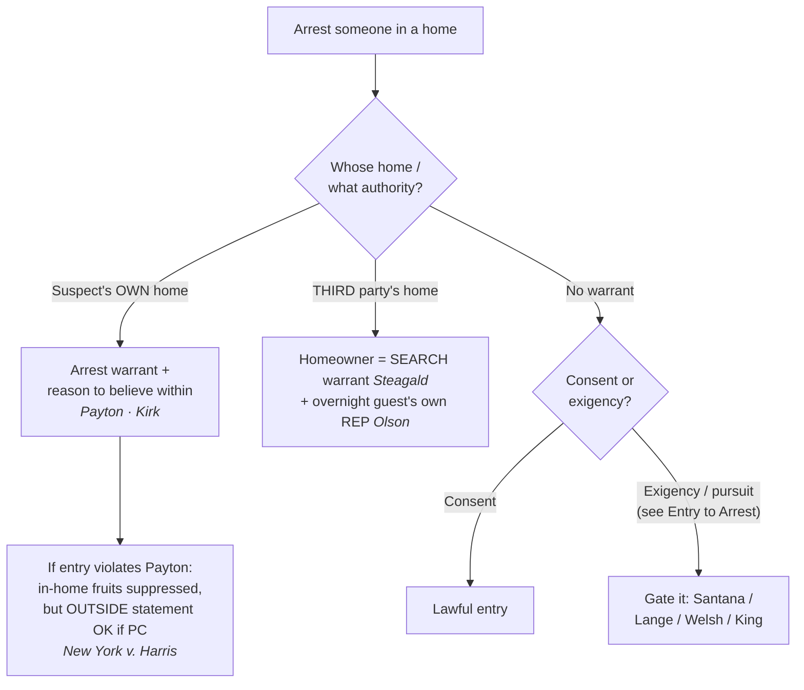

# S9 R1 panel-review — Opus model-diversity lane (prompt pack)

You are the **Claude/Opus** leg of the S9 three-lane adversarial panel (1 Claude + 2 Codex, R1). The two Codex lanes carry the A (support/quote-fidelity) and B (currency/treatment) attack lenses; **you carry model diversity and MUST vote on every paneled assertion across BOTH lenses' concerns.** You are refute-framed: try hard to break each assertion; **default to REFUTED on uncertainty**; never fabricate a cite, quote, or holding; use ONLY the evidence inlined below (no search, no outside knowledge). You are a SIGHTED reviewer — the FULL lake record (judgment fields included) is inlined.

You are a WRITER lane, not an adjudicator: you FIND and VOTE. You do not tally, adjudicate, or close any row — the orchestrator does.

For EACH group below, return one JSON object with the exact `reviewed[]` shape from the output contract (identical framing to the Codex lenses). Emit a finding object ONLY for a real defect (verdict refuted / stands-modified); a group you find wholly clean returns all-`stands` verdicts (the harness records a clean attestation). Concatenate the per-group JSON objects into a top-level `{"packs": [ ... ]}` array, one entry per group, each carrying its `group_id`.


OUTPUT CONTRACT — return ONE JSON object, nothing else:
{
  "lens": "A" | "B",
  "group_id": "<echo the group id>",
  "reviewed": [
    {
      "assertion_id": "<from group_inventory.jsonl>",
      "dimension": "existence|support|quote_fidelity|pincite|treatment|black_letter",
      "verdict": "stands" | "refuted" | "stands-modified",
      "verifiable_from_disclosed": true | false,
      "defect": null,   // null when verdict=="stands"; else an object:
      //  {"problem": "...", "severity": "high|medium|low", "proposed_fix": "...", "evidence_quote": "verbatim from disclosed evidence or null", "needs_cl": true|false, "locator_note": "..."}
      "reasons": ["short evidence-grounded reason", "..."],
      "breaks_true_positives": true | false,
      "residual_risks": ["..."],
      "suggested_tightening": "... or null"
    }
  ],
  "notes": ""
}
Rules: verdict=='stands' <=> defect==null (assertion survives your attack). verdict=='refuted' <=> a real defect (the assertion as framed is wrong). verdict=='stands-modified' <=> survives but needs a stated modification (a minor defect). Review EVERY assertion_id in group_inventory.jsonl exactly once. Output ONLY the JSON object.
---

## GROUP: content/seizures/arrests/Arrest in the Home.md  (`doctrine`, 22 assertions)

### content_page

```
---
weight: 20
aliases:
  - "Arrest in the Home"
  - "4-what-is-a-seizure/Arrest-in-the-Home"
title: "Arrest in the Home"
topic: Arrest in the Home
type: doctrine
jurisdiction: Federal (U.S. Const. amend. IV); SCOTUS baseline
status: draft
related: ["[[Entry to Arrest]]", "[[Seizure of the Person]]", "[[Exigent Circumstances and Hot Pursuit]]", "[[Securing the Scene]]", "[[Standing to Challenge a Search]]", "[[Search Incident to Arrest]]", "[[Emergency Aid]]", "[[Curtilage]]"]
---

# Arrest in the Home

*This page states the arrest-in-the-home rule and its predicates, protected interests, and remedy. For the mechanics of crossing a threshold to arrest, including consent, [[Exigent Circumstances and Hot Pursuit|exigency]], and the surround-and-call-out (constructive-entry) frontier, see [[Entry to Arrest]].*

> [!rule] Black-letter rule
> **The home draws the Fourth Amendment's firmest line.** Absent **consent** or **[[Exigent Circumstances and Hot Pursuit|exigent circumstances]]**, police may not make a warrantless, nonconsensual entry into a suspect's home to make a routine felony arrest: "the Fourth Amendment has drawn a firm line at the entrance to the house." *[[Payton v. New York#^pin-590|Payton v. New York]]*, 445 U.S. 573, [590](https://www.courtlistener.com/opinion/110235/payton-v-new-york/#:~:text=In%20terms%20that%20apply%20equally) (1980). An **arrest warrant** carries the limited authority to enter the arrestee's **own** home when there is reason to believe he is within (*[[Payton v. New York|Payton]]*), while entering a **third party's** home to arrest requires a **search warrant** (*[[Steagald v. United States#^pin-205|Steagald]]*). Probable cause to arrest, standing alone, never substitutes for that warrant-or-[[Exigent Circumstances and Hot Pursuit|exigency]] predicate.
> ^rule-arrest-in-home

## The Brief

**Field-decisive question: may I enter this home to arrest, and what do I need?** A home arrest is a full seizure of the person that requires probable cause, and the home adds a second requirement on top: authority to cross the threshold. The home receives the Fourth Amendment's highest protection, so absent consent or [[Exigent Circumstances and Hot Pursuit|exigency]] police may not cross the entrance to arrest without a warrant, and "[a] routine felony arrest" does not by itself justify crossing that line. *[[Payton v. New York#^pin-590|Payton v. New York]]*, 445 U.S. 573, [590](https://www.courtlistener.com/opinion/110235/payton-v-new-york/#:~:text=In%20terms%20that%20apply%20equally) (1980).

**The suspect's own home: an arrest warrant plus reason to believe he is within.** For the suspect's **own** dwelling *[[Payton v. New York|Payton]]* supplies the operative rule:

> [!rule] Black-letter rule — stated on [[Entry to Arrest]]
> ![[warrant-exceptions/home-entry-and-search/Entry to Arrest#^rule-entry-to-arrest]]

Two predicates ride on that one sentence: the suspect **lives** there and there is **reason to believe** he is **present now**. So the field answer for the suspect's own home is an **arrest warrant plus reason to believe the suspect is within** (or consent, or a true [[Exigent Circumstances and Hot Pursuit|exigency]]).

**The warrant requirement flips inside someone else's home.** An arrest warrant protects the suspect, not the homeowner, so to enter a **third party's** home to arrest the suspect police need a **search warrant** absent [[Exigent Circumstances and Hot Pursuit|exigency]] or consent: a "search warrant must be obtained absent exigent circumstances or consent." *[[Steagald v. United States#^pin-205|Steagald v. United States]]*, 451 U.S. 204, [205–06](https://www.courtlistener.com/opinion/110464/steagald-v-united-states/) (1981). In the third-party scenario two protected interests are in play at once: the homeowner's (*[[Steagald v. United States|Steagald]]*) and, when the arrestee is an overnight guest, his own (*[[Minnesota v. Olson]]*, below).

**Who bears the burden, and how it is reviewed.** Because a warrantless home entry is presumptively unreasonable, the **government bears the burden** of proving consent or a recognized [[Exigent Circumstances and Hot Pursuit|exigency]]; the suspect need not disprove it. On appeal, suppression rulings get a mixed standard: historical facts for **[[Common Legal Terms#clear-error|clear error]]**, and the ultimate reasonableness question (consent, [[Exigent Circumstances and Hot Pursuit|exigency]], "reason to believe") **[[Common Legal Terms#de-novo|de novo]]**.

**The guest is not rightless.** An **overnight guest** has his **own** [[Reasonable Expectation of Privacy|reasonable expectation of privacy]] in the host's home, so even the person being arrested may have standing to suppress: "Olson's status as an overnight guest is alone enough to show that he had an expectation of privacy in the home that society is prepared to recognize as reasonable." *[[Minnesota v. Olson]]*, 495 U.S. 91, [96–97](https://www.courtlistener.com/opinion/112416/minnesota-v-olson/) (1990). Standing tracks the interest: the named suspect cannot invoke *[[Steagald v. United States|Steagald]]* (that is the homeowner's right), but he **can** assert his own *[[Minnesota v. Olson|Olson]]*/*[[Payton v. New York|Payton]]* privacy interest in the place he is staying. The counterpart limit is *[[Minnesota v. Carter]]*: a short-term commercial visitor with no overnight stay has **no** such expectation. *See* [[Standing to Challenge a Search]].

**When there is no warrant.** The entry then survives only on **consent** or a genuine **[[Exigent Circumstances and Hot Pursuit|exigency]]** (escape, imminent evidence destruction, danger), gated by *[[United States v. Santana#^pin-43|Santana]]* (the doorway is public and [[Exigent Circumstances and Hot Pursuit|hot pursuit]] crosses it, now cabined by *[[Lange v. California]]* for misdemeanor pursuits), *[[Welsh v. Wisconsin#^pin-753|Welsh]]* (a minor offense should "rarely" justify a home entry), and *[[Kentucky v. King]]* (a lawfully created [[Exigent Circumstances and Hot Pursuit|exigency]] counts; an unlawfully manufactured one does not). The full [[Exigent Circumstances and Hot Pursuit|exigency]] and threshold-crossing analysis is at [[Entry to Arrest]] and [[Exigent Circumstances and Hot Pursuit]].

**The remedy is real but bounded.** Suppression for a *[[Payton v. New York|Payton]]* violation reaches only what the unlawful entry produced **inside** the home. Where police have **probable cause** to arrest, a *[[Payton v. New York|Payton]]* violation does **not** bar a statement the suspect later makes **outside** the home: "the exclusionary rule does not bar the State's use of a statement made by the defendant outside of his home, even though the statement is taken after an arrest made in the home in violation of *Payton*." *[[New York v. Harris#^pin-21|New York v. Harris]]*, 495 U.S. 14, [21](https://www.courtlistener.com/opinion/112413/new-york-v-harris/) (1990). A later, properly-Mirandized station-house statement in lawful custody was not "the fruit of having been arrested in the home rather than someplace else." *Id.* at 19.

**The firm line has held.** *[[Kirk v. Louisiana#^pin-638|Kirk v. Louisiana]]* ([[Common Legal Terms#per-curiam|per curiam]]) reaffirms that "police officers need either a warrant or probable cause plus exigent circumstances in order to make a lawful entry into a home," and a court that upholds the entry without assessing [[Exigent Circumstances and Hot Pursuit|exigency]] "violate[s] *Payton*." 536 U.S. 635, 638 (2002).

**Flag the "reason to believe" quantum; do not anchor to one reading.** *[[Payton v. New York|Payton]]* never defined the showing behind "reason to believe the suspect is within," and it loads **two** contested predicates: that the suspect (a) **resides** there and (b) is **presently home**. The circuits divide (below), the decisions are **Persuasive (outside circuit)**, and the split is unresolved at the Supreme Court. For a multi-jurisdiction audience, **default to the higher (probable-cause) showing** on both predicates: it satisfies every circuit and the articulation costs nothing.

**Keep the three protected interests straight; the most common field errors live here.**

- **Do not use an arrest warrant to enter a third party's home.** That is a *[[Steagald v. United States|Steagald]]* violation: the home needs its own **search warrant**, even with a valid arrest warrant for the guest inside.
- **Do not assume a guest "has no rights."** Under *[[Minnesota v. Olson|Olson]]* an overnight guest has his **own** [[Reasonable Expectation of Privacy|reasonable expectation of privacy]].
- **Do not treat "reason to believe" as a hunch.** State both predicates (resides, present) with facts behind each; default to probable cause to be safe in any circuit.
- **Do not read *[[United States v. Santana|Santana]]* as a blank check for [[Exigent Circumstances and Hot Pursuit|hot pursuit]].** After *[[Lange v. California|Lange]]*, chasing a fleeing **misdemeanant** into a home is not automatically lawful.
- **Do not assume any arrest supports home [[Exigent Circumstances and Hot Pursuit|exigency]].** *[[Welsh v. Wisconsin|Welsh]]* is the opposite: for a **minor offense**, warrantless home entry should "rarely be sanctioned."
- **Do not think the officer's body must cross the line before *[[Payton v. New York|Payton]]* applies.** A surround-and-call-out that coerces the suspect out is still an in-home arrest; that constructive-entry frontier is treated at [[Entry to Arrest]].

Finally, this is **criminal** [[Exigent Circumstances and Hot Pursuit|exigency]]. Entry merely to render aid is a different, **non-criminal** justification governed by an objective-reasonableness standard; do not conflate emergency-aid entry with entry to make an arrest. *See* [[Emergency Aid]]; and note there is **no** freestanding "community caretaking" power to cross a home's threshold (*[[Caniglia v. Strom]]*).

## Lower-court developments

The home-arrest core has held steady, but the *[[Payton v. New York|Payton]]* "reason to believe" quantum is the live battleground and **constructive entry** is an open frontier. The circuit decisions below are **Binding in-circuit** within their own circuits and **Persuasive (outside circuit)** elsewhere; genuine splits are flagged.

- **Constructive-entry circuit split (treated in full at [[Entry to Arrest]]).** Whether coercing a suspect out of a surrounded home (drawn weapons, a perimeter, loudspeakers) is a *[[Payton v. New York|Payton]]* in-home arrest divides the circuits: the Ninth (*[[United States v. Nora|Nora]]*, *[[United States v. Al-Azzawy|Al-Azzawy]]*, with *[[United States v. Vaneaton|Vaneaton]]* marking the voluntary-exposure limit) and Tenth (*[[United States v. Maez|Maez]]*) treat the coerced emergence as an in-home arrest; the Seventh (*[[United States v. Berkowitz|Berkowitz]]*) and Eleventh (*[[Knight v. Jacobson|Knight v. Jacobson]]*) keep the officer's **voice**, not his **body**, on the public side of the threshold. ⚖ Circuit split. **Binding in-circuit** each; **Persuasive (outside circuit)** elsewhere.
- **[[United States v. Brinkley]] (4th Cir. 2020).** ⚖ Circuit split. *[[Payton v. New York|Payton]]*'s "reason to believe the suspect is within" requires **probable cause on both predicates**: PC that the suspect resides there and PC he is presently inside; "generic signs of life" and a resident's nervousness are not enough. "the quantum of proof necessary to satisfy Payton has divided the circuits, with some construing 'reason to believe' to demand less than probable cause and others equating the two standards" (980 F.3d at 387). **Binding in-circuit — 4th Cir.; Persuasive (outside circuit).** [opinion](https://www.courtlistener.com/opinion/4805913/united-states-v-kendrick-brinkley/)
- **[[United States v. Vasquez-Algarin]] (3d Cir. 2016).** ⚖ Circuit split. "Reason to believe" under *[[Payton v. New York|Payton]]* "embodies the same standard of reasonableness inherent in probable cause," requiring PC that the arrestee both resides at and is present in the dwelling before forcing entry on an arrest warrant alone, "join[ing] the Fifth, Sixth, Seventh and Ninth Circuits in holding that Payton's 'reason to believe' language amounts to a probable-cause standard" (821 F.3d at 477). **Binding in-circuit — 3d Cir.; Persuasive (outside circuit).** [opinion](https://www.courtlistener.com/opinion/3199633/united-states-v-johnny-vasquez-algarin/)

## Key cases

| Case | Holding | Opinion |
|---|---|---|
| *[[Payton v. New York]]*, 445 U.S. 573 (1980) | **Anchor.** Warrantless, nonconsensual entry into a suspect's **own** home for a routine felony arrest is presumptively unreasonable; an **arrest warrant plus reason to believe the suspect is within** authorizes entry. | [opinion](https://www.courtlistener.com/opinion/110235/payton-v-new-york/) |
| *[[United States v. Santana]]*, 427 U.S. 38 (1976) | A suspect in her own doorway is in a **public** place and cannot defeat a public-place arrest by retreating inside; [[Exigent Circumstances and Hot Pursuit\|hot pursuit]] justifies the warrantless entry (now cabined by *[[Lange v. California\|Lange]]* for misdemeanors). | [opinion](https://www.courtlistener.com/opinion/109504/united-states-v-santana/) |
| *[[Steagald v. United States]]*, 451 U.S. 204 (1981) | To arrest the subject of an arrest warrant inside a **third party's** home, police need a **search warrant** absent [[Exigent Circumstances and Hot Pursuit\|exigency]] or consent; the arrest warrant protects the suspect, not the homeowner. | [opinion](https://www.courtlistener.com/opinion/110464/steagald-v-united-states/) |
| *[[New York v. Harris]]*, 495 U.S. 14 (1990) | **Limiting.** With probable cause to arrest, a *[[Payton v. New York\|Payton]]* violation does **not** bar a statement the suspect makes **outside** the home; the remedy reaches only the in-home fruits. | [opinion](https://www.courtlistener.com/opinion/112413/new-york-v-harris/) |
| *[[Kirk v. Louisiana]]*, 536 U.S. 635 (2002) (per curiam) | Reaffirms *[[Payton v. New York\|Payton]]*: police need **a warrant or probable cause plus [[Exigent Circumstances and Hot Pursuit\|exigent circumstances]]** to enter a home to arrest; PC to arrest alone is not enough. | [opinion](https://www.courtlistener.com/opinion/121167/kirk-v-louisiana/) |
| *[[Lange v. California]]*, 594 U.S. 295 (2021) | Pursuit of a fleeing **misdemeanor** suspect does **not categorically** justify warrantless home entry; courts apply a **case-by-case** [[Exigent Circumstances and Hot Pursuit\|exigency]] assessment. | [opinion](https://www.courtlistener.com/opinion/4894407/lange-v-california/) |

## Related cases across doctrines

These cases are treated in full elsewhere but bear on the arrest-in-the-home rules, framed here for this doctrine.

| Case | Relevance here | Primary home | Opinion |
|---|---|---|---|
| *[[Welsh v. Wisconsin]]*, 466 U.S. 740 (1984) | ***Offense gravity.*** The seriousness of the offense caps [[Exigent Circumstances and Hot Pursuit\|exigency]]; a warrantless home entry for a minor offense should "rarely be sanctioned." | [[Exigent Circumstances and Hot Pursuit]] | [opinion](https://www.courtlistener.com/opinion/111173/welsh-v-wisconsin/) |
| *[[Kentucky v. King]]*, 563 U.S. 452 (2011) | ***Police-created [[Exigent Circumstances and Hot Pursuit\|exigency]].*** Police keep the exception when they lawfully create the [[Exigent Circumstances and Hot Pursuit\|exigency]]; only conduct that itself violates or threatens the Fourth Amendment poisons the entry. | [[Exigent Circumstances and Hot Pursuit]] | [opinion](https://www.courtlistener.com/opinion/216733/kentucky-v-king/) |
| *[[Minnesota v. Olson]]*, 495 U.S. 91 (1990) | ***Guest standing.*** An overnight guest has his own [[Reasonable Expectation of Privacy\|reasonable expectation of privacy]] in the host's home, so the person arrested may challenge the entry. | [[Standing to Challenge a Search]] | [opinion](https://www.courtlistener.com/opinion/112416/minnesota-v-olson/) |
| *[[Minnesota v. Carter]]*, 525 U.S. 83 (1998) | ***Standing limit.*** A short-term commercial visitor with no overnight stay has **no** [[Reasonable Expectation of Privacy\|reasonable expectation of privacy]] and cannot invoke *[[Payton v. New York\|Payton]]*/*[[Minnesota v. Olson\|Olson]]*. | [[Standing to Challenge a Search]] | [opinion](https://www.courtlistener.com/opinion/118249/minnesota-v-carter/) |
| *[[Warden v. Hayden]]*, 387 U.S. 294 (1967) | ***Hot-pursuit baseline.*** Warrantless entry to seize a fleeing armed robber is reasonable where danger and escape leave no time for a warrant; the felony-pursuit baseline *[[United States v. Santana\|Santana]]* builds on. | [[Exigent Circumstances and Hot Pursuit]] | [opinion](https://www.courtlistener.com/opinion/107465/warden-maryland-penitentiary-v-hayden/) |
| *[[Sabbath v. United States]]*, 391 U.S. 585 (1968) | ***Manner of entry.*** Opening a closed but unlocked door without announcing authority and purpose is a "breaking" governed by the [[Knock-and-Announce\|knock-and-announce]] rule. | [[Knock-and-Announce]] | [opinion](https://www.courtlistener.com/opinion/107718/sabbath-v-united-states/) |
| *[[Vale v. Louisiana]]*, 399 U.S. 30 (1970) | ***Spatial/burden limit.*** A street arrest on the front steps supplies no [[Exigent Circumstances and Hot Pursuit\|exigency]] to search the house; the State must justify any warrantless dwelling search. | [[Search Incident to Arrest]] | [opinion](https://www.courtlistener.com/opinion/108183/vale-v-louisiana/) |
| *[[Maryland v. Buie]]*, 494 U.S. 325 (1990) | ***[[Securing the Scene\|Protective sweep]].*** After a lawful in-home arrest, officers may sweep adjoining spaces automatically and beyond them on articulable suspicion of danger. | [[Securing the Scene]] | [opinion](https://www.courtlistener.com/opinion/112384/maryland-v-buie/) |
| *[[Illinois v. McArthur]]*, 531 U.S. 326 (2001) | ***Less-intrusive path.*** Officers with PC may temporarily bar a resident from re-entering while they get a warrant, respecting *[[Payton v. New York\|Payton]]*'s firm line. | [[Securing the Scene]] | [opinion](https://www.courtlistener.com/opinion/118405/illinois-v-mcarthur/) |
| *[[Segura v. United States]]*, 468 U.S. 796 (1984) | ***Securing / [[Inevitable Discovery and Independent Source\|independent source]].*** Officers may secure premises pending a warrant; evidence later seized under a warrant built on wholly independent information is admissible. | [[Securing the Scene]] | [opinion](https://www.courtlistener.com/opinion/111259/segura-v-united-states/) |
| *[[Mincey v. Arizona]]*, 437 U.S. 385 (1978) | ***No "murder scene" exception.*** The gravity of the suspected offense does not by itself manufacture [[Exigent Circumstances and Hot Pursuit\|exigency]] to enter or remain in a home. | [[Emergency Aid]] | [opinion](https://www.courtlistener.com/opinion/109905/mincey-v-arizona/) |
| *[[Brigham City v. Stuart]]*, 547 U.S. 398 (2006) | ***Aid boundary.*** Police may cross the threshold without a warrant to render [[Emergency Aid\|emergency aid]]; a non-criminal justification distinct from arrest [[Exigent Circumstances and Hot Pursuit\|exigency]]. | [[Emergency Aid]] | [opinion](https://www.courtlistener.com/opinion/145654/brigham-city-v-stuart/) |
| *[[Caniglia v. Strom]]*, 593 U.S. 194 (2021) | ***No caretaking end-run.*** There is no freestanding "community caretaking" exception for the home; crossing the threshold still needs a warrant, [[Exigent Circumstances and Hot Pursuit\|exigency]], or true [[Emergency Aid\|emergency aid]]. | [[Emergency Aid]] | [opinion](https://www.courtlistener.com/opinion/4883694/caniglia-v-strom/) |
| *[[Case v. Montana]]*, 607 U.S. ___ (2026) | ***Aid standard.*** A warrantless home entry to render aid needs only *Brigham City*'s "objectively reasonable basis," not investigative probable cause; do not conflate it with arrest [[Exigent Circumstances and Hot Pursuit\|exigency]]. | [[Emergency Aid]] | [opinion](https://www.courtlistener.com/opinion/10774335/case-v-montana/) |

## Visual



## Sources
- [*Payton v. New York*, 445 U.S. 573 (1980)](https://www.courtlistener.com/opinion/110235/payton-v-new-york/) (pinpoints: 576, 590, 603)
- [*United States v. Santana*, 427 U.S. 38 (1976)](https://www.courtlistener.com/opinion/109504/united-states-v-santana/) (pinpoints: 42, 43)
- [*Steagald v. United States*, 451 U.S. 204 (1981)](https://www.courtlistener.com/opinion/110464/steagald-v-united-states/) (pinpoints: 205–06)
- [*New York v. Harris*, 495 U.S. 14 (1990)](https://www.courtlistener.com/opinion/112413/new-york-v-harris/) (pinpoints: 17, 19, 21)
- [*Kirk v. Louisiana*, 536 U.S. 635 (2002) (per curiam)](https://www.courtlistener.com/opinion/121167/kirk-v-louisiana/) (pinpoints: 636, 638)
- [*Welsh v. Wisconsin*, 466 U.S. 740 (1984)](https://www.courtlistener.com/opinion/111173/welsh-v-wisconsin/) (pinpoints: 753, 755)
- [*Minnesota v. Olson*, 495 U.S. 91 (1990)](https://www.courtlistener.com/opinion/112416/minnesota-v-olson/) (pinpoints: 96–97)
- [*Kentucky v. King*, 563 U.S. 452 (2011)](https://www.courtlistener.com/opinion/216733/kentucky-v-king/) (pinpoint: 462)
- [*Lange v. California*, 594 U.S. 295 (2021)](https://www.courtlistener.com/opinion/4894407/lange-v-california/) (pinpoint: 298)
- [*Minnesota v. Carter*, 525 U.S. 83 (1998)](https://www.courtlistener.com/opinion/118249/minnesota-v-carter/)
- [*Warden v. Hayden*, 387 U.S. 294 (1967)](https://www.courtlistener.com/opinion/107465/warden-maryland-penitentiary-v-hayden/)
- [*Sabbath v. United States*, 391 U.S. 585 (1968)](https://www.courtlistener.com/opinion/107718/sabbath-v-united-states/) (pinpoints: 585–86, 590)
- [*Vale v. Louisiana*, 399 U.S. 30 (1970)](https://www.courtlistener.com/opinion/108183/vale-v-louisiana/) (pinpoints: 33, 34, 35)
- [*Maryland v. Buie*, 494 U.S. 325 (1990)](https://www.courtlistener.com/opinion/112384/maryland-v-buie/)
- [*Illinois v. McArthur*, 531 U.S. 326 (2001)](https://www.courtlistener.com/opinion/118405/illinois-v-mcarthur/)
- [*Segura v. United States*, 468 U.S. 796 (1984)](https://www.courtlistener.com/opinion/111259/segura-v-united-states/)
- [*Mincey v. Arizona*, 437 U.S. 385 (1978)](https://www.courtlistener.com/opinion/109905/mincey-v-arizona/)
- [*Brigham City v. Stuart*, 547 U.S. 398 (2006)](https://www.courtlistener.com/opinion/145654/brigham-city-v-stuart/)
- [*Caniglia v. Strom*, 593 U.S. 194 (2021)](https://www.courtlistener.com/opinion/4883694/caniglia-v-strom/)
- [*Case v. Montana*, 607 U.S. ___ (2026) (No. 24-624)](https://www.courtlistener.com/opinion/10774335/case-v-montana/) (pinpoints: slip op. at 7, 8, 9, 10–11)
- [*United States v. Brinkley*, 980 F.3d 377 (4th Cir. 2020)](https://www.courtlistener.com/opinion/4805913/united-states-v-kendrick-brinkley/) (pinpoint: 387)
- [*United States v. Vasquez-Algarin*, 821 F.3d 467 (3d Cir. 2016)](https://www.courtlistener.com/opinion/3199633/united-states-v-johnny-vasquez-algarin/) (pinpoint: 477)

```

### group_inventory (assertions under review)

```jsonl
{"assertion_id": "0fd24cd764a57897", "dimension": "existence", "kind": "case_cite", "locator": {"case": "Mincey v. Arizona", "table_line": 81}, "payload": {"case": "Mincey v. Arizona", "cells": ["*[[Mincey v. Arizona]]*, 437 U.S. 385 (1978)", "***No \"murder scene\" exception.*** The gravity of the suspected offense does not by itself manufacture [[Exigent Circumstances and Hot Pursuit\\|exigency]] to enter or remain in a home.", "[[Emergency Aid]]", "[opinion](https://www.courtlistener.com/opinion/109905/mincey-v-arizona/)"], "header": ["Case", "Relevance here", "Primary home", "Opinion"]}}
{"assertion_id": "11165d64e425e82d", "dimension": "existence", "kind": "case_cite", "locator": {"case": "Vale v. Louisiana", "table_line": 77}, "payload": {"case": "Vale v. Louisiana", "cells": ["*[[Vale v. Louisiana]]*, 399 U.S. 30 (1970)", "***Spatial/burden limit.*** A street arrest on the front steps supplies no [[Exigent Circumstances and Hot Pursuit\\|exigency]] to search the house; the State must justify any warrantless dwelling search.", "[[Search Incident to Arrest]]", "[opinion](https://www.courtlistener.com/opinion/108183/vale-v-louisiana/)"], "header": ["Case", "Relevance here", "Primary home", "Opinion"]}}
{"assertion_id": "24e82afde4585546", "dimension": "existence", "kind": "case_cite", "locator": {"case": "Segura v. United States", "table_line": 80}, "payload": {"case": "Segura v. United States", "cells": ["*[[Segura v. United States]]*, 468 U.S. 796 (1984)", "***Securing / [[Inevitable Discovery and Independent Source\\|independent source]].*** Officers may secure premises pending a warrant; evidence later seized under a warrant built on wholly independent information is admissible.", "[[Securing the Scene]]", "[opinion](https://www.courtlistener.com/opinion/111259/segura-v-united-states/)"], "header": ["Case", "Relevance here", "Primary home", "Opinion"]}}
{"assertion_id": "2bff3f28e51c97bd", "dimension": "existence", "kind": "case_cite", "locator": {"case": "Lange v. California", "table_line": 63}, "payload": {"case": "Lange v. California", "cells": ["*[[Lange v. California]]*, 594 U.S. 295 (2021)", "Pursuit of a fleeing **misdemeanor** suspect does **not categorically** justify warrantless home entry; courts apply a **case-by-case** [[Exigent Circumstances and Hot Pursuit\\|exigency]] assessment.", "[opinion](https://www.courtlistener.com/opinion/4894407/lange-v-california/)"], "header": ["Case", "Holding", "Opinion"]}}
{"assertion_id": "38091fd30eb6209f", "dimension": "existence", "kind": "case_cite", "locator": {"case": "United States v. Santana", "table_line": 59}, "payload": {"case": "United States v. Santana", "cells": ["*[[United States v. Santana]]*, 427 U.S. 38 (1976)", "A suspect in her own doorway is in a **public** place and cannot defeat a public-place arrest by retreating inside; [[Exigent Circumstances and Hot Pursuit\\|hot pursuit]] justifies the warrantless entry (now cabined by *[[Lange v. California\\|Lange]]* for misdemeanors).", "[opinion](https://www.courtlistener.com/opinion/109504/united-states-v-santana/)"], "header": ["Case", "Holding", "Opinion"]}}
{"assertion_id": "3813c6737da2b3e1", "dimension": "existence", "kind": "case_cite", "locator": {"case": "Case v. Montana", "table_line": 84}, "payload": {"case": "Case v. Montana", "cells": ["*[[Case v. Montana]]*, 607 U.S. ___ (2026)", "***Aid standard.*** A warrantless home entry to render aid needs only *Brigham City*'s \"objectively reasonable basis,\" not investigative probable cause; do not conflate it with arrest [[Exigent Circumstances and Hot Pursuit\\|exigency]].", "[[Emergency Aid]]", "[opinion](https://www.courtlistener.com/opinion/10774335/case-v-montana/)"], "header": ["Case", "Relevance here", "Primary home", "Opinion"]}}
{"assertion_id": "481e6085f54d0b46", "dimension": "existence", "kind": "case_cite", "locator": {"case": "New York v. Harris", "table_line": 61}, "payload": {"case": "New York v. Harris", "cells": ["*[[New York v. Harris]]*, 495 U.S. 14 (1990)", "**Limiting.** With probable cause to arrest, a *[[Payton v. New York\\|Payton]]* violation does **not** bar a statement the suspect makes **outside** the home; the remedy reaches only the in-home fruits.", "[opinion](https://www.courtlistener.com/opinion/112413/new-york-v-harris/)"], "header": ["Case", "Holding", "Opinion"]}}
{"assertion_id": "64b7539edf4446fd", "dimension": "existence", "kind": "case_cite", "locator": {"case": "Illinois v. McArthur", "table_line": 79}, "payload": {"case": "Illinois v. McArthur", "cells": ["*[[Illinois v. McArthur]]*, 531 U.S. 326 (2001)", "***Less-intrusive path.*** Officers with PC may temporarily bar a resident from re-entering while they get a warrant, respecting *[[Payton v. New York\\|Payton]]*'s firm line.", "[[Securing the Scene]]", "[opinion](https://www.courtlistener.com/opinion/118405/illinois-v-mcarthur/)"], "header": ["Case", "Relevance here", "Primary home", "Opinion"]}}
{"assertion_id": "64c42aa9a9c7d2cd", "dimension": "existence", "kind": "case_cite", "locator": {"case": "Warden v. Hayden", "table_line": 75}, "payload": {"case": "Warden v. Hayden", "cells": ["*[[Warden v. Hayden]]*, 387 U.S. 294 (1967)", "***Hot-pursuit baseline.*** Warrantless entry to seize a fleeing armed robber is reasonable where danger and escape leave no time for a warrant; the felony-pursuit baseline *[[United States v. Santana\\|Santana]]* builds on.", "[[Exigent Circumstances and Hot Pursuit]]", "[opinion](https://www.courtlistener.com/opinion/107465/warden-maryland-penitentiary-v-hayden/)"], "header": ["Case", "Relevance here", "Primary home", "Opinion"]}}
{"assertion_id": "94f0df942b03b202", "dimension": "existence", "kind": "case_cite", "locator": {"case": "Minnesota v. Carter", "table_line": 74}, "payload": {"case": "Minnesota v. Carter", "cells": ["*[[Minnesota v. Carter]]*, 525 U.S. 83 (1998)", "***Standing limit.*** A short-term commercial visitor with no overnight stay has **no** [[Reasonable Expectation of Privacy\\|reasonable expectation of privacy]] and cannot invoke *[[Payton v. New York\\|Payton]]*/*[[Minnesota v. Olson\\|Olson]]*.", "[[Standing to Challenge a Search]]", "[opinion](https://www.courtlistener.com/opinion/118249/minnesota-v-carter/)"], "header": ["Case", "Relevance here", "Primary home", "Opinion"]}}
{"assertion_id": "9688083c7132a614", "dimension": "existence", "kind": "case_cite", "locator": {"case": "Caniglia v. Strom", "table_line": 83}, "payload": {"case": "Caniglia v. Strom", "cells": ["*[[Caniglia v. Strom]]*, 593 U.S. 194 (2021)", "***No caretaking end-run.*** There is no freestanding \"community caretaking\" exception for the home; crossing the threshold still needs a warrant, [[Exigent Circumstances and Hot Pursuit\\|exigency]], or true [[Emergency Aid\\|emergency aid]].", "[[Emergency Aid]]", "[opinion](https://www.courtlistener.com/opinion/4883694/caniglia-v-strom/)"], "header": ["Case", "Relevance here", "Primary home", "Opinion"]}}
{"assertion_id": "ab68ad7a359b27b9", "dimension": "existence", "kind": "case_cite", "locator": {"case": "Maryland v. Buie", "table_line": 78}, "payload": {"case": "Maryland v. Buie", "cells": ["*[[Maryland v. Buie]]*, 494 U.S. 325 (1990)", "***[[Securing the Scene\\|Protective sweep]].*** After a lawful in-home arrest, officers may sweep adjoining spaces automatically and beyond them on articulable suspicion of danger.", "[[Securing the Scene]]", "[opinion](https://www.courtlistener.com/opinion/112384/maryland-v-buie/)"], "header": ["Case", "Relevance here", "Primary home", "Opinion"]}}
{"assertion_id": "b1d8f0cd108a9f14", "dimension": "existence", "kind": "case_cite", "locator": {"case": "Payton v. New York", "table_line": 58}, "payload": {"case": "Payton v. New York", "cells": ["*[[Payton v. New York]]*, 445 U.S. 573 (1980)", "**Anchor.** Warrantless, nonconsensual entry into a suspect's **own** home for a routine felony arrest is presumptively unreasonable; an **arrest warrant plus reason to believe the suspect is within** authorizes entry.", "[opinion](https://www.courtlistener.com/opinion/110235/payton-v-new-york/)"], "header": ["Case", "Holding", "Opinion"]}}
{"assertion_id": "b45f76c2009f2e6a", "dimension": "existence", "kind": "case_cite", "locator": {"case": "Kentucky v. King", "table_line": 72}, "payload": {"case": "Kentucky v. King", "cells": ["*[[Kentucky v. King]]*, 563 U.S. 452 (2011)", "***Police-created [[Exigent Circumstances and Hot Pursuit\\|exigency]].*** Police keep the exception when they lawfully create the [[Exigent Circumstances and Hot Pursuit\\|exigency]]; only conduct that itself violates or threatens the Fourth Amendment poisons the entry.", "[[Exigent Circumstances and Hot Pursuit]]", "[opinion](https://www.courtlistener.com/opinion/216733/kentucky-v-king/)"], "header": ["Case", "Relevance here", "Primary home", "Opinion"]}}
{"assertion_id": "b6cddbe72f8dd874", "dimension": "existence", "kind": "case_cite", "locator": {"case": "Brigham City v. Stuart", "table_line": 82}, "payload": {"case": "Brigham City v. Stuart", "cells": ["*[[Brigham City v. Stuart]]*, 547 U.S. 398 (2006)", "***Aid boundary.*** Police may cross the threshold without a warrant to render [[Emergency Aid\\|emergency aid]]; a non-criminal justification distinct from arrest [[Exigent Circumstances and Hot Pursuit\\|exigency]].", "[[Emergency Aid]]", "[opinion](https://www.courtlistener.com/opinion/145654/brigham-city-v-stuart/)"], "header": ["Case", "Relevance here", "Primary home", "Opinion"]}}
{"assertion_id": "cbf27dff5d2cfdca", "dimension": "existence", "kind": "case_cite", "locator": {"case": "Sabbath v. United States", "table_line": 76}, "payload": {"case": "Sabbath v. United States", "cells": ["*[[Sabbath v. United States]]*, 391 U.S. 585 (1968)", "***Manner of entry.*** Opening a closed but unlocked door without announcing authority and purpose is a \"breaking\" governed by the [[Knock-and-Announce\\|knock-and-announce]] rule.", "[[Knock-and-Announce]]", "[opinion](https://www.courtlistener.com/opinion/107718/sabbath-v-united-states/)"], "header": ["Case", "Relevance here", "Primary home", "Opinion"]}}
{"assertion_id": "f20f5a84729b12f9", "dimension": "existence", "kind": "case_cite", "locator": {"case": "Minnesota v. Olson", "table_line": 73}, "payload": {"case": "Minnesota v. Olson", "cells": ["*[[Minnesota v. Olson]]*, 495 U.S. 91 (1990)", "***Guest standing.*** An overnight guest has his own [[Reasonable Expectation of Privacy\\|reasonable expectation of privacy]] in the host's home, so the person arrested may challenge the entry.", "[[Standing to Challenge a Search]]", "[opinion](https://www.courtlistener.com/opinion/112416/minnesota-v-olson/)"], "header": ["Case", "Relevance here", "Primary home", "Opinion"]}}
{"assertion_id": "f4c484812242ed48", "dimension": "existence", "kind": "case_cite", "locator": {"case": "Steagald v. United States", "table_line": 60}, "payload": {"case": "Steagald v. United States", "cells": ["*[[Steagald v. United States]]*, 451 U.S. 204 (1981)", "To arrest the subject of an arrest warrant inside a **third party's** home, police need a **search warrant** absent [[Exigent Circumstances and Hot Pursuit\\|exigency]] or consent; the arrest warrant protects the suspect, not the homeowner.", "[opinion](https://www.courtlistener.com/opinion/110464/steagald-v-united-states/)"], "header": ["Case", "Holding", "Opinion"]}}
{"assertion_id": "f7774a5cb6ebd63a", "dimension": "existence", "kind": "case_cite", "locator": {"case": "Kirk v. Louisiana", "table_line": 62}, "payload": {"case": "Kirk v. Louisiana", "cells": ["*[[Kirk v. Louisiana]]*, 536 U.S. 635 (2002) (per curiam)", "Reaffirms *[[Payton v. New York\\|Payton]]*: police need **a warrant or probable cause plus [[Exigent Circumstances and Hot Pursuit\\|exigent circumstances]]** to enter a home to arrest; PC to arrest alone is not enough.", "[opinion](https://www.courtlistener.com/opinion/121167/kirk-v-louisiana/)"], "header": ["Case", "Holding", "Opinion"]}}
{"assertion_id": "fbaa32f044c7c6ed", "dimension": "existence", "kind": "case_cite", "locator": {"case": "Welsh v. Wisconsin", "table_line": 71}, "payload": {"case": "Welsh v. Wisconsin", "cells": ["*[[Welsh v. Wisconsin]]*, 466 U.S. 740 (1984)", "***Offense gravity.*** The seriousness of the offense caps [[Exigent Circumstances and Hot Pursuit\\|exigency]]; a warrantless home entry for a minor offense should \"rarely be sanctioned.\"", "[[Exigent Circumstances and Hot Pursuit]]", "[opinion](https://www.courtlistener.com/opinion/111173/welsh-v-wisconsin/)"], "header": ["Case", "Relevance here", "Primary home", "Opinion"]}}
{"assertion_id": "6d643a9028092863", "dimension": "support", "kind": "proposition", "locator": {"callout": "^rule-arrest-in-home"}, "payload": {"anchor": "^rule-arrest-in-home", "statement": "[!rule] Black-letter rule\n**The home draws the Fourth Amendment's firmest line.** Absent **consent** or **[[Exigent Circumstances and Hot Pursuit|exigent circumstances]]**, police may not make a warrantless, nonconsensual entry into a suspect's home to make a routine felony arrest: \"the Fourth Amendment has drawn a firm line at the entrance to the house.\" *[[Payton v. New York#^pin-590|Payton v. New York]]*, 445 U.S. 573, [590](https://www.courtlistener.com/opinion/110235/payton-v-new-york/#:~:text=In%20terms%20that%20apply%20equally) (1980). An **arrest warrant** carries the limited authority to enter the arrestee's **own** home when there is reason to believe he is within (*[[Payton v. New York|Payton]]*), while entering a **third party's** home to arrest requires a **search warrant** (*[[Steagald v. United States#^pin-205|Steagald]]*). Probable cause to arrest, standing alone, never substitutes for that warrant-or-[[Exigent Circumstances and Hot Pursuit|exigency]] predicate."}}
{"assertion_id": "c052a7adc9a99fcd", "dimension": "support", "kind": "proposition", "locator": {"callout": "line-16"}, "payload": {"anchor": null, "statement": "[!rule] Black-letter rule — stated on [[Entry to Arrest]]\n![[warrant-exceptions/home-entry-and-search/Entry to Arrest#^rule-entry-to-arrest]]"}}
```

### lake record — Brigham City v. Stuart

```json
{
  "schema_version": "s2.v1",
  "record_id": "Brigham City v. Stuart",
  "stub": false,
  "status": "verified",
  "identity": {
    "case_name": "Brigham City v. Stuart",
    "case_name_short": "Stuart",
    "case_name_full": "BRIGHAM CITY, UTAH v. STUART Et Al.",
    "input_case_name": "Brigham City v. Stuart",
    "court": "U.S. Supreme Court",
    "court_id": "scotus",
    "court_level": "scotus",
    "circuit": null,
    "state": null,
    "date_decided": "2006-05-22",
    "year": 2006,
    "docket": "05-502",
    "cluster_id": 145654,
    "lead_opinion_id": 145654,
    "sibling_ids": [
      145654,
      9434949,
      9434950
    ],
    "absolute_url": "/opinion/145654/brigham-city-v-stuart/",
    "identity_method": "citation+party-text",
    "expected_citation_found": true,
    "party_name_in_text": true,
    "canonical_name_match": true,
    "alternates": [
      {
        "cluster_id": 9256378,
        "score": 10,
        "case_name": "Brigham City v. Stuart"
      }
    ],
    "reason_code": null
  },
  "citations": {
    "official": {
      "cite": "547 U.S. 398",
      "volume": "547",
      "reporter": "U.S.",
      "page": "398",
      "type": 1,
      "selected_official": true,
      "source": "cluster.citations[]"
    },
    "parallel": [
      {
        "cite": "126 S. Ct. 1943",
        "volume": "126",
        "reporter": "S. Ct.",
        "page": "1943",
        "type": 1,
        "selected_official": false,
        "source": "cluster.citations[]"
      },
      {
        "cite": "164 L. Ed. 2d 650",
        "volume": "164",
        "reporter": "L. Ed. 2d",
        "page": "650",
        "type": 1,
        "selected_official": false,
        "source": "cluster.citations[]"
      }
    ],
    "vendor_neutral": [
      {
        "cite": "2006 U.S. LEXIS 4155",
        "volume": "2006",
        "reporter": "U.S. LEXIS",
        "page": "4155",
        "type": 6,
        "selected_official": false,
        "source": "cluster.citations[]"
      }
    ],
    "all": [
      {
        "cite": "547 U.S. 398",
        "volume": "547",
        "reporter": "U.S.",
        "page": "398",
        "type": 1,
        "selected_official": false,
        "source": "cluster.citations[]"
      },
      {
        "cite": "126 S. Ct. 1943",
        "volume": "126",
        "reporter": "S. Ct.",
        "page": "1943",
        "type": 1,
        "selected_official": false,
        "source": "cluster.citations[]"
      },
      {
        "cite": "164 L. Ed. 2d 650",
        "volume": "164",
        "reporter": "L. Ed. 2d",
        "page": "650",
        "type": 1,
        "selected_official": false,
        "source": "cluster.citations[]"
      },
      {
        "cite": "2006 U.S. LEXIS 4155",
        "volume": "2006",
        "reporter": "U.S. LEXIS",
        "page": "4155",
        "type": 6,
        "selected_official": false,
        "source": "cluster.citations[]"
      }
    ],
    "display": "547 U.S. 398",
    "official_selection": {
      "court_class": "scotus",
      "selected": "547 U.S. 398",
      "reason": "selected_rank_1"
    }
  },
  "pinpoints": [
    {
      "id": "pin-400",
      "page": null,
      "quote": "--- # Brigham City v. Stuart *547 U.S. 398 (2006)* \u00b7 U.S. Supreme Court \u00b7 **Binding \u2014 SCOTUS** \u00b7 Treatment: **good** *(as of 2026-06-30)* <!-- header line; TreatmentBadge + weight render here, degrading to the text above --> ## Background At about 3 a.m. officers responded to a loud-party call. From the yard they saw, through a screen door and windows, an altercation in the kitchen in which a juvenile broke free and punched an adult hard enough to draw blood. An officer announced his presence and entered to stop the fight; the occupants were charged with offenses including disorderly conduct and intoxication. ## Issue Whether police may make a warrantless entry into a home under the emergency-aid exception even if their subjective motivation may have been to make arrests. ## Rule Police",
      "star_marker": null,
      "quote_fidelity": "mismatch",
      "pinpoint_status": "slip-only",
      "position": null
    },
    {
      "id": "pin-404",
      "page": null,
      "quote": "An action is 'reasonable' under the Fourth Amendment, regardless of the individual officer's state of mind, 'as long as the circumstances, viewed objectively, justify [the] action.' . . . The officer's subjective motivation is irrelevant.",
      "star_marker": null,
      "quote_fidelity": "mismatch",
      "pinpoint_status": "slip-only",
      "position": null
    }
  ],
  "treatment": {
    "field_i_validity": "good_law",
    "as_of_content": "2006-05-22",
    "as_of_treatment": "2026-06-30",
    "composite_basis": "migration-seed",
    "composite_basis_ref": "Brigham City v. Stuart",
    "varies_by_point": false,
    "scope_note": "Old as_of seeds as_of_treatment; S2 derivation re-derives and may downgrade.",
    "point_overrides": [],
    "edges": [
      {
        "citing_case": {
          "name": "State v. Mickel",
          "cluster_id": 10680424,
          "cite": [
            "321 Ga. 751"
          ],
          "field_ii": "questioned"
        },
        "field_ii": "questioned",
        "field_iii": "mentioned",
        "point": null,
        "proposed": true,
        "journal_ref": "Brigham City v. Stuart:lane1_negative"
      },
      {
        "citing_case": {
          "name": "State of Minnesota v. Raenard Romalle Douglas",
          "cluster_id": 10129058,
          "cite": null,
          "field_ii": "overruled"
        },
        "field_ii": "overruled",
        "field_iii": "mentioned",
        "point": null,
        "proposed": true,
        "journal_ref": "Brigham City v. Stuart:lane1_negative"
      },
      {
        "citing_case": {
          "name": "Commonwealth v. Privette",
          "cluster_id": 9387170,
          "cite": null,
          "field_ii": "overruled"
        },
        "field_ii": "overruled",
        "field_iii": "mentioned",
        "point": null,
        "proposed": true,
        "journal_ref": "Brigham City v. Stuart:lane1_negative"
      },
      {
        "citing_case": {
          "name": "State v. Portulano",
          "cluster_id": 10135231,
          "cite": [
            "320 Or. App. 335",
            "514 P.3d 93"
          ],
          "field_ii": "questioned"
        },
        "field_ii": "questioned",
        "field_iii": "mentioned",
        "point": null,
        "proposed": true,
        "journal_ref": "Brigham City v. Stuart:lane1_negative"
      },
      {
        "citing_case": {
          "name": "Michael Lacey v. Joseph Arpaio",
          "cluster_id": 807646,
          "cite": [
            "693 F.3d 896"
          ],
          "field_ii": "overruled"
        },
        "field_ii": "overruled",
        "field_iii": "mentioned",
        "point": null,
        "proposed": true,
        "journal_ref": "Brigham City v. Stuart:lane2_top_cited"
      },
      {
        "citing_case": {
          "name": "District of Columbia v. Heller",
          "cluster_id": 145777,
          "cite": [
            "171 L. Ed. 2d 637",
            "128 S. Ct. 2783",
            "554 U.S. 570",
            "2008 U.S. LEXIS 5268"
          ],
          "field_ii": "overruled"
        },
        "field_ii": "overruled",
        "field_iii": "mentioned",
        "point": null,
        "proposed": true,
        "journal_ref": "Brigham City v. Stuart:lane2_top_cited"
      },
      {
        "citing_case": {
          "name": "Ziglar v. Abbasi",
          "cluster_id": 4403804,
          "cite": [
            "582 U.S. 120",
            "2017 U.S. LEXIS 3874",
            "137 S. Ct. 1843",
            "198 L. Ed. 2d 290",
            "26 Fla. L. Weekly Fed. S 655",
            "85 U.S.L.W. 4360",
            "2017 WL 2621317"
          ],
          "field_ii": "questioned"
        },
        "field_ii": "questioned",
        "field_iii": "mentioned",
        "point": null,
        "proposed": true,
        "journal_ref": "Brigham City v. Stuart:lane2_top_cited"
      },
      {
        "citing_case": {
          "name": "Ashcroft v. al-Kidd",
          "cluster_id": 217703,
          "cite": [
            "179 L. Ed. 2d 1149",
            "131 S. Ct. 2074",
            "563 U.S. 731",
            "2011 U.S. LEXIS 4021"
          ],
          "field_ii": "questioned"
        },
        "field_ii": "questioned",
        "field_iii": "mentioned",
        "point": null,
        "proposed": true,
        "journal_ref": "Brigham City v. Stuart:lane2_top_cited"
      },
      {
        "citing_case": {
          "name": "Rodriguez v. United States",
          "cluster_id": 2795278,
          "cite": [
            "575 U.S. 348",
            "135 S. Ct. 1609",
            "191 L. Ed. 2d 492",
            "2015 U.S. LEXIS 2807",
            "83 U.S.L.W. 4241",
            "25 Fla. L. Weekly Fed. S 191"
          ],
          "field_ii": "abrogated"
        },
        "field_ii": "abrogated",
        "field_iii": "mentioned",
        "point": null,
        "proposed": true,
        "journal_ref": "Brigham City v. Stuart:lane2_top_cited"
      },
      {
        "citing_case": {
          "name": "McDonald v. City of Chicago",
          "cluster_id": 149702,
          "cite": [
            "177 L. Ed. 2d 894",
            "130 S. Ct. 3020",
            "561 U.S. 742",
            "2010 U.S. LEXIS 5523",
            "22 Fla. L. Weekly Fed. S 619",
            "78 U.S.L.W. 4844"
          ],
          "field_ii": "overruled"
        },
        "field_ii": "overruled",
        "field_iii": "mentioned",
        "point": null,
        "proposed": true,
        "journal_ref": "Brigham City v. Stuart:lane2_top_cited"
      },
      {
        "citing_case": {
          "name": "Florida v. Jardines",
          "cluster_id": 856347,
          "cite": [
            "185 L. Ed. 2d 495",
            "133 S. Ct. 1409",
            "569 U.S. 1",
            "2013 U.S. LEXIS 2542",
            "24 Fla. L. Weekly Fed. S 117",
            "81 U.S.L.W. 4209",
            "2013 WL 1196577"
          ],
          "field_ii": "questioned"
        },
        "field_ii": "questioned",
        "field_iii": "mentioned",
        "point": null,
        "proposed": true,
        "journal_ref": "Brigham City v. Stuart:lane2_top_cited"
      },
      {
        "citing_case": {
          "name": "Missouri v. McNeely",
          "cluster_id": 858288,
          "cite": [
            "185 L. Ed. 2d 696",
            "133 S. Ct. 1552",
            "569 U.S. 141",
            "2013 U.S. LEXIS 3160",
            "81 U.S.L.W. 4250",
            "24 Fla. L. Weekly Fed. S 150",
            "2013 WL 1628934"
          ],
          "field_ii": "questioned"
        },
        "field_ii": "questioned",
        "field_iii": "mentioned",
        "point": null,
        "proposed": true,
        "journal_ref": "Brigham City v. Stuart:lane2_top_cited"
      },
      {
        "citing_case": {
          "name": "Kentucky v. King",
          "cluster_id": 216733,
          "cite": [
            "179 L. Ed. 2d 865",
            "131 S. Ct. 1849",
            "563 U.S. 452",
            "2011 U.S. LEXIS 3541"
          ],
          "field_ii": "questioned"
        },
        "field_ii": "questioned",
        "field_iii": "mentioned",
        "point": null,
        "proposed": true,
        "journal_ref": "Brigham City v. Stuart:lane2_top_cited"
      },
      {
        "citing_case": {
          "name": "Birchfield v. N. Dakota. William Robert Bernard",
          "cluster_id": 3216497,
          "cite": [
            "579 U.S. 438",
            "195 L. Ed. 2d 560",
            "2016 U.S. LEXIS 4058",
            "136 S. Ct. 2160"
          ],
          "field_ii": "abrogated"
        },
        "field_ii": "abrogated",
        "field_iii": "mentioned",
        "point": null,
        "proposed": true,
        "journal_ref": "Brigham City v. Stuart:lane2_top_cited"
      },
      {
        "citing_case": {
          "name": "Riley v. Cal. United States",
          "cluster_id": 2680439,
          "cite": [
            "189 L. Ed. 2d 430",
            "134 S. Ct. 2473",
            "2014 U.S. LEXIS 4497",
            "82 U.S.L.W. 4558"
          ],
          "field_ii": "overruled"
        },
        "field_ii": "overruled",
        "field_iii": "mentioned",
        "point": null,
        "proposed": true,
        "journal_ref": "Brigham City v. Stuart:lane2_top_cited"
      },
      {
        "citing_case": {
          "name": "City and County of San Francisco v. Sheehan",
          "cluster_id": 2801435,
          "cite": [
            "575 U.S. 600",
            "135 S. Ct. 1765",
            "191 L. Ed. 2d 856",
            "2015 U.S. LEXIS 3200",
            "83 U.S.L.W. 4303",
            "25 Fla. L. Weekly Fed. S 254"
          ],
          "field_ii": "questioned"
        },
        "field_ii": "questioned",
        "field_iii": "mentioned",
        "point": null,
        "proposed": true,
        "journal_ref": "Brigham City v. Stuart:lane2_top_cited"
      },
      {
        "citing_case": {
          "name": "Cortez v. McCauley",
          "cluster_id": 167088,
          "cite": [
            "478 F.3d 1108",
            "2007 WL 503819"
          ],
          "field_ii": "abrogated"
        },
        "field_ii": "abrogated",
        "field_iii": "mentioned",
        "point": null,
        "proposed": true,
        "journal_ref": "Brigham City v. Stuart:lane2_top_cited"
      },
      {
        "citing_case": {
          "name": "United States v. Scroggins",
          "cluster_id": 71470,
          "cite": [
            "599 F.3d 433",
            "2010 U.S. App. LEXIS 4551",
            "2010 WL 724688"
          ],
          "field_ii": "questioned"
        },
        "field_ii": "questioned",
        "field_iii": "mentioned",
        "point": null,
        "proposed": true,
        "journal_ref": "Brigham City v. Stuart:lane2_top_cited"
      },
      {
        "citing_case": {
          "name": "People v. Letner and Tobin",
          "cluster_id": 2630926,
          "cite": [
            "235 P.3d 62",
            "50 Cal. 4th 99",
            "112 Cal. Rptr. 3d 746",
            "2010 Cal. LEXIS 7290"
          ],
          "field_ii": "overruled"
        },
        "field_ii": "overruled",
        "field_iii": "mentioned",
        "point": null,
        "proposed": true,
        "journal_ref": "Brigham City v. Stuart:lane2_top_cited"
      },
      {
        "citing_case": {
          "name": "Jose Chavez v. James Ziglar",
          "cluster_id": 802689,
          "cite": [
            "683 F.3d 1102",
            "2012 WL 2334124",
            "2012 U.S. App. LEXIS 12555"
          ],
          "field_ii": "overruled"
        },
        "field_ii": "overruled",
        "field_iii": "mentioned",
        "point": null,
        "proposed": true,
        "journal_ref": "Brigham City v. Stuart:lane2_top_cited"
      },
      {
        "citing_case": {
          "name": "v. Allen",
          "cluster_id": 4673511,
          "cite": [
            "2019 CO 88"
          ],
          "field_ii": "abrogated"
        },
        "field_ii": "abrogated",
        "field_iii": "mentioned",
        "point": null,
        "proposed": true,
        "journal_ref": "Brigham City v. Stuart:lane2_top_cited"
      },
      {
        "citing_case": {
          "name": "Michigan v. Fisher",
          "cluster_id": 1755,
          "cite": [
            "175 L. Ed. 2d 410",
            "130 S. Ct. 546",
            "558 U.S. 45",
            "2009 U.S. LEXIS 8773"
          ],
          "field_ii": "questioned"
        },
        "field_ii": "questioned",
        "field_iii": "mentioned",
        "point": null,
        "proposed": true,
        "journal_ref": "Brigham City v. Stuart:lane2_top_cited"
      },
      {
        "citing_case": {
          "name": "Gates v. Texas Deparment of Protective & Regulatory Services",
          "cluster_id": 62905,
          "cite": [
            "537 F.3d 404",
            "2008 WL 2875378"
          ],
          "field_ii": "questioned"
        },
        "field_ii": "questioned",
        "field_iii": "mentioned",
        "point": null,
        "proposed": true,
        "journal_ref": "Brigham City v. Stuart:lane2_top_cited"
      },
      {
        "citing_case": {
          "name": "Collins v. Virginia",
          "cluster_id": 4501697,
          "cite": [
            "584 U.S. 586",
            "138 S. Ct. 1663",
            "201 L. Ed. 2d 9",
            "2018 U.S. LEXIS 3210"
          ],
          "field_ii": "overruled"
        },
        "field_ii": "overruled",
        "field_iii": "mentioned",
        "point": null,
        "proposed": true,
        "journal_ref": "Brigham City v. Stuart:lane2_top_cited"
      },
      {
        "citing_case": {
          "name": "Nunez v. Duncan",
          "cluster_id": 1463726,
          "cite": [
            "591 F.3d 1217",
            "2010 U.S. App. LEXIS 517",
            "2010 WL 60089"
          ],
          "field_ii": "questioned"
        },
        "field_ii": "questioned",
        "field_iii": "mentioned",
        "point": null,
        "proposed": true,
        "journal_ref": "Brigham City v. Stuart:lane2_top_cited"
      },
      {
        "citing_case": {
          "name": "v. Thompson",
          "cluster_id": 4858089,
          "cite": [
            "2021 CO 15"
          ],
          "field_ii": "superseded_by_statute"
        },
        "field_ii": "superseded_by_statute",
        "field_iii": "mentioned",
        "point": null,
        "proposed": true,
        "journal_ref": "Brigham City v. Stuart:lane2_top_cited"
      },
      {
        "citing_case": {
          "name": "State v. Villarreal, David",
          "cluster_id": 2948963,
          "cite": [
            "475 S.W.3d 784",
            "2014 Tex. Crim. App. LEXIS 1898",
            "2014 WL 6734178"
          ],
          "field_ii": "overruled"
        },
        "field_ii": "overruled",
        "field_iii": "mentioned",
        "point": null,
        "proposed": true,
        "journal_ref": "Brigham City v. Stuart:lane2_top_cited"
      },
      {
        "citing_case": {
          "name": "United States v. Jasper Black",
          "cluster_id": 797418,
          "cite": [
            "482 F.3d 1035",
            "2007 U.S. App. LEXIS 8182"
          ],
          "field_ii": "criticized"
        },
        "field_ii": "criticized",
        "field_iii": "mentioned",
        "point": null,
        "proposed": true,
        "journal_ref": "Brigham City v. Stuart:lane2_top_cited"
      },
      {
        "citing_case": {
          "name": "City of L. A. v. Patel",
          "cluster_id": 2811846,
          "cite": [
            "576 U.S. 409",
            "135 S. Ct. 2443",
            "192 L. Ed. 2d 435",
            "2015 U.S. LEXIS 4065",
            "83 U.S.L.W. 4520",
            "25 Fla. L. Weekly Fed. S 412"
          ],
          "field_ii": "overruled"
        },
        "field_ii": "overruled",
        "field_iii": "mentioned",
        "point": null,
        "proposed": true,
        "journal_ref": "Brigham City v. Stuart:lane2_top_cited"
      }
    ],
    "derivation": {
      "lane1_negative": {
        "query": "cites:(145654 OR 9434949 OR 9434950) AND (overrul* OR abrogat* OR supersed* OR \"recede from\" OR \"no longer good law\" OR vacat* OR reversed) ",
        "reviewed": 200,
        "cap": 200,
        "cap_hit": true,
        "final_cursor": "https://www.courtlistener.com/api/rest/v4/search/?cursor=cz0xNjEzNDMzNjAwMDAwJnM9NDg1NjYzMCZ0PW8mZD0yMDI2LTA3LTA0JnA9MTE%3D&fields=absolute_url%2CcaseName%2CcaseNameFull%2Ccitation%2CciteCount%2Ccluster_id%2Ccourt%2Ccourt_citation_string%2Ccourt_id%2CdateFiled%2Copinions%2Csibling_ids%2Cstatus%2Csyllabus&order_by=dateFiled+desc&page_size=100&q=cites%3A%28145654+OR+9434949+OR+9434950%29+AND+%28overrul%2A+OR+abrogat%2A+OR+supersed%2A+OR+%22recede+from%22+OR+%22no+longer+good+law%22+OR+vacat%2A+OR+reversed%29+&stat_Published=on&type=o",
        "audit_needed": true,
        "proposed_negative_events": 4,
        "audit_marker": "R15 treatment audit required",
        "triage_mode": "snippet-first",
        "snippet_field": "results[].opinions[].snippet",
        "triage_journaled": 200,
        "triage_read": 4,
        "triage_snippet_classified": 196
      },
      "lane2_top_cited": {
        "query": "cites:(145654 OR 9434949 OR 9434950)",
        "reviewed": 25,
        "cap": 25,
        "cap_hit": true,
        "final_cursor": "https://www.courtlistener.com/api/rest/v4/search/?cursor=cz0xNjcmcz01NjQyMjg3JnQ9byZkPTIwMjYtMDctMDQmcD0z&order_by=citeCount+desc&page_size=25&q=cites%3A%28145654+OR+9434949+OR+9434950%29&type=o",
        "audit_needed": true,
        "proposed_negative_events": 25,
        "audit_marker": "R15 treatment audit required"
      },
      "lane3_recency": {
        "query": "cites:(145654 OR 9434949 OR 9434950)",
        "reviewed": 134,
        "cap": 200,
        "cap_hit": false,
        "final_cursor": null,
        "audit_needed": false,
        "proposed_negative_events": 2,
        "audit_marker": null,
        "triage_mode": "snippet-first",
        "snippet_field": "results[].opinions[].snippet",
        "triage_journaled": 134,
        "triage_read": 2,
        "triage_snippet_classified": 132
      }
    }
  },
  "progeny": {
    "complete_query": "cites:(145654 OR 9434949 OR 9434950)",
    "indexed_citing_opinions": 1122,
    "count_source": "search",
    "per_sibling": [
      {
        "opinion_id": 145654,
        "count": 857,
        "count_source": "search"
      },
      {
        "opinion_id": 9434949,
        "count": 290,
        "count_source": "search"
      },
      {
        "opinion_id": 9434950,
        "count": 0,
        "count_source": "search"
      }
    ],
    "citation_count": 2239,
    "cache_path": "/Users/johngalt/cssi-lake/cache/progeny/brigham-city-v-stuart.jsonl",
    "enumeration": "bounded",
    "cursor": "https://www.courtlistener.com/api/rest/v4/search/?cursor=cz0xLjk1MTU2Njgmcz0xMDY2MzEyOCZ0PW8mZD0yMDI2LTA3LTA0JnA9Mg%3D%3D&order_by=score+desc&page_size=100&q=cites%3A%28145654+OR+9434949+OR+9434950%29&type=o",
    "rows_cached": 20,
    "outbound_opinion_edges": [
      {
        "source_opinion_id": 145654,
        "cited_id": 106641,
        "source": "search.opinions[].cites[]"
      },
      {
        "source_opinion_id": 145654,
        "cited_id": 107564,
        "source": "search.opinions[].cites[]"
      },
      {
        "source_opinion_id": 145654,
        "cited_id": 109504,
        "source": "search.opinions[].cites[]"
      },
      {
        "source_opinion_id": 145654,
        "cited_id": 109860,
        "source": "search.opinions[].cites[]"
      },
      {
        "source_opinion_id": 145654,
        "cited_id": 109874,
        "source": "search.opinions[].cites[]"
      },
      {
        "source_opinion_id": 145654,
        "cited_id": 109905,
        "source": "search.opinions[].cites[]"
      },
      {
        "source_opinion_id": 145654,
        "cited_id": 110235,
        "source": "search.opinions[].cites[]"
      },
      {
        "source_opinion_id": 145654,
        "cited_id": 111020,
        "source": "search.opinions[].cites[]"
      },
      {
        "source_opinion_id": 145654,
        "cited_id": 111173,
        "source": "search.opinions[].cites[]"
      },
      {
        "source_opinion_id": 145654,
        "cited_id": 112257,
        "source": "search.opinions[].cites[]"
      },
      {
        "source_opinion_id": 145654,
        "cited_id": 112412,
        "source": "search.opinions[].cites[]"
      },
      {
        "source_opinion_id": 145654,
        "cited_id": 118036,
        "source": "search.opinions[].cites[]"
      },
      {
        "source_opinion_id": 145654,
        "cited_id": 118354,
        "source": "search.opinions[].cites[]"
      },
      {
        "source_opinion_id": 145654,
        "cited_id": 118391,
        "source": "search.opinions[].cites[]"
      },
      {
        "source_opinion_id": 145654,
        "cited_id": 131161,
        "source": "search.opinions[].cites[]"
      },
      {
        "source_opinion_id": 145654,
        "cited_id": 184651,
        "source": "search.opinions[].cites[]"
      },
      {
        "source_opinion_id": 145654,
        "cited_id": 260805,
        "source": "search.opinions[].cites[]"
      },
      {
        "source_opinion_id": 145654,
        "cited_id": 769576,
        "source": "search.opinions[].cites[]"
      },
      {
        "source_opinion_id": 145654,
        "cited_id": 1316088,
        "source": "search.opinions[].cites[]"
      },
      {
        "source_opinion_id": 145654,
        "cited_id": 1854815,
        "source": "search.opinions[].cites[]"
      },
      {
        "source_opinion_id": 145654,
        "cited_id": 2310659,
        "source": "search.opinions[].cites[]"
      },
      {
        "source_opinion_id": 145654,
        "cited_id": 2576420,
        "source": "search.opinions[].cites[]"
      },
      {
        "source_opinion_id": 145654,
        "cited_id": 2602480,
        "source": "search.opinions[].cites[]"
      }
    ]
  },
  "off_cl_links": [],
  "provenance": {
    "cl_source": "LCU",
    "cl_api": "https://www.courtlistener.com/api/rest/v4",
    "built_by": "S2-BUILDER-AUTHORING",
    "build_run": "s2-build-96d841cbb12e",
    "date_created": "2026-07-04T20:31:27Z",
    "date_modified": "2026-07-06T10:25:11Z",
    "warnings": [
      "legacy treatment migrated: good -> good_law"
    ],
    "field_provenance": {
      "identity": {
        "src": "CourtListener search + clusters + lead opinion text",
        "at": "2026-07-04T20:31:54Z",
        "verifier": "S2-BUILDER-AUTHORING"
      },
      "treatment.field_i_validity": {
        "src": "_treatment-migration.json + page frontmatter",
        "at": "2026-07-04T20:31:54Z",
        "verifier": "S2-BUILDER-AUTHORING"
      },
      "point_overrides": {
        "src": "S2 treatment derivation proposed only",
        "at": "2026-07-04T20:35:07Z",
        "verifier": "S2-BUILDER-AUTHORING"
      },
      "pinpoints": {
        "src": "content page quote harvest + lead opinion text",
        "at": "2026-07-04T20:31:54Z",
        "verifier": "S2-BUILDER-AUTHORING"
      }
    }
  }
}

```

### lake record — Caniglia v. Strom

```json
{
  "schema_version": "s2.v1",
  "record_id": "Caniglia v. Strom",
  "stub": false,
  "status": "verified",
  "identity": {
    "case_name": "Caniglia v. Strom",
    "case_name_short": "Caniglia",
    "case_name_full": "",
    "input_case_name": "Caniglia v. Strom",
    "court": "U.S. Supreme Court",
    "court_id": "scotus",
    "court_level": "scotus",
    "circuit": null,
    "state": null,
    "date_decided": "2021-05-17",
    "year": 2021,
    "docket": "20-157",
    "cluster_id": 4883694,
    "lead_opinion_id": 4687473,
    "sibling_ids": [
      4687473
    ],
    "absolute_url": "/opinion/4883694/caniglia-v-strom/",
    "identity_method": "citation+party-text",
    "expected_citation_found": true,
    "party_name_in_text": true,
    "canonical_name_match": true,
    "alternates": [],
    "reason_code": null
  },
  "citations": {
    "official": {
      "cite": "593 U.S. 194",
      "volume": "593",
      "reporter": "U.S.",
      "page": "194",
      "type": 1,
      "selected_official": true,
      "source": "cluster.citations[]"
    },
    "parallel": [
      {
        "cite": "209 L. Ed. 2d 604",
        "volume": "209",
        "reporter": "L. Ed. 2d",
        "page": "604",
        "type": 1,
        "selected_official": false,
        "source": "cluster.citations[]"
      },
      {
        "cite": "141 S. Ct. 1596",
        "volume": "141",
        "reporter": "S. Ct.",
        "page": "1596",
        "type": 1,
        "selected_official": false,
        "source": "cluster.citations[]"
      }
    ],
    "vendor_neutral": [],
    "all": [
      {
        "cite": "593 U.S. 194",
        "volume": "593",
        "reporter": "U.S.",
        "page": "194",
        "type": 1,
        "selected_official": false,
        "source": "cluster.citations[]"
      },
      {
        "cite": "209 L. Ed. 2d 604",
        "volume": "209",
        "reporter": "L. Ed. 2d",
        "page": "604",
        "type": 1,
        "selected_official": false,
        "source": "cluster.citations[]"
      },
      {
        "cite": "141 S. Ct. 1596",
        "volume": "141",
        "reporter": "S. Ct.",
        "page": "1596",
        "type": 1,
        "selected_official": false,
        "source": "cluster.citations[]"
      }
    ],
    "display": "593 U.S. 194",
    "official_selection": {
      "court_class": "scotus",
      "selected": "593 U.S. 194",
      "reason": "selected_rank_1"
    }
  },
  "pinpoints": [
    {
      "id": "pin-op3",
      "page": null,
      "quote": "exception drawn from *Cady v. Dombrowski*. ## Issue Whether the community-caretaking rationale of *Cady v. Dombrowski* creates a standalone exception authorizing warrantless entry into and seizures within the home. ## Rule There is no such freestanding exception:",
      "star_marker": null,
      "quote_fidelity": "mismatch",
      "pinpoint_status": "slip-only",
      "position": null
    },
    {
      "id": "pin-op4",
      "page": null,
      "quote": "Neither the holding nor logic of *Cady* justified that approach. True, *Cady* also involved a warrantless search for a firearm. But the location of that search was an impounded vehicle \u2014 not a home \u2014 'a constitutional difference' that the opinion repeatedly stressed.",
      "star_marker": null,
      "quote_fidelity": "mismatch",
      "pinpoint_status": "slip-only",
      "position": null
    }
  ],
  "treatment": {
    "field_i_validity": "good_law",
    "as_of_content": "2021-05-17",
    "as_of_treatment": "2026-06-30",
    "composite_basis": "migration-seed",
    "composite_basis_ref": "Caniglia v. Strom",
    "varies_by_point": false,
    "scope_note": "Old as_of seeds as_of_treatment; S2 derivation re-derives and may downgrade.",
    "point_overrides": [],
    "edges": [
      {
        "citing_case": {
          "name": "Torcivia v. Suffolk County, New York",
          "cluster_id": 5295971,
          "cite": [
            "17 F.4th 342"
          ],
          "field_ii": "criticized"
        },
        "field_ii": "criticized",
        "field_iii": "mentioned",
        "point": null,
        "proposed": true,
        "journal_ref": "Caniglia v. Strom:lane2_top_cited"
      },
      {
        "citing_case": {
          "name": "James Williams v. Brian Maurer",
          "cluster_id": 4958226,
          "cite": [
            "9 F.4th 416"
          ],
          "field_ii": "questioned"
        },
        "field_ii": "questioned",
        "field_iii": "mentioned",
        "point": null,
        "proposed": true,
        "journal_ref": "Caniglia v. Strom:lane2_top_cited"
      },
      {
        "citing_case": {
          "name": "Teresa Graham v. Shannon Barnette",
          "cluster_id": 4900401,
          "cite": [
            "5 F.4th 872"
          ],
          "field_ii": "overruled"
        },
        "field_ii": "overruled",
        "field_iii": "mentioned",
        "point": null,
        "proposed": true,
        "journal_ref": "Caniglia v. Strom:lane2_top_cited"
      },
      {
        "citing_case": {
          "name": "People v. Aljohani",
          "cluster_id": 6478244,
          "cite": [
            "463 Ill. Dec. 764",
            "211 N.E.3d 325",
            "2022 IL 127037"
          ],
          "field_ii": "abrogated"
        },
        "field_ii": "abrogated",
        "field_iii": "mentioned",
        "point": null,
        "proposed": true,
        "journal_ref": "Caniglia v. Strom:lane2_top_cited"
      },
      {
        "citing_case": {
          "name": "Brittany J. Buckley v. Hennepin County",
          "cluster_id": 4957820,
          "cite": [
            "9 F.4th 757"
          ],
          "field_ii": "questioned"
        },
        "field_ii": "questioned",
        "field_iii": "mentioned",
        "point": null,
        "proposed": true,
        "journal_ref": "Caniglia v. Strom:lane2_top_cited"
      },
      {
        "citing_case": {
          "name": "United States v. Gregory Rogers",
          "cluster_id": 9492473,
          "cite": [
            "97 F.4th 1038"
          ],
          "field_ii": "abrogated"
        },
        "field_ii": "abrogated",
        "field_iii": "mentioned",
        "point": null,
        "proposed": true,
        "journal_ref": "Caniglia v. Strom:lane2_top_cited"
      },
      {
        "citing_case": {
          "name": "State of Maine v. Bruce Akers",
          "cluster_id": 5093384,
          "cite": [
            "259 A.3d 127",
            "2021 ME 43"
          ],
          "field_ii": "questioned"
        },
        "field_ii": "questioned",
        "field_iii": "mentioned",
        "point": null,
        "proposed": true,
        "journal_ref": "Caniglia v. Strom:lane2_top_cited"
      },
      {
        "citing_case": {
          "name": "United States v. Russell Taylor",
          "cluster_id": 9386597,
          "cite": [
            "63 F.4th 637"
          ],
          "field_ii": "questioned"
        },
        "field_ii": "questioned",
        "field_iii": "mentioned",
        "point": null,
        "proposed": true,
        "journal_ref": "Caniglia v. Strom:lane2_top_cited"
      },
      {
        "citing_case": {
          "name": "United States v. Kenneth Sanders",
          "cluster_id": 4900399,
          "cite": [
            "4 F.4th 672"
          ],
          "field_ii": "abrogated"
        },
        "field_ii": "abrogated",
        "field_iii": "mentioned",
        "point": null,
        "proposed": true,
        "journal_ref": "Caniglia v. Strom:lane2_top_cited"
      },
      {
        "citing_case": {
          "name": "People v. Hagestedt",
          "cluster_id": 10328364,
          "cite": [
            "2025 IL 130286"
          ],
          "field_ii": "overruled"
        },
        "field_ii": "overruled",
        "field_iii": "mentioned",
        "point": null,
        "proposed": true,
        "journal_ref": "Caniglia v. Strom:lane2_top_cited"
      },
      {
        "citing_case": {
          "name": "United States v. Guerrero",
          "cluster_id": 5303613,
          "cite": [
            "19 F.4th 547"
          ],
          "field_ii": "overruled"
        },
        "field_ii": "overruled",
        "field_iii": "mentioned",
        "point": null,
        "proposed": true,
        "journal_ref": "Caniglia v. Strom:lane2_top_cited"
      },
      {
        "citing_case": {
          "name": "United States v. Jaron Howard Morgan",
          "cluster_id": 9409483,
          "cite": [
            "71 F.4th 540"
          ],
          "field_ii": "questioned"
        },
        "field_ii": "questioned",
        "field_iii": "mentioned",
        "point": null,
        "proposed": true,
        "journal_ref": "Caniglia v. Strom:lane2_top_cited"
      },
      {
        "citing_case": {
          "name": "Richard Clemons v. John Couch",
          "cluster_id": 4898166,
          "cite": [
            "3 F.4th 897"
          ],
          "field_ii": "questioned"
        },
        "field_ii": "questioned",
        "field_iii": "mentioned",
        "point": null,
        "proposed": true,
        "journal_ref": "Caniglia v. Strom:lane2_top_cited"
      },
      {
        "citing_case": {
          "name": "Bakutis v. Dean",
          "cluster_id": 10339329,
          "cite": [
            "129 F.4th 299"
          ],
          "field_ii": "questioned"
        },
        "field_ii": "questioned",
        "field_iii": "mentioned",
        "point": null,
        "proposed": true,
        "journal_ref": "Caniglia v. Strom:lane2_top_cited"
      },
      {
        "citing_case": {
          "name": "State v. W. Case",
          "cluster_id": 10032858,
          "cite": [
            "553 P.3d 985",
            "417 Mont. 354",
            "2024 MT 165"
          ],
          "field_ii": "questioned"
        },
        "field_ii": "questioned",
        "field_iii": "mentioned",
        "point": null,
        "proposed": true,
        "journal_ref": "Caniglia v. Strom:lane2_top_cited"
      },
      {
        "citing_case": {
          "name": "Com. v. Edgin, M.",
          "cluster_id": 10316123,
          "cite": [
            "273 A.3d 573",
            "2022 Pa. Super. 49"
          ],
          "field_ii": "questioned"
        },
        "field_ii": "questioned",
        "field_iii": "mentioned",
        "point": null,
        "proposed": true,
        "journal_ref": "Caniglia v. Strom:lane2_top_cited"
      },
      {
        "citing_case": {
          "name": "United States v. Giambro",
          "cluster_id": 10314463,
          "cite": [
            "126 F.4th 46"
          ],
          "field_ii": "overruled"
        },
        "field_ii": "overruled",
        "field_iii": "mentioned",
        "point": null,
        "proposed": true,
        "journal_ref": "Caniglia v. Strom:lane2_top_cited"
      },
      {
        "citing_case": {
          "name": "State v. Grassrope",
          "cluster_id": 9508066,
          "cite": [
            "970 N.W.2d 558",
            "2022 S.D. 10"
          ],
          "field_ii": "questioned"
        },
        "field_ii": "questioned",
        "field_iii": "mentioned",
        "point": null,
        "proposed": true,
        "journal_ref": "Caniglia v. Strom:lane2_top_cited"
      },
      {
        "citing_case": {
          "name": "Tidwell v. State",
          "cluster_id": 10367697,
          "cite": [
            "863 S.E.2d 127",
            "312 Ga. 459"
          ],
          "field_ii": "questioned"
        },
        "field_ii": "questioned",
        "field_iii": "mentioned",
        "point": null,
        "proposed": true,
        "journal_ref": "Caniglia v. Strom:lane2_top_cited"
      },
      {
        "citing_case": {
          "name": "State v. Tran",
          "cluster_id": 9479664,
          "cite": [
            "545 P.3d 248",
            "2024 UT 7"
          ],
          "field_ii": "abrogated"
        },
        "field_ii": "abrogated",
        "field_iii": "mentioned",
        "point": null,
        "proposed": true,
        "journal_ref": "Caniglia v. Strom:lane2_top_cited"
      },
      {
        "citing_case": {
          "name": "United States v. Antoine Maxwell",
          "cluster_id": 9455466,
          "cite": [
            "89 F.4th 671"
          ],
          "field_ii": "questioned"
        },
        "field_ii": "questioned",
        "field_iii": "mentioned",
        "point": null,
        "proposed": true,
        "journal_ref": "Caniglia v. Strom:lane2_top_cited"
      },
      {
        "citing_case": {
          "name": "United States v. Alexander Treisman",
          "cluster_id": 9409277,
          "cite": [
            "71 F.4th 225"
          ],
          "field_ii": "criticized"
        },
        "field_ii": "criticized",
        "field_iii": "mentioned",
        "point": null,
        "proposed": true,
        "journal_ref": "Caniglia v. Strom:lane2_top_cited"
      },
      {
        "citing_case": {
          "name": "State of Delaware v. McKenzie S. Beasley",
          "cluster_id": 10876355,
          "cite": null,
          "field_ii": "questioned"
        },
        "field_ii": "questioned",
        "field_iii": "mentioned",
        "point": null,
        "proposed": true,
        "journal_ref": "Caniglia v. Strom:lane2_top_cited"
      }
    ],
    "derivation": {
      "lane1_negative": {
        "query": "cites:(4687473) AND (overrul* OR abrogat* OR supersed* OR \"recede from\" OR \"no longer good law\" OR vacat* OR reversed) ",
        "reviewed": 52,
        "cap": 200,
        "cap_hit": false,
        "final_cursor": null,
        "audit_needed": false,
        "proposed_negative_events": 0,
        "audit_marker": null,
        "triage_mode": "snippet-first",
        "snippet_field": "results[].opinions[].snippet",
        "triage_journaled": 52,
        "triage_read": 0,
        "triage_snippet_classified": 52
      },
      "lane2_top_cited": {
        "query": "cites:(4687473)",
        "reviewed": 25,
        "cap": 25,
        "cap_hit": true,
        "final_cursor": "https://www.courtlistener.com/api/rest/v4/search/?cursor=cz0wJnM9MTAwODg2MzYmdD1vJmQ9MjAyNi0wNy0wNCZwPTM%3D&order_by=citeCount+desc&page_size=25&q=cites%3A%284687473%29&type=o",
        "audit_needed": true,
        "proposed_negative_events": 23,
        "audit_marker": "R15 treatment audit required"
      },
      "lane3_recency": {
        "query": "cites:(4687473)",
        "reviewed": 27,
        "cap": 200,
        "cap_hit": false,
        "final_cursor": null,
        "audit_needed": false,
        "proposed_negative_events": 0,
        "audit_marker": null,
        "triage_mode": "snippet-first",
        "snippet_field": "results[].opinions[].snippet",
        "triage_journaled": 27,
        "triage_read": 0,
        "triage_snippet_classified": 27
      }
    }
  },
  "progeny": {
    "complete_query": "cites:(4687473)",
    "indexed_citing_opinions": 62,
    "count_source": "search",
    "per_sibling": [
      {
        "opinion_id": 4687473,
        "count": 62,
        "count_source": "search"
      }
    ],
    "citation_count": 154,
    "cache_path": "/Users/johngalt/cssi-lake/cache/progeny/caniglia-v-strom.jsonl",
    "enumeration": "bounded",
    "cursor": "https://www.courtlistener.com/api/rest/v4/search/?cursor=cz0xLjgzNjU3NSZzPTk0MTUwODUmdD1vJmQ9MjAyNi0wNy0wNCZwPTI%3D&order_by=score+desc&page_size=100&q=cites%3A%284687473%29&type=o",
    "rows_cached": 20,
    "outbound_opinion_edges": [
      {
        "source_opinion_id": 4687473,
        "cited_id": 96405,
        "source": "search.opinions[].cites[]"
      },
      {
        "source_opinion_id": 4687473,
        "cited_id": 110067,
        "source": "search.opinions[].cites[]"
      },
      {
        "source_opinion_id": 4687473,
        "cited_id": 856347,
        "source": "search.opinions[].cites[]"
      },
      {
        "source_opinion_id": 4687473,
        "cited_id": 858288,
        "source": "search.opinions[].cites[]"
      },
      {
        "source_opinion_id": 4687473,
        "cited_id": 2801435,
        "source": "search.opinions[].cites[]"
      },
      {
        "source_opinion_id": 4687473,
        "cited_id": 4516423,
        "source": "search.opinions[].cites[]"
      },
      {
        "source_opinion_id": 4687473,
        "cited_id": 9413217,
        "source": "search.opinions[].cites[]"
      },
      {
        "source_opinion_id": 4687473,
        "cited_id": 9422640,
        "source": "search.opinions[].cites[]"
      },
      {
        "source_opinion_id": 4687473,
        "cited_id": 9423434,
        "source": "search.opinions[].cites[]"
      },
      {
        "source_opinion_id": 4687473,
        "cited_id": 9424643,
        "source": "search.opinions[].cites[]"
      },
      {
        "source_opinion_id": 4687473,
        "cited_id": 9425411,
        "source": "search.opinions[].cites[]"
      },
      {
        "source_opinion_id": 4687473,
        "cited_id": 9426490,
        "source": "search.opinions[].cites[]"
      },
      {
        "source_opinion_id": 4687473,
        "cited_id": 9427218,
        "source": "search.opinions[].cites[]"
      },
      {
        "source_opinion_id": 4687473,
        "cited_id": 9427279,
        "source": "search.opinions[].cites[]"
      },
      {
        "source_opinion_id": 4687473,
        "cited_id": 9427853,
        "source": "search.opinions[].cites[]"
      },
      {
        "source_opinion_id": 4687473,
        "cited_id": 9429413,
        "source": "search.opinions[].cites[]"
      },
      {
        "source_opinion_id": 4687473,
        "cited_id": 9431979,
        "source": "search.opinions[].cites[]"
      },
      {
        "source_opinion_id": 4687473,
        "cited_id": 9432531,
        "source": "search.opinions[].cites[]"
      },
      {
        "source_opinion_id": 4687473,
        "cited_id": 9434949,
        "source": "search.opinions[].cites[]"
      },
      {
        "source_opinion_id": 4687473,
        "cited_id": 9441559,
        "source": "search.opinions[].cites[]"
      },
      {
        "source_opinion_id": 4687473,
        "cited_id": 9842006,
        "source": "search.opinions[].cites[]"
      }
    ]
  },
  "off_cl_links": [],
  "provenance": {
    "cl_source": "C",
    "cl_api": "https://www.courtlistener.com/api/rest/v4",
    "built_by": "S2-BUILDER-AUTHORING",
    "build_run": "s2-build-96d841cbb12e",
    "date_created": "2026-07-04T23:28:44Z",
    "date_modified": "2026-07-06T10:25:11Z",
    "warnings": [
      "legacy treatment migrated: good -> good_law"
    ],
    "field_provenance": {
      "identity": {
        "src": "CourtListener search + clusters + lead opinion text",
        "at": "2026-07-04T23:29:01Z",
        "verifier": "S2-BUILDER-AUTHORING"
      },
      "treatment.field_i_validity": {
        "src": "_treatment-migration.json + page frontmatter",
        "at": "2026-07-04T23:29:01Z",
        "verifier": "S2-BUILDER-AUTHORING"
      },
      "point_overrides": {
        "src": "S2 treatment derivation proposed only",
        "at": "2026-07-04T23:32:02Z",
        "verifier": "S2-BUILDER-AUTHORING"
      },
      "pinpoints": {
        "src": "content page quote harvest + lead opinion text",
        "at": "2026-07-04T23:29:01Z",
        "verifier": "S2-BUILDER-AUTHORING"
      }
    }
  }
}

```

### lake record — Case v. Montana

```json
{
  "schema_version": "s2.v1",
  "record_id": "Case v. Montana",
  "stub": false,
  "status": "under_review",
  "identity": {
    "case_name": "Case v. Montana",
    "case_name_short": "Case",
    "case_name_full": "",
    "input_case_name": "Case v. Montana",
    "court": "U.S. Supreme Court",
    "court_id": "scotus",
    "court_level": "scotus",
    "circuit": null,
    "state": null,
    "date_decided": "2026-01-14",
    "year": 2026,
    "docket": "24-624",
    "cluster_id": 10774335,
    "lead_opinion_id": 11240920,
    "sibling_ids": [
      11240920
    ],
    "absolute_url": "/opinion/10774335/case-v-montana/",
    "identity_method": "name+docket",
    "expected_citation_found": false,
    "party_name_in_text": true,
    "canonical_name_match": true,
    "alternates": [],
    "reason_code": "recent_or_no_official_cite"
  },
  "citations": {
    "official": null,
    "parallel": [],
    "vendor_neutral": [],
    "all": [],
    "display": null,
    "official_selection": {
      "court_class": "scotus",
      "selected": null,
      "reason": "no_official_class_citation"
    }
  },
  "pinpoints": [
    {
      "id": "pin-slip7",
      "page": null,
      "quote": "doctrine. ## Issue Whether the warrantless home entry to render emergency aid satisfied the Fourth Amendment, and what standard governs such an entry \u2014 Brigham City's objective reasonableness, a lower reasonable-suspicion test, or a higher probable-cause test. ## Rule Brigham City's standard governs, and it applies without further gloss. The Court declined to lower it to reasonable suspicion:",
      "star_marker": null,
      "quote_fidelity": "mismatch",
      "pinpoint_status": "slip-only",
      "position": null
    },
    {
      "id": "pin-slip8",
      "page": null,
      "quote": "We decline Case's invitation to put a new probable-cause spin onto Brigham City. . . . So Brigham City adopted a different approach. Rather than strain to relate probable-cause decisions to emergency-aid situations, we asked simply whether an officer had 'an objectively reasonable basis for believing' that his entry was direly needed to prevent or deal with serious harm.",
      "star_marker": null,
      "quote_fidelity": "mismatch",
      "pinpoint_status": "slip-only",
      "position": null
    },
    {
      "id": "pin-slip9",
      "page": null,
      "quote": "an emergency-aid entry provides no basis to search the premises beyond what is reasonably needed to deal with the emergency while maintaining the officers' safety. But we assess the reasonableness of that limited entry on its own terms, rather than through the lens generally used to consider investigative activity.",
      "star_marker": null,
      "quote_fidelity": "mismatch",
      "pinpoint_status": "slip-only",
      "position": null
    },
    {
      "id": "pin-slip10",
      "page": null,
      "quote": "We repeat today what we have held before: An officer may enter a home without a warrant if he has 'an objectively reasonable basis for believing that an occupant is seriously injured or imminently threatened with such injury.' . . . The officers' entry satisfied that test.",
      "star_marker": null,
      "quote_fidelity": "mismatch",
      "pinpoint_status": "slip-only",
      "position": null
    }
  ],
  "treatment": {
    "field_i_validity": "good_law",
    "as_of_content": "2026-01-14",
    "as_of_treatment": "2026-06-30",
    "composite_basis": "migration-seed",
    "composite_basis_ref": "Case v. Montana",
    "varies_by_point": false,
    "scope_note": "Decided January 14, 2026 (slip opinion; final U.S. Reports pagination pending). Kagan, J., for a unanimous Court; Sotomayor, J., and Gorsuch, J., concurring. Current good law.",
    "point_overrides": [],
    "edges": [],
    "derivation": {
      "lane1_negative": {
        "query": "cites:(11240920) AND (overrul* OR abrogat* OR supersed* OR \"recede from\" OR \"no longer good law\" OR vacat* OR reversed) ",
        "reviewed": 0,
        "cap": 200,
        "cap_hit": false,
        "final_cursor": null,
        "audit_needed": false,
        "proposed_negative_events": 0,
        "audit_marker": null,
        "triage_mode": "snippet-first",
        "snippet_field": "results[].opinions[].snippet",
        "triage_journaled": 0,
        "triage_read": 0,
        "triage_snippet_classified": 0
      },
      "lane2_top_cited": {
        "query": "cites:(11240920)",
        "reviewed": 0,
        "cap": 25,
        "cap_hit": false,
        "final_cursor": null,
        "audit_needed": false,
        "proposed_negative_events": 0,
        "audit_marker": null
      },
      "lane3_recency": {
        "query": "cites:(11240920)",
        "reviewed": 0,
        "cap": 200,
        "cap_hit": false,
        "final_cursor": null,
        "audit_needed": false,
        "proposed_negative_events": 0,
        "audit_marker": null,
        "triage_mode": "snippet-first",
        "snippet_field": "results[].opinions[].snippet",
        "triage_journaled": 0,
        "triage_read": 0,
        "triage_snippet_classified": 0
      }
    }
  },
  "progeny": {
    "complete_query": "cites:(11240920)",
    "indexed_citing_opinions": 0,
    "count_source": "search",
    "per_sibling": [
      {
        "opinion_id": 11240920,
        "count": 0,
        "count_source": "search"
      }
    ],
    "citation_count": 0,
    "cache_path": "/Users/johngalt/cssi-lake/cache/progeny/case-v-montana.jsonl",
    "enumeration": "bounded",
    "cursor": null,
    "rows_cached": 0,
    "outbound_opinion_edges": [
      {
        "source_opinion_id": 11240920,
        "cited_id": 96405,
        "source": "search.opinions[].cites[]"
      },
      {
        "source_opinion_id": 11240920,
        "cited_id": 171142,
        "source": "search.opinions[].cites[]"
      },
      {
        "source_opinion_id": 11240920,
        "cited_id": 856347,
        "source": "search.opinions[].cites[]"
      },
      {
        "source_opinion_id": 11240920,
        "cited_id": 1184823,
        "source": "search.opinions[].cites[]"
      },
      {
        "source_opinion_id": 11240920,
        "cited_id": 2381644,
        "source": "search.opinions[].cites[]"
      },
      {
        "source_opinion_id": 11240920,
        "cited_id": 2764455,
        "source": "search.opinions[].cites[]"
      },
      {
        "source_opinion_id": 11240920,
        "cited_id": 4227836,
        "source": "search.opinions[].cites[]"
      },
      {
        "source_opinion_id": 11240920,
        "cited_id": 4248565,
        "source": "search.opinions[].cites[]"
      },
      {
        "source_opinion_id": 11240920,
        "cited_id": 4287285,
        "source": "search.opinions[].cites[]"
      },
      {
        "source_opinion_id": 11240920,
        "cited_id": 4677033,
        "source": "search.opinions[].cites[]"
      },
      {
        "source_opinion_id": 11240920,
        "cited_id": 4687473,
        "source": "search.opinions[].cites[]"
      },
      {
        "source_opinion_id": 11240920,
        "cited_id": 4697833,
        "source": "search.opinions[].cites[]"
      },
      {
        "source_opinion_id": 11240920,
        "cited_id": 5432529,
        "source": "search.opinions[].cites[]"
      },
      {
        "source_opinion_id": 11240920,
        "cited_id": 6585877,
        "source": "search.opinions[].cites[]"
      },
      {
        "source_opinion_id": 11240920,
        "cited_id": 9413217,
        "source": "search.opinions[].cites[]"
      },
      {
        "source_opinion_id": 11240920,
        "cited_id": 9416513,
        "source": "search.opinions[].cites[]"
      },
      {
        "source_opinion_id": 11240920,
        "cited_id": 9421885,
        "source": "search.opinions[].cites[]"
      },
      {
        "source_opinion_id": 11240920,
        "cited_id": 9423752,
        "source": "search.opinions[].cites[]"
      },
      {
        "source_opinion_id": 11240920,
        "cited_id": 9427279,
        "source": "search.opinions[].cites[]"
      },
      {
        "source_opinion_id": 11240920,
        "cited_id": 9429232,
        "source": "search.opinions[].cites[]"
      },
      {
        "source_opinion_id": 11240920,
        "cited_id": 9430773,
        "source": "search.opinions[].cites[]"
      },
      {
        "source_opinion_id": 11240920,
        "cited_id": 9430897,
        "source": "search.opinions[].cites[]"
      },
      {
        "source_opinion_id": 11240920,
        "cited_id": 9431609,
        "source": "search.opinions[].cites[]"
      },
      {
        "source_opinion_id": 11240920,
        "cited_id": 9431641,
        "source": "search.opinions[].cites[]"
      },
      {
        "source_opinion_id": 11240920,
        "cited_id": 9433390,
        "source": "search.opinions[].cites[]"
      },
      {
        "source_opinion_id": 11240920,
        "cited_id": 9434949,
        "source": "search.opinions[].cites[]"
      },
      {
        "source_opinion_id": 11240920,
        "cited_id": 9441559,
        "source": "search.opinions[].cites[]"
      },
      {
        "source_opinion_id": 11240920,
        "cited_id": 9837829,
        "source": "search.opinions[].cites[]"
      },
      {
        "source_opinion_id": 11240920,
        "cited_id": 9888304,
        "source": "search.opinions[].cites[]"
      },
      {
        "source_opinion_id": 11240920,
        "cited_id": 10499459,
        "source": "search.opinions[].cites[]"
      },
      {
        "source_opinion_id": 11240920,
        "cited_id": 11051434,
        "source": "search.opinions[].cites[]"
      }
    ]
  },
  "off_cl_links": [],
  "provenance": {
    "cl_source": "C",
    "cl_api": "https://www.courtlistener.com/api/rest/v4",
    "built_by": "S2-BUILDER-AUTHORING",
    "build_run": "s2-build-96d841cbb12e",
    "date_created": "2026-07-04T23:43:23Z",
    "date_modified": "2026-07-06T13:36:09Z",
    "warnings": [
      "official cite selection failed closed: no_official_class_citation",
      "legacy treatment migrated: good -> good_law",
      "official cite selection failed closed: no_official_class_citation",
      "official cite selection failed closed: no_official_class_citation",
      "official cite selection failed closed: no_official_class_citation",
      "official cite selection failed closed: no_official_class_citation",
      "official cite selection failed closed: no_official_class_citation",
      "official cite selection failed closed: no_official_class_citation",
      "official cite selection failed closed: no_official_class_citation",
      "official cite selection failed closed: no_official_class_citation",
      "official cite selection failed closed: no_official_class_citation",
      "official cite selection failed closed: no_official_class_citation",
      "official cite selection failed closed: no_official_class_citation"
    ],
    "field_provenance": {
      "identity": {
        "src": "CourtListener search + clusters + lead opinion text",
        "at": "2026-07-04T23:43:39Z",
        "verifier": "S2-BUILDER-AUTHORING"
      },
      "treatment.field_i_validity": {
        "src": "_treatment-migration.json + page frontmatter",
        "at": "2026-07-04T23:43:39Z",
        "verifier": "S2-BUILDER-AUTHORING"
      },
      "point_overrides": {
        "src": "S2 treatment derivation proposed only",
        "at": "2026-07-06T13:36:09Z",
        "verifier": "S2-BUILDER-AUTHORING"
      },
      "pinpoints": {
        "src": "content page quote harvest + lead opinion text",
        "at": "2026-07-04T23:43:39Z",
        "verifier": "S2-BUILDER-AUTHORING"
      }
    }
  }
}

```

### lake record — Illinois v. McArthur

```json
{
  "schema_version": "s2.v1",
  "record_id": "Illinois v. McArthur",
  "stub": false,
  "status": "verified",
  "identity": {
    "case_name": "Illinois v. McArthur",
    "case_name_short": "McArthur",
    "case_name_full": "ILLINOIS v. McARTHUR",
    "input_case_name": "Illinois v. McArthur",
    "court": "U.S. Supreme Court",
    "court_id": "scotus",
    "court_level": "scotus",
    "circuit": null,
    "state": null,
    "date_decided": "2001-02-20",
    "year": 2001,
    "docket": null,
    "cluster_id": 118405,
    "lead_opinion_id": 118405,
    "sibling_ids": [
      118405,
      9434039,
      9434040,
      9434041
    ],
    "absolute_url": "/opinion/118405/illinois-v-mcarthur/",
    "identity_method": "citation+party-text",
    "expected_citation_found": true,
    "party_name_in_text": true,
    "canonical_name_match": true,
    "alternates": [],
    "reason_code": null
  },
  "citations": {
    "official": {
      "cite": "531 U.S. 326",
      "volume": "531",
      "reporter": "U.S.",
      "page": "326",
      "type": 1,
      "selected_official": true,
      "source": "cluster.citations[]"
    },
    "parallel": [
      {
        "cite": "121 S. Ct. 946",
        "volume": "121",
        "reporter": "S. Ct.",
        "page": "946",
        "type": 1,
        "selected_official": false,
        "source": "cluster.citations[]"
      },
      {
        "cite": "148 L. Ed. 2d 838",
        "volume": "148",
        "reporter": "L. Ed. 2d",
        "page": "838",
        "type": 1,
        "selected_official": false,
        "source": "cluster.citations[]"
      }
    ],
    "vendor_neutral": [
      {
        "cite": "2001 U.S. LEXIS 962",
        "volume": "2001",
        "reporter": "U.S. LEXIS",
        "page": "962",
        "type": 6,
        "selected_official": false,
        "source": "cluster.citations[]"
      },
      {
        "cite": "1 Cal. Daily Op. Serv. 1442",
        "volume": "1",
        "reporter": "Cal. Daily Op. Serv.",
        "page": "1442",
        "type": 6,
        "selected_official": false,
        "source": "cluster.citations[]"
      }
    ],
    "all": [
      {
        "cite": "531 U.S. 326",
        "volume": "531",
        "reporter": "U.S.",
        "page": "326",
        "type": 1,
        "selected_official": false,
        "source": "cluster.citations[]"
      },
      {
        "cite": "121 S. Ct. 946",
        "volume": "121",
        "reporter": "S. Ct.",
        "page": "946",
        "type": 1,
        "selected_official": false,
        "source": "cluster.citations[]"
      },
      {
        "cite": "148 L. Ed. 2d 838",
        "volume": "148",
        "reporter": "L. Ed. 2d",
        "page": "838",
        "type": 1,
        "selected_official": false,
        "source": "cluster.citations[]"
      },
      {
        "cite": "2001 U.S. LEXIS 962",
        "volume": "2001",
        "reporter": "U.S. LEXIS",
        "page": "962",
        "type": 6,
        "selected_official": false,
        "source": "cluster.citations[]"
      },
      {
        "cite": "1 Cal. Daily Op. Serv. 1442",
        "volume": "1",
        "reporter": "Cal. Daily Op. Serv.",
        "page": "1442",
        "type": 6,
        "selected_official": false,
        "source": "cluster.citations[]"
      }
    ],
    "display": "531 U.S. 326",
    "official_selection": {
      "court_class": "scotus",
      "selected": "531 U.S. 326",
      "reason": "selected_rank_1"
    }
  },
  "pinpoints": [
    {
      "id": "pin-331",
      "page": null,
      "quote": "--- # Illinois v. McArthur *531 U.S. 326 (2001)* \u00b7 U.S. Supreme Court \u00b7 **Binding \u2014 SCOTUS** \u00b7 Treatment: **good** *(as of 2026-06-30)* <!-- header line; TreatmentBadge + weight render here, degrading to the text above --> ## Background While police helped Tera McArthur remove her belongings from the trailer she shared with her husband, she told officers he had marijuana inside. When Charles McArthur refused consent to a search, an officer prevented him from re-entering the trailer unaccompanied while another officer left to obtain a warrant; for about two hours McArthur was allowed inside only with an officer observing. A warrant issued, the search found marijuana and a pipe, and McArthur moved to suppress the temporary restraint as unreasonable. ## Issue Whether police with probable cause may temporarily prevent a resident from entering his home unaccompanied, to avoid the destruction of evidence, while they diligently obtain a search warrant. ## Rule Yes, on these combined circumstances.",
      "star_marker": null,
      "quote_fidelity": "mismatch",
      "pinpoint_status": "slip-only",
      "position": null
    },
    {
      "id": "pin-334",
      "page": null,
      "quote": "We have found no case in which this Court has held unlawful a temporary seizure that was supported by probable cause and was designed to prevent the loss of evidence while the police diligently obtained a warrant in a reasonable period of time.",
      "star_marker": "334",
      "quote_fidelity": "matched",
      "pinpoint_status": "star-verified",
      "position": 19295,
      "fragment": "#:~:text=We%20have%20found%20no%20case",
      "fragment_validated_at": "2026-07-09T15:40:45Z"
    }
  ],
  "treatment": {
    "field_i_validity": "good_law",
    "as_of_content": "2001-02-20",
    "as_of_treatment": "2026-06-30",
    "composite_basis": "migration-seed",
    "composite_basis_ref": "Illinois v. McArthur",
    "varies_by_point": false,
    "scope_note": "Old as_of seeds as_of_treatment; S2 derivation re-derives and may downgrade.",
    "point_overrides": [],
    "edges": [
      {
        "citing_case": {
          "name": "Jerel Chinedu Igboji v. State",
          "cluster_id": 4789821,
          "cite": null,
          "field_ii": "questioned"
        },
        "field_ii": "questioned",
        "field_iii": "mentioned",
        "point": null,
        "proposed": true,
        "journal_ref": "Illinois v. McArthur:lane1_negative"
      },
      {
        "citing_case": {
          "name": "State v. Grady",
          "cluster_id": 4649078,
          "cite": [
            "831 S.E.2d 542",
            "372 N.C. 509"
          ],
          "field_ii": "questioned"
        },
        "field_ii": "questioned",
        "field_iii": "mentioned",
        "point": null,
        "proposed": true,
        "journal_ref": "Illinois v. McArthur:lane1_negative"
      },
      {
        "citing_case": {
          "name": "Commonwealth v. Tremblay",
          "cluster_id": 4428704,
          "cite": null,
          "field_ii": "superseded_by_statute"
        },
        "field_ii": "superseded_by_statute",
        "field_iii": "mentioned",
        "point": null,
        "proposed": true,
        "journal_ref": "Illinois v. McArthur:lane1_negative"
      },
      {
        "citing_case": {
          "name": "State of Minnesota v. Matthew Vaughn Diamond",
          "cluster_id": 4338873,
          "cite": [
            "890 N.W.2d 143",
            "2017 Minn. App. LEXIS 9",
            "2017 WL 163710"
          ],
          "field_ii": "questioned"
        },
        "field_ii": "questioned",
        "field_iii": "mentioned",
        "point": null,
        "proposed": true,
        "journal_ref": "Illinois v. McArthur:lane1_negative"
      },
      {
        "citing_case": {
          "name": "State of Florida v. Stacey Renee McRae",
          "cluster_id": 3218840,
          "cite": [
            "194 So. 3d 524",
            "2016 Fla. App. LEXIS 9500",
            "2016 WL 3402450"
          ],
          "field_ii": "abrogated"
        },
        "field_ii": "abrogated",
        "field_iii": "mentioned",
        "point": null,
        "proposed": true,
        "journal_ref": "Illinois v. McArthur:lane1_negative"
      },
      {
        "citing_case": {
          "name": "Olushola Akinmboni v. United States",
          "cluster_id": 3155941,
          "cite": [
            "126 A.3d 694",
            "2015 D.C. App. LEXIS 530",
            "2015 WL 7289524"
          ],
          "field_ii": "questioned"
        },
        "field_ii": "questioned",
        "field_iii": "mentioned",
        "point": null,
        "proposed": true,
        "journal_ref": "Illinois v. McArthur:lane1_negative"
      },
      {
        "citing_case": {
          "name": "State v. Yee",
          "cluster_id": 3062319,
          "cite": [
            "177 So. 3d 72",
            "2015 Fla. App. LEXIS 15198",
            "2015 WL 5965213"
          ],
          "field_ii": "criticized"
        },
        "field_ii": "criticized",
        "field_iii": "mentioned",
        "point": null,
        "proposed": true,
        "journal_ref": "Illinois v. McArthur:lane1_negative"
      },
      {
        "citing_case": {
          "name": "State v. Grice",
          "cluster_id": 2792904,
          "cite": null,
          "field_ii": "overruled"
        },
        "field_ii": "overruled",
        "field_iii": "mentioned",
        "point": null,
        "proposed": true,
        "journal_ref": "Illinois v. McArthur:lane1_negative"
      },
      {
        "citing_case": {
          "name": "State v. Grice",
          "cluster_id": 2772730,
          "cite": [
            "367 N.C. 753",
            "767 S.E.2d 312",
            "2015 N.C. LEXIS 69"
          ],
          "field_ii": "overruled"
        },
        "field_ii": "overruled",
        "field_iii": "mentioned",
        "point": null,
        "proposed": true,
        "journal_ref": "Illinois v. McArthur:lane1_negative"
      },
      {
        "citing_case": {
          "name": "Dave McNeil v. State",
          "cluster_id": 3094175,
          "cite": [
            "443 S.W.3d 295",
            "2014 WL 3843757",
            "2014 Tex. App. LEXIS 8519"
          ],
          "field_ii": "questioned"
        },
        "field_ii": "questioned",
        "field_iii": "mentioned",
        "point": null,
        "proposed": true,
        "journal_ref": "Illinois v. McArthur:lane1_negative"
      },
      {
        "citing_case": {
          "name": "Riley v. Cal. United States",
          "cluster_id": 2680439,
          "cite": [
            "189 L. Ed. 2d 430",
            "134 S. Ct. 2473",
            "2014 U.S. LEXIS 4497",
            "82 U.S.L.W. 4558"
          ],
          "field_ii": "overruled"
        },
        "field_ii": "overruled",
        "field_iii": "mentioned",
        "point": null,
        "proposed": true,
        "journal_ref": "Illinois v. McArthur:lane1_negative"
      },
      {
        "citing_case": {
          "name": "State of Iowa v. Christine Ann Kern",
          "cluster_id": 4472227,
          "cite": [
            "831 N.W.2d 149",
            "2013 WL 2278018",
            "2013 Iowa Sup. LEXIS 61"
          ],
          "field_ii": "overruled"
        },
        "field_ii": "overruled",
        "field_iii": "mentioned",
        "point": null,
        "proposed": true,
        "journal_ref": "Illinois v. McArthur:lane1_negative"
      },
      {
        "citing_case": {
          "name": "Missouri v. McNeely",
          "cluster_id": 858288,
          "cite": [
            "185 L. Ed. 2d 696",
            "133 S. Ct. 1552",
            "569 U.S. 141",
            "2013 U.S. LEXIS 3160",
            "81 U.S.L.W. 4250",
            "24 Fla. L. Weekly Fed. S 150",
            "2013 WL 1628934"
          ],
          "field_ii": "questioned"
        },
        "field_ii": "questioned",
        "field_iii": "mentioned",
        "point": null,
        "proposed": true,
        "journal_ref": "Illinois v. McArthur:lane2_top_cited"
      },
      {
        "citing_case": {
          "name": "United States v. Knights",
          "cluster_id": 118468,
          "cite": [
            "151 L. Ed. 2d 497",
            "122 S. Ct. 587",
            "534 U.S. 112",
            "2001 U.S. LEXIS 10950"
          ],
          "field_ii": "questioned"
        },
        "field_ii": "questioned",
        "field_iii": "mentioned",
        "point": null,
        "proposed": true,
        "journal_ref": "Illinois v. McArthur:lane2_top_cited"
      },
      {
        "citing_case": {
          "name": "Georgia v. Randolph",
          "cluster_id": 145669,
          "cite": [
            "164 L. Ed. 2d 208",
            "126 S. Ct. 1515",
            "547 U.S. 103",
            "2006 U.S. LEXIS 2498"
          ],
          "field_ii": "questioned"
        },
        "field_ii": "questioned",
        "field_iii": "mentioned",
        "point": null,
        "proposed": true,
        "journal_ref": "Illinois v. McArthur:lane2_top_cited"
      },
      {
        "citing_case": {
          "name": "Maryland v. King",
          "cluster_id": 873669,
          "cite": [
            "186 L. Ed. 2d 1",
            "133 S. Ct. 1958",
            "2013 U.S. LEXIS 4165",
            "569 U.S. 435",
            "24 Fla. L. Weekly Fed. S 234",
            "81 U.S.L.W. 4343",
            "2013 WL 2371466"
          ],
          "field_ii": "questioned"
        },
        "field_ii": "questioned",
        "field_iii": "mentioned",
        "point": null,
        "proposed": true,
        "journal_ref": "Illinois v. McArthur:lane2_top_cited"
      },
      {
        "citing_case": {
          "name": "Cortez v. McCauley",
          "cluster_id": 167088,
          "cite": [
            "478 F.3d 1108",
            "2007 WL 503819"
          ],
          "field_ii": "abrogated"
        },
        "field_ii": "abrogated",
        "field_iii": "mentioned",
        "point": null,
        "proposed": true,
        "journal_ref": "Illinois v. McArthur:lane2_top_cited"
      },
      {
        "citing_case": {
          "name": "Gutierrez v. State",
          "cluster_id": 1508583,
          "cite": [
            "221 S.W.3d 680",
            "2007 Tex. Crim. App. LEXIS 500",
            "2007 WL 1217343"
          ],
          "field_ii": "questioned"
        },
        "field_ii": "questioned",
        "field_iii": "mentioned",
        "point": null,
        "proposed": true,
        "journal_ref": "Illinois v. McArthur:lane2_top_cited"
      },
      {
        "citing_case": {
          "name": "Menotti v. City of Seattle",
          "cluster_id": 3032002,
          "cite": [
            "409 F.3d 1113",
            "2005 WL 1300994"
          ],
          "field_ii": "overruled"
        },
        "field_ii": "overruled",
        "field_iii": "mentioned",
        "point": null,
        "proposed": true,
        "journal_ref": "Illinois v. McArthur:lane2_top_cited"
      },
      {
        "citing_case": {
          "name": "United States v. Dennis Dayton Holt",
          "cluster_id": 774866,
          "cite": [
            "264 F.3d 1215",
            "2001 Colo. J. C.A.R. 4452",
            "2001 U.S. App. LEXIS 19759",
            "2001 WL 1013251"
          ],
          "field_ii": "overruled"
        },
        "field_ii": "overruled",
        "field_iii": "mentioned",
        "point": null,
        "proposed": true,
        "journal_ref": "Illinois v. McArthur:lane2_top_cited"
      },
      {
        "citing_case": {
          "name": "People v. Jones",
          "cluster_id": 2058953,
          "cite": [
            "830 N.E.2d 541",
            "215 Ill. 2d 261",
            "294 Ill. Dec. 129",
            "2005 Ill. LEXIS 632"
          ],
          "field_ii": "overruled"
        },
        "field_ii": "overruled",
        "field_iii": "mentioned",
        "point": null,
        "proposed": true,
        "journal_ref": "Illinois v. McArthur:lane2_top_cited"
      },
      {
        "citing_case": {
          "name": "State v. Villarreal, David",
          "cluster_id": 2948963,
          "cite": [
            "475 S.W.3d 784",
            "2014 Tex. Crim. App. LEXIS 1898",
            "2014 WL 6734178"
          ],
          "field_ii": "overruled"
        },
        "field_ii": "overruled",
        "field_iii": "mentioned",
        "point": null,
        "proposed": true,
        "journal_ref": "Illinois v. McArthur:lane2_top_cited"
      },
      {
        "citing_case": {
          "name": "City of L. A. v. Patel",
          "cluster_id": 2811846,
          "cite": [
            "576 U.S. 409",
            "135 S. Ct. 2443",
            "192 L. Ed. 2d 435",
            "2015 U.S. LEXIS 4065",
            "83 U.S.L.W. 4520",
            "25 Fla. L. Weekly Fed. S 412"
          ],
          "field_ii": "overruled"
        },
        "field_ii": "overruled",
        "field_iii": "mentioned",
        "point": null,
        "proposed": true,
        "journal_ref": "Illinois v. McArthur:lane2_top_cited"
      },
      {
        "citing_case": {
          "name": "State v. Schriner",
          "cluster_id": 4635000,
          "cite": [
            "303 Neb. 476",
            "929 N.W.2d 514"
          ],
          "field_ii": "overruled"
        },
        "field_ii": "overruled",
        "field_iii": "mentioned",
        "point": null,
        "proposed": true,
        "journal_ref": "Illinois v. McArthur:lane2_top_cited"
      },
      {
        "citing_case": {
          "name": "Douglas McClish v. Richard B. Nugent",
          "cluster_id": 77659,
          "cite": [
            "483 F.3d 1231",
            "2007 U.S. App. LEXIS 8294",
            "2007 WL 1063337"
          ],
          "field_ii": "overruled"
        },
        "field_ii": "overruled",
        "field_iii": "mentioned",
        "point": null,
        "proposed": true,
        "journal_ref": "Illinois v. McArthur:lane2_top_cited"
      },
      {
        "citing_case": {
          "name": "People v. Swietlicki",
          "cluster_id": 3157591,
          "cite": [
            "2015 CO 67",
            "361 P.3d 411",
            "2015 WL 7423463"
          ],
          "field_ii": "questioned"
        },
        "field_ii": "questioned",
        "field_iii": "mentioned",
        "point": null,
        "proposed": true,
        "journal_ref": "Illinois v. McArthur:lane2_top_cited"
      },
      {
        "citing_case": {
          "name": "Loria v. Gorman",
          "cluster_id": 7108550,
          "cite": [
            "306 F.3d 1271"
          ],
          "field_ii": "questioned"
        },
        "field_ii": "questioned",
        "field_iii": "mentioned",
        "point": null,
        "proposed": true,
        "journal_ref": "Illinois v. McArthur:lane2_top_cited"
      },
      {
        "citing_case": {
          "name": "United States v. Marco Burton",
          "cluster_id": 777431,
          "cite": [
            "288 F.3d 91",
            "2002 U.S. App. LEXIS 7851",
            "2002 WL 753492"
          ],
          "field_ii": "questioned"
        },
        "field_ii": "questioned",
        "field_iii": "mentioned",
        "point": null,
        "proposed": true,
        "journal_ref": "Illinois v. McArthur:lane2_top_cited"
      },
      {
        "citing_case": {
          "name": "People v. Tierney",
          "cluster_id": 1972558,
          "cite": [
            "703 N.W.2d 204",
            "266 Mich. App. 687"
          ],
          "field_ii": "overruled"
        },
        "field_ii": "overruled",
        "field_iii": "mentioned",
        "point": null,
        "proposed": true,
        "journal_ref": "Illinois v. McArthur:lane2_top_cited"
      },
      {
        "citing_case": {
          "name": "People v. Gonzalez",
          "cluster_id": 2200827,
          "cite": [
            "789 N.E.2d 260",
            "204 Ill. 2d 220",
            "273 Ill. Dec. 360",
            "2003 Ill. LEXIS 765"
          ],
          "field_ii": "questioned"
        },
        "field_ii": "questioned",
        "field_iii": "mentioned",
        "point": null,
        "proposed": true,
        "journal_ref": "Illinois v. McArthur:lane2_top_cited"
      },
      {
        "citing_case": {
          "name": "Fredrick K. Koch v. Town of Brattleboro, Vermont, Sherwood D. Lake, Jr., and John Doe, Unidentified Brattleboro Police Officer",
          "cluster_id": 777318,
          "cite": [
            "287 F.3d 162",
            "2002 U.S. App. LEXIS 5301"
          ],
          "field_ii": "questioned"
        },
        "field_ii": "questioned",
        "field_iii": "mentioned",
        "point": null,
        "proposed": true,
        "journal_ref": "Illinois v. McArthur:lane2_top_cited"
      },
      {
        "citing_case": {
          "name": "Estate of Bennett v. Wainwright",
          "cluster_id": 203573,
          "cite": [
            "548 F.3d 155",
            "2008 U.S. App. LEXIS 24217",
            "2008 WL 5005534"
          ],
          "field_ii": "criticized"
        },
        "field_ii": "criticized",
        "field_iii": "mentioned",
        "point": null,
        "proposed": true,
        "journal_ref": "Illinois v. McArthur:lane2_top_cited"
      },
      {
        "citing_case": {
          "name": "People v. McDonough",
          "cluster_id": 2483242,
          "cite": [
            "940 N.E.2d 1100",
            "239 Ill. 2d 260",
            "346 Ill. Dec. 496",
            "2010 Ill. LEXIS 1557"
          ],
          "field_ii": "questioned"
        },
        "field_ii": "questioned",
        "field_iii": "mentioned",
        "point": null,
        "proposed": true,
        "journal_ref": "Illinois v. McArthur:lane2_top_cited"
      },
      {
        "citing_case": {
          "name": "United States v. William Colon",
          "cluster_id": 773257,
          "cite": [
            "250 F.3d 130",
            "2001 U.S. App. LEXIS 9205"
          ],
          "field_ii": "questioned"
        },
        "field_ii": "questioned",
        "field_iii": "mentioned",
        "point": null,
        "proposed": true,
        "journal_ref": "Illinois v. McArthur:lane2_top_cited"
      },
      {
        "citing_case": {
          "name": "Williams v. Commonwealth",
          "cluster_id": 1063086,
          "cite": [
            "642 S.E.2d 295",
            "49 Va. App. 439",
            "2007 Va. App. LEXIS 113"
          ],
          "field_ii": "overruled"
        },
        "field_ii": "overruled",
        "field_iii": "mentioned",
        "point": null,
        "proposed": true,
        "journal_ref": "Illinois v. McArthur:lane2_top_cited"
      },
      {
        "citing_case": {
          "name": "People v. Lampitok",
          "cluster_id": 2148470,
          "cite": [
            "798 N.E.2d 91",
            "207 Ill. 2d 231",
            "278 Ill. Dec. 244"
          ],
          "field_ii": "questioned"
        },
        "field_ii": "questioned",
        "field_iii": "mentioned",
        "point": null,
        "proposed": true,
        "journal_ref": "Illinois v. McArthur:lane2_top_cited"
      }
    ],
    "derivation": {
      "lane1_negative": {
        "query": "cites:(118405 OR 9434039 OR 9434040 OR 9434041) AND (overrul* OR abrogat* OR supersed* OR \"recede from\" OR \"no longer good law\" OR vacat* OR reversed) ",
        "reviewed": 200,
        "cap": 200,
        "cap_hit": true,
        "final_cursor": "https://www.courtlistener.com/api/rest/v4/search/?cursor=cz0xMjI3NjU3NjAwMDAwJnM9MjAzNTczJnQ9byZkPTIwMjYtMDctMDUmcD0xMQ%3D%3D&fields=absolute_url%2CcaseName%2CcaseNameFull%2Ccitation%2CciteCount%2Ccluster_id%2Ccourt%2Ccourt_citation_string%2Ccourt_id%2CdateFiled%2Copinions%2Csibling_ids%2Cstatus%2Csyllabus&order_by=dateFiled+desc&page_size=100&q=cites%3A%28118405+OR+9434039+OR+9434040+OR+9434041%29+AND+%28overrul%2A+OR+abrogat%2A+OR+supersed%2A+OR+%22recede+from%22+OR+%22no+longer+good+law%22+OR+vacat%2A+OR+reversed%29+&stat_Published=on&type=o",
        "audit_needed": true,
        "proposed_negative_events": 12,
        "audit_marker": "R15 treatment audit required",
        "triage_mode": "snippet-first",
        "snippet_field": "results[].opinions[].snippet",
        "triage_journaled": 200,
        "triage_read": 12,
        "triage_snippet_classified": 188
      },
      "lane2_top_cited": {
        "query": "cites:(118405 OR 9434039 OR 9434040 OR 9434041)",
        "reviewed": 25,
        "cap": 25,
        "cap_hit": true,
        "final_cursor": "https://www.courtlistener.com/api/rest/v4/search/?cursor=cz05OSZzPTgxMjk1MCZ0PW8mZD0yMDI2LTA3LTA1JnA9Mw%3D%3D&order_by=citeCount+desc&page_size=25&q=cites%3A%28118405+OR+9434039+OR+9434040+OR+9434041%29&type=o",
        "audit_needed": true,
        "proposed_negative_events": 25,
        "audit_marker": "R15 treatment audit required"
      },
      "lane3_recency": {
        "query": "cites:(118405 OR 9434039 OR 9434040 OR 9434041)",
        "reviewed": 25,
        "cap": 200,
        "cap_hit": false,
        "final_cursor": null,
        "audit_needed": false,
        "proposed_negative_events": 0,
        "audit_marker": null,
        "triage_mode": "snippet-first",
        "snippet_field": "results[].opinions[].snippet",
        "triage_journaled": 25,
        "triage_read": 0,
        "triage_snippet_classified": 25
      }
    }
  },
  "progeny": {
    "complete_query": "cites:(118405 OR 9434039 OR 9434040 OR 9434041)",
    "indexed_citing_opinions": 421,
    "count_source": "search",
    "per_sibling": [
      {
        "opinion_id": 118405,
        "count": 350,
        "count_source": "search"
      },
      {
        "opinion_id": 9434039,
        "count": 73,
        "count_source": "search"
      },
      {
        "opinion_id": 9434040,
        "count": 0,
        "count_source": "search"
      },
      {
        "opinion_id": 9434041,
        "count": 0,
        "count_source": "search"
      }
    ],
    "citation_count": 737,
    "cache_path": "/Users/johngalt/cssi-lake/cache/progeny/illinois-v-mcarthur.jsonl",
    "enumeration": "bounded",
    "cursor": "https://www.courtlistener.com/api/rest/v4/search/?cursor=cz0xLjgzNDQxMTYmcz05NDEyMTYxJnQ9byZkPTIwMjYtMDctMDUmcD0y&order_by=score+desc&page_size=100&q=cites%3A%28118405+OR+9434039+OR+9434040+OR+9434041%29&type=o",
    "rows_cached": 20,
    "outbound_opinion_edges": [
      {
        "source_opinion_id": 118405,
        "cited_id": 99506,
        "source": "search.opinions[].cites[]"
      },
      {
        "source_opinion_id": 118405,
        "cited_id": 100567,
        "source": "search.opinions[].cites[]"
      },
      {
        "source_opinion_id": 118405,
        "cited_id": 104932,
        "source": "search.opinions[].cites[]"
      },
      {
        "source_opinion_id": 118405,
        "cited_id": 106990,
        "source": "search.opinions[].cites[]"
      },
      {
        "source_opinion_id": 118405,
        "cited_id": 107262,
        "source": "search.opinions[].cites[]"
      },
      {
        "source_opinion_id": 118405,
        "cited_id": 107465,
        "source": "search.opinions[].cites[]"
      },
      {
        "source_opinion_id": 118405,
        "cited_id": 107729,
        "source": "search.opinions[].cites[]"
      },
      {
        "source_opinion_id": 118405,
        "cited_id": 108099,
        "source": "search.opinions[].cites[]"
      },
      {
        "source_opinion_id": 118405,
        "cited_id": 108581,
        "source": "search.opinions[].cites[]"
      },
      {
        "source_opinion_id": 118405,
        "cited_id": 109311,
        "source": "search.opinions[].cites[]"
      },
      {
        "source_opinion_id": 118405,
        "cited_id": 109504,
        "source": "search.opinions[].cites[]"
      },
      {
        "source_opinion_id": 118405,
        "cited_id": 109905,
        "source": "search.opinions[].cites[]"
      },
      {
        "source_opinion_id": 118405,
        "cited_id": 110045,
        "source": "search.opinions[].cites[]"
      },
      {
        "source_opinion_id": 118405,
        "cited_id": 110235,
        "source": "search.opinions[].cites[]"
      },
      {
        "source_opinion_id": 118405,
        "cited_id": 110534,
        "source": "search.opinions[].cites[]"
      },
      {
        "source_opinion_id": 118405,
        "cited_id": 110901,
        "source": "search.opinions[].cites[]"
      },
      {
        "source_opinion_id": 118405,
        "cited_id": 110979,
        "source": "search.opinions[].cites[]"
      },
      {
        "source_opinion_id": 118405,
        "cited_id": 111172,
        "source": "search.opinions[].cites[]"
      },
      {
        "source_opinion_id": 118405,
        "cited_id": 111173,
        "source": "search.opinions[].cites[]"
      },
      {
        "source_opinion_id": 118405,
        "cited_id": 111259,
        "source": "search.opinions[].cites[]"
      },
      {
        "source_opinion_id": 118405,
        "cited_id": 112459,
        "source": "search.opinions[].cites[]"
      },
      {
        "source_opinion_id": 118405,
        "cited_id": 118063,
        "source": "search.opinions[].cites[]"
      },
      {
        "source_opinion_id": 118405,
        "cited_id": 118103,
        "source": "search.opinions[].cites[]"
      },
      {
        "source_opinion_id": 118405,
        "cited_id": 118289,
        "source": "search.opinions[].cites[]"
      },
      {
        "source_opinion_id": 118405,
        "cited_id": 2106379,
        "source": "search.opinions[].cites[]"
      }
    ]
  },
  "off_cl_links": [],
  "provenance": {
    "cl_source": "LRU",
    "cl_api": "https://www.courtlistener.com/api/rest/v4",
    "built_by": "S2-BUILDER-AUTHORING",
    "build_run": "s2-build-96d841cbb12e",
    "date_created": "2026-07-05T08:14:17Z",
    "date_modified": "2026-07-09T15:47:29Z",
    "warnings": [
      "legacy treatment migrated: good -> good_law"
    ],
    "field_provenance": {
      "identity": {
        "src": "CourtListener search + clusters + lead opinion text",
        "at": "2026-07-05T08:14:38Z",
        "verifier": "S2-BUILDER-AUTHORING"
      },
      "treatment.field_i_validity": {
        "src": "_treatment-migration.json + page frontmatter",
        "at": "2026-07-05T08:14:38Z",
        "verifier": "S2-BUILDER-AUTHORING"
      },
      "point_overrides": {
        "src": "S2 treatment derivation proposed only",
        "at": "2026-07-05T08:20:08Z",
        "verifier": "S2-BUILDER-AUTHORING"
      },
      "pinpoints": {
        "src": "content page quote harvest + lead opinion text",
        "at": "2026-07-05T08:14:38Z",
        "verifier": "S2-BUILDER-AUTHORING"
      }
    }
  }
}

```

### lake record — Kentucky v. King

```json
{
  "schema_version": "s2.v1",
  "record_id": "Kentucky v. King",
  "stub": false,
  "status": "verified",
  "identity": {
    "case_name": "Kentucky v. King",
    "case_name_short": "King",
    "case_name_full": "Kentucky v. King",
    "input_case_name": "Kentucky v. King",
    "court": "U.S. Supreme Court",
    "court_id": "scotus",
    "court_level": "scotus",
    "circuit": null,
    "state": null,
    "date_decided": "2011-05-16",
    "year": 2011,
    "docket": "09-1272",
    "cluster_id": 216733,
    "lead_opinion_id": 9441559,
    "sibling_ids": [
      216733,
      9441559,
      9441560
    ],
    "absolute_url": "/opinion/216733/kentucky-v-king/",
    "identity_method": "citation+party-text",
    "expected_citation_found": true,
    "party_name_in_text": true,
    "canonical_name_match": true,
    "alternates": [
      {
        "cluster_id": 7341385,
        "score": 20,
        "case_name": "Kentucky v. King"
      }
    ],
    "reason_code": null
  },
  "citations": {
    "official": {
      "cite": "563 U.S. 452",
      "volume": "563",
      "reporter": "U.S.",
      "page": "452",
      "type": 1,
      "selected_official": true,
      "source": "cluster.citations[]"
    },
    "parallel": [
      {
        "cite": "131 S. Ct. 1849",
        "volume": "131",
        "reporter": "S. Ct.",
        "page": "1849",
        "type": 1,
        "selected_official": false,
        "source": "cluster.citations[]"
      },
      {
        "cite": "179 L. Ed. 2d 865",
        "volume": "179",
        "reporter": "L. Ed. 2d",
        "page": "865",
        "type": 1,
        "selected_official": false,
        "source": "cluster.citations[]"
      }
    ],
    "vendor_neutral": [
      {
        "cite": "2011 U.S. LEXIS 3541",
        "volume": "2011",
        "reporter": "U.S. LEXIS",
        "page": "3541",
        "type": 6,
        "selected_official": false,
        "source": "cluster.citations[]"
      }
    ],
    "all": [
      {
        "cite": "131 S. Ct. 1849",
        "volume": "131",
        "reporter": "S. Ct.",
        "page": "1849",
        "type": 1,
        "selected_official": false,
        "source": "cluster.citations[]"
      },
      {
        "cite": "179 L. Ed. 2d 865",
        "volume": "179",
        "reporter": "L. Ed. 2d",
        "page": "865",
        "type": 1,
        "selected_official": false,
        "source": "cluster.citations[]"
      },
      {
        "cite": "563 U.S. 452",
        "volume": "563",
        "reporter": "U.S.",
        "page": "452",
        "type": 1,
        "selected_official": false,
        "source": "cluster.citations[]"
      },
      {
        "cite": "2011 U.S. LEXIS 3541",
        "volume": "2011",
        "reporter": "U.S. LEXIS",
        "page": "3541",
        "type": 6,
        "selected_official": false,
        "source": "cluster.citations[]"
      }
    ],
    "display": "563 U.S. 452",
    "official_selection": {
      "court_class": "scotus",
      "selected": "563 U.S. 452",
      "reason": "selected_rank_1"
    }
  },
  "pinpoints": [
    {
      "id": "pin-op8",
      "page": null,
      "quote": "doctrine when it is the officers' own knock-and-announce that prompts the occupants to begin destroying evidence. ## Rule The test keys on whether the police acted lawfully before the exigency arose:",
      "star_marker": null,
      "quote_fidelity": "mismatch",
      "pinpoint_status": "slip-only",
      "position": null
    }
  ],
  "treatment": {
    "field_i_validity": "good_law",
    "as_of_content": "2011-05-16",
    "as_of_treatment": "2026-06-30",
    "composite_basis": "migration-seed",
    "composite_basis_ref": "Kentucky v. King",
    "varies_by_point": false,
    "scope_note": "Old as_of seeds as_of_treatment; S2 derivation re-derives and may downgrade.",
    "point_overrides": [],
    "edges": [
      {
        "citing_case": {
          "name": "Martin v. State",
          "cluster_id": 10740496,
          "cite": null,
          "field_ii": "questioned"
        },
        "field_ii": "questioned",
        "field_iii": "mentioned",
        "point": null,
        "proposed": true,
        "journal_ref": "Kentucky v. King:lane1_negative"
      },
      {
        "citing_case": {
          "name": "State of Minnesota v. Raenard Romalle Douglas",
          "cluster_id": 10129058,
          "cite": null,
          "field_ii": "overruled"
        },
        "field_ii": "overruled",
        "field_iii": "mentioned",
        "point": null,
        "proposed": true,
        "journal_ref": "Kentucky v. King:lane1_negative"
      },
      {
        "citing_case": {
          "name": "Commonwealth v. Privette",
          "cluster_id": 9387170,
          "cite": null,
          "field_ii": "overruled"
        },
        "field_ii": "overruled",
        "field_iii": "mentioned",
        "point": null,
        "proposed": true,
        "journal_ref": "Kentucky v. King:lane1_negative"
      },
      {
        "citing_case": {
          "name": "State v. Portulano",
          "cluster_id": 10135231,
          "cite": [
            "320 Or. App. 335",
            "514 P.3d 93"
          ],
          "field_ii": "questioned"
        },
        "field_ii": "questioned",
        "field_iii": "mentioned",
        "point": null,
        "proposed": true,
        "journal_ref": "Kentucky v. King:lane1_negative"
      },
      {
        "citing_case": {
          "name": "Jerel Chinedu Igboji v. State",
          "cluster_id": 4789821,
          "cite": null,
          "field_ii": "questioned"
        },
        "field_ii": "questioned",
        "field_iii": "mentioned",
        "point": null,
        "proposed": true,
        "journal_ref": "Kentucky v. King:lane1_negative"
      },
      {
        "citing_case": {
          "name": "Jerel Chinedu Igboji v. State",
          "cluster_id": 4789820,
          "cite": null,
          "field_ii": "questioned"
        },
        "field_ii": "questioned",
        "field_iii": "mentioned",
        "point": null,
        "proposed": true,
        "journal_ref": "Kentucky v. King:lane1_negative"
      },
      {
        "citing_case": {
          "name": "Missouri v. McNeely",
          "cluster_id": 858288,
          "cite": [
            "185 L. Ed. 2d 696",
            "133 S. Ct. 1552",
            "569 U.S. 141",
            "2013 U.S. LEXIS 3160",
            "81 U.S.L.W. 4250",
            "24 Fla. L. Weekly Fed. S 150",
            "2013 WL 1628934"
          ],
          "field_ii": "questioned"
        },
        "field_ii": "questioned",
        "field_iii": "mentioned",
        "point": null,
        "proposed": true,
        "journal_ref": "Kentucky v. King:lane2_top_cited"
      },
      {
        "citing_case": {
          "name": "Birchfield v. N. Dakota. William Robert Bernard",
          "cluster_id": 3216497,
          "cite": [
            "579 U.S. 438",
            "195 L. Ed. 2d 560",
            "2016 U.S. LEXIS 4058",
            "136 S. Ct. 2160"
          ],
          "field_ii": "abrogated"
        },
        "field_ii": "abrogated",
        "field_iii": "mentioned",
        "point": null,
        "proposed": true,
        "journal_ref": "Kentucky v. King:lane2_top_cited"
      },
      {
        "citing_case": {
          "name": "Carpenter v. United States",
          "cluster_id": 4510032,
          "cite": [
            "585 U.S. 296",
            "138 S. Ct. 2206",
            "201 L. Ed. 2d 507",
            "2018 U.S. LEXIS 3844"
          ],
          "field_ii": "overruled"
        },
        "field_ii": "overruled",
        "field_iii": "mentioned",
        "point": null,
        "proposed": true,
        "journal_ref": "Kentucky v. King:lane2_top_cited"
      },
      {
        "citing_case": {
          "name": "Henry v. Purnell",
          "cluster_id": 220962,
          "cite": [
            "652 F.3d 524",
            "2011 U.S. App. LEXIS 14391",
            "2011 WL 2725816"
          ],
          "field_ii": "overruled"
        },
        "field_ii": "overruled",
        "field_iii": "mentioned",
        "point": null,
        "proposed": true,
        "journal_ref": "Kentucky v. King:lane2_top_cited"
      },
      {
        "citing_case": {
          "name": "v. Allen",
          "cluster_id": 4673511,
          "cite": [
            "2019 CO 88"
          ],
          "field_ii": "abrogated"
        },
        "field_ii": "abrogated",
        "field_iii": "mentioned",
        "point": null,
        "proposed": true,
        "journal_ref": "Kentucky v. King:lane2_top_cited"
      },
      {
        "citing_case": {
          "name": "Collins v. Virginia",
          "cluster_id": 4501697,
          "cite": [
            "584 U.S. 586",
            "138 S. Ct. 1663",
            "201 L. Ed. 2d 9",
            "2018 U.S. LEXIS 3210"
          ],
          "field_ii": "overruled"
        },
        "field_ii": "overruled",
        "field_iii": "mentioned",
        "point": null,
        "proposed": true,
        "journal_ref": "Kentucky v. King:lane2_top_cited"
      },
      {
        "citing_case": {
          "name": "Turrubiate v. State",
          "cluster_id": 2948365,
          "cite": [
            "399 S.W.3d 147",
            "2013 WL 1438172",
            "2013 Tex. Crim. App. LEXIS 635"
          ],
          "field_ii": "overruled"
        },
        "field_ii": "overruled",
        "field_iii": "mentioned",
        "point": null,
        "proposed": true,
        "journal_ref": "Kentucky v. King:lane2_top_cited"
      },
      {
        "citing_case": {
          "name": "Constance Westfall v. Jose Luna",
          "cluster_id": 4534975,
          "cite": [
            "903 F.3d 534"
          ],
          "field_ii": "overruled"
        },
        "field_ii": "overruled",
        "field_iii": "mentioned",
        "point": null,
        "proposed": true,
        "journal_ref": "Kentucky v. King:lane2_top_cited"
      },
      {
        "citing_case": {
          "name": "State v. Villarreal, David",
          "cluster_id": 2948963,
          "cite": [
            "475 S.W.3d 784",
            "2014 Tex. Crim. App. LEXIS 1898",
            "2014 WL 6734178"
          ],
          "field_ii": "overruled"
        },
        "field_ii": "overruled",
        "field_iii": "mentioned",
        "point": null,
        "proposed": true,
        "journal_ref": "Kentucky v. King:lane2_top_cited"
      },
      {
        "citing_case": {
          "name": "People v. McKnight",
          "cluster_id": 4621444,
          "cite": [
            "2019 CO 36",
            "446 P.3d 397"
          ],
          "field_ii": "overruled"
        },
        "field_ii": "overruled",
        "field_iii": "mentioned",
        "point": null,
        "proposed": true,
        "journal_ref": "Kentucky v. King:lane2_top_cited"
      },
      {
        "citing_case": {
          "name": "William Hawkins v. Rodney Mitchell",
          "cluster_id": 2708520,
          "cite": [
            "756 F.3d 983",
            "2014 WL 2808981",
            "2014 U.S. App. LEXIS 11906"
          ],
          "field_ii": "questioned"
        },
        "field_ii": "questioned",
        "field_iii": "mentioned",
        "point": null,
        "proposed": true,
        "journal_ref": "Kentucky v. King:lane2_top_cited"
      },
      {
        "citing_case": {
          "name": "People v. Swietlicki",
          "cluster_id": 3157591,
          "cite": [
            "2015 CO 67",
            "361 P.3d 411",
            "2015 WL 7423463"
          ],
          "field_ii": "questioned"
        },
        "field_ii": "questioned",
        "field_iii": "mentioned",
        "point": null,
        "proposed": true,
        "journal_ref": "Kentucky v. King:lane2_top_cited"
      },
      {
        "citing_case": {
          "name": "Tiffanie Hupp v. State Trooper Seth Cook",
          "cluster_id": 4642928,
          "cite": [
            "931 F.3d 307"
          ],
          "field_ii": "questioned"
        },
        "field_ii": "questioned",
        "field_iii": "mentioned",
        "point": null,
        "proposed": true,
        "journal_ref": "Kentucky v. King:lane2_top_cited"
      },
      {
        "citing_case": {
          "name": "Americans for Prosperity Foundation v. Bonta",
          "cluster_id": 4896549,
          "cite": [
            "594 U.S. 595",
            "210 L. Ed. 2d 716",
            "141 S. Ct. 2373"
          ],
          "field_ii": "criticized"
        },
        "field_ii": "criticized",
        "field_iii": "mentioned",
        "point": null,
        "proposed": true,
        "journal_ref": "Kentucky v. King:lane2_top_cited"
      },
      {
        "citing_case": {
          "name": "Caniglia v. Strom",
          "cluster_id": 4883694,
          "cite": [
            "593 U.S. 194",
            "209 L. Ed. 2d 604",
            "141 S. Ct. 1596"
          ],
          "field_ii": "questioned"
        },
        "field_ii": "questioned",
        "field_iii": "mentioned",
        "point": null,
        "proposed": true,
        "journal_ref": "Kentucky v. King:lane2_top_cited"
      },
      {
        "citing_case": {
          "name": "State v. Talkington",
          "cluster_id": 2784485,
          "cite": [
            "301 Kan. 453",
            "345 P.3d 258",
            "2015 Kan. LEXIS 167",
            "2015 WL 968451"
          ],
          "field_ii": "questioned"
        },
        "field_ii": "questioned",
        "field_iii": "mentioned",
        "point": null,
        "proposed": true,
        "journal_ref": "Kentucky v. King:lane2_top_cited"
      },
      {
        "citing_case": {
          "name": "United States v. Perea-Rey",
          "cluster_id": 801335,
          "cite": [
            "680 F.3d 1179",
            "2012 U.S. App. LEXIS 10941",
            "2012 WL 1948973"
          ],
          "field_ii": "overruled"
        },
        "field_ii": "overruled",
        "field_iii": "mentioned",
        "point": null,
        "proposed": true,
        "journal_ref": "Kentucky v. King:lane2_top_cited"
      },
      {
        "citing_case": {
          "name": "Norman Carpenter v. Deputy Harold Gage",
          "cluster_id": 805384,
          "cite": [
            "686 F.3d 644",
            "2012 WL 3052832",
            "2012 U.S. App. LEXIS 15534"
          ],
          "field_ii": "questioned"
        },
        "field_ii": "questioned",
        "field_iii": "mentioned",
        "point": null,
        "proposed": true,
        "journal_ref": "Kentucky v. King:lane2_top_cited"
      },
      {
        "citing_case": {
          "name": "Julie Peffer v. Mike Stephens",
          "cluster_id": 4459807,
          "cite": [
            "880 F.3d 256"
          ],
          "field_ii": "questioned"
        },
        "field_ii": "questioned",
        "field_iii": "mentioned",
        "point": null,
        "proposed": true,
        "journal_ref": "Kentucky v. King:lane2_top_cited"
      },
      {
        "citing_case": {
          "name": "United States v. Ulbricht",
          "cluster_id": 4395694,
          "cite": [
            "858 F.3d 71",
            "2017 WL 2346566"
          ],
          "field_ii": "overruled"
        },
        "field_ii": "overruled",
        "field_iii": "mentioned",
        "point": null,
        "proposed": true,
        "journal_ref": "Kentucky v. King:lane2_top_cited"
      },
      {
        "citing_case": {
          "name": "Christopher Covey v. Assessor of Ohio County",
          "cluster_id": 2773276,
          "cite": [
            "777 F.3d 186",
            "2015 WL 309598",
            "2015 U.S. App. LEXIS 1113"
          ],
          "field_ii": "abrogated"
        },
        "field_ii": "abrogated",
        "field_iii": "mentioned",
        "point": null,
        "proposed": true,
        "journal_ref": "Kentucky v. King:lane2_top_cited"
      },
      {
        "citing_case": {
          "name": "State of Tennessee v. Lemaricus Devall Davidson",
          "cluster_id": 4331383,
          "cite": [
            "509 S.W.3d 156",
            "2016 Tenn. LEXIS 913"
          ],
          "field_ii": "overruled"
        },
        "field_ii": "overruled",
        "field_iii": "mentioned",
        "point": null,
        "proposed": true,
        "journal_ref": "Kentucky v. King:lane2_top_cited"
      },
      {
        "citing_case": {
          "name": "Neil Morgan v. Fairfield Cty., Ohio",
          "cluster_id": 4532978,
          "cite": [
            "903 F.3d 553"
          ],
          "field_ii": "questioned"
        },
        "field_ii": "questioned",
        "field_iii": "mentioned",
        "point": null,
        "proposed": true,
        "journal_ref": "Kentucky v. King:lane2_top_cited"
      },
      {
        "citing_case": {
          "name": "Krysta Sutterfield v. City of Milwaukee",
          "cluster_id": 2708650,
          "cite": [
            "751 F.3d 542",
            "2014 WL 1853080",
            "2014 U.S. App. LEXIS 8774"
          ],
          "field_ii": "overruled"
        },
        "field_ii": "overruled",
        "field_iii": "mentioned",
        "point": null,
        "proposed": true,
        "journal_ref": "Kentucky v. King:lane2_top_cited"
      },
      {
        "citing_case": {
          "name": "United States v. Bershchansky",
          "cluster_id": 8442239,
          "cite": [
            "788 F.3d 102",
            "2015 U.S. App. LEXIS 9383",
            "2015 WL 3513759"
          ],
          "field_ii": "questioned"
        },
        "field_ii": "questioned",
        "field_iii": "mentioned",
        "point": null,
        "proposed": true,
        "journal_ref": "Kentucky v. King:lane2_top_cited"
      }
    ],
    "derivation": {
      "lane1_negative": {
        "query": "cites:(216733 OR 9441559 OR 9441560) AND (overrul* OR abrogat* OR supersed* OR \"recede from\" OR \"no longer good law\" OR vacat* OR reversed) ",
        "reviewed": 200,
        "cap": 200,
        "cap_hit": true,
        "final_cursor": "https://www.courtlistener.com/api/rest/v4/search/?cursor=cz0xNTcxOTYxNjAwMDAwJnM9NDY3MzA5NiZ0PW8mZD0yMDI2LTA3LTA1JnA9MTE%3D&fields=absolute_url%2CcaseName%2CcaseNameFull%2Ccitation%2CciteCount%2Ccluster_id%2Ccourt%2Ccourt_citation_string%2Ccourt_id%2CdateFiled%2Copinions%2Csibling_ids%2Cstatus%2Csyllabus&order_by=dateFiled+desc&page_size=100&q=cites%3A%28216733+OR+9441559+OR+9441560%29+AND+%28overrul%2A+OR+abrogat%2A+OR+supersed%2A+OR+%22recede+from%22+OR+%22no+longer+good+law%22+OR+vacat%2A+OR+reversed%29+&stat_Published=on&type=o",
        "audit_needed": true,
        "proposed_negative_events": 6,
        "audit_marker": "R15 treatment audit required",
        "triage_mode": "snippet-first",
        "snippet_field": "results[].opinions[].snippet",
        "triage_journaled": 200,
        "triage_read": 6,
        "triage_snippet_classified": 194
      },
      "lane2_top_cited": {
        "query": "cites:(216733 OR 9441559 OR 9441560)",
        "reviewed": 25,
        "cap": 25,
        "cap_hit": true,
        "final_cursor": "https://www.courtlistener.com/api/rest/v4/search/?cursor=cz04NiZzPTQ0NzEwMTcmdD1vJmQ9MjAyNi0wNy0wNSZwPTM%3D&order_by=citeCount+desc&page_size=25&q=cites%3A%28216733+OR+9441559+OR+9441560%29&type=o",
        "audit_needed": true,
        "proposed_negative_events": 25,
        "audit_marker": "R15 treatment audit required"
      },
      "lane3_recency": {
        "query": "cites:(216733 OR 9441559 OR 9441560)",
        "reviewed": 89,
        "cap": 200,
        "cap_hit": false,
        "final_cursor": null,
        "audit_needed": false,
        "proposed_negative_events": 2,
        "audit_marker": null,
        "triage_mode": "snippet-first",
        "snippet_field": "results[].opinions[].snippet",
        "triage_journaled": 89,
        "triage_read": 2,
        "triage_snippet_classified": 87
      }
    }
  },
  "progeny": {
    "complete_query": "cites:(216733 OR 9441559 OR 9441560)",
    "indexed_citing_opinions": 758,
    "count_source": "search",
    "per_sibling": [
      {
        "opinion_id": 216733,
        "count": 565,
        "count_source": "search"
      },
      {
        "opinion_id": 9441559,
        "count": 209,
        "count_source": "search"
      },
      {
        "opinion_id": 9441560,
        "count": 0,
        "count_source": "search"
      }
    ],
    "citation_count": 1458,
    "cache_path": "/Users/johngalt/cssi-lake/cache/progeny/kentucky-v-king.jsonl",
    "enumeration": "bounded",
    "cursor": "https://www.courtlistener.com/api/rest/v4/search/?cursor=cz0xLjkyOTc2OTImcz0xMDM3NTkyMCZ0PW8mZD0yMDI2LTA3LTA1JnA9Mg%3D%3D&order_by=score+desc&page_size=100&q=cites%3A%28216733+OR+9441559+OR+9441560%29&type=o",
    "rows_cached": 20,
    "outbound_opinion_edges": [
      {
        "source_opinion_id": 216733,
        "cited_id": 96405,
        "source": "search.opinions[].cites[]"
      },
      {
        "source_opinion_id": 216733,
        "cited_id": 104504,
        "source": "search.opinions[].cites[]"
      },
      {
        "source_opinion_id": 216733,
        "cited_id": 106187,
        "source": "search.opinions[].cites[]"
      },
      {
        "source_opinion_id": 216733,
        "cited_id": 106771,
        "source": "search.opinions[].cites[]"
      },
      {
        "source_opinion_id": 216733,
        "cited_id": 107262,
        "source": "search.opinions[].cites[]"
      },
      {
        "source_opinion_id": 216733,
        "cited_id": 107729,
        "source": "search.opinions[].cites[]"
      },
      {
        "source_opinion_id": 216733,
        "cited_id": 108581,
        "source": "search.opinions[].cites[]"
      },
      {
        "source_opinion_id": 216733,
        "cited_id": 108800,
        "source": "search.opinions[].cites[]"
      },
      {
        "source_opinion_id": 216733,
        "cited_id": 108854,
        "source": "search.opinions[].cites[]"
      },
      {
        "source_opinion_id": 216733,
        "cited_id": 109504,
        "source": "search.opinions[].cites[]"
      },
      {
        "source_opinion_id": 216733,
        "cited_id": 109905,
        "source": "search.opinions[].cites[]"
      },
      {
        "source_opinion_id": 216733,
        "cited_id": 110235,
        "source": "search.opinions[].cites[]"
      },
      {
        "source_opinion_id": 216733,
        "cited_id": 110890,
        "source": "search.opinions[].cites[]"
      },
      {
        "source_opinion_id": 216733,
        "cited_id": 111148,
        "source": "search.opinions[].cites[]"
      },
      {
        "source_opinion_id": 216733,
        "cited_id": 111173,
        "source": "search.opinions[].cites[]"
      },
      {
        "source_opinion_id": 216733,
        "cited_id": 112257,
        "source": "search.opinions[].cites[]"
      },
      {
        "source_opinion_id": 216733,
        "cited_id": 112416,
        "source": "search.opinions[].cites[]"
      },
      {
        "source_opinion_id": 216733,
        "cited_id": 112448,
        "source": "search.opinions[].cites[]"
      },
      {
        "source_opinion_id": 216733,
        "cited_id": 118036,
        "source": "search.opinions[].cites[]"
      },
      {
        "source_opinion_id": 216733,
        "cited_id": 118103,
        "source": "search.opinions[].cites[]"
      },
      {
        "source_opinion_id": 216733,
        "cited_id": 118443,
        "source": "search.opinions[].cites[]"
      },
      {
        "source_opinion_id": 216733,
        "cited_id": 121153,
        "source": "search.opinions[].cites[]"
      },
      {
        "source_opinion_id": 216733,
        "cited_id": 121167,
        "source": "search.opinions[].cites[]"
      },
      {
        "source_opinion_id": 216733,
        "cited_id": 131146,
        "source": "search.opinions[].cites[]"
      },
      {
        "source_opinion_id": 216733,
        "cited_id": 131161,
        "source": "search.opinions[].cites[]"
      },
      {
        "source_opinion_id": 216733,
        "cited_id": 145654,
        "source": "search.opinions[].cites[]"
      },
      {
        "source_opinion_id": 216733,
        "cited_id": 145669,
        "source": "search.opinions[].cites[]"
      },
      {
        "source_opinion_id": 216733,
        "cited_id": 506171,
        "source": "search.opinions[].cites[]"
      },
      {
        "source_opinion_id": 216733,
        "cited_id": 512577,
        "source": "search.opinions[].cites[]"
      },
      {
        "source_opinion_id": 216733,
        "cited_id": 543784,
        "source": "search.opinions[].cites[]"
      },
      {
        "source_opinion_id": 216733,
        "cited_id": 550088,
        "source": "search.opinions[].cites[]"
      },
      {
        "source_opinion_id": 216733,
        "cited_id": 785789,
        "source": "search.opinions[].cites[]"
      },
      {
        "source_opinion_id": 216733,
        "cited_id": 788970,
        "source": "search.opinions[].cites[]"
      },
      {
        "source_opinion_id": 216733,
        "cited_id": 793261,
        "source": "search.opinions[].cites[]"
      },
      {
        "source_opinion_id": 216733,
        "cited_id": 1024793,
        "source": "search.opinions[].cites[]"
      },
      {
        "source_opinion_id": 216733,
        "cited_id": 1603113,
        "source": "search.opinions[].cites[]"
      },
      {
        "source_opinion_id": 216733,
        "cited_id": 2342951,
        "source": "search.opinions[].cites[]"
      }
    ]
  },
  "off_cl_links": [],
  "provenance": {
    "cl_source": "CU",
    "cl_api": "https://www.courtlistener.com/api/rest/v4",
    "built_by": "S2-BUILDER-AUTHORING",
    "build_run": "s2-build-96d841cbb12e",
    "date_created": "2026-07-05T09:15:59Z",
    "date_modified": "2026-07-09T05:52:34Z",
    "warnings": [
      "legacy treatment migrated: good -> good_law"
    ],
    "field_provenance": {
      "identity": {
        "src": "CourtListener search + clusters + lead opinion text",
        "at": "2026-07-05T09:16:15Z",
        "verifier": "S2-BUILDER-AUTHORING"
      },
      "treatment.field_i_validity": {
        "src": "_treatment-migration.json + page frontmatter",
        "at": "2026-07-05T09:16:15Z",
        "verifier": "S2-BUILDER-AUTHORING"
      },
      "point_overrides": {
        "src": "S2 treatment derivation proposed only",
        "at": "2026-07-05T09:19:12Z",
        "verifier": "S2-BUILDER-AUTHORING"
      },
      "pinpoints": {
        "src": "content page quote harvest + lead opinion text",
        "at": "2026-07-05T09:16:15Z",
        "verifier": "S2-BUILDER-AUTHORING"
      }
    }
  }
}

```

### lake record — Kirk v. Louisiana

```json
{
  "schema_version": "s2.v1",
  "record_id": "Kirk v. Louisiana",
  "stub": false,
  "status": "verified",
  "identity": {
    "case_name": "Kirk v. Louisiana",
    "case_name_short": "Kirk",
    "case_name_full": "Kirk v. Louisiana",
    "input_case_name": "Kirk v. Louisiana",
    "court": "U.S. Supreme Court",
    "court_id": "scotus",
    "court_level": "scotus",
    "circuit": null,
    "state": null,
    "date_decided": "2002-06-24",
    "year": 2002,
    "docket": null,
    "cluster_id": 121167,
    "lead_opinion_id": 121167,
    "sibling_ids": [
      121167
    ],
    "absolute_url": "/opinion/121167/kirk-v-louisiana/",
    "identity_method": "citation+party-text",
    "expected_citation_found": true,
    "party_name_in_text": true,
    "canonical_name_match": true,
    "alternates": [],
    "reason_code": null
  },
  "citations": {
    "official": {
      "cite": "536 U.S. 635",
      "volume": "536",
      "reporter": "U.S.",
      "page": "635",
      "type": 1,
      "selected_official": true,
      "source": "cluster.citations[]"
    },
    "parallel": [
      {
        "cite": "122 S. Ct. 2458",
        "volume": "122",
        "reporter": "S. Ct.",
        "page": "2458",
        "type": 1,
        "selected_official": false,
        "source": "cluster.citations[]"
      },
      {
        "cite": "153 L. Ed. 2d 599",
        "volume": "153",
        "reporter": "L. Ed. 2d",
        "page": "599",
        "type": 1,
        "selected_official": false,
        "source": "cluster.citations[]"
      },
      {
        "cite": "2002 D.A.R. 7071",
        "volume": "2002",
        "reporter": "D.A.R.",
        "page": "7071",
        "type": 2,
        "selected_official": false,
        "source": "cluster.citations[]"
      }
    ],
    "vendor_neutral": [
      {
        "cite": "2002 U.S. LEXIS 4682",
        "volume": "2002",
        "reporter": "U.S. LEXIS",
        "page": "4682",
        "type": 6,
        "selected_official": false,
        "source": "cluster.citations[]"
      }
    ],
    "all": [
      {
        "cite": "536 U.S. 635",
        "volume": "536",
        "reporter": "U.S.",
        "page": "635",
        "type": 1,
        "selected_official": false,
        "source": "cluster.citations[]"
      },
      {
        "cite": "122 S. Ct. 2458",
        "volume": "122",
        "reporter": "S. Ct.",
        "page": "2458",
        "type": 1,
        "selected_official": false,
        "source": "cluster.citations[]"
      },
      {
        "cite": "153 L. Ed. 2d 599",
        "volume": "153",
        "reporter": "L. Ed. 2d",
        "page": "599",
        "type": 1,
        "selected_official": false,
        "source": "cluster.citations[]"
      },
      {
        "cite": "2002 U.S. LEXIS 4682",
        "volume": "2002",
        "reporter": "U.S. LEXIS",
        "page": "4682",
        "type": 6,
        "selected_official": false,
        "source": "cluster.citations[]"
      },
      {
        "cite": "2002 D.A.R. 7071",
        "volume": "2002",
        "reporter": "D.A.R.",
        "page": "7071",
        "type": 2,
        "selected_official": false,
        "source": "cluster.citations[]"
      }
    ],
    "display": "536 U.S. 635",
    "official_selection": {
      "court_class": "scotus",
      "selected": "536 U.S. 635",
      "reason": "selected_rank_1"
    }
  },
  "pinpoints": [
    {
      "id": "pin-636",
      "page": null,
      "quote": "--- # Kirk v. Louisiana *536 U.S. 635 (2002)* \u00b7 U.S. Supreme Court \u00b7 **Binding \u2014 SCOTUS** \u00b7 Treatment: **good** *(as of 2026-06-30)* <!-- header line; TreatmentBadge + weight render here, degrading to the text above --> ## Background After an anonymous tip that drugs were being sold from Kirk's apartment, officers watched the apartment, saw what appeared to be several drug purchases, and stopped one buyer on the street nearby. Fearing that evidence would be destroyed, they entered Kirk's apartment without a warrant, arrested him, frisked him (finding a cocaine vial in his underwear), and observed contraband in plain view; only then did they obtain a search warrant. The Louisiana Court of Appeal upheld the entry and search without deciding whether exigent circumstances existed, reasoning that the officers had probable cause to arrest and that the incriminating evidence was found on Kirk's person incident to the arrest. ## Issue Whether police may make a warrantless entry into a home to arrest a suspect \u2014 and conduct a search incident to that arrest \u2014 without either a warrant or exigent circumstances, so long as they have probable cause to arrest. ## Rule No. The Fourth Amendment draws a firm line at the home's threshold: under *Payton v. New York*,",
      "star_marker": null,
      "quote_fidelity": "mismatch",
      "pinpoint_status": "slip-only",
      "position": null
    },
    {
      "id": "pin-638",
      "page": null,
      "quote": "police officers need either a warrant or probable cause plus exigent circumstances in order to make a lawful entry into a home. The Court of Appeal's ruling to the contrary, and consequent failure to assess whether exigent circumstances were present in this case, violated *Payton*.",
      "star_marker": null,
      "quote_fidelity": "mismatch",
      "pinpoint_status": "slip-only",
      "position": null
    }
  ],
  "treatment": {
    "field_i_validity": "good_law",
    "as_of_content": "2002-06-24",
    "as_of_treatment": "2026-06-30",
    "composite_basis": "migration-seed",
    "composite_basis_ref": "Kirk v. Louisiana",
    "varies_by_point": false,
    "scope_note": "Good law. Per curiam. Reaffirms Payton v. New York: absent exigent circumstances, police may not make a warrantless entry into a home to arrest; they need either a warrant or probable cause plus exigent circumstances.",
    "point_overrides": [],
    "edges": [
      {
        "citing_case": {
          "name": "Commonwealth v. Arias",
          "cluster_id": 4600764,
          "cite": [
            "119 N.E.3d 257",
            "481 Mass. 604"
          ],
          "field_ii": "superseded_by_statute"
        },
        "field_ii": "superseded_by_statute",
        "field_iii": "mentioned",
        "point": null,
        "proposed": true,
        "journal_ref": "Kirk v. Louisiana:lane1_negative"
      },
      {
        "citing_case": {
          "name": "The People v. Sean Garvin",
          "cluster_id": 4436829,
          "cite": null,
          "field_ii": "overruled"
        },
        "field_ii": "overruled",
        "field_iii": "mentioned",
        "point": null,
        "proposed": true,
        "journal_ref": "Kirk v. Louisiana:lane1_negative"
      },
      {
        "citing_case": {
          "name": "NYIA GORE v. UNITED STATES",
          "cluster_id": 4248978,
          "cite": [
            "145 A.3d 540",
            "2016 D.C. App. LEXIS 313",
            "2016 WL 4411321"
          ],
          "field_ii": "questioned"
        },
        "field_ii": "questioned",
        "field_iii": "mentioned",
        "point": null,
        "proposed": true,
        "journal_ref": "Kirk v. Louisiana:lane1_negative"
      },
      {
        "citing_case": {
          "name": "John Hogan v. City of Corpus Christi, Texas",
          "cluster_id": 1033766,
          "cite": [
            "722 F.3d 725"
          ],
          "field_ii": "questioned"
        },
        "field_ii": "questioned",
        "field_iii": "mentioned",
        "point": null,
        "proposed": true,
        "journal_ref": "Kirk v. Louisiana:lane1_negative"
      },
      {
        "citing_case": {
          "name": "State v. Fleming",
          "cluster_id": 2488640,
          "cite": [
            "76 So. 3d 417",
            "2011 La. LEXIS 3008",
            "2011 WL 6309435"
          ],
          "field_ii": "questioned"
        },
        "field_ii": "questioned",
        "field_iii": "mentioned",
        "point": null,
        "proposed": true,
        "journal_ref": "Kirk v. Louisiana:lane1_negative"
      },
      {
        "citing_case": {
          "name": "People v. Forbes",
          "cluster_id": 5938198,
          "cite": [
            "71 A.D.3d 1519",
            "897 N.Y.S.2d 352"
          ],
          "field_ii": "questioned"
        },
        "field_ii": "questioned",
        "field_iii": "mentioned",
        "point": null,
        "proposed": true,
        "journal_ref": "Kirk v. Louisiana:lane1_negative"
      },
      {
        "citing_case": {
          "name": "Gallagher v. City of Winlock Washington",
          "cluster_id": 8688333,
          "cite": [
            "287 F. App'x 568"
          ],
          "field_ii": "abrogated"
        },
        "field_ii": "abrogated",
        "field_iii": "mentioned",
        "point": null,
        "proposed": true,
        "journal_ref": "Kirk v. Louisiana:lane1_negative"
      },
      {
        "citing_case": {
          "name": "United States v. Martins",
          "cluster_id": 201656,
          "cite": [
            "413 F.3d 139",
            "2005 U.S. App. LEXIS 12704",
            "2005 WL 1502939"
          ],
          "field_ii": "questioned"
        },
        "field_ii": "questioned",
        "field_iii": "mentioned",
        "point": null,
        "proposed": true,
        "journal_ref": "Kirk v. Louisiana:lane1_negative"
      },
      {
        "citing_case": {
          "name": "United States v. Guy Christopher Brooks",
          "cluster_id": 786149,
          "cite": [
            "367 F.3d 1128",
            "2004 U.S. App. LEXIS 9349",
            "2004 WL 1066612"
          ],
          "field_ii": "questioned"
        },
        "field_ii": "questioned",
        "field_iii": "mentioned",
        "point": null,
        "proposed": true,
        "journal_ref": "Kirk v. Louisiana:lane1_negative"
      },
      {
        "citing_case": {
          "name": "Estrada v. State",
          "cluster_id": 1795405,
          "cite": [
            "116 S.W.3d 370",
            "2003 Tex. App. LEXIS 7427",
            "2003 WL 22023640"
          ],
          "field_ii": "abrogated"
        },
        "field_ii": "abrogated",
        "field_iii": "mentioned",
        "point": null,
        "proposed": true,
        "journal_ref": "Kirk v. Louisiana:lane1_negative"
      },
      {
        "citing_case": {
          "name": "Kentucky v. King",
          "cluster_id": 216733,
          "cite": [
            "179 L. Ed. 2d 865",
            "131 S. Ct. 1849",
            "563 U.S. 452",
            "2011 U.S. LEXIS 3541"
          ],
          "field_ii": "questioned"
        },
        "field_ii": "questioned",
        "field_iii": "mentioned",
        "point": null,
        "proposed": true,
        "journal_ref": "Kirk v. Louisiana:lane2_top_cited"
      },
      {
        "citing_case": {
          "name": "Hudson v. Michigan",
          "cluster_id": 145646,
          "cite": [
            "165 L. Ed. 2d 56",
            "126 S. Ct. 2159",
            "547 U.S. 586",
            "2006 U.S. LEXIS 4677"
          ],
          "field_ii": "overruled"
        },
        "field_ii": "overruled",
        "field_iii": "mentioned",
        "point": null,
        "proposed": true,
        "journal_ref": "Kirk v. Louisiana:lane2_top_cited"
      },
      {
        "citing_case": {
          "name": "Cortez v. McCauley",
          "cluster_id": 167088,
          "cite": [
            "478 F.3d 1108",
            "2007 WL 503819"
          ],
          "field_ii": "abrogated"
        },
        "field_ii": "abrogated",
        "field_iii": "mentioned",
        "point": null,
        "proposed": true,
        "journal_ref": "Kirk v. Louisiana:lane2_top_cited"
      },
      {
        "citing_case": {
          "name": "Janet Feliciano v. City of Miami Beach",
          "cluster_id": 819741,
          "cite": [
            "707 F.3d 1244",
            "2013 WL 425445",
            "2013 U.S. App. LEXIS 2524"
          ],
          "field_ii": "overruled"
        },
        "field_ii": "overruled",
        "field_iii": "mentioned",
        "point": null,
        "proposed": true,
        "journal_ref": "Kirk v. Louisiana:lane2_top_cited"
      },
      {
        "citing_case": {
          "name": "State v. Steelman",
          "cluster_id": 1891638,
          "cite": [
            "93 S.W.3d 102",
            "2002 Tex. Crim. App. LEXIS 206",
            "2002 WL 31398545"
          ],
          "field_ii": "questioned"
        },
        "field_ii": "questioned",
        "field_iii": "mentioned",
        "point": null,
        "proposed": true,
        "journal_ref": "Kirk v. Louisiana:lane2_top_cited"
      },
      {
        "citing_case": {
          "name": "Cheryl D. Lyons v. City of Xenia, Christine Keith, Officer Matthew Foubert, Officer",
          "cluster_id": 791266,
          "cite": [
            "417 F.3d 565",
            "2005 U.S. App. LEXIS 16034",
            "2005 WL 1846994"
          ],
          "field_ii": "overruled"
        },
        "field_ii": "overruled",
        "field_iii": "mentioned",
        "point": null,
        "proposed": true,
        "journal_ref": "Kirk v. Louisiana:lane2_top_cited"
      },
      {
        "citing_case": {
          "name": "John Coffin v. Stacy Brandau",
          "cluster_id": 3048939,
          "cite": [
            "642 F.3d 999",
            "2011 U.S. App. LEXIS 11353",
            "2011 WL 2162997"
          ],
          "field_ii": "overruled"
        },
        "field_ii": "overruled",
        "field_iii": "mentioned",
        "point": null,
        "proposed": true,
        "journal_ref": "Kirk v. Louisiana:lane2_top_cited"
      },
      {
        "citing_case": {
          "name": "Douglas McClish v. Richard B. Nugent",
          "cluster_id": 77659,
          "cite": [
            "483 F.3d 1231",
            "2007 U.S. App. LEXIS 8294",
            "2007 WL 1063337"
          ],
          "field_ii": "overruled"
        },
        "field_ii": "overruled",
        "field_iii": "mentioned",
        "point": null,
        "proposed": true,
        "journal_ref": "Kirk v. Louisiana:lane2_top_cited"
      },
      {
        "citing_case": {
          "name": "Saleem Bashir v. Rockdale County, Georgia",
          "cluster_id": 77293,
          "cite": [
            "445 F.3d 1323",
            "2006 U.S. App. LEXIS 9311",
            "2006 WL 962608"
          ],
          "field_ii": "questioned"
        },
        "field_ii": "questioned",
        "field_iii": "mentioned",
        "point": null,
        "proposed": true,
        "journal_ref": "Kirk v. Louisiana:lane2_top_cited"
      },
      {
        "citing_case": {
          "name": "United States v. Clifton Myers A/K/A Samuel Jenkins, Clifton Myers",
          "cluster_id": 779561,
          "cite": [
            "308 F.3d 251",
            "2002 U.S. App. LEXIS 21264"
          ],
          "field_ii": "overruled"
        },
        "field_ii": "overruled",
        "field_iii": "mentioned",
        "point": null,
        "proposed": true,
        "journal_ref": "Kirk v. Louisiana:lane2_top_cited"
      },
      {
        "citing_case": {
          "name": "Loria v. Gorman",
          "cluster_id": 7108550,
          "cite": [
            "306 F.3d 1271"
          ],
          "field_ii": "questioned"
        },
        "field_ii": "questioned",
        "field_iii": "mentioned",
        "point": null,
        "proposed": true,
        "journal_ref": "Kirk v. Louisiana:lane2_top_cited"
      },
      {
        "citing_case": {
          "name": "State v. Meeks",
          "cluster_id": 1057727,
          "cite": [
            "262 S.W.3d 710",
            "2008 Tenn. LEXIS 575",
            "2008 WL 4007429"
          ],
          "field_ii": "questioned"
        },
        "field_ii": "questioned",
        "field_iii": "mentioned",
        "point": null,
        "proposed": true,
        "journal_ref": "Kirk v. Louisiana:lane2_top_cited"
      },
      {
        "citing_case": {
          "name": "Burke v. Town of Walpole",
          "cluster_id": 201555,
          "cite": [
            "405 F.3d 66",
            "2005 U.S. App. LEXIS 7105",
            "2005 WL 949688"
          ],
          "field_ii": "abrogated"
        },
        "field_ii": "abrogated",
        "field_iii": "mentioned",
        "point": null,
        "proposed": true,
        "journal_ref": "Kirk v. Louisiana:lane2_top_cited"
      },
      {
        "citing_case": {
          "name": "United States v. Kevin McClain George Brandt, III Jason Davis",
          "cluster_id": 793976,
          "cite": [
            "444 F.3d 556",
            "2006 U.S. App. LEXIS 32292"
          ],
          "field_ii": "questioned"
        },
        "field_ii": "questioned",
        "field_iii": "mentioned",
        "point": null,
        "proposed": true,
        "journal_ref": "Kirk v. Louisiana:lane2_top_cited"
      },
      {
        "citing_case": {
          "name": "Theodore E. Loria v. Charles Gorman, Individually and in His Capacity as a Police Officer for the City of Rochester, Robert Nitchman, Individually and in His Capacity as a Police Officer for the City of Rochester, City of Rochester, Mark Wiater, George Markert, Individually and in His Capacity as a Police Officer for the City of Rochester, Vasquez, Individually and in His Capacity as a Police Officer for the City of Rochester, Debra Stritzel, Individually and in Her Capacity as an Employee of the City of Rochester, Theodore E. Loria v. Dale Feor, Individually and in His Capacity as a Police Officer for the City of Rochester, City of Rochester",
          "cluster_id": 779429,
          "cite": [
            "306 F.3d 1271",
            "2002 U.S. App. LEXIS 20458"
          ],
          "field_ii": "questioned"
        },
        "field_ii": "questioned",
        "field_iii": "mentioned",
        "point": null,
        "proposed": true,
        "journal_ref": "Kirk v. Louisiana:lane2_top_cited"
      },
      {
        "citing_case": {
          "name": "Robinson v. Com.",
          "cluster_id": 1058715,
          "cite": [
            "639 S.E.2d 217",
            "273 Va. 26",
            "2007 Va. LEXIS 14"
          ],
          "field_ii": "questioned"
        },
        "field_ii": "questioned",
        "field_iii": "mentioned",
        "point": null,
        "proposed": true,
        "journal_ref": "Kirk v. Louisiana:lane2_top_cited"
      },
      {
        "citing_case": {
          "name": "Morse v. Cloutier",
          "cluster_id": 4421636,
          "cite": [
            "869 F.3d 16"
          ],
          "field_ii": "questioned"
        },
        "field_ii": "questioned",
        "field_iii": "mentioned",
        "point": null,
        "proposed": true,
        "journal_ref": "Kirk v. Louisiana:lane2_top_cited"
      },
      {
        "citing_case": {
          "name": "Sandoval v. Las Vegas Metropolitan Police Department",
          "cluster_id": 2681571,
          "cite": [
            "756 F.3d 1154",
            "2014 WL 2936254",
            "2014 U.S. App. LEXIS 12395"
          ],
          "field_ii": "abrogated"
        },
        "field_ii": "abrogated",
        "field_iii": "mentioned",
        "point": null,
        "proposed": true,
        "journal_ref": "Kirk v. Louisiana:lane2_top_cited"
      },
      {
        "citing_case": {
          "name": "People v. McBride",
          "cluster_id": 2483841,
          "cite": [
            "928 N.E.2d 1027",
            "14 N.Y.3d 440",
            "902 N.Y.S.2d 830"
          ],
          "field_ii": "questioned"
        },
        "field_ii": "questioned",
        "field_iii": "mentioned",
        "point": null,
        "proposed": true,
        "journal_ref": "Kirk v. Louisiana:lane2_top_cited"
      },
      {
        "citing_case": {
          "name": "United States v. Demetrius Pruitt",
          "cluster_id": 795278,
          "cite": [
            "458 F.3d 477",
            "2006 U.S. App. LEXIS 20555",
            "2006 WL 2320962"
          ],
          "field_ii": "overruled"
        },
        "field_ii": "overruled",
        "field_iii": "mentioned",
        "point": null,
        "proposed": true,
        "journal_ref": "Kirk v. Louisiana:lane2_top_cited"
      },
      {
        "citing_case": {
          "name": "Bates v. Harvey",
          "cluster_id": 77969,
          "cite": [
            "518 F.3d 1233",
            "2008 U.S. App. LEXIS 4559",
            "2008 WL 565774"
          ],
          "field_ii": "questioned"
        },
        "field_ii": "questioned",
        "field_iii": "mentioned",
        "point": null,
        "proposed": true,
        "journal_ref": "Kirk v. Louisiana:lane2_top_cited"
      }
    ],
    "derivation": {
      "lane1_negative": {
        "query": "cites:(121167) AND (overrul* OR abrogat* OR supersed* OR \"recede from\" OR \"no longer good law\" OR vacat* OR reversed) ",
        "reviewed": 128,
        "cap": 200,
        "cap_hit": false,
        "final_cursor": null,
        "audit_needed": false,
        "proposed_negative_events": 10,
        "audit_marker": null,
        "triage_mode": "snippet-first",
        "snippet_field": "results[].opinions[].snippet",
        "triage_journaled": 128,
        "triage_read": 11,
        "triage_snippet_classified": 117
      },
      "lane2_top_cited": {
        "query": "cites:(121167)",
        "reviewed": 25,
        "cap": 25,
        "cap_hit": true,
        "final_cursor": "https://www.courtlistener.com/api/rest/v4/search/?cursor=cz00MSZzPTI3MjMzMDUmdD1vJmQ9MjAyNi0wNy0wNSZwPTM%3D&order_by=citeCount+desc&page_size=25&q=cites%3A%28121167%29&type=o",
        "audit_needed": true,
        "proposed_negative_events": 24,
        "audit_marker": "R15 treatment audit required"
      },
      "lane3_recency": {
        "query": "cites:(121167)",
        "reviewed": 6,
        "cap": 200,
        "cap_hit": false,
        "final_cursor": null,
        "audit_needed": false,
        "proposed_negative_events": 0,
        "audit_marker": null,
        "triage_mode": "snippet-first",
        "snippet_field": "results[].opinions[].snippet",
        "triage_journaled": 6,
        "triage_read": 0,
        "triage_snippet_classified": 6
      }
    }
  },
  "progeny": {
    "complete_query": "cites:(121167)",
    "indexed_citing_opinions": 164,
    "count_source": "search",
    "per_sibling": [
      {
        "opinion_id": 121167,
        "count": 164,
        "count_source": "search"
      }
    ],
    "citation_count": 292,
    "cache_path": "/Users/johngalt/cssi-lake/cache/progeny/kirk-v-louisiana.jsonl",
    "enumeration": "bounded",
    "cursor": "https://www.courtlistener.com/api/rest/v4/search/?cursor=cz0xLjU3NTcmcz00NDczNzY2JnQ9byZkPTIwMjYtMDctMDUmcD0y&order_by=score+desc&page_size=100&q=cites%3A%28121167%29&type=o",
    "rows_cached": 20,
    "outbound_opinion_edges": [
      {
        "source_opinion_id": 121167,
        "cited_id": 110235,
        "source": "search.opinions[].cites[]"
      }
    ]
  },
  "off_cl_links": [],
  "provenance": {
    "cl_source": "LRU",
    "cl_api": "https://www.courtlistener.com/api/rest/v4",
    "built_by": "S2-BUILDER-AUTHORING",
    "build_run": "s2-build-96d841cbb12e",
    "date_created": "2026-07-05T10:11:46Z",
    "date_modified": "2026-07-06T10:25:11Z",
    "warnings": [
      "legacy treatment migrated: good -> good_law"
    ],
    "field_provenance": {
      "identity": {
        "src": "CourtListener search + clusters + lead opinion text",
        "at": "2026-07-05T10:12:06Z",
        "verifier": "S2-BUILDER-AUTHORING"
      },
      "treatment.field_i_validity": {
        "src": "_treatment-migration.json + page frontmatter",
        "at": "2026-07-05T10:12:06Z",
        "verifier": "S2-BUILDER-AUTHORING"
      },
      "point_overrides": {
        "src": "S2 treatment derivation proposed only",
        "at": "2026-07-05T10:16:30Z",
        "verifier": "S2-BUILDER-AUTHORING"
      },
      "pinpoints": {
        "src": "content page quote harvest + lead opinion text",
        "at": "2026-07-05T10:12:06Z",
        "verifier": "S2-BUILDER-AUTHORING"
      }
    }
  }
}

```

### lake record — Lange v. California

```json
{
  "schema_version": "s2.v1",
  "record_id": "Lange v. California",
  "stub": false,
  "status": "verified",
  "identity": {
    "case_name": "Lange v. California",
    "case_name_short": "Lange",
    "case_name_full": "",
    "input_case_name": "Lange v. California",
    "court": "U.S. Supreme Court",
    "court_id": "scotus",
    "court_level": "scotus",
    "circuit": null,
    "state": null,
    "date_decided": "2021-06-23",
    "year": 2021,
    "docket": "20-18",
    "cluster_id": 4894407,
    "lead_opinion_id": 4698186,
    "sibling_ids": [
      4698186
    ],
    "absolute_url": "/opinion/4894407/lange-v-california/",
    "identity_method": "citation+party-text",
    "expected_citation_found": true,
    "party_name_in_text": true,
    "canonical_name_match": true,
    "alternates": [
      {
        "cluster_id": 4894054,
        "score": 120,
        "case_name": "Lange v. California"
      },
      {
        "cluster_id": 4894406,
        "score": 20,
        "case_name": "Lange v. California"
      }
    ],
    "reason_code": null
  },
  "citations": {
    "official": {
      "cite": "594 U.S. 295",
      "volume": "594",
      "reporter": "U.S.",
      "page": "295",
      "type": 1,
      "selected_official": true,
      "source": "cluster.citations[]"
    },
    "parallel": [],
    "vendor_neutral": [],
    "all": [
      {
        "cite": "594 U.S. 295",
        "volume": "594",
        "reporter": "U.S.",
        "page": "295",
        "type": 1,
        "selected_official": false,
        "source": "cluster.citations[]"
      }
    ],
    "display": "594 U.S. 295",
    "official_selection": {
      "court_class": "scotus",
      "selected": "594 U.S. 295",
      "reason": "selected_rank_1"
    }
  },
  "pinpoints": [
    {
      "id": "pin-op1",
      "page": null,
      "quote": "--- # Lange v. California *594 U.S. 295 (2021)* \u00b7 U.S. Supreme Court \u00b7 **Binding \u2014 SCOTUS** \u00b7 Treatment: **good** *(as of 2026-06-30)* <!-- header line; TreatmentBadge + weight render here, degrading to the text above --> ## Background A California highway patrol officer began following Lange, who was playing loud music and honking, and turned on his overhead lights to signal a stop when Lange was about a hundred feet from home. Rather than stopping, Lange drove into his attached garage. The officer followed him in, questioned him, observed signs of intoxication, and a later blood test showed Lange was over the legal limit. He was charged with the misdemeanor of driving under the influence. ## Issue Whether the pursuit of a fleeing misdemeanor suspect categorically (always) qualifies as an exigent circumstance justifying a warrantless entry into the home. ## Rule No \u2014 there is no categorical rule; exigency is judged case by case.",
      "star_marker": null,
      "quote_fidelity": "mismatch",
      "pinpoint_status": "slip-only",
      "position": null
    },
    {
      "id": "pin-op1a",
      "page": null,
      "quote": "A great many misdemeanor pursuits involve exigencies allowing warrantless entry. But whether a given one does so turns on the particular facts of the case.",
      "star_marker": null,
      "quote_fidelity": "matched",
      "pinpoint_status": "slip-only",
      "position": 7765,
      "fragment": "#:~:text=A%20great%20many%20misdemeanor%20pursuits",
      "fragment_validated_at": "2026-07-09T15:40:45Z"
    }
  ],
  "treatment": {
    "field_i_validity": "good_law",
    "as_of_content": "2021-06-23",
    "as_of_treatment": "2026-06-30",
    "composite_basis": "migration-seed",
    "composite_basis_ref": "Lange v. California",
    "varies_by_point": false,
    "scope_note": "Old as_of seeds as_of_treatment; S2 derivation re-derives and may downgrade.",
    "point_overrides": [],
    "edges": [],
    "derivation": {
      "lane1_negative": {
        "query": "cites:(4698186) AND (overrul* OR abrogat* OR supersed* OR \"recede from\" OR \"no longer good law\" OR vacat* OR reversed) ",
        "reviewed": 0,
        "cap": 200,
        "cap_hit": false,
        "final_cursor": null,
        "audit_needed": false,
        "proposed_negative_events": 0,
        "audit_marker": null,
        "triage_mode": "snippet-first",
        "snippet_field": "results[].opinions[].snippet",
        "triage_journaled": 0,
        "triage_read": 0,
        "triage_snippet_classified": 0
      },
      "lane2_top_cited": {
        "query": "cites:(4698186)",
        "reviewed": 0,
        "cap": 25,
        "cap_hit": false,
        "final_cursor": null,
        "audit_needed": false,
        "proposed_negative_events": 0,
        "audit_marker": null
      },
      "lane3_recency": {
        "query": "cites:(4698186)",
        "reviewed": 0,
        "cap": 200,
        "cap_hit": false,
        "final_cursor": null,
        "audit_needed": false,
        "proposed_negative_events": 0,
        "audit_marker": null,
        "triage_mode": "snippet-first",
        "snippet_field": "results[].opinions[].snippet",
        "triage_journaled": 0,
        "triage_read": 0,
        "triage_snippet_classified": 0
      }
    }
  },
  "progeny": {
    "complete_query": "cites:(4698186)",
    "indexed_citing_opinions": 0,
    "count_source": "search",
    "per_sibling": [
      {
        "opinion_id": 4698186,
        "count": 0,
        "count_source": "search"
      }
    ],
    "citation_count": 0,
    "cache_path": "/Users/johngalt/cssi-lake/cache/progeny/lange-v-california.jsonl",
    "enumeration": "bounded",
    "cursor": null,
    "rows_cached": 0,
    "outbound_opinion_edges": [
      {
        "source_opinion_id": 4698186,
        "cited_id": 96405,
        "source": "search.opinions[].cites[]"
      },
      {
        "source_opinion_id": 4698186,
        "cited_id": 105188,
        "source": "search.opinions[].cites[]"
      },
      {
        "source_opinion_id": 4698186,
        "cited_id": 117936,
        "source": "search.opinions[].cites[]"
      },
      {
        "source_opinion_id": 4698186,
        "cited_id": 118036,
        "source": "search.opinions[].cites[]"
      },
      {
        "source_opinion_id": 4698186,
        "cited_id": 118180,
        "source": "search.opinions[].cites[]"
      },
      {
        "source_opinion_id": 4698186,
        "cited_id": 131146,
        "source": "search.opinions[].cites[]"
      },
      {
        "source_opinion_id": 4698186,
        "cited_id": 612969,
        "source": "search.opinions[].cites[]"
      },
      {
        "source_opinion_id": 4698186,
        "cited_id": 856347,
        "source": "search.opinions[].cites[]"
      },
      {
        "source_opinion_id": 4698186,
        "cited_id": 858288,
        "source": "search.opinions[].cites[]"
      },
      {
        "source_opinion_id": 4698186,
        "cited_id": 1140090,
        "source": "search.opinions[].cites[]"
      },
      {
        "source_opinion_id": 4698186,
        "cited_id": 1575738,
        "source": "search.opinions[].cites[]"
      },
      {
        "source_opinion_id": 4698186,
        "cited_id": 1759759,
        "source": "search.opinions[].cites[]"
      },
      {
        "source_opinion_id": 4698186,
        "cited_id": 1782114,
        "source": "search.opinions[].cites[]"
      },
      {
        "source_opinion_id": 4698186,
        "cited_id": 1936367,
        "source": "search.opinions[].cites[]"
      },
      {
        "source_opinion_id": 4698186,
        "cited_id": 1985786,
        "source": "search.opinions[].cites[]"
      },
      {
        "source_opinion_id": 4698186,
        "cited_id": 2641101,
        "source": "search.opinions[].cites[]"
      },
      {
        "source_opinion_id": 4698186,
        "cited_id": 2692132,
        "source": "search.opinions[].cites[]"
      },
      {
        "source_opinion_id": 4698186,
        "cited_id": 2693474,
        "source": "search.opinions[].cites[]"
      },
      {
        "source_opinion_id": 4698186,
        "cited_id": 2774855,
        "source": "search.opinions[].cites[]"
      },
      {
        "source_opinion_id": 4698186,
        "cited_id": 2801435,
        "source": "search.opinions[].cites[]"
      },
      {
        "source_opinion_id": 4698186,
        "cited_id": 2807378,
        "source": "search.opinions[].cites[]"
      },
      {
        "source_opinion_id": 4698186,
        "cited_id": 2831232,
        "source": "search.opinions[].cites[]"
      },
      {
        "source_opinion_id": 4698186,
        "cited_id": 3214776,
        "source": "search.opinions[].cites[]"
      },
      {
        "source_opinion_id": 4698186,
        "cited_id": 3216391,
        "source": "search.opinions[].cites[]"
      },
      {
        "source_opinion_id": 4698186,
        "cited_id": 3217227,
        "source": "search.opinions[].cites[]"
      },
      {
        "source_opinion_id": 4698186,
        "cited_id": 3372875,
        "source": "search.opinions[].cites[]"
      },
      {
        "source_opinion_id": 4698186,
        "cited_id": 4257309,
        "source": "search.opinions[].cites[]"
      },
      {
        "source_opinion_id": 4698186,
        "cited_id": 6784219,
        "source": "search.opinions[].cites[]"
      },
      {
        "source_opinion_id": 4698186,
        "cited_id": 7263677,
        "source": "search.opinions[].cites[]"
      },
      {
        "source_opinion_id": 4698186,
        "cited_id": 7268856,
        "source": "search.opinions[].cites[]"
      },
      {
        "source_opinion_id": 4698186,
        "cited_id": 8052300,
        "source": "search.opinions[].cites[]"
      },
      {
        "source_opinion_id": 4698186,
        "cited_id": 8185477,
        "source": "search.opinions[].cites[]"
      },
      {
        "source_opinion_id": 4698186,
        "cited_id": 9413217,
        "source": "search.opinions[].cites[]"
      },
      {
        "source_opinion_id": 4698186,
        "cited_id": 9420240,
        "source": "search.opinions[].cites[]"
      },
      {
        "source_opinion_id": 4698186,
        "cited_id": 9421667,
        "source": "search.opinions[].cites[]"
      },
      {
        "source_opinion_id": 4698186,
        "cited_id": 9423752,
        "source": "search.opinions[].cites[]"
      },
      {
        "source_opinion_id": 4698186,
        "cited_id": 9425474,
        "source": "search.opinions[].cites[]"
      },
      {
        "source_opinion_id": 4698186,
        "cited_id": 9426490,
        "source": "search.opinions[].cites[]"
      },
      {
        "source_opinion_id": 4698186,
        "cited_id": 9427384,
        "source": "search.opinions[].cites[]"
      },
      {
        "source_opinion_id": 4698186,
        "cited_id": 9427853,
        "source": "search.opinions[].cites[]"
      },
      {
        "source_opinion_id": 4698186,
        "cited_id": 9427937,
        "source": "search.opinions[].cites[]"
      },
      {
        "source_opinion_id": 4698186,
        "cited_id": 9428299,
        "source": "search.opinions[].cites[]"
      },
      {
        "source_opinion_id": 4698186,
        "cited_id": 9428436,
        "source": "search.opinions[].cites[]"
      },
      {
        "source_opinion_id": 4698186,
        "cited_id": 9428641,
        "source": "search.opinions[].cites[]"
      },
      {
        "source_opinion_id": 4698186,
        "cited_id": 9429117,
        "source": "search.opinions[].cites[]"
      },
      {
        "source_opinion_id": 4698186,
        "cited_id": 9429597,
        "source": "search.opinions[].cites[]"
      },
      {
        "source_opinion_id": 4698186,
        "cited_id": 9429647,
        "source": "search.opinions[].cites[]"
      },
      {
        "source_opinion_id": 4698186,
        "cited_id": 9429728,
        "source": "search.opinions[].cites[]"
      },
      {
        "source_opinion_id": 4698186,
        "cited_id": 9429766,
        "source": "search.opinions[].cites[]"
      },
      {
        "source_opinion_id": 4698186,
        "cited_id": 9429990,
        "source": "search.opinions[].cites[]"
      },
      {
        "source_opinion_id": 4698186,
        "cited_id": 9431339,
        "source": "search.opinions[].cites[]"
      },
      {
        "source_opinion_id": 4698186,
        "cited_id": 9431933,
        "source": "search.opinions[].cites[]"
      },
      {
        "source_opinion_id": 4698186,
        "cited_id": 9431979,
        "source": "search.opinions[].cites[]"
      },
      {
        "source_opinion_id": 4698186,
        "cited_id": 9432255,
        "source": "search.opinions[].cites[]"
      },
      {
        "source_opinion_id": 4698186,
        "cited_id": 9433685,
        "source": "search.opinions[].cites[]"
      },
      {
        "source_opinion_id": 4698186,
        "cited_id": 9433881,
        "source": "search.opinions[].cites[]"
      },
      {
        "source_opinion_id": 4698186,
        "cited_id": 9434039,
        "source": "search.opinions[].cites[]"
      },
      {
        "source_opinion_id": 4698186,
        "cited_id": 9434645,
        "source": "search.opinions[].cites[]"
      },
      {
        "source_opinion_id": 4698186,
        "cited_id": 9434934,
        "source": "search.opinions[].cites[]"
      },
      {
        "source_opinion_id": 4698186,
        "cited_id": 9434949,
        "source": "search.opinions[].cites[]"
      },
      {
        "source_opinion_id": 4698186,
        "cited_id": 9434962,
        "source": "search.opinions[].cites[]"
      },
      {
        "source_opinion_id": 4698186,
        "cited_id": 9435077,
        "source": "search.opinions[].cites[]"
      },
      {
        "source_opinion_id": 4698186,
        "cited_id": 9435233,
        "source": "search.opinions[].cites[]"
      },
      {
        "source_opinion_id": 4698186,
        "cited_id": 9435413,
        "source": "search.opinions[].cites[]"
      },
      {
        "source_opinion_id": 4698186,
        "cited_id": 9441559,
        "source": "search.opinions[].cites[]"
      },
      {
        "source_opinion_id": 4698186,
        "cited_id": 9742448,
        "source": "search.opinions[].cites[]"
      },
      {
        "source_opinion_id": 4698186,
        "cited_id": 9795084,
        "source": "search.opinions[].cites[]"
      },
      {
        "source_opinion_id": 4698186,
        "cited_id": 9798884,
        "source": "search.opinions[].cites[]"
      },
      {
        "source_opinion_id": 4698186,
        "cited_id": 9841975,
        "source": "search.opinions[].cites[]"
      },
      {
        "source_opinion_id": 4698186,
        "cited_id": 9871729,
        "source": "search.opinions[].cites[]"
      }
    ]
  },
  "off_cl_links": [],
  "provenance": {
    "cl_source": "C",
    "cl_api": "https://www.courtlistener.com/api/rest/v4",
    "built_by": "S2-BUILDER-AUTHORING",
    "build_run": "s2-build-96d841cbb12e",
    "date_created": "2026-07-05T10:46:31Z",
    "date_modified": "2026-07-09T15:47:29Z",
    "warnings": [
      "legacy treatment migrated: good -> good_law"
    ],
    "field_provenance": {
      "identity": {
        "src": "CourtListener search + clusters + lead opinion text",
        "at": "2026-07-05T10:46:56Z",
        "verifier": "S2-BUILDER-AUTHORING"
      },
      "treatment.field_i_validity": {
        "src": "_treatment-migration.json + page frontmatter",
        "at": "2026-07-05T10:46:56Z",
        "verifier": "S2-BUILDER-AUTHORING"
      },
      "point_overrides": {
        "src": "S2 treatment derivation proposed only",
        "at": "2026-07-05T10:47:19Z",
        "verifier": "S2-BUILDER-AUTHORING"
      },
      "pinpoints": {
        "src": "content page quote harvest + lead opinion text",
        "at": "2026-07-05T10:46:56Z",
        "verifier": "S2-BUILDER-AUTHORING"
      }
    }
  }
}

```

### lake record — Maryland v. Buie

```json
{
  "schema_version": "s2.v1",
  "record_id": "Maryland v. Buie",
  "stub": false,
  "status": "verified",
  "identity": {
    "case_name": "Maryland v. Buie",
    "case_name_short": "Buie",
    "case_name_full": "Maryland v. Buie",
    "input_case_name": "Maryland v. Buie",
    "court": "U.S. Supreme Court",
    "court_id": "scotus",
    "court_level": "scotus",
    "circuit": null,
    "state": null,
    "date_decided": "1990-03-05",
    "year": 1990,
    "docket": null,
    "cluster_id": 112384,
    "lead_opinion_id": 112384,
    "sibling_ids": [
      112384,
      9431933,
      9431934,
      9431935,
      9431936
    ],
    "absolute_url": "/opinion/112384/maryland-v-buie/",
    "identity_method": "citation+party-text",
    "expected_citation_found": true,
    "party_name_in_text": true,
    "canonical_name_match": true,
    "alternates": [],
    "reason_code": null
  },
  "citations": {
    "official": {
      "cite": "494 U.S. 325",
      "volume": "494",
      "reporter": "U.S.",
      "page": "325",
      "type": 1,
      "selected_official": true,
      "source": "cluster.citations[]"
    },
    "parallel": [
      {
        "cite": "110 S. Ct. 1093",
        "volume": "110",
        "reporter": "S. Ct.",
        "page": "1093",
        "type": 1,
        "selected_official": false,
        "source": "cluster.citations[]"
      },
      {
        "cite": "108 L. Ed. 2d 276",
        "volume": "108",
        "reporter": "L. Ed. 2d",
        "page": "276",
        "type": 1,
        "selected_official": false,
        "source": "cluster.citations[]"
      }
    ],
    "vendor_neutral": [
      {
        "cite": "1990 U.S. LEXIS 1176",
        "volume": "1990",
        "reporter": "U.S. LEXIS",
        "page": "1176",
        "type": 6,
        "selected_official": false,
        "source": "cluster.citations[]"
      }
    ],
    "all": [
      {
        "cite": "494 U.S. 325",
        "volume": "494",
        "reporter": "U.S.",
        "page": "325",
        "type": 1,
        "selected_official": false,
        "source": "cluster.citations[]"
      },
      {
        "cite": "110 S. Ct. 1093",
        "volume": "110",
        "reporter": "S. Ct.",
        "page": "1093",
        "type": 1,
        "selected_official": false,
        "source": "cluster.citations[]"
      },
      {
        "cite": "108 L. Ed. 2d 276",
        "volume": "108",
        "reporter": "L. Ed. 2d",
        "page": "276",
        "type": 1,
        "selected_official": false,
        "source": "cluster.citations[]"
      },
      {
        "cite": "1990 U.S. LEXIS 1176",
        "volume": "1990",
        "reporter": "U.S. LEXIS",
        "page": "1176",
        "type": 6,
        "selected_official": false,
        "source": "cluster.citations[]"
      }
    ],
    "display": "494 U.S. 325",
    "official_selection": {
      "court_class": "scotus",
      "selected": "494 U.S. 325",
      "reason": "selected_rank_1"
    }
  },
  "pinpoints": [
    {
      "id": "pin-334",
      "page": null,
      "quote": "\u2014 a quick search of a house for dangerous persons \u2014 conducted incident to an in-home arrest. ## Rule A two-tier rule. As to spaces right next to the arrest, no suspicion is required:",
      "star_marker": null,
      "quote_fidelity": "mismatch",
      "pinpoint_status": "slip-only",
      "position": null
    },
    {
      "id": "pin-335",
      "page": null,
      "quote": "there must be articulable facts which, taken together with the rational inferences from those facts, would warrant a reasonably prudent officer in believing that the area to be swept harbors an individual posing a danger to those on the arrest scene.",
      "star_marker": "334",
      "quote_fidelity": "matched",
      "pinpoint_status": "star-verified",
      "position": 24852,
      "fragment": "#:~:text=there%20must%20be%20articulable%20facts",
      "fragment_validated_at": "2026-07-09T15:40:45Z"
    }
  ],
  "treatment": {
    "field_i_validity": "good_law",
    "as_of_content": "1990-03-05",
    "as_of_treatment": "2026-06-30",
    "composite_basis": "migration-seed",
    "composite_basis_ref": "Maryland v. Buie",
    "varies_by_point": false,
    "scope_note": "Old as_of seeds as_of_treatment; S2 derivation re-derives and may downgrade.",
    "point_overrides": [],
    "edges": [
      {
        "citing_case": {
          "name": "United States v. Serrano-Acevedo",
          "cluster_id": 4506969,
          "cite": [
            "892 F.3d 454"
          ],
          "field_ii": "questioned"
        },
        "field_ii": "questioned",
        "field_iii": "mentioned",
        "point": null,
        "proposed": true,
        "journal_ref": "Maryland v. Buie:lane1_negative"
      },
      {
        "citing_case": {
          "name": "Commonwealth v. Owens",
          "cluster_id": 4425178,
          "cite": null,
          "field_ii": "abrogated"
        },
        "field_ii": "abrogated",
        "field_iii": "mentioned",
        "point": null,
        "proposed": true,
        "journal_ref": "Maryland v. Buie:lane1_negative"
      },
      {
        "citing_case": {
          "name": "Commonwealth v. Saywahn",
          "cluster_id": 4400433,
          "cite": null,
          "field_ii": "superseded_by_statute"
        },
        "field_ii": "superseded_by_statute",
        "field_iii": "mentioned",
        "point": null,
        "proposed": true,
        "journal_ref": "Maryland v. Buie:lane1_negative"
      },
      {
        "citing_case": {
          "name": "Gregory Mahrt v. Jeffrey Beard",
          "cluster_id": 4372117,
          "cite": [
            "849 F.3d 1164",
            "2017 WL 782447",
            "2017 U.S. App. LEXIS 3696"
          ],
          "field_ii": "criticized"
        },
        "field_ii": "criticized",
        "field_iii": "mentioned",
        "point": null,
        "proposed": true,
        "journal_ref": "Maryland v. Buie:lane1_negative"
      },
      {
        "citing_case": {
          "name": "Ricky Johnson v. State of Indiana",
          "cluster_id": 4371565,
          "cite": [
            "70 N.E.3d 890",
            "2017 WL 765897",
            "2017 Ind. App. LEXIS 88"
          ],
          "field_ii": "overruled"
        },
        "field_ii": "overruled",
        "field_iii": "mentioned",
        "point": null,
        "proposed": true,
        "journal_ref": "Maryland v. Buie:lane1_negative"
      },
      {
        "citing_case": {
          "name": "State of Florida v. Stacey Renee McRae",
          "cluster_id": 3218840,
          "cite": [
            "194 So. 3d 524",
            "2016 Fla. App. LEXIS 9500",
            "2016 WL 3402450"
          ],
          "field_ii": "abrogated"
        },
        "field_ii": "abrogated",
        "field_iii": "mentioned",
        "point": null,
        "proposed": true,
        "journal_ref": "Maryland v. Buie:lane1_negative"
      },
      {
        "citing_case": {
          "name": "United States v. Johnny Vasquez-Algarin",
          "cluster_id": 3199633,
          "cite": [
            "821 F.3d 467",
            "2016 U.S. App. LEXIS 7889",
            "2016 WL 1730540"
          ],
          "field_ii": "overruled"
        },
        "field_ii": "overruled",
        "field_iii": "mentioned",
        "point": null,
        "proposed": true,
        "journal_ref": "Maryland v. Buie:lane1_negative"
      },
      {
        "citing_case": {
          "name": "Commonwealth v. Colon",
          "cluster_id": 3149374,
          "cite": [
            "88 Mass. App. Ct. 579"
          ],
          "field_ii": "superseded_by_statute"
        },
        "field_ii": "superseded_by_statute",
        "field_iii": "mentioned",
        "point": null,
        "proposed": true,
        "journal_ref": "Maryland v. Buie:lane1_negative"
      },
      {
        "citing_case": {
          "name": "Causey v. the State",
          "cluster_id": 3148713,
          "cite": [
            "334 Ga. App. 170",
            "778 S.E.2d 800"
          ],
          "field_ii": "questioned"
        },
        "field_ii": "questioned",
        "field_iii": "mentioned",
        "point": null,
        "proposed": true,
        "journal_ref": "Maryland v. Buie:lane1_negative"
      },
      {
        "citing_case": {
          "name": "Timmie Bradley v. State of Indiana",
          "cluster_id": 2950910,
          "cite": [
            "44 N.E.3d 7",
            "2015 Ind. App. LEXIS 631",
            "2015 WL 5438394"
          ],
          "field_ii": "questioned"
        },
        "field_ii": "questioned",
        "field_iii": "mentioned",
        "point": null,
        "proposed": true,
        "journal_ref": "Maryland v. Buie:lane1_negative"
      },
      {
        "citing_case": {
          "name": "Horton v. California",
          "cluster_id": 112448,
          "cite": [
            "110 L. Ed. 2d 112",
            "110 S. Ct. 2301",
            "496 U.S. 128",
            "1990 U.S. LEXIS 2937"
          ],
          "field_ii": "questioned"
        },
        "field_ii": "questioned",
        "field_iii": "mentioned",
        "point": null,
        "proposed": true,
        "journal_ref": "Maryland v. Buie:lane2_top_cited"
      },
      {
        "citing_case": {
          "name": "Arizona v. Gant",
          "cluster_id": 145887,
          "cite": [
            "173 L. Ed. 2d 485",
            "129 S. Ct. 1710",
            "556 U.S. 332",
            "2009 U.S. LEXIS 3120"
          ],
          "field_ii": "overruled"
        },
        "field_ii": "overruled",
        "field_iii": "mentioned",
        "point": null,
        "proposed": true,
        "journal_ref": "Maryland v. Buie:lane2_top_cited"
      },
      {
        "citing_case": {
          "name": "Ashcroft v. al-Kidd",
          "cluster_id": 217703,
          "cite": [
            "179 L. Ed. 2d 1149",
            "131 S. Ct. 2074",
            "563 U.S. 731",
            "2011 U.S. LEXIS 4021"
          ],
          "field_ii": "questioned"
        },
        "field_ii": "questioned",
        "field_iii": "mentioned",
        "point": null,
        "proposed": true,
        "journal_ref": "Maryland v. Buie:lane2_top_cited"
      },
      {
        "citing_case": {
          "name": "United States v. James Daniel Good Real Property",
          "cluster_id": 112914,
          "cite": [
            "126 L. Ed. 2d 490",
            "114 S. Ct. 492",
            "510 U.S. 43",
            "1993 U.S. LEXIS 7941",
            "7 Fla. L. Weekly Fed. S 665",
            "93 Daily Journal DAR 15706",
            "93 Cal. Daily Op. Serv. 9143",
            "62 U.S.L.W. 4013",
            "1993 WL 505539"
          ],
          "field_ii": "superseded_by_statute"
        },
        "field_ii": "superseded_by_statute",
        "field_iii": "mentioned",
        "point": null,
        "proposed": true,
        "journal_ref": "Maryland v. Buie:lane2_top_cited"
      },
      {
        "citing_case": {
          "name": "Richards v. Wisconsin",
          "cluster_id": 118103,
          "cite": [
            "137 L. Ed. 2d 615",
            "117 S. Ct. 1416",
            "520 U.S. 385",
            "1997 U.S. LEXIS 2794"
          ],
          "field_ii": "abrogated"
        },
        "field_ii": "abrogated",
        "field_iii": "mentioned",
        "point": null,
        "proposed": true,
        "journal_ref": "Maryland v. Buie:lane2_top_cited"
      },
      {
        "citing_case": {
          "name": "The PEOPLE of the State of Colorado v. Joshua M. AARNESS",
          "cluster_id": 10014025,
          "cite": [
            "150 P.3d 1271",
            "2006 WL 2998823"
          ],
          "field_ii": "abrogated"
        },
        "field_ii": "abrogated",
        "field_iii": "mentioned",
        "point": null,
        "proposed": true,
        "journal_ref": "Maryland v. Buie:lane2_top_cited"
      },
      {
        "citing_case": {
          "name": "Archer v. Commonwealth",
          "cluster_id": 1067256,
          "cite": [
            "492 S.E.2d 826",
            "26 Va. App. 1",
            "1997 Va. App. LEXIS 683"
          ],
          "field_ii": "overruled"
        },
        "field_ii": "overruled",
        "field_iii": "mentioned",
        "point": null,
        "proposed": true,
        "journal_ref": "Maryland v. Buie:lane2_top_cited"
      },
      {
        "citing_case": {
          "name": "Henry v. Purnell",
          "cluster_id": 220962,
          "cite": [
            "652 F.3d 524",
            "2011 U.S. App. LEXIS 14391",
            "2011 WL 2725816"
          ],
          "field_ii": "overruled"
        },
        "field_ii": "overruled",
        "field_iii": "mentioned",
        "point": null,
        "proposed": true,
        "journal_ref": "Maryland v. Buie:lane2_top_cited"
      },
      {
        "citing_case": {
          "name": "Maryland v. King",
          "cluster_id": 873669,
          "cite": [
            "186 L. Ed. 2d 1",
            "133 S. Ct. 1958",
            "2013 U.S. LEXIS 4165",
            "569 U.S. 435",
            "24 Fla. L. Weekly Fed. S 234",
            "81 U.S.L.W. 4343",
            "2013 WL 2371466"
          ],
          "field_ii": "questioned"
        },
        "field_ii": "questioned",
        "field_iii": "mentioned",
        "point": null,
        "proposed": true,
        "journal_ref": "Maryland v. Buie:lane2_top_cited"
      },
      {
        "citing_case": {
          "name": "State v. Ehly",
          "cluster_id": 1448102,
          "cite": [
            "854 P.2d 421",
            "317 Or. 66",
            "1993 Ore. LEXIS 91"
          ],
          "field_ii": "questioned"
        },
        "field_ii": "questioned",
        "field_iii": "mentioned",
        "point": null,
        "proposed": true,
        "journal_ref": "Maryland v. Buie:lane2_top_cited"
      },
      {
        "citing_case": {
          "name": "Reasor v. State",
          "cluster_id": 1580731,
          "cite": [
            "12 S.W.3d 813",
            "2000 Tex. Crim. App. LEXIS 25",
            "2000 WL 228439"
          ],
          "field_ii": "overruled"
        },
        "field_ii": "overruled",
        "field_iii": "mentioned",
        "point": null,
        "proposed": true,
        "journal_ref": "Maryland v. Buie:lane2_top_cited"
      },
      {
        "citing_case": {
          "name": "Mattos v. Agarano",
          "cluster_id": 615433,
          "cite": [
            "661 F.3d 433",
            "2011 WL 4908374"
          ],
          "field_ii": "questioned"
        },
        "field_ii": "questioned",
        "field_iii": "mentioned",
        "point": null,
        "proposed": true,
        "journal_ref": "Maryland v. Buie:lane2_top_cited"
      },
      {
        "citing_case": {
          "name": "Ortiz-Sandoval v. Gomez",
          "cluster_id": 7036123,
          "cite": [
            "81 F.3d 891",
            "96 Daily Journal DAR 5369",
            "1996 U.S. App. LEXIS 10489",
            "1996 WL 180227"
          ],
          "field_ii": "overruled"
        },
        "field_ii": "overruled",
        "field_iii": "mentioned",
        "point": null,
        "proposed": true,
        "journal_ref": "Maryland v. Buie:lane2_top_cited"
      },
      {
        "citing_case": {
          "name": "State v. Kevin Gamble (071234)",
          "cluster_id": 2686119,
          "cite": [
            "218 N.J. 412",
            "95 A.3d 188",
            "2014 WL 3858497",
            "2014 N.J. LEXIS 801"
          ],
          "field_ii": "questioned"
        },
        "field_ii": "questioned",
        "field_iii": "mentioned",
        "point": null,
        "proposed": true,
        "journal_ref": "Maryland v. Buie:lane2_top_cited"
      },
      {
        "citing_case": {
          "name": "Bailey v. United States",
          "cluster_id": 820749,
          "cite": [
            "185 L. Ed. 2d 19",
            "133 S. Ct. 1031",
            "568 U.S. 186",
            "2013 U.S. LEXIS 1075"
          ],
          "field_ii": "questioned"
        },
        "field_ii": "questioned",
        "field_iii": "mentioned",
        "point": null,
        "proposed": true,
        "journal_ref": "Maryland v. Buie:lane2_top_cited"
      },
      {
        "citing_case": {
          "name": "People v. Glaser",
          "cluster_id": 2607117,
          "cite": [
            "902 P.2d 729",
            "11 Cal. 4th 354",
            "45 Cal. Rptr. 2d 425",
            "95 Daily Journal DAR 13816",
            "95 Cal. Daily Op. Serv. 8067",
            "1995 Cal. LEXIS 5961"
          ],
          "field_ii": "overruled"
        },
        "field_ii": "overruled",
        "field_iii": "mentioned",
        "point": null,
        "proposed": true,
        "journal_ref": "Maryland v. Buie:lane2_top_cited"
      },
      {
        "citing_case": {
          "name": "Sharrar v. Felsing",
          "cluster_id": 747743,
          "cite": [
            "128 F.3d 810",
            "1997 U.S. App. LEXIS 29129"
          ],
          "field_ii": "overruled"
        },
        "field_ii": "overruled",
        "field_iii": "mentioned",
        "point": null,
        "proposed": true,
        "journal_ref": "Maryland v. Buie:lane2_top_cited"
      },
      {
        "citing_case": {
          "name": "United States v. Martin Gonzalez Munoz",
          "cluster_id": 756462,
          "cite": [
            "150 F.3d 401"
          ],
          "field_ii": "overruled"
        },
        "field_ii": "overruled",
        "field_iii": "mentioned",
        "point": null,
        "proposed": true,
        "journal_ref": "Maryland v. Buie:lane2_top_cited"
      },
      {
        "citing_case": {
          "name": "The People v. Stanley R. Kims, II",
          "cluster_id": 2744905,
          "cite": [
            "24 N.Y.3d 422",
            "24 N.E.3d 573"
          ],
          "field_ii": "questioned"
        },
        "field_ii": "questioned",
        "field_iii": "mentioned",
        "point": null,
        "proposed": true,
        "journal_ref": "Maryland v. Buie:lane2_top_cited"
      },
      {
        "citing_case": {
          "name": "State v. Sheppard",
          "cluster_id": 1764910,
          "cite": [
            "271 S.W.3d 281",
            "2008 Tex. Crim. App. LEXIS 1506",
            "2008 WL 5169565"
          ],
          "field_ii": "overruled"
        },
        "field_ii": "overruled",
        "field_iii": "mentioned",
        "point": null,
        "proposed": true,
        "journal_ref": "Maryland v. Buie:lane2_top_cited"
      },
      {
        "citing_case": {
          "name": "El Bey v. Roop",
          "cluster_id": 1189624,
          "cite": [
            "530 F.3d 407",
            "2008 U.S. App. LEXIS 13776",
            "2008 WL 2572935"
          ],
          "field_ii": "questioned"
        },
        "field_ii": "questioned",
        "field_iii": "mentioned",
        "point": null,
        "proposed": true,
        "journal_ref": "Maryland v. Buie:lane2_top_cited"
      },
      {
        "citing_case": {
          "name": "United States v. Ronald Tobin, Clifford Roger Ackerson, United States of America v. Ronald Tobin",
          "cluster_id": 554960,
          "cite": [
            "923 F.2d 1506",
            "1991 U.S. App. LEXIS 2683"
          ],
          "field_ii": "questioned"
        },
        "field_ii": "questioned",
        "field_iii": "mentioned",
        "point": null,
        "proposed": true,
        "journal_ref": "Maryland v. Buie:lane2_top_cited"
      },
      {
        "citing_case": {
          "name": "United States v. Jason R. Bervaldi",
          "cluster_id": 770469,
          "cite": [
            "226 F.3d 1256",
            "2000 WL 1299557"
          ],
          "field_ii": "questioned"
        },
        "field_ii": "questioned",
        "field_iii": "mentioned",
        "point": null,
        "proposed": true,
        "journal_ref": "Maryland v. Buie:lane2_top_cited"
      },
      {
        "citing_case": {
          "name": "Maureen Tierney, for Herself and as Mother of Philip T. Newton, Patrick J. Newton v. Joel R. Davidson Thomas E. Williams, State of Vermont",
          "cluster_id": 750084,
          "cite": [
            "133 F.3d 189",
            "1998 U.S. App. LEXIS 111"
          ],
          "field_ii": "questioned"
        },
        "field_ii": "questioned",
        "field_iii": "mentioned",
        "point": null,
        "proposed": true,
        "journal_ref": "Maryland v. Buie:lane2_top_cited"
      }
    ],
    "derivation": {
      "lane1_negative": {
        "query": "cites:(112384 OR 9431933 OR 9431934 OR 9431935 OR 9431936) AND (overrul* OR abrogat* OR supersed* OR \"recede from\" OR \"no longer good law\" OR vacat* OR reversed) ",
        "reviewed": 200,
        "cap": 200,
        "cap_hit": true,
        "final_cursor": "https://www.courtlistener.com/api/rest/v4/search/?cursor=cz0xNDI0MTMxMjAwMDAwJnM9NzMxNzczMiZ0PW8mZD0yMDI2LTA3LTA1JnA9MTE%3D&fields=absolute_url%2CcaseName%2CcaseNameFull%2Ccitation%2CciteCount%2Ccluster_id%2Ccourt%2Ccourt_citation_string%2Ccourt_id%2CdateFiled%2Copinions%2Csibling_ids%2Cstatus%2Csyllabus&order_by=dateFiled+desc&page_size=100&q=cites%3A%28112384+OR+9431933+OR+9431934+OR+9431935+OR+9431936%29+AND+%28overrul%2A+OR+abrogat%2A+OR+supersed%2A+OR+%22recede+from%22+OR+%22no+longer+good+law%22+OR+vacat%2A+OR+reversed%29+&stat_Published=on&type=o",
        "audit_needed": true,
        "proposed_negative_events": 10,
        "audit_marker": "R15 treatment audit required",
        "triage_mode": "snippet-first",
        "snippet_field": "results[].opinions[].snippet",
        "triage_journaled": 200,
        "triage_read": 10,
        "triage_snippet_classified": 190
      },
      "lane2_top_cited": {
        "query": "cites:(112384 OR 9431933 OR 9431934 OR 9431935 OR 9431936)",
        "reviewed": 25,
        "cap": 25,
        "cap_hit": true,
        "final_cursor": "https://www.courtlistener.com/api/rest/v4/search/?cursor=cz0xNjQmcz0yMDEzOTQmdD1vJmQ9MjAyNi0wNy0wNSZwPTM%3D&order_by=citeCount+desc&page_size=25&q=cites%3A%28112384+OR+9431933+OR+9431934+OR+9431935+OR+9431936%29&type=o",
        "audit_needed": true,
        "proposed_negative_events": 24,
        "audit_marker": "R15 treatment audit required"
      },
      "lane3_recency": {
        "query": "cites:(112384 OR 9431933 OR 9431934 OR 9431935 OR 9431936)",
        "reviewed": 53,
        "cap": 200,
        "cap_hit": false,
        "final_cursor": null,
        "audit_needed": false,
        "proposed_negative_events": 0,
        "audit_marker": null,
        "triage_mode": "snippet-first",
        "snippet_field": "results[].opinions[].snippet",
        "triage_journaled": 53,
        "triage_read": 0,
        "triage_snippet_classified": 53
      }
    }
  },
  "progeny": {
    "complete_query": "cites:(112384 OR 9431933 OR 9431934 OR 9431935 OR 9431936)",
    "indexed_citing_opinions": 1235,
    "count_source": "search",
    "per_sibling": [
      {
        "opinion_id": 112384,
        "count": 1045,
        "count_source": "search"
      },
      {
        "opinion_id": 9431933,
        "count": 209,
        "count_source": "search"
      },
      {
        "opinion_id": 9431934,
        "count": 0,
        "count_source": "search"
      },
      {
        "opinion_id": 9431935,
        "count": 0,
        "count_source": "search"
      },
      {
        "opinion_id": 9431936,
        "count": 0,
        "count_source": "search"
      }
    ],
    "citation_count": 2122,
    "cache_path": "/Users/johngalt/cssi-lake/cache/progeny/maryland-v-buie.jsonl",
    "enumeration": "bounded",
    "cursor": "https://www.courtlistener.com/api/rest/v4/search/?cursor=cz0xLjkxMDUwNCZzPTEwMjg3NjY2JnQ9byZkPTIwMjYtMDctMDUmcD0y&order_by=score+desc&page_size=100&q=cites%3A%28112384+OR+9431933+OR+9431934+OR+9431935+OR+9431936%29&type=o",
    "rows_cached": 20,
    "outbound_opinion_edges": [
      {
        "source_opinion_id": 112384,
        "cited_id": 107473,
        "source": "search.opinions[].cites[]"
      },
      {
        "source_opinion_id": 112384,
        "cited_id": 107729,
        "source": "search.opinions[].cites[]"
      },
      {
        "source_opinion_id": 112384,
        "cited_id": 107979,
        "source": "search.opinions[].cites[]"
      },
      {
        "source_opinion_id": 112384,
        "cited_id": 108581,
        "source": "search.opinions[].cites[]"
      },
      {
        "source_opinion_id": 112384,
        "cited_id": 109751,
        "source": "search.opinions[].cites[]"
      },
      {
        "source_opinion_id": 112384,
        "cited_id": 110045,
        "source": "search.opinions[].cites[]"
      },
      {
        "source_opinion_id": 112384,
        "cited_id": 110235,
        "source": "search.opinions[].cites[]"
      },
      {
        "source_opinion_id": 112384,
        "cited_id": 110534,
        "source": "search.opinions[].cites[]"
      },
      {
        "source_opinion_id": 112384,
        "cited_id": 110933,
        "source": "search.opinions[].cites[]"
      },
      {
        "source_opinion_id": 112384,
        "cited_id": 110973,
        "source": "search.opinions[].cites[]"
      },
      {
        "source_opinion_id": 112384,
        "cited_id": 110979,
        "source": "search.opinions[].cites[]"
      },
      {
        "source_opinion_id": 112384,
        "cited_id": 111020,
        "source": "search.opinions[].cites[]"
      },
      {
        "source_opinion_id": 112384,
        "cited_id": 111301,
        "source": "search.opinions[].cites[]"
      },
      {
        "source_opinion_id": 112384,
        "cited_id": 111600,
        "source": "search.opinions[].cites[]"
      },
      {
        "source_opinion_id": 112384,
        "cited_id": 111834,
        "source": "search.opinions[].cites[]"
      },
      {
        "source_opinion_id": 112384,
        "cited_id": 111959,
        "source": "search.opinions[].cites[]"
      },
      {
        "source_opinion_id": 112384,
        "cited_id": 112219,
        "source": "search.opinions[].cites[]"
      },
      {
        "source_opinion_id": 112384,
        "cited_id": 112239,
        "source": "search.opinions[].cites[]"
      },
      {
        "source_opinion_id": 112384,
        "cited_id": 1540250,
        "source": "search.opinions[].cites[]"
      },
      {
        "source_opinion_id": 112384,
        "cited_id": 1999740,
        "source": "search.opinions[].cites[]"
      }
    ]
  },
  "off_cl_links": [],
  "provenance": {
    "cl_source": "LRU",
    "cl_api": "https://www.courtlistener.com/api/rest/v4",
    "built_by": "S2-BUILDER-AUTHORING",
    "build_run": "s2-build-96d841cbb12e",
    "date_created": "2026-07-05T11:48:44Z",
    "date_modified": "2026-07-09T15:47:29Z",
    "warnings": [
      "legacy treatment migrated: good -> good_law"
    ],
    "field_provenance": {
      "identity": {
        "src": "CourtListener search + clusters + lead opinion text",
        "at": "2026-07-05T11:48:53Z",
        "verifier": "S2-BUILDER-AUTHORING"
      },
      "treatment.field_i_validity": {
        "src": "_treatment-migration.json + page frontmatter",
        "at": "2026-07-05T11:48:53Z",
        "verifier": "S2-BUILDER-AUTHORING"
      },
      "point_overrides": {
        "src": "S2 treatment derivation proposed only",
        "at": "2026-07-05T11:53:09Z",
        "verifier": "S2-BUILDER-AUTHORING"
      },
      "pinpoints": {
        "src": "content page quote harvest + lead opinion text",
        "at": "2026-07-05T11:48:53Z",
        "verifier": "S2-BUILDER-AUTHORING"
      }
    }
  }
}

```

### lake record — Mincey v. Arizona

```json
{
  "schema_version": "s2.v1",
  "record_id": "Mincey v. Arizona",
  "stub": false,
  "status": "verified",
  "identity": {
    "case_name": "Mincey v. Arizona",
    "case_name_short": "Mincey",
    "case_name_full": "Mincey v. Arizona",
    "input_case_name": "Mincey v. Arizona",
    "court": "U.S. Supreme Court",
    "court_id": "scotus",
    "court_level": "scotus",
    "circuit": null,
    "state": null,
    "date_decided": "1978-06-21",
    "year": 1978,
    "docket": null,
    "cluster_id": 109905,
    "lead_opinion_id": 109905,
    "sibling_ids": [
      109905,
      9427279,
      9427280,
      9427281
    ],
    "absolute_url": "/opinion/109905/mincey-v-arizona/",
    "identity_method": "citation+party-text",
    "expected_citation_found": true,
    "party_name_in_text": true,
    "canonical_name_match": true,
    "alternates": [],
    "reason_code": null
  },
  "citations": {
    "official": {
      "cite": "437 U.S. 385",
      "volume": "437",
      "reporter": "U.S.",
      "page": "385",
      "type": 1,
      "selected_official": true,
      "source": "cluster.citations[]"
    },
    "parallel": [
      {
        "cite": "98 S. Ct. 2408",
        "volume": "98",
        "reporter": "S. Ct.",
        "page": "2408",
        "type": 1,
        "selected_official": false,
        "source": "cluster.citations[]"
      },
      {
        "cite": "57 L. Ed. 2d 290",
        "volume": "57",
        "reporter": "L. Ed. 2d",
        "page": "290",
        "type": 1,
        "selected_official": false,
        "source": "cluster.citations[]"
      }
    ],
    "vendor_neutral": [
      {
        "cite": "1978 U.S. LEXIS 115",
        "volume": "1978",
        "reporter": "U.S. LEXIS",
        "page": "115",
        "type": 6,
        "selected_official": false,
        "source": "cluster.citations[]"
      }
    ],
    "all": [
      {
        "cite": "437 U.S. 385",
        "volume": "437",
        "reporter": "U.S.",
        "page": "385",
        "type": 1,
        "selected_official": false,
        "source": "cluster.citations[]"
      },
      {
        "cite": "98 S. Ct. 2408",
        "volume": "98",
        "reporter": "S. Ct.",
        "page": "2408",
        "type": 1,
        "selected_official": false,
        "source": "cluster.citations[]"
      },
      {
        "cite": "57 L. Ed. 2d 290",
        "volume": "57",
        "reporter": "L. Ed. 2d",
        "page": "290",
        "type": 1,
        "selected_official": false,
        "source": "cluster.citations[]"
      },
      {
        "cite": "1978 U.S. LEXIS 115",
        "volume": "1978",
        "reporter": "U.S. LEXIS",
        "page": "115",
        "type": 6,
        "selected_official": false,
        "source": "cluster.citations[]"
      }
    ],
    "display": "437 U.S. 385",
    "official_selection": {
      "court_class": "scotus",
      "selected": "437 U.S. 385",
      "reason": "selected_rank_1"
    }
  },
  "pinpoints": [
    {
      "id": "pin-392",
      "page": null,
      "quote": "exception permitting a warrantless search of the scene of a homicide, and what warrantless activity the Fourth Amendment does permit in emergencies. ## Rule There is no murder-scene exception, and the seriousness of the offense does not by itself create exigent circumstances. The Fourth Amendment does, however, permit warrantless action to render aid:",
      "star_marker": null,
      "quote_fidelity": "mismatch",
      "pinpoint_status": "slip-only",
      "position": null
    },
    {
      "id": "pin-393",
      "page": null,
      "quote": "the police may seize any evidence that is in plain view during the course of their legitimate emergency activities.",
      "star_marker": "393",
      "quote_fidelity": "matched",
      "pinpoint_status": "star-verified",
      "position": 14053,
      "fragment": "#:~:text=the%20police%20may%20seize%20any",
      "fragment_validated_at": "2026-07-09T15:40:45Z"
    }
  ],
  "treatment": {
    "field_i_validity": "good_law",
    "as_of_content": "1978-06-21",
    "as_of_treatment": "2026-06-30",
    "composite_basis": "migration-seed",
    "composite_basis_ref": "Mincey v. Arizona",
    "varies_by_point": false,
    "scope_note": "Old as_of seeds as_of_treatment; S2 derivation re-derives and may downgrade.",
    "point_overrides": [],
    "edges": [
      {
        "citing_case": {
          "name": "State v. Wright",
          "cluster_id": 10658752,
          "cite": null,
          "field_ii": "questioned"
        },
        "field_ii": "questioned",
        "field_iii": "mentioned",
        "point": null,
        "proposed": true,
        "journal_ref": "Mincey v. Arizona:lane1_negative"
      },
      {
        "citing_case": {
          "name": "Commonwealth v. Privette",
          "cluster_id": 9387170,
          "cite": null,
          "field_ii": "overruled"
        },
        "field_ii": "overruled",
        "field_iii": "mentioned",
        "point": null,
        "proposed": true,
        "journal_ref": "Mincey v. Arizona:lane1_negative"
      },
      {
        "citing_case": {
          "name": "State v. Gideon",
          "cluster_id": 4632199,
          "cite": [
            "2019 Ohio 2482",
            "130 N.E.3d 357"
          ],
          "field_ii": "questioned"
        },
        "field_ii": "questioned",
        "field_iii": "mentioned",
        "point": null,
        "proposed": true,
        "journal_ref": "Mincey v. Arizona:lane1_negative"
      },
      {
        "citing_case": {
          "name": "Commonwealth v. Arias",
          "cluster_id": 4600764,
          "cite": [
            "119 N.E.3d 257",
            "481 Mass. 604"
          ],
          "field_ii": "superseded_by_statute"
        },
        "field_ii": "superseded_by_statute",
        "field_iii": "mentioned",
        "point": null,
        "proposed": true,
        "journal_ref": "Mincey v. Arizona:lane1_negative"
      },
      {
        "citing_case": {
          "name": "Arizona v. Fulminante",
          "cluster_id": 112566,
          "cite": [
            "113 L. Ed. 2d 302",
            "111 S. Ct. 1246",
            "499 U.S. 279",
            "1991 U.S. LEXIS 1854"
          ],
          "field_ii": "overruled"
        },
        "field_ii": "overruled",
        "field_iii": "mentioned",
        "point": null,
        "proposed": true,
        "journal_ref": "Mincey v. Arizona:lane2_top_cited"
      },
      {
        "citing_case": {
          "name": "Delaware v. Prouse",
          "cluster_id": 110045,
          "cite": [
            "59 L. Ed. 2d 660",
            "99 S. Ct. 1391",
            "440 U.S. 648",
            "1979 U.S. LEXIS 80"
          ],
          "field_ii": "questioned"
        },
        "field_ii": "questioned",
        "field_iii": "mentioned",
        "point": null,
        "proposed": true,
        "journal_ref": "Mincey v. Arizona:lane2_top_cited"
      },
      {
        "citing_case": {
          "name": "Colorado v. Connelly",
          "cluster_id": 111779,
          "cite": [
            "93 L. Ed. 2d 473",
            "107 S. Ct. 515",
            "479 U.S. 157",
            "1986 U.S. LEXIS 23",
            "55 U.S.L.W. 4043"
          ],
          "field_ii": "criticized"
        },
        "field_ii": "criticized",
        "field_iii": "mentioned",
        "point": null,
        "proposed": true,
        "journal_ref": "Mincey v. Arizona:lane2_top_cited"
      },
      {
        "citing_case": {
          "name": "United States v. Ross",
          "cluster_id": 110719,
          "cite": [
            "72 L. Ed. 2d 572",
            "102 S. Ct. 2157",
            "456 U.S. 798",
            "1982 U.S. LEXIS 18",
            "50 U.S.L.W. 4580"
          ],
          "field_ii": "overruled"
        },
        "field_ii": "overruled",
        "field_iii": "mentioned",
        "point": null,
        "proposed": true,
        "journal_ref": "Mincey v. Arizona:lane2_top_cited"
      },
      {
        "citing_case": {
          "name": "Dunaway v. New York",
          "cluster_id": 110096,
          "cite": [
            "60 L. Ed. 2d 824",
            "99 S. Ct. 2248",
            "442 U.S. 200",
            "1979 U.S. LEXIS 126"
          ],
          "field_ii": "questioned"
        },
        "field_ii": "questioned",
        "field_iii": "mentioned",
        "point": null,
        "proposed": true,
        "journal_ref": "Mincey v. Arizona:lane2_top_cited"
      },
      {
        "citing_case": {
          "name": "New York v. Belton",
          "cluster_id": 110559,
          "cite": [
            "69 L. Ed. 2d 768",
            "101 S. Ct. 2860",
            "453 U.S. 454",
            "1981 U.S. LEXIS 13"
          ],
          "field_ii": "overruled"
        },
        "field_ii": "overruled",
        "field_iii": "mentioned",
        "point": null,
        "proposed": true,
        "journal_ref": "Mincey v. Arizona:lane2_top_cited"
      },
      {
        "citing_case": {
          "name": "Texas v. Brown",
          "cluster_id": 110901,
          "cite": [
            "75 L. Ed. 2d 502",
            "103 S. Ct. 1535",
            "460 U.S. 730",
            "1983 U.S. LEXIS 143",
            "51 U.S.L.W. 4361"
          ],
          "field_ii": "criticized"
        },
        "field_ii": "criticized",
        "field_iii": "mentioned",
        "point": null,
        "proposed": true,
        "journal_ref": "Mincey v. Arizona:lane2_top_cited"
      },
      {
        "citing_case": {
          "name": "Horton v. California",
          "cluster_id": 112448,
          "cite": [
            "110 L. Ed. 2d 112",
            "110 S. Ct. 2301",
            "496 U.S. 128",
            "1990 U.S. LEXIS 2937"
          ],
          "field_ii": "questioned"
        },
        "field_ii": "questioned",
        "field_iii": "mentioned",
        "point": null,
        "proposed": true,
        "journal_ref": "Mincey v. Arizona:lane2_top_cited"
      },
      {
        "citing_case": {
          "name": "Arizona v. Gant",
          "cluster_id": 145887,
          "cite": [
            "173 L. Ed. 2d 485",
            "129 S. Ct. 1710",
            "556 U.S. 332",
            "2009 U.S. LEXIS 3120"
          ],
          "field_ii": "overruled"
        },
        "field_ii": "overruled",
        "field_iii": "mentioned",
        "point": null,
        "proposed": true,
        "journal_ref": "Mincey v. Arizona:lane2_top_cited"
      },
      {
        "citing_case": {
          "name": "Minnesota v. Dickerson",
          "cluster_id": 112873,
          "cite": [
            "124 L. Ed. 2d 334",
            "113 S. Ct. 2130",
            "508 U.S. 366",
            "1993 U.S. LEXIS 4018"
          ],
          "field_ii": "questioned"
        },
        "field_ii": "questioned",
        "field_iii": "mentioned",
        "point": null,
        "proposed": true,
        "journal_ref": "Mincey v. Arizona:lane2_top_cited"
      },
      {
        "citing_case": {
          "name": "Illinois v. Rodriguez",
          "cluster_id": 112475,
          "cite": [
            "111 L. Ed. 2d 148",
            "110 S. Ct. 2793",
            "497 U.S. 177",
            "1990 U.S. LEXIS 3295",
            "58 U.S.L.W. 4892"
          ],
          "field_ii": "questioned"
        },
        "field_ii": "questioned",
        "field_iii": "mentioned",
        "point": null,
        "proposed": true,
        "journal_ref": "Mincey v. Arizona:lane2_top_cited"
      },
      {
        "citing_case": {
          "name": "Skinner v. Railway Labor Executives' Assn.",
          "cluster_id": 112219,
          "cite": [
            "103 L. Ed. 2d 639",
            "109 S. Ct. 1402",
            "489 U.S. 602",
            "1989 U.S. LEXIS 1568",
            "4 I.E.R. Cas. (BNA) 224",
            "1989 CCH OSHD 28,476",
            "57 U.S.L.W. 4324",
            "13 OSHC (BNA) 2065",
            "130 L.R.R.M. (BNA) 2857",
            "49 Empl. Prac. Dec. (CCH) 38,791"
          ],
          "field_ii": "abrogated"
        },
        "field_ii": "abrogated",
        "field_iii": "mentioned",
        "point": null,
        "proposed": true,
        "journal_ref": "Mincey v. Arizona:lane2_top_cited"
      },
      {
        "citing_case": {
          "name": "New Jersey v. T. L. O.",
          "cluster_id": 111301,
          "cite": [
            "83 L. Ed. 2d 720",
            "105 S. Ct. 733",
            "469 U.S. 325",
            "1985 U.S. LEXIS 41",
            "53 U.S.L.W. 4083"
          ],
          "field_ii": "questioned"
        },
        "field_ii": "questioned",
        "field_iii": "mentioned",
        "point": null,
        "proposed": true,
        "journal_ref": "Mincey v. Arizona:lane2_top_cited"
      },
      {
        "citing_case": {
          "name": "Brigham City v. Stuart",
          "cluster_id": 145654,
          "cite": [
            "164 L. Ed. 2d 650",
            "126 S. Ct. 1943",
            "547 U.S. 398",
            "2006 U.S. LEXIS 4155"
          ],
          "field_ii": "questioned"
        },
        "field_ii": "questioned",
        "field_iii": "mentioned",
        "point": null,
        "proposed": true,
        "journal_ref": "Mincey v. Arizona:lane2_top_cited"
      },
      {
        "citing_case": {
          "name": "Dickerson v. United States",
          "cluster_id": 118380,
          "cite": [
            "147 L. Ed. 2d 405",
            "120 S. Ct. 2326",
            "530 U.S. 428",
            "2000 U.S. LEXIS 4305"
          ],
          "field_ii": "overruled"
        },
        "field_ii": "overruled",
        "field_iii": "mentioned",
        "point": null,
        "proposed": true,
        "journal_ref": "Mincey v. Arizona:lane2_top_cited"
      },
      {
        "citing_case": {
          "name": "Miller v. Fenton",
          "cluster_id": 111542,
          "cite": [
            "88 L. Ed. 2d 405",
            "106 S. Ct. 445",
            "474 U.S. 104",
            "1985 U.S. LEXIS 144",
            "54 U.S.L.W. 4022"
          ],
          "field_ii": "overruled"
        },
        "field_ii": "overruled",
        "field_iii": "mentioned",
        "point": null,
        "proposed": true,
        "journal_ref": "Mincey v. Arizona:lane2_top_cited"
      },
      {
        "citing_case": {
          "name": "Segura v. United States",
          "cluster_id": 111259,
          "cite": [
            "82 L. Ed. 2d 599",
            "104 S. Ct. 3380",
            "468 U.S. 796",
            "1984 U.S. LEXIS 150",
            "52 U.S.L.W. 5128"
          ],
          "field_ii": "superseded_by_statute"
        },
        "field_ii": "superseded_by_statute",
        "field_iii": "mentioned",
        "point": null,
        "proposed": true,
        "journal_ref": "Mincey v. Arizona:lane2_top_cited"
      },
      {
        "citing_case": {
          "name": "Missouri v. McNeely",
          "cluster_id": 858288,
          "cite": [
            "185 L. Ed. 2d 696",
            "133 S. Ct. 1552",
            "569 U.S. 141",
            "2013 U.S. LEXIS 3160",
            "81 U.S.L.W. 4250",
            "24 Fla. L. Weekly Fed. S 150",
            "2013 WL 1628934"
          ],
          "field_ii": "questioned"
        },
        "field_ii": "questioned",
        "field_iii": "mentioned",
        "point": null,
        "proposed": true,
        "journal_ref": "Mincey v. Arizona:lane2_top_cited"
      },
      {
        "citing_case": {
          "name": "Arizona v. Hicks",
          "cluster_id": 111834,
          "cite": [
            "94 L. Ed. 2d 347",
            "107 S. Ct. 1149",
            "480 U.S. 321",
            "1987 U.S. LEXIS 1056",
            "55 U.S.L.W. 4258"
          ],
          "field_ii": "overruled"
        },
        "field_ii": "overruled",
        "field_iii": "mentioned",
        "point": null,
        "proposed": true,
        "journal_ref": "Mincey v. Arizona:lane2_top_cited"
      },
      {
        "citing_case": {
          "name": "Arkansas v. Sanders",
          "cluster_id": 110119,
          "cite": [
            "61 L. Ed. 2d 235",
            "99 S. Ct. 2586",
            "442 U.S. 753",
            "1979 U.S. LEXIS 6"
          ],
          "field_ii": "questioned"
        },
        "field_ii": "questioned",
        "field_iii": "mentioned",
        "point": null,
        "proposed": true,
        "journal_ref": "Mincey v. Arizona:lane2_top_cited"
      },
      {
        "citing_case": {
          "name": "New York v. Quarles",
          "cluster_id": 111214,
          "cite": [
            "81 L. Ed. 2d 550",
            "104 S. Ct. 2626",
            "467 U.S. 649",
            "1984 U.S. LEXIS 111",
            "52 U.S.L.W. 4790"
          ],
          "field_ii": "questioned"
        },
        "field_ii": "questioned",
        "field_iii": "mentioned",
        "point": null,
        "proposed": true,
        "journal_ref": "Mincey v. Arizona:lane2_top_cited"
      },
      {
        "citing_case": {
          "name": "Kentucky v. King",
          "cluster_id": 216733,
          "cite": [
            "179 L. Ed. 2d 865",
            "131 S. Ct. 1849",
            "563 U.S. 452",
            "2011 U.S. LEXIS 3541"
          ],
          "field_ii": "questioned"
        },
        "field_ii": "questioned",
        "field_iii": "mentioned",
        "point": null,
        "proposed": true,
        "journal_ref": "Mincey v. Arizona:lane2_top_cited"
      },
      {
        "citing_case": {
          "name": "California v. Acevedo",
          "cluster_id": 112608,
          "cite": [
            "114 L. Ed. 2d 619",
            "111 S. Ct. 1982",
            "500 U.S. 565",
            "1991 U.S. LEXIS 3016"
          ],
          "field_ii": "overruled"
        },
        "field_ii": "overruled",
        "field_iii": "mentioned",
        "point": null,
        "proposed": true,
        "journal_ref": "Mincey v. Arizona:lane2_top_cited"
      },
      {
        "citing_case": {
          "name": "Riley v. Cal. United States",
          "cluster_id": 2680439,
          "cite": [
            "189 L. Ed. 2d 430",
            "134 S. Ct. 2473",
            "2014 U.S. LEXIS 4497",
            "82 U.S.L.W. 4558"
          ],
          "field_ii": "overruled"
        },
        "field_ii": "overruled",
        "field_iii": "mentioned",
        "point": null,
        "proposed": true,
        "journal_ref": "Mincey v. Arizona:lane2_top_cited"
      },
      {
        "citing_case": {
          "name": "Hudson v. Michigan",
          "cluster_id": 145646,
          "cite": [
            "165 L. Ed. 2d 56",
            "126 S. Ct. 2159",
            "547 U.S. 586",
            "2006 U.S. LEXIS 4677"
          ],
          "field_ii": "overruled"
        },
        "field_ii": "overruled",
        "field_iii": "mentioned",
        "point": null,
        "proposed": true,
        "journal_ref": "Mincey v. Arizona:lane2_top_cited"
      }
    ],
    "derivation": {
      "lane1_negative": {
        "query": "cites:(109905 OR 9427279 OR 9427280 OR 9427281) AND (overrul* OR abrogat* OR supersed* OR \"recede from\" OR \"no longer good law\" OR vacat* OR reversed) ",
        "reviewed": 200,
        "cap": 200,
        "cap_hit": true,
        "final_cursor": "https://www.courtlistener.com/api/rest/v4/search/?cursor=cz0xNTMyNDc2ODAwMDAwJnM9NDUyMTQ5NSZ0PW8mZD0yMDI2LTA3LTA1JnA9MTE%3D&fields=absolute_url%2CcaseName%2CcaseNameFull%2Ccitation%2CciteCount%2Ccluster_id%2Ccourt%2Ccourt_citation_string%2Ccourt_id%2CdateFiled%2Copinions%2Csibling_ids%2Cstatus%2Csyllabus&order_by=dateFiled+desc&page_size=100&q=cites%3A%28109905+OR+9427279+OR+9427280+OR+9427281%29+AND+%28overrul%2A+OR+abrogat%2A+OR+supersed%2A+OR+%22recede+from%22+OR+%22no+longer+good+law%22+OR+vacat%2A+OR+reversed%29+&stat_Published=on&type=o",
        "audit_needed": true,
        "proposed_negative_events": 4,
        "audit_marker": "R15 treatment audit required",
        "triage_mode": "snippet-first",
        "snippet_field": "results[].opinions[].snippet",
        "triage_journaled": 200,
        "triage_read": 4,
        "triage_snippet_classified": 196
      },
      "lane2_top_cited": {
        "query": "cites:(109905 OR 9427279 OR 9427280 OR 9427281)",
        "reviewed": 25,
        "cap": 25,
        "cap_hit": true,
        "final_cursor": "https://www.courtlistener.com/api/rest/v4/search/?cursor=cz02NTYmcz0xMTI4NDcmdD1vJmQ9MjAyNi0wNy0wNSZwPTM%3D&order_by=citeCount+desc&page_size=25&q=cites%3A%28109905+OR+9427279+OR+9427280+OR+9427281%29&type=o",
        "audit_needed": true,
        "proposed_negative_events": 25,
        "audit_marker": "R15 treatment audit required"
      },
      "lane3_recency": {
        "query": "cites:(109905 OR 9427279 OR 9427280 OR 9427281)",
        "reviewed": 68,
        "cap": 200,
        "cap_hit": false,
        "final_cursor": null,
        "audit_needed": false,
        "proposed_negative_events": 1,
        "audit_marker": null,
        "triage_mode": "snippet-first",
        "snippet_field": "results[].opinions[].snippet",
        "triage_journaled": 68,
        "triage_read": 1,
        "triage_snippet_classified": 67
      }
    }
  },
  "progeny": {
    "complete_query": "cites:(109905 OR 9427279 OR 9427280 OR 9427281)",
    "indexed_citing_opinions": 2353,
    "count_source": "search",
    "per_sibling": [
      {
        "opinion_id": 109905,
        "count": 2048,
        "count_source": "search"
      },
      {
        "opinion_id": 9427279,
        "count": 356,
        "count_source": "search"
      },
      {
        "opinion_id": 9427280,
        "count": 0,
        "count_source": "search"
      },
      {
        "opinion_id": 9427281,
        "count": 0,
        "count_source": "search"
      }
    ],
    "citation_count": 3851,
    "cache_path": "/Users/johngalt/cssi-lake/cache/progeny/mincey-v-arizona.jsonl",
    "enumeration": "bounded",
    "cursor": "https://www.courtlistener.com/api/rest/v4/search/?cursor=cz0xLjkwOTQ0ODQmcz0xMDI5MDE3OCZ0PW8mZD0yMDI2LTA3LTA1JnA9Mg%3D%3D&order_by=score+desc&page_size=100&q=cites%3A%28109905+OR+9427279+OR+9427280+OR+9427281%29&type=o",
    "rows_cached": 20,
    "outbound_opinion_edges": [
      {
        "source_opinion_id": 109905,
        "cited_id": 102604,
        "source": "search.opinions[].cites[]"
      },
      {
        "source_opinion_id": 109905,
        "cited_id": 104108,
        "source": "search.opinions[].cites[]"
      },
      {
        "source_opinion_id": 109905,
        "cited_id": 104504,
        "source": "search.opinions[].cites[]"
      },
      {
        "source_opinion_id": 109905,
        "cited_id": 104576,
        "source": "search.opinions[].cites[]"
      },
      {
        "source_opinion_id": 109905,
        "cited_id": 104605,
        "source": "search.opinions[].cites[]"
      },
      {
        "source_opinion_id": 109905,
        "cited_id": 104932,
        "source": "search.opinions[].cites[]"
      },
      {
        "source_opinion_id": 109905,
        "cited_id": 104997,
        "source": "search.opinions[].cites[]"
      },
      {
        "source_opinion_id": 109905,
        "cited_id": 105977,
        "source": "search.opinions[].cites[]"
      },
      {
        "source_opinion_id": 109905,
        "cited_id": 106278,
        "source": "search.opinions[].cites[]"
      },
      {
        "source_opinion_id": 109905,
        "cited_id": 106515,
        "source": "search.opinions[].cites[]"
      },
      {
        "source_opinion_id": 109905,
        "cited_id": 106544,
        "source": "search.opinions[].cites[]"
      },
      {
        "source_opinion_id": 109905,
        "cited_id": 106558,
        "source": "search.opinions[].cites[]"
      },
      {
        "source_opinion_id": 109905,
        "cited_id": 106625,
        "source": "search.opinions[].cites[]"
      },
      {
        "source_opinion_id": 109905,
        "cited_id": 106881,
        "source": "search.opinions[].cites[]"
      },
      {
        "source_opinion_id": 109905,
        "cited_id": 107252,
        "source": "search.opinions[].cites[]"
      },
      {
        "source_opinion_id": 109905,
        "cited_id": 107261,
        "source": "search.opinions[].cites[]"
      },
      {
        "source_opinion_id": 109905,
        "cited_id": 107262,
        "source": "search.opinions[].cites[]"
      },
      {
        "source_opinion_id": 109905,
        "cited_id": 107340,
        "source": "search.opinions[].cites[]"
      },
      {
        "source_opinion_id": 109905,
        "cited_id": 107359,
        "source": "search.opinions[].cites[]"
      },
      {
        "source_opinion_id": 109905,
        "cited_id": 107419,
        "source": "search.opinions[].cites[]"
      },
      {
        "source_opinion_id": 109905,
        "cited_id": 107465,
        "source": "search.opinions[].cites[]"
      },
      {
        "source_opinion_id": 109905,
        "cited_id": 107526,
        "source": "search.opinions[].cites[]"
      },
      {
        "source_opinion_id": 109905,
        "cited_id": 107564,
        "source": "search.opinions[].cites[]"
      },
      {
        "source_opinion_id": 109905,
        "cited_id": 107650,
        "source": "search.opinions[].cites[]"
      },
      {
        "source_opinion_id": 109905,
        "cited_id": 107729,
        "source": "search.opinions[].cites[]"
      },
      {
        "source_opinion_id": 109905,
        "cited_id": 107745,
        "source": "search.opinions[].cites[]"
      },
      {
        "source_opinion_id": 109905,
        "cited_id": 107893,
        "source": "search.opinions[].cites[]"
      },
      {
        "source_opinion_id": 109905,
        "cited_id": 107979,
        "source": "search.opinions[].cites[]"
      },
      {
        "source_opinion_id": 109905,
        "cited_id": 108183,
        "source": "search.opinions[].cites[]"
      },
      {
        "source_opinion_id": 109905,
        "cited_id": 108272,
        "source": "search.opinions[].cites[]"
      },
      {
        "source_opinion_id": 109905,
        "cited_id": 108377,
        "source": "search.opinions[].cites[]"
      },
      {
        "source_opinion_id": 109905,
        "cited_id": 108581,
        "source": "search.opinions[].cites[]"
      },
      {
        "source_opinion_id": 109905,
        "cited_id": 108893,
        "source": "search.opinions[].cites[]"
      },
      {
        "source_opinion_id": 109905,
        "cited_id": 108995,
        "source": "search.opinions[].cites[]"
      },
      {
        "source_opinion_id": 109905,
        "cited_id": 109221,
        "source": "search.opinions[].cites[]"
      },
      {
        "source_opinion_id": 109905,
        "cited_id": 109311,
        "source": "search.opinions[].cites[]"
      },
      {
        "source_opinion_id": 109905,
        "cited_id": 109537,
        "source": "search.opinions[].cites[]"
      },
      {
        "source_opinion_id": 109905,
        "cited_id": 109540,
        "source": "search.opinions[].cites[]"
      },
      {
        "source_opinion_id": 109905,
        "cited_id": 109714,
        "source": "search.opinions[].cites[]"
      },
      {
        "source_opinion_id": 109905,
        "cited_id": 109751,
        "source": "search.opinions[].cites[]"
      },
      {
        "source_opinion_id": 109905,
        "cited_id": 109874,
        "source": "search.opinions[].cites[]"
      },
      {
        "source_opinion_id": 109905,
        "cited_id": 260805,
        "source": "search.opinions[].cites[]"
      },
      {
        "source_opinion_id": 109905,
        "cited_id": 263973,
        "source": "search.opinions[].cites[]"
      },
      {
        "source_opinion_id": 109905,
        "cited_id": 294877,
        "source": "search.opinions[].cites[]"
      },
      {
        "source_opinion_id": 109905,
        "cited_id": 306714,
        "source": "search.opinions[].cites[]"
      },
      {
        "source_opinion_id": 109905,
        "cited_id": 312200,
        "source": "search.opinions[].cites[]"
      },
      {
        "source_opinion_id": 109905,
        "cited_id": 341541,
        "source": "search.opinions[].cites[]"
      },
      {
        "source_opinion_id": 109905,
        "cited_id": 349349,
        "source": "search.opinions[].cites[]"
      },
      {
        "source_opinion_id": 109905,
        "cited_id": 1128787,
        "source": "search.opinions[].cites[]"
      },
      {
        "source_opinion_id": 109905,
        "cited_id": 1129017,
        "source": "search.opinions[].cites[]"
      },
      {
        "source_opinion_id": 109905,
        "cited_id": 1182305,
        "source": "search.opinions[].cites[]"
      },
      {
        "source_opinion_id": 109905,
        "cited_id": 1185352,
        "source": "search.opinions[].cites[]"
      },
      {
        "source_opinion_id": 109905,
        "cited_id": 1186434,
        "source": "search.opinions[].cites[]"
      },
      {
        "source_opinion_id": 109905,
        "cited_id": 1504707,
        "source": "search.opinions[].cites[]"
      },
      {
        "source_opinion_id": 109905,
        "cited_id": 1827954,
        "source": "search.opinions[].cites[]"
      },
      {
        "source_opinion_id": 109905,
        "cited_id": 1874080,
        "source": "search.opinions[].cites[]"
      },
      {
        "source_opinion_id": 109905,
        "cited_id": 1996376,
        "source": "search.opinions[].cites[]"
      },
      {
        "source_opinion_id": 109905,
        "cited_id": 2050147,
        "source": "search.opinions[].cites[]"
      },
      {
        "source_opinion_id": 109905,
        "cited_id": 2269993,
        "source": "search.opinions[].cites[]"
      },
      {
        "source_opinion_id": 109905,
        "cited_id": 2387463,
        "source": "search.opinions[].cites[]"
      }
    ]
  },
  "off_cl_links": [],
  "provenance": {
    "cl_source": "LRU",
    "cl_api": "https://www.courtlistener.com/api/rest/v4",
    "built_by": "S2-BUILDER-AUTHORING",
    "build_run": "s2-build-96d841cbb12e",
    "date_created": "2026-07-05T13:51:31Z",
    "date_modified": "2026-07-09T15:47:29Z",
    "warnings": [
      "legacy treatment migrated: good -> good_law"
    ],
    "field_provenance": {
      "identity": {
        "src": "CourtListener search + clusters + lead opinion text",
        "at": "2026-07-05T13:51:40Z",
        "verifier": "S2-BUILDER-AUTHORING"
      },
      "treatment.field_i_validity": {
        "src": "_treatment-migration.json + page frontmatter",
        "at": "2026-07-05T13:51:40Z",
        "verifier": "S2-BUILDER-AUTHORING"
      },
      "point_overrides": {
        "src": "S2 treatment derivation proposed only",
        "at": "2026-07-05T13:53:43Z",
        "verifier": "S2-BUILDER-AUTHORING"
      },
      "pinpoints": {
        "src": "content page quote harvest + lead opinion text",
        "at": "2026-07-05T13:51:40Z",
        "verifier": "S2-BUILDER-AUTHORING"
      }
    }
  }
}

```

### lake record — Minnesota v. Carter

```json
{
  "schema_version": "s2.v1",
  "record_id": "Minnesota v. Carter",
  "stub": false,
  "status": "verified",
  "identity": {
    "case_name": "Minnesota v. Carter",
    "case_name_short": "Carter",
    "case_name_full": "Minnesota v. Carter",
    "input_case_name": "Minnesota v. Carter",
    "court": "U.S. Supreme Court",
    "court_id": "scotus",
    "court_level": "scotus",
    "circuit": null,
    "state": null,
    "date_decided": "1998-12-01",
    "year": 1998,
    "docket": null,
    "cluster_id": 118249,
    "lead_opinion_id": 118249,
    "sibling_ids": [
      118249,
      9433723,
      9433724,
      9433725,
      9433726,
      9433727
    ],
    "absolute_url": "/opinion/118249/minnesota-v-carter/",
    "identity_method": "citation+party-text",
    "expected_citation_found": true,
    "party_name_in_text": true,
    "canonical_name_match": true,
    "alternates": [
      {
        "cluster_id": 8171879,
        "score": 10,
        "case_name": "Roberson v. Minnesota"
      },
      {
        "cluster_id": 9183639,
        "score": 10,
        "case_name": "Johnson v. Gillis"
      }
    ],
    "reason_code": null
  },
  "citations": {
    "official": {
      "cite": "525 U.S. 83",
      "volume": "525",
      "reporter": "U.S.",
      "page": "83",
      "type": 1,
      "selected_official": true,
      "source": "cluster.citations[]"
    },
    "parallel": [
      {
        "cite": "119 S. Ct. 469",
        "volume": "119",
        "reporter": "S. Ct.",
        "page": "469",
        "type": 1,
        "selected_official": false,
        "source": "cluster.citations[]"
      },
      {
        "cite": "142 L. Ed. 2d 373",
        "volume": "142",
        "reporter": "L. Ed. 2d",
        "page": "373",
        "type": 1,
        "selected_official": false,
        "source": "cluster.citations[]"
      }
    ],
    "vendor_neutral": [
      {
        "cite": "1998 U.S. LEXIS 7844",
        "volume": "1998",
        "reporter": "U.S. LEXIS",
        "page": "7844",
        "type": 6,
        "selected_official": false,
        "source": "cluster.citations[]"
      }
    ],
    "all": [
      {
        "cite": "525 U.S. 83",
        "volume": "525",
        "reporter": "U.S.",
        "page": "83",
        "type": 1,
        "selected_official": false,
        "source": "cluster.citations[]"
      },
      {
        "cite": "119 S. Ct. 469",
        "volume": "119",
        "reporter": "S. Ct.",
        "page": "469",
        "type": 1,
        "selected_official": false,
        "source": "cluster.citations[]"
      },
      {
        "cite": "142 L. Ed. 2d 373",
        "volume": "142",
        "reporter": "L. Ed. 2d",
        "page": "373",
        "type": 1,
        "selected_official": false,
        "source": "cluster.citations[]"
      },
      {
        "cite": "1998 U.S. LEXIS 7844",
        "volume": "1998",
        "reporter": "U.S. LEXIS",
        "page": "7844",
        "type": 6,
        "selected_official": false,
        "source": "cluster.citations[]"
      }
    ],
    "display": "525 U.S. 83",
    "official_selection": {
      "court_class": "scotus",
      "selected": "525 U.S. 83",
      "reason": "selected_rank_1"
    }
  },
  "pinpoints": [
    {
      "id": "pin-90",
      "page": null,
      "quote": "--- # Minnesota v. Carter *525 U.S. 83 (1998)* \u00b7 U.S. Supreme Court \u00b7 **Binding \u2014 SCOTUS** \u00b7 Treatment: **good** *(as of 2026-06-30)* <!-- header line; TreatmentBadge + weight render here, degrading to the text above --> ## Background Acting on a tip, an officer looked through a gap in a closed apartment-window blind and saw Carter and a companion bagging cocaine. The two did not live in the apartment; they had come from another city and were present only a few hours, packaging drugs in exchange for some of the cocaine. They moved to suppress the officer's observations. ## Issue Whether a temporary visitor present in another's home for a commercial transaction has a reasonable expectation of privacy entitling him to challenge a search of that home. ## Rule No.",
      "star_marker": null,
      "quote_fidelity": "mismatch",
      "pinpoint_status": "slip-only",
      "position": null
    }
  ],
  "treatment": {
    "field_i_validity": "good_law",
    "as_of_content": "1998-12-01",
    "as_of_treatment": "2026-06-30",
    "composite_basis": "migration-seed",
    "composite_basis_ref": "Minnesota v. Carter",
    "varies_by_point": false,
    "scope_note": "Old as_of seeds as_of_treatment; S2 derivation re-derives and may downgrade.",
    "point_overrides": [],
    "edges": [
      {
        "citing_case": {
          "name": "Andrew Lennette, Individually and on behalf of C.L., O.L. and S.L., Minor Children v. State of Iowa, Melody Siver, Amy Howell, and Valerie Lovaglia",
          "cluster_id": 6476611,
          "cite": null,
          "field_ii": "overruled"
        },
        "field_ii": "overruled",
        "field_iii": "mentioned",
        "point": null,
        "proposed": true,
        "journal_ref": "Minnesota v. Carter:lane1_negative"
      },
      {
        "citing_case": {
          "name": "United States v. Aiken",
          "cluster_id": 8619549,
          "cite": [
            "877 F.3d 451"
          ],
          "field_ii": "questioned"
        },
        "field_ii": "questioned",
        "field_iii": "mentioned",
        "point": null,
        "proposed": true,
        "journal_ref": "Minnesota v. Carter:lane1_negative"
      },
      {
        "citing_case": {
          "name": "Brock v. Dunning",
          "cluster_id": 2722122,
          "cite": [
            "288 Neb. 909"
          ],
          "field_ii": "overruled"
        },
        "field_ii": "overruled",
        "field_iii": "mentioned",
        "point": null,
        "proposed": true,
        "journal_ref": "Minnesota v. Carter:lane1_negative"
      },
      {
        "citing_case": {
          "name": "State v. Howard",
          "cluster_id": 2698731,
          "cite": [
            "2013 Ohio 2884"
          ],
          "field_ii": "overruled"
        },
        "field_ii": "overruled",
        "field_iii": "mentioned",
        "point": null,
        "proposed": true,
        "journal_ref": "Minnesota v. Carter:lane1_negative"
      },
      {
        "citing_case": {
          "name": "State v. Howard",
          "cluster_id": 2698874,
          "cite": [
            "2013 Ohio 1972"
          ],
          "field_ii": "overruled"
        },
        "field_ii": "overruled",
        "field_iii": "mentioned",
        "point": null,
        "proposed": true,
        "journal_ref": "Minnesota v. Carter:lane1_negative"
      },
      {
        "citing_case": {
          "name": "United States v. Ortiz",
          "cluster_id": 8477550,
          "cite": [
            "507 F. App'x 339"
          ],
          "field_ii": "questioned"
        },
        "field_ii": "questioned",
        "field_iii": "mentioned",
        "point": null,
        "proposed": true,
        "journal_ref": "Minnesota v. Carter:lane1_negative"
      },
      {
        "citing_case": {
          "name": "Tony Lavan v. City of Los Angeles",
          "cluster_id": 807915,
          "cite": [
            "693 F.3d 1022",
            "2012 WL 3834659",
            "2012 U.S. App. LEXIS 18639"
          ],
          "field_ii": "questioned"
        },
        "field_ii": "questioned",
        "field_iii": "mentioned",
        "point": null,
        "proposed": true,
        "journal_ref": "Minnesota v. Carter:lane1_negative"
      },
      {
        "citing_case": {
          "name": "State v. Keith, 08ap-28 (11-25-2008)",
          "cluster_id": 4000684,
          "cite": [
            "2008 Ohio 6122"
          ],
          "field_ii": "overruled"
        },
        "field_ii": "overruled",
        "field_iii": "mentioned",
        "point": null,
        "proposed": true,
        "journal_ref": "Minnesota v. Carter:lane1_negative"
      },
      {
        "citing_case": {
          "name": "State v. Funk",
          "cluster_id": 4002857,
          "cite": [
            "896 N.E.2d 203",
            "177 Ohio App. 3d 814",
            "2008 Ohio 4086"
          ],
          "field_ii": "overruled"
        },
        "field_ii": "overruled",
        "field_iii": "mentioned",
        "point": null,
        "proposed": true,
        "journal_ref": "Minnesota v. Carter:lane1_negative"
      },
      {
        "citing_case": {
          "name": "City of Akron v. Callaway",
          "cluster_id": 3971187,
          "cite": [
            "826 N.E.2d 879",
            "160 Ohio App. 3d 229",
            "2005 Ohio 1471"
          ],
          "field_ii": "overruled"
        },
        "field_ii": "overruled",
        "field_iii": "mentioned",
        "point": null,
        "proposed": true,
        "journal_ref": "Minnesota v. Carter:lane1_negative"
      },
      {
        "citing_case": {
          "name": "United States v. Damen Anthony Davis",
          "cluster_id": 782371,
          "cite": [
            "332 F.3d 1163",
            "2003 Daily Journal DAR 6324",
            "2003 Cal. Daily Op. Serv. 4998",
            "2003 U.S. App. LEXIS 11556",
            "2003 WL 21349353"
          ],
          "field_ii": "questioned"
        },
        "field_ii": "questioned",
        "field_iii": "mentioned",
        "point": null,
        "proposed": true,
        "journal_ref": "Minnesota v. Carter:lane1_negative"
      },
      {
        "citing_case": {
          "name": "Walter v. State",
          "cluster_id": 1755500,
          "cite": [
            "28 S.W.3d 538",
            "2000 Tex. Crim. App. LEXIS 84",
            "2000 WL 1348504"
          ],
          "field_ii": "questioned"
        },
        "field_ii": "questioned",
        "field_iii": "mentioned",
        "point": null,
        "proposed": true,
        "journal_ref": "Minnesota v. Carter:lane2_top_cited"
      },
      {
        "citing_case": {
          "name": "United States v. Linette Perez, United States of America v. Juancho Alcantera, United States of America v. Edmundo Batoon",
          "cluster_id": 776532,
          "cite": [
            "280 F.3d 318",
            "2002 WL 171241"
          ],
          "field_ii": "overruled"
        },
        "field_ii": "overruled",
        "field_iii": "mentioned",
        "point": null,
        "proposed": true,
        "journal_ref": "Minnesota v. Carter:lane2_top_cited"
      },
      {
        "citing_case": {
          "name": "People v. Ayala",
          "cluster_id": 2551468,
          "cite": [
            "1 P.3d 3",
            "96 Cal. Rptr. 2d 682",
            "23 Cal. 4th 225",
            "2000 Cal. Daily Op. Serv. 4490",
            "2000 Daily Journal DAR 6037",
            "2000 Cal. LEXIS 4545"
          ],
          "field_ii": "overruled"
        },
        "field_ii": "overruled",
        "field_iii": "mentioned",
        "point": null,
        "proposed": true,
        "journal_ref": "Minnesota v. Carter:lane2_top_cited"
      },
      {
        "citing_case": {
          "name": "Figueroa v. Mazza",
          "cluster_id": 3209159,
          "cite": [
            "825 F.3d 89",
            "2016 U.S. App. LEXIS 10152",
            "2016 WL 3126772"
          ],
          "field_ii": "questioned"
        },
        "field_ii": "questioned",
        "field_iii": "mentioned",
        "point": null,
        "proposed": true,
        "journal_ref": "Minnesota v. Carter:lane2_top_cited"
      },
      {
        "citing_case": {
          "name": "United States of America, State of California, Intervenor v. Raphyal Crawford, AKA Aarmyl Crawford",
          "cluster_id": 786677,
          "cite": [
            "372 F.3d 1048",
            "2004 U.S. App. LEXIS 12116",
            "2004 WL 1375521"
          ],
          "field_ii": "overruled"
        },
        "field_ii": "overruled",
        "field_iii": "mentioned",
        "point": null,
        "proposed": true,
        "journal_ref": "Minnesota v. Carter:lane2_top_cited"
      },
      {
        "citing_case": {
          "name": "O'HARA v. State",
          "cluster_id": 2275765,
          "cite": [
            "27 S.W.3d 548",
            "2000 Tex. Crim. App. LEXIS 83",
            "2000 WL 1347932"
          ],
          "field_ii": "overruled"
        },
        "field_ii": "overruled",
        "field_iii": "mentioned",
        "point": null,
        "proposed": true,
        "journal_ref": "Minnesota v. Carter:lane2_top_cited"
      },
      {
        "citing_case": {
          "name": "Beeman v. State",
          "cluster_id": 2351958,
          "cite": [
            "86 S.W.3d 613",
            "2002 Tex. Crim. App. LEXIS 198",
            "2002 WL 31255414"
          ],
          "field_ii": "overruled"
        },
        "field_ii": "overruled",
        "field_iii": "mentioned",
        "point": null,
        "proposed": true,
        "journal_ref": "Minnesota v. Carter:lane2_top_cited"
      },
      {
        "citing_case": {
          "name": "Espinosa v. City and County of San Francisco",
          "cluster_id": 1224431,
          "cite": [
            "598 F.3d 528",
            "2010 U.S. App. LEXIS 4905",
            "2010 WL 775891"
          ],
          "field_ii": "overruled"
        },
        "field_ii": "overruled",
        "field_iii": "mentioned",
        "point": null,
        "proposed": true,
        "journal_ref": "Minnesota v. Carter:lane2_top_cited"
      },
      {
        "citing_case": {
          "name": "People v. Robles",
          "cluster_id": 5607956,
          "cite": [
            "23 Cal. 4th 789",
            "3 P.3d 311",
            "2000 Daily Journal DAR 7789",
            "97 Cal. Rptr. 2d 914",
            "2000 Cal. Daily Op. Serv. 5894",
            "2000 Cal. LEXIS 5217"
          ],
          "field_ii": "questioned"
        },
        "field_ii": "questioned",
        "field_iii": "mentioned",
        "point": null,
        "proposed": true,
        "journal_ref": "Minnesota v. Carter:lane2_top_cited"
      },
      {
        "citing_case": {
          "name": "Loria v. Gorman",
          "cluster_id": 7108550,
          "cite": [
            "306 F.3d 1271"
          ],
          "field_ii": "questioned"
        },
        "field_ii": "questioned",
        "field_iii": "mentioned",
        "point": null,
        "proposed": true,
        "journal_ref": "Minnesota v. Carter:lane2_top_cited"
      },
      {
        "citing_case": {
          "name": "United States v. Sarkisian",
          "cluster_id": 7079538,
          "cite": [
            "197 F.3d 966",
            "1999 WL 1083966"
          ],
          "field_ii": "overruled"
        },
        "field_ii": "overruled",
        "field_iii": "mentioned",
        "point": null,
        "proposed": true,
        "journal_ref": "Minnesota v. Carter:lane2_top_cited"
      },
      {
        "citing_case": {
          "name": "People v. Robles",
          "cluster_id": 2545158,
          "cite": [
            "3 P.3d 311",
            "97 Cal. Rptr. 2d 914",
            "23 Cal. 4th 789"
          ],
          "field_ii": "questioned"
        },
        "field_ii": "questioned",
        "field_iii": "mentioned",
        "point": null,
        "proposed": true,
        "journal_ref": "Minnesota v. Carter:lane2_top_cited"
      },
      {
        "citing_case": {
          "name": "State of Texas v. Granville, Anthony",
          "cluster_id": 2950015,
          "cite": [
            "423 S.W.3d 399",
            "2014 WL 714730",
            "2014 Tex. Crim. App. LEXIS 237"
          ],
          "field_ii": "overruled"
        },
        "field_ii": "overruled",
        "field_iii": "mentioned",
        "point": null,
        "proposed": true,
        "journal_ref": "Minnesota v. Carter:lane2_top_cited"
      },
      {
        "citing_case": {
          "name": "People v. Sanders",
          "cluster_id": 2545822,
          "cite": [
            "73 P.3d 496",
            "2 Cal. Rptr. 3d 630",
            "31 Cal. 4th 318"
          ],
          "field_ii": "questioned"
        },
        "field_ii": "questioned",
        "field_iii": "mentioned",
        "point": null,
        "proposed": true,
        "journal_ref": "Minnesota v. Carter:lane2_top_cited"
      },
      {
        "citing_case": {
          "name": "United States v. Poe",
          "cluster_id": 171851,
          "cite": [
            "556 F.3d 1113",
            "2009 U.S. App. LEXIS 5237",
            "2009 WL 514069"
          ],
          "field_ii": "questioned"
        },
        "field_ii": "questioned",
        "field_iii": "mentioned",
        "point": null,
        "proposed": true,
        "journal_ref": "Minnesota v. Carter:lane2_top_cited"
      },
      {
        "citing_case": {
          "name": "Moreno v. Baca",
          "cluster_id": 792690,
          "cite": [
            "431 F.3d 633",
            "2005 WL 3338300"
          ],
          "field_ii": "questioned"
        },
        "field_ii": "questioned",
        "field_iii": "mentioned",
        "point": null,
        "proposed": true,
        "journal_ref": "Minnesota v. Carter:lane2_top_cited"
      },
      {
        "citing_case": {
          "name": "United States v. Juan Rodrigo Gamez-Orduno, Jose Martinez-Carra, Jesus Martinez-Villa",
          "cluster_id": 771497,
          "cite": [
            "235 F.3d 453",
            "2000 Daily Journal DAR 13260",
            "2000 Cal. Daily Op. Serv. 9936",
            "2000 U.S. App. LEXIS 31826"
          ],
          "field_ii": "superseded_by_statute"
        },
        "field_ii": "superseded_by_statute",
        "field_iii": "mentioned",
        "point": null,
        "proposed": true,
        "journal_ref": "Minnesota v. Carter:lane2_top_cited"
      },
      {
        "citing_case": {
          "name": "People v. Schmitz",
          "cluster_id": 821521,
          "cite": [
            "55 Cal. 4th 909",
            "288 P.3d 1259",
            "149 Cal. Rptr. 3d 640",
            "2012 WL 5990981",
            "2012 Cal. LEXIS 11006"
          ],
          "field_ii": "criticized"
        },
        "field_ii": "criticized",
        "field_iii": "mentioned",
        "point": null,
        "proposed": true,
        "journal_ref": "Minnesota v. Carter:lane2_top_cited"
      },
      {
        "citing_case": {
          "name": "Welch v. State",
          "cluster_id": 1891607,
          "cite": [
            "93 S.W.3d 50",
            "2002 Tex. Crim. App. LEXIS 167",
            "2002 WL 31080716"
          ],
          "field_ii": "criticized"
        },
        "field_ii": "criticized",
        "field_iii": "mentioned",
        "point": null,
        "proposed": true,
        "journal_ref": "Minnesota v. Carter:lane2_top_cited"
      },
      {
        "citing_case": {
          "name": "United States v. Frederick Alonzo Waller",
          "cluster_id": 792220,
          "cite": [
            "426 F.3d 838",
            "2005 U.S. App. LEXIS 22941",
            "2005 WL 2708784"
          ],
          "field_ii": "questioned"
        },
        "field_ii": "questioned",
        "field_iii": "mentioned",
        "point": null,
        "proposed": true,
        "journal_ref": "Minnesota v. Carter:lane2_top_cited"
      },
      {
        "citing_case": {
          "name": "Theodore E. Loria v. Charles Gorman, Individually and in His Capacity as a Police Officer for the City of Rochester, Robert Nitchman, Individually and in His Capacity as a Police Officer for the City of Rochester, City of Rochester, Mark Wiater, George Markert, Individually and in His Capacity as a Police Officer for the City of Rochester, Vasquez, Individually and in His Capacity as a Police Officer for the City of Rochester, Debra Stritzel, Individually and in Her Capacity as an Employee of the City of Rochester, Theodore E. Loria v. Dale Feor, Individually and in His Capacity as a Police Officer for the City of Rochester, City of Rochester",
          "cluster_id": 779429,
          "cite": [
            "306 F.3d 1271",
            "2002 U.S. App. LEXIS 20458"
          ],
          "field_ii": "questioned"
        },
        "field_ii": "questioned",
        "field_iii": "mentioned",
        "point": null,
        "proposed": true,
        "journal_ref": "Minnesota v. Carter:lane2_top_cited"
      },
      {
        "citing_case": {
          "name": "United States v. Rhiger",
          "cluster_id": 162945,
          "cite": [
            "315 F.3d 1283",
            "115 A.L.R. 5th 797",
            "2003 U.S. App. LEXIS 519",
            "2003 WL 116128"
          ],
          "field_ii": "questioned"
        },
        "field_ii": "questioned",
        "field_iii": "mentioned",
        "point": null,
        "proposed": true,
        "journal_ref": "Minnesota v. Carter:lane2_top_cited"
      },
      {
        "citing_case": {
          "name": "Morse v. Cloutier",
          "cluster_id": 4421636,
          "cite": [
            "869 F.3d 16"
          ],
          "field_ii": "questioned"
        },
        "field_ii": "questioned",
        "field_iii": "mentioned",
        "point": null,
        "proposed": true,
        "journal_ref": "Minnesota v. Carter:lane2_top_cited"
      },
      {
        "citing_case": {
          "name": "State v. Martin (Slip Opinion)",
          "cluster_id": 4425665,
          "cite": [
            "2017 Ohio 7556"
          ],
          "field_ii": "overruled"
        },
        "field_ii": "overruled",
        "field_iii": "mentioned",
        "point": null,
        "proposed": true,
        "journal_ref": "Minnesota v. Carter:lane2_top_cited"
      }
    ],
    "derivation": {
      "lane1_negative": {
        "query": "cites:(118249 OR 9433723 OR 9433724 OR 9433725 OR 9433726 OR 9433727) AND (overrul* OR abrogat* OR supersed* OR \"recede from\" OR \"no longer good law\" OR vacat* OR reversed) ",
        "reviewed": 179,
        "cap": 200,
        "cap_hit": false,
        "final_cursor": null,
        "audit_needed": false,
        "proposed_negative_events": 11,
        "audit_marker": null,
        "triage_mode": "snippet-first",
        "snippet_field": "results[].opinions[].snippet",
        "triage_journaled": 179,
        "triage_read": 12,
        "triage_snippet_classified": 167
      },
      "lane2_top_cited": {
        "query": "cites:(118249 OR 9433723 OR 9433724 OR 9433725 OR 9433726 OR 9433727)",
        "reviewed": 25,
        "cap": 25,
        "cap_hit": true,
        "final_cursor": "https://www.courtlistener.com/api/rest/v4/search/?cursor=cz01NCZzPTc5ODE1NyZ0PW8mZD0yMDI2LTA3LTA1JnA9Mw%3D%3D&order_by=citeCount+desc&page_size=25&q=cites%3A%28118249+OR+9433723+OR+9433724+OR+9433725+OR+9433726+OR+9433727%29&type=o",
        "audit_needed": true,
        "proposed_negative_events": 25,
        "audit_marker": "R15 treatment audit required"
      },
      "lane3_recency": {
        "query": "cites:(118249 OR 9433723 OR 9433724 OR 9433725 OR 9433726 OR 9433727)",
        "reviewed": 24,
        "cap": 200,
        "cap_hit": false,
        "final_cursor": null,
        "audit_needed": false,
        "proposed_negative_events": 0,
        "audit_marker": null,
        "triage_mode": "snippet-first",
        "snippet_field": "results[].opinions[].snippet",
        "triage_journaled": 24,
        "triage_read": 0,
        "triage_snippet_classified": 24
      }
    }
  },
  "progeny": {
    "complete_query": "cites:(118249 OR 9433723 OR 9433724 OR 9433725 OR 9433726 OR 9433727)",
    "indexed_citing_opinions": 268,
    "count_source": "search",
    "per_sibling": [
      {
        "opinion_id": 118249,
        "count": 115,
        "count_source": "search"
      },
      {
        "opinion_id": 9433723,
        "count": 166,
        "count_source": "search"
      },
      {
        "opinion_id": 9433724,
        "count": 0,
        "count_source": "search"
      },
      {
        "opinion_id": 9433725,
        "count": 0,
        "count_source": "search"
      },
      {
        "opinion_id": 9433726,
        "count": 0,
        "count_source": "search"
      },
      {
        "opinion_id": 9433727,
        "count": 0,
        "count_source": "search"
      }
    ],
    "citation_count": 1223,
    "cache_path": "/Users/johngalt/cssi-lake/cache/progeny/minnesota-v-carter.jsonl",
    "enumeration": "bounded",
    "cursor": "https://www.courtlistener.com/api/rest/v4/search/?cursor=cz0xLjg5OTA3OCZzPTEwMTIxNjg4JnQ9byZkPTIwMjYtMDctMDUmcD0y&order_by=score+desc&page_size=100&q=cites%3A%28118249+OR+9433723+OR+9433724+OR+9433725+OR+9433726+OR+9433727%29&type=o",
    "rows_cached": 20,
    "outbound_opinion_edges": [
      {
        "source_opinion_id": 118249,
        "cited_id": 105194,
        "source": "search.opinions[].cites[]"
      },
      {
        "source_opinion_id": 118249,
        "cited_id": 105731,
        "source": "search.opinions[].cites[]"
      },
      {
        "source_opinion_id": 118249,
        "cited_id": 106022,
        "source": "search.opinions[].cites[]"
      },
      {
        "source_opinion_id": 118249,
        "cited_id": 106187,
        "source": "search.opinions[].cites[]"
      },
      {
        "source_opinion_id": 118249,
        "cited_id": 106197,
        "source": "search.opinions[].cites[]"
      },
      {
        "source_opinion_id": 118249,
        "cited_id": 106282,
        "source": "search.opinions[].cites[]"
      },
      {
        "source_opinion_id": 118249,
        "cited_id": 107564,
        "source": "search.opinions[].cites[]"
      },
      {
        "source_opinion_id": 118249,
        "cited_id": 107716,
        "source": "search.opinions[].cites[]"
      },
      {
        "source_opinion_id": 118249,
        "cited_id": 108770,
        "source": "search.opinions[].cites[]"
      },
      {
        "source_opinion_id": 118249,
        "cited_id": 110118,
        "source": "search.opinions[].cites[]"
      },
      {
        "source_opinion_id": 118249,
        "cited_id": 110235,
        "source": "search.opinions[].cites[]"
      },
      {
        "source_opinion_id": 118249,
        "cited_id": 110325,
        "source": "search.opinions[].cites[]"
      },
      {
        "source_opinion_id": 118249,
        "cited_id": 110326,
        "source": "search.opinions[].cites[]"
      },
      {
        "source_opinion_id": 118249,
        "cited_id": 110464,
        "source": "search.opinions[].cites[]"
      },
      {
        "source_opinion_id": 118249,
        "cited_id": 111257,
        "source": "search.opinions[].cites[]"
      },
      {
        "source_opinion_id": 118249,
        "cited_id": 111504,
        "source": "search.opinions[].cites[]"
      },
      {
        "source_opinion_id": 118249,
        "cited_id": 111666,
        "source": "search.opinions[].cites[]"
      },
      {
        "source_opinion_id": 118249,
        "cited_id": 111851,
        "source": "search.opinions[].cites[]"
      },
      {
        "source_opinion_id": 118249,
        "cited_id": 111927,
        "source": "search.opinions[].cites[]"
      },
      {
        "source_opinion_id": 118249,
        "cited_id": 112175,
        "source": "search.opinions[].cites[]"
      },
      {
        "source_opinion_id": 118249,
        "cited_id": 112416,
        "source": "search.opinions[].cites[]"
      },
      {
        "source_opinion_id": 118249,
        "cited_id": 1691283,
        "source": "search.opinions[].cites[]"
      },
      {
        "source_opinion_id": 118249,
        "cited_id": 1833260,
        "source": "search.opinions[].cites[]"
      },
      {
        "source_opinion_id": 118249,
        "cited_id": 1833688,
        "source": "search.opinions[].cites[]"
      }
    ]
  },
  "off_cl_links": [],
  "provenance": {
    "cl_source": "LRU",
    "cl_api": "https://www.courtlistener.com/api/rest/v4",
    "built_by": "S2-BUILDER-AUTHORING",
    "build_run": "s2-build-96d841cbb12e",
    "date_created": "2026-07-05T13:53:43Z",
    "date_modified": "2026-07-10T00:12:42Z",
    "warnings": [
      "legacy treatment migrated: good -> good_law"
    ],
    "field_provenance": {
      "identity": {
        "src": "CourtListener search + clusters + lead opinion text",
        "at": "2026-07-05T13:54:41Z",
        "verifier": "S2-BUILDER-AUTHORING"
      },
      "treatment.field_i_validity": {
        "src": "_treatment-migration.json + page frontmatter",
        "at": "2026-07-05T13:54:41Z",
        "verifier": "S2-BUILDER-AUTHORING"
      },
      "point_overrides": {
        "src": "S2 treatment derivation proposed only",
        "at": "2026-07-05T13:58:41Z",
        "verifier": "S2-BUILDER-AUTHORING"
      },
      "pinpoints": {
        "src": "content page quote harvest + lead opinion text",
        "at": "2026-07-05T13:54:41Z",
        "verifier": "S2-BUILDER-AUTHORING"
      }
    }
  }
}

```

### lake record — Minnesota v. Olson

```json
{
  "schema_version": "s2.v1",
  "record_id": "Minnesota v. Olson",
  "stub": false,
  "status": "verified",
  "identity": {
    "case_name": "Minnesota v. Olson",
    "case_name_short": "Olson",
    "case_name_full": "Minnesota v. Olson",
    "input_case_name": "Minnesota v. Olson",
    "court": "U.S. Supreme Court",
    "court_id": "scotus",
    "court_level": "scotus",
    "circuit": null,
    "state": null,
    "date_decided": "1990-04-18",
    "year": 1990,
    "docket": null,
    "cluster_id": 112416,
    "lead_opinion_id": 112416,
    "sibling_ids": [
      112416,
      9431979,
      9431980,
      9431981
    ],
    "absolute_url": "/opinion/112416/minnesota-v-olson/",
    "identity_method": "citation+party-text",
    "expected_citation_found": true,
    "party_name_in_text": true,
    "canonical_name_match": true,
    "alternates": [
      {
        "cluster_id": 9097985,
        "score": 20,
        "case_name": "Minnesota v. Olson"
      },
      {
        "cluster_id": 9097984,
        "score": 20,
        "case_name": "Minnesota v. Olson"
      },
      {
        "cluster_id": 9093477,
        "score": 20,
        "case_name": "Minnesota v. Olson"
      },
      {
        "cluster_id": 9093476,
        "score": 20,
        "case_name": "Minnesota v. Olson"
      }
    ],
    "reason_code": null
  },
  "citations": {
    "official": {
      "cite": "495 U.S. 91",
      "volume": "495",
      "reporter": "U.S.",
      "page": "91",
      "type": 1,
      "selected_official": true,
      "source": "cluster.citations[]"
    },
    "parallel": [
      {
        "cite": "110 S. Ct. 1684",
        "volume": "110",
        "reporter": "S. Ct.",
        "page": "1684",
        "type": 1,
        "selected_official": false,
        "source": "cluster.citations[]"
      },
      {
        "cite": "109 L. Ed. 2d 85",
        "volume": "109",
        "reporter": "L. Ed. 2d",
        "page": "85",
        "type": 1,
        "selected_official": false,
        "source": "cluster.citations[]"
      },
      {
        "cite": "58 U.S.L.W. 4464",
        "volume": "58",
        "reporter": "U.S.L.W.",
        "page": "4464",
        "type": 4,
        "selected_official": false,
        "source": "cluster.citations[]"
      }
    ],
    "vendor_neutral": [
      {
        "cite": "1990 U.S. LEXIS 2038",
        "volume": "1990",
        "reporter": "U.S. LEXIS",
        "page": "2038",
        "type": 6,
        "selected_official": false,
        "source": "cluster.citations[]"
      }
    ],
    "all": [
      {
        "cite": "495 U.S. 91",
        "volume": "495",
        "reporter": "U.S.",
        "page": "91",
        "type": 1,
        "selected_official": false,
        "source": "cluster.citations[]"
      },
      {
        "cite": "110 S. Ct. 1684",
        "volume": "110",
        "reporter": "S. Ct.",
        "page": "1684",
        "type": 1,
        "selected_official": false,
        "source": "cluster.citations[]"
      },
      {
        "cite": "109 L. Ed. 2d 85",
        "volume": "109",
        "reporter": "L. Ed. 2d",
        "page": "85",
        "type": 1,
        "selected_official": false,
        "source": "cluster.citations[]"
      },
      {
        "cite": "1990 U.S. LEXIS 2038",
        "volume": "1990",
        "reporter": "U.S. LEXIS",
        "page": "2038",
        "type": 6,
        "selected_official": false,
        "source": "cluster.citations[]"
      },
      {
        "cite": "58 U.S.L.W. 4464",
        "volume": "58",
        "reporter": "U.S.L.W.",
        "page": "4464",
        "type": 4,
        "selected_official": false,
        "source": "cluster.citations[]"
      }
    ],
    "display": "495 U.S. 91",
    "official_selection": {
      "court_class": "scotus",
      "selected": "495 U.S. 91",
      "reason": "selected_rank_1"
    }
  },
  "pinpoints": [
    {
      "id": "pin-98",
      "page": null,
      "quote": "--- # Minnesota v. Olson *495 U.S. 91 (1990)* \u00b7 U.S. Supreme Court \u00b7 **Binding \u2014 SCOTUS** \u00b7 Treatment: **good** *(as of 2026-06-30)* <!-- header line; TreatmentBadge + weight render here, degrading to the text above --> ## Background Police suspected Olson of being the getaway driver in a robbery-murder and believed he was staying as an overnight guest in the home of two women. Without a warrant, they entered the home and arrested him. He sought to suppress a statement as the fruit of an unlawful warrantless entry. ## Issue Whether an overnight guest has a reasonable expectation of privacy in his host's home sufficient to challenge a warrantless entry. ## Rule Yes.",
      "star_marker": null,
      "quote_fidelity": "mismatch",
      "pinpoint_status": "slip-only",
      "position": null
    }
  ],
  "treatment": {
    "field_i_validity": "good_law",
    "as_of_content": "1990-04-18",
    "as_of_treatment": "2026-06-30",
    "composite_basis": "migration-seed",
    "composite_basis_ref": "Minnesota v. Olson",
    "varies_by_point": false,
    "scope_note": "Old as_of seeds as_of_treatment; S2 derivation re-derives and may downgrade.",
    "point_overrides": [],
    "edges": [
      {
        "citing_case": {
          "name": "State v. Jordan",
          "cluster_id": 9487045,
          "cite": null,
          "field_ii": "questioned"
        },
        "field_ii": "questioned",
        "field_iii": "mentioned",
        "point": null,
        "proposed": true,
        "journal_ref": "Minnesota v. Olson:lane1_negative"
      },
      {
        "citing_case": {
          "name": "State v. Garrett",
          "cluster_id": 4552162,
          "cite": [
            "2018 Ohio 4530",
            "123 N.E.3d 327"
          ],
          "field_ii": "overruled"
        },
        "field_ii": "overruled",
        "field_iii": "mentioned",
        "point": null,
        "proposed": true,
        "journal_ref": "Minnesota v. Olson:lane1_negative"
      },
      {
        "citing_case": {
          "name": "State v. Stanley",
          "cluster_id": 4497878,
          "cite": [
            "817 S.E.2d 107",
            "259 N.C. App. 708"
          ],
          "field_ii": "questioned"
        },
        "field_ii": "questioned",
        "field_iii": "mentioned",
        "point": null,
        "proposed": true,
        "journal_ref": "Minnesota v. Olson:lane1_negative"
      },
      {
        "citing_case": {
          "name": "United States v. Aiken",
          "cluster_id": 8619549,
          "cite": [
            "877 F.3d 451"
          ],
          "field_ii": "questioned"
        },
        "field_ii": "questioned",
        "field_iii": "mentioned",
        "point": null,
        "proposed": true,
        "journal_ref": "Minnesota v. Olson:lane1_negative"
      },
      {
        "citing_case": {
          "name": "State v. Turpin",
          "cluster_id": 4423584,
          "cite": [
            "2017 Ohio 7435",
            "96 N.E.3d 1171"
          ],
          "field_ii": "overruled"
        },
        "field_ii": "overruled",
        "field_iii": "mentioned",
        "point": null,
        "proposed": true,
        "journal_ref": "Minnesota v. Olson:lane1_negative"
      },
      {
        "citing_case": {
          "name": "United States v. Bodie Witzlib",
          "cluster_id": 2825238,
          "cite": [
            "796 F.3d 799",
            "2015 U.S. App. LEXIS 13811",
            "2015 WL 4664340"
          ],
          "field_ii": "questioned"
        },
        "field_ii": "questioned",
        "field_iii": "mentioned",
        "point": null,
        "proposed": true,
        "journal_ref": "Minnesota v. Olson:lane1_negative"
      },
      {
        "citing_case": {
          "name": "State of Iowa v. Hillary Lee Tyler",
          "cluster_id": 2820149,
          "cite": null,
          "field_ii": "overruled"
        },
        "field_ii": "overruled",
        "field_iii": "mentioned",
        "point": null,
        "proposed": true,
        "journal_ref": "Minnesota v. Olson:lane1_negative"
      },
      {
        "citing_case": {
          "name": "State of Iowa v. Hillary Lee Tyler",
          "cluster_id": 2812907,
          "cite": [
            "867 N.W.2d 136",
            "2015 Iowa Sup. LEXIS 79"
          ],
          "field_ii": "overruled"
        },
        "field_ii": "overruled",
        "field_iii": "mentioned",
        "point": null,
        "proposed": true,
        "journal_ref": "Minnesota v. Olson:lane1_negative"
      },
      {
        "citing_case": {
          "name": "Commonwealth v. Haynes",
          "cluster_id": 2795871,
          "cite": [
            "116 A.3d 640",
            "2015 Pa. Super. 94",
            "2015 Pa. Super. LEXIS 207",
            "2015 WL 1814017"
          ],
          "field_ii": "overruled"
        },
        "field_ii": "overruled",
        "field_iii": "mentioned",
        "point": null,
        "proposed": true,
        "journal_ref": "Minnesota v. Olson:lane1_negative"
      },
      {
        "citing_case": {
          "name": "Horton v. California",
          "cluster_id": 112448,
          "cite": [
            "110 L. Ed. 2d 112",
            "110 S. Ct. 2301",
            "496 U.S. 128",
            "1990 U.S. LEXIS 2937"
          ],
          "field_ii": "questioned"
        },
        "field_ii": "questioned",
        "field_iii": "mentioned",
        "point": null,
        "proposed": true,
        "journal_ref": "Minnesota v. Olson:lane2_top_cited"
      },
      {
        "citing_case": {
          "name": "Kentucky v. King",
          "cluster_id": 216733,
          "cite": [
            "179 L. Ed. 2d 865",
            "131 S. Ct. 1849",
            "563 U.S. 452",
            "2011 U.S. LEXIS 3541"
          ],
          "field_ii": "questioned"
        },
        "field_ii": "questioned",
        "field_iii": "mentioned",
        "point": null,
        "proposed": true,
        "journal_ref": "Minnesota v. Olson:lane2_top_cited"
      },
      {
        "citing_case": {
          "name": "Villarreal v. State",
          "cluster_id": 2365320,
          "cite": [
            "935 S.W.2d 134",
            "1996 Tex. Crim. App. LEXIS 237",
            "1996 WL 668593"
          ],
          "field_ii": "overruled"
        },
        "field_ii": "overruled",
        "field_iii": "mentioned",
        "point": null,
        "proposed": true,
        "journal_ref": "Minnesota v. Olson:lane2_top_cited"
      },
      {
        "citing_case": {
          "name": "Hudson v. Michigan",
          "cluster_id": 145646,
          "cite": [
            "165 L. Ed. 2d 56",
            "126 S. Ct. 2159",
            "547 U.S. 586",
            "2006 U.S. LEXIS 4677"
          ],
          "field_ii": "overruled"
        },
        "field_ii": "overruled",
        "field_iii": "mentioned",
        "point": null,
        "proposed": true,
        "journal_ref": "Minnesota v. Olson:lane2_top_cited"
      },
      {
        "citing_case": {
          "name": "Minnesota v. Carter",
          "cluster_id": 118249,
          "cite": [
            "142 L. Ed. 2d 373",
            "119 S. Ct. 469",
            "525 U.S. 83",
            "1998 U.S. LEXIS 7844"
          ],
          "field_ii": "overruled"
        },
        "field_ii": "overruled",
        "field_iii": "mentioned",
        "point": null,
        "proposed": true,
        "journal_ref": "Minnesota v. Olson:lane2_top_cited"
      },
      {
        "citing_case": {
          "name": "Carpenter v. United States",
          "cluster_id": 4510032,
          "cite": [
            "585 U.S. 296",
            "138 S. Ct. 2206",
            "201 L. Ed. 2d 507",
            "2018 U.S. LEXIS 3844"
          ],
          "field_ii": "overruled"
        },
        "field_ii": "overruled",
        "field_iii": "mentioned",
        "point": null,
        "proposed": true,
        "journal_ref": "Minnesota v. Olson:lane2_top_cited"
      },
      {
        "citing_case": {
          "name": "Georgia v. Randolph",
          "cluster_id": 145669,
          "cite": [
            "164 L. Ed. 2d 208",
            "126 S. Ct. 1515",
            "547 U.S. 103",
            "2006 U.S. LEXIS 2498"
          ],
          "field_ii": "questioned"
        },
        "field_ii": "questioned",
        "field_iii": "mentioned",
        "point": null,
        "proposed": true,
        "journal_ref": "Minnesota v. Olson:lane2_top_cited"
      },
      {
        "citing_case": {
          "name": "People v. Bryant, Smith and Wheeler",
          "cluster_id": 2720490,
          "cite": [
            "60 Cal. 4th 335",
            "178 Cal. Rptr. 3d 185",
            "334 P.3d 573",
            "2014 Cal. LEXIS 6110"
          ],
          "field_ii": "overruled"
        },
        "field_ii": "overruled",
        "field_iii": "mentioned",
        "point": null,
        "proposed": true,
        "journal_ref": "Minnesota v. Olson:lane2_top_cited"
      },
      {
        "citing_case": {
          "name": "United States v. Marvin Berkowitz",
          "cluster_id": 557342,
          "cite": [
            "927 F.2d 1376",
            "1991 U.S. App. LEXIS 4135",
            "1991 WL 33079"
          ],
          "field_ii": "questioned"
        },
        "field_ii": "questioned",
        "field_iii": "mentioned",
        "point": null,
        "proposed": true,
        "journal_ref": "Minnesota v. Olson:lane2_top_cited"
      },
      {
        "citing_case": {
          "name": "People v. Welch",
          "cluster_id": 1277687,
          "cite": [
            "976 P.2d 754",
            "85 Cal. Rptr. 2d 203",
            "20 Cal. 4th 701",
            "99 Daily Journal DAR 5242",
            "99 Cal. Daily Op. Serv. 4127",
            "1999 Cal. LEXIS 2976",
            "1999 WL 344511"
          ],
          "field_ii": "overruled"
        },
        "field_ii": "overruled",
        "field_iii": "mentioned",
        "point": null,
        "proposed": true,
        "journal_ref": "Minnesota v. Olson:lane2_top_cited"
      },
      {
        "citing_case": {
          "name": "United States v. Linette Perez, United States of America v. Juancho Alcantera, United States of America v. Edmundo Batoon",
          "cluster_id": 776532,
          "cite": [
            "280 F.3d 318",
            "2002 WL 171241"
          ],
          "field_ii": "overruled"
        },
        "field_ii": "overruled",
        "field_iii": "mentioned",
        "point": null,
        "proposed": true,
        "journal_ref": "Minnesota v. Olson:lane2_top_cited"
      },
      {
        "citing_case": {
          "name": "People v. Givens",
          "cluster_id": 2482051,
          "cite": [
            "934 N.E.2d 470",
            "237 Ill. 2d 311"
          ],
          "field_ii": "overruled"
        },
        "field_ii": "overruled",
        "field_iii": "mentioned",
        "point": null,
        "proposed": true,
        "journal_ref": "Minnesota v. Olson:lane2_top_cited"
      },
      {
        "citing_case": {
          "name": "Granados v. State",
          "cluster_id": 1588783,
          "cite": [
            "85 S.W.3d 217",
            "2002 Tex. Crim. App. LEXIS 99",
            "2002 WL 922901"
          ],
          "field_ii": "overruled"
        },
        "field_ii": "overruled",
        "field_iii": "mentioned",
        "point": null,
        "proposed": true,
        "journal_ref": "Minnesota v. Olson:lane2_top_cited"
      },
      {
        "citing_case": {
          "name": "Figueroa v. Mazza",
          "cluster_id": 3209159,
          "cite": [
            "825 F.3d 89",
            "2016 U.S. App. LEXIS 10152",
            "2016 WL 3126772"
          ],
          "field_ii": "questioned"
        },
        "field_ii": "questioned",
        "field_iii": "mentioned",
        "point": null,
        "proposed": true,
        "journal_ref": "Minnesota v. Olson:lane2_top_cited"
      },
      {
        "citing_case": {
          "name": "John Louis Lalonde v. County of Riverside, Robert Moquin, and Jason Horton, Opinion",
          "cluster_id": 767803,
          "cite": [
            "204 F.3d 947",
            "2000 Daily Journal DAR 2031",
            "2000 Cal. Daily Op. Serv. 1433",
            "2000 U.S. App. LEXIS 2778",
            "2000 WL 217552"
          ],
          "field_ii": "overruled"
        },
        "field_ii": "overruled",
        "field_iii": "mentioned",
        "point": null,
        "proposed": true,
        "journal_ref": "Minnesota v. Olson:lane2_top_cited"
      },
      {
        "citing_case": {
          "name": "Sharrar v. Felsing",
          "cluster_id": 747743,
          "cite": [
            "128 F.3d 810",
            "1997 U.S. App. LEXIS 29129"
          ],
          "field_ii": "overruled"
        },
        "field_ii": "overruled",
        "field_iii": "mentioned",
        "point": null,
        "proposed": true,
        "journal_ref": "Minnesota v. Olson:lane2_top_cited"
      },
      {
        "citing_case": {
          "name": "Collins v. Virginia",
          "cluster_id": 4501697,
          "cite": [
            "584 U.S. 586",
            "138 S. Ct. 1663",
            "201 L. Ed. 2d 9",
            "2018 U.S. LEXIS 3210"
          ],
          "field_ii": "overruled"
        },
        "field_ii": "overruled",
        "field_iii": "mentioned",
        "point": null,
        "proposed": true,
        "journal_ref": "Minnesota v. Olson:lane2_top_cited"
      },
      {
        "citing_case": {
          "name": "Byrd v. United States",
          "cluster_id": 4497658,
          "cite": [
            "584 U.S. 395",
            "138 S. Ct. 1518",
            "200 L. Ed. 2d 805",
            "2018 U.S. LEXIS 2803"
          ],
          "field_ii": "questioned"
        },
        "field_ii": "questioned",
        "field_iii": "mentioned",
        "point": null,
        "proposed": true,
        "journal_ref": "Minnesota v. Olson:lane2_top_cited"
      },
      {
        "citing_case": {
          "name": "People v. McPeters",
          "cluster_id": 1182062,
          "cite": [
            "832 P.2d 146",
            "2 Cal. 4th 1148",
            "9 Cal. Rptr. 2d 834",
            "92 Cal. Daily Op. Serv. 6202",
            "92 Daily Journal DAR 9757",
            "1992 Cal. LEXIS 3177"
          ],
          "field_ii": "overruled"
        },
        "field_ii": "overruled",
        "field_iii": "mentioned",
        "point": null,
        "proposed": true,
        "journal_ref": "Minnesota v. Olson:lane2_top_cited"
      },
      {
        "citing_case": {
          "name": "Luna v. State",
          "cluster_id": 1488102,
          "cite": [
            "268 S.W.3d 594",
            "2008 Tex. Crim. App. LEXIS 1672",
            "2008 WL 4724087"
          ],
          "field_ii": "overruled"
        },
        "field_ii": "overruled",
        "field_iii": "mentioned",
        "point": null,
        "proposed": true,
        "journal_ref": "Minnesota v. Olson:lane2_top_cited"
      },
      {
        "citing_case": {
          "name": "United States v. Ronald Tobin, Clifford Roger Ackerson, United States of America v. Ronald Tobin",
          "cluster_id": 554960,
          "cite": [
            "923 F.2d 1506",
            "1991 U.S. App. LEXIS 2683"
          ],
          "field_ii": "questioned"
        },
        "field_ii": "questioned",
        "field_iii": "mentioned",
        "point": null,
        "proposed": true,
        "journal_ref": "Minnesota v. Olson:lane2_top_cited"
      },
      {
        "citing_case": {
          "name": "State v. Attaway",
          "cluster_id": 1349754,
          "cite": [
            "870 P.2d 103",
            "117 N.M. 141"
          ],
          "field_ii": "overruled"
        },
        "field_ii": "overruled",
        "field_iii": "mentioned",
        "point": null,
        "proposed": true,
        "journal_ref": "Minnesota v. Olson:lane2_top_cited"
      },
      {
        "citing_case": {
          "name": "Maureen Tierney, for Herself and as Mother of Philip T. Newton, Patrick J. Newton v. Joel R. Davidson Thomas E. Williams, State of Vermont",
          "cluster_id": 750084,
          "cite": [
            "133 F.3d 189",
            "1998 U.S. App. LEXIS 111"
          ],
          "field_ii": "questioned"
        },
        "field_ii": "questioned",
        "field_iii": "mentioned",
        "point": null,
        "proposed": true,
        "journal_ref": "Minnesota v. Olson:lane2_top_cited"
      },
      {
        "citing_case": {
          "name": "United States v. Vernon Snype, Marisa Hicks",
          "cluster_id": 793658,
          "cite": [
            "441 F.3d 119",
            "69 Fed. R. Serv. 817",
            "2006 U.S. App. LEXIS 6909"
          ],
          "field_ii": "criticized"
        },
        "field_ii": "criticized",
        "field_iii": "mentioned",
        "point": null,
        "proposed": true,
        "journal_ref": "Minnesota v. Olson:lane2_top_cited"
      },
      {
        "citing_case": {
          "name": "John Coffin v. Stacy Brandau",
          "cluster_id": 3048939,
          "cite": [
            "642 F.3d 999",
            "2011 U.S. App. LEXIS 11353",
            "2011 WL 2162997"
          ],
          "field_ii": "overruled"
        },
        "field_ii": "overruled",
        "field_iii": "mentioned",
        "point": null,
        "proposed": true,
        "journal_ref": "Minnesota v. Olson:lane2_top_cited"
      }
    ],
    "derivation": {
      "lane1_negative": {
        "query": "cites:(112416 OR 9431979 OR 9431980 OR 9431981) AND (overrul* OR abrogat* OR supersed* OR \"recede from\" OR \"no longer good law\" OR vacat* OR reversed) ",
        "reviewed": 200,
        "cap": 200,
        "cap_hit": true,
        "final_cursor": "https://www.courtlistener.com/api/rest/v4/search/?cursor=cz0xMzY2MTU2ODAwMDAwJnM9Mjk0ODMxNyZ0PW8mZD0yMDI2LTA3LTA1JnA9MTE%3D&fields=absolute_url%2CcaseName%2CcaseNameFull%2Ccitation%2CciteCount%2Ccluster_id%2Ccourt%2Ccourt_citation_string%2Ccourt_id%2CdateFiled%2Copinions%2Csibling_ids%2Cstatus%2Csyllabus&order_by=dateFiled+desc&page_size=100&q=cites%3A%28112416+OR+9431979+OR+9431980+OR+9431981%29+AND+%28overrul%2A+OR+abrogat%2A+OR+supersed%2A+OR+%22recede+from%22+OR+%22no+longer+good+law%22+OR+vacat%2A+OR+reversed%29+&stat_Published=on&type=o",
        "audit_needed": true,
        "proposed_negative_events": 9,
        "audit_marker": "R15 treatment audit required",
        "triage_mode": "snippet-first",
        "snippet_field": "results[].opinions[].snippet",
        "triage_journaled": 200,
        "triage_read": 9,
        "triage_snippet_classified": 191
      },
      "lane2_top_cited": {
        "query": "cites:(112416 OR 9431979 OR 9431980 OR 9431981)",
        "reviewed": 25,
        "cap": 25,
        "cap_hit": true,
        "final_cursor": "https://www.courtlistener.com/api/rest/v4/search/?cursor=cz0xNzYmcz0xMDU3NzI3JnQ9byZkPTIwMjYtMDctMDUmcD0z&order_by=citeCount+desc&page_size=25&q=cites%3A%28112416+OR+9431979+OR+9431980+OR+9431981%29&type=o",
        "audit_needed": true,
        "proposed_negative_events": 25,
        "audit_marker": "R15 treatment audit required"
      },
      "lane3_recency": {
        "query": "cites:(112416 OR 9431979 OR 9431980 OR 9431981)",
        "reviewed": 37,
        "cap": 200,
        "cap_hit": false,
        "final_cursor": null,
        "audit_needed": false,
        "proposed_negative_events": 1,
        "audit_marker": null,
        "triage_mode": "snippet-first",
        "snippet_field": "results[].opinions[].snippet",
        "triage_journaled": 37,
        "triage_read": 1,
        "triage_snippet_classified": 36
      }
    }
  },
  "progeny": {
    "complete_query": "cites:(112416 OR 9431979 OR 9431980 OR 9431981)",
    "indexed_citing_opinions": 1069,
    "count_source": "search",
    "per_sibling": [
      {
        "opinion_id": 112416,
        "count": 919,
        "count_source": "search"
      },
      {
        "opinion_id": 9431979,
        "count": 166,
        "count_source": "search"
      },
      {
        "opinion_id": 9431980,
        "count": 0,
        "count_source": "search"
      },
      {
        "opinion_id": 9431981,
        "count": 0,
        "count_source": "search"
      }
    ],
    "citation_count": 1716,
    "cache_path": "/Users/johngalt/cssi-lake/cache/progeny/minnesota-v-olson.jsonl",
    "enumeration": "bounded",
    "cursor": "https://www.courtlistener.com/api/rest/v4/search/?cursor=cz0xLjg4MTQ4ODcmcz05NTA3MDQ0JnQ9byZkPTIwMjYtMDctMDUmcD0y&order_by=score+desc&page_size=100&q=cites%3A%28112416+OR+9431979+OR+9431980+OR+9431981%29&type=o",
    "rows_cached": 20,
    "outbound_opinion_edges": [
      {
        "source_opinion_id": 112416,
        "cited_id": 106022,
        "source": "search.opinions[].cites[]"
      },
      {
        "source_opinion_id": 112416,
        "cited_id": 107564,
        "source": "search.opinions[].cites[]"
      },
      {
        "source_opinion_id": 112416,
        "cited_id": 110235,
        "source": "search.opinions[].cites[]"
      },
      {
        "source_opinion_id": 112416,
        "cited_id": 111020,
        "source": "search.opinions[].cites[]"
      },
      {
        "source_opinion_id": 112416,
        "cited_id": 111173,
        "source": "search.opinions[].cites[]"
      },
      {
        "source_opinion_id": 112416,
        "cited_id": 111226,
        "source": "search.opinions[].cites[]"
      },
      {
        "source_opinion_id": 112416,
        "cited_id": 111625,
        "source": "search.opinions[].cites[]"
      },
      {
        "source_opinion_id": 112416,
        "cited_id": 1678447,
        "source": "search.opinions[].cites[]"
      }
    ]
  },
  "off_cl_links": [],
  "provenance": {
    "cl_source": "LRU",
    "cl_api": "https://www.courtlistener.com/api/rest/v4",
    "built_by": "S2-BUILDER-AUTHORING",
    "build_run": "s2-build-96d841cbb12e",
    "date_created": "2026-07-05T14:02:15Z",
    "date_modified": "2026-07-06T10:25:12Z",
    "warnings": [
      "legacy treatment migrated: good -> good_law"
    ],
    "field_provenance": {
      "identity": {
        "src": "CourtListener search + clusters + lead opinion text",
        "at": "2026-07-05T14:02:50Z",
        "verifier": "S2-BUILDER-AUTHORING"
      },
      "treatment.field_i_validity": {
        "src": "_treatment-migration.json + page frontmatter",
        "at": "2026-07-05T14:02:50Z",
        "verifier": "S2-BUILDER-AUTHORING"
      },
      "point_overrides": {
        "src": "S2 treatment derivation proposed only",
        "at": "2026-07-05T14:06:13Z",
        "verifier": "S2-BUILDER-AUTHORING"
      },
      "pinpoints": {
        "src": "content page quote harvest + lead opinion text",
        "at": "2026-07-05T14:02:50Z",
        "verifier": "S2-BUILDER-AUTHORING"
      }
    }
  }
}

```

### lake record — New York v. Harris

```json
{
  "schema_version": "s2.v1",
  "record_id": "New York v. Harris",
  "stub": false,
  "status": "verified",
  "identity": {
    "case_name": "New York v. Harris",
    "case_name_short": "Harris",
    "case_name_full": "New York v. Harris",
    "input_case_name": "New York v. Harris",
    "court": "U.S. Supreme Court",
    "court_id": "scotus",
    "court_level": "scotus",
    "circuit": null,
    "state": null,
    "date_decided": "1990-04-18",
    "year": 1990,
    "docket": null,
    "cluster_id": 112413,
    "lead_opinion_id": 9431975,
    "sibling_ids": [
      112413,
      9431975,
      9431976
    ],
    "absolute_url": "/opinion/112413/new-york-v-harris/",
    "identity_method": "citation+party-text",
    "expected_citation_found": true,
    "party_name_in_text": true,
    "canonical_name_match": true,
    "alternates": [],
    "reason_code": null
  },
  "citations": {
    "official": {
      "cite": "495 U.S. 14",
      "volume": "495",
      "reporter": "U.S.",
      "page": "14",
      "type": 1,
      "selected_official": true,
      "source": "cluster.citations[]"
    },
    "parallel": [
      {
        "cite": "110 S. Ct. 1640",
        "volume": "110",
        "reporter": "S. Ct.",
        "page": "1640",
        "type": 1,
        "selected_official": false,
        "source": "cluster.citations[]"
      },
      {
        "cite": "109 L. Ed. 2d 13",
        "volume": "109",
        "reporter": "L. Ed. 2d",
        "page": "13",
        "type": 1,
        "selected_official": false,
        "source": "cluster.citations[]"
      },
      {
        "cite": "58 U.S.L.W. 4457",
        "volume": "58",
        "reporter": "U.S.L.W.",
        "page": "4457",
        "type": 4,
        "selected_official": false,
        "source": "cluster.citations[]"
      }
    ],
    "vendor_neutral": [
      {
        "cite": "1990 U.S. LEXIS 2037",
        "volume": "1990",
        "reporter": "U.S. LEXIS",
        "page": "2037",
        "type": 6,
        "selected_official": false,
        "source": "cluster.citations[]"
      }
    ],
    "all": [
      {
        "cite": "495 U.S. 14",
        "volume": "495",
        "reporter": "U.S.",
        "page": "14",
        "type": 1,
        "selected_official": false,
        "source": "cluster.citations[]"
      },
      {
        "cite": "110 S. Ct. 1640",
        "volume": "110",
        "reporter": "S. Ct.",
        "page": "1640",
        "type": 1,
        "selected_official": false,
        "source": "cluster.citations[]"
      },
      {
        "cite": "109 L. Ed. 2d 13",
        "volume": "109",
        "reporter": "L. Ed. 2d",
        "page": "13",
        "type": 1,
        "selected_official": false,
        "source": "cluster.citations[]"
      },
      {
        "cite": "1990 U.S. LEXIS 2037",
        "volume": "1990",
        "reporter": "U.S. LEXIS",
        "page": "2037",
        "type": 6,
        "selected_official": false,
        "source": "cluster.citations[]"
      },
      {
        "cite": "58 U.S.L.W. 4457",
        "volume": "58",
        "reporter": "U.S.L.W.",
        "page": "4457",
        "type": 4,
        "selected_official": false,
        "source": "cluster.citations[]"
      }
    ],
    "display": "495 U.S. 14",
    "official_selection": {
      "court_class": "scotus",
      "selected": "495 U.S. 14",
      "reason": "selected_rank_1"
    }
  },
  "pinpoints": [
    {
      "id": "pin-21",
      "page": null,
      "quote": "--- # New York v. Harris *495 U.S. 14 (1990)* \u00b7 U.S. Supreme Court \u00b7 **Binding \u2014 SCOTUS** \u00b7 Treatment: **good** *(as of 2026-06-30)* <!-- header line; TreatmentBadge + weight render here, degrading to the text above --> ## Background Police had probable cause to believe Bernard Harris had murdered Thelma Staton. Without an arrest warrant and without consent or exigent circumstances, three officers entered Harris's home, read him his *Miranda* rights, and obtained an admission inside the home (a *Payton* violation; that in-home statement was suppressed, which the State conceded). They then took Harris to the station house, again administered *Miranda* warnings, and Harris signed a written inculpatory statement. New York's courts suppressed the station-house statement as the fruit of the unlawful in-home arrest. ## Issue Whether the exclusionary rule requires suppression of a statement a defendant makes at the police station, after a warrantless in-home arrest that violated *Payton*, when the police had probable cause to arrest him. ## Rule No.",
      "star_marker": null,
      "quote_fidelity": "mismatch",
      "pinpoint_status": "slip-only",
      "position": null
    },
    {
      "id": "pin-17",
      "page": null,
      "quote": "*Payton* was designed to protect the physical integrity of the home; it was not intended to grant criminal suspects, like Harris, protection for statements made outside their premises where the police have probable cause to arrest the suspect for committing a crime.",
      "star_marker": null,
      "quote_fidelity": "mismatch",
      "pinpoint_status": "slip-only",
      "position": null
    },
    {
      "id": "pin-19",
      "page": null,
      "quote": "Harris' statement taken at the police station was not the product of being in unlawful custody. Neither was it the fruit of having been arrested in the home rather than someplace else.",
      "star_marker": null,
      "quote_fidelity": "mismatch",
      "pinpoint_status": "slip-only",
      "position": null
    }
  ],
  "treatment": {
    "field_i_validity": "good_law",
    "as_of_content": "1990-04-18",
    "as_of_treatment": "2026-06-30",
    "composite_basis": "migration-seed",
    "composite_basis_ref": "New York v. Harris",
    "varies_by_point": false,
    "scope_note": "Good law. Where police have probable cause to arrest, a Payton violation (warrantless in-home arrest) does not require suppression of a statement the suspect later makes outside the home; the exclusionary remedy reaches only what is gathered inside the home. Distinct from the reversed-party case Harris v. New York, 401 U.S. 222 (1971) (Miranda impeachment).",
    "point_overrides": [],
    "edges": [
      {
        "citing_case": {
          "name": "United States v. Serrano-Acevedo",
          "cluster_id": 4506969,
          "cite": [
            "892 F.3d 454"
          ],
          "field_ii": "questioned"
        },
        "field_ii": "questioned",
        "field_iii": "mentioned",
        "point": null,
        "proposed": true,
        "journal_ref": "New York v. Harris:lane1_negative"
      },
      {
        "citing_case": {
          "name": "NYIA GORE v. UNITED STATES",
          "cluster_id": 4248978,
          "cite": [
            "145 A.3d 540",
            "2016 D.C. App. LEXIS 313",
            "2016 WL 4411321"
          ],
          "field_ii": "questioned"
        },
        "field_ii": "questioned",
        "field_iii": "mentioned",
        "point": null,
        "proposed": true,
        "journal_ref": "New York v. Harris:lane1_negative"
      },
      {
        "citing_case": {
          "name": "State v. Jenkins",
          "cluster_id": 2444991,
          "cite": [
            "3 A.3d 806",
            "298 Conn. 209",
            "2010 Conn. LEXIS 304"
          ],
          "field_ii": "overruled"
        },
        "field_ii": "overruled",
        "field_iii": "mentioned",
        "point": null,
        "proposed": true,
        "journal_ref": "New York v. Harris:lane1_negative"
      },
      {
        "citing_case": {
          "name": "Commonwealth v. Molina",
          "cluster_id": 6578709,
          "cite": [
            "439 Mass. 206",
            "786 N.E.2d 1191",
            "2003 Mass. LEXIS 271"
          ],
          "field_ii": "questioned"
        },
        "field_ii": "questioned",
        "field_iii": "mentioned",
        "point": null,
        "proposed": true,
        "journal_ref": "New York v. Harris:lane1_negative"
      },
      {
        "citing_case": {
          "name": "People v. Nieto",
          "cluster_id": 6346309,
          "cite": [
            "192 Misc. 2d 537",
            "746 N.Y.S.2d 371",
            "2002 N.Y. Misc. LEXIS 979"
          ],
          "field_ii": "criticized"
        },
        "field_ii": "criticized",
        "field_iii": "mentioned",
        "point": null,
        "proposed": true,
        "journal_ref": "New York v. Harris:lane1_negative"
      },
      {
        "citing_case": {
          "name": "United States v. Patrick Flores Oaxaca",
          "cluster_id": 771307,
          "cite": [
            "233 F.3d 1154",
            "2000 Cal. Daily Op. Serv. 9159",
            "2000 Daily Journal DAR 12172",
            "2000 U.S. App. LEXIS 28971",
            "2000 WL 1701453"
          ],
          "field_ii": "questioned"
        },
        "field_ii": "questioned",
        "field_iii": "mentioned",
        "point": null,
        "proposed": true,
        "journal_ref": "New York v. Harris:lane1_negative"
      },
      {
        "citing_case": {
          "name": "Hudson v. Michigan",
          "cluster_id": 145646,
          "cite": [
            "165 L. Ed. 2d 56",
            "126 S. Ct. 2159",
            "547 U.S. 586",
            "2006 U.S. LEXIS 4677"
          ],
          "field_ii": "overruled"
        },
        "field_ii": "overruled",
        "field_iii": "mentioned",
        "point": null,
        "proposed": true,
        "journal_ref": "New York v. Harris:lane2_top_cited"
      },
      {
        "citing_case": {
          "name": "Neal v. State",
          "cluster_id": 2347917,
          "cite": [
            "256 S.W.3d 264",
            "2008 Tex. Crim. App. LEXIS 754",
            "2008 WL 2437667"
          ],
          "field_ii": "overruled"
        },
        "field_ii": "overruled",
        "field_iii": "mentioned",
        "point": null,
        "proposed": true,
        "journal_ref": "New York v. Harris:lane2_top_cited"
      },
      {
        "citing_case": {
          "name": "State v. Ballard",
          "cluster_id": 1533349,
          "cite": [
            "987 S.W.2d 889",
            "1999 Tex. Crim. App. LEXIS 14",
            "1999 WL 89535"
          ],
          "field_ii": "overruled"
        },
        "field_ii": "overruled",
        "field_iii": "mentioned",
        "point": null,
        "proposed": true,
        "journal_ref": "New York v. Harris:lane2_top_cited"
      },
      {
        "citing_case": {
          "name": "State v. Geisler",
          "cluster_id": 7894925,
          "cite": [
            "222 Conn. 672",
            "610 A.2d 1225",
            "61 U.S.L.W. 2093",
            "1992 Conn. LEXIS 214"
          ],
          "field_ii": "superseded_by_statute"
        },
        "field_ii": "superseded_by_statute",
        "field_iii": "mentioned",
        "point": null,
        "proposed": true,
        "journal_ref": "New York v. Harris:lane2_top_cited"
      },
      {
        "citing_case": {
          "name": "John Louis Lalonde v. County of Riverside, Robert Moquin, and Jason Horton, Opinion",
          "cluster_id": 767803,
          "cite": [
            "204 F.3d 947",
            "2000 Daily Journal DAR 2031",
            "2000 Cal. Daily Op. Serv. 1433",
            "2000 U.S. App. LEXIS 2778",
            "2000 WL 217552"
          ],
          "field_ii": "overruled"
        },
        "field_ii": "overruled",
        "field_iii": "mentioned",
        "point": null,
        "proposed": true,
        "journal_ref": "New York v. Harris:lane2_top_cited"
      },
      {
        "citing_case": {
          "name": "State v. Riley",
          "cluster_id": 1367783,
          "cite": [
            "846 P.2d 1365",
            "121 Wash. 2d 22",
            "1993 Wash. LEXIS 66"
          ],
          "field_ii": "questioned"
        },
        "field_ii": "questioned",
        "field_iii": "mentioned",
        "point": null,
        "proposed": true,
        "journal_ref": "New York v. Harris:lane2_top_cited"
      },
      {
        "citing_case": {
          "name": "People v. Henderson",
          "cluster_id": 1057155,
          "cite": [
            "2013 IL 114040"
          ],
          "field_ii": "overruled"
        },
        "field_ii": "overruled",
        "field_iii": "mentioned",
        "point": null,
        "proposed": true,
        "journal_ref": "New York v. Harris:lane2_top_cited"
      },
      {
        "citing_case": {
          "name": "People v. Snider",
          "cluster_id": 1746280,
          "cite": [
            "608 N.W.2d 502",
            "239 Mich. App. 393"
          ],
          "field_ii": "questioned"
        },
        "field_ii": "questioned",
        "field_iii": "mentioned",
        "point": null,
        "proposed": true,
        "journal_ref": "New York v. Harris:lane2_top_cited"
      },
      {
        "citing_case": {
          "name": "State v. Huddleston",
          "cluster_id": 2435833,
          "cite": [
            "924 S.W.2d 666",
            "1996 Tenn. LEXIS 387",
            "1996 WL 328642"
          ],
          "field_ii": "questioned"
        },
        "field_ii": "questioned",
        "field_iii": "mentioned",
        "point": null,
        "proposed": true,
        "journal_ref": "New York v. Harris:lane2_top_cited"
      },
      {
        "citing_case": {
          "name": "Ernest Martin v. Betty Mitchell, Warden",
          "cluster_id": 776544,
          "cite": [
            "280 F.3d 594"
          ],
          "field_ii": "overruled"
        },
        "field_ii": "overruled",
        "field_iii": "mentioned",
        "point": null,
        "proposed": true,
        "journal_ref": "New York v. Harris:lane2_top_cited"
      },
      {
        "citing_case": {
          "name": "State v. Thurman",
          "cluster_id": 1367765,
          "cite": [
            "846 P.2d 1256",
            "203 Utah Adv. Rep. 18",
            "1993 Utah LEXIS 40",
            "1993 WL 4794"
          ],
          "field_ii": "overruled"
        },
        "field_ii": "overruled",
        "field_iii": "mentioned",
        "point": null,
        "proposed": true,
        "journal_ref": "New York v. Harris:lane2_top_cited"
      },
      {
        "citing_case": {
          "name": "United States of America, State of California, Intervenor v. Raphyal Crawford, AKA Aarmyl Crawford",
          "cluster_id": 786677,
          "cite": [
            "372 F.3d 1048",
            "2004 U.S. App. LEXIS 12116",
            "2004 WL 1375521"
          ],
          "field_ii": "overruled"
        },
        "field_ii": "overruled",
        "field_iii": "mentioned",
        "point": null,
        "proposed": true,
        "journal_ref": "New York v. Harris:lane2_top_cited"
      },
      {
        "citing_case": {
          "name": "Douglas McClish v. Richard B. Nugent",
          "cluster_id": 77659,
          "cite": [
            "483 F.3d 1231",
            "2007 U.S. App. LEXIS 8294",
            "2007 WL 1063337"
          ],
          "field_ii": "overruled"
        },
        "field_ii": "overruled",
        "field_iii": "mentioned",
        "point": null,
        "proposed": true,
        "journal_ref": "New York v. Harris:lane2_top_cited"
      },
      {
        "citing_case": {
          "name": "United States v. Thomas Cameron Kincade",
          "cluster_id": 787362,
          "cite": [
            "379 F.3d 813",
            "2004 U.S. App. LEXIS 17191",
            "2004 WL 1837840"
          ],
          "field_ii": "overruled"
        },
        "field_ii": "overruled",
        "field_iii": "mentioned",
        "point": null,
        "proposed": true,
        "journal_ref": "New York v. Harris:lane2_top_cited"
      },
      {
        "citing_case": {
          "name": "United States v. Osvaldo Rodriguez-Morales",
          "cluster_id": 558566,
          "cite": [
            "929 F.2d 780",
            "1991 U.S. App. LEXIS 4854",
            "1991 WL 40569"
          ],
          "field_ii": "questioned"
        },
        "field_ii": "questioned",
        "field_iii": "mentioned",
        "point": null,
        "proposed": true,
        "journal_ref": "New York v. Harris:lane2_top_cited"
      },
      {
        "citing_case": {
          "name": "People v. Johnson",
          "cluster_id": 2012814,
          "cite": [
            "927 N.E.2d 1179",
            "237 Ill. 2d 81",
            "340 Ill. Dec. 168",
            "2010 Ill. LEXIS 657"
          ],
          "field_ii": "overruled"
        },
        "field_ii": "overruled",
        "field_iii": "mentioned",
        "point": null,
        "proposed": true,
        "journal_ref": "New York v. Harris:lane2_top_cited"
      },
      {
        "citing_case": {
          "name": "Powell v. Nevada",
          "cluster_id": 117833,
          "cite": [
            "128 L. Ed. 2d 1",
            "114 S. Ct. 1280",
            "511 U.S. 79",
            "1994 U.S. LEXIS 2655"
          ],
          "field_ii": "questioned"
        },
        "field_ii": "questioned",
        "field_iii": "mentioned",
        "point": null,
        "proposed": true,
        "journal_ref": "New York v. Harris:lane2_top_cited"
      },
      {
        "citing_case": {
          "name": "People v. McCauley",
          "cluster_id": 2127673,
          "cite": [
            "645 N.E.2d 923",
            "163 Ill. 2d 414",
            "206 Ill. Dec. 671",
            "63 U.S.L.W. 2476",
            "1994 Ill. LEXIS 175"
          ],
          "field_ii": "overruled"
        },
        "field_ii": "overruled",
        "field_iii": "mentioned",
        "point": null,
        "proposed": true,
        "journal_ref": "New York v. Harris:lane2_top_cited"
      },
      {
        "citing_case": {
          "name": "People v. Lovejoy",
          "cluster_id": 2162437,
          "cite": [
            "919 N.E.2d 843",
            "235 Ill. 2d 97",
            "335 Ill. Dec. 818",
            "2009 Ill. LEXIS 1302"
          ],
          "field_ii": "overruled"
        },
        "field_ii": "overruled",
        "field_iii": "mentioned",
        "point": null,
        "proposed": true,
        "journal_ref": "New York v. Harris:lane2_top_cited"
      },
      {
        "citing_case": {
          "name": "Busby v. State",
          "cluster_id": 2390040,
          "cite": [
            "990 S.W.2d 263",
            "1999 Tex. Crim. App. LEXIS 26",
            "1999 WL 172911"
          ],
          "field_ii": "overruled"
        },
        "field_ii": "overruled",
        "field_iii": "mentioned",
        "point": null,
        "proposed": true,
        "journal_ref": "New York v. Harris:lane2_top_cited"
      },
      {
        "citing_case": {
          "name": "State v. Othoudt",
          "cluster_id": 2185300,
          "cite": [
            "482 N.W.2d 218",
            "1992 Minn. LEXIS 73",
            "1992 WL 45841"
          ],
          "field_ii": "questioned"
        },
        "field_ii": "questioned",
        "field_iii": "mentioned",
        "point": null,
        "proposed": true,
        "journal_ref": "New York v. Harris:lane2_top_cited"
      },
      {
        "citing_case": {
          "name": "State v. Perry",
          "cluster_id": 2390579,
          "cite": [
            "590 A.2d 624",
            "124 N.J. 128",
            "1991 N.J. LEXIS 45"
          ],
          "field_ii": "criticized"
        },
        "field_ii": "criticized",
        "field_iii": "mentioned",
        "point": null,
        "proposed": true,
        "journal_ref": "New York v. Harris:lane2_top_cited"
      },
      {
        "citing_case": {
          "name": "State v. Canez",
          "cluster_id": 867610,
          "cite": [
            "42 P.3d 564",
            "202 Ariz. 133"
          ],
          "field_ii": "overruled"
        },
        "field_ii": "overruled",
        "field_iii": "mentioned",
        "point": null,
        "proposed": true,
        "journal_ref": "New York v. Harris:lane2_top_cited"
      },
      {
        "citing_case": {
          "name": "Anderson v. State",
          "cluster_id": 2385168,
          "cite": [
            "932 S.W.2d 502",
            "1996 Tex. Crim. App. LEXIS 193",
            "1996 WL 512397"
          ],
          "field_ii": "overruled"
        },
        "field_ii": "overruled",
        "field_iii": "mentioned",
        "point": null,
        "proposed": true,
        "journal_ref": "New York v. Harris:lane2_top_cited"
      },
      {
        "citing_case": {
          "name": "People v. Harris",
          "cluster_id": 5690319,
          "cite": [
            "77 N.Y.2d 434",
            "568 N.Y.S.2d 702",
            "570 N.E.2d 1051",
            "1991 N.Y. LEXIS 210"
          ],
          "field_ii": "questioned"
        },
        "field_ii": "questioned",
        "field_iii": "mentioned",
        "point": null,
        "proposed": true,
        "journal_ref": "New York v. Harris:lane2_top_cited"
      }
    ],
    "derivation": {
      "lane1_negative": {
        "query": "cites:(112413 OR 9431975 OR 9431976) AND (overrul* OR abrogat* OR supersed* OR \"recede from\" OR \"no longer good law\" OR vacat* OR reversed) ",
        "reviewed": 200,
        "cap": 200,
        "cap_hit": true,
        "final_cursor": "https://www.courtlistener.com/api/rest/v4/search/?cursor=cz05NTA3NDU2MDAwMDAmcz0yMDQwMDc4JnQ9byZkPTIwMjYtMDctMDUmcD0xMQ%3D%3D&fields=absolute_url%2CcaseName%2CcaseNameFull%2Ccitation%2CciteCount%2Ccluster_id%2Ccourt%2Ccourt_citation_string%2Ccourt_id%2CdateFiled%2Copinions%2Csibling_ids%2Cstatus%2Csyllabus&order_by=dateFiled+desc&page_size=100&q=cites%3A%28112413+OR+9431975+OR+9431976%29+AND+%28overrul%2A+OR+abrogat%2A+OR+supersed%2A+OR+%22recede+from%22+OR+%22no+longer+good+law%22+OR+vacat%2A+OR+reversed%29+&stat_Published=on&type=o",
        "audit_needed": true,
        "proposed_negative_events": 6,
        "audit_marker": "R15 treatment audit required",
        "triage_mode": "snippet-first",
        "snippet_field": "results[].opinions[].snippet",
        "triage_journaled": 200,
        "triage_read": 6,
        "triage_snippet_classified": 194
      },
      "lane2_top_cited": {
        "query": "cites:(112413 OR 9431975 OR 9431976)",
        "reviewed": 25,
        "cap": 25,
        "cap_hit": true,
        "final_cursor": "https://www.courtlistener.com/api/rest/v4/search/?cursor=cz05OSZzPTE5ODcyNyZ0PW8mZD0yMDI2LTA3LTA1JnA9Mw%3D%3D&order_by=citeCount+desc&page_size=25&q=cites%3A%28112413+OR+9431975+OR+9431976%29&type=o",
        "audit_needed": true,
        "proposed_negative_events": 25,
        "audit_marker": "R15 treatment audit required"
      },
      "lane3_recency": {
        "query": "cites:(112413 OR 9431975 OR 9431976)",
        "reviewed": 5,
        "cap": 200,
        "cap_hit": false,
        "final_cursor": null,
        "audit_needed": false,
        "proposed_negative_events": 0,
        "audit_marker": null,
        "triage_mode": "snippet-first",
        "snippet_field": "results[].opinions[].snippet",
        "triage_journaled": 5,
        "triage_read": 0,
        "triage_snippet_classified": 5
      }
    }
  },
  "progeny": {
    "complete_query": "cites:(112413 OR 9431975 OR 9431976)",
    "indexed_citing_opinions": 428,
    "count_source": "search",
    "per_sibling": [
      {
        "opinion_id": 112413,
        "count": 372,
        "count_source": "search"
      },
      {
        "opinion_id": 9431975,
        "count": 67,
        "count_source": "search"
      },
      {
        "opinion_id": 9431976,
        "count": 0,
        "count_source": "search"
      }
    ],
    "citation_count": 659,
    "cache_path": "/Users/johngalt/cssi-lake/cache/progeny/new-york-v-harris.jsonl",
    "enumeration": "bounded",
    "cursor": "https://www.courtlistener.com/api/rest/v4/search/?cursor=cz0xLjY0MTM5OTQmcz02MjQwNzAzJnQ9byZkPTIwMjYtMDctMDUmcD0y&order_by=score+desc&page_size=100&q=cites%3A%28112413+OR+9431975+OR+9431976%29&type=o",
    "rows_cached": 20,
    "outbound_opinion_edges": [
      {
        "source_opinion_id": 112413,
        "cited_id": 99506,
        "source": "search.opinions[].cites[]"
      },
      {
        "source_opinion_id": 112413,
        "cited_id": 103259,
        "source": "search.opinions[].cites[]"
      },
      {
        "source_opinion_id": 112413,
        "cited_id": 106187,
        "source": "search.opinions[].cites[]"
      },
      {
        "source_opinion_id": 112413,
        "cited_id": 106515,
        "source": "search.opinions[].cites[]"
      },
      {
        "source_opinion_id": 112413,
        "cited_id": 107252,
        "source": "search.opinions[].cites[]"
      },
      {
        "source_opinion_id": 112413,
        "cited_id": 109304,
        "source": "search.opinions[].cites[]"
      },
      {
        "source_opinion_id": 112413,
        "cited_id": 109816,
        "source": "search.opinions[].cites[]"
      },
      {
        "source_opinion_id": 112413,
        "cited_id": 110096,
        "source": "search.opinions[].cites[]"
      },
      {
        "source_opinion_id": 112413,
        "cited_id": 110230,
        "source": "search.opinions[].cites[]"
      },
      {
        "source_opinion_id": 112413,
        "cited_id": 110235,
        "source": "search.opinions[].cites[]"
      },
      {
        "source_opinion_id": 112413,
        "cited_id": 110475,
        "source": "search.opinions[].cites[]"
      },
      {
        "source_opinion_id": 112413,
        "cited_id": 110760,
        "source": "search.opinions[].cites[]"
      },
      {
        "source_opinion_id": 112413,
        "cited_id": 111262,
        "source": "search.opinions[].cites[]"
      },
      {
        "source_opinion_id": 112413,
        "cited_id": 111666,
        "source": "search.opinions[].cites[]"
      },
      {
        "source_opinion_id": 112413,
        "cited_id": 112136,
        "source": "search.opinions[].cites[]"
      }
    ]
  },
  "off_cl_links": [],
  "provenance": {
    "cl_source": "LRU",
    "cl_api": "https://www.courtlistener.com/api/rest/v4",
    "built_by": "S2-BUILDER-AUTHORING",
    "build_run": "s2-build-96d841cbb12e",
    "date_created": "2026-07-05T15:43:14Z",
    "date_modified": "2026-07-06T10:25:12Z",
    "warnings": [
      "legacy treatment migrated: good -> good_law"
    ],
    "field_provenance": {
      "identity": {
        "src": "CourtListener search + clusters + lead opinion text",
        "at": "2026-07-05T15:43:28Z",
        "verifier": "S2-BUILDER-AUTHORING"
      },
      "treatment.field_i_validity": {
        "src": "_treatment-migration.json + page frontmatter",
        "at": "2026-07-05T15:43:28Z",
        "verifier": "S2-BUILDER-AUTHORING"
      },
      "point_overrides": {
        "src": "S2 treatment derivation proposed only",
        "at": "2026-07-05T15:48:41Z",
        "verifier": "S2-BUILDER-AUTHORING"
      },
      "pinpoints": {
        "src": "content page quote harvest + lead opinion text",
        "at": "2026-07-05T15:43:28Z",
        "verifier": "S2-BUILDER-AUTHORING"
      }
    }
  }
}

```

### lake record — Payton v. New York

```json
{
  "schema_version": "s2.v1",
  "record_id": "Payton v. New York",
  "stub": false,
  "status": "verified",
  "identity": {
    "case_name": "Payton v. New York",
    "case_name_short": "Payton",
    "case_name_full": "Payton v. New York",
    "input_case_name": "Payton v. New York",
    "court": "U.S. Supreme Court",
    "court_id": "scotus",
    "court_level": "scotus",
    "circuit": null,
    "state": null,
    "date_decided": "1980-04-15",
    "year": 1980,
    "docket": "78-5420",
    "cluster_id": 110235,
    "lead_opinion_id": 110235,
    "sibling_ids": [
      110235,
      9427853,
      9427854,
      9427855,
      9427856,
      9427857
    ],
    "absolute_url": "/opinion/110235/payton-v-new-york/",
    "identity_method": "citation+party-text",
    "expected_citation_found": true,
    "party_name_in_text": true,
    "canonical_name_match": true,
    "alternates": [],
    "reason_code": null
  },
  "citations": {
    "official": {
      "cite": "445 U.S. 573",
      "volume": "445",
      "reporter": "U.S.",
      "page": "573",
      "type": 1,
      "selected_official": true,
      "source": "cluster.citations[]"
    },
    "parallel": [
      {
        "cite": "100 S. Ct. 1371",
        "volume": "100",
        "reporter": "S. Ct.",
        "page": "1371",
        "type": 1,
        "selected_official": false,
        "source": "cluster.citations[]"
      },
      {
        "cite": "63 L. Ed. 2d 639",
        "volume": "63",
        "reporter": "L. Ed. 2d",
        "page": "639",
        "type": 1,
        "selected_official": false,
        "source": "cluster.citations[]"
      }
    ],
    "vendor_neutral": [
      {
        "cite": "1980 U.S. LEXIS 13",
        "volume": "1980",
        "reporter": "U.S. LEXIS",
        "page": "13",
        "type": 6,
        "selected_official": false,
        "source": "cluster.citations[]"
      }
    ],
    "all": [
      {
        "cite": "445 U.S. 573",
        "volume": "445",
        "reporter": "U.S.",
        "page": "573",
        "type": 1,
        "selected_official": false,
        "source": "cluster.citations[]"
      },
      {
        "cite": "100 S. Ct. 1371",
        "volume": "100",
        "reporter": "S. Ct.",
        "page": "1371",
        "type": 1,
        "selected_official": false,
        "source": "cluster.citations[]"
      },
      {
        "cite": "63 L. Ed. 2d 639",
        "volume": "63",
        "reporter": "L. Ed. 2d",
        "page": "639",
        "type": 1,
        "selected_official": false,
        "source": "cluster.citations[]"
      },
      {
        "cite": "1980 U.S. LEXIS 13",
        "volume": "1980",
        "reporter": "U.S. LEXIS",
        "page": "13",
        "type": 6,
        "selected_official": false,
        "source": "cluster.citations[]"
      }
    ],
    "display": "445 U.S. 573",
    "official_selection": {
      "court_class": "scotus",
      "selected": "445 U.S. 573",
      "reason": "selected_rank_1"
    }
  },
  "pinpoints": [
    {
      "id": "pin-576",
      "page": null,
      "quote": "--- # Payton v. New York *445 U.S. 573 (1980)* \u00b7 U.S. Supreme Court \u00b7 **Binding \u2014 SCOTUS** \u00b7 Treatment: **good** *(as of 2026-06-30)* <!-- header line; TreatmentBadge + weight render here, degrading to the text above --> ## Background New York statutes authorized police to enter a private residence without a warrant, by force if necessary, to make a routine felony arrest. In Payton's case, detectives had probable cause that Theodore Payton murdered a gas-station manager; at 7:30 a.m. six officers went to his Bronx apartment without a warrant, got no answer, broke open the door, and seized a shell casing in plain view. (The consolidated *Riddick* case involved a similar warrantless home arrest.) ## Issue Whether the Fourth Amendment permits police to make a warrantless and nonconsensual entry into a suspect's own home in order to make a routine felony arrest. ## Rule No. The Fourth Amendment",
      "star_marker": null,
      "quote_fidelity": "mismatch",
      "pinpoint_status": "slip-only",
      "position": null
    },
    {
      "id": "pin-590",
      "page": null,
      "quote": "In terms that apply equally to seizures of property and to seizures of persons, the Fourth Amendment has drawn a firm line at the entrance to the house. Absent exigent circumstances, that threshold may not reasonably be crossed without a warrant.",
      "star_marker": "590",
      "quote_fidelity": "matched",
      "pinpoint_status": "star-verified",
      "position": 22362,
      "fragment": "#:~:text=In%20terms%20that%20apply%20equally",
      "fragment_validated_at": "2026-07-09T15:40:45Z"
    }
  ],
  "treatment": {
    "field_i_validity": "good_law",
    "as_of_content": "1980-04-15",
    "as_of_treatment": "2026-06-30",
    "composite_basis": "migration-seed",
    "composite_basis_ref": "Payton v. New York",
    "varies_by_point": false,
    "scope_note": "Old as_of seeds as_of_treatment; S2 derivation re-derives and may downgrade.",
    "point_overrides": [],
    "edges": [
      {
        "citing_case": {
          "name": "Poulson v. Commonwealth",
          "cluster_id": 10375911,
          "cite": null,
          "field_ii": "questioned"
        },
        "field_ii": "questioned",
        "field_iii": "mentioned",
        "point": null,
        "proposed": true,
        "journal_ref": "Payton v. New York:lane1_negative"
      },
      {
        "citing_case": {
          "name": "Jamin Kidron Stocker v. the State of Texas",
          "cluster_id": 9329108,
          "cite": null,
          "field_ii": "overruled"
        },
        "field_ii": "overruled",
        "field_iii": "mentioned",
        "point": null,
        "proposed": true,
        "journal_ref": "Payton v. New York:lane1_negative"
      },
      {
        "citing_case": {
          "name": "Illinois v. Gates",
          "cluster_id": 110959,
          "cite": [
            "76 L. Ed. 2d 527",
            "103 S. Ct. 2317",
            "462 U.S. 213",
            "1983 U.S. LEXIS 54",
            "51 U.S.L.W. 4709"
          ],
          "field_ii": "overruled"
        },
        "field_ii": "overruled",
        "field_iii": "mentioned",
        "point": null,
        "proposed": true,
        "journal_ref": "Payton v. New York:lane2_top_cited"
      },
      {
        "citing_case": {
          "name": "Anderson v. Creighton",
          "cluster_id": 111953,
          "cite": [
            "97 L. Ed. 2d 523",
            "107 S. Ct. 3034",
            "483 U.S. 635",
            "1987 U.S. LEXIS 2894",
            "55 U.S.L.W. 5092"
          ],
          "field_ii": "overruled"
        },
        "field_ii": "overruled",
        "field_iii": "mentioned",
        "point": null,
        "proposed": true,
        "journal_ref": "Payton v. New York:lane2_top_cited"
      },
      {
        "citing_case": {
          "name": "United States v. Leon",
          "cluster_id": 111262,
          "cite": [
            "82 L. Ed. 2d 677",
            "104 S. Ct. 3405",
            "468 U.S. 897",
            "1984 U.S. LEXIS 153"
          ],
          "field_ii": "overruled"
        },
        "field_ii": "overruled",
        "field_iii": "mentioned",
        "point": null,
        "proposed": true,
        "journal_ref": "Payton v. New York:lane2_top_cited"
      },
      {
        "citing_case": {
          "name": "Pembaur v. City of Cincinnati",
          "cluster_id": 111615,
          "cite": [
            "89 L. Ed. 2d 452",
            "106 S. Ct. 1292",
            "475 U.S. 469",
            "1986 U.S. LEXIS 33",
            "54 U.S.L.W. 4289"
          ],
          "field_ii": "overruled"
        },
        "field_ii": "overruled",
        "field_iii": "mentioned",
        "point": null,
        "proposed": true,
        "journal_ref": "Payton v. New York:lane2_top_cited"
      },
      {
        "citing_case": {
          "name": "Tennessee v. Garner",
          "cluster_id": 111397,
          "cite": [
            "85 L. Ed. 2d 1",
            "105 S. Ct. 1694",
            "471 U.S. 1",
            "1985 U.S. LEXIS 195",
            "53 U.S.L.W. 4410"
          ],
          "field_ii": "questioned"
        },
        "field_ii": "questioned",
        "field_iii": "mentioned",
        "point": null,
        "proposed": true,
        "journal_ref": "Payton v. New York:lane2_top_cited"
      },
      {
        "citing_case": {
          "name": "United States v. Ross",
          "cluster_id": 110719,
          "cite": [
            "72 L. Ed. 2d 572",
            "102 S. Ct. 2157",
            "456 U.S. 798",
            "1982 U.S. LEXIS 18",
            "50 U.S.L.W. 4580"
          ],
          "field_ii": "overruled"
        },
        "field_ii": "overruled",
        "field_iii": "mentioned",
        "point": null,
        "proposed": true,
        "journal_ref": "Payton v. New York:lane2_top_cited"
      },
      {
        "citing_case": {
          "name": "Griffith v. Kentucky",
          "cluster_id": 111785,
          "cite": [
            "93 L. Ed. 2d 649",
            "107 S. Ct. 708",
            "479 U.S. 314",
            "1987 U.S. LEXIS 283",
            "55 U.S.L.W. 4089"
          ],
          "field_ii": "overruled"
        },
        "field_ii": "overruled",
        "field_iii": "mentioned",
        "point": null,
        "proposed": true,
        "journal_ref": "Payton v. New York:lane2_top_cited"
      },
      {
        "citing_case": {
          "name": "United States v. Place",
          "cluster_id": 110979,
          "cite": [
            "77 L. Ed. 2d 110",
            "103 S. Ct. 2637",
            "462 U.S. 696",
            "1983 U.S. LEXIS 74",
            "51 U.S.L.W. 4844"
          ],
          "field_ii": "questioned"
        },
        "field_ii": "questioned",
        "field_iii": "mentioned",
        "point": null,
        "proposed": true,
        "journal_ref": "Payton v. New York:lane2_top_cited"
      },
      {
        "citing_case": {
          "name": "United States v. Jacobsen",
          "cluster_id": 111143,
          "cite": [
            "80 L. Ed. 2d 85",
            "104 S. Ct. 1652",
            "466 U.S. 109",
            "1984 U.S. LEXIS 53",
            "52 U.S.L.W. 4414"
          ],
          "field_ii": "overruled"
        },
        "field_ii": "overruled",
        "field_iii": "mentioned",
        "point": null,
        "proposed": true,
        "journal_ref": "Payton v. New York:lane2_top_cited"
      },
      {
        "citing_case": {
          "name": "Texas v. Brown",
          "cluster_id": 110901,
          "cite": [
            "75 L. Ed. 2d 502",
            "103 S. Ct. 1535",
            "460 U.S. 730",
            "1983 U.S. LEXIS 143",
            "51 U.S.L.W. 4361"
          ],
          "field_ii": "criticized"
        },
        "field_ii": "criticized",
        "field_iii": "mentioned",
        "point": null,
        "proposed": true,
        "journal_ref": "Payton v. New York:lane2_top_cited"
      },
      {
        "citing_case": {
          "name": "Horton v. California",
          "cluster_id": 112448,
          "cite": [
            "110 L. Ed. 2d 112",
            "110 S. Ct. 2301",
            "496 U.S. 128",
            "1990 U.S. LEXIS 2937"
          ],
          "field_ii": "questioned"
        },
        "field_ii": "questioned",
        "field_iii": "mentioned",
        "point": null,
        "proposed": true,
        "journal_ref": "Payton v. New York:lane2_top_cited"
      },
      {
        "citing_case": {
          "name": "Wilson v. Layne",
          "cluster_id": 118289,
          "cite": [
            "143 L. Ed. 2d 818",
            "119 S. Ct. 1692",
            "526 U.S. 603",
            "1999 U.S. LEXIS 3633"
          ],
          "field_ii": "superseded_by_statute"
        },
        "field_ii": "superseded_by_statute",
        "field_iii": "mentioned",
        "point": null,
        "proposed": true,
        "journal_ref": "Payton v. New York:lane2_top_cited"
      },
      {
        "citing_case": {
          "name": "Illinois v. Rodriguez",
          "cluster_id": 112475,
          "cite": [
            "111 L. Ed. 2d 148",
            "110 S. Ct. 2793",
            "497 U.S. 177",
            "1990 U.S. LEXIS 3295",
            "58 U.S.L.W. 4892"
          ],
          "field_ii": "questioned"
        },
        "field_ii": "questioned",
        "field_iii": "mentioned",
        "point": null,
        "proposed": true,
        "journal_ref": "Payton v. New York:lane2_top_cited"
      },
      {
        "citing_case": {
          "name": "Skinner v. Railway Labor Executives' Assn.",
          "cluster_id": 112219,
          "cite": [
            "103 L. Ed. 2d 639",
            "109 S. Ct. 1402",
            "489 U.S. 602",
            "1989 U.S. LEXIS 1568",
            "4 I.E.R. Cas. (BNA) 224",
            "1989 CCH OSHD 28,476",
            "57 U.S.L.W. 4324",
            "13 OSHC (BNA) 2065",
            "130 L.R.R.M. (BNA) 2857",
            "49 Empl. Prac. Dec. (CCH) 38,791"
          ],
          "field_ii": "abrogated"
        },
        "field_ii": "abrogated",
        "field_iii": "mentioned",
        "point": null,
        "proposed": true,
        "journal_ref": "Payton v. New York:lane2_top_cited"
      },
      {
        "citing_case": {
          "name": "District of Columbia v. Wesby",
          "cluster_id": 4460854,
          "cite": [
            "583 U.S. 48",
            "138 S. Ct. 577",
            "199 L. Ed. 2d 453",
            "2018 U.S. LEXIS 760"
          ],
          "field_ii": "criticized"
        },
        "field_ii": "criticized",
        "field_iii": "mentioned",
        "point": null,
        "proposed": true,
        "journal_ref": "Payton v. New York:lane2_top_cited"
      },
      {
        "citing_case": {
          "name": "New Jersey v. T. L. O.",
          "cluster_id": 111301,
          "cite": [
            "83 L. Ed. 2d 720",
            "105 S. Ct. 733",
            "469 U.S. 325",
            "1985 U.S. LEXIS 41",
            "53 U.S.L.W. 4083"
          ],
          "field_ii": "questioned"
        },
        "field_ii": "questioned",
        "field_iii": "mentioned",
        "point": null,
        "proposed": true,
        "journal_ref": "Payton v. New York:lane2_top_cited"
      },
      {
        "citing_case": {
          "name": "Brigham City v. Stuart",
          "cluster_id": 145654,
          "cite": [
            "164 L. Ed. 2d 650",
            "126 S. Ct. 1943",
            "547 U.S. 398",
            "2006 U.S. LEXIS 4155"
          ],
          "field_ii": "questioned"
        },
        "field_ii": "questioned",
        "field_iii": "mentioned",
        "point": null,
        "proposed": true,
        "journal_ref": "Payton v. New York:lane2_top_cited"
      },
      {
        "citing_case": {
          "name": "Griffin v. Wisconsin",
          "cluster_id": 111959,
          "cite": [
            "97 L. Ed. 2d 709",
            "107 S. Ct. 3164",
            "483 U.S. 868",
            "1987 U.S. LEXIS 2897",
            "55 U.S.L.W. 5156"
          ],
          "field_ii": "questioned"
        },
        "field_ii": "questioned",
        "field_iii": "mentioned",
        "point": null,
        "proposed": true,
        "journal_ref": "Payton v. New York:lane2_top_cited"
      },
      {
        "citing_case": {
          "name": "Maryland v. Buie",
          "cluster_id": 112384,
          "cite": [
            "108 L. Ed. 2d 276",
            "110 S. Ct. 1093",
            "494 U.S. 325",
            "1990 U.S. LEXIS 1176"
          ],
          "field_ii": "questioned"
        },
        "field_ii": "questioned",
        "field_iii": "mentioned",
        "point": null,
        "proposed": true,
        "journal_ref": "Payton v. New York:lane2_top_cited"
      },
      {
        "citing_case": {
          "name": "Michigan v. Summers",
          "cluster_id": 110534,
          "cite": [
            "69 L. Ed. 2d 340",
            "101 S. Ct. 2587",
            "452 U.S. 692",
            "1981 U.S. LEXIS 118",
            "49 U.S.L.W. 4776"
          ],
          "field_ii": "questioned"
        },
        "field_ii": "questioned",
        "field_iii": "mentioned",
        "point": null,
        "proposed": true,
        "journal_ref": "Payton v. New York:lane2_top_cited"
      },
      {
        "citing_case": {
          "name": "McDonald v. City of Chicago",
          "cluster_id": 149702,
          "cite": [
            "177 L. Ed. 2d 894",
            "130 S. Ct. 3020",
            "561 U.S. 742",
            "2010 U.S. LEXIS 5523",
            "22 Fla. L. Weekly Fed. S 619",
            "78 U.S.L.W. 4844"
          ],
          "field_ii": "overruled"
        },
        "field_ii": "overruled",
        "field_iii": "mentioned",
        "point": null,
        "proposed": true,
        "journal_ref": "Payton v. New York:lane2_top_cited"
      },
      {
        "citing_case": {
          "name": "Oliver v. United States",
          "cluster_id": 111146,
          "cite": [
            "80 L. Ed. 2d 214",
            "104 S. Ct. 1735",
            "466 U.S. 170",
            "1984 U.S. LEXIS 55",
            "52 U.S.L.W. 4425"
          ],
          "field_ii": "overruled"
        },
        "field_ii": "overruled",
        "field_iii": "mentioned",
        "point": null,
        "proposed": true,
        "journal_ref": "Payton v. New York:lane2_top_cited"
      },
      {
        "citing_case": {
          "name": "Welsh v. Wisconsin",
          "cluster_id": 111173,
          "cite": [
            "80 L. Ed. 2d 732",
            "104 S. Ct. 2091",
            "466 U.S. 740",
            "1984 U.S. LEXIS 82",
            "52 U.S.L.W. 4581"
          ],
          "field_ii": "questioned"
        },
        "field_ii": "questioned",
        "field_iii": "mentioned",
        "point": null,
        "proposed": true,
        "journal_ref": "Payton v. New York:lane2_top_cited"
      },
      {
        "citing_case": {
          "name": "Kyllo v. United States",
          "cluster_id": 118443,
          "cite": [
            "150 L. Ed. 2d 94",
            "121 S. Ct. 2038",
            "533 U.S. 27",
            "2001 U.S. LEXIS 4487"
          ],
          "field_ii": "criticized"
        },
        "field_ii": "criticized",
        "field_iii": "mentioned",
        "point": null,
        "proposed": true,
        "journal_ref": "Payton v. New York:lane2_top_cited"
      },
      {
        "citing_case": {
          "name": "Minnesota v. Olson",
          "cluster_id": 112416,
          "cite": [
            "109 L. Ed. 2d 85",
            "110 S. Ct. 1684",
            "495 U.S. 91",
            "1990 U.S. LEXIS 2038",
            "58 U.S.L.W. 4464"
          ],
          "field_ii": "questioned"
        },
        "field_ii": "questioned",
        "field_iii": "mentioned",
        "point": null,
        "proposed": true,
        "journal_ref": "Payton v. New York:lane2_top_cited"
      }
    ],
    "derivation": {
      "lane1_negative": {
        "query": "cites:(110235 OR 9427853 OR 9427854 OR 9427855 OR 9427856 OR 9427857) AND (overrul* OR abrogat* OR supersed* OR \"recede from\" OR \"no longer good law\" OR vacat* OR reversed) ",
        "reviewed": 200,
        "cap": 200,
        "cap_hit": true,
        "final_cursor": "https://www.courtlistener.com/api/rest/v4/search/?cursor=cz0xNTk5Njk2MDAwMDAwJnM9NDc4NDA1OCZ0PW8mZD0yMDI2LTA3LTA1JnA9MTE%3D&fields=absolute_url%2CcaseName%2CcaseNameFull%2Ccitation%2CciteCount%2Ccluster_id%2Ccourt%2Ccourt_citation_string%2Ccourt_id%2CdateFiled%2Copinions%2Csibling_ids%2Cstatus%2Csyllabus&order_by=dateFiled+desc&page_size=100&q=cites%3A%28110235+OR+9427853+OR+9427854+OR+9427855+OR+9427856+OR+9427857%29+AND+%28overrul%2A+OR+abrogat%2A+OR+supersed%2A+OR+%22recede+from%22+OR+%22no+longer+good+law%22+OR+vacat%2A+OR+reversed%29+&stat_Published=on&type=o",
        "audit_needed": true,
        "proposed_negative_events": 2,
        "audit_marker": "R15 treatment audit required",
        "triage_mode": "snippet-first",
        "snippet_field": "results[].opinions[].snippet",
        "triage_journaled": 200,
        "triage_read": 2,
        "triage_snippet_classified": 198
      },
      "lane2_top_cited": {
        "query": "cites:(110235 OR 9427853 OR 9427854 OR 9427855 OR 9427856 OR 9427857)",
        "reviewed": 25,
        "cap": 25,
        "cap_hit": true,
        "final_cursor": "https://www.courtlistener.com/api/rest/v4/search/?cursor=cz0xMTU4JnM9MTEyNzk1JnQ9byZkPTIwMjYtMDctMDUmcD0z&order_by=citeCount+desc&page_size=25&q=cites%3A%28110235+OR+9427853+OR+9427854+OR+9427855+OR+9427856+OR+9427857%29&type=o",
        "audit_needed": true,
        "proposed_negative_events": 25,
        "audit_marker": "R15 treatment audit required"
      },
      "lane3_recency": {
        "query": "cites:(110235 OR 9427853 OR 9427854 OR 9427855 OR 9427856 OR 9427857)",
        "reviewed": 117,
        "cap": 200,
        "cap_hit": false,
        "final_cursor": null,
        "audit_needed": false,
        "proposed_negative_events": 1,
        "audit_marker": null,
        "triage_mode": "snippet-first",
        "snippet_field": "results[].opinions[].snippet",
        "triage_journaled": 117,
        "triage_read": 1,
        "triage_snippet_classified": 116
      }
    }
  },
  "progeny": {
    "complete_query": "cites:(110235 OR 9427853 OR 9427854 OR 9427855 OR 9427856 OR 9427857)",
    "indexed_citing_opinions": 4710,
    "count_source": "search",
    "per_sibling": [
      {
        "opinion_id": 110235,
        "count": 4214,
        "count_source": "search"
      },
      {
        "opinion_id": 9427853,
        "count": 568,
        "count_source": "search"
      },
      {
        "opinion_id": 9427854,
        "count": 0,
        "count_source": "search"
      },
      {
        "opinion_id": 9427855,
        "count": 0,
        "count_source": "search"
      },
      {
        "opinion_id": 9427856,
        "count": 0,
        "count_source": "search"
      },
      {
        "opinion_id": 9427857,
        "count": 0,
        "count_source": "search"
      }
    ],
    "citation_count": 7628,
    "cache_path": "/Users/johngalt/cssi-lake/cache/progeny/payton-v-new-york.jsonl",
    "enumeration": "bounded",
    "cursor": "https://www.courtlistener.com/api/rest/v4/search/?cursor=cz0xLjk1NDM0OTUmcz0xMDY3MzE4MiZ0PW8mZD0yMDI2LTA3LTA1JnA9Mg%3D%3D&order_by=score+desc&page_size=100&q=cites%3A%28110235+OR+9427853+OR+9427854+OR+9427855+OR+9427856+OR+9427857%29&type=o",
    "rows_cached": 20,
    "outbound_opinion_edges": [
      {
        "source_opinion_id": 110235,
        "cited_id": 91470,
        "source": "search.opinions[].cites[]"
      },
      {
        "source_opinion_id": 110235,
        "cited_id": 91573,
        "source": "search.opinions[].cites[]"
      },
      {
        "source_opinion_id": 110235,
        "cited_id": 93880,
        "source": "search.opinions[].cites[]"
      },
      {
        "source_opinion_id": 110235,
        "cited_id": 95265,
        "source": "search.opinions[].cites[]"
      },
      {
        "source_opinion_id": 110235,
        "cited_id": 98094,
        "source": "search.opinions[].cites[]"
      },
      {
        "source_opinion_id": 110235,
        "cited_id": 99745,
        "source": "search.opinions[].cites[]"
      },
      {
        "source_opinion_id": 110235,
        "cited_id": 100567,
        "source": "search.opinions[].cites[]"
      },
      {
        "source_opinion_id": 110235,
        "cited_id": 100711,
        "source": "search.opinions[].cites[]"
      },
      {
        "source_opinion_id": 110235,
        "cited_id": 101905,
        "source": "search.opinions[].cites[]"
      },
      {
        "source_opinion_id": 110235,
        "cited_id": 104504,
        "source": "search.opinions[].cites[]"
      },
      {
        "source_opinion_id": 110235,
        "cited_id": 104605,
        "source": "search.opinions[].cites[]"
      },
      {
        "source_opinion_id": 110235,
        "cited_id": 104709,
        "source": "search.opinions[].cites[]"
      },
      {
        "source_opinion_id": 110235,
        "cited_id": 105731,
        "source": "search.opinions[].cites[]"
      },
      {
        "source_opinion_id": 110235,
        "cited_id": 105748,
        "source": "search.opinions[].cites[]"
      },
      {
        "source_opinion_id": 110235,
        "cited_id": 105749,
        "source": "search.opinions[].cites[]"
      },
      {
        "source_opinion_id": 110235,
        "cited_id": 105925,
        "source": "search.opinions[].cites[]"
      },
      {
        "source_opinion_id": 110235,
        "cited_id": 106187,
        "source": "search.opinions[].cites[]"
      },
      {
        "source_opinion_id": 110235,
        "cited_id": 106285,
        "source": "search.opinions[].cites[]"
      },
      {
        "source_opinion_id": 110235,
        "cited_id": 106641,
        "source": "search.opinions[].cites[]"
      },
      {
        "source_opinion_id": 110235,
        "cited_id": 106936,
        "source": "search.opinions[].cites[]"
      },
      {
        "source_opinion_id": 110235,
        "cited_id": 107465,
        "source": "search.opinions[].cites[]"
      },
      {
        "source_opinion_id": 110235,
        "cited_id": 107473,
        "source": "search.opinions[].cites[]"
      },
      {
        "source_opinion_id": 110235,
        "cited_id": 107564,
        "source": "search.opinions[].cites[]"
      },
      {
        "source_opinion_id": 110235,
        "cited_id": 107718,
        "source": "search.opinions[].cites[]"
      },
      {
        "source_opinion_id": 110235,
        "cited_id": 107979,
        "source": "search.opinions[].cites[]"
      },
      {
        "source_opinion_id": 110235,
        "cited_id": 108377,
        "source": "search.opinions[].cites[]"
      },
      {
        "source_opinion_id": 110235,
        "cited_id": 108581,
        "source": "search.opinions[].cites[]"
      },
      {
        "source_opinion_id": 110235,
        "cited_id": 109186,
        "source": "search.opinions[].cites[]"
      },
      {
        "source_opinion_id": 110235,
        "cited_id": 109352,
        "source": "search.opinions[].cites[]"
      },
      {
        "source_opinion_id": 110235,
        "cited_id": 109579,
        "source": "search.opinions[].cites[]"
      },
      {
        "source_opinion_id": 110235,
        "cited_id": 109714,
        "source": "search.opinions[].cites[]"
      },
      {
        "source_opinion_id": 110235,
        "cited_id": 109866,
        "source": "search.opinions[].cites[]"
      },
      {
        "source_opinion_id": 110235,
        "cited_id": 110045,
        "source": "search.opinions[].cites[]"
      },
      {
        "source_opinion_id": 110235,
        "cited_id": 224194,
        "source": "search.opinions[].cites[]"
      },
      {
        "source_opinion_id": 110235,
        "cited_id": 292572,
        "source": "search.opinions[].cites[]"
      },
      {
        "source_opinion_id": 110235,
        "cited_id": 292629,
        "source": "search.opinions[].cites[]"
      },
      {
        "source_opinion_id": 110235,
        "cited_id": 293653,
        "source": "search.opinions[].cites[]"
      },
      {
        "source_opinion_id": 110235,
        "cited_id": 301708,
        "source": "search.opinions[].cites[]"
      },
      {
        "source_opinion_id": 110235,
        "cited_id": 303979,
        "source": "search.opinions[].cites[]"
      },
      {
        "source_opinion_id": 110235,
        "cited_id": 317251,
        "source": "search.opinions[].cites[]"
      },
      {
        "source_opinion_id": 110235,
        "cited_id": 348416,
        "source": "search.opinions[].cites[]"
      },
      {
        "source_opinion_id": 110235,
        "cited_id": 354014,
        "source": "search.opinions[].cites[]"
      },
      {
        "source_opinion_id": 110235,
        "cited_id": 354259,
        "source": "search.opinions[].cites[]"
      },
      {
        "source_opinion_id": 110235,
        "cited_id": 358848,
        "source": "search.opinions[].cites[]"
      },
      {
        "source_opinion_id": 110235,
        "cited_id": 369038,
        "source": "search.opinions[].cites[]"
      },
      {
        "source_opinion_id": 110235,
        "cited_id": 1185860,
        "source": "search.opinions[].cites[]"
      },
      {
        "source_opinion_id": 110235,
        "cited_id": 1218237,
        "source": "search.opinions[].cites[]"
      },
      {
        "source_opinion_id": 110235,
        "cited_id": 1369726,
        "source": "search.opinions[].cites[]"
      },
      {
        "source_opinion_id": 110235,
        "cited_id": 1396585,
        "source": "search.opinions[].cites[]"
      },
      {
        "source_opinion_id": 110235,
        "cited_id": 1435637,
        "source": "search.opinions[].cites[]"
      },
      {
        "source_opinion_id": 110235,
        "cited_id": 1442643,
        "source": "search.opinions[].cites[]"
      },
      {
        "source_opinion_id": 110235,
        "cited_id": 1527202,
        "source": "search.opinions[].cites[]"
      },
      {
        "source_opinion_id": 110235,
        "cited_id": 1723936,
        "source": "search.opinions[].cites[]"
      },
      {
        "source_opinion_id": 110235,
        "cited_id": 1775149,
        "source": "search.opinions[].cites[]"
      },
      {
        "source_opinion_id": 110235,
        "cited_id": 1806892,
        "source": "search.opinions[].cites[]"
      },
      {
        "source_opinion_id": 110235,
        "cited_id": 1836490,
        "source": "search.opinions[].cites[]"
      },
      {
        "source_opinion_id": 110235,
        "cited_id": 1860990,
        "source": "search.opinions[].cites[]"
      },
      {
        "source_opinion_id": 110235,
        "cited_id": 1927633,
        "source": "search.opinions[].cites[]"
      },
      {
        "source_opinion_id": 110235,
        "cited_id": 1948493,
        "source": "search.opinions[].cites[]"
      },
      {
        "source_opinion_id": 110235,
        "cited_id": 2017555,
        "source": "search.opinions[].cites[]"
      },
      {
        "source_opinion_id": 110235,
        "cited_id": 2064787,
        "source": "search.opinions[].cites[]"
      },
      {
        "source_opinion_id": 110235,
        "cited_id": 2106646,
        "source": "search.opinions[].cites[]"
      },
      {
        "source_opinion_id": 110235,
        "cited_id": 2226234,
        "source": "search.opinions[].cites[]"
      },
      {
        "source_opinion_id": 110235,
        "cited_id": 2233048,
        "source": "search.opinions[].cites[]"
      },
      {
        "source_opinion_id": 110235,
        "cited_id": 2295125,
        "source": "search.opinions[].cites[]"
      },
      {
        "source_opinion_id": 110235,
        "cited_id": 2583592,
        "source": "search.opinions[].cites[]"
      },
      {
        "source_opinion_id": 110235,
        "cited_id": 2616403,
        "source": "search.opinions[].cites[]"
      },
      {
        "source_opinion_id": 110235,
        "cited_id": 3953469,
        "source": "search.opinions[].cites[]"
      }
    ]
  },
  "off_cl_links": [],
  "provenance": {
    "cl_source": "LRU",
    "cl_api": "https://www.courtlistener.com/api/rest/v4",
    "built_by": "S2-BUILDER-AUTHORING",
    "build_run": "s2-build-96d841cbb12e",
    "date_created": "2026-07-05T16:36:39Z",
    "date_modified": "2026-07-09T15:47:29Z",
    "warnings": [
      "legacy treatment migrated: good -> good_law"
    ],
    "field_provenance": {
      "identity": {
        "src": "CourtListener search + clusters + lead opinion text",
        "at": "2026-07-05T16:36:50Z",
        "verifier": "S2-BUILDER-AUTHORING"
      },
      "treatment.field_i_validity": {
        "src": "_treatment-migration.json + page frontmatter",
        "at": "2026-07-05T16:36:50Z",
        "verifier": "S2-BUILDER-AUTHORING"
      },
      "point_overrides": {
        "src": "S2 treatment derivation proposed only",
        "at": "2026-07-05T16:40:00Z",
        "verifier": "S2-BUILDER-AUTHORING"
      },
      "pinpoints": {
        "src": "content page quote harvest + lead opinion text",
        "at": "2026-07-05T16:36:50Z",
        "verifier": "S2-BUILDER-AUTHORING"
      }
    }
  }
}

```

### lake record — Sabbath v. United States

```json
{
  "schema_version": "s2.v1",
  "record_id": "Sabbath v. United States",
  "stub": false,
  "status": "verified",
  "identity": {
    "case_name": "Sabbath v. United States",
    "case_name_short": "Sabbath",
    "case_name_full": "Sabbath v. United States",
    "input_case_name": "Sabbath v. United States",
    "court": "U.S. Supreme Court",
    "court_id": "scotus",
    "court_level": "scotus",
    "circuit": null,
    "state": null,
    "date_decided": "1968-06-03",
    "year": 1968,
    "docket": "898",
    "cluster_id": 107718,
    "lead_opinion_id": 107718,
    "sibling_ids": [
      107718
    ],
    "absolute_url": "/opinion/107718/sabbath-v-united-states/",
    "identity_method": "citation+party-text",
    "expected_citation_found": true,
    "party_name_in_text": true,
    "canonical_name_match": true,
    "alternates": [],
    "reason_code": null
  },
  "citations": {
    "official": {
      "cite": "391 U.S. 585",
      "volume": "391",
      "reporter": "U.S.",
      "page": "585",
      "type": 1,
      "selected_official": true,
      "source": "cluster.citations[]"
    },
    "parallel": [
      {
        "cite": "88 S. Ct. 1755",
        "volume": "88",
        "reporter": "S. Ct.",
        "page": "1755",
        "type": 1,
        "selected_official": false,
        "source": "cluster.citations[]"
      },
      {
        "cite": "20 L. Ed. 2d 828",
        "volume": "20",
        "reporter": "L. Ed. 2d",
        "page": "828",
        "type": 1,
        "selected_official": false,
        "source": "cluster.citations[]"
      }
    ],
    "vendor_neutral": [
      {
        "cite": "1968 U.S. LEXIS 1472",
        "volume": "1968",
        "reporter": "U.S. LEXIS",
        "page": "1472",
        "type": 6,
        "selected_official": false,
        "source": "cluster.citations[]"
      }
    ],
    "all": [
      {
        "cite": "391 U.S. 585",
        "volume": "391",
        "reporter": "U.S.",
        "page": "585",
        "type": 1,
        "selected_official": false,
        "source": "cluster.citations[]"
      },
      {
        "cite": "88 S. Ct. 1755",
        "volume": "88",
        "reporter": "S. Ct.",
        "page": "1755",
        "type": 1,
        "selected_official": false,
        "source": "cluster.citations[]"
      },
      {
        "cite": "20 L. Ed. 2d 828",
        "volume": "20",
        "reporter": "L. Ed. 2d",
        "page": "828",
        "type": 1,
        "selected_official": false,
        "source": "cluster.citations[]"
      },
      {
        "cite": "1968 U.S. LEXIS 1472",
        "volume": "1968",
        "reporter": "U.S. LEXIS",
        "page": "1472",
        "type": 6,
        "selected_official": false,
        "source": "cluster.citations[]"
      }
    ],
    "display": "391 U.S. 585",
    "official_selection": {
      "court_class": "scotus",
      "selected": "391 U.S. 585",
      "reason": "selected_rank_1"
    }
  },
  "pinpoints": [
    {
      "id": "pin-590",
      "page": null,
      "quote": "subject to the announcement requirement of \u00a7 3109 (codifying the common-law knock-and-announce rule)? ## Rule Yes.",
      "star_marker": null,
      "quote_fidelity": "mismatch",
      "pinpoint_status": "slip-only",
      "position": null
    },
    {
      "id": "pin-590b",
      "page": null,
      "quote": "governed by something more than the fortuitous circumstance of an unlocked door.",
      "star_marker": "590",
      "quote_fidelity": "matched",
      "pinpoint_status": "star-verified",
      "position": 8809,
      "fragment": "#:~:text=governed%20by%20something%20more%20than",
      "fragment_validated_at": "2026-07-09T15:40:45Z"
    },
    {
      "id": "pin-585",
      "page": null,
      "quote": "h[e]ld that the method of entry vitiated the arrest and therefore that evidence seized in the subsequent search incident thereto should not have been admitted.",
      "star_marker": null,
      "quote_fidelity": "mismatch",
      "pinpoint_status": "slip-only",
      "position": null
    }
  ],
  "treatment": {
    "field_i_validity": "good_law",
    "as_of_content": "1968-06-03",
    "as_of_treatment": "2026-06-30",
    "composite_basis": "migration-seed",
    "composite_basis_ref": "Sabbath v. United States",
    "varies_by_point": false,
    "scope_note": "The definition of an unannounced 'breaking' \u2014 including opening a closed but unlocked door \u2014 remains good law. The suppression remedy Sabbath applied for knock-and-announce violations was later sharply limited (for Fourth Amendment violations) by Hudson v. Michigan (2006), which does not disturb Sabbath's substantive holding.",
    "point_overrides": [],
    "edges": [
      {
        "citing_case": {
          "name": "United States v. Southerland, Vince",
          "cluster_id": 186774,
          "cite": [
            "373 U.S. App. D.C. 305",
            "466 F.3d 1083",
            "2006 U.S. App. LEXIS 26978",
            "2006 WL 3069122"
          ],
          "field_ii": "overruled"
        },
        "field_ii": "overruled",
        "field_iii": "mentioned",
        "point": null,
        "proposed": true,
        "journal_ref": "Sabbath v. United States:lane1_negative"
      },
      {
        "citing_case": {
          "name": "Price, Gilbert Colman v. State",
          "cluster_id": 2927694,
          "cite": null,
          "field_ii": "overruled"
        },
        "field_ii": "overruled",
        "field_iii": "mentioned",
        "point": null,
        "proposed": true,
        "journal_ref": "Sabbath v. United States:lane1_negative"
      },
      {
        "citing_case": {
          "name": "Price v. State",
          "cluster_id": 1891038,
          "cite": [
            "93 S.W.3d 358",
            "2002 Tex. App. LEXIS 8436",
            "2002 WL 31043513"
          ],
          "field_ii": "overruled"
        },
        "field_ii": "overruled",
        "field_iii": "mentioned",
        "point": null,
        "proposed": true,
        "journal_ref": "Sabbath v. United States:lane1_negative"
      },
      {
        "citing_case": {
          "name": "United States v. Cantu",
          "cluster_id": 22035,
          "cite": [
            "230 F.3d 148",
            "2000 WL 1481157"
          ],
          "field_ii": "overruled"
        },
        "field_ii": "overruled",
        "field_iii": "mentioned",
        "point": null,
        "proposed": true,
        "journal_ref": "Sabbath v. United States:lane1_negative"
      },
      {
        "citing_case": {
          "name": "State v. Valentine",
          "cluster_id": 3945655,
          "cite": [
            "598 N.E.2d 82",
            "74 Ohio App. 3d 110",
            "1991 Ohio App. LEXIS 2465"
          ],
          "field_ii": "overruled"
        },
        "field_ii": "overruled",
        "field_iii": "mentioned",
        "point": null,
        "proposed": true,
        "journal_ref": "Sabbath v. United States:lane1_negative"
      },
      {
        "citing_case": {
          "name": "United States v. Oscar Arboleda",
          "cluster_id": 383729,
          "cite": [
            "633 F.2d 985",
            "1980 U.S. App. LEXIS 13254"
          ],
          "field_ii": "questioned"
        },
        "field_ii": "questioned",
        "field_iii": "mentioned",
        "point": null,
        "proposed": true,
        "journal_ref": "Sabbath v. United States:lane1_negative"
      },
      {
        "citing_case": {
          "name": "United States v. German Fidel Cueto",
          "cluster_id": 372938,
          "cite": [
            "611 F.2d 1056",
            "1980 U.S. App. LEXIS 20484",
            "5 Fed. R. Serv. 1081"
          ],
          "field_ii": "overruled"
        },
        "field_ii": "overruled",
        "field_iii": "mentioned",
        "point": null,
        "proposed": true,
        "journal_ref": "Sabbath v. United States:lane1_negative"
      },
      {
        "citing_case": {
          "name": "United States v. Cadena",
          "cluster_id": 8919342,
          "cite": [
            "585 F.2d 1252",
            "1979 A.M.C. 1934"
          ],
          "field_ii": "superseded_by_statute"
        },
        "field_ii": "superseded_by_statute",
        "field_iii": "mentioned",
        "point": null,
        "proposed": true,
        "journal_ref": "Sabbath v. United States:lane1_negative"
      },
      {
        "citing_case": {
          "name": "United States v. Hoyt Albert Gaultney and Francis Gilmere",
          "cluster_id": 358808,
          "cite": [
            "581 F.2d 1137",
            "1978 U.S. App. LEXIS 8522"
          ],
          "field_ii": "questioned"
        },
        "field_ii": "questioned",
        "field_iii": "mentioned",
        "point": null,
        "proposed": true,
        "journal_ref": "Sabbath v. United States:lane1_negative"
      },
      {
        "citing_case": {
          "name": "United States v. Nancy Reed and Morris Goldsmith, A/K/A \"Marlowe,\"",
          "cluster_id": 354014,
          "cite": [
            "572 F.2d 412",
            "3 Fed. R. Serv. 155",
            "1978 U.S. App. LEXIS 11727"
          ],
          "field_ii": "questioned"
        },
        "field_ii": "questioned",
        "field_iii": "mentioned",
        "point": null,
        "proposed": true,
        "journal_ref": "Sabbath v. United States:lane1_negative"
      },
      {
        "citing_case": {
          "name": "Coolidge v. New Hampshire",
          "cluster_id": 108377,
          "cite": [
            "29 L. Ed. 2d 564",
            "91 S. Ct. 2022",
            "403 U.S. 443",
            "1971 U.S. LEXIS 25"
          ],
          "field_ii": "overruled"
        },
        "field_ii": "overruled",
        "field_iii": "mentioned",
        "point": null,
        "proposed": true,
        "journal_ref": "Sabbath v. United States:lane2_top_cited"
      },
      {
        "citing_case": {
          "name": "Payton v. New York",
          "cluster_id": 110235,
          "cite": [
            "63 L. Ed. 2d 639",
            "100 S. Ct. 1371",
            "445 U.S. 573",
            "1980 U.S. LEXIS 13"
          ],
          "field_ii": "questioned"
        },
        "field_ii": "questioned",
        "field_iii": "mentioned",
        "point": null,
        "proposed": true,
        "journal_ref": "Sabbath v. United States:lane2_top_cited"
      },
      {
        "citing_case": {
          "name": "United States v. Winston Bryant McConney",
          "cluster_id": 431931,
          "cite": [
            "728 F.2d 1195",
            "1984 U.S. App. LEXIS 25576"
          ],
          "field_ii": "overruled"
        },
        "field_ii": "overruled",
        "field_iii": "mentioned",
        "point": null,
        "proposed": true,
        "journal_ref": "Sabbath v. United States:lane2_top_cited"
      },
      {
        "citing_case": {
          "name": "Hudson v. Michigan",
          "cluster_id": 145646,
          "cite": [
            "165 L. Ed. 2d 56",
            "126 S. Ct. 2159",
            "547 U.S. 586",
            "2006 U.S. LEXIS 4677"
          ],
          "field_ii": "overruled"
        },
        "field_ii": "overruled",
        "field_iii": "mentioned",
        "point": null,
        "proposed": true,
        "journal_ref": "Sabbath v. United States:lane2_top_cited"
      },
      {
        "citing_case": {
          "name": "Wilson v. Arkansas",
          "cluster_id": 117936,
          "cite": [
            "131 L. Ed. 2d 976",
            "115 S. Ct. 1914",
            "514 U.S. 927",
            "1995 U.S. LEXIS 3464"
          ],
          "field_ii": "questioned"
        },
        "field_ii": "questioned",
        "field_iii": "mentioned",
        "point": null,
        "proposed": true,
        "journal_ref": "Sabbath v. United States:lane2_top_cited"
      },
      {
        "citing_case": {
          "name": "United States v. Ramirez",
          "cluster_id": 118180,
          "cite": [
            "140 L. Ed. 2d 191",
            "118 S. Ct. 992",
            "523 U.S. 65",
            "1998 U.S. LEXIS 1600"
          ],
          "field_ii": "questioned"
        },
        "field_ii": "questioned",
        "field_iii": "mentioned",
        "point": null,
        "proposed": true,
        "journal_ref": "Sabbath v. United States:lane2_top_cited"
      },
      {
        "citing_case": {
          "name": "United States v. Banks",
          "cluster_id": 131146,
          "cite": [
            "157 L. Ed. 2d 343",
            "124 S. Ct. 521",
            "540 U.S. 31",
            "2003 U.S. LEXIS 8966"
          ],
          "field_ii": "questioned"
        },
        "field_ii": "questioned",
        "field_iii": "mentioned",
        "point": null,
        "proposed": true,
        "journal_ref": "Sabbath v. United States:lane2_top_cited"
      },
      {
        "citing_case": {
          "name": "People v. Bradley",
          "cluster_id": 1123090,
          "cite": [
            "460 P.2d 129",
            "1 Cal. 3d 80",
            "81 Cal. Rptr. 457",
            "1969 Cal. LEXIS 194"
          ],
          "field_ii": "questioned"
        },
        "field_ii": "questioned",
        "field_iii": "mentioned",
        "point": null,
        "proposed": true,
        "journal_ref": "Sabbath v. United States:lane2_top_cited"
      },
      {
        "citing_case": {
          "name": "United States v. Sonya Evette Singleton",
          "cluster_id": 754623,
          "cite": [
            "144 F.3d 1343",
            "1998 U.S. App. LEXIS 15451",
            "1998 WL 350507"
          ],
          "field_ii": "overruled"
        },
        "field_ii": "overruled",
        "field_iii": "mentioned",
        "point": null,
        "proposed": true,
        "journal_ref": "Sabbath v. United States:lane2_top_cited"
      },
      {
        "citing_case": {
          "name": "United States v. Daniel J. Leichtnam",
          "cluster_id": 571305,
          "cite": [
            "948 F.2d 370",
            "1991 U.S. App. LEXIS 27434",
            "1991 WL 242204"
          ],
          "field_ii": "questioned"
        },
        "field_ii": "questioned",
        "field_iii": "mentioned",
        "point": null,
        "proposed": true,
        "journal_ref": "Sabbath v. United States:lane2_top_cited"
      },
      {
        "citing_case": {
          "name": "United States v. Ronald Berkowitz, Paul D'alessandro, Kevin Van Coughnett, Bisan Vafaie, and Wendall Howell",
          "cluster_id": 396333,
          "cite": [
            "662 F.2d 1127",
            "9 Fed. R. Serv. 864",
            "1981 U.S. App. LEXIS 15433"
          ],
          "field_ii": "questioned"
        },
        "field_ii": "questioned",
        "field_iii": "mentioned",
        "point": null,
        "proposed": true,
        "journal_ref": "Sabbath v. United States:lane2_top_cited"
      },
      {
        "citing_case": {
          "name": "United States v. F. Thomas Little, United States of America v. Peter Chernik, United States of America v. Harold Grutchfield",
          "cluster_id": 447563,
          "cite": [
            "753 F.2d 1420"
          ],
          "field_ii": "questioned"
        },
        "field_ii": "questioned",
        "field_iii": "mentioned",
        "point": null,
        "proposed": true,
        "journal_ref": "Sabbath v. United States:lane2_top_cited"
      },
      {
        "citing_case": {
          "name": "Roger Trent v. Steven Wade",
          "cluster_id": 2774855,
          "cite": [
            "776 F.3d 368",
            "2015 WL 394096"
          ],
          "field_ii": "abrogated"
        },
        "field_ii": "abrogated",
        "field_iii": "mentioned",
        "point": null,
        "proposed": true,
        "journal_ref": "Sabbath v. United States:lane2_top_cited"
      },
      {
        "citing_case": {
          "name": "United States v. Patrick Wayde Mealy and Lance B. Spotts",
          "cluster_id": 508775,
          "cite": [
            "851 F.2d 890",
            "26 Fed. R. Serv. 305",
            "1988 U.S. App. LEXIS 9479"
          ],
          "field_ii": "overruled"
        },
        "field_ii": "overruled",
        "field_iii": "mentioned",
        "point": null,
        "proposed": true,
        "journal_ref": "Sabbath v. United States:lane2_top_cited"
      },
      {
        "citing_case": {
          "name": "Commonwealth v. Cundriff",
          "cluster_id": 2042454,
          "cite": [
            "415 N.E.2d 172",
            "382 Mass. 137",
            "17 A.L.R. 4th 287",
            "1980 Mass. LEXIS 1398"
          ],
          "field_ii": "questioned"
        },
        "field_ii": "questioned",
        "field_iii": "mentioned",
        "point": null,
        "proposed": true,
        "journal_ref": "Sabbath v. United States:lane2_top_cited"
      },
      {
        "citing_case": {
          "name": "United States v. Edward Mapp, A/K/A Sonny Woods",
          "cluster_id": 310049,
          "cite": [
            "476 F.2d 67",
            "1973 U.S. App. LEXIS 10838"
          ],
          "field_ii": "questioned"
        },
        "field_ii": "questioned",
        "field_iii": "mentioned",
        "point": null,
        "proposed": true,
        "journal_ref": "Sabbath v. United States:lane2_top_cited"
      },
      {
        "citing_case": {
          "name": "United States v. Francisco Bustamante-Gamez, United States of America v. Abelardo Garcia-Ramirez",
          "cluster_id": 315322,
          "cite": [
            "488 F.2d 4",
            "1973 U.S. App. LEXIS 7396"
          ],
          "field_ii": "questioned"
        },
        "field_ii": "questioned",
        "field_iii": "mentioned",
        "point": null,
        "proposed": true,
        "journal_ref": "Sabbath v. United States:lane2_top_cited"
      },
      {
        "citing_case": {
          "name": "United States v. Ronald Finch",
          "cluster_id": 610951,
          "cite": [
            "998 F.2d 349",
            "1993 U.S. App. LEXIS 16174",
            "1993 WL 239386"
          ],
          "field_ii": "questioned"
        },
        "field_ii": "questioned",
        "field_iii": "mentioned",
        "point": null,
        "proposed": true,
        "journal_ref": "Sabbath v. United States:lane2_top_cited"
      },
      {
        "citing_case": {
          "name": "Larry J. Leaf, Individually and as Personal Representative of the Estate of John P. Leaf, Deceased, Martha A. Leaf, John P. Leaf v. Ronald Shelnutt",
          "cluster_id": 789551,
          "cite": [
            "400 F.3d 1070",
            "2005 U.S. App. LEXIS 4513",
            "2005 WL 628217"
          ],
          "field_ii": "questioned"
        },
        "field_ii": "questioned",
        "field_iii": "mentioned",
        "point": null,
        "proposed": true,
        "journal_ref": "Sabbath v. United States:lane2_top_cited"
      },
      {
        "citing_case": {
          "name": "United States v. John C. Mueller",
          "cluster_id": 540816,
          "cite": [
            "902 F.2d 336",
            "1990 U.S. App. LEXIS 8344",
            "1990 WL 66485"
          ],
          "field_ii": "overruled"
        },
        "field_ii": "overruled",
        "field_iii": "mentioned",
        "point": null,
        "proposed": true,
        "journal_ref": "Sabbath v. United States:lane2_top_cited"
      },
      {
        "citing_case": {
          "name": "Commonwealth v. Hall",
          "cluster_id": 2155249,
          "cite": [
            "323 N.E.2d 319",
            "366 Mass. 790",
            "1975 Mass. LEXIS 1141"
          ],
          "field_ii": "overruled"
        },
        "field_ii": "overruled",
        "field_iii": "mentioned",
        "point": null,
        "proposed": true,
        "journal_ref": "Sabbath v. United States:lane2_top_cited"
      },
      {
        "citing_case": {
          "name": "United States v. Ronald Thompson",
          "cluster_id": 414469,
          "cite": [
            "700 F.2d 944",
            "1983 U.S. App. LEXIS 29939"
          ],
          "field_ii": "superseded_by_statute"
        },
        "field_ii": "superseded_by_statute",
        "field_iii": "mentioned",
        "point": null,
        "proposed": true,
        "journal_ref": "Sabbath v. United States:lane2_top_cited"
      },
      {
        "citing_case": {
          "name": "People v. Stevens",
          "cluster_id": 1693561,
          "cite": [
            "597 N.W.2d 53",
            "460 Mich. 626"
          ],
          "field_ii": "overruled"
        },
        "field_ii": "overruled",
        "field_iii": "mentioned",
        "point": null,
        "proposed": true,
        "journal_ref": "Sabbath v. United States:lane2_top_cited"
      },
      {
        "citing_case": {
          "name": "United States v. Phillip Moore",
          "cluster_id": 577749,
          "cite": [
            "956 F.2d 843",
            "1992 U.S. App. LEXIS 5431",
            "1992 WL 23161"
          ],
          "field_ii": "questioned"
        },
        "field_ii": "questioned",
        "field_iii": "mentioned",
        "point": null,
        "proposed": true,
        "journal_ref": "Sabbath v. United States:lane2_top_cited"
      }
    ],
    "derivation": {
      "lane1_negative": {
        "query": "cites:(107718) AND (overrul* OR abrogat* OR supersed* OR \"recede from\" OR \"no longer good law\" OR vacat* OR reversed) ",
        "reviewed": 200,
        "cap": 200,
        "cap_hit": true,
        "final_cursor": "https://www.courtlistener.com/api/rest/v4/search/?cursor=cz0xMzY1OTg0MDAwMDAmcz0xOTA1OTg2JnQ9byZkPTIwMjYtMDctMDUmcD0xMQ%3D%3D&fields=absolute_url%2CcaseName%2CcaseNameFull%2Ccitation%2CciteCount%2Ccluster_id%2Ccourt%2Ccourt_citation_string%2Ccourt_id%2CdateFiled%2Copinions%2Csibling_ids%2Cstatus%2Csyllabus&order_by=dateFiled+desc&page_size=100&q=cites%3A%28107718%29+AND+%28overrul%2A+OR+abrogat%2A+OR+supersed%2A+OR+%22recede+from%22+OR+%22no+longer+good+law%22+OR+vacat%2A+OR+reversed%29+&stat_Published=on&type=o",
        "audit_needed": true,
        "proposed_negative_events": 10,
        "audit_marker": "R15 treatment audit required",
        "triage_mode": "snippet-first",
        "snippet_field": "results[].opinions[].snippet",
        "triage_journaled": 200,
        "triage_read": 10,
        "triage_snippet_classified": 190
      },
      "lane2_top_cited": {
        "query": "cites:(107718)",
        "reviewed": 25,
        "cap": 25,
        "cap_hit": true,
        "final_cursor": "https://www.courtlistener.com/api/rest/v4/search/?cursor=cz04NiZzPTM4OTMxMyZ0PW8mZD0yMDI2LTA3LTA1JnA9Mw%3D%3D&order_by=citeCount+desc&page_size=25&q=cites%3A%28107718%29&type=o",
        "audit_needed": true,
        "proposed_negative_events": 25,
        "audit_marker": "R15 treatment audit required"
      },
      "lane3_recency": {
        "query": "cites:(107718)",
        "reviewed": 0,
        "cap": 200,
        "cap_hit": false,
        "final_cursor": null,
        "audit_needed": false,
        "proposed_negative_events": 0,
        "audit_marker": null,
        "triage_mode": "snippet-first",
        "snippet_field": "results[].opinions[].snippet",
        "triage_journaled": 0,
        "triage_read": 0,
        "triage_snippet_classified": 0
      }
    }
  },
  "progeny": {
    "complete_query": "cites:(107718)",
    "indexed_citing_opinions": 360,
    "count_source": "search",
    "per_sibling": [
      {
        "opinion_id": 107718,
        "count": 360,
        "count_source": "search"
      }
    ],
    "citation_count": 529,
    "cache_path": "/Users/johngalt/cssi-lake/cache/progeny/sabbath-v-united-states.jsonl",
    "enumeration": "bounded",
    "cursor": "https://www.courtlistener.com/api/rest/v4/search/?cursor=cz0xLjE1MDU0MiZzPTIzNjAzNzcmdD1vJmQ9MjAyNi0wNy0wNSZwPTI%3D&order_by=score+desc&page_size=100&q=cites%3A%28107718%29&type=o",
    "rows_cached": 20,
    "outbound_opinion_edges": [
      {
        "source_opinion_id": 107718,
        "cited_id": 104605,
        "source": "search.opinions[].cites[]"
      },
      {
        "source_opinion_id": 107718,
        "cited_id": 105731,
        "source": "search.opinions[].cites[]"
      },
      {
        "source_opinion_id": 107718,
        "cited_id": 106515,
        "source": "search.opinions[].cites[]"
      },
      {
        "source_opinion_id": 107718,
        "cited_id": 106641,
        "source": "search.opinions[].cites[]"
      },
      {
        "source_opinion_id": 107718,
        "cited_id": 262481,
        "source": "search.opinions[].cites[]"
      },
      {
        "source_opinion_id": 107718,
        "cited_id": 262919,
        "source": "search.opinions[].cites[]"
      },
      {
        "source_opinion_id": 107718,
        "cited_id": 269628,
        "source": "search.opinions[].cites[]"
      },
      {
        "source_opinion_id": 107718,
        "cited_id": 270969,
        "source": "search.opinions[].cites[]"
      },
      {
        "source_opinion_id": 107718,
        "cited_id": 273233,
        "source": "search.opinions[].cites[]"
      },
      {
        "source_opinion_id": 107718,
        "cited_id": 276554,
        "source": "search.opinions[].cites[]"
      },
      {
        "source_opinion_id": 107718,
        "cited_id": 1266674,
        "source": "search.opinions[].cites[]"
      },
      {
        "source_opinion_id": 107718,
        "cited_id": 1444858,
        "source": "search.opinions[].cites[]"
      },
      {
        "source_opinion_id": 107718,
        "cited_id": 1457039,
        "source": "search.opinions[].cites[]"
      }
    ]
  },
  "off_cl_links": [],
  "provenance": {
    "cl_source": "LRU",
    "cl_api": "https://www.courtlistener.com/api/rest/v4",
    "built_by": "S2-BUILDER-AUTHORING",
    "build_run": "s2-build-96d841cbb12e",
    "date_created": "2026-07-05T18:21:45Z",
    "date_modified": "2026-07-09T15:47:29Z",
    "warnings": [
      "legacy treatment migrated: good -> good_law"
    ],
    "field_provenance": {
      "identity": {
        "src": "CourtListener search + clusters + lead opinion text",
        "at": "2026-07-05T18:22:00Z",
        "verifier": "S2-BUILDER-AUTHORING"
      },
      "treatment.field_i_validity": {
        "src": "_treatment-migration.json + page frontmatter",
        "at": "2026-07-05T18:22:00Z",
        "verifier": "S2-BUILDER-AUTHORING"
      },
      "point_overrides": {
        "src": "S2 treatment derivation proposed only",
        "at": "2026-07-05T18:27:22Z",
        "verifier": "S2-BUILDER-AUTHORING"
      },
      "pinpoints": {
        "src": "content page quote harvest + lead opinion text",
        "at": "2026-07-05T18:22:00Z",
        "verifier": "S2-BUILDER-AUTHORING"
      }
    }
  }
}

```

### lake record — Segura v. United States

```json
{
  "schema_version": "s2.v1",
  "record_id": "Segura v. United States",
  "stub": false,
  "status": "verified",
  "identity": {
    "case_name": "Segura v. United States",
    "case_name_short": "Segura",
    "case_name_full": "SEGURA Et Al. v. UNITED STATES",
    "input_case_name": "Segura v. United States",
    "court": "U.S. Supreme Court",
    "court_id": "scotus",
    "court_level": "scotus",
    "circuit": null,
    "state": null,
    "date_decided": "1984-07-05",
    "year": 1984,
    "docket": "82-5298",
    "cluster_id": 111259,
    "lead_opinion_id": 9429757,
    "sibling_ids": [
      111259,
      9429757,
      9429758
    ],
    "absolute_url": "/opinion/111259/segura-v-united-states/",
    "identity_method": "citation+party-text",
    "expected_citation_found": true,
    "party_name_in_text": true,
    "canonical_name_match": true,
    "alternates": [],
    "reason_code": null
  },
  "citations": {
    "official": {
      "cite": "468 U.S. 796",
      "volume": "468",
      "reporter": "U.S.",
      "page": "796",
      "type": 1,
      "selected_official": true,
      "source": "cluster.citations[]"
    },
    "parallel": [
      {
        "cite": "104 S. Ct. 3380",
        "volume": "104",
        "reporter": "S. Ct.",
        "page": "3380",
        "type": 1,
        "selected_official": false,
        "source": "cluster.citations[]"
      },
      {
        "cite": "82 L. Ed. 2d 599",
        "volume": "82",
        "reporter": "L. Ed. 2d",
        "page": "599",
        "type": 1,
        "selected_official": false,
        "source": "cluster.citations[]"
      },
      {
        "cite": "52 U.S.L.W. 5128",
        "volume": "52",
        "reporter": "U.S.L.W.",
        "page": "5128",
        "type": 4,
        "selected_official": false,
        "source": "cluster.citations[]"
      }
    ],
    "vendor_neutral": [
      {
        "cite": "1984 U.S. LEXIS 150",
        "volume": "1984",
        "reporter": "U.S. LEXIS",
        "page": "150",
        "type": 6,
        "selected_official": false,
        "source": "cluster.citations[]"
      }
    ],
    "all": [
      {
        "cite": "468 U.S. 796",
        "volume": "468",
        "reporter": "U.S.",
        "page": "796",
        "type": 1,
        "selected_official": false,
        "source": "cluster.citations[]"
      },
      {
        "cite": "104 S. Ct. 3380",
        "volume": "104",
        "reporter": "S. Ct.",
        "page": "3380",
        "type": 1,
        "selected_official": false,
        "source": "cluster.citations[]"
      },
      {
        "cite": "82 L. Ed. 2d 599",
        "volume": "82",
        "reporter": "L. Ed. 2d",
        "page": "599",
        "type": 1,
        "selected_official": false,
        "source": "cluster.citations[]"
      },
      {
        "cite": "1984 U.S. LEXIS 150",
        "volume": "1984",
        "reporter": "U.S. LEXIS",
        "page": "150",
        "type": 6,
        "selected_official": false,
        "source": "cluster.citations[]"
      },
      {
        "cite": "52 U.S.L.W. 5128",
        "volume": "52",
        "reporter": "U.S.L.W.",
        "page": "5128",
        "type": 4,
        "selected_official": false,
        "source": "cluster.citations[]"
      }
    ],
    "display": "468 U.S. 796",
    "official_selection": {
      "court_class": "scotus",
      "selected": "468 U.S. 796",
      "reason": "selected_rank_1"
    }
  },
  "pinpoints": [
    {
      "id": "pin-814",
      "page": null,
      "quote": "--- # Segura v. United States *468 U.S. 796 (1984)* \u00b7 U.S. Supreme Court \u00b7 **Binding \u2014 SCOTUS** \u00b7 Treatment: **good** *(as of 2026-06-30)* <!-- header line; TreatmentBadge + weight render here, degrading to the text above --> ## Background DEA agents, suspecting Segura and Colon of cocaine trafficking, arrested Segura in his apartment building, entered the apartment without a warrant, and secured it from within for roughly 19 hours until a search warrant arrived. The warrant rested entirely on information the agents knew before the entry. Evidence found during the later warranted search was challenged as fruit of the illegal entry. ## Issue Whether evidence discovered during a later search under a valid warrant\u2014issued on information wholly independent of an earlier illegal entry\u2014must be suppressed as fruit of that entry. ## Rule Evidence obtained under a genuinely independent warrant is not tainted by a prior illegal entry.",
      "star_marker": null,
      "quote_fidelity": "mismatch",
      "pinpoint_status": "slip-only",
      "position": null
    }
  ],
  "treatment": {
    "field_i_validity": "good_law",
    "as_of_content": "1984-07-05",
    "as_of_treatment": "2026-06-30",
    "composite_basis": "migration-seed",
    "composite_basis_ref": "Segura v. United States",
    "varies_by_point": false,
    "scope_note": "Old as_of seeds as_of_treatment; S2 derivation re-derives and may downgrade.",
    "point_overrides": [],
    "edges": [
      {
        "citing_case": {
          "name": "State v. Strudwick",
          "cluster_id": 10018712,
          "cite": null,
          "field_ii": "superseded_by_statute"
        },
        "field_ii": "superseded_by_statute",
        "field_iii": "mentioned",
        "point": null,
        "proposed": true,
        "journal_ref": "Segura v. United States:lane1_negative"
      },
      {
        "citing_case": {
          "name": "State v. Strudwick",
          "cluster_id": 5293509,
          "cite": null,
          "field_ii": "superseded_by_statute"
        },
        "field_ii": "superseded_by_statute",
        "field_iii": "mentioned",
        "point": null,
        "proposed": true,
        "journal_ref": "Segura v. United States:lane1_negative"
      },
      {
        "citing_case": {
          "name": "Jerel Chinedu Igboji v. State",
          "cluster_id": 4789821,
          "cite": null,
          "field_ii": "questioned"
        },
        "field_ii": "questioned",
        "field_iii": "mentioned",
        "point": null,
        "proposed": true,
        "journal_ref": "Segura v. United States:lane1_negative"
      },
      {
        "citing_case": {
          "name": "State v. Christian",
          "cluster_id": 4643309,
          "cite": [
            "445 P.3d 183"
          ],
          "field_ii": "questioned"
        },
        "field_ii": "questioned",
        "field_iii": "mentioned",
        "point": null,
        "proposed": true,
        "journal_ref": "Segura v. United States:lane1_negative"
      },
      {
        "citing_case": {
          "name": "State v. Matthew Elliot Cohagan",
          "cluster_id": 4421478,
          "cite": [
            "162 Idaho 717",
            "404 P.3d 659"
          ],
          "field_ii": "questioned"
        },
        "field_ii": "questioned",
        "field_iii": "mentioned",
        "point": null,
        "proposed": true,
        "journal_ref": "Segura v. United States:lane1_negative"
      },
      {
        "citing_case": {
          "name": "United States v. Chandler",
          "cluster_id": 7318545,
          "cite": [
            "164 F. Supp. 3d 368",
            "2016 U.S. Dist. LEXIS 17682",
            "2016 WL 614679"
          ],
          "field_ii": "superseded_by_statute"
        },
        "field_ii": "superseded_by_statute",
        "field_iii": "mentioned",
        "point": null,
        "proposed": true,
        "journal_ref": "Segura v. United States:lane1_negative"
      },
      {
        "citing_case": {
          "name": "Rivas, Gerardo Tomas",
          "cluster_id": 4288590,
          "cite": null,
          "field_ii": "overruled"
        },
        "field_ii": "overruled",
        "field_iii": "mentioned",
        "point": null,
        "proposed": true,
        "journal_ref": "Segura v. United States:lane1_negative"
      },
      {
        "citing_case": {
          "name": "Rivas, Gerardo Tomas",
          "cluster_id": 4287047,
          "cite": null,
          "field_ii": "overruled"
        },
        "field_ii": "overruled",
        "field_iii": "mentioned",
        "point": null,
        "proposed": true,
        "journal_ref": "Segura v. United States:lane1_negative"
      },
      {
        "citing_case": {
          "name": "United States v. Edward Sullivan",
          "cluster_id": 2821420,
          "cite": [
            "797 F.3d 623",
            "2015 U.S. App. LEXIS 13702",
            "2015 WL 4547498"
          ],
          "field_ii": "overruled"
        },
        "field_ii": "overruled",
        "field_iii": "mentioned",
        "point": null,
        "proposed": true,
        "journal_ref": "Segura v. United States:lane1_negative"
      },
      {
        "citing_case": {
          "name": "Rivas, Gerardo Tomas",
          "cluster_id": 4286131,
          "cite": null,
          "field_ii": "overruled"
        },
        "field_ii": "overruled",
        "field_iii": "mentioned",
        "point": null,
        "proposed": true,
        "journal_ref": "Segura v. United States:lane1_negative"
      },
      {
        "citing_case": {
          "name": "New Jersey v. T. L. O.",
          "cluster_id": 111301,
          "cite": [
            "83 L. Ed. 2d 720",
            "105 S. Ct. 733",
            "469 U.S. 325",
            "1985 U.S. LEXIS 41",
            "53 U.S.L.W. 4083"
          ],
          "field_ii": "questioned"
        },
        "field_ii": "questioned",
        "field_iii": "mentioned",
        "point": null,
        "proposed": true,
        "journal_ref": "Segura v. United States:lane2_top_cited"
      },
      {
        "citing_case": {
          "name": "Murray v. United States",
          "cluster_id": 112136,
          "cite": [
            "101 L. Ed. 2d 472",
            "108 S. Ct. 2529",
            "487 U.S. 533",
            "1988 U.S. LEXIS 2881",
            "56 U.S.L.W. 4801"
          ],
          "field_ii": "questioned"
        },
        "field_ii": "questioned",
        "field_iii": "mentioned",
        "point": null,
        "proposed": true,
        "journal_ref": "Segura v. United States:lane2_top_cited"
      },
      {
        "citing_case": {
          "name": "Hudson v. Michigan",
          "cluster_id": 145646,
          "cite": [
            "165 L. Ed. 2d 56",
            "126 S. Ct. 2159",
            "547 U.S. 586",
            "2006 U.S. LEXIS 4677"
          ],
          "field_ii": "overruled"
        },
        "field_ii": "overruled",
        "field_iii": "mentioned",
        "point": null,
        "proposed": true,
        "journal_ref": "Segura v. United States:lane2_top_cited"
      },
      {
        "citing_case": {
          "name": "Maryland v. Garrison",
          "cluster_id": 111823,
          "cite": [
            "94 L. Ed. 2d 72",
            "107 S. Ct. 1013",
            "480 U.S. 79",
            "1987 U.S. LEXIS 559",
            "55 U.S.L.W. 4190"
          ],
          "field_ii": "questioned"
        },
        "field_ii": "questioned",
        "field_iii": "mentioned",
        "point": null,
        "proposed": true,
        "journal_ref": "Segura v. United States:lane2_top_cited"
      },
      {
        "citing_case": {
          "name": "Wilson v. Arkansas",
          "cluster_id": 117936,
          "cite": [
            "131 L. Ed. 2d 976",
            "115 S. Ct. 1914",
            "514 U.S. 927",
            "1995 U.S. LEXIS 3464"
          ],
          "field_ii": "questioned"
        },
        "field_ii": "questioned",
        "field_iii": "mentioned",
        "point": null,
        "proposed": true,
        "journal_ref": "Segura v. United States:lane2_top_cited"
      },
      {
        "citing_case": {
          "name": "Pennsylvania Bd. of Probation and Parole v. Scott",
          "cluster_id": 118235,
          "cite": [
            "141 L. Ed. 2d 344",
            "118 S. Ct. 2014",
            "524 U.S. 357",
            "1998 U.S. LEXIS 4037"
          ],
          "field_ii": "overruled"
        },
        "field_ii": "overruled",
        "field_iii": "mentioned",
        "point": null,
        "proposed": true,
        "journal_ref": "Segura v. United States:lane2_top_cited"
      },
      {
        "citing_case": {
          "name": "United States v. Scroggins",
          "cluster_id": 71470,
          "cite": [
            "599 F.3d 433",
            "2010 U.S. App. LEXIS 4551",
            "2010 WL 724688"
          ],
          "field_ii": "questioned"
        },
        "field_ii": "questioned",
        "field_iii": "mentioned",
        "point": null,
        "proposed": true,
        "journal_ref": "Segura v. United States:lane2_top_cited"
      },
      {
        "citing_case": {
          "name": "United States v. Linette Perez, United States of America v. Juancho Alcantera, United States of America v. Edmundo Batoon",
          "cluster_id": 776532,
          "cite": [
            "280 F.3d 318",
            "2002 WL 171241"
          ],
          "field_ii": "overruled"
        },
        "field_ii": "overruled",
        "field_iii": "mentioned",
        "point": null,
        "proposed": true,
        "journal_ref": "Segura v. United States:lane2_top_cited"
      },
      {
        "citing_case": {
          "name": "State v. Geisler",
          "cluster_id": 7894925,
          "cite": [
            "222 Conn. 672",
            "610 A.2d 1225",
            "61 U.S.L.W. 2093",
            "1992 Conn. LEXIS 214"
          ],
          "field_ii": "superseded_by_statute"
        },
        "field_ii": "superseded_by_statute",
        "field_iii": "mentioned",
        "point": null,
        "proposed": true,
        "journal_ref": "Segura v. United States:lane2_top_cited"
      },
      {
        "citing_case": {
          "name": "Utah v. Strieff",
          "cluster_id": 3214882,
          "cite": [
            "579 U.S. 232",
            "195 L. Ed. 2d 400",
            "2016 U.S. LEXIS 3926"
          ],
          "field_ii": "questioned"
        },
        "field_ii": "questioned",
        "field_iii": "mentioned",
        "point": null,
        "proposed": true,
        "journal_ref": "Segura v. United States:lane2_top_cited"
      },
      {
        "citing_case": {
          "name": "McQuarters v. State",
          "cluster_id": 1772991,
          "cite": [
            "58 S.W.3d 250",
            "2001 Tex. App. LEXIS 6457",
            "2001 WL 1098006"
          ],
          "field_ii": "overruled"
        },
        "field_ii": "overruled",
        "field_iii": "mentioned",
        "point": null,
        "proposed": true,
        "journal_ref": "Segura v. United States:lane2_top_cited"
      },
      {
        "citing_case": {
          "name": "United States v. Carlo Scott Bagley",
          "cluster_id": 457913,
          "cite": [
            "772 F.2d 482",
            "19 Fed. R. Serv. 222",
            "1985 U.S. App. LEXIS 23309"
          ],
          "field_ii": "questioned"
        },
        "field_ii": "questioned",
        "field_iii": "mentioned",
        "point": null,
        "proposed": true,
        "journal_ref": "Segura v. United States:lane2_top_cited"
      },
      {
        "citing_case": {
          "name": "United States v. Ronald Tobin, Clifford Roger Ackerson, United States of America v. Ronald Tobin",
          "cluster_id": 554960,
          "cite": [
            "923 F.2d 1506",
            "1991 U.S. App. LEXIS 2683"
          ],
          "field_ii": "questioned"
        },
        "field_ii": "questioned",
        "field_iii": "mentioned",
        "point": null,
        "proposed": true,
        "journal_ref": "Segura v. United States:lane2_top_cited"
      },
      {
        "citing_case": {
          "name": "United States v. John Henry Morgan",
          "cluster_id": 441786,
          "cite": [
            "743 F.2d 1158",
            "1984 U.S. App. LEXIS 18632"
          ],
          "field_ii": "questioned"
        },
        "field_ii": "questioned",
        "field_iii": "mentioned",
        "point": null,
        "proposed": true,
        "journal_ref": "Segura v. United States:lane2_top_cited"
      },
      {
        "citing_case": {
          "name": "Olivarez v. State",
          "cluster_id": 1560637,
          "cite": [
            "171 S.W.3d 283",
            "2005 WL 1385355"
          ],
          "field_ii": "overruled"
        },
        "field_ii": "overruled",
        "field_iii": "mentioned",
        "point": null,
        "proposed": true,
        "journal_ref": "Segura v. United States:lane2_top_cited"
      },
      {
        "citing_case": {
          "name": "In Re United States",
          "cluster_id": 441742,
          "cite": [
            "743 F.2d 827",
            "1984 U.S. App. LEXIS 18020"
          ],
          "field_ii": "overruled"
        },
        "field_ii": "overruled",
        "field_iii": "mentioned",
        "point": null,
        "proposed": true,
        "journal_ref": "Segura v. United States:lane2_top_cited"
      },
      {
        "citing_case": {
          "name": "Commonwealth v. Woodard, A., Aplt.",
          "cluster_id": 3159995,
          "cite": [
            "129 A.3d 480",
            "634 Pa. 162",
            "2015 Pa. LEXIS 2786",
            "2015 WL 7767271"
          ],
          "field_ii": "questioned"
        },
        "field_ii": "questioned",
        "field_iii": "mentioned",
        "point": null,
        "proposed": true,
        "journal_ref": "Segura v. United States:lane2_top_cited"
      },
      {
        "citing_case": {
          "name": "Jones v. State",
          "cluster_id": 2087727,
          "cite": [
            "745 A.2d 856",
            "1999 Del. LEXIS 445",
            "1999 WL 1259008"
          ],
          "field_ii": "questioned"
        },
        "field_ii": "questioned",
        "field_iii": "mentioned",
        "point": null,
        "proposed": true,
        "journal_ref": "Segura v. United States:lane2_top_cited"
      },
      {
        "citing_case": {
          "name": "State v. Brown",
          "cluster_id": 1216654,
          "cite": [
            "358 S.E.2d 1",
            "320 N.C. 179",
            "1987 N.C. LEXIS 2180"
          ],
          "field_ii": "overruled"
        },
        "field_ii": "overruled",
        "field_iii": "mentioned",
        "point": null,
        "proposed": true,
        "journal_ref": "Segura v. United States:lane2_top_cited"
      },
      {
        "citing_case": {
          "name": "United States v. Dortch",
          "cluster_id": 7079686,
          "cite": [
            "199 F.3d 193",
            "1999 WL 1251873"
          ],
          "field_ii": "questioned"
        },
        "field_ii": "questioned",
        "field_iii": "mentioned",
        "point": null,
        "proposed": true,
        "journal_ref": "Segura v. United States:lane2_top_cited"
      },
      {
        "citing_case": {
          "name": "State v. Daugherty",
          "cluster_id": 1777786,
          "cite": [
            "931 S.W.2d 268",
            "1996 Tex. Crim. App. LEXIS 88",
            "1996 WL 350804"
          ],
          "field_ii": "criticized"
        },
        "field_ii": "criticized",
        "field_iii": "mentioned",
        "point": null,
        "proposed": true,
        "journal_ref": "Segura v. United States:lane2_top_cited"
      },
      {
        "citing_case": {
          "name": "United States v. George Terzado-Madruga",
          "cluster_id": 537704,
          "cite": [
            "897 F.2d 1099",
            "1990 WL 27249"
          ],
          "field_ii": "superseded_by_statute"
        },
        "field_ii": "superseded_by_statute",
        "field_iii": "mentioned",
        "point": null,
        "proposed": true,
        "journal_ref": "Segura v. United States:lane2_top_cited"
      },
      {
        "citing_case": {
          "name": "State v. Gulbrandson",
          "cluster_id": 1127545,
          "cite": [
            "906 P.2d 579",
            "184 Ariz. 46",
            "202 Ariz. Adv. Rep. 46",
            "1995 Ariz. LEXIS 105"
          ],
          "field_ii": "overruled"
        },
        "field_ii": "overruled",
        "field_iii": "mentioned",
        "point": null,
        "proposed": true,
        "journal_ref": "Segura v. United States:lane2_top_cited"
      },
      {
        "citing_case": {
          "name": "Powell v. Nevada",
          "cluster_id": 117833,
          "cite": [
            "128 L. Ed. 2d 1",
            "114 S. Ct. 1280",
            "511 U.S. 79",
            "1994 U.S. LEXIS 2655"
          ],
          "field_ii": "questioned"
        },
        "field_ii": "questioned",
        "field_iii": "mentioned",
        "point": null,
        "proposed": true,
        "journal_ref": "Segura v. United States:lane2_top_cited"
      },
      {
        "citing_case": {
          "name": "110OAG40",
          "cluster_id": 10638768,
          "cite": null,
          "field_ii": "abrogated"
        },
        "field_ii": "abrogated",
        "field_iii": "mentioned",
        "point": null,
        "proposed": true,
        "journal_ref": "Segura v. United States:lane3_recency"
      },
      {
        "citing_case": {
          "name": "Maryland Attorney General Opinion 110OAG40",
          "cluster_id": 10848272,
          "cite": null,
          "field_ii": "abrogated"
        },
        "field_ii": "abrogated",
        "field_iii": "mentioned",
        "point": null,
        "proposed": true,
        "journal_ref": "Segura v. United States:lane3_recency"
      }
    ],
    "derivation": {
      "lane1_negative": {
        "query": "cites:(111259 OR 9429757 OR 9429758) AND (overrul* OR abrogat* OR supersed* OR \"recede from\" OR \"no longer good law\" OR vacat* OR reversed) ",
        "reviewed": 200,
        "cap": 200,
        "cap_hit": true,
        "final_cursor": "https://www.courtlistener.com/api/rest/v4/search/?cursor=cz0xNDEwMjIwODAwMDAwJnM9MjczMTIyMCZ0PW8mZD0yMDI2LTA3LTA1JnA9MTE%3D&fields=absolute_url%2CcaseName%2CcaseNameFull%2Ccitation%2CciteCount%2Ccluster_id%2Ccourt%2Ccourt_citation_string%2Ccourt_id%2CdateFiled%2Copinions%2Csibling_ids%2Cstatus%2Csyllabus&order_by=dateFiled+desc&page_size=100&q=cites%3A%28111259+OR+9429757+OR+9429758%29+AND+%28overrul%2A+OR+abrogat%2A+OR+supersed%2A+OR+%22recede+from%22+OR+%22no+longer+good+law%22+OR+vacat%2A+OR+reversed%29+&stat_Published=on&type=o",
        "audit_needed": true,
        "proposed_negative_events": 10,
        "audit_marker": "R15 treatment audit required",
        "triage_mode": "snippet-first",
        "snippet_field": "results[].opinions[].snippet",
        "triage_journaled": 200,
        "triage_read": 10,
        "triage_snippet_classified": 190
      },
      "lane2_top_cited": {
        "query": "cites:(111259 OR 9429757 OR 9429758)",
        "reviewed": 25,
        "cap": 25,
        "cap_hit": true,
        "final_cursor": "https://www.courtlistener.com/api/rest/v4/search/?cursor=cz0xNTMmcz03OTc1NTMmdD1vJmQ9MjAyNi0wNy0wNSZwPTM%3D&order_by=citeCount+desc&page_size=25&q=cites%3A%28111259+OR+9429757+OR+9429758%29&type=o",
        "audit_needed": true,
        "proposed_negative_events": 24,
        "audit_marker": "R15 treatment audit required"
      },
      "lane3_recency": {
        "query": "cites:(111259 OR 9429757 OR 9429758)",
        "reviewed": 49,
        "cap": 200,
        "cap_hit": false,
        "final_cursor": null,
        "audit_needed": false,
        "proposed_negative_events": 2,
        "audit_marker": null,
        "triage_mode": "snippet-first",
        "snippet_field": "results[].opinions[].snippet",
        "triage_journaled": 49,
        "triage_read": 2,
        "triage_snippet_classified": 47
      }
    }
  },
  "progeny": {
    "complete_query": "cites:(111259 OR 9429757 OR 9429758)",
    "indexed_citing_opinions": 1022,
    "count_source": "search",
    "per_sibling": [
      {
        "opinion_id": 111259,
        "count": 854,
        "count_source": "search"
      },
      {
        "opinion_id": 9429757,
        "count": 188,
        "count_source": "search"
      },
      {
        "opinion_id": 9429758,
        "count": 0,
        "count_source": "search"
      }
    ],
    "citation_count": 1571,
    "cache_path": "/Users/johngalt/cssi-lake/cache/progeny/segura-v-united-states.jsonl",
    "enumeration": "bounded",
    "cursor": "https://www.courtlistener.com/api/rest/v4/search/?cursor=cz0xLjkxMDIwMjQmcz0xMDI4NjMwNiZ0PW8mZD0yMDI2LTA3LTA1JnA9Mg%3D%3D&order_by=score+desc&page_size=100&q=cites%3A%28111259+OR+9429757+OR+9429758%29&type=o",
    "rows_cached": 20,
    "outbound_opinion_edges": [
      {
        "source_opinion_id": 111259,
        "cited_id": 98094,
        "source": "search.opinions[].cites[]"
      },
      {
        "source_opinion_id": 111259,
        "cited_id": 99506,
        "source": "search.opinions[].cites[]"
      },
      {
        "source_opinion_id": 111259,
        "cited_id": 100711,
        "source": "search.opinions[].cites[]"
      },
      {
        "source_opinion_id": 111259,
        "cited_id": 103259,
        "source": "search.opinions[].cites[]"
      },
      {
        "source_opinion_id": 111259,
        "cited_id": 104422,
        "source": "search.opinions[].cites[]"
      },
      {
        "source_opinion_id": 111259,
        "cited_id": 104504,
        "source": "search.opinions[].cites[]"
      },
      {
        "source_opinion_id": 111259,
        "cited_id": 104576,
        "source": "search.opinions[].cites[]"
      },
      {
        "source_opinion_id": 111259,
        "cited_id": 104605,
        "source": "search.opinions[].cites[]"
      },
      {
        "source_opinion_id": 111259,
        "cited_id": 104716,
        "source": "search.opinions[].cites[]"
      },
      {
        "source_opinion_id": 111259,
        "cited_id": 104769,
        "source": "search.opinions[].cites[]"
      },
      {
        "source_opinion_id": 111259,
        "cited_id": 104932,
        "source": "search.opinions[].cites[]"
      },
      {
        "source_opinion_id": 111259,
        "cited_id": 105963,
        "source": "search.opinions[].cites[]"
      },
      {
        "source_opinion_id": 111259,
        "cited_id": 106107,
        "source": "search.opinions[].cites[]"
      },
      {
        "source_opinion_id": 111259,
        "cited_id": 106172,
        "source": "search.opinions[].cites[]"
      },
      {
        "source_opinion_id": 111259,
        "cited_id": 106285,
        "source": "search.opinions[].cites[]"
      },
      {
        "source_opinion_id": 111259,
        "cited_id": 106515,
        "source": "search.opinions[].cites[]"
      },
      {
        "source_opinion_id": 111259,
        "cited_id": 106936,
        "source": "search.opinions[].cites[]"
      },
      {
        "source_opinion_id": 111259,
        "cited_id": 107252,
        "source": "search.opinions[].cites[]"
      },
      {
        "source_opinion_id": 111259,
        "cited_id": 107486,
        "source": "search.opinions[].cites[]"
      },
      {
        "source_opinion_id": 111259,
        "cited_id": 107564,
        "source": "search.opinions[].cites[]"
      },
      {
        "source_opinion_id": 111259,
        "cited_id": 107729,
        "source": "search.opinions[].cites[]"
      },
      {
        "source_opinion_id": 111259,
        "cited_id": 107979,
        "source": "search.opinions[].cites[]"
      },
      {
        "source_opinion_id": 111259,
        "cited_id": 108099,
        "source": "search.opinions[].cites[]"
      },
      {
        "source_opinion_id": 111259,
        "cited_id": 108183,
        "source": "search.opinions[].cites[]"
      },
      {
        "source_opinion_id": 111259,
        "cited_id": 108184,
        "source": "search.opinions[].cites[]"
      },
      {
        "source_opinion_id": 111259,
        "cited_id": 108375,
        "source": "search.opinions[].cites[]"
      },
      {
        "source_opinion_id": 111259,
        "cited_id": 108377,
        "source": "search.opinions[].cites[]"
      },
      {
        "source_opinion_id": 111259,
        "cited_id": 108581,
        "source": "search.opinions[].cites[]"
      },
      {
        "source_opinion_id": 111259,
        "cited_id": 108893,
        "source": "search.opinions[].cites[]"
      },
      {
        "source_opinion_id": 111259,
        "cited_id": 108898,
        "source": "search.opinions[].cites[]"
      },
      {
        "source_opinion_id": 111259,
        "cited_id": 108995,
        "source": "search.opinions[].cites[]"
      },
      {
        "source_opinion_id": 111259,
        "cited_id": 109302,
        "source": "search.opinions[].cites[]"
      },
      {
        "source_opinion_id": 111259,
        "cited_id": 109304,
        "source": "search.opinions[].cites[]"
      },
      {
        "source_opinion_id": 111259,
        "cited_id": 109504,
        "source": "search.opinions[].cites[]"
      },
      {
        "source_opinion_id": 111259,
        "cited_id": 109537,
        "source": "search.opinions[].cites[]"
      },
      {
        "source_opinion_id": 111259,
        "cited_id": 109539,
        "source": "search.opinions[].cites[]"
      },
      {
        "source_opinion_id": 111259,
        "cited_id": 109540,
        "source": "search.opinions[].cites[]"
      },
      {
        "source_opinion_id": 111259,
        "cited_id": 109579,
        "source": "search.opinions[].cites[]"
      },
      {
        "source_opinion_id": 111259,
        "cited_id": 109714,
        "source": "search.opinions[].cites[]"
      },
      {
        "source_opinion_id": 111259,
        "cited_id": 109905,
        "source": "search.opinions[].cites[]"
      },
      {
        "source_opinion_id": 111259,
        "cited_id": 110096,
        "source": "search.opinions[].cites[]"
      },
      {
        "source_opinion_id": 111259,
        "cited_id": 110118,
        "source": "search.opinions[].cites[]"
      },
      {
        "source_opinion_id": 111259,
        "cited_id": 110119,
        "source": "search.opinions[].cites[]"
      },
      {
        "source_opinion_id": 111259,
        "cited_id": 110230,
        "source": "search.opinions[].cites[]"
      },
      {
        "source_opinion_id": 111259,
        "cited_id": 110235,
        "source": "search.opinions[].cites[]"
      },
      {
        "source_opinion_id": 111259,
        "cited_id": 110326,
        "source": "search.opinions[].cites[]"
      },
      {
        "source_opinion_id": 111259,
        "cited_id": 110464,
        "source": "search.opinions[].cites[]"
      },
      {
        "source_opinion_id": 111259,
        "cited_id": 110760,
        "source": "search.opinions[].cites[]"
      },
      {
        "source_opinion_id": 111259,
        "cited_id": 110882,
        "source": "search.opinions[].cites[]"
      },
      {
        "source_opinion_id": 111259,
        "cited_id": 110901,
        "source": "search.opinions[].cites[]"
      },
      {
        "source_opinion_id": 111259,
        "cited_id": 110976,
        "source": "search.opinions[].cites[]"
      },
      {
        "source_opinion_id": 111259,
        "cited_id": 110979,
        "source": "search.opinions[].cites[]"
      },
      {
        "source_opinion_id": 111259,
        "cited_id": 111013,
        "source": "search.opinions[].cites[]"
      },
      {
        "source_opinion_id": 111259,
        "cited_id": 111057,
        "source": "search.opinions[].cites[]"
      },
      {
        "source_opinion_id": 111259,
        "cited_id": 111143,
        "source": "search.opinions[].cites[]"
      },
      {
        "source_opinion_id": 111259,
        "cited_id": 111146,
        "source": "search.opinions[].cites[]"
      },
      {
        "source_opinion_id": 111259,
        "cited_id": 111173,
        "source": "search.opinions[].cites[]"
      },
      {
        "source_opinion_id": 111259,
        "cited_id": 321384,
        "source": "search.opinions[].cites[]"
      },
      {
        "source_opinion_id": 111259,
        "cited_id": 377806,
        "source": "search.opinions[].cites[]"
      },
      {
        "source_opinion_id": 111259,
        "cited_id": 383555,
        "source": "search.opinions[].cites[]"
      },
      {
        "source_opinion_id": 111259,
        "cited_id": 384447,
        "source": "search.opinions[].cites[]"
      },
      {
        "source_opinion_id": 111259,
        "cited_id": 386073,
        "source": "search.opinions[].cites[]"
      },
      {
        "source_opinion_id": 111259,
        "cited_id": 396523,
        "source": "search.opinions[].cites[]"
      },
      {
        "source_opinion_id": 111259,
        "cited_id": 402452,
        "source": "search.opinions[].cites[]"
      },
      {
        "source_opinion_id": 111259,
        "cited_id": 414500,
        "source": "search.opinions[].cites[]"
      },
      {
        "source_opinion_id": 111259,
        "cited_id": 418054,
        "source": "search.opinions[].cites[]"
      }
    ]
  },
  "off_cl_links": [],
  "provenance": {
    "cl_source": "LRU",
    "cl_api": "https://www.courtlistener.com/api/rest/v4",
    "built_by": "S2-BUILDER-AUTHORING",
    "build_run": "s2-build-96d841cbb12e",
    "date_created": "2026-07-05T19:12:03Z",
    "date_modified": "2026-07-06T10:25:12Z",
    "warnings": [
      "legacy treatment migrated: good -> good_law"
    ],
    "field_provenance": {
      "identity": {
        "src": "CourtListener search + clusters + lead opinion text",
        "at": "2026-07-05T19:12:24Z",
        "verifier": "S2-BUILDER-AUTHORING"
      },
      "treatment.field_i_validity": {
        "src": "_treatment-migration.json + page frontmatter",
        "at": "2026-07-05T19:12:24Z",
        "verifier": "S2-BUILDER-AUTHORING"
      },
      "point_overrides": {
        "src": "S2 treatment derivation proposed only",
        "at": "2026-07-05T19:17:37Z",
        "verifier": "S2-BUILDER-AUTHORING"
      },
      "pinpoints": {
        "src": "content page quote harvest + lead opinion text",
        "at": "2026-07-05T19:12:24Z",
        "verifier": "S2-BUILDER-AUTHORING"
      }
    }
  }
}

```

### lake record — Steagald v. United States

```json
{
  "schema_version": "s2.v1",
  "record_id": "Steagald v. United States",
  "stub": false,
  "status": "verified",
  "identity": {
    "case_name": "Steagald v. United States",
    "case_name_short": "Steagald",
    "case_name_full": "Steagald v. United States",
    "input_case_name": "Steagald v. United States",
    "court": "U.S. Supreme Court",
    "court_id": "scotus",
    "court_level": "scotus",
    "circuit": null,
    "state": null,
    "date_decided": "1981-04-21",
    "year": 1981,
    "docket": "79-6777",
    "cluster_id": 110464,
    "lead_opinion_id": 9428299,
    "sibling_ids": [
      110464,
      9428299,
      9428300
    ],
    "absolute_url": "/opinion/110464/steagald-v-united-states/",
    "identity_method": "citation+party-text",
    "expected_citation_found": true,
    "party_name_in_text": true,
    "canonical_name_match": true,
    "alternates": [],
    "reason_code": null
  },
  "citations": {
    "official": {
      "cite": "451 U.S. 204",
      "volume": "451",
      "reporter": "U.S.",
      "page": "204",
      "type": 1,
      "selected_official": true,
      "source": "cluster.citations[]"
    },
    "parallel": [
      {
        "cite": "101 S. Ct. 1642",
        "volume": "101",
        "reporter": "S. Ct.",
        "page": "1642",
        "type": 1,
        "selected_official": false,
        "source": "cluster.citations[]"
      },
      {
        "cite": "68 L. Ed. 2d 38",
        "volume": "68",
        "reporter": "L. Ed. 2d",
        "page": "38",
        "type": 1,
        "selected_official": false,
        "source": "cluster.citations[]"
      },
      {
        "cite": "49 U.S.L.W. 4418",
        "volume": "49",
        "reporter": "U.S.L.W.",
        "page": "4418",
        "type": 4,
        "selected_official": false,
        "source": "cluster.citations[]"
      }
    ],
    "vendor_neutral": [
      {
        "cite": "1981 U.S. LEXIS 89",
        "volume": "1981",
        "reporter": "U.S. LEXIS",
        "page": "89",
        "type": 6,
        "selected_official": false,
        "source": "cluster.citations[]"
      }
    ],
    "all": [
      {
        "cite": "451 U.S. 204",
        "volume": "451",
        "reporter": "U.S.",
        "page": "204",
        "type": 1,
        "selected_official": false,
        "source": "cluster.citations[]"
      },
      {
        "cite": "101 S. Ct. 1642",
        "volume": "101",
        "reporter": "S. Ct.",
        "page": "1642",
        "type": 1,
        "selected_official": false,
        "source": "cluster.citations[]"
      },
      {
        "cite": "68 L. Ed. 2d 38",
        "volume": "68",
        "reporter": "L. Ed. 2d",
        "page": "38",
        "type": 1,
        "selected_official": false,
        "source": "cluster.citations[]"
      },
      {
        "cite": "1981 U.S. LEXIS 89",
        "volume": "1981",
        "reporter": "U.S. LEXIS",
        "page": "89",
        "type": 6,
        "selected_official": false,
        "source": "cluster.citations[]"
      },
      {
        "cite": "49 U.S.L.W. 4418",
        "volume": "49",
        "reporter": "U.S.L.W.",
        "page": "4418",
        "type": 4,
        "selected_official": false,
        "source": "cluster.citations[]"
      }
    ],
    "display": "451 U.S. 204",
    "official_selection": {
      "court_class": "scotus",
      "selected": "451 U.S. 204",
      "reason": "selected_rank_1"
    }
  },
  "pinpoints": [
    {
      "id": "pin-205",
      "page": null,
      "quote": "--- # Steagald v. United States *451 U.S. 204 (1981)* \u00b7 U.S. Supreme Court \u00b7 **Binding \u2014 SCOTUS** \u00b7 Treatment: **good** *(as of 2026-06-30)* <!-- header line; TreatmentBadge + weight render here, degrading to the text above --> ## Background Armed with an arrest warrant for fugitive Ricky Lyons, DEA agents entered and searched Steagald's home\u2014where they believed Lyons might be found\u2014without a search warrant and without Steagald's consent. They did not find Lyons but found cocaine, and Steagald, who was not named in the arrest warrant, was convicted. ## Issue Whether an arrest warrant for one person justifies entering and searching a third party's home, without that person's consent and absent exigent circumstances, to look for the subject of the arrest warrant. ## Rule An arrest warrant does not authorize searching a third party's home.",
      "star_marker": null,
      "quote_fidelity": "mismatch",
      "pinpoint_status": "slip-only",
      "position": null
    }
  ],
  "treatment": {
    "field_i_validity": "good_law",
    "as_of_content": "1981-04-21",
    "as_of_treatment": "2026-06-30",
    "composite_basis": "migration-seed",
    "composite_basis_ref": "Steagald v. United States",
    "varies_by_point": false,
    "scope_note": "Old as_of seeds as_of_treatment; S2 derivation re-derives and may downgrade.",
    "point_overrides": [],
    "edges": [
      {
        "citing_case": {
          "name": "Martin v. State",
          "cluster_id": 10740496,
          "cite": null,
          "field_ii": "questioned"
        },
        "field_ii": "questioned",
        "field_iii": "mentioned",
        "point": null,
        "proposed": true,
        "journal_ref": "Steagald v. United States:lane1_negative"
      },
      {
        "citing_case": {
          "name": "Jerel Chinedu Igboji v. State",
          "cluster_id": 4789820,
          "cite": null,
          "field_ii": "questioned"
        },
        "field_ii": "questioned",
        "field_iii": "mentioned",
        "point": null,
        "proposed": true,
        "journal_ref": "Steagald v. United States:lane1_negative"
      },
      {
        "citing_case": {
          "name": "United States v. Darrell Mark Babcock",
          "cluster_id": 4623035,
          "cite": [
            "924 F.3d 1180"
          ],
          "field_ii": "questioned"
        },
        "field_ii": "questioned",
        "field_iii": "mentioned",
        "point": null,
        "proposed": true,
        "journal_ref": "Steagald v. United States:lane1_negative"
      },
      {
        "citing_case": {
          "name": "Doe v. United States",
          "cluster_id": 4590628,
          "cite": [
            "915 F.3d 905"
          ],
          "field_ii": "abrogated"
        },
        "field_ii": "abrogated",
        "field_iii": "mentioned",
        "point": null,
        "proposed": true,
        "journal_ref": "Steagald v. United States:lane1_negative"
      },
      {
        "citing_case": {
          "name": "State v. Garrett",
          "cluster_id": 4552162,
          "cite": [
            "2018 Ohio 4530",
            "123 N.E.3d 327"
          ],
          "field_ii": "overruled"
        },
        "field_ii": "overruled",
        "field_iii": "mentioned",
        "point": null,
        "proposed": true,
        "journal_ref": "Steagald v. United States:lane1_negative"
      },
      {
        "citing_case": {
          "name": "State v. Hinshaw",
          "cluster_id": 4545610,
          "cite": [
            "2018 Ohio 4226",
            "120 N.E.3d 514"
          ],
          "field_ii": "overruled"
        },
        "field_ii": "overruled",
        "field_iii": "mentioned",
        "point": null,
        "proposed": true,
        "journal_ref": "Steagald v. United States:lane1_negative"
      },
      {
        "citing_case": {
          "name": "Nathan Ray Foreman v. State",
          "cluster_id": 4532256,
          "cite": null,
          "field_ii": "questioned"
        },
        "field_ii": "questioned",
        "field_iii": "mentioned",
        "point": null,
        "proposed": true,
        "journal_ref": "Steagald v. United States:lane1_negative"
      },
      {
        "citing_case": {
          "name": "Nathan Ray Foreman v. State",
          "cluster_id": 4532255,
          "cite": null,
          "field_ii": "questioned"
        },
        "field_ii": "questioned",
        "field_iii": "mentioned",
        "point": null,
        "proposed": true,
        "journal_ref": "Steagald v. United States:lane1_negative"
      },
      {
        "citing_case": {
          "name": "Nathan Ray Foreman v. State",
          "cluster_id": 4532252,
          "cite": null,
          "field_ii": "questioned"
        },
        "field_ii": "questioned",
        "field_iii": "mentioned",
        "point": null,
        "proposed": true,
        "journal_ref": "Steagald v. United States:lane1_negative"
      },
      {
        "citing_case": {
          "name": "Nathan Ray Foreman v. State",
          "cluster_id": 4532251,
          "cite": null,
          "field_ii": "questioned"
        },
        "field_ii": "questioned",
        "field_iii": "mentioned",
        "point": null,
        "proposed": true,
        "journal_ref": "Steagald v. United States:lane1_negative"
      },
      {
        "citing_case": {
          "name": "United States v. Johnny Vasquez-Algarin",
          "cluster_id": 3199633,
          "cite": [
            "821 F.3d 467",
            "2016 U.S. App. LEXIS 7889",
            "2016 WL 1730540"
          ],
          "field_ii": "overruled"
        },
        "field_ii": "overruled",
        "field_iii": "mentioned",
        "point": null,
        "proposed": true,
        "journal_ref": "Steagald v. United States:lane1_negative"
      },
      {
        "citing_case": {
          "name": "Causey v. the State",
          "cluster_id": 3148713,
          "cite": [
            "334 Ga. App. 170",
            "778 S.E.2d 800"
          ],
          "field_ii": "questioned"
        },
        "field_ii": "questioned",
        "field_iii": "mentioned",
        "point": null,
        "proposed": true,
        "journal_ref": "Steagald v. United States:lane1_negative"
      },
      {
        "citing_case": {
          "name": "Kenneth Lee Douds v. State",
          "cluster_id": 2983813,
          "cite": null,
          "field_ii": "overruled"
        },
        "field_ii": "overruled",
        "field_iii": "mentioned",
        "point": null,
        "proposed": true,
        "journal_ref": "Steagald v. United States:lane1_negative"
      },
      {
        "citing_case": {
          "name": "Commonwealth v. McCollum",
          "cluster_id": 6589541,
          "cite": [
            "79 Mass. App. Ct. 239",
            "945 N.E.2d 937",
            "2011 Mass. App. LEXIS 546"
          ],
          "field_ii": "questioned"
        },
        "field_ii": "questioned",
        "field_iii": "mentioned",
        "point": null,
        "proposed": true,
        "journal_ref": "Steagald v. United States:lane1_negative"
      },
      {
        "citing_case": {
          "name": "Al-Kidd v. Ashcroft",
          "cluster_id": 1204118,
          "cite": [
            "580 F.3d 949",
            "2009 U.S. App. LEXIS 20000",
            "2009 WL 2836448"
          ],
          "field_ii": "overruled"
        },
        "field_ii": "overruled",
        "field_iii": "mentioned",
        "point": null,
        "proposed": true,
        "journal_ref": "Steagald v. United States:lane1_negative"
      },
      {
        "citing_case": {
          "name": "Ricky Dale Williams v. State",
          "cluster_id": 2857082,
          "cite": null,
          "field_ii": "overruled"
        },
        "field_ii": "overruled",
        "field_iii": "mentioned",
        "point": null,
        "proposed": true,
        "journal_ref": "Steagald v. United States:lane1_negative"
      },
      {
        "citing_case": {
          "name": "Anderson v. Creighton",
          "cluster_id": 111953,
          "cite": [
            "97 L. Ed. 2d 523",
            "107 S. Ct. 3034",
            "483 U.S. 635",
            "1987 U.S. LEXIS 2894",
            "55 U.S.L.W. 5092"
          ],
          "field_ii": "overruled"
        },
        "field_ii": "overruled",
        "field_iii": "mentioned",
        "point": null,
        "proposed": true,
        "journal_ref": "Steagald v. United States:lane2_top_cited"
      },
      {
        "citing_case": {
          "name": "United States v. Leon",
          "cluster_id": 111262,
          "cite": [
            "82 L. Ed. 2d 677",
            "104 S. Ct. 3405",
            "468 U.S. 897",
            "1984 U.S. LEXIS 153"
          ],
          "field_ii": "overruled"
        },
        "field_ii": "overruled",
        "field_iii": "mentioned",
        "point": null,
        "proposed": true,
        "journal_ref": "Steagald v. United States:lane2_top_cited"
      },
      {
        "citing_case": {
          "name": "Malley v. Briggs",
          "cluster_id": 111611,
          "cite": [
            "89 L. Ed. 2d 271",
            "106 S. Ct. 1092",
            "475 U.S. 335",
            "1986 U.S. LEXIS 29",
            "54 U.S.L.W. 4243"
          ],
          "field_ii": "questioned"
        },
        "field_ii": "questioned",
        "field_iii": "mentioned",
        "point": null,
        "proposed": true,
        "journal_ref": "Steagald v. United States:lane2_top_cited"
      },
      {
        "citing_case": {
          "name": "Pembaur v. City of Cincinnati",
          "cluster_id": 111615,
          "cite": [
            "89 L. Ed. 2d 452",
            "106 S. Ct. 1292",
            "475 U.S. 469",
            "1986 U.S. LEXIS 33",
            "54 U.S.L.W. 4289"
          ],
          "field_ii": "overruled"
        },
        "field_ii": "overruled",
        "field_iii": "mentioned",
        "point": null,
        "proposed": true,
        "journal_ref": "Steagald v. United States:lane2_top_cited"
      },
      {
        "citing_case": {
          "name": "City of St. Louis v. Praprotnik",
          "cluster_id": 112017,
          "cite": [
            "99 L. Ed. 2d 107",
            "108 S. Ct. 915",
            "485 U.S. 112",
            "1988 U.S. LEXIS 1069"
          ],
          "field_ii": "overruled"
        },
        "field_ii": "overruled",
        "field_iii": "mentioned",
        "point": null,
        "proposed": true,
        "journal_ref": "Steagald v. United States:lane2_top_cited"
      },
      {
        "citing_case": {
          "name": "United States v. Jacobsen",
          "cluster_id": 111143,
          "cite": [
            "80 L. Ed. 2d 85",
            "104 S. Ct. 1652",
            "466 U.S. 109",
            "1984 U.S. LEXIS 53",
            "52 U.S.L.W. 4414"
          ],
          "field_ii": "overruled"
        },
        "field_ii": "overruled",
        "field_iii": "mentioned",
        "point": null,
        "proposed": true,
        "journal_ref": "Steagald v. United States:lane2_top_cited"
      },
      {
        "citing_case": {
          "name": "New Jersey v. T. L. O.",
          "cluster_id": 111301,
          "cite": [
            "83 L. Ed. 2d 720",
            "105 S. Ct. 733",
            "469 U.S. 325",
            "1985 U.S. LEXIS 41",
            "53 U.S.L.W. 4083"
          ],
          "field_ii": "questioned"
        },
        "field_ii": "questioned",
        "field_iii": "mentioned",
        "point": null,
        "proposed": true,
        "journal_ref": "Steagald v. United States:lane2_top_cited"
      },
      {
        "citing_case": {
          "name": "Griffin v. Wisconsin",
          "cluster_id": 111959,
          "cite": [
            "97 L. Ed. 2d 709",
            "107 S. Ct. 3164",
            "483 U.S. 868",
            "1987 U.S. LEXIS 2897",
            "55 U.S.L.W. 5156"
          ],
          "field_ii": "questioned"
        },
        "field_ii": "questioned",
        "field_iii": "mentioned",
        "point": null,
        "proposed": true,
        "journal_ref": "Steagald v. United States:lane2_top_cited"
      },
      {
        "citing_case": {
          "name": "Welsh v. Wisconsin",
          "cluster_id": 111173,
          "cite": [
            "80 L. Ed. 2d 732",
            "104 S. Ct. 2091",
            "466 U.S. 740",
            "1984 U.S. LEXIS 82",
            "52 U.S.L.W. 4581"
          ],
          "field_ii": "questioned"
        },
        "field_ii": "questioned",
        "field_iii": "mentioned",
        "point": null,
        "proposed": true,
        "journal_ref": "Steagald v. United States:lane2_top_cited"
      },
      {
        "citing_case": {
          "name": "Segura v. United States",
          "cluster_id": 111259,
          "cite": [
            "82 L. Ed. 2d 599",
            "104 S. Ct. 3380",
            "468 U.S. 796",
            "1984 U.S. LEXIS 150",
            "52 U.S.L.W. 5128"
          ],
          "field_ii": "superseded_by_statute"
        },
        "field_ii": "superseded_by_statute",
        "field_iii": "mentioned",
        "point": null,
        "proposed": true,
        "journal_ref": "Steagald v. United States:lane2_top_cited"
      },
      {
        "citing_case": {
          "name": "Birchfield v. N. Dakota. William Robert Bernard",
          "cluster_id": 3216497,
          "cite": [
            "579 U.S. 438",
            "195 L. Ed. 2d 560",
            "2016 U.S. LEXIS 4058",
            "136 S. Ct. 2160"
          ],
          "field_ii": "abrogated"
        },
        "field_ii": "abrogated",
        "field_iii": "mentioned",
        "point": null,
        "proposed": true,
        "journal_ref": "Steagald v. United States:lane2_top_cited"
      },
      {
        "citing_case": {
          "name": "Groh v. Ramirez",
          "cluster_id": 131161,
          "cite": [
            "157 L. Ed. 2d 1068",
            "124 S. Ct. 1284",
            "540 U.S. 551",
            "2004 U.S. LEXIS 1624",
            "2004 WL 330057"
          ],
          "field_ii": "abrogated"
        },
        "field_ii": "abrogated",
        "field_iii": "mentioned",
        "point": null,
        "proposed": true,
        "journal_ref": "Steagald v. United States:lane2_top_cited"
      },
      {
        "citing_case": {
          "name": "California v. Ciraolo",
          "cluster_id": 111666,
          "cite": [
            "90 L. Ed. 2d 210",
            "106 S. Ct. 1809",
            "476 U.S. 207",
            "1986 U.S. LEXIS 154"
          ],
          "field_ii": "questioned"
        },
        "field_ii": "questioned",
        "field_iii": "mentioned",
        "point": null,
        "proposed": true,
        "journal_ref": "Steagald v. United States:lane2_top_cited"
      },
      {
        "citing_case": {
          "name": "Minnesota v. Carter",
          "cluster_id": 118249,
          "cite": [
            "142 L. Ed. 2d 373",
            "119 S. Ct. 469",
            "525 U.S. 83",
            "1998 U.S. LEXIS 7844"
          ],
          "field_ii": "overruled"
        },
        "field_ii": "overruled",
        "field_iii": "mentioned",
        "point": null,
        "proposed": true,
        "journal_ref": "Steagald v. United States:lane2_top_cited"
      },
      {
        "citing_case": {
          "name": "Hudson v. Michigan",
          "cluster_id": 145646,
          "cite": [
            "165 L. Ed. 2d 56",
            "126 S. Ct. 2159",
            "547 U.S. 586",
            "2006 U.S. LEXIS 4677"
          ],
          "field_ii": "overruled"
        },
        "field_ii": "overruled",
        "field_iii": "mentioned",
        "point": null,
        "proposed": true,
        "journal_ref": "Steagald v. United States:lane2_top_cited"
      },
      {
        "citing_case": {
          "name": "Maryland v. Garrison",
          "cluster_id": 111823,
          "cite": [
            "94 L. Ed. 2d 72",
            "107 S. Ct. 1013",
            "480 U.S. 79",
            "1987 U.S. LEXIS 559",
            "55 U.S.L.W. 4190"
          ],
          "field_ii": "questioned"
        },
        "field_ii": "questioned",
        "field_iii": "mentioned",
        "point": null,
        "proposed": true,
        "journal_ref": "Steagald v. United States:lane2_top_cited"
      },
      {
        "citing_case": {
          "name": "United States v. Karo",
          "cluster_id": 111257,
          "cite": [
            "82 L. Ed. 2d 530",
            "104 S. Ct. 3296",
            "468 U.S. 705",
            "1984 U.S. LEXIS 148"
          ],
          "field_ii": "questioned"
        },
        "field_ii": "questioned",
        "field_iii": "mentioned",
        "point": null,
        "proposed": true,
        "journal_ref": "Steagald v. United States:lane2_top_cited"
      },
      {
        "citing_case": {
          "name": "Massachusetts v. Sheppard",
          "cluster_id": 111263,
          "cite": [
            "82 L. Ed. 2d 737",
            "104 S. Ct. 3424",
            "468 U.S. 981",
            "1984 U.S. LEXIS 154",
            "52 U.S.L.W. 5177"
          ],
          "field_ii": "questioned"
        },
        "field_ii": "questioned",
        "field_iii": "mentioned",
        "point": null,
        "proposed": true,
        "journal_ref": "Steagald v. United States:lane2_top_cited"
      },
      {
        "citing_case": {
          "name": "The PEOPLE of the State of Colorado v. Joshua M. AARNESS",
          "cluster_id": 10014025,
          "cite": [
            "150 P.3d 1271",
            "2006 WL 2998823"
          ],
          "field_ii": "abrogated"
        },
        "field_ii": "abrogated",
        "field_iii": "mentioned",
        "point": null,
        "proposed": true,
        "journal_ref": "Steagald v. United States:lane2_top_cited"
      },
      {
        "citing_case": {
          "name": "Donovan v. Dewey",
          "cluster_id": 110530,
          "cite": [
            "69 L. Ed. 2d 262",
            "101 S. Ct. 2534",
            "452 U.S. 594",
            "1980 U.S. LEXIS 58"
          ],
          "field_ii": "overruled"
        },
        "field_ii": "overruled",
        "field_iii": "mentioned",
        "point": null,
        "proposed": true,
        "journal_ref": "Steagald v. United States:lane2_top_cited"
      },
      {
        "citing_case": {
          "name": "United States v. Brian A. Moreland, United States of America v. Brian A. Moreland",
          "cluster_id": 793267,
          "cite": [
            "437 F.3d 424",
            "69 Fed. R. Serv. 627",
            "2006 U.S. App. LEXIS 4166",
            "2006 WL 399691"
          ],
          "field_ii": "questioned"
        },
        "field_ii": "questioned",
        "field_iii": "mentioned",
        "point": null,
        "proposed": true,
        "journal_ref": "Steagald v. United States:lane2_top_cited"
      },
      {
        "citing_case": {
          "name": "Robbins v. California",
          "cluster_id": 110558,
          "cite": [
            "69 L. Ed. 2d 744",
            "101 S. Ct. 2841",
            "453 U.S. 420",
            "1981 U.S. LEXIS 132"
          ],
          "field_ii": "overruled"
        },
        "field_ii": "overruled",
        "field_iii": "mentioned",
        "point": null,
        "proposed": true,
        "journal_ref": "Steagald v. United States:lane2_top_cited"
      },
      {
        "citing_case": {
          "name": "State v. Oody",
          "cluster_id": 1740610,
          "cite": [
            "823 S.W.2d 554",
            "1991 Tenn. Crim. App. LEXIS 405"
          ],
          "field_ii": "questioned"
        },
        "field_ii": "questioned",
        "field_iii": "mentioned",
        "point": null,
        "proposed": true,
        "journal_ref": "Steagald v. United States:lane2_top_cited"
      },
      {
        "citing_case": {
          "name": "State v. Cooke",
          "cluster_id": 1332990,
          "cite": [
            "291 S.E.2d 618",
            "306 N.C. 132",
            "1982 N.C. LEXIS 1378"
          ],
          "field_ii": "questioned"
        },
        "field_ii": "questioned",
        "field_iii": "mentioned",
        "point": null,
        "proposed": true,
        "journal_ref": "Steagald v. United States:lane2_top_cited"
      },
      {
        "citing_case": {
          "name": "Lebron v. National Railroad Passenger Corporation",
          "cluster_id": 117895,
          "cite": [
            "130 L. Ed. 2d 902",
            "115 S. Ct. 961",
            "513 U.S. 374",
            "1995 U.S. LEXIS 909",
            "95 Cal. Daily Op. Serv. 1228",
            "63 U.S.L.W. 4109",
            "8 Fla. L. Weekly Fed. S 564",
            "95 Daily Journal DAR 2219"
          ],
          "field_ii": "criticized"
        },
        "field_ii": "criticized",
        "field_iii": "mentioned",
        "point": null,
        "proposed": true,
        "journal_ref": "Steagald v. United States:lane2_top_cited"
      }
    ],
    "derivation": {
      "lane1_negative": {
        "query": "cites:(110464 OR 9428299 OR 9428300) AND (overrul* OR abrogat* OR supersed* OR \"recede from\" OR \"no longer good law\" OR vacat* OR reversed) ",
        "reviewed": 200,
        "cap": 200,
        "cap_hit": true,
        "final_cursor": "https://www.courtlistener.com/api/rest/v4/search/?cursor=cz0xMjI3NjU3NjAwMDAwJnM9MzA0NTU0MiZ0PW8mZD0yMDI2LTA3LTA1JnA9MTE%3D&fields=absolute_url%2CcaseName%2CcaseNameFull%2Ccitation%2CciteCount%2Ccluster_id%2Ccourt%2Ccourt_citation_string%2Ccourt_id%2CdateFiled%2Copinions%2Csibling_ids%2Cstatus%2Csyllabus&order_by=dateFiled+desc&page_size=100&q=cites%3A%28110464+OR+9428299+OR+9428300%29+AND+%28overrul%2A+OR+abrogat%2A+OR+supersed%2A+OR+%22recede+from%22+OR+%22no+longer+good+law%22+OR+vacat%2A+OR+reversed%29+&stat_Published=on&type=o",
        "audit_needed": true,
        "proposed_negative_events": 16,
        "audit_marker": "R15 treatment audit required",
        "triage_mode": "snippet-first",
        "snippet_field": "results[].opinions[].snippet",
        "triage_journaled": 200,
        "triage_read": 17,
        "triage_snippet_classified": 183
      },
      "lane2_top_cited": {
        "query": "cites:(110464 OR 9428299 OR 9428300)",
        "reviewed": 25,
        "cap": 25,
        "cap_hit": true,
        "final_cursor": "https://www.courtlistener.com/api/rest/v4/search/?cursor=cz0yNDkmcz01NjA3OTQ0JnQ9byZkPTIwMjYtMDctMDUmcD0z&order_by=citeCount+desc&page_size=25&q=cites%3A%28110464+OR+9428299+OR+9428300%29&type=o",
        "audit_needed": true,
        "proposed_negative_events": 25,
        "audit_marker": "R15 treatment audit required"
      },
      "lane3_recency": {
        "query": "cites:(110464 OR 9428299 OR 9428300)",
        "reviewed": 14,
        "cap": 200,
        "cap_hit": false,
        "final_cursor": null,
        "audit_needed": false,
        "proposed_negative_events": 1,
        "audit_marker": null,
        "triage_mode": "snippet-first",
        "snippet_field": "results[].opinions[].snippet",
        "triage_journaled": 14,
        "triage_read": 1,
        "triage_snippet_classified": 13
      }
    }
  },
  "progeny": {
    "complete_query": "cites:(110464 OR 9428299 OR 9428300)",
    "indexed_citing_opinions": 1037,
    "count_source": "search",
    "per_sibling": [
      {
        "opinion_id": 110464,
        "count": 926,
        "count_source": "search"
      },
      {
        "opinion_id": 9428299,
        "count": 135,
        "count_source": "search"
      },
      {
        "opinion_id": 9428300,
        "count": 0,
        "count_source": "search"
      }
    ],
    "citation_count": 1585,
    "cache_path": "/Users/johngalt/cssi-lake/cache/progeny/steagald-v-united-states.jsonl",
    "enumeration": "bounded",
    "cursor": "https://www.courtlistener.com/api/rest/v4/search/?cursor=cz0xLjc5OTA1Mzkmcz04NDM2ODEzJnQ9byZkPTIwMjYtMDctMDUmcD0y&order_by=score+desc&page_size=100&q=cites%3A%28110464+OR+9428299+OR+9428300%29&type=o",
    "rows_cached": 20,
    "outbound_opinion_edges": [
      {
        "source_opinion_id": 110464,
        "cited_id": 91573,
        "source": "search.opinions[].cites[]"
      },
      {
        "source_opinion_id": 110464,
        "cited_id": 100711,
        "source": "search.opinions[].cites[]"
      },
      {
        "source_opinion_id": 110464,
        "cited_id": 104504,
        "source": "search.opinions[].cites[]"
      },
      {
        "source_opinion_id": 110464,
        "cited_id": 104605,
        "source": "search.opinions[].cites[]"
      },
      {
        "source_opinion_id": 110464,
        "cited_id": 105749,
        "source": "search.opinions[].cites[]"
      },
      {
        "source_opinion_id": 110464,
        "cited_id": 106022,
        "source": "search.opinions[].cites[]"
      },
      {
        "source_opinion_id": 110464,
        "cited_id": 106964,
        "source": "search.opinions[].cites[]"
      },
      {
        "source_opinion_id": 110464,
        "cited_id": 107465,
        "source": "search.opinions[].cites[]"
      },
      {
        "source_opinion_id": 110464,
        "cited_id": 107473,
        "source": "search.opinions[].cites[]"
      },
      {
        "source_opinion_id": 110464,
        "cited_id": 107564,
        "source": "search.opinions[].cites[]"
      },
      {
        "source_opinion_id": 110464,
        "cited_id": 107979,
        "source": "search.opinions[].cites[]"
      },
      {
        "source_opinion_id": 110464,
        "cited_id": 108223,
        "source": "search.opinions[].cites[]"
      },
      {
        "source_opinion_id": 110464,
        "cited_id": 108377,
        "source": "search.opinions[].cites[]"
      },
      {
        "source_opinion_id": 110464,
        "cited_id": 109504,
        "source": "search.opinions[].cites[]"
      },
      {
        "source_opinion_id": 110464,
        "cited_id": 109540,
        "source": "search.opinions[].cites[]"
      },
      {
        "source_opinion_id": 110464,
        "cited_id": 109866,
        "source": "search.opinions[].cites[]"
      },
      {
        "source_opinion_id": 110464,
        "cited_id": 110061,
        "source": "search.opinions[].cites[]"
      },
      {
        "source_opinion_id": 110464,
        "cited_id": 110234,
        "source": "search.opinions[].cites[]"
      },
      {
        "source_opinion_id": 110464,
        "cited_id": 110235,
        "source": "search.opinions[].cites[]"
      },
      {
        "source_opinion_id": 110464,
        "cited_id": 110325,
        "source": "search.opinions[].cites[]"
      },
      {
        "source_opinion_id": 110464,
        "cited_id": 272664,
        "source": "search.opinions[].cites[]"
      },
      {
        "source_opinion_id": 110464,
        "cited_id": 276331,
        "source": "search.opinions[].cites[]"
      },
      {
        "source_opinion_id": 110464,
        "cited_id": 319014,
        "source": "search.opinions[].cites[]"
      },
      {
        "source_opinion_id": 110464,
        "cited_id": 343372,
        "source": "search.opinions[].cites[]"
      },
      {
        "source_opinion_id": 110464,
        "cited_id": 344771,
        "source": "search.opinions[].cites[]"
      },
      {
        "source_opinion_id": 110464,
        "cited_id": 358848,
        "source": "search.opinions[].cites[]"
      },
      {
        "source_opinion_id": 110464,
        "cited_id": 370304,
        "source": "search.opinions[].cites[]"
      },
      {
        "source_opinion_id": 110464,
        "cited_id": 374768,
        "source": "search.opinions[].cites[]"
      },
      {
        "source_opinion_id": 110464,
        "cited_id": 377954,
        "source": "search.opinions[].cites[]"
      },
      {
        "source_opinion_id": 110464,
        "cited_id": 380771,
        "source": "search.opinions[].cites[]"
      },
      {
        "source_opinion_id": 110464,
        "cited_id": 382937,
        "source": "search.opinions[].cites[]"
      },
      {
        "source_opinion_id": 110464,
        "cited_id": 1356897,
        "source": "search.opinions[].cites[]"
      }
    ]
  },
  "off_cl_links": [],
  "provenance": {
    "cl_source": "LRU",
    "cl_api": "https://www.courtlistener.com/api/rest/v4",
    "built_by": "S2-BUILDER-AUTHORING",
    "build_run": "s2-build-96d841cbb12e",
    "date_created": "2026-07-05T20:36:09Z",
    "date_modified": "2026-07-06T10:25:12Z",
    "warnings": [
      "legacy treatment migrated: good -> good_law"
    ],
    "field_provenance": {
      "identity": {
        "src": "CourtListener search + clusters + lead opinion text",
        "at": "2026-07-05T20:36:26Z",
        "verifier": "S2-BUILDER-AUTHORING"
      },
      "treatment.field_i_validity": {
        "src": "_treatment-migration.json + page frontmatter",
        "at": "2026-07-05T20:36:26Z",
        "verifier": "S2-BUILDER-AUTHORING"
      },
      "point_overrides": {
        "src": "S2 treatment derivation proposed only",
        "at": "2026-07-05T20:41:05Z",
        "verifier": "S2-BUILDER-AUTHORING"
      },
      "pinpoints": {
        "src": "content page quote harvest + lead opinion text",
        "at": "2026-07-05T20:36:26Z",
        "verifier": "S2-BUILDER-AUTHORING"
      }
    }
  }
}

```

### lake record — United States v. Santana

```json
{
  "schema_version": "s2.v1",
  "record_id": "United States v. Santana",
  "stub": false,
  "status": "verified",
  "identity": {
    "case_name": "United States v. Santana",
    "case_name_short": "Santana",
    "case_name_full": "UNITED STATES v. SANTANA Et Al.",
    "input_case_name": "United States v. Santana",
    "court": "U.S. Supreme Court",
    "court_id": "scotus",
    "court_level": "scotus",
    "circuit": null,
    "state": null,
    "date_decided": "1976-06-24",
    "year": 1976,
    "docket": "75-19",
    "cluster_id": 109504,
    "lead_opinion_id": 109504,
    "sibling_ids": [
      109504,
      9426490,
      9426491,
      9426492,
      9426493
    ],
    "absolute_url": "/opinion/109504/united-states-v-santana/",
    "identity_method": "citation+party-text",
    "expected_citation_found": true,
    "party_name_in_text": true,
    "canonical_name_match": true,
    "alternates": [],
    "reason_code": null
  },
  "citations": {
    "official": {
      "cite": "427 U.S. 38",
      "volume": "427",
      "reporter": "U.S.",
      "page": "38",
      "type": 1,
      "selected_official": true,
      "source": "cluster.citations[]"
    },
    "parallel": [
      {
        "cite": "96 S. Ct. 2406",
        "volume": "96",
        "reporter": "S. Ct.",
        "page": "2406",
        "type": 1,
        "selected_official": false,
        "source": "cluster.citations[]"
      },
      {
        "cite": "49 L. Ed. 2d 300",
        "volume": "49",
        "reporter": "L. Ed. 2d",
        "page": "300",
        "type": 1,
        "selected_official": false,
        "source": "cluster.citations[]"
      }
    ],
    "vendor_neutral": [
      {
        "cite": "1976 U.S. LEXIS 71",
        "volume": "1976",
        "reporter": "U.S. LEXIS",
        "page": "71",
        "type": 6,
        "selected_official": false,
        "source": "cluster.citations[]"
      }
    ],
    "all": [
      {
        "cite": "427 U.S. 38",
        "volume": "427",
        "reporter": "U.S.",
        "page": "38",
        "type": 1,
        "selected_official": false,
        "source": "cluster.citations[]"
      },
      {
        "cite": "96 S. Ct. 2406",
        "volume": "96",
        "reporter": "S. Ct.",
        "page": "2406",
        "type": 1,
        "selected_official": false,
        "source": "cluster.citations[]"
      },
      {
        "cite": "49 L. Ed. 2d 300",
        "volume": "49",
        "reporter": "L. Ed. 2d",
        "page": "300",
        "type": 1,
        "selected_official": false,
        "source": "cluster.citations[]"
      },
      {
        "cite": "1976 U.S. LEXIS 71",
        "volume": "1976",
        "reporter": "U.S. LEXIS",
        "page": "71",
        "type": 6,
        "selected_official": false,
        "source": "cluster.citations[]"
      }
    ],
    "display": "427 U.S. 38",
    "official_selection": {
      "court_class": "scotus",
      "selected": "427 U.S. 38",
      "reason": "selected_rank_1"
    }
  },
  "pinpoints": [
    {
      "id": "pin-42",
      "page": null,
      "quote": "and displayed identification. Santana retreated into the vestibule; the officers followed through the open door, caught her, and heroin packets fell from the bag. Marked money was found on her. The District Court suppressed the evidence; the Government appealed. ## Issue Whether police with probable cause may make a warrantless arrest of a suspect standing in her doorway, and whether they may follow her into the house when she retreats, on a hot-pursuit theory. ## Rule A suspect standing in her own doorway is in a",
      "star_marker": null,
      "quote_fidelity": "mismatch",
      "pinpoint_status": "slip-only",
      "position": null
    },
    {
      "id": "pin-43",
      "page": null,
      "quote": "We thus conclude that a suspect may not defeat an arrest which has been set in motion in a public place, and is therefore proper under *Watson*, by the expedient of escaping to a private place.",
      "star_marker": null,
      "quote_fidelity": "mismatch",
      "pinpoint_status": "slip-only",
      "position": null
    }
  ],
  "treatment": {
    "field_i_validity": "good_law",
    "as_of_content": "1976-06-24",
    "as_of_treatment": "2026-06-30",
    "composite_basis": "migration-seed",
    "composite_basis_ref": "United States v. Santana",
    "varies_by_point": false,
    "scope_note": "Hot-pursuit reading for misdemeanor pursuits limited by Lange v. California (2021) \u2014 no longer categorical; the threshold/public-place and felony hot-pursuit holdings are intact.",
    "point_overrides": [],
    "edges": [
      {
        "citing_case": {
          "name": "The People v. Sean Garvin",
          "cluster_id": 4436829,
          "cite": null,
          "field_ii": "overruled"
        },
        "field_ii": "overruled",
        "field_iii": "mentioned",
        "point": null,
        "proposed": true,
        "journal_ref": "United States v. Santana:lane1_negative"
      },
      {
        "citing_case": {
          "name": "Commonwealth v. Martin",
          "cluster_id": 4406527,
          "cite": null,
          "field_ii": "superseded_by_statute"
        },
        "field_ii": "superseded_by_statute",
        "field_iii": "mentioned",
        "point": null,
        "proposed": true,
        "journal_ref": "United States v. Santana:lane1_negative"
      },
      {
        "citing_case": {
          "name": "Paul Allen Decker v. State of Indiana",
          "cluster_id": 2745993,
          "cite": [
            "19 N.E.3d 368",
            "2014 Ind. App. LEXIS 515",
            "2014 WL 5461790"
          ],
          "field_ii": "questioned"
        },
        "field_ii": "questioned",
        "field_iii": "mentioned",
        "point": null,
        "proposed": true,
        "journal_ref": "United States v. Santana:lane1_negative"
      },
      {
        "citing_case": {
          "name": "People v. Lujano",
          "cluster_id": 2721019,
          "cite": [
            "229 Cal. App. 4th 175",
            "2014 D.A.R. 11",
            "176 Cal. Rptr. 3d 534",
            "2014 Cal. App. LEXIS 771"
          ],
          "field_ii": "abrogated"
        },
        "field_ii": "abrogated",
        "field_iii": "mentioned",
        "point": null,
        "proposed": true,
        "journal_ref": "United States v. Santana:lane1_negative"
      },
      {
        "citing_case": {
          "name": "United States v. Fadul",
          "cluster_id": 7306139,
          "cite": [
            "16 F. Supp. 3d 270",
            "2014 WL 1584044"
          ],
          "field_ii": "superseded_by_statute"
        },
        "field_ii": "superseded_by_statute",
        "field_iii": "mentioned",
        "point": null,
        "proposed": true,
        "journal_ref": "United States v. Santana:lane1_negative"
      },
      {
        "citing_case": {
          "name": "John Hogan v. City of Corpus Christi, Texas",
          "cluster_id": 1033766,
          "cite": [
            "722 F.3d 725"
          ],
          "field_ii": "questioned"
        },
        "field_ii": "questioned",
        "field_iii": "mentioned",
        "point": null,
        "proposed": true,
        "journal_ref": "United States v. Santana:lane1_negative"
      },
      {
        "citing_case": {
          "name": "United States v. Agbodjan",
          "cluster_id": 8716573,
          "cite": [
            "871 F. Supp. 2d 95",
            "2012 WL 2552140"
          ],
          "field_ii": "superseded_by_statute"
        },
        "field_ii": "superseded_by_statute",
        "field_iii": "mentioned",
        "point": null,
        "proposed": true,
        "journal_ref": "United States v. Santana:lane1_negative"
      },
      {
        "citing_case": {
          "name": "State v. Finnicum",
          "cluster_id": 890584,
          "cite": [
            "206 P.3d 501",
            "147 Idaho 137",
            "2009 Ida. App. LEXIS 35"
          ],
          "field_ii": "questioned"
        },
        "field_ii": "questioned",
        "field_iii": "mentioned",
        "point": null,
        "proposed": true,
        "journal_ref": "United States v. Santana:lane1_negative"
      },
      {
        "citing_case": {
          "name": "Delaware v. Prouse",
          "cluster_id": 110045,
          "cite": [
            "59 L. Ed. 2d 660",
            "99 S. Ct. 1391",
            "440 U.S. 648",
            "1979 U.S. LEXIS 80"
          ],
          "field_ii": "questioned"
        },
        "field_ii": "questioned",
        "field_iii": "mentioned",
        "point": null,
        "proposed": true,
        "journal_ref": "United States v. Santana:lane2_top_cited"
      },
      {
        "citing_case": {
          "name": "Brigham City v. Stuart",
          "cluster_id": 145654,
          "cite": [
            "164 L. Ed. 2d 650",
            "126 S. Ct. 1943",
            "547 U.S. 398",
            "2006 U.S. LEXIS 4155"
          ],
          "field_ii": "questioned"
        },
        "field_ii": "questioned",
        "field_iii": "mentioned",
        "point": null,
        "proposed": true,
        "journal_ref": "United States v. Santana:lane2_top_cited"
      },
      {
        "citing_case": {
          "name": "United States v. Martinez-Fuerte",
          "cluster_id": 109541,
          "cite": [
            "49 L. Ed. 2d 1116",
            "96 S. Ct. 3074",
            "428 U.S. 543",
            "1976 U.S. LEXIS 87"
          ],
          "field_ii": "questioned"
        },
        "field_ii": "questioned",
        "field_iii": "mentioned",
        "point": null,
        "proposed": true,
        "journal_ref": "United States v. Santana:lane2_top_cited"
      },
      {
        "citing_case": {
          "name": "Welsh v. Wisconsin",
          "cluster_id": 111173,
          "cite": [
            "80 L. Ed. 2d 732",
            "104 S. Ct. 2091",
            "466 U.S. 740",
            "1984 U.S. LEXIS 82",
            "52 U.S.L.W. 4581"
          ],
          "field_ii": "questioned"
        },
        "field_ii": "questioned",
        "field_iii": "mentioned",
        "point": null,
        "proposed": true,
        "journal_ref": "United States v. Santana:lane2_top_cited"
      },
      {
        "citing_case": {
          "name": "Steagald v. United States",
          "cluster_id": 110464,
          "cite": [
            "68 L. Ed. 2d 38",
            "101 S. Ct. 1642",
            "451 U.S. 204",
            "1981 U.S. LEXIS 89",
            "49 U.S.L.W. 4418"
          ],
          "field_ii": "overruled"
        },
        "field_ii": "overruled",
        "field_iii": "mentioned",
        "point": null,
        "proposed": true,
        "journal_ref": "United States v. Santana:lane2_top_cited"
      },
      {
        "citing_case": {
          "name": "Segura v. United States",
          "cluster_id": 111259,
          "cite": [
            "82 L. Ed. 2d 599",
            "104 S. Ct. 3380",
            "468 U.S. 796",
            "1984 U.S. LEXIS 150",
            "52 U.S.L.W. 5128"
          ],
          "field_ii": "superseded_by_statute"
        },
        "field_ii": "superseded_by_statute",
        "field_iii": "mentioned",
        "point": null,
        "proposed": true,
        "journal_ref": "United States v. Santana:lane2_top_cited"
      },
      {
        "citing_case": {
          "name": "Missouri v. McNeely",
          "cluster_id": 858288,
          "cite": [
            "185 L. Ed. 2d 696",
            "133 S. Ct. 1552",
            "569 U.S. 141",
            "2013 U.S. LEXIS 3160",
            "81 U.S.L.W. 4250",
            "24 Fla. L. Weekly Fed. S 150",
            "2013 WL 1628934"
          ],
          "field_ii": "questioned"
        },
        "field_ii": "questioned",
        "field_iii": "mentioned",
        "point": null,
        "proposed": true,
        "journal_ref": "United States v. Santana:lane2_top_cited"
      },
      {
        "citing_case": {
          "name": "Kentucky v. King",
          "cluster_id": 216733,
          "cite": [
            "179 L. Ed. 2d 865",
            "131 S. Ct. 1849",
            "563 U.S. 452",
            "2011 U.S. LEXIS 3541"
          ],
          "field_ii": "questioned"
        },
        "field_ii": "questioned",
        "field_iii": "mentioned",
        "point": null,
        "proposed": true,
        "journal_ref": "United States v. Santana:lane2_top_cited"
      },
      {
        "citing_case": {
          "name": "People v. Ledesma",
          "cluster_id": 1228080,
          "cite": [
            "729 P.2d 839",
            "43 Cal. 3d 171",
            "233 Cal. Rptr. 404",
            "1987 Cal. LEXIS 278"
          ],
          "field_ii": "questioned"
        },
        "field_ii": "questioned",
        "field_iii": "mentioned",
        "point": null,
        "proposed": true,
        "journal_ref": "United States v. Santana:lane2_top_cited"
      },
      {
        "citing_case": {
          "name": "Henry v. Purnell",
          "cluster_id": 220962,
          "cite": [
            "652 F.3d 524",
            "2011 U.S. App. LEXIS 14391",
            "2011 WL 2725816"
          ],
          "field_ii": "overruled"
        },
        "field_ii": "overruled",
        "field_iii": "mentioned",
        "point": null,
        "proposed": true,
        "journal_ref": "United States v. Santana:lane2_top_cited"
      },
      {
        "citing_case": {
          "name": "United States v. Marvin Berkowitz",
          "cluster_id": 557342,
          "cite": [
            "927 F.2d 1376",
            "1991 U.S. App. LEXIS 4135",
            "1991 WL 33079"
          ],
          "field_ii": "questioned"
        },
        "field_ii": "questioned",
        "field_iii": "mentioned",
        "point": null,
        "proposed": true,
        "journal_ref": "United States v. Santana:lane2_top_cited"
      },
      {
        "citing_case": {
          "name": "United States v. Ramsey",
          "cluster_id": 109675,
          "cite": [
            "52 L. Ed. 2d 617",
            "97 S. Ct. 1972",
            "431 U.S. 606",
            "1977 U.S. LEXIS 101"
          ],
          "field_ii": "questioned"
        },
        "field_ii": "questioned",
        "field_iii": "mentioned",
        "point": null,
        "proposed": true,
        "journal_ref": "United States v. Santana:lane2_top_cited"
      },
      {
        "citing_case": {
          "name": "Stanton v. Sims",
          "cluster_id": 2641101,
          "cite": [
            "187 L. Ed. 2d 341",
            "134 S. Ct. 3",
            "2013 U.S. LEXIS 7773",
            "82 U.S.L.W. 4003",
            "571 U.S. 3",
            "24 Fla. L. Weekly Fed. S 473",
            "2013 WL 5878007"
          ],
          "field_ii": "questioned"
        },
        "field_ii": "questioned",
        "field_iii": "mentioned",
        "point": null,
        "proposed": true,
        "journal_ref": "United States v. Santana:lane2_top_cited"
      },
      {
        "citing_case": {
          "name": "State v. Henning",
          "cluster_id": 1060855,
          "cite": [
            "975 S.W.2d 290",
            "1998 Tenn. LEXIS 370",
            "1998 WL 324318"
          ],
          "field_ii": "abrogated"
        },
        "field_ii": "abrogated",
        "field_iii": "mentioned",
        "point": null,
        "proposed": true,
        "journal_ref": "United States v. Santana:lane2_top_cited"
      },
      {
        "citing_case": {
          "name": "United States v. Michael Johnson",
          "cluster_id": 773999,
          "cite": [
            "256 F.3d 895",
            "2001 Daily Journal DAR 7479",
            "2001 Cal. Daily Op. Serv. 6099",
            "2001 U.S. App. LEXIS 16092",
            "2001 WL 817633"
          ],
          "field_ii": "overruled"
        },
        "field_ii": "overruled",
        "field_iii": "mentioned",
        "point": null,
        "proposed": true,
        "journal_ref": "United States v. Santana:lane2_top_cited"
      },
      {
        "citing_case": {
          "name": "Chew v. Gates",
          "cluster_id": 7029311,
          "cite": [
            "27 F.3d 1432",
            "94 Cal. Daily Op. Serv. 4853",
            "94 Daily Journal DAR 9043",
            "1994 U.S. App. LEXIS 16020",
            "1994 WL 280292"
          ],
          "field_ii": "questioned"
        },
        "field_ii": "questioned",
        "field_iii": "mentioned",
        "point": null,
        "proposed": true,
        "journal_ref": "United States v. Santana:lane2_top_cited"
      },
      {
        "citing_case": {
          "name": "James N. Gramenos v. Jewel Companies, Inc.",
          "cluster_id": 474259,
          "cite": [
            "797 F.2d 432"
          ],
          "field_ii": "overruled"
        },
        "field_ii": "overruled",
        "field_iii": "mentioned",
        "point": null,
        "proposed": true,
        "journal_ref": "United States v. Santana:lane2_top_cited"
      },
      {
        "citing_case": {
          "name": "John Louis Lalonde v. County of Riverside, Robert Moquin, and Jason Horton, Opinion",
          "cluster_id": 767803,
          "cite": [
            "204 F.3d 947",
            "2000 Daily Journal DAR 2031",
            "2000 Cal. Daily Op. Serv. 1433",
            "2000 U.S. App. LEXIS 2778",
            "2000 WL 217552"
          ],
          "field_ii": "overruled"
        },
        "field_ii": "overruled",
        "field_iii": "mentioned",
        "point": null,
        "proposed": true,
        "journal_ref": "United States v. Santana:lane2_top_cited"
      },
      {
        "citing_case": {
          "name": "People v. Frierson",
          "cluster_id": 1434797,
          "cite": [
            "599 P.2d 587",
            "25 Cal. 3d 142",
            "158 Cal. Rptr. 281",
            "1979 Cal. LEXIS 302"
          ],
          "field_ii": "questioned"
        },
        "field_ii": "questioned",
        "field_iii": "mentioned",
        "point": null,
        "proposed": true,
        "journal_ref": "United States v. Santana:lane2_top_cited"
      },
      {
        "citing_case": {
          "name": "United States v. Francisco Sangineto-Miranda, (87-5667) Luray Betts, (87-5668) Enrique Vargas, (87-5711) & Benjamin Nelson, (87-5712)",
          "cluster_id": 513263,
          "cite": [
            "859 F.2d 1501"
          ],
          "field_ii": "questioned"
        },
        "field_ii": "questioned",
        "field_iii": "mentioned",
        "point": null,
        "proposed": true,
        "journal_ref": "United States v. Santana:lane2_top_cited"
      },
      {
        "citing_case": {
          "name": "United States v. Kenneth Joe Whitten, John Elmer Gaiefsky, Jack Wayne Gish, Richard Lawrence Shimel",
          "cluster_id": 418069,
          "cite": [
            "706 F.2d 1000",
            "13 Fed. R. Serv. 384",
            "1983 U.S. App. LEXIS 27369"
          ],
          "field_ii": "questioned"
        },
        "field_ii": "questioned",
        "field_iii": "mentioned",
        "point": null,
        "proposed": true,
        "journal_ref": "United States v. Santana:lane2_top_cited"
      },
      {
        "citing_case": {
          "name": "State v. Davis",
          "cluster_id": 1142777,
          "cite": [
            "666 P.2d 802",
            "295 Or. 227",
            "1983 Ore. LEXIS 1342"
          ],
          "field_ii": "superseded_by_statute"
        },
        "field_ii": "superseded_by_statute",
        "field_iii": "mentioned",
        "point": null,
        "proposed": true,
        "journal_ref": "United States v. Santana:lane2_top_cited"
      },
      {
        "citing_case": {
          "name": "Troy Cooper v. C. J. Fitzharris",
          "cluster_id": 360922,
          "cite": [
            "586 F.2d 1325",
            "1978 U.S. App. LEXIS 7347"
          ],
          "field_ii": "overruled"
        },
        "field_ii": "overruled",
        "field_iii": "mentioned",
        "point": null,
        "proposed": true,
        "journal_ref": "United States v. Santana:lane2_top_cited"
      },
      {
        "citing_case": {
          "name": "Gutierrez v. Luna County",
          "cluster_id": 4321034,
          "cite": [
            "841 F.3d 895",
            "96 Fed. R. Serv. 3d 126",
            "2016 U.S. App. LEXIS 20466",
            "2016 WL 6694533"
          ],
          "field_ii": "overruled"
        },
        "field_ii": "overruled",
        "field_iii": "mentioned",
        "point": null,
        "proposed": true,
        "journal_ref": "United States v. Santana:lane2_top_cited"
      }
    ],
    "derivation": {
      "lane1_negative": {
        "query": "cites:(109504 OR 9426490 OR 9426491 OR 9426492 OR 9426493) AND (overrul* OR abrogat* OR supersed* OR \"recede from\" OR \"no longer good law\" OR vacat* OR reversed) ",
        "reviewed": 200,
        "cap": 200,
        "cap_hit": true,
        "final_cursor": "https://www.courtlistener.com/api/rest/v4/search/?cursor=cz0xMTgwMDUxMjAwMDAwJnM9Mjk3NTMzNyZ0PW8mZD0yMDI2LTA3LTA1JnA9MTE%3D&fields=absolute_url%2CcaseName%2CcaseNameFull%2Ccitation%2CciteCount%2Ccluster_id%2Ccourt%2Ccourt_citation_string%2Ccourt_id%2CdateFiled%2Copinions%2Csibling_ids%2Cstatus%2Csyllabus&order_by=dateFiled+desc&page_size=100&q=cites%3A%28109504+OR+9426490+OR+9426491+OR+9426492+OR+9426493%29+AND+%28overrul%2A+OR+abrogat%2A+OR+supersed%2A+OR+%22recede+from%22+OR+%22no+longer+good+law%22+OR+vacat%2A+OR+reversed%29+&stat_Published=on&type=o",
        "audit_needed": true,
        "proposed_negative_events": 8,
        "audit_marker": "R15 treatment audit required",
        "triage_mode": "snippet-first",
        "snippet_field": "results[].opinions[].snippet",
        "triage_journaled": 200,
        "triage_read": 9,
        "triage_snippet_classified": 191
      },
      "lane2_top_cited": {
        "query": "cites:(109504 OR 9426490 OR 9426491 OR 9426492 OR 9426493)",
        "reviewed": 25,
        "cap": 25,
        "cap_hit": true,
        "final_cursor": "https://www.courtlistener.com/api/rest/v4/search/?cursor=cz0xNzAmcz0xODgxNDk2JnQ9byZkPTIwMjYtMDctMDUmcD0z&order_by=citeCount+desc&page_size=25&q=cites%3A%28109504+OR+9426490+OR+9426491+OR+9426492+OR+9426493%29&type=o",
        "audit_needed": true,
        "proposed_negative_events": 24,
        "audit_marker": "R15 treatment audit required"
      },
      "lane3_recency": {
        "query": "cites:(109504 OR 9426490 OR 9426491 OR 9426492 OR 9426493)",
        "reviewed": 17,
        "cap": 200,
        "cap_hit": false,
        "final_cursor": null,
        "audit_needed": false,
        "proposed_negative_events": 0,
        "audit_marker": null,
        "triage_mode": "snippet-first",
        "snippet_field": "results[].opinions[].snippet",
        "triage_journaled": 17,
        "triage_read": 0,
        "triage_snippet_classified": 17
      }
    }
  },
  "progeny": {
    "complete_query": "cites:(109504 OR 9426490 OR 9426491 OR 9426492 OR 9426493)",
    "indexed_citing_opinions": 871,
    "count_source": "search",
    "per_sibling": [
      {
        "opinion_id": 109504,
        "count": 774,
        "count_source": "search"
      },
      {
        "opinion_id": 9426490,
        "count": 113,
        "count_source": "search"
      },
      {
        "opinion_id": 9426491,
        "count": 0,
        "count_source": "search"
      },
      {
        "opinion_id": 9426492,
        "count": 0,
        "count_source": "search"
      },
      {
        "opinion_id": 9426493,
        "count": 0,
        "count_source": "search"
      }
    ],
    "citation_count": 1384,
    "cache_path": "/Users/johngalt/cssi-lake/cache/progeny/united-states-v-santana.jsonl",
    "enumeration": "bounded",
    "cursor": "https://www.courtlistener.com/api/rest/v4/search/?cursor=cz0xLjgyNDA2NjYmcz05Mzk1NjYwJnQ9byZkPTIwMjYtMDctMDUmcD0y&order_by=score+desc&page_size=100&q=cites%3A%28109504+OR+9426490+OR+9426491+OR+9426492+OR+9426493%29&type=o",
    "rows_cached": 20,
    "outbound_opinion_edges": [
      {
        "source_opinion_id": 109504,
        "cited_id": 100413,
        "source": "search.opinions[].cites[]"
      },
      {
        "source_opinion_id": 109504,
        "cited_id": 101899,
        "source": "search.opinions[].cites[]"
      },
      {
        "source_opinion_id": 109504,
        "cited_id": 104504,
        "source": "search.opinions[].cites[]"
      },
      {
        "source_opinion_id": 109504,
        "cited_id": 104769,
        "source": "search.opinions[].cites[]"
      },
      {
        "source_opinion_id": 109504,
        "cited_id": 105749,
        "source": "search.opinions[].cites[]"
      },
      {
        "source_opinion_id": 109504,
        "cited_id": 106021,
        "source": "search.opinions[].cites[]"
      },
      {
        "source_opinion_id": 109504,
        "cited_id": 106850,
        "source": "search.opinions[].cites[]"
      },
      {
        "source_opinion_id": 109504,
        "cited_id": 107318,
        "source": "search.opinions[].cites[]"
      },
      {
        "source_opinion_id": 109504,
        "cited_id": 107465,
        "source": "search.opinions[].cites[]"
      },
      {
        "source_opinion_id": 109504,
        "cited_id": 107564,
        "source": "search.opinions[].cites[]"
      },
      {
        "source_opinion_id": 109504,
        "cited_id": 107979,
        "source": "search.opinions[].cites[]"
      },
      {
        "source_opinion_id": 109504,
        "cited_id": 108135,
        "source": "search.opinions[].cites[]"
      },
      {
        "source_opinion_id": 109504,
        "cited_id": 108183,
        "source": "search.opinions[].cites[]"
      },
      {
        "source_opinion_id": 109504,
        "cited_id": 108377,
        "source": "search.opinions[].cites[]"
      },
      {
        "source_opinion_id": 109504,
        "cited_id": 108605,
        "source": "search.opinions[].cites[]"
      },
      {
        "source_opinion_id": 109504,
        "cited_id": 108713,
        "source": "search.opinions[].cites[]"
      },
      {
        "source_opinion_id": 109504,
        "cited_id": 108845,
        "source": "search.opinions[].cites[]"
      },
      {
        "source_opinion_id": 109504,
        "cited_id": 108893,
        "source": "search.opinions[].cites[]"
      },
      {
        "source_opinion_id": 109504,
        "cited_id": 109186,
        "source": "search.opinions[].cites[]"
      }
    ]
  },
  "off_cl_links": [],
  "provenance": {
    "cl_source": "LRU",
    "cl_api": "https://www.courtlistener.com/api/rest/v4",
    "built_by": "S2-BUILDER-AUTHORING",
    "build_run": "s2-build-96d841cbb12e",
    "date_created": "2026-07-06T02:52:01Z",
    "date_modified": "2026-07-06T10:25:12Z",
    "warnings": [
      "legacy treatment migrated: good -> good_law"
    ],
    "field_provenance": {
      "identity": {
        "src": "CourtListener search + clusters + lead opinion text",
        "at": "2026-07-06T02:52:10Z",
        "verifier": "S2-BUILDER-AUTHORING"
      },
      "treatment.field_i_validity": {
        "src": "_treatment-migration.json + page frontmatter",
        "at": "2026-07-06T02:52:10Z",
        "verifier": "S2-BUILDER-AUTHORING"
      },
      "point_overrides": {
        "src": "S2 treatment derivation proposed only",
        "at": "2026-07-06T02:59:39Z",
        "verifier": "S2-BUILDER-AUTHORING"
      },
      "pinpoints": {
        "src": "content page quote harvest + lead opinion text",
        "at": "2026-07-06T02:52:10Z",
        "verifier": "S2-BUILDER-AUTHORING"
      }
    }
  }
}

```

### lake record — Vale v. Louisiana

```json
{
  "schema_version": "s2.v1",
  "record_id": "Vale v. Louisiana",
  "stub": false,
  "status": "verified",
  "identity": {
    "case_name": "Vale v. Louisiana",
    "case_name_short": "Vale",
    "case_name_full": "Vale v. Louisiana",
    "input_case_name": "Vale v. Louisiana",
    "court": "U.S. Supreme Court",
    "court_id": "scotus",
    "court_level": "scotus",
    "circuit": null,
    "state": null,
    "date_decided": "1970-06-22",
    "year": 1970,
    "docket": "727",
    "cluster_id": 108183,
    "lead_opinion_id": 108183,
    "sibling_ids": [
      108183,
      9424318,
      9424319
    ],
    "absolute_url": "/opinion/108183/vale-v-louisiana/",
    "identity_method": "citation+party-text",
    "expected_citation_found": true,
    "party_name_in_text": true,
    "canonical_name_match": true,
    "alternates": [],
    "reason_code": null
  },
  "citations": {
    "official": {
      "cite": "399 U.S. 30",
      "volume": "399",
      "reporter": "U.S.",
      "page": "30",
      "type": 1,
      "selected_official": true,
      "source": "cluster.citations[]"
    },
    "parallel": [
      {
        "cite": "90 S. Ct. 1969",
        "volume": "90",
        "reporter": "S. Ct.",
        "page": "1969",
        "type": 1,
        "selected_official": false,
        "source": "cluster.citations[]"
      },
      {
        "cite": "26 L. Ed. 2d 409",
        "volume": "26",
        "reporter": "L. Ed. 2d",
        "page": "409",
        "type": 1,
        "selected_official": false,
        "source": "cluster.citations[]"
      }
    ],
    "vendor_neutral": [
      {
        "cite": "1970 U.S. LEXIS 18",
        "volume": "1970",
        "reporter": "U.S. LEXIS",
        "page": "18",
        "type": 6,
        "selected_official": false,
        "source": "cluster.citations[]"
      }
    ],
    "all": [
      {
        "cite": "399 U.S. 30",
        "volume": "399",
        "reporter": "U.S.",
        "page": "30",
        "type": 1,
        "selected_official": false,
        "source": "cluster.citations[]"
      },
      {
        "cite": "90 S. Ct. 1969",
        "volume": "90",
        "reporter": "S. Ct.",
        "page": "1969",
        "type": 1,
        "selected_official": false,
        "source": "cluster.citations[]"
      },
      {
        "cite": "26 L. Ed. 2d 409",
        "volume": "26",
        "reporter": "L. Ed. 2d",
        "page": "409",
        "type": 1,
        "selected_official": false,
        "source": "cluster.citations[]"
      },
      {
        "cite": "1970 U.S. LEXIS 18",
        "volume": "1970",
        "reporter": "U.S. LEXIS",
        "page": "18",
        "type": 6,
        "selected_official": false,
        "source": "cluster.citations[]"
      }
    ],
    "display": "399 U.S. 30",
    "official_selection": {
      "court_class": "scotus",
      "selected": "399 U.S. 30",
      "reason": "selected_rank_1"
    }
  },
  "pinpoints": [
    {
      "id": "pin-33",
      "page": null,
      "quote": "--- # Vale v. Louisiana *399 U.S. 30 (1970)* \u00b7 U.S. Supreme Court \u00b7 **Binding \u2014 SCOTUS** \u00b7 Treatment: **good** *(as of 2026-06-30)* <!-- header line; TreatmentBadge + weight render here, degrading to the text above --> ## Background Officers holding two arrest warrants for Vale, and information that he lived at a specified address, set up surveillance of the house. They watched what they took to be a narcotics sale to the driver of a car at the curb, then approached. They arrested Vale on the front steps of the house, entered, made a cursory check that no one else was inside, and searched a rear bedroom, where they found narcotics. ## Issue May a warrantless search of a house be justified as incident to an arrest made outside the house (on the front steps), or by the ready destructibility of narcotics, absent any exigent circumstance? ## Rule No. A search",
      "star_marker": null,
      "quote_fidelity": "mismatch",
      "pinpoint_status": "slip-only",
      "position": null
    },
    {
      "id": "pin-34",
      "page": null,
      "quote": "If a search of a house is to be upheld as incident to an arrest, that arrest must take place inside the house . . . not somewhere outside \u2014 whether two blocks away . . . twenty feet away . . . or on the sidewalk near the front steps.",
      "star_marker": null,
      "quote_fidelity": "mismatch",
      "pinpoint_status": "slip-only",
      "position": null
    },
    {
      "id": "pin-34b",
      "page": null,
      "quote": "a few specifically established and well-delineated",
      "star_marker": "34",
      "quote_fidelity": "matched",
      "pinpoint_status": "star-verified",
      "position": 9600,
      "fragment": "#:~:text=a%20few%20specifically%20established%20and",
      "fragment_validated_at": "2026-07-09T15:40:45Z"
    },
    {
      "id": "pin-35",
      "page": null,
      "quote": "decline[d] to hold that an arrest on the street can provide its own 'exigent circumstance' so as to justify a warrantless search of the arrestee's house.",
      "star_marker": null,
      "quote_fidelity": "mismatch",
      "pinpoint_status": "slip-only",
      "position": null
    }
  ],
  "treatment": {
    "field_i_validity": "good_law",
    "as_of_content": "1970-06-22",
    "as_of_treatment": "2026-06-30",
    "composite_basis": "migration-seed",
    "composite_basis_ref": "Vale v. Louisiana",
    "varies_by_point": false,
    "scope_note": "Applies Chimel's spatial limit to dwellings; still the controlling rule that a search incident to arrest cannot reach a house when the arrest occurs outside it.",
    "point_overrides": [],
    "edges": [
      {
        "citing_case": {
          "name": "The People v. Shawn J. Sivertson",
          "cluster_id": 4396228,
          "cite": [
            "29 N.Y.3d 1006",
            "77 N.E.3d 349"
          ],
          "field_ii": "questioned"
        },
        "field_ii": "questioned",
        "field_iii": "mentioned",
        "point": null,
        "proposed": true,
        "journal_ref": "Vale v. Louisiana:lane1_negative"
      },
      {
        "citing_case": {
          "name": "Frankie Dean Pair, Jr. v. State",
          "cluster_id": 2850893,
          "cite": null,
          "field_ii": "overruled"
        },
        "field_ii": "overruled",
        "field_iii": "mentioned",
        "point": null,
        "proposed": true,
        "journal_ref": "Vale v. Louisiana:lane1_negative"
      },
      {
        "citing_case": {
          "name": "Vela v. State",
          "cluster_id": 5248598,
          "cite": [
            "775 S.W.2d 11",
            "1989 Tex. App. LEXIS 1522",
            "1989 WL 61440"
          ],
          "field_ii": "overruled"
        },
        "field_ii": "overruled",
        "field_iii": "mentioned",
        "point": null,
        "proposed": true,
        "journal_ref": "Vale v. Louisiana:lane1_negative"
      },
      {
        "citing_case": {
          "name": "State v. Baird",
          "cluster_id": 1281144,
          "cite": [
            "763 P.2d 1214",
            "94 Utah Adv. Rep. 40",
            "1988 Utah App. LEXIS 163",
            "1988 WL 116729"
          ],
          "field_ii": "questioned"
        },
        "field_ii": "questioned",
        "field_iii": "mentioned",
        "point": null,
        "proposed": true,
        "journal_ref": "Vale v. Louisiana:lane1_negative"
      },
      {
        "citing_case": {
          "name": "Livingston v. State",
          "cluster_id": 5243642,
          "cite": [
            "731 S.W.2d 744",
            "1987 Tex. App. LEXIS 7761"
          ],
          "field_ii": "overruled"
        },
        "field_ii": "overruled",
        "field_iii": "mentioned",
        "point": null,
        "proposed": true,
        "journal_ref": "Vale v. Louisiana:lane1_negative"
      },
      {
        "citing_case": {
          "name": "Illinois v. Gates",
          "cluster_id": 110959,
          "cite": [
            "76 L. Ed. 2d 527",
            "103 S. Ct. 2317",
            "462 U.S. 213",
            "1983 U.S. LEXIS 54",
            "51 U.S.L.W. 4709"
          ],
          "field_ii": "overruled"
        },
        "field_ii": "overruled",
        "field_iii": "mentioned",
        "point": null,
        "proposed": true,
        "journal_ref": "Vale v. Louisiana:lane2_top_cited"
      },
      {
        "citing_case": {
          "name": "Schneckloth v. Bustamonte",
          "cluster_id": 108800,
          "cite": [
            "36 L. Ed. 2d 854",
            "93 S. Ct. 2041",
            "412 U.S. 218",
            "1973 U.S. LEXIS 6"
          ],
          "field_ii": "questioned"
        },
        "field_ii": "questioned",
        "field_iii": "mentioned",
        "point": null,
        "proposed": true,
        "journal_ref": "Vale v. Louisiana:lane2_top_cited"
      },
      {
        "citing_case": {
          "name": "United States v. Leon",
          "cluster_id": 111262,
          "cite": [
            "82 L. Ed. 2d 677",
            "104 S. Ct. 3405",
            "468 U.S. 897",
            "1984 U.S. LEXIS 153"
          ],
          "field_ii": "overruled"
        },
        "field_ii": "overruled",
        "field_iii": "mentioned",
        "point": null,
        "proposed": true,
        "journal_ref": "Vale v. Louisiana:lane2_top_cited"
      },
      {
        "citing_case": {
          "name": "Coolidge v. New Hampshire",
          "cluster_id": 108377,
          "cite": [
            "29 L. Ed. 2d 564",
            "91 S. Ct. 2022",
            "403 U.S. 443",
            "1971 U.S. LEXIS 25"
          ],
          "field_ii": "overruled"
        },
        "field_ii": "overruled",
        "field_iii": "mentioned",
        "point": null,
        "proposed": true,
        "journal_ref": "Vale v. Louisiana:lane2_top_cited"
      },
      {
        "citing_case": {
          "name": "Mincey v. Arizona",
          "cluster_id": 109905,
          "cite": [
            "57 L. Ed. 2d 290",
            "98 S. Ct. 2408",
            "437 U.S. 385",
            "1978 U.S. LEXIS 115"
          ],
          "field_ii": "overruled"
        },
        "field_ii": "overruled",
        "field_iii": "mentioned",
        "point": null,
        "proposed": true,
        "journal_ref": "Vale v. Louisiana:lane2_top_cited"
      },
      {
        "citing_case": {
          "name": "New York v. Belton",
          "cluster_id": 110559,
          "cite": [
            "69 L. Ed. 2d 768",
            "101 S. Ct. 2860",
            "453 U.S. 454",
            "1981 U.S. LEXIS 13"
          ],
          "field_ii": "overruled"
        },
        "field_ii": "overruled",
        "field_iii": "mentioned",
        "point": null,
        "proposed": true,
        "journal_ref": "Vale v. Louisiana:lane2_top_cited"
      },
      {
        "citing_case": {
          "name": "Texas v. Brown",
          "cluster_id": 110901,
          "cite": [
            "75 L. Ed. 2d 502",
            "103 S. Ct. 1535",
            "460 U.S. 730",
            "1983 U.S. LEXIS 143",
            "51 U.S.L.W. 4361"
          ],
          "field_ii": "criticized"
        },
        "field_ii": "criticized",
        "field_iii": "mentioned",
        "point": null,
        "proposed": true,
        "journal_ref": "Vale v. Louisiana:lane2_top_cited"
      },
      {
        "citing_case": {
          "name": "Segura v. United States",
          "cluster_id": 111259,
          "cite": [
            "82 L. Ed. 2d 599",
            "104 S. Ct. 3380",
            "468 U.S. 796",
            "1984 U.S. LEXIS 150",
            "52 U.S.L.W. 5128"
          ],
          "field_ii": "superseded_by_statute"
        },
        "field_ii": "superseded_by_statute",
        "field_iii": "mentioned",
        "point": null,
        "proposed": true,
        "journal_ref": "Vale v. Louisiana:lane2_top_cited"
      },
      {
        "citing_case": {
          "name": "United States v. Santana",
          "cluster_id": 109504,
          "cite": [
            "49 L. Ed. 2d 300",
            "96 S. Ct. 2406",
            "427 U.S. 38",
            "1976 U.S. LEXIS 71"
          ],
          "field_ii": "questioned"
        },
        "field_ii": "questioned",
        "field_iii": "mentioned",
        "point": null,
        "proposed": true,
        "journal_ref": "Vale v. Louisiana:lane2_top_cited"
      },
      {
        "citing_case": {
          "name": "People v. Ledesma",
          "cluster_id": 1228080,
          "cite": [
            "729 P.2d 839",
            "43 Cal. 3d 171",
            "233 Cal. Rptr. 404",
            "1987 Cal. LEXIS 278"
          ],
          "field_ii": "questioned"
        },
        "field_ii": "questioned",
        "field_iii": "mentioned",
        "point": null,
        "proposed": true,
        "journal_ref": "Vale v. Louisiana:lane2_top_cited"
      },
      {
        "citing_case": {
          "name": "Hudson v. Michigan",
          "cluster_id": 145646,
          "cite": [
            "165 L. Ed. 2d 56",
            "126 S. Ct. 2159",
            "547 U.S. 586",
            "2006 U.S. LEXIS 4677"
          ],
          "field_ii": "overruled"
        },
        "field_ii": "overruled",
        "field_iii": "mentioned",
        "point": null,
        "proposed": true,
        "journal_ref": "Vale v. Louisiana:lane2_top_cited"
      },
      {
        "citing_case": {
          "name": "McGee v. State",
          "cluster_id": 1960022,
          "cite": [
            "105 S.W.3d 609",
            "2003 Tex. Crim. App. LEXIS 75",
            "2003 WL 1918091"
          ],
          "field_ii": "questioned"
        },
        "field_ii": "questioned",
        "field_iii": "mentioned",
        "point": null,
        "proposed": true,
        "journal_ref": "Vale v. Louisiana:lane2_top_cited"
      },
      {
        "citing_case": {
          "name": "Wyman v. James",
          "cluster_id": 108223,
          "cite": [
            "27 L. Ed. 2d 408",
            "91 S. Ct. 381",
            "400 U.S. 309",
            "1971 U.S. LEXIS 106"
          ],
          "field_ii": "overruled"
        },
        "field_ii": "overruled",
        "field_iii": "mentioned",
        "point": null,
        "proposed": true,
        "journal_ref": "Vale v. Louisiana:lane2_top_cited"
      },
      {
        "citing_case": {
          "name": "People v. Ramey",
          "cluster_id": 1185860,
          "cite": [
            "545 P.2d 1333",
            "16 Cal. 3d 263",
            "127 Cal. Rptr. 629",
            "1976 Cal. LEXIS 220"
          ],
          "field_ii": "questioned"
        },
        "field_ii": "questioned",
        "field_iii": "mentioned",
        "point": null,
        "proposed": true,
        "journal_ref": "Vale v. Louisiana:lane2_top_cited"
      },
      {
        "citing_case": {
          "name": "Webster Bivens v. Six Unknown Named Agents of the Federal Bureau of Narcotics",
          "cluster_id": 302266,
          "cite": [
            "456 F.2d 1339",
            "1972 U.S. App. LEXIS 10860"
          ],
          "field_ii": "questioned"
        },
        "field_ii": "questioned",
        "field_iii": "mentioned",
        "point": null,
        "proposed": true,
        "journal_ref": "Vale v. Louisiana:lane2_top_cited"
      },
      {
        "citing_case": {
          "name": "United States v. Francisco Sangineto-Miranda, (87-5667) Luray Betts, (87-5668) Enrique Vargas, (87-5711) & Benjamin Nelson, (87-5712)",
          "cluster_id": 513263,
          "cite": [
            "859 F.2d 1501"
          ],
          "field_ii": "questioned"
        },
        "field_ii": "questioned",
        "field_iii": "mentioned",
        "point": null,
        "proposed": true,
        "journal_ref": "Vale v. Louisiana:lane2_top_cited"
      },
      {
        "citing_case": {
          "name": "State v. Huddleston",
          "cluster_id": 2435833,
          "cite": [
            "924 S.W.2d 666",
            "1996 Tenn. LEXIS 387",
            "1996 WL 328642"
          ],
          "field_ii": "questioned"
        },
        "field_ii": "questioned",
        "field_iii": "mentioned",
        "point": null,
        "proposed": true,
        "journal_ref": "Vale v. Louisiana:lane2_top_cited"
      },
      {
        "citing_case": {
          "name": "United States v. Juan Castillo, Aka: Luis Hong Rojas, United States of America v. Antonio De La Renta",
          "cluster_id": 517687,
          "cite": [
            "866 F.2d 1071"
          ],
          "field_ii": "abrogated"
        },
        "field_ii": "abrogated",
        "field_iii": "mentioned",
        "point": null,
        "proposed": true,
        "journal_ref": "Vale v. Louisiana:lane2_top_cited"
      },
      {
        "citing_case": {
          "name": "United States v. Kenneth Joe Whitten, John Elmer Gaiefsky, Jack Wayne Gish, Richard Lawrence Shimel",
          "cluster_id": 418069,
          "cite": [
            "706 F.2d 1000",
            "13 Fed. R. Serv. 384",
            "1983 U.S. App. LEXIS 27369"
          ],
          "field_ii": "questioned"
        },
        "field_ii": "questioned",
        "field_iii": "mentioned",
        "point": null,
        "proposed": true,
        "journal_ref": "Vale v. Louisiana:lane2_top_cited"
      },
      {
        "citing_case": {
          "name": "People v. Williams",
          "cluster_id": 1162553,
          "cite": [
            "756 P.2d 221",
            "45 Cal. 3d 1268",
            "248 Cal. Rptr. 834",
            "1988 Cal. LEXIS 155"
          ],
          "field_ii": "questioned"
        },
        "field_ii": "questioned",
        "field_iii": "mentioned",
        "point": null,
        "proposed": true,
        "journal_ref": "Vale v. Louisiana:lane2_top_cited"
      },
      {
        "citing_case": {
          "name": "United States v. Paul Gary Rubin United States of America v. Louis Martin Agnes A/K/A Louis Martin",
          "cluster_id": 308715,
          "cite": [
            "474 F.2d 262"
          ],
          "field_ii": "questioned"
        },
        "field_ii": "questioned",
        "field_iii": "mentioned",
        "point": null,
        "proposed": true,
        "journal_ref": "Vale v. Louisiana:lane2_top_cited"
      },
      {
        "citing_case": {
          "name": "Servis v. Commonwealth",
          "cluster_id": 1349258,
          "cite": [
            "371 S.E.2d 156",
            "6 Va. App. 507",
            "5 Va. Law Rep. 37",
            "1988 Va. App. LEXIS 66"
          ],
          "field_ii": "overruled"
        },
        "field_ii": "overruled",
        "field_iii": "mentioned",
        "point": null,
        "proposed": true,
        "journal_ref": "Vale v. Louisiana:lane2_top_cited"
      },
      {
        "citing_case": {
          "name": "United States v. Ronald Tobin, Clifford Roger Ackerson, United States of America v. Ronald Tobin",
          "cluster_id": 554960,
          "cite": [
            "923 F.2d 1506",
            "1991 U.S. App. LEXIS 2683"
          ],
          "field_ii": "questioned"
        },
        "field_ii": "questioned",
        "field_iii": "mentioned",
        "point": null,
        "proposed": true,
        "journal_ref": "Vale v. Louisiana:lane2_top_cited"
      },
      {
        "citing_case": {
          "name": "United States v. Ernest Raymond Basurto",
          "cluster_id": 319510,
          "cite": [
            "497 F.2d 781"
          ],
          "field_ii": "overruled"
        },
        "field_ii": "overruled",
        "field_iii": "mentioned",
        "point": null,
        "proposed": true,
        "journal_ref": "Vale v. Louisiana:lane2_top_cited"
      }
    ],
    "derivation": {
      "lane1_negative": {
        "query": "cites:(108183 OR 9424318 OR 9424319) AND (overrul* OR abrogat* OR supersed* OR \"recede from\" OR \"no longer good law\" OR vacat* OR reversed) ",
        "reviewed": 200,
        "cap": 200,
        "cap_hit": true,
        "final_cursor": "https://www.courtlistener.com/api/rest/v4/search/?cursor=cz01MzY1NDQwMDAwMDAmcz0xMjI4MDgwJnQ9byZkPTIwMjYtMDctMDUmcD0xMQ%3D%3D&fields=absolute_url%2CcaseName%2CcaseNameFull%2Ccitation%2CciteCount%2Ccluster_id%2Ccourt%2Ccourt_citation_string%2Ccourt_id%2CdateFiled%2Copinions%2Csibling_ids%2Cstatus%2Csyllabus&order_by=dateFiled+desc&page_size=100&q=cites%3A%28108183+OR+9424318+OR+9424319%29+AND+%28overrul%2A+OR+abrogat%2A+OR+supersed%2A+OR+%22recede+from%22+OR+%22no+longer+good+law%22+OR+vacat%2A+OR+reversed%29+&stat_Published=on&type=o",
        "audit_needed": true,
        "proposed_negative_events": 5,
        "audit_marker": "R15 treatment audit required",
        "triage_mode": "snippet-first",
        "snippet_field": "results[].opinions[].snippet",
        "triage_journaled": 200,
        "triage_read": 7,
        "triage_snippet_classified": 193
      },
      "lane2_top_cited": {
        "query": "cites:(108183 OR 9424318 OR 9424319)",
        "reviewed": 25,
        "cap": 25,
        "cap_hit": true,
        "final_cursor": "https://www.courtlistener.com/api/rest/v4/search/?cursor=cz0xNzYmcz0xMDU3NzI3JnQ9byZkPTIwMjYtMDctMDUmcD0z&order_by=citeCount+desc&page_size=25&q=cites%3A%28108183+OR+9424318+OR+9424319%29&type=o",
        "audit_needed": true,
        "proposed_negative_events": 24,
        "audit_marker": "R15 treatment audit required"
      },
      "lane3_recency": {
        "query": "cites:(108183 OR 9424318 OR 9424319)",
        "reviewed": 3,
        "cap": 200,
        "cap_hit": false,
        "final_cursor": null,
        "audit_needed": false,
        "proposed_negative_events": 0,
        "audit_marker": null,
        "triage_mode": "snippet-first",
        "snippet_field": "results[].opinions[].snippet",
        "triage_journaled": 3,
        "triage_read": 0,
        "triage_snippet_classified": 3
      }
    }
  },
  "progeny": {
    "complete_query": "cites:(108183 OR 9424318 OR 9424319)",
    "indexed_citing_opinions": 631,
    "count_source": "search",
    "per_sibling": [
      {
        "opinion_id": 108183,
        "count": 565,
        "count_source": "search"
      },
      {
        "opinion_id": 9424318,
        "count": 90,
        "count_source": "search"
      },
      {
        "opinion_id": 9424319,
        "count": 0,
        "count_source": "search"
      }
    ],
    "citation_count": 1044,
    "cache_path": "/Users/johngalt/cssi-lake/cache/progeny/vale-v-louisiana.jsonl",
    "enumeration": "bounded",
    "cursor": "https://www.courtlistener.com/api/rest/v4/search/?cursor=cz0xLjQ2ODE1NzMmcz00MjY1NTA3JnQ9byZkPTIwMjYtMDctMDUmcD0y&order_by=score+desc&page_size=100&q=cites%3A%28108183+OR+9424318+OR+9424319%29&type=o",
    "rows_cached": 20,
    "outbound_opinion_edges": [
      {
        "source_opinion_id": 108183,
        "cited_id": 100567,
        "source": "search.opinions[].cites[]"
      },
      {
        "source_opinion_id": 108183,
        "cited_id": 100711,
        "source": "search.opinions[].cites[]"
      },
      {
        "source_opinion_id": 108183,
        "cited_id": 101643,
        "source": "search.opinions[].cites[]"
      },
      {
        "source_opinion_id": 108183,
        "cited_id": 101905,
        "source": "search.opinions[].cites[]"
      },
      {
        "source_opinion_id": 108183,
        "cited_id": 104314,
        "source": "search.opinions[].cites[]"
      },
      {
        "source_opinion_id": 108183,
        "cited_id": 104504,
        "source": "search.opinions[].cites[]"
      },
      {
        "source_opinion_id": 108183,
        "cited_id": 104576,
        "source": "search.opinions[].cites[]"
      },
      {
        "source_opinion_id": 108183,
        "cited_id": 104605,
        "source": "search.opinions[].cites[]"
      },
      {
        "source_opinion_id": 108183,
        "cited_id": 104716,
        "source": "search.opinions[].cites[]"
      },
      {
        "source_opinion_id": 108183,
        "cited_id": 104769,
        "source": "search.opinions[].cites[]"
      },
      {
        "source_opinion_id": 108183,
        "cited_id": 104932,
        "source": "search.opinions[].cites[]"
      },
      {
        "source_opinion_id": 108183,
        "cited_id": 105963,
        "source": "search.opinions[].cites[]"
      },
      {
        "source_opinion_id": 108183,
        "cited_id": 106197,
        "source": "search.opinions[].cites[]"
      },
      {
        "source_opinion_id": 108183,
        "cited_id": 106285,
        "source": "search.opinions[].cites[]"
      },
      {
        "source_opinion_id": 108183,
        "cited_id": 106641,
        "source": "search.opinions[].cites[]"
      },
      {
        "source_opinion_id": 108183,
        "cited_id": 106771,
        "source": "search.opinions[].cites[]"
      },
      {
        "source_opinion_id": 108183,
        "cited_id": 106777,
        "source": "search.opinions[].cites[]"
      },
      {
        "source_opinion_id": 108183,
        "cited_id": 107102,
        "source": "search.opinions[].cites[]"
      },
      {
        "source_opinion_id": 108183,
        "cited_id": 107262,
        "source": "search.opinions[].cites[]"
      },
      {
        "source_opinion_id": 108183,
        "cited_id": 107465,
        "source": "search.opinions[].cites[]"
      },
      {
        "source_opinion_id": 108183,
        "cited_id": 107564,
        "source": "search.opinions[].cites[]"
      },
      {
        "source_opinion_id": 108183,
        "cited_id": 107979,
        "source": "search.opinions[].cites[]"
      },
      {
        "source_opinion_id": 108183,
        "cited_id": 107982,
        "source": "search.opinions[].cites[]"
      },
      {
        "source_opinion_id": 108183,
        "cited_id": 1714335,
        "source": "search.opinions[].cites[]"
      }
    ]
  },
  "off_cl_links": [],
  "provenance": {
    "cl_source": "LRU",
    "cl_api": "https://www.courtlistener.com/api/rest/v4",
    "built_by": "S2-BUILDER-AUTHORING",
    "build_run": "s2-build-96d841cbb12e",
    "date_created": "2026-07-06T03:43:44Z",
    "date_modified": "2026-07-09T15:47:29Z",
    "warnings": [
      "legacy treatment migrated: good -> good_law"
    ],
    "field_provenance": {
      "identity": {
        "src": "CourtListener search + clusters + lead opinion text",
        "at": "2026-07-06T03:43:55Z",
        "verifier": "S2-BUILDER-AUTHORING"
      },
      "treatment.field_i_validity": {
        "src": "_treatment-migration.json + page frontmatter",
        "at": "2026-07-06T03:43:55Z",
        "verifier": "S2-BUILDER-AUTHORING"
      },
      "point_overrides": {
        "src": "S2 treatment derivation proposed only",
        "at": "2026-07-06T03:47:05Z",
        "verifier": "S2-BUILDER-AUTHORING"
      },
      "pinpoints": {
        "src": "content page quote harvest + lead opinion text",
        "at": "2026-07-06T03:43:55Z",
        "verifier": "S2-BUILDER-AUTHORING"
      }
    }
  }
}

```

### lake record — Warden v. Hayden

```json
{
  "schema_version": "s2.v1",
  "record_id": "Warden v. Hayden",
  "stub": false,
  "status": "verified",
  "identity": {
    "case_name": "Warden, Maryland Penitentiary v. Hayden",
    "case_name_short": "Hayden",
    "case_name_full": "Warden, Maryland Penitentiary v. Hayden",
    "input_case_name": "Warden v. Hayden",
    "court": "U.S. Supreme Court",
    "court_id": "scotus",
    "court_level": "scotus",
    "circuit": null,
    "state": null,
    "date_decided": "1967-05-29",
    "year": 1967,
    "docket": "480",
    "cluster_id": 107465,
    "lead_opinion_id": 9423434,
    "sibling_ids": [
      107465,
      9423434,
      9423435,
      9423436
    ],
    "absolute_url": "/opinion/107465/warden-maryland-penitentiary-v-hayden/",
    "identity_method": "citation+party-text",
    "expected_citation_found": true,
    "party_name_in_text": true,
    "canonical_name_match": true,
    "alternates": [],
    "reason_code": null
  },
  "citations": {
    "official": {
      "cite": "387 U.S. 294",
      "volume": "387",
      "reporter": "U.S.",
      "page": "294",
      "type": 1,
      "selected_official": true,
      "source": "cluster.citations[]"
    },
    "parallel": [
      {
        "cite": "87 S. Ct. 1642",
        "volume": "87",
        "reporter": "S. Ct.",
        "page": "1642",
        "type": 1,
        "selected_official": false,
        "source": "cluster.citations[]"
      },
      {
        "cite": "18 L. Ed. 2d 782",
        "volume": "18",
        "reporter": "L. Ed. 2d",
        "page": "782",
        "type": 1,
        "selected_official": false,
        "source": "cluster.citations[]"
      }
    ],
    "vendor_neutral": [
      {
        "cite": "1967 U.S. LEXIS 2753",
        "volume": "1967",
        "reporter": "U.S. LEXIS",
        "page": "2753",
        "type": 6,
        "selected_official": false,
        "source": "cluster.citations[]"
      }
    ],
    "all": [
      {
        "cite": "387 U.S. 294",
        "volume": "387",
        "reporter": "U.S.",
        "page": "294",
        "type": 1,
        "selected_official": false,
        "source": "cluster.citations[]"
      },
      {
        "cite": "87 S. Ct. 1642",
        "volume": "87",
        "reporter": "S. Ct.",
        "page": "1642",
        "type": 1,
        "selected_official": false,
        "source": "cluster.citations[]"
      },
      {
        "cite": "18 L. Ed. 2d 782",
        "volume": "18",
        "reporter": "L. Ed. 2d",
        "page": "782",
        "type": 1,
        "selected_official": false,
        "source": "cluster.citations[]"
      },
      {
        "cite": "1967 U.S. LEXIS 2753",
        "volume": "1967",
        "reporter": "U.S. LEXIS",
        "page": "2753",
        "type": 6,
        "selected_official": false,
        "source": "cluster.citations[]"
      }
    ],
    "display": "387 U.S. 294",
    "official_selection": {
      "court_class": "scotus",
      "selected": "387 U.S. 294",
      "reason": "selected_rank_1"
    }
  },
  "pinpoints": [
    {
      "id": "pin-298",
      "page": null,
      "quote": "--- # Warden v. Hayden *387 U.S. 294 (1967)* \u00b7 U.S. Supreme Court \u00b7 **Binding \u2014 SCOTUS** \u00b7 Treatment: **good** *(as of 2026-06-30)* <!-- header line; TreatmentBadge + weight render here, degrading to the text above --> ## Background An armed robber held up a taxi company and fled. Two cab drivers followed him and radioed his description and the address of the house he entered. Police arrived within minutes, were told an armed suspect had just gone in, and entered without a warrant. Searching the house for the robber and his weapons, they found Hayden feigning sleep in an upstairs bedroom, a shotgun and pistol in a flush tank, ammunition, and clothing matching the robber's description in a washing machine. All were used to convict him. ## Issue Whether the warrantless entry into and search of a house, in immediate pursuit of an armed robber reported to have entered moments earlier, was reasonable under the Fourth Amendment. ## Rule Hot pursuit of a fleeing armed suspect into a dwelling is a valid warrantless entry and search where the exigencies make it imperative:",
      "star_marker": null,
      "quote_fidelity": "mismatch",
      "pinpoint_status": "slip-only",
      "position": null
    },
    {
      "id": "pin-299",
      "page": null,
      "quote": "The Fourth Amendment does not require police officers to delay in the course of an investigation if to do so would gravely endanger their lives or the lives of others.",
      "star_marker": null,
      "quote_fidelity": "mismatch",
      "pinpoint_status": "slip-only",
      "position": null
    }
  ],
  "treatment": {
    "field_i_validity": "good_law",
    "as_of_content": "1967-05-29",
    "as_of_treatment": "2026-06-30",
    "composite_basis": "migration-seed",
    "composite_basis_ref": "Warden v. Hayden",
    "varies_by_point": false,
    "scope_note": "Foundational hot-pursuit case; also abolished the 'mere evidence' rule of Gouled v. United States. Good law.",
    "point_overrides": [],
    "edges": [
      {
        "citing_case": {
          "name": "Andrew Lennette, Individually and on behalf of C.L., O.L. and S.L., Minor Children v. State of Iowa, Melody Siver, Amy Howell, and Valerie Lovaglia",
          "cluster_id": 6476611,
          "cite": null,
          "field_ii": "overruled"
        },
        "field_ii": "overruled",
        "field_iii": "mentioned",
        "point": null,
        "proposed": true,
        "journal_ref": "Warden v. Hayden:lane1_negative"
      },
      {
        "citing_case": {
          "name": "Commonwealth v. McCarthy",
          "cluster_id": 4746120,
          "cite": null,
          "field_ii": "superseded_by_statute"
        },
        "field_ii": "superseded_by_statute",
        "field_iii": "mentioned",
        "point": null,
        "proposed": true,
        "journal_ref": "Warden v. Hayden:lane1_negative"
      },
      {
        "citing_case": {
          "name": "Commonwealth v. Perkins",
          "cluster_id": 4433002,
          "cite": null,
          "field_ii": "superseded_by_statute"
        },
        "field_ii": "superseded_by_statute",
        "field_iii": "mentioned",
        "point": null,
        "proposed": true,
        "journal_ref": "Warden v. Hayden:lane1_negative"
      },
      {
        "citing_case": {
          "name": "State of Louisiana v. Joseph Michael Moultrie",
          "cluster_id": 4405157,
          "cite": [
            "224 So. 3d 349",
            "2017 La. LEXIS 1382",
            "2017 WL 2836066"
          ],
          "field_ii": "questioned"
        },
        "field_ii": "questioned",
        "field_iii": "mentioned",
        "point": null,
        "proposed": true,
        "journal_ref": "Warden v. Hayden:lane1_negative"
      },
      {
        "citing_case": {
          "name": "Amended July 5, 2017 State of Iowa v. Maurice D. Angel and Kemia B. McDowell",
          "cluster_id": 4471947,
          "cite": null,
          "field_ii": "overruled"
        },
        "field_ii": "overruled",
        "field_iii": "mentioned",
        "point": null,
        "proposed": true,
        "journal_ref": "Warden v. Hayden:lane1_negative"
      },
      {
        "citing_case": {
          "name": "State of Iowa v. Maurice D. Angel and Kemia B. McDowell",
          "cluster_id": 4384931,
          "cite": [
            "893 N.W.2d 904",
            "2017 WL 1422692",
            "2017 Iowa Sup. LEXIS 41"
          ],
          "field_ii": "overruled"
        },
        "field_ii": "overruled",
        "field_iii": "mentioned",
        "point": null,
        "proposed": true,
        "journal_ref": "Warden v. Hayden:lane1_negative"
      },
      {
        "citing_case": {
          "name": "Ricky Johnson v. State of Indiana",
          "cluster_id": 4371565,
          "cite": [
            "70 N.E.3d 890",
            "2017 WL 765897",
            "2017 Ind. App. LEXIS 88"
          ],
          "field_ii": "overruled"
        },
        "field_ii": "overruled",
        "field_iii": "mentioned",
        "point": null,
        "proposed": true,
        "journal_ref": "Warden v. Hayden:lane1_negative"
      },
      {
        "citing_case": {
          "name": "Glenda Smith v. City of Wyoming",
          "cluster_id": 3194781,
          "cite": [
            "821 F.3d 697",
            "2016 FED App. 0094P",
            "2016 U.S. App. LEXIS 6833",
            "2016 WL 1533998"
          ],
          "field_ii": "questioned"
        },
        "field_ii": "questioned",
        "field_iii": "mentioned",
        "point": null,
        "proposed": true,
        "journal_ref": "Warden v. Hayden:lane1_negative"
      },
      {
        "citing_case": {
          "name": "State v. Shamel L. Alexander",
          "cluster_id": 3177044,
          "cite": [
            "2016 VT 19",
            "201 Vt. 329",
            "139 A.3d 574",
            "2016 Vt. LEXIS 19",
            "2016 WL 555794"
          ],
          "field_ii": "questioned"
        },
        "field_ii": "questioned",
        "field_iii": "mentioned",
        "point": null,
        "proposed": true,
        "journal_ref": "Warden v. Hayden:lane1_negative"
      },
      {
        "citing_case": {
          "name": "State v. Yee",
          "cluster_id": 3062319,
          "cite": [
            "177 So. 3d 72",
            "2015 Fla. App. LEXIS 15198",
            "2015 WL 5965213"
          ],
          "field_ii": "criticized"
        },
        "field_ii": "criticized",
        "field_iii": "mentioned",
        "point": null,
        "proposed": true,
        "journal_ref": "Warden v. Hayden:lane1_negative"
      },
      {
        "citing_case": {
          "name": "City and County of San Francisco v. Sheehan",
          "cluster_id": 2801435,
          "cite": [
            "575 U.S. 600",
            "135 S. Ct. 1765",
            "191 L. Ed. 2d 856",
            "2015 U.S. LEXIS 3200",
            "83 U.S.L.W. 4303",
            "25 Fla. L. Weekly Fed. S 254"
          ],
          "field_ii": "questioned"
        },
        "field_ii": "questioned",
        "field_iii": "mentioned",
        "point": null,
        "proposed": true,
        "journal_ref": "Warden v. Hayden:lane1_negative"
      },
      {
        "citing_case": {
          "name": "United States v. Chad Camou",
          "cluster_id": 2759861,
          "cite": [
            "773 F.3d 932",
            "2014 U.S. App. LEXIS 23347",
            "2014 WL 6980135"
          ],
          "field_ii": "overruled"
        },
        "field_ii": "overruled",
        "field_iii": "mentioned",
        "point": null,
        "proposed": true,
        "journal_ref": "Warden v. Hayden:lane1_negative"
      },
      {
        "citing_case": {
          "name": "Riley v. Cal. United States",
          "cluster_id": 2680439,
          "cite": [
            "189 L. Ed. 2d 430",
            "134 S. Ct. 2473",
            "2014 U.S. LEXIS 4497",
            "82 U.S.L.W. 4558"
          ],
          "field_ii": "overruled"
        },
        "field_ii": "overruled",
        "field_iii": "mentioned",
        "point": null,
        "proposed": true,
        "journal_ref": "Warden v. Hayden:lane1_negative"
      },
      {
        "citing_case": {
          "name": "State v. Leotis B. Branigh, III",
          "cluster_id": 1034108,
          "cite": [
            "155 Idaho 404",
            "313 P.3d 732",
            "2013 WL 3718751",
            "2013 Ida. App. LEXIS 63"
          ],
          "field_ii": "overruled"
        },
        "field_ii": "overruled",
        "field_iii": "mentioned",
        "point": null,
        "proposed": true,
        "journal_ref": "Warden v. Hayden:lane1_negative"
      },
      {
        "citing_case": {
          "name": "Terry v. Ohio",
          "cluster_id": 107729,
          "cite": [
            "20 L. Ed. 2d 889",
            "88 S. Ct. 1868",
            "392 U.S. 1",
            "1968 U.S. LEXIS 1345",
            "44 Ohio Op. 2d 383"
          ],
          "field_ii": "questioned"
        },
        "field_ii": "questioned",
        "field_iii": "mentioned",
        "point": null,
        "proposed": true,
        "journal_ref": "Warden v. Hayden:lane2_top_cited"
      },
      {
        "citing_case": {
          "name": "Katz v. United States",
          "cluster_id": 107564,
          "cite": [
            "19 L. Ed. 2d 576",
            "88 S. Ct. 507",
            "389 U.S. 347",
            "1967 U.S. LEXIS 2"
          ],
          "field_ii": "overruled"
        },
        "field_ii": "overruled",
        "field_iii": "mentioned",
        "point": null,
        "proposed": true,
        "journal_ref": "Warden v. Hayden:lane2_top_cited"
      },
      {
        "citing_case": {
          "name": "Schneckloth v. Bustamonte",
          "cluster_id": 108800,
          "cite": [
            "36 L. Ed. 2d 854",
            "93 S. Ct. 2041",
            "412 U.S. 218",
            "1973 U.S. LEXIS 6"
          ],
          "field_ii": "questioned"
        },
        "field_ii": "questioned",
        "field_iii": "mentioned",
        "point": null,
        "proposed": true,
        "journal_ref": "Warden v. Hayden:lane2_top_cited"
      },
      {
        "citing_case": {
          "name": "Coolidge v. New Hampshire",
          "cluster_id": 108377,
          "cite": [
            "29 L. Ed. 2d 564",
            "91 S. Ct. 2022",
            "403 U.S. 443",
            "1971 U.S. LEXIS 25"
          ],
          "field_ii": "overruled"
        },
        "field_ii": "overruled",
        "field_iii": "mentioned",
        "point": null,
        "proposed": true,
        "journal_ref": "Warden v. Hayden:lane2_top_cited"
      },
      {
        "citing_case": {
          "name": "Payton v. New York",
          "cluster_id": 110235,
          "cite": [
            "63 L. Ed. 2d 639",
            "100 S. Ct. 1371",
            "445 U.S. 573",
            "1980 U.S. LEXIS 13"
          ],
          "field_ii": "questioned"
        },
        "field_ii": "questioned",
        "field_iii": "mentioned",
        "point": null,
        "proposed": true,
        "journal_ref": "Warden v. Hayden:lane2_top_cited"
      },
      {
        "citing_case": {
          "name": "Florida v. Royer",
          "cluster_id": 110890,
          "cite": [
            "75 L. Ed. 2d 229",
            "103 S. Ct. 1319",
            "460 U.S. 491",
            "1983 U.S. LEXIS 151",
            "51 U.S.L.W. 4293"
          ],
          "field_ii": "questioned"
        },
        "field_ii": "questioned",
        "field_iii": "mentioned",
        "point": null,
        "proposed": true,
        "journal_ref": "Warden v. Hayden:lane2_top_cited"
      },
      {
        "citing_case": {
          "name": "Simmons v. United States",
          "cluster_id": 107636,
          "cite": [
            "19 L. Ed. 2d 1247",
            "88 S. Ct. 967",
            "390 U.S. 377",
            "1968 U.S. LEXIS 2167"
          ],
          "field_ii": "questioned"
        },
        "field_ii": "questioned",
        "field_iii": "mentioned",
        "point": null,
        "proposed": true,
        "journal_ref": "Warden v. Hayden:lane2_top_cited"
      },
      {
        "citing_case": {
          "name": "Chimel v. California",
          "cluster_id": 107979,
          "cite": [
            "23 L. Ed. 2d 685",
            "89 S. Ct. 2034",
            "395 U.S. 752",
            "1969 U.S. LEXIS 1166"
          ],
          "field_ii": "questioned"
        },
        "field_ii": "questioned",
        "field_iii": "mentioned",
        "point": null,
        "proposed": true,
        "journal_ref": "Warden v. Hayden:lane2_top_cited"
      },
      {
        "citing_case": {
          "name": "Spinelli v. United States",
          "cluster_id": 107831,
          "cite": [
            "21 L. Ed. 2d 637",
            "89 S. Ct. 584",
            "393 U.S. 410",
            "1969 U.S. LEXIS 2701"
          ],
          "field_ii": "questioned"
        },
        "field_ii": "questioned",
        "field_iii": "mentioned",
        "point": null,
        "proposed": true,
        "journal_ref": "Warden v. Hayden:lane2_top_cited"
      },
      {
        "citing_case": {
          "name": "Rakas v. Illinois",
          "cluster_id": 109953,
          "cite": [
            "58 L. Ed. 2d 387",
            "99 S. Ct. 421",
            "439 U.S. 128",
            "1978 U.S. LEXIS 2452"
          ],
          "field_ii": "overruled"
        },
        "field_ii": "overruled",
        "field_iii": "mentioned",
        "point": null,
        "proposed": true,
        "journal_ref": "Warden v. Hayden:lane2_top_cited"
      },
      {
        "citing_case": {
          "name": "Wainwright v. Sykes",
          "cluster_id": 109717,
          "cite": [
            "53 L. Ed. 2d 594",
            "97 S. Ct. 2497",
            "433 U.S. 72",
            "1977 U.S. LEXIS 135"
          ],
          "field_ii": "overruled"
        },
        "field_ii": "overruled",
        "field_iii": "mentioned",
        "point": null,
        "proposed": true,
        "journal_ref": "Warden v. Hayden:lane2_top_cited"
      },
      {
        "citing_case": {
          "name": "Delaware v. Prouse",
          "cluster_id": 110045,
          "cite": [
            "59 L. Ed. 2d 660",
            "99 S. Ct. 1391",
            "440 U.S. 648",
            "1979 U.S. LEXIS 80"
          ],
          "field_ii": "questioned"
        },
        "field_ii": "questioned",
        "field_iii": "mentioned",
        "point": null,
        "proposed": true,
        "journal_ref": "Warden v. Hayden:lane2_top_cited"
      },
      {
        "citing_case": {
          "name": "Chambers v. Maroney",
          "cluster_id": 108184,
          "cite": [
            "26 L. Ed. 2d 419",
            "90 S. Ct. 1975",
            "399 U.S. 42",
            "1970 U.S. LEXIS 19"
          ],
          "field_ii": "overruled"
        },
        "field_ii": "overruled",
        "field_iii": "mentioned",
        "point": null,
        "proposed": true,
        "journal_ref": "Warden v. Hayden:lane2_top_cited"
      },
      {
        "citing_case": {
          "name": "Stone v. Powell",
          "cluster_id": 109540,
          "cite": [
            "49 L. Ed. 2d 1067",
            "96 S. Ct. 3037",
            "428 U.S. 465",
            "1976 U.S. LEXIS 86"
          ],
          "field_ii": "overruled"
        },
        "field_ii": "overruled",
        "field_iii": "mentioned",
        "point": null,
        "proposed": true,
        "journal_ref": "Warden v. Hayden:lane2_top_cited"
      },
      {
        "citing_case": {
          "name": "Mincey v. Arizona",
          "cluster_id": 109905,
          "cite": [
            "57 L. Ed. 2d 290",
            "98 S. Ct. 2408",
            "437 U.S. 385",
            "1978 U.S. LEXIS 115"
          ],
          "field_ii": "overruled"
        },
        "field_ii": "overruled",
        "field_iii": "mentioned",
        "point": null,
        "proposed": true,
        "journal_ref": "Warden v. Hayden:lane2_top_cited"
      },
      {
        "citing_case": {
          "name": "Gilbert v. California",
          "cluster_id": 107487,
          "cite": [
            "18 L. Ed. 2d 1178",
            "87 S. Ct. 1951",
            "388 U.S. 263",
            "1967 U.S. LEXIS 1086"
          ],
          "field_ii": "questioned"
        },
        "field_ii": "questioned",
        "field_iii": "mentioned",
        "point": null,
        "proposed": true,
        "journal_ref": "Warden v. Hayden:lane2_top_cited"
      },
      {
        "citing_case": {
          "name": "United States v. Matlock",
          "cluster_id": 108967,
          "cite": [
            "39 L. Ed. 2d 242",
            "94 S. Ct. 988",
            "415 U.S. 164",
            "1974 U.S. LEXIS 8"
          ],
          "field_ii": "questioned"
        },
        "field_ii": "questioned",
        "field_iii": "mentioned",
        "point": null,
        "proposed": true,
        "journal_ref": "Warden v. Hayden:lane2_top_cited"
      },
      {
        "citing_case": {
          "name": "Dunaway v. New York",
          "cluster_id": 110096,
          "cite": [
            "60 L. Ed. 2d 824",
            "99 S. Ct. 2248",
            "442 U.S. 200",
            "1979 U.S. LEXIS 126"
          ],
          "field_ii": "questioned"
        },
        "field_ii": "questioned",
        "field_iii": "mentioned",
        "point": null,
        "proposed": true,
        "journal_ref": "Warden v. Hayden:lane2_top_cited"
      },
      {
        "citing_case": {
          "name": "United States v. Robinson",
          "cluster_id": 108893,
          "cite": [
            "38 L. Ed. 2d 427",
            "94 S. Ct. 467",
            "414 U.S. 218",
            "1973 U.S. LEXIS 21",
            "66 Ohio Op. 2d 202"
          ],
          "field_ii": "overruled"
        },
        "field_ii": "overruled",
        "field_iii": "mentioned",
        "point": null,
        "proposed": true,
        "journal_ref": "Warden v. Hayden:lane2_top_cited"
      },
      {
        "citing_case": {
          "name": "New York v. Belton",
          "cluster_id": 110559,
          "cite": [
            "69 L. Ed. 2d 768",
            "101 S. Ct. 2860",
            "453 U.S. 454",
            "1981 U.S. LEXIS 13"
          ],
          "field_ii": "overruled"
        },
        "field_ii": "overruled",
        "field_iii": "mentioned",
        "point": null,
        "proposed": true,
        "journal_ref": "Warden v. Hayden:lane2_top_cited"
      },
      {
        "citing_case": {
          "name": "South Dakota v. Opperman",
          "cluster_id": 109537,
          "cite": [
            "49 L. Ed. 2d 1000",
            "96 S. Ct. 3092",
            "428 U.S. 364",
            "1976 U.S. LEXIS 15"
          ],
          "field_ii": "questioned"
        },
        "field_ii": "questioned",
        "field_iii": "mentioned",
        "point": null,
        "proposed": true,
        "journal_ref": "Warden v. Hayden:lane2_top_cited"
      },
      {
        "citing_case": {
          "name": "United States v. Place",
          "cluster_id": 110979,
          "cite": [
            "77 L. Ed. 2d 110",
            "103 S. Ct. 2637",
            "462 U.S. 696",
            "1983 U.S. LEXIS 74",
            "51 U.S.L.W. 4844"
          ],
          "field_ii": "questioned"
        },
        "field_ii": "questioned",
        "field_iii": "mentioned",
        "point": null,
        "proposed": true,
        "journal_ref": "Warden v. Hayden:lane2_top_cited"
      },
      {
        "citing_case": {
          "name": "Texas v. Brown",
          "cluster_id": 110901,
          "cite": [
            "75 L. Ed. 2d 502",
            "103 S. Ct. 1535",
            "460 U.S. 730",
            "1983 U.S. LEXIS 143",
            "51 U.S.L.W. 4361"
          ],
          "field_ii": "criticized"
        },
        "field_ii": "criticized",
        "field_iii": "mentioned",
        "point": null,
        "proposed": true,
        "journal_ref": "Warden v. Hayden:lane2_top_cited"
      },
      {
        "citing_case": {
          "name": "Horton v. California",
          "cluster_id": 112448,
          "cite": [
            "110 L. Ed. 2d 112",
            "110 S. Ct. 2301",
            "496 U.S. 128",
            "1990 U.S. LEXIS 2937"
          ],
          "field_ii": "questioned"
        },
        "field_ii": "questioned",
        "field_iii": "mentioned",
        "point": null,
        "proposed": true,
        "journal_ref": "Warden v. Hayden:lane2_top_cited"
      },
      {
        "citing_case": {
          "name": "Illinois v. Rodriguez",
          "cluster_id": 112475,
          "cite": [
            "111 L. Ed. 2d 148",
            "110 S. Ct. 2793",
            "497 U.S. 177",
            "1990 U.S. LEXIS 3295",
            "58 U.S.L.W. 4892"
          ],
          "field_ii": "questioned"
        },
        "field_ii": "questioned",
        "field_iii": "mentioned",
        "point": null,
        "proposed": true,
        "journal_ref": "Warden v. Hayden:lane2_top_cited"
      }
    ],
    "derivation": {
      "lane1_negative": {
        "query": "cites:(107465 OR 9423434 OR 9423435 OR 9423436) AND (overrul* OR abrogat* OR supersed* OR \"recede from\" OR \"no longer good law\" OR vacat* OR reversed) ",
        "reviewed": 200,
        "cap": 200,
        "cap_hit": true,
        "final_cursor": "https://www.courtlistener.com/api/rest/v4/search/?cursor=cz0xMjQwMzU4NDAwMDAwJnM9Mjg4MDMwOSZ0PW8mZD0yMDI2LTA3LTA1JnA9MTE%3D&fields=absolute_url%2CcaseName%2CcaseNameFull%2Ccitation%2CciteCount%2Ccluster_id%2Ccourt%2Ccourt_citation_string%2Ccourt_id%2CdateFiled%2Copinions%2Csibling_ids%2Cstatus%2Csyllabus&order_by=dateFiled+desc&page_size=100&q=cites%3A%28107465+OR+9423434+OR+9423435+OR+9423436%29+AND+%28overrul%2A+OR+abrogat%2A+OR+supersed%2A+OR+%22recede+from%22+OR+%22no+longer+good+law%22+OR+vacat%2A+OR+reversed%29+&stat_Published=on&type=o",
        "audit_needed": true,
        "proposed_negative_events": 14,
        "audit_marker": "R15 treatment audit required",
        "triage_mode": "snippet-first",
        "snippet_field": "results[].opinions[].snippet",
        "triage_journaled": 200,
        "triage_read": 14,
        "triage_snippet_classified": 186
      },
      "lane2_top_cited": {
        "query": "cites:(107465 OR 9423434 OR 9423435 OR 9423436)",
        "reviewed": 25,
        "cap": 25,
        "cap_hit": true,
        "final_cursor": "https://www.courtlistener.com/api/rest/v4/search/?cursor=cz0xMzg0JnM9MTA5NTA0JnQ9byZkPTIwMjYtMDctMDUmcD0z&order_by=citeCount+desc&page_size=25&q=cites%3A%28107465+OR+9423434+OR+9423435+OR+9423436%29&type=o",
        "audit_needed": true,
        "proposed_negative_events": 25,
        "audit_marker": "R15 treatment audit required"
      },
      "lane3_recency": {
        "query": "cites:(107465 OR 9423434 OR 9423435 OR 9423436)",
        "reviewed": 16,
        "cap": 200,
        "cap_hit": false,
        "final_cursor": null,
        "audit_needed": false,
        "proposed_negative_events": 0,
        "audit_marker": null,
        "triage_mode": "snippet-first",
        "snippet_field": "results[].opinions[].snippet",
        "triage_journaled": 16,
        "triage_read": 0,
        "triage_snippet_classified": 16
      }
    }
  },
  "progeny": {
    "complete_query": "cites:(107465 OR 9423434 OR 9423435 OR 9423436)",
    "indexed_citing_opinions": 2140,
    "count_source": "search",
    "per_sibling": [
      {
        "opinion_id": 107465,
        "count": 1965,
        "count_source": "search"
      },
      {
        "opinion_id": 9423434,
        "count": 239,
        "count_source": "search"
      },
      {
        "opinion_id": 9423435,
        "count": 0,
        "count_source": "search"
      },
      {
        "opinion_id": 9423436,
        "count": 0,
        "count_source": "search"
      }
    ],
    "citation_count": 3217,
    "cache_path": "/Users/johngalt/cssi-lake/cache/progeny/warden-v-hayden.jsonl",
    "enumeration": "bounded",
    "cursor": "https://www.courtlistener.com/api/rest/v4/search/?cursor=cz0xLjgxNjA2NTkmcz05MzgwNzA2JnQ9byZkPTIwMjYtMDctMDUmcD0y&order_by=score+desc&page_size=100&q=cites%3A%28107465+OR+9423434+OR+9423435+OR+9423436%29&type=o",
    "rows_cached": 20,
    "outbound_opinion_edges": [
      {
        "source_opinion_id": 107465,
        "cited_id": 91573,
        "source": "search.opinions[].cites[]"
      },
      {
        "source_opinion_id": 107465,
        "cited_id": 96015,
        "source": "search.opinions[].cites[]"
      },
      {
        "source_opinion_id": 107465,
        "cited_id": 98094,
        "source": "search.opinions[].cites[]"
      },
      {
        "source_opinion_id": 107465,
        "cited_id": 99506,
        "source": "search.opinions[].cites[]"
      },
      {
        "source_opinion_id": 107465,
        "cited_id": 99745,
        "source": "search.opinions[].cites[]"
      },
      {
        "source_opinion_id": 107465,
        "cited_id": 99820,
        "source": "search.opinions[].cites[]"
      },
      {
        "source_opinion_id": 107465,
        "cited_id": 100567,
        "source": "search.opinions[].cites[]"
      },
      {
        "source_opinion_id": 107465,
        "cited_id": 100711,
        "source": "search.opinions[].cites[]"
      },
      {
        "source_opinion_id": 107465,
        "cited_id": 101643,
        "source": "search.opinions[].cites[]"
      },
      {
        "source_opinion_id": 107465,
        "cited_id": 101899,
        "source": "search.opinions[].cites[]"
      },
      {
        "source_opinion_id": 107465,
        "cited_id": 104313,
        "source": "search.opinions[].cites[]"
      },
      {
        "source_opinion_id": 107465,
        "cited_id": 104407,
        "source": "search.opinions[].cites[]"
      },
      {
        "source_opinion_id": 107465,
        "cited_id": 104422,
        "source": "search.opinions[].cites[]"
      },
      {
        "source_opinion_id": 107465,
        "cited_id": 104504,
        "source": "search.opinions[].cites[]"
      },
      {
        "source_opinion_id": 107465,
        "cited_id": 104576,
        "source": "search.opinions[].cites[]"
      },
      {
        "source_opinion_id": 107465,
        "cited_id": 104605,
        "source": "search.opinions[].cites[]"
      },
      {
        "source_opinion_id": 107465,
        "cited_id": 104769,
        "source": "search.opinions[].cites[]"
      },
      {
        "source_opinion_id": 107465,
        "cited_id": 105502,
        "source": "search.opinions[].cites[]"
      },
      {
        "source_opinion_id": 107465,
        "cited_id": 105532,
        "source": "search.opinions[].cites[]"
      },
      {
        "source_opinion_id": 107465,
        "cited_id": 105746,
        "source": "search.opinions[].cites[]"
      },
      {
        "source_opinion_id": 107465,
        "cited_id": 105963,
        "source": "search.opinions[].cites[]"
      },
      {
        "source_opinion_id": 107465,
        "cited_id": 106000,
        "source": "search.opinions[].cites[]"
      },
      {
        "source_opinion_id": 107465,
        "cited_id": 106021,
        "source": "search.opinions[].cites[]"
      },
      {
        "source_opinion_id": 107465,
        "cited_id": 106022,
        "source": "search.opinions[].cites[]"
      },
      {
        "source_opinion_id": 107465,
        "cited_id": 106142,
        "source": "search.opinions[].cites[]"
      },
      {
        "source_opinion_id": 107465,
        "cited_id": 106187,
        "source": "search.opinions[].cites[]"
      },
      {
        "source_opinion_id": 107465,
        "cited_id": 106240,
        "source": "search.opinions[].cites[]"
      },
      {
        "source_opinion_id": 107465,
        "cited_id": 106285,
        "source": "search.opinions[].cites[]"
      },
      {
        "source_opinion_id": 107465,
        "cited_id": 106514,
        "source": "search.opinions[].cites[]"
      },
      {
        "source_opinion_id": 107465,
        "cited_id": 106515,
        "source": "search.opinions[].cites[]"
      },
      {
        "source_opinion_id": 107465,
        "cited_id": 106548,
        "source": "search.opinions[].cites[]"
      },
      {
        "source_opinion_id": 107465,
        "cited_id": 106771,
        "source": "search.opinions[].cites[]"
      },
      {
        "source_opinion_id": 107465,
        "cited_id": 106777,
        "source": "search.opinions[].cites[]"
      },
      {
        "source_opinion_id": 107465,
        "cited_id": 106865,
        "source": "search.opinions[].cites[]"
      },
      {
        "source_opinion_id": 107465,
        "cited_id": 106936,
        "source": "search.opinions[].cites[]"
      },
      {
        "source_opinion_id": 107465,
        "cited_id": 106962,
        "source": "search.opinions[].cites[]"
      },
      {
        "source_opinion_id": 107465,
        "cited_id": 107082,
        "source": "search.opinions[].cites[]"
      },
      {
        "source_opinion_id": 107465,
        "cited_id": 107102,
        "source": "search.opinions[].cites[]"
      },
      {
        "source_opinion_id": 107465,
        "cited_id": 107262,
        "source": "search.opinions[].cites[]"
      },
      {
        "source_opinion_id": 107465,
        "cited_id": 268073,
        "source": "search.opinions[].cites[]"
      },
      {
        "source_opinion_id": 107465,
        "cited_id": 1421285,
        "source": "search.opinions[].cites[]"
      },
      {
        "source_opinion_id": 107465,
        "cited_id": 1476321,
        "source": "search.opinions[].cites[]"
      },
      {
        "source_opinion_id": 107465,
        "cited_id": 1481331,
        "source": "search.opinions[].cites[]"
      },
      {
        "source_opinion_id": 107465,
        "cited_id": 1990408,
        "source": "search.opinions[].cites[]"
      }
    ]
  },
  "off_cl_links": [],
  "provenance": {
    "cl_source": "LRU",
    "cl_api": "https://www.courtlistener.com/api/rest/v4",
    "built_by": "S2-BUILDER-AUTHORING",
    "build_run": "s2-build-96d841cbb12e",
    "date_created": "2026-07-06T04:05:02Z",
    "date_modified": "2026-07-06T10:25:12Z",
    "warnings": [
      "legacy treatment migrated: good -> good_law"
    ],
    "field_provenance": {
      "identity": {
        "src": "CourtListener search + clusters + lead opinion text",
        "at": "2026-07-06T04:05:16Z",
        "verifier": "S2-BUILDER-AUTHORING"
      },
      "treatment.field_i_validity": {
        "src": "_treatment-migration.json + page frontmatter",
        "at": "2026-07-06T04:05:16Z",
        "verifier": "S2-BUILDER-AUTHORING"
      },
      "point_overrides": {
        "src": "S2 treatment derivation proposed only",
        "at": "2026-07-06T04:08:41Z",
        "verifier": "S2-BUILDER-AUTHORING"
      },
      "pinpoints": {
        "src": "content page quote harvest + lead opinion text",
        "at": "2026-07-06T04:05:16Z",
        "verifier": "S2-BUILDER-AUTHORING"
      }
    }
  }
}

```

### lake record — Welsh v. Wisconsin

```json
{
  "schema_version": "s2.v1",
  "record_id": "Welsh v. Wisconsin",
  "stub": false,
  "status": "verified",
  "identity": {
    "case_name": "Welsh v. Wisconsin",
    "case_name_short": "Welsh",
    "case_name_full": "Welsh v. Wisconsin",
    "input_case_name": "Welsh v. Wisconsin",
    "court": "U.S. Supreme Court",
    "court_id": "scotus",
    "court_level": "scotus",
    "circuit": null,
    "state": null,
    "date_decided": "1984-05-15",
    "year": 1984,
    "docket": "82-5466",
    "cluster_id": 111173,
    "lead_opinion_id": 9429597,
    "sibling_ids": [
      111173,
      9429597,
      9429598,
      9429599
    ],
    "absolute_url": "/opinion/111173/welsh-v-wisconsin/",
    "identity_method": "citation+party-text",
    "expected_citation_found": true,
    "party_name_in_text": true,
    "canonical_name_match": true,
    "alternates": [],
    "reason_code": null
  },
  "citations": {
    "official": {
      "cite": "466 U.S. 740",
      "volume": "466",
      "reporter": "U.S.",
      "page": "740",
      "type": 1,
      "selected_official": true,
      "source": "cluster.citations[]"
    },
    "parallel": [
      {
        "cite": "104 S. Ct. 2091",
        "volume": "104",
        "reporter": "S. Ct.",
        "page": "2091",
        "type": 1,
        "selected_official": false,
        "source": "cluster.citations[]"
      },
      {
        "cite": "80 L. Ed. 2d 732",
        "volume": "80",
        "reporter": "L. Ed. 2d",
        "page": "732",
        "type": 1,
        "selected_official": false,
        "source": "cluster.citations[]"
      },
      {
        "cite": "52 U.S.L.W. 4581",
        "volume": "52",
        "reporter": "U.S.L.W.",
        "page": "4581",
        "type": 4,
        "selected_official": false,
        "source": "cluster.citations[]"
      }
    ],
    "vendor_neutral": [
      {
        "cite": "1984 U.S. LEXIS 82",
        "volume": "1984",
        "reporter": "U.S. LEXIS",
        "page": "82",
        "type": 6,
        "selected_official": false,
        "source": "cluster.citations[]"
      }
    ],
    "all": [
      {
        "cite": "466 U.S. 740",
        "volume": "466",
        "reporter": "U.S.",
        "page": "740",
        "type": 1,
        "selected_official": false,
        "source": "cluster.citations[]"
      },
      {
        "cite": "104 S. Ct. 2091",
        "volume": "104",
        "reporter": "S. Ct.",
        "page": "2091",
        "type": 1,
        "selected_official": false,
        "source": "cluster.citations[]"
      },
      {
        "cite": "80 L. Ed. 2d 732",
        "volume": "80",
        "reporter": "L. Ed. 2d",
        "page": "732",
        "type": 1,
        "selected_official": false,
        "source": "cluster.citations[]"
      },
      {
        "cite": "1984 U.S. LEXIS 82",
        "volume": "1984",
        "reporter": "U.S. LEXIS",
        "page": "82",
        "type": 6,
        "selected_official": false,
        "source": "cluster.citations[]"
      },
      {
        "cite": "52 U.S.L.W. 4581",
        "volume": "52",
        "reporter": "U.S.L.W.",
        "page": "4581",
        "type": 4,
        "selected_official": false,
        "source": "cluster.citations[]"
      }
    ],
    "display": "466 U.S. 740",
    "official_selection": {
      "court_class": "scotus",
      "selected": "466 U.S. 740",
      "reason": "selected_rank_1"
    }
  },
  "pinpoints": [
    {
      "id": "pin-753",
      "page": null,
      "quote": "--- # Welsh v. Wisconsin *466 U.S. 740 (1984)* \u00b7 U.S. Supreme Court \u00b7 **Binding \u2014 SCOTUS** \u00b7 Treatment: **good** *(as of 2026-06-30)* <!-- header line; TreatmentBadge + weight render here, degrading to the text above --> ## Background A witness saw Welsh drive erratically, swerve off the road, and stop in a field; Welsh then abandoned his car and walked home. Acting on the report, police checked the car's registration, went to Welsh's house without a warrant, entered, found him in his upstairs bedroom, and arrested him for driving while intoxicated. Under Wisconsin law, a first DWI offense was a noncriminal civil forfeiture punishable only by a fine, with no possible imprisonment. ## Issue Whether police may make a warrantless, nighttime entry into a suspect's home to arrest him for a minor, noncriminal traffic offense, on the theory that exigent circumstances (preserving blood-alcohol evidence) justified the entry. ## Rule The seriousness of the crime bears directly on whether an exigency justifies a warrantless home entry: the Court",
      "star_marker": null,
      "quote_fidelity": "mismatch",
      "pinpoint_status": "slip-only",
      "position": null
    },
    {
      "id": "pin-755",
      "page": null,
      "quote": "application of the exigent-circumstances exception in the context of a home entry should rarely be sanctioned when there is probable cause to believe that only a minor offense, such as the kind at issue in this case, has been committed.",
      "star_marker": "753",
      "quote_fidelity": "matched",
      "pinpoint_status": "star-verified",
      "position": 26435,
      "fragment": "#:~:text=application%20of%20the%20exigent%2Dcircumstances%20exception%20in",
      "fragment_validated_at": "2026-07-09T15:40:45Z"
    }
  ],
  "treatment": {
    "field_i_validity": "good_law",
    "as_of_content": "1984-05-15",
    "as_of_treatment": "2026-06-30",
    "composite_basis": "migration-seed",
    "composite_basis_ref": "Welsh v. Wisconsin",
    "varies_by_point": false,
    "scope_note": "Gravity-of-offense factor reaffirmed; good law (cf. Lange v. California (2021), misdemeanor hot pursuit is not categorical).",
    "point_overrides": [],
    "edges": [
      {
        "citing_case": {
          "name": "State v. Garrett",
          "cluster_id": 4552162,
          "cite": [
            "2018 Ohio 4530",
            "123 N.E.3d 327"
          ],
          "field_ii": "overruled"
        },
        "field_ii": "overruled",
        "field_iii": "mentioned",
        "point": null,
        "proposed": true,
        "journal_ref": "Welsh v. Wisconsin:lane1_negative"
      },
      {
        "citing_case": {
          "name": "The People v. Sean Garvin",
          "cluster_id": 4436829,
          "cite": null,
          "field_ii": "overruled"
        },
        "field_ii": "overruled",
        "field_iii": "mentioned",
        "point": null,
        "proposed": true,
        "journal_ref": "Welsh v. Wisconsin:lane1_negative"
      },
      {
        "citing_case": {
          "name": "The People v. Shawn J. Sivertson",
          "cluster_id": 4396228,
          "cite": [
            "29 N.Y.3d 1006",
            "77 N.E.3d 349"
          ],
          "field_ii": "questioned"
        },
        "field_ii": "questioned",
        "field_iii": "mentioned",
        "point": null,
        "proposed": true,
        "journal_ref": "Welsh v. Wisconsin:lane1_negative"
      },
      {
        "citing_case": {
          "name": "Barry Trynell Davis, Jr. v. State of Florida",
          "cluster_id": 4390534,
          "cite": [
            "217 So. 3d 1006",
            "42 Fla. L. Weekly Supp. 558",
            "2017 WL 1954979",
            "2017 Fla. LEXIS 1055"
          ],
          "field_ii": "overruled"
        },
        "field_ii": "overruled",
        "field_iii": "mentioned",
        "point": null,
        "proposed": true,
        "journal_ref": "Welsh v. Wisconsin:lane1_negative"
      },
      {
        "citing_case": {
          "name": "State of Minnesota v. Todd Eugene Trahan",
          "cluster_id": 4311782,
          "cite": [
            "886 N.W.2d 216",
            "2016 Minn. LEXIS 660"
          ],
          "field_ii": "questioned"
        },
        "field_ii": "questioned",
        "field_iii": "mentioned",
        "point": null,
        "proposed": true,
        "journal_ref": "Welsh v. Wisconsin:lane1_negative"
      },
      {
        "citing_case": {
          "name": "Glenda Smith v. City of Wyoming",
          "cluster_id": 3194781,
          "cite": [
            "821 F.3d 697",
            "2016 FED App. 0094P",
            "2016 U.S. App. LEXIS 6833",
            "2016 WL 1533998"
          ],
          "field_ii": "questioned"
        },
        "field_ii": "questioned",
        "field_iii": "mentioned",
        "point": null,
        "proposed": true,
        "journal_ref": "Welsh v. Wisconsin:lane1_negative"
      },
      {
        "citing_case": {
          "name": "Christopher McCoy v. United States",
          "cluster_id": 3182195,
          "cite": [
            "815 F.3d 292",
            "2016 U.S. App. LEXIS 3947",
            "2016 WL 814644"
          ],
          "field_ii": "overruled"
        },
        "field_ii": "overruled",
        "field_iii": "mentioned",
        "point": null,
        "proposed": true,
        "journal_ref": "Welsh v. Wisconsin:lane1_negative"
      },
      {
        "citing_case": {
          "name": "State v. Yee",
          "cluster_id": 3062319,
          "cite": [
            "177 So. 3d 72",
            "2015 Fla. App. LEXIS 15198",
            "2015 WL 5965213"
          ],
          "field_ii": "criticized"
        },
        "field_ii": "criticized",
        "field_iii": "mentioned",
        "point": null,
        "proposed": true,
        "journal_ref": "Welsh v. Wisconsin:lane1_negative"
      },
      {
        "citing_case": {
          "name": "Anderson v. Creighton",
          "cluster_id": 111953,
          "cite": [
            "97 L. Ed. 2d 523",
            "107 S. Ct. 3034",
            "483 U.S. 635",
            "1987 U.S. LEXIS 2894",
            "55 U.S.L.W. 5092"
          ],
          "field_ii": "overruled"
        },
        "field_ii": "overruled",
        "field_iii": "mentioned",
        "point": null,
        "proposed": true,
        "journal_ref": "Welsh v. Wisconsin:lane2_top_cited"
      },
      {
        "citing_case": {
          "name": "Whren v. United States",
          "cluster_id": 118036,
          "cite": [
            "135 L. Ed. 2d 89",
            "116 S. Ct. 1769",
            "517 U.S. 806",
            "1996 U.S. LEXIS 3720"
          ],
          "field_ii": "questioned"
        },
        "field_ii": "questioned",
        "field_iii": "mentioned",
        "point": null,
        "proposed": true,
        "journal_ref": "Welsh v. Wisconsin:lane2_top_cited"
      },
      {
        "citing_case": {
          "name": "Berkemer v. McCarty",
          "cluster_id": 111249,
          "cite": [
            "82 L. Ed. 2d 317",
            "104 S. Ct. 3138",
            "468 U.S. 420",
            "1984 U.S. LEXIS 140",
            "52 U.S.L.W. 5023"
          ],
          "field_ii": "overruled"
        },
        "field_ii": "overruled",
        "field_iii": "mentioned",
        "point": null,
        "proposed": true,
        "journal_ref": "Welsh v. Wisconsin:lane2_top_cited"
      },
      {
        "citing_case": {
          "name": "Tennessee v. Garner",
          "cluster_id": 111397,
          "cite": [
            "85 L. Ed. 2d 1",
            "105 S. Ct. 1694",
            "471 U.S. 1",
            "1985 U.S. LEXIS 195",
            "53 U.S.L.W. 4410"
          ],
          "field_ii": "questioned"
        },
        "field_ii": "questioned",
        "field_iii": "mentioned",
        "point": null,
        "proposed": true,
        "journal_ref": "Welsh v. Wisconsin:lane2_top_cited"
      },
      {
        "citing_case": {
          "name": "Skinner v. Railway Labor Executives' Assn.",
          "cluster_id": 112219,
          "cite": [
            "103 L. Ed. 2d 639",
            "109 S. Ct. 1402",
            "489 U.S. 602",
            "1989 U.S. LEXIS 1568",
            "4 I.E.R. Cas. (BNA) 224",
            "1989 CCH OSHD 28,476",
            "57 U.S.L.W. 4324",
            "13 OSHC (BNA) 2065",
            "130 L.R.R.M. (BNA) 2857",
            "49 Empl. Prac. Dec. (CCH) 38,791"
          ],
          "field_ii": "abrogated"
        },
        "field_ii": "abrogated",
        "field_iii": "mentioned",
        "point": null,
        "proposed": true,
        "journal_ref": "Welsh v. Wisconsin:lane2_top_cited"
      },
      {
        "citing_case": {
          "name": "New Jersey v. T. L. O.",
          "cluster_id": 111301,
          "cite": [
            "83 L. Ed. 2d 720",
            "105 S. Ct. 733",
            "469 U.S. 325",
            "1985 U.S. LEXIS 41",
            "53 U.S.L.W. 4083"
          ],
          "field_ii": "questioned"
        },
        "field_ii": "questioned",
        "field_iii": "mentioned",
        "point": null,
        "proposed": true,
        "journal_ref": "Welsh v. Wisconsin:lane2_top_cited"
      },
      {
        "citing_case": {
          "name": "Lucas v. South Carolina Coastal Council",
          "cluster_id": 112787,
          "cite": [
            "120 L. Ed. 2d 798",
            "112 S. Ct. 2886",
            "505 U.S. 1003",
            "1992 U.S. LEXIS 4537"
          ],
          "field_ii": "criticized"
        },
        "field_ii": "criticized",
        "field_iii": "mentioned",
        "point": null,
        "proposed": true,
        "journal_ref": "Welsh v. Wisconsin:lane2_top_cited"
      },
      {
        "citing_case": {
          "name": "Brigham City v. Stuart",
          "cluster_id": 145654,
          "cite": [
            "164 L. Ed. 2d 650",
            "126 S. Ct. 1943",
            "547 U.S. 398",
            "2006 U.S. LEXIS 4155"
          ],
          "field_ii": "questioned"
        },
        "field_ii": "questioned",
        "field_iii": "mentioned",
        "point": null,
        "proposed": true,
        "journal_ref": "Welsh v. Wisconsin:lane2_top_cited"
      },
      {
        "citing_case": {
          "name": "Griffin v. Wisconsin",
          "cluster_id": 111959,
          "cite": [
            "97 L. Ed. 2d 709",
            "107 S. Ct. 3164",
            "483 U.S. 868",
            "1987 U.S. LEXIS 2897",
            "55 U.S.L.W. 5156"
          ],
          "field_ii": "questioned"
        },
        "field_ii": "questioned",
        "field_iii": "mentioned",
        "point": null,
        "proposed": true,
        "journal_ref": "Welsh v. Wisconsin:lane2_top_cited"
      },
      {
        "citing_case": {
          "name": "Minnesota v. Olson",
          "cluster_id": 112416,
          "cite": [
            "109 L. Ed. 2d 85",
            "110 S. Ct. 1684",
            "495 U.S. 91",
            "1990 U.S. LEXIS 2038",
            "58 U.S.L.W. 4464"
          ],
          "field_ii": "questioned"
        },
        "field_ii": "questioned",
        "field_iii": "mentioned",
        "point": null,
        "proposed": true,
        "journal_ref": "Welsh v. Wisconsin:lane2_top_cited"
      },
      {
        "citing_case": {
          "name": "Segura v. United States",
          "cluster_id": 111259,
          "cite": [
            "82 L. Ed. 2d 599",
            "104 S. Ct. 3380",
            "468 U.S. 796",
            "1984 U.S. LEXIS 150",
            "52 U.S.L.W. 5128"
          ],
          "field_ii": "superseded_by_statute"
        },
        "field_ii": "superseded_by_statute",
        "field_iii": "mentioned",
        "point": null,
        "proposed": true,
        "journal_ref": "Welsh v. Wisconsin:lane2_top_cited"
      },
      {
        "citing_case": {
          "name": "Kentucky v. King",
          "cluster_id": 216733,
          "cite": [
            "179 L. Ed. 2d 865",
            "131 S. Ct. 1849",
            "563 U.S. 452",
            "2011 U.S. LEXIS 3541"
          ],
          "field_ii": "questioned"
        },
        "field_ii": "questioned",
        "field_iii": "mentioned",
        "point": null,
        "proposed": true,
        "journal_ref": "Welsh v. Wisconsin:lane2_top_cited"
      },
      {
        "citing_case": {
          "name": "Atwater v. City of Lago Vista",
          "cluster_id": 2620702,
          "cite": [
            "149 L. Ed. 2d 549",
            "121 S. Ct. 1536",
            "532 U.S. 318",
            "2001 U.S. LEXIS 3366",
            "2001 Daily Journal DAR 3953",
            "2001 Colo. J. C.A.R. 2069",
            "14 Fla. L. Weekly Fed. S 193",
            "69 U.S.L.W. 4262",
            "2001 Cal. Daily Op. Serv. 3203"
          ],
          "field_ii": "overruled"
        },
        "field_ii": "overruled",
        "field_iii": "mentioned",
        "point": null,
        "proposed": true,
        "journal_ref": "Welsh v. Wisconsin:lane2_top_cited"
      },
      {
        "citing_case": {
          "name": "People v. Ledesma",
          "cluster_id": 1228080,
          "cite": [
            "729 P.2d 839",
            "43 Cal. 3d 171",
            "233 Cal. Rptr. 404",
            "1987 Cal. LEXIS 278"
          ],
          "field_ii": "questioned"
        },
        "field_ii": "questioned",
        "field_iii": "mentioned",
        "point": null,
        "proposed": true,
        "journal_ref": "Welsh v. Wisconsin:lane2_top_cited"
      },
      {
        "citing_case": {
          "name": "Hudson v. Michigan",
          "cluster_id": 145646,
          "cite": [
            "165 L. Ed. 2d 56",
            "126 S. Ct. 2159",
            "547 U.S. 586",
            "2006 U.S. LEXIS 4677"
          ],
          "field_ii": "overruled"
        },
        "field_ii": "overruled",
        "field_iii": "mentioned",
        "point": null,
        "proposed": true,
        "journal_ref": "Welsh v. Wisconsin:lane2_top_cited"
      },
      {
        "citing_case": {
          "name": "United States v. Karo",
          "cluster_id": 111257,
          "cite": [
            "82 L. Ed. 2d 530",
            "104 S. Ct. 3296",
            "468 U.S. 705",
            "1984 U.S. LEXIS 148"
          ],
          "field_ii": "questioned"
        },
        "field_ii": "questioned",
        "field_iii": "mentioned",
        "point": null,
        "proposed": true,
        "journal_ref": "Welsh v. Wisconsin:lane2_top_cited"
      },
      {
        "citing_case": {
          "name": "People v. Frye",
          "cluster_id": 5607916,
          "cite": [
            "18 Cal. 4th 894",
            "98 Cal. Daily Op. Serv. 5949",
            "959 P.2d 183",
            "98 Daily Journal DAR 8259",
            "77 Cal. Rptr. 2d 25",
            "1998 Cal. LEXIS 4688"
          ],
          "field_ii": "overruled"
        },
        "field_ii": "overruled",
        "field_iii": "mentioned",
        "point": null,
        "proposed": true,
        "journal_ref": "Welsh v. Wisconsin:lane2_top_cited"
      },
      {
        "citing_case": {
          "name": "Florence v. Board of Chosen Freeholders of County of Burlington",
          "cluster_id": 626454,
          "cite": [
            "182 L. Ed. 2d 566",
            "132 S. Ct. 1510",
            "566 U.S. 318",
            "2012 U.S. LEXIS 2712"
          ],
          "field_ii": "questioned"
        },
        "field_ii": "questioned",
        "field_iii": "mentioned",
        "point": null,
        "proposed": true,
        "journal_ref": "Welsh v. Wisconsin:lane2_top_cited"
      },
      {
        "citing_case": {
          "name": "United States v. Marvin Berkowitz",
          "cluster_id": 557342,
          "cite": [
            "927 F.2d 1376",
            "1991 U.S. App. LEXIS 4135",
            "1991 WL 33079"
          ],
          "field_ii": "questioned"
        },
        "field_ii": "questioned",
        "field_iii": "mentioned",
        "point": null,
        "proposed": true,
        "journal_ref": "Welsh v. Wisconsin:lane2_top_cited"
      },
      {
        "citing_case": {
          "name": "Stanton v. Sims",
          "cluster_id": 2641101,
          "cite": [
            "187 L. Ed. 2d 341",
            "134 S. Ct. 3",
            "2013 U.S. LEXIS 7773",
            "82 U.S.L.W. 4003",
            "571 U.S. 3",
            "24 Fla. L. Weekly Fed. S 473",
            "2013 WL 5878007"
          ],
          "field_ii": "questioned"
        },
        "field_ii": "questioned",
        "field_iii": "mentioned",
        "point": null,
        "proposed": true,
        "journal_ref": "Welsh v. Wisconsin:lane2_top_cited"
      },
      {
        "citing_case": {
          "name": "Maxine Veatch v. Bartels Lutheran Home",
          "cluster_id": 181829,
          "cite": [
            "627 F.3d 1254",
            "2010 U.S. App. LEXIS 26270",
            "2010 WL 5293814"
          ],
          "field_ii": "questioned"
        },
        "field_ii": "questioned",
        "field_iii": "mentioned",
        "point": null,
        "proposed": true,
        "journal_ref": "Welsh v. Wisconsin:lane2_top_cited"
      },
      {
        "citing_case": {
          "name": "Bliss v. Franco",
          "cluster_id": 167399,
          "cite": [
            "446 F.3d 1036",
            "64 Fed. R. Serv. 3d 781",
            "2006 U.S. App. LEXIS 10342",
            "2006 WL 1075595"
          ],
          "field_ii": "abrogated"
        },
        "field_ii": "abrogated",
        "field_iii": "mentioned",
        "point": null,
        "proposed": true,
        "journal_ref": "Welsh v. Wisconsin:lane2_top_cited"
      },
      {
        "citing_case": {
          "name": "United States v. Michael Johnson",
          "cluster_id": 773999,
          "cite": [
            "256 F.3d 895",
            "2001 Daily Journal DAR 7479",
            "2001 Cal. Daily Op. Serv. 6099",
            "2001 U.S. App. LEXIS 16092",
            "2001 WL 817633"
          ],
          "field_ii": "overruled"
        },
        "field_ii": "overruled",
        "field_iii": "mentioned",
        "point": null,
        "proposed": true,
        "journal_ref": "Welsh v. Wisconsin:lane2_top_cited"
      },
      {
        "citing_case": {
          "name": "Emil Ewolski v. City of Brunswick",
          "cluster_id": 777338,
          "cite": [
            "287 F.3d 492",
            "2002 U.S. App. LEXIS 7129",
            "2002 WL 571329"
          ],
          "field_ii": "questioned"
        },
        "field_ii": "questioned",
        "field_iii": "mentioned",
        "point": null,
        "proposed": true,
        "journal_ref": "Welsh v. Wisconsin:lane2_top_cited"
      }
    ],
    "derivation": {
      "lane1_negative": {
        "query": "cites:(111173 OR 9429597 OR 9429598 OR 9429599) AND (overrul* OR abrogat* OR supersed* OR \"recede from\" OR \"no longer good law\" OR vacat* OR reversed) ",
        "reviewed": 200,
        "cap": 200,
        "cap_hit": true,
        "final_cursor": "https://www.courtlistener.com/api/rest/v4/search/?cursor=cz0xNDE0MDIyNDAwMDAwJnM9Mjc0NTA2NiZ0PW8mZD0yMDI2LTA3LTA1JnA9MTE%3D&fields=absolute_url%2CcaseName%2CcaseNameFull%2Ccitation%2CciteCount%2Ccluster_id%2Ccourt%2Ccourt_citation_string%2Ccourt_id%2CdateFiled%2Copinions%2Csibling_ids%2Cstatus%2Csyllabus&order_by=dateFiled+desc&page_size=100&q=cites%3A%28111173+OR+9429597+OR+9429598+OR+9429599%29+AND+%28overrul%2A+OR+abrogat%2A+OR+supersed%2A+OR+%22recede+from%22+OR+%22no+longer+good+law%22+OR+vacat%2A+OR+reversed%29+&stat_Published=on&type=o",
        "audit_needed": true,
        "proposed_negative_events": 8,
        "audit_marker": "R15 treatment audit required",
        "triage_mode": "snippet-first",
        "snippet_field": "results[].opinions[].snippet",
        "triage_journaled": 200,
        "triage_read": 8,
        "triage_snippet_classified": 192
      },
      "lane2_top_cited": {
        "query": "cites:(111173 OR 9429597 OR 9429598 OR 9429599)",
        "reviewed": 25,
        "cap": 25,
        "cap_hit": true,
        "final_cursor": "https://www.courtlistener.com/api/rest/v4/search/?cursor=cz0yNjAmcz00MzIxMDM0JnQ9byZkPTIwMjYtMDctMDUmcD0z&order_by=citeCount+desc&page_size=25&q=cites%3A%28111173+OR+9429597+OR+9429598+OR+9429599%29&type=o",
        "audit_needed": true,
        "proposed_negative_events": 24,
        "audit_marker": "R15 treatment audit required"
      },
      "lane3_recency": {
        "query": "cites:(111173 OR 9429597 OR 9429598 OR 9429599)",
        "reviewed": 23,
        "cap": 200,
        "cap_hit": false,
        "final_cursor": null,
        "audit_needed": false,
        "proposed_negative_events": 0,
        "audit_marker": null,
        "triage_mode": "snippet-first",
        "snippet_field": "results[].opinions[].snippet",
        "triage_journaled": 23,
        "triage_read": 0,
        "triage_snippet_classified": 23
      }
    }
  },
  "progeny": {
    "complete_query": "cites:(111173 OR 9429597 OR 9429598 OR 9429599)",
    "indexed_citing_opinions": 1133,
    "count_source": "search",
    "per_sibling": [
      {
        "opinion_id": 111173,
        "count": 1004,
        "count_source": "search"
      },
      {
        "opinion_id": 9429597,
        "count": 141,
        "count_source": "search"
      },
      {
        "opinion_id": 9429598,
        "count": 0,
        "count_source": "search"
      },
      {
        "opinion_id": 9429599,
        "count": 0,
        "count_source": "search"
      }
    ],
    "citation_count": 1875,
    "cache_path": "/Users/johngalt/cssi-lake/cache/progeny/welsh-v-wisconsin.jsonl",
    "enumeration": "bounded",
    "cursor": "https://www.courtlistener.com/api/rest/v4/search/?cursor=cz0xLjg2MTI5NTUmcz05NDU4MDQwJnQ9byZkPTIwMjYtMDctMDUmcD0y&order_by=score+desc&page_size=100&q=cites%3A%28111173+OR+9429597+OR+9429598+OR+9429599%29&type=o",
    "rows_cached": 20,
    "outbound_opinion_edges": [
      {
        "source_opinion_id": 111173,
        "cited_id": 91573,
        "source": "search.opinions[].cites[]"
      },
      {
        "source_opinion_id": 111173,
        "cited_id": 101618,
        "source": "search.opinions[].cites[]"
      },
      {
        "source_opinion_id": 111173,
        "cited_id": 102196,
        "source": "search.opinions[].cites[]"
      },
      {
        "source_opinion_id": 111173,
        "cited_id": 104504,
        "source": "search.opinions[].cites[]"
      },
      {
        "source_opinion_id": 111173,
        "cited_id": 104605,
        "source": "search.opinions[].cites[]"
      },
      {
        "source_opinion_id": 111173,
        "cited_id": 105404,
        "source": "search.opinions[].cites[]"
      },
      {
        "source_opinion_id": 111173,
        "cited_id": 106936,
        "source": "search.opinions[].cites[]"
      },
      {
        "source_opinion_id": 111173,
        "cited_id": 107262,
        "source": "search.opinions[].cites[]"
      },
      {
        "source_opinion_id": 111173,
        "cited_id": 107465,
        "source": "search.opinions[].cites[]"
      },
      {
        "source_opinion_id": 111173,
        "cited_id": 107473,
        "source": "search.opinions[].cites[]"
      },
      {
        "source_opinion_id": 111173,
        "cited_id": 108185,
        "source": "search.opinions[].cites[]"
      },
      {
        "source_opinion_id": 111173,
        "cited_id": 108282,
        "source": "search.opinions[].cites[]"
      },
      {
        "source_opinion_id": 111173,
        "cited_id": 108350,
        "source": "search.opinions[].cites[]"
      },
      {
        "source_opinion_id": 111173,
        "cited_id": 108377,
        "source": "search.opinions[].cites[]"
      },
      {
        "source_opinion_id": 111173,
        "cited_id": 108581,
        "source": "search.opinions[].cites[]"
      },
      {
        "source_opinion_id": 111173,
        "cited_id": 109504,
        "source": "search.opinions[].cites[]"
      },
      {
        "source_opinion_id": 111173,
        "cited_id": 109874,
        "source": "search.opinions[].cites[]"
      },
      {
        "source_opinion_id": 111173,
        "cited_id": 110235,
        "source": "search.opinions[].cites[]"
      },
      {
        "source_opinion_id": 111173,
        "cited_id": 110464,
        "source": "search.opinions[].cites[]"
      },
      {
        "source_opinion_id": 111173,
        "cited_id": 110832,
        "source": "search.opinions[].cites[]"
      },
      {
        "source_opinion_id": 111173,
        "cited_id": 111057,
        "source": "search.opinions[].cites[]"
      },
      {
        "source_opinion_id": 111173,
        "cited_id": 293653,
        "source": "search.opinions[].cites[]"
      },
      {
        "source_opinion_id": 111173,
        "cited_id": 317151,
        "source": "search.opinions[].cites[]"
      },
      {
        "source_opinion_id": 111173,
        "cited_id": 358582,
        "source": "search.opinions[].cites[]"
      },
      {
        "source_opinion_id": 111173,
        "cited_id": 391450,
        "source": "search.opinions[].cites[]"
      },
      {
        "source_opinion_id": 111173,
        "cited_id": 1149829,
        "source": "search.opinions[].cites[]"
      },
      {
        "source_opinion_id": 111173,
        "cited_id": 1223369,
        "source": "search.opinions[].cites[]"
      },
      {
        "source_opinion_id": 111173,
        "cited_id": 1383130,
        "source": "search.opinions[].cites[]"
      },
      {
        "source_opinion_id": 111173,
        "cited_id": 1482307,
        "source": "search.opinions[].cites[]"
      },
      {
        "source_opinion_id": 111173,
        "cited_id": 1585837,
        "source": "search.opinions[].cites[]"
      },
      {
        "source_opinion_id": 111173,
        "cited_id": 1612671,
        "source": "search.opinions[].cites[]"
      },
      {
        "source_opinion_id": 111173,
        "cited_id": 1696609,
        "source": "search.opinions[].cites[]"
      },
      {
        "source_opinion_id": 111173,
        "cited_id": 1927305,
        "source": "search.opinions[].cites[]"
      },
      {
        "source_opinion_id": 111173,
        "cited_id": 2064400,
        "source": "search.opinions[].cites[]"
      },
      {
        "source_opinion_id": 111173,
        "cited_id": 2081551,
        "source": "search.opinions[].cites[]"
      },
      {
        "source_opinion_id": 111173,
        "cited_id": 2108751,
        "source": "search.opinions[].cites[]"
      },
      {
        "source_opinion_id": 111173,
        "cited_id": 2178478,
        "source": "search.opinions[].cites[]"
      },
      {
        "source_opinion_id": 111173,
        "cited_id": 2196053,
        "source": "search.opinions[].cites[]"
      },
      {
        "source_opinion_id": 111173,
        "cited_id": 2222516,
        "source": "search.opinions[].cites[]"
      },
      {
        "source_opinion_id": 111173,
        "cited_id": 2295125,
        "source": "search.opinions[].cites[]"
      },
      {
        "source_opinion_id": 111173,
        "cited_id": 2404257,
        "source": "search.opinions[].cites[]"
      }
    ]
  },
  "off_cl_links": [],
  "provenance": {
    "cl_source": "LRU",
    "cl_api": "https://www.courtlistener.com/api/rest/v4",
    "built_by": "S2-BUILDER-AUTHORING",
    "build_run": "s2-build-96d841cbb12e",
    "date_created": "2026-07-06T04:13:32Z",
    "date_modified": "2026-07-09T15:47:29Z",
    "warnings": [
      "legacy treatment migrated: good -> good_law"
    ],
    "field_provenance": {
      "identity": {
        "src": "CourtListener search + clusters + lead opinion text",
        "at": "2026-07-06T04:13:51Z",
        "verifier": "S2-BUILDER-AUTHORING"
      },
      "treatment.field_i_validity": {
        "src": "_treatment-migration.json + page frontmatter",
        "at": "2026-07-06T04:13:51Z",
        "verifier": "S2-BUILDER-AUTHORING"
      },
      "point_overrides": {
        "src": "S2 treatment derivation proposed only",
        "at": "2026-07-06T04:16:34Z",
        "verifier": "S2-BUILDER-AUTHORING"
      },
      "pinpoints": {
        "src": "content page quote harvest + lead opinion text",
        "at": "2026-07-06T04:13:51Z",
        "verifier": "S2-BUILDER-AUTHORING"
      }
    }
  }
}

```

---
