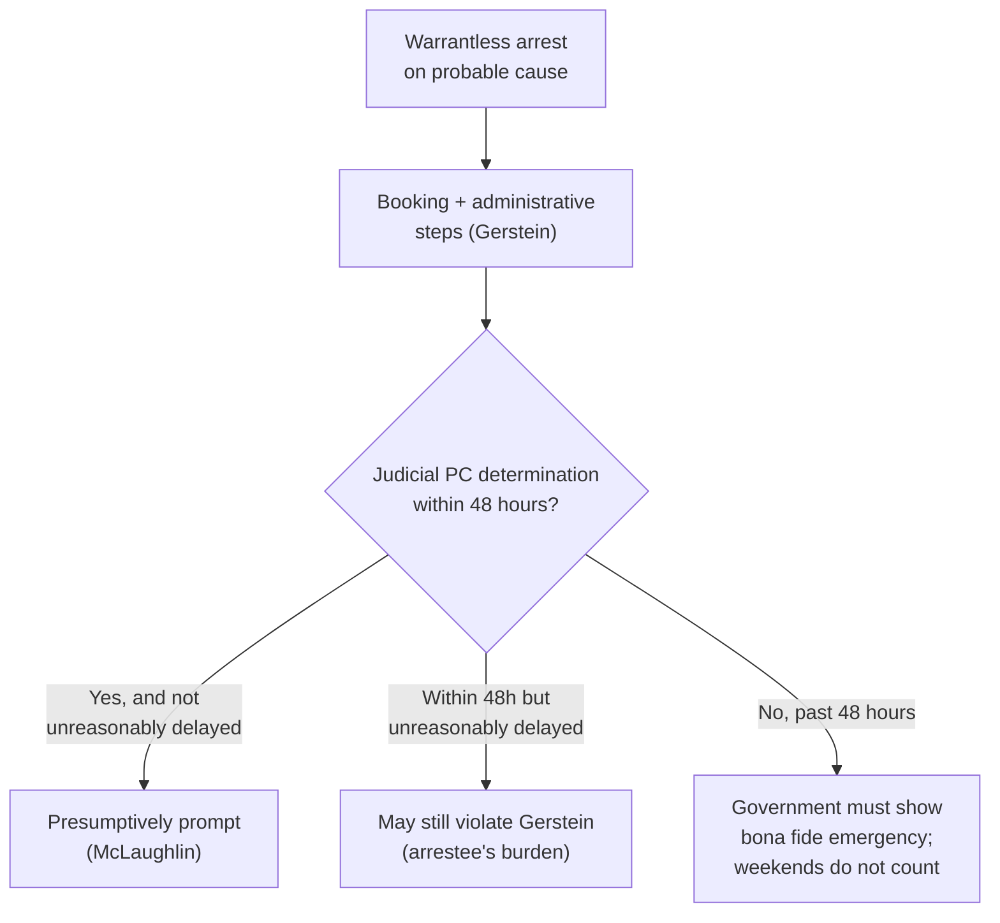

# S9 R1 panel-review — Opus model-diversity lane (prompt pack)

You are the **Claude/Opus** leg of the S9 three-lane adversarial panel (1 Claude + 2 Codex, R1). The two Codex lanes carry the A (support/quote-fidelity) and B (currency/treatment) attack lenses; **you carry model diversity and MUST vote on every paneled assertion across BOTH lenses' concerns.** You are refute-framed: try hard to break each assertion; **default to REFUTED on uncertainty**; never fabricate a cite, quote, or holding; use ONLY the evidence inlined below (no search, no outside knowledge). You are a SIGHTED reviewer — the FULL lake record (judgment fields included) is inlined.

You are a WRITER lane, not an adjudicator: you FIND and VOTE. You do not tally, adjudicate, or close any row — the orchestrator does.

For EACH group below, return one JSON object with the exact `reviewed[]` shape from the output contract (identical framing to the Codex lenses). Emit a finding object ONLY for a real defect (verdict refuted / stands-modified); a group you find wholly clean returns all-`stands` verdicts (the harness records a clean attestation). Concatenate the per-group JSON objects into a top-level `{"packs": [ ... ]}` array, one entry per group, each carrying its `group_id`.


OUTPUT CONTRACT — return ONE JSON object, nothing else:
{
  "lens": "A" | "B",
  "group_id": "<echo the group id>",
  "reviewed": [
    {
      "assertion_id": "<from group_inventory.jsonl>",
      "dimension": "existence|support|quote_fidelity|pincite|treatment|black_letter",
      "verdict": "stands" | "refuted" | "stands-modified",
      "verifiable_from_disclosed": true | false,
      "defect": null,   // null when verdict=="stands"; else an object:
      //  {"problem": "...", "severity": "high|medium|low", "proposed_fix": "...", "evidence_quote": "verbatim from disclosed evidence or null", "needs_cl": true|false, "locator_note": "..."}
      "reasons": ["short evidence-grounded reason", "..."],
      "breaks_true_positives": true | false,
      "residual_risks": ["..."],
      "suggested_tightening": "... or null"
    }
  ],
  "notes": ""
}
Rules: verdict=='stands' <=> defect==null (assertion survives your attack). verdict=='refuted' <=> a real defect (the assertion as framed is wrong). verdict=='stands-modified' <=> survives but needs a stated modification (a minor defect). Review EVERY assertion_id in group_inventory.jsonl exactly once. Output ONLY the JSON object.
---

## GROUP: content/seizures/arrests/Prompt Probable-Cause Determination.md  (`doctrine`, 5 assertions)

### content_page

```
---
title: "Prompt Probable-Cause Determination"
weight: 30
aliases:
  - "Prompt Probable-Cause Determination"
  - "Gerstein hearing"
  - "48-hour rule"
  - "seizures/arrests/Prompt Probable-Cause Determination"
topic: "The prompt post-arrest judicial probable-cause determination (Gerstein/McLaughlin 48-hour rule)"
type: doctrine
amendment: "U.S. Const. amend. IV"
jurisdiction: "Federal (U.S. Const. amend. IV); SCOTUS baseline"
status: draft
related:
  - "[[Arrest and Arrest Warrants]]"
  - "[[Seizure of the Person]]"
  - "[[Arrest in the Home]]"
  - "[[Probable Cause]]"
---

# Prompt Probable-Cause Determination

*After a warrantless arrest, how soon must a judge confirm probable cause, and what does that hearing require? This page fixes the back-end judicial check; the arrest standard itself is at [[Arrest and Arrest Warrants]].*

> [!rule] Black-letter rule
> **A warrantless arrest buys custody only until a neutral judge can confirm probable cause.** A person arrested without a warrant is entitled to a **prompt judicial determination of probable cause** as a prerequisite to any extended pretrial detention; the determination may be informal and **need not be adversarial**. *[[Gerstein v. Pugh#^pin-114|Gerstein v. Pugh]]*, 420 U.S. 103, [114](https://www.courtlistener.com/opinion/109186/gerstein-v-pugh/#:~:text=Accordingly%2C%20we%20hold%20that%20the) (1975). A determination within **48 hours** of arrest is presumptively prompt; past 48 hours the burden shifts to the government to show a bona fide emergency, and intervening weekends do not excuse the delay. *[[County of Riverside v. McLaughlin|County of Riverside v. McLaughlin]]*, 500 U.S. 44, [56](https://www.courtlistener.com/opinion/112585/county-of-riverside-v-mclaughlin/) (1991).
> ^rule-prompt-pc

## The Brief

**On-scene probable cause justifies the arrest, not the extended detention.** An officer's own probable cause supports the arrest and a brief booking detention, but not prolonged custody: "a policeman's on-the-scene assessment of probable cause provides legal justification for arresting a person suspected of crime, and for a brief period of detention to take the administrative steps incident to arrest. Once the suspect is in custody, however, the reasons that justify dispensing with the magistrate's neutral judgment evaporate." *[[Gerstein v. Pugh|Gerstein v. Pugh]]*, 420 U.S. 103, [113–14](https://www.courtlistener.com/opinion/109186/gerstein-v-pugh/) (1975). So the Fourth Amendment "requires a judicial determination of probable cause as a prerequisite to extended restraint of liberty following arrest." *Id.* at 114.

**The hearing is a probable-cause check, not a trial.** The *[[Gerstein v. Pugh|Gerstein]]* determination need not be adversarial and carries none of the trial-type protections: it "must provide a fair and reliable determination of probable cause as a condition for any significant pretrial restraint of liberty, and this determination must be made by a judicial officer either before or promptly after arrest." 420 U.S. at 125. No right to counsel, confrontation, or cross-examination attaches to it. A prosecutor's decision to file charges is not a substitute, because a prosecutor is not the "neutral and detached" magistrate the Fourth Amendment requires.

**"Prompt" means presumptively within 48 hours.** *[[County of Riverside v. McLaughlin|County of Riverside v. McLaughlin]]* fixed the operative window: "a jurisdiction that provides judicial determinations of probable cause within 48 hours of arrest will, as a general matter, comply with the promptness requirement of *Gerstein*." 500 U.S. at 56. Within 48 hours is not automatically enough: a hearing can still violate *[[Gerstein v. Pugh|Gerstein]]* if the arrestee proves the determination "was delayed unreasonably," and the Court gave examples such as delay "for delay's sake" or to gather additional evidence.

**Past 48 hours, the burden flips to the government.** "Where an arrested individual does not receive a probable cause determination within 48 hours, the calculus changes.... [T]he burden shifts to the government to demonstrate the existence of a bona fide emergency or other extraordinary circumstance." *Id.* at 57. Two things do **not** count as that circumstance: the mere fact that combining proceedings takes longer, and "intervening weekends." A jurisdiction that folds the probable-cause determination into arraignment must still hit the 48-hour mark.

**How it fits the arrest picture.** The prompt-determination rule is the back-end counterpart to the front-end arrest rule. Where officers arrest **with** a warrant, a neutral magistrate has already found probable cause before the seizure. Where they arrest **without** one, as the Fourth Amendment permits in public on probable cause (*[[United States v. Watson]]*; see [[Arrest and Arrest Warrants]]), the neutral check simply moves to the back end and must come promptly. It is distinct from the in-home arrest-warrant rule of *[[Payton v. New York]]*, which governs entry, not post-arrest detention.

**Common pitfalls.**
- **Treating the arresting officer's probable cause as enough for extended detention.** It justifies the arrest and booking, not prolonged custody; a neutral judge must confirm probable cause. *[[Gerstein v. Pugh]]*.
- **Demanding a full adversary hearing.** *[[Gerstein v. Pugh|Gerstein]]* requires only a fair, reliable, non-adversarial probable-cause determination. *[[Gerstein v. Pugh]]*.
- **Reading 48 hours as a safe harbor.** A determination inside 48 hours can still be unreasonably delayed, and one past 48 hours shifts the burden to the government. *[[County of Riverside v. McLaughlin]]*.
- **Excusing delay by pointing to the weekend.** Intervening weekends and the convenience of combining proceedings are not extraordinary circumstances. *[[County of Riverside v. McLaughlin]]*.

## Lower-court developments

The 48-hour framework is settled at the Supreme Court; the recurring questions below the Court are application questions (what delay is "unreasonable" within the window, and what remedy a *[[Gerstein v. Pugh|Gerstein]]* violation carries) rather than a split on the rule itself. No controlling circuit split is mapped in this build; a *[[Gerstein v. Pugh|Gerstein]]* violation is not itself a basis to suppress a later-obtained confession absent the ordinary [[Fruits and Attenuation|attenuation]] analysis. *See* [[The Exclusionary Rule]].

## Key cases

| Case | Holding | Opinion |
|---|---|---|
| *[[Gerstein v. Pugh]]*, 420 U.S. 103 (1975) | **Anchor.** A person arrested without a warrant is entitled to a prompt judicial probable-cause determination before extended pretrial detention; the determination need not be an adversary hearing. | [opinion](https://www.courtlistener.com/opinion/109186/gerstein-v-pugh/) |
| *[[County of Riverside v. McLaughlin]]*, 500 U.S. 44 (1991) | A probable-cause determination within 48 hours of a warrantless arrest is presumptively prompt under *[[Gerstein v. Pugh\|Gerstein]]*; past 48 hours the government must show a bona fide emergency, and intervening weekends do not qualify. | [opinion](https://www.courtlistener.com/opinion/112585/county-of-riverside-v-mclaughlin/) |

## Related cases across doctrines

These cases are treated in full elsewhere but frame the prompt-determination rule here.

| Case | Relevance here | Primary home | Opinion |
|---|---|---|---|
| *[[United States v. Watson]]*, 423 U.S. 411 (1976) | ***Front-end rule.*** A warrantless public arrest on probable cause is valid, so the neutral check moves to the prompt post-arrest determination. | [[Arrest and Arrest Warrants]] | [opinion](https://www.courtlistener.com/opinion/109352/united-states-v-watson/) |
| *[[Payton v. New York]]*, 445 U.S. 573 (1980) | ***Distinct rule.*** *[[Payton v. New York\|Payton]]* governs warrant authority to **enter a home** to arrest, not the post-arrest detention timing fixed here. | [[Arrest in the Home]] | [opinion](https://www.courtlistener.com/opinion/110235/payton-v-new-york/) |

## Visual



## Sources

- [*Gerstein v. Pugh*, 420 U.S. 103 (1975)](https://www.courtlistener.com/opinion/109186/gerstein-v-pugh/) (pinpoints: 113–14, 114, 125)
- [*County of Riverside v. McLaughlin*, 500 U.S. 44 (1991)](https://www.courtlistener.com/opinion/112585/county-of-riverside-v-mclaughlin/) (pinpoints: 56, 57)
- [*United States v. Watson*, 423 U.S. 411 (1976)](https://www.courtlistener.com/opinion/109352/united-states-v-watson/) (front-end arrest rule; see [[Arrest and Arrest Warrants]])

```

### group_inventory (assertions under review)

```jsonl
{"assertion_id": "0c2f34f847aa1c2e", "dimension": "existence", "kind": "case_cite", "locator": {"case": "Gerstein v. Pugh", "table_line": 36}, "payload": {"case": "Gerstein v. Pugh", "cells": ["*[[Gerstein v. Pugh]]*, 420 U.S. 103 (1975)", "**Anchor.** A person arrested without a warrant is entitled to a prompt judicial probable-cause determination before extended pretrial detention; the determination need not be an adversary hearing.", "[opinion](https://www.courtlistener.com/opinion/109186/gerstein-v-pugh/)"], "header": ["Case", "Holding", "Opinion"]}}
{"assertion_id": "28171ca2e5c93b5d", "dimension": "existence", "kind": "case_cite", "locator": {"case": "United States v. Watson", "table_line": 45}, "payload": {"case": "United States v. Watson", "cells": ["*[[United States v. Watson]]*, 423 U.S. 411 (1976)", "***Front-end rule.*** A warrantless public arrest on probable cause is valid, so the neutral check moves to the prompt post-arrest determination.", "[[Arrest and Arrest Warrants]]", "[opinion](https://www.courtlistener.com/opinion/109352/united-states-v-watson/)"], "header": ["Case", "Relevance here", "Primary home", "Opinion"]}}
{"assertion_id": "ca601152636b0a13", "dimension": "existence", "kind": "case_cite", "locator": {"case": "County of Riverside v. McLaughlin", "table_line": 37}, "payload": {"case": "County of Riverside v. McLaughlin", "cells": ["*[[County of Riverside v. McLaughlin]]*, 500 U.S. 44 (1991)", "A probable-cause determination within 48 hours of a warrantless arrest is presumptively prompt under *[[Gerstein v. Pugh\\|Gerstein]]*; past 48 hours the government must show a bona fide emergency, and intervening weekends do not qualify.", "[opinion](https://www.courtlistener.com/opinion/112585/county-of-riverside-v-mclaughlin/)"], "header": ["Case", "Holding", "Opinion"]}}
{"assertion_id": "fd2ebe857bcad7cb", "dimension": "existence", "kind": "case_cite", "locator": {"case": "Payton v. New York", "table_line": 46}, "payload": {"case": "Payton v. New York", "cells": ["*[[Payton v. New York]]*, 445 U.S. 573 (1980)", "***Distinct rule.*** *[[Payton v. New York\\|Payton]]* governs warrant authority to **enter a home** to arrest, not the post-arrest detention timing fixed here.", "[[Arrest in the Home]]", "[opinion](https://www.courtlistener.com/opinion/110235/payton-v-new-york/)"], "header": ["Case", "Relevance here", "Primary home", "Opinion"]}}
{"assertion_id": "7abefe522ab0d7a4", "dimension": "support", "kind": "proposition", "locator": {"callout": "^rule-prompt-pc"}, "payload": {"anchor": "^rule-prompt-pc", "statement": "[!rule] Black-letter rule\n**A warrantless arrest buys custody only until a neutral judge can confirm probable cause.** A person arrested without a warrant is entitled to a **prompt judicial determination of probable cause** as a prerequisite to any extended pretrial detention; the determination may be informal and **need not be adversarial**. *[[Gerstein v. Pugh#^pin-114|Gerstein v. Pugh]]*, 420 U.S. 103, [114](https://www.courtlistener.com/opinion/109186/gerstein-v-pugh/#:~:text=Accordingly%2C%20we%20hold%20that%20the) (1975). A determination within **48 hours** of arrest is presumptively prompt; past 48 hours the burden shifts to the government to show a bona fide emergency, and intervening weekends do not excuse the delay. *[[County of Riverside v. McLaughlin|County of Riverside v. McLaughlin]]*, 500 U.S. 44, [56](https://www.courtlistener.com/opinion/112585/county-of-riverside-v-mclaughlin/) (1991)."}}
```

### lake record — County of Riverside v. McLaughlin

```json
{
  "schema_version": "s2.v1",
  "record_id": "County of Riverside v. McLaughlin",
  "stub": false,
  "status": "verified",
  "identity": {
    "case_name": "County of Riverside v. McLaughlin",
    "case_name_short": "McLaughlin",
    "case_name_full": "COUNTY OF RIVERSIDE Et Al. v. McLAUGHLIN Et Al.",
    "input_case_name": "County of Riverside v. McLaughlin",
    "court": "U.S. Supreme Court",
    "court_id": "scotus",
    "court_level": "scotus",
    "circuit": null,
    "state": null,
    "date_decided": "1991-05-20",
    "year": 1991,
    "docket": null,
    "cluster_id": 112585,
    "lead_opinion_id": 112585,
    "sibling_ids": [
      112585,
      9432264,
      9432265,
      9432266
    ],
    "absolute_url": "/opinion/112585/county-of-riverside-v-mclaughlin/",
    "identity_method": "citation+party-text",
    "expected_citation_found": true,
    "party_name_in_text": true,
    "canonical_name_match": true,
    "alternates": [
      {
        "cluster_id": 9104127,
        "score": 20,
        "case_name": "County of Riverside v. McLaughlin"
      },
      {
        "cluster_id": 9104126,
        "score": 20,
        "case_name": "County of Riverside v. McLaughlin"
      }
    ],
    "reason_code": null
  },
  "citations": {
    "official": {
      "cite": "500 U.S. 44",
      "volume": "500",
      "reporter": "U.S.",
      "page": "44",
      "type": 1,
      "selected_official": true,
      "source": "cluster.citations[]"
    },
    "parallel": [
      {
        "cite": "111 S. Ct. 1661",
        "volume": "111",
        "reporter": "S. Ct.",
        "page": "1661",
        "type": 1,
        "selected_official": false,
        "source": "cluster.citations[]"
      },
      {
        "cite": "114 L. Ed. 2d 49",
        "volume": "114",
        "reporter": "L. Ed. 2d",
        "page": "49",
        "type": 1,
        "selected_official": false,
        "source": "cluster.citations[]"
      }
    ],
    "vendor_neutral": [
      {
        "cite": "1991 U.S. LEXIS 2528",
        "volume": "1991",
        "reporter": "U.S. LEXIS",
        "page": "2528",
        "type": 6,
        "selected_official": false,
        "source": "cluster.citations[]"
      }
    ],
    "all": [
      {
        "cite": "500 U.S. 44",
        "volume": "500",
        "reporter": "U.S.",
        "page": "44",
        "type": 1,
        "selected_official": false,
        "source": "cluster.citations[]"
      },
      {
        "cite": "111 S. Ct. 1661",
        "volume": "111",
        "reporter": "S. Ct.",
        "page": "1661",
        "type": 1,
        "selected_official": false,
        "source": "cluster.citations[]"
      },
      {
        "cite": "114 L. Ed. 2d 49",
        "volume": "114",
        "reporter": "L. Ed. 2d",
        "page": "49",
        "type": 1,
        "selected_official": false,
        "source": "cluster.citations[]"
      },
      {
        "cite": "1991 U.S. LEXIS 2528",
        "volume": "1991",
        "reporter": "U.S. LEXIS",
        "page": "2528",
        "type": 6,
        "selected_official": false,
        "source": "cluster.citations[]"
      }
    ],
    "display": "500 U.S. 44",
    "official_selection": {
      "court_class": "scotus",
      "selected": "500 U.S. 44",
      "reason": "selected_rank_1"
    }
  },
  "pinpoints": [
    {
      "id": "pin-56",
      "page": null,
      "quote": "judicial determination of probable cause \u2014 and whether Riverside County's weekend- and holiday-excluding schedule met it. ## Rule A 48-hour window is presumptively prompt.",
      "star_marker": null,
      "quote_fidelity": "mismatch",
      "pinpoint_status": "slip-only",
      "position": null
    },
    {
      "id": "pin-56b",
      "page": null,
      "quote": "This is not to say that the probable cause determination in a particular case passes constitutional muster simply because it is provided within 48 hours. Such a hearing may nonetheless violate *Gerstein* if the arrested individual can prove that his or her probable cause determination was delayed unreasonably.",
      "star_marker": null,
      "quote_fidelity": "mismatch",
      "pinpoint_status": "slip-only",
      "position": null
    },
    {
      "id": "pin-57",
      "page": null,
      "quote": "Where an arrested individual does not receive a probable cause determination within 48 hours, the calculus changes. . . . [T]he burden shifts to the government to demonstrate the existence of a bona fide emergency or other extraordinary circumstance. . . . Nor, for that matter, do intervening weekends [qualify as such a circumstance].",
      "star_marker": null,
      "quote_fidelity": "mismatch",
      "pinpoint_status": "slip-only",
      "position": null
    }
  ],
  "treatment": {
    "field_i_validity": "good_law",
    "as_of_content": null,
    "as_of_treatment": "2026-06-30",
    "composite_basis": "migration-seed",
    "composite_basis_ref": "County of Riverside v. McLaughlin",
    "varies_by_point": false,
    "scope_note": "Good law. Implements Gerstein v. Pugh: a judicial probable-cause determination within 48 hours of a warrantless arrest is presumptively prompt; beyond 48 hours the burden shifts to the government to show a bona fide emergency or other extraordinary circumstance, and intervening weekends/holidays do not excuse delay. (date_decided omitted \u2014 CL dateFiled 1991-05-20 differs from the announced May 13, 1991; year certain.)",
    "point_overrides": [],
    "edges": [
      {
        "citing_case": {
          "name": "Foster v. Commissioner of Correction (No. 1)",
          "cluster_id": 4758096,
          "cite": null,
          "field_ii": "superseded_by_statute"
        },
        "field_ii": "superseded_by_statute",
        "field_iii": "mentioned",
        "point": null,
        "proposed": true,
        "journal_ref": "County of Riverside v. McLaughlin:lane1_negative"
      },
      {
        "citing_case": {
          "name": "Morehouse v. Jackson",
          "cluster_id": 8694856,
          "cite": [
            "614 F. App'x 159"
          ],
          "field_ii": "questioned"
        },
        "field_ii": "questioned",
        "field_iii": "mentioned",
        "point": null,
        "proposed": true,
        "journal_ref": "County of Riverside v. McLaughlin:lane1_negative"
      },
      {
        "citing_case": {
          "name": "Jeffrey M. Stein D.D.S. M.S.D. P.A. v. Buccaneers Limited Partnership",
          "cluster_id": 2756228,
          "cite": [
            "772 F.3d 698",
            "2014 WL 6734819"
          ],
          "field_ii": "overruled"
        },
        "field_ii": "overruled",
        "field_iii": "mentioned",
        "point": null,
        "proposed": true,
        "journal_ref": "County of Riverside v. McLaughlin:lane1_negative"
      },
      {
        "citing_case": {
          "name": "Hernandez v. County of Monterey",
          "cluster_id": 7310798,
          "cite": [
            "70 F. Supp. 3d 963",
            "2014 U.S. Dist. LEXIS 138247",
            "2014 WL 4843945"
          ],
          "field_ii": "overruled"
        },
        "field_ii": "overruled",
        "field_iii": "mentioned",
        "point": null,
        "proposed": true,
        "journal_ref": "County of Riverside v. McLaughlin:lane1_negative"
      },
      {
        "citing_case": {
          "name": "State of Tennessee v. Courtney Bishop",
          "cluster_id": 2655823,
          "cite": [
            "431 S.W.3d 22",
            "2014 WL 888198",
            "2014 Tenn. LEXIS 189"
          ],
          "field_ii": "overruled"
        },
        "field_ii": "overruled",
        "field_iii": "mentioned",
        "point": null,
        "proposed": true,
        "journal_ref": "County of Riverside v. McLaughlin:lane1_negative"
      },
      {
        "citing_case": {
          "name": "Wilson v. Montano",
          "cluster_id": 866546,
          "cite": [
            "715 F.3d 847",
            "2013 U.S. App. LEXIS 9055",
            "2013 WL 1848138"
          ],
          "field_ii": "abrogated"
        },
        "field_ii": "abrogated",
        "field_iii": "mentioned",
        "point": null,
        "proposed": true,
        "journal_ref": "County of Riverside v. McLaughlin:lane1_negative"
      },
      {
        "citing_case": {
          "name": "Albright v. Oliver",
          "cluster_id": 112924,
          "cite": [
            "127 L. Ed. 2d 114",
            "114 S. Ct. 807",
            "510 U.S. 266",
            "1994 U.S. LEXIS 1319"
          ],
          "field_ii": "overruled"
        },
        "field_ii": "overruled",
        "field_iii": "mentioned",
        "point": null,
        "proposed": true,
        "journal_ref": "County of Riverside v. McLaughlin:lane2_top_cited"
      },
      {
        "citing_case": {
          "name": "Zadvydas v. Davis",
          "cluster_id": 1269289,
          "cite": [
            "150 L. Ed. 2d 653",
            "121 S. Ct. 2491",
            "533 U.S. 678",
            "2001 U.S. LEXIS 4912"
          ],
          "field_ii": "overruled"
        },
        "field_ii": "overruled",
        "field_iii": "mentioned",
        "point": null,
        "proposed": true,
        "journal_ref": "County of Riverside v. McLaughlin:lane2_top_cited"
      },
      {
        "citing_case": {
          "name": "Devenpeck v. Alford",
          "cluster_id": 137733,
          "cite": [
            "160 L. Ed. 2d 537",
            "125 S. Ct. 588",
            "543 U.S. 146",
            "2004 U.S. LEXIS 8272"
          ],
          "field_ii": "questioned"
        },
        "field_ii": "questioned",
        "field_iii": "mentioned",
        "point": null,
        "proposed": true,
        "journal_ref": "County of Riverside v. McLaughlin:lane2_top_cited"
      },
      {
        "citing_case": {
          "name": "Hamdi v. Rumsfeld",
          "cluster_id": 137001,
          "cite": [
            "159 L. Ed. 2d 578",
            "124 S. Ct. 2633",
            "542 U.S. 507",
            "2004 U.S. LEXIS 4761"
          ],
          "field_ii": "overruled"
        },
        "field_ii": "overruled",
        "field_iii": "mentioned",
        "point": null,
        "proposed": true,
        "journal_ref": "County of Riverside v. McLaughlin:lane2_top_cited"
      },
      {
        "citing_case": {
          "name": "Atwater v. City of Lago Vista",
          "cluster_id": 2620702,
          "cite": [
            "149 L. Ed. 2d 549",
            "121 S. Ct. 1536",
            "532 U.S. 318",
            "2001 U.S. LEXIS 3366",
            "2001 Daily Journal DAR 3953",
            "2001 Colo. J. C.A.R. 2069",
            "14 Fla. L. Weekly Fed. S 193",
            "69 U.S.L.W. 4262",
            "2001 Cal. Daily Op. Serv. 3203"
          ],
          "field_ii": "overruled"
        },
        "field_ii": "overruled",
        "field_iii": "mentioned",
        "point": null,
        "proposed": true,
        "journal_ref": "County of Riverside v. McLaughlin:lane2_top_cited"
      },
      {
        "citing_case": {
          "name": "Genesis HealthCare Corp. v. Symczyk",
          "cluster_id": 858086,
          "cite": [
            "185 L. Ed. 2d 636",
            "133 S. Ct. 1523",
            "569 U.S. 66",
            "2013 U.S. LEXIS 3157",
            "24 Fla. L. Weekly Fed. S 133",
            "81 U.S.L.W. 4229",
            "20 Wage & Hour Cas.2d (BNA) 801",
            "2013 WL 1567370"
          ],
          "field_ii": "questioned"
        },
        "field_ii": "questioned",
        "field_iii": "mentioned",
        "point": null,
        "proposed": true,
        "journal_ref": "County of Riverside v. McLaughlin:lane2_top_cited"
      },
      {
        "citing_case": {
          "name": "Lloyd D. Alkire v. Judge Jane Irving",
          "cluster_id": 782133,
          "cite": [
            "330 F.3d 802",
            "55 Fed. R. Serv. 3d 1023",
            "2003 U.S. App. LEXIS 10834",
            "2003 WL 21251540"
          ],
          "field_ii": "questioned"
        },
        "field_ii": "questioned",
        "field_iii": "mentioned",
        "point": null,
        "proposed": true,
        "journal_ref": "County of Riverside v. McLaughlin:lane2_top_cited"
      },
      {
        "citing_case": {
          "name": "Kerry Heckman, on Behalf of Themselves and All Other Persons Similarly Situated v. Williamson County",
          "cluster_id": 895412,
          "cite": [
            "369 S.W.3d 137",
            "55 Tex. Sup. Ct. J. 803",
            "2012 WL 2052813",
            "2012 Tex. LEXIS 462"
          ],
          "field_ii": "abrogated"
        },
        "field_ii": "abrogated",
        "field_iii": "mentioned",
        "point": null,
        "proposed": true,
        "journal_ref": "County of Riverside v. McLaughlin:lane2_top_cited"
      },
      {
        "citing_case": {
          "name": "Manuel v. City of Joliet",
          "cluster_id": 4376986,
          "cite": [
            "580 U.S. 357",
            "137 S. Ct. 911",
            "197 L. Ed. 2d 312",
            "2017 U.S. LEXIS 2021",
            "26 Fla. L. Weekly Fed. S 476",
            "85 U.S.L.W. 4130"
          ],
          "field_ii": "overruled"
        },
        "field_ii": "overruled",
        "field_iii": "mentioned",
        "point": null,
        "proposed": true,
        "journal_ref": "County of Riverside v. McLaughlin:lane2_top_cited"
      },
      {
        "citing_case": {
          "name": "Corley v. United States",
          "cluster_id": 145888,
          "cite": [
            "173 L. Ed. 2d 443",
            "129 S. Ct. 1558",
            "556 U.S. 303",
            "2009 U.S. LEXIS 2512"
          ],
          "field_ii": "overruled"
        },
        "field_ii": "overruled",
        "field_iii": "mentioned",
        "point": null,
        "proposed": true,
        "journal_ref": "County of Riverside v. McLaughlin:lane2_top_cited"
      },
      {
        "citing_case": {
          "name": "Cantu v. State",
          "cluster_id": 2431347,
          "cite": [
            "842 S.W.2d 667",
            "1992 Tex. Crim. App. LEXIS 138",
            "1992 WL 116290"
          ],
          "field_ii": "overruled"
        },
        "field_ii": "overruled",
        "field_iii": "mentioned",
        "point": null,
        "proposed": true,
        "journal_ref": "County of Riverside v. McLaughlin:lane2_top_cited"
      },
      {
        "citing_case": {
          "name": "Florence v. Board of Chosen Freeholders of County of Burlington",
          "cluster_id": 626454,
          "cite": [
            "182 L. Ed. 2d 566",
            "132 S. Ct. 1510",
            "566 U.S. 318",
            "2012 U.S. LEXIS 2712"
          ],
          "field_ii": "questioned"
        },
        "field_ii": "questioned",
        "field_iii": "mentioned",
        "point": null,
        "proposed": true,
        "journal_ref": "County of Riverside v. McLaughlin:lane2_top_cited"
      },
      {
        "citing_case": {
          "name": "People v. Hughes",
          "cluster_id": 2581420,
          "cite": [
            "39 P.3d 432",
            "116 Cal. Rptr. 2d 401",
            "27 Cal. 4th 287"
          ],
          "field_ii": "overruled"
        },
        "field_ii": "overruled",
        "field_iii": "mentioned",
        "point": null,
        "proposed": true,
        "journal_ref": "County of Riverside v. McLaughlin:lane2_top_cited"
      },
      {
        "citing_case": {
          "name": "Maryland v. King",
          "cluster_id": 873669,
          "cite": [
            "186 L. Ed. 2d 1",
            "133 S. Ct. 1958",
            "2013 U.S. LEXIS 4165",
            "569 U.S. 435",
            "24 Fla. L. Weekly Fed. S 234",
            "81 U.S.L.W. 4343",
            "2013 WL 2371466"
          ],
          "field_ii": "questioned"
        },
        "field_ii": "questioned",
        "field_iii": "mentioned",
        "point": null,
        "proposed": true,
        "journal_ref": "County of Riverside v. McLaughlin:lane2_top_cited"
      },
      {
        "citing_case": {
          "name": "Maryland v. Shatzer",
          "cluster_id": 1734,
          "cite": [
            "175 L. Ed. 2d 1045",
            "130 S. Ct. 1213",
            "559 U.S. 98",
            "2010 U.S. LEXIS 1899"
          ],
          "field_ii": "criticized"
        },
        "field_ii": "criticized",
        "field_iii": "mentioned",
        "point": null,
        "proposed": true,
        "journal_ref": "County of Riverside v. McLaughlin:lane2_top_cited"
      },
      {
        "citing_case": {
          "name": "People v. Williams",
          "cluster_id": 1801669,
          "cite": [
            "49 Cal. 4th 405",
            "2010 D.A.R. 10",
            "111 Cal. Rptr. 3d 589",
            "233 P.3d 1000",
            "2010 Cal. LEXIS 5970"
          ],
          "field_ii": "overruled"
        },
        "field_ii": "overruled",
        "field_iii": "mentioned",
        "point": null,
        "proposed": true,
        "journal_ref": "County of Riverside v. McLaughlin:lane2_top_cited"
      },
      {
        "citing_case": {
          "name": "Hansen v. State",
          "cluster_id": 1829968,
          "cite": [
            "592 So. 2d 114",
            "1991 WL 280025"
          ],
          "field_ii": "overruled"
        },
        "field_ii": "overruled",
        "field_iii": "mentioned",
        "point": null,
        "proposed": true,
        "journal_ref": "County of Riverside v. McLaughlin:lane2_top_cited"
      },
      {
        "citing_case": {
          "name": "Nielsen v. Preap",
          "cluster_id": 4601079,
          "cite": [
            "586 U.S. 392",
            "139 S. Ct. 954",
            "203 L. Ed. 2d 333",
            "2019 U.S. LEXIS 2088"
          ],
          "field_ii": "abrogated"
        },
        "field_ii": "abrogated",
        "field_iii": "mentioned",
        "point": null,
        "proposed": true,
        "journal_ref": "County of Riverside v. McLaughlin:lane2_top_cited"
      },
      {
        "citing_case": {
          "name": "Johnson v. Rodriguez",
          "cluster_id": 11663,
          "cite": [
            "110 F.3d 299",
            "1997 WL 163525"
          ],
          "field_ii": "overruled"
        },
        "field_ii": "overruled",
        "field_iii": "mentioned",
        "point": null,
        "proposed": true,
        "journal_ref": "County of Riverside v. McLaughlin:lane2_top_cited"
      },
      {
        "citing_case": {
          "name": "United States v. Abu Ali",
          "cluster_id": 1025840,
          "cite": [
            "528 F.3d 210",
            "2008 U.S. App. LEXIS 12122",
            "2008 WL 2315664"
          ],
          "field_ii": "overruled"
        },
        "field_ii": "overruled",
        "field_iii": "mentioned",
        "point": null,
        "proposed": true,
        "journal_ref": "County of Riverside v. McLaughlin:lane2_top_cited"
      },
      {
        "citing_case": {
          "name": "Robidoux v. Celani",
          "cluster_id": 9014146,
          "cite": [
            "987 F.2d 931",
            "25 Fed. R. Serv. 3d 86",
            "1993 U.S. App. LEXIS 4332",
            "1993 WL 64467"
          ],
          "field_ii": "questioned"
        },
        "field_ii": "questioned",
        "field_iii": "mentioned",
        "point": null,
        "proposed": true,
        "journal_ref": "County of Riverside v. McLaughlin:lane2_top_cited"
      },
      {
        "citing_case": {
          "name": "Shane Holloway v. Delaware County S",
          "cluster_id": 812189,
          "cite": [
            "700 F.3d 1063",
            "2012 U.S. App. LEXIS 23823",
            "2012 WL 5846289"
          ],
          "field_ii": "questioned"
        },
        "field_ii": "questioned",
        "field_iii": "mentioned",
        "point": null,
        "proposed": true,
        "journal_ref": "County of Riverside v. McLaughlin:lane2_top_cited"
      },
      {
        "citing_case": {
          "name": "Robidoux v. Celani",
          "cluster_id": 601791,
          "cite": [
            "987 F.2d 931"
          ],
          "field_ii": "questioned"
        },
        "field_ii": "questioned",
        "field_iii": "mentioned",
        "point": null,
        "proposed": true,
        "journal_ref": "County of Riverside v. McLaughlin:lane2_top_cited"
      },
      {
        "citing_case": {
          "name": "People v. Turner",
          "cluster_id": 1188941,
          "cite": [
            "878 P.2d 521",
            "8 Cal. 4th 137",
            "32 Cal. Rptr. 2d 762",
            "94 Daily Journal DAR 11425",
            "94 Cal. Daily Op. Serv. 6238",
            "1994 Cal. LEXIS 4151"
          ],
          "field_ii": "criticized"
        },
        "field_ii": "criticized",
        "field_iii": "mentioned",
        "point": null,
        "proposed": true,
        "journal_ref": "County of Riverside v. McLaughlin:lane2_top_cited"
      },
      {
        "citing_case": {
          "name": "Case v. Eslinger",
          "cluster_id": 78223,
          "cite": [
            "555 F.3d 1317",
            "2009 U.S. App. LEXIS 2141",
            "2009 WL 196842"
          ],
          "field_ii": "questioned"
        },
        "field_ii": "questioned",
        "field_iii": "mentioned",
        "point": null,
        "proposed": true,
        "journal_ref": "County of Riverside v. McLaughlin:lane2_top_cited"
      }
    ],
    "derivation": {
      "lane1_negative": {
        "query": "cites:(112585 OR 9432264 OR 9432265 OR 9432266) AND (overrul* OR abrogat* OR supersed* OR \"recede from\" OR \"no longer good law\" OR vacat* OR reversed) ",
        "reviewed": 200,
        "cap": 200,
        "cap_hit": true,
        "final_cursor": "https://www.courtlistener.com/api/rest/v4/search/?cursor=cz0xMzY2MDcwNDAwMDAwJnM9ODU4MDg2JnQ9byZkPTIwMjYtMDctMDQmcD0xMQ%3D%3D&fields=absolute_url%2CcaseName%2CcaseNameFull%2Ccitation%2CciteCount%2Ccluster_id%2Ccourt%2Ccourt_citation_string%2Ccourt_id%2CdateFiled%2Copinions%2Csibling_ids%2Cstatus%2Csyllabus&order_by=dateFiled+desc&page_size=100&q=cites%3A%28112585+OR+9432264+OR+9432265+OR+9432266%29+AND+%28overrul%2A+OR+abrogat%2A+OR+supersed%2A+OR+%22recede+from%22+OR+%22no+longer+good+law%22+OR+vacat%2A+OR+reversed%29+&stat_Published=on&type=o",
        "audit_needed": true,
        "proposed_negative_events": 6,
        "audit_marker": "R15 treatment audit required",
        "triage_mode": "snippet-first",
        "snippet_field": "results[].opinions[].snippet",
        "triage_journaled": 200,
        "triage_read": 6,
        "triage_snippet_classified": 194
      },
      "lane2_top_cited": {
        "query": "cites:(112585 OR 9432264 OR 9432265 OR 9432266)",
        "reviewed": 25,
        "cap": 25,
        "cap_hit": true,
        "final_cursor": "https://www.courtlistener.com/api/rest/v4/search/?cursor=cz0yMzMmcz0xNTU4OTE0JnQ9byZkPTIwMjYtMDctMDQmcD0z&order_by=citeCount+desc&page_size=25&q=cites%3A%28112585+OR+9432264+OR+9432265+OR+9432266%29&type=o",
        "audit_needed": true,
        "proposed_negative_events": 25,
        "audit_marker": "R15 treatment audit required"
      },
      "lane3_recency": {
        "query": "cites:(112585 OR 9432264 OR 9432265 OR 9432266)",
        "reviewed": 42,
        "cap": 200,
        "cap_hit": false,
        "final_cursor": null,
        "audit_needed": false,
        "proposed_negative_events": 0,
        "audit_marker": null,
        "triage_mode": "snippet-first",
        "snippet_field": "results[].opinions[].snippet",
        "triage_journaled": 42,
        "triage_read": 0,
        "triage_snippet_classified": 42
      }
    }
  },
  "progeny": {
    "complete_query": "cites:(112585 OR 9432264 OR 9432265 OR 9432266)",
    "indexed_citing_opinions": 862,
    "count_source": "search",
    "per_sibling": [
      {
        "opinion_id": 112585,
        "count": 740,
        "count_source": "search"
      },
      {
        "opinion_id": 9432264,
        "count": 136,
        "count_source": "search"
      },
      {
        "opinion_id": 9432265,
        "count": 0,
        "count_source": "search"
      },
      {
        "opinion_id": 9432266,
        "count": 0,
        "count_source": "search"
      }
    ],
    "citation_count": 1552,
    "cache_path": "/Users/johngalt/cssi-lake/cache/progeny/county-of-riverside-v-mclaughlin.jsonl",
    "enumeration": "bounded",
    "cursor": "https://www.courtlistener.com/api/rest/v4/search/?cursor=cz0xLjg4NjUzOCZzPTEwNjAwMDU2JnQ9byZkPTIwMjYtMDctMDQmcD0y&order_by=score+desc&page_size=100&q=cites%3A%28112585+OR+9432264+OR+9432265+OR+9432266%29&type=o",
    "rows_cached": 20,
    "outbound_opinion_edges": [
      {
        "source_opinion_id": 112585,
        "cited_id": 105545,
        "source": "search.opinions[].cites[]"
      },
      {
        "source_opinion_id": 112585,
        "cited_id": 108713,
        "source": "search.opinions[].cites[]"
      },
      {
        "source_opinion_id": 112585,
        "cited_id": 109128,
        "source": "search.opinions[].cites[]"
      },
      {
        "source_opinion_id": 112585,
        "cited_id": 109186,
        "source": "search.opinions[].cites[]"
      },
      {
        "source_opinion_id": 112585,
        "cited_id": 109928,
        "source": "search.opinions[].cites[]"
      },
      {
        "source_opinion_id": 112585,
        "cited_id": 110228,
        "source": "search.opinions[].cites[]"
      },
      {
        "source_opinion_id": 112585,
        "cited_id": 110599,
        "source": "search.opinions[].cites[]"
      },
      {
        "source_opinion_id": 112585,
        "cited_id": 110916,
        "source": "search.opinions[].cites[]"
      },
      {
        "source_opinion_id": 112585,
        "cited_id": 111198,
        "source": "search.opinions[].cites[]"
      },
      {
        "source_opinion_id": 112585,
        "cited_id": 111258,
        "source": "search.opinions[].cites[]"
      },
      {
        "source_opinion_id": 112585,
        "cited_id": 112188,
        "source": "search.opinions[].cites[]"
      },
      {
        "source_opinion_id": 112585,
        "cited_id": 112489,
        "source": "search.opinions[].cites[]"
      },
      {
        "source_opinion_id": 112585,
        "cited_id": 334165,
        "source": "search.opinions[].cites[]"
      },
      {
        "source_opinion_id": 112585,
        "cited_id": 392118,
        "source": "search.opinions[].cites[]"
      },
      {
        "source_opinion_id": 112585,
        "cited_id": 409611,
        "source": "search.opinions[].cites[]"
      },
      {
        "source_opinion_id": 112585,
        "cited_id": 414211,
        "source": "search.opinions[].cites[]"
      },
      {
        "source_opinion_id": 112585,
        "cited_id": 453324,
        "source": "search.opinions[].cites[]"
      },
      {
        "source_opinion_id": 112585,
        "cited_id": 474259,
        "source": "search.opinions[].cites[]"
      },
      {
        "source_opinion_id": 112585,
        "cited_id": 504865,
        "source": "search.opinions[].cites[]"
      },
      {
        "source_opinion_id": 112585,
        "cited_id": 531392,
        "source": "search.opinions[].cites[]"
      },
      {
        "source_opinion_id": 112585,
        "cited_id": 1398635,
        "source": "search.opinions[].cites[]"
      },
      {
        "source_opinion_id": 112585,
        "cited_id": 1460908,
        "source": "search.opinions[].cites[]"
      },
      {
        "source_opinion_id": 112585,
        "cited_id": 1897137,
        "source": "search.opinions[].cites[]"
      }
    ]
  },
  "off_cl_links": [],
  "provenance": {
    "cl_source": "LRU",
    "cl_api": "https://www.courtlistener.com/api/rest/v4",
    "built_by": "S2-BUILDER-AUTHORING",
    "build_run": "s2-build-96d841cbb12e",
    "date_created": "2026-07-05T01:27:02Z",
    "date_modified": "2026-07-06T10:25:11Z",
    "warnings": [
      "legacy treatment migrated: good -> good_law"
    ],
    "field_provenance": {
      "identity": {
        "src": "CourtListener search + clusters + lead opinion text",
        "at": "2026-07-05T01:27:42Z",
        "verifier": "S2-BUILDER-AUTHORING"
      },
      "treatment.field_i_validity": {
        "src": "_treatment-migration.json + page frontmatter",
        "at": "2026-07-05T01:27:42Z",
        "verifier": "S2-BUILDER-AUTHORING"
      },
      "point_overrides": {
        "src": "S2 treatment derivation proposed only",
        "at": "2026-07-05T01:46:12Z",
        "verifier": "S2-BUILDER-AUTHORING"
      },
      "pinpoints": {
        "src": "content page quote harvest + lead opinion text",
        "at": "2026-07-05T01:27:42Z",
        "verifier": "S2-BUILDER-AUTHORING"
      }
    }
  }
}

```

### lake record — Gerstein v. Pugh

```json
{
  "schema_version": "s2.v1",
  "record_id": "Gerstein v. Pugh",
  "stub": false,
  "status": "verified",
  "identity": {
    "case_name": "Gerstein v. Pugh",
    "case_name_short": "Gerstein",
    "case_name_full": "GERSTEIN v. PUGH Et Al.",
    "input_case_name": "Gerstein v. Pugh",
    "court": "U.S. Supreme Court",
    "court_id": "scotus",
    "court_level": "scotus",
    "circuit": null,
    "state": null,
    "date_decided": "1975-02-18",
    "year": 1975,
    "docket": null,
    "cluster_id": 109186,
    "lead_opinion_id": 9425988,
    "sibling_ids": [
      109186,
      9425988,
      9425989
    ],
    "absolute_url": "/opinion/109186/gerstein-v-pugh/",
    "identity_method": "citation+party-text",
    "expected_citation_found": true,
    "party_name_in_text": true,
    "canonical_name_match": true,
    "alternates": [],
    "reason_code": null
  },
  "citations": {
    "official": {
      "cite": "420 U.S. 103",
      "volume": "420",
      "reporter": "U.S.",
      "page": "103",
      "type": 1,
      "selected_official": true,
      "source": "cluster.citations[]"
    },
    "parallel": [
      {
        "cite": "95 S. Ct. 854",
        "volume": "95",
        "reporter": "S. Ct.",
        "page": "854",
        "type": 1,
        "selected_official": false,
        "source": "cluster.citations[]"
      },
      {
        "cite": "43 L. Ed. 2d 54",
        "volume": "43",
        "reporter": "L. Ed. 2d",
        "page": "54",
        "type": 1,
        "selected_official": false,
        "source": "cluster.citations[]"
      },
      {
        "cite": "19 Fed. R. Serv. 2d 1499",
        "volume": "19",
        "reporter": "Fed. R. Serv. 2d",
        "page": "1499",
        "type": 4,
        "selected_official": false,
        "source": "cluster.citations[]"
      }
    ],
    "vendor_neutral": [
      {
        "cite": "1975 U.S. LEXIS 29",
        "volume": "1975",
        "reporter": "U.S. LEXIS",
        "page": "29",
        "type": 6,
        "selected_official": false,
        "source": "cluster.citations[]"
      }
    ],
    "all": [
      {
        "cite": "420 U.S. 103",
        "volume": "420",
        "reporter": "U.S.",
        "page": "103",
        "type": 1,
        "selected_official": false,
        "source": "cluster.citations[]"
      },
      {
        "cite": "95 S. Ct. 854",
        "volume": "95",
        "reporter": "S. Ct.",
        "page": "854",
        "type": 1,
        "selected_official": false,
        "source": "cluster.citations[]"
      },
      {
        "cite": "43 L. Ed. 2d 54",
        "volume": "43",
        "reporter": "L. Ed. 2d",
        "page": "54",
        "type": 1,
        "selected_official": false,
        "source": "cluster.citations[]"
      },
      {
        "cite": "1975 U.S. LEXIS 29",
        "volume": "1975",
        "reporter": "U.S. LEXIS",
        "page": "29",
        "type": 6,
        "selected_official": false,
        "source": "cluster.citations[]"
      },
      {
        "cite": "19 Fed. R. Serv. 2d 1499",
        "volume": "19",
        "reporter": "Fed. R. Serv. 2d",
        "page": "1499",
        "type": 4,
        "selected_official": false,
        "source": "cluster.citations[]"
      }
    ],
    "display": "420 U.S. 103",
    "official_selection": {
      "court_class": "scotus",
      "selected": "420 U.S. 103",
      "reason": "selected_rank_1"
    }
  },
  "pinpoints": [
    {
      "id": "pin-113",
      "page": null,
      "quote": "--- # Gerstein v. Pugh *420 U.S. 103 (1975)* \u00b7 U.S. Supreme Court \u00b7 **Binding \u2014 SCOTUS** \u00b7 Treatment: **good** *(as of 2026-06-30)* <!-- header line; TreatmentBadge + weight render here, degrading to the text above --> ## Background Under Florida procedure, a person arrested without a warrant and charged by a prosecutor's information could be jailed or otherwise restrained pending trial without any judicial determination of probable cause. Pugh and other detainees, held on informations without any such hearing, brought a class action challenging the practice. The State defended on the ground that the prosecutor's decision to file an information was itself a sufficient determination of probable cause to justify detention. ## Issue Whether the Fourth Amendment requires a judicial determination of probable cause before a person arrested without a warrant may be subjected to extended pretrial detention, and if so, whether that determination must take the form of an adversary hearing. ## Rule A prompt judicial probable-cause determination is required. An officer's on-scene probable cause justifies the arrest and a brief booking detention, but not prolonged custody:",
      "star_marker": null,
      "quote_fidelity": "mismatch",
      "pinpoint_status": "slip-only",
      "position": null
    },
    {
      "id": "pin-114",
      "page": null,
      "quote": "Accordingly, we hold that the Fourth Amendment requires a judicial determination of probable cause as a prerequisite to extended restraint of liberty following arrest.",
      "star_marker": "114",
      "quote_fidelity": "matched",
      "pinpoint_status": "star-verified",
      "position": 17194,
      "fragment": "#:~:text=Accordingly%2C%20we%20hold%20that%20the",
      "fragment_validated_at": "2026-07-09T15:40:45Z"
    },
    {
      "id": "pin-125",
      "page": null,
      "quote": "it must provide a fair and reliable determination of probable cause as a condition for any significant pretrial restraint of liberty, and this determination must be made by a judicial officer either before or promptly after arrest.",
      "star_marker": null,
      "quote_fidelity": "mismatch",
      "pinpoint_status": "slip-only",
      "position": null
    }
  ],
  "treatment": {
    "field_i_validity": "good_law",
    "as_of_content": "1975-02-18",
    "as_of_treatment": "2026-06-30",
    "composite_basis": "migration-seed",
    "composite_basis_ref": "Gerstein v. Pugh",
    "varies_by_point": false,
    "scope_note": "Good law. The Fourth Amendment requires a prompt judicial determination of probable cause as a prerequisite to extended pretrial detention of a person arrested without a warrant; the determination need not be adversarial. Implemented by County of Riverside v. McLaughlin (48-hour presumption).",
    "point_overrides": [],
    "edges": [
      {
        "citing_case": {
          "name": "State v. Winegarner",
          "cluster_id": 9372588,
          "cite": [
            "208 N.E.3d 88",
            "2023 Ohio 319"
          ],
          "field_ii": "overruled"
        },
        "field_ii": "overruled",
        "field_iii": "mentioned",
        "point": null,
        "proposed": true,
        "journal_ref": "Gerstein v. Pugh:lane1_negative"
      },
      {
        "citing_case": {
          "name": "Commonwealth v. Preston P., a juvenile",
          "cluster_id": 4692950,
          "cite": null,
          "field_ii": "superseded_by_statute"
        },
        "field_ii": "superseded_by_statute",
        "field_iii": "mentioned",
        "point": null,
        "proposed": true,
        "journal_ref": "Gerstein v. Pugh:lane1_negative"
      },
      {
        "citing_case": {
          "name": "Bell v. Wolfish",
          "cluster_id": 110075,
          "cite": [
            "60 L. Ed. 2d 447",
            "99 S. Ct. 1861",
            "441 U.S. 520",
            "1979 U.S. LEXIS 100"
          ],
          "field_ii": "questioned"
        },
        "field_ii": "questioned",
        "field_iii": "mentioned",
        "point": null,
        "proposed": true,
        "journal_ref": "Gerstein v. Pugh:lane2_top_cited"
      },
      {
        "citing_case": {
          "name": "Payton v. New York",
          "cluster_id": 110235,
          "cite": [
            "63 L. Ed. 2d 639",
            "100 S. Ct. 1371",
            "445 U.S. 573",
            "1980 U.S. LEXIS 13"
          ],
          "field_ii": "questioned"
        },
        "field_ii": "questioned",
        "field_iii": "mentioned",
        "point": null,
        "proposed": true,
        "journal_ref": "Gerstein v. Pugh:lane2_top_cited"
      },
      {
        "citing_case": {
          "name": "Albright v. Oliver",
          "cluster_id": 112924,
          "cite": [
            "127 L. Ed. 2d 114",
            "114 S. Ct. 807",
            "510 U.S. 266",
            "1994 U.S. LEXIS 1319"
          ],
          "field_ii": "overruled"
        },
        "field_ii": "overruled",
        "field_iii": "mentioned",
        "point": null,
        "proposed": true,
        "journal_ref": "Gerstein v. Pugh:lane2_top_cited"
      },
      {
        "citing_case": {
          "name": "Baker v. McCollan",
          "cluster_id": 110132,
          "cite": [
            "61 L. Ed. 2d 433",
            "99 S. Ct. 2689",
            "443 U.S. 137",
            "1979 U.S. LEXIS 141"
          ],
          "field_ii": "questioned"
        },
        "field_ii": "questioned",
        "field_iii": "mentioned",
        "point": null,
        "proposed": true,
        "journal_ref": "Gerstein v. Pugh:lane2_top_cited"
      },
      {
        "citing_case": {
          "name": "Delaware v. Prouse",
          "cluster_id": 110045,
          "cite": [
            "59 L. Ed. 2d 660",
            "99 S. Ct. 1391",
            "440 U.S. 648",
            "1979 U.S. LEXIS 80"
          ],
          "field_ii": "questioned"
        },
        "field_ii": "questioned",
        "field_iii": "mentioned",
        "point": null,
        "proposed": true,
        "journal_ref": "Gerstein v. Pugh:lane2_top_cited"
      },
      {
        "citing_case": {
          "name": "United States v. Salerno",
          "cluster_id": 111891,
          "cite": [
            "95 L. Ed. 2d 697",
            "107 S. Ct. 2095",
            "481 U.S. 739",
            "1987 U.S. LEXIS 2259",
            "55 U.S.L.W. 4663"
          ],
          "field_ii": "questioned"
        },
        "field_ii": "questioned",
        "field_iii": "mentioned",
        "point": null,
        "proposed": true,
        "journal_ref": "Gerstein v. Pugh:lane2_top_cited"
      },
      {
        "citing_case": {
          "name": "Brown v. Illinois",
          "cluster_id": 109304,
          "cite": [
            "45 L. Ed. 2d 416",
            "95 S. Ct. 2254",
            "422 U.S. 590",
            "1975 U.S. LEXIS 82"
          ],
          "field_ii": "overruled"
        },
        "field_ii": "overruled",
        "field_iii": "mentioned",
        "point": null,
        "proposed": true,
        "journal_ref": "Gerstein v. Pugh:lane2_top_cited"
      },
      {
        "citing_case": {
          "name": "Stone v. Powell",
          "cluster_id": 109540,
          "cite": [
            "49 L. Ed. 2d 1067",
            "96 S. Ct. 3037",
            "428 U.S. 465",
            "1976 U.S. LEXIS 86"
          ],
          "field_ii": "overruled"
        },
        "field_ii": "overruled",
        "field_iii": "mentioned",
        "point": null,
        "proposed": true,
        "journal_ref": "Gerstein v. Pugh:lane2_top_cited"
      },
      {
        "citing_case": {
          "name": "Tennessee v. Garner",
          "cluster_id": 111397,
          "cite": [
            "85 L. Ed. 2d 1",
            "105 S. Ct. 1694",
            "471 U.S. 1",
            "1985 U.S. LEXIS 195",
            "53 U.S.L.W. 4410"
          ],
          "field_ii": "questioned"
        },
        "field_ii": "questioned",
        "field_iii": "mentioned",
        "point": null,
        "proposed": true,
        "journal_ref": "Gerstein v. Pugh:lane2_top_cited"
      },
      {
        "citing_case": {
          "name": "Hewitt v. Helms",
          "cluster_id": 110829,
          "cite": [
            "74 L. Ed. 2d 675",
            "103 S. Ct. 864",
            "459 U.S. 460",
            "1983 U.S. LEXIS 3",
            "51 U.S.L.W. 4124"
          ],
          "field_ii": "questioned"
        },
        "field_ii": "questioned",
        "field_iii": "mentioned",
        "point": null,
        "proposed": true,
        "journal_ref": "Gerstein v. Pugh:lane2_top_cited"
      },
      {
        "citing_case": {
          "name": "Dunaway v. New York",
          "cluster_id": 110096,
          "cite": [
            "60 L. Ed. 2d 824",
            "99 S. Ct. 2248",
            "442 U.S. 200",
            "1979 U.S. LEXIS 126"
          ],
          "field_ii": "questioned"
        },
        "field_ii": "questioned",
        "field_iii": "mentioned",
        "point": null,
        "proposed": true,
        "journal_ref": "Gerstein v. Pugh:lane2_top_cited"
      },
      {
        "citing_case": {
          "name": "Middlesex County Ethics Committee v. Garden State Bar Ass'n",
          "cluster_id": 110750,
          "cite": [
            "73 L. Ed. 2d 116",
            "102 S. Ct. 2515",
            "457 U.S. 423",
            "1982 U.S. LEXIS 2638",
            "50 U.S.L.W. 4712"
          ],
          "field_ii": "questioned"
        },
        "field_ii": "questioned",
        "field_iii": "mentioned",
        "point": null,
        "proposed": true,
        "journal_ref": "Gerstein v. Pugh:lane2_top_cited"
      },
      {
        "citing_case": {
          "name": "Ingraham v. Wright",
          "cluster_id": 109635,
          "cite": [
            "51 L. Ed. 2d 711",
            "97 S. Ct. 1401",
            "430 U.S. 651",
            "1977 U.S. LEXIS 74"
          ],
          "field_ii": "criticized"
        },
        "field_ii": "criticized",
        "field_iii": "mentioned",
        "point": null,
        "proposed": true,
        "journal_ref": "Gerstein v. Pugh:lane2_top_cited"
      },
      {
        "citing_case": {
          "name": "Michigan v. Mosley",
          "cluster_id": 109336,
          "cite": [
            "46 L. Ed. 2d 313",
            "96 S. Ct. 321",
            "423 U.S. 96",
            "1975 U.S. LEXIS 100"
          ],
          "field_ii": "overruled"
        },
        "field_ii": "overruled",
        "field_iii": "mentioned",
        "point": null,
        "proposed": true,
        "journal_ref": "Gerstein v. Pugh:lane2_top_cited"
      },
      {
        "citing_case": {
          "name": "Wilkinson v. Austin",
          "cluster_id": 799975,
          "cite": [
            "162 L. Ed. 2d 174",
            "125 S. Ct. 2384",
            "545 U.S. 209",
            "2005 U.S. LEXIS 4839"
          ],
          "field_ii": "abrogated"
        },
        "field_ii": "abrogated",
        "field_iii": "mentioned",
        "point": null,
        "proposed": true,
        "journal_ref": "Gerstein v. Pugh:lane2_top_cited"
      },
      {
        "citing_case": {
          "name": "United States v. Watson",
          "cluster_id": 109352,
          "cite": [
            "46 L. Ed. 2d 598",
            "96 S. Ct. 820",
            "423 U.S. 411",
            "1976 U.S. LEXIS 121"
          ],
          "field_ii": "overruled"
        },
        "field_ii": "overruled",
        "field_iii": "mentioned",
        "point": null,
        "proposed": true,
        "journal_ref": "Gerstein v. Pugh:lane2_top_cited"
      },
      {
        "citing_case": {
          "name": "Reno v. Flores",
          "cluster_id": 112833,
          "cite": [
            "123 L. Ed. 2d 1",
            "113 S. Ct. 1439",
            "507 U.S. 292",
            "1993 U.S. LEXIS 2399"
          ],
          "field_ii": "criticized"
        },
        "field_ii": "criticized",
        "field_iii": "mentioned",
        "point": null,
        "proposed": true,
        "journal_ref": "Gerstein v. Pugh:lane2_top_cited"
      },
      {
        "citing_case": {
          "name": "United States Parole Commission v. Geraghty",
          "cluster_id": 110228,
          "cite": [
            "63 L. Ed. 2d 479",
            "100 S. Ct. 1202",
            "445 U.S. 388",
            "1980 U.S. LEXIS 12",
            "29 Fed. R. Serv. 2d 20"
          ],
          "field_ii": "questioned"
        },
        "field_ii": "questioned",
        "field_iii": "mentioned",
        "point": null,
        "proposed": true,
        "journal_ref": "Gerstein v. Pugh:lane2_top_cited"
      },
      {
        "citing_case": {
          "name": "Murphy v. Hunt",
          "cluster_id": 110660,
          "cite": [
            "71 L. Ed. 2d 353",
            "102 S. Ct. 1181",
            "455 U.S. 478",
            "1982 U.S. LEXIS 77"
          ],
          "field_ii": "superseded_by_statute"
        },
        "field_ii": "superseded_by_statute",
        "field_iii": "mentioned",
        "point": null,
        "proposed": true,
        "journal_ref": "Gerstein v. Pugh:lane2_top_cited"
      },
      {
        "citing_case": {
          "name": "Michigan v. DeFillippo",
          "cluster_id": 110127,
          "cite": [
            "61 L. Ed. 2d 343",
            "99 S. Ct. 2627",
            "443 U.S. 31",
            "1979 U.S. LEXIS 135"
          ],
          "field_ii": "questioned"
        },
        "field_ii": "questioned",
        "field_iii": "mentioned",
        "point": null,
        "proposed": true,
        "journal_ref": "Gerstein v. Pugh:lane2_top_cited"
      },
      {
        "citing_case": {
          "name": "Vasquez v. Hillery",
          "cluster_id": 111552,
          "cite": [
            "88 L. Ed. 2d 598",
            "106 S. Ct. 617",
            "474 U.S. 254",
            "1986 U.S. LEXIS 40",
            "54 U.S.L.W. 4068"
          ],
          "field_ii": "overruled"
        },
        "field_ii": "overruled",
        "field_iii": "mentioned",
        "point": null,
        "proposed": true,
        "journal_ref": "Gerstein v. Pugh:lane2_top_cited"
      },
      {
        "citing_case": {
          "name": "County of Riverside v. McLaughlin",
          "cluster_id": 112585,
          "cite": [
            "114 L. Ed. 2d 49",
            "111 S. Ct. 1661",
            "500 U.S. 44",
            "1991 U.S. LEXIS 2528"
          ],
          "field_ii": "questioned"
        },
        "field_ii": "questioned",
        "field_iii": "mentioned",
        "point": null,
        "proposed": true,
        "journal_ref": "Gerstein v. Pugh:lane2_top_cited"
      },
      {
        "citing_case": {
          "name": "Castaneda v. Partida",
          "cluster_id": 109627,
          "cite": [
            "51 L. Ed. 2d 498",
            "97 S. Ct. 1272",
            "430 U.S. 482",
            "1977 U.S. LEXIS 67"
          ],
          "field_ii": "questioned"
        },
        "field_ii": "questioned",
        "field_iii": "mentioned",
        "point": null,
        "proposed": true,
        "journal_ref": "Gerstein v. Pugh:lane2_top_cited"
      },
      {
        "citing_case": {
          "name": "United States v. Santana",
          "cluster_id": 109504,
          "cite": [
            "49 L. Ed. 2d 300",
            "96 S. Ct. 2406",
            "427 U.S. 38",
            "1976 U.S. LEXIS 71"
          ],
          "field_ii": "questioned"
        },
        "field_ii": "questioned",
        "field_iii": "mentioned",
        "point": null,
        "proposed": true,
        "journal_ref": "Gerstein v. Pugh:lane2_top_cited"
      },
      {
        "citing_case": {
          "name": "Moore v. Sims",
          "cluster_id": 110105,
          "cite": [
            "60 L. Ed. 2d 994",
            "99 S. Ct. 2371",
            "442 U.S. 415",
            "1979 U.S. LEXIS 110"
          ],
          "field_ii": "questioned"
        },
        "field_ii": "questioned",
        "field_iii": "mentioned",
        "point": null,
        "proposed": true,
        "journal_ref": "Gerstein v. Pugh:lane2_top_cited"
      }
    ],
    "derivation": {
      "lane1_negative": {
        "query": "cites:(109186 OR 9425988 OR 9425989) AND (overrul* OR abrogat* OR supersed* OR \"recede from\" OR \"no longer good law\" OR vacat* OR reversed) ",
        "reviewed": 200,
        "cap": 200,
        "cap_hit": true,
        "final_cursor": "https://www.courtlistener.com/api/rest/v4/search/?cursor=cz0xNTI3NTUyMDAwMDAwJnM9NDUwMjIxMCZ0PW8mZD0yMDI2LTA3LTA0JnA9MTE%3D&fields=absolute_url%2CcaseName%2CcaseNameFull%2Ccitation%2CciteCount%2Ccluster_id%2Ccourt%2Ccourt_citation_string%2Ccourt_id%2CdateFiled%2Copinions%2Csibling_ids%2Cstatus%2Csyllabus&order_by=dateFiled+desc&page_size=100&q=cites%3A%28109186+OR+9425988+OR+9425989%29+AND+%28overrul%2A+OR+abrogat%2A+OR+supersed%2A+OR+%22recede+from%22+OR+%22no+longer+good+law%22+OR+vacat%2A+OR+reversed%29+&stat_Published=on&type=o",
        "audit_needed": true,
        "proposed_negative_events": 2,
        "audit_marker": "R15 treatment audit required",
        "triage_mode": "snippet-first",
        "snippet_field": "results[].opinions[].snippet",
        "triage_journaled": 200,
        "triage_read": 2,
        "triage_snippet_classified": 198
      },
      "lane2_top_cited": {
        "query": "cites:(109186 OR 9425988 OR 9425989)",
        "reviewed": 25,
        "cap": 25,
        "cap_hit": true,
        "final_cursor": "https://www.courtlistener.com/api/rest/v4/search/?cursor=cz05ODcmcz0xMTE1OTgmdD1vJmQ9MjAyNi0wNy0wNCZwPTM%3D&order_by=citeCount+desc&page_size=25&q=cites%3A%28109186+OR+9425988+OR+9425989%29&type=o",
        "audit_needed": true,
        "proposed_negative_events": 25,
        "audit_marker": "R15 treatment audit required"
      },
      "lane3_recency": {
        "query": "cites:(109186 OR 9425988 OR 9425989)",
        "reviewed": 83,
        "cap": 200,
        "cap_hit": false,
        "final_cursor": null,
        "audit_needed": false,
        "proposed_negative_events": 0,
        "audit_marker": null,
        "triage_mode": "snippet-first",
        "snippet_field": "results[].opinions[].snippet",
        "triage_journaled": 83,
        "triage_read": 0,
        "triage_snippet_classified": 83
      }
    }
  },
  "progeny": {
    "complete_query": "cites:(109186 OR 9425988 OR 9425989)",
    "indexed_citing_opinions": 2518,
    "count_source": "search",
    "per_sibling": [
      {
        "opinion_id": 109186,
        "count": 2222,
        "count_source": "search"
      },
      {
        "opinion_id": 9425988,
        "count": 333,
        "count_source": "search"
      },
      {
        "opinion_id": 9425989,
        "count": 0,
        "count_source": "search"
      }
    ],
    "citation_count": 4362,
    "cache_path": "/Users/johngalt/cssi-lake/cache/progeny/gerstein-v-pugh.jsonl",
    "enumeration": "bounded",
    "cursor": "https://www.courtlistener.com/api/rest/v4/search/?cursor=cz0xLjkxNzAwMjcmcz0xMDMxNDQ2MCZ0PW8mZD0yMDI2LTA3LTA0JnA9Mg%3D%3D&order_by=score+desc&page_size=100&q=cites%3A%28109186+OR+9425988+OR+9425989%29&type=o",
    "rows_cached": 20,
    "outbound_opinion_edges": [
      {
        "source_opinion_id": 109186,
        "cited_id": 91470,
        "source": "search.opinions[].cites[]"
      },
      {
        "source_opinion_id": 109186,
        "cited_id": 91573,
        "source": "search.opinions[].cites[]"
      },
      {
        "source_opinion_id": 109186,
        "cited_id": 91772,
        "source": "search.opinions[].cites[]"
      },
      {
        "source_opinion_id": 109186,
        "cited_id": 97944,
        "source": "search.opinions[].cites[]"
      },
      {
        "source_opinion_id": 109186,
        "cited_id": 98209,
        "source": "search.opinions[].cites[]"
      },
      {
        "source_opinion_id": 109186,
        "cited_id": 100567,
        "source": "search.opinions[].cites[]"
      },
      {
        "source_opinion_id": 109186,
        "cited_id": 100977,
        "source": "search.opinions[].cites[]"
      },
      {
        "source_opinion_id": 109186,
        "cited_id": 101974,
        "source": "search.opinions[].cites[]"
      },
      {
        "source_opinion_id": 109186,
        "cited_id": 103791,
        "source": "search.opinions[].cites[]"
      },
      {
        "source_opinion_id": 109186,
        "cited_id": 104504,
        "source": "search.opinions[].cites[]"
      },
      {
        "source_opinion_id": 109186,
        "cited_id": 104576,
        "source": "search.opinions[].cites[]"
      },
      {
        "source_opinion_id": 109186,
        "cited_id": 104716,
        "source": "search.opinions[].cites[]"
      },
      {
        "source_opinion_id": 109186,
        "cited_id": 104769,
        "source": "search.opinions[].cites[]"
      },
      {
        "source_opinion_id": 109186,
        "cited_id": 104937,
        "source": "search.opinions[].cites[]"
      },
      {
        "source_opinion_id": 109186,
        "cited_id": 104977,
        "source": "search.opinions[].cites[]"
      },
      {
        "source_opinion_id": 109186,
        "cited_id": 105545,
        "source": "search.opinions[].cites[]"
      },
      {
        "source_opinion_id": 109186,
        "cited_id": 105594,
        "source": "search.opinions[].cites[]"
      },
      {
        "source_opinion_id": 109186,
        "cited_id": 105748,
        "source": "search.opinions[].cites[]"
      },
      {
        "source_opinion_id": 109186,
        "cited_id": 105749,
        "source": "search.opinions[].cites[]"
      },
      {
        "source_opinion_id": 109186,
        "cited_id": 105820,
        "source": "search.opinions[].cites[]"
      },
      {
        "source_opinion_id": 109186,
        "cited_id": 105963,
        "source": "search.opinions[].cites[]"
      },
      {
        "source_opinion_id": 109186,
        "cited_id": 106087,
        "source": "search.opinions[].cites[]"
      },
      {
        "source_opinion_id": 109186,
        "cited_id": 106391,
        "source": "search.opinions[].cites[]"
      },
      {
        "source_opinion_id": 109186,
        "cited_id": 106515,
        "source": "search.opinions[].cites[]"
      },
      {
        "source_opinion_id": 109186,
        "cited_id": 106534,
        "source": "search.opinions[].cites[]"
      },
      {
        "source_opinion_id": 109186,
        "cited_id": 106641,
        "source": "search.opinions[].cites[]"
      },
      {
        "source_opinion_id": 109186,
        "cited_id": 106936,
        "source": "search.opinions[].cites[]"
      },
      {
        "source_opinion_id": 109186,
        "cited_id": 107058,
        "source": "search.opinions[].cites[]"
      },
      {
        "source_opinion_id": 109186,
        "cited_id": 107394,
        "source": "search.opinions[].cites[]"
      },
      {
        "source_opinion_id": 109186,
        "cited_id": 107486,
        "source": "search.opinions[].cites[]"
      },
      {
        "source_opinion_id": 109186,
        "cited_id": 107729,
        "source": "search.opinions[].cites[]"
      },
      {
        "source_opinion_id": 109186,
        "cited_id": 107979,
        "source": "search.opinions[].cites[]"
      },
      {
        "source_opinion_id": 109186,
        "cited_id": 108182,
        "source": "search.opinions[].cites[]"
      },
      {
        "source_opinion_id": 109186,
        "cited_id": 108263,
        "source": "search.opinions[].cites[]"
      },
      {
        "source_opinion_id": 109186,
        "cited_id": 108266,
        "source": "search.opinions[].cites[]"
      },
      {
        "source_opinion_id": 109186,
        "cited_id": 108341,
        "source": "search.opinions[].cites[]"
      },
      {
        "source_opinion_id": 109186,
        "cited_id": 108377,
        "source": "search.opinions[].cites[]"
      },
      {
        "source_opinion_id": 109186,
        "cited_id": 108581,
        "source": "search.opinions[].cites[]"
      },
      {
        "source_opinion_id": 109186,
        "cited_id": 108582,
        "source": "search.opinions[].cites[]"
      },
      {
        "source_opinion_id": 109186,
        "cited_id": 108606,
        "source": "search.opinions[].cites[]"
      },
      {
        "source_opinion_id": 109186,
        "cited_id": 108772,
        "source": "search.opinions[].cites[]"
      },
      {
        "source_opinion_id": 109186,
        "cited_id": 108785,
        "source": "search.opinions[].cites[]"
      },
      {
        "source_opinion_id": 109186,
        "cited_id": 108801,
        "source": "search.opinions[].cites[]"
      },
      {
        "source_opinion_id": 109186,
        "cited_id": 108898,
        "source": "search.opinions[].cites[]"
      },
      {
        "source_opinion_id": 109186,
        "cited_id": 109023,
        "source": "search.opinions[].cites[]"
      },
      {
        "source_opinion_id": 109186,
        "cited_id": 109097,
        "source": "search.opinions[].cites[]"
      },
      {
        "source_opinion_id": 109186,
        "cited_id": 109128,
        "source": "search.opinions[].cites[]"
      },
      {
        "source_opinion_id": 109186,
        "cited_id": 109136,
        "source": "search.opinions[].cites[]"
      },
      {
        "source_opinion_id": 109186,
        "cited_id": 109137,
        "source": "search.opinions[].cites[]"
      },
      {
        "source_opinion_id": 109186,
        "cited_id": 279699,
        "source": "search.opinions[].cites[]"
      },
      {
        "source_opinion_id": 109186,
        "cited_id": 286155,
        "source": "search.opinions[].cites[]"
      },
      {
        "source_opinion_id": 109186,
        "cited_id": 296631,
        "source": "search.opinions[].cites[]"
      },
      {
        "source_opinion_id": 109186,
        "cited_id": 306786,
        "source": "search.opinions[].cites[]"
      },
      {
        "source_opinion_id": 109186,
        "cited_id": 313021,
        "source": "search.opinions[].cites[]"
      },
      {
        "source_opinion_id": 109186,
        "cited_id": 1447830,
        "source": "search.opinions[].cites[]"
      },
      {
        "source_opinion_id": 109186,
        "cited_id": 1624670,
        "source": "search.opinions[].cites[]"
      },
      {
        "source_opinion_id": 109186,
        "cited_id": 1628605,
        "source": "search.opinions[].cites[]"
      },
      {
        "source_opinion_id": 109186,
        "cited_id": 1720793,
        "source": "search.opinions[].cites[]"
      },
      {
        "source_opinion_id": 109186,
        "cited_id": 1724472,
        "source": "search.opinions[].cites[]"
      },
      {
        "source_opinion_id": 109186,
        "cited_id": 1725389,
        "source": "search.opinions[].cites[]"
      },
      {
        "source_opinion_id": 109186,
        "cited_id": 1764878,
        "source": "search.opinions[].cites[]"
      },
      {
        "source_opinion_id": 109186,
        "cited_id": 1795762,
        "source": "search.opinions[].cites[]"
      },
      {
        "source_opinion_id": 109186,
        "cited_id": 1807359,
        "source": "search.opinions[].cites[]"
      },
      {
        "source_opinion_id": 109186,
        "cited_id": 1843924,
        "source": "search.opinions[].cites[]"
      }
    ]
  },
  "off_cl_links": [],
  "provenance": {
    "cl_source": "LRU",
    "cl_api": "https://www.courtlistener.com/api/rest/v4",
    "built_by": "S2-BUILDER-AUTHORING",
    "build_run": "s2-build-96d841cbb12e",
    "date_created": "2026-07-05T05:22:22Z",
    "date_modified": "2026-07-09T15:47:29Z",
    "warnings": [
      "legacy treatment migrated: good -> good_law"
    ],
    "field_provenance": {
      "identity": {
        "src": "CourtListener search + clusters + lead opinion text",
        "at": "2026-07-05T05:22:37Z",
        "verifier": "S2-BUILDER-AUTHORING"
      },
      "treatment.field_i_validity": {
        "src": "_treatment-migration.json + page frontmatter",
        "at": "2026-07-05T05:22:37Z",
        "verifier": "S2-BUILDER-AUTHORING"
      },
      "point_overrides": {
        "src": "S2 treatment derivation proposed only",
        "at": "2026-07-05T05:27:48Z",
        "verifier": "S2-BUILDER-AUTHORING"
      },
      "pinpoints": {
        "src": "content page quote harvest + lead opinion text",
        "at": "2026-07-05T05:22:37Z",
        "verifier": "S2-BUILDER-AUTHORING"
      }
    }
  }
}

```

### lake record — Payton v. New York

```json
{
  "schema_version": "s2.v1",
  "record_id": "Payton v. New York",
  "stub": false,
  "status": "verified",
  "identity": {
    "case_name": "Payton v. New York",
    "case_name_short": "Payton",
    "case_name_full": "Payton v. New York",
    "input_case_name": "Payton v. New York",
    "court": "U.S. Supreme Court",
    "court_id": "scotus",
    "court_level": "scotus",
    "circuit": null,
    "state": null,
    "date_decided": "1980-04-15",
    "year": 1980,
    "docket": "78-5420",
    "cluster_id": 110235,
    "lead_opinion_id": 110235,
    "sibling_ids": [
      110235,
      9427853,
      9427854,
      9427855,
      9427856,
      9427857
    ],
    "absolute_url": "/opinion/110235/payton-v-new-york/",
    "identity_method": "citation+party-text",
    "expected_citation_found": true,
    "party_name_in_text": true,
    "canonical_name_match": true,
    "alternates": [],
    "reason_code": null
  },
  "citations": {
    "official": {
      "cite": "445 U.S. 573",
      "volume": "445",
      "reporter": "U.S.",
      "page": "573",
      "type": 1,
      "selected_official": true,
      "source": "cluster.citations[]"
    },
    "parallel": [
      {
        "cite": "100 S. Ct. 1371",
        "volume": "100",
        "reporter": "S. Ct.",
        "page": "1371",
        "type": 1,
        "selected_official": false,
        "source": "cluster.citations[]"
      },
      {
        "cite": "63 L. Ed. 2d 639",
        "volume": "63",
        "reporter": "L. Ed. 2d",
        "page": "639",
        "type": 1,
        "selected_official": false,
        "source": "cluster.citations[]"
      }
    ],
    "vendor_neutral": [
      {
        "cite": "1980 U.S. LEXIS 13",
        "volume": "1980",
        "reporter": "U.S. LEXIS",
        "page": "13",
        "type": 6,
        "selected_official": false,
        "source": "cluster.citations[]"
      }
    ],
    "all": [
      {
        "cite": "445 U.S. 573",
        "volume": "445",
        "reporter": "U.S.",
        "page": "573",
        "type": 1,
        "selected_official": false,
        "source": "cluster.citations[]"
      },
      {
        "cite": "100 S. Ct. 1371",
        "volume": "100",
        "reporter": "S. Ct.",
        "page": "1371",
        "type": 1,
        "selected_official": false,
        "source": "cluster.citations[]"
      },
      {
        "cite": "63 L. Ed. 2d 639",
        "volume": "63",
        "reporter": "L. Ed. 2d",
        "page": "639",
        "type": 1,
        "selected_official": false,
        "source": "cluster.citations[]"
      },
      {
        "cite": "1980 U.S. LEXIS 13",
        "volume": "1980",
        "reporter": "U.S. LEXIS",
        "page": "13",
        "type": 6,
        "selected_official": false,
        "source": "cluster.citations[]"
      }
    ],
    "display": "445 U.S. 573",
    "official_selection": {
      "court_class": "scotus",
      "selected": "445 U.S. 573",
      "reason": "selected_rank_1"
    }
  },
  "pinpoints": [
    {
      "id": "pin-576",
      "page": null,
      "quote": "--- # Payton v. New York *445 U.S. 573 (1980)* \u00b7 U.S. Supreme Court \u00b7 **Binding \u2014 SCOTUS** \u00b7 Treatment: **good** *(as of 2026-06-30)* <!-- header line; TreatmentBadge + weight render here, degrading to the text above --> ## Background New York statutes authorized police to enter a private residence without a warrant, by force if necessary, to make a routine felony arrest. In Payton's case, detectives had probable cause that Theodore Payton murdered a gas-station manager; at 7:30 a.m. six officers went to his Bronx apartment without a warrant, got no answer, broke open the door, and seized a shell casing in plain view. (The consolidated *Riddick* case involved a similar warrantless home arrest.) ## Issue Whether the Fourth Amendment permits police to make a warrantless and nonconsensual entry into a suspect's own home in order to make a routine felony arrest. ## Rule No. The Fourth Amendment",
      "star_marker": null,
      "quote_fidelity": "mismatch",
      "pinpoint_status": "slip-only",
      "position": null
    },
    {
      "id": "pin-590",
      "page": null,
      "quote": "In terms that apply equally to seizures of property and to seizures of persons, the Fourth Amendment has drawn a firm line at the entrance to the house. Absent exigent circumstances, that threshold may not reasonably be crossed without a warrant.",
      "star_marker": "590",
      "quote_fidelity": "matched",
      "pinpoint_status": "star-verified",
      "position": 22362,
      "fragment": "#:~:text=In%20terms%20that%20apply%20equally",
      "fragment_validated_at": "2026-07-09T15:40:45Z"
    }
  ],
  "treatment": {
    "field_i_validity": "good_law",
    "as_of_content": "1980-04-15",
    "as_of_treatment": "2026-06-30",
    "composite_basis": "migration-seed",
    "composite_basis_ref": "Payton v. New York",
    "varies_by_point": false,
    "scope_note": "Old as_of seeds as_of_treatment; S2 derivation re-derives and may downgrade.",
    "point_overrides": [],
    "edges": [
      {
        "citing_case": {
          "name": "Poulson v. Commonwealth",
          "cluster_id": 10375911,
          "cite": null,
          "field_ii": "questioned"
        },
        "field_ii": "questioned",
        "field_iii": "mentioned",
        "point": null,
        "proposed": true,
        "journal_ref": "Payton v. New York:lane1_negative"
      },
      {
        "citing_case": {
          "name": "Jamin Kidron Stocker v. the State of Texas",
          "cluster_id": 9329108,
          "cite": null,
          "field_ii": "overruled"
        },
        "field_ii": "overruled",
        "field_iii": "mentioned",
        "point": null,
        "proposed": true,
        "journal_ref": "Payton v. New York:lane1_negative"
      },
      {
        "citing_case": {
          "name": "Illinois v. Gates",
          "cluster_id": 110959,
          "cite": [
            "76 L. Ed. 2d 527",
            "103 S. Ct. 2317",
            "462 U.S. 213",
            "1983 U.S. LEXIS 54",
            "51 U.S.L.W. 4709"
          ],
          "field_ii": "overruled"
        },
        "field_ii": "overruled",
        "field_iii": "mentioned",
        "point": null,
        "proposed": true,
        "journal_ref": "Payton v. New York:lane2_top_cited"
      },
      {
        "citing_case": {
          "name": "Anderson v. Creighton",
          "cluster_id": 111953,
          "cite": [
            "97 L. Ed. 2d 523",
            "107 S. Ct. 3034",
            "483 U.S. 635",
            "1987 U.S. LEXIS 2894",
            "55 U.S.L.W. 5092"
          ],
          "field_ii": "overruled"
        },
        "field_ii": "overruled",
        "field_iii": "mentioned",
        "point": null,
        "proposed": true,
        "journal_ref": "Payton v. New York:lane2_top_cited"
      },
      {
        "citing_case": {
          "name": "United States v. Leon",
          "cluster_id": 111262,
          "cite": [
            "82 L. Ed. 2d 677",
            "104 S. Ct. 3405",
            "468 U.S. 897",
            "1984 U.S. LEXIS 153"
          ],
          "field_ii": "overruled"
        },
        "field_ii": "overruled",
        "field_iii": "mentioned",
        "point": null,
        "proposed": true,
        "journal_ref": "Payton v. New York:lane2_top_cited"
      },
      {
        "citing_case": {
          "name": "Pembaur v. City of Cincinnati",
          "cluster_id": 111615,
          "cite": [
            "89 L. Ed. 2d 452",
            "106 S. Ct. 1292",
            "475 U.S. 469",
            "1986 U.S. LEXIS 33",
            "54 U.S.L.W. 4289"
          ],
          "field_ii": "overruled"
        },
        "field_ii": "overruled",
        "field_iii": "mentioned",
        "point": null,
        "proposed": true,
        "journal_ref": "Payton v. New York:lane2_top_cited"
      },
      {
        "citing_case": {
          "name": "Tennessee v. Garner",
          "cluster_id": 111397,
          "cite": [
            "85 L. Ed. 2d 1",
            "105 S. Ct. 1694",
            "471 U.S. 1",
            "1985 U.S. LEXIS 195",
            "53 U.S.L.W. 4410"
          ],
          "field_ii": "questioned"
        },
        "field_ii": "questioned",
        "field_iii": "mentioned",
        "point": null,
        "proposed": true,
        "journal_ref": "Payton v. New York:lane2_top_cited"
      },
      {
        "citing_case": {
          "name": "United States v. Ross",
          "cluster_id": 110719,
          "cite": [
            "72 L. Ed. 2d 572",
            "102 S. Ct. 2157",
            "456 U.S. 798",
            "1982 U.S. LEXIS 18",
            "50 U.S.L.W. 4580"
          ],
          "field_ii": "overruled"
        },
        "field_ii": "overruled",
        "field_iii": "mentioned",
        "point": null,
        "proposed": true,
        "journal_ref": "Payton v. New York:lane2_top_cited"
      },
      {
        "citing_case": {
          "name": "Griffith v. Kentucky",
          "cluster_id": 111785,
          "cite": [
            "93 L. Ed. 2d 649",
            "107 S. Ct. 708",
            "479 U.S. 314",
            "1987 U.S. LEXIS 283",
            "55 U.S.L.W. 4089"
          ],
          "field_ii": "overruled"
        },
        "field_ii": "overruled",
        "field_iii": "mentioned",
        "point": null,
        "proposed": true,
        "journal_ref": "Payton v. New York:lane2_top_cited"
      },
      {
        "citing_case": {
          "name": "United States v. Place",
          "cluster_id": 110979,
          "cite": [
            "77 L. Ed. 2d 110",
            "103 S. Ct. 2637",
            "462 U.S. 696",
            "1983 U.S. LEXIS 74",
            "51 U.S.L.W. 4844"
          ],
          "field_ii": "questioned"
        },
        "field_ii": "questioned",
        "field_iii": "mentioned",
        "point": null,
        "proposed": true,
        "journal_ref": "Payton v. New York:lane2_top_cited"
      },
      {
        "citing_case": {
          "name": "United States v. Jacobsen",
          "cluster_id": 111143,
          "cite": [
            "80 L. Ed. 2d 85",
            "104 S. Ct. 1652",
            "466 U.S. 109",
            "1984 U.S. LEXIS 53",
            "52 U.S.L.W. 4414"
          ],
          "field_ii": "overruled"
        },
        "field_ii": "overruled",
        "field_iii": "mentioned",
        "point": null,
        "proposed": true,
        "journal_ref": "Payton v. New York:lane2_top_cited"
      },
      {
        "citing_case": {
          "name": "Texas v. Brown",
          "cluster_id": 110901,
          "cite": [
            "75 L. Ed. 2d 502",
            "103 S. Ct. 1535",
            "460 U.S. 730",
            "1983 U.S. LEXIS 143",
            "51 U.S.L.W. 4361"
          ],
          "field_ii": "criticized"
        },
        "field_ii": "criticized",
        "field_iii": "mentioned",
        "point": null,
        "proposed": true,
        "journal_ref": "Payton v. New York:lane2_top_cited"
      },
      {
        "citing_case": {
          "name": "Horton v. California",
          "cluster_id": 112448,
          "cite": [
            "110 L. Ed. 2d 112",
            "110 S. Ct. 2301",
            "496 U.S. 128",
            "1990 U.S. LEXIS 2937"
          ],
          "field_ii": "questioned"
        },
        "field_ii": "questioned",
        "field_iii": "mentioned",
        "point": null,
        "proposed": true,
        "journal_ref": "Payton v. New York:lane2_top_cited"
      },
      {
        "citing_case": {
          "name": "Wilson v. Layne",
          "cluster_id": 118289,
          "cite": [
            "143 L. Ed. 2d 818",
            "119 S. Ct. 1692",
            "526 U.S. 603",
            "1999 U.S. LEXIS 3633"
          ],
          "field_ii": "superseded_by_statute"
        },
        "field_ii": "superseded_by_statute",
        "field_iii": "mentioned",
        "point": null,
        "proposed": true,
        "journal_ref": "Payton v. New York:lane2_top_cited"
      },
      {
        "citing_case": {
          "name": "Illinois v. Rodriguez",
          "cluster_id": 112475,
          "cite": [
            "111 L. Ed. 2d 148",
            "110 S. Ct. 2793",
            "497 U.S. 177",
            "1990 U.S. LEXIS 3295",
            "58 U.S.L.W. 4892"
          ],
          "field_ii": "questioned"
        },
        "field_ii": "questioned",
        "field_iii": "mentioned",
        "point": null,
        "proposed": true,
        "journal_ref": "Payton v. New York:lane2_top_cited"
      },
      {
        "citing_case": {
          "name": "Skinner v. Railway Labor Executives' Assn.",
          "cluster_id": 112219,
          "cite": [
            "103 L. Ed. 2d 639",
            "109 S. Ct. 1402",
            "489 U.S. 602",
            "1989 U.S. LEXIS 1568",
            "4 I.E.R. Cas. (BNA) 224",
            "1989 CCH OSHD 28,476",
            "57 U.S.L.W. 4324",
            "13 OSHC (BNA) 2065",
            "130 L.R.R.M. (BNA) 2857",
            "49 Empl. Prac. Dec. (CCH) 38,791"
          ],
          "field_ii": "abrogated"
        },
        "field_ii": "abrogated",
        "field_iii": "mentioned",
        "point": null,
        "proposed": true,
        "journal_ref": "Payton v. New York:lane2_top_cited"
      },
      {
        "citing_case": {
          "name": "District of Columbia v. Wesby",
          "cluster_id": 4460854,
          "cite": [
            "583 U.S. 48",
            "138 S. Ct. 577",
            "199 L. Ed. 2d 453",
            "2018 U.S. LEXIS 760"
          ],
          "field_ii": "criticized"
        },
        "field_ii": "criticized",
        "field_iii": "mentioned",
        "point": null,
        "proposed": true,
        "journal_ref": "Payton v. New York:lane2_top_cited"
      },
      {
        "citing_case": {
          "name": "New Jersey v. T. L. O.",
          "cluster_id": 111301,
          "cite": [
            "83 L. Ed. 2d 720",
            "105 S. Ct. 733",
            "469 U.S. 325",
            "1985 U.S. LEXIS 41",
            "53 U.S.L.W. 4083"
          ],
          "field_ii": "questioned"
        },
        "field_ii": "questioned",
        "field_iii": "mentioned",
        "point": null,
        "proposed": true,
        "journal_ref": "Payton v. New York:lane2_top_cited"
      },
      {
        "citing_case": {
          "name": "Brigham City v. Stuart",
          "cluster_id": 145654,
          "cite": [
            "164 L. Ed. 2d 650",
            "126 S. Ct. 1943",
            "547 U.S. 398",
            "2006 U.S. LEXIS 4155"
          ],
          "field_ii": "questioned"
        },
        "field_ii": "questioned",
        "field_iii": "mentioned",
        "point": null,
        "proposed": true,
        "journal_ref": "Payton v. New York:lane2_top_cited"
      },
      {
        "citing_case": {
          "name": "Griffin v. Wisconsin",
          "cluster_id": 111959,
          "cite": [
            "97 L. Ed. 2d 709",
            "107 S. Ct. 3164",
            "483 U.S. 868",
            "1987 U.S. LEXIS 2897",
            "55 U.S.L.W. 5156"
          ],
          "field_ii": "questioned"
        },
        "field_ii": "questioned",
        "field_iii": "mentioned",
        "point": null,
        "proposed": true,
        "journal_ref": "Payton v. New York:lane2_top_cited"
      },
      {
        "citing_case": {
          "name": "Maryland v. Buie",
          "cluster_id": 112384,
          "cite": [
            "108 L. Ed. 2d 276",
            "110 S. Ct. 1093",
            "494 U.S. 325",
            "1990 U.S. LEXIS 1176"
          ],
          "field_ii": "questioned"
        },
        "field_ii": "questioned",
        "field_iii": "mentioned",
        "point": null,
        "proposed": true,
        "journal_ref": "Payton v. New York:lane2_top_cited"
      },
      {
        "citing_case": {
          "name": "Michigan v. Summers",
          "cluster_id": 110534,
          "cite": [
            "69 L. Ed. 2d 340",
            "101 S. Ct. 2587",
            "452 U.S. 692",
            "1981 U.S. LEXIS 118",
            "49 U.S.L.W. 4776"
          ],
          "field_ii": "questioned"
        },
        "field_ii": "questioned",
        "field_iii": "mentioned",
        "point": null,
        "proposed": true,
        "journal_ref": "Payton v. New York:lane2_top_cited"
      },
      {
        "citing_case": {
          "name": "McDonald v. City of Chicago",
          "cluster_id": 149702,
          "cite": [
            "177 L. Ed. 2d 894",
            "130 S. Ct. 3020",
            "561 U.S. 742",
            "2010 U.S. LEXIS 5523",
            "22 Fla. L. Weekly Fed. S 619",
            "78 U.S.L.W. 4844"
          ],
          "field_ii": "overruled"
        },
        "field_ii": "overruled",
        "field_iii": "mentioned",
        "point": null,
        "proposed": true,
        "journal_ref": "Payton v. New York:lane2_top_cited"
      },
      {
        "citing_case": {
          "name": "Oliver v. United States",
          "cluster_id": 111146,
          "cite": [
            "80 L. Ed. 2d 214",
            "104 S. Ct. 1735",
            "466 U.S. 170",
            "1984 U.S. LEXIS 55",
            "52 U.S.L.W. 4425"
          ],
          "field_ii": "overruled"
        },
        "field_ii": "overruled",
        "field_iii": "mentioned",
        "point": null,
        "proposed": true,
        "journal_ref": "Payton v. New York:lane2_top_cited"
      },
      {
        "citing_case": {
          "name": "Welsh v. Wisconsin",
          "cluster_id": 111173,
          "cite": [
            "80 L. Ed. 2d 732",
            "104 S. Ct. 2091",
            "466 U.S. 740",
            "1984 U.S. LEXIS 82",
            "52 U.S.L.W. 4581"
          ],
          "field_ii": "questioned"
        },
        "field_ii": "questioned",
        "field_iii": "mentioned",
        "point": null,
        "proposed": true,
        "journal_ref": "Payton v. New York:lane2_top_cited"
      },
      {
        "citing_case": {
          "name": "Kyllo v. United States",
          "cluster_id": 118443,
          "cite": [
            "150 L. Ed. 2d 94",
            "121 S. Ct. 2038",
            "533 U.S. 27",
            "2001 U.S. LEXIS 4487"
          ],
          "field_ii": "criticized"
        },
        "field_ii": "criticized",
        "field_iii": "mentioned",
        "point": null,
        "proposed": true,
        "journal_ref": "Payton v. New York:lane2_top_cited"
      },
      {
        "citing_case": {
          "name": "Minnesota v. Olson",
          "cluster_id": 112416,
          "cite": [
            "109 L. Ed. 2d 85",
            "110 S. Ct. 1684",
            "495 U.S. 91",
            "1990 U.S. LEXIS 2038",
            "58 U.S.L.W. 4464"
          ],
          "field_ii": "questioned"
        },
        "field_ii": "questioned",
        "field_iii": "mentioned",
        "point": null,
        "proposed": true,
        "journal_ref": "Payton v. New York:lane2_top_cited"
      }
    ],
    "derivation": {
      "lane1_negative": {
        "query": "cites:(110235 OR 9427853 OR 9427854 OR 9427855 OR 9427856 OR 9427857) AND (overrul* OR abrogat* OR supersed* OR \"recede from\" OR \"no longer good law\" OR vacat* OR reversed) ",
        "reviewed": 200,
        "cap": 200,
        "cap_hit": true,
        "final_cursor": "https://www.courtlistener.com/api/rest/v4/search/?cursor=cz0xNTk5Njk2MDAwMDAwJnM9NDc4NDA1OCZ0PW8mZD0yMDI2LTA3LTA1JnA9MTE%3D&fields=absolute_url%2CcaseName%2CcaseNameFull%2Ccitation%2CciteCount%2Ccluster_id%2Ccourt%2Ccourt_citation_string%2Ccourt_id%2CdateFiled%2Copinions%2Csibling_ids%2Cstatus%2Csyllabus&order_by=dateFiled+desc&page_size=100&q=cites%3A%28110235+OR+9427853+OR+9427854+OR+9427855+OR+9427856+OR+9427857%29+AND+%28overrul%2A+OR+abrogat%2A+OR+supersed%2A+OR+%22recede+from%22+OR+%22no+longer+good+law%22+OR+vacat%2A+OR+reversed%29+&stat_Published=on&type=o",
        "audit_needed": true,
        "proposed_negative_events": 2,
        "audit_marker": "R15 treatment audit required",
        "triage_mode": "snippet-first",
        "snippet_field": "results[].opinions[].snippet",
        "triage_journaled": 200,
        "triage_read": 2,
        "triage_snippet_classified": 198
      },
      "lane2_top_cited": {
        "query": "cites:(110235 OR 9427853 OR 9427854 OR 9427855 OR 9427856 OR 9427857)",
        "reviewed": 25,
        "cap": 25,
        "cap_hit": true,
        "final_cursor": "https://www.courtlistener.com/api/rest/v4/search/?cursor=cz0xMTU4JnM9MTEyNzk1JnQ9byZkPTIwMjYtMDctMDUmcD0z&order_by=citeCount+desc&page_size=25&q=cites%3A%28110235+OR+9427853+OR+9427854+OR+9427855+OR+9427856+OR+9427857%29&type=o",
        "audit_needed": true,
        "proposed_negative_events": 25,
        "audit_marker": "R15 treatment audit required"
      },
      "lane3_recency": {
        "query": "cites:(110235 OR 9427853 OR 9427854 OR 9427855 OR 9427856 OR 9427857)",
        "reviewed": 117,
        "cap": 200,
        "cap_hit": false,
        "final_cursor": null,
        "audit_needed": false,
        "proposed_negative_events": 1,
        "audit_marker": null,
        "triage_mode": "snippet-first",
        "snippet_field": "results[].opinions[].snippet",
        "triage_journaled": 117,
        "triage_read": 1,
        "triage_snippet_classified": 116
      }
    }
  },
  "progeny": {
    "complete_query": "cites:(110235 OR 9427853 OR 9427854 OR 9427855 OR 9427856 OR 9427857)",
    "indexed_citing_opinions": 4710,
    "count_source": "search",
    "per_sibling": [
      {
        "opinion_id": 110235,
        "count": 4214,
        "count_source": "search"
      },
      {
        "opinion_id": 9427853,
        "count": 568,
        "count_source": "search"
      },
      {
        "opinion_id": 9427854,
        "count": 0,
        "count_source": "search"
      },
      {
        "opinion_id": 9427855,
        "count": 0,
        "count_source": "search"
      },
      {
        "opinion_id": 9427856,
        "count": 0,
        "count_source": "search"
      },
      {
        "opinion_id": 9427857,
        "count": 0,
        "count_source": "search"
      }
    ],
    "citation_count": 7628,
    "cache_path": "/Users/johngalt/cssi-lake/cache/progeny/payton-v-new-york.jsonl",
    "enumeration": "bounded",
    "cursor": "https://www.courtlistener.com/api/rest/v4/search/?cursor=cz0xLjk1NDM0OTUmcz0xMDY3MzE4MiZ0PW8mZD0yMDI2LTA3LTA1JnA9Mg%3D%3D&order_by=score+desc&page_size=100&q=cites%3A%28110235+OR+9427853+OR+9427854+OR+9427855+OR+9427856+OR+9427857%29&type=o",
    "rows_cached": 20,
    "outbound_opinion_edges": [
      {
        "source_opinion_id": 110235,
        "cited_id": 91470,
        "source": "search.opinions[].cites[]"
      },
      {
        "source_opinion_id": 110235,
        "cited_id": 91573,
        "source": "search.opinions[].cites[]"
      },
      {
        "source_opinion_id": 110235,
        "cited_id": 93880,
        "source": "search.opinions[].cites[]"
      },
      {
        "source_opinion_id": 110235,
        "cited_id": 95265,
        "source": "search.opinions[].cites[]"
      },
      {
        "source_opinion_id": 110235,
        "cited_id": 98094,
        "source": "search.opinions[].cites[]"
      },
      {
        "source_opinion_id": 110235,
        "cited_id": 99745,
        "source": "search.opinions[].cites[]"
      },
      {
        "source_opinion_id": 110235,
        "cited_id": 100567,
        "source": "search.opinions[].cites[]"
      },
      {
        "source_opinion_id": 110235,
        "cited_id": 100711,
        "source": "search.opinions[].cites[]"
      },
      {
        "source_opinion_id": 110235,
        "cited_id": 101905,
        "source": "search.opinions[].cites[]"
      },
      {
        "source_opinion_id": 110235,
        "cited_id": 104504,
        "source": "search.opinions[].cites[]"
      },
      {
        "source_opinion_id": 110235,
        "cited_id": 104605,
        "source": "search.opinions[].cites[]"
      },
      {
        "source_opinion_id": 110235,
        "cited_id": 104709,
        "source": "search.opinions[].cites[]"
      },
      {
        "source_opinion_id": 110235,
        "cited_id": 105731,
        "source": "search.opinions[].cites[]"
      },
      {
        "source_opinion_id": 110235,
        "cited_id": 105748,
        "source": "search.opinions[].cites[]"
      },
      {
        "source_opinion_id": 110235,
        "cited_id": 105749,
        "source": "search.opinions[].cites[]"
      },
      {
        "source_opinion_id": 110235,
        "cited_id": 105925,
        "source": "search.opinions[].cites[]"
      },
      {
        "source_opinion_id": 110235,
        "cited_id": 106187,
        "source": "search.opinions[].cites[]"
      },
      {
        "source_opinion_id": 110235,
        "cited_id": 106285,
        "source": "search.opinions[].cites[]"
      },
      {
        "source_opinion_id": 110235,
        "cited_id": 106641,
        "source": "search.opinions[].cites[]"
      },
      {
        "source_opinion_id": 110235,
        "cited_id": 106936,
        "source": "search.opinions[].cites[]"
      },
      {
        "source_opinion_id": 110235,
        "cited_id": 107465,
        "source": "search.opinions[].cites[]"
      },
      {
        "source_opinion_id": 110235,
        "cited_id": 107473,
        "source": "search.opinions[].cites[]"
      },
      {
        "source_opinion_id": 110235,
        "cited_id": 107564,
        "source": "search.opinions[].cites[]"
      },
      {
        "source_opinion_id": 110235,
        "cited_id": 107718,
        "source": "search.opinions[].cites[]"
      },
      {
        "source_opinion_id": 110235,
        "cited_id": 107979,
        "source": "search.opinions[].cites[]"
      },
      {
        "source_opinion_id": 110235,
        "cited_id": 108377,
        "source": "search.opinions[].cites[]"
      },
      {
        "source_opinion_id": 110235,
        "cited_id": 108581,
        "source": "search.opinions[].cites[]"
      },
      {
        "source_opinion_id": 110235,
        "cited_id": 109186,
        "source": "search.opinions[].cites[]"
      },
      {
        "source_opinion_id": 110235,
        "cited_id": 109352,
        "source": "search.opinions[].cites[]"
      },
      {
        "source_opinion_id": 110235,
        "cited_id": 109579,
        "source": "search.opinions[].cites[]"
      },
      {
        "source_opinion_id": 110235,
        "cited_id": 109714,
        "source": "search.opinions[].cites[]"
      },
      {
        "source_opinion_id": 110235,
        "cited_id": 109866,
        "source": "search.opinions[].cites[]"
      },
      {
        "source_opinion_id": 110235,
        "cited_id": 110045,
        "source": "search.opinions[].cites[]"
      },
      {
        "source_opinion_id": 110235,
        "cited_id": 224194,
        "source": "search.opinions[].cites[]"
      },
      {
        "source_opinion_id": 110235,
        "cited_id": 292572,
        "source": "search.opinions[].cites[]"
      },
      {
        "source_opinion_id": 110235,
        "cited_id": 292629,
        "source": "search.opinions[].cites[]"
      },
      {
        "source_opinion_id": 110235,
        "cited_id": 293653,
        "source": "search.opinions[].cites[]"
      },
      {
        "source_opinion_id": 110235,
        "cited_id": 301708,
        "source": "search.opinions[].cites[]"
      },
      {
        "source_opinion_id": 110235,
        "cited_id": 303979,
        "source": "search.opinions[].cites[]"
      },
      {
        "source_opinion_id": 110235,
        "cited_id": 317251,
        "source": "search.opinions[].cites[]"
      },
      {
        "source_opinion_id": 110235,
        "cited_id": 348416,
        "source": "search.opinions[].cites[]"
      },
      {
        "source_opinion_id": 110235,
        "cited_id": 354014,
        "source": "search.opinions[].cites[]"
      },
      {
        "source_opinion_id": 110235,
        "cited_id": 354259,
        "source": "search.opinions[].cites[]"
      },
      {
        "source_opinion_id": 110235,
        "cited_id": 358848,
        "source": "search.opinions[].cites[]"
      },
      {
        "source_opinion_id": 110235,
        "cited_id": 369038,
        "source": "search.opinions[].cites[]"
      },
      {
        "source_opinion_id": 110235,
        "cited_id": 1185860,
        "source": "search.opinions[].cites[]"
      },
      {
        "source_opinion_id": 110235,
        "cited_id": 1218237,
        "source": "search.opinions[].cites[]"
      },
      {
        "source_opinion_id": 110235,
        "cited_id": 1369726,
        "source": "search.opinions[].cites[]"
      },
      {
        "source_opinion_id": 110235,
        "cited_id": 1396585,
        "source": "search.opinions[].cites[]"
      },
      {
        "source_opinion_id": 110235,
        "cited_id": 1435637,
        "source": "search.opinions[].cites[]"
      },
      {
        "source_opinion_id": 110235,
        "cited_id": 1442643,
        "source": "search.opinions[].cites[]"
      },
      {
        "source_opinion_id": 110235,
        "cited_id": 1527202,
        "source": "search.opinions[].cites[]"
      },
      {
        "source_opinion_id": 110235,
        "cited_id": 1723936,
        "source": "search.opinions[].cites[]"
      },
      {
        "source_opinion_id": 110235,
        "cited_id": 1775149,
        "source": "search.opinions[].cites[]"
      },
      {
        "source_opinion_id": 110235,
        "cited_id": 1806892,
        "source": "search.opinions[].cites[]"
      },
      {
        "source_opinion_id": 110235,
        "cited_id": 1836490,
        "source": "search.opinions[].cites[]"
      },
      {
        "source_opinion_id": 110235,
        "cited_id": 1860990,
        "source": "search.opinions[].cites[]"
      },
      {
        "source_opinion_id": 110235,
        "cited_id": 1927633,
        "source": "search.opinions[].cites[]"
      },
      {
        "source_opinion_id": 110235,
        "cited_id": 1948493,
        "source": "search.opinions[].cites[]"
      },
      {
        "source_opinion_id": 110235,
        "cited_id": 2017555,
        "source": "search.opinions[].cites[]"
      },
      {
        "source_opinion_id": 110235,
        "cited_id": 2064787,
        "source": "search.opinions[].cites[]"
      },
      {
        "source_opinion_id": 110235,
        "cited_id": 2106646,
        "source": "search.opinions[].cites[]"
      },
      {
        "source_opinion_id": 110235,
        "cited_id": 2226234,
        "source": "search.opinions[].cites[]"
      },
      {
        "source_opinion_id": 110235,
        "cited_id": 2233048,
        "source": "search.opinions[].cites[]"
      },
      {
        "source_opinion_id": 110235,
        "cited_id": 2295125,
        "source": "search.opinions[].cites[]"
      },
      {
        "source_opinion_id": 110235,
        "cited_id": 2583592,
        "source": "search.opinions[].cites[]"
      },
      {
        "source_opinion_id": 110235,
        "cited_id": 2616403,
        "source": "search.opinions[].cites[]"
      },
      {
        "source_opinion_id": 110235,
        "cited_id": 3953469,
        "source": "search.opinions[].cites[]"
      }
    ]
  },
  "off_cl_links": [],
  "provenance": {
    "cl_source": "LRU",
    "cl_api": "https://www.courtlistener.com/api/rest/v4",
    "built_by": "S2-BUILDER-AUTHORING",
    "build_run": "s2-build-96d841cbb12e",
    "date_created": "2026-07-05T16:36:39Z",
    "date_modified": "2026-07-09T15:47:29Z",
    "warnings": [
      "legacy treatment migrated: good -> good_law"
    ],
    "field_provenance": {
      "identity": {
        "src": "CourtListener search + clusters + lead opinion text",
        "at": "2026-07-05T16:36:50Z",
        "verifier": "S2-BUILDER-AUTHORING"
      },
      "treatment.field_i_validity": {
        "src": "_treatment-migration.json + page frontmatter",
        "at": "2026-07-05T16:36:50Z",
        "verifier": "S2-BUILDER-AUTHORING"
      },
      "point_overrides": {
        "src": "S2 treatment derivation proposed only",
        "at": "2026-07-05T16:40:00Z",
        "verifier": "S2-BUILDER-AUTHORING"
      },
      "pinpoints": {
        "src": "content page quote harvest + lead opinion text",
        "at": "2026-07-05T16:36:50Z",
        "verifier": "S2-BUILDER-AUTHORING"
      }
    }
  }
}

```

### lake record — United States v. Watson

```json
{
  "schema_version": "s2.v1",
  "record_id": "United States v. Watson",
  "stub": false,
  "status": "verified",
  "identity": {
    "case_name": "United States v. Watson",
    "case_name_short": "Watson",
    "case_name_full": "United States v. Watson",
    "input_case_name": "United States v. Watson",
    "court": "U.S. Supreme Court",
    "court_id": "scotus",
    "court_level": "scotus",
    "circuit": null,
    "state": null,
    "date_decided": "1976-01-26",
    "year": 1976,
    "docket": null,
    "cluster_id": 109352,
    "lead_opinion_id": 109352,
    "sibling_ids": [
      109352,
      9426247,
      9426248,
      9426249,
      9426250
    ],
    "absolute_url": "/opinion/109352/united-states-v-watson/",
    "identity_method": "citation+party-text",
    "expected_citation_found": true,
    "party_name_in_text": true,
    "canonical_name_match": true,
    "alternates": [],
    "reason_code": null
  },
  "citations": {
    "official": {
      "cite": "423 U.S. 411",
      "volume": "423",
      "reporter": "U.S.",
      "page": "411",
      "type": 1,
      "selected_official": true,
      "source": "cluster.citations[]"
    },
    "parallel": [
      {
        "cite": "96 S. Ct. 820",
        "volume": "96",
        "reporter": "S. Ct.",
        "page": "820",
        "type": 1,
        "selected_official": false,
        "source": "cluster.citations[]"
      },
      {
        "cite": "46 L. Ed. 2d 598",
        "volume": "46",
        "reporter": "L. Ed. 2d",
        "page": "598",
        "type": 1,
        "selected_official": false,
        "source": "cluster.citations[]"
      }
    ],
    "vendor_neutral": [
      {
        "cite": "1976 U.S. LEXIS 121",
        "volume": "1976",
        "reporter": "U.S. LEXIS",
        "page": "121",
        "type": 6,
        "selected_official": false,
        "source": "cluster.citations[]"
      }
    ],
    "all": [
      {
        "cite": "423 U.S. 411",
        "volume": "423",
        "reporter": "U.S.",
        "page": "411",
        "type": 1,
        "selected_official": false,
        "source": "cluster.citations[]"
      },
      {
        "cite": "96 S. Ct. 820",
        "volume": "96",
        "reporter": "S. Ct.",
        "page": "820",
        "type": 1,
        "selected_official": false,
        "source": "cluster.citations[]"
      },
      {
        "cite": "46 L. Ed. 2d 598",
        "volume": "46",
        "reporter": "L. Ed. 2d",
        "page": "598",
        "type": 1,
        "selected_official": false,
        "source": "cluster.citations[]"
      },
      {
        "cite": "1976 U.S. LEXIS 121",
        "volume": "1976",
        "reporter": "U.S. LEXIS",
        "page": "121",
        "type": 6,
        "selected_official": false,
        "source": "cluster.citations[]"
      }
    ],
    "display": "423 U.S. 411",
    "official_selection": {
      "court_class": "scotus",
      "selected": "423 U.S. 411",
      "reason": "selected_rank_1"
    }
  },
  "pinpoints": [
    {
      "id": "pin-424",
      "page": null,
      "quote": "and stolen credit cards were found inside. Watson moved to suppress. The Ninth Circuit held the warrantless arrest invalid and the consent therefore tainted. ## Issue Whether Watson's consent to search, given after a custodial arrest, was voluntary \u2014 and whether the fact of being in custody renders consent involuntary. ## Rule First, the warrantless arrest was lawful \u2014 a warrantless felony arrest in public on probable cause does not violate the Fourth Amendment \u2014 so the consent was not the product of an illegal arrest. Second, consent given in custody is judged by the *Schneckloth* totality of the circumstances, and custody alone does not make it involuntary:",
      "star_marker": null,
      "quote_fidelity": "mismatch",
      "pinpoint_status": "slip-only",
      "position": null
    },
    {
      "id": "pin-424a",
      "page": null,
      "quote": "may be a factor in the overall judgment,",
      "star_marker": "424",
      "quote_fidelity": "matched",
      "pinpoint_status": "star-verified",
      "position": 23606,
      "fragment": "#:~:text=may%20be%20a%20factor%20in",
      "fragment_validated_at": "2026-07-09T15:40:45Z"
    }
  ],
  "treatment": {
    "field_i_validity": "good_law",
    "as_of_content": "1976-01-26",
    "as_of_treatment": "2026-06-30",
    "composite_basis": "migration-seed",
    "composite_basis_ref": "United States v. Watson",
    "varies_by_point": false,
    "scope_note": "Old as_of seeds as_of_treatment; S2 derivation re-derives and may downgrade.",
    "point_overrides": [],
    "edges": [
      {
        "citing_case": {
          "name": "State v. Reed",
          "cluster_id": 10018647,
          "cite": null,
          "field_ii": "superseded_by_statute"
        },
        "field_ii": "superseded_by_statute",
        "field_iii": "mentioned",
        "point": null,
        "proposed": true,
        "journal_ref": "United States v. Watson:lane1_negative"
      },
      {
        "citing_case": {
          "name": "State v. Jenkins",
          "cluster_id": 2444991,
          "cite": [
            "3 A.3d 806",
            "298 Conn. 209",
            "2010 Conn. LEXIS 304"
          ],
          "field_ii": "overruled"
        },
        "field_ii": "overruled",
        "field_iii": "mentioned",
        "point": null,
        "proposed": true,
        "journal_ref": "United States v. Watson:lane1_negative"
      },
      {
        "citing_case": {
          "name": "Bartlett v. State",
          "cluster_id": 1449101,
          "cite": [
            "249 S.W.3d 658",
            "2008 WL 480174"
          ],
          "field_ii": "overruled"
        },
        "field_ii": "overruled",
        "field_iii": "mentioned",
        "point": null,
        "proposed": true,
        "journal_ref": "United States v. Watson:lane1_negative"
      },
      {
        "citing_case": {
          "name": "State v. Bickel, 2006-Coa-034 (7-10-2007)",
          "cluster_id": 3949285,
          "cite": [
            "2007 Ohio 3517"
          ],
          "field_ii": "overruled"
        },
        "field_ii": "overruled",
        "field_iii": "mentioned",
        "point": null,
        "proposed": true,
        "journal_ref": "United States v. Watson:lane1_negative"
      },
      {
        "citing_case": {
          "name": "United States v. Winston",
          "cluster_id": 202176,
          "cite": [
            "444 F.3d 115",
            "2006 U.S. App. LEXIS 10038",
            "2006 WL 1044180"
          ],
          "field_ii": "questioned"
        },
        "field_ii": "questioned",
        "field_iii": "mentioned",
        "point": null,
        "proposed": true,
        "journal_ref": "United States v. Watson:lane1_negative"
      },
      {
        "citing_case": {
          "name": "United States v. Keith Forbes",
          "cluster_id": 764880,
          "cite": [
            "181 F.3d 1",
            "1999 WL 315796"
          ],
          "field_ii": "questioned"
        },
        "field_ii": "questioned",
        "field_iii": "mentioned",
        "point": null,
        "proposed": true,
        "journal_ref": "United States v. Watson:lane1_negative"
      },
      {
        "citing_case": {
          "name": "Sandoval v. State",
          "cluster_id": 1575995,
          "cite": [
            "35 S.W.3d 763",
            "2000 WL 1863674"
          ],
          "field_ii": "overruled"
        },
        "field_ii": "overruled",
        "field_iii": "mentioned",
        "point": null,
        "proposed": true,
        "journal_ref": "United States v. Watson:lane1_negative"
      },
      {
        "citing_case": {
          "name": "Atwater v. City of Lago Vista",
          "cluster_id": 7076046,
          "cite": [
            "165 F.3d 380",
            "1999 U.S. App. LEXIS 1639",
            "1999 WL 13050"
          ],
          "field_ii": "criticized"
        },
        "field_ii": "criticized",
        "field_iii": "mentioned",
        "point": null,
        "proposed": true,
        "journal_ref": "United States v. Watson:lane1_negative"
      },
      {
        "citing_case": {
          "name": "People v. La Fontaine",
          "cluster_id": 6144105,
          "cite": [
            "235 A.D.2d 93",
            "664 N.Y.S.2d 587",
            "1997 N.Y. App. Div. LEXIS 11046"
          ],
          "field_ii": "questioned"
        },
        "field_ii": "questioned",
        "field_iii": "mentioned",
        "point": null,
        "proposed": true,
        "journal_ref": "United States v. Watson:lane1_negative"
      },
      {
        "citing_case": {
          "name": "People v. Glia",
          "cluster_id": 6134935,
          "cite": [
            "226 A.D.2d 66",
            "651 N.Y.S.2d 967",
            "1996 N.Y. App. Div. LEXIS 12576"
          ],
          "field_ii": "questioned"
        },
        "field_ii": "questioned",
        "field_iii": "mentioned",
        "point": null,
        "proposed": true,
        "journal_ref": "United States v. Watson:lane1_negative"
      },
      {
        "citing_case": {
          "name": "United States v. Mourning",
          "cluster_id": 8913620,
          "cite": [
            "716 F. Supp. 279",
            "1989 U.S. Dist. LEXIS 7281",
            "1989 WL 71233"
          ],
          "field_ii": "superseded_by_statute"
        },
        "field_ii": "superseded_by_statute",
        "field_iii": "mentioned",
        "point": null,
        "proposed": true,
        "journal_ref": "United States v. Watson:lane1_negative"
      },
      {
        "citing_case": {
          "name": "Leal v. State",
          "cluster_id": 5244283,
          "cite": [
            "736 S.W.2d 903"
          ],
          "field_ii": "overruled"
        },
        "field_ii": "overruled",
        "field_iii": "mentioned",
        "point": null,
        "proposed": true,
        "journal_ref": "United States v. Watson:lane1_negative"
      },
      {
        "citing_case": {
          "name": "Payton v. New York",
          "cluster_id": 110235,
          "cite": [
            "63 L. Ed. 2d 639",
            "100 S. Ct. 1371",
            "445 U.S. 573",
            "1980 U.S. LEXIS 13"
          ],
          "field_ii": "questioned"
        },
        "field_ii": "questioned",
        "field_iii": "mentioned",
        "point": null,
        "proposed": true,
        "journal_ref": "United States v. Watson:lane2_top_cited"
      },
      {
        "citing_case": {
          "name": "Johnson v. United States",
          "cluster_id": 1732,
          "cite": [
            "176 L. Ed. 2d 1",
            "130 S. Ct. 1265",
            "559 U.S. 133",
            "2010 U.S. LEXIS 2201"
          ],
          "field_ii": "questioned"
        },
        "field_ii": "questioned",
        "field_iii": "mentioned",
        "point": null,
        "proposed": true,
        "journal_ref": "United States v. Watson:lane2_top_cited"
      },
      {
        "citing_case": {
          "name": "California v. Acevedo",
          "cluster_id": 112608,
          "cite": [
            "114 L. Ed. 2d 619",
            "111 S. Ct. 1982",
            "500 U.S. 565",
            "1991 U.S. LEXIS 3016"
          ],
          "field_ii": "overruled"
        },
        "field_ii": "overruled",
        "field_iii": "mentioned",
        "point": null,
        "proposed": true,
        "journal_ref": "United States v. Watson:lane2_top_cited"
      },
      {
        "citing_case": {
          "name": "United States v. Phillips",
          "cluster_id": 8924874,
          "cite": [
            "664 F.2d 971",
            "9 Fed. R. Serv. 970"
          ],
          "field_ii": "overruled"
        },
        "field_ii": "overruled",
        "field_iii": "mentioned",
        "point": null,
        "proposed": true,
        "journal_ref": "United States v. Watson:lane2_top_cited"
      },
      {
        "citing_case": {
          "name": "People v. Ramey",
          "cluster_id": 1185860,
          "cite": [
            "545 P.2d 1333",
            "16 Cal. 3d 263",
            "127 Cal. Rptr. 629",
            "1976 Cal. LEXIS 220"
          ],
          "field_ii": "questioned"
        },
        "field_ii": "questioned",
        "field_iii": "mentioned",
        "point": null,
        "proposed": true,
        "journal_ref": "United States v. Watson:lane2_top_cited"
      },
      {
        "citing_case": {
          "name": "People v. Gonzalez",
          "cluster_id": 5681980,
          "cite": [
            "39 N.Y.2d 122",
            "347 N.E.2d 575",
            "383 N.Y.S.2d 215",
            "1976 N.Y. LEXIS 2389"
          ],
          "field_ii": "questioned"
        },
        "field_ii": "questioned",
        "field_iii": "mentioned",
        "point": null,
        "proposed": true,
        "journal_ref": "United States v. Watson:lane2_top_cited"
      },
      {
        "citing_case": {
          "name": "Patrick Bell, Sr., Etc. v. City of Milwaukee, Howard Johnson and Edwin Shaffer, Patrick Bell, Sr., Etc. v. Thomas Grady, Jr., Patrick Bell, Sr., Etc. v. City of Milwaukee",
          "cluster_id": 443256,
          "cite": [
            "746 F.2d 1205",
            "16 Fed. R. Serv. 279",
            "1984 U.S. App. LEXIS 18950"
          ],
          "field_ii": "overruled"
        },
        "field_ii": "overruled",
        "field_iii": "mentioned",
        "point": null,
        "proposed": true,
        "journal_ref": "United States v. Watson:lane2_top_cited"
      },
      {
        "citing_case": {
          "name": "People v. James",
          "cluster_id": 1433510,
          "cite": [
            "561 P.2d 1135",
            "19 Cal. 3d 99",
            "137 Cal. Rptr. 447"
          ],
          "field_ii": "questioned"
        },
        "field_ii": "questioned",
        "field_iii": "mentioned",
        "point": null,
        "proposed": true,
        "journal_ref": "United States v. Watson:lane2_top_cited"
      },
      {
        "citing_case": {
          "name": "People v. Ervine",
          "cluster_id": 2527109,
          "cite": [
            "47 Cal. 4th 745",
            "220 P.3d 820",
            "102 Cal. Rptr. 3d 786",
            "2009 Cal. LEXIS 12406"
          ],
          "field_ii": "overruled"
        },
        "field_ii": "overruled",
        "field_iii": "mentioned",
        "point": null,
        "proposed": true,
        "journal_ref": "United States v. Watson:lane2_top_cited"
      },
      {
        "citing_case": {
          "name": "Meekins v. State",
          "cluster_id": 2544137,
          "cite": [
            "340 S.W.3d 454",
            "2011 Tex. Crim. App. LEXIS 592",
            "2011 WL 1663151"
          ],
          "field_ii": "overruled"
        },
        "field_ii": "overruled",
        "field_iii": "mentioned",
        "point": null,
        "proposed": true,
        "journal_ref": "United States v. Watson:lane2_top_cited"
      },
      {
        "citing_case": {
          "name": "Hulit v. State",
          "cluster_id": 2452885,
          "cite": [
            "982 S.W.2d 431",
            "1998 Tex. Crim. App. LEXIS 174",
            "1998 WL 870923"
          ],
          "field_ii": "criticized"
        },
        "field_ii": "criticized",
        "field_iii": "mentioned",
        "point": null,
        "proposed": true,
        "journal_ref": "United States v. Watson:lane2_top_cited"
      },
      {
        "citing_case": {
          "name": "United States v. Jackie David Miller",
          "cluster_id": 362441,
          "cite": [
            "589 F.2d 1117",
            "3 Fed. R. Serv. 1418",
            "1978 U.S. App. LEXIS 7704"
          ],
          "field_ii": "criticized"
        },
        "field_ii": "criticized",
        "field_iii": "mentioned",
        "point": null,
        "proposed": true,
        "journal_ref": "United States v. Watson:lane2_top_cited"
      },
      {
        "citing_case": {
          "name": "United States v. Saundra Prescott",
          "cluster_id": 358848,
          "cite": [
            "581 F.2d 1343",
            "1978 U.S. App. LEXIS 9041"
          ],
          "field_ii": "overruled"
        },
        "field_ii": "overruled",
        "field_iii": "mentioned",
        "point": null,
        "proposed": true,
        "journal_ref": "United States v. Watson:lane2_top_cited"
      },
      {
        "citing_case": {
          "name": "People v. Monterroso",
          "cluster_id": 2507854,
          "cite": [
            "101 P.3d 956",
            "22 Cal. Rptr. 3d 1",
            "34 Cal. 4th 743",
            "2004 Daily Journal DAR 14707",
            "2004 Cal. Daily Op. Serv. 10899",
            "2004 Cal. LEXIS 11763"
          ],
          "field_ii": "overruled"
        },
        "field_ii": "overruled",
        "field_iii": "mentioned",
        "point": null,
        "proposed": true,
        "journal_ref": "United States v. Watson:lane2_top_cited"
      },
      {
        "citing_case": {
          "name": "United States v. Orlando Vasquez, Carlos Sanchez, Fernando Eugenio Medina, Amparo Valencia Medina, Clara Inez Mesa and Hernando Mesa",
          "cluster_id": 386016,
          "cite": [
            "638 F.2d 507",
            "1980 U.S. App. LEXIS 11022"
          ],
          "field_ii": "overruled"
        },
        "field_ii": "overruled",
        "field_iii": "mentioned",
        "point": null,
        "proposed": true,
        "journal_ref": "United States v. Watson:lane2_top_cited"
      },
      {
        "citing_case": {
          "name": "Commonwealth v. Walker",
          "cluster_id": 2005731,
          "cite": [
            "350 N.E.2d 678",
            "370 Mass. 548",
            "1976 Mass. LEXIS 1011"
          ],
          "field_ii": "overruled"
        },
        "field_ii": "overruled",
        "field_iii": "mentioned",
        "point": null,
        "proposed": true,
        "journal_ref": "United States v. Watson:lane2_top_cited"
      },
      {
        "citing_case": {
          "name": "Juarez v. State",
          "cluster_id": 1562920,
          "cite": [
            "758 S.W.2d 772",
            "1988 Tex. Crim. App. LEXIS 172",
            "1988 WL 98938"
          ],
          "field_ii": "overruled"
        },
        "field_ii": "overruled",
        "field_iii": "mentioned",
        "point": null,
        "proposed": true,
        "journal_ref": "United States v. Watson:lane2_top_cited"
      },
      {
        "citing_case": {
          "name": "United States v. Nancy Reed and Morris Goldsmith, A/K/A \"Marlowe,\"",
          "cluster_id": 354014,
          "cite": [
            "572 F.2d 412",
            "3 Fed. R. Serv. 155",
            "1978 U.S. App. LEXIS 11727"
          ],
          "field_ii": "questioned"
        },
        "field_ii": "questioned",
        "field_iii": "mentioned",
        "point": null,
        "proposed": true,
        "journal_ref": "United States v. Watson:lane2_top_cited"
      },
      {
        "citing_case": {
          "name": "Arcila v. State",
          "cluster_id": 1495036,
          "cite": [
            "834 S.W.2d 357",
            "1992 Tex. Crim. App. LEXIS 160",
            "1992 WL 139308"
          ],
          "field_ii": "overruled"
        },
        "field_ii": "overruled",
        "field_iii": "mentioned",
        "point": null,
        "proposed": true,
        "journal_ref": "United States v. Watson:lane2_top_cited"
      },
      {
        "citing_case": {
          "name": "People v. Bacigalupo",
          "cluster_id": 1386250,
          "cite": [
            "820 P.2d 559",
            "1 Cal. 4th 103",
            "2 Cal. Rptr. 2d 335",
            "91 Daily Journal DAR 15109",
            "1991 Cal. LEXIS 5500"
          ],
          "field_ii": "overruled"
        },
        "field_ii": "overruled",
        "field_iii": "mentioned",
        "point": null,
        "proposed": true,
        "journal_ref": "United States v. Watson:lane2_top_cited"
      },
      {
        "citing_case": {
          "name": "United States v. Reginald Glover",
          "cluster_id": 578612,
          "cite": [
            "957 F.2d 1004",
            "1992 U.S. App. LEXIS 2799",
            "1992 WL 29046"
          ],
          "field_ii": "questioned"
        },
        "field_ii": "questioned",
        "field_iii": "mentioned",
        "point": null,
        "proposed": true,
        "journal_ref": "United States v. Watson:lane2_top_cited"
      },
      {
        "citing_case": {
          "name": "United States v. Deunte L. Humphries",
          "cluster_id": 786633,
          "cite": [
            "372 F.3d 653",
            "2004 U.S. App. LEXIS 11898",
            "2004 WL 1351562"
          ],
          "field_ii": "questioned"
        },
        "field_ii": "questioned",
        "field_iii": "mentioned",
        "point": null,
        "proposed": true,
        "journal_ref": "United States v. Watson:lane2_top_cited"
      },
      {
        "citing_case": {
          "name": "Dyar v. State",
          "cluster_id": 1384792,
          "cite": [
            "125 S.W.3d 460",
            "2003 Tex. Crim. App. LEXIS 74",
            "2003 WL 1917729"
          ],
          "field_ii": "questioned"
        },
        "field_ii": "questioned",
        "field_iii": "mentioned",
        "point": null,
        "proposed": true,
        "journal_ref": "United States v. Watson:lane2_top_cited"
      },
      {
        "citing_case": {
          "name": "United States v. Richard Wiener",
          "cluster_id": 334863,
          "cite": [
            "534 F.2d 15",
            "1976 U.S. App. LEXIS 12212"
          ],
          "field_ii": "questioned"
        },
        "field_ii": "questioned",
        "field_iii": "mentioned",
        "point": null,
        "proposed": true,
        "journal_ref": "United States v. Watson:lane2_top_cited"
      },
      {
        "citing_case": {
          "name": "People v. Avalos",
          "cluster_id": 2269454,
          "cite": [
            "47 Cal. App. 4th 1569",
            "55 Cal. Rptr. 2d 450",
            "96 Cal. Daily Op. Serv. 5718",
            "96 Daily Journal DAR 9266",
            "1996 Cal. App. LEXIS 740"
          ],
          "field_ii": "criticized"
        },
        "field_ii": "criticized",
        "field_iii": "mentioned",
        "point": null,
        "proposed": true,
        "journal_ref": "United States v. Watson:lane2_top_cited"
      }
    ],
    "derivation": {
      "lane1_negative": {
        "query": "cites:(109352 OR 9426247 OR 9426248 OR 9426249 OR 9426250) AND (overrul* OR abrogat* OR supersed* OR \"recede from\" OR \"no longer good law\" OR vacat* OR reversed) ",
        "reviewed": 200,
        "cap": 200,
        "cap_hit": true,
        "final_cursor": "https://www.courtlistener.com/api/rest/v4/search/?cursor=cz01NTcxMDcyMDAwMDAmcz0xNjIxMTI5JnQ9byZkPTIwMjYtMDctMDUmcD0xMQ%3D%3D&fields=absolute_url%2CcaseName%2CcaseNameFull%2Ccitation%2CciteCount%2Ccluster_id%2Ccourt%2Ccourt_citation_string%2Ccourt_id%2CdateFiled%2Copinions%2Csibling_ids%2Cstatus%2Csyllabus&order_by=dateFiled+desc&page_size=100&q=cites%3A%28109352+OR+9426247+OR+9426248+OR+9426249+OR+9426250%29+AND+%28overrul%2A+OR+abrogat%2A+OR+supersed%2A+OR+%22recede+from%22+OR+%22no+longer+good+law%22+OR+vacat%2A+OR+reversed%29+&stat_Published=on&type=o",
        "audit_needed": true,
        "proposed_negative_events": 12,
        "audit_marker": "R15 treatment audit required",
        "triage_mode": "snippet-first",
        "snippet_field": "results[].opinions[].snippet",
        "triage_journaled": 200,
        "triage_read": 12,
        "triage_snippet_classified": 188
      },
      "lane2_top_cited": {
        "query": "cites:(109352 OR 9426247 OR 9426248 OR 9426249 OR 9426250)",
        "reviewed": 25,
        "cap": 25,
        "cap_hit": true,
        "final_cursor": "https://www.courtlistener.com/api/rest/v4/search/?cursor=cz0xMDYmcz0zODkyNTAmdD1vJmQ9MjAyNi0wNy0wNSZwPTM%3D&order_by=citeCount+desc&page_size=25&q=cites%3A%28109352+OR+9426247+OR+9426248+OR+9426249+OR+9426250%29&type=o",
        "audit_needed": true,
        "proposed_negative_events": 25,
        "audit_marker": "R15 treatment audit required"
      },
      "lane3_recency": {
        "query": "cites:(109352 OR 9426247 OR 9426248 OR 9426249 OR 9426250)",
        "reviewed": 30,
        "cap": 200,
        "cap_hit": false,
        "final_cursor": null,
        "audit_needed": false,
        "proposed_negative_events": 0,
        "audit_marker": null,
        "triage_mode": "snippet-first",
        "snippet_field": "results[].opinions[].snippet",
        "triage_journaled": 30,
        "triage_read": 0,
        "triage_snippet_classified": 30
      }
    }
  },
  "progeny": {
    "complete_query": "cites:(109352 OR 9426247 OR 9426248 OR 9426249 OR 9426250)",
    "indexed_citing_opinions": 508,
    "count_source": "search",
    "per_sibling": [
      {
        "opinion_id": 109352,
        "count": 191,
        "count_source": "search"
      },
      {
        "opinion_id": 9426247,
        "count": 329,
        "count_source": "search"
      },
      {
        "opinion_id": 9426248,
        "count": 0,
        "count_source": "search"
      },
      {
        "opinion_id": 9426249,
        "count": 0,
        "count_source": "search"
      },
      {
        "opinion_id": 9426250,
        "count": 0,
        "count_source": "search"
      }
    ],
    "citation_count": 2263,
    "cache_path": "/Users/johngalt/cssi-lake/cache/progeny/united-states-v-watson.jsonl",
    "enumeration": "bounded",
    "cursor": "https://www.courtlistener.com/api/rest/v4/search/?cursor=cz0xLjkwMDg3NyZzPTEwMTI3OTAzJnQ9byZkPTIwMjYtMDctMDUmcD0y&order_by=score+desc&page_size=100&q=cites%3A%28109352+OR+9426247+OR+9426248+OR+9426249+OR+9426250%29&type=o",
    "rows_cached": 20,
    "outbound_opinion_edges": [
      {
        "source_opinion_id": 109352,
        "cited_id": 84759,
        "source": "search.opinions[].cites[]"
      },
      {
        "source_opinion_id": 109352,
        "cited_id": 84827,
        "source": "search.opinions[].cites[]"
      },
      {
        "source_opinion_id": 109352,
        "cited_id": 91385,
        "source": "search.opinions[].cites[]"
      },
      {
        "source_opinion_id": 109352,
        "cited_id": 91470,
        "source": "search.opinions[].cites[]"
      },
      {
        "source_opinion_id": 109352,
        "cited_id": 91573,
        "source": "search.opinions[].cites[]"
      },
      {
        "source_opinion_id": 109352,
        "cited_id": 95265,
        "source": "search.opinions[].cites[]"
      },
      {
        "source_opinion_id": 109352,
        "cited_id": 100567,
        "source": "search.opinions[].cites[]"
      },
      {
        "source_opinion_id": 109352,
        "cited_id": 101970,
        "source": "search.opinions[].cites[]"
      },
      {
        "source_opinion_id": 109352,
        "cited_id": 104490,
        "source": "search.opinions[].cites[]"
      },
      {
        "source_opinion_id": 109352,
        "cited_id": 104504,
        "source": "search.opinions[].cites[]"
      },
      {
        "source_opinion_id": 109352,
        "cited_id": 104576,
        "source": "search.opinions[].cites[]"
      },
      {
        "source_opinion_id": 109352,
        "cited_id": 104716,
        "source": "search.opinions[].cites[]"
      },
      {
        "source_opinion_id": 109352,
        "cited_id": 104769,
        "source": "search.opinions[].cites[]"
      },
      {
        "source_opinion_id": 109352,
        "cited_id": 105731,
        "source": "search.opinions[].cites[]"
      },
      {
        "source_opinion_id": 109352,
        "cited_id": 105748,
        "source": "search.opinions[].cites[]"
      },
      {
        "source_opinion_id": 109352,
        "cited_id": 105749,
        "source": "search.opinions[].cites[]"
      },
      {
        "source_opinion_id": 109352,
        "cited_id": 105820,
        "source": "search.opinions[].cites[]"
      },
      {
        "source_opinion_id": 109352,
        "cited_id": 105963,
        "source": "search.opinions[].cites[]"
      },
      {
        "source_opinion_id": 109352,
        "cited_id": 106021,
        "source": "search.opinions[].cites[]"
      },
      {
        "source_opinion_id": 109352,
        "cited_id": 106515,
        "source": "search.opinions[].cites[]"
      },
      {
        "source_opinion_id": 109352,
        "cited_id": 106545,
        "source": "search.opinions[].cites[]"
      },
      {
        "source_opinion_id": 109352,
        "cited_id": 106641,
        "source": "search.opinions[].cites[]"
      },
      {
        "source_opinion_id": 109352,
        "cited_id": 106850,
        "source": "search.opinions[].cites[]"
      },
      {
        "source_opinion_id": 109352,
        "cited_id": 106865,
        "source": "search.opinions[].cites[]"
      },
      {
        "source_opinion_id": 109352,
        "cited_id": 106936,
        "source": "search.opinions[].cites[]"
      },
      {
        "source_opinion_id": 109352,
        "cited_id": 106990,
        "source": "search.opinions[].cites[]"
      },
      {
        "source_opinion_id": 109352,
        "cited_id": 107082,
        "source": "search.opinions[].cites[]"
      },
      {
        "source_opinion_id": 109352,
        "cited_id": 107252,
        "source": "search.opinions[].cites[]"
      },
      {
        "source_opinion_id": 109352,
        "cited_id": 107318,
        "source": "search.opinions[].cites[]"
      },
      {
        "source_opinion_id": 109352,
        "cited_id": 107465,
        "source": "search.opinions[].cites[]"
      },
      {
        "source_opinion_id": 109352,
        "cited_id": 107473,
        "source": "search.opinions[].cites[]"
      },
      {
        "source_opinion_id": 109352,
        "cited_id": 107483,
        "source": "search.opinions[].cites[]"
      },
      {
        "source_opinion_id": 109352,
        "cited_id": 107486,
        "source": "search.opinions[].cites[]"
      },
      {
        "source_opinion_id": 109352,
        "cited_id": 107487,
        "source": "search.opinions[].cites[]"
      },
      {
        "source_opinion_id": 109352,
        "cited_id": 107564,
        "source": "search.opinions[].cites[]"
      },
      {
        "source_opinion_id": 109352,
        "cited_id": 107729,
        "source": "search.opinions[].cites[]"
      },
      {
        "source_opinion_id": 109352,
        "cited_id": 107912,
        "source": "search.opinions[].cites[]"
      },
      {
        "source_opinion_id": 109352,
        "cited_id": 107979,
        "source": "search.opinions[].cites[]"
      },
      {
        "source_opinion_id": 109352,
        "cited_id": 108135,
        "source": "search.opinions[].cites[]"
      },
      {
        "source_opinion_id": 109352,
        "cited_id": 108377,
        "source": "search.opinions[].cites[]"
      },
      {
        "source_opinion_id": 109352,
        "cited_id": 108581,
        "source": "search.opinions[].cites[]"
      },
      {
        "source_opinion_id": 109352,
        "cited_id": 108605,
        "source": "search.opinions[].cites[]"
      },
      {
        "source_opinion_id": 109352,
        "cited_id": 108713,
        "source": "search.opinions[].cites[]"
      },
      {
        "source_opinion_id": 109352,
        "cited_id": 108714,
        "source": "search.opinions[].cites[]"
      },
      {
        "source_opinion_id": 109352,
        "cited_id": 108800,
        "source": "search.opinions[].cites[]"
      },
      {
        "source_opinion_id": 109352,
        "cited_id": 108845,
        "source": "search.opinions[].cites[]"
      },
      {
        "source_opinion_id": 109352,
        "cited_id": 108850,
        "source": "search.opinions[].cites[]"
      },
      {
        "source_opinion_id": 109352,
        "cited_id": 109186,
        "source": "search.opinions[].cites[]"
      },
      {
        "source_opinion_id": 109352,
        "cited_id": 109221,
        "source": "search.opinions[].cites[]"
      },
      {
        "source_opinion_id": 109352,
        "cited_id": 109304,
        "source": "search.opinions[].cites[]"
      },
      {
        "source_opinion_id": 109352,
        "cited_id": 226125,
        "source": "search.opinions[].cites[]"
      },
      {
        "source_opinion_id": 109352,
        "cited_id": 227607,
        "source": "search.opinions[].cites[]"
      },
      {
        "source_opinion_id": 109352,
        "cited_id": 227881,
        "source": "search.opinions[].cites[]"
      },
      {
        "source_opinion_id": 109352,
        "cited_id": 241496,
        "source": "search.opinions[].cites[]"
      },
      {
        "source_opinion_id": 109352,
        "cited_id": 260271,
        "source": "search.opinions[].cites[]"
      },
      {
        "source_opinion_id": 109352,
        "cited_id": 262538,
        "source": "search.opinions[].cites[]"
      },
      {
        "source_opinion_id": 109352,
        "cited_id": 267195,
        "source": "search.opinions[].cites[]"
      },
      {
        "source_opinion_id": 109352,
        "cited_id": 267556,
        "source": "search.opinions[].cites[]"
      },
      {
        "source_opinion_id": 109352,
        "cited_id": 269642,
        "source": "search.opinions[].cites[]"
      },
      {
        "source_opinion_id": 109352,
        "cited_id": 271327,
        "source": "search.opinions[].cites[]"
      },
      {
        "source_opinion_id": 109352,
        "cited_id": 273438,
        "source": "search.opinions[].cites[]"
      },
      {
        "source_opinion_id": 109352,
        "cited_id": 275790,
        "source": "search.opinions[].cites[]"
      },
      {
        "source_opinion_id": 109352,
        "cited_id": 277223,
        "source": "search.opinions[].cites[]"
      },
      {
        "source_opinion_id": 109352,
        "cited_id": 278957,
        "source": "search.opinions[].cites[]"
      },
      {
        "source_opinion_id": 109352,
        "cited_id": 286516,
        "source": "search.opinions[].cites[]"
      },
      {
        "source_opinion_id": 109352,
        "cited_id": 291586,
        "source": "search.opinions[].cites[]"
      },
      {
        "source_opinion_id": 109352,
        "cited_id": 293653,
        "source": "search.opinions[].cites[]"
      },
      {
        "source_opinion_id": 109352,
        "cited_id": 299839,
        "source": "search.opinions[].cites[]"
      },
      {
        "source_opinion_id": 109352,
        "cited_id": 305071,
        "source": "search.opinions[].cites[]"
      },
      {
        "source_opinion_id": 109352,
        "cited_id": 305803,
        "source": "search.opinions[].cites[]"
      },
      {
        "source_opinion_id": 109352,
        "cited_id": 305873,
        "source": "search.opinions[].cites[]"
      },
      {
        "source_opinion_id": 109352,
        "cited_id": 306113,
        "source": "search.opinions[].cites[]"
      },
      {
        "source_opinion_id": 109352,
        "cited_id": 322384,
        "source": "search.opinions[].cites[]"
      },
      {
        "source_opinion_id": 109352,
        "cited_id": 1606693,
        "source": "search.opinions[].cites[]"
      },
      {
        "source_opinion_id": 109352,
        "cited_id": 1939307,
        "source": "search.opinions[].cites[]"
      },
      {
        "source_opinion_id": 109352,
        "cited_id": 1978640,
        "source": "search.opinions[].cites[]"
      },
      {
        "source_opinion_id": 109352,
        "cited_id": 2114928,
        "source": "search.opinions[].cites[]"
      },
      {
        "source_opinion_id": 109352,
        "cited_id": 2292926,
        "source": "search.opinions[].cites[]"
      },
      {
        "source_opinion_id": 109352,
        "cited_id": 2304502,
        "source": "search.opinions[].cites[]"
      },
      {
        "source_opinion_id": 109352,
        "cited_id": 2614205,
        "source": "search.opinions[].cites[]"
      },
      {
        "source_opinion_id": 109352,
        "cited_id": 3238539,
        "source": "search.opinions[].cites[]"
      },
      {
        "source_opinion_id": 109352,
        "cited_id": 5513252,
        "source": "search.opinions[].cites[]"
      },
      {
        "source_opinion_id": 109352,
        "cited_id": 5554010,
        "source": "search.opinions[].cites[]"
      }
    ]
  },
  "off_cl_links": [],
  "provenance": {
    "cl_source": "LRU",
    "cl_api": "https://www.courtlistener.com/api/rest/v4",
    "built_by": "S2-BUILDER-AUTHORING",
    "build_run": "s2-build-96d841cbb12e",
    "date_created": "2026-07-06T03:32:02Z",
    "date_modified": "2026-07-10T00:12:42Z",
    "warnings": [
      "legacy treatment migrated: good -> good_law"
    ],
    "field_provenance": {
      "identity": {
        "src": "CourtListener search + clusters + lead opinion text",
        "at": "2026-07-06T03:32:42Z",
        "verifier": "S2-BUILDER-AUTHORING"
      },
      "treatment.field_i_validity": {
        "src": "_treatment-migration.json + page frontmatter",
        "at": "2026-07-06T03:32:42Z",
        "verifier": "S2-BUILDER-AUTHORING"
      },
      "point_overrides": {
        "src": "S2 treatment derivation proposed only",
        "at": "2026-07-06T03:39:54Z",
        "verifier": "S2-BUILDER-AUTHORING"
      },
      "pinpoints": {
        "src": "content page quote harvest + lead opinion text",
        "at": "2026-07-06T03:32:42Z",
        "verifier": "S2-BUILDER-AUTHORING"
      }
    }
  }
}

```

---
