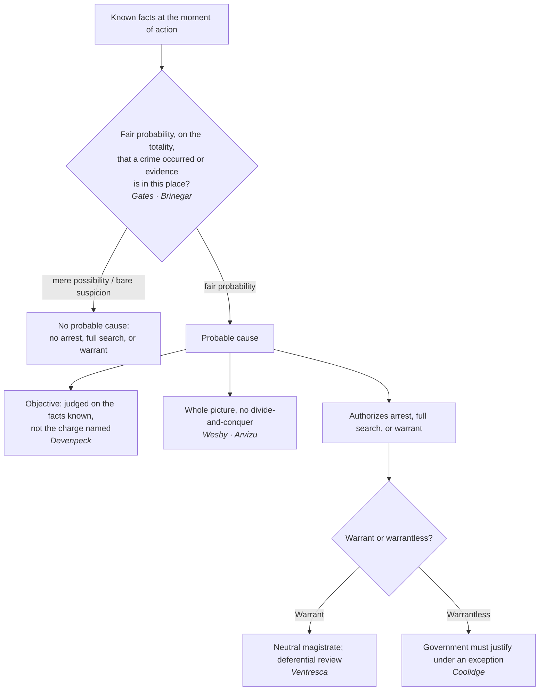

# S9 R1 panel-review — Opus model-diversity lane (prompt pack)

You are the **Claude/Opus** leg of the S9 three-lane adversarial panel (1 Claude + 2 Codex, R1). The two Codex lanes carry the A (support/quote-fidelity) and B (currency/treatment) attack lenses; **you carry model diversity and MUST vote on every paneled assertion across BOTH lenses' concerns.** You are refute-framed: try hard to break each assertion; **default to REFUTED on uncertainty**; never fabricate a cite, quote, or holding; use ONLY the evidence inlined below (no search, no outside knowledge). You are a SIGHTED reviewer — the FULL lake record (judgment fields included) is inlined.

You are a WRITER lane, not an adjudicator: you FIND and VOTE. You do not tally, adjudicate, or close any row — the orchestrator does.

For EACH group below, return one JSON object with the exact `reviewed[]` shape from the output contract (identical framing to the Codex lenses). Emit a finding object ONLY for a real defect (verdict refuted / stands-modified); a group you find wholly clean returns all-`stands` verdicts (the harness records a clean attestation). Concatenate the per-group JSON objects into a top-level `{"packs": [ ... ]}` array, one entry per group, each carrying its `group_id`.


OUTPUT CONTRACT — return ONE JSON object, nothing else:
{
  "lens": "A" | "B",
  "group_id": "<echo the group id>",
  "reviewed": [
    {
      "assertion_id": "<from group_inventory.jsonl>",
      "dimension": "existence|support|quote_fidelity|pincite|treatment|black_letter",
      "verdict": "stands" | "refuted" | "stands-modified",
      "verifiable_from_disclosed": true | false,
      "defect": null,   // null when verdict=="stands"; else an object:
      //  {"problem": "...", "severity": "high|medium|low", "proposed_fix": "...", "evidence_quote": "verbatim from disclosed evidence or null", "needs_cl": true|false, "locator_note": "..."}
      "reasons": ["short evidence-grounded reason", "..."],
      "breaks_true_positives": true | false,
      "residual_risks": ["..."],
      "suggested_tightening": "... or null"
    }
  ],
  "notes": ""
}
Rules: verdict=='stands' <=> defect==null (assertion survives your attack). verdict=='refuted' <=> a real defect (the assertion as framed is wrong). verdict=='stands-modified' <=> survives but needs a stated modification (a minor defect). Review EVERY assertion_id in group_inventory.jsonl exactly once. Output ONLY the JSON object.
---

## GROUP: content/standards-of-proof/Probable Cause.md  (`doctrine`, 18 assertions)

### content_page

```
---
weight: 30
aliases:
  - "Probable Cause"
  - "Probable Cause and Reasonable Suspicion"
  - "5-levels-of-suspicion/Probable-Cause-and-Reasonable-Suspicion"
  - "standards-of-proof/Probable-Cause-and-Reasonable-Suspicion"
  - "probable-cause-reasonable-suspicion"
title: "Probable Cause"
topic: Probable Cause
type: doctrine
amendment: "U.S. Const. amend. IV"
jurisdiction: "Federal (U.S. Const. amend. IV); SCOTUS baseline"
status: draft
related:
  - "[[The Proof Ladder]]"
  - "[[Reasonable Suspicion]]"
  - "[[The Warrant Requirement]]"
  - "[[Collective Knowledge and the Fellow-Officer Rule]]"
  - "[[Franks v. Delaware]]"
---

# Probable Cause

*Do I have probable cause, a fair probability on the totality of what I know, enough to arrest, search fully, or get a warrant?*

> [!rule] Black-letter rule
> **Probable cause** is the quantum required to arrest, to conduct a full search, or to obtain a warrant. It exists when, under the [[Common Legal Terms#totality-of-the-circumstances|totality of the circumstances]], there is a "fair probability that contraband or evidence of a crime will be found in a particular place." *[[Illinois v. Gates|Gates]]*, 462 U.S. 213, [238](https://www.courtlistener.com/opinion/110959/illinois-v-gates/) (1983). It is a practical, non-technical judgment about **probabilities**, "the factual and practical considerations of everyday life on which reasonable and prudent men, not legal technicians, act." *[[Brinegar v. United States|Brinegar]]*, 338 U.S. 160, [175](https://www.courtlistener.com/opinion/104716/brinegar-v-united-states/) (1949). It demands more than bare suspicion, less than certainty, and never a fixed percentage.
> ^rule-probable-cause

## The Brief

**What probable cause is, and what it unlocks.** Probable cause is the practical, non-technical quantum the Fourth Amendment requires for its most intrusive routine actions: an arrest, a full search, or a warrant. It is the top field rung of the [[The Proof Ladder|proof ladder]], above [[Reasonable Suspicion|reasonable suspicion]] and below the trial burdens no officer applies. This page owns the standard itself; [[Probable Cause in the Affidavit]] owns presenting it to a magistrate, and [[Collective Knowledge and the Fellow-Officer Rule|collective knowledge]] owns pooling it across officers.

**The test: totality and fair probability.** Probable cause "deal[s] with probabilities," the "factual and practical considerations of everyday life on which reasonable and prudent men, not legal technicians, act." *[[Brinegar v. United States#^pin-175|Brinegar]]*, 338 U.S. 160, [175](https://www.courtlistener.com/opinion/104716/brinegar-v-united-states/) (1949). *[[Illinois v. Gates|Gates]]* fixes the operative test: the magistrate makes "a practical, common-sense decision whether, given all the circumstances . . . there is a **fair probability** that contraband or evidence of a crime will be found in a particular place." *[[Illinois v. Gates#^pin-238a|Gates]]*, 462 U.S. 213, [238](https://www.courtlistener.com/opinion/110959/illinois-v-gates/) (1983).

**Three corollaries the field must hold together.**
- **It is objective.** Probable cause turns on the facts known to the officer, not on the charge he names or his subjective theory. An arrest stands if those facts support some offense, "even though the offense the officer thought existed was not the one for which the suspect was eventually charged," and the offense need not be closely related to it. *[[Devenpeck v. Alford#^pin-153|Devenpeck]]*, 543 U.S. 146, [153–55](https://www.courtlistener.com/opinion/137733/devenpeck-v-alford/) (2004).
- **No divide-and-conquer.** Courts and magistrates weigh the whole picture; they may not evaluate each fact in isolation and discard the innocent-looking ones. *[[District of Columbia v. Wesby|Wesby]]*, 583 U.S. 48, [60–61](https://www.courtlistener.com/opinion/4460854/district-of-columbia-v-wesby/) (2018); *[[United States v. Arvizu|Arvizu]]*, 534 U.S. 266, [274](https://www.courtlistener.com/opinion/118474/united-states-v-arvizu/) (2002).
- **Measured at the seizure, on probabilities, not certainty.** Probable cause "must precede the seizure" and rests on the facts then known; "an arrest is not justified by what the subsequent search discloses." *[[Henry v. United States (1959)#^pin-104|Henry]]*, 361 U.S. 98, 104 (1959). But certainty is not required: "[s]ufficient probability, not certainty, is the touchstone of reasonableness," so a reasonable, good-faith **mistake of identity** does not defeat an arrest. *[[Hill v. California#^pin-804|Hill]]*, 401 U.S. 797, [804](https://www.courtlistener.com/opinion/108305/hill-v-california/#:~:text=sufficient%20probability%2C%20not%20certainty%2C%20is) (1971).

**Particularized to the person, but a common enterprise can reach a group.** Probable cause "must be particularized with respect to the person to be searched or seized." *[[Ybarra v. Illinois|Ybarra]]*, 444 U.S. 85, [91](https://www.courtlistener.com/opinion/110158/ybarra-v-illinois/) (1979). *[[Maryland v. Pringle|Pringle]]* shows how that requirement is satisfied for several suspects at once: where cocaine and rolled cash were found in a car and no occupant claimed them, an officer could reasonably infer a "common enterprise among the three men," giving probable cause to arrest each. *[[Maryland v. Pringle#^pin-372|Pringle]]*, 540 U.S. 366, [371–74](https://www.courtlistener.com/opinion/131150/maryland-v-pringle/) (2003). *[[Maryland v. Pringle|Pringle]]* aggregates **facts about suspects** to find individualized probable cause. It is not a [[Collective Knowledge and the Fellow-Officer Rule|collective-knowledge]] case, which pools knowledge **across officers**; keep the two ideas distinct.

**Informants and tips: the *[[Illinois v. Gates|Gates]]* totality replaced the rigid two-prong test.** Before 1983 an informant's tip had to clear a rigid **two-prong** hurdle, the informant's **basis of knowledge** and his **veracity**, each satisfied independently under *[[Aguilar v. Texas|Aguilar]]* and *[[Spinelli v. United States|Spinelli]]*. *[[Illinois v. Gates|Gates]]* abandoned that framework: veracity, reliability, and basis of knowledge "are better understood as relevant considerations in the totality-of-the-circumstances analysis . . . not [as] entirely separate and independent requirements to be rigidly exacted in every case." *[[Illinois v. Gates|Gates]]*, 462 U.S. at [233](https://www.courtlistener.com/opinion/110959/illinois-v-gates/). Under that umbrella, police **corroboration of the innocent details** of a reliable, detailed tip can furnish probable cause, *[[Draper v. United States#^pin-313b|Draper]]*, 358 U.S. 307, [313](https://www.courtlistener.com/opinion/105820/draper-v-united-states/#:~:text=In%20dealing%20with%20probable%20cause%2C) (1959); a statement **against penal interest** carries its own indicia of credibility, *[[United States v. Harris (1971)|Harris]]*, 403 U.S. 573, 583 (1971); and a trained drug dog's alert can supply full probable cause on the totality, *[[Florida v. Harris#^pin-248|Florida v. Harris]]*, 568 U.S. 237, [244–48](https://www.courtlistener.com/opinion/820744/florida-v-harris/) (2013).

**Who decides, and the standard of review.** In the field the call is the officer's, drawing on training and experience; for a warrant it is a **neutral magistrate**, whose probable-cause finding gets **deferential** review. Affidavits are read "in a commonsense and realistic," not "hypertechnical," manner, and "doubtful or marginal cases . . . [are] largely determined by the preference to be accorded to warrants." *[[United States v. Ventresca#^pin-109b|Ventresca]]*, 380 U.S. 102, [108–09](https://www.courtlistener.com/opinion/106990/united-states-v-ventresca/#:~:text=the%20resolution%20of%20doubtful%20or) (1965). On appeal the ultimate probable-cause question is reviewed [[Common Legal Terms#de-novo|de novo]], while the trial court's historical facts are reviewed only for [[Common Legal Terms#clear-error|clear error]]. *[[Ornelas v. United States#^pin-699a|Ornelas]]*, 517 U.S. 690, [699](https://www.courtlistener.com/opinion/118030/ornelas-v-united-states/#:~:text=a%20reviewing%20court%20should%20take) (1996).

**Burden of proof: it tracks the warrant line.** For a **warrantless** search, seizure, or arrest, the **government** bears the burden of justifying it under a recognized exception: "the burden is on those seeking the exemption to show the need for it." *[[Coolidge v. New Hampshire|Coolidge]]*, 403 U.S. 443, [455](https://www.courtlistener.com/opinion/108377/coolidge-v-new-hampshire/) (1971). Under a **warrant** the search or arrest is **presumed valid** and the **defendant** bears the burden of overcoming it. To win a *[[Franks v. Delaware|Franks]]* hearing, for instance, he must make a "substantial preliminary showing" of a knowing or reckless falsehood material to probable cause. *[[Franks v. Delaware|Franks]]*, 438 U.S. 154, [155–56](https://www.courtlistener.com/opinion/109925/franks-v-delaware/) (1978).

**Remedy.** The consequence of acting on less than probable cause is **suppression** of the evidence and its fruits under the exclusionary rule. See [[The Exclusionary Rule]].

**Apply it.**
1. **Fix the quantum.** Ask whether the known facts show a fair probability, not a bare possibility, that a crime occurred or that evidence is in this place (*[[Illinois v. Gates|Gates]]*).
2. **Take the whole picture.** Weigh the facts together; do not explain each away in isolation (*[[District of Columbia v. Wesby|Wesby]]*).
3. **Check the source.** Corroborate an informant's tip, or rely on a penal-interest admission or a trained-dog alert; the totality, not a rigid checklist, controls (*[[Draper v. United States|Draper]]*; *[[Florida v. Harris|Florida v. Harris]]*).
4. **Do not lock onto your charge.** Probable cause is objective; it survives even if the eventual charge differs from the one you had in mind (*[[Devenpeck v. Alford|Devenpeck]]*).

**Common pitfalls.**
- **Treating reasonable suspicion and probable cause as interchangeable.** They are different rungs: reasonable suspicion buys a brief stop-and-frisk, not an arrest or a full search. Name which one the facts actually support (see [[Reasonable Suspicion]]).
- **"Probabilities, not possibilities."** Probable cause turns on **probabilities**, not bare possibility. A fact that merely makes crime *possible* is not enough; this is one of the [[Three Golden Rules|Three Golden Rules]] maxims (*[[Brinegar v. United States|Brinegar]]*; *[[Illinois v. Gates|Gates]]*).
- **Quantifying the standard as a fixed percentage.** Neither standard reduces to a number; an instructor who says "probable cause is 51%" is inventing a rule the Court has never adopted (*[[Illinois v. Gates|Gates]]*).
- **Divide-and-conquer.** Do not pick the facts apart and explain each away; the test is the whole picture (*[[District of Columbia v. Wesby|Wesby]]*; *[[United States v. Arvizu|Arvizu]]*).
- **Locking onto the charge you named.** Probable cause is objective; it survives even if the eventual charge differs from the one you had in mind (*[[Devenpeck v. Alford|Devenpeck]]*).

## Key cases

| Case | Holding | Opinion |
|---|---|---|
| *[[Brinegar v. United States]]*, 338 U.S. 160 (1949) | Classic probable-cause statement: practical, non-technical **probabilities** on which reasonable people act, not technical certainty. | [opinion](https://www.courtlistener.com/opinion/104716/brinegar-v-united-states/) |
| *[[Illinois v. Gates]]*, 462 U.S. 213 (1983) | Probable cause is judged by the **[[Common Legal Terms#totality-of-the-circumstances\|totality of the circumstances]]**, a fair-probability inquiry; **abandons** the rigid *[[Aguilar v. Texas\|Aguilar]]*–*[[Spinelli v. United States\|Spinelli]]* two-prong informant test. | [opinion](https://www.courtlistener.com/opinion/110959/illinois-v-gates/) |
| *[[Henry v. United States (1959)]]*, 361 U.S. 98 (1959) | Probable cause is measured **at the moment of arrest** on the facts then known; "an arrest is not justified by what the subsequent search discloses." | [opinion](https://www.courtlistener.com/opinion/105963/henry-v-united-states/) |
| *[[Maryland v. Pringle]]*, 540 U.S. 366 (2003) | Drugs and cash in a car with no claimant give probable cause to arrest **all** occupants on a **common-enterprise** inference: particularized PC reaching a group, not horizontal pooling. | [opinion](https://www.courtlistener.com/opinion/131150/maryland-v-pringle/) |
| *[[Devenpeck v. Alford]]*, 543 U.S. 146 (2004) | Probable cause is **objective**; the offense need not be the one the officer named or closely related to it. | [opinion](https://www.courtlistener.com/opinion/137733/devenpeck-v-alford/) |
| *[[Hill v. California]]*, 401 U.S. 797 (1971) | "Sufficient probability, not certainty, is the touchstone": a reasonable, good-faith **mistaken-identity** arrest is valid, as is the search incident to it. | [opinion](https://www.courtlistener.com/opinion/108305/hill-v-california/) |
| *[[District of Columbia v. Wesby]]*, 583 U.S. 48 (2018) | Probable cause is a totality inquiry; courts must **not divide-and-conquer** the facts. | [opinion](https://www.courtlistener.com/opinion/4460854/district-of-columbia-v-wesby/) |
| *[[Florida v. Harris]]*, 568 U.S. 237 (2013) | A trained dog's alert can supply **probable cause** under the totality, with no rigid field-record checklist. | [opinion](https://www.courtlistener.com/opinion/820744/florida-v-harris/) |
| *[[Draper v. United States]]*, 358 U.S. 307 (1959) | Police **corroboration of the innocent details** of a reliable, detailed informant's tip furnishes probable cause to arrest. | [opinion](https://www.courtlistener.com/opinion/105820/draper-v-united-states/) |
| *[[United States v. Harris (1971)]]*, 403 U.S. 573 (1971) | An informant's statement **against penal interest** carries its own indicia of credibility, supporting probable cause. | [opinion](https://www.courtlistener.com/opinion/108379/united-states-v-harris/) |
| *[[Ornelas v. United States]]*, 517 U.S. 690 (1996) | Reasonable-suspicion and probable-cause determinations are reviewed **[[Common Legal Terms#de-novo\|de novo]]**; historical facts for [[Common Legal Terms#clear-error\|clear error]]. | [opinion](https://www.courtlistener.com/opinion/118030/ornelas-v-united-states/) |
| *[[Aguilar v. Texas]]*, 378 U.S. 108 (1964) | **The two-prong foil**: the rigid basis-of-knowledge and veracity informant test, **abandoned** by *[[Illinois v. Gates\|Gates]]* for the totality approach. | [opinion](https://www.courtlistener.com/opinion/106865/aguilar-v-texas/) |
| *[[Spinelli v. United States]]*, 393 U.S. 410 (1969) | **The two-prong foil**: refined *[[Aguilar v. Texas\|Aguilar]]*'s two prongs, then **abandoned** by *[[Illinois v. Gates\|Gates]]*. | [opinion](https://www.courtlistener.com/opinion/107831/spinelli-v-united-states/) |

## Related cases across doctrines

| Case | Relevance here | Primary home | Opinion |
|---|---|---|---|
| *[[United States v. Ventresca]]*, 380 U.S. 102 (1965) | ***Posture.*** Warrant affidavits are read **commonsensically**, not hypertechnically, and **doubtful PC cases favor the warrant**, the deferential posture behind *[[Illinois v. Gates\|Gates]]*. | [[Probable Cause in the Affidavit]] | [opinion](https://www.courtlistener.com/opinion/106990/united-states-v-ventresca/) |
| *[[Franks v. Delaware]]*, 438 U.S. 154 (1978) | ***Limits.*** The defendant may attack the PC **showing itself**: on a substantial preliminary showing of a knowing or reckless material falsehood, the false statement is set aside and PC re-evaluated on what remains. | [[Franks Challenges]] | [opinion](https://www.courtlistener.com/opinion/109925/franks-v-delaware/) |
| *[[Whiteley v. Warden]]*, 401 U.S. 560 (1971) | ***Source rule.*** An officer may act on a bulletin assuming the issuer had PC, but if the **issuer in fact lacked PC** the action is invalid: the quantum is measured **at the source**. | [[Collective Knowledge and the Fellow-Officer Rule]] | [opinion](https://www.courtlistener.com/opinion/108297/whiteley-v-warden-wyoming-state-penitentiary/) |
| *[[Case v. Montana]]*, 607 U.S. ___ (2026) | ***Boundary.*** **Probable cause is the criminal-investigative quantum and is not transplanted** to non-investigative contexts: a warrantless **emergency-aid** home entry needs only *[[Brigham City v. Stuart\|Brigham City]]*'s "objectively reasonable basis," not PC. | [[Emergency Aid]] | [opinion](https://www.courtlistener.com/opinion/10774335/case-v-montana/) |

## Visual



## Sources

- [*Illinois v. Gates*, 462 U.S. 213 (1983)](https://www.courtlistener.com/opinion/110959/illinois-v-gates/) (pinpoints: 233, 238)
- [*Brinegar v. United States*, 338 U.S. 160 (1949)](https://www.courtlistener.com/opinion/104716/brinegar-v-united-states/) (pinpoint: 175)
- [*Henry v. United States*, 361 U.S. 98 (1959)](https://www.courtlistener.com/opinion/105963/henry-v-united-states/) (pinpoint: 104)
- [*Maryland v. Pringle*, 540 U.S. 366 (2003)](https://www.courtlistener.com/opinion/131150/maryland-v-pringle/) (pinpoints: 371–74)
- [*Devenpeck v. Alford*, 543 U.S. 146 (2004)](https://www.courtlistener.com/opinion/137733/devenpeck-v-alford/) (pinpoints: 153–55)
- [*Hill v. California*, 401 U.S. 797 (1971)](https://www.courtlistener.com/opinion/108305/hill-v-california/) (pinpoint: 804)
- [*District of Columbia v. Wesby*, 583 U.S. 48 (2018)](https://www.courtlistener.com/opinion/4460854/district-of-columbia-v-wesby/) (pinpoints: 60–61)
- [*United States v. Arvizu*, 534 U.S. 266 (2002)](https://www.courtlistener.com/opinion/118474/united-states-v-arvizu/) (pinpoint: 274)
- [*Florida v. Harris*, 568 U.S. 237 (2013)](https://www.courtlistener.com/opinion/820744/florida-v-harris/) (pinpoints: 244–48)
- [*Draper v. United States*, 358 U.S. 307 (1959)](https://www.courtlistener.com/opinion/105820/draper-v-united-states/) (pinpoint: 313)
- [*United States v. Harris*, 403 U.S. 573 (1971)](https://www.courtlistener.com/opinion/108379/united-states-v-harris/) (pinpoint: 583)
- [*Ybarra v. Illinois*, 444 U.S. 85 (1979)](https://www.courtlistener.com/opinion/110158/ybarra-v-illinois/) (pinpoint: 91)
- [*Aguilar v. Texas*, 378 U.S. 108 (1964)](https://www.courtlistener.com/opinion/106865/aguilar-v-texas/) *(Historical; abrogated by Gates)*
- [*Spinelli v. United States*, 393 U.S. 410 (1969)](https://www.courtlistener.com/opinion/107831/spinelli-v-united-states/) *(Historical; abrogated by Gates)*
- [*Ornelas v. United States*, 517 U.S. 690 (1996)](https://www.courtlistener.com/opinion/118030/ornelas-v-united-states/) (pinpoint: 699)
- [*United States v. Ventresca*, 380 U.S. 102 (1965)](https://www.courtlistener.com/opinion/106990/united-states-v-ventresca/) (pinpoints: 108–09)
- [*Franks v. Delaware*, 438 U.S. 154 (1978)](https://www.courtlistener.com/opinion/109925/franks-v-delaware/) (pinpoints: 155–56)
- [*Whiteley v. Warden*, 401 U.S. 560 (1971)](https://www.courtlistener.com/opinion/108297/whiteley-v-warden-wyoming-state-penitentiary/)
- [*Coolidge v. New Hampshire*, 403 U.S. 443 (1971)](https://www.courtlistener.com/opinion/108377/coolidge-v-new-hampshire/) (pinpoint: 455)
- [*Case v. Montana*, 607 U.S. ___ (2026) (No. 24-624)](https://www.courtlistener.com/opinion/10774335/case-v-montana/)

```

### group_inventory (assertions under review)

```jsonl
{"assertion_id": "02050c51979b6b80", "dimension": "existence", "kind": "case_cite", "locator": {"case": "Henry v. United States (1959)", "table_line": 50}, "payload": {"case": "Henry v. United States (1959)", "cells": ["*[[Henry v. United States (1959)]]*, 361 U.S. 98 (1959)", "Probable cause is measured **at the moment of arrest** on the facts then known; \"an arrest is not justified by what the subsequent search discloses.\"", "[opinion](https://www.courtlistener.com/opinion/105963/henry-v-united-states/)"], "header": ["Case", "Holding", "Opinion"]}}
{"assertion_id": "19ab26a2c0fb115f", "dimension": "existence", "kind": "case_cite", "locator": {"case": "District of Columbia v. Wesby", "table_line": 54}, "payload": {"case": "District of Columbia v. Wesby", "cells": ["*[[District of Columbia v. Wesby]]*, 583 U.S. 48 (2018)", "Probable cause is a totality inquiry; courts must **not divide-and-conquer** the facts.", "[opinion](https://www.courtlistener.com/opinion/4460854/district-of-columbia-v-wesby/)"], "header": ["Case", "Holding", "Opinion"]}}
{"assertion_id": "1eb2a90db555b045", "dimension": "existence", "kind": "case_cite", "locator": {"case": "United States v. Ventresca", "table_line": 66}, "payload": {"case": "United States v. Ventresca", "cells": ["*[[United States v. Ventresca]]*, 380 U.S. 102 (1965)", "***Posture.*** Warrant affidavits are read **commonsensically**, not hypertechnically, and **doubtful PC cases favor the warrant**, the deferential posture behind *[[Illinois v. Gates\\|Gates]]*.", "[[Probable Cause in the Affidavit]]", "[opinion](https://www.courtlistener.com/opinion/106990/united-states-v-ventresca/)"], "header": ["Case", "Relevance here", "Primary home", "Opinion"]}}
{"assertion_id": "3019877b7065effe", "dimension": "existence", "kind": "case_cite", "locator": {"case": "Aguilar v. Texas", "table_line": 59}, "payload": {"case": "Aguilar v. Texas", "cells": ["*[[Aguilar v. Texas]]*, 378 U.S. 108 (1964)", "**The two-prong foil**: the rigid basis-of-knowledge and veracity informant test, **abandoned** by *[[Illinois v. Gates\\|Gates]]* for the totality approach.", "[opinion](https://www.courtlistener.com/opinion/106865/aguilar-v-texas/)"], "header": ["Case", "Holding", "Opinion"]}}
{"assertion_id": "349eaec355efbd35", "dimension": "existence", "kind": "case_cite", "locator": {"case": "Ornelas v. United States", "table_line": 58}, "payload": {"case": "Ornelas v. United States", "cells": ["*[[Ornelas v. United States]]*, 517 U.S. 690 (1996)", "Reasonable-suspicion and probable-cause determinations are reviewed **[[Common Legal Terms#de-novo\\|de novo]]**; historical facts for [[Common Legal Terms#clear-error\\|clear error]].", "[opinion](https://www.courtlistener.com/opinion/118030/ornelas-v-united-states/)"], "header": ["Case", "Holding", "Opinion"]}}
{"assertion_id": "48cde061cde83dec", "dimension": "existence", "kind": "case_cite", "locator": {"case": "United States v. Harris (1971)", "table_line": 57}, "payload": {"case": "United States v. Harris (1971)", "cells": ["*[[United States v. Harris (1971)]]*, 403 U.S. 573 (1971)", "An informant's statement **against penal interest** carries its own indicia of credibility, supporting probable cause.", "[opinion](https://www.courtlistener.com/opinion/108379/united-states-v-harris/)"], "header": ["Case", "Holding", "Opinion"]}}
{"assertion_id": "657d0526891a8823", "dimension": "existence", "kind": "case_cite", "locator": {"case": "Draper v. United States", "table_line": 56}, "payload": {"case": "Draper v. United States", "cells": ["*[[Draper v. United States]]*, 358 U.S. 307 (1959)", "Police **corroboration of the innocent details** of a reliable, detailed informant's tip furnishes probable cause to arrest.", "[opinion](https://www.courtlistener.com/opinion/105820/draper-v-united-states/)"], "header": ["Case", "Holding", "Opinion"]}}
{"assertion_id": "88468e00a287a75c", "dimension": "existence", "kind": "case_cite", "locator": {"case": "Spinelli v. United States", "table_line": 60}, "payload": {"case": "Spinelli v. United States", "cells": ["*[[Spinelli v. United States]]*, 393 U.S. 410 (1969)", "**The two-prong foil**: refined *[[Aguilar v. Texas\\|Aguilar]]*'s two prongs, then **abandoned** by *[[Illinois v. Gates\\|Gates]]*.", "[opinion](https://www.courtlistener.com/opinion/107831/spinelli-v-united-states/)"], "header": ["Case", "Holding", "Opinion"]}}
{"assertion_id": "89da19ee9264a688", "dimension": "existence", "kind": "case_cite", "locator": {"case": "Franks v. Delaware", "table_line": 67}, "payload": {"case": "Franks v. Delaware", "cells": ["*[[Franks v. Delaware]]*, 438 U.S. 154 (1978)", "***Limits.*** The defendant may attack the PC **showing itself**: on a substantial preliminary showing of a knowing or reckless material falsehood, the false statement is set aside and PC re-evaluated on what remains.", "[[Franks Challenges]]", "[opinion](https://www.courtlistener.com/opinion/109925/franks-v-delaware/)"], "header": ["Case", "Relevance here", "Primary home", "Opinion"]}}
{"assertion_id": "a5dcd1dcfb552131", "dimension": "existence", "kind": "case_cite", "locator": {"case": "Illinois v. Gates", "table_line": 49}, "payload": {"case": "Illinois v. Gates", "cells": ["*[[Illinois v. Gates]]*, 462 U.S. 213 (1983)", "Probable cause is judged by the **[[Common Legal Terms#totality-of-the-circumstances\\|totality of the circumstances]]**, a fair-probability inquiry; **abandons** the rigid *[[Aguilar v. Texas\\|Aguilar]]*–*[[Spinelli v. United States\\|Spinelli]]* two-prong informant test.", "[opinion](https://www.courtlistener.com/opinion/110959/illinois-v-gates/)"], "header": ["Case", "Holding", "Opinion"]}}
{"assertion_id": "c7c075fb76d74d0c", "dimension": "existence", "kind": "case_cite", "locator": {"case": "Florida v. Harris", "table_line": 55}, "payload": {"case": "Florida v. Harris", "cells": ["*[[Florida v. Harris]]*, 568 U.S. 237 (2013)", "A trained dog's alert can supply **probable cause** under the totality, with no rigid field-record checklist.", "[opinion](https://www.courtlistener.com/opinion/820744/florida-v-harris/)"], "header": ["Case", "Holding", "Opinion"]}}
{"assertion_id": "d587766c2b9d0514", "dimension": "existence", "kind": "case_cite", "locator": {"case": "Hill v. California", "table_line": 53}, "payload": {"case": "Hill v. California", "cells": ["*[[Hill v. California]]*, 401 U.S. 797 (1971)", "\"Sufficient probability, not certainty, is the touchstone\": a reasonable, good-faith **mistaken-identity** arrest is valid, as is the search incident to it.", "[opinion](https://www.courtlistener.com/opinion/108305/hill-v-california/)"], "header": ["Case", "Holding", "Opinion"]}}
{"assertion_id": "d60fc9f58d628c6f", "dimension": "existence", "kind": "case_cite", "locator": {"case": "Whiteley v. Warden", "table_line": 68}, "payload": {"case": "Whiteley v. Warden", "cells": ["*[[Whiteley v. Warden]]*, 401 U.S. 560 (1971)", "***Source rule.*** An officer may act on a bulletin assuming the issuer had PC, but if the **issuer in fact lacked PC** the action is invalid: the quantum is measured **at the source**.", "[[Collective Knowledge and the Fellow-Officer Rule]]", "[opinion](https://www.courtlistener.com/opinion/108297/whiteley-v-warden-wyoming-state-penitentiary/)"], "header": ["Case", "Relevance here", "Primary home", "Opinion"]}}
{"assertion_id": "dfea55544de65b6c", "dimension": "existence", "kind": "case_cite", "locator": {"case": "Case v. Montana", "table_line": 69}, "payload": {"case": "Case v. Montana", "cells": ["*[[Case v. Montana]]*, 607 U.S. ___ (2026)", "***Boundary.*** **Probable cause is the criminal-investigative quantum and is not transplanted** to non-investigative contexts: a warrantless **emergency-aid** home entry needs only *[[Brigham City v. Stuart\\|Brigham City]]*'s \"objectively reasonable basis,\" not PC.", "[[Emergency Aid]]", "[opinion](https://www.courtlistener.com/opinion/10774335/case-v-montana/)"], "header": ["Case", "Relevance here", "Primary home", "Opinion"]}}
{"assertion_id": "e13a0311410f32f3", "dimension": "existence", "kind": "case_cite", "locator": {"case": "Maryland v. Pringle", "table_line": 51}, "payload": {"case": "Maryland v. Pringle", "cells": ["*[[Maryland v. Pringle]]*, 540 U.S. 366 (2003)", "Drugs and cash in a car with no claimant give probable cause to arrest **all** occupants on a **common-enterprise** inference: particularized PC reaching a group, not horizontal pooling.", "[opinion](https://www.courtlistener.com/opinion/131150/maryland-v-pringle/)"], "header": ["Case", "Holding", "Opinion"]}}
{"assertion_id": "f31f3baac7ba8bbc", "dimension": "existence", "kind": "case_cite", "locator": {"case": "Devenpeck v. Alford", "table_line": 52}, "payload": {"case": "Devenpeck v. Alford", "cells": ["*[[Devenpeck v. Alford]]*, 543 U.S. 146 (2004)", "Probable cause is **objective**; the offense need not be the one the officer named or closely related to it.", "[opinion](https://www.courtlistener.com/opinion/137733/devenpeck-v-alford/)"], "header": ["Case", "Holding", "Opinion"]}}
{"assertion_id": "fe8201ce5b015c48", "dimension": "existence", "kind": "case_cite", "locator": {"case": "Brinegar v. United States", "table_line": 48}, "payload": {"case": "Brinegar v. United States", "cells": ["*[[Brinegar v. United States]]*, 338 U.S. 160 (1949)", "Classic probable-cause statement: practical, non-technical **probabilities** on which reasonable people act, not technical certainty.", "[opinion](https://www.courtlistener.com/opinion/104716/brinegar-v-united-states/)"], "header": ["Case", "Holding", "Opinion"]}}
{"assertion_id": "e8185f154afce144", "dimension": "support", "kind": "proposition", "locator": {"callout": "^rule-probable-cause"}, "payload": {"anchor": "^rule-probable-cause", "statement": "[!rule] Black-letter rule\n**Probable cause** is the quantum required to arrest, to conduct a full search, or to obtain a warrant. It exists when, under the [[Common Legal Terms#totality-of-the-circumstances|totality of the circumstances]], there is a \"fair probability that contraband or evidence of a crime will be found in a particular place.\" *[[Illinois v. Gates|Gates]]*, 462 U.S. 213, [238](https://www.courtlistener.com/opinion/110959/illinois-v-gates/) (1983). It is a practical, non-technical judgment about **probabilities**, \"the factual and practical considerations of everyday life on which reasonable and prudent men, not legal technicians, act.\" *[[Brinegar v. United States|Brinegar]]*, 338 U.S. 160, [175](https://www.courtlistener.com/opinion/104716/brinegar-v-united-states/) (1949). It demands more than bare suspicion, less than certainty, and never a fixed percentage."}}
```

### lake record — Aguilar v. Texas

```json
{
  "schema_version": "s2.v1",
  "record_id": "Aguilar v. Texas",
  "stub": false,
  "status": "verified",
  "identity": {
    "case_name": "Aguilar v. Texas",
    "case_name_short": "Aguilar",
    "case_name_full": "Aguilar v. Texas",
    "input_case_name": "Aguilar v. Texas",
    "court": "U.S. Supreme Court",
    "court_id": "scotus",
    "court_level": "scotus",
    "circuit": null,
    "state": null,
    "date_decided": "1964-06-15",
    "year": 1964,
    "docket": null,
    "cluster_id": 106865,
    "lead_opinion_id": 106865,
    "sibling_ids": [
      106865,
      9422845,
      9422846,
      9422847
    ],
    "absolute_url": "/opinion/106865/aguilar-v-texas/",
    "identity_method": "citation+party-text",
    "expected_citation_found": true,
    "party_name_in_text": true,
    "canonical_name_match": true,
    "alternates": [],
    "reason_code": null
  },
  "citations": {
    "official": {
      "cite": "378 U.S. 108",
      "volume": "378",
      "reporter": "U.S.",
      "page": "108",
      "type": 1,
      "selected_official": true,
      "source": "cluster.citations[]"
    },
    "parallel": [
      {
        "cite": "84 S. Ct. 1509",
        "volume": "84",
        "reporter": "S. Ct.",
        "page": "1509",
        "type": 1,
        "selected_official": false,
        "source": "cluster.citations[]"
      },
      {
        "cite": "12 L. Ed. 2d 723",
        "volume": "12",
        "reporter": "L. Ed. 2d",
        "page": "723",
        "type": 1,
        "selected_official": false,
        "source": "cluster.citations[]"
      }
    ],
    "vendor_neutral": [
      {
        "cite": "1964 U.S. LEXIS 994",
        "volume": "1964",
        "reporter": "U.S. LEXIS",
        "page": "994",
        "type": 6,
        "selected_official": false,
        "source": "cluster.citations[]"
      }
    ],
    "all": [
      {
        "cite": "378 U.S. 108",
        "volume": "378",
        "reporter": "U.S.",
        "page": "108",
        "type": 1,
        "selected_official": false,
        "source": "cluster.citations[]"
      },
      {
        "cite": "84 S. Ct. 1509",
        "volume": "84",
        "reporter": "S. Ct.",
        "page": "1509",
        "type": 1,
        "selected_official": false,
        "source": "cluster.citations[]"
      },
      {
        "cite": "12 L. Ed. 2d 723",
        "volume": "12",
        "reporter": "L. Ed. 2d",
        "page": "723",
        "type": 1,
        "selected_official": false,
        "source": "cluster.citations[]"
      },
      {
        "cite": "1964 U.S. LEXIS 994",
        "volume": "1964",
        "reporter": "U.S. LEXIS",
        "page": "994",
        "type": 6,
        "selected_official": false,
        "source": "cluster.citations[]"
      }
    ],
    "display": "378 U.S. 108",
    "official_selection": {
      "court_class": "scotus",
      "selected": "378 U.S. 108",
      "reason": "selected_rank_1"
    }
  },
  "pinpoints": [
    {
      "id": "pin-114",
      "page": null,
      "quote": "that narcotics were being kept at the premises. The affidavit gave no underlying facts \u2014 neither how the informant knew nor why he was believed. The warrant issued and evidence was seized and used to convict. ## Issue Whether an affidavit resting solely on an informant's tip \u2014 stated as a conclusion, without underlying facts showing the informant's basis of knowledge or his credibility \u2014 can support a magistrate's finding of probable cause. ## Rule No. An affidavit may rest on hearsay, but the magistrate must be given the underlying facts behind both the informant's knowledge and his reliability. The",
      "star_marker": null,
      "quote_fidelity": "mismatch",
      "pinpoint_status": "slip-only",
      "position": null
    },
    {
      "id": "pin-115",
      "page": null,
      "quote": "by a neutral and detached magistrate,",
      "star_marker": "115",
      "quote_fidelity": "matched",
      "pinpoint_status": "star-verified",
      "position": 13622,
      "fragment": "#:~:text=by%20a%20neutral%20and%20detached%20magistrate%2C",
      "fragment_validated_at": "2026-07-09T15:40:45Z"
    }
  ],
  "treatment": {
    "field_i_validity": "superseded",
    "as_of_content": "1964-06-15",
    "as_of_treatment": "2026-06-30",
    "composite_basis": "migration-seed",
    "composite_basis_ref": "Aguilar v. Texas",
    "varies_by_point": false,
    "scope_note": "Two-prong Aguilar-Spinelli test for informant tips abandoned for a totality-of-the-circumstances approach by Illinois v. Gates (1983).",
    "point_overrides": [],
    "edges": [
      {
        "citing_case": {
          "name": "Illinois v. Gates",
          "cluster_id": 110959,
          "cite": "462 U.S. 213",
          "field_ii": "abrogated"
        },
        "field_ii": "abrogated",
        "field_iii": "mentioned",
        "point": null,
        "proposed": true,
        "journal_ref": "migration:abrogated"
      },
      {
        "citing_case": {
          "name": "In re Grijalva; Judith del Cuadro-Zimmerman",
          "cluster_id": 10847130,
          "cite": null,
          "field_ii": "questioned"
        },
        "field_ii": "questioned",
        "field_iii": "mentioned",
        "point": null,
        "proposed": true,
        "journal_ref": "Aguilar v. Texas:lane1_negative"
      },
      {
        "citing_case": {
          "name": "State v. Mercer",
          "cluster_id": 10803481,
          "cite": null,
          "field_ii": "abrogated"
        },
        "field_ii": "abrogated",
        "field_iii": "mentioned",
        "point": null,
        "proposed": true,
        "journal_ref": "Aguilar v. Texas:lane1_negative"
      },
      {
        "citing_case": {
          "name": "People v. Leighton R.",
          "cluster_id": 10742062,
          "cite": [
            "2025 NY Slip Op 06534"
          ],
          "field_ii": "overruled"
        },
        "field_ii": "overruled",
        "field_iii": "mentioned",
        "point": null,
        "proposed": true,
        "journal_ref": "Aguilar v. Texas:lane1_negative"
      },
      {
        "citing_case": {
          "name": "Commonwealth v. Luis Morales",
          "cluster_id": 10734924,
          "cite": null,
          "field_ii": "superseded_by_statute"
        },
        "field_ii": "superseded_by_statute",
        "field_iii": "mentioned",
        "point": null,
        "proposed": true,
        "journal_ref": "Aguilar v. Texas:lane1_negative"
      },
      {
        "citing_case": {
          "name": "FRASER, MARIAN v. the State of Texas",
          "cluster_id": 10667479,
          "cite": null,
          "field_ii": "questioned"
        },
        "field_ii": "questioned",
        "field_iii": "mentioned",
        "point": null,
        "proposed": true,
        "journal_ref": "Aguilar v. Texas:lane1_negative"
      },
      {
        "citing_case": {
          "name": "United States v. Wilson",
          "cluster_id": 10664712,
          "cite": null,
          "field_ii": "questioned"
        },
        "field_ii": "questioned",
        "field_iii": "mentioned",
        "point": null,
        "proposed": true,
        "journal_ref": "Aguilar v. Texas:lane1_negative"
      },
      {
        "citing_case": {
          "name": "United States v. Silva",
          "cluster_id": 10640306,
          "cite": null,
          "field_ii": "abrogated"
        },
        "field_ii": "abrogated",
        "field_iii": "mentioned",
        "point": null,
        "proposed": true,
        "journal_ref": "Aguilar v. Texas:lane1_negative"
      },
      {
        "citing_case": {
          "name": "State of Tennessee v. Brandon Tylor Mulac",
          "cluster_id": 10633329,
          "cite": null,
          "field_ii": "overruled"
        },
        "field_ii": "overruled",
        "field_iii": "mentioned",
        "point": null,
        "proposed": true,
        "journal_ref": "Aguilar v. Texas:lane1_negative"
      },
      {
        "citing_case": {
          "name": "People v. Hill",
          "cluster_id": 10582111,
          "cite": [
            "2025 NY Slip Op 25109"
          ],
          "field_ii": "abrogated"
        },
        "field_ii": "abrogated",
        "field_iii": "mentioned",
        "point": null,
        "proposed": true,
        "journal_ref": "Aguilar v. Texas:lane1_negative"
      },
      {
        "citing_case": {
          "name": "Ball v. New York State Dept. of Health",
          "cluster_id": 10379926,
          "cite": [
            "2025 NY Slip Op 25090"
          ],
          "field_ii": "abrogated"
        },
        "field_ii": "abrogated",
        "field_iii": "mentioned",
        "point": null,
        "proposed": true,
        "journal_ref": "Aguilar v. Texas:lane1_negative"
      },
      {
        "citing_case": {
          "name": "State v. Shannon",
          "cluster_id": 10373759,
          "cite": [
            "2025 Ohio 1224"
          ],
          "field_ii": "overruled"
        },
        "field_ii": "overruled",
        "field_iii": "mentioned",
        "point": null,
        "proposed": true,
        "journal_ref": "Aguilar v. Texas:lane1_negative"
      },
      {
        "citing_case": {
          "name": "State of Washington, V. Tommy Darren Tyson",
          "cluster_id": 10339068,
          "cite": [
            "564 P.3d 248"
          ],
          "field_ii": "abrogated"
        },
        "field_ii": "abrogated",
        "field_iii": "mentioned",
        "point": null,
        "proposed": true,
        "journal_ref": "Aguilar v. Texas:lane1_negative"
      },
      {
        "citing_case": {
          "name": "COMMONWEALTH v. S. CHRISTOPHER M. BOYER / COMMONWEALTH v. S. ROMUALD BERNAUD",
          "cluster_id": 10642653,
          "cite": null,
          "field_ii": "overruled"
        },
        "field_ii": "overruled",
        "field_iii": "mentioned",
        "point": null,
        "proposed": true,
        "journal_ref": "Aguilar v. Texas:lane1_negative"
      },
      {
        "citing_case": {
          "name": "United States v. Antwone Miguel Sanders",
          "cluster_id": 9986839,
          "cite": [
            "106 F.4th 455"
          ],
          "field_ii": "abrogated"
        },
        "field_ii": "abrogated",
        "field_iii": "mentioned",
        "point": null,
        "proposed": true,
        "journal_ref": "Aguilar v. Texas:lane1_negative"
      },
      {
        "citing_case": {
          "name": "Todd Michael Glover v. the State of Texas",
          "cluster_id": 9509712,
          "cite": null,
          "field_ii": "overruled"
        },
        "field_ii": "overruled",
        "field_iii": "mentioned",
        "point": null,
        "proposed": true,
        "journal_ref": "Aguilar v. Texas:lane1_negative"
      },
      {
        "citing_case": {
          "name": "Todd Michael Glover v. the State of Texas",
          "cluster_id": 9509711,
          "cite": null,
          "field_ii": "questioned"
        },
        "field_ii": "questioned",
        "field_iii": "mentioned",
        "point": null,
        "proposed": true,
        "journal_ref": "Aguilar v. Texas:lane1_negative"
      },
      {
        "citing_case": {
          "name": "State of Tennessee v. Willie Locust",
          "cluster_id": 9455816,
          "cite": null,
          "field_ii": "overruled"
        },
        "field_ii": "overruled",
        "field_iii": "mentioned",
        "point": null,
        "proposed": true,
        "journal_ref": "Aguilar v. Texas:lane1_negative"
      },
      {
        "citing_case": {
          "name": "State v. Smith",
          "cluster_id": 9452598,
          "cite": [
            "2023 Ohio 4565"
          ],
          "field_ii": "overruled"
        },
        "field_ii": "overruled",
        "field_iii": "mentioned",
        "point": null,
        "proposed": true,
        "journal_ref": "Aguilar v. Texas:lane1_negative"
      },
      {
        "citing_case": {
          "name": "State v. Williams",
          "cluster_id": 9448572,
          "cite": [
            "2023 Ohio 4344"
          ],
          "field_ii": "questioned"
        },
        "field_ii": "questioned",
        "field_iii": "mentioned",
        "point": null,
        "proposed": true,
        "journal_ref": "Aguilar v. Texas:lane1_negative"
      },
      {
        "citing_case": {
          "name": "State of Louisiana v. Roosevelt Randolph",
          "cluster_id": 10612306,
          "cite": null,
          "field_ii": "questioned"
        },
        "field_ii": "questioned",
        "field_iii": "mentioned",
        "point": null,
        "proposed": true,
        "journal_ref": "Aguilar v. Texas:lane1_negative"
      },
      {
        "citing_case": {
          "name": "State v. Grace",
          "cluster_id": 9433421,
          "cite": [
            "2023 Ohio 3781"
          ],
          "field_ii": "overruled"
        },
        "field_ii": "overruled",
        "field_iii": "mentioned",
        "point": null,
        "proposed": true,
        "journal_ref": "Aguilar v. Texas:lane1_negative"
      },
      {
        "citing_case": {
          "name": "United States v. Edward Leonidas Lewis",
          "cluster_id": 9424185,
          "cite": null,
          "field_ii": "questioned"
        },
        "field_ii": "questioned",
        "field_iii": "mentioned",
        "point": null,
        "proposed": true,
        "journal_ref": "Aguilar v. Texas:lane1_negative"
      },
      {
        "citing_case": {
          "name": "People v. Joyette",
          "cluster_id": 9419192,
          "cite": [
            "219 A.D.3d 628",
            "194 N.Y.S.3d 287",
            "2023 NY Slip Op 04216"
          ],
          "field_ii": "questioned"
        },
        "field_ii": "questioned",
        "field_iii": "mentioned",
        "point": null,
        "proposed": true,
        "journal_ref": "Aguilar v. Texas:lane1_negative"
      },
      {
        "citing_case": {
          "name": "State of Arizona v. Tito Rene Scott",
          "cluster_id": 9403530,
          "cite": [
            "530 P.3d 1178",
            "97 Arizona Cases Digest 31"
          ],
          "field_ii": "abrogated"
        },
        "field_ii": "abrogated",
        "field_iii": "mentioned",
        "point": null,
        "proposed": true,
        "journal_ref": "Aguilar v. Texas:lane1_negative"
      },
      {
        "citing_case": {
          "name": "Robert Donald Ehrhardt III v. State of Mississippi",
          "cluster_id": 10628852,
          "cite": null,
          "field_ii": "overruled"
        },
        "field_ii": "overruled",
        "field_iii": "mentioned",
        "point": null,
        "proposed": true,
        "journal_ref": "Aguilar v. Texas:lane1_negative"
      },
      {
        "citing_case": {
          "name": "Commonwealth v. Michael Figueroa",
          "cluster_id": 10642568,
          "cite": null,
          "field_ii": "questioned"
        },
        "field_ii": "questioned",
        "field_iii": "mentioned",
        "point": null,
        "proposed": true,
        "journal_ref": "Aguilar v. Texas:lane1_negative"
      },
      {
        "citing_case": {
          "name": "Commonwealth v. Guardado",
          "cluster_id": 9391153,
          "cite": null,
          "field_ii": "overruled"
        },
        "field_ii": "overruled",
        "field_iii": "mentioned",
        "point": null,
        "proposed": true,
        "journal_ref": "Aguilar v. Texas:lane1_negative"
      },
      {
        "citing_case": {
          "name": "State v. Collins",
          "cluster_id": 9381212,
          "cite": [
            "2023 Ohio 646"
          ],
          "field_ii": "overruled"
        },
        "field_ii": "overruled",
        "field_iii": "mentioned",
        "point": null,
        "proposed": true,
        "journal_ref": "Aguilar v. Texas:lane1_negative"
      },
      {
        "citing_case": {
          "name": "State v. Schubert",
          "cluster_id": 9354069,
          "cite": [
            "219 N.E.3d 916",
            "171 Ohio St. 3d 617",
            "2022 Ohio 4604"
          ],
          "field_ii": "overruled"
        },
        "field_ii": "overruled",
        "field_iii": "mentioned",
        "point": null,
        "proposed": true,
        "journal_ref": "Aguilar v. Texas:lane1_negative"
      },
      {
        "citing_case": {
          "name": "State v. Lucas",
          "cluster_id": 9353082,
          "cite": null,
          "field_ii": "overruled"
        },
        "field_ii": "overruled",
        "field_iii": "mentioned",
        "point": null,
        "proposed": true,
        "journal_ref": "Aguilar v. Texas:lane1_negative"
      },
      {
        "citing_case": {
          "name": "State v. Lucas",
          "cluster_id": 8509871,
          "cite": null,
          "field_ii": "overruled"
        },
        "field_ii": "overruled",
        "field_iii": "mentioned",
        "point": null,
        "proposed": true,
        "journal_ref": "Aguilar v. Texas:lane1_negative"
      },
      {
        "citing_case": {
          "name": "State v. Lucas",
          "cluster_id": 8436709,
          "cite": null,
          "field_ii": "overruled"
        },
        "field_ii": "overruled",
        "field_iii": "mentioned",
        "point": null,
        "proposed": true,
        "journal_ref": "Aguilar v. Texas:lane1_negative"
      },
      {
        "citing_case": {
          "name": "COMMONWEALTH v. PIERRE A. SERTYL.",
          "cluster_id": 10271855,
          "cite": [
            "101 Mass. App. Ct. 836"
          ],
          "field_ii": "questioned"
        },
        "field_ii": "questioned",
        "field_iii": "mentioned",
        "point": null,
        "proposed": true,
        "journal_ref": "Aguilar v. Texas:lane1_negative"
      },
      {
        "citing_case": {
          "name": "United States v. Morton",
          "cluster_id": 7859188,
          "cite": null,
          "field_ii": "overruled"
        },
        "field_ii": "overruled",
        "field_iii": "mentioned",
        "point": null,
        "proposed": true,
        "journal_ref": "Aguilar v. Texas:lane1_negative"
      },
      {
        "citing_case": {
          "name": "COMMONWEALTH v. BRITTANY WESTGATE.",
          "cluster_id": 10271879,
          "cite": [
            "101 Mass. App. Ct. 548"
          ],
          "field_ii": "questioned"
        },
        "field_ii": "questioned",
        "field_iii": "mentioned",
        "point": null,
        "proposed": true,
        "journal_ref": "Aguilar v. Texas:lane1_negative"
      },
      {
        "citing_case": {
          "name": "Baldwin, John Wesley",
          "cluster_id": 6468832,
          "cite": null,
          "field_ii": "superseded_by_statute"
        },
        "field_ii": "superseded_by_statute",
        "field_iii": "mentioned",
        "point": null,
        "proposed": true,
        "journal_ref": "Aguilar v. Texas:lane1_negative"
      },
      {
        "citing_case": {
          "name": "COMMONWEALTH v. CRISTOBAL RODRIGUEZ.",
          "cluster_id": 10271920,
          "cite": [
            "101 Mass. App. Ct. 54"
          ],
          "field_ii": "questioned"
        },
        "field_ii": "questioned",
        "field_iii": "mentioned",
        "point": null,
        "proposed": true,
        "journal_ref": "Aguilar v. Texas:lane1_negative"
      },
      {
        "citing_case": {
          "name": "People v. Robinson",
          "cluster_id": 6465711,
          "cite": [
            "167 N.Y.S.3d 542",
            "205 A.D.3d 737",
            "2022 NY Slip Op 03010"
          ],
          "field_ii": "questioned"
        },
        "field_ii": "questioned",
        "field_iii": "mentioned",
        "point": null,
        "proposed": true,
        "journal_ref": "Aguilar v. Texas:lane1_negative"
      },
      {
        "citing_case": {
          "name": "State of Iowa v. Patrick Bracy",
          "cluster_id": 6452507,
          "cite": null,
          "field_ii": "overruled"
        },
        "field_ii": "overruled",
        "field_iii": "mentioned",
        "point": null,
        "proposed": true,
        "journal_ref": "Aguilar v. Texas:lane1_negative"
      },
      {
        "citing_case": {
          "name": "United States v. Jumaev",
          "cluster_id": 5305647,
          "cite": null,
          "field_ii": "superseded_by_statute"
        },
        "field_ii": "superseded_by_statute",
        "field_iii": "mentioned",
        "point": null,
        "proposed": true,
        "journal_ref": "Aguilar v. Texas:lane1_negative"
      },
      {
        "citing_case": {
          "name": "United States v. Jumaev",
          "cluster_id": 5304277,
          "cite": [
            "20 F.4th 518"
          ],
          "field_ii": "superseded_by_statute"
        },
        "field_ii": "superseded_by_statute",
        "field_iii": "mentioned",
        "point": null,
        "proposed": true,
        "journal_ref": "Aguilar v. Texas:lane1_negative"
      },
      {
        "citing_case": {
          "name": "State v. Siegel",
          "cluster_id": 5302012,
          "cite": [
            "180 N.E.3d 574",
            "2021 Ohio 4208"
          ],
          "field_ii": "questioned"
        },
        "field_ii": "questioned",
        "field_iii": "mentioned",
        "point": null,
        "proposed": true,
        "journal_ref": "Aguilar v. Texas:lane1_negative"
      },
      {
        "citing_case": {
          "name": "People v. Mortel",
          "cluster_id": 4901591,
          "cite": [
            "152 N.Y.S.3d 68",
            "197 A.D.3d 196",
            "2021 NY Slip Op 04498"
          ],
          "field_ii": "criticized"
        },
        "field_ii": "criticized",
        "field_iii": "mentioned",
        "point": null,
        "proposed": true,
        "journal_ref": "Aguilar v. Texas:lane1_negative"
      },
      {
        "citing_case": {
          "name": "United States v. Maximo Gondres-Medrano",
          "cluster_id": 4898417,
          "cite": [
            "3 F.4th 708"
          ],
          "field_ii": "abrogated"
        },
        "field_ii": "abrogated",
        "field_iii": "mentioned",
        "point": null,
        "proposed": true,
        "journal_ref": "Aguilar v. Texas:lane1_negative"
      },
      {
        "citing_case": {
          "name": "State v. Siler",
          "cluster_id": 4879520,
          "cite": null,
          "field_ii": "overruled"
        },
        "field_ii": "overruled",
        "field_iii": "mentioned",
        "point": null,
        "proposed": true,
        "journal_ref": "Aguilar v. Texas:lane1_negative"
      },
      {
        "citing_case": {
          "name": "State v. Siler",
          "cluster_id": 4877161,
          "cite": null,
          "field_ii": "overruled"
        },
        "field_ii": "overruled",
        "field_iii": "mentioned",
        "point": null,
        "proposed": true,
        "journal_ref": "Aguilar v. Texas:lane1_negative"
      },
      {
        "citing_case": {
          "name": "People of Michigan v. Victoria Catherine Pagano",
          "cluster_id": 6248596,
          "cite": null,
          "field_ii": "overruled"
        },
        "field_ii": "overruled",
        "field_iii": "mentioned",
        "point": null,
        "proposed": true,
        "journal_ref": "Aguilar v. Texas:lane1_negative"
      },
      {
        "citing_case": {
          "name": "People of Michigan v. Victoria Catherine Pagano",
          "cluster_id": 4876573,
          "cite": null,
          "field_ii": "overruled"
        },
        "field_ii": "overruled",
        "field_iii": "mentioned",
        "point": null,
        "proposed": true,
        "journal_ref": "Aguilar v. Texas:lane1_negative"
      },
      {
        "citing_case": {
          "name": "State v. Salvas",
          "cluster_id": 4869523,
          "cite": [
            "149 Haw. 152",
            "483 P.3d 312"
          ],
          "field_ii": "abrogated"
        },
        "field_ii": "abrogated",
        "field_iii": "mentioned",
        "point": null,
        "proposed": true,
        "journal_ref": "Aguilar v. Texas:lane1_negative"
      },
      {
        "citing_case": {
          "name": "People v. Mayhew",
          "cluster_id": 4867625,
          "cite": [
            "145 N.Y.S.3d 202",
            "192 A.D.3d 1391",
            "2021 NY Slip Op 01807"
          ],
          "field_ii": "questioned"
        },
        "field_ii": "questioned",
        "field_iii": "mentioned",
        "point": null,
        "proposed": true,
        "journal_ref": "Aguilar v. Texas:lane1_negative"
      },
      {
        "citing_case": {
          "name": "Richard Dale Griffin v. State",
          "cluster_id": 4843483,
          "cite": null,
          "field_ii": "overruled"
        },
        "field_ii": "overruled",
        "field_iii": "mentioned",
        "point": null,
        "proposed": true,
        "journal_ref": "Aguilar v. Texas:lane1_negative"
      },
      {
        "citing_case": {
          "name": "United States v. Samer Abdalla",
          "cluster_id": 4780505,
          "cite": [
            "972 F.3d 838"
          ],
          "field_ii": "abrogated"
        },
        "field_ii": "abrogated",
        "field_iii": "mentioned",
        "point": null,
        "proposed": true,
        "journal_ref": "Aguilar v. Texas:lane1_negative"
      },
      {
        "citing_case": {
          "name": "People v. Nettles",
          "cluster_id": 4778561,
          "cite": [
            "186 A.D.3d 861",
            "128 N.Y.S.3d 610",
            "2020 NY Slip Op 04776"
          ],
          "field_ii": "questioned"
        },
        "field_ii": "questioned",
        "field_iii": "mentioned",
        "point": null,
        "proposed": true,
        "journal_ref": "Aguilar v. Texas:lane1_negative"
      },
      {
        "citing_case": {
          "name": "Burn v. United States",
          "cluster_id": 4776810,
          "cite": null,
          "field_ii": "overruled"
        },
        "field_ii": "overruled",
        "field_iii": "mentioned",
        "point": null,
        "proposed": true,
        "journal_ref": "Aguilar v. Texas:lane1_negative"
      },
      {
        "citing_case": {
          "name": "State of Tennessee v. Gary Campbell",
          "cluster_id": 4771571,
          "cite": null,
          "field_ii": "overruled"
        },
        "field_ii": "overruled",
        "field_iii": "mentioned",
        "point": null,
        "proposed": true,
        "journal_ref": "Aguilar v. Texas:lane1_negative"
      },
      {
        "citing_case": {
          "name": "United States v. Joseph Ward, III",
          "cluster_id": 4771237,
          "cite": null,
          "field_ii": "overruled"
        },
        "field_ii": "overruled",
        "field_iii": "mentioned",
        "point": null,
        "proposed": true,
        "journal_ref": "Aguilar v. Texas:lane1_negative"
      },
      {
        "citing_case": {
          "name": "United States v. Joseph Ward, III",
          "cluster_id": 4770977,
          "cite": [
            "967 F.3d 550"
          ],
          "field_ii": "overruled"
        },
        "field_ii": "overruled",
        "field_iii": "mentioned",
        "point": null,
        "proposed": true,
        "journal_ref": "Aguilar v. Texas:lane1_negative"
      },
      {
        "citing_case": {
          "name": "State of Indiana v. Wesley Ryder",
          "cluster_id": 4764454,
          "cite": null,
          "field_ii": "questioned"
        },
        "field_ii": "questioned",
        "field_iii": "mentioned",
        "point": null,
        "proposed": true,
        "journal_ref": "Aguilar v. Texas:lane1_negative"
      },
      {
        "citing_case": {
          "name": "State v. MacIas",
          "cluster_id": 4763635,
          "cite": [
            "249 Ariz. 335",
            "469 P.3d 472"
          ],
          "field_ii": "questioned"
        },
        "field_ii": "questioned",
        "field_iii": "mentioned",
        "point": null,
        "proposed": true,
        "journal_ref": "Aguilar v. Texas:lane1_negative"
      },
      {
        "citing_case": {
          "name": "State v. Stubbs",
          "cluster_id": 4763578,
          "cite": [
            "2020 Ohio 3464"
          ],
          "field_ii": "overruled"
        },
        "field_ii": "overruled",
        "field_iii": "mentioned",
        "point": null,
        "proposed": true,
        "journal_ref": "Aguilar v. Texas:lane1_negative"
      },
      {
        "citing_case": {
          "name": "State v. Oki",
          "cluster_id": 4759146,
          "cite": null,
          "field_ii": "overruled"
        },
        "field_ii": "overruled",
        "field_iii": "mentioned",
        "point": null,
        "proposed": true,
        "journal_ref": "Aguilar v. Texas:lane1_negative"
      },
      {
        "citing_case": {
          "name": "Commonwealth v. Costa",
          "cluster_id": 4744366,
          "cite": null,
          "field_ii": "superseded_by_statute"
        },
        "field_ii": "superseded_by_statute",
        "field_iii": "mentioned",
        "point": null,
        "proposed": true,
        "journal_ref": "Aguilar v. Texas:lane1_negative"
      },
      {
        "citing_case": {
          "name": "State v. Marmon",
          "cluster_id": 10133414,
          "cite": [
            "303 Or. App. 469",
            "463 P.3d 555"
          ],
          "field_ii": "questioned"
        },
        "field_ii": "questioned",
        "field_iii": "mentioned",
        "point": null,
        "proposed": true,
        "journal_ref": "Aguilar v. Texas:lane1_negative"
      },
      {
        "citing_case": {
          "name": "Thompson v. State",
          "cluster_id": 10021199,
          "cite": [
            "226 A.3d 871",
            "245 Md. App. 450"
          ],
          "field_ii": "questioned"
        },
        "field_ii": "questioned",
        "field_iii": "mentioned",
        "point": null,
        "proposed": true,
        "journal_ref": "Aguilar v. Texas:lane1_negative"
      },
      {
        "citing_case": {
          "name": "United States v. Tyrone Gilbert",
          "cluster_id": 4734622,
          "cite": [
            "952 F.3d 759"
          ],
          "field_ii": "questioned"
        },
        "field_ii": "questioned",
        "field_iii": "mentioned",
        "point": null,
        "proposed": true,
        "journal_ref": "Aguilar v. Texas:lane1_negative"
      },
      {
        "citing_case": {
          "name": "State v. Dibble (Slip Opinion)",
          "cluster_id": 4728568,
          "cite": [
            "150 N.E.3d 912",
            "159 Ohio St. 3d 322",
            "2020 Ohio 546"
          ],
          "field_ii": "abrogated"
        },
        "field_ii": "abrogated",
        "field_iii": "mentioned",
        "point": null,
        "proposed": true,
        "journal_ref": "Aguilar v. Texas:lane1_negative"
      },
      {
        "citing_case": {
          "name": "Commonwealth v. Barreto",
          "cluster_id": 4690114,
          "cite": null,
          "field_ii": "superseded_by_statute"
        },
        "field_ii": "superseded_by_statute",
        "field_iii": "mentioned",
        "point": null,
        "proposed": true,
        "journal_ref": "Aguilar v. Texas:lane1_negative"
      },
      {
        "citing_case": {
          "name": "People v. Dunbar",
          "cluster_id": 4688211,
          "cite": [
            "2019 NY Slip Op 9018"
          ],
          "field_ii": "questioned"
        },
        "field_ii": "questioned",
        "field_iii": "mentioned",
        "point": null,
        "proposed": true,
        "journal_ref": "Aguilar v. Texas:lane1_negative"
      },
      {
        "citing_case": {
          "name": "Charles Edward Johnson v. State",
          "cluster_id": 4666476,
          "cite": null,
          "field_ii": "overruled"
        },
        "field_ii": "overruled",
        "field_iii": "mentioned",
        "point": null,
        "proposed": true,
        "journal_ref": "Aguilar v. Texas:lane1_negative"
      },
      {
        "citing_case": {
          "name": "People v. Manzo",
          "cluster_id": 4658488,
          "cite": [
            "2018 IL 122761"
          ],
          "field_ii": "questioned"
        },
        "field_ii": "questioned",
        "field_iii": "mentioned",
        "point": null,
        "proposed": true,
        "journal_ref": "Aguilar v. Texas:lane1_negative"
      },
      {
        "citing_case": {
          "name": "State of Tennessee v. Robert Jason Allison",
          "cluster_id": 4657477,
          "cite": null,
          "field_ii": "abrogated"
        },
        "field_ii": "abrogated",
        "field_iii": "mentioned",
        "point": null,
        "proposed": true,
        "journal_ref": "Aguilar v. Texas:lane1_negative"
      },
      {
        "citing_case": {
          "name": "Andrews v. District of Columbia",
          "cluster_id": 4648603,
          "cite": null,
          "field_ii": "questioned"
        },
        "field_ii": "questioned",
        "field_iii": "mentioned",
        "point": null,
        "proposed": true,
        "journal_ref": "Aguilar v. Texas:lane1_negative"
      },
      {
        "citing_case": {
          "name": "United States v. Tyrone Christian",
          "cluster_id": 4625269,
          "cite": [
            "925 F.3d 305"
          ],
          "field_ii": "overruled"
        },
        "field_ii": "overruled",
        "field_iii": "mentioned",
        "point": null,
        "proposed": true,
        "journal_ref": "Aguilar v. Texas:lane1_negative"
      },
      {
        "citing_case": {
          "name": "State v. Henderson",
          "cluster_id": 4622068,
          "cite": [
            "2019 Ohio 1974"
          ],
          "field_ii": "questioned"
        },
        "field_ii": "questioned",
        "field_iii": "mentioned",
        "point": null,
        "proposed": true,
        "journal_ref": "Aguilar v. Texas:lane1_negative"
      },
      {
        "citing_case": {
          "name": "United States v. Perkins",
          "cluster_id": 4617416,
          "cite": null,
          "field_ii": "overruled"
        },
        "field_ii": "overruled",
        "field_iii": "mentioned",
        "point": null,
        "proposed": true,
        "journal_ref": "Aguilar v. Texas:lane1_negative"
      },
      {
        "citing_case": {
          "name": "United States v. Perkins",
          "cluster_id": 4612731,
          "cite": null,
          "field_ii": "overruled"
        },
        "field_ii": "overruled",
        "field_iii": "mentioned",
        "point": null,
        "proposed": true,
        "journal_ref": "Aguilar v. Texas:lane1_negative"
      },
      {
        "citing_case": {
          "name": "Valentine v. State",
          "cluster_id": 4601787,
          "cite": [
            "207 A.3d 566"
          ],
          "field_ii": "abrogated"
        },
        "field_ii": "abrogated",
        "field_iii": "mentioned",
        "point": null,
        "proposed": true,
        "journal_ref": "Aguilar v. Texas:lane1_negative"
      },
      {
        "citing_case": {
          "name": "Commonwealth v. Ferreira",
          "cluster_id": 4601010,
          "cite": [
            "119 N.E.3d 278",
            "481 Mass. 641"
          ],
          "field_ii": "superseded_by_statute"
        },
        "field_ii": "superseded_by_statute",
        "field_iii": "mentioned",
        "point": null,
        "proposed": true,
        "journal_ref": "Aguilar v. Texas:lane1_negative"
      },
      {
        "citing_case": {
          "name": "Commonwealth v. Arias",
          "cluster_id": 4600764,
          "cite": [
            "119 N.E.3d 257",
            "481 Mass. 604"
          ],
          "field_ii": "superseded_by_statute"
        },
        "field_ii": "superseded_by_statute",
        "field_iii": "mentioned",
        "point": null,
        "proposed": true,
        "journal_ref": "Aguilar v. Texas:lane1_negative"
      },
      {
        "citing_case": {
          "name": "Kent Taderro Bailey, Jr. v. State of Indiana (mem. dec.)",
          "cluster_id": 4580461,
          "cite": null,
          "field_ii": "overruled"
        },
        "field_ii": "overruled",
        "field_iii": "mentioned",
        "point": null,
        "proposed": true,
        "journal_ref": "Aguilar v. Texas:lane1_negative"
      },
      {
        "citing_case": {
          "name": "Commonwealth v. Cintron",
          "cluster_id": 7178110,
          "cite": [
            "119 N.E.3d 357",
            "94 Mass. App. Ct. 1115"
          ],
          "field_ii": "questioned"
        },
        "field_ii": "questioned",
        "field_iii": "mentioned",
        "point": null,
        "proposed": true,
        "journal_ref": "Aguilar v. Texas:lane1_negative"
      },
      {
        "citing_case": {
          "name": "Commonwealth v. Barreto",
          "cluster_id": 4548401,
          "cite": [
            "113 N.E.3d 429"
          ],
          "field_ii": "superseded_by_statute"
        },
        "field_ii": "superseded_by_statute",
        "field_iii": "mentioned",
        "point": null,
        "proposed": true,
        "journal_ref": "Aguilar v. Texas:lane1_negative"
      },
      {
        "citing_case": {
          "name": "Commonwealth v. Silva",
          "cluster_id": 7177073,
          "cite": [
            "113 N.E.3d 400"
          ],
          "field_ii": "abrogated"
        },
        "field_ii": "abrogated",
        "field_iii": "mentioned",
        "point": null,
        "proposed": true,
        "journal_ref": "Aguilar v. Texas:lane1_negative"
      },
      {
        "citing_case": {
          "name": "Com. v. Manuel, C.",
          "cluster_id": 4529555,
          "cite": null,
          "field_ii": "questioned"
        },
        "field_ii": "questioned",
        "field_iii": "mentioned",
        "point": null,
        "proposed": true,
        "journal_ref": "Aguilar v. Texas:lane1_negative"
      },
      {
        "citing_case": {
          "name": "Commonwealth v. Manuel",
          "cluster_id": 4529554,
          "cite": [
            "194 A.3d 1076"
          ],
          "field_ii": "questioned"
        },
        "field_ii": "questioned",
        "field_iii": "mentioned",
        "point": null,
        "proposed": true,
        "journal_ref": "Aguilar v. Texas:lane1_negative"
      },
      {
        "citing_case": {
          "name": "Commonwealth v. Monteiro",
          "cluster_id": 4512544,
          "cite": [
            "103 N.E.3d 1230",
            "93 Mass. App. Ct. 478"
          ],
          "field_ii": "overruled"
        },
        "field_ii": "overruled",
        "field_iii": "mentioned",
        "point": null,
        "proposed": true,
        "journal_ref": "Aguilar v. Texas:lane1_negative"
      },
      {
        "citing_case": {
          "name": "United States v. Tyrone Christian",
          "cluster_id": 4511817,
          "cite": null,
          "field_ii": "criticized"
        },
        "field_ii": "criticized",
        "field_iii": "mentioned",
        "point": null,
        "proposed": true,
        "journal_ref": "Aguilar v. Texas:lane1_negative"
      },
      {
        "citing_case": {
          "name": "United States v. Tyrone Christian",
          "cluster_id": 4511298,
          "cite": [
            "893 F.3d 846"
          ],
          "field_ii": "questioned"
        },
        "field_ii": "questioned",
        "field_iii": "mentioned",
        "point": null,
        "proposed": true,
        "journal_ref": "Aguilar v. Texas:lane1_negative"
      },
      {
        "citing_case": {
          "name": "State of Tennessee v. Richard Lebron Madden, Sr.",
          "cluster_id": 4504038,
          "cite": null,
          "field_ii": "overruled"
        },
        "field_ii": "overruled",
        "field_iii": "mentioned",
        "point": null,
        "proposed": true,
        "journal_ref": "Aguilar v. Texas:lane1_negative"
      },
      {
        "citing_case": {
          "name": "Brandon McGrath v. State of Indiana",
          "cluster_id": 4494172,
          "cite": [
            "95 N.E.3d 522"
          ],
          "field_ii": "abrogated"
        },
        "field_ii": "abrogated",
        "field_iii": "mentioned",
        "point": null,
        "proposed": true,
        "journal_ref": "Aguilar v. Texas:lane1_negative"
      },
      {
        "citing_case": {
          "name": "Commonwealth v. Decarvalho",
          "cluster_id": 7174850,
          "cite": [
            "103 N.E.3d 771",
            "93 Mass. App. Ct. 1106"
          ],
          "field_ii": "questioned"
        },
        "field_ii": "questioned",
        "field_iii": "mentioned",
        "point": null,
        "proposed": true,
        "journal_ref": "Aguilar v. Texas:lane1_negative"
      },
      {
        "citing_case": {
          "name": "Commonwealth v. Gonzalez",
          "cluster_id": 4476634,
          "cite": [
            "96 N.E.3d 719",
            "93 Mass. App. Ct. 6"
          ],
          "field_ii": "superseded_by_statute"
        },
        "field_ii": "superseded_by_statute",
        "field_iii": "mentioned",
        "point": null,
        "proposed": true,
        "journal_ref": "Aguilar v. Texas:lane1_negative"
      },
      {
        "citing_case": {
          "name": "Commonwealth v. Manha",
          "cluster_id": 4473484,
          "cite": [
            "91 N.E.3d 669",
            "479 Mass. 44"
          ],
          "field_ii": "overruled"
        },
        "field_ii": "overruled",
        "field_iii": "mentioned",
        "point": null,
        "proposed": true,
        "journal_ref": "Aguilar v. Texas:lane1_negative"
      },
      {
        "citing_case": {
          "name": "People v. Sanchez",
          "cluster_id": 4455867,
          "cite": [
            "2017 NY Slip Op 8899"
          ],
          "field_ii": "questioned"
        },
        "field_ii": "questioned",
        "field_iii": "mentioned",
        "point": null,
        "proposed": true,
        "journal_ref": "Aguilar v. Texas:lane1_negative"
      },
      {
        "citing_case": {
          "name": "People v. Sanchez",
          "cluster_id": 4453920,
          "cite": [
            "2017 NY Slip Op 8899"
          ],
          "field_ii": "questioned"
        },
        "field_ii": "questioned",
        "field_iii": "mentioned",
        "point": null,
        "proposed": true,
        "journal_ref": "Aguilar v. Texas:lane1_negative"
      },
      {
        "citing_case": {
          "name": "Commonwealth v. Luna",
          "cluster_id": 4449164,
          "cite": null,
          "field_ii": "superseded_by_statute"
        },
        "field_ii": "superseded_by_statute",
        "field_iii": "mentioned",
        "point": null,
        "proposed": true,
        "journal_ref": "Aguilar v. Texas:lane1_negative"
      },
      {
        "citing_case": {
          "name": "State of Tennessee v. Rodney Paul Starnes, II",
          "cluster_id": 4447496,
          "cite": null,
          "field_ii": "overruled"
        },
        "field_ii": "overruled",
        "field_iii": "mentioned",
        "point": null,
        "proposed": true,
        "journal_ref": "Aguilar v. Texas:lane1_negative"
      },
      {
        "citing_case": {
          "name": "Commonwealth v. (And",
          "cluster_id": 7171453,
          "cite": [
            "94 N.E.3d 435",
            "92 Mass. App. Ct. 1107"
          ],
          "field_ii": "questioned"
        },
        "field_ii": "questioned",
        "field_iii": "mentioned",
        "point": null,
        "proposed": true,
        "journal_ref": "Aguilar v. Texas:lane1_negative"
      },
      {
        "citing_case": {
          "name": "United States v. Ezra Griffith",
          "cluster_id": 4419946,
          "cite": [
            "867 F.3d 1265",
            "2017 WL 3568288",
            "2017 U.S. App. LEXIS 15636"
          ],
          "field_ii": "questioned"
        },
        "field_ii": "questioned",
        "field_iii": "mentioned",
        "point": null,
        "proposed": true,
        "journal_ref": "Aguilar v. Texas:lane1_negative"
      },
      {
        "citing_case": {
          "name": "Commonwealth v. Jordan",
          "cluster_id": 4406528,
          "cite": null,
          "field_ii": "superseded_by_statute"
        },
        "field_ii": "superseded_by_statute",
        "field_iii": "mentioned",
        "point": null,
        "proposed": true,
        "journal_ref": "Aguilar v. Texas:lane1_negative"
      },
      {
        "citing_case": {
          "name": "State Of Washington v. Anthony Youngs",
          "cluster_id": 4405941,
          "cite": [
            "199 Wash. App. 472"
          ],
          "field_ii": "questioned"
        },
        "field_ii": "questioned",
        "field_iii": "mentioned",
        "point": null,
        "proposed": true,
        "journal_ref": "Aguilar v. Texas:lane1_negative"
      },
      {
        "citing_case": {
          "name": "State of Tennessee v. Dominique Greer",
          "cluster_id": 4392274,
          "cite": null,
          "field_ii": "overruled"
        },
        "field_ii": "overruled",
        "field_iii": "mentioned",
        "point": null,
        "proposed": true,
        "journal_ref": "Aguilar v. Texas:lane1_negative"
      },
      {
        "citing_case": {
          "name": "State of Tennessee v. Lucy Caitlin Alford and Jeremie Alford",
          "cluster_id": 4392026,
          "cite": null,
          "field_ii": "overruled"
        },
        "field_ii": "overruled",
        "field_iii": "mentioned",
        "point": null,
        "proposed": true,
        "journal_ref": "Aguilar v. Texas:lane1_negative"
      },
      {
        "citing_case": {
          "name": "People of Michigan v. Darius Lamarr Franklin",
          "cluster_id": 4391006,
          "cite": null,
          "field_ii": "overruled"
        },
        "field_ii": "overruled",
        "field_iii": "mentioned",
        "point": null,
        "proposed": true,
        "journal_ref": "Aguilar v. Texas:lane1_negative"
      },
      {
        "citing_case": {
          "name": "State of Tennessee v. Thomas Braden",
          "cluster_id": 4387920,
          "cite": null,
          "field_ii": "overruled"
        },
        "field_ii": "overruled",
        "field_iii": "mentioned",
        "point": null,
        "proposed": true,
        "journal_ref": "Aguilar v. Texas:lane1_negative"
      },
      {
        "citing_case": {
          "name": "Joppy v. State",
          "cluster_id": 4386883,
          "cite": [
            "158 A.3d 1112",
            "232 Md. App. 510",
            "2017 WL 1508235",
            "2017 Md. App. LEXIS 420"
          ],
          "field_ii": "overruled"
        },
        "field_ii": "overruled",
        "field_iii": "mentioned",
        "point": null,
        "proposed": true,
        "journal_ref": "Aguilar v. Texas:lane1_negative"
      },
      {
        "citing_case": {
          "name": "Nathan P. Jackson v. United States",
          "cluster_id": 4382813,
          "cite": [
            "157 A.3d 1259",
            "2017 WL 1373326",
            "2017 D.C. App. LEXIS 81"
          ],
          "field_ii": "criticized"
        },
        "field_ii": "criticized",
        "field_iii": "mentioned",
        "point": null,
        "proposed": true,
        "journal_ref": "Aguilar v. Texas:lane1_negative"
      },
      {
        "citing_case": {
          "name": "State of Tennessee v. Jerry Lewis Tuttle",
          "cluster_id": 4380976,
          "cite": [
            "515 S.W.3d 282",
            "2017 WL 1246855",
            "2017 Tenn. LEXIS 190"
          ],
          "field_ii": "overruled"
        },
        "field_ii": "overruled",
        "field_iii": "mentioned",
        "point": null,
        "proposed": true,
        "journal_ref": "Aguilar v. Texas:lane1_negative"
      },
      {
        "citing_case": {
          "name": "State of Tennessee v. Christopher Douglas Smith",
          "cluster_id": 4375166,
          "cite": null,
          "field_ii": "questioned"
        },
        "field_ii": "questioned",
        "field_iii": "mentioned",
        "point": null,
        "proposed": true,
        "journal_ref": "Aguilar v. Texas:lane1_negative"
      },
      {
        "citing_case": {
          "name": "People v. Camel",
          "cluster_id": 4369470,
          "cite": [
            "8 Cal. App. 5th 989",
            "214 Cal. Rptr. 3d 531",
            "2017 Cal. App. LEXIS 142"
          ],
          "field_ii": "overruled"
        },
        "field_ii": "overruled",
        "field_iii": "mentioned",
        "point": null,
        "proposed": true,
        "journal_ref": "Aguilar v. Texas:lane1_negative"
      },
      {
        "citing_case": {
          "name": "April Smith v. Jason Munday",
          "cluster_id": 4345933,
          "cite": [
            "848 F.3d 248"
          ],
          "field_ii": "questioned"
        },
        "field_ii": "questioned",
        "field_iii": "mentioned",
        "point": null,
        "proposed": true,
        "journal_ref": "Aguilar v. Texas:lane1_negative"
      },
      {
        "citing_case": {
          "name": "State v. Kono",
          "cluster_id": 4333305,
          "cite": null,
          "field_ii": "overruled"
        },
        "field_ii": "overruled",
        "field_iii": "mentioned",
        "point": null,
        "proposed": true,
        "journal_ref": "Aguilar v. Texas:lane1_negative"
      },
      {
        "citing_case": {
          "name": "State v. Kono",
          "cluster_id": 4333306,
          "cite": [
            "152 A.3d 1",
            "324 Conn. 80",
            "2016 Conn. LEXIS 396"
          ],
          "field_ii": "criticized"
        },
        "field_ii": "criticized",
        "field_iii": "mentioned",
        "point": null,
        "proposed": true,
        "journal_ref": "Aguilar v. Texas:lane1_negative"
      },
      {
        "citing_case": {
          "name": "Commonwealth v. Perez",
          "cluster_id": 4314370,
          "cite": [
            "90 Mass. App. Ct. 548"
          ],
          "field_ii": "superseded_by_statute"
        },
        "field_ii": "superseded_by_statute",
        "field_iii": "mentioned",
        "point": null,
        "proposed": true,
        "journal_ref": "Aguilar v. Texas:lane1_negative"
      },
      {
        "citing_case": {
          "name": "State of Tennessee v. Laurie Lynn Welch and Roland John Welch",
          "cluster_id": 4312164,
          "cite": null,
          "field_ii": "overruled"
        },
        "field_ii": "overruled",
        "field_iii": "mentioned",
        "point": null,
        "proposed": true,
        "journal_ref": "Aguilar v. Texas:lane1_negative"
      },
      {
        "citing_case": {
          "name": "Delgado v. City of New York",
          "cluster_id": 4260335,
          "cite": [
            "144 A.D.3d 46",
            "38 N.Y.S.3d 129"
          ],
          "field_ii": "questioned"
        },
        "field_ii": "questioned",
        "field_iii": "mentioned",
        "point": null,
        "proposed": true,
        "journal_ref": "Aguilar v. Texas:lane1_negative"
      },
      {
        "citing_case": {
          "name": "State v. Keenan",
          "cluster_id": 4249780,
          "cite": null,
          "field_ii": "overruled"
        },
        "field_ii": "overruled",
        "field_iii": "mentioned",
        "point": null,
        "proposed": true,
        "journal_ref": "Aguilar v. Texas:lane1_negative"
      },
      {
        "citing_case": {
          "name": "State v. Keenan",
          "cluster_id": 4249294,
          "cite": [
            "304 Kan. 986",
            "377 P.3d 439",
            "2016 Kan. LEXIS 440"
          ],
          "field_ii": "overruled"
        },
        "field_ii": "overruled",
        "field_iii": "mentioned",
        "point": null,
        "proposed": true,
        "journal_ref": "Aguilar v. Texas:lane1_negative"
      },
      {
        "citing_case": {
          "name": "Rauf v. State",
          "cluster_id": 4243712,
          "cite": [
            "145 A.3d 430",
            "2016 Del. LEXIS 419",
            "2016 WL 4224252"
          ],
          "field_ii": "overruled"
        },
        "field_ii": "overruled",
        "field_iii": "mentioned",
        "point": null,
        "proposed": true,
        "journal_ref": "Aguilar v. Texas:lane1_negative"
      },
      {
        "citing_case": {
          "name": "State of Tennessee v. Thomas Braden",
          "cluster_id": 4242137,
          "cite": null,
          "field_ii": "overruled"
        },
        "field_ii": "overruled",
        "field_iii": "mentioned",
        "point": null,
        "proposed": true,
        "journal_ref": "Aguilar v. Texas:lane1_negative"
      },
      {
        "citing_case": {
          "name": "Moore v. State",
          "cluster_id": 3207660,
          "cite": [
            "372 P.3d 922",
            "2016 Alas. App. LEXIS 101",
            "2016 WL 3033860"
          ],
          "field_ii": "questioned"
        },
        "field_ii": "questioned",
        "field_iii": "mentioned",
        "point": null,
        "proposed": true,
        "journal_ref": "Aguilar v. Texas:lane1_negative"
      },
      {
        "citing_case": {
          "name": "State of Tennessee v. William Gary Mosley",
          "cluster_id": 3172337,
          "cite": null,
          "field_ii": "questioned"
        },
        "field_ii": "questioned",
        "field_iii": "mentioned",
        "point": null,
        "proposed": true,
        "journal_ref": "Aguilar v. Texas:lane1_negative"
      },
      {
        "citing_case": {
          "name": "Valadez, Alvin Jr.",
          "cluster_id": 4295917,
          "cite": null,
          "field_ii": "overruled"
        },
        "field_ii": "overruled",
        "field_iii": "mentioned",
        "point": null,
        "proposed": true,
        "journal_ref": "Aguilar v. Texas:lane1_negative"
      },
      {
        "citing_case": {
          "name": "State of Tennessee v. Donna Marie Chartrand",
          "cluster_id": 3008533,
          "cite": null,
          "field_ii": "questioned"
        },
        "field_ii": "questioned",
        "field_iii": "mentioned",
        "point": null,
        "proposed": true,
        "journal_ref": "Aguilar v. Texas:lane1_negative"
      },
      {
        "citing_case": {
          "name": "State of Tennessee v. Vernon Elliott Lockhart",
          "cluster_id": 2898080,
          "cite": null,
          "field_ii": "questioned"
        },
        "field_ii": "questioned",
        "field_iii": "mentioned",
        "point": null,
        "proposed": true,
        "journal_ref": "Aguilar v. Texas:lane1_negative"
      },
      {
        "citing_case": {
          "name": "Commonwealth v. Ramos",
          "cluster_id": 2827409,
          "cite": [
            "88 Mass. App. Ct. 68"
          ],
          "field_ii": "superseded_by_statute"
        },
        "field_ii": "superseded_by_statute",
        "field_iii": "mentioned",
        "point": null,
        "proposed": true,
        "journal_ref": "Aguilar v. Texas:lane1_negative"
      },
      {
        "citing_case": {
          "name": "Rivas, Gerardo Tomas",
          "cluster_id": 4288590,
          "cite": null,
          "field_ii": "overruled"
        },
        "field_ii": "overruled",
        "field_iii": "mentioned",
        "point": null,
        "proposed": true,
        "journal_ref": "Aguilar v. Texas:lane1_negative"
      },
      {
        "citing_case": {
          "name": "Rivas, Gerardo Tomas",
          "cluster_id": 4287047,
          "cite": null,
          "field_ii": "overruled"
        },
        "field_ii": "overruled",
        "field_iii": "mentioned",
        "point": null,
        "proposed": true,
        "journal_ref": "Aguilar v. Texas:lane1_negative"
      },
      {
        "citing_case": {
          "name": "Rivas, Gerardo Tomas",
          "cluster_id": 4286131,
          "cite": null,
          "field_ii": "overruled"
        },
        "field_ii": "overruled",
        "field_iii": "mentioned",
        "point": null,
        "proposed": true,
        "journal_ref": "Aguilar v. Texas:lane1_negative"
      },
      {
        "citing_case": {
          "name": "State of Tennessee v. Darryl L. Bryant",
          "cluster_id": 2818139,
          "cite": null,
          "field_ii": "overruled"
        },
        "field_ii": "overruled",
        "field_iii": "mentioned",
        "point": null,
        "proposed": true,
        "journal_ref": "Aguilar v. Texas:lane1_negative"
      },
      {
        "citing_case": {
          "name": "State v. Z. U. E.",
          "cluster_id": 2817762,
          "cite": null,
          "field_ii": "questioned"
        },
        "field_ii": "questioned",
        "field_iii": "mentioned",
        "point": null,
        "proposed": true,
        "journal_ref": "Aguilar v. Texas:lane1_negative"
      },
      {
        "citing_case": {
          "name": "United States v. Veloz",
          "cluster_id": 7313876,
          "cite": [
            "109 F. Supp. 3d 305",
            "2015 WL 3540808"
          ],
          "field_ii": "abrogated"
        },
        "field_ii": "abrogated",
        "field_iii": "mentioned",
        "point": null,
        "proposed": true,
        "journal_ref": "Aguilar v. Texas:lane1_negative"
      },
      {
        "citing_case": {
          "name": "Commonwealth v. Freeman",
          "cluster_id": 2805220,
          "cite": [
            "87 Mass. App. Ct. 448"
          ],
          "field_ii": "superseded_by_statute"
        },
        "field_ii": "superseded_by_statute",
        "field_iii": "mentioned",
        "point": null,
        "proposed": true,
        "journal_ref": "Aguilar v. Texas:lane1_negative"
      },
      {
        "citing_case": {
          "name": "Commonwealth v. Perez",
          "cluster_id": 2793890,
          "cite": [
            "87 Mass. App. Ct. 278"
          ],
          "field_ii": "abrogated"
        },
        "field_ii": "abrogated",
        "field_iii": "mentioned",
        "point": null,
        "proposed": true,
        "journal_ref": "Aguilar v. Texas:lane1_negative"
      },
      {
        "citing_case": {
          "name": "Robinson, Timothy Lee",
          "cluster_id": 4265214,
          "cite": null,
          "field_ii": "overruled"
        },
        "field_ii": "overruled",
        "field_iii": "mentioned",
        "point": null,
        "proposed": true,
        "journal_ref": "Aguilar v. Texas:lane1_negative"
      },
      {
        "citing_case": {
          "name": "Gonzales, Rodolfo v. State",
          "cluster_id": 4264446,
          "cite": null,
          "field_ii": "overruled"
        },
        "field_ii": "overruled",
        "field_iii": "mentioned",
        "point": null,
        "proposed": true,
        "journal_ref": "Aguilar v. Texas:lane1_negative"
      },
      {
        "citing_case": {
          "name": "State of Missouri v. Gregory Robinson, Sr.",
          "cluster_id": 2779601,
          "cite": [
            "454 S.W.3d 428",
            "2015 Mo. App. LEXIS 154"
          ],
          "field_ii": "overruled"
        },
        "field_ii": "overruled",
        "field_iii": "mentioned",
        "point": null,
        "proposed": true,
        "journal_ref": "Aguilar v. Texas:lane1_negative"
      },
      {
        "citing_case": {
          "name": "United States v. Long",
          "cluster_id": 2763468,
          "cite": [
            "774 F.3d 653",
            "2014 U.S. App. LEXIS 24169",
            "2014 WL 7240718"
          ],
          "field_ii": "overruled"
        },
        "field_ii": "overruled",
        "field_iii": "mentioned",
        "point": null,
        "proposed": true,
        "journal_ref": "Aguilar v. Texas:lane1_negative"
      },
      {
        "citing_case": {
          "name": "State v. Hoffman (Slip Opinion)",
          "cluster_id": 2747812,
          "cite": [
            "2014 Ohio 4795",
            "141 Ohio St. 3d 428",
            "25 N.E.3d 993"
          ],
          "field_ii": "overruled"
        },
        "field_ii": "overruled",
        "field_iii": "mentioned",
        "point": null,
        "proposed": true,
        "journal_ref": "Aguilar v. Texas:lane1_negative"
      },
      {
        "citing_case": {
          "name": "People v. Clark",
          "cluster_id": 2741338,
          "cite": [
            "230 Cal. App. 4th 490",
            "178 Cal. Rptr. 3d 649",
            "2014 Cal. App. LEXIS 903"
          ],
          "field_ii": "overruled"
        },
        "field_ii": "overruled",
        "field_iii": "mentioned",
        "point": null,
        "proposed": true,
        "journal_ref": "Aguilar v. Texas:lane1_negative"
      },
      {
        "citing_case": {
          "name": "State Of Washington v. Andrew Davis Saggers",
          "cluster_id": 2717177,
          "cite": null,
          "field_ii": "abrogated"
        },
        "field_ii": "abrogated",
        "field_iii": "mentioned",
        "point": null,
        "proposed": true,
        "journal_ref": "Aguilar v. Texas:lane1_negative"
      },
      {
        "citing_case": {
          "name": "State v. Cuong Phu Le",
          "cluster_id": 2984353,
          "cite": null,
          "field_ii": "overruled"
        },
        "field_ii": "overruled",
        "field_iii": "mentioned",
        "point": null,
        "proposed": true,
        "journal_ref": "Aguilar v. Texas:lane1_negative"
      },
      {
        "citing_case": {
          "name": "State of Tennessee v. Courtney Bishop",
          "cluster_id": 2655823,
          "cite": [
            "431 S.W.3d 22",
            "2014 WL 888198",
            "2014 Tenn. LEXIS 189"
          ],
          "field_ii": "overruled"
        },
        "field_ii": "overruled",
        "field_iii": "mentioned",
        "point": null,
        "proposed": true,
        "journal_ref": "Aguilar v. Texas:lane1_negative"
      },
      {
        "citing_case": {
          "name": "State of Tennessee v. Michael A. Talley",
          "cluster_id": 2651055,
          "cite": null,
          "field_ii": "overruled"
        },
        "field_ii": "overruled",
        "field_iii": "mentioned",
        "point": null,
        "proposed": true,
        "journal_ref": "Aguilar v. Texas:lane1_negative"
      },
      {
        "citing_case": {
          "name": "State Of Washington v. Z.E.",
          "cluster_id": 2648374,
          "cite": null,
          "field_ii": "overruled"
        },
        "field_ii": "overruled",
        "field_iii": "mentioned",
        "point": null,
        "proposed": true,
        "journal_ref": "Aguilar v. Texas:lane1_negative"
      },
      {
        "citing_case": {
          "name": "State v. Ollivier",
          "cluster_id": 2620563,
          "cite": null,
          "field_ii": "overruled"
        },
        "field_ii": "overruled",
        "field_iii": "mentioned",
        "point": null,
        "proposed": true,
        "journal_ref": "Aguilar v. Texas:lane1_negative"
      },
      {
        "citing_case": {
          "name": "State v. Ollivier",
          "cluster_id": 2620490,
          "cite": null,
          "field_ii": "overruled"
        },
        "field_ii": "overruled",
        "field_iii": "mentioned",
        "point": null,
        "proposed": true,
        "journal_ref": "Aguilar v. Texas:lane1_negative"
      },
      {
        "citing_case": {
          "name": "State of Tennessee v. William Lance Walker",
          "cluster_id": 1044056,
          "cite": null,
          "field_ii": "questioned"
        },
        "field_ii": "questioned",
        "field_iii": "mentioned",
        "point": null,
        "proposed": true,
        "journal_ref": "Aguilar v. Texas:lane1_negative"
      },
      {
        "citing_case": {
          "name": "State of Tennessee v. Jeffrey Kristopher King and Kasey Lynn King",
          "cluster_id": 1044089,
          "cite": [
            "437 S.W.3d 856"
          ],
          "field_ii": "questioned"
        },
        "field_ii": "questioned",
        "field_iii": "mentioned",
        "point": null,
        "proposed": true,
        "journal_ref": "Aguilar v. Texas:lane1_negative"
      },
      {
        "citing_case": {
          "name": "State Of Washington v. Tawana Lea Davis",
          "cluster_id": 1039839,
          "cite": null,
          "field_ii": "overruled"
        },
        "field_ii": "overruled",
        "field_iii": "mentioned",
        "point": null,
        "proposed": true,
        "journal_ref": "Aguilar v. Texas:lane1_negative"
      },
      {
        "citing_case": {
          "name": "State v. Betts",
          "cluster_id": 1043601,
          "cite": [
            "194 Vt. 212",
            "2013 VT 53",
            "75 A.3d 629",
            "2013 WL 3957591",
            "2013 Vt. LEXIS 56"
          ],
          "field_ii": "questioned"
        },
        "field_ii": "questioned",
        "field_iii": "mentioned",
        "point": null,
        "proposed": true,
        "journal_ref": "Aguilar v. Texas:lane1_negative"
      },
      {
        "citing_case": {
          "name": "State of Tennessee v. Stephen Baker",
          "cluster_id": 1044492,
          "cite": null,
          "field_ii": "questioned"
        },
        "field_ii": "questioned",
        "field_iii": "mentioned",
        "point": null,
        "proposed": true,
        "journal_ref": "Aguilar v. Texas:lane1_negative"
      },
      {
        "citing_case": {
          "name": "State of Tennessee v. Michael T. Shelby",
          "cluster_id": 1044601,
          "cite": null,
          "field_ii": "questioned"
        },
        "field_ii": "questioned",
        "field_iii": "mentioned",
        "point": null,
        "proposed": true,
        "journal_ref": "Aguilar v. Texas:lane1_negative"
      },
      {
        "citing_case": {
          "name": "State of Tennessee v. Kenneth Hubanks",
          "cluster_id": 1044648,
          "cite": null,
          "field_ii": "overruled"
        },
        "field_ii": "overruled",
        "field_iii": "mentioned",
        "point": null,
        "proposed": true,
        "journal_ref": "Aguilar v. Texas:lane1_negative"
      },
      {
        "citing_case": {
          "name": "United States v. Arturo Castellanos",
          "cluster_id": 873156,
          "cite": [
            "716 F.3d 828",
            "2013 WL 2321976",
            "2013 U.S. App. LEXIS 10797"
          ],
          "field_ii": "questioned"
        },
        "field_ii": "questioned",
        "field_iii": "mentioned",
        "point": null,
        "proposed": true,
        "journal_ref": "Aguilar v. Texas:lane1_negative"
      },
      {
        "citing_case": {
          "name": "Commonwealth v. Clagon",
          "cluster_id": 6580704,
          "cite": [
            "465 Mass. 1004",
            "987 N.E.2d 554",
            "2013 WL 1878923",
            "2013 Mass. LEXIS 325"
          ],
          "field_ii": "questioned"
        },
        "field_ii": "questioned",
        "field_iii": "mentioned",
        "point": null,
        "proposed": true,
        "journal_ref": "Aguilar v. Texas:lane1_negative"
      },
      {
        "citing_case": {
          "name": "State of Tennessee v. Cayetano Ramirez",
          "cluster_id": 1044752,
          "cite": null,
          "field_ii": "overruled"
        },
        "field_ii": "overruled",
        "field_iii": "mentioned",
        "point": null,
        "proposed": true,
        "journal_ref": "Aguilar v. Texas:lane1_negative"
      },
      {
        "citing_case": {
          "name": "Bonds, Michael Ray",
          "cluster_id": 2948506,
          "cite": null,
          "field_ii": "overruled"
        },
        "field_ii": "overruled",
        "field_iii": "mentioned",
        "point": null,
        "proposed": true,
        "journal_ref": "Aguilar v. Texas:lane1_negative"
      },
      {
        "citing_case": {
          "name": "Bonds, Michael Ray",
          "cluster_id": 2948505,
          "cite": [
            "403 S.W.3d 867",
            "2013 Tex. Crim. App. LEXIS 531",
            "2013 WL 1136522"
          ],
          "field_ii": "overruled"
        },
        "field_ii": "overruled",
        "field_iii": "mentioned",
        "point": null,
        "proposed": true,
        "journal_ref": "Aguilar v. Texas:lane1_negative"
      },
      {
        "citing_case": {
          "name": "Commonwealth v. Montoya",
          "cluster_id": 6580607,
          "cite": [
            "464 Mass. 566",
            "984 N.E.2d 793",
            "2013 WL 951128",
            "2013 Mass. LEXIS 45"
          ],
          "field_ii": "abrogated"
        },
        "field_ii": "abrogated",
        "field_iii": "mentioned",
        "point": null,
        "proposed": true,
        "journal_ref": "Aguilar v. Texas:lane1_negative"
      },
      {
        "citing_case": {
          "name": "David Evans v. Patrick Baker",
          "cluster_id": 813710,
          "cite": [
            "703 F.3d 636"
          ],
          "field_ii": "overruled"
        },
        "field_ii": "overruled",
        "field_iii": "mentioned",
        "point": null,
        "proposed": true,
        "journal_ref": "Aguilar v. Texas:lane1_negative"
      },
      {
        "citing_case": {
          "name": "Commonwealth v. Tapia",
          "cluster_id": 6580545,
          "cite": [
            "463 Mass. 721",
            "978 N.E.2d 534",
            "2012 Mass. LEXIS 1060"
          ],
          "field_ii": "questioned"
        },
        "field_ii": "questioned",
        "field_iii": "mentioned",
        "point": null,
        "proposed": true,
        "journal_ref": "Aguilar v. Texas:lane1_negative"
      },
      {
        "citing_case": {
          "name": "State of Tennessee v. Travis Kinte Echols",
          "cluster_id": 1043929,
          "cite": [
            "382 S.W.3d 266",
            "2012 Tenn. LEXIS 738"
          ],
          "field_ii": "overruled"
        },
        "field_ii": "overruled",
        "field_iii": "mentioned",
        "point": null,
        "proposed": true,
        "journal_ref": "Aguilar v. Texas:lane1_negative"
      },
      {
        "citing_case": {
          "name": "United States v. Madrid",
          "cluster_id": 8721843,
          "cite": [
            "916 F. Supp. 2d 730",
            "2012 WL 6771011",
            "2012 U.S. Dist. LEXIS 183606"
          ],
          "field_ii": "overruled"
        },
        "field_ii": "overruled",
        "field_iii": "mentioned",
        "point": null,
        "proposed": true,
        "journal_ref": "Aguilar v. Texas:lane1_negative"
      },
      {
        "citing_case": {
          "name": "State of Texas v. Duarte, Gilbert",
          "cluster_id": 2946139,
          "cite": null,
          "field_ii": "overruled"
        },
        "field_ii": "overruled",
        "field_iii": "mentioned",
        "point": null,
        "proposed": true,
        "journal_ref": "Aguilar v. Texas:lane1_negative"
      },
      {
        "citing_case": {
          "name": "State of Texas v. Duarte, Gilbert",
          "cluster_id": 2946138,
          "cite": [
            "389 S.W.3d 349",
            "2012 WL 3965824",
            "2012 Tex. Crim. App. LEXIS 1180"
          ],
          "field_ii": "overruled"
        },
        "field_ii": "overruled",
        "field_iii": "mentioned",
        "point": null,
        "proposed": true,
        "journal_ref": "Aguilar v. Texas:lane1_negative"
      },
      {
        "citing_case": {
          "name": "Commonwealth v. Mendes",
          "cluster_id": 6580522,
          "cite": [
            "463 Mass. 353",
            "974 N.E.2d 606",
            "2012 WL 3797614",
            "2012 Mass. LEXIS 829"
          ],
          "field_ii": "abrogated"
        },
        "field_ii": "abrogated",
        "field_iii": "mentioned",
        "point": null,
        "proposed": true,
        "journal_ref": "Aguilar v. Texas:lane1_negative"
      },
      {
        "citing_case": {
          "name": "James Patrick Stout v. State of Tennessee",
          "cluster_id": 1046186,
          "cite": null,
          "field_ii": "overruled"
        },
        "field_ii": "overruled",
        "field_iii": "mentioned",
        "point": null,
        "proposed": true,
        "journal_ref": "Aguilar v. Texas:lane1_negative"
      },
      {
        "citing_case": {
          "name": "State v. Haidle",
          "cluster_id": 891753,
          "cite": [
            "2012 NMSC 33",
            "2 N.M. 491",
            "2012 NMSC 033"
          ],
          "field_ii": "overruled"
        },
        "field_ii": "overruled",
        "field_iii": "mentioned",
        "point": null,
        "proposed": true,
        "journal_ref": "Aguilar v. Texas:lane1_negative"
      },
      {
        "citing_case": {
          "name": "State v. Eldridge",
          "cluster_id": 2697621,
          "cite": [
            "2012 Ohio 3747"
          ],
          "field_ii": "overruled"
        },
        "field_ii": "overruled",
        "field_iii": "mentioned",
        "point": null,
        "proposed": true,
        "journal_ref": "Aguilar v. Texas:lane1_negative"
      },
      {
        "citing_case": {
          "name": "Commonwealth v. Barbosa",
          "cluster_id": 6580509,
          "cite": [
            "463 Mass. 116",
            "972 N.E.2d 987",
            "2012 WL 3139732",
            "2012 Mass. LEXIS 689"
          ],
          "field_ii": "questioned"
        },
        "field_ii": "questioned",
        "field_iii": "mentioned",
        "point": null,
        "proposed": true,
        "journal_ref": "Aguilar v. Texas:lane1_negative"
      },
      {
        "citing_case": {
          "name": "Armijo v. Perales",
          "cluster_id": 805666,
          "cite": null,
          "field_ii": "questioned"
        },
        "field_ii": "questioned",
        "field_iii": "mentioned",
        "point": null,
        "proposed": true,
        "journal_ref": "Aguilar v. Texas:lane1_negative"
      },
      {
        "citing_case": {
          "name": "State of Tennessee v. Jerome Sidney Barrett",
          "cluster_id": 1046423,
          "cite": null,
          "field_ii": "questioned"
        },
        "field_ii": "questioned",
        "field_iii": "mentioned",
        "point": null,
        "proposed": true,
        "journal_ref": "Aguilar v. Texas:lane1_negative"
      },
      {
        "citing_case": {
          "name": "United States v. Voustianiouk",
          "cluster_id": 804162,
          "cite": [
            "685 F.3d 206",
            "2012 WL 2849655",
            "2012 U.S. App. LEXIS 14317"
          ],
          "field_ii": "questioned"
        },
        "field_ii": "questioned",
        "field_iii": "mentioned",
        "point": null,
        "proposed": true,
        "journal_ref": "Aguilar v. Texas:lane1_negative"
      },
      {
        "citing_case": {
          "name": "Freeman v. Kadien",
          "cluster_id": 803571,
          "cite": [
            "684 F.3d 30",
            "2012 U.S. App. LEXIS 13674",
            "2012 WL 2551092"
          ],
          "field_ii": "superseded_by_statute"
        },
        "field_ii": "superseded_by_statute",
        "field_iii": "mentioned",
        "point": null,
        "proposed": true,
        "journal_ref": "Aguilar v. Texas:lane1_negative"
      },
      {
        "citing_case": {
          "name": "State of Tennessee v. Guy Alvin Williamson",
          "cluster_id": 1043952,
          "cite": [
            "368 S.W.3d 468",
            "2012 WL 1950275",
            "2012 Tenn. LEXIS 380"
          ],
          "field_ii": "overruled"
        },
        "field_ii": "overruled",
        "field_iii": "mentioned",
        "point": null,
        "proposed": true,
        "journal_ref": "Aguilar v. Texas:lane1_negative"
      },
      {
        "citing_case": {
          "name": "Commonwealth v. Santiago",
          "cluster_id": 8358036,
          "cite": [
            "30 Mass. L. Rptr. 81"
          ],
          "field_ii": "questioned"
        },
        "field_ii": "questioned",
        "field_iii": "mentioned",
        "point": null,
        "proposed": true,
        "journal_ref": "Aguilar v. Texas:lane1_negative"
      },
      {
        "citing_case": {
          "name": "Blane v. Commonwealth",
          "cluster_id": 2547964,
          "cite": [
            "364 S.W.3d 140",
            "2012 Ky. LEXIS 54",
            "2012 WL 1450212"
          ],
          "field_ii": "overruled"
        },
        "field_ii": "overruled",
        "field_iii": "mentioned",
        "point": null,
        "proposed": true,
        "journal_ref": "Aguilar v. Texas:lane1_negative"
      },
      {
        "citing_case": {
          "name": "State v. Lyons",
          "cluster_id": 2500041,
          "cite": [
            "275 P.3d 314",
            "174 Wash. 2d 354"
          ],
          "field_ii": "criticized"
        },
        "field_ii": "criticized",
        "field_iii": "mentioned",
        "point": null,
        "proposed": true,
        "journal_ref": "Aguilar v. Texas:lane1_negative"
      },
      {
        "citing_case": {
          "name": "State v. Jackson",
          "cluster_id": 2504396,
          "cite": [
            "727 S.E.2d 322",
            "220 N.C. App. 1",
            "2012 WL 1293800",
            "2012 N.C. App. LEXIS 510"
          ],
          "field_ii": "questioned"
        },
        "field_ii": "questioned",
        "field_iii": "mentioned",
        "point": null,
        "proposed": true,
        "journal_ref": "Aguilar v. Texas:lane1_negative"
      },
      {
        "citing_case": {
          "name": "Terry v. Ohio",
          "cluster_id": 107729,
          "cite": [
            "20 L. Ed. 2d 889",
            "88 S. Ct. 1868",
            "392 U.S. 1",
            "1968 U.S. LEXIS 1345",
            "44 Ohio Op. 2d 383"
          ],
          "field_ii": "questioned"
        },
        "field_ii": "questioned",
        "field_iii": "mentioned",
        "point": null,
        "proposed": true,
        "journal_ref": "Aguilar v. Texas:lane2_top_cited"
      },
      {
        "citing_case": {
          "name": "Illinois v. Gates",
          "cluster_id": 110959,
          "cite": [
            "76 L. Ed. 2d 527",
            "103 S. Ct. 2317",
            "462 U.S. 213",
            "1983 U.S. LEXIS 54",
            "51 U.S.L.W. 4709"
          ],
          "field_ii": "overruled"
        },
        "field_ii": "overruled",
        "field_iii": "mentioned",
        "point": null,
        "proposed": true,
        "journal_ref": "Aguilar v. Texas:lane2_top_cited"
      },
      {
        "citing_case": {
          "name": "United States v. Leon",
          "cluster_id": 111262,
          "cite": [
            "82 L. Ed. 2d 677",
            "104 S. Ct. 3405",
            "468 U.S. 897",
            "1984 U.S. LEXIS 153"
          ],
          "field_ii": "overruled"
        },
        "field_ii": "overruled",
        "field_iii": "mentioned",
        "point": null,
        "proposed": true,
        "journal_ref": "Aguilar v. Texas:lane2_top_cited"
      },
      {
        "citing_case": {
          "name": "Coolidge v. New Hampshire",
          "cluster_id": 108377,
          "cite": [
            "29 L. Ed. 2d 564",
            "91 S. Ct. 2022",
            "403 U.S. 443",
            "1971 U.S. LEXIS 25"
          ],
          "field_ii": "overruled"
        },
        "field_ii": "overruled",
        "field_iii": "mentioned",
        "point": null,
        "proposed": true,
        "journal_ref": "Aguilar v. Texas:lane2_top_cited"
      },
      {
        "citing_case": {
          "name": "Franks v. Delaware",
          "cluster_id": 109925,
          "cite": [
            "57 L. Ed. 2d 667",
            "98 S. Ct. 2674",
            "438 U.S. 154",
            "1978 U.S. LEXIS 127"
          ],
          "field_ii": "overruled"
        },
        "field_ii": "overruled",
        "field_iii": "mentioned",
        "point": null,
        "proposed": true,
        "journal_ref": "Aguilar v. Texas:lane2_top_cited"
      },
      {
        "citing_case": {
          "name": "Chimel v. California",
          "cluster_id": 107979,
          "cite": [
            "23 L. Ed. 2d 685",
            "89 S. Ct. 2034",
            "395 U.S. 752",
            "1969 U.S. LEXIS 1166"
          ],
          "field_ii": "questioned"
        },
        "field_ii": "questioned",
        "field_iii": "mentioned",
        "point": null,
        "proposed": true,
        "journal_ref": "Aguilar v. Texas:lane2_top_cited"
      },
      {
        "citing_case": {
          "name": "Spinelli v. United States",
          "cluster_id": 107831,
          "cite": [
            "21 L. Ed. 2d 637",
            "89 S. Ct. 584",
            "393 U.S. 410",
            "1969 U.S. LEXIS 2701"
          ],
          "field_ii": "questioned"
        },
        "field_ii": "questioned",
        "field_iii": "mentioned",
        "point": null,
        "proposed": true,
        "journal_ref": "Aguilar v. Texas:lane2_top_cited"
      },
      {
        "citing_case": {
          "name": "Schmerber v. California",
          "cluster_id": 107262,
          "cite": [
            "16 L. Ed. 2d 908",
            "86 S. Ct. 1826",
            "384 U.S. 757",
            "1966 U.S. LEXIS 1129"
          ],
          "field_ii": "overruled"
        },
        "field_ii": "overruled",
        "field_iii": "mentioned",
        "point": null,
        "proposed": true,
        "journal_ref": "Aguilar v. Texas:lane2_top_cited"
      },
      {
        "citing_case": {
          "name": "Beck v. Ohio",
          "cluster_id": 106936,
          "cite": [
            "13 L. Ed. 2d 142",
            "85 S. Ct. 223",
            "379 U.S. 89",
            "1964 U.S. LEXIS 151",
            "3 Ohio Misc. 71",
            "31 Ohio Op. 2d 80"
          ],
          "field_ii": "overruled"
        },
        "field_ii": "overruled",
        "field_iii": "mentioned",
        "point": null,
        "proposed": true,
        "journal_ref": "Aguilar v. Texas:lane2_top_cited"
      },
      {
        "citing_case": {
          "name": "Adams v. Williams",
          "cluster_id": 108571,
          "cite": [
            "32 L. Ed. 2d 612",
            "92 S. Ct. 1921",
            "407 U.S. 143",
            "1972 U.S. LEXIS 2206"
          ],
          "field_ii": "questioned"
        },
        "field_ii": "questioned",
        "field_iii": "mentioned",
        "point": null,
        "proposed": true,
        "journal_ref": "Aguilar v. Texas:lane2_top_cited"
      },
      {
        "citing_case": {
          "name": "Sibron v. New York",
          "cluster_id": 107730,
          "cite": [
            "20 L. Ed. 2d 917",
            "88 S. Ct. 1889",
            "392 U.S. 40",
            "1968 U.S. LEXIS 1346",
            "44 Ohio Op. 2d 402"
          ],
          "field_ii": "superseded_by_statute"
        },
        "field_ii": "superseded_by_statute",
        "field_iii": "mentioned",
        "point": null,
        "proposed": true,
        "journal_ref": "Aguilar v. Texas:lane2_top_cited"
      },
      {
        "citing_case": {
          "name": "Stone v. Powell",
          "cluster_id": 109540,
          "cite": [
            "49 L. Ed. 2d 1067",
            "96 S. Ct. 3037",
            "428 U.S. 465",
            "1976 U.S. LEXIS 86"
          ],
          "field_ii": "overruled"
        },
        "field_ii": "overruled",
        "field_iii": "mentioned",
        "point": null,
        "proposed": true,
        "journal_ref": "Aguilar v. Texas:lane2_top_cited"
      },
      {
        "citing_case": {
          "name": "United States v. Ventresca",
          "cluster_id": 106990,
          "cite": [
            "13 L. Ed. 2d 684",
            "85 S. Ct. 741",
            "380 U.S. 102",
            "1965 U.S. LEXIS 2438",
            "16 A.F.T.R.2d (RIA) 5787"
          ],
          "field_ii": "questioned"
        },
        "field_ii": "questioned",
        "field_iii": "mentioned",
        "point": null,
        "proposed": true,
        "journal_ref": "Aguilar v. Texas:lane2_top_cited"
      },
      {
        "citing_case": {
          "name": "Dunaway v. New York",
          "cluster_id": 110096,
          "cite": [
            "60 L. Ed. 2d 824",
            "99 S. Ct. 2248",
            "442 U.S. 200",
            "1979 U.S. LEXIS 126"
          ],
          "field_ii": "questioned"
        },
        "field_ii": "questioned",
        "field_iii": "mentioned",
        "point": null,
        "proposed": true,
        "journal_ref": "Aguilar v. Texas:lane2_top_cited"
      },
      {
        "citing_case": {
          "name": "Payne v. Tennessee",
          "cluster_id": 112643,
          "cite": [
            "115 L. Ed. 2d 720",
            "111 S. Ct. 2597",
            "501 U.S. 808",
            "1991 U.S. LEXIS 3821"
          ],
          "field_ii": "overruled"
        },
        "field_ii": "overruled",
        "field_iii": "mentioned",
        "point": null,
        "proposed": true,
        "journal_ref": "Aguilar v. Texas:lane2_top_cited"
      },
      {
        "citing_case": {
          "name": "Alabama v. White",
          "cluster_id": 112454,
          "cite": [
            "110 L. Ed. 2d 301",
            "110 S. Ct. 2412",
            "496 U.S. 325",
            "1990 U.S. LEXIS 3053"
          ],
          "field_ii": "questioned"
        },
        "field_ii": "questioned",
        "field_iii": "mentioned",
        "point": null,
        "proposed": true,
        "journal_ref": "Aguilar v. Texas:lane2_top_cited"
      },
      {
        "citing_case": {
          "name": "United States v. Jacobsen",
          "cluster_id": 111143,
          "cite": [
            "80 L. Ed. 2d 85",
            "104 S. Ct. 1652",
            "466 U.S. 109",
            "1984 U.S. LEXIS 53",
            "52 U.S.L.W. 4414"
          ],
          "field_ii": "overruled"
        },
        "field_ii": "overruled",
        "field_iii": "mentioned",
        "point": null,
        "proposed": true,
        "journal_ref": "Aguilar v. Texas:lane2_top_cited"
      },
      {
        "citing_case": {
          "name": "Warden, Maryland Penitentiary v. Hayden",
          "cluster_id": 107465,
          "cite": [
            "18 L. Ed. 2d 782",
            "87 S. Ct. 1642",
            "387 U.S. 294",
            "1967 U.S. LEXIS 2753"
          ],
          "field_ii": "criticized"
        },
        "field_ii": "criticized",
        "field_iii": "mentioned",
        "point": null,
        "proposed": true,
        "journal_ref": "Aguilar v. Texas:lane2_top_cited"
      },
      {
        "citing_case": {
          "name": "New Jersey v. T. L. O.",
          "cluster_id": 111301,
          "cite": [
            "83 L. Ed. 2d 720",
            "105 S. Ct. 733",
            "469 U.S. 325",
            "1985 U.S. LEXIS 41",
            "53 U.S.L.W. 4083"
          ],
          "field_ii": "questioned"
        },
        "field_ii": "questioned",
        "field_iii": "mentioned",
        "point": null,
        "proposed": true,
        "journal_ref": "Aguilar v. Texas:lane2_top_cited"
      },
      {
        "citing_case": {
          "name": "United States v. Watson",
          "cluster_id": 109352,
          "cite": [
            "46 L. Ed. 2d 598",
            "96 S. Ct. 820",
            "423 U.S. 411",
            "1976 U.S. LEXIS 121"
          ],
          "field_ii": "overruled"
        },
        "field_ii": "overruled",
        "field_iii": "mentioned",
        "point": null,
        "proposed": true,
        "journal_ref": "Aguilar v. Texas:lane2_top_cited"
      },
      {
        "citing_case": {
          "name": "Branzburg v. Hayes",
          "cluster_id": 108611,
          "cite": [
            "33 L. Ed. 2d 626",
            "92 S. Ct. 2646",
            "408 U.S. 665",
            "1972 U.S. LEXIS 132",
            "24 Rad. Reg. 2d (P & F) 2125",
            "1 Media L. Rep. (BNA) 2617"
          ],
          "field_ii": "overruled"
        },
        "field_ii": "overruled",
        "field_iii": "mentioned",
        "point": null,
        "proposed": true,
        "journal_ref": "Aguilar v. Texas:lane2_top_cited"
      },
      {
        "citing_case": {
          "name": "Michigan v. Summers",
          "cluster_id": 110534,
          "cite": [
            "69 L. Ed. 2d 340",
            "101 S. Ct. 2587",
            "452 U.S. 692",
            "1981 U.S. LEXIS 118",
            "49 U.S.L.W. 4776"
          ],
          "field_ii": "questioned"
        },
        "field_ii": "questioned",
        "field_iii": "mentioned",
        "point": null,
        "proposed": true,
        "journal_ref": "Aguilar v. Texas:lane2_top_cited"
      },
      {
        "citing_case": {
          "name": "McDonald v. City of Chicago",
          "cluster_id": 149702,
          "cite": [
            "177 L. Ed. 2d 894",
            "130 S. Ct. 3020",
            "561 U.S. 742",
            "2010 U.S. LEXIS 5523",
            "22 Fla. L. Weekly Fed. S 619",
            "78 U.S.L.W. 4844"
          ],
          "field_ii": "overruled"
        },
        "field_ii": "overruled",
        "field_iii": "mentioned",
        "point": null,
        "proposed": true,
        "journal_ref": "Aguilar v. Texas:lane2_top_cited"
      },
      {
        "citing_case": {
          "name": "Whiteley v. Warden, Wyoming State Penitentiary",
          "cluster_id": 108297,
          "cite": [
            "28 L. Ed. 2d 306",
            "91 S. Ct. 1031",
            "401 U.S. 560",
            "1971 U.S. LEXIS 65",
            "58 Ohio Op. 2d 434"
          ],
          "field_ii": "overruled"
        },
        "field_ii": "overruled",
        "field_iii": "mentioned",
        "point": null,
        "proposed": true,
        "journal_ref": "Aguilar v. Texas:lane2_top_cited"
      },
      {
        "citing_case": {
          "name": "United States v. Harris",
          "cluster_id": 108379,
          "cite": [
            "29 L. Ed. 2d 723",
            "91 S. Ct. 2075",
            "403 U.S. 573",
            "1971 U.S. LEXIS 18"
          ],
          "field_ii": "overruled"
        },
        "field_ii": "overruled",
        "field_iii": "mentioned",
        "point": null,
        "proposed": true,
        "journal_ref": "Aguilar v. Texas:lane2_top_cited"
      }
    ],
    "derivation": {
      "lane1_negative": {
        "query": "cites:(106865 OR 9422845 OR 9422846 OR 9422847) AND (overrul* OR abrogat* OR supersed* OR \"recede from\" OR \"no longer good law\" OR vacat* OR reversed) ",
        "reviewed": 200,
        "cap": 200,
        "cap_hit": true,
        "final_cursor": "https://www.courtlistener.com/api/rest/v4/search/?cursor=cz0xMzM0NjIwODAwMDAwJnM9MjUwNDM5NiZ0PW8mZD0yMDI2LTA3LTA0JnA9MTE%3D&order_by=dateFiled+desc&page_size=100&q=cites%3A%28106865+OR+9422845+OR+9422846+OR+9422847%29+AND+%28overrul%2A+OR+abrogat%2A+OR+supersed%2A+OR+%22recede+from%22+OR+%22no+longer+good+law%22+OR+vacat%2A+OR+reversed%29+&stat_Published=on&type=o",
        "audit_needed": true,
        "audit_marker": "R15 treatment audit required",
        "proposed_negative_events": 180
      },
      "lane2_top_cited": {
        "query": "cites:(106865 OR 9422845 OR 9422846 OR 9422847)",
        "reviewed": 25,
        "cap": 25,
        "cap_hit": true,
        "final_cursor": "https://www.courtlistener.com/api/rest/v4/search/?cursor=cz05NDgmcz0xMDY5NjQmdD1vJmQ9MjAyNi0wNy0wNCZwPTM%3D&order_by=citeCount+desc&page_size=25&q=cites%3A%28106865+OR+9422845+OR+9422846+OR+9422847%29&type=o",
        "audit_needed": true,
        "audit_marker": "R15 treatment audit required",
        "proposed_negative_events": 25
      },
      "lane3_recency": {
        "query": "cites:(106865 OR 9422845 OR 9422846 OR 9422847)",
        "reviewed": 36,
        "cap": 200,
        "cap_hit": false,
        "final_cursor": null,
        "audit_needed": false,
        "proposed_negative_events": 0,
        "audit_marker": null,
        "triage_mode": "snippet-first",
        "snippet_field": "results[].opinions[].snippet",
        "triage_journaled": 36,
        "triage_read": 0,
        "triage_snippet_classified": 36
      }
    }
  },
  "progeny": {
    "complete_query": "cites:(106865 OR 9422845 OR 9422846 OR 9422847)",
    "indexed_citing_opinions": 5035,
    "count_source": "search",
    "per_sibling": [
      {
        "opinion_id": 106865,
        "count": 4539,
        "count_source": "search"
      },
      {
        "opinion_id": 9422845,
        "count": 629,
        "count_source": "search"
      },
      {
        "opinion_id": 9422846,
        "count": 0,
        "count_source": "search"
      },
      {
        "opinion_id": 9422847,
        "count": 0,
        "count_source": "search"
      }
    ],
    "citation_count": 7290,
    "cache_path": "/Users/johngalt/cssi-lake/cache/progeny/aguilar-v-texas.jsonl",
    "enumeration": "bounded",
    "cursor": "https://www.courtlistener.com/api/rest/v4/search/?cursor=cz0xLjg4NjgzNTUmcz05OTg2ODM5JnQ9byZkPTIwMjYtMDctMDQmcD0y&order_by=score+desc&page_size=100&q=cites%3A%28106865+OR+9422845+OR+9422846+OR+9422847%29&type=o",
    "rows_cached": 20,
    "outbound_opinion_edges": [
      {
        "source_opinion_id": 106865,
        "cited_id": 100567,
        "source": "search.opinions[].cites[]"
      },
      {
        "source_opinion_id": 106865,
        "cited_id": 100996,
        "source": "search.opinions[].cites[]"
      },
      {
        "source_opinion_id": 106865,
        "cited_id": 101899,
        "source": "search.opinions[].cites[]"
      },
      {
        "source_opinion_id": 106865,
        "cited_id": 102129,
        "source": "search.opinions[].cites[]"
      },
      {
        "source_opinion_id": 106865,
        "cited_id": 104504,
        "source": "search.opinions[].cites[]"
      },
      {
        "source_opinion_id": 106865,
        "cited_id": 104716,
        "source": "search.opinions[].cites[]"
      },
      {
        "source_opinion_id": 106865,
        "cited_id": 105517,
        "source": "search.opinions[].cites[]"
      },
      {
        "source_opinion_id": 106865,
        "cited_id": 105748,
        "source": "search.opinions[].cites[]"
      },
      {
        "source_opinion_id": 106865,
        "cited_id": 105820,
        "source": "search.opinions[].cites[]"
      },
      {
        "source_opinion_id": 106865,
        "cited_id": 106022,
        "source": "search.opinions[].cites[]"
      },
      {
        "source_opinion_id": 106865,
        "cited_id": 106641,
        "source": "search.opinions[].cites[]"
      },
      {
        "source_opinion_id": 106865,
        "cited_id": 106783,
        "source": "search.opinions[].cites[]"
      },
      {
        "source_opinion_id": 106865,
        "cited_id": 241734,
        "source": "search.opinions[].cites[]"
      },
      {
        "source_opinion_id": 106865,
        "cited_id": 251313,
        "source": "search.opinions[].cites[]"
      },
      {
        "source_opinion_id": 106865,
        "cited_id": 255849,
        "source": "search.opinions[].cites[]"
      },
      {
        "source_opinion_id": 106865,
        "cited_id": 259614,
        "source": "search.opinions[].cites[]"
      },
      {
        "source_opinion_id": 106865,
        "cited_id": 260180,
        "source": "search.opinions[].cites[]"
      },
      {
        "source_opinion_id": 106865,
        "cited_id": 1183044,
        "source": "search.opinions[].cites[]"
      },
      {
        "source_opinion_id": 106865,
        "cited_id": 2417960,
        "source": "search.opinions[].cites[]"
      }
    ]
  },
  "off_cl_links": [],
  "provenance": {
    "cl_source": "LRU",
    "cl_api": "https://www.courtlistener.com/api/rest/v4",
    "built_by": "S2-BUILDER-AUTHORING",
    "build_run": "s2-build-96d841cbb12e",
    "date_created": "2026-07-04T16:18:55Z",
    "date_modified": "2026-07-09T15:47:29Z",
    "warnings": [
      "legacy treatment migrated: abrogated -> superseded",
      "F-S2-29 migration reference repair"
    ],
    "field_provenance": {
      "identity": {
        "src": "CourtListener search + clusters + lead opinion text",
        "at": "2026-07-04T16:19:13Z",
        "verifier": "S2-BUILDER-AUTHORING"
      },
      "treatment.field_i_validity": {
        "src": "_treatment-migration.json + page frontmatter",
        "at": "2026-07-04T16:19:13Z",
        "verifier": "S2-BUILDER-AUTHORING"
      },
      "point_overrides": {
        "src": "F-S2-29 migration reference repair",
        "at": "2026-07-06T07:11:31Z",
        "verifier": "orchestrator claude-fable-5"
      },
      "pinpoints": {
        "src": "content page quote harvest + lead opinion text",
        "at": "2026-07-04T16:19:13Z",
        "verifier": "S2-BUILDER-AUTHORING"
      }
    }
  }
}

```

### lake record — Brinegar v. United States

```json
{
  "schema_version": "s2.v1",
  "record_id": "Brinegar v. United States",
  "stub": false,
  "status": "verified",
  "identity": {
    "case_name": "Brinegar v. United States",
    "case_name_short": "Brinegar",
    "case_name_full": "Brinegar v. United States",
    "input_case_name": "Brinegar v. United States",
    "court": "U.S. Supreme Court",
    "court_id": "scotus",
    "court_level": "scotus",
    "circuit": null,
    "state": null,
    "date_decided": "1949-10-10",
    "year": 1949,
    "docket": "23",
    "cluster_id": 104716,
    "lead_opinion_id": 104716,
    "sibling_ids": [
      104716,
      9420390,
      9420391,
      9420392
    ],
    "absolute_url": "/opinion/104716/brinegar-v-united-states/",
    "identity_method": "citation+party-text",
    "expected_citation_found": true,
    "party_name_in_text": true,
    "canonical_name_match": true,
    "alternates": [
      {
        "cluster_id": 8204634,
        "score": 10,
        "case_name": "Brinegar v. United States"
      }
    ],
    "reason_code": null
  },
  "citations": {
    "official": {
      "cite": "338 U.S. 160",
      "volume": "338",
      "reporter": "U.S.",
      "page": "160",
      "type": 1,
      "selected_official": true,
      "source": "cluster.citations[]"
    },
    "parallel": [
      {
        "cite": "69 S. Ct. 1302",
        "volume": "69",
        "reporter": "S. Ct.",
        "page": "1302",
        "type": 1,
        "selected_official": false,
        "source": "cluster.citations[]"
      },
      {
        "cite": "93 L. Ed. 2d 1879",
        "volume": "93",
        "reporter": "L. Ed. 2d",
        "page": "1879",
        "type": 1,
        "selected_official": false,
        "source": "cluster.citations[]"
      }
    ],
    "vendor_neutral": [
      {
        "cite": "1949 U.S. LEXIS 2084",
        "volume": "1949",
        "reporter": "U.S. LEXIS",
        "page": "2084",
        "type": 6,
        "selected_official": false,
        "source": "cluster.citations[]"
      }
    ],
    "all": [
      {
        "cite": "338 U.S. 160",
        "volume": "338",
        "reporter": "U.S.",
        "page": "160",
        "type": 1,
        "selected_official": false,
        "source": "cluster.citations[]"
      },
      {
        "cite": "69 S. Ct. 1302",
        "volume": "69",
        "reporter": "S. Ct.",
        "page": "1302",
        "type": 1,
        "selected_official": false,
        "source": "cluster.citations[]"
      },
      {
        "cite": "93 L. Ed. 2d 1879",
        "volume": "93",
        "reporter": "L. Ed. 2d",
        "page": "1879",
        "type": 1,
        "selected_official": false,
        "source": "cluster.citations[]"
      },
      {
        "cite": "1949 U.S. LEXIS 2084",
        "volume": "1949",
        "reporter": "U.S. LEXIS",
        "page": "2084",
        "type": 6,
        "selected_official": false,
        "source": "cluster.citations[]"
      }
    ],
    "display": "338 U.S. 160",
    "official_selection": {
      "court_class": "scotus",
      "selected": "338 U.S. 160",
      "reason": "selected_rank_1"
    }
  },
  "pinpoints": [
    {
      "id": "pin-175",
      "page": null,
      "quote": "state. They stopped and searched the car, found liquor, and he was convicted of importing it. He challenged whether the agents had probable cause to stop and search. ## Issue What quantum and kind of proof the Fourth Amendment requires to establish probable cause. ## Rule",
      "star_marker": null,
      "quote_fidelity": "mismatch",
      "pinpoint_status": "slip-only",
      "position": null
    },
    {
      "id": "pin-176",
      "page": null,
      "quote": "where 'the facts and circumstances within their [the officers'] knowledge and of which they had reasonably trustworthy information [are] sufficient in themselves to warrant a man of reasonable caution in the belief that' an offense has been or is being committed.",
      "star_marker": null,
      "quote_fidelity": "mismatch",
      "pinpoint_status": "slip-only",
      "position": null
    }
  ],
  "treatment": {
    "field_i_validity": "good_law",
    "as_of_content": "1949-06-27",
    "as_of_treatment": "2026-06-30",
    "composite_basis": "migration-seed",
    "composite_basis_ref": "Brinegar v. United States",
    "varies_by_point": false,
    "scope_note": "Classic probable-cause standard; bedrock and good law.",
    "point_overrides": [],
    "edges": [
      {
        "citing_case": {
          "name": "In re B.A.T.",
          "cluster_id": 9430894,
          "cite": [
            "2023 Ohio 3366"
          ],
          "field_ii": "questioned"
        },
        "field_ii": "questioned",
        "field_iii": "mentioned",
        "point": null,
        "proposed": true,
        "journal_ref": "Brinegar v. United States:lane1_negative"
      },
      {
        "citing_case": {
          "name": "The People v. Robin Pena",
          "cluster_id": 4807354,
          "cite": null,
          "field_ii": "overruled"
        },
        "field_ii": "overruled",
        "field_iii": "mentioned",
        "point": null,
        "proposed": true,
        "journal_ref": "Brinegar v. United States:lane1_negative"
      },
      {
        "citing_case": {
          "name": "Commonwealth v. Guastucci",
          "cluster_id": 4796647,
          "cite": null,
          "field_ii": "superseded_by_statute"
        },
        "field_ii": "superseded_by_statute",
        "field_iii": "mentioned",
        "point": null,
        "proposed": true,
        "journal_ref": "Brinegar v. United States:lane1_negative"
      },
      {
        "citing_case": {
          "name": "Miranda v. Arizona",
          "cluster_id": 107252,
          "cite": [
            "16 L. Ed. 2d 694",
            "86 S. Ct. 1602",
            "384 U.S. 436",
            "1966 U.S. LEXIS 2817",
            "10 Ohio Misc. 9",
            "36 Ohio Op. 2d 237",
            "10 A.L.R. 3d 974"
          ],
          "field_ii": "overruled"
        },
        "field_ii": "overruled",
        "field_iii": "mentioned",
        "point": null,
        "proposed": true,
        "journal_ref": "Brinegar v. United States:lane2_top_cited"
      },
      {
        "citing_case": {
          "name": "Terry v. Ohio",
          "cluster_id": 107729,
          "cite": [
            "20 L. Ed. 2d 889",
            "88 S. Ct. 1868",
            "392 U.S. 1",
            "1968 U.S. LEXIS 1345",
            "44 Ohio Op. 2d 383"
          ],
          "field_ii": "questioned"
        },
        "field_ii": "questioned",
        "field_iii": "mentioned",
        "point": null,
        "proposed": true,
        "journal_ref": "Brinegar v. United States:lane2_top_cited"
      },
      {
        "citing_case": {
          "name": "Illinois v. Gates",
          "cluster_id": 110959,
          "cite": [
            "76 L. Ed. 2d 527",
            "103 S. Ct. 2317",
            "462 U.S. 213",
            "1983 U.S. LEXIS 54",
            "51 U.S.L.W. 4709"
          ],
          "field_ii": "overruled"
        },
        "field_ii": "overruled",
        "field_iii": "mentioned",
        "point": null,
        "proposed": true,
        "journal_ref": "Brinegar v. United States:lane2_top_cited"
      },
      {
        "citing_case": {
          "name": "Katz v. United States",
          "cluster_id": 107564,
          "cite": [
            "19 L. Ed. 2d 576",
            "88 S. Ct. 507",
            "389 U.S. 347",
            "1967 U.S. LEXIS 2"
          ],
          "field_ii": "overruled"
        },
        "field_ii": "overruled",
        "field_iii": "mentioned",
        "point": null,
        "proposed": true,
        "journal_ref": "Brinegar v. United States:lane2_top_cited"
      },
      {
        "citing_case": {
          "name": "Wong Sun v. United States",
          "cluster_id": 106515,
          "cite": [
            "9 L. Ed. 2d 441",
            "83 S. Ct. 407",
            "371 U.S. 471",
            "1963 U.S. LEXIS 2431"
          ],
          "field_ii": "overruled"
        },
        "field_ii": "overruled",
        "field_iii": "mentioned",
        "point": null,
        "proposed": true,
        "journal_ref": "Brinegar v. United States:lane2_top_cited"
      },
      {
        "citing_case": {
          "name": "Anderson v. Creighton",
          "cluster_id": 111953,
          "cite": [
            "97 L. Ed. 2d 523",
            "107 S. Ct. 3034",
            "483 U.S. 635",
            "1987 U.S. LEXIS 2894",
            "55 U.S.L.W. 5092"
          ],
          "field_ii": "overruled"
        },
        "field_ii": "overruled",
        "field_iii": "mentioned",
        "point": null,
        "proposed": true,
        "journal_ref": "Brinegar v. United States:lane2_top_cited"
      },
      {
        "citing_case": {
          "name": "Schneckloth v. Bustamonte",
          "cluster_id": 108800,
          "cite": [
            "36 L. Ed. 2d 854",
            "93 S. Ct. 2041",
            "412 U.S. 218",
            "1973 U.S. LEXIS 6"
          ],
          "field_ii": "questioned"
        },
        "field_ii": "questioned",
        "field_iii": "mentioned",
        "point": null,
        "proposed": true,
        "journal_ref": "Brinegar v. United States:lane2_top_cited"
      },
      {
        "citing_case": {
          "name": "In Re WINSHIP",
          "cluster_id": 108111,
          "cite": [
            "25 L. Ed. 2d 368",
            "90 S. Ct. 1068",
            "397 U.S. 358",
            "1970 U.S. LEXIS 56"
          ],
          "field_ii": "criticized"
        },
        "field_ii": "criticized",
        "field_iii": "mentioned",
        "point": null,
        "proposed": true,
        "journal_ref": "Brinegar v. United States:lane2_top_cited"
      },
      {
        "citing_case": {
          "name": "United States v. Leon",
          "cluster_id": 111262,
          "cite": [
            "82 L. Ed. 2d 677",
            "104 S. Ct. 3405",
            "468 U.S. 897",
            "1984 U.S. LEXIS 153"
          ],
          "field_ii": "overruled"
        },
        "field_ii": "overruled",
        "field_iii": "mentioned",
        "point": null,
        "proposed": true,
        "journal_ref": "Brinegar v. United States:lane2_top_cited"
      },
      {
        "citing_case": {
          "name": "Coolidge v. New Hampshire",
          "cluster_id": 108377,
          "cite": [
            "29 L. Ed. 2d 564",
            "91 S. Ct. 2022",
            "403 U.S. 443",
            "1971 U.S. LEXIS 25"
          ],
          "field_ii": "overruled"
        },
        "field_ii": "overruled",
        "field_iii": "mentioned",
        "point": null,
        "proposed": true,
        "journal_ref": "Brinegar v. United States:lane2_top_cited"
      },
      {
        "citing_case": {
          "name": "Aguilar v. Texas",
          "cluster_id": 106865,
          "cite": [
            "12 L. Ed. 2d 723",
            "84 S. Ct. 1509",
            "378 U.S. 108",
            "1964 U.S. LEXIS 994"
          ],
          "field_ii": "overruled"
        },
        "field_ii": "overruled",
        "field_iii": "mentioned",
        "point": null,
        "proposed": true,
        "journal_ref": "Brinegar v. United States:lane2_top_cited"
      },
      {
        "citing_case": {
          "name": "Ornelas v. United States",
          "cluster_id": 118030,
          "cite": [
            "134 L. Ed. 2d 911",
            "116 S. Ct. 1657",
            "517 U.S. 690",
            "1996 U.S. LEXIS 3391"
          ],
          "field_ii": "questioned"
        },
        "field_ii": "questioned",
        "field_iii": "mentioned",
        "point": null,
        "proposed": true,
        "journal_ref": "Brinegar v. United States:lane2_top_cited"
      },
      {
        "citing_case": {
          "name": "Florida v. Royer",
          "cluster_id": 110890,
          "cite": [
            "75 L. Ed. 2d 229",
            "103 S. Ct. 1319",
            "460 U.S. 491",
            "1983 U.S. LEXIS 151",
            "51 U.S.L.W. 4293"
          ],
          "field_ii": "questioned"
        },
        "field_ii": "questioned",
        "field_iii": "mentioned",
        "point": null,
        "proposed": true,
        "journal_ref": "Brinegar v. United States:lane2_top_cited"
      },
      {
        "citing_case": {
          "name": "Guzman v. State",
          "cluster_id": 2449770,
          "cite": [
            "955 S.W.2d 85",
            "1997 Tex. Crim. App. LEXIS 72",
            "1997 WL 587024"
          ],
          "field_ii": "overruled"
        },
        "field_ii": "overruled",
        "field_iii": "mentioned",
        "point": null,
        "proposed": true,
        "journal_ref": "Brinegar v. United States:lane2_top_cited"
      },
      {
        "citing_case": {
          "name": "Chimel v. California",
          "cluster_id": 107979,
          "cite": [
            "23 L. Ed. 2d 685",
            "89 S. Ct. 2034",
            "395 U.S. 752",
            "1969 U.S. LEXIS 1166"
          ],
          "field_ii": "questioned"
        },
        "field_ii": "questioned",
        "field_iii": "mentioned",
        "point": null,
        "proposed": true,
        "journal_ref": "Brinegar v. United States:lane2_top_cited"
      },
      {
        "citing_case": {
          "name": "Spinelli v. United States",
          "cluster_id": 107831,
          "cite": [
            "21 L. Ed. 2d 637",
            "89 S. Ct. 584",
            "393 U.S. 410",
            "1969 U.S. LEXIS 2701"
          ],
          "field_ii": "questioned"
        },
        "field_ii": "questioned",
        "field_iii": "mentioned",
        "point": null,
        "proposed": true,
        "journal_ref": "Brinegar v. United States:lane2_top_cited"
      },
      {
        "citing_case": {
          "name": "Beck v. Ohio",
          "cluster_id": 106936,
          "cite": [
            "13 L. Ed. 2d 142",
            "85 S. Ct. 223",
            "379 U.S. 89",
            "1964 U.S. LEXIS 151",
            "3 Ohio Misc. 71",
            "31 Ohio Op. 2d 80"
          ],
          "field_ii": "overruled"
        },
        "field_ii": "overruled",
        "field_iii": "mentioned",
        "point": null,
        "proposed": true,
        "journal_ref": "Brinegar v. United States:lane2_top_cited"
      },
      {
        "citing_case": {
          "name": "Adams v. Williams",
          "cluster_id": 108571,
          "cite": [
            "32 L. Ed. 2d 612",
            "92 S. Ct. 1921",
            "407 U.S. 143",
            "1972 U.S. LEXIS 2206"
          ],
          "field_ii": "questioned"
        },
        "field_ii": "questioned",
        "field_iii": "mentioned",
        "point": null,
        "proposed": true,
        "journal_ref": "Brinegar v. United States:lane2_top_cited"
      },
      {
        "citing_case": {
          "name": "Jones v. United States",
          "cluster_id": 106022,
          "cite": [
            "4 L. Ed. 2d 697",
            "80 S. Ct. 725",
            "362 U.S. 257",
            "1960 U.S. LEXIS 1413",
            "78 A.L.R. 2d 233"
          ],
          "field_ii": "questioned"
        },
        "field_ii": "questioned",
        "field_iii": "mentioned",
        "point": null,
        "proposed": true,
        "journal_ref": "Brinegar v. United States:lane2_top_cited"
      },
      {
        "citing_case": {
          "name": "Chambers v. Maroney",
          "cluster_id": 108184,
          "cite": [
            "26 L. Ed. 2d 419",
            "90 S. Ct. 1975",
            "399 U.S. 42",
            "1970 U.S. LEXIS 19"
          ],
          "field_ii": "overruled"
        },
        "field_ii": "overruled",
        "field_iii": "mentioned",
        "point": null,
        "proposed": true,
        "journal_ref": "Brinegar v. United States:lane2_top_cited"
      },
      {
        "citing_case": {
          "name": "Gerstein v. Pugh",
          "cluster_id": 109186,
          "cite": [
            "43 L. Ed. 2d 54",
            "95 S. Ct. 854",
            "420 U.S. 103",
            "1975 U.S. LEXIS 29",
            "19 Fed. R. Serv. 2d 1499"
          ],
          "field_ii": "overruled"
        },
        "field_ii": "overruled",
        "field_iii": "mentioned",
        "point": null,
        "proposed": true,
        "journal_ref": "Brinegar v. United States:lane2_top_cited"
      },
      {
        "citing_case": {
          "name": "Sibron v. New York",
          "cluster_id": 107730,
          "cite": [
            "20 L. Ed. 2d 917",
            "88 S. Ct. 1889",
            "392 U.S. 40",
            "1968 U.S. LEXIS 1346",
            "44 Ohio Op. 2d 402"
          ],
          "field_ii": "superseded_by_statute"
        },
        "field_ii": "superseded_by_statute",
        "field_iii": "mentioned",
        "point": null,
        "proposed": true,
        "journal_ref": "Brinegar v. United States:lane2_top_cited"
      },
      {
        "citing_case": {
          "name": "United States v. Ventresca",
          "cluster_id": 106990,
          "cite": [
            "13 L. Ed. 2d 684",
            "85 S. Ct. 741",
            "380 U.S. 102",
            "1965 U.S. LEXIS 2438",
            "16 A.F.T.R.2d (RIA) 5787"
          ],
          "field_ii": "questioned"
        },
        "field_ii": "questioned",
        "field_iii": "mentioned",
        "point": null,
        "proposed": true,
        "journal_ref": "Brinegar v. United States:lane2_top_cited"
      },
      {
        "citing_case": {
          "name": "United States v. Ross",
          "cluster_id": 110719,
          "cite": [
            "72 L. Ed. 2d 572",
            "102 S. Ct. 2157",
            "456 U.S. 798",
            "1982 U.S. LEXIS 18",
            "50 U.S.L.W. 4580"
          ],
          "field_ii": "overruled"
        },
        "field_ii": "overruled",
        "field_iii": "mentioned",
        "point": null,
        "proposed": true,
        "journal_ref": "Brinegar v. United States:lane2_top_cited"
      },
      {
        "citing_case": {
          "name": "Michigan v. Long",
          "cluster_id": 111020,
          "cite": [
            "77 L. Ed. 2d 1201",
            "103 S. Ct. 3469",
            "463 U.S. 1032",
            "1983 U.S. LEXIS 7",
            "51 U.S.L.W. 5231"
          ],
          "field_ii": "questioned"
        },
        "field_ii": "questioned",
        "field_iii": "mentioned",
        "point": null,
        "proposed": true,
        "journal_ref": "Brinegar v. United States:lane2_top_cited"
      }
    ],
    "derivation": {
      "lane1_negative": {
        "query": "cites:(104716 OR 9420390 OR 9420391 OR 9420392) AND (overrul* OR abrogat* OR supersed* OR \"recede from\" OR \"no longer good law\" OR vacat* OR reversed) ",
        "reviewed": 200,
        "cap": 200,
        "cap_hit": true,
        "final_cursor": "https://www.courtlistener.com/api/rest/v4/search/?cursor=cz0xNTU5MTc0NDAwMDAwJnM9NDYyNTE5MiZ0PW8mZD0yMDI2LTA3LTA0JnA9MTE%3D&fields=absolute_url%2CcaseName%2CcaseNameFull%2Ccitation%2CciteCount%2Ccluster_id%2Ccourt%2Ccourt_citation_string%2Ccourt_id%2CdateFiled%2Copinions%2Csibling_ids%2Cstatus%2Csyllabus&order_by=dateFiled+desc&page_size=100&q=cites%3A%28104716+OR+9420390+OR+9420391+OR+9420392%29+AND+%28overrul%2A+OR+abrogat%2A+OR+supersed%2A+OR+%22recede+from%22+OR+%22no+longer+good+law%22+OR+vacat%2A+OR+reversed%29+&stat_Published=on&type=o",
        "audit_needed": true,
        "proposed_negative_events": 3,
        "audit_marker": "R15 treatment audit required",
        "triage_mode": "snippet-first",
        "snippet_field": "results[].opinions[].snippet",
        "triage_journaled": 200,
        "triage_read": 3,
        "triage_snippet_classified": 197
      },
      "lane2_top_cited": {
        "query": "cites:(104716 OR 9420390 OR 9420391 OR 9420392)",
        "reviewed": 25,
        "cap": 25,
        "cap_hit": true,
        "final_cursor": "https://www.courtlistener.com/api/rest/v4/search/?cursor=cz0yNDY2JnM9MTA4ODUwJnQ9byZkPTIwMjYtMDctMDQmcD0z&order_by=citeCount+desc&page_size=25&q=cites%3A%28104716+OR+9420390+OR+9420391+OR+9420392%29&type=o",
        "audit_needed": true,
        "proposed_negative_events": 25,
        "audit_marker": "R15 treatment audit required"
      },
      "lane3_recency": {
        "query": "cites:(104716 OR 9420390 OR 9420391 OR 9420392)",
        "reviewed": 106,
        "cap": 200,
        "cap_hit": false,
        "final_cursor": null,
        "audit_needed": false,
        "proposed_negative_events": 1,
        "audit_marker": null,
        "triage_mode": "snippet-first",
        "snippet_field": "results[].opinions[].snippet",
        "triage_journaled": 106,
        "triage_read": 1,
        "triage_snippet_classified": 105
      }
    }
  },
  "progeny": {
    "complete_query": "cites:(104716 OR 9420390 OR 9420391 OR 9420392)",
    "indexed_citing_opinions": 4049,
    "count_source": "search",
    "per_sibling": [
      {
        "opinion_id": 104716,
        "count": 3676,
        "count_source": "search"
      },
      {
        "opinion_id": 9420390,
        "count": 464,
        "count_source": "search"
      },
      {
        "opinion_id": 9420391,
        "count": 0,
        "count_source": "search"
      },
      {
        "opinion_id": 9420392,
        "count": 0,
        "count_source": "search"
      }
    ],
    "citation_count": 6015,
    "cache_path": "/Users/johngalt/cssi-lake/cache/progeny/brinegar-v-united-states.jsonl",
    "enumeration": "bounded",
    "cursor": "https://www.courtlistener.com/api/rest/v4/search/?cursor=cz0xLjk0MjYzMDYmcz0xMDYyMTc4OCZ0PW8mZD0yMDI2LTA3LTA0JnA9Mg%3D%3D&order_by=score+desc&page_size=100&q=cites%3A%28104716+OR+9420390+OR+9420391+OR+9420392%29&type=o",
    "rows_cached": 20,
    "outbound_opinion_edges": [
      {
        "source_opinion_id": 104716,
        "cited_id": 89833,
        "source": "search.opinions[].cites[]"
      },
      {
        "source_opinion_id": 104716,
        "cited_id": 99080,
        "source": "search.opinions[].cites[]"
      },
      {
        "source_opinion_id": 104716,
        "cited_id": 100567,
        "source": "search.opinions[].cites[]"
      },
      {
        "source_opinion_id": 104716,
        "cited_id": 100621,
        "source": "search.opinions[].cites[]"
      },
      {
        "source_opinion_id": 104716,
        "cited_id": 100685,
        "source": "search.opinions[].cites[]"
      },
      {
        "source_opinion_id": 104716,
        "cited_id": 101682,
        "source": "search.opinions[].cites[]"
      },
      {
        "source_opinion_id": 104716,
        "cited_id": 101963,
        "source": "search.opinions[].cites[]"
      },
      {
        "source_opinion_id": 104716,
        "cited_id": 103831,
        "source": "search.opinions[].cites[]"
      },
      {
        "source_opinion_id": 104716,
        "cited_id": 104504,
        "source": "search.opinions[].cites[]"
      },
      {
        "source_opinion_id": 104716,
        "cited_id": 104570,
        "source": "search.opinions[].cites[]"
      },
      {
        "source_opinion_id": 104716,
        "cited_id": 104605,
        "source": "search.opinions[].cites[]"
      },
      {
        "source_opinion_id": 104716,
        "cited_id": 104607,
        "source": "search.opinions[].cites[]"
      },
      {
        "source_opinion_id": 104716,
        "cited_id": 1475726,
        "source": "search.opinions[].cites[]"
      },
      {
        "source_opinion_id": 104716,
        "cited_id": 1479874,
        "source": "search.opinions[].cites[]"
      },
      {
        "source_opinion_id": 104716,
        "cited_id": 1488414,
        "source": "search.opinions[].cites[]"
      },
      {
        "source_opinion_id": 104716,
        "cited_id": 1499078,
        "source": "search.opinions[].cites[]"
      },
      {
        "source_opinion_id": 104716,
        "cited_id": 1507600,
        "source": "search.opinions[].cites[]"
      },
      {
        "source_opinion_id": 104716,
        "cited_id": 1509096,
        "source": "search.opinions[].cites[]"
      },
      {
        "source_opinion_id": 104716,
        "cited_id": 1512100,
        "source": "search.opinions[].cites[]"
      },
      {
        "source_opinion_id": 104716,
        "cited_id": 1565995,
        "source": "search.opinions[].cites[]"
      },
      {
        "source_opinion_id": 104716,
        "cited_id": 1735465,
        "source": "search.opinions[].cites[]"
      },
      {
        "source_opinion_id": 104716,
        "cited_id": 1876453,
        "source": "search.opinions[].cites[]"
      }
    ]
  },
  "off_cl_links": [],
  "provenance": {
    "cl_source": "LRU",
    "cl_api": "https://www.courtlistener.com/api/rest/v4",
    "built_by": "S2-BUILDER-AUTHORING",
    "build_run": "s2-build-96d841cbb12e",
    "date_created": "2026-07-04T20:35:08Z",
    "date_modified": "2026-07-06T10:25:11Z",
    "warnings": [
      "legacy treatment migrated: good -> good_law"
    ],
    "field_provenance": {
      "identity": {
        "src": "CourtListener search + clusters + lead opinion text",
        "at": "2026-07-04T20:35:27Z",
        "verifier": "S2-BUILDER-AUTHORING"
      },
      "treatment.field_i_validity": {
        "src": "_treatment-migration.json + page frontmatter",
        "at": "2026-07-04T20:35:27Z",
        "verifier": "S2-BUILDER-AUTHORING"
      },
      "point_overrides": {
        "src": "S2 treatment derivation proposed only",
        "at": "2026-07-04T20:37:54Z",
        "verifier": "S2-BUILDER-AUTHORING"
      },
      "pinpoints": {
        "src": "content page quote harvest + lead opinion text",
        "at": "2026-07-04T20:35:27Z",
        "verifier": "S2-BUILDER-AUTHORING"
      }
    }
  }
}

```

### lake record — Case v. Montana

```json
{
  "schema_version": "s2.v1",
  "record_id": "Case v. Montana",
  "stub": false,
  "status": "under_review",
  "identity": {
    "case_name": "Case v. Montana",
    "case_name_short": "Case",
    "case_name_full": "",
    "input_case_name": "Case v. Montana",
    "court": "U.S. Supreme Court",
    "court_id": "scotus",
    "court_level": "scotus",
    "circuit": null,
    "state": null,
    "date_decided": "2026-01-14",
    "year": 2026,
    "docket": "24-624",
    "cluster_id": 10774335,
    "lead_opinion_id": 11240920,
    "sibling_ids": [
      11240920
    ],
    "absolute_url": "/opinion/10774335/case-v-montana/",
    "identity_method": "name+docket",
    "expected_citation_found": false,
    "party_name_in_text": true,
    "canonical_name_match": true,
    "alternates": [],
    "reason_code": "recent_or_no_official_cite"
  },
  "citations": {
    "official": null,
    "parallel": [],
    "vendor_neutral": [],
    "all": [],
    "display": null,
    "official_selection": {
      "court_class": "scotus",
      "selected": null,
      "reason": "no_official_class_citation"
    }
  },
  "pinpoints": [
    {
      "id": "pin-slip7",
      "page": null,
      "quote": "doctrine. ## Issue Whether the warrantless home entry to render emergency aid satisfied the Fourth Amendment, and what standard governs such an entry \u2014 Brigham City's objective reasonableness, a lower reasonable-suspicion test, or a higher probable-cause test. ## Rule Brigham City's standard governs, and it applies without further gloss. The Court declined to lower it to reasonable suspicion:",
      "star_marker": null,
      "quote_fidelity": "mismatch",
      "pinpoint_status": "slip-only",
      "position": null
    },
    {
      "id": "pin-slip8",
      "page": null,
      "quote": "We decline Case's invitation to put a new probable-cause spin onto Brigham City. . . . So Brigham City adopted a different approach. Rather than strain to relate probable-cause decisions to emergency-aid situations, we asked simply whether an officer had 'an objectively reasonable basis for believing' that his entry was direly needed to prevent or deal with serious harm.",
      "star_marker": null,
      "quote_fidelity": "mismatch",
      "pinpoint_status": "slip-only",
      "position": null
    },
    {
      "id": "pin-slip9",
      "page": null,
      "quote": "an emergency-aid entry provides no basis to search the premises beyond what is reasonably needed to deal with the emergency while maintaining the officers' safety. But we assess the reasonableness of that limited entry on its own terms, rather than through the lens generally used to consider investigative activity.",
      "star_marker": null,
      "quote_fidelity": "mismatch",
      "pinpoint_status": "slip-only",
      "position": null
    },
    {
      "id": "pin-slip10",
      "page": null,
      "quote": "We repeat today what we have held before: An officer may enter a home without a warrant if he has 'an objectively reasonable basis for believing that an occupant is seriously injured or imminently threatened with such injury.' . . . The officers' entry satisfied that test.",
      "star_marker": null,
      "quote_fidelity": "mismatch",
      "pinpoint_status": "slip-only",
      "position": null
    }
  ],
  "treatment": {
    "field_i_validity": "good_law",
    "as_of_content": "2026-01-14",
    "as_of_treatment": "2026-06-30",
    "composite_basis": "migration-seed",
    "composite_basis_ref": "Case v. Montana",
    "varies_by_point": false,
    "scope_note": "Decided January 14, 2026 (slip opinion; final U.S. Reports pagination pending). Kagan, J., for a unanimous Court; Sotomayor, J., and Gorsuch, J., concurring. Current good law.",
    "point_overrides": [],
    "edges": [],
    "derivation": {
      "lane1_negative": {
        "query": "cites:(11240920) AND (overrul* OR abrogat* OR supersed* OR \"recede from\" OR \"no longer good law\" OR vacat* OR reversed) ",
        "reviewed": 0,
        "cap": 200,
        "cap_hit": false,
        "final_cursor": null,
        "audit_needed": false,
        "proposed_negative_events": 0,
        "audit_marker": null,
        "triage_mode": "snippet-first",
        "snippet_field": "results[].opinions[].snippet",
        "triage_journaled": 0,
        "triage_read": 0,
        "triage_snippet_classified": 0
      },
      "lane2_top_cited": {
        "query": "cites:(11240920)",
        "reviewed": 0,
        "cap": 25,
        "cap_hit": false,
        "final_cursor": null,
        "audit_needed": false,
        "proposed_negative_events": 0,
        "audit_marker": null
      },
      "lane3_recency": {
        "query": "cites:(11240920)",
        "reviewed": 0,
        "cap": 200,
        "cap_hit": false,
        "final_cursor": null,
        "audit_needed": false,
        "proposed_negative_events": 0,
        "audit_marker": null,
        "triage_mode": "snippet-first",
        "snippet_field": "results[].opinions[].snippet",
        "triage_journaled": 0,
        "triage_read": 0,
        "triage_snippet_classified": 0
      }
    }
  },
  "progeny": {
    "complete_query": "cites:(11240920)",
    "indexed_citing_opinions": 0,
    "count_source": "search",
    "per_sibling": [
      {
        "opinion_id": 11240920,
        "count": 0,
        "count_source": "search"
      }
    ],
    "citation_count": 0,
    "cache_path": "/Users/johngalt/cssi-lake/cache/progeny/case-v-montana.jsonl",
    "enumeration": "bounded",
    "cursor": null,
    "rows_cached": 0,
    "outbound_opinion_edges": [
      {
        "source_opinion_id": 11240920,
        "cited_id": 96405,
        "source": "search.opinions[].cites[]"
      },
      {
        "source_opinion_id": 11240920,
        "cited_id": 171142,
        "source": "search.opinions[].cites[]"
      },
      {
        "source_opinion_id": 11240920,
        "cited_id": 856347,
        "source": "search.opinions[].cites[]"
      },
      {
        "source_opinion_id": 11240920,
        "cited_id": 1184823,
        "source": "search.opinions[].cites[]"
      },
      {
        "source_opinion_id": 11240920,
        "cited_id": 2381644,
        "source": "search.opinions[].cites[]"
      },
      {
        "source_opinion_id": 11240920,
        "cited_id": 2764455,
        "source": "search.opinions[].cites[]"
      },
      {
        "source_opinion_id": 11240920,
        "cited_id": 4227836,
        "source": "search.opinions[].cites[]"
      },
      {
        "source_opinion_id": 11240920,
        "cited_id": 4248565,
        "source": "search.opinions[].cites[]"
      },
      {
        "source_opinion_id": 11240920,
        "cited_id": 4287285,
        "source": "search.opinions[].cites[]"
      },
      {
        "source_opinion_id": 11240920,
        "cited_id": 4677033,
        "source": "search.opinions[].cites[]"
      },
      {
        "source_opinion_id": 11240920,
        "cited_id": 4687473,
        "source": "search.opinions[].cites[]"
      },
      {
        "source_opinion_id": 11240920,
        "cited_id": 4697833,
        "source": "search.opinions[].cites[]"
      },
      {
        "source_opinion_id": 11240920,
        "cited_id": 5432529,
        "source": "search.opinions[].cites[]"
      },
      {
        "source_opinion_id": 11240920,
        "cited_id": 6585877,
        "source": "search.opinions[].cites[]"
      },
      {
        "source_opinion_id": 11240920,
        "cited_id": 9413217,
        "source": "search.opinions[].cites[]"
      },
      {
        "source_opinion_id": 11240920,
        "cited_id": 9416513,
        "source": "search.opinions[].cites[]"
      },
      {
        "source_opinion_id": 11240920,
        "cited_id": 9421885,
        "source": "search.opinions[].cites[]"
      },
      {
        "source_opinion_id": 11240920,
        "cited_id": 9423752,
        "source": "search.opinions[].cites[]"
      },
      {
        "source_opinion_id": 11240920,
        "cited_id": 9427279,
        "source": "search.opinions[].cites[]"
      },
      {
        "source_opinion_id": 11240920,
        "cited_id": 9429232,
        "source": "search.opinions[].cites[]"
      },
      {
        "source_opinion_id": 11240920,
        "cited_id": 9430773,
        "source": "search.opinions[].cites[]"
      },
      {
        "source_opinion_id": 11240920,
        "cited_id": 9430897,
        "source": "search.opinions[].cites[]"
      },
      {
        "source_opinion_id": 11240920,
        "cited_id": 9431609,
        "source": "search.opinions[].cites[]"
      },
      {
        "source_opinion_id": 11240920,
        "cited_id": 9431641,
        "source": "search.opinions[].cites[]"
      },
      {
        "source_opinion_id": 11240920,
        "cited_id": 9433390,
        "source": "search.opinions[].cites[]"
      },
      {
        "source_opinion_id": 11240920,
        "cited_id": 9434949,
        "source": "search.opinions[].cites[]"
      },
      {
        "source_opinion_id": 11240920,
        "cited_id": 9441559,
        "source": "search.opinions[].cites[]"
      },
      {
        "source_opinion_id": 11240920,
        "cited_id": 9837829,
        "source": "search.opinions[].cites[]"
      },
      {
        "source_opinion_id": 11240920,
        "cited_id": 9888304,
        "source": "search.opinions[].cites[]"
      },
      {
        "source_opinion_id": 11240920,
        "cited_id": 10499459,
        "source": "search.opinions[].cites[]"
      },
      {
        "source_opinion_id": 11240920,
        "cited_id": 11051434,
        "source": "search.opinions[].cites[]"
      }
    ]
  },
  "off_cl_links": [],
  "provenance": {
    "cl_source": "C",
    "cl_api": "https://www.courtlistener.com/api/rest/v4",
    "built_by": "S2-BUILDER-AUTHORING",
    "build_run": "s2-build-96d841cbb12e",
    "date_created": "2026-07-04T23:43:23Z",
    "date_modified": "2026-07-06T13:36:09Z",
    "warnings": [
      "official cite selection failed closed: no_official_class_citation",
      "legacy treatment migrated: good -> good_law",
      "official cite selection failed closed: no_official_class_citation",
      "official cite selection failed closed: no_official_class_citation",
      "official cite selection failed closed: no_official_class_citation",
      "official cite selection failed closed: no_official_class_citation",
      "official cite selection failed closed: no_official_class_citation",
      "official cite selection failed closed: no_official_class_citation",
      "official cite selection failed closed: no_official_class_citation",
      "official cite selection failed closed: no_official_class_citation",
      "official cite selection failed closed: no_official_class_citation",
      "official cite selection failed closed: no_official_class_citation",
      "official cite selection failed closed: no_official_class_citation"
    ],
    "field_provenance": {
      "identity": {
        "src": "CourtListener search + clusters + lead opinion text",
        "at": "2026-07-04T23:43:39Z",
        "verifier": "S2-BUILDER-AUTHORING"
      },
      "treatment.field_i_validity": {
        "src": "_treatment-migration.json + page frontmatter",
        "at": "2026-07-04T23:43:39Z",
        "verifier": "S2-BUILDER-AUTHORING"
      },
      "point_overrides": {
        "src": "S2 treatment derivation proposed only",
        "at": "2026-07-06T13:36:09Z",
        "verifier": "S2-BUILDER-AUTHORING"
      },
      "pinpoints": {
        "src": "content page quote harvest + lead opinion text",
        "at": "2026-07-04T23:43:39Z",
        "verifier": "S2-BUILDER-AUTHORING"
      }
    }
  }
}

```

### lake record — Devenpeck v. Alford

```json
{
  "schema_version": "s2.v1",
  "record_id": "Devenpeck v. Alford",
  "stub": false,
  "status": "verified",
  "identity": {
    "case_name": "Devenpeck v. Alford",
    "case_name_short": "Devenpeck",
    "case_name_full": "DEVENPECK Et Al. v. ALFORD",
    "input_case_name": "Devenpeck v. Alford",
    "court": "U.S. Supreme Court",
    "court_id": "scotus",
    "court_level": "scotus",
    "circuit": null,
    "state": null,
    "date_decided": "2004-12-13",
    "year": 2004,
    "docket": null,
    "cluster_id": 137733,
    "lead_opinion_id": 137733,
    "sibling_ids": [
      137733
    ],
    "absolute_url": "/opinion/137733/devenpeck-v-alford/",
    "identity_method": "citation+party-text",
    "expected_citation_found": true,
    "party_name_in_text": true,
    "canonical_name_match": true,
    "alternates": [
      {
        "cluster_id": 139725,
        "score": 20,
        "case_name": "Devenpeck v. Alford"
      },
      {
        "cluster_id": 137710,
        "score": 20,
        "case_name": "Devenpeck v. Alford"
      },
      {
        "cluster_id": 9223394,
        "score": 20,
        "case_name": "Devenpeck v. Alford"
      },
      {
        "cluster_id": 9223393,
        "score": 20,
        "case_name": "Devenpeck v. Alford"
      },
      {
        "cluster_id": 135641,
        "score": 20,
        "case_name": "Devenpeck v. Alford"
      }
    ],
    "reason_code": null
  },
  "citations": {
    "official": {
      "cite": "543 U.S. 146",
      "volume": "543",
      "reporter": "U.S.",
      "page": "146",
      "type": 1,
      "selected_official": true,
      "source": "cluster.citations[]"
    },
    "parallel": [
      {
        "cite": "125 S. Ct. 588",
        "volume": "125",
        "reporter": "S. Ct.",
        "page": "588",
        "type": 1,
        "selected_official": false,
        "source": "cluster.citations[]"
      },
      {
        "cite": "160 L. Ed. 2d 537",
        "volume": "160",
        "reporter": "L. Ed. 2d",
        "page": "537",
        "type": 1,
        "selected_official": false,
        "source": "cluster.citations[]"
      }
    ],
    "vendor_neutral": [
      {
        "cite": "2004 U.S. LEXIS 8272",
        "volume": "2004",
        "reporter": "U.S. LEXIS",
        "page": "8272",
        "type": 6,
        "selected_official": false,
        "source": "cluster.citations[]"
      }
    ],
    "all": [
      {
        "cite": "543 U.S. 146",
        "volume": "543",
        "reporter": "U.S.",
        "page": "146",
        "type": 1,
        "selected_official": false,
        "source": "cluster.citations[]"
      },
      {
        "cite": "125 S. Ct. 588",
        "volume": "125",
        "reporter": "S. Ct.",
        "page": "588",
        "type": 1,
        "selected_official": false,
        "source": "cluster.citations[]"
      },
      {
        "cite": "160 L. Ed. 2d 537",
        "volume": "160",
        "reporter": "L. Ed. 2d",
        "page": "537",
        "type": 1,
        "selected_official": false,
        "source": "cluster.citations[]"
      },
      {
        "cite": "2004 U.S. LEXIS 8272",
        "volume": "2004",
        "reporter": "U.S. LEXIS",
        "page": "8272",
        "type": 6,
        "selected_official": false,
        "source": "cluster.citations[]"
      }
    ],
    "display": "543 U.S. 146",
    "official_selection": {
      "court_class": "scotus",
      "selected": "543 U.S. 146",
      "reason": "selected_rank_1"
    }
  },
  "pinpoints": [
    {
      "id": "pin-153",
      "page": null,
      "quote": "to the one the officer invoked. The State sought review of that limitation. ## Issue Whether a warrantless arrest is lawful only if there is probable cause for an offense closely related to the one the arresting officer announced. ## Rule No; the inquiry is objective and offense-agnostic.",
      "star_marker": null,
      "quote_fidelity": "mismatch",
      "pinpoint_status": "slip-only",
      "position": null
    }
  ],
  "treatment": {
    "field_i_validity": "good_law",
    "as_of_content": "2004-12-13",
    "as_of_treatment": "2026-06-30",
    "composite_basis": "migration-seed",
    "composite_basis_ref": "Devenpeck v. Alford",
    "varies_by_point": false,
    "scope_note": "Old as_of seeds as_of_treatment; S2 derivation re-derives and may downgrade.",
    "point_overrides": [],
    "edges": [
      {
        "citing_case": {
          "name": "United States v. Darrell Mark Babcock",
          "cluster_id": 4623035,
          "cite": [
            "924 F.3d 1180"
          ],
          "field_ii": "questioned"
        },
        "field_ii": "questioned",
        "field_iii": "mentioned",
        "point": null,
        "proposed": true,
        "journal_ref": "Devenpeck v. Alford:lane1_negative"
      },
      {
        "citing_case": {
          "name": "Lionel Alexander v. City of Round Rock",
          "cluster_id": 4384027,
          "cite": [
            "854 F.3d 298",
            "2017 U.S. App. LEXIS 6692",
            "2017 WL 1393702"
          ],
          "field_ii": "questioned"
        },
        "field_ii": "questioned",
        "field_iii": "mentioned",
        "point": null,
        "proposed": true,
        "journal_ref": "Devenpeck v. Alford:lane1_negative"
      },
      {
        "citing_case": {
          "name": "Rife v. Oklahoma Department of Public Safety",
          "cluster_id": 4340429,
          "cite": [
            "846 F.3d 1119",
            "2017 WL 280700",
            "2017 U.S. App. LEXIS 1117"
          ],
          "field_ii": "questioned"
        },
        "field_ii": "questioned",
        "field_iii": "mentioned",
        "point": null,
        "proposed": true,
        "journal_ref": "Devenpeck v. Alford:lane1_negative"
      },
      {
        "citing_case": {
          "name": "Brandon Pegg v. Grant Herrnberger",
          "cluster_id": 4335908,
          "cite": [
            "845 F.3d 112",
            "2017 WL 35722",
            "2017 U.S. App. LEXIS 109"
          ],
          "field_ii": "questioned"
        },
        "field_ii": "questioned",
        "field_iii": "mentioned",
        "point": null,
        "proposed": true,
        "journal_ref": "Devenpeck v. Alford:lane1_negative"
      },
      {
        "citing_case": {
          "name": "United States v. Raymond Demilia",
          "cluster_id": 2746456,
          "cite": [
            "771 F.3d 1051",
            "2014 U.S. App. LEXIS 20684",
            "2014 WL 5462413"
          ],
          "field_ii": "questioned"
        },
        "field_ii": "questioned",
        "field_iii": "mentioned",
        "point": null,
        "proposed": true,
        "journal_ref": "Devenpeck v. Alford:lane1_negative"
      },
      {
        "citing_case": {
          "name": "Ashcroft v. al-Kidd",
          "cluster_id": 217703,
          "cite": [
            "179 L. Ed. 2d 1149",
            "131 S. Ct. 2074",
            "563 U.S. 731",
            "2011 U.S. LEXIS 4021"
          ],
          "field_ii": "questioned"
        },
        "field_ii": "questioned",
        "field_iii": "mentioned",
        "point": null,
        "proposed": true,
        "journal_ref": "Devenpeck v. Alford:lane2_top_cited"
      },
      {
        "citing_case": {
          "name": "District of Columbia v. Wesby",
          "cluster_id": 4460854,
          "cite": [
            "583 U.S. 48",
            "138 S. Ct. 577",
            "199 L. Ed. 2d 453",
            "2018 U.S. LEXIS 760"
          ],
          "field_ii": "criticized"
        },
        "field_ii": "criticized",
        "field_iii": "mentioned",
        "point": null,
        "proposed": true,
        "journal_ref": "Devenpeck v. Alford:lane2_top_cited"
      },
      {
        "citing_case": {
          "name": "Rodriguez v. United States",
          "cluster_id": 2795278,
          "cite": [
            "575 U.S. 348",
            "135 S. Ct. 1609",
            "191 L. Ed. 2d 492",
            "2015 U.S. LEXIS 2807",
            "83 U.S.L.W. 4241",
            "25 Fla. L. Weekly Fed. S 191"
          ],
          "field_ii": "abrogated"
        },
        "field_ii": "abrogated",
        "field_iii": "mentioned",
        "point": null,
        "proposed": true,
        "journal_ref": "Devenpeck v. Alford:lane2_top_cited"
      },
      {
        "citing_case": {
          "name": "Laurie Tsao v. Desert Palace, Inc.",
          "cluster_id": 810771,
          "cite": [
            "698 F.3d 1128",
            "2012 WL 5200336"
          ],
          "field_ii": "overruled"
        },
        "field_ii": "overruled",
        "field_iii": "mentioned",
        "point": null,
        "proposed": true,
        "journal_ref": "Devenpeck v. Alford:lane2_top_cited"
      },
      {
        "citing_case": {
          "name": "Fogarty v. Gallegos",
          "cluster_id": 170599,
          "cite": [
            "523 F.3d 1147",
            "2008 U.S. App. LEXIS 8587",
            "2008 WL 1765018"
          ],
          "field_ii": "questioned"
        },
        "field_ii": "questioned",
        "field_iii": "mentioned",
        "point": null,
        "proposed": true,
        "journal_ref": "Devenpeck v. Alford:lane2_top_cited"
      },
      {
        "citing_case": {
          "name": "Gary Blankenhorn v. City of Orange Andy Romero Dung Nguyen Garrett Ross Tamara South Gray, Sergeant Montano, Officer Kayano, Officer Roman, Officer",
          "cluster_id": 797658,
          "cite": [
            "485 F.3d 463",
            "2007 U.S. App. LEXIS 10856",
            "2007 D.A.R. 6484"
          ],
          "field_ii": "questioned"
        },
        "field_ii": "questioned",
        "field_iii": "mentioned",
        "point": null,
        "proposed": true,
        "journal_ref": "Devenpeck v. Alford:lane2_top_cited"
      },
      {
        "citing_case": {
          "name": "District of Columbia v. Wesby",
          "cluster_id": 4460811,
          "cite": [
            "583 U.S. 48"
          ],
          "field_ii": "criticized"
        },
        "field_ii": "criticized",
        "field_iii": "mentioned",
        "point": null,
        "proposed": true,
        "journal_ref": "Devenpeck v. Alford:lane2_top_cited"
      },
      {
        "citing_case": {
          "name": "People v. Campbell",
          "cluster_id": 4463634,
          "cite": [
            "2018 COA 5",
            "425 P.3d 1163"
          ],
          "field_ii": "questioned"
        },
        "field_ii": "questioned",
        "field_iii": "mentioned",
        "point": null,
        "proposed": true,
        "journal_ref": "Devenpeck v. Alford:lane2_top_cited"
      },
      {
        "citing_case": {
          "name": "Heien v. North Carolina",
          "cluster_id": 2760668,
          "cite": [
            "190 L. Ed. 2d 475",
            "135 S. Ct. 530",
            "2014 U.S. LEXIS 8306",
            "83 U.S.L.W. 4021",
            "25 Fla. L. Weekly Fed. S 20"
          ],
          "field_ii": "questioned"
        },
        "field_ii": "questioned",
        "field_iii": "mentioned",
        "point": null,
        "proposed": true,
        "journal_ref": "Devenpeck v. Alford:lane2_top_cited"
      },
      {
        "citing_case": {
          "name": "Cindy Abbott v. Sangamon County",
          "cluster_id": 816250,
          "cite": [
            "705 F.3d 706",
            "2013 WL 322920",
            "2013 U.S. App. LEXIS 1963"
          ],
          "field_ii": "abrogated"
        },
        "field_ii": "abrogated",
        "field_iii": "mentioned",
        "point": null,
        "proposed": true,
        "journal_ref": "Devenpeck v. Alford:lane2_top_cited"
      },
      {
        "citing_case": {
          "name": "Tracey White v. Thomas Jackson",
          "cluster_id": 4414209,
          "cite": [
            "865 F.3d 1064",
            "2017 WL 3254496",
            "2017 U.S. App. LEXIS 13926"
          ],
          "field_ii": "questioned"
        },
        "field_ii": "questioned",
        "field_iii": "mentioned",
        "point": null,
        "proposed": true,
        "journal_ref": "Devenpeck v. Alford:lane2_top_cited"
      },
      {
        "citing_case": {
          "name": "Byron Halsey v. Frank Pfeiffer",
          "cluster_id": 2671183,
          "cite": [
            "750 F.3d 273",
            "2014 WL 1622769",
            "2014 U.S. App. LEXIS 7696"
          ],
          "field_ii": "questioned"
        },
        "field_ii": "questioned",
        "field_iii": "mentioned",
        "point": null,
        "proposed": true,
        "journal_ref": "Devenpeck v. Alford:lane2_top_cited"
      },
      {
        "citing_case": {
          "name": "Fabrikant v. French",
          "cluster_id": 806776,
          "cite": [
            "691 F.3d 193",
            "2012 U.S. App. LEXIS 17254",
            "2012 WL 3518527"
          ],
          "field_ii": "questioned"
        },
        "field_ii": "questioned",
        "field_iii": "mentioned",
        "point": null,
        "proposed": true,
        "journal_ref": "Devenpeck v. Alford:lane2_top_cited"
      },
      {
        "citing_case": {
          "name": "Robert Jaegly, Jr. v. Matthew Couch, Bernard Santandria, Paula Breen and City of Albany, Docket No. 05-2191-Cv",
          "cluster_id": 793434,
          "cite": [
            "439 F.3d 149",
            "2006 U.S. App. LEXIS 4533"
          ],
          "field_ii": "questioned"
        },
        "field_ii": "questioned",
        "field_iii": "mentioned",
        "point": null,
        "proposed": true,
        "journal_ref": "Devenpeck v. Alford:lane2_top_cited"
      },
      {
        "citing_case": {
          "name": "Zellner v. Summerlin",
          "cluster_id": 2707,
          "cite": [
            "494 F.3d 344",
            "2007 U.S. App. LEXIS 17272",
            "2007 WL 2067932"
          ],
          "field_ii": "questioned"
        },
        "field_ii": "questioned",
        "field_iii": "mentioned",
        "point": null,
        "proposed": true,
        "journal_ref": "Devenpeck v. Alford:lane2_top_cited"
      },
      {
        "citing_case": {
          "name": "Brian Ulrich v. Pope County",
          "cluster_id": 868496,
          "cite": [
            "715 F.3d 1054",
            "2013 U.S. App. LEXIS 10157",
            "2013 WL 2157812"
          ],
          "field_ii": "questioned"
        },
        "field_ii": "questioned",
        "field_iii": "mentioned",
        "point": null,
        "proposed": true,
        "journal_ref": "Devenpeck v. Alford:lane2_top_cited"
      },
      {
        "citing_case": {
          "name": "Club Retro, L.L.C. v. Hilton",
          "cluster_id": 1459439,
          "cite": [
            "568 F.3d 181",
            "2009 U.S. App. LEXIS 9864",
            "2006 WL 6245546"
          ],
          "field_ii": "questioned"
        },
        "field_ii": "questioned",
        "field_iii": "mentioned",
        "point": null,
        "proposed": true,
        "journal_ref": "Devenpeck v. Alford:lane2_top_cited"
      },
      {
        "citing_case": {
          "name": "Utah v. Strieff",
          "cluster_id": 3214882,
          "cite": [
            "579 U.S. 232",
            "195 L. Ed. 2d 400",
            "2016 U.S. LEXIS 3926"
          ],
          "field_ii": "questioned"
        },
        "field_ii": "questioned",
        "field_iii": "mentioned",
        "point": null,
        "proposed": true,
        "journal_ref": "Devenpeck v. Alford:lane2_top_cited"
      },
      {
        "citing_case": {
          "name": "Carmichael v. Village of Palatine, Ill.",
          "cluster_id": 146911,
          "cite": [
            "605 F.3d 451",
            "2010 U.S. App. LEXIS 10378",
            "2010 WL 2011509"
          ],
          "field_ii": "questioned"
        },
        "field_ii": "questioned",
        "field_iii": "mentioned",
        "point": null,
        "proposed": true,
        "journal_ref": "Devenpeck v. Alford:lane2_top_cited"
      },
      {
        "citing_case": {
          "name": "Freeman v. Gore",
          "cluster_id": 48719,
          "cite": [
            "483 F.3d 404",
            "2007 WL 968131"
          ],
          "field_ii": "questioned"
        },
        "field_ii": "questioned",
        "field_iii": "mentioned",
        "point": null,
        "proposed": true,
        "journal_ref": "Devenpeck v. Alford:lane2_top_cited"
      },
      {
        "citing_case": {
          "name": "Figueroa v. Mazza",
          "cluster_id": 3209159,
          "cite": [
            "825 F.3d 89",
            "2016 U.S. App. LEXIS 10152",
            "2016 WL 3126772"
          ],
          "field_ii": "questioned"
        },
        "field_ii": "questioned",
        "field_iii": "mentioned",
        "point": null,
        "proposed": true,
        "journal_ref": "Devenpeck v. Alford:lane2_top_cited"
      },
      {
        "citing_case": {
          "name": "Fayer v. Vaughn",
          "cluster_id": 216101,
          "cite": [
            "649 F.3d 1061",
            "2011 U.S. App. LEXIS 9103",
            "2011 WL 1663595"
          ],
          "field_ii": "abrogated"
        },
        "field_ii": "abrogated",
        "field_iii": "mentioned",
        "point": null,
        "proposed": true,
        "journal_ref": "Devenpeck v. Alford:lane2_top_cited"
      },
      {
        "citing_case": {
          "name": "Dickerson Ex Rel. Davison v. Napolitano",
          "cluster_id": 146453,
          "cite": [
            "604 F.3d 732",
            "2010 U.S. App. LEXIS 9887",
            "2010 WL 1931683"
          ],
          "field_ii": "questioned"
        },
        "field_ii": "questioned",
        "field_iii": "mentioned",
        "point": null,
        "proposed": true,
        "journal_ref": "Devenpeck v. Alford:lane2_top_cited"
      },
      {
        "citing_case": {
          "name": "Revell v. Port Authority of New York & New Jersey",
          "cluster_id": 423,
          "cite": [
            "598 F.3d 128",
            "2010 U.S. App. LEXIS 5803",
            "2010 WL 1006651"
          ],
          "field_ii": "overruled"
        },
        "field_ii": "overruled",
        "field_iii": "mentioned",
        "point": null,
        "proposed": true,
        "journal_ref": "Devenpeck v. Alford:lane2_top_cited"
      }
    ],
    "derivation": {
      "lane1_negative": {
        "query": "cites:(137733) AND (overrul* OR abrogat* OR supersed* OR \"recede from\" OR \"no longer good law\" OR vacat* OR reversed) ",
        "reviewed": 200,
        "cap": 200,
        "cap_hit": true,
        "final_cursor": "https://www.courtlistener.com/api/rest/v4/search/?cursor=cz0xNDA4NjY1NjAwMDAwJnM9MzE0OTI4NCZ0PW8mZD0yMDI2LTA3LTA0JnA9MTE%3D&fields=absolute_url%2CcaseName%2CcaseNameFull%2Ccitation%2CciteCount%2Ccluster_id%2Ccourt%2Ccourt_citation_string%2Ccourt_id%2CdateFiled%2Copinions%2Csibling_ids%2Cstatus%2Csyllabus&order_by=dateFiled+desc&page_size=100&q=cites%3A%28137733%29+AND+%28overrul%2A+OR+abrogat%2A+OR+supersed%2A+OR+%22recede+from%22+OR+%22no+longer+good+law%22+OR+vacat%2A+OR+reversed%29+&stat_Published=on&type=o",
        "audit_needed": true,
        "proposed_negative_events": 5,
        "audit_marker": "R15 treatment audit required",
        "triage_mode": "snippet-first",
        "snippet_field": "results[].opinions[].snippet",
        "triage_journaled": 200,
        "triage_read": 6,
        "triage_snippet_classified": 194
      },
      "lane2_top_cited": {
        "query": "cites:(137733)",
        "reviewed": 25,
        "cap": 25,
        "cap_hit": true,
        "final_cursor": "https://www.courtlistener.com/api/rest/v4/search/?cursor=cz0yMTUmcz0xMzAzNzEwJnQ9byZkPTIwMjYtMDctMDQmcD0z&order_by=citeCount+desc&page_size=25&q=cites%3A%28137733%29&type=o",
        "audit_needed": true,
        "proposed_negative_events": 24,
        "audit_marker": "R15 treatment audit required"
      },
      "lane3_recency": {
        "query": "cites:(137733)",
        "reviewed": 54,
        "cap": 200,
        "cap_hit": false,
        "final_cursor": null,
        "audit_needed": false,
        "proposed_negative_events": 0,
        "audit_marker": null,
        "triage_mode": "snippet-first",
        "snippet_field": "results[].opinions[].snippet",
        "triage_journaled": 54,
        "triage_read": 0,
        "triage_snippet_classified": 54
      }
    }
  },
  "progeny": {
    "complete_query": "cites:(137733)",
    "indexed_citing_opinions": 689,
    "count_source": "search",
    "per_sibling": [
      {
        "opinion_id": 137733,
        "count": 689,
        "count_source": "search"
      }
    ],
    "citation_count": 1834,
    "cache_path": "/Users/johngalt/cssi-lake/cache/progeny/devenpeck-v-alford.jsonl",
    "enumeration": "bounded",
    "cursor": "https://www.courtlistener.com/api/rest/v4/search/?cursor=cz0xLjkwMjA3NzQmcz0xMDEzMTc2MyZ0PW8mZD0yMDI2LTA3LTA0JnA9Mg%3D%3D&order_by=score+desc&page_size=100&q=cites%3A%28137733%29&type=o",
    "rows_cached": 20,
    "outbound_opinion_edges": [
      {
        "source_opinion_id": 137733,
        "cited_id": 104716,
        "source": "search.opinions[].cites[]"
      },
      {
        "source_opinion_id": 137733,
        "cited_id": 109860,
        "source": "search.opinions[].cites[]"
      },
      {
        "source_opinion_id": 137733,
        "cited_id": 112448,
        "source": "search.opinions[].cites[]"
      },
      {
        "source_opinion_id": 137733,
        "cited_id": 112585,
        "source": "search.opinions[].cites[]"
      },
      {
        "source_opinion_id": 137733,
        "cited_id": 118036,
        "source": "search.opinions[].cites[]"
      },
      {
        "source_opinion_id": 137733,
        "cited_id": 131150,
        "source": "search.opinions[].cites[]"
      },
      {
        "source_opinion_id": 137733,
        "cited_id": 198626,
        "source": "search.opinions[].cites[]"
      },
      {
        "source_opinion_id": 137733,
        "cited_id": 411158,
        "source": "search.opinions[].cites[]"
      },
      {
        "source_opinion_id": 137733,
        "cited_id": 516197,
        "source": "search.opinions[].cites[]"
      },
      {
        "source_opinion_id": 137733,
        "cited_id": 782475,
        "source": "search.opinions[].cites[]"
      },
      {
        "source_opinion_id": 137733,
        "cited_id": 1202122,
        "source": "search.opinions[].cites[]"
      },
      {
        "source_opinion_id": 137733,
        "cited_id": 2620699,
        "source": "search.opinions[].cites[]"
      }
    ]
  },
  "off_cl_links": [],
  "provenance": {
    "cl_source": "LRU",
    "cl_api": "https://www.courtlistener.com/api/rest/v4",
    "built_by": "S2-BUILDER-AUTHORING",
    "build_run": "s2-build-96d841cbb12e",
    "date_created": "2026-07-05T02:24:44Z",
    "date_modified": "2026-07-06T10:25:11Z",
    "warnings": [
      "legacy treatment migrated: good -> good_law"
    ],
    "field_provenance": {
      "identity": {
        "src": "CourtListener search + clusters + lead opinion text",
        "at": "2026-07-05T02:25:52Z",
        "verifier": "S2-BUILDER-AUTHORING"
      },
      "treatment.field_i_validity": {
        "src": "_treatment-migration.json + page frontmatter",
        "at": "2026-07-05T02:25:52Z",
        "verifier": "S2-BUILDER-AUTHORING"
      },
      "point_overrides": {
        "src": "S2 treatment derivation proposed only",
        "at": "2026-07-05T02:29:36Z",
        "verifier": "S2-BUILDER-AUTHORING"
      },
      "pinpoints": {
        "src": "content page quote harvest + lead opinion text",
        "at": "2026-07-05T02:25:52Z",
        "verifier": "S2-BUILDER-AUTHORING"
      }
    }
  }
}

```

### lake record — District of Columbia v. Wesby

```json
{
  "schema_version": "s2.v1",
  "record_id": "District of Columbia v. Wesby",
  "stub": false,
  "status": "verified",
  "identity": {
    "case_name": "District of Columbia v. Wesby",
    "case_name_short": "Wesby",
    "case_name_full": "",
    "input_case_name": "District of Columbia v. Wesby",
    "court": "U.S. Supreme Court",
    "court_id": "scotus",
    "court_level": "scotus",
    "circuit": null,
    "state": null,
    "date_decided": "2018-01-22",
    "year": 2018,
    "docket": "15-1485",
    "cluster_id": 4460854,
    "lead_opinion_id": 4238107,
    "sibling_ids": [
      4238107
    ],
    "absolute_url": "/opinion/4460854/district-of-columbia-v-wesby/",
    "identity_method": "citation+party-text",
    "expected_citation_found": true,
    "party_name_in_text": true,
    "canonical_name_match": true,
    "alternates": [
      {
        "cluster_id": 4460853,
        "score": 120,
        "case_name": "District of Columbia v. Wesby"
      },
      {
        "cluster_id": 4460811,
        "score": 120,
        "case_name": "District of Columbia v. Wesby"
      }
    ],
    "reason_code": null
  },
  "citations": {
    "official": {
      "cite": "583 U.S. 48",
      "volume": "583",
      "reporter": "U.S.",
      "page": "48",
      "type": 1,
      "selected_official": true,
      "source": "cluster.citations[]"
    },
    "parallel": [
      {
        "cite": "138 S. Ct. 577",
        "volume": "138",
        "reporter": "S. Ct.",
        "page": "577",
        "type": 1,
        "selected_official": false,
        "source": "cluster.citations[]"
      },
      {
        "cite": "199 L. Ed. 2d 453",
        "volume": "199",
        "reporter": "L. Ed. 2d",
        "page": "453",
        "type": 1,
        "selected_official": false,
        "source": "cluster.citations[]"
      }
    ],
    "vendor_neutral": [
      {
        "cite": "2018 U.S. LEXIS 760",
        "volume": "2018",
        "reporter": "U.S. LEXIS",
        "page": "760",
        "type": 6,
        "selected_official": false,
        "source": "cluster.citations[]"
      }
    ],
    "all": [
      {
        "cite": "583 U.S. 48",
        "volume": "583",
        "reporter": "U.S.",
        "page": "48",
        "type": 1,
        "selected_official": false,
        "source": "cluster.citations[]"
      },
      {
        "cite": "138 S. Ct. 577",
        "volume": "138",
        "reporter": "S. Ct.",
        "page": "577",
        "type": 1,
        "selected_official": false,
        "source": "cluster.citations[]"
      },
      {
        "cite": "199 L. Ed. 2d 453",
        "volume": "199",
        "reporter": "L. Ed. 2d",
        "page": "453",
        "type": 1,
        "selected_official": false,
        "source": "cluster.citations[]"
      },
      {
        "cite": "2018 U.S. LEXIS 760",
        "volume": "2018",
        "reporter": "U.S. LEXIS",
        "page": "760",
        "type": 6,
        "selected_official": false,
        "source": "cluster.citations[]"
      }
    ],
    "display": "583 U.S. 48",
    "official_selection": {
      "court_class": "scotus",
      "selected": "583 U.S. 48",
      "reason": "selected_rank_1"
    }
  },
  "pinpoints": [
    {
      "id": "pin-op11",
      "page": null,
      "quote": ") admitted by phone she had no permission to use the house. Officers arrested the guests for unlawful entry. The arrestees sued under \u00a7 1983, and the D.C. Circuit held the officers lacked probable cause and qualified immunity. ## Issue Whether officers had probable cause to arrest the partygoers for unlawful entry, judged on the totality of the circumstances rather than fact-by-fact. ## Rule Yes; probable cause is a totality inquiry and courts may not divide and conquer the facts.",
      "star_marker": null,
      "quote_fidelity": "mismatch",
      "pinpoint_status": "slip-only",
      "position": null
    },
    {
      "id": "pin-op11a",
      "page": null,
      "quote": "view[ing] each fact 'in isolation, rather than as a factor in the totality of the circumstances.'",
      "star_marker": null,
      "quote_fidelity": "mismatch",
      "pinpoint_status": "slip-only",
      "position": null
    }
  ],
  "treatment": {
    "field_i_validity": "good_law",
    "as_of_content": "2018-01-22",
    "as_of_treatment": "2026-06-30",
    "composite_basis": "migration-seed",
    "composite_basis_ref": "District of Columbia v. Wesby",
    "varies_by_point": false,
    "scope_note": "Old as_of seeds as_of_treatment; S2 derivation re-derives and may downgrade.",
    "point_overrides": [],
    "edges": [
      {
        "citing_case": {
          "name": "State v. Mickel",
          "cluster_id": 10680424,
          "cite": [
            "321 Ga. 751"
          ],
          "field_ii": "questioned"
        },
        "field_ii": "questioned",
        "field_iii": "mentioned",
        "point": null,
        "proposed": true,
        "journal_ref": "District of Columbia v. Wesby:lane1_negative"
      },
      {
        "citing_case": {
          "name": "Marlon Juan Lall v. the State of Texas",
          "cluster_id": 10046849,
          "cite": null,
          "field_ii": "overruled"
        },
        "field_ii": "overruled",
        "field_iii": "mentioned",
        "point": null,
        "proposed": true,
        "journal_ref": "District of Columbia v. Wesby:lane1_negative"
      },
      {
        "citing_case": {
          "name": "The State of Texas v. Christian Bruce Gonzales",
          "cluster_id": 9433471,
          "cite": null,
          "field_ii": "abrogated"
        },
        "field_ii": "abrogated",
        "field_iii": "mentioned",
        "point": null,
        "proposed": true,
        "journal_ref": "District of Columbia v. Wesby:lane1_negative"
      },
      {
        "citing_case": {
          "name": "Commonwealth v. Torres",
          "cluster_id": 9381469,
          "cite": null,
          "field_ii": "superseded_by_statute"
        },
        "field_ii": "superseded_by_statute",
        "field_iii": "mentioned",
        "point": null,
        "proposed": true,
        "journal_ref": "District of Columbia v. Wesby:lane1_negative"
      },
      {
        "citing_case": {
          "name": "Ana Sandoval v. County of San Diego",
          "cluster_id": 4847368,
          "cite": [
            "985 F.3d 657"
          ],
          "field_ii": "overruled"
        },
        "field_ii": "overruled",
        "field_iii": "mentioned",
        "point": null,
        "proposed": true,
        "journal_ref": "District of Columbia v. Wesby:lane2_top_cited"
      },
      {
        "citing_case": {
          "name": "Katie Joseph v. John Doe",
          "cluster_id": 4821017,
          "cite": [
            "981 F.3d 319"
          ],
          "field_ii": "overruled"
        },
        "field_ii": "overruled",
        "field_iii": "mentioned",
        "point": null,
        "proposed": true,
        "journal_ref": "District of Columbia v. Wesby:lane2_top_cited"
      },
      {
        "citing_case": {
          "name": "Jeffery Mays v. Ronald Sprinkle",
          "cluster_id": 4869132,
          "cite": [
            "992 F.3d 295"
          ],
          "field_ii": "questioned"
        },
        "field_ii": "questioned",
        "field_iii": "mentioned",
        "point": null,
        "proposed": true,
        "journal_ref": "District of Columbia v. Wesby:lane2_top_cited"
      },
      {
        "citing_case": {
          "name": "Kee v. City of New York",
          "cluster_id": 5064686,
          "cite": [
            "12 F.4th 150"
          ],
          "field_ii": "overruled"
        },
        "field_ii": "overruled",
        "field_iii": "mentioned",
        "point": null,
        "proposed": true,
        "journal_ref": "District of Columbia v. Wesby:lane2_top_cited"
      },
      {
        "citing_case": {
          "name": "Delores Henry v. Melody Hulett",
          "cluster_id": 4774392,
          "cite": [
            "969 F.3d 769"
          ],
          "field_ii": "overruled"
        },
        "field_ii": "overruled",
        "field_iii": "mentioned",
        "point": null,
        "proposed": true,
        "journal_ref": "District of Columbia v. Wesby:lane2_top_cited"
      },
      {
        "citing_case": {
          "name": "Dawn Crawford v. John Tilley",
          "cluster_id": 5288690,
          "cite": [
            "15 F.4th 752"
          ],
          "field_ii": "questioned"
        },
        "field_ii": "questioned",
        "field_iii": "mentioned",
        "point": null,
        "proposed": true,
        "journal_ref": "District of Columbia v. Wesby:lane2_top_cited"
      },
      {
        "citing_case": {
          "name": "Morrow v. Meachum",
          "cluster_id": 8443910,
          "cite": [
            "917 F.3d 870"
          ],
          "field_ii": "questioned"
        },
        "field_ii": "questioned",
        "field_iii": "mentioned",
        "point": null,
        "proposed": true,
        "journal_ref": "District of Columbia v. Wesby:lane2_top_cited"
      },
      {
        "citing_case": {
          "name": "Kathy Dyer v. City of Mesquite Texas",
          "cluster_id": 4765962,
          "cite": [
            "964 F.3d 374"
          ],
          "field_ii": "questioned"
        },
        "field_ii": "questioned",
        "field_iii": "mentioned",
        "point": null,
        "proposed": true,
        "journal_ref": "District of Columbia v. Wesby:lane2_top_cited"
      },
      {
        "citing_case": {
          "name": "Feminist Majority Foundation v. Richard Hurley",
          "cluster_id": 4574853,
          "cite": [
            "911 F.3d 674"
          ],
          "field_ii": "abrogated"
        },
        "field_ii": "abrogated",
        "field_iii": "mentioned",
        "point": null,
        "proposed": true,
        "journal_ref": "District of Columbia v. Wesby:lane2_top_cited"
      },
      {
        "citing_case": {
          "name": "Darnell Hines v. Ashrafe Youseff",
          "cluster_id": 4586720,
          "cite": [
            "914 F.3d 1218"
          ],
          "field_ii": "questioned"
        },
        "field_ii": "questioned",
        "field_iii": "mentioned",
        "point": null,
        "proposed": true,
        "journal_ref": "District of Columbia v. Wesby:lane2_top_cited"
      },
      {
        "citing_case": {
          "name": "Raheem Jacobs v. Cumberland County",
          "cluster_id": 4906491,
          "cite": [
            "8 F.4th 187"
          ],
          "field_ii": "abrogated"
        },
        "field_ii": "abrogated",
        "field_iii": "mentioned",
        "point": null,
        "proposed": true,
        "journal_ref": "District of Columbia v. Wesby:lane2_top_cited"
      },
      {
        "citing_case": {
          "name": "Calvin Dibrell v. City of Knoxville, Tenn.",
          "cluster_id": 4846329,
          "cite": [
            "984 F.3d 1156"
          ],
          "field_ii": "questioned"
        },
        "field_ii": "questioned",
        "field_iii": "mentioned",
        "point": null,
        "proposed": true,
        "journal_ref": "District of Columbia v. Wesby:lane2_top_cited"
      },
      {
        "citing_case": {
          "name": "Kevin Lipman v. Armond Budish",
          "cluster_id": 4782865,
          "cite": [
            "974 F.3d 726"
          ],
          "field_ii": "criticized"
        },
        "field_ii": "criticized",
        "field_iii": "mentioned",
        "point": null,
        "proposed": true,
        "journal_ref": "District of Columbia v. Wesby:lane2_top_cited"
      },
      {
        "citing_case": {
          "name": "Harmon v. City of Arlington",
          "cluster_id": 5292775,
          "cite": [
            "16 F.4th 1159"
          ],
          "field_ii": "questioned"
        },
        "field_ii": "questioned",
        "field_iii": "mentioned",
        "point": null,
        "proposed": true,
        "journal_ref": "District of Columbia v. Wesby:lane2_top_cited"
      },
      {
        "citing_case": {
          "name": "State v. Botts",
          "cluster_id": 4495354,
          "cite": [
            "299 Neb. 806",
            "910 N.W.2d 779"
          ],
          "field_ii": "overruled"
        },
        "field_ii": "overruled",
        "field_iii": "mentioned",
        "point": null,
        "proposed": true,
        "journal_ref": "District of Columbia v. Wesby:lane2_top_cited"
      },
      {
        "citing_case": {
          "name": "Gray v. Cummings",
          "cluster_id": 4593291,
          "cite": [
            "917 F.3d 1"
          ],
          "field_ii": "overruled"
        },
        "field_ii": "overruled",
        "field_iii": "mentioned",
        "point": null,
        "proposed": true,
        "journal_ref": "District of Columbia v. Wesby:lane2_top_cited"
      },
      {
        "citing_case": {
          "name": "Percy Taylor v. Joseph Ways",
          "cluster_id": 4888555,
          "cite": [
            "999 F.3d 478"
          ],
          "field_ii": "overruled"
        },
        "field_ii": "overruled",
        "field_iii": "mentioned",
        "point": null,
        "proposed": true,
        "journal_ref": "District of Columbia v. Wesby:lane2_top_cited"
      },
      {
        "citing_case": {
          "name": "Jerry Smith, Jr. v. Melvin Finkley",
          "cluster_id": 4970388,
          "cite": [
            "10 F.4th 725"
          ],
          "field_ii": "questioned"
        },
        "field_ii": "questioned",
        "field_iii": "mentioned",
        "point": null,
        "proposed": true,
        "journal_ref": "District of Columbia v. Wesby:lane2_top_cited"
      },
      {
        "citing_case": {
          "name": "Crowson v. Washington County State, Utah",
          "cluster_id": 4843706,
          "cite": [
            "983 F.3d 1166"
          ],
          "field_ii": "overruled"
        },
        "field_ii": "overruled",
        "field_iii": "mentioned",
        "point": null,
        "proposed": true,
        "journal_ref": "District of Columbia v. Wesby:lane2_top_cited"
      },
      {
        "citing_case": {
          "name": "Sachin Gupta v. Chad Melloh",
          "cluster_id": 5303583,
          "cite": [
            "19 F.4th 990"
          ],
          "field_ii": "questioned"
        },
        "field_ii": "questioned",
        "field_iii": "mentioned",
        "point": null,
        "proposed": true,
        "journal_ref": "District of Columbia v. Wesby:lane2_top_cited"
      },
      {
        "citing_case": {
          "name": "Pearlie Gambrel v. Knox Cnty., Ky.",
          "cluster_id": 6347889,
          "cite": [
            "25 F.4th 391"
          ],
          "field_ii": "questioned"
        },
        "field_ii": "questioned",
        "field_iii": "mentioned",
        "point": null,
        "proposed": true,
        "journal_ref": "District of Columbia v. Wesby:lane2_top_cited"
      },
      {
        "citing_case": {
          "name": "Vivianne Jade Washington v. Investigator Hugh Howard",
          "cluster_id": 6347134,
          "cite": [
            "25 F.4th 891"
          ],
          "field_ii": "overruled"
        },
        "field_ii": "overruled",
        "field_iii": "mentioned",
        "point": null,
        "proposed": true,
        "journal_ref": "District of Columbia v. Wesby:lane2_top_cited"
      },
      {
        "citing_case": {
          "name": "State v. Seckinger",
          "cluster_id": 4577639,
          "cite": [
            "301 Neb. 963",
            "920 N.W.2d 842"
          ],
          "field_ii": "overruled"
        },
        "field_ii": "overruled",
        "field_iii": "mentioned",
        "point": null,
        "proposed": true,
        "journal_ref": "District of Columbia v. Wesby:lane2_top_cited"
      },
      {
        "citing_case": {
          "name": "Estate of Seth Michael Zakora v. Troy Chrisman",
          "cluster_id": 7855600,
          "cite": [
            "44 F.4th 452"
          ],
          "field_ii": "questioned"
        },
        "field_ii": "questioned",
        "field_iii": "mentioned",
        "point": null,
        "proposed": true,
        "journal_ref": "District of Columbia v. Wesby:lane2_top_cited"
      },
      {
        "citing_case": {
          "name": "Bretton Westmoreland v. Butler Cnty.",
          "cluster_id": 6454550,
          "cite": [
            "29 F.4th 721"
          ],
          "field_ii": "overruled"
        },
        "field_ii": "overruled",
        "field_iii": "mentioned",
        "point": null,
        "proposed": true,
        "journal_ref": "District of Columbia v. Wesby:lane2_top_cited"
      }
    ],
    "derivation": {
      "lane1_negative": {
        "query": "cites:(4238107) AND (overrul* OR abrogat* OR supersed* OR \"recede from\" OR \"no longer good law\" OR vacat* OR reversed) ",
        "reviewed": 200,
        "cap": 200,
        "cap_hit": true,
        "final_cursor": "https://www.courtlistener.com/api/rest/v4/search/?cursor=cz0xNjMwMDIyNDAwMDAwJnM9NTA2NDI5MCZ0PW8mZD0yMDI2LTA3LTA0JnA9MTE%3D&fields=absolute_url%2CcaseName%2CcaseNameFull%2Ccitation%2CciteCount%2Ccluster_id%2Ccourt%2Ccourt_citation_string%2Ccourt_id%2CdateFiled%2Copinions%2Csibling_ids%2Cstatus%2Csyllabus&order_by=dateFiled+desc&page_size=100&q=cites%3A%284238107%29+AND+%28overrul%2A+OR+abrogat%2A+OR+supersed%2A+OR+%22recede+from%22+OR+%22no+longer+good+law%22+OR+vacat%2A+OR+reversed%29+&stat_Published=on&type=o",
        "audit_needed": true,
        "proposed_negative_events": 4,
        "audit_marker": "R15 treatment audit required",
        "triage_mode": "snippet-first",
        "snippet_field": "results[].opinions[].snippet",
        "triage_journaled": 200,
        "triage_read": 4,
        "triage_snippet_classified": 196
      },
      "lane2_top_cited": {
        "query": "cites:(4238107)",
        "reviewed": 25,
        "cap": 25,
        "cap_hit": true,
        "final_cursor": "https://www.courtlistener.com/api/rest/v4/search/?cursor=cz0xMTEmcz00NzI1NzgzJnQ9byZkPTIwMjYtMDctMDQmcD0z&order_by=citeCount+desc&page_size=25&q=cites%3A%284238107%29&type=o",
        "audit_needed": true,
        "proposed_negative_events": 25,
        "audit_marker": "R15 treatment audit required"
      },
      "lane3_recency": {
        "query": "cites:(4238107)",
        "reviewed": 59,
        "cap": 200,
        "cap_hit": false,
        "final_cursor": null,
        "audit_needed": false,
        "proposed_negative_events": 3,
        "audit_marker": null,
        "triage_mode": "snippet-first",
        "snippet_field": "results[].opinions[].snippet",
        "triage_journaled": 59,
        "triage_read": 3,
        "triage_snippet_classified": 56
      }
    }
  },
  "progeny": {
    "complete_query": "cites:(4238107)",
    "indexed_citing_opinions": 521,
    "count_source": "search",
    "per_sibling": [
      {
        "opinion_id": 4238107,
        "count": 521,
        "count_source": "search"
      }
    ],
    "citation_count": 2467,
    "cache_path": "/Users/johngalt/cssi-lake/cache/progeny/district-of-columbia-v-wesby.jsonl",
    "enumeration": "bounded",
    "cursor": "https://www.courtlistener.com/api/rest/v4/search/?cursor=cz0xLjg2NzE2NjImcz05NDc2MjI0JnQ9byZkPTIwMjYtMDctMDQmcD0y&order_by=score+desc&page_size=100&q=cites%3A%284238107%29&type=o",
    "rows_cached": 20,
    "outbound_opinion_edges": [
      {
        "source_opinion_id": 4238107,
        "cited_id": 96405,
        "source": "search.opinions[].cites[]"
      },
      {
        "source_opinion_id": 4238107,
        "cited_id": 104504,
        "source": "search.opinions[].cites[]"
      },
      {
        "source_opinion_id": 4238107,
        "cited_id": 107730,
        "source": "search.opinions[].cites[]"
      },
      {
        "source_opinion_id": 4238107,
        "cited_id": 110235,
        "source": "search.opinions[].cites[]"
      },
      {
        "source_opinion_id": 4238107,
        "cited_id": 110377,
        "source": "search.opinions[].cites[]"
      },
      {
        "source_opinion_id": 4238107,
        "cited_id": 110959,
        "source": "search.opinions[].cites[]"
      },
      {
        "source_opinion_id": 4238107,
        "cited_id": 111611,
        "source": "search.opinions[].cites[]"
      },
      {
        "source_opinion_id": 4238107,
        "cited_id": 111953,
        "source": "search.opinions[].cites[]"
      },
      {
        "source_opinion_id": 4238107,
        "cited_id": 112671,
        "source": "search.opinions[].cites[]"
      },
      {
        "source_opinion_id": 4238107,
        "cited_id": 118030,
        "source": "search.opinions[].cites[]"
      },
      {
        "source_opinion_id": 4238107,
        "cited_id": 118036,
        "source": "search.opinions[].cites[]"
      },
      {
        "source_opinion_id": 4238107,
        "cited_id": 118289,
        "source": "search.opinions[].cites[]"
      },
      {
        "source_opinion_id": 4238107,
        "cited_id": 118326,
        "source": "search.opinions[].cites[]"
      },
      {
        "source_opinion_id": 4238107,
        "cited_id": 118474,
        "source": "search.opinions[].cites[]"
      },
      {
        "source_opinion_id": 4238107,
        "cited_id": 131150,
        "source": "search.opinions[].cites[]"
      },
      {
        "source_opinion_id": 4238107,
        "cited_id": 137733,
        "source": "search.opinions[].cites[]"
      },
      {
        "source_opinion_id": 4238107,
        "cited_id": 137736,
        "source": "search.opinions[].cites[]"
      },
      {
        "source_opinion_id": 4238107,
        "cited_id": 145738,
        "source": "search.opinions[].cites[]"
      },
      {
        "source_opinion_id": 4238107,
        "cited_id": 145908,
        "source": "search.opinions[].cites[]"
      },
      {
        "source_opinion_id": 4238107,
        "cited_id": 160847,
        "source": "search.opinions[].cites[]"
      },
      {
        "source_opinion_id": 4238107,
        "cited_id": 201366,
        "source": "search.opinions[].cites[]"
      },
      {
        "source_opinion_id": 4238107,
        "cited_id": 217512,
        "source": "search.opinions[].cites[]"
      },
      {
        "source_opinion_id": 4238107,
        "cited_id": 217703,
        "source": "search.opinions[].cites[]"
      },
      {
        "source_opinion_id": 4238107,
        "cited_id": 221236,
        "source": "search.opinions[].cites[]"
      },
      {
        "source_opinion_id": 4238107,
        "cited_id": 518124,
        "source": "search.opinions[].cites[]"
      },
      {
        "source_opinion_id": 4238107,
        "cited_id": 543224,
        "source": "search.opinions[].cites[]"
      },
      {
        "source_opinion_id": 4238107,
        "cited_id": 672041,
        "source": "search.opinions[].cites[]"
      },
      {
        "source_opinion_id": 4238107,
        "cited_id": 1227729,
        "source": "search.opinions[].cites[]"
      },
      {
        "source_opinion_id": 4238107,
        "cited_id": 2303533,
        "source": "search.opinions[].cites[]"
      },
      {
        "source_opinion_id": 4238107,
        "cited_id": 2620702,
        "source": "search.opinions[].cites[]"
      }
    ]
  },
  "off_cl_links": [],
  "provenance": {
    "cl_source": "C",
    "cl_api": "https://www.courtlistener.com/api/rest/v4",
    "built_by": "S2-BUILDER-AUTHORING",
    "build_run": "s2-build-96d841cbb12e",
    "date_created": "2026-07-05T02:34:44Z",
    "date_modified": "2026-07-06T10:25:11Z",
    "warnings": [
      "legacy treatment migrated: good -> good_law"
    ],
    "field_provenance": {
      "identity": {
        "src": "CourtListener search + clusters + lead opinion text",
        "at": "2026-07-05T02:35:13Z",
        "verifier": "S2-BUILDER-AUTHORING"
      },
      "treatment.field_i_validity": {
        "src": "_treatment-migration.json + page frontmatter",
        "at": "2026-07-05T02:35:13Z",
        "verifier": "S2-BUILDER-AUTHORING"
      },
      "point_overrides": {
        "src": "S2 treatment derivation proposed only",
        "at": "2026-07-05T02:40:01Z",
        "verifier": "S2-BUILDER-AUTHORING"
      },
      "pinpoints": {
        "src": "content page quote harvest + lead opinion text",
        "at": "2026-07-05T02:35:13Z",
        "verifier": "S2-BUILDER-AUTHORING"
      }
    }
  }
}

```

### lake record — Draper v. United States

```json
{
  "schema_version": "s2.v1",
  "record_id": "Draper v. United States",
  "stub": false,
  "status": "verified",
  "identity": {
    "case_name": "Draper v. United States",
    "case_name_short": "Draper",
    "case_name_full": "Draper v. United States",
    "input_case_name": "Draper v. United States",
    "court": "U.S. Supreme Court",
    "court_id": "scotus",
    "court_level": "scotus",
    "circuit": null,
    "state": null,
    "date_decided": "1959-01-26",
    "year": 1959,
    "docket": null,
    "cluster_id": 105820,
    "lead_opinion_id": 105820,
    "sibling_ids": [
      105820,
      9421741,
      9421742
    ],
    "absolute_url": "/opinion/105820/draper-v-united-states/",
    "identity_method": "citation+party-text",
    "expected_citation_found": true,
    "party_name_in_text": true,
    "canonical_name_match": true,
    "alternates": [],
    "reason_code": null
  },
  "citations": {
    "official": {
      "cite": "358 U.S. 307",
      "volume": "358",
      "reporter": "U.S.",
      "page": "307",
      "type": 1,
      "selected_official": true,
      "source": "cluster.citations[]"
    },
    "parallel": [
      {
        "cite": "79 S. Ct. 329",
        "volume": "79",
        "reporter": "S. Ct.",
        "page": "329",
        "type": 1,
        "selected_official": false,
        "source": "cluster.citations[]"
      },
      {
        "cite": "3 L. Ed. 2d 327",
        "volume": "3",
        "reporter": "L. Ed. 2d",
        "page": "327",
        "type": 1,
        "selected_official": false,
        "source": "cluster.citations[]"
      }
    ],
    "vendor_neutral": [
      {
        "cite": "1959 U.S. LEXIS 1607",
        "volume": "1959",
        "reporter": "U.S. LEXIS",
        "page": "1607",
        "type": 6,
        "selected_official": false,
        "source": "cluster.citations[]"
      }
    ],
    "all": [
      {
        "cite": "358 U.S. 307",
        "volume": "358",
        "reporter": "U.S.",
        "page": "307",
        "type": 1,
        "selected_official": false,
        "source": "cluster.citations[]"
      },
      {
        "cite": "79 S. Ct. 329",
        "volume": "79",
        "reporter": "S. Ct.",
        "page": "329",
        "type": 1,
        "selected_official": false,
        "source": "cluster.citations[]"
      },
      {
        "cite": "3 L. Ed. 2d 327",
        "volume": "3",
        "reporter": "L. Ed. 2d",
        "page": "327",
        "type": 1,
        "selected_official": false,
        "source": "cluster.citations[]"
      },
      {
        "cite": "1959 U.S. LEXIS 1607",
        "volume": "1959",
        "reporter": "U.S. LEXIS",
        "page": "1607",
        "type": 6,
        "selected_official": false,
        "source": "cluster.citations[]"
      }
    ],
    "display": "358 U.S. 307",
    "official_selection": {
      "court_class": "scotus",
      "selected": "358 U.S. 307",
      "reason": "selected_rank_1"
    }
  },
  "pinpoints": [
    {
      "id": "pin-313",
      "page": null,
      "quote": "--- # Draper v. United States *358 U.S. 307 (1959)* \u00b7 U.S. Supreme Court \u00b7 **Binding \u2014 SCOTUS** \u00b7 Treatment: **good** *(as of 2026-06-30)* <!-- header line; TreatmentBadge + weight render here, degrading to the text above --> ## Background A reliable paid informant, Hereford, told federal narcotics agent Marsh that James Draper had gone to Chicago and would return by train on one of two specified mornings carrying three ounces of heroin. Hereford described Draper's exact physical appearance, the precise clothing he would wear, the tan zipper bag he would carry, and his habit of walking fast. On the second morning Marsh watched a man matching every detail alight from the Chicago train and walk quickly toward the exit. Marsh arrested him without a warrant; a search incident to the arrest produced heroin and a syringe. Draper moved to suppress, arguing the agents lacked probable cause. ## Issue Whether a reliable informant's detailed tip \u2014 the innocent details of which police personally corroborate before acting \u2014 furnishes probable cause for a warrantless arrest, even though the corroborated facts are innocent and the informant's information was hearsay to the arresting officer. ## Rule Yes. Where police corroborate the verifiable details of a reliable informant's tip, they may reasonably infer that the remaining, incriminating detail is also true.",
      "star_marker": null,
      "quote_fidelity": "mismatch",
      "pinpoint_status": "slip-only",
      "position": null
    },
    {
      "id": "pin-313b",
      "page": null,
      "quote": "In dealing with probable cause, . . . as the very name implies, we deal with probabilities. These are not technical; they are the factual and practical considerations of everyday life on which reasonable and prudent men, not legal technicians, act.",
      "star_marker": "313",
      "quote_fidelity": "matched",
      "pinpoint_status": "star-verified",
      "position": 11420,
      "fragment": "#:~:text=In%20dealing%20with%20probable%20cause%2C",
      "fragment_validated_at": "2026-07-09T15:40:45Z"
    }
  ],
  "treatment": {
    "field_i_validity": "good_law",
    "as_of_content": "1959-01-26",
    "as_of_treatment": "2026-06-30",
    "composite_basis": "migration-seed",
    "composite_basis_ref": "Draper v. United States",
    "varies_by_point": false,
    "scope_note": "Good law. A reliable informant's detailed tip whose innocent details police personally corroborate furnishes probable cause to arrest, even though the corroborated facts are themselves innocent. Folded into the totality-of-circumstances test of Illinois v. Gates.",
    "point_overrides": [],
    "edges": [
      {
        "citing_case": {
          "name": "State v. Muldrow",
          "cluster_id": 4448772,
          "cite": [
            "2017 Ohio 8839",
            "100 N.E.3d 1093"
          ],
          "field_ii": "overruled"
        },
        "field_ii": "overruled",
        "field_iii": "mentioned",
        "point": null,
        "proposed": true,
        "journal_ref": "Draper v. United States:lane1_negative"
      },
      {
        "citing_case": {
          "name": "Commonwealth v. Charley",
          "cluster_id": 4378006,
          "cite": null,
          "field_ii": "superseded_by_statute"
        },
        "field_ii": "superseded_by_statute",
        "field_iii": "mentioned",
        "point": null,
        "proposed": true,
        "journal_ref": "Draper v. United States:lane1_negative"
      },
      {
        "citing_case": {
          "name": "Riley v. Cal. United States",
          "cluster_id": 2680439,
          "cite": [
            "189 L. Ed. 2d 430",
            "134 S. Ct. 2473",
            "2014 U.S. LEXIS 4497",
            "82 U.S.L.W. 4558"
          ],
          "field_ii": "overruled"
        },
        "field_ii": "overruled",
        "field_iii": "mentioned",
        "point": null,
        "proposed": true,
        "journal_ref": "Draper v. United States:lane1_negative"
      },
      {
        "citing_case": {
          "name": "State v. Mark C. Hunter",
          "cluster_id": 2672711,
          "cite": [
            "156 Idaho 568",
            "328 P.3d 548",
            "2014 WL 1777986",
            "2014 Ida. App. LEXIS 51"
          ],
          "field_ii": "questioned"
        },
        "field_ii": "questioned",
        "field_iii": "mentioned",
        "point": null,
        "proposed": true,
        "journal_ref": "Draper v. United States:lane1_negative"
      },
      {
        "citing_case": {
          "name": "State of Tennessee v. Courtney Bishop",
          "cluster_id": 2655823,
          "cite": [
            "431 S.W.3d 22",
            "2014 WL 888198",
            "2014 Tenn. LEXIS 189"
          ],
          "field_ii": "overruled"
        },
        "field_ii": "overruled",
        "field_iii": "mentioned",
        "point": null,
        "proposed": true,
        "journal_ref": "Draper v. United States:lane1_negative"
      },
      {
        "citing_case": {
          "name": "Snell v. Com.",
          "cluster_id": 1058505,
          "cite": [
            "659 S.E.2d 510",
            "275 Va. 472",
            "2008 Va. LEXIS 50"
          ],
          "field_ii": "questioned"
        },
        "field_ii": "questioned",
        "field_iii": "mentioned",
        "point": null,
        "proposed": true,
        "journal_ref": "Draper v. United States:lane1_negative"
      },
      {
        "citing_case": {
          "name": "City of Birmingham v. Sutherland",
          "cluster_id": 1732877,
          "cite": [
            "834 So. 2d 755",
            "2002 WL 475176"
          ],
          "field_ii": "overruled"
        },
        "field_ii": "overruled",
        "field_iii": "mentioned",
        "point": null,
        "proposed": true,
        "journal_ref": "Draper v. United States:lane1_negative"
      },
      {
        "citing_case": {
          "name": "Johnson v. State",
          "cluster_id": 2188251,
          "cite": [
            "32 S.W.3d 294",
            "2000 WL 1389720"
          ],
          "field_ii": "overruled"
        },
        "field_ii": "overruled",
        "field_iii": "mentioned",
        "point": null,
        "proposed": true,
        "journal_ref": "Draper v. United States:lane1_negative"
      },
      {
        "citing_case": {
          "name": "Curry v. State",
          "cluster_id": 1722567,
          "cite": [
            "965 S.W.2d 32",
            "1998 Tex. App. LEXIS 1214",
            "1998 WL 80406"
          ],
          "field_ii": "overruled"
        },
        "field_ii": "overruled",
        "field_iii": "mentioned",
        "point": null,
        "proposed": true,
        "journal_ref": "Draper v. United States:lane1_negative"
      },
      {
        "citing_case": {
          "name": "State v. Smith",
          "cluster_id": 3937770,
          "cite": [
            "689 N.E.2d 598",
            "116 Ohio App. 3d 842"
          ],
          "field_ii": "overruled"
        },
        "field_ii": "overruled",
        "field_iii": "mentioned",
        "point": null,
        "proposed": true,
        "journal_ref": "Draper v. United States:lane1_negative"
      },
      {
        "citing_case": {
          "name": "Terry v. Ohio",
          "cluster_id": 107729,
          "cite": [
            "20 L. Ed. 2d 889",
            "88 S. Ct. 1868",
            "392 U.S. 1",
            "1968 U.S. LEXIS 1345",
            "44 Ohio Op. 2d 383"
          ],
          "field_ii": "questioned"
        },
        "field_ii": "questioned",
        "field_iii": "mentioned",
        "point": null,
        "proposed": true,
        "journal_ref": "Draper v. United States:lane2_top_cited"
      },
      {
        "citing_case": {
          "name": "Illinois v. Gates",
          "cluster_id": 110959,
          "cite": [
            "76 L. Ed. 2d 527",
            "103 S. Ct. 2317",
            "462 U.S. 213",
            "1983 U.S. LEXIS 54",
            "51 U.S.L.W. 4709"
          ],
          "field_ii": "overruled"
        },
        "field_ii": "overruled",
        "field_iii": "mentioned",
        "point": null,
        "proposed": true,
        "journal_ref": "Draper v. United States:lane2_top_cited"
      },
      {
        "citing_case": {
          "name": "Wong Sun v. United States",
          "cluster_id": 106515,
          "cite": [
            "9 L. Ed. 2d 441",
            "83 S. Ct. 407",
            "371 U.S. 471",
            "1963 U.S. LEXIS 2431"
          ],
          "field_ii": "overruled"
        },
        "field_ii": "overruled",
        "field_iii": "mentioned",
        "point": null,
        "proposed": true,
        "journal_ref": "Draper v. United States:lane2_top_cited"
      },
      {
        "citing_case": {
          "name": "Aguilar v. Texas",
          "cluster_id": 106865,
          "cite": [
            "12 L. Ed. 2d 723",
            "84 S. Ct. 1509",
            "378 U.S. 108",
            "1964 U.S. LEXIS 994"
          ],
          "field_ii": "overruled"
        },
        "field_ii": "overruled",
        "field_iii": "mentioned",
        "point": null,
        "proposed": true,
        "journal_ref": "Draper v. United States:lane2_top_cited"
      },
      {
        "citing_case": {
          "name": "Chimel v. California",
          "cluster_id": 107979,
          "cite": [
            "23 L. Ed. 2d 685",
            "89 S. Ct. 2034",
            "395 U.S. 752",
            "1969 U.S. LEXIS 1166"
          ],
          "field_ii": "questioned"
        },
        "field_ii": "questioned",
        "field_iii": "mentioned",
        "point": null,
        "proposed": true,
        "journal_ref": "Draper v. United States:lane2_top_cited"
      },
      {
        "citing_case": {
          "name": "Spinelli v. United States",
          "cluster_id": 107831,
          "cite": [
            "21 L. Ed. 2d 637",
            "89 S. Ct. 584",
            "393 U.S. 410",
            "1969 U.S. LEXIS 2701"
          ],
          "field_ii": "questioned"
        },
        "field_ii": "questioned",
        "field_iii": "mentioned",
        "point": null,
        "proposed": true,
        "journal_ref": "Draper v. United States:lane2_top_cited"
      },
      {
        "citing_case": {
          "name": "Beck v. Ohio",
          "cluster_id": 106936,
          "cite": [
            "13 L. Ed. 2d 142",
            "85 S. Ct. 223",
            "379 U.S. 89",
            "1964 U.S. LEXIS 151",
            "3 Ohio Misc. 71",
            "31 Ohio Op. 2d 80"
          ],
          "field_ii": "overruled"
        },
        "field_ii": "overruled",
        "field_iii": "mentioned",
        "point": null,
        "proposed": true,
        "journal_ref": "Draper v. United States:lane2_top_cited"
      },
      {
        "citing_case": {
          "name": "Adams v. Williams",
          "cluster_id": 108571,
          "cite": [
            "32 L. Ed. 2d 612",
            "92 S. Ct. 1921",
            "407 U.S. 143",
            "1972 U.S. LEXIS 2206"
          ],
          "field_ii": "questioned"
        },
        "field_ii": "questioned",
        "field_iii": "mentioned",
        "point": null,
        "proposed": true,
        "journal_ref": "Draper v. United States:lane2_top_cited"
      },
      {
        "citing_case": {
          "name": "Jones v. United States",
          "cluster_id": 106022,
          "cite": [
            "4 L. Ed. 2d 697",
            "80 S. Ct. 725",
            "362 U.S. 257",
            "1960 U.S. LEXIS 1413",
            "78 A.L.R. 2d 233"
          ],
          "field_ii": "questioned"
        },
        "field_ii": "questioned",
        "field_iii": "mentioned",
        "point": null,
        "proposed": true,
        "journal_ref": "Draper v. United States:lane2_top_cited"
      },
      {
        "citing_case": {
          "name": "Gerstein v. Pugh",
          "cluster_id": 109186,
          "cite": [
            "43 L. Ed. 2d 54",
            "95 S. Ct. 854",
            "420 U.S. 103",
            "1975 U.S. LEXIS 29",
            "19 Fed. R. Serv. 2d 1499"
          ],
          "field_ii": "overruled"
        },
        "field_ii": "overruled",
        "field_iii": "mentioned",
        "point": null,
        "proposed": true,
        "journal_ref": "Draper v. United States:lane2_top_cited"
      },
      {
        "citing_case": {
          "name": "United States v. Ventresca",
          "cluster_id": 106990,
          "cite": [
            "13 L. Ed. 2d 684",
            "85 S. Ct. 741",
            "380 U.S. 102",
            "1965 U.S. LEXIS 2438",
            "16 A.F.T.R.2d (RIA) 5787"
          ],
          "field_ii": "questioned"
        },
        "field_ii": "questioned",
        "field_iii": "mentioned",
        "point": null,
        "proposed": true,
        "journal_ref": "Draper v. United States:lane2_top_cited"
      },
      {
        "citing_case": {
          "name": "New York v. Belton",
          "cluster_id": 110559,
          "cite": [
            "69 L. Ed. 2d 768",
            "101 S. Ct. 2860",
            "453 U.S. 454",
            "1981 U.S. LEXIS 13"
          ],
          "field_ii": "overruled"
        },
        "field_ii": "overruled",
        "field_iii": "mentioned",
        "point": null,
        "proposed": true,
        "journal_ref": "Draper v. United States:lane2_top_cited"
      },
      {
        "citing_case": {
          "name": "Ker v. California",
          "cluster_id": 106641,
          "cite": [
            "10 L. Ed. 2d 726",
            "83 S. Ct. 1623",
            "374 U.S. 23",
            "1963 U.S. LEXIS 2473",
            "24 Ohio Op. 2d 201"
          ],
          "field_ii": "questioned"
        },
        "field_ii": "questioned",
        "field_iii": "mentioned",
        "point": null,
        "proposed": true,
        "journal_ref": "Draper v. United States:lane2_top_cited"
      },
      {
        "citing_case": {
          "name": "United States v. Chadwick",
          "cluster_id": 109714,
          "cite": [
            "53 L. Ed. 2d 538",
            "97 S. Ct. 2476",
            "433 U.S. 1",
            "1977 U.S. LEXIS 133"
          ],
          "field_ii": "questioned"
        },
        "field_ii": "questioned",
        "field_iii": "mentioned",
        "point": null,
        "proposed": true,
        "journal_ref": "Draper v. United States:lane2_top_cited"
      },
      {
        "citing_case": {
          "name": "Elkins v. United States",
          "cluster_id": 106107,
          "cite": [
            "4 L. Ed. 2d 1669",
            "80 S. Ct. 1437",
            "364 U.S. 206",
            "1960 U.S. LEXIS 1989"
          ],
          "field_ii": "overruled"
        },
        "field_ii": "overruled",
        "field_iii": "mentioned",
        "point": null,
        "proposed": true,
        "journal_ref": "Draper v. United States:lane2_top_cited"
      },
      {
        "citing_case": {
          "name": "New Jersey v. T. L. O.",
          "cluster_id": 111301,
          "cite": [
            "83 L. Ed. 2d 720",
            "105 S. Ct. 733",
            "469 U.S. 325",
            "1985 U.S. LEXIS 41",
            "53 U.S.L.W. 4083"
          ],
          "field_ii": "questioned"
        },
        "field_ii": "questioned",
        "field_iii": "mentioned",
        "point": null,
        "proposed": true,
        "journal_ref": "Draper v. United States:lane2_top_cited"
      },
      {
        "citing_case": {
          "name": "United States v. Watson",
          "cluster_id": 109352,
          "cite": [
            "46 L. Ed. 2d 598",
            "96 S. Ct. 820",
            "423 U.S. 411",
            "1976 U.S. LEXIS 121"
          ],
          "field_ii": "overruled"
        },
        "field_ii": "overruled",
        "field_iii": "mentioned",
        "point": null,
        "proposed": true,
        "journal_ref": "Draper v. United States:lane2_top_cited"
      },
      {
        "citing_case": {
          "name": "Henry v. United States",
          "cluster_id": 105963,
          "cite": [
            "4 L. Ed. 2d 134",
            "80 S. Ct. 168",
            "361 U.S. 98",
            "1959 U.S. LEXIS 89"
          ],
          "field_ii": "overruled"
        },
        "field_ii": "overruled",
        "field_iii": "mentioned",
        "point": null,
        "proposed": true,
        "journal_ref": "Draper v. United States:lane2_top_cited"
      },
      {
        "citing_case": {
          "name": "Whiteley v. Warden, Wyoming State Penitentiary",
          "cluster_id": 108297,
          "cite": [
            "28 L. Ed. 2d 306",
            "91 S. Ct. 1031",
            "401 U.S. 560",
            "1971 U.S. LEXIS 65",
            "58 Ohio Op. 2d 434"
          ],
          "field_ii": "overruled"
        },
        "field_ii": "overruled",
        "field_iii": "mentioned",
        "point": null,
        "proposed": true,
        "journal_ref": "Draper v. United States:lane2_top_cited"
      },
      {
        "citing_case": {
          "name": "United States v. Harris",
          "cluster_id": 108379,
          "cite": [
            "29 L. Ed. 2d 723",
            "91 S. Ct. 2075",
            "403 U.S. 573",
            "1971 U.S. LEXIS 18"
          ],
          "field_ii": "overruled"
        },
        "field_ii": "overruled",
        "field_iii": "mentioned",
        "point": null,
        "proposed": true,
        "journal_ref": "Draper v. United States:lane2_top_cited"
      },
      {
        "citing_case": {
          "name": "Michigan v. DeFillippo",
          "cluster_id": 110127,
          "cite": [
            "61 L. Ed. 2d 343",
            "99 S. Ct. 2627",
            "443 U.S. 31",
            "1979 U.S. LEXIS 135"
          ],
          "field_ii": "questioned"
        },
        "field_ii": "questioned",
        "field_iii": "mentioned",
        "point": null,
        "proposed": true,
        "journal_ref": "Draper v. United States:lane2_top_cited"
      },
      {
        "citing_case": {
          "name": "McCray v. Illinois",
          "cluster_id": 107394,
          "cite": [
            "18 L. Ed. 2d 62",
            "87 S. Ct. 1056",
            "386 U.S. 300",
            "1967 U.S. LEXIS 1983"
          ],
          "field_ii": "questioned"
        },
        "field_ii": "questioned",
        "field_iii": "mentioned",
        "point": null,
        "proposed": true,
        "journal_ref": "Draper v. United States:lane2_top_cited"
      },
      {
        "citing_case": {
          "name": "United States v. Janis",
          "cluster_id": 109539,
          "cite": [
            "49 L. Ed. 2d 1046",
            "96 S. Ct. 3021",
            "428 U.S. 433",
            "1976 U.S. LEXIS 162"
          ],
          "field_ii": "questioned"
        },
        "field_ii": "questioned",
        "field_iii": "mentioned",
        "point": null,
        "proposed": true,
        "journal_ref": "Draper v. United States:lane2_top_cited"
      },
      {
        "citing_case": {
          "name": "Berger v. New York",
          "cluster_id": 107483,
          "cite": [
            "18 L. Ed. 2d 1040",
            "87 S. Ct. 1873",
            "388 U.S. 41",
            "1967 U.S. LEXIS 2964"
          ],
          "field_ii": "overruled"
        },
        "field_ii": "overruled",
        "field_iii": "mentioned",
        "point": null,
        "proposed": true,
        "journal_ref": "Draper v. United States:lane2_top_cited"
      }
    ],
    "derivation": {
      "lane1_negative": {
        "query": "cites:(105820 OR 9421741 OR 9421742) AND (overrul* OR abrogat* OR supersed* OR \"recede from\" OR \"no longer good law\" OR vacat* OR reversed) ",
        "reviewed": 200,
        "cap": 200,
        "cap_hit": true,
        "final_cursor": "https://www.courtlistener.com/api/rest/v4/search/?cursor=cz04NTEwNDAwMDAwMDAmcz0zOTM3NzcwJnQ9byZkPTIwMjYtMDctMDQmcD0xMQ%3D%3D&fields=absolute_url%2CcaseName%2CcaseNameFull%2Ccitation%2CciteCount%2Ccluster_id%2Ccourt%2Ccourt_citation_string%2Ccourt_id%2CdateFiled%2Copinions%2Csibling_ids%2Cstatus%2Csyllabus&order_by=dateFiled+desc&page_size=100&q=cites%3A%28105820+OR+9421741+OR+9421742%29+AND+%28overrul%2A+OR+abrogat%2A+OR+supersed%2A+OR+%22recede+from%22+OR+%22no+longer+good+law%22+OR+vacat%2A+OR+reversed%29+&stat_Published=on&type=o",
        "audit_needed": true,
        "proposed_negative_events": 10,
        "audit_marker": "R15 treatment audit required",
        "triage_mode": "snippet-first",
        "snippet_field": "results[].opinions[].snippet",
        "triage_journaled": 200,
        "triage_read": 10,
        "triage_snippet_classified": 190
      },
      "lane2_top_cited": {
        "query": "cites:(105820 OR 9421741 OR 9421742)",
        "reviewed": 25,
        "cap": 25,
        "cap_hit": true,
        "final_cursor": "https://www.courtlistener.com/api/rest/v4/search/?cursor=cz0yNDgmcz00NDU0NjAmdD1vJmQ9MjAyNi0wNy0wNCZwPTM%3D&order_by=citeCount+desc&page_size=25&q=cites%3A%28105820+OR+9421741+OR+9421742%29&type=o",
        "audit_needed": true,
        "proposed_negative_events": 25,
        "audit_marker": "R15 treatment audit required"
      },
      "lane3_recency": {
        "query": "cites:(105820 OR 9421741 OR 9421742)",
        "reviewed": 13,
        "cap": 200,
        "cap_hit": false,
        "final_cursor": null,
        "audit_needed": false,
        "proposed_negative_events": 0,
        "audit_marker": null,
        "triage_mode": "snippet-first",
        "snippet_field": "results[].opinions[].snippet",
        "triage_journaled": 13,
        "triage_read": 0,
        "triage_snippet_classified": 13
      }
    }
  },
  "progeny": {
    "complete_query": "cites:(105820 OR 9421741 OR 9421742)",
    "indexed_citing_opinions": 2159,
    "count_source": "search",
    "per_sibling": [
      {
        "opinion_id": 105820,
        "count": 2001,
        "count_source": "search"
      },
      {
        "opinion_id": 9421741,
        "count": 211,
        "count_source": "search"
      },
      {
        "opinion_id": 9421742,
        "count": 0,
        "count_source": "search"
      }
    ],
    "citation_count": 3191,
    "cache_path": "/Users/johngalt/cssi-lake/cache/progeny/draper-v-united-states.jsonl",
    "enumeration": "bounded",
    "cursor": "https://www.courtlistener.com/api/rest/v4/search/?cursor=cz0xLjcyNTA5MjQmcz00ODgyNjI3JnQ9byZkPTIwMjYtMDctMDQmcD0y&order_by=score+desc&page_size=100&q=cites%3A%28105820+OR+9421741+OR+9421742%29&type=o",
    "rows_cached": 20,
    "outbound_opinion_edges": [
      {
        "source_opinion_id": 105820,
        "cited_id": 87693,
        "source": "search.opinions[].cites[]"
      },
      {
        "source_opinion_id": 105820,
        "cited_id": 89833,
        "source": "search.opinions[].cites[]"
      },
      {
        "source_opinion_id": 105820,
        "cited_id": 98094,
        "source": "search.opinions[].cites[]"
      },
      {
        "source_opinion_id": 105820,
        "cited_id": 100265,
        "source": "search.opinions[].cites[]"
      },
      {
        "source_opinion_id": 105820,
        "cited_id": 100567,
        "source": "search.opinions[].cites[]"
      },
      {
        "source_opinion_id": 105820,
        "cited_id": 100621,
        "source": "search.opinions[].cites[]"
      },
      {
        "source_opinion_id": 105820,
        "cited_id": 100685,
        "source": "search.opinions[].cites[]"
      },
      {
        "source_opinion_id": 105820,
        "cited_id": 100711,
        "source": "search.opinions[].cites[]"
      },
      {
        "source_opinion_id": 105820,
        "cited_id": 101682,
        "source": "search.opinions[].cites[]"
      },
      {
        "source_opinion_id": 105820,
        "cited_id": 101963,
        "source": "search.opinions[].cites[]"
      },
      {
        "source_opinion_id": 105820,
        "cited_id": 104490,
        "source": "search.opinions[].cites[]"
      },
      {
        "source_opinion_id": 105820,
        "cited_id": 104504,
        "source": "search.opinions[].cites[]"
      },
      {
        "source_opinion_id": 105820,
        "cited_id": 104716,
        "source": "search.opinions[].cites[]"
      },
      {
        "source_opinion_id": 105820,
        "cited_id": 105748,
        "source": "search.opinions[].cites[]"
      },
      {
        "source_opinion_id": 105820,
        "cited_id": 227325,
        "source": "search.opinions[].cites[]"
      },
      {
        "source_opinion_id": 105820,
        "cited_id": 231565,
        "source": "search.opinions[].cites[]"
      },
      {
        "source_opinion_id": 105820,
        "cited_id": 240261,
        "source": "search.opinions[].cites[]"
      },
      {
        "source_opinion_id": 105820,
        "cited_id": 242778,
        "source": "search.opinions[].cites[]"
      },
      {
        "source_opinion_id": 105820,
        "cited_id": 243147,
        "source": "search.opinions[].cites[]"
      },
      {
        "source_opinion_id": 105820,
        "cited_id": 1428463,
        "source": "search.opinions[].cites[]"
      },
      {
        "source_opinion_id": 105820,
        "cited_id": 1475726,
        "source": "search.opinions[].cites[]"
      },
      {
        "source_opinion_id": 105820,
        "cited_id": 1479874,
        "source": "search.opinions[].cites[]"
      },
      {
        "source_opinion_id": 105820,
        "cited_id": 1496911,
        "source": "search.opinions[].cites[]"
      },
      {
        "source_opinion_id": 105820,
        "cited_id": 1501475,
        "source": "search.opinions[].cites[]"
      },
      {
        "source_opinion_id": 105820,
        "cited_id": 1507600,
        "source": "search.opinions[].cites[]"
      },
      {
        "source_opinion_id": 105820,
        "cited_id": 1509096,
        "source": "search.opinions[].cites[]"
      },
      {
        "source_opinion_id": 105820,
        "cited_id": 1511010,
        "source": "search.opinions[].cites[]"
      },
      {
        "source_opinion_id": 105820,
        "cited_id": 1565168,
        "source": "search.opinions[].cites[]"
      },
      {
        "source_opinion_id": 105820,
        "cited_id": 1568274,
        "source": "search.opinions[].cites[]"
      },
      {
        "source_opinion_id": 105820,
        "cited_id": 1570757,
        "source": "search.opinions[].cites[]"
      },
      {
        "source_opinion_id": 105820,
        "cited_id": 1735465,
        "source": "search.opinions[].cites[]"
      },
      {
        "source_opinion_id": 105820,
        "cited_id": 1876453,
        "source": "search.opinions[].cites[]"
      },
      {
        "source_opinion_id": 105820,
        "cited_id": 3880639,
        "source": "search.opinions[].cites[]"
      }
    ]
  },
  "off_cl_links": [],
  "provenance": {
    "cl_source": "LRU",
    "cl_api": "https://www.courtlistener.com/api/rest/v4",
    "built_by": "S2-BUILDER-AUTHORING",
    "build_run": "s2-build-96d841cbb12e",
    "date_created": "2026-07-05T02:53:55Z",
    "date_modified": "2026-07-09T15:47:29Z",
    "warnings": [
      "legacy treatment migrated: good -> good_law"
    ],
    "field_provenance": {
      "identity": {
        "src": "CourtListener search + clusters + lead opinion text",
        "at": "2026-07-05T02:54:05Z",
        "verifier": "S2-BUILDER-AUTHORING"
      },
      "treatment.field_i_validity": {
        "src": "_treatment-migration.json + page frontmatter",
        "at": "2026-07-05T02:54:05Z",
        "verifier": "S2-BUILDER-AUTHORING"
      },
      "point_overrides": {
        "src": "S2 treatment derivation proposed only",
        "at": "2026-07-05T02:56:56Z",
        "verifier": "S2-BUILDER-AUTHORING"
      },
      "pinpoints": {
        "src": "content page quote harvest + lead opinion text",
        "at": "2026-07-05T02:54:05Z",
        "verifier": "S2-BUILDER-AUTHORING"
      }
    }
  }
}

```

### lake record — Florida v. Harris

```json
{
  "schema_version": "s2.v1",
  "record_id": "Florida v. Harris",
  "stub": false,
  "status": "verified",
  "identity": {
    "case_name": "Florida v. Harris",
    "case_name_short": "Harris",
    "case_name_full": "Florida v. Harris",
    "input_case_name": "Florida v. Harris",
    "court": "U.S. Supreme Court",
    "court_id": "scotus",
    "court_level": "scotus",
    "circuit": null,
    "state": null,
    "date_decided": "2013-02-19",
    "year": 2013,
    "docket": null,
    "cluster_id": 820744,
    "lead_opinion_id": 820744,
    "sibling_ids": [
      820744
    ],
    "absolute_url": "/opinion/820744/florida-v-harris/",
    "identity_method": "citation+party-text",
    "expected_citation_found": true,
    "party_name_in_text": true,
    "canonical_name_match": true,
    "alternates": [],
    "reason_code": null
  },
  "citations": {
    "official": {
      "cite": "568 U.S. 237",
      "volume": "568",
      "reporter": "U.S.",
      "page": "237",
      "type": 1,
      "selected_official": true,
      "source": "cluster.citations[]"
    },
    "parallel": [
      {
        "cite": "133 S. Ct. 1050",
        "volume": "133",
        "reporter": "S. Ct.",
        "page": "1050",
        "type": 1,
        "selected_official": false,
        "source": "cluster.citations[]"
      },
      {
        "cite": "185 L. Ed. 2d 61",
        "volume": "185",
        "reporter": "L. Ed. 2d",
        "page": "61",
        "type": 1,
        "selected_official": false,
        "source": "cluster.citations[]"
      }
    ],
    "vendor_neutral": [
      {
        "cite": "2013 U.S. LEXIS 1121",
        "volume": "2013",
        "reporter": "U.S. LEXIS",
        "page": "1121",
        "type": 6,
        "selected_official": false,
        "source": "cluster.citations[]"
      }
    ],
    "all": [
      {
        "cite": "133 S. Ct. 1050",
        "volume": "133",
        "reporter": "S. Ct.",
        "page": "1050",
        "type": 1,
        "selected_official": false,
        "source": "cluster.citations[]"
      },
      {
        "cite": "185 L. Ed. 2d 61",
        "volume": "185",
        "reporter": "L. Ed. 2d",
        "page": "61",
        "type": 1,
        "selected_official": false,
        "source": "cluster.citations[]"
      },
      {
        "cite": "2013 U.S. LEXIS 1121",
        "volume": "2013",
        "reporter": "U.S. LEXIS",
        "page": "1121",
        "type": 6,
        "selected_official": false,
        "source": "cluster.citations[]"
      },
      {
        "cite": "568 U.S. 237",
        "volume": "568",
        "reporter": "U.S.",
        "page": "237",
        "type": 1,
        "selected_official": false,
        "source": "cluster.citations[]"
      }
    ],
    "display": "568 U.S. 237",
    "official_selection": {
      "court_class": "scotus",
      "selected": "568 U.S. 237",
      "reason": "selected_rank_1"
    }
  },
  "pinpoints": [
    {
      "id": "pin-248",
      "page": null,
      "quote": "--- # Florida v. Harris *568 U.S. 237 (2013)* \u00b7 U.S. Supreme Court \u00b7 **Binding \u2014 SCOTUS** \u00b7 Treatment: **good** *(as of 2026-06-30)* <!-- header line; TreatmentBadge + weight render here, degrading to the text above --> ## Background A Florida deputy stopped Clayton Harris's truck for an expired tag and deployed his drug-detection dog, Aldo, who alerted at the driver's door. The ensuing search turned up materials for making methamphetamine. Harris moved to suppress, attacking Aldo's reliability; the Florida Supreme Court held that to establish probable cause the State must produce an exhaustive set of records, including the dog's field-performance history. ## Issue Whether a trained drug-detection dog's alert establishes probable cause to search, and what a court must consider in evaluating the dog's reliability. ## Rule Whether a dog's alert supplies probable cause is a totality-of-the-circumstances question, not a rigid checklist:",
      "star_marker": null,
      "quote_fidelity": "mismatch",
      "pinpoint_status": "slip-only",
      "position": null
    },
    {
      "id": "pin-247",
      "page": null,
      "quote": "evidence of a dog's satisfactory performance in a certification or training program can itself provide sufficient reason to trust his alert.",
      "star_marker": null,
      "quote_fidelity": "mismatch",
      "pinpoint_status": "slip-only",
      "position": null
    }
  ],
  "treatment": {
    "field_i_validity": "good_law",
    "as_of_content": "2013-02-19",
    "as_of_treatment": "2026-06-30",
    "composite_basis": "migration-seed",
    "composite_basis_ref": "Florida v. Harris",
    "varies_by_point": false,
    "scope_note": "Old as_of seeds as_of_treatment; S2 derivation re-derives and may downgrade.",
    "point_overrides": [],
    "edges": [
      {
        "citing_case": {
          "name": "State v. Mickel",
          "cluster_id": 10680424,
          "cite": [
            "321 Ga. 751"
          ],
          "field_ii": "questioned"
        },
        "field_ii": "questioned",
        "field_iii": "mentioned",
        "point": null,
        "proposed": true,
        "journal_ref": "Florida v. Harris:lane1_negative"
      },
      {
        "citing_case": {
          "name": "State v. Knight",
          "cluster_id": 4499332,
          "cite": [
            "419 P.3d 637",
            "55 Kan. App. 2d 642"
          ],
          "field_ii": "overruled"
        },
        "field_ii": "overruled",
        "field_iii": "mentioned",
        "point": null,
        "proposed": true,
        "journal_ref": "Florida v. Harris:lane1_negative"
      },
      {
        "citing_case": {
          "name": "Grimm v. State",
          "cluster_id": 4488743,
          "cite": [
            "183 A.3d 167",
            "458 Md. 602"
          ],
          "field_ii": "criticized"
        },
        "field_ii": "criticized",
        "field_iii": "mentioned",
        "point": null,
        "proposed": true,
        "journal_ref": "Florida v. Harris:lane1_negative"
      },
      {
        "citing_case": {
          "name": "State v. Hadley",
          "cluster_id": 4454377,
          "cite": [
            "410 P.3d 140",
            "55 Kan. App. 2d 141"
          ],
          "field_ii": "questioned"
        },
        "field_ii": "questioned",
        "field_iii": "mentioned",
        "point": null,
        "proposed": true,
        "journal_ref": "Florida v. Harris:lane1_negative"
      },
      {
        "citing_case": {
          "name": "Figueroa v. Mazza",
          "cluster_id": 3209159,
          "cite": [
            "825 F.3d 89",
            "2016 U.S. App. LEXIS 10152",
            "2016 WL 3126772"
          ],
          "field_ii": "questioned"
        },
        "field_ii": "questioned",
        "field_iii": "mentioned",
        "point": null,
        "proposed": true,
        "journal_ref": "Florida v. Harris:lane2_top_cited"
      },
      {
        "citing_case": {
          "name": "Felders v. Malcom",
          "cluster_id": 2679716,
          "cite": [
            "755 F.3d 870",
            "2014 WL 2782368",
            "2014 U.S. App. LEXIS 11627"
          ],
          "field_ii": "questioned"
        },
        "field_ii": "questioned",
        "field_iii": "mentioned",
        "point": null,
        "proposed": true,
        "journal_ref": "Florida v. Harris:lane2_top_cited"
      },
      {
        "citing_case": {
          "name": "People v. Westerfield",
          "cluster_id": 4587116,
          "cite": [
            "243 Cal. Rptr. 3d 18",
            "433 P.3d 914",
            "6 Cal. 5th 632"
          ],
          "field_ii": "overruled"
        },
        "field_ii": "overruled",
        "field_iii": "mentioned",
        "point": null,
        "proposed": true,
        "journal_ref": "Florida v. Harris:lane2_top_cited"
      },
      {
        "citing_case": {
          "name": "Omar Paez v. Claudia Mulvey",
          "cluster_id": 4588729,
          "cite": [
            "915 F.3d 1276"
          ],
          "field_ii": "abrogated"
        },
        "field_ii": "abrogated",
        "field_iii": "mentioned",
        "point": null,
        "proposed": true,
        "journal_ref": "Florida v. Harris:lane2_top_cited"
      },
      {
        "citing_case": {
          "name": "United States v. Albert White",
          "cluster_id": 4438318,
          "cite": [
            "874 F.3d 490",
            "2017 FED App. 0242P",
            "2017 WL 4848911",
            "2017 U.S. App. LEXIS 21332"
          ],
          "field_ii": "questioned"
        },
        "field_ii": "questioned",
        "field_iii": "mentioned",
        "point": null,
        "proposed": true,
        "journal_ref": "Florida v. Harris:lane2_top_cited"
      },
      {
        "citing_case": {
          "name": "Zalaski v. City of Hartford",
          "cluster_id": 1034747,
          "cite": [
            "723 F.3d 382",
            "2013 WL 3796448",
            "2013 U.S. App. LEXIS 14898"
          ],
          "field_ii": "overruled"
        },
        "field_ii": "overruled",
        "field_iii": "mentioned",
        "point": null,
        "proposed": true,
        "journal_ref": "Florida v. Harris:lane2_top_cited"
      },
      {
        "citing_case": {
          "name": "April Smith v. Jason Munday",
          "cluster_id": 4345933,
          "cite": [
            "848 F.3d 248"
          ],
          "field_ii": "questioned"
        },
        "field_ii": "questioned",
        "field_iii": "mentioned",
        "point": null,
        "proposed": true,
        "journal_ref": "Florida v. Harris:lane2_top_cited"
      },
      {
        "citing_case": {
          "name": "United States v. Anthony Gadson",
          "cluster_id": 2719320,
          "cite": [
            "763 F.3d 1189",
            "2014 WL 4067203"
          ],
          "field_ii": "overruled"
        },
        "field_ii": "overruled",
        "field_iii": "mentioned",
        "point": null,
        "proposed": true,
        "journal_ref": "Florida v. Harris:lane2_top_cited"
      },
      {
        "citing_case": {
          "name": "Matthews, Cornelious L.",
          "cluster_id": 2949477,
          "cite": [
            "431 S.W.3d 596",
            "2014 WL 3029070",
            "2014 Tex. Crim. App. LEXIS 820"
          ],
          "field_ii": "questioned"
        },
        "field_ii": "questioned",
        "field_iii": "mentioned",
        "point": null,
        "proposed": true,
        "journal_ref": "Florida v. Harris:lane2_top_cited"
      },
      {
        "citing_case": {
          "name": "State v. Boyce",
          "cluster_id": 4765497,
          "cite": [
            "2020 Ohio 3573"
          ],
          "field_ii": "overruled"
        },
        "field_ii": "overruled",
        "field_iii": "mentioned",
        "point": null,
        "proposed": true,
        "journal_ref": "Florida v. Harris:lane2_top_cited"
      },
      {
        "citing_case": {
          "name": "United States v. Ricky Brown",
          "cluster_id": 3219351,
          "cite": [
            "828 F.3d 375",
            "2016 FED App. 0148P",
            "2016 U.S. App. LEXIS 11739",
            "2016 WL 3584723"
          ],
          "field_ii": "questioned"
        },
        "field_ii": "questioned",
        "field_iii": "mentioned",
        "point": null,
        "proposed": true,
        "journal_ref": "Florida v. Harris:lane2_top_cited"
      },
      {
        "citing_case": {
          "name": "United States v. Booker Powell",
          "cluster_id": 1043365,
          "cite": [
            "732 F.3d 361",
            "2013 WL 5493969"
          ],
          "field_ii": "overruled"
        },
        "field_ii": "overruled",
        "field_iii": "mentioned",
        "point": null,
        "proposed": true,
        "journal_ref": "Florida v. Harris:lane2_top_cited"
      },
      {
        "citing_case": {
          "name": "Hinkle v. Beckham County Board of County",
          "cluster_id": 4762695,
          "cite": [
            "962 F.3d 1204"
          ],
          "field_ii": "overruled"
        },
        "field_ii": "overruled",
        "field_iii": "mentioned",
        "point": null,
        "proposed": true,
        "journal_ref": "Florida v. Harris:lane2_top_cited"
      },
      {
        "citing_case": {
          "name": "Ganek v. Leibowitz",
          "cluster_id": 4434937,
          "cite": [
            "874 F.3d 73",
            "2017 WL 4639594",
            "2017 U.S. App. LEXIS 20226"
          ],
          "field_ii": "overruled"
        },
        "field_ii": "overruled",
        "field_iii": "mentioned",
        "point": null,
        "proposed": true,
        "journal_ref": "Florida v. Harris:lane2_top_cited"
      },
      {
        "citing_case": {
          "name": "People v. Zuniga",
          "cluster_id": 4247572,
          "cite": [
            "2016 CO 52",
            "372 P.3d 1052",
            "2016 WL 3574390"
          ],
          "field_ii": "questioned"
        },
        "field_ii": "questioned",
        "field_iii": "mentioned",
        "point": null,
        "proposed": true,
        "journal_ref": "Florida v. Harris:lane2_top_cited"
      },
      {
        "citing_case": {
          "name": "Miguel Gutierrez v. Michael Kermon",
          "cluster_id": 2709559,
          "cite": [
            "722 F.3d 1003",
            "2013 WL 3481359",
            "2013 U.S. App. LEXIS 14101"
          ],
          "field_ii": "superseded_by_statute"
        },
        "field_ii": "superseded_by_statute",
        "field_iii": "mentioned",
        "point": null,
        "proposed": true,
        "journal_ref": "Florida v. Harris:lane2_top_cited"
      },
      {
        "citing_case": {
          "name": "David Jones v. Clark Cty., Ky.",
          "cluster_id": 4754762,
          "cite": [
            "959 F.3d 748"
          ],
          "field_ii": "questioned"
        },
        "field_ii": "questioned",
        "field_iii": "mentioned",
        "point": null,
        "proposed": true,
        "journal_ref": "Florida v. Harris:lane2_top_cited"
      },
      {
        "citing_case": {
          "name": "Robinson, Williams & Spriggs v. State",
          "cluster_id": 4340111,
          "cite": [
            "152 A.3d 661",
            "451 Md. 94"
          ],
          "field_ii": "questioned"
        },
        "field_ii": "questioned",
        "field_iii": "mentioned",
        "point": null,
        "proposed": true,
        "journal_ref": "Florida v. Harris:lane2_top_cited"
      },
      {
        "citing_case": {
          "name": "Rasanen v. Brown",
          "cluster_id": 1034417,
          "cite": [
            "723 F.3d 325",
            "86 Fed. R. Serv. 3d 351",
            "2013 WL 3766538",
            "2013 U.S. App. LEXIS 14628"
          ],
          "field_ii": "criticized"
        },
        "field_ii": "criticized",
        "field_iii": "mentioned",
        "point": null,
        "proposed": true,
        "journal_ref": "Florida v. Harris:lane2_top_cited"
      },
      {
        "citing_case": {
          "name": "United States v. Eleuterio Murillo-Salgado",
          "cluster_id": 4382837,
          "cite": [
            "854 F.3d 407",
            "2017 WL 1359478",
            "2017 U.S. App. LEXIS 6324"
          ],
          "field_ii": "overruled"
        },
        "field_ii": "overruled",
        "field_iii": "mentioned",
        "point": null,
        "proposed": true,
        "journal_ref": "Florida v. Harris:lane2_top_cited"
      },
      {
        "citing_case": {
          "name": "United States v. William Miller",
          "cluster_id": 4835528,
          "cite": [
            "982 F.3d 412"
          ],
          "field_ii": "overruled"
        },
        "field_ii": "overruled",
        "field_iii": "mentioned",
        "point": null,
        "proposed": true,
        "journal_ref": "Florida v. Harris:lane2_top_cited"
      },
      {
        "citing_case": {
          "name": "United States v. Christie",
          "cluster_id": 899673,
          "cite": [
            "717 F.3d 1156",
            "2013 U.S. App. LEXIS 11704",
            "2013 WL 2477252"
          ],
          "field_ii": "questioned"
        },
        "field_ii": "questioned",
        "field_iii": "mentioned",
        "point": null,
        "proposed": true,
        "journal_ref": "Florida v. Harris:lane2_top_cited"
      },
      {
        "citing_case": {
          "name": "Glenda Smith v. City of Wyoming",
          "cluster_id": 3194781,
          "cite": [
            "821 F.3d 697",
            "2016 FED App. 0094P",
            "2016 U.S. App. LEXIS 6833",
            "2016 WL 1533998"
          ],
          "field_ii": "questioned"
        },
        "field_ii": "questioned",
        "field_iii": "mentioned",
        "point": null,
        "proposed": true,
        "journal_ref": "Florida v. Harris:lane2_top_cited"
      },
      {
        "citing_case": {
          "name": "People v. Manzo",
          "cluster_id": 4658488,
          "cite": [
            "2018 IL 122761"
          ],
          "field_ii": "questioned"
        },
        "field_ii": "questioned",
        "field_iii": "mentioned",
        "point": null,
        "proposed": true,
        "journal_ref": "Florida v. Harris:lane2_top_cited"
      },
      {
        "citing_case": {
          "name": "Tyree Bell v. Officer Peter Neukirch",
          "cluster_id": 4801444,
          "cite": [
            "979 F.3d 594"
          ],
          "field_ii": "questioned"
        },
        "field_ii": "questioned",
        "field_iii": "mentioned",
        "point": null,
        "proposed": true,
        "journal_ref": "Florida v. Harris:lane2_top_cited"
      }
    ],
    "derivation": {
      "lane1_negative": {
        "query": "cites:(820744) AND (overrul* OR abrogat* OR supersed* OR \"recede from\" OR \"no longer good law\" OR vacat* OR reversed) ",
        "reviewed": 200,
        "cap": 200,
        "cap_hit": true,
        "final_cursor": "https://www.courtlistener.com/api/rest/v4/search/?cursor=cz0xNDY0OTEyMDAwMDAwJnM9MzIwOTE1OSZ0PW8mZD0yMDI2LTA3LTA0JnA9MTE%3D&fields=absolute_url%2CcaseName%2CcaseNameFull%2Ccitation%2CciteCount%2Ccluster_id%2Ccourt%2Ccourt_citation_string%2Ccourt_id%2CdateFiled%2Copinions%2Csibling_ids%2Cstatus%2Csyllabus&order_by=dateFiled+desc&page_size=100&q=cites%3A%28820744%29+AND+%28overrul%2A+OR+abrogat%2A+OR+supersed%2A+OR+%22recede+from%22+OR+%22no+longer+good+law%22+OR+vacat%2A+OR+reversed%29+&stat_Published=on&type=o",
        "audit_needed": true,
        "proposed_negative_events": 4,
        "audit_marker": "R15 treatment audit required",
        "triage_mode": "snippet-first",
        "snippet_field": "results[].opinions[].snippet",
        "triage_journaled": 200,
        "triage_read": 4,
        "triage_snippet_classified": 196
      },
      "lane2_top_cited": {
        "query": "cites:(820744)",
        "reviewed": 25,
        "cap": 25,
        "cap_hit": true,
        "final_cursor": "https://www.courtlistener.com/api/rest/v4/search/?cursor=cz0zNyZzPTQ2Mjc0MTImdD1vJmQ9MjAyNi0wNy0wNCZwPTM%3D&order_by=citeCount+desc&page_size=25&q=cites%3A%28820744%29&type=o",
        "audit_needed": true,
        "proposed_negative_events": 25,
        "audit_marker": "R15 treatment audit required"
      },
      "lane3_recency": {
        "query": "cites:(820744)",
        "reviewed": 98,
        "cap": 200,
        "cap_hit": false,
        "final_cursor": null,
        "audit_needed": false,
        "proposed_negative_events": 1,
        "audit_marker": null,
        "triage_mode": "snippet-first",
        "snippet_field": "results[].opinions[].snippet",
        "triage_journaled": 98,
        "triage_read": 1,
        "triage_snippet_classified": 97
      }
    }
  },
  "progeny": {
    "complete_query": "cites:(820744)",
    "indexed_citing_opinions": 351,
    "count_source": "search",
    "per_sibling": [
      {
        "opinion_id": 820744,
        "count": 351,
        "count_source": "search"
      }
    ],
    "citation_count": 784,
    "cache_path": "/Users/johngalt/cssi-lake/cache/progeny/florida-v-harris.jsonl",
    "enumeration": "bounded",
    "cursor": "https://www.courtlistener.com/api/rest/v4/search/?cursor=cz0xLjkzNzU2NjUmcz0xMDU5NTU4NCZ0PW8mZD0yMDI2LTA3LTA0JnA9Mg%3D%3D&order_by=score+desc&page_size=100&q=cites%3A%28820744%29&type=o",
    "rows_cached": 20,
    "outbound_opinion_edges": [
      {
        "source_opinion_id": 820744,
        "cited_id": 96405,
        "source": "search.opinions[].cites[]"
      },
      {
        "source_opinion_id": 820744,
        "cited_id": 100567,
        "source": "search.opinions[].cites[]"
      },
      {
        "source_opinion_id": 820744,
        "cited_id": 104490,
        "source": "search.opinions[].cites[]"
      },
      {
        "source_opinion_id": 820744,
        "cited_id": 104716,
        "source": "search.opinions[].cites[]"
      },
      {
        "source_opinion_id": 820744,
        "cited_id": 106783,
        "source": "search.opinions[].cites[]"
      },
      {
        "source_opinion_id": 820744,
        "cited_id": 110901,
        "source": "search.opinions[].cites[]"
      },
      {
        "source_opinion_id": 820744,
        "cited_id": 110959,
        "source": "search.opinions[].cites[]"
      },
      {
        "source_opinion_id": 820744,
        "cited_id": 131150,
        "source": "search.opinions[].cites[]"
      },
      {
        "source_opinion_id": 820744,
        "cited_id": 145852,
        "source": "search.opinions[].cites[]"
      },
      {
        "source_opinion_id": 820744,
        "cited_id": 1640193,
        "source": "search.opinions[].cites[]"
      },
      {
        "source_opinion_id": 820744,
        "cited_id": 2490998,
        "source": "search.opinions[].cites[]"
      }
    ]
  },
  "off_cl_links": [],
  "provenance": {
    "cl_source": "CU",
    "cl_api": "https://www.courtlistener.com/api/rest/v4",
    "built_by": "S2-BUILDER-AUTHORING",
    "build_run": "s2-build-96d841cbb12e",
    "date_created": "2026-07-05T03:48:49Z",
    "date_modified": "2026-07-06T10:25:11Z",
    "warnings": [
      "legacy treatment migrated: good -> good_law"
    ],
    "field_provenance": {
      "identity": {
        "src": "CourtListener search + clusters + lead opinion text",
        "at": "2026-07-05T03:49:07Z",
        "verifier": "S2-BUILDER-AUTHORING"
      },
      "treatment.field_i_validity": {
        "src": "_treatment-migration.json + page frontmatter",
        "at": "2026-07-05T03:49:07Z",
        "verifier": "S2-BUILDER-AUTHORING"
      },
      "point_overrides": {
        "src": "S2 treatment derivation proposed only",
        "at": "2026-07-05T03:54:45Z",
        "verifier": "S2-BUILDER-AUTHORING"
      },
      "pinpoints": {
        "src": "content page quote harvest + lead opinion text",
        "at": "2026-07-05T03:49:07Z",
        "verifier": "S2-BUILDER-AUTHORING"
      }
    }
  }
}

```

### lake record — Franks v. Delaware

```json
{
  "schema_version": "s2.v1",
  "record_id": "Franks v. Delaware",
  "stub": false,
  "status": "verified",
  "identity": {
    "case_name": "Franks v. Delaware",
    "case_name_short": "Franks",
    "case_name_full": "Franks v. Delaware",
    "input_case_name": "Franks v. Delaware",
    "court": "U.S. Supreme Court",
    "court_id": "scotus",
    "court_level": "scotus",
    "circuit": null,
    "state": null,
    "date_decided": "1978-06-26",
    "year": 1978,
    "docket": null,
    "cluster_id": 109925,
    "lead_opinion_id": 109925,
    "sibling_ids": [
      109925,
      9427321,
      9427322
    ],
    "absolute_url": "/opinion/109925/franks-v-delaware/",
    "identity_method": "citation+party-text",
    "expected_citation_found": true,
    "party_name_in_text": true,
    "canonical_name_match": true,
    "alternates": [
      {
        "cluster_id": 9016328,
        "score": 20,
        "case_name": "Franks v. Delaware"
      }
    ],
    "reason_code": null
  },
  "citations": {
    "official": {
      "cite": "438 U.S. 154",
      "volume": "438",
      "reporter": "U.S.",
      "page": "154",
      "type": 1,
      "selected_official": true,
      "source": "cluster.citations[]"
    },
    "parallel": [
      {
        "cite": "98 S. Ct. 2674",
        "volume": "98",
        "reporter": "S. Ct.",
        "page": "2674",
        "type": 1,
        "selected_official": false,
        "source": "cluster.citations[]"
      },
      {
        "cite": "57 L. Ed. 2d 667",
        "volume": "57",
        "reporter": "L. Ed. 2d",
        "page": "667",
        "type": 1,
        "selected_official": false,
        "source": "cluster.citations[]"
      }
    ],
    "vendor_neutral": [
      {
        "cite": "1978 U.S. LEXIS 127",
        "volume": "1978",
        "reporter": "U.S. LEXIS",
        "page": "127",
        "type": 6,
        "selected_official": false,
        "source": "cluster.citations[]"
      }
    ],
    "all": [
      {
        "cite": "438 U.S. 154",
        "volume": "438",
        "reporter": "U.S.",
        "page": "154",
        "type": 1,
        "selected_official": false,
        "source": "cluster.citations[]"
      },
      {
        "cite": "98 S. Ct. 2674",
        "volume": "98",
        "reporter": "S. Ct.",
        "page": "2674",
        "type": 1,
        "selected_official": false,
        "source": "cluster.citations[]"
      },
      {
        "cite": "57 L. Ed. 2d 667",
        "volume": "57",
        "reporter": "L. Ed. 2d",
        "page": "667",
        "type": 1,
        "selected_official": false,
        "source": "cluster.citations[]"
      },
      {
        "cite": "1978 U.S. LEXIS 127",
        "volume": "1978",
        "reporter": "U.S. LEXIS",
        "page": "127",
        "type": 6,
        "selected_official": false,
        "source": "cluster.citations[]"
      }
    ],
    "display": "438 U.S. 154",
    "official_selection": {
      "court_class": "scotus",
      "selected": "438 U.S. 154",
      "reason": "selected_rank_1"
    }
  },
  "pinpoints": [
    {
      "id": "pin-155",
      "page": null,
      "quote": "--- # Franks v. Delaware *438 U.S. 154 (1978)* \u00b7 U.S. Supreme Court \u00b7 **Binding \u2014 SCOTUS** \u00b7 Treatment: **good** *(as of 2026-06-30)* <!-- header line; TreatmentBadge + weight render here, degrading to the text above --> ## Background Police obtained a warrant to search Jerome Franks's home in a rape investigation, relying in part on an affidavit reciting statements two officers attributed to named acquaintances about Franks's clothing. Franks contended the officers had not actually interviewed those people as the affidavit claimed and sought to prove the affidavit contained deliberate falsehoods. The Delaware Supreme Court held that a defendant may never go behind a facially sufficient warrant affidavit to attack its truthfulness. ## Issue Whether a defendant ever has the right, after a warrant issues, to challenge the truthfulness of factual statements in the supporting affidavit \u2014 and to suppress the evidence if a deliberate or reckless falsehood necessary to probable cause is shown. ## Rule Yes \u2014 on a substantial preliminary showing, the defendant is entitled to a veracity hearing, and a proven falsehood essential to probable cause voids the warrant.",
      "star_marker": null,
      "quote_fidelity": "mismatch",
      "pinpoint_status": "slip-only",
      "position": null
    },
    {
      "id": "pin-156",
      "page": null,
      "quote": "In the event that at that hearing the allegation of perjury or reckless disregard is established by the defendant by a preponderance of the evidence, and, with the affidavit's false material set to one side, the affidavit's remaining content is insufficient to establish probable cause, the search warrant must be voided and the fruits of the search excluded.",
      "star_marker": null,
      "quote_fidelity": "mismatch",
      "pinpoint_status": "slip-only",
      "position": null
    }
  ],
  "treatment": {
    "field_i_validity": "good_law",
    "as_of_content": "1978-06-26",
    "as_of_treatment": "2026-06-30",
    "composite_basis": "migration-seed",
    "composite_basis_ref": "Franks v. Delaware",
    "varies_by_point": false,
    "scope_note": "Old as_of seeds as_of_treatment; S2 derivation re-derives and may downgrade.",
    "point_overrides": [],
    "edges": [
      {
        "citing_case": {
          "name": "State v. Rogers",
          "cluster_id": 10705828,
          "cite": null,
          "field_ii": "overruled"
        },
        "field_ii": "overruled",
        "field_iii": "mentioned",
        "point": null,
        "proposed": true,
        "journal_ref": "Franks v. Delaware:lane1_negative"
      },
      {
        "citing_case": {
          "name": "United States v. Fields",
          "cluster_id": 10309030,
          "cite": null,
          "field_ii": "questioned"
        },
        "field_ii": "questioned",
        "field_iii": "mentioned",
        "point": null,
        "proposed": true,
        "journal_ref": "Franks v. Delaware:lane1_negative"
      },
      {
        "citing_case": {
          "name": "State of Minnesota v. Seneca Warrior Steeprock",
          "cluster_id": 10102625,
          "cite": null,
          "field_ii": "overruled"
        },
        "field_ii": "overruled",
        "field_iii": "mentioned",
        "point": null,
        "proposed": true,
        "journal_ref": "Franks v. Delaware:lane1_negative"
      },
      {
        "citing_case": {
          "name": "Commonwealth v. Dunn",
          "cluster_id": 9500669,
          "cite": null,
          "field_ii": "superseded_by_statute"
        },
        "field_ii": "superseded_by_statute",
        "field_iii": "mentioned",
        "point": null,
        "proposed": true,
        "journal_ref": "Franks v. Delaware:lane1_negative"
      },
      {
        "citing_case": {
          "name": "State of Iowa v. Jesse Jon Harbach",
          "cluster_id": 9493041,
          "cite": null,
          "field_ii": "overruled"
        },
        "field_ii": "overruled",
        "field_iii": "mentioned",
        "point": null,
        "proposed": true,
        "journal_ref": "Franks v. Delaware:lane1_negative"
      },
      {
        "citing_case": {
          "name": "Commonwealth v. Whitfield",
          "cluster_id": 9400623,
          "cite": null,
          "field_ii": "superseded_by_statute"
        },
        "field_ii": "superseded_by_statute",
        "field_iii": "mentioned",
        "point": null,
        "proposed": true,
        "journal_ref": "Franks v. Delaware:lane1_negative"
      },
      {
        "citing_case": {
          "name": "Illinois v. Gates",
          "cluster_id": 110959,
          "cite": [
            "76 L. Ed. 2d 527",
            "103 S. Ct. 2317",
            "462 U.S. 213",
            "1983 U.S. LEXIS 54",
            "51 U.S.L.W. 4709"
          ],
          "field_ii": "overruled"
        },
        "field_ii": "overruled",
        "field_iii": "mentioned",
        "point": null,
        "proposed": true,
        "journal_ref": "Franks v. Delaware:lane2_top_cited"
      },
      {
        "citing_case": {
          "name": "United States v. Leon",
          "cluster_id": 111262,
          "cite": [
            "82 L. Ed. 2d 677",
            "104 S. Ct. 3405",
            "468 U.S. 897",
            "1984 U.S. LEXIS 153"
          ],
          "field_ii": "overruled"
        },
        "field_ii": "overruled",
        "field_iii": "mentioned",
        "point": null,
        "proposed": true,
        "journal_ref": "Franks v. Delaware:lane2_top_cited"
      },
      {
        "citing_case": {
          "name": "Ashcroft v. al-Kidd",
          "cluster_id": 217703,
          "cite": [
            "179 L. Ed. 2d 1149",
            "131 S. Ct. 2074",
            "563 U.S. 731",
            "2011 U.S. LEXIS 4021"
          ],
          "field_ii": "questioned"
        },
        "field_ii": "questioned",
        "field_iii": "mentioned",
        "point": null,
        "proposed": true,
        "journal_ref": "Franks v. Delaware:lane2_top_cited"
      },
      {
        "citing_case": {
          "name": "County Court of Ulster Cty. v. Allen",
          "cluster_id": 110093,
          "cite": [
            "60 L. Ed. 2d 777",
            "99 S. Ct. 2213",
            "442 U.S. 140",
            "1979 U.S. LEXIS 124"
          ],
          "field_ii": "overruled"
        },
        "field_ii": "overruled",
        "field_iii": "mentioned",
        "point": null,
        "proposed": true,
        "journal_ref": "Franks v. Delaware:lane2_top_cited"
      },
      {
        "citing_case": {
          "name": "Herring v. United States",
          "cluster_id": 145922,
          "cite": [
            "172 L. Ed. 2d 496",
            "129 S. Ct. 695",
            "555 U.S. 135",
            "2009 U.S. LEXIS 581"
          ],
          "field_ii": "overruled"
        },
        "field_ii": "overruled",
        "field_iii": "mentioned",
        "point": null,
        "proposed": true,
        "journal_ref": "Franks v. Delaware:lane2_top_cited"
      },
      {
        "citing_case": {
          "name": "v. Dominguez-Castor",
          "cluster_id": 4691722,
          "cite": [
            "2020 COA 1"
          ],
          "field_ii": "overruled"
        },
        "field_ii": "overruled",
        "field_iii": "mentioned",
        "point": null,
        "proposed": true,
        "journal_ref": "Franks v. Delaware:lane2_top_cited"
      },
      {
        "citing_case": {
          "name": "Mills v. Maryland",
          "cluster_id": 112085,
          "cite": [
            "100 L. Ed. 2d 384",
            "108 S. Ct. 1860",
            "486 U.S. 367",
            "1988 U.S. LEXIS 2488",
            "56 U.S.L.W. 4503"
          ],
          "field_ii": "questioned"
        },
        "field_ii": "questioned",
        "field_iii": "mentioned",
        "point": null,
        "proposed": true,
        "journal_ref": "Franks v. Delaware:lane2_top_cited"
      },
      {
        "citing_case": {
          "name": "Hudson v. Michigan",
          "cluster_id": 145646,
          "cite": [
            "165 L. Ed. 2d 56",
            "126 S. Ct. 2159",
            "547 U.S. 586",
            "2006 U.S. LEXIS 4677"
          ],
          "field_ii": "overruled"
        },
        "field_ii": "overruled",
        "field_iii": "mentioned",
        "point": null,
        "proposed": true,
        "journal_ref": "Franks v. Delaware:lane2_top_cited"
      },
      {
        "citing_case": {
          "name": "Jerry L. Branch, Valenna Branch, Colby Branch v. Dale L. Tunnell, Individually and as Special Agent of Bureau of Land Management, State of Montana",
          "cluster_id": 660713,
          "cite": [
            "14 F.3d 449",
            "94 Cal. Daily Op. Serv. 253",
            "28 Fed. R. Serv. 3d 1211",
            "94 Daily Journal DAR 442",
            "1994 U.S. App. LEXIS 409",
            "1994 WL 5496"
          ],
          "field_ii": "overruled"
        },
        "field_ii": "overruled",
        "field_iii": "mentioned",
        "point": null,
        "proposed": true,
        "journal_ref": "Franks v. Delaware:lane2_top_cited"
      },
      {
        "citing_case": {
          "name": "United States v. Karo",
          "cluster_id": 111257,
          "cite": [
            "82 L. Ed. 2d 530",
            "104 S. Ct. 3296",
            "468 U.S. 705",
            "1984 U.S. LEXIS 148"
          ],
          "field_ii": "questioned"
        },
        "field_ii": "questioned",
        "field_iii": "mentioned",
        "point": null,
        "proposed": true,
        "journal_ref": "Franks v. Delaware:lane2_top_cited"
      },
      {
        "citing_case": {
          "name": "State v. Marshall",
          "cluster_id": 1969802,
          "cite": [
            "690 A.2d 1",
            "148 N.J. 89",
            "1997 N.J. LEXIS 70"
          ],
          "field_ii": "overruled"
        },
        "field_ii": "overruled",
        "field_iii": "mentioned",
        "point": null,
        "proposed": true,
        "journal_ref": "Franks v. Delaware:lane2_top_cited"
      },
      {
        "citing_case": {
          "name": "People v. Bradford",
          "cluster_id": 1239150,
          "cite": [
            "15 Cal. 4th 1229",
            "939 P.2d 259",
            "97 Daily Journal DAR 9003",
            "97 Cal. Daily Op. Serv. 5537",
            "65 Cal. Rptr. 2d 145",
            "1997 Cal. LEXIS 3699"
          ],
          "field_ii": "overruled"
        },
        "field_ii": "overruled",
        "field_iii": "mentioned",
        "point": null,
        "proposed": true,
        "journal_ref": "Franks v. Delaware:lane2_top_cited"
      },
      {
        "citing_case": {
          "name": "Wainwright v. Greenfield",
          "cluster_id": 111553,
          "cite": [
            "88 L. Ed. 2d 623",
            "106 S. Ct. 634",
            "474 U.S. 284",
            "1986 U.S. LEXIS 41",
            "54 U.S.L.W. 4077"
          ],
          "field_ii": "questioned"
        },
        "field_ii": "questioned",
        "field_iii": "mentioned",
        "point": null,
        "proposed": true,
        "journal_ref": "Franks v. Delaware:lane2_top_cited"
      },
      {
        "citing_case": {
          "name": "United States v. Williams",
          "cluster_id": 112730,
          "cite": [
            "118 L. Ed. 2d 352",
            "112 S. Ct. 1735",
            "504 U.S. 36",
            "1992 U.S. LEXIS 2688"
          ],
          "field_ii": "overruled"
        },
        "field_ii": "overruled",
        "field_iii": "mentioned",
        "point": null,
        "proposed": true,
        "journal_ref": "Franks v. Delaware:lane2_top_cited"
      },
      {
        "citing_case": {
          "name": "Martinez v. State",
          "cluster_id": 1561283,
          "cite": [
            "17 S.W.3d 677",
            "2000 Tex. Crim. App. LEXIS 53",
            "2000 WL 628325"
          ],
          "field_ii": "overruled"
        },
        "field_ii": "overruled",
        "field_iii": "mentioned",
        "point": null,
        "proposed": true,
        "journal_ref": "Franks v. Delaware:lane2_top_cited"
      },
      {
        "citing_case": {
          "name": "Sykes v. Anderson",
          "cluster_id": 178987,
          "cite": [
            "625 F.3d 294",
            "2010 U.S. App. LEXIS 23204",
            "2010 WL 4453313"
          ],
          "field_ii": "overruled"
        },
        "field_ii": "overruled",
        "field_iii": "mentioned",
        "point": null,
        "proposed": true,
        "journal_ref": "Franks v. Delaware:lane2_top_cited"
      },
      {
        "citing_case": {
          "name": "Gregory v. City of Louisville",
          "cluster_id": 2973641,
          "cite": [
            "444 F.3d 725",
            "2006 WL 909935"
          ],
          "field_ii": "overruled"
        },
        "field_ii": "overruled",
        "field_iii": "mentioned",
        "point": null,
        "proposed": true,
        "journal_ref": "Franks v. Delaware:lane2_top_cited"
      },
      {
        "citing_case": {
          "name": "State v. Robinson",
          "cluster_id": 1539942,
          "cite": [
            "974 A.2d 1057",
            "200 N.J. 1",
            "2009 N.J. LEXIS 804"
          ],
          "field_ii": "questioned"
        },
        "field_ii": "questioned",
        "field_iii": "mentioned",
        "point": null,
        "proposed": true,
        "journal_ref": "Franks v. Delaware:lane2_top_cited"
      },
      {
        "citing_case": {
          "name": "People v. Panah",
          "cluster_id": 2509294,
          "cite": [
            "107 P.3d 790",
            "25 Cal. Rptr. 3d 672",
            "35 Cal. 4th 395",
            "2005 Cal. Daily Op. Serv. 2194",
            "2005 Daily Journal DAR 3023",
            "2005 Cal. LEXIS 2712"
          ],
          "field_ii": "overruled"
        },
        "field_ii": "overruled",
        "field_iii": "mentioned",
        "point": null,
        "proposed": true,
        "journal_ref": "Franks v. Delaware:lane2_top_cited"
      },
      {
        "citing_case": {
          "name": "Pagan v. State",
          "cluster_id": 1110208,
          "cite": [
            "830 So. 2d 792",
            "2002 WL 500315"
          ],
          "field_ii": "overruled"
        },
        "field_ii": "overruled",
        "field_iii": "mentioned",
        "point": null,
        "proposed": true,
        "journal_ref": "Franks v. Delaware:lane2_top_cited"
      },
      {
        "citing_case": {
          "name": "Janecka v. State",
          "cluster_id": 1743739,
          "cite": [
            "937 S.W.2d 456",
            "1996 Tex. Crim. App. LEXIS 240",
            "1996 WL 682137"
          ],
          "field_ii": "overruled"
        },
        "field_ii": "overruled",
        "field_iii": "mentioned",
        "point": null,
        "proposed": true,
        "journal_ref": "Franks v. Delaware:lane2_top_cited"
      },
      {
        "citing_case": {
          "name": "Tyron Brown v. Lee Lucas",
          "cluster_id": 2675935,
          "cite": [
            "753 F.3d 606",
            "2014 WL 2198419",
            "2014 U.S. App. LEXIS 9771"
          ],
          "field_ii": "superseded_by_statute"
        },
        "field_ii": "superseded_by_statute",
        "field_iii": "mentioned",
        "point": null,
        "proposed": true,
        "journal_ref": "Franks v. Delaware:lane2_top_cited"
      },
      {
        "citing_case": {
          "name": "People v. Letner and Tobin",
          "cluster_id": 2630926,
          "cite": [
            "235 P.3d 62",
            "50 Cal. 4th 99",
            "112 Cal. Rptr. 3d 746",
            "2010 Cal. LEXIS 7290"
          ],
          "field_ii": "overruled"
        },
        "field_ii": "overruled",
        "field_iii": "mentioned",
        "point": null,
        "proposed": true,
        "journal_ref": "Franks v. Delaware:lane2_top_cited"
      },
      {
        "citing_case": {
          "name": "People v. Waclawski",
          "cluster_id": 1703326,
          "cite": [
            "780 N.W.2d 321",
            "286 Mich. App. 634"
          ],
          "field_ii": "overruled"
        },
        "field_ii": "overruled",
        "field_iii": "mentioned",
        "point": null,
        "proposed": true,
        "journal_ref": "Franks v. Delaware:lane2_top_cited"
      },
      {
        "citing_case": {
          "name": "Greg Myers, Etc. v. R. Kathleen Morris, Scott County Attorney, Etc.",
          "cluster_id": 482831,
          "cite": [
            "810 F.2d 1437"
          ],
          "field_ii": "overruled"
        },
        "field_ii": "overruled",
        "field_iii": "mentioned",
        "point": null,
        "proposed": true,
        "journal_ref": "Franks v. Delaware:lane2_top_cited"
      }
    ],
    "derivation": {
      "lane1_negative": {
        "query": "cites:(109925 OR 9427321 OR 9427322) AND (overrul* OR abrogat* OR supersed* OR \"recede from\" OR \"no longer good law\" OR vacat* OR reversed) ",
        "reviewed": 200,
        "cap": 200,
        "cap_hit": true,
        "final_cursor": "https://www.courtlistener.com/api/rest/v4/search/?cursor=cz0xNjcxNTgwODAwMDAwJnM9OTM2NzYxNiZ0PW8mZD0yMDI2LTA3LTA0JnA9MTE%3D&fields=absolute_url%2CcaseName%2CcaseNameFull%2Ccitation%2CciteCount%2Ccluster_id%2Ccourt%2Ccourt_citation_string%2Ccourt_id%2CdateFiled%2Copinions%2Csibling_ids%2Cstatus%2Csyllabus&order_by=dateFiled+desc&page_size=100&q=cites%3A%28109925+OR+9427321+OR+9427322%29+AND+%28overrul%2A+OR+abrogat%2A+OR+supersed%2A+OR+%22recede+from%22+OR+%22no+longer+good+law%22+OR+vacat%2A+OR+reversed%29+&stat_Published=on&type=o",
        "audit_needed": true,
        "proposed_negative_events": 6,
        "audit_marker": "R15 treatment audit required",
        "triage_mode": "snippet-first",
        "snippet_field": "results[].opinions[].snippet",
        "triage_journaled": 200,
        "triage_read": 6,
        "triage_snippet_classified": 194
      },
      "lane2_top_cited": {
        "query": "cites:(109925 OR 9427321 OR 9427322)",
        "reviewed": 25,
        "cap": 25,
        "cap_hit": true,
        "final_cursor": "https://www.courtlistener.com/api/rest/v4/search/?cursor=cz00Mjkmcz0yNzA0JnQ9byZkPTIwMjYtMDctMDQmcD0z&order_by=citeCount+desc&page_size=25&q=cites%3A%28109925+OR+9427321+OR+9427322%29&type=o",
        "audit_needed": true,
        "proposed_negative_events": 25,
        "audit_marker": "R15 treatment audit required"
      },
      "lane3_recency": {
        "query": "cites:(109925 OR 9427321 OR 9427322)",
        "reviewed": 200,
        "cap": 200,
        "cap_hit": true,
        "final_cursor": "https://www.courtlistener.com/api/rest/v4/search/?cursor=cz0xNzAzNzIxNjAwMDAwJnM9OTQ1NTgxNiZ0PW8mZD0yMDI2LTA3LTA2JnA9MTE%3D&fields=absolute_url%2CcaseName%2CcaseNameFull%2Ccitation%2CciteCount%2Ccluster_id%2Ccourt%2Ccourt_citation_string%2Ccourt_id%2CdateFiled%2Copinions%2Csibling_ids%2Cstatus%2Csyllabus&filed_after=2023-07-06&order_by=dateFiled+desc&page_size=100&q=cites%3A%28109925+OR+9427321+OR+9427322%29&type=o",
        "audit_needed": true,
        "proposed_negative_events": 5,
        "audit_marker": "R15 treatment audit required",
        "triage_mode": "snippet-first",
        "snippet_field": "results[].opinions[].snippet",
        "triage_journaled": 200,
        "triage_read": 5,
        "triage_snippet_classified": 195
      }
    }
  },
  "progeny": {
    "complete_query": "cites:(109925 OR 9427321 OR 9427322)",
    "indexed_citing_opinions": 5121,
    "count_source": "search",
    "per_sibling": [
      {
        "opinion_id": 109925,
        "count": 4294,
        "count_source": "search"
      },
      {
        "opinion_id": 9427321,
        "count": 880,
        "count_source": "search"
      },
      {
        "opinion_id": 9427322,
        "count": 0,
        "count_source": "search"
      }
    ],
    "citation_count": 8699,
    "cache_path": "/Users/johngalt/cssi-lake/cache/progeny/franks-v-delaware.jsonl",
    "enumeration": "bounded",
    "cursor": "https://www.courtlistener.com/api/rest/v4/search/?cursor=cz0xLjk1MDQ4NiZzPTEwNjU4ODk4JnQ9byZkPTIwMjYtMDctMDQmcD0y&order_by=score+desc&page_size=100&q=cites%3A%28109925+OR+9427321+OR+9427322%29&type=o",
    "rows_cached": 20,
    "outbound_opinion_edges": [
      {
        "source_opinion_id": 109925,
        "cited_id": 98094,
        "source": "search.opinions[].cites[]"
      },
      {
        "source_opinion_id": 109925,
        "cited_id": 98212,
        "source": "search.opinions[].cites[]"
      },
      {
        "source_opinion_id": 109925,
        "cited_id": 102129,
        "source": "search.opinions[].cites[]"
      },
      {
        "source_opinion_id": 109925,
        "cited_id": 104373,
        "source": "search.opinions[].cites[]"
      },
      {
        "source_opinion_id": 109925,
        "cited_id": 104504,
        "source": "search.opinions[].cites[]"
      },
      {
        "source_opinion_id": 109925,
        "cited_id": 104709,
        "source": "search.opinions[].cites[]"
      },
      {
        "source_opinion_id": 109925,
        "cited_id": 105074,
        "source": "search.opinions[].cites[]"
      },
      {
        "source_opinion_id": 109925,
        "cited_id": 105188,
        "source": "search.opinions[].cites[]"
      },
      {
        "source_opinion_id": 109925,
        "cited_id": 105748,
        "source": "search.opinions[].cites[]"
      },
      {
        "source_opinion_id": 109925,
        "cited_id": 105925,
        "source": "search.opinions[].cites[]"
      },
      {
        "source_opinion_id": 109925,
        "cited_id": 106022,
        "source": "search.opinions[].cites[]"
      },
      {
        "source_opinion_id": 109925,
        "cited_id": 106285,
        "source": "search.opinions[].cites[]"
      },
      {
        "source_opinion_id": 109925,
        "cited_id": 106783,
        "source": "search.opinions[].cites[]"
      },
      {
        "source_opinion_id": 109925,
        "cited_id": 106865,
        "source": "search.opinions[].cites[]"
      },
      {
        "source_opinion_id": 109925,
        "cited_id": 107252,
        "source": "search.opinions[].cites[]"
      },
      {
        "source_opinion_id": 109925,
        "cited_id": 107394,
        "source": "search.opinions[].cites[]"
      },
      {
        "source_opinion_id": 109925,
        "cited_id": 107831,
        "source": "search.opinions[].cites[]"
      },
      {
        "source_opinion_id": 109925,
        "cited_id": 107951,
        "source": "search.opinions[].cites[]"
      },
      {
        "source_opinion_id": 109925,
        "cited_id": 108184,
        "source": "search.opinions[].cites[]"
      },
      {
        "source_opinion_id": 109925,
        "cited_id": 108302,
        "source": "search.opinions[].cites[]"
      },
      {
        "source_opinion_id": 109925,
        "cited_id": 108582,
        "source": "search.opinions[].cites[]"
      },
      {
        "source_opinion_id": 109925,
        "cited_id": 108898,
        "source": "search.opinions[].cites[]"
      },
      {
        "source_opinion_id": 109925,
        "cited_id": 109302,
        "source": "search.opinions[].cites[]"
      },
      {
        "source_opinion_id": 109925,
        "cited_id": 109539,
        "source": "search.opinions[].cites[]"
      },
      {
        "source_opinion_id": 109925,
        "cited_id": 109540,
        "source": "search.opinions[].cites[]"
      },
      {
        "source_opinion_id": 109925,
        "cited_id": 109624,
        "source": "search.opinions[].cites[]"
      },
      {
        "source_opinion_id": 109925,
        "cited_id": 299224,
        "source": "search.opinions[].cites[]"
      },
      {
        "source_opinion_id": 109925,
        "cited_id": 307033,
        "source": "search.opinions[].cites[]"
      },
      {
        "source_opinion_id": 109925,
        "cited_id": 316109,
        "source": "search.opinions[].cites[]"
      },
      {
        "source_opinion_id": 109925,
        "cited_id": 317254,
        "source": "search.opinions[].cites[]"
      },
      {
        "source_opinion_id": 109925,
        "cited_id": 318456,
        "source": "search.opinions[].cites[]"
      },
      {
        "source_opinion_id": 109925,
        "cited_id": 324012,
        "source": "search.opinions[].cites[]"
      },
      {
        "source_opinion_id": 109925,
        "cited_id": 327139,
        "source": "search.opinions[].cites[]"
      },
      {
        "source_opinion_id": 109925,
        "cited_id": 331000,
        "source": "search.opinions[].cites[]"
      },
      {
        "source_opinion_id": 109925,
        "cited_id": 338659,
        "source": "search.opinions[].cites[]"
      },
      {
        "source_opinion_id": 109925,
        "cited_id": 338672,
        "source": "search.opinions[].cites[]"
      },
      {
        "source_opinion_id": 109925,
        "cited_id": 340645,
        "source": "search.opinions[].cites[]"
      },
      {
        "source_opinion_id": 109925,
        "cited_id": 1130838,
        "source": "search.opinions[].cites[]"
      },
      {
        "source_opinion_id": 109925,
        "cited_id": 1148533,
        "source": "search.opinions[].cites[]"
      },
      {
        "source_opinion_id": 109925,
        "cited_id": 1163909,
        "source": "search.opinions[].cites[]"
      },
      {
        "source_opinion_id": 109925,
        "cited_id": 1176912,
        "source": "search.opinions[].cites[]"
      },
      {
        "source_opinion_id": 109925,
        "cited_id": 1180163,
        "source": "search.opinions[].cites[]"
      },
      {
        "source_opinion_id": 109925,
        "cited_id": 1183476,
        "source": "search.opinions[].cites[]"
      },
      {
        "source_opinion_id": 109925,
        "cited_id": 1190217,
        "source": "search.opinions[].cites[]"
      },
      {
        "source_opinion_id": 109925,
        "cited_id": 1198737,
        "source": "search.opinions[].cites[]"
      },
      {
        "source_opinion_id": 109925,
        "cited_id": 1285341,
        "source": "search.opinions[].cites[]"
      },
      {
        "source_opinion_id": 109925,
        "cited_id": 1306980,
        "source": "search.opinions[].cites[]"
      },
      {
        "source_opinion_id": 109925,
        "cited_id": 1311035,
        "source": "search.opinions[].cites[]"
      },
      {
        "source_opinion_id": 109925,
        "cited_id": 1312713,
        "source": "search.opinions[].cites[]"
      },
      {
        "source_opinion_id": 109925,
        "cited_id": 1353828,
        "source": "search.opinions[].cites[]"
      },
      {
        "source_opinion_id": 109925,
        "cited_id": 1363434,
        "source": "search.opinions[].cites[]"
      },
      {
        "source_opinion_id": 109925,
        "cited_id": 1367322,
        "source": "search.opinions[].cites[]"
      },
      {
        "source_opinion_id": 109925,
        "cited_id": 1367376,
        "source": "search.opinions[].cites[]"
      },
      {
        "source_opinion_id": 109925,
        "cited_id": 1391098,
        "source": "search.opinions[].cites[]"
      },
      {
        "source_opinion_id": 109925,
        "cited_id": 1415130,
        "source": "search.opinions[].cites[]"
      },
      {
        "source_opinion_id": 109925,
        "cited_id": 1424506,
        "source": "search.opinions[].cites[]"
      },
      {
        "source_opinion_id": 109925,
        "cited_id": 1437089,
        "source": "search.opinions[].cites[]"
      },
      {
        "source_opinion_id": 109925,
        "cited_id": 1445282,
        "source": "search.opinions[].cites[]"
      },
      {
        "source_opinion_id": 109925,
        "cited_id": 1451648,
        "source": "search.opinions[].cites[]"
      },
      {
        "source_opinion_id": 109925,
        "cited_id": 1452068,
        "source": "search.opinions[].cites[]"
      },
      {
        "source_opinion_id": 109925,
        "cited_id": 1498442,
        "source": "search.opinions[].cites[]"
      },
      {
        "source_opinion_id": 109925,
        "cited_id": 1530851,
        "source": "search.opinions[].cites[]"
      },
      {
        "source_opinion_id": 109925,
        "cited_id": 1600679,
        "source": "search.opinions[].cites[]"
      },
      {
        "source_opinion_id": 109925,
        "cited_id": 1631048,
        "source": "search.opinions[].cites[]"
      },
      {
        "source_opinion_id": 109925,
        "cited_id": 1760963,
        "source": "search.opinions[].cites[]"
      },
      {
        "source_opinion_id": 109925,
        "cited_id": 1768917,
        "source": "search.opinions[].cites[]"
      },
      {
        "source_opinion_id": 109925,
        "cited_id": 1769197,
        "source": "search.opinions[].cites[]"
      },
      {
        "source_opinion_id": 109925,
        "cited_id": 1828817,
        "source": "search.opinions[].cites[]"
      },
      {
        "source_opinion_id": 109925,
        "cited_id": 1850125,
        "source": "search.opinions[].cites[]"
      },
      {
        "source_opinion_id": 109925,
        "cited_id": 1851918,
        "source": "search.opinions[].cites[]"
      },
      {
        "source_opinion_id": 109925,
        "cited_id": 1886978,
        "source": "search.opinions[].cites[]"
      },
      {
        "source_opinion_id": 109925,
        "cited_id": 1895767,
        "source": "search.opinions[].cites[]"
      },
      {
        "source_opinion_id": 109925,
        "cited_id": 1973195,
        "source": "search.opinions[].cites[]"
      },
      {
        "source_opinion_id": 109925,
        "cited_id": 1987009,
        "source": "search.opinions[].cites[]"
      },
      {
        "source_opinion_id": 109925,
        "cited_id": 2053522,
        "source": "search.opinions[].cites[]"
      },
      {
        "source_opinion_id": 109925,
        "cited_id": 2060217,
        "source": "search.opinions[].cites[]"
      },
      {
        "source_opinion_id": 109925,
        "cited_id": 2120568,
        "source": "search.opinions[].cites[]"
      },
      {
        "source_opinion_id": 109925,
        "cited_id": 2133918,
        "source": "search.opinions[].cites[]"
      },
      {
        "source_opinion_id": 109925,
        "cited_id": 2184913,
        "source": "search.opinions[].cites[]"
      },
      {
        "source_opinion_id": 109925,
        "cited_id": 2215694,
        "source": "search.opinions[].cites[]"
      },
      {
        "source_opinion_id": 109925,
        "cited_id": 2221046,
        "source": "search.opinions[].cites[]"
      },
      {
        "source_opinion_id": 109925,
        "cited_id": 2233092,
        "source": "search.opinions[].cites[]"
      },
      {
        "source_opinion_id": 109925,
        "cited_id": 2341043,
        "source": "search.opinions[].cites[]"
      },
      {
        "source_opinion_id": 109925,
        "cited_id": 2349003,
        "source": "search.opinions[].cites[]"
      },
      {
        "source_opinion_id": 109925,
        "cited_id": 2356548,
        "source": "search.opinions[].cites[]"
      },
      {
        "source_opinion_id": 109925,
        "cited_id": 2379504,
        "source": "search.opinions[].cites[]"
      },
      {
        "source_opinion_id": 109925,
        "cited_id": 2386408,
        "source": "search.opinions[].cites[]"
      },
      {
        "source_opinion_id": 109925,
        "cited_id": 2398659,
        "source": "search.opinions[].cites[]"
      },
      {
        "source_opinion_id": 109925,
        "cited_id": 2442476,
        "source": "search.opinions[].cites[]"
      },
      {
        "source_opinion_id": 109925,
        "cited_id": 2467369,
        "source": "search.opinions[].cites[]"
      },
      {
        "source_opinion_id": 109925,
        "cited_id": 2609109,
        "source": "search.opinions[].cites[]"
      },
      {
        "source_opinion_id": 109925,
        "cited_id": 3423317,
        "source": "search.opinions[].cites[]"
      },
      {
        "source_opinion_id": 109925,
        "cited_id": 3486405,
        "source": "search.opinions[].cites[]"
      },
      {
        "source_opinion_id": 109925,
        "cited_id": 3493017,
        "source": "search.opinions[].cites[]"
      },
      {
        "source_opinion_id": 109925,
        "cited_id": 3535850,
        "source": "search.opinions[].cites[]"
      },
      {
        "source_opinion_id": 109925,
        "cited_id": 3744266,
        "source": "search.opinions[].cites[]"
      },
      {
        "source_opinion_id": 109925,
        "cited_id": 3865272,
        "source": "search.opinions[].cites[]"
      }
    ]
  },
  "off_cl_links": [],
  "provenance": {
    "cl_source": "LRU",
    "cl_api": "https://www.courtlistener.com/api/rest/v4",
    "built_by": "S2-BUILDER-AUTHORING",
    "build_run": "s2-build-96d841cbb12e",
    "date_created": "2026-07-05T04:50:20Z",
    "date_modified": "2026-07-06T10:25:11Z",
    "warnings": [
      "legacy treatment migrated: good -> good_law"
    ],
    "field_provenance": {
      "identity": {
        "src": "CourtListener search + clusters + lead opinion text",
        "at": "2026-07-05T04:50:34Z",
        "verifier": "S2-BUILDER-AUTHORING"
      },
      "treatment.field_i_validity": {
        "src": "_treatment-migration.json + page frontmatter",
        "at": "2026-07-05T04:50:34Z",
        "verifier": "S2-BUILDER-AUTHORING"
      },
      "point_overrides": {
        "src": "S2 treatment derivation proposed only",
        "at": "2026-07-05T04:55:46Z",
        "verifier": "S2-BUILDER-AUTHORING"
      },
      "pinpoints": {
        "src": "content page quote harvest + lead opinion text",
        "at": "2026-07-05T04:50:34Z",
        "verifier": "S2-BUILDER-AUTHORING"
      }
    }
  }
}

```

### lake record — Henry v. United States (1959)

```json
{
  "schema_version": "s2.v1",
  "record_id": "Henry v. United States (1959)",
  "stub": false,
  "status": "verified",
  "identity": {
    "case_name": "Henry v. United States",
    "case_name_short": "Henry",
    "case_name_full": "Henry v. United States",
    "input_case_name": "Henry v. United States (1959)",
    "court": "U.S. Supreme Court",
    "court_id": "scotus",
    "court_level": "scotus",
    "circuit": null,
    "state": null,
    "date_decided": "1959-11-23",
    "year": 1959,
    "docket": null,
    "cluster_id": 105963,
    "lead_opinion_id": 105963,
    "sibling_ids": [
      105963,
      9421885,
      9421886
    ],
    "absolute_url": "/opinion/105963/henry-v-united-states/",
    "identity_method": "citation+party-text",
    "expected_citation_found": true,
    "party_name_in_text": true,
    "canonical_name_match": true,
    "alternates": [
      {
        "cluster_id": 8946152,
        "score": 20,
        "case_name": "Ostheimer v. United States"
      },
      {
        "cluster_id": 8946189,
        "score": 20,
        "case_name": "Philco Corp. v. United States"
      }
    ],
    "reason_code": null
  },
  "citations": {
    "official": {
      "cite": "361 U.S. 98",
      "volume": "361",
      "reporter": "U.S.",
      "page": "98",
      "type": 1,
      "selected_official": true,
      "source": "cluster.citations[]"
    },
    "parallel": [
      {
        "cite": "80 S. Ct. 168",
        "volume": "80",
        "reporter": "S. Ct.",
        "page": "168",
        "type": 1,
        "selected_official": false,
        "source": "cluster.citations[]"
      },
      {
        "cite": "4 L. Ed. 2d 134",
        "volume": "4",
        "reporter": "L. Ed. 2d",
        "page": "134",
        "type": 1,
        "selected_official": false,
        "source": "cluster.citations[]"
      }
    ],
    "vendor_neutral": [
      {
        "cite": "1959 U.S. LEXIS 89",
        "volume": "1959",
        "reporter": "U.S. LEXIS",
        "page": "89",
        "type": 6,
        "selected_official": false,
        "source": "cluster.citations[]"
      }
    ],
    "all": [
      {
        "cite": "361 U.S. 98",
        "volume": "361",
        "reporter": "U.S.",
        "page": "98",
        "type": 1,
        "selected_official": false,
        "source": "cluster.citations[]"
      },
      {
        "cite": "80 S. Ct. 168",
        "volume": "80",
        "reporter": "S. Ct.",
        "page": "168",
        "type": 1,
        "selected_official": false,
        "source": "cluster.citations[]"
      },
      {
        "cite": "4 L. Ed. 2d 134",
        "volume": "4",
        "reporter": "L. Ed. 2d",
        "page": "134",
        "type": 1,
        "selected_official": false,
        "source": "cluster.citations[]"
      },
      {
        "cite": "1959 U.S. LEXIS 89",
        "volume": "1959",
        "reporter": "U.S. LEXIS",
        "page": "89",
        "type": 6,
        "selected_official": false,
        "source": "cluster.citations[]"
      }
    ],
    "display": "361 U.S. 98",
    "official_selection": {
      "court_class": "scotus",
      "selected": "361 U.S. 98",
      "reason": "selected_rank_1"
    }
  },
  "pinpoints": [
    {
      "id": "pin-102",
      "page": null,
      "quote": "--- # Henry v. United States (1959) *361 U.S. 98 (1959)* \u00b7 U.S. Supreme Court \u00b7 **Binding \u2014 SCOTUS** \u00b7 Treatment: **good** *(as of 2026-06-30)* <!-- header line; TreatmentBadge + weight render here, degrading to the text above --> ## Background FBI agents investigating the theft of whisky from an interstate shipment had a vague tip implicating Henry's companion, Pierotti. Over a period of surveillance the agents watched the two men drive to an alley in a residential section, load cartons into a car, drive off, return, and load more cartons. The agents stopped the car, and only afterward \u2014 looking through the open door \u2014 saw cartons bearing interstate shipping labels, which they then searched and seized. Henry was convicted of unlawful possession of stolen goods and moved to suppress the cartons as the fruit of an arrest without probable cause. ## Issue At what point was Henry arrested, and whether the facts known to the agents at that moment amounted to probable cause for a warrantless arrest. ## Rule Probable cause is measured at the moment of the seizure by the facts then known.",
      "star_marker": null,
      "quote_fidelity": "mismatch",
      "pinpoint_status": "slip-only",
      "position": null
    },
    {
      "id": "pin-103",
      "page": null,
      "quote": "When the officers interrupted the two men and restricted their liberty of movement, the arrest, for purposes of this case, was complete. It is, therefore, necessary to determine whether at or before that time they had reasonable cause to believe that a crime had been committed.",
      "star_marker": "103",
      "quote_fidelity": "matched",
      "pinpoint_status": "star-verified",
      "position": 10151,
      "fragment": "#:~:text=When%20the%20officers%20interrupted%20the",
      "fragment_validated_at": "2026-07-09T15:40:45Z"
    },
    {
      "id": "pin-104",
      "page": null,
      "quote": "[A]n arrest is not justified by what the subsequent search discloses. Under our system suspicion is not enough for an officer to lay hands on a citizen.",
      "star_marker": null,
      "quote_fidelity": "mismatch",
      "pinpoint_status": "slip-only",
      "position": null
    },
    {
      "id": "pin-103b",
      "page": null,
      "quote": "Riding in the car, stopping in an alley, picking up packages, driving away \u2014 these were all acts that were outwardly innocent.",
      "star_marker": null,
      "quote_fidelity": "mismatch",
      "pinpoint_status": "slip-only",
      "position": null
    },
    {
      "id": "pin-104b",
      "page": null,
      "quote": "The fact that packages have been stolen does not make every man who carries a package subject to arrest nor the package subject to seizure.",
      "star_marker": "104",
      "quote_fidelity": "matched",
      "pinpoint_status": "star-verified",
      "position": 11767,
      "fragment": "#:~:text=The%20fact%20that%20packages%20have",
      "fragment_validated_at": "2026-07-09T15:40:45Z"
    }
  ],
  "treatment": {
    "field_i_validity": "good_law",
    "as_of_content": "1959-11-23",
    "as_of_treatment": "2026-06-30",
    "composite_basis": "migration-seed",
    "composite_basis_ref": "Henry v. United States (1959)",
    "varies_by_point": false,
    "scope_note": "Good law. Probable cause for a warrantless arrest is measured by the facts known to the officer at the moment of arrest; outwardly innocent conduct does not supply it, and an arrest cannot be justified by what the ensuing search reveals. Year-suffixed filename to disambiguate from the reversed-party case United States v. Henry, 447 U.S. 264 (1980).",
    "point_overrides": [],
    "edges": [
      {
        "citing_case": {
          "name": "State v. Kelm",
          "cluster_id": 890265,
          "cite": [
            "2013 MT 115",
            "370 Mont. 61",
            "300 P.3d 687",
            "2013 WL 1804265",
            "2013 Mont. LEXIS 142"
          ],
          "field_ii": "overruled"
        },
        "field_ii": "overruled",
        "field_iii": "mentioned",
        "point": null,
        "proposed": true,
        "journal_ref": "Henry v. United States (1959):lane1_negative"
      },
      {
        "citing_case": {
          "name": "Porter v. State",
          "cluster_id": 1759540,
          "cite": [
            "255 S.W.3d 234",
            "2008 WL 553648"
          ],
          "field_ii": "overruled"
        },
        "field_ii": "overruled",
        "field_iii": "mentioned",
        "point": null,
        "proposed": true,
        "journal_ref": "Henry v. United States (1959):lane1_negative"
      },
      {
        "citing_case": {
          "name": "Rodriguez, Gustavo",
          "cluster_id": 2939134,
          "cite": null,
          "field_ii": "questioned"
        },
        "field_ii": "questioned",
        "field_iii": "mentioned",
        "point": null,
        "proposed": true,
        "journal_ref": "Henry v. United States (1959):lane1_negative"
      },
      {
        "citing_case": {
          "name": "State v. Ballman",
          "cluster_id": 1465159,
          "cite": [
            "157 S.W.3d 65",
            "2004 WL 2914999"
          ],
          "field_ii": "overruled"
        },
        "field_ii": "overruled",
        "field_iii": "mentioned",
        "point": null,
        "proposed": true,
        "journal_ref": "Henry v. United States (1959):lane1_negative"
      },
      {
        "citing_case": {
          "name": "Glenn v. State",
          "cluster_id": 2433495,
          "cite": [
            "967 S.W.2d 467",
            "1998 WL 156968"
          ],
          "field_ii": "overruled"
        },
        "field_ii": "overruled",
        "field_iii": "mentioned",
        "point": null,
        "proposed": true,
        "journal_ref": "Henry v. United States (1959):lane1_negative"
      },
      {
        "citing_case": {
          "name": "Terry v. Ohio",
          "cluster_id": 107729,
          "cite": [
            "20 L. Ed. 2d 889",
            "88 S. Ct. 1868",
            "392 U.S. 1",
            "1968 U.S. LEXIS 1345",
            "44 Ohio Op. 2d 383"
          ],
          "field_ii": "questioned"
        },
        "field_ii": "questioned",
        "field_iii": "mentioned",
        "point": null,
        "proposed": true,
        "journal_ref": "Henry v. United States (1959):lane2_top_cited"
      },
      {
        "citing_case": {
          "name": "Wong Sun v. United States",
          "cluster_id": 106515,
          "cite": [
            "9 L. Ed. 2d 441",
            "83 S. Ct. 407",
            "371 U.S. 471",
            "1963 U.S. LEXIS 2431"
          ],
          "field_ii": "overruled"
        },
        "field_ii": "overruled",
        "field_iii": "mentioned",
        "point": null,
        "proposed": true,
        "journal_ref": "Henry v. United States (1959):lane2_top_cited"
      },
      {
        "citing_case": {
          "name": "United States v. Leon",
          "cluster_id": 111262,
          "cite": [
            "82 L. Ed. 2d 677",
            "104 S. Ct. 3405",
            "468 U.S. 897",
            "1984 U.S. LEXIS 153"
          ],
          "field_ii": "overruled"
        },
        "field_ii": "overruled",
        "field_iii": "mentioned",
        "point": null,
        "proposed": true,
        "journal_ref": "Henry v. United States (1959):lane2_top_cited"
      },
      {
        "citing_case": {
          "name": "Chimel v. California",
          "cluster_id": 107979,
          "cite": [
            "23 L. Ed. 2d 685",
            "89 S. Ct. 2034",
            "395 U.S. 752",
            "1969 U.S. LEXIS 1166"
          ],
          "field_ii": "questioned"
        },
        "field_ii": "questioned",
        "field_iii": "mentioned",
        "point": null,
        "proposed": true,
        "journal_ref": "Henry v. United States (1959):lane2_top_cited"
      },
      {
        "citing_case": {
          "name": "Beck v. Ohio",
          "cluster_id": 106936,
          "cite": [
            "13 L. Ed. 2d 142",
            "85 S. Ct. 223",
            "379 U.S. 89",
            "1964 U.S. LEXIS 151",
            "3 Ohio Misc. 71",
            "31 Ohio Op. 2d 80"
          ],
          "field_ii": "overruled"
        },
        "field_ii": "overruled",
        "field_iii": "mentioned",
        "point": null,
        "proposed": true,
        "journal_ref": "Henry v. United States (1959):lane2_top_cited"
      },
      {
        "citing_case": {
          "name": "Gerstein v. Pugh",
          "cluster_id": 109186,
          "cite": [
            "43 L. Ed. 2d 54",
            "95 S. Ct. 854",
            "420 U.S. 103",
            "1975 U.S. LEXIS 29",
            "19 Fed. R. Serv. 2d 1499"
          ],
          "field_ii": "overruled"
        },
        "field_ii": "overruled",
        "field_iii": "mentioned",
        "point": null,
        "proposed": true,
        "journal_ref": "Henry v. United States (1959):lane2_top_cited"
      },
      {
        "citing_case": {
          "name": "Sibron v. New York",
          "cluster_id": 107730,
          "cite": [
            "20 L. Ed. 2d 917",
            "88 S. Ct. 1889",
            "392 U.S. 40",
            "1968 U.S. LEXIS 1346",
            "44 Ohio Op. 2d 402"
          ],
          "field_ii": "superseded_by_statute"
        },
        "field_ii": "superseded_by_statute",
        "field_iii": "mentioned",
        "point": null,
        "proposed": true,
        "journal_ref": "Henry v. United States (1959):lane2_top_cited"
      },
      {
        "citing_case": {
          "name": "United States v. Ross",
          "cluster_id": 110719,
          "cite": [
            "72 L. Ed. 2d 572",
            "102 S. Ct. 2157",
            "456 U.S. 798",
            "1982 U.S. LEXIS 18",
            "50 U.S.L.W. 4580"
          ],
          "field_ii": "overruled"
        },
        "field_ii": "overruled",
        "field_iii": "mentioned",
        "point": null,
        "proposed": true,
        "journal_ref": "Henry v. United States (1959):lane2_top_cited"
      },
      {
        "citing_case": {
          "name": "California v. Hodari D.",
          "cluster_id": 112579,
          "cite": [
            "113 L. Ed. 2d 690",
            "111 S. Ct. 1547",
            "499 U.S. 621",
            "1991 U.S. LEXIS 2397",
            "91 Cal. Daily Op. Serv. 2893",
            "59 U.S.L.W. 4335",
            "91 Daily Journal DAR 4665"
          ],
          "field_ii": "criticized"
        },
        "field_ii": "criticized",
        "field_iii": "mentioned",
        "point": null,
        "proposed": true,
        "journal_ref": "Henry v. United States (1959):lane2_top_cited"
      },
      {
        "citing_case": {
          "name": "Dunaway v. New York",
          "cluster_id": 110096,
          "cite": [
            "60 L. Ed. 2d 824",
            "99 S. Ct. 2248",
            "442 U.S. 200",
            "1979 U.S. LEXIS 126"
          ],
          "field_ii": "questioned"
        },
        "field_ii": "questioned",
        "field_iii": "mentioned",
        "point": null,
        "proposed": true,
        "journal_ref": "Henry v. United States (1959):lane2_top_cited"
      },
      {
        "citing_case": {
          "name": "United States v. Jacobsen",
          "cluster_id": 111143,
          "cite": [
            "80 L. Ed. 2d 85",
            "104 S. Ct. 1652",
            "466 U.S. 109",
            "1984 U.S. LEXIS 53",
            "52 U.S.L.W. 4414"
          ],
          "field_ii": "overruled"
        },
        "field_ii": "overruled",
        "field_iii": "mentioned",
        "point": null,
        "proposed": true,
        "journal_ref": "Henry v. United States (1959):lane2_top_cited"
      },
      {
        "citing_case": {
          "name": "Warden, Maryland Penitentiary v. Hayden",
          "cluster_id": 107465,
          "cite": [
            "18 L. Ed. 2d 782",
            "87 S. Ct. 1642",
            "387 U.S. 294",
            "1967 U.S. LEXIS 2753"
          ],
          "field_ii": "criticized"
        },
        "field_ii": "criticized",
        "field_iii": "mentioned",
        "point": null,
        "proposed": true,
        "journal_ref": "Henry v. United States (1959):lane2_top_cited"
      },
      {
        "citing_case": {
          "name": "Bumper v. North Carolina",
          "cluster_id": 107716,
          "cite": [
            "20 L. Ed. 2d 797",
            "88 S. Ct. 1788",
            "391 U.S. 543",
            "1968 U.S. LEXIS 1470",
            "46 Ohio Op. 2d 382"
          ],
          "field_ii": "overruled"
        },
        "field_ii": "overruled",
        "field_iii": "mentioned",
        "point": null,
        "proposed": true,
        "journal_ref": "Henry v. United States (1959):lane2_top_cited"
      },
      {
        "citing_case": {
          "name": "United States v. Sharpe",
          "cluster_id": 111378,
          "cite": [
            "84 L. Ed. 2d 605",
            "105 S. Ct. 1568",
            "470 U.S. 675",
            "1985 U.S. LEXIS 74",
            "53 U.S.L.W. 4346"
          ],
          "field_ii": "overruled"
        },
        "field_ii": "overruled",
        "field_iii": "mentioned",
        "point": null,
        "proposed": true,
        "journal_ref": "Henry v. United States (1959):lane2_top_cited"
      },
      {
        "citing_case": {
          "name": "People v. De Bour",
          "cluster_id": 5682261,
          "cite": [
            "40 N.Y.2d 210",
            "386 N.Y.S.2d 375",
            "1976 N.Y. LEXIS 2873",
            "352 N.E.2d 562"
          ],
          "field_ii": "questioned"
        },
        "field_ii": "questioned",
        "field_iii": "mentioned",
        "point": null,
        "proposed": true,
        "journal_ref": "Henry v. United States (1959):lane2_top_cited"
      },
      {
        "citing_case": {
          "name": "New Jersey v. T. L. O.",
          "cluster_id": 111301,
          "cite": [
            "83 L. Ed. 2d 720",
            "105 S. Ct. 733",
            "469 U.S. 325",
            "1985 U.S. LEXIS 41",
            "53 U.S.L.W. 4083"
          ],
          "field_ii": "questioned"
        },
        "field_ii": "questioned",
        "field_iii": "mentioned",
        "point": null,
        "proposed": true,
        "journal_ref": "Henry v. United States (1959):lane2_top_cited"
      },
      {
        "citing_case": {
          "name": "United States v. Watson",
          "cluster_id": 109352,
          "cite": [
            "46 L. Ed. 2d 598",
            "96 S. Ct. 820",
            "423 U.S. 411",
            "1976 U.S. LEXIS 121"
          ],
          "field_ii": "overruled"
        },
        "field_ii": "overruled",
        "field_iii": "mentioned",
        "point": null,
        "proposed": true,
        "journal_ref": "Henry v. United States (1959):lane2_top_cited"
      },
      {
        "citing_case": {
          "name": "Michigan v. Summers",
          "cluster_id": 110534,
          "cite": [
            "69 L. Ed. 2d 340",
            "101 S. Ct. 2587",
            "452 U.S. 692",
            "1981 U.S. LEXIS 118",
            "49 U.S.L.W. 4776"
          ],
          "field_ii": "questioned"
        },
        "field_ii": "questioned",
        "field_iii": "mentioned",
        "point": null,
        "proposed": true,
        "journal_ref": "Henry v. United States (1959):lane2_top_cited"
      },
      {
        "citing_case": {
          "name": "Scott v. United States",
          "cluster_id": 109860,
          "cite": [
            "56 L. Ed. 2d 168",
            "98 S. Ct. 1717",
            "436 U.S. 128",
            "1978 U.S. LEXIS 89"
          ],
          "field_ii": "overruled"
        },
        "field_ii": "overruled",
        "field_iii": "mentioned",
        "point": null,
        "proposed": true,
        "journal_ref": "Henry v. United States (1959):lane2_top_cited"
      },
      {
        "citing_case": {
          "name": "Segura v. United States",
          "cluster_id": 111259,
          "cite": [
            "82 L. Ed. 2d 599",
            "104 S. Ct. 3380",
            "468 U.S. 796",
            "1984 U.S. LEXIS 150",
            "52 U.S.L.W. 5128"
          ],
          "field_ii": "superseded_by_statute"
        },
        "field_ii": "superseded_by_statute",
        "field_iii": "mentioned",
        "point": null,
        "proposed": true,
        "journal_ref": "Henry v. United States (1959):lane2_top_cited"
      },
      {
        "citing_case": {
          "name": "McCray v. Illinois",
          "cluster_id": 107394,
          "cite": [
            "18 L. Ed. 2d 62",
            "87 S. Ct. 1056",
            "386 U.S. 300",
            "1967 U.S. LEXIS 1983"
          ],
          "field_ii": "questioned"
        },
        "field_ii": "questioned",
        "field_iii": "mentioned",
        "point": null,
        "proposed": true,
        "journal_ref": "Henry v. United States (1959):lane2_top_cited"
      },
      {
        "citing_case": {
          "name": "Abel v. United States",
          "cluster_id": 106021,
          "cite": [
            "4 L. Ed. 2d 668",
            "80 S. Ct. 683",
            "362 U.S. 217",
            "1960 U.S. LEXIS 1412"
          ],
          "field_ii": "overruled"
        },
        "field_ii": "overruled",
        "field_iii": "mentioned",
        "point": null,
        "proposed": true,
        "journal_ref": "Henry v. United States (1959):lane2_top_cited"
      },
      {
        "citing_case": {
          "name": "People v. Cantor",
          "cluster_id": 5681132,
          "cite": [
            "36 N.Y.2d 106",
            "324 N.E.2d 872",
            "365 N.Y.S.2d 509",
            "1975 N.Y. LEXIS 3100"
          ],
          "field_ii": "questioned"
        },
        "field_ii": "questioned",
        "field_iii": "mentioned",
        "point": null,
        "proposed": true,
        "journal_ref": "Henry v. United States (1959):lane2_top_cited"
      },
      {
        "citing_case": {
          "name": "Vale v. Louisiana",
          "cluster_id": 108183,
          "cite": [
            "26 L. Ed. 2d 409",
            "90 S. Ct. 1969",
            "399 U.S. 30",
            "1970 U.S. LEXIS 18"
          ],
          "field_ii": "questioned"
        },
        "field_ii": "questioned",
        "field_iii": "mentioned",
        "point": null,
        "proposed": true,
        "journal_ref": "Henry v. United States (1959):lane2_top_cited"
      },
      {
        "citing_case": {
          "name": "United States v. Montoya De Hernandez",
          "cluster_id": 111509,
          "cite": [
            "87 L. Ed. 2d 381",
            "105 S. Ct. 3304",
            "473 U.S. 531",
            "1985 U.S. LEXIS 120",
            "53 U.S.L.W. 5048"
          ],
          "field_ii": "questioned"
        },
        "field_ii": "questioned",
        "field_iii": "mentioned",
        "point": null,
        "proposed": true,
        "journal_ref": "Henry v. United States (1959):lane2_top_cited"
      }
    ],
    "derivation": {
      "lane1_negative": {
        "query": "cites:(105963 OR 9421885 OR 9421886) AND (overrul* OR abrogat* OR supersed* OR \"recede from\" OR \"no longer good law\" OR vacat* OR reversed) ",
        "reviewed": 200,
        "cap": 200,
        "cap_hit": true,
        "final_cursor": "https://www.courtlistener.com/api/rest/v4/search/?cursor=cz04NDM3ODI0MDAwMDAmcz0xODU2ODAwJnQ9byZkPTIwMjYtMDctMDQmcD0xMQ%3D%3D&fields=absolute_url%2CcaseName%2CcaseNameFull%2Ccitation%2CciteCount%2Ccluster_id%2Ccourt%2Ccourt_citation_string%2Ccourt_id%2CdateFiled%2Copinions%2Csibling_ids%2Cstatus%2Csyllabus&order_by=dateFiled+desc&page_size=100&q=cites%3A%28105963+OR+9421885+OR+9421886%29+AND+%28overrul%2A+OR+abrogat%2A+OR+supersed%2A+OR+%22recede+from%22+OR+%22no+longer+good+law%22+OR+vacat%2A+OR+reversed%29+&stat_Published=on&type=o",
        "audit_needed": true,
        "proposed_negative_events": 5,
        "audit_marker": "R15 treatment audit required",
        "triage_mode": "snippet-first",
        "snippet_field": "results[].opinions[].snippet",
        "triage_journaled": 200,
        "triage_read": 5,
        "triage_snippet_classified": 195
      },
      "lane2_top_cited": {
        "query": "cites:(105963 OR 9421885 OR 9421886)",
        "reviewed": 25,
        "cap": 25,
        "cap_hit": true,
        "final_cursor": "https://www.courtlistener.com/api/rest/v4/search/?cursor=cz0zODcmcz0xNTE2NTcxJnQ9byZkPTIwMjYtMDctMDQmcD0z&order_by=citeCount+desc&page_size=25&q=cites%3A%28105963+OR+9421885+OR+9421886%29&type=o",
        "audit_needed": true,
        "proposed_negative_events": 25,
        "audit_marker": "R15 treatment audit required"
      },
      "lane3_recency": {
        "query": "cites:(105963 OR 9421885 OR 9421886)",
        "reviewed": 10,
        "cap": 200,
        "cap_hit": false,
        "final_cursor": null,
        "audit_needed": false,
        "proposed_negative_events": 0,
        "audit_marker": null,
        "triage_mode": "snippet-first",
        "snippet_field": "results[].opinions[].snippet",
        "triage_journaled": 10,
        "triage_read": 0,
        "triage_snippet_classified": 10
      }
    }
  },
  "progeny": {
    "complete_query": "cites:(105963 OR 9421885 OR 9421886)",
    "indexed_citing_opinions": 1330,
    "count_source": "search",
    "per_sibling": [
      {
        "opinion_id": 105963,
        "count": 1259,
        "count_source": "search"
      },
      {
        "opinion_id": 9421885,
        "count": 107,
        "count_source": "search"
      },
      {
        "opinion_id": 9421886,
        "count": 0,
        "count_source": "search"
      }
    ],
    "citation_count": 1968,
    "cache_path": "/Users/johngalt/cssi-lake/cache/progeny/henry-v-united-states-1959.jsonl",
    "enumeration": "bounded",
    "cursor": "https://www.courtlistener.com/api/rest/v4/search/?cursor=cz0xLjY5ODgyNTYmcz00ODAwNzQ0JnQ9byZkPTIwMjYtMDctMDQmcD0y&order_by=score+desc&page_size=100&q=cites%3A%28105963+OR+9421885+OR+9421886%29&type=o",
    "rows_cached": 20,
    "outbound_opinion_edges": [
      {
        "source_opinion_id": 105963,
        "cited_id": 89833,
        "source": "search.opinions[].cites[]"
      },
      {
        "source_opinion_id": 105963,
        "cited_id": 100265,
        "source": "search.opinions[].cites[]"
      },
      {
        "source_opinion_id": 105963,
        "cited_id": 100567,
        "source": "search.opinions[].cites[]"
      },
      {
        "source_opinion_id": 105963,
        "cited_id": 104490,
        "source": "search.opinions[].cites[]"
      },
      {
        "source_opinion_id": 105963,
        "cited_id": 104504,
        "source": "search.opinions[].cites[]"
      },
      {
        "source_opinion_id": 105963,
        "cited_id": 104716,
        "source": "search.opinions[].cites[]"
      },
      {
        "source_opinion_id": 105963,
        "cited_id": 105748,
        "source": "search.opinions[].cites[]"
      },
      {
        "source_opinion_id": 105963,
        "cited_id": 105820,
        "source": "search.opinions[].cites[]"
      }
    ]
  },
  "off_cl_links": [],
  "provenance": {
    "cl_source": "LRU",
    "cl_api": "https://www.courtlistener.com/api/rest/v4",
    "built_by": "S2-BUILDER-AUTHORING",
    "build_run": "s2-build-96d841cbb12e",
    "date_created": "2026-07-05T06:55:21Z",
    "date_modified": "2026-07-09T15:47:29Z",
    "warnings": [
      "legacy treatment migrated: good -> good_law"
    ],
    "field_provenance": {
      "identity": {
        "src": "CourtListener search + clusters + lead opinion text",
        "at": "2026-07-05T06:55:47Z",
        "verifier": "S2-BUILDER-AUTHORING"
      },
      "treatment.field_i_validity": {
        "src": "_treatment-migration.json + page frontmatter",
        "at": "2026-07-05T06:55:47Z",
        "verifier": "S2-BUILDER-AUTHORING"
      },
      "point_overrides": {
        "src": "S2 treatment derivation proposed only",
        "at": "2026-07-05T06:58:32Z",
        "verifier": "S2-BUILDER-AUTHORING"
      },
      "pinpoints": {
        "src": "content page quote harvest + lead opinion text",
        "at": "2026-07-05T06:55:47Z",
        "verifier": "S2-BUILDER-AUTHORING"
      }
    }
  }
}

```

### lake record — Hill v. California

```json
{
  "schema_version": "s2.v1",
  "record_id": "Hill v. California",
  "stub": false,
  "status": "verified",
  "identity": {
    "case_name": "Hill v. California",
    "case_name_short": "Hill",
    "case_name_full": "Hill v. California",
    "input_case_name": "Hill v. California",
    "court": "U.S. Supreme Court",
    "court_id": "scotus",
    "court_level": "scotus",
    "circuit": null,
    "state": null,
    "date_decided": "1971-04-05",
    "year": 1971,
    "docket": null,
    "cluster_id": 108305,
    "lead_opinion_id": 108305,
    "sibling_ids": [
      108305,
      9424518,
      9424519
    ],
    "absolute_url": "/opinion/108305/hill-v-california/",
    "identity_method": "citation+party-text",
    "expected_citation_found": true,
    "party_name_in_text": true,
    "canonical_name_match": true,
    "alternates": [],
    "reason_code": null
  },
  "citations": {
    "official": {
      "cite": "401 U.S. 797",
      "volume": "401",
      "reporter": "U.S.",
      "page": "797",
      "type": 1,
      "selected_official": true,
      "source": "cluster.citations[]"
    },
    "parallel": [
      {
        "cite": "91 S. Ct. 1106",
        "volume": "91",
        "reporter": "S. Ct.",
        "page": "1106",
        "type": 1,
        "selected_official": false,
        "source": "cluster.citations[]"
      },
      {
        "cite": "28 L. Ed. 2d 484",
        "volume": "28",
        "reporter": "L. Ed. 2d",
        "page": "484",
        "type": 1,
        "selected_official": false,
        "source": "cluster.citations[]"
      },
      {
        "cite": "27 A.F.T.R.2d (RIA) 1006",
        "volume": "27",
        "reporter": "A.F.T.R.2d (RIA)",
        "page": "1006",
        "type": 4,
        "selected_official": false,
        "source": "cluster.citations[]"
      }
    ],
    "vendor_neutral": [
      {
        "cite": "1971 U.S. LEXIS 59",
        "volume": "1971",
        "reporter": "U.S. LEXIS",
        "page": "59",
        "type": 6,
        "selected_official": false,
        "source": "cluster.citations[]"
      }
    ],
    "all": [
      {
        "cite": "401 U.S. 797",
        "volume": "401",
        "reporter": "U.S.",
        "page": "797",
        "type": 1,
        "selected_official": false,
        "source": "cluster.citations[]"
      },
      {
        "cite": "91 S. Ct. 1106",
        "volume": "91",
        "reporter": "S. Ct.",
        "page": "1106",
        "type": 1,
        "selected_official": false,
        "source": "cluster.citations[]"
      },
      {
        "cite": "28 L. Ed. 2d 484",
        "volume": "28",
        "reporter": "L. Ed. 2d",
        "page": "484",
        "type": 1,
        "selected_official": false,
        "source": "cluster.citations[]"
      },
      {
        "cite": "1971 U.S. LEXIS 59",
        "volume": "1971",
        "reporter": "U.S. LEXIS",
        "page": "59",
        "type": 6,
        "selected_official": false,
        "source": "cluster.citations[]"
      },
      {
        "cite": "27 A.F.T.R.2d (RIA) 1006",
        "volume": "27",
        "reporter": "A.F.T.R.2d (RIA)",
        "page": "1006",
        "type": 4,
        "selected_official": false,
        "source": "cluster.citations[]"
      }
    ],
    "display": "401 U.S. 797",
    "official_selection": {
      "court_class": "scotus",
      "selected": "401 U.S. 797",
      "reason": "selected_rank_1"
    }
  },
  "pinpoints": [
    {
      "id": "pin-802",
      "page": null,
      "quote": "--- # Hill v. California *401 U.S. 797 (1971)* \u00b7 U.S. Supreme Court \u00b7 **Binding \u2014 SCOTUS** \u00b7 Treatment: **good** *(as of 2026-06-30)* <!-- header line; TreatmentBadge + weight render here, degrading to the text above --> ## Background Police had probable cause to arrest Hill for robbery and had his address and a verified physical description. At Hill's apartment they encountered Miller, who matched the description of Hill. Miller insisted he was Miller, not Hill, and produced identification, but his explanation for being in the locked apartment was unconvincing, and a pistol and a loaded ammunition clip lay in plain view. Believing Miller was Hill, the officers arrested him and searched the apartment incident to the arrest, seizing evidence later used to convict the actual Hill. Hill moved to suppress, arguing the arrest of the wrong man was invalid and the search therefore unlawful. ## Issue Whether an arrest is valid \u2014 and a search incident to it lawful \u2014 when police have probable cause to arrest one person but, reasonably and in good faith, arrest a different person whom they mistake for the suspect. ## Rule Yes. The Court adopted the rule that",
      "star_marker": null,
      "quote_fidelity": "mismatch",
      "pinpoint_status": "slip-only",
      "position": null
    },
    {
      "id": "pin-804",
      "page": null,
      "quote": "sufficient probability, not certainty, is the touchstone of reasonableness under the Fourth Amendment and on the record before us the officers' mistake was understandable and the arrest a reasonable response to the situation facing them at the time.",
      "star_marker": "804",
      "quote_fidelity": "matched",
      "pinpoint_status": "star-verified",
      "position": 9745,
      "fragment": "#:~:text=sufficient%20probability%2C%20not%20certainty%2C%20is",
      "fragment_validated_at": "2026-07-09T15:40:45Z"
    },
    {
      "id": "pin-804b",
      "page": null,
      "quote": "the police were entitled to do what the law would have allowed them to do if Miller had in fact been Hill, that is, to search incident to arrest and to seize evidence of the crime the police had probable cause to believe Hill had committed.",
      "star_marker": "804",
      "quote_fidelity": "matched",
      "pinpoint_status": "star-verified",
      "position": 10677,
      "fragment": "#:~:text=the%20police%20were%20entitled%20to",
      "fragment_validated_at": "2026-07-09T15:40:45Z"
    }
  ],
  "treatment": {
    "field_i_validity": "good_law",
    "as_of_content": "1971-04-05",
    "as_of_treatment": "2026-06-30",
    "composite_basis": "migration-seed",
    "composite_basis_ref": "Hill v. California",
    "varies_by_point": false,
    "scope_note": "Good law. When police have probable cause to arrest one person and reasonably, in good faith, mistake another for that person, the arrest of the second person is valid, and so is the ensuing search incident to arrest. Sufficient probability, not certainty, is the touchstone of Fourth Amendment reasonableness.",
    "point_overrides": [],
    "edges": [
      {
        "citing_case": {
          "name": "Riley v. Cal. United States",
          "cluster_id": 2680439,
          "cite": [
            "189 L. Ed. 2d 430",
            "134 S. Ct. 2473",
            "2014 U.S. LEXIS 4497",
            "82 U.S.L.W. 4558"
          ],
          "field_ii": "overruled"
        },
        "field_ii": "overruled",
        "field_iii": "mentioned",
        "point": null,
        "proposed": true,
        "journal_ref": "Hill v. California:lane1_negative"
      },
      {
        "citing_case": {
          "name": "Commonwealth v. Damian D.",
          "cluster_id": 6578334,
          "cite": [
            "434 Mass. 725",
            "752 N.E.2d 679",
            "2001 Mass. LEXIS 410"
          ],
          "field_ii": "questioned"
        },
        "field_ii": "questioned",
        "field_iii": "mentioned",
        "point": null,
        "proposed": true,
        "journal_ref": "Hill v. California:lane1_negative"
      },
      {
        "citing_case": {
          "name": "Mendenhall v. Riser",
          "cluster_id": 21122,
          "cite": [
            "213 F.3d 226",
            "2000 WL 691548"
          ],
          "field_ii": "questioned"
        },
        "field_ii": "questioned",
        "field_iii": "mentioned",
        "point": null,
        "proposed": true,
        "journal_ref": "Hill v. California:lane1_negative"
      },
      {
        "citing_case": {
          "name": "Illinois v. Gates",
          "cluster_id": 110959,
          "cite": [
            "76 L. Ed. 2d 527",
            "103 S. Ct. 2317",
            "462 U.S. 213",
            "1983 U.S. LEXIS 54",
            "51 U.S.L.W. 4709"
          ],
          "field_ii": "overruled"
        },
        "field_ii": "overruled",
        "field_iii": "mentioned",
        "point": null,
        "proposed": true,
        "journal_ref": "Hill v. California:lane2_top_cited"
      },
      {
        "citing_case": {
          "name": "Graham v. Connor",
          "cluster_id": 112257,
          "cite": [
            "104 L. Ed. 2d 443",
            "109 S. Ct. 1865",
            "490 U.S. 386",
            "1989 U.S. LEXIS 2467",
            "57 U.S.L.W. 4513"
          ],
          "field_ii": "questioned"
        },
        "field_ii": "questioned",
        "field_iii": "mentioned",
        "point": null,
        "proposed": true,
        "journal_ref": "Hill v. California:lane2_top_cited"
      },
      {
        "citing_case": {
          "name": "Schneckloth v. Bustamonte",
          "cluster_id": 108800,
          "cite": [
            "36 L. Ed. 2d 854",
            "93 S. Ct. 2041",
            "412 U.S. 218",
            "1973 U.S. LEXIS 6"
          ],
          "field_ii": "questioned"
        },
        "field_ii": "questioned",
        "field_iii": "mentioned",
        "point": null,
        "proposed": true,
        "journal_ref": "Hill v. California:lane2_top_cited"
      },
      {
        "citing_case": {
          "name": "District of Columbia Court of Appeals v. Feldman",
          "cluster_id": 110889,
          "cite": [
            "75 L. Ed. 2d 206",
            "103 S. Ct. 1303",
            "460 U.S. 462",
            "1983 U.S. LEXIS 150",
            "51 U.S.L.W. 4285"
          ],
          "field_ii": "questioned"
        },
        "field_ii": "questioned",
        "field_iii": "mentioned",
        "point": null,
        "proposed": true,
        "journal_ref": "Hill v. California:lane2_top_cited"
      },
      {
        "citing_case": {
          "name": "Stanley v. Illinois",
          "cluster_id": 108497,
          "cite": [
            "31 L. Ed. 2d 551",
            "92 S. Ct. 1208",
            "405 U.S. 645",
            "1972 U.S. LEXIS 70"
          ],
          "field_ii": "questioned"
        },
        "field_ii": "questioned",
        "field_iii": "mentioned",
        "point": null,
        "proposed": true,
        "journal_ref": "Hill v. California:lane2_top_cited"
      },
      {
        "citing_case": {
          "name": "Illinois v. Rodriguez",
          "cluster_id": 112475,
          "cite": [
            "111 L. Ed. 2d 148",
            "110 S. Ct. 2793",
            "497 U.S. 177",
            "1990 U.S. LEXIS 3295",
            "58 U.S.L.W. 4892"
          ],
          "field_ii": "questioned"
        },
        "field_ii": "questioned",
        "field_iii": "mentioned",
        "point": null,
        "proposed": true,
        "journal_ref": "Hill v. California:lane2_top_cited"
      },
      {
        "citing_case": {
          "name": "Chevron Oil Co. v. Huson",
          "cluster_id": 108406,
          "cite": [
            "30 L. Ed. 2d 296",
            "92 S. Ct. 349",
            "404 U.S. 97",
            "1971 U.S. LEXIS 95"
          ],
          "field_ii": "overruled"
        },
        "field_ii": "overruled",
        "field_iii": "mentioned",
        "point": null,
        "proposed": true,
        "journal_ref": "Hill v. California:lane2_top_cited"
      },
      {
        "citing_case": {
          "name": "New Jersey v. T. L. O.",
          "cluster_id": 111301,
          "cite": [
            "83 L. Ed. 2d 720",
            "105 S. Ct. 733",
            "469 U.S. 325",
            "1985 U.S. LEXIS 41",
            "53 U.S.L.W. 4083"
          ],
          "field_ii": "questioned"
        },
        "field_ii": "questioned",
        "field_iii": "mentioned",
        "point": null,
        "proposed": true,
        "journal_ref": "Hill v. California:lane2_top_cited"
      },
      {
        "citing_case": {
          "name": "Brower Ex Rel. Estate of Caldwell v. County of Inyo",
          "cluster_id": 112218,
          "cite": [
            "103 L. Ed. 2d 628",
            "109 S. Ct. 1378",
            "489 U.S. 593",
            "1989 U.S. LEXIS 1569",
            "57 U.S.L.W. 4321"
          ],
          "field_ii": "questioned"
        },
        "field_ii": "questioned",
        "field_iii": "mentioned",
        "point": null,
        "proposed": true,
        "journal_ref": "Hill v. California:lane2_top_cited"
      },
      {
        "citing_case": {
          "name": "People v. Cantor",
          "cluster_id": 5681132,
          "cite": [
            "36 N.Y.2d 106",
            "324 N.E.2d 872",
            "365 N.Y.S.2d 509",
            "1975 N.Y. LEXIS 3100"
          ],
          "field_ii": "questioned"
        },
        "field_ii": "questioned",
        "field_iii": "mentioned",
        "point": null,
        "proposed": true,
        "journal_ref": "Hill v. California:lane2_top_cited"
      },
      {
        "citing_case": {
          "name": "Wood v. Georgia",
          "cluster_id": 110425,
          "cite": [
            "67 L. Ed. 2d 220",
            "101 S. Ct. 1097",
            "450 U.S. 261",
            "1981 U.S. LEXIS 76",
            "49 U.S.L.W. 4218"
          ],
          "field_ii": "questioned"
        },
        "field_ii": "questioned",
        "field_iii": "mentioned",
        "point": null,
        "proposed": true,
        "journal_ref": "Hill v. California:lane2_top_cited"
      },
      {
        "citing_case": {
          "name": "Maryland v. Garrison",
          "cluster_id": 111823,
          "cite": [
            "94 L. Ed. 2d 72",
            "107 S. Ct. 1013",
            "480 U.S. 79",
            "1987 U.S. LEXIS 559",
            "55 U.S.L.W. 4190"
          ],
          "field_ii": "questioned"
        },
        "field_ii": "questioned",
        "field_iii": "mentioned",
        "point": null,
        "proposed": true,
        "journal_ref": "Hill v. California:lane2_top_cited"
      },
      {
        "citing_case": {
          "name": "State v. Evans",
          "cluster_id": 1538821,
          "cite": [
            "165 Conn. 61",
            "327 A.2d 576",
            "1973 Conn. LEXIS 709"
          ],
          "field_ii": "overruled"
        },
        "field_ii": "overruled",
        "field_iii": "mentioned",
        "point": null,
        "proposed": true,
        "journal_ref": "Hill v. California:lane2_top_cited"
      },
      {
        "citing_case": {
          "name": "Johnson v. Outboard Marine Corp.",
          "cluster_id": 762789,
          "cite": [
            "172 F.3d 531",
            "1999 U.S. App. LEXIS 5444",
            "1999 WL 164061"
          ],
          "field_ii": "questioned"
        },
        "field_ii": "questioned",
        "field_iii": "mentioned",
        "point": null,
        "proposed": true,
        "journal_ref": "Hill v. California:lane2_top_cited"
      },
      {
        "citing_case": {
          "name": "United States v. Peltier",
          "cluster_id": 109302,
          "cite": [
            "45 L. Ed. 2d 374",
            "95 S. Ct. 2313",
            "422 U.S. 531",
            "1975 U.S. LEXIS 155"
          ],
          "field_ii": "overruled"
        },
        "field_ii": "overruled",
        "field_iii": "mentioned",
        "point": null,
        "proposed": true,
        "journal_ref": "Hill v. California:lane2_top_cited"
      },
      {
        "citing_case": {
          "name": "Henry v. Purnell",
          "cluster_id": 220962,
          "cite": [
            "652 F.3d 524",
            "2011 U.S. App. LEXIS 14391",
            "2011 WL 2725816"
          ],
          "field_ii": "overruled"
        },
        "field_ii": "overruled",
        "field_iii": "mentioned",
        "point": null,
        "proposed": true,
        "journal_ref": "Hill v. California:lane2_top_cited"
      },
      {
        "citing_case": {
          "name": "Manganiello v. City of New York",
          "cluster_id": 2522805,
          "cite": [
            "612 F.3d 149",
            "2010 U.S. App. LEXIS 15156",
            "2010 WL 2884967"
          ],
          "field_ii": "questioned"
        },
        "field_ii": "questioned",
        "field_iii": "mentioned",
        "point": null,
        "proposed": true,
        "journal_ref": "Hill v. California:lane2_top_cited"
      },
      {
        "citing_case": {
          "name": "Heien v. North Carolina",
          "cluster_id": 2760668,
          "cite": [
            "190 L. Ed. 2d 475",
            "135 S. Ct. 530",
            "2014 U.S. LEXIS 8306",
            "83 U.S.L.W. 4021",
            "25 Fla. L. Weekly Fed. S 20"
          ],
          "field_ii": "questioned"
        },
        "field_ii": "questioned",
        "field_iii": "mentioned",
        "point": null,
        "proposed": true,
        "journal_ref": "Hill v. California:lane2_top_cited"
      },
      {
        "citing_case": {
          "name": "Buchanan v. Kentucky",
          "cluster_id": 111947,
          "cite": [
            "97 L. Ed. 2d 336",
            "107 S. Ct. 2906",
            "483 U.S. 402",
            "1987 U.S. LEXIS 2877",
            "55 U.S.L.W. 5026"
          ],
          "field_ii": "questioned"
        },
        "field_ii": "questioned",
        "field_iii": "mentioned",
        "point": null,
        "proposed": true,
        "journal_ref": "Hill v. California:lane2_top_cited"
      },
      {
        "citing_case": {
          "name": "Patricia Scott v. Clay County, Tennessee Chinn Anderson Billy Pierce Michael Thompson",
          "cluster_id": 767897,
          "cite": [
            "205 F.3d 867",
            "2000 U.S. App. LEXIS 2965",
            "2000 WL 228300"
          ],
          "field_ii": "questioned"
        },
        "field_ii": "questioned",
        "field_iii": "mentioned",
        "point": null,
        "proposed": true,
        "journal_ref": "Hill v. California:lane2_top_cited"
      },
      {
        "citing_case": {
          "name": "State v. Harvey",
          "cluster_id": 1343416,
          "cite": [
            "187 S.E.2d 706",
            "281 N.C. 1",
            "1972 N.C. LEXIS 1321"
          ],
          "field_ii": "overruled"
        },
        "field_ii": "overruled",
        "field_iii": "mentioned",
        "point": null,
        "proposed": true,
        "journal_ref": "Hill v. California:lane2_top_cited"
      },
      {
        "citing_case": {
          "name": "Torres v. City of Madera",
          "cluster_id": 223714,
          "cite": [
            "648 F.3d 1119",
            "2011 U.S. App. LEXIS 17459",
            "2011 WL 3659355"
          ],
          "field_ii": "abrogated"
        },
        "field_ii": "abrogated",
        "field_iii": "mentioned",
        "point": null,
        "proposed": true,
        "journal_ref": "Hill v. California:lane2_top_cited"
      },
      {
        "citing_case": {
          "name": "Glenn v. City of Tyler",
          "cluster_id": 23151,
          "cite": [
            "242 F.3d 307",
            "2001 U.S. App. LEXIS 2585",
            "2001 WL 102270"
          ],
          "field_ii": "questioned"
        },
        "field_ii": "questioned",
        "field_iii": "mentioned",
        "point": null,
        "proposed": true,
        "journal_ref": "Hill v. California:lane2_top_cited"
      },
      {
        "citing_case": {
          "name": "Atkins v. City of Chicago",
          "cluster_id": 183500,
          "cite": [
            "631 F.3d 823",
            "2011 U.S. App. LEXIS 1459",
            "2011 WL 206155"
          ],
          "field_ii": "questioned"
        },
        "field_ii": "questioned",
        "field_iii": "mentioned",
        "point": null,
        "proposed": true,
        "journal_ref": "Hill v. California:lane2_top_cited"
      }
    ],
    "derivation": {
      "lane1_negative": {
        "query": "cites:(108305 OR 9424518 OR 9424519) AND (overrul* OR abrogat* OR supersed* OR \"recede from\" OR \"no longer good law\" OR vacat* OR reversed) ",
        "reviewed": 200,
        "cap": 200,
        "cap_hit": true,
        "final_cursor": "https://www.courtlistener.com/api/rest/v4/search/?cursor=cz02OTU0MzM2MDAwMDAmcz0yMTA0Njg2JnQ9byZkPTIwMjYtMDctMDUmcD0xMQ%3D%3D&fields=absolute_url%2CcaseName%2CcaseNameFull%2Ccitation%2CciteCount%2Ccluster_id%2Ccourt%2Ccourt_citation_string%2Ccourt_id%2CdateFiled%2Copinions%2Csibling_ids%2Cstatus%2Csyllabus&order_by=dateFiled+desc&page_size=100&q=cites%3A%28108305+OR+9424518+OR+9424519%29+AND+%28overrul%2A+OR+abrogat%2A+OR+supersed%2A+OR+%22recede+from%22+OR+%22no+longer+good+law%22+OR+vacat%2A+OR+reversed%29+&stat_Published=on&type=o",
        "audit_needed": true,
        "proposed_negative_events": 3,
        "audit_marker": "R15 treatment audit required",
        "triage_mode": "snippet-first",
        "snippet_field": "results[].opinions[].snippet",
        "triage_journaled": 200,
        "triage_read": 6,
        "triage_snippet_classified": 194
      },
      "lane2_top_cited": {
        "query": "cites:(108305 OR 9424518 OR 9424519)",
        "reviewed": 25,
        "cap": 25,
        "cap_hit": true,
        "final_cursor": "https://www.courtlistener.com/api/rest/v4/search/?cursor=cz0xNzkmcz00OTA1OTAmdD1vJmQ9MjAyNi0wNy0wNSZwPTM%3D&order_by=citeCount+desc&page_size=25&q=cites%3A%28108305+OR+9424518+OR+9424519%29&type=o",
        "audit_needed": true,
        "proposed_negative_events": 25,
        "audit_marker": "R15 treatment audit required"
      },
      "lane3_recency": {
        "query": "cites:(108305 OR 9424518 OR 9424519)",
        "reviewed": 15,
        "cap": 200,
        "cap_hit": false,
        "final_cursor": null,
        "audit_needed": false,
        "proposed_negative_events": 0,
        "audit_marker": null,
        "triage_mode": "snippet-first",
        "snippet_field": "results[].opinions[].snippet",
        "triage_journaled": 15,
        "triage_read": 0,
        "triage_snippet_classified": 15
      }
    }
  },
  "progeny": {
    "complete_query": "cites:(108305 OR 9424518 OR 9424519)",
    "indexed_citing_opinions": 451,
    "count_source": "search",
    "per_sibling": [
      {
        "opinion_id": 108305,
        "count": 400,
        "count_source": "search"
      },
      {
        "opinion_id": 9424518,
        "count": 55,
        "count_source": "search"
      },
      {
        "opinion_id": 9424519,
        "count": 0,
        "count_source": "search"
      }
    ],
    "citation_count": 766,
    "cache_path": "/Users/johngalt/cssi-lake/cache/progeny/hill-v-california.jsonl",
    "enumeration": "bounded",
    "cursor": "https://www.courtlistener.com/api/rest/v4/search/?cursor=cz0xLjY5NDk5NzMmcz00NzkwNjE5JnQ9byZkPTIwMjYtMDctMDUmcD0y&order_by=score+desc&page_size=100&q=cites%3A%28108305+OR+9424518+OR+9424519%29&type=o",
    "rows_cached": 20,
    "outbound_opinion_edges": [
      {
        "source_opinion_id": 108305,
        "cited_id": 91573,
        "source": "search.opinions[].cites[]"
      },
      {
        "source_opinion_id": 108305,
        "cited_id": 104716,
        "source": "search.opinions[].cites[]"
      },
      {
        "source_opinion_id": 108305,
        "cited_id": 107889,
        "source": "search.opinions[].cites[]"
      },
      {
        "source_opinion_id": 108305,
        "cited_id": 107979,
        "source": "search.opinions[].cites[]"
      },
      {
        "source_opinion_id": 108305,
        "cited_id": 1129895,
        "source": "search.opinions[].cites[]"
      },
      {
        "source_opinion_id": 108305,
        "cited_id": 1428394,
        "source": "search.opinions[].cites[]"
      }
    ]
  },
  "off_cl_links": [],
  "provenance": {
    "cl_source": "LRU",
    "cl_api": "https://www.courtlistener.com/api/rest/v4",
    "built_by": "S2-BUILDER-AUTHORING",
    "build_run": "s2-build-96d841cbb12e",
    "date_created": "2026-07-05T07:10:37Z",
    "date_modified": "2026-07-09T15:47:29Z",
    "warnings": [
      "legacy treatment migrated: good -> good_law"
    ],
    "field_provenance": {
      "identity": {
        "src": "CourtListener search + clusters + lead opinion text",
        "at": "2026-07-05T07:10:54Z",
        "verifier": "S2-BUILDER-AUTHORING"
      },
      "treatment.field_i_validity": {
        "src": "_treatment-migration.json + page frontmatter",
        "at": "2026-07-05T07:10:54Z",
        "verifier": "S2-BUILDER-AUTHORING"
      },
      "point_overrides": {
        "src": "S2 treatment derivation proposed only",
        "at": "2026-07-05T07:14:48Z",
        "verifier": "S2-BUILDER-AUTHORING"
      },
      "pinpoints": {
        "src": "content page quote harvest + lead opinion text",
        "at": "2026-07-05T07:10:54Z",
        "verifier": "S2-BUILDER-AUTHORING"
      }
    }
  }
}

```

### lake record — Illinois v. Gates

```json
{
  "schema_version": "s2.v1",
  "record_id": "Illinois v. Gates",
  "stub": false,
  "status": "verified",
  "identity": {
    "case_name": "Illinois v. Gates",
    "case_name_short": "Gates",
    "case_name_full": "ILLINOIS v. GATES Et Ux.",
    "input_case_name": "Illinois v. Gates",
    "court": "U.S. Supreme Court",
    "court_id": "scotus",
    "court_level": "scotus",
    "circuit": null,
    "state": null,
    "date_decided": "1983-06-08",
    "year": 1983,
    "docket": null,
    "cluster_id": 110959,
    "lead_opinion_id": 9429232,
    "sibling_ids": [
      110959,
      9429232,
      9429233,
      9429234,
      9429235
    ],
    "absolute_url": "/opinion/110959/illinois-v-gates/",
    "identity_method": "citation+party-text",
    "expected_citation_found": true,
    "party_name_in_text": true,
    "canonical_name_match": true,
    "alternates": [
      {
        "cluster_id": 9046341,
        "score": 20,
        "case_name": "Illinois v. Gates"
      },
      {
        "cluster_id": 9044083,
        "score": 20,
        "case_name": "Illinois v. Gates"
      },
      {
        "cluster_id": 9043404,
        "score": 20,
        "case_name": "Illinois v. Gates"
      }
    ],
    "reason_code": null
  },
  "citations": {
    "official": {
      "cite": "462 U.S. 213",
      "volume": "462",
      "reporter": "U.S.",
      "page": "213",
      "type": 1,
      "selected_official": true,
      "source": "cluster.citations[]"
    },
    "parallel": [
      {
        "cite": "103 S. Ct. 2317",
        "volume": "103",
        "reporter": "S. Ct.",
        "page": "2317",
        "type": 1,
        "selected_official": false,
        "source": "cluster.citations[]"
      },
      {
        "cite": "76 L. Ed. 2d 527",
        "volume": "76",
        "reporter": "L. Ed. 2d",
        "page": "527",
        "type": 1,
        "selected_official": false,
        "source": "cluster.citations[]"
      },
      {
        "cite": "51 U.S.L.W. 4709",
        "volume": "51",
        "reporter": "U.S.L.W.",
        "page": "4709",
        "type": 4,
        "selected_official": false,
        "source": "cluster.citations[]"
      }
    ],
    "vendor_neutral": [
      {
        "cite": "1983 U.S. LEXIS 54",
        "volume": "1983",
        "reporter": "U.S. LEXIS",
        "page": "54",
        "type": 6,
        "selected_official": false,
        "source": "cluster.citations[]"
      }
    ],
    "all": [
      {
        "cite": "462 U.S. 213",
        "volume": "462",
        "reporter": "U.S.",
        "page": "213",
        "type": 1,
        "selected_official": false,
        "source": "cluster.citations[]"
      },
      {
        "cite": "103 S. Ct. 2317",
        "volume": "103",
        "reporter": "S. Ct.",
        "page": "2317",
        "type": 1,
        "selected_official": false,
        "source": "cluster.citations[]"
      },
      {
        "cite": "76 L. Ed. 2d 527",
        "volume": "76",
        "reporter": "L. Ed. 2d",
        "page": "527",
        "type": 1,
        "selected_official": false,
        "source": "cluster.citations[]"
      },
      {
        "cite": "1983 U.S. LEXIS 54",
        "volume": "1983",
        "reporter": "U.S. LEXIS",
        "page": "54",
        "type": 6,
        "selected_official": false,
        "source": "cluster.citations[]"
      },
      {
        "cite": "51 U.S.L.W. 4709",
        "volume": "51",
        "reporter": "U.S.L.W.",
        "page": "4709",
        "type": 4,
        "selected_official": false,
        "source": "cluster.citations[]"
      }
    ],
    "display": "462 U.S. 213",
    "official_selection": {
      "court_class": "scotus",
      "selected": "462 U.S. 213",
      "reason": "selected_rank_1"
    }
  },
  "pinpoints": [
    {
      "id": "pin-238",
      "page": null,
      "quote": "--- # Illinois v. Gates *462 U.S. 213 (1983)* \u00b7 U.S. Supreme Court \u00b7 **Binding \u2014 SCOTUS** \u00b7 Treatment: **good** *(as of 2026-06-30)* <!-- header line; TreatmentBadge + weight render here, degrading to the text above --> ## Background Police received an anonymous letter stating that Lance and Susan Gates were drug dealers, detailing a method by which one would fly to Florida, load a car with drugs, and drive it back while the other flew home. Officers corroborated the largely innocent travel details and obtained a warrant; a search of the Gateses' car and home turned up marijuana and other contraband. The Illinois courts, applying the rigid two-pronged informant test, suppressed the evidence. ## Issue Whether probable cause based on an informant's tip must satisfy the two independent prongs of the *Aguilar*\u2013*Spinelli* test, or is instead judged by the totality of the circumstances. ## Rule Probable cause from a tip is judged by the totality of the circumstances.",
      "star_marker": null,
      "quote_fidelity": "mismatch",
      "pinpoint_status": "slip-only",
      "position": null
    },
    {
      "id": "pin-238a",
      "page": null,
      "quote": "The task of the issuing magistrate is simply to make a practical, common-sense decision whether, given all the circumstances set forth in the affidavit before him, including the 'veracity' and 'basis of knowledge' of persons supplying hearsay information, there is a fair probability that contraband or evidence of a crime will be found in a particular place.",
      "star_marker": null,
      "quote_fidelity": "mismatch",
      "pinpoint_status": "slip-only",
      "position": null
    }
  ],
  "treatment": {
    "field_i_validity": "good_law",
    "as_of_content": "1983-06-08",
    "as_of_treatment": "2026-06-30",
    "composite_basis": "migration-seed",
    "composite_basis_ref": "Illinois v. Gates",
    "varies_by_point": false,
    "scope_note": "Old as_of seeds as_of_treatment; S2 derivation re-derives and may downgrade.",
    "point_overrides": [],
    "edges": [
      {
        "citing_case": {
          "name": "State v. Rogers",
          "cluster_id": 10705828,
          "cite": null,
          "field_ii": "overruled"
        },
        "field_ii": "overruled",
        "field_iii": "mentioned",
        "point": null,
        "proposed": true,
        "journal_ref": "Illinois v. Gates:lane1_negative"
      },
      {
        "citing_case": {
          "name": "State v. Wright",
          "cluster_id": 10658752,
          "cite": null,
          "field_ii": "questioned"
        },
        "field_ii": "questioned",
        "field_iii": "mentioned",
        "point": null,
        "proposed": true,
        "journal_ref": "Illinois v. Gates:lane1_negative"
      },
      {
        "citing_case": {
          "name": "United States v. Leon",
          "cluster_id": 111262,
          "cite": [
            "82 L. Ed. 2d 677",
            "104 S. Ct. 3405",
            "468 U.S. 897",
            "1984 U.S. LEXIS 153"
          ],
          "field_ii": "overruled"
        },
        "field_ii": "overruled",
        "field_iii": "mentioned",
        "point": null,
        "proposed": true,
        "journal_ref": "Illinois v. Gates:lane2_top_cited"
      },
      {
        "citing_case": {
          "name": "Ornelas v. United States",
          "cluster_id": 118030,
          "cite": [
            "134 L. Ed. 2d 911",
            "116 S. Ct. 1657",
            "517 U.S. 690",
            "1996 U.S. LEXIS 3391"
          ],
          "field_ii": "questioned"
        },
        "field_ii": "questioned",
        "field_iii": "mentioned",
        "point": null,
        "proposed": true,
        "journal_ref": "Illinois v. Gates:lane2_top_cited"
      },
      {
        "citing_case": {
          "name": "Malley v. Briggs",
          "cluster_id": 111611,
          "cite": [
            "89 L. Ed. 2d 271",
            "106 S. Ct. 1092",
            "475 U.S. 335",
            "1986 U.S. LEXIS 29",
            "54 U.S.L.W. 4243"
          ],
          "field_ii": "questioned"
        },
        "field_ii": "questioned",
        "field_iii": "mentioned",
        "point": null,
        "proposed": true,
        "journal_ref": "Illinois v. Gates:lane2_top_cited"
      },
      {
        "citing_case": {
          "name": "United States v. Sokolow",
          "cluster_id": 112239,
          "cite": [
            "104 L. Ed. 2d 1",
            "109 S. Ct. 1581",
            "490 U.S. 1",
            "1989 U.S. LEXIS 1694",
            "57 U.S.L.W. 4401"
          ],
          "field_ii": "questioned"
        },
        "field_ii": "questioned",
        "field_iii": "mentioned",
        "point": null,
        "proposed": true,
        "journal_ref": "Illinois v. Gates:lane2_top_cited"
      },
      {
        "citing_case": {
          "name": "Michigan v. Long",
          "cluster_id": 111020,
          "cite": [
            "77 L. Ed. 2d 1201",
            "103 S. Ct. 3469",
            "463 U.S. 1032",
            "1983 U.S. LEXIS 7",
            "51 U.S.L.W. 5231"
          ],
          "field_ii": "questioned"
        },
        "field_ii": "questioned",
        "field_iii": "mentioned",
        "point": null,
        "proposed": true,
        "journal_ref": "Illinois v. Gates:lane2_top_cited"
      },
      {
        "citing_case": {
          "name": "Payne v. Tennessee",
          "cluster_id": 112643,
          "cite": [
            "115 L. Ed. 2d 720",
            "111 S. Ct. 2597",
            "501 U.S. 808",
            "1991 U.S. LEXIS 3821"
          ],
          "field_ii": "overruled"
        },
        "field_ii": "overruled",
        "field_iii": "mentioned",
        "point": null,
        "proposed": true,
        "journal_ref": "Illinois v. Gates:lane2_top_cited"
      },
      {
        "citing_case": {
          "name": "Edward H. Phillips v. Awh Corporation, Hopeman Brothers, Inc., and Lofton Corporation, Defendants-Cross",
          "cluster_id": 791122,
          "cite": [
            "415 F.3d 1303"
          ],
          "field_ii": "questioned"
        },
        "field_ii": "questioned",
        "field_iii": "mentioned",
        "point": null,
        "proposed": true,
        "journal_ref": "Illinois v. Gates:lane2_top_cited"
      },
      {
        "citing_case": {
          "name": "Alabama v. White",
          "cluster_id": 112454,
          "cite": [
            "110 L. Ed. 2d 301",
            "110 S. Ct. 2412",
            "496 U.S. 325",
            "1990 U.S. LEXIS 3053"
          ],
          "field_ii": "questioned"
        },
        "field_ii": "questioned",
        "field_iii": "mentioned",
        "point": null,
        "proposed": true,
        "journal_ref": "Illinois v. Gates:lane2_top_cited"
      },
      {
        "citing_case": {
          "name": "United States v. Jacobsen",
          "cluster_id": 111143,
          "cite": [
            "80 L. Ed. 2d 85",
            "104 S. Ct. 1652",
            "466 U.S. 109",
            "1984 U.S. LEXIS 53",
            "52 U.S.L.W. 4414"
          ],
          "field_ii": "overruled"
        },
        "field_ii": "overruled",
        "field_iii": "mentioned",
        "point": null,
        "proposed": true,
        "journal_ref": "Illinois v. Gates:lane2_top_cited"
      },
      {
        "citing_case": {
          "name": "Siegert v. Gilley",
          "cluster_id": 112594,
          "cite": [
            "114 L. Ed. 2d 277",
            "111 S. Ct. 1789",
            "500 U.S. 226",
            "1991 U.S. LEXIS 2909",
            "59 U.S.L.W. 4465"
          ],
          "field_ii": "questioned"
        },
        "field_ii": "questioned",
        "field_iii": "mentioned",
        "point": null,
        "proposed": true,
        "journal_ref": "Illinois v. Gates:lane2_top_cited"
      },
      {
        "citing_case": {
          "name": "Illinois v. Rodriguez",
          "cluster_id": 112475,
          "cite": [
            "111 L. Ed. 2d 148",
            "110 S. Ct. 2793",
            "497 U.S. 177",
            "1990 U.S. LEXIS 3295",
            "58 U.S.L.W. 4892"
          ],
          "field_ii": "questioned"
        },
        "field_ii": "questioned",
        "field_iii": "mentioned",
        "point": null,
        "proposed": true,
        "journal_ref": "Illinois v. Gates:lane2_top_cited"
      },
      {
        "citing_case": {
          "name": "District of Columbia v. Wesby",
          "cluster_id": 4460854,
          "cite": [
            "583 U.S. 48",
            "138 S. Ct. 577",
            "199 L. Ed. 2d 453",
            "2018 U.S. LEXIS 760"
          ],
          "field_ii": "criticized"
        },
        "field_ii": "criticized",
        "field_iii": "mentioned",
        "point": null,
        "proposed": true,
        "journal_ref": "Illinois v. Gates:lane2_top_cited"
      },
      {
        "citing_case": {
          "name": "New Jersey v. T. L. O.",
          "cluster_id": 111301,
          "cite": [
            "83 L. Ed. 2d 720",
            "105 S. Ct. 733",
            "469 U.S. 325",
            "1985 U.S. LEXIS 41",
            "53 U.S.L.W. 4083"
          ],
          "field_ii": "questioned"
        },
        "field_ii": "questioned",
        "field_iii": "mentioned",
        "point": null,
        "proposed": true,
        "journal_ref": "Illinois v. Gates:lane2_top_cited"
      },
      {
        "citing_case": {
          "name": "Florida v. Jimeno",
          "cluster_id": 112595,
          "cite": [
            "114 L. Ed. 2d 297",
            "111 S. Ct. 1801",
            "500 U.S. 248",
            "1991 U.S. LEXIS 2910"
          ],
          "field_ii": "questioned"
        },
        "field_ii": "questioned",
        "field_iii": "mentioned",
        "point": null,
        "proposed": true,
        "journal_ref": "Illinois v. Gates:lane2_top_cited"
      },
      {
        "citing_case": {
          "name": "People v. Unger",
          "cluster_id": 1916834,
          "cite": [
            "749 N.W.2d 272",
            "278 Mich. App. 210"
          ],
          "field_ii": "overruled"
        },
        "field_ii": "overruled",
        "field_iii": "mentioned",
        "point": null,
        "proposed": true,
        "journal_ref": "Illinois v. Gates:lane2_top_cited"
      },
      {
        "citing_case": {
          "name": "Idaho v. Wright",
          "cluster_id": 112488,
          "cite": [
            "111 L. Ed. 2d 638",
            "110 S. Ct. 3139",
            "497 U.S. 805",
            "1990 U.S. LEXIS 3461",
            "30 Fed. R. Serv. 24",
            "58 U.S.L.W. 5036"
          ],
          "field_ii": "questioned"
        },
        "field_ii": "questioned",
        "field_iii": "mentioned",
        "point": null,
        "proposed": true,
        "journal_ref": "Illinois v. Gates:lane2_top_cited"
      },
      {
        "citing_case": {
          "name": "R. A. v. v. City of St. Paul",
          "cluster_id": 112774,
          "cite": [
            "120 L. Ed. 2d 305",
            "112 S. Ct. 2538",
            "505 U.S. 377",
            "1992 U.S. LEXIS 3863"
          ],
          "field_ii": "questioned"
        },
        "field_ii": "questioned",
        "field_iii": "mentioned",
        "point": null,
        "proposed": true,
        "journal_ref": "Illinois v. Gates:lane2_top_cited"
      },
      {
        "citing_case": {
          "name": "Maryland v. Pringle",
          "cluster_id": 131150,
          "cite": [
            "157 L. Ed. 2d 769",
            "124 S. Ct. 795",
            "540 U.S. 366",
            "2003 U.S. LEXIS 9198"
          ],
          "field_ii": "questioned"
        },
        "field_ii": "questioned",
        "field_iii": "mentioned",
        "point": null,
        "proposed": true,
        "journal_ref": "Illinois v. Gates:lane2_top_cited"
      },
      {
        "citing_case": {
          "name": "Herring v. United States",
          "cluster_id": 145922,
          "cite": [
            "172 L. Ed. 2d 496",
            "129 S. Ct. 695",
            "555 U.S. 135",
            "2009 U.S. LEXIS 581"
          ],
          "field_ii": "overruled"
        },
        "field_ii": "overruled",
        "field_iii": "mentioned",
        "point": null,
        "proposed": true,
        "journal_ref": "Illinois v. Gates:lane2_top_cited"
      },
      {
        "citing_case": {
          "name": "New York v. Quarles",
          "cluster_id": 111214,
          "cite": [
            "81 L. Ed. 2d 550",
            "104 S. Ct. 2626",
            "467 U.S. 649",
            "1984 U.S. LEXIS 111",
            "52 U.S.L.W. 4790"
          ],
          "field_ii": "questioned"
        },
        "field_ii": "questioned",
        "field_iii": "mentioned",
        "point": null,
        "proposed": true,
        "journal_ref": "Illinois v. Gates:lane2_top_cited"
      },
      {
        "citing_case": {
          "name": "California v. Acevedo",
          "cluster_id": 112608,
          "cite": [
            "114 L. Ed. 2d 619",
            "111 S. Ct. 1982",
            "500 U.S. 565",
            "1991 U.S. LEXIS 3016"
          ],
          "field_ii": "overruled"
        },
        "field_ii": "overruled",
        "field_iii": "mentioned",
        "point": null,
        "proposed": true,
        "journal_ref": "Illinois v. Gates:lane2_top_cited"
      },
      {
        "citing_case": {
          "name": "Mills v. Maryland",
          "cluster_id": 112085,
          "cite": [
            "100 L. Ed. 2d 384",
            "108 S. Ct. 1860",
            "486 U.S. 367",
            "1988 U.S. LEXIS 2488",
            "56 U.S.L.W. 4503"
          ],
          "field_ii": "questioned"
        },
        "field_ii": "questioned",
        "field_iii": "mentioned",
        "point": null,
        "proposed": true,
        "journal_ref": "Illinois v. Gates:lane2_top_cited"
      },
      {
        "citing_case": {
          "name": "Wiede v. State",
          "cluster_id": 1404049,
          "cite": [
            "214 S.W.3d 17",
            "2007 Tex. Crim. App. LEXIS 100",
            "2007 WL 257624"
          ],
          "field_ii": "questioned"
        },
        "field_ii": "questioned",
        "field_iii": "mentioned",
        "point": null,
        "proposed": true,
        "journal_ref": "Illinois v. Gates:lane2_top_cited"
      },
      {
        "citing_case": {
          "name": "Ramos v. Louisiana",
          "cluster_id": 9231323,
          "cite": [
            "140 S. Ct. 1390",
            "206 L. Ed. 2d 583"
          ],
          "field_ii": "overruled"
        },
        "field_ii": "overruled",
        "field_iii": "mentioned",
        "point": null,
        "proposed": true,
        "journal_ref": "Illinois v. Gates:lane2_top_cited"
      }
    ],
    "derivation": {
      "lane1_negative": {
        "query": "cites:(110959 OR 9429232 OR 9429233 OR 9429234 OR 9429235) AND (overrul* OR abrogat* OR supersed* OR \"recede from\" OR \"no longer good law\" OR vacat* OR reversed) ",
        "reviewed": 200,
        "cap": 200,
        "cap_hit": true,
        "final_cursor": "https://www.courtlistener.com/api/rest/v4/search/?cursor=cz0xNzI5MTIzMjAwMDAwJnM9MTAxNDUzMzkmdD1vJmQ9MjAyNi0wNy0wNSZwPTEx&fields=absolute_url%2CcaseName%2CcaseNameFull%2Ccitation%2CciteCount%2Ccluster_id%2Ccourt%2Ccourt_citation_string%2Ccourt_id%2CdateFiled%2Copinions%2Csibling_ids%2Cstatus%2Csyllabus&order_by=dateFiled+desc&page_size=100&q=cites%3A%28110959+OR+9429232+OR+9429233+OR+9429234+OR+9429235%29+AND+%28overrul%2A+OR+abrogat%2A+OR+supersed%2A+OR+%22recede+from%22+OR+%22no+longer+good+law%22+OR+vacat%2A+OR+reversed%29+&stat_Published=on&type=o",
        "audit_needed": true,
        "proposed_negative_events": 2,
        "audit_marker": "R15 treatment audit required",
        "triage_mode": "snippet-first",
        "snippet_field": "results[].opinions[].snippet",
        "triage_journaled": 200,
        "triage_read": 2,
        "triage_snippet_classified": 198
      },
      "lane2_top_cited": {
        "query": "cites:(110959 OR 9429232 OR 9429233 OR 9429234 OR 9429235)",
        "reviewed": 25,
        "cap": 25,
        "cap_hit": true,
        "final_cursor": "https://www.courtlistener.com/api/rest/v4/search/?cursor=cz04MjImcz0xMTExNzImdD1vJmQ9MjAyNi0wNy0wNSZwPTM%3D&order_by=citeCount+desc&page_size=25&q=cites%3A%28110959+OR+9429232+OR+9429233+OR+9429234+OR+9429235%29&type=o",
        "audit_needed": true,
        "proposed_negative_events": 24,
        "audit_marker": "R15 treatment audit required"
      },
      "lane3_recency": {
        "query": "cites:(110959 OR 9429232 OR 9429233 OR 9429234 OR 9429235)",
        "reviewed": 200,
        "cap": 200,
        "cap_hit": true,
        "final_cursor": "https://www.courtlistener.com/api/rest/v4/search/?cursor=cz0xNzQ0ODQ4MDAwMDAwJnM9MTAzODA1NDImdD1vJmQ9MjAyNi0wNy0wNiZwPTEx&fields=absolute_url%2CcaseName%2CcaseNameFull%2Ccitation%2CciteCount%2Ccluster_id%2Ccourt%2Ccourt_citation_string%2Ccourt_id%2CdateFiled%2Copinions%2Csibling_ids%2Cstatus%2Csyllabus&filed_after=2023-07-06&order_by=dateFiled+desc&page_size=100&q=cites%3A%28110959+OR+9429232+OR+9429233+OR+9429234+OR+9429235%29&type=o",
        "audit_needed": true,
        "proposed_negative_events": 2,
        "audit_marker": "R15 treatment audit required",
        "triage_mode": "snippet-first",
        "snippet_field": "results[].opinions[].snippet",
        "triage_journaled": 200,
        "triage_read": 2,
        "triage_snippet_classified": 198
      }
    }
  },
  "progeny": {
    "complete_query": "cites:(110959 OR 9429232 OR 9429233 OR 9429234 OR 9429235)",
    "indexed_citing_opinions": 10044,
    "count_source": "search",
    "per_sibling": [
      {
        "opinion_id": 110959,
        "count": 8815,
        "count_source": "search"
      },
      {
        "opinion_id": 9429232,
        "count": 1423,
        "count_source": "search"
      },
      {
        "opinion_id": 9429233,
        "count": 0,
        "count_source": "search"
      },
      {
        "opinion_id": 9429234,
        "count": 0,
        "count_source": "search"
      },
      {
        "opinion_id": 9429235,
        "count": 0,
        "count_source": "search"
      }
    ],
    "citation_count": 16734,
    "cache_path": "/Users/johngalt/cssi-lake/cache/progeny/illinois-v-gates.jsonl",
    "enumeration": "bounded",
    "cursor": "https://www.courtlistener.com/api/rest/v4/search/?cursor=cz0xLjk4MDM4Njcmcz0yMjk4NDE2JnQ9byZkPTIwMjYtMDctMDUmcD0y&order_by=score+desc&page_size=100&q=cites%3A%28110959+OR+9429232+OR+9429233+OR+9429234+OR+9429235%29&type=o",
    "rows_cached": 20,
    "outbound_opinion_edges": [
      {
        "source_opinion_id": 110959,
        "cited_id": 93933,
        "source": "search.opinions[].cites[]"
      },
      {
        "source_opinion_id": 110959,
        "cited_id": 95004,
        "source": "search.opinions[].cites[]"
      },
      {
        "source_opinion_id": 110959,
        "cited_id": 98094,
        "source": "search.opinions[].cites[]"
      },
      {
        "source_opinion_id": 110959,
        "cited_id": 100711,
        "source": "search.opinions[].cites[]"
      },
      {
        "source_opinion_id": 110959,
        "cited_id": 101335,
        "source": "search.opinions[].cites[]"
      },
      {
        "source_opinion_id": 110959,
        "cited_id": 101899,
        "source": "search.opinions[].cites[]"
      },
      {
        "source_opinion_id": 110959,
        "cited_id": 101905,
        "source": "search.opinions[].cites[]"
      },
      {
        "source_opinion_id": 110959,
        "cited_id": 102129,
        "source": "search.opinions[].cites[]"
      },
      {
        "source_opinion_id": 110959,
        "cited_id": 103320,
        "source": "search.opinions[].cites[]"
      },
      {
        "source_opinion_id": 110959,
        "cited_id": 103597,
        "source": "search.opinions[].cites[]"
      },
      {
        "source_opinion_id": 110959,
        "cited_id": 104087,
        "source": "search.opinions[].cites[]"
      },
      {
        "source_opinion_id": 110959,
        "cited_id": 104504,
        "source": "search.opinions[].cites[]"
      },
      {
        "source_opinion_id": 110959,
        "cited_id": 104668,
        "source": "search.opinions[].cites[]"
      },
      {
        "source_opinion_id": 110959,
        "cited_id": 104709,
        "source": "search.opinions[].cites[]"
      },
      {
        "source_opinion_id": 110959,
        "cited_id": 104716,
        "source": "search.opinions[].cites[]"
      },
      {
        "source_opinion_id": 110959,
        "cited_id": 104943,
        "source": "search.opinions[].cites[]"
      },
      {
        "source_opinion_id": 110959,
        "cited_id": 105188,
        "source": "search.opinions[].cites[]"
      },
      {
        "source_opinion_id": 110959,
        "cited_id": 105194,
        "source": "search.opinions[].cites[]"
      },
      {
        "source_opinion_id": 110959,
        "cited_id": 105748,
        "source": "search.opinions[].cites[]"
      },
      {
        "source_opinion_id": 110959,
        "cited_id": 105749,
        "source": "search.opinions[].cites[]"
      },
      {
        "source_opinion_id": 110959,
        "cited_id": 105820,
        "source": "search.opinions[].cites[]"
      },
      {
        "source_opinion_id": 110959,
        "cited_id": 106022,
        "source": "search.opinions[].cites[]"
      },
      {
        "source_opinion_id": 110959,
        "cited_id": 106107,
        "source": "search.opinions[].cites[]"
      },
      {
        "source_opinion_id": 110959,
        "cited_id": 106285,
        "source": "search.opinions[].cites[]"
      },
      {
        "source_opinion_id": 110959,
        "cited_id": 106515,
        "source": "search.opinions[].cites[]"
      },
      {
        "source_opinion_id": 110959,
        "cited_id": 106641,
        "source": "search.opinions[].cites[]"
      },
      {
        "source_opinion_id": 110959,
        "cited_id": 106783,
        "source": "search.opinions[].cites[]"
      },
      {
        "source_opinion_id": 110959,
        "cited_id": 106865,
        "source": "search.opinions[].cites[]"
      },
      {
        "source_opinion_id": 110959,
        "cited_id": 106936,
        "source": "search.opinions[].cites[]"
      },
      {
        "source_opinion_id": 110959,
        "cited_id": 106990,
        "source": "search.opinions[].cites[]"
      },
      {
        "source_opinion_id": 110959,
        "cited_id": 107058,
        "source": "search.opinions[].cites[]"
      },
      {
        "source_opinion_id": 110959,
        "cited_id": 107084,
        "source": "search.opinions[].cites[]"
      },
      {
        "source_opinion_id": 110959,
        "cited_id": 107252,
        "source": "search.opinions[].cites[]"
      },
      {
        "source_opinion_id": 110959,
        "cited_id": 107394,
        "source": "search.opinions[].cites[]"
      },
      {
        "source_opinion_id": 110959,
        "cited_id": 107483,
        "source": "search.opinions[].cites[]"
      },
      {
        "source_opinion_id": 110959,
        "cited_id": 107488,
        "source": "search.opinions[].cites[]"
      },
      {
        "source_opinion_id": 110959,
        "cited_id": 107526,
        "source": "search.opinions[].cites[]"
      },
      {
        "source_opinion_id": 110959,
        "cited_id": 107577,
        "source": "search.opinions[].cites[]"
      },
      {
        "source_opinion_id": 110959,
        "cited_id": 107729,
        "source": "search.opinions[].cites[]"
      },
      {
        "source_opinion_id": 110959,
        "cited_id": 107730,
        "source": "search.opinions[].cites[]"
      },
      {
        "source_opinion_id": 110959,
        "cited_id": 107831,
        "source": "search.opinions[].cites[]"
      },
      {
        "source_opinion_id": 110959,
        "cited_id": 107872,
        "source": "search.opinions[].cites[]"
      },
      {
        "source_opinion_id": 110959,
        "cited_id": 107875,
        "source": "search.opinions[].cites[]"
      },
      {
        "source_opinion_id": 110959,
        "cited_id": 107889,
        "source": "search.opinions[].cites[]"
      },
      {
        "source_opinion_id": 110959,
        "cited_id": 107900,
        "source": "search.opinions[].cites[]"
      },
      {
        "source_opinion_id": 110959,
        "cited_id": 108182,
        "source": "search.opinions[].cites[]"
      },
      {
        "source_opinion_id": 110959,
        "cited_id": 108183,
        "source": "search.opinions[].cites[]"
      },
      {
        "source_opinion_id": 110959,
        "cited_id": 108184,
        "source": "search.opinions[].cites[]"
      },
      {
        "source_opinion_id": 110959,
        "cited_id": 108272,
        "source": "search.opinions[].cites[]"
      },
      {
        "source_opinion_id": 110959,
        "cited_id": 108297,
        "source": "search.opinions[].cites[]"
      },
      {
        "source_opinion_id": 110959,
        "cited_id": 108301,
        "source": "search.opinions[].cites[]"
      },
      {
        "source_opinion_id": 110959,
        "cited_id": 108305,
        "source": "search.opinions[].cites[]"
      },
      {
        "source_opinion_id": 110959,
        "cited_id": 108375,
        "source": "search.opinions[].cites[]"
      },
      {
        "source_opinion_id": 110959,
        "cited_id": 108377,
        "source": "search.opinions[].cites[]"
      },
      {
        "source_opinion_id": 110959,
        "cited_id": 108379,
        "source": "search.opinions[].cites[]"
      },
      {
        "source_opinion_id": 110959,
        "cited_id": 108497,
        "source": "search.opinions[].cites[]"
      },
      {
        "source_opinion_id": 110959,
        "cited_id": 108571,
        "source": "search.opinions[].cites[]"
      },
      {
        "source_opinion_id": 110959,
        "cited_id": 108581,
        "source": "search.opinions[].cites[]"
      },
      {
        "source_opinion_id": 110959,
        "cited_id": 108582,
        "source": "search.opinions[].cites[]"
      },
      {
        "source_opinion_id": 110959,
        "cited_id": 108585,
        "source": "search.opinions[].cites[]"
      },
      {
        "source_opinion_id": 110959,
        "cited_id": 108737,
        "source": "search.opinions[].cites[]"
      },
      {
        "source_opinion_id": 110959,
        "cited_id": 108760,
        "source": "search.opinions[].cites[]"
      },
      {
        "source_opinion_id": 110959,
        "cited_id": 108845,
        "source": "search.opinions[].cites[]"
      },
      {
        "source_opinion_id": 110959,
        "cited_id": 108898,
        "source": "search.opinions[].cites[]"
      },
      {
        "source_opinion_id": 110959,
        "cited_id": 108905,
        "source": "search.opinions[].cites[]"
      },
      {
        "source_opinion_id": 110959,
        "cited_id": 109063,
        "source": "search.opinions[].cites[]"
      },
      {
        "source_opinion_id": 110959,
        "cited_id": 109221,
        "source": "search.opinions[].cites[]"
      },
      {
        "source_opinion_id": 110959,
        "cited_id": 109302,
        "source": "search.opinions[].cites[]"
      },
      {
        "source_opinion_id": 110959,
        "cited_id": 109303,
        "source": "search.opinions[].cites[]"
      },
      {
        "source_opinion_id": 110959,
        "cited_id": 109304,
        "source": "search.opinions[].cites[]"
      },
      {
        "source_opinion_id": 110959,
        "cited_id": 109349,
        "source": "search.opinions[].cites[]"
      },
      {
        "source_opinion_id": 110959,
        "cited_id": 109539,
        "source": "search.opinions[].cites[]"
      },
      {
        "source_opinion_id": 110959,
        "cited_id": 109540,
        "source": "search.opinions[].cites[]"
      },
      {
        "source_opinion_id": 110959,
        "cited_id": 109624,
        "source": "search.opinions[].cites[]"
      },
      {
        "source_opinion_id": 110959,
        "cited_id": 109714,
        "source": "search.opinions[].cites[]"
      },
      {
        "source_opinion_id": 110959,
        "cited_id": 109730,
        "source": "search.opinions[].cites[]"
      },
      {
        "source_opinion_id": 110959,
        "cited_id": 109776,
        "source": "search.opinions[].cites[]"
      },
      {
        "source_opinion_id": 110959,
        "cited_id": 109816,
        "source": "search.opinions[].cites[]"
      },
      {
        "source_opinion_id": 110959,
        "cited_id": 109860,
        "source": "search.opinions[].cites[]"
      },
      {
        "source_opinion_id": 110959,
        "cited_id": 109876,
        "source": "search.opinions[].cites[]"
      },
      {
        "source_opinion_id": 110959,
        "cited_id": 109881,
        "source": "search.opinions[].cites[]"
      },
      {
        "source_opinion_id": 110959,
        "cited_id": 109925,
        "source": "search.opinions[].cites[]"
      },
      {
        "source_opinion_id": 110959,
        "cited_id": 110045,
        "source": "search.opinions[].cites[]"
      },
      {
        "source_opinion_id": 110959,
        "cited_id": 110049,
        "source": "search.opinions[].cites[]"
      },
      {
        "source_opinion_id": 110959,
        "cited_id": 110096,
        "source": "search.opinions[].cites[]"
      },
      {
        "source_opinion_id": 110959,
        "cited_id": 110127,
        "source": "search.opinions[].cites[]"
      },
      {
        "source_opinion_id": 110959,
        "cited_id": 110128,
        "source": "search.opinions[].cites[]"
      },
      {
        "source_opinion_id": 110959,
        "cited_id": 110150,
        "source": "search.opinions[].cites[]"
      },
      {
        "source_opinion_id": 110959,
        "cited_id": 110235,
        "source": "search.opinions[].cites[]"
      },
      {
        "source_opinion_id": 110959,
        "cited_id": 110236,
        "source": "search.opinions[].cites[]"
      },
      {
        "source_opinion_id": 110959,
        "cited_id": 110264,
        "source": "search.opinions[].cites[]"
      },
      {
        "source_opinion_id": 110959,
        "cited_id": 110267,
        "source": "search.opinions[].cites[]"
      },
      {
        "source_opinion_id": 110959,
        "cited_id": 110377,
        "source": "search.opinions[].cites[]"
      },
      {
        "source_opinion_id": 110959,
        "cited_id": 110425,
        "source": "search.opinions[].cites[]"
      },
      {
        "source_opinion_id": 110959,
        "cited_id": 110509,
        "source": "search.opinions[].cites[]"
      },
      {
        "source_opinion_id": 110959,
        "cited_id": 110558,
        "source": "search.opinions[].cites[]"
      },
      {
        "source_opinion_id": 110959,
        "cited_id": 110641,
        "source": "search.opinions[].cites[]"
      },
      {
        "source_opinion_id": 110959,
        "cited_id": 110719,
        "source": "search.opinions[].cites[]"
      },
      {
        "source_opinion_id": 110959,
        "cited_id": 110754,
        "source": "search.opinions[].cites[]"
      },
      {
        "source_opinion_id": 110959,
        "cited_id": 110763,
        "source": "search.opinions[].cites[]"
      },
      {
        "source_opinion_id": 110959,
        "cited_id": 110850,
        "source": "search.opinions[].cites[]"
      },
      {
        "source_opinion_id": 110959,
        "cited_id": 110890,
        "source": "search.opinions[].cites[]"
      },
      {
        "source_opinion_id": 110959,
        "cited_id": 110916,
        "source": "search.opinions[].cites[]"
      },
      {
        "source_opinion_id": 110959,
        "cited_id": 110926,
        "source": "search.opinions[].cites[]"
      },
      {
        "source_opinion_id": 110959,
        "cited_id": 312873,
        "source": "search.opinions[].cites[]"
      },
      {
        "source_opinion_id": 110959,
        "cited_id": 326825,
        "source": "search.opinions[].cites[]"
      },
      {
        "source_opinion_id": 110959,
        "cited_id": 378896,
        "source": "search.opinions[].cites[]"
      },
      {
        "source_opinion_id": 110959,
        "cited_id": 1123854,
        "source": "search.opinions[].cites[]"
      },
      {
        "source_opinion_id": 110959,
        "cited_id": 2023247,
        "source": "search.opinions[].cites[]"
      },
      {
        "source_opinion_id": 110959,
        "cited_id": 2100482,
        "source": "search.opinions[].cites[]"
      },
      {
        "source_opinion_id": 110959,
        "cited_id": 2151397,
        "source": "search.opinions[].cites[]"
      },
      {
        "source_opinion_id": 110959,
        "cited_id": 2333704,
        "source": "search.opinions[].cites[]"
      },
      {
        "source_opinion_id": 110959,
        "cited_id": 2433225,
        "source": "search.opinions[].cites[]"
      },
      {
        "source_opinion_id": 110959,
        "cited_id": 2620876,
        "source": "search.opinions[].cites[]"
      }
    ]
  },
  "off_cl_links": [],
  "provenance": {
    "cl_source": "LRU",
    "cl_api": "https://www.courtlistener.com/api/rest/v4",
    "built_by": "S2-BUILDER-AUTHORING",
    "build_run": "s2-build-96d841cbb12e",
    "date_created": "2026-07-05T07:54:35Z",
    "date_modified": "2026-07-06T10:25:11Z",
    "warnings": [
      "legacy treatment migrated: good -> good_law"
    ],
    "field_provenance": {
      "identity": {
        "src": "CourtListener search + clusters + lead opinion text",
        "at": "2026-07-05T07:55:13Z",
        "verifier": "S2-BUILDER-AUTHORING"
      },
      "treatment.field_i_validity": {
        "src": "_treatment-migration.json + page frontmatter",
        "at": "2026-07-05T07:55:13Z",
        "verifier": "S2-BUILDER-AUTHORING"
      },
      "point_overrides": {
        "src": "S2 treatment derivation proposed only",
        "at": "2026-07-05T07:59:14Z",
        "verifier": "S2-BUILDER-AUTHORING"
      },
      "pinpoints": {
        "src": "content page quote harvest + lead opinion text",
        "at": "2026-07-05T07:55:13Z",
        "verifier": "S2-BUILDER-AUTHORING"
      }
    }
  }
}

```

### lake record — Maryland v. Pringle

```json
{
  "schema_version": "s2.v1",
  "record_id": "Maryland v. Pringle",
  "stub": false,
  "status": "verified",
  "identity": {
    "case_name": "Maryland v. Pringle",
    "case_name_short": "Pringle",
    "case_name_full": "Maryland v. Pringle",
    "input_case_name": "Maryland v. Pringle",
    "court": "U.S. Supreme Court",
    "court_id": "scotus",
    "court_level": "scotus",
    "circuit": null,
    "state": null,
    "date_decided": "2003-12-15",
    "year": 2003,
    "docket": null,
    "cluster_id": 131150,
    "lead_opinion_id": 131150,
    "sibling_ids": [
      131150
    ],
    "absolute_url": "/opinion/131150/maryland-v-pringle/",
    "identity_method": "citation+party-text",
    "expected_citation_found": true,
    "party_name_in_text": true,
    "canonical_name_match": true,
    "alternates": [
      {
        "cluster_id": 131050,
        "score": 20,
        "case_name": "Maryland v. Pringle"
      },
      {
        "cluster_id": 128150,
        "score": 20,
        "case_name": "Maryland v. Pringle"
      }
    ],
    "reason_code": null
  },
  "citations": {
    "official": {
      "cite": "540 U.S. 366",
      "volume": "540",
      "reporter": "U.S.",
      "page": "366",
      "type": 1,
      "selected_official": true,
      "source": "cluster.citations[]"
    },
    "parallel": [
      {
        "cite": "124 S. Ct. 795",
        "volume": "124",
        "reporter": "S. Ct.",
        "page": "795",
        "type": 1,
        "selected_official": false,
        "source": "cluster.citations[]"
      },
      {
        "cite": "157 L. Ed. 2d 769",
        "volume": "157",
        "reporter": "L. Ed. 2d",
        "page": "769",
        "type": 1,
        "selected_official": false,
        "source": "cluster.citations[]"
      }
    ],
    "vendor_neutral": [
      {
        "cite": "2003 U.S. LEXIS 9198",
        "volume": "2003",
        "reporter": "U.S. LEXIS",
        "page": "9198",
        "type": 6,
        "selected_official": false,
        "source": "cluster.citations[]"
      }
    ],
    "all": [
      {
        "cite": "540 U.S. 366",
        "volume": "540",
        "reporter": "U.S.",
        "page": "366",
        "type": 1,
        "selected_official": false,
        "source": "cluster.citations[]"
      },
      {
        "cite": "124 S. Ct. 795",
        "volume": "124",
        "reporter": "S. Ct.",
        "page": "795",
        "type": 1,
        "selected_official": false,
        "source": "cluster.citations[]"
      },
      {
        "cite": "157 L. Ed. 2d 769",
        "volume": "157",
        "reporter": "L. Ed. 2d",
        "page": "769",
        "type": 1,
        "selected_official": false,
        "source": "cluster.citations[]"
      },
      {
        "cite": "2003 U.S. LEXIS 9198",
        "volume": "2003",
        "reporter": "U.S. LEXIS",
        "page": "9198",
        "type": 6,
        "selected_official": false,
        "source": "cluster.citations[]"
      }
    ],
    "display": "540 U.S. 366",
    "official_selection": {
      "court_class": "scotus",
      "selected": "540 U.S. 366",
      "reason": "selected_rank_1"
    }
  },
  "pinpoints": [
    {
      "id": "pin-372",
      "page": null,
      "quote": "--- # Maryland v. Pringle *540 U.S. 366 (2003)* \u00b7 U.S. Supreme Court \u00b7 **Binding \u2014 SCOTUS** \u00b7 Treatment: **good** *(as of 2026-06-30)* <!-- header line; TreatmentBadge + weight render here, degrading to the text above --> ## Background An officer stopped a car with three occupants at 3:16 a.m. and, with consent, found $763 of rolled-up cash in the glove compartment in front of Pringle (the front-seat passenger) and five baggies of cocaine behind the back-seat armrest, accessible to all three. None of the men admitted ownership of the drugs or money, so the officer arrested all three. Pringle later confessed and argued his arrest lacked probable cause. ## Issue Whether an officer has probable cause to arrest a vehicle's occupant for possession of drugs found in the car when no occupant admits ownership and the drugs are accessible to all. ## Rule Yes \u2014 the circumstances support a reasonable inference of common possession.",
      "star_marker": null,
      "quote_fidelity": "mismatch",
      "pinpoint_status": "slip-only",
      "position": null
    }
  ],
  "treatment": {
    "field_i_validity": "good_law",
    "as_of_content": "2003-12-15",
    "as_of_treatment": "2026-06-30",
    "composite_basis": "migration-seed",
    "composite_basis_ref": "Maryland v. Pringle",
    "varies_by_point": false,
    "scope_note": "Old as_of seeds as_of_treatment; S2 derivation re-derives and may downgrade.",
    "point_overrides": [],
    "edges": [
      {
        "citing_case": {
          "name": "State of Louisiana v. K.B.",
          "cluster_id": 10581696,
          "cite": null,
          "field_ii": "questioned"
        },
        "field_ii": "questioned",
        "field_iii": "mentioned",
        "point": null,
        "proposed": true,
        "journal_ref": "Maryland v. Pringle:lane1_negative"
      },
      {
        "citing_case": {
          "name": "Michael Hodges v. State of Indiana",
          "cluster_id": 4633575,
          "cite": [
            "125 N.E.3d 578"
          ],
          "field_ii": "questioned"
        },
        "field_ii": "questioned",
        "field_iii": "mentioned",
        "point": null,
        "proposed": true,
        "journal_ref": "Maryland v. Pringle:lane1_negative"
      },
      {
        "citing_case": {
          "name": "Pat Reed, Commissioner of the WV DMV v. Joseph M. Winesburg",
          "cluster_id": 4597286,
          "cite": [
            "825 S.E.2d 85"
          ],
          "field_ii": "questioned"
        },
        "field_ii": "questioned",
        "field_iii": "mentioned",
        "point": null,
        "proposed": true,
        "journal_ref": "Maryland v. Pringle:lane1_negative"
      },
      {
        "citing_case": {
          "name": "State v. Knight",
          "cluster_id": 4499332,
          "cite": [
            "419 P.3d 637",
            "55 Kan. App. 2d 642"
          ],
          "field_ii": "overruled"
        },
        "field_ii": "overruled",
        "field_iii": "mentioned",
        "point": null,
        "proposed": true,
        "journal_ref": "Maryland v. Pringle:lane1_negative"
      },
      {
        "citing_case": {
          "name": "District of Columbia v. Wesby",
          "cluster_id": 4460854,
          "cite": [
            "583 U.S. 48",
            "138 S. Ct. 577",
            "199 L. Ed. 2d 453",
            "2018 U.S. LEXIS 760"
          ],
          "field_ii": "criticized"
        },
        "field_ii": "criticized",
        "field_iii": "mentioned",
        "point": null,
        "proposed": true,
        "journal_ref": "Maryland v. Pringle:lane2_top_cited"
      },
      {
        "citing_case": {
          "name": "Devenpeck v. Alford",
          "cluster_id": 137733,
          "cite": [
            "160 L. Ed. 2d 537",
            "125 S. Ct. 588",
            "543 U.S. 146",
            "2004 U.S. LEXIS 8272"
          ],
          "field_ii": "questioned"
        },
        "field_ii": "questioned",
        "field_iii": "mentioned",
        "point": null,
        "proposed": true,
        "journal_ref": "Maryland v. Pringle:lane2_top_cited"
      },
      {
        "citing_case": {
          "name": "State v. Pigford",
          "cluster_id": 1694070,
          "cite": [
            "922 So. 2d 517",
            "2006 WL 408710"
          ],
          "field_ii": "questioned"
        },
        "field_ii": "questioned",
        "field_iii": "mentioned",
        "point": null,
        "proposed": true,
        "journal_ref": "Maryland v. Pringle:lane2_top_cited"
      },
      {
        "citing_case": {
          "name": "Florida v. Harris",
          "cluster_id": 820744,
          "cite": [
            "185 L. Ed. 2d 61",
            "133 S. Ct. 1050",
            "568 U.S. 237",
            "2013 U.S. LEXIS 1121"
          ],
          "field_ii": "criticized"
        },
        "field_ii": "criticized",
        "field_iii": "mentioned",
        "point": null,
        "proposed": true,
        "journal_ref": "Maryland v. Pringle:lane2_top_cited"
      },
      {
        "citing_case": {
          "name": "Laura Skop v. City of Atlanta, Georgia",
          "cluster_id": 77695,
          "cite": [
            "485 F.3d 1130",
            "2007 U.S. App. LEXIS 10341",
            "2007 WL 1288012"
          ],
          "field_ii": "overruled"
        },
        "field_ii": "overruled",
        "field_iii": "mentioned",
        "point": null,
        "proposed": true,
        "journal_ref": "Maryland v. Pringle:lane2_top_cited"
      },
      {
        "citing_case": {
          "name": "District of Columbia v. Wesby",
          "cluster_id": 4460811,
          "cite": [
            "583 U.S. 48"
          ],
          "field_ii": "criticized"
        },
        "field_ii": "criticized",
        "field_iii": "mentioned",
        "point": null,
        "proposed": true,
        "journal_ref": "Maryland v. Pringle:lane2_top_cited"
      },
      {
        "citing_case": {
          "name": "Cindy Abbott v. Sangamon County",
          "cluster_id": 816250,
          "cite": [
            "705 F.3d 706",
            "2013 WL 322920",
            "2013 U.S. App. LEXIS 1963"
          ],
          "field_ii": "abrogated"
        },
        "field_ii": "abrogated",
        "field_iii": "mentioned",
        "point": null,
        "proposed": true,
        "journal_ref": "Maryland v. Pringle:lane2_top_cited"
      },
      {
        "citing_case": {
          "name": "Byron Halsey v. Frank Pfeiffer",
          "cluster_id": 2671183,
          "cite": [
            "750 F.3d 273",
            "2014 WL 1622769",
            "2014 U.S. App. LEXIS 7696"
          ],
          "field_ii": "questioned"
        },
        "field_ii": "questioned",
        "field_iii": "mentioned",
        "point": null,
        "proposed": true,
        "journal_ref": "Maryland v. Pringle:lane2_top_cited"
      },
      {
        "citing_case": {
          "name": "Cortez v. McCauley",
          "cluster_id": 167088,
          "cite": [
            "478 F.3d 1108",
            "2007 WL 503819"
          ],
          "field_ii": "abrogated"
        },
        "field_ii": "abrogated",
        "field_iii": "mentioned",
        "point": null,
        "proposed": true,
        "journal_ref": "Maryland v. Pringle:lane2_top_cited"
      },
      {
        "citing_case": {
          "name": "People v. Perea",
          "cluster_id": 2640415,
          "cite": [
            "126 P.3d 241",
            "2005 Colo. App. LEXIS 1207",
            "2005 WL 1773880"
          ],
          "field_ii": "overruled"
        },
        "field_ii": "overruled",
        "field_iii": "mentioned",
        "point": null,
        "proposed": true,
        "journal_ref": "Maryland v. Pringle:lane2_top_cited"
      },
      {
        "citing_case": {
          "name": "Rodriguez v. State",
          "cluster_id": 1685476,
          "cite": [
            "232 S.W.3d 55",
            "2007 Tex. Crim. App. LEXIS 624",
            "2007 WL 1343066"
          ],
          "field_ii": "questioned"
        },
        "field_ii": "questioned",
        "field_iii": "mentioned",
        "point": null,
        "proposed": true,
        "journal_ref": "Maryland v. Pringle:lane2_top_cited"
      },
      {
        "citing_case": {
          "name": "Amador v. State",
          "cluster_id": 1450770,
          "cite": [
            "275 S.W.3d 872",
            "2009 Tex. Crim. App. LEXIS 4",
            "2009 WL 80204"
          ],
          "field_ii": "overruled"
        },
        "field_ii": "overruled",
        "field_iii": "mentioned",
        "point": null,
        "proposed": true,
        "journal_ref": "Maryland v. Pringle:lane2_top_cited"
      },
      {
        "citing_case": {
          "name": "People v. Scott",
          "cluster_id": 844257,
          "cite": [
            "257 P.3d 703",
            "52 Cal. 4th 452",
            "129 Cal. Rptr. 3d 91",
            "2011 Cal. LEXIS 8086"
          ],
          "field_ii": "overruled"
        },
        "field_ii": "overruled",
        "field_iii": "mentioned",
        "point": null,
        "proposed": true,
        "journal_ref": "Maryland v. Pringle:lane2_top_cited"
      },
      {
        "citing_case": {
          "name": "Nicole Schneyder v. Gina Smith",
          "cluster_id": 222150,
          "cite": [
            "653 F.3d 313",
            "2011 U.S. App. LEXIS 15831",
            "2011 WL 3211504"
          ],
          "field_ii": "abrogated"
        },
        "field_ii": "abrogated",
        "field_iii": "mentioned",
        "point": null,
        "proposed": true,
        "journal_ref": "Maryland v. Pringle:lane2_top_cited"
      },
      {
        "citing_case": {
          "name": "State v. Ball",
          "cluster_id": 1742701,
          "cite": [
            "710 N.W.2d 592",
            "271 Neb. 140",
            "2006 Neb. LEXIS 37"
          ],
          "field_ii": "overruled"
        },
        "field_ii": "overruled",
        "field_iii": "mentioned",
        "point": null,
        "proposed": true,
        "journal_ref": "Maryland v. Pringle:lane2_top_cited"
      },
      {
        "citing_case": {
          "name": "A.M. Ex Rel. F.M. v. Holmes",
          "cluster_id": 4241340,
          "cite": [
            "830 F.3d 1123"
          ],
          "field_ii": "overruled"
        },
        "field_ii": "overruled",
        "field_iii": "mentioned",
        "point": null,
        "proposed": true,
        "journal_ref": "Maryland v. Pringle:lane2_top_cited"
      },
      {
        "citing_case": {
          "name": "People v. Jones",
          "cluster_id": 2058953,
          "cite": [
            "830 N.E.2d 541",
            "215 Ill. 2d 261",
            "294 Ill. Dec. 129",
            "2005 Ill. LEXIS 632"
          ],
          "field_ii": "overruled"
        },
        "field_ii": "overruled",
        "field_iii": "mentioned",
        "point": null,
        "proposed": true,
        "journal_ref": "Maryland v. Pringle:lane2_top_cited"
      },
      {
        "citing_case": {
          "name": "State v. Pineiro",
          "cluster_id": 1980861,
          "cite": [
            "853 A.2d 887",
            "181 N.J. 13",
            "2004 N.J. LEXIS 931"
          ],
          "field_ii": "questioned"
        },
        "field_ii": "questioned",
        "field_iii": "mentioned",
        "point": null,
        "proposed": true,
        "journal_ref": "Maryland v. Pringle:lane2_top_cited"
      },
      {
        "citing_case": {
          "name": "Commonwealth v. Thompson",
          "cluster_id": 2056760,
          "cite": [
            "985 A.2d 928",
            "604 Pa. 198",
            "2009 Pa. LEXIS 2793"
          ],
          "field_ii": "overruled"
        },
        "field_ii": "overruled",
        "field_iii": "mentioned",
        "point": null,
        "proposed": true,
        "journal_ref": "Maryland v. Pringle:lane2_top_cited"
      },
      {
        "citing_case": {
          "name": "Price v. Sery",
          "cluster_id": 1272546,
          "cite": [
            "513 F.3d 962",
            "2008 U.S. App. LEXIS 1196",
            "2008 WL 170205"
          ],
          "field_ii": "overruled"
        },
        "field_ii": "overruled",
        "field_iii": "mentioned",
        "point": null,
        "proposed": true,
        "journal_ref": "Maryland v. Pringle:lane2_top_cited"
      },
      {
        "citing_case": {
          "name": "Omar Paez v. Claudia Mulvey",
          "cluster_id": 4588729,
          "cite": [
            "915 F.3d 1276"
          ],
          "field_ii": "abrogated"
        },
        "field_ii": "abrogated",
        "field_iii": "mentioned",
        "point": null,
        "proposed": true,
        "journal_ref": "Maryland v. Pringle:lane2_top_cited"
      },
      {
        "citing_case": {
          "name": "People v. Brady",
          "cluster_id": 2387577,
          "cite": [
            "236 P.3d 312",
            "50 Cal. 4th 547",
            "113 Cal. Rptr. 3d 458",
            "2010 Cal. LEXIS 7625"
          ],
          "field_ii": "overruled"
        },
        "field_ii": "overruled",
        "field_iii": "mentioned",
        "point": null,
        "proposed": true,
        "journal_ref": "Maryland v. Pringle:lane2_top_cited"
      },
      {
        "citing_case": {
          "name": "Commonwealth v. Freeman",
          "cluster_id": 3159439,
          "cite": [
            "128 A.3d 1231",
            "2015 Pa. Super. 252",
            "2015 Pa. Super. LEXIS 783",
            "2015 WL 7756864"
          ],
          "field_ii": "questioned"
        },
        "field_ii": "questioned",
        "field_iii": "mentioned",
        "point": null,
        "proposed": true,
        "journal_ref": "Maryland v. Pringle:lane2_top_cited"
      },
      {
        "citing_case": {
          "name": "William Hawkins v. Rodney Mitchell",
          "cluster_id": 2708520,
          "cite": [
            "756 F.3d 983",
            "2014 WL 2808981",
            "2014 U.S. App. LEXIS 11906"
          ],
          "field_ii": "questioned"
        },
        "field_ii": "questioned",
        "field_iii": "mentioned",
        "point": null,
        "proposed": true,
        "journal_ref": "Maryland v. Pringle:lane2_top_cited"
      },
      {
        "citing_case": {
          "name": "Commonwealth v. Jones",
          "cluster_id": 2820294,
          "cite": [
            "121 A.3d 524",
            "2015 Pa. Super. 160",
            "2015 Pa. Super. LEXIS 424",
            "2015 WL 4503123"
          ],
          "field_ii": "questioned"
        },
        "field_ii": "questioned",
        "field_iii": "mentioned",
        "point": null,
        "proposed": true,
        "journal_ref": "Maryland v. Pringle:lane2_top_cited"
      }
    ],
    "derivation": {
      "lane1_negative": {
        "query": "cites:(131150) AND (overrul* OR abrogat* OR supersed* OR \"recede from\" OR \"no longer good law\" OR vacat* OR reversed) ",
        "reviewed": 200,
        "cap": 200,
        "cap_hit": true,
        "final_cursor": "https://www.courtlistener.com/api/rest/v4/search/?cursor=cz0xNDk1NTg0MDAwMDAwJnM9NDM5NDExNCZ0PW8mZD0yMDI2LTA3LTA1JnA9MTE%3D&fields=absolute_url%2CcaseName%2CcaseNameFull%2Ccitation%2CciteCount%2Ccluster_id%2Ccourt%2Ccourt_citation_string%2Ccourt_id%2CdateFiled%2Copinions%2Csibling_ids%2Cstatus%2Csyllabus&order_by=dateFiled+desc&page_size=100&q=cites%3A%28131150%29+AND+%28overrul%2A+OR+abrogat%2A+OR+supersed%2A+OR+%22recede+from%22+OR+%22no+longer+good+law%22+OR+vacat%2A+OR+reversed%29+&stat_Published=on&type=o",
        "audit_needed": true,
        "proposed_negative_events": 4,
        "audit_marker": "R15 treatment audit required",
        "triage_mode": "snippet-first",
        "snippet_field": "results[].opinions[].snippet",
        "triage_journaled": 200,
        "triage_read": 4,
        "triage_snippet_classified": 196
      },
      "lane2_top_cited": {
        "query": "cites:(131150)",
        "reviewed": 25,
        "cap": 25,
        "cap_hit": true,
        "final_cursor": "https://www.courtlistener.com/api/rest/v4/search/?cursor=cz0xNTUmcz0zMTc2OTgwJnQ9byZkPTIwMjYtMDctMDUmcD0z&order_by=citeCount+desc&page_size=25&q=cites%3A%28131150%29&type=o",
        "audit_needed": true,
        "proposed_negative_events": 25,
        "audit_marker": "R15 treatment audit required"
      },
      "lane3_recency": {
        "query": "cites:(131150)",
        "reviewed": 102,
        "cap": 200,
        "cap_hit": false,
        "final_cursor": null,
        "audit_needed": false,
        "proposed_negative_events": 1,
        "audit_marker": null,
        "triage_mode": "snippet-first",
        "snippet_field": "results[].opinions[].snippet",
        "triage_journaled": 102,
        "triage_read": 1,
        "triage_snippet_classified": 101
      }
    }
  },
  "progeny": {
    "complete_query": "cites:(131150)",
    "indexed_citing_opinions": 833,
    "count_source": "search",
    "per_sibling": [
      {
        "opinion_id": 131150,
        "count": 833,
        "count_source": "search"
      }
    ],
    "citation_count": 1614,
    "cache_path": "/Users/johngalt/cssi-lake/cache/progeny/maryland-v-pringle.jsonl",
    "enumeration": "bounded",
    "cursor": "https://www.courtlistener.com/api/rest/v4/search/?cursor=cz0xLjkzNDE5ODYmcz0xMDU4MTY5NiZ0PW8mZD0yMDI2LTA3LTA1JnA9Mg%3D%3D&order_by=score+desc&page_size=100&q=cites%3A%28131150%29&type=o",
    "rows_cached": 20,
    "outbound_opinion_edges": [
      {
        "source_opinion_id": 131150,
        "cited_id": 85007,
        "source": "search.opinions[].cites[]"
      },
      {
        "source_opinion_id": 131150,
        "cited_id": 104490,
        "source": "search.opinions[].cites[]"
      },
      {
        "source_opinion_id": 131150,
        "cited_id": 104716,
        "source": "search.opinions[].cites[]"
      },
      {
        "source_opinion_id": 131150,
        "cited_id": 106285,
        "source": "search.opinions[].cites[]"
      },
      {
        "source_opinion_id": 131150,
        "cited_id": 107252,
        "source": "search.opinions[].cites[]"
      },
      {
        "source_opinion_id": 131150,
        "cited_id": 107730,
        "source": "search.opinions[].cites[]"
      },
      {
        "source_opinion_id": 131150,
        "cited_id": 110959,
        "source": "search.opinions[].cites[]"
      },
      {
        "source_opinion_id": 131150,
        "cited_id": 112239,
        "source": "search.opinions[].cites[]"
      },
      {
        "source_opinion_id": 131150,
        "cited_id": 118030,
        "source": "search.opinions[].cites[]"
      },
      {
        "source_opinion_id": 131150,
        "cited_id": 118277,
        "source": "search.opinions[].cites[]"
      },
      {
        "source_opinion_id": 131150,
        "cited_id": 1435281,
        "source": "search.opinions[].cites[]"
      },
      {
        "source_opinion_id": 131150,
        "cited_id": 2376130,
        "source": "search.opinions[].cites[]"
      },
      {
        "source_opinion_id": 131150,
        "cited_id": 2620702,
        "source": "search.opinions[].cites[]"
      }
    ]
  },
  "off_cl_links": [],
  "provenance": {
    "cl_source": "LRU",
    "cl_api": "https://www.courtlistener.com/api/rest/v4",
    "built_by": "S2-BUILDER-AUTHORING",
    "build_run": "s2-build-96d841cbb12e",
    "date_created": "2026-07-05T12:09:02Z",
    "date_modified": "2026-07-06T10:25:11Z",
    "warnings": [
      "legacy treatment migrated: good -> good_law"
    ],
    "field_provenance": {
      "identity": {
        "src": "CourtListener search + clusters + lead opinion text",
        "at": "2026-07-05T12:09:23Z",
        "verifier": "S2-BUILDER-AUTHORING"
      },
      "treatment.field_i_validity": {
        "src": "_treatment-migration.json + page frontmatter",
        "at": "2026-07-05T12:09:23Z",
        "verifier": "S2-BUILDER-AUTHORING"
      },
      "point_overrides": {
        "src": "S2 treatment derivation proposed only",
        "at": "2026-07-05T12:12:55Z",
        "verifier": "S2-BUILDER-AUTHORING"
      },
      "pinpoints": {
        "src": "content page quote harvest + lead opinion text",
        "at": "2026-07-05T12:09:23Z",
        "verifier": "S2-BUILDER-AUTHORING"
      }
    }
  }
}

```

### lake record — Ornelas v. United States

```json
{
  "schema_version": "s2.v1",
  "record_id": "Ornelas v. United States",
  "stub": false,
  "status": "verified",
  "identity": {
    "case_name": "Ornelas v. United States",
    "case_name_short": "Ornelas",
    "case_name_full": "ORNELAS Et Al. v. UNITED STATES",
    "input_case_name": "Ornelas v. United States",
    "court": "U.S. Supreme Court",
    "court_id": "scotus",
    "court_level": "scotus",
    "circuit": null,
    "state": null,
    "date_decided": "1996-06-10",
    "year": 1996,
    "docket": "95-5257",
    "cluster_id": 118030,
    "lead_opinion_id": 118030,
    "sibling_ids": [
      118030,
      9433305,
      9433306
    ],
    "absolute_url": "/opinion/118030/ornelas-v-united-states/",
    "identity_method": "citation+party-text",
    "expected_citation_found": true,
    "party_name_in_text": true,
    "canonical_name_match": true,
    "alternates": [
      {
        "cluster_id": 9283005,
        "score": 20,
        "case_name": "Ornelas-Martinez v. United States"
      },
      {
        "cluster_id": 9273679,
        "score": 20,
        "case_name": "Ornelas v. United States"
      }
    ],
    "reason_code": null
  },
  "citations": {
    "official": {
      "cite": "517 U.S. 690",
      "volume": "517",
      "reporter": "U.S.",
      "page": "690",
      "type": 1,
      "selected_official": true,
      "source": "cluster.citations[]"
    },
    "parallel": [
      {
        "cite": "116 S. Ct. 1657",
        "volume": "116",
        "reporter": "S. Ct.",
        "page": "1657",
        "type": 1,
        "selected_official": false,
        "source": "cluster.citations[]"
      },
      {
        "cite": "134 L. Ed. 2d 911",
        "volume": "134",
        "reporter": "L. Ed. 2d",
        "page": "911",
        "type": 1,
        "selected_official": false,
        "source": "cluster.citations[]"
      }
    ],
    "vendor_neutral": [
      {
        "cite": "1996 U.S. LEXIS 3391",
        "volume": "1996",
        "reporter": "U.S. LEXIS",
        "page": "3391",
        "type": 6,
        "selected_official": false,
        "source": "cluster.citations[]"
      }
    ],
    "all": [
      {
        "cite": "517 U.S. 690",
        "volume": "517",
        "reporter": "U.S.",
        "page": "690",
        "type": 1,
        "selected_official": false,
        "source": "cluster.citations[]"
      },
      {
        "cite": "116 S. Ct. 1657",
        "volume": "116",
        "reporter": "S. Ct.",
        "page": "1657",
        "type": 1,
        "selected_official": false,
        "source": "cluster.citations[]"
      },
      {
        "cite": "134 L. Ed. 2d 911",
        "volume": "134",
        "reporter": "L. Ed. 2d",
        "page": "911",
        "type": 1,
        "selected_official": false,
        "source": "cluster.citations[]"
      },
      {
        "cite": "1996 U.S. LEXIS 3391",
        "volume": "1996",
        "reporter": "U.S. LEXIS",
        "page": "3391",
        "type": 6,
        "selected_official": false,
        "source": "cluster.citations[]"
      }
    ],
    "display": "517 U.S. 690",
    "official_selection": {
      "court_class": "scotus",
      "selected": "517 U.S. 690",
      "reason": "selected_rank_1"
    }
  },
  "pinpoints": [
    {
      "id": "pin-691",
      "page": null,
      "quote": "## Issue What standard of review applies on appeal to a trial court's determinations of reasonable suspicion to make a stop and probable cause to conduct a warrantless search. ## Rule The ultimate determinations are reviewed de novo.",
      "star_marker": null,
      "quote_fidelity": "mismatch",
      "pinpoint_status": "slip-only",
      "position": null
    },
    {
      "id": "pin-699",
      "page": null,
      "quote": "We therefore hold that as a general matter determinations of reasonable suspicion and probable cause should be reviewed *de novo* on appeal.",
      "star_marker": null,
      "quote_fidelity": "mismatch",
      "pinpoint_status": "slip-only",
      "position": null
    },
    {
      "id": "pin-699a",
      "page": null,
      "quote": "a reviewing court should take care both to review findings of historical fact only for clear error and to give due weight to inferences drawn from those facts by resident judges and local law enforcement officers.",
      "star_marker": "699",
      "quote_fidelity": "matched",
      "pinpoint_status": "star-verified",
      "position": 24571,
      "fragment": "#:~:text=a%20reviewing%20court%20should%20take",
      "fragment_validated_at": "2026-07-09T15:40:45Z"
    }
  ],
  "treatment": {
    "field_i_validity": "good_law",
    "as_of_content": "1996-06-10",
    "as_of_treatment": "2026-06-30",
    "composite_basis": "migration-seed",
    "composite_basis_ref": "Ornelas v. United States",
    "varies_by_point": false,
    "scope_note": "Old as_of seeds as_of_treatment; S2 derivation re-derives and may downgrade.",
    "point_overrides": [],
    "edges": [
      {
        "citing_case": {
          "name": "State v. Wright",
          "cluster_id": 10658752,
          "cite": null,
          "field_ii": "questioned"
        },
        "field_ii": "questioned",
        "field_iii": "mentioned",
        "point": null,
        "proposed": true,
        "journal_ref": "Ornelas v. United States:lane1_negative"
      },
      {
        "citing_case": {
          "name": "State of Louisiana v. K.B.",
          "cluster_id": 10581696,
          "cite": null,
          "field_ii": "questioned"
        },
        "field_ii": "questioned",
        "field_iii": "mentioned",
        "point": null,
        "proposed": true,
        "journal_ref": "Ornelas v. United States:lane1_negative"
      },
      {
        "citing_case": {
          "name": "Marlon Juan Lall v. the State of Texas",
          "cluster_id": 10046849,
          "cite": null,
          "field_ii": "overruled"
        },
        "field_ii": "overruled",
        "field_iii": "mentioned",
        "point": null,
        "proposed": true,
        "journal_ref": "Ornelas v. United States:lane1_negative"
      },
      {
        "citing_case": {
          "name": "Guzman v. State",
          "cluster_id": 2449770,
          "cite": [
            "955 S.W.2d 85",
            "1997 Tex. Crim. App. LEXIS 72",
            "1997 WL 587024"
          ],
          "field_ii": "overruled"
        },
        "field_ii": "overruled",
        "field_iii": "mentioned",
        "point": null,
        "proposed": true,
        "journal_ref": "Ornelas v. United States:lane2_top_cited"
      },
      {
        "citing_case": {
          "name": "Edward H. Phillips v. Awh Corporation, Hopeman Brothers, Inc., and Lofton Corporation, Defendants-Cross",
          "cluster_id": 791122,
          "cite": [
            "415 F.3d 1303"
          ],
          "field_ii": "questioned"
        },
        "field_ii": "questioned",
        "field_iii": "mentioned",
        "point": null,
        "proposed": true,
        "journal_ref": "Ornelas v. United States:lane2_top_cited"
      },
      {
        "citing_case": {
          "name": "District of Columbia v. Wesby",
          "cluster_id": 4460854,
          "cite": [
            "583 U.S. 48",
            "138 S. Ct. 577",
            "199 L. Ed. 2d 453",
            "2018 U.S. LEXIS 760"
          ],
          "field_ii": "criticized"
        },
        "field_ii": "criticized",
        "field_iii": "mentioned",
        "point": null,
        "proposed": true,
        "journal_ref": "Ornelas v. United States:lane2_top_cited"
      },
      {
        "citing_case": {
          "name": "Rodriguez v. United States",
          "cluster_id": 2795278,
          "cite": [
            "575 U.S. 348",
            "135 S. Ct. 1609",
            "191 L. Ed. 2d 492",
            "2015 U.S. LEXIS 2807",
            "83 U.S.L.W. 4241",
            "25 Fla. L. Weekly Fed. S 191"
          ],
          "field_ii": "abrogated"
        },
        "field_ii": "abrogated",
        "field_iii": "mentioned",
        "point": null,
        "proposed": true,
        "journal_ref": "Ornelas v. United States:lane2_top_cited"
      },
      {
        "citing_case": {
          "name": "Gasperini v. Center for Humanities, Inc.",
          "cluster_id": 2528498,
          "cite": [
            "135 L. Ed. 2d 659",
            "116 S. Ct. 2211",
            "518 U.S. 415",
            "1996 U.S. LEXIS 4051",
            "64 U.S.L.W. 4607",
            "96 Cal. Daily Op. Serv. 4548",
            "10 Fla. L. Weekly Fed. S 26",
            "96 Daily Journal DAR 7338"
          ],
          "field_ii": "overruled"
        },
        "field_ii": "overruled",
        "field_iii": "mentioned",
        "point": null,
        "proposed": true,
        "journal_ref": "Ornelas v. United States:lane2_top_cited"
      },
      {
        "citing_case": {
          "name": "Maryland v. Pringle",
          "cluster_id": 131150,
          "cite": [
            "157 L. Ed. 2d 769",
            "124 S. Ct. 795",
            "540 U.S. 366",
            "2003 U.S. LEXIS 9198"
          ],
          "field_ii": "questioned"
        },
        "field_ii": "questioned",
        "field_iii": "mentioned",
        "point": null,
        "proposed": true,
        "journal_ref": "Ornelas v. United States:lane2_top_cited"
      },
      {
        "citing_case": {
          "name": "Herring v. United States",
          "cluster_id": 145922,
          "cite": [
            "172 L. Ed. 2d 496",
            "129 S. Ct. 695",
            "555 U.S. 135",
            "2009 U.S. LEXIS 581"
          ],
          "field_ii": "overruled"
        },
        "field_ii": "overruled",
        "field_iii": "mentioned",
        "point": null,
        "proposed": true,
        "journal_ref": "Ornelas v. United States:lane2_top_cited"
      },
      {
        "citing_case": {
          "name": "United States v. Bajakajian",
          "cluster_id": 118234,
          "cite": [
            "141 L. Ed. 2d 314",
            "118 S. Ct. 2028",
            "524 U.S. 321",
            "1998 U.S. LEXIS 4172"
          ],
          "field_ii": "criticized"
        },
        "field_ii": "criticized",
        "field_iii": "mentioned",
        "point": null,
        "proposed": true,
        "journal_ref": "Ornelas v. United States:lane2_top_cited"
      },
      {
        "citing_case": {
          "name": "United States v. Nicholas Omar Midgette",
          "cluster_id": 796984,
          "cite": [
            "478 F.3d 616",
            "2007 U.S. App. LEXIS 4153",
            "2007 WL 572127"
          ],
          "field_ii": "overruled"
        },
        "field_ii": "overruled",
        "field_iii": "mentioned",
        "point": null,
        "proposed": true,
        "journal_ref": "Ornelas v. United States:lane2_top_cited"
      },
      {
        "citing_case": {
          "name": "City of Chicago v. Morales",
          "cluster_id": 118299,
          "cite": [
            "144 L. Ed. 2d 67",
            "119 S. Ct. 1849",
            "527 U.S. 41",
            "1999 U.S. LEXIS 4005"
          ],
          "field_ii": "criticized"
        },
        "field_ii": "criticized",
        "field_iii": "mentioned",
        "point": null,
        "proposed": true,
        "journal_ref": "Ornelas v. United States:lane2_top_cited"
      },
      {
        "citing_case": {
          "name": "Wiede v. State",
          "cluster_id": 1404049,
          "cite": [
            "214 S.W.3d 17",
            "2007 Tex. Crim. App. LEXIS 100",
            "2007 WL 257624"
          ],
          "field_ii": "questioned"
        },
        "field_ii": "questioned",
        "field_iii": "mentioned",
        "point": null,
        "proposed": true,
        "journal_ref": "Ornelas v. United States:lane2_top_cited"
      },
      {
        "citing_case": {
          "name": "Villarreal v. State",
          "cluster_id": 2365320,
          "cite": [
            "935 S.W.2d 134",
            "1996 Tex. Crim. App. LEXIS 237",
            "1996 WL 668593"
          ],
          "field_ii": "overruled"
        },
        "field_ii": "overruled",
        "field_iii": "mentioned",
        "point": null,
        "proposed": true,
        "journal_ref": "Ornelas v. United States:lane2_top_cited"
      },
      {
        "citing_case": {
          "name": "Davis v. State",
          "cluster_id": 2419717,
          "cite": [
            "947 S.W.2d 240",
            "1997 Tex. Crim. App. LEXIS 43",
            "1997 WL 292676"
          ],
          "field_ii": "overruled"
        },
        "field_ii": "overruled",
        "field_iii": "mentioned",
        "point": null,
        "proposed": true,
        "journal_ref": "Ornelas v. United States:lane2_top_cited"
      },
      {
        "citing_case": {
          "name": "Lilly v. Virginia",
          "cluster_id": 118300,
          "cite": [
            "144 L. Ed. 2d 117",
            "119 S. Ct. 1887",
            "527 U.S. 116",
            "1999 U.S. LEXIS 4006"
          ],
          "field_ii": "overruled"
        },
        "field_ii": "overruled",
        "field_iii": "mentioned",
        "point": null,
        "proposed": true,
        "journal_ref": "Ornelas v. United States:lane2_top_cited"
      },
      {
        "citing_case": {
          "name": "Prado Navarette v. California",
          "cluster_id": 2670795,
          "cite": [
            "188 L. Ed. 2d 680",
            "134 S. Ct. 1683",
            "2014 U.S. LEXIS 2930",
            "82 U.S.L.W. 4282",
            "572 U.S. 393",
            "24 Fla. L. Weekly Fed. S 690",
            "2014 WL 1577513"
          ],
          "field_ii": "questioned"
        },
        "field_ii": "questioned",
        "field_iii": "mentioned",
        "point": null,
        "proposed": true,
        "journal_ref": "Ornelas v. United States:lane2_top_cited"
      },
      {
        "citing_case": {
          "name": "Muehler v. Mena",
          "cluster_id": 142878,
          "cite": [
            "161 L. Ed. 2d 299",
            "125 S. Ct. 1465",
            "544 U.S. 93",
            "2005 U.S. LEXIS 2755"
          ],
          "field_ii": "questioned"
        },
        "field_ii": "questioned",
        "field_iii": "mentioned",
        "point": null,
        "proposed": true,
        "journal_ref": "Ornelas v. United States:lane2_top_cited"
      },
      {
        "citing_case": {
          "name": "Kothe v. State",
          "cluster_id": 1504839,
          "cite": [
            "152 S.W.3d 54",
            "2004 Tex. Crim. App. LEXIS 1749",
            "2004 WL 2347781"
          ],
          "field_ii": "questioned"
        },
        "field_ii": "questioned",
        "field_iii": "mentioned",
        "point": null,
        "proposed": true,
        "journal_ref": "Ornelas v. United States:lane2_top_cited"
      },
      {
        "citing_case": {
          "name": "McGee v. Commonwealth",
          "cluster_id": 1067400,
          "cite": [
            "487 S.E.2d 259",
            "25 Va. App. 193",
            "1997 Va. App. LEXIS 444"
          ],
          "field_ii": "questioned"
        },
        "field_ii": "questioned",
        "field_iii": "mentioned",
        "point": null,
        "proposed": true,
        "journal_ref": "Ornelas v. United States:lane2_top_cited"
      },
      {
        "citing_case": {
          "name": "Cooper Industries, Inc. v. Leatherman Tool Group, Inc.",
          "cluster_id": 118424,
          "cite": [
            "149 L. Ed. 2d 674",
            "121 S. Ct. 1678",
            "532 U.S. 424",
            "2001 U.S. LEXIS 3520",
            "2001 Cal. Daily Op. Serv. 3820",
            "69 U.S.L.W. 4299",
            "58 U.S.P.Q. 2d (BNA) 1641",
            "2001 Daily Journal DAR 4673",
            "2001 Colo. J. C.A.R. 2407",
            "14 Fla. L. Weekly Fed. S 223"
          ],
          "field_ii": "overruled"
        },
        "field_ii": "overruled",
        "field_iii": "mentioned",
        "point": null,
        "proposed": true,
        "journal_ref": "Ornelas v. United States:lane2_top_cited"
      },
      {
        "citing_case": {
          "name": "Messerschmidt v. Millender",
          "cluster_id": 623242,
          "cite": [
            "182 L. Ed. 2d 47",
            "132 S. Ct. 1235",
            "565 U.S. 535",
            "2012 U.S. LEXIS 1687"
          ],
          "field_ii": "questioned"
        },
        "field_ii": "questioned",
        "field_iii": "mentioned",
        "point": null,
        "proposed": true,
        "journal_ref": "Ornelas v. United States:lane2_top_cited"
      },
      {
        "citing_case": {
          "name": "State v. Garcia-Cantu",
          "cluster_id": 1769810,
          "cite": [
            "253 S.W.3d 236",
            "2008 Tex. Crim. App. LEXIS 581",
            "2008 WL 1958956"
          ],
          "field_ii": "questioned"
        },
        "field_ii": "questioned",
        "field_iii": "mentioned",
        "point": null,
        "proposed": true,
        "journal_ref": "Ornelas v. United States:lane2_top_cited"
      },
      {
        "citing_case": {
          "name": "Garcia v. State",
          "cluster_id": 1382816,
          "cite": [
            "43 S.W.3d 527",
            "2001 Tex. Crim. App. LEXIS 30",
            "2001 WL 387433"
          ],
          "field_ii": "questioned"
        },
        "field_ii": "questioned",
        "field_iii": "mentioned",
        "point": null,
        "proposed": true,
        "journal_ref": "Ornelas v. United States:lane2_top_cited"
      },
      {
        "citing_case": {
          "name": "District of Columbia v. Wesby",
          "cluster_id": 4460811,
          "cite": [
            "583 U.S. 48"
          ],
          "field_ii": "criticized"
        },
        "field_ii": "criticized",
        "field_iii": "mentioned",
        "point": null,
        "proposed": true,
        "journal_ref": "Ornelas v. United States:lane2_top_cited"
      },
      {
        "citing_case": {
          "name": "Michael B. Smith v. Douglas Lamz and the Village of Algonquin, a Municipal Corporation",
          "cluster_id": 781088,
          "cite": [
            "321 F.3d 680",
            "2003 U.S. App. LEXIS 3888",
            "2003 WL 730093"
          ],
          "field_ii": "questioned"
        },
        "field_ii": "questioned",
        "field_iii": "mentioned",
        "point": null,
        "proposed": true,
        "journal_ref": "Ornelas v. United States:lane2_top_cited"
      }
    ],
    "derivation": {
      "lane1_negative": {
        "query": "cites:(118030 OR 9433305 OR 9433306) AND (overrul* OR abrogat* OR supersed* OR \"recede from\" OR \"no longer good law\" OR vacat* OR reversed) ",
        "reviewed": 200,
        "cap": 200,
        "cap_hit": true,
        "final_cursor": "https://www.courtlistener.com/api/rest/v4/search/?cursor=cz0xNjgxODYyNDAwMDAwJnM9OTM5MjY5OCZ0PW8mZD0yMDI2LTA3LTA1JnA9MTE%3D&fields=absolute_url%2CcaseName%2CcaseNameFull%2Ccitation%2CciteCount%2Ccluster_id%2Ccourt%2Ccourt_citation_string%2Ccourt_id%2CdateFiled%2Copinions%2Csibling_ids%2Cstatus%2Csyllabus&order_by=dateFiled+desc&page_size=100&q=cites%3A%28118030+OR+9433305+OR+9433306%29+AND+%28overrul%2A+OR+abrogat%2A+OR+supersed%2A+OR+%22recede+from%22+OR+%22no+longer+good+law%22+OR+vacat%2A+OR+reversed%29+&stat_Published=on&type=o",
        "audit_needed": true,
        "proposed_negative_events": 3,
        "audit_marker": "R15 treatment audit required",
        "triage_mode": "snippet-first",
        "snippet_field": "results[].opinions[].snippet",
        "triage_journaled": 200,
        "triage_read": 3,
        "triage_snippet_classified": 197
      },
      "lane2_top_cited": {
        "query": "cites:(118030 OR 9433305 OR 9433306)",
        "reviewed": 25,
        "cap": 25,
        "cap_hit": true,
        "final_cursor": "https://www.courtlistener.com/api/rest/v4/search/?cursor=cz01MDAmcz03OTA0ODUmdD1vJmQ9MjAyNi0wNy0wNSZwPTM%3D&order_by=citeCount+desc&page_size=25&q=cites%3A%28118030+OR+9433305+OR+9433306%29&type=o",
        "audit_needed": true,
        "proposed_negative_events": 24,
        "audit_marker": "R15 treatment audit required"
      },
      "lane3_recency": {
        "query": "cites:(118030 OR 9433305 OR 9433306)",
        "reviewed": 200,
        "cap": 200,
        "cap_hit": true,
        "final_cursor": "https://www.courtlistener.com/api/rest/v4/search/?cursor=cz0xNjk2MjA0ODAwMDAwJnM9OTQzMDcwNiZ0PW8mZD0yMDI2LTA3LTA2JnA9MTE%3D&fields=absolute_url%2CcaseName%2CcaseNameFull%2Ccitation%2CciteCount%2Ccluster_id%2Ccourt%2Ccourt_citation_string%2Ccourt_id%2CdateFiled%2Copinions%2Csibling_ids%2Cstatus%2Csyllabus&filed_after=2023-07-06&order_by=dateFiled+desc&page_size=100&q=cites%3A%28118030+OR+9433305+OR+9433306%29&type=o",
        "audit_needed": true,
        "proposed_negative_events": 3,
        "audit_marker": "R15 treatment audit required",
        "triage_mode": "snippet-first",
        "snippet_field": "results[].opinions[].snippet",
        "triage_journaled": 200,
        "triage_read": 3,
        "triage_snippet_classified": 197
      }
    }
  },
  "progeny": {
    "complete_query": "cites:(118030 OR 9433305 OR 9433306)",
    "indexed_citing_opinions": 4083,
    "count_source": "search",
    "per_sibling": [
      {
        "opinion_id": 118030,
        "count": 3455,
        "count_source": "search"
      },
      {
        "opinion_id": 9433305,
        "count": 699,
        "count_source": "search"
      },
      {
        "opinion_id": 9433306,
        "count": 0,
        "count_source": "search"
      }
    ],
    "citation_count": 7200,
    "cache_path": "/Users/johngalt/cssi-lake/cache/progeny/ornelas-v-united-states.jsonl",
    "enumeration": "bounded",
    "cursor": "https://www.courtlistener.com/api/rest/v4/search/?cursor=cz0xLjk0Nzg2MzYmcz0xMDY0ODY0NCZ0PW8mZD0yMDI2LTA3LTA1JnA9Mg%3D%3D&order_by=score+desc&page_size=100&q=cites%3A%28118030+OR+9433305+OR+9433306%29&type=o",
    "rows_cached": 20,
    "outbound_opinion_edges": [
      {
        "source_opinion_id": 118030,
        "cited_id": 100567,
        "source": "search.opinions[].cites[]"
      },
      {
        "source_opinion_id": 118030,
        "cited_id": 104716,
        "source": "search.opinions[].cites[]"
      },
      {
        "source_opinion_id": 118030,
        "cited_id": 106071,
        "source": "search.opinions[].cites[]"
      },
      {
        "source_opinion_id": 118030,
        "cited_id": 106641,
        "source": "search.opinions[].cites[]"
      },
      {
        "source_opinion_id": 118030,
        "cited_id": 107729,
        "source": "search.opinions[].cites[]"
      },
      {
        "source_opinion_id": 118030,
        "cited_id": 109312,
        "source": "search.opinions[].cites[]"
      },
      {
        "source_opinion_id": 118030,
        "cited_id": 110264,
        "source": "search.opinions[].cites[]"
      },
      {
        "source_opinion_id": 118030,
        "cited_id": 110336,
        "source": "search.opinions[].cites[]"
      },
      {
        "source_opinion_id": 118030,
        "cited_id": 110377,
        "source": "search.opinions[].cites[]"
      },
      {
        "source_opinion_id": 118030,
        "cited_id": 110559,
        "source": "search.opinions[].cites[]"
      },
      {
        "source_opinion_id": 118030,
        "cited_id": 110698,
        "source": "search.opinions[].cites[]"
      },
      {
        "source_opinion_id": 118030,
        "cited_id": 110719,
        "source": "search.opinions[].cites[]"
      },
      {
        "source_opinion_id": 118030,
        "cited_id": 110890,
        "source": "search.opinions[].cites[]"
      },
      {
        "source_opinion_id": 118030,
        "cited_id": 110959,
        "source": "search.opinions[].cites[]"
      },
      {
        "source_opinion_id": 118030,
        "cited_id": 111204,
        "source": "search.opinions[].cites[]"
      },
      {
        "source_opinion_id": 118030,
        "cited_id": 111262,
        "source": "search.opinions[].cites[]"
      },
      {
        "source_opinion_id": 118030,
        "cited_id": 111373,
        "source": "search.opinions[].cites[]"
      },
      {
        "source_opinion_id": 118030,
        "cited_id": 111542,
        "source": "search.opinions[].cites[]"
      },
      {
        "source_opinion_id": 118030,
        "cited_id": 112137,
        "source": "search.opinions[].cites[]"
      },
      {
        "source_opinion_id": 118030,
        "cited_id": 112239,
        "source": "search.opinions[].cites[]"
      },
      {
        "source_opinion_id": 118030,
        "cited_id": 112454,
        "source": "search.opinions[].cites[]"
      },
      {
        "source_opinion_id": 118030,
        "cited_id": 112457,
        "source": "search.opinions[].cites[]"
      },
      {
        "source_opinion_id": 118030,
        "cited_id": 112564,
        "source": "search.opinions[].cites[]"
      },
      {
        "source_opinion_id": 118030,
        "cited_id": 112608,
        "source": "search.opinions[].cites[]"
      },
      {
        "source_opinion_id": 118030,
        "cited_id": 117937,
        "source": "search.opinions[].cites[]"
      },
      {
        "source_opinion_id": 118030,
        "cited_id": 117982,
        "source": "search.opinions[].cites[]"
      },
      {
        "source_opinion_id": 118030,
        "cited_id": 537758,
        "source": "search.opinions[].cites[]"
      },
      {
        "source_opinion_id": 118030,
        "cited_id": 538805,
        "source": "search.opinions[].cites[]"
      },
      {
        "source_opinion_id": 118030,
        "cited_id": 561395,
        "source": "search.opinions[].cites[]"
      },
      {
        "source_opinion_id": 118030,
        "cited_id": 583951,
        "source": "search.opinions[].cites[]"
      },
      {
        "source_opinion_id": 118030,
        "cited_id": 597487,
        "source": "search.opinions[].cites[]"
      },
      {
        "source_opinion_id": 118030,
        "cited_id": 663109,
        "source": "search.opinions[].cites[]"
      }
    ]
  },
  "off_cl_links": [],
  "provenance": {
    "cl_source": "LRU",
    "cl_api": "https://www.courtlistener.com/api/rest/v4",
    "built_by": "S2-BUILDER-AUTHORING",
    "build_run": "s2-build-96d841cbb12e",
    "date_created": "2026-07-05T16:25:07Z",
    "date_modified": "2026-07-09T15:47:29Z",
    "warnings": [
      "legacy treatment migrated: good -> good_law"
    ],
    "field_provenance": {
      "identity": {
        "src": "CourtListener search + clusters + lead opinion text",
        "at": "2026-07-05T16:25:27Z",
        "verifier": "S2-BUILDER-AUTHORING"
      },
      "treatment.field_i_validity": {
        "src": "_treatment-migration.json + page frontmatter",
        "at": "2026-07-05T16:25:27Z",
        "verifier": "S2-BUILDER-AUTHORING"
      },
      "point_overrides": {
        "src": "S2 treatment derivation proposed only",
        "at": "2026-07-05T16:28:19Z",
        "verifier": "S2-BUILDER-AUTHORING"
      },
      "pinpoints": {
        "src": "content page quote harvest + lead opinion text",
        "at": "2026-07-05T16:25:27Z",
        "verifier": "S2-BUILDER-AUTHORING"
      }
    }
  }
}

```

### lake record — Spinelli v. United States

```json
{
  "schema_version": "s2.v1",
  "record_id": "Spinelli v. United States",
  "stub": false,
  "status": "verified",
  "identity": {
    "case_name": "Spinelli v. United States",
    "case_name_short": "Spinelli",
    "case_name_full": "Spinelli v. United States",
    "input_case_name": "Spinelli v. United States",
    "court": "U.S. Supreme Court",
    "court_id": "scotus",
    "court_level": "scotus",
    "circuit": null,
    "state": null,
    "date_decided": "1969-01-27",
    "year": 1969,
    "docket": "8",
    "cluster_id": 107831,
    "lead_opinion_id": 107831,
    "sibling_ids": [
      107831,
      9423895,
      9423896,
      9423897,
      9423898,
      9423899
    ],
    "absolute_url": "/opinion/107831/spinelli-v-united-states/",
    "identity_method": "citation+party-text",
    "expected_citation_found": true,
    "party_name_in_text": true,
    "canonical_name_match": true,
    "alternates": [],
    "reason_code": null
  },
  "citations": {
    "official": {
      "cite": "393 U.S. 410",
      "volume": "393",
      "reporter": "U.S.",
      "page": "410",
      "type": 1,
      "selected_official": true,
      "source": "cluster.citations[]"
    },
    "parallel": [
      {
        "cite": "89 S. Ct. 584",
        "volume": "89",
        "reporter": "S. Ct.",
        "page": "584",
        "type": 1,
        "selected_official": false,
        "source": "cluster.citations[]"
      },
      {
        "cite": "21 L. Ed. 2d 637",
        "volume": "21",
        "reporter": "L. Ed. 2d",
        "page": "637",
        "type": 1,
        "selected_official": false,
        "source": "cluster.citations[]"
      }
    ],
    "vendor_neutral": [
      {
        "cite": "1969 U.S. LEXIS 2701",
        "volume": "1969",
        "reporter": "U.S. LEXIS",
        "page": "2701",
        "type": 6,
        "selected_official": false,
        "source": "cluster.citations[]"
      }
    ],
    "all": [
      {
        "cite": "393 U.S. 410",
        "volume": "393",
        "reporter": "U.S.",
        "page": "410",
        "type": 1,
        "selected_official": false,
        "source": "cluster.citations[]"
      },
      {
        "cite": "89 S. Ct. 584",
        "volume": "89",
        "reporter": "S. Ct.",
        "page": "584",
        "type": 1,
        "selected_official": false,
        "source": "cluster.citations[]"
      },
      {
        "cite": "21 L. Ed. 2d 637",
        "volume": "21",
        "reporter": "L. Ed. 2d",
        "page": "637",
        "type": 1,
        "selected_official": false,
        "source": "cluster.citations[]"
      },
      {
        "cite": "1969 U.S. LEXIS 2701",
        "volume": "1969",
        "reporter": "U.S. LEXIS",
        "page": "2701",
        "type": 6,
        "selected_official": false,
        "source": "cluster.citations[]"
      }
    ],
    "display": "393 U.S. 410",
    "official_selection": {
      "court_class": "scotus",
      "selected": "393 U.S. 410",
      "reason": "selected_rank_1"
    }
  },
  "pinpoints": [
    {
      "id": "pin-415",
      "page": null,
      "quote": "had reported he was running a bookmaking operation using those two phones. The affidavit gave no facts showing why the informant was reliable or how he knew what he claimed. ## Issue How the two-pronged test of [[Aguilar v. Texas]] \u2014 the informant's basis of knowledge and his veracity \u2014 applies when an informant's tip is partly corroborated by independent police investigation, and whether this affidavit established probable cause. ## Rule The tip is first assessed under *Aguilar*, and only then is corroboration considered.",
      "star_marker": null,
      "quote_fidelity": "mismatch",
      "pinpoint_status": "slip-only",
      "position": null
    },
    {
      "id": "pin-418",
      "page": null,
      "quote": "the informant's tip \u2014 even when corroborated to the extent indicated \u2014 was not sufficient to provide the basis for a finding of probable cause.",
      "star_marker": null,
      "quote_fidelity": "mismatch",
      "pinpoint_status": "slip-only",
      "position": null
    }
  ],
  "treatment": {
    "field_i_validity": "superseded",
    "as_of_content": "1969-01-27",
    "as_of_treatment": "2026-06-30",
    "composite_basis": "migration-seed",
    "composite_basis_ref": "Spinelli v. United States",
    "varies_by_point": false,
    "scope_note": "Refined the Aguilar two-prong informant-tip test; the rigid Aguilar-Spinelli framework was abandoned for a totality-of-the-circumstances approach by Illinois v. Gates (1983).",
    "point_overrides": [],
    "edges": [
      {
        "citing_case": {
          "name": "Illinois v. Gates",
          "cluster_id": 110959,
          "cite": "462 U.S. 213",
          "field_ii": "abrogated"
        },
        "field_ii": "abrogated",
        "field_iii": "mentioned",
        "point": null,
        "proposed": true,
        "journal_ref": "migration:abrogated"
      },
      {
        "citing_case": {
          "name": "State of Iowa v. Jesse Jon Harbach",
          "cluster_id": 9493041,
          "cite": null,
          "field_ii": "overruled"
        },
        "field_ii": "overruled",
        "field_iii": "mentioned",
        "point": null,
        "proposed": true,
        "journal_ref": "Spinelli v. United States:lane1_negative"
      },
      {
        "citing_case": {
          "name": "Commonwealth v. Guardado",
          "cluster_id": 9391153,
          "cite": null,
          "field_ii": "overruled"
        },
        "field_ii": "overruled",
        "field_iii": "mentioned",
        "point": null,
        "proposed": true,
        "journal_ref": "Spinelli v. United States:lane1_negative"
      },
      {
        "citing_case": {
          "name": "Commonwealth v. Costa",
          "cluster_id": 4744366,
          "cite": null,
          "field_ii": "superseded_by_statute"
        },
        "field_ii": "superseded_by_statute",
        "field_iii": "mentioned",
        "point": null,
        "proposed": true,
        "journal_ref": "Spinelli v. United States:lane1_negative"
      },
      {
        "citing_case": {
          "name": "State v. Marmon",
          "cluster_id": 10133414,
          "cite": [
            "303 Or. App. 469",
            "463 P.3d 555"
          ],
          "field_ii": "questioned"
        },
        "field_ii": "questioned",
        "field_iii": "mentioned",
        "point": null,
        "proposed": true,
        "journal_ref": "Spinelli v. United States:lane1_negative"
      },
      {
        "citing_case": {
          "name": "Commonwealth v. Barreto",
          "cluster_id": 4690114,
          "cite": null,
          "field_ii": "superseded_by_statute"
        },
        "field_ii": "superseded_by_statute",
        "field_iii": "mentioned",
        "point": null,
        "proposed": true,
        "journal_ref": "Spinelli v. United States:lane1_negative"
      },
      {
        "citing_case": {
          "name": "Commonwealth v. Arias",
          "cluster_id": 4600764,
          "cite": [
            "119 N.E.3d 257",
            "481 Mass. 604"
          ],
          "field_ii": "superseded_by_statute"
        },
        "field_ii": "superseded_by_statute",
        "field_iii": "mentioned",
        "point": null,
        "proposed": true,
        "journal_ref": "Spinelli v. United States:lane1_negative"
      },
      {
        "citing_case": {
          "name": "Commonwealth v. Gonzalez",
          "cluster_id": 4476634,
          "cite": [
            "96 N.E.3d 719",
            "93 Mass. App. Ct. 6"
          ],
          "field_ii": "superseded_by_statute"
        },
        "field_ii": "superseded_by_statute",
        "field_iii": "mentioned",
        "point": null,
        "proposed": true,
        "journal_ref": "Spinelli v. United States:lane1_negative"
      },
      {
        "citing_case": {
          "name": "Commonwealth v. Luna",
          "cluster_id": 4449164,
          "cite": null,
          "field_ii": "superseded_by_statute"
        },
        "field_ii": "superseded_by_statute",
        "field_iii": "mentioned",
        "point": null,
        "proposed": true,
        "journal_ref": "Spinelli v. United States:lane1_negative"
      },
      {
        "citing_case": {
          "name": "Commonwealth v. (And",
          "cluster_id": 7171453,
          "cite": [
            "94 N.E.3d 435",
            "92 Mass. App. Ct. 1107"
          ],
          "field_ii": "questioned"
        },
        "field_ii": "questioned",
        "field_iii": "mentioned",
        "point": null,
        "proposed": true,
        "journal_ref": "Spinelli v. United States:lane1_negative"
      },
      {
        "citing_case": {
          "name": "Commonwealth v. Jordan",
          "cluster_id": 4406528,
          "cite": null,
          "field_ii": "superseded_by_statute"
        },
        "field_ii": "superseded_by_statute",
        "field_iii": "mentioned",
        "point": null,
        "proposed": true,
        "journal_ref": "Spinelli v. United States:lane1_negative"
      },
      {
        "citing_case": {
          "name": "Commonwealth v. Ramos",
          "cluster_id": 2827409,
          "cite": [
            "88 Mass. App. Ct. 68"
          ],
          "field_ii": "superseded_by_statute"
        },
        "field_ii": "superseded_by_statute",
        "field_iii": "mentioned",
        "point": null,
        "proposed": true,
        "journal_ref": "Spinelli v. United States:lane1_negative"
      },
      {
        "citing_case": {
          "name": "State of Tennessee v. Courtney Bishop",
          "cluster_id": 2655823,
          "cite": [
            "431 S.W.3d 22",
            "2014 WL 888198",
            "2014 Tenn. LEXIS 189"
          ],
          "field_ii": "overruled"
        },
        "field_ii": "overruled",
        "field_iii": "mentioned",
        "point": null,
        "proposed": true,
        "journal_ref": "Spinelli v. United States:lane1_negative"
      },
      {
        "citing_case": {
          "name": "Illinois v. Gates",
          "cluster_id": 110959,
          "cite": [
            "76 L. Ed. 2d 527",
            "103 S. Ct. 2317",
            "462 U.S. 213",
            "1983 U.S. LEXIS 54",
            "51 U.S.L.W. 4709"
          ],
          "field_ii": "overruled"
        },
        "field_ii": "overruled",
        "field_iii": "mentioned",
        "point": null,
        "proposed": true,
        "journal_ref": "Spinelli v. United States:lane2_top_cited"
      },
      {
        "citing_case": {
          "name": "United States v. Leon",
          "cluster_id": 111262,
          "cite": [
            "82 L. Ed. 2d 677",
            "104 S. Ct. 3405",
            "468 U.S. 897",
            "1984 U.S. LEXIS 153"
          ],
          "field_ii": "overruled"
        },
        "field_ii": "overruled",
        "field_iii": "mentioned",
        "point": null,
        "proposed": true,
        "journal_ref": "Spinelli v. United States:lane2_top_cited"
      },
      {
        "citing_case": {
          "name": "Coolidge v. New Hampshire",
          "cluster_id": 108377,
          "cite": [
            "29 L. Ed. 2d 564",
            "91 S. Ct. 2022",
            "403 U.S. 443",
            "1971 U.S. LEXIS 25"
          ],
          "field_ii": "overruled"
        },
        "field_ii": "overruled",
        "field_iii": "mentioned",
        "point": null,
        "proposed": true,
        "journal_ref": "Spinelli v. United States:lane2_top_cited"
      },
      {
        "citing_case": {
          "name": "Franks v. Delaware",
          "cluster_id": 109925,
          "cite": [
            "57 L. Ed. 2d 667",
            "98 S. Ct. 2674",
            "438 U.S. 154",
            "1978 U.S. LEXIS 127"
          ],
          "field_ii": "overruled"
        },
        "field_ii": "overruled",
        "field_iii": "mentioned",
        "point": null,
        "proposed": true,
        "journal_ref": "Spinelli v. United States:lane2_top_cited"
      },
      {
        "citing_case": {
          "name": "Chimel v. California",
          "cluster_id": 107979,
          "cite": [
            "23 L. Ed. 2d 685",
            "89 S. Ct. 2034",
            "395 U.S. 752",
            "1969 U.S. LEXIS 1166"
          ],
          "field_ii": "questioned"
        },
        "field_ii": "questioned",
        "field_iii": "mentioned",
        "point": null,
        "proposed": true,
        "journal_ref": "Spinelli v. United States:lane2_top_cited"
      },
      {
        "citing_case": {
          "name": "Baker v. McCollan",
          "cluster_id": 110132,
          "cite": [
            "61 L. Ed. 2d 433",
            "99 S. Ct. 2689",
            "443 U.S. 137",
            "1979 U.S. LEXIS 141"
          ],
          "field_ii": "questioned"
        },
        "field_ii": "questioned",
        "field_iii": "mentioned",
        "point": null,
        "proposed": true,
        "journal_ref": "Spinelli v. United States:lane2_top_cited"
      },
      {
        "citing_case": {
          "name": "Adams v. Williams",
          "cluster_id": 108571,
          "cite": [
            "32 L. Ed. 2d 612",
            "92 S. Ct. 1921",
            "407 U.S. 143",
            "1972 U.S. LEXIS 2206"
          ],
          "field_ii": "questioned"
        },
        "field_ii": "questioned",
        "field_iii": "mentioned",
        "point": null,
        "proposed": true,
        "journal_ref": "Spinelli v. United States:lane2_top_cited"
      },
      {
        "citing_case": {
          "name": "Stone v. Powell",
          "cluster_id": 109540,
          "cite": [
            "49 L. Ed. 2d 1067",
            "96 S. Ct. 3037",
            "428 U.S. 465",
            "1976 U.S. LEXIS 86"
          ],
          "field_ii": "overruled"
        },
        "field_ii": "overruled",
        "field_iii": "mentioned",
        "point": null,
        "proposed": true,
        "journal_ref": "Spinelli v. United States:lane2_top_cited"
      },
      {
        "citing_case": {
          "name": "Dunaway v. New York",
          "cluster_id": 110096,
          "cite": [
            "60 L. Ed. 2d 824",
            "99 S. Ct. 2248",
            "442 U.S. 200",
            "1979 U.S. LEXIS 126"
          ],
          "field_ii": "questioned"
        },
        "field_ii": "questioned",
        "field_iii": "mentioned",
        "point": null,
        "proposed": true,
        "journal_ref": "Spinelli v. United States:lane2_top_cited"
      },
      {
        "citing_case": {
          "name": "Alabama v. White",
          "cluster_id": 112454,
          "cite": [
            "110 L. Ed. 2d 301",
            "110 S. Ct. 2412",
            "496 U.S. 325",
            "1990 U.S. LEXIS 3053"
          ],
          "field_ii": "questioned"
        },
        "field_ii": "questioned",
        "field_iii": "mentioned",
        "point": null,
        "proposed": true,
        "journal_ref": "Spinelli v. United States:lane2_top_cited"
      },
      {
        "citing_case": {
          "name": "United States v. Jacobsen",
          "cluster_id": 111143,
          "cite": [
            "80 L. Ed. 2d 85",
            "104 S. Ct. 1652",
            "466 U.S. 109",
            "1984 U.S. LEXIS 53",
            "52 U.S.L.W. 4414"
          ],
          "field_ii": "overruled"
        },
        "field_ii": "overruled",
        "field_iii": "mentioned",
        "point": null,
        "proposed": true,
        "journal_ref": "Spinelli v. United States:lane2_top_cited"
      },
      {
        "citing_case": {
          "name": "New Jersey v. T. L. O.",
          "cluster_id": 111301,
          "cite": [
            "83 L. Ed. 2d 720",
            "105 S. Ct. 733",
            "469 U.S. 325",
            "1985 U.S. LEXIS 41",
            "53 U.S.L.W. 4083"
          ],
          "field_ii": "questioned"
        },
        "field_ii": "questioned",
        "field_iii": "mentioned",
        "point": null,
        "proposed": true,
        "journal_ref": "Spinelli v. United States:lane2_top_cited"
      },
      {
        "citing_case": {
          "name": "People v. Unger",
          "cluster_id": 1916834,
          "cite": [
            "749 N.W.2d 272",
            "278 Mich. App. 210"
          ],
          "field_ii": "overruled"
        },
        "field_ii": "overruled",
        "field_iii": "mentioned",
        "point": null,
        "proposed": true,
        "journal_ref": "Spinelli v. United States:lane2_top_cited"
      },
      {
        "citing_case": {
          "name": "Idaho v. Wright",
          "cluster_id": 112488,
          "cite": [
            "111 L. Ed. 2d 638",
            "110 S. Ct. 3139",
            "497 U.S. 805",
            "1990 U.S. LEXIS 3461",
            "30 Fed. R. Serv. 24",
            "58 U.S.L.W. 5036"
          ],
          "field_ii": "questioned"
        },
        "field_ii": "questioned",
        "field_iii": "mentioned",
        "point": null,
        "proposed": true,
        "journal_ref": "Spinelli v. United States:lane2_top_cited"
      },
      {
        "citing_case": {
          "name": "Michigan v. Summers",
          "cluster_id": 110534,
          "cite": [
            "69 L. Ed. 2d 340",
            "101 S. Ct. 2587",
            "452 U.S. 692",
            "1981 U.S. LEXIS 118",
            "49 U.S.L.W. 4776"
          ],
          "field_ii": "questioned"
        },
        "field_ii": "questioned",
        "field_iii": "mentioned",
        "point": null,
        "proposed": true,
        "journal_ref": "Spinelli v. United States:lane2_top_cited"
      },
      {
        "citing_case": {
          "name": "Whiteley v. Warden, Wyoming State Penitentiary",
          "cluster_id": 108297,
          "cite": [
            "28 L. Ed. 2d 306",
            "91 S. Ct. 1031",
            "401 U.S. 560",
            "1971 U.S. LEXIS 65",
            "58 Ohio Op. 2d 434"
          ],
          "field_ii": "overruled"
        },
        "field_ii": "overruled",
        "field_iii": "mentioned",
        "point": null,
        "proposed": true,
        "journal_ref": "Spinelli v. United States:lane2_top_cited"
      },
      {
        "citing_case": {
          "name": "United States v. Harris",
          "cluster_id": 108379,
          "cite": [
            "29 L. Ed. 2d 723",
            "91 S. Ct. 2075",
            "403 U.S. 573",
            "1971 U.S. LEXIS 18"
          ],
          "field_ii": "overruled"
        },
        "field_ii": "overruled",
        "field_iii": "mentioned",
        "point": null,
        "proposed": true,
        "journal_ref": "Spinelli v. United States:lane2_top_cited"
      },
      {
        "citing_case": {
          "name": "State v. Salinas",
          "cluster_id": 1423352,
          "cite": [
            "829 P.2d 1068",
            "119 Wash. 2d 192",
            "1992 Wash. LEXIS 146"
          ],
          "field_ii": "overruled"
        },
        "field_ii": "overruled",
        "field_iii": "mentioned",
        "point": null,
        "proposed": true,
        "journal_ref": "Spinelli v. United States:lane2_top_cited"
      },
      {
        "citing_case": {
          "name": "United States v. Janis",
          "cluster_id": 109539,
          "cite": [
            "49 L. Ed. 2d 1046",
            "96 S. Ct. 3021",
            "428 U.S. 433",
            "1976 U.S. LEXIS 162"
          ],
          "field_ii": "questioned"
        },
        "field_ii": "questioned",
        "field_iii": "mentioned",
        "point": null,
        "proposed": true,
        "journal_ref": "Spinelli v. United States:lane2_top_cited"
      },
      {
        "citing_case": {
          "name": "Davis v. Mississippi",
          "cluster_id": 107912,
          "cite": [
            "22 L. Ed. 2d 676",
            "89 S. Ct. 1394",
            "394 U.S. 721",
            "1969 U.S. LEXIS 1869"
          ],
          "field_ii": "questioned"
        },
        "field_ii": "questioned",
        "field_iii": "mentioned",
        "point": null,
        "proposed": true,
        "journal_ref": "Spinelli v. United States:lane2_top_cited"
      },
      {
        "citing_case": {
          "name": "Desist v. United States",
          "cluster_id": 107875,
          "cite": [
            "22 L. Ed. 2d 248",
            "89 S. Ct. 1030",
            "394 U.S. 244",
            "1969 U.S. LEXIS 2159"
          ],
          "field_ii": "overruled"
        },
        "field_ii": "overruled",
        "field_iii": "mentioned",
        "point": null,
        "proposed": true,
        "journal_ref": "Spinelli v. United States:lane2_top_cited"
      },
      {
        "citing_case": {
          "name": "Harris v. Nelson",
          "cluster_id": 107877,
          "cite": [
            "22 L. Ed. 2d 281",
            "89 S. Ct. 1082",
            "394 U.S. 286",
            "1969 U.S. LEXIS 2161"
          ],
          "field_ii": "questioned"
        },
        "field_ii": "questioned",
        "field_iii": "mentioned",
        "point": null,
        "proposed": true,
        "journal_ref": "Spinelli v. United States:lane2_top_cited"
      },
      {
        "citing_case": {
          "name": "Prado Navarette v. California",
          "cluster_id": 2670795,
          "cite": [
            "188 L. Ed. 2d 680",
            "134 S. Ct. 1683",
            "2014 U.S. LEXIS 2930",
            "82 U.S.L.W. 4282",
            "572 U.S. 393",
            "24 Fla. L. Weekly Fed. S 690",
            "2014 WL 1577513"
          ],
          "field_ii": "questioned"
        },
        "field_ii": "questioned",
        "field_iii": "mentioned",
        "point": null,
        "proposed": true,
        "journal_ref": "Spinelli v. United States:lane2_top_cited"
      },
      {
        "citing_case": {
          "name": "United States v. Johnson",
          "cluster_id": 110754,
          "cite": [
            "73 L. Ed. 2d 202",
            "102 S. Ct. 2579",
            "457 U.S. 537",
            "1982 U.S. LEXIS 134",
            "50 U.S.L.W. 4742"
          ],
          "field_ii": "overruled"
        },
        "field_ii": "overruled",
        "field_iii": "mentioned",
        "point": null,
        "proposed": true,
        "journal_ref": "Spinelli v. United States:lane2_top_cited"
      },
      {
        "citing_case": {
          "name": "Zurcher v. Stanford Daily",
          "cluster_id": 109876,
          "cite": [
            "56 L. Ed. 2d 525",
            "98 S. Ct. 1970",
            "436 U.S. 547",
            "1978 U.S. LEXIS 98"
          ],
          "field_ii": "questioned"
        },
        "field_ii": "questioned",
        "field_iii": "mentioned",
        "point": null,
        "proposed": true,
        "journal_ref": "Spinelli v. United States:lane2_top_cited"
      }
    ],
    "derivation": {
      "lane1_negative": {
        "query": "cites:(107831 OR 9423895 OR 9423896 OR 9423897 OR 9423898 OR 9423899) AND (overrul* OR abrogat* OR supersed* OR \"recede from\" OR \"no longer good law\" OR vacat* OR reversed) ",
        "reviewed": 200,
        "cap": 200,
        "cap_hit": true,
        "final_cursor": "https://www.courtlistener.com/api/rest/v4/search/?cursor=cz0xMzEzOTcxMjAwMDAwJnM9MjE1NzkxOSZ0PW8mZD0yMDI2LTA3LTA1JnA9MTE%3D&fields=absolute_url%2CcaseName%2CcaseNameFull%2Ccitation%2CciteCount%2Ccluster_id%2Ccourt%2Ccourt_citation_string%2Ccourt_id%2CdateFiled%2Copinions%2Csibling_ids%2Cstatus%2Csyllabus&order_by=dateFiled+desc&page_size=100&q=cites%3A%28107831+OR+9423895+OR+9423896+OR+9423897+OR+9423898+OR+9423899%29+AND+%28overrul%2A+OR+abrogat%2A+OR+supersed%2A+OR+%22recede+from%22+OR+%22no+longer+good+law%22+OR+vacat%2A+OR+reversed%29+&stat_Published=on&type=o",
        "audit_needed": true,
        "proposed_negative_events": 12,
        "audit_marker": "R15 treatment audit required",
        "triage_mode": "snippet-first",
        "snippet_field": "results[].opinions[].snippet",
        "triage_journaled": 200,
        "triage_read": 16,
        "triage_snippet_classified": 184
      },
      "lane2_top_cited": {
        "query": "cites:(107831 OR 9423895 OR 9423896 OR 9423897 OR 9423898 OR 9423899)",
        "reviewed": 25,
        "cap": 25,
        "cap_hit": true,
        "final_cursor": "https://www.courtlistener.com/api/rest/v4/search/?cursor=cz0zNzkmcz0xODkxNjM4JnQ9byZkPTIwMjYtMDctMDUmcD0z&order_by=citeCount+desc&page_size=25&q=cites%3A%28107831+OR+9423895+OR+9423896+OR+9423897+OR+9423898+OR+9423899%29&type=o",
        "audit_needed": true,
        "proposed_negative_events": 25,
        "audit_marker": "R15 treatment audit required"
      },
      "lane3_recency": {
        "query": "cites:(107831 OR 9423895 OR 9423896 OR 9423897 OR 9423898 OR 9423899)",
        "reviewed": 30,
        "cap": 200,
        "cap_hit": false,
        "final_cursor": null,
        "audit_needed": false,
        "proposed_negative_events": 1,
        "audit_marker": null,
        "triage_mode": "snippet-first",
        "snippet_field": "results[].opinions[].snippet",
        "triage_journaled": 30,
        "triage_read": 1,
        "triage_snippet_classified": 29
      }
    }
  },
  "progeny": {
    "complete_query": "cites:(107831 OR 9423895 OR 9423896 OR 9423897 OR 9423898 OR 9423899)",
    "indexed_citing_opinions": 4302,
    "count_source": "search",
    "per_sibling": [
      {
        "opinion_id": 107831,
        "count": 3864,
        "count_source": "search"
      },
      {
        "opinion_id": 9423895,
        "count": 545,
        "count_source": "search"
      },
      {
        "opinion_id": 9423896,
        "count": 0,
        "count_source": "search"
      },
      {
        "opinion_id": 9423897,
        "count": 0,
        "count_source": "search"
      },
      {
        "opinion_id": 9423898,
        "count": 0,
        "count_source": "search"
      },
      {
        "opinion_id": 9423899,
        "count": 0,
        "count_source": "search"
      }
    ],
    "citation_count": 6224,
    "cache_path": "/Users/johngalt/cssi-lake/cache/progeny/spinelli-v-united-states.jsonl",
    "enumeration": "bounded",
    "cursor": "https://www.courtlistener.com/api/rest/v4/search/?cursor=cz0xLjg2NzAxOSZzPTk0OTMwNDEmdD1vJmQ9MjAyNi0wNy0wNSZwPTI%3D&order_by=score+desc&page_size=100&q=cites%3A%28107831+OR+9423895+OR+9423896+OR+9423897+OR+9423898+OR+9423899%29&type=o",
    "rows_cached": 20,
    "outbound_opinion_edges": [
      {
        "source_opinion_id": 107831,
        "cited_id": 98094,
        "source": "search.opinions[].cites[]"
      },
      {
        "source_opinion_id": 107831,
        "cited_id": 100980,
        "source": "search.opinions[].cites[]"
      },
      {
        "source_opinion_id": 107831,
        "cited_id": 101682,
        "source": "search.opinions[].cites[]"
      },
      {
        "source_opinion_id": 107831,
        "cited_id": 101963,
        "source": "search.opinions[].cites[]"
      },
      {
        "source_opinion_id": 107831,
        "cited_id": 102129,
        "source": "search.opinions[].cites[]"
      },
      {
        "source_opinion_id": 107831,
        "cited_id": 104504,
        "source": "search.opinions[].cites[]"
      },
      {
        "source_opinion_id": 107831,
        "cited_id": 104576,
        "source": "search.opinions[].cites[]"
      },
      {
        "source_opinion_id": 107831,
        "cited_id": 104709,
        "source": "search.opinions[].cites[]"
      },
      {
        "source_opinion_id": 107831,
        "cited_id": 104716,
        "source": "search.opinions[].cites[]"
      },
      {
        "source_opinion_id": 107831,
        "cited_id": 104769,
        "source": "search.opinions[].cites[]"
      },
      {
        "source_opinion_id": 107831,
        "cited_id": 105748,
        "source": "search.opinions[].cites[]"
      },
      {
        "source_opinion_id": 107831,
        "cited_id": 105749,
        "source": "search.opinions[].cites[]"
      },
      {
        "source_opinion_id": 107831,
        "cited_id": 105820,
        "source": "search.opinions[].cites[]"
      },
      {
        "source_opinion_id": 107831,
        "cited_id": 106022,
        "source": "search.opinions[].cites[]"
      },
      {
        "source_opinion_id": 107831,
        "cited_id": 106285,
        "source": "search.opinions[].cites[]"
      },
      {
        "source_opinion_id": 107831,
        "cited_id": 106783,
        "source": "search.opinions[].cites[]"
      },
      {
        "source_opinion_id": 107831,
        "cited_id": 106865,
        "source": "search.opinions[].cites[]"
      },
      {
        "source_opinion_id": 107831,
        "cited_id": 106936,
        "source": "search.opinions[].cites[]"
      },
      {
        "source_opinion_id": 107831,
        "cited_id": 106990,
        "source": "search.opinions[].cites[]"
      },
      {
        "source_opinion_id": 107831,
        "cited_id": 107058,
        "source": "search.opinions[].cites[]"
      },
      {
        "source_opinion_id": 107831,
        "cited_id": 107325,
        "source": "search.opinions[].cites[]"
      },
      {
        "source_opinion_id": 107831,
        "cited_id": 107394,
        "source": "search.opinions[].cites[]"
      },
      {
        "source_opinion_id": 107831,
        "cited_id": 107465,
        "source": "search.opinions[].cites[]"
      },
      {
        "source_opinion_id": 107831,
        "cited_id": 277169,
        "source": "search.opinions[].cites[]"
      }
    ]
  },
  "off_cl_links": [],
  "provenance": {
    "cl_source": "LRU",
    "cl_api": "https://www.courtlistener.com/api/rest/v4",
    "built_by": "S2-BUILDER-AUTHORING",
    "build_run": "s2-build-96d841cbb12e",
    "date_created": "2026-07-05T20:16:44Z",
    "date_modified": "2026-07-06T10:25:12Z",
    "warnings": [
      "legacy treatment migrated: abrogated -> superseded",
      "F-S2-29 migration reference repair"
    ],
    "field_provenance": {
      "identity": {
        "src": "CourtListener search + clusters + lead opinion text",
        "at": "2026-07-05T20:16:56Z",
        "verifier": "S2-BUILDER-AUTHORING"
      },
      "treatment.field_i_validity": {
        "src": "_treatment-migration.json + page frontmatter",
        "at": "2026-07-05T20:16:56Z",
        "verifier": "S2-BUILDER-AUTHORING"
      },
      "point_overrides": {
        "src": "F-S2-29 migration reference repair",
        "at": "2026-07-06T07:11:32Z",
        "verifier": "orchestrator claude-fable-5"
      },
      "pinpoints": {
        "src": "content page quote harvest + lead opinion text",
        "at": "2026-07-05T20:16:56Z",
        "verifier": "S2-BUILDER-AUTHORING"
      }
    }
  }
}

```

### lake record — United States v. Harris (1971)

```json
{
  "schema_version": "s2.v1",
  "record_id": "United States v. Harris (1971)",
  "stub": false,
  "status": "verified",
  "identity": {
    "case_name": "United States v. Harris",
    "case_name_short": "Harris",
    "case_name_full": "United States v. Harris",
    "input_case_name": "United States v. Harris (1971)",
    "court": "U.S. Supreme Court",
    "court_id": "scotus",
    "court_level": "scotus",
    "circuit": null,
    "state": null,
    "date_decided": "1971-06-28",
    "year": 1971,
    "docket": "30",
    "cluster_id": 108379,
    "lead_opinion_id": 108379,
    "sibling_ids": [
      108379,
      9883118,
      9883119,
      9883120,
      9883121
    ],
    "absolute_url": "/opinion/108379/united-states-v-harris/",
    "identity_method": "citation+party-text",
    "expected_citation_found": true,
    "party_name_in_text": true,
    "canonical_name_match": true,
    "alternates": [],
    "reason_code": null
  },
  "citations": {
    "official": {
      "cite": "403 U.S. 573",
      "volume": "403",
      "reporter": "U.S.",
      "page": "573",
      "type": 1,
      "selected_official": true,
      "source": "cluster.citations[]"
    },
    "parallel": [
      {
        "cite": "91 S. Ct. 2075",
        "volume": "91",
        "reporter": "S. Ct.",
        "page": "2075",
        "type": 1,
        "selected_official": false,
        "source": "cluster.citations[]"
      },
      {
        "cite": "29 L. Ed. 2d 723",
        "volume": "29",
        "reporter": "L. Ed. 2d",
        "page": "723",
        "type": 1,
        "selected_official": false,
        "source": "cluster.citations[]"
      }
    ],
    "vendor_neutral": [
      {
        "cite": "1971 U.S. LEXIS 18",
        "volume": "1971",
        "reporter": "U.S. LEXIS",
        "page": "18",
        "type": 6,
        "selected_official": false,
        "source": "cluster.citations[]"
      }
    ],
    "all": [
      {
        "cite": "403 U.S. 573",
        "volume": "403",
        "reporter": "U.S.",
        "page": "573",
        "type": 1,
        "selected_official": false,
        "source": "cluster.citations[]"
      },
      {
        "cite": "91 S. Ct. 2075",
        "volume": "91",
        "reporter": "S. Ct.",
        "page": "2075",
        "type": 1,
        "selected_official": false,
        "source": "cluster.citations[]"
      },
      {
        "cite": "29 L. Ed. 2d 723",
        "volume": "29",
        "reporter": "L. Ed. 2d",
        "page": "723",
        "type": 1,
        "selected_official": false,
        "source": "cluster.citations[]"
      },
      {
        "cite": "1971 U.S. LEXIS 18",
        "volume": "1971",
        "reporter": "U.S. LEXIS",
        "page": "18",
        "type": 6,
        "selected_official": false,
        "source": "cluster.citations[]"
      }
    ],
    "display": "403 U.S. 573",
    "official_selection": {
      "court_class": "scotus",
      "selected": "403 U.S. 573",
      "reason": "selected_rank_1"
    }
  },
  "pinpoints": [
    {
      "id": "pin-583",
      "page": null,
      "quote": "--- # United States v. Harris (1971) *403 U.S. 573 (1971)* \u00b7 U.S. Supreme Court \u00b7 **Binding \u2014 SCOTUS** \u00b7 Treatment: **good** *(as of 2026-06-30)* <!-- header line; TreatmentBadge + weight render here, degrading to the text above --> ## Background A federal tax investigator obtained a warrant to search Harris's premises for nontaxpaid liquor. The affidavit recited the affiant's knowledge of Harris's longstanding reputation as a trafficker in illicit whiskey and a tip from a confidential informant \u2014 who feared for his safety \u2014 stating that he had repeatedly, and recently, purchased illicit whiskey at the premises over the past two years. The Court of Appeals held the affidavit insufficient under *Aguilar v. Texas* and *Spinelli v. United States*. ## Issue May an informant's tip support probable cause for a warrant where it is corroborated by the affiant's knowledge of the suspect's reputation and by the informant's own admission \u2014 against his penal interest \u2014 of buying illicit whiskey at the premises? ## Rule Yes. The informant's statements",
      "star_marker": null,
      "quote_fidelity": "mismatch",
      "pinpoint_status": "slip-only",
      "position": null
    },
    {
      "id": "pin-584",
      "page": null,
      "quote": "That the informant may be paid or promised a 'break' does not eliminate the residual risk and opprobrium of having admitted criminal conduct.",
      "star_marker": null,
      "quote_fidelity": "mismatch",
      "pinpoint_status": "slip-only",
      "position": null
    },
    {
      "id": "pin-584b",
      "page": null,
      "quote": "itself and without more, implicated that property and furnished probable cause to search.",
      "star_marker": "584",
      "quote_fidelity": "matched",
      "pinpoint_status": "star-verified",
      "position": 26583,
      "fragment": "#:~:text=itself%20and%20without%20more%2C%20implicated",
      "fragment_validated_at": "2026-07-09T15:40:45Z"
    },
    {
      "id": "pin-583b",
      "page": null,
      "quote": "practical consideration of everyday life.",
      "star_marker": null,
      "quote_fidelity": "mismatch",
      "pinpoint_status": "slip-only",
      "position": null
    }
  ],
  "treatment": {
    "field_i_validity": "good_law",
    "as_of_content": "1971-06-28",
    "as_of_treatment": "2026-06-30",
    "composite_basis": "migration-seed",
    "composite_basis_ref": "United States v. Harris (1971)",
    "varies_by_point": false,
    "scope_note": "The penal-interest reliability principle survives \u2014 a declaration against penal interest remains a recognized indicium of an informant's reliability, carried forward into the totality-of-the-circumstances test. The Aguilar-Spinelli two-pronged framework this plurality was eroding was later replaced by Illinois v. Gates (1983).",
    "point_overrides": [],
    "edges": [
      {
        "citing_case": {
          "name": "State of Tennessee v. Courtney Bishop",
          "cluster_id": 2655823,
          "cite": [
            "431 S.W.3d 22",
            "2014 WL 888198",
            "2014 Tenn. LEXIS 189"
          ],
          "field_ii": "overruled"
        },
        "field_ii": "overruled",
        "field_iii": "mentioned",
        "point": null,
        "proposed": true,
        "journal_ref": "United States v. Harris (1971):lane1_negative"
      },
      {
        "citing_case": {
          "name": "United States v. Brundidge",
          "cluster_id": 73678,
          "cite": [
            "170 F.3d 1350",
            "1999 U.S. App. LEXIS 5958",
            "1999 WL 181850"
          ],
          "field_ii": "criticized"
        },
        "field_ii": "criticized",
        "field_iii": "mentioned",
        "point": null,
        "proposed": true,
        "journal_ref": "United States v. Harris (1971):lane1_negative"
      },
      {
        "citing_case": {
          "name": "United States v. Lawrence D. Lamorie Patricia L. Lamorie",
          "cluster_id": 729724,
          "cite": [
            "100 F.3d 547",
            "1996 U.S. App. LEXIS 28984",
            "1996 WL 637645"
          ],
          "field_ii": "overruled"
        },
        "field_ii": "overruled",
        "field_iii": "mentioned",
        "point": null,
        "proposed": true,
        "journal_ref": "United States v. Harris (1971):lane1_negative"
      },
      {
        "citing_case": {
          "name": "Hackleman v. State",
          "cluster_id": 2459738,
          "cite": [
            "919 S.W.2d 440",
            "1996 WL 60451"
          ],
          "field_ii": "overruled"
        },
        "field_ii": "overruled",
        "field_iii": "mentioned",
        "point": null,
        "proposed": true,
        "journal_ref": "United States v. Harris (1971):lane1_negative"
      },
      {
        "citing_case": {
          "name": "United States v. Lauren Eric Wilhelm",
          "cluster_id": 715677,
          "cite": [
            "80 F.3d 116",
            "1996 U.S. App. LEXIS 6245",
            "1996 WL 149356"
          ],
          "field_ii": "questioned"
        },
        "field_ii": "questioned",
        "field_iii": "mentioned",
        "point": null,
        "proposed": true,
        "journal_ref": "United States v. Harris (1971):lane1_negative"
      },
      {
        "citing_case": {
          "name": "United States v. Edward Czuprynski",
          "cluster_id": 656589,
          "cite": [
            "8 F.3d 1113",
            "1993 WL 454161"
          ],
          "field_ii": "questioned"
        },
        "field_ii": "questioned",
        "field_iii": "mentioned",
        "point": null,
        "proposed": true,
        "journal_ref": "United States v. Harris (1971):lane1_negative"
      },
      {
        "citing_case": {
          "name": "United States v. Mellan",
          "cluster_id": 8717546,
          "cite": [
            "817 F. Supp. 1072"
          ],
          "field_ii": "superseded_by_statute"
        },
        "field_ii": "superseded_by_statute",
        "field_iii": "mentioned",
        "point": null,
        "proposed": true,
        "journal_ref": "United States v. Harris (1971):lane1_negative"
      },
      {
        "citing_case": {
          "name": "Illinois v. Gates",
          "cluster_id": 110959,
          "cite": [
            "76 L. Ed. 2d 527",
            "103 S. Ct. 2317",
            "462 U.S. 213",
            "1983 U.S. LEXIS 54",
            "51 U.S.L.W. 4709"
          ],
          "field_ii": "overruled"
        },
        "field_ii": "overruled",
        "field_iii": "mentioned",
        "point": null,
        "proposed": true,
        "journal_ref": "United States v. Harris (1971):lane2_top_cited"
      },
      {
        "citing_case": {
          "name": "United States v. Leon",
          "cluster_id": 111262,
          "cite": [
            "82 L. Ed. 2d 677",
            "104 S. Ct. 3405",
            "468 U.S. 897",
            "1984 U.S. LEXIS 153"
          ],
          "field_ii": "overruled"
        },
        "field_ii": "overruled",
        "field_iii": "mentioned",
        "point": null,
        "proposed": true,
        "journal_ref": "United States v. Harris (1971):lane2_top_cited"
      },
      {
        "citing_case": {
          "name": "Chambers v. Mississippi",
          "cluster_id": 108718,
          "cite": [
            "35 L. Ed. 2d 297",
            "93 S. Ct. 1038",
            "410 U.S. 284",
            "1973 U.S. LEXIS 107"
          ],
          "field_ii": "overruled"
        },
        "field_ii": "overruled",
        "field_iii": "mentioned",
        "point": null,
        "proposed": true,
        "journal_ref": "United States v. Harris (1971):lane2_top_cited"
      },
      {
        "citing_case": {
          "name": "State v. Melson",
          "cluster_id": 2442934,
          "cite": [
            "638 S.W.2d 342",
            "1982 Tenn. LEXIS 431"
          ],
          "field_ii": "overruled"
        },
        "field_ii": "overruled",
        "field_iii": "mentioned",
        "point": null,
        "proposed": true,
        "journal_ref": "United States v. Harris (1971):lane2_top_cited"
      },
      {
        "citing_case": {
          "name": "State v. Novembrino",
          "cluster_id": 1516571,
          "cite": [
            "519 A.2d 820",
            "105 N.J. 95",
            "1987 N.J. LEXIS 265"
          ],
          "field_ii": "overruled"
        },
        "field_ii": "overruled",
        "field_iii": "mentioned",
        "point": null,
        "proposed": true,
        "journal_ref": "United States v. Harris (1971):lane2_top_cited"
      },
      {
        "citing_case": {
          "name": "United States v. Carmine Tramunti",
          "cluster_id": 326798,
          "cite": [
            "513 F.2d 1087"
          ],
          "field_ii": "superseded_by_statute"
        },
        "field_ii": "superseded_by_statute",
        "field_iii": "mentioned",
        "point": null,
        "proposed": true,
        "journal_ref": "United States v. Harris (1971):lane2_top_cited"
      },
      {
        "citing_case": {
          "name": "People v. Johnson",
          "cluster_id": 5687957,
          "cite": [
            "66 N.Y.2d 398",
            "488 N.E.2d 439",
            "497 N.Y.S.2d 618",
            "1985 N.Y. LEXIS 17918"
          ],
          "field_ii": "questioned"
        },
        "field_ii": "questioned",
        "field_iii": "mentioned",
        "point": null,
        "proposed": true,
        "journal_ref": "United States v. Harris (1971):lane2_top_cited"
      },
      {
        "citing_case": {
          "name": "Bower v. State",
          "cluster_id": 1625069,
          "cite": [
            "769 S.W.2d 887",
            "1989 Tex. Crim. App. LEXIS 6",
            "1989 WL 4325"
          ],
          "field_ii": "overruled"
        },
        "field_ii": "overruled",
        "field_iii": "mentioned",
        "point": null,
        "proposed": true,
        "journal_ref": "United States v. Harris (1971):lane2_top_cited"
      },
      {
        "citing_case": {
          "name": "Jones v. State",
          "cluster_id": 1690639,
          "cite": [
            "709 So. 2d 512",
            "1998 WL 114500"
          ],
          "field_ii": "questioned"
        },
        "field_ii": "questioned",
        "field_iii": "mentioned",
        "point": null,
        "proposed": true,
        "journal_ref": "United States v. Harris (1971):lane2_top_cited"
      },
      {
        "citing_case": {
          "name": "Abram v. State",
          "cluster_id": 1096122,
          "cite": [
            "606 So. 2d 1015",
            "1992 WL 223914"
          ],
          "field_ii": "overruled"
        },
        "field_ii": "overruled",
        "field_iii": "mentioned",
        "point": null,
        "proposed": true,
        "journal_ref": "United States v. Harris (1971):lane2_top_cited"
      },
      {
        "citing_case": {
          "name": "United States v. Randolph Jakobetz",
          "cluster_id": 577111,
          "cite": [
            "955 F.2d 786",
            "34 Fed. R. Serv. 876",
            "1992 U.S. App. LEXIS 322",
            "1992 WL 2126"
          ],
          "field_ii": "superseded_by_statute"
        },
        "field_ii": "superseded_by_statute",
        "field_iii": "mentioned",
        "point": null,
        "proposed": true,
        "journal_ref": "United States v. Harris (1971):lane2_top_cited"
      },
      {
        "citing_case": {
          "name": "People v. Bartolomeo",
          "cluster_id": 5684916,
          "cite": [
            "53 N.Y.2d 225",
            "423 N.E.2d 371",
            "440 N.Y.S.2d 894",
            "1981 N.Y. LEXIS 2477"
          ],
          "field_ii": "questioned"
        },
        "field_ii": "questioned",
        "field_iii": "mentioned",
        "point": null,
        "proposed": true,
        "journal_ref": "United States v. Harris (1971):lane2_top_cited"
      },
      {
        "citing_case": {
          "name": "United States v. Martin F. Burke",
          "cluster_id": 328036,
          "cite": [
            "517 F.2d 377",
            "1975 U.S. App. LEXIS 14661"
          ],
          "field_ii": "overruled"
        },
        "field_ii": "overruled",
        "field_iii": "mentioned",
        "point": null,
        "proposed": true,
        "journal_ref": "United States v. Harris (1971):lane2_top_cited"
      },
      {
        "citing_case": {
          "name": "United States v. Stanley Mills Stanert",
          "cluster_id": 452155,
          "cite": [
            "762 F.2d 775"
          ],
          "field_ii": "questioned"
        },
        "field_ii": "questioned",
        "field_iii": "mentioned",
        "point": null,
        "proposed": true,
        "journal_ref": "United States v. Harris (1971):lane2_top_cited"
      },
      {
        "citing_case": {
          "name": "United States v. Frank Diecidue, Larry Neil Miller, Frank Boni, Jr., A/K/A \"Mustache Frankie,\" Manuel Gispert, Anthony Antone, and Homer Rex Davis",
          "cluster_id": 368882,
          "cite": [
            "603 F.2d 535",
            "4 Fed. R. Serv. 1294",
            "1979 U.S. App. LEXIS 11494"
          ],
          "field_ii": "questioned"
        },
        "field_ii": "questioned",
        "field_iii": "mentioned",
        "point": null,
        "proposed": true,
        "journal_ref": "United States v. Harris (1971):lane2_top_cited"
      },
      {
        "citing_case": {
          "name": "United States v. John Martin",
          "cluster_id": 374716,
          "cite": [
            "615 F.2d 318",
            "1980 U.S. App. LEXIS 18767"
          ],
          "field_ii": "questioned"
        },
        "field_ii": "questioned",
        "field_iii": "mentioned",
        "point": null,
        "proposed": true,
        "journal_ref": "United States v. Harris (1971):lane2_top_cited"
      },
      {
        "citing_case": {
          "name": "State v. Lilly",
          "cluster_id": 1375322,
          "cite": [
            "461 S.E.2d 101",
            "194 W. Va. 595"
          ],
          "field_ii": "overruled"
        },
        "field_ii": "overruled",
        "field_iii": "mentioned",
        "point": null,
        "proposed": true,
        "journal_ref": "United States v. Harris (1971):lane2_top_cited"
      },
      {
        "citing_case": {
          "name": "Woodward v. State",
          "cluster_id": 2388927,
          "cite": [
            "668 S.W.2d 337",
            "1984 Tex. Crim. App. LEXIS 616"
          ],
          "field_ii": "overruled"
        },
        "field_ii": "overruled",
        "field_iii": "mentioned",
        "point": null,
        "proposed": true,
        "journal_ref": "United States v. Harris (1971):lane2_top_cited"
      },
      {
        "citing_case": {
          "name": "United States v. Kevin Davis (03-1451) and Keith Presley (03-1621)",
          "cluster_id": 792556,
          "cite": [
            "430 F.3d 345",
            "2005 U.S. App. LEXIS 25124",
            "2005 WL 3108503"
          ],
          "field_ii": "questioned"
        },
        "field_ii": "questioned",
        "field_iii": "mentioned",
        "point": null,
        "proposed": true,
        "journal_ref": "United States v. Harris (1971):lane2_top_cited"
      },
      {
        "citing_case": {
          "name": "United States v. Warren G. Johnson",
          "cluster_id": 303789,
          "cite": [
            "461 F.2d 285",
            "1972 U.S. App. LEXIS 9023"
          ],
          "field_ii": "questioned"
        },
        "field_ii": "questioned",
        "field_iii": "mentioned",
        "point": null,
        "proposed": true,
        "journal_ref": "United States v. Harris (1971):lane2_top_cited"
      },
      {
        "citing_case": {
          "name": "People v. Hanlon",
          "cluster_id": 5681186,
          "cite": [
            "36 N.Y.2d 549",
            "330 N.E.2d 631",
            "369 N.Y.S.2d 677",
            "1975 N.Y. LEXIS 1854"
          ],
          "field_ii": "questioned"
        },
        "field_ii": "questioned",
        "field_iii": "mentioned",
        "point": null,
        "proposed": true,
        "journal_ref": "United States v. Harris (1971):lane2_top_cited"
      },
      {
        "citing_case": {
          "name": "Janecka v. State",
          "cluster_id": 2467162,
          "cite": [
            "739 S.W.2d 813",
            "1987 Tex. Crim. App. LEXIS 739"
          ],
          "field_ii": "overruled"
        },
        "field_ii": "overruled",
        "field_iii": "mentioned",
        "point": null,
        "proposed": true,
        "journal_ref": "United States v. Harris (1971):lane2_top_cited"
      },
      {
        "citing_case": {
          "name": "United States v. Kirk C. Reivich",
          "cluster_id": 471842,
          "cite": [
            "793 F.2d 957",
            "1986 U.S. App. LEXIS 26468"
          ],
          "field_ii": "overruled"
        },
        "field_ii": "overruled",
        "field_iii": "mentioned",
        "point": null,
        "proposed": true,
        "journal_ref": "United States v. Harris (1971):lane2_top_cited"
      },
      {
        "citing_case": {
          "name": "State v. Arrington",
          "cluster_id": 1350177,
          "cite": [
            "319 S.E.2d 254",
            "311 N.C. 633",
            "1984 N.C. LEXIS 1750"
          ],
          "field_ii": "questioned"
        },
        "field_ii": "questioned",
        "field_iii": "mentioned",
        "point": null,
        "proposed": true,
        "journal_ref": "United States v. Harris (1971):lane2_top_cited"
      },
      {
        "citing_case": {
          "name": "State v. Couture",
          "cluster_id": 7891945,
          "cite": [
            "194 Conn. 530",
            "482 A.2d 300",
            "1984 Conn. LEXIS 695"
          ],
          "field_ii": "overruled"
        },
        "field_ii": "overruled",
        "field_iii": "mentioned",
        "point": null,
        "proposed": true,
        "journal_ref": "United States v. Harris (1971):lane2_top_cited"
      }
    ],
    "derivation": {
      "lane1_negative": {
        "query": "cites:(108379 OR 9883118 OR 9883119 OR 9883120 OR 9883121) AND (overrul* OR abrogat* OR supersed* OR \"recede from\" OR \"no longer good law\" OR vacat* OR reversed) ",
        "reviewed": 200,
        "cap": 200,
        "cap_hit": true,
        "final_cursor": "https://www.courtlistener.com/api/rest/v4/search/?cursor=cz02NzQ0Mzg0MDAwMDAmcz0yMDY2NDIxJnQ9byZkPTIwMjYtMDctMDUmcD0xMQ%3D%3D&fields=absolute_url%2CcaseName%2CcaseNameFull%2Ccitation%2CciteCount%2Ccluster_id%2Ccourt%2Ccourt_citation_string%2Ccourt_id%2CdateFiled%2Copinions%2Csibling_ids%2Cstatus%2Csyllabus&order_by=dateFiled+desc&page_size=100&q=cites%3A%28108379+OR+9883118+OR+9883119+OR+9883120+OR+9883121%29+AND+%28overrul%2A+OR+abrogat%2A+OR+supersed%2A+OR+%22recede+from%22+OR+%22no+longer+good+law%22+OR+vacat%2A+OR+reversed%29+&stat_Published=on&type=o",
        "audit_needed": true,
        "proposed_negative_events": 7,
        "audit_marker": "R15 treatment audit required",
        "triage_mode": "snippet-first",
        "snippet_field": "results[].opinions[].snippet",
        "triage_journaled": 200,
        "triage_read": 7,
        "triage_snippet_classified": 193
      },
      "lane2_top_cited": {
        "query": "cites:(108379 OR 9883118 OR 9883119 OR 9883120 OR 9883121)",
        "reviewed": 25,
        "cap": 25,
        "cap_hit": true,
        "final_cursor": "https://www.courtlistener.com/api/rest/v4/search/?cursor=cz0xNDUmcz0yMTQxMDQzJnQ9byZkPTIwMjYtMDctMDUmcD0z&order_by=citeCount+desc&page_size=25&q=cites%3A%28108379+OR+9883118+OR+9883119+OR+9883120+OR+9883121%29&type=o",
        "audit_needed": true,
        "proposed_negative_events": 25,
        "audit_marker": "R15 treatment audit required"
      },
      "lane3_recency": {
        "query": "cites:(108379 OR 9883118 OR 9883119 OR 9883120 OR 9883121)",
        "reviewed": 5,
        "cap": 200,
        "cap_hit": false,
        "final_cursor": null,
        "audit_needed": false,
        "proposed_negative_events": 0,
        "audit_marker": null,
        "triage_mode": "snippet-first",
        "snippet_field": "results[].opinions[].snippet",
        "triage_journaled": 5,
        "triage_read": 0,
        "triage_snippet_classified": 5
      }
    }
  },
  "progeny": {
    "complete_query": "cites:(108379 OR 9883118 OR 9883119 OR 9883120 OR 9883121)",
    "indexed_citing_opinions": 1258,
    "count_source": "search",
    "per_sibling": [
      {
        "opinion_id": 108379,
        "count": 1178,
        "count_source": "search"
      },
      {
        "opinion_id": 9883118,
        "count": 115,
        "count_source": "search"
      },
      {
        "opinion_id": 9883119,
        "count": 0,
        "count_source": "search"
      },
      {
        "opinion_id": 9883120,
        "count": 0,
        "count_source": "search"
      },
      {
        "opinion_id": 9883121,
        "count": 0,
        "count_source": "search"
      }
    ],
    "citation_count": 1806,
    "cache_path": "/Users/johngalt/cssi-lake/cache/progeny/united-states-v-harris-1971.jsonl",
    "enumeration": "bounded",
    "cursor": "https://www.courtlistener.com/api/rest/v4/search/?cursor=cz0xLjYzMTc3MSZzPTQ2MjM2NjAmdD1vJmQ9MjAyNi0wNy0wNSZwPTI%3D&order_by=score+desc&page_size=100&q=cites%3A%28108379+OR+9883118+OR+9883119+OR+9883120+OR+9883121%29&type=o",
    "rows_cached": 20,
    "outbound_opinion_edges": [
      {
        "source_opinion_id": 108379,
        "cited_id": 97847,
        "source": "search.opinions[].cites[]"
      },
      {
        "source_opinion_id": 108379,
        "cited_id": 102129,
        "source": "search.opinions[].cites[]"
      },
      {
        "source_opinion_id": 108379,
        "cited_id": 104716,
        "source": "search.opinions[].cites[]"
      },
      {
        "source_opinion_id": 108379,
        "cited_id": 105748,
        "source": "search.opinions[].cites[]"
      },
      {
        "source_opinion_id": 108379,
        "cited_id": 105820,
        "source": "search.opinions[].cites[]"
      },
      {
        "source_opinion_id": 108379,
        "cited_id": 106022,
        "source": "search.opinions[].cites[]"
      },
      {
        "source_opinion_id": 108379,
        "cited_id": 106865,
        "source": "search.opinions[].cites[]"
      },
      {
        "source_opinion_id": 108379,
        "cited_id": 106990,
        "source": "search.opinions[].cites[]"
      },
      {
        "source_opinion_id": 108379,
        "cited_id": 107394,
        "source": "search.opinions[].cites[]"
      },
      {
        "source_opinion_id": 108379,
        "cited_id": 107483,
        "source": "search.opinions[].cites[]"
      },
      {
        "source_opinion_id": 108379,
        "cited_id": 107684,
        "source": "search.opinions[].cites[]"
      },
      {
        "source_opinion_id": 108379,
        "cited_id": 107831,
        "source": "search.opinions[].cites[]"
      },
      {
        "source_opinion_id": 108379,
        "cited_id": 108297,
        "source": "search.opinions[].cites[]"
      },
      {
        "source_opinion_id": 108379,
        "cited_id": 277169,
        "source": "search.opinions[].cites[]"
      },
      {
        "source_opinion_id": 108379,
        "cited_id": 285442,
        "source": "search.opinions[].cites[]"
      }
    ]
  },
  "off_cl_links": [],
  "provenance": {
    "cl_source": "LRU",
    "cl_api": "https://www.courtlistener.com/api/rest/v4",
    "built_by": "S2-BUILDER-AUTHORING",
    "build_run": "s2-build-96d841cbb12e",
    "date_created": "2026-07-06T00:22:38Z",
    "date_modified": "2026-07-09T15:47:29Z",
    "warnings": [
      "legacy treatment migrated: good -> good_law"
    ],
    "field_provenance": {
      "identity": {
        "src": "CourtListener search + clusters + lead opinion text",
        "at": "2026-07-06T00:22:48Z",
        "verifier": "S2-BUILDER-AUTHORING"
      },
      "treatment.field_i_validity": {
        "src": "_treatment-migration.json + page frontmatter",
        "at": "2026-07-06T00:22:48Z",
        "verifier": "S2-BUILDER-AUTHORING"
      },
      "point_overrides": {
        "src": "S2 treatment derivation proposed only",
        "at": "2026-07-06T00:27:16Z",
        "verifier": "S2-BUILDER-AUTHORING"
      },
      "pinpoints": {
        "src": "content page quote harvest + lead opinion text",
        "at": "2026-07-06T00:22:48Z",
        "verifier": "S2-BUILDER-AUTHORING"
      }
    }
  }
}

```

### lake record — United States v. Ventresca

```json
{
  "schema_version": "s2.v1",
  "record_id": "United States v. Ventresca",
  "stub": false,
  "status": "verified",
  "identity": {
    "case_name": "United States v. Ventresca",
    "case_name_short": "Ventresca",
    "case_name_full": "United States v. Ventresca",
    "input_case_name": "United States v. Ventresca",
    "court": "U.S. Supreme Court",
    "court_id": "scotus",
    "court_level": "scotus",
    "circuit": null,
    "state": null,
    "date_decided": "1965-03-01",
    "year": 1965,
    "docket": "28",
    "cluster_id": 106990,
    "lead_opinion_id": 106990,
    "sibling_ids": [
      106990,
      9422971,
      9422972
    ],
    "absolute_url": "/opinion/106990/united-states-v-ventresca/",
    "identity_method": "citation+party-text",
    "expected_citation_found": true,
    "party_name_in_text": true,
    "canonical_name_match": true,
    "alternates": [],
    "reason_code": null
  },
  "citations": {
    "official": {
      "cite": "380 U.S. 102",
      "volume": "380",
      "reporter": "U.S.",
      "page": "102",
      "type": 1,
      "selected_official": true,
      "source": "cluster.citations[]"
    },
    "parallel": [
      {
        "cite": "85 S. Ct. 741",
        "volume": "85",
        "reporter": "S. Ct.",
        "page": "741",
        "type": 1,
        "selected_official": false,
        "source": "cluster.citations[]"
      },
      {
        "cite": "13 L. Ed. 2d 684",
        "volume": "13",
        "reporter": "L. Ed. 2d",
        "page": "684",
        "type": 1,
        "selected_official": false,
        "source": "cluster.citations[]"
      },
      {
        "cite": "16 A.F.T.R.2d (RIA) 5787",
        "volume": "16",
        "reporter": "A.F.T.R.2d (RIA)",
        "page": "5787",
        "type": 4,
        "selected_official": false,
        "source": "cluster.citations[]"
      }
    ],
    "vendor_neutral": [
      {
        "cite": "1965 U.S. LEXIS 2438",
        "volume": "1965",
        "reporter": "U.S. LEXIS",
        "page": "2438",
        "type": 6,
        "selected_official": false,
        "source": "cluster.citations[]"
      }
    ],
    "all": [
      {
        "cite": "380 U.S. 102",
        "volume": "380",
        "reporter": "U.S.",
        "page": "102",
        "type": 1,
        "selected_official": false,
        "source": "cluster.citations[]"
      },
      {
        "cite": "85 S. Ct. 741",
        "volume": "85",
        "reporter": "S. Ct.",
        "page": "741",
        "type": 1,
        "selected_official": false,
        "source": "cluster.citations[]"
      },
      {
        "cite": "13 L. Ed. 2d 684",
        "volume": "13",
        "reporter": "L. Ed. 2d",
        "page": "684",
        "type": 1,
        "selected_official": false,
        "source": "cluster.citations[]"
      },
      {
        "cite": "1965 U.S. LEXIS 2438",
        "volume": "1965",
        "reporter": "U.S. LEXIS",
        "page": "2438",
        "type": 6,
        "selected_official": false,
        "source": "cluster.citations[]"
      },
      {
        "cite": "16 A.F.T.R.2d (RIA) 5787",
        "volume": "16",
        "reporter": "A.F.T.R.2d (RIA)",
        "page": "5787",
        "type": 4,
        "selected_official": false,
        "source": "cluster.citations[]"
      }
    ],
    "display": "380 U.S. 102",
    "official_selection": {
      "court_class": "scotus",
      "selected": "380 U.S. 102",
      "reason": "selected_rank_1"
    }
  },
  "pinpoints": [
    {
      "id": "pin-108",
      "page": null,
      "quote": "--- # United States v. Ventresca *380 U.S. 102 (1965)* \u00b7 U.S. Supreme Court \u00b7 **Binding \u2014 SCOTUS** \u00b7 Treatment: **good** *(as of 2026-06-30)* <!-- header line; TreatmentBadge + weight render here, degrading to the text above --> ## Background Federal investigators suspected Ventresca of operating an illegal still. An investigator's affidavit, drawing on his own observations and the corroborating reports of fellow investigators, detailed numerous facts \u2014 the odor of fermenting mash, deliveries of sugar and metal cans, and related activity at the premises. A United States Commissioner issued a search warrant, and the ensuing search uncovered an illegal distillery. The Court of Appeals held the affidavit insufficient because it did not clearly separate which facts were hearsay and which were within the affiant's personal knowledge. ## Issue Did a detailed search-warrant affidavit \u2014 combining the affiant's own observations with corroborating reports of fellow officers \u2014 establish probable cause when read in a commonsense manner? ## Rule Yes.",
      "star_marker": null,
      "quote_fidelity": "mismatch",
      "pinpoint_status": "slip-only",
      "position": null
    },
    {
      "id": "pin-106",
      "page": null,
      "quote": "underscore[] the preference accorded police action taken under a warrant.",
      "star_marker": null,
      "quote_fidelity": "mismatch",
      "pinpoint_status": "slip-only",
      "position": null
    },
    {
      "id": "pin-109a",
      "page": null,
      "quote": "purely conclusory,",
      "star_marker": "108",
      "quote_fidelity": "matched",
      "pinpoint_status": "star-verified",
      "position": 12771,
      "fragment": "#:~:text=purely%20conclusory%2C",
      "fragment_validated_at": "2026-07-09T15:40:45Z"
    },
    {
      "id": "pin-109b",
      "page": null,
      "quote": "the resolution of doubtful or marginal cases in this area should be largely determined by the preference to be accorded to warrants.",
      "star_marker": "109",
      "quote_fidelity": "matched",
      "pinpoint_status": "star-verified",
      "position": 13807,
      "fragment": "#:~:text=the%20resolution%20of%20doubtful%20or",
      "fragment_validated_at": "2026-07-09T15:40:45Z"
    }
  ],
  "treatment": {
    "field_i_validity": "good_law",
    "as_of_content": "1965-03-01",
    "as_of_treatment": "2026-06-30",
    "composite_basis": "migration-seed",
    "composite_basis_ref": "United States v. Ventresca",
    "varies_by_point": false,
    "scope_note": "Controlling and foundational: warrant affidavits are read in a commonsense, not hypertechnical, manner and doubtful cases are resolved in favor of the warrant \u2014 a cornerstone of the deferential review reaffirmed in Illinois v. Gates and the good-faith rule of United States v. Leon.",
    "point_overrides": [],
    "edges": [
      {
        "citing_case": {
          "name": "State of Iowa v. Jesse Jon Harbach",
          "cluster_id": 9493041,
          "cite": null,
          "field_ii": "overruled"
        },
        "field_ii": "overruled",
        "field_iii": "mentioned",
        "point": null,
        "proposed": true,
        "journal_ref": "United States v. Ventresca:lane1_negative"
      },
      {
        "citing_case": {
          "name": "State of Tennessee v. Charlotte Lynn Frazier And Andrea Parks",
          "cluster_id": 4538535,
          "cite": [
            "558 S.W.3d 145"
          ],
          "field_ii": "overruled"
        },
        "field_ii": "overruled",
        "field_iii": "mentioned",
        "point": null,
        "proposed": true,
        "journal_ref": "United States v. Ventresca:lane1_negative"
      },
      {
        "citing_case": {
          "name": "Commonwealth v. (And",
          "cluster_id": 7171453,
          "cite": [
            "94 N.E.3d 435",
            "92 Mass. App. Ct. 1107"
          ],
          "field_ii": "questioned"
        },
        "field_ii": "questioned",
        "field_iii": "mentioned",
        "point": null,
        "proposed": true,
        "journal_ref": "United States v. Ventresca:lane1_negative"
      },
      {
        "citing_case": {
          "name": "United States v. Gigliotti",
          "cluster_id": 7316853,
          "cite": [
            "145 F. Supp. 3d 203",
            "2015 WL 6830675"
          ],
          "field_ii": "superseded_by_statute"
        },
        "field_ii": "superseded_by_statute",
        "field_iii": "mentioned",
        "point": null,
        "proposed": true,
        "journal_ref": "United States v. Ventresca:lane1_negative"
      },
      {
        "citing_case": {
          "name": "United States v. Byron Moore",
          "cluster_id": 3150840,
          "cite": [
            "805 F.3d 590",
            "2015 U.S. App. LEXIS 18858",
            "2015 WL 6742704"
          ],
          "field_ii": "questioned"
        },
        "field_ii": "questioned",
        "field_iii": "mentioned",
        "point": null,
        "proposed": true,
        "journal_ref": "United States v. Ventresca:lane1_negative"
      },
      {
        "citing_case": {
          "name": "State v. John Flanagan",
          "cluster_id": 2826359,
          "cite": null,
          "field_ii": "questioned"
        },
        "field_ii": "questioned",
        "field_iii": "mentioned",
        "point": null,
        "proposed": true,
        "journal_ref": "United States v. Ventresca:lane1_negative"
      },
      {
        "citing_case": {
          "name": "Commonwealth v. Fontaine",
          "cluster_id": 6590019,
          "cite": [
            "84 Mass. App. Ct. 699",
            "3 N.E.3d 82",
            "2014 WL 185357",
            "2014 Mass. App. LEXIS 4"
          ],
          "field_ii": "questioned"
        },
        "field_ii": "questioned",
        "field_iii": "mentioned",
        "point": null,
        "proposed": true,
        "journal_ref": "United States v. Ventresca:lane1_negative"
      },
      {
        "citing_case": {
          "name": "United States v. Simmons",
          "cluster_id": 2660461,
          "cite": [
            "951 F. Supp. 2d 137",
            "2013 U.S. Dist. LEXIS 94034",
            "2013 WL 3244813"
          ],
          "field_ii": "overruled"
        },
        "field_ii": "overruled",
        "field_iii": "mentioned",
        "point": null,
        "proposed": true,
        "journal_ref": "United States v. Ventresca:lane1_negative"
      },
      {
        "citing_case": {
          "name": "United States v. Jesus Cervantes",
          "cluster_id": 799940,
          "cite": [
            "678 F.3d 798",
            "2012 WL 1700840",
            "2012 U.S. App. LEXIS 9843"
          ],
          "field_ii": "overruled"
        },
        "field_ii": "overruled",
        "field_iii": "mentioned",
        "point": null,
        "proposed": true,
        "journal_ref": "United States v. Ventresca:lane1_negative"
      },
      {
        "citing_case": {
          "name": "State v. Howard Lee Griggs",
          "cluster_id": 2991280,
          "cite": null,
          "field_ii": "questioned"
        },
        "field_ii": "questioned",
        "field_iii": "mentioned",
        "point": null,
        "proposed": true,
        "journal_ref": "United States v. Ventresca:lane1_negative"
      },
      {
        "citing_case": {
          "name": "Maurice Jackson v. State",
          "cluster_id": 3103664,
          "cite": null,
          "field_ii": "overruled"
        },
        "field_ii": "overruled",
        "field_iii": "mentioned",
        "point": null,
        "proposed": true,
        "journal_ref": "United States v. Ventresca:lane1_negative"
      },
      {
        "citing_case": {
          "name": "Illinois v. Gates",
          "cluster_id": 110959,
          "cite": [
            "76 L. Ed. 2d 527",
            "103 S. Ct. 2317",
            "462 U.S. 213",
            "1983 U.S. LEXIS 54",
            "51 U.S.L.W. 4709"
          ],
          "field_ii": "overruled"
        },
        "field_ii": "overruled",
        "field_iii": "mentioned",
        "point": null,
        "proposed": true,
        "journal_ref": "United States v. Ventresca:lane2_top_cited"
      },
      {
        "citing_case": {
          "name": "United States v. Leon",
          "cluster_id": 111262,
          "cite": [
            "82 L. Ed. 2d 677",
            "104 S. Ct. 3405",
            "468 U.S. 897",
            "1984 U.S. LEXIS 153"
          ],
          "field_ii": "overruled"
        },
        "field_ii": "overruled",
        "field_iii": "mentioned",
        "point": null,
        "proposed": true,
        "journal_ref": "United States v. Ventresca:lane2_top_cited"
      },
      {
        "citing_case": {
          "name": "Malley v. Briggs",
          "cluster_id": 111611,
          "cite": [
            "89 L. Ed. 2d 271",
            "106 S. Ct. 1092",
            "475 U.S. 335",
            "1986 U.S. LEXIS 29",
            "54 U.S.L.W. 4243"
          ],
          "field_ii": "questioned"
        },
        "field_ii": "questioned",
        "field_iii": "mentioned",
        "point": null,
        "proposed": true,
        "journal_ref": "United States v. Ventresca:lane2_top_cited"
      },
      {
        "citing_case": {
          "name": "Spinelli v. United States",
          "cluster_id": 107831,
          "cite": [
            "21 L. Ed. 2d 637",
            "89 S. Ct. 584",
            "393 U.S. 410",
            "1969 U.S. LEXIS 2701"
          ],
          "field_ii": "questioned"
        },
        "field_ii": "questioned",
        "field_iii": "mentioned",
        "point": null,
        "proposed": true,
        "journal_ref": "United States v. Ventresca:lane2_top_cited"
      },
      {
        "citing_case": {
          "name": "Chambers v. Maroney",
          "cluster_id": 108184,
          "cite": [
            "26 L. Ed. 2d 419",
            "90 S. Ct. 1975",
            "399 U.S. 42",
            "1970 U.S. LEXIS 19"
          ],
          "field_ii": "overruled"
        },
        "field_ii": "overruled",
        "field_iii": "mentioned",
        "point": null,
        "proposed": true,
        "journal_ref": "United States v. Ventresca:lane2_top_cited"
      },
      {
        "citing_case": {
          "name": "United States v. Matlock",
          "cluster_id": 108967,
          "cite": [
            "39 L. Ed. 2d 242",
            "94 S. Ct. 988",
            "415 U.S. 164",
            "1974 U.S. LEXIS 8"
          ],
          "field_ii": "questioned"
        },
        "field_ii": "questioned",
        "field_iii": "mentioned",
        "point": null,
        "proposed": true,
        "journal_ref": "United States v. Ventresca:lane2_top_cited"
      },
      {
        "citing_case": {
          "name": "United States v. Watson",
          "cluster_id": 109352,
          "cite": [
            "46 L. Ed. 2d 598",
            "96 S. Ct. 820",
            "423 U.S. 411",
            "1976 U.S. LEXIS 121"
          ],
          "field_ii": "overruled"
        },
        "field_ii": "overruled",
        "field_iii": "mentioned",
        "point": null,
        "proposed": true,
        "journal_ref": "United States v. Ventresca:lane2_top_cited"
      },
      {
        "citing_case": {
          "name": "Branzburg v. Hayes",
          "cluster_id": 108611,
          "cite": [
            "33 L. Ed. 2d 626",
            "92 S. Ct. 2646",
            "408 U.S. 665",
            "1972 U.S. LEXIS 132",
            "24 Rad. Reg. 2d (P & F) 2125",
            "1 Media L. Rep. (BNA) 2617"
          ],
          "field_ii": "overruled"
        },
        "field_ii": "overruled",
        "field_iii": "mentioned",
        "point": null,
        "proposed": true,
        "journal_ref": "United States v. Ventresca:lane2_top_cited"
      },
      {
        "citing_case": {
          "name": "Whiteley v. Warden, Wyoming State Penitentiary",
          "cluster_id": 108297,
          "cite": [
            "28 L. Ed. 2d 306",
            "91 S. Ct. 1031",
            "401 U.S. 560",
            "1971 U.S. LEXIS 65",
            "58 Ohio Op. 2d 434"
          ],
          "field_ii": "overruled"
        },
        "field_ii": "overruled",
        "field_iii": "mentioned",
        "point": null,
        "proposed": true,
        "journal_ref": "United States v. Ventresca:lane2_top_cited"
      },
      {
        "citing_case": {
          "name": "United States v. Harris",
          "cluster_id": 108379,
          "cite": [
            "29 L. Ed. 2d 723",
            "91 S. Ct. 2075",
            "403 U.S. 573",
            "1971 U.S. LEXIS 18"
          ],
          "field_ii": "overruled"
        },
        "field_ii": "overruled",
        "field_iii": "mentioned",
        "point": null,
        "proposed": true,
        "journal_ref": "United States v. Ventresca:lane2_top_cited"
      },
      {
        "citing_case": {
          "name": "Florida v. Jardines",
          "cluster_id": 856347,
          "cite": [
            "185 L. Ed. 2d 495",
            "133 S. Ct. 1409",
            "569 U.S. 1",
            "2013 U.S. LEXIS 2542",
            "24 Fla. L. Weekly Fed. S 117",
            "81 U.S.L.W. 4209",
            "2013 WL 1196577"
          ],
          "field_ii": "questioned"
        },
        "field_ii": "questioned",
        "field_iii": "mentioned",
        "point": null,
        "proposed": true,
        "journal_ref": "United States v. Ventresca:lane2_top_cited"
      },
      {
        "citing_case": {
          "name": "McCray v. Illinois",
          "cluster_id": 107394,
          "cite": [
            "18 L. Ed. 2d 62",
            "87 S. Ct. 1056",
            "386 U.S. 300",
            "1967 U.S. LEXIS 1983"
          ],
          "field_ii": "questioned"
        },
        "field_ii": "questioned",
        "field_iii": "mentioned",
        "point": null,
        "proposed": true,
        "journal_ref": "United States v. Ventresca:lane2_top_cited"
      },
      {
        "citing_case": {
          "name": "Michigan v. Tyler",
          "cluster_id": 109874,
          "cite": [
            "56 L. Ed. 2d 486",
            "98 S. Ct. 1942",
            "436 U.S. 499",
            "1978 U.S. LEXIS 97"
          ],
          "field_ii": "questioned"
        },
        "field_ii": "questioned",
        "field_iii": "mentioned",
        "point": null,
        "proposed": true,
        "journal_ref": "United States v. Ventresca:lane2_top_cited"
      },
      {
        "citing_case": {
          "name": "Andresen v. Maryland",
          "cluster_id": 109522,
          "cite": [
            "49 L. Ed. 2d 627",
            "96 S. Ct. 2737",
            "427 U.S. 463",
            "1976 U.S. LEXIS 78"
          ],
          "field_ii": "overruled"
        },
        "field_ii": "overruled",
        "field_iii": "mentioned",
        "point": null,
        "proposed": true,
        "journal_ref": "United States v. Ventresca:lane2_top_cited"
      },
      {
        "citing_case": {
          "name": "Berger v. New York",
          "cluster_id": 107483,
          "cite": [
            "18 L. Ed. 2d 1040",
            "87 S. Ct. 1873",
            "388 U.S. 41",
            "1967 U.S. LEXIS 2964"
          ],
          "field_ii": "overruled"
        },
        "field_ii": "overruled",
        "field_iii": "mentioned",
        "point": null,
        "proposed": true,
        "journal_ref": "United States v. Ventresca:lane2_top_cited"
      },
      {
        "citing_case": {
          "name": "Georgia v. Randolph",
          "cluster_id": 145669,
          "cite": [
            "164 L. Ed. 2d 208",
            "126 S. Ct. 1515",
            "547 U.S. 103",
            "2006 U.S. LEXIS 2498"
          ],
          "field_ii": "questioned"
        },
        "field_ii": "questioned",
        "field_iii": "mentioned",
        "point": null,
        "proposed": true,
        "journal_ref": "United States v. Ventresca:lane2_top_cited"
      },
      {
        "citing_case": {
          "name": "United States v. White",
          "cluster_id": 108304,
          "cite": [
            "28 L. Ed. 2d 453",
            "91 S. Ct. 1122",
            "401 U.S. 745",
            "1971 U.S. LEXIS 132"
          ],
          "field_ii": "overruled"
        },
        "field_ii": "overruled",
        "field_iii": "mentioned",
        "point": null,
        "proposed": true,
        "journal_ref": "United States v. Ventresca:lane2_top_cited"
      },
      {
        "citing_case": {
          "name": "Zurcher v. Stanford Daily",
          "cluster_id": 109876,
          "cite": [
            "56 L. Ed. 2d 525",
            "98 S. Ct. 1970",
            "436 U.S. 547",
            "1978 U.S. LEXIS 98"
          ],
          "field_ii": "questioned"
        },
        "field_ii": "questioned",
        "field_iii": "mentioned",
        "point": null,
        "proposed": true,
        "journal_ref": "United States v. Ventresca:lane2_top_cited"
      },
      {
        "citing_case": {
          "name": "People v. Bigelow",
          "cluster_id": 5687958,
          "cite": [
            "66 N.Y.2d 417",
            "497 N.Y.S.2d 630",
            "488 N.E.2d 451",
            "1985 N.Y. LEXIS 17919"
          ],
          "field_ii": "questioned"
        },
        "field_ii": "questioned",
        "field_iii": "mentioned",
        "point": null,
        "proposed": true,
        "journal_ref": "United States v. Ventresca:lane2_top_cited"
      },
      {
        "citing_case": {
          "name": "Massachusetts v. Upton",
          "cluster_id": 111172,
          "cite": [
            "80 L. Ed. 2d 721",
            "104 S. Ct. 2085",
            "466 U.S. 727",
            "1984 U.S. LEXIS 81",
            "52 U.S.L.W. 3822"
          ],
          "field_ii": "questioned"
        },
        "field_ii": "questioned",
        "field_iii": "mentioned",
        "point": null,
        "proposed": true,
        "journal_ref": "United States v. Ventresca:lane2_top_cited"
      },
      {
        "citing_case": {
          "name": "New York v. Class",
          "cluster_id": 111600,
          "cite": [
            "89 L. Ed. 2d 81",
            "106 S. Ct. 960",
            "475 U.S. 106",
            "1986 U.S. LEXIS 5",
            "54 U.S.L.W. 4178"
          ],
          "field_ii": "questioned"
        },
        "field_ii": "questioned",
        "field_iii": "mentioned",
        "point": null,
        "proposed": true,
        "journal_ref": "United States v. Ventresca:lane2_top_cited"
      },
      {
        "citing_case": {
          "name": "Henry v. Purnell",
          "cluster_id": 220962,
          "cite": [
            "652 F.3d 524",
            "2011 U.S. App. LEXIS 14391",
            "2011 WL 2725816"
          ],
          "field_ii": "overruled"
        },
        "field_ii": "overruled",
        "field_iii": "mentioned",
        "point": null,
        "proposed": true,
        "journal_ref": "United States v. Ventresca:lane2_top_cited"
      },
      {
        "citing_case": {
          "name": "Barnes v. State",
          "cluster_id": 2455822,
          "cite": [
            "876 S.W.2d 316",
            "1994 Tex. Crim. App. LEXIS 21",
            "1994 WL 36894"
          ],
          "field_ii": "overruled"
        },
        "field_ii": "overruled",
        "field_iii": "mentioned",
        "point": null,
        "proposed": true,
        "journal_ref": "United States v. Ventresca:lane2_top_cited"
      },
      {
        "citing_case": {
          "name": "Johnson v. State",
          "cluster_id": 1718150,
          "cite": [
            "803 S.W.2d 272",
            "1990 WL 180807"
          ],
          "field_ii": "overruled"
        },
        "field_ii": "overruled",
        "field_iii": "mentioned",
        "point": null,
        "proposed": true,
        "journal_ref": "United States v. Ventresca:lane2_top_cited"
      }
    ],
    "derivation": {
      "lane1_negative": {
        "query": "cites:(106990 OR 9422971 OR 9422972) AND (overrul* OR abrogat* OR supersed* OR \"recede from\" OR \"no longer good law\" OR vacat* OR reversed) ",
        "reviewed": 200,
        "cap": 200,
        "cap_hit": true,
        "final_cursor": "https://www.courtlistener.com/api/rest/v4/search/?cursor=cz0xMzAyNjUyODAwMDAwJnM9MjI5MTA3MSZ0PW8mZD0yMDI2LTA3LTA1JnA9MTE%3D&fields=absolute_url%2CcaseName%2CcaseNameFull%2Ccitation%2CciteCount%2Ccluster_id%2Ccourt%2Ccourt_citation_string%2Ccourt_id%2CdateFiled%2Copinions%2Csibling_ids%2Cstatus%2Csyllabus&order_by=dateFiled+desc&page_size=100&q=cites%3A%28106990+OR+9422971+OR+9422972%29+AND+%28overrul%2A+OR+abrogat%2A+OR+supersed%2A+OR+%22recede+from%22+OR+%22no+longer+good+law%22+OR+vacat%2A+OR+reversed%29+&stat_Published=on&type=o",
        "audit_needed": true,
        "proposed_negative_events": 11,
        "audit_marker": "R15 treatment audit required",
        "triage_mode": "snippet-first",
        "snippet_field": "results[].opinions[].snippet",
        "triage_journaled": 200,
        "triage_read": 12,
        "triage_snippet_classified": 188
      },
      "lane2_top_cited": {
        "query": "cites:(106990 OR 9422971 OR 9422972)",
        "reviewed": 25,
        "cap": 25,
        "cap_hit": true,
        "final_cursor": "https://www.courtlistener.com/api/rest/v4/search/?cursor=cz0zNTEmcz01Mzg4MTgmdD1vJmQ9MjAyNi0wNy0wNSZwPTM%3D&order_by=citeCount+desc&page_size=25&q=cites%3A%28106990+OR+9422971+OR+9422972%29&type=o",
        "audit_needed": true,
        "proposed_negative_events": 24,
        "audit_marker": "R15 treatment audit required"
      },
      "lane3_recency": {
        "query": "cites:(106990 OR 9422971 OR 9422972)",
        "reviewed": 31,
        "cap": 200,
        "cap_hit": false,
        "final_cursor": null,
        "audit_needed": false,
        "proposed_negative_events": 1,
        "audit_marker": null,
        "triage_mode": "snippet-first",
        "snippet_field": "results[].opinions[].snippet",
        "triage_journaled": 31,
        "triage_read": 1,
        "triage_snippet_classified": 30
      }
    }
  },
  "progeny": {
    "complete_query": "cites:(106990 OR 9422971 OR 9422972)",
    "indexed_citing_opinions": 2890,
    "count_source": "search",
    "per_sibling": [
      {
        "opinion_id": 106990,
        "count": 2623,
        "count_source": "search"
      },
      {
        "opinion_id": 9422971,
        "count": 334,
        "count_source": "search"
      },
      {
        "opinion_id": 9422972,
        "count": 0,
        "count_source": "search"
      }
    ],
    "citation_count": 4171,
    "cache_path": "/Users/johngalt/cssi-lake/cache/progeny/united-states-v-ventresca.jsonl",
    "enumeration": "bounded",
    "cursor": "https://www.courtlistener.com/api/rest/v4/search/?cursor=cz0xLjg1MDYzNDgmcz05NDM1NzY0JnQ9byZkPTIwMjYtMDctMDUmcD0y&order_by=score+desc&page_size=100&q=cites%3A%28106990+OR+9422971+OR+9422972%29&type=o",
    "rows_cached": 20,
    "outbound_opinion_edges": [
      {
        "source_opinion_id": 106990,
        "cited_id": 85007,
        "source": "search.opinions[].cites[]"
      },
      {
        "source_opinion_id": 106990,
        "cited_id": 98094,
        "source": "search.opinions[].cites[]"
      },
      {
        "source_opinion_id": 106990,
        "cited_id": 100567,
        "source": "search.opinions[].cites[]"
      },
      {
        "source_opinion_id": 106990,
        "cited_id": 100711,
        "source": "search.opinions[].cites[]"
      },
      {
        "source_opinion_id": 106990,
        "cited_id": 101164,
        "source": "search.opinions[].cites[]"
      },
      {
        "source_opinion_id": 106990,
        "cited_id": 101899,
        "source": "search.opinions[].cites[]"
      },
      {
        "source_opinion_id": 106990,
        "cited_id": 101905,
        "source": "search.opinions[].cites[]"
      },
      {
        "source_opinion_id": 106990,
        "cited_id": 102129,
        "source": "search.opinions[].cites[]"
      },
      {
        "source_opinion_id": 106990,
        "cited_id": 104504,
        "source": "search.opinions[].cites[]"
      },
      {
        "source_opinion_id": 106990,
        "cited_id": 104716,
        "source": "search.opinions[].cites[]"
      },
      {
        "source_opinion_id": 106990,
        "cited_id": 104769,
        "source": "search.opinions[].cites[]"
      },
      {
        "source_opinion_id": 106990,
        "cited_id": 105748,
        "source": "search.opinions[].cites[]"
      },
      {
        "source_opinion_id": 106990,
        "cited_id": 105820,
        "source": "search.opinions[].cites[]"
      },
      {
        "source_opinion_id": 106990,
        "cited_id": 106022,
        "source": "search.opinions[].cites[]"
      },
      {
        "source_opinion_id": 106990,
        "cited_id": 106197,
        "source": "search.opinions[].cites[]"
      },
      {
        "source_opinion_id": 106990,
        "cited_id": 106771,
        "source": "search.opinions[].cites[]"
      },
      {
        "source_opinion_id": 106990,
        "cited_id": 106783,
        "source": "search.opinions[].cites[]"
      },
      {
        "source_opinion_id": 106990,
        "cited_id": 106865,
        "source": "search.opinions[].cites[]"
      },
      {
        "source_opinion_id": 106990,
        "cited_id": 106936,
        "source": "search.opinions[].cites[]"
      },
      {
        "source_opinion_id": 106990,
        "cited_id": 106964,
        "source": "search.opinions[].cites[]"
      }
    ]
  },
  "off_cl_links": [],
  "provenance": {
    "cl_source": "LRU",
    "cl_api": "https://www.courtlistener.com/api/rest/v4",
    "built_by": "S2-BUILDER-AUTHORING",
    "build_run": "s2-build-96d841cbb12e",
    "date_created": "2026-07-06T03:19:52Z",
    "date_modified": "2026-07-09T15:47:29Z",
    "warnings": [
      "legacy treatment migrated: good -> good_law"
    ],
    "field_provenance": {
      "identity": {
        "src": "CourtListener search + clusters + lead opinion text",
        "at": "2026-07-06T03:20:02Z",
        "verifier": "S2-BUILDER-AUTHORING"
      },
      "treatment.field_i_validity": {
        "src": "_treatment-migration.json + page frontmatter",
        "at": "2026-07-06T03:20:02Z",
        "verifier": "S2-BUILDER-AUTHORING"
      },
      "point_overrides": {
        "src": "S2 treatment derivation proposed only",
        "at": "2026-07-06T03:22:46Z",
        "verifier": "S2-BUILDER-AUTHORING"
      },
      "pinpoints": {
        "src": "content page quote harvest + lead opinion text",
        "at": "2026-07-06T03:20:02Z",
        "verifier": "S2-BUILDER-AUTHORING"
      }
    }
  }
}

```

### lake record — Whiteley v. Warden

```json
{
  "schema_version": "s2.v1",
  "record_id": "Whiteley v. Warden",
  "stub": false,
  "status": "verified",
  "identity": {
    "case_name": "Whiteley v. Warden, Wyoming State Penitentiary",
    "case_name_short": "Whiteley",
    "case_name_full": "Whiteley v. Warden, Wyoming State Penitentiary",
    "input_case_name": "Whiteley v. Warden",
    "court": "U.S. Supreme Court",
    "court_id": "scotus",
    "court_level": "scotus",
    "circuit": null,
    "state": null,
    "date_decided": "1971-03-29",
    "year": 1971,
    "docket": "351",
    "cluster_id": 108297,
    "lead_opinion_id": 9424493,
    "sibling_ids": [
      108297,
      9424493,
      9424494
    ],
    "absolute_url": "/opinion/108297/whiteley-v-warden-wyoming-state-penitentiary/",
    "identity_method": "citation+party-text",
    "expected_citation_found": true,
    "party_name_in_text": true,
    "canonical_name_match": true,
    "alternates": [],
    "reason_code": null
  },
  "citations": {
    "official": {
      "cite": "401 U.S. 560",
      "volume": "401",
      "reporter": "U.S.",
      "page": "560",
      "type": 1,
      "selected_official": true,
      "source": "cluster.citations[]"
    },
    "parallel": [
      {
        "cite": "91 S. Ct. 1031",
        "volume": "91",
        "reporter": "S. Ct.",
        "page": "1031",
        "type": 1,
        "selected_official": false,
        "source": "cluster.citations[]"
      },
      {
        "cite": "28 L. Ed. 2d 306",
        "volume": "28",
        "reporter": "L. Ed. 2d",
        "page": "306",
        "type": 1,
        "selected_official": false,
        "source": "cluster.citations[]"
      },
      {
        "cite": "58 Ohio Op. 2d 434",
        "volume": "58",
        "reporter": "Ohio Op. 2d",
        "page": "434",
        "type": 2,
        "selected_official": false,
        "source": "cluster.citations[]"
      }
    ],
    "vendor_neutral": [
      {
        "cite": "1971 U.S. LEXIS 65",
        "volume": "1971",
        "reporter": "U.S. LEXIS",
        "page": "65",
        "type": 6,
        "selected_official": false,
        "source": "cluster.citations[]"
      }
    ],
    "all": [
      {
        "cite": "401 U.S. 560",
        "volume": "401",
        "reporter": "U.S.",
        "page": "560",
        "type": 1,
        "selected_official": false,
        "source": "cluster.citations[]"
      },
      {
        "cite": "91 S. Ct. 1031",
        "volume": "91",
        "reporter": "S. Ct.",
        "page": "1031",
        "type": 1,
        "selected_official": false,
        "source": "cluster.citations[]"
      },
      {
        "cite": "28 L. Ed. 2d 306",
        "volume": "28",
        "reporter": "L. Ed. 2d",
        "page": "306",
        "type": 1,
        "selected_official": false,
        "source": "cluster.citations[]"
      },
      {
        "cite": "1971 U.S. LEXIS 65",
        "volume": "1971",
        "reporter": "U.S. LEXIS",
        "page": "65",
        "type": 6,
        "selected_official": false,
        "source": "cluster.citations[]"
      },
      {
        "cite": "58 Ohio Op. 2d 434",
        "volume": "58",
        "reporter": "Ohio Op. 2d",
        "page": "434",
        "type": 2,
        "selected_official": false,
        "source": "cluster.citations[]"
      }
    ],
    "display": "401 U.S. 560",
    "official_selection": {
      "court_class": "scotus",
      "selected": "401 U.S. 560",
      "reason": "selected_rank_1"
    }
  },
  "pinpoints": [
    {
      "id": "pin-568",
      "page": null,
      "quote": "--- # Whiteley v. Warden *401 U.S. 560 (1971)* \u00b7 U.S. Supreme Court \u00b7 **Binding \u2014 SCOTUS** \u00b7 Treatment: **good** *(as of 2026-06-30)* <!-- header line; TreatmentBadge + weight render here, degrading to the text above --> ## Background After a county-building break-in in Wyoming, a county sheriff acting on an informer's tip filed a bare, conclusory complaint and obtained an arrest warrant for Whiteley and Daley, then issued a statewide police radio bulletin describing the men and their car. Laramie police, relying on the bulletin, stopped the car, arrested the two men, and searched the vehicle, recovering tools and other evidence of the burglary. Whiteley sought habeas relief, arguing the arrest lacked probable cause. ## Issue Whether an arrest made by officers relying on a police bulletin is lawful when the officer who issued the bulletin (and obtained the underlying warrant) did not himself have probable cause. ## Rule An officer may act on a fellow officer's bulletin or request, but the validity of the arrest still depends on probable cause existing somewhere in the originating chain:",
      "star_marker": null,
      "quote_fidelity": "mismatch",
      "pinpoint_status": "slip-only",
      "position": null
    },
    {
      "id": "pin-569",
      "page": null,
      "quote": "petitioner's arrest violated his constitutional rights under the Fourth and Fourteenth Amendments; the evidence secured as an incident thereto should have been excluded from his trial.",
      "star_marker": null,
      "quote_fidelity": "mismatch",
      "pinpoint_status": "slip-only",
      "position": null
    }
  ],
  "treatment": {
    "field_i_validity": "good_law",
    "as_of_content": "1971-03-29",
    "as_of_treatment": "2026-06-30",
    "composite_basis": "migration-seed",
    "composite_basis_ref": "Whiteley v. Warden",
    "varies_by_point": false,
    "scope_note": "Collective-knowledge rule reaffirmed in United States v. Hensley (1985); good law. Cf. Herring v. United States (2009) on good-faith reliance on another agency's records.",
    "point_overrides": [],
    "edges": [
      {
        "citing_case": {
          "name": "Martin v. State",
          "cluster_id": 10740496,
          "cite": null,
          "field_ii": "questioned"
        },
        "field_ii": "questioned",
        "field_iii": "mentioned",
        "point": null,
        "proposed": true,
        "journal_ref": "Whiteley v. Warden:lane1_negative"
      },
      {
        "citing_case": {
          "name": "Commonwealth v. Privette",
          "cluster_id": 9387170,
          "cite": null,
          "field_ii": "overruled"
        },
        "field_ii": "overruled",
        "field_iii": "mentioned",
        "point": null,
        "proposed": true,
        "journal_ref": "Whiteley v. Warden:lane1_negative"
      },
      {
        "citing_case": {
          "name": "State of Tennessee v. Charlotte Lynn Frazier And Andrea Parks",
          "cluster_id": 4538535,
          "cite": [
            "558 S.W.3d 145"
          ],
          "field_ii": "overruled"
        },
        "field_ii": "overruled",
        "field_iii": "mentioned",
        "point": null,
        "proposed": true,
        "journal_ref": "Whiteley v. Warden:lane1_negative"
      },
      {
        "citing_case": {
          "name": "United States v. Johnny Vasquez-Algarin",
          "cluster_id": 3199633,
          "cite": [
            "821 F.3d 467",
            "2016 U.S. App. LEXIS 7889",
            "2016 WL 1730540"
          ],
          "field_ii": "overruled"
        },
        "field_ii": "overruled",
        "field_iii": "mentioned",
        "point": null,
        "proposed": true,
        "journal_ref": "Whiteley v. Warden:lane1_negative"
      },
      {
        "citing_case": {
          "name": "Terry Smith v. The State of Wyoming",
          "cluster_id": 1043203,
          "cite": [
            "2013 WY 122",
            "311 P.3d 132",
            "2013 WL 5507295"
          ],
          "field_ii": "overruled"
        },
        "field_ii": "overruled",
        "field_iii": "mentioned",
        "point": null,
        "proposed": true,
        "journal_ref": "Whiteley v. Warden:lane1_negative"
      },
      {
        "citing_case": {
          "name": "State v. Haslam, 08-Mo-4 (2-10-2009)",
          "cluster_id": 3937404,
          "cite": [
            "2009 Ohio 696"
          ],
          "field_ii": "overruled"
        },
        "field_ii": "overruled",
        "field_iii": "mentioned",
        "point": null,
        "proposed": true,
        "journal_ref": "Whiteley v. Warden:lane1_negative"
      },
      {
        "citing_case": {
          "name": "Illinois v. Gates",
          "cluster_id": 110959,
          "cite": [
            "76 L. Ed. 2d 527",
            "103 S. Ct. 2317",
            "462 U.S. 213",
            "1983 U.S. LEXIS 54",
            "51 U.S.L.W. 4709"
          ],
          "field_ii": "overruled"
        },
        "field_ii": "overruled",
        "field_iii": "mentioned",
        "point": null,
        "proposed": true,
        "journal_ref": "Whiteley v. Warden:lane2_top_cited"
      },
      {
        "citing_case": {
          "name": "Schneckloth v. Bustamonte",
          "cluster_id": 108800,
          "cite": [
            "36 L. Ed. 2d 854",
            "93 S. Ct. 2041",
            "412 U.S. 218",
            "1973 U.S. LEXIS 6"
          ],
          "field_ii": "questioned"
        },
        "field_ii": "questioned",
        "field_iii": "mentioned",
        "point": null,
        "proposed": true,
        "journal_ref": "Whiteley v. Warden:lane2_top_cited"
      },
      {
        "citing_case": {
          "name": "United States v. Leon",
          "cluster_id": 111262,
          "cite": [
            "82 L. Ed. 2d 677",
            "104 S. Ct. 3405",
            "468 U.S. 897",
            "1984 U.S. LEXIS 153"
          ],
          "field_ii": "overruled"
        },
        "field_ii": "overruled",
        "field_iii": "mentioned",
        "point": null,
        "proposed": true,
        "journal_ref": "Whiteley v. Warden:lane2_top_cited"
      },
      {
        "citing_case": {
          "name": "Coolidge v. New Hampshire",
          "cluster_id": 108377,
          "cite": [
            "29 L. Ed. 2d 564",
            "91 S. Ct. 2022",
            "403 U.S. 443",
            "1971 U.S. LEXIS 25"
          ],
          "field_ii": "overruled"
        },
        "field_ii": "overruled",
        "field_iii": "mentioned",
        "point": null,
        "proposed": true,
        "journal_ref": "Whiteley v. Warden:lane2_top_cited"
      },
      {
        "citing_case": {
          "name": "Rose v. Lundy",
          "cluster_id": 110662,
          "cite": [
            "71 L. Ed. 2d 379",
            "102 S. Ct. 1198",
            "455 U.S. 509",
            "1982 U.S. LEXIS 79"
          ],
          "field_ii": "overruled"
        },
        "field_ii": "overruled",
        "field_iii": "mentioned",
        "point": null,
        "proposed": true,
        "journal_ref": "Whiteley v. Warden:lane2_top_cited"
      },
      {
        "citing_case": {
          "name": "Stone v. Powell",
          "cluster_id": 109540,
          "cite": [
            "49 L. Ed. 2d 1067",
            "96 S. Ct. 3037",
            "428 U.S. 465",
            "1976 U.S. LEXIS 86"
          ],
          "field_ii": "overruled"
        },
        "field_ii": "overruled",
        "field_iii": "mentioned",
        "point": null,
        "proposed": true,
        "journal_ref": "Whiteley v. Warden:lane2_top_cited"
      },
      {
        "citing_case": {
          "name": "United States v. Jacobsen",
          "cluster_id": 111143,
          "cite": [
            "80 L. Ed. 2d 85",
            "104 S. Ct. 1652",
            "466 U.S. 109",
            "1984 U.S. LEXIS 53",
            "52 U.S.L.W. 4414"
          ],
          "field_ii": "overruled"
        },
        "field_ii": "overruled",
        "field_iii": "mentioned",
        "point": null,
        "proposed": true,
        "journal_ref": "Whiteley v. Warden:lane2_top_cited"
      },
      {
        "citing_case": {
          "name": "United States v. Hensley",
          "cluster_id": 111294,
          "cite": [
            "83 L. Ed. 2d 604",
            "105 S. Ct. 675",
            "469 U.S. 221",
            "1985 U.S. LEXIS 34",
            "53 U.S.L.W. 4053"
          ],
          "field_ii": "questioned"
        },
        "field_ii": "questioned",
        "field_iii": "mentioned",
        "point": null,
        "proposed": true,
        "journal_ref": "Whiteley v. Warden:lane2_top_cited"
      },
      {
        "citing_case": {
          "name": "Papachristou v. City of Jacksonville",
          "cluster_id": 108472,
          "cite": [
            "31 L. Ed. 2d 110",
            "92 S. Ct. 839",
            "405 U.S. 156",
            "1972 U.S. LEXIS 84"
          ],
          "field_ii": "questioned"
        },
        "field_ii": "questioned",
        "field_iii": "mentioned",
        "point": null,
        "proposed": true,
        "journal_ref": "Whiteley v. Warden:lane2_top_cited"
      },
      {
        "citing_case": {
          "name": "United States v. Harris",
          "cluster_id": 108379,
          "cite": [
            "29 L. Ed. 2d 723",
            "91 S. Ct. 2075",
            "403 U.S. 573",
            "1971 U.S. LEXIS 18"
          ],
          "field_ii": "overruled"
        },
        "field_ii": "overruled",
        "field_iii": "mentioned",
        "point": null,
        "proposed": true,
        "journal_ref": "Whiteley v. Warden:lane2_top_cited"
      },
      {
        "citing_case": {
          "name": "Herring v. United States",
          "cluster_id": 145922,
          "cite": [
            "172 L. Ed. 2d 496",
            "129 S. Ct. 695",
            "555 U.S. 135",
            "2009 U.S. LEXIS 581"
          ],
          "field_ii": "overruled"
        },
        "field_ii": "overruled",
        "field_iii": "mentioned",
        "point": null,
        "proposed": true,
        "journal_ref": "Whiteley v. Warden:lane2_top_cited"
      },
      {
        "citing_case": {
          "name": "Hudson v. Michigan",
          "cluster_id": 145646,
          "cite": [
            "165 L. Ed. 2d 56",
            "126 S. Ct. 2159",
            "547 U.S. 586",
            "2006 U.S. LEXIS 4677"
          ],
          "field_ii": "overruled"
        },
        "field_ii": "overruled",
        "field_iii": "mentioned",
        "point": null,
        "proposed": true,
        "journal_ref": "Whiteley v. Warden:lane2_top_cited"
      },
      {
        "citing_case": {
          "name": "United States v. Crews",
          "cluster_id": 110230,
          "cite": [
            "63 L. Ed. 2d 537",
            "100 S. Ct. 1244",
            "445 U.S. 463",
            "1980 U.S. LEXIS 1293"
          ],
          "field_ii": "questioned"
        },
        "field_ii": "questioned",
        "field_iii": "mentioned",
        "point": null,
        "proposed": true,
        "journal_ref": "Whiteley v. Warden:lane2_top_cited"
      },
      {
        "citing_case": {
          "name": "Manuel v. City of Joliet",
          "cluster_id": 4376986,
          "cite": [
            "580 U.S. 357",
            "137 S. Ct. 911",
            "197 L. Ed. 2d 312",
            "2017 U.S. LEXIS 2021",
            "26 Fla. L. Weekly Fed. S 476",
            "85 U.S.L.W. 4130"
          ],
          "field_ii": "overruled"
        },
        "field_ii": "overruled",
        "field_iii": "mentioned",
        "point": null,
        "proposed": true,
        "journal_ref": "Whiteley v. Warden:lane2_top_cited"
      },
      {
        "citing_case": {
          "name": "Zurcher v. Stanford Daily",
          "cluster_id": 109876,
          "cite": [
            "56 L. Ed. 2d 525",
            "98 S. Ct. 1970",
            "436 U.S. 547",
            "1978 U.S. LEXIS 98"
          ],
          "field_ii": "questioned"
        },
        "field_ii": "questioned",
        "field_iii": "mentioned",
        "point": null,
        "proposed": true,
        "journal_ref": "Whiteley v. Warden:lane2_top_cited"
      },
      {
        "citing_case": {
          "name": "Arizona v. Evans",
          "cluster_id": 117905,
          "cite": [
            "131 L. Ed. 2d 34",
            "115 S. Ct. 1185",
            "514 U.S. 1",
            "1995 U.S. LEXIS 1806"
          ],
          "field_ii": "overruled"
        },
        "field_ii": "overruled",
        "field_iii": "mentioned",
        "point": null,
        "proposed": true,
        "journal_ref": "Whiteley v. Warden:lane2_top_cited"
      },
      {
        "citing_case": {
          "name": "Deville v. Marcantel",
          "cluster_id": 65780,
          "cite": [
            "567 F.3d 156",
            "2009 U.S. App. LEXIS 9403",
            "2009 WL 1162586"
          ],
          "field_ii": "questioned"
        },
        "field_ii": "questioned",
        "field_iii": "mentioned",
        "point": null,
        "proposed": true,
        "journal_ref": "Whiteley v. Warden:lane2_top_cited"
      },
      {
        "citing_case": {
          "name": "Illinois v. Andreas",
          "cluster_id": 111013,
          "cite": [
            "77 L. Ed. 2d 1003",
            "103 S. Ct. 3319",
            "463 U.S. 765",
            "1983 U.S. LEXIS 106",
            "51 U.S.L.W. 5157"
          ],
          "field_ii": "questioned"
        },
        "field_ii": "questioned",
        "field_iii": "mentioned",
        "point": null,
        "proposed": true,
        "journal_ref": "Whiteley v. Warden:lane2_top_cited"
      },
      {
        "citing_case": {
          "name": "City of Maumee v. Weisner",
          "cluster_id": 2689810,
          "cite": [
            "1999 Ohio 68",
            "87 Ohio St. 3d 295"
          ],
          "field_ii": "questioned"
        },
        "field_ii": "questioned",
        "field_iii": "mentioned",
        "point": null,
        "proposed": true,
        "journal_ref": "Whiteley v. Warden:lane2_top_cited"
      },
      {
        "citing_case": {
          "name": "People v. Tisler",
          "cluster_id": 2162728,
          "cite": [
            "469 N.E.2d 147",
            "103 Ill. 2d 226",
            "82 Ill. Dec. 613",
            "1984 Ill. LEXIS 331"
          ],
          "field_ii": "criticized"
        },
        "field_ii": "criticized",
        "field_iii": "mentioned",
        "point": null,
        "proposed": true,
        "journal_ref": "Whiteley v. Warden:lane2_top_cited"
      },
      {
        "citing_case": {
          "name": "Walczyk v. Rio",
          "cluster_id": 2704,
          "cite": [
            "496 F.3d 139",
            "2007 WL 2199005"
          ],
          "field_ii": "overruled"
        },
        "field_ii": "overruled",
        "field_iii": "mentioned",
        "point": null,
        "proposed": true,
        "journal_ref": "Whiteley v. Warden:lane2_top_cited"
      },
      {
        "citing_case": {
          "name": "State v. Novembrino",
          "cluster_id": 1516571,
          "cite": [
            "519 A.2d 820",
            "105 N.J. 95",
            "1987 N.J. LEXIS 265"
          ],
          "field_ii": "overruled"
        },
        "field_ii": "overruled",
        "field_iii": "mentioned",
        "point": null,
        "proposed": true,
        "journal_ref": "Whiteley v. Warden:lane2_top_cited"
      },
      {
        "citing_case": {
          "name": "Shadwick v. City of Tampa",
          "cluster_id": 108582,
          "cite": [
            "32 L. Ed. 2d 783",
            "92 S. Ct. 2119",
            "407 U.S. 345",
            "1972 U.S. LEXIS 39"
          ],
          "field_ii": "questioned"
        },
        "field_ii": "questioned",
        "field_iii": "mentioned",
        "point": null,
        "proposed": true,
        "journal_ref": "Whiteley v. Warden:lane2_top_cited"
      },
      {
        "citing_case": {
          "name": "Gates v. Texas Deparment of Protective & Regulatory Services",
          "cluster_id": 62905,
          "cite": [
            "537 F.3d 404",
            "2008 WL 2875378"
          ],
          "field_ii": "questioned"
        },
        "field_ii": "questioned",
        "field_iii": "mentioned",
        "point": null,
        "proposed": true,
        "journal_ref": "Whiteley v. Warden:lane2_top_cited"
      },
      {
        "citing_case": {
          "name": "State v. Harvey",
          "cluster_id": 1343416,
          "cite": [
            "187 S.E.2d 706",
            "281 N.C. 1",
            "1972 N.C. LEXIS 1321"
          ],
          "field_ii": "overruled"
        },
        "field_ii": "overruled",
        "field_iii": "mentioned",
        "point": null,
        "proposed": true,
        "journal_ref": "Whiteley v. Warden:lane2_top_cited"
      }
    ],
    "derivation": {
      "lane1_negative": {
        "query": "cites:(108297 OR 9424493 OR 9424494) AND (overrul* OR abrogat* OR supersed* OR \"recede from\" OR \"no longer good law\" OR vacat* OR reversed) ",
        "reviewed": 200,
        "cap": 200,
        "cap_hit": true,
        "final_cursor": "https://www.courtlistener.com/api/rest/v4/search/?cursor=cz0xMDYxMjUxMjAwMDAwJnM9MTM3NjIyNCZ0PW8mZD0yMDI2LTA3LTA1JnA9MTE%3D&fields=absolute_url%2CcaseName%2CcaseNameFull%2Ccitation%2CciteCount%2Ccluster_id%2Ccourt%2Ccourt_citation_string%2Ccourt_id%2CdateFiled%2Copinions%2Csibling_ids%2Cstatus%2Csyllabus&order_by=dateFiled+desc&page_size=100&q=cites%3A%28108297+OR+9424493+OR+9424494%29+AND+%28overrul%2A+OR+abrogat%2A+OR+supersed%2A+OR+%22recede+from%22+OR+%22no+longer+good+law%22+OR+vacat%2A+OR+reversed%29+&stat_Published=on&type=o",
        "audit_needed": true,
        "proposed_negative_events": 6,
        "audit_marker": "R15 treatment audit required",
        "triage_mode": "snippet-first",
        "snippet_field": "results[].opinions[].snippet",
        "triage_journaled": 200,
        "triage_read": 6,
        "triage_snippet_classified": 194
      },
      "lane2_top_cited": {
        "query": "cites:(108297 OR 9424493 OR 9424494)",
        "reviewed": 25,
        "cap": 25,
        "cap_hit": true,
        "final_cursor": "https://www.courtlistener.com/api/rest/v4/search/?cursor=cz0yMDgmcz00NjYxNDM2JnQ9byZkPTIwMjYtMDctMDUmcD0z&order_by=citeCount+desc&page_size=25&q=cites%3A%28108297+OR+9424493+OR+9424494%29&type=o",
        "audit_needed": true,
        "proposed_negative_events": 25,
        "audit_marker": "R15 treatment audit required"
      },
      "lane3_recency": {
        "query": "cites:(108297 OR 9424493 OR 9424494)",
        "reviewed": 14,
        "cap": 200,
        "cap_hit": false,
        "final_cursor": null,
        "audit_needed": false,
        "proposed_negative_events": 1,
        "audit_marker": null,
        "triage_mode": "snippet-first",
        "snippet_field": "results[].opinions[].snippet",
        "triage_journaled": 14,
        "triage_read": 1,
        "triage_snippet_classified": 13
      }
    }
  },
  "progeny": {
    "complete_query": "cites:(108297 OR 9424493 OR 9424494)",
    "indexed_citing_opinions": 1201,
    "count_source": "search",
    "per_sibling": [
      {
        "opinion_id": 108297,
        "count": 1100,
        "count_source": "search"
      },
      {
        "opinion_id": 9424493,
        "count": 147,
        "count_source": "search"
      },
      {
        "opinion_id": 9424494,
        "count": 0,
        "count_source": "search"
      }
    ],
    "citation_count": 1845,
    "cache_path": "/Users/johngalt/cssi-lake/cache/progeny/whiteley-v-warden.jsonl",
    "enumeration": "bounded",
    "cursor": "https://www.courtlistener.com/api/rest/v4/search/?cursor=cz0xLjc0NDE3NDYmcz01MjYyODE3JnQ9byZkPTIwMjYtMDctMDUmcD0y&order_by=score+desc&page_size=100&q=cites%3A%28108297+OR+9424493+OR+9424494%29&type=o",
    "rows_cached": 20,
    "outbound_opinion_edges": [
      {
        "source_opinion_id": 108297,
        "cited_id": 100567,
        "source": "search.opinions[].cites[]"
      },
      {
        "source_opinion_id": 108297,
        "cited_id": 105748,
        "source": "search.opinions[].cites[]"
      },
      {
        "source_opinion_id": 108297,
        "cited_id": 105820,
        "source": "search.opinions[].cites[]"
      },
      {
        "source_opinion_id": 108297,
        "cited_id": 106022,
        "source": "search.opinions[].cites[]"
      },
      {
        "source_opinion_id": 108297,
        "cited_id": 106285,
        "source": "search.opinions[].cites[]"
      },
      {
        "source_opinion_id": 108297,
        "cited_id": 106548,
        "source": "search.opinions[].cites[]"
      },
      {
        "source_opinion_id": 108297,
        "cited_id": 106641,
        "source": "search.opinions[].cites[]"
      },
      {
        "source_opinion_id": 108297,
        "cited_id": 106783,
        "source": "search.opinions[].cites[]"
      },
      {
        "source_opinion_id": 108297,
        "cited_id": 106865,
        "source": "search.opinions[].cites[]"
      },
      {
        "source_opinion_id": 108297,
        "cited_id": 106990,
        "source": "search.opinions[].cites[]"
      },
      {
        "source_opinion_id": 108297,
        "cited_id": 107084,
        "source": "search.opinions[].cites[]"
      },
      {
        "source_opinion_id": 108297,
        "cited_id": 107359,
        "source": "search.opinions[].cites[]"
      },
      {
        "source_opinion_id": 108297,
        "cited_id": 107394,
        "source": "search.opinions[].cites[]"
      },
      {
        "source_opinion_id": 108297,
        "cited_id": 107729,
        "source": "search.opinions[].cites[]"
      },
      {
        "source_opinion_id": 108297,
        "cited_id": 107831,
        "source": "search.opinions[].cites[]"
      },
      {
        "source_opinion_id": 108297,
        "cited_id": 107874,
        "source": "search.opinions[].cites[]"
      },
      {
        "source_opinion_id": 108297,
        "cited_id": 107875,
        "source": "search.opinions[].cites[]"
      },
      {
        "source_opinion_id": 108297,
        "cited_id": 107952,
        "source": "search.opinions[].cites[]"
      },
      {
        "source_opinion_id": 108297,
        "cited_id": 107979,
        "source": "search.opinions[].cites[]"
      },
      {
        "source_opinion_id": 108297,
        "cited_id": 108184,
        "source": "search.opinions[].cites[]"
      },
      {
        "source_opinion_id": 108297,
        "cited_id": 286552,
        "source": "search.opinions[].cites[]"
      },
      {
        "source_opinion_id": 108297,
        "cited_id": 1296591,
        "source": "search.opinions[].cites[]"
      }
    ]
  },
  "off_cl_links": [],
  "provenance": {
    "cl_source": "LRU",
    "cl_api": "https://www.courtlistener.com/api/rest/v4",
    "built_by": "S2-BUILDER-AUTHORING",
    "build_run": "s2-build-96d841cbb12e",
    "date_created": "2026-07-06T04:19:47Z",
    "date_modified": "2026-07-06T10:25:12Z",
    "warnings": [
      "legacy treatment migrated: good -> good_law"
    ],
    "field_provenance": {
      "identity": {
        "src": "CourtListener search + clusters + lead opinion text",
        "at": "2026-07-06T04:20:12Z",
        "verifier": "S2-BUILDER-AUTHORING"
      },
      "treatment.field_i_validity": {
        "src": "_treatment-migration.json + page frontmatter",
        "at": "2026-07-06T04:20:12Z",
        "verifier": "S2-BUILDER-AUTHORING"
      },
      "point_overrides": {
        "src": "S2 treatment derivation proposed only",
        "at": "2026-07-06T04:22:19Z",
        "verifier": "S2-BUILDER-AUTHORING"
      },
      "pinpoints": {
        "src": "content page quote harvest + lead opinion text",
        "at": "2026-07-06T04:20:12Z",
        "verifier": "S2-BUILDER-AUTHORING"
      }
    }
  }
}

```

---
