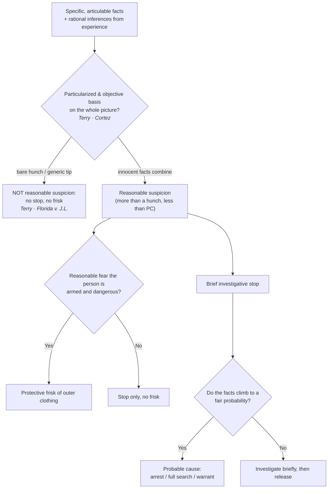

# S9 R1 panel-review — Opus model-diversity lane (prompt pack)

You are the **Claude/Opus** leg of the S9 three-lane adversarial panel (1 Claude + 2 Codex, R1). The two Codex lanes carry the A (support/quote-fidelity) and B (currency/treatment) attack lenses; **you carry model diversity and MUST vote on every paneled assertion across BOTH lenses' concerns.** You are refute-framed: try hard to break each assertion; **default to REFUTED on uncertainty**; never fabricate a cite, quote, or holding; use ONLY the evidence inlined below (no search, no outside knowledge). You are a SIGHTED reviewer — the FULL lake record (judgment fields included) is inlined.

You are a WRITER lane, not an adjudicator: you FIND and VOTE. You do not tally, adjudicate, or close any row — the orchestrator does.

For EACH group below, return one JSON object with the exact `reviewed[]` shape from the output contract (identical framing to the Codex lenses). Emit a finding object ONLY for a real defect (verdict refuted / stands-modified); a group you find wholly clean returns all-`stands` verdicts (the harness records a clean attestation). Concatenate the per-group JSON objects into a top-level `{"packs": [ ... ]}` array, one entry per group, each carrying its `group_id`.


OUTPUT CONTRACT — return ONE JSON object, nothing else:
{
  "lens": "A" | "B",
  "group_id": "<echo the group id>",
  "reviewed": [
    {
      "assertion_id": "<from group_inventory.jsonl>",
      "dimension": "existence|support|quote_fidelity|pincite|treatment|black_letter",
      "verdict": "stands" | "refuted" | "stands-modified",
      "verifiable_from_disclosed": true | false,
      "defect": null,   // null when verdict=="stands"; else an object:
      //  {"problem": "...", "severity": "high|medium|low", "proposed_fix": "...", "evidence_quote": "verbatim from disclosed evidence or null", "needs_cl": true|false, "locator_note": "..."}
      "reasons": ["short evidence-grounded reason", "..."],
      "breaks_true_positives": true | false,
      "residual_risks": ["..."],
      "suggested_tightening": "... or null"
    }
  ],
  "notes": ""
}
Rules: verdict=='stands' <=> defect==null (assertion survives your attack). verdict=='refuted' <=> a real defect (the assertion as framed is wrong). verdict=='stands-modified' <=> survives but needs a stated modification (a minor defect). Review EVERY assertion_id in group_inventory.jsonl exactly once. Output ONLY the JSON object.
---

## GROUP: content/standards-of-proof/Reasonable Suspicion.md  (`doctrine`, 17 assertions)

### content_page

```
---
weight: 20
aliases:
  - "Reasonable Suspicion"
title: "Reasonable Suspicion"
topic: Reasonable Suspicion
type: doctrine
amendment: "U.S. Const. amend. IV"
jurisdiction: "Federal (U.S. Const. amend. IV); SCOTUS baseline"
status: draft
related:
  - "[[The Proof Ladder]]"
  - "[[Probable Cause]]"
  - "[[Terry Stops and Reasonable Suspicion]]"
  - "[[Traffic Stops]]"
  - "[[Collective Knowledge and the Fellow-Officer Rule]]"
---

# Reasonable Suspicion

*Do I have reasonable, articulable suspicion, specific facts plus rational inferences rather than a hunch, and is that enough for what I want to do?*

> [!rule] Black-letter rule
> **Reasonable suspicion** is the quantum that justifies a brief investigative stop and a protective frisk. It requires "specific reasonable inferences which [the officer] is entitled to draw from the facts in light of his experience," not "an inchoate and unparticularized suspicion or 'hunch.'" *[[Terry v. Ohio|Terry]]*, 392 U.S. 1, [27](https://www.courtlistener.com/opinion/107729/terry-v-ohio/) (1968). The measure is a **"particularized and objective basis"** for suspecting the person stopped, drawn from **"the whole picture."** *[[United States v. Cortez|Cortez]]*, 449 U.S. 411, [417–18](https://www.courtlistener.com/opinion/110377/united-states-v-cortez/) (1981). It is **more than a hunch and well short of probable cause**, judged on the [[Common Legal Terms#totality-of-the-circumstances|totality of the circumstances]] through the eyes of a reasonable, experienced officer.
> ^rule-reasonable-suspicion

## The Brief

**What reasonable suspicion is, and is not.** Reasonable suspicion is the less demanding of the two field standards. It authorizes a brief investigative stop and a protective frisk, and nothing more: it does not authorize an arrest, a full search, or a warrant, each of which needs [[Probable Cause|probable cause]]. It sits on the second rung of the [[The Proof Ladder|proof ladder]], above a bare hunch and below probable cause. This page owns the standard itself; [[Terry Stops and Reasonable Suspicion]] owns the scope, duration, and permissible conduct of the stop-and-frisk it unlocks.

**The test: articulable facts plus rational inferences.** *[[Terry v. Ohio|Terry]]* demands "specific reasonable inferences which [the officer] is entitled to draw from the facts in light of his experience," not "an inchoate and unparticularized suspicion or 'hunch.'" *[[Terry v. Ohio|Terry]]*, 392 U.S. 1, [27](https://www.courtlistener.com/opinion/107729/terry-v-ohio/) (1968). The measure is a "particularized and objective basis" drawn from "the whole picture," so an officer may build suspicion from facts that seem innocent in isolation and from the commonsense inferences experience supplies. *[[United States v. Cortez|Cortez]]*, 449 U.S. 411, [417–18](https://www.courtlistener.com/opinion/110377/united-states-v-cortez/) (1981).

**Innocent factors can combine.** The court does not sort the facts into innocent and guilty piles and throw the innocent ones out. "Any one of these factors is not by itself proof of any illegal conduct and is quite consistent with innocent travel. But . . . taken together they amount to reasonable suspicion." *[[United States v. Sokolow#^pin-9|Sokolow]]*, 490 U.S. 1, [9](https://www.courtlistener.com/opinion/112239/united-states-v-sokolow/#:~:text=Any%20one%20of%20these%20factors) (1989). Reviewing courts weigh the totality and may not pursue a "divide-and-conquer" analysis of the individual facts. *[[United States v. Arvizu|Arvizu]]*, 534 U.S. 266, [274](https://www.courtlistener.com/opinion/118474/united-states-v-arvizu/) (2002).

**Commonsense field examples.** Unprovoked **headlong flight** in a high-crime area counts toward reasonable suspicion, though flight alone is not automatically enough. *[[Illinois v. Wardlow#^pin-124a|Wardlow]]*, 528 U.S. 119, [124](https://www.courtlistener.com/opinion/118326/illinois-v-wardlow/#:~:text=Headlong%20flight%E2%80%94wherever%20it%20occurs%E2%80%94is%20the) (2000). And an officer who learns that a car's **registered owner has a revoked license** may stop it on the commonsense inference that the owner is driving, "absent information negating" that inference. That is a deliberately "narrow" holding: it dissolves the moment the officer sees plainly that the driver is not the owner. *[[Kansas v. Glover|Glover]]*, 589 U.S. 376 (2020).

**Informants and tips.** Reasonable suspicion can rest on someone else's word, and the reliability of the source drives how far it carries. A **known**, face-to-face informant, accountable if he lies, can supply reasonable suspicion for a stop-and-frisk on his word alone. *[[Adams v. Williams|Adams v. Williams]]*, 407 U.S. 143, [147](https://www.courtlistener.com/opinion/108571/adams-v-williams/) (1972). **Anonymous** tips fall on a spectrum. A **bare** anonymous tip that a person is armed, without more, is not enough. *[[Florida v. J.L.|J.L.]]*, 529 U.S. 266, [272](https://www.courtlistener.com/opinion/9189388/florida-v-j-l/) (2000). But a tip whose **prediction of future conduct** the police corroborate can supply reasonable suspicion, *[[Alabama v. White#^pin-332|Alabama v. White]]*, 496 U.S. 325, [332](https://www.courtlistener.com/opinion/112454/alabama-v-white/) (1990), as can a **reliable, contemporaneous, traceable 911 report** of dangerous driving, *[[Navarette v. California|Navarette]]*, 572 U.S. 393, [398–99](https://www.courtlistener.com/opinion/2670795/prado-navarette-v-california/) (2014).

**What a stop on reasonable suspicion yields, and where it stops.** Reasonable suspicion buys a brief seizure to investigate and, when the officer reasonably fears for safety, a protective frisk of the outer clothing for weapons. It must be **particularized to the person** stopped, and it does not ripen into an arrest or a full search unless the facts climb to probable cause. The permitted length, questions, and scope of the stop are governed on [[Terry Stops and Reasonable Suspicion]]; a protective frisk of a vehicle's passenger compartment on the same quantum is *[[Michigan v. Long|Long]]*'s rule (see [[Traffic Stops]]).

**Who decides, the burden, and the standard of review.** In the field the call belongs to the officer, drawing on training and experience. Because the stop is warrantless, the **government** bears the burden of pointing to the specific articulable facts that justified it. On appeal the ultimate reasonable-suspicion question is reviewed [[Common Legal Terms#de-novo|de novo]], while the trial court's historical facts are reviewed only for [[Common Legal Terms#clear-error|clear error]]. *[[Ornelas v. United States#^pin-699a|Ornelas]]*, 517 U.S. 690, [699](https://www.courtlistener.com/opinion/118030/ornelas-v-united-states/#:~:text=a%20reviewing%20court%20should%20take) (1996). An officer's objectively **reasonable mistake of law**, like a reasonable mistake of fact, can still furnish the suspicion. *[[Heien v. North Carolina|Heien]]*, 574 U.S. 54 (2014).

**Remedy.** Acting on less than reasonable suspicion makes the stop unlawful, and the evidence it produces, together with its fruits, is subject to **suppression**. See [[The Exclusionary Rule]].

**Apply it.**
1. **Articulate the facts.** Name the specific, objective facts and the inferences your training draws from them. A hunch, however genuine, authorizes nothing (*[[Terry v. Ohio|Terry]]*).
2. **Build the totality.** Combine facts that look innocent alone; do not explain each away one at a time (*[[United States v. Sokolow|Sokolow]]*; *[[United States v. Arvizu|Arvizu]]*).
3. **Weigh the source.** A known informant can carry a stop on his word; an anonymous tip needs corroboration or predictive detail, and a bare "he is armed" tip does not (*[[Adams v. Williams|Adams v. Williams]]*; *[[Florida v. J.L.|J.L.]]*; *[[Alabama v. White|Alabama v. White]]*).
4. **Match the action.** Reasonable suspicion buys a brief stop and a protective frisk, not an arrest or a full search. If you need those, climb to [[Probable Cause|probable cause]].

**Common pitfalls.**
- **Calling a hunch reasonable suspicion.** The standard demands specific, articulable facts and rational inferences, not instinct (*[[Terry v. Ohio|Terry]]*).
- **Divide-and-conquer.** Do not pick the facts apart and explain each away; the test is the whole picture (*[[United States v. Arvizu|Arvizu]]*; *[[United States v. Sokolow|Sokolow]]*).
- **Over-reading an anonymous tip.** A bare anonymous report that a person is armed is not reasonable suspicion without corroboration or predictive detail (*[[Florida v. J.L.|J.L.]]*; contrast *[[Alabama v. White|Alabama v. White]]* and *[[Navarette v. California|Navarette]]*).
- **Stretching the stop into an arrest.** Reasonable suspicion does not authorize an arrest or a full search; treating it as if it did skips a rung (see [[Probable Cause]]).

## Lower-court developments

- ***[[United States v. Daniels|Daniels]]* (10th Cir. 2024)** — *narrows: tightens the reasonable-suspicion floor.* On [[Common Legal Terms#de-novo|de novo]] totality review, a near-anonymous 911 tip (three men in dark hoodies near an idling SUV, reporting no actual illegality) plus the suspect's mere presence did not amount to reasonable suspicion; overly generic tips reporting lawful-sounding conduct hand police excessive discretion and fall below the floor. Tightens the *[[Florida v. J.L.|J.L.]]* and *[[Navarette v. California|Navarette]]* line. **Binding in-circuit — 10th Cir.** [opinion](https://www.courtlistener.com/opinion/9500360/united-states-v-daniels/)

## Key cases

| Case | Holding | Opinion |
|---|---|---|
| *[[Terry v. Ohio]]*, 392 U.S. 1 (1968) | A brief investigative stop and protective frisk require **reasonable, articulable suspicion**: specific facts and rational inferences, not an inchoate hunch. | [opinion](https://www.courtlistener.com/opinion/107729/terry-v-ohio/) |
| *[[United States v. Cortez]]*, 449 U.S. 411 (1981) | The reasonable-suspicion touchstone: a **particularized and objective basis** for suspecting the person stopped, drawn from **the whole picture**. | [opinion](https://www.courtlistener.com/opinion/110377/united-states-v-cortez/) |
| *[[United States v. Sokolow]]*, 490 U.S. 1 (1989) | Factors innocent in isolation can **combine** into reasonable suspicion; the totality, not any single fact, controls. | [opinion](https://www.courtlistener.com/opinion/112239/united-states-v-sokolow/) |
| *[[Alabama v. White]]*, 496 U.S. 325 (1990) | An **anonymous tip** can supply reasonable suspicion when police corroborate its **prediction of future conduct**. | [opinion](https://www.courtlistener.com/opinion/112454/alabama-v-white/) |
| *[[Florida v. J.L.]]*, 529 U.S. 266 (2000) | A **bare** anonymous tip that a person has a gun, without more, is **not** reasonable suspicion. | [opinion](https://www.courtlistener.com/opinion/118352/florida-v-jl/) |
| *[[Navarette v. California]]*, 572 U.S. 393 (2014) | A **reliable, contemporaneous 911 report** of dangerous driving can supply reasonable suspicion. | [opinion](https://www.courtlistener.com/opinion/2670795/prado-navarette-v-california/) |
| *[[Illinois v. Wardlow]]*, 528 U.S. 119 (2000) | Unprovoked **headlong flight** in a high-crime area can furnish reasonable suspicion for a *[[Terry v. Ohio\|Terry]]* stop. | [opinion](https://www.courtlistener.com/opinion/118326/illinois-v-wardlow/) |
| *[[United States v. Arvizu]]*, 534 U.S. 266 (2002) | Reasonable suspicion is judged on the **whole picture**; courts may not divide-and-conquer the individual factors. | [opinion](https://www.courtlistener.com/opinion/118474/united-states-v-arvizu/) |

## Related cases across doctrines

| Case | Relevance here | Primary home | Opinion |
|---|---|---|---|
| *[[Adams v. Williams]]*, 407 U.S. 143 (1972) | ***Anchors.*** A **known**, face-to-face informant's tip carries enough reliability to furnish reasonable suspicion for a stop-and-frisk; the foil for the anonymous-tip line. | [[Terry Stops and Reasonable Suspicion]] | [opinion](https://www.courtlistener.com/opinion/108571/adams-v-williams/) |
| *[[Kansas v. Glover]]*, 589 U.S. 376 (2020) | ***Extends.*** Reasonable suspicion permits **commonsense inferences**: a revoked-license registered owner is presumptively the driver, a narrow holding defeated by facts negating it. | [[Traffic Stops]] | [opinion](https://www.courtlistener.com/opinion/9231313/kansas-v-glover/) |
| *[[United States v. Hensley]]*, 469 U.S. 221 (1985) | ***Extends.*** Reasonable suspicion may rest on a **wanted flyer** from another department, so long as the issuing agency had the articulable facts. | [[Collective Knowledge and the Fellow-Officer Rule]] | [opinion](https://www.courtlistener.com/opinion/111294/united-states-v-hensley/) |
| *[[Delaware v. Prouse]]*, 440 U.S. 648 (1979) | ***Floor.*** A discretionary stop requires **at least reasonable, articulable suspicion**; random suspicionless stops fail the standard. | [[Traffic Stops]] | [opinion](https://www.courtlistener.com/opinion/110045/delaware-v-prouse/) |
| *[[Michigan v. Long]]*, 463 U.S. 1032 (1983) | ***Extends.*** A protective **vehicle frisk** requires reasonable suspicion the suspect is dangerous and may access weapons, the same quantum as a *[[Terry v. Ohio\|Terry]]* frisk. | [[Traffic Stops]] | [opinion](https://www.courtlistener.com/opinion/111020/michigan-v-long/) |
| *[[United States v. Brignoni-Ponce]]*, 422 U.S. 873 (1975) | ***Content.*** A roving border-area stop requires reasonable suspicion on **specific articulable facts**; apparent ancestry alone cannot supply it. | [[Border Searches]] | [opinion](https://www.courtlistener.com/opinion/109311/united-states-v-brignoni-ponce/) |
| *[[Maryland v. Buie]]*, 494 U.S. 325 (1990) | ***Extends.*** A [[Securing the Scene\|protective sweep]] beyond the spaces immediately adjoining an arrest requires **reasonable, articulable suspicion** the area harbors a dangerous person. | [[Securing the Scene]] | [opinion](https://www.courtlistener.com/opinion/112384/maryland-v-buie/) |
| *[[Heien v. North Carolina]]*, 574 U.S. 54 (2014) | ***Extends.*** Reasonable suspicion may rest on an officer's **objectively reasonable mistake of law** as well as fact. | [[Traffic Stops]] | [opinion](https://www.courtlistener.com/opinion/2760668/heien-v-north-carolina/) |

## Visual



## Sources

- [*Terry v. Ohio*, 392 U.S. 1 (1968)](https://www.courtlistener.com/opinion/107729/terry-v-ohio/) (pinpoint: 27)
- [*United States v. Cortez*, 449 U.S. 411 (1981)](https://www.courtlistener.com/opinion/110377/united-states-v-cortez/) (pinpoint: 417–18)
- [*United States v. Sokolow*, 490 U.S. 1 (1989)](https://www.courtlistener.com/opinion/112239/united-states-v-sokolow/) (pinpoint: 9)
- [*United States v. Arvizu*, 534 U.S. 266 (2002)](https://www.courtlistener.com/opinion/118474/united-states-v-arvizu/) (pinpoint: 274)
- [*Illinois v. Wardlow*, 528 U.S. 119 (2000)](https://www.courtlistener.com/opinion/118326/illinois-v-wardlow/) (pinpoint: 124)
- [*Kansas v. Glover*, 589 U.S. 376 (2020)](https://www.courtlistener.com/opinion/9231313/kansas-v-glover/)
- [*Adams v. Williams*, 407 U.S. 143 (1972)](https://www.courtlistener.com/opinion/108571/adams-v-williams/) (pinpoint: 147)
- [*Florida v. J.L.*, 529 U.S. 266 (2000)](https://www.courtlistener.com/opinion/118352/florida-v-jl/) (pinpoint: 272)
- [*Alabama v. White*, 496 U.S. 325 (1990)](https://www.courtlistener.com/opinion/112454/alabama-v-white/) (pinpoint: 332)
- [*Navarette v. California*, 572 U.S. 393 (2014)](https://www.courtlistener.com/opinion/2670795/prado-navarette-v-california/) (pinpoint: 398–99)
- [*United States v. Hensley*, 469 U.S. 221 (1985)](https://www.courtlistener.com/opinion/111294/united-states-v-hensley/)
- [*Delaware v. Prouse*, 440 U.S. 648 (1979)](https://www.courtlistener.com/opinion/110045/delaware-v-prouse/)
- [*Michigan v. Long*, 463 U.S. 1032 (1983)](https://www.courtlistener.com/opinion/111020/michigan-v-long/)
- [*United States v. Brignoni-Ponce*, 422 U.S. 873 (1975)](https://www.courtlistener.com/opinion/109311/united-states-v-brignoni-ponce/)
- [*Maryland v. Buie*, 494 U.S. 325 (1990)](https://www.courtlistener.com/opinion/112384/maryland-v-buie/)
- [*Heien v. North Carolina*, 574 U.S. 54 (2014)](https://www.courtlistener.com/opinion/2760668/heien-v-north-carolina/)
- [*Ornelas v. United States*, 517 U.S. 690 (1996)](https://www.courtlistener.com/opinion/118030/ornelas-v-united-states/) (pinpoint: 699)
- [*United States v. Daniels* (10th Cir. 2024)](https://www.courtlistener.com/opinion/9500360/united-states-v-daniels/)

```

### group_inventory (assertions under review)

```jsonl
{"assertion_id": "0edac65320aedc25", "dimension": "existence", "kind": "case_cite", "locator": {"case": "United States v. Sokolow", "table_line": 50}, "payload": {"case": "United States v. Sokolow", "cells": ["*[[United States v. Sokolow]]*, 490 U.S. 1 (1989)", "Factors innocent in isolation can **combine** into reasonable suspicion; the totality, not any single fact, controls.", "[opinion](https://www.courtlistener.com/opinion/112239/united-states-v-sokolow/)"], "header": ["Case", "Holding", "Opinion"]}}
{"assertion_id": "2722bfe6365430e3", "dimension": "existence", "kind": "case_cite", "locator": {"case": "United States v. Brignoni-Ponce", "table_line": 66}, "payload": {"case": "United States v. Brignoni-Ponce", "cells": ["*[[United States v. Brignoni-Ponce]]*, 422 U.S. 873 (1975)", "***Content.*** A roving border-area stop requires reasonable suspicion on **specific articulable facts**; apparent ancestry alone cannot supply it.", "[[Border Searches]]", "[opinion](https://www.courtlistener.com/opinion/109311/united-states-v-brignoni-ponce/)"], "header": ["Case", "Relevance here", "Primary home", "Opinion"]}}
{"assertion_id": "2f1764e0c7003ac5", "dimension": "existence", "kind": "case_cite", "locator": {"case": "Michigan v. Long", "table_line": 65}, "payload": {"case": "Michigan v. Long", "cells": ["*[[Michigan v. Long]]*, 463 U.S. 1032 (1983)", "***Extends.*** A protective **vehicle frisk** requires reasonable suspicion the suspect is dangerous and may access weapons, the same quantum as a *[[Terry v. Ohio\\|Terry]]* frisk.", "[[Traffic Stops]]", "[opinion](https://www.courtlistener.com/opinion/111020/michigan-v-long/)"], "header": ["Case", "Relevance here", "Primary home", "Opinion"]}}
{"assertion_id": "3600de6c61013249", "dimension": "existence", "kind": "case_cite", "locator": {"case": "Delaware v. Prouse", "table_line": 64}, "payload": {"case": "Delaware v. Prouse", "cells": ["*[[Delaware v. Prouse]]*, 440 U.S. 648 (1979)", "***Floor.*** A discretionary stop requires **at least reasonable, articulable suspicion**; random suspicionless stops fail the standard.", "[[Traffic Stops]]", "[opinion](https://www.courtlistener.com/opinion/110045/delaware-v-prouse/)"], "header": ["Case", "Relevance here", "Primary home", "Opinion"]}}
{"assertion_id": "5399e1e0fb9dda0b", "dimension": "existence", "kind": "case_cite", "locator": {"case": "Terry v. Ohio", "table_line": 48}, "payload": {"case": "Terry v. Ohio", "cells": ["*[[Terry v. Ohio]]*, 392 U.S. 1 (1968)", "A brief investigative stop and protective frisk require **reasonable, articulable suspicion**: specific facts and rational inferences, not an inchoate hunch.", "[opinion](https://www.courtlistener.com/opinion/107729/terry-v-ohio/)"], "header": ["Case", "Holding", "Opinion"]}}
{"assertion_id": "6a80bfdea6f0cf31", "dimension": "existence", "kind": "case_cite", "locator": {"case": "Maryland v. Buie", "table_line": 67}, "payload": {"case": "Maryland v. Buie", "cells": ["*[[Maryland v. Buie]]*, 494 U.S. 325 (1990)", "***Extends.*** A [[Securing the Scene\\|protective sweep]] beyond the spaces immediately adjoining an arrest requires **reasonable, articulable suspicion** the area harbors a dangerous person.", "[[Securing the Scene]]", "[opinion](https://www.courtlistener.com/opinion/112384/maryland-v-buie/)"], "header": ["Case", "Relevance here", "Primary home", "Opinion"]}}
{"assertion_id": "75608c789d8c8c55", "dimension": "existence", "kind": "case_cite", "locator": {"case": "United States v. Cortez", "table_line": 49}, "payload": {"case": "United States v. Cortez", "cells": ["*[[United States v. Cortez]]*, 449 U.S. 411 (1981)", "The reasonable-suspicion touchstone: a **particularized and objective basis** for suspecting the person stopped, drawn from **the whole picture**.", "[opinion](https://www.courtlistener.com/opinion/110377/united-states-v-cortez/)"], "header": ["Case", "Holding", "Opinion"]}}
{"assertion_id": "79769766369b1d0e", "dimension": "existence", "kind": "case_cite", "locator": {"case": "Kansas v. Glover", "table_line": 62}, "payload": {"case": "Kansas v. Glover", "cells": ["*[[Kansas v. Glover]]*, 589 U.S. 376 (2020)", "***Extends.*** Reasonable suspicion permits **commonsense inferences**: a revoked-license registered owner is presumptively the driver, a narrow holding defeated by facts negating it.", "[[Traffic Stops]]", "[opinion](https://www.courtlistener.com/opinion/9231313/kansas-v-glover/)"], "header": ["Case", "Relevance here", "Primary home", "Opinion"]}}
{"assertion_id": "803865847efd2c88", "dimension": "existence", "kind": "case_cite", "locator": {"case": "Illinois v. Wardlow", "table_line": 54}, "payload": {"case": "Illinois v. Wardlow", "cells": ["*[[Illinois v. Wardlow]]*, 528 U.S. 119 (2000)", "Unprovoked **headlong flight** in a high-crime area can furnish reasonable suspicion for a *[[Terry v. Ohio\\|Terry]]* stop.", "[opinion](https://www.courtlistener.com/opinion/118326/illinois-v-wardlow/)"], "header": ["Case", "Holding", "Opinion"]}}
{"assertion_id": "97d8e59623345f82", "dimension": "existence", "kind": "case_cite", "locator": {"case": "Adams v. Williams", "table_line": 61}, "payload": {"case": "Adams v. Williams", "cells": ["*[[Adams v. Williams]]*, 407 U.S. 143 (1972)", "***Anchors.*** A **known**, face-to-face informant's tip carries enough reliability to furnish reasonable suspicion for a stop-and-frisk; the foil for the anonymous-tip line.", "[[Terry Stops and Reasonable Suspicion]]", "[opinion](https://www.courtlistener.com/opinion/108571/adams-v-williams/)"], "header": ["Case", "Relevance here", "Primary home", "Opinion"]}}
{"assertion_id": "a07b866c9d1e042f", "dimension": "existence", "kind": "case_cite", "locator": {"case": "Florida v. J.L.", "table_line": 52}, "payload": {"case": "Florida v. J.L.", "cells": ["*[[Florida v. J.L.]]*, 529 U.S. 266 (2000)", "A **bare** anonymous tip that a person has a gun, without more, is **not** reasonable suspicion.", "[opinion](https://www.courtlistener.com/opinion/118352/florida-v-jl/)"], "header": ["Case", "Holding", "Opinion"]}}
{"assertion_id": "b9ad7bc6abd0833c", "dimension": "existence", "kind": "case_cite", "locator": {"case": "United States v. Hensley", "table_line": 63}, "payload": {"case": "United States v. Hensley", "cells": ["*[[United States v. Hensley]]*, 469 U.S. 221 (1985)", "***Extends.*** Reasonable suspicion may rest on a **wanted flyer** from another department, so long as the issuing agency had the articulable facts.", "[[Collective Knowledge and the Fellow-Officer Rule]]", "[opinion](https://www.courtlistener.com/opinion/111294/united-states-v-hensley/)"], "header": ["Case", "Relevance here", "Primary home", "Opinion"]}}
{"assertion_id": "cde31c9cc8c25188", "dimension": "existence", "kind": "case_cite", "locator": {"case": "United States v. Arvizu", "table_line": 55}, "payload": {"case": "United States v. Arvizu", "cells": ["*[[United States v. Arvizu]]*, 534 U.S. 266 (2002)", "Reasonable suspicion is judged on the **whole picture**; courts may not divide-and-conquer the individual factors.", "[opinion](https://www.courtlistener.com/opinion/118474/united-states-v-arvizu/)"], "header": ["Case", "Holding", "Opinion"]}}
{"assertion_id": "db50ec17e1f950be", "dimension": "existence", "kind": "case_cite", "locator": {"case": "Heien v. North Carolina", "table_line": 68}, "payload": {"case": "Heien v. North Carolina", "cells": ["*[[Heien v. North Carolina]]*, 574 U.S. 54 (2014)", "***Extends.*** Reasonable suspicion may rest on an officer's **objectively reasonable mistake of law** as well as fact.", "[[Traffic Stops]]", "[opinion](https://www.courtlistener.com/opinion/2760668/heien-v-north-carolina/)"], "header": ["Case", "Relevance here", "Primary home", "Opinion"]}}
{"assertion_id": "dd047799dde308ae", "dimension": "existence", "kind": "case_cite", "locator": {"case": "Alabama v. White", "table_line": 51}, "payload": {"case": "Alabama v. White", "cells": ["*[[Alabama v. White]]*, 496 U.S. 325 (1990)", "An **anonymous tip** can supply reasonable suspicion when police corroborate its **prediction of future conduct**.", "[opinion](https://www.courtlistener.com/opinion/112454/alabama-v-white/)"], "header": ["Case", "Holding", "Opinion"]}}
{"assertion_id": "df9f67f0f6180949", "dimension": "existence", "kind": "case_cite", "locator": {"case": "Navarette v. California", "table_line": 53}, "payload": {"case": "Navarette v. California", "cells": ["*[[Navarette v. California]]*, 572 U.S. 393 (2014)", "A **reliable, contemporaneous 911 report** of dangerous driving can supply reasonable suspicion.", "[opinion](https://www.courtlistener.com/opinion/2670795/prado-navarette-v-california/)"], "header": ["Case", "Holding", "Opinion"]}}
{"assertion_id": "df0448754ba2f4b6", "dimension": "support", "kind": "proposition", "locator": {"callout": "^rule-reasonable-suspicion"}, "payload": {"anchor": "^rule-reasonable-suspicion", "statement": "[!rule] Black-letter rule\n**Reasonable suspicion** is the quantum that justifies a brief investigative stop and a protective frisk. It requires \"specific reasonable inferences which [the officer] is entitled to draw from the facts in light of his experience,\" not \"an inchoate and unparticularized suspicion or 'hunch.'\" *[[Terry v. Ohio|Terry]]*, 392 U.S. 1, [27](https://www.courtlistener.com/opinion/107729/terry-v-ohio/) (1968). The measure is a **\"particularized and objective basis\"** for suspecting the person stopped, drawn from **\"the whole picture.\"** *[[United States v. Cortez|Cortez]]*, 449 U.S. 411, [417–18](https://www.courtlistener.com/opinion/110377/united-states-v-cortez/) (1981). It is **more than a hunch and well short of probable cause**, judged on the [[Common Legal Terms#totality-of-the-circumstances|totality of the circumstances]] through the eyes of a reasonable, experienced officer."}}
```

### lake record — Adams v. Williams

```json
{
  "schema_version": "s2.v1",
  "record_id": "Adams v. Williams",
  "stub": false,
  "status": "verified",
  "identity": {
    "case_name": "Adams v. Williams",
    "case_name_short": "Adams",
    "case_name_full": "Adams, Warden v. Williams",
    "input_case_name": "Adams v. Williams",
    "court": "U.S. Supreme Court",
    "court_id": "scotus",
    "court_level": "scotus",
    "circuit": null,
    "state": null,
    "date_decided": "1972-06-12",
    "year": 1972,
    "docket": null,
    "cluster_id": 108571,
    "lead_opinion_id": 108571,
    "sibling_ids": [
      108571,
      9424935,
      9424936,
      9424937,
      9424938
    ],
    "absolute_url": "/opinion/108571/adams-v-williams/",
    "identity_method": "citation+party-text",
    "expected_citation_found": true,
    "party_name_in_text": true,
    "canonical_name_match": true,
    "alternates": [
      {
        "cluster_id": 8987525,
        "score": 10,
        "case_name": "Adams v. Williams"
      },
      {
        "cluster_id": 8987276,
        "score": 10,
        "case_name": "Adams v. Williams"
      },
      {
        "cluster_id": 8986252,
        "score": 10,
        "case_name": "Adams v. Williams"
      }
    ],
    "reason_code": null
  },
  "citations": {
    "official": {
      "cite": "407 U.S. 143",
      "volume": "407",
      "reporter": "U.S.",
      "page": "143",
      "type": 1,
      "selected_official": true,
      "source": "cluster.citations[]"
    },
    "parallel": [
      {
        "cite": "92 S. Ct. 1921",
        "volume": "92",
        "reporter": "S. Ct.",
        "page": "1921",
        "type": 1,
        "selected_official": false,
        "source": "cluster.citations[]"
      },
      {
        "cite": "32 L. Ed. 2d 612",
        "volume": "32",
        "reporter": "L. Ed. 2d",
        "page": "612",
        "type": 1,
        "selected_official": false,
        "source": "cluster.citations[]"
      }
    ],
    "vendor_neutral": [
      {
        "cite": "1972 U.S. LEXIS 2206",
        "volume": "1972",
        "reporter": "U.S. LEXIS",
        "page": "2206",
        "type": 6,
        "selected_official": false,
        "source": "cluster.citations[]"
      }
    ],
    "all": [
      {
        "cite": "407 U.S. 143",
        "volume": "407",
        "reporter": "U.S.",
        "page": "143",
        "type": 1,
        "selected_official": false,
        "source": "cluster.citations[]"
      },
      {
        "cite": "92 S. Ct. 1921",
        "volume": "92",
        "reporter": "S. Ct.",
        "page": "1921",
        "type": 1,
        "selected_official": false,
        "source": "cluster.citations[]"
      },
      {
        "cite": "32 L. Ed. 2d 612",
        "volume": "32",
        "reporter": "L. Ed. 2d",
        "page": "612",
        "type": 1,
        "selected_official": false,
        "source": "cluster.citations[]"
      },
      {
        "cite": "1972 U.S. LEXIS 2206",
        "volume": "1972",
        "reporter": "U.S. LEXIS",
        "page": "2206",
        "type": 6,
        "selected_official": false,
        "source": "cluster.citations[]"
      }
    ],
    "display": "407 U.S. 143",
    "official_selection": {
      "court_class": "scotus",
      "selected": "407 U.S. 143",
      "reason": "selected_rank_1"
    }
  },
  "pinpoints": [
    {
      "id": "pin-147",
      "page": null,
      "quote": "--- # Adams v. Williams *407 U.S. 143 (1972)* \u00b7 U.S. Supreme Court \u00b7 **Binding \u2014 SCOTUS** \u00b7 Treatment: **good** *(as of 2026-06-30)* <!-- header line; TreatmentBadge + weight render here, degrading to the text above --> ## Background At about 2:15 a.m., Sergeant Connolly was on patrol in a high-crime area when a person known to him personally, who had given him information before, approached his cruiser and told him that a man seated in a nearby car was carrying narcotics and had a gun at his waist. Connolly approached the car and asked Williams to open the door; instead Williams rolled down the window. Connolly reached into the car to the spot at Williams's waistband the informant had described and removed a loaded revolver. Williams was arrested; a search incident to the arrest produced heroin. He was convicted of unlawful possession of the handgun and of the heroin and challenged the stop and frisk. ## Issue Whether reasonable suspicion for a *Terry* stop and protective frisk may be based on a known informant's tip rather than the officer's own observation, and whether reaching to the place the informant identified to remove a weapon was a reasonable protective search. ## Rule Yes. Reasonable suspicion can rest on a reliable informant's tip, not only on the officer's personal observation:",
      "star_marker": null,
      "quote_fidelity": "mismatch",
      "pinpoint_status": "slip-only",
      "position": null
    },
    {
      "id": "pin-147b",
      "page": null,
      "quote": "Informants' tips, like all other clues and evidence coming to a policeman on the scene, may vary greatly in their value and reliability. One simple rule will not cover every situation. . . . But in some situations \u2014 for example, when the victim of a street crime seeks immediate police aid and gives a description of his assailant, or when a credible informant warns of a specific impending crime \u2014 the subtleties of the hearsay rule should not thwart an appropriate police response.",
      "star_marker": null,
      "quote_fidelity": "mismatch",
      "pinpoint_status": "slip-only",
      "position": null
    },
    {
      "id": "pin-148",
      "page": null,
      "quote": "Under these circumstances the policeman's action in reaching to the spot where the gun was thought to be hidden constituted a limited intrusion designed to insure his safety, and we conclude that it was reasonable.",
      "star_marker": "148",
      "quote_fidelity": "matched",
      "pinpoint_status": "star-verified",
      "position": 11530,
      "fragment": "#:~:text=Under%20these%20circumstances%20the%20policeman%27s",
      "fragment_validated_at": "2026-07-09T15:40:45Z"
    }
  ],
  "treatment": {
    "field_i_validity": "good_law",
    "as_of_content": "1972-06-12",
    "as_of_treatment": "2026-06-30",
    "composite_basis": "migration-seed",
    "composite_basis_ref": "Adams v. Williams",
    "varies_by_point": false,
    "scope_note": "Good law. A tip from a known, face-to-face informant carries enough indicia of reliability to justify a Terry stop and protective frisk; reasonable suspicion need not rest on the officer's personal observation. The anonymous-tip line (Alabama v. White, Florida v. J.L., Navarette) develops the contrast but does not disturb Adams.",
    "point_overrides": [],
    "edges": [
      {
        "citing_case": {
          "name": "The People of the State of Colorado, In the Interest of T.J.W., Juvenile-Appellee L.C.W. and D.W. and Concerning",
          "cluster_id": 10871666,
          "cite": [
            "2026 CO 38"
          ],
          "field_ii": "overruled"
        },
        "field_ii": "overruled",
        "field_iii": "mentioned",
        "point": null,
        "proposed": true,
        "journal_ref": "Adams v. Williams:lane1_negative"
      },
      {
        "citing_case": {
          "name": "Kopp v. State",
          "cluster_id": 10864408,
          "cite": null,
          "field_ii": "overruled"
        },
        "field_ii": "overruled",
        "field_iii": "mentioned",
        "point": null,
        "proposed": true,
        "journal_ref": "Adams v. Williams:lane1_negative"
      },
      {
        "citing_case": {
          "name": "State v. Stone",
          "cluster_id": 10780071,
          "cite": null,
          "field_ii": "overruled"
        },
        "field_ii": "overruled",
        "field_iii": "mentioned",
        "point": null,
        "proposed": true,
        "journal_ref": "Adams v. Williams:lane1_negative"
      },
      {
        "citing_case": {
          "name": "United States v. Johnson",
          "cluster_id": 10770653,
          "cite": null,
          "field_ii": "criticized"
        },
        "field_ii": "criticized",
        "field_iii": "mentioned",
        "point": null,
        "proposed": true,
        "journal_ref": "Adams v. Williams:lane1_negative"
      },
      {
        "citing_case": {
          "name": "State v. Tower",
          "cluster_id": 10759279,
          "cite": [
            "2025 Ohio 5593"
          ],
          "field_ii": "overruled"
        },
        "field_ii": "overruled",
        "field_iii": "mentioned",
        "point": null,
        "proposed": true,
        "journal_ref": "Adams v. Williams:lane1_negative"
      },
      {
        "citing_case": {
          "name": "Swanson v. State",
          "cluster_id": 10758425,
          "cite": null,
          "field_ii": "questioned"
        },
        "field_ii": "questioned",
        "field_iii": "mentioned",
        "point": null,
        "proposed": true,
        "journal_ref": "Adams v. Williams:lane1_negative"
      },
      {
        "citing_case": {
          "name": "Thomas Wesley Hollingsworth v. Commonwealth of Virginia",
          "cluster_id": 10741964,
          "cite": null,
          "field_ii": "questioned"
        },
        "field_ii": "questioned",
        "field_iii": "mentioned",
        "point": null,
        "proposed": true,
        "journal_ref": "Adams v. Williams:lane1_negative"
      },
      {
        "citing_case": {
          "name": "State of Minnesota, Respondent, vs. Matthew Sam Mitchell, Appellant",
          "cluster_id": 10696233,
          "cite": null,
          "field_ii": "questioned"
        },
        "field_ii": "questioned",
        "field_iii": "mentioned",
        "point": null,
        "proposed": true,
        "journal_ref": "Adams v. Williams:lane1_negative"
      },
      {
        "citing_case": {
          "name": "Commonwealth v. Lewis, A., Aplt.",
          "cluster_id": 10677596,
          "cite": null,
          "field_ii": "questioned"
        },
        "field_ii": "questioned",
        "field_iii": "mentioned",
        "point": null,
        "proposed": true,
        "journal_ref": "Adams v. Williams:lane1_negative"
      },
      {
        "citing_case": {
          "name": "State v. Scerba",
          "cluster_id": 10650412,
          "cite": [
            "2025 Ohio 2791"
          ],
          "field_ii": "overruled"
        },
        "field_ii": "overruled",
        "field_iii": "mentioned",
        "point": null,
        "proposed": true,
        "journal_ref": "Adams v. Williams:lane1_negative"
      },
      {
        "citing_case": {
          "name": "United States v. Wilson",
          "cluster_id": 10636220,
          "cite": null,
          "field_ii": "abrogated"
        },
        "field_ii": "abrogated",
        "field_iii": "mentioned",
        "point": null,
        "proposed": true,
        "journal_ref": "Adams v. Williams:lane1_negative"
      },
      {
        "citing_case": {
          "name": "State v. Wolfe",
          "cluster_id": 10604482,
          "cite": [
            "2025 Ohio 2096"
          ],
          "field_ii": "overruled"
        },
        "field_ii": "overruled",
        "field_iii": "mentioned",
        "point": null,
        "proposed": true,
        "journal_ref": "Adams v. Williams:lane1_negative"
      },
      {
        "citing_case": {
          "name": "State v. Robinson",
          "cluster_id": 10589223,
          "cite": [
            "2025 Ohio 1537"
          ],
          "field_ii": "overruled"
        },
        "field_ii": "overruled",
        "field_iii": "mentioned",
        "point": null,
        "proposed": true,
        "journal_ref": "Adams v. Williams:lane1_negative"
      },
      {
        "citing_case": {
          "name": "State v. Pullom",
          "cluster_id": 10582017,
          "cite": [
            "2025 Ohio 1700"
          ],
          "field_ii": "overruled"
        },
        "field_ii": "overruled",
        "field_iii": "mentioned",
        "point": null,
        "proposed": true,
        "journal_ref": "Adams v. Williams:lane1_negative"
      },
      {
        "citing_case": {
          "name": "State v. Buckingham",
          "cluster_id": 10581986,
          "cite": [
            "2025 Ohio 1688"
          ],
          "field_ii": "overruled"
        },
        "field_ii": "overruled",
        "field_iii": "mentioned",
        "point": null,
        "proposed": true,
        "journal_ref": "Adams v. Williams:lane1_negative"
      },
      {
        "citing_case": {
          "name": "State of Louisiana v. K.B.",
          "cluster_id": 10581696,
          "cite": null,
          "field_ii": "questioned"
        },
        "field_ii": "questioned",
        "field_iii": "mentioned",
        "point": null,
        "proposed": true,
        "journal_ref": "Adams v. Williams:lane1_negative"
      },
      {
        "citing_case": {
          "name": "State v. Robinson",
          "cluster_id": 10517584,
          "cite": [
            "2025 Ohio 1539"
          ],
          "field_ii": "overruled"
        },
        "field_ii": "overruled",
        "field_iii": "mentioned",
        "point": null,
        "proposed": true,
        "journal_ref": "Adams v. Williams:lane1_negative"
      },
      {
        "citing_case": {
          "name": "State v. Shannon",
          "cluster_id": 10373759,
          "cite": [
            "2025 Ohio 1224"
          ],
          "field_ii": "overruled"
        },
        "field_ii": "overruled",
        "field_iii": "mentioned",
        "point": null,
        "proposed": true,
        "journal_ref": "Adams v. Williams:lane1_negative"
      },
      {
        "citing_case": {
          "name": "Commonwealth v. Dasahn Crowder",
          "cluster_id": 10363504,
          "cite": null,
          "field_ii": "abrogated"
        },
        "field_ii": "abrogated",
        "field_iii": "mentioned",
        "point": null,
        "proposed": true,
        "journal_ref": "Adams v. Williams:lane1_negative"
      },
      {
        "citing_case": {
          "name": "Com. v. Gibson, T.",
          "cluster_id": 10358162,
          "cite": [
            "2025 Pa. Super. 65"
          ],
          "field_ii": "criticized"
        },
        "field_ii": "criticized",
        "field_iii": "mentioned",
        "point": null,
        "proposed": true,
        "journal_ref": "Adams v. Williams:lane1_negative"
      },
      {
        "citing_case": {
          "name": "Hylton v. District of Columbia",
          "cluster_id": 10352120,
          "cite": null,
          "field_ii": "criticized"
        },
        "field_ii": "criticized",
        "field_iii": "mentioned",
        "point": null,
        "proposed": true,
        "journal_ref": "Adams v. Williams:lane1_negative"
      },
      {
        "citing_case": {
          "name": "United States v. Duane Gary Underwood, II",
          "cluster_id": 10340565,
          "cite": [
            "129 F.4th 912"
          ],
          "field_ii": "questioned"
        },
        "field_ii": "questioned",
        "field_iii": "mentioned",
        "point": null,
        "proposed": true,
        "journal_ref": "Adams v. Williams:lane1_negative"
      },
      {
        "citing_case": {
          "name": "State v. Sanders",
          "cluster_id": 10329396,
          "cite": [
            "2025 Ohio 411"
          ],
          "field_ii": "overruled"
        },
        "field_ii": "overruled",
        "field_iii": "mentioned",
        "point": null,
        "proposed": true,
        "journal_ref": "Adams v. Williams:lane1_negative"
      },
      {
        "citing_case": {
          "name": "State v. McKenzie",
          "cluster_id": 10318233,
          "cite": [
            "2025 Ohio 150"
          ],
          "field_ii": "overruled"
        },
        "field_ii": "overruled",
        "field_iii": "mentioned",
        "point": null,
        "proposed": true,
        "journal_ref": "Adams v. Williams:lane1_negative"
      },
      {
        "citing_case": {
          "name": "In re A.M.J.",
          "cluster_id": 10295535,
          "cite": [
            "2024 Ohio 5889"
          ],
          "field_ii": "overruled"
        },
        "field_ii": "overruled",
        "field_iii": "mentioned",
        "point": null,
        "proposed": true,
        "journal_ref": "Adams v. Williams:lane1_negative"
      },
      {
        "citing_case": {
          "name": "State v. Stollings",
          "cluster_id": 10293438,
          "cite": null,
          "field_ii": "questioned"
        },
        "field_ii": "questioned",
        "field_iii": "mentioned",
        "point": null,
        "proposed": true,
        "journal_ref": "Adams v. Williams:lane1_negative"
      },
      {
        "citing_case": {
          "name": "State v. Barnes",
          "cluster_id": 10293080,
          "cite": [
            "2024 Ohio 5865"
          ],
          "field_ii": "overruled"
        },
        "field_ii": "overruled",
        "field_iii": "mentioned",
        "point": null,
        "proposed": true,
        "journal_ref": "Adams v. Williams:lane1_negative"
      },
      {
        "citing_case": {
          "name": "State v. Dyson",
          "cluster_id": 10284857,
          "cite": [
            "2024 Ohio 5591"
          ],
          "field_ii": "overruled"
        },
        "field_ii": "overruled",
        "field_iii": "mentioned",
        "point": null,
        "proposed": true,
        "journal_ref": "Adams v. Williams:lane1_negative"
      },
      {
        "citing_case": {
          "name": "State v. Jackson",
          "cluster_id": 10276151,
          "cite": [
            "2024 Ohio 4770"
          ],
          "field_ii": "overruled"
        },
        "field_ii": "overruled",
        "field_iii": "mentioned",
        "point": null,
        "proposed": true,
        "journal_ref": "Adams v. Williams:lane1_negative"
      },
      {
        "citing_case": {
          "name": "State v. Swanson",
          "cluster_id": 10007955,
          "cite": null,
          "field_ii": "criticized"
        },
        "field_ii": "criticized",
        "field_iii": "mentioned",
        "point": null,
        "proposed": true,
        "journal_ref": "Adams v. Williams:lane1_negative"
      },
      {
        "citing_case": {
          "name": "Melissa Trevino v. the State of Texas",
          "cluster_id": 10008832,
          "cite": null,
          "field_ii": "overruled"
        },
        "field_ii": "overruled",
        "field_iii": "mentioned",
        "point": null,
        "proposed": true,
        "journal_ref": "Adams v. Williams:lane1_negative"
      },
      {
        "citing_case": {
          "name": "State v. Napoleao Pires",
          "cluster_id": 9997524,
          "cite": null,
          "field_ii": "questioned"
        },
        "field_ii": "questioned",
        "field_iii": "mentioned",
        "point": null,
        "proposed": true,
        "journal_ref": "Adams v. Williams:lane1_negative"
      },
      {
        "citing_case": {
          "name": "State v. Michael Gene Wiskowski",
          "cluster_id": 9576066,
          "cite": [
            "2024 WI 23"
          ],
          "field_ii": "superseded_by_statute"
        },
        "field_ii": "superseded_by_statute",
        "field_iii": "mentioned",
        "point": null,
        "proposed": true,
        "journal_ref": "Adams v. Williams:lane1_negative"
      },
      {
        "citing_case": {
          "name": "State v. Michael Gene Wiskowski",
          "cluster_id": 9567763,
          "cite": [
            "2024 WI 23"
          ],
          "field_ii": "superseded_by_statute"
        },
        "field_ii": "superseded_by_statute",
        "field_iii": "mentioned",
        "point": null,
        "proposed": true,
        "journal_ref": "Adams v. Williams:lane1_negative"
      },
      {
        "citing_case": {
          "name": "State v. Shaw",
          "cluster_id": 9507576,
          "cite": [
            "2024 Ohio 2022"
          ],
          "field_ii": "overruled"
        },
        "field_ii": "overruled",
        "field_iii": "mentioned",
        "point": null,
        "proposed": true,
        "journal_ref": "Adams v. Williams:lane1_negative"
      },
      {
        "citing_case": {
          "name": "State of Tennessee v. Antonio Demetrius Adkisson a/k/a Antonio Demetrius Turner, Jr. - DISSENT",
          "cluster_id": 9487427,
          "cite": null,
          "field_ii": "questioned"
        },
        "field_ii": "questioned",
        "field_iii": "mentioned",
        "point": null,
        "proposed": true,
        "journal_ref": "Adams v. Williams:lane1_negative"
      },
      {
        "citing_case": {
          "name": "State v. Williams",
          "cluster_id": 9484217,
          "cite": [
            "237 N.E.3d 948",
            "2024 Ohio 943"
          ],
          "field_ii": "overruled"
        },
        "field_ii": "overruled",
        "field_iii": "mentioned",
        "point": null,
        "proposed": true,
        "journal_ref": "Adams v. Williams:lane1_negative"
      },
      {
        "citing_case": {
          "name": "Savannah Marie Scarborough v. the State of Texas",
          "cluster_id": 9480115,
          "cite": null,
          "field_ii": "overruled"
        },
        "field_ii": "overruled",
        "field_iii": "mentioned",
        "point": null,
        "proposed": true,
        "journal_ref": "Adams v. Williams:lane1_negative"
      },
      {
        "citing_case": {
          "name": "State v. Wells",
          "cluster_id": 9469432,
          "cite": [
            "2024 Ohio 236"
          ],
          "field_ii": "overruled"
        },
        "field_ii": "overruled",
        "field_iii": "mentioned",
        "point": null,
        "proposed": true,
        "journal_ref": "Adams v. Williams:lane1_negative"
      },
      {
        "citing_case": {
          "name": "Villarreal v. City of Laredo",
          "cluster_id": 9468368,
          "cite": [
            "94 F.4th 374"
          ],
          "field_ii": "abrogated"
        },
        "field_ii": "abrogated",
        "field_iii": "mentioned",
        "point": null,
        "proposed": true,
        "journal_ref": "Adams v. Williams:lane1_negative"
      },
      {
        "citing_case": {
          "name": "Commonwealth v. Dobson, J., Aplt.",
          "cluster_id": 9458062,
          "cite": null,
          "field_ii": "questioned"
        },
        "field_ii": "questioned",
        "field_iii": "mentioned",
        "point": null,
        "proposed": true,
        "journal_ref": "Adams v. Williams:lane1_negative"
      },
      {
        "citing_case": {
          "name": "State of Missouri v. Jason Scott Klein",
          "cluster_id": 10631102,
          "cite": null,
          "field_ii": "overruled"
        },
        "field_ii": "overruled",
        "field_iii": "mentioned",
        "point": null,
        "proposed": true,
        "journal_ref": "Adams v. Williams:lane1_negative"
      },
      {
        "citing_case": {
          "name": "State v. Hicks",
          "cluster_id": 9441433,
          "cite": [
            "229 N.E.3d 172",
            "2023 Ohio 4126"
          ],
          "field_ii": "superseded_by_statute"
        },
        "field_ii": "superseded_by_statute",
        "field_iii": "mentioned",
        "point": null,
        "proposed": true,
        "journal_ref": "Adams v. Williams:lane1_negative"
      },
      {
        "citing_case": {
          "name": "State v. Houston",
          "cluster_id": 9439762,
          "cite": [
            "2023 Ohio 4101"
          ],
          "field_ii": "overruled"
        },
        "field_ii": "overruled",
        "field_iii": "mentioned",
        "point": null,
        "proposed": true,
        "journal_ref": "Adams v. Williams:lane1_negative"
      },
      {
        "citing_case": {
          "name": "Narce v. Mervilus",
          "cluster_id": 9436102,
          "cite": null,
          "field_ii": "questioned"
        },
        "field_ii": "questioned",
        "field_iii": "mentioned",
        "point": null,
        "proposed": true,
        "journal_ref": "Adams v. Williams:lane1_negative"
      },
      {
        "citing_case": {
          "name": "Commonwealth v. Jackson, K., Aplt.",
          "cluster_id": 9429771,
          "cite": null,
          "field_ii": "questioned"
        },
        "field_ii": "questioned",
        "field_iii": "mentioned",
        "point": null,
        "proposed": true,
        "journal_ref": "Adams v. Williams:lane1_negative"
      },
      {
        "citing_case": {
          "name": "Commonwealth v. Jackson, K., Aplt.",
          "cluster_id": 9429770,
          "cite": null,
          "field_ii": "criticized"
        },
        "field_ii": "criticized",
        "field_iii": "mentioned",
        "point": null,
        "proposed": true,
        "journal_ref": "Adams v. Williams:lane1_negative"
      },
      {
        "citing_case": {
          "name": "State v. Escobedo",
          "cluster_id": 9430770,
          "cite": [
            "224 N.E.3d 1274",
            "2023 Ohio 3410"
          ],
          "field_ii": "questioned"
        },
        "field_ii": "questioned",
        "field_iii": "mentioned",
        "point": null,
        "proposed": true,
        "journal_ref": "Adams v. Williams:lane1_negative"
      },
      {
        "citing_case": {
          "name": "People v. Lozano",
          "cluster_id": 9427519,
          "cite": [
            "226 N.E.3d 1246",
            "2023 IL 128609"
          ],
          "field_ii": "questioned"
        },
        "field_ii": "questioned",
        "field_iii": "mentioned",
        "point": null,
        "proposed": true,
        "journal_ref": "Adams v. Williams:lane1_negative"
      },
      {
        "citing_case": {
          "name": "State v. Wright",
          "cluster_id": 9425749,
          "cite": null,
          "field_ii": "questioned"
        },
        "field_ii": "questioned",
        "field_iii": "mentioned",
        "point": null,
        "proposed": true,
        "journal_ref": "Adams v. Williams:lane1_negative"
      },
      {
        "citing_case": {
          "name": "Timothy Davis, Sr. v. City of Apopka",
          "cluster_id": 9422919,
          "cite": [
            "78 F.4th 1326"
          ],
          "field_ii": "criticized"
        },
        "field_ii": "criticized",
        "field_iii": "mentioned",
        "point": null,
        "proposed": true,
        "journal_ref": "Adams v. Williams:lane1_negative"
      },
      {
        "citing_case": {
          "name": "Phillip Alexander Duty v. State of Alaska",
          "cluster_id": 9409154,
          "cite": [
            "532 P.3d 742"
          ],
          "field_ii": "questioned"
        },
        "field_ii": "questioned",
        "field_iii": "mentioned",
        "point": null,
        "proposed": true,
        "journal_ref": "Adams v. Williams:lane1_negative"
      },
      {
        "citing_case": {
          "name": "State v. Oliver",
          "cluster_id": 9397810,
          "cite": [
            "214 N.E.3d 624",
            "2023 Ohio 1550"
          ],
          "field_ii": "overruled"
        },
        "field_ii": "overruled",
        "field_iii": "mentioned",
        "point": null,
        "proposed": true,
        "journal_ref": "Adams v. Williams:lane1_negative"
      },
      {
        "citing_case": {
          "name": "State v. Thornton",
          "cluster_id": 9395271,
          "cite": [
            "213 N.E.3d 808",
            "2023 Ohio 1404"
          ],
          "field_ii": "overruled"
        },
        "field_ii": "overruled",
        "field_iii": "mentioned",
        "point": null,
        "proposed": true,
        "journal_ref": "Adams v. Williams:lane1_negative"
      },
      {
        "citing_case": {
          "name": "State v. Hall-Johnson",
          "cluster_id": 8245698,
          "cite": [
            "2022 Ohio 3512"
          ],
          "field_ii": "overruled"
        },
        "field_ii": "overruled",
        "field_iii": "mentioned",
        "point": null,
        "proposed": true,
        "journal_ref": "Adams v. Williams:lane1_negative"
      },
      {
        "citing_case": {
          "name": "State of Maine v. Timothy Barclift",
          "cluster_id": 8244189,
          "cite": [
            "282 A.3d 607",
            "2022 ME 50"
          ],
          "field_ii": "questioned"
        },
        "field_ii": "questioned",
        "field_iii": "mentioned",
        "point": null,
        "proposed": true,
        "journal_ref": "Adams v. Williams:lane1_negative"
      },
      {
        "citing_case": {
          "name": "People of Michigan v. Claudell Turner",
          "cluster_id": 7858037,
          "cite": null,
          "field_ii": "questioned"
        },
        "field_ii": "questioned",
        "field_iii": "mentioned",
        "point": null,
        "proposed": true,
        "journal_ref": "Adams v. Williams:lane1_negative"
      },
      {
        "citing_case": {
          "name": "People v. Ayon",
          "cluster_id": 7854147,
          "cite": null,
          "field_ii": "questioned"
        },
        "field_ii": "questioned",
        "field_iii": "mentioned",
        "point": null,
        "proposed": true,
        "journal_ref": "Adams v. Williams:lane1_negative"
      },
      {
        "citing_case": {
          "name": "State v. Barcus",
          "cluster_id": 6681080,
          "cite": [
            "2022 Ohio 2491"
          ],
          "field_ii": "questioned"
        },
        "field_ii": "questioned",
        "field_iii": "mentioned",
        "point": null,
        "proposed": true,
        "journal_ref": "Adams v. Williams:lane1_negative"
      },
      {
        "citing_case": {
          "name": "United States v. Alvarez",
          "cluster_id": 6623468,
          "cite": [
            "40 F.4th 339"
          ],
          "field_ii": "overruled"
        },
        "field_ii": "overruled",
        "field_iii": "mentioned",
        "point": null,
        "proposed": true,
        "journal_ref": "Adams v. Williams:lane1_negative"
      },
      {
        "citing_case": {
          "name": "United States v. Dazhan McCallister",
          "cluster_id": 6622139,
          "cite": [
            "39 F.4th 368"
          ],
          "field_ii": "questioned"
        },
        "field_ii": "questioned",
        "field_iii": "mentioned",
        "point": null,
        "proposed": true,
        "journal_ref": "Adams v. Williams:lane1_negative"
      },
      {
        "citing_case": {
          "name": "People v. Ayon",
          "cluster_id": 6621924,
          "cite": null,
          "field_ii": "questioned"
        },
        "field_ii": "questioned",
        "field_iii": "mentioned",
        "point": null,
        "proposed": true,
        "journal_ref": "Adams v. Williams:lane1_negative"
      },
      {
        "citing_case": {
          "name": "State v. Huntley",
          "cluster_id": 6620233,
          "cite": [
            "513 P.3d 1141"
          ],
          "field_ii": "questioned"
        },
        "field_ii": "questioned",
        "field_iii": "mentioned",
        "point": null,
        "proposed": true,
        "journal_ref": "Adams v. Williams:lane1_negative"
      },
      {
        "citing_case": {
          "name": "State v. Wright",
          "cluster_id": 6481332,
          "cite": [
            "2022 Ohio 2161"
          ],
          "field_ii": "overruled"
        },
        "field_ii": "overruled",
        "field_iii": "mentioned",
        "point": null,
        "proposed": true,
        "journal_ref": "Adams v. Williams:lane1_negative"
      },
      {
        "citing_case": {
          "name": "In re: D.D.",
          "cluster_id": 10048705,
          "cite": [
            "479 Md. 206"
          ],
          "field_ii": "questioned"
        },
        "field_ii": "questioned",
        "field_iii": "mentioned",
        "point": null,
        "proposed": true,
        "journal_ref": "Adams v. Williams:lane1_negative"
      },
      {
        "citing_case": {
          "name": "In re: D.D.",
          "cluster_id": 6479680,
          "cite": null,
          "field_ii": "questioned"
        },
        "field_ii": "questioned",
        "field_iii": "mentioned",
        "point": null,
        "proposed": true,
        "journal_ref": "Adams v. Williams:lane1_negative"
      },
      {
        "citing_case": {
          "name": "State v. Ferguson, III",
          "cluster_id": 6473582,
          "cite": null,
          "field_ii": "questioned"
        },
        "field_ii": "questioned",
        "field_iii": "mentioned",
        "point": null,
        "proposed": true,
        "journal_ref": "Adams v. Williams:lane1_negative"
      },
      {
        "citing_case": {
          "name": "Jonathan Russell Shook v. the State of Texas",
          "cluster_id": 6472617,
          "cite": null,
          "field_ii": "overruled"
        },
        "field_ii": "overruled",
        "field_iii": "mentioned",
        "point": null,
        "proposed": true,
        "journal_ref": "Adams v. Williams:lane1_negative"
      },
      {
        "citing_case": {
          "name": "State v. Wharton",
          "cluster_id": 6470917,
          "cite": [
            "510 P.3d 682",
            "170 Idaho 329"
          ],
          "field_ii": "questioned"
        },
        "field_ii": "questioned",
        "field_iii": "mentioned",
        "point": null,
        "proposed": true,
        "journal_ref": "Adams v. Williams:lane1_negative"
      },
      {
        "citing_case": {
          "name": "State of Iowa v. Kha Len Richard Price-Williams",
          "cluster_id": 6461978,
          "cite": null,
          "field_ii": "overruled"
        },
        "field_ii": "overruled",
        "field_iii": "mentioned",
        "point": null,
        "proposed": true,
        "journal_ref": "Adams v. Williams:lane1_negative"
      },
      {
        "citing_case": {
          "name": "State v. Kent",
          "cluster_id": 6452197,
          "cite": [
            "2022 Ohio 834"
          ],
          "field_ii": "overruled"
        },
        "field_ii": "overruled",
        "field_iii": "mentioned",
        "point": null,
        "proposed": true,
        "journal_ref": "Adams v. Williams:lane1_negative"
      },
      {
        "citing_case": {
          "name": "United States v. Anthony Buster",
          "cluster_id": 7454472,
          "cite": [
            "26 F.4th 627"
          ],
          "field_ii": "overruled"
        },
        "field_ii": "overruled",
        "field_iii": "mentioned",
        "point": null,
        "proposed": true,
        "journal_ref": "Adams v. Williams:lane1_negative"
      },
      {
        "citing_case": {
          "name": "United States v. Anthony Buster",
          "cluster_id": 6444299,
          "cite": null,
          "field_ii": "overruled"
        },
        "field_ii": "overruled",
        "field_iii": "mentioned",
        "point": null,
        "proposed": true,
        "journal_ref": "Adams v. Williams:lane1_negative"
      },
      {
        "citing_case": {
          "name": "Bingman v. United States",
          "cluster_id": 6245901,
          "cite": null,
          "field_ii": "questioned"
        },
        "field_ii": "questioned",
        "field_iii": "mentioned",
        "point": null,
        "proposed": true,
        "journal_ref": "Adams v. Williams:lane1_negative"
      },
      {
        "citing_case": {
          "name": "State v. Carter",
          "cluster_id": 6236798,
          "cite": [
            "183 N.E.3d 611",
            "2022 Ohio 91"
          ],
          "field_ii": "overruled"
        },
        "field_ii": "overruled",
        "field_iii": "mentioned",
        "point": null,
        "proposed": true,
        "journal_ref": "Adams v. Williams:lane1_negative"
      },
      {
        "citing_case": {
          "name": "People v. Carter",
          "cluster_id": 5306903,
          "cite": [
            "454 Ill. Dec. 624",
            "190 N.E.3d 224",
            "2021 IL 125954"
          ],
          "field_ii": "questioned"
        },
        "field_ii": "questioned",
        "field_iii": "mentioned",
        "point": null,
        "proposed": true,
        "journal_ref": "Adams v. Williams:lane1_negative"
      },
      {
        "citing_case": {
          "name": "United States v. Guerrero",
          "cluster_id": 5303613,
          "cite": [
            "19 F.4th 547"
          ],
          "field_ii": "overruled"
        },
        "field_ii": "overruled",
        "field_iii": "mentioned",
        "point": null,
        "proposed": true,
        "journal_ref": "Adams v. Williams:lane1_negative"
      },
      {
        "citing_case": {
          "name": "Ricardo Villa v. the State of Texas",
          "cluster_id": 5302956,
          "cite": null,
          "field_ii": "overruled"
        },
        "field_ii": "overruled",
        "field_iii": "mentioned",
        "point": null,
        "proposed": true,
        "journal_ref": "Adams v. Williams:lane1_negative"
      },
      {
        "citing_case": {
          "name": "In the Interest of: T.W.; Apl: T.W.",
          "cluster_id": 10278823,
          "cite": null,
          "field_ii": "questioned"
        },
        "field_ii": "questioned",
        "field_iii": "mentioned",
        "point": null,
        "proposed": true,
        "journal_ref": "Adams v. Williams:lane1_negative"
      },
      {
        "citing_case": {
          "name": "the State of Texas v. Georgia Donnell",
          "cluster_id": 5173560,
          "cite": null,
          "field_ii": "overruled"
        },
        "field_ii": "overruled",
        "field_iii": "mentioned",
        "point": null,
        "proposed": true,
        "journal_ref": "Adams v. Williams:lane1_negative"
      },
      {
        "citing_case": {
          "name": "State v. Wyatt",
          "cluster_id": 5093140,
          "cite": [
            "2021 Ohio 3146"
          ],
          "field_ii": "overruled"
        },
        "field_ii": "overruled",
        "field_iii": "mentioned",
        "point": null,
        "proposed": true,
        "journal_ref": "Adams v. Williams:lane1_negative"
      },
      {
        "citing_case": {
          "name": "State v. Allen",
          "cluster_id": 5090790,
          "cite": [
            "2021 Ohio 3047"
          ],
          "field_ii": "overruled"
        },
        "field_ii": "overruled",
        "field_iii": "mentioned",
        "point": null,
        "proposed": true,
        "journal_ref": "Adams v. Williams:lane1_negative"
      },
      {
        "citing_case": {
          "name": "Newman v. United States",
          "cluster_id": 5091720,
          "cite": null,
          "field_ii": "questioned"
        },
        "field_ii": "questioned",
        "field_iii": "mentioned",
        "point": null,
        "proposed": true,
        "journal_ref": "Adams v. Williams:lane1_negative"
      },
      {
        "citing_case": {
          "name": "United States v. Weaver",
          "cluster_id": 4957807,
          "cite": [
            "9 F.4th 129"
          ],
          "field_ii": "overruled"
        },
        "field_ii": "overruled",
        "field_iii": "mentioned",
        "point": null,
        "proposed": true,
        "journal_ref": "Adams v. Williams:lane1_negative"
      },
      {
        "citing_case": {
          "name": "FUENTES v. STATE",
          "cluster_id": 5307680,
          "cite": [
            "517 P.3d 971",
            "2021 OK CR 18"
          ],
          "field_ii": "overruled"
        },
        "field_ii": "overruled",
        "field_iii": "mentioned",
        "point": null,
        "proposed": true,
        "journal_ref": "Adams v. Williams:lane1_negative"
      },
      {
        "citing_case": {
          "name": "United States v. Maximo Gondres-Medrano",
          "cluster_id": 4898417,
          "cite": [
            "3 F.4th 708"
          ],
          "field_ii": "abrogated"
        },
        "field_ii": "abrogated",
        "field_iii": "mentioned",
        "point": null,
        "proposed": true,
        "journal_ref": "Adams v. Williams:lane1_negative"
      },
      {
        "citing_case": {
          "name": "State v. Tidwell (Slip Opinion)",
          "cluster_id": 4894377,
          "cite": [
            "165 Ohio St. 3d 57",
            "175 N.E.3d 527",
            "2021 Ohio 2072"
          ],
          "field_ii": "overruled"
        },
        "field_ii": "overruled",
        "field_iii": "mentioned",
        "point": null,
        "proposed": true,
        "journal_ref": "Adams v. Williams:lane1_negative"
      },
      {
        "citing_case": {
          "name": "State v. Howard",
          "cluster_id": 4886187,
          "cite": [
            "2021 Ohio 1792"
          ],
          "field_ii": "overruled"
        },
        "field_ii": "overruled",
        "field_iii": "mentioned",
        "point": null,
        "proposed": true,
        "journal_ref": "Adams v. Williams:lane1_negative"
      },
      {
        "citing_case": {
          "name": "United States v. James Brown",
          "cluster_id": 4882342,
          "cite": [
            "996 F.3d 998"
          ],
          "field_ii": "questioned"
        },
        "field_ii": "questioned",
        "field_iii": "mentioned",
        "point": null,
        "proposed": true,
        "journal_ref": "Adams v. Williams:lane1_negative"
      },
      {
        "citing_case": {
          "name": "United States v. Bass",
          "cluster_id": 4881990,
          "cite": [
            "996 F.3d 729"
          ],
          "field_ii": "overruled"
        },
        "field_ii": "overruled",
        "field_iii": "mentioned",
        "point": null,
        "proposed": true,
        "journal_ref": "Adams v. Williams:lane1_negative"
      },
      {
        "citing_case": {
          "name": "Juan Antonio Gutierrez v. State",
          "cluster_id": 4876118,
          "cite": null,
          "field_ii": "overruled"
        },
        "field_ii": "overruled",
        "field_iii": "mentioned",
        "point": null,
        "proposed": true,
        "journal_ref": "Adams v. Williams:lane1_negative"
      },
      {
        "citing_case": {
          "name": "United States v. Timothy Cloud",
          "cluster_id": 4872727,
          "cite": [
            "994 F.3d 233"
          ],
          "field_ii": "superseded_by_statute"
        },
        "field_ii": "superseded_by_statute",
        "field_iii": "mentioned",
        "point": null,
        "proposed": true,
        "journal_ref": "Adams v. Williams:lane1_negative"
      },
      {
        "citing_case": {
          "name": "Reagan v. Idaho Transportation Department",
          "cluster_id": 10732814,
          "cite": null,
          "field_ii": "questioned"
        },
        "field_ii": "questioned",
        "field_iii": "mentioned",
        "point": null,
        "proposed": true,
        "journal_ref": "Adams v. Williams:lane1_negative"
      },
      {
        "citing_case": {
          "name": "State v. Yoder",
          "cluster_id": 4858742,
          "cite": [
            "2021 Ohio 496"
          ],
          "field_ii": "overruled"
        },
        "field_ii": "overruled",
        "field_iii": "mentioned",
        "point": null,
        "proposed": true,
        "journal_ref": "Adams v. Williams:lane1_negative"
      },
      {
        "citing_case": {
          "name": "State of Iowa v. Otoniel Decanini-Hernandez",
          "cluster_id": 4857008,
          "cite": null,
          "field_ii": "questioned"
        },
        "field_ii": "questioned",
        "field_iii": "mentioned",
        "point": null,
        "proposed": true,
        "journal_ref": "Adams v. Williams:lane1_negative"
      },
      {
        "citing_case": {
          "name": "People v. Carter",
          "cluster_id": 4853848,
          "cite": [
            "2019 IL App (1st) 170803"
          ],
          "field_ii": "questioned"
        },
        "field_ii": "questioned",
        "field_iii": "mentioned",
        "point": null,
        "proposed": true,
        "journal_ref": "Adams v. Williams:lane1_negative"
      },
      {
        "citing_case": {
          "name": "State v. Tracy Todd Adrian",
          "cluster_id": 4853916,
          "cite": null,
          "field_ii": "questioned"
        },
        "field_ii": "questioned",
        "field_iii": "mentioned",
        "point": null,
        "proposed": true,
        "journal_ref": "Adams v. Williams:lane1_negative"
      },
      {
        "citing_case": {
          "name": "Freeman v. State",
          "cluster_id": 5313799,
          "cite": [
            "245 A.3d 164",
            "249 Md. App. 269"
          ],
          "field_ii": "abrogated"
        },
        "field_ii": "abrogated",
        "field_iii": "mentioned",
        "point": null,
        "proposed": true,
        "journal_ref": "Adams v. Williams:lane1_negative"
      },
      {
        "citing_case": {
          "name": "Calvin Dibrell v. City of Knoxville, Tenn.",
          "cluster_id": 4846329,
          "cite": [
            "984 F.3d 1156"
          ],
          "field_ii": "questioned"
        },
        "field_ii": "questioned",
        "field_iii": "mentioned",
        "point": null,
        "proposed": true,
        "journal_ref": "Adams v. Williams:lane1_negative"
      },
      {
        "citing_case": {
          "name": "Lonnie Gene Kinnett v. State",
          "cluster_id": 4843169,
          "cite": null,
          "field_ii": "overruled"
        },
        "field_ii": "overruled",
        "field_iii": "mentioned",
        "point": null,
        "proposed": true,
        "journal_ref": "Adams v. Williams:lane1_negative"
      },
      {
        "citing_case": {
          "name": "In re Edgerrin J.",
          "cluster_id": 4838065,
          "cite": null,
          "field_ii": "questioned"
        },
        "field_ii": "questioned",
        "field_iii": "mentioned",
        "point": null,
        "proposed": true,
        "journal_ref": "Adams v. Williams:lane1_negative"
      },
      {
        "citing_case": {
          "name": "In re Edgerrin J.",
          "cluster_id": 4837847,
          "cite": null,
          "field_ii": "questioned"
        },
        "field_ii": "questioned",
        "field_iii": "mentioned",
        "point": null,
        "proposed": true,
        "journal_ref": "Adams v. Williams:lane1_negative"
      },
      {
        "citing_case": {
          "name": "Michael D. Johnson v. State of Indiana",
          "cluster_id": 4834676,
          "cite": null,
          "field_ii": "questioned"
        },
        "field_ii": "questioned",
        "field_iii": "mentioned",
        "point": null,
        "proposed": true,
        "journal_ref": "Adams v. Williams:lane1_negative"
      },
      {
        "citing_case": {
          "name": "State v. Hansard",
          "cluster_id": 4835582,
          "cite": [
            "2020 Ohio 5528"
          ],
          "field_ii": "overruled"
        },
        "field_ii": "overruled",
        "field_iii": "mentioned",
        "point": null,
        "proposed": true,
        "journal_ref": "Adams v. Williams:lane1_negative"
      },
      {
        "citing_case": {
          "name": "In re Edgerrin J.",
          "cluster_id": 4820971,
          "cite": null,
          "field_ii": "questioned"
        },
        "field_ii": "questioned",
        "field_iii": "mentioned",
        "point": null,
        "proposed": true,
        "journal_ref": "Adams v. Williams:lane1_negative"
      },
      {
        "citing_case": {
          "name": "State v. Mallory",
          "cluster_id": 4794674,
          "cite": [
            "160 N.E.3d 399",
            "2020 Ohio 4848"
          ],
          "field_ii": "overruled"
        },
        "field_ii": "overruled",
        "field_iii": "mentioned",
        "point": null,
        "proposed": true,
        "journal_ref": "Adams v. Williams:lane1_negative"
      },
      {
        "citing_case": {
          "name": "United States v. Toddrey Willie Bruce",
          "cluster_id": 4794438,
          "cite": [
            "977 F.3d 1112"
          ],
          "field_ii": "questioned"
        },
        "field_ii": "questioned",
        "field_iii": "mentioned",
        "point": null,
        "proposed": true,
        "journal_ref": "Adams v. Williams:lane1_negative"
      },
      {
        "citing_case": {
          "name": "Morrison v. Horseshoe Casino",
          "cluster_id": 4776888,
          "cite": [
            "157 N.E.3d 406",
            "2020 Ohio 4131"
          ],
          "field_ii": "overruled"
        },
        "field_ii": "overruled",
        "field_iii": "mentioned",
        "point": null,
        "proposed": true,
        "journal_ref": "Adams v. Williams:lane1_negative"
      },
      {
        "citing_case": {
          "name": "State v. Ellis",
          "cluster_id": 4772243,
          "cite": [
            "2020 Ohio 3910"
          ],
          "field_ii": "overruled"
        },
        "field_ii": "overruled",
        "field_iii": "mentioned",
        "point": null,
        "proposed": true,
        "journal_ref": "Adams v. Williams:lane1_negative"
      },
      {
        "citing_case": {
          "name": "Aaron Emile McArthur v. Commonwealth of Virginia",
          "cluster_id": 4771110,
          "cite": null,
          "field_ii": "overruled"
        },
        "field_ii": "overruled",
        "field_iii": "mentioned",
        "point": null,
        "proposed": true,
        "journal_ref": "Adams v. Williams:lane1_negative"
      },
      {
        "citing_case": {
          "name": "In re D.L.",
          "cluster_id": 4832659,
          "cite": [
            "2018 IL App (1st) 171764"
          ],
          "field_ii": "questioned"
        },
        "field_ii": "questioned",
        "field_iii": "mentioned",
        "point": null,
        "proposed": true,
        "journal_ref": "Adams v. Williams:lane1_negative"
      },
      {
        "citing_case": {
          "name": "United States v. Jonathan Eymann",
          "cluster_id": 4760956,
          "cite": null,
          "field_ii": "overruled"
        },
        "field_ii": "overruled",
        "field_iii": "mentioned",
        "point": null,
        "proposed": true,
        "journal_ref": "Adams v. Williams:lane1_negative"
      },
      {
        "citing_case": {
          "name": "United States v. Jonathan Eymann",
          "cluster_id": 4760946,
          "cite": null,
          "field_ii": "overruled"
        },
        "field_ii": "overruled",
        "field_iii": "mentioned",
        "point": null,
        "proposed": true,
        "journal_ref": "Adams v. Williams:lane1_negative"
      },
      {
        "citing_case": {
          "name": "Com. v. Arrington, W.",
          "cluster_id": 10315555,
          "cite": [
            "233 A.3d 910",
            "2020 Pa. Super. 138"
          ],
          "field_ii": "questioned"
        },
        "field_ii": "questioned",
        "field_iii": "mentioned",
        "point": null,
        "proposed": true,
        "journal_ref": "Adams v. Williams:lane1_negative"
      },
      {
        "citing_case": {
          "name": "Com. v. Arrington, W.",
          "cluster_id": 4759745,
          "cite": [
            "2020 Pa. Super. 138"
          ],
          "field_ii": "questioned"
        },
        "field_ii": "questioned",
        "field_iii": "mentioned",
        "point": null,
        "proposed": true,
        "journal_ref": "Adams v. Williams:lane1_negative"
      },
      {
        "citing_case": {
          "name": "State v. Johnson",
          "cluster_id": 4750440,
          "cite": [
            "154 N.E.3d 387",
            "2020 Ohio 2742"
          ],
          "field_ii": "overruled"
        },
        "field_ii": "overruled",
        "field_iii": "mentioned",
        "point": null,
        "proposed": true,
        "journal_ref": "Adams v. Williams:lane1_negative"
      },
      {
        "citing_case": {
          "name": "Gerald Allen Spikes v. State",
          "cluster_id": 4747272,
          "cite": null,
          "field_ii": "overruled"
        },
        "field_ii": "overruled",
        "field_iii": "mentioned",
        "point": null,
        "proposed": true,
        "journal_ref": "Adams v. Williams:lane1_negative"
      },
      {
        "citing_case": {
          "name": "State v. Zadeh",
          "cluster_id": 10021010,
          "cite": [
            "226 A.3d 463",
            "468 Md. 124"
          ],
          "field_ii": "questioned"
        },
        "field_ii": "questioned",
        "field_iii": "mentioned",
        "point": null,
        "proposed": true,
        "journal_ref": "Adams v. Williams:lane1_negative"
      },
      {
        "citing_case": {
          "name": "Hoang Thanh Dang v. State",
          "cluster_id": 4741688,
          "cite": null,
          "field_ii": "overruled"
        },
        "field_ii": "overruled",
        "field_iii": "mentioned",
        "point": null,
        "proposed": true,
        "journal_ref": "Adams v. Williams:lane1_negative"
      },
      {
        "citing_case": {
          "name": "People v. Thornton",
          "cluster_id": 9504236,
          "cite": [
            "170 N.E.3d 123",
            "446 Ill. Dec. 297",
            "2020 IL App (1st) 170753"
          ],
          "field_ii": "overruled"
        },
        "field_ii": "overruled",
        "field_iii": "mentioned",
        "point": null,
        "proposed": true,
        "journal_ref": "Adams v. Williams:lane1_negative"
      },
      {
        "citing_case": {
          "name": "State v. Davis",
          "cluster_id": 4729465,
          "cite": [
            "2020 Ohio 619"
          ],
          "field_ii": "overruled"
        },
        "field_ii": "overruled",
        "field_iii": "mentioned",
        "point": null,
        "proposed": true,
        "journal_ref": "Adams v. Williams:lane1_negative"
      },
      {
        "citing_case": {
          "name": "State v. Nolen",
          "cluster_id": 4696266,
          "cite": [
            "2020 Ohio 118"
          ],
          "field_ii": "overruled"
        },
        "field_ii": "overruled",
        "field_iii": "mentioned",
        "point": null,
        "proposed": true,
        "journal_ref": "Adams v. Williams:lane1_negative"
      },
      {
        "citing_case": {
          "name": "Andrew Dollard v. Gary Whisenand",
          "cluster_id": 4690360,
          "cite": [
            "946 F.3d 342"
          ],
          "field_ii": "criticized"
        },
        "field_ii": "criticized",
        "field_iii": "mentioned",
        "point": null,
        "proposed": true,
        "journal_ref": "Adams v. Williams:lane1_negative"
      },
      {
        "citing_case": {
          "name": "Andrew Dollard v. Gary Whisenand",
          "cluster_id": 4690001,
          "cite": null,
          "field_ii": "criticized"
        },
        "field_ii": "criticized",
        "field_iii": "mentioned",
        "point": null,
        "proposed": true,
        "journal_ref": "Adams v. Williams:lane1_negative"
      },
      {
        "citing_case": {
          "name": "Ronald Vierk v. Gary Whisenand",
          "cluster_id": 4690000,
          "cite": null,
          "field_ii": "criticized"
        },
        "field_ii": "criticized",
        "field_iii": "mentioned",
        "point": null,
        "proposed": true,
        "journal_ref": "Adams v. Williams:lane1_negative"
      },
      {
        "citing_case": {
          "name": "Ronald Vierk v. Gary Whisenand",
          "cluster_id": 4689841,
          "cite": null,
          "field_ii": "criticized"
        },
        "field_ii": "criticized",
        "field_iii": "mentioned",
        "point": null,
        "proposed": true,
        "journal_ref": "Adams v. Williams:lane1_negative"
      },
      {
        "citing_case": {
          "name": "State v. Phipps",
          "cluster_id": 10733097,
          "cite": [
            "166 Idaho 1",
            "454 P.3d 1084"
          ],
          "field_ii": "overruled"
        },
        "field_ii": "overruled",
        "field_iii": "mentioned",
        "point": null,
        "proposed": true,
        "journal_ref": "Adams v. Williams:lane1_negative"
      },
      {
        "citing_case": {
          "name": "State of Iowa v. Kari Lee Fogg",
          "cluster_id": 4689069,
          "cite": null,
          "field_ii": "overruled"
        },
        "field_ii": "overruled",
        "field_iii": "mentioned",
        "point": null,
        "proposed": true,
        "journal_ref": "Adams v. Williams:lane1_negative"
      },
      {
        "citing_case": {
          "name": "Dozier v. United States",
          "cluster_id": 4685444,
          "cite": null,
          "field_ii": "questioned"
        },
        "field_ii": "questioned",
        "field_iii": "mentioned",
        "point": null,
        "proposed": true,
        "journal_ref": "Adams v. Williams:lane1_negative"
      },
      {
        "citing_case": {
          "name": "Dozier v. United States",
          "cluster_id": 4684945,
          "cite": null,
          "field_ii": "questioned"
        },
        "field_ii": "questioned",
        "field_iii": "mentioned",
        "point": null,
        "proposed": true,
        "journal_ref": "Adams v. Williams:lane1_negative"
      },
      {
        "citing_case": {
          "name": "Dozier v. United States",
          "cluster_id": 4684387,
          "cite": null,
          "field_ii": "questioned"
        },
        "field_ii": "questioned",
        "field_iii": "mentioned",
        "point": null,
        "proposed": true,
        "journal_ref": "Adams v. Williams:lane1_negative"
      },
      {
        "citing_case": {
          "name": "In re J.C.",
          "cluster_id": 4681481,
          "cite": [
            "2019 Ohio 4815"
          ],
          "field_ii": "overruled"
        },
        "field_ii": "overruled",
        "field_iii": "mentioned",
        "point": null,
        "proposed": true,
        "journal_ref": "Adams v. Williams:lane1_negative"
      },
      {
        "citing_case": {
          "name": "State v. Tidwell",
          "cluster_id": 4675183,
          "cite": [
            "2019 Ohio 4493"
          ],
          "field_ii": "overruled"
        },
        "field_ii": "overruled",
        "field_iii": "mentioned",
        "point": null,
        "proposed": true,
        "journal_ref": "Adams v. Williams:lane1_negative"
      },
      {
        "citing_case": {
          "name": "Kenneth Aaron Mims v. State",
          "cluster_id": 4664361,
          "cite": null,
          "field_ii": "overruled"
        },
        "field_ii": "overruled",
        "field_iii": "mentioned",
        "point": null,
        "proposed": true,
        "journal_ref": "Adams v. Williams:lane1_negative"
      },
      {
        "citing_case": {
          "name": "Shelly Ioane v. Jean Noll",
          "cluster_id": 4662528,
          "cite": null,
          "field_ii": "abrogated"
        },
        "field_ii": "abrogated",
        "field_iii": "mentioned",
        "point": null,
        "proposed": true,
        "journal_ref": "Adams v. Williams:lane1_negative"
      },
      {
        "citing_case": {
          "name": "State v. Sanderson",
          "cluster_id": 4659008,
          "cite": [
            "2019 Ohio 3589"
          ],
          "field_ii": "overruled"
        },
        "field_ii": "overruled",
        "field_iii": "mentioned",
        "point": null,
        "proposed": true,
        "journal_ref": "Adams v. Williams:lane1_negative"
      },
      {
        "citing_case": {
          "name": "Christopher Lewis Roth v. State",
          "cluster_id": 4657067,
          "cite": null,
          "field_ii": "questioned"
        },
        "field_ii": "questioned",
        "field_iii": "mentioned",
        "point": null,
        "proposed": true,
        "journal_ref": "Adams v. Williams:lane1_negative"
      },
      {
        "citing_case": {
          "name": "State v. Klase",
          "cluster_id": 4655386,
          "cite": [
            "2019 Ohio 3392"
          ],
          "field_ii": "overruled"
        },
        "field_ii": "overruled",
        "field_iii": "mentioned",
        "point": null,
        "proposed": true,
        "journal_ref": "Adams v. Williams:lane1_negative"
      },
      {
        "citing_case": {
          "name": "State v. Arrizabalaga",
          "cluster_id": 4643311,
          "cite": [
            "447 P.3d 391"
          ],
          "field_ii": "questioned"
        },
        "field_ii": "questioned",
        "field_iii": "mentioned",
        "point": null,
        "proposed": true,
        "journal_ref": "Adams v. Williams:lane1_negative"
      },
      {
        "citing_case": {
          "name": "People v. Holmes",
          "cluster_id": 4635398,
          "cite": [
            "2019 IL App (1st) 160987"
          ],
          "field_ii": "overruled"
        },
        "field_ii": "overruled",
        "field_iii": "mentioned",
        "point": null,
        "proposed": true,
        "journal_ref": "Adams v. Williams:lane1_negative"
      },
      {
        "citing_case": {
          "name": "Commonwealth v. Hicks, M., Aplt.",
          "cluster_id": 4625131,
          "cite": null,
          "field_ii": "questioned"
        },
        "field_ii": "questioned",
        "field_iii": "mentioned",
        "point": null,
        "proposed": true,
        "journal_ref": "Adams v. Williams:lane1_negative"
      },
      {
        "citing_case": {
          "name": "Commonwealth v. Hicks, M., Aplt.",
          "cluster_id": 4625130,
          "cite": [
            "208 A.3d 916"
          ],
          "field_ii": "overruled"
        },
        "field_ii": "overruled",
        "field_iii": "mentioned",
        "point": null,
        "proposed": true,
        "journal_ref": "Adams v. Williams:lane1_negative"
      },
      {
        "citing_case": {
          "name": "United States v. Antoine Richmond",
          "cluster_id": 4619114,
          "cite": null,
          "field_ii": "questioned"
        },
        "field_ii": "questioned",
        "field_iii": "mentioned",
        "point": null,
        "proposed": true,
        "journal_ref": "Adams v. Williams:lane1_negative"
      },
      {
        "citing_case": {
          "name": "United States v. Antoine Richmond",
          "cluster_id": 4619085,
          "cite": [
            "924 F.3d 404"
          ],
          "field_ii": "questioned"
        },
        "field_ii": "questioned",
        "field_iii": "mentioned",
        "point": null,
        "proposed": true,
        "journal_ref": "Adams v. Williams:lane1_negative"
      },
      {
        "citing_case": {
          "name": "United States v. Portillo-Saravia",
          "cluster_id": 7335834,
          "cite": [
            "379 F. Supp. 3d 600"
          ],
          "field_ii": "questioned"
        },
        "field_ii": "questioned",
        "field_iii": "mentioned",
        "point": null,
        "proposed": true,
        "journal_ref": "Adams v. Williams:lane1_negative"
      },
      {
        "citing_case": {
          "name": "State v. Hairston (Slip Opinion)",
          "cluster_id": 4615930,
          "cite": [
            "2019 Ohio 1622",
            "126 N.E.3d 1132",
            "156 Ohio St. 3d 363"
          ],
          "field_ii": "questioned"
        },
        "field_ii": "questioned",
        "field_iii": "mentioned",
        "point": null,
        "proposed": true,
        "journal_ref": "Adams v. Williams:lane1_negative"
      },
      {
        "citing_case": {
          "name": "State v. Cummins",
          "cluster_id": 4612084,
          "cite": [
            "2019 Ohio 1496"
          ],
          "field_ii": "overruled"
        },
        "field_ii": "overruled",
        "field_iii": "mentioned",
        "point": null,
        "proposed": true,
        "journal_ref": "Adams v. Williams:lane1_negative"
      },
      {
        "citing_case": {
          "name": "United States v. Deandre Cherry",
          "cluster_id": 4607955,
          "cite": null,
          "field_ii": "superseded_by_statute"
        },
        "field_ii": "superseded_by_statute",
        "field_iii": "mentioned",
        "point": null,
        "proposed": true,
        "journal_ref": "Adams v. Williams:lane1_negative"
      },
      {
        "citing_case": {
          "name": "United States v. Deandre Cherry",
          "cluster_id": 4607774,
          "cite": [
            "920 F.3d 1126"
          ],
          "field_ii": "superseded_by_statute"
        },
        "field_ii": "superseded_by_statute",
        "field_iii": "mentioned",
        "point": null,
        "proposed": true,
        "journal_ref": "Adams v. Williams:lane1_negative"
      },
      {
        "citing_case": {
          "name": "State v. Davis",
          "cluster_id": 4603580,
          "cite": [
            "203 A.3d 1233",
            "331 Conn. 239"
          ],
          "field_ii": "overruled"
        },
        "field_ii": "overruled",
        "field_iii": "mentioned",
        "point": null,
        "proposed": true,
        "journal_ref": "Adams v. Williams:lane1_negative"
      },
      {
        "citing_case": {
          "name": "United States v. Smith",
          "cluster_id": 4586041,
          "cite": null,
          "field_ii": "questioned"
        },
        "field_ii": "questioned",
        "field_iii": "mentioned",
        "point": null,
        "proposed": true,
        "journal_ref": "Adams v. Williams:lane1_negative"
      },
      {
        "citing_case": {
          "name": "Daniel Andrew Ralicki v. State",
          "cluster_id": 4585027,
          "cite": null,
          "field_ii": "overruled"
        },
        "field_ii": "overruled",
        "field_iii": "mentioned",
        "point": null,
        "proposed": true,
        "journal_ref": "Adams v. Williams:lane1_negative"
      },
      {
        "citing_case": {
          "name": "United States v. Temarco Pope, Jr.",
          "cluster_id": 4571610,
          "cite": [
            "910 F.3d 413"
          ],
          "field_ii": "overruled"
        },
        "field_ii": "overruled",
        "field_iii": "mentioned",
        "point": null,
        "proposed": true,
        "journal_ref": "Adams v. Williams:lane1_negative"
      },
      {
        "citing_case": {
          "name": "United States v. Michael Hester",
          "cluster_id": 4568875,
          "cite": [
            "910 F.3d 78"
          ],
          "field_ii": "questioned"
        },
        "field_ii": "questioned",
        "field_iii": "mentioned",
        "point": null,
        "proposed": true,
        "journal_ref": "Adams v. Williams:lane1_negative"
      },
      {
        "citing_case": {
          "name": "State v. Luther",
          "cluster_id": 4552852,
          "cite": [
            "2018 Ohio 4568",
            "123 N.E.3d 296"
          ],
          "field_ii": "questioned"
        },
        "field_ii": "questioned",
        "field_iii": "mentioned",
        "point": null,
        "proposed": true,
        "journal_ref": "Adams v. Williams:lane1_negative"
      },
      {
        "citing_case": {
          "name": "Robyn Kaye Tanton v. State",
          "cluster_id": 4551555,
          "cite": null,
          "field_ii": "overruled"
        },
        "field_ii": "overruled",
        "field_iii": "mentioned",
        "point": null,
        "proposed": true,
        "journal_ref": "Adams v. Williams:lane1_negative"
      },
      {
        "citing_case": {
          "name": "Donald Ray King v. State",
          "cluster_id": 4549914,
          "cite": null,
          "field_ii": "overruled"
        },
        "field_ii": "overruled",
        "field_iii": "mentioned",
        "point": null,
        "proposed": true,
        "journal_ref": "Adams v. Williams:lane1_negative"
      },
      {
        "citing_case": {
          "name": "Calvin Lindsey v. Vince Macias",
          "cluster_id": 4546462,
          "cite": null,
          "field_ii": "questioned"
        },
        "field_ii": "questioned",
        "field_iii": "mentioned",
        "point": null,
        "proposed": true,
        "journal_ref": "Adams v. Williams:lane1_negative"
      },
      {
        "citing_case": {
          "name": "Calvin Lindsey v. Vince Macias",
          "cluster_id": 4546314,
          "cite": null,
          "field_ii": "questioned"
        },
        "field_ii": "questioned",
        "field_iii": "mentioned",
        "point": null,
        "proposed": true,
        "journal_ref": "Adams v. Williams:lane1_negative"
      },
      {
        "citing_case": {
          "name": "United States v. Fausto Lopez",
          "cluster_id": 4545359,
          "cite": null,
          "field_ii": "questioned"
        },
        "field_ii": "questioned",
        "field_iii": "mentioned",
        "point": null,
        "proposed": true,
        "journal_ref": "Adams v. Williams:lane1_negative"
      },
      {
        "citing_case": {
          "name": "United States v. Fausto Lopez",
          "cluster_id": 4545246,
          "cite": [
            "907 F.3d 472"
          ],
          "field_ii": "questioned"
        },
        "field_ii": "questioned",
        "field_iii": "mentioned",
        "point": null,
        "proposed": true,
        "journal_ref": "Adams v. Williams:lane1_negative"
      },
      {
        "citing_case": {
          "name": "Shelly Ioane v. Jean Noll",
          "cluster_id": 4533737,
          "cite": [
            "939 F.3d 945",
            "903 F.3d 929"
          ],
          "field_ii": "abrogated"
        },
        "field_ii": "abrogated",
        "field_iii": "mentioned",
        "point": null,
        "proposed": true,
        "journal_ref": "Adams v. Williams:lane1_negative"
      },
      {
        "citing_case": {
          "name": "State v. Laster",
          "cluster_id": 4533341,
          "cite": [
            "2018 Ohio 3601"
          ],
          "field_ii": "overruled"
        },
        "field_ii": "overruled",
        "field_iii": "mentioned",
        "point": null,
        "proposed": true,
        "journal_ref": "Adams v. Williams:lane1_negative"
      },
      {
        "citing_case": {
          "name": "State v. Olagbemiro",
          "cluster_id": 4532502,
          "cite": [
            "2018 Ohio 3540"
          ],
          "field_ii": "overruled"
        },
        "field_ii": "overruled",
        "field_iii": "mentioned",
        "point": null,
        "proposed": true,
        "journal_ref": "Adams v. Williams:lane1_negative"
      },
      {
        "citing_case": {
          "name": "State v. Lenzy",
          "cluster_id": 4531151,
          "cite": [
            "2018 Ohio 3485"
          ],
          "field_ii": "overruled"
        },
        "field_ii": "overruled",
        "field_iii": "mentioned",
        "point": null,
        "proposed": true,
        "journal_ref": "Adams v. Williams:lane1_negative"
      },
      {
        "citing_case": {
          "name": "Commonwealth v. Hemingway",
          "cluster_id": 4511381,
          "cite": [
            "192 A.3d 126"
          ],
          "field_ii": "questioned"
        },
        "field_ii": "questioned",
        "field_iii": "mentioned",
        "point": null,
        "proposed": true,
        "journal_ref": "Adams v. Williams:lane1_negative"
      },
      {
        "citing_case": {
          "name": "State v. Nicholson",
          "cluster_id": 4505529,
          "cite": [
            "813 S.E.2d 840",
            "371 N.C. 284"
          ],
          "field_ii": "questioned"
        },
        "field_ii": "questioned",
        "field_iii": "mentioned",
        "point": null,
        "proposed": true,
        "journal_ref": "Adams v. Williams:lane1_negative"
      },
      {
        "citing_case": {
          "name": "People v. Gates",
          "cluster_id": 10688465,
          "cite": [
            "31 N.Y.3d 1028",
            "2018 NY Slip Op 03096"
          ],
          "field_ii": "criticized"
        },
        "field_ii": "criticized",
        "field_iii": "mentioned",
        "point": null,
        "proposed": true,
        "journal_ref": "Adams v. Williams:lane1_negative"
      },
      {
        "citing_case": {
          "name": "People v. Gates",
          "cluster_id": 7173630,
          "cite": [
            "99 N.E.3d 861",
            "31 N.Y.3d 1028",
            "75 N.Y.S.3d 468"
          ],
          "field_ii": "criticized"
        },
        "field_ii": "criticized",
        "field_iii": "mentioned",
        "point": null,
        "proposed": true,
        "journal_ref": "Adams v. Williams:lane1_negative"
      },
      {
        "citing_case": {
          "name": "Everett Miles v. United States",
          "cluster_id": 4484257,
          "cite": null,
          "field_ii": "criticized"
        },
        "field_ii": "criticized",
        "field_iii": "mentioned",
        "point": null,
        "proposed": true,
        "journal_ref": "Adams v. Williams:lane1_negative"
      },
      {
        "citing_case": {
          "name": "Everett Miles v. United States",
          "cluster_id": 4482035,
          "cite": [
            "181 A.3d 633"
          ],
          "field_ii": "criticized"
        },
        "field_ii": "criticized",
        "field_iii": "mentioned",
        "point": null,
        "proposed": true,
        "journal_ref": "Adams v. Williams:lane1_negative"
      },
      {
        "citing_case": {
          "name": "United States v. Paul Johnson, Jr.",
          "cluster_id": 4480008,
          "cite": [
            "885 F.3d 1313"
          ],
          "field_ii": "overruled"
        },
        "field_ii": "overruled",
        "field_iii": "mentioned",
        "point": null,
        "proposed": true,
        "journal_ref": "Adams v. Williams:lane1_negative"
      },
      {
        "citing_case": {
          "name": "Pamela Sue Wolfe v. State",
          "cluster_id": 4474671,
          "cite": null,
          "field_ii": "overruled"
        },
        "field_ii": "overruled",
        "field_iii": "mentioned",
        "point": null,
        "proposed": true,
        "journal_ref": "Adams v. Williams:lane1_negative"
      },
      {
        "citing_case": {
          "name": "Rafael De Los Santos v. State",
          "cluster_id": 4468933,
          "cite": null,
          "field_ii": "overruled"
        },
        "field_ii": "overruled",
        "field_iii": "mentioned",
        "point": null,
        "proposed": true,
        "journal_ref": "Adams v. Williams:lane1_negative"
      },
      {
        "citing_case": {
          "name": "In re Tyreke H.",
          "cluster_id": 4465187,
          "cite": [
            "2017 IL App (1st) 170406"
          ],
          "field_ii": "questioned"
        },
        "field_ii": "questioned",
        "field_iii": "mentioned",
        "point": null,
        "proposed": true,
        "journal_ref": "Adams v. Williams:lane1_negative"
      },
      {
        "citing_case": {
          "name": "State v. Trice",
          "cluster_id": 4458299,
          "cite": [
            "2018 Ohio 78"
          ],
          "field_ii": "overruled"
        },
        "field_ii": "overruled",
        "field_iii": "mentioned",
        "point": null,
        "proposed": true,
        "journal_ref": "Adams v. Williams:lane1_negative"
      },
      {
        "citing_case": {
          "name": "People v. Stanley",
          "cluster_id": 4450785,
          "cite": null,
          "field_ii": "questioned"
        },
        "field_ii": "questioned",
        "field_iii": "mentioned",
        "point": null,
        "proposed": true,
        "journal_ref": "Adams v. Williams:lane1_negative"
      },
      {
        "citing_case": {
          "name": "Sizer v. State",
          "cluster_id": 4446705,
          "cite": [
            "174 A.3d 326",
            "456 Md. 350"
          ],
          "field_ii": "criticized"
        },
        "field_ii": "criticized",
        "field_iii": "mentioned",
        "point": null,
        "proposed": true,
        "journal_ref": "Adams v. Williams:lane1_negative"
      },
      {
        "citing_case": {
          "name": "People v. Stanley",
          "cluster_id": 6239232,
          "cite": [
            "226 Cal. Rptr. 3d 291",
            "18 Cal. App. 5th 398"
          ],
          "field_ii": "questioned"
        },
        "field_ii": "questioned",
        "field_iii": "mentioned",
        "point": null,
        "proposed": true,
        "journal_ref": "Adams v. Williams:lane1_negative"
      },
      {
        "citing_case": {
          "name": "Schreiner v. Hodge",
          "cluster_id": 4441833,
          "cite": null,
          "field_ii": "abrogated"
        },
        "field_ii": "abrogated",
        "field_iii": "mentioned",
        "point": null,
        "proposed": true,
        "journal_ref": "Adams v. Williams:lane1_negative"
      },
      {
        "citing_case": {
          "name": "State v. Eversole",
          "cluster_id": 4440680,
          "cite": [
            "2017 Ohio 8436"
          ],
          "field_ii": "overruled"
        },
        "field_ii": "overruled",
        "field_iii": "mentioned",
        "point": null,
        "proposed": true,
        "journal_ref": "Adams v. Williams:lane1_negative"
      },
      {
        "citing_case": {
          "name": "State v. Hamilton",
          "cluster_id": 4433424,
          "cite": [
            "2017 Ohio 8140"
          ],
          "field_ii": "overruled"
        },
        "field_ii": "overruled",
        "field_iii": "mentioned",
        "point": null,
        "proposed": true,
        "journal_ref": "Adams v. Williams:lane1_negative"
      },
      {
        "citing_case": {
          "name": "State v. Imani",
          "cluster_id": 4432643,
          "cite": [
            "2017 Ohio 8113",
            "98 N.E.3d 1149"
          ],
          "field_ii": "overruled"
        },
        "field_ii": "overruled",
        "field_iii": "mentioned",
        "point": null,
        "proposed": true,
        "journal_ref": "Adams v. Williams:lane1_negative"
      },
      {
        "citing_case": {
          "name": "State v. Nicholson",
          "cluster_id": 4427100,
          "cite": [
            "805 S.E.2d 348",
            "255 N.C. App. 665",
            "2017 N.C. App. LEXIS 769"
          ],
          "field_ii": "questioned"
        },
        "field_ii": "questioned",
        "field_iii": "mentioned",
        "point": null,
        "proposed": true,
        "journal_ref": "Adams v. Williams:lane1_negative"
      },
      {
        "citing_case": {
          "name": "United States v. Belin",
          "cluster_id": 4420810,
          "cite": [
            "868 F.3d 43",
            "2017 WL 3599066",
            "2017 U.S. App. LEXIS 15992"
          ],
          "field_ii": "overruled"
        },
        "field_ii": "overruled",
        "field_iii": "mentioned",
        "point": null,
        "proposed": true,
        "journal_ref": "Adams v. Williams:lane1_negative"
      },
      {
        "citing_case": {
          "name": "Michele Hall v. District of Columbia",
          "cluster_id": 4418006,
          "cite": [
            "867 F.3d 138",
            "2017 WL 3443060",
            "2017 U.S. App. LEXIS 14888"
          ],
          "field_ii": "questioned"
        },
        "field_ii": "questioned",
        "field_iii": "mentioned",
        "point": null,
        "proposed": true,
        "journal_ref": "Adams v. Williams:lane1_negative"
      },
      {
        "citing_case": {
          "name": "State v. Ewing",
          "cluster_id": 4417944,
          "cite": [
            "2017 Ohio 7194",
            "95 N.E.3d 1112"
          ],
          "field_ii": "overruled"
        },
        "field_ii": "overruled",
        "field_iii": "mentioned",
        "point": null,
        "proposed": true,
        "journal_ref": "Adams v. Williams:lane1_negative"
      },
      {
        "citing_case": {
          "name": "State v. Pickett",
          "cluster_id": 4409162,
          "cite": [
            "2017 Ohio 5830",
            "94 N.E.3d 1046"
          ],
          "field_ii": "questioned"
        },
        "field_ii": "questioned",
        "field_iii": "mentioned",
        "point": null,
        "proposed": true,
        "journal_ref": "Adams v. Williams:lane1_negative"
      },
      {
        "citing_case": {
          "name": "State v. Davis",
          "cluster_id": 4405370,
          "cite": [
            "2017 Ohio 5613",
            "94 N.E.3d 194"
          ],
          "field_ii": "overruled"
        },
        "field_ii": "overruled",
        "field_iii": "mentioned",
        "point": null,
        "proposed": true,
        "journal_ref": "Adams v. Williams:lane1_negative"
      },
      {
        "citing_case": {
          "name": "State v. Johnson",
          "cluster_id": 4404068,
          "cite": [
            "2017 Ohio 5527",
            "92 N.E.3d 1256"
          ],
          "field_ii": "overruled"
        },
        "field_ii": "overruled",
        "field_iii": "mentioned",
        "point": null,
        "proposed": true,
        "journal_ref": "Adams v. Williams:lane1_negative"
      },
      {
        "citing_case": {
          "name": "State v. Stanley",
          "cluster_id": 4396236,
          "cite": [
            "2017 SD 32",
            "896 N.W.2d 669",
            "2017 S.D. LEXIS 66",
            "2017 WL 2376527"
          ],
          "field_ii": "overruled"
        },
        "field_ii": "overruled",
        "field_iii": "mentioned",
        "point": null,
        "proposed": true,
        "journal_ref": "Adams v. Williams:lane1_negative"
      },
      {
        "citing_case": {
          "name": "State v. Wheeler",
          "cluster_id": 4394879,
          "cite": [
            "2017 Ohio 4013"
          ],
          "field_ii": "overruled"
        },
        "field_ii": "overruled",
        "field_iii": "mentioned",
        "point": null,
        "proposed": true,
        "journal_ref": "Adams v. Williams:lane1_negative"
      },
      {
        "citing_case": {
          "name": "Denishio Johnson v. Curt Vanderkooi",
          "cluster_id": 4394299,
          "cite": null,
          "field_ii": "questioned"
        },
        "field_ii": "questioned",
        "field_iii": "mentioned",
        "point": null,
        "proposed": true,
        "journal_ref": "Adams v. Williams:lane1_negative"
      },
      {
        "citing_case": {
          "name": "Denishio Johnson v. Curt Vanderkooi",
          "cluster_id": 4393974,
          "cite": null,
          "field_ii": "questioned"
        },
        "field_ii": "questioned",
        "field_iii": "mentioned",
        "point": null,
        "proposed": true,
        "journal_ref": "Adams v. Williams:lane1_negative"
      },
      {
        "citing_case": {
          "name": "Thomas Pinner v. State of Indiana",
          "cluster_id": 4390020,
          "cite": [
            "74 N.E.3d 226",
            "2017 WL 1900295",
            "2017 Ind. LEXIS 354"
          ],
          "field_ii": "questioned"
        },
        "field_ii": "questioned",
        "field_iii": "mentioned",
        "point": null,
        "proposed": true,
        "journal_ref": "Adams v. Williams:lane1_negative"
      },
      {
        "citing_case": {
          "name": "People v. Reyes-Valenzuela",
          "cluster_id": 4385739,
          "cite": [
            "2017 CO 31",
            "392 P.3d 520",
            "2017 WL 1450113"
          ],
          "field_ii": "questioned"
        },
        "field_ii": "questioned",
        "field_iii": "mentioned",
        "point": null,
        "proposed": true,
        "journal_ref": "Adams v. Williams:lane1_negative"
      },
      {
        "citing_case": {
          "name": "Nathan P. Jackson v. United States",
          "cluster_id": 4382813,
          "cite": [
            "157 A.3d 1259",
            "2017 WL 1373326",
            "2017 D.C. App. LEXIS 81"
          ],
          "field_ii": "criticized"
        },
        "field_ii": "criticized",
        "field_iii": "mentioned",
        "point": null,
        "proposed": true,
        "journal_ref": "Adams v. Williams:lane1_negative"
      },
      {
        "citing_case": {
          "name": "State v. Stanage",
          "cluster_id": 4381186,
          "cite": [
            "2017 SD 12",
            "893 N.W.2d 522",
            "2017 S.D. 12",
            "2017 S.D. LEXIS 33",
            "2017 WL 1281421"
          ],
          "field_ii": "abrogated"
        },
        "field_ii": "abrogated",
        "field_iii": "mentioned",
        "point": null,
        "proposed": true,
        "journal_ref": "Adams v. Williams:lane1_negative"
      },
      {
        "citing_case": {
          "name": "Illinois v. Gates",
          "cluster_id": 110959,
          "cite": [
            "76 L. Ed. 2d 527",
            "103 S. Ct. 2317",
            "462 U.S. 213",
            "1983 U.S. LEXIS 54",
            "51 U.S.L.W. 4709"
          ],
          "field_ii": "overruled"
        },
        "field_ii": "overruled",
        "field_iii": "mentioned",
        "point": null,
        "proposed": true,
        "journal_ref": "Adams v. Williams:lane2_top_cited"
      },
      {
        "citing_case": {
          "name": "Florida v. Royer",
          "cluster_id": 110890,
          "cite": [
            "75 L. Ed. 2d 229",
            "103 S. Ct. 1319",
            "460 U.S. 491",
            "1983 U.S. LEXIS 151",
            "51 U.S.L.W. 4293"
          ],
          "field_ii": "questioned"
        },
        "field_ii": "questioned",
        "field_iii": "mentioned",
        "point": null,
        "proposed": true,
        "journal_ref": "Adams v. Williams:lane2_top_cited"
      },
      {
        "citing_case": {
          "name": "United States v. Cortez",
          "cluster_id": 110377,
          "cite": [
            "66 L. Ed. 2d 621",
            "101 S. Ct. 690",
            "449 U.S. 411",
            "1981 U.S. LEXIS 58",
            "49 U.S.L.W. 4099"
          ],
          "field_ii": "questioned"
        },
        "field_ii": "questioned",
        "field_iii": "mentioned",
        "point": null,
        "proposed": true,
        "journal_ref": "Adams v. Williams:lane2_top_cited"
      },
      {
        "citing_case": {
          "name": "Delaware v. Prouse",
          "cluster_id": 110045,
          "cite": [
            "59 L. Ed. 2d 660",
            "99 S. Ct. 1391",
            "440 U.S. 648",
            "1979 U.S. LEXIS 80"
          ],
          "field_ii": "questioned"
        },
        "field_ii": "questioned",
        "field_iii": "mentioned",
        "point": null,
        "proposed": true,
        "journal_ref": "Adams v. Williams:lane2_top_cited"
      },
      {
        "citing_case": {
          "name": "Berkemer v. McCarty",
          "cluster_id": 111249,
          "cite": [
            "82 L. Ed. 2d 317",
            "104 S. Ct. 3138",
            "468 U.S. 420",
            "1984 U.S. LEXIS 140",
            "52 U.S.L.W. 5023"
          ],
          "field_ii": "overruled"
        },
        "field_ii": "overruled",
        "field_iii": "mentioned",
        "point": null,
        "proposed": true,
        "journal_ref": "Adams v. Williams:lane2_top_cited"
      },
      {
        "citing_case": {
          "name": "Stone v. Powell",
          "cluster_id": 109540,
          "cite": [
            "49 L. Ed. 2d 1067",
            "96 S. Ct. 3037",
            "428 U.S. 465",
            "1976 U.S. LEXIS 86"
          ],
          "field_ii": "overruled"
        },
        "field_ii": "overruled",
        "field_iii": "mentioned",
        "point": null,
        "proposed": true,
        "journal_ref": "Adams v. Williams:lane2_top_cited"
      },
      {
        "citing_case": {
          "name": "Illinois v. Wardlow",
          "cluster_id": 118326,
          "cite": [
            "145 L. Ed. 2d 570",
            "120 S. Ct. 673",
            "528 U.S. 119",
            "2000 U.S. LEXIS 504"
          ],
          "field_ii": "questioned"
        },
        "field_ii": "questioned",
        "field_iii": "mentioned",
        "point": null,
        "proposed": true,
        "journal_ref": "Adams v. Williams:lane2_top_cited"
      },
      {
        "citing_case": {
          "name": "Michigan v. Long",
          "cluster_id": 111020,
          "cite": [
            "77 L. Ed. 2d 1201",
            "103 S. Ct. 3469",
            "463 U.S. 1032",
            "1983 U.S. LEXIS 7",
            "51 U.S.L.W. 5231"
          ],
          "field_ii": "questioned"
        },
        "field_ii": "questioned",
        "field_iii": "mentioned",
        "point": null,
        "proposed": true,
        "journal_ref": "Adams v. Williams:lane2_top_cited"
      },
      {
        "citing_case": {
          "name": "United States v. Brignoni-Ponce",
          "cluster_id": 109311,
          "cite": [
            "45 L. Ed. 2d 607",
            "95 S. Ct. 2574",
            "422 U.S. 873",
            "1975 U.S. LEXIS 10"
          ],
          "field_ii": "questioned"
        },
        "field_ii": "questioned",
        "field_iii": "mentioned",
        "point": null,
        "proposed": true,
        "journal_ref": "Adams v. Williams:lane2_top_cited"
      },
      {
        "citing_case": {
          "name": "Dunaway v. New York",
          "cluster_id": 110096,
          "cite": [
            "60 L. Ed. 2d 824",
            "99 S. Ct. 2248",
            "442 U.S. 200",
            "1979 U.S. LEXIS 126"
          ],
          "field_ii": "questioned"
        },
        "field_ii": "questioned",
        "field_iii": "mentioned",
        "point": null,
        "proposed": true,
        "journal_ref": "Adams v. Williams:lane2_top_cited"
      },
      {
        "citing_case": {
          "name": "United States v. Robinson",
          "cluster_id": 108893,
          "cite": [
            "38 L. Ed. 2d 427",
            "94 S. Ct. 467",
            "414 U.S. 218",
            "1973 U.S. LEXIS 21",
            "66 Ohio Op. 2d 202"
          ],
          "field_ii": "overruled"
        },
        "field_ii": "overruled",
        "field_iii": "mentioned",
        "point": null,
        "proposed": true,
        "journal_ref": "Adams v. Williams:lane2_top_cited"
      },
      {
        "citing_case": {
          "name": "United States v. Place",
          "cluster_id": 110979,
          "cite": [
            "77 L. Ed. 2d 110",
            "103 S. Ct. 2637",
            "462 U.S. 696",
            "1983 U.S. LEXIS 74",
            "51 U.S.L.W. 4844"
          ],
          "field_ii": "questioned"
        },
        "field_ii": "questioned",
        "field_iii": "mentioned",
        "point": null,
        "proposed": true,
        "journal_ref": "Adams v. Williams:lane2_top_cited"
      },
      {
        "citing_case": {
          "name": "Kolender v. Lawson",
          "cluster_id": 110926,
          "cite": [
            "75 L. Ed. 2d 903",
            "103 S. Ct. 1855",
            "461 U.S. 352",
            "1983 U.S. LEXIS 159",
            "51 U.S.L.W. 4532"
          ],
          "field_ii": "questioned"
        },
        "field_ii": "questioned",
        "field_iii": "mentioned",
        "point": null,
        "proposed": true,
        "journal_ref": "Adams v. Williams:lane2_top_cited"
      },
      {
        "citing_case": {
          "name": "Alabama v. White",
          "cluster_id": 112454,
          "cite": [
            "110 L. Ed. 2d 301",
            "110 S. Ct. 2412",
            "496 U.S. 325",
            "1990 U.S. LEXIS 3053"
          ],
          "field_ii": "questioned"
        },
        "field_ii": "questioned",
        "field_iii": "mentioned",
        "point": null,
        "proposed": true,
        "journal_ref": "Adams v. Williams:lane2_top_cited"
      },
      {
        "citing_case": {
          "name": "Pennsylvania v. Mimms",
          "cluster_id": 109751,
          "cite": [
            "54 L. Ed. 2d 331",
            "98 S. Ct. 330",
            "434 U.S. 106",
            "1977 U.S. LEXIS 157"
          ],
          "field_ii": "questioned"
        },
        "field_ii": "questioned",
        "field_iii": "mentioned",
        "point": null,
        "proposed": true,
        "journal_ref": "Adams v. Williams:lane2_top_cited"
      },
      {
        "citing_case": {
          "name": "Carmouche v. State",
          "cluster_id": 1463452,
          "cite": [
            "10 S.W.3d 323",
            "2000 Tex. Crim. App. LEXIS 8",
            "2000 WL 60020"
          ],
          "field_ii": "overruled"
        },
        "field_ii": "overruled",
        "field_iii": "mentioned",
        "point": null,
        "proposed": true,
        "journal_ref": "Adams v. Williams:lane2_top_cited"
      },
      {
        "citing_case": {
          "name": "United States v. Sharpe",
          "cluster_id": 111378,
          "cite": [
            "84 L. Ed. 2d 605",
            "105 S. Ct. 1568",
            "470 U.S. 675",
            "1985 U.S. LEXIS 74",
            "53 U.S.L.W. 4346"
          ],
          "field_ii": "overruled"
        },
        "field_ii": "overruled",
        "field_iii": "mentioned",
        "point": null,
        "proposed": true,
        "journal_ref": "Adams v. Williams:lane2_top_cited"
      },
      {
        "citing_case": {
          "name": "People v. De Bour",
          "cluster_id": 5682261,
          "cite": [
            "40 N.Y.2d 210",
            "386 N.Y.S.2d 375",
            "1976 N.Y. LEXIS 2873",
            "352 N.E.2d 562"
          ],
          "field_ii": "questioned"
        },
        "field_ii": "questioned",
        "field_iii": "mentioned",
        "point": null,
        "proposed": true,
        "journal_ref": "Adams v. Williams:lane2_top_cited"
      },
      {
        "citing_case": {
          "name": "Minnesota v. Dickerson",
          "cluster_id": 112873,
          "cite": [
            "124 L. Ed. 2d 334",
            "113 S. Ct. 2130",
            "508 U.S. 366",
            "1993 U.S. LEXIS 4018"
          ],
          "field_ii": "questioned"
        },
        "field_ii": "questioned",
        "field_iii": "mentioned",
        "point": null,
        "proposed": true,
        "journal_ref": "Adams v. Williams:lane2_top_cited"
      },
      {
        "citing_case": {
          "name": "Skinner v. Railway Labor Executives' Assn.",
          "cluster_id": 112219,
          "cite": [
            "103 L. Ed. 2d 639",
            "109 S. Ct. 1402",
            "489 U.S. 602",
            "1989 U.S. LEXIS 1568",
            "4 I.E.R. Cas. (BNA) 224",
            "1989 CCH OSHD 28,476",
            "57 U.S.L.W. 4324",
            "13 OSHC (BNA) 2065",
            "130 L.R.R.M. (BNA) 2857",
            "49 Empl. Prac. Dec. (CCH) 38,791"
          ],
          "field_ii": "abrogated"
        },
        "field_ii": "abrogated",
        "field_iii": "mentioned",
        "point": null,
        "proposed": true,
        "journal_ref": "Adams v. Williams:lane2_top_cited"
      },
      {
        "citing_case": {
          "name": "New Jersey v. T. L. O.",
          "cluster_id": 111301,
          "cite": [
            "83 L. Ed. 2d 720",
            "105 S. Ct. 733",
            "469 U.S. 325",
            "1985 U.S. LEXIS 41",
            "53 U.S.L.W. 4083"
          ],
          "field_ii": "questioned"
        },
        "field_ii": "questioned",
        "field_iii": "mentioned",
        "point": null,
        "proposed": true,
        "journal_ref": "Adams v. Williams:lane2_top_cited"
      },
      {
        "citing_case": {
          "name": "United States v. Hensley",
          "cluster_id": 111294,
          "cite": [
            "83 L. Ed. 2d 604",
            "105 S. Ct. 675",
            "469 U.S. 221",
            "1985 U.S. LEXIS 34",
            "53 U.S.L.W. 4053"
          ],
          "field_ii": "questioned"
        },
        "field_ii": "questioned",
        "field_iii": "mentioned",
        "point": null,
        "proposed": true,
        "journal_ref": "Adams v. Williams:lane2_top_cited"
      },
      {
        "citing_case": {
          "name": "Ybarra v. Illinois",
          "cluster_id": 110158,
          "cite": [
            "62 L. Ed. 2d 238",
            "100 S. Ct. 338",
            "444 U.S. 85",
            "1979 U.S. LEXIS 151"
          ],
          "field_ii": "questioned"
        },
        "field_ii": "questioned",
        "field_iii": "mentioned",
        "point": null,
        "proposed": true,
        "journal_ref": "Adams v. Williams:lane2_top_cited"
      },
      {
        "citing_case": {
          "name": "Michigan v. Summers",
          "cluster_id": 110534,
          "cite": [
            "69 L. Ed. 2d 340",
            "101 S. Ct. 2587",
            "452 U.S. 692",
            "1981 U.S. LEXIS 118",
            "49 U.S.L.W. 4776"
          ],
          "field_ii": "questioned"
        },
        "field_ii": "questioned",
        "field_iii": "mentioned",
        "point": null,
        "proposed": true,
        "journal_ref": "Adams v. Williams:lane2_top_cited"
      },
      {
        "citing_case": {
          "name": "Immigration & Naturalization Service v. Delgado",
          "cluster_id": 111148,
          "cite": [
            "80 L. Ed. 2d 247",
            "104 S. Ct. 1758",
            "466 U.S. 210",
            "1984 U.S. LEXIS 57",
            "52 U.S.L.W. 4436"
          ],
          "field_ii": "questioned"
        },
        "field_ii": "questioned",
        "field_iii": "mentioned",
        "point": null,
        "proposed": true,
        "journal_ref": "Adams v. Williams:lane2_top_cited"
      }
    ],
    "derivation": {
      "lane1_negative": {
        "query": "cites:(108571 OR 9424935 OR 9424936 OR 9424937 OR 9424938) AND (overrul* OR abrogat* OR supersed* OR \"recede from\" OR \"no longer good law\" OR vacat* OR reversed) ",
        "reviewed": 200,
        "cap": 200,
        "cap_hit": true,
        "final_cursor": "https://www.courtlistener.com/api/rest/v4/search/?cursor=cz0xNDkxMzUwNDAwMDAwJnM9NDM4MTE4NiZ0PW8mZD0yMDI2LTA3LTA0JnA9MTE%3D&order_by=dateFiled+desc&page_size=100&q=cites%3A%28108571+OR+9424935+OR+9424936+OR+9424937+OR+9424938%29+AND+%28overrul%2A+OR+abrogat%2A+OR+supersed%2A+OR+%22recede+from%22+OR+%22no+longer+good+law%22+OR+vacat%2A+OR+reversed%29+&stat_Published=on&type=o",
        "audit_needed": true,
        "audit_marker": "R15 treatment audit required",
        "proposed_negative_events": 198
      },
      "lane2_top_cited": {
        "query": "cites:(108571 OR 9424935 OR 9424936 OR 9424937 OR 9424938)",
        "reviewed": 25,
        "cap": 25,
        "cap_hit": true,
        "final_cursor": "https://www.courtlistener.com/api/rest/v4/search/?cursor=cz02OTkmcz0xMDg4OTQmdD1vJmQ9MjAyNi0wNy0wNCZwPTM%3D&order_by=citeCount+desc&page_size=25&q=cites%3A%28108571+OR+9424935+OR+9424936+OR+9424937+OR+9424938%29&type=o",
        "audit_needed": true,
        "audit_marker": "R15 treatment audit required",
        "proposed_negative_events": 25
      },
      "lane3_recency": {
        "query": "cites:(108571 OR 9424935 OR 9424936 OR 9424937 OR 9424938)",
        "reviewed": 65,
        "cap": 200,
        "cap_hit": false,
        "final_cursor": null,
        "audit_needed": false,
        "proposed_negative_events": 1,
        "audit_marker": null,
        "triage_mode": "snippet-first",
        "snippet_field": "results[].opinions[].snippet",
        "triage_journaled": 65,
        "triage_read": 1,
        "triage_snippet_classified": 64
      }
    }
  },
  "progeny": {
    "complete_query": "cites:(108571 OR 9424935 OR 9424936 OR 9424937 OR 9424938)",
    "indexed_citing_opinions": 3297,
    "count_source": "search",
    "per_sibling": [
      {
        "opinion_id": 108571,
        "count": 3006,
        "count_source": "search"
      },
      {
        "opinion_id": 9424935,
        "count": 385,
        "count_source": "search"
      },
      {
        "opinion_id": 9424936,
        "count": 0,
        "count_source": "search"
      },
      {
        "opinion_id": 9424937,
        "count": 0,
        "count_source": "search"
      },
      {
        "opinion_id": 9424938,
        "count": 0,
        "count_source": "search"
      }
    ],
    "citation_count": 5121,
    "cache_path": "/Users/johngalt/cssi-lake/cache/progeny/adams-v-williams.jsonl",
    "enumeration": "bounded",
    "cursor": "https://www.courtlistener.com/api/rest/v4/search/?cursor=cz0xLjkyNjU2ODcmcz0xMDM1ODE2MiZ0PW8mZD0yMDI2LTA3LTA0JnA9Mg%3D%3D&order_by=score+desc&page_size=100&q=cites%3A%28108571+OR+9424935+OR+9424936+OR+9424937+OR+9424938%29&type=o",
    "rows_cached": 20,
    "outbound_opinion_edges": [
      {
        "source_opinion_id": 108571,
        "cited_id": 89833,
        "source": "search.opinions[].cites[]"
      },
      {
        "source_opinion_id": 108571,
        "cited_id": 100265,
        "source": "search.opinions[].cites[]"
      },
      {
        "source_opinion_id": 108571,
        "cited_id": 100567,
        "source": "search.opinions[].cites[]"
      },
      {
        "source_opinion_id": 108571,
        "cited_id": 103203,
        "source": "search.opinions[].cites[]"
      },
      {
        "source_opinion_id": 108571,
        "cited_id": 104504,
        "source": "search.opinions[].cites[]"
      },
      {
        "source_opinion_id": 108571,
        "cited_id": 104716,
        "source": "search.opinions[].cites[]"
      },
      {
        "source_opinion_id": 108571,
        "cited_id": 105820,
        "source": "search.opinions[].cites[]"
      },
      {
        "source_opinion_id": 108571,
        "cited_id": 106865,
        "source": "search.opinions[].cites[]"
      },
      {
        "source_opinion_id": 108571,
        "cited_id": 106936,
        "source": "search.opinions[].cites[]"
      },
      {
        "source_opinion_id": 108571,
        "cited_id": 107729,
        "source": "search.opinions[].cites[]"
      },
      {
        "source_opinion_id": 108571,
        "cited_id": 107730,
        "source": "search.opinions[].cites[]"
      },
      {
        "source_opinion_id": 108571,
        "cited_id": 107831,
        "source": "search.opinions[].cites[]"
      },
      {
        "source_opinion_id": 108571,
        "cited_id": 108377,
        "source": "search.opinions[].cites[]"
      },
      {
        "source_opinion_id": 108571,
        "cited_id": 289453,
        "source": "search.opinions[].cites[]"
      },
      {
        "source_opinion_id": 108571,
        "cited_id": 293975,
        "source": "search.opinions[].cites[]"
      },
      {
        "source_opinion_id": 108571,
        "cited_id": 296170,
        "source": "search.opinions[].cites[]"
      },
      {
        "source_opinion_id": 108571,
        "cited_id": 299230,
        "source": "search.opinions[].cites[]"
      },
      {
        "source_opinion_id": 108571,
        "cited_id": 1158944,
        "source": "search.opinions[].cites[]"
      },
      {
        "source_opinion_id": 108571,
        "cited_id": 1559595,
        "source": "search.opinions[].cites[]"
      },
      {
        "source_opinion_id": 108571,
        "cited_id": 2084121,
        "source": "search.opinions[].cites[]"
      },
      {
        "source_opinion_id": 108571,
        "cited_id": 2084189,
        "source": "search.opinions[].cites[]"
      },
      {
        "source_opinion_id": 108571,
        "cited_id": 2614276,
        "source": "search.opinions[].cites[]"
      }
    ]
  },
  "off_cl_links": [],
  "provenance": {
    "cl_source": "LRU",
    "cl_api": "https://www.courtlistener.com/api/rest/v4",
    "built_by": "S2-BUILDER-AUTHORING",
    "build_run": "s2-build-96d841cbb12e",
    "date_created": "2026-07-04T15:30:02Z",
    "date_modified": "2026-07-09T15:47:29Z",
    "warnings": [
      "legacy treatment migrated: good -> good_law"
    ],
    "field_provenance": {
      "identity": {
        "src": "CourtListener search + clusters + lead opinion text",
        "at": "2026-07-04T15:30:34Z",
        "verifier": "S2-BUILDER-AUTHORING"
      },
      "treatment.field_i_validity": {
        "src": "_treatment-migration.json + page frontmatter",
        "at": "2026-07-04T15:30:34Z",
        "verifier": "S2-BUILDER-AUTHORING"
      },
      "point_overrides": {
        "src": "S2 treatment derivation proposed only",
        "at": "2026-07-04T15:53:16Z",
        "verifier": "S2-BUILDER-AUTHORING"
      },
      "pinpoints": {
        "src": "content page quote harvest + lead opinion text",
        "at": "2026-07-04T15:30:34Z",
        "verifier": "S2-BUILDER-AUTHORING"
      }
    }
  }
}

```

### lake record — Alabama v. White

```json
{
  "schema_version": "s2.v1",
  "record_id": "Alabama v. White",
  "stub": false,
  "status": "verified",
  "identity": {
    "case_name": "Alabama v. White",
    "case_name_short": "White",
    "case_name_full": "Alabama v. White",
    "input_case_name": "Alabama v. White",
    "court": "U.S. Supreme Court",
    "court_id": "scotus",
    "court_level": "scotus",
    "circuit": null,
    "state": null,
    "date_decided": "1990-06-11",
    "year": 1990,
    "docket": null,
    "cluster_id": 112454,
    "lead_opinion_id": 9432055,
    "sibling_ids": [
      112454,
      9432055,
      9432056
    ],
    "absolute_url": "/opinion/112454/alabama-v-white/",
    "identity_method": "citation+party-text",
    "expected_citation_found": true,
    "party_name_in_text": true,
    "canonical_name_match": true,
    "alternates": [
      {
        "cluster_id": 9094334,
        "score": 10,
        "case_name": "Alabama v. White"
      },
      {
        "cluster_id": 9094333,
        "score": 10,
        "case_name": "Alabama v. White"
      },
      {
        "cluster_id": 9094069,
        "score": 10,
        "case_name": "Alabama v. White"
      },
      {
        "cluster_id": 9094068,
        "score": 10,
        "case_name": "Alabama v. White"
      }
    ],
    "reason_code": null
  },
  "citations": {
    "official": {
      "cite": "496 U.S. 325",
      "volume": "496",
      "reporter": "U.S.",
      "page": "325",
      "type": 1,
      "selected_official": true,
      "source": "cluster.citations[]"
    },
    "parallel": [
      {
        "cite": "110 S. Ct. 2412",
        "volume": "110",
        "reporter": "S. Ct.",
        "page": "2412",
        "type": 1,
        "selected_official": false,
        "source": "cluster.citations[]"
      },
      {
        "cite": "110 L. Ed. 2d 301",
        "volume": "110",
        "reporter": "L. Ed. 2d",
        "page": "301",
        "type": 1,
        "selected_official": false,
        "source": "cluster.citations[]"
      }
    ],
    "vendor_neutral": [
      {
        "cite": "1990 U.S. LEXIS 3053",
        "volume": "1990",
        "reporter": "U.S. LEXIS",
        "page": "3053",
        "type": 6,
        "selected_official": false,
        "source": "cluster.citations[]"
      }
    ],
    "all": [
      {
        "cite": "496 U.S. 325",
        "volume": "496",
        "reporter": "U.S.",
        "page": "325",
        "type": 1,
        "selected_official": false,
        "source": "cluster.citations[]"
      },
      {
        "cite": "110 S. Ct. 2412",
        "volume": "110",
        "reporter": "S. Ct.",
        "page": "2412",
        "type": 1,
        "selected_official": false,
        "source": "cluster.citations[]"
      },
      {
        "cite": "110 L. Ed. 2d 301",
        "volume": "110",
        "reporter": "L. Ed. 2d",
        "page": "301",
        "type": 1,
        "selected_official": false,
        "source": "cluster.citations[]"
      },
      {
        "cite": "1990 U.S. LEXIS 3053",
        "volume": "1990",
        "reporter": "U.S. LEXIS",
        "page": "3053",
        "type": 6,
        "selected_official": false,
        "source": "cluster.citations[]"
      }
    ],
    "display": "496 U.S. 325",
    "official_selection": {
      "court_class": "scotus",
      "selected": "496 U.S. 325",
      "reason": "selected_rank_1"
    }
  },
  "pinpoints": [
    {
      "id": "pin-330",
      "page": null,
      "quote": "--- # Alabama v. White *496 U.S. 325 (1990)* \u00b7 U.S. Supreme Court \u00b7 **Binding \u2014 SCOTUS** \u00b7 Treatment: **good** *(as of 2026-06-30)* <!-- header line; TreatmentBadge + weight render here, degrading to the text above --> ## Background Police received an anonymous telephone tip that Vanessa White would leave a particular apartment at a stated time in a described car (a brown Plymouth station wagon with a broken right taillight), drive to Dobey's Motel, and be carrying about an ounce of cocaine in a brown attach\u00e9 case. Officers watched White leave the building, enter the matching car, and drive the route toward Dobey's Motel, then stopped her; a consented search of the attach\u00e9 case and her purse turned up marijuana and cocaine. ## Issue Whether an anonymous tip, corroborated by police observation of the suspect's predicted movements, can furnish the reasonable suspicion needed for an investigatory (*Terry*) stop. ## Rule Yes. Reasonable suspicion is a lower standard than probable cause and may rest on less reliable information:",
      "star_marker": null,
      "quote_fidelity": "mismatch",
      "pinpoint_status": "slip-only",
      "position": null
    },
    {
      "id": "pin-332",
      "page": null,
      "quote": "What was important was the caller's ability to predict respondent's future behavior, because it demonstrated inside information \u2014 a special familiarity with respondent's affairs.",
      "star_marker": null,
      "quote_fidelity": "mismatch",
      "pinpoint_status": "slip-only",
      "position": null
    },
    {
      "id": "pin-332a",
      "page": null,
      "quote": "Although it is a close case, we conclude that under the totality of the circumstances the anonymous tip, as corroborated, exhibited sufficient indicia of reliability to justify the investigatory stop of respondent's car.",
      "star_marker": null,
      "quote_fidelity": "mismatch",
      "pinpoint_status": "slip-only",
      "position": null
    }
  ],
  "treatment": {
    "field_i_validity": "good_law",
    "as_of_content": "1990-06-11",
    "as_of_treatment": "2026-06-30",
    "composite_basis": "migration-seed",
    "composite_basis_ref": "Alabama v. White",
    "varies_by_point": false,
    "scope_note": "Old as_of seeds as_of_treatment; S2 derivation re-derives and may downgrade.",
    "point_overrides": [],
    "edges": [
      {
        "citing_case": {
          "name": "The People of the State of Colorado, In the Interest of T.J.W., Juvenile-Appellee L.C.W. and D.W. and Concerning",
          "cluster_id": 10871666,
          "cite": [
            "2026 CO 38"
          ],
          "field_ii": "overruled"
        },
        "field_ii": "overruled",
        "field_iii": "mentioned",
        "point": null,
        "proposed": true,
        "journal_ref": "Alabama v. White:lane1_negative"
      },
      {
        "citing_case": {
          "name": "Kopp v. State",
          "cluster_id": 10864408,
          "cite": null,
          "field_ii": "overruled"
        },
        "field_ii": "overruled",
        "field_iii": "mentioned",
        "point": null,
        "proposed": true,
        "journal_ref": "Alabama v. White:lane1_negative"
      },
      {
        "citing_case": {
          "name": "State v. Ruhenkamp",
          "cluster_id": 10859425,
          "cite": [
            "2026 Ohio 1791"
          ],
          "field_ii": "overruled"
        },
        "field_ii": "overruled",
        "field_iii": "mentioned",
        "point": null,
        "proposed": true,
        "journal_ref": "Alabama v. White:lane1_negative"
      },
      {
        "citing_case": {
          "name": "Santiago Tulul Sac v. the State of Texas",
          "cluster_id": 10852455,
          "cite": null,
          "field_ii": "overruled"
        },
        "field_ii": "overruled",
        "field_iii": "mentioned",
        "point": null,
        "proposed": true,
        "journal_ref": "Alabama v. White:lane1_negative"
      },
      {
        "citing_case": {
          "name": "D.D.B. v. State of Alabama",
          "cluster_id": 10825053,
          "cite": null,
          "field_ii": "criticized"
        },
        "field_ii": "criticized",
        "field_iii": "mentioned",
        "point": null,
        "proposed": true,
        "journal_ref": "Alabama v. White:lane1_negative"
      },
      {
        "citing_case": {
          "name": "State v. Hallowell",
          "cluster_id": 10815601,
          "cite": [
            "2026 Ohio 1036"
          ],
          "field_ii": "overruled"
        },
        "field_ii": "overruled",
        "field_iii": "mentioned",
        "point": null,
        "proposed": true,
        "journal_ref": "Alabama v. White:lane1_negative"
      },
      {
        "citing_case": {
          "name": "United States v. Porter",
          "cluster_id": 10810059,
          "cite": null,
          "field_ii": "overruled"
        },
        "field_ii": "overruled",
        "field_iii": "mentioned",
        "point": null,
        "proposed": true,
        "journal_ref": "Alabama v. White:lane1_negative"
      },
      {
        "citing_case": {
          "name": "United States v. Augustine Perez",
          "cluster_id": 10799852,
          "cite": null,
          "field_ii": "overruled"
        },
        "field_ii": "overruled",
        "field_iii": "mentioned",
        "point": null,
        "proposed": true,
        "journal_ref": "Alabama v. White:lane1_negative"
      },
      {
        "citing_case": {
          "name": "State v. Stone",
          "cluster_id": 10780071,
          "cite": null,
          "field_ii": "overruled"
        },
        "field_ii": "overruled",
        "field_iii": "mentioned",
        "point": null,
        "proposed": true,
        "journal_ref": "Alabama v. White:lane1_negative"
      },
      {
        "citing_case": {
          "name": "State v. Coleman",
          "cluster_id": 10778727,
          "cite": [
            "2026 Ohio 203"
          ],
          "field_ii": "overruled"
        },
        "field_ii": "overruled",
        "field_iii": "mentioned",
        "point": null,
        "proposed": true,
        "journal_ref": "Alabama v. White:lane1_negative"
      },
      {
        "citing_case": {
          "name": "HERNANDEZ, ISRAEL GARCIA v. the State of Texas",
          "cluster_id": 10762683,
          "cite": null,
          "field_ii": "questioned"
        },
        "field_ii": "questioned",
        "field_iii": "mentioned",
        "point": null,
        "proposed": true,
        "journal_ref": "Alabama v. White:lane1_negative"
      },
      {
        "citing_case": {
          "name": "State v. Tower",
          "cluster_id": 10759279,
          "cite": [
            "2025 Ohio 5593"
          ],
          "field_ii": "overruled"
        },
        "field_ii": "overruled",
        "field_iii": "mentioned",
        "point": null,
        "proposed": true,
        "journal_ref": "Alabama v. White:lane1_negative"
      },
      {
        "citing_case": {
          "name": "Swanson v. State",
          "cluster_id": 10758425,
          "cite": null,
          "field_ii": "questioned"
        },
        "field_ii": "questioned",
        "field_iii": "mentioned",
        "point": null,
        "proposed": true,
        "journal_ref": "Alabama v. White:lane1_negative"
      },
      {
        "citing_case": {
          "name": "United States v. Bryant",
          "cluster_id": 10747664,
          "cite": null,
          "field_ii": "overruled"
        },
        "field_ii": "overruled",
        "field_iii": "mentioned",
        "point": null,
        "proposed": true,
        "journal_ref": "Alabama v. White:lane1_negative"
      },
      {
        "citing_case": {
          "name": "State of Florida v. Milton",
          "cluster_id": 10750969,
          "cite": null,
          "field_ii": "questioned"
        },
        "field_ii": "questioned",
        "field_iii": "mentioned",
        "point": null,
        "proposed": true,
        "journal_ref": "Alabama v. White:lane1_negative"
      },
      {
        "citing_case": {
          "name": "People v. Leighton R.",
          "cluster_id": 10742062,
          "cite": [
            "2025 NY Slip Op 06534"
          ],
          "field_ii": "overruled"
        },
        "field_ii": "overruled",
        "field_iii": "mentioned",
        "point": null,
        "proposed": true,
        "journal_ref": "Alabama v. White:lane1_negative"
      },
      {
        "citing_case": {
          "name": "Thomas Wesley Hollingsworth v. Commonwealth of Virginia",
          "cluster_id": 10741964,
          "cite": null,
          "field_ii": "questioned"
        },
        "field_ii": "questioned",
        "field_iii": "mentioned",
        "point": null,
        "proposed": true,
        "journal_ref": "Alabama v. White:lane1_negative"
      },
      {
        "citing_case": {
          "name": "United States v. Huerta",
          "cluster_id": 10713908,
          "cite": null,
          "field_ii": "abrogated"
        },
        "field_ii": "abrogated",
        "field_iii": "mentioned",
        "point": null,
        "proposed": true,
        "journal_ref": "Alabama v. White:lane1_negative"
      },
      {
        "citing_case": {
          "name": "Williams v. State of Florida",
          "cluster_id": 10751673,
          "cite": null,
          "field_ii": "overruled"
        },
        "field_ii": "overruled",
        "field_iii": "mentioned",
        "point": null,
        "proposed": true,
        "journal_ref": "Alabama v. White:lane1_negative"
      },
      {
        "citing_case": {
          "name": "State v. Jenkins",
          "cluster_id": 10677845,
          "cite": [
            "2025 Ohio 4447"
          ],
          "field_ii": "overruled"
        },
        "field_ii": "overruled",
        "field_iii": "mentioned",
        "point": null,
        "proposed": true,
        "journal_ref": "Alabama v. White:lane1_negative"
      },
      {
        "citing_case": {
          "name": "State v. Chuppa",
          "cluster_id": 10664732,
          "cite": [
            "2025 Ohio 3117"
          ],
          "field_ii": "questioned"
        },
        "field_ii": "questioned",
        "field_iii": "mentioned",
        "point": null,
        "proposed": true,
        "journal_ref": "Alabama v. White:lane1_negative"
      },
      {
        "citing_case": {
          "name": "D.W. v. United States",
          "cluster_id": 10635093,
          "cite": null,
          "field_ii": "abrogated"
        },
        "field_ii": "abrogated",
        "field_iii": "mentioned",
        "point": null,
        "proposed": true,
        "journal_ref": "Alabama v. White:lane1_negative"
      },
      {
        "citing_case": {
          "name": "Solon v. Moore",
          "cluster_id": 10626717,
          "cite": [
            "2025 Ohio 2446"
          ],
          "field_ii": "overruled"
        },
        "field_ii": "overruled",
        "field_iii": "mentioned",
        "point": null,
        "proposed": true,
        "journal_ref": "Alabama v. White:lane1_negative"
      },
      {
        "citing_case": {
          "name": "State v. Wolfe",
          "cluster_id": 10604482,
          "cite": [
            "2025 Ohio 2096"
          ],
          "field_ii": "overruled"
        },
        "field_ii": "overruled",
        "field_iii": "mentioned",
        "point": null,
        "proposed": true,
        "journal_ref": "Alabama v. White:lane1_negative"
      },
      {
        "citing_case": {
          "name": "Parker & Rollerson v. United States",
          "cluster_id": 10380432,
          "cite": null,
          "field_ii": "questioned"
        },
        "field_ii": "questioned",
        "field_iii": "mentioned",
        "point": null,
        "proposed": true,
        "journal_ref": "Alabama v. White:lane1_negative"
      },
      {
        "citing_case": {
          "name": "State v. Shannon",
          "cluster_id": 10373759,
          "cite": [
            "2025 Ohio 1224"
          ],
          "field_ii": "overruled"
        },
        "field_ii": "overruled",
        "field_iii": "mentioned",
        "point": null,
        "proposed": true,
        "journal_ref": "Alabama v. White:lane1_negative"
      },
      {
        "citing_case": {
          "name": "State v. Currie",
          "cluster_id": 10347567,
          "cite": [
            "2025 Ohio 670"
          ],
          "field_ii": "overruled"
        },
        "field_ii": "overruled",
        "field_iii": "mentioned",
        "point": null,
        "proposed": true,
        "journal_ref": "Alabama v. White:lane1_negative"
      },
      {
        "citing_case": {
          "name": "United States v. Duane Gary Underwood, II",
          "cluster_id": 10340565,
          "cite": [
            "129 F.4th 912"
          ],
          "field_ii": "questioned"
        },
        "field_ii": "questioned",
        "field_iii": "mentioned",
        "point": null,
        "proposed": true,
        "journal_ref": "Alabama v. White:lane1_negative"
      },
      {
        "citing_case": {
          "name": "State v. Sidor",
          "cluster_id": 10145062,
          "cite": [
            "558 P.3d 621"
          ],
          "field_ii": "overruled"
        },
        "field_ii": "overruled",
        "field_iii": "mentioned",
        "point": null,
        "proposed": true,
        "journal_ref": "Alabama v. White:lane1_negative"
      },
      {
        "citing_case": {
          "name": "Degenhardt v. Bintliff",
          "cluster_id": 10124683,
          "cite": [
            "117 F.4th 747"
          ],
          "field_ii": "questioned"
        },
        "field_ii": "questioned",
        "field_iii": "mentioned",
        "point": null,
        "proposed": true,
        "journal_ref": "Alabama v. White:lane1_negative"
      },
      {
        "citing_case": {
          "name": "Parma v. Coyne",
          "cluster_id": 10097418,
          "cite": [
            "2024 Ohio 3192"
          ],
          "field_ii": "overruled"
        },
        "field_ii": "overruled",
        "field_iii": "mentioned",
        "point": null,
        "proposed": true,
        "journal_ref": "Alabama v. White:lane1_negative"
      },
      {
        "citing_case": {
          "name": "Racheal Michelle Swanger v. the State of Texas",
          "cluster_id": 10059209,
          "cite": null,
          "field_ii": "overruled"
        },
        "field_ii": "overruled",
        "field_iii": "mentioned",
        "point": null,
        "proposed": true,
        "journal_ref": "Alabama v. White:lane1_negative"
      },
      {
        "citing_case": {
          "name": "The State of Texas v. Antonio Juarez",
          "cluster_id": 10052886,
          "cite": null,
          "field_ii": "overruled"
        },
        "field_ii": "overruled",
        "field_iii": "mentioned",
        "point": null,
        "proposed": true,
        "journal_ref": "Alabama v. White:lane1_negative"
      },
      {
        "citing_case": {
          "name": "United States v. Langston",
          "cluster_id": 10028974,
          "cite": [
            "110 F.4th 408"
          ],
          "field_ii": "overruled"
        },
        "field_ii": "overruled",
        "field_iii": "mentioned",
        "point": null,
        "proposed": true,
        "journal_ref": "Alabama v. White:lane1_negative"
      },
      {
        "citing_case": {
          "name": "State of New Jersey v. Mary Mellody",
          "cluster_id": 9997741,
          "cite": null,
          "field_ii": "questioned"
        },
        "field_ii": "questioned",
        "field_iii": "mentioned",
        "point": null,
        "proposed": true,
        "journal_ref": "Alabama v. White:lane1_negative"
      },
      {
        "citing_case": {
          "name": "State v. Kirby",
          "cluster_id": 9988138,
          "cite": [
            "2024 Ohio 2543"
          ],
          "field_ii": "overruled"
        },
        "field_ii": "overruled",
        "field_iii": "mentioned",
        "point": null,
        "proposed": true,
        "journal_ref": "Alabama v. White:lane1_negative"
      },
      {
        "citing_case": {
          "name": "State v. Michael Gene Wiskowski",
          "cluster_id": 9576066,
          "cite": [
            "2024 WI 23"
          ],
          "field_ii": "superseded_by_statute"
        },
        "field_ii": "superseded_by_statute",
        "field_iii": "mentioned",
        "point": null,
        "proposed": true,
        "journal_ref": "Alabama v. White:lane1_negative"
      },
      {
        "citing_case": {
          "name": "State v. Michael Gene Wiskowski",
          "cluster_id": 9567763,
          "cite": [
            "2024 WI 23"
          ],
          "field_ii": "superseded_by_statute"
        },
        "field_ii": "superseded_by_statute",
        "field_iii": "mentioned",
        "point": null,
        "proposed": true,
        "journal_ref": "Alabama v. White:lane1_negative"
      },
      {
        "citing_case": {
          "name": "United States v. Dorian Deon McMullen",
          "cluster_id": 9514037,
          "cite": [
            "103 F.4th 1225"
          ],
          "field_ii": "abrogated"
        },
        "field_ii": "abrogated",
        "field_iii": "mentioned",
        "point": null,
        "proposed": true,
        "journal_ref": "Alabama v. White:lane1_negative"
      },
      {
        "citing_case": {
          "name": "State v. Shaw",
          "cluster_id": 9507576,
          "cite": [
            "2024 Ohio 2022"
          ],
          "field_ii": "overruled"
        },
        "field_ii": "overruled",
        "field_iii": "mentioned",
        "point": null,
        "proposed": true,
        "journal_ref": "Alabama v. White:lane1_negative"
      },
      {
        "citing_case": {
          "name": "Mayo v. United States",
          "cluster_id": 9506506,
          "cite": null,
          "field_ii": "overruled"
        },
        "field_ii": "overruled",
        "field_iii": "mentioned",
        "point": null,
        "proposed": true,
        "journal_ref": "Alabama v. White:lane1_negative"
      },
      {
        "citing_case": {
          "name": "Mitchell v. United States",
          "cluster_id": 9500665,
          "cite": null,
          "field_ii": "questioned"
        },
        "field_ii": "questioned",
        "field_iii": "mentioned",
        "point": null,
        "proposed": true,
        "journal_ref": "Alabama v. White:lane1_negative"
      },
      {
        "citing_case": {
          "name": "Frederick Lorenzo Brooks v. the State of Texas",
          "cluster_id": 9487280,
          "cite": null,
          "field_ii": "overruled"
        },
        "field_ii": "overruled",
        "field_iii": "mentioned",
        "point": null,
        "proposed": true,
        "journal_ref": "Alabama v. White:lane1_negative"
      },
      {
        "citing_case": {
          "name": "McDougal v. State",
          "cluster_id": 9486694,
          "cite": null,
          "field_ii": "questioned"
        },
        "field_ii": "questioned",
        "field_iii": "mentioned",
        "point": null,
        "proposed": true,
        "journal_ref": "Alabama v. White:lane1_negative"
      },
      {
        "citing_case": {
          "name": "State v. Williams",
          "cluster_id": 9484217,
          "cite": [
            "237 N.E.3d 948",
            "2024 Ohio 943"
          ],
          "field_ii": "overruled"
        },
        "field_ii": "overruled",
        "field_iii": "mentioned",
        "point": null,
        "proposed": true,
        "journal_ref": "Alabama v. White:lane1_negative"
      },
      {
        "citing_case": {
          "name": "State v. Stephenson",
          "cluster_id": 9480259,
          "cite": [
            "236 N.E.3d 342",
            "2024 Ohio 624"
          ],
          "field_ii": "questioned"
        },
        "field_ii": "questioned",
        "field_iii": "mentioned",
        "point": null,
        "proposed": true,
        "journal_ref": "Alabama v. White:lane1_negative"
      },
      {
        "citing_case": {
          "name": "Cleveland Hts. v. Jackson",
          "cluster_id": 9473537,
          "cite": [
            "2024 Ohio 472"
          ],
          "field_ii": "overruled"
        },
        "field_ii": "overruled",
        "field_iii": "mentioned",
        "point": null,
        "proposed": true,
        "journal_ref": "Alabama v. White:lane1_negative"
      },
      {
        "citing_case": {
          "name": "State v. Rowland",
          "cluster_id": 9455992,
          "cite": [
            "232 N.E.3d 970",
            "2023 Ohio 4806"
          ],
          "field_ii": "overruled"
        },
        "field_ii": "overruled",
        "field_iii": "mentioned",
        "point": null,
        "proposed": true,
        "journal_ref": "Alabama v. White:lane1_negative"
      },
      {
        "citing_case": {
          "name": "Arun Rashid Turay v. Commonwealth of Virginia",
          "cluster_id": 9453329,
          "cite": null,
          "field_ii": "questioned"
        },
        "field_ii": "questioned",
        "field_iii": "mentioned",
        "point": null,
        "proposed": true,
        "journal_ref": "Alabama v. White:lane1_negative"
      },
      {
        "citing_case": {
          "name": "State v. Houle",
          "cluster_id": 9453132,
          "cite": [
            "2023 Ohio 4609"
          ],
          "field_ii": "overruled"
        },
        "field_ii": "overruled",
        "field_iii": "mentioned",
        "point": null,
        "proposed": true,
        "journal_ref": "Alabama v. White:lane1_negative"
      },
      {
        "citing_case": {
          "name": "State v. Payne",
          "cluster_id": 9443920,
          "cite": [
            "2023 Ohio 4198"
          ],
          "field_ii": "overruled"
        },
        "field_ii": "overruled",
        "field_iii": "mentioned",
        "point": null,
        "proposed": true,
        "journal_ref": "Alabama v. White:lane1_negative"
      },
      {
        "citing_case": {
          "name": "State v. Hicks",
          "cluster_id": 9441433,
          "cite": [
            "229 N.E.3d 172",
            "2023 Ohio 4126"
          ],
          "field_ii": "superseded_by_statute"
        },
        "field_ii": "superseded_by_statute",
        "field_iii": "mentioned",
        "point": null,
        "proposed": true,
        "journal_ref": "Alabama v. White:lane1_negative"
      },
      {
        "citing_case": {
          "name": "State v. Houston",
          "cluster_id": 9439762,
          "cite": [
            "2023 Ohio 4101"
          ],
          "field_ii": "overruled"
        },
        "field_ii": "overruled",
        "field_iii": "mentioned",
        "point": null,
        "proposed": true,
        "journal_ref": "Alabama v. White:lane1_negative"
      },
      {
        "citing_case": {
          "name": "State v. Partin",
          "cluster_id": 9438413,
          "cite": [
            "2023 Ohio 4056"
          ],
          "field_ii": "overruled"
        },
        "field_ii": "overruled",
        "field_iii": "mentioned",
        "point": null,
        "proposed": true,
        "journal_ref": "Alabama v. White:lane1_negative"
      },
      {
        "citing_case": {
          "name": "Commonwealth v. Jackson, K., Aplt.",
          "cluster_id": 9429769,
          "cite": null,
          "field_ii": "questioned"
        },
        "field_ii": "questioned",
        "field_iii": "mentioned",
        "point": null,
        "proposed": true,
        "journal_ref": "Alabama v. White:lane1_negative"
      },
      {
        "citing_case": {
          "name": "Commonwealth v. Jackson, K., Aplt.",
          "cluster_id": 9429768,
          "cite": null,
          "field_ii": "overruled"
        },
        "field_ii": "overruled",
        "field_iii": "mentioned",
        "point": null,
        "proposed": true,
        "journal_ref": "Alabama v. White:lane1_negative"
      },
      {
        "citing_case": {
          "name": "Joanna Ellen Hopkins A/K/A Jeanna Hopkins v. the State of Texas",
          "cluster_id": 9419886,
          "cite": null,
          "field_ii": "overruled"
        },
        "field_ii": "overruled",
        "field_iii": "mentioned",
        "point": null,
        "proposed": true,
        "journal_ref": "Alabama v. White:lane1_negative"
      },
      {
        "citing_case": {
          "name": "State v. Junjie Li State v. Zhong Kuang",
          "cluster_id": 9416202,
          "cite": null,
          "field_ii": "questioned"
        },
        "field_ii": "questioned",
        "field_iii": "mentioned",
        "point": null,
        "proposed": true,
        "journal_ref": "Alabama v. White:lane1_negative"
      },
      {
        "citing_case": {
          "name": "Andre Small v. the State of Texas",
          "cluster_id": 9411292,
          "cite": null,
          "field_ii": "overruled"
        },
        "field_ii": "overruled",
        "field_iii": "mentioned",
        "point": null,
        "proposed": true,
        "journal_ref": "Alabama v. White:lane1_negative"
      },
      {
        "citing_case": {
          "name": "State of Iowa v. Jeremiah Ray Janes",
          "cluster_id": 9408153,
          "cite": null,
          "field_ii": "questioned"
        },
        "field_ii": "questioned",
        "field_iii": "mentioned",
        "point": null,
        "proposed": true,
        "journal_ref": "Alabama v. White:lane1_negative"
      },
      {
        "citing_case": {
          "name": "State v. Wishon",
          "cluster_id": 9405314,
          "cite": [
            "2023 Ohio 1915"
          ],
          "field_ii": "overruled"
        },
        "field_ii": "overruled",
        "field_iii": "mentioned",
        "point": null,
        "proposed": true,
        "journal_ref": "Alabama v. White:lane1_negative"
      },
      {
        "citing_case": {
          "name": "State v. Noli",
          "cluster_id": 9399584,
          "cite": [
            "412 Mont. 170",
            "529 P.3d 813",
            "2023 MT 84"
          ],
          "field_ii": "questioned"
        },
        "field_ii": "questioned",
        "field_iii": "mentioned",
        "point": null,
        "proposed": true,
        "journal_ref": "Alabama v. White:lane1_negative"
      },
      {
        "citing_case": {
          "name": "State v. Hein",
          "cluster_id": 9398655,
          "cite": [
            "2023 Ohio 1592"
          ],
          "field_ii": "overruled"
        },
        "field_ii": "overruled",
        "field_iii": "mentioned",
        "point": null,
        "proposed": true,
        "journal_ref": "Alabama v. White:lane1_negative"
      },
      {
        "citing_case": {
          "name": "Rusty Alton Pearce v. the State of Texas",
          "cluster_id": 9390265,
          "cite": null,
          "field_ii": "overruled"
        },
        "field_ii": "overruled",
        "field_iii": "mentioned",
        "point": null,
        "proposed": true,
        "journal_ref": "Alabama v. White:lane1_negative"
      },
      {
        "citing_case": {
          "name": "State v. Jones",
          "cluster_id": 9385722,
          "cite": [
            "2023 Ohio 844"
          ],
          "field_ii": "overruled"
        },
        "field_ii": "overruled",
        "field_iii": "mentioned",
        "point": null,
        "proposed": true,
        "journal_ref": "Alabama v. White:lane1_negative"
      },
      {
        "citing_case": {
          "name": "United States v. Justin Thabit",
          "cluster_id": 9356749,
          "cite": [
            "56 F.4th 1145"
          ],
          "field_ii": "overruled"
        },
        "field_ii": "overruled",
        "field_iii": "mentioned",
        "point": null,
        "proposed": true,
        "journal_ref": "Alabama v. White:lane1_negative"
      },
      {
        "citing_case": {
          "name": "Washington v. State",
          "cluster_id": 10048684,
          "cite": [
            "482 Md. 395"
          ],
          "field_ii": "overruled"
        },
        "field_ii": "overruled",
        "field_iii": "mentioned",
        "point": null,
        "proposed": true,
        "journal_ref": "Alabama v. White:lane1_negative"
      },
      {
        "citing_case": {
          "name": "Washington v. State",
          "cluster_id": 9351030,
          "cite": null,
          "field_ii": "overruled"
        },
        "field_ii": "overruled",
        "field_iii": "mentioned",
        "point": null,
        "proposed": true,
        "journal_ref": "Alabama v. White:lane1_negative"
      },
      {
        "citing_case": {
          "name": "State v. Bearer",
          "cluster_id": 9350993,
          "cite": [
            "203 N.E.3d 1207",
            "2022 Ohio 4554"
          ],
          "field_ii": "overruled"
        },
        "field_ii": "overruled",
        "field_iii": "mentioned",
        "point": null,
        "proposed": true,
        "journal_ref": "Alabama v. White:lane1_negative"
      },
      {
        "citing_case": {
          "name": "State v. Martin",
          "cluster_id": 9287921,
          "cite": [
            "170 Ohio St. 3d 181",
            "209 N.E.3d 688",
            "2022 Ohio 4175"
          ],
          "field_ii": "questioned"
        },
        "field_ii": "questioned",
        "field_iii": "mentioned",
        "point": null,
        "proposed": true,
        "journal_ref": "Alabama v. White:lane1_negative"
      },
      {
        "citing_case": {
          "name": "State of Maine v. Timothy Barclift",
          "cluster_id": 8244189,
          "cite": [
            "282 A.3d 607",
            "2022 ME 50"
          ],
          "field_ii": "questioned"
        },
        "field_ii": "questioned",
        "field_iii": "mentioned",
        "point": null,
        "proposed": true,
        "journal_ref": "Alabama v. White:lane1_negative"
      },
      {
        "citing_case": {
          "name": "United States v. Rose",
          "cluster_id": 8240204,
          "cite": [
            "48 F.4th 297"
          ],
          "field_ii": "questioned"
        },
        "field_ii": "questioned",
        "field_iii": "mentioned",
        "point": null,
        "proposed": true,
        "journal_ref": "Alabama v. White:lane1_negative"
      },
      {
        "citing_case": {
          "name": "State v. Huntley",
          "cluster_id": 6620233,
          "cite": [
            "513 P.3d 1141"
          ],
          "field_ii": "questioned"
        },
        "field_ii": "questioned",
        "field_iii": "mentioned",
        "point": null,
        "proposed": true,
        "journal_ref": "Alabama v. White:lane1_negative"
      },
      {
        "citing_case": {
          "name": "In re: D.D.",
          "cluster_id": 10048705,
          "cite": [
            "479 Md. 206"
          ],
          "field_ii": "questioned"
        },
        "field_ii": "questioned",
        "field_iii": "mentioned",
        "point": null,
        "proposed": true,
        "journal_ref": "Alabama v. White:lane1_negative"
      },
      {
        "citing_case": {
          "name": "In re: D.D.",
          "cluster_id": 6479680,
          "cite": null,
          "field_ii": "questioned"
        },
        "field_ii": "questioned",
        "field_iii": "mentioned",
        "point": null,
        "proposed": true,
        "journal_ref": "Alabama v. White:lane1_negative"
      },
      {
        "citing_case": {
          "name": "State v. Fenderson",
          "cluster_id": 6476863,
          "cite": [
            "2022 Ohio 1973"
          ],
          "field_ii": "questioned"
        },
        "field_ii": "questioned",
        "field_iii": "mentioned",
        "point": null,
        "proposed": true,
        "journal_ref": "Alabama v. White:lane1_negative"
      },
      {
        "citing_case": {
          "name": "State v. M. Zeimer",
          "cluster_id": 6471485,
          "cite": [
            "510 P.3d 100",
            "2022 MT 96"
          ],
          "field_ii": "overruled"
        },
        "field_ii": "overruled",
        "field_iii": "mentioned",
        "point": null,
        "proposed": true,
        "journal_ref": "Alabama v. White:lane1_negative"
      },
      {
        "citing_case": {
          "name": "Jesus Cortez Jr. v. the State of Texas",
          "cluster_id": 6468697,
          "cite": null,
          "field_ii": "overruled"
        },
        "field_ii": "overruled",
        "field_iii": "mentioned",
        "point": null,
        "proposed": true,
        "journal_ref": "Alabama v. White:lane1_negative"
      },
      {
        "citing_case": {
          "name": "United States v. Freddie Clark",
          "cluster_id": 6463652,
          "cite": [
            "32 F.4th 1080"
          ],
          "field_ii": "overruled"
        },
        "field_ii": "overruled",
        "field_iii": "mentioned",
        "point": null,
        "proposed": true,
        "journal_ref": "Alabama v. White:lane1_negative"
      },
      {
        "citing_case": {
          "name": "State v. Jordan",
          "cluster_id": 9353271,
          "cite": null,
          "field_ii": "questioned"
        },
        "field_ii": "questioned",
        "field_iii": "mentioned",
        "point": null,
        "proposed": true,
        "journal_ref": "Alabama v. White:lane1_negative"
      },
      {
        "citing_case": {
          "name": "State of Iowa v. Patrick Bracy",
          "cluster_id": 6452507,
          "cite": null,
          "field_ii": "overruled"
        },
        "field_ii": "overruled",
        "field_iii": "mentioned",
        "point": null,
        "proposed": true,
        "journal_ref": "Alabama v. White:lane1_negative"
      },
      {
        "citing_case": {
          "name": "the State of Texas v. Justin Sirucek",
          "cluster_id": 6246684,
          "cite": null,
          "field_ii": "questioned"
        },
        "field_ii": "questioned",
        "field_iii": "mentioned",
        "point": null,
        "proposed": true,
        "journal_ref": "Alabama v. White:lane1_negative"
      },
      {
        "citing_case": {
          "name": "State v. Rasheed",
          "cluster_id": 5311228,
          "cite": [
            "2021 Ohio 4509"
          ],
          "field_ii": "superseded_by_statute"
        },
        "field_ii": "superseded_by_statute",
        "field_iii": "mentioned",
        "point": null,
        "proposed": true,
        "journal_ref": "Alabama v. White:lane1_negative"
      },
      {
        "citing_case": {
          "name": "People v. Carter",
          "cluster_id": 5306903,
          "cite": [
            "454 Ill. Dec. 624",
            "190 N.E.3d 224",
            "2021 IL 125954"
          ],
          "field_ii": "questioned"
        },
        "field_ii": "questioned",
        "field_iii": "mentioned",
        "point": null,
        "proposed": true,
        "journal_ref": "Alabama v. White:lane1_negative"
      },
      {
        "citing_case": {
          "name": "State v. Taylor",
          "cluster_id": 5305434,
          "cite": [
            "2021 Ohio 4338"
          ],
          "field_ii": "questioned"
        },
        "field_ii": "questioned",
        "field_iii": "mentioned",
        "point": null,
        "proposed": true,
        "journal_ref": "Alabama v. White:lane1_negative"
      },
      {
        "citing_case": {
          "name": "Martin (Weslie) Vs. State",
          "cluster_id": 5302975,
          "cite": null,
          "field_ii": "abrogated"
        },
        "field_ii": "abrogated",
        "field_iii": "mentioned",
        "point": null,
        "proposed": true,
        "journal_ref": "Alabama v. White:lane1_negative"
      },
      {
        "citing_case": {
          "name": "State v. Siegel",
          "cluster_id": 5302012,
          "cite": [
            "180 N.E.3d 574",
            "2021 Ohio 4208"
          ],
          "field_ii": "questioned"
        },
        "field_ii": "questioned",
        "field_iii": "mentioned",
        "point": null,
        "proposed": true,
        "journal_ref": "Alabama v. White:lane1_negative"
      },
      {
        "citing_case": {
          "name": "Jacobe Dante Payton v. the State of Texas",
          "cluster_id": 5287168,
          "cite": null,
          "field_ii": "overruled"
        },
        "field_ii": "overruled",
        "field_iii": "mentioned",
        "point": null,
        "proposed": true,
        "journal_ref": "Alabama v. White:lane1_negative"
      },
      {
        "citing_case": {
          "name": "State v. Wear",
          "cluster_id": 5150028,
          "cite": [
            "2021 Ohio 3384"
          ],
          "field_ii": "questioned"
        },
        "field_ii": "questioned",
        "field_iii": "mentioned",
        "point": null,
        "proposed": true,
        "journal_ref": "Alabama v. White:lane1_negative"
      },
      {
        "citing_case": {
          "name": "the State of Texas v. Georgia Donnell",
          "cluster_id": 5173560,
          "cite": null,
          "field_ii": "overruled"
        },
        "field_ii": "overruled",
        "field_iii": "mentioned",
        "point": null,
        "proposed": true,
        "journal_ref": "Alabama v. White:lane1_negative"
      },
      {
        "citing_case": {
          "name": "Marcus Gardner v. the State of Texas",
          "cluster_id": 5093032,
          "cite": null,
          "field_ii": "overruled"
        },
        "field_ii": "overruled",
        "field_iii": "mentioned",
        "point": null,
        "proposed": true,
        "journal_ref": "Alabama v. White:lane1_negative"
      },
      {
        "citing_case": {
          "name": "the State of Texas v. Brandon Nicholas Martinez",
          "cluster_id": 5090970,
          "cite": null,
          "field_ii": "questioned"
        },
        "field_ii": "questioned",
        "field_iii": "mentioned",
        "point": null,
        "proposed": true,
        "journal_ref": "Alabama v. White:lane1_negative"
      },
      {
        "citing_case": {
          "name": "United States v. James Bernard Braddy",
          "cluster_id": 5064977,
          "cite": [
            "11 F.4th 1298"
          ],
          "field_ii": "superseded_by_statute"
        },
        "field_ii": "superseded_by_statute",
        "field_iii": "mentioned",
        "point": null,
        "proposed": true,
        "journal_ref": "Alabama v. White:lane1_negative"
      },
      {
        "citing_case": {
          "name": "James Williams v. Brian Maurer",
          "cluster_id": 4958226,
          "cite": [
            "9 F.4th 416"
          ],
          "field_ii": "questioned"
        },
        "field_ii": "questioned",
        "field_iii": "mentioned",
        "point": null,
        "proposed": true,
        "journal_ref": "Alabama v. White:lane1_negative"
      },
      {
        "citing_case": {
          "name": "State v. Ferrell",
          "cluster_id": 4958148,
          "cite": [
            "2021 Ohio 2826"
          ],
          "field_ii": "overruled"
        },
        "field_ii": "overruled",
        "field_iii": "mentioned",
        "point": null,
        "proposed": true,
        "journal_ref": "Alabama v. White:lane1_negative"
      },
      {
        "citing_case": {
          "name": "United States v. Weaver",
          "cluster_id": 4957807,
          "cite": [
            "9 F.4th 129"
          ],
          "field_ii": "overruled"
        },
        "field_ii": "overruled",
        "field_iii": "mentioned",
        "point": null,
        "proposed": true,
        "journal_ref": "Alabama v. White:lane1_negative"
      },
      {
        "citing_case": {
          "name": "State v. Brown",
          "cluster_id": 4985025,
          "cite": [
            "2021 Ohio 2853"
          ],
          "field_ii": "overruled"
        },
        "field_ii": "overruled",
        "field_iii": "mentioned",
        "point": null,
        "proposed": true,
        "journal_ref": "Alabama v. White:lane1_negative"
      },
      {
        "citing_case": {
          "name": "People of Guam v. Erty Yerten",
          "cluster_id": 5308335,
          "cite": [
            "2021 Guam 8"
          ],
          "field_ii": "questioned"
        },
        "field_ii": "questioned",
        "field_iii": "mentioned",
        "point": null,
        "proposed": true,
        "journal_ref": "Alabama v. White:lane1_negative"
      },
      {
        "citing_case": {
          "name": "United States v. Maximo Gondres-Medrano",
          "cluster_id": 4898417,
          "cite": [
            "3 F.4th 708"
          ],
          "field_ii": "abrogated"
        },
        "field_ii": "abrogated",
        "field_iii": "mentioned",
        "point": null,
        "proposed": true,
        "journal_ref": "Alabama v. White:lane1_negative"
      },
      {
        "citing_case": {
          "name": "State v. Tidwell (Slip Opinion)",
          "cluster_id": 4894377,
          "cite": [
            "165 Ohio St. 3d 57",
            "175 N.E.3d 527",
            "2021 Ohio 2072"
          ],
          "field_ii": "overruled"
        },
        "field_ii": "overruled",
        "field_iii": "mentioned",
        "point": null,
        "proposed": true,
        "journal_ref": "Alabama v. White:lane1_negative"
      },
      {
        "citing_case": {
          "name": "Com. v. Jefferson, T.",
          "cluster_id": 10279155,
          "cite": [
            "2021 Pa. Super. 116",
            "256 A.3d 1242"
          ],
          "field_ii": "overruled"
        },
        "field_ii": "overruled",
        "field_iii": "mentioned",
        "point": null,
        "proposed": true,
        "journal_ref": "Alabama v. White:lane1_negative"
      },
      {
        "citing_case": {
          "name": "State v. Heather Jan VanBeek",
          "cluster_id": 4889174,
          "cite": [
            "960 N.W.2d 32",
            "397 Wis. 2d 311",
            "2021 WI 51"
          ],
          "field_ii": "overruled"
        },
        "field_ii": "overruled",
        "field_iii": "mentioned",
        "point": null,
        "proposed": true,
        "journal_ref": "Alabama v. White:lane1_negative"
      },
      {
        "citing_case": {
          "name": "United States v. Dwayne Sheckles",
          "cluster_id": 4879211,
          "cite": [
            "996 F.3d 330"
          ],
          "field_ii": "abrogated"
        },
        "field_ii": "abrogated",
        "field_iii": "mentioned",
        "point": null,
        "proposed": true,
        "journal_ref": "Alabama v. White:lane1_negative"
      },
      {
        "citing_case": {
          "name": "State of Tennessee v. Lafaris Brown",
          "cluster_id": 4877575,
          "cite": null,
          "field_ii": "overruled"
        },
        "field_ii": "overruled",
        "field_iii": "mentioned",
        "point": null,
        "proposed": true,
        "journal_ref": "Alabama v. White:lane1_negative"
      },
      {
        "citing_case": {
          "name": "People of Michigan v. Victoria Catherine Pagano",
          "cluster_id": 6248596,
          "cite": null,
          "field_ii": "overruled"
        },
        "field_ii": "overruled",
        "field_iii": "mentioned",
        "point": null,
        "proposed": true,
        "journal_ref": "Alabama v. White:lane1_negative"
      },
      {
        "citing_case": {
          "name": "Birdie Jean Jackson v. State",
          "cluster_id": 4877053,
          "cite": null,
          "field_ii": "overruled"
        },
        "field_ii": "overruled",
        "field_iii": "mentioned",
        "point": null,
        "proposed": true,
        "journal_ref": "Alabama v. White:lane1_negative"
      },
      {
        "citing_case": {
          "name": "People of Michigan v. Victoria Catherine Pagano",
          "cluster_id": 4876573,
          "cite": null,
          "field_ii": "overruled"
        },
        "field_ii": "overruled",
        "field_iii": "mentioned",
        "point": null,
        "proposed": true,
        "journal_ref": "Alabama v. White:lane1_negative"
      },
      {
        "citing_case": {
          "name": "Juan Antonio Gutierrez v. State",
          "cluster_id": 4876118,
          "cite": null,
          "field_ii": "overruled"
        },
        "field_ii": "overruled",
        "field_iii": "mentioned",
        "point": null,
        "proposed": true,
        "journal_ref": "Alabama v. White:lane1_negative"
      },
      {
        "citing_case": {
          "name": "State v. Alvaranga",
          "cluster_id": 4870748,
          "cite": [
            "2021 Ohio 1130"
          ],
          "field_ii": "overruled"
        },
        "field_ii": "overruled",
        "field_iii": "mentioned",
        "point": null,
        "proposed": true,
        "journal_ref": "Alabama v. White:lane1_negative"
      },
      {
        "citing_case": {
          "name": "Reagan v. Idaho Transportation Department",
          "cluster_id": 10732814,
          "cite": null,
          "field_ii": "questioned"
        },
        "field_ii": "questioned",
        "field_iii": "mentioned",
        "point": null,
        "proposed": true,
        "journal_ref": "Alabama v. White:lane1_negative"
      },
      {
        "citing_case": {
          "name": "United States v. Norbert",
          "cluster_id": 4865031,
          "cite": null,
          "field_ii": "overruled"
        },
        "field_ii": "overruled",
        "field_iii": "mentioned",
        "point": null,
        "proposed": true,
        "journal_ref": "Alabama v. White:lane1_negative"
      },
      {
        "citing_case": {
          "name": "United States v. Norbert",
          "cluster_id": 4864552,
          "cite": [
            "990 F.3d 968"
          ],
          "field_ii": "overruled"
        },
        "field_ii": "overruled",
        "field_iii": "mentioned",
        "point": null,
        "proposed": true,
        "journal_ref": "Alabama v. White:lane1_negative"
      },
      {
        "citing_case": {
          "name": "People v. Spain",
          "cluster_id": 4863382,
          "cite": [
            "2019 IL App (1st) 163184"
          ],
          "field_ii": "questioned"
        },
        "field_ii": "questioned",
        "field_iii": "mentioned",
        "point": null,
        "proposed": true,
        "journal_ref": "Alabama v. White:lane1_negative"
      },
      {
        "citing_case": {
          "name": "Vasquez v. Maloney",
          "cluster_id": 4860984,
          "cite": [
            "990 F.3d 232"
          ],
          "field_ii": "questioned"
        },
        "field_ii": "questioned",
        "field_iii": "mentioned",
        "point": null,
        "proposed": true,
        "journal_ref": "Alabama v. White:lane1_negative"
      },
      {
        "citing_case": {
          "name": "State v. Yoder",
          "cluster_id": 4858742,
          "cite": [
            "2021 Ohio 496"
          ],
          "field_ii": "overruled"
        },
        "field_ii": "overruled",
        "field_iii": "mentioned",
        "point": null,
        "proposed": true,
        "journal_ref": "Alabama v. White:lane1_negative"
      },
      {
        "citing_case": {
          "name": "Lamont Lendell Bagley v. Commonwealth of Virginia",
          "cluster_id": 4858369,
          "cite": null,
          "field_ii": "overruled"
        },
        "field_ii": "overruled",
        "field_iii": "mentioned",
        "point": null,
        "proposed": true,
        "journal_ref": "Alabama v. White:lane1_negative"
      },
      {
        "citing_case": {
          "name": "People v. Carter",
          "cluster_id": 4853848,
          "cite": [
            "2019 IL App (1st) 170803"
          ],
          "field_ii": "questioned"
        },
        "field_ii": "questioned",
        "field_iii": "mentioned",
        "point": null,
        "proposed": true,
        "journal_ref": "Alabama v. White:lane1_negative"
      },
      {
        "citing_case": {
          "name": "State v. Tracy Todd Adrian",
          "cluster_id": 4853916,
          "cite": null,
          "field_ii": "questioned"
        },
        "field_ii": "questioned",
        "field_iii": "mentioned",
        "point": null,
        "proposed": true,
        "journal_ref": "Alabama v. White:lane1_negative"
      },
      {
        "citing_case": {
          "name": "People v. Cherry",
          "cluster_id": 4852863,
          "cite": [
            "2020 IL App (3d) 170622"
          ],
          "field_ii": "questioned"
        },
        "field_ii": "questioned",
        "field_iii": "mentioned",
        "point": null,
        "proposed": true,
        "journal_ref": "Alabama v. White:lane1_negative"
      },
      {
        "citing_case": {
          "name": "Shaka Markel Long v. Commonwealth of Virginia",
          "cluster_id": 4850847,
          "cite": null,
          "field_ii": "overruled"
        },
        "field_ii": "overruled",
        "field_iii": "mentioned",
        "point": null,
        "proposed": true,
        "journal_ref": "Alabama v. White:lane1_negative"
      },
      {
        "citing_case": {
          "name": "People v. Redding",
          "cluster_id": 4840616,
          "cite": [
            "2020 IL App (4th) 190252"
          ],
          "field_ii": "questioned"
        },
        "field_ii": "questioned",
        "field_iii": "mentioned",
        "point": null,
        "proposed": true,
        "journal_ref": "Alabama v. White:lane1_negative"
      },
      {
        "citing_case": {
          "name": "State v. Jones",
          "cluster_id": 4838859,
          "cite": [
            "2020 Ohio 6667"
          ],
          "field_ii": "overruled"
        },
        "field_ii": "overruled",
        "field_iii": "mentioned",
        "point": null,
        "proposed": true,
        "journal_ref": "Alabama v. White:lane1_negative"
      },
      {
        "citing_case": {
          "name": "In re Edgerrin J.",
          "cluster_id": 4838065,
          "cite": null,
          "field_ii": "questioned"
        },
        "field_ii": "questioned",
        "field_iii": "mentioned",
        "point": null,
        "proposed": true,
        "journal_ref": "Alabama v. White:lane1_negative"
      },
      {
        "citing_case": {
          "name": "In re Edgerrin J.",
          "cluster_id": 4837847,
          "cite": null,
          "field_ii": "questioned"
        },
        "field_ii": "questioned",
        "field_iii": "mentioned",
        "point": null,
        "proposed": true,
        "journal_ref": "Alabama v. White:lane1_negative"
      },
      {
        "citing_case": {
          "name": "In re Edgerrin J.",
          "cluster_id": 4820971,
          "cite": null,
          "field_ii": "questioned"
        },
        "field_ii": "questioned",
        "field_iii": "mentioned",
        "point": null,
        "proposed": true,
        "journal_ref": "Alabama v. White:lane1_negative"
      },
      {
        "citing_case": {
          "name": "United States v. Kendrick Brinkley",
          "cluster_id": 4805913,
          "cite": [
            "980 F.3d 377"
          ],
          "field_ii": "questioned"
        },
        "field_ii": "questioned",
        "field_iii": "mentioned",
        "point": null,
        "proposed": true,
        "journal_ref": "Alabama v. White:lane1_negative"
      },
      {
        "citing_case": {
          "name": "Salvador Ortiz, Jr. v. State",
          "cluster_id": 4802321,
          "cite": null,
          "field_ii": "overruled"
        },
        "field_ii": "overruled",
        "field_iii": "mentioned",
        "point": null,
        "proposed": true,
        "journal_ref": "Alabama v. White:lane1_negative"
      },
      {
        "citing_case": {
          "name": "State v. Walton",
          "cluster_id": 4800744,
          "cite": [
            "2020 Ohio 5062"
          ],
          "field_ii": "overruled"
        },
        "field_ii": "overruled",
        "field_iii": "mentioned",
        "point": null,
        "proposed": true,
        "journal_ref": "Alabama v. White:lane1_negative"
      },
      {
        "citing_case": {
          "name": "United States v. Toddrey Willie Bruce",
          "cluster_id": 4794438,
          "cite": [
            "977 F.3d 1112"
          ],
          "field_ii": "questioned"
        },
        "field_ii": "questioned",
        "field_iii": "mentioned",
        "point": null,
        "proposed": true,
        "journal_ref": "Alabama v. White:lane1_negative"
      },
      {
        "citing_case": {
          "name": "The People v. Robert Hinshaw",
          "cluster_id": 4781551,
          "cite": null,
          "field_ii": "overruled"
        },
        "field_ii": "overruled",
        "field_iii": "mentioned",
        "point": null,
        "proposed": true,
        "journal_ref": "Alabama v. White:lane1_negative"
      },
      {
        "citing_case": {
          "name": "State v. Armando Zubiate",
          "cluster_id": 4782216,
          "cite": null,
          "field_ii": "questioned"
        },
        "field_ii": "questioned",
        "field_iii": "mentioned",
        "point": null,
        "proposed": true,
        "journal_ref": "Alabama v. White:lane1_negative"
      },
      {
        "citing_case": {
          "name": "State v. Sexton",
          "cluster_id": 4777807,
          "cite": [
            "2020 Ohio 4179"
          ],
          "field_ii": "questioned"
        },
        "field_ii": "questioned",
        "field_iii": "mentioned",
        "point": null,
        "proposed": true,
        "journal_ref": "Alabama v. White:lane1_negative"
      },
      {
        "citing_case": {
          "name": "State of Tennessee v. David Rivera",
          "cluster_id": 4768195,
          "cite": null,
          "field_ii": "overruled"
        },
        "field_ii": "overruled",
        "field_iii": "mentioned",
        "point": null,
        "proposed": true,
        "journal_ref": "Alabama v. White:lane1_negative"
      },
      {
        "citing_case": {
          "name": "State v. Bonner",
          "cluster_id": 10733093,
          "cite": [
            "167 Idaho 88",
            "467 P.3d 452"
          ],
          "field_ii": "questioned"
        },
        "field_ii": "questioned",
        "field_iii": "mentioned",
        "point": null,
        "proposed": true,
        "journal_ref": "Alabama v. White:lane1_negative"
      },
      {
        "citing_case": {
          "name": "People v. Redding",
          "cluster_id": 4832649,
          "cite": [
            "158 N.E.3d 728",
            "442 Ill. Dec. 8",
            "2020 IL App (4th) 190252"
          ],
          "field_ii": "questioned"
        },
        "field_ii": "questioned",
        "field_iii": "mentioned",
        "point": null,
        "proposed": true,
        "journal_ref": "Alabama v. White:lane1_negative"
      },
      {
        "citing_case": {
          "name": "E.P. v. State of Indiana (mem. dec.)",
          "cluster_id": 4756186,
          "cite": null,
          "field_ii": "questioned"
        },
        "field_ii": "questioned",
        "field_iii": "mentioned",
        "point": null,
        "proposed": true,
        "journal_ref": "Alabama v. White:lane1_negative"
      },
      {
        "citing_case": {
          "name": "State v. Leatherwood",
          "cluster_id": 4755117,
          "cite": [
            "2020 Ohio 3012"
          ],
          "field_ii": "questioned"
        },
        "field_ii": "questioned",
        "field_iii": "mentioned",
        "point": null,
        "proposed": true,
        "journal_ref": "Alabama v. White:lane1_negative"
      },
      {
        "citing_case": {
          "name": "United States v. Anthony Howell",
          "cluster_id": 4751258,
          "cite": null,
          "field_ii": "questioned"
        },
        "field_ii": "questioned",
        "field_iii": "mentioned",
        "point": null,
        "proposed": true,
        "journal_ref": "Alabama v. White:lane1_negative"
      },
      {
        "citing_case": {
          "name": "United States v. Anthony Howell",
          "cluster_id": 4751225,
          "cite": [
            "958 F.3d 589"
          ],
          "field_ii": "questioned"
        },
        "field_ii": "questioned",
        "field_iii": "mentioned",
        "point": null,
        "proposed": true,
        "journal_ref": "Alabama v. White:lane1_negative"
      },
      {
        "citing_case": {
          "name": "United States v. Anthony Howell",
          "cluster_id": 4751157,
          "cite": null,
          "field_ii": "questioned"
        },
        "field_ii": "questioned",
        "field_iii": "mentioned",
        "point": null,
        "proposed": true,
        "journal_ref": "Alabama v. White:lane1_negative"
      },
      {
        "citing_case": {
          "name": "United States v. Anthony Howell",
          "cluster_id": 4751054,
          "cite": null,
          "field_ii": "questioned"
        },
        "field_ii": "questioned",
        "field_iii": "mentioned",
        "point": null,
        "proposed": true,
        "journal_ref": "Alabama v. White:lane1_negative"
      },
      {
        "citing_case": {
          "name": "Amanuel Gebrengus Atsemet v. State",
          "cluster_id": 4750757,
          "cite": null,
          "field_ii": "overruled"
        },
        "field_ii": "overruled",
        "field_iii": "mentioned",
        "point": null,
        "proposed": true,
        "journal_ref": "Alabama v. White:lane1_negative"
      },
      {
        "citing_case": {
          "name": "Kansas v. Glover",
          "cluster_id": 4742386,
          "cite": [
            "589 U.S. 376"
          ],
          "field_ii": "questioned"
        },
        "field_ii": "questioned",
        "field_iii": "mentioned",
        "point": null,
        "proposed": true,
        "journal_ref": "Alabama v. White:lane1_negative"
      },
      {
        "citing_case": {
          "name": "State v. Rutherford",
          "cluster_id": 4742005,
          "cite": [
            "2020 Ohio 1309"
          ],
          "field_ii": "overruled"
        },
        "field_ii": "overruled",
        "field_iii": "mentioned",
        "point": null,
        "proposed": true,
        "journal_ref": "Alabama v. White:lane1_negative"
      },
      {
        "citing_case": {
          "name": "United States v. Ibrahim McCants",
          "cluster_id": 4735359,
          "cite": [
            "952 F.3d 416"
          ],
          "field_ii": "overruled"
        },
        "field_ii": "overruled",
        "field_iii": "mentioned",
        "point": null,
        "proposed": true,
        "journal_ref": "Alabama v. White:lane1_negative"
      },
      {
        "citing_case": {
          "name": "Homero Avitia Retana v. State",
          "cluster_id": 4731301,
          "cite": null,
          "field_ii": "overruled"
        },
        "field_ii": "overruled",
        "field_iii": "mentioned",
        "point": null,
        "proposed": true,
        "journal_ref": "Alabama v. White:lane1_negative"
      },
      {
        "citing_case": {
          "name": "Brian Keith Houston v. State",
          "cluster_id": 4725186,
          "cite": null,
          "field_ii": "overruled"
        },
        "field_ii": "overruled",
        "field_iii": "mentioned",
        "point": null,
        "proposed": true,
        "journal_ref": "Alabama v. White:lane1_negative"
      },
      {
        "citing_case": {
          "name": "Tracy Ray Conn, III v. State",
          "cluster_id": 4691601,
          "cite": null,
          "field_ii": "overruled"
        },
        "field_ii": "overruled",
        "field_iii": "mentioned",
        "point": null,
        "proposed": true,
        "journal_ref": "Alabama v. White:lane1_negative"
      },
      {
        "citing_case": {
          "name": "State v. Tidwell",
          "cluster_id": 4675183,
          "cite": [
            "2019 Ohio 4493"
          ],
          "field_ii": "overruled"
        },
        "field_ii": "overruled",
        "field_iii": "mentioned",
        "point": null,
        "proposed": true,
        "journal_ref": "Alabama v. White:lane1_negative"
      },
      {
        "citing_case": {
          "name": "State v. Smith",
          "cluster_id": 4672911,
          "cite": [
            "2019 Ohio 4370"
          ],
          "field_ii": "overruled"
        },
        "field_ii": "overruled",
        "field_iii": "mentioned",
        "point": null,
        "proposed": true,
        "journal_ref": "Alabama v. White:lane1_negative"
      },
      {
        "citing_case": {
          "name": "State of Louisiana v. Kevin Dupart",
          "cluster_id": 10610205,
          "cite": null,
          "field_ii": "questioned"
        },
        "field_ii": "questioned",
        "field_iii": "mentioned",
        "point": null,
        "proposed": true,
        "journal_ref": "Alabama v. White:lane1_negative"
      },
      {
        "citing_case": {
          "name": "State of Iowa v. Ryan Bradley Tostenson",
          "cluster_id": 4668094,
          "cite": null,
          "field_ii": "questioned"
        },
        "field_ii": "questioned",
        "field_iii": "mentioned",
        "point": null,
        "proposed": true,
        "journal_ref": "Alabama v. White:lane1_negative"
      },
      {
        "citing_case": {
          "name": "People v. Lee",
          "cluster_id": 4666807,
          "cite": null,
          "field_ii": "questioned"
        },
        "field_ii": "questioned",
        "field_iii": "mentioned",
        "point": null,
        "proposed": true,
        "journal_ref": "Alabama v. White:lane1_negative"
      },
      {
        "citing_case": {
          "name": "State v. Cook",
          "cluster_id": 4664974,
          "cite": [
            "2019 Ohio 3918"
          ],
          "field_ii": "overruled"
        },
        "field_ii": "overruled",
        "field_iii": "mentioned",
        "point": null,
        "proposed": true,
        "journal_ref": "Alabama v. White:lane1_negative"
      },
      {
        "citing_case": {
          "name": "Kenneth Aaron Mims v. State",
          "cluster_id": 4664361,
          "cite": null,
          "field_ii": "overruled"
        },
        "field_ii": "overruled",
        "field_iii": "mentioned",
        "point": null,
        "proposed": true,
        "journal_ref": "Alabama v. White:lane1_negative"
      },
      {
        "citing_case": {
          "name": "United States v. Billy Curry, Jr.",
          "cluster_id": 4658859,
          "cite": [
            "937 F.3d 363"
          ],
          "field_ii": "questioned"
        },
        "field_ii": "questioned",
        "field_iii": "mentioned",
        "point": null,
        "proposed": true,
        "journal_ref": "Alabama v. White:lane1_negative"
      },
      {
        "citing_case": {
          "name": "State v. Mendoza",
          "cluster_id": 4655175,
          "cite": [
            "2019 Ohio 3382"
          ],
          "field_ii": "overruled"
        },
        "field_ii": "overruled",
        "field_iii": "mentioned",
        "point": null,
        "proposed": true,
        "journal_ref": "Alabama v. White:lane1_negative"
      },
      {
        "citing_case": {
          "name": "State v. Alexander",
          "cluster_id": 4649354,
          "cite": [
            "2019 Ohio 3310"
          ],
          "field_ii": "overruled"
        },
        "field_ii": "overruled",
        "field_iii": "mentioned",
        "point": null,
        "proposed": true,
        "journal_ref": "Alabama v. White:lane1_negative"
      },
      {
        "citing_case": {
          "name": "State v. Sharpfish",
          "cluster_id": 9507818,
          "cite": [
            "2019 S.D. 49"
          ],
          "field_ii": "abrogated"
        },
        "field_ii": "abrogated",
        "field_iii": "mentioned",
        "point": null,
        "proposed": true,
        "journal_ref": "Alabama v. White:lane1_negative"
      },
      {
        "citing_case": {
          "name": "State v. Collier",
          "cluster_id": 4647022,
          "cite": [
            "2019 Ohio 3197"
          ],
          "field_ii": "overruled"
        },
        "field_ii": "overruled",
        "field_iii": "mentioned",
        "point": null,
        "proposed": true,
        "journal_ref": "Alabama v. White:lane1_negative"
      },
      {
        "citing_case": {
          "name": "State v. Goins",
          "cluster_id": 4645553,
          "cite": [
            "2019 Ohio 3135"
          ],
          "field_ii": "overruled"
        },
        "field_ii": "overruled",
        "field_iii": "mentioned",
        "point": null,
        "proposed": true,
        "journal_ref": "Alabama v. White:lane1_negative"
      },
      {
        "citing_case": {
          "name": "State v. Gregory",
          "cluster_id": 4643189,
          "cite": [
            "2019 Ohio 3000"
          ],
          "field_ii": "overruled"
        },
        "field_ii": "overruled",
        "field_iii": "mentioned",
        "point": null,
        "proposed": true,
        "journal_ref": "Alabama v. White:lane1_negative"
      },
      {
        "citing_case": {
          "name": "People v. Holmes",
          "cluster_id": 4635398,
          "cite": [
            "2019 IL App (1st) 160987"
          ],
          "field_ii": "overruled"
        },
        "field_ii": "overruled",
        "field_iii": "mentioned",
        "point": null,
        "proposed": true,
        "journal_ref": "Alabama v. White:lane1_negative"
      },
      {
        "citing_case": {
          "name": "In re E.H.",
          "cluster_id": 4633647,
          "cite": [
            "2019 Ohio 2572"
          ],
          "field_ii": "overruled"
        },
        "field_ii": "overruled",
        "field_iii": "mentioned",
        "point": null,
        "proposed": true,
        "journal_ref": "Alabama v. White:lane1_negative"
      },
      {
        "citing_case": {
          "name": "State v. Keefer",
          "cluster_id": 4630914,
          "cite": [
            "2019 Ohio 2419"
          ],
          "field_ii": "questioned"
        },
        "field_ii": "questioned",
        "field_iii": "mentioned",
        "point": null,
        "proposed": true,
        "journal_ref": "Alabama v. White:lane1_negative"
      },
      {
        "citing_case": {
          "name": "Jerry Weakley v. State of Florida",
          "cluster_id": 4627371,
          "cite": [
            "273 So. 3d 283"
          ],
          "field_ii": "questioned"
        },
        "field_ii": "questioned",
        "field_iii": "mentioned",
        "point": null,
        "proposed": true,
        "journal_ref": "Alabama v. White:lane1_negative"
      },
      {
        "citing_case": {
          "name": "United States v. Daniel Brown",
          "cluster_id": 4626950,
          "cite": null,
          "field_ii": "questioned"
        },
        "field_ii": "questioned",
        "field_iii": "mentioned",
        "point": null,
        "proposed": true,
        "journal_ref": "Alabama v. White:lane1_negative"
      },
      {
        "citing_case": {
          "name": "United States v. Daniel Brown",
          "cluster_id": 4626337,
          "cite": [
            "925 F.3d 1150"
          ],
          "field_ii": "questioned"
        },
        "field_ii": "questioned",
        "field_iii": "mentioned",
        "point": null,
        "proposed": true,
        "journal_ref": "Alabama v. White:lane1_negative"
      },
      {
        "citing_case": {
          "name": "State of Iowa v. Phillip Orlando Naylor",
          "cluster_id": 4626259,
          "cite": null,
          "field_ii": "overruled"
        },
        "field_ii": "overruled",
        "field_iii": "mentioned",
        "point": null,
        "proposed": true,
        "journal_ref": "Alabama v. White:lane1_negative"
      },
      {
        "citing_case": {
          "name": "State v. Rubsam",
          "cluster_id": 4625545,
          "cite": [
            "2019 Ohio 2153"
          ],
          "field_ii": "overruled"
        },
        "field_ii": "overruled",
        "field_iii": "mentioned",
        "point": null,
        "proposed": true,
        "journal_ref": "Alabama v. White:lane1_negative"
      },
      {
        "citing_case": {
          "name": "State v. Haynesworth",
          "cluster_id": 4622522,
          "cite": [
            "2019 Ohio 1986"
          ],
          "field_ii": "questioned"
        },
        "field_ii": "questioned",
        "field_iii": "mentioned",
        "point": null,
        "proposed": true,
        "journal_ref": "Alabama v. White:lane1_negative"
      },
      {
        "citing_case": {
          "name": "State v. Hairston (Slip Opinion)",
          "cluster_id": 4615930,
          "cite": [
            "2019 Ohio 1622",
            "126 N.E.3d 1132",
            "156 Ohio St. 3d 363"
          ],
          "field_ii": "questioned"
        },
        "field_ii": "questioned",
        "field_iii": "mentioned",
        "point": null,
        "proposed": true,
        "journal_ref": "Alabama v. White:lane1_negative"
      },
      {
        "citing_case": {
          "name": "Tre Ron Smith v. State of Indiana",
          "cluster_id": 4608429,
          "cite": [
            "121 N.E.3d 669"
          ],
          "field_ii": "overruled"
        },
        "field_ii": "overruled",
        "field_iii": "mentioned",
        "point": null,
        "proposed": true,
        "journal_ref": "Alabama v. White:lane1_negative"
      },
      {
        "citing_case": {
          "name": "United States v. Deandre Cherry",
          "cluster_id": 4607955,
          "cite": null,
          "field_ii": "superseded_by_statute"
        },
        "field_ii": "superseded_by_statute",
        "field_iii": "mentioned",
        "point": null,
        "proposed": true,
        "journal_ref": "Alabama v. White:lane1_negative"
      },
      {
        "citing_case": {
          "name": "United States v. Deandre Cherry",
          "cluster_id": 4607774,
          "cite": [
            "920 F.3d 1126"
          ],
          "field_ii": "superseded_by_statute"
        },
        "field_ii": "superseded_by_statute",
        "field_iii": "mentioned",
        "point": null,
        "proposed": true,
        "journal_ref": "Alabama v. White:lane1_negative"
      },
      {
        "citing_case": {
          "name": "United States v. Ibrahim McCants",
          "cluster_id": 4607416,
          "cite": [
            "920 F.3d 169"
          ],
          "field_ii": "overruled"
        },
        "field_ii": "overruled",
        "field_iii": "mentioned",
        "point": null,
        "proposed": true,
        "journal_ref": "Alabama v. White:lane1_negative"
      },
      {
        "citing_case": {
          "name": "State v. Davis",
          "cluster_id": 4603580,
          "cite": [
            "203 A.3d 1233",
            "331 Conn. 239"
          ],
          "field_ii": "overruled"
        },
        "field_ii": "overruled",
        "field_iii": "mentioned",
        "point": null,
        "proposed": true,
        "journal_ref": "Alabama v. White:lane1_negative"
      },
      {
        "citing_case": {
          "name": "State of Iowa v. Justin Andre Baker",
          "cluster_id": 4604978,
          "cite": [
            "925 N.W.2d 602"
          ],
          "field_ii": "overruled"
        },
        "field_ii": "overruled",
        "field_iii": "mentioned",
        "point": null,
        "proposed": true,
        "journal_ref": "Alabama v. White:lane1_negative"
      },
      {
        "citing_case": {
          "name": "United States v. Gaines",
          "cluster_id": 4598762,
          "cite": [
            "918 F.3d 793"
          ],
          "field_ii": "overruled"
        },
        "field_ii": "overruled",
        "field_iii": "mentioned",
        "point": null,
        "proposed": true,
        "journal_ref": "Alabama v. White:lane1_negative"
      },
      {
        "citing_case": {
          "name": "MELISSA PETERSON v. STATE OF FLORIDA",
          "cluster_id": 4596997,
          "cite": [
            "264 So. 3d 1183"
          ],
          "field_ii": "questioned"
        },
        "field_ii": "questioned",
        "field_iii": "mentioned",
        "point": null,
        "proposed": true,
        "journal_ref": "Alabama v. White:lane1_negative"
      },
      {
        "citing_case": {
          "name": "State v. Beasley",
          "cluster_id": 4595118,
          "cite": [
            "2019 Ohio 719"
          ],
          "field_ii": "overruled"
        },
        "field_ii": "overruled",
        "field_iii": "mentioned",
        "point": null,
        "proposed": true,
        "journal_ref": "Alabama v. White:lane1_negative"
      },
      {
        "citing_case": {
          "name": "Megan Barrett Jefferies v. State",
          "cluster_id": 4586027,
          "cite": null,
          "field_ii": "overruled"
        },
        "field_ii": "overruled",
        "field_iii": "mentioned",
        "point": null,
        "proposed": true,
        "journal_ref": "Alabama v. White:lane1_negative"
      },
      {
        "citing_case": {
          "name": "United States v. Ibrahim McCants",
          "cluster_id": 4574345,
          "cite": [
            "911 F.3d 127"
          ],
          "field_ii": "overruled"
        },
        "field_ii": "overruled",
        "field_iii": "mentioned",
        "point": null,
        "proposed": true,
        "journal_ref": "Alabama v. White:lane1_negative"
      },
      {
        "citing_case": {
          "name": "State v. James",
          "cluster_id": 4573941,
          "cite": [
            "2018 Ohio 5033"
          ],
          "field_ii": "overruled"
        },
        "field_ii": "overruled",
        "field_iii": "mentioned",
        "point": null,
        "proposed": true,
        "journal_ref": "Alabama v. White:lane1_negative"
      },
      {
        "citing_case": {
          "name": "Ernest Foster, Sr. v. Jeremy Hellawell",
          "cluster_id": 4565912,
          "cite": [
            "908 F.3d 1204"
          ],
          "field_ii": "questioned"
        },
        "field_ii": "questioned",
        "field_iii": "mentioned",
        "point": null,
        "proposed": true,
        "journal_ref": "Alabama v. White:lane1_negative"
      },
      {
        "citing_case": {
          "name": "State v. Alexander",
          "cluster_id": 4564129,
          "cite": [
            "2018 Ohio 4581"
          ],
          "field_ii": "overruled"
        },
        "field_ii": "overruled",
        "field_iii": "mentioned",
        "point": null,
        "proposed": true,
        "journal_ref": "Alabama v. White:lane1_negative"
      },
      {
        "citing_case": {
          "name": "J.H., A CHILD v. STATE OF FLORIDA",
          "cluster_id": 4548771,
          "cite": [
            "257 So. 3d 1071"
          ],
          "field_ii": "questioned"
        },
        "field_ii": "questioned",
        "field_iii": "mentioned",
        "point": null,
        "proposed": true,
        "journal_ref": "Alabama v. White:lane1_negative"
      },
      {
        "citing_case": {
          "name": "United States v. Fausto Lopez",
          "cluster_id": 4545359,
          "cite": null,
          "field_ii": "questioned"
        },
        "field_ii": "questioned",
        "field_iii": "mentioned",
        "point": null,
        "proposed": true,
        "journal_ref": "Alabama v. White:lane1_negative"
      },
      {
        "citing_case": {
          "name": "United States v. Fausto Lopez",
          "cluster_id": 4545246,
          "cite": [
            "907 F.3d 472"
          ],
          "field_ii": "questioned"
        },
        "field_ii": "questioned",
        "field_iii": "mentioned",
        "point": null,
        "proposed": true,
        "journal_ref": "Alabama v. White:lane1_negative"
      },
      {
        "citing_case": {
          "name": "State v. Barbeau",
          "cluster_id": 4567022,
          "cite": [
            "301 Neb. 293"
          ],
          "field_ii": "overruled"
        },
        "field_ii": "overruled",
        "field_iii": "mentioned",
        "point": null,
        "proposed": true,
        "journal_ref": "Alabama v. White:lane1_negative"
      },
      {
        "citing_case": {
          "name": "Ornelas v. United States",
          "cluster_id": 118030,
          "cite": [
            "134 L. Ed. 2d 911",
            "116 S. Ct. 1657",
            "517 U.S. 690",
            "1996 U.S. LEXIS 3391"
          ],
          "field_ii": "questioned"
        },
        "field_ii": "questioned",
        "field_iii": "mentioned",
        "point": null,
        "proposed": true,
        "journal_ref": "Alabama v. White:lane2_top_cited"
      },
      {
        "citing_case": {
          "name": "Guzman v. State",
          "cluster_id": 2449770,
          "cite": [
            "955 S.W.2d 85",
            "1997 Tex. Crim. App. LEXIS 72",
            "1997 WL 587024"
          ],
          "field_ii": "overruled"
        },
        "field_ii": "overruled",
        "field_iii": "mentioned",
        "point": null,
        "proposed": true,
        "journal_ref": "Alabama v. White:lane2_top_cited"
      },
      {
        "citing_case": {
          "name": "Carmouche v. State",
          "cluster_id": 1463452,
          "cite": [
            "10 S.W.3d 323",
            "2000 Tex. Crim. App. LEXIS 8",
            "2000 WL 60020"
          ],
          "field_ii": "overruled"
        },
        "field_ii": "overruled",
        "field_iii": "mentioned",
        "point": null,
        "proposed": true,
        "journal_ref": "Alabama v. White:lane2_top_cited"
      },
      {
        "citing_case": {
          "name": "Idaho v. Wright",
          "cluster_id": 112488,
          "cite": [
            "111 L. Ed. 2d 638",
            "110 S. Ct. 3139",
            "497 U.S. 805",
            "1990 U.S. LEXIS 3461",
            "30 Fed. R. Serv. 24",
            "58 U.S.L.W. 5036"
          ],
          "field_ii": "questioned"
        },
        "field_ii": "questioned",
        "field_iii": "mentioned",
        "point": null,
        "proposed": true,
        "journal_ref": "Alabama v. White:lane2_top_cited"
      },
      {
        "citing_case": {
          "name": "Florida v. JL",
          "cluster_id": 118352,
          "cite": [
            "146 L. Ed. 2d 254",
            "120 S. Ct. 1375",
            "529 U.S. 266",
            "2000 U.S. LEXIS 2345",
            "13 Fla. L. Weekly Fed. S 216",
            "68 U.S.L.W. 4236",
            "2000 Cal. Daily Op. Serv. 2409",
            "2000 Colo. J. C.A.R. 1642",
            "2000 Daily Journal DAR 3226"
          ],
          "field_ii": "questioned"
        },
        "field_ii": "questioned",
        "field_iii": "mentioned",
        "point": null,
        "proposed": true,
        "journal_ref": "Alabama v. White:lane2_top_cited"
      },
      {
        "citing_case": {
          "name": "Villarreal v. State",
          "cluster_id": 2365320,
          "cite": [
            "935 S.W.2d 134",
            "1996 Tex. Crim. App. LEXIS 237",
            "1996 WL 668593"
          ],
          "field_ii": "overruled"
        },
        "field_ii": "overruled",
        "field_iii": "mentioned",
        "point": null,
        "proposed": true,
        "journal_ref": "Alabama v. White:lane2_top_cited"
      },
      {
        "citing_case": {
          "name": "Davis v. State",
          "cluster_id": 2419717,
          "cite": [
            "947 S.W.2d 240",
            "1997 Tex. Crim. App. LEXIS 43",
            "1997 WL 292676"
          ],
          "field_ii": "overruled"
        },
        "field_ii": "overruled",
        "field_iii": "mentioned",
        "point": null,
        "proposed": true,
        "journal_ref": "Alabama v. White:lane2_top_cited"
      },
      {
        "citing_case": {
          "name": "Hudson v. Michigan",
          "cluster_id": 145646,
          "cite": [
            "165 L. Ed. 2d 56",
            "126 S. Ct. 2159",
            "547 U.S. 586",
            "2006 U.S. LEXIS 4677"
          ],
          "field_ii": "overruled"
        },
        "field_ii": "overruled",
        "field_iii": "mentioned",
        "point": null,
        "proposed": true,
        "journal_ref": "Alabama v. White:lane2_top_cited"
      },
      {
        "citing_case": {
          "name": "Prado Navarette v. California",
          "cluster_id": 2670795,
          "cite": [
            "188 L. Ed. 2d 680",
            "134 S. Ct. 1683",
            "2014 U.S. LEXIS 2930",
            "82 U.S.L.W. 4282",
            "572 U.S. 393",
            "24 Fla. L. Weekly Fed. S 690",
            "2014 WL 1577513"
          ],
          "field_ii": "questioned"
        },
        "field_ii": "questioned",
        "field_iii": "mentioned",
        "point": null,
        "proposed": true,
        "journal_ref": "Alabama v. White:lane2_top_cited"
      },
      {
        "citing_case": {
          "name": "McGee v. Commonwealth",
          "cluster_id": 1067400,
          "cite": [
            "487 S.E.2d 259",
            "25 Va. App. 193",
            "1997 Va. App. LEXIS 444"
          ],
          "field_ii": "questioned"
        },
        "field_ii": "questioned",
        "field_iii": "mentioned",
        "point": null,
        "proposed": true,
        "journal_ref": "Alabama v. White:lane2_top_cited"
      },
      {
        "citing_case": {
          "name": "State v. Yeargan",
          "cluster_id": 1060948,
          "cite": [
            "958 S.W.2d 626",
            "1997 Tenn. LEXIS 574",
            "1997 WL 724993"
          ],
          "field_ii": "questioned"
        },
        "field_ii": "questioned",
        "field_iii": "mentioned",
        "point": null,
        "proposed": true,
        "journal_ref": "Alabama v. White:lane2_top_cited"
      },
      {
        "citing_case": {
          "name": "Rubin Sira v. R. Morton, C. Artuz, D. Selsky, and G. Goord",
          "cluster_id": 787387,
          "cite": [
            "380 F.3d 57",
            "2004 WL 1837779"
          ],
          "field_ii": "questioned"
        },
        "field_ii": "questioned",
        "field_iii": "mentioned",
        "point": null,
        "proposed": true,
        "journal_ref": "Alabama v. White:lane2_top_cited"
      },
      {
        "citing_case": {
          "name": "Archer v. Commonwealth",
          "cluster_id": 1067256,
          "cite": [
            "492 S.E.2d 826",
            "26 Va. App. 1",
            "1997 Va. App. LEXIS 683"
          ],
          "field_ii": "overruled"
        },
        "field_ii": "overruled",
        "field_iii": "mentioned",
        "point": null,
        "proposed": true,
        "journal_ref": "Alabama v. White:lane2_top_cited"
      },
      {
        "citing_case": {
          "name": "State v. Binette",
          "cluster_id": 1060555,
          "cite": [
            "33 S.W.3d 215",
            "2000 Tenn. LEXIS 605",
            "2000 WL 1473900"
          ],
          "field_ii": "overruled"
        },
        "field_ii": "overruled",
        "field_iii": "mentioned",
        "point": null,
        "proposed": true,
        "journal_ref": "Alabama v. White:lane2_top_cited"
      },
      {
        "citing_case": {
          "name": "Mcpherson v. Kelsey",
          "cluster_id": 746760,
          "cite": [
            "125 F.3d 989",
            "1997 U.S. App. LEXIS 26946"
          ],
          "field_ii": "questioned"
        },
        "field_ii": "questioned",
        "field_iii": "mentioned",
        "point": null,
        "proposed": true,
        "journal_ref": "Alabama v. White:lane2_top_cited"
      },
      {
        "citing_case": {
          "name": "State v. Keith",
          "cluster_id": 1060825,
          "cite": [
            "978 S.W.2d 861",
            "1998 Tenn. LEXIS 521",
            "1998 WL 661198"
          ],
          "field_ii": "questioned"
        },
        "field_ii": "questioned",
        "field_iii": "mentioned",
        "point": null,
        "proposed": true,
        "journal_ref": "Alabama v. White:lane2_top_cited"
      },
      {
        "citing_case": {
          "name": "Derichsweiler v. State",
          "cluster_id": 2539048,
          "cite": [
            "348 S.W.3d 906",
            "2011 Tex. Crim. App. LEXIS 112",
            "2011 WL 255299"
          ],
          "field_ii": "questioned"
        },
        "field_ii": "questioned",
        "field_iii": "mentioned",
        "point": null,
        "proposed": true,
        "journal_ref": "Alabama v. White:lane2_top_cited"
      },
      {
        "citing_case": {
          "name": "City of Maumee v. Weisner",
          "cluster_id": 2689810,
          "cite": [
            "1999 Ohio 68",
            "87 Ohio St. 3d 295"
          ],
          "field_ii": "questioned"
        },
        "field_ii": "questioned",
        "field_iii": "mentioned",
        "point": null,
        "proposed": true,
        "journal_ref": "Alabama v. White:lane2_top_cited"
      },
      {
        "citing_case": {
          "name": "United States v. Andre Cardell King, United States of America v. Chalmers Lavette Hendricks",
          "cluster_id": 744073,
          "cite": [
            "119 F.3d 290",
            "1997 U.S. App. LEXIS 18965"
          ],
          "field_ii": "questioned"
        },
        "field_ii": "questioned",
        "field_iii": "mentioned",
        "point": null,
        "proposed": true,
        "journal_ref": "Alabama v. White:lane2_top_cited"
      },
      {
        "citing_case": {
          "name": "State of Tennessee v. Christopher Lee Davis",
          "cluster_id": 1043997,
          "cite": [
            "354 S.W.3d 718",
            "2011 Tenn. LEXIS 962"
          ],
          "field_ii": "criticized"
        },
        "field_ii": "criticized",
        "field_iii": "mentioned",
        "point": null,
        "proposed": true,
        "journal_ref": "Alabama v. White:lane2_top_cited"
      },
      {
        "citing_case": {
          "name": "State v. Kevin Gamble (071234)",
          "cluster_id": 2686119,
          "cite": [
            "218 N.J. 412",
            "95 A.3d 188",
            "2014 WL 3858497",
            "2014 N.J. LEXIS 801"
          ],
          "field_ii": "questioned"
        },
        "field_ii": "questioned",
        "field_iii": "mentioned",
        "point": null,
        "proposed": true,
        "journal_ref": "Alabama v. White:lane2_top_cited"
      },
      {
        "citing_case": {
          "name": "Martinez v. State",
          "cluster_id": 2541531,
          "cite": [
            "348 S.W.3d 919",
            "2011 Tex. Crim. App. LEXIS 912",
            "2011 WL 2555712"
          ],
          "field_ii": "overruled"
        },
        "field_ii": "overruled",
        "field_iii": "mentioned",
        "point": null,
        "proposed": true,
        "journal_ref": "Alabama v. White:lane2_top_cited"
      },
      {
        "citing_case": {
          "name": "Thomas L. Feathers Kathleen Feathers v. William Aey J.P. Donohue, City of Akron",
          "cluster_id": 780866,
          "cite": [
            "319 F.3d 843",
            "2003 U.S. App. LEXIS 2642",
            "2003 WL 296924"
          ],
          "field_ii": "questioned"
        },
        "field_ii": "questioned",
        "field_iii": "mentioned",
        "point": null,
        "proposed": true,
        "journal_ref": "Alabama v. White:lane2_top_cited"
      },
      {
        "citing_case": {
          "name": "Charles Beal, Jr. v. James Beller",
          "cluster_id": 4348069,
          "cite": [
            "847 F.3d 897",
            "2017 WL 544599",
            "2017 U.S. App. LEXIS 2439"
          ],
          "field_ii": "questioned"
        },
        "field_ii": "questioned",
        "field_iii": "mentioned",
        "point": null,
        "proposed": true,
        "journal_ref": "Alabama v. White:lane2_top_cited"
      }
    ],
    "derivation": {
      "lane1_negative": {
        "query": "cites:(112454 OR 9432055 OR 9432056) AND (overrul* OR abrogat* OR supersed* OR \"recede from\" OR \"no longer good law\" OR vacat* OR reversed) ",
        "reviewed": 200,
        "cap": 200,
        "cap_hit": true,
        "final_cursor": "https://www.courtlistener.com/api/rest/v4/search/?cursor=cz0xNTM5MzAyNDAwMDAwJnM9NDU2NzAyMiZ0PW8mZD0yMDI2LTA3LTA0JnA9MTE%3D&order_by=dateFiled+desc&page_size=100&q=cites%3A%28112454+OR+9432055+OR+9432056%29+AND+%28overrul%2A+OR+abrogat%2A+OR+supersed%2A+OR+%22recede+from%22+OR+%22no+longer+good+law%22+OR+vacat%2A+OR+reversed%29+&stat_Published=on&type=o",
        "audit_needed": true,
        "audit_marker": "R15 treatment audit required",
        "proposed_negative_events": 190
      },
      "lane2_top_cited": {
        "query": "cites:(112454 OR 9432055 OR 9432056)",
        "reviewed": 25,
        "cap": 25,
        "cap_hit": true,
        "final_cursor": "https://www.courtlistener.com/api/rest/v4/search/?cursor=cz0yMzgmcz0xMDU5MDk1JnQ9byZkPTIwMjYtMDctMDQmcD0z&order_by=citeCount+desc&page_size=25&q=cites%3A%28112454+OR+9432055+OR+9432056%29&type=o",
        "audit_needed": true,
        "audit_marker": "R15 treatment audit required",
        "proposed_negative_events": 24
      },
      "lane3_recency": {
        "query": "cites:(112454 OR 9432055 OR 9432056)",
        "reviewed": 70,
        "cap": 200,
        "cap_hit": false,
        "final_cursor": null,
        "audit_needed": false,
        "proposed_negative_events": 0,
        "audit_marker": null,
        "triage_mode": "snippet-first",
        "snippet_field": "results[].opinions[].snippet",
        "triage_journaled": 70,
        "triage_read": 0,
        "triage_snippet_classified": 70
      }
    }
  },
  "progeny": {
    "complete_query": "cites:(112454 OR 9432055 OR 9432056)",
    "indexed_citing_opinions": 2054,
    "count_source": "search",
    "per_sibling": [
      {
        "opinion_id": 112454,
        "count": 1832,
        "count_source": "search"
      },
      {
        "opinion_id": 9432055,
        "count": 255,
        "count_source": "search"
      },
      {
        "opinion_id": 9432056,
        "count": 0,
        "count_source": "search"
      }
    ],
    "citation_count": 3282,
    "cache_path": "/Users/johngalt/cssi-lake/cache/progeny/alabama-v-white.jsonl",
    "enumeration": "bounded",
    "cursor": "https://www.courtlistener.com/api/rest/v4/search/?cursor=cz0xLjkwMDQyNzEmcz0xMDEyNjA1NCZ0PW8mZD0yMDI2LTA3LTA0JnA9Mg%3D%3D&order_by=score+desc&page_size=100&q=cites%3A%28112454+OR+9432055+OR+9432056%29&type=o",
    "rows_cached": 20,
    "outbound_opinion_edges": [
      {
        "source_opinion_id": 112454,
        "cited_id": 100567,
        "source": "search.opinions[].cites[]"
      },
      {
        "source_opinion_id": 112454,
        "cited_id": 106865,
        "source": "search.opinions[].cites[]"
      },
      {
        "source_opinion_id": 112454,
        "cited_id": 107729,
        "source": "search.opinions[].cites[]"
      },
      {
        "source_opinion_id": 112454,
        "cited_id": 107831,
        "source": "search.opinions[].cites[]"
      },
      {
        "source_opinion_id": 112454,
        "cited_id": 108571,
        "source": "search.opinions[].cites[]"
      },
      {
        "source_opinion_id": 112454,
        "cited_id": 110377,
        "source": "search.opinions[].cites[]"
      },
      {
        "source_opinion_id": 112454,
        "cited_id": 110959,
        "source": "search.opinions[].cites[]"
      },
      {
        "source_opinion_id": 112454,
        "cited_id": 111148,
        "source": "search.opinions[].cites[]"
      },
      {
        "source_opinion_id": 112454,
        "cited_id": 112239,
        "source": "search.opinions[].cites[]"
      },
      {
        "source_opinion_id": 112454,
        "cited_id": 1796245,
        "source": "search.opinions[].cites[]"
      },
      {
        "source_opinion_id": 112454,
        "cited_id": 1796971,
        "source": "search.opinions[].cites[]"
      }
    ]
  },
  "off_cl_links": [],
  "provenance": {
    "cl_source": "LRU",
    "cl_api": "https://www.courtlistener.com/api/rest/v4",
    "built_by": "S2-BUILDER-AUTHORING",
    "build_run": "s2-build-96d841cbb12e",
    "date_created": "2026-07-04T16:43:14Z",
    "date_modified": "2026-07-06T10:25:11Z",
    "warnings": [
      "legacy treatment migrated: good -> good_law"
    ],
    "field_provenance": {
      "identity": {
        "src": "CourtListener search + clusters + lead opinion text",
        "at": "2026-07-04T16:43:58Z",
        "verifier": "S2-BUILDER-AUTHORING"
      },
      "treatment.field_i_validity": {
        "src": "_treatment-migration.json + page frontmatter",
        "at": "2026-07-04T16:43:58Z",
        "verifier": "S2-BUILDER-AUTHORING"
      },
      "point_overrides": {
        "src": "S2 treatment derivation proposed only",
        "at": "2026-07-04T17:01:18Z",
        "verifier": "S2-BUILDER-AUTHORING"
      },
      "pinpoints": {
        "src": "content page quote harvest + lead opinion text",
        "at": "2026-07-04T16:43:58Z",
        "verifier": "S2-BUILDER-AUTHORING"
      }
    }
  }
}

```

### lake record — Delaware v. Prouse

```json
{
  "schema_version": "s2.v1",
  "record_id": "Delaware v. Prouse",
  "stub": false,
  "status": "verified",
  "identity": {
    "case_name": "Delaware v. Prouse",
    "case_name_short": "Prouse",
    "case_name_full": "Delaware v. Prouse",
    "input_case_name": "Delaware v. Prouse",
    "court": "U.S. Supreme Court",
    "court_id": "scotus",
    "court_level": "scotus",
    "circuit": null,
    "state": null,
    "date_decided": "1979-03-27",
    "year": 1979,
    "docket": null,
    "cluster_id": 110045,
    "lead_opinion_id": 110045,
    "sibling_ids": [
      110045,
      9427509,
      9427510,
      9427511
    ],
    "absolute_url": "/opinion/110045/delaware-v-prouse/",
    "identity_method": "citation+party-text",
    "expected_citation_found": true,
    "party_name_in_text": true,
    "canonical_name_match": true,
    "alternates": [],
    "reason_code": null
  },
  "citations": {
    "official": {
      "cite": "440 U.S. 648",
      "volume": "440",
      "reporter": "U.S.",
      "page": "648",
      "type": 1,
      "selected_official": true,
      "source": "cluster.citations[]"
    },
    "parallel": [
      {
        "cite": "99 S. Ct. 1391",
        "volume": "99",
        "reporter": "S. Ct.",
        "page": "1391",
        "type": 1,
        "selected_official": false,
        "source": "cluster.citations[]"
      },
      {
        "cite": "59 L. Ed. 2d 660",
        "volume": "59",
        "reporter": "L. Ed. 2d",
        "page": "660",
        "type": 1,
        "selected_official": false,
        "source": "cluster.citations[]"
      }
    ],
    "vendor_neutral": [
      {
        "cite": "1979 U.S. LEXIS 80",
        "volume": "1979",
        "reporter": "U.S. LEXIS",
        "page": "80",
        "type": 6,
        "selected_official": false,
        "source": "cluster.citations[]"
      }
    ],
    "all": [
      {
        "cite": "440 U.S. 648",
        "volume": "440",
        "reporter": "U.S.",
        "page": "648",
        "type": 1,
        "selected_official": false,
        "source": "cluster.citations[]"
      },
      {
        "cite": "99 S. Ct. 1391",
        "volume": "99",
        "reporter": "S. Ct.",
        "page": "1391",
        "type": 1,
        "selected_official": false,
        "source": "cluster.citations[]"
      },
      {
        "cite": "59 L. Ed. 2d 660",
        "volume": "59",
        "reporter": "L. Ed. 2d",
        "page": "660",
        "type": 1,
        "selected_official": false,
        "source": "cluster.citations[]"
      },
      {
        "cite": "1979 U.S. LEXIS 80",
        "volume": "1979",
        "reporter": "U.S. LEXIS",
        "page": "80",
        "type": 6,
        "selected_official": false,
        "source": "cluster.citations[]"
      }
    ],
    "display": "440 U.S. 648",
    "official_selection": {
      "court_class": "scotus",
      "selected": "440 U.S. 648",
      "reason": "selected_rank_1"
    }
  },
  "pinpoints": [
    {
      "id": "pin-663",
      "page": null,
      "quote": "--- # Delaware v. Prouse *440 U.S. 648 (1979)* \u00b7 U.S. Supreme Court \u00b7 **Binding \u2014 SCOTUS** \u00b7 Treatment: **good** *(as of 2026-06-30)* <!-- header line; TreatmentBadge + weight render here, degrading to the text above --> ## Background A patrolman, acting on no observed violation or articulable suspicion, stopped Prouse's car solely to check his license and registration; he smelled and then saw marijuana in plain view, leading to charges. Prouse moved to suppress, and the Delaware courts held the random, suspicionless stop unconstitutional. ## Issue Whether police may stop a motorist to check his driver's license and registration without any articulable and reasonable suspicion of wrongdoing. ## Rule No.",
      "star_marker": null,
      "quote_fidelity": "mismatch",
      "pinpoint_status": "slip-only",
      "position": null
    }
  ],
  "treatment": {
    "field_i_validity": "good_law",
    "as_of_content": "1979-03-27",
    "as_of_treatment": "2026-06-30",
    "composite_basis": "migration-seed",
    "composite_basis_ref": "Delaware v. Prouse",
    "varies_by_point": false,
    "scope_note": "Old as_of seeds as_of_treatment; S2 derivation re-derives and may downgrade.",
    "point_overrides": [],
    "edges": [
      {
        "citing_case": {
          "name": "Commonwealth v. Arias",
          "cluster_id": 10843215,
          "cite": null,
          "field_ii": "superseded_by_statute"
        },
        "field_ii": "superseded_by_statute",
        "field_iii": "mentioned",
        "point": null,
        "proposed": true,
        "journal_ref": "Delaware v. Prouse:lane1_negative"
      },
      {
        "citing_case": {
          "name": "Marlon Juan Lall v. the State of Texas",
          "cluster_id": 10046849,
          "cite": null,
          "field_ii": "overruled"
        },
        "field_ii": "overruled",
        "field_iii": "mentioned",
        "point": null,
        "proposed": true,
        "journal_ref": "Delaware v. Prouse:lane1_negative"
      },
      {
        "citing_case": {
          "name": "State v. Cobb",
          "cluster_id": 9352626,
          "cite": null,
          "field_ii": "questioned"
        },
        "field_ii": "questioned",
        "field_iii": "mentioned",
        "point": null,
        "proposed": true,
        "journal_ref": "Delaware v. Prouse:lane1_negative"
      },
      {
        "citing_case": {
          "name": "State v. Cobb",
          "cluster_id": 6466320,
          "cite": null,
          "field_ii": "questioned"
        },
        "field_ii": "questioned",
        "field_iii": "mentioned",
        "point": null,
        "proposed": true,
        "journal_ref": "Delaware v. Prouse:lane1_negative"
      },
      {
        "citing_case": {
          "name": "Illinois v. Gates",
          "cluster_id": 110959,
          "cite": [
            "76 L. Ed. 2d 527",
            "103 S. Ct. 2317",
            "462 U.S. 213",
            "1983 U.S. LEXIS 54",
            "51 U.S.L.W. 4709"
          ],
          "field_ii": "overruled"
        },
        "field_ii": "overruled",
        "field_iii": "mentioned",
        "point": null,
        "proposed": true,
        "journal_ref": "Delaware v. Prouse:lane2_top_cited"
      },
      {
        "citing_case": {
          "name": "Payton v. New York",
          "cluster_id": 110235,
          "cite": [
            "63 L. Ed. 2d 639",
            "100 S. Ct. 1371",
            "445 U.S. 573",
            "1980 U.S. LEXIS 13"
          ],
          "field_ii": "questioned"
        },
        "field_ii": "questioned",
        "field_iii": "mentioned",
        "point": null,
        "proposed": true,
        "journal_ref": "Delaware v. Prouse:lane2_top_cited"
      },
      {
        "citing_case": {
          "name": "Whren v. United States",
          "cluster_id": 118036,
          "cite": [
            "135 L. Ed. 2d 89",
            "116 S. Ct. 1769",
            "517 U.S. 806",
            "1996 U.S. LEXIS 3720"
          ],
          "field_ii": "questioned"
        },
        "field_ii": "questioned",
        "field_iii": "mentioned",
        "point": null,
        "proposed": true,
        "journal_ref": "Delaware v. Prouse:lane2_top_cited"
      },
      {
        "citing_case": {
          "name": "United States v. Mendenhall",
          "cluster_id": 110264,
          "cite": [
            "64 L. Ed. 2d 497",
            "100 S. Ct. 1870",
            "446 U.S. 544",
            "1980 U.S. LEXIS 102"
          ],
          "field_ii": "questioned"
        },
        "field_ii": "questioned",
        "field_iii": "mentioned",
        "point": null,
        "proposed": true,
        "journal_ref": "Delaware v. Prouse:lane2_top_cited"
      },
      {
        "citing_case": {
          "name": "United States v. Cortez",
          "cluster_id": 110377,
          "cite": [
            "66 L. Ed. 2d 621",
            "101 S. Ct. 690",
            "449 U.S. 411",
            "1981 U.S. LEXIS 58",
            "49 U.S.L.W. 4099"
          ],
          "field_ii": "questioned"
        },
        "field_ii": "questioned",
        "field_iii": "mentioned",
        "point": null,
        "proposed": true,
        "journal_ref": "Delaware v. Prouse:lane2_top_cited"
      },
      {
        "citing_case": {
          "name": "Baker v. McCollan",
          "cluster_id": 110132,
          "cite": [
            "61 L. Ed. 2d 433",
            "99 S. Ct. 2689",
            "443 U.S. 137",
            "1979 U.S. LEXIS 141"
          ],
          "field_ii": "questioned"
        },
        "field_ii": "questioned",
        "field_iii": "mentioned",
        "point": null,
        "proposed": true,
        "journal_ref": "Delaware v. Prouse:lane2_top_cited"
      },
      {
        "citing_case": {
          "name": "Berkemer v. McCarty",
          "cluster_id": 111249,
          "cite": [
            "82 L. Ed. 2d 317",
            "104 S. Ct. 3138",
            "468 U.S. 420",
            "1984 U.S. LEXIS 140",
            "52 U.S.L.W. 5023"
          ],
          "field_ii": "overruled"
        },
        "field_ii": "overruled",
        "field_iii": "mentioned",
        "point": null,
        "proposed": true,
        "journal_ref": "Delaware v. Prouse:lane2_top_cited"
      },
      {
        "citing_case": {
          "name": "Tennessee v. Garner",
          "cluster_id": 111397,
          "cite": [
            "85 L. Ed. 2d 1",
            "105 S. Ct. 1694",
            "471 U.S. 1",
            "1985 U.S. LEXIS 195",
            "53 U.S.L.W. 4410"
          ],
          "field_ii": "questioned"
        },
        "field_ii": "questioned",
        "field_iii": "mentioned",
        "point": null,
        "proposed": true,
        "journal_ref": "Delaware v. Prouse:lane2_top_cited"
      },
      {
        "citing_case": {
          "name": "Michigan v. Long",
          "cluster_id": 111020,
          "cite": [
            "77 L. Ed. 2d 1201",
            "103 S. Ct. 3469",
            "463 U.S. 1032",
            "1983 U.S. LEXIS 7",
            "51 U.S.L.W. 5231"
          ],
          "field_ii": "questioned"
        },
        "field_ii": "questioned",
        "field_iii": "mentioned",
        "point": null,
        "proposed": true,
        "journal_ref": "Delaware v. Prouse:lane2_top_cited"
      },
      {
        "citing_case": {
          "name": "California v. Hodari D.",
          "cluster_id": 112579,
          "cite": [
            "113 L. Ed. 2d 690",
            "111 S. Ct. 1547",
            "499 U.S. 621",
            "1991 U.S. LEXIS 2397",
            "91 Cal. Daily Op. Serv. 2893",
            "59 U.S.L.W. 4335",
            "91 Daily Journal DAR 4665"
          ],
          "field_ii": "criticized"
        },
        "field_ii": "criticized",
        "field_iii": "mentioned",
        "point": null,
        "proposed": true,
        "journal_ref": "Delaware v. Prouse:lane2_top_cited"
      },
      {
        "citing_case": {
          "name": "Dunaway v. New York",
          "cluster_id": 110096,
          "cite": [
            "60 L. Ed. 2d 824",
            "99 S. Ct. 2248",
            "442 U.S. 200",
            "1979 U.S. LEXIS 126"
          ],
          "field_ii": "questioned"
        },
        "field_ii": "questioned",
        "field_iii": "mentioned",
        "point": null,
        "proposed": true,
        "journal_ref": "Delaware v. Prouse:lane2_top_cited"
      },
      {
        "citing_case": {
          "name": "United States v. Jacobsen",
          "cluster_id": 111143,
          "cite": [
            "80 L. Ed. 2d 85",
            "104 S. Ct. 1652",
            "466 U.S. 109",
            "1984 U.S. LEXIS 53",
            "52 U.S.L.W. 4414"
          ],
          "field_ii": "overruled"
        },
        "field_ii": "overruled",
        "field_iii": "mentioned",
        "point": null,
        "proposed": true,
        "journal_ref": "Delaware v. Prouse:lane2_top_cited"
      },
      {
        "citing_case": {
          "name": "Texas v. Brown",
          "cluster_id": 110901,
          "cite": [
            "75 L. Ed. 2d 502",
            "103 S. Ct. 1535",
            "460 U.S. 730",
            "1983 U.S. LEXIS 143",
            "51 U.S.L.W. 4361"
          ],
          "field_ii": "criticized"
        },
        "field_ii": "criticized",
        "field_iii": "mentioned",
        "point": null,
        "proposed": true,
        "journal_ref": "Delaware v. Prouse:lane2_top_cited"
      },
      {
        "citing_case": {
          "name": "United States v. Sharpe",
          "cluster_id": 111378,
          "cite": [
            "84 L. Ed. 2d 605",
            "105 S. Ct. 1568",
            "470 U.S. 675",
            "1985 U.S. LEXIS 74",
            "53 U.S.L.W. 4346"
          ],
          "field_ii": "overruled"
        },
        "field_ii": "overruled",
        "field_iii": "mentioned",
        "point": null,
        "proposed": true,
        "journal_ref": "Delaware v. Prouse:lane2_top_cited"
      },
      {
        "citing_case": {
          "name": "Ashcroft v. al-Kidd",
          "cluster_id": 217703,
          "cite": [
            "179 L. Ed. 2d 1149",
            "131 S. Ct. 2074",
            "563 U.S. 731",
            "2011 U.S. LEXIS 4021"
          ],
          "field_ii": "questioned"
        },
        "field_ii": "questioned",
        "field_iii": "mentioned",
        "point": null,
        "proposed": true,
        "journal_ref": "Delaware v. Prouse:lane2_top_cited"
      },
      {
        "citing_case": {
          "name": "Brown v. Texas",
          "cluster_id": 110128,
          "cite": [
            "61 L. Ed. 2d 357",
            "99 S. Ct. 2637",
            "443 U.S. 47",
            "1979 U.S. LEXIS 136"
          ],
          "field_ii": "questioned"
        },
        "field_ii": "questioned",
        "field_iii": "mentioned",
        "point": null,
        "proposed": true,
        "journal_ref": "Delaware v. Prouse:lane2_top_cited"
      },
      {
        "citing_case": {
          "name": "Illinois v. Rodriguez",
          "cluster_id": 112475,
          "cite": [
            "111 L. Ed. 2d 148",
            "110 S. Ct. 2793",
            "497 U.S. 177",
            "1990 U.S. LEXIS 3295",
            "58 U.S.L.W. 4892"
          ],
          "field_ii": "questioned"
        },
        "field_ii": "questioned",
        "field_iii": "mentioned",
        "point": null,
        "proposed": true,
        "journal_ref": "Delaware v. Prouse:lane2_top_cited"
      },
      {
        "citing_case": {
          "name": "Skinner v. Railway Labor Executives' Assn.",
          "cluster_id": 112219,
          "cite": [
            "103 L. Ed. 2d 639",
            "109 S. Ct. 1402",
            "489 U.S. 602",
            "1989 U.S. LEXIS 1568",
            "4 I.E.R. Cas. (BNA) 224",
            "1989 CCH OSHD 28,476",
            "57 U.S.L.W. 4324",
            "13 OSHC (BNA) 2065",
            "130 L.R.R.M. (BNA) 2857",
            "49 Empl. Prac. Dec. (CCH) 38,791"
          ],
          "field_ii": "abrogated"
        },
        "field_ii": "abrogated",
        "field_iii": "mentioned",
        "point": null,
        "proposed": true,
        "journal_ref": "Delaware v. Prouse:lane2_top_cited"
      },
      {
        "citing_case": {
          "name": "New Jersey v. T. L. O.",
          "cluster_id": 111301,
          "cite": [
            "83 L. Ed. 2d 720",
            "105 S. Ct. 733",
            "469 U.S. 325",
            "1985 U.S. LEXIS 41",
            "53 U.S.L.W. 4083"
          ],
          "field_ii": "questioned"
        },
        "field_ii": "questioned",
        "field_iii": "mentioned",
        "point": null,
        "proposed": true,
        "journal_ref": "Delaware v. Prouse:lane2_top_cited"
      },
      {
        "citing_case": {
          "name": "United States v. Hensley",
          "cluster_id": 111294,
          "cite": [
            "83 L. Ed. 2d 604",
            "105 S. Ct. 675",
            "469 U.S. 221",
            "1985 U.S. LEXIS 34",
            "53 U.S.L.W. 4053"
          ],
          "field_ii": "questioned"
        },
        "field_ii": "questioned",
        "field_iii": "mentioned",
        "point": null,
        "proposed": true,
        "journal_ref": "Delaware v. Prouse:lane2_top_cited"
      },
      {
        "citing_case": {
          "name": "Maryland v. Buie",
          "cluster_id": 112384,
          "cite": [
            "108 L. Ed. 2d 276",
            "110 S. Ct. 1093",
            "494 U.S. 325",
            "1990 U.S. LEXIS 1176"
          ],
          "field_ii": "questioned"
        },
        "field_ii": "questioned",
        "field_iii": "mentioned",
        "point": null,
        "proposed": true,
        "journal_ref": "Delaware v. Prouse:lane2_top_cited"
      },
      {
        "citing_case": {
          "name": "Oregon v. Kennedy",
          "cluster_id": 110714,
          "cite": [
            "72 L. Ed. 2d 416",
            "102 S. Ct. 2083",
            "456 U.S. 667",
            "1982 U.S. LEXIS 111",
            "50 U.S.L.W. 4544"
          ],
          "field_ii": "overruled"
        },
        "field_ii": "overruled",
        "field_iii": "mentioned",
        "point": null,
        "proposed": true,
        "journal_ref": "Delaware v. Prouse:lane2_top_cited"
      },
      {
        "citing_case": {
          "name": "Rodriguez v. United States",
          "cluster_id": 2795278,
          "cite": [
            "575 U.S. 348",
            "135 S. Ct. 1609",
            "191 L. Ed. 2d 492",
            "2015 U.S. LEXIS 2807",
            "83 U.S.L.W. 4241",
            "25 Fla. L. Weekly Fed. S 191"
          ],
          "field_ii": "abrogated"
        },
        "field_ii": "abrogated",
        "field_iii": "mentioned",
        "point": null,
        "proposed": true,
        "journal_ref": "Delaware v. Prouse:lane2_top_cited"
      },
      {
        "citing_case": {
          "name": "Ybarra v. Illinois",
          "cluster_id": 110158,
          "cite": [
            "62 L. Ed. 2d 238",
            "100 S. Ct. 338",
            "444 U.S. 85",
            "1979 U.S. LEXIS 151"
          ],
          "field_ii": "questioned"
        },
        "field_ii": "questioned",
        "field_iii": "mentioned",
        "point": null,
        "proposed": true,
        "journal_ref": "Delaware v. Prouse:lane2_top_cited"
      },
      {
        "citing_case": {
          "name": "Michigan v. Summers",
          "cluster_id": 110534,
          "cite": [
            "69 L. Ed. 2d 340",
            "101 S. Ct. 2587",
            "452 U.S. 692",
            "1981 U.S. LEXIS 118",
            "49 U.S.L.W. 4776"
          ],
          "field_ii": "questioned"
        },
        "field_ii": "questioned",
        "field_iii": "mentioned",
        "point": null,
        "proposed": true,
        "journal_ref": "Delaware v. Prouse:lane2_top_cited"
      }
    ],
    "derivation": {
      "lane1_negative": {
        "query": "cites:(110045 OR 9427509 OR 9427510 OR 9427511) AND (overrul* OR abrogat* OR supersed* OR \"recede from\" OR \"no longer good law\" OR vacat* OR reversed) ",
        "reviewed": 200,
        "cap": 200,
        "cap_hit": true,
        "final_cursor": "https://www.courtlistener.com/api/rest/v4/search/?cursor=cz0xNTkxNTc0NDAwMDAwJnM9NDc2MDAwMCZ0PW8mZD0yMDI2LTA3LTA0JnA9MTE%3D&fields=absolute_url%2CcaseName%2CcaseNameFull%2Ccitation%2CciteCount%2Ccluster_id%2Ccourt%2Ccourt_citation_string%2Ccourt_id%2CdateFiled%2Copinions%2Csibling_ids%2Cstatus%2Csyllabus&order_by=dateFiled+desc&page_size=100&q=cites%3A%28110045+OR+9427509+OR+9427510+OR+9427511%29+AND+%28overrul%2A+OR+abrogat%2A+OR+supersed%2A+OR+%22recede+from%22+OR+%22no+longer+good+law%22+OR+vacat%2A+OR+reversed%29+&stat_Published=on&type=o",
        "audit_needed": true,
        "proposed_negative_events": 4,
        "audit_marker": "R15 treatment audit required",
        "triage_mode": "snippet-first",
        "snippet_field": "results[].opinions[].snippet",
        "triage_journaled": 200,
        "triage_read": 4,
        "triage_snippet_classified": 196
      },
      "lane2_top_cited": {
        "query": "cites:(110045 OR 9427509 OR 9427510 OR 9427511)",
        "reviewed": 25,
        "cap": 25,
        "cap_hit": true,
        "final_cursor": "https://www.courtlistener.com/api/rest/v4/search/?cursor=cz05ODUmcz0xNDU2NDAmdD1vJmQ9MjAyNi0wNy0wNCZwPTM%3D&order_by=citeCount+desc&page_size=25&q=cites%3A%28110045+OR+9427509+OR+9427510+OR+9427511%29&type=o",
        "audit_needed": true,
        "proposed_negative_events": 25,
        "audit_marker": "R15 treatment audit required"
      },
      "lane3_recency": {
        "query": "cites:(110045 OR 9427509 OR 9427510 OR 9427511)",
        "reviewed": 109,
        "cap": 200,
        "cap_hit": false,
        "final_cursor": null,
        "audit_needed": false,
        "proposed_negative_events": 2,
        "audit_marker": null,
        "triage_mode": "snippet-first",
        "snippet_field": "results[].opinions[].snippet",
        "triage_journaled": 109,
        "triage_read": 2,
        "triage_snippet_classified": 107
      }
    }
  },
  "progeny": {
    "complete_query": "cites:(110045 OR 9427509 OR 9427510 OR 9427511)",
    "indexed_citing_opinions": 3221,
    "count_source": "search",
    "per_sibling": [
      {
        "opinion_id": 110045,
        "count": 2856,
        "count_source": "search"
      },
      {
        "opinion_id": 9427509,
        "count": 435,
        "count_source": "search"
      },
      {
        "opinion_id": 9427510,
        "count": 0,
        "count_source": "search"
      },
      {
        "opinion_id": 9427511,
        "count": 0,
        "count_source": "search"
      }
    ],
    "citation_count": 5550,
    "cache_path": "/Users/johngalt/cssi-lake/cache/progeny/delaware-v-prouse.jsonl",
    "enumeration": "bounded",
    "cursor": "https://www.courtlistener.com/api/rest/v4/search/?cursor=cz0xLjkzMzEyODUmcz0xMDQ2MjY1NCZ0PW8mZD0yMDI2LTA3LTA0JnA9Mg%3D%3D&order_by=score+desc&page_size=100&q=cites%3A%28110045+OR+9427509+OR+9427510+OR+9427511%29&type=o",
    "rows_cached": 20,
    "outbound_opinion_edges": [
      {
        "source_opinion_id": 110045,
        "cited_id": 90041,
        "source": "search.opinions[].cites[]"
      },
      {
        "source_opinion_id": 110045,
        "cited_id": 100567,
        "source": "search.opinions[].cites[]"
      },
      {
        "source_opinion_id": 110045,
        "cited_id": 102505,
        "source": "search.opinions[].cites[]"
      },
      {
        "source_opinion_id": 110045,
        "cited_id": 104605,
        "source": "search.opinions[].cites[]"
      },
      {
        "source_opinion_id": 110045,
        "cited_id": 106285,
        "source": "search.opinions[].cites[]"
      },
      {
        "source_opinion_id": 110045,
        "cited_id": 106641,
        "source": "search.opinions[].cites[]"
      },
      {
        "source_opinion_id": 110045,
        "cited_id": 106936,
        "source": "search.opinions[].cites[]"
      },
      {
        "source_opinion_id": 110045,
        "cited_id": 107465,
        "source": "search.opinions[].cites[]"
      },
      {
        "source_opinion_id": 110045,
        "cited_id": 107473,
        "source": "search.opinions[].cites[]"
      },
      {
        "source_opinion_id": 110045,
        "cited_id": 107474,
        "source": "search.opinions[].cites[]"
      },
      {
        "source_opinion_id": 110045,
        "cited_id": 107729,
        "source": "search.opinions[].cites[]"
      },
      {
        "source_opinion_id": 110045,
        "cited_id": 107917,
        "source": "search.opinions[].cites[]"
      },
      {
        "source_opinion_id": 110045,
        "cited_id": 108077,
        "source": "search.opinions[].cites[]"
      },
      {
        "source_opinion_id": 110045,
        "cited_id": 108533,
        "source": "search.opinions[].cites[]"
      },
      {
        "source_opinion_id": 110045,
        "cited_id": 108571,
        "source": "search.opinions[].cites[]"
      },
      {
        "source_opinion_id": 110045,
        "cited_id": 108581,
        "source": "search.opinions[].cites[]"
      },
      {
        "source_opinion_id": 110045,
        "cited_id": 108622,
        "source": "search.opinions[].cites[]"
      },
      {
        "source_opinion_id": 110045,
        "cited_id": 108767,
        "source": "search.opinions[].cites[]"
      },
      {
        "source_opinion_id": 110045,
        "cited_id": 108845,
        "source": "search.opinions[].cites[]"
      },
      {
        "source_opinion_id": 110045,
        "cited_id": 108850,
        "source": "search.opinions[].cites[]"
      },
      {
        "source_opinion_id": 110045,
        "cited_id": 109186,
        "source": "search.opinions[].cites[]"
      },
      {
        "source_opinion_id": 110045,
        "cited_id": 109311,
        "source": "search.opinions[].cites[]"
      },
      {
        "source_opinion_id": 110045,
        "cited_id": 109312,
        "source": "search.opinions[].cites[]"
      },
      {
        "source_opinion_id": 110045,
        "cited_id": 109504,
        "source": "search.opinions[].cites[]"
      },
      {
        "source_opinion_id": 110045,
        "cited_id": 109541,
        "source": "search.opinions[].cites[]"
      },
      {
        "source_opinion_id": 110045,
        "cited_id": 109675,
        "source": "search.opinions[].cites[]"
      },
      {
        "source_opinion_id": 110045,
        "cited_id": 109730,
        "source": "search.opinions[].cites[]"
      },
      {
        "source_opinion_id": 110045,
        "cited_id": 109860,
        "source": "search.opinions[].cites[]"
      },
      {
        "source_opinion_id": 110045,
        "cited_id": 109866,
        "source": "search.opinions[].cites[]"
      },
      {
        "source_opinion_id": 110045,
        "cited_id": 109905,
        "source": "search.opinions[].cites[]"
      },
      {
        "source_opinion_id": 110045,
        "cited_id": 274285,
        "source": "search.opinions[].cites[]"
      },
      {
        "source_opinion_id": 110045,
        "cited_id": 299088,
        "source": "search.opinions[].cites[]"
      },
      {
        "source_opinion_id": 110045,
        "cited_id": 321729,
        "source": "search.opinions[].cites[]"
      },
      {
        "source_opinion_id": 110045,
        "cited_id": 332182,
        "source": "search.opinions[].cites[]"
      },
      {
        "source_opinion_id": 110045,
        "cited_id": 348709,
        "source": "search.opinions[].cites[]"
      },
      {
        "source_opinion_id": 110045,
        "cited_id": 1087989,
        "source": "search.opinions[].cites[]"
      },
      {
        "source_opinion_id": 110045,
        "cited_id": 1190270,
        "source": "search.opinions[].cites[]"
      },
      {
        "source_opinion_id": 110045,
        "cited_id": 1332651,
        "source": "search.opinions[].cites[]"
      },
      {
        "source_opinion_id": 110045,
        "cited_id": 1367261,
        "source": "search.opinions[].cites[]"
      },
      {
        "source_opinion_id": 110045,
        "cited_id": 1442373,
        "source": "search.opinions[].cites[]"
      },
      {
        "source_opinion_id": 110045,
        "cited_id": 1471204,
        "source": "search.opinions[].cites[]"
      },
      {
        "source_opinion_id": 110045,
        "cited_id": 1500552,
        "source": "search.opinions[].cites[]"
      },
      {
        "source_opinion_id": 110045,
        "cited_id": 1518042,
        "source": "search.opinions[].cites[]"
      },
      {
        "source_opinion_id": 110045,
        "cited_id": 1701839,
        "source": "search.opinions[].cites[]"
      },
      {
        "source_opinion_id": 110045,
        "cited_id": 1778812,
        "source": "search.opinions[].cites[]"
      },
      {
        "source_opinion_id": 110045,
        "cited_id": 1893463,
        "source": "search.opinions[].cites[]"
      },
      {
        "source_opinion_id": 110045,
        "cited_id": 2170567,
        "source": "search.opinions[].cites[]"
      },
      {
        "source_opinion_id": 110045,
        "cited_id": 2354841,
        "source": "search.opinions[].cites[]"
      },
      {
        "source_opinion_id": 110045,
        "cited_id": 2378216,
        "source": "search.opinions[].cites[]"
      }
    ]
  },
  "off_cl_links": [],
  "provenance": {
    "cl_source": "LRU",
    "cl_api": "https://www.courtlistener.com/api/rest/v4",
    "built_by": "S2-BUILDER-AUTHORING",
    "build_run": "s2-build-96d841cbb12e",
    "date_created": "2026-07-05T02:20:37Z",
    "date_modified": "2026-07-06T10:25:11Z",
    "warnings": [
      "legacy treatment migrated: good -> good_law"
    ],
    "field_provenance": {
      "identity": {
        "src": "CourtListener search + clusters + lead opinion text",
        "at": "2026-07-05T02:20:48Z",
        "verifier": "S2-BUILDER-AUTHORING"
      },
      "treatment.field_i_validity": {
        "src": "_treatment-migration.json + page frontmatter",
        "at": "2026-07-05T02:20:48Z",
        "verifier": "S2-BUILDER-AUTHORING"
      },
      "point_overrides": {
        "src": "S2 treatment derivation proposed only",
        "at": "2026-07-05T02:24:44Z",
        "verifier": "S2-BUILDER-AUTHORING"
      },
      "pinpoints": {
        "src": "content page quote harvest + lead opinion text",
        "at": "2026-07-05T02:20:48Z",
        "verifier": "S2-BUILDER-AUTHORING"
      }
    }
  }
}

```

### lake record — Florida v. J.L.

```json
{
  "schema_version": "s2.v1",
  "record_id": "Florida v. J.L.",
  "stub": false,
  "status": "verified",
  "identity": {
    "case_name": "Florida v. J. L.",
    "case_name_short": "",
    "case_name_full": "FLORIDA v. J. L.",
    "input_case_name": "Florida v. J.L.",
    "court": "U.S. Supreme Court",
    "court_id": "scotus",
    "court_level": "scotus",
    "circuit": null,
    "state": null,
    "date_decided": "2000-03-28",
    "year": 2000,
    "docket": null,
    "cluster_id": 9189388,
    "lead_opinion_id": 9184148,
    "sibling_ids": [
      9184148,
      9184150
    ],
    "absolute_url": "/opinion/9189388/florida-v-j-l/",
    "identity_method": "citation+party-text",
    "expected_citation_found": true,
    "party_name_in_text": true,
    "canonical_name_match": true,
    "alternates": [
      {
        "cluster_id": 9189387,
        "score": 120,
        "case_name": "Florida v. J. L."
      },
      {
        "cluster_id": 9264504,
        "score": 20,
        "case_name": "Florida v. J. L."
      }
    ],
    "reason_code": null
  },
  "citations": {
    "official": {
      "cite": "529 U.S. 266",
      "volume": "529",
      "reporter": "U.S.",
      "page": "266",
      "type": 1,
      "selected_official": true,
      "source": "cluster.citations[]"
    },
    "parallel": [],
    "vendor_neutral": [],
    "all": [
      {
        "cite": "529 U.S. 266",
        "volume": "529",
        "reporter": "U.S.",
        "page": "266",
        "type": 1,
        "selected_official": false,
        "source": "cluster.citations[]"
      }
    ],
    "display": "529 U.S. 266",
    "official_selection": {
      "court_class": "scotus",
      "selected": "529 U.S. 266",
      "reason": "selected_rank_1"
    }
  },
  "pinpoints": [
    {
      "id": "pin-272",
      "page": null,
      "quote": "--- # Florida v. J.L. *529 U.S. 266 (2000)* \u00b7 U.S. Supreme Court \u00b7 **Binding \u2014 SCOTUS** \u00b7 Treatment: **good** *(as of 2026-06-30)* <!-- header line; TreatmentBadge + weight render here, degrading to the text above --> ## Background An anonymous caller told Miami-Dade police that a young Black male standing at a particular bus stop and wearing a plaid shirt was carrying a gun. Officers went to the bus stop, saw J.L. (a juvenile) matching the description, frisked him on no other basis, and found a firearm. The tip supplied no predictive information, so the officers had no way to test the caller's knowledge or credibility before the frisk. ## Issue Whether an anonymous tip that a person is carrying a gun, without more, furnishes the reasonable suspicion needed to justify a Terry stop and frisk. ## Rule No. A bare anonymous tip that merely identifies a person is not enough; the tip must be reliable about the alleged wrongdoing, not just about who the suspect is.",
      "star_marker": null,
      "quote_fidelity": "mismatch",
      "pinpoint_status": "slip-only",
      "position": null
    },
    {
      "id": "pin-272a",
      "page": null,
      "quote": "firearm exception",
      "star_marker": "269",
      "quote_fidelity": "matched",
      "pinpoint_status": "star-verified",
      "position": 3038,
      "fragment": "#:~:text=justifies%20a%20%E2%80%9C-,firearm%20exception",
      "fragment_validated_at": "2026-07-09T15:40:45Z"
    }
  ],
  "treatment": {
    "field_i_validity": "good_law",
    "as_of_content": "2000-03-28",
    "as_of_treatment": "2026-06-30",
    "composite_basis": "migration-seed",
    "composite_basis_ref": "Florida v. J.L.",
    "varies_by_point": false,
    "scope_note": "Old as_of seeds as_of_treatment; S2 derivation re-derives and may downgrade.",
    "point_overrides": [],
    "edges": [
      {
        "citing_case": {
          "name": "United States v. Faux",
          "cluster_id": 7312636,
          "cite": [
            "94 F. Supp. 3d 258",
            "2015 U.S. Dist. LEXIS 37051",
            "2015 WL 1347041"
          ],
          "field_ii": "superseded_by_statute"
        },
        "field_ii": "superseded_by_statute",
        "field_iii": "mentioned",
        "point": null,
        "proposed": true,
        "journal_ref": "Florida v. J.L.:lane1_negative"
      },
      {
        "citing_case": {
          "name": "In re Jahloni G.",
          "cluster_id": 5957964,
          "cite": [
            "83 A.D.3d 485",
            "921 N.Y.S.2d 49"
          ],
          "field_ii": "questioned"
        },
        "field_ii": "questioned",
        "field_iii": "mentioned",
        "point": null,
        "proposed": true,
        "journal_ref": "Florida v. J.L.:lane1_negative"
      },
      {
        "citing_case": {
          "name": "State v. Cunningham",
          "cluster_id": 1057358,
          "cite": [
            "2008 VT 43",
            "954 A.2d 1290",
            "183 Vt. 401",
            "2008 Vt. LEXIS 44"
          ],
          "field_ii": "overruled"
        },
        "field_ii": "overruled",
        "field_iii": "mentioned",
        "point": null,
        "proposed": true,
        "journal_ref": "Florida v. J.L.:lane1_negative"
      },
      {
        "citing_case": {
          "name": "United States v. Aitoro",
          "cluster_id": 202211,
          "cite": [
            "446 F.3d 246",
            "2006 U.S. App. LEXIS 11767",
            "2006 WL 1303940"
          ],
          "field_ii": "questioned"
        },
        "field_ii": "questioned",
        "field_iii": "mentioned",
        "point": null,
        "proposed": true,
        "journal_ref": "Florida v. J.L.:lane1_negative"
      },
      {
        "citing_case": {
          "name": "United States v. Swazine Swindle",
          "cluster_id": 790194,
          "cite": [
            "407 F.3d 562",
            "2005 U.S. App. LEXIS 8245",
            "2005 WL 1110925"
          ],
          "field_ii": "questioned"
        },
        "field_ii": "questioned",
        "field_iii": "mentioned",
        "point": null,
        "proposed": true,
        "journal_ref": "Florida v. J.L.:lane1_negative"
      },
      {
        "citing_case": {
          "name": "United States v. Rigoberto Fernandez-Castillo",
          "cluster_id": 781494,
          "cite": [
            "324 F.3d 1114",
            "2003 Daily Journal DAR 3855",
            "2003 Cal. Daily Op. Serv. 3019",
            "2003 U.S. App. LEXIS 6598",
            "2003 WL 1811633"
          ],
          "field_ii": "overruled"
        },
        "field_ii": "overruled",
        "field_iii": "mentioned",
        "point": null,
        "proposed": true,
        "journal_ref": "Florida v. J.L.:lane1_negative"
      },
      {
        "citing_case": {
          "name": "Commonwealth v. Montanez",
          "cluster_id": 6587119,
          "cite": [
            "55 Mass. App. Ct. 132",
            "769 N.E.2d 784",
            "2002 Mass. App. LEXIS 815"
          ],
          "field_ii": "questioned"
        },
        "field_ii": "questioned",
        "field_iii": "mentioned",
        "point": null,
        "proposed": true,
        "journal_ref": "Florida v. J.L.:lane1_negative"
      },
      {
        "citing_case": {
          "name": "Hawes v. State",
          "cluster_id": 1385029,
          "cite": [
            "125 S.W.3d 535",
            "2002 WL 287129"
          ],
          "field_ii": "overruled"
        },
        "field_ii": "overruled",
        "field_iii": "mentioned",
        "point": null,
        "proposed": true,
        "journal_ref": "Florida v. J.L.:lane1_negative"
      },
      {
        "citing_case": {
          "name": "United States v. Walter Harrell and Lawrence Dunham",
          "cluster_id": 775206,
          "cite": [
            "268 F.3d 141",
            "2001 U.S. App. LEXIS 21774"
          ],
          "field_ii": "overruled"
        },
        "field_ii": "overruled",
        "field_iii": "mentioned",
        "point": null,
        "proposed": true,
        "journal_ref": "Florida v. J.L.:lane1_negative"
      },
      {
        "citing_case": {
          "name": "State v. Fudge",
          "cluster_id": 1591103,
          "cite": [
            "42 S.W.3d 226",
            "2001 WL 193835"
          ],
          "field_ii": "overruled"
        },
        "field_ii": "overruled",
        "field_iii": "mentioned",
        "point": null,
        "proposed": true,
        "journal_ref": "Florida v. J.L.:lane1_negative"
      },
      {
        "citing_case": {
          "name": "United States v. William Colon",
          "cluster_id": 773257,
          "cite": [
            "250 F.3d 130",
            "2001 U.S. App. LEXIS 9205"
          ],
          "field_ii": "questioned"
        },
        "field_ii": "questioned",
        "field_iii": "mentioned",
        "point": null,
        "proposed": true,
        "journal_ref": "Florida v. J.L.:lane1_negative"
      },
      {
        "citing_case": {
          "name": "United States v. Reed",
          "cluster_id": 7113127,
          "cite": [
            "1 F. App'x 706"
          ],
          "field_ii": "questioned"
        },
        "field_ii": "questioned",
        "field_iii": "mentioned",
        "point": null,
        "proposed": true,
        "journal_ref": "Florida v. J.L.:lane1_negative"
      },
      {
        "citing_case": {
          "name": "Torrez v. State",
          "cluster_id": 1450090,
          "cite": [
            "34 S.W.3d 10",
            "2000 WL 1723658"
          ],
          "field_ii": "overruled"
        },
        "field_ii": "overruled",
        "field_iii": "mentioned",
        "point": null,
        "proposed": true,
        "journal_ref": "Florida v. J.L.:lane1_negative"
      },
      {
        "citing_case": {
          "name": "Derichsweiler v. State",
          "cluster_id": 2539048,
          "cite": [
            "348 S.W.3d 906",
            "2011 Tex. Crim. App. LEXIS 112",
            "2011 WL 255299"
          ],
          "field_ii": "questioned"
        },
        "field_ii": "questioned",
        "field_iii": "mentioned",
        "point": null,
        "proposed": true,
        "journal_ref": "Florida v. J.L.:lane2_top_cited"
      },
      {
        "citing_case": {
          "name": "People v. Moore",
          "cluster_id": 2037938,
          "cite": [
            "847 N.E.2d 1141",
            "6 N.Y.3d 496",
            "814 N.Y.S.2d 567"
          ],
          "field_ii": "questioned"
        },
        "field_ii": "questioned",
        "field_iii": "mentioned",
        "point": null,
        "proposed": true,
        "journal_ref": "Florida v. J.L.:lane2_top_cited"
      },
      {
        "citing_case": {
          "name": "Sylvia Panetta v. Thomas M. Crowley, Marc Jurnove, Patricia A. Kelvasa, John Doe I, Docket No. 02-7275-Cv",
          "cluster_id": 795420,
          "cite": [
            "460 F.3d 388",
            "2006 U.S. App. LEXIS 21293"
          ],
          "field_ii": "questioned"
        },
        "field_ii": "questioned",
        "field_iii": "mentioned",
        "point": null,
        "proposed": true,
        "journal_ref": "Florida v. J.L.:lane2_top_cited"
      },
      {
        "citing_case": {
          "name": "Martinez v. State",
          "cluster_id": 2541531,
          "cite": [
            "348 S.W.3d 919",
            "2011 Tex. Crim. App. LEXIS 912",
            "2011 WL 2555712"
          ],
          "field_ii": "overruled"
        },
        "field_ii": "overruled",
        "field_iii": "mentioned",
        "point": null,
        "proposed": true,
        "journal_ref": "Florida v. J.L.:lane2_top_cited"
      },
      {
        "citing_case": {
          "name": "Caldarola v. Calabrese",
          "cluster_id": 7106428,
          "cite": [
            "298 F.3d 156",
            "2002 WL 1759778"
          ],
          "field_ii": "questioned"
        },
        "field_ii": "questioned",
        "field_iii": "mentioned",
        "point": null,
        "proposed": true,
        "journal_ref": "Florida v. J.L.:lane2_top_cited"
      },
      {
        "citing_case": {
          "name": "Caldarola v. Calabrese",
          "cluster_id": 778515,
          "cite": [
            "298 F.3d 156",
            "2002 U.S. App. LEXIS 15339"
          ],
          "field_ii": "questioned"
        },
        "field_ii": "questioned",
        "field_iii": "mentioned",
        "point": null,
        "proposed": true,
        "journal_ref": "Florida v. J.L.:lane2_top_cited"
      },
      {
        "citing_case": {
          "name": "Anthony v. City of New York",
          "cluster_id": 8437661,
          "cite": [
            "339 F.3d 129",
            "2003 U.S. App. LEXIS 16279",
            "2003 WL 21864087"
          ],
          "field_ii": "questioned"
        },
        "field_ii": "questioned",
        "field_iii": "mentioned",
        "point": null,
        "proposed": true,
        "journal_ref": "Florida v. J.L.:lane2_top_cited"
      },
      {
        "citing_case": {
          "name": "State v. Urioste",
          "cluster_id": 2636842,
          "cite": [
            "52 P.3d 964",
            "132 N.M. 592",
            "2002 NMSC 023"
          ],
          "field_ii": "overruled"
        },
        "field_ii": "overruled",
        "field_iii": "mentioned",
        "point": null,
        "proposed": true,
        "journal_ref": "Florida v. J.L.:lane2_top_cited"
      },
      {
        "citing_case": {
          "name": "Kerman v. City of New York",
          "cluster_id": 7097772,
          "cite": [
            "261 F.3d 229",
            "2001 WL 845442"
          ],
          "field_ii": "abrogated"
        },
        "field_ii": "abrogated",
        "field_iii": "mentioned",
        "point": null,
        "proposed": true,
        "journal_ref": "Florida v. J.L.:lane2_top_cited"
      },
      {
        "citing_case": {
          "name": "United States v. Romain",
          "cluster_id": 201394,
          "cite": [
            "393 F.3d 63",
            "2004 WL 2997954"
          ],
          "field_ii": "questioned"
        },
        "field_ii": "questioned",
        "field_iii": "mentioned",
        "point": null,
        "proposed": true,
        "journal_ref": "Florida v. J.L.:lane2_top_cited"
      },
      {
        "citing_case": {
          "name": "United States v. Herman Patayan Soriano",
          "cluster_id": 785454,
          "cite": [
            "361 F.3d 494",
            "2003 U.S. App. LEXIS 27154",
            "2004 WL 439854"
          ],
          "field_ii": "questioned"
        },
        "field_ii": "questioned",
        "field_iii": "mentioned",
        "point": null,
        "proposed": true,
        "journal_ref": "Florida v. J.L.:lane2_top_cited"
      },
      {
        "citing_case": {
          "name": "People v. Wells",
          "cluster_id": 2575791,
          "cite": [
            "136 P.3d 810",
            "45 Cal. Rptr. 3d 8",
            "38 Cal. 4th 1078",
            "2006 Cal. Daily Op. Serv. 5529",
            "2006 Daily Journal DAR 8181",
            "2006 Cal. LEXIS 7815"
          ],
          "field_ii": "criticized"
        },
        "field_ii": "criticized",
        "field_iii": "mentioned",
        "point": null,
        "proposed": true,
        "journal_ref": "Florida v. J.L.:lane2_top_cited"
      },
      {
        "citing_case": {
          "name": "Furr v. State",
          "cluster_id": 5447280,
          "cite": [
            "499 S.W.3d 872",
            "2016 Tex. Crim. App. LEXIS 1094",
            "2016 WL 5118607"
          ],
          "field_ii": "questioned"
        },
        "field_ii": "questioned",
        "field_iii": "mentioned",
        "point": null,
        "proposed": true,
        "journal_ref": "Florida v. J.L.:lane2_top_cited"
      },
      {
        "citing_case": {
          "name": "James Williams v. Brian Maurer",
          "cluster_id": 4958226,
          "cite": [
            "9 F.4th 416"
          ],
          "field_ii": "questioned"
        },
        "field_ii": "questioned",
        "field_iii": "mentioned",
        "point": null,
        "proposed": true,
        "journal_ref": "Florida v. J.L.:lane2_top_cited"
      },
      {
        "citing_case": {
          "name": "No. 01-7978(l)",
          "cluster_id": 783048,
          "cite": [
            "339 F.3d 129"
          ],
          "field_ii": "questioned"
        },
        "field_ii": "questioned",
        "field_iii": "mentioned",
        "point": null,
        "proposed": true,
        "journal_ref": "Florida v. J.L.:lane2_top_cited"
      },
      {
        "citing_case": {
          "name": "Commonwealth v. Barros",
          "cluster_id": 6578377,
          "cite": [
            "435 Mass. 171",
            "755 N.E.2d 740",
            "2001 Mass. LEXIS 495"
          ],
          "field_ii": "questioned"
        },
        "field_ii": "questioned",
        "field_iii": "mentioned",
        "point": null,
        "proposed": true,
        "journal_ref": "Florida v. J.L.:lane2_top_cited"
      },
      {
        "citing_case": {
          "name": "United States of America, Appellant-Cross-Appellee v. Vamond Elmore, Defendant-Appellee-Cross-Appellant",
          "cluster_id": 797353,
          "cite": [
            "482 F.3d 172",
            "2007 U.S. App. LEXIS 7354"
          ],
          "field_ii": "questioned"
        },
        "field_ii": "questioned",
        "field_iii": "mentioned",
        "point": null,
        "proposed": true,
        "journal_ref": "Florida v. J.L.:lane2_top_cited"
      },
      {
        "citing_case": {
          "name": "Robert Kerman v. The City of New York, Daniel Dilucia, William Crossan, John Hume, Thomas Loomis, Steve Kaminski, Mark Demarco, Andrew Oberfeldt, James Moran, Edward Joergens, \"John Doe\", \"Richard Roe\", \"Jane Doe\", (The Last Three Names Being Fictitious, Said Individuals Being Employees of the City of New York Who Participated in Taking Robert Kerman, Into Custody or in Dispatching Police Officers to Robert Kerman's Home or Operating the City's Emergency Medical Service 911 System as Set Forth in the Complaint)",
          "cluster_id": 774506,
          "cite": [
            "261 F.3d 229",
            "2001 U.S. App. LEXIS 16808"
          ],
          "field_ii": "abrogated"
        },
        "field_ii": "abrogated",
        "field_iii": "mentioned",
        "point": null,
        "proposed": true,
        "journal_ref": "Florida v. J.L.:lane2_top_cited"
      },
      {
        "citing_case": {
          "name": "Mara v. Rilling",
          "cluster_id": 4608048,
          "cite": [
            "921 F.3d 48"
          ],
          "field_ii": "questioned"
        },
        "field_ii": "questioned",
        "field_iii": "mentioned",
        "point": null,
        "proposed": true,
        "journal_ref": "Florida v. J.L.:lane2_top_cited"
      },
      {
        "citing_case": {
          "name": "State v. Boyea",
          "cluster_id": 1959712,
          "cite": [
            "765 A.2d 862",
            "171 Vt. 401",
            "2000 Vt. LEXIS 322"
          ],
          "field_ii": "criticized"
        },
        "field_ii": "criticized",
        "field_iii": "mentioned",
        "point": null,
        "proposed": true,
        "journal_ref": "Florida v. J.L.:lane2_top_cited"
      }
    ],
    "derivation": {
      "lane1_negative": {
        "query": "cites:(9184148 OR 9184150) AND (overrul* OR abrogat* OR supersed* OR \"recede from\" OR \"no longer good law\" OR vacat* OR reversed) ",
        "reviewed": 173,
        "cap": 200,
        "cap_hit": false,
        "final_cursor": null,
        "audit_needed": false,
        "proposed_negative_events": 13,
        "audit_marker": null,
        "triage_mode": "snippet-first",
        "snippet_field": "results[].opinions[].snippet",
        "triage_journaled": 173,
        "triage_read": 20,
        "triage_snippet_classified": 153
      },
      "lane2_top_cited": {
        "query": "cites:(9184148 OR 9184150)",
        "reviewed": 25,
        "cap": 25,
        "cap_hit": true,
        "final_cursor": "https://www.courtlistener.com/api/rest/v4/search/?cursor=cz01MCZzPTIwMjIxMSZ0PW8mZD0yMDI2LTA3LTA0JnA9Mw%3D%3D&order_by=citeCount+desc&page_size=25&q=cites%3A%289184148+OR+9184150%29&type=o",
        "audit_needed": true,
        "proposed_negative_events": 24,
        "audit_marker": "R15 treatment audit required"
      },
      "lane3_recency": {
        "query": "cites:(9184148 OR 9184150)",
        "reviewed": 27,
        "cap": 200,
        "cap_hit": false,
        "final_cursor": null,
        "audit_needed": false,
        "proposed_negative_events": 0,
        "audit_marker": null,
        "triage_mode": "snippet-first",
        "snippet_field": "results[].opinions[].snippet",
        "triage_journaled": 27,
        "triage_read": 0,
        "triage_snippet_classified": 27
      }
    }
  },
  "progeny": {
    "complete_query": "cites:(9184148 OR 9184150)",
    "indexed_citing_opinions": 272,
    "count_source": "search",
    "per_sibling": [
      {
        "opinion_id": 9184148,
        "count": 272,
        "count_source": "search"
      },
      {
        "opinion_id": 9184150,
        "count": 0,
        "count_source": "search"
      }
    ],
    "citation_count": 1787,
    "cache_path": "/Users/johngalt/cssi-lake/cache/progeny/florida-v-j-l.jsonl",
    "enumeration": "bounded",
    "cursor": "https://www.courtlistener.com/api/rest/v4/search/?cursor=cz0xLjgyMDM0NzEmcz05Mzg4MzMzJnQ9byZkPTIwMjYtMDctMDQmcD0y&order_by=score+desc&page_size=100&q=cites%3A%289184148+OR+9184150%29&type=o",
    "rows_cached": 20,
    "outbound_opinion_edges": []
  },
  "off_cl_links": [],
  "provenance": {
    "cl_source": "U",
    "cl_api": "https://www.courtlistener.com/api/rest/v4",
    "built_by": "S2-BUILDER-AUTHORING",
    "build_run": "s2-build-96d841cbb12e",
    "date_created": "2026-07-05T03:54:46Z",
    "date_modified": "2026-07-09T15:47:29Z",
    "warnings": [
      "legacy treatment migrated: good -> good_law"
    ],
    "field_provenance": {
      "identity": {
        "src": "CourtListener search + clusters + lead opinion text",
        "at": "2026-07-05T03:55:11Z",
        "verifier": "S2-BUILDER-AUTHORING"
      },
      "treatment.field_i_validity": {
        "src": "_treatment-migration.json + page frontmatter",
        "at": "2026-07-05T03:55:11Z",
        "verifier": "S2-BUILDER-AUTHORING"
      },
      "point_overrides": {
        "src": "S2 treatment derivation proposed only",
        "at": "2026-07-05T03:59:43Z",
        "verifier": "S2-BUILDER-AUTHORING"
      },
      "pinpoints": {
        "src": "content page quote harvest + lead opinion text",
        "at": "2026-07-05T03:55:11Z",
        "verifier": "S2-BUILDER-AUTHORING"
      }
    }
  }
}

```

### lake record — Heien v. North Carolina

```json
{
  "schema_version": "s2.v1",
  "record_id": "Heien v. North Carolina",
  "stub": false,
  "status": "under_review",
  "identity": {
    "case_name": "Heien v. North Carolina",
    "case_name_short": "Heien",
    "case_name_full": "Nicholas Brady HEIEN, Petitioner v. NORTH CAROLINA.",
    "input_case_name": "Heien v. North Carolina",
    "court": "U.S. Supreme Court",
    "court_id": "scotus",
    "court_level": "scotus",
    "circuit": null,
    "state": null,
    "date_decided": "2014-12-15",
    "year": 2014,
    "docket": null,
    "cluster_id": 2760668,
    "lead_opinion_id": 9805193,
    "sibling_ids": [
      2760668,
      9805193,
      9805194
    ],
    "absolute_url": "/opinion/2760668/heien-v-north-carolina/",
    "identity_method": "pending",
    "expected_citation_found": false,
    "party_name_in_text": true,
    "canonical_name_match": true,
    "alternates": [],
    "reason_code": "two_key_not_satisfied"
  },
  "citations": {
    "official": null,
    "parallel": [
      {
        "cite": "135 S. Ct. 530",
        "volume": "135",
        "reporter": "S. Ct.",
        "page": "530",
        "type": 1,
        "selected_official": false,
        "source": "cluster.citations[]"
      },
      {
        "cite": "190 L. Ed. 2d 475",
        "volume": "190",
        "reporter": "L. Ed. 2d",
        "page": "475",
        "type": 1,
        "selected_official": false,
        "source": "cluster.citations[]"
      },
      {
        "cite": "83 U.S.L.W. 4021",
        "volume": "83",
        "reporter": "U.S.L.W.",
        "page": "4021",
        "type": 4,
        "selected_official": false,
        "source": "cluster.citations[]"
      },
      {
        "cite": "25 Fla. L. Weekly Fed. S 20",
        "volume": "25",
        "reporter": "Fla. L. Weekly Fed. S",
        "page": "20",
        "type": 1,
        "selected_official": false,
        "source": "cluster.citations[]"
      }
    ],
    "vendor_neutral": [
      {
        "cite": "2014 U.S. LEXIS 8306",
        "volume": "2014",
        "reporter": "U.S. LEXIS",
        "page": "8306",
        "type": 6,
        "selected_official": false,
        "source": "cluster.citations[]"
      }
    ],
    "all": [
      {
        "cite": "135 S. Ct. 530",
        "volume": "135",
        "reporter": "S. Ct.",
        "page": "530",
        "type": 1,
        "selected_official": false,
        "source": "cluster.citations[]"
      },
      {
        "cite": "190 L. Ed. 2d 475",
        "volume": "190",
        "reporter": "L. Ed. 2d",
        "page": "475",
        "type": 1,
        "selected_official": false,
        "source": "cluster.citations[]"
      },
      {
        "cite": "2014 U.S. LEXIS 8306",
        "volume": "2014",
        "reporter": "U.S. LEXIS",
        "page": "8306",
        "type": 6,
        "selected_official": false,
        "source": "cluster.citations[]"
      },
      {
        "cite": "83 U.S.L.W. 4021",
        "volume": "83",
        "reporter": "U.S.L.W.",
        "page": "4021",
        "type": 4,
        "selected_official": false,
        "source": "cluster.citations[]"
      },
      {
        "cite": "25 Fla. L. Weekly Fed. S 20",
        "volume": "25",
        "reporter": "Fla. L. Weekly Fed. S",
        "page": "20",
        "type": 1,
        "selected_official": false,
        "source": "cluster.citations[]"
      }
    ],
    "display": null,
    "official_selection": {
      "court_class": "scotus",
      "selected": null,
      "reason": "unlisted_reporter:Fla. L. Weekly Fed. S"
    }
  },
  "pinpoints": [
    {
      "id": "pin-60",
      "page": null,
      "quote": "so the stop rested on a mistaken reading of the law. During the stop the occupants consented to a search, and officers found cocaine. The North Carolina Supreme Court held the stop valid because the officer's mistake of law was objectively reasonable. ## Issue Whether a traffic stop is valid under the Fourth Amendment when it is based on an officer's reasonable mistake about what the law prohibits. ## Rule Yes. Reasonable suspicion can rest on a reasonable mistake of law, as well as a reasonable mistake of fact, because the Fourth Amendment demands reasonableness, not perfection.",
      "star_marker": null,
      "quote_fidelity": "mismatch",
      "pinpoint_status": "slip-only",
      "position": null
    },
    {
      "id": "pin-60a",
      "page": null,
      "quote": "To be reasonable is not to be perfect, and so the Fourth Amendment allows for some mistakes on the part of government officials, giving them 'fair leeway for enforcing the law in the community's protection.'",
      "star_marker": null,
      "quote_fidelity": "mismatch",
      "pinpoint_status": "slip-only",
      "position": null
    }
  ],
  "treatment": {
    "field_i_validity": "good_law",
    "as_of_content": "2014-12-15",
    "as_of_treatment": "2026-06-30",
    "composite_basis": "migration-seed",
    "composite_basis_ref": "Heien v. North Carolina",
    "varies_by_point": false,
    "scope_note": "Old as_of seeds as_of_treatment; S2 derivation re-derives and may downgrade.",
    "point_overrides": [],
    "edges": [
      {
        "citing_case": {
          "name": "State v. Reed",
          "cluster_id": 10018647,
          "cite": null,
          "field_ii": "superseded_by_statute"
        },
        "field_ii": "superseded_by_statute",
        "field_iii": "mentioned",
        "point": null,
        "proposed": true,
        "journal_ref": "Heien v. North Carolina:lane1_negative"
      },
      {
        "citing_case": {
          "name": "State v. Reed",
          "cluster_id": 4731165,
          "cite": null,
          "field_ii": "superseded_by_statute"
        },
        "field_ii": "superseded_by_statute",
        "field_iii": "mentioned",
        "point": null,
        "proposed": true,
        "journal_ref": "Heien v. North Carolina:lane1_negative"
      },
      {
        "citing_case": {
          "name": "Zachariah J. Marshall v. State of Indiana",
          "cluster_id": 4594526,
          "cite": [
            "117 N.E.3d 1254"
          ],
          "field_ii": "questioned"
        },
        "field_ii": "questioned",
        "field_iii": "mentioned",
        "point": null,
        "proposed": true,
        "journal_ref": "Heien v. North Carolina:lane1_negative"
      },
      {
        "citing_case": {
          "name": "State v. Barbeau",
          "cluster_id": 4543099,
          "cite": [
            "301 Neb. 293",
            "917 N.W.2d 913"
          ],
          "field_ii": "overruled"
        },
        "field_ii": "overruled",
        "field_iii": "mentioned",
        "point": null,
        "proposed": true,
        "journal_ref": "Heien v. North Carolina:lane1_negative"
      },
      {
        "citing_case": {
          "name": "State v. Baskins",
          "cluster_id": 4524209,
          "cite": [
            "818 S.E.2d 381",
            "260 N.C. App. 589"
          ],
          "field_ii": "overruled"
        },
        "field_ii": "overruled",
        "field_iii": "mentioned",
        "point": null,
        "proposed": true,
        "journal_ref": "Heien v. North Carolina:lane1_negative"
      },
      {
        "citing_case": {
          "name": "State v. Nicholson",
          "cluster_id": 4505529,
          "cite": [
            "813 S.E.2d 840",
            "371 N.C. 284"
          ],
          "field_ii": "questioned"
        },
        "field_ii": "questioned",
        "field_iii": "mentioned",
        "point": null,
        "proposed": true,
        "journal_ref": "Heien v. North Carolina:lane1_negative"
      },
      {
        "citing_case": {
          "name": "United States v. Henry Bams",
          "cluster_id": 4396584,
          "cite": [
            "858 F.3d 937",
            "2017 WL 2380680",
            "2017 U.S. App. LEXIS 9735"
          ],
          "field_ii": "questioned"
        },
        "field_ii": "questioned",
        "field_iii": "mentioned",
        "point": null,
        "proposed": true,
        "journal_ref": "Heien v. North Carolina:lane1_negative"
      },
      {
        "citing_case": {
          "name": "State of Minnesota v. Catherine Nyree McCabe",
          "cluster_id": 4348155,
          "cite": [
            "890 N.W.2d 173",
            "2017 WL 474456",
            "2017 Minn. App. LEXIS 22"
          ],
          "field_ii": "questioned"
        },
        "field_ii": "questioned",
        "field_iii": "mentioned",
        "point": null,
        "proposed": true,
        "journal_ref": "Heien v. North Carolina:lane1_negative"
      },
      {
        "citing_case": {
          "name": "State v. Cameron William Varley",
          "cluster_id": 4253887,
          "cite": [
            "501 S.W.3d 273",
            "2016 Tex. App. LEXIS 9816",
            "2016 WL 4540491"
          ],
          "field_ii": "questioned"
        },
        "field_ii": "questioned",
        "field_iii": "mentioned",
        "point": null,
        "proposed": true,
        "journal_ref": "Heien v. North Carolina:lane1_negative"
      },
      {
        "citing_case": {
          "name": "State v. Hirschkorn",
          "cluster_id": 3219245,
          "cite": [
            "2016 ND 117",
            "881 N.W.2d 244",
            "2016 N.D. LEXIS 121",
            "2016 WL 3551359"
          ],
          "field_ii": "questioned"
        },
        "field_ii": "questioned",
        "field_iii": "mentioned",
        "point": null,
        "proposed": true,
        "journal_ref": "Heien v. North Carolina:lane1_negative"
      },
      {
        "citing_case": {
          "name": "Jeremy Darringer v. State of Indiana",
          "cluster_id": 3154500,
          "cite": [
            "46 N.E.3d 464",
            "2015 Ind. App. LEXIS 712",
            "2015 WL 7074714"
          ],
          "field_ii": "overruled"
        },
        "field_ii": "overruled",
        "field_iii": "mentioned",
        "point": null,
        "proposed": true,
        "journal_ref": "Heien v. North Carolina:lane1_negative"
      },
      {
        "citing_case": {
          "name": "In Re Adoption of B.Y.",
          "cluster_id": 2826262,
          "cite": [
            "2015 UT 67",
            "356 P.3d 1215",
            "2015 WL 4730762"
          ],
          "field_ii": "abrogated"
        },
        "field_ii": "abrogated",
        "field_iii": "mentioned",
        "point": null,
        "proposed": true,
        "journal_ref": "Heien v. North Carolina:lane1_negative"
      },
      {
        "citing_case": {
          "name": "Robert Cahaly v. Paul LaRosa, III",
          "cluster_id": 2823574,
          "cite": [
            "796 F.3d 399",
            "2015 WL 4646922"
          ],
          "field_ii": "abrogated"
        },
        "field_ii": "abrogated",
        "field_iii": "mentioned",
        "point": null,
        "proposed": true,
        "journal_ref": "Heien v. North Carolina:lane1_negative"
      },
      {
        "citing_case": {
          "name": "People v. Marko",
          "cluster_id": 3008904,
          "cite": [
            "2015 COA 139",
            "434 P.3d 618"
          ],
          "field_ii": "overruled"
        },
        "field_ii": "overruled",
        "field_iii": "mentioned",
        "point": null,
        "proposed": true,
        "journal_ref": "Heien v. North Carolina:lane2_top_cited"
      },
      {
        "citing_case": {
          "name": "United States v. Erickson Meko Campbell",
          "cluster_id": 6357475,
          "cite": [
            "26 F.4th 860"
          ],
          "field_ii": "overruled"
        },
        "field_ii": "overruled",
        "field_iii": "mentioned",
        "point": null,
        "proposed": true,
        "journal_ref": "Heien v. North Carolina:lane2_top_cited"
      },
      {
        "citing_case": {
          "name": "Reed Dempsey v. Bucknell University",
          "cluster_id": 4249767,
          "cite": [
            "834 F.3d 457",
            "2016 U.S. App. LEXIS 15334",
            "2016 WL 4434400"
          ],
          "field_ii": "questioned"
        },
        "field_ii": "questioned",
        "field_iii": "mentioned",
        "point": null,
        "proposed": true,
        "journal_ref": "Heien v. North Carolina:lane2_top_cited"
      },
      {
        "citing_case": {
          "name": "State v. Villarreal, David",
          "cluster_id": 2948963,
          "cite": [
            "475 S.W.3d 784",
            "2014 Tex. Crim. App. LEXIS 1898",
            "2014 WL 6734178"
          ],
          "field_ii": "overruled"
        },
        "field_ii": "overruled",
        "field_iii": "mentioned",
        "point": null,
        "proposed": true,
        "journal_ref": "Heien v. North Carolina:lane2_top_cited"
      },
      {
        "citing_case": {
          "name": "The People v. Rebecca Guthrie",
          "cluster_id": 2791646,
          "cite": [
            "25 N.Y.3d 130",
            "30 N.E.3d 880",
            "8 N.Y.S.3d 237"
          ],
          "field_ii": "questioned"
        },
        "field_ii": "questioned",
        "field_iii": "mentioned",
        "point": null,
        "proposed": true,
        "journal_ref": "Heien v. North Carolina:lane2_top_cited"
      },
      {
        "citing_case": {
          "name": "People v. Burnett",
          "cluster_id": 4581383,
          "cite": [
            "2019 CO 2",
            "432 P.3d 617"
          ],
          "field_ii": "superseded_by_statute"
        },
        "field_ii": "superseded_by_statute",
        "field_iii": "mentioned",
        "point": null,
        "proposed": true,
        "journal_ref": "Heien v. North Carolina:lane2_top_cited"
      },
      {
        "citing_case": {
          "name": "State v. Al-Sharif Scriven(075682)",
          "cluster_id": 4240125,
          "cite": [
            "226 N.J. 20",
            "140 A.3d 535",
            "2016 N.J. LEXIS 698"
          ],
          "field_ii": "questioned"
        },
        "field_ii": "questioned",
        "field_iii": "mentioned",
        "point": null,
        "proposed": true,
        "journal_ref": "Heien v. North Carolina:lane2_top_cited"
      },
      {
        "citing_case": {
          "name": "State of Iowa v. Scottize Danyelle Brown",
          "cluster_id": 4635121,
          "cite": [
            "930 N.W.2d 840"
          ],
          "field_ii": "overruled"
        },
        "field_ii": "overruled",
        "field_iii": "mentioned",
        "point": null,
        "proposed": true,
        "journal_ref": "Heien v. North Carolina:lane2_top_cited"
      },
      {
        "citing_case": {
          "name": "Bosarge v. Mississippi Bureau of Narcotics",
          "cluster_id": 2817283,
          "cite": [
            "796 F.3d 435",
            "2015 U.S. App. LEXIS 12193",
            "2015 WL 4282372"
          ],
          "field_ii": "superseded_by_statute"
        },
        "field_ii": "superseded_by_statute",
        "field_iii": "mentioned",
        "point": null,
        "proposed": true,
        "journal_ref": "Heien v. North Carolina:lane2_top_cited"
      },
      {
        "citing_case": {
          "name": "State v. Cortez",
          "cluster_id": 6241264,
          "cite": [
            "543 S.W.3d 198"
          ],
          "field_ii": "overruled"
        },
        "field_ii": "overruled",
        "field_iii": "mentioned",
        "point": null,
        "proposed": true,
        "journal_ref": "Heien v. North Carolina:lane2_top_cited"
      },
      {
        "citing_case": {
          "name": "Mason v. Commonwealth",
          "cluster_id": 3200832,
          "cite": [
            "786 S.E.2d 148",
            "291 Va. 362",
            "2016 WL 2586178",
            "2016 Va. LEXIS 59"
          ],
          "field_ii": "questioned"
        },
        "field_ii": "questioned",
        "field_iii": "mentioned",
        "point": null,
        "proposed": true,
        "journal_ref": "Heien v. North Carolina:lane2_top_cited"
      },
      {
        "citing_case": {
          "name": "State of Iowa v. Jayel Antrone Coleman",
          "cluster_id": 4347860,
          "cite": [
            "890 N.W.2d 284",
            "2017 WL 541063",
            "2017 Iowa Sup. LEXIS 11"
          ],
          "field_ii": "overruled"
        },
        "field_ii": "overruled",
        "field_iii": "mentioned",
        "point": null,
        "proposed": true,
        "journal_ref": "Heien v. North Carolina:lane2_top_cited"
      },
      {
        "citing_case": {
          "name": "People v. Gaytan",
          "cluster_id": 2812404,
          "cite": [
            "2015 IL 116223"
          ],
          "field_ii": "questioned"
        },
        "field_ii": "questioned",
        "field_iii": "mentioned",
        "point": null,
        "proposed": true,
        "journal_ref": "Heien v. North Carolina:lane2_top_cited"
      },
      {
        "citing_case": {
          "name": "Najee Finique Hairston v. Commonwealth of Virginia",
          "cluster_id": 4382075,
          "cite": [
            "67 Va. App. 552",
            "797 S.E.2d 794",
            "2017 Va. App. LEXIS 99"
          ],
          "field_ii": "questioned"
        },
        "field_ii": "questioned",
        "field_iii": "mentioned",
        "point": null,
        "proposed": true,
        "journal_ref": "Heien v. North Carolina:lane2_top_cited"
      },
      {
        "citing_case": {
          "name": "United States v. Ernest D. Shields",
          "cluster_id": 2808513,
          "cite": [
            "789 F.3d 733",
            "2015 U.S. App. LEXIS 10058",
            "2015 WL 3654318"
          ],
          "field_ii": "overruled"
        },
        "field_ii": "overruled",
        "field_iii": "mentioned",
        "point": null,
        "proposed": true,
        "journal_ref": "Heien v. North Carolina:lane2_top_cited"
      },
      {
        "citing_case": {
          "name": "People v. Hill",
          "cluster_id": 4737513,
          "cite": [
            "162 N.E.3d 260",
            "443 Ill. Dec. 626",
            "2020 IL 124595"
          ],
          "field_ii": "overruled"
        },
        "field_ii": "overruled",
        "field_iii": "mentioned",
        "point": null,
        "proposed": true,
        "journal_ref": "Heien v. North Carolina:lane2_top_cited"
      },
      {
        "citing_case": {
          "name": "State v. Richard E. Houghton, Jr.",
          "cluster_id": 2816804,
          "cite": [
            "364 Wis. 2d 234",
            "2015 WI 79",
            "868 N.W.2d 143",
            "2015 Wisc. LEXIS 484"
          ],
          "field_ii": "overruled"
        },
        "field_ii": "overruled",
        "field_iii": "mentioned",
        "point": null,
        "proposed": true,
        "journal_ref": "Heien v. North Carolina:lane2_top_cited"
      },
      {
        "citing_case": {
          "name": "United States v. Hernandez",
          "cluster_id": 4347480,
          "cite": [
            "847 F.3d 1257",
            "2017 WL 526028",
            "2017 U.S. App. LEXIS 2324"
          ],
          "field_ii": "overruled"
        },
        "field_ii": "overruled",
        "field_iii": "mentioned",
        "point": null,
        "proposed": true,
        "journal_ref": "Heien v. North Carolina:lane2_top_cited"
      },
      {
        "citing_case": {
          "name": "United States v. Diaz",
          "cluster_id": 8443247,
          "cite": [
            "854 F.3d 197",
            "2017 WL 1379188",
            "2017 U.S. App. LEXIS 6579"
          ],
          "field_ii": "overruled"
        },
        "field_ii": "overruled",
        "field_iii": "mentioned",
        "point": null,
        "proposed": true,
        "journal_ref": "Heien v. North Carolina:lane2_top_cited"
      },
      {
        "citing_case": {
          "name": "State of Minnesota, Respondent/Cross-Appellant v. Bonnie Ann Lindquist, Appellant/Cross-Respondent.",
          "cluster_id": 2828527,
          "cite": [
            "869 N.W.2d 863",
            "2015 Minn. LEXIS 469"
          ],
          "field_ii": "overruled"
        },
        "field_ii": "overruled",
        "field_iii": "mentioned",
        "point": null,
        "proposed": true,
        "journal_ref": "Heien v. North Carolina:lane2_top_cited"
      },
      {
        "citing_case": {
          "name": "Shawn Northrup v. City of Toledo Police Dep't",
          "cluster_id": 2800431,
          "cite": [
            "785 F.3d 1128",
            "2015 FED App. 0092P",
            "2015 U.S. App. LEXIS 7868",
            "2015 WL 2217061"
          ],
          "field_ii": "questioned"
        },
        "field_ii": "questioned",
        "field_iii": "mentioned",
        "point": null,
        "proposed": true,
        "journal_ref": "Heien v. North Carolina:lane2_top_cited"
      },
      {
        "citing_case": {
          "name": "United States v. Mario Rodriguez-Escalera",
          "cluster_id": 4475216,
          "cite": [
            "884 F.3d 661"
          ],
          "field_ii": "questioned"
        },
        "field_ii": "questioned",
        "field_iii": "mentioned",
        "point": null,
        "proposed": true,
        "journal_ref": "Heien v. North Carolina:lane2_top_cited"
      },
      {
        "citing_case": {
          "name": "Hargraves v. District of Columbia",
          "cluster_id": 2977017,
          "cite": [
            "134 F. Supp. 3d 68",
            "2015 U.S. Dist. LEXIS 126401",
            "2015 WL 5611550"
          ],
          "field_ii": "criticized"
        },
        "field_ii": "criticized",
        "field_iii": "mentioned",
        "point": null,
        "proposed": true,
        "journal_ref": "Heien v. North Carolina:lane2_top_cited"
      }
    ],
    "derivation": {
      "lane1_negative": {
        "query": "cites:(2760668 OR 9805193 OR 9805194) AND (overrul* OR abrogat* OR supersed* OR \"recede from\" OR \"no longer good law\" OR vacat* OR reversed) ",
        "reviewed": 200,
        "cap": 200,
        "cap_hit": true,
        "final_cursor": "https://www.courtlistener.com/api/rest/v4/search/?cursor=cz0xNDM3MDkxMjAwMDAwJnM9NDI3MTg5OCZ0PW8mZD0yMDI2LTA3LTA0JnA9MTE%3D&fields=absolute_url%2CcaseName%2CcaseNameFull%2Ccitation%2CciteCount%2Ccluster_id%2Ccourt%2Ccourt_citation_string%2Ccourt_id%2CdateFiled%2Copinions%2Csibling_ids%2Cstatus%2Csyllabus&order_by=dateFiled+desc&page_size=100&q=cites%3A%282760668+OR+9805193+OR+9805194%29+AND+%28overrul%2A+OR+abrogat%2A+OR+supersed%2A+OR+%22recede+from%22+OR+%22no+longer+good+law%22+OR+vacat%2A+OR+reversed%29+&stat_Published=on&type=o",
        "audit_needed": true,
        "proposed_negative_events": 13,
        "audit_marker": "R15 treatment audit required",
        "triage_mode": "snippet-first",
        "snippet_field": "results[].opinions[].snippet",
        "triage_journaled": 200,
        "triage_read": 14,
        "triage_snippet_classified": 186
      },
      "lane2_top_cited": {
        "query": "cites:(2760668 OR 9805193 OR 9805194)",
        "reviewed": 25,
        "cap": 25,
        "cap_hit": true,
        "final_cursor": "https://www.courtlistener.com/api/rest/v4/search/?cursor=cz0yMiZzPTk0NjgzNjgmdD1vJmQ9MjAyNi0wNy0wNCZwPTM%3D&order_by=citeCount+desc&page_size=25&q=cites%3A%282760668+OR+9805193+OR+9805194%29&type=o",
        "audit_needed": true,
        "proposed_negative_events": 25,
        "audit_marker": "R15 treatment audit required"
      },
      "lane3_recency": {
        "query": "cites:(2760668 OR 9805193 OR 9805194)",
        "reviewed": 13,
        "cap": 200,
        "cap_hit": false,
        "final_cursor": null,
        "audit_needed": false,
        "proposed_negative_events": 0,
        "audit_marker": null,
        "triage_mode": "snippet-first",
        "snippet_field": "results[].opinions[].snippet",
        "triage_journaled": 13,
        "triage_read": 0,
        "triage_snippet_classified": 13
      }
    }
  },
  "progeny": {
    "complete_query": "cites:(2760668 OR 9805193 OR 9805194)",
    "indexed_citing_opinions": 280,
    "count_source": "search",
    "per_sibling": [
      {
        "opinion_id": 2760668,
        "count": 239,
        "count_source": "search"
      },
      {
        "opinion_id": 9805193,
        "count": 44,
        "count_source": "search"
      },
      {
        "opinion_id": 9805194,
        "count": 0,
        "count_source": "search"
      }
    ],
    "citation_count": 620,
    "cache_path": "/Users/johngalt/cssi-lake/cache/progeny/heien-v-north-carolina.jsonl",
    "enumeration": "bounded",
    "cursor": "https://www.courtlistener.com/api/rest/v4/search/?cursor=cz0xLjc3OTk5JnM9NjQ3ODgyNCZ0PW8mZD0yMDI2LTA3LTA0JnA9Mg%3D%3D&order_by=score+desc&page_size=100&q=cites%3A%282760668+OR+9805193+OR+9805194%29&type=o",
    "rows_cached": 20,
    "outbound_opinion_edges": [
      {
        "source_opinion_id": 2760668,
        "cited_id": 76272,
        "source": "search.opinions[].cites[]"
      },
      {
        "source_opinion_id": 2760668,
        "cited_id": 84913,
        "source": "search.opinions[].cites[]"
      },
      {
        "source_opinion_id": 2760668,
        "cited_id": 85007,
        "source": "search.opinions[].cites[]"
      },
      {
        "source_opinion_id": 2760668,
        "cited_id": 85416,
        "source": "search.opinions[].cites[]"
      },
      {
        "source_opinion_id": 2760668,
        "cited_id": 85835,
        "source": "search.opinions[].cites[]"
      },
      {
        "source_opinion_id": 2760668,
        "cited_id": 96405,
        "source": "search.opinions[].cites[]"
      },
      {
        "source_opinion_id": 2760668,
        "cited_id": 100567,
        "source": "search.opinions[].cites[]"
      },
      {
        "source_opinion_id": 2760668,
        "cited_id": 104716,
        "source": "search.opinions[].cites[]"
      },
      {
        "source_opinion_id": 2760668,
        "cited_id": 107729,
        "source": "search.opinions[].cites[]"
      },
      {
        "source_opinion_id": 2760668,
        "cited_id": 108305,
        "source": "search.opinions[].cites[]"
      },
      {
        "source_opinion_id": 2760668,
        "cited_id": 110045,
        "source": "search.opinions[].cites[]"
      },
      {
        "source_opinion_id": 2760668,
        "cited_id": 110127,
        "source": "search.opinions[].cites[]"
      },
      {
        "source_opinion_id": 2760668,
        "cited_id": 110377,
        "source": "search.opinions[].cites[]"
      },
      {
        "source_opinion_id": 2760668,
        "cited_id": 110959,
        "source": "search.opinions[].cites[]"
      },
      {
        "source_opinion_id": 2760668,
        "cited_id": 111262,
        "source": "search.opinions[].cites[]"
      },
      {
        "source_opinion_id": 2760668,
        "cited_id": 111611,
        "source": "search.opinions[].cites[]"
      },
      {
        "source_opinion_id": 2760668,
        "cited_id": 111835,
        "source": "search.opinions[].cites[]"
      },
      {
        "source_opinion_id": 2760668,
        "cited_id": 111953,
        "source": "search.opinions[].cites[]"
      },
      {
        "source_opinion_id": 2760668,
        "cited_id": 112475,
        "source": "search.opinions[].cites[]"
      },
      {
        "source_opinion_id": 2760668,
        "cited_id": 112517,
        "source": "search.opinions[].cites[]"
      },
      {
        "source_opinion_id": 2760668,
        "cited_id": 118030,
        "source": "search.opinions[].cites[]"
      },
      {
        "source_opinion_id": 2760668,
        "cited_id": 118036,
        "source": "search.opinions[].cites[]"
      },
      {
        "source_opinion_id": 2760668,
        "cited_id": 118289,
        "source": "search.opinions[].cites[]"
      },
      {
        "source_opinion_id": 2760668,
        "cited_id": 137733,
        "source": "search.opinions[].cites[]"
      },
      {
        "source_opinion_id": 2760668,
        "cited_id": 145712,
        "source": "search.opinions[].cites[]"
      },
      {
        "source_opinion_id": 2760668,
        "cited_id": 145832,
        "source": "search.opinions[].cites[]"
      },
      {
        "source_opinion_id": 2760668,
        "cited_id": 145922,
        "source": "search.opinions[].cites[]"
      },
      {
        "source_opinion_id": 2760668,
        "cited_id": 755171,
        "source": "search.opinions[].cites[]"
      },
      {
        "source_opinion_id": 2760668,
        "cited_id": 772609,
        "source": "search.opinions[].cites[]"
      },
      {
        "source_opinion_id": 2760668,
        "cited_id": 794005,
        "source": "search.opinions[].cites[]"
      },
      {
        "source_opinion_id": 2760668,
        "cited_id": 794904,
        "source": "search.opinions[].cites[]"
      },
      {
        "source_opinion_id": 2760668,
        "cited_id": 885939,
        "source": "search.opinions[].cites[]"
      },
      {
        "source_opinion_id": 2760668,
        "cited_id": 1107672,
        "source": "search.opinions[].cites[]"
      },
      {
        "source_opinion_id": 2760668,
        "cited_id": 1201458,
        "source": "search.opinions[].cites[]"
      },
      {
        "source_opinion_id": 2760668,
        "cited_id": 1205245,
        "source": "search.opinions[].cites[]"
      },
      {
        "source_opinion_id": 2760668,
        "cited_id": 1253121,
        "source": "search.opinions[].cites[]"
      },
      {
        "source_opinion_id": 2760668,
        "cited_id": 1294313,
        "source": "search.opinions[].cites[]"
      },
      {
        "source_opinion_id": 2760668,
        "cited_id": 1325858,
        "source": "search.opinions[].cites[]"
      },
      {
        "source_opinion_id": 2760668,
        "cited_id": 1929805,
        "source": "search.opinions[].cites[]"
      },
      {
        "source_opinion_id": 2760668,
        "cited_id": 2028985,
        "source": "search.opinions[].cites[]"
      },
      {
        "source_opinion_id": 2760668,
        "cited_id": 2050799,
        "source": "search.opinions[].cites[]"
      },
      {
        "source_opinion_id": 2760668,
        "cited_id": 2179687,
        "source": "search.opinions[].cites[]"
      },
      {
        "source_opinion_id": 2760668,
        "cited_id": 2199548,
        "source": "search.opinions[].cites[]"
      },
      {
        "source_opinion_id": 2760668,
        "cited_id": 2227359,
        "source": "search.opinions[].cites[]"
      },
      {
        "source_opinion_id": 2760668,
        "cited_id": 2316698,
        "source": "search.opinions[].cites[]"
      },
      {
        "source_opinion_id": 2760668,
        "cited_id": 2507522,
        "source": "search.opinions[].cites[]"
      },
      {
        "source_opinion_id": 2760668,
        "cited_id": 2584726,
        "source": "search.opinions[].cites[]"
      },
      {
        "source_opinion_id": 2760668,
        "cited_id": 2633783,
        "source": "search.opinions[].cites[]"
      },
      {
        "source_opinion_id": 2760668,
        "cited_id": 4714396,
        "source": "search.opinions[].cites[]"
      }
    ]
  },
  "off_cl_links": [],
  "provenance": {
    "cl_source": "CU",
    "cl_api": "https://www.courtlistener.com/api/rest/v4",
    "built_by": "S2-BUILDER-AUTHORING",
    "build_run": "s2-build-96d841cbb12e",
    "date_created": "2026-07-05T06:45:48Z",
    "date_modified": "2026-07-06T07:55:53Z",
    "warnings": [
      "two-key identity check did not fully satisfy citation plus party text",
      "official cite selection failed closed: unlisted_reporter:Fla. L. Weekly Fed. S",
      "legacy treatment migrated: good -> good_law"
    ],
    "field_provenance": {
      "identity": {
        "src": "CourtListener search + clusters + lead opinion text",
        "at": "2026-07-05T06:45:58Z",
        "verifier": "S2-BUILDER-AUTHORING"
      },
      "treatment.field_i_validity": {
        "src": "_treatment-migration.json + page frontmatter",
        "at": "2026-07-05T06:49:40Z",
        "verifier": "S2-BUILDER-AUTHORING"
      },
      "point_overrides": {
        "src": "S2 treatment derivation proposed only",
        "at": "2026-07-05T06:55:21Z",
        "verifier": "S2-BUILDER-AUTHORING"
      },
      "pinpoints": {
        "src": "content page quote harvest + lead opinion text",
        "at": "2026-07-05T06:49:40Z",
        "verifier": "S2-BUILDER-AUTHORING"
      }
    }
  }
}

```

### lake record — Illinois v. Wardlow

```json
{
  "schema_version": "s2.v1",
  "record_id": "Illinois v. Wardlow",
  "stub": false,
  "status": "verified",
  "identity": {
    "case_name": "Illinois v. Wardlow",
    "case_name_short": "Wardlow",
    "case_name_full": "Illinois v. Wardlow",
    "input_case_name": "Illinois v. Wardlow",
    "court": "U.S. Supreme Court",
    "court_id": "scotus",
    "court_level": "scotus",
    "circuit": null,
    "state": null,
    "date_decided": "2000-01-19",
    "year": 2000,
    "docket": null,
    "cluster_id": 118326,
    "lead_opinion_id": 9433881,
    "sibling_ids": [
      118326,
      9433881,
      9433882
    ],
    "absolute_url": "/opinion/118326/illinois-v-wardlow/",
    "identity_method": "citation+party-text",
    "expected_citation_found": true,
    "party_name_in_text": true,
    "canonical_name_match": true,
    "alternates": [],
    "reason_code": null
  },
  "citations": {
    "official": {
      "cite": "528 U.S. 119",
      "volume": "528",
      "reporter": "U.S.",
      "page": "119",
      "type": 1,
      "selected_official": true,
      "source": "cluster.citations[]"
    },
    "parallel": [
      {
        "cite": "120 S. Ct. 673",
        "volume": "120",
        "reporter": "S. Ct.",
        "page": "673",
        "type": 1,
        "selected_official": false,
        "source": "cluster.citations[]"
      },
      {
        "cite": "145 L. Ed. 2d 570",
        "volume": "145",
        "reporter": "L. Ed. 2d",
        "page": "570",
        "type": 1,
        "selected_official": false,
        "source": "cluster.citations[]"
      }
    ],
    "vendor_neutral": [
      {
        "cite": "2000 U.S. LEXIS 504",
        "volume": "2000",
        "reporter": "U.S. LEXIS",
        "page": "504",
        "type": 6,
        "selected_official": false,
        "source": "cluster.citations[]"
      }
    ],
    "all": [
      {
        "cite": "528 U.S. 119",
        "volume": "528",
        "reporter": "U.S.",
        "page": "119",
        "type": 1,
        "selected_official": false,
        "source": "cluster.citations[]"
      },
      {
        "cite": "120 S. Ct. 673",
        "volume": "120",
        "reporter": "S. Ct.",
        "page": "673",
        "type": 1,
        "selected_official": false,
        "source": "cluster.citations[]"
      },
      {
        "cite": "145 L. Ed. 2d 570",
        "volume": "145",
        "reporter": "L. Ed. 2d",
        "page": "570",
        "type": 1,
        "selected_official": false,
        "source": "cluster.citations[]"
      },
      {
        "cite": "2000 U.S. LEXIS 504",
        "volume": "2000",
        "reporter": "U.S. LEXIS",
        "page": "504",
        "type": 6,
        "selected_official": false,
        "source": "cluster.citations[]"
      }
    ],
    "display": "528 U.S. 119",
    "official_selection": {
      "court_class": "scotus",
      "selected": "528 U.S. 119",
      "reason": "selected_rank_1"
    }
  },
  "pinpoints": [
    {
      "id": "pin-124",
      "page": null,
      "quote": "--- # Illinois v. Wardlow *528 U.S. 119 (2000)* \u00b7 U.S. Supreme Court \u00b7 **Binding \u2014 SCOTUS** \u00b7 Treatment: **good** *(as of 2026-06-30)* <!-- header line; TreatmentBadge + weight render here, degrading to the text above --> ## Background Officers in a four-car caravan converged on a Chicago area known for heavy narcotics trafficking. Officer Nolan saw Wardlow standing next to a building holding an opaque bag; when Wardlow looked at the officers, he fled. Nolan caught him, conducted a protective pat-down, felt a hard object, and found a handgun. Wardlow moved to suppress the gun, arguing the stop lacked reasonable suspicion. ## Issue Whether unprovoked flight upon noticing the police, in an area of heavy narcotics trafficking, can furnish the reasonable suspicion needed for a *Terry* stop. ## Rule Yes.",
      "star_marker": null,
      "quote_fidelity": "mismatch",
      "pinpoint_status": "slip-only",
      "position": null
    },
    {
      "id": "pin-124a",
      "page": null,
      "quote": "Headlong flight\u2014wherever it occurs\u2014is the consummate act of evasion: It is not necessarily indicative of wrongdoing, but it is certainly suggestive of such.",
      "star_marker": "124",
      "quote_fidelity": "matched",
      "pinpoint_status": "star-verified",
      "position": 10036,
      "fragment": "#:~:text=Headlong%20flight%E2%80%94wherever%20it%20occurs%E2%80%94is%20the",
      "fragment_validated_at": "2026-07-09T15:40:45Z"
    },
    {
      "id": "pin-124b",
      "page": null,
      "quote": "An individual's presence in an area of expected criminal activity, standing alone, is not enough to support a reasonable, particularized suspicion that the person is committing a crime. But officers are not required to ignore the relevant characteristics of a location in determining whether the circumstances are sufficiently suspicious to warrant further investigation.",
      "star_marker": null,
      "quote_fidelity": "mismatch",
      "pinpoint_status": "slip-only",
      "position": null
    }
  ],
  "treatment": {
    "field_i_validity": "good_law",
    "as_of_content": "2000-01-12",
    "as_of_treatment": "2026-06-30",
    "composite_basis": "migration-seed",
    "composite_basis_ref": "Illinois v. Wardlow",
    "varies_by_point": false,
    "scope_note": "Old as_of seeds as_of_treatment; S2 derivation re-derives and may downgrade.",
    "point_overrides": [],
    "edges": [
      {
        "citing_case": {
          "name": "State of Louisiana v. K.B.",
          "cluster_id": 10581696,
          "cite": null,
          "field_ii": "questioned"
        },
        "field_ii": "questioned",
        "field_iii": "mentioned",
        "point": null,
        "proposed": true,
        "journal_ref": "Illinois v. Wardlow:lane1_negative"
      },
      {
        "citing_case": {
          "name": "State v. Connecticut State University Organization of Administrative Faculty, AFSCME, Council 4, Local 2836, AFL-CIO",
          "cluster_id": 10131753,
          "cite": [
            "349 Conn. 148"
          ],
          "field_ii": "overruled"
        },
        "field_ii": "overruled",
        "field_iii": "mentioned",
        "point": null,
        "proposed": true,
        "journal_ref": "Illinois v. Wardlow:lane1_negative"
      },
      {
        "citing_case": {
          "name": "The State of Texas v. Martin Eduardo Velasquezreyes",
          "cluster_id": 9481403,
          "cite": null,
          "field_ii": "questioned"
        },
        "field_ii": "questioned",
        "field_iii": "mentioned",
        "point": null,
        "proposed": true,
        "journal_ref": "Illinois v. Wardlow:lane1_negative"
      },
      {
        "citing_case": {
          "name": "District of Columbia v. Wesby",
          "cluster_id": 4460854,
          "cite": [
            "583 U.S. 48",
            "138 S. Ct. 577",
            "199 L. Ed. 2d 453",
            "2018 U.S. LEXIS 760"
          ],
          "field_ii": "criticized"
        },
        "field_ii": "criticized",
        "field_iii": "mentioned",
        "point": null,
        "proposed": true,
        "journal_ref": "Illinois v. Wardlow:lane2_top_cited"
      },
      {
        "citing_case": {
          "name": "Rodriguez v. United States",
          "cluster_id": 2795278,
          "cite": [
            "575 U.S. 348",
            "135 S. Ct. 1609",
            "191 L. Ed. 2d 492",
            "2015 U.S. LEXIS 2807",
            "83 U.S.L.W. 4241",
            "25 Fla. L. Weekly Fed. S 191"
          ],
          "field_ii": "abrogated"
        },
        "field_ii": "abrogated",
        "field_iii": "mentioned",
        "point": null,
        "proposed": true,
        "journal_ref": "Illinois v. Wardlow:lane2_top_cited"
      },
      {
        "citing_case": {
          "name": "Missouri v. McNeely",
          "cluster_id": 858288,
          "cite": [
            "185 L. Ed. 2d 696",
            "133 S. Ct. 1552",
            "569 U.S. 141",
            "2013 U.S. LEXIS 3160",
            "81 U.S.L.W. 4250",
            "24 Fla. L. Weekly Fed. S 150",
            "2013 WL 1628934"
          ],
          "field_ii": "questioned"
        },
        "field_ii": "questioned",
        "field_iii": "mentioned",
        "point": null,
        "proposed": true,
        "journal_ref": "Illinois v. Wardlow:lane2_top_cited"
      },
      {
        "citing_case": {
          "name": "United States v. Nicholas Omar Midgette",
          "cluster_id": 796984,
          "cite": [
            "478 F.3d 616",
            "2007 U.S. App. LEXIS 4153",
            "2007 WL 572127"
          ],
          "field_ii": "overruled"
        },
        "field_ii": "overruled",
        "field_iii": "mentioned",
        "point": null,
        "proposed": true,
        "journal_ref": "Illinois v. Wardlow:lane2_top_cited"
      },
      {
        "citing_case": {
          "name": "Georgia v. Randolph",
          "cluster_id": 145669,
          "cite": [
            "164 L. Ed. 2d 208",
            "126 S. Ct. 1515",
            "547 U.S. 103",
            "2006 U.S. LEXIS 2498"
          ],
          "field_ii": "questioned"
        },
        "field_ii": "questioned",
        "field_iii": "mentioned",
        "point": null,
        "proposed": true,
        "journal_ref": "Illinois v. Wardlow:lane2_top_cited"
      },
      {
        "citing_case": {
          "name": "Hiibel v. Sixth Judicial Dist. Court of Nev., Humboldt Cty.",
          "cluster_id": 136990,
          "cite": [
            "159 L. Ed. 2d 292",
            "124 S. Ct. 2451",
            "542 U.S. 177",
            "2004 U.S. LEXIS 4385",
            "17 Fla. L. Weekly Fed. S 406",
            "72 U.S.L.W. 4509"
          ],
          "field_ii": "questioned"
        },
        "field_ii": "questioned",
        "field_iii": "mentioned",
        "point": null,
        "proposed": true,
        "journal_ref": "Illinois v. Wardlow:lane2_top_cited"
      },
      {
        "citing_case": {
          "name": "Balentine v. State",
          "cluster_id": 1662103,
          "cite": [
            "71 S.W.3d 763",
            "2002 WL 496960"
          ],
          "field_ii": "overruled"
        },
        "field_ii": "overruled",
        "field_iii": "mentioned",
        "point": null,
        "proposed": true,
        "journal_ref": "Illinois v. Wardlow:lane2_top_cited"
      },
      {
        "citing_case": {
          "name": "Peso Chavez and Gregory Lee, Individually and on Behalf of All Persons Similarly Situated v. The Illinois State Police, Terrance W. Gainer, Individually and in His Official Capacity as Director of the Illinois State Police, Michael Snyders, Individually and in His Official Capacity as Illinois State Police Operation Valkyrie Coordinator, Edward Kresl, Individually and in His Official Capacity as District Commander of the Illinois State Police, and Larry Thomas, Daniel Gillette, Craig Graham, Robert P. Cessna, Robert Lauterbach, and Dale Fraher, Officers of the Illinois State Police, in Their Individual Capacities",
          "cluster_id": 773427,
          "cite": [
            "251 F.3d 612",
            "49 Fed. R. Serv. 3d 1127",
            "2001 U.S. App. LEXIS 10560"
          ],
          "field_ii": "overruled"
        },
        "field_ii": "overruled",
        "field_iii": "mentioned",
        "point": null,
        "proposed": true,
        "journal_ref": "Illinois v. Wardlow:lane2_top_cited"
      },
      {
        "citing_case": {
          "name": "Henry v. Purnell",
          "cluster_id": 220962,
          "cite": [
            "652 F.3d 524",
            "2011 U.S. App. LEXIS 14391",
            "2011 WL 2725816"
          ],
          "field_ii": "overruled"
        },
        "field_ii": "overruled",
        "field_iii": "mentioned",
        "point": null,
        "proposed": true,
        "journal_ref": "Illinois v. Wardlow:lane2_top_cited"
      },
      {
        "citing_case": {
          "name": "District of Columbia v. Wesby",
          "cluster_id": 4460811,
          "cite": [
            "583 U.S. 48"
          ],
          "field_ii": "criticized"
        },
        "field_ii": "criticized",
        "field_iii": "mentioned",
        "point": null,
        "proposed": true,
        "journal_ref": "Illinois v. Wardlow:lane2_top_cited"
      },
      {
        "citing_case": {
          "name": "Jenkins v. City of New York",
          "cluster_id": 8439619,
          "cite": [
            "478 F.3d 76",
            "2007 U.S. App. LEXIS 2782",
            "2007 WL 415171"
          ],
          "field_ii": "questioned"
        },
        "field_ii": "questioned",
        "field_iii": "mentioned",
        "point": null,
        "proposed": true,
        "journal_ref": "Illinois v. Wardlow:lane2_top_cited"
      },
      {
        "citing_case": {
          "name": "People v. Mendoza",
          "cluster_id": 2594735,
          "cite": [
            "6 P.3d 150",
            "99 Cal. Rptr. 2d 485",
            "24 Cal. 4th 130",
            "24 Cal. 130",
            "2000 Daily Journal DAR 9423",
            "2000 Cal. Daily Op. Serv. 7144",
            "2000 Cal. LEXIS 6118"
          ],
          "field_ii": "overruled"
        },
        "field_ii": "overruled",
        "field_iii": "mentioned",
        "point": null,
        "proposed": true,
        "journal_ref": "Illinois v. Wardlow:lane2_top_cited"
      },
      {
        "citing_case": {
          "name": "Jenkins v. City Of New York",
          "cluster_id": 796947,
          "cite": [
            "478 F.3d 76"
          ],
          "field_ii": "questioned"
        },
        "field_ii": "questioned",
        "field_iii": "mentioned",
        "point": null,
        "proposed": true,
        "journal_ref": "Illinois v. Wardlow:lane2_top_cited"
      },
      {
        "citing_case": {
          "name": "Derichsweiler v. State",
          "cluster_id": 2539048,
          "cite": [
            "348 S.W.3d 906",
            "2011 Tex. Crim. App. LEXIS 112",
            "2011 WL 255299"
          ],
          "field_ii": "questioned"
        },
        "field_ii": "questioned",
        "field_iii": "mentioned",
        "point": null,
        "proposed": true,
        "journal_ref": "Illinois v. Wardlow:lane2_top_cited"
      },
      {
        "citing_case": {
          "name": "United States v. Scroggins",
          "cluster_id": 71470,
          "cite": [
            "599 F.3d 433",
            "2010 U.S. App. LEXIS 4551",
            "2010 WL 724688"
          ],
          "field_ii": "questioned"
        },
        "field_ii": "questioned",
        "field_iii": "mentioned",
        "point": null,
        "proposed": true,
        "journal_ref": "Illinois v. Wardlow:lane2_top_cited"
      },
      {
        "citing_case": {
          "name": "People v. Letner and Tobin",
          "cluster_id": 2630926,
          "cite": [
            "235 P.3d 62",
            "50 Cal. 4th 99",
            "112 Cal. Rptr. 3d 746",
            "2010 Cal. LEXIS 7290"
          ],
          "field_ii": "overruled"
        },
        "field_ii": "overruled",
        "field_iii": "mentioned",
        "point": null,
        "proposed": true,
        "journal_ref": "Illinois v. Wardlow:lane2_top_cited"
      },
      {
        "citing_case": {
          "name": "State of Tennessee v. Christopher Lee Davis",
          "cluster_id": 1043997,
          "cite": [
            "354 S.W.3d 718",
            "2011 Tenn. LEXIS 962"
          ],
          "field_ii": "criticized"
        },
        "field_ii": "criticized",
        "field_iii": "mentioned",
        "point": null,
        "proposed": true,
        "journal_ref": "Illinois v. Wardlow:lane2_top_cited"
      },
      {
        "citing_case": {
          "name": "United States v. Michael Johnson",
          "cluster_id": 773999,
          "cite": [
            "256 F.3d 895",
            "2001 Daily Journal DAR 7479",
            "2001 Cal. Daily Op. Serv. 6099",
            "2001 U.S. App. LEXIS 16092",
            "2001 WL 817633"
          ],
          "field_ii": "overruled"
        },
        "field_ii": "overruled",
        "field_iii": "mentioned",
        "point": null,
        "proposed": true,
        "journal_ref": "Illinois v. Wardlow:lane2_top_cited"
      },
      {
        "citing_case": {
          "name": "Donald Bennett v. City of Eastpointe",
          "cluster_id": 790530,
          "cite": [
            "410 F.3d 810",
            "2005 U.S. App. LEXIS 10587",
            "2005 WL 1384366"
          ],
          "field_ii": "questioned"
        },
        "field_ii": "questioned",
        "field_iii": "mentioned",
        "point": null,
        "proposed": true,
        "journal_ref": "Illinois v. Wardlow:lane2_top_cited"
      },
      {
        "citing_case": {
          "name": "People v. Huggins",
          "cluster_id": 2575903,
          "cite": [
            "131 P.3d 995",
            "41 Cal. Rptr. 3d 593",
            "38 Cal. 4th 175",
            "2006 Cal. Daily Op. Serv. 2949",
            "2006 Daily Journal DAR 4247",
            "2006 Cal. LEXIS 4393"
          ],
          "field_ii": "overruled"
        },
        "field_ii": "overruled",
        "field_iii": "mentioned",
        "point": null,
        "proposed": true,
        "journal_ref": "Illinois v. Wardlow:lane2_top_cited"
      },
      {
        "citing_case": {
          "name": "Utah v. Strieff",
          "cluster_id": 3214882,
          "cite": [
            "579 U.S. 232",
            "195 L. Ed. 2d 400",
            "2016 U.S. LEXIS 3926"
          ],
          "field_ii": "questioned"
        },
        "field_ii": "questioned",
        "field_iii": "mentioned",
        "point": null,
        "proposed": true,
        "journal_ref": "Illinois v. Wardlow:lane2_top_cited"
      },
      {
        "citing_case": {
          "name": "State v. Woodard",
          "cluster_id": 2540788,
          "cite": [
            "341 S.W.3d 404",
            "2011 Tex. Crim. App. LEXIS 447",
            "2011 WL 1261320"
          ],
          "field_ii": "criticized"
        },
        "field_ii": "criticized",
        "field_iii": "mentioned",
        "point": null,
        "proposed": true,
        "journal_ref": "Illinois v. Wardlow:lane2_top_cited"
      },
      {
        "citing_case": {
          "name": "Patricia Scott v. Clay County, Tennessee Chinn Anderson Billy Pierce Michael Thompson",
          "cluster_id": 767897,
          "cite": [
            "205 F.3d 867",
            "2000 U.S. App. LEXIS 2965",
            "2000 WL 228300"
          ],
          "field_ii": "questioned"
        },
        "field_ii": "questioned",
        "field_iii": "mentioned",
        "point": null,
        "proposed": true,
        "journal_ref": "Illinois v. Wardlow:lane2_top_cited"
      },
      {
        "citing_case": {
          "name": "United States v. German Espinoza Montero-Camargo, United States of America v. Lorenzo Sanchez-Guillen",
          "cluster_id": 768288,
          "cite": [
            "208 F.3d 1122",
            "2000 Daily Journal DAR 3733",
            "2000 Cal. Daily Op. Serv. 2774",
            "2000 U.S. App. LEXIS 6494",
            "2000 WL 364861"
          ],
          "field_ii": "overruled"
        },
        "field_ii": "overruled",
        "field_iii": "mentioned",
        "point": null,
        "proposed": true,
        "journal_ref": "Illinois v. Wardlow:lane2_top_cited"
      }
    ],
    "derivation": {
      "lane1_negative": {
        "query": "cites:(118326 OR 9433881 OR 9433882) AND (overrul* OR abrogat* OR supersed* OR \"recede from\" OR \"no longer good law\" OR vacat* OR reversed) ",
        "reviewed": 200,
        "cap": 200,
        "cap_hit": true,
        "final_cursor": "https://www.courtlistener.com/api/rest/v4/search/?cursor=cz0xNjI2MzA3MjAwMDAwJnM9NDg5OTkwNyZ0PW8mZD0yMDI2LTA3LTA1JnA9MTE%3D&fields=absolute_url%2CcaseName%2CcaseNameFull%2Ccitation%2CciteCount%2Ccluster_id%2Ccourt%2Ccourt_citation_string%2Ccourt_id%2CdateFiled%2Copinions%2Csibling_ids%2Cstatus%2Csyllabus&order_by=dateFiled+desc&page_size=100&q=cites%3A%28118326+OR+9433881+OR+9433882%29+AND+%28overrul%2A+OR+abrogat%2A+OR+supersed%2A+OR+%22recede+from%22+OR+%22no+longer+good+law%22+OR+vacat%2A+OR+reversed%29+&stat_Published=on&type=o",
        "audit_needed": true,
        "proposed_negative_events": 3,
        "audit_marker": "R15 treatment audit required",
        "triage_mode": "snippet-first",
        "snippet_field": "results[].opinions[].snippet",
        "triage_journaled": 200,
        "triage_read": 3,
        "triage_snippet_classified": 197
      },
      "lane2_top_cited": {
        "query": "cites:(118326 OR 9433881 OR 9433882)",
        "reviewed": 25,
        "cap": 25,
        "cap_hit": true,
        "final_cursor": "https://www.courtlistener.com/api/rest/v4/search/?cursor=cz0yMjkmcz03NzE2MjQmdD1vJmQ9MjAyNi0wNy0wNSZwPTM%3D&order_by=citeCount+desc&page_size=25&q=cites%3A%28118326+OR+9433881+OR+9433882%29&type=o",
        "audit_needed": true,
        "proposed_negative_events": 24,
        "audit_marker": "R15 treatment audit required"
      },
      "lane3_recency": {
        "query": "cites:(118326 OR 9433881 OR 9433882)",
        "reviewed": 158,
        "cap": 200,
        "cap_hit": false,
        "final_cursor": null,
        "audit_needed": false,
        "proposed_negative_events": 3,
        "audit_marker": null,
        "triage_mode": "snippet-first",
        "snippet_field": "results[].opinions[].snippet",
        "triage_journaled": 158,
        "triage_read": 3,
        "triage_snippet_classified": 155
      }
    }
  },
  "progeny": {
    "complete_query": "cites:(118326 OR 9433881 OR 9433882)",
    "indexed_citing_opinions": 2136,
    "count_source": "search",
    "per_sibling": [
      {
        "opinion_id": 118326,
        "count": 1819,
        "count_source": "search"
      },
      {
        "opinion_id": 9433881,
        "count": 347,
        "count_source": "search"
      },
      {
        "opinion_id": 9433882,
        "count": 0,
        "count_source": "search"
      }
    ],
    "citation_count": 4171,
    "cache_path": "/Users/johngalt/cssi-lake/cache/progeny/illinois-v-wardlow.jsonl",
    "enumeration": "bounded",
    "cursor": "https://www.courtlistener.com/api/rest/v4/search/?cursor=cz0xLjk0OTg2ODYmcz0xMDY1NjYyNCZ0PW8mZD0yMDI2LTA3LTA1JnA9Mg%3D%3D&order_by=score+desc&page_size=100&q=cites%3A%28118326+OR+9433881+OR+9433882%29&type=o",
    "rows_cached": 20,
    "outbound_opinion_edges": [
      {
        "source_opinion_id": 118326,
        "cited_id": 94334,
        "source": "search.opinions[].cites[]"
      },
      {
        "source_opinion_id": 118326,
        "cited_id": 94447,
        "source": "search.opinions[].cites[]"
      },
      {
        "source_opinion_id": 118326,
        "cited_id": 107729,
        "source": "search.opinions[].cites[]"
      },
      {
        "source_opinion_id": 118326,
        "cited_id": 108571,
        "source": "search.opinions[].cites[]"
      },
      {
        "source_opinion_id": 118326,
        "cited_id": 109311,
        "source": "search.opinions[].cites[]"
      },
      {
        "source_opinion_id": 118326,
        "cited_id": 110128,
        "source": "search.opinions[].cites[]"
      },
      {
        "source_opinion_id": 118326,
        "cited_id": 110377,
        "source": "search.opinions[].cites[]"
      },
      {
        "source_opinion_id": 118326,
        "cited_id": 110890,
        "source": "search.opinions[].cites[]"
      },
      {
        "source_opinion_id": 118326,
        "cited_id": 111280,
        "source": "search.opinions[].cites[]"
      },
      {
        "source_opinion_id": 118326,
        "cited_id": 112239,
        "source": "search.opinions[].cites[]"
      },
      {
        "source_opinion_id": 118326,
        "cited_id": 112579,
        "source": "search.opinions[].cites[]"
      },
      {
        "source_opinion_id": 118326,
        "cited_id": 112631,
        "source": "search.opinions[].cites[]"
      },
      {
        "source_opinion_id": 118326,
        "cited_id": 1420729,
        "source": "search.opinions[].cites[]"
      },
      {
        "source_opinion_id": 118326,
        "cited_id": 1439197,
        "source": "search.opinions[].cites[]"
      },
      {
        "source_opinion_id": 118326,
        "cited_id": 1613365,
        "source": "search.opinions[].cites[]"
      },
      {
        "source_opinion_id": 118326,
        "cited_id": 2010084,
        "source": "search.opinions[].cites[]"
      },
      {
        "source_opinion_id": 118326,
        "cited_id": 2115969,
        "source": "search.opinions[].cites[]"
      },
      {
        "source_opinion_id": 118326,
        "cited_id": 2116553,
        "source": "search.opinions[].cites[]"
      },
      {
        "source_opinion_id": 118326,
        "cited_id": 2189647,
        "source": "search.opinions[].cites[]"
      },
      {
        "source_opinion_id": 118326,
        "cited_id": 2207148,
        "source": "search.opinions[].cites[]"
      },
      {
        "source_opinion_id": 118326,
        "cited_id": 2239930,
        "source": "search.opinions[].cites[]"
      }
    ]
  },
  "off_cl_links": [],
  "provenance": {
    "cl_source": "LRU",
    "cl_api": "https://www.courtlistener.com/api/rest/v4",
    "built_by": "S2-BUILDER-AUTHORING",
    "build_run": "s2-build-96d841cbb12e",
    "date_created": "2026-07-05T08:31:25Z",
    "date_modified": "2026-07-09T15:47:29Z",
    "warnings": [
      "legacy treatment migrated: good -> good_law"
    ],
    "field_provenance": {
      "identity": {
        "src": "CourtListener search + clusters + lead opinion text",
        "at": "2026-07-05T08:31:49Z",
        "verifier": "S2-BUILDER-AUTHORING"
      },
      "treatment.field_i_validity": {
        "src": "_treatment-migration.json + page frontmatter",
        "at": "2026-07-05T08:31:49Z",
        "verifier": "S2-BUILDER-AUTHORING"
      },
      "point_overrides": {
        "src": "S2 treatment derivation proposed only",
        "at": "2026-07-05T08:36:35Z",
        "verifier": "S2-BUILDER-AUTHORING"
      },
      "pinpoints": {
        "src": "content page quote harvest + lead opinion text",
        "at": "2026-07-05T08:31:49Z",
        "verifier": "S2-BUILDER-AUTHORING"
      }
    }
  }
}

```

### lake record — Kansas v. Glover

```json
{
  "schema_version": "s2.v1",
  "record_id": "Kansas v. Glover",
  "stub": false,
  "status": "verified",
  "identity": {
    "case_name": "Kansas v. Glover",
    "case_name_short": "Glover",
    "case_name_full": "KANSAS v. Charles GLOVER",
    "input_case_name": "Kansas v. Glover",
    "court": "U.S. Supreme Court",
    "court_id": "scotus",
    "court_level": "scotus",
    "circuit": null,
    "state": null,
    "date_decided": "2020-04-06",
    "year": 2020,
    "docket": null,
    "cluster_id": 9231313,
    "lead_opinion_id": 9226123,
    "sibling_ids": [
      9226123,
      9226124
    ],
    "absolute_url": "/opinion/9231313/kansas-v-glover/",
    "identity_method": "citation+party-text",
    "expected_citation_found": true,
    "party_name_in_text": true,
    "canonical_name_match": true,
    "alternates": [
      {
        "cluster_id": 4742386,
        "score": 120,
        "case_name": "Kansas v. Glover"
      }
    ],
    "reason_code": null
  },
  "citations": {
    "official": {
      "cite": "589 U.S. 376",
      "volume": "589",
      "reporter": "U.S.",
      "page": "376",
      "type": 1,
      "selected_official": true,
      "source": "cluster.citations[]"
    },
    "parallel": [
      {
        "cite": "140 S. Ct. 1183",
        "volume": "140",
        "reporter": "S. Ct.",
        "page": "1183",
        "type": 1,
        "selected_official": false,
        "source": "cluster.citations[]"
      },
      {
        "cite": "206 L. Ed. 2d 412",
        "volume": "206",
        "reporter": "L. Ed. 2d",
        "page": "412",
        "type": 1,
        "selected_official": false,
        "source": "cluster.citations[]"
      }
    ],
    "vendor_neutral": [],
    "all": [
      {
        "cite": "589 U.S. 376",
        "volume": "589",
        "reporter": "U.S.",
        "page": "376",
        "type": 1,
        "selected_official": false,
        "source": "cluster.citations[]"
      },
      {
        "cite": "140 S. Ct. 1183",
        "volume": "140",
        "reporter": "S. Ct.",
        "page": "1183",
        "type": 1,
        "selected_official": false,
        "source": "cluster.citations[]"
      },
      {
        "cite": "206 L. Ed. 2d 412",
        "volume": "206",
        "reporter": "L. Ed. 2d",
        "page": "412",
        "type": 1,
        "selected_official": false,
        "source": "cluster.citations[]"
      }
    ],
    "display": "589 U.S. 376",
    "official_selection": {
      "court_class": "scotus",
      "selected": "589 U.S. 376",
      "reason": "selected_rank_1"
    }
  },
  "pinpoints": [
    {
      "id": "pin-1186",
      "page": null,
      "quote": "--- # Kansas v. Glover *589 U.S. 376 (2020)* \u00b7 U.S. Supreme Court \u00b7 **Binding \u2014 SCOTUS** \u00b7 Treatment: **good** *(as of 2026-06-30)* <!-- header line; TreatmentBadge + weight render here, degrading to the text above --> ## Background A Kansas deputy ran the license plate of a pickup truck and learned that the registered owner, Charles Glover, had a revoked driver's license. Without observing any traffic violation and without confirming who was actually driving, the deputy stopped the truck on the assumption that the owner was behind the wheel. Glover was in fact driving and was charged as a habitual violator. The parties stipulated that the deputy stopped the truck solely because he had learned the registered owner's license was revoked; Glover moved to suppress, arguing the stop lacked reasonable suspicion. ## Issue Whether a police officer has reasonable suspicion to initiate an investigative traffic stop where he knows the vehicle's registered owner has a revoked license and lacks any information indicating that the owner is not the one driving. ## Rule Yes.",
      "star_marker": null,
      "quote_fidelity": "mismatch",
      "pinpoint_status": "slip-only",
      "position": null
    },
    {
      "id": "pin-1191",
      "page": null,
      "quote": "so the everyday inference that a vehicle's registered owner is its driver \u2014 combined with the fact that the owner's license is revoked \u2014 supplies reasonable suspicion to stop. The Court cabined the rule.",
      "star_marker": null,
      "quote_fidelity": "mismatch",
      "pinpoint_status": "slip-only",
      "position": null
    },
    {
      "id": "pin-1191b",
      "page": null,
      "quote": "justified at its inception,",
      "star_marker": null,
      "quote_fidelity": "mismatch",
      "pinpoint_status": "slip-only",
      "position": null
    },
    {
      "id": "pin-1188",
      "page": null,
      "quote": "From these three facts, Deputy Mehrer drew the commonsense inference that Glover was likely the driver of the vehicle, which provided more than reasonable suspicion to initiate the stop.",
      "star_marker": "1188",
      "quote_fidelity": "matched",
      "pinpoint_status": "star-verified",
      "position": 15488,
      "fragment": "#:~:text=From%20these%20three%20facts%2C%20Deputy",
      "fragment_validated_at": "2026-07-09T15:40:45Z"
    }
  ],
  "treatment": {
    "field_i_validity": "good_law",
    "as_of_content": "2020-04-06",
    "as_of_treatment": "2026-06-30",
    "composite_basis": "migration-seed",
    "composite_basis_ref": "Kansas v. Glover",
    "varies_by_point": false,
    "scope_note": "Good law; an officer who learns a vehicle's registered owner has a revoked license has reasonable suspicion to stop it absent information negating the inference that the owner is driving. The Court stressed the narrow scope of the holding: additional facts (e.g., an obvious mismatch between the owner and the observed driver) can dispel that suspicion.",
    "point_overrides": [],
    "edges": [
      {
        "citing_case": {
          "name": "Commonwealth v. Castillo-Martinez",
          "cluster_id": 9489871,
          "cite": null,
          "field_ii": "superseded_by_statute"
        },
        "field_ii": "superseded_by_statute",
        "field_iii": "mentioned",
        "point": null,
        "proposed": true,
        "journal_ref": "Kansas v. Glover:lane1_negative"
      },
      {
        "citing_case": {
          "name": "People v. Silveria and Travis",
          "cluster_id": 4774990,
          "cite": [
            "267 Cal. Rptr. 3d 303",
            "471 P.3d 412",
            "10 Cal. 5th 195"
          ],
          "field_ii": "overruled"
        },
        "field_ii": "overruled",
        "field_iii": "mentioned",
        "point": null,
        "proposed": true,
        "journal_ref": "Kansas v. Glover:lane2_top_cited"
      },
      {
        "citing_case": {
          "name": "Robert Taylor v. Ricky Hughes",
          "cluster_id": 6358157,
          "cite": [
            "26 F.4th 419"
          ],
          "field_ii": "abrogated"
        },
        "field_ii": "abrogated",
        "field_iii": "mentioned",
        "point": null,
        "proposed": true,
        "journal_ref": "Kansas v. Glover:lane2_top_cited"
      },
      {
        "citing_case": {
          "name": "United States v. Dwayne Sheckles",
          "cluster_id": 4879211,
          "cite": [
            "996 F.3d 330"
          ],
          "field_ii": "abrogated"
        },
        "field_ii": "abrogated",
        "field_iii": "mentioned",
        "point": null,
        "proposed": true,
        "journal_ref": "Kansas v. Glover:lane2_top_cited"
      },
      {
        "citing_case": {
          "name": "United States v. Janhoi Cole",
          "cluster_id": 5307612,
          "cite": [
            "21 F.4th 421"
          ],
          "field_ii": "abrogated"
        },
        "field_ii": "abrogated",
        "field_iii": "mentioned",
        "point": null,
        "proposed": true,
        "journal_ref": "Kansas v. Glover:lane2_top_cited"
      },
      {
        "citing_case": {
          "name": "United States v. Bass",
          "cluster_id": 4881990,
          "cite": [
            "996 F.3d 729"
          ],
          "field_ii": "overruled"
        },
        "field_ii": "overruled",
        "field_iii": "mentioned",
        "point": null,
        "proposed": true,
        "journal_ref": "Kansas v. Glover:lane2_top_cited"
      },
      {
        "citing_case": {
          "name": "United States v. Xzavione Taylor",
          "cluster_id": 9380817,
          "cite": [
            "60 F.4th 1233"
          ],
          "field_ii": "questioned"
        },
        "field_ii": "questioned",
        "field_iii": "mentioned",
        "point": null,
        "proposed": true,
        "journal_ref": "Kansas v. Glover:lane2_top_cited"
      },
      {
        "citing_case": {
          "name": "United States v. Weaver",
          "cluster_id": 4957807,
          "cite": [
            "9 F.4th 129"
          ],
          "field_ii": "overruled"
        },
        "field_ii": "overruled",
        "field_iii": "mentioned",
        "point": null,
        "proposed": true,
        "journal_ref": "Kansas v. Glover:lane2_top_cited"
      },
      {
        "citing_case": {
          "name": "United States v. Thomas",
          "cluster_id": 4883758,
          "cite": [
            "997 F.3d 603"
          ],
          "field_ii": "questioned"
        },
        "field_ii": "questioned",
        "field_iii": "mentioned",
        "point": null,
        "proposed": true,
        "journal_ref": "Kansas v. Glover:lane2_top_cited"
      },
      {
        "citing_case": {
          "name": "Soukaneh v. Andrzejewski",
          "cluster_id": 10038252,
          "cite": [
            "112 F.4th 107"
          ],
          "field_ii": "questioned"
        },
        "field_ii": "questioned",
        "field_iii": "mentioned",
        "point": null,
        "proposed": true,
        "journal_ref": "Kansas v. Glover:lane2_top_cited"
      },
      {
        "citing_case": {
          "name": "Degenhardt v. Bintliff",
          "cluster_id": 10124683,
          "cite": [
            "117 F.4th 747"
          ],
          "field_ii": "questioned"
        },
        "field_ii": "questioned",
        "field_iii": "mentioned",
        "point": null,
        "proposed": true,
        "journal_ref": "Kansas v. Glover:lane2_top_cited"
      },
      {
        "citing_case": {
          "name": "United States v. Dazhan McCallister",
          "cluster_id": 6622139,
          "cite": [
            "39 F.4th 368"
          ],
          "field_ii": "questioned"
        },
        "field_ii": "questioned",
        "field_iii": "mentioned",
        "point": null,
        "proposed": true,
        "journal_ref": "Kansas v. Glover:lane2_top_cited"
      },
      {
        "citing_case": {
          "name": "United States v. Patterson",
          "cluster_id": 6251538,
          "cite": [
            "25 F.4th 123"
          ],
          "field_ii": "abrogated"
        },
        "field_ii": "abrogated",
        "field_iii": "mentioned",
        "point": null,
        "proposed": true,
        "journal_ref": "Kansas v. Glover:lane2_top_cited"
      },
      {
        "citing_case": {
          "name": "Vasquez v. Maloney",
          "cluster_id": 4860984,
          "cite": [
            "990 F.3d 232"
          ],
          "field_ii": "questioned"
        },
        "field_ii": "questioned",
        "field_iii": "mentioned",
        "point": null,
        "proposed": true,
        "journal_ref": "Kansas v. Glover:lane2_top_cited"
      },
      {
        "citing_case": {
          "name": "United States v. Kendrick Brinkley",
          "cluster_id": 4805913,
          "cite": [
            "980 F.3d 377"
          ],
          "field_ii": "questioned"
        },
        "field_ii": "questioned",
        "field_iii": "mentioned",
        "point": null,
        "proposed": true,
        "journal_ref": "Kansas v. Glover:lane2_top_cited"
      },
      {
        "citing_case": {
          "name": "United States v. Mayra Reyes",
          "cluster_id": 4765369,
          "cite": [
            "963 F.3d 482"
          ],
          "field_ii": "questioned"
        },
        "field_ii": "questioned",
        "field_iii": "mentioned",
        "point": null,
        "proposed": true,
        "journal_ref": "Kansas v. Glover:lane2_top_cited"
      },
      {
        "citing_case": {
          "name": "United States v. Timothy Cloud",
          "cluster_id": 4872727,
          "cite": [
            "994 F.3d 233"
          ],
          "field_ii": "superseded_by_statute"
        },
        "field_ii": "superseded_by_statute",
        "field_iii": "mentioned",
        "point": null,
        "proposed": true,
        "journal_ref": "Kansas v. Glover:lane2_top_cited"
      },
      {
        "citing_case": {
          "name": "United States v. Nathaniel Taylor",
          "cluster_id": 10274900,
          "cite": [
            "121 F.4th 590"
          ],
          "field_ii": "questioned"
        },
        "field_ii": "questioned",
        "field_iii": "mentioned",
        "point": null,
        "proposed": true,
        "journal_ref": "Kansas v. Glover:lane2_top_cited"
      },
      {
        "citing_case": {
          "name": "United States v. Tremayne Drakeford",
          "cluster_id": 4868158,
          "cite": [
            "992 F.3d 255"
          ],
          "field_ii": "questioned"
        },
        "field_ii": "questioned",
        "field_iii": "mentioned",
        "point": null,
        "proposed": true,
        "journal_ref": "Kansas v. Glover:lane2_top_cited"
      },
      {
        "citing_case": {
          "name": "Schreiner v. Hodge",
          "cluster_id": 6406532,
          "cite": [
            "504 P.3d 410"
          ],
          "field_ii": "overruled"
        },
        "field_ii": "overruled",
        "field_iii": "mentioned",
        "point": null,
        "proposed": true,
        "journal_ref": "Kansas v. Glover:lane2_top_cited"
      },
      {
        "citing_case": {
          "name": "Hunter Bishop v. State of Arkansas",
          "cluster_id": 9435394,
          "cite": [
            "675 S.W.3d 869",
            "2023 Ark. 150"
          ],
          "field_ii": "questioned"
        },
        "field_ii": "questioned",
        "field_iii": "mentioned",
        "point": null,
        "proposed": true,
        "journal_ref": "Kansas v. Glover:lane2_top_cited"
      },
      {
        "citing_case": {
          "name": "United States v. Shane Nault",
          "cluster_id": 6905392,
          "cite": [
            "41 F.4th 1073"
          ],
          "field_ii": "questioned"
        },
        "field_ii": "questioned",
        "field_iii": "mentioned",
        "point": null,
        "proposed": true,
        "journal_ref": "Kansas v. Glover:lane2_top_cited"
      },
      {
        "citing_case": {
          "name": "United States v. Toddrey Willie Bruce",
          "cluster_id": 4794438,
          "cite": [
            "977 F.3d 1112"
          ],
          "field_ii": "questioned"
        },
        "field_ii": "questioned",
        "field_iii": "mentioned",
        "point": null,
        "proposed": true,
        "journal_ref": "Kansas v. Glover:lane2_top_cited"
      },
      {
        "citing_case": {
          "name": "State v. Keister",
          "cluster_id": 6452593,
          "cite": [
            "2022 Ohio 856"
          ],
          "field_ii": "overruled"
        },
        "field_ii": "overruled",
        "field_iii": "mentioned",
        "point": null,
        "proposed": true,
        "journal_ref": "Kansas v. Glover:lane2_top_cited"
      },
      {
        "citing_case": {
          "name": "United States v. Alkheqani",
          "cluster_id": 9421073,
          "cite": [
            "78 F.4th 707"
          ],
          "field_ii": "overruled"
        },
        "field_ii": "overruled",
        "field_iii": "mentioned",
        "point": null,
        "proposed": true,
        "journal_ref": "Kansas v. Glover:lane2_top_cited"
      },
      {
        "citing_case": {
          "name": "Washington v. State",
          "cluster_id": 10048684,
          "cite": [
            "482 Md. 395"
          ],
          "field_ii": "overruled"
        },
        "field_ii": "overruled",
        "field_iii": "mentioned",
        "point": null,
        "proposed": true,
        "journal_ref": "Kansas v. Glover:lane2_top_cited"
      }
    ],
    "derivation": {
      "lane1_negative": {
        "query": "cites:(9226123 OR 9226124) AND (overrul* OR abrogat* OR supersed* OR \"recede from\" OR \"no longer good law\" OR vacat* OR reversed) ",
        "reviewed": 98,
        "cap": 200,
        "cap_hit": false,
        "final_cursor": null,
        "audit_needed": false,
        "proposed_negative_events": 1,
        "audit_marker": null,
        "triage_mode": "snippet-first",
        "snippet_field": "results[].opinions[].snippet",
        "triage_journaled": 98,
        "triage_read": 1,
        "triage_snippet_classified": 97
      },
      "lane2_top_cited": {
        "query": "cites:(9226123 OR 9226124)",
        "reviewed": 25,
        "cap": 25,
        "cap_hit": true,
        "final_cursor": "https://www.courtlistener.com/api/rest/v4/search/?cursor=cz0zJnM9ODI0NDQ1NSZ0PW8mZD0yMDI2LTA3LTA1JnA9Mw%3D%3D&order_by=citeCount+desc&page_size=25&q=cites%3A%289226123+OR+9226124%29&type=o",
        "audit_needed": true,
        "proposed_negative_events": 25,
        "audit_marker": "R15 treatment audit required"
      },
      "lane3_recency": {
        "query": "cites:(9226123 OR 9226124)",
        "reviewed": 72,
        "cap": 200,
        "cap_hit": false,
        "final_cursor": null,
        "audit_needed": false,
        "proposed_negative_events": 1,
        "audit_marker": null,
        "triage_mode": "snippet-first",
        "snippet_field": "results[].opinions[].snippet",
        "triage_journaled": 72,
        "triage_read": 1,
        "triage_snippet_classified": 71
      }
    }
  },
  "progeny": {
    "complete_query": "cites:(9226123 OR 9226124)",
    "indexed_citing_opinions": 128,
    "count_source": "search",
    "per_sibling": [
      {
        "opinion_id": 9226123,
        "count": 128,
        "count_source": "search"
      },
      {
        "opinion_id": 9226124,
        "count": 0,
        "count_source": "search"
      }
    ],
    "citation_count": 286,
    "cache_path": "/Users/johngalt/cssi-lake/cache/progeny/kansas-v-glover.jsonl",
    "enumeration": "bounded",
    "cursor": "https://www.courtlistener.com/api/rest/v4/search/?cursor=cz0xLjkwMjgyODEmcz0xMDE0MzEzMCZ0PW8mZD0yMDI2LTA3LTA1JnA9Mg%3D%3D&order_by=score+desc&page_size=100&q=cites%3A%289226123+OR+9226124%29&type=o",
    "rows_cached": 20,
    "outbound_opinion_edges": []
  },
  "off_cl_links": [],
  "provenance": {
    "cl_source": "U",
    "cl_api": "https://www.courtlistener.com/api/rest/v4",
    "built_by": "S2-BUILDER-AUTHORING",
    "build_run": "s2-build-96d841cbb12e",
    "date_created": "2026-07-05T09:04:51Z",
    "date_modified": "2026-07-09T15:47:29Z",
    "warnings": [
      "legacy treatment migrated: good -> good_law"
    ],
    "field_provenance": {
      "identity": {
        "src": "CourtListener search + clusters + lead opinion text",
        "at": "2026-07-05T09:05:12Z",
        "verifier": "S2-BUILDER-AUTHORING"
      },
      "treatment.field_i_validity": {
        "src": "_treatment-migration.json + page frontmatter",
        "at": "2026-07-05T09:05:12Z",
        "verifier": "S2-BUILDER-AUTHORING"
      },
      "point_overrides": {
        "src": "S2 treatment derivation proposed only",
        "at": "2026-07-05T09:08:01Z",
        "verifier": "S2-BUILDER-AUTHORING"
      },
      "pinpoints": {
        "src": "content page quote harvest + lead opinion text",
        "at": "2026-07-05T09:05:12Z",
        "verifier": "S2-BUILDER-AUTHORING"
      }
    }
  }
}

```

### lake record — Maryland v. Buie

```json
{
  "schema_version": "s2.v1",
  "record_id": "Maryland v. Buie",
  "stub": false,
  "status": "verified",
  "identity": {
    "case_name": "Maryland v. Buie",
    "case_name_short": "Buie",
    "case_name_full": "Maryland v. Buie",
    "input_case_name": "Maryland v. Buie",
    "court": "U.S. Supreme Court",
    "court_id": "scotus",
    "court_level": "scotus",
    "circuit": null,
    "state": null,
    "date_decided": "1990-03-05",
    "year": 1990,
    "docket": null,
    "cluster_id": 112384,
    "lead_opinion_id": 112384,
    "sibling_ids": [
      112384,
      9431933,
      9431934,
      9431935,
      9431936
    ],
    "absolute_url": "/opinion/112384/maryland-v-buie/",
    "identity_method": "citation+party-text",
    "expected_citation_found": true,
    "party_name_in_text": true,
    "canonical_name_match": true,
    "alternates": [],
    "reason_code": null
  },
  "citations": {
    "official": {
      "cite": "494 U.S. 325",
      "volume": "494",
      "reporter": "U.S.",
      "page": "325",
      "type": 1,
      "selected_official": true,
      "source": "cluster.citations[]"
    },
    "parallel": [
      {
        "cite": "110 S. Ct. 1093",
        "volume": "110",
        "reporter": "S. Ct.",
        "page": "1093",
        "type": 1,
        "selected_official": false,
        "source": "cluster.citations[]"
      },
      {
        "cite": "108 L. Ed. 2d 276",
        "volume": "108",
        "reporter": "L. Ed. 2d",
        "page": "276",
        "type": 1,
        "selected_official": false,
        "source": "cluster.citations[]"
      }
    ],
    "vendor_neutral": [
      {
        "cite": "1990 U.S. LEXIS 1176",
        "volume": "1990",
        "reporter": "U.S. LEXIS",
        "page": "1176",
        "type": 6,
        "selected_official": false,
        "source": "cluster.citations[]"
      }
    ],
    "all": [
      {
        "cite": "494 U.S. 325",
        "volume": "494",
        "reporter": "U.S.",
        "page": "325",
        "type": 1,
        "selected_official": false,
        "source": "cluster.citations[]"
      },
      {
        "cite": "110 S. Ct. 1093",
        "volume": "110",
        "reporter": "S. Ct.",
        "page": "1093",
        "type": 1,
        "selected_official": false,
        "source": "cluster.citations[]"
      },
      {
        "cite": "108 L. Ed. 2d 276",
        "volume": "108",
        "reporter": "L. Ed. 2d",
        "page": "276",
        "type": 1,
        "selected_official": false,
        "source": "cluster.citations[]"
      },
      {
        "cite": "1990 U.S. LEXIS 1176",
        "volume": "1990",
        "reporter": "U.S. LEXIS",
        "page": "1176",
        "type": 6,
        "selected_official": false,
        "source": "cluster.citations[]"
      }
    ],
    "display": "494 U.S. 325",
    "official_selection": {
      "court_class": "scotus",
      "selected": "494 U.S. 325",
      "reason": "selected_rank_1"
    }
  },
  "pinpoints": [
    {
      "id": "pin-334",
      "page": null,
      "quote": "\u2014 a quick search of a house for dangerous persons \u2014 conducted incident to an in-home arrest. ## Rule A two-tier rule. As to spaces right next to the arrest, no suspicion is required:",
      "star_marker": null,
      "quote_fidelity": "mismatch",
      "pinpoint_status": "slip-only",
      "position": null
    },
    {
      "id": "pin-335",
      "page": null,
      "quote": "there must be articulable facts which, taken together with the rational inferences from those facts, would warrant a reasonably prudent officer in believing that the area to be swept harbors an individual posing a danger to those on the arrest scene.",
      "star_marker": "334",
      "quote_fidelity": "matched",
      "pinpoint_status": "star-verified",
      "position": 24852,
      "fragment": "#:~:text=there%20must%20be%20articulable%20facts",
      "fragment_validated_at": "2026-07-09T15:40:45Z"
    }
  ],
  "treatment": {
    "field_i_validity": "good_law",
    "as_of_content": "1990-03-05",
    "as_of_treatment": "2026-06-30",
    "composite_basis": "migration-seed",
    "composite_basis_ref": "Maryland v. Buie",
    "varies_by_point": false,
    "scope_note": "Old as_of seeds as_of_treatment; S2 derivation re-derives and may downgrade.",
    "point_overrides": [],
    "edges": [
      {
        "citing_case": {
          "name": "United States v. Serrano-Acevedo",
          "cluster_id": 4506969,
          "cite": [
            "892 F.3d 454"
          ],
          "field_ii": "questioned"
        },
        "field_ii": "questioned",
        "field_iii": "mentioned",
        "point": null,
        "proposed": true,
        "journal_ref": "Maryland v. Buie:lane1_negative"
      },
      {
        "citing_case": {
          "name": "Commonwealth v. Owens",
          "cluster_id": 4425178,
          "cite": null,
          "field_ii": "abrogated"
        },
        "field_ii": "abrogated",
        "field_iii": "mentioned",
        "point": null,
        "proposed": true,
        "journal_ref": "Maryland v. Buie:lane1_negative"
      },
      {
        "citing_case": {
          "name": "Commonwealth v. Saywahn",
          "cluster_id": 4400433,
          "cite": null,
          "field_ii": "superseded_by_statute"
        },
        "field_ii": "superseded_by_statute",
        "field_iii": "mentioned",
        "point": null,
        "proposed": true,
        "journal_ref": "Maryland v. Buie:lane1_negative"
      },
      {
        "citing_case": {
          "name": "Gregory Mahrt v. Jeffrey Beard",
          "cluster_id": 4372117,
          "cite": [
            "849 F.3d 1164",
            "2017 WL 782447",
            "2017 U.S. App. LEXIS 3696"
          ],
          "field_ii": "criticized"
        },
        "field_ii": "criticized",
        "field_iii": "mentioned",
        "point": null,
        "proposed": true,
        "journal_ref": "Maryland v. Buie:lane1_negative"
      },
      {
        "citing_case": {
          "name": "Ricky Johnson v. State of Indiana",
          "cluster_id": 4371565,
          "cite": [
            "70 N.E.3d 890",
            "2017 WL 765897",
            "2017 Ind. App. LEXIS 88"
          ],
          "field_ii": "overruled"
        },
        "field_ii": "overruled",
        "field_iii": "mentioned",
        "point": null,
        "proposed": true,
        "journal_ref": "Maryland v. Buie:lane1_negative"
      },
      {
        "citing_case": {
          "name": "State of Florida v. Stacey Renee McRae",
          "cluster_id": 3218840,
          "cite": [
            "194 So. 3d 524",
            "2016 Fla. App. LEXIS 9500",
            "2016 WL 3402450"
          ],
          "field_ii": "abrogated"
        },
        "field_ii": "abrogated",
        "field_iii": "mentioned",
        "point": null,
        "proposed": true,
        "journal_ref": "Maryland v. Buie:lane1_negative"
      },
      {
        "citing_case": {
          "name": "United States v. Johnny Vasquez-Algarin",
          "cluster_id": 3199633,
          "cite": [
            "821 F.3d 467",
            "2016 U.S. App. LEXIS 7889",
            "2016 WL 1730540"
          ],
          "field_ii": "overruled"
        },
        "field_ii": "overruled",
        "field_iii": "mentioned",
        "point": null,
        "proposed": true,
        "journal_ref": "Maryland v. Buie:lane1_negative"
      },
      {
        "citing_case": {
          "name": "Commonwealth v. Colon",
          "cluster_id": 3149374,
          "cite": [
            "88 Mass. App. Ct. 579"
          ],
          "field_ii": "superseded_by_statute"
        },
        "field_ii": "superseded_by_statute",
        "field_iii": "mentioned",
        "point": null,
        "proposed": true,
        "journal_ref": "Maryland v. Buie:lane1_negative"
      },
      {
        "citing_case": {
          "name": "Causey v. the State",
          "cluster_id": 3148713,
          "cite": [
            "334 Ga. App. 170",
            "778 S.E.2d 800"
          ],
          "field_ii": "questioned"
        },
        "field_ii": "questioned",
        "field_iii": "mentioned",
        "point": null,
        "proposed": true,
        "journal_ref": "Maryland v. Buie:lane1_negative"
      },
      {
        "citing_case": {
          "name": "Timmie Bradley v. State of Indiana",
          "cluster_id": 2950910,
          "cite": [
            "44 N.E.3d 7",
            "2015 Ind. App. LEXIS 631",
            "2015 WL 5438394"
          ],
          "field_ii": "questioned"
        },
        "field_ii": "questioned",
        "field_iii": "mentioned",
        "point": null,
        "proposed": true,
        "journal_ref": "Maryland v. Buie:lane1_negative"
      },
      {
        "citing_case": {
          "name": "Horton v. California",
          "cluster_id": 112448,
          "cite": [
            "110 L. Ed. 2d 112",
            "110 S. Ct. 2301",
            "496 U.S. 128",
            "1990 U.S. LEXIS 2937"
          ],
          "field_ii": "questioned"
        },
        "field_ii": "questioned",
        "field_iii": "mentioned",
        "point": null,
        "proposed": true,
        "journal_ref": "Maryland v. Buie:lane2_top_cited"
      },
      {
        "citing_case": {
          "name": "Arizona v. Gant",
          "cluster_id": 145887,
          "cite": [
            "173 L. Ed. 2d 485",
            "129 S. Ct. 1710",
            "556 U.S. 332",
            "2009 U.S. LEXIS 3120"
          ],
          "field_ii": "overruled"
        },
        "field_ii": "overruled",
        "field_iii": "mentioned",
        "point": null,
        "proposed": true,
        "journal_ref": "Maryland v. Buie:lane2_top_cited"
      },
      {
        "citing_case": {
          "name": "Ashcroft v. al-Kidd",
          "cluster_id": 217703,
          "cite": [
            "179 L. Ed. 2d 1149",
            "131 S. Ct. 2074",
            "563 U.S. 731",
            "2011 U.S. LEXIS 4021"
          ],
          "field_ii": "questioned"
        },
        "field_ii": "questioned",
        "field_iii": "mentioned",
        "point": null,
        "proposed": true,
        "journal_ref": "Maryland v. Buie:lane2_top_cited"
      },
      {
        "citing_case": {
          "name": "United States v. James Daniel Good Real Property",
          "cluster_id": 112914,
          "cite": [
            "126 L. Ed. 2d 490",
            "114 S. Ct. 492",
            "510 U.S. 43",
            "1993 U.S. LEXIS 7941",
            "7 Fla. L. Weekly Fed. S 665",
            "93 Daily Journal DAR 15706",
            "93 Cal. Daily Op. Serv. 9143",
            "62 U.S.L.W. 4013",
            "1993 WL 505539"
          ],
          "field_ii": "superseded_by_statute"
        },
        "field_ii": "superseded_by_statute",
        "field_iii": "mentioned",
        "point": null,
        "proposed": true,
        "journal_ref": "Maryland v. Buie:lane2_top_cited"
      },
      {
        "citing_case": {
          "name": "Richards v. Wisconsin",
          "cluster_id": 118103,
          "cite": [
            "137 L. Ed. 2d 615",
            "117 S. Ct. 1416",
            "520 U.S. 385",
            "1997 U.S. LEXIS 2794"
          ],
          "field_ii": "abrogated"
        },
        "field_ii": "abrogated",
        "field_iii": "mentioned",
        "point": null,
        "proposed": true,
        "journal_ref": "Maryland v. Buie:lane2_top_cited"
      },
      {
        "citing_case": {
          "name": "The PEOPLE of the State of Colorado v. Joshua M. AARNESS",
          "cluster_id": 10014025,
          "cite": [
            "150 P.3d 1271",
            "2006 WL 2998823"
          ],
          "field_ii": "abrogated"
        },
        "field_ii": "abrogated",
        "field_iii": "mentioned",
        "point": null,
        "proposed": true,
        "journal_ref": "Maryland v. Buie:lane2_top_cited"
      },
      {
        "citing_case": {
          "name": "Archer v. Commonwealth",
          "cluster_id": 1067256,
          "cite": [
            "492 S.E.2d 826",
            "26 Va. App. 1",
            "1997 Va. App. LEXIS 683"
          ],
          "field_ii": "overruled"
        },
        "field_ii": "overruled",
        "field_iii": "mentioned",
        "point": null,
        "proposed": true,
        "journal_ref": "Maryland v. Buie:lane2_top_cited"
      },
      {
        "citing_case": {
          "name": "Henry v. Purnell",
          "cluster_id": 220962,
          "cite": [
            "652 F.3d 524",
            "2011 U.S. App. LEXIS 14391",
            "2011 WL 2725816"
          ],
          "field_ii": "overruled"
        },
        "field_ii": "overruled",
        "field_iii": "mentioned",
        "point": null,
        "proposed": true,
        "journal_ref": "Maryland v. Buie:lane2_top_cited"
      },
      {
        "citing_case": {
          "name": "Maryland v. King",
          "cluster_id": 873669,
          "cite": [
            "186 L. Ed. 2d 1",
            "133 S. Ct. 1958",
            "2013 U.S. LEXIS 4165",
            "569 U.S. 435",
            "24 Fla. L. Weekly Fed. S 234",
            "81 U.S.L.W. 4343",
            "2013 WL 2371466"
          ],
          "field_ii": "questioned"
        },
        "field_ii": "questioned",
        "field_iii": "mentioned",
        "point": null,
        "proposed": true,
        "journal_ref": "Maryland v. Buie:lane2_top_cited"
      },
      {
        "citing_case": {
          "name": "State v. Ehly",
          "cluster_id": 1448102,
          "cite": [
            "854 P.2d 421",
            "317 Or. 66",
            "1993 Ore. LEXIS 91"
          ],
          "field_ii": "questioned"
        },
        "field_ii": "questioned",
        "field_iii": "mentioned",
        "point": null,
        "proposed": true,
        "journal_ref": "Maryland v. Buie:lane2_top_cited"
      },
      {
        "citing_case": {
          "name": "Reasor v. State",
          "cluster_id": 1580731,
          "cite": [
            "12 S.W.3d 813",
            "2000 Tex. Crim. App. LEXIS 25",
            "2000 WL 228439"
          ],
          "field_ii": "overruled"
        },
        "field_ii": "overruled",
        "field_iii": "mentioned",
        "point": null,
        "proposed": true,
        "journal_ref": "Maryland v. Buie:lane2_top_cited"
      },
      {
        "citing_case": {
          "name": "Mattos v. Agarano",
          "cluster_id": 615433,
          "cite": [
            "661 F.3d 433",
            "2011 WL 4908374"
          ],
          "field_ii": "questioned"
        },
        "field_ii": "questioned",
        "field_iii": "mentioned",
        "point": null,
        "proposed": true,
        "journal_ref": "Maryland v. Buie:lane2_top_cited"
      },
      {
        "citing_case": {
          "name": "Ortiz-Sandoval v. Gomez",
          "cluster_id": 7036123,
          "cite": [
            "81 F.3d 891",
            "96 Daily Journal DAR 5369",
            "1996 U.S. App. LEXIS 10489",
            "1996 WL 180227"
          ],
          "field_ii": "overruled"
        },
        "field_ii": "overruled",
        "field_iii": "mentioned",
        "point": null,
        "proposed": true,
        "journal_ref": "Maryland v. Buie:lane2_top_cited"
      },
      {
        "citing_case": {
          "name": "State v. Kevin Gamble (071234)",
          "cluster_id": 2686119,
          "cite": [
            "218 N.J. 412",
            "95 A.3d 188",
            "2014 WL 3858497",
            "2014 N.J. LEXIS 801"
          ],
          "field_ii": "questioned"
        },
        "field_ii": "questioned",
        "field_iii": "mentioned",
        "point": null,
        "proposed": true,
        "journal_ref": "Maryland v. Buie:lane2_top_cited"
      },
      {
        "citing_case": {
          "name": "Bailey v. United States",
          "cluster_id": 820749,
          "cite": [
            "185 L. Ed. 2d 19",
            "133 S. Ct. 1031",
            "568 U.S. 186",
            "2013 U.S. LEXIS 1075"
          ],
          "field_ii": "questioned"
        },
        "field_ii": "questioned",
        "field_iii": "mentioned",
        "point": null,
        "proposed": true,
        "journal_ref": "Maryland v. Buie:lane2_top_cited"
      },
      {
        "citing_case": {
          "name": "People v. Glaser",
          "cluster_id": 2607117,
          "cite": [
            "902 P.2d 729",
            "11 Cal. 4th 354",
            "45 Cal. Rptr. 2d 425",
            "95 Daily Journal DAR 13816",
            "95 Cal. Daily Op. Serv. 8067",
            "1995 Cal. LEXIS 5961"
          ],
          "field_ii": "overruled"
        },
        "field_ii": "overruled",
        "field_iii": "mentioned",
        "point": null,
        "proposed": true,
        "journal_ref": "Maryland v. Buie:lane2_top_cited"
      },
      {
        "citing_case": {
          "name": "Sharrar v. Felsing",
          "cluster_id": 747743,
          "cite": [
            "128 F.3d 810",
            "1997 U.S. App. LEXIS 29129"
          ],
          "field_ii": "overruled"
        },
        "field_ii": "overruled",
        "field_iii": "mentioned",
        "point": null,
        "proposed": true,
        "journal_ref": "Maryland v. Buie:lane2_top_cited"
      },
      {
        "citing_case": {
          "name": "United States v. Martin Gonzalez Munoz",
          "cluster_id": 756462,
          "cite": [
            "150 F.3d 401"
          ],
          "field_ii": "overruled"
        },
        "field_ii": "overruled",
        "field_iii": "mentioned",
        "point": null,
        "proposed": true,
        "journal_ref": "Maryland v. Buie:lane2_top_cited"
      },
      {
        "citing_case": {
          "name": "The People v. Stanley R. Kims, II",
          "cluster_id": 2744905,
          "cite": [
            "24 N.Y.3d 422",
            "24 N.E.3d 573"
          ],
          "field_ii": "questioned"
        },
        "field_ii": "questioned",
        "field_iii": "mentioned",
        "point": null,
        "proposed": true,
        "journal_ref": "Maryland v. Buie:lane2_top_cited"
      },
      {
        "citing_case": {
          "name": "State v. Sheppard",
          "cluster_id": 1764910,
          "cite": [
            "271 S.W.3d 281",
            "2008 Tex. Crim. App. LEXIS 1506",
            "2008 WL 5169565"
          ],
          "field_ii": "overruled"
        },
        "field_ii": "overruled",
        "field_iii": "mentioned",
        "point": null,
        "proposed": true,
        "journal_ref": "Maryland v. Buie:lane2_top_cited"
      },
      {
        "citing_case": {
          "name": "El Bey v. Roop",
          "cluster_id": 1189624,
          "cite": [
            "530 F.3d 407",
            "2008 U.S. App. LEXIS 13776",
            "2008 WL 2572935"
          ],
          "field_ii": "questioned"
        },
        "field_ii": "questioned",
        "field_iii": "mentioned",
        "point": null,
        "proposed": true,
        "journal_ref": "Maryland v. Buie:lane2_top_cited"
      },
      {
        "citing_case": {
          "name": "United States v. Ronald Tobin, Clifford Roger Ackerson, United States of America v. Ronald Tobin",
          "cluster_id": 554960,
          "cite": [
            "923 F.2d 1506",
            "1991 U.S. App. LEXIS 2683"
          ],
          "field_ii": "questioned"
        },
        "field_ii": "questioned",
        "field_iii": "mentioned",
        "point": null,
        "proposed": true,
        "journal_ref": "Maryland v. Buie:lane2_top_cited"
      },
      {
        "citing_case": {
          "name": "United States v. Jason R. Bervaldi",
          "cluster_id": 770469,
          "cite": [
            "226 F.3d 1256",
            "2000 WL 1299557"
          ],
          "field_ii": "questioned"
        },
        "field_ii": "questioned",
        "field_iii": "mentioned",
        "point": null,
        "proposed": true,
        "journal_ref": "Maryland v. Buie:lane2_top_cited"
      },
      {
        "citing_case": {
          "name": "Maureen Tierney, for Herself and as Mother of Philip T. Newton, Patrick J. Newton v. Joel R. Davidson Thomas E. Williams, State of Vermont",
          "cluster_id": 750084,
          "cite": [
            "133 F.3d 189",
            "1998 U.S. App. LEXIS 111"
          ],
          "field_ii": "questioned"
        },
        "field_ii": "questioned",
        "field_iii": "mentioned",
        "point": null,
        "proposed": true,
        "journal_ref": "Maryland v. Buie:lane2_top_cited"
      }
    ],
    "derivation": {
      "lane1_negative": {
        "query": "cites:(112384 OR 9431933 OR 9431934 OR 9431935 OR 9431936) AND (overrul* OR abrogat* OR supersed* OR \"recede from\" OR \"no longer good law\" OR vacat* OR reversed) ",
        "reviewed": 200,
        "cap": 200,
        "cap_hit": true,
        "final_cursor": "https://www.courtlistener.com/api/rest/v4/search/?cursor=cz0xNDI0MTMxMjAwMDAwJnM9NzMxNzczMiZ0PW8mZD0yMDI2LTA3LTA1JnA9MTE%3D&fields=absolute_url%2CcaseName%2CcaseNameFull%2Ccitation%2CciteCount%2Ccluster_id%2Ccourt%2Ccourt_citation_string%2Ccourt_id%2CdateFiled%2Copinions%2Csibling_ids%2Cstatus%2Csyllabus&order_by=dateFiled+desc&page_size=100&q=cites%3A%28112384+OR+9431933+OR+9431934+OR+9431935+OR+9431936%29+AND+%28overrul%2A+OR+abrogat%2A+OR+supersed%2A+OR+%22recede+from%22+OR+%22no+longer+good+law%22+OR+vacat%2A+OR+reversed%29+&stat_Published=on&type=o",
        "audit_needed": true,
        "proposed_negative_events": 10,
        "audit_marker": "R15 treatment audit required",
        "triage_mode": "snippet-first",
        "snippet_field": "results[].opinions[].snippet",
        "triage_journaled": 200,
        "triage_read": 10,
        "triage_snippet_classified": 190
      },
      "lane2_top_cited": {
        "query": "cites:(112384 OR 9431933 OR 9431934 OR 9431935 OR 9431936)",
        "reviewed": 25,
        "cap": 25,
        "cap_hit": true,
        "final_cursor": "https://www.courtlistener.com/api/rest/v4/search/?cursor=cz0xNjQmcz0yMDEzOTQmdD1vJmQ9MjAyNi0wNy0wNSZwPTM%3D&order_by=citeCount+desc&page_size=25&q=cites%3A%28112384+OR+9431933+OR+9431934+OR+9431935+OR+9431936%29&type=o",
        "audit_needed": true,
        "proposed_negative_events": 24,
        "audit_marker": "R15 treatment audit required"
      },
      "lane3_recency": {
        "query": "cites:(112384 OR 9431933 OR 9431934 OR 9431935 OR 9431936)",
        "reviewed": 53,
        "cap": 200,
        "cap_hit": false,
        "final_cursor": null,
        "audit_needed": false,
        "proposed_negative_events": 0,
        "audit_marker": null,
        "triage_mode": "snippet-first",
        "snippet_field": "results[].opinions[].snippet",
        "triage_journaled": 53,
        "triage_read": 0,
        "triage_snippet_classified": 53
      }
    }
  },
  "progeny": {
    "complete_query": "cites:(112384 OR 9431933 OR 9431934 OR 9431935 OR 9431936)",
    "indexed_citing_opinions": 1235,
    "count_source": "search",
    "per_sibling": [
      {
        "opinion_id": 112384,
        "count": 1045,
        "count_source": "search"
      },
      {
        "opinion_id": 9431933,
        "count": 209,
        "count_source": "search"
      },
      {
        "opinion_id": 9431934,
        "count": 0,
        "count_source": "search"
      },
      {
        "opinion_id": 9431935,
        "count": 0,
        "count_source": "search"
      },
      {
        "opinion_id": 9431936,
        "count": 0,
        "count_source": "search"
      }
    ],
    "citation_count": 2122,
    "cache_path": "/Users/johngalt/cssi-lake/cache/progeny/maryland-v-buie.jsonl",
    "enumeration": "bounded",
    "cursor": "https://www.courtlistener.com/api/rest/v4/search/?cursor=cz0xLjkxMDUwNCZzPTEwMjg3NjY2JnQ9byZkPTIwMjYtMDctMDUmcD0y&order_by=score+desc&page_size=100&q=cites%3A%28112384+OR+9431933+OR+9431934+OR+9431935+OR+9431936%29&type=o",
    "rows_cached": 20,
    "outbound_opinion_edges": [
      {
        "source_opinion_id": 112384,
        "cited_id": 107473,
        "source": "search.opinions[].cites[]"
      },
      {
        "source_opinion_id": 112384,
        "cited_id": 107729,
        "source": "search.opinions[].cites[]"
      },
      {
        "source_opinion_id": 112384,
        "cited_id": 107979,
        "source": "search.opinions[].cites[]"
      },
      {
        "source_opinion_id": 112384,
        "cited_id": 108581,
        "source": "search.opinions[].cites[]"
      },
      {
        "source_opinion_id": 112384,
        "cited_id": 109751,
        "source": "search.opinions[].cites[]"
      },
      {
        "source_opinion_id": 112384,
        "cited_id": 110045,
        "source": "search.opinions[].cites[]"
      },
      {
        "source_opinion_id": 112384,
        "cited_id": 110235,
        "source": "search.opinions[].cites[]"
      },
      {
        "source_opinion_id": 112384,
        "cited_id": 110534,
        "source": "search.opinions[].cites[]"
      },
      {
        "source_opinion_id": 112384,
        "cited_id": 110933,
        "source": "search.opinions[].cites[]"
      },
      {
        "source_opinion_id": 112384,
        "cited_id": 110973,
        "source": "search.opinions[].cites[]"
      },
      {
        "source_opinion_id": 112384,
        "cited_id": 110979,
        "source": "search.opinions[].cites[]"
      },
      {
        "source_opinion_id": 112384,
        "cited_id": 111020,
        "source": "search.opinions[].cites[]"
      },
      {
        "source_opinion_id": 112384,
        "cited_id": 111301,
        "source": "search.opinions[].cites[]"
      },
      {
        "source_opinion_id": 112384,
        "cited_id": 111600,
        "source": "search.opinions[].cites[]"
      },
      {
        "source_opinion_id": 112384,
        "cited_id": 111834,
        "source": "search.opinions[].cites[]"
      },
      {
        "source_opinion_id": 112384,
        "cited_id": 111959,
        "source": "search.opinions[].cites[]"
      },
      {
        "source_opinion_id": 112384,
        "cited_id": 112219,
        "source": "search.opinions[].cites[]"
      },
      {
        "source_opinion_id": 112384,
        "cited_id": 112239,
        "source": "search.opinions[].cites[]"
      },
      {
        "source_opinion_id": 112384,
        "cited_id": 1540250,
        "source": "search.opinions[].cites[]"
      },
      {
        "source_opinion_id": 112384,
        "cited_id": 1999740,
        "source": "search.opinions[].cites[]"
      }
    ]
  },
  "off_cl_links": [],
  "provenance": {
    "cl_source": "LRU",
    "cl_api": "https://www.courtlistener.com/api/rest/v4",
    "built_by": "S2-BUILDER-AUTHORING",
    "build_run": "s2-build-96d841cbb12e",
    "date_created": "2026-07-05T11:48:44Z",
    "date_modified": "2026-07-09T15:47:29Z",
    "warnings": [
      "legacy treatment migrated: good -> good_law"
    ],
    "field_provenance": {
      "identity": {
        "src": "CourtListener search + clusters + lead opinion text",
        "at": "2026-07-05T11:48:53Z",
        "verifier": "S2-BUILDER-AUTHORING"
      },
      "treatment.field_i_validity": {
        "src": "_treatment-migration.json + page frontmatter",
        "at": "2026-07-05T11:48:53Z",
        "verifier": "S2-BUILDER-AUTHORING"
      },
      "point_overrides": {
        "src": "S2 treatment derivation proposed only",
        "at": "2026-07-05T11:53:09Z",
        "verifier": "S2-BUILDER-AUTHORING"
      },
      "pinpoints": {
        "src": "content page quote harvest + lead opinion text",
        "at": "2026-07-05T11:48:53Z",
        "verifier": "S2-BUILDER-AUTHORING"
      }
    }
  }
}

```

### lake record — Michigan v. Long

```json
{
  "schema_version": "s2.v1",
  "record_id": "Michigan v. Long",
  "stub": false,
  "status": "verified",
  "identity": {
    "case_name": "Michigan v. Long",
    "case_name_short": "Long",
    "case_name_full": "Michigan v. Long",
    "input_case_name": "Michigan v. Long",
    "court": "U.S. Supreme Court",
    "court_id": "scotus",
    "court_level": "scotus",
    "circuit": null,
    "state": null,
    "date_decided": "1983-07-06",
    "year": 1983,
    "docket": null,
    "cluster_id": 111020,
    "lead_opinion_id": 9842054,
    "sibling_ids": [
      111020,
      9842054,
      9842055
    ],
    "absolute_url": "/opinion/111020/michigan-v-long/",
    "identity_method": "citation+party-text",
    "expected_citation_found": true,
    "party_name_in_text": true,
    "canonical_name_match": true,
    "alternates": [
      {
        "cluster_id": 9042910,
        "score": 20,
        "case_name": "Michigan v. Long"
      }
    ],
    "reason_code": null
  },
  "citations": {
    "official": {
      "cite": "463 U.S. 1032",
      "volume": "463",
      "reporter": "U.S.",
      "page": "1032",
      "type": 1,
      "selected_official": true,
      "source": "cluster.citations[]"
    },
    "parallel": [
      {
        "cite": "103 S. Ct. 3469",
        "volume": "103",
        "reporter": "S. Ct.",
        "page": "3469",
        "type": 1,
        "selected_official": false,
        "source": "cluster.citations[]"
      },
      {
        "cite": "77 L. Ed. 2d 1201",
        "volume": "77",
        "reporter": "L. Ed. 2d",
        "page": "1201",
        "type": 1,
        "selected_official": false,
        "source": "cluster.citations[]"
      },
      {
        "cite": "51 U.S.L.W. 5231",
        "volume": "51",
        "reporter": "U.S.L.W.",
        "page": "5231",
        "type": 4,
        "selected_official": false,
        "source": "cluster.citations[]"
      }
    ],
    "vendor_neutral": [
      {
        "cite": "1983 U.S. LEXIS 7",
        "volume": "1983",
        "reporter": "U.S. LEXIS",
        "page": "7",
        "type": 6,
        "selected_official": false,
        "source": "cluster.citations[]"
      }
    ],
    "all": [
      {
        "cite": "463 U.S. 1032",
        "volume": "463",
        "reporter": "U.S.",
        "page": "1032",
        "type": 1,
        "selected_official": false,
        "source": "cluster.citations[]"
      },
      {
        "cite": "103 S. Ct. 3469",
        "volume": "103",
        "reporter": "S. Ct.",
        "page": "3469",
        "type": 1,
        "selected_official": false,
        "source": "cluster.citations[]"
      },
      {
        "cite": "77 L. Ed. 2d 1201",
        "volume": "77",
        "reporter": "L. Ed. 2d",
        "page": "1201",
        "type": 1,
        "selected_official": false,
        "source": "cluster.citations[]"
      },
      {
        "cite": "1983 U.S. LEXIS 7",
        "volume": "1983",
        "reporter": "U.S. LEXIS",
        "page": "7",
        "type": 6,
        "selected_official": false,
        "source": "cluster.citations[]"
      },
      {
        "cite": "51 U.S.L.W. 5231",
        "volume": "51",
        "reporter": "U.S.L.W.",
        "page": "5231",
        "type": 4,
        "selected_official": false,
        "source": "cluster.citations[]"
      }
    ],
    "display": "463 U.S. 1032",
    "official_selection": {
      "court_class": "scotus",
      "selected": "463 U.S. 1032",
      "reason": "selected_rank_1"
    }
  },
  "pinpoints": [
    {
      "id": "pin-1049",
      "page": null,
      "quote": "--- # Michigan v. Long *463 U.S. 1032 (1983)* \u00b7 U.S. Supreme Court \u00b7 **Binding \u2014 SCOTUS** \u00b7 Treatment: **good** *(as of 2026-06-30)* <!-- header line; TreatmentBadge + weight render here, degrading to the text above --> ## Background Late at night in a rural area, officers saw Long's car swerve into a ditch. Long, who appeared intoxicated, met them at the rear of the car and was unresponsive to questions. The officers saw a hunting knife on the floorboard, and when Long began moving toward the car's interior they conducted a protective search of the passenger compartment, finding marijuana. ## Issue Whether *Terry*'s protective-search rationale permits an officer to search the passenger compartment of a vehicle for weapons during an investigative stop. ## Rule Yes.",
      "star_marker": null,
      "quote_fidelity": "mismatch",
      "pinpoint_status": "slip-only",
      "position": null
    }
  ],
  "treatment": {
    "field_i_validity": "good_law",
    "as_of_content": "1983-07-06",
    "as_of_treatment": "2026-06-30",
    "composite_basis": "migration-seed",
    "composite_basis_ref": "Michigan v. Long",
    "varies_by_point": false,
    "scope_note": "Old as_of seeds as_of_treatment; S2 derivation re-derives and may downgrade.",
    "point_overrides": [],
    "edges": [
      {
        "citing_case": {
          "name": "Commonwealth v. Watt",
          "cluster_id": 9459195,
          "cite": null,
          "field_ii": "superseded_by_statute"
        },
        "field_ii": "superseded_by_statute",
        "field_iii": "mentioned",
        "point": null,
        "proposed": true,
        "journal_ref": "Michigan v. Long:lane1_negative"
      },
      {
        "citing_case": {
          "name": "McGirt v. Oklahoma",
          "cluster_id": 4766667,
          "cite": [
            "591 U. S. 894",
            "140 S. Ct. 2452",
            "207 L. Ed. 2d 985"
          ],
          "field_ii": "overruled"
        },
        "field_ii": "overruled",
        "field_iii": "mentioned",
        "point": null,
        "proposed": true,
        "journal_ref": "Michigan v. Long:lane1_negative"
      },
      {
        "citing_case": {
          "name": "Lerma v. State",
          "cluster_id": 6241263,
          "cite": [
            "543 S.W.3d 184"
          ],
          "field_ii": "questioned"
        },
        "field_ii": "questioned",
        "field_iii": "mentioned",
        "point": null,
        "proposed": true,
        "journal_ref": "Michigan v. Long:lane1_negative"
      },
      {
        "citing_case": {
          "name": "Commonwealth v. Owens",
          "cluster_id": 4425178,
          "cite": null,
          "field_ii": "abrogated"
        },
        "field_ii": "abrogated",
        "field_iii": "mentioned",
        "point": null,
        "proposed": true,
        "journal_ref": "Michigan v. Long:lane1_negative"
      },
      {
        "citing_case": {
          "name": "Coleman v. Thompson",
          "cluster_id": 112640,
          "cite": [
            "115 L. Ed. 2d 640",
            "111 S. Ct. 2546",
            "501 U.S. 722",
            "1991 U.S. LEXIS 3640"
          ],
          "field_ii": "overruled"
        },
        "field_ii": "overruled",
        "field_iii": "mentioned",
        "point": null,
        "proposed": true,
        "journal_ref": "Michigan v. Long:lane2_top_cited"
      },
      {
        "citing_case": {
          "name": "Hudson v. Palmer",
          "cluster_id": 111252,
          "cite": [
            "82 L. Ed. 2d 393",
            "104 S. Ct. 3194",
            "468 U.S. 517",
            "1984 U.S. LEXIS 143",
            "52 U.S.L.W. 5052"
          ],
          "field_ii": "questioned"
        },
        "field_ii": "questioned",
        "field_iii": "mentioned",
        "point": null,
        "proposed": true,
        "journal_ref": "Michigan v. Long:lane2_top_cited"
      },
      {
        "citing_case": {
          "name": "Delaware v. Van Arsdall",
          "cluster_id": 111625,
          "cite": [
            "89 L. Ed. 2d 674",
            "106 S. Ct. 1431",
            "475 U.S. 673",
            "1986 U.S. LEXIS 94",
            "20 Fed. R. Serv. 1",
            "54 U.S.L.W. 4347"
          ],
          "field_ii": "superseded_by_statute"
        },
        "field_ii": "superseded_by_statute",
        "field_iii": "mentioned",
        "point": null,
        "proposed": true,
        "journal_ref": "Michigan v. Long:lane2_top_cited"
      },
      {
        "citing_case": {
          "name": "Teague v. Lane",
          "cluster_id": 112206,
          "cite": [
            "103 L. Ed. 2d 334",
            "109 S. Ct. 1060",
            "489 U.S. 288",
            "1989 U.S. LEXIS 1043"
          ],
          "field_ii": "overruled"
        },
        "field_ii": "overruled",
        "field_iii": "mentioned",
        "point": null,
        "proposed": true,
        "journal_ref": "Michigan v. Long:lane2_top_cited"
      },
      {
        "citing_case": {
          "name": "Pennsylvania v. Finley",
          "cluster_id": 111880,
          "cite": [
            "95 L. Ed. 2d 539",
            "107 S. Ct. 1990",
            "481 U.S. 551",
            "1987 U.S. LEXIS 2058",
            "55 U.S.L.W. 4612"
          ],
          "field_ii": "questioned"
        },
        "field_ii": "questioned",
        "field_iii": "mentioned",
        "point": null,
        "proposed": true,
        "journal_ref": "Michigan v. Long:lane2_top_cited"
      },
      {
        "citing_case": {
          "name": "United States v. Jacobsen",
          "cluster_id": 111143,
          "cite": [
            "80 L. Ed. 2d 85",
            "104 S. Ct. 1652",
            "466 U.S. 109",
            "1984 U.S. LEXIS 53",
            "52 U.S.L.W. 4414"
          ],
          "field_ii": "overruled"
        },
        "field_ii": "overruled",
        "field_iii": "mentioned",
        "point": null,
        "proposed": true,
        "journal_ref": "Michigan v. Long:lane2_top_cited"
      },
      {
        "citing_case": {
          "name": "Carmouche v. State",
          "cluster_id": 1463452,
          "cite": [
            "10 S.W.3d 323",
            "2000 Tex. Crim. App. LEXIS 8",
            "2000 WL 60020"
          ],
          "field_ii": "overruled"
        },
        "field_ii": "overruled",
        "field_iii": "mentioned",
        "point": null,
        "proposed": true,
        "journal_ref": "Michigan v. Long:lane2_top_cited"
      },
      {
        "citing_case": {
          "name": "Harris v. Reed",
          "cluster_id": 112205,
          "cite": [
            "103 L. Ed. 2d 308",
            "109 S. Ct. 1038",
            "489 U.S. 255",
            "1989 U.S. LEXIS 1044",
            "57 U.S.L.W. 4224"
          ],
          "field_ii": "overruled"
        },
        "field_ii": "overruled",
        "field_iii": "mentioned",
        "point": null,
        "proposed": true,
        "journal_ref": "Michigan v. Long:lane2_top_cited"
      },
      {
        "citing_case": {
          "name": "United States v. Lopez",
          "cluster_id": 117927,
          "cite": [
            "131 L. Ed. 2d 626",
            "115 S. Ct. 1624",
            "514 U.S. 549",
            "1995 U.S. LEXIS 3039"
          ],
          "field_ii": "overruled"
        },
        "field_ii": "overruled",
        "field_iii": "mentioned",
        "point": null,
        "proposed": true,
        "journal_ref": "Michigan v. Long:lane2_top_cited"
      },
      {
        "citing_case": {
          "name": "Caldwell v. Mississippi",
          "cluster_id": 111471,
          "cite": [
            "86 L. Ed. 2d 231",
            "105 S. Ct. 2633",
            "472 U.S. 320",
            "1985 U.S. LEXIS 96",
            "53 U.S.L.W. 4743"
          ],
          "field_ii": "questioned"
        },
        "field_ii": "questioned",
        "field_iii": "mentioned",
        "point": null,
        "proposed": true,
        "journal_ref": "Michigan v. Long:lane2_top_cited"
      },
      {
        "citing_case": {
          "name": "Arizona v. Gant",
          "cluster_id": 145887,
          "cite": [
            "173 L. Ed. 2d 485",
            "129 S. Ct. 1710",
            "556 U.S. 332",
            "2009 U.S. LEXIS 3120"
          ],
          "field_ii": "overruled"
        },
        "field_ii": "overruled",
        "field_iii": "mentioned",
        "point": null,
        "proposed": true,
        "journal_ref": "Michigan v. Long:lane2_top_cited"
      },
      {
        "citing_case": {
          "name": "Minnesota v. Dickerson",
          "cluster_id": 112873,
          "cite": [
            "124 L. Ed. 2d 334",
            "113 S. Ct. 2130",
            "508 U.S. 366",
            "1993 U.S. LEXIS 4018"
          ],
          "field_ii": "questioned"
        },
        "field_ii": "questioned",
        "field_iii": "mentioned",
        "point": null,
        "proposed": true,
        "journal_ref": "Michigan v. Long:lane2_top_cited"
      },
      {
        "citing_case": {
          "name": "Illinois v. Rodriguez",
          "cluster_id": 112475,
          "cite": [
            "111 L. Ed. 2d 148",
            "110 S. Ct. 2793",
            "497 U.S. 177",
            "1990 U.S. LEXIS 3295",
            "58 U.S.L.W. 4892"
          ],
          "field_ii": "questioned"
        },
        "field_ii": "questioned",
        "field_iii": "mentioned",
        "point": null,
        "proposed": true,
        "journal_ref": "Michigan v. Long:lane2_top_cited"
      },
      {
        "citing_case": {
          "name": "New Jersey v. T. L. O.",
          "cluster_id": 111301,
          "cite": [
            "83 L. Ed. 2d 720",
            "105 S. Ct. 733",
            "469 U.S. 325",
            "1985 U.S. LEXIS 41",
            "53 U.S.L.W. 4083"
          ],
          "field_ii": "questioned"
        },
        "field_ii": "questioned",
        "field_iii": "mentioned",
        "point": null,
        "proposed": true,
        "journal_ref": "Michigan v. Long:lane2_top_cited"
      },
      {
        "citing_case": {
          "name": "United States v. Hensley",
          "cluster_id": 111294,
          "cite": [
            "83 L. Ed. 2d 604",
            "105 S. Ct. 675",
            "469 U.S. 221",
            "1985 U.S. LEXIS 34",
            "53 U.S.L.W. 4053"
          ],
          "field_ii": "questioned"
        },
        "field_ii": "questioned",
        "field_iii": "mentioned",
        "point": null,
        "proposed": true,
        "journal_ref": "Michigan v. Long:lane2_top_cited"
      },
      {
        "citing_case": {
          "name": "Brigham City v. Stuart",
          "cluster_id": 145654,
          "cite": [
            "164 L. Ed. 2d 650",
            "126 S. Ct. 1943",
            "547 U.S. 398",
            "2006 U.S. LEXIS 4155"
          ],
          "field_ii": "questioned"
        },
        "field_ii": "questioned",
        "field_iii": "mentioned",
        "point": null,
        "proposed": true,
        "journal_ref": "Michigan v. Long:lane2_top_cited"
      },
      {
        "citing_case": {
          "name": "Maryland v. Buie",
          "cluster_id": 112384,
          "cite": [
            "108 L. Ed. 2d 276",
            "110 S. Ct. 1093",
            "494 U.S. 325",
            "1990 U.S. LEXIS 1176"
          ],
          "field_ii": "questioned"
        },
        "field_ii": "questioned",
        "field_iii": "mentioned",
        "point": null,
        "proposed": true,
        "journal_ref": "Michigan v. Long:lane2_top_cited"
      },
      {
        "citing_case": {
          "name": "Ohio v. Robinette",
          "cluster_id": 118066,
          "cite": [
            "136 L. Ed. 2d 347",
            "117 S. Ct. 417",
            "519 U.S. 33",
            "1996 U.S. LEXIS 6971"
          ],
          "field_ii": "criticized"
        },
        "field_ii": "criticized",
        "field_iii": "mentioned",
        "point": null,
        "proposed": true,
        "journal_ref": "Michigan v. Long:lane2_top_cited"
      },
      {
        "citing_case": {
          "name": "Oliver v. United States",
          "cluster_id": 111146,
          "cite": [
            "80 L. Ed. 2d 214",
            "104 S. Ct. 1735",
            "466 U.S. 170",
            "1984 U.S. LEXIS 55",
            "52 U.S.L.W. 4425"
          ],
          "field_ii": "overruled"
        },
        "field_ii": "overruled",
        "field_iii": "mentioned",
        "point": null,
        "proposed": true,
        "journal_ref": "Michigan v. Long:lane2_top_cited"
      },
      {
        "citing_case": {
          "name": "Milkovich v. Lorain Journal Co.",
          "cluster_id": 112470,
          "cite": [
            "111 L. Ed. 2d 1",
            "110 S. Ct. 2695",
            "497 U.S. 1",
            "1990 U.S. LEXIS 3296",
            "17 Media L. Rep. (BNA) 2009",
            "58 U.S.L.W. 4846"
          ],
          "field_ii": "overruled"
        },
        "field_ii": "overruled",
        "field_iii": "mentioned",
        "point": null,
        "proposed": true,
        "journal_ref": "Michigan v. Long:lane2_top_cited"
      },
      {
        "citing_case": {
          "name": "Minnesota v. Olson",
          "cluster_id": 112416,
          "cite": [
            "109 L. Ed. 2d 85",
            "110 S. Ct. 1684",
            "495 U.S. 91",
            "1990 U.S. LEXIS 2038",
            "58 U.S.L.W. 4464"
          ],
          "field_ii": "questioned"
        },
        "field_ii": "questioned",
        "field_iii": "mentioned",
        "point": null,
        "proposed": true,
        "journal_ref": "Michigan v. Long:lane2_top_cited"
      },
      {
        "citing_case": {
          "name": "Arizona v. Johnson",
          "cluster_id": 145912,
          "cite": [
            "172 L. Ed. 2d 694",
            "129 S. Ct. 781",
            "555 U.S. 323",
            "2009 U.S. LEXIS 868"
          ],
          "field_ii": "questioned"
        },
        "field_ii": "questioned",
        "field_iii": "mentioned",
        "point": null,
        "proposed": true,
        "journal_ref": "Michigan v. Long:lane2_top_cited"
      },
      {
        "citing_case": {
          "name": "Maryland v. Wilson",
          "cluster_id": 118086,
          "cite": [
            "137 L. Ed. 2d 41",
            "117 S. Ct. 882",
            "519 U.S. 408",
            "1997 U.S. LEXIS 1271"
          ],
          "field_ii": "criticized"
        },
        "field_ii": "criticized",
        "field_iii": "mentioned",
        "point": null,
        "proposed": true,
        "journal_ref": "Michigan v. Long:lane2_top_cited"
      },
      {
        "citing_case": {
          "name": "Michigan v. Chesternut",
          "cluster_id": 112095,
          "cite": [
            "100 L. Ed. 2d 565",
            "108 S. Ct. 1975",
            "486 U.S. 567",
            "1988 U.S. LEXIS 2582",
            "56 U.S.L.W. 4558"
          ],
          "field_ii": "questioned"
        },
        "field_ii": "questioned",
        "field_iii": "mentioned",
        "point": null,
        "proposed": true,
        "journal_ref": "Michigan v. Long:lane2_top_cited"
      },
      {
        "citing_case": {
          "name": "New York v. Quarles",
          "cluster_id": 111214,
          "cite": [
            "81 L. Ed. 2d 550",
            "104 S. Ct. 2626",
            "467 U.S. 649",
            "1984 U.S. LEXIS 111",
            "52 U.S.L.W. 4790"
          ],
          "field_ii": "questioned"
        },
        "field_ii": "questioned",
        "field_iii": "mentioned",
        "point": null,
        "proposed": true,
        "journal_ref": "Michigan v. Long:lane2_top_cited"
      }
    ],
    "derivation": {
      "lane1_negative": {
        "query": "cites:(111020 OR 9842054 OR 9842055) AND (overrul* OR abrogat* OR supersed* OR \"recede from\" OR \"no longer good law\" OR vacat* OR reversed) ",
        "reviewed": 200,
        "cap": 200,
        "cap_hit": true,
        "final_cursor": "https://www.courtlistener.com/api/rest/v4/search/?cursor=cz0xNDY3MjQ0ODAwMDAwJnM9Mzc3NTg2NSZ0PW8mZD0yMDI2LTA3LTA1JnA9MTE%3D&fields=absolute_url%2CcaseName%2CcaseNameFull%2Ccitation%2CciteCount%2Ccluster_id%2Ccourt%2Ccourt_citation_string%2Ccourt_id%2CdateFiled%2Copinions%2Csibling_ids%2Cstatus%2Csyllabus&order_by=dateFiled+desc&page_size=100&q=cites%3A%28111020+OR+9842054+OR+9842055%29+AND+%28overrul%2A+OR+abrogat%2A+OR+supersed%2A+OR+%22recede+from%22+OR+%22no+longer+good+law%22+OR+vacat%2A+OR+reversed%29+&stat_Published=on&type=o",
        "audit_needed": true,
        "proposed_negative_events": 4,
        "audit_marker": "R15 treatment audit required",
        "triage_mode": "snippet-first",
        "snippet_field": "results[].opinions[].snippet",
        "triage_journaled": 200,
        "triage_read": 4,
        "triage_snippet_classified": 196
      },
      "lane2_top_cited": {
        "query": "cites:(111020 OR 9842054 OR 9842055)",
        "reviewed": 25,
        "cap": 25,
        "cap_hit": true,
        "final_cursor": "https://www.courtlistener.com/api/rest/v4/search/?cursor=cz03NzYmcz0yMzE2Njk4JnQ9byZkPTIwMjYtMDctMDUmcD0z&order_by=citeCount+desc&page_size=25&q=cites%3A%28111020+OR+9842054+OR+9842055%29&type=o",
        "audit_needed": true,
        "proposed_negative_events": 25,
        "audit_marker": "R15 treatment audit required"
      },
      "lane3_recency": {
        "query": "cites:(111020 OR 9842054 OR 9842055)",
        "reviewed": 58,
        "cap": 200,
        "cap_hit": false,
        "final_cursor": null,
        "audit_needed": false,
        "proposed_negative_events": 1,
        "audit_marker": null,
        "triage_mode": "snippet-first",
        "snippet_field": "results[].opinions[].snippet",
        "triage_journaled": 58,
        "triage_read": 1,
        "triage_snippet_classified": 57
      }
    }
  },
  "progeny": {
    "complete_query": "cites:(111020 OR 9842054 OR 9842055)",
    "indexed_citing_opinions": 2137,
    "count_source": "search",
    "per_sibling": [
      {
        "opinion_id": 111020,
        "count": 1892,
        "count_source": "search"
      },
      {
        "opinion_id": 9842054,
        "count": 292,
        "count_source": "search"
      },
      {
        "opinion_id": 9842055,
        "count": 0,
        "count_source": "search"
      }
    ],
    "citation_count": 3765,
    "cache_path": "/Users/johngalt/cssi-lake/cache/progeny/michigan-v-long.jsonl",
    "enumeration": "bounded",
    "cursor": "https://www.courtlistener.com/api/rest/v4/search/?cursor=cz0xLjkyMzA3MDImcz0xMDMzOTE5MyZ0PW8mZD0yMDI2LTA3LTA1JnA9Mg%3D%3D&order_by=score+desc&page_size=100&q=cites%3A%28111020+OR+9842054+OR+9842055%29&type=o",
    "rows_cached": 20,
    "outbound_opinion_edges": [
      {
        "source_opinion_id": 111020,
        "cited_id": 92881,
        "source": "search.opinions[].cites[]"
      },
      {
        "source_opinion_id": 111020,
        "cited_id": 93015,
        "source": "search.opinions[].cites[]"
      },
      {
        "source_opinion_id": 111020,
        "cited_id": 96285,
        "source": "search.opinions[].cites[]"
      },
      {
        "source_opinion_id": 111020,
        "cited_id": 97658,
        "source": "search.opinions[].cites[]"
      },
      {
        "source_opinion_id": 111020,
        "cited_id": 97878,
        "source": "search.opinions[].cites[]"
      },
      {
        "source_opinion_id": 111020,
        "cited_id": 98886,
        "source": "search.opinions[].cites[]"
      },
      {
        "source_opinion_id": 111020,
        "cited_id": 98966,
        "source": "search.opinions[].cites[]"
      },
      {
        "source_opinion_id": 111020,
        "cited_id": 99227,
        "source": "search.opinions[].cites[]"
      },
      {
        "source_opinion_id": 111020,
        "cited_id": 100567,
        "source": "search.opinions[].cites[]"
      },
      {
        "source_opinion_id": 111020,
        "cited_id": 101688,
        "source": "search.opinions[].cites[]"
      },
      {
        "source_opinion_id": 111020,
        "cited_id": 102305,
        "source": "search.opinions[].cites[]"
      },
      {
        "source_opinion_id": 111020,
        "cited_id": 102505,
        "source": "search.opinions[].cites[]"
      },
      {
        "source_opinion_id": 111020,
        "cited_id": 102747,
        "source": "search.opinions[].cites[]"
      },
      {
        "source_opinion_id": 111020,
        "cited_id": 103332,
        "source": "search.opinions[].cites[]"
      },
      {
        "source_opinion_id": 111020,
        "cited_id": 104716,
        "source": "search.opinions[].cites[]"
      },
      {
        "source_opinion_id": 111020,
        "cited_id": 104769,
        "source": "search.opinions[].cites[]"
      },
      {
        "source_opinion_id": 111020,
        "cited_id": 105015,
        "source": "search.opinions[].cites[]"
      },
      {
        "source_opinion_id": 111020,
        "cited_id": 105047,
        "source": "search.opinions[].cites[]"
      },
      {
        "source_opinion_id": 111020,
        "cited_id": 105403,
        "source": "search.opinions[].cites[]"
      },
      {
        "source_opinion_id": 111020,
        "cited_id": 107473,
        "source": "search.opinions[].cites[]"
      },
      {
        "source_opinion_id": 111020,
        "cited_id": 107526,
        "source": "search.opinions[].cites[]"
      },
      {
        "source_opinion_id": 111020,
        "cited_id": 107729,
        "source": "search.opinions[].cites[]"
      },
      {
        "source_opinion_id": 111020,
        "cited_id": 107730,
        "source": "search.opinions[].cites[]"
      },
      {
        "source_opinion_id": 111020,
        "cited_id": 107889,
        "source": "search.opinions[].cites[]"
      },
      {
        "source_opinion_id": 111020,
        "cited_id": 107979,
        "source": "search.opinions[].cites[]"
      },
      {
        "source_opinion_id": 111020,
        "cited_id": 108377,
        "source": "search.opinions[].cites[]"
      },
      {
        "source_opinion_id": 111020,
        "cited_id": 108571,
        "source": "search.opinions[].cites[]"
      },
      {
        "source_opinion_id": 111020,
        "cited_id": 108622,
        "source": "search.opinions[].cites[]"
      },
      {
        "source_opinion_id": 111020,
        "cited_id": 108726,
        "source": "search.opinions[].cites[]"
      },
      {
        "source_opinion_id": 111020,
        "cited_id": 108845,
        "source": "search.opinions[].cites[]"
      },
      {
        "source_opinion_id": 111020,
        "cited_id": 108893,
        "source": "search.opinions[].cites[]"
      },
      {
        "source_opinion_id": 111020,
        "cited_id": 108894,
        "source": "search.opinions[].cites[]"
      },
      {
        "source_opinion_id": 111020,
        "cited_id": 109537,
        "source": "search.opinions[].cites[]"
      },
      {
        "source_opinion_id": 111020,
        "cited_id": 109730,
        "source": "search.opinions[].cites[]"
      },
      {
        "source_opinion_id": 111020,
        "cited_id": 109751,
        "source": "search.opinions[].cites[]"
      },
      {
        "source_opinion_id": 111020,
        "cited_id": 109759,
        "source": "search.opinions[].cites[]"
      },
      {
        "source_opinion_id": 111020,
        "cited_id": 109874,
        "source": "search.opinions[].cites[]"
      },
      {
        "source_opinion_id": 111020,
        "cited_id": 110044,
        "source": "search.opinions[].cites[]"
      },
      {
        "source_opinion_id": 111020,
        "cited_id": 110045,
        "source": "search.opinions[].cites[]"
      },
      {
        "source_opinion_id": 111020,
        "cited_id": 110096,
        "source": "search.opinions[].cites[]"
      },
      {
        "source_opinion_id": 111020,
        "cited_id": 110534,
        "source": "search.opinions[].cites[]"
      },
      {
        "source_opinion_id": 111020,
        "cited_id": 110559,
        "source": "search.opinions[].cites[]"
      },
      {
        "source_opinion_id": 111020,
        "cited_id": 110714,
        "source": "search.opinions[].cites[]"
      },
      {
        "source_opinion_id": 111020,
        "cited_id": 110719,
        "source": "search.opinions[].cites[]"
      },
      {
        "source_opinion_id": 111020,
        "cited_id": 110824,
        "source": "search.opinions[].cites[]"
      },
      {
        "source_opinion_id": 111020,
        "cited_id": 110832,
        "source": "search.opinions[].cites[]"
      },
      {
        "source_opinion_id": 111020,
        "cited_id": 110875,
        "source": "search.opinions[].cites[]"
      },
      {
        "source_opinion_id": 111020,
        "cited_id": 110890,
        "source": "search.opinions[].cites[]"
      },
      {
        "source_opinion_id": 111020,
        "cited_id": 110901,
        "source": "search.opinions[].cites[]"
      },
      {
        "source_opinion_id": 111020,
        "cited_id": 110926,
        "source": "search.opinions[].cites[]"
      },
      {
        "source_opinion_id": 111020,
        "cited_id": 110959,
        "source": "search.opinions[].cites[]"
      },
      {
        "source_opinion_id": 111020,
        "cited_id": 110975,
        "source": "search.opinions[].cites[]"
      },
      {
        "source_opinion_id": 111020,
        "cited_id": 110976,
        "source": "search.opinions[].cites[]"
      },
      {
        "source_opinion_id": 111020,
        "cited_id": 110979,
        "source": "search.opinions[].cites[]"
      },
      {
        "source_opinion_id": 111020,
        "cited_id": 110987,
        "source": "search.opinions[].cites[]"
      },
      {
        "source_opinion_id": 111020,
        "cited_id": 341408,
        "source": "search.opinions[].cites[]"
      },
      {
        "source_opinion_id": 111020,
        "cited_id": 360888,
        "source": "search.opinions[].cites[]"
      },
      {
        "source_opinion_id": 111020,
        "cited_id": 1087618,
        "source": "search.opinions[].cites[]"
      },
      {
        "source_opinion_id": 111020,
        "cited_id": 1266827,
        "source": "search.opinions[].cites[]"
      },
      {
        "source_opinion_id": 111020,
        "cited_id": 1270558,
        "source": "search.opinions[].cites[]"
      },
      {
        "source_opinion_id": 111020,
        "cited_id": 1585735,
        "source": "search.opinions[].cites[]"
      },
      {
        "source_opinion_id": 111020,
        "cited_id": 1724817,
        "source": "search.opinions[].cites[]"
      },
      {
        "source_opinion_id": 111020,
        "cited_id": 1752565,
        "source": "search.opinions[].cites[]"
      },
      {
        "source_opinion_id": 111020,
        "cited_id": 1851863,
        "source": "search.opinions[].cites[]"
      },
      {
        "source_opinion_id": 111020,
        "cited_id": 1938258,
        "source": "search.opinions[].cites[]"
      },
      {
        "source_opinion_id": 111020,
        "cited_id": 2041383,
        "source": "search.opinions[].cites[]"
      },
      {
        "source_opinion_id": 111020,
        "cited_id": 2115863,
        "source": "search.opinions[].cites[]"
      },
      {
        "source_opinion_id": 111020,
        "cited_id": 2128917,
        "source": "search.opinions[].cites[]"
      },
      {
        "source_opinion_id": 111020,
        "cited_id": 2354063,
        "source": "search.opinions[].cites[]"
      }
    ]
  },
  "off_cl_links": [],
  "provenance": {
    "cl_source": "LRU",
    "cl_api": "https://www.courtlistener.com/api/rest/v4",
    "built_by": "S2-BUILDER-AUTHORING",
    "build_run": "s2-build-96d841cbb12e",
    "date_created": "2026-07-05T13:30:29Z",
    "date_modified": "2026-07-06T10:25:12Z",
    "warnings": [
      "legacy treatment migrated: good -> good_law"
    ],
    "field_provenance": {
      "identity": {
        "src": "CourtListener search + clusters + lead opinion text",
        "at": "2026-07-05T13:30:44Z",
        "verifier": "S2-BUILDER-AUTHORING"
      },
      "treatment.field_i_validity": {
        "src": "_treatment-migration.json + page frontmatter",
        "at": "2026-07-05T13:30:44Z",
        "verifier": "S2-BUILDER-AUTHORING"
      },
      "point_overrides": {
        "src": "S2 treatment derivation proposed only",
        "at": "2026-07-05T13:34:04Z",
        "verifier": "S2-BUILDER-AUTHORING"
      },
      "pinpoints": {
        "src": "content page quote harvest + lead opinion text",
        "at": "2026-07-05T13:30:44Z",
        "verifier": "S2-BUILDER-AUTHORING"
      }
    }
  }
}

```

### lake record — Navarette v. California

```json
{
  "schema_version": "s2.v1",
  "record_id": "Navarette v. California",
  "stub": false,
  "status": "verified",
  "identity": {
    "case_name": "Prado Navarette v. California",
    "case_name_short": "Navarette",
    "case_name_full": "Lorenzo Prado NAVARETTE and Jos\u00e9 Prado Navarette, Petitioners, v. CALIFORNIA.",
    "input_case_name": "Navarette v. California",
    "court": "U.S. Supreme Court",
    "court_id": "scotus",
    "court_level": "scotus",
    "circuit": null,
    "state": null,
    "date_decided": "2014-04-22",
    "year": 2014,
    "docket": null,
    "cluster_id": 2670795,
    "lead_opinion_id": 2670795,
    "sibling_ids": [
      2670795
    ],
    "absolute_url": "/opinion/2670795/prado-navarette-v-california/",
    "identity_method": "citation+party-text",
    "expected_citation_found": true,
    "party_name_in_text": true,
    "canonical_name_match": true,
    "alternates": [
      {
        "cluster_id": 8414100,
        "score": 20,
        "case_name": "Navarette v. California"
      }
    ],
    "reason_code": null
  },
  "citations": {
    "official": null,
    "parallel": [
      {
        "cite": "134 S. Ct. 1683",
        "volume": "134",
        "reporter": "S. Ct.",
        "page": "1683",
        "type": 1,
        "selected_official": false,
        "source": "cluster.citations[]"
      },
      {
        "cite": "188 L. Ed. 2d 680",
        "volume": "188",
        "reporter": "L. Ed. 2d",
        "page": "680",
        "type": 1,
        "selected_official": false,
        "source": "cluster.citations[]"
      },
      {
        "cite": "82 U.S.L.W. 4282",
        "volume": "82",
        "reporter": "U.S.L.W.",
        "page": "4282",
        "type": 4,
        "selected_official": false,
        "source": "cluster.citations[]"
      },
      {
        "cite": "572 U.S. 393",
        "volume": "572",
        "reporter": "U.S.",
        "page": "393",
        "type": 1,
        "selected_official": false,
        "source": "cluster.citations[]"
      },
      {
        "cite": "24 Fla. L. Weekly Fed. S 690",
        "volume": "24",
        "reporter": "Fla. L. Weekly Fed. S",
        "page": "690",
        "type": 1,
        "selected_official": false,
        "source": "cluster.citations[]"
      }
    ],
    "vendor_neutral": [
      {
        "cite": "2014 U.S. LEXIS 2930",
        "volume": "2014",
        "reporter": "U.S. LEXIS",
        "page": "2930",
        "type": 6,
        "selected_official": false,
        "source": "cluster.citations[]"
      },
      {
        "cite": "2014 WL 1577513",
        "volume": "2014",
        "reporter": "WL",
        "page": "1577513",
        "type": 7,
        "selected_official": false,
        "source": "cluster.citations[]"
      }
    ],
    "all": [
      {
        "cite": "134 S. Ct. 1683",
        "volume": "134",
        "reporter": "S. Ct.",
        "page": "1683",
        "type": 1,
        "selected_official": false,
        "source": "cluster.citations[]"
      },
      {
        "cite": "188 L. Ed. 2d 680",
        "volume": "188",
        "reporter": "L. Ed. 2d",
        "page": "680",
        "type": 1,
        "selected_official": false,
        "source": "cluster.citations[]"
      },
      {
        "cite": "2014 U.S. LEXIS 2930",
        "volume": "2014",
        "reporter": "U.S. LEXIS",
        "page": "2930",
        "type": 6,
        "selected_official": false,
        "source": "cluster.citations[]"
      },
      {
        "cite": "82 U.S.L.W. 4282",
        "volume": "82",
        "reporter": "U.S.L.W.",
        "page": "4282",
        "type": 4,
        "selected_official": false,
        "source": "cluster.citations[]"
      },
      {
        "cite": "572 U.S. 393",
        "volume": "572",
        "reporter": "U.S.",
        "page": "393",
        "type": 1,
        "selected_official": false,
        "source": "cluster.citations[]"
      },
      {
        "cite": "24 Fla. L. Weekly Fed. S 690",
        "volume": "24",
        "reporter": "Fla. L. Weekly Fed. S",
        "page": "690",
        "type": 1,
        "selected_official": false,
        "source": "cluster.citations[]"
      },
      {
        "cite": "2014 WL 1577513",
        "volume": "2014",
        "reporter": "WL",
        "page": "1577513",
        "type": 7,
        "selected_official": false,
        "source": "cluster.citations[]"
      }
    ],
    "display": null,
    "official_selection": {
      "court_class": "scotus",
      "selected": null,
      "reason": "unlisted_reporter:Fla. L. Weekly Fed. S"
    }
  },
  "pinpoints": [
    {
      "id": "pin-398",
      "page": null,
      "quote": "--- # Navarette v. California *572 U.S. 393 (2014)* \u00b7 U.S. Supreme Court \u00b7 **Binding \u2014 SCOTUS** \u00b7 Treatment: **good** *(as of 2026-06-30)* <!-- header line; TreatmentBadge + weight render here, degrading to the text above --> ## Background A 911 caller reported that a specific silver Ford pickup truck had just run her off the road, giving the truck's license plate and location. Officers located the truck and stopped it without independently observing any traffic violation; as they approached they smelled marijuana and found 30 pounds of it. The occupants moved to suppress, arguing the anonymous tip did not supply reasonable suspicion. ## Issue Whether an anonymous 911 tip reporting dangerous driving can supply reasonable suspicion for an investigatory traffic stop. ## Rule Under the totality of the circumstances, an anonymous tip may supply reasonable suspicion when it bears adequate indicia of reliability. Here,",
      "star_marker": null,
      "quote_fidelity": "mismatch",
      "pinpoint_status": "slip-only",
      "position": null
    }
  ],
  "treatment": {
    "field_i_validity": "good_law",
    "as_of_content": "2014-04-22",
    "as_of_treatment": "2026-06-30",
    "composite_basis": "migration-seed",
    "composite_basis_ref": "Navarette v. California",
    "varies_by_point": false,
    "scope_note": "Good law on anonymous-tip reliability for reasonable suspicion.",
    "point_overrides": [],
    "edges": [
      {
        "citing_case": {
          "name": "Commonwealth v. Castillo-Martinez",
          "cluster_id": 9489871,
          "cite": null,
          "field_ii": "superseded_by_statute"
        },
        "field_ii": "superseded_by_statute",
        "field_iii": "mentioned",
        "point": null,
        "proposed": true,
        "journal_ref": "Navarette v. California:lane1_negative"
      },
      {
        "citing_case": {
          "name": "The State of Texas v. Martin Eduardo Velasquezreyes",
          "cluster_id": 9481403,
          "cite": null,
          "field_ii": "questioned"
        },
        "field_ii": "questioned",
        "field_iii": "mentioned",
        "point": null,
        "proposed": true,
        "journal_ref": "Navarette v. California:lane1_negative"
      },
      {
        "citing_case": {
          "name": "State v. Reed",
          "cluster_id": 10018647,
          "cite": null,
          "field_ii": "superseded_by_statute"
        },
        "field_ii": "superseded_by_statute",
        "field_iii": "mentioned",
        "point": null,
        "proposed": true,
        "journal_ref": "Navarette v. California:lane1_negative"
      },
      {
        "citing_case": {
          "name": "State v. Reed",
          "cluster_id": 4731165,
          "cite": null,
          "field_ii": "superseded_by_statute"
        },
        "field_ii": "superseded_by_statute",
        "field_iii": "mentioned",
        "point": null,
        "proposed": true,
        "journal_ref": "Navarette v. California:lane1_negative"
      },
      {
        "citing_case": {
          "name": "State v. Kevin Gamble (071234)",
          "cluster_id": 2686119,
          "cite": [
            "218 N.J. 412",
            "95 A.3d 188",
            "2014 WL 3858497",
            "2014 N.J. LEXIS 801"
          ],
          "field_ii": "questioned"
        },
        "field_ii": "questioned",
        "field_iii": "mentioned",
        "point": null,
        "proposed": true,
        "journal_ref": "Navarette v. California:lane2_top_cited"
      },
      {
        "citing_case": {
          "name": "United States v. Erickson Meko Campbell",
          "cluster_id": 6357475,
          "cite": [
            "26 F.4th 860"
          ],
          "field_ii": "overruled"
        },
        "field_ii": "overruled",
        "field_iii": "mentioned",
        "point": null,
        "proposed": true,
        "journal_ref": "Navarette v. California:lane2_top_cited"
      },
      {
        "citing_case": {
          "name": "Charles Beal, Jr. v. James Beller",
          "cluster_id": 4348069,
          "cite": [
            "847 F.3d 897",
            "2017 WL 544599",
            "2017 U.S. App. LEXIS 2439"
          ],
          "field_ii": "questioned"
        },
        "field_ii": "questioned",
        "field_iii": "mentioned",
        "point": null,
        "proposed": true,
        "journal_ref": "Navarette v. California:lane2_top_cited"
      },
      {
        "citing_case": {
          "name": "Jeff Courtright v. City of Battle Creek",
          "cluster_id": 4312445,
          "cite": [
            "839 F.3d 513",
            "2016 FED App. 0256P",
            "2016 U.S. App. LEXIS 18502",
            "2016 WL 5956725"
          ],
          "field_ii": "questioned"
        },
        "field_ii": "questioned",
        "field_iii": "mentioned",
        "point": null,
        "proposed": true,
        "journal_ref": "Navarette v. California:lane2_top_cited"
      },
      {
        "citing_case": {
          "name": "A.M. Ex Rel. F.M. v. Holmes",
          "cluster_id": 4241340,
          "cite": [
            "830 F.3d 1123"
          ],
          "field_ii": "overruled"
        },
        "field_ii": "overruled",
        "field_iii": "mentioned",
        "point": null,
        "proposed": true,
        "journal_ref": "Navarette v. California:lane2_top_cited"
      },
      {
        "citing_case": {
          "name": "State v. Barbeau",
          "cluster_id": 4543099,
          "cite": [
            "301 Neb. 293",
            "917 N.W.2d 913"
          ],
          "field_ii": "overruled"
        },
        "field_ii": "overruled",
        "field_iii": "mentioned",
        "point": null,
        "proposed": true,
        "journal_ref": "Navarette v. California:lane2_top_cited"
      },
      {
        "citing_case": {
          "name": "Halley v. Huckaby",
          "cluster_id": 4530346,
          "cite": [
            "902 F.3d 1136"
          ],
          "field_ii": "questioned"
        },
        "field_ii": "questioned",
        "field_iii": "mentioned",
        "point": null,
        "proposed": true,
        "journal_ref": "Navarette v. California:lane2_top_cited"
      },
      {
        "citing_case": {
          "name": "Matthews, Cornelious L.",
          "cluster_id": 2949477,
          "cite": [
            "431 S.W.3d 596",
            "2014 WL 3029070",
            "2014 Tex. Crim. App. LEXIS 820"
          ],
          "field_ii": "questioned"
        },
        "field_ii": "questioned",
        "field_iii": "mentioned",
        "point": null,
        "proposed": true,
        "journal_ref": "Navarette v. California:lane2_top_cited"
      },
      {
        "citing_case": {
          "name": "Linda Brooks v. Avancez",
          "cluster_id": 6621840,
          "cite": [
            "39 F.4th 424"
          ],
          "field_ii": "questioned"
        },
        "field_ii": "questioned",
        "field_iii": "mentioned",
        "point": null,
        "proposed": true,
        "journal_ref": "Navarette v. California:lane2_top_cited"
      },
      {
        "citing_case": {
          "name": "People v. Silveria and Travis",
          "cluster_id": 4774990,
          "cite": [
            "267 Cal. Rptr. 3d 303",
            "471 P.3d 412",
            "10 Cal. 5th 195"
          ],
          "field_ii": "overruled"
        },
        "field_ii": "overruled",
        "field_iii": "mentioned",
        "point": null,
        "proposed": true,
        "journal_ref": "Navarette v. California:lane2_top_cited"
      },
      {
        "citing_case": {
          "name": "State of Iowa v. Scottize Danyelle Brown",
          "cluster_id": 4635121,
          "cite": [
            "930 N.W.2d 840"
          ],
          "field_ii": "overruled"
        },
        "field_ii": "overruled",
        "field_iii": "mentioned",
        "point": null,
        "proposed": true,
        "journal_ref": "Navarette v. California:lane2_top_cited"
      },
      {
        "citing_case": {
          "name": "Sloley v. VanBramer",
          "cluster_id": 4686314,
          "cite": [
            "945 F.3d 30"
          ],
          "field_ii": "abrogated"
        },
        "field_ii": "abrogated",
        "field_iii": "mentioned",
        "point": null,
        "proposed": true,
        "journal_ref": "Navarette v. California:lane2_top_cited"
      },
      {
        "citing_case": {
          "name": "United States v. Ezekiel Gardner",
          "cluster_id": 3204635,
          "cite": [
            "823 F.3d 793",
            "2016 U.S. App. LEXIS 9066",
            "2016 WL 2893881"
          ],
          "field_ii": "abrogated"
        },
        "field_ii": "abrogated",
        "field_iii": "mentioned",
        "point": null,
        "proposed": true,
        "journal_ref": "Navarette v. California:lane2_top_cited"
      },
      {
        "citing_case": {
          "name": "People v. Brown",
          "cluster_id": 2824888,
          "cite": [
            "61 Cal. 4th 968",
            "353 P.3d 305",
            "190 Cal. Rptr. 3d 583",
            "2015 Cal. LEXIS 5404"
          ],
          "field_ii": "questioned"
        },
        "field_ii": "questioned",
        "field_iii": "mentioned",
        "point": null,
        "proposed": true,
        "journal_ref": "Navarette v. California:lane2_top_cited"
      },
      {
        "citing_case": {
          "name": "Commonwealth v. Carter",
          "cluster_id": 2756719,
          "cite": [
            "105 A.3d 765",
            "2014 Pa. Super. 265",
            "2014 Pa. Super. LEXIS 4539",
            "2014 WL 6756271"
          ],
          "field_ii": "criticized"
        },
        "field_ii": "criticized",
        "field_iii": "mentioned",
        "point": null,
        "proposed": true,
        "journal_ref": "Navarette v. California:lane2_top_cited"
      },
      {
        "citing_case": {
          "name": "Mason v. Commonwealth",
          "cluster_id": 3200832,
          "cite": [
            "786 S.E.2d 148",
            "291 Va. 362",
            "2016 WL 2586178",
            "2016 Va. LEXIS 59"
          ],
          "field_ii": "questioned"
        },
        "field_ii": "questioned",
        "field_iii": "mentioned",
        "point": null,
        "proposed": true,
        "journal_ref": "Navarette v. California:lane2_top_cited"
      },
      {
        "citing_case": {
          "name": "People v. Gaytan",
          "cluster_id": 2812404,
          "cite": [
            "2015 IL 116223"
          ],
          "field_ii": "questioned"
        },
        "field_ii": "questioned",
        "field_iii": "mentioned",
        "point": null,
        "proposed": true,
        "journal_ref": "Navarette v. California:lane2_top_cited"
      },
      {
        "citing_case": {
          "name": "Leming v. State",
          "cluster_id": 5447022,
          "cite": [
            "493 S.W.3d 552",
            "2016 WL 1458242",
            "2016 Tex. Crim. App. LEXIS 73"
          ],
          "field_ii": "questioned"
        },
        "field_ii": "questioned",
        "field_iii": "mentioned",
        "point": null,
        "proposed": true,
        "journal_ref": "Navarette v. California:lane2_top_cited"
      },
      {
        "citing_case": {
          "name": "United States v. Ernest D. Shields",
          "cluster_id": 2808513,
          "cite": [
            "789 F.3d 733",
            "2015 U.S. App. LEXIS 10058",
            "2015 WL 3654318"
          ],
          "field_ii": "overruled"
        },
        "field_ii": "overruled",
        "field_iii": "mentioned",
        "point": null,
        "proposed": true,
        "journal_ref": "Navarette v. California:lane2_top_cited"
      },
      {
        "citing_case": {
          "name": "State v. Hawkins (Slip Opinion)",
          "cluster_id": 4669773,
          "cite": [
            "2019 Ohio 4210"
          ],
          "field_ii": "overruled"
        },
        "field_ii": "overruled",
        "field_iii": "mentioned",
        "point": null,
        "proposed": true,
        "journal_ref": "Navarette v. California:lane2_top_cited"
      },
      {
        "citing_case": {
          "name": "Correll Thomas v. C. Dillard",
          "cluster_id": 3191530,
          "cite": [
            "818 F.3d 864",
            "2016 U.S. App. LEXIS 6210",
            "2016 WL 1319765"
          ],
          "field_ii": "overruled"
        },
        "field_ii": "overruled",
        "field_iii": "mentioned",
        "point": null,
        "proposed": true,
        "journal_ref": "Navarette v. California:lane2_top_cited"
      },
      {
        "citing_case": {
          "name": "United States v. Warren Green, IV",
          "cluster_id": 4520277,
          "cite": [
            "897 F.3d 173"
          ],
          "field_ii": "criticized"
        },
        "field_ii": "criticized",
        "field_iii": "mentioned",
        "point": null,
        "proposed": true,
        "journal_ref": "Navarette v. California:lane2_top_cited"
      },
      {
        "citing_case": {
          "name": "Commonwealth v. Williams",
          "cluster_id": 3007498,
          "cite": [
            "125 A.3d 425",
            "2015 Pa. Super. 216",
            "2015 Pa. Super. LEXIS 581",
            "2015 WL 5810631"
          ],
          "field_ii": "overruled"
        },
        "field_ii": "overruled",
        "field_iii": "mentioned",
        "point": null,
        "proposed": true,
        "journal_ref": "Navarette v. California:lane2_top_cited"
      },
      {
        "citing_case": {
          "name": "State v. Patrick I. Hogan",
          "cluster_id": 2816261,
          "cite": [
            "364 Wis. 2d 167",
            "2015 WI 76",
            "868 N.W.2d 124",
            "2015 Wisc. LEXIS 348"
          ],
          "field_ii": "questioned"
        },
        "field_ii": "questioned",
        "field_iii": "mentioned",
        "point": null,
        "proposed": true,
        "journal_ref": "Navarette v. California:lane2_top_cited"
      },
      {
        "citing_case": {
          "name": "United States v. Hernandez",
          "cluster_id": 4347480,
          "cite": [
            "847 F.3d 1257",
            "2017 WL 526028",
            "2017 U.S. App. LEXIS 2324"
          ],
          "field_ii": "overruled"
        },
        "field_ii": "overruled",
        "field_iii": "mentioned",
        "point": null,
        "proposed": true,
        "journal_ref": "Navarette v. California:lane2_top_cited"
      }
    ],
    "derivation": {
      "lane1_negative": {
        "query": "cites:(2670795) AND (overrul* OR abrogat* OR supersed* OR \"recede from\" OR \"no longer good law\" OR vacat* OR reversed) ",
        "reviewed": 200,
        "cap": 200,
        "cap_hit": true,
        "final_cursor": "https://www.courtlistener.com/api/rest/v4/search/?cursor=cz0xNTU0MTYzMjAwMDAwJnM9NDYwMzU4MCZ0PW8mZD0yMDI2LTA3LTA1JnA9MTE%3D&fields=absolute_url%2CcaseName%2CcaseNameFull%2Ccitation%2CciteCount%2Ccluster_id%2Ccourt%2Ccourt_citation_string%2Ccourt_id%2CdateFiled%2Copinions%2Csibling_ids%2Cstatus%2Csyllabus&order_by=dateFiled+desc&page_size=100&q=cites%3A%282670795%29+AND+%28overrul%2A+OR+abrogat%2A+OR+supersed%2A+OR+%22recede+from%22+OR+%22no+longer+good+law%22+OR+vacat%2A+OR+reversed%29+&stat_Published=on&type=o",
        "audit_needed": true,
        "proposed_negative_events": 4,
        "audit_marker": "R15 treatment audit required",
        "triage_mode": "snippet-first",
        "snippet_field": "results[].opinions[].snippet",
        "triage_journaled": 200,
        "triage_read": 4,
        "triage_snippet_classified": 196
      },
      "lane2_top_cited": {
        "query": "cites:(2670795)",
        "reviewed": 25,
        "cap": 25,
        "cap_hit": true,
        "final_cursor": "https://www.courtlistener.com/api/rest/v4/search/?cursor=cz0zNyZzPTMxMzMzMjUmdD1vJmQ9MjAyNi0wNy0wNSZwPTM%3D&order_by=citeCount+desc&page_size=25&q=cites%3A%282670795%29&type=o",
        "audit_needed": true,
        "proposed_negative_events": 25,
        "audit_marker": "R15 treatment audit required"
      },
      "lane3_recency": {
        "query": "cites:(2670795)",
        "reviewed": 116,
        "cap": 200,
        "cap_hit": false,
        "final_cursor": null,
        "audit_needed": false,
        "proposed_negative_events": 2,
        "audit_marker": null,
        "triage_mode": "snippet-first",
        "snippet_field": "results[].opinions[].snippet",
        "triage_journaled": 116,
        "triage_read": 2,
        "triage_snippet_classified": 114
      }
    }
  },
  "progeny": {
    "complete_query": "cites:(2670795)",
    "indexed_citing_opinions": 442,
    "count_source": "search",
    "per_sibling": [
      {
        "opinion_id": 2670795,
        "count": 442,
        "count_source": "search"
      }
    ],
    "citation_count": 1112,
    "cache_path": "/Users/johngalt/cssi-lake/cache/progeny/navarette-v-california.jsonl",
    "enumeration": "bounded",
    "cursor": "https://www.courtlistener.com/api/rest/v4/search/?cursor=cz0xLjkyNjI2NDImcz0xMDM1NzU4NCZ0PW8mZD0yMDI2LTA3LTA1JnA9Mg%3D%3D&order_by=score+desc&page_size=100&q=cites%3A%282670795%29&type=o",
    "rows_cached": 20,
    "outbound_opinion_edges": [
      {
        "source_opinion_id": 2670795,
        "cited_id": 96405,
        "source": "search.opinions[].cites[]"
      },
      {
        "source_opinion_id": 2670795,
        "cited_id": 107729,
        "source": "search.opinions[].cites[]"
      },
      {
        "source_opinion_id": 2670795,
        "cited_id": 107831,
        "source": "search.opinions[].cites[]"
      },
      {
        "source_opinion_id": 2670795,
        "cited_id": 108571,
        "source": "search.opinions[].cites[]"
      },
      {
        "source_opinion_id": 2670795,
        "cited_id": 110377,
        "source": "search.opinions[].cites[]"
      },
      {
        "source_opinion_id": 2670795,
        "cited_id": 110959,
        "source": "search.opinions[].cites[]"
      },
      {
        "source_opinion_id": 2670795,
        "cited_id": 111294,
        "source": "search.opinions[].cites[]"
      },
      {
        "source_opinion_id": 2670795,
        "cited_id": 112239,
        "source": "search.opinions[].cites[]"
      },
      {
        "source_opinion_id": 2670795,
        "cited_id": 112454,
        "source": "search.opinions[].cites[]"
      },
      {
        "source_opinion_id": 2670795,
        "cited_id": 117921,
        "source": "search.opinions[].cites[]"
      },
      {
        "source_opinion_id": 2670795,
        "cited_id": 118030,
        "source": "search.opinions[].cites[]"
      },
      {
        "source_opinion_id": 2670795,
        "cited_id": 118036,
        "source": "search.opinions[].cites[]"
      },
      {
        "source_opinion_id": 2670795,
        "cited_id": 118352,
        "source": "search.opinions[].cites[]"
      },
      {
        "source_opinion_id": 2670795,
        "cited_id": 118474,
        "source": "search.opinions[].cites[]"
      },
      {
        "source_opinion_id": 2670795,
        "cited_id": 776340,
        "source": "search.opinions[].cites[]"
      },
      {
        "source_opinion_id": 2670795,
        "cited_id": 1990652,
        "source": "search.opinions[].cites[]"
      },
      {
        "source_opinion_id": 2670795,
        "cited_id": 2089507,
        "source": "search.opinions[].cites[]"
      },
      {
        "source_opinion_id": 2670795,
        "cited_id": 2575791,
        "source": "search.opinions[].cites[]"
      },
      {
        "source_opinion_id": 2670795,
        "cited_id": 2629186,
        "source": "search.opinions[].cites[]"
      }
    ]
  },
  "off_cl_links": [],
  "provenance": {
    "cl_source": "CU",
    "cl_api": "https://www.courtlistener.com/api/rest/v4",
    "built_by": "S2-BUILDER-AUTHORING",
    "build_run": "s2-build-96d841cbb12e",
    "date_created": "2026-07-05T15:09:29Z",
    "date_modified": "2026-07-06T10:25:12Z",
    "warnings": [
      "official cite selection failed closed: unlisted_reporter:Fla. L. Weekly Fed. S",
      "legacy treatment migrated: good -> good_law"
    ],
    "field_provenance": {
      "identity": {
        "src": "CourtListener search + clusters + lead opinion text",
        "at": "2026-07-05T15:09:45Z",
        "verifier": "S2-BUILDER-AUTHORING"
      },
      "treatment.field_i_validity": {
        "src": "_treatment-migration.json + page frontmatter",
        "at": "2026-07-05T15:09:45Z",
        "verifier": "S2-BUILDER-AUTHORING"
      },
      "point_overrides": {
        "src": "S2 treatment derivation proposed only",
        "at": "2026-07-05T15:14:05Z",
        "verifier": "S2-BUILDER-AUTHORING"
      },
      "pinpoints": {
        "src": "content page quote harvest + lead opinion text",
        "at": "2026-07-05T15:09:45Z",
        "verifier": "S2-BUILDER-AUTHORING"
      }
    }
  }
}

```

### lake record — Terry v. Ohio

```json
{
  "schema_version": "s2.v1",
  "record_id": "Terry v. Ohio",
  "stub": false,
  "status": "verified",
  "identity": {
    "case_name": "Terry v. Ohio",
    "case_name_short": "Terry",
    "case_name_full": "Terry v. Ohio",
    "input_case_name": "Terry v. Ohio",
    "court": "U.S. Supreme Court",
    "court_id": null,
    "court_level": "scotus",
    "circuit": null,
    "state": null,
    "date_decided": "1968-06-10",
    "year": 1968,
    "docket": null,
    "cluster_id": 107729,
    "lead_opinion_id": 9423752,
    "sibling_ids": [
      107729,
      9423752,
      9423753,
      9423754,
      9423755
    ],
    "absolute_url": "/opinion/107729/terry-v-ohio/",
    "identity_method": "citation+party-text",
    "expected_citation_found": true,
    "party_name_in_text": true,
    "canonical_name_match": true,
    "alternates": [],
    "reason_code": null
  },
  "citations": {
    "official": {
      "cite": "392 U.S. 1",
      "volume": "392",
      "reporter": "U.S.",
      "page": "1",
      "type": 1,
      "selected_official": true,
      "source": "cluster.citations[]"
    },
    "parallel": [
      {
        "cite": "88 S. Ct. 1868",
        "volume": "88",
        "reporter": "S. Ct.",
        "page": "1868",
        "type": 1,
        "selected_official": false,
        "source": "cluster.citations[]"
      },
      {
        "cite": "20 L. Ed. 2d 889",
        "volume": "20",
        "reporter": "L. Ed. 2d",
        "page": "889",
        "type": 1,
        "selected_official": false,
        "source": "cluster.citations[]"
      },
      {
        "cite": "44 Ohio Op. 2d 383",
        "volume": "44",
        "reporter": "Ohio Op. 2d",
        "page": "383",
        "type": 2,
        "selected_official": false,
        "source": "cluster.citations[]"
      }
    ],
    "vendor_neutral": [
      {
        "cite": "1968 U.S. LEXIS 1345",
        "volume": "1968",
        "reporter": "U.S. LEXIS",
        "page": "1345",
        "type": 6,
        "selected_official": false,
        "source": "cluster.citations[]"
      }
    ],
    "all": [
      {
        "cite": "392 U.S. 1",
        "volume": "392",
        "reporter": "U.S.",
        "page": "1",
        "type": 1,
        "selected_official": false,
        "source": "cluster.citations[]"
      },
      {
        "cite": "88 S. Ct. 1868",
        "volume": "88",
        "reporter": "S. Ct.",
        "page": "1868",
        "type": 1,
        "selected_official": false,
        "source": "cluster.citations[]"
      },
      {
        "cite": "20 L. Ed. 2d 889",
        "volume": "20",
        "reporter": "L. Ed. 2d",
        "page": "889",
        "type": 1,
        "selected_official": false,
        "source": "cluster.citations[]"
      },
      {
        "cite": "1968 U.S. LEXIS 1345",
        "volume": "1968",
        "reporter": "U.S. LEXIS",
        "page": "1345",
        "type": 6,
        "selected_official": false,
        "source": "cluster.citations[]"
      },
      {
        "cite": "44 Ohio Op. 2d 383",
        "volume": "44",
        "reporter": "Ohio Op. 2d",
        "page": "383",
        "type": 2,
        "selected_official": false,
        "source": "cluster.citations[]"
      }
    ],
    "display": "392 U.S. 1",
    "official_selection": {
      "court_class": "scotus",
      "selected": "392 U.S. 1",
      "reason": "selected_rank_1"
    }
  },
  "pinpoints": [
    {
      "id": "pin-21",
      "page": null,
      "quote": "he spun Terry around and patted down the outside of his clothing, feeling a pistol. Terry was charged with carrying a concealed weapon and moved to suppress the gun. ## Issue Whether a police officer who lacks probable cause to arrest may, consistent with the Fourth Amendment, stop a person to investigate suspicious conduct and conduct a limited pat-down of the outer clothing for weapons. ## Rule A brief investigative stop must rest on specific, objective facts, not a hunch:",
      "star_marker": null,
      "quote_fidelity": "mismatch",
      "pinpoint_status": "slip-only",
      "position": null
    },
    {
      "id": "pin-27",
      "page": null,
      "quote": "the issue is whether a reasonably prudent man in the circumstances would be warranted in the belief that his safety or that of others was in danger.",
      "star_marker": "27",
      "quote_fidelity": "matched",
      "pinpoint_status": "star-verified",
      "position": 43222,
      "fragment": "#:~:text=the%20issue%20is%20whether%20a",
      "fragment_validated_at": "2026-07-09T15:40:45Z"
    },
    {
      "id": "pin-30",
      "page": null,
      "quote": "where a police officer observes unusual conduct which leads him reasonably to conclude in light of his experience that criminal activity may be afoot and that the persons with whom he is dealing may be armed and presently dangerous, where in the course of investigating this behavior he identifies himself as a policeman and makes reasonable inquiries, and where nothing in the initial stages of the encounter serves to dispel his reasonable fear for his own or others' safety, he is entitled for the protection of himself and others in the area to conduct a carefully limited search of the outer clothing of such persons in an attempt to discover weapons which might be used to assault him.",
      "star_marker": null,
      "quote_fidelity": "mismatch",
      "pinpoint_status": "slip-only",
      "position": null
    }
  ],
  "treatment": {
    "field_i_validity": "good_law",
    "as_of_content": "1968-06-10",
    "as_of_treatment": "2026-06-30",
    "composite_basis": "migration-seed",
    "composite_basis_ref": "Terry v. Ohio",
    "varies_by_point": false,
    "scope_note": "Foundational stop-and-frisk authority; repeatedly reaffirmed and refined (Cortez, Arvizu, Wardlow).",
    "point_overrides": [],
    "edges": [
      {
        "citing_case": {
          "name": "State of Louisiana v. K.B.",
          "cluster_id": 10581696,
          "cite": null,
          "field_ii": "questioned"
        },
        "field_ii": "questioned",
        "field_iii": "mentioned",
        "point": null,
        "proposed": true,
        "journal_ref": "Terry v. Ohio:lane1_negative"
      },
      {
        "citing_case": {
          "name": "Bivens v. Six Unknown Named Agents of Federal Bureau of Narcotics",
          "cluster_id": 108375,
          "cite": [
            "29 L. Ed. 2d 619",
            "91 S. Ct. 1999",
            "403 U.S. 388",
            "1971 U.S. LEXIS 23"
          ],
          "field_ii": "overruled"
        },
        "field_ii": "overruled",
        "field_iii": "mentioned",
        "point": null,
        "proposed": true,
        "journal_ref": "Terry v. Ohio:lane2_top_cited"
      },
      {
        "citing_case": {
          "name": "Illinois v. Gates",
          "cluster_id": 110959,
          "cite": [
            "76 L. Ed. 2d 527",
            "103 S. Ct. 2317",
            "462 U.S. 213",
            "1983 U.S. LEXIS 54",
            "51 U.S.L.W. 4709"
          ],
          "field_ii": "overruled"
        },
        "field_ii": "overruled",
        "field_iii": "mentioned",
        "point": null,
        "proposed": true,
        "journal_ref": "Terry v. Ohio:lane2_top_cited"
      },
      {
        "citing_case": {
          "name": "Graham v. Connor",
          "cluster_id": 112257,
          "cite": [
            "104 L. Ed. 2d 443",
            "109 S. Ct. 1865",
            "490 U.S. 386",
            "1989 U.S. LEXIS 2467",
            "57 U.S.L.W. 4513"
          ],
          "field_ii": "questioned"
        },
        "field_ii": "questioned",
        "field_iii": "mentioned",
        "point": null,
        "proposed": true,
        "journal_ref": "Terry v. Ohio:lane2_top_cited"
      },
      {
        "citing_case": {
          "name": "Schneckloth v. Bustamonte",
          "cluster_id": 108800,
          "cite": [
            "36 L. Ed. 2d 854",
            "93 S. Ct. 2041",
            "412 U.S. 218",
            "1973 U.S. LEXIS 6"
          ],
          "field_ii": "questioned"
        },
        "field_ii": "questioned",
        "field_iii": "mentioned",
        "point": null,
        "proposed": true,
        "journal_ref": "Terry v. Ohio:lane2_top_cited"
      },
      {
        "citing_case": {
          "name": "Bell v. Wolfish",
          "cluster_id": 110075,
          "cite": [
            "60 L. Ed. 2d 447",
            "99 S. Ct. 1861",
            "441 U.S. 520",
            "1979 U.S. LEXIS 100"
          ],
          "field_ii": "questioned"
        },
        "field_ii": "questioned",
        "field_iii": "mentioned",
        "point": null,
        "proposed": true,
        "journal_ref": "Terry v. Ohio:lane2_top_cited"
      },
      {
        "citing_case": {
          "name": "United States v. Leon",
          "cluster_id": 111262,
          "cite": [
            "82 L. Ed. 2d 677",
            "104 S. Ct. 3405",
            "468 U.S. 897",
            "1984 U.S. LEXIS 153"
          ],
          "field_ii": "overruled"
        },
        "field_ii": "overruled",
        "field_iii": "mentioned",
        "point": null,
        "proposed": true,
        "journal_ref": "Terry v. Ohio:lane2_top_cited"
      },
      {
        "citing_case": {
          "name": "Coolidge v. New Hampshire",
          "cluster_id": 108377,
          "cite": [
            "29 L. Ed. 2d 564",
            "91 S. Ct. 2022",
            "403 U.S. 443",
            "1971 U.S. LEXIS 25"
          ],
          "field_ii": "overruled"
        },
        "field_ii": "overruled",
        "field_iii": "mentioned",
        "point": null,
        "proposed": true,
        "journal_ref": "Terry v. Ohio:lane2_top_cited"
      },
      {
        "citing_case": {
          "name": "Hudson v. Palmer",
          "cluster_id": 111252,
          "cite": [
            "82 L. Ed. 2d 393",
            "104 S. Ct. 3194",
            "468 U.S. 517",
            "1984 U.S. LEXIS 143",
            "52 U.S.L.W. 5052"
          ],
          "field_ii": "questioned"
        },
        "field_ii": "questioned",
        "field_iii": "mentioned",
        "point": null,
        "proposed": true,
        "journal_ref": "Terry v. Ohio:lane2_top_cited"
      },
      {
        "citing_case": {
          "name": "Ornelas v. United States",
          "cluster_id": 118030,
          "cite": [
            "134 L. Ed. 2d 911",
            "116 S. Ct. 1657",
            "517 U.S. 690",
            "1996 U.S. LEXIS 3391"
          ],
          "field_ii": "questioned"
        },
        "field_ii": "questioned",
        "field_iii": "mentioned",
        "point": null,
        "proposed": true,
        "journal_ref": "Terry v. Ohio:lane2_top_cited"
      },
      {
        "citing_case": {
          "name": "Albright v. Oliver",
          "cluster_id": 112924,
          "cite": [
            "127 L. Ed. 2d 114",
            "114 S. Ct. 807",
            "510 U.S. 266",
            "1994 U.S. LEXIS 1319"
          ],
          "field_ii": "overruled"
        },
        "field_ii": "overruled",
        "field_iii": "mentioned",
        "point": null,
        "proposed": true,
        "journal_ref": "Terry v. Ohio:lane2_top_cited"
      },
      {
        "citing_case": {
          "name": "Florida v. Royer",
          "cluster_id": 110890,
          "cite": [
            "75 L. Ed. 2d 229",
            "103 S. Ct. 1319",
            "460 U.S. 491",
            "1983 U.S. LEXIS 151",
            "51 U.S.L.W. 4293"
          ],
          "field_ii": "questioned"
        },
        "field_ii": "questioned",
        "field_iii": "mentioned",
        "point": null,
        "proposed": true,
        "journal_ref": "Terry v. Ohio:lane2_top_cited"
      },
      {
        "citing_case": {
          "name": "Guzman v. State",
          "cluster_id": 2449770,
          "cite": [
            "955 S.W.2d 85",
            "1997 Tex. Crim. App. LEXIS 72",
            "1997 WL 587024"
          ],
          "field_ii": "overruled"
        },
        "field_ii": "overruled",
        "field_iii": "mentioned",
        "point": null,
        "proposed": true,
        "journal_ref": "Terry v. Ohio:lane2_top_cited"
      },
      {
        "citing_case": {
          "name": "Chimel v. California",
          "cluster_id": 107979,
          "cite": [
            "23 L. Ed. 2d 685",
            "89 S. Ct. 2034",
            "395 U.S. 752",
            "1969 U.S. LEXIS 1166"
          ],
          "field_ii": "questioned"
        },
        "field_ii": "questioned",
        "field_iii": "mentioned",
        "point": null,
        "proposed": true,
        "journal_ref": "Terry v. Ohio:lane2_top_cited"
      },
      {
        "citing_case": {
          "name": "United States v. Mendenhall",
          "cluster_id": 110264,
          "cite": [
            "64 L. Ed. 2d 497",
            "100 S. Ct. 1870",
            "446 U.S. 544",
            "1980 U.S. LEXIS 102"
          ],
          "field_ii": "questioned"
        },
        "field_ii": "questioned",
        "field_iii": "mentioned",
        "point": null,
        "proposed": true,
        "journal_ref": "Terry v. Ohio:lane2_top_cited"
      },
      {
        "citing_case": {
          "name": "Rakas v. Illinois",
          "cluster_id": 109953,
          "cite": [
            "58 L. Ed. 2d 387",
            "99 S. Ct. 421",
            "439 U.S. 128",
            "1978 U.S. LEXIS 2452"
          ],
          "field_ii": "overruled"
        },
        "field_ii": "overruled",
        "field_iii": "mentioned",
        "point": null,
        "proposed": true,
        "journal_ref": "Terry v. Ohio:lane2_top_cited"
      },
      {
        "citing_case": {
          "name": "United States v. Cortez",
          "cluster_id": 110377,
          "cite": [
            "66 L. Ed. 2d 621",
            "101 S. Ct. 690",
            "449 U.S. 411",
            "1981 U.S. LEXIS 58",
            "49 U.S.L.W. 4099"
          ],
          "field_ii": "questioned"
        },
        "field_ii": "questioned",
        "field_iii": "mentioned",
        "point": null,
        "proposed": true,
        "journal_ref": "Terry v. Ohio:lane2_top_cited"
      },
      {
        "citing_case": {
          "name": "Baker v. McCollan",
          "cluster_id": 110132,
          "cite": [
            "61 L. Ed. 2d 433",
            "99 S. Ct. 2689",
            "443 U.S. 137",
            "1979 U.S. LEXIS 141"
          ],
          "field_ii": "questioned"
        },
        "field_ii": "questioned",
        "field_iii": "mentioned",
        "point": null,
        "proposed": true,
        "journal_ref": "Terry v. Ohio:lane2_top_cited"
      },
      {
        "citing_case": {
          "name": "Roe v. Wade",
          "cluster_id": 108713,
          "cite": [
            "35 L. Ed. 2d 147",
            "93 S. Ct. 705",
            "410 U.S. 113",
            "1973 U.S. LEXIS 159"
          ],
          "field_ii": "superseded_by_statute"
        },
        "field_ii": "superseded_by_statute",
        "field_iii": "mentioned",
        "point": null,
        "proposed": true,
        "journal_ref": "Terry v. Ohio:lane2_top_cited"
      },
      {
        "citing_case": {
          "name": "Delaware v. Prouse",
          "cluster_id": 110045,
          "cite": [
            "59 L. Ed. 2d 660",
            "99 S. Ct. 1391",
            "440 U.S. 648",
            "1979 U.S. LEXIS 80"
          ],
          "field_ii": "questioned"
        },
        "field_ii": "questioned",
        "field_iii": "mentioned",
        "point": null,
        "proposed": true,
        "journal_ref": "Terry v. Ohio:lane2_top_cited"
      },
      {
        "citing_case": {
          "name": "Adams v. Williams",
          "cluster_id": 108571,
          "cite": [
            "32 L. Ed. 2d 612",
            "92 S. Ct. 1921",
            "407 U.S. 143",
            "1972 U.S. LEXIS 2206"
          ],
          "field_ii": "questioned"
        },
        "field_ii": "questioned",
        "field_iii": "mentioned",
        "point": null,
        "proposed": true,
        "journal_ref": "Terry v. Ohio:lane2_top_cited"
      },
      {
        "citing_case": {
          "name": "Berkemer v. McCarty",
          "cluster_id": 111249,
          "cite": [
            "82 L. Ed. 2d 317",
            "104 S. Ct. 3138",
            "468 U.S. 420",
            "1984 U.S. LEXIS 140",
            "52 U.S.L.W. 5023"
          ],
          "field_ii": "overruled"
        },
        "field_ii": "overruled",
        "field_iii": "mentioned",
        "point": null,
        "proposed": true,
        "journal_ref": "Terry v. Ohio:lane2_top_cited"
      },
      {
        "citing_case": {
          "name": "Paul v. Davis",
          "cluster_id": 109402,
          "cite": [
            "47 L. Ed. 2d 405",
            "96 S. Ct. 1155",
            "424 U.S. 693",
            "1976 U.S. LEXIS 112"
          ],
          "field_ii": "questioned"
        },
        "field_ii": "questioned",
        "field_iii": "mentioned",
        "point": null,
        "proposed": true,
        "journal_ref": "Terry v. Ohio:lane2_top_cited"
      },
      {
        "citing_case": {
          "name": "United States v. Sokolow",
          "cluster_id": 112239,
          "cite": [
            "104 L. Ed. 2d 1",
            "109 S. Ct. 1581",
            "490 U.S. 1",
            "1989 U.S. LEXIS 1694",
            "57 U.S.L.W. 4401"
          ],
          "field_ii": "questioned"
        },
        "field_ii": "questioned",
        "field_iii": "mentioned",
        "point": null,
        "proposed": true,
        "journal_ref": "Terry v. Ohio:lane2_top_cited"
      },
      {
        "citing_case": {
          "name": "Brown v. Illinois",
          "cluster_id": 109304,
          "cite": [
            "45 L. Ed. 2d 416",
            "95 S. Ct. 2254",
            "422 U.S. 590",
            "1975 U.S. LEXIS 82"
          ],
          "field_ii": "overruled"
        },
        "field_ii": "overruled",
        "field_iii": "mentioned",
        "point": null,
        "proposed": true,
        "journal_ref": "Terry v. Ohio:lane2_top_cited"
      },
      {
        "citing_case": {
          "name": "Florida v. Bostick",
          "cluster_id": 112631,
          "cite": [
            "115 L. Ed. 2d 389",
            "111 S. Ct. 2382",
            "501 U.S. 429",
            "1991 U.S. LEXIS 3625",
            "59 U.S.L.W. 4708",
            "91 Daily Journal DAR 7328",
            "91 Cal. Daily Op. Serv. 4671",
            "1991 WL 105224"
          ],
          "field_ii": "overruled"
        },
        "field_ii": "overruled",
        "field_iii": "mentioned",
        "point": null,
        "proposed": true,
        "journal_ref": "Terry v. Ohio:lane2_top_cited"
      },
      {
        "citing_case": {
          "name": "Commonwealth v. Atweri",
          "cluster_id": 10807071,
          "cite": null,
          "field_ii": "superseded_by_statute"
        },
        "field_ii": "superseded_by_statute",
        "field_iii": "mentioned",
        "point": null,
        "proposed": true,
        "journal_ref": "Terry v. Ohio:lane3_recency"
      }
    ],
    "derivation": {
      "lane1_negative": {
        "query": "cites:(107729 OR 9423752 OR 9423753 OR 9423754 OR 9423755) AND (overrul* OR abrogat* OR supersed* OR \"recede from\" OR \"no longer good law\" OR vacat* OR reversed) ",
        "reviewed": 200,
        "cap": 200,
        "cap_hit": true,
        "final_cursor": "https://www.courtlistener.com/api/rest/v4/search/?cursor=cz0xNzQ2NjYyNDAwMDAwJnM9MTA1NzMxMzgmdD1vJmQ9MjAyNi0wNy0wNCZwPTEx&order_by=dateFiled+desc&page_size=100&q=cites%3A%28107729+OR+9423752+OR+9423753+OR+9423754+OR+9423755%29+AND+%28overrul%2A+OR+abrogat%2A+OR+supersed%2A+OR+%22recede+from%22+OR+%22no+longer+good+law%22+OR+vacat%2A+OR+reversed%29+&stat_Published=on&type=o",
        "audit_needed": true,
        "proposed_negative_events": 1,
        "audit_marker": "R15 treatment audit required",
        "triage_mode": "snippet-first",
        "snippet_field": "results[].opinions[].snippet",
        "triage_journaled": 100,
        "triage_read": 1,
        "triage_snippet_classified": 99
      },
      "lane2_top_cited": {
        "query": "cites:(107729 OR 9423752 OR 9423753 OR 9423754 OR 9423755)",
        "reviewed": 25,
        "cap": 25,
        "cap_hit": true,
        "final_cursor": "https://www.courtlistener.com/api/rest/v4/search/?cursor=cz0zNDE1JnM9MTA4ODk4JnQ9byZkPTIwMjYtMDctMDUmcD0z&order_by=citeCount+desc&page_size=25&q=cites%3A%28107729+OR+9423752+OR+9423753+OR+9423754+OR+9423755%29&type=o",
        "audit_needed": true,
        "proposed_negative_events": 25,
        "audit_marker": "R15 treatment audit required"
      },
      "lane3_recency": {
        "query": "cites:(107729 OR 9423752 OR 9423753 OR 9423754 OR 9423755)",
        "reviewed": 200,
        "cap": 200,
        "cap_hit": true,
        "final_cursor": "https://www.courtlistener.com/api/rest/v4/search/?cursor=cz0xNzU0MDA2NDAwMDAwJnM9MTA2NDYyNjQmdD1vJmQ9MjAyNi0wNy0wNiZwPTEx&fields=absolute_url%2CcaseName%2CcaseNameFull%2Ccitation%2CciteCount%2Ccluster_id%2Ccourt%2Ccourt_citation_string%2Ccourt_id%2CdateFiled%2Copinions%2Csibling_ids%2Cstatus%2Csyllabus&filed_after=2023-07-06&order_by=dateFiled+desc&page_size=100&q=cites%3A%28107729+OR+9423752+OR+9423753+OR+9423754+OR+9423755%29&type=o",
        "audit_needed": true,
        "proposed_negative_events": 1,
        "audit_marker": "R15 treatment audit required",
        "triage_mode": "snippet-first",
        "snippet_field": "results[].opinions[].snippet",
        "triage_journaled": 200,
        "triage_read": 1,
        "triage_snippet_classified": 199
      }
    }
  },
  "progeny": {
    "complete_query": "cites:(107729 OR 9423752 OR 9423753 OR 9423754 OR 9423755)",
    "indexed_citing_opinions": 22182,
    "count_source": "search",
    "per_sibling": [
      {
        "opinion_id": 107729,
        "count": 19711,
        "count_source": "search"
      },
      {
        "opinion_id": 9423752,
        "count": 2968,
        "count_source": "search"
      },
      {
        "opinion_id": 9423753,
        "count": 0,
        "count_source": "search"
      },
      {
        "opinion_id": 9423754,
        "count": 0,
        "count_source": "search"
      },
      {
        "opinion_id": 9423755,
        "count": 0,
        "count_source": "search"
      }
    ],
    "citation_count": 37960,
    "cache_path": "/Users/johngalt/cssi-lake/cache/progeny/terry-v-ohio.jsonl",
    "enumeration": "bounded",
    "cursor": "https://www.courtlistener.com/api/rest/v4/search/?cursor=cz0yLjYyMDg3MyZzPTIyMDM1NiZ0PW8mZD0yMDI2LTA3LTA0JnA9Mg%3D%3D&order_by=score+desc&page_size=100&q=cites%3A%28107729+OR+9423752+OR+9423753+OR+9423754+OR+9423755%29&type=o",
    "rows_cached": 20,
    "outbound_opinion_edges": []
  },
  "off_cl_links": [],
  "provenance": {
    "cl_source": "LRU",
    "cl_api": "https://www.courtlistener.com/api/rest/v4",
    "built_by": "S2-BUILDER-AUTHORING",
    "build_run": "s2-build-96d841cbb12e",
    "date_created": "2026-07-04T14:57:50Z",
    "date_modified": "2026-07-09T15:47:29Z",
    "warnings": [
      "legacy treatment migrated: good -> good_law"
    ],
    "field_provenance": {
      "identity": {
        "src": "CourtListener search + clusters + lead opinion text",
        "at": "2026-07-04T14:57:50Z",
        "verifier": "S2-BUILDER-AUTHORING"
      },
      "treatment.field_i_validity": {
        "src": "_treatment-migration.json + page frontmatter",
        "at": "2026-07-04T14:57:50Z",
        "verifier": "S2-BUILDER-AUTHORING"
      },
      "point_overrides": {
        "src": "S2 treatment derivation proposed only",
        "at": "2026-07-05T21:24:55Z",
        "verifier": "S2-BUILDER-AUTHORING"
      },
      "pinpoints": {
        "src": "content page quote harvest + lead opinion text",
        "at": "2026-07-04T14:57:50Z",
        "verifier": "S2-BUILDER-AUTHORING"
      }
    }
  }
}

```

### lake record — United States v. Arvizu

```json
{
  "schema_version": "s2.v1",
  "record_id": "United States v. Arvizu",
  "stub": false,
  "status": "verified",
  "identity": {
    "case_name": "United States v. Arvizu",
    "case_name_short": "Arvizu",
    "case_name_full": "United States v. Arvizu",
    "input_case_name": "United States v. Arvizu",
    "court": "U.S. Supreme Court",
    "court_id": "scotus",
    "court_level": "scotus",
    "circuit": null,
    "state": null,
    "date_decided": "2002-01-15",
    "year": 2002,
    "docket": null,
    "cluster_id": 118474,
    "lead_opinion_id": 118474,
    "sibling_ids": [
      118474,
      9434181,
      9434182
    ],
    "absolute_url": "/opinion/118474/united-states-v-arvizu/",
    "identity_method": "citation+party-text",
    "expected_citation_found": true,
    "party_name_in_text": true,
    "canonical_name_match": true,
    "alternates": [],
    "reason_code": null
  },
  "citations": {
    "official": {
      "cite": "534 U.S. 266",
      "volume": "534",
      "reporter": "U.S.",
      "page": "266",
      "type": 1,
      "selected_official": true,
      "source": "cluster.citations[]"
    },
    "parallel": [
      {
        "cite": "122 S. Ct. 744",
        "volume": "122",
        "reporter": "S. Ct.",
        "page": "744",
        "type": 1,
        "selected_official": false,
        "source": "cluster.citations[]"
      },
      {
        "cite": "151 L. Ed. 2d 740",
        "volume": "151",
        "reporter": "L. Ed. 2d",
        "page": "740",
        "type": 1,
        "selected_official": false,
        "source": "cluster.citations[]"
      }
    ],
    "vendor_neutral": [
      {
        "cite": "2002 U.S. LEXIS 490",
        "volume": "2002",
        "reporter": "U.S. LEXIS",
        "page": "490",
        "type": 6,
        "selected_official": false,
        "source": "cluster.citations[]"
      }
    ],
    "all": [
      {
        "cite": "534 U.S. 266",
        "volume": "534",
        "reporter": "U.S.",
        "page": "266",
        "type": 1,
        "selected_official": false,
        "source": "cluster.citations[]"
      },
      {
        "cite": "122 S. Ct. 744",
        "volume": "122",
        "reporter": "S. Ct.",
        "page": "744",
        "type": 1,
        "selected_official": false,
        "source": "cluster.citations[]"
      },
      {
        "cite": "151 L. Ed. 2d 740",
        "volume": "151",
        "reporter": "L. Ed. 2d",
        "page": "740",
        "type": 1,
        "selected_official": false,
        "source": "cluster.citations[]"
      },
      {
        "cite": "2002 U.S. LEXIS 490",
        "volume": "2002",
        "reporter": "U.S. LEXIS",
        "page": "490",
        "type": 6,
        "selected_official": false,
        "source": "cluster.citations[]"
      }
    ],
    "display": "534 U.S. 266",
    "official_selection": {
      "court_class": "scotus",
      "selected": "534 U.S. 266",
      "reason": "selected_rank_1"
    }
  },
  "pinpoints": [
    {
      "id": "pin-273",
      "page": null,
      "quote": "--- # United States v. Arvizu *534 U.S. 266 (2002)* \u00b7 U.S. Supreme Court \u00b7 **Binding \u2014 SCOTUS** \u00b7 Treatment: **good** *(as of 2026-06-30)* <!-- header line; TreatmentBadge + weight render here, degrading to the text above --> ## Background A Border Patrol agent on a remote Arizona back road stopped a minivan after a sensor alert and a series of observations: the route avoided a checkpoint, the timing coincided with a shift change, the driver was rigid and avoided eye contact, and the children in the back waved in an oddly mechanical way as if instructed, with their knees raised over what turned out to be packages. The agent found over 100 pounds of marijuana. The Ninth Circuit had rejected several of the factors as individually innocent and reversed. ## Issue Whether reasonable suspicion is assessed by examining each factor in isolation and discarding those susceptible to innocent explanation, or by evaluating the totality of the circumstances. ## Rule Reasonable suspicion is judged on the whole picture, not factor-by-factor: reviewing courts",
      "star_marker": null,
      "quote_fidelity": "mismatch",
      "pinpoint_status": "slip-only",
      "position": null
    },
    {
      "id": "pin-274",
      "page": null,
      "quote": "*Terry*, however, precludes this sort of divide-and-conquer analysis.",
      "star_marker": null,
      "quote_fidelity": "mismatch",
      "pinpoint_status": "slip-only",
      "position": null
    }
  ],
  "treatment": {
    "field_i_validity": "good_law",
    "as_of_content": "2002-01-15",
    "as_of_treatment": "2026-06-30",
    "composite_basis": "migration-seed",
    "composite_basis_ref": "United States v. Arvizu",
    "varies_by_point": false,
    "scope_note": "Good law; reaffirms the totality-of-the-circumstances reasonable-suspicion standard.",
    "point_overrides": [],
    "edges": [
      {
        "citing_case": {
          "name": "Marlon Juan Lall v. the State of Texas",
          "cluster_id": 10046849,
          "cite": null,
          "field_ii": "overruled"
        },
        "field_ii": "overruled",
        "field_iii": "mentioned",
        "point": null,
        "proposed": true,
        "journal_ref": "United States v. Arvizu:lane1_negative"
      },
      {
        "citing_case": {
          "name": "District of Columbia v. Wesby",
          "cluster_id": 4460854,
          "cite": [
            "583 U.S. 48",
            "138 S. Ct. 577",
            "199 L. Ed. 2d 453",
            "2018 U.S. LEXIS 760"
          ],
          "field_ii": "criticized"
        },
        "field_ii": "criticized",
        "field_iii": "mentioned",
        "point": null,
        "proposed": true,
        "journal_ref": "United States v. Arvizu:lane2_top_cited"
      },
      {
        "citing_case": {
          "name": "Rodriguez v. United States",
          "cluster_id": 2795278,
          "cite": [
            "575 U.S. 348",
            "135 S. Ct. 1609",
            "191 L. Ed. 2d 492",
            "2015 U.S. LEXIS 2807",
            "83 U.S.L.W. 4241",
            "25 Fla. L. Weekly Fed. S 191"
          ],
          "field_ii": "abrogated"
        },
        "field_ii": "abrogated",
        "field_iii": "mentioned",
        "point": null,
        "proposed": true,
        "journal_ref": "United States v. Arvizu:lane2_top_cited"
      },
      {
        "citing_case": {
          "name": "Shrestha v. Holder",
          "cluster_id": 1434187,
          "cite": [
            "590 F.3d 1034",
            "2010 U.S. App. LEXIS 138",
            "2010 WL 10982"
          ],
          "field_ii": "abrogated"
        },
        "field_ii": "abrogated",
        "field_iii": "mentioned",
        "point": null,
        "proposed": true,
        "journal_ref": "United States v. Arvizu:lane2_top_cited"
      },
      {
        "citing_case": {
          "name": "Ford v. State",
          "cluster_id": 1355298,
          "cite": [
            "158 S.W.3d 488",
            "2005 Tex. Crim. App. LEXIS 399",
            "2005 WL 544796"
          ],
          "field_ii": "overruled"
        },
        "field_ii": "overruled",
        "field_iii": "mentioned",
        "point": null,
        "proposed": true,
        "journal_ref": "United States v. Arvizu:lane2_top_cited"
      },
      {
        "citing_case": {
          "name": "Wiede v. State",
          "cluster_id": 1404049,
          "cite": [
            "214 S.W.3d 17",
            "2007 Tex. Crim. App. LEXIS 100",
            "2007 WL 257624"
          ],
          "field_ii": "questioned"
        },
        "field_ii": "questioned",
        "field_iii": "mentioned",
        "point": null,
        "proposed": true,
        "journal_ref": "United States v. Arvizu:lane2_top_cited"
      },
      {
        "citing_case": {
          "name": "Prado Navarette v. California",
          "cluster_id": 2670795,
          "cite": [
            "188 L. Ed. 2d 680",
            "134 S. Ct. 1683",
            "2014 U.S. LEXIS 2930",
            "82 U.S.L.W. 4282",
            "572 U.S. 393",
            "24 Fla. L. Weekly Fed. S 690",
            "2014 WL 1577513"
          ],
          "field_ii": "questioned"
        },
        "field_ii": "questioned",
        "field_iii": "mentioned",
        "point": null,
        "proposed": true,
        "journal_ref": "United States v. Arvizu:lane2_top_cited"
      },
      {
        "citing_case": {
          "name": "District of Columbia v. Wesby",
          "cluster_id": 4460811,
          "cite": [
            "583 U.S. 48"
          ],
          "field_ii": "criticized"
        },
        "field_ii": "criticized",
        "field_iii": "mentioned",
        "point": null,
        "proposed": true,
        "journal_ref": "United States v. Arvizu:lane2_top_cited"
      },
      {
        "citing_case": {
          "name": "Madden v. State",
          "cluster_id": 1404569,
          "cite": [
            "242 S.W.3d 504",
            "2007 Tex. Crim. App. LEXIS 1802",
            "2007 WL 4404270"
          ],
          "field_ii": "questioned"
        },
        "field_ii": "questioned",
        "field_iii": "mentioned",
        "point": null,
        "proposed": true,
        "journal_ref": "United States v. Arvizu:lane2_top_cited"
      },
      {
        "citing_case": {
          "name": "Cortez v. McCauley",
          "cluster_id": 167088,
          "cite": [
            "478 F.3d 1108",
            "2007 WL 503819"
          ],
          "field_ii": "abrogated"
        },
        "field_ii": "abrogated",
        "field_iii": "mentioned",
        "point": null,
        "proposed": true,
        "journal_ref": "United States v. Arvizu:lane2_top_cited"
      },
      {
        "citing_case": {
          "name": "People v. Letner and Tobin",
          "cluster_id": 2630926,
          "cite": [
            "235 P.3d 62",
            "50 Cal. 4th 99",
            "112 Cal. Rptr. 3d 746",
            "2010 Cal. LEXIS 7290"
          ],
          "field_ii": "overruled"
        },
        "field_ii": "overruled",
        "field_iii": "mentioned",
        "point": null,
        "proposed": true,
        "journal_ref": "United States v. Arvizu:lane2_top_cited"
      },
      {
        "citing_case": {
          "name": "Safford Unified School District 1 v. Redding",
          "cluster_id": 145852,
          "cite": [
            "174 L. Ed. 2d 354",
            "129 S. Ct. 2633",
            "557 U.S. 364",
            "2009 U.S. LEXIS 4735",
            "21 Fla. L. Weekly Fed. S 1011",
            "77 U.S.L.W. 4591"
          ],
          "field_ii": "questioned"
        },
        "field_ii": "questioned",
        "field_iii": "mentioned",
        "point": null,
        "proposed": true,
        "journal_ref": "United States v. Arvizu:lane2_top_cited"
      },
      {
        "citing_case": {
          "name": "Thomas L. Feathers Kathleen Feathers v. William Aey J.P. Donohue, City of Akron",
          "cluster_id": 780866,
          "cite": [
            "319 F.3d 843",
            "2003 U.S. App. LEXIS 2642",
            "2003 WL 296924"
          ],
          "field_ii": "questioned"
        },
        "field_ii": "questioned",
        "field_iii": "mentioned",
        "point": null,
        "proposed": true,
        "journal_ref": "United States v. Arvizu:lane2_top_cited"
      },
      {
        "citing_case": {
          "name": "United States v. Banks",
          "cluster_id": 131146,
          "cite": [
            "157 L. Ed. 2d 343",
            "124 S. Ct. 521",
            "540 U.S. 31",
            "2003 U.S. LEXIS 8966"
          ],
          "field_ii": "questioned"
        },
        "field_ii": "questioned",
        "field_iii": "mentioned",
        "point": null,
        "proposed": true,
        "journal_ref": "United States v. Arvizu:lane2_top_cited"
      },
      {
        "citing_case": {
          "name": "United States v. Branch",
          "cluster_id": 1026476,
          "cite": [
            "537 F.3d 328",
            "2008 U.S. App. LEXIS 17710",
            "2008 WL 3854500"
          ],
          "field_ii": "questioned"
        },
        "field_ii": "questioned",
        "field_iii": "mentioned",
        "point": null,
        "proposed": true,
        "journal_ref": "United States v. Arvizu:lane2_top_cited"
      },
      {
        "citing_case": {
          "name": "United States v. Eleuterio Lopez-Moreno, Also Known as Eleuterio Lopez",
          "cluster_id": 791593,
          "cite": [
            "420 F.3d 420",
            "2005 U.S. App. LEXIS 16564",
            "2005 WL 1864257"
          ],
          "field_ii": "overruled"
        },
        "field_ii": "overruled",
        "field_iii": "mentioned",
        "point": null,
        "proposed": true,
        "journal_ref": "United States v. Arvizu:lane2_top_cited"
      },
      {
        "citing_case": {
          "name": "United States v. Yul Darnell Givan, United States of America v. Wayne Torrence",
          "cluster_id": 780959,
          "cite": [
            "320 F.3d 452"
          ],
          "field_ii": "overruled"
        },
        "field_ii": "overruled",
        "field_iii": "mentioned",
        "point": null,
        "proposed": true,
        "journal_ref": "United States v. Arvizu:lane2_top_cited"
      },
      {
        "citing_case": {
          "name": "United States v. Pedro Luis Christopher Tinoco",
          "cluster_id": 75998,
          "cite": [
            "304 F.3d 1088",
            "59 Fed. R. Serv. 3d 1146",
            "2002 U.S. App. LEXIS 18479",
            "2002 WL 2013777"
          ],
          "field_ii": "overruled"
        },
        "field_ii": "overruled",
        "field_iii": "mentioned",
        "point": null,
        "proposed": true,
        "journal_ref": "United States v. Arvizu:lane2_top_cited"
      },
      {
        "citing_case": {
          "name": "United States v. Brigham",
          "cluster_id": 35972,
          "cite": [
            "382 F.3d 500",
            "2004 WL 1854552"
          ],
          "field_ii": "overruled"
        },
        "field_ii": "overruled",
        "field_iii": "mentioned",
        "point": null,
        "proposed": true,
        "journal_ref": "United States v. Arvizu:lane2_top_cited"
      },
      {
        "citing_case": {
          "name": "United States v. Ricky A. Caruthers",
          "cluster_id": 795277,
          "cite": [
            "458 F.3d 459",
            "2006 U.S. App. LEXIS 20569",
            "2006 WL 2320942"
          ],
          "field_ii": "overruled"
        },
        "field_ii": "overruled",
        "field_iii": "mentioned",
        "point": null,
        "proposed": true,
        "journal_ref": "United States v. Arvizu:lane2_top_cited"
      },
      {
        "citing_case": {
          "name": "Shepherd v. State",
          "cluster_id": 2190342,
          "cite": [
            "273 S.W.3d 681",
            "2008 Tex. Crim. App. LEXIS 855",
            "2008 WL 4149707"
          ],
          "field_ii": "questioned"
        },
        "field_ii": "questioned",
        "field_iii": "mentioned",
        "point": null,
        "proposed": true,
        "journal_ref": "United States v. Arvizu:lane2_top_cited"
      },
      {
        "citing_case": {
          "name": "United States v. Pack",
          "cluster_id": 150729,
          "cite": [
            "612 F.3d 341",
            "2010 U.S. App. LEXIS 14562",
            "2010 WL 2777061"
          ],
          "field_ii": "overruled"
        },
        "field_ii": "overruled",
        "field_iii": "mentioned",
        "point": null,
        "proposed": true,
        "journal_ref": "United States v. Arvizu:lane2_top_cited"
      },
      {
        "citing_case": {
          "name": "Commonwealth v. Chase",
          "cluster_id": 1563033,
          "cite": [
            "960 A.2d 108",
            "599 Pa. 80",
            "2008 Pa. LEXIS 2180",
            "2008 WL 5002958"
          ],
          "field_ii": "questioned"
        },
        "field_ii": "questioned",
        "field_iii": "mentioned",
        "point": null,
        "proposed": true,
        "journal_ref": "United States v. Arvizu:lane2_top_cited"
      },
      {
        "citing_case": {
          "name": "State v. Barbeau",
          "cluster_id": 4543099,
          "cite": [
            "301 Neb. 293",
            "917 N.W.2d 913"
          ],
          "field_ii": "overruled"
        },
        "field_ii": "overruled",
        "field_iii": "mentioned",
        "point": null,
        "proposed": true,
        "journal_ref": "United States v. Arvizu:lane2_top_cited"
      },
      {
        "citing_case": {
          "name": "James W. Smoak v. Eric Hall, David Bush Jeff Phann Tim McHood Brian Brock Jerry Andrews, Lieutenant",
          "cluster_id": 795446,
          "cite": [
            "460 F.3d 768",
            "2006 U.S. App. LEXIS 21661",
            "2006 WL 2455321"
          ],
          "field_ii": "questioned"
        },
        "field_ii": "questioned",
        "field_iii": "mentioned",
        "point": null,
        "proposed": true,
        "journal_ref": "United States v. Arvizu:lane2_top_cited"
      },
      {
        "citing_case": {
          "name": "United States v. Kevin Davis (03-1451) and Keith Presley (03-1621)",
          "cluster_id": 792556,
          "cite": [
            "430 F.3d 345",
            "2005 U.S. App. LEXIS 25124",
            "2005 WL 3108503"
          ],
          "field_ii": "questioned"
        },
        "field_ii": "questioned",
        "field_iii": "mentioned",
        "point": null,
        "proposed": true,
        "journal_ref": "United States v. Arvizu:lane2_top_cited"
      }
    ],
    "derivation": {
      "lane1_negative": {
        "query": "cites:(118474 OR 9434181 OR 9434182) AND (overrul* OR abrogat* OR supersed* OR \"recede from\" OR \"no longer good law\" OR vacat* OR reversed) ",
        "reviewed": 200,
        "cap": 200,
        "cap_hit": true,
        "final_cursor": "https://www.courtlistener.com/api/rest/v4/search/?cursor=cz0xNjcwMzcxMjAwMDAwJnM9OTMyODM0NiZ0PW8mZD0yMDI2LTA3LTA1JnA9MTE%3D&fields=absolute_url%2CcaseName%2CcaseNameFull%2Ccitation%2CciteCount%2Ccluster_id%2Ccourt%2Ccourt_citation_string%2Ccourt_id%2CdateFiled%2Copinions%2Csibling_ids%2Cstatus%2Csyllabus&order_by=dateFiled+desc&page_size=100&q=cites%3A%28118474+OR+9434181+OR+9434182%29+AND+%28overrul%2A+OR+abrogat%2A+OR+supersed%2A+OR+%22recede+from%22+OR+%22no+longer+good+law%22+OR+vacat%2A+OR+reversed%29+&stat_Published=on&type=o",
        "audit_needed": true,
        "proposed_negative_events": 1,
        "audit_marker": "R15 treatment audit required",
        "triage_mode": "snippet-first",
        "snippet_field": "results[].opinions[].snippet",
        "triage_journaled": 200,
        "triage_read": 1,
        "triage_snippet_classified": 199
      },
      "lane2_top_cited": {
        "query": "cites:(118474 OR 9434181 OR 9434182)",
        "reviewed": 25,
        "cap": 25,
        "cap_hit": true,
        "final_cursor": "https://www.courtlistener.com/api/rest/v4/search/?cursor=cz0xOTQmcz03Nzk1NjEmdD1vJmQ9MjAyNi0wNy0wNSZwPTM%3D&order_by=citeCount+desc&page_size=25&q=cites%3A%28118474+OR+9434181+OR+9434182%29&type=o",
        "audit_needed": true,
        "proposed_negative_events": 25,
        "audit_marker": "R15 treatment audit required"
      },
      "lane3_recency": {
        "query": "cites:(118474 OR 9434181 OR 9434182)",
        "reviewed": 192,
        "cap": 200,
        "cap_hit": false,
        "final_cursor": null,
        "audit_needed": false,
        "proposed_negative_events": 1,
        "audit_marker": null,
        "triage_mode": "snippet-first",
        "snippet_field": "results[].opinions[].snippet",
        "triage_journaled": 192,
        "triage_read": 1,
        "triage_snippet_classified": 191
      }
    }
  },
  "progeny": {
    "complete_query": "cites:(118474 OR 9434181 OR 9434182)",
    "indexed_citing_opinions": 2098,
    "count_source": "search",
    "per_sibling": [
      {
        "opinion_id": 118474,
        "count": 1638,
        "count_source": "search"
      },
      {
        "opinion_id": 9434181,
        "count": 489,
        "count_source": "search"
      },
      {
        "opinion_id": 9434182,
        "count": 0,
        "count_source": "search"
      }
    ],
    "citation_count": 3942,
    "cache_path": "/Users/johngalt/cssi-lake/cache/progeny/united-states-v-arvizu.jsonl",
    "enumeration": "bounded",
    "cursor": "https://www.courtlistener.com/api/rest/v4/search/?cursor=cz0xLjk0MTcwODgmcz0xMDYxODc3OSZ0PW8mZD0yMDI2LTA3LTA1JnA9Mg%3D%3D&order_by=score+desc&page_size=100&q=cites%3A%28118474+OR+9434181+OR+9434182%29&type=o",
    "rows_cached": 20,
    "outbound_opinion_edges": [
      {
        "source_opinion_id": 118474,
        "cited_id": 107729,
        "source": "search.opinions[].cites[]"
      },
      {
        "source_opinion_id": 118474,
        "cited_id": 109311,
        "source": "search.opinions[].cites[]"
      },
      {
        "source_opinion_id": 118474,
        "cited_id": 110377,
        "source": "search.opinions[].cites[]"
      },
      {
        "source_opinion_id": 118474,
        "cited_id": 110959,
        "source": "search.opinions[].cites[]"
      },
      {
        "source_opinion_id": 118474,
        "cited_id": 112239,
        "source": "search.opinions[].cites[]"
      },
      {
        "source_opinion_id": 118474,
        "cited_id": 118030,
        "source": "search.opinions[].cites[]"
      },
      {
        "source_opinion_id": 118474,
        "cited_id": 118326,
        "source": "search.opinions[].cites[]"
      },
      {
        "source_opinion_id": 118474,
        "cited_id": 771188,
        "source": "search.opinions[].cites[]"
      }
    ]
  },
  "off_cl_links": [],
  "provenance": {
    "cl_source": "LRU",
    "cl_api": "https://www.courtlistener.com/api/rest/v4",
    "built_by": "S2-BUILDER-AUTHORING",
    "build_run": "s2-build-96d841cbb12e",
    "date_created": "2026-07-05T22:11:48Z",
    "date_modified": "2026-07-06T10:25:12Z",
    "warnings": [
      "legacy treatment migrated: good -> good_law"
    ],
    "field_provenance": {
      "identity": {
        "src": "CourtListener search + clusters + lead opinion text",
        "at": "2026-07-05T22:12:05Z",
        "verifier": "S2-BUILDER-AUTHORING"
      },
      "treatment.field_i_validity": {
        "src": "_treatment-migration.json + page frontmatter",
        "at": "2026-07-05T22:12:05Z",
        "verifier": "S2-BUILDER-AUTHORING"
      },
      "point_overrides": {
        "src": "S2 treatment derivation proposed only",
        "at": "2026-07-05T22:17:08Z",
        "verifier": "S2-BUILDER-AUTHORING"
      },
      "pinpoints": {
        "src": "content page quote harvest + lead opinion text",
        "at": "2026-07-05T22:12:05Z",
        "verifier": "S2-BUILDER-AUTHORING"
      }
    }
  }
}

```

### lake record — United States v. Brignoni-Ponce

```json
{
  "schema_version": "s2.v1",
  "record_id": "United States v. Brignoni-Ponce",
  "stub": false,
  "status": "verified",
  "identity": {
    "case_name": "United States v. Brignoni-Ponce",
    "case_name_short": "Brignoni-Ponce",
    "case_name_full": "United States v. Brignoni-Ponce",
    "input_case_name": "United States v. Brignoni-Ponce",
    "court": "U.S. Supreme Court",
    "court_id": "scotus",
    "court_level": "scotus",
    "circuit": null,
    "state": null,
    "date_decided": "1975-06-30",
    "year": 1975,
    "docket": null,
    "cluster_id": 109311,
    "lead_opinion_id": 109311,
    "sibling_ids": [
      109311,
      9426196,
      9426197,
      9426198
    ],
    "absolute_url": "/opinion/109311/united-states-v-brignoni-ponce/",
    "identity_method": "citation+party-text",
    "expected_citation_found": true,
    "party_name_in_text": true,
    "canonical_name_match": true,
    "alternates": [],
    "reason_code": null
  },
  "citations": {
    "official": {
      "cite": "422 U.S. 873",
      "volume": "422",
      "reporter": "U.S.",
      "page": "873",
      "type": 1,
      "selected_official": true,
      "source": "cluster.citations[]"
    },
    "parallel": [
      {
        "cite": "95 S. Ct. 2574",
        "volume": "95",
        "reporter": "S. Ct.",
        "page": "2574",
        "type": 1,
        "selected_official": false,
        "source": "cluster.citations[]"
      },
      {
        "cite": "45 L. Ed. 2d 607",
        "volume": "45",
        "reporter": "L. Ed. 2d",
        "page": "607",
        "type": 1,
        "selected_official": false,
        "source": "cluster.citations[]"
      }
    ],
    "vendor_neutral": [
      {
        "cite": "1975 U.S. LEXIS 10",
        "volume": "1975",
        "reporter": "U.S. LEXIS",
        "page": "10",
        "type": 6,
        "selected_official": false,
        "source": "cluster.citations[]"
      }
    ],
    "all": [
      {
        "cite": "422 U.S. 873",
        "volume": "422",
        "reporter": "U.S.",
        "page": "873",
        "type": 1,
        "selected_official": false,
        "source": "cluster.citations[]"
      },
      {
        "cite": "95 S. Ct. 2574",
        "volume": "95",
        "reporter": "S. Ct.",
        "page": "2574",
        "type": 1,
        "selected_official": false,
        "source": "cluster.citations[]"
      },
      {
        "cite": "45 L. Ed. 2d 607",
        "volume": "45",
        "reporter": "L. Ed. 2d",
        "page": "607",
        "type": 1,
        "selected_official": false,
        "source": "cluster.citations[]"
      },
      {
        "cite": "1975 U.S. LEXIS 10",
        "volume": "1975",
        "reporter": "U.S. LEXIS",
        "page": "10",
        "type": 6,
        "selected_official": false,
        "source": "cluster.citations[]"
      }
    ],
    "display": "422 U.S. 873",
    "official_selection": {
      "court_class": "scotus",
      "selected": "422 U.S. 873",
      "reason": "selected_rank_1"
    }
  },
  "pinpoints": [
    {
      "id": "pin-884",
      "page": null,
      "quote": "--- # United States v. Brignoni-Ponce *422 U.S. 873 (1975)* \u00b7 U.S. Supreme Court \u00b7 **Binding \u2014 SCOTUS** \u00b7 Treatment: **good** *(as of 2026-06-30)* <!-- header line; TreatmentBadge + weight render here, degrading to the text above --> ## Background A roving Border Patrol unit near the California-Mexico border stopped Brignoni-Ponce's car solely because its three occupants appeared to be of Mexican ancestry, and questioned them about their immigration status; two passengers were illegally present. The stop was not at the border or a fixed checkpoint. The government argued that, near the border, apparent Mexican ancestry alone justified a stop to question occupants. ## Issue Whether a roving Border Patrol may stop a vehicle near the border and question its occupants about immigration status based only on the occupants' apparent Mexican ancestry, or whether the stop requires reasonable suspicion. ## Rule A roving-patrol stop requires reasonable suspicion built on articulable facts:",
      "star_marker": null,
      "quote_fidelity": "mismatch",
      "pinpoint_status": "slip-only",
      "position": null
    },
    {
      "id": "pin-886",
      "page": null,
      "quote": "The likelihood that any given person of Mexican ancestry is an alien is high enough to make Mexican appearance a relevant factor, but standing alone it does not justify stopping all Mexican-Americans to ask if they are aliens.",
      "star_marker": null,
      "quote_fidelity": "mismatch",
      "pinpoint_status": "slip-only",
      "position": null
    }
  ],
  "treatment": {
    "field_i_validity": "good_law",
    "as_of_content": "1975-06-30",
    "as_of_treatment": "2026-06-30",
    "composite_basis": "migration-seed",
    "composite_basis_ref": "United States v. Brignoni-Ponce",
    "varies_by_point": false,
    "scope_note": "Holding (roving-patrol stops require reasonable suspicion) is good law; the dictum treating apparent ancestry as a permissible factor has been widely criticized.",
    "point_overrides": [],
    "edges": [
      {
        "citing_case": {
          "name": "United States v. Darrell Mark Babcock",
          "cluster_id": 4623035,
          "cite": [
            "924 F.3d 1180"
          ],
          "field_ii": "questioned"
        },
        "field_ii": "questioned",
        "field_iii": "mentioned",
        "point": null,
        "proposed": true,
        "journal_ref": "United States v. Brignoni-Ponce:lane1_negative"
      },
      {
        "citing_case": {
          "name": "United States v. Martinez",
          "cluster_id": 4574288,
          "cite": [
            "910 F.3d 1309"
          ],
          "field_ii": "questioned"
        },
        "field_ii": "questioned",
        "field_iii": "mentioned",
        "point": null,
        "proposed": true,
        "journal_ref": "United States v. Brignoni-Ponce:lane1_negative"
      },
      {
        "citing_case": {
          "name": "Bell v. Wolfish",
          "cluster_id": 110075,
          "cite": [
            "60 L. Ed. 2d 447",
            "99 S. Ct. 1861",
            "441 U.S. 520",
            "1979 U.S. LEXIS 100"
          ],
          "field_ii": "questioned"
        },
        "field_ii": "questioned",
        "field_iii": "mentioned",
        "point": null,
        "proposed": true,
        "journal_ref": "United States v. Brignoni-Ponce:lane2_top_cited"
      },
      {
        "citing_case": {
          "name": "Whren v. United States",
          "cluster_id": 118036,
          "cite": [
            "135 L. Ed. 2d 89",
            "116 S. Ct. 1769",
            "517 U.S. 806",
            "1996 U.S. LEXIS 3720"
          ],
          "field_ii": "questioned"
        },
        "field_ii": "questioned",
        "field_iii": "mentioned",
        "point": null,
        "proposed": true,
        "journal_ref": "United States v. Brignoni-Ponce:lane2_top_cited"
      },
      {
        "citing_case": {
          "name": "Florida v. Royer",
          "cluster_id": 110890,
          "cite": [
            "75 L. Ed. 2d 229",
            "103 S. Ct. 1319",
            "460 U.S. 491",
            "1983 U.S. LEXIS 151",
            "51 U.S.L.W. 4293"
          ],
          "field_ii": "questioned"
        },
        "field_ii": "questioned",
        "field_iii": "mentioned",
        "point": null,
        "proposed": true,
        "journal_ref": "United States v. Brignoni-Ponce:lane2_top_cited"
      },
      {
        "citing_case": {
          "name": "United States v. Mendenhall",
          "cluster_id": 110264,
          "cite": [
            "64 L. Ed. 2d 497",
            "100 S. Ct. 1870",
            "446 U.S. 544",
            "1980 U.S. LEXIS 102"
          ],
          "field_ii": "questioned"
        },
        "field_ii": "questioned",
        "field_iii": "mentioned",
        "point": null,
        "proposed": true,
        "journal_ref": "United States v. Brignoni-Ponce:lane2_top_cited"
      },
      {
        "citing_case": {
          "name": "Rakas v. Illinois",
          "cluster_id": 109953,
          "cite": [
            "58 L. Ed. 2d 387",
            "99 S. Ct. 421",
            "439 U.S. 128",
            "1978 U.S. LEXIS 2452"
          ],
          "field_ii": "overruled"
        },
        "field_ii": "overruled",
        "field_iii": "mentioned",
        "point": null,
        "proposed": true,
        "journal_ref": "United States v. Brignoni-Ponce:lane2_top_cited"
      },
      {
        "citing_case": {
          "name": "United States v. Cortez",
          "cluster_id": 110377,
          "cite": [
            "66 L. Ed. 2d 621",
            "101 S. Ct. 690",
            "449 U.S. 411",
            "1981 U.S. LEXIS 58",
            "49 U.S.L.W. 4099"
          ],
          "field_ii": "questioned"
        },
        "field_ii": "questioned",
        "field_iii": "mentioned",
        "point": null,
        "proposed": true,
        "journal_ref": "United States v. Brignoni-Ponce:lane2_top_cited"
      },
      {
        "citing_case": {
          "name": "Delaware v. Prouse",
          "cluster_id": 110045,
          "cite": [
            "59 L. Ed. 2d 660",
            "99 S. Ct. 1391",
            "440 U.S. 648",
            "1979 U.S. LEXIS 80"
          ],
          "field_ii": "questioned"
        },
        "field_ii": "questioned",
        "field_iii": "mentioned",
        "point": null,
        "proposed": true,
        "journal_ref": "United States v. Brignoni-Ponce:lane2_top_cited"
      },
      {
        "citing_case": {
          "name": "Berkemer v. McCarty",
          "cluster_id": 111249,
          "cite": [
            "82 L. Ed. 2d 317",
            "104 S. Ct. 3138",
            "468 U.S. 420",
            "1984 U.S. LEXIS 140",
            "52 U.S.L.W. 5023"
          ],
          "field_ii": "overruled"
        },
        "field_ii": "overruled",
        "field_iii": "mentioned",
        "point": null,
        "proposed": true,
        "journal_ref": "United States v. Brignoni-Ponce:lane2_top_cited"
      },
      {
        "citing_case": {
          "name": "United States v. Sokolow",
          "cluster_id": 112239,
          "cite": [
            "104 L. Ed. 2d 1",
            "109 S. Ct. 1581",
            "490 U.S. 1",
            "1989 U.S. LEXIS 1694",
            "57 U.S.L.W. 4401"
          ],
          "field_ii": "questioned"
        },
        "field_ii": "questioned",
        "field_iii": "mentioned",
        "point": null,
        "proposed": true,
        "journal_ref": "United States v. Brignoni-Ponce:lane2_top_cited"
      },
      {
        "citing_case": {
          "name": "Tennessee v. Garner",
          "cluster_id": 111397,
          "cite": [
            "85 L. Ed. 2d 1",
            "105 S. Ct. 1694",
            "471 U.S. 1",
            "1985 U.S. LEXIS 195",
            "53 U.S.L.W. 4410"
          ],
          "field_ii": "questioned"
        },
        "field_ii": "questioned",
        "field_iii": "mentioned",
        "point": null,
        "proposed": true,
        "journal_ref": "United States v. Brignoni-Ponce:lane2_top_cited"
      },
      {
        "citing_case": {
          "name": "Illinois v. Wardlow",
          "cluster_id": 118326,
          "cite": [
            "145 L. Ed. 2d 570",
            "120 S. Ct. 673",
            "528 U.S. 119",
            "2000 U.S. LEXIS 504"
          ],
          "field_ii": "questioned"
        },
        "field_ii": "questioned",
        "field_iii": "mentioned",
        "point": null,
        "proposed": true,
        "journal_ref": "United States v. Brignoni-Ponce:lane2_top_cited"
      },
      {
        "citing_case": {
          "name": "Mincey v. Arizona",
          "cluster_id": 109905,
          "cite": [
            "57 L. Ed. 2d 290",
            "98 S. Ct. 2408",
            "437 U.S. 385",
            "1978 U.S. LEXIS 115"
          ],
          "field_ii": "overruled"
        },
        "field_ii": "overruled",
        "field_iii": "mentioned",
        "point": null,
        "proposed": true,
        "journal_ref": "United States v. Brignoni-Ponce:lane2_top_cited"
      },
      {
        "citing_case": {
          "name": "California v. Hodari D.",
          "cluster_id": 112579,
          "cite": [
            "113 L. Ed. 2d 690",
            "111 S. Ct. 1547",
            "499 U.S. 621",
            "1991 U.S. LEXIS 2397",
            "91 Cal. Daily Op. Serv. 2893",
            "59 U.S.L.W. 4335",
            "91 Daily Journal DAR 4665"
          ],
          "field_ii": "criticized"
        },
        "field_ii": "criticized",
        "field_iii": "mentioned",
        "point": null,
        "proposed": true,
        "journal_ref": "United States v. Brignoni-Ponce:lane2_top_cited"
      },
      {
        "citing_case": {
          "name": "Dunaway v. New York",
          "cluster_id": 110096,
          "cite": [
            "60 L. Ed. 2d 824",
            "99 S. Ct. 2248",
            "442 U.S. 200",
            "1979 U.S. LEXIS 126"
          ],
          "field_ii": "questioned"
        },
        "field_ii": "questioned",
        "field_iii": "mentioned",
        "point": null,
        "proposed": true,
        "journal_ref": "United States v. Brignoni-Ponce:lane2_top_cited"
      },
      {
        "citing_case": {
          "name": "South Dakota v. Opperman",
          "cluster_id": 109537,
          "cite": [
            "49 L. Ed. 2d 1000",
            "96 S. Ct. 3092",
            "428 U.S. 364",
            "1976 U.S. LEXIS 15"
          ],
          "field_ii": "questioned"
        },
        "field_ii": "questioned",
        "field_iii": "mentioned",
        "point": null,
        "proposed": true,
        "journal_ref": "United States v. Brignoni-Ponce:lane2_top_cited"
      },
      {
        "citing_case": {
          "name": "United States v. Place",
          "cluster_id": 110979,
          "cite": [
            "77 L. Ed. 2d 110",
            "103 S. Ct. 2637",
            "462 U.S. 696",
            "1983 U.S. LEXIS 74",
            "51 U.S.L.W. 4844"
          ],
          "field_ii": "questioned"
        },
        "field_ii": "questioned",
        "field_iii": "mentioned",
        "point": null,
        "proposed": true,
        "journal_ref": "United States v. Brignoni-Ponce:lane2_top_cited"
      },
      {
        "citing_case": {
          "name": "Kolender v. Lawson",
          "cluster_id": 110926,
          "cite": [
            "75 L. Ed. 2d 903",
            "103 S. Ct. 1855",
            "461 U.S. 352",
            "1983 U.S. LEXIS 159",
            "51 U.S.L.W. 4532"
          ],
          "field_ii": "questioned"
        },
        "field_ii": "questioned",
        "field_iii": "mentioned",
        "point": null,
        "proposed": true,
        "journal_ref": "United States v. Brignoni-Ponce:lane2_top_cited"
      },
      {
        "citing_case": {
          "name": "Pennsylvania v. Mimms",
          "cluster_id": 109751,
          "cite": [
            "54 L. Ed. 2d 331",
            "98 S. Ct. 330",
            "434 U.S. 106",
            "1977 U.S. LEXIS 157"
          ],
          "field_ii": "questioned"
        },
        "field_ii": "questioned",
        "field_iii": "mentioned",
        "point": null,
        "proposed": true,
        "journal_ref": "United States v. Brignoni-Ponce:lane2_top_cited"
      },
      {
        "citing_case": {
          "name": "United States v. Jacobsen",
          "cluster_id": 111143,
          "cite": [
            "80 L. Ed. 2d 85",
            "104 S. Ct. 1652",
            "466 U.S. 109",
            "1984 U.S. LEXIS 53",
            "52 U.S.L.W. 4414"
          ],
          "field_ii": "overruled"
        },
        "field_ii": "overruled",
        "field_iii": "mentioned",
        "point": null,
        "proposed": true,
        "journal_ref": "United States v. Brignoni-Ponce:lane2_top_cited"
      },
      {
        "citing_case": {
          "name": "Carmouche v. State",
          "cluster_id": 1463452,
          "cite": [
            "10 S.W.3d 323",
            "2000 Tex. Crim. App. LEXIS 8",
            "2000 WL 60020"
          ],
          "field_ii": "overruled"
        },
        "field_ii": "overruled",
        "field_iii": "mentioned",
        "point": null,
        "proposed": true,
        "journal_ref": "United States v. Brignoni-Ponce:lane2_top_cited"
      },
      {
        "citing_case": {
          "name": "Texas v. Brown",
          "cluster_id": 110901,
          "cite": [
            "75 L. Ed. 2d 502",
            "103 S. Ct. 1535",
            "460 U.S. 730",
            "1983 U.S. LEXIS 143",
            "51 U.S.L.W. 4361"
          ],
          "field_ii": "criticized"
        },
        "field_ii": "criticized",
        "field_iii": "mentioned",
        "point": null,
        "proposed": true,
        "journal_ref": "United States v. Brignoni-Ponce:lane2_top_cited"
      },
      {
        "citing_case": {
          "name": "United States v. Sharpe",
          "cluster_id": 111378,
          "cite": [
            "84 L. Ed. 2d 605",
            "105 S. Ct. 1568",
            "470 U.S. 675",
            "1985 U.S. LEXIS 74",
            "53 U.S.L.W. 4346"
          ],
          "field_ii": "overruled"
        },
        "field_ii": "overruled",
        "field_iii": "mentioned",
        "point": null,
        "proposed": true,
        "journal_ref": "United States v. Brignoni-Ponce:lane2_top_cited"
      },
      {
        "citing_case": {
          "name": "Brown v. Texas",
          "cluster_id": 110128,
          "cite": [
            "61 L. Ed. 2d 357",
            "99 S. Ct. 2637",
            "443 U.S. 47",
            "1979 U.S. LEXIS 136"
          ],
          "field_ii": "questioned"
        },
        "field_ii": "questioned",
        "field_iii": "mentioned",
        "point": null,
        "proposed": true,
        "journal_ref": "United States v. Brignoni-Ponce:lane2_top_cited"
      },
      {
        "citing_case": {
          "name": "Skinner v. Railway Labor Executives' Assn.",
          "cluster_id": 112219,
          "cite": [
            "103 L. Ed. 2d 639",
            "109 S. Ct. 1402",
            "489 U.S. 602",
            "1989 U.S. LEXIS 1568",
            "4 I.E.R. Cas. (BNA) 224",
            "1989 CCH OSHD 28,476",
            "57 U.S.L.W. 4324",
            "13 OSHC (BNA) 2065",
            "130 L.R.R.M. (BNA) 2857",
            "49 Empl. Prac. Dec. (CCH) 38,791"
          ],
          "field_ii": "abrogated"
        },
        "field_ii": "abrogated",
        "field_iii": "mentioned",
        "point": null,
        "proposed": true,
        "journal_ref": "United States v. Brignoni-Ponce:lane2_top_cited"
      }
    ],
    "derivation": {
      "lane1_negative": {
        "query": "cites:(109311 OR 9426196 OR 9426197 OR 9426198) AND (overrul* OR abrogat* OR supersed* OR \"recede from\" OR \"no longer good law\" OR vacat* OR reversed) ",
        "reviewed": 200,
        "cap": 200,
        "cap_hit": true,
        "final_cursor": "https://www.courtlistener.com/api/rest/v4/search/?cursor=cz0xMzk2OTE1MjAwMDAwJnM9MjY3MzU1MiZ0PW8mZD0yMDI2LTA3LTA1JnA9MTE%3D&fields=absolute_url%2CcaseName%2CcaseNameFull%2Ccitation%2CciteCount%2Ccluster_id%2Ccourt%2Ccourt_citation_string%2Ccourt_id%2CdateFiled%2Copinions%2Csibling_ids%2Cstatus%2Csyllabus&order_by=dateFiled+desc&page_size=100&q=cites%3A%28109311+OR+9426196+OR+9426197+OR+9426198%29+AND+%28overrul%2A+OR+abrogat%2A+OR+supersed%2A+OR+%22recede+from%22+OR+%22no+longer+good+law%22+OR+vacat%2A+OR+reversed%29+&stat_Published=on&type=o",
        "audit_needed": true,
        "proposed_negative_events": 2,
        "audit_marker": "R15 treatment audit required",
        "triage_mode": "snippet-first",
        "snippet_field": "results[].opinions[].snippet",
        "triage_journaled": 200,
        "triage_read": 2,
        "triage_snippet_classified": 198
      },
      "lane2_top_cited": {
        "query": "cites:(109311 OR 9426196 OR 9426197 OR 9426198)",
        "reviewed": 25,
        "cap": 25,
        "cap_hit": true,
        "final_cursor": "https://www.courtlistener.com/api/rest/v4/search/?cursor=cz0xMjA3JnM9MTE4MzkxJnQ9byZkPTIwMjYtMDctMDUmcD0z&order_by=citeCount+desc&page_size=25&q=cites%3A%28109311+OR+9426196+OR+9426197+OR+9426198%29&type=o",
        "audit_needed": true,
        "proposed_negative_events": 24,
        "audit_marker": "R15 treatment audit required"
      },
      "lane3_recency": {
        "query": "cites:(109311 OR 9426196 OR 9426197 OR 9426198)",
        "reviewed": 45,
        "cap": 200,
        "cap_hit": false,
        "final_cursor": null,
        "audit_needed": false,
        "proposed_negative_events": 0,
        "audit_marker": null,
        "triage_mode": "snippet-first",
        "snippet_field": "results[].opinions[].snippet",
        "triage_journaled": 45,
        "triage_read": 0,
        "triage_snippet_classified": 45
      }
    }
  },
  "progeny": {
    "complete_query": "cites:(109311 OR 9426196 OR 9426197 OR 9426198)",
    "indexed_citing_opinions": 2431,
    "count_source": "search",
    "per_sibling": [
      {
        "opinion_id": 109311,
        "count": 2199,
        "count_source": "search"
      },
      {
        "opinion_id": 9426196,
        "count": 331,
        "count_source": "search"
      },
      {
        "opinion_id": 9426197,
        "count": 0,
        "count_source": "search"
      },
      {
        "opinion_id": 9426198,
        "count": 0,
        "count_source": "search"
      }
    ],
    "citation_count": 3737,
    "cache_path": "/Users/johngalt/cssi-lake/cache/progeny/united-states-v-brignoni-ponce.jsonl",
    "enumeration": "bounded",
    "cursor": "https://www.courtlistener.com/api/rest/v4/search/?cursor=cz0xLjkzNjAzNDkmcz0xMDYxMjk4MSZ0PW8mZD0yMDI2LTA3LTA1JnA9Mg%3D%3D&order_by=score+desc&page_size=100&q=cites%3A%28109311+OR+9426196+OR+9426197+OR+9426198%29&type=o",
    "rows_cached": 20,
    "outbound_opinion_edges": [
      {
        "source_opinion_id": 109311,
        "cited_id": 100567,
        "source": "search.opinions[].cites[]"
      },
      {
        "source_opinion_id": 109311,
        "cited_id": 106622,
        "source": "search.opinions[].cites[]"
      },
      {
        "source_opinion_id": 109311,
        "cited_id": 107473,
        "source": "search.opinions[].cites[]"
      },
      {
        "source_opinion_id": 109311,
        "cited_id": 107729,
        "source": "search.opinions[].cites[]"
      },
      {
        "source_opinion_id": 109311,
        "cited_id": 107912,
        "source": "search.opinions[].cites[]"
      },
      {
        "source_opinion_id": 109311,
        "cited_id": 108533,
        "source": "search.opinions[].cites[]"
      },
      {
        "source_opinion_id": 109311,
        "cited_id": 108571,
        "source": "search.opinions[].cites[]"
      },
      {
        "source_opinion_id": 109311,
        "cited_id": 108612,
        "source": "search.opinions[].cites[]"
      },
      {
        "source_opinion_id": 109311,
        "cited_id": 108845,
        "source": "search.opinions[].cites[]"
      },
      {
        "source_opinion_id": 109311,
        "cited_id": 108850,
        "source": "search.opinions[].cites[]"
      },
      {
        "source_opinion_id": 109311,
        "cited_id": 109208,
        "source": "search.opinions[].cites[]"
      },
      {
        "source_opinion_id": 109311,
        "cited_id": 293899,
        "source": "search.opinions[].cites[]"
      },
      {
        "source_opinion_id": 109311,
        "cited_id": 306426,
        "source": "search.opinions[].cites[]"
      },
      {
        "source_opinion_id": 109311,
        "cited_id": 310273,
        "source": "search.opinions[].cites[]"
      },
      {
        "source_opinion_id": 109311,
        "cited_id": 313406,
        "source": "search.opinions[].cites[]"
      },
      {
        "source_opinion_id": 109311,
        "cited_id": 318216,
        "source": "search.opinions[].cites[]"
      },
      {
        "source_opinion_id": 109311,
        "cited_id": 320445,
        "source": "search.opinions[].cites[]"
      },
      {
        "source_opinion_id": 109311,
        "cited_id": 320684,
        "source": "search.opinions[].cites[]"
      },
      {
        "source_opinion_id": 109311,
        "cited_id": 320688,
        "source": "search.opinions[].cites[]"
      },
      {
        "source_opinion_id": 109311,
        "cited_id": 320689,
        "source": "search.opinions[].cites[]"
      },
      {
        "source_opinion_id": 109311,
        "cited_id": 1802688,
        "source": "search.opinions[].cites[]"
      }
    ]
  },
  "off_cl_links": [],
  "provenance": {
    "cl_source": "LRU",
    "cl_api": "https://www.courtlistener.com/api/rest/v4",
    "built_by": "S2-BUILDER-AUTHORING",
    "build_run": "s2-build-96d841cbb12e",
    "date_created": "2026-07-05T22:49:27Z",
    "date_modified": "2026-07-06T10:25:12Z",
    "warnings": [
      "legacy treatment migrated: good -> good_law"
    ],
    "field_provenance": {
      "identity": {
        "src": "CourtListener search + clusters + lead opinion text",
        "at": "2026-07-05T22:49:44Z",
        "verifier": "S2-BUILDER-AUTHORING"
      },
      "treatment.field_i_validity": {
        "src": "_treatment-migration.json + page frontmatter",
        "at": "2026-07-05T22:49:44Z",
        "verifier": "S2-BUILDER-AUTHORING"
      },
      "point_overrides": {
        "src": "S2 treatment derivation proposed only",
        "at": "2026-07-05T22:52:32Z",
        "verifier": "S2-BUILDER-AUTHORING"
      },
      "pinpoints": {
        "src": "content page quote harvest + lead opinion text",
        "at": "2026-07-05T22:49:44Z",
        "verifier": "S2-BUILDER-AUTHORING"
      }
    }
  }
}

```

### lake record — United States v. Cortez

```json
{
  "schema_version": "s2.v1",
  "record_id": "United States v. Cortez",
  "stub": false,
  "status": "verified",
  "identity": {
    "case_name": "United States v. Cortez",
    "case_name_short": "Cortez",
    "case_name_full": "UNITED STATES v. CORTEZ Et Al.",
    "input_case_name": "United States v. Cortez",
    "court": "U.S. Supreme Court",
    "court_id": "scotus",
    "court_level": "scotus",
    "circuit": null,
    "state": null,
    "date_decided": "1981-01-21",
    "year": 1981,
    "docket": null,
    "cluster_id": 110377,
    "lead_opinion_id": 110377,
    "sibling_ids": [
      110377,
      9428131,
      9428132
    ],
    "absolute_url": "/opinion/110377/united-states-v-cortez/",
    "identity_method": "citation+party-text",
    "expected_citation_found": true,
    "party_name_in_text": true,
    "canonical_name_match": true,
    "alternates": [],
    "reason_code": null
  },
  "citations": {
    "official": {
      "cite": "449 U.S. 411",
      "volume": "449",
      "reporter": "U.S.",
      "page": "411",
      "type": 1,
      "selected_official": true,
      "source": "cluster.citations[]"
    },
    "parallel": [
      {
        "cite": "101 S. Ct. 690",
        "volume": "101",
        "reporter": "S. Ct.",
        "page": "690",
        "type": 1,
        "selected_official": false,
        "source": "cluster.citations[]"
      },
      {
        "cite": "66 L. Ed. 2d 621",
        "volume": "66",
        "reporter": "L. Ed. 2d",
        "page": "621",
        "type": 1,
        "selected_official": false,
        "source": "cluster.citations[]"
      },
      {
        "cite": "49 U.S.L.W. 4099",
        "volume": "49",
        "reporter": "U.S.L.W.",
        "page": "4099",
        "type": 4,
        "selected_official": false,
        "source": "cluster.citations[]"
      }
    ],
    "vendor_neutral": [
      {
        "cite": "1981 U.S. LEXIS 58",
        "volume": "1981",
        "reporter": "U.S. LEXIS",
        "page": "58",
        "type": 6,
        "selected_official": false,
        "source": "cluster.citations[]"
      }
    ],
    "all": [
      {
        "cite": "449 U.S. 411",
        "volume": "449",
        "reporter": "U.S.",
        "page": "411",
        "type": 1,
        "selected_official": false,
        "source": "cluster.citations[]"
      },
      {
        "cite": "101 S. Ct. 690",
        "volume": "101",
        "reporter": "S. Ct.",
        "page": "690",
        "type": 1,
        "selected_official": false,
        "source": "cluster.citations[]"
      },
      {
        "cite": "66 L. Ed. 2d 621",
        "volume": "66",
        "reporter": "L. Ed. 2d",
        "page": "621",
        "type": 1,
        "selected_official": false,
        "source": "cluster.citations[]"
      },
      {
        "cite": "1981 U.S. LEXIS 58",
        "volume": "1981",
        "reporter": "U.S. LEXIS",
        "page": "58",
        "type": 6,
        "selected_official": false,
        "source": "cluster.citations[]"
      },
      {
        "cite": "49 U.S.L.W. 4099",
        "volume": "49",
        "reporter": "U.S.L.W.",
        "page": "4099",
        "type": 4,
        "selected_official": false,
        "source": "cluster.citations[]"
      }
    ],
    "display": "449 U.S. 411",
    "official_selection": {
      "court_class": "scotus",
      "selected": "449 U.S. 411",
      "reason": "selected_rank_1"
    }
  },
  "pinpoints": [
    {
      "id": "pin-417",
      "page": null,
      "quote": "from a distinctive shoe print) leading groups on certain nights, and the tracks led toward a pickup point near a particular highway. From the pattern of clues \u2014 the likely night, time window, direction of travel, and that a vehicle would be needed to carry the group \u2014 the officers deduced when and where the smuggler's vehicle would pass, stopped a matching truck, and found illegal aliens inside. ## Issue What quantum and kind of basis the Fourth Amendment requires for an investigatory vehicle stop \u2014 i.e., how reasonable suspicion is assessed. ## Rule Reasonable suspicion is a particularized, objective judgment drawn from the totality of the circumstances:",
      "star_marker": null,
      "quote_fidelity": "mismatch",
      "pinpoint_status": "slip-only",
      "position": null
    }
  ],
  "treatment": {
    "field_i_validity": "good_law",
    "as_of_content": "1981-01-21",
    "as_of_treatment": "2026-06-30",
    "composite_basis": "migration-seed",
    "composite_basis_ref": "United States v. Cortez",
    "varies_by_point": false,
    "scope_note": "Good law; the 'particularized and objective basis' / 'whole picture' formulation of reasonable suspicion.",
    "point_overrides": [],
    "edges": [
      {
        "citing_case": {
          "name": "State of Louisiana v. K.B.",
          "cluster_id": 10581696,
          "cite": null,
          "field_ii": "questioned"
        },
        "field_ii": "questioned",
        "field_iii": "mentioned",
        "point": null,
        "proposed": true,
        "journal_ref": "United States v. Cortez:lane1_negative"
      },
      {
        "citing_case": {
          "name": "State v. Tripp",
          "cluster_id": 9352593,
          "cite": null,
          "field_ii": "abrogated"
        },
        "field_ii": "abrogated",
        "field_iii": "mentioned",
        "point": null,
        "proposed": true,
        "journal_ref": "United States v. Cortez:lane1_negative"
      },
      {
        "citing_case": {
          "name": "State v. Tripp",
          "cluster_id": 6620965,
          "cite": null,
          "field_ii": "abrogated"
        },
        "field_ii": "abrogated",
        "field_iii": "mentioned",
        "point": null,
        "proposed": true,
        "journal_ref": "United States v. Cortez:lane1_negative"
      },
      {
        "citing_case": {
          "name": "State v. Tripp",
          "cluster_id": 6478743,
          "cite": null,
          "field_ii": "abrogated"
        },
        "field_ii": "abrogated",
        "field_iii": "mentioned",
        "point": null,
        "proposed": true,
        "journal_ref": "United States v. Cortez:lane1_negative"
      },
      {
        "citing_case": {
          "name": "Illinois v. Gates",
          "cluster_id": 110959,
          "cite": [
            "76 L. Ed. 2d 527",
            "103 S. Ct. 2317",
            "462 U.S. 213",
            "1983 U.S. LEXIS 54",
            "51 U.S.L.W. 4709"
          ],
          "field_ii": "overruled"
        },
        "field_ii": "overruled",
        "field_iii": "mentioned",
        "point": null,
        "proposed": true,
        "journal_ref": "United States v. Cortez:lane2_top_cited"
      },
      {
        "citing_case": {
          "name": "Ornelas v. United States",
          "cluster_id": 118030,
          "cite": [
            "134 L. Ed. 2d 911",
            "116 S. Ct. 1657",
            "517 U.S. 690",
            "1996 U.S. LEXIS 3391"
          ],
          "field_ii": "questioned"
        },
        "field_ii": "questioned",
        "field_iii": "mentioned",
        "point": null,
        "proposed": true,
        "journal_ref": "United States v. Cortez:lane2_top_cited"
      },
      {
        "citing_case": {
          "name": "Florida v. Royer",
          "cluster_id": 110890,
          "cite": [
            "75 L. Ed. 2d 229",
            "103 S. Ct. 1319",
            "460 U.S. 491",
            "1983 U.S. LEXIS 151",
            "51 U.S.L.W. 4293"
          ],
          "field_ii": "questioned"
        },
        "field_ii": "questioned",
        "field_iii": "mentioned",
        "point": null,
        "proposed": true,
        "journal_ref": "United States v. Cortez:lane2_top_cited"
      },
      {
        "citing_case": {
          "name": "United States v. Sokolow",
          "cluster_id": 112239,
          "cite": [
            "104 L. Ed. 2d 1",
            "109 S. Ct. 1581",
            "490 U.S. 1",
            "1989 U.S. LEXIS 1694",
            "57 U.S.L.W. 4401"
          ],
          "field_ii": "questioned"
        },
        "field_ii": "questioned",
        "field_iii": "mentioned",
        "point": null,
        "proposed": true,
        "journal_ref": "United States v. Cortez:lane2_top_cited"
      },
      {
        "citing_case": {
          "name": "Illinois v. Wardlow",
          "cluster_id": 118326,
          "cite": [
            "145 L. Ed. 2d 570",
            "120 S. Ct. 673",
            "528 U.S. 119",
            "2000 U.S. LEXIS 504"
          ],
          "field_ii": "questioned"
        },
        "field_ii": "questioned",
        "field_iii": "mentioned",
        "point": null,
        "proposed": true,
        "journal_ref": "United States v. Cortez:lane2_top_cited"
      },
      {
        "citing_case": {
          "name": "United States v. Place",
          "cluster_id": 110979,
          "cite": [
            "77 L. Ed. 2d 110",
            "103 S. Ct. 2637",
            "462 U.S. 696",
            "1983 U.S. LEXIS 74",
            "51 U.S.L.W. 4844"
          ],
          "field_ii": "questioned"
        },
        "field_ii": "questioned",
        "field_iii": "mentioned",
        "point": null,
        "proposed": true,
        "journal_ref": "United States v. Cortez:lane2_top_cited"
      },
      {
        "citing_case": {
          "name": "Alabama v. White",
          "cluster_id": 112454,
          "cite": [
            "110 L. Ed. 2d 301",
            "110 S. Ct. 2412",
            "496 U.S. 325",
            "1990 U.S. LEXIS 3053"
          ],
          "field_ii": "questioned"
        },
        "field_ii": "questioned",
        "field_iii": "mentioned",
        "point": null,
        "proposed": true,
        "journal_ref": "United States v. Cortez:lane2_top_cited"
      },
      {
        "citing_case": {
          "name": "Carmouche v. State",
          "cluster_id": 1463452,
          "cite": [
            "10 S.W.3d 323",
            "2000 Tex. Crim. App. LEXIS 8",
            "2000 WL 60020"
          ],
          "field_ii": "overruled"
        },
        "field_ii": "overruled",
        "field_iii": "mentioned",
        "point": null,
        "proposed": true,
        "journal_ref": "United States v. Cortez:lane2_top_cited"
      },
      {
        "citing_case": {
          "name": "Texas v. Brown",
          "cluster_id": 110901,
          "cite": [
            "75 L. Ed. 2d 502",
            "103 S. Ct. 1535",
            "460 U.S. 730",
            "1983 U.S. LEXIS 143",
            "51 U.S.L.W. 4361"
          ],
          "field_ii": "criticized"
        },
        "field_ii": "criticized",
        "field_iii": "mentioned",
        "point": null,
        "proposed": true,
        "journal_ref": "United States v. Cortez:lane2_top_cited"
      },
      {
        "citing_case": {
          "name": "United States v. Sharpe",
          "cluster_id": 111378,
          "cite": [
            "84 L. Ed. 2d 605",
            "105 S. Ct. 1568",
            "470 U.S. 675",
            "1985 U.S. LEXIS 74",
            "53 U.S.L.W. 4346"
          ],
          "field_ii": "overruled"
        },
        "field_ii": "overruled",
        "field_iii": "mentioned",
        "point": null,
        "proposed": true,
        "journal_ref": "United States v. Cortez:lane2_top_cited"
      },
      {
        "citing_case": {
          "name": "District of Columbia v. Wesby",
          "cluster_id": 4460854,
          "cite": [
            "583 U.S. 48",
            "138 S. Ct. 577",
            "199 L. Ed. 2d 453",
            "2018 U.S. LEXIS 760"
          ],
          "field_ii": "criticized"
        },
        "field_ii": "criticized",
        "field_iii": "mentioned",
        "point": null,
        "proposed": true,
        "journal_ref": "United States v. Cortez:lane2_top_cited"
      },
      {
        "citing_case": {
          "name": "New Jersey v. T. L. O.",
          "cluster_id": 111301,
          "cite": [
            "83 L. Ed. 2d 720",
            "105 S. Ct. 733",
            "469 U.S. 325",
            "1985 U.S. LEXIS 41",
            "53 U.S.L.W. 4083"
          ],
          "field_ii": "questioned"
        },
        "field_ii": "questioned",
        "field_iii": "mentioned",
        "point": null,
        "proposed": true,
        "journal_ref": "United States v. Cortez:lane2_top_cited"
      },
      {
        "citing_case": {
          "name": "United States v. Hensley",
          "cluster_id": 111294,
          "cite": [
            "83 L. Ed. 2d 604",
            "105 S. Ct. 675",
            "469 U.S. 221",
            "1985 U.S. LEXIS 34",
            "53 U.S.L.W. 4053"
          ],
          "field_ii": "questioned"
        },
        "field_ii": "questioned",
        "field_iii": "mentioned",
        "point": null,
        "proposed": true,
        "journal_ref": "United States v. Cortez:lane2_top_cited"
      },
      {
        "citing_case": {
          "name": "Michigan v. Summers",
          "cluster_id": 110534,
          "cite": [
            "69 L. Ed. 2d 340",
            "101 S. Ct. 2587",
            "452 U.S. 692",
            "1981 U.S. LEXIS 118",
            "49 U.S.L.W. 4776"
          ],
          "field_ii": "questioned"
        },
        "field_ii": "questioned",
        "field_iii": "mentioned",
        "point": null,
        "proposed": true,
        "journal_ref": "United States v. Cortez:lane2_top_cited"
      },
      {
        "citing_case": {
          "name": "Immigration & Naturalization Service v. Delgado",
          "cluster_id": 111148,
          "cite": [
            "80 L. Ed. 2d 247",
            "104 S. Ct. 1758",
            "466 U.S. 210",
            "1984 U.S. LEXIS 57",
            "52 U.S.L.W. 4436"
          ],
          "field_ii": "questioned"
        },
        "field_ii": "questioned",
        "field_iii": "mentioned",
        "point": null,
        "proposed": true,
        "journal_ref": "United States v. Cortez:lane2_top_cited"
      },
      {
        "citing_case": {
          "name": "Ford v. State",
          "cluster_id": 1355298,
          "cite": [
            "158 S.W.3d 488",
            "2005 Tex. Crim. App. LEXIS 399",
            "2005 WL 544796"
          ],
          "field_ii": "overruled"
        },
        "field_ii": "overruled",
        "field_iii": "mentioned",
        "point": null,
        "proposed": true,
        "journal_ref": "United States v. Cortez:lane2_top_cited"
      },
      {
        "citing_case": {
          "name": "Arizona v. Hicks",
          "cluster_id": 111834,
          "cite": [
            "94 L. Ed. 2d 347",
            "107 S. Ct. 1149",
            "480 U.S. 321",
            "1987 U.S. LEXIS 1056",
            "55 U.S.L.W. 4258"
          ],
          "field_ii": "overruled"
        },
        "field_ii": "overruled",
        "field_iii": "mentioned",
        "point": null,
        "proposed": true,
        "journal_ref": "United States v. Cortez:lane2_top_cited"
      },
      {
        "citing_case": {
          "name": "Michigan v. Chesternut",
          "cluster_id": 112095,
          "cite": [
            "100 L. Ed. 2d 565",
            "108 S. Ct. 1975",
            "486 U.S. 567",
            "1988 U.S. LEXIS 2582",
            "56 U.S.L.W. 4558"
          ],
          "field_ii": "questioned"
        },
        "field_ii": "questioned",
        "field_iii": "mentioned",
        "point": null,
        "proposed": true,
        "journal_ref": "United States v. Cortez:lane2_top_cited"
      },
      {
        "citing_case": {
          "name": "United States v. Knights",
          "cluster_id": 118468,
          "cite": [
            "151 L. Ed. 2d 497",
            "122 S. Ct. 587",
            "534 U.S. 112",
            "2001 U.S. LEXIS 10950"
          ],
          "field_ii": "questioned"
        },
        "field_ii": "questioned",
        "field_iii": "mentioned",
        "point": null,
        "proposed": true,
        "journal_ref": "United States v. Cortez:lane2_top_cited"
      },
      {
        "citing_case": {
          "name": "Prado Navarette v. California",
          "cluster_id": 2670795,
          "cite": [
            "188 L. Ed. 2d 680",
            "134 S. Ct. 1683",
            "2014 U.S. LEXIS 2930",
            "82 U.S.L.W. 4282",
            "572 U.S. 393",
            "24 Fla. L. Weekly Fed. S 690",
            "2014 WL 1577513"
          ],
          "field_ii": "questioned"
        },
        "field_ii": "questioned",
        "field_iii": "mentioned",
        "point": null,
        "proposed": true,
        "journal_ref": "United States v. Cortez:lane2_top_cited"
      },
      {
        "citing_case": {
          "name": "United States v. Montoya De Hernandez",
          "cluster_id": 111509,
          "cite": [
            "87 L. Ed. 2d 381",
            "105 S. Ct. 3304",
            "473 U.S. 531",
            "1985 U.S. LEXIS 120",
            "53 U.S.L.W. 5048"
          ],
          "field_ii": "questioned"
        },
        "field_ii": "questioned",
        "field_iii": "mentioned",
        "point": null,
        "proposed": true,
        "journal_ref": "United States v. Cortez:lane2_top_cited"
      },
      {
        "citing_case": {
          "name": "Woods v. State",
          "cluster_id": 1628737,
          "cite": [
            "956 S.W.2d 33",
            "1997 Tex. Crim. App. LEXIS 90",
            "1997 WL 685978"
          ],
          "field_ii": "overruled"
        },
        "field_ii": "overruled",
        "field_iii": "mentioned",
        "point": null,
        "proposed": true,
        "journal_ref": "United States v. Cortez:lane2_top_cited"
      },
      {
        "citing_case": {
          "name": "State v. Yeargan",
          "cluster_id": 1060948,
          "cite": [
            "958 S.W.2d 626",
            "1997 Tenn. LEXIS 574",
            "1997 WL 724993"
          ],
          "field_ii": "questioned"
        },
        "field_ii": "questioned",
        "field_iii": "mentioned",
        "point": null,
        "proposed": true,
        "journal_ref": "United States v. Cortez:lane2_top_cited"
      },
      {
        "citing_case": {
          "name": "District of Columbia v. Wesby",
          "cluster_id": 4460811,
          "cite": [
            "583 U.S. 48"
          ],
          "field_ii": "criticized"
        },
        "field_ii": "criticized",
        "field_iii": "mentioned",
        "point": null,
        "proposed": true,
        "journal_ref": "United States v. Cortez:lane2_top_cited"
      }
    ],
    "derivation": {
      "lane1_negative": {
        "query": "cites:(110377 OR 9428131 OR 9428132) AND (overrul* OR abrogat* OR supersed* OR \"recede from\" OR \"no longer good law\" OR vacat* OR reversed) ",
        "reviewed": 200,
        "cap": 200,
        "cap_hit": true,
        "final_cursor": "https://www.courtlistener.com/api/rest/v4/search/?cursor=cz0xNjQwMDQ0ODAwMDAwJnM9MTAzMTYwNzEmdD1vJmQ9MjAyNi0wNy0wNSZwPTEx&fields=absolute_url%2CcaseName%2CcaseNameFull%2Ccitation%2CciteCount%2Ccluster_id%2Ccourt%2Ccourt_citation_string%2Ccourt_id%2CdateFiled%2Copinions%2Csibling_ids%2Cstatus%2Csyllabus&order_by=dateFiled+desc&page_size=100&q=cites%3A%28110377+OR+9428131+OR+9428132%29+AND+%28overrul%2A+OR+abrogat%2A+OR+supersed%2A+OR+%22recede+from%22+OR+%22no+longer+good+law%22+OR+vacat%2A+OR+reversed%29+&stat_Published=on&type=o",
        "audit_needed": true,
        "proposed_negative_events": 4,
        "audit_marker": "R15 treatment audit required",
        "triage_mode": "snippet-first",
        "snippet_field": "results[].opinions[].snippet",
        "triage_journaled": 200,
        "triage_read": 4,
        "triage_snippet_classified": 196
      },
      "lane2_top_cited": {
        "query": "cites:(110377 OR 9428131 OR 9428132)",
        "reviewed": 25,
        "cap": 25,
        "cap_hit": true,
        "final_cursor": "https://www.courtlistener.com/api/rest/v4/search/?cursor=cz0zODcmcz0xNTE2NTcxJnQ9byZkPTIwMjYtMDctMDUmcD0z&order_by=citeCount+desc&page_size=25&q=cites%3A%28110377+OR+9428131+OR+9428132%29&type=o",
        "audit_needed": true,
        "proposed_negative_events": 24,
        "audit_marker": "R15 treatment audit required"
      },
      "lane3_recency": {
        "query": "cites:(110377 OR 9428131 OR 9428132)",
        "reviewed": 171,
        "cap": 200,
        "cap_hit": false,
        "final_cursor": null,
        "audit_needed": false,
        "proposed_negative_events": 1,
        "audit_marker": null,
        "triage_mode": "snippet-first",
        "snippet_field": "results[].opinions[].snippet",
        "triage_journaled": 171,
        "triage_read": 1,
        "triage_snippet_classified": 170
      }
    }
  },
  "progeny": {
    "complete_query": "cites:(110377 OR 9428131 OR 9428132)",
    "indexed_citing_opinions": 3643,
    "count_source": "search",
    "per_sibling": [
      {
        "opinion_id": 110377,
        "count": 3198,
        "count_source": "search"
      },
      {
        "opinion_id": 9428131,
        "count": 501,
        "count_source": "search"
      },
      {
        "opinion_id": 9428132,
        "count": 0,
        "count_source": "search"
      }
    ],
    "citation_count": 5978,
    "cache_path": "/Users/johngalt/cssi-lake/cache/progeny/united-states-v-cortez.jsonl",
    "enumeration": "bounded",
    "cursor": "https://www.courtlistener.com/api/rest/v4/search/?cursor=cz0xLjk0NzA5MyZzPTEwNjQ2MjMxJnQ9byZkPTIwMjYtMDctMDUmcD0y&order_by=score+desc&page_size=100&q=cites%3A%28110377+OR+9428131+OR+9428132%29&type=o",
    "rows_cached": 20,
    "outbound_opinion_edges": [
      {
        "source_opinion_id": 110377,
        "cited_id": 107729,
        "source": "search.opinions[].cites[]"
      },
      {
        "source_opinion_id": 110377,
        "cited_id": 107912,
        "source": "search.opinions[].cites[]"
      },
      {
        "source_opinion_id": 110377,
        "cited_id": 108571,
        "source": "search.opinions[].cites[]"
      },
      {
        "source_opinion_id": 110377,
        "cited_id": 109311,
        "source": "search.opinions[].cites[]"
      },
      {
        "source_opinion_id": 110377,
        "cited_id": 109312,
        "source": "search.opinions[].cites[]"
      },
      {
        "source_opinion_id": 110377,
        "cited_id": 110045,
        "source": "search.opinions[].cites[]"
      },
      {
        "source_opinion_id": 110377,
        "cited_id": 110128,
        "source": "search.opinions[].cites[]"
      },
      {
        "source_opinion_id": 110377,
        "cited_id": 110336,
        "source": "search.opinions[].cites[]"
      },
      {
        "source_opinion_id": 110377,
        "cited_id": 364821,
        "source": "search.opinions[].cites[]"
      }
    ]
  },
  "off_cl_links": [],
  "provenance": {
    "cl_source": "LRU",
    "cl_api": "https://www.courtlistener.com/api/rest/v4",
    "built_by": "S2-BUILDER-AUTHORING",
    "build_run": "s2-build-96d841cbb12e",
    "date_created": "2026-07-05T23:17:11Z",
    "date_modified": "2026-07-06T10:25:12Z",
    "warnings": [
      "legacy treatment migrated: good -> good_law"
    ],
    "field_provenance": {
      "identity": {
        "src": "CourtListener search + clusters + lead opinion text",
        "at": "2026-07-05T23:17:21Z",
        "verifier": "S2-BUILDER-AUTHORING"
      },
      "treatment.field_i_validity": {
        "src": "_treatment-migration.json + page frontmatter",
        "at": "2026-07-05T23:17:21Z",
        "verifier": "S2-BUILDER-AUTHORING"
      },
      "point_overrides": {
        "src": "S2 treatment derivation proposed only",
        "at": "2026-07-05T23:22:08Z",
        "verifier": "S2-BUILDER-AUTHORING"
      },
      "pinpoints": {
        "src": "content page quote harvest + lead opinion text",
        "at": "2026-07-05T23:17:21Z",
        "verifier": "S2-BUILDER-AUTHORING"
      }
    }
  }
}

```

### lake record — United States v. Hensley

```json
{
  "schema_version": "s2.v1",
  "record_id": "United States v. Hensley",
  "stub": false,
  "status": "verified",
  "identity": {
    "case_name": "United States v. Hensley",
    "case_name_short": "Hensley",
    "case_name_full": "United States v. Hensley",
    "input_case_name": "United States v. Hensley",
    "court": "U.S. Supreme Court",
    "court_id": "scotus",
    "court_level": "scotus",
    "circuit": null,
    "state": null,
    "date_decided": "1985-01-08",
    "year": 1985,
    "docket": "83-1330",
    "cluster_id": 111294,
    "lead_opinion_id": 9429804,
    "sibling_ids": [
      111294,
      9429804,
      9429805
    ],
    "absolute_url": "/opinion/111294/united-states-v-hensley/",
    "identity_method": "citation+party-text",
    "expected_citation_found": true,
    "party_name_in_text": true,
    "canonical_name_match": true,
    "alternates": [],
    "reason_code": null
  },
  "citations": {
    "official": {
      "cite": "469 U.S. 221",
      "volume": "469",
      "reporter": "U.S.",
      "page": "221",
      "type": 1,
      "selected_official": true,
      "source": "cluster.citations[]"
    },
    "parallel": [
      {
        "cite": "105 S. Ct. 675",
        "volume": "105",
        "reporter": "S. Ct.",
        "page": "675",
        "type": 1,
        "selected_official": false,
        "source": "cluster.citations[]"
      },
      {
        "cite": "83 L. Ed. 2d 604",
        "volume": "83",
        "reporter": "L. Ed. 2d",
        "page": "604",
        "type": 1,
        "selected_official": false,
        "source": "cluster.citations[]"
      },
      {
        "cite": "53 U.S.L.W. 4053",
        "volume": "53",
        "reporter": "U.S.L.W.",
        "page": "4053",
        "type": 4,
        "selected_official": false,
        "source": "cluster.citations[]"
      }
    ],
    "vendor_neutral": [
      {
        "cite": "1985 U.S. LEXIS 34",
        "volume": "1985",
        "reporter": "U.S. LEXIS",
        "page": "34",
        "type": 6,
        "selected_official": false,
        "source": "cluster.citations[]"
      }
    ],
    "all": [
      {
        "cite": "469 U.S. 221",
        "volume": "469",
        "reporter": "U.S.",
        "page": "221",
        "type": 1,
        "selected_official": false,
        "source": "cluster.citations[]"
      },
      {
        "cite": "105 S. Ct. 675",
        "volume": "105",
        "reporter": "S. Ct.",
        "page": "675",
        "type": 1,
        "selected_official": false,
        "source": "cluster.citations[]"
      },
      {
        "cite": "83 L. Ed. 2d 604",
        "volume": "83",
        "reporter": "L. Ed. 2d",
        "page": "604",
        "type": 1,
        "selected_official": false,
        "source": "cluster.citations[]"
      },
      {
        "cite": "1985 U.S. LEXIS 34",
        "volume": "1985",
        "reporter": "U.S. LEXIS",
        "page": "34",
        "type": 6,
        "selected_official": false,
        "source": "cluster.citations[]"
      },
      {
        "cite": "53 U.S.L.W. 4053",
        "volume": "53",
        "reporter": "U.S.L.W.",
        "page": "4053",
        "type": 4,
        "selected_official": false,
        "source": "cluster.citations[]"
      }
    ],
    "display": "469 U.S. 221",
    "official_selection": {
      "court_class": "scotus",
      "selected": "469 U.S. 221",
      "reason": "selected_rank_1"
    }
  },
  "pinpoints": [
    {
      "id": "pin-229",
      "page": null,
      "quote": "issued by another department. ## Rule Yes to both. First, *Terry* stops are not confined to ongoing or imminent crimes:",
      "star_marker": null,
      "quote_fidelity": "mismatch",
      "pinpoint_status": "slip-only",
      "position": null
    },
    {
      "id": "pin-232",
      "page": null,
      "quote": "It is the objective reading of the flyer or bulletin that determines whether other police officers can defensibly act in reliance on it.",
      "star_marker": null,
      "quote_fidelity": "mismatch",
      "pinpoint_status": "slip-only",
      "position": null
    },
    {
      "id": "pin-233",
      "page": null,
      "quote": "Assuming the police make a *Terry* stop in objective reliance on a flyer or bulletin, we hold that the evidence uncovered in the course of the stop is admissible if the police who *issued* the flyer or bulletin possessed a reasonable suspicion justifying a stop, and if the stop that in fact occurred was not significantly more intrusive than would have been permitted the issuing department.",
      "star_marker": null,
      "quote_fidelity": "mismatch",
      "pinpoint_status": "slip-only",
      "position": null
    }
  ],
  "treatment": {
    "field_i_validity": "good_law",
    "as_of_content": "1985-01-08",
    "as_of_treatment": "2026-06-30",
    "composite_basis": "migration-seed",
    "composite_basis_ref": "United States v. Hensley",
    "varies_by_point": false,
    "scope_note": "Old as_of seeds as_of_treatment; S2 derivation re-derives and may downgrade.",
    "point_overrides": [],
    "edges": [
      {
        "citing_case": {
          "name": "Commonwealth v. Arias",
          "cluster_id": 10843215,
          "cite": null,
          "field_ii": "superseded_by_statute"
        },
        "field_ii": "superseded_by_statute",
        "field_iii": "mentioned",
        "point": null,
        "proposed": true,
        "journal_ref": "United States v. Hensley:lane1_negative"
      },
      {
        "citing_case": {
          "name": "Martin v. State",
          "cluster_id": 10740496,
          "cite": null,
          "field_ii": "questioned"
        },
        "field_ii": "questioned",
        "field_iii": "mentioned",
        "point": null,
        "proposed": true,
        "journal_ref": "United States v. Hensley:lane1_negative"
      },
      {
        "citing_case": {
          "name": "Commonwealth v. Privette",
          "cluster_id": 9387170,
          "cite": null,
          "field_ii": "overruled"
        },
        "field_ii": "overruled",
        "field_iii": "mentioned",
        "point": null,
        "proposed": true,
        "journal_ref": "United States v. Hensley:lane1_negative"
      },
      {
        "citing_case": {
          "name": "State of Iowa v. Connor William Clar Steffens",
          "cluster_id": 4332280,
          "cite": [
            "889 N.W.2d 691",
            "2016 Iowa App. LEXIS 1316",
            "2016 WL 7393893"
          ],
          "field_ii": "questioned"
        },
        "field_ii": "questioned",
        "field_iii": "mentioned",
        "point": null,
        "proposed": true,
        "journal_ref": "United States v. Hensley:lane1_negative"
      },
      {
        "citing_case": {
          "name": "Commonwealth v. Keene",
          "cluster_id": 3189183,
          "cite": null,
          "field_ii": "superseded_by_statute"
        },
        "field_ii": "superseded_by_statute",
        "field_iii": "mentioned",
        "point": null,
        "proposed": true,
        "journal_ref": "United States v. Hensley:lane1_negative"
      },
      {
        "citing_case": {
          "name": "State v. Emerson",
          "cluster_id": 2830814,
          "cite": [
            "2015 MT 254",
            "380 Mont. 487",
            "2015 Mont. LEXIS 441",
            "355 P.3d 763"
          ],
          "field_ii": "questioned"
        },
        "field_ii": "questioned",
        "field_iii": "mentioned",
        "point": null,
        "proposed": true,
        "journal_ref": "United States v. Hensley:lane1_negative"
      },
      {
        "citing_case": {
          "name": "Guzman v. State",
          "cluster_id": 2449770,
          "cite": [
            "955 S.W.2d 85",
            "1997 Tex. Crim. App. LEXIS 72",
            "1997 WL 587024"
          ],
          "field_ii": "overruled"
        },
        "field_ii": "overruled",
        "field_iii": "mentioned",
        "point": null,
        "proposed": true,
        "journal_ref": "United States v. Hensley:lane2_top_cited"
      },
      {
        "citing_case": {
          "name": "United States v. Sharpe",
          "cluster_id": 111378,
          "cite": [
            "84 L. Ed. 2d 605",
            "105 S. Ct. 1568",
            "470 U.S. 675",
            "1985 U.S. LEXIS 74",
            "53 U.S.L.W. 4346"
          ],
          "field_ii": "overruled"
        },
        "field_ii": "overruled",
        "field_iii": "mentioned",
        "point": null,
        "proposed": true,
        "journal_ref": "United States v. Hensley:lane2_top_cited"
      },
      {
        "citing_case": {
          "name": "Minnesota v. Dickerson",
          "cluster_id": 112873,
          "cite": [
            "124 L. Ed. 2d 334",
            "113 S. Ct. 2130",
            "508 U.S. 366",
            "1993 U.S. LEXIS 4018"
          ],
          "field_ii": "questioned"
        },
        "field_ii": "questioned",
        "field_iii": "mentioned",
        "point": null,
        "proposed": true,
        "journal_ref": "United States v. Hensley:lane2_top_cited"
      },
      {
        "citing_case": {
          "name": "Skinner v. Railway Labor Executives' Assn.",
          "cluster_id": 112219,
          "cite": [
            "103 L. Ed. 2d 639",
            "109 S. Ct. 1402",
            "489 U.S. 602",
            "1989 U.S. LEXIS 1568",
            "4 I.E.R. Cas. (BNA) 224",
            "1989 CCH OSHD 28,476",
            "57 U.S.L.W. 4324",
            "13 OSHC (BNA) 2065",
            "130 L.R.R.M. (BNA) 2857",
            "49 Empl. Prac. Dec. (CCH) 38,791"
          ],
          "field_ii": "abrogated"
        },
        "field_ii": "abrogated",
        "field_iii": "mentioned",
        "point": null,
        "proposed": true,
        "journal_ref": "United States v. Hensley:lane2_top_cited"
      },
      {
        "citing_case": {
          "name": "Illinois v. Caballes",
          "cluster_id": 137742,
          "cite": [
            "160 L. Ed. 2d 842",
            "125 S. Ct. 834",
            "543 U.S. 405",
            "2005 U.S. LEXIS 769"
          ],
          "field_ii": "questioned"
        },
        "field_ii": "questioned",
        "field_iii": "mentioned",
        "point": null,
        "proposed": true,
        "journal_ref": "United States v. Hensley:lane2_top_cited"
      },
      {
        "citing_case": {
          "name": "Brendlin v. California",
          "cluster_id": 145712,
          "cite": [
            "168 L. Ed. 2d 132",
            "127 S. Ct. 2400",
            "551 U.S. 249",
            "2007 U.S. LEXIS 7897"
          ],
          "field_ii": "questioned"
        },
        "field_ii": "questioned",
        "field_iii": "mentioned",
        "point": null,
        "proposed": true,
        "journal_ref": "United States v. Hensley:lane2_top_cited"
      },
      {
        "citing_case": {
          "name": "Davis v. State",
          "cluster_id": 2419717,
          "cite": [
            "947 S.W.2d 240",
            "1997 Tex. Crim. App. LEXIS 43",
            "1997 WL 292676"
          ],
          "field_ii": "overruled"
        },
        "field_ii": "overruled",
        "field_iii": "mentioned",
        "point": null,
        "proposed": true,
        "journal_ref": "United States v. Hensley:lane2_top_cited"
      },
      {
        "citing_case": {
          "name": "Prado Navarette v. California",
          "cluster_id": 2670795,
          "cite": [
            "188 L. Ed. 2d 680",
            "134 S. Ct. 1683",
            "2014 U.S. LEXIS 2930",
            "82 U.S.L.W. 4282",
            "572 U.S. 393",
            "24 Fla. L. Weekly Fed. S 690",
            "2014 WL 1577513"
          ],
          "field_ii": "questioned"
        },
        "field_ii": "questioned",
        "field_iii": "mentioned",
        "point": null,
        "proposed": true,
        "journal_ref": "United States v. Hensley:lane2_top_cited"
      },
      {
        "citing_case": {
          "name": "Hiibel v. Sixth Judicial Dist. Court of Nev., Humboldt Cty.",
          "cluster_id": 136990,
          "cite": [
            "159 L. Ed. 2d 292",
            "124 S. Ct. 2451",
            "542 U.S. 177",
            "2004 U.S. LEXIS 4385",
            "17 Fla. L. Weekly Fed. S 406",
            "72 U.S.L.W. 4509"
          ],
          "field_ii": "questioned"
        },
        "field_ii": "questioned",
        "field_iii": "mentioned",
        "point": null,
        "proposed": true,
        "journal_ref": "United States v. Hensley:lane2_top_cited"
      },
      {
        "citing_case": {
          "name": "Arizona v. Evans",
          "cluster_id": 117905,
          "cite": [
            "131 L. Ed. 2d 34",
            "115 S. Ct. 1185",
            "514 U.S. 1",
            "1995 U.S. LEXIS 1806"
          ],
          "field_ii": "overruled"
        },
        "field_ii": "overruled",
        "field_iii": "mentioned",
        "point": null,
        "proposed": true,
        "journal_ref": "United States v. Hensley:lane2_top_cited"
      },
      {
        "citing_case": {
          "name": "State v. Yeargan",
          "cluster_id": 1060948,
          "cite": [
            "958 S.W.2d 626",
            "1997 Tenn. LEXIS 574",
            "1997 WL 724993"
          ],
          "field_ii": "questioned"
        },
        "field_ii": "questioned",
        "field_iii": "mentioned",
        "point": null,
        "proposed": true,
        "journal_ref": "United States v. Hensley:lane2_top_cited"
      },
      {
        "citing_case": {
          "name": "Winston v. Lee",
          "cluster_id": 111380,
          "cite": [
            "84 L. Ed. 2d 662",
            "105 S. Ct. 1611",
            "470 U.S. 753",
            "1985 U.S. LEXIS 76",
            "53 U.S.L.W. 4367"
          ],
          "field_ii": "questioned"
        },
        "field_ii": "questioned",
        "field_iii": "mentioned",
        "point": null,
        "proposed": true,
        "journal_ref": "United States v. Hensley:lane2_top_cited"
      },
      {
        "citing_case": {
          "name": "Hayes v. Florida",
          "cluster_id": 111382,
          "cite": [
            "84 L. Ed. 2d 705",
            "105 S. Ct. 1643",
            "470 U.S. 811",
            "1985 U.S. LEXIS 1523",
            "53 U.S.L.W. 4382"
          ],
          "field_ii": "questioned"
        },
        "field_ii": "questioned",
        "field_iii": "mentioned",
        "point": null,
        "proposed": true,
        "journal_ref": "United States v. Hensley:lane2_top_cited"
      },
      {
        "citing_case": {
          "name": "Cortez v. McCauley",
          "cluster_id": 167088,
          "cite": [
            "478 F.3d 1108",
            "2007 WL 503819"
          ],
          "field_ii": "abrogated"
        },
        "field_ii": "abrogated",
        "field_iii": "mentioned",
        "point": null,
        "proposed": true,
        "journal_ref": "United States v. Hensley:lane2_top_cited"
      },
      {
        "citing_case": {
          "name": "Derichsweiler v. State",
          "cluster_id": 2539048,
          "cite": [
            "348 S.W.3d 906",
            "2011 Tex. Crim. App. LEXIS 112",
            "2011 WL 255299"
          ],
          "field_ii": "questioned"
        },
        "field_ii": "questioned",
        "field_iii": "mentioned",
        "point": null,
        "proposed": true,
        "journal_ref": "United States v. Hensley:lane2_top_cited"
      },
      {
        "citing_case": {
          "name": "United States v. Scroggins",
          "cluster_id": 71470,
          "cite": [
            "599 F.3d 433",
            "2010 U.S. App. LEXIS 4551",
            "2010 WL 724688"
          ],
          "field_ii": "questioned"
        },
        "field_ii": "questioned",
        "field_iii": "mentioned",
        "point": null,
        "proposed": true,
        "journal_ref": "United States v. Hensley:lane2_top_cited"
      },
      {
        "citing_case": {
          "name": "People v. Letner and Tobin",
          "cluster_id": 2630926,
          "cite": [
            "235 P.3d 62",
            "50 Cal. 4th 99",
            "112 Cal. Rptr. 3d 746",
            "2010 Cal. LEXIS 7290"
          ],
          "field_ii": "overruled"
        },
        "field_ii": "overruled",
        "field_iii": "mentioned",
        "point": null,
        "proposed": true,
        "journal_ref": "United States v. Hensley:lane2_top_cited"
      },
      {
        "citing_case": {
          "name": "City of Maumee v. Weisner",
          "cluster_id": 2689810,
          "cite": [
            "1999 Ohio 68",
            "87 Ohio St. 3d 295"
          ],
          "field_ii": "questioned"
        },
        "field_ii": "questioned",
        "field_iii": "mentioned",
        "point": null,
        "proposed": true,
        "journal_ref": "United States v. Hensley:lane2_top_cited"
      },
      {
        "citing_case": {
          "name": "Zellner v. Summerlin",
          "cluster_id": 2707,
          "cite": [
            "494 F.3d 344",
            "2007 U.S. App. LEXIS 17272",
            "2007 WL 2067932"
          ],
          "field_ii": "questioned"
        },
        "field_ii": "questioned",
        "field_iii": "mentioned",
        "point": null,
        "proposed": true,
        "journal_ref": "United States v. Hensley:lane2_top_cited"
      },
      {
        "citing_case": {
          "name": "United States v. Vincent Anthony Perdue",
          "cluster_id": 656633,
          "cite": [
            "8 F.3d 1455",
            "1993 U.S. App. LEXIS 28321",
            "1993 WL 437983"
          ],
          "field_ii": "questioned"
        },
        "field_ii": "questioned",
        "field_iii": "mentioned",
        "point": null,
        "proposed": true,
        "journal_ref": "United States v. Hensley:lane2_top_cited"
      },
      {
        "citing_case": {
          "name": "State v. McKnight",
          "cluster_id": 6894158,
          "cite": [
            "107 Ohio St. 3d 101",
            "837 N.E.2d 315"
          ],
          "field_ii": "overruled"
        },
        "field_ii": "overruled",
        "field_iii": "mentioned",
        "point": null,
        "proposed": true,
        "journal_ref": "United States v. Hensley:lane2_top_cited"
      },
      {
        "citing_case": {
          "name": "Delk v. State",
          "cluster_id": 1669263,
          "cite": [
            "855 S.W.2d 700",
            "1993 Tex. Crim. App. LEXIS 88",
            "1993 WL 120353"
          ],
          "field_ii": "overruled"
        },
        "field_ii": "overruled",
        "field_iii": "mentioned",
        "point": null,
        "proposed": true,
        "journal_ref": "United States v. Hensley:lane2_top_cited"
      },
      {
        "citing_case": {
          "name": "Gates v. Texas Deparment of Protective & Regulatory Services",
          "cluster_id": 62905,
          "cite": [
            "537 F.3d 404",
            "2008 WL 2875378"
          ],
          "field_ii": "questioned"
        },
        "field_ii": "questioned",
        "field_iii": "mentioned",
        "point": null,
        "proposed": true,
        "journal_ref": "United States v. Hensley:lane2_top_cited"
      },
      {
        "citing_case": {
          "name": "Thomas L. Feathers Kathleen Feathers v. William Aey J.P. Donohue, City of Akron",
          "cluster_id": 780866,
          "cite": [
            "319 F.3d 843",
            "2003 U.S. App. LEXIS 2642",
            "2003 WL 296924"
          ],
          "field_ii": "questioned"
        },
        "field_ii": "questioned",
        "field_iii": "mentioned",
        "point": null,
        "proposed": true,
        "journal_ref": "United States v. Hensley:lane2_top_cited"
      },
      {
        "citing_case": {
          "name": "State v. Kennedy",
          "cluster_id": 1374527,
          "cite": [
            "726 P.2d 445",
            "107 Wash. 2d 1",
            "1986 Wash. LEXIS 1273"
          ],
          "field_ii": "criticized"
        },
        "field_ii": "criticized",
        "field_iii": "mentioned",
        "point": null,
        "proposed": true,
        "journal_ref": "United States v. Hensley:lane2_top_cited"
      }
    ],
    "derivation": {
      "lane1_negative": {
        "query": "cites:(111294 OR 9429804 OR 9429805) AND (overrul* OR abrogat* OR supersed* OR \"recede from\" OR \"no longer good law\" OR vacat* OR reversed) ",
        "reviewed": 200,
        "cap": 200,
        "cap_hit": true,
        "final_cursor": "https://www.courtlistener.com/api/rest/v4/search/?cursor=cz0xMzk4MTI0ODAwMDAwJnM9MjY3MDc5NSZ0PW8mZD0yMDI2LTA3LTA1JnA9MTE%3D&fields=absolute_url%2CcaseName%2CcaseNameFull%2Ccitation%2CciteCount%2Ccluster_id%2Ccourt%2Ccourt_citation_string%2Ccourt_id%2CdateFiled%2Copinions%2Csibling_ids%2Cstatus%2Csyllabus&order_by=dateFiled+desc&page_size=100&q=cites%3A%28111294+OR+9429804+OR+9429805%29+AND+%28overrul%2A+OR+abrogat%2A+OR+supersed%2A+OR+%22recede+from%22+OR+%22no+longer+good+law%22+OR+vacat%2A+OR+reversed%29+&stat_Published=on&type=o",
        "audit_needed": true,
        "proposed_negative_events": 6,
        "audit_marker": "R15 treatment audit required",
        "triage_mode": "snippet-first",
        "snippet_field": "results[].opinions[].snippet",
        "triage_journaled": 200,
        "triage_read": 6,
        "triage_snippet_classified": 194
      },
      "lane2_top_cited": {
        "query": "cites:(111294 OR 9429804 OR 9429805)",
        "reviewed": 25,
        "cap": 25,
        "cap_hit": true,
        "final_cursor": "https://www.courtlistener.com/api/rest/v4/search/?cursor=cz0yNDEmcz0yNDI5NjQ2JnQ9byZkPTIwMjYtMDctMDUmcD0z&order_by=citeCount+desc&page_size=25&q=cites%3A%28111294+OR+9429804+OR+9429805%29&type=o",
        "audit_needed": true,
        "proposed_negative_events": 25,
        "audit_marker": "R15 treatment audit required"
      },
      "lane3_recency": {
        "query": "cites:(111294 OR 9429804 OR 9429805)",
        "reviewed": 54,
        "cap": 200,
        "cap_hit": false,
        "final_cursor": null,
        "audit_needed": false,
        "proposed_negative_events": 2,
        "audit_marker": null,
        "triage_mode": "snippet-first",
        "snippet_field": "results[].opinions[].snippet",
        "triage_journaled": 54,
        "triage_read": 2,
        "triage_snippet_classified": 52
      }
    }
  },
  "progeny": {
    "complete_query": "cites:(111294 OR 9429804 OR 9429805)",
    "indexed_citing_opinions": 1345,
    "count_source": "search",
    "per_sibling": [
      {
        "opinion_id": 111294,
        "count": 1147,
        "count_source": "search"
      },
      {
        "opinion_id": 9429804,
        "count": 216,
        "count_source": "search"
      },
      {
        "opinion_id": 9429805,
        "count": 0,
        "count_source": "search"
      }
    ],
    "citation_count": 2344,
    "cache_path": "/Users/johngalt/cssi-lake/cache/progeny/united-states-v-hensley.jsonl",
    "enumeration": "bounded",
    "cursor": "https://www.courtlistener.com/api/rest/v4/search/?cursor=cz0xLjkwNDQ4MDgmcz0xMDE2MTI2OSZ0PW8mZD0yMDI2LTA3LTA1JnA9Mg%3D%3D&order_by=score+desc&page_size=100&q=cites%3A%28111294+OR+9429804+OR+9429805%29&type=o",
    "rows_cached": 20,
    "outbound_opinion_edges": [
      {
        "source_opinion_id": 111294,
        "cited_id": 107411,
        "source": "search.opinions[].cites[]"
      },
      {
        "source_opinion_id": 111294,
        "cited_id": 107729,
        "source": "search.opinions[].cites[]"
      },
      {
        "source_opinion_id": 111294,
        "cited_id": 108297,
        "source": "search.opinions[].cites[]"
      },
      {
        "source_opinion_id": 111294,
        "cited_id": 108571,
        "source": "search.opinions[].cites[]"
      },
      {
        "source_opinion_id": 111294,
        "cited_id": 109009,
        "source": "search.opinions[].cites[]"
      },
      {
        "source_opinion_id": 111294,
        "cited_id": 109311,
        "source": "search.opinions[].cites[]"
      },
      {
        "source_opinion_id": 111294,
        "cited_id": 109751,
        "source": "search.opinions[].cites[]"
      },
      {
        "source_opinion_id": 111294,
        "cited_id": 110045,
        "source": "search.opinions[].cites[]"
      },
      {
        "source_opinion_id": 111294,
        "cited_id": 110096,
        "source": "search.opinions[].cites[]"
      },
      {
        "source_opinion_id": 111294,
        "cited_id": 110128,
        "source": "search.opinions[].cites[]"
      },
      {
        "source_opinion_id": 111294,
        "cited_id": 110377,
        "source": "search.opinions[].cites[]"
      },
      {
        "source_opinion_id": 111294,
        "cited_id": 110534,
        "source": "search.opinions[].cites[]"
      },
      {
        "source_opinion_id": 111294,
        "cited_id": 110559,
        "source": "search.opinions[].cites[]"
      },
      {
        "source_opinion_id": 111294,
        "cited_id": 110890,
        "source": "search.opinions[].cites[]"
      },
      {
        "source_opinion_id": 111294,
        "cited_id": 110901,
        "source": "search.opinions[].cites[]"
      },
      {
        "source_opinion_id": 111294,
        "cited_id": 110979,
        "source": "search.opinions[].cites[]"
      },
      {
        "source_opinion_id": 111294,
        "cited_id": 111020,
        "source": "search.opinions[].cites[]"
      },
      {
        "source_opinion_id": 111294,
        "cited_id": 311449,
        "source": "search.opinions[].cites[]"
      },
      {
        "source_opinion_id": 111294,
        "cited_id": 324941,
        "source": "search.opinions[].cites[]"
      },
      {
        "source_opinion_id": 111294,
        "cited_id": 336263,
        "source": "search.opinions[].cites[]"
      },
      {
        "source_opinion_id": 111294,
        "cited_id": 372580,
        "source": "search.opinions[].cites[]"
      },
      {
        "source_opinion_id": 111294,
        "cited_id": 422083,
        "source": "search.opinions[].cites[]"
      }
    ]
  },
  "off_cl_links": [],
  "provenance": {
    "cl_source": "LRU",
    "cl_api": "https://www.courtlistener.com/api/rest/v4",
    "built_by": "S2-BUILDER-AUTHORING",
    "build_run": "s2-build-96d841cbb12e",
    "date_created": "2026-07-06T00:38:19Z",
    "date_modified": "2026-07-06T10:25:12Z",
    "warnings": [
      "legacy treatment migrated: good -> good_law"
    ],
    "field_provenance": {
      "identity": {
        "src": "CourtListener search + clusters + lead opinion text",
        "at": "2026-07-06T00:38:44Z",
        "verifier": "S2-BUILDER-AUTHORING"
      },
      "treatment.field_i_validity": {
        "src": "_treatment-migration.json + page frontmatter",
        "at": "2026-07-06T00:38:44Z",
        "verifier": "S2-BUILDER-AUTHORING"
      },
      "point_overrides": {
        "src": "S2 treatment derivation proposed only",
        "at": "2026-07-06T00:41:36Z",
        "verifier": "S2-BUILDER-AUTHORING"
      },
      "pinpoints": {
        "src": "content page quote harvest + lead opinion text",
        "at": "2026-07-06T00:38:44Z",
        "verifier": "S2-BUILDER-AUTHORING"
      }
    }
  }
}

```

### lake record — United States v. Sokolow

```json
{
  "schema_version": "s2.v1",
  "record_id": "United States v. Sokolow",
  "stub": false,
  "status": "verified",
  "identity": {
    "case_name": "United States v. Sokolow",
    "case_name_short": "Sokolow",
    "case_name_full": "United States v. Sokolow",
    "input_case_name": "United States v. Sokolow",
    "court": "U.S. Supreme Court",
    "court_id": "scotus",
    "court_level": "scotus",
    "circuit": null,
    "state": null,
    "date_decided": "1989-04-03",
    "year": 1989,
    "docket": null,
    "cluster_id": 112239,
    "lead_opinion_id": 112239,
    "sibling_ids": [
      112239,
      9431641,
      9431642
    ],
    "absolute_url": "/opinion/112239/united-states-v-sokolow/",
    "identity_method": "citation+party-text",
    "expected_citation_found": true,
    "party_name_in_text": true,
    "canonical_name_match": true,
    "alternates": [],
    "reason_code": null
  },
  "citations": {
    "official": {
      "cite": "490 U.S. 1",
      "volume": "490",
      "reporter": "U.S.",
      "page": "1",
      "type": 1,
      "selected_official": true,
      "source": "cluster.citations[]"
    },
    "parallel": [
      {
        "cite": "109 S. Ct. 1581",
        "volume": "109",
        "reporter": "S. Ct.",
        "page": "1581",
        "type": 1,
        "selected_official": false,
        "source": "cluster.citations[]"
      },
      {
        "cite": "104 L. Ed. 2d 1",
        "volume": "104",
        "reporter": "L. Ed. 2d",
        "page": "1",
        "type": 1,
        "selected_official": false,
        "source": "cluster.citations[]"
      },
      {
        "cite": "57 U.S.L.W. 4401",
        "volume": "57",
        "reporter": "U.S.L.W.",
        "page": "4401",
        "type": 4,
        "selected_official": false,
        "source": "cluster.citations[]"
      }
    ],
    "vendor_neutral": [
      {
        "cite": "1989 U.S. LEXIS 1694",
        "volume": "1989",
        "reporter": "U.S. LEXIS",
        "page": "1694",
        "type": 6,
        "selected_official": false,
        "source": "cluster.citations[]"
      }
    ],
    "all": [
      {
        "cite": "490 U.S. 1",
        "volume": "490",
        "reporter": "U.S.",
        "page": "1",
        "type": 1,
        "selected_official": false,
        "source": "cluster.citations[]"
      },
      {
        "cite": "109 S. Ct. 1581",
        "volume": "109",
        "reporter": "S. Ct.",
        "page": "1581",
        "type": 1,
        "selected_official": false,
        "source": "cluster.citations[]"
      },
      {
        "cite": "104 L. Ed. 2d 1",
        "volume": "104",
        "reporter": "L. Ed. 2d",
        "page": "1",
        "type": 1,
        "selected_official": false,
        "source": "cluster.citations[]"
      },
      {
        "cite": "1989 U.S. LEXIS 1694",
        "volume": "1989",
        "reporter": "U.S. LEXIS",
        "page": "1694",
        "type": 6,
        "selected_official": false,
        "source": "cluster.citations[]"
      },
      {
        "cite": "57 U.S.L.W. 4401",
        "volume": "57",
        "reporter": "U.S.L.W.",
        "page": "4401",
        "type": 4,
        "selected_official": false,
        "source": "cluster.citations[]"
      }
    ],
    "display": "490 U.S. 1",
    "official_selection": {
      "court_class": "scotus",
      "selected": "490 U.S. 1",
      "reason": "selected_rank_1"
    }
  },
  "pinpoints": [
    {
      "id": "pin-8",
      "page": null,
      "quote": "--- # United States v. Sokolow *490 U.S. 1 (1989)* \u00b7 U.S. Supreme Court \u00b7 **Binding \u2014 SCOTUS** \u00b7 Treatment: **good** *(as of 2026-06-30)* <!-- header line; TreatmentBadge + weight render here, degrading to the text above --> ## Background DEA agents stopped Andrew Sokolow at Honolulu International Airport. He had paid $2,100 in cash for two airline tickets from a roll of $20 bills containing roughly twice that amount, appeared to be traveling under a name that did not match his telephone listing, flew to Miami (a source city) and stayed only 48 hours despite a 20-hour round-trip flight, and checked no luggage. After the stop, a trained dog alerted to his bags, a warrant issued, and cocaine was found. He moved to suppress, and the Ninth Circuit held the stop was not supported by reasonable suspicion. ## Issue Whether a set of factors, each individually consistent with innocent travel, can together furnish the reasonable suspicion needed for an investigative *Terry* stop. ## Rule Reasonable suspicion is judged by the whole picture, not a divide-and-conquer of innocent explanations:",
      "star_marker": null,
      "quote_fidelity": "mismatch",
      "pinpoint_status": "slip-only",
      "position": null
    },
    {
      "id": "pin-9",
      "page": null,
      "quote": "Any one of these factors is not by itself proof of any illegal conduct and is quite consistent with innocent travel. But we think taken together they amount to reasonable suspicion.",
      "star_marker": "9",
      "quote_fidelity": "matched",
      "pinpoint_status": "star-verified",
      "position": 15785,
      "fragment": "#:~:text=Any%20one%20of%20these%20factors",
      "fragment_validated_at": "2026-07-09T15:40:45Z"
    }
  ],
  "treatment": {
    "field_i_validity": "good_law",
    "as_of_content": "1989-04-03",
    "as_of_treatment": "2026-06-30",
    "composite_basis": "migration-seed",
    "composite_basis_ref": "United States v. Sokolow",
    "varies_by_point": false,
    "scope_note": "Old as_of seeds as_of_treatment; S2 derivation re-derives and may downgrade.",
    "point_overrides": [],
    "edges": [
      {
        "citing_case": {
          "name": "State of Louisiana v. K.B.",
          "cluster_id": 10581696,
          "cite": null,
          "field_ii": "questioned"
        },
        "field_ii": "questioned",
        "field_iii": "mentioned",
        "point": null,
        "proposed": true,
        "journal_ref": "United States v. Sokolow:lane1_negative"
      },
      {
        "citing_case": {
          "name": "Marlon Juan Lall v. the State of Texas",
          "cluster_id": 10046849,
          "cite": null,
          "field_ii": "overruled"
        },
        "field_ii": "overruled",
        "field_iii": "mentioned",
        "point": null,
        "proposed": true,
        "journal_ref": "United States v. Sokolow:lane1_negative"
      },
      {
        "citing_case": {
          "name": "Commonwealth v. Privette",
          "cluster_id": 9387170,
          "cite": null,
          "field_ii": "overruled"
        },
        "field_ii": "overruled",
        "field_iii": "mentioned",
        "point": null,
        "proposed": true,
        "journal_ref": "United States v. Sokolow:lane1_negative"
      },
      {
        "citing_case": {
          "name": "Ornelas v. United States",
          "cluster_id": 118030,
          "cite": [
            "134 L. Ed. 2d 911",
            "116 S. Ct. 1657",
            "517 U.S. 690",
            "1996 U.S. LEXIS 3391"
          ],
          "field_ii": "questioned"
        },
        "field_ii": "questioned",
        "field_iii": "mentioned",
        "point": null,
        "proposed": true,
        "journal_ref": "United States v. Sokolow:lane2_top_cited"
      },
      {
        "citing_case": {
          "name": "Illinois v. Wardlow",
          "cluster_id": 118326,
          "cite": [
            "145 L. Ed. 2d 570",
            "120 S. Ct. 673",
            "528 U.S. 119",
            "2000 U.S. LEXIS 504"
          ],
          "field_ii": "questioned"
        },
        "field_ii": "questioned",
        "field_iii": "mentioned",
        "point": null,
        "proposed": true,
        "journal_ref": "United States v. Sokolow:lane2_top_cited"
      },
      {
        "citing_case": {
          "name": "Alabama v. White",
          "cluster_id": 112454,
          "cite": [
            "110 L. Ed. 2d 301",
            "110 S. Ct. 2412",
            "496 U.S. 325",
            "1990 U.S. LEXIS 3053"
          ],
          "field_ii": "questioned"
        },
        "field_ii": "questioned",
        "field_iii": "mentioned",
        "point": null,
        "proposed": true,
        "journal_ref": "United States v. Sokolow:lane2_top_cited"
      },
      {
        "citing_case": {
          "name": "Maryland v. Buie",
          "cluster_id": 112384,
          "cite": [
            "108 L. Ed. 2d 276",
            "110 S. Ct. 1093",
            "494 U.S. 325",
            "1990 U.S. LEXIS 1176"
          ],
          "field_ii": "questioned"
        },
        "field_ii": "questioned",
        "field_iii": "mentioned",
        "point": null,
        "proposed": true,
        "journal_ref": "United States v. Sokolow:lane2_top_cited"
      },
      {
        "citing_case": {
          "name": "Rodriguez v. United States",
          "cluster_id": 2795278,
          "cite": [
            "575 U.S. 348",
            "135 S. Ct. 1609",
            "191 L. Ed. 2d 492",
            "2015 U.S. LEXIS 2807",
            "83 U.S.L.W. 4241",
            "25 Fla. L. Weekly Fed. S 191"
          ],
          "field_ii": "abrogated"
        },
        "field_ii": "abrogated",
        "field_iii": "mentioned",
        "point": null,
        "proposed": true,
        "journal_ref": "United States v. Sokolow:lane2_top_cited"
      },
      {
        "citing_case": {
          "name": "Maryland v. Pringle",
          "cluster_id": 131150,
          "cite": [
            "157 L. Ed. 2d 769",
            "124 S. Ct. 795",
            "540 U.S. 366",
            "2003 U.S. LEXIS 9198"
          ],
          "field_ii": "questioned"
        },
        "field_ii": "questioned",
        "field_iii": "mentioned",
        "point": null,
        "proposed": true,
        "journal_ref": "United States v. Sokolow:lane2_top_cited"
      },
      {
        "citing_case": {
          "name": "Prado Navarette v. California",
          "cluster_id": 2670795,
          "cite": [
            "188 L. Ed. 2d 680",
            "134 S. Ct. 1683",
            "2014 U.S. LEXIS 2930",
            "82 U.S.L.W. 4282",
            "572 U.S. 393",
            "24 Fla. L. Weekly Fed. S 690",
            "2014 WL 1577513"
          ],
          "field_ii": "questioned"
        },
        "field_ii": "questioned",
        "field_iii": "mentioned",
        "point": null,
        "proposed": true,
        "journal_ref": "United States v. Sokolow:lane2_top_cited"
      },
      {
        "citing_case": {
          "name": "Woods v. State",
          "cluster_id": 1628737,
          "cite": [
            "956 S.W.2d 33",
            "1997 Tex. Crim. App. LEXIS 90",
            "1997 WL 685978"
          ],
          "field_ii": "overruled"
        },
        "field_ii": "overruled",
        "field_iii": "mentioned",
        "point": null,
        "proposed": true,
        "journal_ref": "United States v. Sokolow:lane2_top_cited"
      },
      {
        "citing_case": {
          "name": "Balentine v. State",
          "cluster_id": 1662103,
          "cite": [
            "71 S.W.3d 763",
            "2002 WL 496960"
          ],
          "field_ii": "overruled"
        },
        "field_ii": "overruled",
        "field_iii": "mentioned",
        "point": null,
        "proposed": true,
        "journal_ref": "United States v. Sokolow:lane2_top_cited"
      },
      {
        "citing_case": {
          "name": "State v. Yeargan",
          "cluster_id": 1060948,
          "cite": [
            "958 S.W.2d 626",
            "1997 Tenn. LEXIS 574",
            "1997 WL 724993"
          ],
          "field_ii": "questioned"
        },
        "field_ii": "questioned",
        "field_iii": "mentioned",
        "point": null,
        "proposed": true,
        "journal_ref": "United States v. Sokolow:lane2_top_cited"
      },
      {
        "citing_case": {
          "name": "State v. Retherford",
          "cluster_id": 4001886,
          "cite": [
            "639 N.E.2d 498",
            "93 Ohio App. 3d 586",
            "1994 Ohio App. LEXIS 1066"
          ],
          "field_ii": "overruled"
        },
        "field_ii": "overruled",
        "field_iii": "mentioned",
        "point": null,
        "proposed": true,
        "journal_ref": "United States v. Sokolow:lane2_top_cited"
      },
      {
        "citing_case": {
          "name": "State v. Long",
          "cluster_id": 3950093,
          "cite": [
            "713 N.E.2d 1",
            "127 Ohio App. 3d 328"
          ],
          "field_ii": "overruled"
        },
        "field_ii": "overruled",
        "field_iii": "mentioned",
        "point": null,
        "proposed": true,
        "journal_ref": "United States v. Sokolow:lane2_top_cited"
      },
      {
        "citing_case": {
          "name": "Derichsweiler v. State",
          "cluster_id": 2539048,
          "cite": [
            "348 S.W.3d 906",
            "2011 Tex. Crim. App. LEXIS 112",
            "2011 WL 255299"
          ],
          "field_ii": "questioned"
        },
        "field_ii": "questioned",
        "field_iii": "mentioned",
        "point": null,
        "proposed": true,
        "journal_ref": "United States v. Sokolow:lane2_top_cited"
      },
      {
        "citing_case": {
          "name": "United States v. Scroggins",
          "cluster_id": 71470,
          "cite": [
            "599 F.3d 433",
            "2010 U.S. App. LEXIS 4551",
            "2010 WL 724688"
          ],
          "field_ii": "questioned"
        },
        "field_ii": "questioned",
        "field_iii": "mentioned",
        "point": null,
        "proposed": true,
        "journal_ref": "United States v. Sokolow:lane2_top_cited"
      },
      {
        "citing_case": {
          "name": "People v. Letner and Tobin",
          "cluster_id": 2630926,
          "cite": [
            "235 P.3d 62",
            "50 Cal. 4th 99",
            "112 Cal. Rptr. 3d 746",
            "2010 Cal. LEXIS 7290"
          ],
          "field_ii": "overruled"
        },
        "field_ii": "overruled",
        "field_iii": "mentioned",
        "point": null,
        "proposed": true,
        "journal_ref": "United States v. Sokolow:lane2_top_cited"
      },
      {
        "citing_case": {
          "name": "Rhodes v. State",
          "cluster_id": 2427083,
          "cite": [
            "945 S.W.2d 115",
            "1997 Tex. Crim. App. LEXIS 26",
            "1997 WL 209529"
          ],
          "field_ii": "overruled"
        },
        "field_ii": "overruled",
        "field_iii": "mentioned",
        "point": null,
        "proposed": true,
        "journal_ref": "United States v. Sokolow:lane2_top_cited"
      },
      {
        "citing_case": {
          "name": "United States v. Kikumura, Yu",
          "cluster_id": 551486,
          "cite": [
            "918 F.2d 1084",
            "1990 WL 166030"
          ],
          "field_ii": "questioned"
        },
        "field_ii": "questioned",
        "field_iii": "mentioned",
        "point": null,
        "proposed": true,
        "journal_ref": "United States v. Sokolow:lane2_top_cited"
      },
      {
        "citing_case": {
          "name": "State of Tennessee v. Christopher Lee Davis",
          "cluster_id": 1043997,
          "cite": [
            "354 S.W.3d 718",
            "2011 Tenn. LEXIS 962"
          ],
          "field_ii": "criticized"
        },
        "field_ii": "criticized",
        "field_iii": "mentioned",
        "point": null,
        "proposed": true,
        "journal_ref": "United States v. Sokolow:lane2_top_cited"
      },
      {
        "citing_case": {
          "name": "United States v. Miguel Sandoval",
          "cluster_id": 673938,
          "cite": [
            "29 F.3d 537",
            "1994 U.S. App. LEXIS 16788",
            "1994 WL 321653"
          ],
          "field_ii": "questioned"
        },
        "field_ii": "questioned",
        "field_iii": "mentioned",
        "point": null,
        "proposed": true,
        "journal_ref": "United States v. Sokolow:lane2_top_cited"
      },
      {
        "citing_case": {
          "name": "State v. Kevin Gamble (071234)",
          "cluster_id": 2686119,
          "cite": [
            "218 N.J. 412",
            "95 A.3d 188",
            "2014 WL 3858497",
            "2014 N.J. LEXIS 801"
          ],
          "field_ii": "questioned"
        },
        "field_ii": "questioned",
        "field_iii": "mentioned",
        "point": null,
        "proposed": true,
        "journal_ref": "United States v. Sokolow:lane2_top_cited"
      },
      {
        "citing_case": {
          "name": "Kaupp v. Texas",
          "cluster_id": 127919,
          "cite": [
            "155 L. Ed. 2d 814",
            "123 S. Ct. 1843",
            "538 U.S. 626",
            "2003 U.S. LEXIS 3670"
          ],
          "field_ii": "questioned"
        },
        "field_ii": "questioned",
        "field_iii": "mentioned",
        "point": null,
        "proposed": true,
        "journal_ref": "United States v. Sokolow:lane2_top_cited"
      },
      {
        "citing_case": {
          "name": "Safford Unified School District 1 v. Redding",
          "cluster_id": 145852,
          "cite": [
            "174 L. Ed. 2d 354",
            "129 S. Ct. 2633",
            "557 U.S. 364",
            "2009 U.S. LEXIS 4735",
            "21 Fla. L. Weekly Fed. S 1011",
            "77 U.S.L.W. 4591"
          ],
          "field_ii": "questioned"
        },
        "field_ii": "questioned",
        "field_iii": "mentioned",
        "point": null,
        "proposed": true,
        "journal_ref": "United States v. Sokolow:lane2_top_cited"
      },
      {
        "citing_case": {
          "name": "Utah v. Strieff",
          "cluster_id": 3214882,
          "cite": [
            "579 U.S. 232",
            "195 L. Ed. 2d 400",
            "2016 U.S. LEXIS 3926"
          ],
          "field_ii": "questioned"
        },
        "field_ii": "questioned",
        "field_iii": "mentioned",
        "point": null,
        "proposed": true,
        "journal_ref": "United States v. Sokolow:lane2_top_cited"
      },
      {
        "citing_case": {
          "name": "United States v. Terry L. Wood",
          "cluster_id": 735391,
          "cite": [
            "106 F.3d 942",
            "1997 U.S. App. LEXIS 2071",
            "1997 WL 49935"
          ],
          "field_ii": "overruled"
        },
        "field_ii": "overruled",
        "field_iii": "mentioned",
        "point": null,
        "proposed": true,
        "journal_ref": "United States v. Sokolow:lane2_top_cited"
      }
    ],
    "derivation": {
      "lane1_negative": {
        "query": "cites:(112239 OR 9431641 OR 9431642) AND (overrul* OR abrogat* OR supersed* OR \"recede from\" OR \"no longer good law\" OR vacat* OR reversed) ",
        "reviewed": 200,
        "cap": 200,
        "cap_hit": true,
        "final_cursor": "https://www.courtlistener.com/api/rest/v4/search/?cursor=cz0xNTk0NzcxMjAwMDAwJnM9NDc2ODE5NSZ0PW8mZD0yMDI2LTA3LTA1JnA9MTE%3D&fields=absolute_url%2CcaseName%2CcaseNameFull%2Ccitation%2CciteCount%2Ccluster_id%2Ccourt%2Ccourt_citation_string%2Ccourt_id%2CdateFiled%2Copinions%2Csibling_ids%2Cstatus%2Csyllabus&order_by=dateFiled+desc&page_size=100&q=cites%3A%28112239+OR+9431641+OR+9431642%29+AND+%28overrul%2A+OR+abrogat%2A+OR+supersed%2A+OR+%22recede+from%22+OR+%22no+longer+good+law%22+OR+vacat%2A+OR+reversed%29+&stat_Published=on&type=o",
        "audit_needed": true,
        "proposed_negative_events": 3,
        "audit_marker": "R15 treatment audit required",
        "triage_mode": "snippet-first",
        "snippet_field": "results[].opinions[].snippet",
        "triage_journaled": 200,
        "triage_read": 3,
        "triage_snippet_classified": 197
      },
      "lane2_top_cited": {
        "query": "cites:(112239 OR 9431641 OR 9431642)",
        "reviewed": 25,
        "cap": 25,
        "cap_hit": true,
        "final_cursor": "https://www.courtlistener.com/api/rest/v4/search/?cursor=cz0yNzYmcz0xMDQxNjY4JnQ9byZkPTIwMjYtMDctMDUmcD0z&order_by=citeCount+desc&page_size=25&q=cites%3A%28112239+OR+9431641+OR+9431642%29&type=o",
        "audit_needed": true,
        "proposed_negative_events": 24,
        "audit_marker": "R15 treatment audit required"
      },
      "lane3_recency": {
        "query": "cites:(112239 OR 9431641 OR 9431642)",
        "reviewed": 112,
        "cap": 200,
        "cap_hit": false,
        "final_cursor": null,
        "audit_needed": false,
        "proposed_negative_events": 2,
        "audit_marker": null,
        "triage_mode": "snippet-first",
        "snippet_field": "results[].opinions[].snippet",
        "triage_journaled": 112,
        "triage_read": 2,
        "triage_snippet_classified": 110
      }
    }
  },
  "progeny": {
    "complete_query": "cites:(112239 OR 9431641 OR 9431642)",
    "indexed_citing_opinions": 2702,
    "count_source": "search",
    "per_sibling": [
      {
        "opinion_id": 112239,
        "count": 2400,
        "count_source": "search"
      },
      {
        "opinion_id": 9431641,
        "count": 346,
        "count_source": "search"
      },
      {
        "opinion_id": 9431642,
        "count": 0,
        "count_source": "search"
      }
    ],
    "citation_count": 4656,
    "cache_path": "/Users/johngalt/cssi-lake/cache/progeny/united-states-v-sokolow.jsonl",
    "enumeration": "bounded",
    "cursor": "https://www.courtlistener.com/api/rest/v4/search/?cursor=cz0xLjk0ODE3MTkmcz0xMDY1MDQxMiZ0PW8mZD0yMDI2LTA3LTA1JnA9Mg%3D%3D&order_by=score+desc&page_size=100&q=cites%3A%28112239+OR+9431641+OR+9431642%29&type=o",
    "rows_cached": 20,
    "outbound_opinion_edges": [
      {
        "source_opinion_id": 112239,
        "cited_id": 107729,
        "source": "search.opinions[].cites[]"
      },
      {
        "source_opinion_id": 112239,
        "cited_id": 109311,
        "source": "search.opinions[].cites[]"
      },
      {
        "source_opinion_id": 112239,
        "cited_id": 110128,
        "source": "search.opinions[].cites[]"
      },
      {
        "source_opinion_id": 112239,
        "cited_id": 110264,
        "source": "search.opinions[].cites[]"
      },
      {
        "source_opinion_id": 112239,
        "cited_id": 110336,
        "source": "search.opinions[].cites[]"
      },
      {
        "source_opinion_id": 112239,
        "cited_id": 110377,
        "source": "search.opinions[].cites[]"
      },
      {
        "source_opinion_id": 112239,
        "cited_id": 110890,
        "source": "search.opinions[].cites[]"
      },
      {
        "source_opinion_id": 112239,
        "cited_id": 110959,
        "source": "search.opinions[].cites[]"
      },
      {
        "source_opinion_id": 112239,
        "cited_id": 111148,
        "source": "search.opinions[].cites[]"
      },
      {
        "source_opinion_id": 112239,
        "cited_id": 111280,
        "source": "search.opinions[].cites[]"
      },
      {
        "source_opinion_id": 112239,
        "cited_id": 111378,
        "source": "search.opinions[].cites[]"
      },
      {
        "source_opinion_id": 112239,
        "cited_id": 111380,
        "source": "search.opinions[].cites[]"
      },
      {
        "source_opinion_id": 112239,
        "cited_id": 111509,
        "source": "search.opinions[].cites[]"
      },
      {
        "source_opinion_id": 112239,
        "cited_id": 112219,
        "source": "search.opinions[].cites[]"
      },
      {
        "source_opinion_id": 112239,
        "cited_id": 344185,
        "source": "search.opinions[].cites[]"
      },
      {
        "source_opinion_id": 112239,
        "cited_id": 344429,
        "source": "search.opinions[].cites[]"
      },
      {
        "source_opinion_id": 112239,
        "cited_id": 345525,
        "source": "search.opinions[].cites[]"
      },
      {
        "source_opinion_id": 112239,
        "cited_id": 355301,
        "source": "search.opinions[].cites[]"
      },
      {
        "source_opinion_id": 112239,
        "cited_id": 367117,
        "source": "search.opinions[].cites[]"
      },
      {
        "source_opinion_id": 112239,
        "cited_id": 374672,
        "source": "search.opinions[].cites[]"
      },
      {
        "source_opinion_id": 112239,
        "cited_id": 379013,
        "source": "search.opinions[].cites[]"
      },
      {
        "source_opinion_id": 112239,
        "cited_id": 380029,
        "source": "search.opinions[].cites[]"
      },
      {
        "source_opinion_id": 112239,
        "cited_id": 393858,
        "source": "search.opinions[].cites[]"
      },
      {
        "source_opinion_id": 112239,
        "cited_id": 402393,
        "source": "search.opinions[].cites[]"
      },
      {
        "source_opinion_id": 112239,
        "cited_id": 481401,
        "source": "search.opinions[].cites[]"
      },
      {
        "source_opinion_id": 112239,
        "cited_id": 496618,
        "source": "search.opinions[].cites[]"
      }
    ]
  },
  "off_cl_links": [],
  "provenance": {
    "cl_source": "LRU",
    "cl_api": "https://www.courtlistener.com/api/rest/v4",
    "built_by": "S2-BUILDER-AUTHORING",
    "build_run": "s2-build-96d841cbb12e",
    "date_created": "2026-07-06T03:05:35Z",
    "date_modified": "2026-07-09T15:47:29Z",
    "warnings": [
      "legacy treatment migrated: good -> good_law"
    ],
    "field_provenance": {
      "identity": {
        "src": "CourtListener search + clusters + lead opinion text",
        "at": "2026-07-06T03:05:44Z",
        "verifier": "S2-BUILDER-AUTHORING"
      },
      "treatment.field_i_validity": {
        "src": "_treatment-migration.json + page frontmatter",
        "at": "2026-07-06T03:05:44Z",
        "verifier": "S2-BUILDER-AUTHORING"
      },
      "point_overrides": {
        "src": "S2 treatment derivation proposed only",
        "at": "2026-07-06T03:08:44Z",
        "verifier": "S2-BUILDER-AUTHORING"
      },
      "pinpoints": {
        "src": "content page quote harvest + lead opinion text",
        "at": "2026-07-06T03:05:44Z",
        "verifier": "S2-BUILDER-AUTHORING"
      }
    }
  }
}

```

---
