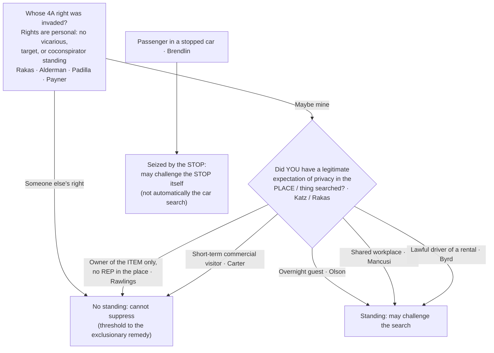

# S9 R1 panel-review — Opus model-diversity lane (prompt pack)

You are the **Claude/Opus** leg of the S9 three-lane adversarial panel (1 Claude + 2 Codex, R1). The two Codex lanes carry the A (support/quote-fidelity) and B (currency/treatment) attack lenses; **you carry model diversity and MUST vote on every paneled assertion across BOTH lenses' concerns.** You are refute-framed: try hard to break each assertion; **default to REFUTED on uncertainty**; never fabricate a cite, quote, or holding; use ONLY the evidence inlined below (no search, no outside knowledge). You are a SIGHTED reviewer — the FULL lake record (judgment fields included) is inlined.

You are a WRITER lane, not an adjudicator: you FIND and VOTE. You do not tally, adjudicate, or close any row — the orchestrator does.

For EACH group below, return one JSON object with the exact `reviewed[]` shape from the output contract (identical framing to the Codex lenses). Emit a finding object ONLY for a real defect (verdict refuted / stands-modified); a group you find wholly clean returns all-`stands` verdicts (the harness records a clean attestation). Concatenate the per-group JSON objects into a top-level `{"packs": [ ... ]}` array, one entry per group, each carrying its `group_id`.


OUTPUT CONTRACT — return ONE JSON object, nothing else:
{
  "lens": "A" | "B",
  "group_id": "<echo the group id>",
  "reviewed": [
    {
      "assertion_id": "<from group_inventory.jsonl>",
      "dimension": "existence|support|quote_fidelity|pincite|treatment|black_letter",
      "verdict": "stands" | "refuted" | "stands-modified",
      "verifiable_from_disclosed": true | false,
      "defect": null,   // null when verdict=="stands"; else an object:
      //  {"problem": "...", "severity": "high|medium|low", "proposed_fix": "...", "evidence_quote": "verbatim from disclosed evidence or null", "needs_cl": true|false, "locator_note": "..."}
      "reasons": ["short evidence-grounded reason", "..."],
      "breaks_true_positives": true | false,
      "residual_risks": ["..."],
      "suggested_tightening": "... or null"
    }
  ],
  "notes": ""
}
Rules: verdict=='stands' <=> defect==null (assertion survives your attack). verdict=='refuted' <=> a real defect (the assertion as framed is wrong). verdict=='stands-modified' <=> survives but needs a stated modification (a minor defect). Review EVERY assertion_id in group_inventory.jsonl exactly once. Output ONLY the JSON object.
---

## GROUP: content/the-exclusionary-rule-remedies-and-standing/Standing to Challenge a Search.md  (`doctrine`, 18 assertions)

### content_page

```
---
weight: 20
title: "Standing to Challenge a Search"
aliases:
  - "Standing"
  - "Fourth Amendment Standing"
  - "Expectation of Privacy (standing)"
  - "Standing to Challenge a Search"
  - "8-exclusionary-rule-remedies/Standing-to-Challenge-a-Search"
topic: "Standing to Challenge a Search"
type: doctrine
amendment: "U.S. Const. amend. IV"
jurisdiction: "Federal (U.S. Const. amend. IV); SCOTUS baseline"
status: draft
related:
  - "[[The Exclusionary Rule]]"
  - "[[Reasonable Expectation of Privacy]]"
  - "[[Fourth Amendment Framework]]"
  - "[[Two Definitions of Search]]"
  - "[[Abandonment]]"
  - "[[Automobile Exception]]"
  - "[[Traffic Stops]]"
  - "[[Seizure of the Person]]"
  - "[[Special Needs and Administrative Searches]]"
  - "[[Tents]]"
---

# Standing to Challenge a Search

*Can THIS defendant challenge the search — were HIS OWN Fourth Amendment rights violated?*

> [!rule] Black-letter rule
> Fourth Amendment rights are **personal** and "may not be vicariously asserted." A defendant may move to suppress **only** if the search or seizure infringed **his own** legitimate expectation of privacy in the place or thing searched, measured by the *[[Katz v. United States|Katz]]* test. *[[Rakas v. Illinois|Rakas v. Illinois]]*, 439 U.S. 128, [133–34](https://www.courtlistener.com/opinion/109953/rakas-v-illinois/), 143 (1978). "Standing" is not a separate doctrine; it **is** this merits question. No standing means no suppression, even where officers plainly violated someone else's rights.
> ^rule-standing

## The Brief

**"Standing" is not a separate doctrine — it is the merits.** The question is never "was the search illegal for someone"; it is whether *this* defendant had a **personal, legitimate expectation of privacy** in the place or thing searched. Fourth Amendment rights are personal and cannot be borrowed: "Fourth Amendment rights are personal rights which, like some other constitutional rights, may not be vicariously asserted." *[[Rakas v. Illinois|Rakas v. Illinois]]*, 439 U.S. 128, [133–34](https://www.courtlistener.com/opinion/109953/rakas-v-illinois/) (1978). *[[Rakas v. Illinois|Rakas]]* folded the old "standing" label into the substantive inquiry: capacity to claim the Amendment's protection "depends not upon a property right in the invaded place but upon whether the person who claims the protection of the Amendment has a **legitimate expectation of privacy in the invaded place**." *Id.* at 143. The measure of that expectation is the *[[Katz v. United States|Katz]]* test, an "actual (subjective) expectation of privacy" that "society is prepared to recognize as 'reasonable.'" *[[Katz v. United States|Katz v. United States]]*, 389 U.S. 347, [361](https://www.courtlistener.com/opinion/107564/katz-v-united-states/) (1967) (Harlan, J., [[Common Legal Terms#concurring-opinion|concurring]]). The rule that suppression is personal predates the merger and survives it: suppression "can be successfully urged only by those whose rights were violated by the search itself, not by those who are aggrieved solely by the introduction of damaging evidence. Coconspirators and codefendants have been accorded no special standing." *[[Alderman v. United States|Alderman v. United States]]*, 394 U.S. 165, [171–72](https://www.courtlistener.com/opinion/107872/alderman-v-united-states/) (1969).

**The old automatic / "target" standing is gone — treat it as history.** *[[Jones v. United States|Jones (1960)]]* once gave a defendant charged with a possessory offense "automatic standing," *[[Jones v. United States#^pin-267|Jones v. United States]]*, 362 U.S. 257, [264](https://www.courtlistener.com/opinion/106022/jones-v-united-states/#:~:text=anyone%20legitimately%20on%20premises%20where) (1960), and gave standing to "anyone legitimately on premises where a search occurs," *id.* at 267. Both grounds are **overruled**. *[[United States v. Salvucci|Salvucci]]* abolished automatic standing: "defendants charged with crimes of possession may only claim the benefits of the exclusionary rule if their own Fourth Amendment rights have in fact been violated. The automatic standing rule of *Jones v. United States* . . . is therefore overruled." *[[United States v. Salvucci|United States v. Salvucci]]*, 448 U.S. 83, [85](https://www.courtlistener.com/opinion/110325/united-states-v-salvucci/) (1980). *[[Rakas v. Illinois|Rakas]]* disavowed the broad "legitimately on premises" test. So there is **no vicarious, target, or derivative standing**: a co-defendant or co-conspirator gains nothing from the label. *[[United States v. Padilla|Padilla]]* rejected a "coconspirator exception"; participants "may have such expectations or interests, but the conspiracy itself **neither adds to nor detracts from** them." *[[United States v. Padilla|United States v. Padilla]]*, 508 U.S. 77, [82](https://www.courtlistener.com/opinion/112856/united-states-v-padilla/) (1993). And *[[United States v. Payner|Payner]]* held a court may not use its supervisory power as a back door around the requirement: "the interest in deterring illegal searches does not justify the exclusion of tainted evidence at the instance of a party who was not the victim of the challenged practices." *[[United States v. Payner|United States v. Payner]]*, 447 U.S. 727, [735](https://www.courtlistener.com/opinion/110317/united-states-v-payner/) (1980).

**Place searched ≠ item seized.** Owning the *thing seized* is not the same as a privacy interest in the *place searched*. After *[[Rakas v. Illinois|Rakas]]*, "the two inquiries merge into one: whether governmental officials violated any **legitimate expectation of privacy** held by petitioner," and ownership "is undoubtedly one fact to be considered" but does not control. *[[Rawlings v. Kentucky|Rawlings v. Kentucky]]*, 448 U.S. 98, [105–06](https://www.courtlistener.com/opinion/110326/rawlings-v-kentucky/) (1980). A defendant who dumped his drugs into a companion's purse he had no right to control could not challenge its search, even though the drugs were his. Establish a privacy or possessory interest in the **place**, not the loot.

**Status on the premises decides house cases.** An **overnight guest** has a [[Reasonable Expectation of Privacy|reasonable expectation of privacy]] in the host's home: "society recognizes that a houseguest has a legitimate expectation of privacy in his host's home." *[[Minnesota v. Olson|Minnesota v. Olson]]*, 495 U.S. 91, [98](https://www.courtlistener.com/opinion/112416/minnesota-v-olson/) (1990). A **short-term visitor there for a purely commercial errand** does not: "an overnight guest in a home may claim the protection of the Fourth Amendment, but one who is **merely present with the consent of the householder** may not." *[[Minnesota v. Carter|Minnesota v. Carter]]*, 525 U.S. 83, [90](https://www.courtlistener.com/opinion/118249/minnesota-v-carter/) (1998) (visitor present a few hours only to bag cocaine, no prior relationship). The line is one of duration, relationship to the householder, and purpose. Privacy in a shared **workplace** can also suffice: an employee sharing an office had standing because "the area was one in which there was a reasonable expectation of freedom from governmental intrusion." *[[Mancusi v. DeForte|Mancusi v. DeForte]]*, 392 U.S. 364, [368](https://www.courtlistener.com/opinion/107745/mancusi-v-deforte/) (1968). The same place-based inquiry reaches a **tent** used as a temporary dwelling, even on public land (see [[Tents]]).

**Vehicles — keep the driver and the passenger straight.** A driver in **lawful possession and control of a rental car** generally has a [[Reasonable Expectation of Privacy|reasonable expectation of privacy]] in it even if he is not listed on the rental agreement as an authorized driver. *[[Byrd v. United States|Byrd v. United States]]*, 584 U.S. 395 (2018). That is the threshold *before* any [[Automobile Exception]] question about the lawfulness of the search itself. A mere **passenger** is different: under *[[Rakas v. Illinois|Rakas]]* a passenger with no possessory or privacy interest cannot challenge a **search** of the car, but a passenger *is* **seized** by the stop and so "may challenge the constitutionality of the **stop**." *[[Brendlin v. California|Brendlin v. California]]*, 551 U.S. 249, [251](https://www.courtlistener.com/opinion/145712/brendlin-v-california/) (2007). Challenge-the-stop ([[Traffic Stops]] / [[Seizure of the Person]]) and challenge-the-search are two different keys; keep them crisp.

**Burden, standard of review, remedy.** The proponent of suppression, the **defendant-movant**, bears the burden of establishing a **legitimate expectation of privacy** (or possessory interest) in the place or thing searched, by a **[[Common Legal Terms#preponderance-of-the-evidence|preponderance of the evidence]]**. *[[Rakas v. Illinois|Rakas]]*, 439 U.S. at [130–31](https://www.courtlistener.com/opinion/109953/rakas-v-illinois/) n.1; *[[Rawlings v. Kentucky|Rawlings]]*, 448 U.S. at [104–05](https://www.courtlistener.com/opinion/110326/rawlings-v-kentucky/). On appeal from a suppression ruling, historical fact findings are reviewed for **[[Common Legal Terms#clear-error|clear error]]** and the ultimate expectation-of-privacy determination **[[Common Legal Terms#de-novo|de novo]]**. The **remedy** for a defendant who carries the burden is **suppression** of the evidence and its fruits ([[The Exclusionary Rule]]); standing is the **threshold** to that remedy, so without it even a plainly unlawful search yields no suppression for *this* defendant. A companion protection keeps the threshold from becoming a trap: testimony a defendant gives at a [[Common Legal Terms#suppression-hearing|suppression hearing]] to establish standing "may not thereafter be admitted against him at trial on the issue of guilt." *[[Simmons v. United States|Simmons v. United States]]*, 390 U.S. 377, [394](https://www.courtlistener.com/opinion/107636/simmons-v-united-states/) (1968).

**Apply it.**
1. **Ask whose right was invaded.** Identify *this* defendant's own connection to the place or thing searched; someone else's violated rights give him nothing.
2. **Pin the expectation to the *[[United States v. Place|place]]*, not the *item*.** Owning the seized contraband is not standing (*[[Rawlings v. Kentucky|Rawlings]]* / *[[United States v. Salvucci|Salvucci]]*); locate a privacy or possessory interest in the area searched.
3. **Use status on the premises for house cases.** Overnight guest (*[[Minnesota v. Olson|Olson]]*), yes; short-term commercial visitor (*[[Minnesota v. Carter|Carter]]*), no; shared workplace (*[[Mancusi v. DeForte|Mancusi]]*), often yes.
4. **Separate driver from passenger.** A lawful rental driver has standing to challenge the search (*[[Byrd v. United States|Byrd]]*); a passenger may challenge the **stop** (*[[Brendlin v. California|Brendlin]]*) but not automatically the car search.
5. **Reach for automatic standing only as history.** It is overruled; cite *[[Jones v. United States|Jones]]* only to explain the old rule.

**Common pitfalls.**
- **Treating ownership of the item as standing.** "It's his dope, so he can't complain it was found" is backwards (*[[United States v. Salvucci|Salvucci]]* / *[[Rawlings v. Kentucky|Rawlings]]*): the question is the expectation of privacy in the **place** searched.
- **Reaching for "automatic standing."** It is gone; cite *[[Jones v. United States|Jones]]* only as history.
- **Confusing constructive possession with 4A standing.** Constructive possession goes to **guilt / [[Common Legal Terms#mens-rea|mens rea]]**, not privacy; a defendant can constructively possess contraband yet have no expectation of privacy where it was found.
- **Letting a passenger challenge the *search* off the *stop*.** *[[Brendlin v. California|Brendlin]]* gives a passenger the **stop**, not automatically the car search (still *[[Rakas v. Illinois|Rakas]]*).
- **Forgetting that disclaiming an interest forfeits standing.** Denying ownership or walking away can extinguish the very expectation of privacy the defendant later needs (see [[Abandonment]]).

## Lower-court developments

The controlling Supreme Court cases home to Key cases regardless of date; below, the circuit-level standing inquiry, whose [[Reasonable Expectation of Privacy|reasonable expectation of privacy]] was invaded, is being worked out for traditional places such as hotels and rental cars.

- **Status-on-the-premises extended to hotel checkout — *[[United States v. Mendoza|United States v. Mendoza]]* (3d Cir. 2026).** *Doctrine-extension flag.* A hotel guest has **no** objectively [[Reasonable Expectation of Privacy|reasonable expectation of privacy]] in the room roughly five hours after the posted noon checkout, absent any late-checkout arrangement; lawful occupancy (and thus standing) ends when the right to occupy ends, extending the *[[Minnesota v. Olson|Olson]]* / *[[Minnesota v. Carter|Carter]]* "status on the premises" line into the checkout context. The panel did not adopt checkout as a bright line, noting circuits disagree on a "grace period" for stragglers, and held only that this unambiguous five-hour case "does not raise a close question." **Binding in-circuit — 3d Cir.**
- **Narrowing *[[Byrd v. United States|Byrd]]*'s "lawful possession" — *[[United States v. Lyle|United States v. Lyle]]* (2d Cir. 2019).** *Limits / narrows flag.* An **unlicensed** driver operating a rental car without the rental company's permission is, like a car thief, unlawfully in possession and has **no** [[Reasonable Expectation of Privacy|reasonable expectation of privacy]], so no standing, even though the authorized renter let him drive. Reads *[[Byrd v. United States|Byrd]]*'s lawful-possession requirement narrowly; the court expressly declined to decide whether an unauthorized-but-**licensed** driver alone would have standing. **Binding in-circuit — 2d Cir.**

The separate question whether acquiring bulk digital location data is a "search" at all is a **search-definition** issue reached through the same reasonable-expectation-of-privacy inquiry, not a standing holding about *whose* expectation was invaded; it is developed on [[Two Definitions of Search]] and [[The Third-Party Doctrine and Digital Surveillance]].

## Key cases

| Case | Holding | Opinion |
|---|---|---|
| *[[Rakas v. Illinois]]*, 439 U.S. 128 (1978) | **Anchor.** Fourth Amendment rights are personal; "standing" merges into the merits (whether your own legitimate expectation of privacy in the place searched was infringed). A passenger with no possessory or privacy interest cannot challenge a car search. | [opinion](https://www.courtlistener.com/opinion/109953/rakas-v-illinois/) |
| *[[Alderman v. United States]]*, 394 U.S. 165 (1969) | **Anchor, no vicarious assertion.** Suppression may be urged only by those whose own rights the search violated; co-defendants and co-conspirators get no special standing. | [opinion](https://www.courtlistener.com/opinion/107872/alderman-v-united-states/) |
| *[[Jones v. United States]]*, 362 U.S. 257 (1960) | **Historical foil.** Created "automatic standing" for possessory charges and "legitimately on premises" standing, both later overruled; cite only as history. | [opinion](https://www.courtlistener.com/opinion/106022/jones-v-united-states/) |
| *[[United States v. Salvucci]]*, 448 U.S. 83 (1980) | **Progeny.** Abolished automatic standing; a defendant charged with a possessory crime must show his own Fourth Amendment rights were violated. | [opinion](https://www.courtlistener.com/opinion/110325/united-states-v-salvucci/) |
| *[[Rawlings v. Kentucky]]*, 448 U.S. 98 (1980) | **Progeny, place ≠ item.** Owning the drugs seized from a companion's purse gave no [[Reasonable Expectation of Privacy\|reasonable expectation of privacy]] in the purse; the inquiries merge into whether your REP in the place was invaded. | [opinion](https://www.courtlistener.com/opinion/110326/rawlings-v-kentucky/) |
| *[[Minnesota v. Olson]]*, 495 U.S. 91 (1990) | **Progeny.** An overnight guest has a [[Reasonable Expectation of Privacy\|reasonable expectation of privacy]] in the host's home and may challenge a warrantless entry. | [opinion](https://www.courtlistener.com/opinion/112416/minnesota-v-olson/) |
| *[[Minnesota v. Carter]]*, 525 U.S. 83 (1998) | **Progeny, the boundary of *[[Minnesota v. Olson\|Olson]]*.** A short-term commercial visitor (bagging drugs a few hours, no prior relationship) has no [[Reasonable Expectation of Privacy\|reasonable expectation of privacy]] in the home. | [opinion](https://www.courtlistener.com/opinion/118249/minnesota-v-carter/) |
| *[[Byrd v. United States]]*, 584 U.S. 395 (2018) | **Progeny.** A driver in lawful possession and control of a rental car generally has a [[Reasonable Expectation of Privacy\|reasonable expectation of privacy]] in it, even if not listed on the rental agreement. | [opinion](https://www.courtlistener.com/opinion/4497658/byrd-v-united-states/) |
| *[[Mancusi v. DeForte]]*, 392 U.S. 364 (1968) | **Progeny, shared workplace.** An employee can have a [[Reasonable Expectation of Privacy\|reasonable expectation of privacy]] in a shared office and standing to challenge its search; capacity turns on REP in the area, not a property right. | [opinion](https://www.courtlistener.com/opinion/107745/mancusi-v-deforte/) |
| *[[Simmons v. United States]]*, 390 U.S. 377 (1968) | **Progeny, the standing companion.** Testimony a defendant gives at a [[Common Legal Terms#suppression-hearing\|suppression hearing]] to establish standing may not be used against him at trial on guilt. | [opinion](https://www.courtlistener.com/opinion/107636/simmons-v-united-states/) |
| *[[United States v. Padilla]]*, 508 U.S. 77 (1993) | **Progeny, no coconspirator exception.** A supervisory role in or joint control over a conspiracy does not by itself confer standing; the conspiracy "neither adds to nor detracts from" a defendant's personal interest. | [opinion](https://www.courtlistener.com/opinion/112856/united-states-v-padilla/) |
| *[[United States v. Payner]]*, 447 U.S. 727 (1980) | **Progeny, no back door.** A federal court may not use its supervisory power to suppress evidence seized in the deliberate violation of a third party's rights at the instance of a defendant whose own rights were not violated. | [opinion](https://www.courtlistener.com/opinion/110317/united-states-v-payner/) |

## Related cases across doctrines

These are treated in full on other doctrine pages but bear directly on standing here; the reasonable-expectation-of-privacy that grounds standing can be shrunk (or preserved) by status, and framed for this page.

| Case | Relevance here | Primary home | Opinion |
|---|---|---|---|
| *[[Katz v. United States]]*, 389 U.S. 347 (1967) | ***The measure of standing.*** Supplies the reasonable-expectation-of-privacy test (Harlan's subjective expectation society accepts as reasonable), the measure of whose rights were invaded; "the Fourth Amendment protects people, not places." | [[Reasonable Expectation of Privacy]] | [opinion](https://www.courtlistener.com/opinion/107564/katz-v-united-states/) |
| *[[Brendlin v. California]]*, 551 U.S. 249 (2007) | ***Challenge the stop.*** When a car is stopped, a passenger is seized just as the driver is and may challenge the constitutionality of the **stop**, distinct from standing to challenge a search of the car. | [[Traffic Stops]] | [opinion](https://www.courtlistener.com/opinion/145712/brendlin-v-california/) |
| *[[Samson v. California]]*, 547 U.S. 843 (2006) | ***REP near zero by status.*** A parolee subject to a search condition has a severely diminished [[Reasonable Expectation of Privacy\|reasonable expectation of privacy]]; status can reduce the REP that defines standing to almost nothing. | [[Special Needs and Administrative Searches]] | [opinion](https://www.courtlistener.com/opinion/145640/samson-v-california/) |
| *[[United States v. Knights]]*, 534 U.S. 112 (2001) | ***REP diminished by condition.*** A probationer's expectation of privacy is significantly diminished by a valid search condition; supervision status shrinks the REP that grounds any standing to object. | [[Special Needs and Administrative Searches]] | [opinion](https://www.courtlistener.com/opinion/118468/united-states-v-knights/) |
| *[[Collins v. Virginia]]*, 584 U.S. 586 (2018) | ***Full REP retained.*** A resident retains a full [[Reasonable Expectation of Privacy\|reasonable expectation of privacy]] in the [[Curtilage\|curtilage]] where his vehicle is parked; the home/[[Curtilage\|curtilage]] REP that confers standing is not dissolved by the automobile exception. | [[Automobile Exception]] | [opinion](https://www.courtlistener.com/opinion/4501697/collins-v-virginia/) |

## Visual



## Sources
- [*Rakas v. Illinois*, 439 U.S. 128 (1978)](https://www.courtlistener.com/opinion/109953/rakas-v-illinois/) (pinpoints: 130–31 n.1, 133–34, 143)
- [*Katz v. United States*, 389 U.S. 347 (1967)](https://www.courtlistener.com/opinion/107564/katz-v-united-states/) (pinpoints: 351, 361 (Harlan, J., concurring); home = [[Reasonable Expectation of Privacy]])
- [*Alderman v. United States*, 394 U.S. 165 (1969)](https://www.courtlistener.com/opinion/107872/alderman-v-united-states/) (pinpoints: 171–72, 174)
- [*Jones v. United States*, 362 U.S. 257 (1960)](https://www.courtlistener.com/opinion/106022/jones-v-united-states/) (pinpoints: 264, 267; overruled by *Rakas* and *Salvucci*; Historical)
- [*United States v. Salvucci*, 448 U.S. 83 (1980)](https://www.courtlistener.com/opinion/110325/united-states-v-salvucci/) (pinpoint: 85)
- [*Rawlings v. Kentucky*, 448 U.S. 98 (1980)](https://www.courtlistener.com/opinion/110326/rawlings-v-kentucky/) (pinpoints: 104–05, 105–06)
- [*Minnesota v. Olson*, 495 U.S. 91 (1990)](https://www.courtlistener.com/opinion/112416/minnesota-v-olson/) (pinpoint: 98)
- [*Minnesota v. Carter*, 525 U.S. 83 (1998)](https://www.courtlistener.com/opinion/118249/minnesota-v-carter/) (pinpoint: 90)
- [*Byrd v. United States*, 584 U.S. 395 (2018)](https://www.courtlistener.com/opinion/4497658/byrd-v-united-states/) (rental-driver REP; the CourtListener text is the slip opinion, so no reporter star page is located for the pinpoint; paraphrased per the four-tier conversion, T3)
- [*Brendlin v. California*, 551 U.S. 249 (2007)](https://www.courtlistener.com/opinion/145712/brendlin-v-california/) (pinpoint: 251; home = [[Traffic Stops]])
- [*Mancusi v. DeForte*, 392 U.S. 364 (1968)](https://www.courtlistener.com/opinion/107745/mancusi-v-deforte/) (pinpoints: 368, 369)
- [*Simmons v. United States*, 390 U.S. 377 (1968)](https://www.courtlistener.com/opinion/107636/simmons-v-united-states/) (pinpoint: 394)
- [*United States v. Padilla*, 508 U.S. 77 (1993)](https://www.courtlistener.com/opinion/112856/united-states-v-padilla/) (pinpoint: 82)
- [*United States v. Payner*, 447 U.S. 727 (1980)](https://www.courtlistener.com/opinion/110317/united-states-v-payner/) (pinpoints: 735, 736)
- [*Samson v. California*, 547 U.S. 843 (2006)](https://www.courtlistener.com/opinion/145640/samson-v-california/) (REP diminished by parole status; home = [[Special Needs and Administrative Searches]])
- [*United States v. Knights*, 534 U.S. 112 (2001)](https://www.courtlistener.com/opinion/118468/united-states-v-knights/) (REP diminished by probation condition; home = [[Special Needs and Administrative Searches]])
- [*Collins v. Virginia*, 584 U.S. 586 (2018)](https://www.courtlistener.com/opinion/4501697/collins-v-virginia/) (full curtilage REP retained; home = [[Automobile Exception]])
- [*United States v. Mendoza*, 3d Cir. 2026](https://www.courtlistener.com/opinion/10771114/united-states-v-ryan-mendoza/) (Binding in-circuit — 3d Cir.; hotel-checkout REP)
- [*United States v. Lyle*, 2d Cir. 2019](https://www.courtlistener.com/opinion/8443943/united-states-v-lyle/) (Binding in-circuit — 2d Cir.; narrows *Byrd* lawful-possession)

```

### group_inventory (assertions under review)

```jsonl
{"assertion_id": "049c6e1715f544cf", "dimension": "existence", "kind": "case_cite", "locator": {"case": "United States v. Knights", "table_line": 73}, "payload": {"case": "United States v. Knights", "cells": ["*[[United States v. Knights]]*, 534 U.S. 112 (2001)", "***REP diminished by condition.*** A probationer's expectation of privacy is significantly diminished by a valid search condition; supervision status shrinks the REP that grounds any standing to object.", "[[Special Needs and Administrative Searches]]", "[opinion](https://www.courtlistener.com/opinion/118468/united-states-v-knights/)"], "header": ["Case", "Relevance here", "Primary home", "Opinion"]}}
{"assertion_id": "59f9669eead9a762", "dimension": "existence", "kind": "case_cite", "locator": {"case": "Collins v. Virginia", "table_line": 74}, "payload": {"case": "Collins v. Virginia", "cells": ["*[[Collins v. Virginia]]*, 584 U.S. 586 (2018)", "***Full REP retained.*** A resident retains a full [[Reasonable Expectation of Privacy\\|reasonable expectation of privacy]] in the [[Curtilage\\|curtilage]] where his vehicle is parked; the home/[[Curtilage\\|curtilage]] REP that confers standing is not dissolved by the automobile exception.", "[[Automobile Exception]]", "[opinion](https://www.courtlistener.com/opinion/4501697/collins-v-virginia/)"], "header": ["Case", "Relevance here", "Primary home", "Opinion"]}}
{"assertion_id": "664800f891e81616", "dimension": "existence", "kind": "case_cite", "locator": {"case": "Rawlings v. Kentucky", "table_line": 55}, "payload": {"case": "Rawlings v. Kentucky", "cells": ["*[[Rawlings v. Kentucky]]*, 448 U.S. 98 (1980)", "**Progeny, place ≠ item.** Owning the drugs seized from a companion's purse gave no [[Reasonable Expectation of Privacy\\|reasonable expectation of privacy]] in the purse; the inquiries merge into whether your REP in the place was invaded.", "[opinion](https://www.courtlistener.com/opinion/110326/rawlings-v-kentucky/)"], "header": ["Case", "Holding", "Opinion"]}}
{"assertion_id": "6b2fd9c96dc3bac6", "dimension": "existence", "kind": "case_cite", "locator": {"case": "Samson v. California", "table_line": 72}, "payload": {"case": "Samson v. California", "cells": ["*[[Samson v. California]]*, 547 U.S. 843 (2006)", "***REP near zero by status.*** A parolee subject to a search condition has a severely diminished [[Reasonable Expectation of Privacy\\|reasonable expectation of privacy]]; status can reduce the REP that defines standing to almost nothing.", "[[Special Needs and Administrative Searches]]", "[opinion](https://www.courtlistener.com/opinion/145640/samson-v-california/)"], "header": ["Case", "Relevance here", "Primary home", "Opinion"]}}
{"assertion_id": "73d90019010b4ef9", "dimension": "existence", "kind": "case_cite", "locator": {"case": "United States v. Salvucci", "table_line": 54}, "payload": {"case": "United States v. Salvucci", "cells": ["*[[United States v. Salvucci]]*, 448 U.S. 83 (1980)", "**Progeny.** Abolished automatic standing; a defendant charged with a possessory crime must show his own Fourth Amendment rights were violated.", "[opinion](https://www.courtlistener.com/opinion/110325/united-states-v-salvucci/)"], "header": ["Case", "Holding", "Opinion"]}}
{"assertion_id": "915580328188e55d", "dimension": "existence", "kind": "case_cite", "locator": {"case": "United States v. Payner", "table_line": 62}, "payload": {"case": "United States v. Payner", "cells": ["*[[United States v. Payner]]*, 447 U.S. 727 (1980)", "**Progeny, no back door.** A federal court may not use its supervisory power to suppress evidence seized in the deliberate violation of a third party's rights at the instance of a defendant whose own rights were not violated.", "[opinion](https://www.courtlistener.com/opinion/110317/united-states-v-payner/)"], "header": ["Case", "Holding", "Opinion"]}}
{"assertion_id": "d132b3fc2224b132", "dimension": "existence", "kind": "case_cite", "locator": {"case": "Minnesota v. Olson", "table_line": 56}, "payload": {"case": "Minnesota v. Olson", "cells": ["*[[Minnesota v. Olson]]*, 495 U.S. 91 (1990)", "**Progeny.** An overnight guest has a [[Reasonable Expectation of Privacy\\|reasonable expectation of privacy]] in the host's home and may challenge a warrantless entry.", "[opinion](https://www.courtlistener.com/opinion/112416/minnesota-v-olson/)"], "header": ["Case", "Holding", "Opinion"]}}
{"assertion_id": "d6945aa00e87d6ef", "dimension": "existence", "kind": "case_cite", "locator": {"case": "Alderman v. United States", "table_line": 52}, "payload": {"case": "Alderman v. United States", "cells": ["*[[Alderman v. United States]]*, 394 U.S. 165 (1969)", "**Anchor, no vicarious assertion.** Suppression may be urged only by those whose own rights the search violated; co-defendants and co-conspirators get no special standing.", "[opinion](https://www.courtlistener.com/opinion/107872/alderman-v-united-states/)"], "header": ["Case", "Holding", "Opinion"]}}
{"assertion_id": "d8d3ca5c23e63565", "dimension": "existence", "kind": "case_cite", "locator": {"case": "Mancusi v. DeForte", "table_line": 59}, "payload": {"case": "Mancusi v. DeForte", "cells": ["*[[Mancusi v. DeForte]]*, 392 U.S. 364 (1968)", "**Progeny, shared workplace.** An employee can have a [[Reasonable Expectation of Privacy\\|reasonable expectation of privacy]] in a shared office and standing to challenge its search; capacity turns on REP in the area, not a property right.", "[opinion](https://www.courtlistener.com/opinion/107745/mancusi-v-deforte/)"], "header": ["Case", "Holding", "Opinion"]}}
{"assertion_id": "d8e767ee086fcf8a", "dimension": "existence", "kind": "case_cite", "locator": {"case": "Rakas v. Illinois", "table_line": 51}, "payload": {"case": "Rakas v. Illinois", "cells": ["*[[Rakas v. Illinois]]*, 439 U.S. 128 (1978)", "**Anchor.** Fourth Amendment rights are personal; \"standing\" merges into the merits (whether your own legitimate expectation of privacy in the place searched was infringed). A passenger with no possessory or privacy interest cannot challenge a car search.", "[opinion](https://www.courtlistener.com/opinion/109953/rakas-v-illinois/)"], "header": ["Case", "Holding", "Opinion"]}}
{"assertion_id": "da2750f52783c362", "dimension": "existence", "kind": "case_cite", "locator": {"case": "Simmons v. United States", "table_line": 60}, "payload": {"case": "Simmons v. United States", "cells": ["*[[Simmons v. United States]]*, 390 U.S. 377 (1968)", "**Progeny, the standing companion.** Testimony a defendant gives at a [[Common Legal Terms#suppression-hearing\\|suppression hearing]] to establish standing may not be used against him at trial on guilt.", "[opinion](https://www.courtlistener.com/opinion/107636/simmons-v-united-states/)"], "header": ["Case", "Holding", "Opinion"]}}
{"assertion_id": "dc3c3a5ebb8c1f5a", "dimension": "existence", "kind": "case_cite", "locator": {"case": "Jones v. United States", "table_line": 53}, "payload": {"case": "Jones v. United States", "cells": ["*[[Jones v. United States]]*, 362 U.S. 257 (1960)", "**Historical foil.** Created \"automatic standing\" for possessory charges and \"legitimately on premises\" standing, both later overruled; cite only as history.", "[opinion](https://www.courtlistener.com/opinion/106022/jones-v-united-states/)"], "header": ["Case", "Holding", "Opinion"]}}
{"assertion_id": "dfbab9a4af2c0891", "dimension": "existence", "kind": "case_cite", "locator": {"case": "Katz v. United States", "table_line": 70}, "payload": {"case": "Katz v. United States", "cells": ["*[[Katz v. United States]]*, 389 U.S. 347 (1967)", "***The measure of standing.*** Supplies the reasonable-expectation-of-privacy test (Harlan's subjective expectation society accepts as reasonable), the measure of whose rights were invaded; \"the Fourth Amendment protects people, not places.\"", "[[Reasonable Expectation of Privacy]]", "[opinion](https://www.courtlistener.com/opinion/107564/katz-v-united-states/)"], "header": ["Case", "Relevance here", "Primary home", "Opinion"]}}
{"assertion_id": "eca4a4733feda8fe", "dimension": "existence", "kind": "case_cite", "locator": {"case": "Minnesota v. Carter", "table_line": 57}, "payload": {"case": "Minnesota v. Carter", "cells": ["*[[Minnesota v. Carter]]*, 525 U.S. 83 (1998)", "**Progeny, the boundary of *[[Minnesota v. Olson\\|Olson]]*.** A short-term commercial visitor (bagging drugs a few hours, no prior relationship) has no [[Reasonable Expectation of Privacy\\|reasonable expectation of privacy]] in the home.", "[opinion](https://www.courtlistener.com/opinion/118249/minnesota-v-carter/)"], "header": ["Case", "Holding", "Opinion"]}}
{"assertion_id": "ef734e9bd574689d", "dimension": "existence", "kind": "case_cite", "locator": {"case": "United States v. Padilla", "table_line": 61}, "payload": {"case": "United States v. Padilla", "cells": ["*[[United States v. Padilla]]*, 508 U.S. 77 (1993)", "**Progeny, no coconspirator exception.** A supervisory role in or joint control over a conspiracy does not by itself confer standing; the conspiracy \"neither adds to nor detracts from\" a defendant's personal interest.", "[opinion](https://www.courtlistener.com/opinion/112856/united-states-v-padilla/)"], "header": ["Case", "Holding", "Opinion"]}}
{"assertion_id": "f87ddb7ad1685da6", "dimension": "existence", "kind": "case_cite", "locator": {"case": "Brendlin v. California", "table_line": 71}, "payload": {"case": "Brendlin v. California", "cells": ["*[[Brendlin v. California]]*, 551 U.S. 249 (2007)", "***Challenge the stop.*** When a car is stopped, a passenger is seized just as the driver is and may challenge the constitutionality of the **stop**, distinct from standing to challenge a search of the car.", "[[Traffic Stops]]", "[opinion](https://www.courtlistener.com/opinion/145712/brendlin-v-california/)"], "header": ["Case", "Relevance here", "Primary home", "Opinion"]}}
{"assertion_id": "fc88fc8e8abc34e4", "dimension": "existence", "kind": "case_cite", "locator": {"case": "Byrd v. United States", "table_line": 58}, "payload": {"case": "Byrd v. United States", "cells": ["*[[Byrd v. United States]]*, 584 U.S. 395 (2018)", "**Progeny.** A driver in lawful possession and control of a rental car generally has a [[Reasonable Expectation of Privacy\\|reasonable expectation of privacy]] in it, even if not listed on the rental agreement.", "[opinion](https://www.courtlistener.com/opinion/4497658/byrd-v-united-states/)"], "header": ["Case", "Holding", "Opinion"]}}
{"assertion_id": "603c45be13913a4d", "dimension": "support", "kind": "proposition", "locator": {"callout": "^rule-standing"}, "payload": {"anchor": "^rule-standing", "statement": "[!rule] Black-letter rule\nFourth Amendment rights are **personal** and \"may not be vicariously asserted.\" A defendant may move to suppress **only** if the search or seizure infringed **his own** legitimate expectation of privacy in the place or thing searched, measured by the *[[Katz v. United States|Katz]]* test. *[[Rakas v. Illinois|Rakas v. Illinois]]*, 439 U.S. 128, [133–34](https://www.courtlistener.com/opinion/109953/rakas-v-illinois/), 143 (1978). \"Standing\" is not a separate doctrine; it **is** this merits question. No standing means no suppression, even where officers plainly violated someone else's rights."}}
```

### lake record — Alderman v. United States

```json
{
  "schema_version": "s2.v1",
  "record_id": "Alderman v. United States",
  "stub": false,
  "status": "verified",
  "identity": {
    "case_name": "Alderman v. United States",
    "case_name_short": "Alderman",
    "case_name_full": "ALDERMAN Et Al. v. UNITED STATES",
    "input_case_name": "Alderman v. United States",
    "court": "U.S. Supreme Court",
    "court_id": "scotus",
    "court_level": "scotus",
    "circuit": null,
    "state": null,
    "date_decided": "1969-03-24",
    "year": 1969,
    "docket": "133",
    "cluster_id": 107872,
    "lead_opinion_id": 9423945,
    "sibling_ids": [
      107872,
      9423945,
      9423946,
      9423947
    ],
    "absolute_url": "/opinion/107872/alderman-v-united-states/",
    "identity_method": "citation+party-text",
    "expected_citation_found": true,
    "party_name_in_text": true,
    "canonical_name_match": true,
    "alternates": [],
    "reason_code": null
  },
  "citations": {
    "official": {
      "cite": "394 U.S. 165",
      "volume": "394",
      "reporter": "U.S.",
      "page": "165",
      "type": 1,
      "selected_official": true,
      "source": "cluster.citations[]"
    },
    "parallel": [
      {
        "cite": "89 S. Ct. 961",
        "volume": "89",
        "reporter": "S. Ct.",
        "page": "961",
        "type": 1,
        "selected_official": false,
        "source": "cluster.citations[]"
      },
      {
        "cite": "22 L. Ed. 2d 176",
        "volume": "22",
        "reporter": "L. Ed. 2d",
        "page": "176",
        "type": 1,
        "selected_official": false,
        "source": "cluster.citations[]"
      }
    ],
    "vendor_neutral": [
      {
        "cite": "1969 U.S. LEXIS 3287",
        "volume": "1969",
        "reporter": "U.S. LEXIS",
        "page": "3287",
        "type": 6,
        "selected_official": false,
        "source": "cluster.citations[]"
      }
    ],
    "all": [
      {
        "cite": "394 U.S. 165",
        "volume": "394",
        "reporter": "U.S.",
        "page": "165",
        "type": 1,
        "selected_official": false,
        "source": "cluster.citations[]"
      },
      {
        "cite": "89 S. Ct. 961",
        "volume": "89",
        "reporter": "S. Ct.",
        "page": "961",
        "type": 1,
        "selected_official": false,
        "source": "cluster.citations[]"
      },
      {
        "cite": "22 L. Ed. 2d 176",
        "volume": "22",
        "reporter": "L. Ed. 2d",
        "page": "176",
        "type": 1,
        "selected_official": false,
        "source": "cluster.citations[]"
      },
      {
        "cite": "1969 U.S. LEXIS 3287",
        "volume": "1969",
        "reporter": "U.S. LEXIS",
        "page": "3287",
        "type": 6,
        "selected_official": false,
        "source": "cluster.citations[]"
      }
    ],
    "display": "394 U.S. 165",
    "official_selection": {
      "court_class": "scotus",
      "selected": "394 U.S. 165",
      "reason": "selected_rank_1"
    }
  },
  "pinpoints": [
    {
      "id": "pin-171",
      "page": null,
      "quote": "--- # Alderman v. United States *394 U.S. 165 (1969)* \u00b7 U.S. Supreme Court \u00b7 **Binding \u2014 SCOTUS** \u00b7 Treatment: **good** *(as of 2026-06-30)* <!-- header line; TreatmentBadge + weight render here, degrading to the text above --> ## Background After the petitioners' convictions, it was revealed that the Government had conducted electronic surveillance that might have violated Fourth Amendment rights. The petitioners argued that any evidence traceable to the unlawful surveillance required retrial \u2014 even surveillance that invaded only a co-defendant's or co-conspirator's rights \u2014 and that the Government had to disclose the surveillance records. The Court addressed both who may suppress the fruits of illegal surveillance and the disclosure procedure. ## Issue Whether a defendant may suppress evidence obtained by electronic surveillance (or any search) that violated only a third party's Fourth Amendment rights \u2014 that is, whether co-defendants and co-conspirators have standing to assert another's Fourth Amendment rights. ## Rule No; standing to suppress is personal.",
      "star_marker": null,
      "quote_fidelity": "mismatch",
      "pinpoint_status": "slip-only",
      "position": null
    },
    {
      "id": "pin-174",
      "page": null,
      "quote": "We adhere to these cases and to the general rule that Fourth Amendment rights are personal rights which, like some other constitutional rights, may not be vicariously asserted.",
      "star_marker": "174",
      "quote_fidelity": "matched",
      "pinpoint_status": "star-verified",
      "position": 11788,
      "fragment": "#:~:text=We%20adhere%20to%20these%20cases",
      "fragment_validated_at": "2026-07-09T15:40:45Z"
    },
    {
      "id": "pin-174b",
      "page": null,
      "quote": "There is no necessity to exclude evidence against one defendant in order to protect the rights of another. No rights of the victim of an illegal search are at stake when the evidence is offered against some other party.",
      "star_marker": "174",
      "quote_fidelity": "matched",
      "pinpoint_status": "star-verified",
      "position": 13237,
      "fragment": "#:~:text=There%20is%20no%20necessity%20to",
      "fragment_validated_at": "2026-07-09T15:40:45Z"
    }
  ],
  "treatment": {
    "field_i_validity": "good_law",
    "as_of_content": "1969-03-10",
    "as_of_treatment": "2026-06-30",
    "composite_basis": "migration-seed",
    "composite_basis_ref": "Alderman v. United States",
    "varies_by_point": false,
    "scope_note": "The personal-rights standing rule remains good law; Rakas v. Illinois (1978) recast the inquiry as a substantive Fourth Amendment merits question but reaffirmed Alderman's core principle.",
    "point_overrides": [],
    "edges": [
      {
        "citing_case": {
          "name": "State v. Olive",
          "cluster_id": 10872112,
          "cite": [
            "2026 Ohio 2150"
          ],
          "field_ii": "overruled"
        },
        "field_ii": "overruled",
        "field_iii": "mentioned",
        "point": null,
        "proposed": true,
        "journal_ref": "Alderman v. United States:lane1_negative"
      },
      {
        "citing_case": {
          "name": "United States v. Clifton Mosley",
          "cluster_id": 10799851,
          "cite": null,
          "field_ii": "superseded_by_statute"
        },
        "field_ii": "superseded_by_statute",
        "field_iii": "mentioned",
        "point": null,
        "proposed": true,
        "journal_ref": "Alderman v. United States:lane1_negative"
      },
      {
        "citing_case": {
          "name": "United States v. Leron Liggins",
          "cluster_id": 10795801,
          "cite": null,
          "field_ii": "overruled"
        },
        "field_ii": "overruled",
        "field_iii": "mentioned",
        "point": null,
        "proposed": true,
        "journal_ref": "Alderman v. United States:lane1_negative"
      },
      {
        "citing_case": {
          "name": "State v. Rykena",
          "cluster_id": 10735854,
          "cite": [
            "2025 Ohio 5136"
          ],
          "field_ii": "overruled"
        },
        "field_ii": "overruled",
        "field_iii": "mentioned",
        "point": null,
        "proposed": true,
        "journal_ref": "Alderman v. United States:lane1_negative"
      },
      {
        "citing_case": {
          "name": "Com. v. Aguilar, S.",
          "cluster_id": 10601729,
          "cite": [
            "2025 Pa. Super. 118"
          ],
          "field_ii": "questioned"
        },
        "field_ii": "questioned",
        "field_iii": "mentioned",
        "point": null,
        "proposed": true,
        "journal_ref": "Alderman v. United States:lane1_negative"
      },
      {
        "citing_case": {
          "name": "PETTIT, JUSTIN v. the State of Texas",
          "cluster_id": 10596365,
          "cite": null,
          "field_ii": "questioned"
        },
        "field_ii": "questioned",
        "field_iii": "mentioned",
        "point": null,
        "proposed": true,
        "journal_ref": "Alderman v. United States:lane1_negative"
      },
      {
        "citing_case": {
          "name": "United States v. Bourrage",
          "cluster_id": 10588786,
          "cite": [
            "138 F.4th 327"
          ],
          "field_ii": "questioned"
        },
        "field_ii": "questioned",
        "field_iii": "mentioned",
        "point": null,
        "proposed": true,
        "journal_ref": "Alderman v. United States:lane1_negative"
      },
      {
        "citing_case": {
          "name": "Seth Albert Lookhart v. State of Alaska",
          "cluster_id": 10581677,
          "cite": null,
          "field_ii": "questioned"
        },
        "field_ii": "questioned",
        "field_iii": "mentioned",
        "point": null,
        "proposed": true,
        "journal_ref": "Alderman v. United States:lane1_negative"
      },
      {
        "citing_case": {
          "name": "People v. Hagestedt",
          "cluster_id": 10328364,
          "cite": [
            "2025 IL 130286"
          ],
          "field_ii": "overruled"
        },
        "field_ii": "overruled",
        "field_iii": "mentioned",
        "point": null,
        "proposed": true,
        "journal_ref": "Alderman v. United States:lane1_negative"
      },
      {
        "citing_case": {
          "name": "State of Maine v. Richard W. Kelley",
          "cluster_id": 10340246,
          "cite": [
            "2025 ME 1"
          ],
          "field_ii": "questioned"
        },
        "field_ii": "questioned",
        "field_iii": "mentioned",
        "point": null,
        "proposed": true,
        "journal_ref": "Alderman v. United States:lane1_negative"
      },
      {
        "citing_case": {
          "name": "State v. Bonner",
          "cluster_id": 10276379,
          "cite": [
            "2024 Ohio 4717"
          ],
          "field_ii": "overruled"
        },
        "field_ii": "overruled",
        "field_iii": "mentioned",
        "point": null,
        "proposed": true,
        "journal_ref": "Alderman v. United States:lane1_negative"
      },
      {
        "citing_case": {
          "name": "United States v. Johnnie Davis",
          "cluster_id": 10020876,
          "cite": [
            "109 F.4th 1320"
          ],
          "field_ii": "superseded_by_statute"
        },
        "field_ii": "superseded_by_statute",
        "field_iii": "mentioned",
        "point": null,
        "proposed": true,
        "journal_ref": "Alderman v. United States:lane1_negative"
      },
      {
        "citing_case": {
          "name": "United States v. Fortenberry",
          "cluster_id": 9972095,
          "cite": null,
          "field_ii": "questioned"
        },
        "field_ii": "questioned",
        "field_iii": "mentioned",
        "point": null,
        "proposed": true,
        "journal_ref": "Alderman v. United States:lane1_negative"
      },
      {
        "citing_case": {
          "name": "United States v. Gregory Rogers",
          "cluster_id": 9492473,
          "cite": [
            "97 F.4th 1038"
          ],
          "field_ii": "abrogated"
        },
        "field_ii": "abrogated",
        "field_iii": "mentioned",
        "point": null,
        "proposed": true,
        "journal_ref": "Alderman v. United States:lane1_negative"
      },
      {
        "citing_case": {
          "name": "State v. Camper",
          "cluster_id": 9454678,
          "cite": [
            "232 N.E.3d 419",
            "2023 Ohio 4673"
          ],
          "field_ii": "overruled"
        },
        "field_ii": "overruled",
        "field_iii": "mentioned",
        "point": null,
        "proposed": true,
        "journal_ref": "Alderman v. United States:lane1_negative"
      },
      {
        "citing_case": {
          "name": "State v. McFadden",
          "cluster_id": 9399122,
          "cite": [
            "2023 Ohio 1630"
          ],
          "field_ii": "overruled"
        },
        "field_ii": "overruled",
        "field_iii": "mentioned",
        "point": null,
        "proposed": true,
        "journal_ref": "Alderman v. United States:lane1_negative"
      },
      {
        "citing_case": {
          "name": "State v. Harris",
          "cluster_id": 9397460,
          "cite": [
            "2023 Ohio 1544"
          ],
          "field_ii": "overruled"
        },
        "field_ii": "overruled",
        "field_iii": "mentioned",
        "point": null,
        "proposed": true,
        "journal_ref": "Alderman v. United States:lane1_negative"
      },
      {
        "citing_case": {
          "name": "David Milton Sills a/k/a David Sills v. State of Mississippi",
          "cluster_id": 10628039,
          "cite": null,
          "field_ii": "overruled"
        },
        "field_ii": "overruled",
        "field_iii": "mentioned",
        "point": null,
        "proposed": true,
        "journal_ref": "Alderman v. United States:lane1_negative"
      },
      {
        "citing_case": {
          "name": "Mexican Gulf v. U.S. Dept. of Comm",
          "cluster_id": 9379875,
          "cite": null,
          "field_ii": "overruled"
        },
        "field_ii": "overruled",
        "field_iii": "mentioned",
        "point": null,
        "proposed": true,
        "journal_ref": "Alderman v. United States:lane1_negative"
      },
      {
        "citing_case": {
          "name": "United States v. Terrance Baker",
          "cluster_id": 9371555,
          "cite": [
            "58 F.4th 1109"
          ],
          "field_ii": "questioned"
        },
        "field_ii": "questioned",
        "field_iii": "mentioned",
        "point": null,
        "proposed": true,
        "journal_ref": "Alderman v. United States:lane1_negative"
      },
      {
        "citing_case": {
          "name": "State v. Pilon",
          "cluster_id": 10135363,
          "cite": [
            "321 Or. App. 460",
            "516 P.3d 1181"
          ],
          "field_ii": "questioned"
        },
        "field_ii": "questioned",
        "field_iii": "mentioned",
        "point": null,
        "proposed": true,
        "journal_ref": "Alderman v. United States:lane1_negative"
      },
      {
        "citing_case": {
          "name": "State v. Kory L. George",
          "cluster_id": 6466270,
          "cite": [
            "2022 VT 21"
          ],
          "field_ii": "questioned"
        },
        "field_ii": "questioned",
        "field_iii": "mentioned",
        "point": null,
        "proposed": true,
        "journal_ref": "Alderman v. United States:lane1_negative"
      },
      {
        "citing_case": {
          "name": "State v. McClendon",
          "cluster_id": 6464833,
          "cite": [
            "2022 Ohio 1441"
          ],
          "field_ii": "overruled"
        },
        "field_ii": "overruled",
        "field_iii": "mentioned",
        "point": null,
        "proposed": true,
        "journal_ref": "Alderman v. United States:lane1_negative"
      },
      {
        "citing_case": {
          "name": "State v. Jordan",
          "cluster_id": 9353271,
          "cite": null,
          "field_ii": "questioned"
        },
        "field_ii": "questioned",
        "field_iii": "mentioned",
        "point": null,
        "proposed": true,
        "journal_ref": "Alderman v. United States:lane1_negative"
      },
      {
        "citing_case": {
          "name": "Leonorilda Ochoa v. City of Mesa",
          "cluster_id": 6445947,
          "cite": [
            "26 F.4th 1050"
          ],
          "field_ii": "superseded_by_statute"
        },
        "field_ii": "superseded_by_statute",
        "field_iii": "mentioned",
        "point": null,
        "proposed": true,
        "journal_ref": "Alderman v. United States:lane1_negative"
      },
      {
        "citing_case": {
          "name": "State v. Whitehead",
          "cluster_id": 6444757,
          "cite": [
            "2022 Ohio 479"
          ],
          "field_ii": "overruled"
        },
        "field_ii": "overruled",
        "field_iii": "mentioned",
        "point": null,
        "proposed": true,
        "journal_ref": "Alderman v. United States:lane1_negative"
      },
      {
        "citing_case": {
          "name": "State v. Smith",
          "cluster_id": 6352763,
          "cite": [
            "2022 Ohio 371"
          ],
          "field_ii": "overruled"
        },
        "field_ii": "overruled",
        "field_iii": "mentioned",
        "point": null,
        "proposed": true,
        "journal_ref": "Alderman v. United States:lane1_negative"
      },
      {
        "citing_case": {
          "name": "United States v. Beltran-Leyva (Guzman Loera)",
          "cluster_id": 6245919,
          "cite": [
            "24 F.4th 144"
          ],
          "field_ii": "overruled"
        },
        "field_ii": "overruled",
        "field_iii": "mentioned",
        "point": null,
        "proposed": true,
        "journal_ref": "Alderman v. United States:lane1_negative"
      },
      {
        "citing_case": {
          "name": "United States v. Jabrell Smith",
          "cluster_id": 5307503,
          "cite": [
            "21 F.4th 122"
          ],
          "field_ii": "overruled"
        },
        "field_ii": "overruled",
        "field_iii": "mentioned",
        "point": null,
        "proposed": true,
        "journal_ref": "Alderman v. United States:lane1_negative"
      },
      {
        "citing_case": {
          "name": "United States v. Muhtorov",
          "cluster_id": 5304320,
          "cite": [
            "20 F.4th 558"
          ],
          "field_ii": "overruled"
        },
        "field_ii": "overruled",
        "field_iii": "mentioned",
        "point": null,
        "proposed": true,
        "journal_ref": "Alderman v. United States:lane1_negative"
      },
      {
        "citing_case": {
          "name": "State of Maine v. Bruce Akers",
          "cluster_id": 5093384,
          "cite": [
            "259 A.3d 127",
            "2021 ME 43"
          ],
          "field_ii": "questioned"
        },
        "field_ii": "questioned",
        "field_iii": "mentioned",
        "point": null,
        "proposed": true,
        "journal_ref": "Alderman v. United States:lane1_negative"
      },
      {
        "citing_case": {
          "name": "United States v. Stevens",
          "cluster_id": 4875709,
          "cite": null,
          "field_ii": "superseded_by_statute"
        },
        "field_ii": "superseded_by_statute",
        "field_iii": "mentioned",
        "point": null,
        "proposed": true,
        "journal_ref": "Alderman v. United States:lane1_negative"
      },
      {
        "citing_case": {
          "name": "Billy Ray Foster, Jr. v. State",
          "cluster_id": 4853501,
          "cite": null,
          "field_ii": "overruled"
        },
        "field_ii": "overruled",
        "field_iii": "mentioned",
        "point": null,
        "proposed": true,
        "journal_ref": "Alderman v. United States:lane1_negative"
      },
      {
        "citing_case": {
          "name": "United States v. Basaaly Moalin",
          "cluster_id": 4781995,
          "cite": null,
          "field_ii": "overruled"
        },
        "field_ii": "overruled",
        "field_iii": "mentioned",
        "point": null,
        "proposed": true,
        "journal_ref": "Alderman v. United States:lane1_negative"
      },
      {
        "citing_case": {
          "name": "Nikolas S. Shannon v. State of Indiana (mem. dec.)",
          "cluster_id": 4769800,
          "cite": null,
          "field_ii": "overruled"
        },
        "field_ii": "overruled",
        "field_iii": "mentioned",
        "point": null,
        "proposed": true,
        "journal_ref": "Alderman v. United States:lane1_negative"
      },
      {
        "citing_case": {
          "name": "Cunningham v. Baltimore Cnty.",
          "cluster_id": 10021171,
          "cite": [
            "232 A.3d 278",
            "246 Md. App. 630"
          ],
          "field_ii": "questioned"
        },
        "field_ii": "questioned",
        "field_iii": "mentioned",
        "point": null,
        "proposed": true,
        "journal_ref": "Alderman v. United States:lane1_negative"
      },
      {
        "citing_case": {
          "name": "STATE OF NEW JERSEY VS. MARQUIS ARMSTRONG (15-05-0932, ESSEX COUNTY AND STATEWIDE)",
          "cluster_id": 4757867,
          "cite": null,
          "field_ii": "criticized"
        },
        "field_ii": "criticized",
        "field_iii": "mentioned",
        "point": null,
        "proposed": true,
        "journal_ref": "Alderman v. United States:lane1_negative"
      },
      {
        "citing_case": {
          "name": "State v. Pedraza",
          "cluster_id": 4748683,
          "cite": [
            "2020 Ohio 2661"
          ],
          "field_ii": "overruled"
        },
        "field_ii": "overruled",
        "field_iii": "mentioned",
        "point": null,
        "proposed": true,
        "journal_ref": "Alderman v. United States:lane1_negative"
      },
      {
        "citing_case": {
          "name": "Jesus Francisco Campos Junior v. State",
          "cluster_id": 4740881,
          "cite": null,
          "field_ii": "overruled"
        },
        "field_ii": "overruled",
        "field_iii": "mentioned",
        "point": null,
        "proposed": true,
        "journal_ref": "Alderman v. United States:lane1_negative"
      },
      {
        "citing_case": {
          "name": "State of Missouri v. Ramon D. Boyd",
          "cluster_id": 4685447,
          "cite": null,
          "field_ii": "questioned"
        },
        "field_ii": "questioned",
        "field_iii": "mentioned",
        "point": null,
        "proposed": true,
        "journal_ref": "Alderman v. United States:lane1_negative"
      },
      {
        "citing_case": {
          "name": "State v. Barnhart",
          "cluster_id": 4684979,
          "cite": [
            "2019 Ohio 5002"
          ],
          "field_ii": "overruled"
        },
        "field_ii": "overruled",
        "field_iii": "mentioned",
        "point": null,
        "proposed": true,
        "journal_ref": "Alderman v. United States:lane1_negative"
      },
      {
        "citing_case": {
          "name": "People v. Guzman",
          "cluster_id": 4684385,
          "cite": [
            "8 Cal. 5th 673",
            "256 Cal. Rptr. 3d 112",
            "453 P.3d 1130"
          ],
          "field_ii": "overruled"
        },
        "field_ii": "overruled",
        "field_iii": "mentioned",
        "point": null,
        "proposed": true,
        "journal_ref": "Alderman v. United States:lane1_negative"
      },
      {
        "citing_case": {
          "name": "United States v. Dylan Davis",
          "cluster_id": 4682510,
          "cite": [
            "943 F.3d 1129"
          ],
          "field_ii": "questioned"
        },
        "field_ii": "questioned",
        "field_iii": "mentioned",
        "point": null,
        "proposed": true,
        "journal_ref": "Alderman v. United States:lane1_negative"
      },
      {
        "citing_case": {
          "name": "United States v. Eric Beverly",
          "cluster_id": 4678644,
          "cite": [
            "943 F.3d 225"
          ],
          "field_ii": "overruled"
        },
        "field_ii": "overruled",
        "field_iii": "mentioned",
        "point": null,
        "proposed": true,
        "journal_ref": "Alderman v. United States:lane1_negative"
      },
      {
        "citing_case": {
          "name": "Mobley v. State",
          "cluster_id": 10366993,
          "cite": [
            "307 Ga. 59"
          ],
          "field_ii": "overruled"
        },
        "field_ii": "overruled",
        "field_iii": "mentioned",
        "point": null,
        "proposed": true,
        "journal_ref": "Alderman v. United States:lane1_negative"
      },
      {
        "citing_case": {
          "name": "Geraldine Nicholson v. Miguel Gutierrez",
          "cluster_id": 4654479,
          "cite": [
            "935 F.3d 685"
          ],
          "field_ii": "superseded_by_statute"
        },
        "field_ii": "superseded_by_statute",
        "field_iii": "mentioned",
        "point": null,
        "proposed": true,
        "journal_ref": "Alderman v. United States:lane1_negative"
      },
      {
        "citing_case": {
          "name": "United States v. Concord Management and Consulting LLC",
          "cluster_id": 4647426,
          "cite": null,
          "field_ii": "questioned"
        },
        "field_ii": "questioned",
        "field_iii": "mentioned",
        "point": null,
        "proposed": true,
        "journal_ref": "Alderman v. United States:lane1_negative"
      },
      {
        "citing_case": {
          "name": "Commonwealth v. Santiago, A., Aplt.",
          "cluster_id": 4630389,
          "cite": [
            "209 A.3d 912"
          ],
          "field_ii": "overruled"
        },
        "field_ii": "overruled",
        "field_iii": "mentioned",
        "point": null,
        "proposed": true,
        "journal_ref": "Alderman v. United States:lane1_negative"
      },
      {
        "citing_case": {
          "name": "Ian Christian Carlson v. Commonwealth of Virginia",
          "cluster_id": 4589695,
          "cite": [
            "823 S.E.2d 28",
            "69 Va. App. 749"
          ],
          "field_ii": "overruled"
        },
        "field_ii": "overruled",
        "field_iii": "mentioned",
        "point": null,
        "proposed": true,
        "journal_ref": "Alderman v. United States:lane1_negative"
      },
      {
        "citing_case": {
          "name": "People v. Lopez",
          "cluster_id": 4575196,
          "cite": [
            "2018 IL App (1st) 153331"
          ],
          "field_ii": "questioned"
        },
        "field_ii": "questioned",
        "field_iii": "mentioned",
        "point": null,
        "proposed": true,
        "journal_ref": "Alderman v. United States:lane1_negative"
      },
      {
        "citing_case": {
          "name": "Edwin S. Short v. State of Indiana (mem. dec.)",
          "cluster_id": 4573937,
          "cite": null,
          "field_ii": "questioned"
        },
        "field_ii": "questioned",
        "field_iii": "mentioned",
        "point": null,
        "proposed": true,
        "journal_ref": "Alderman v. United States:lane1_negative"
      },
      {
        "citing_case": {
          "name": "Robert Every, Plaintiff v. Town of Littleton, New Hampshire; Andrew Dorsett, Town Manager; Milton Bratz, Selectman; Schuyler Sweet, Selectman; Edward Hennessey, Former Selectman; Paul Smith, Chief of Police; Stephen Cox, Detective Sergeant; and George McNamara, Public Works Director, Defendants",
          "cluster_id": 10693911,
          "cite": [
            "2018 DNH 183"
          ],
          "field_ii": "questioned"
        },
        "field_ii": "questioned",
        "field_iii": "mentioned",
        "point": null,
        "proposed": true,
        "journal_ref": "Alderman v. United States:lane1_negative"
      },
      {
        "citing_case": {
          "name": "Olsen v. Hamilton",
          "cluster_id": 7331892,
          "cite": [
            "330 F. Supp. 3d 545"
          ],
          "field_ii": "superseded_by_statute"
        },
        "field_ii": "superseded_by_statute",
        "field_iii": "mentioned",
        "point": null,
        "proposed": true,
        "journal_ref": "Alderman v. United States:lane1_negative"
      },
      {
        "citing_case": {
          "name": "State v. Dannebohm",
          "cluster_id": 4515027,
          "cite": null,
          "field_ii": "abrogated"
        },
        "field_ii": "abrogated",
        "field_iii": "mentioned",
        "point": null,
        "proposed": true,
        "journal_ref": "Alderman v. United States:lane1_negative"
      },
      {
        "citing_case": {
          "name": "State v. Dannebohm",
          "cluster_id": 4514861,
          "cite": [
            "421 P.3d 751"
          ],
          "field_ii": "abrogated"
        },
        "field_ii": "abrogated",
        "field_iii": "mentioned",
        "point": null,
        "proposed": true,
        "journal_ref": "Alderman v. United States:lane1_negative"
      },
      {
        "citing_case": {
          "name": "Herd v. Cnty. of San Bernardino",
          "cluster_id": 7330286,
          "cite": [
            "311 F. Supp. 3d 1157"
          ],
          "field_ii": "overruled"
        },
        "field_ii": "overruled",
        "field_iii": "mentioned",
        "point": null,
        "proposed": true,
        "journal_ref": "Alderman v. United States:lane1_negative"
      },
      {
        "citing_case": {
          "name": "State v. Wilson",
          "cluster_id": 4464219,
          "cite": [
            "2018 Ohio 396",
            "106 N.E.3d 806"
          ],
          "field_ii": "overruled"
        },
        "field_ii": "overruled",
        "field_iii": "mentioned",
        "point": null,
        "proposed": true,
        "journal_ref": "Alderman v. United States:lane1_negative"
      },
      {
        "citing_case": {
          "name": "People v. Campbell",
          "cluster_id": 4463634,
          "cite": [
            "2018 COA 5",
            "425 P.3d 1163"
          ],
          "field_ii": "questioned"
        },
        "field_ii": "questioned",
        "field_iii": "mentioned",
        "point": null,
        "proposed": true,
        "journal_ref": "Alderman v. United States:lane1_negative"
      },
      {
        "citing_case": {
          "name": "State v. Mock",
          "cluster_id": 4462084,
          "cite": [
            "2018 Ohio 268",
            "106 N.E.3d 154"
          ],
          "field_ii": "overruled"
        },
        "field_ii": "overruled",
        "field_iii": "mentioned",
        "point": null,
        "proposed": true,
        "journal_ref": "Alderman v. United States:lane1_negative"
      },
      {
        "citing_case": {
          "name": "Shakir v. Derby Police Dep't",
          "cluster_id": 7327899,
          "cite": [
            "284 F. Supp. 3d 165"
          ],
          "field_ii": "overruled"
        },
        "field_ii": "overruled",
        "field_iii": "mentioned",
        "point": null,
        "proposed": true,
        "journal_ref": "Alderman v. United States:lane1_negative"
      },
      {
        "citing_case": {
          "name": "State of Arizona v. Emilio Jean",
          "cluster_id": 4456788,
          "cite": null,
          "field_ii": "overruled"
        },
        "field_ii": "overruled",
        "field_iii": "mentioned",
        "point": null,
        "proposed": true,
        "journal_ref": "Alderman v. United States:lane1_negative"
      },
      {
        "citing_case": {
          "name": "United States v. Leonard Oliver",
          "cluster_id": 4453391,
          "cite": [
            "878 F.3d 120"
          ],
          "field_ii": "superseded_by_statute"
        },
        "field_ii": "superseded_by_statute",
        "field_iii": "mentioned",
        "point": null,
        "proposed": true,
        "journal_ref": "Alderman v. United States:lane1_negative"
      },
      {
        "citing_case": {
          "name": "State v. Hamilton",
          "cluster_id": 4433424,
          "cite": [
            "2017 Ohio 8140"
          ],
          "field_ii": "overruled"
        },
        "field_ii": "overruled",
        "field_iii": "mentioned",
        "point": null,
        "proposed": true,
        "journal_ref": "Alderman v. United States:lane1_negative"
      },
      {
        "citing_case": {
          "name": "Christian Longoria v. Pinal County",
          "cluster_id": 4433102,
          "cite": [
            "873 F.3d 699",
            "2017 WL 4509042",
            "2017 U.S. App. LEXIS 19794"
          ],
          "field_ii": "questioned"
        },
        "field_ii": "questioned",
        "field_iii": "mentioned",
        "point": null,
        "proposed": true,
        "journal_ref": "Alderman v. United States:lane1_negative"
      },
      {
        "citing_case": {
          "name": "United States v. Ernest Glover",
          "cluster_id": 4433034,
          "cite": [
            "872 F.3d 625",
            "2017 WL 4507530",
            "2017 U.S. App. LEXIS 19741"
          ],
          "field_ii": "questioned"
        },
        "field_ii": "questioned",
        "field_iii": "mentioned",
        "point": null,
        "proposed": true,
        "journal_ref": "Alderman v. United States:lane1_negative"
      },
      {
        "citing_case": {
          "name": "City of El Cenizo v. Texas",
          "cluster_id": 7326561,
          "cite": [
            "264 F. Supp. 3d 744"
          ],
          "field_ii": "overruled"
        },
        "field_ii": "overruled",
        "field_iii": "mentioned",
        "point": null,
        "proposed": true,
        "journal_ref": "Alderman v. United States:lane1_negative"
      },
      {
        "citing_case": {
          "name": "State v. Hale",
          "cluster_id": 4414534,
          "cite": [
            "2017 Ohio 7048"
          ],
          "field_ii": "overruled"
        },
        "field_ii": "overruled",
        "field_iii": "mentioned",
        "point": null,
        "proposed": true,
        "journal_ref": "Alderman v. United States:lane1_negative"
      },
      {
        "citing_case": {
          "name": "Rose Mary Knick v. Township of Scott",
          "cluster_id": 4406717,
          "cite": [
            "862 F.3d 310",
            "2017 WL 2872871",
            "2017 U.S. App. LEXIS 12052"
          ],
          "field_ii": "overruled"
        },
        "field_ii": "overruled",
        "field_iii": "mentioned",
        "point": null,
        "proposed": true,
        "journal_ref": "Alderman v. United States:lane1_negative"
      },
      {
        "citing_case": {
          "name": "IAR Systems v. Super. Ct.",
          "cluster_id": 4405640,
          "cite": null,
          "field_ii": "questioned"
        },
        "field_ii": "questioned",
        "field_iii": "mentioned",
        "point": null,
        "proposed": true,
        "journal_ref": "Alderman v. United States:lane1_negative"
      },
      {
        "citing_case": {
          "name": "People v. Cardman",
          "cluster_id": 4407744,
          "cite": [
            "2017 COA 87"
          ],
          "field_ii": "questioned"
        },
        "field_ii": "questioned",
        "field_iii": "mentioned",
        "point": null,
        "proposed": true,
        "journal_ref": "Alderman v. United States:lane1_negative"
      },
      {
        "citing_case": {
          "name": "IAR Sys. Software, Inc. v. Superior Court of San Mateo Cnty.",
          "cluster_id": 6238831,
          "cite": [
            "218 Cal. Rptr. 3d 852",
            "12 Cal. App. 5th 503",
            "2017 WL 2417905",
            "2017 Cal. App. LEXIS 512"
          ],
          "field_ii": "questioned"
        },
        "field_ii": "questioned",
        "field_iii": "mentioned",
        "point": null,
        "proposed": true,
        "journal_ref": "Alderman v. United States:lane1_negative"
      },
      {
        "citing_case": {
          "name": "IAR Systems v. Super. Ct.",
          "cluster_id": 4397252,
          "cite": null,
          "field_ii": "questioned"
        },
        "field_ii": "questioned",
        "field_iii": "mentioned",
        "point": null,
        "proposed": true,
        "journal_ref": "Alderman v. United States:lane1_negative"
      },
      {
        "citing_case": {
          "name": "People of Michigan v. Michael Christopher Frederick",
          "cluster_id": 4396951,
          "cite": null,
          "field_ii": "questioned"
        },
        "field_ii": "questioned",
        "field_iii": "mentioned",
        "point": null,
        "proposed": true,
        "journal_ref": "Alderman v. United States:lane1_negative"
      },
      {
        "citing_case": {
          "name": "People of Michigan v. Todd Randolph Van Doorne",
          "cluster_id": 4396950,
          "cite": null,
          "field_ii": "questioned"
        },
        "field_ii": "questioned",
        "field_iii": "mentioned",
        "point": null,
        "proposed": true,
        "journal_ref": "Alderman v. United States:lane1_negative"
      },
      {
        "citing_case": {
          "name": "State of Tennessee v. Bruce Wayne Sutton",
          "cluster_id": 4393282,
          "cite": null,
          "field_ii": "overruled"
        },
        "field_ii": "overruled",
        "field_iii": "mentioned",
        "point": null,
        "proposed": true,
        "journal_ref": "Alderman v. United States:lane1_negative"
      },
      {
        "citing_case": {
          "name": "The Matter of 381 Search Warrants Directed to Facebook Inc. v. New York County District Attorney's Office",
          "cluster_id": 4380365,
          "cite": [
            "29 N.Y.3d 231",
            "78 N.E.3d 141"
          ],
          "field_ii": "criticized"
        },
        "field_ii": "criticized",
        "field_iii": "mentioned",
        "point": null,
        "proposed": true,
        "journal_ref": "Alderman v. United States:lane1_negative"
      },
      {
        "citing_case": {
          "name": "United States v. Miguel Escamilla, Jr.",
          "cluster_id": 4379363,
          "cite": [
            "852 F.3d 474",
            "2017 WL 1191628",
            "2017 U.S. App. LEXIS 5485"
          ],
          "field_ii": "questioned"
        },
        "field_ii": "questioned",
        "field_iii": "mentioned",
        "point": null,
        "proposed": true,
        "journal_ref": "Alderman v. United States:lane1_negative"
      },
      {
        "citing_case": {
          "name": "United States v. Dominique Jackson",
          "cluster_id": 4370994,
          "cite": [
            "849 F.3d 540",
            "102 Fed. R. Serv. 961",
            "2017 WL 727144",
            "2017 U.S. App. LEXIS 3367"
          ],
          "field_ii": "questioned"
        },
        "field_ii": "questioned",
        "field_iii": "mentioned",
        "point": null,
        "proposed": true,
        "journal_ref": "Alderman v. United States:lane1_negative"
      },
      {
        "citing_case": {
          "name": "State of Minnesota v. Leona Rose deLottinville",
          "cluster_id": 4350046,
          "cite": [
            "890 N.W.2d 116",
            "2017 WL 603602",
            "2017 Minn. LEXIS 55"
          ],
          "field_ii": "questioned"
        },
        "field_ii": "questioned",
        "field_iii": "mentioned",
        "point": null,
        "proposed": true,
        "journal_ref": "Alderman v. United States:lane1_negative"
      },
      {
        "citing_case": {
          "name": "United States v. Aiken",
          "cluster_id": 7323334,
          "cite": [
            "225 F. Supp. 3d 85",
            "2016 U.S. Dist. LEXIS 167204",
            "2016 WL 7048695"
          ],
          "field_ii": "questioned"
        },
        "field_ii": "questioned",
        "field_iii": "mentioned",
        "point": null,
        "proposed": true,
        "journal_ref": "Alderman v. United States:lane1_negative"
      },
      {
        "citing_case": {
          "name": "Rebekah Thonginh Ross v. State",
          "cluster_id": 4327137,
          "cite": [
            "507 S.W.3d 881",
            "2016 Tex. App. LEXIS 12673",
            "2016 WL 6995031"
          ],
          "field_ii": "overruled"
        },
        "field_ii": "overruled",
        "field_iii": "mentioned",
        "point": null,
        "proposed": true,
        "journal_ref": "Alderman v. United States:lane1_negative"
      },
      {
        "citing_case": {
          "name": "State v. Hayward",
          "cluster_id": 4319281,
          "cite": [
            "2016 Ohio 7671"
          ],
          "field_ii": "superseded_by_statute"
        },
        "field_ii": "superseded_by_statute",
        "field_iii": "mentioned",
        "point": null,
        "proposed": true,
        "journal_ref": "Alderman v. United States:lane1_negative"
      },
      {
        "citing_case": {
          "name": "State of West Virginia v. Ennis C. Payne II",
          "cluster_id": 4313845,
          "cite": [
            "239 W. Va. 247",
            "800 S.E.2d 833",
            "2016 W. Va. LEXIS 760"
          ],
          "field_ii": "questioned"
        },
        "field_ii": "questioned",
        "field_iii": "mentioned",
        "point": null,
        "proposed": true,
        "journal_ref": "Alderman v. United States:lane1_negative"
      },
      {
        "citing_case": {
          "name": "Schuchardt v. President of the United States",
          "cluster_id": 4302531,
          "cite": [
            "839 F.3d 336",
            "2016 U.S. App. LEXIS 18025",
            "2016 WL 5799656"
          ],
          "field_ii": "questioned"
        },
        "field_ii": "questioned",
        "field_iii": "mentioned",
        "point": null,
        "proposed": true,
        "journal_ref": "Alderman v. United States:lane1_negative"
      },
      {
        "citing_case": {
          "name": "People v. Cardman",
          "cluster_id": 4308869,
          "cite": [
            "2016 COA 135"
          ],
          "field_ii": "questioned"
        },
        "field_ii": "questioned",
        "field_iii": "mentioned",
        "point": null,
        "proposed": true,
        "journal_ref": "Alderman v. United States:lane1_negative"
      },
      {
        "citing_case": {
          "name": "United States v. Dante Sheffield",
          "cluster_id": 4246586,
          "cite": [
            "832 F.3d 296",
            "101 Fed. R. Serv. 182",
            "2016 U.S. App. LEXIS 14826",
            "2016 WL 4254995"
          ],
          "field_ii": "questioned"
        },
        "field_ii": "questioned",
        "field_iii": "mentioned",
        "point": null,
        "proposed": true,
        "journal_ref": "Alderman v. United States:lane1_negative"
      },
      {
        "citing_case": {
          "name": "Whole Woman's Health v. Hellerstedt",
          "cluster_id": 3217529,
          "cite": [
            "579 U.S. 582",
            "2016 U.S. LEXIS 4063"
          ],
          "field_ii": "overruled"
        },
        "field_ii": "overruled",
        "field_iii": "mentioned",
        "point": null,
        "proposed": true,
        "journal_ref": "Alderman v. United States:lane1_negative"
      },
      {
        "citing_case": {
          "name": "Whole Woman's Health v. Hellerstedt",
          "cluster_id": 3217528,
          "cite": [
            "579 U.S. 582"
          ],
          "field_ii": "overruled"
        },
        "field_ii": "overruled",
        "field_iii": "mentioned",
        "point": null,
        "proposed": true,
        "journal_ref": "Alderman v. United States:lane1_negative"
      },
      {
        "citing_case": {
          "name": "Whole Woman's Health v. Hellerstedt",
          "cluster_id": 3217332,
          "cite": [
            "579 U.S. 582",
            "136 S. Ct. 2292",
            "195 L. Ed. 2d 665"
          ],
          "field_ii": "overruled"
        },
        "field_ii": "overruled",
        "field_iii": "mentioned",
        "point": null,
        "proposed": true,
        "journal_ref": "Alderman v. United States:lane1_negative"
      },
      {
        "citing_case": {
          "name": "United States v. Bethea",
          "cluster_id": 7320691,
          "cite": [
            "191 F. Supp. 3d 249",
            "2016 WL 3248305"
          ],
          "field_ii": "superseded_by_statute"
        },
        "field_ii": "superseded_by_statute",
        "field_iii": "mentioned",
        "point": null,
        "proposed": true,
        "journal_ref": "Alderman v. United States:lane1_negative"
      },
      {
        "citing_case": {
          "name": "Commonwealth v. Sodomsky",
          "cluster_id": 3193577,
          "cite": [
            "137 A.3d 620",
            "2016 Pa. Super. 84",
            "2016 WL 1436501",
            "2016 Pa. Super. LEXIS 223"
          ],
          "field_ii": "questioned"
        },
        "field_ii": "questioned",
        "field_iii": "mentioned",
        "point": null,
        "proposed": true,
        "journal_ref": "Alderman v. United States:lane1_negative"
      },
      {
        "citing_case": {
          "name": "United States v. Glover",
          "cluster_id": 3190718,
          "cite": [
            "174 F. Supp. 3d 431",
            "2016 U.S. Dist. LEXIS 43260",
            "2016 WL 1273171"
          ],
          "field_ii": "questioned"
        },
        "field_ii": "questioned",
        "field_iii": "mentioned",
        "point": null,
        "proposed": true,
        "journal_ref": "Alderman v. United States:lane1_negative"
      },
      {
        "citing_case": {
          "name": "United States v. Rickey Beene",
          "cluster_id": 3183556,
          "cite": [
            "818 F.3d 157",
            "2016 U.S. App. LEXIS 4331",
            "2016 WL 890127"
          ],
          "field_ii": "abrogated"
        },
        "field_ii": "abrogated",
        "field_iii": "mentioned",
        "point": null,
        "proposed": true,
        "journal_ref": "Alderman v. United States:lane1_negative"
      },
      {
        "citing_case": {
          "name": "State v. Lowery",
          "cluster_id": 3192409,
          "cite": null,
          "field_ii": "overruled"
        },
        "field_ii": "overruled",
        "field_iii": "mentioned",
        "point": null,
        "proposed": true,
        "journal_ref": "Alderman v. United States:lane1_negative"
      },
      {
        "citing_case": {
          "name": "State v. Lowery",
          "cluster_id": 3179486,
          "cite": [
            "23 Neb. Ct. App. 621",
            "875 N.W.2d 12"
          ],
          "field_ii": "overruled"
        },
        "field_ii": "overruled",
        "field_iii": "mentioned",
        "point": null,
        "proposed": true,
        "journal_ref": "Alderman v. United States:lane1_negative"
      },
      {
        "citing_case": {
          "name": "State v. Alderman",
          "cluster_id": 3169883,
          "cite": [
            "2016 Ohio 130"
          ],
          "field_ii": "questioned"
        },
        "field_ii": "questioned",
        "field_iii": "mentioned",
        "point": null,
        "proposed": true,
        "journal_ref": "Alderman v. United States:lane1_negative"
      },
      {
        "citing_case": {
          "name": "State v. Elmore",
          "cluster_id": 3169882,
          "cite": [
            "2016 Ohio 129"
          ],
          "field_ii": "questioned"
        },
        "field_ii": "questioned",
        "field_iii": "mentioned",
        "point": null,
        "proposed": true,
        "journal_ref": "Alderman v. United States:lane1_negative"
      },
      {
        "citing_case": {
          "name": "James Lyall v. City of Los Angeles",
          "cluster_id": 3160114,
          "cite": [
            "807 F.3d 1178",
            "2015 U.S. App. LEXIS 21055",
            "2015 WL 7873413"
          ],
          "field_ii": "questioned"
        },
        "field_ii": "questioned",
        "field_iii": "mentioned",
        "point": null,
        "proposed": true,
        "journal_ref": "Alderman v. United States:lane1_negative"
      },
      {
        "citing_case": {
          "name": "United States v. William Cordova",
          "cluster_id": 3157457,
          "cite": [
            "420 U.S. App. D.C. 138",
            "806 F.3d 1085",
            "2015 U.S. App. LEXIS 20386",
            "2015 WL 7597528"
          ],
          "field_ii": "overruled"
        },
        "field_ii": "overruled",
        "field_iii": "mentioned",
        "point": null,
        "proposed": true,
        "journal_ref": "Alderman v. United States:lane1_negative"
      },
      {
        "citing_case": {
          "name": "State v. Padilla",
          "cluster_id": 3009303,
          "cite": [
            "2015 Ohio 4220"
          ],
          "field_ii": "overruled"
        },
        "field_ii": "overruled",
        "field_iii": "mentioned",
        "point": null,
        "proposed": true,
        "journal_ref": "Alderman v. United States:lane1_negative"
      },
      {
        "citing_case": {
          "name": "in Re: Thomas Lytle and Ellen Lytle",
          "cluster_id": 4283462,
          "cite": null,
          "field_ii": "overruled"
        },
        "field_ii": "overruled",
        "field_iii": "mentioned",
        "point": null,
        "proposed": true,
        "journal_ref": "Alderman v. United States:lane1_negative"
      },
      {
        "citing_case": {
          "name": "United States v. Azano Matsura",
          "cluster_id": 7315592,
          "cite": [
            "129 F. Supp. 3d 975",
            "2015 U.S. Dist. LEXIS 126144",
            "2015 WL 5449912"
          ],
          "field_ii": "overruled"
        },
        "field_ii": "overruled",
        "field_iii": "mentioned",
        "point": null,
        "proposed": true,
        "journal_ref": "Alderman v. United States:lane1_negative"
      },
      {
        "citing_case": {
          "name": "Gomez, Gilberto",
          "cluster_id": 4273686,
          "cite": null,
          "field_ii": "overruled"
        },
        "field_ii": "overruled",
        "field_iii": "mentioned",
        "point": null,
        "proposed": true,
        "journal_ref": "Alderman v. United States:lane1_negative"
      },
      {
        "citing_case": {
          "name": "A-111-13 State v. Thomas Shannon(074315)",
          "cluster_id": 2828532,
          "cite": [
            "222 N.J. 576",
            "120 A.3d 924",
            "2015 N.J. LEXIS 875"
          ],
          "field_ii": "overruled"
        },
        "field_ii": "overruled",
        "field_iii": "mentioned",
        "point": null,
        "proposed": true,
        "journal_ref": "Alderman v. United States:lane1_negative"
      },
      {
        "citing_case": {
          "name": "United States v. Robert McDonnell",
          "cluster_id": 2816274,
          "cite": [
            "792 F.3d 478",
            "97 Fed. R. Serv. 1438",
            "2015 U.S. App. LEXIS 11889",
            "2015 WL 4153640"
          ],
          "field_ii": "questioned"
        },
        "field_ii": "questioned",
        "field_iii": "mentioned",
        "point": null,
        "proposed": true,
        "journal_ref": "Alderman v. United States:lane1_negative"
      },
      {
        "citing_case": {
          "name": "Com. v. Sodomsky, K.",
          "cluster_id": 2806011,
          "cite": null,
          "field_ii": "questioned"
        },
        "field_ii": "questioned",
        "field_iii": "mentioned",
        "point": null,
        "proposed": true,
        "journal_ref": "Alderman v. United States:lane1_negative"
      },
      {
        "citing_case": {
          "name": "Bradley Leroy Thompson v. State",
          "cluster_id": 4271240,
          "cite": null,
          "field_ii": "overruled"
        },
        "field_ii": "overruled",
        "field_iii": "mentioned",
        "point": null,
        "proposed": true,
        "journal_ref": "Alderman v. United States:lane1_negative"
      },
      {
        "citing_case": {
          "name": "American Civil Liberties Union v. Clapper",
          "cluster_id": 8442192,
          "cite": [
            "785 F.3d 787",
            "43 Media L. Rep. (BNA) 1649",
            "62 Communications Reg. (P&F) 945",
            "2015 U.S. App. LEXIS 7531",
            "2015 WL 2097814"
          ],
          "field_ii": "overruled"
        },
        "field_ii": "overruled",
        "field_iii": "mentioned",
        "point": null,
        "proposed": true,
        "journal_ref": "Alderman v. United States:lane1_negative"
      },
      {
        "citing_case": {
          "name": "ACLU v. Clapper",
          "cluster_id": 2799236,
          "cite": null,
          "field_ii": "overruled"
        },
        "field_ii": "overruled",
        "field_iii": "mentioned",
        "point": null,
        "proposed": true,
        "journal_ref": "Alderman v. United States:lane1_negative"
      },
      {
        "citing_case": {
          "name": "Uwadiegwu v. Department of Social Services",
          "cluster_id": 7312374,
          "cite": [
            "91 F. Supp. 3d 391",
            "2015 U.S. Dist. LEXIS 31182",
            "2015 WL 1206118"
          ],
          "field_ii": "questioned"
        },
        "field_ii": "questioned",
        "field_iii": "mentioned",
        "point": null,
        "proposed": true,
        "journal_ref": "Alderman v. United States:lane1_negative"
      },
      {
        "citing_case": {
          "name": "United States v. Steven Maxwell",
          "cluster_id": 2780753,
          "cite": [
            "778 F.3d 719"
          ],
          "field_ii": "superseded_by_statute"
        },
        "field_ii": "superseded_by_statute",
        "field_iii": "mentioned",
        "point": null,
        "proposed": true,
        "journal_ref": "Alderman v. United States:lane1_negative"
      },
      {
        "citing_case": {
          "name": "Commonwealth v. Perel",
          "cluster_id": 2764157,
          "cite": [
            "107 A.3d 185",
            "2014 Pa. Super. 283",
            "2014 Pa. Super. LEXIS 4572",
            "2014 WL 7331025"
          ],
          "field_ii": "questioned"
        },
        "field_ii": "questioned",
        "field_iii": "mentioned",
        "point": null,
        "proposed": true,
        "journal_ref": "Alderman v. United States:lane1_negative"
      },
      {
        "citing_case": {
          "name": "United States v. Anderson",
          "cluster_id": 8442041,
          "cite": [
            "772 F.3d 969",
            "2014 U.S. App. LEXIS 22229",
            "2014 WL 6610019"
          ],
          "field_ii": "questioned"
        },
        "field_ii": "questioned",
        "field_iii": "mentioned",
        "point": null,
        "proposed": true,
        "journal_ref": "Alderman v. United States:lane1_negative"
      },
      {
        "citing_case": {
          "name": "United States v. Valentino Anderson",
          "cluster_id": 2754479,
          "cite": null,
          "field_ii": "questioned"
        },
        "field_ii": "questioned",
        "field_iii": "mentioned",
        "point": null,
        "proposed": true,
        "journal_ref": "Alderman v. United States:lane1_negative"
      },
      {
        "citing_case": {
          "name": "State v. Robinson",
          "cluster_id": 2750422,
          "cite": [
            "410 S.C. 519",
            "765 S.E.2d 564",
            "2014 S.C. LEXIS 492"
          ],
          "field_ii": "overruled"
        },
        "field_ii": "overruled",
        "field_iii": "mentioned",
        "point": null,
        "proposed": true,
        "journal_ref": "Alderman v. United States:lane1_negative"
      },
      {
        "citing_case": {
          "name": "Eddie McCoy, Jr. v. State of Mississippi",
          "cluster_id": 2744237,
          "cite": [
            "160 So. 3d 705",
            "2014 Miss. App. LEXIS 594",
            "2014 WL 5333838"
          ],
          "field_ii": "questioned"
        },
        "field_ii": "questioned",
        "field_iii": "mentioned",
        "point": null,
        "proposed": true,
        "journal_ref": "Alderman v. United States:lane1_negative"
      },
      {
        "citing_case": {
          "name": "State v. Simmons",
          "cluster_id": 2736438,
          "cite": [
            "2014 Ohio 4191"
          ],
          "field_ii": "overruled"
        },
        "field_ii": "overruled",
        "field_iii": "mentioned",
        "point": null,
        "proposed": true,
        "journal_ref": "Alderman v. United States:lane1_negative"
      },
      {
        "citing_case": {
          "name": "United States v. Courtney Noble",
          "cluster_id": 2716405,
          "cite": [
            "762 F.3d 509",
            "2014 WL 3882493",
            "2014 U.S. App. LEXIS 15279"
          ],
          "field_ii": "overruled"
        },
        "field_ii": "overruled",
        "field_iii": "mentioned",
        "point": null,
        "proposed": true,
        "journal_ref": "Alderman v. United States:lane1_negative"
      },
      {
        "citing_case": {
          "name": "Martin v. State",
          "cluster_id": 2686476,
          "cite": [
            "218 Md. App. 1",
            "96 A.3d 765",
            "2014 WL 3736532",
            "2014 Md. App. LEXIS 72"
          ],
          "field_ii": "overruled"
        },
        "field_ii": "overruled",
        "field_iii": "mentioned",
        "point": null,
        "proposed": true,
        "journal_ref": "Alderman v. United States:lane1_negative"
      },
      {
        "citing_case": {
          "name": "State v. George Alan Kapelle",
          "cluster_id": 3149293,
          "cite": [
            "158 Idaho 121",
            "344 P.3d 901",
            "2014 WL 3632654",
            "2014 Ida. App. LEXIS 72"
          ],
          "field_ii": "questioned"
        },
        "field_ii": "questioned",
        "field_iii": "mentioned",
        "point": null,
        "proposed": true,
        "journal_ref": "Alderman v. United States:lane1_negative"
      },
      {
        "citing_case": {
          "name": "State of New Jersey v. Calvin Presley",
          "cluster_id": 2684193,
          "cite": [
            "436 N.J. Super. 440",
            "94 A.3d 921"
          ],
          "field_ii": "questioned"
        },
        "field_ii": "questioned",
        "field_iii": "mentioned",
        "point": null,
        "proposed": true,
        "journal_ref": "Alderman v. United States:lane1_negative"
      },
      {
        "citing_case": {
          "name": "United States v. Yassine",
          "cluster_id": 8692022,
          "cite": [
            "574 F. App'x 455"
          ],
          "field_ii": "questioned"
        },
        "field_ii": "questioned",
        "field_iii": "mentioned",
        "point": null,
        "proposed": true,
        "journal_ref": "Alderman v. United States:lane1_negative"
      },
      {
        "citing_case": {
          "name": "State of West Virginia v. Lamar Dorsey",
          "cluster_id": 2677126,
          "cite": [
            "234 W. Va. 15",
            "762 S.E.2d 584",
            "2014 WL 2566058",
            "2014 W. Va. LEXIS 631"
          ],
          "field_ii": "overruled"
        },
        "field_ii": "overruled",
        "field_iii": "mentioned",
        "point": null,
        "proposed": true,
        "journal_ref": "Alderman v. United States:lane1_negative"
      },
      {
        "citing_case": {
          "name": "Plumhoff v. Rickard",
          "cluster_id": 2675750,
          "cite": [
            "188 L. Ed. 2d 1056",
            "134 S. Ct. 2012",
            "2014 U.S. LEXIS 3816",
            "82 U.S.L.W. 4394",
            "572 U.S. 765",
            "24 Fla. L. Weekly Fed. S 790",
            "2014 WL 2178335"
          ],
          "field_ii": "questioned"
        },
        "field_ii": "questioned",
        "field_iii": "mentioned",
        "point": null,
        "proposed": true,
        "journal_ref": "Alderman v. United States:lane1_negative"
      },
      {
        "citing_case": {
          "name": "State v. George Kapelle",
          "cluster_id": 2672873,
          "cite": null,
          "field_ii": "questioned"
        },
        "field_ii": "questioned",
        "field_iii": "mentioned",
        "point": null,
        "proposed": true,
        "journal_ref": "Alderman v. United States:lane1_negative"
      },
      {
        "citing_case": {
          "name": "State v. Granados",
          "cluster_id": 2698211,
          "cite": [
            "2014 Ohio 1758"
          ],
          "field_ii": "overruled"
        },
        "field_ii": "overruled",
        "field_iii": "mentioned",
        "point": null,
        "proposed": true,
        "journal_ref": "Alderman v. United States:lane1_negative"
      },
      {
        "citing_case": {
          "name": "State of Texas v. Granville, Anthony",
          "cluster_id": 2950016,
          "cite": null,
          "field_ii": "overruled"
        },
        "field_ii": "overruled",
        "field_iii": "mentioned",
        "point": null,
        "proposed": true,
        "journal_ref": "Alderman v. United States:lane1_negative"
      },
      {
        "citing_case": {
          "name": "State of Texas v. Granville, Anthony",
          "cluster_id": 2950015,
          "cite": [
            "423 S.W.3d 399",
            "2014 WL 714730",
            "2014 Tex. Crim. App. LEXIS 237"
          ],
          "field_ii": "overruled"
        },
        "field_ii": "overruled",
        "field_iii": "mentioned",
        "point": null,
        "proposed": true,
        "journal_ref": "Alderman v. United States:lane1_negative"
      },
      {
        "citing_case": {
          "name": "United States v. Acosta-Col\u00f3n",
          "cluster_id": 8619484,
          "cite": [
            "741 F.3d 179"
          ],
          "field_ii": "overruled"
        },
        "field_ii": "overruled",
        "field_iii": "mentioned",
        "point": null,
        "proposed": true,
        "journal_ref": "Alderman v. United States:lane1_negative"
      },
      {
        "citing_case": {
          "name": "United States v. Rodriguez-Rodriguez",
          "cluster_id": 2646574,
          "cite": [
            "741 F.3d 179"
          ],
          "field_ii": "overruled"
        },
        "field_ii": "overruled",
        "field_iii": "mentioned",
        "point": null,
        "proposed": true,
        "journal_ref": "Alderman v. United States:lane1_negative"
      },
      {
        "citing_case": {
          "name": "State v. Heney",
          "cluster_id": 2713947,
          "cite": [
            "2013 SD 77",
            "839 N.W.2d 558",
            "2013 S.D. LEXIS 137",
            "2013 WL 5861271"
          ],
          "field_ii": "overruled"
        },
        "field_ii": "overruled",
        "field_iii": "mentioned",
        "point": null,
        "proposed": true,
        "journal_ref": "Alderman v. United States:lane1_negative"
      },
      {
        "citing_case": {
          "name": "United States v. Booker Powell",
          "cluster_id": 1043365,
          "cite": [
            "732 F.3d 361",
            "2013 WL 5493969"
          ],
          "field_ii": "overruled"
        },
        "field_ii": "overruled",
        "field_iii": "mentioned",
        "point": null,
        "proposed": true,
        "journal_ref": "Alderman v. United States:lane1_negative"
      },
      {
        "citing_case": {
          "name": "United States v. Lambert Grandberry",
          "cluster_id": 1040986,
          "cite": [
            "730 F.3d 968",
            "2013 WL 5184439",
            "2013 U.S. App. LEXIS 19180"
          ],
          "field_ii": "overruled"
        },
        "field_ii": "overruled",
        "field_iii": "mentioned",
        "point": null,
        "proposed": true,
        "journal_ref": "Alderman v. United States:lane1_negative"
      },
      {
        "citing_case": {
          "name": "State v. Pinon, Araceli Sanchez",
          "cluster_id": 3099362,
          "cite": null,
          "field_ii": "overruled"
        },
        "field_ii": "overruled",
        "field_iii": "mentioned",
        "point": null,
        "proposed": true,
        "journal_ref": "Alderman v. United States:lane1_negative"
      },
      {
        "citing_case": {
          "name": "Johnson v. Bay Area Rapid Transit District",
          "cluster_id": 1035754,
          "cite": [
            "724 F.3d 1159"
          ],
          "field_ii": "overruled"
        },
        "field_ii": "overruled",
        "field_iii": "mentioned",
        "point": null,
        "proposed": true,
        "journal_ref": "Alderman v. United States:lane1_negative"
      },
      {
        "citing_case": {
          "name": "State v. Silvas",
          "cluster_id": 2642656,
          "cite": [
            "2013 NMCA 93"
          ],
          "field_ii": "overruled"
        },
        "field_ii": "overruled",
        "field_iii": "mentioned",
        "point": null,
        "proposed": true,
        "journal_ref": "Alderman v. United States:lane1_negative"
      },
      {
        "citing_case": {
          "name": "State v. Silvas",
          "cluster_id": 1034403,
          "cite": null,
          "field_ii": "overruled"
        },
        "field_ii": "overruled",
        "field_iii": "mentioned",
        "point": null,
        "proposed": true,
        "journal_ref": "Alderman v. United States:lane1_negative"
      },
      {
        "citing_case": {
          "name": "United States v. Arturo Castellanos",
          "cluster_id": 873156,
          "cite": [
            "716 F.3d 828",
            "2013 WL 2321976",
            "2013 U.S. App. LEXIS 10797"
          ],
          "field_ii": "questioned"
        },
        "field_ii": "questioned",
        "field_iii": "mentioned",
        "point": null,
        "proposed": true,
        "journal_ref": "Alderman v. United States:lane1_negative"
      },
      {
        "citing_case": {
          "name": "United States v. Zemlyansky",
          "cluster_id": 8725326,
          "cite": [
            "945 F. Supp. 2d 438",
            "2013 WL 2151228",
            "2013 U.S. Dist. LEXIS 71818"
          ],
          "field_ii": "abrogated"
        },
        "field_ii": "abrogated",
        "field_iii": "mentioned",
        "point": null,
        "proposed": true,
        "journal_ref": "Alderman v. United States:lane1_negative"
      },
      {
        "citing_case": {
          "name": "State v. Crawford",
          "cluster_id": 2702660,
          "cite": [
            "2013 Ohio 1659"
          ],
          "field_ii": "overruled"
        },
        "field_ii": "overruled",
        "field_iii": "mentioned",
        "point": null,
        "proposed": true,
        "journal_ref": "Alderman v. United States:lane1_negative"
      },
      {
        "citing_case": {
          "name": "State v. Horsley",
          "cluster_id": 2697478,
          "cite": [
            "2013 Ohio 901"
          ],
          "field_ii": "overruled"
        },
        "field_ii": "overruled",
        "field_iii": "mentioned",
        "point": null,
        "proposed": true,
        "journal_ref": "Alderman v. United States:lane1_negative"
      },
      {
        "citing_case": {
          "name": "People v. Schmitz",
          "cluster_id": 821521,
          "cite": [
            "55 Cal. 4th 909",
            "288 P.3d 1259",
            "149 Cal. Rptr. 3d 640",
            "2012 WL 5990981",
            "2012 Cal. LEXIS 11006"
          ],
          "field_ii": "criticized"
        },
        "field_ii": "criticized",
        "field_iii": "mentioned",
        "point": null,
        "proposed": true,
        "journal_ref": "Alderman v. United States:lane1_negative"
      },
      {
        "citing_case": {
          "name": "United States v. Madrid",
          "cluster_id": 8721843,
          "cite": [
            "916 F. Supp. 2d 730",
            "2012 WL 6771011",
            "2012 U.S. Dist. LEXIS 183606"
          ],
          "field_ii": "overruled"
        },
        "field_ii": "overruled",
        "field_iii": "mentioned",
        "point": null,
        "proposed": true,
        "journal_ref": "Alderman v. United States:lane1_negative"
      },
      {
        "citing_case": {
          "name": "United States v. Daniel Bohman",
          "cluster_id": 803265,
          "cite": [
            "683 F.3d 861",
            "2012 WL 2432595",
            "2012 U.S. App. LEXIS 13195"
          ],
          "field_ii": "questioned"
        },
        "field_ii": "questioned",
        "field_iii": "mentioned",
        "point": null,
        "proposed": true,
        "journal_ref": "Alderman v. United States:lane1_negative"
      },
      {
        "citing_case": {
          "name": "Graham v. City of New York",
          "cluster_id": 8716313,
          "cite": [
            "869 F. Supp. 2d 337",
            "2012 U.S. Dist. LEXIS 82673",
            "2012 WL 2154257"
          ],
          "field_ii": "superseded_by_statute"
        },
        "field_ii": "superseded_by_statute",
        "field_iii": "mentioned",
        "point": null,
        "proposed": true,
        "journal_ref": "Alderman v. United States:lane1_negative"
      },
      {
        "citing_case": {
          "name": "United States v. Stepp",
          "cluster_id": 800000,
          "cite": [
            "680 F.3d 651",
            "2012 U.S. App. LEXIS 9883",
            "2012 WL 1728826"
          ],
          "field_ii": "questioned"
        },
        "field_ii": "questioned",
        "field_iii": "mentioned",
        "point": null,
        "proposed": true,
        "journal_ref": "Alderman v. United States:lane1_negative"
      },
      {
        "citing_case": {
          "name": "Maldonado v. Superior Court",
          "cluster_id": 844207,
          "cite": [
            "274 P.3d 1110",
            "53 Cal. 4th 1112",
            "140 Cal. Rptr. 3d 113",
            "2012 WL 1382220",
            "2012 Cal. LEXIS 3612"
          ],
          "field_ii": "questioned"
        },
        "field_ii": "questioned",
        "field_iii": "mentioned",
        "point": null,
        "proposed": true,
        "journal_ref": "Alderman v. United States:lane1_negative"
      },
      {
        "citing_case": {
          "name": "State v. Vu",
          "cluster_id": 2706155,
          "cite": [
            "2012 Ohio 746"
          ],
          "field_ii": "overruled"
        },
        "field_ii": "overruled",
        "field_iii": "mentioned",
        "point": null,
        "proposed": true,
        "journal_ref": "Alderman v. United States:lane1_negative"
      },
      {
        "citing_case": {
          "name": "United States v. Jones",
          "cluster_id": 622304,
          "cite": [
            "181 L. Ed. 2d 911",
            "132 S. Ct. 945",
            "565 U.S. 400",
            "2012 U.S. LEXIS 1063"
          ],
          "field_ii": "overruled"
        },
        "field_ii": "overruled",
        "field_iii": "mentioned",
        "point": null,
        "proposed": true,
        "journal_ref": "Alderman v. United States:lane1_negative"
      },
      {
        "citing_case": {
          "name": "State v. White",
          "cluster_id": 2706226,
          "cite": [
            "2011 Ohio 6748"
          ],
          "field_ii": "questioned"
        },
        "field_ii": "questioned",
        "field_iii": "mentioned",
        "point": null,
        "proposed": true,
        "journal_ref": "Alderman v. United States:lane1_negative"
      },
      {
        "citing_case": {
          "name": "Raul Coronado Jr. v. State",
          "cluster_id": 3099211,
          "cite": null,
          "field_ii": "overruled"
        },
        "field_ii": "overruled",
        "field_iii": "mentioned",
        "point": null,
        "proposed": true,
        "journal_ref": "Alderman v. United States:lane1_negative"
      },
      {
        "citing_case": {
          "name": "United States v. Salyer",
          "cluster_id": 2175080,
          "cite": [
            "814 F. Supp. 2d 984",
            "2011 U.S. Dist. LEXIS 98420",
            "2011 WL 3875701"
          ],
          "field_ii": "questioned"
        },
        "field_ii": "questioned",
        "field_iii": "mentioned",
        "point": null,
        "proposed": true,
        "journal_ref": "Alderman v. United States:lane1_negative"
      },
      {
        "citing_case": {
          "name": "State v. Gilbert",
          "cluster_id": 2463474,
          "cite": [
            "254 P.3d 1271",
            "292 Kan. 428",
            "2011 Kan. LEXIS 242"
          ],
          "field_ii": "questioned"
        },
        "field_ii": "questioned",
        "field_iii": "mentioned",
        "point": null,
        "proposed": true,
        "journal_ref": "Alderman v. United States:lane1_negative"
      },
      {
        "citing_case": {
          "name": "State v. Klein",
          "cluster_id": 2460481,
          "cite": [
            "258 P.3d 528",
            "243 Or. App. 1",
            "2011 Ore. App. LEXIS 687"
          ],
          "field_ii": "questioned"
        },
        "field_ii": "questioned",
        "field_iii": "mentioned",
        "point": null,
        "proposed": true,
        "journal_ref": "Alderman v. United States:lane1_negative"
      },
      {
        "citing_case": {
          "name": "State v. Miller",
          "cluster_id": 2704671,
          "cite": [
            "2011 Ohio 2388"
          ],
          "field_ii": "questioned"
        },
        "field_ii": "questioned",
        "field_iii": "mentioned",
        "point": null,
        "proposed": true,
        "journal_ref": "Alderman v. United States:lane1_negative"
      },
      {
        "citing_case": {
          "name": "People v. Magee",
          "cluster_id": 5810161,
          "cite": [
            "194 Cal. App. 4th 178",
            "123 Cal. Rptr. 3d 689",
            "2011 Cal. App. LEXIS 425"
          ],
          "field_ii": "questioned"
        },
        "field_ii": "questioned",
        "field_iii": "mentioned",
        "point": null,
        "proposed": true,
        "journal_ref": "Alderman v. United States:lane1_negative"
      },
      {
        "citing_case": {
          "name": "State v. Allen & Coen",
          "cluster_id": 1084281,
          "cite": null,
          "field_ii": "questioned"
        },
        "field_ii": "questioned",
        "field_iii": "mentioned",
        "point": null,
        "proposed": true,
        "journal_ref": "Alderman v. United States:lane1_negative"
      },
      {
        "citing_case": {
          "name": "Epps v. State",
          "cluster_id": 2444139,
          "cite": [
            "1 A.3d 488",
            "193 Md. App. 687",
            "2010 Md. App. LEXIS 90"
          ],
          "field_ii": "questioned"
        },
        "field_ii": "questioned",
        "field_iii": "mentioned",
        "point": null,
        "proposed": true,
        "journal_ref": "Alderman v. United States:lane1_negative"
      },
      {
        "citing_case": {
          "name": "United States v. Struckman",
          "cluster_id": 145496,
          "cite": [
            "603 F.3d 731",
            "2010 U.S. App. LEXIS 9140",
            "2010 WL 1757874"
          ],
          "field_ii": "questioned"
        },
        "field_ii": "questioned",
        "field_iii": "mentioned",
        "point": null,
        "proposed": true,
        "journal_ref": "Alderman v. United States:lane1_negative"
      },
      {
        "citing_case": {
          "name": "United States v. Riesselman",
          "cluster_id": 2540999,
          "cite": [
            "708 F. Supp. 2d 797",
            "2010 U.S. Dist. LEXIS 41480",
            "2010 WL 1718100"
          ],
          "field_ii": "overruled"
        },
        "field_ii": "overruled",
        "field_iii": "mentioned",
        "point": null,
        "proposed": true,
        "journal_ref": "Alderman v. United States:lane1_negative"
      },
      {
        "citing_case": {
          "name": "Clarence Graham v. State",
          "cluster_id": 2993189,
          "cite": null,
          "field_ii": "overruled"
        },
        "field_ii": "overruled",
        "field_iii": "mentioned",
        "point": null,
        "proposed": true,
        "journal_ref": "Alderman v. United States:lane1_negative"
      },
      {
        "citing_case": {
          "name": "Gary Webster v. State",
          "cluster_id": 3130306,
          "cite": null,
          "field_ii": "overruled"
        },
        "field_ii": "overruled",
        "field_iii": "mentioned",
        "point": null,
        "proposed": true,
        "journal_ref": "Alderman v. United States:lane1_negative"
      },
      {
        "citing_case": {
          "name": "Gary Webster v. State",
          "cluster_id": 3130305,
          "cite": null,
          "field_ii": "overruled"
        },
        "field_ii": "overruled",
        "field_iii": "mentioned",
        "point": null,
        "proposed": true,
        "journal_ref": "Alderman v. United States:lane1_negative"
      },
      {
        "citing_case": {
          "name": "Gary Webster v. State",
          "cluster_id": 3130304,
          "cite": null,
          "field_ii": "overruled"
        },
        "field_ii": "overruled",
        "field_iii": "mentioned",
        "point": null,
        "proposed": true,
        "journal_ref": "Alderman v. United States:lane1_negative"
      },
      {
        "citing_case": {
          "name": "State v. Wallen",
          "cluster_id": 2697002,
          "cite": [
            "2010 Ohio 480"
          ],
          "field_ii": "overruled"
        },
        "field_ii": "overruled",
        "field_iii": "mentioned",
        "point": null,
        "proposed": true,
        "journal_ref": "Alderman v. United States:lane1_negative"
      },
      {
        "citing_case": {
          "name": "United States v. Carriles",
          "cluster_id": 2517722,
          "cite": [
            "654 F. Supp. 2d 557",
            "2009 U.S. Dist. LEXIS 75243",
            "2009 WL 2618584"
          ],
          "field_ii": "overruled"
        },
        "field_ii": "overruled",
        "field_iii": "mentioned",
        "point": null,
        "proposed": true,
        "journal_ref": "Alderman v. United States:lane1_negative"
      },
      {
        "citing_case": {
          "name": "Moldowan v. City of Warren",
          "cluster_id": 1447482,
          "cite": [
            "573 F.3d 309",
            "2009 U.S. App. LEXIS 17988",
            "2009 WL 2176640"
          ],
          "field_ii": "overruled"
        },
        "field_ii": "overruled",
        "field_iii": "mentioned",
        "point": null,
        "proposed": true,
        "journal_ref": "Alderman v. United States:lane1_negative"
      },
      {
        "citing_case": {
          "name": "Jeffrey Moldowan v. Maureen Fournier",
          "cluster_id": 2978087,
          "cite": [
            "570 F.3d 698",
            "2009 U.S. App. LEXIS 14238",
            "2009 WL 1872284"
          ],
          "field_ii": "overruled"
        },
        "field_ii": "overruled",
        "field_iii": "mentioned",
        "point": null,
        "proposed": true,
        "journal_ref": "Alderman v. United States:lane1_negative"
      },
      {
        "citing_case": {
          "name": "State v. SHUFFELEN",
          "cluster_id": 2536490,
          "cite": [
            "208 P.3d 1167"
          ],
          "field_ii": "questioned"
        },
        "field_ii": "questioned",
        "field_iii": "mentioned",
        "point": null,
        "proposed": true,
        "journal_ref": "Alderman v. United States:lane1_negative"
      },
      {
        "citing_case": {
          "name": "MACEACHERN v. City of Manhattan Beach",
          "cluster_id": 2482170,
          "cite": [
            "623 F. Supp. 2d 1092",
            "2009 U.S. Dist. LEXIS 73835",
            "2009 WL 1591586"
          ],
          "field_ii": "overruled"
        },
        "field_ii": "overruled",
        "field_iii": "mentioned",
        "point": null,
        "proposed": true,
        "journal_ref": "Alderman v. United States:lane1_negative"
      },
      {
        "citing_case": {
          "name": "Club Retro LLC v. Hilton",
          "cluster_id": 66452,
          "cite": null,
          "field_ii": "questioned"
        },
        "field_ii": "questioned",
        "field_iii": "mentioned",
        "point": null,
        "proposed": true,
        "journal_ref": "Alderman v. United States:lane1_negative"
      },
      {
        "citing_case": {
          "name": "Club Retro, L.L.C. v. Hilton",
          "cluster_id": 1459439,
          "cite": [
            "568 F.3d 181",
            "2009 U.S. App. LEXIS 9864",
            "2006 WL 6245546"
          ],
          "field_ii": "questioned"
        },
        "field_ii": "questioned",
        "field_iii": "mentioned",
        "point": null,
        "proposed": true,
        "journal_ref": "Alderman v. United States:lane1_negative"
      },
      {
        "citing_case": {
          "name": "United States v. El Farra",
          "cluster_id": 3054405,
          "cite": null,
          "field_ii": "overruled"
        },
        "field_ii": "overruled",
        "field_iii": "mentioned",
        "point": null,
        "proposed": true,
        "journal_ref": "Alderman v. United States:lane1_negative"
      },
      {
        "citing_case": {
          "name": "United States v. $40,955.00 in United States Currency",
          "cluster_id": 1279017,
          "cite": [
            "554 F.3d 752",
            "2009 U.S. App. LEXIS 1325",
            "2009 WL 174911"
          ],
          "field_ii": "overruled"
        },
        "field_ii": "overruled",
        "field_iii": "mentioned",
        "point": null,
        "proposed": true,
        "journal_ref": "Alderman v. United States:lane1_negative"
      },
      {
        "citing_case": {
          "name": "In Re National Security Agency Telecommunications Records Litigation",
          "cluster_id": 1683389,
          "cite": [
            "595 F. Supp. 2d 1077"
          ],
          "field_ii": "questioned"
        },
        "field_ii": "questioned",
        "field_iii": "mentioned",
        "point": null,
        "proposed": true,
        "journal_ref": "Alderman v. United States:lane1_negative"
      },
      {
        "citing_case": {
          "name": "State v. Western Union Financial Services, Inc.",
          "cluster_id": 2602030,
          "cite": [
            "199 P.3d 592",
            "219 Ariz. 337"
          ],
          "field_ii": "questioned"
        },
        "field_ii": "questioned",
        "field_iii": "mentioned",
        "point": null,
        "proposed": true,
        "journal_ref": "Alderman v. United States:lane1_negative"
      },
      {
        "citing_case": {
          "name": "United States v. Odeh",
          "cluster_id": 8440375,
          "cite": [
            "552 F.3d 157",
            "2008 U.S. App. LEXIS 24054"
          ],
          "field_ii": "criticized"
        },
        "field_ii": "criticized",
        "field_iii": "mentioned",
        "point": null,
        "proposed": true,
        "journal_ref": "Alderman v. United States:lane1_negative"
      },
      {
        "citing_case": {
          "name": "In re Terrorist Bombings of U.S. Embassies (Fourth Amendment Challenges)",
          "cluster_id": 2550,
          "cite": null,
          "field_ii": "criticized"
        },
        "field_ii": "criticized",
        "field_iii": "mentioned",
        "point": null,
        "proposed": true,
        "journal_ref": "Alderman v. United States:lane1_negative"
      },
      {
        "citing_case": {
          "name": "City of Marion v. Brewer, 9-08-12 (10-20-2008)",
          "cluster_id": 4012288,
          "cite": [
            "2008 Ohio 5401"
          ],
          "field_ii": "overruled"
        },
        "field_ii": "overruled",
        "field_iii": "mentioned",
        "point": null,
        "proposed": true,
        "journal_ref": "Alderman v. United States:lane1_negative"
      },
      {
        "citing_case": {
          "name": "V.S. ex rel. T.S. v. Muhammad",
          "cluster_id": 8709367,
          "cite": [
            "581 F. Supp. 2d 365",
            "2008 U.S. Dist. LEXIS 77540"
          ],
          "field_ii": "overruled"
        },
        "field_ii": "overruled",
        "field_iii": "mentioned",
        "point": null,
        "proposed": true,
        "journal_ref": "Alderman v. United States:lane1_negative"
      },
      {
        "citing_case": {
          "name": "Vs Ex Rel. TS v. Muhammad",
          "cluster_id": 1596595,
          "cite": [
            "581 F. Supp. 2d 365"
          ],
          "field_ii": "overruled"
        },
        "field_ii": "overruled",
        "field_iii": "mentioned",
        "point": null,
        "proposed": true,
        "journal_ref": "Alderman v. United States:lane1_negative"
      },
      {
        "citing_case": {
          "name": "Baptiste v. State",
          "cluster_id": 1697730,
          "cite": [
            "995 So. 2d 285",
            "2008 WL 4240489"
          ],
          "field_ii": "questioned"
        },
        "field_ii": "questioned",
        "field_iii": "mentioned",
        "point": null,
        "proposed": true,
        "journal_ref": "Alderman v. United States:lane1_negative"
      },
      {
        "citing_case": {
          "name": "People v. Galan",
          "cluster_id": 3135479,
          "cite": null,
          "field_ii": "abrogated"
        },
        "field_ii": "abrogated",
        "field_iii": "mentioned",
        "point": null,
        "proposed": true,
        "journal_ref": "Alderman v. United States:lane1_negative"
      },
      {
        "citing_case": {
          "name": "People v. Galan",
          "cluster_id": 2231488,
          "cite": [
            "893 N.E.2d 597",
            "229 Ill. 2d 484",
            "323 Ill. Dec. 325",
            "2008 Ill. LEXIS 639"
          ],
          "field_ii": "abrogated"
        },
        "field_ii": "abrogated",
        "field_iii": "mentioned",
        "point": null,
        "proposed": true,
        "journal_ref": "Alderman v. United States:lane1_negative"
      },
      {
        "citing_case": {
          "name": "United States v. Davis",
          "cluster_id": 2461450,
          "cite": [
            "565 F. Supp. 2d 841",
            "2008 U.S. Dist. LEXIS 47344",
            "2008 WL 2497475"
          ],
          "field_ii": "abrogated"
        },
        "field_ii": "abrogated",
        "field_iii": "mentioned",
        "point": null,
        "proposed": true,
        "journal_ref": "Alderman v. United States:lane1_negative"
      },
      {
        "citing_case": {
          "name": "State v. Fancher",
          "cluster_id": 890649,
          "cite": [
            "186 P.3d 688",
            "145 Idaho 832",
            "2008 Ida. App. LEXIS 58"
          ],
          "field_ii": "questioned"
        },
        "field_ii": "questioned",
        "field_iii": "mentioned",
        "point": null,
        "proposed": true,
        "journal_ref": "Alderman v. United States:lane1_negative"
      },
      {
        "citing_case": {
          "name": "United States v. Jackson",
          "cluster_id": 2976408,
          "cite": null,
          "field_ii": "superseded_by_statute"
        },
        "field_ii": "superseded_by_statute",
        "field_iii": "mentioned",
        "point": null,
        "proposed": true,
        "journal_ref": "Alderman v. United States:lane1_negative"
      },
      {
        "citing_case": {
          "name": "United States v. Gray",
          "cluster_id": 1302101,
          "cite": [
            "521 F.3d 514",
            "2008 WL 897513"
          ],
          "field_ii": "superseded_by_statute"
        },
        "field_ii": "superseded_by_statute",
        "field_iii": "mentioned",
        "point": null,
        "proposed": true,
        "journal_ref": "Alderman v. United States:lane1_negative"
      },
      {
        "citing_case": {
          "name": "United States v. Crisp",
          "cluster_id": 2284418,
          "cite": [
            "542 F. Supp. 2d 1267",
            "2008 U.S. Dist. LEXIS 12867",
            "2008 WL 506214"
          ],
          "field_ii": "overruled"
        },
        "field_ii": "overruled",
        "field_iii": "mentioned",
        "point": null,
        "proposed": true,
        "journal_ref": "Alderman v. United States:lane1_negative"
      },
      {
        "citing_case": {
          "name": "United States v. Wallace",
          "cluster_id": 800415,
          "cite": [
            "66 M.J. 5",
            "2008 CAAF LEXIS 226",
            "2008 WL 420013"
          ],
          "field_ii": "superseded_by_statute"
        },
        "field_ii": "superseded_by_statute",
        "field_iii": "mentioned",
        "point": null,
        "proposed": true,
        "journal_ref": "Alderman v. United States:lane1_negative"
      },
      {
        "citing_case": {
          "name": "United States v. Vilar",
          "cluster_id": 1370326,
          "cite": [
            "530 F. Supp. 2d 616",
            "2008 WL 140958"
          ],
          "field_ii": "overruled"
        },
        "field_ii": "overruled",
        "field_iii": "mentioned",
        "point": null,
        "proposed": true,
        "journal_ref": "Alderman v. United States:lane1_negative"
      },
      {
        "citing_case": {
          "name": "State Of Iowa Vs. Jordan Heath Dentler",
          "cluster_id": 4472853,
          "cite": null,
          "field_ii": "overruled"
        },
        "field_ii": "overruled",
        "field_iii": "mentioned",
        "point": null,
        "proposed": true,
        "journal_ref": "Alderman v. United States:lane1_negative"
      },
      {
        "citing_case": {
          "name": "State v. Dentler",
          "cluster_id": 1992992,
          "cite": [
            "742 N.W.2d 84",
            "2007 Iowa Sup. LEXIS 141",
            "2007 WL 4276551"
          ],
          "field_ii": "overruled"
        },
        "field_ii": "overruled",
        "field_iii": "mentioned",
        "point": null,
        "proposed": true,
        "journal_ref": "Alderman v. United States:lane1_negative"
      },
      {
        "citing_case": {
          "name": "State v. Jordan",
          "cluster_id": 1995384,
          "cite": [
            "742 N.W.2d 149",
            "2007 Minn. LEXIS 752",
            "2007 WL 4259511"
          ],
          "field_ii": "overruled"
        },
        "field_ii": "overruled",
        "field_iii": "mentioned",
        "point": null,
        "proposed": true,
        "journal_ref": "Alderman v. United States:lane1_negative"
      },
      {
        "citing_case": {
          "name": "Illinois v. Gates",
          "cluster_id": 110959,
          "cite": [
            "76 L. Ed. 2d 527",
            "103 S. Ct. 2317",
            "462 U.S. 213",
            "1983 U.S. LEXIS 54",
            "51 U.S.L.W. 4709"
          ],
          "field_ii": "overruled"
        },
        "field_ii": "overruled",
        "field_iii": "mentioned",
        "point": null,
        "proposed": true,
        "journal_ref": "Alderman v. United States:lane2_top_cited"
      },
      {
        "citing_case": {
          "name": "United States v. Leon",
          "cluster_id": 111262,
          "cite": [
            "82 L. Ed. 2d 677",
            "104 S. Ct. 3405",
            "468 U.S. 897",
            "1984 U.S. LEXIS 153"
          ],
          "field_ii": "overruled"
        },
        "field_ii": "overruled",
        "field_iii": "mentioned",
        "point": null,
        "proposed": true,
        "journal_ref": "Alderman v. United States:lane2_top_cited"
      },
      {
        "citing_case": {
          "name": "Rakas v. Illinois",
          "cluster_id": 109953,
          "cite": [
            "58 L. Ed. 2d 387",
            "99 S. Ct. 421",
            "439 U.S. 128",
            "1978 U.S. LEXIS 2452"
          ],
          "field_ii": "overruled"
        },
        "field_ii": "overruled",
        "field_iii": "mentioned",
        "point": null,
        "proposed": true,
        "journal_ref": "Alderman v. United States:lane2_top_cited"
      },
      {
        "citing_case": {
          "name": "Kyles v. Whitley",
          "cluster_id": 117923,
          "cite": [
            "131 L. Ed. 2d 490",
            "115 S. Ct. 1555",
            "514 U.S. 419",
            "1995 U.S. LEXIS 2845"
          ],
          "field_ii": "questioned"
        },
        "field_ii": "questioned",
        "field_iii": "mentioned",
        "point": null,
        "proposed": true,
        "journal_ref": "Alderman v. United States:lane2_top_cited"
      },
      {
        "citing_case": {
          "name": "Doyle v. Ohio",
          "cluster_id": 109491,
          "cite": [
            "49 L. Ed. 2d 91",
            "96 S. Ct. 2240",
            "426 U.S. 610",
            "1976 U.S. LEXIS 66"
          ],
          "field_ii": "overruled"
        },
        "field_ii": "overruled",
        "field_iii": "mentioned",
        "point": null,
        "proposed": true,
        "journal_ref": "Alderman v. United States:lane2_top_cited"
      },
      {
        "citing_case": {
          "name": "Broadrick v. Oklahoma",
          "cluster_id": 108858,
          "cite": [
            "37 L. Ed. 2d 830",
            "93 S. Ct. 2908",
            "413 U.S. 601",
            "1973 U.S. LEXIS 34"
          ],
          "field_ii": "overruled"
        },
        "field_ii": "overruled",
        "field_iii": "mentioned",
        "point": null,
        "proposed": true,
        "journal_ref": "Alderman v. United States:lane2_top_cited"
      },
      {
        "citing_case": {
          "name": "Stone v. Powell",
          "cluster_id": 109540,
          "cite": [
            "49 L. Ed. 2d 1067",
            "96 S. Ct. 3037",
            "428 U.S. 465",
            "1976 U.S. LEXIS 86"
          ],
          "field_ii": "overruled"
        },
        "field_ii": "overruled",
        "field_iii": "mentioned",
        "point": null,
        "proposed": true,
        "journal_ref": "Alderman v. United States:lane2_top_cited"
      },
      {
        "citing_case": {
          "name": "United States v. Calandra",
          "cluster_id": 108898,
          "cite": [
            "38 L. Ed. 2d 561",
            "94 S. Ct. 613",
            "414 U.S. 338",
            "1974 U.S. LEXIS 145",
            "66 Ohio Op. 2d 320"
          ],
          "field_ii": "overruled"
        },
        "field_ii": "overruled",
        "field_iii": "mentioned",
        "point": null,
        "proposed": true,
        "journal_ref": "Alderman v. United States:lane2_top_cited"
      },
      {
        "citing_case": {
          "name": "Oregon v. Elstad",
          "cluster_id": 111364,
          "cite": [
            "84 L. Ed. 2d 222",
            "105 S. Ct. 1285",
            "470 U.S. 298",
            "1985 U.S. LEXIS 60",
            "53 U.S.L.W. 4244"
          ],
          "field_ii": "criticized"
        },
        "field_ii": "criticized",
        "field_iii": "mentioned",
        "point": null,
        "proposed": true,
        "journal_ref": "Alderman v. United States:lane2_top_cited"
      },
      {
        "citing_case": {
          "name": "Brewer v. Williams",
          "cluster_id": 109624,
          "cite": [
            "51 L. Ed. 2d 424",
            "97 S. Ct. 1232",
            "430 U.S. 387",
            "1977 U.S. LEXIS 64"
          ],
          "field_ii": "overruled"
        },
        "field_ii": "overruled",
        "field_iii": "mentioned",
        "point": null,
        "proposed": true,
        "journal_ref": "Alderman v. United States:lane2_top_cited"
      },
      {
        "citing_case": {
          "name": "New York v. Ferber",
          "cluster_id": 110794,
          "cite": [
            "73 L. Ed. 2d 1113",
            "102 S. Ct. 3348",
            "458 U.S. 747",
            "1982 U.S. LEXIS 12",
            "8 Media L. Rep. (BNA) 1809",
            "50 U.S.L.W. 5077"
          ],
          "field_ii": "questioned"
        },
        "field_ii": "questioned",
        "field_iii": "mentioned",
        "point": null,
        "proposed": true,
        "journal_ref": "Alderman v. United States:lane2_top_cited"
      },
      {
        "citing_case": {
          "name": "Cady v. Dombrowski",
          "cluster_id": 108850,
          "cite": [
            "37 L. Ed. 2d 706",
            "93 S. Ct. 2523",
            "413 U.S. 433",
            "1973 U.S. LEXIS 48"
          ],
          "field_ii": "overruled"
        },
        "field_ii": "overruled",
        "field_iii": "mentioned",
        "point": null,
        "proposed": true,
        "journal_ref": "Alderman v. United States:lane2_top_cited"
      },
      {
        "citing_case": {
          "name": "New Jersey v. T. L. O.",
          "cluster_id": 111301,
          "cite": [
            "83 L. Ed. 2d 720",
            "105 S. Ct. 733",
            "469 U.S. 325",
            "1985 U.S. LEXIS 41",
            "53 U.S.L.W. 4083"
          ],
          "field_ii": "questioned"
        },
        "field_ii": "questioned",
        "field_iii": "mentioned",
        "point": null,
        "proposed": true,
        "journal_ref": "Alderman v. United States:lane2_top_cited"
      },
      {
        "citing_case": {
          "name": "Oliver v. United States",
          "cluster_id": 111146,
          "cite": [
            "80 L. Ed. 2d 214",
            "104 S. Ct. 1735",
            "466 U.S. 170",
            "1984 U.S. LEXIS 55",
            "52 U.S.L.W. 4425"
          ],
          "field_ii": "overruled"
        },
        "field_ii": "overruled",
        "field_iii": "mentioned",
        "point": null,
        "proposed": true,
        "journal_ref": "Alderman v. United States:lane2_top_cited"
      },
      {
        "citing_case": {
          "name": "United States v. Salvucci",
          "cluster_id": 110325,
          "cite": [
            "65 L. Ed. 2d 619",
            "100 S. Ct. 2547",
            "448 U.S. 83",
            "1980 U.S. LEXIS 141"
          ],
          "field_ii": "overruled"
        },
        "field_ii": "overruled",
        "field_iii": "mentioned",
        "point": null,
        "proposed": true,
        "journal_ref": "Alderman v. United States:lane2_top_cited"
      },
      {
        "citing_case": {
          "name": "Wayte v. United States",
          "cluster_id": 111375,
          "cite": [
            "84 L. Ed. 2d 547",
            "105 S. Ct. 1524",
            "470 U.S. 598",
            "1985 U.S. LEXIS 71",
            "53 U.S.L.W. 4319"
          ],
          "field_ii": "criticized"
        },
        "field_ii": "criticized",
        "field_iii": "mentioned",
        "point": null,
        "proposed": true,
        "journal_ref": "Alderman v. United States:lane2_top_cited"
      },
      {
        "citing_case": {
          "name": "United States v. United States District Court for the Eastern District of Michigan",
          "cluster_id": 108581,
          "cite": [
            "32 L. Ed. 2d 752",
            "92 S. Ct. 2125",
            "407 U.S. 297",
            "1972 U.S. LEXIS 38"
          ],
          "field_ii": "questioned"
        },
        "field_ii": "questioned",
        "field_iii": "mentioned",
        "point": null,
        "proposed": true,
        "journal_ref": "Alderman v. United States:lane2_top_cited"
      },
      {
        "citing_case": {
          "name": "Scott v. United States",
          "cluster_id": 109860,
          "cite": [
            "56 L. Ed. 2d 168",
            "98 S. Ct. 1717",
            "436 U.S. 128",
            "1978 U.S. LEXIS 89"
          ],
          "field_ii": "overruled"
        },
        "field_ii": "overruled",
        "field_iii": "mentioned",
        "point": null,
        "proposed": true,
        "journal_ref": "Alderman v. United States:lane2_top_cited"
      },
      {
        "citing_case": {
          "name": "United States v. Janis",
          "cluster_id": 109539,
          "cite": [
            "49 L. Ed. 2d 1046",
            "96 S. Ct. 3021",
            "428 U.S. 433",
            "1976 U.S. LEXIS 162"
          ],
          "field_ii": "questioned"
        },
        "field_ii": "questioned",
        "field_iii": "mentioned",
        "point": null,
        "proposed": true,
        "journal_ref": "Alderman v. United States:lane2_top_cited"
      },
      {
        "citing_case": {
          "name": "Brown v. United States",
          "cluster_id": 108760,
          "cite": [
            "36 L. Ed. 2d 208",
            "93 S. Ct. 1565",
            "411 U.S. 223",
            "1973 U.S. LEXIS 82"
          ],
          "field_ii": "questioned"
        },
        "field_ii": "questioned",
        "field_iii": "mentioned",
        "point": null,
        "proposed": true,
        "journal_ref": "Alderman v. United States:lane2_top_cited"
      },
      {
        "citing_case": {
          "name": "Metromedia, Inc. v. City of San Diego",
          "cluster_id": 110561,
          "cite": [
            "69 L. Ed. 2d 800",
            "101 S. Ct. 2882",
            "453 U.S. 490",
            "1981 U.S. LEXIS 50",
            "11 Envtl. L. Rep. (Envtl. Law Inst.) 20600",
            "49 U.S.L.W. 4925",
            "16 ERC (BNA) 1057"
          ],
          "field_ii": "overruled"
        },
        "field_ii": "overruled",
        "field_iii": "mentioned",
        "point": null,
        "proposed": true,
        "journal_ref": "Alderman v. United States:lane2_top_cited"
      },
      {
        "citing_case": {
          "name": "United States v. Miller",
          "cluster_id": 109433,
          "cite": [
            "48 L. Ed. 2d 71",
            "96 S. Ct. 1619",
            "425 U.S. 435",
            "1976 U.S. LEXIS 148",
            "37 A.F.T.R.2d (RIA) 1261"
          ],
          "field_ii": "overruled"
        },
        "field_ii": "overruled",
        "field_iii": "mentioned",
        "point": null,
        "proposed": true,
        "journal_ref": "Alderman v. United States:lane2_top_cited"
      },
      {
        "citing_case": {
          "name": "United States v. White",
          "cluster_id": 108304,
          "cite": [
            "28 L. Ed. 2d 453",
            "91 S. Ct. 1122",
            "401 U.S. 745",
            "1971 U.S. LEXIS 132"
          ],
          "field_ii": "overruled"
        },
        "field_ii": "overruled",
        "field_iii": "mentioned",
        "point": null,
        "proposed": true,
        "journal_ref": "Alderman v. United States:lane2_top_cited"
      }
    ],
    "derivation": {
      "lane1_negative": {
        "query": "cites:(107872 OR 9423945 OR 9423946 OR 9423947) AND (overrul* OR abrogat* OR supersed* OR \"recede from\" OR \"no longer good law\" OR vacat* OR reversed) ",
        "reviewed": 200,
        "cap": 200,
        "cap_hit": true,
        "final_cursor": "https://www.courtlistener.com/api/rest/v4/search/?cursor=cz0xMTk2ODk5MjAwMDAwJnM9MTk5NTM4NCZ0PW8mZD0yMDI2LTA3LTA0JnA9MTE%3D&order_by=dateFiled+desc&page_size=100&q=cites%3A%28107872+OR+9423945+OR+9423946+OR+9423947%29+AND+%28overrul%2A+OR+abrogat%2A+OR+supersed%2A+OR+%22recede+from%22+OR+%22no+longer+good+law%22+OR+vacat%2A+OR+reversed%29+&stat_Published=on&type=o",
        "audit_needed": true,
        "audit_marker": "R15 treatment audit required",
        "proposed_negative_events": 194
      },
      "lane2_top_cited": {
        "query": "cites:(107872 OR 9423945 OR 9423946 OR 9423947)",
        "reviewed": 25,
        "cap": 25,
        "cap_hit": true,
        "final_cursor": "https://www.courtlistener.com/api/rest/v4/search/?cursor=cz01MDUmcz0yNDYxMjAyJnQ9byZkPTIwMjYtMDctMDQmcD0z&order_by=citeCount+desc&page_size=25&q=cites%3A%28107872+OR+9423945+OR+9423946+OR+9423947%29&type=o",
        "audit_needed": true,
        "audit_marker": "R15 treatment audit required",
        "proposed_negative_events": 25
      },
      "lane3_recency": {
        "query": "cites:(107872 OR 9423945 OR 9423946 OR 9423947)",
        "reviewed": 19,
        "cap": 200,
        "cap_hit": false,
        "final_cursor": null,
        "audit_needed": false,
        "proposed_negative_events": 0,
        "audit_marker": null,
        "triage_mode": "snippet-first",
        "snippet_field": "results[].opinions[].snippet",
        "triage_journaled": 19,
        "triage_read": 0,
        "triage_snippet_classified": 19
      }
    }
  },
  "progeny": {
    "complete_query": "cites:(107872 OR 9423945 OR 9423946 OR 9423947)",
    "indexed_citing_opinions": 1673,
    "count_source": "search",
    "per_sibling": [
      {
        "opinion_id": 107872,
        "count": 1535,
        "count_source": "search"
      },
      {
        "opinion_id": 9423945,
        "count": 176,
        "count_source": "search"
      },
      {
        "opinion_id": 9423946,
        "count": 0,
        "count_source": "search"
      },
      {
        "opinion_id": 9423947,
        "count": 0,
        "count_source": "search"
      }
    ],
    "citation_count": 2471,
    "cache_path": "/Users/johngalt/cssi-lake/cache/progeny/alderman-v-united-states.jsonl",
    "enumeration": "bounded",
    "cursor": "https://www.courtlistener.com/api/rest/v4/search/?cursor=cz0xLjc3NDE0ODcmcz02NDY2MjcwJnQ9byZkPTIwMjYtMDctMDQmcD0y&order_by=score+desc&page_size=100&q=cites%3A%28107872+OR+9423945+OR+9423946+OR+9423947%29&type=o",
    "rows_cached": 20,
    "outbound_opinion_edges": [
      {
        "source_opinion_id": 107872,
        "cited_id": 98094,
        "source": "search.opinions[].cites[]"
      },
      {
        "source_opinion_id": 107872,
        "cited_id": 99506,
        "source": "search.opinions[].cites[]"
      },
      {
        "source_opinion_id": 107872,
        "cited_id": 103259,
        "source": "search.opinions[].cites[]"
      },
      {
        "source_opinion_id": 107872,
        "cited_id": 103663,
        "source": "search.opinions[].cites[]"
      },
      {
        "source_opinion_id": 107872,
        "cited_id": 103765,
        "source": "search.opinions[].cites[]"
      },
      {
        "source_opinion_id": 107872,
        "cited_id": 104422,
        "source": "search.opinions[].cites[]"
      },
      {
        "source_opinion_id": 107872,
        "cited_id": 104504,
        "source": "search.opinions[].cites[]"
      },
      {
        "source_opinion_id": 107872,
        "cited_id": 104605,
        "source": "search.opinions[].cites[]"
      },
      {
        "source_opinion_id": 107872,
        "cited_id": 104709,
        "source": "search.opinions[].cites[]"
      },
      {
        "source_opinion_id": 107872,
        "cited_id": 104716,
        "source": "search.opinions[].cites[]"
      },
      {
        "source_opinion_id": 107872,
        "cited_id": 104932,
        "source": "search.opinions[].cites[]"
      },
      {
        "source_opinion_id": 107872,
        "cited_id": 105087,
        "source": "search.opinions[].cites[]"
      },
      {
        "source_opinion_id": 107872,
        "cited_id": 105152,
        "source": "search.opinions[].cites[]"
      },
      {
        "source_opinion_id": 107872,
        "cited_id": 105188,
        "source": "search.opinions[].cites[]"
      },
      {
        "source_opinion_id": 107872,
        "cited_id": 105194,
        "source": "search.opinions[].cites[]"
      },
      {
        "source_opinion_id": 107872,
        "cited_id": 105484,
        "source": "search.opinions[].cites[]"
      },
      {
        "source_opinion_id": 107872,
        "cited_id": 105746,
        "source": "search.opinions[].cites[]"
      },
      {
        "source_opinion_id": 107872,
        "cited_id": 105920,
        "source": "search.opinions[].cites[]"
      },
      {
        "source_opinion_id": 107872,
        "cited_id": 106022,
        "source": "search.opinions[].cites[]"
      },
      {
        "source_opinion_id": 107872,
        "cited_id": 106107,
        "source": "search.opinions[].cites[]"
      },
      {
        "source_opinion_id": 107872,
        "cited_id": 106187,
        "source": "search.opinions[].cites[]"
      },
      {
        "source_opinion_id": 107872,
        "cited_id": 106285,
        "source": "search.opinions[].cites[]"
      },
      {
        "source_opinion_id": 107872,
        "cited_id": 106515,
        "source": "search.opinions[].cites[]"
      },
      {
        "source_opinion_id": 107872,
        "cited_id": 106641,
        "source": "search.opinions[].cites[]"
      },
      {
        "source_opinion_id": 107872,
        "cited_id": 106862,
        "source": "search.opinions[].cites[]"
      },
      {
        "source_opinion_id": 107872,
        "cited_id": 107084,
        "source": "search.opinions[].cites[]"
      },
      {
        "source_opinion_id": 107872,
        "cited_id": 107265,
        "source": "search.opinions[].cites[]"
      },
      {
        "source_opinion_id": 107872,
        "cited_id": 107318,
        "source": "search.opinions[].cites[]"
      },
      {
        "source_opinion_id": 107872,
        "cited_id": 107394,
        "source": "search.opinions[].cites[]"
      },
      {
        "source_opinion_id": 107872,
        "cited_id": 107483,
        "source": "search.opinions[].cites[]"
      },
      {
        "source_opinion_id": 107872,
        "cited_id": 107564,
        "source": "search.opinions[].cites[]"
      },
      {
        "source_opinion_id": 107872,
        "cited_id": 107611,
        "source": "search.opinions[].cites[]"
      },
      {
        "source_opinion_id": 107872,
        "cited_id": 107636,
        "source": "search.opinions[].cites[]"
      },
      {
        "source_opinion_id": 107872,
        "cited_id": 107729,
        "source": "search.opinions[].cites[]"
      },
      {
        "source_opinion_id": 107872,
        "cited_id": 107745,
        "source": "search.opinions[].cites[]"
      },
      {
        "source_opinion_id": 107872,
        "cited_id": 107776,
        "source": "search.opinions[].cites[]"
      },
      {
        "source_opinion_id": 107872,
        "cited_id": 265063,
        "source": "search.opinions[].cites[]"
      },
      {
        "source_opinion_id": 107872,
        "cited_id": 274556,
        "source": "search.opinions[].cites[]"
      },
      {
        "source_opinion_id": 107872,
        "cited_id": 277533,
        "source": "search.opinions[].cites[]"
      },
      {
        "source_opinion_id": 107872,
        "cited_id": 281359,
        "source": "search.opinions[].cites[]"
      },
      {
        "source_opinion_id": 107872,
        "cited_id": 1139982,
        "source": "search.opinions[].cites[]"
      },
      {
        "source_opinion_id": 107872,
        "cited_id": 1222210,
        "source": "search.opinions[].cites[]"
      },
      {
        "source_opinion_id": 107872,
        "cited_id": 1237532,
        "source": "search.opinions[].cites[]"
      },
      {
        "source_opinion_id": 107872,
        "cited_id": 2443377,
        "source": "search.opinions[].cites[]"
      }
    ]
  },
  "off_cl_links": [],
  "provenance": {
    "cl_source": "LRU",
    "cl_api": "https://www.courtlistener.com/api/rest/v4",
    "built_by": "S2-BUILDER-AUTHORING",
    "build_run": "s2-build-96d841cbb12e",
    "date_created": "2026-07-04T17:01:18Z",
    "date_modified": "2026-07-09T15:47:29Z",
    "warnings": [
      "legacy treatment migrated: good -> good_law"
    ],
    "field_provenance": {
      "identity": {
        "src": "CourtListener search + clusters + lead opinion text",
        "at": "2026-07-04T17:01:33Z",
        "verifier": "S2-BUILDER-AUTHORING"
      },
      "treatment.field_i_validity": {
        "src": "_treatment-migration.json + page frontmatter",
        "at": "2026-07-04T17:01:33Z",
        "verifier": "S2-BUILDER-AUTHORING"
      },
      "point_overrides": {
        "src": "S2 treatment derivation proposed only",
        "at": "2026-07-04T17:23:44Z",
        "verifier": "S2-BUILDER-AUTHORING"
      },
      "pinpoints": {
        "src": "content page quote harvest + lead opinion text",
        "at": "2026-07-04T17:01:33Z",
        "verifier": "S2-BUILDER-AUTHORING"
      }
    }
  }
}

```

### lake record — Brendlin v. California

```json
{
  "schema_version": "s2.v1",
  "record_id": "Brendlin v. California",
  "stub": false,
  "status": "verified",
  "identity": {
    "case_name": "Brendlin v. California",
    "case_name_short": "Brendlin",
    "case_name_full": "Brendlin v. California",
    "input_case_name": "Brendlin v. California",
    "court": "U.S. Supreme Court",
    "court_id": "scotus",
    "court_level": "scotus",
    "circuit": null,
    "state": null,
    "date_decided": "2007-06-18",
    "year": 2007,
    "docket": "06-8120",
    "cluster_id": 145712,
    "lead_opinion_id": 145712,
    "sibling_ids": [
      145712
    ],
    "absolute_url": "/opinion/145712/brendlin-v-california/",
    "identity_method": "citation+party-text",
    "expected_citation_found": true,
    "party_name_in_text": true,
    "canonical_name_match": true,
    "alternates": [],
    "reason_code": null
  },
  "citations": {
    "official": {
      "cite": "551 U.S. 249",
      "volume": "551",
      "reporter": "U.S.",
      "page": "249",
      "type": 1,
      "selected_official": true,
      "source": "cluster.citations[]"
    },
    "parallel": [
      {
        "cite": "127 S. Ct. 2400",
        "volume": "127",
        "reporter": "S. Ct.",
        "page": "2400",
        "type": 1,
        "selected_official": false,
        "source": "cluster.citations[]"
      },
      {
        "cite": "168 L. Ed. 2d 132",
        "volume": "168",
        "reporter": "L. Ed. 2d",
        "page": "132",
        "type": 1,
        "selected_official": false,
        "source": "cluster.citations[]"
      }
    ],
    "vendor_neutral": [
      {
        "cite": "2007 U.S. LEXIS 7897",
        "volume": "2007",
        "reporter": "U.S. LEXIS",
        "page": "7897",
        "type": 6,
        "selected_official": false,
        "source": "cluster.citations[]"
      }
    ],
    "all": [
      {
        "cite": "551 U.S. 249",
        "volume": "551",
        "reporter": "U.S.",
        "page": "249",
        "type": 1,
        "selected_official": false,
        "source": "cluster.citations[]"
      },
      {
        "cite": "127 S. Ct. 2400",
        "volume": "127",
        "reporter": "S. Ct.",
        "page": "2400",
        "type": 1,
        "selected_official": false,
        "source": "cluster.citations[]"
      },
      {
        "cite": "168 L. Ed. 2d 132",
        "volume": "168",
        "reporter": "L. Ed. 2d",
        "page": "132",
        "type": 1,
        "selected_official": false,
        "source": "cluster.citations[]"
      },
      {
        "cite": "2007 U.S. LEXIS 7897",
        "volume": "2007",
        "reporter": "U.S. LEXIS",
        "page": "7897",
        "type": 6,
        "selected_official": false,
        "source": "cluster.citations[]"
      }
    ],
    "display": "551 U.S. 249",
    "official_selection": {
      "court_class": "scotus",
      "selected": "551 U.S. 249",
      "reason": "selected_rank_1"
    }
  },
  "pinpoints": [
    {
      "id": "pin-251",
      "page": null,
      "quote": "by a traffic stop, so that he has standing to challenge the constitutionality of the stop. ## Rule",
      "star_marker": null,
      "quote_fidelity": "mismatch",
      "pinpoint_status": "slip-only",
      "position": null
    },
    {
      "id": "pin-251b",
      "page": null,
      "quote": "We hold that a passenger is seized as well and so may challenge the constitutionality of the stop.",
      "star_marker": null,
      "quote_fidelity": "matched",
      "pinpoint_status": "slip-only",
      "position": 7394,
      "fragment": "#:~:text=We%20hold%20that%20a%20passenger",
      "fragment_validated_at": "2026-07-09T15:40:45Z"
    }
  ],
  "treatment": {
    "field_i_validity": "good_law",
    "as_of_content": "2007-06-18",
    "as_of_treatment": "2026-06-30",
    "composite_basis": "migration-seed",
    "composite_basis_ref": "Brendlin v. California",
    "varies_by_point": false,
    "scope_note": "Old as_of seeds as_of_treatment; S2 derivation re-derives and may downgrade.",
    "point_overrides": [],
    "edges": [
      {
        "citing_case": {
          "name": "Commonwealth v. Matta",
          "cluster_id": 4671437,
          "cite": null,
          "field_ii": "superseded_by_statute"
        },
        "field_ii": "superseded_by_statute",
        "field_iii": "mentioned",
        "point": null,
        "proposed": true,
        "journal_ref": "Brendlin v. California:lane1_negative"
      },
      {
        "citing_case": {
          "name": "Zachariah J. Marshall v. State of Indiana",
          "cluster_id": 4594526,
          "cite": [
            "117 N.E.3d 1254"
          ],
          "field_ii": "questioned"
        },
        "field_ii": "questioned",
        "field_iii": "mentioned",
        "point": null,
        "proposed": true,
        "journal_ref": "Brendlin v. California:lane1_negative"
      },
      {
        "citing_case": {
          "name": "Commonwealth v. Buckley",
          "cluster_id": 4468007,
          "cite": [
            "90 N.E.3d 767",
            "478 Mass. 861"
          ],
          "field_ii": "superseded_by_statute"
        },
        "field_ii": "superseded_by_statute",
        "field_iii": "mentioned",
        "point": null,
        "proposed": true,
        "journal_ref": "Brendlin v. California:lane1_negative"
      },
      {
        "citing_case": {
          "name": "Arizona v. Johnson",
          "cluster_id": 145912,
          "cite": [
            "172 L. Ed. 2d 694",
            "129 S. Ct. 781",
            "555 U.S. 323",
            "2009 U.S. LEXIS 868"
          ],
          "field_ii": "questioned"
        },
        "field_ii": "questioned",
        "field_iii": "mentioned",
        "point": null,
        "proposed": true,
        "journal_ref": "Brendlin v. California:lane2_top_cited"
      },
      {
        "citing_case": {
          "name": "People v. Zamudio",
          "cluster_id": 2634388,
          "cite": [
            "181 P.3d 105",
            "75 Cal. Rptr. 3d 289",
            "43 Cal. 4th 327",
            "2008 Cal. LEXIS 4431"
          ],
          "field_ii": "overruled"
        },
        "field_ii": "overruled",
        "field_iii": "mentioned",
        "point": null,
        "proposed": true,
        "journal_ref": "Brendlin v. California:lane2_top_cited"
      },
      {
        "citing_case": {
          "name": "Manuel v. City of Joliet",
          "cluster_id": 4376986,
          "cite": [
            "580 U.S. 357",
            "137 S. Ct. 911",
            "197 L. Ed. 2d 312",
            "2017 U.S. LEXIS 2021",
            "26 Fla. L. Weekly Fed. S 476",
            "85 U.S.L.W. 4130"
          ],
          "field_ii": "overruled"
        },
        "field_ii": "overruled",
        "field_iii": "mentioned",
        "point": null,
        "proposed": true,
        "journal_ref": "Brendlin v. California:lane2_top_cited"
      },
      {
        "citing_case": {
          "name": "Heien v. North Carolina",
          "cluster_id": 2760668,
          "cite": [
            "190 L. Ed. 2d 475",
            "135 S. Ct. 530",
            "2014 U.S. LEXIS 8306",
            "83 U.S.L.W. 4021",
            "25 Fla. L. Weekly Fed. S 20"
          ],
          "field_ii": "questioned"
        },
        "field_ii": "questioned",
        "field_iii": "mentioned",
        "point": null,
        "proposed": true,
        "journal_ref": "Brendlin v. California:lane2_top_cited"
      },
      {
        "citing_case": {
          "name": "Cindy Abbott v. Sangamon County",
          "cluster_id": 816250,
          "cite": [
            "705 F.3d 706",
            "2013 WL 322920",
            "2013 U.S. App. LEXIS 1963"
          ],
          "field_ii": "abrogated"
        },
        "field_ii": "abrogated",
        "field_iii": "mentioned",
        "point": null,
        "proposed": true,
        "journal_ref": "Brendlin v. California:lane2_top_cited"
      },
      {
        "citing_case": {
          "name": "People v. Letner and Tobin",
          "cluster_id": 2630926,
          "cite": [
            "235 P.3d 62",
            "50 Cal. 4th 99",
            "112 Cal. Rptr. 3d 746",
            "2010 Cal. LEXIS 7290"
          ],
          "field_ii": "overruled"
        },
        "field_ii": "overruled",
        "field_iii": "mentioned",
        "point": null,
        "proposed": true,
        "journal_ref": "Brendlin v. California:lane2_top_cited"
      },
      {
        "citing_case": {
          "name": "Torres v. Madrid",
          "cluster_id": 4867542,
          "cite": [
            "592 U.S. 306",
            "141 S. Ct. 989",
            "209 L. Ed. 2d 190"
          ],
          "field_ii": "criticized"
        },
        "field_ii": "criticized",
        "field_iii": "mentioned",
        "point": null,
        "proposed": true,
        "journal_ref": "Brendlin v. California:lane2_top_cited"
      },
      {
        "citing_case": {
          "name": "Mark Atkinson v. City of Mountain View",
          "cluster_id": 819982,
          "cite": [
            "709 F.3d 1201",
            "2013 WL 462381",
            "2013 U.S. App. LEXIS 2703"
          ],
          "field_ii": "questioned"
        },
        "field_ii": "questioned",
        "field_iii": "mentioned",
        "point": null,
        "proposed": true,
        "journal_ref": "Brendlin v. California:lane2_top_cited"
      },
      {
        "citing_case": {
          "name": "State v. Woodard",
          "cluster_id": 2540788,
          "cite": [
            "341 S.W.3d 404",
            "2011 Tex. Crim. App. LEXIS 447",
            "2011 WL 1261320"
          ],
          "field_ii": "criticized"
        },
        "field_ii": "criticized",
        "field_iii": "mentioned",
        "point": null,
        "proposed": true,
        "journal_ref": "Brendlin v. California:lane2_top_cited"
      },
      {
        "citing_case": {
          "name": "Gonzalez Ex Rel. Gonzalez v. City of Anaheim",
          "cluster_id": 2658912,
          "cite": [
            "747 F.3d 789",
            "2014 WL 1274551",
            "2014 U.S. App. LEXIS 5895"
          ],
          "field_ii": "questioned"
        },
        "field_ii": "questioned",
        "field_iii": "mentioned",
        "point": null,
        "proposed": true,
        "journal_ref": "Brendlin v. California:lane2_top_cited"
      },
      {
        "citing_case": {
          "name": "People v. Henderson",
          "cluster_id": 1057155,
          "cite": [
            "2013 IL 114040"
          ],
          "field_ii": "overruled"
        },
        "field_ii": "overruled",
        "field_iii": "mentioned",
        "point": null,
        "proposed": true,
        "journal_ref": "Brendlin v. California:lane2_top_cited"
      },
      {
        "citing_case": {
          "name": "v. Harmon",
          "cluster_id": 4670342,
          "cite": [
            "2019 COA 156"
          ],
          "field_ii": "overruled"
        },
        "field_ii": "overruled",
        "field_iii": "mentioned",
        "point": null,
        "proposed": true,
        "journal_ref": "Brendlin v. California:lane2_top_cited"
      },
      {
        "citing_case": {
          "name": "Maurice Lewis v. City of Chicago",
          "cluster_id": 4583974,
          "cite": [
            "914 F.3d 472"
          ],
          "field_ii": "overruled"
        },
        "field_ii": "overruled",
        "field_iii": "mentioned",
        "point": null,
        "proposed": true,
        "journal_ref": "Brendlin v. California:lane2_top_cited"
      },
      {
        "citing_case": {
          "name": "Wade, Christopher James",
          "cluster_id": 2947716,
          "cite": [
            "422 S.W.3d 661",
            "2013 WL 4820299",
            "2013 Tex. Crim. App. LEXIS 1314"
          ],
          "field_ii": "questioned"
        },
        "field_ii": "questioned",
        "field_iii": "mentioned",
        "point": null,
        "proposed": true,
        "journal_ref": "Brendlin v. California:lane2_top_cited"
      },
      {
        "citing_case": {
          "name": "Gutierrez v. Luna County",
          "cluster_id": 4321034,
          "cite": [
            "841 F.3d 895",
            "96 Fed. R. Serv. 3d 126",
            "2016 U.S. App. LEXIS 20466",
            "2016 WL 6694533"
          ],
          "field_ii": "overruled"
        },
        "field_ii": "overruled",
        "field_iii": "mentioned",
        "point": null,
        "proposed": true,
        "journal_ref": "Brendlin v. California:lane2_top_cited"
      },
      {
        "citing_case": {
          "name": "Brooks v. Gaenzle",
          "cluster_id": 152652,
          "cite": [
            "614 F.3d 1213",
            "2010 U.S. App. LEXIS 16488",
            "2010 WL 3122800"
          ],
          "field_ii": "overruled"
        },
        "field_ii": "overruled",
        "field_iii": "mentioned",
        "point": null,
        "proposed": true,
        "journal_ref": "Brendlin v. California:lane2_top_cited"
      },
      {
        "citing_case": {
          "name": "United States v. Pack",
          "cluster_id": 150729,
          "cite": [
            "612 F.3d 341",
            "2010 U.S. App. LEXIS 14562",
            "2010 WL 2777061"
          ],
          "field_ii": "overruled"
        },
        "field_ii": "overruled",
        "field_iii": "mentioned",
        "point": null,
        "proposed": true,
        "journal_ref": "Brendlin v. California:lane2_top_cited"
      },
      {
        "citing_case": {
          "name": "Shaun J. Matz v. Rodney Klotka",
          "cluster_id": 2739950,
          "cite": [
            "769 F.3d 517",
            "2014 U.S. App. LEXIS 19074",
            "2014 WL 4960311"
          ],
          "field_ii": "questioned"
        },
        "field_ii": "questioned",
        "field_iii": "mentioned",
        "point": null,
        "proposed": true,
        "journal_ref": "Brendlin v. California:lane2_top_cited"
      },
      {
        "citing_case": {
          "name": "State v. Castleberry",
          "cluster_id": 2282066,
          "cite": [
            "332 S.W.3d 460",
            "2011 Tex. Crim. App. LEXIS 283",
            "2011 WL 709697"
          ],
          "field_ii": "questioned"
        },
        "field_ii": "questioned",
        "field_iii": "mentioned",
        "point": null,
        "proposed": true,
        "journal_ref": "Brendlin v. California:lane2_top_cited"
      },
      {
        "citing_case": {
          "name": "Morris v. Noe",
          "cluster_id": 623700,
          "cite": [
            "672 F.3d 1185",
            "2012 WL 604170",
            "2012 U.S. App. LEXIS 3927"
          ],
          "field_ii": "overruled"
        },
        "field_ii": "overruled",
        "field_iii": "mentioned",
        "point": null,
        "proposed": true,
        "journal_ref": "Brendlin v. California:lane2_top_cited"
      },
      {
        "citing_case": {
          "name": "Charles Waters v. B. Madson",
          "cluster_id": 4609057,
          "cite": [
            "921 F.3d 725"
          ],
          "field_ii": "questioned"
        },
        "field_ii": "questioned",
        "field_iii": "mentioned",
        "point": null,
        "proposed": true,
        "journal_ref": "Brendlin v. California:lane2_top_cited"
      },
      {
        "citing_case": {
          "name": "People v. Cosby",
          "cluster_id": 2105166,
          "cite": [
            "898 N.E.2d 603",
            "231 Ill. 2d 262",
            "325 Ill. Dec. 556",
            "2008 Ill. LEXIS 890"
          ],
          "field_ii": "overruled"
        },
        "field_ii": "overruled",
        "field_iii": "mentioned",
        "point": null,
        "proposed": true,
        "journal_ref": "Brendlin v. California:lane2_top_cited"
      },
      {
        "citing_case": {
          "name": "State v. Thompson",
          "cluster_id": 2623710,
          "cite": [
            "166 P.3d 1015",
            "284 Kan. 763",
            "2007 Kan. LEXIS 487"
          ],
          "field_ii": "criticized"
        },
        "field_ii": "criticized",
        "field_iii": "mentioned",
        "point": null,
        "proposed": true,
        "journal_ref": "Brendlin v. California:lane2_top_cited"
      },
      {
        "citing_case": {
          "name": "People v. Johnson",
          "cluster_id": 2012814,
          "cite": [
            "927 N.E.2d 1179",
            "237 Ill. 2d 81",
            "340 Ill. Dec. 168",
            "2010 Ill. LEXIS 657"
          ],
          "field_ii": "overruled"
        },
        "field_ii": "overruled",
        "field_iii": "mentioned",
        "point": null,
        "proposed": true,
        "journal_ref": "Brendlin v. California:lane2_top_cited"
      },
      {
        "citing_case": {
          "name": "United States v. Campbell",
          "cluster_id": 1353842,
          "cite": [
            "549 F.3d 364",
            "2008 U.S. App. LEXIS 24313",
            "2008 WL 5060374"
          ],
          "field_ii": "superseded_by_statute"
        },
        "field_ii": "superseded_by_statute",
        "field_iii": "mentioned",
        "point": null,
        "proposed": true,
        "journal_ref": "Brendlin v. California:lane2_top_cited"
      }
    ],
    "derivation": {
      "lane1_negative": {
        "query": "cites:(145712) AND (overrul* OR abrogat* OR supersed* OR \"recede from\" OR \"no longer good law\" OR vacat* OR reversed) ",
        "reviewed": 200,
        "cap": 200,
        "cap_hit": true,
        "final_cursor": "https://www.courtlistener.com/api/rest/v4/search/?cursor=cz0xNTAwOTQwODAwMDAwJnM9NDQxMTk3NiZ0PW8mZD0yMDI2LTA3LTA0JnA9MTE%3D&fields=absolute_url%2CcaseName%2CcaseNameFull%2Ccitation%2CciteCount%2Ccluster_id%2Ccourt%2Ccourt_citation_string%2Ccourt_id%2CdateFiled%2Copinions%2Csibling_ids%2Cstatus%2Csyllabus&order_by=dateFiled+desc&page_size=100&q=cites%3A%28145712%29+AND+%28overrul%2A+OR+abrogat%2A+OR+supersed%2A+OR+%22recede+from%22+OR+%22no+longer+good+law%22+OR+vacat%2A+OR+reversed%29+&stat_Published=on&type=o",
        "audit_needed": true,
        "proposed_negative_events": 3,
        "audit_marker": "R15 treatment audit required",
        "triage_mode": "snippet-first",
        "snippet_field": "results[].opinions[].snippet",
        "triage_journaled": 200,
        "triage_read": 3,
        "triage_snippet_classified": 197
      },
      "lane2_top_cited": {
        "query": "cites:(145712)",
        "reviewed": 25,
        "cap": 25,
        "cap_hit": true,
        "final_cursor": "https://www.courtlistener.com/api/rest/v4/search/?cursor=cz0xNDImcz0yNDc5NTE5JnQ9byZkPTIwMjYtMDctMDQmcD0z&order_by=citeCount+desc&page_size=25&q=cites%3A%28145712%29&type=o",
        "audit_needed": true,
        "proposed_negative_events": 25,
        "audit_marker": "R15 treatment audit required"
      },
      "lane3_recency": {
        "query": "cites:(145712)",
        "reviewed": 69,
        "cap": 200,
        "cap_hit": false,
        "final_cursor": null,
        "audit_needed": false,
        "proposed_negative_events": 0,
        "audit_marker": null,
        "triage_mode": "snippet-first",
        "snippet_field": "results[].opinions[].snippet",
        "triage_journaled": 69,
        "triage_read": 0,
        "triage_snippet_classified": 69
      }
    }
  },
  "progeny": {
    "complete_query": "cites:(145712)",
    "indexed_citing_opinions": 780,
    "count_source": "search",
    "per_sibling": [
      {
        "opinion_id": 145712,
        "count": 780,
        "count_source": "search"
      }
    ],
    "citation_count": 1525,
    "cache_path": "/Users/johngalt/cssi-lake/cache/progeny/brendlin-v-california.jsonl",
    "enumeration": "bounded",
    "cursor": "https://www.courtlistener.com/api/rest/v4/search/?cursor=cz0xLjkxMzUyMzYmcz0xMDMwMzI4MiZ0PW8mZD0yMDI2LTA3LTA0JnA9Mg%3D%3D&order_by=score+desc&page_size=100&q=cites%3A%28145712%29&type=o",
    "rows_cached": 20,
    "outbound_opinion_edges": [
      {
        "source_opinion_id": 145712,
        "cited_id": 32811,
        "source": "search.opinions[].cites[]"
      },
      {
        "source_opinion_id": 145712,
        "cited_id": 107729,
        "source": "search.opinions[].cites[]"
      },
      {
        "source_opinion_id": 145712,
        "cited_id": 108845,
        "source": "search.opinions[].cites[]"
      },
      {
        "source_opinion_id": 145712,
        "cited_id": 109311,
        "source": "search.opinions[].cites[]"
      },
      {
        "source_opinion_id": 145712,
        "cited_id": 109541,
        "source": "search.opinions[].cites[]"
      },
      {
        "source_opinion_id": 145712,
        "cited_id": 109751,
        "source": "search.opinions[].cites[]"
      },
      {
        "source_opinion_id": 145712,
        "cited_id": 109953,
        "source": "search.opinions[].cites[]"
      },
      {
        "source_opinion_id": 145712,
        "cited_id": 110045,
        "source": "search.opinions[].cites[]"
      },
      {
        "source_opinion_id": 145712,
        "cited_id": 110264,
        "source": "search.opinions[].cites[]"
      },
      {
        "source_opinion_id": 145712,
        "cited_id": 110351,
        "source": "search.opinions[].cites[]"
      },
      {
        "source_opinion_id": 145712,
        "cited_id": 110534,
        "source": "search.opinions[].cites[]"
      },
      {
        "source_opinion_id": 145712,
        "cited_id": 111148,
        "source": "search.opinions[].cites[]"
      },
      {
        "source_opinion_id": 145712,
        "cited_id": 111249,
        "source": "search.opinions[].cites[]"
      },
      {
        "source_opinion_id": 145712,
        "cited_id": 111294,
        "source": "search.opinions[].cites[]"
      },
      {
        "source_opinion_id": 145712,
        "cited_id": 112095,
        "source": "search.opinions[].cites[]"
      },
      {
        "source_opinion_id": 145712,
        "cited_id": 112218,
        "source": "search.opinions[].cites[]"
      },
      {
        "source_opinion_id": 145712,
        "cited_id": 112579,
        "source": "search.opinions[].cites[]"
      },
      {
        "source_opinion_id": 145712,
        "cited_id": 112631,
        "source": "search.opinions[].cites[]"
      },
      {
        "source_opinion_id": 145712,
        "cited_id": 118036,
        "source": "search.opinions[].cites[]"
      },
      {
        "source_opinion_id": 145712,
        "cited_id": 118086,
        "source": "search.opinions[].cites[]"
      },
      {
        "source_opinion_id": 145712,
        "cited_id": 118214,
        "source": "search.opinions[].cites[]"
      },
      {
        "source_opinion_id": 145712,
        "cited_id": 121153,
        "source": "search.opinions[].cites[]"
      },
      {
        "source_opinion_id": 145712,
        "cited_id": 195379,
        "source": "search.opinions[].cites[]"
      },
      {
        "source_opinion_id": 145712,
        "cited_id": 558629,
        "source": "search.opinions[].cites[]"
      },
      {
        "source_opinion_id": 145712,
        "cited_id": 584528,
        "source": "search.opinions[].cites[]"
      },
      {
        "source_opinion_id": 145712,
        "cited_id": 708240,
        "source": "search.opinions[].cites[]"
      },
      {
        "source_opinion_id": 145712,
        "cited_id": 769930,
        "source": "search.opinions[].cites[]"
      },
      {
        "source_opinion_id": 145712,
        "cited_id": 781879,
        "source": "search.opinions[].cites[]"
      },
      {
        "source_opinion_id": 145712,
        "cited_id": 793575,
        "source": "search.opinions[].cites[]"
      },
      {
        "source_opinion_id": 145712,
        "cited_id": 794964,
        "source": "search.opinions[].cites[]"
      },
      {
        "source_opinion_id": 145712,
        "cited_id": 1254533,
        "source": "search.opinions[].cites[]"
      },
      {
        "source_opinion_id": 145712,
        "cited_id": 1314003,
        "source": "search.opinions[].cites[]"
      },
      {
        "source_opinion_id": 145712,
        "cited_id": 1344951,
        "source": "search.opinions[].cites[]"
      },
      {
        "source_opinion_id": 145712,
        "cited_id": 2150438,
        "source": "search.opinions[].cites[]"
      },
      {
        "source_opinion_id": 145712,
        "cited_id": 2177108,
        "source": "search.opinions[].cites[]"
      },
      {
        "source_opinion_id": 145712,
        "cited_id": 2226476,
        "source": "search.opinions[].cites[]"
      },
      {
        "source_opinion_id": 145712,
        "cited_id": 2388757,
        "source": "search.opinions[].cites[]"
      },
      {
        "source_opinion_id": 145712,
        "cited_id": 2460636,
        "source": "search.opinions[].cites[]"
      },
      {
        "source_opinion_id": 145712,
        "cited_id": 2575734,
        "source": "search.opinions[].cites[]"
      },
      {
        "source_opinion_id": 145712,
        "cited_id": 2581401,
        "source": "search.opinions[].cites[]"
      },
      {
        "source_opinion_id": 145712,
        "cited_id": 2620702,
        "source": "search.opinions[].cites[]"
      },
      {
        "source_opinion_id": 145712,
        "cited_id": 2639027,
        "source": "search.opinions[].cites[]"
      }
    ]
  },
  "off_cl_links": [],
  "provenance": {
    "cl_source": "LCU",
    "cl_api": "https://www.courtlistener.com/api/rest/v4",
    "built_by": "S2-BUILDER-AUTHORING",
    "build_run": "s2-build-96d841cbb12e",
    "date_created": "2026-07-04T20:22:58Z",
    "date_modified": "2026-07-09T15:47:29Z",
    "warnings": [
      "legacy treatment migrated: good -> good_law"
    ],
    "field_provenance": {
      "identity": {
        "src": "CourtListener search + clusters + lead opinion text",
        "at": "2026-07-04T20:23:14Z",
        "verifier": "S2-BUILDER-AUTHORING"
      },
      "treatment.field_i_validity": {
        "src": "_treatment-migration.json + page frontmatter",
        "at": "2026-07-04T20:23:14Z",
        "verifier": "S2-BUILDER-AUTHORING"
      },
      "point_overrides": {
        "src": "S2 treatment derivation proposed only",
        "at": "2026-07-04T20:26:27Z",
        "verifier": "S2-BUILDER-AUTHORING"
      },
      "pinpoints": {
        "src": "content page quote harvest + lead opinion text",
        "at": "2026-07-04T20:23:14Z",
        "verifier": "S2-BUILDER-AUTHORING"
      }
    }
  }
}

```

### lake record — Byrd v. United States

```json
{
  "schema_version": "s2.v1",
  "record_id": "Byrd v. United States",
  "stub": false,
  "status": "verified",
  "identity": {
    "case_name": "Byrd v. United States",
    "case_name_short": "Byrd",
    "case_name_full": "",
    "input_case_name": "Byrd v. United States",
    "court": "U.S. Supreme Court",
    "court_id": "scotus",
    "court_level": "scotus",
    "circuit": null,
    "state": null,
    "date_decided": "2018-05-14",
    "year": 2018,
    "docket": "16-1371",
    "cluster_id": 4497658,
    "lead_opinion_id": 4274911,
    "sibling_ids": [
      4274911
    ],
    "absolute_url": "/opinion/4497658/byrd-v-united-states/",
    "identity_method": "citation+party-text",
    "expected_citation_found": true,
    "party_name_in_text": true,
    "canonical_name_match": true,
    "alternates": [
      {
        "cluster_id": 9337228,
        "score": 10,
        "case_name": "Byrd v. United States"
      }
    ],
    "reason_code": null
  },
  "citations": {
    "official": {
      "cite": "584 U.S. 395",
      "volume": "584",
      "reporter": "U.S.",
      "page": "395",
      "type": 1,
      "selected_official": true,
      "source": "cluster.citations[]"
    },
    "parallel": [
      {
        "cite": "138 S. Ct. 1518",
        "volume": "138",
        "reporter": "S. Ct.",
        "page": "1518",
        "type": 1,
        "selected_official": false,
        "source": "cluster.citations[]"
      },
      {
        "cite": "200 L. Ed. 2d 805",
        "volume": "200",
        "reporter": "L. Ed. 2d",
        "page": "805",
        "type": 1,
        "selected_official": false,
        "source": "cluster.citations[]"
      }
    ],
    "vendor_neutral": [
      {
        "cite": "2018 U.S. LEXIS 2803",
        "volume": "2018",
        "reporter": "U.S. LEXIS",
        "page": "2803",
        "type": 6,
        "selected_official": false,
        "source": "cluster.citations[]"
      }
    ],
    "all": [
      {
        "cite": "584 U.S. 395",
        "volume": "584",
        "reporter": "U.S.",
        "page": "395",
        "type": 1,
        "selected_official": false,
        "source": "cluster.citations[]"
      },
      {
        "cite": "138 S. Ct. 1518",
        "volume": "138",
        "reporter": "S. Ct.",
        "page": "1518",
        "type": 1,
        "selected_official": false,
        "source": "cluster.citations[]"
      },
      {
        "cite": "200 L. Ed. 2d 805",
        "volume": "200",
        "reporter": "L. Ed. 2d",
        "page": "805",
        "type": 1,
        "selected_official": false,
        "source": "cluster.citations[]"
      },
      {
        "cite": "2018 U.S. LEXIS 2803",
        "volume": "2018",
        "reporter": "U.S. LEXIS",
        "page": "2803",
        "type": 6,
        "selected_official": false,
        "source": "cluster.citations[]"
      }
    ],
    "display": "584 U.S. 395",
    "official_selection": {
      "court_class": "scotus",
      "selected": "584 U.S. 395",
      "reason": "selected_rank_1"
    }
  },
  "pinpoints": [
    {
      "id": "pin-op2",
      "page": null,
      "quote": "--- # Byrd v. United States *584 U.S. 395 (2018)* \u00b7 U.S. Supreme Court \u00b7 **Binding \u2014 SCOTUS** \u00b7 Treatment: **good** *(as of 2026-06-30)* <!-- header line; TreatmentBadge + weight render here, degrading to the text above --> ## Background Terrence Byrd drove a car that a companion had rented; he was not listed as an authorized driver on the rental agreement. Troopers stopped him, learned he was not on the agreement, searched the car, and found body armor and heroin in the trunk. The lower courts held Byrd lacked any reasonable expectation of privacy because he was not an authorized renter. ## Issue Whether a driver in otherwise lawful possession and control of a rental car has a reasonable expectation of privacy in it when he is not listed on the rental agreement. ## Rule",
      "star_marker": null,
      "quote_fidelity": "mismatch",
      "pinpoint_status": "slip-only",
      "position": null
    }
  ],
  "treatment": {
    "field_i_validity": "good_law",
    "as_of_content": "2018-05-14",
    "as_of_treatment": "2026-06-30",
    "composite_basis": "migration-seed",
    "composite_basis_ref": "Byrd v. United States",
    "varies_by_point": false,
    "scope_note": "Old as_of seeds as_of_treatment; S2 derivation re-derives and may downgrade.",
    "point_overrides": [],
    "edges": [
      {
        "citing_case": {
          "name": "Carpenter v. United States",
          "cluster_id": 4510032,
          "cite": [
            "585 U.S. 296",
            "138 S. Ct. 2206",
            "201 L. Ed. 2d 507",
            "2018 U.S. LEXIS 3844"
          ],
          "field_ii": "overruled"
        },
        "field_ii": "overruled",
        "field_iii": "mentioned",
        "point": null,
        "proposed": true,
        "journal_ref": "Byrd v. United States:lane2_top_cited"
      },
      {
        "citing_case": {
          "name": "Nat'l Credit Union Admin. Bd. v. U.S. Bank Nat'l Ass'n",
          "cluster_id": 4523095,
          "cite": [
            "898 F.3d 243"
          ],
          "field_ii": "questioned"
        },
        "field_ii": "questioned",
        "field_iii": "mentioned",
        "point": null,
        "proposed": true,
        "journal_ref": "Byrd v. United States:lane2_top_cited"
      },
      {
        "citing_case": {
          "name": "United States v. James Dixon",
          "cluster_id": 4529808,
          "cite": [
            "901 F.3d 1322"
          ],
          "field_ii": "overruled"
        },
        "field_ii": "overruled",
        "field_iii": "mentioned",
        "point": null,
        "proposed": true,
        "journal_ref": "Byrd v. United States:lane2_top_cited"
      },
      {
        "citing_case": {
          "name": "Joshua Saquan Maurice Eley v. Commonwealth of Virginia",
          "cluster_id": 4610383,
          "cite": [
            "826 S.E.2d 321",
            "70 Va. App. 158"
          ],
          "field_ii": "questioned"
        },
        "field_ii": "questioned",
        "field_iii": "mentioned",
        "point": null,
        "proposed": true,
        "journal_ref": "Byrd v. United States:lane2_top_cited"
      },
      {
        "citing_case": {
          "name": "United States v. Charlie L. Green",
          "cluster_id": 4833880,
          "cite": [
            "981 F.3d 945"
          ],
          "field_ii": "overruled"
        },
        "field_ii": "overruled",
        "field_iii": "mentioned",
        "point": null,
        "proposed": true,
        "journal_ref": "Byrd v. United States:lane2_top_cited"
      },
      {
        "citing_case": {
          "name": "United States v. Lyle",
          "cluster_id": 8443943,
          "cite": [
            "919 F.3d 716"
          ],
          "field_ii": "superseded_by_statute"
        },
        "field_ii": "superseded_by_statute",
        "field_iii": "mentioned",
        "point": null,
        "proposed": true,
        "journal_ref": "Byrd v. United States:lane2_top_cited"
      },
      {
        "citing_case": {
          "name": "Armando Villanueva v. State of California",
          "cluster_id": 4851713,
          "cite": [
            "986 F.3d 1158"
          ],
          "field_ii": "abrogated"
        },
        "field_ii": "abrogated",
        "field_iii": "mentioned",
        "point": null,
        "proposed": true,
        "journal_ref": "Byrd v. United States:lane2_top_cited"
      },
      {
        "citing_case": {
          "name": "The Keene Group, Inc. v. City of Cincinnati, Ohio",
          "cluster_id": 4884918,
          "cite": [
            "998 F.3d 306"
          ],
          "field_ii": "questioned"
        },
        "field_ii": "questioned",
        "field_iii": "mentioned",
        "point": null,
        "proposed": true,
        "journal_ref": "Byrd v. United States:lane2_top_cited"
      },
      {
        "citing_case": {
          "name": "Ethridge v. Bell",
          "cluster_id": 8242301,
          "cite": [
            "49 F.4th 674"
          ],
          "field_ii": "questioned"
        },
        "field_ii": "questioned",
        "field_iii": "mentioned",
        "point": null,
        "proposed": true,
        "journal_ref": "Byrd v. United States:lane2_top_cited"
      },
      {
        "citing_case": {
          "name": "United States v. Quentin Ferebee",
          "cluster_id": 4747521,
          "cite": [
            "957 F.3d 406"
          ],
          "field_ii": "questioned"
        },
        "field_ii": "questioned",
        "field_iii": "mentioned",
        "point": null,
        "proposed": true,
        "journal_ref": "Byrd v. United States:lane2_top_cited"
      },
      {
        "citing_case": {
          "name": "United States v. Rex Hammond",
          "cluster_id": 4877368,
          "cite": [
            "996 F.3d 374"
          ],
          "field_ii": "superseded_by_statute"
        },
        "field_ii": "superseded_by_statute",
        "field_iii": "mentioned",
        "point": null,
        "proposed": true,
        "journal_ref": "Byrd v. United States:lane2_top_cited"
      },
      {
        "citing_case": {
          "name": "United States v. Wali Ebbin Rashee Ross",
          "cluster_id": 4763360,
          "cite": [
            "963 F.3d 1056"
          ],
          "field_ii": "overruled"
        },
        "field_ii": "overruled",
        "field_iii": "mentioned",
        "point": null,
        "proposed": true,
        "journal_ref": "Byrd v. United States:lane2_top_cited"
      },
      {
        "citing_case": {
          "name": "United States v. Demetrius Brooks",
          "cluster_id": 4854998,
          "cite": [
            "987 F.3d 593"
          ],
          "field_ii": "abrogated"
        },
        "field_ii": "abrogated",
        "field_iii": "mentioned",
        "point": null,
        "proposed": true,
        "journal_ref": "Byrd v. United States:lane2_top_cited"
      },
      {
        "citing_case": {
          "name": "United States v. Denzell Russell",
          "cluster_id": 6357516,
          "cite": [
            "26 F.4th 371"
          ],
          "field_ii": "questioned"
        },
        "field_ii": "questioned",
        "field_iii": "mentioned",
        "point": null,
        "proposed": true,
        "journal_ref": "Byrd v. United States:lane2_top_cited"
      },
      {
        "citing_case": {
          "name": "United States v. Nahach Garay",
          "cluster_id": 4661504,
          "cite": [
            "938 F.3d 1108"
          ],
          "field_ii": "questioned"
        },
        "field_ii": "questioned",
        "field_iii": "mentioned",
        "point": null,
        "proposed": true,
        "journal_ref": "Byrd v. United States:lane2_top_cited"
      },
      {
        "citing_case": {
          "name": "Vitagliano v. County of Westchester",
          "cluster_id": 9408029,
          "cite": [
            "71 F.4th 130"
          ],
          "field_ii": "overruled"
        },
        "field_ii": "overruled",
        "field_iii": "mentioned",
        "point": null,
        "proposed": true,
        "journal_ref": "Byrd v. United States:lane2_top_cited"
      },
      {
        "citing_case": {
          "name": "State v. Scheuerman",
          "cluster_id": 6236732,
          "cite": [
            "502 P.3d 502"
          ],
          "field_ii": "questioned"
        },
        "field_ii": "questioned",
        "field_iii": "mentioned",
        "point": null,
        "proposed": true,
        "journal_ref": "Byrd v. United States:lane2_top_cited"
      },
      {
        "citing_case": {
          "name": "United States v. Martavis James",
          "cluster_id": 4898691,
          "cite": [
            "3 F.4th 1102"
          ],
          "field_ii": "questioned"
        },
        "field_ii": "questioned",
        "field_iii": "mentioned",
        "point": null,
        "proposed": true,
        "journal_ref": "Byrd v. United States:lane2_top_cited"
      },
      {
        "citing_case": {
          "name": "United States v. Balmy Lincoln Joseph",
          "cluster_id": 4800601,
          "cite": [
            "978 F.3d 1251"
          ],
          "field_ii": "overruled"
        },
        "field_ii": "overruled",
        "field_iii": "mentioned",
        "point": null,
        "proposed": true,
        "journal_ref": "Byrd v. United States:lane2_top_cited"
      },
      {
        "citing_case": {
          "name": "State v. Maxim",
          "cluster_id": 4683972,
          "cite": [
            "454 P.3d 543",
            "165 Idaho 901"
          ],
          "field_ii": "questioned"
        },
        "field_ii": "questioned",
        "field_iii": "mentioned",
        "point": null,
        "proposed": true,
        "journal_ref": "Byrd v. United States:lane2_top_cited"
      },
      {
        "citing_case": {
          "name": "United States v. Gregory Rogers",
          "cluster_id": 9492473,
          "cite": [
            "97 F.4th 1038"
          ],
          "field_ii": "abrogated"
        },
        "field_ii": "abrogated",
        "field_iii": "mentioned",
        "point": null,
        "proposed": true,
        "journal_ref": "Byrd v. United States:lane2_top_cited"
      },
      {
        "citing_case": {
          "name": "United States v. Howard Dixon",
          "cluster_id": 4844659,
          "cite": [
            "984 F.3d 814"
          ],
          "field_ii": "overruled"
        },
        "field_ii": "overruled",
        "field_iii": "mentioned",
        "point": null,
        "proposed": true,
        "journal_ref": "Byrd v. United States:lane2_top_cited"
      },
      {
        "citing_case": {
          "name": "Ahmed Hammoud v. Equifax Information Servs.",
          "cluster_id": 8466966,
          "cite": [
            "52 F.4th 669"
          ],
          "field_ii": "questioned"
        },
        "field_ii": "questioned",
        "field_iii": "mentioned",
        "point": null,
        "proposed": true,
        "journal_ref": "Byrd v. United States:lane2_top_cited"
      },
      {
        "citing_case": {
          "name": "United States v. Robert White",
          "cluster_id": 4763247,
          "cite": [
            "962 F.3d 1052"
          ],
          "field_ii": "questioned"
        },
        "field_ii": "questioned",
        "field_iii": "mentioned",
        "point": null,
        "proposed": true,
        "journal_ref": "Byrd v. United States:lane2_top_cited"
      },
      {
        "citing_case": {
          "name": "United States v. Gerald Schram",
          "cluster_id": 4528495,
          "cite": [
            "901 F.3d 1042"
          ],
          "field_ii": "abrogated"
        },
        "field_ii": "abrogated",
        "field_iii": "mentioned",
        "point": null,
        "proposed": true,
        "journal_ref": "Byrd v. United States:lane2_top_cited"
      }
    ],
    "derivation": {
      "lane1_negative": {
        "query": "cites:(4274911) AND (overrul* OR abrogat* OR supersed* OR \"recede from\" OR \"no longer good law\" OR vacat* OR reversed) ",
        "reviewed": 96,
        "cap": 200,
        "cap_hit": false,
        "final_cursor": null,
        "audit_needed": false,
        "proposed_negative_events": 0,
        "audit_marker": null,
        "triage_mode": "snippet-first",
        "snippet_field": "results[].opinions[].snippet",
        "triage_journaled": 96,
        "triage_read": 0,
        "triage_snippet_classified": 96
      },
      "lane2_top_cited": {
        "query": "cites:(4274911)",
        "reviewed": 25,
        "cap": 25,
        "cap_hit": true,
        "final_cursor": "https://www.courtlistener.com/api/rest/v4/search/?cursor=cz04JnM9OTQxMzEyMSZ0PW8mZD0yMDI2LTA3LTA0JnA9Mw%3D%3D&order_by=citeCount+desc&page_size=25&q=cites%3A%284274911%29&type=o",
        "audit_needed": true,
        "proposed_negative_events": 25,
        "audit_marker": "R15 treatment audit required"
      },
      "lane3_recency": {
        "query": "cites:(4274911)",
        "reviewed": 63,
        "cap": 200,
        "cap_hit": false,
        "final_cursor": null,
        "audit_needed": false,
        "proposed_negative_events": 0,
        "audit_marker": null,
        "triage_mode": "snippet-first",
        "snippet_field": "results[].opinions[].snippet",
        "triage_journaled": 63,
        "triage_read": 0,
        "triage_snippet_classified": 63
      }
    }
  },
  "progeny": {
    "complete_query": "cites:(4274911)",
    "indexed_citing_opinions": 124,
    "count_source": "search",
    "per_sibling": [
      {
        "opinion_id": 4274911,
        "count": 124,
        "count_source": "search"
      }
    ],
    "citation_count": 290,
    "cache_path": "/Users/johngalt/cssi-lake/cache/progeny/byrd-v-united-states.jsonl",
    "enumeration": "bounded",
    "cursor": "https://www.courtlistener.com/api/rest/v4/search/?cursor=cz0xLjg3NzM0MTcmcz05NDk2OTk4JnQ9byZkPTIwMjYtMDctMDQmcD0y&order_by=score+desc&page_size=100&q=cites%3A%284274911%29&type=o",
    "rows_cached": 20,
    "outbound_opinion_edges": [
      {
        "source_opinion_id": 4274911,
        "cited_id": 31294,
        "source": "search.opinions[].cites[]"
      },
      {
        "source_opinion_id": 4274911,
        "cited_id": 96405,
        "source": "search.opinions[].cites[]"
      },
      {
        "source_opinion_id": 4274911,
        "cited_id": 106022,
        "source": "search.opinions[].cites[]"
      },
      {
        "source_opinion_id": 4274911,
        "cited_id": 107564,
        "source": "search.opinions[].cites[]"
      },
      {
        "source_opinion_id": 4274911,
        "cited_id": 107745,
        "source": "search.opinions[].cites[]"
      },
      {
        "source_opinion_id": 4274911,
        "cited_id": 107979,
        "source": "search.opinions[].cites[]"
      },
      {
        "source_opinion_id": 4274911,
        "cited_id": 109953,
        "source": "search.opinions[].cites[]"
      },
      {
        "source_opinion_id": 4274911,
        "cited_id": 110045,
        "source": "search.opinions[].cites[]"
      },
      {
        "source_opinion_id": 4274911,
        "cited_id": 112416,
        "source": "search.opinions[].cites[]"
      },
      {
        "source_opinion_id": 4274911,
        "cited_id": 112608,
        "source": "search.opinions[].cites[]"
      },
      {
        "source_opinion_id": 4274911,
        "cited_id": 142900,
        "source": "search.opinions[].cites[]"
      },
      {
        "source_opinion_id": 4274911,
        "cited_id": 145887,
        "source": "search.opinions[].cites[]"
      },
      {
        "source_opinion_id": 4274911,
        "cited_id": 212488,
        "source": "search.opinions[].cites[]"
      },
      {
        "source_opinion_id": 4274911,
        "cited_id": 214467,
        "source": "search.opinions[].cites[]"
      },
      {
        "source_opinion_id": 4274911,
        "cited_id": 551363,
        "source": "search.opinions[].cites[]"
      },
      {
        "source_opinion_id": 4274911,
        "cited_id": 676083,
        "source": "search.opinions[].cites[]"
      },
      {
        "source_opinion_id": 4274911,
        "cited_id": 751576,
        "source": "search.opinions[].cites[]"
      },
      {
        "source_opinion_id": 4274911,
        "cited_id": 774727,
        "source": "search.opinions[].cites[]"
      },
      {
        "source_opinion_id": 4274911,
        "cited_id": 794349,
        "source": "search.opinions[].cites[]"
      }
    ]
  },
  "off_cl_links": [],
  "provenance": {
    "cl_source": "C",
    "cl_api": "https://www.courtlistener.com/api/rest/v4",
    "built_by": "S2-BUILDER-AUTHORING",
    "build_run": "s2-build-96d841cbb12e",
    "date_created": "2026-07-04T21:07:32Z",
    "date_modified": "2026-07-06T10:25:11Z",
    "warnings": [
      "legacy treatment migrated: good -> good_law"
    ],
    "field_provenance": {
      "identity": {
        "src": "CourtListener search + clusters + lead opinion text",
        "at": "2026-07-04T21:07:52Z",
        "verifier": "S2-BUILDER-AUTHORING"
      },
      "treatment.field_i_validity": {
        "src": "_treatment-migration.json + page frontmatter",
        "at": "2026-07-04T21:07:52Z",
        "verifier": "S2-BUILDER-AUTHORING"
      },
      "point_overrides": {
        "src": "S2 treatment derivation proposed only",
        "at": "2026-07-04T21:10:52Z",
        "verifier": "S2-BUILDER-AUTHORING"
      },
      "pinpoints": {
        "src": "content page quote harvest + lead opinion text",
        "at": "2026-07-04T21:07:52Z",
        "verifier": "S2-BUILDER-AUTHORING"
      }
    }
  }
}

```

### lake record — Collins v. Virginia

```json
{
  "schema_version": "s2.v1",
  "record_id": "Collins v. Virginia",
  "stub": false,
  "status": "verified",
  "identity": {
    "case_name": "Collins v. Virginia",
    "case_name_short": "Collins",
    "case_name_full": "",
    "input_case_name": "Collins v. Virginia",
    "court": "U.S. Supreme Court",
    "court_id": "scotus",
    "court_level": "scotus",
    "circuit": null,
    "state": null,
    "date_decided": "2018-05-29",
    "year": 2018,
    "docket": "16-1027",
    "cluster_id": 4501697,
    "lead_opinion_id": 4278950,
    "sibling_ids": [
      4278950
    ],
    "absolute_url": "/opinion/4501697/collins-v-virginia/",
    "identity_method": "citation+party-text",
    "expected_citation_found": true,
    "party_name_in_text": true,
    "canonical_name_match": true,
    "alternates": [],
    "reason_code": null
  },
  "citations": {
    "official": {
      "cite": "584 U.S. 586",
      "volume": "584",
      "reporter": "U.S.",
      "page": "586",
      "type": 1,
      "selected_official": true,
      "source": "cluster.citations[]"
    },
    "parallel": [
      {
        "cite": "138 S. Ct. 1663",
        "volume": "138",
        "reporter": "S. Ct.",
        "page": "1663",
        "type": 1,
        "selected_official": false,
        "source": "cluster.citations[]"
      },
      {
        "cite": "201 L. Ed. 2d 9",
        "volume": "201",
        "reporter": "L. Ed. 2d",
        "page": "9",
        "type": 1,
        "selected_official": false,
        "source": "cluster.citations[]"
      }
    ],
    "vendor_neutral": [
      {
        "cite": "2018 U.S. LEXIS 3210",
        "volume": "2018",
        "reporter": "U.S. LEXIS",
        "page": "3210",
        "type": 6,
        "selected_official": false,
        "source": "cluster.citations[]"
      }
    ],
    "all": [
      {
        "cite": "584 U.S. 586",
        "volume": "584",
        "reporter": "U.S.",
        "page": "586",
        "type": 1,
        "selected_official": false,
        "source": "cluster.citations[]"
      },
      {
        "cite": "138 S. Ct. 1663",
        "volume": "138",
        "reporter": "S. Ct.",
        "page": "1663",
        "type": 1,
        "selected_official": false,
        "source": "cluster.citations[]"
      },
      {
        "cite": "201 L. Ed. 2d 9",
        "volume": "201",
        "reporter": "L. Ed. 2d",
        "page": "9",
        "type": 1,
        "selected_official": false,
        "source": "cluster.citations[]"
      },
      {
        "cite": "2018 U.S. LEXIS 3210",
        "volume": "2018",
        "reporter": "U.S. LEXIS",
        "page": "3210",
        "type": 6,
        "selected_official": false,
        "source": "cluster.citations[]"
      }
    ],
    "display": "584 U.S. 586",
    "official_selection": {
      "court_class": "scotus",
      "selected": "584 U.S. 586",
      "reason": "selected_rank_1"
    }
  },
  "pinpoints": [
    {
      "id": "pin-op14",
      "page": null,
      "quote": "--- # Collins v. Virginia *584 U.S. 586 (2018)* \u00b7 U.S. Supreme Court \u00b7 **Binding \u2014 SCOTUS** \u00b7 Treatment: **good** *(as of 2026-06-30)* <!-- header line; TreatmentBadge + weight render here, degrading to the text above --> ## Background An officer investigating a distinctive orange-and-black motorcycle suspected of eluding police walked up the driveway of Collins's house to a parking patio partly enclosed by the home, pulled back a tarp covering the motorcycle, ran the plates, and confirmed it was stolen \u2014 all without a warrant. Collins moved to suppress, and the Virginia Supreme Court upheld the search under the automobile exception. ## Issue Whether the automobile exception permits an officer, without a warrant, to enter the curtilage of a home to search a vehicle parked there. ## Rule No.",
      "star_marker": null,
      "quote_fidelity": "mismatch",
      "pinpoint_status": "slip-only",
      "position": null
    }
  ],
  "treatment": {
    "field_i_validity": "good_law",
    "as_of_content": "2018-05-29",
    "as_of_treatment": "2026-06-30",
    "composite_basis": "migration-seed",
    "composite_basis_ref": "Collins v. Virginia",
    "varies_by_point": false,
    "scope_note": "Old as_of seeds as_of_treatment; S2 derivation re-derives and may downgrade.",
    "point_overrides": [],
    "edges": [
      {
        "citing_case": {
          "name": "LaCour v. Marshalls of California",
          "cluster_id": 10765564,
          "cite": null,
          "field_ii": "overruled"
        },
        "field_ii": "overruled",
        "field_iii": "mentioned",
        "point": null,
        "proposed": true,
        "journal_ref": "Collins v. Virginia:lane1_negative"
      },
      {
        "citing_case": {
          "name": "Commonwealth v. Wittey",
          "cluster_id": 9404034,
          "cite": null,
          "field_ii": "superseded_by_statute"
        },
        "field_ii": "superseded_by_statute",
        "field_iii": "mentioned",
        "point": null,
        "proposed": true,
        "journal_ref": "Collins v. Virginia:lane1_negative"
      },
      {
        "citing_case": {
          "name": "Commonwealth v. Chesney",
          "cluster_id": 4536724,
          "cite": [
            "196 A.3d 253"
          ],
          "field_ii": "overruled"
        },
        "field_ii": "overruled",
        "field_iii": "mentioned",
        "point": null,
        "proposed": true,
        "journal_ref": "Collins v. Virginia:lane1_negative"
      },
      {
        "citing_case": {
          "name": "Garza v. Idaho",
          "cluster_id": 4594419,
          "cite": [
            "586 U.S. 232",
            "139 S. Ct. 738",
            "203 L. Ed. 2d 77",
            "2019 U.S. LEXIS 1596"
          ],
          "field_ii": "overruled"
        },
        "field_ii": "overruled",
        "field_iii": "mentioned",
        "point": null,
        "proposed": true,
        "journal_ref": "Collins v. Virginia:lane2_top_cited"
      },
      {
        "citing_case": {
          "name": "United States v. Anthony Caldwell",
          "cluster_id": 4904976,
          "cite": [
            "7 F.4th 191"
          ],
          "field_ii": "overruled"
        },
        "field_ii": "overruled",
        "field_iii": "mentioned",
        "point": null,
        "proposed": true,
        "journal_ref": "Collins v. Virginia:lane2_top_cited"
      },
      {
        "citing_case": {
          "name": "Pacheco v. State",
          "cluster_id": 10048657,
          "cite": [
            "465 Md. 311"
          ],
          "field_ii": "questioned"
        },
        "field_ii": "questioned",
        "field_iii": "mentioned",
        "point": null,
        "proposed": true,
        "journal_ref": "Collins v. Virginia:lane2_top_cited"
      },
      {
        "citing_case": {
          "name": "Commonwealth v. Alexis",
          "cluster_id": 4573870,
          "cite": [
            "112 N.E.3d 796",
            "481 Mass. 91"
          ],
          "field_ii": "abrogated"
        },
        "field_ii": "abrogated",
        "field_iii": "mentioned",
        "point": null,
        "proposed": true,
        "journal_ref": "Collins v. Virginia:lane2_top_cited"
      },
      {
        "citing_case": {
          "name": "Soukaneh v. Andrzejewski",
          "cluster_id": 10038252,
          "cite": [
            "112 F.4th 107"
          ],
          "field_ii": "questioned"
        },
        "field_ii": "questioned",
        "field_iii": "mentioned",
        "point": null,
        "proposed": true,
        "journal_ref": "Collins v. Virginia:lane2_top_cited"
      },
      {
        "citing_case": {
          "name": "United States v. Lewis",
          "cluster_id": 9385343,
          "cite": [
            "62 F.4th 733"
          ],
          "field_ii": "questioned"
        },
        "field_ii": "questioned",
        "field_iii": "mentioned",
        "point": null,
        "proposed": true,
        "journal_ref": "Collins v. Virginia:lane2_top_cited"
      },
      {
        "citing_case": {
          "name": "United States v. Raheim Trice",
          "cluster_id": 4769607,
          "cite": [
            "966 F.3d 506"
          ],
          "field_ii": "questioned"
        },
        "field_ii": "questioned",
        "field_iii": "mentioned",
        "point": null,
        "proposed": true,
        "journal_ref": "Collins v. Virginia:lane2_top_cited"
      },
      {
        "citing_case": {
          "name": "Alexander v. City of Syracuse",
          "cluster_id": 10356512,
          "cite": [
            "132 F.4th 129"
          ],
          "field_ii": "questioned"
        },
        "field_ii": "questioned",
        "field_iii": "mentioned",
        "point": null,
        "proposed": true,
        "journal_ref": "Collins v. Virginia:lane2_top_cited"
      },
      {
        "citing_case": {
          "name": "United States v. Suggs",
          "cluster_id": 4888422,
          "cite": [
            "998 F.3d 1125"
          ],
          "field_ii": "questioned"
        },
        "field_ii": "questioned",
        "field_iii": "mentioned",
        "point": null,
        "proposed": true,
        "journal_ref": "Collins v. Virginia:lane2_top_cited"
      },
      {
        "citing_case": {
          "name": "Lewis v. State",
          "cluster_id": 10020965,
          "cite": [
            "233 A.3d 86",
            "470 Md. 1"
          ],
          "field_ii": "questioned"
        },
        "field_ii": "questioned",
        "field_iii": "mentioned",
        "point": null,
        "proposed": true,
        "journal_ref": "Collins v. Virginia:lane2_top_cited"
      },
      {
        "citing_case": {
          "name": "State v. Long",
          "cluster_id": 4775413,
          "cite": [
            "157 N.E.3d 362",
            "2020 Ohio 4090"
          ],
          "field_ii": "questioned"
        },
        "field_ii": "questioned",
        "field_iii": "mentioned",
        "point": null,
        "proposed": true,
        "journal_ref": "Collins v. Virginia:lane2_top_cited"
      },
      {
        "citing_case": {
          "name": "State v. Maxim",
          "cluster_id": 4683972,
          "cite": [
            "454 P.3d 543",
            "165 Idaho 901"
          ],
          "field_ii": "questioned"
        },
        "field_ii": "questioned",
        "field_iii": "mentioned",
        "point": null,
        "proposed": true,
        "journal_ref": "Collins v. Virginia:lane2_top_cited"
      },
      {
        "citing_case": {
          "name": "State v. Noli",
          "cluster_id": 9399584,
          "cite": [
            "412 Mont. 170",
            "529 P.3d 813",
            "2023 MT 84"
          ],
          "field_ii": "questioned"
        },
        "field_ii": "questioned",
        "field_iii": "mentioned",
        "point": null,
        "proposed": true,
        "journal_ref": "Collins v. Virginia:lane2_top_cited"
      },
      {
        "citing_case": {
          "name": "United States v. Jones",
          "cluster_id": 7852694,
          "cite": [
            "43 F.4th 94"
          ],
          "field_ii": "questioned"
        },
        "field_ii": "questioned",
        "field_iii": "mentioned",
        "point": null,
        "proposed": true,
        "journal_ref": "Collins v. Virginia:lane2_top_cited"
      },
      {
        "citing_case": {
          "name": "People v. James",
          "cluster_id": 4869243,
          "cite": [
            "2021 IL App (1st) 180509"
          ],
          "field_ii": "questioned"
        },
        "field_ii": "questioned",
        "field_iii": "mentioned",
        "point": null,
        "proposed": true,
        "journal_ref": "Collins v. Virginia:lane2_top_cited"
      },
      {
        "citing_case": {
          "name": "United States v. Lamar Clancy",
          "cluster_id": 4805551,
          "cite": [
            "979 F.3d 1135"
          ],
          "field_ii": "questioned"
        },
        "field_ii": "questioned",
        "field_iii": "mentioned",
        "point": null,
        "proposed": true,
        "journal_ref": "Collins v. Virginia:lane2_top_cited"
      },
      {
        "citing_case": {
          "name": "State of Maine v. Bruce Akers",
          "cluster_id": 5093384,
          "cite": [
            "259 A.3d 127",
            "2021 ME 43"
          ],
          "field_ii": "questioned"
        },
        "field_ii": "questioned",
        "field_iii": "mentioned",
        "point": null,
        "proposed": true,
        "journal_ref": "Collins v. Virginia:lane2_top_cited"
      },
      {
        "citing_case": {
          "name": "United States v. Toddrey Willie Bruce",
          "cluster_id": 4794438,
          "cite": [
            "977 F.3d 1112"
          ],
          "field_ii": "questioned"
        },
        "field_ii": "questioned",
        "field_iii": "mentioned",
        "point": null,
        "proposed": true,
        "journal_ref": "Collins v. Virginia:lane2_top_cited"
      },
      {
        "citing_case": {
          "name": "United States v. Hernandez-Mieses",
          "cluster_id": 4644586,
          "cite": [
            "931 F.3d 134"
          ],
          "field_ii": "questioned"
        },
        "field_ii": "questioned",
        "field_iii": "mentioned",
        "point": null,
        "proposed": true,
        "journal_ref": "Collins v. Virginia:lane2_top_cited"
      },
      {
        "citing_case": {
          "name": "United States v. Dylan Ostrum",
          "cluster_id": 9496998,
          "cite": [
            "99 F.4th 999"
          ],
          "field_ii": "questioned"
        },
        "field_ii": "questioned",
        "field_iii": "mentioned",
        "point": null,
        "proposed": true,
        "journal_ref": "Collins v. Virginia:lane2_top_cited"
      },
      {
        "citing_case": {
          "name": "United States v. Jones",
          "cluster_id": 8439952,
          "cite": [
            "893 F.3d 66"
          ],
          "field_ii": "questioned"
        },
        "field_ii": "questioned",
        "field_iii": "mentioned",
        "point": null,
        "proposed": true,
        "journal_ref": "Collins v. Virginia:lane2_top_cited"
      },
      {
        "citing_case": {
          "name": "United States v. Prentiss Jackson",
          "cluster_id": 9510705,
          "cite": [
            "103 F.4th 483"
          ],
          "field_ii": "questioned"
        },
        "field_ii": "questioned",
        "field_iii": "mentioned",
        "point": null,
        "proposed": true,
        "journal_ref": "Collins v. Virginia:lane2_top_cited"
      },
      {
        "citing_case": {
          "name": "State v. Wright",
          "cluster_id": 9500300,
          "cite": [
            "243 N.E.3d 782",
            "2024 Ohio 1763"
          ],
          "field_ii": "overruled"
        },
        "field_ii": "overruled",
        "field_iii": "mentioned",
        "point": null,
        "proposed": true,
        "journal_ref": "Collins v. Virginia:lane2_top_cited"
      },
      {
        "citing_case": {
          "name": "United States v. Simpkins",
          "cluster_id": 4796830,
          "cite": [
            "978 F.3d 1"
          ],
          "field_ii": "superseded_by_statute"
        },
        "field_ii": "superseded_by_statute",
        "field_iii": "mentioned",
        "point": null,
        "proposed": true,
        "journal_ref": "Collins v. Virginia:lane2_top_cited"
      }
    ],
    "derivation": {
      "lane1_negative": {
        "query": "cites:(4278950) AND (overrul* OR abrogat* OR supersed* OR \"recede from\" OR \"no longer good law\" OR vacat* OR reversed) ",
        "reviewed": 111,
        "cap": 200,
        "cap_hit": false,
        "final_cursor": null,
        "audit_needed": false,
        "proposed_negative_events": 3,
        "audit_marker": null,
        "triage_mode": "snippet-first",
        "snippet_field": "results[].opinions[].snippet",
        "triage_journaled": 111,
        "triage_read": 3,
        "triage_snippet_classified": 108
      },
      "lane2_top_cited": {
        "query": "cites:(4278950)",
        "reviewed": 25,
        "cap": 25,
        "cap_hit": true,
        "final_cursor": "https://www.courtlistener.com/api/rest/v4/search/?cursor=cz00JnM9Nzg2MjEzMiZ0PW8mZD0yMDI2LTA3LTA0JnA9Mw%3D%3D&order_by=citeCount+desc&page_size=25&q=cites%3A%284278950%29&type=o",
        "audit_needed": true,
        "proposed_negative_events": 25,
        "audit_marker": "R15 treatment audit required"
      },
      "lane3_recency": {
        "query": "cites:(4278950)",
        "reviewed": 48,
        "cap": 200,
        "cap_hit": false,
        "final_cursor": null,
        "audit_needed": false,
        "proposed_negative_events": 1,
        "audit_marker": null,
        "triage_mode": "snippet-first",
        "snippet_field": "results[].opinions[].snippet",
        "triage_journaled": 48,
        "triage_read": 1,
        "triage_snippet_classified": 47
      }
    }
  },
  "progeny": {
    "complete_query": "cites:(4278950)",
    "indexed_citing_opinions": 142,
    "count_source": "search",
    "per_sibling": [
      {
        "opinion_id": 4278950,
        "count": 142,
        "count_source": "search"
      }
    ],
    "citation_count": 349,
    "cache_path": "/Users/johngalt/cssi-lake/cache/progeny/collins-v-virginia.jsonl",
    "enumeration": "bounded",
    "cursor": "https://www.courtlistener.com/api/rest/v4/search/?cursor=cz0xLjg5MzU0MyZzPTEwMDM4MjUyJnQ9byZkPTIwMjYtMDctMDQmcD0y&order_by=score+desc&page_size=100&q=cites%3A%284278950%29&type=o",
    "rows_cached": 20,
    "outbound_opinion_edges": [
      {
        "source_opinion_id": 4278950,
        "cited_id": 85412,
        "source": "search.opinions[].cites[]"
      },
      {
        "source_opinion_id": 4278950,
        "cited_id": 87010,
        "source": "search.opinions[].cites[]"
      },
      {
        "source_opinion_id": 4278950,
        "cited_id": 96405,
        "source": "search.opinions[].cites[]"
      },
      {
        "source_opinion_id": 4278950,
        "cited_id": 98094,
        "source": "search.opinions[].cites[]"
      },
      {
        "source_opinion_id": 4278950,
        "cited_id": 100567,
        "source": "search.opinions[].cites[]"
      },
      {
        "source_opinion_id": 4278950,
        "cited_id": 100711,
        "source": "search.opinions[].cites[]"
      },
      {
        "source_opinion_id": 4278950,
        "cited_id": 103012,
        "source": "search.opinions[].cites[]"
      },
      {
        "source_opinion_id": 4278950,
        "cited_id": 103013,
        "source": "search.opinions[].cites[]"
      },
      {
        "source_opinion_id": 4278950,
        "cited_id": 103100,
        "source": "search.opinions[].cites[]"
      },
      {
        "source_opinion_id": 4278950,
        "cited_id": 103794,
        "source": "search.opinions[].cites[]"
      },
      {
        "source_opinion_id": 4278950,
        "cited_id": 104709,
        "source": "search.opinions[].cites[]"
      },
      {
        "source_opinion_id": 4278950,
        "cited_id": 105511,
        "source": "search.opinions[].cites[]"
      },
      {
        "source_opinion_id": 4278950,
        "cited_id": 106187,
        "source": "search.opinions[].cites[]"
      },
      {
        "source_opinion_id": 4278950,
        "cited_id": 106285,
        "source": "search.opinions[].cites[]"
      },
      {
        "source_opinion_id": 4278950,
        "cited_id": 106628,
        "source": "search.opinions[].cites[]"
      },
      {
        "source_opinion_id": 4278950,
        "cited_id": 106775,
        "source": "search.opinions[].cites[]"
      },
      {
        "source_opinion_id": 4278950,
        "cited_id": 107252,
        "source": "search.opinions[].cites[]"
      },
      {
        "source_opinion_id": 4278950,
        "cited_id": 107360,
        "source": "search.opinions[].cites[]"
      },
      {
        "source_opinion_id": 4278950,
        "cited_id": 107875,
        "source": "search.opinions[].cites[]"
      },
      {
        "source_opinion_id": 4278950,
        "cited_id": 108184,
        "source": "search.opinions[].cites[]"
      },
      {
        "source_opinion_id": 4278950,
        "cited_id": 108377,
        "source": "search.opinions[].cites[]"
      },
      {
        "source_opinion_id": 4278950,
        "cited_id": 108850,
        "source": "search.opinions[].cites[]"
      },
      {
        "source_opinion_id": 4278950,
        "cited_id": 108898,
        "source": "search.opinions[].cites[]"
      },
      {
        "source_opinion_id": 4278950,
        "cited_id": 109537,
        "source": "search.opinions[].cites[]"
      },
      {
        "source_opinion_id": 4278950,
        "cited_id": 109539,
        "source": "search.opinions[].cites[]"
      },
      {
        "source_opinion_id": 4278950,
        "cited_id": 109540,
        "source": "search.opinions[].cites[]"
      },
      {
        "source_opinion_id": 4278950,
        "cited_id": 109579,
        "source": "search.opinions[].cites[]"
      },
      {
        "source_opinion_id": 4278950,
        "cited_id": 109675,
        "source": "search.opinions[].cites[]"
      },
      {
        "source_opinion_id": 4278950,
        "cited_id": 109905,
        "source": "search.opinions[].cites[]"
      },
      {
        "source_opinion_id": 4278950,
        "cited_id": 110235,
        "source": "search.opinions[].cites[]"
      },
      {
        "source_opinion_id": 4278950,
        "cited_id": 110484,
        "source": "search.opinions[].cites[]"
      },
      {
        "source_opinion_id": 4278950,
        "cited_id": 110645,
        "source": "search.opinions[].cites[]"
      },
      {
        "source_opinion_id": 4278950,
        "cited_id": 110719,
        "source": "search.opinions[].cites[]"
      },
      {
        "source_opinion_id": 4278950,
        "cited_id": 110973,
        "source": "search.opinions[].cites[]"
      },
      {
        "source_opinion_id": 4278950,
        "cited_id": 111146,
        "source": "search.opinions[].cites[]"
      },
      {
        "source_opinion_id": 4278950,
        "cited_id": 111262,
        "source": "search.opinions[].cites[]"
      },
      {
        "source_opinion_id": 4278950,
        "cited_id": 111263,
        "source": "search.opinions[].cites[]"
      },
      {
        "source_opinion_id": 4278950,
        "cited_id": 111423,
        "source": "search.opinions[].cites[]"
      },
      {
        "source_opinion_id": 4278950,
        "cited_id": 111666,
        "source": "search.opinions[].cites[]"
      },
      {
        "source_opinion_id": 4278950,
        "cited_id": 111833,
        "source": "search.opinions[].cites[]"
      },
      {
        "source_opinion_id": 4278950,
        "cited_id": 112416,
        "source": "search.opinions[].cites[]"
      },
      {
        "source_opinion_id": 4278950,
        "cited_id": 112448,
        "source": "search.opinions[].cites[]"
      },
      {
        "source_opinion_id": 4278950,
        "cited_id": 112795,
        "source": "search.opinions[].cites[]"
      },
      {
        "source_opinion_id": 4278950,
        "cited_id": 117905,
        "source": "search.opinions[].cites[]"
      },
      {
        "source_opinion_id": 4278950,
        "cited_id": 118063,
        "source": "search.opinions[].cites[]"
      },
      {
        "source_opinion_id": 4278950,
        "cited_id": 118235,
        "source": "search.opinions[].cites[]"
      },
      {
        "source_opinion_id": 4278950,
        "cited_id": 118277,
        "source": "search.opinions[].cites[]"
      },
      {
        "source_opinion_id": 4278950,
        "cited_id": 118363,
        "source": "search.opinions[].cites[]"
      },
      {
        "source_opinion_id": 4278950,
        "cited_id": 118380,
        "source": "search.opinions[].cites[]"
      },
      {
        "source_opinion_id": 4278950,
        "cited_id": 145646,
        "source": "search.opinions[].cites[]"
      },
      {
        "source_opinion_id": 4278950,
        "cited_id": 145654,
        "source": "search.opinions[].cites[]"
      },
      {
        "source_opinion_id": 4278950,
        "cited_id": 145887,
        "source": "search.opinions[].cites[]"
      },
      {
        "source_opinion_id": 4278950,
        "cited_id": 145902,
        "source": "search.opinions[].cites[]"
      },
      {
        "source_opinion_id": 4278950,
        "cited_id": 145922,
        "source": "search.opinions[].cites[]"
      },
      {
        "source_opinion_id": 4278950,
        "cited_id": 216733,
        "source": "search.opinions[].cites[]"
      },
      {
        "source_opinion_id": 4278950,
        "cited_id": 218926,
        "source": "search.opinions[].cites[]"
      },
      {
        "source_opinion_id": 4278950,
        "cited_id": 354014,
        "source": "search.opinions[].cites[]"
      },
      {
        "source_opinion_id": 4278950,
        "cited_id": 622304,
        "source": "search.opinions[].cites[]"
      },
      {
        "source_opinion_id": 4278950,
        "cited_id": 1501475,
        "source": "search.opinions[].cites[]"
      },
      {
        "source_opinion_id": 4278950,
        "cited_id": 2089408,
        "source": "search.opinions[].cites[]"
      },
      {
        "source_opinion_id": 4278950,
        "cited_id": 2621047,
        "source": "search.opinions[].cites[]"
      },
      {
        "source_opinion_id": 4278950,
        "cited_id": 3580565,
        "source": "search.opinions[].cites[]"
      }
    ]
  },
  "off_cl_links": [],
  "provenance": {
    "cl_source": "C",
    "cl_api": "https://www.courtlistener.com/api/rest/v4",
    "built_by": "S2-BUILDER-AUTHORING",
    "build_run": "s2-build-96d841cbb12e",
    "date_created": "2026-07-05T00:30:26Z",
    "date_modified": "2026-07-06T10:25:11Z",
    "warnings": [
      "legacy treatment migrated: good -> good_law"
    ],
    "field_provenance": {
      "identity": {
        "src": "CourtListener search + clusters + lead opinion text",
        "at": "2026-07-05T00:30:36Z",
        "verifier": "S2-BUILDER-AUTHORING"
      },
      "treatment.field_i_validity": {
        "src": "_treatment-migration.json + page frontmatter",
        "at": "2026-07-05T00:30:36Z",
        "verifier": "S2-BUILDER-AUTHORING"
      },
      "point_overrides": {
        "src": "S2 treatment derivation proposed only",
        "at": "2026-07-05T00:34:24Z",
        "verifier": "S2-BUILDER-AUTHORING"
      },
      "pinpoints": {
        "src": "content page quote harvest + lead opinion text",
        "at": "2026-07-05T00:30:36Z",
        "verifier": "S2-BUILDER-AUTHORING"
      }
    }
  }
}

```

### lake record — Jones v. United States

```json
{
  "schema_version": "s2.v1",
  "record_id": "Jones v. United States",
  "stub": false,
  "status": "verified",
  "identity": {
    "case_name": "Jones v. United States",
    "case_name_short": "Jones",
    "case_name_full": "Jones v. United States",
    "input_case_name": "Jones v. United States",
    "court": "U.S. Supreme Court",
    "court_id": "scotus",
    "court_level": "scotus",
    "circuit": null,
    "state": null,
    "date_decided": "1960-03-28",
    "year": 1960,
    "docket": null,
    "cluster_id": 106022,
    "lead_opinion_id": 106022,
    "sibling_ids": [
      106022
    ],
    "absolute_url": "/opinion/106022/jones-v-united-states/",
    "identity_method": "citation+party-text",
    "expected_citation_found": true,
    "party_name_in_text": true,
    "canonical_name_match": true,
    "alternates": [
      {
        "cluster_id": 8948768,
        "score": 20,
        "case_name": "Jones v. United States"
      },
      {
        "cluster_id": 8948588,
        "score": 20,
        "case_name": "Jones v. United States"
      },
      {
        "cluster_id": 8947339,
        "score": 20,
        "case_name": "Jones v. United States"
      },
      {
        "cluster_id": 8947221,
        "score": 20,
        "case_name": "Jones v. United States"
      }
    ],
    "reason_code": null
  },
  "citations": {
    "official": {
      "cite": "362 U.S. 257",
      "volume": "362",
      "reporter": "U.S.",
      "page": "257",
      "type": 1,
      "selected_official": true,
      "source": "cluster.citations[]"
    },
    "parallel": [
      {
        "cite": "80 S. Ct. 725",
        "volume": "80",
        "reporter": "S. Ct.",
        "page": "725",
        "type": 1,
        "selected_official": false,
        "source": "cluster.citations[]"
      },
      {
        "cite": "4 L. Ed. 2d 697",
        "volume": "4",
        "reporter": "L. Ed. 2d",
        "page": "697",
        "type": 1,
        "selected_official": false,
        "source": "cluster.citations[]"
      },
      {
        "cite": "78 A.L.R. 2d 233",
        "volume": "78",
        "reporter": "A.L.R. 2d",
        "page": "233",
        "type": 4,
        "selected_official": false,
        "source": "cluster.citations[]"
      }
    ],
    "vendor_neutral": [
      {
        "cite": "1960 U.S. LEXIS 1413",
        "volume": "1960",
        "reporter": "U.S. LEXIS",
        "page": "1413",
        "type": 6,
        "selected_official": false,
        "source": "cluster.citations[]"
      }
    ],
    "all": [
      {
        "cite": "362 U.S. 257",
        "volume": "362",
        "reporter": "U.S.",
        "page": "257",
        "type": 1,
        "selected_official": false,
        "source": "cluster.citations[]"
      },
      {
        "cite": "80 S. Ct. 725",
        "volume": "80",
        "reporter": "S. Ct.",
        "page": "725",
        "type": 1,
        "selected_official": false,
        "source": "cluster.citations[]"
      },
      {
        "cite": "4 L. Ed. 2d 697",
        "volume": "4",
        "reporter": "L. Ed. 2d",
        "page": "697",
        "type": 1,
        "selected_official": false,
        "source": "cluster.citations[]"
      },
      {
        "cite": "1960 U.S. LEXIS 1413",
        "volume": "1960",
        "reporter": "U.S. LEXIS",
        "page": "1413",
        "type": 6,
        "selected_official": false,
        "source": "cluster.citations[]"
      },
      {
        "cite": "78 A.L.R. 2d 233",
        "volume": "78",
        "reporter": "A.L.R. 2d",
        "page": "233",
        "type": 4,
        "selected_official": false,
        "source": "cluster.citations[]"
      }
    ],
    "display": "362 U.S. 257",
    "official_selection": {
      "court_class": "scotus",
      "selected": "362 U.S. 257",
      "reason": "selected_rank_1"
    }
  },
  "pinpoints": [
    {
      "id": "pin-264",
      "page": null,
      "quote": "--- # Jones v. United States *362 U.S. 257 (1960)* \u00b7 U.S. Supreme Court \u00b7 **Historical** \u00b7 Treatment: **overruled** *(as of 2026-06-30)* \u2014 overruled by [[Rakas v. Illinois]] and [[United States v. Salvucci]] <!-- header line; TreatmentBadge + weight render here, degrading to the text above --> ## Background Federal narcotics agents executed a search warrant at an apartment belonging to Jones's friend Evans, where Jones was present with Evans's permission. The agents found narcotics and paraphernalia, and Jones was charged with federal possessory narcotics offenses. He moved to suppress, but the lower courts denied him standing because he asserted no ownership or possessory interest in the apartment or the seized items. ## Issue Whether a defendant charged with a possessory offense, or a person who is legitimately on the premises searched, has standing to move to suppress evidence obtained in an allegedly unlawful search. ## Rule Yes, on two independent grounds. First, automatic standing for those charged with possession:",
      "star_marker": null,
      "quote_fidelity": "mismatch",
      "pinpoint_status": "slip-only",
      "position": null
    },
    {
      "id": "pin-267",
      "page": null,
      "quote": "anyone legitimately on premises where a search occurs may challenge its legality by way of a motion to suppress, when its fruits are proposed to be used against him.",
      "star_marker": "267",
      "quote_fidelity": "matched",
      "pinpoint_status": "star-verified",
      "position": 23289,
      "fragment": "#:~:text=anyone%20legitimately%20on%20premises%20where",
      "fragment_validated_at": "2026-07-09T15:40:45Z"
    }
  ],
  "treatment": {
    "field_i_validity": "superseded",
    "as_of_content": "1960-03-28",
    "as_of_treatment": "2026-06-30",
    "composite_basis": "migration-seed",
    "composite_basis_ref": "Jones v. United States",
    "varies_by_point": false,
    "scope_note": "The 'automatic standing' rule was overruled by United States v. Salvucci (1980); the broad 'legitimately on premises' standing test was disavowed by Rakas v. Illinois (1978), which refocused standing on whether the defendant's own reasonable expectation of privacy was invaded.",
    "point_overrides": [],
    "edges": [
      {
        "citing_case": {
          "name": "Rakas v. Illinois",
          "cluster_id": 109953,
          "cite": "439 U.S. 128",
          "field_ii": "overruled"
        },
        "field_ii": "overruled",
        "field_iii": "mentioned",
        "point": null,
        "proposed": true,
        "journal_ref": "migration:overruled"
      },
      {
        "citing_case": {
          "name": "United States v. Salvucci",
          "cluster_id": 110325,
          "cite": "448 U.S. 83",
          "field_ii": "overruled"
        },
        "field_ii": "overruled",
        "field_iii": "mentioned",
        "point": null,
        "proposed": true,
        "journal_ref": "migration:overruled"
      },
      {
        "citing_case": {
          "name": "Commonwealth v. DeJesus",
          "cluster_id": 4860242,
          "cite": null,
          "field_ii": "superseded_by_statute"
        },
        "field_ii": "superseded_by_statute",
        "field_iii": "mentioned",
        "point": null,
        "proposed": true,
        "journal_ref": "Jones v. United States:lane1_negative"
      },
      {
        "citing_case": {
          "name": "United States v. Pirk",
          "cluster_id": 7327733,
          "cite": [
            "282 F. Supp. 3d 585"
          ],
          "field_ii": "superseded_by_statute"
        },
        "field_ii": "superseded_by_statute",
        "field_iii": "mentioned",
        "point": null,
        "proposed": true,
        "journal_ref": "Jones v. United States:lane1_negative"
      },
      {
        "citing_case": {
          "name": "United States v. Ernest Glover",
          "cluster_id": 4433034,
          "cite": [
            "872 F.3d 625",
            "2017 WL 4507530",
            "2017 U.S. App. LEXIS 19741"
          ],
          "field_ii": "questioned"
        },
        "field_ii": "questioned",
        "field_iii": "mentioned",
        "point": null,
        "proposed": true,
        "journal_ref": "Jones v. United States:lane1_negative"
      },
      {
        "citing_case": {
          "name": "United States v. Glover",
          "cluster_id": 3190718,
          "cite": [
            "174 F. Supp. 3d 431",
            "2016 U.S. Dist. LEXIS 43260",
            "2016 WL 1273171"
          ],
          "field_ii": "questioned"
        },
        "field_ii": "questioned",
        "field_iii": "mentioned",
        "point": null,
        "proposed": true,
        "journal_ref": "Jones v. United States:lane1_negative"
      },
      {
        "citing_case": {
          "name": "United States v. Faux",
          "cluster_id": 7312636,
          "cite": [
            "94 F. Supp. 3d 258",
            "2015 U.S. Dist. LEXIS 37051",
            "2015 WL 1347041"
          ],
          "field_ii": "superseded_by_statute"
        },
        "field_ii": "superseded_by_statute",
        "field_iii": "mentioned",
        "point": null,
        "proposed": true,
        "journal_ref": "Jones v. United States:lane1_negative"
      },
      {
        "citing_case": {
          "name": "Illinois v. Gates",
          "cluster_id": 110959,
          "cite": [
            "76 L. Ed. 2d 527",
            "103 S. Ct. 2317",
            "462 U.S. 213",
            "1983 U.S. LEXIS 54",
            "51 U.S.L.W. 4709"
          ],
          "field_ii": "overruled"
        },
        "field_ii": "overruled",
        "field_iii": "mentioned",
        "point": null,
        "proposed": true,
        "journal_ref": "Jones v. United States:lane2_top_cited"
      },
      {
        "citing_case": {
          "name": "Katz v. United States",
          "cluster_id": 107564,
          "cite": [
            "19 L. Ed. 2d 576",
            "88 S. Ct. 507",
            "389 U.S. 347",
            "1967 U.S. LEXIS 2"
          ],
          "field_ii": "overruled"
        },
        "field_ii": "overruled",
        "field_iii": "mentioned",
        "point": null,
        "proposed": true,
        "journal_ref": "Jones v. United States:lane2_top_cited"
      },
      {
        "citing_case": {
          "name": "Wong Sun v. United States",
          "cluster_id": 106515,
          "cite": [
            "9 L. Ed. 2d 441",
            "83 S. Ct. 407",
            "371 U.S. 471",
            "1963 U.S. LEXIS 2431"
          ],
          "field_ii": "overruled"
        },
        "field_ii": "overruled",
        "field_iii": "mentioned",
        "point": null,
        "proposed": true,
        "journal_ref": "Jones v. United States:lane2_top_cited"
      },
      {
        "citing_case": {
          "name": "Schneckloth v. Bustamonte",
          "cluster_id": 108800,
          "cite": [
            "36 L. Ed. 2d 854",
            "93 S. Ct. 2041",
            "412 U.S. 218",
            "1973 U.S. LEXIS 6"
          ],
          "field_ii": "questioned"
        },
        "field_ii": "questioned",
        "field_iii": "mentioned",
        "point": null,
        "proposed": true,
        "journal_ref": "Jones v. United States:lane2_top_cited"
      },
      {
        "citing_case": {
          "name": "North Carolina v. Alford",
          "cluster_id": 108215,
          "cite": [
            "27 L. Ed. 2d 162",
            "91 S. Ct. 160",
            "400 U.S. 25",
            "1970 U.S. LEXIS 3",
            "56 Ohio Op. 2d 85"
          ],
          "field_ii": "questioned"
        },
        "field_ii": "questioned",
        "field_iii": "mentioned",
        "point": null,
        "proposed": true,
        "journal_ref": "Jones v. United States:lane2_top_cited"
      },
      {
        "citing_case": {
          "name": "United States v. Leon",
          "cluster_id": 111262,
          "cite": [
            "82 L. Ed. 2d 677",
            "104 S. Ct. 3405",
            "468 U.S. 897",
            "1984 U.S. LEXIS 153"
          ],
          "field_ii": "overruled"
        },
        "field_ii": "overruled",
        "field_iii": "mentioned",
        "point": null,
        "proposed": true,
        "journal_ref": "Jones v. United States:lane2_top_cited"
      },
      {
        "citing_case": {
          "name": "Mapp v. Ohio",
          "cluster_id": 106285,
          "cite": [
            "6 L. Ed. 2d 1081",
            "81 S. Ct. 1684",
            "367 U.S. 643",
            "1961 U.S. LEXIS 812"
          ],
          "field_ii": "overruled"
        },
        "field_ii": "overruled",
        "field_iii": "mentioned",
        "point": null,
        "proposed": true,
        "journal_ref": "Jones v. United States:lane2_top_cited"
      },
      {
        "citing_case": {
          "name": "Franks v. Delaware",
          "cluster_id": 109925,
          "cite": [
            "57 L. Ed. 2d 667",
            "98 S. Ct. 2674",
            "438 U.S. 154",
            "1978 U.S. LEXIS 127"
          ],
          "field_ii": "overruled"
        },
        "field_ii": "overruled",
        "field_iii": "mentioned",
        "point": null,
        "proposed": true,
        "journal_ref": "Jones v. United States:lane2_top_cited"
      },
      {
        "citing_case": {
          "name": "Aguilar v. Texas",
          "cluster_id": 106865,
          "cite": [
            "12 L. Ed. 2d 723",
            "84 S. Ct. 1509",
            "378 U.S. 108",
            "1964 U.S. LEXIS 994"
          ],
          "field_ii": "overruled"
        },
        "field_ii": "overruled",
        "field_iii": "mentioned",
        "point": null,
        "proposed": true,
        "journal_ref": "Jones v. United States:lane2_top_cited"
      },
      {
        "citing_case": {
          "name": "Malley v. Briggs",
          "cluster_id": 111611,
          "cite": [
            "89 L. Ed. 2d 271",
            "106 S. Ct. 1092",
            "475 U.S. 335",
            "1986 U.S. LEXIS 29",
            "54 U.S.L.W. 4243"
          ],
          "field_ii": "questioned"
        },
        "field_ii": "questioned",
        "field_iii": "mentioned",
        "point": null,
        "proposed": true,
        "journal_ref": "Jones v. United States:lane2_top_cited"
      },
      {
        "citing_case": {
          "name": "Simmons v. United States",
          "cluster_id": 107636,
          "cite": [
            "19 L. Ed. 2d 1247",
            "88 S. Ct. 967",
            "390 U.S. 377",
            "1968 U.S. LEXIS 2167"
          ],
          "field_ii": "questioned"
        },
        "field_ii": "questioned",
        "field_iii": "mentioned",
        "point": null,
        "proposed": true,
        "journal_ref": "Jones v. United States:lane2_top_cited"
      },
      {
        "citing_case": {
          "name": "Spinelli v. United States",
          "cluster_id": 107831,
          "cite": [
            "21 L. Ed. 2d 637",
            "89 S. Ct. 584",
            "393 U.S. 410",
            "1969 U.S. LEXIS 2701"
          ],
          "field_ii": "questioned"
        },
        "field_ii": "questioned",
        "field_iii": "mentioned",
        "point": null,
        "proposed": true,
        "journal_ref": "Jones v. United States:lane2_top_cited"
      },
      {
        "citing_case": {
          "name": "Rakas v. Illinois",
          "cluster_id": 109953,
          "cite": [
            "58 L. Ed. 2d 387",
            "99 S. Ct. 421",
            "439 U.S. 128",
            "1978 U.S. LEXIS 2452"
          ],
          "field_ii": "overruled"
        },
        "field_ii": "overruled",
        "field_iii": "mentioned",
        "point": null,
        "proposed": true,
        "journal_ref": "Jones v. United States:lane2_top_cited"
      },
      {
        "citing_case": {
          "name": "Beck v. Ohio",
          "cluster_id": 106936,
          "cite": [
            "13 L. Ed. 2d 142",
            "85 S. Ct. 223",
            "379 U.S. 89",
            "1964 U.S. LEXIS 151",
            "3 Ohio Misc. 71",
            "31 Ohio Op. 2d 80"
          ],
          "field_ii": "overruled"
        },
        "field_ii": "overruled",
        "field_iii": "mentioned",
        "point": null,
        "proposed": true,
        "journal_ref": "Jones v. United States:lane2_top_cited"
      },
      {
        "citing_case": {
          "name": "Valley Forge Christian College v. Americans United for Separation of Church and State, Inc.",
          "cluster_id": 110599,
          "cite": [
            "70 L. Ed. 2d 700",
            "102 S. Ct. 752",
            "454 U.S. 464",
            "1982 U.S. LEXIS 22",
            "50 U.S.L.W. 4103"
          ],
          "field_ii": "questioned"
        },
        "field_ii": "questioned",
        "field_iii": "mentioned",
        "point": null,
        "proposed": true,
        "journal_ref": "Jones v. United States:lane2_top_cited"
      },
      {
        "citing_case": {
          "name": "Stone v. Powell",
          "cluster_id": 109540,
          "cite": [
            "49 L. Ed. 2d 1067",
            "96 S. Ct. 3037",
            "428 U.S. 465",
            "1976 U.S. LEXIS 86"
          ],
          "field_ii": "overruled"
        },
        "field_ii": "overruled",
        "field_iii": "mentioned",
        "point": null,
        "proposed": true,
        "journal_ref": "Jones v. United States:lane2_top_cited"
      },
      {
        "citing_case": {
          "name": "United States v. Ventresca",
          "cluster_id": 106990,
          "cite": [
            "13 L. Ed. 2d 684",
            "85 S. Ct. 741",
            "380 U.S. 102",
            "1965 U.S. LEXIS 2438",
            "16 A.F.T.R.2d (RIA) 5787"
          ],
          "field_ii": "questioned"
        },
        "field_ii": "questioned",
        "field_iii": "mentioned",
        "point": null,
        "proposed": true,
        "journal_ref": "Jones v. United States:lane2_top_cited"
      },
      {
        "citing_case": {
          "name": "Payne v. Tennessee",
          "cluster_id": 112643,
          "cite": [
            "115 L. Ed. 2d 720",
            "111 S. Ct. 2597",
            "501 U.S. 808",
            "1991 U.S. LEXIS 3821"
          ],
          "field_ii": "overruled"
        },
        "field_ii": "overruled",
        "field_iii": "mentioned",
        "point": null,
        "proposed": true,
        "journal_ref": "Jones v. United States:lane2_top_cited"
      },
      {
        "citing_case": {
          "name": "United States v. Calandra",
          "cluster_id": 108898,
          "cite": [
            "38 L. Ed. 2d 561",
            "94 S. Ct. 613",
            "414 U.S. 338",
            "1974 U.S. LEXIS 145",
            "66 Ohio Op. 2d 320"
          ],
          "field_ii": "overruled"
        },
        "field_ii": "overruled",
        "field_iii": "mentioned",
        "point": null,
        "proposed": true,
        "journal_ref": "Jones v. United States:lane2_top_cited"
      },
      {
        "citing_case": {
          "name": "United States v. Jacobsen",
          "cluster_id": 111143,
          "cite": [
            "80 L. Ed. 2d 85",
            "104 S. Ct. 1652",
            "466 U.S. 109",
            "1984 U.S. LEXIS 53",
            "52 U.S.L.W. 4414"
          ],
          "field_ii": "overruled"
        },
        "field_ii": "overruled",
        "field_iii": "mentioned",
        "point": null,
        "proposed": true,
        "journal_ref": "Jones v. United States:lane2_top_cited"
      },
      {
        "citing_case": {
          "name": "Warden, Maryland Penitentiary v. Hayden",
          "cluster_id": 107465,
          "cite": [
            "18 L. Ed. 2d 782",
            "87 S. Ct. 1642",
            "387 U.S. 294",
            "1967 U.S. LEXIS 2753"
          ],
          "field_ii": "criticized"
        },
        "field_ii": "criticized",
        "field_iii": "mentioned",
        "point": null,
        "proposed": true,
        "journal_ref": "Jones v. United States:lane2_top_cited"
      },
      {
        "citing_case": {
          "name": "Ker v. California",
          "cluster_id": 106641,
          "cite": [
            "10 L. Ed. 2d 726",
            "83 S. Ct. 1623",
            "374 U.S. 23",
            "1963 U.S. LEXIS 2473",
            "24 Ohio Op. 2d 201"
          ],
          "field_ii": "questioned"
        },
        "field_ii": "questioned",
        "field_iii": "mentioned",
        "point": null,
        "proposed": true,
        "journal_ref": "Jones v. United States:lane2_top_cited"
      },
      {
        "citing_case": {
          "name": "Bumper v. North Carolina",
          "cluster_id": 107716,
          "cite": [
            "20 L. Ed. 2d 797",
            "88 S. Ct. 1788",
            "391 U.S. 543",
            "1968 U.S. LEXIS 1470",
            "46 Ohio Op. 2d 382"
          ],
          "field_ii": "overruled"
        },
        "field_ii": "overruled",
        "field_iii": "mentioned",
        "point": null,
        "proposed": true,
        "journal_ref": "Jones v. United States:lane2_top_cited"
      },
      {
        "citing_case": {
          "name": "Elkins v. United States",
          "cluster_id": 106107,
          "cite": [
            "4 L. Ed. 2d 1669",
            "80 S. Ct. 1437",
            "364 U.S. 206",
            "1960 U.S. LEXIS 1989"
          ],
          "field_ii": "overruled"
        },
        "field_ii": "overruled",
        "field_iii": "mentioned",
        "point": null,
        "proposed": true,
        "journal_ref": "Jones v. United States:lane2_top_cited"
      },
      {
        "citing_case": {
          "name": "Alderman v. United States",
          "cluster_id": 107872,
          "cite": [
            "22 L. Ed. 2d 176",
            "89 S. Ct. 961",
            "394 U.S. 165",
            "1969 U.S. LEXIS 3287"
          ],
          "field_ii": "overruled"
        },
        "field_ii": "overruled",
        "field_iii": "mentioned",
        "point": null,
        "proposed": true,
        "journal_ref": "Jones v. United States:lane2_top_cited"
      }
    ],
    "derivation": {
      "lane1_negative": {
        "query": "cites:(106022) AND (overrul* OR abrogat* OR supersed* OR \"recede from\" OR \"no longer good law\" OR vacat* OR reversed) ",
        "reviewed": 200,
        "cap": 200,
        "cap_hit": true,
        "final_cursor": "https://www.courtlistener.com/api/rest/v4/search/?cursor=cz0xMzI0MzM5MjAwMDAwJnM9NjE5MzM0JnQ9byZkPTIwMjYtMDctMDUmcD0xMQ%3D%3D&fields=absolute_url%2CcaseName%2CcaseNameFull%2Ccitation%2CciteCount%2Ccluster_id%2Ccourt%2Ccourt_citation_string%2Ccourt_id%2CdateFiled%2Copinions%2Csibling_ids%2Cstatus%2Csyllabus&order_by=dateFiled+desc&page_size=100&q=cites%3A%28106022%29+AND+%28overrul%2A+OR+abrogat%2A+OR+supersed%2A+OR+%22recede+from%22+OR+%22no+longer+good+law%22+OR+vacat%2A+OR+reversed%29+&stat_Published=on&type=o",
        "audit_needed": true,
        "proposed_negative_events": 5,
        "audit_marker": "R15 treatment audit required",
        "triage_mode": "snippet-first",
        "snippet_field": "results[].opinions[].snippet",
        "triage_journaled": 200,
        "triage_read": 5,
        "triage_snippet_classified": 195
      },
      "lane2_top_cited": {
        "query": "cites:(106022)",
        "reviewed": 25,
        "cap": 25,
        "cap_hit": true,
        "final_cursor": "https://www.courtlistener.com/api/rest/v4/search/?cursor=cz0xMjMyJnM9MTA4NzYwJnQ9byZkPTIwMjYtMDctMDUmcD0z&order_by=citeCount+desc&page_size=25&q=cites%3A%28106022%29&type=o",
        "audit_needed": true,
        "proposed_negative_events": 25,
        "audit_marker": "R15 treatment audit required"
      },
      "lane3_recency": {
        "query": "cites:(106022)",
        "reviewed": 33,
        "cap": 200,
        "cap_hit": false,
        "final_cursor": null,
        "audit_needed": false,
        "proposed_negative_events": 0,
        "audit_marker": null,
        "triage_mode": "snippet-first",
        "snippet_field": "results[].opinions[].snippet",
        "triage_journaled": 33,
        "triage_read": 0,
        "triage_snippet_classified": 33
      }
    }
  },
  "progeny": {
    "complete_query": "cites:(106022)",
    "indexed_citing_opinions": 3331,
    "count_source": "search",
    "per_sibling": [
      {
        "opinion_id": 106022,
        "count": 3331,
        "count_source": "search"
      }
    ],
    "citation_count": 4796,
    "cache_path": "/Users/johngalt/cssi-lake/cache/progeny/jones-v-united-states.jsonl",
    "enumeration": "bounded",
    "cursor": "https://www.courtlistener.com/api/rest/v4/search/?cursor=cz0xLjg2NTk5MDMmcz05NDczODA1JnQ9byZkPTIwMjYtMDctMDUmcD0y&order_by=score+desc&page_size=100&q=cites%3A%28106022%29&type=o",
    "rows_cached": 20,
    "outbound_opinion_edges": [
      {
        "source_opinion_id": 106022,
        "cited_id": 96015,
        "source": "search.opinions[].cites[]"
      },
      {
        "source_opinion_id": 106022,
        "cited_id": 96569,
        "source": "search.opinions[].cites[]"
      },
      {
        "source_opinion_id": 106022,
        "cited_id": 100711,
        "source": "search.opinions[].cites[]"
      },
      {
        "source_opinion_id": 106022,
        "cited_id": 101148,
        "source": "search.opinions[].cites[]"
      },
      {
        "source_opinion_id": 106022,
        "cited_id": 101963,
        "source": "search.opinions[].cites[]"
      },
      {
        "source_opinion_id": 106022,
        "cited_id": 102129,
        "source": "search.opinions[].cites[]"
      },
      {
        "source_opinion_id": 106022,
        "cited_id": 103259,
        "source": "search.opinions[].cites[]"
      },
      {
        "source_opinion_id": 106022,
        "cited_id": 104716,
        "source": "search.opinions[].cites[]"
      },
      {
        "source_opinion_id": 106022,
        "cited_id": 104932,
        "source": "search.opinions[].cites[]"
      },
      {
        "source_opinion_id": 106022,
        "cited_id": 105731,
        "source": "search.opinions[].cites[]"
      },
      {
        "source_opinion_id": 106022,
        "cited_id": 105820,
        "source": "search.opinions[].cites[]"
      },
      {
        "source_opinion_id": 106022,
        "cited_id": 105837,
        "source": "search.opinions[].cites[]"
      },
      {
        "source_opinion_id": 106022,
        "cited_id": 226671,
        "source": "search.opinions[].cites[]"
      },
      {
        "source_opinion_id": 106022,
        "cited_id": 230030,
        "source": "search.opinions[].cites[]"
      },
      {
        "source_opinion_id": 106022,
        "cited_id": 231127,
        "source": "search.opinions[].cites[]"
      },
      {
        "source_opinion_id": 106022,
        "cited_id": 233225,
        "source": "search.opinions[].cites[]"
      },
      {
        "source_opinion_id": 106022,
        "cited_id": 235396,
        "source": "search.opinions[].cites[]"
      },
      {
        "source_opinion_id": 106022,
        "cited_id": 243012,
        "source": "search.opinions[].cites[]"
      },
      {
        "source_opinion_id": 106022,
        "cited_id": 246901,
        "source": "search.opinions[].cites[]"
      },
      {
        "source_opinion_id": 106022,
        "cited_id": 1471426,
        "source": "search.opinions[].cites[]"
      },
      {
        "source_opinion_id": 106022,
        "cited_id": 1473427,
        "source": "search.opinions[].cites[]"
      },
      {
        "source_opinion_id": 106022,
        "cited_id": 1477422,
        "source": "search.opinions[].cites[]"
      },
      {
        "source_opinion_id": 106022,
        "cited_id": 1480436,
        "source": "search.opinions[].cites[]"
      },
      {
        "source_opinion_id": 106022,
        "cited_id": 1504217,
        "source": "search.opinions[].cites[]"
      },
      {
        "source_opinion_id": 106022,
        "cited_id": 1507600,
        "source": "search.opinions[].cites[]"
      },
      {
        "source_opinion_id": 106022,
        "cited_id": 1507641,
        "source": "search.opinions[].cites[]"
      },
      {
        "source_opinion_id": 106022,
        "cited_id": 1550051,
        "source": "search.opinions[].cites[]"
      }
    ]
  },
  "off_cl_links": [],
  "provenance": {
    "cl_source": "LRU",
    "cl_api": "https://www.courtlistener.com/api/rest/v4",
    "built_by": "S2-BUILDER-AUTHORING",
    "build_run": "s2-build-96d841cbb12e",
    "date_created": "2026-07-05T08:59:23Z",
    "date_modified": "2026-07-09T15:47:29Z",
    "warnings": [
      "legacy treatment migrated: overruled -> superseded",
      "F-S2-29 migration reference repair"
    ],
    "field_provenance": {
      "identity": {
        "src": "CourtListener search + clusters + lead opinion text",
        "at": "2026-07-05T08:59:52Z",
        "verifier": "S2-BUILDER-AUTHORING"
      },
      "treatment.field_i_validity": {
        "src": "_treatment-migration.json + page frontmatter",
        "at": "2026-07-05T08:59:52Z",
        "verifier": "S2-BUILDER-AUTHORING"
      },
      "point_overrides": {
        "src": "F-S2-29 migration reference repair",
        "at": "2026-07-06T07:11:31Z",
        "verifier": "orchestrator claude-fable-5"
      },
      "pinpoints": {
        "src": "content page quote harvest + lead opinion text",
        "at": "2026-07-05T08:59:52Z",
        "verifier": "S2-BUILDER-AUTHORING"
      }
    }
  }
}

```

### lake record — Katz v. United States

```json
{
  "schema_version": "s2.v1",
  "record_id": "Katz v. United States",
  "stub": false,
  "status": "verified",
  "identity": {
    "case_name": "Katz v. United States",
    "case_name_short": "Katz",
    "case_name_full": "Katz v. United States",
    "input_case_name": "Katz v. United States",
    "court": "U.S. Supreme Court",
    "court_id": "scotus",
    "court_level": "scotus",
    "circuit": null,
    "state": null,
    "date_decided": "1967-12-18",
    "year": 1967,
    "docket": null,
    "cluster_id": 107564,
    "lead_opinion_id": 9423552,
    "sibling_ids": [
      107564,
      9423552,
      9423553,
      9423554,
      9423555,
      9423556
    ],
    "absolute_url": "/opinion/107564/katz-v-united-states/",
    "identity_method": "citation+party-text",
    "expected_citation_found": true,
    "party_name_in_text": true,
    "canonical_name_match": true,
    "alternates": [
      {
        "cluster_id": 8968016,
        "score": 20,
        "case_name": "Katz v. United States"
      },
      {
        "cluster_id": 107431,
        "score": 20,
        "case_name": "Katz v. United States"
      }
    ],
    "reason_code": null
  },
  "citations": {
    "official": {
      "cite": "389 U.S. 347",
      "volume": "389",
      "reporter": "U.S.",
      "page": "347",
      "type": 1,
      "selected_official": true,
      "source": "cluster.citations[]"
    },
    "parallel": [
      {
        "cite": "88 S. Ct. 507",
        "volume": "88",
        "reporter": "S. Ct.",
        "page": "507",
        "type": 1,
        "selected_official": false,
        "source": "cluster.citations[]"
      },
      {
        "cite": "19 L. Ed. 2d 576",
        "volume": "19",
        "reporter": "L. Ed. 2d",
        "page": "576",
        "type": 1,
        "selected_official": false,
        "source": "cluster.citations[]"
      }
    ],
    "vendor_neutral": [
      {
        "cite": "1967 U.S. LEXIS 2",
        "volume": "1967",
        "reporter": "U.S. LEXIS",
        "page": "2",
        "type": 6,
        "selected_official": false,
        "source": "cluster.citations[]"
      }
    ],
    "all": [
      {
        "cite": "389 U.S. 347",
        "volume": "389",
        "reporter": "U.S.",
        "page": "347",
        "type": 1,
        "selected_official": false,
        "source": "cluster.citations[]"
      },
      {
        "cite": "88 S. Ct. 507",
        "volume": "88",
        "reporter": "S. Ct.",
        "page": "507",
        "type": 1,
        "selected_official": false,
        "source": "cluster.citations[]"
      },
      {
        "cite": "19 L. Ed. 2d 576",
        "volume": "19",
        "reporter": "L. Ed. 2d",
        "page": "576",
        "type": 1,
        "selected_official": false,
        "source": "cluster.citations[]"
      },
      {
        "cite": "1967 U.S. LEXIS 2",
        "volume": "1967",
        "reporter": "U.S. LEXIS",
        "page": "2",
        "type": 6,
        "selected_official": false,
        "source": "cluster.citations[]"
      }
    ],
    "display": "389 U.S. 347",
    "official_selection": {
      "court_class": "scotus",
      "selected": "389 U.S. 347",
      "reason": "selected_rank_1"
    }
  },
  "pinpoints": [
    {
      "id": "pin-351",
      "page": null,
      "quote": "and whether electronic eavesdropping on a conversation in a public phone booth, accomplished without any physical trespass, is a search and seizure subject to the Amendment. ## Rule The inquiry is personal, not spatial:",
      "star_marker": null,
      "quote_fidelity": "mismatch",
      "pinpoint_status": "slip-only",
      "position": null
    },
    {
      "id": "pin-361",
      "page": null,
      "quote": "a twofold requirement, first that a person have exhibited an actual (subjective) expectation of privacy and, second, that the expectation be one that society is prepared to recognize as 'reasonable.'",
      "star_marker": null,
      "quote_fidelity": "mismatch",
      "pinpoint_status": "slip-only",
      "position": null
    }
  ],
  "treatment": {
    "field_i_validity": "good_law",
    "as_of_content": "1967-12-18",
    "as_of_treatment": "2026-06-30",
    "composite_basis": "migration-seed",
    "composite_basis_ref": "Katz v. United States",
    "varies_by_point": false,
    "scope_note": "Katz's reasonable-expectation-of-privacy framework remains the governing search test; the trespass theory it displaced was later revived as an additional (not exclusive) basis in United States v. Jones (2012) and Carpenter (2018) without disturbing Katz.",
    "point_overrides": [],
    "edges": [
      {
        "citing_case": {
          "name": "People v. Dozier",
          "cluster_id": 10746140,
          "cite": null,
          "field_ii": "questioned"
        },
        "field_ii": "questioned",
        "field_iii": "mentioned",
        "point": null,
        "proposed": true,
        "journal_ref": "Katz v. United States:lane1_negative"
      },
      {
        "citing_case": {
          "name": "Martin v. State",
          "cluster_id": 10740496,
          "cite": null,
          "field_ii": "questioned"
        },
        "field_ii": "questioned",
        "field_iii": "mentioned",
        "point": null,
        "proposed": true,
        "journal_ref": "Katz v. United States:lane1_negative"
      },
      {
        "citing_case": {
          "name": "State v. Rogers",
          "cluster_id": 10705828,
          "cite": null,
          "field_ii": "overruled"
        },
        "field_ii": "overruled",
        "field_iii": "mentioned",
        "point": null,
        "proposed": true,
        "journal_ref": "Katz v. United States:lane1_negative"
      },
      {
        "citing_case": {
          "name": "State v. Wright",
          "cluster_id": 10658752,
          "cite": null,
          "field_ii": "questioned"
        },
        "field_ii": "questioned",
        "field_iii": "mentioned",
        "point": null,
        "proposed": true,
        "journal_ref": "Katz v. United States:lane1_negative"
      },
      {
        "citing_case": {
          "name": "Commonwealth v. Williams",
          "cluster_id": 10027459,
          "cite": null,
          "field_ii": "overruled"
        },
        "field_ii": "overruled",
        "field_iii": "mentioned",
        "point": null,
        "proposed": true,
        "journal_ref": "Katz v. United States:lane1_negative"
      },
      {
        "citing_case": {
          "name": "Commonwealth v. Lepage",
          "cluster_id": 9503197,
          "cite": null,
          "field_ii": "superseded_by_statute"
        },
        "field_ii": "superseded_by_statute",
        "field_iii": "mentioned",
        "point": null,
        "proposed": true,
        "journal_ref": "Katz v. United States:lane1_negative"
      },
      {
        "citing_case": {
          "name": "State v. Jordan",
          "cluster_id": 9487045,
          "cite": null,
          "field_ii": "questioned"
        },
        "field_ii": "questioned",
        "field_iii": "mentioned",
        "point": null,
        "proposed": true,
        "journal_ref": "Katz v. United States:lane1_negative"
      },
      {
        "citing_case": {
          "name": "Terry v. Ohio",
          "cluster_id": 107729,
          "cite": [
            "20 L. Ed. 2d 889",
            "88 S. Ct. 1868",
            "392 U.S. 1",
            "1968 U.S. LEXIS 1345",
            "44 Ohio Op. 2d 383"
          ],
          "field_ii": "questioned"
        },
        "field_ii": "questioned",
        "field_iii": "mentioned",
        "point": null,
        "proposed": true,
        "journal_ref": "Katz v. United States:lane2_top_cited"
      },
      {
        "citing_case": {
          "name": "Harlow v. Fitzgerald",
          "cluster_id": 110763,
          "cite": [
            "73 L. Ed. 2d 396",
            "102 S. Ct. 2727",
            "457 U.S. 800",
            "1982 U.S. LEXIS 139"
          ],
          "field_ii": "abrogated"
        },
        "field_ii": "abrogated",
        "field_iii": "mentioned",
        "point": null,
        "proposed": true,
        "journal_ref": "Katz v. United States:lane2_top_cited"
      },
      {
        "citing_case": {
          "name": "Bivens v. Six Unknown Named Agents of Federal Bureau of Narcotics",
          "cluster_id": 108375,
          "cite": [
            "29 L. Ed. 2d 619",
            "91 S. Ct. 1999",
            "403 U.S. 388",
            "1971 U.S. LEXIS 23"
          ],
          "field_ii": "overruled"
        },
        "field_ii": "overruled",
        "field_iii": "mentioned",
        "point": null,
        "proposed": true,
        "journal_ref": "Katz v. United States:lane2_top_cited"
      },
      {
        "citing_case": {
          "name": "Katz v. United States",
          "cluster_id": 107564,
          "cite": [
            "19 L. Ed. 2d 576",
            "88 S. Ct. 507",
            "389 U.S. 347",
            "1967 U.S. LEXIS 2"
          ],
          "field_ii": "overruled"
        },
        "field_ii": "overruled",
        "field_iii": "mentioned",
        "point": null,
        "proposed": true,
        "journal_ref": "Katz v. United States:lane2_top_cited"
      },
      {
        "citing_case": {
          "name": "Schneckloth v. Bustamonte",
          "cluster_id": 108800,
          "cite": [
            "36 L. Ed. 2d 854",
            "93 S. Ct. 2041",
            "412 U.S. 218",
            "1973 U.S. LEXIS 6"
          ],
          "field_ii": "questioned"
        },
        "field_ii": "questioned",
        "field_iii": "mentioned",
        "point": null,
        "proposed": true,
        "journal_ref": "Katz v. United States:lane2_top_cited"
      },
      {
        "citing_case": {
          "name": "Bell v. Wolfish",
          "cluster_id": 110075,
          "cite": [
            "60 L. Ed. 2d 447",
            "99 S. Ct. 1861",
            "441 U.S. 520",
            "1979 U.S. LEXIS 100"
          ],
          "field_ii": "questioned"
        },
        "field_ii": "questioned",
        "field_iii": "mentioned",
        "point": null,
        "proposed": true,
        "journal_ref": "Katz v. United States:lane2_top_cited"
      },
      {
        "citing_case": {
          "name": "United States v. Leon",
          "cluster_id": 111262,
          "cite": [
            "82 L. Ed. 2d 677",
            "104 S. Ct. 3405",
            "468 U.S. 897",
            "1984 U.S. LEXIS 153"
          ],
          "field_ii": "overruled"
        },
        "field_ii": "overruled",
        "field_iii": "mentioned",
        "point": null,
        "proposed": true,
        "journal_ref": "Katz v. United States:lane2_top_cited"
      },
      {
        "citing_case": {
          "name": "Coolidge v. New Hampshire",
          "cluster_id": 108377,
          "cite": [
            "29 L. Ed. 2d 564",
            "91 S. Ct. 2022",
            "403 U.S. 443",
            "1971 U.S. LEXIS 25"
          ],
          "field_ii": "overruled"
        },
        "field_ii": "overruled",
        "field_iii": "mentioned",
        "point": null,
        "proposed": true,
        "journal_ref": "Katz v. United States:lane2_top_cited"
      },
      {
        "citing_case": {
          "name": "Mitchell v. Forsyth",
          "cluster_id": 111481,
          "cite": [
            "86 L. Ed. 2d 411",
            "105 S. Ct. 2806",
            "472 U.S. 511",
            "1985 U.S. LEXIS 113",
            "53 U.S.L.W. 4798",
            "2 Fed. R. Serv. 3d 221"
          ],
          "field_ii": "questioned"
        },
        "field_ii": "questioned",
        "field_iii": "mentioned",
        "point": null,
        "proposed": true,
        "journal_ref": "Katz v. United States:lane2_top_cited"
      },
      {
        "citing_case": {
          "name": "Hudson v. Palmer",
          "cluster_id": 111252,
          "cite": [
            "82 L. Ed. 2d 393",
            "104 S. Ct. 3194",
            "468 U.S. 517",
            "1984 U.S. LEXIS 143",
            "52 U.S.L.W. 5052"
          ],
          "field_ii": "questioned"
        },
        "field_ii": "questioned",
        "field_iii": "mentioned",
        "point": null,
        "proposed": true,
        "journal_ref": "Katz v. United States:lane2_top_cited"
      },
      {
        "citing_case": {
          "name": "Payton v. New York",
          "cluster_id": 110235,
          "cite": [
            "63 L. Ed. 2d 639",
            "100 S. Ct. 1371",
            "445 U.S. 573",
            "1980 U.S. LEXIS 13"
          ],
          "field_ii": "questioned"
        },
        "field_ii": "questioned",
        "field_iii": "mentioned",
        "point": null,
        "proposed": true,
        "journal_ref": "Katz v. United States:lane2_top_cited"
      },
      {
        "citing_case": {
          "name": "Chimel v. California",
          "cluster_id": 107979,
          "cite": [
            "23 L. Ed. 2d 685",
            "89 S. Ct. 2034",
            "395 U.S. 752",
            "1969 U.S. LEXIS 1166"
          ],
          "field_ii": "questioned"
        },
        "field_ii": "questioned",
        "field_iii": "mentioned",
        "point": null,
        "proposed": true,
        "journal_ref": "Katz v. United States:lane2_top_cited"
      },
      {
        "citing_case": {
          "name": "United States v. Mendenhall",
          "cluster_id": 110264,
          "cite": [
            "64 L. Ed. 2d 497",
            "100 S. Ct. 1870",
            "446 U.S. 544",
            "1980 U.S. LEXIS 102"
          ],
          "field_ii": "questioned"
        },
        "field_ii": "questioned",
        "field_iii": "mentioned",
        "point": null,
        "proposed": true,
        "journal_ref": "Katz v. United States:lane2_top_cited"
      },
      {
        "citing_case": {
          "name": "Rakas v. Illinois",
          "cluster_id": 109953,
          "cite": [
            "58 L. Ed. 2d 387",
            "99 S. Ct. 421",
            "439 U.S. 128",
            "1978 U.S. LEXIS 2452"
          ],
          "field_ii": "overruled"
        },
        "field_ii": "overruled",
        "field_iii": "mentioned",
        "point": null,
        "proposed": true,
        "journal_ref": "Katz v. United States:lane2_top_cited"
      },
      {
        "citing_case": {
          "name": "Roe v. Wade",
          "cluster_id": 108713,
          "cite": [
            "35 L. Ed. 2d 147",
            "93 S. Ct. 705",
            "410 U.S. 113",
            "1973 U.S. LEXIS 159"
          ],
          "field_ii": "superseded_by_statute"
        },
        "field_ii": "superseded_by_statute",
        "field_iii": "mentioned",
        "point": null,
        "proposed": true,
        "journal_ref": "Katz v. United States:lane2_top_cited"
      },
      {
        "citing_case": {
          "name": "Paul v. Davis",
          "cluster_id": 109402,
          "cite": [
            "47 L. Ed. 2d 405",
            "96 S. Ct. 1155",
            "424 U.S. 693",
            "1976 U.S. LEXIS 112"
          ],
          "field_ii": "questioned"
        },
        "field_ii": "questioned",
        "field_iii": "mentioned",
        "point": null,
        "proposed": true,
        "journal_ref": "Katz v. United States:lane2_top_cited"
      },
      {
        "citing_case": {
          "name": "Chambers v. Maroney",
          "cluster_id": 108184,
          "cite": [
            "26 L. Ed. 2d 419",
            "90 S. Ct. 1975",
            "399 U.S. 42",
            "1970 U.S. LEXIS 19"
          ],
          "field_ii": "overruled"
        },
        "field_ii": "overruled",
        "field_iii": "mentioned",
        "point": null,
        "proposed": true,
        "journal_ref": "Katz v. United States:lane2_top_cited"
      },
      {
        "citing_case": {
          "name": "United States v. Ross",
          "cluster_id": 110719,
          "cite": [
            "72 L. Ed. 2d 572",
            "102 S. Ct. 2157",
            "456 U.S. 798",
            "1982 U.S. LEXIS 18",
            "50 U.S.L.W. 4580"
          ],
          "field_ii": "overruled"
        },
        "field_ii": "overruled",
        "field_iii": "mentioned",
        "point": null,
        "proposed": true,
        "journal_ref": "Katz v. United States:lane2_top_cited"
      },
      {
        "citing_case": {
          "name": "Mincey v. Arizona",
          "cluster_id": 109905,
          "cite": [
            "57 L. Ed. 2d 290",
            "98 S. Ct. 2408",
            "437 U.S. 385",
            "1978 U.S. LEXIS 115"
          ],
          "field_ii": "overruled"
        },
        "field_ii": "overruled",
        "field_iii": "mentioned",
        "point": null,
        "proposed": true,
        "journal_ref": "Katz v. United States:lane2_top_cited"
      },
      {
        "citing_case": {
          "name": "California v. Hodari D.",
          "cluster_id": 112579,
          "cite": [
            "113 L. Ed. 2d 690",
            "111 S. Ct. 1547",
            "499 U.S. 621",
            "1991 U.S. LEXIS 2397",
            "91 Cal. Daily Op. Serv. 2893",
            "59 U.S.L.W. 4335",
            "91 Daily Journal DAR 4665"
          ],
          "field_ii": "criticized"
        },
        "field_ii": "criticized",
        "field_iii": "mentioned",
        "point": null,
        "proposed": true,
        "journal_ref": "Katz v. United States:lane2_top_cited"
      },
      {
        "citing_case": {
          "name": "United States v. Robinson",
          "cluster_id": 108893,
          "cite": [
            "38 L. Ed. 2d 427",
            "94 S. Ct. 467",
            "414 U.S. 218",
            "1973 U.S. LEXIS 21",
            "66 Ohio Op. 2d 202"
          ],
          "field_ii": "overruled"
        },
        "field_ii": "overruled",
        "field_iii": "mentioned",
        "point": null,
        "proposed": true,
        "journal_ref": "Katz v. United States:lane2_top_cited"
      },
      {
        "citing_case": {
          "name": "Kimmelman v. Morrison",
          "cluster_id": 111724,
          "cite": [
            "91 L. Ed. 2d 305",
            "106 S. Ct. 2574",
            "477 U.S. 365",
            "1986 U.S. LEXIS 63",
            "54 U.S.L.W. 4789"
          ],
          "field_ii": "criticized"
        },
        "field_ii": "criticized",
        "field_iii": "mentioned",
        "point": null,
        "proposed": true,
        "journal_ref": "Katz v. United States:lane2_top_cited"
      },
      {
        "citing_case": {
          "name": "New York v. Belton",
          "cluster_id": 110559,
          "cite": [
            "69 L. Ed. 2d 768",
            "101 S. Ct. 2860",
            "453 U.S. 454",
            "1981 U.S. LEXIS 13"
          ],
          "field_ii": "overruled"
        },
        "field_ii": "overruled",
        "field_iii": "mentioned",
        "point": null,
        "proposed": true,
        "journal_ref": "Katz v. United States:lane2_top_cited"
      },
      {
        "citing_case": {
          "name": "South Dakota v. Opperman",
          "cluster_id": 109537,
          "cite": [
            "49 L. Ed. 2d 1000",
            "96 S. Ct. 3092",
            "428 U.S. 364",
            "1976 U.S. LEXIS 15"
          ],
          "field_ii": "questioned"
        },
        "field_ii": "questioned",
        "field_iii": "mentioned",
        "point": null,
        "proposed": true,
        "journal_ref": "Katz v. United States:lane2_top_cited"
      },
      {
        "citing_case": {
          "name": "United States v. Place",
          "cluster_id": 110979,
          "cite": [
            "77 L. Ed. 2d 110",
            "103 S. Ct. 2637",
            "462 U.S. 696",
            "1983 U.S. LEXIS 74",
            "51 U.S.L.W. 4844"
          ],
          "field_ii": "questioned"
        },
        "field_ii": "questioned",
        "field_iii": "mentioned",
        "point": null,
        "proposed": true,
        "journal_ref": "Katz v. United States:lane2_top_cited"
      },
      {
        "citing_case": {
          "name": "110OAG40",
          "cluster_id": 10638768,
          "cite": null,
          "field_ii": "abrogated"
        },
        "field_ii": "abrogated",
        "field_iii": "mentioned",
        "point": null,
        "proposed": true,
        "journal_ref": "Katz v. United States:lane3_recency"
      },
      {
        "citing_case": {
          "name": "Maryland Attorney General Opinion 110OAG40",
          "cluster_id": 10848272,
          "cite": null,
          "field_ii": "abrogated"
        },
        "field_ii": "abrogated",
        "field_iii": "mentioned",
        "point": null,
        "proposed": true,
        "journal_ref": "Katz v. United States:lane3_recency"
      }
    ],
    "derivation": {
      "lane1_negative": {
        "query": "cites:(107564 OR 9423552 OR 9423553 OR 9423554 OR 9423555 OR 9423556) AND (overrul* OR abrogat* OR supersed* OR \"recede from\" OR \"no longer good law\" OR vacat* OR reversed) ",
        "reviewed": 200,
        "cap": 200,
        "cap_hit": true,
        "final_cursor": "https://www.courtlistener.com/api/rest/v4/search/?cursor=cz0xNzAyNTk4NDAwMDAwJnM9OTQ1MjU5OCZ0PW8mZD0yMDI2LTA3LTA1JnA9MTE%3D&fields=absolute_url%2CcaseName%2CcaseNameFull%2Ccitation%2CciteCount%2Ccluster_id%2Ccourt%2Ccourt_citation_string%2Ccourt_id%2CdateFiled%2Copinions%2Csibling_ids%2Cstatus%2Csyllabus&order_by=dateFiled+desc&page_size=100&q=cites%3A%28107564+OR+9423552+OR+9423553+OR+9423554+OR+9423555+OR+9423556%29+AND+%28overrul%2A+OR+abrogat%2A+OR+supersed%2A+OR+%22recede+from%22+OR+%22no+longer+good+law%22+OR+vacat%2A+OR+reversed%29+&stat_Published=on&type=o",
        "audit_needed": true,
        "proposed_negative_events": 7,
        "audit_marker": "R15 treatment audit required",
        "triage_mode": "snippet-first",
        "snippet_field": "results[].opinions[].snippet",
        "triage_journaled": 200,
        "triage_read": 7,
        "triage_snippet_classified": 193
      },
      "lane2_top_cited": {
        "query": "cites:(107564 OR 9423552 OR 9423553 OR 9423554 OR 9423555 OR 9423556)",
        "reviewed": 25,
        "cap": 25,
        "cap_hit": true,
        "final_cursor": "https://www.courtlistener.com/api/rest/v4/search/?cursor=cz0yMzA2JnM9MTEwMTE4JnQ9byZkPTIwMjYtMDctMDUmcD0z&order_by=citeCount+desc&page_size=25&q=cites%3A%28107564+OR+9423552+OR+9423553+OR+9423554+OR+9423555+OR+9423556%29&type=o",
        "audit_needed": true,
        "proposed_negative_events": 25,
        "audit_marker": "R15 treatment audit required"
      },
      "lane3_recency": {
        "query": "cites:(107564 OR 9423552 OR 9423553 OR 9423554 OR 9423555 OR 9423556)",
        "reviewed": 200,
        "cap": 200,
        "cap_hit": true,
        "final_cursor": "https://www.courtlistener.com/api/rest/v4/search/?cursor=cz0xNzE0NjA4MDAwMDAwJnM9OTQ5ODg1OCZ0PW8mZD0yMDI2LTA3LTA2JnA9MTE%3D&fields=absolute_url%2CcaseName%2CcaseNameFull%2Ccitation%2CciteCount%2Ccluster_id%2Ccourt%2Ccourt_citation_string%2Ccourt_id%2CdateFiled%2Copinions%2Csibling_ids%2Cstatus%2Csyllabus&filed_after=2023-07-06&order_by=dateFiled+desc&page_size=100&q=cites%3A%28107564+OR+9423552+OR+9423553+OR+9423554+OR+9423555+OR+9423556%29&type=o",
        "audit_needed": true,
        "proposed_negative_events": 8,
        "audit_marker": "R15 treatment audit required",
        "triage_mode": "snippet-first",
        "snippet_field": "results[].opinions[].snippet",
        "triage_journaled": 200,
        "triage_read": 8,
        "triage_snippet_classified": 192
      }
    }
  },
  "progeny": {
    "complete_query": "cites:(107564 OR 9423552 OR 9423553 OR 9423554 OR 9423555 OR 9423556)",
    "indexed_citing_opinions": 8405,
    "count_source": "search",
    "per_sibling": [
      {
        "opinion_id": 107564,
        "count": 7414,
        "count_source": "search"
      },
      {
        "opinion_id": 9423552,
        "count": 1162,
        "count_source": "search"
      },
      {
        "opinion_id": 9423553,
        "count": 0,
        "count_source": "search"
      },
      {
        "opinion_id": 9423554,
        "count": 0,
        "count_source": "search"
      },
      {
        "opinion_id": 9423555,
        "count": 0,
        "count_source": "search"
      },
      {
        "opinion_id": 9423556,
        "count": 0,
        "count_source": "search"
      }
    ],
    "citation_count": 13311,
    "cache_path": "/Users/johngalt/cssi-lake/cache/progeny/katz-v-united-states.jsonl",
    "enumeration": "bounded",
    "cursor": "https://www.courtlistener.com/api/rest/v4/search/?cursor=cz0xLjk0ODYzNDQmcz0xMDY1MTUyOCZ0PW8mZD0yMDI2LTA3LTA1JnA9Mg%3D%3D&order_by=score+desc&page_size=100&q=cites%3A%28107564+OR+9423552+OR+9423553+OR+9423554+OR+9423555+OR+9423556%29&type=o",
    "rows_cached": 20,
    "outbound_opinion_edges": [
      {
        "source_opinion_id": 9423554,
        "cited_id": 98094,
        "source": "search.opinions[].cites[]"
      },
      {
        "source_opinion_id": 9423554,
        "cited_id": 100413,
        "source": "search.opinions[].cites[]"
      },
      {
        "source_opinion_id": 9423554,
        "cited_id": 101320,
        "source": "search.opinions[].cites[]"
      },
      {
        "source_opinion_id": 9423554,
        "cited_id": 103664,
        "source": "search.opinions[].cites[]"
      },
      {
        "source_opinion_id": 9423554,
        "cited_id": 106108,
        "source": "search.opinions[].cites[]"
      },
      {
        "source_opinion_id": 9423554,
        "cited_id": 106187,
        "source": "search.opinions[].cites[]"
      },
      {
        "source_opinion_id": 9423554,
        "cited_id": 106515,
        "source": "search.opinions[].cites[]"
      },
      {
        "source_opinion_id": 9423554,
        "cited_id": 107319,
        "source": "search.opinions[].cites[]"
      },
      {
        "source_opinion_id": 9423554,
        "cited_id": 107483,
        "source": "search.opinions[].cites[]"
      },
      {
        "source_opinion_id": 9423552,
        "cited_id": 89759,
        "source": "search.opinions[].cites[]"
      },
      {
        "source_opinion_id": 9423552,
        "cited_id": 93234,
        "source": "search.opinions[].cites[]"
      },
      {
        "source_opinion_id": 9423552,
        "cited_id": 98094,
        "source": "search.opinions[].cites[]"
      },
      {
        "source_opinion_id": 9423552,
        "cited_id": 99506,
        "source": "search.opinions[].cites[]"
      },
      {
        "source_opinion_id": 9423552,
        "cited_id": 100413,
        "source": "search.opinions[].cites[]"
      },
      {
        "source_opinion_id": 9423552,
        "cited_id": 100567,
        "source": "search.opinions[].cites[]"
      },
      {
        "source_opinion_id": 9423552,
        "cited_id": 100711,
        "source": "search.opinions[].cites[]"
      },
      {
        "source_opinion_id": 9423552,
        "cited_id": 101118,
        "source": "search.opinions[].cites[]"
      },
      {
        "source_opinion_id": 9423552,
        "cited_id": 101320,
        "source": "search.opinions[].cites[]"
      },
      {
        "source_opinion_id": 9423552,
        "cited_id": 103664,
        "source": "search.opinions[].cites[]"
      },
      {
        "source_opinion_id": 9423552,
        "cited_id": 104314,
        "source": "search.opinions[].cites[]"
      },
      {
        "source_opinion_id": 9423552,
        "cited_id": 104605,
        "source": "search.opinions[].cites[]"
      },
      {
        "source_opinion_id": 9423552,
        "cited_id": 104623,
        "source": "search.opinions[].cites[]"
      },
      {
        "source_opinion_id": 9423552,
        "cited_id": 104716,
        "source": "search.opinions[].cites[]"
      },
      {
        "source_opinion_id": 9423552,
        "cited_id": 104769,
        "source": "search.opinions[].cites[]"
      },
      {
        "source_opinion_id": 9423552,
        "cited_id": 104917,
        "source": "search.opinions[].cites[]"
      },
      {
        "source_opinion_id": 9423552,
        "cited_id": 104932,
        "source": "search.opinions[].cites[]"
      },
      {
        "source_opinion_id": 9423552,
        "cited_id": 105746,
        "source": "search.opinions[].cites[]"
      },
      {
        "source_opinion_id": 9423552,
        "cited_id": 105749,
        "source": "search.opinions[].cites[]"
      },
      {
        "source_opinion_id": 9423552,
        "cited_id": 105848,
        "source": "search.opinions[].cites[]"
      },
      {
        "source_opinion_id": 9423552,
        "cited_id": 106022,
        "source": "search.opinions[].cites[]"
      },
      {
        "source_opinion_id": 9423552,
        "cited_id": 106108,
        "source": "search.opinions[].cites[]"
      },
      {
        "source_opinion_id": 9423552,
        "cited_id": 106146,
        "source": "search.opinions[].cites[]"
      },
      {
        "source_opinion_id": 9423552,
        "cited_id": 106187,
        "source": "search.opinions[].cites[]"
      },
      {
        "source_opinion_id": 9423552,
        "cited_id": 106197,
        "source": "search.opinions[].cites[]"
      },
      {
        "source_opinion_id": 9423552,
        "cited_id": 106515,
        "source": "search.opinions[].cites[]"
      },
      {
        "source_opinion_id": 9423552,
        "cited_id": 106622,
        "source": "search.opinions[].cites[]"
      },
      {
        "source_opinion_id": 9423552,
        "cited_id": 106641,
        "source": "search.opinions[].cites[]"
      },
      {
        "source_opinion_id": 9423552,
        "cited_id": 106777,
        "source": "search.opinions[].cites[]"
      },
      {
        "source_opinion_id": 9423552,
        "cited_id": 106936,
        "source": "search.opinions[].cites[]"
      },
      {
        "source_opinion_id": 9423552,
        "cited_id": 107082,
        "source": "search.opinions[].cites[]"
      },
      {
        "source_opinion_id": 9423552,
        "cited_id": 107312,
        "source": "search.opinions[].cites[]"
      },
      {
        "source_opinion_id": 9423552,
        "cited_id": 107319,
        "source": "search.opinions[].cites[]"
      },
      {
        "source_opinion_id": 9423552,
        "cited_id": 107325,
        "source": "search.opinions[].cites[]"
      },
      {
        "source_opinion_id": 9423552,
        "cited_id": 107360,
        "source": "search.opinions[].cites[]"
      },
      {
        "source_opinion_id": 9423552,
        "cited_id": 107465,
        "source": "search.opinions[].cites[]"
      },
      {
        "source_opinion_id": 9423552,
        "cited_id": 107483,
        "source": "search.opinions[].cites[]"
      },
      {
        "source_opinion_id": 9423552,
        "cited_id": 268411,
        "source": "search.opinions[].cites[]"
      },
      {
        "source_opinion_id": 9423552,
        "cited_id": 273830,
        "source": "search.opinions[].cites[]"
      },
      {
        "source_opinion_id": 9423552,
        "cited_id": 1455097,
        "source": "search.opinions[].cites[]"
      },
      {
        "source_opinion_id": 9423552,
        "cited_id": 1497017,
        "source": "search.opinions[].cites[]"
      },
      {
        "source_opinion_id": 9423552,
        "cited_id": 1748896,
        "source": "search.opinions[].cites[]"
      },
      {
        "source_opinion_id": 107564,
        "cited_id": 89759,
        "source": "search.opinions[].cites[]"
      },
      {
        "source_opinion_id": 107564,
        "cited_id": 91573,
        "source": "search.opinions[].cites[]"
      },
      {
        "source_opinion_id": 107564,
        "cited_id": 93234,
        "source": "search.opinions[].cites[]"
      },
      {
        "source_opinion_id": 107564,
        "cited_id": 98094,
        "source": "search.opinions[].cites[]"
      },
      {
        "source_opinion_id": 107564,
        "cited_id": 99506,
        "source": "search.opinions[].cites[]"
      },
      {
        "source_opinion_id": 107564,
        "cited_id": 99745,
        "source": "search.opinions[].cites[]"
      },
      {
        "source_opinion_id": 107564,
        "cited_id": 100413,
        "source": "search.opinions[].cites[]"
      },
      {
        "source_opinion_id": 107564,
        "cited_id": 100567,
        "source": "search.opinions[].cites[]"
      },
      {
        "source_opinion_id": 107564,
        "cited_id": 100711,
        "source": "search.opinions[].cites[]"
      },
      {
        "source_opinion_id": 107564,
        "cited_id": 101118,
        "source": "search.opinions[].cites[]"
      },
      {
        "source_opinion_id": 107564,
        "cited_id": 101320,
        "source": "search.opinions[].cites[]"
      },
      {
        "source_opinion_id": 107564,
        "cited_id": 103664,
        "source": "search.opinions[].cites[]"
      },
      {
        "source_opinion_id": 107564,
        "cited_id": 104314,
        "source": "search.opinions[].cites[]"
      },
      {
        "source_opinion_id": 107564,
        "cited_id": 104605,
        "source": "search.opinions[].cites[]"
      },
      {
        "source_opinion_id": 107564,
        "cited_id": 104623,
        "source": "search.opinions[].cites[]"
      },
      {
        "source_opinion_id": 107564,
        "cited_id": 104709,
        "source": "search.opinions[].cites[]"
      },
      {
        "source_opinion_id": 107564,
        "cited_id": 104716,
        "source": "search.opinions[].cites[]"
      },
      {
        "source_opinion_id": 107564,
        "cited_id": 104769,
        "source": "search.opinions[].cites[]"
      },
      {
        "source_opinion_id": 107564,
        "cited_id": 104917,
        "source": "search.opinions[].cites[]"
      },
      {
        "source_opinion_id": 107564,
        "cited_id": 104932,
        "source": "search.opinions[].cites[]"
      },
      {
        "source_opinion_id": 107564,
        "cited_id": 105021,
        "source": "search.opinions[].cites[]"
      },
      {
        "source_opinion_id": 107564,
        "cited_id": 105746,
        "source": "search.opinions[].cites[]"
      },
      {
        "source_opinion_id": 107564,
        "cited_id": 105749,
        "source": "search.opinions[].cites[]"
      },
      {
        "source_opinion_id": 107564,
        "cited_id": 105848,
        "source": "search.opinions[].cites[]"
      },
      {
        "source_opinion_id": 107564,
        "cited_id": 106022,
        "source": "search.opinions[].cites[]"
      },
      {
        "source_opinion_id": 107564,
        "cited_id": 106108,
        "source": "search.opinions[].cites[]"
      },
      {
        "source_opinion_id": 107564,
        "cited_id": 106146,
        "source": "search.opinions[].cites[]"
      },
      {
        "source_opinion_id": 107564,
        "cited_id": 106187,
        "source": "search.opinions[].cites[]"
      },
      {
        "source_opinion_id": 107564,
        "cited_id": 106197,
        "source": "search.opinions[].cites[]"
      },
      {
        "source_opinion_id": 107564,
        "cited_id": 106285,
        "source": "search.opinions[].cites[]"
      },
      {
        "source_opinion_id": 107564,
        "cited_id": 106515,
        "source": "search.opinions[].cites[]"
      },
      {
        "source_opinion_id": 107564,
        "cited_id": 106622,
        "source": "search.opinions[].cites[]"
      },
      {
        "source_opinion_id": 107564,
        "cited_id": 106641,
        "source": "search.opinions[].cites[]"
      },
      {
        "source_opinion_id": 107564,
        "cited_id": 106777,
        "source": "search.opinions[].cites[]"
      },
      {
        "source_opinion_id": 107564,
        "cited_id": 106936,
        "source": "search.opinions[].cites[]"
      },
      {
        "source_opinion_id": 107564,
        "cited_id": 107082,
        "source": "search.opinions[].cites[]"
      },
      {
        "source_opinion_id": 107564,
        "cited_id": 107312,
        "source": "search.opinions[].cites[]"
      },
      {
        "source_opinion_id": 107564,
        "cited_id": 107318,
        "source": "search.opinions[].cites[]"
      },
      {
        "source_opinion_id": 107564,
        "cited_id": 107319,
        "source": "search.opinions[].cites[]"
      },
      {
        "source_opinion_id": 107564,
        "cited_id": 107325,
        "source": "search.opinions[].cites[]"
      },
      {
        "source_opinion_id": 107564,
        "cited_id": 107360,
        "source": "search.opinions[].cites[]"
      },
      {
        "source_opinion_id": 107564,
        "cited_id": 107465,
        "source": "search.opinions[].cites[]"
      },
      {
        "source_opinion_id": 107564,
        "cited_id": 107483,
        "source": "search.opinions[].cites[]"
      },
      {
        "source_opinion_id": 107564,
        "cited_id": 268411,
        "source": "search.opinions[].cites[]"
      },
      {
        "source_opinion_id": 107564,
        "cited_id": 273830,
        "source": "search.opinions[].cites[]"
      },
      {
        "source_opinion_id": 107564,
        "cited_id": 1455097,
        "source": "search.opinions[].cites[]"
      },
      {
        "source_opinion_id": 107564,
        "cited_id": 1497017,
        "source": "search.opinions[].cites[]"
      },
      {
        "source_opinion_id": 107564,
        "cited_id": 1748896,
        "source": "search.opinions[].cites[]"
      },
      {
        "source_opinion_id": 107564,
        "cited_id": 9423307,
        "source": "search.opinions[].cites[]"
      },
      {
        "source_opinion_id": 107564,
        "cited_id": 9423552,
        "source": "search.opinions[].cites[]"
      },
      {
        "source_opinion_id": 9423555,
        "cited_id": 105021,
        "source": "search.opinions[].cites[]"
      },
      {
        "source_opinion_id": 9423555,
        "cited_id": 106622,
        "source": "search.opinions[].cites[]"
      },
      {
        "source_opinion_id": 9423555,
        "cited_id": 107318,
        "source": "search.opinions[].cites[]"
      },
      {
        "source_opinion_id": 9423555,
        "cited_id": 107483,
        "source": "search.opinions[].cites[]"
      },
      {
        "source_opinion_id": 9423555,
        "cited_id": 9423307,
        "source": "search.opinions[].cites[]"
      },
      {
        "source_opinion_id": 9423556,
        "cited_id": 91573,
        "source": "search.opinions[].cites[]"
      },
      {
        "source_opinion_id": 9423556,
        "cited_id": 98094,
        "source": "search.opinions[].cites[]"
      },
      {
        "source_opinion_id": 9423556,
        "cited_id": 99745,
        "source": "search.opinions[].cites[]"
      },
      {
        "source_opinion_id": 9423556,
        "cited_id": 100413,
        "source": "search.opinions[].cites[]"
      },
      {
        "source_opinion_id": 9423556,
        "cited_id": 101320,
        "source": "search.opinions[].cites[]"
      },
      {
        "source_opinion_id": 9423556,
        "cited_id": 103664,
        "source": "search.opinions[].cites[]"
      },
      {
        "source_opinion_id": 9423556,
        "cited_id": 104709,
        "source": "search.opinions[].cites[]"
      },
      {
        "source_opinion_id": 9423556,
        "cited_id": 106187,
        "source": "search.opinions[].cites[]"
      },
      {
        "source_opinion_id": 9423556,
        "cited_id": 106285,
        "source": "search.opinions[].cites[]"
      },
      {
        "source_opinion_id": 9423556,
        "cited_id": 106622,
        "source": "search.opinions[].cites[]"
      },
      {
        "source_opinion_id": 9423556,
        "cited_id": 107082,
        "source": "search.opinions[].cites[]"
      },
      {
        "source_opinion_id": 9423556,
        "cited_id": 107465,
        "source": "search.opinions[].cites[]"
      },
      {
        "source_opinion_id": 9423556,
        "cited_id": 107483,
        "source": "search.opinions[].cites[]"
      },
      {
        "source_opinion_id": 9423556,
        "cited_id": 9420337,
        "source": "search.opinions[].cites[]"
      }
    ]
  },
  "off_cl_links": [],
  "provenance": {
    "cl_source": "LRU",
    "cl_api": "https://www.courtlistener.com/api/rest/v4",
    "built_by": "S2-BUILDER-AUTHORING",
    "build_run": "s2-build-96d841cbb12e",
    "date_created": "2026-07-05T09:08:01Z",
    "date_modified": "2026-07-06T10:25:11Z",
    "warnings": [
      "legacy treatment migrated: good -> good_law"
    ],
    "field_provenance": {
      "identity": {
        "src": "CourtListener search + clusters + lead opinion text",
        "at": "2026-07-05T09:08:37Z",
        "verifier": "S2-BUILDER-AUTHORING"
      },
      "treatment.field_i_validity": {
        "src": "_treatment-migration.json + page frontmatter",
        "at": "2026-07-05T09:08:37Z",
        "verifier": "S2-BUILDER-AUTHORING"
      },
      "point_overrides": {
        "src": "S2 treatment derivation proposed only",
        "at": "2026-07-05T09:12:05Z",
        "verifier": "S2-BUILDER-AUTHORING"
      },
      "pinpoints": {
        "src": "content page quote harvest + lead opinion text",
        "at": "2026-07-05T09:08:37Z",
        "verifier": "S2-BUILDER-AUTHORING"
      }
    }
  }
}

```

### lake record — Mancusi v. DeForte

```json
{
  "schema_version": "s2.v1",
  "record_id": "Mancusi v. DeForte",
  "stub": false,
  "status": "verified",
  "identity": {
    "case_name": "Mancusi v. DeForte",
    "case_name_short": "Mancusi",
    "case_name_full": "MANCUSI, WARDEN v. DeFORTE",
    "input_case_name": "Mancusi v. DeForte",
    "court": "U.S. Supreme Court",
    "court_id": "scotus",
    "court_level": "scotus",
    "circuit": null,
    "state": null,
    "date_decided": "1968-06-17",
    "year": 1968,
    "docket": "844",
    "cluster_id": 107745,
    "lead_opinion_id": 107745,
    "sibling_ids": [
      107745,
      9423796,
      9423797,
      9423798
    ],
    "absolute_url": "/opinion/107745/mancusi-v-deforte/",
    "identity_method": "citation+party-text",
    "expected_citation_found": true,
    "party_name_in_text": true,
    "canonical_name_match": true,
    "alternates": [
      {
        "cluster_id": 8970275,
        "score": 20,
        "case_name": "Mancusi v. DeForte"
      }
    ],
    "reason_code": null
  },
  "citations": {
    "official": {
      "cite": "392 U.S. 364",
      "volume": "392",
      "reporter": "U.S.",
      "page": "364",
      "type": 1,
      "selected_official": true,
      "source": "cluster.citations[]"
    },
    "parallel": [
      {
        "cite": "88 S. Ct. 2120",
        "volume": "88",
        "reporter": "S. Ct.",
        "page": "2120",
        "type": 1,
        "selected_official": false,
        "source": "cluster.citations[]"
      },
      {
        "cite": "20 L. Ed. 2d 1154",
        "volume": "20",
        "reporter": "L. Ed. 2d",
        "page": "1154",
        "type": 1,
        "selected_official": false,
        "source": "cluster.citations[]"
      },
      {
        "cite": "68 L.R.R.M. (BNA) 2449",
        "volume": "68",
        "reporter": "L.R.R.M. (BNA)",
        "page": "2449",
        "type": 4,
        "selected_official": false,
        "source": "cluster.citations[]"
      }
    ],
    "vendor_neutral": [
      {
        "cite": "1968 U.S. LEXIS 3075",
        "volume": "1968",
        "reporter": "U.S. LEXIS",
        "page": "3075",
        "type": 6,
        "selected_official": false,
        "source": "cluster.citations[]"
      }
    ],
    "all": [
      {
        "cite": "392 U.S. 364",
        "volume": "392",
        "reporter": "U.S.",
        "page": "364",
        "type": 1,
        "selected_official": false,
        "source": "cluster.citations[]"
      },
      {
        "cite": "88 S. Ct. 2120",
        "volume": "88",
        "reporter": "S. Ct.",
        "page": "2120",
        "type": 1,
        "selected_official": false,
        "source": "cluster.citations[]"
      },
      {
        "cite": "20 L. Ed. 2d 1154",
        "volume": "20",
        "reporter": "L. Ed. 2d",
        "page": "1154",
        "type": 1,
        "selected_official": false,
        "source": "cluster.citations[]"
      },
      {
        "cite": "1968 U.S. LEXIS 3075",
        "volume": "1968",
        "reporter": "U.S. LEXIS",
        "page": "3075",
        "type": 6,
        "selected_official": false,
        "source": "cluster.citations[]"
      },
      {
        "cite": "68 L.R.R.M. (BNA) 2449",
        "volume": "68",
        "reporter": "L.R.R.M. (BNA)",
        "page": "2449",
        "type": 4,
        "selected_official": false,
        "source": "cluster.citations[]"
      }
    ],
    "display": "392 U.S. 364",
    "official_selection": {
      "court_class": "scotus",
      "selected": "392 U.S. 364",
      "reason": "selected_rank_1"
    }
  },
  "pinpoints": [
    {
      "id": "pin-368",
      "page": null,
      "quote": "--- # Mancusi v. DeForte *392 U.S. 364 (1968)* \u00b7 U.S. Supreme Court \u00b7 **Binding \u2014 SCOTUS** \u00b7 Treatment: **good** *(as of 2026-06-30)* <!-- header line; TreatmentBadge + weight render here, degrading to the text above --> ## Background DeForte, a vice president of a Teamsters local, was charged with conspiracy, coercion, and extortion. State officials, armed only with a district attorney's subpoena and no warrant, entered the single large office DeForte shared with other union officials and, over his objection, seized union records that were in his custody. The records were used to convict him. On habeas, he claimed the warrantless search violated his Fourth Amendment rights. ## Issue Whether DeForte had Fourth Amendment standing to challenge the warrantless search and seizure of union records taken from the office he shared with other union officials. ## Rule Standing turns on a reasonable expectation of privacy in the area, not on ownership.",
      "star_marker": null,
      "quote_fidelity": "mismatch",
      "pinpoint_status": "slip-only",
      "position": null
    },
    {
      "id": "pin-369",
      "page": null,
      "quote": "We hold that in these circumstances DeForte had Fourth Amendment standing to object to the admission of the papers at his trial.",
      "star_marker": "369",
      "quote_fidelity": "matched",
      "pinpoint_status": "star-verified",
      "position": 10264,
      "fragment": "#:~:text=We%20hold%20that%20in%20these",
      "fragment_validated_at": "2026-07-09T15:40:45Z"
    },
    {
      "id": "pin-369b",
      "page": null,
      "quote": "DeForte still could reasonably have expected that only those persons and their personal or business guests would enter the office, and that records would not be touched except with their permission or that of union higher-ups.",
      "star_marker": "369",
      "quote_fidelity": "matched",
      "pinpoint_status": "star-verified",
      "position": 13112,
      "fragment": "#:~:text=DeForte%20still%20could%20reasonably%20have",
      "fragment_validated_at": "2026-07-09T15:40:45Z"
    }
  ],
  "treatment": {
    "field_i_validity": "good_law",
    "as_of_content": "1968-06-17",
    "as_of_treatment": "2026-06-30",
    "composite_basis": "migration-seed",
    "composite_basis_ref": "Mancusi v. DeForte",
    "varies_by_point": false,
    "scope_note": "The holding that an employee can have a reasonable expectation of privacy in a shared workplace survives; Rakas v. Illinois (1978) recast 'standing' as a substantive REP merits question but did not disturb this result.",
    "point_overrides": [],
    "edges": [
      {
        "citing_case": {
          "name": "The People v. Sean Garvin",
          "cluster_id": 4436829,
          "cite": null,
          "field_ii": "overruled"
        },
        "field_ii": "overruled",
        "field_iii": "mentioned",
        "point": null,
        "proposed": true,
        "journal_ref": "Mancusi v. DeForte:lane1_negative"
      },
      {
        "citing_case": {
          "name": "United States v. Jeffrey Brian Ziegler",
          "cluster_id": 796647,
          "cite": [
            "474 F.3d 1184",
            "2007 U.S. App. LEXIS 1953",
            "2007 WL 222167"
          ],
          "field_ii": "superseded_by_statute"
        },
        "field_ii": "superseded_by_statute",
        "field_iii": "mentioned",
        "point": null,
        "proposed": true,
        "journal_ref": "Mancusi v. DeForte:lane1_negative"
      },
      {
        "citing_case": {
          "name": "Grays v. State",
          "cluster_id": 5261713,
          "cite": [
            "905 S.W.2d 54",
            "1995 Tex. App. LEXIS 1833",
            "1995 WL 478381"
          ],
          "field_ii": "overruled"
        },
        "field_ii": "overruled",
        "field_iii": "mentioned",
        "point": null,
        "proposed": true,
        "journal_ref": "Mancusi v. DeForte:lane1_negative"
      },
      {
        "citing_case": {
          "name": "United States v. Juan Delgado, Dagoberto Silva, Henry Escobar",
          "cluster_id": 542046,
          "cite": [
            "903 F.2d 1495",
            "30 Fed. R. Serv. 1038",
            "1990 U.S. App. LEXIS 10078",
            "1990 WL 75081"
          ],
          "field_ii": "questioned"
        },
        "field_ii": "questioned",
        "field_iii": "mentioned",
        "point": null,
        "proposed": true,
        "journal_ref": "Mancusi v. DeForte:lane1_negative"
      },
      {
        "citing_case": {
          "name": "Schowengerdt v. General Dynamics Corp.",
          "cluster_id": 8961234,
          "cite": [
            "823 F.2d 1328",
            "2 I.E.R. Cas. (BNA) 545"
          ],
          "field_ii": "questioned"
        },
        "field_ii": "questioned",
        "field_iii": "mentioned",
        "point": null,
        "proposed": true,
        "journal_ref": "Mancusi v. DeForte:lane1_negative"
      },
      {
        "citing_case": {
          "name": "United States v. Ronald Dale Dunn",
          "cluster_id": 454693,
          "cite": [
            "766 F.2d 880"
          ],
          "field_ii": "abrogated"
        },
        "field_ii": "abrogated",
        "field_iii": "mentioned",
        "point": null,
        "proposed": true,
        "journal_ref": "Mancusi v. DeForte:lane1_negative"
      },
      {
        "citing_case": {
          "name": "Schneckloth v. Bustamonte",
          "cluster_id": 108800,
          "cite": [
            "36 L. Ed. 2d 854",
            "93 S. Ct. 2041",
            "412 U.S. 218",
            "1973 U.S. LEXIS 6"
          ],
          "field_ii": "questioned"
        },
        "field_ii": "questioned",
        "field_iii": "mentioned",
        "point": null,
        "proposed": true,
        "journal_ref": "Mancusi v. DeForte:lane2_top_cited"
      },
      {
        "citing_case": {
          "name": "Coolidge v. New Hampshire",
          "cluster_id": 108377,
          "cite": [
            "29 L. Ed. 2d 564",
            "91 S. Ct. 2022",
            "403 U.S. 443",
            "1971 U.S. LEXIS 25"
          ],
          "field_ii": "overruled"
        },
        "field_ii": "overruled",
        "field_iii": "mentioned",
        "point": null,
        "proposed": true,
        "journal_ref": "Mancusi v. DeForte:lane2_top_cited"
      },
      {
        "citing_case": {
          "name": "Rakas v. Illinois",
          "cluster_id": 109953,
          "cite": [
            "58 L. Ed. 2d 387",
            "99 S. Ct. 421",
            "439 U.S. 128",
            "1978 U.S. LEXIS 2452"
          ],
          "field_ii": "overruled"
        },
        "field_ii": "overruled",
        "field_iii": "mentioned",
        "point": null,
        "proposed": true,
        "journal_ref": "Mancusi v. DeForte:lane2_top_cited"
      },
      {
        "citing_case": {
          "name": "Chambers v. Maroney",
          "cluster_id": 108184,
          "cite": [
            "26 L. Ed. 2d 419",
            "90 S. Ct. 1975",
            "399 U.S. 42",
            "1970 U.S. LEXIS 19"
          ],
          "field_ii": "overruled"
        },
        "field_ii": "overruled",
        "field_iii": "mentioned",
        "point": null,
        "proposed": true,
        "journal_ref": "Mancusi v. DeForte:lane2_top_cited"
      },
      {
        "citing_case": {
          "name": "Stone v. Powell",
          "cluster_id": 109540,
          "cite": [
            "49 L. Ed. 2d 1067",
            "96 S. Ct. 3037",
            "428 U.S. 465",
            "1976 U.S. LEXIS 86"
          ],
          "field_ii": "overruled"
        },
        "field_ii": "overruled",
        "field_iii": "mentioned",
        "point": null,
        "proposed": true,
        "journal_ref": "Mancusi v. DeForte:lane2_top_cited"
      },
      {
        "citing_case": {
          "name": "Mincey v. Arizona",
          "cluster_id": 109905,
          "cite": [
            "57 L. Ed. 2d 290",
            "98 S. Ct. 2408",
            "437 U.S. 385",
            "1978 U.S. LEXIS 115"
          ],
          "field_ii": "overruled"
        },
        "field_ii": "overruled",
        "field_iii": "mentioned",
        "point": null,
        "proposed": true,
        "journal_ref": "Mancusi v. DeForte:lane2_top_cited"
      },
      {
        "citing_case": {
          "name": "Jenkins v. McKeithen",
          "cluster_id": 107964,
          "cite": [
            "23 L. Ed. 2d 404",
            "89 S. Ct. 1843",
            "395 U.S. 411",
            "1969 U.S. LEXIS 3175",
            "71 L.R.R.M. (BNA) 2385"
          ],
          "field_ii": "criticized"
        },
        "field_ii": "criticized",
        "field_iii": "mentioned",
        "point": null,
        "proposed": true,
        "journal_ref": "Mancusi v. DeForte:lane2_top_cited"
      },
      {
        "citing_case": {
          "name": "United States v. Chadwick",
          "cluster_id": 109714,
          "cite": [
            "53 L. Ed. 2d 538",
            "97 S. Ct. 2476",
            "433 U.S. 1",
            "1977 U.S. LEXIS 133"
          ],
          "field_ii": "questioned"
        },
        "field_ii": "questioned",
        "field_iii": "mentioned",
        "point": null,
        "proposed": true,
        "journal_ref": "Mancusi v. DeForte:lane2_top_cited"
      },
      {
        "citing_case": {
          "name": "Alderman v. United States",
          "cluster_id": 107872,
          "cite": [
            "22 L. Ed. 2d 176",
            "89 S. Ct. 961",
            "394 U.S. 165",
            "1969 U.S. LEXIS 3287"
          ],
          "field_ii": "overruled"
        },
        "field_ii": "overruled",
        "field_iii": "mentioned",
        "point": null,
        "proposed": true,
        "journal_ref": "Mancusi v. DeForte:lane2_top_cited"
      },
      {
        "citing_case": {
          "name": "Rawlings v. Kentucky",
          "cluster_id": 110326,
          "cite": [
            "65 L. Ed. 2d 633",
            "100 S. Ct. 2556",
            "448 U.S. 98",
            "1980 U.S. LEXIS 142"
          ],
          "field_ii": "overruled"
        },
        "field_ii": "overruled",
        "field_iii": "mentioned",
        "point": null,
        "proposed": true,
        "journal_ref": "Mancusi v. DeForte:lane2_top_cited"
      },
      {
        "citing_case": {
          "name": "Smith v. Maryland",
          "cluster_id": 110118,
          "cite": [
            "61 L. Ed. 2d 220",
            "99 S. Ct. 2577",
            "442 U.S. 735",
            "1979 U.S. LEXIS 134"
          ],
          "field_ii": "abrogated"
        },
        "field_ii": "abrogated",
        "field_iii": "mentioned",
        "point": null,
        "proposed": true,
        "journal_ref": "Mancusi v. DeForte:lane2_top_cited"
      },
      {
        "citing_case": {
          "name": "Immigration & Naturalization Service v. Delgado",
          "cluster_id": 111148,
          "cite": [
            "80 L. Ed. 2d 247",
            "104 S. Ct. 1758",
            "466 U.S. 210",
            "1984 U.S. LEXIS 57",
            "52 U.S.L.W. 4436"
          ],
          "field_ii": "questioned"
        },
        "field_ii": "questioned",
        "field_iii": "mentioned",
        "point": null,
        "proposed": true,
        "journal_ref": "Mancusi v. DeForte:lane2_top_cited"
      },
      {
        "citing_case": {
          "name": "United States v. Salvucci",
          "cluster_id": 110325,
          "cite": [
            "65 L. Ed. 2d 619",
            "100 S. Ct. 2547",
            "448 U.S. 83",
            "1980 U.S. LEXIS 141"
          ],
          "field_ii": "overruled"
        },
        "field_ii": "overruled",
        "field_iii": "mentioned",
        "point": null,
        "proposed": true,
        "journal_ref": "Mancusi v. DeForte:lane2_top_cited"
      },
      {
        "citing_case": {
          "name": "O'CONNOR v. Ortega",
          "cluster_id": 111851,
          "cite": [
            "94 L. Ed. 2d 714",
            "107 S. Ct. 1492",
            "480 U.S. 709",
            "1987 U.S. LEXIS 1507",
            "1 I.E.R. Cas. (BNA) 1617",
            "55 U.S.L.W. 4405",
            "42 Empl. Prac. Dec. (CCH) 36,891"
          ],
          "field_ii": "abrogated"
        },
        "field_ii": "abrogated",
        "field_iii": "mentioned",
        "point": null,
        "proposed": true,
        "journal_ref": "Mancusi v. DeForte:lane2_top_cited"
      },
      {
        "citing_case": {
          "name": "United States v. Payner",
          "cluster_id": 110317,
          "cite": [
            "65 L. Ed. 2d 468",
            "100 S. Ct. 2439",
            "447 U.S. 727",
            "1980 U.S. LEXIS 136"
          ],
          "field_ii": "questioned"
        },
        "field_ii": "questioned",
        "field_iii": "mentioned",
        "point": null,
        "proposed": true,
        "journal_ref": "Mancusi v. DeForte:lane2_top_cited"
      },
      {
        "citing_case": {
          "name": "Cupp v. Murphy",
          "cluster_id": 108801,
          "cite": [
            "36 L. Ed. 2d 900",
            "93 S. Ct. 2000",
            "412 U.S. 291",
            "1973 U.S. LEXIS 63"
          ],
          "field_ii": "questioned"
        },
        "field_ii": "questioned",
        "field_iii": "mentioned",
        "point": null,
        "proposed": true,
        "journal_ref": "Mancusi v. DeForte:lane2_top_cited"
      },
      {
        "citing_case": {
          "name": "Kaufman v. United States",
          "cluster_id": 107874,
          "cite": [
            "22 L. Ed. 2d 227",
            "89 S. Ct. 1068",
            "394 U.S. 217",
            "1969 U.S. LEXIS 2158"
          ],
          "field_ii": "questioned"
        },
        "field_ii": "questioned",
        "field_iii": "mentioned",
        "point": null,
        "proposed": true,
        "journal_ref": "Mancusi v. DeForte:lane2_top_cited"
      },
      {
        "citing_case": {
          "name": "United States v. Paul v. Oates",
          "cluster_id": 348314,
          "cite": [
            "560 F.2d 45",
            "1 Fed. R. Serv. 718",
            "1977 U.S. App. LEXIS 13091"
          ],
          "field_ii": "overruled"
        },
        "field_ii": "overruled",
        "field_iii": "mentioned",
        "point": null,
        "proposed": true,
        "journal_ref": "Mancusi v. DeForte:lane2_top_cited"
      },
      {
        "citing_case": {
          "name": "Bliss v. Franco",
          "cluster_id": 167399,
          "cite": [
            "446 F.3d 1036",
            "64 Fed. R. Serv. 3d 781",
            "2006 U.S. App. LEXIS 10342",
            "2006 WL 1075595"
          ],
          "field_ii": "abrogated"
        },
        "field_ii": "abrogated",
        "field_iii": "mentioned",
        "point": null,
        "proposed": true,
        "journal_ref": "Mancusi v. DeForte:lane2_top_cited"
      },
      {
        "citing_case": {
          "name": "People v. Burton",
          "cluster_id": 2223932,
          "cite": [
            "848 N.E.2d 454",
            "6 N.Y.3d 584",
            "815 N.Y.S.2d 7"
          ],
          "field_ii": "abrogated"
        },
        "field_ii": "abrogated",
        "field_iii": "mentioned",
        "point": null,
        "proposed": true,
        "journal_ref": "Mancusi v. DeForte:lane2_top_cited"
      },
      {
        "citing_case": {
          "name": "Hector Vega-Rodriguez v. Puerto Rico Telephone Company",
          "cluster_id": 739069,
          "cite": [
            "110 F.3d 174",
            "12 I.E.R. Cas. (BNA) 1253",
            "1997 U.S. App. LEXIS 6517",
            "1997 WL 154362"
          ],
          "field_ii": "questioned"
        },
        "field_ii": "questioned",
        "field_iii": "mentioned",
        "point": null,
        "proposed": true,
        "journal_ref": "Mancusi v. DeForte:lane2_top_cited"
      },
      {
        "citing_case": {
          "name": "Lorenzana v. Superior Court",
          "cluster_id": 1183387,
          "cite": [
            "511 P.2d 33",
            "9 Cal. 3d 626",
            "108 Cal. Rptr. 585",
            "1973 Cal. LEXIS 214"
          ],
          "field_ii": "questioned"
        },
        "field_ii": "questioned",
        "field_iii": "mentioned",
        "point": null,
        "proposed": true,
        "journal_ref": "Mancusi v. DeForte:lane2_top_cited"
      },
      {
        "citing_case": {
          "name": "Byrd v. United States",
          "cluster_id": 4497658,
          "cite": [
            "584 U.S. 395",
            "138 S. Ct. 1518",
            "200 L. Ed. 2d 805",
            "2018 U.S. LEXIS 2803"
          ],
          "field_ii": "questioned"
        },
        "field_ii": "questioned",
        "field_iii": "mentioned",
        "point": null,
        "proposed": true,
        "journal_ref": "Mancusi v. DeForte:lane2_top_cited"
      },
      {
        "citing_case": {
          "name": "Robert G. Baker v. United States",
          "cluster_id": 281912,
          "cite": [
            "401 F.2d 958",
            "131 U.S. App. D.C. 7",
            "22 A.F.T.R.2d (RIA) 5342",
            "1968 U.S. App. LEXIS 5836"
          ],
          "field_ii": "questioned"
        },
        "field_ii": "questioned",
        "field_iii": "mentioned",
        "point": null,
        "proposed": true,
        "journal_ref": "Mancusi v. DeForte:lane2_top_cited"
      },
      {
        "citing_case": {
          "name": "State v. Alston",
          "cluster_id": 2283490,
          "cite": [
            "440 A.2d 1311",
            "88 N.J. 211",
            "1981 N.J. LEXIS 1677"
          ],
          "field_ii": "overruled"
        },
        "field_ii": "overruled",
        "field_iii": "mentioned",
        "point": null,
        "proposed": true,
        "journal_ref": "Mancusi v. DeForte:lane2_top_cited"
      }
    ],
    "derivation": {
      "lane1_negative": {
        "query": "cites:(107745 OR 9423796 OR 9423797 OR 9423798) AND (overrul* OR abrogat* OR supersed* OR \"recede from\" OR \"no longer good law\" OR vacat* OR reversed) ",
        "reviewed": 200,
        "cap": 200,
        "cap_hit": true,
        "final_cursor": "https://www.courtlistener.com/api/rest/v4/search/?cursor=cz0zMjU3MjgwMDAwMDAmcz0zNzcxNDMmdD1vJmQ9MjAyNi0wNy0wNSZwPTEx&fields=absolute_url%2CcaseName%2CcaseNameFull%2Ccitation%2CciteCount%2Ccluster_id%2Ccourt%2Ccourt_citation_string%2Ccourt_id%2CdateFiled%2Copinions%2Csibling_ids%2Cstatus%2Csyllabus&order_by=dateFiled+desc&page_size=100&q=cites%3A%28107745+OR+9423796+OR+9423797+OR+9423798%29+AND+%28overrul%2A+OR+abrogat%2A+OR+supersed%2A+OR+%22recede+from%22+OR+%22no+longer+good+law%22+OR+vacat%2A+OR+reversed%29+&stat_Published=on&type=o",
        "audit_needed": true,
        "proposed_negative_events": 6,
        "audit_marker": "R15 treatment audit required",
        "triage_mode": "snippet-first",
        "snippet_field": "results[].opinions[].snippet",
        "triage_journaled": 200,
        "triage_read": 7,
        "triage_snippet_classified": 193
      },
      "lane2_top_cited": {
        "query": "cites:(107745 OR 9423796 OR 9423797 OR 9423798)",
        "reviewed": 25,
        "cap": 25,
        "cap_hit": true,
        "final_cursor": "https://www.courtlistener.com/api/rest/v4/search/?cursor=cz0xMzImcz0zNjIyNzQmdD1vJmQ9MjAyNi0wNy0wNSZwPTM%3D&order_by=citeCount+desc&page_size=25&q=cites%3A%28107745+OR+9423796+OR+9423797+OR+9423798%29&type=o",
        "audit_needed": true,
        "proposed_negative_events": 25,
        "audit_marker": "R15 treatment audit required"
      },
      "lane3_recency": {
        "query": "cites:(107745 OR 9423796 OR 9423797 OR 9423798)",
        "reviewed": 2,
        "cap": 200,
        "cap_hit": false,
        "final_cursor": null,
        "audit_needed": false,
        "proposed_negative_events": 0,
        "audit_marker": null,
        "triage_mode": "snippet-first",
        "snippet_field": "results[].opinions[].snippet",
        "triage_journaled": 2,
        "triage_read": 0,
        "triage_snippet_classified": 2
      }
    }
  },
  "progeny": {
    "complete_query": "cites:(107745 OR 9423796 OR 9423797 OR 9423798)",
    "indexed_citing_opinions": 507,
    "count_source": "search",
    "per_sibling": [
      {
        "opinion_id": 107745,
        "count": 468,
        "count_source": "search"
      },
      {
        "opinion_id": 9423796,
        "count": 47,
        "count_source": "search"
      },
      {
        "opinion_id": 9423797,
        "count": 0,
        "count_source": "search"
      },
      {
        "opinion_id": 9423798,
        "count": 0,
        "count_source": "search"
      }
    ],
    "citation_count": 745,
    "cache_path": "/Users/johngalt/cssi-lake/cache/progeny/mancusi-v-deforte.jsonl",
    "enumeration": "bounded",
    "cursor": "https://www.courtlistener.com/api/rest/v4/search/?cursor=cz0xLjQxODcwODgmcz03MzA2NzcwJnQ9byZkPTIwMjYtMDctMDUmcD0y&order_by=score+desc&page_size=100&q=cites%3A%28107745+OR+9423796+OR+9423797+OR+9423798%29&type=o",
    "rows_cached": 20,
    "outbound_opinion_edges": [
      {
        "source_opinion_id": 107745,
        "cited_id": 96015,
        "source": "search.opinions[].cites[]"
      },
      {
        "source_opinion_id": 107745,
        "cited_id": 96424,
        "source": "search.opinions[].cites[]"
      },
      {
        "source_opinion_id": 107745,
        "cited_id": 97431,
        "source": "search.opinions[].cites[]"
      },
      {
        "source_opinion_id": 107745,
        "cited_id": 97758,
        "source": "search.opinions[].cites[]"
      },
      {
        "source_opinion_id": 107745,
        "cited_id": 98094,
        "source": "search.opinions[].cites[]"
      },
      {
        "source_opinion_id": 107745,
        "cited_id": 99506,
        "source": "search.opinions[].cites[]"
      },
      {
        "source_opinion_id": 107745,
        "cited_id": 99745,
        "source": "search.opinions[].cites[]"
      },
      {
        "source_opinion_id": 107745,
        "cited_id": 100203,
        "source": "search.opinions[].cites[]"
      },
      {
        "source_opinion_id": 107745,
        "cited_id": 100711,
        "source": "search.opinions[].cites[]"
      },
      {
        "source_opinion_id": 107745,
        "cited_id": 101643,
        "source": "search.opinions[].cites[]"
      },
      {
        "source_opinion_id": 107745,
        "cited_id": 101899,
        "source": "search.opinions[].cites[]"
      },
      {
        "source_opinion_id": 107745,
        "cited_id": 103663,
        "source": "search.opinions[].cites[]"
      },
      {
        "source_opinion_id": 107745,
        "cited_id": 104016,
        "source": "search.opinions[].cites[]"
      },
      {
        "source_opinion_id": 107745,
        "cited_id": 104313,
        "source": "search.opinions[].cites[]"
      },
      {
        "source_opinion_id": 107745,
        "cited_id": 104504,
        "source": "search.opinions[].cites[]"
      },
      {
        "source_opinion_id": 107745,
        "cited_id": 104605,
        "source": "search.opinions[].cites[]"
      },
      {
        "source_opinion_id": 107745,
        "cited_id": 104932,
        "source": "search.opinions[].cites[]"
      },
      {
        "source_opinion_id": 107745,
        "cited_id": 105748,
        "source": "search.opinions[].cites[]"
      },
      {
        "source_opinion_id": 107745,
        "cited_id": 106022,
        "source": "search.opinions[].cites[]"
      },
      {
        "source_opinion_id": 107745,
        "cited_id": 106285,
        "source": "search.opinions[].cites[]"
      },
      {
        "source_opinion_id": 107745,
        "cited_id": 106515,
        "source": "search.opinions[].cites[]"
      },
      {
        "source_opinion_id": 107745,
        "cited_id": 106622,
        "source": "search.opinions[].cites[]"
      },
      {
        "source_opinion_id": 107745,
        "cited_id": 106641,
        "source": "search.opinions[].cites[]"
      },
      {
        "source_opinion_id": 107745,
        "cited_id": 106777,
        "source": "search.opinions[].cites[]"
      },
      {
        "source_opinion_id": 107745,
        "cited_id": 107084,
        "source": "search.opinions[].cites[]"
      },
      {
        "source_opinion_id": 107745,
        "cited_id": 107319,
        "source": "search.opinions[].cites[]"
      },
      {
        "source_opinion_id": 107745,
        "cited_id": 107473,
        "source": "search.opinions[].cites[]"
      },
      {
        "source_opinion_id": 107745,
        "cited_id": 107474,
        "source": "search.opinions[].cites[]"
      },
      {
        "source_opinion_id": 107745,
        "cited_id": 107564,
        "source": "search.opinions[].cites[]"
      },
      {
        "source_opinion_id": 107745,
        "cited_id": 107636,
        "source": "search.opinions[].cites[]"
      },
      {
        "source_opinion_id": 107745,
        "cited_id": 263829,
        "source": "search.opinions[].cites[]"
      },
      {
        "source_opinion_id": 107745,
        "cited_id": 276492,
        "source": "search.opinions[].cites[]"
      },
      {
        "source_opinion_id": 107745,
        "cited_id": 2443377,
        "source": "search.opinions[].cites[]"
      }
    ]
  },
  "off_cl_links": [],
  "provenance": {
    "cl_source": "LRU",
    "cl_api": "https://www.courtlistener.com/api/rest/v4",
    "built_by": "S2-BUILDER-AUTHORING",
    "build_run": "s2-build-96d841cbb12e",
    "date_created": "2026-07-05T11:31:25Z",
    "date_modified": "2026-07-09T15:47:29Z",
    "warnings": [
      "legacy treatment migrated: good -> good_law"
    ],
    "field_provenance": {
      "identity": {
        "src": "CourtListener search + clusters + lead opinion text",
        "at": "2026-07-05T11:31:48Z",
        "verifier": "S2-BUILDER-AUTHORING"
      },
      "treatment.field_i_validity": {
        "src": "_treatment-migration.json + page frontmatter",
        "at": "2026-07-05T11:31:48Z",
        "verifier": "S2-BUILDER-AUTHORING"
      },
      "point_overrides": {
        "src": "S2 treatment derivation proposed only",
        "at": "2026-07-05T11:35:13Z",
        "verifier": "S2-BUILDER-AUTHORING"
      },
      "pinpoints": {
        "src": "content page quote harvest + lead opinion text",
        "at": "2026-07-05T11:31:48Z",
        "verifier": "S2-BUILDER-AUTHORING"
      }
    }
  }
}

```

### lake record — Minnesota v. Carter

```json
{
  "schema_version": "s2.v1",
  "record_id": "Minnesota v. Carter",
  "stub": false,
  "status": "verified",
  "identity": {
    "case_name": "Minnesota v. Carter",
    "case_name_short": "Carter",
    "case_name_full": "Minnesota v. Carter",
    "input_case_name": "Minnesota v. Carter",
    "court": "U.S. Supreme Court",
    "court_id": "scotus",
    "court_level": "scotus",
    "circuit": null,
    "state": null,
    "date_decided": "1998-12-01",
    "year": 1998,
    "docket": null,
    "cluster_id": 118249,
    "lead_opinion_id": 118249,
    "sibling_ids": [
      118249,
      9433723,
      9433724,
      9433725,
      9433726,
      9433727
    ],
    "absolute_url": "/opinion/118249/minnesota-v-carter/",
    "identity_method": "citation+party-text",
    "expected_citation_found": true,
    "party_name_in_text": true,
    "canonical_name_match": true,
    "alternates": [
      {
        "cluster_id": 8171879,
        "score": 10,
        "case_name": "Roberson v. Minnesota"
      },
      {
        "cluster_id": 9183639,
        "score": 10,
        "case_name": "Johnson v. Gillis"
      }
    ],
    "reason_code": null
  },
  "citations": {
    "official": {
      "cite": "525 U.S. 83",
      "volume": "525",
      "reporter": "U.S.",
      "page": "83",
      "type": 1,
      "selected_official": true,
      "source": "cluster.citations[]"
    },
    "parallel": [
      {
        "cite": "119 S. Ct. 469",
        "volume": "119",
        "reporter": "S. Ct.",
        "page": "469",
        "type": 1,
        "selected_official": false,
        "source": "cluster.citations[]"
      },
      {
        "cite": "142 L. Ed. 2d 373",
        "volume": "142",
        "reporter": "L. Ed. 2d",
        "page": "373",
        "type": 1,
        "selected_official": false,
        "source": "cluster.citations[]"
      }
    ],
    "vendor_neutral": [
      {
        "cite": "1998 U.S. LEXIS 7844",
        "volume": "1998",
        "reporter": "U.S. LEXIS",
        "page": "7844",
        "type": 6,
        "selected_official": false,
        "source": "cluster.citations[]"
      }
    ],
    "all": [
      {
        "cite": "525 U.S. 83",
        "volume": "525",
        "reporter": "U.S.",
        "page": "83",
        "type": 1,
        "selected_official": false,
        "source": "cluster.citations[]"
      },
      {
        "cite": "119 S. Ct. 469",
        "volume": "119",
        "reporter": "S. Ct.",
        "page": "469",
        "type": 1,
        "selected_official": false,
        "source": "cluster.citations[]"
      },
      {
        "cite": "142 L. Ed. 2d 373",
        "volume": "142",
        "reporter": "L. Ed. 2d",
        "page": "373",
        "type": 1,
        "selected_official": false,
        "source": "cluster.citations[]"
      },
      {
        "cite": "1998 U.S. LEXIS 7844",
        "volume": "1998",
        "reporter": "U.S. LEXIS",
        "page": "7844",
        "type": 6,
        "selected_official": false,
        "source": "cluster.citations[]"
      }
    ],
    "display": "525 U.S. 83",
    "official_selection": {
      "court_class": "scotus",
      "selected": "525 U.S. 83",
      "reason": "selected_rank_1"
    }
  },
  "pinpoints": [
    {
      "id": "pin-90",
      "page": null,
      "quote": "--- # Minnesota v. Carter *525 U.S. 83 (1998)* \u00b7 U.S. Supreme Court \u00b7 **Binding \u2014 SCOTUS** \u00b7 Treatment: **good** *(as of 2026-06-30)* <!-- header line; TreatmentBadge + weight render here, degrading to the text above --> ## Background Acting on a tip, an officer looked through a gap in a closed apartment-window blind and saw Carter and a companion bagging cocaine. The two did not live in the apartment; they had come from another city and were present only a few hours, packaging drugs in exchange for some of the cocaine. They moved to suppress the officer's observations. ## Issue Whether a temporary visitor present in another's home for a commercial transaction has a reasonable expectation of privacy entitling him to challenge a search of that home. ## Rule No.",
      "star_marker": null,
      "quote_fidelity": "mismatch",
      "pinpoint_status": "slip-only",
      "position": null
    }
  ],
  "treatment": {
    "field_i_validity": "good_law",
    "as_of_content": "1998-12-01",
    "as_of_treatment": "2026-06-30",
    "composite_basis": "migration-seed",
    "composite_basis_ref": "Minnesota v. Carter",
    "varies_by_point": false,
    "scope_note": "Old as_of seeds as_of_treatment; S2 derivation re-derives and may downgrade.",
    "point_overrides": [],
    "edges": [
      {
        "citing_case": {
          "name": "Andrew Lennette, Individually and on behalf of C.L., O.L. and S.L., Minor Children v. State of Iowa, Melody Siver, Amy Howell, and Valerie Lovaglia",
          "cluster_id": 6476611,
          "cite": null,
          "field_ii": "overruled"
        },
        "field_ii": "overruled",
        "field_iii": "mentioned",
        "point": null,
        "proposed": true,
        "journal_ref": "Minnesota v. Carter:lane1_negative"
      },
      {
        "citing_case": {
          "name": "United States v. Aiken",
          "cluster_id": 8619549,
          "cite": [
            "877 F.3d 451"
          ],
          "field_ii": "questioned"
        },
        "field_ii": "questioned",
        "field_iii": "mentioned",
        "point": null,
        "proposed": true,
        "journal_ref": "Minnesota v. Carter:lane1_negative"
      },
      {
        "citing_case": {
          "name": "Brock v. Dunning",
          "cluster_id": 2722122,
          "cite": [
            "288 Neb. 909"
          ],
          "field_ii": "overruled"
        },
        "field_ii": "overruled",
        "field_iii": "mentioned",
        "point": null,
        "proposed": true,
        "journal_ref": "Minnesota v. Carter:lane1_negative"
      },
      {
        "citing_case": {
          "name": "State v. Howard",
          "cluster_id": 2698731,
          "cite": [
            "2013 Ohio 2884"
          ],
          "field_ii": "overruled"
        },
        "field_ii": "overruled",
        "field_iii": "mentioned",
        "point": null,
        "proposed": true,
        "journal_ref": "Minnesota v. Carter:lane1_negative"
      },
      {
        "citing_case": {
          "name": "State v. Howard",
          "cluster_id": 2698874,
          "cite": [
            "2013 Ohio 1972"
          ],
          "field_ii": "overruled"
        },
        "field_ii": "overruled",
        "field_iii": "mentioned",
        "point": null,
        "proposed": true,
        "journal_ref": "Minnesota v. Carter:lane1_negative"
      },
      {
        "citing_case": {
          "name": "United States v. Ortiz",
          "cluster_id": 8477550,
          "cite": [
            "507 F. App'x 339"
          ],
          "field_ii": "questioned"
        },
        "field_ii": "questioned",
        "field_iii": "mentioned",
        "point": null,
        "proposed": true,
        "journal_ref": "Minnesota v. Carter:lane1_negative"
      },
      {
        "citing_case": {
          "name": "Tony Lavan v. City of Los Angeles",
          "cluster_id": 807915,
          "cite": [
            "693 F.3d 1022",
            "2012 WL 3834659",
            "2012 U.S. App. LEXIS 18639"
          ],
          "field_ii": "questioned"
        },
        "field_ii": "questioned",
        "field_iii": "mentioned",
        "point": null,
        "proposed": true,
        "journal_ref": "Minnesota v. Carter:lane1_negative"
      },
      {
        "citing_case": {
          "name": "State v. Keith, 08ap-28 (11-25-2008)",
          "cluster_id": 4000684,
          "cite": [
            "2008 Ohio 6122"
          ],
          "field_ii": "overruled"
        },
        "field_ii": "overruled",
        "field_iii": "mentioned",
        "point": null,
        "proposed": true,
        "journal_ref": "Minnesota v. Carter:lane1_negative"
      },
      {
        "citing_case": {
          "name": "State v. Funk",
          "cluster_id": 4002857,
          "cite": [
            "896 N.E.2d 203",
            "177 Ohio App. 3d 814",
            "2008 Ohio 4086"
          ],
          "field_ii": "overruled"
        },
        "field_ii": "overruled",
        "field_iii": "mentioned",
        "point": null,
        "proposed": true,
        "journal_ref": "Minnesota v. Carter:lane1_negative"
      },
      {
        "citing_case": {
          "name": "City of Akron v. Callaway",
          "cluster_id": 3971187,
          "cite": [
            "826 N.E.2d 879",
            "160 Ohio App. 3d 229",
            "2005 Ohio 1471"
          ],
          "field_ii": "overruled"
        },
        "field_ii": "overruled",
        "field_iii": "mentioned",
        "point": null,
        "proposed": true,
        "journal_ref": "Minnesota v. Carter:lane1_negative"
      },
      {
        "citing_case": {
          "name": "United States v. Damen Anthony Davis",
          "cluster_id": 782371,
          "cite": [
            "332 F.3d 1163",
            "2003 Daily Journal DAR 6324",
            "2003 Cal. Daily Op. Serv. 4998",
            "2003 U.S. App. LEXIS 11556",
            "2003 WL 21349353"
          ],
          "field_ii": "questioned"
        },
        "field_ii": "questioned",
        "field_iii": "mentioned",
        "point": null,
        "proposed": true,
        "journal_ref": "Minnesota v. Carter:lane1_negative"
      },
      {
        "citing_case": {
          "name": "Walter v. State",
          "cluster_id": 1755500,
          "cite": [
            "28 S.W.3d 538",
            "2000 Tex. Crim. App. LEXIS 84",
            "2000 WL 1348504"
          ],
          "field_ii": "questioned"
        },
        "field_ii": "questioned",
        "field_iii": "mentioned",
        "point": null,
        "proposed": true,
        "journal_ref": "Minnesota v. Carter:lane2_top_cited"
      },
      {
        "citing_case": {
          "name": "United States v. Linette Perez, United States of America v. Juancho Alcantera, United States of America v. Edmundo Batoon",
          "cluster_id": 776532,
          "cite": [
            "280 F.3d 318",
            "2002 WL 171241"
          ],
          "field_ii": "overruled"
        },
        "field_ii": "overruled",
        "field_iii": "mentioned",
        "point": null,
        "proposed": true,
        "journal_ref": "Minnesota v. Carter:lane2_top_cited"
      },
      {
        "citing_case": {
          "name": "People v. Ayala",
          "cluster_id": 2551468,
          "cite": [
            "1 P.3d 3",
            "96 Cal. Rptr. 2d 682",
            "23 Cal. 4th 225",
            "2000 Cal. Daily Op. Serv. 4490",
            "2000 Daily Journal DAR 6037",
            "2000 Cal. LEXIS 4545"
          ],
          "field_ii": "overruled"
        },
        "field_ii": "overruled",
        "field_iii": "mentioned",
        "point": null,
        "proposed": true,
        "journal_ref": "Minnesota v. Carter:lane2_top_cited"
      },
      {
        "citing_case": {
          "name": "Figueroa v. Mazza",
          "cluster_id": 3209159,
          "cite": [
            "825 F.3d 89",
            "2016 U.S. App. LEXIS 10152",
            "2016 WL 3126772"
          ],
          "field_ii": "questioned"
        },
        "field_ii": "questioned",
        "field_iii": "mentioned",
        "point": null,
        "proposed": true,
        "journal_ref": "Minnesota v. Carter:lane2_top_cited"
      },
      {
        "citing_case": {
          "name": "United States of America, State of California, Intervenor v. Raphyal Crawford, AKA Aarmyl Crawford",
          "cluster_id": 786677,
          "cite": [
            "372 F.3d 1048",
            "2004 U.S. App. LEXIS 12116",
            "2004 WL 1375521"
          ],
          "field_ii": "overruled"
        },
        "field_ii": "overruled",
        "field_iii": "mentioned",
        "point": null,
        "proposed": true,
        "journal_ref": "Minnesota v. Carter:lane2_top_cited"
      },
      {
        "citing_case": {
          "name": "O'HARA v. State",
          "cluster_id": 2275765,
          "cite": [
            "27 S.W.3d 548",
            "2000 Tex. Crim. App. LEXIS 83",
            "2000 WL 1347932"
          ],
          "field_ii": "overruled"
        },
        "field_ii": "overruled",
        "field_iii": "mentioned",
        "point": null,
        "proposed": true,
        "journal_ref": "Minnesota v. Carter:lane2_top_cited"
      },
      {
        "citing_case": {
          "name": "Beeman v. State",
          "cluster_id": 2351958,
          "cite": [
            "86 S.W.3d 613",
            "2002 Tex. Crim. App. LEXIS 198",
            "2002 WL 31255414"
          ],
          "field_ii": "overruled"
        },
        "field_ii": "overruled",
        "field_iii": "mentioned",
        "point": null,
        "proposed": true,
        "journal_ref": "Minnesota v. Carter:lane2_top_cited"
      },
      {
        "citing_case": {
          "name": "Espinosa v. City and County of San Francisco",
          "cluster_id": 1224431,
          "cite": [
            "598 F.3d 528",
            "2010 U.S. App. LEXIS 4905",
            "2010 WL 775891"
          ],
          "field_ii": "overruled"
        },
        "field_ii": "overruled",
        "field_iii": "mentioned",
        "point": null,
        "proposed": true,
        "journal_ref": "Minnesota v. Carter:lane2_top_cited"
      },
      {
        "citing_case": {
          "name": "People v. Robles",
          "cluster_id": 5607956,
          "cite": [
            "23 Cal. 4th 789",
            "3 P.3d 311",
            "2000 Daily Journal DAR 7789",
            "97 Cal. Rptr. 2d 914",
            "2000 Cal. Daily Op. Serv. 5894",
            "2000 Cal. LEXIS 5217"
          ],
          "field_ii": "questioned"
        },
        "field_ii": "questioned",
        "field_iii": "mentioned",
        "point": null,
        "proposed": true,
        "journal_ref": "Minnesota v. Carter:lane2_top_cited"
      },
      {
        "citing_case": {
          "name": "Loria v. Gorman",
          "cluster_id": 7108550,
          "cite": [
            "306 F.3d 1271"
          ],
          "field_ii": "questioned"
        },
        "field_ii": "questioned",
        "field_iii": "mentioned",
        "point": null,
        "proposed": true,
        "journal_ref": "Minnesota v. Carter:lane2_top_cited"
      },
      {
        "citing_case": {
          "name": "United States v. Sarkisian",
          "cluster_id": 7079538,
          "cite": [
            "197 F.3d 966",
            "1999 WL 1083966"
          ],
          "field_ii": "overruled"
        },
        "field_ii": "overruled",
        "field_iii": "mentioned",
        "point": null,
        "proposed": true,
        "journal_ref": "Minnesota v. Carter:lane2_top_cited"
      },
      {
        "citing_case": {
          "name": "People v. Robles",
          "cluster_id": 2545158,
          "cite": [
            "3 P.3d 311",
            "97 Cal. Rptr. 2d 914",
            "23 Cal. 4th 789"
          ],
          "field_ii": "questioned"
        },
        "field_ii": "questioned",
        "field_iii": "mentioned",
        "point": null,
        "proposed": true,
        "journal_ref": "Minnesota v. Carter:lane2_top_cited"
      },
      {
        "citing_case": {
          "name": "State of Texas v. Granville, Anthony",
          "cluster_id": 2950015,
          "cite": [
            "423 S.W.3d 399",
            "2014 WL 714730",
            "2014 Tex. Crim. App. LEXIS 237"
          ],
          "field_ii": "overruled"
        },
        "field_ii": "overruled",
        "field_iii": "mentioned",
        "point": null,
        "proposed": true,
        "journal_ref": "Minnesota v. Carter:lane2_top_cited"
      },
      {
        "citing_case": {
          "name": "People v. Sanders",
          "cluster_id": 2545822,
          "cite": [
            "73 P.3d 496",
            "2 Cal. Rptr. 3d 630",
            "31 Cal. 4th 318"
          ],
          "field_ii": "questioned"
        },
        "field_ii": "questioned",
        "field_iii": "mentioned",
        "point": null,
        "proposed": true,
        "journal_ref": "Minnesota v. Carter:lane2_top_cited"
      },
      {
        "citing_case": {
          "name": "United States v. Poe",
          "cluster_id": 171851,
          "cite": [
            "556 F.3d 1113",
            "2009 U.S. App. LEXIS 5237",
            "2009 WL 514069"
          ],
          "field_ii": "questioned"
        },
        "field_ii": "questioned",
        "field_iii": "mentioned",
        "point": null,
        "proposed": true,
        "journal_ref": "Minnesota v. Carter:lane2_top_cited"
      },
      {
        "citing_case": {
          "name": "Moreno v. Baca",
          "cluster_id": 792690,
          "cite": [
            "431 F.3d 633",
            "2005 WL 3338300"
          ],
          "field_ii": "questioned"
        },
        "field_ii": "questioned",
        "field_iii": "mentioned",
        "point": null,
        "proposed": true,
        "journal_ref": "Minnesota v. Carter:lane2_top_cited"
      },
      {
        "citing_case": {
          "name": "United States v. Juan Rodrigo Gamez-Orduno, Jose Martinez-Carra, Jesus Martinez-Villa",
          "cluster_id": 771497,
          "cite": [
            "235 F.3d 453",
            "2000 Daily Journal DAR 13260",
            "2000 Cal. Daily Op. Serv. 9936",
            "2000 U.S. App. LEXIS 31826"
          ],
          "field_ii": "superseded_by_statute"
        },
        "field_ii": "superseded_by_statute",
        "field_iii": "mentioned",
        "point": null,
        "proposed": true,
        "journal_ref": "Minnesota v. Carter:lane2_top_cited"
      },
      {
        "citing_case": {
          "name": "People v. Schmitz",
          "cluster_id": 821521,
          "cite": [
            "55 Cal. 4th 909",
            "288 P.3d 1259",
            "149 Cal. Rptr. 3d 640",
            "2012 WL 5990981",
            "2012 Cal. LEXIS 11006"
          ],
          "field_ii": "criticized"
        },
        "field_ii": "criticized",
        "field_iii": "mentioned",
        "point": null,
        "proposed": true,
        "journal_ref": "Minnesota v. Carter:lane2_top_cited"
      },
      {
        "citing_case": {
          "name": "Welch v. State",
          "cluster_id": 1891607,
          "cite": [
            "93 S.W.3d 50",
            "2002 Tex. Crim. App. LEXIS 167",
            "2002 WL 31080716"
          ],
          "field_ii": "criticized"
        },
        "field_ii": "criticized",
        "field_iii": "mentioned",
        "point": null,
        "proposed": true,
        "journal_ref": "Minnesota v. Carter:lane2_top_cited"
      },
      {
        "citing_case": {
          "name": "United States v. Frederick Alonzo Waller",
          "cluster_id": 792220,
          "cite": [
            "426 F.3d 838",
            "2005 U.S. App. LEXIS 22941",
            "2005 WL 2708784"
          ],
          "field_ii": "questioned"
        },
        "field_ii": "questioned",
        "field_iii": "mentioned",
        "point": null,
        "proposed": true,
        "journal_ref": "Minnesota v. Carter:lane2_top_cited"
      },
      {
        "citing_case": {
          "name": "Theodore E. Loria v. Charles Gorman, Individually and in His Capacity as a Police Officer for the City of Rochester, Robert Nitchman, Individually and in His Capacity as a Police Officer for the City of Rochester, City of Rochester, Mark Wiater, George Markert, Individually and in His Capacity as a Police Officer for the City of Rochester, Vasquez, Individually and in His Capacity as a Police Officer for the City of Rochester, Debra Stritzel, Individually and in Her Capacity as an Employee of the City of Rochester, Theodore E. Loria v. Dale Feor, Individually and in His Capacity as a Police Officer for the City of Rochester, City of Rochester",
          "cluster_id": 779429,
          "cite": [
            "306 F.3d 1271",
            "2002 U.S. App. LEXIS 20458"
          ],
          "field_ii": "questioned"
        },
        "field_ii": "questioned",
        "field_iii": "mentioned",
        "point": null,
        "proposed": true,
        "journal_ref": "Minnesota v. Carter:lane2_top_cited"
      },
      {
        "citing_case": {
          "name": "United States v. Rhiger",
          "cluster_id": 162945,
          "cite": [
            "315 F.3d 1283",
            "115 A.L.R. 5th 797",
            "2003 U.S. App. LEXIS 519",
            "2003 WL 116128"
          ],
          "field_ii": "questioned"
        },
        "field_ii": "questioned",
        "field_iii": "mentioned",
        "point": null,
        "proposed": true,
        "journal_ref": "Minnesota v. Carter:lane2_top_cited"
      },
      {
        "citing_case": {
          "name": "Morse v. Cloutier",
          "cluster_id": 4421636,
          "cite": [
            "869 F.3d 16"
          ],
          "field_ii": "questioned"
        },
        "field_ii": "questioned",
        "field_iii": "mentioned",
        "point": null,
        "proposed": true,
        "journal_ref": "Minnesota v. Carter:lane2_top_cited"
      },
      {
        "citing_case": {
          "name": "State v. Martin (Slip Opinion)",
          "cluster_id": 4425665,
          "cite": [
            "2017 Ohio 7556"
          ],
          "field_ii": "overruled"
        },
        "field_ii": "overruled",
        "field_iii": "mentioned",
        "point": null,
        "proposed": true,
        "journal_ref": "Minnesota v. Carter:lane2_top_cited"
      }
    ],
    "derivation": {
      "lane1_negative": {
        "query": "cites:(118249 OR 9433723 OR 9433724 OR 9433725 OR 9433726 OR 9433727) AND (overrul* OR abrogat* OR supersed* OR \"recede from\" OR \"no longer good law\" OR vacat* OR reversed) ",
        "reviewed": 179,
        "cap": 200,
        "cap_hit": false,
        "final_cursor": null,
        "audit_needed": false,
        "proposed_negative_events": 11,
        "audit_marker": null,
        "triage_mode": "snippet-first",
        "snippet_field": "results[].opinions[].snippet",
        "triage_journaled": 179,
        "triage_read": 12,
        "triage_snippet_classified": 167
      },
      "lane2_top_cited": {
        "query": "cites:(118249 OR 9433723 OR 9433724 OR 9433725 OR 9433726 OR 9433727)",
        "reviewed": 25,
        "cap": 25,
        "cap_hit": true,
        "final_cursor": "https://www.courtlistener.com/api/rest/v4/search/?cursor=cz01NCZzPTc5ODE1NyZ0PW8mZD0yMDI2LTA3LTA1JnA9Mw%3D%3D&order_by=citeCount+desc&page_size=25&q=cites%3A%28118249+OR+9433723+OR+9433724+OR+9433725+OR+9433726+OR+9433727%29&type=o",
        "audit_needed": true,
        "proposed_negative_events": 25,
        "audit_marker": "R15 treatment audit required"
      },
      "lane3_recency": {
        "query": "cites:(118249 OR 9433723 OR 9433724 OR 9433725 OR 9433726 OR 9433727)",
        "reviewed": 24,
        "cap": 200,
        "cap_hit": false,
        "final_cursor": null,
        "audit_needed": false,
        "proposed_negative_events": 0,
        "audit_marker": null,
        "triage_mode": "snippet-first",
        "snippet_field": "results[].opinions[].snippet",
        "triage_journaled": 24,
        "triage_read": 0,
        "triage_snippet_classified": 24
      }
    }
  },
  "progeny": {
    "complete_query": "cites:(118249 OR 9433723 OR 9433724 OR 9433725 OR 9433726 OR 9433727)",
    "indexed_citing_opinions": 268,
    "count_source": "search",
    "per_sibling": [
      {
        "opinion_id": 118249,
        "count": 115,
        "count_source": "search"
      },
      {
        "opinion_id": 9433723,
        "count": 166,
        "count_source": "search"
      },
      {
        "opinion_id": 9433724,
        "count": 0,
        "count_source": "search"
      },
      {
        "opinion_id": 9433725,
        "count": 0,
        "count_source": "search"
      },
      {
        "opinion_id": 9433726,
        "count": 0,
        "count_source": "search"
      },
      {
        "opinion_id": 9433727,
        "count": 0,
        "count_source": "search"
      }
    ],
    "citation_count": 1223,
    "cache_path": "/Users/johngalt/cssi-lake/cache/progeny/minnesota-v-carter.jsonl",
    "enumeration": "bounded",
    "cursor": "https://www.courtlistener.com/api/rest/v4/search/?cursor=cz0xLjg5OTA3OCZzPTEwMTIxNjg4JnQ9byZkPTIwMjYtMDctMDUmcD0y&order_by=score+desc&page_size=100&q=cites%3A%28118249+OR+9433723+OR+9433724+OR+9433725+OR+9433726+OR+9433727%29&type=o",
    "rows_cached": 20,
    "outbound_opinion_edges": [
      {
        "source_opinion_id": 118249,
        "cited_id": 105194,
        "source": "search.opinions[].cites[]"
      },
      {
        "source_opinion_id": 118249,
        "cited_id": 105731,
        "source": "search.opinions[].cites[]"
      },
      {
        "source_opinion_id": 118249,
        "cited_id": 106022,
        "source": "search.opinions[].cites[]"
      },
      {
        "source_opinion_id": 118249,
        "cited_id": 106187,
        "source": "search.opinions[].cites[]"
      },
      {
        "source_opinion_id": 118249,
        "cited_id": 106197,
        "source": "search.opinions[].cites[]"
      },
      {
        "source_opinion_id": 118249,
        "cited_id": 106282,
        "source": "search.opinions[].cites[]"
      },
      {
        "source_opinion_id": 118249,
        "cited_id": 107564,
        "source": "search.opinions[].cites[]"
      },
      {
        "source_opinion_id": 118249,
        "cited_id": 107716,
        "source": "search.opinions[].cites[]"
      },
      {
        "source_opinion_id": 118249,
        "cited_id": 108770,
        "source": "search.opinions[].cites[]"
      },
      {
        "source_opinion_id": 118249,
        "cited_id": 110118,
        "source": "search.opinions[].cites[]"
      },
      {
        "source_opinion_id": 118249,
        "cited_id": 110235,
        "source": "search.opinions[].cites[]"
      },
      {
        "source_opinion_id": 118249,
        "cited_id": 110325,
        "source": "search.opinions[].cites[]"
      },
      {
        "source_opinion_id": 118249,
        "cited_id": 110326,
        "source": "search.opinions[].cites[]"
      },
      {
        "source_opinion_id": 118249,
        "cited_id": 110464,
        "source": "search.opinions[].cites[]"
      },
      {
        "source_opinion_id": 118249,
        "cited_id": 111257,
        "source": "search.opinions[].cites[]"
      },
      {
        "source_opinion_id": 118249,
        "cited_id": 111504,
        "source": "search.opinions[].cites[]"
      },
      {
        "source_opinion_id": 118249,
        "cited_id": 111666,
        "source": "search.opinions[].cites[]"
      },
      {
        "source_opinion_id": 118249,
        "cited_id": 111851,
        "source": "search.opinions[].cites[]"
      },
      {
        "source_opinion_id": 118249,
        "cited_id": 111927,
        "source": "search.opinions[].cites[]"
      },
      {
        "source_opinion_id": 118249,
        "cited_id": 112175,
        "source": "search.opinions[].cites[]"
      },
      {
        "source_opinion_id": 118249,
        "cited_id": 112416,
        "source": "search.opinions[].cites[]"
      },
      {
        "source_opinion_id": 118249,
        "cited_id": 1691283,
        "source": "search.opinions[].cites[]"
      },
      {
        "source_opinion_id": 118249,
        "cited_id": 1833260,
        "source": "search.opinions[].cites[]"
      },
      {
        "source_opinion_id": 118249,
        "cited_id": 1833688,
        "source": "search.opinions[].cites[]"
      }
    ]
  },
  "off_cl_links": [],
  "provenance": {
    "cl_source": "LRU",
    "cl_api": "https://www.courtlistener.com/api/rest/v4",
    "built_by": "S2-BUILDER-AUTHORING",
    "build_run": "s2-build-96d841cbb12e",
    "date_created": "2026-07-05T13:53:43Z",
    "date_modified": "2026-07-10T00:12:42Z",
    "warnings": [
      "legacy treatment migrated: good -> good_law"
    ],
    "field_provenance": {
      "identity": {
        "src": "CourtListener search + clusters + lead opinion text",
        "at": "2026-07-05T13:54:41Z",
        "verifier": "S2-BUILDER-AUTHORING"
      },
      "treatment.field_i_validity": {
        "src": "_treatment-migration.json + page frontmatter",
        "at": "2026-07-05T13:54:41Z",
        "verifier": "S2-BUILDER-AUTHORING"
      },
      "point_overrides": {
        "src": "S2 treatment derivation proposed only",
        "at": "2026-07-05T13:58:41Z",
        "verifier": "S2-BUILDER-AUTHORING"
      },
      "pinpoints": {
        "src": "content page quote harvest + lead opinion text",
        "at": "2026-07-05T13:54:41Z",
        "verifier": "S2-BUILDER-AUTHORING"
      }
    }
  }
}

```

### lake record — Minnesota v. Olson

```json
{
  "schema_version": "s2.v1",
  "record_id": "Minnesota v. Olson",
  "stub": false,
  "status": "verified",
  "identity": {
    "case_name": "Minnesota v. Olson",
    "case_name_short": "Olson",
    "case_name_full": "Minnesota v. Olson",
    "input_case_name": "Minnesota v. Olson",
    "court": "U.S. Supreme Court",
    "court_id": "scotus",
    "court_level": "scotus",
    "circuit": null,
    "state": null,
    "date_decided": "1990-04-18",
    "year": 1990,
    "docket": null,
    "cluster_id": 112416,
    "lead_opinion_id": 112416,
    "sibling_ids": [
      112416,
      9431979,
      9431980,
      9431981
    ],
    "absolute_url": "/opinion/112416/minnesota-v-olson/",
    "identity_method": "citation+party-text",
    "expected_citation_found": true,
    "party_name_in_text": true,
    "canonical_name_match": true,
    "alternates": [
      {
        "cluster_id": 9097985,
        "score": 20,
        "case_name": "Minnesota v. Olson"
      },
      {
        "cluster_id": 9097984,
        "score": 20,
        "case_name": "Minnesota v. Olson"
      },
      {
        "cluster_id": 9093477,
        "score": 20,
        "case_name": "Minnesota v. Olson"
      },
      {
        "cluster_id": 9093476,
        "score": 20,
        "case_name": "Minnesota v. Olson"
      }
    ],
    "reason_code": null
  },
  "citations": {
    "official": {
      "cite": "495 U.S. 91",
      "volume": "495",
      "reporter": "U.S.",
      "page": "91",
      "type": 1,
      "selected_official": true,
      "source": "cluster.citations[]"
    },
    "parallel": [
      {
        "cite": "110 S. Ct. 1684",
        "volume": "110",
        "reporter": "S. Ct.",
        "page": "1684",
        "type": 1,
        "selected_official": false,
        "source": "cluster.citations[]"
      },
      {
        "cite": "109 L. Ed. 2d 85",
        "volume": "109",
        "reporter": "L. Ed. 2d",
        "page": "85",
        "type": 1,
        "selected_official": false,
        "source": "cluster.citations[]"
      },
      {
        "cite": "58 U.S.L.W. 4464",
        "volume": "58",
        "reporter": "U.S.L.W.",
        "page": "4464",
        "type": 4,
        "selected_official": false,
        "source": "cluster.citations[]"
      }
    ],
    "vendor_neutral": [
      {
        "cite": "1990 U.S. LEXIS 2038",
        "volume": "1990",
        "reporter": "U.S. LEXIS",
        "page": "2038",
        "type": 6,
        "selected_official": false,
        "source": "cluster.citations[]"
      }
    ],
    "all": [
      {
        "cite": "495 U.S. 91",
        "volume": "495",
        "reporter": "U.S.",
        "page": "91",
        "type": 1,
        "selected_official": false,
        "source": "cluster.citations[]"
      },
      {
        "cite": "110 S. Ct. 1684",
        "volume": "110",
        "reporter": "S. Ct.",
        "page": "1684",
        "type": 1,
        "selected_official": false,
        "source": "cluster.citations[]"
      },
      {
        "cite": "109 L. Ed. 2d 85",
        "volume": "109",
        "reporter": "L. Ed. 2d",
        "page": "85",
        "type": 1,
        "selected_official": false,
        "source": "cluster.citations[]"
      },
      {
        "cite": "1990 U.S. LEXIS 2038",
        "volume": "1990",
        "reporter": "U.S. LEXIS",
        "page": "2038",
        "type": 6,
        "selected_official": false,
        "source": "cluster.citations[]"
      },
      {
        "cite": "58 U.S.L.W. 4464",
        "volume": "58",
        "reporter": "U.S.L.W.",
        "page": "4464",
        "type": 4,
        "selected_official": false,
        "source": "cluster.citations[]"
      }
    ],
    "display": "495 U.S. 91",
    "official_selection": {
      "court_class": "scotus",
      "selected": "495 U.S. 91",
      "reason": "selected_rank_1"
    }
  },
  "pinpoints": [
    {
      "id": "pin-98",
      "page": null,
      "quote": "--- # Minnesota v. Olson *495 U.S. 91 (1990)* \u00b7 U.S. Supreme Court \u00b7 **Binding \u2014 SCOTUS** \u00b7 Treatment: **good** *(as of 2026-06-30)* <!-- header line; TreatmentBadge + weight render here, degrading to the text above --> ## Background Police suspected Olson of being the getaway driver in a robbery-murder and believed he was staying as an overnight guest in the home of two women. Without a warrant, they entered the home and arrested him. He sought to suppress a statement as the fruit of an unlawful warrantless entry. ## Issue Whether an overnight guest has a reasonable expectation of privacy in his host's home sufficient to challenge a warrantless entry. ## Rule Yes.",
      "star_marker": null,
      "quote_fidelity": "mismatch",
      "pinpoint_status": "slip-only",
      "position": null
    }
  ],
  "treatment": {
    "field_i_validity": "good_law",
    "as_of_content": "1990-04-18",
    "as_of_treatment": "2026-06-30",
    "composite_basis": "migration-seed",
    "composite_basis_ref": "Minnesota v. Olson",
    "varies_by_point": false,
    "scope_note": "Old as_of seeds as_of_treatment; S2 derivation re-derives and may downgrade.",
    "point_overrides": [],
    "edges": [
      {
        "citing_case": {
          "name": "State v. Jordan",
          "cluster_id": 9487045,
          "cite": null,
          "field_ii": "questioned"
        },
        "field_ii": "questioned",
        "field_iii": "mentioned",
        "point": null,
        "proposed": true,
        "journal_ref": "Minnesota v. Olson:lane1_negative"
      },
      {
        "citing_case": {
          "name": "State v. Garrett",
          "cluster_id": 4552162,
          "cite": [
            "2018 Ohio 4530",
            "123 N.E.3d 327"
          ],
          "field_ii": "overruled"
        },
        "field_ii": "overruled",
        "field_iii": "mentioned",
        "point": null,
        "proposed": true,
        "journal_ref": "Minnesota v. Olson:lane1_negative"
      },
      {
        "citing_case": {
          "name": "State v. Stanley",
          "cluster_id": 4497878,
          "cite": [
            "817 S.E.2d 107",
            "259 N.C. App. 708"
          ],
          "field_ii": "questioned"
        },
        "field_ii": "questioned",
        "field_iii": "mentioned",
        "point": null,
        "proposed": true,
        "journal_ref": "Minnesota v. Olson:lane1_negative"
      },
      {
        "citing_case": {
          "name": "United States v. Aiken",
          "cluster_id": 8619549,
          "cite": [
            "877 F.3d 451"
          ],
          "field_ii": "questioned"
        },
        "field_ii": "questioned",
        "field_iii": "mentioned",
        "point": null,
        "proposed": true,
        "journal_ref": "Minnesota v. Olson:lane1_negative"
      },
      {
        "citing_case": {
          "name": "State v. Turpin",
          "cluster_id": 4423584,
          "cite": [
            "2017 Ohio 7435",
            "96 N.E.3d 1171"
          ],
          "field_ii": "overruled"
        },
        "field_ii": "overruled",
        "field_iii": "mentioned",
        "point": null,
        "proposed": true,
        "journal_ref": "Minnesota v. Olson:lane1_negative"
      },
      {
        "citing_case": {
          "name": "United States v. Bodie Witzlib",
          "cluster_id": 2825238,
          "cite": [
            "796 F.3d 799",
            "2015 U.S. App. LEXIS 13811",
            "2015 WL 4664340"
          ],
          "field_ii": "questioned"
        },
        "field_ii": "questioned",
        "field_iii": "mentioned",
        "point": null,
        "proposed": true,
        "journal_ref": "Minnesota v. Olson:lane1_negative"
      },
      {
        "citing_case": {
          "name": "State of Iowa v. Hillary Lee Tyler",
          "cluster_id": 2820149,
          "cite": null,
          "field_ii": "overruled"
        },
        "field_ii": "overruled",
        "field_iii": "mentioned",
        "point": null,
        "proposed": true,
        "journal_ref": "Minnesota v. Olson:lane1_negative"
      },
      {
        "citing_case": {
          "name": "State of Iowa v. Hillary Lee Tyler",
          "cluster_id": 2812907,
          "cite": [
            "867 N.W.2d 136",
            "2015 Iowa Sup. LEXIS 79"
          ],
          "field_ii": "overruled"
        },
        "field_ii": "overruled",
        "field_iii": "mentioned",
        "point": null,
        "proposed": true,
        "journal_ref": "Minnesota v. Olson:lane1_negative"
      },
      {
        "citing_case": {
          "name": "Commonwealth v. Haynes",
          "cluster_id": 2795871,
          "cite": [
            "116 A.3d 640",
            "2015 Pa. Super. 94",
            "2015 Pa. Super. LEXIS 207",
            "2015 WL 1814017"
          ],
          "field_ii": "overruled"
        },
        "field_ii": "overruled",
        "field_iii": "mentioned",
        "point": null,
        "proposed": true,
        "journal_ref": "Minnesota v. Olson:lane1_negative"
      },
      {
        "citing_case": {
          "name": "Horton v. California",
          "cluster_id": 112448,
          "cite": [
            "110 L. Ed. 2d 112",
            "110 S. Ct. 2301",
            "496 U.S. 128",
            "1990 U.S. LEXIS 2937"
          ],
          "field_ii": "questioned"
        },
        "field_ii": "questioned",
        "field_iii": "mentioned",
        "point": null,
        "proposed": true,
        "journal_ref": "Minnesota v. Olson:lane2_top_cited"
      },
      {
        "citing_case": {
          "name": "Kentucky v. King",
          "cluster_id": 216733,
          "cite": [
            "179 L. Ed. 2d 865",
            "131 S. Ct. 1849",
            "563 U.S. 452",
            "2011 U.S. LEXIS 3541"
          ],
          "field_ii": "questioned"
        },
        "field_ii": "questioned",
        "field_iii": "mentioned",
        "point": null,
        "proposed": true,
        "journal_ref": "Minnesota v. Olson:lane2_top_cited"
      },
      {
        "citing_case": {
          "name": "Villarreal v. State",
          "cluster_id": 2365320,
          "cite": [
            "935 S.W.2d 134",
            "1996 Tex. Crim. App. LEXIS 237",
            "1996 WL 668593"
          ],
          "field_ii": "overruled"
        },
        "field_ii": "overruled",
        "field_iii": "mentioned",
        "point": null,
        "proposed": true,
        "journal_ref": "Minnesota v. Olson:lane2_top_cited"
      },
      {
        "citing_case": {
          "name": "Hudson v. Michigan",
          "cluster_id": 145646,
          "cite": [
            "165 L. Ed. 2d 56",
            "126 S. Ct. 2159",
            "547 U.S. 586",
            "2006 U.S. LEXIS 4677"
          ],
          "field_ii": "overruled"
        },
        "field_ii": "overruled",
        "field_iii": "mentioned",
        "point": null,
        "proposed": true,
        "journal_ref": "Minnesota v. Olson:lane2_top_cited"
      },
      {
        "citing_case": {
          "name": "Minnesota v. Carter",
          "cluster_id": 118249,
          "cite": [
            "142 L. Ed. 2d 373",
            "119 S. Ct. 469",
            "525 U.S. 83",
            "1998 U.S. LEXIS 7844"
          ],
          "field_ii": "overruled"
        },
        "field_ii": "overruled",
        "field_iii": "mentioned",
        "point": null,
        "proposed": true,
        "journal_ref": "Minnesota v. Olson:lane2_top_cited"
      },
      {
        "citing_case": {
          "name": "Carpenter v. United States",
          "cluster_id": 4510032,
          "cite": [
            "585 U.S. 296",
            "138 S. Ct. 2206",
            "201 L. Ed. 2d 507",
            "2018 U.S. LEXIS 3844"
          ],
          "field_ii": "overruled"
        },
        "field_ii": "overruled",
        "field_iii": "mentioned",
        "point": null,
        "proposed": true,
        "journal_ref": "Minnesota v. Olson:lane2_top_cited"
      },
      {
        "citing_case": {
          "name": "Georgia v. Randolph",
          "cluster_id": 145669,
          "cite": [
            "164 L. Ed. 2d 208",
            "126 S. Ct. 1515",
            "547 U.S. 103",
            "2006 U.S. LEXIS 2498"
          ],
          "field_ii": "questioned"
        },
        "field_ii": "questioned",
        "field_iii": "mentioned",
        "point": null,
        "proposed": true,
        "journal_ref": "Minnesota v. Olson:lane2_top_cited"
      },
      {
        "citing_case": {
          "name": "People v. Bryant, Smith and Wheeler",
          "cluster_id": 2720490,
          "cite": [
            "60 Cal. 4th 335",
            "178 Cal. Rptr. 3d 185",
            "334 P.3d 573",
            "2014 Cal. LEXIS 6110"
          ],
          "field_ii": "overruled"
        },
        "field_ii": "overruled",
        "field_iii": "mentioned",
        "point": null,
        "proposed": true,
        "journal_ref": "Minnesota v. Olson:lane2_top_cited"
      },
      {
        "citing_case": {
          "name": "United States v. Marvin Berkowitz",
          "cluster_id": 557342,
          "cite": [
            "927 F.2d 1376",
            "1991 U.S. App. LEXIS 4135",
            "1991 WL 33079"
          ],
          "field_ii": "questioned"
        },
        "field_ii": "questioned",
        "field_iii": "mentioned",
        "point": null,
        "proposed": true,
        "journal_ref": "Minnesota v. Olson:lane2_top_cited"
      },
      {
        "citing_case": {
          "name": "People v. Welch",
          "cluster_id": 1277687,
          "cite": [
            "976 P.2d 754",
            "85 Cal. Rptr. 2d 203",
            "20 Cal. 4th 701",
            "99 Daily Journal DAR 5242",
            "99 Cal. Daily Op. Serv. 4127",
            "1999 Cal. LEXIS 2976",
            "1999 WL 344511"
          ],
          "field_ii": "overruled"
        },
        "field_ii": "overruled",
        "field_iii": "mentioned",
        "point": null,
        "proposed": true,
        "journal_ref": "Minnesota v. Olson:lane2_top_cited"
      },
      {
        "citing_case": {
          "name": "United States v. Linette Perez, United States of America v. Juancho Alcantera, United States of America v. Edmundo Batoon",
          "cluster_id": 776532,
          "cite": [
            "280 F.3d 318",
            "2002 WL 171241"
          ],
          "field_ii": "overruled"
        },
        "field_ii": "overruled",
        "field_iii": "mentioned",
        "point": null,
        "proposed": true,
        "journal_ref": "Minnesota v. Olson:lane2_top_cited"
      },
      {
        "citing_case": {
          "name": "People v. Givens",
          "cluster_id": 2482051,
          "cite": [
            "934 N.E.2d 470",
            "237 Ill. 2d 311"
          ],
          "field_ii": "overruled"
        },
        "field_ii": "overruled",
        "field_iii": "mentioned",
        "point": null,
        "proposed": true,
        "journal_ref": "Minnesota v. Olson:lane2_top_cited"
      },
      {
        "citing_case": {
          "name": "Granados v. State",
          "cluster_id": 1588783,
          "cite": [
            "85 S.W.3d 217",
            "2002 Tex. Crim. App. LEXIS 99",
            "2002 WL 922901"
          ],
          "field_ii": "overruled"
        },
        "field_ii": "overruled",
        "field_iii": "mentioned",
        "point": null,
        "proposed": true,
        "journal_ref": "Minnesota v. Olson:lane2_top_cited"
      },
      {
        "citing_case": {
          "name": "Figueroa v. Mazza",
          "cluster_id": 3209159,
          "cite": [
            "825 F.3d 89",
            "2016 U.S. App. LEXIS 10152",
            "2016 WL 3126772"
          ],
          "field_ii": "questioned"
        },
        "field_ii": "questioned",
        "field_iii": "mentioned",
        "point": null,
        "proposed": true,
        "journal_ref": "Minnesota v. Olson:lane2_top_cited"
      },
      {
        "citing_case": {
          "name": "John Louis Lalonde v. County of Riverside, Robert Moquin, and Jason Horton, Opinion",
          "cluster_id": 767803,
          "cite": [
            "204 F.3d 947",
            "2000 Daily Journal DAR 2031",
            "2000 Cal. Daily Op. Serv. 1433",
            "2000 U.S. App. LEXIS 2778",
            "2000 WL 217552"
          ],
          "field_ii": "overruled"
        },
        "field_ii": "overruled",
        "field_iii": "mentioned",
        "point": null,
        "proposed": true,
        "journal_ref": "Minnesota v. Olson:lane2_top_cited"
      },
      {
        "citing_case": {
          "name": "Sharrar v. Felsing",
          "cluster_id": 747743,
          "cite": [
            "128 F.3d 810",
            "1997 U.S. App. LEXIS 29129"
          ],
          "field_ii": "overruled"
        },
        "field_ii": "overruled",
        "field_iii": "mentioned",
        "point": null,
        "proposed": true,
        "journal_ref": "Minnesota v. Olson:lane2_top_cited"
      },
      {
        "citing_case": {
          "name": "Collins v. Virginia",
          "cluster_id": 4501697,
          "cite": [
            "584 U.S. 586",
            "138 S. Ct. 1663",
            "201 L. Ed. 2d 9",
            "2018 U.S. LEXIS 3210"
          ],
          "field_ii": "overruled"
        },
        "field_ii": "overruled",
        "field_iii": "mentioned",
        "point": null,
        "proposed": true,
        "journal_ref": "Minnesota v. Olson:lane2_top_cited"
      },
      {
        "citing_case": {
          "name": "Byrd v. United States",
          "cluster_id": 4497658,
          "cite": [
            "584 U.S. 395",
            "138 S. Ct. 1518",
            "200 L. Ed. 2d 805",
            "2018 U.S. LEXIS 2803"
          ],
          "field_ii": "questioned"
        },
        "field_ii": "questioned",
        "field_iii": "mentioned",
        "point": null,
        "proposed": true,
        "journal_ref": "Minnesota v. Olson:lane2_top_cited"
      },
      {
        "citing_case": {
          "name": "People v. McPeters",
          "cluster_id": 1182062,
          "cite": [
            "832 P.2d 146",
            "2 Cal. 4th 1148",
            "9 Cal. Rptr. 2d 834",
            "92 Cal. Daily Op. Serv. 6202",
            "92 Daily Journal DAR 9757",
            "1992 Cal. LEXIS 3177"
          ],
          "field_ii": "overruled"
        },
        "field_ii": "overruled",
        "field_iii": "mentioned",
        "point": null,
        "proposed": true,
        "journal_ref": "Minnesota v. Olson:lane2_top_cited"
      },
      {
        "citing_case": {
          "name": "Luna v. State",
          "cluster_id": 1488102,
          "cite": [
            "268 S.W.3d 594",
            "2008 Tex. Crim. App. LEXIS 1672",
            "2008 WL 4724087"
          ],
          "field_ii": "overruled"
        },
        "field_ii": "overruled",
        "field_iii": "mentioned",
        "point": null,
        "proposed": true,
        "journal_ref": "Minnesota v. Olson:lane2_top_cited"
      },
      {
        "citing_case": {
          "name": "United States v. Ronald Tobin, Clifford Roger Ackerson, United States of America v. Ronald Tobin",
          "cluster_id": 554960,
          "cite": [
            "923 F.2d 1506",
            "1991 U.S. App. LEXIS 2683"
          ],
          "field_ii": "questioned"
        },
        "field_ii": "questioned",
        "field_iii": "mentioned",
        "point": null,
        "proposed": true,
        "journal_ref": "Minnesota v. Olson:lane2_top_cited"
      },
      {
        "citing_case": {
          "name": "State v. Attaway",
          "cluster_id": 1349754,
          "cite": [
            "870 P.2d 103",
            "117 N.M. 141"
          ],
          "field_ii": "overruled"
        },
        "field_ii": "overruled",
        "field_iii": "mentioned",
        "point": null,
        "proposed": true,
        "journal_ref": "Minnesota v. Olson:lane2_top_cited"
      },
      {
        "citing_case": {
          "name": "Maureen Tierney, for Herself and as Mother of Philip T. Newton, Patrick J. Newton v. Joel R. Davidson Thomas E. Williams, State of Vermont",
          "cluster_id": 750084,
          "cite": [
            "133 F.3d 189",
            "1998 U.S. App. LEXIS 111"
          ],
          "field_ii": "questioned"
        },
        "field_ii": "questioned",
        "field_iii": "mentioned",
        "point": null,
        "proposed": true,
        "journal_ref": "Minnesota v. Olson:lane2_top_cited"
      },
      {
        "citing_case": {
          "name": "United States v. Vernon Snype, Marisa Hicks",
          "cluster_id": 793658,
          "cite": [
            "441 F.3d 119",
            "69 Fed. R. Serv. 817",
            "2006 U.S. App. LEXIS 6909"
          ],
          "field_ii": "criticized"
        },
        "field_ii": "criticized",
        "field_iii": "mentioned",
        "point": null,
        "proposed": true,
        "journal_ref": "Minnesota v. Olson:lane2_top_cited"
      },
      {
        "citing_case": {
          "name": "John Coffin v. Stacy Brandau",
          "cluster_id": 3048939,
          "cite": [
            "642 F.3d 999",
            "2011 U.S. App. LEXIS 11353",
            "2011 WL 2162997"
          ],
          "field_ii": "overruled"
        },
        "field_ii": "overruled",
        "field_iii": "mentioned",
        "point": null,
        "proposed": true,
        "journal_ref": "Minnesota v. Olson:lane2_top_cited"
      }
    ],
    "derivation": {
      "lane1_negative": {
        "query": "cites:(112416 OR 9431979 OR 9431980 OR 9431981) AND (overrul* OR abrogat* OR supersed* OR \"recede from\" OR \"no longer good law\" OR vacat* OR reversed) ",
        "reviewed": 200,
        "cap": 200,
        "cap_hit": true,
        "final_cursor": "https://www.courtlistener.com/api/rest/v4/search/?cursor=cz0xMzY2MTU2ODAwMDAwJnM9Mjk0ODMxNyZ0PW8mZD0yMDI2LTA3LTA1JnA9MTE%3D&fields=absolute_url%2CcaseName%2CcaseNameFull%2Ccitation%2CciteCount%2Ccluster_id%2Ccourt%2Ccourt_citation_string%2Ccourt_id%2CdateFiled%2Copinions%2Csibling_ids%2Cstatus%2Csyllabus&order_by=dateFiled+desc&page_size=100&q=cites%3A%28112416+OR+9431979+OR+9431980+OR+9431981%29+AND+%28overrul%2A+OR+abrogat%2A+OR+supersed%2A+OR+%22recede+from%22+OR+%22no+longer+good+law%22+OR+vacat%2A+OR+reversed%29+&stat_Published=on&type=o",
        "audit_needed": true,
        "proposed_negative_events": 9,
        "audit_marker": "R15 treatment audit required",
        "triage_mode": "snippet-first",
        "snippet_field": "results[].opinions[].snippet",
        "triage_journaled": 200,
        "triage_read": 9,
        "triage_snippet_classified": 191
      },
      "lane2_top_cited": {
        "query": "cites:(112416 OR 9431979 OR 9431980 OR 9431981)",
        "reviewed": 25,
        "cap": 25,
        "cap_hit": true,
        "final_cursor": "https://www.courtlistener.com/api/rest/v4/search/?cursor=cz0xNzYmcz0xMDU3NzI3JnQ9byZkPTIwMjYtMDctMDUmcD0z&order_by=citeCount+desc&page_size=25&q=cites%3A%28112416+OR+9431979+OR+9431980+OR+9431981%29&type=o",
        "audit_needed": true,
        "proposed_negative_events": 25,
        "audit_marker": "R15 treatment audit required"
      },
      "lane3_recency": {
        "query": "cites:(112416 OR 9431979 OR 9431980 OR 9431981)",
        "reviewed": 37,
        "cap": 200,
        "cap_hit": false,
        "final_cursor": null,
        "audit_needed": false,
        "proposed_negative_events": 1,
        "audit_marker": null,
        "triage_mode": "snippet-first",
        "snippet_field": "results[].opinions[].snippet",
        "triage_journaled": 37,
        "triage_read": 1,
        "triage_snippet_classified": 36
      }
    }
  },
  "progeny": {
    "complete_query": "cites:(112416 OR 9431979 OR 9431980 OR 9431981)",
    "indexed_citing_opinions": 1069,
    "count_source": "search",
    "per_sibling": [
      {
        "opinion_id": 112416,
        "count": 919,
        "count_source": "search"
      },
      {
        "opinion_id": 9431979,
        "count": 166,
        "count_source": "search"
      },
      {
        "opinion_id": 9431980,
        "count": 0,
        "count_source": "search"
      },
      {
        "opinion_id": 9431981,
        "count": 0,
        "count_source": "search"
      }
    ],
    "citation_count": 1716,
    "cache_path": "/Users/johngalt/cssi-lake/cache/progeny/minnesota-v-olson.jsonl",
    "enumeration": "bounded",
    "cursor": "https://www.courtlistener.com/api/rest/v4/search/?cursor=cz0xLjg4MTQ4ODcmcz05NTA3MDQ0JnQ9byZkPTIwMjYtMDctMDUmcD0y&order_by=score+desc&page_size=100&q=cites%3A%28112416+OR+9431979+OR+9431980+OR+9431981%29&type=o",
    "rows_cached": 20,
    "outbound_opinion_edges": [
      {
        "source_opinion_id": 112416,
        "cited_id": 106022,
        "source": "search.opinions[].cites[]"
      },
      {
        "source_opinion_id": 112416,
        "cited_id": 107564,
        "source": "search.opinions[].cites[]"
      },
      {
        "source_opinion_id": 112416,
        "cited_id": 110235,
        "source": "search.opinions[].cites[]"
      },
      {
        "source_opinion_id": 112416,
        "cited_id": 111020,
        "source": "search.opinions[].cites[]"
      },
      {
        "source_opinion_id": 112416,
        "cited_id": 111173,
        "source": "search.opinions[].cites[]"
      },
      {
        "source_opinion_id": 112416,
        "cited_id": 111226,
        "source": "search.opinions[].cites[]"
      },
      {
        "source_opinion_id": 112416,
        "cited_id": 111625,
        "source": "search.opinions[].cites[]"
      },
      {
        "source_opinion_id": 112416,
        "cited_id": 1678447,
        "source": "search.opinions[].cites[]"
      }
    ]
  },
  "off_cl_links": [],
  "provenance": {
    "cl_source": "LRU",
    "cl_api": "https://www.courtlistener.com/api/rest/v4",
    "built_by": "S2-BUILDER-AUTHORING",
    "build_run": "s2-build-96d841cbb12e",
    "date_created": "2026-07-05T14:02:15Z",
    "date_modified": "2026-07-06T10:25:12Z",
    "warnings": [
      "legacy treatment migrated: good -> good_law"
    ],
    "field_provenance": {
      "identity": {
        "src": "CourtListener search + clusters + lead opinion text",
        "at": "2026-07-05T14:02:50Z",
        "verifier": "S2-BUILDER-AUTHORING"
      },
      "treatment.field_i_validity": {
        "src": "_treatment-migration.json + page frontmatter",
        "at": "2026-07-05T14:02:50Z",
        "verifier": "S2-BUILDER-AUTHORING"
      },
      "point_overrides": {
        "src": "S2 treatment derivation proposed only",
        "at": "2026-07-05T14:06:13Z",
        "verifier": "S2-BUILDER-AUTHORING"
      },
      "pinpoints": {
        "src": "content page quote harvest + lead opinion text",
        "at": "2026-07-05T14:02:50Z",
        "verifier": "S2-BUILDER-AUTHORING"
      }
    }
  }
}

```

### lake record — Rakas v. Illinois

```json
{
  "schema_version": "s2.v1",
  "record_id": "Rakas v. Illinois",
  "stub": false,
  "status": "verified",
  "identity": {
    "case_name": "Rakas v. Illinois",
    "case_name_short": "Rakas",
    "case_name_full": "RAKAS Et Al. v. ILLINOIS",
    "input_case_name": "Rakas v. Illinois",
    "court": "U.S. Supreme Court",
    "court_id": "scotus",
    "court_level": "scotus",
    "circuit": null,
    "state": null,
    "date_decided": "1978-12-05",
    "year": 1978,
    "docket": "77-5781",
    "cluster_id": 109953,
    "lead_opinion_id": 109953,
    "sibling_ids": [
      109953,
      9427384,
      9427385,
      9427386
    ],
    "absolute_url": "/opinion/109953/rakas-v-illinois/",
    "identity_method": "citation+party-text",
    "expected_citation_found": true,
    "party_name_in_text": true,
    "canonical_name_match": true,
    "alternates": [
      {
        "cluster_id": 9019150,
        "score": 20,
        "case_name": "Satterfield v. United States"
      },
      {
        "cluster_id": 9019149,
        "score": 20,
        "case_name": "Riggs v. Flamm"
      }
    ],
    "reason_code": null
  },
  "citations": {
    "official": {
      "cite": "439 U.S. 128",
      "volume": "439",
      "reporter": "U.S.",
      "page": "128",
      "type": 1,
      "selected_official": true,
      "source": "cluster.citations[]"
    },
    "parallel": [
      {
        "cite": "99 S. Ct. 421",
        "volume": "99",
        "reporter": "S. Ct.",
        "page": "421",
        "type": 1,
        "selected_official": false,
        "source": "cluster.citations[]"
      },
      {
        "cite": "58 L. Ed. 2d 387",
        "volume": "58",
        "reporter": "L. Ed. 2d",
        "page": "387",
        "type": 1,
        "selected_official": false,
        "source": "cluster.citations[]"
      }
    ],
    "vendor_neutral": [
      {
        "cite": "1978 U.S. LEXIS 2452",
        "volume": "1978",
        "reporter": "U.S. LEXIS",
        "page": "2452",
        "type": 6,
        "selected_official": false,
        "source": "cluster.citations[]"
      }
    ],
    "all": [
      {
        "cite": "439 U.S. 128",
        "volume": "439",
        "reporter": "U.S.",
        "page": "128",
        "type": 1,
        "selected_official": false,
        "source": "cluster.citations[]"
      },
      {
        "cite": "99 S. Ct. 421",
        "volume": "99",
        "reporter": "S. Ct.",
        "page": "421",
        "type": 1,
        "selected_official": false,
        "source": "cluster.citations[]"
      },
      {
        "cite": "58 L. Ed. 2d 387",
        "volume": "58",
        "reporter": "L. Ed. 2d",
        "page": "387",
        "type": 1,
        "selected_official": false,
        "source": "cluster.citations[]"
      },
      {
        "cite": "1978 U.S. LEXIS 2452",
        "volume": "1978",
        "reporter": "U.S. LEXIS",
        "page": "2452",
        "type": 6,
        "selected_official": false,
        "source": "cluster.citations[]"
      }
    ],
    "display": "439 U.S. 128",
    "official_selection": {
      "court_class": "scotus",
      "selected": "439 U.S. 128",
      "reason": "selected_rank_1"
    }
  },
  "pinpoints": [
    {
      "id": "pin-133",
      "page": null,
      "quote": "--- # Rakas v. Illinois *439 U.S. 128 (1978)* \u00b7 U.S. Supreme Court \u00b7 **Binding \u2014 SCOTUS** \u00b7 Treatment: **good** *(as of 2026-06-30)* <!-- header line; TreatmentBadge + weight render here, degrading to the text above --> ## Background Police stopped a car suspected of being the getaway vehicle in a robbery. Rakas and the other petitioners were passengers; they asserted neither ownership of the car nor of the items seized. A search turned up a box of rifle shells in the locked glove compartment and a sawed-off rifle under the front passenger seat. The passengers moved to suppress. ## Issue Whether passengers who assert no property or possessory interest in the automobile or in the seized items, and who claim no legitimate expectation of privacy in the areas searched, may challenge the search. ## Rule No. Fourth Amendment rights are personal:",
      "star_marker": null,
      "quote_fidelity": "mismatch",
      "pinpoint_status": "slip-only",
      "position": null
    },
    {
      "id": "pin-143",
      "page": null,
      "quote": "capacity to claim the protection of the Fourth Amendment depends not upon a property right in the invaded place but upon whether the person who claims the protection of the Amendment has a legitimate expectation of privacy in the invaded place.",
      "star_marker": "143",
      "quote_fidelity": "matched",
      "pinpoint_status": "star-verified",
      "position": 36336,
      "fragment": "#:~:text=capacity%20to%20claim%20the%20protection",
      "fragment_validated_at": "2026-07-09T15:40:45Z"
    }
  ],
  "treatment": {
    "field_i_validity": "good_law",
    "as_of_content": "1978-12-05",
    "as_of_treatment": "2026-06-30",
    "composite_basis": "migration-seed",
    "composite_basis_ref": "Rakas v. Illinois",
    "varies_by_point": false,
    "scope_note": "Old as_of seeds as_of_treatment; S2 derivation re-derives and may downgrade.",
    "point_overrides": [],
    "edges": [
      {
        "citing_case": {
          "name": "United States v. Ganeous",
          "cluster_id": 10266125,
          "cite": null,
          "field_ii": "superseded_by_statute"
        },
        "field_ii": "superseded_by_statute",
        "field_iii": "mentioned",
        "point": null,
        "proposed": true,
        "journal_ref": "Rakas v. Illinois:lane1_negative"
      },
      {
        "citing_case": {
          "name": "United States v. Aiken",
          "cluster_id": 8619549,
          "cite": [
            "877 F.3d 451"
          ],
          "field_ii": "questioned"
        },
        "field_ii": "questioned",
        "field_iii": "mentioned",
        "point": null,
        "proposed": true,
        "journal_ref": "Rakas v. Illinois:lane1_negative"
      },
      {
        "citing_case": {
          "name": "United States v. Pirk",
          "cluster_id": 7327733,
          "cite": [
            "282 F. Supp. 3d 585"
          ],
          "field_ii": "superseded_by_statute"
        },
        "field_ii": "superseded_by_statute",
        "field_iii": "mentioned",
        "point": null,
        "proposed": true,
        "journal_ref": "Rakas v. Illinois:lane1_negative"
      },
      {
        "citing_case": {
          "name": "Brock v. Dunning",
          "cluster_id": 2722122,
          "cite": [
            "288 Neb. 909"
          ],
          "field_ii": "overruled"
        },
        "field_ii": "overruled",
        "field_iii": "mentioned",
        "point": null,
        "proposed": true,
        "journal_ref": "Rakas v. Illinois:lane1_negative"
      },
      {
        "citing_case": {
          "name": "United States v. Ortiz",
          "cluster_id": 8477550,
          "cite": [
            "507 F. App'x 339"
          ],
          "field_ii": "questioned"
        },
        "field_ii": "questioned",
        "field_iii": "mentioned",
        "point": null,
        "proposed": true,
        "journal_ref": "Rakas v. Illinois:lane1_negative"
      },
      {
        "citing_case": {
          "name": "Smith v. Maryland",
          "cluster_id": 110118,
          "cite": [
            "61 L. Ed. 2d 220",
            "99 S. Ct. 2577",
            "442 U.S. 735",
            "1979 U.S. LEXIS 134"
          ],
          "field_ii": "abrogated"
        },
        "field_ii": "abrogated",
        "field_iii": "mentioned",
        "point": null,
        "proposed": true,
        "journal_ref": "Rakas v. Illinois:lane2_top_cited"
      },
      {
        "citing_case": {
          "name": "Ybarra v. Illinois",
          "cluster_id": 110158,
          "cite": [
            "62 L. Ed. 2d 238",
            "100 S. Ct. 338",
            "444 U.S. 85",
            "1979 U.S. LEXIS 151"
          ],
          "field_ii": "questioned"
        },
        "field_ii": "questioned",
        "field_iii": "mentioned",
        "point": null,
        "proposed": true,
        "journal_ref": "Rakas v. Illinois:lane2_top_cited"
      },
      {
        "citing_case": {
          "name": "United States v. Salvucci",
          "cluster_id": 110325,
          "cite": [
            "65 L. Ed. 2d 619",
            "100 S. Ct. 2547",
            "448 U.S. 83",
            "1980 U.S. LEXIS 141"
          ],
          "field_ii": "overruled"
        },
        "field_ii": "overruled",
        "field_iii": "mentioned",
        "point": null,
        "proposed": true,
        "journal_ref": "Rakas v. Illinois:lane2_top_cited"
      },
      {
        "citing_case": {
          "name": "Brendlin v. California",
          "cluster_id": 145712,
          "cite": [
            "168 L. Ed. 2d 132",
            "127 S. Ct. 2400",
            "551 U.S. 249",
            "2007 U.S. LEXIS 7897"
          ],
          "field_ii": "questioned"
        },
        "field_ii": "questioned",
        "field_iii": "mentioned",
        "point": null,
        "proposed": true,
        "journal_ref": "Rakas v. Illinois:lane2_top_cited"
      },
      {
        "citing_case": {
          "name": "Villarreal v. State",
          "cluster_id": 2365320,
          "cite": [
            "935 S.W.2d 134",
            "1996 Tex. Crim. App. LEXIS 237",
            "1996 WL 668593"
          ],
          "field_ii": "overruled"
        },
        "field_ii": "overruled",
        "field_iii": "mentioned",
        "point": null,
        "proposed": true,
        "journal_ref": "Rakas v. Illinois:lane2_top_cited"
      },
      {
        "citing_case": {
          "name": "People v. Jenkins",
          "cluster_id": 1195356,
          "cite": [
            "997 P.2d 1044",
            "95 Cal. Rptr. 2d 377",
            "22 Cal. 4th 900"
          ],
          "field_ii": "overruled"
        },
        "field_ii": "overruled",
        "field_iii": "mentioned",
        "point": null,
        "proposed": true,
        "journal_ref": "Rakas v. Illinois:lane2_top_cited"
      },
      {
        "citing_case": {
          "name": "People v. Bryant, Smith and Wheeler",
          "cluster_id": 2720490,
          "cite": [
            "60 Cal. 4th 335",
            "178 Cal. Rptr. 3d 185",
            "334 P.3d 573",
            "2014 Cal. LEXIS 6110"
          ],
          "field_ii": "overruled"
        },
        "field_ii": "overruled",
        "field_iii": "mentioned",
        "point": null,
        "proposed": true,
        "journal_ref": "Rakas v. Illinois:lane2_top_cited"
      },
      {
        "citing_case": {
          "name": "People v. Lance W.",
          "cluster_id": 1421847,
          "cite": [
            "694 P.2d 744",
            "37 Cal. 3d 873",
            "210 Cal. Rptr. 631",
            "1985 Cal. LEXIS 241"
          ],
          "field_ii": "overruled"
        },
        "field_ii": "overruled",
        "field_iii": "mentioned",
        "point": null,
        "proposed": true,
        "journal_ref": "Rakas v. Illinois:lane2_top_cited"
      },
      {
        "citing_case": {
          "name": "Walter v. State",
          "cluster_id": 1755500,
          "cite": [
            "28 S.W.3d 538",
            "2000 Tex. Crim. App. LEXIS 84",
            "2000 WL 1348504"
          ],
          "field_ii": "questioned"
        },
        "field_ii": "questioned",
        "field_iii": "mentioned",
        "point": null,
        "proposed": true,
        "journal_ref": "Rakas v. Illinois:lane2_top_cited"
      },
      {
        "citing_case": {
          "name": "People v. Letner and Tobin",
          "cluster_id": 2630926,
          "cite": [
            "235 P.3d 62",
            "50 Cal. 4th 99",
            "112 Cal. Rptr. 3d 746",
            "2010 Cal. LEXIS 7290"
          ],
          "field_ii": "overruled"
        },
        "field_ii": "overruled",
        "field_iii": "mentioned",
        "point": null,
        "proposed": true,
        "journal_ref": "Rakas v. Illinois:lane2_top_cited"
      },
      {
        "citing_case": {
          "name": "United States v. Linette Perez, United States of America v. Juancho Alcantera, United States of America v. Edmundo Batoon",
          "cluster_id": 776532,
          "cite": [
            "280 F.3d 318",
            "2002 WL 171241"
          ],
          "field_ii": "overruled"
        },
        "field_ii": "overruled",
        "field_iii": "mentioned",
        "point": null,
        "proposed": true,
        "journal_ref": "Rakas v. Illinois:lane2_top_cited"
      },
      {
        "citing_case": {
          "name": "People v. Ayala",
          "cluster_id": 2551468,
          "cite": [
            "1 P.3d 3",
            "96 Cal. Rptr. 2d 682",
            "23 Cal. 4th 225",
            "2000 Cal. Daily Op. Serv. 4490",
            "2000 Daily Journal DAR 6037",
            "2000 Cal. LEXIS 4545"
          ],
          "field_ii": "overruled"
        },
        "field_ii": "overruled",
        "field_iii": "mentioned",
        "point": null,
        "proposed": true,
        "journal_ref": "Rakas v. Illinois:lane2_top_cited"
      },
      {
        "citing_case": {
          "name": "People v. Carter",
          "cluster_id": 2629957,
          "cite": [
            "117 P.3d 476",
            "32 Cal. Rptr. 3d 759",
            "36 Cal. 4th 1114",
            "2005 Cal. Daily Op. Serv. 7196",
            "2005 Daily Journal DAR 9801",
            "2005 Cal. LEXIS 8908"
          ],
          "field_ii": "overruled"
        },
        "field_ii": "overruled",
        "field_iii": "mentioned",
        "point": null,
        "proposed": true,
        "journal_ref": "Rakas v. Illinois:lane2_top_cited"
      },
      {
        "citing_case": {
          "name": "State v. Tibbetts",
          "cluster_id": 6889013,
          "cite": [
            "92 Ohio St. 3d 146",
            "749 N.E.2d 226"
          ],
          "field_ii": "overruled"
        },
        "field_ii": "overruled",
        "field_iii": "mentioned",
        "point": null,
        "proposed": true,
        "journal_ref": "Rakas v. Illinois:lane2_top_cited"
      },
      {
        "citing_case": {
          "name": "State v. Ross",
          "cluster_id": 1060457,
          "cite": [
            "49 S.W.3d 833",
            "2001 Tenn. LEXIS 563",
            "2001 WL 760100"
          ],
          "field_ii": "questioned"
        },
        "field_ii": "questioned",
        "field_iii": "mentioned",
        "point": null,
        "proposed": true,
        "journal_ref": "Rakas v. Illinois:lane2_top_cited"
      },
      {
        "citing_case": {
          "name": "Wilson v. State",
          "cluster_id": 2106367,
          "cite": [
            "311 S.W.3d 452",
            "2010 Tex. Crim. App. LEXIS 685",
            "2010 WL 715253"
          ],
          "field_ii": "overruled"
        },
        "field_ii": "overruled",
        "field_iii": "mentioned",
        "point": null,
        "proposed": true,
        "journal_ref": "Rakas v. Illinois:lane2_top_cited"
      },
      {
        "citing_case": {
          "name": "Granados v. State",
          "cluster_id": 1588783,
          "cite": [
            "85 S.W.3d 217",
            "2002 Tex. Crim. App. LEXIS 99",
            "2002 WL 922901"
          ],
          "field_ii": "overruled"
        },
        "field_ii": "overruled",
        "field_iii": "mentioned",
        "point": null,
        "proposed": true,
        "journal_ref": "Rakas v. Illinois:lane2_top_cited"
      },
      {
        "citing_case": {
          "name": "Emerson v. State",
          "cluster_id": 2392754,
          "cite": [
            "880 S.W.2d 759",
            "1994 Tex. Crim. App. LEXIS 48",
            "1994 WL 122847"
          ],
          "field_ii": "questioned"
        },
        "field_ii": "questioned",
        "field_iii": "mentioned",
        "point": null,
        "proposed": true,
        "journal_ref": "Rakas v. Illinois:lane2_top_cited"
      },
      {
        "citing_case": {
          "name": "People v. Ramirez-Portoreal",
          "cluster_id": 2033638,
          "cite": [
            "666 N.E.2d 207",
            "88 N.Y.2d 99",
            "643 N.Y.S.2d 502"
          ],
          "field_ii": "questioned"
        },
        "field_ii": "questioned",
        "field_iii": "mentioned",
        "point": null,
        "proposed": true,
        "journal_ref": "Rakas v. Illinois:lane2_top_cited"
      },
      {
        "citing_case": {
          "name": "Figueroa v. Mazza",
          "cluster_id": 3209159,
          "cite": [
            "825 F.3d 89",
            "2016 U.S. App. LEXIS 10152",
            "2016 WL 3126772"
          ],
          "field_ii": "questioned"
        },
        "field_ii": "questioned",
        "field_iii": "mentioned",
        "point": null,
        "proposed": true,
        "journal_ref": "Rakas v. Illinois:lane2_top_cited"
      },
      {
        "citing_case": {
          "name": "Calloway v. State",
          "cluster_id": 2364085,
          "cite": [
            "743 S.W.2d 645",
            "1988 Tex. Crim. App. LEXIS 35",
            "1988 WL 4310"
          ],
          "field_ii": "overruled"
        },
        "field_ii": "overruled",
        "field_iii": "mentioned",
        "point": null,
        "proposed": true,
        "journal_ref": "Rakas v. Illinois:lane2_top_cited"
      },
      {
        "citing_case": {
          "name": "State v. Hardy",
          "cluster_id": 1494781,
          "cite": [
            "963 S.W.2d 516",
            "1997 WL 716775"
          ],
          "field_ii": "abrogated"
        },
        "field_ii": "abrogated",
        "field_iii": "mentioned",
        "point": null,
        "proposed": true,
        "journal_ref": "Rakas v. Illinois:lane2_top_cited"
      },
      {
        "citing_case": {
          "name": "Bower v. State",
          "cluster_id": 1625069,
          "cite": [
            "769 S.W.2d 887",
            "1989 Tex. Crim. App. LEXIS 6",
            "1989 WL 4325"
          ],
          "field_ii": "overruled"
        },
        "field_ii": "overruled",
        "field_iii": "mentioned",
        "point": null,
        "proposed": true,
        "journal_ref": "Rakas v. Illinois:lane2_top_cited"
      },
      {
        "citing_case": {
          "name": "People v. Reyes",
          "cluster_id": 1444172,
          "cite": [
            "968 P.2d 445",
            "80 Cal. Rptr. 2d 734",
            "19 Cal. 4th 743"
          ],
          "field_ii": "overruled"
        },
        "field_ii": "overruled",
        "field_iii": "mentioned",
        "point": null,
        "proposed": true,
        "journal_ref": "Rakas v. Illinois:lane2_top_cited"
      },
      {
        "citing_case": {
          "name": "United States v. Davis",
          "cluster_id": 8923386,
          "cite": [
            "636 F.2d 1028"
          ],
          "field_ii": "overruled"
        },
        "field_ii": "overruled",
        "field_iii": "mentioned",
        "point": null,
        "proposed": true,
        "journal_ref": "Rakas v. Illinois:lane2_top_cited"
      }
    ],
    "derivation": {
      "lane1_negative": {
        "query": "cites:(109953 OR 9427384 OR 9427385 OR 9427386) AND (overrul* OR abrogat* OR supersed* OR \"recede from\" OR \"no longer good law\" OR vacat* OR reversed) ",
        "reviewed": 200,
        "cap": 200,
        "cap_hit": true,
        "final_cursor": "https://www.courtlistener.com/api/rest/v4/search/?cursor=cz0xMzQ1NDIwODAwMDAwJnM9MjcwNTg3MCZ0PW8mZD0yMDI2LTA3LTA1JnA9MTE%3D&fields=absolute_url%2CcaseName%2CcaseNameFull%2Ccitation%2CciteCount%2Ccluster_id%2Ccourt%2Ccourt_citation_string%2Ccourt_id%2CdateFiled%2Copinions%2Csibling_ids%2Cstatus%2Csyllabus&order_by=dateFiled+desc&page_size=100&q=cites%3A%28109953+OR+9427384+OR+9427385+OR+9427386%29+AND+%28overrul%2A+OR+abrogat%2A+OR+supersed%2A+OR+%22recede+from%22+OR+%22no+longer+good+law%22+OR+vacat%2A+OR+reversed%29+&stat_Published=on&type=o",
        "audit_needed": true,
        "proposed_negative_events": 5,
        "audit_marker": "R15 treatment audit required",
        "triage_mode": "snippet-first",
        "snippet_field": "results[].opinions[].snippet",
        "triage_journaled": 200,
        "triage_read": 5,
        "triage_snippet_classified": 195
      },
      "lane2_top_cited": {
        "query": "cites:(109953 OR 9427384 OR 9427385 OR 9427386)",
        "reviewed": 25,
        "cap": 25,
        "cap_hit": true,
        "final_cursor": "https://www.courtlistener.com/api/rest/v4/search/?cursor=cz0yMDYmcz0zOTcxMzkmdD1vJmQ9MjAyNi0wNy0wNSZwPTM%3D&order_by=citeCount+desc&page_size=25&q=cites%3A%28109953+OR+9427384+OR+9427385+OR+9427386%29&type=o",
        "audit_needed": true,
        "proposed_negative_events": 25,
        "audit_marker": "R15 treatment audit required"
      },
      "lane3_recency": {
        "query": "cites:(109953 OR 9427384 OR 9427385 OR 9427386)",
        "reviewed": 72,
        "cap": 200,
        "cap_hit": false,
        "final_cursor": null,
        "audit_needed": false,
        "proposed_negative_events": 1,
        "audit_marker": null,
        "triage_mode": "snippet-first",
        "snippet_field": "results[].opinions[].snippet",
        "triage_journaled": 72,
        "triage_read": 1,
        "triage_snippet_classified": 71
      }
    }
  },
  "progeny": {
    "complete_query": "cites:(109953 OR 9427384 OR 9427385 OR 9427386)",
    "indexed_citing_opinions": 1418,
    "count_source": "search",
    "per_sibling": [
      {
        "opinion_id": 109953,
        "count": 700,
        "count_source": "search"
      },
      {
        "opinion_id": 9427384,
        "count": 772,
        "count_source": "search"
      },
      {
        "opinion_id": 9427385,
        "count": 0,
        "count_source": "search"
      },
      {
        "opinion_id": 9427386,
        "count": 0,
        "count_source": "search"
      }
    ],
    "citation_count": 6107,
    "cache_path": "/Users/johngalt/cssi-lake/cache/progeny/rakas-v-illinois.jsonl",
    "enumeration": "bounded",
    "cursor": "https://www.courtlistener.com/api/rest/v4/search/?cursor=cz0yLjIxODI3NjUmcz03OTAwMzMmdD1vJmQ9MjAyNi0wNy0wNSZwPTI%3D&order_by=score+desc&page_size=100&q=cites%3A%28109953+OR+9427384+OR+9427385+OR+9427386%29&type=o",
    "rows_cached": 20,
    "outbound_opinion_edges": [
      {
        "source_opinion_id": 109953,
        "cited_id": 96424,
        "source": "search.opinions[].cites[]"
      },
      {
        "source_opinion_id": 109953,
        "cited_id": 99745,
        "source": "search.opinions[].cites[]"
      },
      {
        "source_opinion_id": 109953,
        "cited_id": 100413,
        "source": "search.opinions[].cites[]"
      },
      {
        "source_opinion_id": 109953,
        "cited_id": 100567,
        "source": "search.opinions[].cites[]"
      },
      {
        "source_opinion_id": 109953,
        "cited_id": 101118,
        "source": "search.opinions[].cites[]"
      },
      {
        "source_opinion_id": 109953,
        "cited_id": 101682,
        "source": "search.opinions[].cites[]"
      },
      {
        "source_opinion_id": 109953,
        "cited_id": 104016,
        "source": "search.opinions[].cites[]"
      },
      {
        "source_opinion_id": 109953,
        "cited_id": 104605,
        "source": "search.opinions[].cites[]"
      },
      {
        "source_opinion_id": 109953,
        "cited_id": 104932,
        "source": "search.opinions[].cites[]"
      },
      {
        "source_opinion_id": 109953,
        "cited_id": 105152,
        "source": "search.opinions[].cites[]"
      },
      {
        "source_opinion_id": 109953,
        "cited_id": 106022,
        "source": "search.opinions[].cites[]"
      },
      {
        "source_opinion_id": 109953,
        "cited_id": 106108,
        "source": "search.opinions[].cites[]"
      },
      {
        "source_opinion_id": 109953,
        "cited_id": 106170,
        "source": "search.opinions[].cites[]"
      },
      {
        "source_opinion_id": 109953,
        "cited_id": 106187,
        "source": "search.opinions[].cites[]"
      },
      {
        "source_opinion_id": 109953,
        "cited_id": 106366,
        "source": "search.opinions[].cites[]"
      },
      {
        "source_opinion_id": 109953,
        "cited_id": 106425,
        "source": "search.opinions[].cites[]"
      },
      {
        "source_opinion_id": 109953,
        "cited_id": 106515,
        "source": "search.opinions[].cites[]"
      },
      {
        "source_opinion_id": 109953,
        "cited_id": 106771,
        "source": "search.opinions[].cites[]"
      },
      {
        "source_opinion_id": 109953,
        "cited_id": 107318,
        "source": "search.opinions[].cites[]"
      },
      {
        "source_opinion_id": 109953,
        "cited_id": 107465,
        "source": "search.opinions[].cites[]"
      },
      {
        "source_opinion_id": 109953,
        "cited_id": 107564,
        "source": "search.opinions[].cites[]"
      },
      {
        "source_opinion_id": 109953,
        "cited_id": 107636,
        "source": "search.opinions[].cites[]"
      },
      {
        "source_opinion_id": 109953,
        "cited_id": 107687,
        "source": "search.opinions[].cites[]"
      },
      {
        "source_opinion_id": 109953,
        "cited_id": 107716,
        "source": "search.opinions[].cites[]"
      },
      {
        "source_opinion_id": 109953,
        "cited_id": 107729,
        "source": "search.opinions[].cites[]"
      },
      {
        "source_opinion_id": 109953,
        "cited_id": 107731,
        "source": "search.opinions[].cites[]"
      },
      {
        "source_opinion_id": 109953,
        "cited_id": 107745,
        "source": "search.opinions[].cites[]"
      },
      {
        "source_opinion_id": 109953,
        "cited_id": 107872,
        "source": "search.opinions[].cites[]"
      },
      {
        "source_opinion_id": 109953,
        "cited_id": 107913,
        "source": "search.opinions[].cites[]"
      },
      {
        "source_opinion_id": 109953,
        "cited_id": 108088,
        "source": "search.opinions[].cites[]"
      },
      {
        "source_opinion_id": 109953,
        "cited_id": 108184,
        "source": "search.opinions[].cites[]"
      },
      {
        "source_opinion_id": 109953,
        "cited_id": 108300,
        "source": "search.opinions[].cites[]"
      },
      {
        "source_opinion_id": 109953,
        "cited_id": 108304,
        "source": "search.opinions[].cites[]"
      },
      {
        "source_opinion_id": 109953,
        "cited_id": 108377,
        "source": "search.opinions[].cites[]"
      },
      {
        "source_opinion_id": 109953,
        "cited_id": 108602,
        "source": "search.opinions[].cites[]"
      },
      {
        "source_opinion_id": 109953,
        "cited_id": 108650,
        "source": "search.opinions[].cites[]"
      },
      {
        "source_opinion_id": 109953,
        "cited_id": 108760,
        "source": "search.opinions[].cites[]"
      },
      {
        "source_opinion_id": 109953,
        "cited_id": 108800,
        "source": "search.opinions[].cites[]"
      },
      {
        "source_opinion_id": 109953,
        "cited_id": 108845,
        "source": "search.opinions[].cites[]"
      },
      {
        "source_opinion_id": 109953,
        "cited_id": 108893,
        "source": "search.opinions[].cites[]"
      },
      {
        "source_opinion_id": 109953,
        "cited_id": 108898,
        "source": "search.opinions[].cites[]"
      },
      {
        "source_opinion_id": 109953,
        "cited_id": 108906,
        "source": "search.opinions[].cites[]"
      },
      {
        "source_opinion_id": 109953,
        "cited_id": 108967,
        "source": "search.opinions[].cites[]"
      },
      {
        "source_opinion_id": 109953,
        "cited_id": 109032,
        "source": "search.opinions[].cites[]"
      },
      {
        "source_opinion_id": 109953,
        "cited_id": 109046,
        "source": "search.opinions[].cites[]"
      },
      {
        "source_opinion_id": 109953,
        "cited_id": 109069,
        "source": "search.opinions[].cites[]"
      },
      {
        "source_opinion_id": 109953,
        "cited_id": 109301,
        "source": "search.opinions[].cites[]"
      },
      {
        "source_opinion_id": 109953,
        "cited_id": 109304,
        "source": "search.opinions[].cites[]"
      },
      {
        "source_opinion_id": 109953,
        "cited_id": 109311,
        "source": "search.opinions[].cites[]"
      },
      {
        "source_opinion_id": 109953,
        "cited_id": 109312,
        "source": "search.opinions[].cites[]"
      },
      {
        "source_opinion_id": 109953,
        "cited_id": 109433,
        "source": "search.opinions[].cites[]"
      },
      {
        "source_opinion_id": 109953,
        "cited_id": 109530,
        "source": "search.opinions[].cites[]"
      },
      {
        "source_opinion_id": 109953,
        "cited_id": 109537,
        "source": "search.opinions[].cites[]"
      },
      {
        "source_opinion_id": 109953,
        "cited_id": 109540,
        "source": "search.opinions[].cites[]"
      },
      {
        "source_opinion_id": 109953,
        "cited_id": 109541,
        "source": "search.opinions[].cites[]"
      },
      {
        "source_opinion_id": 109953,
        "cited_id": 109714,
        "source": "search.opinions[].cites[]"
      },
      {
        "source_opinion_id": 109953,
        "cited_id": 109751,
        "source": "search.opinions[].cites[]"
      },
      {
        "source_opinion_id": 109953,
        "cited_id": 109816,
        "source": "search.opinions[].cites[]"
      },
      {
        "source_opinion_id": 109953,
        "cited_id": 259018,
        "source": "search.opinions[].cites[]"
      },
      {
        "source_opinion_id": 109953,
        "cited_id": 264659,
        "source": "search.opinions[].cites[]"
      },
      {
        "source_opinion_id": 109953,
        "cited_id": 268148,
        "source": "search.opinions[].cites[]"
      },
      {
        "source_opinion_id": 109953,
        "cited_id": 274387,
        "source": "search.opinions[].cites[]"
      },
      {
        "source_opinion_id": 109953,
        "cited_id": 277129,
        "source": "search.opinions[].cites[]"
      },
      {
        "source_opinion_id": 109953,
        "cited_id": 281517,
        "source": "search.opinions[].cites[]"
      },
      {
        "source_opinion_id": 109953,
        "cited_id": 299112,
        "source": "search.opinions[].cites[]"
      },
      {
        "source_opinion_id": 109953,
        "cited_id": 299539,
        "source": "search.opinions[].cites[]"
      },
      {
        "source_opinion_id": 109953,
        "cited_id": 301437,
        "source": "search.opinions[].cites[]"
      },
      {
        "source_opinion_id": 109953,
        "cited_id": 312637,
        "source": "search.opinions[].cites[]"
      },
      {
        "source_opinion_id": 109953,
        "cited_id": 329973,
        "source": "search.opinions[].cites[]"
      },
      {
        "source_opinion_id": 109953,
        "cited_id": 339194,
        "source": "search.opinions[].cites[]"
      },
      {
        "source_opinion_id": 109953,
        "cited_id": 347694,
        "source": "search.opinions[].cites[]"
      },
      {
        "source_opinion_id": 109953,
        "cited_id": 356972,
        "source": "search.opinions[].cites[]"
      },
      {
        "source_opinion_id": 109953,
        "cited_id": 1190053,
        "source": "search.opinions[].cites[]"
      },
      {
        "source_opinion_id": 109953,
        "cited_id": 1424578,
        "source": "search.opinions[].cites[]"
      },
      {
        "source_opinion_id": 109953,
        "cited_id": 1427556,
        "source": "search.opinions[].cites[]"
      },
      {
        "source_opinion_id": 109953,
        "cited_id": 1872066,
        "source": "search.opinions[].cites[]"
      },
      {
        "source_opinion_id": 109953,
        "cited_id": 1978947,
        "source": "search.opinions[].cites[]"
      },
      {
        "source_opinion_id": 109953,
        "cited_id": 2136957,
        "source": "search.opinions[].cites[]"
      },
      {
        "source_opinion_id": 109953,
        "cited_id": 2244074,
        "source": "search.opinions[].cites[]"
      },
      {
        "source_opinion_id": 109953,
        "cited_id": 2443377,
        "source": "search.opinions[].cites[]"
      }
    ]
  },
  "off_cl_links": [],
  "provenance": {
    "cl_source": "LRU",
    "cl_api": "https://www.courtlistener.com/api/rest/v4",
    "built_by": "S2-BUILDER-AUTHORING",
    "build_run": "s2-build-96d841cbb12e",
    "date_created": "2026-07-05T17:19:40Z",
    "date_modified": "2026-07-10T00:12:42Z",
    "warnings": [
      "legacy treatment migrated: good -> good_law"
    ],
    "field_provenance": {
      "identity": {
        "src": "CourtListener search + clusters + lead opinion text",
        "at": "2026-07-05T17:20:30Z",
        "verifier": "S2-BUILDER-AUTHORING"
      },
      "treatment.field_i_validity": {
        "src": "_treatment-migration.json + page frontmatter",
        "at": "2026-07-05T17:20:30Z",
        "verifier": "S2-BUILDER-AUTHORING"
      },
      "point_overrides": {
        "src": "S2 treatment derivation proposed only",
        "at": "2026-07-05T17:23:01Z",
        "verifier": "S2-BUILDER-AUTHORING"
      },
      "pinpoints": {
        "src": "content page quote harvest + lead opinion text",
        "at": "2026-07-05T17:20:30Z",
        "verifier": "S2-BUILDER-AUTHORING"
      }
    }
  }
}

```

### lake record — Rawlings v. Kentucky

```json
{
  "schema_version": "s2.v1",
  "record_id": "Rawlings v. Kentucky",
  "stub": false,
  "status": "verified",
  "identity": {
    "case_name": "Rawlings v. Kentucky",
    "case_name_short": "Rawlings",
    "case_name_full": "Rawlings v. Kentucky",
    "input_case_name": "Rawlings v. Kentucky",
    "court": "U.S. Supreme Court",
    "court_id": "scotus",
    "court_level": "scotus",
    "circuit": null,
    "state": null,
    "date_decided": "1980-06-25",
    "year": 1980,
    "docket": "79-5146",
    "cluster_id": 110326,
    "lead_opinion_id": 110326,
    "sibling_ids": [
      110326,
      9428038,
      9428039,
      9428040,
      9428041
    ],
    "absolute_url": "/opinion/110326/rawlings-v-kentucky/",
    "identity_method": "citation+party-text",
    "expected_citation_found": true,
    "party_name_in_text": true,
    "canonical_name_match": true,
    "alternates": [],
    "reason_code": null
  },
  "citations": {
    "official": {
      "cite": "448 U.S. 98",
      "volume": "448",
      "reporter": "U.S.",
      "page": "98",
      "type": 1,
      "selected_official": true,
      "source": "cluster.citations[]"
    },
    "parallel": [
      {
        "cite": "100 S. Ct. 2556",
        "volume": "100",
        "reporter": "S. Ct.",
        "page": "2556",
        "type": 1,
        "selected_official": false,
        "source": "cluster.citations[]"
      },
      {
        "cite": "65 L. Ed. 2d 633",
        "volume": "65",
        "reporter": "L. Ed. 2d",
        "page": "633",
        "type": 1,
        "selected_official": false,
        "source": "cluster.citations[]"
      }
    ],
    "vendor_neutral": [
      {
        "cite": "1980 U.S. LEXIS 142",
        "volume": "1980",
        "reporter": "U.S. LEXIS",
        "page": "142",
        "type": 6,
        "selected_official": false,
        "source": "cluster.citations[]"
      }
    ],
    "all": [
      {
        "cite": "448 U.S. 98",
        "volume": "448",
        "reporter": "U.S.",
        "page": "98",
        "type": 1,
        "selected_official": false,
        "source": "cluster.citations[]"
      },
      {
        "cite": "100 S. Ct. 2556",
        "volume": "100",
        "reporter": "S. Ct.",
        "page": "2556",
        "type": 1,
        "selected_official": false,
        "source": "cluster.citations[]"
      },
      {
        "cite": "65 L. Ed. 2d 633",
        "volume": "65",
        "reporter": "L. Ed. 2d",
        "page": "633",
        "type": 1,
        "selected_official": false,
        "source": "cluster.citations[]"
      },
      {
        "cite": "1980 U.S. LEXIS 142",
        "volume": "1980",
        "reporter": "U.S. LEXIS",
        "page": "142",
        "type": 6,
        "selected_official": false,
        "source": "cluster.citations[]"
      }
    ],
    "display": "448 U.S. 98",
    "official_selection": {
      "court_class": "scotus",
      "selected": "448 U.S. 98",
      "reason": "selected_rank_1"
    }
  },
  "pinpoints": [
    {
      "id": "pin-106",
      "page": null,
      "quote": "--- # Rawlings v. Kentucky *448 U.S. 98 (1980)* \u00b7 U.S. Supreme Court \u00b7 **Binding \u2014 SCOTUS** \u00b7 Treatment: **good** *(as of 2026-06-30)* <!-- header line; TreatmentBadge + weight render here, degrading to the text above --> ## Background While police detained the occupants of a house and waited for a search warrant, Rawlings dumped a quantity of drugs into the purse of a companion, Vanessa Cox, whom he had known only a few days. When the warrant arrived and an officer searched Cox's purse, the drugs were found; Rawlings immediately admitted they were his. He moved to suppress, claiming his ownership of the drugs gave him a privacy interest in the purse. ## Issue Whether a defendant who owns the items seized, but lacks a legitimate expectation of privacy in the place searched, may challenge the search \u2014 and whether ownership of the items alone suffices. ## Rule Ownership of the seized items does not, by itself, confer a legitimate expectation of privacy in the place searched. After [[Rakas v. Illinois]],",
      "star_marker": null,
      "quote_fidelity": "mismatch",
      "pinpoint_status": "slip-only",
      "position": null
    },
    {
      "id": "pin-105",
      "page": null,
      "quote": "is undoubtedly one fact to be considered,",
      "star_marker": null,
      "quote_fidelity": "mismatch",
      "pinpoint_status": "slip-only",
      "position": null
    }
  ],
  "treatment": {
    "field_i_validity": "good_law",
    "as_of_content": "1980-06-25",
    "as_of_treatment": "2026-06-30",
    "composite_basis": "migration-seed",
    "composite_basis_ref": "Rawlings v. Kentucky",
    "varies_by_point": false,
    "scope_note": "Old as_of seeds as_of_treatment; S2 derivation re-derives and may downgrade.",
    "point_overrides": [],
    "edges": [
      {
        "citing_case": {
          "name": "State v. Garrett",
          "cluster_id": 4552162,
          "cite": [
            "2018 Ohio 4530",
            "123 N.E.3d 327"
          ],
          "field_ii": "overruled"
        },
        "field_ii": "overruled",
        "field_iii": "mentioned",
        "point": null,
        "proposed": true,
        "journal_ref": "Rawlings v. Kentucky:lane1_negative"
      },
      {
        "citing_case": {
          "name": "Nathan Ray Foreman v. State",
          "cluster_id": 4532256,
          "cite": null,
          "field_ii": "questioned"
        },
        "field_ii": "questioned",
        "field_iii": "mentioned",
        "point": null,
        "proposed": true,
        "journal_ref": "Rawlings v. Kentucky:lane1_negative"
      },
      {
        "citing_case": {
          "name": "Nathan Ray Foreman v. State",
          "cluster_id": 4532251,
          "cite": null,
          "field_ii": "questioned"
        },
        "field_ii": "questioned",
        "field_iii": "mentioned",
        "point": null,
        "proposed": true,
        "journal_ref": "Rawlings v. Kentucky:lane1_negative"
      },
      {
        "citing_case": {
          "name": "United States v. Pirk",
          "cluster_id": 7327733,
          "cite": [
            "282 F. Supp. 3d 585"
          ],
          "field_ii": "superseded_by_statute"
        },
        "field_ii": "superseded_by_statute",
        "field_iii": "mentioned",
        "point": null,
        "proposed": true,
        "journal_ref": "Rawlings v. Kentucky:lane1_negative"
      },
      {
        "citing_case": {
          "name": "United States v. William A. Nash, Jr. and David Lewis",
          "cluster_id": 2736697,
          "cite": [
            "100 A.3d 157",
            "2014 D.C. App. LEXIS 393"
          ],
          "field_ii": "overruled"
        },
        "field_ii": "overruled",
        "field_iii": "mentioned",
        "point": null,
        "proposed": true,
        "journal_ref": "Rawlings v. Kentucky:lane1_negative"
      },
      {
        "citing_case": {
          "name": "State v. Smith",
          "cluster_id": 2713876,
          "cite": [
            "2014 SD 50",
            "851 N.W.2d 719",
            "2014 S.D. LEXIS 65",
            "2014 WL 3558758"
          ],
          "field_ii": "questioned"
        },
        "field_ii": "questioned",
        "field_iii": "mentioned",
        "point": null,
        "proposed": true,
        "journal_ref": "Rawlings v. Kentucky:lane1_negative"
      },
      {
        "citing_case": {
          "name": "State v. Leotis B. Branigh, III",
          "cluster_id": 1034108,
          "cite": [
            "155 Idaho 404",
            "313 P.3d 732",
            "2013 WL 3718751",
            "2013 Ida. App. LEXIS 63"
          ],
          "field_ii": "overruled"
        },
        "field_ii": "overruled",
        "field_iii": "mentioned",
        "point": null,
        "proposed": true,
        "journal_ref": "Rawlings v. Kentucky:lane1_negative"
      },
      {
        "citing_case": {
          "name": "State v. Green",
          "cluster_id": 2487584,
          "cite": [
            "79 So. 3d 1013",
            "2012 La. LEXIS 268",
            "2012 WL 415483"
          ],
          "field_ii": "questioned"
        },
        "field_ii": "questioned",
        "field_iii": "mentioned",
        "point": null,
        "proposed": true,
        "journal_ref": "Rawlings v. Kentucky:lane1_negative"
      },
      {
        "citing_case": {
          "name": "State Of Iowa Vs. Joshua Daniel Fleming",
          "cluster_id": 4472496,
          "cite": [
            "790 N.W.2d 560",
            "2010 Iowa Sup. LEXIS 110"
          ],
          "field_ii": "overruled"
        },
        "field_ii": "overruled",
        "field_iii": "mentioned",
        "point": null,
        "proposed": true,
        "journal_ref": "Rawlings v. Kentucky:lane1_negative"
      },
      {
        "citing_case": {
          "name": "United States v. Leon",
          "cluster_id": 111262,
          "cite": [
            "82 L. Ed. 2d 677",
            "104 S. Ct. 3405",
            "468 U.S. 897",
            "1984 U.S. LEXIS 153"
          ],
          "field_ii": "overruled"
        },
        "field_ii": "overruled",
        "field_iii": "mentioned",
        "point": null,
        "proposed": true,
        "journal_ref": "Rawlings v. Kentucky:lane2_top_cited"
      },
      {
        "citing_case": {
          "name": "Kimmelman v. Morrison",
          "cluster_id": 111724,
          "cite": [
            "91 L. Ed. 2d 305",
            "106 S. Ct. 2574",
            "477 U.S. 365",
            "1986 U.S. LEXIS 63",
            "54 U.S.L.W. 4789"
          ],
          "field_ii": "criticized"
        },
        "field_ii": "criticized",
        "field_iii": "mentioned",
        "point": null,
        "proposed": true,
        "journal_ref": "Rawlings v. Kentucky:lane2_top_cited"
      },
      {
        "citing_case": {
          "name": "Powers v. Ohio",
          "cluster_id": 112570,
          "cite": [
            "113 L. Ed. 2d 411",
            "111 S. Ct. 1364",
            "499 U.S. 400",
            "1991 U.S. LEXIS 1857",
            "59 U.S.L.W. 4268",
            "91 Daily Journal DAR 3732",
            "91 Cal. Daily Op. Serv. 2259"
          ],
          "field_ii": "overruled"
        },
        "field_ii": "overruled",
        "field_iii": "mentioned",
        "point": null,
        "proposed": true,
        "journal_ref": "Rawlings v. Kentucky:lane2_top_cited"
      },
      {
        "citing_case": {
          "name": "Oregon v. Elstad",
          "cluster_id": 111364,
          "cite": [
            "84 L. Ed. 2d 222",
            "105 S. Ct. 1285",
            "470 U.S. 298",
            "1985 U.S. LEXIS 60",
            "53 U.S.L.W. 4244"
          ],
          "field_ii": "criticized"
        },
        "field_ii": "criticized",
        "field_iii": "mentioned",
        "point": null,
        "proposed": true,
        "journal_ref": "Rawlings v. Kentucky:lane2_top_cited"
      },
      {
        "citing_case": {
          "name": "New Jersey v. T. L. O.",
          "cluster_id": 111301,
          "cite": [
            "83 L. Ed. 2d 720",
            "105 S. Ct. 733",
            "469 U.S. 325",
            "1985 U.S. LEXIS 41",
            "53 U.S.L.W. 4083"
          ],
          "field_ii": "questioned"
        },
        "field_ii": "questioned",
        "field_iii": "mentioned",
        "point": null,
        "proposed": true,
        "journal_ref": "Rawlings v. Kentucky:lane2_top_cited"
      },
      {
        "citing_case": {
          "name": "State v. Matthews",
          "cluster_id": 2362733,
          "cite": [
            "805 S.W.2d 776",
            "1990 Tenn. Crim. App. LEXIS 597"
          ],
          "field_ii": "overruled"
        },
        "field_ii": "overruled",
        "field_iii": "mentioned",
        "point": null,
        "proposed": true,
        "journal_ref": "Rawlings v. Kentucky:lane2_top_cited"
      },
      {
        "citing_case": {
          "name": "Oliver v. United States",
          "cluster_id": 111146,
          "cite": [
            "80 L. Ed. 2d 214",
            "104 S. Ct. 1735",
            "466 U.S. 170",
            "1984 U.S. LEXIS 55",
            "52 U.S.L.W. 4425"
          ],
          "field_ii": "overruled"
        },
        "field_ii": "overruled",
        "field_iii": "mentioned",
        "point": null,
        "proposed": true,
        "journal_ref": "Rawlings v. Kentucky:lane2_top_cited"
      },
      {
        "citing_case": {
          "name": "Segura v. United States",
          "cluster_id": 111259,
          "cite": [
            "82 L. Ed. 2d 599",
            "104 S. Ct. 3380",
            "468 U.S. 796",
            "1984 U.S. LEXIS 150",
            "52 U.S.L.W. 5128"
          ],
          "field_ii": "superseded_by_statute"
        },
        "field_ii": "superseded_by_statute",
        "field_iii": "mentioned",
        "point": null,
        "proposed": true,
        "journal_ref": "Rawlings v. Kentucky:lane2_top_cited"
      },
      {
        "citing_case": {
          "name": "California v. Ciraolo",
          "cluster_id": 111666,
          "cite": [
            "90 L. Ed. 2d 210",
            "106 S. Ct. 1809",
            "476 U.S. 207",
            "1986 U.S. LEXIS 154"
          ],
          "field_ii": "questioned"
        },
        "field_ii": "questioned",
        "field_iii": "mentioned",
        "point": null,
        "proposed": true,
        "journal_ref": "Rawlings v. Kentucky:lane2_top_cited"
      },
      {
        "citing_case": {
          "name": "Minnesota v. Carter",
          "cluster_id": 118249,
          "cite": [
            "142 L. Ed. 2d 373",
            "119 S. Ct. 469",
            "525 U.S. 83",
            "1998 U.S. LEXIS 7844"
          ],
          "field_ii": "overruled"
        },
        "field_ii": "overruled",
        "field_iii": "mentioned",
        "point": null,
        "proposed": true,
        "journal_ref": "Rawlings v. Kentucky:lane2_top_cited"
      },
      {
        "citing_case": {
          "name": "Carpenter v. United States",
          "cluster_id": 4510032,
          "cite": [
            "585 U.S. 296",
            "138 S. Ct. 2206",
            "201 L. Ed. 2d 507",
            "2018 U.S. LEXIS 3844"
          ],
          "field_ii": "overruled"
        },
        "field_ii": "overruled",
        "field_iii": "mentioned",
        "point": null,
        "proposed": true,
        "journal_ref": "Rawlings v. Kentucky:lane2_top_cited"
      },
      {
        "citing_case": {
          "name": "Wyoming v. Houghton",
          "cluster_id": 118277,
          "cite": [
            "143 L. Ed. 2d 408",
            "119 S. Ct. 1297",
            "526 U.S. 295",
            "1999 U.S. LEXIS 2347"
          ],
          "field_ii": "questioned"
        },
        "field_ii": "questioned",
        "field_iii": "mentioned",
        "point": null,
        "proposed": true,
        "journal_ref": "Rawlings v. Kentucky:lane2_top_cited"
      },
      {
        "citing_case": {
          "name": "United States v. Karo",
          "cluster_id": 111257,
          "cite": [
            "82 L. Ed. 2d 530",
            "104 S. Ct. 3296",
            "468 U.S. 705",
            "1984 U.S. LEXIS 148"
          ],
          "field_ii": "questioned"
        },
        "field_ii": "questioned",
        "field_iii": "mentioned",
        "point": null,
        "proposed": true,
        "journal_ref": "Rawlings v. Kentucky:lane2_top_cited"
      },
      {
        "citing_case": {
          "name": "State v. Ballard",
          "cluster_id": 1533349,
          "cite": [
            "987 S.W.2d 889",
            "1999 Tex. Crim. App. LEXIS 14",
            "1999 WL 89535"
          ],
          "field_ii": "overruled"
        },
        "field_ii": "overruled",
        "field_iii": "mentioned",
        "point": null,
        "proposed": true,
        "journal_ref": "Rawlings v. Kentucky:lane2_top_cited"
      },
      {
        "citing_case": {
          "name": "United States v. Knotts",
          "cluster_id": 110882,
          "cite": [
            "75 L. Ed. 2d 55",
            "103 S. Ct. 1081",
            "460 U.S. 276",
            "1983 U.S. LEXIS 135",
            "51 U.S.L.W. 4232"
          ],
          "field_ii": "overruled"
        },
        "field_ii": "overruled",
        "field_iii": "mentioned",
        "point": null,
        "proposed": true,
        "journal_ref": "Rawlings v. Kentucky:lane2_top_cited"
      },
      {
        "citing_case": {
          "name": "United States v. David Lee Rusher, United States of America v. Sarah Jean Shoemaker Rusher, A/K/A Sarah Anne Rusher, United States of America v. James Joseph Flannery, A/K/A James Joseph Fleming, A/K/A Richard J. Mutschler",
          "cluster_id": 584528,
          "cite": [
            "966 F.2d 868",
            "1992 U.S. App. LEXIS 12338"
          ],
          "field_ii": "questioned"
        },
        "field_ii": "questioned",
        "field_iii": "mentioned",
        "point": null,
        "proposed": true,
        "journal_ref": "Rawlings v. Kentucky:lane2_top_cited"
      },
      {
        "citing_case": {
          "name": "United States v. Sepulveda",
          "cluster_id": 195094,
          "cite": [
            "15 F.3d 1161"
          ],
          "field_ii": "overruled"
        },
        "field_ii": "overruled",
        "field_iii": "mentioned",
        "point": null,
        "proposed": true,
        "journal_ref": "Rawlings v. Kentucky:lane2_top_cited"
      },
      {
        "citing_case": {
          "name": "People v. Lance W.",
          "cluster_id": 1421847,
          "cite": [
            "694 P.2d 744",
            "37 Cal. 3d 873",
            "210 Cal. Rptr. 631",
            "1985 Cal. LEXIS 241"
          ],
          "field_ii": "overruled"
        },
        "field_ii": "overruled",
        "field_iii": "mentioned",
        "point": null,
        "proposed": true,
        "journal_ref": "Rawlings v. Kentucky:lane2_top_cited"
      },
      {
        "citing_case": {
          "name": "People v. Campbell",
          "cluster_id": 4463634,
          "cite": [
            "2018 COA 5",
            "425 P.3d 1163"
          ],
          "field_ii": "questioned"
        },
        "field_ii": "questioned",
        "field_iii": "mentioned",
        "point": null,
        "proposed": true,
        "journal_ref": "Rawlings v. Kentucky:lane2_top_cited"
      },
      {
        "citing_case": {
          "name": "People v. Letner and Tobin",
          "cluster_id": 2630926,
          "cite": [
            "235 P.3d 62",
            "50 Cal. 4th 99",
            "112 Cal. Rptr. 3d 746",
            "2010 Cal. LEXIS 7290"
          ],
          "field_ii": "overruled"
        },
        "field_ii": "overruled",
        "field_iii": "mentioned",
        "point": null,
        "proposed": true,
        "journal_ref": "Rawlings v. Kentucky:lane2_top_cited"
      },
      {
        "citing_case": {
          "name": "State v. Oody",
          "cluster_id": 1740610,
          "cite": [
            "823 S.W.2d 554",
            "1991 Tenn. Crim. App. LEXIS 405"
          ],
          "field_ii": "questioned"
        },
        "field_ii": "questioned",
        "field_iii": "mentioned",
        "point": null,
        "proposed": true,
        "journal_ref": "Rawlings v. Kentucky:lane2_top_cited"
      },
      {
        "citing_case": {
          "name": "People v. Carter",
          "cluster_id": 2629957,
          "cite": [
            "117 P.3d 476",
            "32 Cal. Rptr. 3d 759",
            "36 Cal. 4th 1114",
            "2005 Cal. Daily Op. Serv. 7196",
            "2005 Daily Journal DAR 9801",
            "2005 Cal. LEXIS 8908"
          ],
          "field_ii": "overruled"
        },
        "field_ii": "overruled",
        "field_iii": "mentioned",
        "point": null,
        "proposed": true,
        "journal_ref": "Rawlings v. Kentucky:lane2_top_cited"
      },
      {
        "citing_case": {
          "name": "Parks v. Commonwealth",
          "cluster_id": 1315235,
          "cite": [
            "270 S.E.2d 755",
            "221 Va. 492",
            "1980 Va. LEXIS 269"
          ],
          "field_ii": "overruled"
        },
        "field_ii": "overruled",
        "field_iii": "mentioned",
        "point": null,
        "proposed": true,
        "journal_ref": "Rawlings v. Kentucky:lane2_top_cited"
      },
      {
        "citing_case": {
          "name": "State v. Ross",
          "cluster_id": 1060457,
          "cite": [
            "49 S.W.3d 833",
            "2001 Tenn. LEXIS 563",
            "2001 WL 760100"
          ],
          "field_ii": "questioned"
        },
        "field_ii": "questioned",
        "field_iii": "mentioned",
        "point": null,
        "proposed": true,
        "journal_ref": "Rawlings v. Kentucky:lane2_top_cited"
      },
      {
        "citing_case": {
          "name": "People v. Ramirez-Portoreal",
          "cluster_id": 2033638,
          "cite": [
            "666 N.E.2d 207",
            "88 N.Y.2d 99",
            "643 N.Y.S.2d 502"
          ],
          "field_ii": "questioned"
        },
        "field_ii": "questioned",
        "field_iii": "mentioned",
        "point": null,
        "proposed": true,
        "journal_ref": "Rawlings v. Kentucky:lane2_top_cited"
      }
    ],
    "derivation": {
      "lane1_negative": {
        "query": "cites:(110326 OR 9428038 OR 9428039 OR 9428040 OR 9428041) AND (overrul* OR abrogat* OR supersed* OR \"recede from\" OR \"no longer good law\" OR vacat* OR reversed) ",
        "reviewed": 200,
        "cap": 200,
        "cap_hit": true,
        "final_cursor": "https://www.courtlistener.com/api/rest/v4/search/?cursor=cz0xMjgwMzYxNjAwMDAwJnM9MjYzMDkyNiZ0PW8mZD0yMDI2LTA3LTA1JnA9MTE%3D&fields=absolute_url%2CcaseName%2CcaseNameFull%2Ccitation%2CciteCount%2Ccluster_id%2Ccourt%2Ccourt_citation_string%2Ccourt_id%2CdateFiled%2Copinions%2Csibling_ids%2Cstatus%2Csyllabus&order_by=dateFiled+desc&page_size=100&q=cites%3A%28110326+OR+9428038+OR+9428039+OR+9428040+OR+9428041%29+AND+%28overrul%2A+OR+abrogat%2A+OR+supersed%2A+OR+%22recede+from%22+OR+%22no+longer+good+law%22+OR+vacat%2A+OR+reversed%29+&stat_Published=on&type=o",
        "audit_needed": true,
        "proposed_negative_events": 9,
        "audit_marker": "R15 treatment audit required",
        "triage_mode": "snippet-first",
        "snippet_field": "results[].opinions[].snippet",
        "triage_journaled": 200,
        "triage_read": 10,
        "triage_snippet_classified": 190
      },
      "lane2_top_cited": {
        "query": "cites:(110326 OR 9428038 OR 9428039 OR 9428040 OR 9428041)",
        "reviewed": 25,
        "cap": 25,
        "cap_hit": true,
        "final_cursor": "https://www.courtlistener.com/api/rest/v4/search/?cursor=cz0yNDImcz00NzU4NDAmdD1vJmQ9MjAyNi0wNy0wNSZwPTM%3D&order_by=citeCount+desc&page_size=25&q=cites%3A%28110326+OR+9428038+OR+9428039+OR+9428040+OR+9428041%29&type=o",
        "audit_needed": true,
        "proposed_negative_events": 25,
        "audit_marker": "R15 treatment audit required"
      },
      "lane3_recency": {
        "query": "cites:(110326 OR 9428038 OR 9428039 OR 9428040 OR 9428041)",
        "reviewed": 34,
        "cap": 200,
        "cap_hit": false,
        "final_cursor": null,
        "audit_needed": false,
        "proposed_negative_events": 0,
        "audit_marker": null,
        "triage_mode": "snippet-first",
        "snippet_field": "results[].opinions[].snippet",
        "triage_journaled": 34,
        "triage_read": 0,
        "triage_snippet_classified": 34
      }
    }
  },
  "progeny": {
    "complete_query": "cites:(110326 OR 9428038 OR 9428039 OR 9428040 OR 9428041)",
    "indexed_citing_opinions": 1565,
    "count_source": "search",
    "per_sibling": [
      {
        "opinion_id": 110326,
        "count": 1385,
        "count_source": "search"
      },
      {
        "opinion_id": 9428038,
        "count": 212,
        "count_source": "search"
      },
      {
        "opinion_id": 9428039,
        "count": 0,
        "count_source": "search"
      },
      {
        "opinion_id": 9428040,
        "count": 0,
        "count_source": "search"
      },
      {
        "opinion_id": 9428041,
        "count": 0,
        "count_source": "search"
      }
    ],
    "citation_count": 2426,
    "cache_path": "/Users/johngalt/cssi-lake/cache/progeny/rawlings-v-kentucky.jsonl",
    "enumeration": "bounded",
    "cursor": "https://www.courtlistener.com/api/rest/v4/search/?cursor=cz0xLjg5MTQ1MzQmcz0xMDAyMDg3NiZ0PW8mZD0yMDI2LTA3LTA1JnA9Mg%3D%3D&order_by=score+desc&page_size=100&q=cites%3A%28110326+OR+9428038+OR+9428039+OR+9428040+OR+9428041%29&type=o",
    "rows_cached": 20,
    "outbound_opinion_edges": [
      {
        "source_opinion_id": 110326,
        "cited_id": 104422,
        "source": "search.opinions[].cites[]"
      },
      {
        "source_opinion_id": 110326,
        "cited_id": 104932,
        "source": "search.opinions[].cites[]"
      },
      {
        "source_opinion_id": 110326,
        "cited_id": 106022,
        "source": "search.opinions[].cites[]"
      },
      {
        "source_opinion_id": 110326,
        "cited_id": 107564,
        "source": "search.opinions[].cites[]"
      },
      {
        "source_opinion_id": 110326,
        "cited_id": 107636,
        "source": "search.opinions[].cites[]"
      },
      {
        "source_opinion_id": 110326,
        "cited_id": 107729,
        "source": "search.opinions[].cites[]"
      },
      {
        "source_opinion_id": 110326,
        "cited_id": 107745,
        "source": "search.opinions[].cites[]"
      },
      {
        "source_opinion_id": 110326,
        "cited_id": 108760,
        "source": "search.opinions[].cites[]"
      },
      {
        "source_opinion_id": 110326,
        "cited_id": 108801,
        "source": "search.opinions[].cites[]"
      },
      {
        "source_opinion_id": 110326,
        "cited_id": 109304,
        "source": "search.opinions[].cites[]"
      },
      {
        "source_opinion_id": 110326,
        "cited_id": 109311,
        "source": "search.opinions[].cites[]"
      },
      {
        "source_opinion_id": 110326,
        "cited_id": 109714,
        "source": "search.opinions[].cites[]"
      },
      {
        "source_opinion_id": 110326,
        "cited_id": 109751,
        "source": "search.opinions[].cites[]"
      },
      {
        "source_opinion_id": 110326,
        "cited_id": 110096,
        "source": "search.opinions[].cites[]"
      },
      {
        "source_opinion_id": 110326,
        "cited_id": 110128,
        "source": "search.opinions[].cites[]"
      },
      {
        "source_opinion_id": 110326,
        "cited_id": 110161,
        "source": "search.opinions[].cites[]"
      },
      {
        "source_opinion_id": 110326,
        "cited_id": 270326,
        "source": "search.opinions[].cites[]"
      },
      {
        "source_opinion_id": 110326,
        "cited_id": 304598,
        "source": "search.opinions[].cites[]"
      },
      {
        "source_opinion_id": 110326,
        "cited_id": 2463407,
        "source": "search.opinions[].cites[]"
      }
    ]
  },
  "off_cl_links": [],
  "provenance": {
    "cl_source": "LRU",
    "cl_api": "https://www.courtlistener.com/api/rest/v4",
    "built_by": "S2-BUILDER-AUTHORING",
    "build_run": "s2-build-96d841cbb12e",
    "date_created": "2026-07-05T17:23:01Z",
    "date_modified": "2026-07-06T10:25:12Z",
    "warnings": [
      "legacy treatment migrated: good -> good_law"
    ],
    "field_provenance": {
      "identity": {
        "src": "CourtListener search + clusters + lead opinion text",
        "at": "2026-07-05T17:23:12Z",
        "verifier": "S2-BUILDER-AUTHORING"
      },
      "treatment.field_i_validity": {
        "src": "_treatment-migration.json + page frontmatter",
        "at": "2026-07-05T17:23:12Z",
        "verifier": "S2-BUILDER-AUTHORING"
      },
      "point_overrides": {
        "src": "S2 treatment derivation proposed only",
        "at": "2026-07-05T17:26:28Z",
        "verifier": "S2-BUILDER-AUTHORING"
      },
      "pinpoints": {
        "src": "content page quote harvest + lead opinion text",
        "at": "2026-07-05T17:23:12Z",
        "verifier": "S2-BUILDER-AUTHORING"
      }
    }
  }
}

```

### lake record — Samson v. California

```json
{
  "schema_version": "s2.v1",
  "record_id": "Samson v. California",
  "stub": false,
  "status": "verified",
  "identity": {
    "case_name": "Samson v. California",
    "case_name_short": "Samson",
    "case_name_full": "Samson v. California",
    "input_case_name": "Samson v. California",
    "court": "U.S. Supreme Court",
    "court_id": "scotus",
    "court_level": "scotus",
    "circuit": null,
    "state": null,
    "date_decided": "2006-06-19",
    "year": 2006,
    "docket": "04-9728",
    "cluster_id": 145640,
    "lead_opinion_id": 145640,
    "sibling_ids": [
      145640,
      9434919,
      9434920
    ],
    "absolute_url": "/opinion/145640/samson-v-california/",
    "identity_method": "citation+party-text",
    "expected_citation_found": true,
    "party_name_in_text": true,
    "canonical_name_match": true,
    "alternates": [],
    "reason_code": null
  },
  "citations": {
    "official": {
      "cite": "547 U.S. 843",
      "volume": "547",
      "reporter": "U.S.",
      "page": "843",
      "type": 1,
      "selected_official": true,
      "source": "cluster.citations[]"
    },
    "parallel": [
      {
        "cite": "126 S. Ct. 2193",
        "volume": "126",
        "reporter": "S. Ct.",
        "page": "2193",
        "type": 1,
        "selected_official": false,
        "source": "cluster.citations[]"
      },
      {
        "cite": "165 L. Ed. 2d 250",
        "volume": "165",
        "reporter": "L. Ed. 2d",
        "page": "250",
        "type": 1,
        "selected_official": false,
        "source": "cluster.citations[]"
      }
    ],
    "vendor_neutral": [
      {
        "cite": "2006 U.S. LEXIS 4885",
        "volume": "2006",
        "reporter": "U.S. LEXIS",
        "page": "4885",
        "type": 6,
        "selected_official": false,
        "source": "cluster.citations[]"
      }
    ],
    "all": [
      {
        "cite": "547 U.S. 843",
        "volume": "547",
        "reporter": "U.S.",
        "page": "843",
        "type": 1,
        "selected_official": false,
        "source": "cluster.citations[]"
      },
      {
        "cite": "126 S. Ct. 2193",
        "volume": "126",
        "reporter": "S. Ct.",
        "page": "2193",
        "type": 1,
        "selected_official": false,
        "source": "cluster.citations[]"
      },
      {
        "cite": "165 L. Ed. 2d 250",
        "volume": "165",
        "reporter": "L. Ed. 2d",
        "page": "250",
        "type": 1,
        "selected_official": false,
        "source": "cluster.citations[]"
      },
      {
        "cite": "2006 U.S. LEXIS 4885",
        "volume": "2006",
        "reporter": "U.S. LEXIS",
        "page": "4885",
        "type": 6,
        "selected_official": false,
        "source": "cluster.citations[]"
      }
    ],
    "display": "547 U.S. 843",
    "official_selection": {
      "court_class": "scotus",
      "selected": "547 U.S. 843",
      "reason": "selected_rank_1"
    }
  },
  "pinpoints": [
    {
      "id": "pin-852",
      "page": null,
      "quote": "A police officer who knew Samson was a parolee stopped and searched him on a city street without any particularized suspicion and found methamphetamine. Samson moved to suppress. ## Issue Whether a suspicionless search of a parolee, conducted pursuant to a state parole search condition, violates the Fourth Amendment. ## Rule No. Parolees have sharply reduced privacy expectations:",
      "star_marker": null,
      "quote_fidelity": "mismatch",
      "pinpoint_status": "slip-only",
      "position": null
    },
    {
      "id": "pin-857",
      "page": null,
      "quote": "we conclude that the Fourth Amendment does not prohibit a police officer from conducting a suspicionless search of a parolee.",
      "star_marker": null,
      "quote_fidelity": "matched",
      "pinpoint_status": "slip-only",
      "position": 30946,
      "fragment": "#:~:text=we%20conclude%20that%20the%20Fourth",
      "fragment_validated_at": "2026-07-09T15:40:45Z"
    }
  ],
  "treatment": {
    "field_i_validity": "good_law",
    "as_of_content": "2006-06-19",
    "as_of_treatment": "2026-06-30",
    "composite_basis": "migration-seed",
    "composite_basis_ref": "Samson v. California",
    "varies_by_point": false,
    "scope_note": "Old as_of seeds as_of_treatment; S2 derivation re-derives and may downgrade.",
    "point_overrides": [],
    "edges": [
      {
        "citing_case": {
          "name": "State of Louisiana v. K.B.",
          "cluster_id": 10581696,
          "cite": null,
          "field_ii": "questioned"
        },
        "field_ii": "questioned",
        "field_iii": "mentioned",
        "point": null,
        "proposed": true,
        "journal_ref": "Samson v. California:lane1_negative"
      },
      {
        "citing_case": {
          "name": "State v. Hilton",
          "cluster_id": 10018723,
          "cite": null,
          "field_ii": "overruled"
        },
        "field_ii": "overruled",
        "field_iii": "mentioned",
        "point": null,
        "proposed": true,
        "journal_ref": "Samson v. California:lane1_negative"
      },
      {
        "citing_case": {
          "name": "State v. Hilton",
          "cluster_id": 5144554,
          "cite": null,
          "field_ii": "overruled"
        },
        "field_ii": "overruled",
        "field_iii": "mentioned",
        "point": null,
        "proposed": true,
        "journal_ref": "Samson v. California:lane1_negative"
      },
      {
        "citing_case": {
          "name": "State v. Grady",
          "cluster_id": 4649078,
          "cite": [
            "831 S.E.2d 542",
            "372 N.C. 509"
          ],
          "field_ii": "questioned"
        },
        "field_ii": "questioned",
        "field_iii": "mentioned",
        "point": null,
        "proposed": true,
        "journal_ref": "Samson v. California:lane1_negative"
      },
      {
        "citing_case": {
          "name": "State v. Stenhoff",
          "cluster_id": 4609284,
          "cite": [
            "2019 ND 106",
            "925 N.W.2d 429"
          ],
          "field_ii": "questioned"
        },
        "field_ii": "questioned",
        "field_iii": "mentioned",
        "point": null,
        "proposed": true,
        "journal_ref": "Samson v. California:lane1_negative"
      },
      {
        "citing_case": {
          "name": "Commonwealth v. Johnson",
          "cluster_id": 4603999,
          "cite": [
            "119 N.E.3d 669",
            "481 Mass. 710"
          ],
          "field_ii": "abrogated"
        },
        "field_ii": "abrogated",
        "field_iii": "mentioned",
        "point": null,
        "proposed": true,
        "journal_ref": "Samson v. California:lane1_negative"
      },
      {
        "citing_case": {
          "name": "State v. Blue",
          "cluster_id": 3185413,
          "cite": [
            "783 S.E.2d 524",
            "246 N.C. App. 259",
            "2016 N.C. App. LEXIS 293"
          ],
          "field_ii": "overruled"
        },
        "field_ii": "overruled",
        "field_iii": "mentioned",
        "point": null,
        "proposed": true,
        "journal_ref": "Samson v. California:lane1_negative"
      },
      {
        "citing_case": {
          "name": "State v. Morris",
          "cluster_id": 3185407,
          "cite": [
            "783 S.E.2d 528",
            "246 N.C. App. 349",
            "2016 N.C. App. LEXIS 291"
          ],
          "field_ii": "overruled"
        },
        "field_ii": "overruled",
        "field_iii": "mentioned",
        "point": null,
        "proposed": true,
        "journal_ref": "Samson v. California:lane1_negative"
      },
      {
        "citing_case": {
          "name": "Commonwealth v. Moore",
          "cluster_id": 3168462,
          "cite": [
            "473 Mass. 481",
            "43 N.E.3d 294"
          ],
          "field_ii": "superseded_by_statute"
        },
        "field_ii": "superseded_by_statute",
        "field_iii": "mentioned",
        "point": null,
        "proposed": true,
        "journal_ref": "Samson v. California:lane1_negative"
      },
      {
        "citing_case": {
          "name": "United States v. Edward Sullivan",
          "cluster_id": 2821420,
          "cite": [
            "797 F.3d 623",
            "2015 U.S. App. LEXIS 13702",
            "2015 WL 4547498"
          ],
          "field_ii": "overruled"
        },
        "field_ii": "overruled",
        "field_iii": "mentioned",
        "point": null,
        "proposed": true,
        "journal_ref": "Samson v. California:lane1_negative"
      },
      {
        "citing_case": {
          "name": "State of Indiana v. Brishen R. Vanderkolk",
          "cluster_id": 2806588,
          "cite": [
            "32 N.E.3d 775",
            "2015 Ind. LEXIS 507",
            "2015 WL 3608834"
          ],
          "field_ii": "questioned"
        },
        "field_ii": "questioned",
        "field_iii": "mentioned",
        "point": null,
        "proposed": true,
        "journal_ref": "Samson v. California:lane1_negative"
      },
      {
        "citing_case": {
          "name": "United States v. Nicholas Omar Midgette",
          "cluster_id": 796984,
          "cite": [
            "478 F.3d 616",
            "2007 U.S. App. LEXIS 4153",
            "2007 WL 572127"
          ],
          "field_ii": "overruled"
        },
        "field_ii": "overruled",
        "field_iii": "mentioned",
        "point": null,
        "proposed": true,
        "journal_ref": "Samson v. California:lane2_top_cited"
      },
      {
        "citing_case": {
          "name": "Maryland v. King",
          "cluster_id": 873669,
          "cite": [
            "186 L. Ed. 2d 1",
            "133 S. Ct. 1958",
            "2013 U.S. LEXIS 4165",
            "569 U.S. 435",
            "24 Fla. L. Weekly Fed. S 234",
            "81 U.S.L.W. 4343",
            "2013 WL 2371466"
          ],
          "field_ii": "questioned"
        },
        "field_ii": "questioned",
        "field_iii": "mentioned",
        "point": null,
        "proposed": true,
        "journal_ref": "Samson v. California:lane2_top_cited"
      },
      {
        "citing_case": {
          "name": "Segundo v. State",
          "cluster_id": 1590541,
          "cite": [
            "270 S.W.3d 79",
            "2008 Tex. Crim. App. LEXIS 1505",
            "2008 WL 4724093"
          ],
          "field_ii": "overruled"
        },
        "field_ii": "overruled",
        "field_iii": "mentioned",
        "point": null,
        "proposed": true,
        "journal_ref": "Samson v. California:lane2_top_cited"
      },
      {
        "citing_case": {
          "name": "Bull v. City and County of San Francisco",
          "cluster_id": 1313115,
          "cite": [
            "595 F.3d 964",
            "2010 WL 431790"
          ],
          "field_ii": "overruled"
        },
        "field_ii": "overruled",
        "field_iii": "mentioned",
        "point": null,
        "proposed": true,
        "journal_ref": "Samson v. California:lane2_top_cited"
      },
      {
        "citing_case": {
          "name": "Delores Henry v. Melody Hulett",
          "cluster_id": 4774392,
          "cite": [
            "969 F.3d 769"
          ],
          "field_ii": "overruled"
        },
        "field_ii": "overruled",
        "field_iii": "mentioned",
        "point": null,
        "proposed": true,
        "journal_ref": "Samson v. California:lane2_top_cited"
      },
      {
        "citing_case": {
          "name": "State v. Villarreal, David",
          "cluster_id": 2948963,
          "cite": [
            "475 S.W.3d 784",
            "2014 Tex. Crim. App. LEXIS 1898",
            "2014 WL 6734178"
          ],
          "field_ii": "overruled"
        },
        "field_ii": "overruled",
        "field_iii": "mentioned",
        "point": null,
        "proposed": true,
        "journal_ref": "Samson v. California:lane2_top_cited"
      },
      {
        "citing_case": {
          "name": "Commonwealth v. Jacoby, T., Aplt.",
          "cluster_id": 4429713,
          "cite": [
            "170 A.3d 1065"
          ],
          "field_ii": "questioned"
        },
        "field_ii": "questioned",
        "field_iii": "mentioned",
        "point": null,
        "proposed": true,
        "journal_ref": "Samson v. California:lane2_top_cited"
      },
      {
        "citing_case": {
          "name": "Douglas McClish v. Richard B. Nugent",
          "cluster_id": 77659,
          "cite": [
            "483 F.3d 1231",
            "2007 U.S. App. LEXIS 8294",
            "2007 WL 1063337"
          ],
          "field_ii": "overruled"
        },
        "field_ii": "overruled",
        "field_iii": "mentioned",
        "point": null,
        "proposed": true,
        "journal_ref": "Samson v. California:lane2_top_cited"
      },
      {
        "citing_case": {
          "name": "Merritt Sharp, III v. County of Orange",
          "cluster_id": 4427211,
          "cite": [
            "871 F.3d 901",
            "2017 WL 4126947",
            "2017 U.S. App. LEXIS 18148"
          ],
          "field_ii": "questioned"
        },
        "field_ii": "questioned",
        "field_iii": "mentioned",
        "point": null,
        "proposed": true,
        "journal_ref": "Samson v. California:lane2_top_cited"
      },
      {
        "citing_case": {
          "name": "Grady v. North Carolina",
          "cluster_id": 2789928,
          "cite": [
            "575 U.S. 306",
            "135 S. Ct. 1368",
            "191 L. Ed. 2d 459",
            "2015 U.S. LEXIS 2124",
            "83 U.S.L.W. 4226",
            "25 Fla. L. Weekly Fed. S 181"
          ],
          "field_ii": "questioned"
        },
        "field_ii": "questioned",
        "field_iii": "mentioned",
        "point": null,
        "proposed": true,
        "journal_ref": "Samson v. California:lane2_top_cited"
      },
      {
        "citing_case": {
          "name": "People v. Samuels",
          "cluster_id": 2601800,
          "cite": [
            "228 P.3d 229",
            "2009 Colo. App. LEXIS 1789",
            "2009 WL 3297504"
          ],
          "field_ii": "overruled"
        },
        "field_ii": "overruled",
        "field_iii": "mentioned",
        "point": null,
        "proposed": true,
        "journal_ref": "Samson v. California:lane2_top_cited"
      },
      {
        "citing_case": {
          "name": "Warshak v. United States",
          "cluster_id": 1425282,
          "cite": [
            "532 F.3d 521",
            "2008 U.S. App. LEXIS 14717",
            "2008 WL 2698177"
          ],
          "field_ii": "questioned"
        },
        "field_ii": "questioned",
        "field_iii": "mentioned",
        "point": null,
        "proposed": true,
        "journal_ref": "Samson v. California:lane2_top_cited"
      },
      {
        "citing_case": {
          "name": "United States v. Vilar",
          "cluster_id": 1039434,
          "cite": [
            "729 F.3d 62",
            "92 A.L.R. Fed. 2d 661",
            "2013 WL 4608948",
            "2013 U.S. App. LEXIS 18143"
          ],
          "field_ii": "questioned"
        },
        "field_ii": "questioned",
        "field_iii": "mentioned",
        "point": null,
        "proposed": true,
        "journal_ref": "Samson v. California:lane2_top_cited"
      },
      {
        "citing_case": {
          "name": "State Of Iowa Vs. James Maximiliano Ochoa",
          "cluster_id": 4472474,
          "cite": [
            "792 N.W.2d 260",
            "2010 Iowa Sup. LEXIS 135"
          ],
          "field_ii": "overruled"
        },
        "field_ii": "overruled",
        "field_iii": "mentioned",
        "point": null,
        "proposed": true,
        "journal_ref": "Samson v. California:lane2_top_cited"
      },
      {
        "citing_case": {
          "name": "United States v. Lewis",
          "cluster_id": 626016,
          "cite": [
            "674 F.3d 1298",
            "2012 WL 967969"
          ],
          "field_ii": "questioned"
        },
        "field_ii": "questioned",
        "field_iii": "mentioned",
        "point": null,
        "proposed": true,
        "journal_ref": "Samson v. California:lane2_top_cited"
      },
      {
        "citing_case": {
          "name": "State of Iowa v. Justin Dean Short",
          "cluster_id": 2687558,
          "cite": [
            "851 N.W.2d 474",
            "2014 WL 3537029",
            "2014 Iowa Sup. LEXIS 86"
          ],
          "field_ii": "overruled"
        },
        "field_ii": "overruled",
        "field_iii": "mentioned",
        "point": null,
        "proposed": true,
        "journal_ref": "Samson v. California:lane2_top_cited"
      },
      {
        "citing_case": {
          "name": "People v. Nuckles",
          "cluster_id": 858615,
          "cite": [
            "56 Cal. 4th 601",
            "298 P.3d 867",
            "155 Cal. Rptr. 3d 374",
            "2013 WL 1707968",
            "2013 Cal. LEXIS 3329"
          ],
          "field_ii": "questioned"
        },
        "field_ii": "questioned",
        "field_iii": "mentioned",
        "point": null,
        "proposed": true,
        "journal_ref": "Samson v. California:lane2_top_cited"
      },
      {
        "citing_case": {
          "name": "State of Iowa v. Scottize Danyelle Brown",
          "cluster_id": 4635121,
          "cite": [
            "930 N.W.2d 840"
          ],
          "field_ii": "overruled"
        },
        "field_ii": "overruled",
        "field_iii": "mentioned",
        "point": null,
        "proposed": true,
        "journal_ref": "Samson v. California:lane2_top_cited"
      },
      {
        "citing_case": {
          "name": "State of Iowa v. Christine Ann Kern",
          "cluster_id": 4472227,
          "cite": [
            "831 N.W.2d 149",
            "2013 WL 2278018",
            "2013 Iowa Sup. LEXIS 61"
          ],
          "field_ii": "overruled"
        },
        "field_ii": "overruled",
        "field_iii": "mentioned",
        "point": null,
        "proposed": true,
        "journal_ref": "Samson v. California:lane2_top_cited"
      },
      {
        "citing_case": {
          "name": "McCain v. Com.",
          "cluster_id": 1058509,
          "cite": [
            "659 S.E.2d 512",
            "275 Va. 546",
            "2008 Va. LEXIS 55"
          ],
          "field_ii": "questioned"
        },
        "field_ii": "questioned",
        "field_iii": "mentioned",
        "point": null,
        "proposed": true,
        "journal_ref": "Samson v. California:lane2_top_cited"
      },
      {
        "citing_case": {
          "name": "State of Iowa v. Jesse Michael Gaskins",
          "cluster_id": 2812905,
          "cite": [
            "866 N.W.2d 1",
            "2015 Iowa Sup. LEXIS 80"
          ],
          "field_ii": "overruled"
        },
        "field_ii": "overruled",
        "field_iii": "mentioned",
        "point": null,
        "proposed": true,
        "journal_ref": "Samson v. California:lane2_top_cited"
      },
      {
        "citing_case": {
          "name": "People v. Jaime P.",
          "cluster_id": 2588357,
          "cite": [
            "146 P.3d 965",
            "51 Cal. Rptr. 3d 430",
            "40 Cal. 4th 128",
            "2006 Daily Journal DAR 15618",
            "2006 Cal. Daily Op. Serv. 10933",
            "2006 Cal. LEXIS 14082",
            "2006 WL 3437058"
          ],
          "field_ii": "overruled"
        },
        "field_ii": "overruled",
        "field_iii": "mentioned",
        "point": null,
        "proposed": true,
        "journal_ref": "Samson v. California:lane2_top_cited"
      },
      {
        "citing_case": {
          "name": "United States v. Earl Davis",
          "cluster_id": 2968788,
          "cite": [
            "690 F.3d 226",
            "2012 WL 3518479",
            "2012 U.S. App. LEXIS 17217"
          ],
          "field_ii": "overruled"
        },
        "field_ii": "overruled",
        "field_iii": "mentioned",
        "point": null,
        "proposed": true,
        "journal_ref": "Samson v. California:lane2_top_cited"
      },
      {
        "citing_case": {
          "name": "People v. Ward",
          "cluster_id": 2010509,
          "cite": [
            "862 N.E.2d 1102",
            "308 Ill. Dec. 899",
            "371 Ill. App. 3d 382",
            "2007 Ill. App. LEXIS 75"
          ],
          "field_ii": "overruled"
        },
        "field_ii": "overruled",
        "field_iii": "mentioned",
        "point": null,
        "proposed": true,
        "journal_ref": "Samson v. California:lane2_top_cited"
      },
      {
        "citing_case": {
          "name": "People v. Weaver",
          "cluster_id": 5639938,
          "cite": [
            "12 N.Y.3d 433",
            "909 N.E.2d 1195"
          ],
          "field_ii": "overruled"
        },
        "field_ii": "overruled",
        "field_iii": "mentioned",
        "point": null,
        "proposed": true,
        "journal_ref": "Samson v. California:lane2_top_cited"
      }
    ],
    "derivation": {
      "lane1_negative": {
        "query": "cites:(145640 OR 9434919 OR 9434920) AND (overrul* OR abrogat* OR supersed* OR \"recede from\" OR \"no longer good law\" OR vacat* OR reversed) ",
        "reviewed": 200,
        "cap": 200,
        "cap_hit": true,
        "final_cursor": "https://www.courtlistener.com/api/rest/v4/search/?cursor=cz0xNDI4NjI0MDAwMDAwJnM9Mjc5Mjg3NCZ0PW8mZD0yMDI2LTA3LTA1JnA9MTE%3D&fields=absolute_url%2CcaseName%2CcaseNameFull%2Ccitation%2CciteCount%2Ccluster_id%2Ccourt%2Ccourt_citation_string%2Ccourt_id%2CdateFiled%2Copinions%2Csibling_ids%2Cstatus%2Csyllabus&order_by=dateFiled+desc&page_size=100&q=cites%3A%28145640+OR+9434919+OR+9434920%29+AND+%28overrul%2A+OR+abrogat%2A+OR+supersed%2A+OR+%22recede+from%22+OR+%22no+longer+good+law%22+OR+vacat%2A+OR+reversed%29+&stat_Published=on&type=o",
        "audit_needed": true,
        "proposed_negative_events": 11,
        "audit_marker": "R15 treatment audit required",
        "triage_mode": "snippet-first",
        "snippet_field": "results[].opinions[].snippet",
        "triage_journaled": 200,
        "triage_read": 11,
        "triage_snippet_classified": 189
      },
      "lane2_top_cited": {
        "query": "cites:(145640 OR 9434919 OR 9434920)",
        "reviewed": 25,
        "cap": 25,
        "cap_hit": true,
        "final_cursor": "https://www.courtlistener.com/api/rest/v4/search/?cursor=cz04OSZzPTE2MzE5NDYmdD1vJmQ9MjAyNi0wNy0wNSZwPTM%3D&order_by=citeCount+desc&page_size=25&q=cites%3A%28145640+OR+9434919+OR+9434920%29&type=o",
        "audit_needed": true,
        "proposed_negative_events": 25,
        "audit_marker": "R15 treatment audit required"
      },
      "lane3_recency": {
        "query": "cites:(145640 OR 9434919 OR 9434920)",
        "reviewed": 40,
        "cap": 200,
        "cap_hit": false,
        "final_cursor": null,
        "audit_needed": false,
        "proposed_negative_events": 1,
        "audit_marker": null,
        "triage_mode": "snippet-first",
        "snippet_field": "results[].opinions[].snippet",
        "triage_journaled": 40,
        "triage_read": 1,
        "triage_snippet_classified": 39
      }
    }
  },
  "progeny": {
    "complete_query": "cites:(145640 OR 9434919 OR 9434920)",
    "indexed_citing_opinions": 593,
    "count_source": "search",
    "per_sibling": [
      {
        "opinion_id": 145640,
        "count": 505,
        "count_source": "search"
      },
      {
        "opinion_id": 9434919,
        "count": 99,
        "count_source": "search"
      },
      {
        "opinion_id": 9434920,
        "count": 0,
        "count_source": "search"
      }
    ],
    "citation_count": 985,
    "cache_path": "/Users/johngalt/cssi-lake/cache/progeny/samson-v-california.jsonl",
    "enumeration": "bounded",
    "cursor": "https://www.courtlistener.com/api/rest/v4/search/?cursor=cz0xLjg5ODkyODImcz0xMDEyMDUzOCZ0PW8mZD0yMDI2LTA3LTA1JnA9Mg%3D%3D&order_by=score+desc&page_size=100&q=cites%3A%28145640+OR+9434919+OR+9434920%29&type=o",
    "rows_cached": 20,
    "outbound_opinion_edges": [
      {
        "source_opinion_id": 145640,
        "cited_id": 91573,
        "source": "search.opinions[].cites[]"
      },
      {
        "source_opinion_id": 145640,
        "cited_id": 102473,
        "source": "search.opinions[].cites[]"
      },
      {
        "source_opinion_id": 145640,
        "cited_id": 107473,
        "source": "search.opinions[].cites[]"
      },
      {
        "source_opinion_id": 145640,
        "cited_id": 107729,
        "source": "search.opinions[].cites[]"
      },
      {
        "source_opinion_id": 145640,
        "cited_id": 108606,
        "source": "search.opinions[].cites[]"
      },
      {
        "source_opinion_id": 145640,
        "cited_id": 108785,
        "source": "search.opinions[].cites[]"
      },
      {
        "source_opinion_id": 145640,
        "cited_id": 108800,
        "source": "search.opinions[].cites[]"
      },
      {
        "source_opinion_id": 145640,
        "cited_id": 109311,
        "source": "search.opinions[].cites[]"
      },
      {
        "source_opinion_id": 145640,
        "cited_id": 109541,
        "source": "search.opinions[].cites[]"
      },
      {
        "source_opinion_id": 145640,
        "cited_id": 110045,
        "source": "search.opinions[].cites[]"
      },
      {
        "source_opinion_id": 145640,
        "cited_id": 110118,
        "source": "search.opinions[].cites[]"
      },
      {
        "source_opinion_id": 145640,
        "cited_id": 111252,
        "source": "search.opinions[].cites[]"
      },
      {
        "source_opinion_id": 145640,
        "cited_id": 111904,
        "source": "search.opinions[].cites[]"
      },
      {
        "source_opinion_id": 145640,
        "cited_id": 111959,
        "source": "search.opinions[].cites[]"
      },
      {
        "source_opinion_id": 145640,
        "cited_id": 112219,
        "source": "search.opinions[].cites[]"
      },
      {
        "source_opinion_id": 145640,
        "cited_id": 112220,
        "source": "search.opinions[].cites[]"
      },
      {
        "source_opinion_id": 145640,
        "cited_id": 118100,
        "source": "search.opinions[].cites[]"
      },
      {
        "source_opinion_id": 145640,
        "cited_id": 118235,
        "source": "search.opinions[].cites[]"
      },
      {
        "source_opinion_id": 145640,
        "cited_id": 118391,
        "source": "search.opinions[].cites[]"
      },
      {
        "source_opinion_id": 145640,
        "cited_id": 118414,
        "source": "search.opinions[].cites[]"
      },
      {
        "source_opinion_id": 145640,
        "cited_id": 118468,
        "source": "search.opinions[].cites[]"
      },
      {
        "source_opinion_id": 145640,
        "cited_id": 127897,
        "source": "search.opinions[].cites[]"
      },
      {
        "source_opinion_id": 145640,
        "cited_id": 541733,
        "source": "search.opinions[].cites[]"
      },
      {
        "source_opinion_id": 145640,
        "cited_id": 776901,
        "source": "search.opinions[].cites[]"
      },
      {
        "source_opinion_id": 145640,
        "cited_id": 786677,
        "source": "search.opinions[].cites[]"
      },
      {
        "source_opinion_id": 145640,
        "cited_id": 791251,
        "source": "search.opinions[].cites[]"
      },
      {
        "source_opinion_id": 145640,
        "cited_id": 1112011,
        "source": "search.opinions[].cites[]"
      },
      {
        "source_opinion_id": 145640,
        "cited_id": 1212086,
        "source": "search.opinions[].cites[]"
      },
      {
        "source_opinion_id": 145640,
        "cited_id": 1444172,
        "source": "search.opinions[].cites[]"
      },
      {
        "source_opinion_id": 145640,
        "cited_id": 2281190,
        "source": "search.opinions[].cites[]"
      },
      {
        "source_opinion_id": 145640,
        "cited_id": 2545822,
        "source": "search.opinions[].cites[]"
      }
    ]
  },
  "off_cl_links": [],
  "provenance": {
    "cl_source": "LCU",
    "cl_api": "https://www.courtlistener.com/api/rest/v4",
    "built_by": "S2-BUILDER-AUTHORING",
    "build_run": "s2-build-96d841cbb12e",
    "date_created": "2026-07-05T18:34:52Z",
    "date_modified": "2026-07-09T15:47:29Z",
    "warnings": [
      "legacy treatment migrated: good -> good_law"
    ],
    "field_provenance": {
      "identity": {
        "src": "CourtListener search + clusters + lead opinion text",
        "at": "2026-07-05T18:35:02Z",
        "verifier": "S2-BUILDER-AUTHORING"
      },
      "treatment.field_i_validity": {
        "src": "_treatment-migration.json + page frontmatter",
        "at": "2026-07-05T18:35:02Z",
        "verifier": "S2-BUILDER-AUTHORING"
      },
      "point_overrides": {
        "src": "S2 treatment derivation proposed only",
        "at": "2026-07-05T18:38:19Z",
        "verifier": "S2-BUILDER-AUTHORING"
      },
      "pinpoints": {
        "src": "content page quote harvest + lead opinion text",
        "at": "2026-07-05T18:35:02Z",
        "verifier": "S2-BUILDER-AUTHORING"
      }
    }
  }
}

```

### lake record — Simmons v. United States

```json
{
  "schema_version": "s2.v1",
  "record_id": "Simmons v. United States",
  "stub": false,
  "status": "verified",
  "identity": {
    "case_name": "Simmons v. United States",
    "case_name_short": "Simmons",
    "case_name_full": "SIMMONS Et Al v. UNITED STATES",
    "input_case_name": "Simmons v. United States",
    "court": "U.S. Supreme Court",
    "court_id": "scotus",
    "court_level": "scotus",
    "circuit": null,
    "state": null,
    "date_decided": "1968-03-18",
    "year": 1968,
    "docket": "55",
    "cluster_id": 107636,
    "lead_opinion_id": 107636,
    "sibling_ids": [
      107636,
      9423638,
      9423639,
      9423640
    ],
    "absolute_url": "/opinion/107636/simmons-v-united-states/",
    "identity_method": "citation+party-text",
    "expected_citation_found": true,
    "party_name_in_text": true,
    "canonical_name_match": true,
    "alternates": [],
    "reason_code": null
  },
  "citations": {
    "official": {
      "cite": "390 U.S. 377",
      "volume": "390",
      "reporter": "U.S.",
      "page": "377",
      "type": 1,
      "selected_official": true,
      "source": "cluster.citations[]"
    },
    "parallel": [
      {
        "cite": "88 S. Ct. 967",
        "volume": "88",
        "reporter": "S. Ct.",
        "page": "967",
        "type": 1,
        "selected_official": false,
        "source": "cluster.citations[]"
      },
      {
        "cite": "19 L. Ed. 2d 1247",
        "volume": "19",
        "reporter": "L. Ed. 2d",
        "page": "1247",
        "type": 1,
        "selected_official": false,
        "source": "cluster.citations[]"
      }
    ],
    "vendor_neutral": [
      {
        "cite": "1968 U.S. LEXIS 2167",
        "volume": "1968",
        "reporter": "U.S. LEXIS",
        "page": "2167",
        "type": 6,
        "selected_official": false,
        "source": "cluster.citations[]"
      }
    ],
    "all": [
      {
        "cite": "390 U.S. 377",
        "volume": "390",
        "reporter": "U.S.",
        "page": "377",
        "type": 1,
        "selected_official": false,
        "source": "cluster.citations[]"
      },
      {
        "cite": "88 S. Ct. 967",
        "volume": "88",
        "reporter": "S. Ct.",
        "page": "967",
        "type": 1,
        "selected_official": false,
        "source": "cluster.citations[]"
      },
      {
        "cite": "19 L. Ed. 2d 1247",
        "volume": "19",
        "reporter": "L. Ed. 2d",
        "page": "1247",
        "type": 1,
        "selected_official": false,
        "source": "cluster.citations[]"
      },
      {
        "cite": "1968 U.S. LEXIS 2167",
        "volume": "1968",
        "reporter": "U.S. LEXIS",
        "page": "2167",
        "type": 6,
        "selected_official": false,
        "source": "cluster.citations[]"
      }
    ],
    "display": "390 U.S. 377",
    "official_selection": {
      "court_class": "scotus",
      "selected": "390 U.S. 377",
      "reason": "selected_rank_1"
    }
  },
  "pinpoints": [
    {
      "id": "pin-384",
      "page": null,
      "quote": "--- # Simmons v. United States *390 U.S. 377 (1968)* \u00b7 U.S. Supreme Court \u00b7 **Binding \u2014 SCOTUS** \u00b7 Treatment: **good** *(as of 2026-06-30)* <!-- header line; TreatmentBadge + weight render here, degrading to the text above --> ## Background Simmons, Andrews, and Garrett were tried for the armed robbery of a federally insured Chicago savings and loan. Two issues bear on this wiki. First, the FBI showed bank-employee eyewitnesses group photographs the day after the robbery, and Simmons argued the photographic procedure was so suggestive that it tainted the in-court identifications. Second, Garrett, to establish standing to suppress a suitcase of incriminating evidence, testified at a pretrial suppression hearing that the suitcase was his; the Government used that admission against him at trial. ## Issue (1) When does a pretrial photographic identification procedure deny due process; and (2) whether testimony a defendant gives at a suppression hearing to establish Fourth Amendment standing may be admitted against him at trial on the issue of guilt. ## Rule Two holdings. On identification:",
      "star_marker": null,
      "quote_fidelity": "mismatch",
      "pinpoint_status": "slip-only",
      "position": null
    },
    {
      "id": "pin-394",
      "page": null,
      "quote": "[W]e find it intolerable that one constitutional right should have to be surrendered in order to assert another. We therefore hold that when a defendant testifies in support of a motion to suppress evidence on Fourth Amendment grounds, his testimony may not thereafter be admitted against him at trial on the issue of guilt unless he makes no objection.",
      "star_marker": null,
      "quote_fidelity": "mismatch",
      "pinpoint_status": "slip-only",
      "position": null
    }
  ],
  "treatment": {
    "field_i_validity": "good_law",
    "as_of_content": "1968-03-18",
    "as_of_treatment": "2026-06-30",
    "composite_basis": "migration-seed",
    "composite_basis_ref": "Simmons v. United States",
    "varies_by_point": false,
    "scope_note": "Both holdings \u2014 the photographic-identification due-process standard and the immunity for suppression-hearing testimony \u2014 remain good law.",
    "point_overrides": [],
    "edges": [
      {
        "citing_case": {
          "name": "State v. Farook",
          "cluster_id": 9352623,
          "cite": null,
          "field_ii": "questioned"
        },
        "field_ii": "questioned",
        "field_iii": "mentioned",
        "point": null,
        "proposed": true,
        "journal_ref": "Simmons v. United States:lane1_negative"
      },
      {
        "citing_case": {
          "name": "State v. Farook",
          "cluster_id": 6466318,
          "cite": null,
          "field_ii": "questioned"
        },
        "field_ii": "questioned",
        "field_iii": "mentioned",
        "point": null,
        "proposed": true,
        "journal_ref": "Simmons v. United States:lane1_negative"
      },
      {
        "citing_case": {
          "name": "Commonwealth v. Fontanez",
          "cluster_id": 4610750,
          "cite": [
            "120 N.E.3d 707",
            "482 Mass. 22"
          ],
          "field_ii": "overruled"
        },
        "field_ii": "overruled",
        "field_iii": "mentioned",
        "point": null,
        "proposed": true,
        "journal_ref": "Simmons v. United States:lane1_negative"
      },
      {
        "citing_case": {
          "name": "Neil v. Biggers",
          "cluster_id": 108639,
          "cite": [
            "34 L. Ed. 2d 401",
            "93 S. Ct. 375",
            "409 U.S. 188",
            "1972 U.S. LEXIS 6"
          ],
          "field_ii": "questioned"
        },
        "field_ii": "questioned",
        "field_iii": "mentioned",
        "point": null,
        "proposed": true,
        "journal_ref": "Simmons v. United States:lane2_top_cited"
      },
      {
        "citing_case": {
          "name": "Rakas v. Illinois",
          "cluster_id": 109953,
          "cite": [
            "58 L. Ed. 2d 387",
            "99 S. Ct. 421",
            "439 U.S. 128",
            "1978 U.S. LEXIS 2452"
          ],
          "field_ii": "overruled"
        },
        "field_ii": "overruled",
        "field_iii": "mentioned",
        "point": null,
        "proposed": true,
        "journal_ref": "Simmons v. United States:lane2_top_cited"
      },
      {
        "citing_case": {
          "name": "Baker v. McCollan",
          "cluster_id": 110132,
          "cite": [
            "61 L. Ed. 2d 433",
            "99 S. Ct. 2689",
            "443 U.S. 137",
            "1979 U.S. LEXIS 141"
          ],
          "field_ii": "questioned"
        },
        "field_ii": "questioned",
        "field_iii": "mentioned",
        "point": null,
        "proposed": true,
        "journal_ref": "Simmons v. United States:lane2_top_cited"
      },
      {
        "citing_case": {
          "name": "Manson v. Brathwaite",
          "cluster_id": 109693,
          "cite": [
            "53 L. Ed. 2d 140",
            "97 S. Ct. 2243",
            "432 U.S. 98",
            "1977 U.S. LEXIS 116"
          ],
          "field_ii": "criticized"
        },
        "field_ii": "criticized",
        "field_iii": "mentioned",
        "point": null,
        "proposed": true,
        "journal_ref": "Simmons v. United States:lane2_top_cited"
      },
      {
        "citing_case": {
          "name": "Lockett v. Ohio",
          "cluster_id": 109935,
          "cite": [
            "57 L. Ed. 2d 973",
            "98 S. Ct. 2954",
            "438 U.S. 586",
            "1978 U.S. LEXIS 133",
            "9 Ohio Op. 3d 26"
          ],
          "field_ii": "questioned"
        },
        "field_ii": "questioned",
        "field_iii": "mentioned",
        "point": null,
        "proposed": true,
        "journal_ref": "Simmons v. United States:lane2_top_cited"
      },
      {
        "citing_case": {
          "name": "Darden v. Wainwright",
          "cluster_id": 111717,
          "cite": [
            "91 L. Ed. 2d 144",
            "106 S. Ct. 2464",
            "477 U.S. 168",
            "1986 U.S. LEXIS 113"
          ],
          "field_ii": "overruled"
        },
        "field_ii": "overruled",
        "field_iii": "mentioned",
        "point": null,
        "proposed": true,
        "journal_ref": "Simmons v. United States:lane2_top_cited"
      },
      {
        "citing_case": {
          "name": "Tibbs v. Florida",
          "cluster_id": 110731,
          "cite": [
            "72 L. Ed. 2d 652",
            "102 S. Ct. 2211",
            "457 U.S. 31",
            "1982 U.S. LEXIS 116",
            "50 U.S.L.W. 4607"
          ],
          "field_ii": "overruled"
        },
        "field_ii": "overruled",
        "field_iii": "mentioned",
        "point": null,
        "proposed": true,
        "journal_ref": "Simmons v. United States:lane2_top_cited"
      },
      {
        "citing_case": {
          "name": "California v. Green",
          "cluster_id": 108189,
          "cite": [
            "26 L. Ed. 2d 489",
            "90 S. Ct. 1930",
            "399 U.S. 149",
            "1970 U.S. LEXIS 14"
          ],
          "field_ii": "questioned"
        },
        "field_ii": "questioned",
        "field_iii": "mentioned",
        "point": null,
        "proposed": true,
        "journal_ref": "Simmons v. United States:lane2_top_cited"
      },
      {
        "citing_case": {
          "name": "Kirby v. Illinois",
          "cluster_id": 108554,
          "cite": [
            "32 L. Ed. 2d 411",
            "92 S. Ct. 1877",
            "406 U.S. 682",
            "1972 U.S. LEXIS 49"
          ],
          "field_ii": "questioned"
        },
        "field_ii": "questioned",
        "field_iii": "mentioned",
        "point": null,
        "proposed": true,
        "journal_ref": "Simmons v. United States:lane2_top_cited"
      },
      {
        "citing_case": {
          "name": "Brewer v. Williams",
          "cluster_id": 109624,
          "cite": [
            "51 L. Ed. 2d 424",
            "97 S. Ct. 1232",
            "430 U.S. 387",
            "1977 U.S. LEXIS 64"
          ],
          "field_ii": "overruled"
        },
        "field_ii": "overruled",
        "field_iii": "mentioned",
        "point": null,
        "proposed": true,
        "journal_ref": "Simmons v. United States:lane2_top_cited"
      },
      {
        "citing_case": {
          "name": "Alderman v. United States",
          "cluster_id": 107872,
          "cite": [
            "22 L. Ed. 2d 176",
            "89 S. Ct. 961",
            "394 U.S. 165",
            "1969 U.S. LEXIS 3287"
          ],
          "field_ii": "overruled"
        },
        "field_ii": "overruled",
        "field_iii": "mentioned",
        "point": null,
        "proposed": true,
        "journal_ref": "Simmons v. United States:lane2_top_cited"
      },
      {
        "citing_case": {
          "name": "Rawlings v. Kentucky",
          "cluster_id": 110326,
          "cite": [
            "65 L. Ed. 2d 633",
            "100 S. Ct. 2556",
            "448 U.S. 98",
            "1980 U.S. LEXIS 142"
          ],
          "field_ii": "overruled"
        },
        "field_ii": "overruled",
        "field_iii": "mentioned",
        "point": null,
        "proposed": true,
        "journal_ref": "Simmons v. United States:lane2_top_cited"
      },
      {
        "citing_case": {
          "name": "Sumner v. Mata",
          "cluster_id": 110382,
          "cite": [
            "66 L. Ed. 2d 722",
            "101 S. Ct. 764",
            "449 U.S. 539",
            "1981 U.S. LEXIS 62",
            "49 U.S.L.W. 4133"
          ],
          "field_ii": "questioned"
        },
        "field_ii": "questioned",
        "field_iii": "mentioned",
        "point": null,
        "proposed": true,
        "journal_ref": "Simmons v. United States:lane2_top_cited"
      },
      {
        "citing_case": {
          "name": "United States v. Salvucci",
          "cluster_id": 110325,
          "cite": [
            "65 L. Ed. 2d 619",
            "100 S. Ct. 2547",
            "448 U.S. 83",
            "1980 U.S. LEXIS 141"
          ],
          "field_ii": "overruled"
        },
        "field_ii": "overruled",
        "field_iii": "mentioned",
        "point": null,
        "proposed": true,
        "journal_ref": "Simmons v. United States:lane2_top_cited"
      },
      {
        "citing_case": {
          "name": "Coleman v. Alabama",
          "cluster_id": 108182,
          "cite": [
            "26 L. Ed. 2d 387",
            "90 S. Ct. 1999",
            "399 U.S. 1",
            "1970 U.S. LEXIS 17"
          ],
          "field_ii": "questioned"
        },
        "field_ii": "questioned",
        "field_iii": "mentioned",
        "point": null,
        "proposed": true,
        "journal_ref": "Simmons v. United States:lane2_top_cited"
      },
      {
        "citing_case": {
          "name": "Wright v. West",
          "cluster_id": 112771,
          "cite": [
            "120 L. Ed. 2d 225",
            "112 S. Ct. 2482",
            "505 U.S. 277",
            "1992 U.S. LEXIS 3689"
          ],
          "field_ii": "overruled"
        },
        "field_ii": "overruled",
        "field_iii": "mentioned",
        "point": null,
        "proposed": true,
        "journal_ref": "Simmons v. United States:lane2_top_cited"
      },
      {
        "citing_case": {
          "name": "Scott v. United States",
          "cluster_id": 109860,
          "cite": [
            "56 L. Ed. 2d 168",
            "98 S. Ct. 1717",
            "436 U.S. 128",
            "1978 U.S. LEXIS 89"
          ],
          "field_ii": "overruled"
        },
        "field_ii": "overruled",
        "field_iii": "mentioned",
        "point": null,
        "proposed": true,
        "journal_ref": "Simmons v. United States:lane2_top_cited"
      },
      {
        "citing_case": {
          "name": "Arkansas v. Sanders",
          "cluster_id": 110119,
          "cite": [
            "61 L. Ed. 2d 235",
            "99 S. Ct. 2586",
            "442 U.S. 753",
            "1979 U.S. LEXIS 6"
          ],
          "field_ii": "questioned"
        },
        "field_ii": "questioned",
        "field_iii": "mentioned",
        "point": null,
        "proposed": true,
        "journal_ref": "Simmons v. United States:lane2_top_cited"
      },
      {
        "citing_case": {
          "name": "Kentucky v. Stincer",
          "cluster_id": 111928,
          "cite": [
            "96 L. Ed. 2d 631",
            "107 S. Ct. 2658",
            "482 U.S. 730",
            "1987 U.S. LEXIS 2727",
            "55 U.S.L.W. 4901"
          ],
          "field_ii": "overruled"
        },
        "field_ii": "overruled",
        "field_iii": "mentioned",
        "point": null,
        "proposed": true,
        "journal_ref": "Simmons v. United States:lane2_top_cited"
      },
      {
        "citing_case": {
          "name": "Brown v. United States",
          "cluster_id": 108760,
          "cite": [
            "36 L. Ed. 2d 208",
            "93 S. Ct. 1565",
            "411 U.S. 223",
            "1973 U.S. LEXIS 82"
          ],
          "field_ii": "questioned"
        },
        "field_ii": "questioned",
        "field_iii": "mentioned",
        "point": null,
        "proposed": true,
        "journal_ref": "Simmons v. United States:lane2_top_cited"
      },
      {
        "citing_case": {
          "name": "McGautha v. California",
          "cluster_id": 108329,
          "cite": [
            "28 L. Ed. 2d 711",
            "91 S. Ct. 1454",
            "402 U.S. 183",
            "1971 U.S. LEXIS 107"
          ],
          "field_ii": "overruled"
        },
        "field_ii": "overruled",
        "field_iii": "mentioned",
        "point": null,
        "proposed": true,
        "journal_ref": "Simmons v. United States:lane2_top_cited"
      },
      {
        "citing_case": {
          "name": "Foster v. California",
          "cluster_id": 107890,
          "cite": [
            "22 L. Ed. 2d 402",
            "89 S. Ct. 1127",
            "394 U.S. 440",
            "1969 U.S. LEXIS 2050"
          ],
          "field_ii": "questioned"
        },
        "field_ii": "questioned",
        "field_iii": "mentioned",
        "point": null,
        "proposed": true,
        "journal_ref": "Simmons v. United States:lane2_top_cited"
      },
      {
        "citing_case": {
          "name": "Conner v. State",
          "cluster_id": 2335623,
          "cite": [
            "67 S.W.3d 192",
            "2001 Tex. Crim. App. LEXIS 61",
            "2001 WL 1043248"
          ],
          "field_ii": "overruled"
        },
        "field_ii": "overruled",
        "field_iii": "mentioned",
        "point": null,
        "proposed": true,
        "journal_ref": "Simmons v. United States:lane2_top_cited"
      },
      {
        "citing_case": {
          "name": "Chaffin v. Stynchcombe",
          "cluster_id": 108793,
          "cite": [
            "36 L. Ed. 2d 714",
            "93 S. Ct. 1977",
            "412 U.S. 17",
            "1973 U.S. LEXIS 66"
          ],
          "field_ii": "overruled"
        },
        "field_ii": "overruled",
        "field_iii": "mentioned",
        "point": null,
        "proposed": true,
        "journal_ref": "Simmons v. United States:lane2_top_cited"
      },
      {
        "citing_case": {
          "name": "United States v. Ash",
          "cluster_id": 108846,
          "cite": [
            "37 L. Ed. 2d 619",
            "93 S. Ct. 2568",
            "413 U.S. 300",
            "1973 U.S. LEXIS 45"
          ],
          "field_ii": "overruled"
        },
        "field_ii": "overruled",
        "field_iii": "mentioned",
        "point": null,
        "proposed": true,
        "journal_ref": "Simmons v. United States:lane2_top_cited"
      }
    ],
    "derivation": {
      "lane1_negative": {
        "query": "cites:(107636 OR 9423638 OR 9423639 OR 9423640) AND (overrul* OR abrogat* OR supersed* OR \"recede from\" OR \"no longer good law\" OR vacat* OR reversed) ",
        "reviewed": 200,
        "cap": 200,
        "cap_hit": true,
        "final_cursor": "https://www.courtlistener.com/api/rest/v4/search/?cursor=cz0xNDg3NzIxNjAwMDAwJnM9NDM3MDE0MiZ0PW8mZD0yMDI2LTA3LTA1JnA9MTE%3D&fields=absolute_url%2CcaseName%2CcaseNameFull%2Ccitation%2CciteCount%2Ccluster_id%2Ccourt%2Ccourt_citation_string%2Ccourt_id%2CdateFiled%2Copinions%2Csibling_ids%2Cstatus%2Csyllabus&order_by=dateFiled+desc&page_size=100&q=cites%3A%28107636+OR+9423638+OR+9423639+OR+9423640%29+AND+%28overrul%2A+OR+abrogat%2A+OR+supersed%2A+OR+%22recede+from%22+OR+%22no+longer+good+law%22+OR+vacat%2A+OR+reversed%29+&stat_Published=on&type=o",
        "audit_needed": true,
        "proposed_negative_events": 3,
        "audit_marker": "R15 treatment audit required",
        "triage_mode": "snippet-first",
        "snippet_field": "results[].opinions[].snippet",
        "triage_journaled": 200,
        "triage_read": 4,
        "triage_snippet_classified": 196
      },
      "lane2_top_cited": {
        "query": "cites:(107636 OR 9423638 OR 9423639 OR 9423640)",
        "reviewed": 25,
        "cap": 25,
        "cap_hit": true,
        "final_cursor": "https://www.courtlistener.com/api/rest/v4/search/?cursor=cz01ODImcz0xOTYwODExJnQ9byZkPTIwMjYtMDctMDUmcD0z&order_by=citeCount+desc&page_size=25&q=cites%3A%28107636+OR+9423638+OR+9423639+OR+9423640%29&type=o",
        "audit_needed": true,
        "proposed_negative_events": 25,
        "audit_marker": "R15 treatment audit required"
      },
      "lane3_recency": {
        "query": "cites:(107636 OR 9423638 OR 9423639 OR 9423640)",
        "reviewed": 48,
        "cap": 200,
        "cap_hit": false,
        "final_cursor": null,
        "audit_needed": false,
        "proposed_negative_events": 0,
        "audit_marker": null,
        "triage_mode": "snippet-first",
        "snippet_field": "results[].opinions[].snippet",
        "triage_journaled": 48,
        "triage_read": 0,
        "triage_snippet_classified": 48
      }
    }
  },
  "progeny": {
    "complete_query": "cites:(107636 OR 9423638 OR 9423639 OR 9423640)",
    "indexed_citing_opinions": 4614,
    "count_source": "search",
    "per_sibling": [
      {
        "opinion_id": 107636,
        "count": 4208,
        "count_source": "search"
      },
      {
        "opinion_id": 9423638,
        "count": 509,
        "count_source": "search"
      },
      {
        "opinion_id": 9423639,
        "count": 0,
        "count_source": "search"
      },
      {
        "opinion_id": 9423640,
        "count": 0,
        "count_source": "search"
      }
    ],
    "citation_count": 6701,
    "cache_path": "/Users/johngalt/cssi-lake/cache/progeny/simmons-v-united-states.jsonl",
    "enumeration": "bounded",
    "cursor": "https://www.courtlistener.com/api/rest/v4/search/?cursor=cz0xLjg5OTIyNzkmcz0xMDEyMjc0MyZ0PW8mZD0yMDI2LTA3LTA1JnA9Mg%3D%3D&order_by=score+desc&page_size=100&q=cites%3A%28107636+OR+9423638+OR+9423639+OR+9423640%29&type=o",
    "rows_cached": 20,
    "outbound_opinion_edges": [
      {
        "source_opinion_id": 107636,
        "cited_id": 98094,
        "source": "search.opinions[].cites[]"
      },
      {
        "source_opinion_id": 107636,
        "cited_id": 99745,
        "source": "search.opinions[].cites[]"
      },
      {
        "source_opinion_id": 107636,
        "cited_id": 104769,
        "source": "search.opinions[].cites[]"
      },
      {
        "source_opinion_id": 107636,
        "cited_id": 105517,
        "source": "search.opinions[].cites[]"
      },
      {
        "source_opinion_id": 107636,
        "cited_id": 105880,
        "source": "search.opinions[].cites[]"
      },
      {
        "source_opinion_id": 107636,
        "cited_id": 106022,
        "source": "search.opinions[].cites[]"
      },
      {
        "source_opinion_id": 107636,
        "cited_id": 106285,
        "source": "search.opinions[].cites[]"
      },
      {
        "source_opinion_id": 107636,
        "cited_id": 106512,
        "source": "search.opinions[].cites[]"
      },
      {
        "source_opinion_id": 107636,
        "cited_id": 107084,
        "source": "search.opinions[].cites[]"
      },
      {
        "source_opinion_id": 107636,
        "cited_id": 107465,
        "source": "search.opinions[].cites[]"
      },
      {
        "source_opinion_id": 107636,
        "cited_id": 107473,
        "source": "search.opinions[].cites[]"
      },
      {
        "source_opinion_id": 107636,
        "cited_id": 107486,
        "source": "search.opinions[].cites[]"
      },
      {
        "source_opinion_id": 107636,
        "cited_id": 107487,
        "source": "search.opinions[].cites[]"
      },
      {
        "source_opinion_id": 107636,
        "cited_id": 107488,
        "source": "search.opinions[].cites[]"
      },
      {
        "source_opinion_id": 107636,
        "cited_id": 107512,
        "source": "search.opinions[].cites[]"
      },
      {
        "source_opinion_id": 107636,
        "cited_id": 240852,
        "source": "search.opinions[].cites[]"
      },
      {
        "source_opinion_id": 107636,
        "cited_id": 261271,
        "source": "search.opinions[].cites[]"
      },
      {
        "source_opinion_id": 107636,
        "cited_id": 262814,
        "source": "search.opinions[].cites[]"
      },
      {
        "source_opinion_id": 107636,
        "cited_id": 271407,
        "source": "search.opinions[].cites[]"
      },
      {
        "source_opinion_id": 107636,
        "cited_id": 274369,
        "source": "search.opinions[].cites[]"
      },
      {
        "source_opinion_id": 107636,
        "cited_id": 276553,
        "source": "search.opinions[].cites[]"
      },
      {
        "source_opinion_id": 107636,
        "cited_id": 278761,
        "source": "search.opinions[].cites[]"
      },
      {
        "source_opinion_id": 107636,
        "cited_id": 1178843,
        "source": "search.opinions[].cites[]"
      },
      {
        "source_opinion_id": 107636,
        "cited_id": 1472609,
        "source": "search.opinions[].cites[]"
      },
      {
        "source_opinion_id": 107636,
        "cited_id": 1509817,
        "source": "search.opinions[].cites[]"
      },
      {
        "source_opinion_id": 107636,
        "cited_id": 1542459,
        "source": "search.opinions[].cites[]"
      },
      {
        "source_opinion_id": 107636,
        "cited_id": 1569514,
        "source": "search.opinions[].cites[]"
      },
      {
        "source_opinion_id": 107636,
        "cited_id": 1609276,
        "source": "search.opinions[].cites[]"
      }
    ]
  },
  "off_cl_links": [],
  "provenance": {
    "cl_source": "LRU",
    "cl_api": "https://www.courtlistener.com/api/rest/v4",
    "built_by": "S2-BUILDER-AUTHORING",
    "build_run": "s2-build-96d841cbb12e",
    "date_created": "2026-07-05T19:46:19Z",
    "date_modified": "2026-07-06T10:25:12Z",
    "warnings": [
      "legacy treatment migrated: good -> good_law"
    ],
    "field_provenance": {
      "identity": {
        "src": "CourtListener search + clusters + lead opinion text",
        "at": "2026-07-05T19:46:32Z",
        "verifier": "S2-BUILDER-AUTHORING"
      },
      "treatment.field_i_validity": {
        "src": "_treatment-migration.json + page frontmatter",
        "at": "2026-07-05T19:46:32Z",
        "verifier": "S2-BUILDER-AUTHORING"
      },
      "point_overrides": {
        "src": "S2 treatment derivation proposed only",
        "at": "2026-07-05T19:49:52Z",
        "verifier": "S2-BUILDER-AUTHORING"
      },
      "pinpoints": {
        "src": "content page quote harvest + lead opinion text",
        "at": "2026-07-05T19:46:32Z",
        "verifier": "S2-BUILDER-AUTHORING"
      }
    }
  }
}

```

### lake record — United States v. Knights

```json
{
  "schema_version": "s2.v1",
  "record_id": "United States v. Knights",
  "stub": false,
  "status": "verified",
  "identity": {
    "case_name": "United States v. Knights",
    "case_name_short": "Knights",
    "case_name_full": "United States v. Knights",
    "input_case_name": "United States v. Knights",
    "court": "U.S. Supreme Court",
    "court_id": "scotus",
    "court_level": "scotus",
    "circuit": null,
    "state": null,
    "date_decided": "2001-12-10",
    "year": 2001,
    "docket": "00-1260",
    "cluster_id": 118468,
    "lead_opinion_id": 9434170,
    "sibling_ids": [
      118468,
      9434170,
      9434171
    ],
    "absolute_url": "/opinion/118468/united-states-v-knights/",
    "identity_method": "citation+party-text",
    "expected_citation_found": true,
    "party_name_in_text": true,
    "canonical_name_match": true,
    "alternates": [],
    "reason_code": null
  },
  "citations": {
    "official": {
      "cite": "534 U.S. 112",
      "volume": "534",
      "reporter": "U.S.",
      "page": "112",
      "type": 1,
      "selected_official": true,
      "source": "cluster.citations[]"
    },
    "parallel": [
      {
        "cite": "122 S. Ct. 587",
        "volume": "122",
        "reporter": "S. Ct.",
        "page": "587",
        "type": 1,
        "selected_official": false,
        "source": "cluster.citations[]"
      },
      {
        "cite": "151 L. Ed. 2d 497",
        "volume": "151",
        "reporter": "L. Ed. 2d",
        "page": "497",
        "type": 1,
        "selected_official": false,
        "source": "cluster.citations[]"
      }
    ],
    "vendor_neutral": [
      {
        "cite": "2001 U.S. LEXIS 10950",
        "volume": "2001",
        "reporter": "U.S. LEXIS",
        "page": "10950",
        "type": 6,
        "selected_official": false,
        "source": "cluster.citations[]"
      }
    ],
    "all": [
      {
        "cite": "534 U.S. 112",
        "volume": "534",
        "reporter": "U.S.",
        "page": "112",
        "type": 1,
        "selected_official": false,
        "source": "cluster.citations[]"
      },
      {
        "cite": "122 S. Ct. 587",
        "volume": "122",
        "reporter": "S. Ct.",
        "page": "587",
        "type": 1,
        "selected_official": false,
        "source": "cluster.citations[]"
      },
      {
        "cite": "151 L. Ed. 2d 497",
        "volume": "151",
        "reporter": "L. Ed. 2d",
        "page": "497",
        "type": 1,
        "selected_official": false,
        "source": "cluster.citations[]"
      },
      {
        "cite": "2001 U.S. LEXIS 10950",
        "volume": "2001",
        "reporter": "U.S. LEXIS",
        "page": "10950",
        "type": 6,
        "selected_official": false,
        "source": "cluster.citations[]"
      }
    ],
    "display": "534 U.S. 112",
    "official_selection": {
      "court_class": "scotus",
      "selected": "534 U.S. 112",
      "reason": "selected_rank_1"
    }
  },
  "pinpoints": [
    {
      "id": "pin-121",
      "page": null,
      "quote": "; the Ninth Circuit affirmed. ## Issue Whether a warrantless search of a probationer's residence, authorized by a probation search condition and supported by reasonable suspicion, is reasonable under the Fourth Amendment \u2014 even where the officer's purpose was investigatory rather than probationary. ## Rule Yes. Balancing the probationer's diminished privacy against the State's interest in supervising probationers, the Court applied ordinary Fourth Amendment reasonableness rather than the special-needs doctrine, and held:",
      "star_marker": null,
      "quote_fidelity": "mismatch",
      "pinpoint_status": "slip-only",
      "position": null
    },
    {
      "id": "pin-122",
      "page": null,
      "quote": "\u2014 *Id.* The Court's ultimate holding:",
      "star_marker": null,
      "quote_fidelity": "mismatch",
      "pinpoint_status": "slip-only",
      "position": null
    },
    {
      "id": "pin-120",
      "page": null,
      "quote": "because the search in this case was supported by reasonable suspicion.",
      "star_marker": "122",
      "quote_fidelity": "matched",
      "pinpoint_status": "star-verified",
      "position": 24268,
      "fragment": "#:~:text=because%20the%20search%20in%20this",
      "fragment_validated_at": "2026-07-09T15:40:45Z"
    }
  ],
  "treatment": {
    "field_i_validity": "good_law",
    "as_of_content": "2001-12-10",
    "as_of_treatment": "2026-06-30",
    "composite_basis": "migration-seed",
    "composite_basis_ref": "United States v. Knights",
    "varies_by_point": false,
    "scope_note": "Old as_of seeds as_of_treatment; S2 derivation re-derives and may downgrade.",
    "point_overrides": [],
    "edges": [
      {
        "citing_case": {
          "name": "State v. Hilton",
          "cluster_id": 10018723,
          "cite": null,
          "field_ii": "overruled"
        },
        "field_ii": "overruled",
        "field_iii": "mentioned",
        "point": null,
        "proposed": true,
        "journal_ref": "United States v. Knights:lane1_negative"
      },
      {
        "citing_case": {
          "name": "State v. Hilton",
          "cluster_id": 5144554,
          "cite": null,
          "field_ii": "overruled"
        },
        "field_ii": "overruled",
        "field_iii": "mentioned",
        "point": null,
        "proposed": true,
        "journal_ref": "United States v. Knights:lane1_negative"
      },
      {
        "citing_case": {
          "name": "Commonwealth v. Norman",
          "cluster_id": 4736927,
          "cite": null,
          "field_ii": "superseded_by_statute"
        },
        "field_ii": "superseded_by_statute",
        "field_iii": "mentioned",
        "point": null,
        "proposed": true,
        "journal_ref": "United States v. Knights:lane1_negative"
      },
      {
        "citing_case": {
          "name": "Commonwealth v. Shipps",
          "cluster_id": 4725703,
          "cite": null,
          "field_ii": "superseded_by_statute"
        },
        "field_ii": "superseded_by_statute",
        "field_iii": "mentioned",
        "point": null,
        "proposed": true,
        "journal_ref": "United States v. Knights:lane1_negative"
      },
      {
        "citing_case": {
          "name": "State v. Grady",
          "cluster_id": 4649078,
          "cite": [
            "831 S.E.2d 542",
            "372 N.C. 509"
          ],
          "field_ii": "questioned"
        },
        "field_ii": "questioned",
        "field_iii": "mentioned",
        "point": null,
        "proposed": true,
        "journal_ref": "United States v. Knights:lane1_negative"
      },
      {
        "citing_case": {
          "name": "State v. Stenhoff",
          "cluster_id": 4609284,
          "cite": [
            "2019 ND 106",
            "925 N.W.2d 429"
          ],
          "field_ii": "questioned"
        },
        "field_ii": "questioned",
        "field_iii": "mentioned",
        "point": null,
        "proposed": true,
        "journal_ref": "United States v. Knights:lane1_negative"
      },
      {
        "citing_case": {
          "name": "Commonwealth v. Johnson",
          "cluster_id": 4603999,
          "cite": [
            "119 N.E.3d 669",
            "481 Mass. 710"
          ],
          "field_ii": "abrogated"
        },
        "field_ii": "abrogated",
        "field_iii": "mentioned",
        "point": null,
        "proposed": true,
        "journal_ref": "United States v. Knights:lane1_negative"
      },
      {
        "citing_case": {
          "name": "The People v. Sean Garvin",
          "cluster_id": 4436829,
          "cite": null,
          "field_ii": "overruled"
        },
        "field_ii": "overruled",
        "field_iii": "mentioned",
        "point": null,
        "proposed": true,
        "journal_ref": "United States v. Knights:lane1_negative"
      },
      {
        "citing_case": {
          "name": "Commonwealth v. Parker",
          "cluster_id": 4329293,
          "cite": [
            "152 A.3d 309",
            "2016 Pa. Super. 280",
            "2016 Pa. Super. LEXIS 751"
          ],
          "field_ii": "questioned"
        },
        "field_ii": "questioned",
        "field_iii": "mentioned",
        "point": null,
        "proposed": true,
        "journal_ref": "United States v. Knights:lane1_negative"
      },
      {
        "citing_case": {
          "name": "State of Minnesota v. Ryan Mark Thompson",
          "cluster_id": 4311783,
          "cite": [
            "886 N.W.2d 224",
            "2016 Minn. LEXIS 656"
          ],
          "field_ii": "questioned"
        },
        "field_ii": "questioned",
        "field_iii": "mentioned",
        "point": null,
        "proposed": true,
        "journal_ref": "United States v. Knights:lane1_negative"
      },
      {
        "citing_case": {
          "name": "United States v. Chandler",
          "cluster_id": 7318545,
          "cite": [
            "164 F. Supp. 3d 368",
            "2016 U.S. Dist. LEXIS 17682",
            "2016 WL 614679"
          ],
          "field_ii": "superseded_by_statute"
        },
        "field_ii": "superseded_by_statute",
        "field_iii": "mentioned",
        "point": null,
        "proposed": true,
        "journal_ref": "United States v. Knights:lane1_negative"
      },
      {
        "citing_case": {
          "name": "Commonwealth v. Moore",
          "cluster_id": 3168462,
          "cite": [
            "473 Mass. 481",
            "43 N.E.3d 294"
          ],
          "field_ii": "superseded_by_statute"
        },
        "field_ii": "superseded_by_statute",
        "field_iii": "mentioned",
        "point": null,
        "proposed": true,
        "journal_ref": "United States v. Knights:lane1_negative"
      },
      {
        "citing_case": {
          "name": "Gall v. United States",
          "cluster_id": 145843,
          "cite": [
            "169 L. Ed. 2d 445",
            "128 S. Ct. 586",
            "552 U.S. 38",
            "2007 U.S. LEXIS 13083"
          ],
          "field_ii": "questioned"
        },
        "field_ii": "questioned",
        "field_iii": "mentioned",
        "point": null,
        "proposed": true,
        "journal_ref": "United States v. Knights:lane2_top_cited"
      },
      {
        "citing_case": {
          "name": "Ashcroft v. al-Kidd",
          "cluster_id": 217703,
          "cite": [
            "179 L. Ed. 2d 1149",
            "131 S. Ct. 2074",
            "563 U.S. 731",
            "2011 U.S. LEXIS 4021"
          ],
          "field_ii": "questioned"
        },
        "field_ii": "questioned",
        "field_iii": "mentioned",
        "point": null,
        "proposed": true,
        "journal_ref": "United States v. Knights:lane2_top_cited"
      },
      {
        "citing_case": {
          "name": "United States v. Nicholas Omar Midgette",
          "cluster_id": 796984,
          "cite": [
            "478 F.3d 616",
            "2007 U.S. App. LEXIS 4153",
            "2007 WL 572127"
          ],
          "field_ii": "overruled"
        },
        "field_ii": "overruled",
        "field_iii": "mentioned",
        "point": null,
        "proposed": true,
        "journal_ref": "United States v. Knights:lane2_top_cited"
      },
      {
        "citing_case": {
          "name": "Samson v. California",
          "cluster_id": 145640,
          "cite": [
            "165 L. Ed. 2d 250",
            "126 S. Ct. 2193",
            "547 U.S. 843",
            "2006 U.S. LEXIS 4885"
          ],
          "field_ii": "questioned"
        },
        "field_ii": "questioned",
        "field_iii": "mentioned",
        "point": null,
        "proposed": true,
        "journal_ref": "United States v. Knights:lane2_top_cited"
      },
      {
        "citing_case": {
          "name": "People v. Luedemann",
          "cluster_id": 2008176,
          "cite": [
            "857 N.E.2d 187",
            "222 Ill. 2d 530",
            "306 Ill. Dec. 94",
            "2006 Ill. LEXIS 1641"
          ],
          "field_ii": "overruled"
        },
        "field_ii": "overruled",
        "field_iii": "mentioned",
        "point": null,
        "proposed": true,
        "journal_ref": "United States v. Knights:lane2_top_cited"
      },
      {
        "citing_case": {
          "name": "Cyril Korte v. HHS",
          "cluster_id": 2709178,
          "cite": [
            "735 F.3d 654",
            "2013 WL 5960692"
          ],
          "field_ii": "overruled"
        },
        "field_ii": "overruled",
        "field_iii": "mentioned",
        "point": null,
        "proposed": true,
        "journal_ref": "United States v. Knights:lane2_top_cited"
      },
      {
        "citing_case": {
          "name": "Segundo v. State",
          "cluster_id": 1590541,
          "cite": [
            "270 S.W.3d 79",
            "2008 Tex. Crim. App. LEXIS 1505",
            "2008 WL 4724093"
          ],
          "field_ii": "overruled"
        },
        "field_ii": "overruled",
        "field_iii": "mentioned",
        "point": null,
        "proposed": true,
        "journal_ref": "United States v. Knights:lane2_top_cited"
      },
      {
        "citing_case": {
          "name": "Delores Henry v. Melody Hulett",
          "cluster_id": 4774392,
          "cite": [
            "969 F.3d 769"
          ],
          "field_ii": "overruled"
        },
        "field_ii": "overruled",
        "field_iii": "mentioned",
        "point": null,
        "proposed": true,
        "journal_ref": "United States v. Knights:lane2_top_cited"
      },
      {
        "citing_case": {
          "name": "State v. Villarreal, David",
          "cluster_id": 2948963,
          "cite": [
            "475 S.W.3d 784",
            "2014 Tex. Crim. App. LEXIS 1898",
            "2014 WL 6734178"
          ],
          "field_ii": "overruled"
        },
        "field_ii": "overruled",
        "field_iii": "mentioned",
        "point": null,
        "proposed": true,
        "journal_ref": "United States v. Knights:lane2_top_cited"
      },
      {
        "citing_case": {
          "name": "United States v. Parrish Kappes",
          "cluster_id": 2792248,
          "cite": [
            "782 F.3d 828",
            "2015 WL 1546810"
          ],
          "field_ii": "criticized"
        },
        "field_ii": "criticized",
        "field_iii": "mentioned",
        "point": null,
        "proposed": true,
        "journal_ref": "United States v. Knights:lane2_top_cited"
      },
      {
        "citing_case": {
          "name": "United States v. Fernandez",
          "cluster_id": 8438634,
          "cite": [
            "388 F.3d 1199",
            "2004 WL 2399856"
          ],
          "field_ii": "overruled"
        },
        "field_ii": "overruled",
        "field_iii": "mentioned",
        "point": null,
        "proposed": true,
        "journal_ref": "United States v. Knights:lane2_top_cited"
      },
      {
        "citing_case": {
          "name": "Center for Bio-Ethical Reform, Inc. v. Los Angeles County Sheriff Department",
          "cluster_id": 1235108,
          "cite": [
            "533 F.3d 780",
            "2008 U.S. App. LEXIS 13975",
            "2008 WL 2599683"
          ],
          "field_ii": "questioned"
        },
        "field_ii": "questioned",
        "field_iii": "mentioned",
        "point": null,
        "proposed": true,
        "journal_ref": "United States v. Knights:lane2_top_cited"
      },
      {
        "citing_case": {
          "name": "United States v. Tommie T. Childs",
          "cluster_id": 776249,
          "cite": [
            "277 F.3d 947",
            "2002 U.S. App. LEXIS 760",
            "2002 WL 63798"
          ],
          "field_ii": "overruled"
        },
        "field_ii": "overruled",
        "field_iii": "mentioned",
        "point": null,
        "proposed": true,
        "journal_ref": "United States v. Knights:lane2_top_cited"
      },
      {
        "citing_case": {
          "name": "United States of America, State of California, Intervenor v. Raphyal Crawford, AKA Aarmyl Crawford",
          "cluster_id": 786677,
          "cite": [
            "372 F.3d 1048",
            "2004 U.S. App. LEXIS 12116",
            "2004 WL 1375521"
          ],
          "field_ii": "overruled"
        },
        "field_ii": "overruled",
        "field_iii": "mentioned",
        "point": null,
        "proposed": true,
        "journal_ref": "United States v. Knights:lane2_top_cited"
      },
      {
        "citing_case": {
          "name": "United States v. Chanthasouxat",
          "cluster_id": 76272,
          "cite": [
            "342 F.3d 1271",
            "2003 WL 21994747"
          ],
          "field_ii": "questioned"
        },
        "field_ii": "questioned",
        "field_iii": "mentioned",
        "point": null,
        "proposed": true,
        "journal_ref": "United States v. Knights:lane2_top_cited"
      },
      {
        "citing_case": {
          "name": "Nicholas v. Goord",
          "cluster_id": 8439101,
          "cite": [
            "430 F.3d 652",
            "2005 WL 3150611"
          ],
          "field_ii": "overruled"
        },
        "field_ii": "overruled",
        "field_iii": "mentioned",
        "point": null,
        "proposed": true,
        "journal_ref": "United States v. Knights:lane2_top_cited"
      },
      {
        "citing_case": {
          "name": "Merritt Sharp, III v. County of Orange",
          "cluster_id": 4427211,
          "cite": [
            "871 F.3d 901",
            "2017 WL 4126947",
            "2017 U.S. App. LEXIS 18148"
          ],
          "field_ii": "questioned"
        },
        "field_ii": "questioned",
        "field_iii": "mentioned",
        "point": null,
        "proposed": true,
        "journal_ref": "United States v. Knights:lane2_top_cited"
      },
      {
        "citing_case": {
          "name": "People v. Ramos",
          "cluster_id": 2507985,
          "cite": [
            "101 P.3d 478",
            "21 Cal. Rptr. 3d 575",
            "34 Cal. 4th 494",
            "2004 Daily Journal DAR 14175",
            "2004 Cal. Daily Op. Serv. 10418",
            "2004 Cal. LEXIS 11332"
          ],
          "field_ii": "abrogated"
        },
        "field_ii": "abrogated",
        "field_iii": "mentioned",
        "point": null,
        "proposed": true,
        "journal_ref": "United States v. Knights:lane2_top_cited"
      },
      {
        "citing_case": {
          "name": "United States v. Thomas Cameron Kincade",
          "cluster_id": 787362,
          "cite": [
            "379 F.3d 813",
            "2004 U.S. App. LEXIS 17191",
            "2004 WL 1837840"
          ],
          "field_ii": "overruled"
        },
        "field_ii": "overruled",
        "field_iii": "mentioned",
        "point": null,
        "proposed": true,
        "journal_ref": "United States v. Knights:lane2_top_cited"
      },
      {
        "citing_case": {
          "name": "People v. Samuels",
          "cluster_id": 2601800,
          "cite": [
            "228 P.3d 229",
            "2009 Colo. App. LEXIS 1789",
            "2009 WL 3297504"
          ],
          "field_ii": "overruled"
        },
        "field_ii": "overruled",
        "field_iii": "mentioned",
        "point": null,
        "proposed": true,
        "journal_ref": "United States v. Knights:lane2_top_cited"
      },
      {
        "citing_case": {
          "name": "United States v. Donald Reyes, Robert Jubic",
          "cluster_id": 776901,
          "cite": [
            "283 F.3d 446",
            "2002 U.S. App. LEXIS 3646"
          ],
          "field_ii": "questioned"
        },
        "field_ii": "questioned",
        "field_iii": "mentioned",
        "point": null,
        "proposed": true,
        "journal_ref": "United States v. Knights:lane2_top_cited"
      },
      {
        "citing_case": {
          "name": "Motley v. Parks",
          "cluster_id": 3035469,
          "cite": [
            "432 F.3d 1072",
            "2005 WL 3556971"
          ],
          "field_ii": "overruled"
        },
        "field_ii": "overruled",
        "field_iii": "mentioned",
        "point": null,
        "proposed": true,
        "journal_ref": "United States v. Knights:lane2_top_cited"
      },
      {
        "citing_case": {
          "name": "United States v. Frank Fernandez, United States of America v. Roy Gavaldon, AKA Spider, United States of America v. David Gonzales-Contreras, AKA David Contreras-Gonzalez, United States of America v. Dominick Shewmaker Gonzales, AKA Solo, AKA Dominick Gonzales, United States of America v. Jimmy Sanchez, AKA Seal D, AKA Smokey, United States of America v. Suzanne Schoenberg Sanchez",
          "cluster_id": 788340,
          "cite": [
            "388 F.3d 1199",
            "2004 U.S. App. LEXIS 22328"
          ],
          "field_ii": "overruled"
        },
        "field_ii": "overruled",
        "field_iii": "mentioned",
        "point": null,
        "proposed": true,
        "journal_ref": "United States v. Knights:lane2_top_cited"
      },
      {
        "citing_case": {
          "name": "State of Iowa v. Tommy Tyler, Jr.",
          "cluster_id": 4472243,
          "cite": [
            "830 N.W.2d 288",
            "2013 WL 1785988",
            "2013 Iowa Sup. LEXIS 44"
          ],
          "field_ii": "abrogated"
        },
        "field_ii": "abrogated",
        "field_iii": "mentioned",
        "point": null,
        "proposed": true,
        "journal_ref": "United States v. Knights:lane2_top_cited"
      }
    ],
    "derivation": {
      "lane1_negative": {
        "query": "cites:(118468 OR 9434170 OR 9434171) AND (overrul* OR abrogat* OR supersed* OR \"recede from\" OR \"no longer good law\" OR vacat* OR reversed) ",
        "reviewed": 200,
        "cap": 200,
        "cap_hit": true,
        "final_cursor": "https://www.courtlistener.com/api/rest/v4/search/?cursor=cz0xNDQ5MDE0NDAwMDAwJnM9MzE1OTI2NSZ0PW8mZD0yMDI2LTA3LTA1JnA9MTE%3D&fields=absolute_url%2CcaseName%2CcaseNameFull%2Ccitation%2CciteCount%2Ccluster_id%2Ccourt%2Ccourt_citation_string%2Ccourt_id%2CdateFiled%2Copinions%2Csibling_ids%2Cstatus%2Csyllabus&order_by=dateFiled+desc&page_size=100&q=cites%3A%28118468+OR+9434170+OR+9434171%29+AND+%28overrul%2A+OR+abrogat%2A+OR+supersed%2A+OR+%22recede+from%22+OR+%22no+longer+good+law%22+OR+vacat%2A+OR+reversed%29+&stat_Published=on&type=o",
        "audit_needed": true,
        "proposed_negative_events": 12,
        "audit_marker": "R15 treatment audit required",
        "triage_mode": "snippet-first",
        "snippet_field": "results[].opinions[].snippet",
        "triage_journaled": 200,
        "triage_read": 13,
        "triage_snippet_classified": 187
      },
      "lane2_top_cited": {
        "query": "cites:(118468 OR 9434170 OR 9434171)",
        "reviewed": 25,
        "cap": 25,
        "cap_hit": true,
        "final_cursor": "https://www.courtlistener.com/api/rest/v4/search/?cursor=cz0xMzEmcz0yODEyOTA1JnQ9byZkPTIwMjYtMDctMDUmcD0z&order_by=citeCount+desc&page_size=25&q=cites%3A%28118468+OR+9434170+OR+9434171%29&type=o",
        "audit_needed": true,
        "proposed_negative_events": 24,
        "audit_marker": "R15 treatment audit required"
      },
      "lane3_recency": {
        "query": "cites:(118468 OR 9434170 OR 9434171)",
        "reviewed": 50,
        "cap": 200,
        "cap_hit": false,
        "final_cursor": null,
        "audit_needed": false,
        "proposed_negative_events": 0,
        "audit_marker": null,
        "triage_mode": "snippet-first",
        "snippet_field": "results[].opinions[].snippet",
        "triage_journaled": 50,
        "triage_read": 0,
        "triage_snippet_classified": 50
      }
    }
  },
  "progeny": {
    "complete_query": "cites:(118468 OR 9434170 OR 9434171)",
    "indexed_citing_opinions": 872,
    "count_source": "search",
    "per_sibling": [
      {
        "opinion_id": 118468,
        "count": 762,
        "count_source": "search"
      },
      {
        "opinion_id": 9434170,
        "count": 126,
        "count_source": "search"
      },
      {
        "opinion_id": 9434171,
        "count": 0,
        "count_source": "search"
      }
    ],
    "citation_count": 1481,
    "cache_path": "/Users/johngalt/cssi-lake/cache/progeny/united-states-v-knights.jsonl",
    "enumeration": "bounded",
    "cursor": "https://www.courtlistener.com/api/rest/v4/search/?cursor=cz0xLjkxMjkxOTMmcz0xMDI5ODE1NCZ0PW8mZD0yMDI2LTA3LTA1JnA9Mg%3D%3D&order_by=score+desc&page_size=100&q=cites%3A%28118468+OR+9434170+OR+9434171%29&type=o",
    "rows_cached": 20,
    "outbound_opinion_edges": [
      {
        "source_opinion_id": 118468,
        "cited_id": 104314,
        "source": "search.opinions[].cites[]"
      },
      {
        "source_opinion_id": 118468,
        "cited_id": 107729,
        "source": "search.opinions[].cites[]"
      },
      {
        "source_opinion_id": 118468,
        "cited_id": 108606,
        "source": "search.opinions[].cites[]"
      },
      {
        "source_opinion_id": 118468,
        "cited_id": 108800,
        "source": "search.opinions[].cites[]"
      },
      {
        "source_opinion_id": 118468,
        "cited_id": 109311,
        "source": "search.opinions[].cites[]"
      },
      {
        "source_opinion_id": 118468,
        "cited_id": 110377,
        "source": "search.opinions[].cites[]"
      },
      {
        "source_opinion_id": 118468,
        "cited_id": 111105,
        "source": "search.opinions[].cites[]"
      },
      {
        "source_opinion_id": 118468,
        "cited_id": 111959,
        "source": "search.opinions[].cites[]"
      },
      {
        "source_opinion_id": 118468,
        "cited_id": 118036,
        "source": "search.opinions[].cites[]"
      },
      {
        "source_opinion_id": 118468,
        "cited_id": 118066,
        "source": "search.opinions[].cites[]"
      },
      {
        "source_opinion_id": 118468,
        "cited_id": 118277,
        "source": "search.opinions[].cites[]"
      },
      {
        "source_opinion_id": 118468,
        "cited_id": 118391,
        "source": "search.opinions[].cites[]"
      },
      {
        "source_opinion_id": 118468,
        "cited_id": 118405,
        "source": "search.opinions[].cites[]"
      },
      {
        "source_opinion_id": 118468,
        "cited_id": 741978,
        "source": "search.opinions[].cites[]"
      },
      {
        "source_opinion_id": 118468,
        "cited_id": 1160907,
        "source": "search.opinions[].cites[]"
      },
      {
        "source_opinion_id": 118468,
        "cited_id": 1162126,
        "source": "search.opinions[].cites[]"
      },
      {
        "source_opinion_id": 118468,
        "cited_id": 5452320,
        "source": "search.opinions[].cites[]"
      }
    ]
  },
  "off_cl_links": [],
  "provenance": {
    "cl_source": "LRU",
    "cl_api": "https://www.courtlistener.com/api/rest/v4",
    "built_by": "S2-BUILDER-AUTHORING",
    "build_run": "s2-build-96d841cbb12e",
    "date_created": "2026-07-06T01:06:03Z",
    "date_modified": "2026-07-09T15:47:29Z",
    "warnings": [
      "legacy treatment migrated: good -> good_law"
    ],
    "field_provenance": {
      "identity": {
        "src": "CourtListener search + clusters + lead opinion text",
        "at": "2026-07-06T01:07:25Z",
        "verifier": "S2-BUILDER-AUTHORING"
      },
      "treatment.field_i_validity": {
        "src": "_treatment-migration.json + page frontmatter",
        "at": "2026-07-06T01:07:25Z",
        "verifier": "S2-BUILDER-AUTHORING"
      },
      "point_overrides": {
        "src": "S2 treatment derivation proposed only",
        "at": "2026-07-06T01:11:45Z",
        "verifier": "S2-BUILDER-AUTHORING"
      },
      "pinpoints": {
        "src": "content page quote harvest + lead opinion text",
        "at": "2026-07-06T01:07:25Z",
        "verifier": "S2-BUILDER-AUTHORING"
      }
    }
  }
}

```

### lake record — United States v. Padilla

```json
{
  "schema_version": "s2.v1",
  "record_id": "United States v. Padilla",
  "stub": false,
  "status": "verified",
  "identity": {
    "case_name": "United States v. Padilla",
    "case_name_short": "Padilla",
    "case_name_full": "UNITED STATES v. PADILLA Et Al.",
    "input_case_name": "United States v. Padilla",
    "court": "U.S. Supreme Court",
    "court_id": "scotus",
    "court_level": "scotus",
    "circuit": null,
    "state": null,
    "date_decided": "1993-05-03",
    "year": 1993,
    "docket": "92-207",
    "cluster_id": 112856,
    "lead_opinion_id": 112856,
    "sibling_ids": [
      112856
    ],
    "absolute_url": "/opinion/112856/united-states-v-padilla/",
    "identity_method": "citation+party-text",
    "expected_citation_found": true,
    "party_name_in_text": true,
    "canonical_name_match": true,
    "alternates": [],
    "reason_code": null
  },
  "citations": {
    "official": {
      "cite": "508 U.S. 77",
      "volume": "508",
      "reporter": "U.S.",
      "page": "77",
      "type": 1,
      "selected_official": true,
      "source": "cluster.citations[]"
    },
    "parallel": [
      {
        "cite": "113 S. Ct. 1936",
        "volume": "113",
        "reporter": "S. Ct.",
        "page": "1936",
        "type": 1,
        "selected_official": false,
        "source": "cluster.citations[]"
      },
      {
        "cite": "123 L. Ed. 2d 635",
        "volume": "123",
        "reporter": "L. Ed. 2d",
        "page": "635",
        "type": 1,
        "selected_official": false,
        "source": "cluster.citations[]"
      }
    ],
    "vendor_neutral": [
      {
        "cite": "1993 U.S. LEXIS 3126",
        "volume": "1993",
        "reporter": "U.S. LEXIS",
        "page": "3126",
        "type": 6,
        "selected_official": false,
        "source": "cluster.citations[]"
      }
    ],
    "all": [
      {
        "cite": "508 U.S. 77",
        "volume": "508",
        "reporter": "U.S.",
        "page": "77",
        "type": 1,
        "selected_official": false,
        "source": "cluster.citations[]"
      },
      {
        "cite": "113 S. Ct. 1936",
        "volume": "113",
        "reporter": "S. Ct.",
        "page": "1936",
        "type": 1,
        "selected_official": false,
        "source": "cluster.citations[]"
      },
      {
        "cite": "123 L. Ed. 2d 635",
        "volume": "123",
        "reporter": "L. Ed. 2d",
        "page": "635",
        "type": 1,
        "selected_official": false,
        "source": "cluster.citations[]"
      },
      {
        "cite": "1993 U.S. LEXIS 3126",
        "volume": "1993",
        "reporter": "U.S. LEXIS",
        "page": "3126",
        "type": 6,
        "selected_official": false,
        "source": "cluster.citations[]"
      }
    ],
    "display": "508 U.S. 77",
    "official_selection": {
      "court_class": "scotus",
      "selected": "508 U.S. 77",
      "reason": "selected_rank_1"
    }
  },
  "pinpoints": [
    {
      "id": "pin-82",
      "page": null,
      "quote": "supplements the rule that Fourth Amendment standing requires a personal privacy or possessory interest. ## Rule No; standing is personal and the conspiracy adds nothing to it. Quoting *Alderman*:",
      "star_marker": null,
      "quote_fidelity": "mismatch",
      "pinpoint_status": "slip-only",
      "position": null
    },
    {
      "id": "pin-82b",
      "page": null,
      "quote": "Expectations of privacy and property interests govern the analysis of Fourth Amendment search and seizure claims. Participants in a criminal conspiracy may have such expectations or interests, but the conspiracy itself neither adds to nor detracts from them.",
      "star_marker": "82",
      "quote_fidelity": "matched",
      "pinpoint_status": "star-verified",
      "position": 9952,
      "fragment": "#:~:text=Expectations%20of%20privacy%20and%20property",
      "fragment_validated_at": "2026-07-09T15:40:45Z"
    }
  ],
  "treatment": {
    "field_i_validity": "good_law",
    "as_of_content": "1993-05-03",
    "as_of_treatment": "2026-06-30",
    "composite_basis": "migration-seed",
    "composite_basis_ref": "United States v. Padilla",
    "varies_by_point": false,
    "scope_note": "Rejects the Ninth Circuit's coconspirator exception; standing remains personal. Good law.",
    "point_overrides": [],
    "edges": [
      {
        "citing_case": {
          "name": "United States v. Padilla",
          "cluster_id": 7042664,
          "cite": [
            "111 F.3d 685",
            "97 Cal. Daily Op. Serv. 2744",
            "97 Daily Journal DAR 4867",
            "1997 U.S. App. LEXIS 7123"
          ],
          "field_ii": "questioned"
        },
        "field_ii": "questioned",
        "field_iii": "mentioned",
        "point": null,
        "proposed": true,
        "journal_ref": "United States v. Padilla:lane1_negative"
      },
      {
        "citing_case": {
          "name": "United States v. Cardona-Sandoval",
          "cluster_id": 194957,
          "cite": [
            "6 F.3d 15",
            "1993 WL 374897"
          ],
          "field_ii": "questioned"
        },
        "field_ii": "questioned",
        "field_iii": "mentioned",
        "point": null,
        "proposed": true,
        "journal_ref": "United States v. Padilla:lane1_negative"
      },
      {
        "citing_case": {
          "name": "People v. Cedeno",
          "cluster_id": 6096982,
          "cite": [
            "193 A.D.2d 540",
            "598 N.Y.S.2d 192",
            "1993 N.Y. App. Div. LEXIS 5275"
          ],
          "field_ii": "questioned"
        },
        "field_ii": "questioned",
        "field_iii": "mentioned",
        "point": null,
        "proposed": true,
        "journal_ref": "United States v. Padilla:lane1_negative"
      },
      {
        "citing_case": {
          "name": "Wyoming v. Houghton",
          "cluster_id": 118277,
          "cite": [
            "143 L. Ed. 2d 408",
            "119 S. Ct. 1297",
            "526 U.S. 295",
            "1999 U.S. LEXIS 2347"
          ],
          "field_ii": "questioned"
        },
        "field_ii": "questioned",
        "field_iii": "mentioned",
        "point": null,
        "proposed": true,
        "journal_ref": "United States v. Padilla:lane2_top_cited"
      },
      {
        "citing_case": {
          "name": "United States v. Sepulveda",
          "cluster_id": 195094,
          "cite": [
            "15 F.3d 1161"
          ],
          "field_ii": "overruled"
        },
        "field_ii": "overruled",
        "field_iii": "mentioned",
        "point": null,
        "proposed": true,
        "journal_ref": "United States v. Padilla:lane2_top_cited"
      },
      {
        "citing_case": {
          "name": "United States of America, Plaintiff-Appellee/cross-Appellant v. Rene Gonzalez-Lerma, Defendant-Appellant/cross-Appellee",
          "cluster_id": 661539,
          "cite": [
            "14 F.3d 1479",
            "1994 U.S. App. LEXIS 1539"
          ],
          "field_ii": "questioned"
        },
        "field_ii": "questioned",
        "field_iii": "mentioned",
        "point": null,
        "proposed": true,
        "journal_ref": "United States v. Padilla:lane2_top_cited"
      },
      {
        "citing_case": {
          "name": "CAMP Legal Defense Fund, Inc. v. City of Atlanta",
          "cluster_id": 77366,
          "cite": [
            "451 F.3d 1257",
            "2006 U.S. App. LEXIS 14407",
            "2006 WL 1623279"
          ],
          "field_ii": "overruled"
        },
        "field_ii": "overruled",
        "field_iii": "mentioned",
        "point": null,
        "proposed": true,
        "journal_ref": "United States v. Padilla:lane2_top_cited"
      },
      {
        "citing_case": {
          "name": "United States v. Sarkisian",
          "cluster_id": 7079538,
          "cite": [
            "197 F.3d 966",
            "1999 WL 1083966"
          ],
          "field_ii": "overruled"
        },
        "field_ii": "overruled",
        "field_iii": "mentioned",
        "point": null,
        "proposed": true,
        "journal_ref": "United States v. Padilla:lane2_top_cited"
      },
      {
        "citing_case": {
          "name": "Moreno v. Baca",
          "cluster_id": 792690,
          "cite": [
            "431 F.3d 633",
            "2005 WL 3338300"
          ],
          "field_ii": "questioned"
        },
        "field_ii": "questioned",
        "field_iii": "mentioned",
        "point": null,
        "proposed": true,
        "journal_ref": "United States v. Padilla:lane2_top_cited"
      },
      {
        "citing_case": {
          "name": "State of Iowa v. Robert Dale Lowe, Jr.",
          "cluster_id": 4472370,
          "cite": [
            "812 N.W.2d 554",
            "2012 Iowa Sup. LEXIS 8"
          ],
          "field_ii": "overruled"
        },
        "field_ii": "overruled",
        "field_iii": "mentioned",
        "point": null,
        "proposed": true,
        "journal_ref": "United States v. Padilla:lane2_top_cited"
      },
      {
        "citing_case": {
          "name": "United States v. Hunter Lee Williams Nicholas Edward George and Geoffrey Hillman Leek",
          "cluster_id": 784663,
          "cite": [
            "354 F.3d 497"
          ],
          "field_ii": "questioned"
        },
        "field_ii": "questioned",
        "field_iii": "mentioned",
        "point": null,
        "proposed": true,
        "journal_ref": "United States v. Padilla:lane2_top_cited"
      },
      {
        "citing_case": {
          "name": "United States v. Ronald L. Lingenfelter, United States of America v. Gary Marolf, AKA Gary Marlow, United States of America v. Lawrence Morgan",
          "cluster_id": 610679,
          "cite": [
            "997 F.2d 632",
            "93 Daily Journal DAR 8410",
            "93 Cal. Daily Op. Serv. 4978",
            "1993 U.S. App. LEXIS 15893"
          ],
          "field_ii": "criticized"
        },
        "field_ii": "criticized",
        "field_iii": "mentioned",
        "point": null,
        "proposed": true,
        "journal_ref": "United States v. Padilla:lane2_top_cited"
      },
      {
        "citing_case": {
          "name": "United States v. Thomas Ervin Payne, United States of America v. Christopher Foster",
          "cluster_id": 744110,
          "cite": [
            "119 F.3d 637",
            "1997 U.S. App. LEXIS 17325"
          ],
          "field_ii": "questioned"
        },
        "field_ii": "questioned",
        "field_iii": "mentioned",
        "point": null,
        "proposed": true,
        "journal_ref": "United States v. Padilla:lane2_top_cited"
      },
      {
        "citing_case": {
          "name": "United States v. Vasak Sarkisian, United States of America v. Vitaly Semenov, United States of America v. Ashot Mikayelyan, United States of America v. Sergey Ivanchikov",
          "cluster_id": 766923,
          "cite": [
            "197 F.3d 966",
            "99 Daily Journal DAR 12221",
            "99 Cal. Daily Op. Serv. 9472",
            "1999 U.S. App. LEXIS 31553"
          ],
          "field_ii": "overruled"
        },
        "field_ii": "overruled",
        "field_iii": "mentioned",
        "point": null,
        "proposed": true,
        "journal_ref": "United States v. Padilla:lane2_top_cited"
      },
      {
        "citing_case": {
          "name": "United States v. Lopez-Lopez",
          "cluster_id": 199833,
          "cite": [
            "282 F.3d 1",
            "2002 U.S. App. LEXIS 2896",
            "2002 WL 229881"
          ],
          "field_ii": "questioned"
        },
        "field_ii": "questioned",
        "field_iii": "mentioned",
        "point": null,
        "proposed": true,
        "journal_ref": "United States v. Padilla:lane2_top_cited"
      },
      {
        "citing_case": {
          "name": "United States v. Eric Powell",
          "cluster_id": 4346362,
          "cite": [
            "847 F.3d 760",
            "2017 FED App. 0025p",
            "2017 WL 474343",
            "2017 U.S. App. LEXIS 2093"
          ],
          "field_ii": "superseded_by_statute"
        },
        "field_ii": "superseded_by_statute",
        "field_iii": "mentioned",
        "point": null,
        "proposed": true,
        "journal_ref": "United States v. Padilla:lane2_top_cited"
      },
      {
        "citing_case": {
          "name": "Jones v. State",
          "cluster_id": 1746991,
          "cite": [
            "648 So. 2d 669",
            "1994 WL 620797"
          ],
          "field_ii": "questioned"
        },
        "field_ii": "questioned",
        "field_iii": "mentioned",
        "point": null,
        "proposed": true,
        "journal_ref": "United States v. Padilla:lane2_top_cited"
      },
      {
        "citing_case": {
          "name": "United States v. Torres",
          "cluster_id": 198221,
          "cite": [
            "162 F.3d 6",
            "1998 U.S. App. LEXIS 30808",
            "1998 WL 823184"
          ],
          "field_ii": "questioned"
        },
        "field_ii": "questioned",
        "field_iii": "mentioned",
        "point": null,
        "proposed": true,
        "journal_ref": "United States v. Padilla:lane2_top_cited"
      },
      {
        "citing_case": {
          "name": "United States v. Arturo Torres and Ramon R. Vargas-Hernandez, Also Known as Ramon Vargas",
          "cluster_id": 676092,
          "cite": [
            "32 F.3d 225"
          ],
          "field_ii": "questioned"
        },
        "field_ii": "questioned",
        "field_iii": "mentioned",
        "point": null,
        "proposed": true,
        "journal_ref": "United States v. Padilla:lane2_top_cited"
      },
      {
        "citing_case": {
          "name": "United States v. Gonzales",
          "cluster_id": 157368,
          "cite": [
            "164 F.3d 1285",
            "1999 WL 5092"
          ],
          "field_ii": "questioned"
        },
        "field_ii": "questioned",
        "field_iii": "mentioned",
        "point": null,
        "proposed": true,
        "journal_ref": "United States v. Padilla:lane2_top_cited"
      },
      {
        "citing_case": {
          "name": "United States v. William Ramos, United States of America v. Richard Ramos",
          "cluster_id": 659415,
          "cite": [
            "12 F.3d 1019",
            "1994 WL 2259",
            "1994 U.S. App. LEXIS 973"
          ],
          "field_ii": "questioned"
        },
        "field_ii": "questioned",
        "field_iii": "mentioned",
        "point": null,
        "proposed": true,
        "journal_ref": "United States v. Padilla:lane2_top_cited"
      },
      {
        "citing_case": {
          "name": "State v. Gene Hinton (070386)",
          "cluster_id": 1086776,
          "cite": [
            "216 N.J. 211",
            "78 A.3d 553",
            "2013 WL 5745595",
            "2013 N.J. LEXIS 1092"
          ],
          "field_ii": "overruled"
        },
        "field_ii": "overruled",
        "field_iii": "mentioned",
        "point": null,
        "proposed": true,
        "journal_ref": "United States v. Padilla:lane2_top_cited"
      },
      {
        "citing_case": {
          "name": "United States v. Laura Michelle Morning, United States of America v. Francisco Ignacio Leon-Yanez",
          "cluster_id": 702612,
          "cite": [
            "64 F.3d 531",
            "95 Cal. Daily Op. Serv. 6773",
            "95 Daily Journal DAR 11651",
            "1995 U.S. App. LEXIS 24192",
            "1995 WL 505229"
          ],
          "field_ii": "questioned"
        },
        "field_ii": "questioned",
        "field_iii": "mentioned",
        "point": null,
        "proposed": true,
        "journal_ref": "United States v. Padilla:lane2_top_cited"
      },
      {
        "citing_case": {
          "name": "United States v. Kenneth Coleman, United States of America v. Andre Worthy, United States of America v. Orlando Willis",
          "cluster_id": 784218,
          "cite": [
            "349 F.3d 1077"
          ],
          "field_ii": "questioned"
        },
        "field_ii": "questioned",
        "field_iii": "mentioned",
        "point": null,
        "proposed": true,
        "journal_ref": "United States v. Padilla:lane2_top_cited"
      },
      {
        "citing_case": {
          "name": "United States v. Gonzales",
          "cluster_id": 760543,
          "cite": [
            "164 F.3d 1285",
            "1999 Colo. J. C.A.R. 1285",
            "1999 U.S. App. LEXIS 218"
          ],
          "field_ii": "questioned"
        },
        "field_ii": "questioned",
        "field_iii": "mentioned",
        "point": null,
        "proposed": true,
        "journal_ref": "United States v. Padilla:lane2_top_cited"
      },
      {
        "citing_case": {
          "name": "United States v. Courtney Noble",
          "cluster_id": 2716405,
          "cite": [
            "762 F.3d 509",
            "2014 WL 3882493",
            "2014 U.S. App. LEXIS 15279"
          ],
          "field_ii": "overruled"
        },
        "field_ii": "overruled",
        "field_iii": "mentioned",
        "point": null,
        "proposed": true,
        "journal_ref": "United States v. Padilla:lane2_top_cited"
      },
      {
        "citing_case": {
          "name": "United States v. Veronica M. Thompson and Veronica Andalon",
          "cluster_id": 735368,
          "cite": [
            "106 F.3d 794",
            "1997 U.S. App. LEXIS 2281"
          ],
          "field_ii": "questioned"
        },
        "field_ii": "questioned",
        "field_iii": "mentioned",
        "point": null,
        "proposed": true,
        "journal_ref": "United States v. Padilla:lane2_top_cited"
      }
    ],
    "derivation": {
      "lane1_negative": {
        "query": "cites:(112856) AND (overrul* OR abrogat* OR supersed* OR \"recede from\" OR \"no longer good law\" OR vacat* OR reversed) ",
        "reviewed": 89,
        "cap": 200,
        "cap_hit": false,
        "final_cursor": null,
        "audit_needed": false,
        "proposed_negative_events": 3,
        "audit_marker": null,
        "triage_mode": "snippet-first",
        "snippet_field": "results[].opinions[].snippet",
        "triage_journaled": 89,
        "triage_read": 4,
        "triage_snippet_classified": 85
      },
      "lane2_top_cited": {
        "query": "cites:(112856)",
        "reviewed": 25,
        "cap": 25,
        "cap_hit": true,
        "final_cursor": "https://www.courtlistener.com/api/rest/v4/search/?cursor=cz0yMSZzPTE0MzY0MzEmdD1vJmQ9MjAyNi0wNy0wNSZwPTM%3D&order_by=citeCount+desc&page_size=25&q=cites%3A%28112856%29&type=o",
        "audit_needed": true,
        "proposed_negative_events": 5,
        "audit_marker": "R15 treatment audit required"
      },
      "lane3_recency": {
        "query": "cites:(112856)",
        "reviewed": 2,
        "cap": 200,
        "cap_hit": false,
        "final_cursor": null,
        "audit_needed": false,
        "proposed_negative_events": 0,
        "audit_marker": null,
        "triage_mode": "snippet-first",
        "snippet_field": "results[].opinions[].snippet",
        "triage_journaled": 2,
        "triage_read": 0,
        "triage_snippet_classified": 2
      }
    }
  },
  "progeny": {
    "complete_query": "cites:(112856)",
    "indexed_citing_opinions": 120,
    "count_source": "search",
    "per_sibling": [
      {
        "opinion_id": 112856,
        "count": 120,
        "count_source": "search"
      }
    ],
    "citation_count": 197,
    "cache_path": "/Users/johngalt/cssi-lake/cache/progeny/united-states-v-padilla.jsonl",
    "enumeration": "bounded",
    "cursor": "https://www.courtlistener.com/api/rest/v4/search/?cursor=cz0xLjM4NDY5Mjgmcz0xMDM0NDAzJnQ9byZkPTIwMjYtMDctMDUmcD0y&order_by=score+desc&page_size=100&q=cites%3A%28112856%29&type=o",
    "rows_cached": 20,
    "outbound_opinion_edges": [
      {
        "source_opinion_id": 112856,
        "cited_id": 107872,
        "source": "search.opinions[].cites[]"
      },
      {
        "source_opinion_id": 112856,
        "cited_id": 110326,
        "source": "search.opinions[].cites[]"
      },
      {
        "source_opinion_id": 112856,
        "cited_id": 112795,
        "source": "search.opinions[].cites[]"
      },
      {
        "source_opinion_id": 112856,
        "cited_id": 341773,
        "source": "search.opinions[].cites[]"
      },
      {
        "source_opinion_id": 112856,
        "cited_id": 343457,
        "source": "search.opinions[].cites[]"
      },
      {
        "source_opinion_id": 112856,
        "cited_id": 387237,
        "source": "search.opinions[].cites[]"
      },
      {
        "source_opinion_id": 112856,
        "cited_id": 441830,
        "source": "search.opinions[].cites[]"
      },
      {
        "source_opinion_id": 112856,
        "cited_id": 545151,
        "source": "search.opinions[].cites[]"
      },
      {
        "source_opinion_id": 112856,
        "cited_id": 571310,
        "source": "search.opinions[].cites[]"
      },
      {
        "source_opinion_id": 112856,
        "cited_id": 580800,
        "source": "search.opinions[].cites[]"
      }
    ]
  },
  "off_cl_links": [],
  "provenance": {
    "cl_source": "LRU",
    "cl_api": "https://www.courtlistener.com/api/rest/v4",
    "built_by": "S2-BUILDER-AUTHORING",
    "build_run": "s2-build-96d841cbb12e",
    "date_created": "2026-07-06T01:58:19Z",
    "date_modified": "2026-07-09T15:47:29Z",
    "warnings": [
      "legacy treatment migrated: good -> good_law"
    ],
    "field_provenance": {
      "identity": {
        "src": "CourtListener search + clusters + lead opinion text",
        "at": "2026-07-06T01:58:37Z",
        "verifier": "S2-BUILDER-AUTHORING"
      },
      "treatment.field_i_validity": {
        "src": "_treatment-migration.json + page frontmatter",
        "at": "2026-07-06T01:58:37Z",
        "verifier": "S2-BUILDER-AUTHORING"
      },
      "point_overrides": {
        "src": "S2 treatment derivation proposed only",
        "at": "2026-07-06T02:07:42Z",
        "verifier": "S2-BUILDER-AUTHORING"
      },
      "pinpoints": {
        "src": "content page quote harvest + lead opinion text",
        "at": "2026-07-06T01:58:37Z",
        "verifier": "S2-BUILDER-AUTHORING"
      }
    }
  }
}

```

### lake record — United States v. Payner

```json
{
  "schema_version": "s2.v1",
  "record_id": "United States v. Payner",
  "stub": false,
  "status": "verified",
  "identity": {
    "case_name": "United States v. Payner",
    "case_name_short": "Payner",
    "case_name_full": "United States v. Payner",
    "input_case_name": "United States v. Payner",
    "court": "U.S. Supreme Court",
    "court_id": "scotus",
    "court_level": "scotus",
    "circuit": null,
    "state": null,
    "date_decided": "1980-08-11",
    "year": 1980,
    "docket": "78-1729",
    "cluster_id": 110317,
    "lead_opinion_id": 9428014,
    "sibling_ids": [
      110317,
      9428014,
      9428015
    ],
    "absolute_url": "/opinion/110317/united-states-v-payner/",
    "identity_method": "citation+party-text",
    "expected_citation_found": true,
    "party_name_in_text": true,
    "canonical_name_match": true,
    "alternates": [],
    "reason_code": null
  },
  "citations": {
    "official": {
      "cite": "447 U.S. 727",
      "volume": "447",
      "reporter": "U.S.",
      "page": "727",
      "type": 1,
      "selected_official": true,
      "source": "cluster.citations[]"
    },
    "parallel": [
      {
        "cite": "100 S. Ct. 2439",
        "volume": "100",
        "reporter": "S. Ct.",
        "page": "2439",
        "type": 1,
        "selected_official": false,
        "source": "cluster.citations[]"
      },
      {
        "cite": "65 L. Ed. 2d 468",
        "volume": "65",
        "reporter": "L. Ed. 2d",
        "page": "468",
        "type": 1,
        "selected_official": false,
        "source": "cluster.citations[]"
      }
    ],
    "vendor_neutral": [
      {
        "cite": "1980 U.S. LEXIS 136",
        "volume": "1980",
        "reporter": "U.S. LEXIS",
        "page": "136",
        "type": 6,
        "selected_official": false,
        "source": "cluster.citations[]"
      }
    ],
    "all": [
      {
        "cite": "447 U.S. 727",
        "volume": "447",
        "reporter": "U.S.",
        "page": "727",
        "type": 1,
        "selected_official": false,
        "source": "cluster.citations[]"
      },
      {
        "cite": "100 S. Ct. 2439",
        "volume": "100",
        "reporter": "S. Ct.",
        "page": "2439",
        "type": 1,
        "selected_official": false,
        "source": "cluster.citations[]"
      },
      {
        "cite": "65 L. Ed. 2d 468",
        "volume": "65",
        "reporter": "L. Ed. 2d",
        "page": "468",
        "type": 1,
        "selected_official": false,
        "source": "cluster.citations[]"
      },
      {
        "cite": "1980 U.S. LEXIS 136",
        "volume": "1980",
        "reporter": "U.S. LEXIS",
        "page": "136",
        "type": 6,
        "selected_official": false,
        "source": "cluster.citations[]"
      }
    ],
    "display": "447 U.S. 727",
    "official_selection": {
      "court_class": "scotus",
      "selected": "447 U.S. 727",
      "reason": "selected_rank_1"
    }
  },
  "pinpoints": [
    {
      "id": "pin-735",
      "page": null,
      "quote": "agents arranged for an informant to steal a Bahamian banker's briefcase and photograph its documents, which led to evidence that Payner had falsified his tax return. The District Court found that the Government had deliberately and flagrantly violated the banker's (a third party's) Fourth Amendment rights, but it acknowledged that Payner himself lacked standing because his own rights were not invaded. It nonetheless suppressed the evidence under the federal courts' supervisory power, and the Sixth Circuit affirmed. ## Issue Whether a federal court may invoke its supervisory power to suppress evidence obtained through the Government's deliberate violation of a third party's Fourth Amendment rights, at the instance of a defendant whose own rights were not violated and who therefore lacks standing. ## Rule No.",
      "star_marker": null,
      "quote_fidelity": "mismatch",
      "pinpoint_status": "slip-only",
      "position": null
    },
    {
      "id": "pin-736",
      "page": null,
      "quote": "The values assigned to the competing interests do not change because a court has elected to analyze the question under the supervisory power instead of the Fourth Amendment.",
      "star_marker": "736",
      "quote_fidelity": "matched",
      "pinpoint_status": "star-verified",
      "position": 18359,
      "fragment": "#:~:text=The%20values%20assigned%20to%20the",
      "fragment_validated_at": "2026-07-09T15:40:45Z"
    },
    {
      "id": "pin-737",
      "page": null,
      "quote": "amounts to a substitution of individual judgment for the controlling decisions of this Court.",
      "star_marker": "737",
      "quote_fidelity": "matched",
      "pinpoint_status": "star-verified",
      "position": 19214,
      "fragment": "#:~:text=amounts%20to%20a%20substitution%20of",
      "fragment_validated_at": "2026-07-09T15:40:45Z"
    }
  ],
  "treatment": {
    "field_i_validity": "good_law",
    "as_of_content": "1980-06-23",
    "as_of_treatment": "2026-06-30",
    "composite_basis": "migration-seed",
    "composite_basis_ref": "United States v. Payner",
    "varies_by_point": false,
    "scope_note": "A federal court may not use its supervisory power to evade the Fourth Amendment standing rules. Good law.",
    "point_overrides": [],
    "edges": [
      {
        "citing_case": {
          "name": "State v. Rogers",
          "cluster_id": 10705828,
          "cite": null,
          "field_ii": "overruled"
        },
        "field_ii": "overruled",
        "field_iii": "mentioned",
        "point": null,
        "proposed": true,
        "journal_ref": "United States v. Payner:lane1_negative"
      },
      {
        "citing_case": {
          "name": "Willie Walker, Jr. v. United States",
          "cluster_id": 4592520,
          "cite": [
            "201 A.3d 586"
          ],
          "field_ii": "questioned"
        },
        "field_ii": "questioned",
        "field_iii": "mentioned",
        "point": null,
        "proposed": true,
        "journal_ref": "United States v. Payner:lane1_negative"
      },
      {
        "citing_case": {
          "name": "State v. Delaine and Malisa Fitzpat",
          "cluster_id": 889950,
          "cite": [
            "2012 MT 300",
            "367 Mont. 385",
            "291 P.3d 1106",
            "2012 Mont. LEXIS 368"
          ],
          "field_ii": "overruled"
        },
        "field_ii": "overruled",
        "field_iii": "mentioned",
        "point": null,
        "proposed": true,
        "journal_ref": "United States v. Payner:lane1_negative"
      },
      {
        "citing_case": {
          "name": "State Of Iowa Vs. Jordan Heath Dentler",
          "cluster_id": 4472853,
          "cite": null,
          "field_ii": "overruled"
        },
        "field_ii": "overruled",
        "field_iii": "mentioned",
        "point": null,
        "proposed": true,
        "journal_ref": "United States v. Payner:lane1_negative"
      },
      {
        "citing_case": {
          "name": "United States v. Teague",
          "cluster_id": 202526,
          "cite": [
            "469 F.3d 205",
            "2006 U.S. App. LEXIS 29293",
            "2006 WL 3423378"
          ],
          "field_ii": "superseded_by_statute"
        },
        "field_ii": "superseded_by_statute",
        "field_iii": "mentioned",
        "point": null,
        "proposed": true,
        "journal_ref": "United States v. Payner:lane1_negative"
      },
      {
        "citing_case": {
          "name": "United States v. Southerland, Vince",
          "cluster_id": 186774,
          "cite": [
            "373 U.S. App. D.C. 305",
            "466 F.3d 1083",
            "2006 U.S. App. LEXIS 26978",
            "2006 WL 3069122"
          ],
          "field_ii": "overruled"
        },
        "field_ii": "overruled",
        "field_iii": "mentioned",
        "point": null,
        "proposed": true,
        "journal_ref": "United States v. Payner:lane1_negative"
      },
      {
        "citing_case": {
          "name": "Clemmons v. Wolfe",
          "cluster_id": 3013934,
          "cite": [
            "377 F.3d 322",
            "2004 U.S. App. LEXIS 15613",
            "2004 WL 1689682"
          ],
          "field_ii": "questioned"
        },
        "field_ii": "questioned",
        "field_iii": "mentioned",
        "point": null,
        "proposed": true,
        "journal_ref": "United States v. Payner:lane1_negative"
      },
      {
        "citing_case": {
          "name": "United States v. Triumph Capital Group, Inc.",
          "cluster_id": 8751433,
          "cite": [
            "211 F.R.D. 31",
            "2002 U.S. Dist. LEXIS 21615",
            "2002 WL 31487754"
          ],
          "field_ii": "superseded_by_statute"
        },
        "field_ii": "superseded_by_statute",
        "field_iii": "mentioned",
        "point": null,
        "proposed": true,
        "journal_ref": "United States v. Payner:lane1_negative"
      },
      {
        "citing_case": {
          "name": "People v. Badgett",
          "cluster_id": 1265814,
          "cite": [
            "895 P.2d 877",
            "10 Cal. 4th 330",
            "41 Cal. Rptr. 2d 635",
            "95 Cal. Daily Op. Serv. 4314",
            "95 Daily Journal DAR 7407",
            "1995 Cal. LEXIS 3320"
          ],
          "field_ii": "abrogated"
        },
        "field_ii": "abrogated",
        "field_iii": "mentioned",
        "point": null,
        "proposed": true,
        "journal_ref": "United States v. Payner:lane1_negative"
      },
      {
        "citing_case": {
          "name": "United States v. Richard A. Horn",
          "cluster_id": 674595,
          "cite": [
            "29 F.3d 754",
            "29 Fed. R. Serv. 3d 1525",
            "1994 U.S. App. LEXIS 18687",
            "1994 WL 378486"
          ],
          "field_ii": "criticized"
        },
        "field_ii": "criticized",
        "field_iii": "mentioned",
        "point": null,
        "proposed": true,
        "journal_ref": "United States v. Payner:lane1_negative"
      },
      {
        "citing_case": {
          "name": "State v. McMillan",
          "cluster_id": 3944785,
          "cite": [
            "631 N.E.2d 660",
            "91 Ohio App. 3d 1",
            "1993 Ohio App. LEXIS 4413"
          ],
          "field_ii": "overruled"
        },
        "field_ii": "overruled",
        "field_iii": "mentioned",
        "point": null,
        "proposed": true,
        "journal_ref": "United States v. Payner:lane1_negative"
      },
      {
        "citing_case": {
          "name": "Thomas v. Arn",
          "cluster_id": 111545,
          "cite": [
            "88 L. Ed. 2d 435",
            "106 S. Ct. 466",
            "474 U.S. 140",
            "1985 U.S. LEXIS 146"
          ],
          "field_ii": "questioned"
        },
        "field_ii": "questioned",
        "field_iii": "mentioned",
        "point": null,
        "proposed": true,
        "journal_ref": "United States v. Payner:lane2_top_cited"
      },
      {
        "citing_case": {
          "name": "United States v. Leon",
          "cluster_id": 111262,
          "cite": [
            "82 L. Ed. 2d 677",
            "104 S. Ct. 3405",
            "468 U.S. 897",
            "1984 U.S. LEXIS 153"
          ],
          "field_ii": "overruled"
        },
        "field_ii": "overruled",
        "field_iii": "mentioned",
        "point": null,
        "proposed": true,
        "journal_ref": "United States v. Payner:lane2_top_cited"
      },
      {
        "citing_case": {
          "name": "Powers v. Ohio",
          "cluster_id": 112570,
          "cite": [
            "113 L. Ed. 2d 411",
            "111 S. Ct. 1364",
            "499 U.S. 400",
            "1991 U.S. LEXIS 1857",
            "59 U.S.L.W. 4268",
            "91 Daily Journal DAR 3732",
            "91 Cal. Daily Op. Serv. 2259"
          ],
          "field_ii": "overruled"
        },
        "field_ii": "overruled",
        "field_iii": "mentioned",
        "point": null,
        "proposed": true,
        "journal_ref": "United States v. Payner:lane2_top_cited"
      },
      {
        "citing_case": {
          "name": "United States v. Hasting",
          "cluster_id": 110933,
          "cite": [
            "76 L. Ed. 2d 96",
            "103 S. Ct. 1974",
            "461 U.S. 499",
            "1983 U.S. LEXIS 31",
            "51 U.S.L.W. 4572"
          ],
          "field_ii": "questioned"
        },
        "field_ii": "questioned",
        "field_iii": "mentioned",
        "point": null,
        "proposed": true,
        "journal_ref": "United States v. Payner:lane2_top_cited"
      },
      {
        "citing_case": {
          "name": "Herring v. United States",
          "cluster_id": 145922,
          "cite": [
            "172 L. Ed. 2d 496",
            "129 S. Ct. 695",
            "555 U.S. 135",
            "2009 U.S. LEXIS 581"
          ],
          "field_ii": "overruled"
        },
        "field_ii": "overruled",
        "field_iii": "mentioned",
        "point": null,
        "proposed": true,
        "journal_ref": "United States v. Payner:lane2_top_cited"
      },
      {
        "citing_case": {
          "name": "Hudson v. Michigan",
          "cluster_id": 145646,
          "cite": [
            "165 L. Ed. 2d 56",
            "126 S. Ct. 2159",
            "547 U.S. 586",
            "2006 U.S. LEXIS 4677"
          ],
          "field_ii": "overruled"
        },
        "field_ii": "overruled",
        "field_iii": "mentioned",
        "point": null,
        "proposed": true,
        "journal_ref": "United States v. Payner:lane2_top_cited"
      },
      {
        "citing_case": {
          "name": "Bank of Nova Scotia v. United States",
          "cluster_id": 112125,
          "cite": [
            "101 L. Ed. 2d 228",
            "108 S. Ct. 2369",
            "487 U.S. 250",
            "1988 U.S. LEXIS 2866",
            "56 U.S.L.W. 4714",
            "62 A.F.T.R.2d (RIA) 5738"
          ],
          "field_ii": "questioned"
        },
        "field_ii": "questioned",
        "field_iii": "mentioned",
        "point": null,
        "proposed": true,
        "journal_ref": "United States v. Payner:lane2_top_cited"
      },
      {
        "citing_case": {
          "name": "Young v. United States Ex Rel. Vuitton Et Fils S. A.",
          "cluster_id": 111893,
          "cite": [
            "95 L. Ed. 2d 740",
            "107 S. Ct. 2124",
            "481 U.S. 787",
            "1987 U.S. LEXIS 2261",
            "2 U.S.P.Q. 2d (BNA) 1809",
            "55 U.S.L.W. 4676"
          ],
          "field_ii": "abrogated"
        },
        "field_ii": "abrogated",
        "field_iii": "mentioned",
        "point": null,
        "proposed": true,
        "journal_ref": "United States v. Payner:lane2_top_cited"
      },
      {
        "citing_case": {
          "name": "Commonwealth v. Edmunds",
          "cluster_id": 2316698,
          "cite": [
            "586 A.2d 887",
            "526 Pa. 374",
            "1991 Pa. LEXIS 28"
          ],
          "field_ii": "criticized"
        },
        "field_ii": "criticized",
        "field_iii": "mentioned",
        "point": null,
        "proposed": true,
        "journal_ref": "United States v. Payner:lane2_top_cited"
      },
      {
        "citing_case": {
          "name": "United States v. Williams",
          "cluster_id": 112730,
          "cite": [
            "118 L. Ed. 2d 352",
            "112 S. Ct. 1735",
            "504 U.S. 36",
            "1992 U.S. LEXIS 2688"
          ],
          "field_ii": "overruled"
        },
        "field_ii": "overruled",
        "field_iii": "mentioned",
        "point": null,
        "proposed": true,
        "journal_ref": "United States v. Payner:lane2_top_cited"
      },
      {
        "citing_case": {
          "name": "People v. Lance W.",
          "cluster_id": 1421847,
          "cite": [
            "694 P.2d 744",
            "37 Cal. 3d 873",
            "210 Cal. Rptr. 631",
            "1985 Cal. LEXIS 241"
          ],
          "field_ii": "overruled"
        },
        "field_ii": "overruled",
        "field_iii": "mentioned",
        "point": null,
        "proposed": true,
        "journal_ref": "United States v. Payner:lane2_top_cited"
      },
      {
        "citing_case": {
          "name": "Pennsylvania Bd. of Probation and Parole v. Scott",
          "cluster_id": 118235,
          "cite": [
            "141 L. Ed. 2d 344",
            "118 S. Ct. 2014",
            "524 U.S. 357",
            "1998 U.S. LEXIS 4037"
          ],
          "field_ii": "overruled"
        },
        "field_ii": "overruled",
        "field_iii": "mentioned",
        "point": null,
        "proposed": true,
        "journal_ref": "United States v. Payner:lane2_top_cited"
      },
      {
        "citing_case": {
          "name": "G. Heileman Brewing Co., Inc. v. Joseph Oat Corporation",
          "cluster_id": 520636,
          "cite": [
            "871 F.2d 648",
            "13 Fed. R. Serv. 3d 8",
            "1989 U.S. App. LEXIS 4563",
            "1989 WL 30098"
          ],
          "field_ii": "abrogated"
        },
        "field_ii": "abrogated",
        "field_iii": "mentioned",
        "point": null,
        "proposed": true,
        "journal_ref": "United States v. Payner:lane2_top_cited"
      },
      {
        "citing_case": {
          "name": "Parks v. Commonwealth",
          "cluster_id": 1315235,
          "cite": [
            "270 S.E.2d 755",
            "221 Va. 492",
            "1980 Va. LEXIS 269"
          ],
          "field_ii": "overruled"
        },
        "field_ii": "overruled",
        "field_iii": "mentioned",
        "point": null,
        "proposed": true,
        "journal_ref": "United States v. Payner:lane2_top_cited"
      },
      {
        "citing_case": {
          "name": "United States v. John Voigt",
          "cluster_id": 722380,
          "cite": [
            "89 F.3d 1050",
            "78 A.F.T.R.2d (RIA) 5577",
            "1996 U.S. App. LEXIS 16287",
            "1996 WL 380609"
          ],
          "field_ii": "superseded_by_statute"
        },
        "field_ii": "superseded_by_statute",
        "field_iii": "mentioned",
        "point": null,
        "proposed": true,
        "journal_ref": "United States v. Payner:lane2_top_cited"
      },
      {
        "citing_case": {
          "name": "Lonchar v. Thomas",
          "cluster_id": 118015,
          "cite": [
            "134 L. Ed. 2d 440",
            "116 S. Ct. 1293",
            "517 U.S. 314",
            "1996 U.S. LEXIS 2167"
          ],
          "field_ii": "criticized"
        },
        "field_ii": "criticized",
        "field_iii": "mentioned",
        "point": null,
        "proposed": true,
        "journal_ref": "United States v. Payner:lane2_top_cited"
      },
      {
        "citing_case": {
          "name": "United States v. Roy L. Williams, Thomas F. O'malley, Andrew G. Massa, Joseph Lombardo",
          "cluster_id": 437518,
          "cite": [
            "737 F.2d 594"
          ],
          "field_ii": "overruled"
        },
        "field_ii": "overruled",
        "field_iii": "mentioned",
        "point": null,
        "proposed": true,
        "journal_ref": "United States v. Payner:lane2_top_cited"
      },
      {
        "citing_case": {
          "name": "United States v. Gaetano Modica",
          "cluster_id": 396890,
          "cite": [
            "663 F.2d 1173",
            "1981 U.S. App. LEXIS 16444"
          ],
          "field_ii": "overruled"
        },
        "field_ii": "overruled",
        "field_iii": "mentioned",
        "point": null,
        "proposed": true,
        "journal_ref": "United States v. Payner:lane2_top_cited"
      },
      {
        "citing_case": {
          "name": "United States v. Guillermo Novo Sampol, United States of America v. Alvin Ross Diaz, United States of America v. Ignacio Novo Sampol",
          "cluster_id": 384944,
          "cite": [
            "636 F.2d 621",
            "204 U.S. App. D.C. 349"
          ],
          "field_ii": "questioned"
        },
        "field_ii": "questioned",
        "field_iii": "mentioned",
        "point": null,
        "proposed": true,
        "journal_ref": "United States v. Payner:lane2_top_cited"
      },
      {
        "citing_case": {
          "name": "United States of America, in No. 81-1020 v. Jannotti, Harry P. United States of America, in No. 81-1021 v. Schwartz, George X",
          "cluster_id": 401021,
          "cite": [
            "673 F.2d 578",
            "1982 WL 602723"
          ],
          "field_ii": "overruled"
        },
        "field_ii": "overruled",
        "field_iii": "mentioned",
        "point": null,
        "proposed": true,
        "journal_ref": "United States v. Payner:lane2_top_cited"
      },
      {
        "citing_case": {
          "name": "United States Department of Labor v. Triplett",
          "cluster_id": 112399,
          "cite": [
            "108 L. Ed. 2d 701",
            "110 S. Ct. 1428",
            "494 U.S. 715",
            "1990 U.S. LEXIS 1666"
          ],
          "field_ii": "questioned"
        },
        "field_ii": "questioned",
        "field_iii": "mentioned",
        "point": null,
        "proposed": true,
        "journal_ref": "United States v. Payner:lane2_top_cited"
      },
      {
        "citing_case": {
          "name": "United States v. Kevin Eugene Wright",
          "cluster_id": 663707,
          "cite": [
            "16 F.3d 1429",
            "1994 U.S. App. LEXIS 2361",
            "1994 WL 38983"
          ],
          "field_ii": "overruled"
        },
        "field_ii": "overruled",
        "field_iii": "mentioned",
        "point": null,
        "proposed": true,
        "journal_ref": "United States v. Payner:lane2_top_cited"
      },
      {
        "citing_case": {
          "name": "State v. Hutchins",
          "cluster_id": 1394982,
          "cite": [
            "279 S.E.2d 788",
            "303 N.C. 321",
            "1981 N.C. LEXIS 1186"
          ],
          "field_ii": "overruled"
        },
        "field_ii": "overruled",
        "field_iii": "mentioned",
        "point": null,
        "proposed": true,
        "journal_ref": "United States v. Payner:lane2_top_cited"
      }
    ],
    "derivation": {
      "lane1_negative": {
        "query": "cites:(110317 OR 9428014 OR 9428015) AND (overrul* OR abrogat* OR supersed* OR \"recede from\" OR \"no longer good law\" OR vacat* OR reversed) ",
        "reviewed": 200,
        "cap": 200,
        "cap_hit": true,
        "final_cursor": "https://www.courtlistener.com/api/rest/v4/search/?cursor=cz03NDkwODgwMDAwMDAmcz0zOTQ0Nzg1JnQ9byZkPTIwMjYtMDctMDUmcD0xMQ%3D%3D&fields=absolute_url%2CcaseName%2CcaseNameFull%2Ccitation%2CciteCount%2Ccluster_id%2Ccourt%2Ccourt_citation_string%2Ccourt_id%2CdateFiled%2Copinions%2Csibling_ids%2Cstatus%2Csyllabus&order_by=dateFiled+desc&page_size=100&q=cites%3A%28110317+OR+9428014+OR+9428015%29+AND+%28overrul%2A+OR+abrogat%2A+OR+supersed%2A+OR+%22recede+from%22+OR+%22no+longer+good+law%22+OR+vacat%2A+OR+reversed%29+&stat_Published=on&type=o",
        "audit_needed": true,
        "proposed_negative_events": 11,
        "audit_marker": "R15 treatment audit required",
        "triage_mode": "snippet-first",
        "snippet_field": "results[].opinions[].snippet",
        "triage_journaled": 200,
        "triage_read": 13,
        "triage_snippet_classified": 187
      },
      "lane2_top_cited": {
        "query": "cites:(110317 OR 9428014 OR 9428015)",
        "reviewed": 25,
        "cap": 25,
        "cap_hit": true,
        "final_cursor": "https://www.courtlistener.com/api/rest/v4/search/?cursor=cz0xMzkmcz04OTc4OTU5JnQ9byZkPTIwMjYtMDctMDUmcD0z&order_by=citeCount+desc&page_size=25&q=cites%3A%28110317+OR+9428014+OR+9428015%29&type=o",
        "audit_needed": true,
        "proposed_negative_events": 24,
        "audit_marker": "R15 treatment audit required"
      },
      "lane3_recency": {
        "query": "cites:(110317 OR 9428014 OR 9428015)",
        "reviewed": 11,
        "cap": 200,
        "cap_hit": false,
        "final_cursor": null,
        "audit_needed": false,
        "proposed_negative_events": 1,
        "audit_marker": null,
        "triage_mode": "snippet-first",
        "snippet_field": "results[].opinions[].snippet",
        "triage_journaled": 11,
        "triage_read": 1,
        "triage_snippet_classified": 10
      }
    }
  },
  "progeny": {
    "complete_query": "cites:(110317 OR 9428014 OR 9428015)",
    "indexed_citing_opinions": 540,
    "count_source": "search",
    "per_sibling": [
      {
        "opinion_id": 110317,
        "count": 482,
        "count_source": "search"
      },
      {
        "opinion_id": 9428014,
        "count": 66,
        "count_source": "search"
      },
      {
        "opinion_id": 9428015,
        "count": 0,
        "count_source": "search"
      }
    ],
    "citation_count": 785,
    "cache_path": "/Users/johngalt/cssi-lake/cache/progeny/united-states-v-payner.jsonl",
    "enumeration": "bounded",
    "cursor": "https://www.courtlistener.com/api/rest/v4/search/?cursor=cz0xLjYxNzY5ODgmcz00NTg3NTY5JnQ9byZkPTIwMjYtMDctMDUmcD0y&order_by=score+desc&page_size=100&q=cites%3A%28110317+OR+9428014+OR+9428015%29&type=o",
    "rows_cached": 20,
    "outbound_opinion_edges": [
      {
        "source_opinion_id": 110317,
        "cited_id": 103259,
        "source": "search.opinions[].cites[]"
      },
      {
        "source_opinion_id": 110317,
        "cited_id": 103791,
        "source": "search.opinions[].cites[]"
      },
      {
        "source_opinion_id": 110317,
        "cited_id": 104108,
        "source": "search.opinions[].cites[]"
      },
      {
        "source_opinion_id": 110317,
        "cited_id": 104603,
        "source": "search.opinions[].cites[]"
      },
      {
        "source_opinion_id": 110317,
        "cited_id": 104943,
        "source": "search.opinions[].cites[]"
      },
      {
        "source_opinion_id": 110317,
        "cited_id": 105343,
        "source": "search.opinions[].cites[]"
      },
      {
        "source_opinion_id": 110317,
        "cited_id": 105421,
        "source": "search.opinions[].cites[]"
      },
      {
        "source_opinion_id": 110317,
        "cited_id": 105545,
        "source": "search.opinions[].cites[]"
      },
      {
        "source_opinion_id": 110317,
        "cited_id": 106107,
        "source": "search.opinions[].cites[]"
      },
      {
        "source_opinion_id": 110317,
        "cited_id": 106285,
        "source": "search.opinions[].cites[]"
      },
      {
        "source_opinion_id": 110317,
        "cited_id": 106622,
        "source": "search.opinions[].cites[]"
      },
      {
        "source_opinion_id": 110317,
        "cited_id": 106881,
        "source": "search.opinions[].cites[]"
      },
      {
        "source_opinion_id": 110317,
        "cited_id": 107567,
        "source": "search.opinions[].cites[]"
      },
      {
        "source_opinion_id": 110317,
        "cited_id": 107636,
        "source": "search.opinions[].cites[]"
      },
      {
        "source_opinion_id": 110317,
        "cited_id": 107745,
        "source": "search.opinions[].cites[]"
      },
      {
        "source_opinion_id": 110317,
        "cited_id": 107872,
        "source": "search.opinions[].cites[]"
      },
      {
        "source_opinion_id": 110317,
        "cited_id": 107874,
        "source": "search.opinions[].cites[]"
      },
      {
        "source_opinion_id": 110317,
        "cited_id": 108602,
        "source": "search.opinions[].cites[]"
      },
      {
        "source_opinion_id": 110317,
        "cited_id": 108760,
        "source": "search.opinions[].cites[]"
      },
      {
        "source_opinion_id": 110317,
        "cited_id": 108768,
        "source": "search.opinions[].cites[]"
      },
      {
        "source_opinion_id": 110317,
        "cited_id": 108898,
        "source": "search.opinions[].cites[]"
      },
      {
        "source_opinion_id": 110317,
        "cited_id": 109005,
        "source": "search.opinions[].cites[]"
      },
      {
        "source_opinion_id": 110317,
        "cited_id": 109063,
        "source": "search.opinions[].cites[]"
      },
      {
        "source_opinion_id": 110317,
        "cited_id": 109304,
        "source": "search.opinions[].cites[]"
      },
      {
        "source_opinion_id": 110317,
        "cited_id": 109433,
        "source": "search.opinions[].cites[]"
      },
      {
        "source_opinion_id": 110317,
        "cited_id": 109437,
        "source": "search.opinions[].cites[]"
      },
      {
        "source_opinion_id": 110317,
        "cited_id": 109540,
        "source": "search.opinions[].cites[]"
      },
      {
        "source_opinion_id": 110317,
        "cited_id": 109816,
        "source": "search.opinions[].cites[]"
      },
      {
        "source_opinion_id": 110317,
        "cited_id": 110049,
        "source": "search.opinions[].cites[]"
      },
      {
        "source_opinion_id": 110317,
        "cited_id": 110096,
        "source": "search.opinions[].cites[]"
      },
      {
        "source_opinion_id": 110317,
        "cited_id": 341778,
        "source": "search.opinions[].cites[]"
      },
      {
        "source_opinion_id": 110317,
        "cited_id": 362527,
        "source": "search.opinions[].cites[]"
      },
      {
        "source_opinion_id": 110317,
        "cited_id": 1087965,
        "source": "search.opinions[].cites[]"
      },
      {
        "source_opinion_id": 110317,
        "cited_id": 1417027,
        "source": "search.opinions[].cites[]"
      },
      {
        "source_opinion_id": 110317,
        "cited_id": 3580565,
        "source": "search.opinions[].cites[]"
      }
    ]
  },
  "off_cl_links": [],
  "provenance": {
    "cl_source": "LRU",
    "cl_api": "https://www.courtlistener.com/api/rest/v4",
    "built_by": "S2-BUILDER-AUTHORING",
    "build_run": "s2-build-96d841cbb12e",
    "date_created": "2026-07-06T02:12:06Z",
    "date_modified": "2026-07-09T15:47:29Z",
    "warnings": [
      "legacy treatment migrated: good -> good_law"
    ],
    "field_provenance": {
      "identity": {
        "src": "CourtListener search + clusters + lead opinion text",
        "at": "2026-07-06T02:12:30Z",
        "verifier": "S2-BUILDER-AUTHORING"
      },
      "treatment.field_i_validity": {
        "src": "_treatment-migration.json + page frontmatter",
        "at": "2026-07-06T02:12:30Z",
        "verifier": "S2-BUILDER-AUTHORING"
      },
      "point_overrides": {
        "src": "S2 treatment derivation proposed only",
        "at": "2026-07-06T02:17:45Z",
        "verifier": "S2-BUILDER-AUTHORING"
      },
      "pinpoints": {
        "src": "content page quote harvest + lead opinion text",
        "at": "2026-07-06T02:12:30Z",
        "verifier": "S2-BUILDER-AUTHORING"
      }
    }
  }
}

```

### lake record — United States v. Salvucci

```json
{
  "schema_version": "s2.v1",
  "record_id": "United States v. Salvucci",
  "stub": false,
  "status": "verified",
  "identity": {
    "case_name": "United States v. Salvucci",
    "case_name_short": "Salvucci",
    "case_name_full": "UNITED STATES v. SALVUCCI Et Al.",
    "input_case_name": "United States v. Salvucci",
    "court": "U.S. Supreme Court",
    "court_id": "scotus",
    "court_level": "scotus",
    "circuit": null,
    "state": null,
    "date_decided": "1980-06-25",
    "year": 1980,
    "docket": "79-244",
    "cluster_id": 110325,
    "lead_opinion_id": 9428036,
    "sibling_ids": [
      110325,
      9428036,
      9428037
    ],
    "absolute_url": "/opinion/110325/united-states-v-salvucci/",
    "identity_method": "citation+party-text",
    "expected_citation_found": true,
    "party_name_in_text": true,
    "canonical_name_match": true,
    "alternates": [],
    "reason_code": null
  },
  "citations": {
    "official": {
      "cite": "448 U.S. 83",
      "volume": "448",
      "reporter": "U.S.",
      "page": "83",
      "type": 1,
      "selected_official": true,
      "source": "cluster.citations[]"
    },
    "parallel": [
      {
        "cite": "100 S. Ct. 2547",
        "volume": "100",
        "reporter": "S. Ct.",
        "page": "2547",
        "type": 1,
        "selected_official": false,
        "source": "cluster.citations[]"
      },
      {
        "cite": "65 L. Ed. 2d 619",
        "volume": "65",
        "reporter": "L. Ed. 2d",
        "page": "619",
        "type": 1,
        "selected_official": false,
        "source": "cluster.citations[]"
      }
    ],
    "vendor_neutral": [
      {
        "cite": "1980 U.S. LEXIS 141",
        "volume": "1980",
        "reporter": "U.S. LEXIS",
        "page": "141",
        "type": 6,
        "selected_official": false,
        "source": "cluster.citations[]"
      }
    ],
    "all": [
      {
        "cite": "448 U.S. 83",
        "volume": "448",
        "reporter": "U.S.",
        "page": "83",
        "type": 1,
        "selected_official": false,
        "source": "cluster.citations[]"
      },
      {
        "cite": "100 S. Ct. 2547",
        "volume": "100",
        "reporter": "S. Ct.",
        "page": "2547",
        "type": 1,
        "selected_official": false,
        "source": "cluster.citations[]"
      },
      {
        "cite": "65 L. Ed. 2d 619",
        "volume": "65",
        "reporter": "L. Ed. 2d",
        "page": "619",
        "type": 1,
        "selected_official": false,
        "source": "cluster.citations[]"
      },
      {
        "cite": "1980 U.S. LEXIS 141",
        "volume": "1980",
        "reporter": "U.S. LEXIS",
        "page": "141",
        "type": 6,
        "selected_official": false,
        "source": "cluster.citations[]"
      }
    ],
    "display": "448 U.S. 83",
    "official_selection": {
      "court_class": "scotus",
      "selected": "448 U.S. 83",
      "reason": "selected_rank_1"
    }
  },
  "pinpoints": [
    {
      "id": "pin-85",
      "page": null,
      "quote": "to challenge the search that produced the evidence, without showing that his own Fourth Amendment rights were violated. ## Rule No.",
      "star_marker": null,
      "quote_fidelity": "mismatch",
      "pinpoint_status": "slip-only",
      "position": null
    }
  ],
  "treatment": {
    "field_i_validity": "good_law",
    "as_of_content": "1980-06-25",
    "as_of_treatment": "2026-06-30",
    "composite_basis": "migration-seed",
    "composite_basis_ref": "United States v. Salvucci",
    "varies_by_point": false,
    "scope_note": "Old as_of seeds as_of_treatment; S2 derivation re-derives and may downgrade.",
    "point_overrides": [],
    "edges": [
      {
        "citing_case": {
          "name": "Martin v. State",
          "cluster_id": 10740496,
          "cite": null,
          "field_ii": "questioned"
        },
        "field_ii": "questioned",
        "field_iii": "mentioned",
        "point": null,
        "proposed": true,
        "journal_ref": "United States v. Salvucci:lane1_negative"
      },
      {
        "citing_case": {
          "name": "Commonwealth v. DeJesus",
          "cluster_id": 4860242,
          "cite": null,
          "field_ii": "superseded_by_statute"
        },
        "field_ii": "superseded_by_statute",
        "field_iii": "mentioned",
        "point": null,
        "proposed": true,
        "journal_ref": "United States v. Salvucci:lane1_negative"
      },
      {
        "citing_case": {
          "name": "United States v. Scurry",
          "cluster_id": 4529581,
          "cite": null,
          "field_ii": "superseded_by_statute"
        },
        "field_ii": "superseded_by_statute",
        "field_iii": "mentioned",
        "point": null,
        "proposed": true,
        "journal_ref": "United States v. Salvucci:lane1_negative"
      },
      {
        "citing_case": {
          "name": "United States v. Pirk",
          "cluster_id": 7327733,
          "cite": [
            "282 F. Supp. 3d 585"
          ],
          "field_ii": "superseded_by_statute"
        },
        "field_ii": "superseded_by_statute",
        "field_iii": "mentioned",
        "point": null,
        "proposed": true,
        "journal_ref": "United States v. Salvucci:lane1_negative"
      },
      {
        "citing_case": {
          "name": "State of Louisiana v. Joseph Michael Moultrie",
          "cluster_id": 4405157,
          "cite": [
            "224 So. 3d 349",
            "2017 La. LEXIS 1382",
            "2017 WL 2836066"
          ],
          "field_ii": "questioned"
        },
        "field_ii": "questioned",
        "field_iii": "mentioned",
        "point": null,
        "proposed": true,
        "journal_ref": "United States v. Salvucci:lane1_negative"
      },
      {
        "citing_case": {
          "name": "Commonwealth v. Haynes",
          "cluster_id": 2795871,
          "cite": [
            "116 A.3d 640",
            "2015 Pa. Super. 94",
            "2015 Pa. Super. LEXIS 207",
            "2015 WL 1814017"
          ],
          "field_ii": "overruled"
        },
        "field_ii": "overruled",
        "field_iii": "mentioned",
        "point": null,
        "proposed": true,
        "journal_ref": "United States v. Salvucci:lane1_negative"
      },
      {
        "citing_case": {
          "name": "United States v. Steven Maxwell",
          "cluster_id": 2780753,
          "cite": [
            "778 F.3d 719"
          ],
          "field_ii": "superseded_by_statute"
        },
        "field_ii": "superseded_by_statute",
        "field_iii": "mentioned",
        "point": null,
        "proposed": true,
        "journal_ref": "United States v. Salvucci:lane1_negative"
      },
      {
        "citing_case": {
          "name": "Gary Webster v. State",
          "cluster_id": 3130306,
          "cite": null,
          "field_ii": "overruled"
        },
        "field_ii": "overruled",
        "field_iii": "mentioned",
        "point": null,
        "proposed": true,
        "journal_ref": "United States v. Salvucci:lane1_negative"
      },
      {
        "citing_case": {
          "name": "Andrew Alan Weaver v. State",
          "cluster_id": 2854979,
          "cite": null,
          "field_ii": "overruled"
        },
        "field_ii": "overruled",
        "field_iii": "mentioned",
        "point": null,
        "proposed": true,
        "journal_ref": "United States v. Salvucci:lane1_negative"
      },
      {
        "citing_case": {
          "name": "Grady Leroy Martin v. State",
          "cluster_id": 2855775,
          "cite": null,
          "field_ii": "overruled"
        },
        "field_ii": "overruled",
        "field_iii": "mentioned",
        "point": null,
        "proposed": true,
        "journal_ref": "United States v. Salvucci:lane1_negative"
      },
      {
        "citing_case": {
          "name": "Zachary Daniel Harris A/K/A Zachary Harris v. State",
          "cluster_id": 2852672,
          "cite": null,
          "field_ii": "overruled"
        },
        "field_ii": "overruled",
        "field_iii": "mentioned",
        "point": null,
        "proposed": true,
        "journal_ref": "United States v. Salvucci:lane1_negative"
      },
      {
        "citing_case": {
          "name": "Payne v. Tennessee",
          "cluster_id": 112643,
          "cite": [
            "115 L. Ed. 2d 720",
            "111 S. Ct. 2597",
            "501 U.S. 808",
            "1991 U.S. LEXIS 3821"
          ],
          "field_ii": "overruled"
        },
        "field_ii": "overruled",
        "field_iii": "mentioned",
        "point": null,
        "proposed": true,
        "journal_ref": "United States v. Salvucci:lane2_top_cited"
      },
      {
        "citing_case": {
          "name": "Oliver v. United States",
          "cluster_id": 111146,
          "cite": [
            "80 L. Ed. 2d 214",
            "104 S. Ct. 1735",
            "466 U.S. 170",
            "1984 U.S. LEXIS 55",
            "52 U.S.L.W. 4425"
          ],
          "field_ii": "overruled"
        },
        "field_ii": "overruled",
        "field_iii": "mentioned",
        "point": null,
        "proposed": true,
        "journal_ref": "United States v. Salvucci:lane2_top_cited"
      },
      {
        "citing_case": {
          "name": "United States v. Salvucci",
          "cluster_id": 110325,
          "cite": [
            "65 L. Ed. 2d 619",
            "100 S. Ct. 2547",
            "448 U.S. 83",
            "1980 U.S. LEXIS 141"
          ],
          "field_ii": "overruled"
        },
        "field_ii": "overruled",
        "field_iii": "mentioned",
        "point": null,
        "proposed": true,
        "journal_ref": "United States v. Salvucci:lane2_top_cited"
      },
      {
        "citing_case": {
          "name": "Steagald v. United States",
          "cluster_id": 110464,
          "cite": [
            "68 L. Ed. 2d 38",
            "101 S. Ct. 1642",
            "451 U.S. 204",
            "1981 U.S. LEXIS 89",
            "49 U.S.L.W. 4418"
          ],
          "field_ii": "overruled"
        },
        "field_ii": "overruled",
        "field_iii": "mentioned",
        "point": null,
        "proposed": true,
        "journal_ref": "United States v. Salvucci:lane2_top_cited"
      },
      {
        "citing_case": {
          "name": "Minnesota v. Carter",
          "cluster_id": 118249,
          "cite": [
            "142 L. Ed. 2d 373",
            "119 S. Ct. 469",
            "525 U.S. 83",
            "1998 U.S. LEXIS 7844"
          ],
          "field_ii": "overruled"
        },
        "field_ii": "overruled",
        "field_iii": "mentioned",
        "point": null,
        "proposed": true,
        "journal_ref": "United States v. Salvucci:lane2_top_cited"
      },
      {
        "citing_case": {
          "name": "Carpenter v. United States",
          "cluster_id": 4510032,
          "cite": [
            "585 U.S. 296",
            "138 S. Ct. 2206",
            "201 L. Ed. 2d 507",
            "2018 U.S. LEXIS 3844"
          ],
          "field_ii": "overruled"
        },
        "field_ii": "overruled",
        "field_iii": "mentioned",
        "point": null,
        "proposed": true,
        "journal_ref": "United States v. Salvucci:lane2_top_cited"
      },
      {
        "citing_case": {
          "name": "Soldal v. Cook County",
          "cluster_id": 112795,
          "cite": [
            "121 L. Ed. 2d 450",
            "113 S. Ct. 538",
            "506 U.S. 56",
            "1992 U.S. LEXIS 7835",
            "92 Daily Journal DAR 16378",
            "61 U.S.L.W. 4019",
            "6 Fla. L. Weekly Fed. S 769",
            "92 Cal. Daily Op. Serv. 9794"
          ],
          "field_ii": "questioned"
        },
        "field_ii": "questioned",
        "field_iii": "mentioned",
        "point": null,
        "proposed": true,
        "journal_ref": "United States v. Salvucci:lane2_top_cited"
      },
      {
        "citing_case": {
          "name": "Kothe v. State",
          "cluster_id": 1504839,
          "cite": [
            "152 S.W.3d 54",
            "2004 Tex. Crim. App. LEXIS 1749",
            "2004 WL 2347781"
          ],
          "field_ii": "questioned"
        },
        "field_ii": "questioned",
        "field_iii": "mentioned",
        "point": null,
        "proposed": true,
        "journal_ref": "United States v. Salvucci:lane2_top_cited"
      },
      {
        "citing_case": {
          "name": "United States v. Karo",
          "cluster_id": 111257,
          "cite": [
            "82 L. Ed. 2d 530",
            "104 S. Ct. 3296",
            "468 U.S. 705",
            "1984 U.S. LEXIS 148"
          ],
          "field_ii": "questioned"
        },
        "field_ii": "questioned",
        "field_iii": "mentioned",
        "point": null,
        "proposed": true,
        "journal_ref": "United States v. Salvucci:lane2_top_cited"
      },
      {
        "citing_case": {
          "name": "United States v. David Lee Rusher, United States of America v. Sarah Jean Shoemaker Rusher, A/K/A Sarah Anne Rusher, United States of America v. James Joseph Flannery, A/K/A James Joseph Fleming, A/K/A Richard J. Mutschler",
          "cluster_id": 584528,
          "cite": [
            "966 F.2d 868",
            "1992 U.S. App. LEXIS 12338"
          ],
          "field_ii": "questioned"
        },
        "field_ii": "questioned",
        "field_iii": "mentioned",
        "point": null,
        "proposed": true,
        "journal_ref": "United States v. Salvucci:lane2_top_cited"
      },
      {
        "citing_case": {
          "name": "People v. Bryant, Smith and Wheeler",
          "cluster_id": 2720490,
          "cite": [
            "60 Cal. 4th 335",
            "178 Cal. Rptr. 3d 185",
            "334 P.3d 573",
            "2014 Cal. LEXIS 6110"
          ],
          "field_ii": "overruled"
        },
        "field_ii": "overruled",
        "field_iii": "mentioned",
        "point": null,
        "proposed": true,
        "journal_ref": "United States v. Salvucci:lane2_top_cited"
      },
      {
        "citing_case": {
          "name": "People v. Lance W.",
          "cluster_id": 1421847,
          "cite": [
            "694 P.2d 744",
            "37 Cal. 3d 873",
            "210 Cal. Rptr. 631",
            "1985 Cal. LEXIS 241"
          ],
          "field_ii": "overruled"
        },
        "field_ii": "overruled",
        "field_iii": "mentioned",
        "point": null,
        "proposed": true,
        "journal_ref": "United States v. Salvucci:lane2_top_cited"
      },
      {
        "citing_case": {
          "name": "Johnson v. State",
          "cluster_id": 1718150,
          "cite": [
            "803 S.W.2d 272",
            "1990 WL 180807"
          ],
          "field_ii": "overruled"
        },
        "field_ii": "overruled",
        "field_iii": "mentioned",
        "point": null,
        "proposed": true,
        "journal_ref": "United States v. Salvucci:lane2_top_cited"
      },
      {
        "citing_case": {
          "name": "People v. Carter",
          "cluster_id": 2629957,
          "cite": [
            "117 P.3d 476",
            "32 Cal. Rptr. 3d 759",
            "36 Cal. 4th 1114",
            "2005 Cal. Daily Op. Serv. 7196",
            "2005 Daily Journal DAR 9801",
            "2005 Cal. LEXIS 8908"
          ],
          "field_ii": "overruled"
        },
        "field_ii": "overruled",
        "field_iii": "mentioned",
        "point": null,
        "proposed": true,
        "journal_ref": "United States v. Salvucci:lane2_top_cited"
      },
      {
        "citing_case": {
          "name": "Parks v. Commonwealth",
          "cluster_id": 1315235,
          "cite": [
            "270 S.E.2d 755",
            "221 Va. 492",
            "1980 Va. LEXIS 269"
          ],
          "field_ii": "overruled"
        },
        "field_ii": "overruled",
        "field_iii": "mentioned",
        "point": null,
        "proposed": true,
        "journal_ref": "United States v. Salvucci:lane2_top_cited"
      },
      {
        "citing_case": {
          "name": "State v. Ross",
          "cluster_id": 1060457,
          "cite": [
            "49 S.W.3d 833",
            "2001 Tenn. LEXIS 563",
            "2001 WL 760100"
          ],
          "field_ii": "questioned"
        },
        "field_ii": "questioned",
        "field_iii": "mentioned",
        "point": null,
        "proposed": true,
        "journal_ref": "United States v. Salvucci:lane2_top_cited"
      },
      {
        "citing_case": {
          "name": "State v. Novembrino",
          "cluster_id": 1516571,
          "cite": [
            "519 A.2d 820",
            "105 N.J. 95",
            "1987 N.J. LEXIS 265"
          ],
          "field_ii": "overruled"
        },
        "field_ii": "overruled",
        "field_iii": "mentioned",
        "point": null,
        "proposed": true,
        "journal_ref": "United States v. Salvucci:lane2_top_cited"
      },
      {
        "citing_case": {
          "name": "People v. Ramirez-Portoreal",
          "cluster_id": 2033638,
          "cite": [
            "666 N.E.2d 207",
            "88 N.Y.2d 99",
            "643 N.Y.S.2d 502"
          ],
          "field_ii": "questioned"
        },
        "field_ii": "questioned",
        "field_iii": "mentioned",
        "point": null,
        "proposed": true,
        "journal_ref": "United States v. Salvucci:lane2_top_cited"
      },
      {
        "citing_case": {
          "name": "People v. Burton",
          "cluster_id": 2223932,
          "cite": [
            "848 N.E.2d 454",
            "6 N.Y.3d 584",
            "815 N.Y.S.2d 7"
          ],
          "field_ii": "abrogated"
        },
        "field_ii": "abrogated",
        "field_iii": "mentioned",
        "point": null,
        "proposed": true,
        "journal_ref": "United States v. Salvucci:lane2_top_cited"
      },
      {
        "citing_case": {
          "name": "State v. White",
          "cluster_id": 1194272,
          "cite": [
            "640 P.2d 1061",
            "97 Wash. 2d 92",
            "1982 Wash. LEXIS 1262"
          ],
          "field_ii": "overruled"
        },
        "field_ii": "overruled",
        "field_iii": "mentioned",
        "point": null,
        "proposed": true,
        "journal_ref": "United States v. Salvucci:lane2_top_cited"
      },
      {
        "citing_case": {
          "name": "McCullough v. State",
          "cluster_id": 1782139,
          "cite": [
            "692 S.W.2d 504",
            "1985 Tex. Crim. App. LEXIS 1426"
          ],
          "field_ii": "overruled"
        },
        "field_ii": "overruled",
        "field_iii": "mentioned",
        "point": null,
        "proposed": true,
        "journal_ref": "United States v. Salvucci:lane2_top_cited"
      },
      {
        "citing_case": {
          "name": "Calloway v. State",
          "cluster_id": 2364085,
          "cite": [
            "743 S.W.2d 645",
            "1988 Tex. Crim. App. LEXIS 35",
            "1988 WL 4310"
          ],
          "field_ii": "overruled"
        },
        "field_ii": "overruled",
        "field_iii": "mentioned",
        "point": null,
        "proposed": true,
        "journal_ref": "United States v. Salvucci:lane2_top_cited"
      },
      {
        "citing_case": {
          "name": "State v. Huddleston",
          "cluster_id": 2435833,
          "cite": [
            "924 S.W.2d 666",
            "1996 Tenn. LEXIS 387",
            "1996 WL 328642"
          ],
          "field_ii": "questioned"
        },
        "field_ii": "questioned",
        "field_iii": "mentioned",
        "point": null,
        "proposed": true,
        "journal_ref": "United States v. Salvucci:lane2_top_cited"
      },
      {
        "citing_case": {
          "name": "United States v. Gaetano Modica",
          "cluster_id": 396890,
          "cite": [
            "663 F.2d 1173",
            "1981 U.S. App. LEXIS 16444"
          ],
          "field_ii": "overruled"
        },
        "field_ii": "overruled",
        "field_iii": "mentioned",
        "point": null,
        "proposed": true,
        "journal_ref": "United States v. Salvucci:lane2_top_cited"
      },
      {
        "citing_case": {
          "name": "State v. O'NEILL",
          "cluster_id": 2621477,
          "cite": [
            "62 P.3d 489"
          ],
          "field_ii": "overruled"
        },
        "field_ii": "overruled",
        "field_iii": "mentioned",
        "point": null,
        "proposed": true,
        "journal_ref": "United States v. Salvucci:lane2_top_cited"
      }
    ],
    "derivation": {
      "lane1_negative": {
        "query": "cites:(110325 OR 9428036 OR 9428037) AND (overrul* OR abrogat* OR supersed* OR \"recede from\" OR \"no longer good law\" OR vacat* OR reversed) ",
        "reviewed": 200,
        "cap": 200,
        "cap_hit": true,
        "final_cursor": "https://www.courtlistener.com/api/rest/v4/search/?cursor=cz0xMjE0MzUyMDAwMDAwJnM9MjQ2MTYxNyZ0PW8mZD0yMDI2LTA3LTA1JnA9MTE%3D&fields=absolute_url%2CcaseName%2CcaseNameFull%2Ccitation%2CciteCount%2Ccluster_id%2Ccourt%2Ccourt_citation_string%2Ccourt_id%2CdateFiled%2Copinions%2Csibling_ids%2Cstatus%2Csyllabus&order_by=dateFiled+desc&page_size=100&q=cites%3A%28110325+OR+9428036+OR+9428037%29+AND+%28overrul%2A+OR+abrogat%2A+OR+supersed%2A+OR+%22recede+from%22+OR+%22no+longer+good+law%22+OR+vacat%2A+OR+reversed%29+&stat_Published=on&type=o",
        "audit_needed": true,
        "proposed_negative_events": 11,
        "audit_marker": "R15 treatment audit required",
        "triage_mode": "snippet-first",
        "snippet_field": "results[].opinions[].snippet",
        "triage_journaled": 200,
        "triage_read": 11,
        "triage_snippet_classified": 189
      },
      "lane2_top_cited": {
        "query": "cites:(110325 OR 9428036 OR 9428037)",
        "reviewed": 25,
        "cap": 25,
        "cap_hit": true,
        "final_cursor": "https://www.courtlistener.com/api/rest/v4/search/?cursor=cz0yMDkmcz03NzQ3MjcmdD1vJmQ9MjAyNi0wNy0wNSZwPTM%3D&order_by=citeCount+desc&page_size=25&q=cites%3A%28110325+OR+9428036+OR+9428037%29&type=o",
        "audit_needed": true,
        "proposed_negative_events": 25,
        "audit_marker": "R15 treatment audit required"
      },
      "lane3_recency": {
        "query": "cites:(110325 OR 9428036 OR 9428037)",
        "reviewed": 21,
        "cap": 200,
        "cap_hit": false,
        "final_cursor": null,
        "audit_needed": false,
        "proposed_negative_events": 1,
        "audit_marker": null,
        "triage_mode": "snippet-first",
        "snippet_field": "results[].opinions[].snippet",
        "triage_journaled": 21,
        "triage_read": 1,
        "triage_snippet_classified": 20
      }
    }
  },
  "progeny": {
    "complete_query": "cites:(110325 OR 9428036 OR 9428037)",
    "indexed_citing_opinions": 1291,
    "count_source": "search",
    "per_sibling": [
      {
        "opinion_id": 110325,
        "count": 1156,
        "count_source": "search"
      },
      {
        "opinion_id": 9428036,
        "count": 156,
        "count_source": "search"
      },
      {
        "opinion_id": 9428037,
        "count": 0,
        "count_source": "search"
      }
    ],
    "citation_count": 1879,
    "cache_path": "/Users/johngalt/cssi-lake/cache/progeny/united-states-v-salvucci.jsonl",
    "enumeration": "bounded",
    "cursor": "https://www.courtlistener.com/api/rest/v4/search/?cursor=cz0xLjgwMTg3Njgmcz04NTE1NzkyJnQ9byZkPTIwMjYtMDctMDUmcD0y&order_by=score+desc&page_size=100&q=cites%3A%28110325+OR+9428036+OR+9428037%29&type=o",
    "rows_cached": 20,
    "outbound_opinion_edges": [
      {
        "source_opinion_id": 9428037,
        "cited_id": 106022,
        "source": "search.opinions[].cites[]"
      },
      {
        "source_opinion_id": 9428037,
        "cited_id": 107636,
        "source": "search.opinions[].cites[]"
      },
      {
        "source_opinion_id": 9428037,
        "cited_id": 108272,
        "source": "search.opinions[].cites[]"
      },
      {
        "source_opinion_id": 9428037,
        "cited_id": 108760,
        "source": "search.opinions[].cites[]"
      },
      {
        "source_opinion_id": 9428037,
        "cited_id": 108970,
        "source": "search.opinions[].cites[]"
      },
      {
        "source_opinion_id": 9428037,
        "cited_id": 110038,
        "source": "search.opinions[].cites[]"
      },
      {
        "source_opinion_id": 9428037,
        "cited_id": 110267,
        "source": "search.opinions[].cites[]"
      },
      {
        "source_opinion_id": 9428037,
        "cited_id": 110298,
        "source": "search.opinions[].cites[]"
      },
      {
        "source_opinion_id": 9428036,
        "cited_id": 96569,
        "source": "search.opinions[].cites[]"
      },
      {
        "source_opinion_id": 9428036,
        "cited_id": 104932,
        "source": "search.opinions[].cites[]"
      },
      {
        "source_opinion_id": 9428036,
        "cited_id": 106022,
        "source": "search.opinions[].cites[]"
      },
      {
        "source_opinion_id": 9428036,
        "cited_id": 107465,
        "source": "search.opinions[].cites[]"
      },
      {
        "source_opinion_id": 9428036,
        "cited_id": 107636,
        "source": "search.opinions[].cites[]"
      },
      {
        "source_opinion_id": 9428036,
        "cited_id": 107745,
        "source": "search.opinions[].cites[]"
      },
      {
        "source_opinion_id": 9428036,
        "cited_id": 107872,
        "source": "search.opinions[].cites[]"
      },
      {
        "source_opinion_id": 9428036,
        "cited_id": 108602,
        "source": "search.opinions[].cites[]"
      },
      {
        "source_opinion_id": 9428036,
        "cited_id": 108760,
        "source": "search.opinions[].cites[]"
      },
      {
        "source_opinion_id": 9428036,
        "cited_id": 108898,
        "source": "search.opinions[].cites[]"
      },
      {
        "source_opinion_id": 9428036,
        "cited_id": 108970,
        "source": "search.opinions[].cites[]"
      },
      {
        "source_opinion_id": 9428036,
        "cited_id": 109816,
        "source": "search.opinions[].cites[]"
      },
      {
        "source_opinion_id": 9428036,
        "cited_id": 329973,
        "source": "search.opinions[].cites[]"
      },
      {
        "source_opinion_id": 9428036,
        "cited_id": 343457,
        "source": "search.opinions[].cites[]"
      },
      {
        "source_opinion_id": 9428036,
        "cited_id": 348314,
        "source": "search.opinions[].cites[]"
      },
      {
        "source_opinion_id": 9428036,
        "cited_id": 366911,
        "source": "search.opinions[].cites[]"
      },
      {
        "source_opinion_id": 9428036,
        "cited_id": 2046116,
        "source": "search.opinions[].cites[]"
      },
      {
        "source_opinion_id": 9428036,
        "cited_id": 2054688,
        "source": "search.opinions[].cites[]"
      },
      {
        "source_opinion_id": 9428036,
        "cited_id": 2127838,
        "source": "search.opinions[].cites[]"
      },
      {
        "source_opinion_id": 9428036,
        "cited_id": 8906856,
        "source": "search.opinions[].cites[]"
      },
      {
        "source_opinion_id": 9428036,
        "cited_id": 9427384,
        "source": "search.opinions[].cites[]"
      },
      {
        "source_opinion_id": 110325,
        "cited_id": 96569,
        "source": "search.opinions[].cites[]"
      },
      {
        "source_opinion_id": 110325,
        "cited_id": 104932,
        "source": "search.opinions[].cites[]"
      },
      {
        "source_opinion_id": 110325,
        "cited_id": 106022,
        "source": "search.opinions[].cites[]"
      },
      {
        "source_opinion_id": 110325,
        "cited_id": 107465,
        "source": "search.opinions[].cites[]"
      },
      {
        "source_opinion_id": 110325,
        "cited_id": 107636,
        "source": "search.opinions[].cites[]"
      },
      {
        "source_opinion_id": 110325,
        "cited_id": 107745,
        "source": "search.opinions[].cites[]"
      },
      {
        "source_opinion_id": 110325,
        "cited_id": 107872,
        "source": "search.opinions[].cites[]"
      },
      {
        "source_opinion_id": 110325,
        "cited_id": 108272,
        "source": "search.opinions[].cites[]"
      },
      {
        "source_opinion_id": 110325,
        "cited_id": 108602,
        "source": "search.opinions[].cites[]"
      },
      {
        "source_opinion_id": 110325,
        "cited_id": 108760,
        "source": "search.opinions[].cites[]"
      },
      {
        "source_opinion_id": 110325,
        "cited_id": 108898,
        "source": "search.opinions[].cites[]"
      },
      {
        "source_opinion_id": 110325,
        "cited_id": 108970,
        "source": "search.opinions[].cites[]"
      },
      {
        "source_opinion_id": 110325,
        "cited_id": 109816,
        "source": "search.opinions[].cites[]"
      },
      {
        "source_opinion_id": 110325,
        "cited_id": 110038,
        "source": "search.opinions[].cites[]"
      },
      {
        "source_opinion_id": 110325,
        "cited_id": 110267,
        "source": "search.opinions[].cites[]"
      },
      {
        "source_opinion_id": 110325,
        "cited_id": 110298,
        "source": "search.opinions[].cites[]"
      },
      {
        "source_opinion_id": 110325,
        "cited_id": 276302,
        "source": "search.opinions[].cites[]"
      },
      {
        "source_opinion_id": 110325,
        "cited_id": 329973,
        "source": "search.opinions[].cites[]"
      },
      {
        "source_opinion_id": 110325,
        "cited_id": 343457,
        "source": "search.opinions[].cites[]"
      },
      {
        "source_opinion_id": 110325,
        "cited_id": 348314,
        "source": "search.opinions[].cites[]"
      },
      {
        "source_opinion_id": 110325,
        "cited_id": 366911,
        "source": "search.opinions[].cites[]"
      },
      {
        "source_opinion_id": 110325,
        "cited_id": 2046116,
        "source": "search.opinions[].cites[]"
      },
      {
        "source_opinion_id": 110325,
        "cited_id": 2054688,
        "source": "search.opinions[].cites[]"
      },
      {
        "source_opinion_id": 110325,
        "cited_id": 2127838,
        "source": "search.opinions[].cites[]"
      },
      {
        "source_opinion_id": 110325,
        "cited_id": 8906856,
        "source": "search.opinions[].cites[]"
      },
      {
        "source_opinion_id": 110325,
        "cited_id": 9427384,
        "source": "search.opinions[].cites[]"
      },
      {
        "source_opinion_id": 110325,
        "cited_id": 9428036,
        "source": "search.opinions[].cites[]"
      }
    ]
  },
  "off_cl_links": [],
  "provenance": {
    "cl_source": "LRU",
    "cl_api": "https://www.courtlistener.com/api/rest/v4",
    "built_by": "S2-BUILDER-AUTHORING",
    "build_run": "s2-build-96d841cbb12e",
    "date_created": "2026-07-06T02:43:58Z",
    "date_modified": "2026-07-06T10:25:12Z",
    "warnings": [
      "legacy treatment migrated: good -> good_law"
    ],
    "field_provenance": {
      "identity": {
        "src": "CourtListener search + clusters + lead opinion text",
        "at": "2026-07-06T02:44:22Z",
        "verifier": "S2-BUILDER-AUTHORING"
      },
      "treatment.field_i_validity": {
        "src": "_treatment-migration.json + page frontmatter",
        "at": "2026-07-06T02:44:22Z",
        "verifier": "S2-BUILDER-AUTHORING"
      },
      "point_overrides": {
        "src": "S2 treatment derivation proposed only",
        "at": "2026-07-06T02:48:43Z",
        "verifier": "S2-BUILDER-AUTHORING"
      },
      "pinpoints": {
        "src": "content page quote harvest + lead opinion text",
        "at": "2026-07-06T02:44:22Z",
        "verifier": "S2-BUILDER-AUTHORING"
      }
    }
  }
}

```

---
