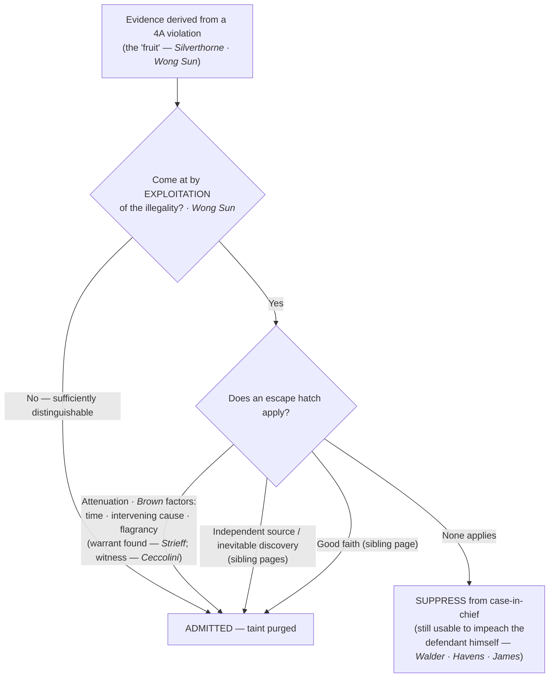

# S9 R1 panel-review — Opus model-diversity lane (prompt pack)

You are the **Claude/Opus** leg of the S9 three-lane adversarial panel (1 Claude + 2 Codex, R1). The two Codex lanes carry the A (support/quote-fidelity) and B (currency/treatment) attack lenses; **you carry model diversity and MUST vote on every paneled assertion across BOTH lenses' concerns.** You are refute-framed: try hard to break each assertion; **default to REFUTED on uncertainty**; never fabricate a cite, quote, or holding; use ONLY the evidence inlined below (no search, no outside knowledge). You are a SIGHTED reviewer — the FULL lake record (judgment fields included) is inlined.

You are a WRITER lane, not an adjudicator: you FIND and VOTE. You do not tally, adjudicate, or close any row — the orchestrator does.

For EACH group below, return one JSON object with the exact `reviewed[]` shape from the output contract (identical framing to the Codex lenses). Emit a finding object ONLY for a real defect (verdict refuted / stands-modified); a group you find wholly clean returns all-`stands` verdicts (the harness records a clean attestation). Concatenate the per-group JSON objects into a top-level `{"packs": [ ... ]}` array, one entry per group, each carrying its `group_id`.


OUTPUT CONTRACT — return ONE JSON object, nothing else:
{
  "lens": "A" | "B",
  "group_id": "<echo the group id>",
  "reviewed": [
    {
      "assertion_id": "<from group_inventory.jsonl>",
      "dimension": "existence|support|quote_fidelity|pincite|treatment|black_letter",
      "verdict": "stands" | "refuted" | "stands-modified",
      "verifiable_from_disclosed": true | false,
      "defect": null,   // null when verdict=="stands"; else an object:
      //  {"problem": "...", "severity": "high|medium|low", "proposed_fix": "...", "evidence_quote": "verbatim from disclosed evidence or null", "needs_cl": true|false, "locator_note": "..."}
      "reasons": ["short evidence-grounded reason", "..."],
      "breaks_true_positives": true | false,
      "residual_risks": ["..."],
      "suggested_tightening": "... or null"
    }
  ],
  "notes": ""
}
Rules: verdict=='stands' <=> defect==null (assertion survives your attack). verdict=='refuted' <=> a real defect (the assertion as framed is wrong). verdict=='stands-modified' <=> survives but needs a stated modification (a minor defect). Review EVERY assertion_id in group_inventory.jsonl exactly once. Output ONLY the JSON object.
---

## GROUP: content/the-exclusionary-rule-remedies-and-standing/the-exclusionary-rule/Fruits and Attenuation.md  (`doctrine`, 20 assertions)

### content_page

```
---
weight: 20
title: "Fruits & Attenuation"
topic: Fruit of the Poisonous Tree
type: doctrine
aliases:
  - "Fruits & Attenuation"
  - "Fruit of the Poisonous Tree"
  - "Fruit of the Poisonous Tree Doctrine"
  - "Attenuation"
jurisdiction: Federal (U.S. Const. amend. IV); SCOTUS baseline
status: draft
related:
  - "[[The Exclusionary Rule]]"
  - "[[The Good-Faith Exception]]"
  - "[[Inevitable Discovery & Independent Source]]"
  - "[[Standing to Challenge a Search]]"
  - "[[Seizure of the Person]]"
  - "[[Knock-and-Announce]]"
  - "[[Miranda Waiver and Invocation]]"
---

# Fruits & Attenuation

*If the search was illegal, how far does suppression reach, and what breaks the chain?*

> [!rule] Black-letter rule
> Suppression reaches not only the evidence seized in the unlawful act but the **derivative** evidence it produces, the "fruit of the poisonous tree." The reach is **not** but-for causation: the question is "whether, granting establishment of the primary illegality, the evidence to which instant objection is made has been come at by exploitation of that illegality or instead by means sufficiently distinguishable to be purged of the primary taint." *[[Wong Sun v. United States|Wong Sun]]*, 371 U.S. 471, [487–88](https://www.courtlistener.com/opinion/106515/wong-sun-v-united-states/) (1963). Taint is **purged by attenuation** when the connection between the illegality and the evidence becomes so weakened that deterrence is no longer served, judged by temporal proximity, intervening circumstances, and, most important, the purpose and flagrancy of the misconduct. *[[Brown v. Illinois|Brown]]*, 422 U.S. 590, [603–04](https://www.courtlistener.com/opinion/109304/brown-v-illinois/) (1975).
> ^rule-fruits

## The Brief

**What it is, and is not.** The exclusionary rule began as a bar on using the very thing seized illegally; the fruits doctrine extends it to the **derivative** evidence that flows from the violation, so a confession, a witness, or physical evidence located because of an illegal search or arrest can be suppressed too. It is **not** a but-for test. Evidence merely traceable to the illegality is not automatically barred; the government loses only what it obtained by **exploiting** the illegality. The complementary escape hatches sit on sibling pages: a lawful source that actually produced the evidence ([[Inevitable Discovery & Independent Source|independent source]]), a lawful route that would have produced it anyway ([[Inevitable Discovery & Independent Source|inevitable discovery]]), and objectively reasonable reliance ([[The Good-Faith Exception|good faith]]). This page owns the two that turn on causation: the **reach** of the taint and its **attenuation**.

**Where the rule and its reach came from.** The federal rule began in *[[Weeks v. United States|Weeks]]*, 232 U.S. 383 (1914), which barred 4A-violative evidence from federal court, and reached the states through the Fourteenth Amendment in *[[Mapp v. Ohio|Mapp]]*, 367 U.S. 643, [655](https://www.courtlistener.com/opinion/106285/mapp-v-ohio/) (1961), overruling *[[Wolf v. Colorado|Wolf]]* on the remedy. Its engine is **deterrence**, not judicial squeamishness: *[[Elkins v. United States|Elkins]]* abolished the "silver-platter doctrine" and framed the purpose as "to deter . . . by removing the incentive to disregard" the constitutional guaranty. 364 U.S. 206, 217 (1960). The reach past the immediate seizure originates in *[[Silverthorne Lumber Co. v. United States|Silverthorne Lumber]]*: illegally obtained knowledge "shall not be used at all," though a genuinely [[Inevitable Discovery and Independent Source|independent source]] may still prove the same facts. 251 U.S. 385, 392 (1920). *[[Nardone v. United States|Nardone]]* gave the metaphor its name, "fruit of the poisonous tree." 308 U.S. 338, 340–41 (1939).

**The reach test.** *[[Wong Sun v. United States|Wong Sun]]* supplies the controlling question: was the challenged evidence "come at by **exploitation** of that illegality" or "by means sufficiently distinguishable to be purged of the primary taint"? 371 U.S. at 487–88. Two verbal statements in *[[Wong Sun v. United States|Wong Sun]]* mark the poles: a statement blurted during the unlawful entry was suppressed as immediate fruit, while a later statement given voluntarily days after release on bail was purged. Reach is about exploitation, not physics.

**Attenuation: the three *[[Brown v. Illinois|Brown]]* factors.** When the government argues the chain is broken, *[[Brown v. Illinois|Brown]]* controls, and it rejects any per-se cure. Weigh three factors:
1. **Temporal proximity** of the illegality to the evidence.
2. **Intervening circumstances** between the two.
3. **The purpose and flagrancy of the official misconduct** — the factor the Court calls the most important, because it maps directly onto deterrence.

*[[Brown v. Illinois|Brown]]* holds that *[[Miranda v. Arizona|Miranda]]* warnings **alone** do not purge the taint of an illegal arrest; a confession that follows a warrantless, probable-cause-less arrest is ordinarily suppressed. 422 U.S. at 603–04.

**Attenuation applied: the intervening warrant.** A valid, **pre-existing arrest warrant** discovered during an unlawful stop is an intervening circumstance strong enough to purge the taint, at least where the illegality was not purposeful or flagrant. *[[Utah v. Strieff|Strieff]]*, 579 U.S. 232, [241](https://www.courtlistener.com/opinion/8176208/utah-v-strieff/) (2016). The discovery of the warrant, not the passage of time, does the work.

**Live witnesses are treated more leniently than objects.** Testimony from a live witness located through an illegality is suppressed only on a **much closer** connection to the violation than an inanimate object would require, because a witness's willingness to come forward is itself an act of free will that tends to dissipate the taint. *[[United States v. Ceccolini|Ceccolini]]*, 435 U.S. 268, [279–80](https://www.courtlistener.com/opinion/109816/united-states-v-ceccolini/) (1978).

**The attenuation-failed cases mark the floor.** Where the misconduct is close in time and flagrant and nothing genuinely intervenes, the taint is not purged. A confession following a warrantless station-house detention without probable cause stays suppressed. *[[Taylor v. Alabama|Taylor]]*, 457 U.S. 687 (1982); accord *[[Dunaway v. New York|Dunaway]]* (involuntary station-house detention, treated in full under [[Seizure of the Person]]) and *[[Kaupp v. Texas|Kaupp]]* (a 3 a.m. warrantless removal). Contrast the causation **limits** that keep the rule from reaching at all: a *[[Payton v. New York|Payton]]* violation does not require suppressing a later out-of-home statement where police had probable cause to arrest (*[[New York v. Harris|New York v. Harris]]*, primary home [[Arrest in the Home]]), and a [[Knock-and-Announce|knock-and-announce]] violation triggers no suppression because the interests it protects have "nothing to do with the seizure of the evidence" (*[[Hudson v. Michigan|Hudson]]*, primary home [[Knock-and-Announce]]).

**The impeachment exception (a limit on the reach).** Suppression bars the prosecution's **case-in-chief**; it does not license a defendant to commit perjury. Illegally seized evidence may be used to **impeach the defendant's own** testimony. *[[Walder v. United States|Walder]]*, 347 U.S. 62, [65](https://www.courtlistener.com/opinion/105188/walder-v-united-states/) (1954) (physical evidence); *[[United States v. Havens|Havens]]*, 446 U.S. 620, [627–28](https://www.courtlistener.com/opinion/110267/united-states-v-havens/) (1980) (statements on cross reasonably suggested by the direct). The exception is **confined to the defendant himself**: it may not be used to impeach **other** defense witnesses, *[[James v. Illinois|James]]*, 493 U.S. 307 (1990), and a genuinely coerced statement is barred even for impeachment. *[[Miranda v. Arizona|Miranda]]*-defective statements may likewise impeach the defendant's own testimony, but that line is developed under [[Miranda Waiver and Invocation]] (*[[Harris v. New York|Harris v. New York]]*).

**Burden, standard of review, remedy.** Once the defendant shows a violation and [[Standing to Challenge a Search|standing]], the **government** bears the burden of establishing attenuation (or another escape hatch). On appeal the trial court's historical facts are reviewed for [[Common Legal Terms#clear-error|clear error]] and the ultimate attenuation determination [[Common Legal Terms#de-novo|de novo]]. The **remedy** is exclusion of the fruit from the case-in-chief, subject to the impeachment use above; it is not dismissal of the prosecution.

**Apply it.**
1. **Separate the seizure from its fruits.** Identify the direct evidence, then trace what was derived from it. But-for tracing is only the start, not the answer.
2. **Ask the *[[Wong Sun v. United States|Wong Sun]]* question.** Was the derivative evidence come at by exploiting the illegality, or by means distinguishable enough to purge the taint?
3. **Run the three *[[Brown v. Illinois|Brown]]* factors** for any attenuation claim, and weight the purpose and flagrancy of the misconduct most heavily.
4. **Do not treat *[[Miranda v. Arizona|Miranda]]* warnings as a cure.** Warnings alone do not purge the taint of an illegal arrest (*[[Brown v. Illinois|Brown]]*).
5. **Watch for an intervening warrant** (*[[Utah v. Strieff|Strieff]]*) and for the witness-leniency rule (*[[United States v. Ceccolini|Ceccolini]]*), which cut toward admissibility.

**Common pitfalls.**
- **Treating the fruits doctrine as but-for causation.** *[[Wong Sun v. United States|Wong Sun]]* asks about exploitation, not mere traceability; not every downstream item falls.
- **Assuming *[[Miranda v. Arizona|Miranda]]* warnings launder an illegal arrest.** They do not (*[[Brown v. Illinois|Brown]]*).
- **Confusing attenuation with [[Inevitable Discovery and Independent Source|independent source]] or [[Inevitable Discovery and Independent Source|inevitable discovery]].** Attenuation concedes the causal link but says it has weakened; the other two say there was (or would have been) a **clean** path. Keep them on their own pages.
- **Forgetting the impeachment exception is defendant-only.** It cannot reach other defense witnesses (*[[James v. Illinois|James]]*).

## Key cases

| Case | Holding | Opinion |
|---|---|---|
| *[[Weeks v. United States]]*, 232 U.S. 383 (1914) | **Origin.** Establishes the federal exclusionary rule: evidence obtained in violation of the Fourth Amendment is inadmissible in federal court. | [opinion](https://www.courtlistener.com/opinion/98094/weeks-v-united-states/) |
| *[[Wolf v. Colorado]]*, 338 U.S. 25 (1949) | **Superseded on the remedy.** The Fourth Amendment binds the states, but its federal exclusionary remedy did not; overruled on that point by *[[Mapp v. Ohio\|Mapp]]*. | [opinion](https://www.courtlistener.com/opinion/104709/wolf-v-colorado/) |
| *[[Mapp v. Ohio]]*, 367 U.S. 643 (1961) | **Incorporation of the remedy.** Applies the exclusionary rule to the states through the Fourteenth Amendment, overruling *[[Wolf v. Colorado\|Wolf]]*. | [opinion](https://www.courtlistener.com/opinion/106285/mapp-v-ohio/) |
| *[[Elkins v. United States]]*, 364 U.S. 206 (1960) | **Deterrence purpose.** Abolishes the silver-platter doctrine; the rule's purpose is to deter by removing the incentive to disregard the guaranty. | [opinion](https://www.courtlistener.com/opinion/106107/elkins-v-united-states/) |
| *[[Silverthorne Lumber Co. v. United States]]*, 251 U.S. 385 (1920) | **Fruits origin.** Illegally obtained knowledge "shall not be used at all," though a genuinely [[Inevitable Discovery and Independent Source\|independent source]] may still prove the facts. | [opinion](https://www.courtlistener.com/opinion/99506/silverthorne-lumber-co-v-united-states/) |
| *[[Nardone v. United States]]*, 308 U.S. 338 (1939) | **Names the doctrine.** Coins "fruit of the poisonous tree"; derivative use is barred unless the taint is dissipated. | [opinion](https://www.courtlistener.com/opinion/103259/nardone-v-united-states/) |
| *[[Wong Sun v. United States]]*, 371 U.S. 471 (1963) | **Reach test.** Suppress fruits "come at by exploitation" of the illegality, not on mere but-for causation. | [opinion](https://www.courtlistener.com/opinion/106515/wong-sun-v-united-states/) |
| *[[Brown v. Illinois]]*, 422 U.S. 590 (1975) | **Attenuation factors.** Temporal proximity, intervening circumstances, and (most important) purpose and flagrancy; *[[Miranda v. Arizona\|Miranda]]* warnings alone do not purge. | [opinion](https://www.courtlistener.com/opinion/109304/brown-v-illinois/) |
| *[[Utah v. Strieff]]*, 579 U.S. 232 (2016) | **Intervening warrant.** A valid pre-existing arrest warrant found during an unlawful stop is an intervening circumstance that purges the taint. | [opinion](https://www.courtlistener.com/opinion/8176208/utah-v-strieff/) |
| *[[United States v. Ceccolini]]*, 435 U.S. 268 (1978) | **Witness leniency.** Live-witness testimony is suppressed only on a much closer connection to the illegality than an inanimate object requires. | [opinion](https://www.courtlistener.com/opinion/109816/united-states-v-ceccolini/) |
| *[[Taylor v. Alabama]]*, 457 U.S. 687 (1982) | **Attenuation failed.** A confession after a warrantless, probable-cause-less arrest was not purged and was suppressed. | [opinion](https://www.courtlistener.com/opinion/110760/taylor-v-alabama/) |
| *[[Walder v. United States]]*, 347 U.S. 62 (1954) | **Impeachment.** Illegally seized evidence may be used to impeach the defendant's own false testimony. | [opinion](https://www.courtlistener.com/opinion/105188/walder-v-united-states/) |
| *[[United States v. Havens]]*, 446 U.S. 620 (1980) | **Impeachment reach.** Extends to the defendant's statements on cross reasonably suggested by his direct examination. | [opinion](https://www.courtlistener.com/opinion/110267/united-states-v-havens/) |
| *[[James v. Illinois]]*, 493 U.S. 307 (1990) | **Impeachment limit.** The exception is confined to the defendant's own testimony; it may not impeach other defense witnesses. | [opinion](https://www.courtlistener.com/opinion/112350/james-v-illinois/) |

## Related cases across doctrines

These are treated in full elsewhere but bear directly on the reach of suppression, framed for it here.

| Case | Relevance here | Primary home | Opinion |
|---|---|---|---|
| *[[Dunaway v. New York]]*, 442 U.S. 200 (1979) | ***Attenuation failed.*** An involuntary station-house detention without probable cause; the confession that followed was suppressed under the *[[Brown v. Illinois\|Brown]]* factors. | [[Seizure of the Person]] | [opinion](https://www.courtlistener.com/opinion/110096/dunaway-v-new-york/) |
| *[[Kaupp v. Texas]]*, 538 U.S. 626 (2003) | ***Attenuation failed.*** A 3 a.m. warrantless removal without probable cause; the confession was not sufficiently purged of the taint. | [[Seizure of the Person]] | [opinion](https://www.courtlistener.com/opinion/127919/kaupp-v-texas/) |
| *[[Hudson v. Michigan]]*, 547 U.S. 586 (2006) | ***Causation limit.*** A [[Knock-and-Announce\|knock-and-announce]] violation does not trigger suppression; the interests it protects have nothing to do with the seizure of the evidence. | [[Knock-and-Announce]] | [opinion](https://www.courtlistener.com/opinion/145646/hudson-v-michigan/) |
| *[[New York v. Harris]]*, 495 U.S. 14 (1990) | ***Fruits limit.*** A *[[Payton v. New York\|Payton]]* violation does not require suppressing a later out-of-home statement where police had probable cause to arrest. | [[Arrest in the Home]] | [opinion](https://www.courtlistener.com/opinion/112413/new-york-v-harris/) |
| *[[Harris v. New York]]*, 401 U.S. 222 (1971) | ***Impeachment (Miranda).*** *[[Miranda v. Arizona\|Miranda]]*-defective statements may impeach the defendant's own conflicting trial testimony. | [[Miranda Waiver and Invocation]] | [opinion](https://www.courtlistener.com/opinion/108272/harris-v-new-york/) |

## Visual



> [!tip] Mnemonic — Dominoes (Decision Sequencing)
> Unlawful step taints what's derived after it; what's found *before* the first fallen domino survives. **Credit Bruce-Alan Barnard.** **Guardrail:** oversimplifies — attenuation / [[Inevitable Discovery and Independent Source|independent source]] / [[Inevitable Discovery and Independent Source|inevitable discovery]] mean not every later domino falls.

## Sources
- [*Weeks v. United States*, 232 U.S. 383 (1914)](https://www.courtlistener.com/opinion/98094/weeks-v-united-states/) (pinpoints: 393, 398)
- [*Wolf v. Colorado*, 338 U.S. 25 (1949)](https://www.courtlistener.com/opinion/104709/wolf-v-colorado/) (pinpoints: 27–28, 33; Historical — overruled on the remedy by *Mapp*)
- [*Mapp v. Ohio*, 367 U.S. 643 (1961)](https://www.courtlistener.com/opinion/106285/mapp-v-ohio/) (pinpoint: 655)
- [*Elkins v. United States*, 364 U.S. 206 (1960)](https://www.courtlistener.com/opinion/106107/elkins-v-united-states/) (pinpoint: 217)
- [*Silverthorne Lumber Co. v. United States*, 251 U.S. 385 (1920)](https://www.courtlistener.com/opinion/99506/silverthorne-lumber-co-v-united-states/) (pinpoint: 392)
- [*Nardone v. United States*, 308 U.S. 338 (1939)](https://www.courtlistener.com/opinion/103259/nardone-v-united-states/) (pinpoints: 340–41)
- [*Wong Sun v. United States*, 371 U.S. 471 (1963)](https://www.courtlistener.com/opinion/106515/wong-sun-v-united-states/) (pinpoints: 487–88, 491)
- [*Brown v. Illinois*, 422 U.S. 590 (1975)](https://www.courtlistener.com/opinion/109304/brown-v-illinois/) (pinpoints: 603–04)
- [*Utah v. Strieff*, 579 U.S. 232 (2016)](https://www.courtlistener.com/opinion/8176208/utah-v-strieff/) (pinpoint: 241)
- [*United States v. Ceccolini*, 435 U.S. 268 (1978)](https://www.courtlistener.com/opinion/109816/united-states-v-ceccolini/) (pinpoints: 279–80)
- [*Taylor v. Alabama*, 457 U.S. 687 (1982)](https://www.courtlistener.com/opinion/110760/taylor-v-alabama/)
- [*Walder v. United States*, 347 U.S. 62 (1954)](https://www.courtlistener.com/opinion/105188/walder-v-united-states/) (pinpoint: 65)
- [*United States v. Havens*, 446 U.S. 620 (1980)](https://www.courtlistener.com/opinion/110267/united-states-v-havens/) (pinpoints: 627–28)
- [*James v. Illinois*, 493 U.S. 307 (1990)](https://www.courtlistener.com/opinion/112350/james-v-illinois/) (pinpoints: 313–14, 320)
- [*Dunaway v. New York*, 442 U.S. 200 (1979)](https://www.courtlistener.com/opinion/110096/dunaway-v-new-york/) (home = [[Seizure of the Person]])
- [*Kaupp v. Texas*, 538 U.S. 626 (2003)](https://www.courtlistener.com/opinion/127919/kaupp-v-texas/) (home = [[Seizure of the Person]])
- [*Hudson v. Michigan*, 547 U.S. 586 (2006)](https://www.courtlistener.com/opinion/145646/hudson-v-michigan/) (pinpoint: 594; home = [[Knock-and-Announce]])
- [*New York v. Harris*, 495 U.S. 14 (1990)](https://www.courtlistener.com/opinion/112413/new-york-v-harris/) (home = [[Arrest in the Home]])
- [*Harris v. New York*, 401 U.S. 222 (1971)](https://www.courtlistener.com/opinion/108272/harris-v-new-york/) (pinpoints: 225–26; home = [[Miranda Waiver and Invocation]])

```

### group_inventory (assertions under review)

```jsonl
{"assertion_id": "065b695d8d64f085", "dimension": "existence", "kind": "case_cite", "locator": {"case": "Brown v. Illinois", "table_line": 59}, "payload": {"case": "Brown v. Illinois", "cells": ["*[[Brown v. Illinois]]*, 422 U.S. 590 (1975)", "**Attenuation factors.** Temporal proximity, intervening circumstances, and (most important) purpose and flagrancy; *[[Miranda v. Arizona\\|Miranda]]* warnings alone do not purge.", "[opinion](https://www.courtlistener.com/opinion/109304/brown-v-illinois/)"], "header": ["Case", "Holding", "Opinion"]}}
{"assertion_id": "0a4c919119a44dff", "dimension": "existence", "kind": "case_cite", "locator": {"case": "United States v. Ceccolini", "table_line": 61}, "payload": {"case": "United States v. Ceccolini", "cells": ["*[[United States v. Ceccolini]]*, 435 U.S. 268 (1978)", "**Witness leniency.** Live-witness testimony is suppressed only on a much closer connection to the illegality than an inanimate object requires.", "[opinion](https://www.courtlistener.com/opinion/109816/united-states-v-ceccolini/)"], "header": ["Case", "Holding", "Opinion"]}}
{"assertion_id": "0c74fe216decd842", "dimension": "existence", "kind": "case_cite", "locator": {"case": "Nardone v. United States", "table_line": 57}, "payload": {"case": "Nardone v. United States", "cells": ["*[[Nardone v. United States]]*, 308 U.S. 338 (1939)", "**Names the doctrine.** Coins \"fruit of the poisonous tree\"; derivative use is barred unless the taint is dissipated.", "[opinion](https://www.courtlistener.com/opinion/103259/nardone-v-united-states/)"], "header": ["Case", "Holding", "Opinion"]}}
{"assertion_id": "0e5858e7ae808e9d", "dimension": "existence", "kind": "case_cite", "locator": {"case": "Dunaway v. New York", "table_line": 73}, "payload": {"case": "Dunaway v. New York", "cells": ["*[[Dunaway v. New York]]*, 442 U.S. 200 (1979)", "***Attenuation failed.*** An involuntary station-house detention without probable cause; the confession that followed was suppressed under the *[[Brown v. Illinois\\|Brown]]* factors.", "[[Seizure of the Person]]", "[opinion](https://www.courtlistener.com/opinion/110096/dunaway-v-new-york/)"], "header": ["Case", "Relevance here", "Primary home", "Opinion"]}}
{"assertion_id": "206324541ab787a8", "dimension": "existence", "kind": "case_cite", "locator": {"case": "James v. Illinois", "table_line": 65}, "payload": {"case": "James v. Illinois", "cells": ["*[[James v. Illinois]]*, 493 U.S. 307 (1990)", "**Impeachment limit.** The exception is confined to the defendant's own testimony; it may not impeach other defense witnesses.", "[opinion](https://www.courtlistener.com/opinion/112350/james-v-illinois/)"], "header": ["Case", "Holding", "Opinion"]}}
{"assertion_id": "2d626553296ed8d8", "dimension": "existence", "kind": "case_cite", "locator": {"case": "Wolf v. Colorado", "table_line": 53}, "payload": {"case": "Wolf v. Colorado", "cells": ["*[[Wolf v. Colorado]]*, 338 U.S. 25 (1949)", "**Superseded on the remedy.** The Fourth Amendment binds the states, but its federal exclusionary remedy did not; overruled on that point by *[[Mapp v. Ohio\\|Mapp]]*.", "[opinion](https://www.courtlistener.com/opinion/104709/wolf-v-colorado/)"], "header": ["Case", "Holding", "Opinion"]}}
{"assertion_id": "38b2feafdf65989e", "dimension": "existence", "kind": "case_cite", "locator": {"case": "Hudson v. Michigan", "table_line": 75}, "payload": {"case": "Hudson v. Michigan", "cells": ["*[[Hudson v. Michigan]]*, 547 U.S. 586 (2006)", "***Causation limit.*** A [[Knock-and-Announce\\|knock-and-announce]] violation does not trigger suppression; the interests it protects have nothing to do with the seizure of the evidence.", "[[Knock-and-Announce]]", "[opinion](https://www.courtlistener.com/opinion/145646/hudson-v-michigan/)"], "header": ["Case", "Relevance here", "Primary home", "Opinion"]}}
{"assertion_id": "3c410b87adf42576", "dimension": "existence", "kind": "case_cite", "locator": {"case": "Elkins v. United States", "table_line": 55}, "payload": {"case": "Elkins v. United States", "cells": ["*[[Elkins v. United States]]*, 364 U.S. 206 (1960)", "**Deterrence purpose.** Abolishes the silver-platter doctrine; the rule's purpose is to deter by removing the incentive to disregard the guaranty.", "[opinion](https://www.courtlistener.com/opinion/106107/elkins-v-united-states/)"], "header": ["Case", "Holding", "Opinion"]}}
{"assertion_id": "43c4c39197a6dc34", "dimension": "existence", "kind": "case_cite", "locator": {"case": "New York v. Harris", "table_line": 76}, "payload": {"case": "New York v. Harris", "cells": ["*[[New York v. Harris]]*, 495 U.S. 14 (1990)", "***Fruits limit.*** A *[[Payton v. New York\\|Payton]]* violation does not require suppressing a later out-of-home statement where police had probable cause to arrest.", "[[Arrest in the Home]]", "[opinion](https://www.courtlistener.com/opinion/112413/new-york-v-harris/)"], "header": ["Case", "Relevance here", "Primary home", "Opinion"]}}
{"assertion_id": "47d08fab246dbef4", "dimension": "existence", "kind": "case_cite", "locator": {"case": "Walder v. United States", "table_line": 63}, "payload": {"case": "Walder v. United States", "cells": ["*[[Walder v. United States]]*, 347 U.S. 62 (1954)", "**Impeachment.** Illegally seized evidence may be used to impeach the defendant's own false testimony.", "[opinion](https://www.courtlistener.com/opinion/105188/walder-v-united-states/)"], "header": ["Case", "Holding", "Opinion"]}}
{"assertion_id": "5f376052d98909be", "dimension": "existence", "kind": "case_cite", "locator": {"case": "Kaupp v. Texas", "table_line": 74}, "payload": {"case": "Kaupp v. Texas", "cells": ["*[[Kaupp v. Texas]]*, 538 U.S. 626 (2003)", "***Attenuation failed.*** A 3 a.m. warrantless removal without probable cause; the confession was not sufficiently purged of the taint.", "[[Seizure of the Person]]", "[opinion](https://www.courtlistener.com/opinion/127919/kaupp-v-texas/)"], "header": ["Case", "Relevance here", "Primary home", "Opinion"]}}
{"assertion_id": "6036fa8d29841a54", "dimension": "existence", "kind": "case_cite", "locator": {"case": "Mapp v. Ohio", "table_line": 54}, "payload": {"case": "Mapp v. Ohio", "cells": ["*[[Mapp v. Ohio]]*, 367 U.S. 643 (1961)", "**Incorporation of the remedy.** Applies the exclusionary rule to the states through the Fourteenth Amendment, overruling *[[Wolf v. Colorado\\|Wolf]]*.", "[opinion](https://www.courtlistener.com/opinion/106285/mapp-v-ohio/)"], "header": ["Case", "Holding", "Opinion"]}}
{"assertion_id": "7c403640b4d678b8", "dimension": "existence", "kind": "case_cite", "locator": {"case": "Harris v. New York", "table_line": 77}, "payload": {"case": "Harris v. New York", "cells": ["*[[Harris v. New York]]*, 401 U.S. 222 (1971)", "***Impeachment (Miranda).*** *[[Miranda v. Arizona\\|Miranda]]*-defective statements may impeach the defendant's own conflicting trial testimony.", "[[Miranda Waiver and Invocation]]", "[opinion](https://www.courtlistener.com/opinion/108272/harris-v-new-york/)"], "header": ["Case", "Relevance here", "Primary home", "Opinion"]}}
{"assertion_id": "9b4f22b1569f4bfd", "dimension": "existence", "kind": "case_cite", "locator": {"case": "Utah v. Strieff", "table_line": 60}, "payload": {"case": "Utah v. Strieff", "cells": ["*[[Utah v. Strieff]]*, 579 U.S. 232 (2016)", "**Intervening warrant.** A valid pre-existing arrest warrant found during an unlawful stop is an intervening circumstance that purges the taint.", "[opinion](https://www.courtlistener.com/opinion/8176208/utah-v-strieff/)"], "header": ["Case", "Holding", "Opinion"]}}
{"assertion_id": "bf059acb028551f0", "dimension": "existence", "kind": "case_cite", "locator": {"case": "United States v. Havens", "table_line": 64}, "payload": {"case": "United States v. Havens", "cells": ["*[[United States v. Havens]]*, 446 U.S. 620 (1980)", "**Impeachment reach.** Extends to the defendant's statements on cross reasonably suggested by his direct examination.", "[opinion](https://www.courtlistener.com/opinion/110267/united-states-v-havens/)"], "header": ["Case", "Holding", "Opinion"]}}
{"assertion_id": "e564cd06171165c9", "dimension": "existence", "kind": "case_cite", "locator": {"case": "Silverthorne Lumber Co. v. United States", "table_line": 56}, "payload": {"case": "Silverthorne Lumber Co. v. United States", "cells": ["*[[Silverthorne Lumber Co. v. United States]]*, 251 U.S. 385 (1920)", "**Fruits origin.** Illegally obtained knowledge \"shall not be used at all,\" though a genuinely [[Inevitable Discovery and Independent Source\\|independent source]] may still prove the facts.", "[opinion](https://www.courtlistener.com/opinion/99506/silverthorne-lumber-co-v-united-states/)"], "header": ["Case", "Holding", "Opinion"]}}
{"assertion_id": "e7146a8b53e2cf52", "dimension": "existence", "kind": "case_cite", "locator": {"case": "Wong Sun v. United States", "table_line": 58}, "payload": {"case": "Wong Sun v. United States", "cells": ["*[[Wong Sun v. United States]]*, 371 U.S. 471 (1963)", "**Reach test.** Suppress fruits \"come at by exploitation\" of the illegality, not on mere but-for causation.", "[opinion](https://www.courtlistener.com/opinion/106515/wong-sun-v-united-states/)"], "header": ["Case", "Holding", "Opinion"]}}
{"assertion_id": "f0beade8526aaa35", "dimension": "existence", "kind": "case_cite", "locator": {"case": "Taylor v. Alabama", "table_line": 62}, "payload": {"case": "Taylor v. Alabama", "cells": ["*[[Taylor v. Alabama]]*, 457 U.S. 687 (1982)", "**Attenuation failed.** A confession after a warrantless, probable-cause-less arrest was not purged and was suppressed.", "[opinion](https://www.courtlistener.com/opinion/110760/taylor-v-alabama/)"], "header": ["Case", "Holding", "Opinion"]}}
{"assertion_id": "fea606f2b572fae9", "dimension": "existence", "kind": "case_cite", "locator": {"case": "Weeks v. United States", "table_line": 52}, "payload": {"case": "Weeks v. United States", "cells": ["*[[Weeks v. United States]]*, 232 U.S. 383 (1914)", "**Origin.** Establishes the federal exclusionary rule: evidence obtained in violation of the Fourth Amendment is inadmissible in federal court.", "[opinion](https://www.courtlistener.com/opinion/98094/weeks-v-united-states/)"], "header": ["Case", "Holding", "Opinion"]}}
{"assertion_id": "98d6f8c35df4de5a", "dimension": "support", "kind": "proposition", "locator": {"callout": "^rule-fruits"}, "payload": {"anchor": "^rule-fruits", "statement": "[!rule] Black-letter rule\nSuppression reaches not only the evidence seized in the unlawful act but the **derivative** evidence it produces, the \"fruit of the poisonous tree.\" The reach is **not** but-for causation: the question is \"whether, granting establishment of the primary illegality, the evidence to which instant objection is made has been come at by exploitation of that illegality or instead by means sufficiently distinguishable to be purged of the primary taint.\" *[[Wong Sun v. United States|Wong Sun]]*, 371 U.S. 471, [487–88](https://www.courtlistener.com/opinion/106515/wong-sun-v-united-states/) (1963). Taint is **purged by attenuation** when the connection between the illegality and the evidence becomes so weakened that deterrence is no longer served, judged by temporal proximity, intervening circumstances, and, most important, the purpose and flagrancy of the misconduct. *[[Brown v. Illinois|Brown]]*, 422 U.S. 590, [603–04](https://www.courtlistener.com/opinion/109304/brown-v-illinois/) (1975)."}}
```

### lake record — Brown v. Illinois

```json
{
  "schema_version": "s2.v1",
  "record_id": "Brown v. Illinois",
  "stub": false,
  "status": "verified",
  "identity": {
    "case_name": "Brown v. Illinois",
    "case_name_short": "Brown",
    "case_name_full": "Brown v. Illinois",
    "input_case_name": "Brown v. Illinois",
    "court": "U.S. Supreme Court",
    "court_id": "scotus",
    "court_level": "scotus",
    "circuit": null,
    "state": null,
    "date_decided": "1975-06-26",
    "year": 1975,
    "docket": "73-6650",
    "cluster_id": 109304,
    "lead_opinion_id": 109304,
    "sibling_ids": [
      109304,
      9426178,
      9426179,
      9426180
    ],
    "absolute_url": "/opinion/109304/brown-v-illinois/",
    "identity_method": "citation+party-text",
    "expected_citation_found": true,
    "party_name_in_text": true,
    "canonical_name_match": true,
    "alternates": [],
    "reason_code": null
  },
  "citations": {
    "official": {
      "cite": "422 U.S. 590",
      "volume": "422",
      "reporter": "U.S.",
      "page": "590",
      "type": 1,
      "selected_official": true,
      "source": "cluster.citations[]"
    },
    "parallel": [
      {
        "cite": "95 S. Ct. 2254",
        "volume": "95",
        "reporter": "S. Ct.",
        "page": "2254",
        "type": 1,
        "selected_official": false,
        "source": "cluster.citations[]"
      },
      {
        "cite": "45 L. Ed. 2d 416",
        "volume": "45",
        "reporter": "L. Ed. 2d",
        "page": "416",
        "type": 1,
        "selected_official": false,
        "source": "cluster.citations[]"
      }
    ],
    "vendor_neutral": [
      {
        "cite": "1975 U.S. LEXIS 82",
        "volume": "1975",
        "reporter": "U.S. LEXIS",
        "page": "82",
        "type": 6,
        "selected_official": false,
        "source": "cluster.citations[]"
      }
    ],
    "all": [
      {
        "cite": "422 U.S. 590",
        "volume": "422",
        "reporter": "U.S.",
        "page": "590",
        "type": 1,
        "selected_official": false,
        "source": "cluster.citations[]"
      },
      {
        "cite": "95 S. Ct. 2254",
        "volume": "95",
        "reporter": "S. Ct.",
        "page": "2254",
        "type": 1,
        "selected_official": false,
        "source": "cluster.citations[]"
      },
      {
        "cite": "45 L. Ed. 2d 416",
        "volume": "45",
        "reporter": "L. Ed. 2d",
        "page": "416",
        "type": 1,
        "selected_official": false,
        "source": "cluster.citations[]"
      },
      {
        "cite": "1975 U.S. LEXIS 82",
        "volume": "1975",
        "reporter": "U.S. LEXIS",
        "page": "82",
        "type": 6,
        "selected_official": false,
        "source": "cluster.citations[]"
      }
    ],
    "display": "422 U.S. 590",
    "official_selection": {
      "court_class": "scotus",
      "selected": "422 U.S. 590",
      "reason": "selected_rank_1"
    }
  },
  "pinpoints": [
    {
      "id": "pin-603",
      "page": null,
      "quote": "--- # Brown v. Illinois *422 U.S. 590 (1975)* \u00b7 U.S. Supreme Court \u00b7 **Binding \u2014 SCOTUS** \u00b7 Treatment: **good** *(as of 2026-06-30)* <!-- header line; TreatmentBadge + weight render here, degrading to the text above --> ## Background Officers arrested Brown without probable cause or a warrant, broke into and waited in his apartment, then took him to the station, gave Miranda warnings, and obtained two inculpatory statements within about two hours. The Illinois courts treated the Miranda warnings as automatically dissipating the taint of the unlawful arrest. ## Issue Whether Miranda warnings, by themselves, break the causal chain between an illegal arrest and a subsequent confession so as to make the confession admissible under the Fourth Amendment. ## Rule Miranda warnings do not automatically purge the taint:",
      "star_marker": null,
      "quote_fidelity": "mismatch",
      "pinpoint_status": "slip-only",
      "position": null
    },
    {
      "id": "pin-604",
      "page": null,
      "quote": "The temporal proximity of the arrest and the confession, the presence of intervening circumstances, . . . and, particularly, the purpose and flagrancy of the official misconduct . . . are all relevant.",
      "star_marker": null,
      "quote_fidelity": "mismatch",
      "pinpoint_status": "slip-only",
      "position": null
    }
  ],
  "treatment": {
    "field_i_validity": "good_law",
    "as_of_content": "1975-06-26",
    "as_of_treatment": "2026-06-30",
    "composite_basis": "migration-seed",
    "composite_basis_ref": "Brown v. Illinois",
    "varies_by_point": false,
    "scope_note": "Attenuation factors remain the governing test; applied in Utah v. Strieff.",
    "point_overrides": [],
    "edges": [
      {
        "citing_case": {
          "name": "State v. Rogers",
          "cluster_id": 10705828,
          "cite": null,
          "field_ii": "overruled"
        },
        "field_ii": "overruled",
        "field_iii": "mentioned",
        "point": null,
        "proposed": true,
        "journal_ref": "Brown v. Illinois:lane1_negative"
      },
      {
        "citing_case": {
          "name": "Commonwealth v. Privette",
          "cluster_id": 9387170,
          "cite": null,
          "field_ii": "overruled"
        },
        "field_ii": "overruled",
        "field_iii": "mentioned",
        "point": null,
        "proposed": true,
        "journal_ref": "Brown v. Illinois:lane1_negative"
      },
      {
        "citing_case": {
          "name": "State v. Christian",
          "cluster_id": 4643309,
          "cite": [
            "445 P.3d 183"
          ],
          "field_ii": "questioned"
        },
        "field_ii": "questioned",
        "field_iii": "mentioned",
        "point": null,
        "proposed": true,
        "journal_ref": "Brown v. Illinois:lane1_negative"
      },
      {
        "citing_case": {
          "name": "Commonwealth v. Fredericq",
          "cluster_id": 4613398,
          "cite": [
            "121 N.E.3d 166",
            "482 Mass. 70"
          ],
          "field_ii": "superseded_by_statute"
        },
        "field_ii": "superseded_by_statute",
        "field_iii": "mentioned",
        "point": null,
        "proposed": true,
        "journal_ref": "Brown v. Illinois:lane1_negative"
      },
      {
        "citing_case": {
          "name": "United States v. Serrano-Acevedo",
          "cluster_id": 4506969,
          "cite": [
            "892 F.3d 454"
          ],
          "field_ii": "questioned"
        },
        "field_ii": "questioned",
        "field_iii": "mentioned",
        "point": null,
        "proposed": true,
        "journal_ref": "Brown v. Illinois:lane1_negative"
      },
      {
        "citing_case": {
          "name": "State v. Muldrow",
          "cluster_id": 4448772,
          "cite": [
            "2017 Ohio 8839",
            "100 N.E.3d 1093"
          ],
          "field_ii": "overruled"
        },
        "field_ii": "overruled",
        "field_iii": "mentioned",
        "point": null,
        "proposed": true,
        "journal_ref": "Brown v. Illinois:lane1_negative"
      },
      {
        "citing_case": {
          "name": "State v. Turpin",
          "cluster_id": 4423584,
          "cite": [
            "2017 Ohio 7435",
            "96 N.E.3d 1171"
          ],
          "field_ii": "overruled"
        },
        "field_ii": "overruled",
        "field_iii": "mentioned",
        "point": null,
        "proposed": true,
        "journal_ref": "Brown v. Illinois:lane1_negative"
      },
      {
        "citing_case": {
          "name": "State v. Matthew Elliot Cohagan",
          "cluster_id": 4421478,
          "cite": [
            "162 Idaho 717",
            "404 P.3d 659"
          ],
          "field_ii": "questioned"
        },
        "field_ii": "questioned",
        "field_iii": "mentioned",
        "point": null,
        "proposed": true,
        "journal_ref": "Brown v. Illinois:lane1_negative"
      },
      {
        "citing_case": {
          "name": "Illinois v. Gates",
          "cluster_id": 110959,
          "cite": [
            "76 L. Ed. 2d 527",
            "103 S. Ct. 2317",
            "462 U.S. 213",
            "1983 U.S. LEXIS 54",
            "51 U.S.L.W. 4709"
          ],
          "field_ii": "overruled"
        },
        "field_ii": "overruled",
        "field_iii": "mentioned",
        "point": null,
        "proposed": true,
        "journal_ref": "Brown v. Illinois:lane2_top_cited"
      },
      {
        "citing_case": {
          "name": "United States v. Leon",
          "cluster_id": 111262,
          "cite": [
            "82 L. Ed. 2d 677",
            "104 S. Ct. 3405",
            "468 U.S. 897",
            "1984 U.S. LEXIS 153"
          ],
          "field_ii": "overruled"
        },
        "field_ii": "overruled",
        "field_iii": "mentioned",
        "point": null,
        "proposed": true,
        "journal_ref": "Brown v. Illinois:lane2_top_cited"
      },
      {
        "citing_case": {
          "name": "Florida v. Royer",
          "cluster_id": 110890,
          "cite": [
            "75 L. Ed. 2d 229",
            "103 S. Ct. 1319",
            "460 U.S. 491",
            "1983 U.S. LEXIS 151",
            "51 U.S.L.W. 4293"
          ],
          "field_ii": "questioned"
        },
        "field_ii": "questioned",
        "field_iii": "mentioned",
        "point": null,
        "proposed": true,
        "journal_ref": "Brown v. Illinois:lane2_top_cited"
      },
      {
        "citing_case": {
          "name": "Rakas v. Illinois",
          "cluster_id": 109953,
          "cite": [
            "58 L. Ed. 2d 387",
            "99 S. Ct. 421",
            "439 U.S. 128",
            "1978 U.S. LEXIS 2452"
          ],
          "field_ii": "overruled"
        },
        "field_ii": "overruled",
        "field_iii": "mentioned",
        "point": null,
        "proposed": true,
        "journal_ref": "Brown v. Illinois:lane2_top_cited"
      },
      {
        "citing_case": {
          "name": "Wallace v. Kato",
          "cluster_id": 145756,
          "cite": [
            "127 S. Ct. 1091",
            "549 U.S. 384"
          ],
          "field_ii": "criticized"
        },
        "field_ii": "criticized",
        "field_iii": "mentioned",
        "point": null,
        "proposed": true,
        "journal_ref": "Brown v. Illinois:lane2_top_cited"
      },
      {
        "citing_case": {
          "name": "Stone v. Powell",
          "cluster_id": 109540,
          "cite": [
            "49 L. Ed. 2d 1067",
            "96 S. Ct. 3037",
            "428 U.S. 465",
            "1976 U.S. LEXIS 86"
          ],
          "field_ii": "overruled"
        },
        "field_ii": "overruled",
        "field_iii": "mentioned",
        "point": null,
        "proposed": true,
        "journal_ref": "Brown v. Illinois:lane2_top_cited"
      },
      {
        "citing_case": {
          "name": "Dunaway v. New York",
          "cluster_id": 110096,
          "cite": [
            "60 L. Ed. 2d 824",
            "99 S. Ct. 2248",
            "442 U.S. 200",
            "1979 U.S. LEXIS 126"
          ],
          "field_ii": "questioned"
        },
        "field_ii": "questioned",
        "field_iii": "mentioned",
        "point": null,
        "proposed": true,
        "journal_ref": "Brown v. Illinois:lane2_top_cited"
      },
      {
        "citing_case": {
          "name": "Browder v. Director, Dept. of Corrections of Ill.",
          "cluster_id": 109761,
          "cite": [
            "54 L. Ed. 2d 521",
            "98 S. Ct. 556",
            "434 U.S. 257",
            "1978 U.S. LEXIS 53"
          ],
          "field_ii": "questioned"
        },
        "field_ii": "questioned",
        "field_iii": "mentioned",
        "point": null,
        "proposed": true,
        "journal_ref": "Brown v. Illinois:lane2_top_cited"
      },
      {
        "citing_case": {
          "name": "Oregon v. Elstad",
          "cluster_id": 111364,
          "cite": [
            "84 L. Ed. 2d 222",
            "105 S. Ct. 1285",
            "470 U.S. 298",
            "1985 U.S. LEXIS 60",
            "53 U.S.L.W. 4244"
          ],
          "field_ii": "criticized"
        },
        "field_ii": "criticized",
        "field_iii": "mentioned",
        "point": null,
        "proposed": true,
        "journal_ref": "Brown v. Illinois:lane2_top_cited"
      },
      {
        "citing_case": {
          "name": "Brewer v. Williams",
          "cluster_id": 109624,
          "cite": [
            "51 L. Ed. 2d 424",
            "97 S. Ct. 1232",
            "430 U.S. 387",
            "1977 U.S. LEXIS 64"
          ],
          "field_ii": "overruled"
        },
        "field_ii": "overruled",
        "field_iii": "mentioned",
        "point": null,
        "proposed": true,
        "journal_ref": "Brown v. Illinois:lane2_top_cited"
      },
      {
        "citing_case": {
          "name": "Rawlings v. Kentucky",
          "cluster_id": 110326,
          "cite": [
            "65 L. Ed. 2d 633",
            "100 S. Ct. 2556",
            "448 U.S. 98",
            "1980 U.S. LEXIS 142"
          ],
          "field_ii": "overruled"
        },
        "field_ii": "overruled",
        "field_iii": "mentioned",
        "point": null,
        "proposed": true,
        "journal_ref": "Brown v. Illinois:lane2_top_cited"
      },
      {
        "citing_case": {
          "name": "United States v. Watson",
          "cluster_id": 109352,
          "cite": [
            "46 L. Ed. 2d 598",
            "96 S. Ct. 820",
            "423 U.S. 411",
            "1976 U.S. LEXIS 121"
          ],
          "field_ii": "overruled"
        },
        "field_ii": "overruled",
        "field_iii": "mentioned",
        "point": null,
        "proposed": true,
        "journal_ref": "Brown v. Illinois:lane2_top_cited"
      },
      {
        "citing_case": {
          "name": "Ohio v. Robinette",
          "cluster_id": 118066,
          "cite": [
            "136 L. Ed. 2d 347",
            "117 S. Ct. 417",
            "519 U.S. 33",
            "1996 U.S. LEXIS 6971"
          ],
          "field_ii": "criticized"
        },
        "field_ii": "criticized",
        "field_iii": "mentioned",
        "point": null,
        "proposed": true,
        "journal_ref": "Brown v. Illinois:lane2_top_cited"
      },
      {
        "citing_case": {
          "name": "Segura v. United States",
          "cluster_id": 111259,
          "cite": [
            "82 L. Ed. 2d 599",
            "104 S. Ct. 3380",
            "468 U.S. 796",
            "1984 U.S. LEXIS 150",
            "52 U.S.L.W. 5128"
          ],
          "field_ii": "superseded_by_statute"
        },
        "field_ii": "superseded_by_statute",
        "field_iii": "mentioned",
        "point": null,
        "proposed": true,
        "journal_ref": "Brown v. Illinois:lane2_top_cited"
      },
      {
        "citing_case": {
          "name": "Herring v. United States",
          "cluster_id": 145922,
          "cite": [
            "172 L. Ed. 2d 496",
            "129 S. Ct. 695",
            "555 U.S. 135",
            "2009 U.S. LEXIS 581"
          ],
          "field_ii": "overruled"
        },
        "field_ii": "overruled",
        "field_iii": "mentioned",
        "point": null,
        "proposed": true,
        "journal_ref": "Brown v. Illinois:lane2_top_cited"
      },
      {
        "citing_case": {
          "name": "Missouri v. Seibert",
          "cluster_id": 137002,
          "cite": [
            "159 L. Ed. 2d 643",
            "124 S. Ct. 2601",
            "542 U.S. 600",
            "2004 U.S. LEXIS 4578"
          ],
          "field_ii": "overruled"
        },
        "field_ii": "overruled",
        "field_iii": "mentioned",
        "point": null,
        "proposed": true,
        "journal_ref": "Brown v. Illinois:lane2_top_cited"
      },
      {
        "citing_case": {
          "name": "Dowthitt v. State",
          "cluster_id": 1777832,
          "cite": [
            "931 S.W.2d 244",
            "1996 Tex. Crim. App. LEXIS 93",
            "1996 WL 347772"
          ],
          "field_ii": "overruled"
        },
        "field_ii": "overruled",
        "field_iii": "mentioned",
        "point": null,
        "proposed": true,
        "journal_ref": "Brown v. Illinois:lane2_top_cited"
      },
      {
        "citing_case": {
          "name": "Hudson v. Michigan",
          "cluster_id": 145646,
          "cite": [
            "165 L. Ed. 2d 56",
            "126 S. Ct. 2159",
            "547 U.S. 586",
            "2006 U.S. LEXIS 4677"
          ],
          "field_ii": "overruled"
        },
        "field_ii": "overruled",
        "field_iii": "mentioned",
        "point": null,
        "proposed": true,
        "journal_ref": "Brown v. Illinois:lane2_top_cited"
      },
      {
        "citing_case": {
          "name": "United States v. Crews",
          "cluster_id": 110230,
          "cite": [
            "63 L. Ed. 2d 537",
            "100 S. Ct. 1244",
            "445 U.S. 463",
            "1980 U.S. LEXIS 1293"
          ],
          "field_ii": "questioned"
        },
        "field_ii": "questioned",
        "field_iii": "mentioned",
        "point": null,
        "proposed": true,
        "journal_ref": "Brown v. Illinois:lane2_top_cited"
      },
      {
        "citing_case": {
          "name": "Colorado v. Spring",
          "cluster_id": 111798,
          "cite": [
            "93 L. Ed. 2d 954",
            "107 S. Ct. 851",
            "479 U.S. 564",
            "1987 U.S. LEXIS 418",
            "55 U.S.L.W. 4162"
          ],
          "field_ii": "questioned"
        },
        "field_ii": "questioned",
        "field_iii": "mentioned",
        "point": null,
        "proposed": true,
        "journal_ref": "Brown v. Illinois:lane2_top_cited"
      },
      {
        "citing_case": {
          "name": "United States v. Johnson",
          "cluster_id": 110754,
          "cite": [
            "73 L. Ed. 2d 202",
            "102 S. Ct. 2579",
            "457 U.S. 537",
            "1982 U.S. LEXIS 134",
            "50 U.S.L.W. 4742"
          ],
          "field_ii": "overruled"
        },
        "field_ii": "overruled",
        "field_iii": "mentioned",
        "point": null,
        "proposed": true,
        "journal_ref": "Brown v. Illinois:lane2_top_cited"
      },
      {
        "citing_case": {
          "name": "United States v. Henry",
          "cluster_id": 110300,
          "cite": [
            "65 L. Ed. 2d 115",
            "100 S. Ct. 2183",
            "447 U.S. 264",
            "1980 U.S. LEXIS 111"
          ],
          "field_ii": "abrogated"
        },
        "field_ii": "abrogated",
        "field_iii": "mentioned",
        "point": null,
        "proposed": true,
        "journal_ref": "Brown v. Illinois:lane2_top_cited"
      },
      {
        "citing_case": {
          "name": "United States v. Montoya De Hernandez",
          "cluster_id": 111509,
          "cite": [
            "87 L. Ed. 2d 381",
            "105 S. Ct. 3304",
            "473 U.S. 531",
            "1985 U.S. LEXIS 120",
            "53 U.S.L.W. 5048"
          ],
          "field_ii": "questioned"
        },
        "field_ii": "questioned",
        "field_iii": "mentioned",
        "point": null,
        "proposed": true,
        "journal_ref": "Brown v. Illinois:lane2_top_cited"
      },
      {
        "citing_case": {
          "name": "United States v. Payner",
          "cluster_id": 110317,
          "cite": [
            "65 L. Ed. 2d 468",
            "100 S. Ct. 2439",
            "447 U.S. 727",
            "1980 U.S. LEXIS 136"
          ],
          "field_ii": "questioned"
        },
        "field_ii": "questioned",
        "field_iii": "mentioned",
        "point": null,
        "proposed": true,
        "journal_ref": "Brown v. Illinois:lane2_top_cited"
      },
      {
        "citing_case": {
          "name": "Commonwealth v. Edmunds",
          "cluster_id": 2316698,
          "cite": [
            "586 A.2d 887",
            "526 Pa. 374",
            "1991 Pa. LEXIS 28"
          ],
          "field_ii": "criticized"
        },
        "field_ii": "criticized",
        "field_iii": "mentioned",
        "point": null,
        "proposed": true,
        "journal_ref": "Brown v. Illinois:lane2_top_cited"
      }
    ],
    "derivation": {
      "lane1_negative": {
        "query": "cites:(109304 OR 9426178 OR 9426179 OR 9426180) AND (overrul* OR abrogat* OR supersed* OR \"recede from\" OR \"no longer good law\" OR vacat* OR reversed) ",
        "reviewed": 200,
        "cap": 200,
        "cap_hit": true,
        "final_cursor": "https://www.courtlistener.com/api/rest/v4/search/?cursor=cz0xNDk1NjcwNDAwMDAwJnM9NDM5NTYxMSZ0PW8mZD0yMDI2LTA3LTA0JnA9MTE%3D&fields=absolute_url%2CcaseName%2CcaseNameFull%2Ccitation%2CciteCount%2Ccluster_id%2Ccourt%2Ccourt_citation_string%2Ccourt_id%2CdateFiled%2Copinions%2Csibling_ids%2Cstatus%2Csyllabus&order_by=dateFiled+desc&page_size=100&q=cites%3A%28109304+OR+9426178+OR+9426179+OR+9426180%29+AND+%28overrul%2A+OR+abrogat%2A+OR+supersed%2A+OR+%22recede+from%22+OR+%22no+longer+good+law%22+OR+vacat%2A+OR+reversed%29+&stat_Published=on&type=o",
        "audit_needed": true,
        "proposed_negative_events": 8,
        "audit_marker": "R15 treatment audit required",
        "triage_mode": "snippet-first",
        "snippet_field": "results[].opinions[].snippet",
        "triage_journaled": 200,
        "triage_read": 9,
        "triage_snippet_classified": 191
      },
      "lane2_top_cited": {
        "query": "cites:(109304 OR 9426178 OR 9426179 OR 9426180)",
        "reviewed": 25,
        "cap": 25,
        "cap_hit": true,
        "final_cursor": "https://www.courtlistener.com/api/rest/v4/search/?cursor=cz00ODAmcz02MDY2ODkmdD1vJmQ9MjAyNi0wNy0wNCZwPTM%3D&order_by=citeCount+desc&page_size=25&q=cites%3A%28109304+OR+9426178+OR+9426179+OR+9426180%29&type=o",
        "audit_needed": true,
        "proposed_negative_events": 25,
        "audit_marker": "R15 treatment audit required"
      },
      "lane3_recency": {
        "query": "cites:(109304 OR 9426178 OR 9426179 OR 9426180)",
        "reviewed": 52,
        "cap": 200,
        "cap_hit": false,
        "final_cursor": null,
        "audit_needed": false,
        "proposed_negative_events": 1,
        "audit_marker": null,
        "triage_mode": "snippet-first",
        "snippet_field": "results[].opinions[].snippet",
        "triage_journaled": 52,
        "triage_read": 1,
        "triage_snippet_classified": 51
      }
    }
  },
  "progeny": {
    "complete_query": "cites:(109304 OR 9426178 OR 9426179 OR 9426180)",
    "indexed_citing_opinions": 3078,
    "count_source": "search",
    "per_sibling": [
      {
        "opinion_id": 109304,
        "count": 2757,
        "count_source": "search"
      },
      {
        "opinion_id": 9426178,
        "count": 410,
        "count_source": "search"
      },
      {
        "opinion_id": 9426179,
        "count": 0,
        "count_source": "search"
      },
      {
        "opinion_id": 9426180,
        "count": 0,
        "count_source": "search"
      }
    ],
    "citation_count": 4589,
    "cache_path": "/Users/johngalt/cssi-lake/cache/progeny/brown-v-illinois.jsonl",
    "enumeration": "bounded",
    "cursor": "https://www.courtlistener.com/api/rest/v4/search/?cursor=cz0xLjkxMDM1MzImcz0xMDI4NjMwNiZ0PW8mZD0yMDI2LTA3LTA0JnA9Mg%3D%3D&order_by=score+desc&page_size=100&q=cites%3A%28109304+OR+9426178+OR+9426179+OR+9426180%29&type=o",
    "rows_cached": 20,
    "outbound_opinion_edges": [
      {
        "source_opinion_id": 109304,
        "cited_id": 91573,
        "source": "search.opinions[].cites[]"
      },
      {
        "source_opinion_id": 109304,
        "cited_id": 103259,
        "source": "search.opinions[].cites[]"
      },
      {
        "source_opinion_id": 109304,
        "cited_id": 106107,
        "source": "search.opinions[].cites[]"
      },
      {
        "source_opinion_id": 109304,
        "cited_id": 106285,
        "source": "search.opinions[].cites[]"
      },
      {
        "source_opinion_id": 109304,
        "cited_id": 106515,
        "source": "search.opinions[].cites[]"
      },
      {
        "source_opinion_id": 109304,
        "cited_id": 106699,
        "source": "search.opinions[].cites[]"
      },
      {
        "source_opinion_id": 109304,
        "cited_id": 107252,
        "source": "search.opinions[].cites[]"
      },
      {
        "source_opinion_id": 109304,
        "cited_id": 107729,
        "source": "search.opinions[].cites[]"
      },
      {
        "source_opinion_id": 109304,
        "cited_id": 107912,
        "source": "search.opinions[].cites[]"
      },
      {
        "source_opinion_id": 109304,
        "cited_id": 108139,
        "source": "search.opinions[].cites[]"
      },
      {
        "source_opinion_id": 109304,
        "cited_id": 108375,
        "source": "search.opinions[].cites[]"
      },
      {
        "source_opinion_id": 109304,
        "cited_id": 108377,
        "source": "search.opinions[].cites[]"
      },
      {
        "source_opinion_id": 109304,
        "cited_id": 108538,
        "source": "search.opinions[].cites[]"
      },
      {
        "source_opinion_id": 109304,
        "cited_id": 108794,
        "source": "search.opinions[].cites[]"
      },
      {
        "source_opinion_id": 109304,
        "cited_id": 108800,
        "source": "search.opinions[].cites[]"
      },
      {
        "source_opinion_id": 109304,
        "cited_id": 108893,
        "source": "search.opinions[].cites[]"
      },
      {
        "source_opinion_id": 109304,
        "cited_id": 108898,
        "source": "search.opinions[].cites[]"
      },
      {
        "source_opinion_id": 109304,
        "cited_id": 109063,
        "source": "search.opinions[].cites[]"
      },
      {
        "source_opinion_id": 109304,
        "cited_id": 109186,
        "source": "search.opinions[].cites[]"
      },
      {
        "source_opinion_id": 109304,
        "cited_id": 268537,
        "source": "search.opinions[].cites[]"
      },
      {
        "source_opinion_id": 109304,
        "cited_id": 268701,
        "source": "search.opinions[].cites[]"
      },
      {
        "source_opinion_id": 109304,
        "cited_id": 292479,
        "source": "search.opinions[].cites[]"
      },
      {
        "source_opinion_id": 109304,
        "cited_id": 297732,
        "source": "search.opinions[].cites[]"
      },
      {
        "source_opinion_id": 109304,
        "cited_id": 302281,
        "source": "search.opinions[].cites[]"
      },
      {
        "source_opinion_id": 109304,
        "cited_id": 313628,
        "source": "search.opinions[].cites[]"
      },
      {
        "source_opinion_id": 109304,
        "cited_id": 317292,
        "source": "search.opinions[].cites[]"
      },
      {
        "source_opinion_id": 109304,
        "cited_id": 2060189,
        "source": "search.opinions[].cites[]"
      }
    ]
  },
  "off_cl_links": [],
  "provenance": {
    "cl_source": "LRU",
    "cl_api": "https://www.courtlistener.com/api/rest/v4",
    "built_by": "S2-BUILDER-AUTHORING",
    "build_run": "s2-build-96d841cbb12e",
    "date_created": "2026-07-04T20:42:31Z",
    "date_modified": "2026-07-06T10:25:11Z",
    "warnings": [
      "legacy treatment migrated: good -> good_law"
    ],
    "field_provenance": {
      "identity": {
        "src": "CourtListener search + clusters + lead opinion text",
        "at": "2026-07-04T20:42:41Z",
        "verifier": "S2-BUILDER-AUTHORING"
      },
      "treatment.field_i_validity": {
        "src": "_treatment-migration.json + page frontmatter",
        "at": "2026-07-04T20:42:41Z",
        "verifier": "S2-BUILDER-AUTHORING"
      },
      "point_overrides": {
        "src": "S2 treatment derivation proposed only",
        "at": "2026-07-04T20:48:14Z",
        "verifier": "S2-BUILDER-AUTHORING"
      },
      "pinpoints": {
        "src": "content page quote harvest + lead opinion text",
        "at": "2026-07-04T20:42:41Z",
        "verifier": "S2-BUILDER-AUTHORING"
      }
    }
  }
}

```

### lake record — Dunaway v. New York

```json
{
  "schema_version": "s2.v1",
  "record_id": "Dunaway v. New York",
  "stub": false,
  "status": "verified",
  "identity": {
    "case_name": "Dunaway v. New York",
    "case_name_short": "Dunaway",
    "case_name_full": "Dunaway v. New York",
    "input_case_name": "Dunaway v. New York",
    "court": "U.S. Supreme Court",
    "court_id": "scotus",
    "court_level": "scotus",
    "circuit": null,
    "state": null,
    "date_decided": "1979-06-05",
    "year": 1979,
    "docket": "78-5066",
    "cluster_id": 110096,
    "lead_opinion_id": 110096,
    "sibling_ids": [
      110096,
      9427599,
      9427600,
      9427601,
      9427602
    ],
    "absolute_url": "/opinion/110096/dunaway-v-new-york/",
    "identity_method": "citation+party-text",
    "expected_citation_found": true,
    "party_name_in_text": true,
    "canonical_name_match": true,
    "alternates": [],
    "reason_code": null
  },
  "citations": {
    "official": {
      "cite": "442 U.S. 200",
      "volume": "442",
      "reporter": "U.S.",
      "page": "200",
      "type": 1,
      "selected_official": true,
      "source": "cluster.citations[]"
    },
    "parallel": [
      {
        "cite": "99 S. Ct. 2248",
        "volume": "99",
        "reporter": "S. Ct.",
        "page": "2248",
        "type": 1,
        "selected_official": false,
        "source": "cluster.citations[]"
      },
      {
        "cite": "60 L. Ed. 2d 824",
        "volume": "60",
        "reporter": "L. Ed. 2d",
        "page": "824",
        "type": 1,
        "selected_official": false,
        "source": "cluster.citations[]"
      }
    ],
    "vendor_neutral": [
      {
        "cite": "1979 U.S. LEXIS 126",
        "volume": "1979",
        "reporter": "U.S. LEXIS",
        "page": "126",
        "type": 6,
        "selected_official": false,
        "source": "cluster.citations[]"
      }
    ],
    "all": [
      {
        "cite": "442 U.S. 200",
        "volume": "442",
        "reporter": "U.S.",
        "page": "200",
        "type": 1,
        "selected_official": false,
        "source": "cluster.citations[]"
      },
      {
        "cite": "99 S. Ct. 2248",
        "volume": "99",
        "reporter": "S. Ct.",
        "page": "2248",
        "type": 1,
        "selected_official": false,
        "source": "cluster.citations[]"
      },
      {
        "cite": "60 L. Ed. 2d 824",
        "volume": "60",
        "reporter": "L. Ed. 2d",
        "page": "824",
        "type": 1,
        "selected_official": false,
        "source": "cluster.citations[]"
      },
      {
        "cite": "1979 U.S. LEXIS 126",
        "volume": "1979",
        "reporter": "U.S. LEXIS",
        "page": "126",
        "type": 6,
        "selected_official": false,
        "source": "cluster.citations[]"
      }
    ],
    "display": "442 U.S. 200",
    "official_selection": {
      "court_class": "scotus",
      "selected": "442 U.S. 200",
      "reason": "selected_rank_1"
    }
  },
  "pinpoints": [
    {
      "id": "pin-216",
      "page": null,
      "quote": "--- # Dunaway v. New York *442 U.S. 200 (1979)* \u00b7 U.S. Supreme Court \u00b7 **Binding \u2014 SCOTUS** \u00b7 Treatment: **good** *(as of 2026-06-30)* <!-- header line; TreatmentBadge + weight render here, degrading to the text above --> ## Background Investigating a killing during an attempted robbery, Rochester police picked up Dunaway, drove him to the station, and questioned him after Miranda warnings; he made incriminating statements and drew sketches implicating himself. He was never told he was under arrest, but he was not free to leave and would have been physically restrained had he tried. The State conceded the police lacked probable cause to arrest him. He moved to suppress the statements and sketches. ## Issue Whether police may seize a suspect on less than probable cause, transport him to the station, and detain him for custodial interrogation consistent with the Fourth Amendment \u2014 and, if not, whether the resulting confession must be suppressed. ## Rule No. A station-house detention for interrogation is a seizure that requires probable cause; it cannot be justified by a *Terry*-type balancing of interests.",
      "star_marker": null,
      "quote_fidelity": "mismatch",
      "pinpoint_status": "slip-only",
      "position": null
    },
    {
      "id": "pin-217",
      "page": null,
      "quote": "*Miranda* warnings, and the exclusion of a confession made without them, do not alone sufficiently deter a Fourth Amendment violation.",
      "star_marker": null,
      "quote_fidelity": "mismatch",
      "pinpoint_status": "slip-only",
      "position": null
    },
    {
      "id": "pin-218",
      "page": null,
      "quote": "threshold requirement",
      "star_marker": "217",
      "quote_fidelity": "matched",
      "pinpoint_status": "star-verified",
      "position": 36446,
      "fragment": "#:~:text=%22-,threshold%20requirement",
      "fragment_validated_at": "2026-07-09T15:40:45Z"
    },
    {
      "id": "pin-218b",
      "page": null,
      "quote": "virtually a replica",
      "star_marker": "218",
      "quote_fidelity": "matched",
      "pinpoint_status": "star-verified",
      "position": 38800,
      "fragment": "#:~:text=virtually%20a%20replica",
      "fragment_validated_at": "2026-07-09T15:40:45Z"
    }
  ],
  "treatment": {
    "field_i_validity": "good_law",
    "as_of_content": "1979-06-05",
    "as_of_treatment": "2026-06-30",
    "composite_basis": "migration-seed",
    "composite_basis_ref": "Dunaway v. New York",
    "varies_by_point": false,
    "scope_note": "Foundational: a station-house detention for interrogation requires probable cause, and Miranda warnings alone do not attenuate the taint of an illegal arrest. Good law.",
    "point_overrides": [],
    "edges": [
      {
        "citing_case": {
          "name": "Commonwealth v. Evelyn",
          "cluster_id": 4786331,
          "cite": null,
          "field_ii": "superseded_by_statute"
        },
        "field_ii": "superseded_by_statute",
        "field_iii": "mentioned",
        "point": null,
        "proposed": true,
        "journal_ref": "Dunaway v. New York:lane1_negative"
      },
      {
        "citing_case": {
          "name": "Michele Hall v. District of Columbia",
          "cluster_id": 4418006,
          "cite": [
            "867 F.3d 138",
            "2017 WL 3443060",
            "2017 U.S. App. LEXIS 14888"
          ],
          "field_ii": "questioned"
        },
        "field_ii": "questioned",
        "field_iii": "mentioned",
        "point": null,
        "proposed": true,
        "journal_ref": "Dunaway v. New York:lane1_negative"
      },
      {
        "citing_case": {
          "name": "People v. Cruz",
          "cluster_id": 2834741,
          "cite": [
            "131 A.D.3d 970",
            "16 N.Y.S.3d 584",
            "2015 WL 5124984"
          ],
          "field_ii": "questioned"
        },
        "field_ii": "questioned",
        "field_iii": "mentioned",
        "point": null,
        "proposed": true,
        "journal_ref": "Dunaway v. New York:lane1_negative"
      },
      {
        "citing_case": {
          "name": "Pyon v. State",
          "cluster_id": 2791489,
          "cite": [
            "222 Md. App. 412",
            "112 A.3d 1130",
            "2015 Md. App. LEXIS 50"
          ],
          "field_ii": "overruled"
        },
        "field_ii": "overruled",
        "field_iii": "mentioned",
        "point": null,
        "proposed": true,
        "journal_ref": "Dunaway v. New York:lane1_negative"
      },
      {
        "citing_case": {
          "name": "Riley v. Cal. United States",
          "cluster_id": 2680439,
          "cite": [
            "189 L. Ed. 2d 430",
            "134 S. Ct. 2473",
            "2014 U.S. LEXIS 4497",
            "82 U.S.L.W. 4558"
          ],
          "field_ii": "overruled"
        },
        "field_ii": "overruled",
        "field_iii": "mentioned",
        "point": null,
        "proposed": true,
        "journal_ref": "Dunaway v. New York:lane1_negative"
      },
      {
        "citing_case": {
          "name": "State of Tennessee v. Courtney Bishop",
          "cluster_id": 2655823,
          "cite": [
            "431 S.W.3d 22",
            "2014 WL 888198",
            "2014 Tenn. LEXIS 189"
          ],
          "field_ii": "overruled"
        },
        "field_ii": "overruled",
        "field_iii": "mentioned",
        "point": null,
        "proposed": true,
        "journal_ref": "Dunaway v. New York:lane1_negative"
      },
      {
        "citing_case": {
          "name": "Danielle Kelly v. State of Indiana",
          "cluster_id": 2644345,
          "cite": [
            "997 N.E.2d 1045",
            "2013 WL 6122278",
            "2013 Ind. LEXIS 904"
          ],
          "field_ii": "questioned"
        },
        "field_ii": "questioned",
        "field_iii": "mentioned",
        "point": null,
        "proposed": true,
        "journal_ref": "Dunaway v. New York:lane1_negative"
      },
      {
        "citing_case": {
          "name": "Illinois v. Gates",
          "cluster_id": 110959,
          "cite": [
            "76 L. Ed. 2d 527",
            "103 S. Ct. 2317",
            "462 U.S. 213",
            "1983 U.S. LEXIS 54",
            "51 U.S.L.W. 4709"
          ],
          "field_ii": "overruled"
        },
        "field_ii": "overruled",
        "field_iii": "mentioned",
        "point": null,
        "proposed": true,
        "journal_ref": "Dunaway v. New York:lane2_top_cited"
      },
      {
        "citing_case": {
          "name": "United States v. Leon",
          "cluster_id": 111262,
          "cite": [
            "82 L. Ed. 2d 677",
            "104 S. Ct. 3405",
            "468 U.S. 897",
            "1984 U.S. LEXIS 153"
          ],
          "field_ii": "overruled"
        },
        "field_ii": "overruled",
        "field_iii": "mentioned",
        "point": null,
        "proposed": true,
        "journal_ref": "Dunaway v. New York:lane2_top_cited"
      },
      {
        "citing_case": {
          "name": "Florida v. Royer",
          "cluster_id": 110890,
          "cite": [
            "75 L. Ed. 2d 229",
            "103 S. Ct. 1319",
            "460 U.S. 491",
            "1983 U.S. LEXIS 151",
            "51 U.S.L.W. 4293"
          ],
          "field_ii": "questioned"
        },
        "field_ii": "questioned",
        "field_iii": "mentioned",
        "point": null,
        "proposed": true,
        "journal_ref": "Dunaway v. New York:lane2_top_cited"
      },
      {
        "citing_case": {
          "name": "United States v. Mendenhall",
          "cluster_id": 110264,
          "cite": [
            "64 L. Ed. 2d 497",
            "100 S. Ct. 1870",
            "446 U.S. 544",
            "1980 U.S. LEXIS 102"
          ],
          "field_ii": "questioned"
        },
        "field_ii": "questioned",
        "field_iii": "mentioned",
        "point": null,
        "proposed": true,
        "journal_ref": "Dunaway v. New York:lane2_top_cited"
      },
      {
        "citing_case": {
          "name": "Baker v. McCollan",
          "cluster_id": 110132,
          "cite": [
            "61 L. Ed. 2d 433",
            "99 S. Ct. 2689",
            "443 U.S. 137",
            "1979 U.S. LEXIS 141"
          ],
          "field_ii": "questioned"
        },
        "field_ii": "questioned",
        "field_iii": "mentioned",
        "point": null,
        "proposed": true,
        "journal_ref": "Dunaway v. New York:lane2_top_cited"
      },
      {
        "citing_case": {
          "name": "Michigan v. Long",
          "cluster_id": 111020,
          "cite": [
            "77 L. Ed. 2d 1201",
            "103 S. Ct. 3469",
            "463 U.S. 1032",
            "1983 U.S. LEXIS 7",
            "51 U.S.L.W. 5231"
          ],
          "field_ii": "questioned"
        },
        "field_ii": "questioned",
        "field_iii": "mentioned",
        "point": null,
        "proposed": true,
        "journal_ref": "Dunaway v. New York:lane2_top_cited"
      },
      {
        "citing_case": {
          "name": "California v. Hodari D.",
          "cluster_id": 112579,
          "cite": [
            "113 L. Ed. 2d 690",
            "111 S. Ct. 1547",
            "499 U.S. 621",
            "1991 U.S. LEXIS 2397",
            "91 Cal. Daily Op. Serv. 2893",
            "59 U.S.L.W. 4335",
            "91 Daily Journal DAR 4665"
          ],
          "field_ii": "criticized"
        },
        "field_ii": "criticized",
        "field_iii": "mentioned",
        "point": null,
        "proposed": true,
        "journal_ref": "Dunaway v. New York:lane2_top_cited"
      },
      {
        "citing_case": {
          "name": "New York v. Belton",
          "cluster_id": 110559,
          "cite": [
            "69 L. Ed. 2d 768",
            "101 S. Ct. 2860",
            "453 U.S. 454",
            "1981 U.S. LEXIS 13"
          ],
          "field_ii": "overruled"
        },
        "field_ii": "overruled",
        "field_iii": "mentioned",
        "point": null,
        "proposed": true,
        "journal_ref": "Dunaway v. New York:lane2_top_cited"
      },
      {
        "citing_case": {
          "name": "United States v. Place",
          "cluster_id": 110979,
          "cite": [
            "77 L. Ed. 2d 110",
            "103 S. Ct. 2637",
            "462 U.S. 696",
            "1983 U.S. LEXIS 74",
            "51 U.S.L.W. 4844"
          ],
          "field_ii": "questioned"
        },
        "field_ii": "questioned",
        "field_iii": "mentioned",
        "point": null,
        "proposed": true,
        "journal_ref": "Dunaway v. New York:lane2_top_cited"
      },
      {
        "citing_case": {
          "name": "Moran v. Burbine",
          "cluster_id": 111614,
          "cite": [
            "89 L. Ed. 2d 410",
            "106 S. Ct. 1135",
            "475 U.S. 412",
            "1986 U.S. LEXIS 32",
            "54 U.S.L.W. 4265"
          ],
          "field_ii": "questioned"
        },
        "field_ii": "questioned",
        "field_iii": "mentioned",
        "point": null,
        "proposed": true,
        "journal_ref": "Dunaway v. New York:lane2_top_cited"
      },
      {
        "citing_case": {
          "name": "Kolender v. Lawson",
          "cluster_id": 110926,
          "cite": [
            "75 L. Ed. 2d 903",
            "103 S. Ct. 1855",
            "461 U.S. 352",
            "1983 U.S. LEXIS 159",
            "51 U.S.L.W. 4532"
          ],
          "field_ii": "questioned"
        },
        "field_ii": "questioned",
        "field_iii": "mentioned",
        "point": null,
        "proposed": true,
        "journal_ref": "Dunaway v. New York:lane2_top_cited"
      },
      {
        "citing_case": {
          "name": "United States v. Jacobsen",
          "cluster_id": 111143,
          "cite": [
            "80 L. Ed. 2d 85",
            "104 S. Ct. 1652",
            "466 U.S. 109",
            "1984 U.S. LEXIS 53",
            "52 U.S.L.W. 4414"
          ],
          "field_ii": "overruled"
        },
        "field_ii": "overruled",
        "field_iii": "mentioned",
        "point": null,
        "proposed": true,
        "journal_ref": "Dunaway v. New York:lane2_top_cited"
      },
      {
        "citing_case": {
          "name": "United States v. Sharpe",
          "cluster_id": 111378,
          "cite": [
            "84 L. Ed. 2d 605",
            "105 S. Ct. 1568",
            "470 U.S. 675",
            "1985 U.S. LEXIS 74",
            "53 U.S.L.W. 4346"
          ],
          "field_ii": "overruled"
        },
        "field_ii": "overruled",
        "field_iii": "mentioned",
        "point": null,
        "proposed": true,
        "journal_ref": "Dunaway v. New York:lane2_top_cited"
      },
      {
        "citing_case": {
          "name": "Oregon v. Elstad",
          "cluster_id": 111364,
          "cite": [
            "84 L. Ed. 2d 222",
            "105 S. Ct. 1285",
            "470 U.S. 298",
            "1985 U.S. LEXIS 60",
            "53 U.S.L.W. 4244"
          ],
          "field_ii": "criticized"
        },
        "field_ii": "criticized",
        "field_iii": "mentioned",
        "point": null,
        "proposed": true,
        "journal_ref": "Dunaway v. New York:lane2_top_cited"
      },
      {
        "citing_case": {
          "name": "Arizona v. Gant",
          "cluster_id": 145887,
          "cite": [
            "173 L. Ed. 2d 485",
            "129 S. Ct. 1710",
            "556 U.S. 332",
            "2009 U.S. LEXIS 3120"
          ],
          "field_ii": "overruled"
        },
        "field_ii": "overruled",
        "field_iii": "mentioned",
        "point": null,
        "proposed": true,
        "journal_ref": "Dunaway v. New York:lane2_top_cited"
      },
      {
        "citing_case": {
          "name": "Ashcroft v. al-Kidd",
          "cluster_id": 217703,
          "cite": [
            "179 L. Ed. 2d 1149",
            "131 S. Ct. 2074",
            "563 U.S. 731",
            "2011 U.S. LEXIS 4021"
          ],
          "field_ii": "questioned"
        },
        "field_ii": "questioned",
        "field_iii": "mentioned",
        "point": null,
        "proposed": true,
        "journal_ref": "Dunaway v. New York:lane2_top_cited"
      },
      {
        "citing_case": {
          "name": "Brown v. Texas",
          "cluster_id": 110128,
          "cite": [
            "61 L. Ed. 2d 357",
            "99 S. Ct. 2637",
            "443 U.S. 47",
            "1979 U.S. LEXIS 136"
          ],
          "field_ii": "questioned"
        },
        "field_ii": "questioned",
        "field_iii": "mentioned",
        "point": null,
        "proposed": true,
        "journal_ref": "Dunaway v. New York:lane2_top_cited"
      },
      {
        "citing_case": {
          "name": "Skinner v. Railway Labor Executives' Assn.",
          "cluster_id": 112219,
          "cite": [
            "103 L. Ed. 2d 639",
            "109 S. Ct. 1402",
            "489 U.S. 602",
            "1989 U.S. LEXIS 1568",
            "4 I.E.R. Cas. (BNA) 224",
            "1989 CCH OSHD 28,476",
            "57 U.S.L.W. 4324",
            "13 OSHC (BNA) 2065",
            "130 L.R.R.M. (BNA) 2857",
            "49 Empl. Prac. Dec. (CCH) 38,791"
          ],
          "field_ii": "abrogated"
        },
        "field_ii": "abrogated",
        "field_iii": "mentioned",
        "point": null,
        "proposed": true,
        "journal_ref": "Dunaway v. New York:lane2_top_cited"
      },
      {
        "citing_case": {
          "name": "Rawlings v. Kentucky",
          "cluster_id": 110326,
          "cite": [
            "65 L. Ed. 2d 633",
            "100 S. Ct. 2556",
            "448 U.S. 98",
            "1980 U.S. LEXIS 142"
          ],
          "field_ii": "overruled"
        },
        "field_ii": "overruled",
        "field_iii": "mentioned",
        "point": null,
        "proposed": true,
        "journal_ref": "Dunaway v. New York:lane2_top_cited"
      },
      {
        "citing_case": {
          "name": "New Jersey v. T. L. O.",
          "cluster_id": 111301,
          "cite": [
            "83 L. Ed. 2d 720",
            "105 S. Ct. 733",
            "469 U.S. 325",
            "1985 U.S. LEXIS 41",
            "53 U.S.L.W. 4083"
          ],
          "field_ii": "questioned"
        },
        "field_ii": "questioned",
        "field_iii": "mentioned",
        "point": null,
        "proposed": true,
        "journal_ref": "Dunaway v. New York:lane2_top_cited"
      },
      {
        "citing_case": {
          "name": "United States v. Hensley",
          "cluster_id": 111294,
          "cite": [
            "83 L. Ed. 2d 604",
            "105 S. Ct. 675",
            "469 U.S. 221",
            "1985 U.S. LEXIS 34",
            "53 U.S.L.W. 4053"
          ],
          "field_ii": "questioned"
        },
        "field_ii": "questioned",
        "field_iii": "mentioned",
        "point": null,
        "proposed": true,
        "journal_ref": "Dunaway v. New York:lane2_top_cited"
      },
      {
        "citing_case": {
          "name": "Rodriguez v. United States",
          "cluster_id": 2795278,
          "cite": [
            "575 U.S. 348",
            "135 S. Ct. 1609",
            "191 L. Ed. 2d 492",
            "2015 U.S. LEXIS 2807",
            "83 U.S.L.W. 4241",
            "25 Fla. L. Weekly Fed. S 191"
          ],
          "field_ii": "abrogated"
        },
        "field_ii": "abrogated",
        "field_iii": "mentioned",
        "point": null,
        "proposed": true,
        "journal_ref": "Dunaway v. New York:lane2_top_cited"
      },
      {
        "citing_case": {
          "name": "Ybarra v. Illinois",
          "cluster_id": 110158,
          "cite": [
            "62 L. Ed. 2d 238",
            "100 S. Ct. 338",
            "444 U.S. 85",
            "1979 U.S. LEXIS 151"
          ],
          "field_ii": "questioned"
        },
        "field_ii": "questioned",
        "field_iii": "mentioned",
        "point": null,
        "proposed": true,
        "journal_ref": "Dunaway v. New York:lane2_top_cited"
      },
      {
        "citing_case": {
          "name": "Michigan v. Summers",
          "cluster_id": 110534,
          "cite": [
            "69 L. Ed. 2d 340",
            "101 S. Ct. 2587",
            "452 U.S. 692",
            "1981 U.S. LEXIS 118",
            "49 U.S.L.W. 4776"
          ],
          "field_ii": "questioned"
        },
        "field_ii": "questioned",
        "field_iii": "mentioned",
        "point": null,
        "proposed": true,
        "journal_ref": "Dunaway v. New York:lane2_top_cited"
      },
      {
        "citing_case": {
          "name": "Ohio v. Robinette",
          "cluster_id": 118066,
          "cite": [
            "136 L. Ed. 2d 347",
            "117 S. Ct. 417",
            "519 U.S. 33",
            "1996 U.S. LEXIS 6971"
          ],
          "field_ii": "criticized"
        },
        "field_ii": "criticized",
        "field_iii": "mentioned",
        "point": null,
        "proposed": true,
        "journal_ref": "Dunaway v. New York:lane2_top_cited"
      }
    ],
    "derivation": {
      "lane1_negative": {
        "query": "cites:(110096 OR 9427599 OR 9427600 OR 9427601 OR 9427602) AND (overrul* OR abrogat* OR supersed* OR \"recede from\" OR \"no longer good law\" OR vacat* OR reversed) ",
        "reviewed": 200,
        "cap": 200,
        "cap_hit": true,
        "final_cursor": "https://www.courtlistener.com/api/rest/v4/search/?cursor=cz0xMjgyMDAzMjAwMDAwJnM9MTczNDU2JnQ9byZkPTIwMjYtMDctMDQmcD0xMQ%3D%3D&fields=absolute_url%2CcaseName%2CcaseNameFull%2Ccitation%2CciteCount%2Ccluster_id%2Ccourt%2Ccourt_citation_string%2Ccourt_id%2CdateFiled%2Copinions%2Csibling_ids%2Cstatus%2Csyllabus&order_by=dateFiled+desc&page_size=100&q=cites%3A%28110096+OR+9427599+OR+9427600+OR+9427601+OR+9427602%29+AND+%28overrul%2A+OR+abrogat%2A+OR+supersed%2A+OR+%22recede+from%22+OR+%22no+longer+good+law%22+OR+vacat%2A+OR+reversed%29+&stat_Published=on&type=o",
        "audit_needed": true,
        "proposed_negative_events": 7,
        "audit_marker": "R15 treatment audit required",
        "triage_mode": "snippet-first",
        "snippet_field": "results[].opinions[].snippet",
        "triage_journaled": 200,
        "triage_read": 7,
        "triage_snippet_classified": 193
      },
      "lane2_top_cited": {
        "query": "cites:(110096 OR 9427599 OR 9427600 OR 9427601 OR 9427602)",
        "reviewed": 25,
        "cap": 25,
        "cap_hit": true,
        "final_cursor": "https://www.courtlistener.com/api/rest/v4/search/?cursor=cz0xMDM3JnM9MTEwNzU0JnQ9byZkPTIwMjYtMDctMDQmcD0z&order_by=citeCount+desc&page_size=25&q=cites%3A%28110096+OR+9427599+OR+9427600+OR+9427601+OR+9427602%29&type=o",
        "audit_needed": true,
        "proposed_negative_events": 25,
        "audit_marker": "R15 treatment audit required"
      },
      "lane3_recency": {
        "query": "cites:(110096 OR 9427599 OR 9427600 OR 9427601 OR 9427602)",
        "reviewed": 24,
        "cap": 200,
        "cap_hit": false,
        "final_cursor": null,
        "audit_needed": false,
        "proposed_negative_events": 0,
        "audit_marker": null,
        "triage_mode": "snippet-first",
        "snippet_field": "results[].opinions[].snippet",
        "triage_journaled": 24,
        "triage_read": 0,
        "triage_snippet_classified": 24
      }
    }
  },
  "progeny": {
    "complete_query": "cites:(110096 OR 9427599 OR 9427600 OR 9427601 OR 9427602)",
    "indexed_citing_opinions": 2331,
    "count_source": "search",
    "per_sibling": [
      {
        "opinion_id": 110096,
        "count": 2149,
        "count_source": "search"
      },
      {
        "opinion_id": 9427599,
        "count": 234,
        "count_source": "search"
      },
      {
        "opinion_id": 9427600,
        "count": 0,
        "count_source": "search"
      },
      {
        "opinion_id": 9427601,
        "count": 1,
        "count_source": "search"
      },
      {
        "opinion_id": 9427602,
        "count": 0,
        "count_source": "search"
      }
    ],
    "citation_count": 3635,
    "cache_path": "/Users/johngalt/cssi-lake/cache/progeny/dunaway-v-new-york.jsonl",
    "enumeration": "bounded",
    "cursor": "https://www.courtlistener.com/api/rest/v4/search/?cursor=cz0xLjg0NjU2Mzkmcz05NDI5NzY4JnQ9byZkPTIwMjYtMDctMDQmcD0y&order_by=score+desc&page_size=100&q=cites%3A%28110096+OR+9427599+OR+9427600+OR+9427601+OR+9427602%29&type=o",
    "rows_cached": 20,
    "outbound_opinion_edges": [
      {
        "source_opinion_id": 110096,
        "cited_id": 99506,
        "source": "search.opinions[].cites[]"
      },
      {
        "source_opinion_id": 110096,
        "cited_id": 100567,
        "source": "search.opinions[].cites[]"
      },
      {
        "source_opinion_id": 110096,
        "cited_id": 103259,
        "source": "search.opinions[].cites[]"
      },
      {
        "source_opinion_id": 110096,
        "cited_id": 104504,
        "source": "search.opinions[].cites[]"
      },
      {
        "source_opinion_id": 110096,
        "cited_id": 104716,
        "source": "search.opinions[].cites[]"
      },
      {
        "source_opinion_id": 110096,
        "cited_id": 105963,
        "source": "search.opinions[].cites[]"
      },
      {
        "source_opinion_id": 110096,
        "cited_id": 106285,
        "source": "search.opinions[].cites[]"
      },
      {
        "source_opinion_id": 110096,
        "cited_id": 106515,
        "source": "search.opinions[].cites[]"
      },
      {
        "source_opinion_id": 110096,
        "cited_id": 106641,
        "source": "search.opinions[].cites[]"
      },
      {
        "source_opinion_id": 110096,
        "cited_id": 106865,
        "source": "search.opinions[].cites[]"
      },
      {
        "source_opinion_id": 110096,
        "cited_id": 107252,
        "source": "search.opinions[].cites[]"
      },
      {
        "source_opinion_id": 110096,
        "cited_id": 107465,
        "source": "search.opinions[].cites[]"
      },
      {
        "source_opinion_id": 110096,
        "cited_id": 107473,
        "source": "search.opinions[].cites[]"
      },
      {
        "source_opinion_id": 110096,
        "cited_id": 107729,
        "source": "search.opinions[].cites[]"
      },
      {
        "source_opinion_id": 110096,
        "cited_id": 107730,
        "source": "search.opinions[].cites[]"
      },
      {
        "source_opinion_id": 110096,
        "cited_id": 107831,
        "source": "search.opinions[].cites[]"
      },
      {
        "source_opinion_id": 110096,
        "cited_id": 107912,
        "source": "search.opinions[].cites[]"
      },
      {
        "source_opinion_id": 110096,
        "cited_id": 108571,
        "source": "search.opinions[].cites[]"
      },
      {
        "source_opinion_id": 110096,
        "cited_id": 108801,
        "source": "search.opinions[].cites[]"
      },
      {
        "source_opinion_id": 110096,
        "cited_id": 109186,
        "source": "search.opinions[].cites[]"
      },
      {
        "source_opinion_id": 110096,
        "cited_id": 109302,
        "source": "search.opinions[].cites[]"
      },
      {
        "source_opinion_id": 110096,
        "cited_id": 109304,
        "source": "search.opinions[].cites[]"
      },
      {
        "source_opinion_id": 110096,
        "cited_id": 109311,
        "source": "search.opinions[].cites[]"
      },
      {
        "source_opinion_id": 110096,
        "cited_id": 109541,
        "source": "search.opinions[].cites[]"
      },
      {
        "source_opinion_id": 110096,
        "cited_id": 109587,
        "source": "search.opinions[].cites[]"
      },
      {
        "source_opinion_id": 110096,
        "cited_id": 109751,
        "source": "search.opinions[].cites[]"
      },
      {
        "source_opinion_id": 110096,
        "cited_id": 109866,
        "source": "search.opinions[].cites[]"
      },
      {
        "source_opinion_id": 110096,
        "cited_id": 109874,
        "source": "search.opinions[].cites[]"
      },
      {
        "source_opinion_id": 110096,
        "cited_id": 109876,
        "source": "search.opinions[].cites[]"
      },
      {
        "source_opinion_id": 110096,
        "cited_id": 109905,
        "source": "search.opinions[].cites[]"
      },
      {
        "source_opinion_id": 110096,
        "cited_id": 110045,
        "source": "search.opinions[].cites[]"
      },
      {
        "source_opinion_id": 110096,
        "cited_id": 2589474,
        "source": "search.opinions[].cites[]"
      }
    ]
  },
  "off_cl_links": [],
  "provenance": {
    "cl_source": "LRU",
    "cl_api": "https://www.courtlistener.com/api/rest/v4",
    "built_by": "S2-BUILDER-AUTHORING",
    "build_run": "s2-build-96d841cbb12e",
    "date_created": "2026-07-05T03:00:34Z",
    "date_modified": "2026-07-09T15:47:29Z",
    "warnings": [
      "legacy treatment migrated: good -> good_law"
    ],
    "field_provenance": {
      "identity": {
        "src": "CourtListener search + clusters + lead opinion text",
        "at": "2026-07-05T03:00:44Z",
        "verifier": "S2-BUILDER-AUTHORING"
      },
      "treatment.field_i_validity": {
        "src": "_treatment-migration.json + page frontmatter",
        "at": "2026-07-05T03:00:44Z",
        "verifier": "S2-BUILDER-AUTHORING"
      },
      "point_overrides": {
        "src": "S2 treatment derivation proposed only",
        "at": "2026-07-05T03:04:34Z",
        "verifier": "S2-BUILDER-AUTHORING"
      },
      "pinpoints": {
        "src": "content page quote harvest + lead opinion text",
        "at": "2026-07-05T03:00:44Z",
        "verifier": "S2-BUILDER-AUTHORING"
      }
    }
  }
}

```

### lake record — Elkins v. United States

```json
{
  "schema_version": "s2.v1",
  "record_id": "Elkins v. United States",
  "stub": false,
  "status": "verified",
  "identity": {
    "case_name": "Elkins v. United States",
    "case_name_short": "Elkins",
    "case_name_full": "ELKINS Et Al. v. UNITED STATES",
    "input_case_name": "Elkins v. United States",
    "court": "U.S. Supreme Court",
    "court_id": "scotus",
    "court_level": "scotus",
    "circuit": null,
    "state": null,
    "date_decided": "1960-06-27",
    "year": 1960,
    "docket": "126",
    "cluster_id": 106107,
    "lead_opinion_id": 9422064,
    "sibling_ids": [
      106107,
      9422064,
      9422065
    ],
    "absolute_url": "/opinion/106107/elkins-v-united-states/",
    "identity_method": "citation+party-text",
    "expected_citation_found": true,
    "party_name_in_text": true,
    "canonical_name_match": true,
    "alternates": [],
    "reason_code": null
  },
  "citations": {
    "official": {
      "cite": "364 U.S. 206",
      "volume": "364",
      "reporter": "U.S.",
      "page": "206",
      "type": 1,
      "selected_official": true,
      "source": "cluster.citations[]"
    },
    "parallel": [
      {
        "cite": "80 S. Ct. 1437",
        "volume": "80",
        "reporter": "S. Ct.",
        "page": "1437",
        "type": 1,
        "selected_official": false,
        "source": "cluster.citations[]"
      },
      {
        "cite": "4 L. Ed. 2d 1669",
        "volume": "4",
        "reporter": "L. Ed. 2d",
        "page": "1669",
        "type": 1,
        "selected_official": false,
        "source": "cluster.citations[]"
      }
    ],
    "vendor_neutral": [
      {
        "cite": "1960 U.S. LEXIS 1989",
        "volume": "1960",
        "reporter": "U.S. LEXIS",
        "page": "1989",
        "type": 6,
        "selected_official": false,
        "source": "cluster.citations[]"
      }
    ],
    "all": [
      {
        "cite": "364 U.S. 206",
        "volume": "364",
        "reporter": "U.S.",
        "page": "206",
        "type": 1,
        "selected_official": false,
        "source": "cluster.citations[]"
      },
      {
        "cite": "80 S. Ct. 1437",
        "volume": "80",
        "reporter": "S. Ct.",
        "page": "1437",
        "type": 1,
        "selected_official": false,
        "source": "cluster.citations[]"
      },
      {
        "cite": "4 L. Ed. 2d 1669",
        "volume": "4",
        "reporter": "L. Ed. 2d",
        "page": "1669",
        "type": 1,
        "selected_official": false,
        "source": "cluster.citations[]"
      },
      {
        "cite": "1960 U.S. LEXIS 1989",
        "volume": "1960",
        "reporter": "U.S. LEXIS",
        "page": "1989",
        "type": 6,
        "selected_official": false,
        "source": "cluster.citations[]"
      }
    ],
    "display": "364 U.S. 206",
    "official_selection": {
      "court_class": "scotus",
      "selected": "364 U.S. 206",
      "reason": "selected_rank_1"
    }
  },
  "pinpoints": [
    {
      "id": "pin-208",
      "page": null,
      "quote": "doctrine, evidence unconstitutionally seized by *state* officers (without federal participation) could still be handed to federal prosecutors and used in federal court. Elkins objected to its admission. ## Issue Whether evidence obtained through an unreasonable search and seizure by state officers, without federal involvement, may be admitted against a defendant in a federal criminal trial. ## Rule No. The silver-platter doctrine is abolished.",
      "star_marker": null,
      "quote_fidelity": "mismatch",
      "pinpoint_status": "slip-only",
      "position": null
    },
    {
      "id": "pin-217",
      "page": null,
      "quote": "The rule is calculated to prevent, not to repair. Its purpose is to deter \u2014 to compel respect for the constitutional guaranty in the only effectively available way \u2014 by removing the incentive to disregard it.",
      "star_marker": null,
      "quote_fidelity": "mismatch",
      "pinpoint_status": "slip-only",
      "position": null
    },
    {
      "id": "pin-223",
      "page": null,
      "quote": "[W]e hold that evidence obtained by state officers during a search which, if conducted by federal officers, would have violated the defendant's immunity from unreasonable searches and seizures under the Fourth Amendment is inadmissible over the defendant's timely objection in a federal criminal trial.",
      "star_marker": null,
      "quote_fidelity": "mismatch",
      "pinpoint_status": "slip-only",
      "position": null
    }
  ],
  "treatment": {
    "field_i_validity": "good_law",
    "as_of_content": "1960-06-27",
    "as_of_treatment": "2026-06-30",
    "composite_basis": "migration-seed",
    "composite_basis_ref": "Elkins v. United States",
    "varies_by_point": false,
    "scope_note": "Good law. Decided the term before Mapp v. Ohio, which extended the exclusionary rule to the states and largely mooted the silver-platter problem; Elkins's deterrence rationale for the exclusionary rule remains foundational and is widely cited.",
    "point_overrides": [],
    "edges": [
      {
        "citing_case": {
          "name": "State of Minnesota v. Raenard Romalle Douglas",
          "cluster_id": 10129058,
          "cite": null,
          "field_ii": "overruled"
        },
        "field_ii": "overruled",
        "field_iii": "mentioned",
        "point": null,
        "proposed": true,
        "journal_ref": "Elkins v. United States:lane1_negative"
      },
      {
        "citing_case": {
          "name": "John Turner v. United States",
          "cluster_id": 4480399,
          "cite": [
            "885 F.3d 949"
          ],
          "field_ii": "overruled"
        },
        "field_ii": "overruled",
        "field_iii": "mentioned",
        "point": null,
        "proposed": true,
        "journal_ref": "Elkins v. United States:lane1_negative"
      },
      {
        "citing_case": {
          "name": "United States v. Allen",
          "cluster_id": 4409967,
          "cite": [
            "864 F.3d 63",
            "2017 U.S. App. LEXIS 12942",
            "2017 WL 3040201"
          ],
          "field_ii": "overruled"
        },
        "field_ii": "overruled",
        "field_iii": "mentioned",
        "point": null,
        "proposed": true,
        "journal_ref": "Elkins v. United States:lane1_negative"
      },
      {
        "citing_case": {
          "name": "Commonwealth v. Long",
          "cluster_id": 4371038,
          "cite": null,
          "field_ii": "superseded_by_statute"
        },
        "field_ii": "superseded_by_statute",
        "field_iii": "mentioned",
        "point": null,
        "proposed": true,
        "journal_ref": "Elkins v. United States:lane1_negative"
      },
      {
        "citing_case": {
          "name": "Terry v. Ohio",
          "cluster_id": 107729,
          "cite": [
            "20 L. Ed. 2d 889",
            "88 S. Ct. 1868",
            "392 U.S. 1",
            "1968 U.S. LEXIS 1345",
            "44 Ohio Op. 2d 383"
          ],
          "field_ii": "questioned"
        },
        "field_ii": "questioned",
        "field_iii": "mentioned",
        "point": null,
        "proposed": true,
        "journal_ref": "Elkins v. United States:lane2_top_cited"
      },
      {
        "citing_case": {
          "name": "Illinois v. Gates",
          "cluster_id": 110959,
          "cite": [
            "76 L. Ed. 2d 527",
            "103 S. Ct. 2317",
            "462 U.S. 213",
            "1983 U.S. LEXIS 54",
            "51 U.S.L.W. 4709"
          ],
          "field_ii": "overruled"
        },
        "field_ii": "overruled",
        "field_iii": "mentioned",
        "point": null,
        "proposed": true,
        "journal_ref": "Elkins v. United States:lane2_top_cited"
      },
      {
        "citing_case": {
          "name": "Wong Sun v. United States",
          "cluster_id": 106515,
          "cite": [
            "9 L. Ed. 2d 441",
            "83 S. Ct. 407",
            "371 U.S. 471",
            "1963 U.S. LEXIS 2431"
          ],
          "field_ii": "overruled"
        },
        "field_ii": "overruled",
        "field_iii": "mentioned",
        "point": null,
        "proposed": true,
        "journal_ref": "Elkins v. United States:lane2_top_cited"
      },
      {
        "citing_case": {
          "name": "Schneckloth v. Bustamonte",
          "cluster_id": 108800,
          "cite": [
            "36 L. Ed. 2d 854",
            "93 S. Ct. 2041",
            "412 U.S. 218",
            "1973 U.S. LEXIS 6"
          ],
          "field_ii": "questioned"
        },
        "field_ii": "questioned",
        "field_iii": "mentioned",
        "point": null,
        "proposed": true,
        "journal_ref": "Elkins v. United States:lane2_top_cited"
      },
      {
        "citing_case": {
          "name": "United States v. Leon",
          "cluster_id": 111262,
          "cite": [
            "82 L. Ed. 2d 677",
            "104 S. Ct. 3405",
            "468 U.S. 897",
            "1984 U.S. LEXIS 153"
          ],
          "field_ii": "overruled"
        },
        "field_ii": "overruled",
        "field_iii": "mentioned",
        "point": null,
        "proposed": true,
        "journal_ref": "Elkins v. United States:lane2_top_cited"
      },
      {
        "citing_case": {
          "name": "Mapp v. Ohio",
          "cluster_id": 106285,
          "cite": [
            "6 L. Ed. 2d 1081",
            "81 S. Ct. 1684",
            "367 U.S. 643",
            "1961 U.S. LEXIS 812"
          ],
          "field_ii": "overruled"
        },
        "field_ii": "overruled",
        "field_iii": "mentioned",
        "point": null,
        "proposed": true,
        "journal_ref": "Elkins v. United States:lane2_top_cited"
      },
      {
        "citing_case": {
          "name": "Coolidge v. New Hampshire",
          "cluster_id": 108377,
          "cite": [
            "29 L. Ed. 2d 564",
            "91 S. Ct. 2022",
            "403 U.S. 443",
            "1971 U.S. LEXIS 25"
          ],
          "field_ii": "overruled"
        },
        "field_ii": "overruled",
        "field_iii": "mentioned",
        "point": null,
        "proposed": true,
        "journal_ref": "Elkins v. United States:lane2_top_cited"
      },
      {
        "citing_case": {
          "name": "Gideon v. Wainwright",
          "cluster_id": 106545,
          "cite": [
            "9 L. Ed. 2d 799",
            "83 S. Ct. 792",
            "372 U.S. 335",
            "1963 U.S. LEXIS 1942",
            "93 A.L.R. 2d 733",
            "23 Ohio Op. 2d 258"
          ],
          "field_ii": "overruled"
        },
        "field_ii": "overruled",
        "field_iii": "mentioned",
        "point": null,
        "proposed": true,
        "journal_ref": "Elkins v. United States:lane2_top_cited"
      },
      {
        "citing_case": {
          "name": "Chimel v. California",
          "cluster_id": 107979,
          "cite": [
            "23 L. Ed. 2d 685",
            "89 S. Ct. 2034",
            "395 U.S. 752",
            "1969 U.S. LEXIS 1166"
          ],
          "field_ii": "questioned"
        },
        "field_ii": "questioned",
        "field_iii": "mentioned",
        "point": null,
        "proposed": true,
        "journal_ref": "Elkins v. United States:lane2_top_cited"
      },
      {
        "citing_case": {
          "name": "Monroe v. Pape",
          "cluster_id": 106170,
          "cite": [
            "5 L. Ed. 2d 492",
            "81 S. Ct. 473",
            "365 U.S. 167",
            "1961 U.S. LEXIS 1687"
          ],
          "field_ii": "overruled"
        },
        "field_ii": "overruled",
        "field_iii": "mentioned",
        "point": null,
        "proposed": true,
        "journal_ref": "Elkins v. United States:lane2_top_cited"
      },
      {
        "citing_case": {
          "name": "Brown v. Illinois",
          "cluster_id": 109304,
          "cite": [
            "45 L. Ed. 2d 416",
            "95 S. Ct. 2254",
            "422 U.S. 590",
            "1975 U.S. LEXIS 82"
          ],
          "field_ii": "overruled"
        },
        "field_ii": "overruled",
        "field_iii": "mentioned",
        "point": null,
        "proposed": true,
        "journal_ref": "Elkins v. United States:lane2_top_cited"
      },
      {
        "citing_case": {
          "name": "Stone v. Powell",
          "cluster_id": 109540,
          "cite": [
            "49 L. Ed. 2d 1067",
            "96 S. Ct. 3037",
            "428 U.S. 465",
            "1976 U.S. LEXIS 86"
          ],
          "field_ii": "overruled"
        },
        "field_ii": "overruled",
        "field_iii": "mentioned",
        "point": null,
        "proposed": true,
        "journal_ref": "Elkins v. United States:lane2_top_cited"
      },
      {
        "citing_case": {
          "name": "United States v. Nixon",
          "cluster_id": 109101,
          "cite": [
            "41 L. Ed. 2d 1039",
            "94 S. Ct. 3090",
            "418 U.S. 683",
            "1974 U.S. LEXIS 93"
          ],
          "field_ii": "questioned"
        },
        "field_ii": "questioned",
        "field_iii": "mentioned",
        "point": null,
        "proposed": true,
        "journal_ref": "Elkins v. United States:lane2_top_cited"
      },
      {
        "citing_case": {
          "name": "California v. Hodari D.",
          "cluster_id": 112579,
          "cite": [
            "113 L. Ed. 2d 690",
            "111 S. Ct. 1547",
            "499 U.S. 621",
            "1991 U.S. LEXIS 2397",
            "91 Cal. Daily Op. Serv. 2893",
            "59 U.S.L.W. 4335",
            "91 Daily Journal DAR 4665"
          ],
          "field_ii": "criticized"
        },
        "field_ii": "criticized",
        "field_iii": "mentioned",
        "point": null,
        "proposed": true,
        "journal_ref": "Elkins v. United States:lane2_top_cited"
      },
      {
        "citing_case": {
          "name": "Malloy v. Hogan",
          "cluster_id": 106862,
          "cite": [
            "12 L. Ed. 2d 653",
            "84 S. Ct. 1489",
            "378 U.S. 1",
            "1964 U.S. LEXIS 993"
          ],
          "field_ii": "overruled"
        },
        "field_ii": "overruled",
        "field_iii": "mentioned",
        "point": null,
        "proposed": true,
        "journal_ref": "Elkins v. United States:lane2_top_cited"
      },
      {
        "citing_case": {
          "name": "United States v. Calandra",
          "cluster_id": 108898,
          "cite": [
            "38 L. Ed. 2d 561",
            "94 S. Ct. 613",
            "414 U.S. 338",
            "1974 U.S. LEXIS 145",
            "66 Ohio Op. 2d 320"
          ],
          "field_ii": "overruled"
        },
        "field_ii": "overruled",
        "field_iii": "mentioned",
        "point": null,
        "proposed": true,
        "journal_ref": "Elkins v. United States:lane2_top_cited"
      },
      {
        "citing_case": {
          "name": "Ker v. California",
          "cluster_id": 106641,
          "cite": [
            "10 L. Ed. 2d 726",
            "83 S. Ct. 1623",
            "374 U.S. 23",
            "1963 U.S. LEXIS 2473",
            "24 Ohio Op. 2d 201"
          ],
          "field_ii": "questioned"
        },
        "field_ii": "questioned",
        "field_iii": "mentioned",
        "point": null,
        "proposed": true,
        "journal_ref": "Elkins v. United States:lane2_top_cited"
      },
      {
        "citing_case": {
          "name": "Nix v. Williams",
          "cluster_id": 111204,
          "cite": [
            "81 L. Ed. 2d 377",
            "104 S. Ct. 2501",
            "467 U.S. 431",
            "1984 U.S. LEXIS 101",
            "52 U.S.L.W. 4732"
          ],
          "field_ii": "questioned"
        },
        "field_ii": "questioned",
        "field_iii": "mentioned",
        "point": null,
        "proposed": true,
        "journal_ref": "Elkins v. United States:lane2_top_cited"
      },
      {
        "citing_case": {
          "name": "Linkletter v. Walker",
          "cluster_id": 107084,
          "cite": [
            "14 L. Ed. 2d 601",
            "85 S. Ct. 1731",
            "381 U.S. 618",
            "1965 U.S. LEXIS 2283",
            "5 Ohio Misc. 49",
            "33 Ohio Op. 2d 118"
          ],
          "field_ii": "overruled"
        },
        "field_ii": "overruled",
        "field_iii": "mentioned",
        "point": null,
        "proposed": true,
        "journal_ref": "Elkins v. United States:lane2_top_cited"
      },
      {
        "citing_case": {
          "name": "Alderman v. United States",
          "cluster_id": 107872,
          "cite": [
            "22 L. Ed. 2d 176",
            "89 S. Ct. 961",
            "394 U.S. 165",
            "1969 U.S. LEXIS 3287"
          ],
          "field_ii": "overruled"
        },
        "field_ii": "overruled",
        "field_iii": "mentioned",
        "point": null,
        "proposed": true,
        "journal_ref": "Elkins v. United States:lane2_top_cited"
      },
      {
        "citing_case": {
          "name": "New Jersey v. T. L. O.",
          "cluster_id": 111301,
          "cite": [
            "83 L. Ed. 2d 720",
            "105 S. Ct. 733",
            "469 U.S. 325",
            "1985 U.S. LEXIS 41",
            "53 U.S.L.W. 4083"
          ],
          "field_ii": "questioned"
        },
        "field_ii": "questioned",
        "field_iii": "mentioned",
        "point": null,
        "proposed": true,
        "journal_ref": "Elkins v. United States:lane2_top_cited"
      },
      {
        "citing_case": {
          "name": "United States v. Hasting",
          "cluster_id": 110933,
          "cite": [
            "76 L. Ed. 2d 96",
            "103 S. Ct. 1974",
            "461 U.S. 499",
            "1983 U.S. LEXIS 31",
            "51 U.S.L.W. 4572"
          ],
          "field_ii": "questioned"
        },
        "field_ii": "questioned",
        "field_iii": "mentioned",
        "point": null,
        "proposed": true,
        "journal_ref": "Elkins v. United States:lane2_top_cited"
      },
      {
        "citing_case": {
          "name": "Richmond Newspapers, Inc. v. Virginia",
          "cluster_id": 110339,
          "cite": [
            "65 L. Ed. 2d 973",
            "100 S. Ct. 2814",
            "448 U.S. 555",
            "1980 U.S. LEXIS 18",
            "6 Media L. Rep. (BNA) 1833"
          ],
          "field_ii": "questioned"
        },
        "field_ii": "questioned",
        "field_iii": "mentioned",
        "point": null,
        "proposed": true,
        "journal_ref": "Elkins v. United States:lane2_top_cited"
      },
      {
        "citing_case": {
          "name": "Preston v. United States",
          "cluster_id": 106771,
          "cite": [
            "11 L. Ed. 2d 777",
            "84 S. Ct. 881",
            "376 U.S. 364",
            "1964 U.S. LEXIS 1578"
          ],
          "field_ii": "questioned"
        },
        "field_ii": "questioned",
        "field_iii": "mentioned",
        "point": null,
        "proposed": true,
        "journal_ref": "Elkins v. United States:lane2_top_cited"
      },
      {
        "citing_case": {
          "name": "United States v. Nobles",
          "cluster_id": 109292,
          "cite": [
            "45 L. Ed. 2d 141",
            "95 S. Ct. 2160",
            "422 U.S. 225",
            "1975 U.S. LEXIS 80"
          ],
          "field_ii": "questioned"
        },
        "field_ii": "questioned",
        "field_iii": "mentioned",
        "point": null,
        "proposed": true,
        "journal_ref": "Elkins v. United States:lane2_top_cited"
      }
    ],
    "derivation": {
      "lane1_negative": {
        "query": "cites:(106107 OR 9422064 OR 9422065) AND (overrul* OR abrogat* OR supersed* OR \"recede from\" OR \"no longer good law\" OR vacat* OR reversed) ",
        "reviewed": 200,
        "cap": 200,
        "cap_hit": true,
        "final_cursor": "https://www.courtlistener.com/api/rest/v4/search/?cursor=cz0xMjkwMDM4NDAwMDAwJnM9MzEzNTU2MyZ0PW8mZD0yMDI2LTA3LTA0JnA9MTE%3D&fields=absolute_url%2CcaseName%2CcaseNameFull%2Ccitation%2CciteCount%2Ccluster_id%2Ccourt%2Ccourt_citation_string%2Ccourt_id%2CdateFiled%2Copinions%2Csibling_ids%2Cstatus%2Csyllabus&order_by=dateFiled+desc&page_size=100&q=cites%3A%28106107+OR+9422064+OR+9422065%29+AND+%28overrul%2A+OR+abrogat%2A+OR+supersed%2A+OR+%22recede+from%22+OR+%22no+longer+good+law%22+OR+vacat%2A+OR+reversed%29+&stat_Published=on&type=o",
        "audit_needed": true,
        "proposed_negative_events": 4,
        "audit_marker": "R15 treatment audit required",
        "triage_mode": "snippet-first",
        "snippet_field": "results[].opinions[].snippet",
        "triage_journaled": 200,
        "triage_read": 5,
        "triage_snippet_classified": 195
      },
      "lane2_top_cited": {
        "query": "cites:(106107 OR 9422064 OR 9422065)",
        "reviewed": 25,
        "cap": 25,
        "cap_hit": true,
        "final_cursor": "https://www.courtlistener.com/api/rest/v4/search/?cursor=cz05OTEmcz0xMDU3NjE4JnQ9byZkPTIwMjYtMDctMDQmcD0z&order_by=citeCount+desc&page_size=25&q=cites%3A%28106107+OR+9422064+OR+9422065%29&type=o",
        "audit_needed": true,
        "proposed_negative_events": 25,
        "audit_marker": "R15 treatment audit required"
      },
      "lane3_recency": {
        "query": "cites:(106107 OR 9422064 OR 9422065)",
        "reviewed": 33,
        "cap": 200,
        "cap_hit": false,
        "final_cursor": null,
        "audit_needed": false,
        "proposed_negative_events": 1,
        "audit_marker": null,
        "triage_mode": "snippet-first",
        "snippet_field": "results[].opinions[].snippet",
        "triage_journaled": 33,
        "triage_read": 1,
        "triage_snippet_classified": 32
      }
    }
  },
  "progeny": {
    "complete_query": "cites:(106107 OR 9422064 OR 9422065)",
    "indexed_citing_opinions": 1628,
    "count_source": "search",
    "per_sibling": [
      {
        "opinion_id": 106107,
        "count": 1501,
        "count_source": "search"
      },
      {
        "opinion_id": 9422064,
        "count": 178,
        "count_source": "search"
      },
      {
        "opinion_id": 9422065,
        "count": 0,
        "count_source": "search"
      }
    ],
    "citation_count": 2501,
    "cache_path": "/Users/johngalt/cssi-lake/cache/progeny/elkins-v-united-states.jsonl",
    "enumeration": "bounded",
    "cursor": "https://www.courtlistener.com/api/rest/v4/search/?cursor=cz0xLjg2OTk2MTkmcz05NDgxNjY5JnQ9byZkPTIwMjYtMDctMDQmcD0y&order_by=score+desc&page_size=100&q=cites%3A%28106107+OR+9422064+OR+9422065%29&type=o",
    "rows_cached": 20,
    "outbound_opinion_edges": [
      {
        "source_opinion_id": 106107,
        "cited_id": 89675,
        "source": "search.opinions[].cites[]"
      },
      {
        "source_opinion_id": 106107,
        "cited_id": 98094,
        "source": "search.opinions[].cites[]"
      },
      {
        "source_opinion_id": 106107,
        "cited_id": 99506,
        "source": "search.opinions[].cites[]"
      },
      {
        "source_opinion_id": 106107,
        "cited_id": 99745,
        "source": "search.opinions[].cites[]"
      },
      {
        "source_opinion_id": 106107,
        "cited_id": 99746,
        "source": "search.opinions[].cites[]"
      },
      {
        "source_opinion_id": 106107,
        "cited_id": 99820,
        "source": "search.opinions[].cites[]"
      },
      {
        "source_opinion_id": 106107,
        "cited_id": 100711,
        "source": "search.opinions[].cites[]"
      },
      {
        "source_opinion_id": 106107,
        "cited_id": 100980,
        "source": "search.opinions[].cites[]"
      },
      {
        "source_opinion_id": 106107,
        "cited_id": 101164,
        "source": "search.opinions[].cites[]"
      },
      {
        "source_opinion_id": 106107,
        "cited_id": 101180,
        "source": "search.opinions[].cites[]"
      },
      {
        "source_opinion_id": 106107,
        "cited_id": 101643,
        "source": "search.opinions[].cites[]"
      },
      {
        "source_opinion_id": 106107,
        "cited_id": 101899,
        "source": "search.opinions[].cites[]"
      },
      {
        "source_opinion_id": 106107,
        "cited_id": 101963,
        "source": "search.opinions[].cites[]"
      },
      {
        "source_opinion_id": 106107,
        "cited_id": 102879,
        "source": "search.opinions[].cites[]"
      },
      {
        "source_opinion_id": 106107,
        "cited_id": 103791,
        "source": "search.opinions[].cites[]"
      },
      {
        "source_opinion_id": 106107,
        "cited_id": 104006,
        "source": "search.opinions[].cites[]"
      },
      {
        "source_opinion_id": 106107,
        "cited_id": 104422,
        "source": "search.opinions[].cites[]"
      },
      {
        "source_opinion_id": 106107,
        "cited_id": 104576,
        "source": "search.opinions[].cites[]"
      },
      {
        "source_opinion_id": 106107,
        "cited_id": 104605,
        "source": "search.opinions[].cites[]"
      },
      {
        "source_opinion_id": 106107,
        "cited_id": 104709,
        "source": "search.opinions[].cites[]"
      },
      {
        "source_opinion_id": 106107,
        "cited_id": 104713,
        "source": "search.opinions[].cites[]"
      },
      {
        "source_opinion_id": 106107,
        "cited_id": 104716,
        "source": "search.opinions[].cites[]"
      },
      {
        "source_opinion_id": 106107,
        "cited_id": 104769,
        "source": "search.opinions[].cites[]"
      },
      {
        "source_opinion_id": 106107,
        "cited_id": 104932,
        "source": "search.opinions[].cites[]"
      },
      {
        "source_opinion_id": 106107,
        "cited_id": 104937,
        "source": "search.opinions[].cites[]"
      },
      {
        "source_opinion_id": 106107,
        "cited_id": 105194,
        "source": "search.opinions[].cites[]"
      },
      {
        "source_opinion_id": 106107,
        "cited_id": 105343,
        "source": "search.opinions[].cites[]"
      },
      {
        "source_opinion_id": 106107,
        "cited_id": 105456,
        "source": "search.opinions[].cites[]"
      },
      {
        "source_opinion_id": 106107,
        "cited_id": 105584,
        "source": "search.opinions[].cites[]"
      },
      {
        "source_opinion_id": 106107,
        "cited_id": 105731,
        "source": "search.opinions[].cites[]"
      },
      {
        "source_opinion_id": 106107,
        "cited_id": 105789,
        "source": "search.opinions[].cites[]"
      },
      {
        "source_opinion_id": 106107,
        "cited_id": 105820,
        "source": "search.opinions[].cites[]"
      },
      {
        "source_opinion_id": 106107,
        "cited_id": 105857,
        "source": "search.opinions[].cites[]"
      },
      {
        "source_opinion_id": 106107,
        "cited_id": 105860,
        "source": "search.opinions[].cites[]"
      },
      {
        "source_opinion_id": 106107,
        "cited_id": 105880,
        "source": "search.opinions[].cites[]"
      },
      {
        "source_opinion_id": 106107,
        "cited_id": 106021,
        "source": "search.opinions[].cites[]"
      },
      {
        "source_opinion_id": 106107,
        "cited_id": 106022,
        "source": "search.opinions[].cites[]"
      },
      {
        "source_opinion_id": 106107,
        "cited_id": 234366,
        "source": "search.opinions[].cites[]"
      },
      {
        "source_opinion_id": 106107,
        "cited_id": 234773,
        "source": "search.opinions[].cites[]"
      },
      {
        "source_opinion_id": 106107,
        "cited_id": 235212,
        "source": "search.opinions[].cites[]"
      },
      {
        "source_opinion_id": 106107,
        "cited_id": 239614,
        "source": "search.opinions[].cites[]"
      },
      {
        "source_opinion_id": 106107,
        "cited_id": 239813,
        "source": "search.opinions[].cites[]"
      },
      {
        "source_opinion_id": 106107,
        "cited_id": 240496,
        "source": "search.opinions[].cites[]"
      },
      {
        "source_opinion_id": 106107,
        "cited_id": 242217,
        "source": "search.opinions[].cites[]"
      },
      {
        "source_opinion_id": 106107,
        "cited_id": 246433,
        "source": "search.opinions[].cites[]"
      },
      {
        "source_opinion_id": 106107,
        "cited_id": 248020,
        "source": "search.opinions[].cites[]"
      },
      {
        "source_opinion_id": 106107,
        "cited_id": 249351,
        "source": "search.opinions[].cites[]"
      },
      {
        "source_opinion_id": 106107,
        "cited_id": 1118348,
        "source": "search.opinions[].cites[]"
      },
      {
        "source_opinion_id": 106107,
        "cited_id": 1122381,
        "source": "search.opinions[].cites[]"
      },
      {
        "source_opinion_id": 106107,
        "cited_id": 1174129,
        "source": "search.opinions[].cites[]"
      },
      {
        "source_opinion_id": 106107,
        "cited_id": 1178849,
        "source": "search.opinions[].cites[]"
      },
      {
        "source_opinion_id": 106107,
        "cited_id": 1199500,
        "source": "search.opinions[].cites[]"
      },
      {
        "source_opinion_id": 106107,
        "cited_id": 1209203,
        "source": "search.opinions[].cites[]"
      },
      {
        "source_opinion_id": 106107,
        "cited_id": 1237532,
        "source": "search.opinions[].cites[]"
      },
      {
        "source_opinion_id": 106107,
        "cited_id": 1328981,
        "source": "search.opinions[].cites[]"
      },
      {
        "source_opinion_id": 106107,
        "cited_id": 1380217,
        "source": "search.opinions[].cites[]"
      },
      {
        "source_opinion_id": 106107,
        "cited_id": 1401576,
        "source": "search.opinions[].cites[]"
      },
      {
        "source_opinion_id": 106107,
        "cited_id": 1472688,
        "source": "search.opinions[].cites[]"
      },
      {
        "source_opinion_id": 106107,
        "cited_id": 1475515,
        "source": "search.opinions[].cites[]"
      },
      {
        "source_opinion_id": 106107,
        "cited_id": 1476789,
        "source": "search.opinions[].cites[]"
      },
      {
        "source_opinion_id": 106107,
        "cited_id": 1480891,
        "source": "search.opinions[].cites[]"
      },
      {
        "source_opinion_id": 106107,
        "cited_id": 1483661,
        "source": "search.opinions[].cites[]"
      },
      {
        "source_opinion_id": 106107,
        "cited_id": 1489412,
        "source": "search.opinions[].cites[]"
      },
      {
        "source_opinion_id": 106107,
        "cited_id": 1490225,
        "source": "search.opinions[].cites[]"
      },
      {
        "source_opinion_id": 106107,
        "cited_id": 1493506,
        "source": "search.opinions[].cites[]"
      },
      {
        "source_opinion_id": 106107,
        "cited_id": 1498347,
        "source": "search.opinions[].cites[]"
      },
      {
        "source_opinion_id": 106107,
        "cited_id": 1501575,
        "source": "search.opinions[].cites[]"
      },
      {
        "source_opinion_id": 106107,
        "cited_id": 1501987,
        "source": "search.opinions[].cites[]"
      },
      {
        "source_opinion_id": 106107,
        "cited_id": 1502497,
        "source": "search.opinions[].cites[]"
      },
      {
        "source_opinion_id": 106107,
        "cited_id": 1505389,
        "source": "search.opinions[].cites[]"
      },
      {
        "source_opinion_id": 106107,
        "cited_id": 1508855,
        "source": "search.opinions[].cites[]"
      },
      {
        "source_opinion_id": 106107,
        "cited_id": 1508963,
        "source": "search.opinions[].cites[]"
      },
      {
        "source_opinion_id": 106107,
        "cited_id": 1509635,
        "source": "search.opinions[].cites[]"
      },
      {
        "source_opinion_id": 106107,
        "cited_id": 1545838,
        "source": "search.opinions[].cites[]"
      },
      {
        "source_opinion_id": 106107,
        "cited_id": 1548044,
        "source": "search.opinions[].cites[]"
      },
      {
        "source_opinion_id": 106107,
        "cited_id": 1549055,
        "source": "search.opinions[].cites[]"
      },
      {
        "source_opinion_id": 106107,
        "cited_id": 1660499,
        "source": "search.opinions[].cites[]"
      },
      {
        "source_opinion_id": 106107,
        "cited_id": 1670307,
        "source": "search.opinions[].cites[]"
      },
      {
        "source_opinion_id": 106107,
        "cited_id": 1680451,
        "source": "search.opinions[].cites[]"
      },
      {
        "source_opinion_id": 106107,
        "cited_id": 1837215,
        "source": "search.opinions[].cites[]"
      },
      {
        "source_opinion_id": 106107,
        "cited_id": 1921065,
        "source": "search.opinions[].cites[]"
      },
      {
        "source_opinion_id": 106107,
        "cited_id": 1934063,
        "source": "search.opinions[].cites[]"
      },
      {
        "source_opinion_id": 106107,
        "cited_id": 2019054,
        "source": "search.opinions[].cites[]"
      },
      {
        "source_opinion_id": 106107,
        "cited_id": 2022531,
        "source": "search.opinions[].cites[]"
      },
      {
        "source_opinion_id": 106107,
        "cited_id": 2030212,
        "source": "search.opinions[].cites[]"
      },
      {
        "source_opinion_id": 106107,
        "cited_id": 2030951,
        "source": "search.opinions[].cites[]"
      },
      {
        "source_opinion_id": 106107,
        "cited_id": 2041058,
        "source": "search.opinions[].cites[]"
      },
      {
        "source_opinion_id": 106107,
        "cited_id": 2041065,
        "source": "search.opinions[].cites[]"
      },
      {
        "source_opinion_id": 106107,
        "cited_id": 2146371,
        "source": "search.opinions[].cites[]"
      },
      {
        "source_opinion_id": 106107,
        "cited_id": 2190973,
        "source": "search.opinions[].cites[]"
      },
      {
        "source_opinion_id": 106107,
        "cited_id": 2199709,
        "source": "search.opinions[].cites[]"
      },
      {
        "source_opinion_id": 106107,
        "cited_id": 2228330,
        "source": "search.opinions[].cites[]"
      },
      {
        "source_opinion_id": 106107,
        "cited_id": 2352643,
        "source": "search.opinions[].cites[]"
      },
      {
        "source_opinion_id": 106107,
        "cited_id": 2466177,
        "source": "search.opinions[].cites[]"
      },
      {
        "source_opinion_id": 106107,
        "cited_id": 2615411,
        "source": "search.opinions[].cites[]"
      },
      {
        "source_opinion_id": 106107,
        "cited_id": 2619395,
        "source": "search.opinions[].cites[]"
      },
      {
        "source_opinion_id": 106107,
        "cited_id": 3233534,
        "source": "search.opinions[].cites[]"
      },
      {
        "source_opinion_id": 106107,
        "cited_id": 3246119,
        "source": "search.opinions[].cites[]"
      },
      {
        "source_opinion_id": 106107,
        "cited_id": 3302902,
        "source": "search.opinions[].cites[]"
      },
      {
        "source_opinion_id": 106107,
        "cited_id": 3307559,
        "source": "search.opinions[].cites[]"
      },
      {
        "source_opinion_id": 106107,
        "cited_id": 3311672,
        "source": "search.opinions[].cites[]"
      },
      {
        "source_opinion_id": 106107,
        "cited_id": 3321660,
        "source": "search.opinions[].cites[]"
      },
      {
        "source_opinion_id": 106107,
        "cited_id": 3412636,
        "source": "search.opinions[].cites[]"
      },
      {
        "source_opinion_id": 106107,
        "cited_id": 3484807,
        "source": "search.opinions[].cites[]"
      },
      {
        "source_opinion_id": 106107,
        "cited_id": 3487094,
        "source": "search.opinions[].cites[]"
      },
      {
        "source_opinion_id": 106107,
        "cited_id": 3517292,
        "source": "search.opinions[].cites[]"
      },
      {
        "source_opinion_id": 106107,
        "cited_id": 3529427,
        "source": "search.opinions[].cites[]"
      },
      {
        "source_opinion_id": 106107,
        "cited_id": 3534889,
        "source": "search.opinions[].cites[]"
      },
      {
        "source_opinion_id": 106107,
        "cited_id": 3553875,
        "source": "search.opinions[].cites[]"
      },
      {
        "source_opinion_id": 106107,
        "cited_id": 3571966,
        "source": "search.opinions[].cites[]"
      },
      {
        "source_opinion_id": 106107,
        "cited_id": 3580565,
        "source": "search.opinions[].cites[]"
      },
      {
        "source_opinion_id": 106107,
        "cited_id": 3588018,
        "source": "search.opinions[].cites[]"
      },
      {
        "source_opinion_id": 106107,
        "cited_id": 3646527,
        "source": "search.opinions[].cites[]"
      },
      {
        "source_opinion_id": 106107,
        "cited_id": 3672959,
        "source": "search.opinions[].cites[]"
      },
      {
        "source_opinion_id": 106107,
        "cited_id": 3682031,
        "source": "search.opinions[].cites[]"
      },
      {
        "source_opinion_id": 106107,
        "cited_id": 3780866,
        "source": "search.opinions[].cites[]"
      },
      {
        "source_opinion_id": 106107,
        "cited_id": 3812264,
        "source": "search.opinions[].cites[]"
      },
      {
        "source_opinion_id": 106107,
        "cited_id": 3827556,
        "source": "search.opinions[].cites[]"
      },
      {
        "source_opinion_id": 106107,
        "cited_id": 3842073,
        "source": "search.opinions[].cites[]"
      },
      {
        "source_opinion_id": 106107,
        "cited_id": 3848320,
        "source": "search.opinions[].cites[]"
      },
      {
        "source_opinion_id": 106107,
        "cited_id": 3924432,
        "source": "search.opinions[].cites[]"
      },
      {
        "source_opinion_id": 106107,
        "cited_id": 3948208,
        "source": "search.opinions[].cites[]"
      },
      {
        "source_opinion_id": 106107,
        "cited_id": 3980535,
        "source": "search.opinions[].cites[]"
      },
      {
        "source_opinion_id": 106107,
        "cited_id": 3990360,
        "source": "search.opinions[].cites[]"
      },
      {
        "source_opinion_id": 106107,
        "cited_id": 4002892,
        "source": "search.opinions[].cites[]"
      },
      {
        "source_opinion_id": 106107,
        "cited_id": 4012045,
        "source": "search.opinions[].cites[]"
      },
      {
        "source_opinion_id": 106107,
        "cited_id": 4012941,
        "source": "search.opinions[].cites[]"
      }
    ]
  },
  "off_cl_links": [],
  "provenance": {
    "cl_source": "LRU",
    "cl_api": "https://www.courtlistener.com/api/rest/v4",
    "built_by": "S2-BUILDER-AUTHORING",
    "build_run": "s2-build-96d841cbb12e",
    "date_created": "2026-07-05T03:11:05Z",
    "date_modified": "2026-07-06T10:25:11Z",
    "warnings": [
      "legacy treatment migrated: good -> good_law"
    ],
    "field_provenance": {
      "identity": {
        "src": "CourtListener search + clusters + lead opinion text",
        "at": "2026-07-05T03:11:24Z",
        "verifier": "S2-BUILDER-AUTHORING"
      },
      "treatment.field_i_validity": {
        "src": "_treatment-migration.json + page frontmatter",
        "at": "2026-07-05T03:11:24Z",
        "verifier": "S2-BUILDER-AUTHORING"
      },
      "point_overrides": {
        "src": "S2 treatment derivation proposed only",
        "at": "2026-07-05T03:16:06Z",
        "verifier": "S2-BUILDER-AUTHORING"
      },
      "pinpoints": {
        "src": "content page quote harvest + lead opinion text",
        "at": "2026-07-05T03:11:24Z",
        "verifier": "S2-BUILDER-AUTHORING"
      }
    }
  }
}

```

### lake record — Harris v. New York

```json
{
  "schema_version": "s2.v1",
  "record_id": "Harris v. New York",
  "stub": false,
  "status": "verified",
  "identity": {
    "case_name": "Harris v. New York",
    "case_name_short": "Harris",
    "case_name_full": "Harris v. New York",
    "input_case_name": "Harris v. New York",
    "court": "U.S. Supreme Court",
    "court_id": "scotus",
    "court_level": "scotus",
    "circuit": null,
    "state": null,
    "date_decided": "1971-02-24",
    "year": 1971,
    "docket": "206",
    "cluster_id": 108272,
    "lead_opinion_id": 108272,
    "sibling_ids": [
      108272,
      9424454,
      9424455
    ],
    "absolute_url": "/opinion/108272/harris-v-new-york/",
    "identity_method": "citation+party-text",
    "expected_citation_found": true,
    "party_name_in_text": true,
    "canonical_name_match": true,
    "alternates": [],
    "reason_code": null
  },
  "citations": {
    "official": {
      "cite": "401 U.S. 222",
      "volume": "401",
      "reporter": "U.S.",
      "page": "222",
      "type": 1,
      "selected_official": true,
      "source": "cluster.citations[]"
    },
    "parallel": [
      {
        "cite": "91 S. Ct. 643",
        "volume": "91",
        "reporter": "S. Ct.",
        "page": "643",
        "type": 1,
        "selected_official": false,
        "source": "cluster.citations[]"
      },
      {
        "cite": "28 L. Ed. 2d 1",
        "volume": "28",
        "reporter": "L. Ed. 2d",
        "page": "1",
        "type": 1,
        "selected_official": false,
        "source": "cluster.citations[]"
      }
    ],
    "vendor_neutral": [
      {
        "cite": "1971 U.S. LEXIS 75",
        "volume": "1971",
        "reporter": "U.S. LEXIS",
        "page": "75",
        "type": 6,
        "selected_official": false,
        "source": "cluster.citations[]"
      }
    ],
    "all": [
      {
        "cite": "401 U.S. 222",
        "volume": "401",
        "reporter": "U.S.",
        "page": "222",
        "type": 1,
        "selected_official": false,
        "source": "cluster.citations[]"
      },
      {
        "cite": "91 S. Ct. 643",
        "volume": "91",
        "reporter": "S. Ct.",
        "page": "643",
        "type": 1,
        "selected_official": false,
        "source": "cluster.citations[]"
      },
      {
        "cite": "28 L. Ed. 2d 1",
        "volume": "28",
        "reporter": "L. Ed. 2d",
        "page": "1",
        "type": 1,
        "selected_official": false,
        "source": "cluster.citations[]"
      },
      {
        "cite": "1971 U.S. LEXIS 75",
        "volume": "1971",
        "reporter": "U.S. LEXIS",
        "page": "75",
        "type": 6,
        "selected_official": false,
        "source": "cluster.citations[]"
      }
    ],
    "display": "401 U.S. 222",
    "official_selection": {
      "court_class": "scotus",
      "selected": "401 U.S. 222",
      "reason": "selected_rank_1"
    }
  },
  "pinpoints": [
    {
      "id": "pin-225",
      "page": null,
      "quote": "--- # Harris v. New York *401 U.S. 222 (1971)* \u00b7 U.S. Supreme Court \u00b7 **Binding \u2014 SCOTUS** \u00b7 Treatment: **good** *(as of 2026-06-30)* <!-- header line; TreatmentBadge + weight render here, degrading to the text above --> ## Background Harris was charged with selling heroin. He had made statements to police that were inadmissible in the prosecution's case-in-chief because adequate Miranda warnings had not been given. At trial Harris took the stand and gave testimony contradicting those statements. Over objection, the prosecution used the earlier statements on cross-examination to impeach his credibility. There was no claim the statements had been coerced or were involuntary. ## Issue Whether a statement that is inadmissible in the prosecution's case-in-chief for want of Miranda warnings, but that is otherwise voluntary, may nonetheless be used to impeach the defendant's credibility when he testifies inconsistently at trial. ## Rule Yes.",
      "star_marker": null,
      "quote_fidelity": "mismatch",
      "pinpoint_status": "slip-only",
      "position": null
    },
    {
      "id": "pin-226",
      "page": null,
      "quote": "The shield provided by *Miranda* cannot be perverted into a license to use perjury by way of a defense, free from the risk of confrontation with prior inconsistent utterances. We hold, therefore, that petitioner's credibility was appropriately impeached by use of his earlier conflicting statements.",
      "star_marker": null,
      "quote_fidelity": "mismatch",
      "pinpoint_status": "slip-only",
      "position": null
    }
  ],
  "treatment": {
    "field_i_validity": "good_law",
    "as_of_content": "1971-02-24",
    "as_of_treatment": "2026-06-30",
    "composite_basis": "migration-seed",
    "composite_basis_ref": "Harris v. New York",
    "varies_by_point": false,
    "scope_note": "Good law; the Miranda impeachment exception was extended in Oregon v. Hass and (for the Fourth Amendment) tracks Walder/Havens, but does not reach silence (Doyle) or defense witnesses (James v. Illinois).",
    "point_overrides": [],
    "edges": [
      {
        "citing_case": {
          "name": "People v. Hopson",
          "cluster_id": 4405826,
          "cite": [
            "219 Cal. Rptr. 3d 717",
            "396 P.3d 1054",
            "3 Cal. 5th 424",
            "2017 WL 2837126",
            "2017 Cal. LEXIS 4894"
          ],
          "field_ii": "overruled"
        },
        "field_ii": "overruled",
        "field_iii": "mentioned",
        "point": null,
        "proposed": true,
        "journal_ref": "Harris v. New York:lane1_negative"
      },
      {
        "citing_case": {
          "name": "State v. Richared E. Ladue",
          "cluster_id": 4489460,
          "cite": [
            "168 A.3d 430",
            "2017 VT 20",
            "2017 Vt. LEXIS 23"
          ],
          "field_ii": "overruled"
        },
        "field_ii": "overruled",
        "field_iii": "mentioned",
        "point": null,
        "proposed": true,
        "journal_ref": "Harris v. New York:lane1_negative"
      },
      {
        "citing_case": {
          "name": "Thomas Rigterink v. State of Florida",
          "cluster_id": 3196514,
          "cite": [
            "193 So. 3d 846",
            "41 Fla. L. Weekly Supp. 177",
            "2016 WL 1592714",
            "2016 Fla. LEXIS 835"
          ],
          "field_ii": "questioned"
        },
        "field_ii": "questioned",
        "field_iii": "mentioned",
        "point": null,
        "proposed": true,
        "journal_ref": "Harris v. New York:lane1_negative"
      },
      {
        "citing_case": {
          "name": "Patrick Broom a/k/a Patrick Brown v. United States",
          "cluster_id": 2809687,
          "cite": [
            "118 A.3d 207",
            "2015 D.C. App. LEXIS 265",
            "2015 WL 3768885"
          ],
          "field_ii": "questioned"
        },
        "field_ii": "questioned",
        "field_iii": "mentioned",
        "point": null,
        "proposed": true,
        "journal_ref": "Harris v. New York:lane1_negative"
      },
      {
        "citing_case": {
          "name": "Commonwealth, Aplt. v. Molina, M.",
          "cluster_id": 2753817,
          "cite": null,
          "field_ii": "overruled"
        },
        "field_ii": "overruled",
        "field_iii": "mentioned",
        "point": null,
        "proposed": true,
        "journal_ref": "Harris v. New York:lane1_negative"
      },
      {
        "citing_case": {
          "name": "Curtis Tyrell Cutler v. State of Indiana",
          "cluster_id": 2727954,
          "cite": [
            "983 N.E.2d 217",
            "2013 WL 633050",
            "2013 Ind. App. LEXIS 82"
          ],
          "field_ii": "overruled"
        },
        "field_ii": "overruled",
        "field_iii": "mentioned",
        "point": null,
        "proposed": true,
        "journal_ref": "Harris v. New York:lane1_negative"
      },
      {
        "citing_case": {
          "name": "People v. Reid",
          "cluster_id": 5641509,
          "cite": [
            "19 N.Y.3d 382",
            "971 N.E.2d 353"
          ],
          "field_ii": "overruled"
        },
        "field_ii": "overruled",
        "field_iii": "mentioned",
        "point": null,
        "proposed": true,
        "journal_ref": "Harris v. New York:lane1_negative"
      },
      {
        "citing_case": {
          "name": "United States v. Allen Murdock",
          "cluster_id": 622650,
          "cite": [
            "399 U.S. App. D.C. 153",
            "667 F.3d 1302",
            "2012 WL 414459",
            "2012 U.S. App. LEXIS 2599"
          ],
          "field_ii": "questioned"
        },
        "field_ii": "questioned",
        "field_iii": "mentioned",
        "point": null,
        "proposed": true,
        "journal_ref": "Harris v. New York:lane1_negative"
      },
      {
        "citing_case": {
          "name": "Commonwealth v. McCollum",
          "cluster_id": 6589541,
          "cite": [
            "79 Mass. App. Ct. 239",
            "945 N.E.2d 937",
            "2011 Mass. App. LEXIS 546"
          ],
          "field_ii": "questioned"
        },
        "field_ii": "questioned",
        "field_iii": "mentioned",
        "point": null,
        "proposed": true,
        "journal_ref": "Harris v. New York:lane1_negative"
      },
      {
        "citing_case": {
          "name": "Commonwealth v. Garvin",
          "cluster_id": 6580150,
          "cite": [
            "456 Mass. 778",
            "926 N.E.2d 169",
            "2010 Mass. LEXIS 216"
          ],
          "field_ii": "criticized"
        },
        "field_ii": "criticized",
        "field_iii": "mentioned",
        "point": null,
        "proposed": true,
        "journal_ref": "Harris v. New York:lane1_negative"
      },
      {
        "citing_case": {
          "name": "Commonwealth v. Simon",
          "cluster_id": 2483876,
          "cite": [
            "456 Mass. 280",
            "923 N.E.2d 58",
            "2010 Mass. LEXIS 89"
          ],
          "field_ii": "questioned"
        },
        "field_ii": "questioned",
        "field_iii": "mentioned",
        "point": null,
        "proposed": true,
        "journal_ref": "Harris v. New York:lane1_negative"
      },
      {
        "citing_case": {
          "name": "Lawrence Samuel Jr. v. State",
          "cluster_id": 3130658,
          "cite": null,
          "field_ii": "overruled"
        },
        "field_ii": "overruled",
        "field_iii": "mentioned",
        "point": null,
        "proposed": true,
        "journal_ref": "Harris v. New York:lane1_negative"
      },
      {
        "citing_case": {
          "name": "Illinois v. Gates",
          "cluster_id": 110959,
          "cite": [
            "76 L. Ed. 2d 527",
            "103 S. Ct. 2317",
            "462 U.S. 213",
            "1983 U.S. LEXIS 54",
            "51 U.S.L.W. 4709"
          ],
          "field_ii": "overruled"
        },
        "field_ii": "overruled",
        "field_iii": "mentioned",
        "point": null,
        "proposed": true,
        "journal_ref": "Harris v. New York:lane2_top_cited"
      },
      {
        "citing_case": {
          "name": "Faretta v. California",
          "cluster_id": 109309,
          "cite": [
            "45 L. Ed. 2d 562",
            "95 S. Ct. 2525",
            "422 U.S. 806",
            "1975 U.S. LEXIS 83"
          ],
          "field_ii": "abrogated"
        },
        "field_ii": "abrogated",
        "field_iii": "mentioned",
        "point": null,
        "proposed": true,
        "journal_ref": "Harris v. New York:lane2_top_cited"
      },
      {
        "citing_case": {
          "name": "United States v. Leon",
          "cluster_id": 111262,
          "cite": [
            "82 L. Ed. 2d 677",
            "104 S. Ct. 3405",
            "468 U.S. 897",
            "1984 U.S. LEXIS 153"
          ],
          "field_ii": "overruled"
        },
        "field_ii": "overruled",
        "field_iii": "mentioned",
        "point": null,
        "proposed": true,
        "journal_ref": "Harris v. New York:lane2_top_cited"
      },
      {
        "citing_case": {
          "name": "Wainwright v. Sykes",
          "cluster_id": 109717,
          "cite": [
            "53 L. Ed. 2d 594",
            "97 S. Ct. 2497",
            "433 U.S. 72",
            "1977 U.S. LEXIS 135"
          ],
          "field_ii": "overruled"
        },
        "field_ii": "overruled",
        "field_iii": "mentioned",
        "point": null,
        "proposed": true,
        "journal_ref": "Harris v. New York:lane2_top_cited"
      },
      {
        "citing_case": {
          "name": "People v. Mateo",
          "cluster_id": 2006639,
          "cite": [
            "811 N.E.2d 1053",
            "2 N.Y.3d 383",
            "779 N.Y.S.2d 399",
            "2 N.Y. 383",
            "2004 N.Y. LEXIS 263"
          ],
          "field_ii": "questioned"
        },
        "field_ii": "questioned",
        "field_iii": "mentioned",
        "point": null,
        "proposed": true,
        "journal_ref": "Harris v. New York:lane2_top_cited"
      },
      {
        "citing_case": {
          "name": "Berkemer v. McCarty",
          "cluster_id": 111249,
          "cite": [
            "82 L. Ed. 2d 317",
            "104 S. Ct. 3138",
            "468 U.S. 420",
            "1984 U.S. LEXIS 140",
            "52 U.S.L.W. 5023"
          ],
          "field_ii": "overruled"
        },
        "field_ii": "overruled",
        "field_iii": "mentioned",
        "point": null,
        "proposed": true,
        "journal_ref": "Harris v. New York:lane2_top_cited"
      },
      {
        "citing_case": {
          "name": "Doyle v. Ohio",
          "cluster_id": 109491,
          "cite": [
            "49 L. Ed. 2d 91",
            "96 S. Ct. 2240",
            "426 U.S. 610",
            "1976 U.S. LEXIS 66"
          ],
          "field_ii": "overruled"
        },
        "field_ii": "overruled",
        "field_iii": "mentioned",
        "point": null,
        "proposed": true,
        "journal_ref": "Harris v. New York:lane2_top_cited"
      },
      {
        "citing_case": {
          "name": "Colorado v. Connelly",
          "cluster_id": 111779,
          "cite": [
            "93 L. Ed. 2d 473",
            "107 S. Ct. 515",
            "479 U.S. 157",
            "1986 U.S. LEXIS 23",
            "55 U.S.L.W. 4043"
          ],
          "field_ii": "criticized"
        },
        "field_ii": "criticized",
        "field_iii": "mentioned",
        "point": null,
        "proposed": true,
        "journal_ref": "Harris v. New York:lane2_top_cited"
      },
      {
        "citing_case": {
          "name": "Mincey v. Arizona",
          "cluster_id": 109905,
          "cite": [
            "57 L. Ed. 2d 290",
            "98 S. Ct. 2408",
            "437 U.S. 385",
            "1978 U.S. LEXIS 115"
          ],
          "field_ii": "overruled"
        },
        "field_ii": "overruled",
        "field_iii": "mentioned",
        "point": null,
        "proposed": true,
        "journal_ref": "Harris v. New York:lane2_top_cited"
      },
      {
        "citing_case": {
          "name": "Oregon v. Elstad",
          "cluster_id": 111364,
          "cite": [
            "84 L. Ed. 2d 222",
            "105 S. Ct. 1285",
            "470 U.S. 298",
            "1985 U.S. LEXIS 60",
            "53 U.S.L.W. 4244"
          ],
          "field_ii": "criticized"
        },
        "field_ii": "criticized",
        "field_iii": "mentioned",
        "point": null,
        "proposed": true,
        "journal_ref": "Harris v. New York:lane2_top_cited"
      },
      {
        "citing_case": {
          "name": "Richardson v. Marsh",
          "cluster_id": 111865,
          "cite": [
            "95 L. Ed. 2d 176",
            "107 S. Ct. 1702",
            "481 U.S. 200",
            "1987 U.S. LEXIS 1812",
            "55 U.S.L.W. 4509"
          ],
          "field_ii": "questioned"
        },
        "field_ii": "questioned",
        "field_iii": "mentioned",
        "point": null,
        "proposed": true,
        "journal_ref": "Harris v. New York:lane2_top_cited"
      },
      {
        "citing_case": {
          "name": "Brewer v. Williams",
          "cluster_id": 109624,
          "cite": [
            "51 L. Ed. 2d 424",
            "97 S. Ct. 1232",
            "430 U.S. 387",
            "1977 U.S. LEXIS 64"
          ],
          "field_ii": "overruled"
        },
        "field_ii": "overruled",
        "field_iii": "mentioned",
        "point": null,
        "proposed": true,
        "journal_ref": "Harris v. New York:lane2_top_cited"
      },
      {
        "citing_case": {
          "name": "Stansbury v. California",
          "cluster_id": 117843,
          "cite": [
            "128 L. Ed. 2d 293",
            "114 S. Ct. 1526",
            "511 U.S. 318",
            "1994 U.S. LEXIS 3293"
          ],
          "field_ii": "questioned"
        },
        "field_ii": "questioned",
        "field_iii": "mentioned",
        "point": null,
        "proposed": true,
        "journal_ref": "Harris v. New York:lane2_top_cited"
      },
      {
        "citing_case": {
          "name": "Michigan v. Mosley",
          "cluster_id": 109336,
          "cite": [
            "46 L. Ed. 2d 313",
            "96 S. Ct. 321",
            "423 U.S. 96",
            "1975 U.S. LEXIS 100"
          ],
          "field_ii": "overruled"
        },
        "field_ii": "overruled",
        "field_iii": "mentioned",
        "point": null,
        "proposed": true,
        "journal_ref": "Harris v. New York:lane2_top_cited"
      },
      {
        "citing_case": {
          "name": "Rock v. Arkansas",
          "cluster_id": 111933,
          "cite": [
            "97 L. Ed. 2d 37",
            "107 S. Ct. 2704",
            "483 U.S. 44",
            "1987 U.S. LEXIS 2732",
            "55 U.S.L.W. 4925",
            "22 Fed. R. Serv. 1128"
          ],
          "field_ii": "questioned"
        },
        "field_ii": "questioned",
        "field_iii": "mentioned",
        "point": null,
        "proposed": true,
        "journal_ref": "Harris v. New York:lane2_top_cited"
      },
      {
        "citing_case": {
          "name": "McKaskle v. Wiggins",
          "cluster_id": 111095,
          "cite": [
            "79 L. Ed. 2d 122",
            "104 S. Ct. 944",
            "465 U.S. 168",
            "1984 U.S. LEXIS 24",
            "52 U.S.L.W. 4176"
          ],
          "field_ii": "overruled"
        },
        "field_ii": "overruled",
        "field_iii": "mentioned",
        "point": null,
        "proposed": true,
        "journal_ref": "Harris v. New York:lane2_top_cited"
      },
      {
        "citing_case": {
          "name": "Baxter v. Palmigiano",
          "cluster_id": 109429,
          "cite": [
            "47 L. Ed. 2d 810",
            "96 S. Ct. 1551",
            "425 U.S. 308",
            "1976 U.S. LEXIS 115"
          ],
          "field_ii": "overruled"
        },
        "field_ii": "overruled",
        "field_iii": "mentioned",
        "point": null,
        "proposed": true,
        "journal_ref": "Harris v. New York:lane2_top_cited"
      },
      {
        "citing_case": {
          "name": "Dickerson v. United States",
          "cluster_id": 118380,
          "cite": [
            "147 L. Ed. 2d 405",
            "120 S. Ct. 2326",
            "530 U.S. 428",
            "2000 U.S. LEXIS 4305"
          ],
          "field_ii": "overruled"
        },
        "field_ii": "overruled",
        "field_iii": "mentioned",
        "point": null,
        "proposed": true,
        "journal_ref": "Harris v. New York:lane2_top_cited"
      },
      {
        "citing_case": {
          "name": "United States v. Salvucci",
          "cluster_id": 110325,
          "cite": [
            "65 L. Ed. 2d 619",
            "100 S. Ct. 2547",
            "448 U.S. 83",
            "1980 U.S. LEXIS 141"
          ],
          "field_ii": "overruled"
        },
        "field_ii": "overruled",
        "field_iii": "mentioned",
        "point": null,
        "proposed": true,
        "journal_ref": "Harris v. New York:lane2_top_cited"
      },
      {
        "citing_case": {
          "name": "Fare v. Michael C.",
          "cluster_id": 110117,
          "cite": [
            "61 L. Ed. 2d 197",
            "99 S. Ct. 2560",
            "442 U.S. 707",
            "1979 U.S. LEXIS 133"
          ],
          "field_ii": "criticized"
        },
        "field_ii": "criticized",
        "field_iii": "mentioned",
        "point": null,
        "proposed": true,
        "journal_ref": "Harris v. New York:lane2_top_cited"
      },
      {
        "citing_case": {
          "name": "Missouri v. Seibert",
          "cluster_id": 137002,
          "cite": [
            "159 L. Ed. 2d 643",
            "124 S. Ct. 2601",
            "542 U.S. 600",
            "2004 U.S. LEXIS 4578"
          ],
          "field_ii": "overruled"
        },
        "field_ii": "overruled",
        "field_iii": "mentioned",
        "point": null,
        "proposed": true,
        "journal_ref": "Harris v. New York:lane2_top_cited"
      },
      {
        "citing_case": {
          "name": "Salinas v. State",
          "cluster_id": 1685186,
          "cite": [
            "163 S.W.3d 734",
            "2005 Tex. Crim. App. LEXIS 741",
            "2005 WL 1162528"
          ],
          "field_ii": "overruled"
        },
        "field_ii": "overruled",
        "field_iii": "mentioned",
        "point": null,
        "proposed": true,
        "journal_ref": "Harris v. New York:lane2_top_cited"
      },
      {
        "citing_case": {
          "name": "New York v. Quarles",
          "cluster_id": 111214,
          "cite": [
            "81 L. Ed. 2d 550",
            "104 S. Ct. 2626",
            "467 U.S. 649",
            "1984 U.S. LEXIS 111",
            "52 U.S.L.W. 4790"
          ],
          "field_ii": "questioned"
        },
        "field_ii": "questioned",
        "field_iii": "mentioned",
        "point": null,
        "proposed": true,
        "journal_ref": "Harris v. New York:lane2_top_cited"
      },
      {
        "citing_case": {
          "name": "Michigan v. Tucker",
          "cluster_id": 109063,
          "cite": [
            "41 L. Ed. 2d 182",
            "94 S. Ct. 2357",
            "417 U.S. 433",
            "1974 U.S. LEXIS 71"
          ],
          "field_ii": "overruled"
        },
        "field_ii": "overruled",
        "field_iii": "mentioned",
        "point": null,
        "proposed": true,
        "journal_ref": "Harris v. New York:lane2_top_cited"
      },
      {
        "citing_case": {
          "name": "Oregon v. Hass",
          "cluster_id": 109221,
          "cite": [
            "43 L. Ed. 2d 570",
            "95 S. Ct. 1215",
            "420 U.S. 714",
            "1975 U.S. LEXIS 5"
          ],
          "field_ii": "overruled"
        },
        "field_ii": "overruled",
        "field_iii": "mentioned",
        "point": null,
        "proposed": true,
        "journal_ref": "Harris v. New York:lane2_top_cited"
      }
    ],
    "derivation": {
      "lane1_negative": {
        "query": "cites:(108272 OR 9424454 OR 9424455) AND (overrul* OR abrogat* OR supersed* OR \"recede from\" OR \"no longer good law\" OR vacat* OR reversed) ",
        "reviewed": 200,
        "cap": 200,
        "cap_hit": true,
        "final_cursor": "https://www.courtlistener.com/api/rest/v4/search/?cursor=cz0xMjU3OTg0MDAwMDAwJnM9MjQyMTg2NCZ0PW8mZD0yMDI2LTA3LTA0JnA9MTE%3D&fields=absolute_url%2CcaseName%2CcaseNameFull%2Ccitation%2CciteCount%2Ccluster_id%2Ccourt%2Ccourt_citation_string%2Ccourt_id%2CdateFiled%2Copinions%2Csibling_ids%2Cstatus%2Csyllabus&order_by=dateFiled+desc&page_size=100&q=cites%3A%28108272+OR+9424454+OR+9424455%29+AND+%28overrul%2A+OR+abrogat%2A+OR+supersed%2A+OR+%22recede+from%22+OR+%22no+longer+good+law%22+OR+vacat%2A+OR+reversed%29+&stat_Published=on&type=o",
        "audit_needed": true,
        "proposed_negative_events": 12,
        "audit_marker": "R15 treatment audit required",
        "triage_mode": "snippet-first",
        "snippet_field": "results[].opinions[].snippet",
        "triage_journaled": 200,
        "triage_read": 12,
        "triage_snippet_classified": 188
      },
      "lane2_top_cited": {
        "query": "cites:(108272 OR 9424454 OR 9424455)",
        "reviewed": 25,
        "cap": 25,
        "cap_hit": true,
        "final_cursor": "https://www.courtlistener.com/api/rest/v4/search/?cursor=cz02ODYmcz0yMzU1MzQ0JnQ9byZkPTIwMjYtMDctMDQmcD0z&order_by=citeCount+desc&page_size=25&q=cites%3A%28108272+OR+9424454+OR+9424455%29&type=o",
        "audit_needed": true,
        "proposed_negative_events": 25,
        "audit_marker": "R15 treatment audit required"
      },
      "lane3_recency": {
        "query": "cites:(108272 OR 9424454 OR 9424455)",
        "reviewed": 33,
        "cap": 200,
        "cap_hit": false,
        "final_cursor": null,
        "audit_needed": false,
        "proposed_negative_events": 0,
        "audit_marker": null,
        "triage_mode": "snippet-first",
        "snippet_field": "results[].opinions[].snippet",
        "triage_journaled": 33,
        "triage_read": 0,
        "triage_snippet_classified": 33
      }
    }
  },
  "progeny": {
    "complete_query": "cites:(108272 OR 9424454 OR 9424455)",
    "indexed_citing_opinions": 1928,
    "count_source": "search",
    "per_sibling": [
      {
        "opinion_id": 108272,
        "count": 1795,
        "count_source": "search"
      },
      {
        "opinion_id": 9424454,
        "count": 185,
        "count_source": "search"
      },
      {
        "opinion_id": 9424455,
        "count": 0,
        "count_source": "search"
      }
    ],
    "citation_count": 2903,
    "cache_path": "/Users/johngalt/cssi-lake/cache/progeny/harris-v-new-york.jsonl",
    "enumeration": "bounded",
    "cursor": "https://www.courtlistener.com/api/rest/v4/search/?cursor=cz0xLjg3MDg0NTgmcz05NDgzMTAzJnQ9byZkPTIwMjYtMDctMDQmcD0y&order_by=score+desc&page_size=100&q=cites%3A%28108272+OR+9424454+OR+9424455%29&type=o",
    "rows_cached": 20,
    "outbound_opinion_edges": [
      {
        "source_opinion_id": 108272,
        "cited_id": 98094,
        "source": "search.opinions[].cites[]"
      },
      {
        "source_opinion_id": 108272,
        "cited_id": 105188,
        "source": "search.opinions[].cites[]"
      },
      {
        "source_opinion_id": 108272,
        "cited_id": 106285,
        "source": "search.opinions[].cites[]"
      },
      {
        "source_opinion_id": 108272,
        "cited_id": 106699,
        "source": "search.opinions[].cites[]"
      },
      {
        "source_opinion_id": 108272,
        "cited_id": 106862,
        "source": "search.opinions[].cites[]"
      },
      {
        "source_opinion_id": 108272,
        "cited_id": 107038,
        "source": "search.opinions[].cites[]"
      },
      {
        "source_opinion_id": 108272,
        "cited_id": 107252,
        "source": "search.opinions[].cites[]"
      },
      {
        "source_opinion_id": 108272,
        "cited_id": 107265,
        "source": "search.opinions[].cites[]"
      },
      {
        "source_opinion_id": 108272,
        "cited_id": 107359,
        "source": "search.opinions[].cites[]"
      },
      {
        "source_opinion_id": 108272,
        "cited_id": 107651,
        "source": "search.opinions[].cites[]"
      },
      {
        "source_opinion_id": 108272,
        "cited_id": 108002,
        "source": "search.opinions[].cites[]"
      },
      {
        "source_opinion_id": 108272,
        "cited_id": 260072,
        "source": "search.opinions[].cites[]"
      },
      {
        "source_opinion_id": 108272,
        "cited_id": 277194,
        "source": "search.opinions[].cites[]"
      },
      {
        "source_opinion_id": 108272,
        "cited_id": 279491,
        "source": "search.opinions[].cites[]"
      },
      {
        "source_opinion_id": 108272,
        "cited_id": 280065,
        "source": "search.opinions[].cites[]"
      },
      {
        "source_opinion_id": 108272,
        "cited_id": 282229,
        "source": "search.opinions[].cites[]"
      },
      {
        "source_opinion_id": 108272,
        "cited_id": 282758,
        "source": "search.opinions[].cites[]"
      },
      {
        "source_opinion_id": 108272,
        "cited_id": 1173777,
        "source": "search.opinions[].cites[]"
      },
      {
        "source_opinion_id": 108272,
        "cited_id": 1246844,
        "source": "search.opinions[].cites[]"
      },
      {
        "source_opinion_id": 108272,
        "cited_id": 1290054,
        "source": "search.opinions[].cites[]"
      },
      {
        "source_opinion_id": 108272,
        "cited_id": 1433274,
        "source": "search.opinions[].cites[]"
      },
      {
        "source_opinion_id": 108272,
        "cited_id": 1492401,
        "source": "search.opinions[].cites[]"
      },
      {
        "source_opinion_id": 108272,
        "cited_id": 1628518,
        "source": "search.opinions[].cites[]"
      },
      {
        "source_opinion_id": 108272,
        "cited_id": 1750859,
        "source": "search.opinions[].cites[]"
      },
      {
        "source_opinion_id": 108272,
        "cited_id": 1774823,
        "source": "search.opinions[].cites[]"
      },
      {
        "source_opinion_id": 108272,
        "cited_id": 1779353,
        "source": "search.opinions[].cites[]"
      },
      {
        "source_opinion_id": 108272,
        "cited_id": 1885369,
        "source": "search.opinions[].cites[]"
      },
      {
        "source_opinion_id": 108272,
        "cited_id": 1960473,
        "source": "search.opinions[].cites[]"
      },
      {
        "source_opinion_id": 108272,
        "cited_id": 2017386,
        "source": "search.opinions[].cites[]"
      },
      {
        "source_opinion_id": 108272,
        "cited_id": 2029356,
        "source": "search.opinions[].cites[]"
      },
      {
        "source_opinion_id": 108272,
        "cited_id": 2611284,
        "source": "search.opinions[].cites[]"
      },
      {
        "source_opinion_id": 108272,
        "cited_id": 2612058,
        "source": "search.opinions[].cites[]"
      }
    ]
  },
  "off_cl_links": [],
  "provenance": {
    "cl_source": "LRU",
    "cl_api": "https://www.courtlistener.com/api/rest/v4",
    "built_by": "S2-BUILDER-AUTHORING",
    "build_run": "s2-build-96d841cbb12e",
    "date_created": "2026-07-05T06:21:45Z",
    "date_modified": "2026-07-06T10:25:11Z",
    "warnings": [
      "legacy treatment migrated: good -> good_law"
    ],
    "field_provenance": {
      "identity": {
        "src": "CourtListener search + clusters + lead opinion text",
        "at": "2026-07-05T06:22:04Z",
        "verifier": "S2-BUILDER-AUTHORING"
      },
      "treatment.field_i_validity": {
        "src": "_treatment-migration.json + page frontmatter",
        "at": "2026-07-05T06:22:04Z",
        "verifier": "S2-BUILDER-AUTHORING"
      },
      "point_overrides": {
        "src": "S2 treatment derivation proposed only",
        "at": "2026-07-05T06:27:39Z",
        "verifier": "S2-BUILDER-AUTHORING"
      },
      "pinpoints": {
        "src": "content page quote harvest + lead opinion text",
        "at": "2026-07-05T06:22:04Z",
        "verifier": "S2-BUILDER-AUTHORING"
      }
    }
  }
}

```

### lake record — Hudson v. Michigan

```json
{
  "schema_version": "s2.v1",
  "record_id": "Hudson v. Michigan",
  "stub": false,
  "status": "verified",
  "identity": {
    "case_name": "Hudson v. Michigan",
    "case_name_short": "Hudson",
    "case_name_full": "Hudson v. Michigan",
    "input_case_name": "Hudson v. Michigan",
    "court": "U.S. Supreme Court",
    "court_id": "scotus",
    "court_level": "scotus",
    "circuit": null,
    "state": null,
    "date_decided": "2006-06-15",
    "year": 2006,
    "docket": null,
    "cluster_id": 145646,
    "lead_opinion_id": 145646,
    "sibling_ids": [
      145646,
      9434934,
      9434935,
      9434936
    ],
    "absolute_url": "/opinion/145646/hudson-v-michigan/",
    "identity_method": "citation+party-text",
    "expected_citation_found": true,
    "party_name_in_text": true,
    "canonical_name_match": true,
    "alternates": [],
    "reason_code": null
  },
  "citations": {
    "official": {
      "cite": "547 U.S. 586",
      "volume": "547",
      "reporter": "U.S.",
      "page": "586",
      "type": 1,
      "selected_official": true,
      "source": "cluster.citations[]"
    },
    "parallel": [
      {
        "cite": "126 S. Ct. 2159",
        "volume": "126",
        "reporter": "S. Ct.",
        "page": "2159",
        "type": 1,
        "selected_official": false,
        "source": "cluster.citations[]"
      },
      {
        "cite": "165 L. Ed. 2d 56",
        "volume": "165",
        "reporter": "L. Ed. 2d",
        "page": "56",
        "type": 1,
        "selected_official": false,
        "source": "cluster.citations[]"
      }
    ],
    "vendor_neutral": [
      {
        "cite": "2006 U.S. LEXIS 4677",
        "volume": "2006",
        "reporter": "U.S. LEXIS",
        "page": "4677",
        "type": 6,
        "selected_official": false,
        "source": "cluster.citations[]"
      }
    ],
    "all": [
      {
        "cite": "547 U.S. 586",
        "volume": "547",
        "reporter": "U.S.",
        "page": "586",
        "type": 1,
        "selected_official": false,
        "source": "cluster.citations[]"
      },
      {
        "cite": "126 S. Ct. 2159",
        "volume": "126",
        "reporter": "S. Ct.",
        "page": "2159",
        "type": 1,
        "selected_official": false,
        "source": "cluster.citations[]"
      },
      {
        "cite": "165 L. Ed. 2d 56",
        "volume": "165",
        "reporter": "L. Ed. 2d",
        "page": "56",
        "type": 1,
        "selected_official": false,
        "source": "cluster.citations[]"
      },
      {
        "cite": "2006 U.S. LEXIS 4677",
        "volume": "2006",
        "reporter": "U.S. LEXIS",
        "page": "4677",
        "type": 6,
        "selected_official": false,
        "source": "cluster.citations[]"
      }
    ],
    "display": "547 U.S. 586",
    "official_selection": {
      "court_class": "scotus",
      "selected": "547 U.S. 586",
      "reason": "selected_rank_1"
    }
  },
  "pinpoints": [
    {
      "id": "pin-594",
      "page": null,
      "quote": "--- # Hudson v. Michigan *547 U.S. 586 (2006)* \u00b7 U.S. Supreme Court \u00b7 **Binding \u2014 SCOTUS** \u00b7 Treatment: **good** *(as of 2026-06-30)* <!-- header line; TreatmentBadge + weight render here, degrading to the text above --> ## Background Police executing a valid search warrant at Hudson's home announced their presence but waited only a short time \u2014 about three to five seconds \u2014 before entering. They found drugs and a firearm. Hudson moved to suppress, arguing the premature entry violated the Fourth Amendment's knock-and-announce requirement. ## Issue Whether a violation of the knock-and-announce rule requires suppression of the evidence found in the ensuing search. ## Rule No. The interests protected by the knock-and-announce rule are not the interests served by suppression.",
      "star_marker": null,
      "quote_fidelity": "mismatch",
      "pinpoint_status": "slip-only",
      "position": null
    },
    {
      "id": "pin-594a",
      "page": null,
      "quote": "Since the interests that were violated in this case have nothing to do with the seizure of the evidence, the exclusionary rule is inapplicable.",
      "star_marker": null,
      "quote_fidelity": "mismatch",
      "pinpoint_status": "slip-only",
      "position": null
    }
  ],
  "treatment": {
    "field_i_validity": "good_law",
    "as_of_content": "2006-06-15",
    "as_of_treatment": "2026-06-30",
    "composite_basis": "migration-seed",
    "composite_basis_ref": "Hudson v. Michigan",
    "varies_by_point": false,
    "scope_note": "Old as_of seeds as_of_treatment; S2 derivation re-derives and may downgrade.",
    "point_overrides": [],
    "edges": [
      {
        "citing_case": {
          "name": "State v. Rogers",
          "cluster_id": 10705828,
          "cite": null,
          "field_ii": "overruled"
        },
        "field_ii": "overruled",
        "field_iii": "mentioned",
        "point": null,
        "proposed": true,
        "journal_ref": "Hudson v. Michigan:lane1_negative"
      },
      {
        "citing_case": {
          "name": "State of Minnesota v. Raenard Romalle Douglas",
          "cluster_id": 10129058,
          "cite": null,
          "field_ii": "overruled"
        },
        "field_ii": "overruled",
        "field_iii": "mentioned",
        "point": null,
        "proposed": true,
        "journal_ref": "Hudson v. Michigan:lane1_negative"
      },
      {
        "citing_case": {
          "name": "State v. Christian",
          "cluster_id": 4643309,
          "cite": [
            "445 P.3d 183"
          ],
          "field_ii": "questioned"
        },
        "field_ii": "questioned",
        "field_iii": "mentioned",
        "point": null,
        "proposed": true,
        "journal_ref": "Hudson v. Michigan:lane1_negative"
      },
      {
        "citing_case": {
          "name": "United States v. Sasiadek",
          "cluster_id": 7330153,
          "cite": [
            "310 F. Supp. 3d 371"
          ],
          "field_ii": "superseded_by_statute"
        },
        "field_ii": "superseded_by_statute",
        "field_iii": "mentioned",
        "point": null,
        "proposed": true,
        "journal_ref": "Hudson v. Michigan:lane1_negative"
      },
      {
        "citing_case": {
          "name": "United States v. Gomez",
          "cluster_id": 8443636,
          "cite": [
            "877 F.3d 76"
          ],
          "field_ii": "overruled"
        },
        "field_ii": "overruled",
        "field_iii": "mentioned",
        "point": null,
        "proposed": true,
        "journal_ref": "Hudson v. Michigan:lane1_negative"
      },
      {
        "citing_case": {
          "name": "State v. Turpin",
          "cluster_id": 4423584,
          "cite": [
            "2017 Ohio 7435",
            "96 N.E.3d 1171"
          ],
          "field_ii": "overruled"
        },
        "field_ii": "overruled",
        "field_iii": "mentioned",
        "point": null,
        "proposed": true,
        "journal_ref": "Hudson v. Michigan:lane1_negative"
      },
      {
        "citing_case": {
          "name": "State v. Matthew Elliot Cohagan",
          "cluster_id": 4421478,
          "cite": [
            "162 Idaho 717",
            "404 P.3d 659"
          ],
          "field_ii": "questioned"
        },
        "field_ii": "questioned",
        "field_iii": "mentioned",
        "point": null,
        "proposed": true,
        "journal_ref": "Hudson v. Michigan:lane1_negative"
      },
      {
        "citing_case": {
          "name": "People v. Brown",
          "cluster_id": 4316369,
          "cite": [
            "2016 COA 150",
            "417 P.3d 868"
          ],
          "field_ii": "overruled"
        },
        "field_ii": "overruled",
        "field_iii": "mentioned",
        "point": null,
        "proposed": true,
        "journal_ref": "Hudson v. Michigan:lane1_negative"
      },
      {
        "citing_case": {
          "name": "Johnny James Tims v. State of Florida",
          "cluster_id": 4302086,
          "cite": [
            "204 So. 3d 536",
            "2016 Fla. App. LEXIS 14742"
          ],
          "field_ii": "abrogated"
        },
        "field_ii": "abrogated",
        "field_iii": "mentioned",
        "point": null,
        "proposed": true,
        "journal_ref": "Hudson v. Michigan:lane1_negative"
      },
      {
        "citing_case": {
          "name": "United States v. Lajai Pridgette",
          "cluster_id": 4244999,
          "cite": [
            "831 F.3d 1253",
            "2016 U.S. App. LEXIS 14408",
            "2016 WL 4151222"
          ],
          "field_ii": "questioned"
        },
        "field_ii": "questioned",
        "field_iii": "mentioned",
        "point": null,
        "proposed": true,
        "journal_ref": "Hudson v. Michigan:lane1_negative"
      },
      {
        "citing_case": {
          "name": "McDonald v. City of Chicago",
          "cluster_id": 149702,
          "cite": [
            "177 L. Ed. 2d 894",
            "130 S. Ct. 3020",
            "561 U.S. 742",
            "2010 U.S. LEXIS 5523",
            "22 Fla. L. Weekly Fed. S 619",
            "78 U.S.L.W. 4844"
          ],
          "field_ii": "overruled"
        },
        "field_ii": "overruled",
        "field_iii": "mentioned",
        "point": null,
        "proposed": true,
        "journal_ref": "Hudson v. Michigan:lane2_top_cited"
      },
      {
        "citing_case": {
          "name": "Herring v. United States",
          "cluster_id": 145922,
          "cite": [
            "172 L. Ed. 2d 496",
            "129 S. Ct. 695",
            "555 U.S. 135",
            "2009 U.S. LEXIS 581"
          ],
          "field_ii": "overruled"
        },
        "field_ii": "overruled",
        "field_iii": "mentioned",
        "point": null,
        "proposed": true,
        "journal_ref": "Hudson v. Michigan:lane2_top_cited"
      },
      {
        "citing_case": {
          "name": "Davis v. United States",
          "cluster_id": 218926,
          "cite": [
            "180 L. Ed. 2d 285",
            "131 S. Ct. 2419",
            "564 U.S. 229",
            "2011 U.S. LEXIS 4560"
          ],
          "field_ii": "overruled"
        },
        "field_ii": "overruled",
        "field_iii": "mentioned",
        "point": null,
        "proposed": true,
        "journal_ref": "Hudson v. Michigan:lane2_top_cited"
      },
      {
        "citing_case": {
          "name": "Corley v. United States",
          "cluster_id": 145888,
          "cite": [
            "173 L. Ed. 2d 443",
            "129 S. Ct. 1558",
            "556 U.S. 303",
            "2009 U.S. LEXIS 2512"
          ],
          "field_ii": "overruled"
        },
        "field_ii": "overruled",
        "field_iii": "mentioned",
        "point": null,
        "proposed": true,
        "journal_ref": "Hudson v. Michigan:lane2_top_cited"
      },
      {
        "citing_case": {
          "name": "State v. Robinson",
          "cluster_id": 1539942,
          "cite": [
            "974 A.2d 1057",
            "200 N.J. 1",
            "2009 N.J. LEXIS 804"
          ],
          "field_ii": "questioned"
        },
        "field_ii": "questioned",
        "field_iii": "mentioned",
        "point": null,
        "proposed": true,
        "journal_ref": "Hudson v. Michigan:lane2_top_cited"
      },
      {
        "citing_case": {
          "name": "United States v. Fred Snow, Marcus Snow, Rahad Ross",
          "cluster_id": 795598,
          "cite": [
            "462 F.3d 55",
            "2006 U.S. App. LEXIS 22613"
          ],
          "field_ii": "superseded_by_statute"
        },
        "field_ii": "superseded_by_statute",
        "field_iii": "mentioned",
        "point": null,
        "proposed": true,
        "journal_ref": "Hudson v. Michigan:lane2_top_cited"
      },
      {
        "citing_case": {
          "name": "Wilson v. State",
          "cluster_id": 2106367,
          "cite": [
            "311 S.W.3d 452",
            "2010 Tex. Crim. App. LEXIS 685",
            "2010 WL 715253"
          ],
          "field_ii": "overruled"
        },
        "field_ii": "overruled",
        "field_iii": "mentioned",
        "point": null,
        "proposed": true,
        "journal_ref": "Hudson v. Michigan:lane2_top_cited"
      },
      {
        "citing_case": {
          "name": "United States v. Erickson Meko Campbell",
          "cluster_id": 6357475,
          "cite": [
            "26 F.4th 860"
          ],
          "field_ii": "overruled"
        },
        "field_ii": "overruled",
        "field_iii": "mentioned",
        "point": null,
        "proposed": true,
        "journal_ref": "Hudson v. Michigan:lane2_top_cited"
      },
      {
        "citing_case": {
          "name": "Utah v. Strieff",
          "cluster_id": 3214882,
          "cite": [
            "579 U.S. 232",
            "195 L. Ed. 2d 400",
            "2016 U.S. LEXIS 3926"
          ],
          "field_ii": "questioned"
        },
        "field_ii": "questioned",
        "field_iii": "mentioned",
        "point": null,
        "proposed": true,
        "journal_ref": "Hudson v. Michigan:lane2_top_cited"
      },
      {
        "citing_case": {
          "name": "Collins v. Virginia",
          "cluster_id": 4501697,
          "cite": [
            "584 U.S. 586",
            "138 S. Ct. 1663",
            "201 L. Ed. 2d 9",
            "2018 U.S. LEXIS 3210"
          ],
          "field_ii": "overruled"
        },
        "field_ii": "overruled",
        "field_iii": "mentioned",
        "point": null,
        "proposed": true,
        "journal_ref": "Hudson v. Michigan:lane2_top_cited"
      },
      {
        "citing_case": {
          "name": "People v. Henderson",
          "cluster_id": 1057155,
          "cite": [
            "2013 IL 114040"
          ],
          "field_ii": "overruled"
        },
        "field_ii": "overruled",
        "field_iii": "mentioned",
        "point": null,
        "proposed": true,
        "journal_ref": "Hudson v. Michigan:lane2_top_cited"
      },
      {
        "citing_case": {
          "name": "Terebesi v. Torreso",
          "cluster_id": 8441937,
          "cite": [
            "764 F.3d 217",
            "2014 U.S. App. LEXIS 16133",
            "2014 WL 4099309"
          ],
          "field_ii": "questioned"
        },
        "field_ii": "questioned",
        "field_iii": "mentioned",
        "point": null,
        "proposed": true,
        "journal_ref": "Hudson v. Michigan:lane2_top_cited"
      },
      {
        "citing_case": {
          "name": "People v. McKnight",
          "cluster_id": 4621444,
          "cite": [
            "2019 CO 36",
            "446 P.3d 397"
          ],
          "field_ii": "overruled"
        },
        "field_ii": "overruled",
        "field_iii": "mentioned",
        "point": null,
        "proposed": true,
        "journal_ref": "Hudson v. Michigan:lane2_top_cited"
      },
      {
        "citing_case": {
          "name": "Price v. Sery",
          "cluster_id": 1272546,
          "cite": [
            "513 F.3d 962",
            "2008 U.S. App. LEXIS 1196",
            "2008 WL 170205"
          ],
          "field_ii": "overruled"
        },
        "field_ii": "overruled",
        "field_iii": "mentioned",
        "point": null,
        "proposed": true,
        "journal_ref": "Hudson v. Michigan:lane2_top_cited"
      },
      {
        "citing_case": {
          "name": "State v. Brown",
          "cluster_id": 4582900,
          "cite": [
            "302 Neb. 53",
            "921 N.W.2d 804"
          ],
          "field_ii": "overruled"
        },
        "field_ii": "overruled",
        "field_iii": "mentioned",
        "point": null,
        "proposed": true,
        "journal_ref": "Hudson v. Michigan:lane2_top_cited"
      },
      {
        "citing_case": {
          "name": "People v. Fayed",
          "cluster_id": 4741522,
          "cite": [
            "9 Cal. 5th 147",
            "260 Cal. Rptr. 3d 761",
            "460 P.3d 1149"
          ],
          "field_ii": "overruled"
        },
        "field_ii": "overruled",
        "field_iii": "mentioned",
        "point": null,
        "proposed": true,
        "journal_ref": "Hudson v. Michigan:lane2_top_cited"
      },
      {
        "citing_case": {
          "name": "United States v. Justin Barrett Hill",
          "cluster_id": 795398,
          "cite": [
            "459 F.3d 966",
            "2006 U.S. App. LEXIS 20584",
            "2006 WL 2328721"
          ],
          "field_ii": "questioned"
        },
        "field_ii": "questioned",
        "field_iii": "mentioned",
        "point": null,
        "proposed": true,
        "journal_ref": "Hudson v. Michigan:lane2_top_cited"
      },
      {
        "citing_case": {
          "name": "People v. Frazier",
          "cluster_id": 842682,
          "cite": [
            "733 N.W.2d 713",
            "478 Mich. 231"
          ],
          "field_ii": "questioned"
        },
        "field_ii": "questioned",
        "field_iii": "mentioned",
        "point": null,
        "proposed": true,
        "journal_ref": "Hudson v. Michigan:lane2_top_cited"
      },
      {
        "citing_case": {
          "name": "People v. Anstey",
          "cluster_id": 845579,
          "cite": [
            "719 N.W.2d 579",
            "476 Mich. 436"
          ],
          "field_ii": "overruled"
        },
        "field_ii": "overruled",
        "field_iii": "mentioned",
        "point": null,
        "proposed": true,
        "journal_ref": "Hudson v. Michigan:lane2_top_cited"
      },
      {
        "citing_case": {
          "name": "Ernest Edgar Black Jeff Wigington",
          "cluster_id": 3171438,
          "cite": [
            "811 F.3d 1259",
            "2016 U.S. App. LEXIS 1057",
            "2016 WL 278918"
          ],
          "field_ii": "abrogated"
        },
        "field_ii": "abrogated",
        "field_iii": "mentioned",
        "point": null,
        "proposed": true,
        "journal_ref": "Hudson v. Michigan:lane2_top_cited"
      },
      {
        "citing_case": {
          "name": "Roger Trent v. Steven Wade",
          "cluster_id": 2774855,
          "cite": [
            "776 F.3d 368",
            "2015 WL 394096"
          ],
          "field_ii": "abrogated"
        },
        "field_ii": "abrogated",
        "field_iii": "mentioned",
        "point": null,
        "proposed": true,
        "journal_ref": "Hudson v. Michigan:lane2_top_cited"
      },
      {
        "citing_case": {
          "name": "State v. Johnston",
          "cluster_id": 2276813,
          "cite": [
            "336 S.W.3d 649",
            "2011 Tex. Crim. App. LEXIS 388",
            "2011 WL 891324"
          ],
          "field_ii": "questioned"
        },
        "field_ii": "questioned",
        "field_iii": "mentioned",
        "point": null,
        "proposed": true,
        "journal_ref": "Hudson v. Michigan:lane2_top_cited"
      },
      {
        "citing_case": {
          "name": "United States v. Reyes Fabian Olivera-Mendez",
          "cluster_id": 797553,
          "cite": [
            "484 F.3d 505",
            "2007 U.S. App. LEXIS 10492",
            "2007 WL 1296781"
          ],
          "field_ii": "questioned"
        },
        "field_ii": "questioned",
        "field_iii": "mentioned",
        "point": null,
        "proposed": true,
        "journal_ref": "Hudson v. Michigan:lane2_top_cited"
      },
      {
        "citing_case": {
          "name": "110OAG40",
          "cluster_id": 10638768,
          "cite": null,
          "field_ii": "abrogated"
        },
        "field_ii": "abrogated",
        "field_iii": "mentioned",
        "point": null,
        "proposed": true,
        "journal_ref": "Hudson v. Michigan:lane3_recency"
      },
      {
        "citing_case": {
          "name": "Maryland Attorney General Opinion 110OAG40",
          "cluster_id": 10848272,
          "cite": null,
          "field_ii": "abrogated"
        },
        "field_ii": "abrogated",
        "field_iii": "mentioned",
        "point": null,
        "proposed": true,
        "journal_ref": "Hudson v. Michigan:lane3_recency"
      }
    ],
    "derivation": {
      "lane1_negative": {
        "query": "cites:(145646 OR 9434934 OR 9434935 OR 9434936) AND (overrul* OR abrogat* OR supersed* OR \"recede from\" OR \"no longer good law\" OR vacat* OR reversed) ",
        "reviewed": 200,
        "cap": 200,
        "cap_hit": true,
        "final_cursor": "https://www.courtlistener.com/api/rest/v4/search/?cursor=cz0xNDY2MzgwODAwMDAwJnM9MzIxNDg4MiZ0PW8mZD0yMDI2LTA3LTA1JnA9MTE%3D&fields=absolute_url%2CcaseName%2CcaseNameFull%2Ccitation%2CciteCount%2Ccluster_id%2Ccourt%2Ccourt_citation_string%2Ccourt_id%2CdateFiled%2Copinions%2Csibling_ids%2Cstatus%2Csyllabus&order_by=dateFiled+desc&page_size=100&q=cites%3A%28145646+OR+9434934+OR+9434935+OR+9434936%29+AND+%28overrul%2A+OR+abrogat%2A+OR+supersed%2A+OR+%22recede+from%22+OR+%22no+longer+good+law%22+OR+vacat%2A+OR+reversed%29+&stat_Published=on&type=o",
        "audit_needed": true,
        "proposed_negative_events": 10,
        "audit_marker": "R15 treatment audit required",
        "triage_mode": "snippet-first",
        "snippet_field": "results[].opinions[].snippet",
        "triage_journaled": 200,
        "triage_read": 10,
        "triage_snippet_classified": 190
      },
      "lane2_top_cited": {
        "query": "cites:(145646 OR 9434934 OR 9434935 OR 9434936)",
        "reviewed": 25,
        "cap": 25,
        "cap_hit": true,
        "final_cursor": "https://www.courtlistener.com/api/rest/v4/search/?cursor=cz0xMTAmcz04NDQzNjM2JnQ9byZkPTIwMjYtMDctMDUmcD0z&order_by=citeCount+desc&page_size=25&q=cites%3A%28145646+OR+9434934+OR+9434935+OR+9434936%29&type=o",
        "audit_needed": true,
        "proposed_negative_events": 23,
        "audit_marker": "R15 treatment audit required"
      },
      "lane3_recency": {
        "query": "cites:(145646 OR 9434934 OR 9434935 OR 9434936)",
        "reviewed": 52,
        "cap": 200,
        "cap_hit": false,
        "final_cursor": null,
        "audit_needed": false,
        "proposed_negative_events": 4,
        "audit_marker": null,
        "triage_mode": "snippet-first",
        "snippet_field": "results[].opinions[].snippet",
        "triage_journaled": 52,
        "triage_read": 4,
        "triage_snippet_classified": 48
      }
    }
  },
  "progeny": {
    "complete_query": "cites:(145646 OR 9434934 OR 9434935 OR 9434936)",
    "indexed_citing_opinions": 714,
    "count_source": "search",
    "per_sibling": [
      {
        "opinion_id": 145646,
        "count": 582,
        "count_source": "search"
      },
      {
        "opinion_id": 9434934,
        "count": 143,
        "count_source": "search"
      },
      {
        "opinion_id": 9434935,
        "count": 0,
        "count_source": "search"
      },
      {
        "opinion_id": 9434936,
        "count": 0,
        "count_source": "search"
      }
    ],
    "citation_count": 1223,
    "cache_path": "/Users/johngalt/cssi-lake/cache/progeny/hudson-v-michigan.jsonl",
    "enumeration": "bounded",
    "cursor": "https://www.courtlistener.com/api/rest/v4/search/?cursor=cz0xLjkwNDMzMDUmcz0xMDE2MDgzNSZ0PW8mZD0yMDI2LTA3LTA1JnA9Mg%3D%3D&order_by=score+desc&page_size=100&q=cites%3A%28145646+OR+9434934+OR+9434935+OR+9434936%29&type=o",
    "rows_cached": 20,
    "outbound_opinion_edges": [
      {
        "source_opinion_id": 145646,
        "cited_id": 91573,
        "source": "search.opinions[].cites[]"
      },
      {
        "source_opinion_id": 145646,
        "cited_id": 98094,
        "source": "search.opinions[].cites[]"
      },
      {
        "source_opinion_id": 145646,
        "cited_id": 99506,
        "source": "search.opinions[].cites[]"
      },
      {
        "source_opinion_id": 145646,
        "cited_id": 99746,
        "source": "search.opinions[].cites[]"
      },
      {
        "source_opinion_id": 145646,
        "cited_id": 100711,
        "source": "search.opinions[].cites[]"
      },
      {
        "source_opinion_id": 145646,
        "cited_id": 100980,
        "source": "search.opinions[].cites[]"
      },
      {
        "source_opinion_id": 145646,
        "cited_id": 101156,
        "source": "search.opinions[].cites[]"
      },
      {
        "source_opinion_id": 145646,
        "cited_id": 101905,
        "source": "search.opinions[].cites[]"
      },
      {
        "source_opinion_id": 145646,
        "cited_id": 101963,
        "source": "search.opinions[].cites[]"
      },
      {
        "source_opinion_id": 145646,
        "cited_id": 102129,
        "source": "search.opinions[].cites[]"
      },
      {
        "source_opinion_id": 145646,
        "cited_id": 103259,
        "source": "search.opinions[].cites[]"
      },
      {
        "source_opinion_id": 145646,
        "cited_id": 104605,
        "source": "search.opinions[].cites[]"
      },
      {
        "source_opinion_id": 145646,
        "cited_id": 104709,
        "source": "search.opinions[].cites[]"
      },
      {
        "source_opinion_id": 145646,
        "cited_id": 105188,
        "source": "search.opinions[].cites[]"
      },
      {
        "source_opinion_id": 145646,
        "cited_id": 105502,
        "source": "search.opinions[].cites[]"
      },
      {
        "source_opinion_id": 145646,
        "cited_id": 105731,
        "source": "search.opinions[].cites[]"
      },
      {
        "source_opinion_id": 145646,
        "cited_id": 106107,
        "source": "search.opinions[].cites[]"
      },
      {
        "source_opinion_id": 145646,
        "cited_id": 106170,
        "source": "search.opinions[].cites[]"
      },
      {
        "source_opinion_id": 145646,
        "cited_id": 106187,
        "source": "search.opinions[].cites[]"
      },
      {
        "source_opinion_id": 145646,
        "cited_id": 106197,
        "source": "search.opinions[].cites[]"
      },
      {
        "source_opinion_id": 145646,
        "cited_id": 106285,
        "source": "search.opinions[].cites[]"
      },
      {
        "source_opinion_id": 145646,
        "cited_id": 106515,
        "source": "search.opinions[].cites[]"
      },
      {
        "source_opinion_id": 145646,
        "cited_id": 106641,
        "source": "search.opinions[].cites[]"
      },
      {
        "source_opinion_id": 145646,
        "cited_id": 106699,
        "source": "search.opinions[].cites[]"
      },
      {
        "source_opinion_id": 145646,
        "cited_id": 106865,
        "source": "search.opinions[].cites[]"
      },
      {
        "source_opinion_id": 145646,
        "cited_id": 106964,
        "source": "search.opinions[].cites[]"
      },
      {
        "source_opinion_id": 145646,
        "cited_id": 107102,
        "source": "search.opinions[].cites[]"
      },
      {
        "source_opinion_id": 145646,
        "cited_id": 107225,
        "source": "search.opinions[].cites[]"
      },
      {
        "source_opinion_id": 145646,
        "cited_id": 107716,
        "source": "search.opinions[].cites[]"
      },
      {
        "source_opinion_id": 145646,
        "cited_id": 107718,
        "source": "search.opinions[].cites[]"
      },
      {
        "source_opinion_id": 145646,
        "cited_id": 107729,
        "source": "search.opinions[].cites[]"
      },
      {
        "source_opinion_id": 145646,
        "cited_id": 107800,
        "source": "search.opinions[].cites[]"
      },
      {
        "source_opinion_id": 145646,
        "cited_id": 107979,
        "source": "search.opinions[].cites[]"
      },
      {
        "source_opinion_id": 145646,
        "cited_id": 107981,
        "source": "search.opinions[].cites[]"
      },
      {
        "source_opinion_id": 145646,
        "cited_id": 107982,
        "source": "search.opinions[].cites[]"
      },
      {
        "source_opinion_id": 145646,
        "cited_id": 108183,
        "source": "search.opinions[].cites[]"
      },
      {
        "source_opinion_id": 145646,
        "cited_id": 108297,
        "source": "search.opinions[].cites[]"
      },
      {
        "source_opinion_id": 145646,
        "cited_id": 108375,
        "source": "search.opinions[].cites[]"
      },
      {
        "source_opinion_id": 145646,
        "cited_id": 108377,
        "source": "search.opinions[].cites[]"
      },
      {
        "source_opinion_id": 145646,
        "cited_id": 108898,
        "source": "search.opinions[].cites[]"
      },
      {
        "source_opinion_id": 145646,
        "cited_id": 109063,
        "source": "search.opinions[].cites[]"
      },
      {
        "source_opinion_id": 145646,
        "cited_id": 109304,
        "source": "search.opinions[].cites[]"
      },
      {
        "source_opinion_id": 145646,
        "cited_id": 109539,
        "source": "search.opinions[].cites[]"
      },
      {
        "source_opinion_id": 145646,
        "cited_id": 109540,
        "source": "search.opinions[].cites[]"
      },
      {
        "source_opinion_id": 145646,
        "cited_id": 109572,
        "source": "search.opinions[].cites[]"
      },
      {
        "source_opinion_id": 145646,
        "cited_id": 109816,
        "source": "search.opinions[].cites[]"
      },
      {
        "source_opinion_id": 145646,
        "cited_id": 109874,
        "source": "search.opinions[].cites[]"
      },
      {
        "source_opinion_id": 145646,
        "cited_id": 109881,
        "source": "search.opinions[].cites[]"
      },
      {
        "source_opinion_id": 145646,
        "cited_id": 109905,
        "source": "search.opinions[].cites[]"
      },
      {
        "source_opinion_id": 145646,
        "cited_id": 109925,
        "source": "search.opinions[].cites[]"
      },
      {
        "source_opinion_id": 145646,
        "cited_id": 110235,
        "source": "search.opinions[].cites[]"
      },
      {
        "source_opinion_id": 145646,
        "cited_id": 110317,
        "source": "search.opinions[].cites[]"
      },
      {
        "source_opinion_id": 145646,
        "cited_id": 110464,
        "source": "search.opinions[].cites[]"
      },
      {
        "source_opinion_id": 145646,
        "cited_id": 110959,
        "source": "search.opinions[].cites[]"
      },
      {
        "source_opinion_id": 145646,
        "cited_id": 111057,
        "source": "search.opinions[].cites[]"
      },
      {
        "source_opinion_id": 145646,
        "cited_id": 111173,
        "source": "search.opinions[].cites[]"
      },
      {
        "source_opinion_id": 145646,
        "cited_id": 111204,
        "source": "search.opinions[].cites[]"
      },
      {
        "source_opinion_id": 145646,
        "cited_id": 111259,
        "source": "search.opinions[].cites[]"
      },
      {
        "source_opinion_id": 145646,
        "cited_id": 111262,
        "source": "search.opinions[].cites[]"
      },
      {
        "source_opinion_id": 145646,
        "cited_id": 111265,
        "source": "search.opinions[].cites[]"
      },
      {
        "source_opinion_id": 145646,
        "cited_id": 111779,
        "source": "search.opinions[].cites[]"
      },
      {
        "source_opinion_id": 145646,
        "cited_id": 111834,
        "source": "search.opinions[].cites[]"
      },
      {
        "source_opinion_id": 145646,
        "cited_id": 112136,
        "source": "search.opinions[].cites[]"
      },
      {
        "source_opinion_id": 145646,
        "cited_id": 112209,
        "source": "search.opinions[].cites[]"
      },
      {
        "source_opinion_id": 145646,
        "cited_id": 112350,
        "source": "search.opinions[].cites[]"
      },
      {
        "source_opinion_id": 145646,
        "cited_id": 112413,
        "source": "search.opinions[].cites[]"
      },
      {
        "source_opinion_id": 145646,
        "cited_id": 112416,
        "source": "search.opinions[].cites[]"
      },
      {
        "source_opinion_id": 145646,
        "cited_id": 112454,
        "source": "search.opinions[].cites[]"
      },
      {
        "source_opinion_id": 145646,
        "cited_id": 117905,
        "source": "search.opinions[].cites[]"
      },
      {
        "source_opinion_id": 145646,
        "cited_id": 117936,
        "source": "search.opinions[].cites[]"
      },
      {
        "source_opinion_id": 145646,
        "cited_id": 118103,
        "source": "search.opinions[].cites[]"
      },
      {
        "source_opinion_id": 145646,
        "cited_id": 118180,
        "source": "search.opinions[].cites[]"
      },
      {
        "source_opinion_id": 145646,
        "cited_id": 118235,
        "source": "search.opinions[].cites[]"
      },
      {
        "source_opinion_id": 145646,
        "cited_id": 118380,
        "source": "search.opinions[].cites[]"
      },
      {
        "source_opinion_id": 145646,
        "cited_id": 118443,
        "source": "search.opinions[].cites[]"
      },
      {
        "source_opinion_id": 145646,
        "cited_id": 118466,
        "source": "search.opinions[].cites[]"
      },
      {
        "source_opinion_id": 145646,
        "cited_id": 121167,
        "source": "search.opinions[].cites[]"
      },
      {
        "source_opinion_id": 145646,
        "cited_id": 121169,
        "source": "search.opinions[].cites[]"
      },
      {
        "source_opinion_id": 145646,
        "cited_id": 127919,
        "source": "search.opinions[].cites[]"
      },
      {
        "source_opinion_id": 145646,
        "cited_id": 131146,
        "source": "search.opinions[].cites[]"
      },
      {
        "source_opinion_id": 145646,
        "cited_id": 161659,
        "source": "search.opinions[].cites[]"
      },
      {
        "source_opinion_id": 145646,
        "cited_id": 770457,
        "source": "search.opinions[].cites[]"
      },
      {
        "source_opinion_id": 145646,
        "cited_id": 791612,
        "source": "search.opinions[].cites[]"
      },
      {
        "source_opinion_id": 145646,
        "cited_id": 793669,
        "source": "search.opinions[].cites[]"
      },
      {
        "source_opinion_id": 145646,
        "cited_id": 1237532,
        "source": "search.opinions[].cites[]"
      },
      {
        "source_opinion_id": 145646,
        "cited_id": 1693561,
        "source": "search.opinions[].cites[]"
      },
      {
        "source_opinion_id": 145646,
        "cited_id": 1854815,
        "source": "search.opinions[].cites[]"
      },
      {
        "source_opinion_id": 145646,
        "cited_id": 1934151,
        "source": "search.opinions[].cites[]"
      }
    ]
  },
  "off_cl_links": [],
  "provenance": {
    "cl_source": "LCU",
    "cl_api": "https://www.courtlistener.com/api/rest/v4",
    "built_by": "S2-BUILDER-AUTHORING",
    "build_run": "s2-build-96d841cbb12e",
    "date_created": "2026-07-05T07:37:58Z",
    "date_modified": "2026-07-06T10:25:11Z",
    "warnings": [
      "legacy treatment migrated: good -> good_law"
    ],
    "field_provenance": {
      "identity": {
        "src": "CourtListener search + clusters + lead opinion text",
        "at": "2026-07-05T07:38:16Z",
        "verifier": "S2-BUILDER-AUTHORING"
      },
      "treatment.field_i_validity": {
        "src": "_treatment-migration.json + page frontmatter",
        "at": "2026-07-05T07:38:16Z",
        "verifier": "S2-BUILDER-AUTHORING"
      },
      "point_overrides": {
        "src": "S2 treatment derivation proposed only",
        "at": "2026-07-05T07:43:24Z",
        "verifier": "S2-BUILDER-AUTHORING"
      },
      "pinpoints": {
        "src": "content page quote harvest + lead opinion text",
        "at": "2026-07-05T07:38:16Z",
        "verifier": "S2-BUILDER-AUTHORING"
      }
    }
  }
}

```

### lake record — James v. Illinois

```json
{
  "schema_version": "s2.v1",
  "record_id": "James v. Illinois",
  "stub": false,
  "status": "verified",
  "identity": {
    "case_name": "James v. Illinois",
    "case_name_short": "James",
    "case_name_full": "James v. Illinois",
    "input_case_name": "James v. Illinois",
    "court": "U.S. Supreme Court",
    "court_id": "scotus",
    "court_level": "scotus",
    "circuit": null,
    "state": null,
    "date_decided": "1990-01-10",
    "year": 1990,
    "docket": "88-6075",
    "cluster_id": 112350,
    "lead_opinion_id": 112350,
    "sibling_ids": [
      112350,
      9431873,
      9431874,
      9431875
    ],
    "absolute_url": "/opinion/112350/james-v-illinois/",
    "identity_method": "citation+party-text",
    "expected_citation_found": true,
    "party_name_in_text": true,
    "canonical_name_match": true,
    "alternates": [],
    "reason_code": null
  },
  "citations": {
    "official": {
      "cite": "493 U.S. 307",
      "volume": "493",
      "reporter": "U.S.",
      "page": "307",
      "type": 1,
      "selected_official": true,
      "source": "cluster.citations[]"
    },
    "parallel": [
      {
        "cite": "110 S. Ct. 648",
        "volume": "110",
        "reporter": "S. Ct.",
        "page": "648",
        "type": 1,
        "selected_official": false,
        "source": "cluster.citations[]"
      },
      {
        "cite": "107 L. Ed. 2d 676",
        "volume": "107",
        "reporter": "L. Ed. 2d",
        "page": "676",
        "type": 1,
        "selected_official": false,
        "source": "cluster.citations[]"
      },
      {
        "cite": "58 U.S.L.W. 4115",
        "volume": "58",
        "reporter": "U.S.L.W.",
        "page": "4115",
        "type": 4,
        "selected_official": false,
        "source": "cluster.citations[]"
      }
    ],
    "vendor_neutral": [
      {
        "cite": "1990 U.S. LEXIS 335",
        "volume": "1990",
        "reporter": "U.S. LEXIS",
        "page": "335",
        "type": 6,
        "selected_official": false,
        "source": "cluster.citations[]"
      }
    ],
    "all": [
      {
        "cite": "493 U.S. 307",
        "volume": "493",
        "reporter": "U.S.",
        "page": "307",
        "type": 1,
        "selected_official": false,
        "source": "cluster.citations[]"
      },
      {
        "cite": "110 S. Ct. 648",
        "volume": "110",
        "reporter": "S. Ct.",
        "page": "648",
        "type": 1,
        "selected_official": false,
        "source": "cluster.citations[]"
      },
      {
        "cite": "107 L. Ed. 2d 676",
        "volume": "107",
        "reporter": "L. Ed. 2d",
        "page": "676",
        "type": 1,
        "selected_official": false,
        "source": "cluster.citations[]"
      },
      {
        "cite": "1990 U.S. LEXIS 335",
        "volume": "1990",
        "reporter": "U.S. LEXIS",
        "page": "335",
        "type": 6,
        "selected_official": false,
        "source": "cluster.citations[]"
      },
      {
        "cite": "58 U.S.L.W. 4115",
        "volume": "58",
        "reporter": "U.S.L.W.",
        "page": "4115",
        "type": 4,
        "selected_official": false,
        "source": "cluster.citations[]"
      }
    ],
    "display": "493 U.S. 307",
    "official_selection": {
      "court_class": "scotus",
      "selected": "493 U.S. 307",
      "reason": "selected_rank_1"
    }
  },
  "pinpoints": [
    {
      "id": "pin-313",
      "page": null,
      "quote": "--- # James v. Illinois *493 U.S. 307 (1990)* \u00b7 U.S. Supreme Court \u00b7 **Binding \u2014 SCOTUS** \u00b7 Treatment: **good** *(as of 2026-06-30)* <!-- header line; TreatmentBadge + weight render here, degrading to the text above --> ## Background James was tried for murder. Eyewitnesses described the shooter as having slicked-back reddish hair; a defense witness, Henderson, testified that James's hair was black and worn in a natural style on the day of the shooting. To impeach Henderson, the prosecution introduced statements James had made after an illegal arrest \u2014 that his hair had been reddish-brown and curly and that he had it dyed and straightened. The Illinois courts extended the impeachment exception to permit this use against the defense witness, and James was convicted. ## Issue Whether the impeachment exception to the exclusionary rule permits the prosecution to use illegally obtained evidence to impeach the testimony of defense witnesses other than the defendant himself. ## Rule No.",
      "star_marker": null,
      "quote_fidelity": "mismatch",
      "pinpoint_status": "slip-only",
      "position": null
    },
    {
      "id": "pin-317",
      "page": null,
      "quote": "ought not be able to 'pervert' the exclusion of illegally obtained evidence into a shield for perjury, but it seems no more appropriate for the State to brandish such evidence as a sword with which to dissuade defendants from presenting a meaningful defense through other witnesses.",
      "star_marker": null,
      "quote_fidelity": "mismatch",
      "pinpoint_status": "slip-only",
      "position": null
    },
    {
      "id": "pin-320",
      "page": null,
      "quote": "so the exclusionary rule's deterrent purpose required keeping the exception narrow. ## Conclusion",
      "star_marker": null,
      "quote_fidelity": "mismatch",
      "pinpoint_status": "slip-only",
      "position": null
    }
  ],
  "treatment": {
    "field_i_validity": "good_law",
    "as_of_content": "1990-01-10",
    "as_of_treatment": "2026-06-30",
    "composite_basis": "migration-seed",
    "composite_basis_ref": "James v. Illinois",
    "varies_by_point": false,
    "scope_note": "Caps the impeachment exception at the defendant's own testimony; good law.",
    "point_overrides": [],
    "edges": [
      {
        "citing_case": {
          "name": "Patricia Hendrickson v. Larry Norris, Director, Arkansas Department of Correction",
          "cluster_id": 770174,
          "cite": [
            "224 F.3d 748",
            "2000 U.S. App. LEXIS 22529",
            "2000 WL 1264147"
          ],
          "field_ii": "questioned"
        },
        "field_ii": "questioned",
        "field_iii": "mentioned",
        "point": null,
        "proposed": true,
        "journal_ref": "James v. Illinois:lane1_negative"
      },
      {
        "citing_case": {
          "name": "Payne v. Tennessee",
          "cluster_id": 112643,
          "cite": [
            "115 L. Ed. 2d 720",
            "111 S. Ct. 2597",
            "501 U.S. 808",
            "1991 U.S. LEXIS 3821"
          ],
          "field_ii": "overruled"
        },
        "field_ii": "overruled",
        "field_iii": "mentioned",
        "point": null,
        "proposed": true,
        "journal_ref": "James v. Illinois:lane2_top_cited"
      },
      {
        "citing_case": {
          "name": "Hudson v. Michigan",
          "cluster_id": 145646,
          "cite": [
            "165 L. Ed. 2d 56",
            "126 S. Ct. 2159",
            "547 U.S. 586",
            "2006 U.S. LEXIS 4677"
          ],
          "field_ii": "overruled"
        },
        "field_ii": "overruled",
        "field_iii": "mentioned",
        "point": null,
        "proposed": true,
        "journal_ref": "James v. Illinois:lane2_top_cited"
      },
      {
        "citing_case": {
          "name": "People v. Boyer",
          "cluster_id": 2515839,
          "cite": [
            "133 P.3d 581",
            "42 Cal. Rptr. 3d 677",
            "38 Cal. 4th 412",
            "2006 Daily Journal DAR 5671",
            "2006 Cal. Daily Op. Serv. 3863",
            "2006 Cal. LEXIS 5397"
          ],
          "field_ii": "overruled"
        },
        "field_ii": "overruled",
        "field_iii": "mentioned",
        "point": null,
        "proposed": true,
        "journal_ref": "James v. Illinois:lane2_top_cited"
      },
      {
        "citing_case": {
          "name": "v. Johnson",
          "cluster_id": 4889243,
          "cite": [
            "2021 CO 35"
          ],
          "field_ii": "questioned"
        },
        "field_ii": "questioned",
        "field_iii": "mentioned",
        "point": null,
        "proposed": true,
        "journal_ref": "James v. Illinois:lane2_top_cited"
      },
      {
        "citing_case": {
          "name": "Utah v. Strieff",
          "cluster_id": 3214882,
          "cite": [
            "579 U.S. 232",
            "195 L. Ed. 2d 400",
            "2016 U.S. LEXIS 3926"
          ],
          "field_ii": "questioned"
        },
        "field_ii": "questioned",
        "field_iii": "mentioned",
        "point": null,
        "proposed": true,
        "journal_ref": "James v. Illinois:lane2_top_cited"
      },
      {
        "citing_case": {
          "name": "State v. Electroplating, Inc.",
          "cluster_id": 1082668,
          "cite": [
            "990 S.W.2d 211",
            "1998 Tenn. Crim. App. LEXIS 618",
            "1998 WL 301728"
          ],
          "field_ii": "overruled"
        },
        "field_ii": "overruled",
        "field_iii": "mentioned",
        "point": null,
        "proposed": true,
        "journal_ref": "James v. Illinois:lane2_top_cited"
      },
      {
        "citing_case": {
          "name": "People v. Toma",
          "cluster_id": 2221692,
          "cite": [
            "613 N.W.2d 694",
            "462 Mich. 281"
          ],
          "field_ii": "questioned"
        },
        "field_ii": "questioned",
        "field_iii": "mentioned",
        "point": null,
        "proposed": true,
        "journal_ref": "James v. Illinois:lane2_top_cited"
      },
      {
        "citing_case": {
          "name": "People v. Williams",
          "cluster_id": 2085422,
          "cite": [
            "692 N.E.2d 1109",
            "181 Ill. 2d 297",
            "229 Ill. Dec. 898",
            "1998 Ill. LEXIS 5"
          ],
          "field_ii": "questioned"
        },
        "field_ii": "questioned",
        "field_iii": "mentioned",
        "point": null,
        "proposed": true,
        "journal_ref": "James v. Illinois:lane2_top_cited"
      },
      {
        "citing_case": {
          "name": "State v. Daugherty",
          "cluster_id": 1777786,
          "cite": [
            "931 S.W.2d 268",
            "1996 Tex. Crim. App. LEXIS 88",
            "1996 WL 350804"
          ],
          "field_ii": "criticized"
        },
        "field_ii": "criticized",
        "field_iii": "mentioned",
        "point": null,
        "proposed": true,
        "journal_ref": "James v. Illinois:lane2_top_cited"
      },
      {
        "citing_case": {
          "name": "Williams v. Poulos",
          "cluster_id": 195087,
          "cite": [
            "11 F.3d 271",
            "1993 WL 503326"
          ],
          "field_ii": "questioned"
        },
        "field_ii": "questioned",
        "field_iii": "mentioned",
        "point": null,
        "proposed": true,
        "journal_ref": "James v. Illinois:lane2_top_cited"
      },
      {
        "citing_case": {
          "name": "People v. Goldston",
          "cluster_id": 848710,
          "cite": [
            "682 N.W.2d 479",
            "470 Mich. 523"
          ],
          "field_ii": "overruled"
        },
        "field_ii": "overruled",
        "field_iii": "mentioned",
        "point": null,
        "proposed": true,
        "journal_ref": "James v. Illinois:lane2_top_cited"
      },
      {
        "citing_case": {
          "name": "State Ex Rel. State Farm Fire & Casualty Co. v. Madden",
          "cluster_id": 1327799,
          "cite": [
            "451 S.E.2d 721",
            "192 W. Va. 155",
            "1994 W. Va. LEXIS 157"
          ],
          "field_ii": "overruled"
        },
        "field_ii": "overruled",
        "field_iii": "mentioned",
        "point": null,
        "proposed": true,
        "journal_ref": "James v. Illinois:lane2_top_cited"
      },
      {
        "citing_case": {
          "name": "Lopez-Vazquez v. State",
          "cluster_id": 2313621,
          "cite": [
            "956 A.2d 1280",
            "2008 Del. LEXIS 391",
            "2008 WL 3988236"
          ],
          "field_ii": "questioned"
        },
        "field_ii": "questioned",
        "field_iii": "mentioned",
        "point": null,
        "proposed": true,
        "journal_ref": "James v. Illinois:lane2_top_cited"
      },
      {
        "citing_case": {
          "name": "State v. Flynn",
          "cluster_id": 1303640,
          "cite": [
            "527 N.W.2d 343",
            "190 Wis. 2d 31",
            "1994 Wisc. App. LEXIS 1514"
          ],
          "field_ii": "questioned"
        },
        "field_ii": "questioned",
        "field_iii": "mentioned",
        "point": null,
        "proposed": true,
        "journal_ref": "James v. Illinois:lane2_top_cited"
      },
      {
        "citing_case": {
          "name": "Manns v. State",
          "cluster_id": 1881009,
          "cite": [
            "122 S.W.3d 171",
            "2003 Tex. Crim. App. LEXIS 960",
            "2003 WL 22962189"
          ],
          "field_ii": "overruled"
        },
        "field_ii": "overruled",
        "field_iii": "mentioned",
        "point": null,
        "proposed": true,
        "journal_ref": "James v. Illinois:lane2_top_cited"
      },
      {
        "citing_case": {
          "name": "State v. Burris",
          "cluster_id": 1998119,
          "cite": [
            "679 A.2d 121",
            "145 N.J. 509",
            "1996 N.J. LEXIS 958"
          ],
          "field_ii": "questioned"
        },
        "field_ii": "questioned",
        "field_iii": "mentioned",
        "point": null,
        "proposed": true,
        "journal_ref": "James v. Illinois:lane2_top_cited"
      },
      {
        "citing_case": {
          "name": "State v. Kuntz",
          "cluster_id": 1598839,
          "cite": [
            "467 N.W.2d 531",
            "160 Wis. 2d 722",
            "1991 Wisc. LEXIS 33"
          ],
          "field_ii": "questioned"
        },
        "field_ii": "questioned",
        "field_iii": "mentioned",
        "point": null,
        "proposed": true,
        "journal_ref": "James v. Illinois:lane2_top_cited"
      },
      {
        "citing_case": {
          "name": "People v. Mertz",
          "cluster_id": 2099747,
          "cite": [
            "842 N.E.2d 618",
            "218 Ill. 2d 1",
            "299 Ill. Dec. 581",
            "2005 Ill. LEXIS 1612"
          ],
          "field_ii": "overruled"
        },
        "field_ii": "overruled",
        "field_iii": "mentioned",
        "point": null,
        "proposed": true,
        "journal_ref": "James v. Illinois:lane2_top_cited"
      },
      {
        "citing_case": {
          "name": "People v. Johnson",
          "cluster_id": 2282662,
          "cite": [
            "183 Cal. App. 4th 253",
            "107 Cal. Rptr. 3d 228",
            "2010 Cal. App. LEXIS 429"
          ],
          "field_ii": "questioned"
        },
        "field_ii": "questioned",
        "field_iii": "mentioned",
        "point": null,
        "proposed": true,
        "journal_ref": "James v. Illinois:lane2_top_cited"
      },
      {
        "citing_case": {
          "name": "State v. Guthrie",
          "cluster_id": 1347152,
          "cite": [
            "518 S.E.2d 83",
            "205 W. Va. 326",
            "1999 W. Va. LEXIS 62"
          ],
          "field_ii": "overruled"
        },
        "field_ii": "overruled",
        "field_iii": "mentioned",
        "point": null,
        "proposed": true,
        "journal_ref": "James v. Illinois:lane2_top_cited"
      },
      {
        "citing_case": {
          "name": "United States v. Herrera",
          "cluster_id": 167373,
          "cite": [
            "444 F.3d 1238",
            "2006 U.S. App. LEXIS 9830",
            "2006 WL 1017642"
          ],
          "field_ii": "questioned"
        },
        "field_ii": "questioned",
        "field_iii": "mentioned",
        "point": null,
        "proposed": true,
        "journal_ref": "James v. Illinois:lane2_top_cited"
      },
      {
        "citing_case": {
          "name": "v. Johnson",
          "cluster_id": 4672578,
          "cite": [
            "2019 COA 159"
          ],
          "field_ii": "overruled"
        },
        "field_ii": "overruled",
        "field_iii": "mentioned",
        "point": null,
        "proposed": true,
        "journal_ref": "James v. Illinois:lane2_top_cited"
      },
      {
        "citing_case": {
          "name": "United States v. Edward Trzaska",
          "cluster_id": 739906,
          "cite": [
            "111 F.3d 1019",
            "46 Fed. R. Serv. 1526",
            "1997 U.S. App. LEXIS 9336",
            "1997 WL 211540"
          ],
          "field_ii": "questioned"
        },
        "field_ii": "questioned",
        "field_iii": "mentioned",
        "point": null,
        "proposed": true,
        "journal_ref": "James v. Illinois:lane2_top_cited"
      },
      {
        "citing_case": {
          "name": "People v. Jones",
          "cluster_id": 2128162,
          "cite": [
            "810 N.E.2d 415",
            "2 N.Y.3d 235",
            "778 N.Y.S.2d 133",
            "2 N.Y. 235",
            "2004 N.Y. LEXIS 638"
          ],
          "field_ii": "questioned"
        },
        "field_ii": "questioned",
        "field_iii": "mentioned",
        "point": null,
        "proposed": true,
        "journal_ref": "James v. Illinois:lane2_top_cited"
      },
      {
        "citing_case": {
          "name": "United States v. Joshua Brent Gray, United States of America v. Terrence A. Askew",
          "cluster_id": 798157,
          "cite": [
            "491 F.3d 138",
            "2007 U.S. App. LEXIS 15760",
            "2007 WL 1881194"
          ],
          "field_ii": "overruled"
        },
        "field_ii": "overruled",
        "field_iii": "mentioned",
        "point": null,
        "proposed": true,
        "journal_ref": "James v. Illinois:lane2_top_cited"
      }
    ],
    "derivation": {
      "lane1_negative": {
        "query": "cites:(112350 OR 9431873 OR 9431874 OR 9431875) AND (overrul* OR abrogat* OR supersed* OR \"recede from\" OR \"no longer good law\" OR vacat* OR reversed) ",
        "reviewed": 98,
        "cap": 200,
        "cap_hit": false,
        "final_cursor": null,
        "audit_needed": false,
        "proposed_negative_events": 1,
        "audit_marker": null,
        "triage_mode": "snippet-first",
        "snippet_field": "results[].opinions[].snippet",
        "triage_journaled": 98,
        "triage_read": 1,
        "triage_snippet_classified": 97
      },
      "lane2_top_cited": {
        "query": "cites:(112350 OR 9431873 OR 9431874 OR 9431875)",
        "reviewed": 25,
        "cap": 25,
        "cap_hit": true,
        "final_cursor": "https://www.courtlistener.com/api/rest/v4/search/?cursor=cz0zMCZzPTIyNzA2ODcmdD1vJmQ9MjAyNi0wNy0wNSZwPTM%3D&order_by=citeCount+desc&page_size=25&q=cites%3A%28112350+OR+9431873+OR+9431874+OR+9431875%29&type=o",
        "audit_needed": true,
        "proposed_negative_events": 25,
        "audit_marker": "R15 treatment audit required"
      },
      "lane3_recency": {
        "query": "cites:(112350 OR 9431873 OR 9431874 OR 9431875)",
        "reviewed": 1,
        "cap": 200,
        "cap_hit": false,
        "final_cursor": null,
        "audit_needed": false,
        "proposed_negative_events": 0,
        "audit_marker": null,
        "triage_mode": "snippet-first",
        "snippet_field": "results[].opinions[].snippet",
        "triage_journaled": 1,
        "triage_read": 0,
        "triage_snippet_classified": 1
      }
    }
  },
  "progeny": {
    "complete_query": "cites:(112350 OR 9431873 OR 9431874 OR 9431875)",
    "indexed_citing_opinions": 114,
    "count_source": "search",
    "per_sibling": [
      {
        "opinion_id": 112350,
        "count": 104,
        "count_source": "search"
      },
      {
        "opinion_id": 9431873,
        "count": 11,
        "count_source": "search"
      },
      {
        "opinion_id": 9431874,
        "count": 0,
        "count_source": "search"
      },
      {
        "opinion_id": 9431875,
        "count": 0,
        "count_source": "search"
      }
    ],
    "citation_count": 171,
    "cache_path": "/Users/johngalt/cssi-lake/cache/progeny/james-v-illinois.jsonl",
    "enumeration": "bounded",
    "cursor": "https://www.courtlistener.com/api/rest/v4/search/?cursor=cz0xLjQwNTM0ODEmcz0yNjUxMDMyJnQ9byZkPTIwMjYtMDctMDUmcD0y&order_by=score+desc&page_size=100&q=cites%3A%28112350+OR+9431873+OR+9431874+OR+9431875%29&type=o",
    "rows_cached": 20,
    "outbound_opinion_edges": [
      {
        "source_opinion_id": 112350,
        "cited_id": 98094,
        "source": "search.opinions[].cites[]"
      },
      {
        "source_opinion_id": 112350,
        "cited_id": 105188,
        "source": "search.opinions[].cites[]"
      },
      {
        "source_opinion_id": 112350,
        "cited_id": 106107,
        "source": "search.opinions[].cites[]"
      },
      {
        "source_opinion_id": 112350,
        "cited_id": 106285,
        "source": "search.opinions[].cites[]"
      },
      {
        "source_opinion_id": 112350,
        "cited_id": 107252,
        "source": "search.opinions[].cites[]"
      },
      {
        "source_opinion_id": 112350,
        "cited_id": 107729,
        "source": "search.opinions[].cites[]"
      },
      {
        "source_opinion_id": 112350,
        "cited_id": 108272,
        "source": "search.opinions[].cites[]"
      },
      {
        "source_opinion_id": 112350,
        "cited_id": 108551,
        "source": "search.opinions[].cites[]"
      },
      {
        "source_opinion_id": 112350,
        "cited_id": 108718,
        "source": "search.opinions[].cites[]"
      },
      {
        "source_opinion_id": 112350,
        "cited_id": 108898,
        "source": "search.opinions[].cites[]"
      },
      {
        "source_opinion_id": 112350,
        "cited_id": 109221,
        "source": "search.opinions[].cites[]"
      },
      {
        "source_opinion_id": 112350,
        "cited_id": 109387,
        "source": "search.opinions[].cites[]"
      },
      {
        "source_opinion_id": 112350,
        "cited_id": 109540,
        "source": "search.opinions[].cites[]"
      },
      {
        "source_opinion_id": 112350,
        "cited_id": 110090,
        "source": "search.opinions[].cites[]"
      },
      {
        "source_opinion_id": 112350,
        "cited_id": 110267,
        "source": "search.opinions[].cites[]"
      },
      {
        "source_opinion_id": 112350,
        "cited_id": 111262,
        "source": "search.opinions[].cites[]"
      },
      {
        "source_opinion_id": 112350,
        "cited_id": 111834,
        "source": "search.opinions[].cites[]"
      },
      {
        "source_opinion_id": 112350,
        "cited_id": 111835,
        "source": "search.opinions[].cites[]"
      },
      {
        "source_opinion_id": 112350,
        "cited_id": 1975705,
        "source": "search.opinions[].cites[]"
      },
      {
        "source_opinion_id": 112350,
        "cited_id": 2037151,
        "source": "search.opinions[].cites[]"
      },
      {
        "source_opinion_id": 112350,
        "cited_id": 2228726,
        "source": "search.opinions[].cites[]"
      },
      {
        "source_opinion_id": 112350,
        "cited_id": 3420640,
        "source": "search.opinions[].cites[]"
      }
    ]
  },
  "off_cl_links": [],
  "provenance": {
    "cl_source": "LRU",
    "cl_api": "https://www.courtlistener.com/api/rest/v4",
    "built_by": "S2-BUILDER-AUTHORING",
    "build_run": "s2-build-96d841cbb12e",
    "date_created": "2026-07-05T08:52:02Z",
    "date_modified": "2026-07-06T10:25:11Z",
    "warnings": [
      "legacy treatment migrated: good -> good_law"
    ],
    "field_provenance": {
      "identity": {
        "src": "CourtListener search + clusters + lead opinion text",
        "at": "2026-07-05T08:52:23Z",
        "verifier": "S2-BUILDER-AUTHORING"
      },
      "treatment.field_i_validity": {
        "src": "_treatment-migration.json + page frontmatter",
        "at": "2026-07-05T08:52:24Z",
        "verifier": "S2-BUILDER-AUTHORING"
      },
      "point_overrides": {
        "src": "S2 treatment derivation proposed only",
        "at": "2026-07-05T08:55:56Z",
        "verifier": "S2-BUILDER-AUTHORING"
      },
      "pinpoints": {
        "src": "content page quote harvest + lead opinion text",
        "at": "2026-07-05T08:52:24Z",
        "verifier": "S2-BUILDER-AUTHORING"
      }
    }
  }
}

```

### lake record — Kaupp v. Texas

```json
{
  "schema_version": "s2.v1",
  "record_id": "Kaupp v. Texas",
  "stub": false,
  "status": "verified",
  "identity": {
    "case_name": "Kaupp v. Texas",
    "case_name_short": "Kaupp",
    "case_name_full": "Kaupp v. Texas",
    "input_case_name": "Kaupp v. Texas",
    "court": "U.S. Supreme Court",
    "court_id": "scotus",
    "court_level": "scotus",
    "circuit": null,
    "state": null,
    "date_decided": "2003-05-05",
    "year": 2003,
    "docket": "02-5636",
    "cluster_id": 127919,
    "lead_opinion_id": 127919,
    "sibling_ids": [
      127919
    ],
    "absolute_url": "/opinion/127919/kaupp-v-texas/",
    "identity_method": "citation+party-text",
    "expected_citation_found": true,
    "party_name_in_text": true,
    "canonical_name_match": true,
    "alternates": [
      {
        "cluster_id": 127896,
        "score": 20,
        "case_name": "Robert Kaupp v. Texas"
      }
    ],
    "reason_code": null
  },
  "citations": {
    "official": {
      "cite": "538 U.S. 626",
      "volume": "538",
      "reporter": "U.S.",
      "page": "626",
      "type": 1,
      "selected_official": true,
      "source": "cluster.citations[]"
    },
    "parallel": [
      {
        "cite": "123 S. Ct. 1843",
        "volume": "123",
        "reporter": "S. Ct.",
        "page": "1843",
        "type": 1,
        "selected_official": false,
        "source": "cluster.citations[]"
      },
      {
        "cite": "155 L. Ed. 2d 814",
        "volume": "155",
        "reporter": "L. Ed. 2d",
        "page": "814",
        "type": 1,
        "selected_official": false,
        "source": "cluster.citations[]"
      }
    ],
    "vendor_neutral": [
      {
        "cite": "2003 U.S. LEXIS 3670",
        "volume": "2003",
        "reporter": "U.S. LEXIS",
        "page": "3670",
        "type": 6,
        "selected_official": false,
        "source": "cluster.citations[]"
      }
    ],
    "all": [
      {
        "cite": "538 U.S. 626",
        "volume": "538",
        "reporter": "U.S.",
        "page": "626",
        "type": 1,
        "selected_official": false,
        "source": "cluster.citations[]"
      },
      {
        "cite": "123 S. Ct. 1843",
        "volume": "123",
        "reporter": "S. Ct.",
        "page": "1843",
        "type": 1,
        "selected_official": false,
        "source": "cluster.citations[]"
      },
      {
        "cite": "155 L. Ed. 2d 814",
        "volume": "155",
        "reporter": "L. Ed. 2d",
        "page": "814",
        "type": 1,
        "selected_official": false,
        "source": "cluster.citations[]"
      },
      {
        "cite": "2003 U.S. LEXIS 3670",
        "volume": "2003",
        "reporter": "U.S. LEXIS",
        "page": "3670",
        "type": 6,
        "selected_official": false,
        "source": "cluster.citations[]"
      }
    ],
    "display": "538 U.S. 626",
    "official_selection": {
      "court_class": "scotus",
      "selected": "538 U.S. 626",
      "reason": "selected_rank_1"
    }
  },
  "pinpoints": [
    {
      "id": "pin-630",
      "page": null,
      "quote": "handcuffed him, and took him \u2014 shoeless and in his underwear in January \u2014 to a patrol car, then to the crime scene and the sheriff's office. After Miranda warnings and confrontation with a co-suspect's statement, he admitted some involvement. The Texas courts treated the encounter as consensual and admitted the confession. ## Issue Whether removing a suspect from his home and transporting him to the station for interrogation, without probable cause, was an arrest requiring probable cause \u2014 and, if so, whether his confession must be suppressed as the fruit of that illegal arrest. ## Rule Yes; an involuntary station-house transport for questioning is an arrest.",
      "star_marker": null,
      "quote_fidelity": "mismatch",
      "pinpoint_status": "slip-only",
      "position": null
    },
    {
      "id": "pin-632",
      "page": null,
      "quote": "well-established precedent requires suppression of the confession unless that confession was 'an act of free will [sufficient] to purge the primary taint of the unlawful invasion,'",
      "star_marker": null,
      "quote_fidelity": "mismatch",
      "pinpoint_status": "slip-only",
      "position": null
    },
    {
      "id": "pin-631",
      "page": null,
      "quote": "even more starkly than the facts in *Dunaway*.",
      "star_marker": null,
      "quote_fidelity": "mismatch",
      "pinpoint_status": "slip-only",
      "position": null
    }
  ],
  "treatment": {
    "field_i_validity": "good_law",
    "as_of_content": "2003-05-05",
    "as_of_treatment": "2026-06-30",
    "composite_basis": "migration-seed",
    "composite_basis_ref": "Kaupp v. Texas",
    "varies_by_point": false,
    "scope_note": "Per curiam application of Dunaway/Brown: a 3 a.m. station-house removal without probable cause is an arrest; the confession is its fruit absent attenuation. Good law.",
    "point_overrides": [],
    "edges": [
      {
        "citing_case": {
          "name": "Commonwealth v. Jenkins",
          "cluster_id": 9998064,
          "cite": null,
          "field_ii": "overruled"
        },
        "field_ii": "overruled",
        "field_iii": "mentioned",
        "point": null,
        "proposed": true,
        "journal_ref": "Kaupp v. Texas:lane1_negative"
      },
      {
        "citing_case": {
          "name": "Commonwealth v. Fredericq",
          "cluster_id": 4613398,
          "cite": [
            "121 N.E.3d 166",
            "482 Mass. 70"
          ],
          "field_ii": "superseded_by_statute"
        },
        "field_ii": "superseded_by_statute",
        "field_iii": "mentioned",
        "point": null,
        "proposed": true,
        "journal_ref": "Kaupp v. Texas:lane1_negative"
      },
      {
        "citing_case": {
          "name": "State v. Abbott",
          "cluster_id": 10366844,
          "cite": [
            "303 Ga. 297"
          ],
          "field_ii": "overruled"
        },
        "field_ii": "overruled",
        "field_iii": "mentioned",
        "point": null,
        "proposed": true,
        "journal_ref": "Kaupp v. Texas:lane1_negative"
      },
      {
        "citing_case": {
          "name": "State v. Matthew Elliot Cohagan",
          "cluster_id": 4421478,
          "cite": [
            "162 Idaho 717",
            "404 P.3d 659"
          ],
          "field_ii": "questioned"
        },
        "field_ii": "questioned",
        "field_iii": "mentioned",
        "point": null,
        "proposed": true,
        "journal_ref": "Kaupp v. Texas:lane1_negative"
      },
      {
        "citing_case": {
          "name": "United States v. Mercedes-De la Cruz",
          "cluster_id": 2803337,
          "cite": [
            "787 F.3d 61",
            "2015 U.S. App. LEXIS 8624",
            "2015 WL 3378255"
          ],
          "field_ii": "questioned"
        },
        "field_ii": "questioned",
        "field_iii": "mentioned",
        "point": null,
        "proposed": true,
        "journal_ref": "Kaupp v. Texas:lane1_negative"
      },
      {
        "citing_case": {
          "name": "Baldwin v. State",
          "cluster_id": 1427878,
          "cite": [
            "278 S.W.3d 367",
            "2009 Tex. Crim. App. LEXIS 318",
            "2009 WL 605368"
          ],
          "field_ii": "questioned"
        },
        "field_ii": "questioned",
        "field_iii": "mentioned",
        "point": null,
        "proposed": true,
        "journal_ref": "Kaupp v. Texas:lane1_negative"
      },
      {
        "citing_case": {
          "name": "United States v. St. Germain",
          "cluster_id": 8455684,
          "cite": [
            "107 F. App'x 91"
          ],
          "field_ii": "questioned"
        },
        "field_ii": "questioned",
        "field_iii": "mentioned",
        "point": null,
        "proposed": true,
        "journal_ref": "Kaupp v. Texas:lane1_negative"
      },
      {
        "citing_case": {
          "name": "Kaupp, Robert Justin v. State",
          "cluster_id": 2930629,
          "cite": null,
          "field_ii": "overruled"
        },
        "field_ii": "overruled",
        "field_iii": "mentioned",
        "point": null,
        "proposed": true,
        "journal_ref": "Kaupp v. Texas:lane1_negative"
      },
      {
        "citing_case": {
          "name": "Yarborough v. Alvarado",
          "cluster_id": 134748,
          "cite": [
            "158 L. Ed. 2d 938",
            "124 S. Ct. 2140",
            "541 U.S. 652",
            "2004 U.S. LEXIS 3843"
          ],
          "field_ii": "questioned"
        },
        "field_ii": "questioned",
        "field_iii": "mentioned",
        "point": null,
        "proposed": true,
        "journal_ref": "Kaupp v. Texas:lane2_top_cited"
      },
      {
        "citing_case": {
          "name": "Hudson v. Michigan",
          "cluster_id": 145646,
          "cite": [
            "165 L. Ed. 2d 56",
            "126 S. Ct. 2159",
            "547 U.S. 586",
            "2006 U.S. LEXIS 4677"
          ],
          "field_ii": "overruled"
        },
        "field_ii": "overruled",
        "field_iii": "mentioned",
        "point": null,
        "proposed": true,
        "journal_ref": "Kaupp v. Texas:lane2_top_cited"
      },
      {
        "citing_case": {
          "name": "State v. Garcia-Cantu",
          "cluster_id": 1769810,
          "cite": [
            "253 S.W.3d 236",
            "2008 Tex. Crim. App. LEXIS 581",
            "2008 WL 1958956"
          ],
          "field_ii": "questioned"
        },
        "field_ii": "questioned",
        "field_iii": "mentioned",
        "point": null,
        "proposed": true,
        "journal_ref": "Kaupp v. Texas:lane2_top_cited"
      },
      {
        "citing_case": {
          "name": "Crain v. State",
          "cluster_id": 2353970,
          "cite": [
            "315 S.W.3d 43",
            "2010 Tex. Crim. App. LEXIS 794",
            "2010 WL 2595077"
          ],
          "field_ii": "overruled"
        },
        "field_ii": "overruled",
        "field_iii": "mentioned",
        "point": null,
        "proposed": true,
        "journal_ref": "Kaupp v. Texas:lane2_top_cited"
      },
      {
        "citing_case": {
          "name": "Cortez v. McCauley",
          "cluster_id": 167088,
          "cite": [
            "478 F.3d 1108",
            "2007 WL 503819"
          ],
          "field_ii": "abrogated"
        },
        "field_ii": "abrogated",
        "field_iii": "mentioned",
        "point": null,
        "proposed": true,
        "journal_ref": "Kaupp v. Texas:lane2_top_cited"
      },
      {
        "citing_case": {
          "name": "Utah v. Strieff",
          "cluster_id": 3214882,
          "cite": [
            "579 U.S. 232",
            "195 L. Ed. 2d 400",
            "2016 U.S. LEXIS 3926"
          ],
          "field_ii": "questioned"
        },
        "field_ii": "questioned",
        "field_iii": "mentioned",
        "point": null,
        "proposed": true,
        "journal_ref": "Kaupp v. Texas:lane2_top_cited"
      },
      {
        "citing_case": {
          "name": "State v. Rogers",
          "cluster_id": 1654613,
          "cite": [
            "760 N.W.2d 35",
            "277 Neb. 37"
          ],
          "field_ii": "overruled"
        },
        "field_ii": "overruled",
        "field_iii": "mentioned",
        "point": null,
        "proposed": true,
        "journal_ref": "Kaupp v. Texas:lane2_top_cited"
      },
      {
        "citing_case": {
          "name": "State v. Ball",
          "cluster_id": 1742701,
          "cite": [
            "710 N.W.2d 592",
            "271 Neb. 140",
            "2006 Neb. LEXIS 37"
          ],
          "field_ii": "overruled"
        },
        "field_ii": "overruled",
        "field_iii": "mentioned",
        "point": null,
        "proposed": true,
        "journal_ref": "Kaupp v. Texas:lane2_top_cited"
      },
      {
        "citing_case": {
          "name": "United States v. Vernon Snype, Marisa Hicks",
          "cluster_id": 793658,
          "cite": [
            "441 F.3d 119",
            "69 Fed. R. Serv. 817",
            "2006 U.S. App. LEXIS 6909"
          ],
          "field_ii": "criticized"
        },
        "field_ii": "criticized",
        "field_iii": "mentioned",
        "point": null,
        "proposed": true,
        "journal_ref": "Kaupp v. Texas:lane2_top_cited"
      },
      {
        "citing_case": {
          "name": "Johnny L. Marshall v. Secretary, Florida Department of Corrections",
          "cluster_id": 4237860,
          "cite": [
            "828 F.3d 1277",
            "2016 U.S. App. LEXIS 12812",
            "2016 WL 3742164"
          ],
          "field_ii": "questioned"
        },
        "field_ii": "questioned",
        "field_iii": "mentioned",
        "point": null,
        "proposed": true,
        "journal_ref": "Kaupp v. Texas:lane2_top_cited"
      },
      {
        "citing_case": {
          "name": "Matthew Livers v. Tim Dunning",
          "cluster_id": 811594,
          "cite": [
            "700 F.3d 340"
          ],
          "field_ii": "overruled"
        },
        "field_ii": "overruled",
        "field_iii": "mentioned",
        "point": null,
        "proposed": true,
        "journal_ref": "Kaupp v. Texas:lane2_top_cited"
      },
      {
        "citing_case": {
          "name": "Sornberger v. City Of Knoxville",
          "cluster_id": 792982,
          "cite": [
            "434 F.3d 1006",
            "2006 U.S. App. LEXIS 1394"
          ],
          "field_ii": "questioned"
        },
        "field_ii": "questioned",
        "field_iii": "mentioned",
        "point": null,
        "proposed": true,
        "journal_ref": "Kaupp v. Texas:lane2_top_cited"
      },
      {
        "citing_case": {
          "name": "People v. Celis",
          "cluster_id": 2581042,
          "cite": [
            "93 P.3d 1027",
            "16 Cal. Rptr. 3d 85",
            "33 Cal. 4th 667",
            "2004 Cal. Daily Op. Serv. 6680",
            "2004 Daily Journal DAR 9051",
            "2004 Cal. LEXIS 6771"
          ],
          "field_ii": "questioned"
        },
        "field_ii": "questioned",
        "field_iii": "mentioned",
        "point": null,
        "proposed": true,
        "journal_ref": "Kaupp v. Texas:lane2_top_cited"
      },
      {
        "citing_case": {
          "name": "Thompson, Ex Parte Ronald",
          "cluster_id": 2949202,
          "cite": [
            "442 S.W.3d 325",
            "2014 Tex. Crim. App. LEXIS 969",
            "2014 WL 4627231"
          ],
          "field_ii": "questioned"
        },
        "field_ii": "questioned",
        "field_iii": "mentioned",
        "point": null,
        "proposed": true,
        "journal_ref": "Kaupp v. Texas:lane2_top_cited"
      },
      {
        "citing_case": {
          "name": "United States v. Beauchamp",
          "cluster_id": 615987,
          "cite": [
            "659 F.3d 560",
            "2011 U.S. App. LEXIS 21498",
            "2011 WL 5041918"
          ],
          "field_ii": "overruled"
        },
        "field_ii": "overruled",
        "field_iii": "mentioned",
        "point": null,
        "proposed": true,
        "journal_ref": "Kaupp v. Texas:lane2_top_cited"
      },
      {
        "citing_case": {
          "name": "State v. Young",
          "cluster_id": 1867862,
          "cite": [
            "2006 WI 98",
            "717 N.W.2d 729",
            "294 Wis. 2d 1",
            "2006 Wisc. LEXIS 393",
            "2006 WL 1900137"
          ],
          "field_ii": "overruled"
        },
        "field_ii": "overruled",
        "field_iii": "mentioned",
        "point": null,
        "proposed": true,
        "journal_ref": "Kaupp v. Texas:lane2_top_cited"
      },
      {
        "citing_case": {
          "name": "United States v. White",
          "cluster_id": 172784,
          "cite": [
            "584 F.3d 935",
            "2009 U.S. App. LEXIS 23296",
            "2009 WL 3381528"
          ],
          "field_ii": "superseded_by_statute"
        },
        "field_ii": "superseded_by_statute",
        "field_iii": "mentioned",
        "point": null,
        "proposed": true,
        "journal_ref": "Kaupp v. Texas:lane2_top_cited"
      },
      {
        "citing_case": {
          "name": "Turner v. State",
          "cluster_id": 1384700,
          "cite": [
            "252 S.W.3d 571",
            "2008 Tex. App. LEXIS 2009",
            "2008 WL 731598"
          ],
          "field_ii": "overruled"
        },
        "field_ii": "overruled",
        "field_iii": "mentioned",
        "point": null,
        "proposed": true,
        "journal_ref": "Kaupp v. Texas:lane2_top_cited"
      },
      {
        "citing_case": {
          "name": "State v. Glass",
          "cluster_id": 1878755,
          "cite": [
            "136 S.W.3d 496",
            "2004 WL 1244459"
          ],
          "field_ii": "overruled"
        },
        "field_ii": "overruled",
        "field_iii": "mentioned",
        "point": null,
        "proposed": true,
        "journal_ref": "Kaupp v. Texas:lane2_top_cited"
      },
      {
        "citing_case": {
          "name": "United States v. Bailey",
          "cluster_id": 2654019,
          "cite": [
            "743 F.3d 322",
            "2014 WL 657932"
          ],
          "field_ii": "overruled"
        },
        "field_ii": "overruled",
        "field_iii": "mentioned",
        "point": null,
        "proposed": true,
        "journal_ref": "Kaupp v. Texas:lane2_top_cited"
      },
      {
        "citing_case": {
          "name": "United States v. De Jesus-Batres",
          "cluster_id": 38073,
          "cite": [
            "410 F.3d 154",
            "2005 U.S. App. LEXIS 8702",
            "2005 WL 1155677"
          ],
          "field_ii": "questioned"
        },
        "field_ii": "questioned",
        "field_iii": "mentioned",
        "point": null,
        "proposed": true,
        "journal_ref": "Kaupp v. Texas:lane2_top_cited"
      },
      {
        "citing_case": {
          "name": "United States v. Dunn",
          "cluster_id": 76311,
          "cite": [
            "345 F.3d 1285",
            "2003 U.S. App. LEXIS 19457",
            "2003 WL 22158086"
          ],
          "field_ii": "questioned"
        },
        "field_ii": "questioned",
        "field_iii": "mentioned",
        "point": null,
        "proposed": true,
        "journal_ref": "Kaupp v. Texas:lane2_top_cited"
      },
      {
        "citing_case": {
          "name": "Aguilera v. Baca",
          "cluster_id": 1390016,
          "cite": [
            "510 F.3d 1161",
            "27 I.E.R. Cas. (BNA) 31",
            "2007 U.S. App. LEXIS 29804",
            "2007 WL 4531990"
          ],
          "field_ii": "questioned"
        },
        "field_ii": "questioned",
        "field_iii": "mentioned",
        "point": null,
        "proposed": true,
        "journal_ref": "Kaupp v. Texas:lane2_top_cited"
      }
    ],
    "derivation": {
      "lane1_negative": {
        "query": "cites:(127919) AND (overrul* OR abrogat* OR supersed* OR \"recede from\" OR \"no longer good law\" OR vacat* OR reversed) ",
        "reviewed": 195,
        "cap": 200,
        "cap_hit": false,
        "final_cursor": null,
        "audit_needed": false,
        "proposed_negative_events": 8,
        "audit_marker": null,
        "triage_mode": "snippet-first",
        "snippet_field": "results[].opinions[].snippet",
        "triage_journaled": 195,
        "triage_read": 10,
        "triage_snippet_classified": 185
      },
      "lane2_top_cited": {
        "query": "cites:(127919)",
        "reviewed": 25,
        "cap": 25,
        "cap_hit": true,
        "final_cursor": "https://www.courtlistener.com/api/rest/v4/search/?cursor=cz01NiZzPTc5NTY2NyZ0PW8mZD0yMDI2LTA3LTA1JnA9Mw%3D%3D&order_by=citeCount+desc&page_size=25&q=cites%3A%28127919%29&type=o",
        "audit_needed": true,
        "proposed_negative_events": 24,
        "audit_marker": "R15 treatment audit required"
      },
      "lane3_recency": {
        "query": "cites:(127919)",
        "reviewed": 8,
        "cap": 200,
        "cap_hit": false,
        "final_cursor": null,
        "audit_needed": false,
        "proposed_negative_events": 1,
        "audit_marker": null,
        "triage_mode": "snippet-first",
        "snippet_field": "results[].opinions[].snippet",
        "triage_journaled": 8,
        "triage_read": 1,
        "triage_snippet_classified": 7
      }
    }
  },
  "progeny": {
    "complete_query": "cites:(127919)",
    "indexed_citing_opinions": 246,
    "count_source": "search",
    "per_sibling": [
      {
        "opinion_id": 127919,
        "count": 246,
        "count_source": "search"
      }
    ],
    "citation_count": 414,
    "cache_path": "/Users/johngalt/cssi-lake/cache/progeny/kaupp-v-texas.jsonl",
    "enumeration": "bounded",
    "cursor": "https://www.courtlistener.com/api/rest/v4/search/?cursor=cz0xLjYzOTI0JnM9NDY0MzMwOCZ0PW8mZD0yMDI2LTA3LTA1JnA9Mg%3D%3D&order_by=score+desc&page_size=100&q=cites%3A%28127919%29&type=o",
    "rows_cached": 20,
    "outbound_opinion_edges": [
      {
        "source_opinion_id": 127919,
        "cited_id": 106515,
        "source": "search.opinions[].cites[]"
      },
      {
        "source_opinion_id": 127919,
        "cited_id": 107252,
        "source": "search.opinions[].cites[]"
      },
      {
        "source_opinion_id": 127919,
        "cited_id": 107729,
        "source": "search.opinions[].cites[]"
      },
      {
        "source_opinion_id": 127919,
        "cited_id": 108800,
        "source": "search.opinions[].cites[]"
      },
      {
        "source_opinion_id": 127919,
        "cited_id": 109304,
        "source": "search.opinions[].cites[]"
      },
      {
        "source_opinion_id": 127919,
        "cited_id": 110096,
        "source": "search.opinions[].cites[]"
      },
      {
        "source_opinion_id": 127919,
        "cited_id": 110235,
        "source": "search.opinions[].cites[]"
      },
      {
        "source_opinion_id": 127919,
        "cited_id": 110264,
        "source": "search.opinions[].cites[]"
      },
      {
        "source_opinion_id": 127919,
        "cited_id": 110760,
        "source": "search.opinions[].cites[]"
      },
      {
        "source_opinion_id": 127919,
        "cited_id": 110890,
        "source": "search.opinions[].cites[]"
      },
      {
        "source_opinion_id": 127919,
        "cited_id": 111148,
        "source": "search.opinions[].cites[]"
      },
      {
        "source_opinion_id": 127919,
        "cited_id": 111382,
        "source": "search.opinions[].cites[]"
      },
      {
        "source_opinion_id": 127919,
        "cited_id": 112095,
        "source": "search.opinions[].cites[]"
      },
      {
        "source_opinion_id": 127919,
        "cited_id": 112239,
        "source": "search.opinions[].cites[]"
      },
      {
        "source_opinion_id": 127919,
        "cited_id": 112579,
        "source": "search.opinions[].cites[]"
      },
      {
        "source_opinion_id": 127919,
        "cited_id": 112631,
        "source": "search.opinions[].cites[]"
      }
    ]
  },
  "off_cl_links": [],
  "provenance": {
    "cl_source": "RU",
    "cl_api": "https://www.courtlistener.com/api/rest/v4",
    "built_by": "S2-BUILDER-AUTHORING",
    "build_run": "s2-build-96d841cbb12e",
    "date_created": "2026-07-05T09:12:05Z",
    "date_modified": "2026-07-06T10:25:11Z",
    "warnings": [
      "legacy treatment migrated: good -> good_law"
    ],
    "field_provenance": {
      "identity": {
        "src": "CourtListener search + clusters + lead opinion text",
        "at": "2026-07-05T09:12:24Z",
        "verifier": "S2-BUILDER-AUTHORING"
      },
      "treatment.field_i_validity": {
        "src": "_treatment-migration.json + page frontmatter",
        "at": "2026-07-05T09:12:24Z",
        "verifier": "S2-BUILDER-AUTHORING"
      },
      "point_overrides": {
        "src": "S2 treatment derivation proposed only",
        "at": "2026-07-05T09:15:59Z",
        "verifier": "S2-BUILDER-AUTHORING"
      },
      "pinpoints": {
        "src": "content page quote harvest + lead opinion text",
        "at": "2026-07-05T09:12:24Z",
        "verifier": "S2-BUILDER-AUTHORING"
      }
    }
  }
}

```

### lake record — Mapp v. Ohio

```json
{
  "schema_version": "s2.v1",
  "record_id": "Mapp v. Ohio",
  "stub": false,
  "status": "verified",
  "identity": {
    "case_name": "Mapp v. Ohio",
    "case_name_short": "Mapp",
    "case_name_full": "Mapp v. Ohio",
    "input_case_name": "Mapp v. Ohio",
    "court": "U.S. Supreme Court",
    "court_id": "scotus",
    "court_level": "scotus",
    "circuit": null,
    "state": null,
    "date_decided": "1961-10-09",
    "year": 1961,
    "docket": null,
    "cluster_id": 106285,
    "lead_opinion_id": 106285,
    "sibling_ids": [
      106285,
      9422279,
      9422280,
      9422281,
      9422282
    ],
    "absolute_url": "/opinion/106285/mapp-v-ohio/",
    "identity_method": "citation+party-text",
    "expected_citation_found": true,
    "party_name_in_text": true,
    "canonical_name_match": true,
    "alternates": [
      {
        "cluster_id": 8951163,
        "score": 20,
        "case_name": "Mapp v. Ohio"
      },
      {
        "cluster_id": 6861770,
        "score": 20,
        "case_name": "Mapp v. Ohio"
      }
    ],
    "reason_code": null
  },
  "citations": {
    "official": {
      "cite": "367 U.S. 643",
      "volume": "367",
      "reporter": "U.S.",
      "page": "643",
      "type": 1,
      "selected_official": true,
      "source": "cluster.citations[]"
    },
    "parallel": [
      {
        "cite": "81 S. Ct. 1684",
        "volume": "81",
        "reporter": "S. Ct.",
        "page": "1684",
        "type": 1,
        "selected_official": false,
        "source": "cluster.citations[]"
      },
      {
        "cite": "6 L. Ed. 2d 1081",
        "volume": "6",
        "reporter": "L. Ed. 2d",
        "page": "1081",
        "type": 1,
        "selected_official": false,
        "source": "cluster.citations[]"
      }
    ],
    "vendor_neutral": [
      {
        "cite": "1961 U.S. LEXIS 812",
        "volume": "1961",
        "reporter": "U.S. LEXIS",
        "page": "812",
        "type": 6,
        "selected_official": false,
        "source": "cluster.citations[]"
      }
    ],
    "all": [
      {
        "cite": "367 U.S. 643",
        "volume": "367",
        "reporter": "U.S.",
        "page": "643",
        "type": 1,
        "selected_official": false,
        "source": "cluster.citations[]"
      },
      {
        "cite": "81 S. Ct. 1684",
        "volume": "81",
        "reporter": "S. Ct.",
        "page": "1684",
        "type": 1,
        "selected_official": false,
        "source": "cluster.citations[]"
      },
      {
        "cite": "6 L. Ed. 2d 1081",
        "volume": "6",
        "reporter": "L. Ed. 2d",
        "page": "1081",
        "type": 1,
        "selected_official": false,
        "source": "cluster.citations[]"
      },
      {
        "cite": "1961 U.S. LEXIS 812",
        "volume": "1961",
        "reporter": "U.S. LEXIS",
        "page": "812",
        "type": 6,
        "selected_official": false,
        "source": "cluster.citations[]"
      }
    ],
    "display": "367 U.S. 643",
    "official_selection": {
      "court_class": "scotus",
      "selected": "367 U.S. 643",
      "reason": "selected_rank_1"
    }
  },
  "pinpoints": [
    {
      "id": "pin-655",
      "page": null,
      "quote": "--- # Mapp v. Ohio *367 U.S. 643 (1961)* \u00b7 U.S. Supreme Court \u00b7 **Binding \u2014 SCOTUS** \u00b7 Treatment: **good** *(as of 2026-06-30)* <!-- header line; TreatmentBadge + weight render here, degrading to the text above --> ## Background Cleveland officers forced their way into Dollree Mapp's home without a valid warrant, searched it while looking for a bombing suspect and gambling materials, and found allegedly obscene materials, for which she was convicted. The Ohio courts admitted the unlawfully seized evidence, relying on *Wolf v. Colorado*, which had held the Fourth Amendment's exclusionary remedy was not binding on the States. ## Issue Whether evidence obtained by a search and seizure that violates the Fourth Amendment is inadmissible in a state criminal prosecution. ## Rule Yes.",
      "star_marker": null,
      "quote_fidelity": "mismatch",
      "pinpoint_status": "slip-only",
      "position": null
    }
  ],
  "treatment": {
    "field_i_validity": "good_law",
    "as_of_content": "1961-06-19",
    "as_of_treatment": "2026-06-30",
    "composite_basis": "migration-seed",
    "composite_basis_ref": "Mapp v. Ohio",
    "varies_by_point": false,
    "scope_note": "Old as_of seeds as_of_treatment; S2 derivation re-derives and may downgrade.",
    "point_overrides": [],
    "edges": [
      {
        "citing_case": {
          "name": "State v. Rogers",
          "cluster_id": 10705828,
          "cite": null,
          "field_ii": "overruled"
        },
        "field_ii": "overruled",
        "field_iii": "mentioned",
        "point": null,
        "proposed": true,
        "journal_ref": "Mapp v. Ohio:lane1_negative"
      },
      {
        "citing_case": {
          "name": "State of Minnesota v. Raenard Romalle Douglas",
          "cluster_id": 10129058,
          "cite": null,
          "field_ii": "overruled"
        },
        "field_ii": "overruled",
        "field_iii": "mentioned",
        "point": null,
        "proposed": true,
        "journal_ref": "Mapp v. Ohio:lane1_negative"
      },
      {
        "citing_case": {
          "name": "Commonwealth v. Privette",
          "cluster_id": 9387170,
          "cite": null,
          "field_ii": "overruled"
        },
        "field_ii": "overruled",
        "field_iii": "mentioned",
        "point": null,
        "proposed": true,
        "journal_ref": "Mapp v. Ohio:lane1_negative"
      },
      {
        "citing_case": {
          "name": "Ashcroft v. Iqbal",
          "cluster_id": 145875,
          "cite": [
            "173 L. Ed. 2d 868",
            "129 S. Ct. 1937",
            "556 U.S. 662",
            "2009 U.S. LEXIS 3472"
          ],
          "field_ii": "questioned"
        },
        "field_ii": "questioned",
        "field_iii": "mentioned",
        "point": null,
        "proposed": true,
        "journal_ref": "Mapp v. Ohio:lane2_top_cited"
      },
      {
        "citing_case": {
          "name": "Miranda v. Arizona",
          "cluster_id": 107252,
          "cite": [
            "16 L. Ed. 2d 694",
            "86 S. Ct. 1602",
            "384 U.S. 436",
            "1966 U.S. LEXIS 2817",
            "10 Ohio Misc. 9",
            "36 Ohio Op. 2d 237",
            "10 A.L.R. 3d 974"
          ],
          "field_ii": "overruled"
        },
        "field_ii": "overruled",
        "field_iii": "mentioned",
        "point": null,
        "proposed": true,
        "journal_ref": "Mapp v. Ohio:lane2_top_cited"
      },
      {
        "citing_case": {
          "name": "Monell v. New York City Dept. of Social Servs.",
          "cluster_id": 109881,
          "cite": [
            "56 L. Ed. 2d 611",
            "98 S. Ct. 2018",
            "436 U.S. 658",
            "1978 U.S. LEXIS 100",
            "16 Empl. Prac. Dec. (CCH) 8345",
            "17 Fair Empl. Prac. Cas. (BNA) 873"
          ],
          "field_ii": "overruled"
        },
        "field_ii": "overruled",
        "field_iii": "mentioned",
        "point": null,
        "proposed": true,
        "journal_ref": "Mapp v. Ohio:lane2_top_cited"
      },
      {
        "citing_case": {
          "name": "Terry v. Ohio",
          "cluster_id": 107729,
          "cite": [
            "20 L. Ed. 2d 889",
            "88 S. Ct. 1868",
            "392 U.S. 1",
            "1968 U.S. LEXIS 1345",
            "44 Ohio Op. 2d 383"
          ],
          "field_ii": "questioned"
        },
        "field_ii": "questioned",
        "field_iii": "mentioned",
        "point": null,
        "proposed": true,
        "journal_ref": "Mapp v. Ohio:lane2_top_cited"
      },
      {
        "citing_case": {
          "name": "Bivens v. Six Unknown Named Agents of Federal Bureau of Narcotics",
          "cluster_id": 108375,
          "cite": [
            "29 L. Ed. 2d 619",
            "91 S. Ct. 1999",
            "403 U.S. 388",
            "1971 U.S. LEXIS 23"
          ],
          "field_ii": "overruled"
        },
        "field_ii": "overruled",
        "field_iii": "mentioned",
        "point": null,
        "proposed": true,
        "journal_ref": "Mapp v. Ohio:lane2_top_cited"
      },
      {
        "citing_case": {
          "name": "Illinois v. Gates",
          "cluster_id": 110959,
          "cite": [
            "76 L. Ed. 2d 527",
            "103 S. Ct. 2317",
            "462 U.S. 213",
            "1983 U.S. LEXIS 54",
            "51 U.S.L.W. 4709"
          ],
          "field_ii": "overruled"
        },
        "field_ii": "overruled",
        "field_iii": "mentioned",
        "point": null,
        "proposed": true,
        "journal_ref": "Mapp v. Ohio:lane2_top_cited"
      },
      {
        "citing_case": {
          "name": "Katz v. United States",
          "cluster_id": 107564,
          "cite": [
            "19 L. Ed. 2d 576",
            "88 S. Ct. 507",
            "389 U.S. 347",
            "1967 U.S. LEXIS 2"
          ],
          "field_ii": "overruled"
        },
        "field_ii": "overruled",
        "field_iii": "mentioned",
        "point": null,
        "proposed": true,
        "journal_ref": "Mapp v. Ohio:lane2_top_cited"
      },
      {
        "citing_case": {
          "name": "Schneckloth v. Bustamonte",
          "cluster_id": 108800,
          "cite": [
            "36 L. Ed. 2d 854",
            "93 S. Ct. 2041",
            "412 U.S. 218",
            "1973 U.S. LEXIS 6"
          ],
          "field_ii": "questioned"
        },
        "field_ii": "questioned",
        "field_iii": "mentioned",
        "point": null,
        "proposed": true,
        "journal_ref": "Mapp v. Ohio:lane2_top_cited"
      },
      {
        "citing_case": {
          "name": "In Re WINSHIP",
          "cluster_id": 108111,
          "cite": [
            "25 L. Ed. 2d 368",
            "90 S. Ct. 1068",
            "397 U.S. 358",
            "1970 U.S. LEXIS 56"
          ],
          "field_ii": "criticized"
        },
        "field_ii": "criticized",
        "field_iii": "mentioned",
        "point": null,
        "proposed": true,
        "journal_ref": "Mapp v. Ohio:lane2_top_cited"
      },
      {
        "citing_case": {
          "name": "United States v. Leon",
          "cluster_id": 111262,
          "cite": [
            "82 L. Ed. 2d 677",
            "104 S. Ct. 3405",
            "468 U.S. 897",
            "1984 U.S. LEXIS 153"
          ],
          "field_ii": "overruled"
        },
        "field_ii": "overruled",
        "field_iii": "mentioned",
        "point": null,
        "proposed": true,
        "journal_ref": "Mapp v. Ohio:lane2_top_cited"
      },
      {
        "citing_case": {
          "name": "Mapp v. Ohio",
          "cluster_id": 106285,
          "cite": [
            "6 L. Ed. 2d 1081",
            "81 S. Ct. 1684",
            "367 U.S. 643",
            "1961 U.S. LEXIS 812"
          ],
          "field_ii": "overruled"
        },
        "field_ii": "overruled",
        "field_iii": "mentioned",
        "point": null,
        "proposed": true,
        "journal_ref": "Mapp v. Ohio:lane2_top_cited"
      },
      {
        "citing_case": {
          "name": "Coolidge v. New Hampshire",
          "cluster_id": 108377,
          "cite": [
            "29 L. Ed. 2d 564",
            "91 S. Ct. 2022",
            "403 U.S. 443",
            "1971 U.S. LEXIS 25"
          ],
          "field_ii": "overruled"
        },
        "field_ii": "overruled",
        "field_iii": "mentioned",
        "point": null,
        "proposed": true,
        "journal_ref": "Mapp v. Ohio:lane2_top_cited"
      },
      {
        "citing_case": {
          "name": "Franks v. Delaware",
          "cluster_id": 109925,
          "cite": [
            "57 L. Ed. 2d 667",
            "98 S. Ct. 2674",
            "438 U.S. 154",
            "1978 U.S. LEXIS 127"
          ],
          "field_ii": "overruled"
        },
        "field_ii": "overruled",
        "field_iii": "mentioned",
        "point": null,
        "proposed": true,
        "journal_ref": "Mapp v. Ohio:lane2_top_cited"
      },
      {
        "citing_case": {
          "name": "Daniels v. Williams",
          "cluster_id": 111555,
          "cite": [
            "88 L. Ed. 2d 662",
            "106 S. Ct. 662",
            "474 U.S. 327",
            "1986 U.S. LEXIS 43",
            "54 U.S.L.W. 4090"
          ],
          "field_ii": "overruled"
        },
        "field_ii": "overruled",
        "field_iii": "mentioned",
        "point": null,
        "proposed": true,
        "journal_ref": "Mapp v. Ohio:lane2_top_cited"
      },
      {
        "citing_case": {
          "name": "Payton v. New York",
          "cluster_id": 110235,
          "cite": [
            "63 L. Ed. 2d 639",
            "100 S. Ct. 1371",
            "445 U.S. 573",
            "1980 U.S. LEXIS 13"
          ],
          "field_ii": "questioned"
        },
        "field_ii": "questioned",
        "field_iii": "mentioned",
        "point": null,
        "proposed": true,
        "journal_ref": "Mapp v. Ohio:lane2_top_cited"
      },
      {
        "citing_case": {
          "name": "Gideon v. Wainwright",
          "cluster_id": 106545,
          "cite": [
            "9 L. Ed. 2d 799",
            "83 S. Ct. 792",
            "372 U.S. 335",
            "1963 U.S. LEXIS 1942",
            "93 A.L.R. 2d 733",
            "23 Ohio Op. 2d 258"
          ],
          "field_ii": "overruled"
        },
        "field_ii": "overruled",
        "field_iii": "mentioned",
        "point": null,
        "proposed": true,
        "journal_ref": "Mapp v. Ohio:lane2_top_cited"
      },
      {
        "citing_case": {
          "name": "Albright v. Oliver",
          "cluster_id": 112924,
          "cite": [
            "127 L. Ed. 2d 114",
            "114 S. Ct. 807",
            "510 U.S. 266",
            "1994 U.S. LEXIS 1319"
          ],
          "field_ii": "overruled"
        },
        "field_ii": "overruled",
        "field_iii": "mentioned",
        "point": null,
        "proposed": true,
        "journal_ref": "Mapp v. Ohio:lane2_top_cited"
      },
      {
        "citing_case": {
          "name": "Neil v. Biggers",
          "cluster_id": 108639,
          "cite": [
            "34 L. Ed. 2d 401",
            "93 S. Ct. 375",
            "409 U.S. 188",
            "1972 U.S. LEXIS 6"
          ],
          "field_ii": "questioned"
        },
        "field_ii": "questioned",
        "field_iii": "mentioned",
        "point": null,
        "proposed": true,
        "journal_ref": "Mapp v. Ohio:lane2_top_cited"
      },
      {
        "citing_case": {
          "name": "Brecht v. Abrahamson",
          "cluster_id": 112845,
          "cite": [
            "123 L. Ed. 2d 353",
            "113 S. Ct. 1710",
            "507 U.S. 619",
            "1993 U.S. LEXIS 2981"
          ],
          "field_ii": "criticized"
        },
        "field_ii": "criticized",
        "field_iii": "mentioned",
        "point": null,
        "proposed": true,
        "journal_ref": "Mapp v. Ohio:lane2_top_cited"
      },
      {
        "citing_case": {
          "name": "Parratt v. Taylor",
          "cluster_id": 110478,
          "cite": [
            "68 L. Ed. 2d 420",
            "101 S. Ct. 1908",
            "451 U.S. 527",
            "1981 U.S. LEXIS 99",
            "49 U.S.L.W. 4509"
          ],
          "field_ii": "questioned"
        },
        "field_ii": "questioned",
        "field_iii": "mentioned",
        "point": null,
        "proposed": true,
        "journal_ref": "Mapp v. Ohio:lane2_top_cited"
      },
      {
        "citing_case": {
          "name": "Simmons v. United States",
          "cluster_id": 107636,
          "cite": [
            "19 L. Ed. 2d 1247",
            "88 S. Ct. 967",
            "390 U.S. 377",
            "1968 U.S. LEXIS 2167"
          ],
          "field_ii": "questioned"
        },
        "field_ii": "questioned",
        "field_iii": "mentioned",
        "point": null,
        "proposed": true,
        "journal_ref": "Mapp v. Ohio:lane2_top_cited"
      },
      {
        "citing_case": {
          "name": "Teague v. Lane",
          "cluster_id": 112206,
          "cite": [
            "103 L. Ed. 2d 334",
            "109 S. Ct. 1060",
            "489 U.S. 288",
            "1989 U.S. LEXIS 1043"
          ],
          "field_ii": "overruled"
        },
        "field_ii": "overruled",
        "field_iii": "mentioned",
        "point": null,
        "proposed": true,
        "journal_ref": "Mapp v. Ohio:lane2_top_cited"
      },
      {
        "citing_case": {
          "name": "Chimel v. California",
          "cluster_id": 107979,
          "cite": [
            "23 L. Ed. 2d 685",
            "89 S. Ct. 2034",
            "395 U.S. 752",
            "1969 U.S. LEXIS 1166"
          ],
          "field_ii": "overruled"
        },
        "field_ii": "overruled",
        "field_iii": "mentioned",
        "point": null,
        "proposed": true,
        "journal_ref": "Mapp v. Ohio:lane2_top_cited"
      },
      {
        "citing_case": {
          "name": "County of Sacramento v. Lewis",
          "cluster_id": 118214,
          "cite": [
            "140 L. Ed. 2d 1043",
            "118 S. Ct. 1708",
            "523 U.S. 833",
            "1998 U.S. LEXIS 3404"
          ],
          "field_ii": "overruled"
        },
        "field_ii": "overruled",
        "field_iii": "mentioned",
        "point": null,
        "proposed": true,
        "journal_ref": "Mapp v. Ohio:lane2_top_cited"
      },
      {
        "citing_case": {
          "name": "Spinelli v. United States",
          "cluster_id": 107831,
          "cite": [
            "21 L. Ed. 2d 637",
            "89 S. Ct. 584",
            "393 U.S. 410",
            "1969 U.S. LEXIS 2701"
          ],
          "field_ii": "questioned"
        },
        "field_ii": "questioned",
        "field_iii": "mentioned",
        "point": null,
        "proposed": true,
        "journal_ref": "Mapp v. Ohio:lane2_top_cited"
      }
    ],
    "derivation": {
      "lane1_negative": {
        "query": "cites:(106285 OR 9422279 OR 9422280 OR 9422281 OR 9422282) AND (overrul* OR abrogat* OR supersed* OR \"recede from\" OR \"no longer good law\" OR vacat* OR reversed) ",
        "reviewed": 200,
        "cap": 200,
        "cap_hit": true,
        "final_cursor": "https://www.courtlistener.com/api/rest/v4/search/?cursor=cz0xNjE3NTgwODAwMDAwJnM9NDg3MDgyOCZ0PW8mZD0yMDI2LTA3LTA1JnA9MTE%3D&fields=absolute_url%2CcaseName%2CcaseNameFull%2Ccitation%2CciteCount%2Ccluster_id%2Ccourt%2Ccourt_citation_string%2Ccourt_id%2CdateFiled%2Copinions%2Csibling_ids%2Cstatus%2Csyllabus&order_by=dateFiled+desc&page_size=100&q=cites%3A%28106285+OR+9422279+OR+9422280+OR+9422281+OR+9422282%29+AND+%28overrul%2A+OR+abrogat%2A+OR+supersed%2A+OR+%22recede+from%22+OR+%22no+longer+good+law%22+OR+vacat%2A+OR+reversed%29+&stat_Published=on&type=o",
        "audit_needed": true,
        "proposed_negative_events": 3,
        "audit_marker": "R15 treatment audit required",
        "triage_mode": "snippet-first",
        "snippet_field": "results[].opinions[].snippet",
        "triage_journaled": 200,
        "triage_read": 3,
        "triage_snippet_classified": 197
      },
      "lane2_top_cited": {
        "query": "cites:(106285 OR 9422279 OR 9422280 OR 9422281 OR 9422282)",
        "reviewed": 25,
        "cap": 25,
        "cap_hit": true,
        "final_cursor": "https://www.courtlistener.com/api/rest/v4/search/?cursor=cz00MDY1JnM9MTA3OTgwJnQ9byZkPTIwMjYtMDctMDUmcD0z&order_by=citeCount+desc&page_size=25&q=cites%3A%28106285+OR+9422279+OR+9422280+OR+9422281+OR+9422282%29&type=o",
        "audit_needed": true,
        "proposed_negative_events": 25,
        "audit_marker": "R15 treatment audit required"
      },
      "lane3_recency": {
        "query": "cites:(106285 OR 9422279 OR 9422280 OR 9422281 OR 9422282)",
        "reviewed": 134,
        "cap": 200,
        "cap_hit": false,
        "final_cursor": null,
        "audit_needed": false,
        "proposed_negative_events": 2,
        "audit_marker": null,
        "triage_mode": "snippet-first",
        "snippet_field": "results[].opinions[].snippet",
        "triage_journaled": 134,
        "triage_read": 2,
        "triage_snippet_classified": 132
      }
    }
  },
  "progeny": {
    "complete_query": "cites:(106285 OR 9422279 OR 9422280 OR 9422281 OR 9422282)",
    "indexed_citing_opinions": 5734,
    "count_source": "search",
    "per_sibling": [
      {
        "opinion_id": 106285,
        "count": 5215,
        "count_source": "search"
      },
      {
        "opinion_id": 9422279,
        "count": 658,
        "count_source": "search"
      },
      {
        "opinion_id": 9422280,
        "count": 0,
        "count_source": "search"
      },
      {
        "opinion_id": 9422281,
        "count": 0,
        "count_source": "search"
      },
      {
        "opinion_id": 9422282,
        "count": 0,
        "count_source": "search"
      }
    ],
    "citation_count": 9090,
    "cache_path": "/Users/johngalt/cssi-lake/cache/progeny/mapp-v-ohio.jsonl",
    "enumeration": "bounded",
    "cursor": "https://www.courtlistener.com/api/rest/v4/search/?cursor=cz0xLjkzNzI2MDImcz0xMDU5NDg2NCZ0PW8mZD0yMDI2LTA3LTA1JnA9Mg%3D%3D&order_by=score+desc&page_size=100&q=cites%3A%28106285+OR+9422279+OR+9422280+OR+9422281+OR+9422282%29&type=o",
    "rows_cached": 20,
    "outbound_opinion_edges": [
      {
        "source_opinion_id": 9422282,
        "cited_id": 98094,
        "source": "search.opinions[].cites[]"
      },
      {
        "source_opinion_id": 9422282,
        "cited_id": 103561,
        "source": "search.opinions[].cites[]"
      },
      {
        "source_opinion_id": 9422282,
        "cited_id": 103791,
        "source": "search.opinions[].cites[]"
      },
      {
        "source_opinion_id": 9422282,
        "cited_id": 104709,
        "source": "search.opinions[].cites[]"
      },
      {
        "source_opinion_id": 9422282,
        "cited_id": 104710,
        "source": "search.opinions[].cites[]"
      },
      {
        "source_opinion_id": 9422282,
        "cited_id": 104937,
        "source": "search.opinions[].cites[]"
      },
      {
        "source_opinion_id": 9422282,
        "cited_id": 105055,
        "source": "search.opinions[].cites[]"
      },
      {
        "source_opinion_id": 9422282,
        "cited_id": 105194,
        "source": "search.opinions[].cites[]"
      },
      {
        "source_opinion_id": 9422282,
        "cited_id": 105343,
        "source": "search.opinions[].cites[]"
      },
      {
        "source_opinion_id": 9422282,
        "cited_id": 106107,
        "source": "search.opinions[].cites[]"
      },
      {
        "source_opinion_id": 9422282,
        "cited_id": 106108,
        "source": "search.opinions[].cites[]"
      },
      {
        "source_opinion_id": 9422282,
        "cited_id": 106183,
        "source": "search.opinions[].cites[]"
      },
      {
        "source_opinion_id": 9422282,
        "cited_id": 106192,
        "source": "search.opinions[].cites[]"
      },
      {
        "source_opinion_id": 9422282,
        "cited_id": 106223,
        "source": "search.opinions[].cites[]"
      },
      {
        "source_opinion_id": 9422282,
        "cited_id": 1237532,
        "source": "search.opinions[].cites[]"
      },
      {
        "source_opinion_id": 9422282,
        "cited_id": 3580565,
        "source": "search.opinions[].cites[]"
      },
      {
        "source_opinion_id": 9422282,
        "cited_id": 9417418,
        "source": "search.opinions[].cites[]"
      },
      {
        "source_opinion_id": 106285,
        "cited_id": 91573,
        "source": "search.opinions[].cites[]"
      },
      {
        "source_opinion_id": 106285,
        "cited_id": 94782,
        "source": "search.opinions[].cites[]"
      },
      {
        "source_opinion_id": 106285,
        "cited_id": 96015,
        "source": "search.opinions[].cites[]"
      },
      {
        "source_opinion_id": 106285,
        "cited_id": 98058,
        "source": "search.opinions[].cites[]"
      },
      {
        "source_opinion_id": 106285,
        "cited_id": 98094,
        "source": "search.opinions[].cites[]"
      },
      {
        "source_opinion_id": 106285,
        "cited_id": 99506,
        "source": "search.opinions[].cites[]"
      },
      {
        "source_opinion_id": 106285,
        "cited_id": 100980,
        "source": "search.opinions[].cites[]"
      },
      {
        "source_opinion_id": 106285,
        "cited_id": 101320,
        "source": "search.opinions[].cites[]"
      },
      {
        "source_opinion_id": 106285,
        "cited_id": 102879,
        "source": "search.opinions[].cites[]"
      },
      {
        "source_opinion_id": 106285,
        "cited_id": 103301,
        "source": "search.opinions[].cites[]"
      },
      {
        "source_opinion_id": 106285,
        "cited_id": 103561,
        "source": "search.opinions[].cites[]"
      },
      {
        "source_opinion_id": 106285,
        "cited_id": 103660,
        "source": "search.opinions[].cites[]"
      },
      {
        "source_opinion_id": 106285,
        "cited_id": 103791,
        "source": "search.opinions[].cites[]"
      },
      {
        "source_opinion_id": 106285,
        "cited_id": 104006,
        "source": "search.opinions[].cites[]"
      },
      {
        "source_opinion_id": 106285,
        "cited_id": 104455,
        "source": "search.opinions[].cites[]"
      },
      {
        "source_opinion_id": 106285,
        "cited_id": 104709,
        "source": "search.opinions[].cites[]"
      },
      {
        "source_opinion_id": 106285,
        "cited_id": 104710,
        "source": "search.opinions[].cites[]"
      },
      {
        "source_opinion_id": 106285,
        "cited_id": 104713,
        "source": "search.opinions[].cites[]"
      },
      {
        "source_opinion_id": 106285,
        "cited_id": 104769,
        "source": "search.opinions[].cites[]"
      },
      {
        "source_opinion_id": 106285,
        "cited_id": 104937,
        "source": "search.opinions[].cites[]"
      },
      {
        "source_opinion_id": 106285,
        "cited_id": 104943,
        "source": "search.opinions[].cites[]"
      },
      {
        "source_opinion_id": 106285,
        "cited_id": 105055,
        "source": "search.opinions[].cites[]"
      },
      {
        "source_opinion_id": 106285,
        "cited_id": 105194,
        "source": "search.opinions[].cites[]"
      },
      {
        "source_opinion_id": 106285,
        "cited_id": 105336,
        "source": "search.opinions[].cites[]"
      },
      {
        "source_opinion_id": 106285,
        "cited_id": 105343,
        "source": "search.opinions[].cites[]"
      },
      {
        "source_opinion_id": 106285,
        "cited_id": 105382,
        "source": "search.opinions[].cites[]"
      },
      {
        "source_opinion_id": 106285,
        "cited_id": 105731,
        "source": "search.opinions[].cites[]"
      },
      {
        "source_opinion_id": 106285,
        "cited_id": 105880,
        "source": "search.opinions[].cites[]"
      },
      {
        "source_opinion_id": 106285,
        "cited_id": 105911,
        "source": "search.opinions[].cites[]"
      },
      {
        "source_opinion_id": 106285,
        "cited_id": 106022,
        "source": "search.opinions[].cites[]"
      },
      {
        "source_opinion_id": 106285,
        "cited_id": 106107,
        "source": "search.opinions[].cites[]"
      },
      {
        "source_opinion_id": 106285,
        "cited_id": 106108,
        "source": "search.opinions[].cites[]"
      },
      {
        "source_opinion_id": 106285,
        "cited_id": 106170,
        "source": "search.opinions[].cites[]"
      },
      {
        "source_opinion_id": 106285,
        "cited_id": 106180,
        "source": "search.opinions[].cites[]"
      },
      {
        "source_opinion_id": 106285,
        "cited_id": 106183,
        "source": "search.opinions[].cites[]"
      },
      {
        "source_opinion_id": 106285,
        "cited_id": 106192,
        "source": "search.opinions[].cites[]"
      },
      {
        "source_opinion_id": 106285,
        "cited_id": 106223,
        "source": "search.opinions[].cites[]"
      },
      {
        "source_opinion_id": 106285,
        "cited_id": 1237532,
        "source": "search.opinions[].cites[]"
      },
      {
        "source_opinion_id": 106285,
        "cited_id": 3580565,
        "source": "search.opinions[].cites[]"
      },
      {
        "source_opinion_id": 106285,
        "cited_id": 3780866,
        "source": "search.opinions[].cites[]"
      },
      {
        "source_opinion_id": 106285,
        "cited_id": 9417418,
        "source": "search.opinions[].cites[]"
      },
      {
        "source_opinion_id": 106285,
        "cited_id": 9420649,
        "source": "search.opinions[].cites[]"
      },
      {
        "source_opinion_id": 106285,
        "cited_id": 9422279,
        "source": "search.opinions[].cites[]"
      },
      {
        "source_opinion_id": 9422279,
        "cited_id": 91573,
        "source": "search.opinions[].cites[]"
      },
      {
        "source_opinion_id": 9422279,
        "cited_id": 94782,
        "source": "search.opinions[].cites[]"
      },
      {
        "source_opinion_id": 9422279,
        "cited_id": 96015,
        "source": "search.opinions[].cites[]"
      },
      {
        "source_opinion_id": 9422279,
        "cited_id": 98058,
        "source": "search.opinions[].cites[]"
      },
      {
        "source_opinion_id": 9422279,
        "cited_id": 98094,
        "source": "search.opinions[].cites[]"
      },
      {
        "source_opinion_id": 9422279,
        "cited_id": 99506,
        "source": "search.opinions[].cites[]"
      },
      {
        "source_opinion_id": 9422279,
        "cited_id": 100980,
        "source": "search.opinions[].cites[]"
      },
      {
        "source_opinion_id": 9422279,
        "cited_id": 101320,
        "source": "search.opinions[].cites[]"
      },
      {
        "source_opinion_id": 9422279,
        "cited_id": 102879,
        "source": "search.opinions[].cites[]"
      },
      {
        "source_opinion_id": 9422279,
        "cited_id": 103301,
        "source": "search.opinions[].cites[]"
      },
      {
        "source_opinion_id": 9422279,
        "cited_id": 103660,
        "source": "search.opinions[].cites[]"
      },
      {
        "source_opinion_id": 9422279,
        "cited_id": 103791,
        "source": "search.opinions[].cites[]"
      },
      {
        "source_opinion_id": 9422279,
        "cited_id": 104006,
        "source": "search.opinions[].cites[]"
      },
      {
        "source_opinion_id": 9422279,
        "cited_id": 104709,
        "source": "search.opinions[].cites[]"
      },
      {
        "source_opinion_id": 9422279,
        "cited_id": 104713,
        "source": "search.opinions[].cites[]"
      },
      {
        "source_opinion_id": 9422279,
        "cited_id": 104769,
        "source": "search.opinions[].cites[]"
      },
      {
        "source_opinion_id": 9422279,
        "cited_id": 104943,
        "source": "search.opinions[].cites[]"
      },
      {
        "source_opinion_id": 9422279,
        "cited_id": 105194,
        "source": "search.opinions[].cites[]"
      },
      {
        "source_opinion_id": 9422279,
        "cited_id": 105336,
        "source": "search.opinions[].cites[]"
      },
      {
        "source_opinion_id": 9422279,
        "cited_id": 105343,
        "source": "search.opinions[].cites[]"
      },
      {
        "source_opinion_id": 9422279,
        "cited_id": 105382,
        "source": "search.opinions[].cites[]"
      },
      {
        "source_opinion_id": 9422279,
        "cited_id": 105731,
        "source": "search.opinions[].cites[]"
      },
      {
        "source_opinion_id": 9422279,
        "cited_id": 105911,
        "source": "search.opinions[].cites[]"
      },
      {
        "source_opinion_id": 9422279,
        "cited_id": 106022,
        "source": "search.opinions[].cites[]"
      },
      {
        "source_opinion_id": 9422279,
        "cited_id": 106107,
        "source": "search.opinions[].cites[]"
      },
      {
        "source_opinion_id": 9422279,
        "cited_id": 106180,
        "source": "search.opinions[].cites[]"
      },
      {
        "source_opinion_id": 9422279,
        "cited_id": 106192,
        "source": "search.opinions[].cites[]"
      },
      {
        "source_opinion_id": 9422279,
        "cited_id": 1237532,
        "source": "search.opinions[].cites[]"
      },
      {
        "source_opinion_id": 9422279,
        "cited_id": 3580565,
        "source": "search.opinions[].cites[]"
      },
      {
        "source_opinion_id": 9422280,
        "cited_id": 91573,
        "source": "search.opinions[].cites[]"
      },
      {
        "source_opinion_id": 9422280,
        "cited_id": 98094,
        "source": "search.opinions[].cites[]"
      },
      {
        "source_opinion_id": 9422280,
        "cited_id": 104006,
        "source": "search.opinions[].cites[]"
      },
      {
        "source_opinion_id": 9422280,
        "cited_id": 104455,
        "source": "search.opinions[].cites[]"
      },
      {
        "source_opinion_id": 9422280,
        "cited_id": 104709,
        "source": "search.opinions[].cites[]"
      },
      {
        "source_opinion_id": 9422280,
        "cited_id": 104769,
        "source": "search.opinions[].cites[]"
      },
      {
        "source_opinion_id": 9422280,
        "cited_id": 105194,
        "source": "search.opinions[].cites[]"
      },
      {
        "source_opinion_id": 9422280,
        "cited_id": 105880,
        "source": "search.opinions[].cites[]"
      },
      {
        "source_opinion_id": 9422280,
        "cited_id": 9420649,
        "source": "search.opinions[].cites[]"
      },
      {
        "source_opinion_id": 9422281,
        "cited_id": 98094,
        "source": "search.opinions[].cites[]"
      },
      {
        "source_opinion_id": 9422281,
        "cited_id": 104709,
        "source": "search.opinions[].cites[]"
      },
      {
        "source_opinion_id": 9422281,
        "cited_id": 104937,
        "source": "search.opinions[].cites[]"
      },
      {
        "source_opinion_id": 9422281,
        "cited_id": 105343,
        "source": "search.opinions[].cites[]"
      },
      {
        "source_opinion_id": 9422281,
        "cited_id": 106107,
        "source": "search.opinions[].cites[]"
      },
      {
        "source_opinion_id": 9422281,
        "cited_id": 106170,
        "source": "search.opinions[].cites[]"
      },
      {
        "source_opinion_id": 9422281,
        "cited_id": 106180,
        "source": "search.opinions[].cites[]"
      },
      {
        "source_opinion_id": 9422281,
        "cited_id": 106192,
        "source": "search.opinions[].cites[]"
      },
      {
        "source_opinion_id": 9422281,
        "cited_id": 3780866,
        "source": "search.opinions[].cites[]"
      }
    ]
  },
  "off_cl_links": [],
  "provenance": {
    "cl_source": "LRU",
    "cl_api": "https://www.courtlistener.com/api/rest/v4",
    "built_by": "S2-BUILDER-AUTHORING",
    "build_run": "s2-build-96d841cbb12e",
    "date_created": "2026-07-05T11:39:19Z",
    "date_modified": "2026-07-06T10:25:11Z",
    "warnings": [
      "legacy treatment migrated: good -> good_law"
    ],
    "field_provenance": {
      "identity": {
        "src": "CourtListener search + clusters + lead opinion text",
        "at": "2026-07-05T11:39:41Z",
        "verifier": "S2-BUILDER-AUTHORING"
      },
      "treatment.field_i_validity": {
        "src": "_treatment-migration.json + page frontmatter",
        "at": "2026-07-05T11:39:41Z",
        "verifier": "S2-BUILDER-AUTHORING"
      },
      "point_overrides": {
        "src": "S2 treatment derivation proposed only",
        "at": "2026-07-05T11:42:31Z",
        "verifier": "S2-BUILDER-AUTHORING"
      },
      "pinpoints": {
        "src": "content page quote harvest + lead opinion text",
        "at": "2026-07-05T11:39:41Z",
        "verifier": "S2-BUILDER-AUTHORING"
      }
    }
  }
}

```

### lake record — Nardone v. United States

```json
{
  "schema_version": "s2.v1",
  "record_id": "Nardone v. United States",
  "stub": false,
  "status": "verified",
  "identity": {
    "case_name": "Nardone v. United States",
    "case_name_short": "Nardone",
    "case_name_full": "NARDONE Et Al. v. UNITED STATES",
    "input_case_name": "Nardone v. United States",
    "court": "U.S. Supreme Court",
    "court_id": "scotus",
    "court_level": "scotus",
    "circuit": null,
    "state": null,
    "date_decided": "1939-12-11",
    "year": 1939,
    "docket": "240",
    "cluster_id": 103259,
    "lead_opinion_id": 103259,
    "sibling_ids": [
      103259
    ],
    "absolute_url": "/opinion/103259/nardone-v-united-states/",
    "identity_method": "citation+party-text",
    "expected_citation_found": true,
    "party_name_in_text": true,
    "canonical_name_match": true,
    "alternates": [
      {
        "cluster_id": 8192760,
        "score": 20,
        "case_name": "Nardone v. United States"
      },
      {
        "cluster_id": 8192453,
        "score": 20,
        "case_name": "United States v. Nardone"
      }
    ],
    "reason_code": null
  },
  "citations": {
    "official": {
      "cite": "308 U.S. 338",
      "volume": "308",
      "reporter": "U.S.",
      "page": "338",
      "type": 1,
      "selected_official": true,
      "source": "cluster.citations[]"
    },
    "parallel": [
      {
        "cite": "60 S. Ct. 266",
        "volume": "60",
        "reporter": "S. Ct.",
        "page": "266",
        "type": 1,
        "selected_official": false,
        "source": "cluster.citations[]"
      },
      {
        "cite": "84 L. Ed. 307",
        "volume": "84",
        "reporter": "L. Ed.",
        "page": "307",
        "type": 1,
        "selected_official": false,
        "source": "cluster.citations[]"
      }
    ],
    "vendor_neutral": [
      {
        "cite": "1939 U.S. LEXIS 1132",
        "volume": "1939",
        "reporter": "U.S. LEXIS",
        "page": "1132",
        "type": 6,
        "selected_official": false,
        "source": "cluster.citations[]"
      }
    ],
    "all": [
      {
        "cite": "308 U.S. 338",
        "volume": "308",
        "reporter": "U.S.",
        "page": "338",
        "type": 1,
        "selected_official": false,
        "source": "cluster.citations[]"
      },
      {
        "cite": "60 S. Ct. 266",
        "volume": "60",
        "reporter": "S. Ct.",
        "page": "266",
        "type": 1,
        "selected_official": false,
        "source": "cluster.citations[]"
      },
      {
        "cite": "84 L. Ed. 307",
        "volume": "84",
        "reporter": "L. Ed.",
        "page": "307",
        "type": 1,
        "selected_official": false,
        "source": "cluster.citations[]"
      },
      {
        "cite": "1939 U.S. LEXIS 1132",
        "volume": "1939",
        "reporter": "U.S. LEXIS",
        "page": "1132",
        "type": 6,
        "selected_official": false,
        "source": "cluster.citations[]"
      }
    ],
    "display": "308 U.S. 338",
    "official_selection": {
      "court_class": "scotus",
      "selected": "308 U.S. 338",
      "reason": "selected_rank_1"
    }
  },
  "pinpoints": [
    {
      "id": "pin-340",
      "page": null,
      "quote": "), which held intercepted wiretap evidence inadmissible under \u00a7 605 of the Communications Act. ## Background After *Nardone I* reversed the petitioners' fraud convictions because the prosecution rested on unlawfully intercepted telephone calls, they were retried and reconvicted. At the new trial the judge refused to let the defense examine the prosecution about the *uses* it had made of the wiretap information. The Court of Appeals read \u00a7 605 narrowly \u2014 barring only the intercepted words themselves, while allowing every derivative use of the unlawful taps. ## Issue Whether the statutory bar on using unlawfully intercepted communications excludes only the intercepted words, or also bars the Government's derivative use of leads and evidence obtained from the illegal interception. ## Rule Derivative use is barred. Quoting *Silverthorne*, the Court reaffirmed that illegally obtained evidence",
      "star_marker": null,
      "quote_fidelity": "mismatch",
      "pinpoint_status": "slip-only",
      "position": null
    },
    {
      "id": "pin-341",
      "page": null,
      "quote": "the trial judge must give opportunity, however closely confined, to the accused to prove that a substantial portion of the case against him was a *fruit of the poisonous tree*. This leaves ample opportunity to the Government to convince the trial court that its proof had an independent origin.",
      "star_marker": null,
      "quote_fidelity": "mismatch",
      "pinpoint_status": "slip-only",
      "position": null
    },
    {
      "id": "pin-341b",
      "page": null,
      "quote": "As a matter of good sense \u2026 such connection may have become so attenuated as to dissipate the taint.",
      "star_marker": null,
      "quote_fidelity": "mismatch",
      "pinpoint_status": "slip-only",
      "position": null
    }
  ],
  "treatment": {
    "field_i_validity": "good_law",
    "as_of_content": "1939-12-11",
    "as_of_treatment": "2026-06-30",
    "composite_basis": "migration-seed",
    "composite_basis_ref": "Nardone v. United States",
    "varies_by_point": false,
    "scope_note": "Foundational good law. Though arising under \u00a7 605 of the Communications Act, its 'fruit of the poisonous tree' and attenuation doctrine was carried into Fourth Amendment exclusionary-rule law (Wong Sun, Brown v. Illinois) and remains controlling.",
    "point_overrides": [],
    "edges": [
      {
        "citing_case": {
          "name": "State v. Gilbert, 06ca3055 (5-30-2007)",
          "cluster_id": 4021002,
          "cite": [
            "2007 Ohio 2717"
          ],
          "field_ii": "overruled"
        },
        "field_ii": "overruled",
        "field_iii": "mentioned",
        "point": null,
        "proposed": true,
        "journal_ref": "Nardone v. United States:lane1_negative"
      },
      {
        "citing_case": {
          "name": "State v. Brunetti",
          "cluster_id": 7901151,
          "cite": [
            "279 Conn. 39",
            "901 A.2d 1",
            "2006 Conn. LEXIS 248"
          ],
          "field_ii": "overruled"
        },
        "field_ii": "overruled",
        "field_iii": "mentioned",
        "point": null,
        "proposed": true,
        "journal_ref": "Nardone v. United States:lane1_negative"
      },
      {
        "citing_case": {
          "name": "State v. Brunetti",
          "cluster_id": 2258701,
          "cite": [
            "883 A.2d 1167",
            "276 Conn. 40",
            "2005 Conn. LEXIS 456"
          ],
          "field_ii": "overruled"
        },
        "field_ii": "overruled",
        "field_iii": "mentioned",
        "point": null,
        "proposed": true,
        "journal_ref": "Nardone v. United States:lane1_negative"
      },
      {
        "citing_case": {
          "name": "Wong Sun v. United States",
          "cluster_id": 106515,
          "cite": [
            "9 L. Ed. 2d 441",
            "83 S. Ct. 407",
            "371 U.S. 471",
            "1963 U.S. LEXIS 2431"
          ],
          "field_ii": "overruled"
        },
        "field_ii": "overruled",
        "field_iii": "mentioned",
        "point": null,
        "proposed": true,
        "journal_ref": "Nardone v. United States:lane2_top_cited"
      },
      {
        "citing_case": {
          "name": "United States v. Wade",
          "cluster_id": 107486,
          "cite": [
            "18 L. Ed. 2d 1149",
            "87 S. Ct. 1926",
            "388 U.S. 218",
            "1967 U.S. LEXIS 1085"
          ],
          "field_ii": "overruled"
        },
        "field_ii": "overruled",
        "field_iii": "mentioned",
        "point": null,
        "proposed": true,
        "journal_ref": "Nardone v. United States:lane2_top_cited"
      },
      {
        "citing_case": {
          "name": "McMann v. Richardson",
          "cluster_id": 108138,
          "cite": [
            "25 L. Ed. 2d 763",
            "90 S. Ct. 1441",
            "397 U.S. 759",
            "1970 U.S. LEXIS 46"
          ],
          "field_ii": "overruled"
        },
        "field_ii": "overruled",
        "field_iii": "mentioned",
        "point": null,
        "proposed": true,
        "journal_ref": "Nardone v. United States:lane2_top_cited"
      },
      {
        "citing_case": {
          "name": "Jones v. United States",
          "cluster_id": 106022,
          "cite": [
            "4 L. Ed. 2d 697",
            "80 S. Ct. 725",
            "362 U.S. 257",
            "1960 U.S. LEXIS 1413",
            "78 A.L.R. 2d 233"
          ],
          "field_ii": "questioned"
        },
        "field_ii": "questioned",
        "field_iii": "mentioned",
        "point": null,
        "proposed": true,
        "journal_ref": "Nardone v. United States:lane2_top_cited"
      },
      {
        "citing_case": {
          "name": "Brown v. Illinois",
          "cluster_id": 109304,
          "cite": [
            "45 L. Ed. 2d 416",
            "95 S. Ct. 2254",
            "422 U.S. 590",
            "1975 U.S. LEXIS 82"
          ],
          "field_ii": "overruled"
        },
        "field_ii": "overruled",
        "field_iii": "mentioned",
        "point": null,
        "proposed": true,
        "journal_ref": "Nardone v. United States:lane2_top_cited"
      },
      {
        "citing_case": {
          "name": "Dunaway v. New York",
          "cluster_id": 110096,
          "cite": [
            "60 L. Ed. 2d 824",
            "99 S. Ct. 2248",
            "442 U.S. 200",
            "1979 U.S. LEXIS 126"
          ],
          "field_ii": "questioned"
        },
        "field_ii": "questioned",
        "field_iii": "mentioned",
        "point": null,
        "proposed": true,
        "journal_ref": "Nardone v. United States:lane2_top_cited"
      },
      {
        "citing_case": {
          "name": "Oregon v. Elstad",
          "cluster_id": 111364,
          "cite": [
            "84 L. Ed. 2d 222",
            "105 S. Ct. 1285",
            "470 U.S. 298",
            "1985 U.S. LEXIS 60",
            "53 U.S.L.W. 4244"
          ],
          "field_ii": "criticized"
        },
        "field_ii": "criticized",
        "field_iii": "mentioned",
        "point": null,
        "proposed": true,
        "journal_ref": "Nardone v. United States:lane2_top_cited"
      },
      {
        "citing_case": {
          "name": "Alderman v. United States",
          "cluster_id": 107872,
          "cite": [
            "22 L. Ed. 2d 176",
            "89 S. Ct. 961",
            "394 U.S. 165",
            "1969 U.S. LEXIS 3287"
          ],
          "field_ii": "overruled"
        },
        "field_ii": "overruled",
        "field_iii": "mentioned",
        "point": null,
        "proposed": true,
        "journal_ref": "Nardone v. United States:lane2_top_cited"
      },
      {
        "citing_case": {
          "name": "McNabb v. United States",
          "cluster_id": 103791,
          "cite": [
            "318 U.S. 332",
            "63 S. Ct. 608",
            "87 L. Ed. 819",
            "1943 U.S. LEXIS 1280"
          ],
          "field_ii": "questioned"
        },
        "field_ii": "questioned",
        "field_iii": "mentioned",
        "point": null,
        "proposed": true,
        "journal_ref": "Nardone v. United States:lane2_top_cited"
      },
      {
        "citing_case": {
          "name": "United States v. Hasting",
          "cluster_id": 110933,
          "cite": [
            "76 L. Ed. 2d 96",
            "103 S. Ct. 1974",
            "461 U.S. 499",
            "1983 U.S. LEXIS 31",
            "51 U.S.L.W. 4572"
          ],
          "field_ii": "questioned"
        },
        "field_ii": "questioned",
        "field_iii": "mentioned",
        "point": null,
        "proposed": true,
        "journal_ref": "Nardone v. United States:lane2_top_cited"
      },
      {
        "citing_case": {
          "name": "Fahy v. Connecticut",
          "cluster_id": 106699,
          "cite": [
            "11 L. Ed. 2d 171",
            "84 S. Ct. 229",
            "375 U.S. 85",
            "1963 U.S. LEXIS 128"
          ],
          "field_ii": "questioned"
        },
        "field_ii": "questioned",
        "field_iii": "mentioned",
        "point": null,
        "proposed": true,
        "journal_ref": "Nardone v. United States:lane2_top_cited"
      },
      {
        "citing_case": {
          "name": "Segura v. United States",
          "cluster_id": 111259,
          "cite": [
            "82 L. Ed. 2d 599",
            "104 S. Ct. 3380",
            "468 U.S. 796",
            "1984 U.S. LEXIS 150",
            "52 U.S.L.W. 5128"
          ],
          "field_ii": "superseded_by_statute"
        },
        "field_ii": "superseded_by_statute",
        "field_iii": "mentioned",
        "point": null,
        "proposed": true,
        "journal_ref": "Nardone v. United States:lane2_top_cited"
      },
      {
        "citing_case": {
          "name": "Murphy v. Waterfront Commission of New York Harbor",
          "cluster_id": 106864,
          "cite": [
            "12 L. Ed. 2d 678",
            "84 S. Ct. 1594",
            "378 U.S. 52",
            "1964 U.S. LEXIS 2229",
            "56 L.R.R.M. (BNA) 2544"
          ],
          "field_ii": "overruled"
        },
        "field_ii": "overruled",
        "field_iii": "mentioned",
        "point": null,
        "proposed": true,
        "journal_ref": "Nardone v. United States:lane2_top_cited"
      },
      {
        "citing_case": {
          "name": "Murray v. United States",
          "cluster_id": 112136,
          "cite": [
            "101 L. Ed. 2d 472",
            "108 S. Ct. 2529",
            "487 U.S. 533",
            "1988 U.S. LEXIS 2881",
            "56 U.S.L.W. 4801"
          ],
          "field_ii": "questioned"
        },
        "field_ii": "questioned",
        "field_iii": "mentioned",
        "point": null,
        "proposed": true,
        "journal_ref": "Nardone v. United States:lane2_top_cited"
      },
      {
        "citing_case": {
          "name": "v. Dominguez-Castor",
          "cluster_id": 4691722,
          "cite": [
            "2020 COA 1"
          ],
          "field_ii": "overruled"
        },
        "field_ii": "overruled",
        "field_iii": "mentioned",
        "point": null,
        "proposed": true,
        "journal_ref": "Nardone v. United States:lane2_top_cited"
      },
      {
        "citing_case": {
          "name": "Hudson v. Michigan",
          "cluster_id": 145646,
          "cite": [
            "165 L. Ed. 2d 56",
            "126 S. Ct. 2159",
            "547 U.S. 586",
            "2006 U.S. LEXIS 4677"
          ],
          "field_ii": "overruled"
        },
        "field_ii": "overruled",
        "field_iii": "mentioned",
        "point": null,
        "proposed": true,
        "journal_ref": "Nardone v. United States:lane2_top_cited"
      },
      {
        "citing_case": {
          "name": "Berger v. New York",
          "cluster_id": 107483,
          "cite": [
            "18 L. Ed. 2d 1040",
            "87 S. Ct. 1873",
            "388 U.S. 41",
            "1967 U.S. LEXIS 2964"
          ],
          "field_ii": "overruled"
        },
        "field_ii": "overruled",
        "field_iii": "mentioned",
        "point": null,
        "proposed": true,
        "journal_ref": "Nardone v. United States:lane2_top_cited"
      },
      {
        "citing_case": {
          "name": "United States v. Crews",
          "cluster_id": 110230,
          "cite": [
            "63 L. Ed. 2d 537",
            "100 S. Ct. 1244",
            "445 U.S. 463",
            "1980 U.S. LEXIS 1293"
          ],
          "field_ii": "questioned"
        },
        "field_ii": "questioned",
        "field_iii": "mentioned",
        "point": null,
        "proposed": true,
        "journal_ref": "Nardone v. United States:lane2_top_cited"
      },
      {
        "citing_case": {
          "name": "Walder v. United States",
          "cluster_id": 105188,
          "cite": [
            "98 L. Ed. 2d 503",
            "74 S. Ct. 354",
            "347 U.S. 62",
            "1954 U.S. LEXIS 2453",
            "98 L. Ed. 503"
          ],
          "field_ii": "questioned"
        },
        "field_ii": "questioned",
        "field_iii": "mentioned",
        "point": null,
        "proposed": true,
        "journal_ref": "Nardone v. United States:lane2_top_cited"
      },
      {
        "citing_case": {
          "name": "Lopez v. United States",
          "cluster_id": 106622,
          "cite": [
            "10 L. Ed. 2d 462",
            "83 S. Ct. 1381",
            "373 U.S. 427",
            "1963 U.S. LEXIS 2618"
          ],
          "field_ii": "overruled"
        },
        "field_ii": "overruled",
        "field_iii": "mentioned",
        "point": null,
        "proposed": true,
        "journal_ref": "Nardone v. United States:lane2_top_cited"
      },
      {
        "citing_case": {
          "name": "Costello v. United States",
          "cluster_id": 106172,
          "cite": [
            "5 L. Ed. 2d 551",
            "81 S. Ct. 534",
            "365 U.S. 265",
            "1961 U.S. LEXIS 1945",
            "4 Fed. R. Serv. 2d 758"
          ],
          "field_ii": "criticized"
        },
        "field_ii": "criticized",
        "field_iii": "mentioned",
        "point": null,
        "proposed": true,
        "journal_ref": "Nardone v. United States:lane2_top_cited"
      },
      {
        "citing_case": {
          "name": "United States v. Giordano",
          "cluster_id": 109020,
          "cite": [
            "40 L. Ed. 2d 341",
            "94 S. Ct. 1820",
            "416 U.S. 505",
            "1974 U.S. LEXIS 36"
          ],
          "field_ii": "questioned"
        },
        "field_ii": "questioned",
        "field_iii": "mentioned",
        "point": null,
        "proposed": true,
        "journal_ref": "Nardone v. United States:lane2_top_cited"
      },
      {
        "citing_case": {
          "name": "Harrison v. United States",
          "cluster_id": 107736,
          "cite": [
            "20 L. Ed. 2d 1047",
            "88 S. Ct. 2008",
            "392 U.S. 219",
            "1968 U.S. LEXIS 1349"
          ],
          "field_ii": "overruled"
        },
        "field_ii": "overruled",
        "field_iii": "mentioned",
        "point": null,
        "proposed": true,
        "journal_ref": "Nardone v. United States:lane2_top_cited"
      },
      {
        "citing_case": {
          "name": "United States v. Payner",
          "cluster_id": 110317,
          "cite": [
            "65 L. Ed. 2d 468",
            "100 S. Ct. 2439",
            "447 U.S. 727",
            "1980 U.S. LEXIS 136"
          ],
          "field_ii": "questioned"
        },
        "field_ii": "questioned",
        "field_iii": "mentioned",
        "point": null,
        "proposed": true,
        "journal_ref": "Nardone v. United States:lane2_top_cited"
      },
      {
        "citing_case": {
          "name": "Lawn v. United States",
          "cluster_id": 105609,
          "cite": [
            "2 L. Ed. 2d 321",
            "78 S. Ct. 311",
            "355 U.S. 339",
            "1958 U.S. LEXIS 1859"
          ],
          "field_ii": "overruled"
        },
        "field_ii": "overruled",
        "field_iii": "mentioned",
        "point": null,
        "proposed": true,
        "journal_ref": "Nardone v. United States:lane2_top_cited"
      }
    ],
    "derivation": {
      "lane1_negative": {
        "query": "cites:(103259) AND (overrul* OR abrogat* OR supersed* OR \"recede from\" OR \"no longer good law\" OR vacat* OR reversed) ",
        "reviewed": 200,
        "cap": 200,
        "cap_hit": true,
        "final_cursor": "https://www.courtlistener.com/api/rest/v4/search/?cursor=cz0xMDg4MzgwODAwMDAwJnM9MTM3MDAzJnQ9byZkPTIwMjYtMDctMDUmcD0xMQ%3D%3D&fields=absolute_url%2CcaseName%2CcaseNameFull%2Ccitation%2CciteCount%2Ccluster_id%2Ccourt%2Ccourt_citation_string%2Ccourt_id%2CdateFiled%2Copinions%2Csibling_ids%2Cstatus%2Csyllabus&order_by=dateFiled+desc&page_size=100&q=cites%3A%28103259%29+AND+%28overrul%2A+OR+abrogat%2A+OR+supersed%2A+OR+%22recede+from%22+OR+%22no+longer+good+law%22+OR+vacat%2A+OR+reversed%29+&stat_Published=on&type=o",
        "audit_needed": true,
        "proposed_negative_events": 3,
        "audit_marker": "R15 treatment audit required",
        "triage_mode": "snippet-first",
        "snippet_field": "results[].opinions[].snippet",
        "triage_journaled": 200,
        "triage_read": 4,
        "triage_snippet_classified": 196
      },
      "lane2_top_cited": {
        "query": "cites:(103259)",
        "reviewed": 25,
        "cap": 25,
        "cap_hit": true,
        "final_cursor": "https://www.courtlistener.com/api/rest/v4/search/?cursor=cz0zOTAmcz01Njc4Mzc5JnQ9byZkPTIwMjYtMDctMDUmcD0z&order_by=citeCount+desc&page_size=25&q=cites%3A%28103259%29&type=o",
        "audit_needed": true,
        "proposed_negative_events": 25,
        "audit_marker": "R15 treatment audit required"
      },
      "lane3_recency": {
        "query": "cites:(103259)",
        "reviewed": 24,
        "cap": 200,
        "cap_hit": false,
        "final_cursor": null,
        "audit_needed": false,
        "proposed_negative_events": 0,
        "audit_marker": null,
        "triage_mode": "snippet-first",
        "snippet_field": "results[].opinions[].snippet",
        "triage_journaled": 24,
        "triage_read": 0,
        "triage_snippet_classified": 24
      }
    }
  },
  "progeny": {
    "complete_query": "cites:(103259)",
    "indexed_citing_opinions": 1313,
    "count_source": "search",
    "per_sibling": [
      {
        "opinion_id": 103259,
        "count": 1313,
        "count_source": "search"
      }
    ],
    "citation_count": 1927,
    "cache_path": "/Users/johngalt/cssi-lake/cache/progeny/nardone-v-united-states.jsonl",
    "enumeration": "bounded",
    "cursor": "https://www.courtlistener.com/api/rest/v4/search/?cursor=cz0xLjc4MzE5OCZzPTY2MjI3NTAmdD1vJmQ9MjAyNi0wNy0wNSZwPTI%3D&order_by=score+desc&page_size=100&q=cites%3A%28103259%29&type=o",
    "rows_cached": 20,
    "outbound_opinion_edges": [
      {
        "source_opinion_id": 103259,
        "cited_id": 99506,
        "source": "search.opinions[].cites[]"
      },
      {
        "source_opinion_id": 103259,
        "cited_id": 99745,
        "source": "search.opinions[].cites[]"
      },
      {
        "source_opinion_id": 103259,
        "cited_id": 102883,
        "source": "search.opinions[].cites[]"
      },
      {
        "source_opinion_id": 103259,
        "cited_id": 1494592,
        "source": "search.opinions[].cites[]"
      }
    ]
  },
  "off_cl_links": [],
  "provenance": {
    "cl_source": "LRU",
    "cl_api": "https://www.courtlistener.com/api/rest/v4",
    "built_by": "S2-BUILDER-AUTHORING",
    "build_run": "s2-build-96d841cbb12e",
    "date_created": "2026-07-05T14:56:52Z",
    "date_modified": "2026-07-06T10:25:12Z",
    "warnings": [
      "legacy treatment migrated: good -> good_law"
    ],
    "field_provenance": {
      "identity": {
        "src": "CourtListener search + clusters + lead opinion text",
        "at": "2026-07-05T14:57:11Z",
        "verifier": "S2-BUILDER-AUTHORING"
      },
      "treatment.field_i_validity": {
        "src": "_treatment-migration.json + page frontmatter",
        "at": "2026-07-05T14:57:11Z",
        "verifier": "S2-BUILDER-AUTHORING"
      },
      "point_overrides": {
        "src": "S2 treatment derivation proposed only",
        "at": "2026-07-05T15:01:23Z",
        "verifier": "S2-BUILDER-AUTHORING"
      },
      "pinpoints": {
        "src": "content page quote harvest + lead opinion text",
        "at": "2026-07-05T14:57:11Z",
        "verifier": "S2-BUILDER-AUTHORING"
      }
    }
  }
}

```

### lake record — New York v. Harris

```json
{
  "schema_version": "s2.v1",
  "record_id": "New York v. Harris",
  "stub": false,
  "status": "verified",
  "identity": {
    "case_name": "New York v. Harris",
    "case_name_short": "Harris",
    "case_name_full": "New York v. Harris",
    "input_case_name": "New York v. Harris",
    "court": "U.S. Supreme Court",
    "court_id": "scotus",
    "court_level": "scotus",
    "circuit": null,
    "state": null,
    "date_decided": "1990-04-18",
    "year": 1990,
    "docket": null,
    "cluster_id": 112413,
    "lead_opinion_id": 9431975,
    "sibling_ids": [
      112413,
      9431975,
      9431976
    ],
    "absolute_url": "/opinion/112413/new-york-v-harris/",
    "identity_method": "citation+party-text",
    "expected_citation_found": true,
    "party_name_in_text": true,
    "canonical_name_match": true,
    "alternates": [],
    "reason_code": null
  },
  "citations": {
    "official": {
      "cite": "495 U.S. 14",
      "volume": "495",
      "reporter": "U.S.",
      "page": "14",
      "type": 1,
      "selected_official": true,
      "source": "cluster.citations[]"
    },
    "parallel": [
      {
        "cite": "110 S. Ct. 1640",
        "volume": "110",
        "reporter": "S. Ct.",
        "page": "1640",
        "type": 1,
        "selected_official": false,
        "source": "cluster.citations[]"
      },
      {
        "cite": "109 L. Ed. 2d 13",
        "volume": "109",
        "reporter": "L. Ed. 2d",
        "page": "13",
        "type": 1,
        "selected_official": false,
        "source": "cluster.citations[]"
      },
      {
        "cite": "58 U.S.L.W. 4457",
        "volume": "58",
        "reporter": "U.S.L.W.",
        "page": "4457",
        "type": 4,
        "selected_official": false,
        "source": "cluster.citations[]"
      }
    ],
    "vendor_neutral": [
      {
        "cite": "1990 U.S. LEXIS 2037",
        "volume": "1990",
        "reporter": "U.S. LEXIS",
        "page": "2037",
        "type": 6,
        "selected_official": false,
        "source": "cluster.citations[]"
      }
    ],
    "all": [
      {
        "cite": "495 U.S. 14",
        "volume": "495",
        "reporter": "U.S.",
        "page": "14",
        "type": 1,
        "selected_official": false,
        "source": "cluster.citations[]"
      },
      {
        "cite": "110 S. Ct. 1640",
        "volume": "110",
        "reporter": "S. Ct.",
        "page": "1640",
        "type": 1,
        "selected_official": false,
        "source": "cluster.citations[]"
      },
      {
        "cite": "109 L. Ed. 2d 13",
        "volume": "109",
        "reporter": "L. Ed. 2d",
        "page": "13",
        "type": 1,
        "selected_official": false,
        "source": "cluster.citations[]"
      },
      {
        "cite": "1990 U.S. LEXIS 2037",
        "volume": "1990",
        "reporter": "U.S. LEXIS",
        "page": "2037",
        "type": 6,
        "selected_official": false,
        "source": "cluster.citations[]"
      },
      {
        "cite": "58 U.S.L.W. 4457",
        "volume": "58",
        "reporter": "U.S.L.W.",
        "page": "4457",
        "type": 4,
        "selected_official": false,
        "source": "cluster.citations[]"
      }
    ],
    "display": "495 U.S. 14",
    "official_selection": {
      "court_class": "scotus",
      "selected": "495 U.S. 14",
      "reason": "selected_rank_1"
    }
  },
  "pinpoints": [
    {
      "id": "pin-21",
      "page": null,
      "quote": "--- # New York v. Harris *495 U.S. 14 (1990)* \u00b7 U.S. Supreme Court \u00b7 **Binding \u2014 SCOTUS** \u00b7 Treatment: **good** *(as of 2026-06-30)* <!-- header line; TreatmentBadge + weight render here, degrading to the text above --> ## Background Police had probable cause to believe Bernard Harris had murdered Thelma Staton. Without an arrest warrant and without consent or exigent circumstances, three officers entered Harris's home, read him his *Miranda* rights, and obtained an admission inside the home (a *Payton* violation; that in-home statement was suppressed, which the State conceded). They then took Harris to the station house, again administered *Miranda* warnings, and Harris signed a written inculpatory statement. New York's courts suppressed the station-house statement as the fruit of the unlawful in-home arrest. ## Issue Whether the exclusionary rule requires suppression of a statement a defendant makes at the police station, after a warrantless in-home arrest that violated *Payton*, when the police had probable cause to arrest him. ## Rule No.",
      "star_marker": null,
      "quote_fidelity": "mismatch",
      "pinpoint_status": "slip-only",
      "position": null
    },
    {
      "id": "pin-17",
      "page": null,
      "quote": "*Payton* was designed to protect the physical integrity of the home; it was not intended to grant criminal suspects, like Harris, protection for statements made outside their premises where the police have probable cause to arrest the suspect for committing a crime.",
      "star_marker": null,
      "quote_fidelity": "mismatch",
      "pinpoint_status": "slip-only",
      "position": null
    },
    {
      "id": "pin-19",
      "page": null,
      "quote": "Harris' statement taken at the police station was not the product of being in unlawful custody. Neither was it the fruit of having been arrested in the home rather than someplace else.",
      "star_marker": null,
      "quote_fidelity": "mismatch",
      "pinpoint_status": "slip-only",
      "position": null
    }
  ],
  "treatment": {
    "field_i_validity": "good_law",
    "as_of_content": "1990-04-18",
    "as_of_treatment": "2026-06-30",
    "composite_basis": "migration-seed",
    "composite_basis_ref": "New York v. Harris",
    "varies_by_point": false,
    "scope_note": "Good law. Where police have probable cause to arrest, a Payton violation (warrantless in-home arrest) does not require suppression of a statement the suspect later makes outside the home; the exclusionary remedy reaches only what is gathered inside the home. Distinct from the reversed-party case Harris v. New York, 401 U.S. 222 (1971) (Miranda impeachment).",
    "point_overrides": [],
    "edges": [
      {
        "citing_case": {
          "name": "United States v. Serrano-Acevedo",
          "cluster_id": 4506969,
          "cite": [
            "892 F.3d 454"
          ],
          "field_ii": "questioned"
        },
        "field_ii": "questioned",
        "field_iii": "mentioned",
        "point": null,
        "proposed": true,
        "journal_ref": "New York v. Harris:lane1_negative"
      },
      {
        "citing_case": {
          "name": "NYIA GORE v. UNITED STATES",
          "cluster_id": 4248978,
          "cite": [
            "145 A.3d 540",
            "2016 D.C. App. LEXIS 313",
            "2016 WL 4411321"
          ],
          "field_ii": "questioned"
        },
        "field_ii": "questioned",
        "field_iii": "mentioned",
        "point": null,
        "proposed": true,
        "journal_ref": "New York v. Harris:lane1_negative"
      },
      {
        "citing_case": {
          "name": "State v. Jenkins",
          "cluster_id": 2444991,
          "cite": [
            "3 A.3d 806",
            "298 Conn. 209",
            "2010 Conn. LEXIS 304"
          ],
          "field_ii": "overruled"
        },
        "field_ii": "overruled",
        "field_iii": "mentioned",
        "point": null,
        "proposed": true,
        "journal_ref": "New York v. Harris:lane1_negative"
      },
      {
        "citing_case": {
          "name": "Commonwealth v. Molina",
          "cluster_id": 6578709,
          "cite": [
            "439 Mass. 206",
            "786 N.E.2d 1191",
            "2003 Mass. LEXIS 271"
          ],
          "field_ii": "questioned"
        },
        "field_ii": "questioned",
        "field_iii": "mentioned",
        "point": null,
        "proposed": true,
        "journal_ref": "New York v. Harris:lane1_negative"
      },
      {
        "citing_case": {
          "name": "People v. Nieto",
          "cluster_id": 6346309,
          "cite": [
            "192 Misc. 2d 537",
            "746 N.Y.S.2d 371",
            "2002 N.Y. Misc. LEXIS 979"
          ],
          "field_ii": "criticized"
        },
        "field_ii": "criticized",
        "field_iii": "mentioned",
        "point": null,
        "proposed": true,
        "journal_ref": "New York v. Harris:lane1_negative"
      },
      {
        "citing_case": {
          "name": "United States v. Patrick Flores Oaxaca",
          "cluster_id": 771307,
          "cite": [
            "233 F.3d 1154",
            "2000 Cal. Daily Op. Serv. 9159",
            "2000 Daily Journal DAR 12172",
            "2000 U.S. App. LEXIS 28971",
            "2000 WL 1701453"
          ],
          "field_ii": "questioned"
        },
        "field_ii": "questioned",
        "field_iii": "mentioned",
        "point": null,
        "proposed": true,
        "journal_ref": "New York v. Harris:lane1_negative"
      },
      {
        "citing_case": {
          "name": "Hudson v. Michigan",
          "cluster_id": 145646,
          "cite": [
            "165 L. Ed. 2d 56",
            "126 S. Ct. 2159",
            "547 U.S. 586",
            "2006 U.S. LEXIS 4677"
          ],
          "field_ii": "overruled"
        },
        "field_ii": "overruled",
        "field_iii": "mentioned",
        "point": null,
        "proposed": true,
        "journal_ref": "New York v. Harris:lane2_top_cited"
      },
      {
        "citing_case": {
          "name": "Neal v. State",
          "cluster_id": 2347917,
          "cite": [
            "256 S.W.3d 264",
            "2008 Tex. Crim. App. LEXIS 754",
            "2008 WL 2437667"
          ],
          "field_ii": "overruled"
        },
        "field_ii": "overruled",
        "field_iii": "mentioned",
        "point": null,
        "proposed": true,
        "journal_ref": "New York v. Harris:lane2_top_cited"
      },
      {
        "citing_case": {
          "name": "State v. Ballard",
          "cluster_id": 1533349,
          "cite": [
            "987 S.W.2d 889",
            "1999 Tex. Crim. App. LEXIS 14",
            "1999 WL 89535"
          ],
          "field_ii": "overruled"
        },
        "field_ii": "overruled",
        "field_iii": "mentioned",
        "point": null,
        "proposed": true,
        "journal_ref": "New York v. Harris:lane2_top_cited"
      },
      {
        "citing_case": {
          "name": "State v. Geisler",
          "cluster_id": 7894925,
          "cite": [
            "222 Conn. 672",
            "610 A.2d 1225",
            "61 U.S.L.W. 2093",
            "1992 Conn. LEXIS 214"
          ],
          "field_ii": "superseded_by_statute"
        },
        "field_ii": "superseded_by_statute",
        "field_iii": "mentioned",
        "point": null,
        "proposed": true,
        "journal_ref": "New York v. Harris:lane2_top_cited"
      },
      {
        "citing_case": {
          "name": "John Louis Lalonde v. County of Riverside, Robert Moquin, and Jason Horton, Opinion",
          "cluster_id": 767803,
          "cite": [
            "204 F.3d 947",
            "2000 Daily Journal DAR 2031",
            "2000 Cal. Daily Op. Serv. 1433",
            "2000 U.S. App. LEXIS 2778",
            "2000 WL 217552"
          ],
          "field_ii": "overruled"
        },
        "field_ii": "overruled",
        "field_iii": "mentioned",
        "point": null,
        "proposed": true,
        "journal_ref": "New York v. Harris:lane2_top_cited"
      },
      {
        "citing_case": {
          "name": "State v. Riley",
          "cluster_id": 1367783,
          "cite": [
            "846 P.2d 1365",
            "121 Wash. 2d 22",
            "1993 Wash. LEXIS 66"
          ],
          "field_ii": "questioned"
        },
        "field_ii": "questioned",
        "field_iii": "mentioned",
        "point": null,
        "proposed": true,
        "journal_ref": "New York v. Harris:lane2_top_cited"
      },
      {
        "citing_case": {
          "name": "People v. Henderson",
          "cluster_id": 1057155,
          "cite": [
            "2013 IL 114040"
          ],
          "field_ii": "overruled"
        },
        "field_ii": "overruled",
        "field_iii": "mentioned",
        "point": null,
        "proposed": true,
        "journal_ref": "New York v. Harris:lane2_top_cited"
      },
      {
        "citing_case": {
          "name": "People v. Snider",
          "cluster_id": 1746280,
          "cite": [
            "608 N.W.2d 502",
            "239 Mich. App. 393"
          ],
          "field_ii": "questioned"
        },
        "field_ii": "questioned",
        "field_iii": "mentioned",
        "point": null,
        "proposed": true,
        "journal_ref": "New York v. Harris:lane2_top_cited"
      },
      {
        "citing_case": {
          "name": "State v. Huddleston",
          "cluster_id": 2435833,
          "cite": [
            "924 S.W.2d 666",
            "1996 Tenn. LEXIS 387",
            "1996 WL 328642"
          ],
          "field_ii": "questioned"
        },
        "field_ii": "questioned",
        "field_iii": "mentioned",
        "point": null,
        "proposed": true,
        "journal_ref": "New York v. Harris:lane2_top_cited"
      },
      {
        "citing_case": {
          "name": "Ernest Martin v. Betty Mitchell, Warden",
          "cluster_id": 776544,
          "cite": [
            "280 F.3d 594"
          ],
          "field_ii": "overruled"
        },
        "field_ii": "overruled",
        "field_iii": "mentioned",
        "point": null,
        "proposed": true,
        "journal_ref": "New York v. Harris:lane2_top_cited"
      },
      {
        "citing_case": {
          "name": "State v. Thurman",
          "cluster_id": 1367765,
          "cite": [
            "846 P.2d 1256",
            "203 Utah Adv. Rep. 18",
            "1993 Utah LEXIS 40",
            "1993 WL 4794"
          ],
          "field_ii": "overruled"
        },
        "field_ii": "overruled",
        "field_iii": "mentioned",
        "point": null,
        "proposed": true,
        "journal_ref": "New York v. Harris:lane2_top_cited"
      },
      {
        "citing_case": {
          "name": "United States of America, State of California, Intervenor v. Raphyal Crawford, AKA Aarmyl Crawford",
          "cluster_id": 786677,
          "cite": [
            "372 F.3d 1048",
            "2004 U.S. App. LEXIS 12116",
            "2004 WL 1375521"
          ],
          "field_ii": "overruled"
        },
        "field_ii": "overruled",
        "field_iii": "mentioned",
        "point": null,
        "proposed": true,
        "journal_ref": "New York v. Harris:lane2_top_cited"
      },
      {
        "citing_case": {
          "name": "Douglas McClish v. Richard B. Nugent",
          "cluster_id": 77659,
          "cite": [
            "483 F.3d 1231",
            "2007 U.S. App. LEXIS 8294",
            "2007 WL 1063337"
          ],
          "field_ii": "overruled"
        },
        "field_ii": "overruled",
        "field_iii": "mentioned",
        "point": null,
        "proposed": true,
        "journal_ref": "New York v. Harris:lane2_top_cited"
      },
      {
        "citing_case": {
          "name": "United States v. Thomas Cameron Kincade",
          "cluster_id": 787362,
          "cite": [
            "379 F.3d 813",
            "2004 U.S. App. LEXIS 17191",
            "2004 WL 1837840"
          ],
          "field_ii": "overruled"
        },
        "field_ii": "overruled",
        "field_iii": "mentioned",
        "point": null,
        "proposed": true,
        "journal_ref": "New York v. Harris:lane2_top_cited"
      },
      {
        "citing_case": {
          "name": "United States v. Osvaldo Rodriguez-Morales",
          "cluster_id": 558566,
          "cite": [
            "929 F.2d 780",
            "1991 U.S. App. LEXIS 4854",
            "1991 WL 40569"
          ],
          "field_ii": "questioned"
        },
        "field_ii": "questioned",
        "field_iii": "mentioned",
        "point": null,
        "proposed": true,
        "journal_ref": "New York v. Harris:lane2_top_cited"
      },
      {
        "citing_case": {
          "name": "People v. Johnson",
          "cluster_id": 2012814,
          "cite": [
            "927 N.E.2d 1179",
            "237 Ill. 2d 81",
            "340 Ill. Dec. 168",
            "2010 Ill. LEXIS 657"
          ],
          "field_ii": "overruled"
        },
        "field_ii": "overruled",
        "field_iii": "mentioned",
        "point": null,
        "proposed": true,
        "journal_ref": "New York v. Harris:lane2_top_cited"
      },
      {
        "citing_case": {
          "name": "Powell v. Nevada",
          "cluster_id": 117833,
          "cite": [
            "128 L. Ed. 2d 1",
            "114 S. Ct. 1280",
            "511 U.S. 79",
            "1994 U.S. LEXIS 2655"
          ],
          "field_ii": "questioned"
        },
        "field_ii": "questioned",
        "field_iii": "mentioned",
        "point": null,
        "proposed": true,
        "journal_ref": "New York v. Harris:lane2_top_cited"
      },
      {
        "citing_case": {
          "name": "People v. McCauley",
          "cluster_id": 2127673,
          "cite": [
            "645 N.E.2d 923",
            "163 Ill. 2d 414",
            "206 Ill. Dec. 671",
            "63 U.S.L.W. 2476",
            "1994 Ill. LEXIS 175"
          ],
          "field_ii": "overruled"
        },
        "field_ii": "overruled",
        "field_iii": "mentioned",
        "point": null,
        "proposed": true,
        "journal_ref": "New York v. Harris:lane2_top_cited"
      },
      {
        "citing_case": {
          "name": "People v. Lovejoy",
          "cluster_id": 2162437,
          "cite": [
            "919 N.E.2d 843",
            "235 Ill. 2d 97",
            "335 Ill. Dec. 818",
            "2009 Ill. LEXIS 1302"
          ],
          "field_ii": "overruled"
        },
        "field_ii": "overruled",
        "field_iii": "mentioned",
        "point": null,
        "proposed": true,
        "journal_ref": "New York v. Harris:lane2_top_cited"
      },
      {
        "citing_case": {
          "name": "Busby v. State",
          "cluster_id": 2390040,
          "cite": [
            "990 S.W.2d 263",
            "1999 Tex. Crim. App. LEXIS 26",
            "1999 WL 172911"
          ],
          "field_ii": "overruled"
        },
        "field_ii": "overruled",
        "field_iii": "mentioned",
        "point": null,
        "proposed": true,
        "journal_ref": "New York v. Harris:lane2_top_cited"
      },
      {
        "citing_case": {
          "name": "State v. Othoudt",
          "cluster_id": 2185300,
          "cite": [
            "482 N.W.2d 218",
            "1992 Minn. LEXIS 73",
            "1992 WL 45841"
          ],
          "field_ii": "questioned"
        },
        "field_ii": "questioned",
        "field_iii": "mentioned",
        "point": null,
        "proposed": true,
        "journal_ref": "New York v. Harris:lane2_top_cited"
      },
      {
        "citing_case": {
          "name": "State v. Perry",
          "cluster_id": 2390579,
          "cite": [
            "590 A.2d 624",
            "124 N.J. 128",
            "1991 N.J. LEXIS 45"
          ],
          "field_ii": "criticized"
        },
        "field_ii": "criticized",
        "field_iii": "mentioned",
        "point": null,
        "proposed": true,
        "journal_ref": "New York v. Harris:lane2_top_cited"
      },
      {
        "citing_case": {
          "name": "State v. Canez",
          "cluster_id": 867610,
          "cite": [
            "42 P.3d 564",
            "202 Ariz. 133"
          ],
          "field_ii": "overruled"
        },
        "field_ii": "overruled",
        "field_iii": "mentioned",
        "point": null,
        "proposed": true,
        "journal_ref": "New York v. Harris:lane2_top_cited"
      },
      {
        "citing_case": {
          "name": "Anderson v. State",
          "cluster_id": 2385168,
          "cite": [
            "932 S.W.2d 502",
            "1996 Tex. Crim. App. LEXIS 193",
            "1996 WL 512397"
          ],
          "field_ii": "overruled"
        },
        "field_ii": "overruled",
        "field_iii": "mentioned",
        "point": null,
        "proposed": true,
        "journal_ref": "New York v. Harris:lane2_top_cited"
      },
      {
        "citing_case": {
          "name": "People v. Harris",
          "cluster_id": 5690319,
          "cite": [
            "77 N.Y.2d 434",
            "568 N.Y.S.2d 702",
            "570 N.E.2d 1051",
            "1991 N.Y. LEXIS 210"
          ],
          "field_ii": "questioned"
        },
        "field_ii": "questioned",
        "field_iii": "mentioned",
        "point": null,
        "proposed": true,
        "journal_ref": "New York v. Harris:lane2_top_cited"
      }
    ],
    "derivation": {
      "lane1_negative": {
        "query": "cites:(112413 OR 9431975 OR 9431976) AND (overrul* OR abrogat* OR supersed* OR \"recede from\" OR \"no longer good law\" OR vacat* OR reversed) ",
        "reviewed": 200,
        "cap": 200,
        "cap_hit": true,
        "final_cursor": "https://www.courtlistener.com/api/rest/v4/search/?cursor=cz05NTA3NDU2MDAwMDAmcz0yMDQwMDc4JnQ9byZkPTIwMjYtMDctMDUmcD0xMQ%3D%3D&fields=absolute_url%2CcaseName%2CcaseNameFull%2Ccitation%2CciteCount%2Ccluster_id%2Ccourt%2Ccourt_citation_string%2Ccourt_id%2CdateFiled%2Copinions%2Csibling_ids%2Cstatus%2Csyllabus&order_by=dateFiled+desc&page_size=100&q=cites%3A%28112413+OR+9431975+OR+9431976%29+AND+%28overrul%2A+OR+abrogat%2A+OR+supersed%2A+OR+%22recede+from%22+OR+%22no+longer+good+law%22+OR+vacat%2A+OR+reversed%29+&stat_Published=on&type=o",
        "audit_needed": true,
        "proposed_negative_events": 6,
        "audit_marker": "R15 treatment audit required",
        "triage_mode": "snippet-first",
        "snippet_field": "results[].opinions[].snippet",
        "triage_journaled": 200,
        "triage_read": 6,
        "triage_snippet_classified": 194
      },
      "lane2_top_cited": {
        "query": "cites:(112413 OR 9431975 OR 9431976)",
        "reviewed": 25,
        "cap": 25,
        "cap_hit": true,
        "final_cursor": "https://www.courtlistener.com/api/rest/v4/search/?cursor=cz05OSZzPTE5ODcyNyZ0PW8mZD0yMDI2LTA3LTA1JnA9Mw%3D%3D&order_by=citeCount+desc&page_size=25&q=cites%3A%28112413+OR+9431975+OR+9431976%29&type=o",
        "audit_needed": true,
        "proposed_negative_events": 25,
        "audit_marker": "R15 treatment audit required"
      },
      "lane3_recency": {
        "query": "cites:(112413 OR 9431975 OR 9431976)",
        "reviewed": 5,
        "cap": 200,
        "cap_hit": false,
        "final_cursor": null,
        "audit_needed": false,
        "proposed_negative_events": 0,
        "audit_marker": null,
        "triage_mode": "snippet-first",
        "snippet_field": "results[].opinions[].snippet",
        "triage_journaled": 5,
        "triage_read": 0,
        "triage_snippet_classified": 5
      }
    }
  },
  "progeny": {
    "complete_query": "cites:(112413 OR 9431975 OR 9431976)",
    "indexed_citing_opinions": 428,
    "count_source": "search",
    "per_sibling": [
      {
        "opinion_id": 112413,
        "count": 372,
        "count_source": "search"
      },
      {
        "opinion_id": 9431975,
        "count": 67,
        "count_source": "search"
      },
      {
        "opinion_id": 9431976,
        "count": 0,
        "count_source": "search"
      }
    ],
    "citation_count": 659,
    "cache_path": "/Users/johngalt/cssi-lake/cache/progeny/new-york-v-harris.jsonl",
    "enumeration": "bounded",
    "cursor": "https://www.courtlistener.com/api/rest/v4/search/?cursor=cz0xLjY0MTM5OTQmcz02MjQwNzAzJnQ9byZkPTIwMjYtMDctMDUmcD0y&order_by=score+desc&page_size=100&q=cites%3A%28112413+OR+9431975+OR+9431976%29&type=o",
    "rows_cached": 20,
    "outbound_opinion_edges": [
      {
        "source_opinion_id": 112413,
        "cited_id": 99506,
        "source": "search.opinions[].cites[]"
      },
      {
        "source_opinion_id": 112413,
        "cited_id": 103259,
        "source": "search.opinions[].cites[]"
      },
      {
        "source_opinion_id": 112413,
        "cited_id": 106187,
        "source": "search.opinions[].cites[]"
      },
      {
        "source_opinion_id": 112413,
        "cited_id": 106515,
        "source": "search.opinions[].cites[]"
      },
      {
        "source_opinion_id": 112413,
        "cited_id": 107252,
        "source": "search.opinions[].cites[]"
      },
      {
        "source_opinion_id": 112413,
        "cited_id": 109304,
        "source": "search.opinions[].cites[]"
      },
      {
        "source_opinion_id": 112413,
        "cited_id": 109816,
        "source": "search.opinions[].cites[]"
      },
      {
        "source_opinion_id": 112413,
        "cited_id": 110096,
        "source": "search.opinions[].cites[]"
      },
      {
        "source_opinion_id": 112413,
        "cited_id": 110230,
        "source": "search.opinions[].cites[]"
      },
      {
        "source_opinion_id": 112413,
        "cited_id": 110235,
        "source": "search.opinions[].cites[]"
      },
      {
        "source_opinion_id": 112413,
        "cited_id": 110475,
        "source": "search.opinions[].cites[]"
      },
      {
        "source_opinion_id": 112413,
        "cited_id": 110760,
        "source": "search.opinions[].cites[]"
      },
      {
        "source_opinion_id": 112413,
        "cited_id": 111262,
        "source": "search.opinions[].cites[]"
      },
      {
        "source_opinion_id": 112413,
        "cited_id": 111666,
        "source": "search.opinions[].cites[]"
      },
      {
        "source_opinion_id": 112413,
        "cited_id": 112136,
        "source": "search.opinions[].cites[]"
      }
    ]
  },
  "off_cl_links": [],
  "provenance": {
    "cl_source": "LRU",
    "cl_api": "https://www.courtlistener.com/api/rest/v4",
    "built_by": "S2-BUILDER-AUTHORING",
    "build_run": "s2-build-96d841cbb12e",
    "date_created": "2026-07-05T15:43:14Z",
    "date_modified": "2026-07-06T10:25:12Z",
    "warnings": [
      "legacy treatment migrated: good -> good_law"
    ],
    "field_provenance": {
      "identity": {
        "src": "CourtListener search + clusters + lead opinion text",
        "at": "2026-07-05T15:43:28Z",
        "verifier": "S2-BUILDER-AUTHORING"
      },
      "treatment.field_i_validity": {
        "src": "_treatment-migration.json + page frontmatter",
        "at": "2026-07-05T15:43:28Z",
        "verifier": "S2-BUILDER-AUTHORING"
      },
      "point_overrides": {
        "src": "S2 treatment derivation proposed only",
        "at": "2026-07-05T15:48:41Z",
        "verifier": "S2-BUILDER-AUTHORING"
      },
      "pinpoints": {
        "src": "content page quote harvest + lead opinion text",
        "at": "2026-07-05T15:43:28Z",
        "verifier": "S2-BUILDER-AUTHORING"
      }
    }
  }
}

```

### lake record — Silverthorne Lumber Co. v. United States

```json
{
  "schema_version": "s2.v1",
  "record_id": "Silverthorne Lumber Co. v. United States",
  "stub": false,
  "status": "verified",
  "identity": {
    "case_name": "Silverthorne Lumber Co. v. United States",
    "case_name_short": "",
    "case_name_full": "Silverthorne Lumber Company, Inc., Et Al. v. United States",
    "input_case_name": "Silverthorne Lumber Co. v. United States",
    "court": "U.S. Supreme Court",
    "court_id": "scotus",
    "court_level": "scotus",
    "circuit": null,
    "state": null,
    "date_decided": "1920-03-01",
    "year": 1920,
    "docket": "358",
    "cluster_id": 99506,
    "lead_opinion_id": 99506,
    "sibling_ids": [
      99506
    ],
    "absolute_url": "/opinion/99506/silverthorne-lumber-co-v-united-states/",
    "identity_method": "citation+party-text",
    "expected_citation_found": true,
    "party_name_in_text": true,
    "canonical_name_match": true,
    "alternates": [],
    "reason_code": null
  },
  "citations": {
    "official": {
      "cite": "251 U.S. 385",
      "volume": "251",
      "reporter": "U.S.",
      "page": "385",
      "type": 1,
      "selected_official": true,
      "source": "cluster.citations[]"
    },
    "parallel": [
      {
        "cite": "40 S. Ct. 182",
        "volume": "40",
        "reporter": "S. Ct.",
        "page": "182",
        "type": 1,
        "selected_official": false,
        "source": "cluster.citations[]"
      },
      {
        "cite": "64 L. Ed. 319",
        "volume": "64",
        "reporter": "L. Ed.",
        "page": "319",
        "type": 1,
        "selected_official": false,
        "source": "cluster.citations[]"
      }
    ],
    "vendor_neutral": [
      {
        "cite": "1920 U.S. LEXIS 1685",
        "volume": "1920",
        "reporter": "U.S. LEXIS",
        "page": "1685",
        "type": 6,
        "selected_official": false,
        "source": "cluster.citations[]"
      }
    ],
    "all": [
      {
        "cite": "251 U.S. 385",
        "volume": "251",
        "reporter": "U.S.",
        "page": "385",
        "type": 1,
        "selected_official": false,
        "source": "cluster.citations[]"
      },
      {
        "cite": "40 S. Ct. 182",
        "volume": "40",
        "reporter": "S. Ct.",
        "page": "182",
        "type": 1,
        "selected_official": false,
        "source": "cluster.citations[]"
      },
      {
        "cite": "64 L. Ed. 319",
        "volume": "64",
        "reporter": "L. Ed.",
        "page": "319",
        "type": 1,
        "selected_official": false,
        "source": "cluster.citations[]"
      },
      {
        "cite": "1920 U.S. LEXIS 1685",
        "volume": "1920",
        "reporter": "U.S. LEXIS",
        "page": "1685",
        "type": 6,
        "selected_official": false,
        "source": "cluster.citations[]"
      }
    ],
    "display": "251 U.S. 385",
    "official_selection": {
      "court_class": "scotus",
      "selected": "251 U.S. 385",
      "reason": "selected_rank_1"
    }
  },
  "pinpoints": [
    {
      "id": "pin-392",
      "page": null,
      "quote": "process \u2014 i.e., whether the Fourth Amendment bars indirect as well as direct use of illegally obtained evidence. ## Rule No. Illegally obtained evidence may not be used even indirectly.",
      "star_marker": null,
      "quote_fidelity": "mismatch",
      "pinpoint_status": "slip-only",
      "position": null
    },
    {
      "id": "pin-392b",
      "page": null,
      "quote": "Of course this does not mean that the facts thus obtained become sacred and inaccessible. If knowledge of them is gained from an independent source they may be proved like any others, but the knowledge gained by the Government's own wrong cannot be used by it in the way proposed.",
      "star_marker": null,
      "quote_fidelity": "mismatch",
      "pinpoint_status": "slip-only",
      "position": null
    },
    {
      "id": "pin-392c",
      "page": null,
      "quote": "reduce[] the Fourth Amendment to a form of words.",
      "star_marker": null,
      "quote_fidelity": "mismatch",
      "pinpoint_status": "slip-only",
      "position": null
    }
  ],
  "treatment": {
    "field_i_validity": "good_law",
    "as_of_content": "1920-01-26",
    "as_of_treatment": "2026-06-30",
    "composite_basis": "migration-seed",
    "composite_basis_ref": "Silverthorne Lumber Co. v. United States",
    "varies_by_point": false,
    "scope_note": "Foundational good law; origin of both the fruit-of-the-poisonous-tree rule and the independent-source exception, applied continuously through Wong Sun, Murray, and modern attenuation cases.",
    "point_overrides": [],
    "edges": [
      {
        "citing_case": {
          "name": "State v. Serrano (A173250)",
          "cluster_id": 10135658,
          "cite": [
            "324 Or. App. 453",
            "527 P.3d 54"
          ],
          "field_ii": "abrogated"
        },
        "field_ii": "abrogated",
        "field_iii": "mentioned",
        "point": null,
        "proposed": true,
        "journal_ref": "Silverthorne Lumber Co. v. United States:lane1_negative"
      },
      {
        "citing_case": {
          "name": "United States v. Robert Junior Wardrick",
          "cluster_id": 784262,
          "cite": [
            "350 F.3d 446",
            "2003 U.S. App. LEXIS 23669",
            "2003 WL 22789492"
          ],
          "field_ii": "questioned"
        },
        "field_ii": "questioned",
        "field_iii": "mentioned",
        "point": null,
        "proposed": true,
        "journal_ref": "Silverthorne Lumber Co. v. United States:lane1_negative"
      },
      {
        "citing_case": {
          "name": "Hernandez v. State",
          "cluster_id": 1882057,
          "cite": [
            "60 S.W.3d 106",
            "2001 Tex. Crim. App. LEXIS 104",
            "2001 WL 1415274"
          ],
          "field_ii": "overruled"
        },
        "field_ii": "overruled",
        "field_iii": "mentioned",
        "point": null,
        "proposed": true,
        "journal_ref": "Silverthorne Lumber Co. v. United States:lane1_negative"
      },
      {
        "citing_case": {
          "name": "Miranda v. Arizona",
          "cluster_id": 107252,
          "cite": [
            "16 L. Ed. 2d 694",
            "86 S. Ct. 1602",
            "384 U.S. 436",
            "1966 U.S. LEXIS 2817",
            "10 Ohio Misc. 9",
            "36 Ohio Op. 2d 237",
            "10 A.L.R. 3d 974"
          ],
          "field_ii": "overruled"
        },
        "field_ii": "overruled",
        "field_iii": "mentioned",
        "point": null,
        "proposed": true,
        "journal_ref": "Silverthorne Lumber Co. v. United States:lane2_top_cited"
      },
      {
        "citing_case": {
          "name": "Katz v. United States",
          "cluster_id": 107564,
          "cite": [
            "19 L. Ed. 2d 576",
            "88 S. Ct. 507",
            "389 U.S. 347",
            "1967 U.S. LEXIS 2"
          ],
          "field_ii": "overruled"
        },
        "field_ii": "overruled",
        "field_iii": "mentioned",
        "point": null,
        "proposed": true,
        "journal_ref": "Silverthorne Lumber Co. v. United States:lane2_top_cited"
      },
      {
        "citing_case": {
          "name": "Wong Sun v. United States",
          "cluster_id": 106515,
          "cite": [
            "9 L. Ed. 2d 441",
            "83 S. Ct. 407",
            "371 U.S. 471",
            "1963 U.S. LEXIS 2431"
          ],
          "field_ii": "overruled"
        },
        "field_ii": "overruled",
        "field_iii": "mentioned",
        "point": null,
        "proposed": true,
        "journal_ref": "Silverthorne Lumber Co. v. United States:lane2_top_cited"
      },
      {
        "citing_case": {
          "name": "United States v. Leon",
          "cluster_id": 111262,
          "cite": [
            "82 L. Ed. 2d 677",
            "104 S. Ct. 3405",
            "468 U.S. 897",
            "1984 U.S. LEXIS 153"
          ],
          "field_ii": "overruled"
        },
        "field_ii": "overruled",
        "field_iii": "mentioned",
        "point": null,
        "proposed": true,
        "journal_ref": "Silverthorne Lumber Co. v. United States:lane2_top_cited"
      },
      {
        "citing_case": {
          "name": "Mapp v. Ohio",
          "cluster_id": 106285,
          "cite": [
            "6 L. Ed. 2d 1081",
            "81 S. Ct. 1684",
            "367 U.S. 643",
            "1961 U.S. LEXIS 812"
          ],
          "field_ii": "overruled"
        },
        "field_ii": "overruled",
        "field_iii": "mentioned",
        "point": null,
        "proposed": true,
        "journal_ref": "Silverthorne Lumber Co. v. United States:lane2_top_cited"
      },
      {
        "citing_case": {
          "name": "Coolidge v. New Hampshire",
          "cluster_id": 108377,
          "cite": [
            "29 L. Ed. 2d 564",
            "91 S. Ct. 2022",
            "403 U.S. 443",
            "1971 U.S. LEXIS 25"
          ],
          "field_ii": "overruled"
        },
        "field_ii": "overruled",
        "field_iii": "mentioned",
        "point": null,
        "proposed": true,
        "journal_ref": "Silverthorne Lumber Co. v. United States:lane2_top_cited"
      },
      {
        "citing_case": {
          "name": "Carroll v. United States",
          "cluster_id": 100567,
          "cite": [
            "267 U.S. 132",
            "45 S. Ct. 280",
            "69 L. Ed. 543",
            "1925 U.S. LEXIS 361"
          ],
          "field_ii": "abrogated"
        },
        "field_ii": "abrogated",
        "field_iii": "mentioned",
        "point": null,
        "proposed": true,
        "journal_ref": "Silverthorne Lumber Co. v. United States:lane2_top_cited"
      },
      {
        "citing_case": {
          "name": "McMann v. Richardson",
          "cluster_id": 108138,
          "cite": [
            "25 L. Ed. 2d 763",
            "90 S. Ct. 1441",
            "397 U.S. 759",
            "1970 U.S. LEXIS 46"
          ],
          "field_ii": "overruled"
        },
        "field_ii": "overruled",
        "field_iii": "mentioned",
        "point": null,
        "proposed": true,
        "journal_ref": "Silverthorne Lumber Co. v. United States:lane2_top_cited"
      },
      {
        "citing_case": {
          "name": "Stone v. Powell",
          "cluster_id": 109540,
          "cite": [
            "49 L. Ed. 2d 1067",
            "96 S. Ct. 3037",
            "428 U.S. 465",
            "1976 U.S. LEXIS 86"
          ],
          "field_ii": "overruled"
        },
        "field_ii": "overruled",
        "field_iii": "mentioned",
        "point": null,
        "proposed": true,
        "journal_ref": "Silverthorne Lumber Co. v. United States:lane2_top_cited"
      },
      {
        "citing_case": {
          "name": "Johnson v. United States",
          "cluster_id": 104504,
          "cite": [
            "92 L. Ed. 2d 436",
            "68 S. Ct. 367",
            "333 U.S. 10",
            "1948 U.S. LEXIS 2583",
            "92 L. Ed. 436"
          ],
          "field_ii": "questioned"
        },
        "field_ii": "questioned",
        "field_iii": "mentioned",
        "point": null,
        "proposed": true,
        "journal_ref": "Silverthorne Lumber Co. v. United States:lane2_top_cited"
      },
      {
        "citing_case": {
          "name": "Dunaway v. New York",
          "cluster_id": 110096,
          "cite": [
            "60 L. Ed. 2d 824",
            "99 S. Ct. 2248",
            "442 U.S. 200",
            "1979 U.S. LEXIS 126"
          ],
          "field_ii": "questioned"
        },
        "field_ii": "questioned",
        "field_iii": "mentioned",
        "point": null,
        "proposed": true,
        "journal_ref": "Silverthorne Lumber Co. v. United States:lane2_top_cited"
      },
      {
        "citing_case": {
          "name": "United States v. Calandra",
          "cluster_id": 108898,
          "cite": [
            "38 L. Ed. 2d 561",
            "94 S. Ct. 613",
            "414 U.S. 338",
            "1974 U.S. LEXIS 145",
            "66 Ohio Op. 2d 320"
          ],
          "field_ii": "overruled"
        },
        "field_ii": "overruled",
        "field_iii": "mentioned",
        "point": null,
        "proposed": true,
        "journal_ref": "Silverthorne Lumber Co. v. United States:lane2_top_cited"
      },
      {
        "citing_case": {
          "name": "Warden, Maryland Penitentiary v. Hayden",
          "cluster_id": 107465,
          "cite": [
            "18 L. Ed. 2d 782",
            "87 S. Ct. 1642",
            "387 U.S. 294",
            "1967 U.S. LEXIS 2753"
          ],
          "field_ii": "criticized"
        },
        "field_ii": "criticized",
        "field_iii": "mentioned",
        "point": null,
        "proposed": true,
        "journal_ref": "Silverthorne Lumber Co. v. United States:lane2_top_cited"
      },
      {
        "citing_case": {
          "name": "Nix v. Williams",
          "cluster_id": 111204,
          "cite": [
            "81 L. Ed. 2d 377",
            "104 S. Ct. 2501",
            "467 U.S. 431",
            "1984 U.S. LEXIS 101",
            "52 U.S.L.W. 4732"
          ],
          "field_ii": "questioned"
        },
        "field_ii": "questioned",
        "field_iii": "mentioned",
        "point": null,
        "proposed": true,
        "journal_ref": "Silverthorne Lumber Co. v. United States:lane2_top_cited"
      },
      {
        "citing_case": {
          "name": "Linkletter v. Walker",
          "cluster_id": 107084,
          "cite": [
            "14 L. Ed. 2d 601",
            "85 S. Ct. 1731",
            "381 U.S. 618",
            "1965 U.S. LEXIS 2283",
            "5 Ohio Misc. 49",
            "33 Ohio Op. 2d 118"
          ],
          "field_ii": "overruled"
        },
        "field_ii": "overruled",
        "field_iii": "mentioned",
        "point": null,
        "proposed": true,
        "journal_ref": "Silverthorne Lumber Co. v. United States:lane2_top_cited"
      },
      {
        "citing_case": {
          "name": "Oregon v. Elstad",
          "cluster_id": 111364,
          "cite": [
            "84 L. Ed. 2d 222",
            "105 S. Ct. 1285",
            "470 U.S. 298",
            "1985 U.S. LEXIS 60",
            "53 U.S.L.W. 4244"
          ],
          "field_ii": "criticized"
        },
        "field_ii": "criticized",
        "field_iii": "mentioned",
        "point": null,
        "proposed": true,
        "journal_ref": "Silverthorne Lumber Co. v. United States:lane2_top_cited"
      },
      {
        "citing_case": {
          "name": "Elkins v. United States",
          "cluster_id": 106107,
          "cite": [
            "4 L. Ed. 2d 1669",
            "80 S. Ct. 1437",
            "364 U.S. 206",
            "1960 U.S. LEXIS 1989"
          ],
          "field_ii": "overruled"
        },
        "field_ii": "overruled",
        "field_iii": "mentioned",
        "point": null,
        "proposed": true,
        "journal_ref": "Silverthorne Lumber Co. v. United States:lane2_top_cited"
      },
      {
        "citing_case": {
          "name": "Alderman v. United States",
          "cluster_id": 107872,
          "cite": [
            "22 L. Ed. 2d 176",
            "89 S. Ct. 961",
            "394 U.S. 165",
            "1969 U.S. LEXIS 3287"
          ],
          "field_ii": "overruled"
        },
        "field_ii": "overruled",
        "field_iii": "mentioned",
        "point": null,
        "proposed": true,
        "journal_ref": "Silverthorne Lumber Co. v. United States:lane2_top_cited"
      },
      {
        "citing_case": {
          "name": "Olmstead v. United States",
          "cluster_id": 101320,
          "cite": [
            "277 U.S. 438",
            "48 S. Ct. 564",
            "72 L. Ed. 944",
            "1928 U.S. LEXIS 694",
            "66 A.L.R. 376"
          ],
          "field_ii": "overruled"
        },
        "field_ii": "overruled",
        "field_iii": "mentioned",
        "point": null,
        "proposed": true,
        "journal_ref": "Silverthorne Lumber Co. v. United States:lane2_top_cited"
      },
      {
        "citing_case": {
          "name": "Branzburg v. Hayes",
          "cluster_id": 108611,
          "cite": [
            "33 L. Ed. 2d 626",
            "92 S. Ct. 2646",
            "408 U.S. 665",
            "1972 U.S. LEXIS 132",
            "24 Rad. Reg. 2d (P & F) 2125",
            "1 Media L. Rep. (BNA) 2617"
          ],
          "field_ii": "overruled"
        },
        "field_ii": "overruled",
        "field_iii": "mentioned",
        "point": null,
        "proposed": true,
        "journal_ref": "Silverthorne Lumber Co. v. United States:lane2_top_cited"
      },
      {
        "citing_case": {
          "name": "United States v. Rabinowitz",
          "cluster_id": 104769,
          "cite": [
            "94 L. Ed. 2d 653",
            "70 S. Ct. 430",
            "339 U.S. 56",
            "1950 U.S. LEXIS 2298",
            "94 L. Ed. 653"
          ],
          "field_ii": "overruled"
        },
        "field_ii": "overruled",
        "field_iii": "mentioned",
        "point": null,
        "proposed": true,
        "journal_ref": "Silverthorne Lumber Co. v. United States:lane2_top_cited"
      },
      {
        "citing_case": {
          "name": "Nardone v. United States",
          "cluster_id": 103259,
          "cite": [
            "308 U.S. 338",
            "60 S. Ct. 266",
            "84 L. Ed. 307",
            "1939 U.S. LEXIS 1132"
          ],
          "field_ii": "questioned"
        },
        "field_ii": "questioned",
        "field_iii": "mentioned",
        "point": null,
        "proposed": true,
        "journal_ref": "Silverthorne Lumber Co. v. United States:lane2_top_cited"
      },
      {
        "citing_case": {
          "name": "Fahy v. Connecticut",
          "cluster_id": 106699,
          "cite": [
            "11 L. Ed. 2d 171",
            "84 S. Ct. 229",
            "375 U.S. 85",
            "1963 U.S. LEXIS 128"
          ],
          "field_ii": "questioned"
        },
        "field_ii": "questioned",
        "field_iii": "mentioned",
        "point": null,
        "proposed": true,
        "journal_ref": "Silverthorne Lumber Co. v. United States:lane2_top_cited"
      },
      {
        "citing_case": {
          "name": "United States v. United States District Court for the Eastern District of Michigan",
          "cluster_id": 108581,
          "cite": [
            "32 L. Ed. 2d 752",
            "92 S. Ct. 2125",
            "407 U.S. 297",
            "1972 U.S. LEXIS 38"
          ],
          "field_ii": "questioned"
        },
        "field_ii": "questioned",
        "field_iii": "mentioned",
        "point": null,
        "proposed": true,
        "journal_ref": "Silverthorne Lumber Co. v. United States:lane2_top_cited"
      },
      {
        "citing_case": {
          "name": "Agnello v. United States",
          "cluster_id": 100711,
          "cite": [
            "269 U.S. 20",
            "46 S. Ct. 4",
            "70 L. Ed. 145",
            "1925 U.S. LEXIS 2",
            "51 A.L.R. 409"
          ],
          "field_ii": "questioned"
        },
        "field_ii": "questioned",
        "field_iii": "mentioned",
        "point": null,
        "proposed": true,
        "journal_ref": "Silverthorne Lumber Co. v. United States:lane2_top_cited"
      }
    ],
    "derivation": {
      "lane1_negative": {
        "query": "cites:(99506) AND (overrul* OR abrogat* OR supersed* OR \"recede from\" OR \"no longer good law\" OR vacat* OR reversed) ",
        "reviewed": 200,
        "cap": 200,
        "cap_hit": true,
        "final_cursor": "https://www.courtlistener.com/api/rest/v4/search/?cursor=cz0xMDA0NDAwMDAwMDAwJnM9Nzc1NDA0JnQ9byZkPTIwMjYtMDctMDUmcD0xMQ%3D%3D&fields=absolute_url%2CcaseName%2CcaseNameFull%2Ccitation%2CciteCount%2Ccluster_id%2Ccourt%2Ccourt_citation_string%2Ccourt_id%2CdateFiled%2Copinions%2Csibling_ids%2Cstatus%2Csyllabus&order_by=dateFiled+desc&page_size=100&q=cites%3A%2899506%29+AND+%28overrul%2A+OR+abrogat%2A+OR+supersed%2A+OR+%22recede+from%22+OR+%22no+longer+good+law%22+OR+vacat%2A+OR+reversed%29+&stat_Published=on&type=o",
        "audit_needed": true,
        "proposed_negative_events": 3,
        "audit_marker": "R15 treatment audit required",
        "triage_mode": "snippet-first",
        "snippet_field": "results[].opinions[].snippet",
        "triage_journaled": 200,
        "triage_read": 5,
        "triage_snippet_classified": 195
      },
      "lane2_top_cited": {
        "query": "cites:(99506)",
        "reviewed": 25,
        "cap": 25,
        "cap_hit": true,
        "final_cursor": "https://www.courtlistener.com/api/rest/v4/search/?cursor=cz0xMTU1JnM9MTEwMjMwJnQ9byZkPTIwMjYtMDctMDUmcD0z&order_by=citeCount+desc&page_size=25&q=cites%3A%2899506%29&type=o",
        "audit_needed": true,
        "proposed_negative_events": 25,
        "audit_marker": "R15 treatment audit required"
      },
      "lane3_recency": {
        "query": "cites:(99506)",
        "reviewed": 23,
        "cap": 200,
        "cap_hit": false,
        "final_cursor": null,
        "audit_needed": false,
        "proposed_negative_events": 0,
        "audit_marker": null,
        "triage_mode": "snippet-first",
        "snippet_field": "results[].opinions[].snippet",
        "triage_journaled": 23,
        "triage_read": 0,
        "triage_snippet_classified": 23
      }
    }
  },
  "progeny": {
    "complete_query": "cites:(99506)",
    "indexed_citing_opinions": 1487,
    "count_source": "search",
    "per_sibling": [
      {
        "opinion_id": 99506,
        "count": 1487,
        "count_source": "search"
      }
    ],
    "citation_count": 2373,
    "cache_path": "/Users/johngalt/cssi-lake/cache/progeny/silverthorne-lumber-co-v-united-states.jsonl",
    "enumeration": "bounded",
    "cursor": "https://www.courtlistener.com/api/rest/v4/search/?cursor=cz0xLjgxNzA2Mzgmcz0xMDEzNTY1OCZ0PW8mZD0yMDI2LTA3LTA1JnA9Mg%3D%3D&order_by=score+desc&page_size=100&q=cites%3A%2899506%29&type=o",
    "rows_cached": 20,
    "outbound_opinion_edges": [
      {
        "source_opinion_id": 99506,
        "cited_id": 96015,
        "source": "search.opinions[].cites[]"
      },
      {
        "source_opinion_id": 99506,
        "cited_id": 98094,
        "source": "search.opinions[].cites[]"
      }
    ]
  },
  "off_cl_links": [],
  "provenance": {
    "cl_source": "LRU",
    "cl_api": "https://www.courtlistener.com/api/rest/v4",
    "built_by": "S2-BUILDER-AUTHORING",
    "build_run": "s2-build-96d841cbb12e",
    "date_created": "2026-07-05T19:43:16Z",
    "date_modified": "2026-07-06T10:25:12Z",
    "warnings": [
      "legacy treatment migrated: good -> good_law"
    ],
    "field_provenance": {
      "identity": {
        "src": "CourtListener search + clusters + lead opinion text",
        "at": "2026-07-05T19:43:30Z",
        "verifier": "S2-BUILDER-AUTHORING"
      },
      "treatment.field_i_validity": {
        "src": "_treatment-migration.json + page frontmatter",
        "at": "2026-07-05T19:43:30Z",
        "verifier": "S2-BUILDER-AUTHORING"
      },
      "point_overrides": {
        "src": "S2 treatment derivation proposed only",
        "at": "2026-07-05T19:46:19Z",
        "verifier": "S2-BUILDER-AUTHORING"
      },
      "pinpoints": {
        "src": "content page quote harvest + lead opinion text",
        "at": "2026-07-05T19:43:30Z",
        "verifier": "S2-BUILDER-AUTHORING"
      }
    }
  }
}

```

### lake record — Taylor v. Alabama

```json
{
  "schema_version": "s2.v1",
  "record_id": "Taylor v. Alabama",
  "stub": false,
  "status": "verified",
  "identity": {
    "case_name": "Taylor v. Alabama",
    "case_name_short": "Taylor",
    "case_name_full": "Taylor v. Alabama",
    "input_case_name": "Taylor v. Alabama",
    "court": "U.S. Supreme Court",
    "court_id": "scotus",
    "court_level": "scotus",
    "circuit": null,
    "state": null,
    "date_decided": "1982-06-23",
    "year": 1982,
    "docket": "81-5152",
    "cluster_id": 110760,
    "lead_opinion_id": 110760,
    "sibling_ids": [
      110760,
      9428855,
      9428856
    ],
    "absolute_url": "/opinion/110760/taylor-v-alabama/",
    "identity_method": "citation+party-text",
    "expected_citation_found": true,
    "party_name_in_text": true,
    "canonical_name_match": true,
    "alternates": [],
    "reason_code": null
  },
  "citations": {
    "official": {
      "cite": "457 U.S. 687",
      "volume": "457",
      "reporter": "U.S.",
      "page": "687",
      "type": 1,
      "selected_official": true,
      "source": "cluster.citations[]"
    },
    "parallel": [
      {
        "cite": "102 S. Ct. 2664",
        "volume": "102",
        "reporter": "S. Ct.",
        "page": "2664",
        "type": 1,
        "selected_official": false,
        "source": "cluster.citations[]"
      },
      {
        "cite": "73 L. Ed. 2d 314",
        "volume": "73",
        "reporter": "L. Ed. 2d",
        "page": "314",
        "type": 1,
        "selected_official": false,
        "source": "cluster.citations[]"
      }
    ],
    "vendor_neutral": [
      {
        "cite": "1982 U.S. LEXIS 138",
        "volume": "1982",
        "reporter": "U.S. LEXIS",
        "page": "138",
        "type": 6,
        "selected_official": false,
        "source": "cluster.citations[]"
      }
    ],
    "all": [
      {
        "cite": "457 U.S. 687",
        "volume": "457",
        "reporter": "U.S.",
        "page": "687",
        "type": 1,
        "selected_official": false,
        "source": "cluster.citations[]"
      },
      {
        "cite": "102 S. Ct. 2664",
        "volume": "102",
        "reporter": "S. Ct.",
        "page": "2664",
        "type": 1,
        "selected_official": false,
        "source": "cluster.citations[]"
      },
      {
        "cite": "73 L. Ed. 2d 314",
        "volume": "73",
        "reporter": "L. Ed. 2d",
        "page": "314",
        "type": 1,
        "selected_official": false,
        "source": "cluster.citations[]"
      },
      {
        "cite": "1982 U.S. LEXIS 138",
        "volume": "1982",
        "reporter": "U.S. LEXIS",
        "page": "138",
        "type": 6,
        "selected_official": false,
        "source": "cluster.citations[]"
      }
    ],
    "display": "457 U.S. 687",
    "official_selection": {
      "court_class": "scotus",
      "selected": "457 U.S. 687",
      "reason": "selected_rank_1"
    }
  },
  "pinpoints": [
    {
      "id": "pin-690",
      "page": null,
      "quote": "for Fifth Amendment purposes. ## Issue Whether a confession obtained after an arrest made without probable cause must be suppressed as a fruit of the illegal arrest, or whether Miranda warnings, the lapse of several hours, a visitor, and a later-filed warrant sufficiently attenuated the taint. ## Rule The confession must be suppressed unless the taint is purged.",
      "star_marker": null,
      "quote_fidelity": "mismatch",
      "pinpoint_status": "slip-only",
      "position": null
    },
    {
      "id": "pin-690b",
      "page": null,
      "quote": "merely a threshold requirement for Fourth Amendment analysis",
      "star_marker": "690",
      "quote_fidelity": "matched",
      "pinpoint_status": "star-verified",
      "position": 9078,
      "fragment": "#:~:text=merely%20a%20threshold%20requirement%20for",
      "fragment_validated_at": "2026-07-09T15:40:45Z"
    },
    {
      "id": "pin-691",
      "page": null,
      "quote": "a virtual replica of both *Brown* and *Dunaway*.",
      "star_marker": null,
      "quote_fidelity": "mismatch",
      "pinpoint_status": "slip-only",
      "position": null
    }
  ],
  "treatment": {
    "field_i_validity": "good_law",
    "as_of_content": "1982-06-23",
    "as_of_treatment": "2026-06-30",
    "composite_basis": "migration-seed",
    "composite_basis_ref": "Taylor v. Alabama",
    "varies_by_point": false,
    "scope_note": "Applies the Brown v. Illinois attenuation factors; the confession was conceded voluntary for Fifth Amendment purposes yet still suppressed as a Fourth Amendment fruit. Good law.",
    "point_overrides": [],
    "edges": [
      {
        "citing_case": {
          "name": "People v. Rong He",
          "cluster_id": 4455505,
          "cite": [
            "2017 NY Slip Op 9172",
            "156 A.D.3d 907",
            "68 N.Y.S.3d 130"
          ],
          "field_ii": "questioned"
        },
        "field_ii": "questioned",
        "field_iii": "mentioned",
        "point": null,
        "proposed": true,
        "journal_ref": "Taylor v. Alabama:lane1_negative"
      },
      {
        "citing_case": {
          "name": "State v. Matthew Elliot Cohagan",
          "cluster_id": 4421478,
          "cite": [
            "162 Idaho 717",
            "404 P.3d 659"
          ],
          "field_ii": "questioned"
        },
        "field_ii": "questioned",
        "field_iii": "mentioned",
        "point": null,
        "proposed": true,
        "journal_ref": "Taylor v. Alabama:lane1_negative"
      },
      {
        "citing_case": {
          "name": "United States v. Rickey Beene",
          "cluster_id": 3183556,
          "cite": [
            "818 F.3d 157",
            "2016 U.S. App. LEXIS 4331",
            "2016 WL 890127"
          ],
          "field_ii": "abrogated"
        },
        "field_ii": "abrogated",
        "field_iii": "mentioned",
        "point": null,
        "proposed": true,
        "journal_ref": "Taylor v. Alabama:lane1_negative"
      },
      {
        "citing_case": {
          "name": "Weems v. State",
          "cluster_id": 1629131,
          "cite": [
            "167 S.W.3d 350",
            "2005 WL 486548"
          ],
          "field_ii": "overruled"
        },
        "field_ii": "overruled",
        "field_iii": "mentioned",
        "point": null,
        "proposed": true,
        "journal_ref": "Taylor v. Alabama:lane1_negative"
      },
      {
        "citing_case": {
          "name": "United States v. Swazine Swindle",
          "cluster_id": 790194,
          "cite": [
            "407 F.3d 562",
            "2005 U.S. App. LEXIS 8245",
            "2005 WL 1110925"
          ],
          "field_ii": "questioned"
        },
        "field_ii": "questioned",
        "field_iii": "mentioned",
        "point": null,
        "proposed": true,
        "journal_ref": "Taylor v. Alabama:lane1_negative"
      },
      {
        "citing_case": {
          "name": "Corbin v. State",
          "cluster_id": 1636551,
          "cite": [
            "91 S.W.3d 383",
            "2002 Tex. App. LEXIS 7528",
            "2002 WL 31374687"
          ],
          "field_ii": "overruled"
        },
        "field_ii": "overruled",
        "field_iii": "mentioned",
        "point": null,
        "proposed": true,
        "journal_ref": "Taylor v. Alabama:lane1_negative"
      },
      {
        "citing_case": {
          "name": "United States v. Cantu",
          "cluster_id": 22035,
          "cite": [
            "230 F.3d 148",
            "2000 WL 1481157"
          ],
          "field_ii": "overruled"
        },
        "field_ii": "overruled",
        "field_iii": "mentioned",
        "point": null,
        "proposed": true,
        "journal_ref": "Taylor v. Alabama:lane1_negative"
      },
      {
        "citing_case": {
          "name": "State v. Johnson",
          "cluster_id": 2364279,
          "cite": [
            "843 S.W.2d 252",
            "1992 Tex. App. LEXIS 3034",
            "1992 WL 357865"
          ],
          "field_ii": "overruled"
        },
        "field_ii": "overruled",
        "field_iii": "mentioned",
        "point": null,
        "proposed": true,
        "journal_ref": "Taylor v. Alabama:lane1_negative"
      },
      {
        "citing_case": {
          "name": "Oregon v. Elstad",
          "cluster_id": 111364,
          "cite": [
            "84 L. Ed. 2d 222",
            "105 S. Ct. 1285",
            "470 U.S. 298",
            "1985 U.S. LEXIS 60",
            "53 U.S.L.W. 4244"
          ],
          "field_ii": "criticized"
        },
        "field_ii": "criticized",
        "field_iii": "mentioned",
        "point": null,
        "proposed": true,
        "journal_ref": "Taylor v. Alabama:lane2_top_cited"
      },
      {
        "citing_case": {
          "name": "Segura v. United States",
          "cluster_id": 111259,
          "cite": [
            "82 L. Ed. 2d 599",
            "104 S. Ct. 3380",
            "468 U.S. 796",
            "1984 U.S. LEXIS 150",
            "52 U.S.L.W. 5128"
          ],
          "field_ii": "superseded_by_statute"
        },
        "field_ii": "superseded_by_statute",
        "field_iii": "mentioned",
        "point": null,
        "proposed": true,
        "journal_ref": "Taylor v. Alabama:lane2_top_cited"
      },
      {
        "citing_case": {
          "name": "Missouri v. Seibert",
          "cluster_id": 137002,
          "cite": [
            "159 L. Ed. 2d 643",
            "124 S. Ct. 2601",
            "542 U.S. 600",
            "2004 U.S. LEXIS 4578"
          ],
          "field_ii": "overruled"
        },
        "field_ii": "overruled",
        "field_iii": "mentioned",
        "point": null,
        "proposed": true,
        "journal_ref": "Taylor v. Alabama:lane2_top_cited"
      },
      {
        "citing_case": {
          "name": "New York v. Harris",
          "cluster_id": 112413,
          "cite": [
            "109 L. Ed. 2d 13",
            "110 S. Ct. 1640",
            "495 U.S. 14",
            "1990 U.S. LEXIS 2037",
            "58 U.S.L.W. 4457"
          ],
          "field_ii": "questioned"
        },
        "field_ii": "questioned",
        "field_iii": "mentioned",
        "point": null,
        "proposed": true,
        "journal_ref": "Taylor v. Alabama:lane2_top_cited"
      },
      {
        "citing_case": {
          "name": "Fuller v. State",
          "cluster_id": 1575568,
          "cite": [
            "829 S.W.2d 191",
            "1992 Tex. Crim. App. LEXIS 62",
            "1992 WL 55274"
          ],
          "field_ii": "overruled"
        },
        "field_ii": "overruled",
        "field_iii": "mentioned",
        "point": null,
        "proposed": true,
        "journal_ref": "Taylor v. Alabama:lane2_top_cited"
      },
      {
        "citing_case": {
          "name": "Sanchez-Llamas v. Oregon",
          "cluster_id": 145628,
          "cite": [
            "165 L. Ed. 2d 557",
            "126 S. Ct. 2669",
            "548 U.S. 331",
            "2006 U.S. LEXIS 5177"
          ],
          "field_ii": "overruled"
        },
        "field_ii": "overruled",
        "field_iii": "mentioned",
        "point": null,
        "proposed": true,
        "journal_ref": "Taylor v. Alabama:lane2_top_cited"
      },
      {
        "citing_case": {
          "name": "Wicker v. State",
          "cluster_id": 1733045,
          "cite": [
            "667 S.W.2d 137",
            "1984 Tex. Crim. App. LEXIS 610"
          ],
          "field_ii": "overruled"
        },
        "field_ii": "overruled",
        "field_iii": "mentioned",
        "point": null,
        "proposed": true,
        "journal_ref": "Taylor v. Alabama:lane2_top_cited"
      },
      {
        "citing_case": {
          "name": "Kaupp v. Texas",
          "cluster_id": 127919,
          "cite": [
            "155 L. Ed. 2d 814",
            "123 S. Ct. 1843",
            "538 U.S. 626",
            "2003 U.S. LEXIS 3670"
          ],
          "field_ii": "questioned"
        },
        "field_ii": "questioned",
        "field_iii": "mentioned",
        "point": null,
        "proposed": true,
        "journal_ref": "Taylor v. Alabama:lane2_top_cited"
      },
      {
        "citing_case": {
          "name": "Bell v. State",
          "cluster_id": 2434027,
          "cite": [
            "724 S.W.2d 780",
            "1986 Tex. Crim. App. LEXIS 1216"
          ],
          "field_ii": "overruled"
        },
        "field_ii": "overruled",
        "field_iii": "mentioned",
        "point": null,
        "proposed": true,
        "journal_ref": "Taylor v. Alabama:lane2_top_cited"
      },
      {
        "citing_case": {
          "name": "Utah v. Strieff",
          "cluster_id": 3214882,
          "cite": [
            "579 U.S. 232",
            "195 L. Ed. 2d 400",
            "2016 U.S. LEXIS 3926"
          ],
          "field_ii": "questioned"
        },
        "field_ii": "questioned",
        "field_iii": "mentioned",
        "point": null,
        "proposed": true,
        "journal_ref": "Taylor v. Alabama:lane2_top_cited"
      },
      {
        "citing_case": {
          "name": "United States v. Harry Seidman",
          "cluster_id": 758049,
          "cite": [
            "156 F.3d 542",
            "159 L.R.R.M. (BNA) 2211",
            "1998 U.S. App. LEXIS 21924",
            "1998 WL 574761"
          ],
          "field_ii": "overruled"
        },
        "field_ii": "overruled",
        "field_iii": "mentioned",
        "point": null,
        "proposed": true,
        "journal_ref": "Taylor v. Alabama:lane2_top_cited"
      },
      {
        "citing_case": {
          "name": "People v. Johnson",
          "cluster_id": 5687957,
          "cite": [
            "66 N.Y.2d 398",
            "488 N.E.2d 439",
            "497 N.Y.S.2d 618",
            "1985 N.Y. LEXIS 17918"
          ],
          "field_ii": "questioned"
        },
        "field_ii": "questioned",
        "field_iii": "mentioned",
        "point": null,
        "proposed": true,
        "journal_ref": "Taylor v. Alabama:lane2_top_cited"
      },
      {
        "citing_case": {
          "name": "Abram v. State",
          "cluster_id": 1096122,
          "cite": [
            "606 So. 2d 1015",
            "1992 WL 223914"
          ],
          "field_ii": "overruled"
        },
        "field_ii": "overruled",
        "field_iii": "mentioned",
        "point": null,
        "proposed": true,
        "journal_ref": "Taylor v. Alabama:lane2_top_cited"
      },
      {
        "citing_case": {
          "name": "United States v. James Thomas Cherry",
          "cluster_id": 450747,
          "cite": [
            "759 F.2d 1196",
            "81 A.L.R. Fed. 303",
            "1985 U.S. App. LEXIS 29511"
          ],
          "field_ii": "questioned"
        },
        "field_ii": "questioned",
        "field_iii": "mentioned",
        "point": null,
        "proposed": true,
        "journal_ref": "Taylor v. Alabama:lane2_top_cited"
      },
      {
        "citing_case": {
          "name": "State v. Armenta",
          "cluster_id": 1125086,
          "cite": [
            "948 P.2d 1280"
          ],
          "field_ii": "abrogated"
        },
        "field_ii": "abrogated",
        "field_iii": "mentioned",
        "point": null,
        "proposed": true,
        "journal_ref": "Taylor v. Alabama:lane2_top_cited"
      },
      {
        "citing_case": {
          "name": "United States v. Jimmy Dewitt Webster, Sr., Candido Daniel Santiago, Barry Weinreich, Joe Buhajla, Arthur Byron Murphy, and Clarence Royalston",
          "cluster_id": 445460,
          "cite": [
            "750 F.2d 307"
          ],
          "field_ii": "overruled"
        },
        "field_ii": "overruled",
        "field_iii": "mentioned",
        "point": null,
        "proposed": true,
        "journal_ref": "Taylor v. Alabama:lane2_top_cited"
      },
      {
        "citing_case": {
          "name": "United States of America, State of California, Intervenor v. Raphyal Crawford, AKA Aarmyl Crawford",
          "cluster_id": 786677,
          "cite": [
            "372 F.3d 1048",
            "2004 U.S. App. LEXIS 12116",
            "2004 WL 1375521"
          ],
          "field_ii": "overruled"
        },
        "field_ii": "overruled",
        "field_iii": "mentioned",
        "point": null,
        "proposed": true,
        "journal_ref": "Taylor v. Alabama:lane2_top_cited"
      },
      {
        "citing_case": {
          "name": "Lanier v. State",
          "cluster_id": 1832223,
          "cite": [
            "450 So. 2d 69"
          ],
          "field_ii": "overruled"
        },
        "field_ii": "overruled",
        "field_iii": "mentioned",
        "point": null,
        "proposed": true,
        "journal_ref": "Taylor v. Alabama:lane2_top_cited"
      },
      {
        "citing_case": {
          "name": "United States v. David Lee Green",
          "cluster_id": 739711,
          "cite": [
            "111 F.3d 515",
            "1997 WL 175484"
          ],
          "field_ii": "questioned"
        },
        "field_ii": "questioned",
        "field_iii": "mentioned",
        "point": null,
        "proposed": true,
        "journal_ref": "Taylor v. Alabama:lane2_top_cited"
      },
      {
        "citing_case": {
          "name": "People v. Cipriano",
          "cluster_id": 1844552,
          "cite": [
            "429 N.W.2d 781",
            "431 Mich. 315"
          ],
          "field_ii": "overruled"
        },
        "field_ii": "overruled",
        "field_iii": "mentioned",
        "point": null,
        "proposed": true,
        "journal_ref": "Taylor v. Alabama:lane2_top_cited"
      },
      {
        "citing_case": {
          "name": "United States v. Lenin M. Jerez and Carlos M. Solis",
          "cluster_id": 737426,
          "cite": [
            "108 F.3d 684"
          ],
          "field_ii": "overruled"
        },
        "field_ii": "overruled",
        "field_iii": "mentioned",
        "point": null,
        "proposed": true,
        "journal_ref": "Taylor v. Alabama:lane2_top_cited"
      },
      {
        "citing_case": {
          "name": "United States v. Thomas Manbeck, United States of America v. Kenneth Herring, United States of America v. Mark Huiet Sale, United States of America v. Lorenz Josephus Proden, United States of America v. Kermit Theodore Brogden, United States of America v. John Wesley Flannel, United States of America v. Gary Gallopo, United States of America v. John Benjamin Barton, Jr., Jessie Lee Mallory, and Arthur Duncan, United States of America v. John O'hare, Eddie Brantley, Thomas Earnest Folske, Thomas Sams Hightower, Timothy Allen Laxton, Harrell Lewis, Jr., and John Isidore Stevens, United States of America v. Aaron Douglas Staetter, John Michael Iyoob, James Anthony Hastings, and Gregory Michael Scott, United States of America v. David Martin Summerville",
          "cluster_id": 441989,
          "cite": [
            "744 F.2d 360",
            "1984 U.S. App. LEXIS 18698"
          ],
          "field_ii": "overruled"
        },
        "field_ii": "overruled",
        "field_iii": "mentioned",
        "point": null,
        "proposed": true,
        "journal_ref": "Taylor v. Alabama:lane2_top_cited"
      },
      {
        "citing_case": {
          "name": "Little v. State",
          "cluster_id": 1562842,
          "cite": [
            "758 S.W.2d 551",
            "1988 Tex. Crim. App. LEXIS 50",
            "1988 WL 23631"
          ],
          "field_ii": "overruled"
        },
        "field_ii": "overruled",
        "field_iii": "mentioned",
        "point": null,
        "proposed": true,
        "journal_ref": "Taylor v. Alabama:lane2_top_cited"
      },
      {
        "citing_case": {
          "name": "State v. Iduarte",
          "cluster_id": 1487736,
          "cite": [
            "268 S.W.3d 544",
            "2008 Tex. Crim. App. LEXIS 1626",
            "2008 WL 4724143"
          ],
          "field_ii": "questioned"
        },
        "field_ii": "questioned",
        "field_iii": "mentioned",
        "point": null,
        "proposed": true,
        "journal_ref": "Taylor v. Alabama:lane2_top_cited"
      },
      {
        "citing_case": {
          "name": "Juarez v. State",
          "cluster_id": 1562920,
          "cite": [
            "758 S.W.2d 772",
            "1988 Tex. Crim. App. LEXIS 172",
            "1988 WL 98938"
          ],
          "field_ii": "overruled"
        },
        "field_ii": "overruled",
        "field_iii": "mentioned",
        "point": null,
        "proposed": true,
        "journal_ref": "Taylor v. Alabama:lane2_top_cited"
      }
    ],
    "derivation": {
      "lane1_negative": {
        "query": "cites:(110760 OR 9428855 OR 9428856) AND (overrul* OR abrogat* OR supersed* OR \"recede from\" OR \"no longer good law\" OR vacat* OR reversed) ",
        "reviewed": 200,
        "cap": 200,
        "cap_hit": true,
        "final_cursor": "https://www.courtlistener.com/api/rest/v4/search/?cursor=cz02NzY3NzEyMDAwMDAmcz0xMTIwOTI0JnQ9byZkPTIwMjYtMDctMDUmcD0xMQ%3D%3D&fields=absolute_url%2CcaseName%2CcaseNameFull%2Ccitation%2CciteCount%2Ccluster_id%2Ccourt%2Ccourt_citation_string%2Ccourt_id%2CdateFiled%2Copinions%2Csibling_ids%2Cstatus%2Csyllabus&order_by=dateFiled+desc&page_size=100&q=cites%3A%28110760+OR+9428855+OR+9428856%29+AND+%28overrul%2A+OR+abrogat%2A+OR+supersed%2A+OR+%22recede+from%22+OR+%22no+longer+good+law%22+OR+vacat%2A+OR+reversed%29+&stat_Published=on&type=o",
        "audit_needed": true,
        "proposed_negative_events": 8,
        "audit_marker": "R15 treatment audit required",
        "triage_mode": "snippet-first",
        "snippet_field": "results[].opinions[].snippet",
        "triage_journaled": 200,
        "triage_read": 8,
        "triage_snippet_classified": 192
      },
      "lane2_top_cited": {
        "query": "cites:(110760 OR 9428855 OR 9428856)",
        "reviewed": 25,
        "cap": 25,
        "cap_hit": true,
        "final_cursor": "https://www.courtlistener.com/api/rest/v4/search/?cursor=cz0xMzImcz0xMDI1NzM1JnQ9byZkPTIwMjYtMDctMDUmcD0z&order_by=citeCount+desc&page_size=25&q=cites%3A%28110760+OR+9428855+OR+9428856%29&type=o",
        "audit_needed": true,
        "proposed_negative_events": 25,
        "audit_marker": "R15 treatment audit required"
      },
      "lane3_recency": {
        "query": "cites:(110760 OR 9428855 OR 9428856)",
        "reviewed": 2,
        "cap": 200,
        "cap_hit": false,
        "final_cursor": null,
        "audit_needed": false,
        "proposed_negative_events": 0,
        "audit_marker": null,
        "triage_mode": "snippet-first",
        "snippet_field": "results[].opinions[].snippet",
        "triage_journaled": 2,
        "triage_read": 0,
        "triage_snippet_classified": 2
      }
    }
  },
  "progeny": {
    "complete_query": "cites:(110760 OR 9428855 OR 9428856)",
    "indexed_citing_opinions": 413,
    "count_source": "search",
    "per_sibling": [
      {
        "opinion_id": 110760,
        "count": 373,
        "count_source": "search"
      },
      {
        "opinion_id": 9428855,
        "count": 59,
        "count_source": "search"
      },
      {
        "opinion_id": 9428856,
        "count": 0,
        "count_source": "search"
      }
    ],
    "citation_count": 633,
    "cache_path": "/Users/johngalt/cssi-lake/cache/progeny/taylor-v-alabama.jsonl",
    "enumeration": "bounded",
    "cursor": "https://www.courtlistener.com/api/rest/v4/search/?cursor=cz0xLjU1Mjk2MDUmcz00NDIxNDc4JnQ9byZkPTIwMjYtMDctMDUmcD0y&order_by=score+desc&page_size=100&q=cites%3A%28110760+OR+9428855+OR+9428856%29&type=o",
    "rows_cached": 20,
    "outbound_opinion_edges": [
      {
        "source_opinion_id": 110760,
        "cited_id": 106285,
        "source": "search.opinions[].cites[]"
      },
      {
        "source_opinion_id": 110760,
        "cited_id": 106515,
        "source": "search.opinions[].cites[]"
      },
      {
        "source_opinion_id": 110760,
        "cited_id": 107252,
        "source": "search.opinions[].cites[]"
      },
      {
        "source_opinion_id": 110760,
        "cited_id": 107912,
        "source": "search.opinions[].cites[]"
      },
      {
        "source_opinion_id": 110760,
        "cited_id": 108538,
        "source": "search.opinions[].cites[]"
      },
      {
        "source_opinion_id": 110760,
        "cited_id": 109304,
        "source": "search.opinions[].cites[]"
      },
      {
        "source_opinion_id": 110760,
        "cited_id": 110096,
        "source": "search.opinions[].cites[]"
      },
      {
        "source_opinion_id": 110760,
        "cited_id": 372011,
        "source": "search.opinions[].cites[]"
      },
      {
        "source_opinion_id": 110760,
        "cited_id": 374894,
        "source": "search.opinions[].cites[]"
      },
      {
        "source_opinion_id": 110760,
        "cited_id": 1596133,
        "source": "search.opinions[].cites[]"
      },
      {
        "source_opinion_id": 110760,
        "cited_id": 1596287,
        "source": "search.opinions[].cites[]"
      }
    ]
  },
  "off_cl_links": [],
  "provenance": {
    "cl_source": "LRU",
    "cl_api": "https://www.courtlistener.com/api/rest/v4",
    "built_by": "S2-BUILDER-AUTHORING",
    "build_run": "s2-build-96d841cbb12e",
    "date_created": "2026-07-05T21:12:45Z",
    "date_modified": "2026-07-09T15:47:29Z",
    "warnings": [
      "legacy treatment migrated: good -> good_law"
    ],
    "field_provenance": {
      "identity": {
        "src": "CourtListener search + clusters + lead opinion text",
        "at": "2026-07-05T21:13:01Z",
        "verifier": "S2-BUILDER-AUTHORING"
      },
      "treatment.field_i_validity": {
        "src": "_treatment-migration.json + page frontmatter",
        "at": "2026-07-05T21:13:01Z",
        "verifier": "S2-BUILDER-AUTHORING"
      },
      "point_overrides": {
        "src": "S2 treatment derivation proposed only",
        "at": "2026-07-05T21:18:03Z",
        "verifier": "S2-BUILDER-AUTHORING"
      },
      "pinpoints": {
        "src": "content page quote harvest + lead opinion text",
        "at": "2026-07-05T21:13:01Z",
        "verifier": "S2-BUILDER-AUTHORING"
      }
    }
  }
}

```

### lake record — United States v. Ceccolini

```json
{
  "schema_version": "s2.v1",
  "record_id": "United States v. Ceccolini",
  "stub": false,
  "status": "verified",
  "identity": {
    "case_name": "United States v. Ceccolini",
    "case_name_short": "Ceccolini",
    "case_name_full": "United States v. Ceccolini",
    "input_case_name": "United States v. Ceccolini",
    "court": "U.S. Supreme Court",
    "court_id": "scotus",
    "court_level": "scotus",
    "circuit": null,
    "state": null,
    "date_decided": "1978-12-05",
    "year": 1978,
    "docket": "76-1151",
    "cluster_id": 109816,
    "lead_opinion_id": 109816,
    "sibling_ids": [
      109816,
      9427104,
      9427105
    ],
    "absolute_url": "/opinion/109816/united-states-v-ceccolini/",
    "identity_method": "citation+party-text",
    "expected_citation_found": true,
    "party_name_in_text": true,
    "canonical_name_match": true,
    "alternates": [],
    "reason_code": null
  },
  "citations": {
    "official": {
      "cite": "435 U.S. 268",
      "volume": "435",
      "reporter": "U.S.",
      "page": "268",
      "type": 1,
      "selected_official": true,
      "source": "cluster.citations[]"
    },
    "parallel": [
      {
        "cite": "98 S. Ct. 1054",
        "volume": "98",
        "reporter": "S. Ct.",
        "page": "1054",
        "type": 1,
        "selected_official": false,
        "source": "cluster.citations[]"
      },
      {
        "cite": "55 L. Ed. 2d 268",
        "volume": "55",
        "reporter": "L. Ed. 2d",
        "page": "268",
        "type": 1,
        "selected_official": false,
        "source": "cluster.citations[]"
      }
    ],
    "vendor_neutral": [
      {
        "cite": "1978 U.S. LEXIS 70",
        "volume": "1978",
        "reporter": "U.S. LEXIS",
        "page": "70",
        "type": 6,
        "selected_official": false,
        "source": "cluster.citations[]"
      }
    ],
    "all": [
      {
        "cite": "435 U.S. 268",
        "volume": "435",
        "reporter": "U.S.",
        "page": "268",
        "type": 1,
        "selected_official": false,
        "source": "cluster.citations[]"
      },
      {
        "cite": "98 S. Ct. 1054",
        "volume": "98",
        "reporter": "S. Ct.",
        "page": "1054",
        "type": 1,
        "selected_official": false,
        "source": "cluster.citations[]"
      },
      {
        "cite": "55 L. Ed. 2d 268",
        "volume": "55",
        "reporter": "L. Ed. 2d",
        "page": "268",
        "type": 1,
        "selected_official": false,
        "source": "cluster.citations[]"
      },
      {
        "cite": "1978 U.S. LEXIS 70",
        "volume": "1978",
        "reporter": "U.S. LEXIS",
        "page": "70",
        "type": 6,
        "selected_official": false,
        "source": "cluster.citations[]"
      }
    ],
    "display": "435 U.S. 268",
    "official_selection": {
      "court_class": "scotus",
      "selected": "435 U.S. 268",
      "reason": "selected_rank_1"
    }
  },
  "pinpoints": [
    {
      "id": "pin-280",
      "page": null,
      "quote": "--- # United States v. Ceccolini *435 U.S. 268 (1978)* \u00b7 U.S. Supreme Court \u00b7 **Binding \u2014 SCOTUS** \u00b7 Treatment: **good** *(as of 2026-06-30)* <!-- header line; TreatmentBadge + weight render here, degrading to the text above --> ## Background While lawfully in Ceccolini's flower shop on an unrelated matter, a police officer (Biro) idly picked up an envelope and found gambling policy slips inside; he then learned from the shop employee, Lois Hennessey, that the slips belonged to Ceccolini. Months later, FBI agents \u2014 without mentioning the slips \u2014 interviewed Hennessey, who later testified against Ceccolini at his perjury trial. He moved to suppress her testimony as the fruit of the illegal search of the envelope. ## Issue Whether the testimony of a live witness whose identity or willingness to testify is discovered through an illegal search must be suppressed as a fruit of the poisonous tree under the same standard applied to inanimate evidence. ## Rule No \u2014 exclusion of live-witness testimony demands a closer connection to the illegality than suppression of an object.",
      "star_marker": null,
      "quote_fidelity": "mismatch",
      "pinpoint_status": "slip-only",
      "position": null
    },
    {
      "id": "pin-279",
      "page": null,
      "quote": "The evidence indicates overwhelmingly that the testimony given by the witness was an act of her own free will in no way coerced or even induced by official authority as a result of Biro's discovery of the policy slips.",
      "star_marker": "279",
      "quote_fidelity": "matched",
      "pinpoint_status": "star-verified",
      "position": 25384,
      "fragment": "#:~:text=The%20evidence%20indicates%20overwhelmingly%20that",
      "fragment_validated_at": "2026-07-09T15:40:45Z"
    },
    {
      "id": "pin-280b",
      "page": null,
      "quote": "The cost of permanently silencing Hennessey is too great for an evenhanded system of law enforcement to bear in order to secure such a speculative and very likely negligible deterrent effect.",
      "star_marker": "280",
      "quote_fidelity": "matched",
      "pinpoint_status": "star-verified",
      "position": 26667,
      "fragment": "#:~:text=The%20cost%20of%20permanently%20silencing",
      "fragment_validated_at": "2026-07-09T15:40:45Z"
    }
  ],
  "treatment": {
    "field_i_validity": "good_law",
    "as_of_content": "1978-03-21",
    "as_of_treatment": "2026-06-30",
    "composite_basis": "migration-seed",
    "composite_basis_ref": "United States v. Ceccolini",
    "varies_by_point": false,
    "scope_note": "The witness-attenuation factors remain the governing framework for suppressing live-witness testimony as a fruit; reaffirmed in the modern attenuation line.",
    "point_overrides": [],
    "edges": [
      {
        "citing_case": {
          "name": "Commonwealth v. Long",
          "cluster_id": 4371038,
          "cite": null,
          "field_ii": "superseded_by_statute"
        },
        "field_ii": "superseded_by_statute",
        "field_iii": "mentioned",
        "point": null,
        "proposed": true,
        "journal_ref": "United States v. Ceccolini:lane1_negative"
      },
      {
        "citing_case": {
          "name": "State v. Ghim",
          "cluster_id": 4312059,
          "cite": [
            "360 Or. 425",
            "381 P.3d 789",
            "2016 Ore. LEXIS 680"
          ],
          "field_ii": "questioned"
        },
        "field_ii": "questioned",
        "field_iii": "mentioned",
        "point": null,
        "proposed": true,
        "journal_ref": "United States v. Ceccolini:lane1_negative"
      },
      {
        "citing_case": {
          "name": "United States v. Gary Lee Wipf",
          "cluster_id": 789199,
          "cite": [
            "397 F.3d 677",
            "66 Fed. R. Serv. 605",
            "2005 U.S. App. LEXIS 2635",
            "2005 WL 356505"
          ],
          "field_ii": "superseded_by_statute"
        },
        "field_ii": "superseded_by_statute",
        "field_iii": "mentioned",
        "point": null,
        "proposed": true,
        "journal_ref": "United States v. Ceccolini:lane1_negative"
      },
      {
        "citing_case": {
          "name": "United States v. Osama Awadallah",
          "cluster_id": 784129,
          "cite": [
            "349 F.3d 42",
            "2 A.L.R. Fed. 2d 705",
            "2003 U.S. App. LEXIS 22879",
            "2003 WL 22519622"
          ],
          "field_ii": "overruled"
        },
        "field_ii": "overruled",
        "field_iii": "mentioned",
        "point": null,
        "proposed": true,
        "journal_ref": "United States v. Ceccolini:lane1_negative"
      },
      {
        "citing_case": {
          "name": "United States v. Cortez-Moran",
          "cluster_id": 7170059,
          "cite": [
            "17 F. App'x 539"
          ],
          "field_ii": "questioned"
        },
        "field_ii": "questioned",
        "field_iii": "mentioned",
        "point": null,
        "proposed": true,
        "journal_ref": "United States v. Ceccolini:lane1_negative"
      },
      {
        "citing_case": {
          "name": "United States v. Cantu",
          "cluster_id": 22035,
          "cite": [
            "230 F.3d 148",
            "2000 WL 1481157"
          ],
          "field_ii": "overruled"
        },
        "field_ii": "overruled",
        "field_iii": "mentioned",
        "point": null,
        "proposed": true,
        "journal_ref": "United States v. Ceccolini:lane1_negative"
      },
      {
        "citing_case": {
          "name": "United States v. Ramirez-Gonzalez",
          "cluster_id": 9449,
          "cite": [
            "87 F.3d 712",
            "1996 WL 361327"
          ],
          "field_ii": "questioned"
        },
        "field_ii": "questioned",
        "field_iii": "mentioned",
        "point": null,
        "proposed": true,
        "journal_ref": "United States v. Ceccolini:lane1_negative"
      },
      {
        "citing_case": {
          "name": "People v. Finger",
          "cluster_id": 6115945,
          "cite": [
            "208 A.D.2d 645",
            "617 N.Y.S.2d 358",
            "1994 N.Y. App. Div. LEXIS 9537"
          ],
          "field_ii": "overruled"
        },
        "field_ii": "overruled",
        "field_iii": "mentioned",
        "point": null,
        "proposed": true,
        "journal_ref": "United States v. Ceccolini:lane1_negative"
      },
      {
        "citing_case": {
          "name": "People v. Finger",
          "cluster_id": 6066072,
          "cite": [
            "166 A.D.2d 714",
            "561 N.Y.S.2d 471",
            "1990 N.Y. App. Div. LEXIS 13221"
          ],
          "field_ii": "overruled"
        },
        "field_ii": "overruled",
        "field_iii": "mentioned",
        "point": null,
        "proposed": true,
        "journal_ref": "United States v. Ceccolini:lane1_negative"
      },
      {
        "citing_case": {
          "name": "United States v. Jesus Ramirez-Sandoval",
          "cluster_id": 521934,
          "cite": [
            "872 F.2d 1392",
            "1989 U.S. App. LEXIS 5020",
            "1989 WL 35626"
          ],
          "field_ii": "questioned"
        },
        "field_ii": "questioned",
        "field_iii": "mentioned",
        "point": null,
        "proposed": true,
        "journal_ref": "United States v. Ceccolini:lane1_negative"
      },
      {
        "citing_case": {
          "name": "Illinois v. Gates",
          "cluster_id": 110959,
          "cite": [
            "76 L. Ed. 2d 527",
            "103 S. Ct. 2317",
            "462 U.S. 213",
            "1983 U.S. LEXIS 54",
            "51 U.S.L.W. 4709"
          ],
          "field_ii": "overruled"
        },
        "field_ii": "overruled",
        "field_iii": "mentioned",
        "point": null,
        "proposed": true,
        "journal_ref": "United States v. Ceccolini:lane2_top_cited"
      },
      {
        "citing_case": {
          "name": "United States v. Leon",
          "cluster_id": 111262,
          "cite": [
            "82 L. Ed. 2d 677",
            "104 S. Ct. 3405",
            "468 U.S. 897",
            "1984 U.S. LEXIS 153"
          ],
          "field_ii": "overruled"
        },
        "field_ii": "overruled",
        "field_iii": "mentioned",
        "point": null,
        "proposed": true,
        "journal_ref": "United States v. Ceccolini:lane2_top_cited"
      },
      {
        "citing_case": {
          "name": "Rakas v. Illinois",
          "cluster_id": 109953,
          "cite": [
            "58 L. Ed. 2d 387",
            "99 S. Ct. 421",
            "439 U.S. 128",
            "1978 U.S. LEXIS 2452"
          ],
          "field_ii": "overruled"
        },
        "field_ii": "overruled",
        "field_iii": "mentioned",
        "point": null,
        "proposed": true,
        "journal_ref": "United States v. Ceccolini:lane2_top_cited"
      },
      {
        "citing_case": {
          "name": "Nix v. Williams",
          "cluster_id": 111204,
          "cite": [
            "81 L. Ed. 2d 377",
            "104 S. Ct. 2501",
            "467 U.S. 431",
            "1984 U.S. LEXIS 101",
            "52 U.S.L.W. 4732"
          ],
          "field_ii": "questioned"
        },
        "field_ii": "questioned",
        "field_iii": "mentioned",
        "point": null,
        "proposed": true,
        "journal_ref": "United States v. Ceccolini:lane2_top_cited"
      },
      {
        "citing_case": {
          "name": "Oregon v. Elstad",
          "cluster_id": 111364,
          "cite": [
            "84 L. Ed. 2d 222",
            "105 S. Ct. 1285",
            "470 U.S. 298",
            "1985 U.S. LEXIS 60",
            "53 U.S.L.W. 4244"
          ],
          "field_ii": "criticized"
        },
        "field_ii": "criticized",
        "field_iii": "mentioned",
        "point": null,
        "proposed": true,
        "journal_ref": "United States v. Ceccolini:lane2_top_cited"
      },
      {
        "citing_case": {
          "name": "Branti v. Finkel",
          "cluster_id": 110232,
          "cite": [
            "63 L. Ed. 2d 574",
            "100 S. Ct. 1287",
            "445 U.S. 507",
            "1980 U.S. LEXIS 4",
            "1 I.E.R. Cas. (BNA) 91"
          ],
          "field_ii": "questioned"
        },
        "field_ii": "questioned",
        "field_iii": "mentioned",
        "point": null,
        "proposed": true,
        "journal_ref": "United States v. Ceccolini:lane2_top_cited"
      },
      {
        "citing_case": {
          "name": "United States v. Salvucci",
          "cluster_id": 110325,
          "cite": [
            "65 L. Ed. 2d 619",
            "100 S. Ct. 2547",
            "448 U.S. 83",
            "1980 U.S. LEXIS 141"
          ],
          "field_ii": "overruled"
        },
        "field_ii": "overruled",
        "field_iii": "mentioned",
        "point": null,
        "proposed": true,
        "journal_ref": "United States v. Ceccolini:lane2_top_cited"
      },
      {
        "citing_case": {
          "name": "United States v. Scott",
          "cluster_id": 109895,
          "cite": [
            "57 L. Ed. 2d 65",
            "98 S. Ct. 2187",
            "437 U.S. 82",
            "1978 U.S. LEXIS 109"
          ],
          "field_ii": "overruled"
        },
        "field_ii": "overruled",
        "field_iii": "mentioned",
        "point": null,
        "proposed": true,
        "journal_ref": "United States v. Ceccolini:lane2_top_cited"
      },
      {
        "citing_case": {
          "name": "Scott v. United States",
          "cluster_id": 109860,
          "cite": [
            "56 L. Ed. 2d 168",
            "98 S. Ct. 1717",
            "436 U.S. 128",
            "1978 U.S. LEXIS 89"
          ],
          "field_ii": "overruled"
        },
        "field_ii": "overruled",
        "field_iii": "mentioned",
        "point": null,
        "proposed": true,
        "journal_ref": "United States v. Ceccolini:lane2_top_cited"
      },
      {
        "citing_case": {
          "name": "Hudson v. Michigan",
          "cluster_id": 145646,
          "cite": [
            "165 L. Ed. 2d 56",
            "126 S. Ct. 2159",
            "547 U.S. 586",
            "2006 U.S. LEXIS 4677"
          ],
          "field_ii": "overruled"
        },
        "field_ii": "overruled",
        "field_iii": "mentioned",
        "point": null,
        "proposed": true,
        "journal_ref": "United States v. Ceccolini:lane2_top_cited"
      },
      {
        "citing_case": {
          "name": "Lyng v. Northwest Indian Cemetery Protective Assn.",
          "cluster_id": 112037,
          "cite": [
            "99 L. Ed. 2d 534",
            "108 S. Ct. 1319",
            "485 U.S. 439",
            "1988 U.S. LEXIS 1871",
            "18 Envtl. L. Rep. (Envtl. Law Inst.) 21043",
            "56 U.S.L.W. 4292"
          ],
          "field_ii": "overruled"
        },
        "field_ii": "overruled",
        "field_iii": "mentioned",
        "point": null,
        "proposed": true,
        "journal_ref": "United States v. Ceccolini:lane2_top_cited"
      },
      {
        "citing_case": {
          "name": "State v. Russell",
          "cluster_id": 1296847,
          "cite": [
            "882 P.2d 747",
            "125 Wash. 2d 24",
            "63 U.S.L.W. 2291",
            "1994 Wash. LEXIS 635"
          ],
          "field_ii": "overruled"
        },
        "field_ii": "overruled",
        "field_iii": "mentioned",
        "point": null,
        "proposed": true,
        "journal_ref": "United States v. Ceccolini:lane2_top_cited"
      },
      {
        "citing_case": {
          "name": "Goodman v. Lukens Steel Co.",
          "cluster_id": 111926,
          "cite": [
            "96 L. Ed. 2d 572",
            "107 S. Ct. 2617",
            "482 U.S. 656",
            "1987 U.S. LEXIS 2730",
            "55 U.S.L.W. 4881",
            "44 Fair Empl. Prac. Cas. (BNA) 1",
            "43 Empl. Prac. Dec. (CCH) 37,099"
          ],
          "field_ii": "overruled"
        },
        "field_ii": "overruled",
        "field_iii": "mentioned",
        "point": null,
        "proposed": true,
        "journal_ref": "United States v. Ceccolini:lane2_top_cited"
      },
      {
        "citing_case": {
          "name": "United States v. Payner",
          "cluster_id": 110317,
          "cite": [
            "65 L. Ed. 2d 468",
            "100 S. Ct. 2439",
            "447 U.S. 727",
            "1980 U.S. LEXIS 136"
          ],
          "field_ii": "questioned"
        },
        "field_ii": "questioned",
        "field_iii": "mentioned",
        "point": null,
        "proposed": true,
        "journal_ref": "United States v. Ceccolini:lane2_top_cited"
      },
      {
        "citing_case": {
          "name": "State v. Walton",
          "cluster_id": 2355344,
          "cite": [
            "41 S.W.3d 75",
            "2001 Tenn. LEXIS 222"
          ],
          "field_ii": "overruled"
        },
        "field_ii": "overruled",
        "field_iii": "mentioned",
        "point": null,
        "proposed": true,
        "journal_ref": "United States v. Ceccolini:lane2_top_cited"
      },
      {
        "citing_case": {
          "name": "New York v. Harris",
          "cluster_id": 112413,
          "cite": [
            "109 L. Ed. 2d 13",
            "110 S. Ct. 1640",
            "495 U.S. 14",
            "1990 U.S. LEXIS 2037",
            "58 U.S.L.W. 4457"
          ],
          "field_ii": "questioned"
        },
        "field_ii": "questioned",
        "field_iii": "mentioned",
        "point": null,
        "proposed": true,
        "journal_ref": "United States v. Ceccolini:lane2_top_cited"
      },
      {
        "citing_case": {
          "name": "United States v. Scroggins",
          "cluster_id": 71470,
          "cite": [
            "599 F.3d 433",
            "2010 U.S. App. LEXIS 4551",
            "2010 WL 724688"
          ],
          "field_ii": "questioned"
        },
        "field_ii": "questioned",
        "field_iii": "mentioned",
        "point": null,
        "proposed": true,
        "journal_ref": "United States v. Ceccolini:lane2_top_cited"
      },
      {
        "citing_case": {
          "name": "People v. Boyer",
          "cluster_id": 2515839,
          "cite": [
            "133 P.3d 581",
            "42 Cal. Rptr. 3d 677",
            "38 Cal. 4th 412",
            "2006 Daily Journal DAR 5671",
            "2006 Cal. Daily Op. Serv. 3863",
            "2006 Cal. LEXIS 5397"
          ],
          "field_ii": "overruled"
        },
        "field_ii": "overruled",
        "field_iii": "mentioned",
        "point": null,
        "proposed": true,
        "journal_ref": "United States v. Ceccolini:lane2_top_cited"
      },
      {
        "citing_case": {
          "name": "People v. Johnson",
          "cluster_id": 1247657,
          "cite": [
            "767 P.2d 1047",
            "47 Cal. 3d 1194",
            "255 Cal. Rptr. 569",
            "1989 Cal. LEXIS 18"
          ],
          "field_ii": "overruled"
        },
        "field_ii": "overruled",
        "field_iii": "mentioned",
        "point": null,
        "proposed": true,
        "journal_ref": "United States v. Ceccolini:lane2_top_cited"
      },
      {
        "citing_case": {
          "name": "United States v. Gaetano Modica",
          "cluster_id": 396890,
          "cite": [
            "663 F.2d 1173",
            "1981 U.S. App. LEXIS 16444"
          ],
          "field_ii": "overruled"
        },
        "field_ii": "overruled",
        "field_iii": "mentioned",
        "point": null,
        "proposed": true,
        "journal_ref": "United States v. Ceccolini:lane2_top_cited"
      },
      {
        "citing_case": {
          "name": "State v. Alston",
          "cluster_id": 2283490,
          "cite": [
            "440 A.2d 1311",
            "88 N.J. 211",
            "1981 N.J. LEXIS 1677"
          ],
          "field_ii": "overruled"
        },
        "field_ii": "overruled",
        "field_iii": "mentioned",
        "point": null,
        "proposed": true,
        "journal_ref": "United States v. Ceccolini:lane2_top_cited"
      },
      {
        "citing_case": {
          "name": "United States v. James Thomas Cherry",
          "cluster_id": 450747,
          "cite": [
            "759 F.2d 1196",
            "81 A.L.R. Fed. 303",
            "1985 U.S. App. LEXIS 29511"
          ],
          "field_ii": "questioned"
        },
        "field_ii": "questioned",
        "field_iii": "mentioned",
        "point": null,
        "proposed": true,
        "journal_ref": "United States v. Ceccolini:lane2_top_cited"
      },
      {
        "citing_case": {
          "name": "People v. McCurdy",
          "cluster_id": 2718099,
          "cite": [
            "59 Cal. 4th 1063",
            "331 P.3d 265",
            "176 Cal. Rptr. 3d 103",
            "2014 WL 3953468",
            "2014 Cal. LEXIS 5467"
          ],
          "field_ii": "overruled"
        },
        "field_ii": "overruled",
        "field_iii": "mentioned",
        "point": null,
        "proposed": true,
        "journal_ref": "United States v. Ceccolini:lane2_top_cited"
      },
      {
        "citing_case": {
          "name": "State v. Thurman",
          "cluster_id": 1367765,
          "cite": [
            "846 P.2d 1256",
            "203 Utah Adv. Rep. 18",
            "1993 Utah LEXIS 40",
            "1993 WL 4794"
          ],
          "field_ii": "overruled"
        },
        "field_ii": "overruled",
        "field_iii": "mentioned",
        "point": null,
        "proposed": true,
        "journal_ref": "United States v. Ceccolini:lane2_top_cited"
      },
      {
        "citing_case": {
          "name": "Johnny L. Marshall v. Secretary, Florida Department of Corrections",
          "cluster_id": 4237860,
          "cite": [
            "828 F.3d 1277",
            "2016 U.S. App. LEXIS 12812",
            "2016 WL 3742164"
          ],
          "field_ii": "questioned"
        },
        "field_ii": "questioned",
        "field_iii": "mentioned",
        "point": null,
        "proposed": true,
        "journal_ref": "United States v. Ceccolini:lane2_top_cited"
      }
    ],
    "derivation": {
      "lane1_negative": {
        "query": "cites:(109816 OR 9427104 OR 9427105) AND (overrul* OR abrogat* OR supersed* OR \"recede from\" OR \"no longer good law\" OR vacat* OR reversed) ",
        "reviewed": 200,
        "cap": 200,
        "cap_hit": true,
        "final_cursor": "https://www.courtlistener.com/api/rest/v4/search/?cursor=cz02MDg3NzQ0MDAwMDAmcz01MjE5MzQmdD1vJmQ9MjAyNi0wNy0wNSZwPTEx&fields=absolute_url%2CcaseName%2CcaseNameFull%2Ccitation%2CciteCount%2Ccluster_id%2Ccourt%2Ccourt_citation_string%2Ccourt_id%2CdateFiled%2Copinions%2Csibling_ids%2Cstatus%2Csyllabus&order_by=dateFiled+desc&page_size=100&q=cites%3A%28109816+OR+9427104+OR+9427105%29+AND+%28overrul%2A+OR+abrogat%2A+OR+supersed%2A+OR+%22recede+from%22+OR+%22no+longer+good+law%22+OR+vacat%2A+OR+reversed%29+&stat_Published=on&type=o",
        "audit_needed": true,
        "proposed_negative_events": 10,
        "audit_marker": "R15 treatment audit required",
        "triage_mode": "snippet-first",
        "snippet_field": "results[].opinions[].snippet",
        "triage_journaled": 200,
        "triage_read": 13,
        "triage_snippet_classified": 187
      },
      "lane2_top_cited": {
        "query": "cites:(109816 OR 9427104 OR 9427105)",
        "reviewed": 25,
        "cap": 25,
        "cap_hit": true,
        "final_cursor": "https://www.courtlistener.com/api/rest/v4/search/?cursor=cz0xNDAmcz0xMjkzMjE5JnQ9byZkPTIwMjYtMDctMDUmcD0z&order_by=citeCount+desc&page_size=25&q=cites%3A%28109816+OR+9427104+OR+9427105%29&type=o",
        "audit_needed": true,
        "proposed_negative_events": 25,
        "audit_marker": "R15 treatment audit required"
      },
      "lane3_recency": {
        "query": "cites:(109816 OR 9427104 OR 9427105)",
        "reviewed": 1,
        "cap": 200,
        "cap_hit": false,
        "final_cursor": null,
        "audit_needed": false,
        "proposed_negative_events": 0,
        "audit_marker": null,
        "triage_mode": "snippet-first",
        "snippet_field": "results[].opinions[].snippet",
        "triage_journaled": 1,
        "triage_read": 0,
        "triage_snippet_classified": 1
      }
    }
  },
  "progeny": {
    "complete_query": "cites:(109816 OR 9427104 OR 9427105)",
    "indexed_citing_opinions": 463,
    "count_source": "search",
    "per_sibling": [
      {
        "opinion_id": 109816,
        "count": 431,
        "count_source": "search"
      },
      {
        "opinion_id": 9427104,
        "count": 44,
        "count_source": "search"
      },
      {
        "opinion_id": 9427105,
        "count": 0,
        "count_source": "search"
      }
    ],
    "citation_count": 702,
    "cache_path": "/Users/johngalt/cssi-lake/cache/progeny/united-states-v-ceccolini.jsonl",
    "enumeration": "bounded",
    "cursor": "https://www.courtlistener.com/api/rest/v4/search/?cursor=cz0xLjU1NzI2Mjcmcz00NDMwNDIyJnQ9byZkPTIwMjYtMDctMDUmcD0y&order_by=score+desc&page_size=100&q=cites%3A%28109816+OR+9427104+OR+9427105%29&type=o",
    "rows_cached": 20,
    "outbound_opinion_edges": [
      {
        "source_opinion_id": 109816,
        "cited_id": 99506,
        "source": "search.opinions[].cites[]"
      },
      {
        "source_opinion_id": 109816,
        "cited_id": 100989,
        "source": "search.opinions[].cites[]"
      },
      {
        "source_opinion_id": 109816,
        "cited_id": 102843,
        "source": "search.opinions[].cites[]"
      },
      {
        "source_opinion_id": 109816,
        "cited_id": 103259,
        "source": "search.opinions[].cites[]"
      },
      {
        "source_opinion_id": 109816,
        "cited_id": 103657,
        "source": "search.opinions[].cites[]"
      },
      {
        "source_opinion_id": 109816,
        "cited_id": 104440,
        "source": "search.opinions[].cites[]"
      },
      {
        "source_opinion_id": 109816,
        "cited_id": 104637,
        "source": "search.opinions[].cites[]"
      },
      {
        "source_opinion_id": 109816,
        "cited_id": 105188,
        "source": "search.opinions[].cites[]"
      },
      {
        "source_opinion_id": 109816,
        "cited_id": 106515,
        "source": "search.opinions[].cites[]"
      },
      {
        "source_opinion_id": 109816,
        "cited_id": 107260,
        "source": "search.opinions[].cites[]"
      },
      {
        "source_opinion_id": 109816,
        "cited_id": 107736,
        "source": "search.opinions[].cites[]"
      },
      {
        "source_opinion_id": 109816,
        "cited_id": 107872,
        "source": "search.opinions[].cites[]"
      },
      {
        "source_opinion_id": 109816,
        "cited_id": 108375,
        "source": "search.opinions[].cites[]"
      },
      {
        "source_opinion_id": 109816,
        "cited_id": 108898,
        "source": "search.opinions[].cites[]"
      },
      {
        "source_opinion_id": 109816,
        "cited_id": 108949,
        "source": "search.opinions[].cites[]"
      },
      {
        "source_opinion_id": 109816,
        "cited_id": 109063,
        "source": "search.opinions[].cites[]"
      },
      {
        "source_opinion_id": 109816,
        "cited_id": 109200,
        "source": "search.opinions[].cites[]"
      },
      {
        "source_opinion_id": 109816,
        "cited_id": 109304,
        "source": "search.opinions[].cites[]"
      },
      {
        "source_opinion_id": 109816,
        "cited_id": 109539,
        "source": "search.opinions[].cites[]"
      },
      {
        "source_opinion_id": 109816,
        "cited_id": 109540,
        "source": "search.opinions[].cites[]"
      },
      {
        "source_opinion_id": 109816,
        "cited_id": 109546,
        "source": "search.opinions[].cites[]"
      },
      {
        "source_opinion_id": 109816,
        "cited_id": 253629,
        "source": "search.opinions[].cites[]"
      },
      {
        "source_opinion_id": 109816,
        "cited_id": 262430,
        "source": "search.opinions[].cites[]"
      },
      {
        "source_opinion_id": 109816,
        "cited_id": 339153,
        "source": "search.opinions[].cites[]"
      }
    ]
  },
  "off_cl_links": [],
  "provenance": {
    "cl_source": "LRU",
    "cl_api": "https://www.courtlistener.com/api/rest/v4",
    "built_by": "S2-BUILDER-AUTHORING",
    "build_run": "s2-build-96d841cbb12e",
    "date_created": "2026-07-05T23:02:29Z",
    "date_modified": "2026-07-09T15:47:29Z",
    "warnings": [
      "legacy treatment migrated: good -> good_law"
    ],
    "field_provenance": {
      "identity": {
        "src": "CourtListener search + clusters + lead opinion text",
        "at": "2026-07-05T23:02:48Z",
        "verifier": "S2-BUILDER-AUTHORING"
      },
      "treatment.field_i_validity": {
        "src": "_treatment-migration.json + page frontmatter",
        "at": "2026-07-05T23:02:48Z",
        "verifier": "S2-BUILDER-AUTHORING"
      },
      "point_overrides": {
        "src": "S2 treatment derivation proposed only",
        "at": "2026-07-05T23:06:52Z",
        "verifier": "S2-BUILDER-AUTHORING"
      },
      "pinpoints": {
        "src": "content page quote harvest + lead opinion text",
        "at": "2026-07-05T23:02:48Z",
        "verifier": "S2-BUILDER-AUTHORING"
      }
    }
  }
}

```

### lake record — United States v. Havens

```json
{
  "schema_version": "s2.v1",
  "record_id": "United States v. Havens",
  "stub": false,
  "status": "verified",
  "identity": {
    "case_name": "United States v. Havens",
    "case_name_short": "Havens",
    "case_name_full": "United States v. Havens",
    "input_case_name": "United States v. Havens",
    "court": "U.S. Supreme Court",
    "court_id": "scotus",
    "court_level": "scotus",
    "circuit": null,
    "state": null,
    "date_decided": "1980-08-11",
    "year": 1980,
    "docket": "79-305",
    "cluster_id": 110267,
    "lead_opinion_id": 9427937,
    "sibling_ids": [
      110267,
      9427937,
      9427938
    ],
    "absolute_url": "/opinion/110267/united-states-v-havens/",
    "identity_method": "citation+party-text",
    "expected_citation_found": true,
    "party_name_in_text": true,
    "canonical_name_match": true,
    "alternates": [],
    "reason_code": null
  },
  "citations": {
    "official": {
      "cite": "446 U.S. 620",
      "volume": "446",
      "reporter": "U.S.",
      "page": "620",
      "type": 1,
      "selected_official": true,
      "source": "cluster.citations[]"
    },
    "parallel": [
      {
        "cite": "100 S. Ct. 1912",
        "volume": "100",
        "reporter": "S. Ct.",
        "page": "1912",
        "type": 1,
        "selected_official": false,
        "source": "cluster.citations[]"
      },
      {
        "cite": "64 L. Ed. 2d 559",
        "volume": "64",
        "reporter": "L. Ed. 2d",
        "page": "559",
        "type": 1,
        "selected_official": false,
        "source": "cluster.citations[]"
      }
    ],
    "vendor_neutral": [
      {
        "cite": "1980 U.S. LEXIS 103",
        "volume": "1980",
        "reporter": "U.S. LEXIS",
        "page": "103",
        "type": 6,
        "selected_official": false,
        "source": "cluster.citations[]"
      }
    ],
    "all": [
      {
        "cite": "446 U.S. 620",
        "volume": "446",
        "reporter": "U.S.",
        "page": "620",
        "type": 1,
        "selected_official": false,
        "source": "cluster.citations[]"
      },
      {
        "cite": "100 S. Ct. 1912",
        "volume": "100",
        "reporter": "S. Ct.",
        "page": "1912",
        "type": 1,
        "selected_official": false,
        "source": "cluster.citations[]"
      },
      {
        "cite": "64 L. Ed. 2d 559",
        "volume": "64",
        "reporter": "L. Ed. 2d",
        "page": "559",
        "type": 1,
        "selected_official": false,
        "source": "cluster.citations[]"
      },
      {
        "cite": "1980 U.S. LEXIS 103",
        "volume": "1980",
        "reporter": "U.S. LEXIS",
        "page": "103",
        "type": 6,
        "selected_official": false,
        "source": "cluster.citations[]"
      }
    ],
    "display": "446 U.S. 620",
    "official_selection": {
      "court_class": "scotus",
      "selected": "446 U.S. 620",
      "reason": "selected_rank_1"
    }
  },
  "pinpoints": [
    {
      "id": "pin-627",
      "page": null,
      "quote": "; on cross, the Government asked whether he helped sew the swatches, he denied it, and the Government then introduced the suppressed T-shirt to impeach him. ## Issue Whether illegally seized evidence may be used to impeach a defendant's false statements first elicited on cross-examination, where that cross-examination was reasonably suggested by his direct testimony. ## Rule Yes. For impeachment,",
      "star_marker": null,
      "quote_fidelity": "mismatch",
      "pinpoint_status": "slip-only",
      "position": null
    },
    {
      "id": "pin-627b",
      "page": null,
      "quote": "We reaffirm this assessment of the competing interests, and hold that a defendant's statements made in response to proper cross-examination reasonably suggested by the defendant's direct examination are subject to otherwise proper impeachment by the government, albeit by evidence that has been illegally obtained and that is inadmissible on the government's direct case, or otherwise, as substantive evidence of guilt.",
      "star_marker": null,
      "quote_fidelity": "mismatch",
      "pinpoint_status": "slip-only",
      "position": null
    }
  ],
  "treatment": {
    "field_i_validity": "good_law",
    "as_of_content": "1980-05-27",
    "as_of_treatment": "2026-06-30",
    "composite_basis": "migration-seed",
    "composite_basis_ref": "United States v. Havens",
    "varies_by_point": false,
    "scope_note": "Extends Walder's impeachment exception to cross-examination reasonably suggested by direct; remains good law.",
    "point_overrides": [],
    "edges": [
      {
        "citing_case": {
          "name": "Commonwealth v. Mendes",
          "cluster_id": 6589481,
          "cite": [
            "78 Mass. App. Ct. 474",
            "940 N.E.2d 467",
            "2010 Mass. App. LEXIS 1666"
          ],
          "field_ii": "questioned"
        },
        "field_ii": "questioned",
        "field_iii": "mentioned",
        "point": null,
        "proposed": true,
        "journal_ref": "United States v. Havens:lane1_negative"
      },
      {
        "citing_case": {
          "name": "United States v. Castillo-Basa",
          "cluster_id": 3047445,
          "cite": [
            "478 F.3d 1025",
            "2007 U.S. App. LEXIS 4144",
            "2007 WL 570326"
          ],
          "field_ii": "overruled"
        },
        "field_ii": "overruled",
        "field_iii": "mentioned",
        "point": null,
        "proposed": true,
        "journal_ref": "United States v. Havens:lane1_negative"
      },
      {
        "citing_case": {
          "name": "United States v. James David Nichols, United States of America v. James David Nichols",
          "cluster_id": 793364,
          "cite": [
            "438 F.3d 437",
            "2006 WL 464130"
          ],
          "field_ii": "questioned"
        },
        "field_ii": "questioned",
        "field_iii": "mentioned",
        "point": null,
        "proposed": true,
        "journal_ref": "United States v. Havens:lane1_negative"
      },
      {
        "citing_case": {
          "name": "United States v. Agim Baftiri",
          "cluster_id": 774763,
          "cite": [
            "263 F.3d 856",
            "2001 U.S. App. LEXIS 19334",
            "2001 WL 987524"
          ],
          "field_ii": "overruled"
        },
        "field_ii": "overruled",
        "field_iii": "mentioned",
        "point": null,
        "proposed": true,
        "journal_ref": "United States v. Havens:lane1_negative"
      },
      {
        "citing_case": {
          "name": "United States v. Barry Mark Hall",
          "cluster_id": 603523,
          "cite": [
            "989 F.2d 711",
            "38 Fed. R. Serv. 239",
            "1993 U.S. App. LEXIS 4177",
            "1993 WL 57543"
          ],
          "field_ii": "overruled"
        },
        "field_ii": "overruled",
        "field_iii": "mentioned",
        "point": null,
        "proposed": true,
        "journal_ref": "United States v. Havens:lane1_negative"
      },
      {
        "citing_case": {
          "name": "Illinois v. Gates",
          "cluster_id": 110959,
          "cite": [
            "76 L. Ed. 2d 527",
            "103 S. Ct. 2317",
            "462 U.S. 213",
            "1983 U.S. LEXIS 54",
            "51 U.S.L.W. 4709"
          ],
          "field_ii": "overruled"
        },
        "field_ii": "overruled",
        "field_iii": "mentioned",
        "point": null,
        "proposed": true,
        "journal_ref": "United States v. Havens:lane2_top_cited"
      },
      {
        "citing_case": {
          "name": "United States v. Leon",
          "cluster_id": 111262,
          "cite": [
            "82 L. Ed. 2d 677",
            "104 S. Ct. 3405",
            "468 U.S. 897",
            "1984 U.S. LEXIS 153"
          ],
          "field_ii": "overruled"
        },
        "field_ii": "overruled",
        "field_iii": "mentioned",
        "point": null,
        "proposed": true,
        "journal_ref": "United States v. Havens:lane2_top_cited"
      },
      {
        "citing_case": {
          "name": "Colorado v. Connelly",
          "cluster_id": 111779,
          "cite": [
            "93 L. Ed. 2d 473",
            "107 S. Ct. 515",
            "479 U.S. 157",
            "1986 U.S. LEXIS 23",
            "55 U.S.L.W. 4043"
          ],
          "field_ii": "criticized"
        },
        "field_ii": "criticized",
        "field_iii": "mentioned",
        "point": null,
        "proposed": true,
        "journal_ref": "United States v. Havens:lane2_top_cited"
      },
      {
        "citing_case": {
          "name": "United States v. Salvucci",
          "cluster_id": 110325,
          "cite": [
            "65 L. Ed. 2d 619",
            "100 S. Ct. 2547",
            "448 U.S. 83",
            "1980 U.S. LEXIS 141"
          ],
          "field_ii": "overruled"
        },
        "field_ii": "overruled",
        "field_iii": "mentioned",
        "point": null,
        "proposed": true,
        "journal_ref": "United States v. Havens:lane2_top_cited"
      },
      {
        "citing_case": {
          "name": "United States v. Dunnigan",
          "cluster_id": 112821,
          "cite": [
            "122 L. Ed. 2d 445",
            "113 S. Ct. 1111",
            "507 U.S. 87",
            "1993 U.S. LEXIS 1779"
          ],
          "field_ii": "questioned"
        },
        "field_ii": "questioned",
        "field_iii": "mentioned",
        "point": null,
        "proposed": true,
        "journal_ref": "United States v. Havens:lane2_top_cited"
      },
      {
        "citing_case": {
          "name": "Herring v. United States",
          "cluster_id": 145922,
          "cite": [
            "172 L. Ed. 2d 496",
            "129 S. Ct. 695",
            "555 U.S. 135",
            "2009 U.S. LEXIS 581"
          ],
          "field_ii": "overruled"
        },
        "field_ii": "overruled",
        "field_iii": "mentioned",
        "point": null,
        "proposed": true,
        "journal_ref": "United States v. Havens:lane2_top_cited"
      },
      {
        "citing_case": {
          "name": "Davis v. United States",
          "cluster_id": 218926,
          "cite": [
            "180 L. Ed. 2d 285",
            "131 S. Ct. 2419",
            "564 U.S. 229",
            "2011 U.S. LEXIS 4560"
          ],
          "field_ii": "overruled"
        },
        "field_ii": "overruled",
        "field_iii": "mentioned",
        "point": null,
        "proposed": true,
        "journal_ref": "United States v. Havens:lane2_top_cited"
      },
      {
        "citing_case": {
          "name": "Nix v. Whiteside",
          "cluster_id": 111603,
          "cite": [
            "89 L. Ed. 2d 123",
            "106 S. Ct. 988",
            "475 U.S. 157",
            "1986 U.S. LEXIS 8",
            "54 U.S.L.W. 4194"
          ],
          "field_ii": "questioned"
        },
        "field_ii": "questioned",
        "field_iii": "mentioned",
        "point": null,
        "proposed": true,
        "journal_ref": "United States v. Havens:lane2_top_cited"
      },
      {
        "citing_case": {
          "name": "Arizona v. Evans",
          "cluster_id": 117905,
          "cite": [
            "131 L. Ed. 2d 34",
            "115 S. Ct. 1185",
            "514 U.S. 1",
            "1995 U.S. LEXIS 1806"
          ],
          "field_ii": "overruled"
        },
        "field_ii": "overruled",
        "field_iii": "mentioned",
        "point": null,
        "proposed": true,
        "journal_ref": "United States v. Havens:lane2_top_cited"
      },
      {
        "citing_case": {
          "name": "Michigan v. Harvey",
          "cluster_id": 112385,
          "cite": [
            "108 L. Ed. 2d 293",
            "110 S. Ct. 1176",
            "494 U.S. 344",
            "1990 U.S. LEXIS 1229"
          ],
          "field_ii": "questioned"
        },
        "field_ii": "questioned",
        "field_iii": "mentioned",
        "point": null,
        "proposed": true,
        "journal_ref": "United States v. Havens:lane2_top_cited"
      },
      {
        "citing_case": {
          "name": "Pennsylvania Bd. of Probation and Parole v. Scott",
          "cluster_id": 118235,
          "cite": [
            "141 L. Ed. 2d 344",
            "118 S. Ct. 2014",
            "524 U.S. 357",
            "1998 U.S. LEXIS 4037"
          ],
          "field_ii": "overruled"
        },
        "field_ii": "overruled",
        "field_iii": "mentioned",
        "point": null,
        "proposed": true,
        "journal_ref": "United States v. Havens:lane2_top_cited"
      },
      {
        "citing_case": {
          "name": "v. Johnson",
          "cluster_id": 4889243,
          "cite": [
            "2021 CO 35"
          ],
          "field_ii": "questioned"
        },
        "field_ii": "questioned",
        "field_iii": "mentioned",
        "point": null,
        "proposed": true,
        "journal_ref": "United States v. Havens:lane2_top_cited"
      },
      {
        "citing_case": {
          "name": "State v. Novembrino",
          "cluster_id": 1516571,
          "cite": [
            "519 A.2d 820",
            "105 N.J. 95",
            "1987 N.J. LEXIS 265"
          ],
          "field_ii": "overruled"
        },
        "field_ii": "overruled",
        "field_iii": "mentioned",
        "point": null,
        "proposed": true,
        "journal_ref": "United States v. Havens:lane2_top_cited"
      },
      {
        "citing_case": {
          "name": "Banek v. Thomas",
          "cluster_id": 1244295,
          "cite": [
            "733 P.2d 1171",
            "1986 Colo. LEXIS 678"
          ],
          "field_ii": "questioned"
        },
        "field_ii": "questioned",
        "field_iii": "mentioned",
        "point": null,
        "proposed": true,
        "journal_ref": "United States v. Havens:lane2_top_cited"
      },
      {
        "citing_case": {
          "name": "State v. Electroplating, Inc.",
          "cluster_id": 1082668,
          "cite": [
            "990 S.W.2d 211",
            "1998 Tenn. Crim. App. LEXIS 618",
            "1998 WL 301728"
          ],
          "field_ii": "overruled"
        },
        "field_ii": "overruled",
        "field_iii": "mentioned",
        "point": null,
        "proposed": true,
        "journal_ref": "United States v. Havens:lane2_top_cited"
      },
      {
        "citing_case": {
          "name": "State v. Huizar",
          "cluster_id": 1764122,
          "cite": [
            "414 So. 2d 741"
          ],
          "field_ii": "questioned"
        },
        "field_ii": "questioned",
        "field_iii": "mentioned",
        "point": null,
        "proposed": true,
        "journal_ref": "United States v. Havens:lane2_top_cited"
      },
      {
        "citing_case": {
          "name": "State v. Huddleston",
          "cluster_id": 2435833,
          "cite": [
            "924 S.W.2d 666",
            "1996 Tenn. LEXIS 387",
            "1996 WL 328642"
          ],
          "field_ii": "questioned"
        },
        "field_ii": "questioned",
        "field_iii": "mentioned",
        "point": null,
        "proposed": true,
        "journal_ref": "United States v. Havens:lane2_top_cited"
      },
      {
        "citing_case": {
          "name": "Kevin M. Clark v. State of Indiana",
          "cluster_id": 1041668,
          "cite": [
            "994 N.E.2d 252",
            "2013 WL 5228498",
            "2013 Ind. LEXIS 700"
          ],
          "field_ii": "overruled"
        },
        "field_ii": "overruled",
        "field_iii": "mentioned",
        "point": null,
        "proposed": true,
        "journal_ref": "United States v. Havens:lane2_top_cited"
      },
      {
        "citing_case": {
          "name": "United States v. Gilley",
          "cluster_id": 4282804,
          "cite": [
            "56 M.J. 113",
            "2001 CAAF LEXIS 1378",
            "2001 WL 1441832"
          ],
          "field_ii": "overruled"
        },
        "field_ii": "overruled",
        "field_iii": "mentioned",
        "point": null,
        "proposed": true,
        "journal_ref": "United States v. Havens:lane2_top_cited"
      },
      {
        "citing_case": {
          "name": "United States v. Richard Stevens",
          "cluster_id": 563201,
          "cite": [
            "935 F.2d 1380",
            "33 Fed. R. Serv. 831",
            "1991 U.S. App. LEXIS 11861"
          ],
          "field_ii": "abrogated"
        },
        "field_ii": "abrogated",
        "field_iii": "mentioned",
        "point": null,
        "proposed": true,
        "journal_ref": "United States v. Havens:lane2_top_cited"
      },
      {
        "citing_case": {
          "name": "LaChance v. Erickson",
          "cluster_id": 118163,
          "cite": [
            "139 L. Ed. 2d 695",
            "118 S. Ct. 753",
            "522 U.S. 262",
            "1998 U.S. LEXIS 636"
          ],
          "field_ii": "questioned"
        },
        "field_ii": "questioned",
        "field_iii": "mentioned",
        "point": null,
        "proposed": true,
        "journal_ref": "United States v. Havens:lane2_top_cited"
      },
      {
        "citing_case": {
          "name": "United States v. Tomblin",
          "cluster_id": 6970,
          "cite": [
            "46 F.3d 1369"
          ],
          "field_ii": "overruled"
        },
        "field_ii": "overruled",
        "field_iii": "mentioned",
        "point": null,
        "proposed": true,
        "journal_ref": "United States v. Havens:lane2_top_cited"
      },
      {
        "citing_case": {
          "name": "People v. Cipriano",
          "cluster_id": 1844552,
          "cite": [
            "429 N.W.2d 781",
            "431 Mich. 315"
          ],
          "field_ii": "overruled"
        },
        "field_ii": "overruled",
        "field_iii": "mentioned",
        "point": null,
        "proposed": true,
        "journal_ref": "United States v. Havens:lane2_top_cited"
      },
      {
        "citing_case": {
          "name": "United States v. Robert Ruhe",
          "cluster_id": 766122,
          "cite": [
            "191 F.3d 376",
            "1999 U.S. App. LEXIS 20861",
            "1999 WL 674758"
          ],
          "field_ii": "overruled"
        },
        "field_ii": "overruled",
        "field_iii": "mentioned",
        "point": null,
        "proposed": true,
        "journal_ref": "United States v. Havens:lane2_top_cited"
      },
      {
        "citing_case": {
          "name": "People v. Winsett",
          "cluster_id": 2036163,
          "cite": [
            "606 N.E.2d 1186",
            "153 Ill. 2d 335",
            "180 Ill. Dec. 109",
            "1992 Ill. LEXIS 179"
          ],
          "field_ii": "questioned"
        },
        "field_ii": "questioned",
        "field_iii": "mentioned",
        "point": null,
        "proposed": true,
        "journal_ref": "United States v. Havens:lane2_top_cited"
      }
    ],
    "derivation": {
      "lane1_negative": {
        "query": "cites:(110267 OR 9427937 OR 9427938) AND (overrul* OR abrogat* OR supersed* OR \"recede from\" OR \"no longer good law\" OR vacat* OR reversed) ",
        "reviewed": 200,
        "cap": 200,
        "cap_hit": true,
        "final_cursor": "https://www.courtlistener.com/api/rest/v4/search/?cursor=cz02OTY4MTYwMDAwMDAmcz0xNzc2MjAwJnQ9byZkPTIwMjYtMDctMDUmcD0xMQ%3D%3D&fields=absolute_url%2CcaseName%2CcaseNameFull%2Ccitation%2CciteCount%2Ccluster_id%2Ccourt%2Ccourt_citation_string%2Ccourt_id%2CdateFiled%2Copinions%2Csibling_ids%2Cstatus%2Csyllabus&order_by=dateFiled+desc&page_size=100&q=cites%3A%28110267+OR+9427937+OR+9427938%29+AND+%28overrul%2A+OR+abrogat%2A+OR+supersed%2A+OR+%22recede+from%22+OR+%22no+longer+good+law%22+OR+vacat%2A+OR+reversed%29+&stat_Published=on&type=o",
        "audit_needed": true,
        "proposed_negative_events": 5,
        "audit_marker": "R15 treatment audit required",
        "triage_mode": "snippet-first",
        "snippet_field": "results[].opinions[].snippet",
        "triage_journaled": 200,
        "triage_read": 5,
        "triage_snippet_classified": 195
      },
      "lane2_top_cited": {
        "query": "cites:(110267 OR 9427937 OR 9427938)",
        "reviewed": 25,
        "cap": 25,
        "cap_hit": true,
        "final_cursor": "https://www.courtlistener.com/api/rest/v4/search/?cursor=cz0xMTQmcz0yMDkzMzE4JnQ9byZkPTIwMjYtMDctMDUmcD0z&order_by=citeCount+desc&page_size=25&q=cites%3A%28110267+OR+9427937+OR+9427938%29&type=o",
        "audit_needed": true,
        "proposed_negative_events": 25,
        "audit_marker": "R15 treatment audit required"
      },
      "lane3_recency": {
        "query": "cites:(110267 OR 9427937 OR 9427938)",
        "reviewed": 2,
        "cap": 200,
        "cap_hit": false,
        "final_cursor": null,
        "audit_needed": false,
        "proposed_negative_events": 0,
        "audit_marker": null,
        "triage_mode": "snippet-first",
        "snippet_field": "results[].opinions[].snippet",
        "triage_journaled": 2,
        "triage_read": 0,
        "triage_snippet_classified": 2
      }
    }
  },
  "progeny": {
    "complete_query": "cites:(110267 OR 9427937 OR 9427938)",
    "indexed_citing_opinions": 436,
    "count_source": "search",
    "per_sibling": [
      {
        "opinion_id": 110267,
        "count": 398,
        "count_source": "search"
      },
      {
        "opinion_id": 9427937,
        "count": 48,
        "count_source": "search"
      },
      {
        "opinion_id": 9427938,
        "count": 0,
        "count_source": "search"
      }
    ],
    "citation_count": 665,
    "cache_path": "/Users/johngalt/cssi-lake/cache/progeny/united-states-v-havens.jsonl",
    "enumeration": "bounded",
    "cursor": "https://www.courtlistener.com/api/rest/v4/search/?cursor=cz0xLjU4MTY1NzYmcz00NDg4MzgxJnQ9byZkPTIwMjYtMDctMDUmcD0y&order_by=score+desc&page_size=100&q=cites%3A%28110267+OR+9427937+OR+9427938%29&type=o",
    "rows_cached": 20,
    "outbound_opinion_edges": [
      {
        "source_opinion_id": 110267,
        "cited_id": 98094,
        "source": "search.opinions[].cites[]"
      },
      {
        "source_opinion_id": 110267,
        "cited_id": 99506,
        "source": "search.opinions[].cites[]"
      },
      {
        "source_opinion_id": 110267,
        "cited_id": 100711,
        "source": "search.opinions[].cites[]"
      },
      {
        "source_opinion_id": 110267,
        "cited_id": 105188,
        "source": "search.opinions[].cites[]"
      },
      {
        "source_opinion_id": 110267,
        "cited_id": 105661,
        "source": "search.opinions[].cites[]"
      },
      {
        "source_opinion_id": 110267,
        "cited_id": 106285,
        "source": "search.opinions[].cites[]"
      },
      {
        "source_opinion_id": 110267,
        "cited_id": 107252,
        "source": "search.opinions[].cites[]"
      },
      {
        "source_opinion_id": 110267,
        "cited_id": 107684,
        "source": "search.opinions[].cites[]"
      },
      {
        "source_opinion_id": 110267,
        "cited_id": 108001,
        "source": "search.opinions[].cites[]"
      },
      {
        "source_opinion_id": 110267,
        "cited_id": 108002,
        "source": "search.opinions[].cites[]"
      },
      {
        "source_opinion_id": 110267,
        "cited_id": 108272,
        "source": "search.opinions[].cites[]"
      },
      {
        "source_opinion_id": 110267,
        "cited_id": 108898,
        "source": "search.opinions[].cites[]"
      },
      {
        "source_opinion_id": 110267,
        "cited_id": 109221,
        "source": "search.opinions[].cites[]"
      },
      {
        "source_opinion_id": 110267,
        "cited_id": 109540,
        "source": "search.opinions[].cites[]"
      },
      {
        "source_opinion_id": 110267,
        "cited_id": 109658,
        "source": "search.opinions[].cites[]"
      },
      {
        "source_opinion_id": 110267,
        "cited_id": 110216,
        "source": "search.opinions[].cites[]"
      },
      {
        "source_opinion_id": 110267,
        "cited_id": 363621,
        "source": "search.opinions[].cites[]"
      }
    ]
  },
  "off_cl_links": [],
  "provenance": {
    "cl_source": "LRU",
    "cl_api": "https://www.courtlistener.com/api/rest/v4",
    "built_by": "S2-BUILDER-AUTHORING",
    "build_run": "s2-build-96d841cbb12e",
    "date_created": "2026-07-06T00:27:17Z",
    "date_modified": "2026-07-06T10:25:12Z",
    "warnings": [
      "legacy treatment migrated: good -> good_law"
    ],
    "field_provenance": {
      "identity": {
        "src": "CourtListener search + clusters + lead opinion text",
        "at": "2026-07-06T00:27:31Z",
        "verifier": "S2-BUILDER-AUTHORING"
      },
      "treatment.field_i_validity": {
        "src": "_treatment-migration.json + page frontmatter",
        "at": "2026-07-06T00:27:31Z",
        "verifier": "S2-BUILDER-AUTHORING"
      },
      "point_overrides": {
        "src": "S2 treatment derivation proposed only",
        "at": "2026-07-06T00:33:23Z",
        "verifier": "S2-BUILDER-AUTHORING"
      },
      "pinpoints": {
        "src": "content page quote harvest + lead opinion text",
        "at": "2026-07-06T00:27:31Z",
        "verifier": "S2-BUILDER-AUTHORING"
      }
    }
  }
}

```

### lake record — Utah v. Strieff

```json
{
  "schema_version": "s2.v1",
  "record_id": "Utah v. Strieff",
  "stub": false,
  "status": "verified",
  "identity": {
    "case_name": "Utah v. Strieff",
    "case_name_short": "Strieff",
    "case_name_full": "UTAH v. Edward Joseph STRIEFF, Jr.",
    "input_case_name": "Utah v. Strieff",
    "court": "U.S. Supreme Court",
    "court_id": "scotus",
    "court_level": "scotus",
    "circuit": null,
    "state": null,
    "date_decided": "2016-06-20",
    "year": 2016,
    "docket": null,
    "cluster_id": 8176208,
    "lead_opinion_id": 8137990,
    "sibling_ids": [
      8137990
    ],
    "absolute_url": "/opinion/8176208/utah-v-strieff/",
    "identity_method": "citation+party-text",
    "expected_citation_found": true,
    "party_name_in_text": true,
    "canonical_name_match": true,
    "alternates": [
      {
        "cluster_id": 3214882,
        "score": 120,
        "case_name": "Utah v. Strieff"
      }
    ],
    "reason_code": null
  },
  "citations": {
    "official": null,
    "parallel": [
      {
        "cite": "579 U.S. 232",
        "volume": "579",
        "reporter": "U.S.",
        "page": "232",
        "type": 1,
        "selected_official": false,
        "source": "cluster.citations[]"
      },
      {
        "cite": "136 S. Ct. 2056",
        "volume": "136",
        "reporter": "S. Ct.",
        "page": "2056",
        "type": 1,
        "selected_official": false,
        "source": "cluster.citations[]"
      },
      {
        "cite": "195 L. Ed. 2d 400",
        "volume": "195",
        "reporter": "L. Ed. 2d",
        "page": "400",
        "type": 1,
        "selected_official": false,
        "source": "cluster.citations[]"
      },
      {
        "cite": "84 U.S.L.W. 4430",
        "volume": "84",
        "reporter": "U.S.L.W.",
        "page": "4430",
        "type": 4,
        "selected_official": false,
        "source": "cluster.citations[]"
      },
      {
        "cite": "26 Fla. L. Weekly Fed. S 288",
        "volume": "26",
        "reporter": "Fla. L. Weekly Fed. S",
        "page": "288",
        "type": 1,
        "selected_official": false,
        "source": "cluster.citations[]"
      }
    ],
    "vendor_neutral": [
      {
        "cite": "2016 U.S. LEXIS 3926",
        "volume": "2016",
        "reporter": "U.S. LEXIS",
        "page": "3926",
        "type": 6,
        "selected_official": false,
        "source": "cluster.citations[]"
      }
    ],
    "all": [
      {
        "cite": "579 U.S. 232",
        "volume": "579",
        "reporter": "U.S.",
        "page": "232",
        "type": 1,
        "selected_official": false,
        "source": "cluster.citations[]"
      },
      {
        "cite": "136 S. Ct. 2056",
        "volume": "136",
        "reporter": "S. Ct.",
        "page": "2056",
        "type": 1,
        "selected_official": false,
        "source": "cluster.citations[]"
      },
      {
        "cite": "195 L. Ed. 2d 400",
        "volume": "195",
        "reporter": "L. Ed. 2d",
        "page": "400",
        "type": 1,
        "selected_official": false,
        "source": "cluster.citations[]"
      },
      {
        "cite": "84 U.S.L.W. 4430",
        "volume": "84",
        "reporter": "U.S.L.W.",
        "page": "4430",
        "type": 4,
        "selected_official": false,
        "source": "cluster.citations[]"
      },
      {
        "cite": "26 Fla. L. Weekly Fed. S 288",
        "volume": "26",
        "reporter": "Fla. L. Weekly Fed. S",
        "page": "288",
        "type": 1,
        "selected_official": false,
        "source": "cluster.citations[]"
      },
      {
        "cite": "2016 U.S. LEXIS 3926",
        "volume": "2016",
        "reporter": "U.S. LEXIS",
        "page": "3926",
        "type": 6,
        "selected_official": false,
        "source": "cluster.citations[]"
      }
    ],
    "display": null,
    "official_selection": {
      "court_class": "scotus",
      "selected": null,
      "reason": "unlisted_reporter:Fla. L. Weekly Fed. S"
    }
  },
  "pinpoints": [
    {
      "id": "pin-2062",
      "page": null,
      "quote": "--- # Utah v. Strieff *579 U.S. 232 (2016)* \u00b7 U.S. Supreme Court \u00b7 **Binding \u2014 SCOTUS** \u00b7 Treatment: **good** *(as of 2026-06-30)* <!-- header line; TreatmentBadge + weight render here, degrading to the text above --> ## Background After an anonymous tip about drug activity at a house, Detective Fackrell conducted intermittent surveillance, observed visitors consistent with drug dealing, and stopped Strieff after he left the house. The State later conceded the stop lacked reasonable suspicion. During the stop, Fackrell ran Strieff's identification, discovered a valid outstanding arrest warrant for a traffic offense, arrested Strieff on that warrant, and \u2014 searching him incident to the arrest \u2014 found methamphetamine and drug paraphernalia. Strieff moved to suppress; the Utah Supreme Court ordered suppression, and the State sought review. ## Issue Whether the discovery of a valid pre-existing arrest warrant during an unlawful investigatory stop attenuates the connection between the unlawful stop and evidence seized incident to the arrest on that warrant, making the evidence admissible. ## Rule The attenuation exception is governed by the three *Brown v. Illinois* factors. The Court looks to",
      "star_marker": null,
      "quote_fidelity": "mismatch",
      "pinpoint_status": "slip-only",
      "position": null
    },
    {
      "id": "pin-2062a",
      "page": null,
      "quote": "the second factor, the presence of intervening circumstances, strongly favors the State",
      "star_marker": "2062",
      "quote_fidelity": "matched",
      "pinpoint_status": "star-verified",
      "position": 23227,
      "fragment": "#:~:text=the%20second%20factor%2C%20the%20presence",
      "fragment_validated_at": "2026-07-09T15:40:45Z"
    }
  ],
  "treatment": {
    "field_i_validity": "good_law",
    "as_of_content": "2016-06-20",
    "as_of_treatment": "2026-06-30",
    "composite_basis": "migration-seed",
    "composite_basis_ref": "Utah v. Strieff",
    "varies_by_point": false,
    "scope_note": "Old as_of seeds as_of_treatment; S2 derivation re-derives and may downgrade.",
    "point_overrides": [],
    "edges": [
      {
        "citing_case": {
          "name": "People v. Silveria and Travis",
          "cluster_id": 4774990,
          "cite": [
            "267 Cal. Rptr. 3d 303",
            "471 P.3d 412",
            "10 Cal. 5th 195"
          ],
          "field_ii": "overruled"
        },
        "field_ii": "overruled",
        "field_iii": "mentioned",
        "point": null,
        "proposed": true,
        "journal_ref": "Utah v. Strieff:lane2_top_cited"
      },
      {
        "citing_case": {
          "name": "Dancy v. McGinley",
          "cluster_id": 4327925,
          "cite": [
            "843 F.3d 93",
            "2016 U.S. App. LEXIS 21753",
            "2016 WL 7118403"
          ],
          "field_ii": "overruled"
        },
        "field_ii": "overruled",
        "field_iii": "mentioned",
        "point": null,
        "proposed": true,
        "journal_ref": "Utah v. Strieff:lane2_top_cited"
      },
      {
        "citing_case": {
          "name": "John Hall v. City of Chicago",
          "cluster_id": 4738333,
          "cite": [
            "953 F.3d 945"
          ],
          "field_ii": "questioned"
        },
        "field_ii": "questioned",
        "field_iii": "mentioned",
        "point": null,
        "proposed": true,
        "journal_ref": "Utah v. Strieff:lane2_top_cited"
      },
      {
        "citing_case": {
          "name": "United States v. Tyslen Baker",
          "cluster_id": 4788854,
          "cite": [
            "976 F.3d 636"
          ],
          "field_ii": "questioned"
        },
        "field_ii": "questioned",
        "field_iii": "mentioned",
        "point": null,
        "proposed": true,
        "journal_ref": "Utah v. Strieff:lane2_top_cited"
      },
      {
        "citing_case": {
          "name": "United States v. Young",
          "cluster_id": 4249369,
          "cite": [
            "835 F.3d 13",
            "2016 U.S. App. LEXIS 15275",
            "2016 WL 4410064"
          ],
          "field_ii": "questioned"
        },
        "field_ii": "questioned",
        "field_iii": "mentioned",
        "point": null,
        "proposed": true,
        "journal_ref": "Utah v. Strieff:lane2_top_cited"
      },
      {
        "citing_case": {
          "name": "United States v. Levin",
          "cluster_id": 4438375,
          "cite": [
            "874 F.3d 316",
            "2017 U.S. App. LEXIS 21354"
          ],
          "field_ii": "questioned"
        },
        "field_ii": "questioned",
        "field_iii": "mentioned",
        "point": null,
        "proposed": true,
        "journal_ref": "Utah v. Strieff:lane2_top_cited"
      },
      {
        "citing_case": {
          "name": "United States v. Oniel McKenzie",
          "cluster_id": 5092475,
          "cite": [
            "13 F.4th 223"
          ],
          "field_ii": "overruled"
        },
        "field_ii": "overruled",
        "field_iii": "mentioned",
        "point": null,
        "proposed": true,
        "journal_ref": "Utah v. Strieff:lane2_top_cited"
      },
      {
        "citing_case": {
          "name": "United States v. Lambis",
          "cluster_id": 7321245,
          "cite": [
            "197 F. Supp. 3d 606",
            "2016 WL 3870940"
          ],
          "field_ii": "questioned"
        },
        "field_ii": "questioned",
        "field_iii": "mentioned",
        "point": null,
        "proposed": true,
        "journal_ref": "Utah v. Strieff:lane2_top_cited"
      },
      {
        "citing_case": {
          "name": "State v. Ellis",
          "cluster_id": 4773617,
          "cite": [
            "469 P.3d 65"
          ],
          "field_ii": "abrogated"
        },
        "field_ii": "abrogated",
        "field_iii": "mentioned",
        "point": null,
        "proposed": true,
        "journal_ref": "Utah v. Strieff:lane2_top_cited"
      },
      {
        "citing_case": {
          "name": "United States v. Kelvin Baez",
          "cluster_id": 4843626,
          "cite": [
            "983 F.3d 1029"
          ],
          "field_ii": "questioned"
        },
        "field_ii": "questioned",
        "field_iii": "mentioned",
        "point": null,
        "proposed": true,
        "journal_ref": "Utah v. Strieff:lane2_top_cited"
      },
      {
        "citing_case": {
          "name": "United States v. Fiseku",
          "cluster_id": 8443878,
          "cite": [
            "915 F.3d 863"
          ],
          "field_ii": "questioned"
        },
        "field_ii": "questioned",
        "field_iii": "mentioned",
        "point": null,
        "proposed": true,
        "journal_ref": "Utah v. Strieff:lane2_top_cited"
      },
      {
        "citing_case": {
          "name": "United States v. Mark McGill",
          "cluster_id": 4906577,
          "cite": [
            "8 F.4th 617"
          ],
          "field_ii": "questioned"
        },
        "field_ii": "questioned",
        "field_iii": "mentioned",
        "point": null,
        "proposed": true,
        "journal_ref": "Utah v. Strieff:lane2_top_cited"
      },
      {
        "citing_case": {
          "name": "United States v. Taurus Cooper",
          "cluster_id": 6248903,
          "cite": [
            "24 F.4th 1086"
          ],
          "field_ii": "questioned"
        },
        "field_ii": "questioned",
        "field_iii": "mentioned",
        "point": null,
        "proposed": true,
        "journal_ref": "Utah v. Strieff:lane2_top_cited"
      },
      {
        "citing_case": {
          "name": "State of Maine v. Bruce Akers",
          "cluster_id": 5093384,
          "cite": [
            "259 A.3d 127",
            "2021 ME 43"
          ],
          "field_ii": "questioned"
        },
        "field_ii": "questioned",
        "field_iii": "mentioned",
        "point": null,
        "proposed": true,
        "journal_ref": "Utah v. Strieff:lane2_top_cited"
      },
      {
        "citing_case": {
          "name": "United States v. Kyle Matthews",
          "cluster_id": 5064152,
          "cite": [
            "12 F.4th 647"
          ],
          "field_ii": "questioned"
        },
        "field_ii": "questioned",
        "field_iii": "mentioned",
        "point": null,
        "proposed": true,
        "journal_ref": "Utah v. Strieff:lane2_top_cited"
      },
      {
        "citing_case": {
          "name": "State v. Ramey",
          "cluster_id": 10607224,
          "cite": [
            "473 P.3d 13",
            "2020 NMCA 041"
          ],
          "field_ii": "abrogated"
        },
        "field_ii": "abrogated",
        "field_iii": "mentioned",
        "point": null,
        "proposed": true,
        "journal_ref": "Utah v. Strieff:lane2_top_cited"
      },
      {
        "citing_case": {
          "name": "State v. McGovern",
          "cluster_id": 7862081,
          "cite": [
            "974 N.W.2d 595",
            "311 Neb. 705"
          ],
          "field_ii": "overruled"
        },
        "field_ii": "overruled",
        "field_iii": "mentioned",
        "point": null,
        "proposed": true,
        "journal_ref": "Utah v. Strieff:lane2_top_cited"
      },
      {
        "citing_case": {
          "name": "United States v. Latecia Watkins",
          "cluster_id": 5094052,
          "cite": [
            "13 F.4th 1202"
          ],
          "field_ii": "overruled"
        },
        "field_ii": "overruled",
        "field_iii": "mentioned",
        "point": null,
        "proposed": true,
        "journal_ref": "Utah v. Strieff:lane2_top_cited"
      },
      {
        "citing_case": {
          "name": "State v. Edwards",
          "cluster_id": 10606090,
          "cite": [
            "452 P.3d 413",
            "2019 NMCA 070"
          ],
          "field_ii": "overruled"
        },
        "field_ii": "overruled",
        "field_iii": "mentioned",
        "point": null,
        "proposed": true,
        "journal_ref": "Utah v. Strieff:lane2_top_cited"
      },
      {
        "citing_case": {
          "name": "United States v. Jeremy Lillich",
          "cluster_id": 4903633,
          "cite": [
            "6 F.4th 869"
          ],
          "field_ii": "superseded_by_statute"
        },
        "field_ii": "superseded_by_statute",
        "field_iii": "mentioned",
        "point": null,
        "proposed": true,
        "journal_ref": "Utah v. Strieff:lane2_top_cited"
      },
      {
        "citing_case": {
          "name": "Washington v. State",
          "cluster_id": 10048684,
          "cite": [
            "482 Md. 395"
          ],
          "field_ii": "overruled"
        },
        "field_ii": "overruled",
        "field_iii": "mentioned",
        "point": null,
        "proposed": true,
        "journal_ref": "Utah v. Strieff:lane2_top_cited"
      },
      {
        "citing_case": {
          "name": "Harold William Barney Iii v. The State of Wyoming",
          "cluster_id": 9998680,
          "cite": [
            "2022 WY 49"
          ],
          "field_ii": "questioned"
        },
        "field_ii": "questioned",
        "field_iii": "mentioned",
        "point": null,
        "proposed": true,
        "journal_ref": "Utah v. Strieff:lane2_top_cited"
      },
      {
        "citing_case": {
          "name": "United States v. Malik Ngumezi",
          "cluster_id": 4808091,
          "cite": [
            "980 F.3d 1285"
          ],
          "field_ii": "questioned"
        },
        "field_ii": "questioned",
        "field_iii": "mentioned",
        "point": null,
        "proposed": true,
        "journal_ref": "Utah v. Strieff:lane2_top_cited"
      },
      {
        "citing_case": {
          "name": "State v. Bray",
          "cluster_id": 4446093,
          "cite": [
            "902 N.W.2d 98",
            "297 Neb. 916"
          ],
          "field_ii": "overruled"
        },
        "field_ii": "overruled",
        "field_iii": "mentioned",
        "point": null,
        "proposed": true,
        "journal_ref": "Utah v. Strieff:lane2_top_cited"
      },
      {
        "citing_case": {
          "name": "United States v. Javier Garcia",
          "cluster_id": 4784058,
          "cite": [
            "974 F.3d 1071"
          ],
          "field_ii": "questioned"
        },
        "field_ii": "questioned",
        "field_iii": "mentioned",
        "point": null,
        "proposed": true,
        "journal_ref": "Utah v. Strieff:lane2_top_cited"
      }
    ],
    "derivation": {
      "lane1_negative": {
        "query": "cites:(8137990) AND (overrul* OR abrogat* OR supersed* OR \"recede from\" OR \"no longer good law\" OR vacat* OR reversed) ",
        "reviewed": 58,
        "cap": 200,
        "cap_hit": false,
        "final_cursor": null,
        "audit_needed": false,
        "proposed_negative_events": 0,
        "audit_marker": null,
        "triage_mode": "snippet-first",
        "snippet_field": "results[].opinions[].snippet",
        "triage_journaled": 58,
        "triage_read": 0,
        "triage_snippet_classified": 58
      },
      "lane2_top_cited": {
        "query": "cites:(8137990)",
        "reviewed": 25,
        "cap": 25,
        "cap_hit": true,
        "final_cursor": "https://www.courtlistener.com/api/rest/v4/search/?cursor=cz0xJnM9NzMzNTgzNCZ0PW8mZD0yMDI2LTA3LTA1JnA9Mw%3D%3D&order_by=citeCount+desc&page_size=25&q=cites%3A%288137990%29&type=o",
        "audit_needed": true,
        "proposed_negative_events": 25,
        "audit_marker": "R15 treatment audit required"
      },
      "lane3_recency": {
        "query": "cites:(8137990)",
        "reviewed": 5,
        "cap": 200,
        "cap_hit": false,
        "final_cursor": null,
        "audit_needed": false,
        "proposed_negative_events": 0,
        "audit_marker": null,
        "triage_mode": "snippet-first",
        "snippet_field": "results[].opinions[].snippet",
        "triage_journaled": 5,
        "triage_read": 0,
        "triage_snippet_classified": 5
      }
    }
  },
  "progeny": {
    "complete_query": "cites:(8137990)",
    "indexed_citing_opinions": 79,
    "count_source": "search",
    "per_sibling": [
      {
        "opinion_id": 8137990,
        "count": 79,
        "count_source": "search"
      }
    ],
    "citation_count": 424,
    "cache_path": "/Users/johngalt/cssi-lake/cache/progeny/utah-v-strieff.jsonl",
    "enumeration": "bounded",
    "cursor": "https://www.courtlistener.com/api/rest/v4/search/?cursor=cz0xLjc0MTg2MTMmcz01MDkzMzg0JnQ9byZkPTIwMjYtMDctMDUmcD0y&order_by=score+desc&page_size=100&q=cites%3A%288137990%29&type=o",
    "rows_cached": 20,
    "outbound_opinion_edges": []
  },
  "off_cl_links": [],
  "provenance": {
    "cl_source": "U",
    "cl_api": "https://www.courtlistener.com/api/rest/v4",
    "built_by": "S2-BUILDER-AUTHORING",
    "build_run": "s2-build-96d841cbb12e",
    "date_created": "2026-07-06T03:39:55Z",
    "date_modified": "2026-07-09T15:47:29Z",
    "warnings": [
      "official cite selection failed closed: unlisted_reporter:Fla. L. Weekly Fed. S",
      "legacy treatment migrated: good -> good_law"
    ],
    "field_provenance": {
      "identity": {
        "src": "CourtListener search + clusters + lead opinion text",
        "at": "2026-07-06T03:40:16Z",
        "verifier": "S2-BUILDER-AUTHORING"
      },
      "treatment.field_i_validity": {
        "src": "_treatment-migration.json + page frontmatter",
        "at": "2026-07-06T03:40:16Z",
        "verifier": "S2-BUILDER-AUTHORING"
      },
      "point_overrides": {
        "src": "S2 treatment derivation proposed only",
        "at": "2026-07-06T03:43:43Z",
        "verifier": "S2-BUILDER-AUTHORING"
      },
      "pinpoints": {
        "src": "content page quote harvest + lead opinion text",
        "at": "2026-07-06T03:40:16Z",
        "verifier": "S2-BUILDER-AUTHORING"
      }
    }
  }
}

```

### lake record — Walder v. United States

```json
{
  "schema_version": "s2.v1",
  "record_id": "Walder v. United States",
  "stub": false,
  "status": "verified",
  "identity": {
    "case_name": "Walder v. United States",
    "case_name_short": "Walder",
    "case_name_full": "Walder v. United States",
    "input_case_name": "Walder v. United States",
    "court": "U.S. Supreme Court",
    "court_id": "scotus",
    "court_level": "scotus",
    "circuit": null,
    "state": null,
    "date_decided": "1954-02-01",
    "year": 1954,
    "docket": "121",
    "cluster_id": 105188,
    "lead_opinion_id": 105188,
    "sibling_ids": [
      105188
    ],
    "absolute_url": "/opinion/105188/walder-v-united-states/",
    "identity_method": "citation+party-text",
    "expected_citation_found": true,
    "party_name_in_text": true,
    "canonical_name_match": true,
    "alternates": [],
    "reason_code": null
  },
  "citations": {
    "official": {
      "cite": "347 U.S. 62",
      "volume": "347",
      "reporter": "U.S.",
      "page": "62",
      "type": 1,
      "selected_official": true,
      "source": "cluster.citations[]"
    },
    "parallel": [
      {
        "cite": "74 S. Ct. 354",
        "volume": "74",
        "reporter": "S. Ct.",
        "page": "354",
        "type": 1,
        "selected_official": false,
        "source": "cluster.citations[]"
      },
      {
        "cite": "98 L. Ed. 2d 503",
        "volume": "98",
        "reporter": "L. Ed. 2d",
        "page": "503",
        "type": 1,
        "selected_official": false,
        "source": "cluster.citations[]"
      },
      {
        "cite": "98 L. Ed. 503",
        "volume": "98",
        "reporter": "L. Ed.",
        "page": "503",
        "type": 1,
        "selected_official": false,
        "source": "cluster.citations[]"
      }
    ],
    "vendor_neutral": [
      {
        "cite": "1954 U.S. LEXIS 2453",
        "volume": "1954",
        "reporter": "U.S. LEXIS",
        "page": "2453",
        "type": 6,
        "selected_official": false,
        "source": "cluster.citations[]"
      }
    ],
    "all": [
      {
        "cite": "347 U.S. 62",
        "volume": "347",
        "reporter": "U.S.",
        "page": "62",
        "type": 1,
        "selected_official": false,
        "source": "cluster.citations[]"
      },
      {
        "cite": "74 S. Ct. 354",
        "volume": "74",
        "reporter": "S. Ct.",
        "page": "354",
        "type": 1,
        "selected_official": false,
        "source": "cluster.citations[]"
      },
      {
        "cite": "98 L. Ed. 2d 503",
        "volume": "98",
        "reporter": "L. Ed. 2d",
        "page": "503",
        "type": 1,
        "selected_official": false,
        "source": "cluster.citations[]"
      },
      {
        "cite": "1954 U.S. LEXIS 2453",
        "volume": "1954",
        "reporter": "U.S. LEXIS",
        "page": "2453",
        "type": 6,
        "selected_official": false,
        "source": "cluster.citations[]"
      },
      {
        "cite": "98 L. Ed. 503",
        "volume": "98",
        "reporter": "L. Ed.",
        "page": "503",
        "type": 1,
        "selected_official": false,
        "source": "cluster.citations[]"
      }
    ],
    "display": "347 U.S. 62",
    "official_selection": {
      "court_class": "scotus",
      "selected": "347 U.S. 62",
      "reason": "selected_rank_1"
    }
  },
  "pinpoints": [
    {
      "id": "pin-65",
      "page": null,
      "quote": "--- # Walder v. United States *347 U.S. 62 (1954)* \u00b7 U.S. Supreme Court \u00b7 **Binding \u2014 SCOTUS** \u00b7 Treatment: **good** *(as of 2026-06-30)* <!-- header line; TreatmentBadge + weight render here, degrading to the text above --> ## Background In 1950 Walder was indicted for narcotics possession; a heroin capsule was suppressed as the product of an unlawful search, and that case was dismissed. In 1952 he was indicted for four other narcotics transactions. Testifying in his own defense, he volunteered on direct examination that he had never sold or possessed any narcotics in his life. On cross-examination the Government, over objection, asked about the 1950 capsule and then introduced the previously suppressed evidence \u2014 but solely to impeach his credibility, under a limiting instruction. He was convicted. ## Issue Whether evidence obtained by an unlawful search and seizure, inadmissible in the prosecution's case in chief, may be used to impeach a defendant who, on his own direct examination, makes a sweeping claim that he never possessed narcotics. ## Rule Yes.",
      "star_marker": null,
      "quote_fidelity": "mismatch",
      "pinpoint_status": "slip-only",
      "position": null
    },
    {
      "id": "pin-65b",
      "page": null,
      "quote": "must be free to deny all the elements of the case against him without thereby giving leave to the Government to introduce by way of rebuttal evidence illegally secured by it",
      "star_marker": "65",
      "quote_fidelity": "matched",
      "pinpoint_status": "star-verified",
      "position": 6673,
      "fragment": "#:~:text=must%20be%20free%20to%20deny",
      "fragment_validated_at": "2026-07-09T15:40:45Z"
    }
  ],
  "treatment": {
    "field_i_validity": "good_law",
    "as_of_content": "1954-02-01",
    "as_of_treatment": "2026-06-30",
    "composite_basis": "migration-seed",
    "composite_basis_ref": "Walder v. United States",
    "varies_by_point": false,
    "scope_note": "Origin of the impeachment exception; remains good law and was extended (Harris v. New York, Havens) and cabined (James v. Illinois).",
    "point_overrides": [],
    "edges": [
      {
        "citing_case": {
          "name": "People v. Hopson",
          "cluster_id": 4405826,
          "cite": [
            "219 Cal. Rptr. 3d 717",
            "396 P.3d 1054",
            "3 Cal. 5th 424",
            "2017 WL 2837126",
            "2017 Cal. LEXIS 4894"
          ],
          "field_ii": "overruled"
        },
        "field_ii": "overruled",
        "field_iii": "mentioned",
        "point": null,
        "proposed": true,
        "journal_ref": "Walder v. United States:lane1_negative"
      },
      {
        "citing_case": {
          "name": "United States v. Yoirlan Rojas",
          "cluster_id": 3217322,
          "cite": [
            "826 F.3d 1126",
            "100 Fed. R. Serv. 871",
            "2016 U.S. App. LEXIS 11688",
            "2016 WL 3513902"
          ],
          "field_ii": "questioned"
        },
        "field_ii": "questioned",
        "field_iii": "mentioned",
        "point": null,
        "proposed": true,
        "journal_ref": "Walder v. United States:lane1_negative"
      },
      {
        "citing_case": {
          "name": "Kansas v. Ventris",
          "cluster_id": 145880,
          "cite": [
            "173 L. Ed. 2d 801",
            "129 S. Ct. 1841",
            "556 U.S. 586",
            "2009 U.S. LEXIS 3299"
          ],
          "field_ii": "questioned"
        },
        "field_ii": "questioned",
        "field_iii": "mentioned",
        "point": null,
        "proposed": true,
        "journal_ref": "Walder v. United States:lane1_negative"
      },
      {
        "citing_case": {
          "name": "State Of Iowa Vs. Richard Leroy Parker",
          "cluster_id": 4472828,
          "cite": null,
          "field_ii": "questioned"
        },
        "field_ii": "questioned",
        "field_iii": "mentioned",
        "point": null,
        "proposed": true,
        "journal_ref": "Walder v. United States:lane1_negative"
      },
      {
        "citing_case": {
          "name": "United States v. Agim Baftiri",
          "cluster_id": 774763,
          "cite": [
            "263 F.3d 856",
            "2001 U.S. App. LEXIS 19334",
            "2001 WL 987524"
          ],
          "field_ii": "overruled"
        },
        "field_ii": "overruled",
        "field_iii": "mentioned",
        "point": null,
        "proposed": true,
        "journal_ref": "Walder v. United States:lane1_negative"
      },
      {
        "citing_case": {
          "name": "United States v. Paul A. Bilzerian",
          "cluster_id": 556608,
          "cite": [
            "926 F.2d 1285",
            "31 Fed. R. Serv. 1185",
            "1991 U.S. App. LEXIS 66",
            "1991 WL 430"
          ],
          "field_ii": "questioned"
        },
        "field_ii": "questioned",
        "field_iii": "mentioned",
        "point": null,
        "proposed": true,
        "journal_ref": "Walder v. United States:lane1_negative"
      },
      {
        "citing_case": {
          "name": "People v. Jacobs",
          "cluster_id": 6049311,
          "cite": [
            "149 A.D.2d 112",
            "544 N.Y.S.2d 1011",
            "1989 N.Y. App. Div. LEXIS 10994"
          ],
          "field_ii": "questioned"
        },
        "field_ii": "questioned",
        "field_iii": "mentioned",
        "point": null,
        "proposed": true,
        "journal_ref": "Walder v. United States:lane1_negative"
      },
      {
        "citing_case": {
          "name": "United States v. David Alexander, United States of America v. Everton Knight",
          "cluster_id": 518838,
          "cite": [
            "868 F.2d 492",
            "1989 U.S. App. LEXIS 1989",
            "1989 WL 13234"
          ],
          "field_ii": "questioned"
        },
        "field_ii": "questioned",
        "field_iii": "mentioned",
        "point": null,
        "proposed": true,
        "journal_ref": "Walder v. United States:lane1_negative"
      },
      {
        "citing_case": {
          "name": "People v. May",
          "cluster_id": 1454345,
          "cite": [
            "748 P.2d 307",
            "44 Cal. 3d 309",
            "243 Cal. Rptr. 369",
            "1988 Cal. LEXIS 20"
          ],
          "field_ii": "overruled"
        },
        "field_ii": "overruled",
        "field_iii": "mentioned",
        "point": null,
        "proposed": true,
        "journal_ref": "Walder v. United States:lane1_negative"
      },
      {
        "citing_case": {
          "name": "Illinois v. Gates",
          "cluster_id": 110959,
          "cite": [
            "76 L. Ed. 2d 527",
            "103 S. Ct. 2317",
            "462 U.S. 213",
            "1983 U.S. LEXIS 54",
            "51 U.S.L.W. 4709"
          ],
          "field_ii": "overruled"
        },
        "field_ii": "overruled",
        "field_iii": "mentioned",
        "point": null,
        "proposed": true,
        "journal_ref": "Walder v. United States:lane2_top_cited"
      },
      {
        "citing_case": {
          "name": "Schneckloth v. Bustamonte",
          "cluster_id": 108800,
          "cite": [
            "36 L. Ed. 2d 854",
            "93 S. Ct. 2041",
            "412 U.S. 218",
            "1973 U.S. LEXIS 6"
          ],
          "field_ii": "questioned"
        },
        "field_ii": "questioned",
        "field_iii": "mentioned",
        "point": null,
        "proposed": true,
        "journal_ref": "Walder v. United States:lane2_top_cited"
      },
      {
        "citing_case": {
          "name": "United States v. Leon",
          "cluster_id": 111262,
          "cite": [
            "82 L. Ed. 2d 677",
            "104 S. Ct. 3405",
            "468 U.S. 897",
            "1984 U.S. LEXIS 153"
          ],
          "field_ii": "overruled"
        },
        "field_ii": "overruled",
        "field_iii": "mentioned",
        "point": null,
        "proposed": true,
        "journal_ref": "Walder v. United States:lane2_top_cited"
      },
      {
        "citing_case": {
          "name": "Franks v. Delaware",
          "cluster_id": 109925,
          "cite": [
            "57 L. Ed. 2d 667",
            "98 S. Ct. 2674",
            "438 U.S. 154",
            "1978 U.S. LEXIS 127"
          ],
          "field_ii": "overruled"
        },
        "field_ii": "overruled",
        "field_iii": "mentioned",
        "point": null,
        "proposed": true,
        "journal_ref": "Walder v. United States:lane2_top_cited"
      },
      {
        "citing_case": {
          "name": "People v. Mateo",
          "cluster_id": 2006639,
          "cite": [
            "811 N.E.2d 1053",
            "2 N.Y.3d 383",
            "779 N.Y.S.2d 399",
            "2 N.Y. 383",
            "2004 N.Y. LEXIS 263"
          ],
          "field_ii": "questioned"
        },
        "field_ii": "questioned",
        "field_iii": "mentioned",
        "point": null,
        "proposed": true,
        "journal_ref": "Walder v. United States:lane2_top_cited"
      },
      {
        "citing_case": {
          "name": "Doyle v. Ohio",
          "cluster_id": 109491,
          "cite": [
            "49 L. Ed. 2d 91",
            "96 S. Ct. 2240",
            "426 U.S. 610",
            "1976 U.S. LEXIS 66"
          ],
          "field_ii": "overruled"
        },
        "field_ii": "overruled",
        "field_iii": "mentioned",
        "point": null,
        "proposed": true,
        "journal_ref": "Walder v. United States:lane2_top_cited"
      },
      {
        "citing_case": {
          "name": "Stone v. Powell",
          "cluster_id": 109540,
          "cite": [
            "49 L. Ed. 2d 1067",
            "96 S. Ct. 3037",
            "428 U.S. 465",
            "1976 U.S. LEXIS 86"
          ],
          "field_ii": "overruled"
        },
        "field_ii": "overruled",
        "field_iii": "mentioned",
        "point": null,
        "proposed": true,
        "journal_ref": "Walder v. United States:lane2_top_cited"
      },
      {
        "citing_case": {
          "name": "Kimmelman v. Morrison",
          "cluster_id": 111724,
          "cite": [
            "91 L. Ed. 2d 305",
            "106 S. Ct. 2574",
            "477 U.S. 365",
            "1986 U.S. LEXIS 63",
            "54 U.S.L.W. 4789"
          ],
          "field_ii": "criticized"
        },
        "field_ii": "criticized",
        "field_iii": "mentioned",
        "point": null,
        "proposed": true,
        "journal_ref": "Walder v. United States:lane2_top_cited"
      },
      {
        "citing_case": {
          "name": "United States v. Sharpe",
          "cluster_id": 111378,
          "cite": [
            "84 L. Ed. 2d 605",
            "105 S. Ct. 1568",
            "470 U.S. 675",
            "1985 U.S. LEXIS 74",
            "53 U.S.L.W. 4346"
          ],
          "field_ii": "overruled"
        },
        "field_ii": "overruled",
        "field_iii": "mentioned",
        "point": null,
        "proposed": true,
        "journal_ref": "Walder v. United States:lane2_top_cited"
      },
      {
        "citing_case": {
          "name": "Harris v. New York",
          "cluster_id": 108272,
          "cite": [
            "28 L. Ed. 2d 1",
            "91 S. Ct. 643",
            "401 U.S. 222",
            "1971 U.S. LEXIS 75"
          ],
          "field_ii": "overruled"
        },
        "field_ii": "overruled",
        "field_iii": "mentioned",
        "point": null,
        "proposed": true,
        "journal_ref": "Walder v. United States:lane2_top_cited"
      },
      {
        "citing_case": {
          "name": "Richardson v. Marsh",
          "cluster_id": 111865,
          "cite": [
            "95 L. Ed. 2d 176",
            "107 S. Ct. 1702",
            "481 U.S. 200",
            "1987 U.S. LEXIS 1812",
            "55 U.S.L.W. 4509"
          ],
          "field_ii": "questioned"
        },
        "field_ii": "questioned",
        "field_iii": "mentioned",
        "point": null,
        "proposed": true,
        "journal_ref": "Walder v. United States:lane2_top_cited"
      },
      {
        "citing_case": {
          "name": "Brewer v. Williams",
          "cluster_id": 109624,
          "cite": [
            "51 L. Ed. 2d 424",
            "97 S. Ct. 1232",
            "430 U.S. 387",
            "1977 U.S. LEXIS 64"
          ],
          "field_ii": "overruled"
        },
        "field_ii": "overruled",
        "field_iii": "mentioned",
        "point": null,
        "proposed": true,
        "journal_ref": "Walder v. United States:lane2_top_cited"
      },
      {
        "citing_case": {
          "name": "Alderman v. United States",
          "cluster_id": 107872,
          "cite": [
            "22 L. Ed. 2d 176",
            "89 S. Ct. 961",
            "394 U.S. 165",
            "1969 U.S. LEXIS 3287"
          ],
          "field_ii": "overruled"
        },
        "field_ii": "overruled",
        "field_iii": "mentioned",
        "point": null,
        "proposed": true,
        "journal_ref": "Walder v. United States:lane2_top_cited"
      },
      {
        "citing_case": {
          "name": "Oregon v. Hass",
          "cluster_id": 109221,
          "cite": [
            "43 L. Ed. 2d 570",
            "95 S. Ct. 1215",
            "420 U.S. 714",
            "1975 U.S. LEXIS 5"
          ],
          "field_ii": "overruled"
        },
        "field_ii": "overruled",
        "field_iii": "mentioned",
        "point": null,
        "proposed": true,
        "journal_ref": "Walder v. United States:lane2_top_cited"
      },
      {
        "citing_case": {
          "name": "Jenkins v. Anderson",
          "cluster_id": 110298,
          "cite": [
            "65 L. Ed. 2d 86",
            "100 S. Ct. 2124",
            "447 U.S. 231",
            "1980 U.S. LEXIS 131"
          ],
          "field_ii": "overruled"
        },
        "field_ii": "overruled",
        "field_iii": "mentioned",
        "point": null,
        "proposed": true,
        "journal_ref": "Walder v. United States:lane2_top_cited"
      },
      {
        "citing_case": {
          "name": "Hudson v. Michigan",
          "cluster_id": 145646,
          "cite": [
            "165 L. Ed. 2d 56",
            "126 S. Ct. 2159",
            "547 U.S. 586",
            "2006 U.S. LEXIS 4677"
          ],
          "field_ii": "overruled"
        },
        "field_ii": "overruled",
        "field_iii": "mentioned",
        "point": null,
        "proposed": true,
        "journal_ref": "Walder v. United States:lane2_top_cited"
      },
      {
        "citing_case": {
          "name": "Nix v. Whiteside",
          "cluster_id": 111603,
          "cite": [
            "89 L. Ed. 2d 123",
            "106 S. Ct. 988",
            "475 U.S. 157",
            "1986 U.S. LEXIS 8",
            "54 U.S.L.W. 4194"
          ],
          "field_ii": "questioned"
        },
        "field_ii": "questioned",
        "field_iii": "mentioned",
        "point": null,
        "proposed": true,
        "journal_ref": "Walder v. United States:lane2_top_cited"
      },
      {
        "citing_case": {
          "name": "Brown v. United States",
          "cluster_id": 105661,
          "cite": [
            "2 L. Ed. 2d 589",
            "78 S. Ct. 622",
            "356 U.S. 148",
            "1958 U.S. LEXIS 1286"
          ],
          "field_ii": "overruled"
        },
        "field_ii": "overruled",
        "field_iii": "mentioned",
        "point": null,
        "proposed": true,
        "journal_ref": "Walder v. United States:lane2_top_cited"
      },
      {
        "citing_case": {
          "name": "United States v. Ceccolini",
          "cluster_id": 109816,
          "cite": [
            "55 L. Ed. 2d 268",
            "98 S. Ct. 1054",
            "435 U.S. 268",
            "1978 U.S. LEXIS 70"
          ],
          "field_ii": "questioned"
        },
        "field_ii": "questioned",
        "field_iii": "mentioned",
        "point": null,
        "proposed": true,
        "journal_ref": "Walder v. United States:lane2_top_cited"
      },
      {
        "citing_case": {
          "name": "Michigan v. Harvey",
          "cluster_id": 112385,
          "cite": [
            "108 L. Ed. 2d 293",
            "110 S. Ct. 1176",
            "494 U.S. 344",
            "1990 U.S. LEXIS 1229"
          ],
          "field_ii": "questioned"
        },
        "field_ii": "questioned",
        "field_iii": "mentioned",
        "point": null,
        "proposed": true,
        "journal_ref": "Walder v. United States:lane2_top_cited"
      },
      {
        "citing_case": {
          "name": "Duckworth v. Eagan",
          "cluster_id": 112322,
          "cite": [
            "106 L. Ed. 2d 166",
            "109 S. Ct. 2875",
            "492 U.S. 195",
            "1989 U.S. LEXIS 3196",
            "57 U.S.L.W. 4942"
          ],
          "field_ii": "questioned"
        },
        "field_ii": "questioned",
        "field_iii": "mentioned",
        "point": null,
        "proposed": true,
        "journal_ref": "Walder v. United States:lane2_top_cited"
      },
      {
        "citing_case": {
          "name": "United States v. Havens",
          "cluster_id": 110267,
          "cite": [
            "64 L. Ed. 2d 559",
            "100 S. Ct. 1912",
            "446 U.S. 620",
            "1980 U.S. LEXIS 103"
          ],
          "field_ii": "overruled"
        },
        "field_ii": "overruled",
        "field_iii": "mentioned",
        "point": null,
        "proposed": true,
        "journal_ref": "Walder v. United States:lane2_top_cited"
      },
      {
        "citing_case": {
          "name": "Pennsylvania Bd. of Probation and Parole v. Scott",
          "cluster_id": 118235,
          "cite": [
            "141 L. Ed. 2d 344",
            "118 S. Ct. 2014",
            "524 U.S. 357",
            "1998 U.S. LEXIS 4037"
          ],
          "field_ii": "overruled"
        },
        "field_ii": "overruled",
        "field_iii": "mentioned",
        "point": null,
        "proposed": true,
        "journal_ref": "Walder v. United States:lane2_top_cited"
      },
      {
        "citing_case": {
          "name": "Morris W. Gordon v. United States",
          "cluster_id": 277392,
          "cite": [
            "383 F.2d 936"
          ],
          "field_ii": "questioned"
        },
        "field_ii": "questioned",
        "field_iii": "mentioned",
        "point": null,
        "proposed": true,
        "journal_ref": "Walder v. United States:lane2_top_cited"
      }
    ],
    "derivation": {
      "lane1_negative": {
        "query": "cites:(105188) AND (overrul* OR abrogat* OR supersed* OR \"recede from\" OR \"no longer good law\" OR vacat* OR reversed) ",
        "reviewed": 200,
        "cap": 200,
        "cap_hit": true,
        "final_cursor": "https://www.courtlistener.com/api/rest/v4/search/?cursor=cz00MjY3Mjk2MDAwMDAmcz0xNzMzMTc5JnQ9byZkPTIwMjYtMDctMDUmcD0xMQ%3D%3D&fields=absolute_url%2CcaseName%2CcaseNameFull%2Ccitation%2CciteCount%2Ccluster_id%2Ccourt%2Ccourt_citation_string%2Ccourt_id%2CdateFiled%2Copinions%2Csibling_ids%2Cstatus%2Csyllabus&order_by=dateFiled+desc&page_size=100&q=cites%3A%28105188%29+AND+%28overrul%2A+OR+abrogat%2A+OR+supersed%2A+OR+%22recede+from%22+OR+%22no+longer+good+law%22+OR+vacat%2A+OR+reversed%29+&stat_Published=on&type=o",
        "audit_needed": true,
        "proposed_negative_events": 9,
        "audit_marker": "R15 treatment audit required",
        "triage_mode": "snippet-first",
        "snippet_field": "results[].opinions[].snippet",
        "triage_journaled": 200,
        "triage_read": 10,
        "triage_snippet_classified": 190
      },
      "lane2_top_cited": {
        "query": "cites:(105188)",
        "reviewed": 25,
        "cap": 25,
        "cap_hit": true,
        "final_cursor": "https://www.courtlistener.com/api/rest/v4/search/?cursor=cz0yNTcmcz01NjMyMDEmdD1vJmQ9MjAyNi0wNy0wNSZwPTM%3D&order_by=citeCount+desc&page_size=25&q=cites%3A%28105188%29&type=o",
        "audit_needed": true,
        "proposed_negative_events": 25,
        "audit_marker": "R15 treatment audit required"
      },
      "lane3_recency": {
        "query": "cites:(105188)",
        "reviewed": 5,
        "cap": 200,
        "cap_hit": false,
        "final_cursor": null,
        "audit_needed": false,
        "proposed_negative_events": 0,
        "audit_marker": null,
        "triage_mode": "snippet-first",
        "snippet_field": "results[].opinions[].snippet",
        "triage_journaled": 5,
        "triage_read": 0,
        "triage_snippet_classified": 5
      }
    }
  },
  "progeny": {
    "complete_query": "cites:(105188)",
    "indexed_citing_opinions": 638,
    "count_source": "search",
    "per_sibling": [
      {
        "opinion_id": 105188,
        "count": 638,
        "count_source": "search"
      }
    ],
    "citation_count": 1024,
    "cache_path": "/Users/johngalt/cssi-lake/cache/progeny/walder-v-united-states.jsonl",
    "enumeration": "bounded",
    "cursor": "https://www.courtlistener.com/api/rest/v4/search/?cursor=cz0xLjY2MTM2NjImcz00Njk2MTE1JnQ9byZkPTIwMjYtMDctMDUmcD0y&order_by=score+desc&page_size=100&q=cites%3A%28105188%29&type=o",
    "rows_cached": 20,
    "outbound_opinion_edges": [
      {
        "source_opinion_id": 105188,
        "cited_id": 98094,
        "source": "search.opinions[].cites[]"
      },
      {
        "source_opinion_id": 105188,
        "cited_id": 99506,
        "source": "search.opinions[].cites[]"
      },
      {
        "source_opinion_id": 105188,
        "cited_id": 100711,
        "source": "search.opinions[].cites[]"
      },
      {
        "source_opinion_id": 105188,
        "cited_id": 103259,
        "source": "search.opinions[].cites[]"
      },
      {
        "source_opinion_id": 105188,
        "cited_id": 104607,
        "source": "search.opinions[].cites[]"
      },
      {
        "source_opinion_id": 105188,
        "cited_id": 230984,
        "source": "search.opinions[].cites[]"
      }
    ]
  },
  "off_cl_links": [],
  "provenance": {
    "cl_source": "LRU",
    "cl_api": "https://www.courtlistener.com/api/rest/v4",
    "built_by": "S2-BUILDER-AUTHORING",
    "build_run": "s2-build-96d841cbb12e",
    "date_created": "2026-07-06T03:56:50Z",
    "date_modified": "2026-07-09T15:47:29Z",
    "warnings": [
      "legacy treatment migrated: good -> good_law"
    ],
    "field_provenance": {
      "identity": {
        "src": "CourtListener search + clusters + lead opinion text",
        "at": "2026-07-06T03:57:00Z",
        "verifier": "S2-BUILDER-AUTHORING"
      },
      "treatment.field_i_validity": {
        "src": "_treatment-migration.json + page frontmatter",
        "at": "2026-07-06T03:57:00Z",
        "verifier": "S2-BUILDER-AUTHORING"
      },
      "point_overrides": {
        "src": "S2 treatment derivation proposed only",
        "at": "2026-07-06T03:59:28Z",
        "verifier": "S2-BUILDER-AUTHORING"
      },
      "pinpoints": {
        "src": "content page quote harvest + lead opinion text",
        "at": "2026-07-06T03:57:00Z",
        "verifier": "S2-BUILDER-AUTHORING"
      }
    }
  }
}

```

### lake record — Weeks v. United States

```json
{
  "schema_version": "s2.v1",
  "record_id": "Weeks v. United States",
  "stub": false,
  "status": "under_review",
  "identity": {
    "case_name": "Weeks v. United States",
    "case_name_short": "Weeks",
    "case_name_full": "Weeks v. United States",
    "input_case_name": "Weeks v. United States",
    "court": "U.S. Supreme Court",
    "court_id": "scotus",
    "court_level": "scotus",
    "circuit": null,
    "state": null,
    "date_decided": "1914-02-24",
    "year": 1914,
    "docket": "461",
    "cluster_id": 98094,
    "lead_opinion_id": 98094,
    "sibling_ids": [
      98094
    ],
    "absolute_url": "/opinion/98094/weeks-v-united-states/",
    "identity_method": "name+docket",
    "expected_citation_found": true,
    "party_name_in_text": false,
    "canonical_name_match": true,
    "alternates": [],
    "reason_code": "recent_or_no_official_cite"
  },
  "citations": {
    "official": {
      "cite": "232 U.S. 383",
      "volume": "232",
      "reporter": "U.S.",
      "page": "383",
      "type": 1,
      "selected_official": true,
      "source": "cluster.citations[]"
    },
    "parallel": [
      {
        "cite": "34 S. Ct. 341",
        "volume": "34",
        "reporter": "S. Ct.",
        "page": "341",
        "type": 1,
        "selected_official": false,
        "source": "cluster.citations[]"
      },
      {
        "cite": "58 L. Ed. 652",
        "volume": "58",
        "reporter": "L. Ed.",
        "page": "652",
        "type": 1,
        "selected_official": false,
        "source": "cluster.citations[]"
      }
    ],
    "vendor_neutral": [
      {
        "cite": "1914 U.S. LEXIS 1368",
        "volume": "1914",
        "reporter": "U.S. LEXIS",
        "page": "1368",
        "type": 6,
        "selected_official": false,
        "source": "cluster.citations[]"
      }
    ],
    "all": [
      {
        "cite": "232 U.S. 383",
        "volume": "232",
        "reporter": "U.S.",
        "page": "383",
        "type": 1,
        "selected_official": false,
        "source": "cluster.citations[]"
      },
      {
        "cite": "34 S. Ct. 341",
        "volume": "34",
        "reporter": "S. Ct.",
        "page": "341",
        "type": 1,
        "selected_official": false,
        "source": "cluster.citations[]"
      },
      {
        "cite": "58 L. Ed. 652",
        "volume": "58",
        "reporter": "L. Ed.",
        "page": "652",
        "type": 1,
        "selected_official": false,
        "source": "cluster.citations[]"
      },
      {
        "cite": "1914 U.S. LEXIS 1368",
        "volume": "1914",
        "reporter": "U.S. LEXIS",
        "page": "1368",
        "type": 6,
        "selected_official": false,
        "source": "cluster.citations[]"
      }
    ],
    "display": "232 U.S. 383",
    "official_selection": {
      "court_class": "scotus",
      "selected": "232 U.S. 383",
      "reason": "selected_rank_1"
    }
  },
  "pinpoints": [
    {
      "id": "pin-393",
      "page": null,
      "quote": "--- # Weeks v. United States *232 U.S. 383 (1914)* \u00b7 U.S. Supreme Court \u00b7 **Binding \u2014 SCOTUS** \u00b7 Treatment: **good** *(as of 2026-06-30)* <!-- header line; TreatmentBadge + weight render here, degrading to the text above --> ## Background Weeks was arrested at his place of business for using the mails to transport lottery tickets. While he was in custody, police officers and a United States Marshal entered his home without a warrant \u2014 twice \u2014 and seized letters and private papers, which were turned over to the federal prosecutor. Before trial, Weeks petitioned for the return of his property; the court returned some items but kept the letters, which were admitted over his objection and used to convict him. ## Issue Whether evidence seized by federal officers from a defendant's home without a warrant, in violation of the Fourth Amendment, may be retained and used against him at his federal criminal trial. ## Rule Evidence obtained by federal officers in violation of the Fourth Amendment may not be used against the accused in a federal prosecution. If it could be, the Amendment would be a dead letter:",
      "star_marker": null,
      "quote_fidelity": "mismatch",
      "pinpoint_status": "slip-only",
      "position": null
    },
    {
      "id": "pin-398",
      "page": null,
      "quote": "the court should have restored these letters to the accused. In holding them and permitting their use upon the trial, we think prejudicial error was committed.",
      "star_marker": null,
      "quote_fidelity": "mismatch",
      "pinpoint_status": "slip-only",
      "position": null
    }
  ],
  "treatment": {
    "field_i_validity": "good_law",
    "as_of_content": "1914-02-24",
    "as_of_treatment": "2026-06-30",
    "composite_basis": "migration-seed",
    "composite_basis_ref": "Weeks v. United States",
    "varies_by_point": false,
    "scope_note": "Origin of the federal exclusionary rule; extended to the States by Mapp v. Ohio (1961). Good law.",
    "point_overrides": [],
    "edges": [
      {
        "citing_case": {
          "name": "State v. Rogers",
          "cluster_id": 10705828,
          "cite": null,
          "field_ii": "overruled"
        },
        "field_ii": "overruled",
        "field_iii": "mentioned",
        "point": null,
        "proposed": true,
        "journal_ref": "Weeks v. United States:lane1_negative"
      },
      {
        "citing_case": {
          "name": "State of Minnesota v. Raenard Romalle Douglas",
          "cluster_id": 10129058,
          "cite": null,
          "field_ii": "overruled"
        },
        "field_ii": "overruled",
        "field_iii": "mentioned",
        "point": null,
        "proposed": true,
        "journal_ref": "Weeks v. United States:lane1_negative"
      },
      {
        "citing_case": {
          "name": "Jarvis v. Kansas Dept. of Revenue",
          "cluster_id": 4618635,
          "cite": [
            "442 P.3d 1054"
          ],
          "field_ii": "overruled"
        },
        "field_ii": "overruled",
        "field_iii": "mentioned",
        "point": null,
        "proposed": true,
        "journal_ref": "Weeks v. United States:lane1_negative"
      },
      {
        "citing_case": {
          "name": "United States v. Chad Camou",
          "cluster_id": 2759861,
          "cite": [
            "773 F.3d 932",
            "2014 U.S. App. LEXIS 23347",
            "2014 WL 6980135"
          ],
          "field_ii": "overruled"
        },
        "field_ii": "overruled",
        "field_iii": "mentioned",
        "point": null,
        "proposed": true,
        "journal_ref": "Weeks v. United States:lane1_negative"
      },
      {
        "citing_case": {
          "name": "Dave McNeil v. State",
          "cluster_id": 3094175,
          "cite": [
            "443 S.W.3d 295",
            "2014 WL 3843757",
            "2014 Tex. App. LEXIS 8519"
          ],
          "field_ii": "questioned"
        },
        "field_ii": "questioned",
        "field_iii": "mentioned",
        "point": null,
        "proposed": true,
        "journal_ref": "Weeks v. United States:lane1_negative"
      },
      {
        "citing_case": {
          "name": "Riley v. Cal. United States",
          "cluster_id": 2680439,
          "cite": [
            "189 L. Ed. 2d 430",
            "134 S. Ct. 2473",
            "2014 U.S. LEXIS 4497",
            "82 U.S.L.W. 4558"
          ],
          "field_ii": "overruled"
        },
        "field_ii": "overruled",
        "field_iii": "mentioned",
        "point": null,
        "proposed": true,
        "journal_ref": "Weeks v. United States:lane1_negative"
      },
      {
        "citing_case": {
          "name": "Jermaine Lebron v. State of Florida",
          "cluster_id": 2686855,
          "cite": [
            "135 So. 3d 1040",
            "39 Fla. L. Weekly Supp. 62",
            "2014 WL 321817",
            "2014 Fla. LEXIS 376"
          ],
          "field_ii": "overruled"
        },
        "field_ii": "overruled",
        "field_iii": "mentioned",
        "point": null,
        "proposed": true,
        "journal_ref": "Weeks v. United States:lane1_negative"
      },
      {
        "citing_case": {
          "name": "State of Iowa v. Isaac Andrew Baldon III",
          "cluster_id": 4472245,
          "cite": [
            "829 N.W.2d 785",
            "2013 WL 1694553",
            "2013 Iowa Sup. LEXIS 42"
          ],
          "field_ii": "superseded_by_statute"
        },
        "field_ii": "superseded_by_statute",
        "field_iii": "mentioned",
        "point": null,
        "proposed": true,
        "journal_ref": "Weeks v. United States:lane1_negative"
      },
      {
        "citing_case": {
          "name": "Terry v. Ohio",
          "cluster_id": 107729,
          "cite": [
            "20 L. Ed. 2d 889",
            "88 S. Ct. 1868",
            "392 U.S. 1",
            "1968 U.S. LEXIS 1345",
            "44 Ohio Op. 2d 383"
          ],
          "field_ii": "questioned"
        },
        "field_ii": "questioned",
        "field_iii": "mentioned",
        "point": null,
        "proposed": true,
        "journal_ref": "Weeks v. United States:lane2_top_cited"
      },
      {
        "citing_case": {
          "name": "Bivens v. Six Unknown Named Agents of Federal Bureau of Narcotics",
          "cluster_id": 108375,
          "cite": [
            "29 L. Ed. 2d 619",
            "91 S. Ct. 1999",
            "403 U.S. 388",
            "1971 U.S. LEXIS 23"
          ],
          "field_ii": "overruled"
        },
        "field_ii": "overruled",
        "field_iii": "mentioned",
        "point": null,
        "proposed": true,
        "journal_ref": "Weeks v. United States:lane2_top_cited"
      },
      {
        "citing_case": {
          "name": "Illinois v. Gates",
          "cluster_id": 110959,
          "cite": [
            "76 L. Ed. 2d 527",
            "103 S. Ct. 2317",
            "462 U.S. 213",
            "1983 U.S. LEXIS 54",
            "51 U.S.L.W. 4709"
          ],
          "field_ii": "overruled"
        },
        "field_ii": "overruled",
        "field_iii": "mentioned",
        "point": null,
        "proposed": true,
        "journal_ref": "Weeks v. United States:lane2_top_cited"
      },
      {
        "citing_case": {
          "name": "Katz v. United States",
          "cluster_id": 107564,
          "cite": [
            "19 L. Ed. 2d 576",
            "88 S. Ct. 507",
            "389 U.S. 347",
            "1967 U.S. LEXIS 2"
          ],
          "field_ii": "overruled"
        },
        "field_ii": "overruled",
        "field_iii": "mentioned",
        "point": null,
        "proposed": true,
        "journal_ref": "Weeks v. United States:lane2_top_cited"
      },
      {
        "citing_case": {
          "name": "Wong Sun v. United States",
          "cluster_id": 106515,
          "cite": [
            "9 L. Ed. 2d 441",
            "83 S. Ct. 407",
            "371 U.S. 471",
            "1963 U.S. LEXIS 2431"
          ],
          "field_ii": "overruled"
        },
        "field_ii": "overruled",
        "field_iii": "mentioned",
        "point": null,
        "proposed": true,
        "journal_ref": "Weeks v. United States:lane2_top_cited"
      },
      {
        "citing_case": {
          "name": "United States v. Leon",
          "cluster_id": 111262,
          "cite": [
            "82 L. Ed. 2d 677",
            "104 S. Ct. 3405",
            "468 U.S. 897",
            "1984 U.S. LEXIS 153"
          ],
          "field_ii": "overruled"
        },
        "field_ii": "overruled",
        "field_iii": "mentioned",
        "point": null,
        "proposed": true,
        "journal_ref": "Weeks v. United States:lane2_top_cited"
      },
      {
        "citing_case": {
          "name": "Mapp v. Ohio",
          "cluster_id": 106285,
          "cite": [
            "6 L. Ed. 2d 1081",
            "81 S. Ct. 1684",
            "367 U.S. 643",
            "1961 U.S. LEXIS 812"
          ],
          "field_ii": "overruled"
        },
        "field_ii": "overruled",
        "field_iii": "mentioned",
        "point": null,
        "proposed": true,
        "journal_ref": "Weeks v. United States:lane2_top_cited"
      },
      {
        "citing_case": {
          "name": "Coolidge v. New Hampshire",
          "cluster_id": 108377,
          "cite": [
            "29 L. Ed. 2d 564",
            "91 S. Ct. 2022",
            "403 U.S. 443",
            "1971 U.S. LEXIS 25"
          ],
          "field_ii": "overruled"
        },
        "field_ii": "overruled",
        "field_iii": "mentioned",
        "point": null,
        "proposed": true,
        "journal_ref": "Weeks v. United States:lane2_top_cited"
      },
      {
        "citing_case": {
          "name": "Franks v. Delaware",
          "cluster_id": 109925,
          "cite": [
            "57 L. Ed. 2d 667",
            "98 S. Ct. 2674",
            "438 U.S. 154",
            "1978 U.S. LEXIS 127"
          ],
          "field_ii": "overruled"
        },
        "field_ii": "overruled",
        "field_iii": "mentioned",
        "point": null,
        "proposed": true,
        "journal_ref": "Weeks v. United States:lane2_top_cited"
      },
      {
        "citing_case": {
          "name": "United States v. Wade",
          "cluster_id": 107486,
          "cite": [
            "18 L. Ed. 2d 1149",
            "87 S. Ct. 1926",
            "388 U.S. 218",
            "1967 U.S. LEXIS 1085"
          ],
          "field_ii": "overruled"
        },
        "field_ii": "overruled",
        "field_iii": "mentioned",
        "point": null,
        "proposed": true,
        "journal_ref": "Weeks v. United States:lane2_top_cited"
      },
      {
        "citing_case": {
          "name": "Payton v. New York",
          "cluster_id": 110235,
          "cite": [
            "63 L. Ed. 2d 639",
            "100 S. Ct. 1371",
            "445 U.S. 573",
            "1980 U.S. LEXIS 13"
          ],
          "field_ii": "questioned"
        },
        "field_ii": "questioned",
        "field_iii": "mentioned",
        "point": null,
        "proposed": true,
        "journal_ref": "Weeks v. United States:lane2_top_cited"
      },
      {
        "citing_case": {
          "name": "Carroll v. United States",
          "cluster_id": 100567,
          "cite": [
            "267 U.S. 132",
            "45 S. Ct. 280",
            "69 L. Ed. 543",
            "1925 U.S. LEXIS 361"
          ],
          "field_ii": "abrogated"
        },
        "field_ii": "abrogated",
        "field_iii": "mentioned",
        "point": null,
        "proposed": true,
        "journal_ref": "Weeks v. United States:lane2_top_cited"
      },
      {
        "citing_case": {
          "name": "Simmons v. United States",
          "cluster_id": 107636,
          "cite": [
            "19 L. Ed. 2d 1247",
            "88 S. Ct. 967",
            "390 U.S. 377",
            "1968 U.S. LEXIS 2167"
          ],
          "field_ii": "questioned"
        },
        "field_ii": "questioned",
        "field_iii": "mentioned",
        "point": null,
        "proposed": true,
        "journal_ref": "Weeks v. United States:lane2_top_cited"
      },
      {
        "citing_case": {
          "name": "Chimel v. California",
          "cluster_id": 107979,
          "cite": [
            "23 L. Ed. 2d 685",
            "89 S. Ct. 2034",
            "395 U.S. 752",
            "1969 U.S. LEXIS 1166"
          ],
          "field_ii": "questioned"
        },
        "field_ii": "questioned",
        "field_iii": "mentioned",
        "point": null,
        "proposed": true,
        "journal_ref": "Weeks v. United States:lane2_top_cited"
      },
      {
        "citing_case": {
          "name": "Spinelli v. United States",
          "cluster_id": 107831,
          "cite": [
            "21 L. Ed. 2d 637",
            "89 S. Ct. 584",
            "393 U.S. 410",
            "1969 U.S. LEXIS 2701"
          ],
          "field_ii": "questioned"
        },
        "field_ii": "questioned",
        "field_iii": "mentioned",
        "point": null,
        "proposed": true,
        "journal_ref": "Weeks v. United States:lane2_top_cited"
      },
      {
        "citing_case": {
          "name": "Schmerber v. California",
          "cluster_id": 107262,
          "cite": [
            "16 L. Ed. 2d 908",
            "86 S. Ct. 1826",
            "384 U.S. 757",
            "1966 U.S. LEXIS 1129"
          ],
          "field_ii": "overruled"
        },
        "field_ii": "overruled",
        "field_iii": "mentioned",
        "point": null,
        "proposed": true,
        "journal_ref": "Weeks v. United States:lane2_top_cited"
      },
      {
        "citing_case": {
          "name": "Stone v. Powell",
          "cluster_id": 109540,
          "cite": [
            "49 L. Ed. 2d 1067",
            "96 S. Ct. 3037",
            "428 U.S. 465",
            "1976 U.S. LEXIS 86"
          ],
          "field_ii": "overruled"
        },
        "field_ii": "overruled",
        "field_iii": "mentioned",
        "point": null,
        "proposed": true,
        "journal_ref": "Weeks v. United States:lane2_top_cited"
      },
      {
        "citing_case": {
          "name": "United States v. Ventresca",
          "cluster_id": 106990,
          "cite": [
            "13 L. Ed. 2d 684",
            "85 S. Ct. 741",
            "380 U.S. 102",
            "1965 U.S. LEXIS 2438",
            "16 A.F.T.R.2d (RIA) 5787"
          ],
          "field_ii": "questioned"
        },
        "field_ii": "questioned",
        "field_iii": "mentioned",
        "point": null,
        "proposed": true,
        "journal_ref": "Weeks v. United States:lane2_top_cited"
      },
      {
        "citing_case": {
          "name": "United States v. Ross",
          "cluster_id": 110719,
          "cite": [
            "72 L. Ed. 2d 572",
            "102 S. Ct. 2157",
            "456 U.S. 798",
            "1982 U.S. LEXIS 18",
            "50 U.S.L.W. 4580"
          ],
          "field_ii": "overruled"
        },
        "field_ii": "overruled",
        "field_iii": "mentioned",
        "point": null,
        "proposed": true,
        "journal_ref": "Weeks v. United States:lane2_top_cited"
      },
      {
        "citing_case": {
          "name": "Johnson v. United States",
          "cluster_id": 104504,
          "cite": [
            "92 L. Ed. 2d 436",
            "68 S. Ct. 367",
            "333 U.S. 10",
            "1948 U.S. LEXIS 2583",
            "92 L. Ed. 436"
          ],
          "field_ii": "questioned"
        },
        "field_ii": "questioned",
        "field_iii": "mentioned",
        "point": null,
        "proposed": true,
        "journal_ref": "Weeks v. United States:lane2_top_cited"
      },
      {
        "citing_case": {
          "name": "Malloy v. Hogan",
          "cluster_id": 106862,
          "cite": [
            "12 L. Ed. 2d 653",
            "84 S. Ct. 1489",
            "378 U.S. 1",
            "1964 U.S. LEXIS 993"
          ],
          "field_ii": "overruled"
        },
        "field_ii": "overruled",
        "field_iii": "mentioned",
        "point": null,
        "proposed": true,
        "journal_ref": "Weeks v. United States:lane2_top_cited"
      },
      {
        "citing_case": {
          "name": "United States v. O'Brien",
          "cluster_id": 107701,
          "cite": [
            "20 L. Ed. 2d 672",
            "88 S. Ct. 1673",
            "391 U.S. 367",
            "1968 U.S. LEXIS 2910"
          ],
          "field_ii": "questioned"
        },
        "field_ii": "questioned",
        "field_iii": "mentioned",
        "point": null,
        "proposed": true,
        "journal_ref": "Weeks v. United States:lane2_top_cited"
      },
      {
        "citing_case": {
          "name": "United States v. Robinson",
          "cluster_id": 108893,
          "cite": [
            "38 L. Ed. 2d 427",
            "94 S. Ct. 467",
            "414 U.S. 218",
            "1973 U.S. LEXIS 21",
            "66 Ohio Op. 2d 202"
          ],
          "field_ii": "overruled"
        },
        "field_ii": "overruled",
        "field_iii": "mentioned",
        "point": null,
        "proposed": true,
        "journal_ref": "Weeks v. United States:lane2_top_cited"
      },
      {
        "citing_case": {
          "name": "United States v. Calandra",
          "cluster_id": 108898,
          "cite": [
            "38 L. Ed. 2d 561",
            "94 S. Ct. 613",
            "414 U.S. 338",
            "1974 U.S. LEXIS 145",
            "66 Ohio Op. 2d 320"
          ],
          "field_ii": "overruled"
        },
        "field_ii": "overruled",
        "field_iii": "mentioned",
        "point": null,
        "proposed": true,
        "journal_ref": "Weeks v. United States:lane2_top_cited"
      },
      {
        "citing_case": {
          "name": "Warden, Maryland Penitentiary v. Hayden",
          "cluster_id": 107465,
          "cite": [
            "18 L. Ed. 2d 782",
            "87 S. Ct. 1642",
            "387 U.S. 294",
            "1967 U.S. LEXIS 2753"
          ],
          "field_ii": "criticized"
        },
        "field_ii": "criticized",
        "field_iii": "mentioned",
        "point": null,
        "proposed": true,
        "journal_ref": "Weeks v. United States:lane2_top_cited"
      }
    ],
    "derivation": {
      "lane1_negative": {
        "query": "cites:(98094) AND (overrul* OR abrogat* OR supersed* OR \"recede from\" OR \"no longer good law\" OR vacat* OR reversed) ",
        "reviewed": 200,
        "cap": 200,
        "cap_hit": true,
        "final_cursor": "https://www.courtlistener.com/api/rest/v4/search/?cursor=cz0xMzUxNTU1MjAwMDAwJnM9MTA0NTczMSZ0PW8mZD0yMDI2LTA3LTA1JnA9MTE%3D&fields=absolute_url%2CcaseName%2CcaseNameFull%2Ccitation%2CciteCount%2Ccluster_id%2Ccourt%2Ccourt_citation_string%2Ccourt_id%2CdateFiled%2Copinions%2Csibling_ids%2Cstatus%2Csyllabus&order_by=dateFiled+desc&page_size=100&q=cites%3A%2898094%29+AND+%28overrul%2A+OR+abrogat%2A+OR+supersed%2A+OR+%22recede+from%22+OR+%22no+longer+good+law%22+OR+vacat%2A+OR+reversed%29+&stat_Published=on&type=o",
        "audit_needed": true,
        "proposed_negative_events": 8,
        "audit_marker": "R15 treatment audit required",
        "triage_mode": "snippet-first",
        "snippet_field": "results[].opinions[].snippet",
        "triage_journaled": 200,
        "triage_read": 8,
        "triage_snippet_classified": 192
      },
      "lane2_top_cited": {
        "query": "cites:(98094)",
        "reviewed": 25,
        "cap": 25,
        "cap_hit": true,
        "final_cursor": "https://www.courtlistener.com/api/rest/v4/search/?cursor=cz0yMDE0JnM9MTA4NzY4JnQ9byZkPTIwMjYtMDctMDUmcD0z&order_by=citeCount+desc&page_size=25&q=cites%3A%2898094%29&type=o",
        "audit_needed": true,
        "proposed_negative_events": 25,
        "audit_marker": "R15 treatment audit required"
      },
      "lane3_recency": {
        "query": "cites:(98094)",
        "reviewed": 35,
        "cap": 200,
        "cap_hit": false,
        "final_cursor": null,
        "audit_needed": false,
        "proposed_negative_events": 2,
        "audit_marker": null,
        "triage_mode": "snippet-first",
        "snippet_field": "results[].opinions[].snippet",
        "triage_journaled": 35,
        "triage_read": 2,
        "triage_snippet_classified": 33
      }
    }
  },
  "progeny": {
    "complete_query": "cites:(98094)",
    "indexed_citing_opinions": 2132,
    "count_source": "search",
    "per_sibling": [
      {
        "opinion_id": 98094,
        "count": 2132,
        "count_source": "search"
      }
    ],
    "citation_count": 3480,
    "cache_path": "/Users/johngalt/cssi-lake/cache/progeny/weeks-v-united-states.jsonl",
    "enumeration": "bounded",
    "cursor": "https://www.courtlistener.com/api/rest/v4/search/?cursor=cz0xLjg2OTgxNDYmcz05NDgxNjY5JnQ9byZkPTIwMjYtMDctMDUmcD0y&order_by=score+desc&page_size=100&q=cites%3A%2898094%29&type=o",
    "rows_cached": 20,
    "outbound_opinion_edges": [
      {
        "source_opinion_id": 98094,
        "cited_id": 89759,
        "source": "search.opinions[].cites[]"
      },
      {
        "source_opinion_id": 98094,
        "cited_id": 91573,
        "source": "search.opinions[].cites[]"
      },
      {
        "source_opinion_id": 98094,
        "cited_id": 93951,
        "source": "search.opinions[].cites[]"
      },
      {
        "source_opinion_id": 98094,
        "cited_id": 94782,
        "source": "search.opinions[].cites[]"
      },
      {
        "source_opinion_id": 98094,
        "cited_id": 96015,
        "source": "search.opinions[].cites[]"
      },
      {
        "source_opinion_id": 98094,
        "cited_id": 96063,
        "source": "search.opinions[].cites[]"
      },
      {
        "source_opinion_id": 98094,
        "cited_id": 96424,
        "source": "search.opinions[].cites[]"
      },
      {
        "source_opinion_id": 98094,
        "cited_id": 96731,
        "source": "search.opinions[].cites[]"
      },
      {
        "source_opinion_id": 98094,
        "cited_id": 96885,
        "source": "search.opinions[].cites[]"
      },
      {
        "source_opinion_id": 98094,
        "cited_id": 97290,
        "source": "search.opinions[].cites[]"
      },
      {
        "source_opinion_id": 98094,
        "cited_id": 97412,
        "source": "search.opinions[].cites[]"
      }
    ]
  },
  "off_cl_links": [],
  "provenance": {
    "cl_source": "LRU",
    "cl_api": "https://www.courtlistener.com/api/rest/v4",
    "built_by": "S2-BUILDER-AUTHORING",
    "build_run": "s2-build-96d841cbb12e",
    "date_created": "2026-07-06T04:11:06Z",
    "date_modified": "2026-07-06T09:17:03Z",
    "warnings": [
      "legacy treatment migrated: good -> good_law"
    ],
    "field_provenance": {
      "identity": {
        "src": "CourtListener search + clusters + lead opinion text",
        "at": "2026-07-06T04:11:16Z",
        "verifier": "S2-BUILDER-AUTHORING"
      },
      "treatment.field_i_validity": {
        "src": "_treatment-migration.json + page frontmatter",
        "at": "2026-07-06T04:11:16Z",
        "verifier": "S2-BUILDER-AUTHORING"
      },
      "point_overrides": {
        "src": "S2 treatment derivation proposed only",
        "at": "2026-07-06T04:13:31Z",
        "verifier": "S2-BUILDER-AUTHORING"
      },
      "pinpoints": {
        "src": "content page quote harvest + lead opinion text",
        "at": "2026-07-06T04:11:16Z",
        "verifier": "S2-BUILDER-AUTHORING"
      }
    }
  }
}

```

### lake record — Wolf v. Colorado

```json
{
  "schema_version": "s2.v1",
  "record_id": "Wolf v. Colorado",
  "stub": false,
  "status": "verified",
  "identity": {
    "case_name": "Wolf v. Colorado",
    "case_name_short": "Wolf",
    "case_name_full": "Wolf v. Colorado",
    "input_case_name": "Wolf v. Colorado",
    "court": "U.S. Supreme Court",
    "court_id": "scotus",
    "court_level": "scotus",
    "circuit": null,
    "state": null,
    "date_decided": "1949-06-27",
    "year": 1949,
    "docket": "17, 18",
    "cluster_id": 104709,
    "lead_opinion_id": 104709,
    "sibling_ids": [
      104709,
      9420374,
      9420375,
      9420376,
      9420377,
      9420378
    ],
    "absolute_url": "/opinion/104709/wolf-v-colorado/",
    "identity_method": "citation+party-text",
    "expected_citation_found": true,
    "party_name_in_text": true,
    "canonical_name_match": true,
    "alternates": [],
    "reason_code": null
  },
  "citations": {
    "official": {
      "cite": "338 U.S. 25",
      "volume": "338",
      "reporter": "U.S.",
      "page": "25",
      "type": 1,
      "selected_official": true,
      "source": "cluster.citations[]"
    },
    "parallel": [
      {
        "cite": "69 S. Ct. 1359",
        "volume": "69",
        "reporter": "S. Ct.",
        "page": "1359",
        "type": 1,
        "selected_official": false,
        "source": "cluster.citations[]"
      },
      {
        "cite": "93 L. Ed. 2d 1782",
        "volume": "93",
        "reporter": "L. Ed. 2d",
        "page": "1782",
        "type": 1,
        "selected_official": false,
        "source": "cluster.citations[]"
      },
      {
        "cite": "93 L. Ed. 1782",
        "volume": "93",
        "reporter": "L. Ed.",
        "page": "1782",
        "type": 1,
        "selected_official": false,
        "source": "cluster.citations[]"
      }
    ],
    "vendor_neutral": [
      {
        "cite": "1949 U.S. LEXIS 2079",
        "volume": "1949",
        "reporter": "U.S. LEXIS",
        "page": "2079",
        "type": 6,
        "selected_official": false,
        "source": "cluster.citations[]"
      }
    ],
    "all": [
      {
        "cite": "338 U.S. 25",
        "volume": "338",
        "reporter": "U.S.",
        "page": "25",
        "type": 1,
        "selected_official": false,
        "source": "cluster.citations[]"
      },
      {
        "cite": "69 S. Ct. 1359",
        "volume": "69",
        "reporter": "S. Ct.",
        "page": "1359",
        "type": 1,
        "selected_official": false,
        "source": "cluster.citations[]"
      },
      {
        "cite": "93 L. Ed. 2d 1782",
        "volume": "93",
        "reporter": "L. Ed. 2d",
        "page": "1782",
        "type": 1,
        "selected_official": false,
        "source": "cluster.citations[]"
      },
      {
        "cite": "1949 U.S. LEXIS 2079",
        "volume": "1949",
        "reporter": "U.S. LEXIS",
        "page": "2079",
        "type": 6,
        "selected_official": false,
        "source": "cluster.citations[]"
      },
      {
        "cite": "93 L. Ed. 1782",
        "volume": "93",
        "reporter": "L. Ed.",
        "page": "1782",
        "type": 1,
        "selected_official": false,
        "source": "cluster.citations[]"
      }
    ],
    "display": "338 U.S. 25",
    "official_selection": {
      "court_class": "scotus",
      "selected": "338 U.S. 25",
      "reason": "selected_rank_1"
    }
  },
  "pinpoints": [
    {
      "id": "pin-27",
      "page": null,
      "quote": "--- # Wolf v. Colorado *338 U.S. 25 (1949)* \u00b7 U.S. Supreme Court \u00b7 **Historical** \u00b7 Treatment: **overruled** *(as of 2026-06-30)* \u2014 overruled on remedy by [[Mapp v. Ohio]] <!-- header line; TreatmentBadge + weight render here, degrading to the text above --> ## Background Wolf was convicted in a Colorado court of conspiracy to commit abortion on evidence (including an appointment book) obtained by a sheriff without a warrant. He argued that the Fourteenth Amendment required a state court to exclude evidence obtained by an unreasonable search and seizure, just as *Weeks v. United States* required exclusion in federal prosecutions. ## Issue Whether the Due Process Clause of the Fourteenth Amendment requires a state court to exclude evidence obtained by an unreasonable search and seizure, as the *Weeks* rule requires in federal court. ## Rule The Fourth Amendment's core is binding on the States, but its federal exclusionary remedy is not.",
      "star_marker": null,
      "quote_fidelity": "mismatch",
      "pinpoint_status": "slip-only",
      "position": null
    },
    {
      "id": "pin-33",
      "page": null,
      "quote": "in a prosecution in a State court for a State crime the Fourteenth Amendment does not forbid the admission of evidence obtained by an unreasonable search and seizure.",
      "star_marker": "33",
      "quote_fidelity": "matched",
      "pinpoint_status": "star-verified",
      "position": 16043,
      "fragment": "#:~:text=in%20a%20prosecution%20in%20a",
      "fragment_validated_at": "2026-07-09T15:40:45Z"
    }
  ],
  "treatment": {
    "field_i_validity": "superseded",
    "as_of_content": "1949-06-27",
    "as_of_treatment": "2026-06-30",
    "composite_basis": "migration-seed",
    "composite_basis_ref": "Wolf v. Colorado",
    "varies_by_point": false,
    "scope_note": "Wolf's holding that the Fourteenth Amendment does not require the exclusionary rule of the States was overruled on that remedy point by Mapp v. Ohio (1961). Wolf's separate holding incorporating the Fourth Amendment's core against the States survived and was reaffirmed in Mapp.",
    "point_overrides": [],
    "edges": [
      {
        "citing_case": {
          "name": "Mapp v. Ohio",
          "cluster_id": 106285,
          "cite": "367 U.S. 643",
          "field_ii": "overruled"
        },
        "field_ii": "overruled",
        "field_iii": "mentioned",
        "point": null,
        "proposed": true,
        "journal_ref": "migration:overruled"
      },
      {
        "citing_case": {
          "name": "State v. Rogers",
          "cluster_id": 10705828,
          "cite": null,
          "field_ii": "overruled"
        },
        "field_ii": "overruled",
        "field_iii": "mentioned",
        "point": null,
        "proposed": true,
        "journal_ref": "Wolf v. Colorado:lane1_negative"
      },
      {
        "citing_case": {
          "name": "Rauf v. State",
          "cluster_id": 4243712,
          "cite": [
            "145 A.3d 430",
            "2016 Del. LEXIS 419",
            "2016 WL 4224252"
          ],
          "field_ii": "overruled"
        },
        "field_ii": "overruled",
        "field_iii": "mentioned",
        "point": null,
        "proposed": true,
        "journal_ref": "Wolf v. Colorado:lane1_negative"
      },
      {
        "citing_case": {
          "name": "State of Iowa v. Isaac Andrew Baldon III",
          "cluster_id": 4472245,
          "cite": [
            "829 N.W.2d 785",
            "2013 WL 1694553",
            "2013 Iowa Sup. LEXIS 42"
          ],
          "field_ii": "superseded_by_statute"
        },
        "field_ii": "superseded_by_statute",
        "field_iii": "mentioned",
        "point": null,
        "proposed": true,
        "journal_ref": "Wolf v. Colorado:lane1_negative"
      },
      {
        "citing_case": {
          "name": "Armendariz v. State",
          "cluster_id": 1495683,
          "cite": [
            "123 S.W.3d 401",
            "2003 Tex. Crim. App. LEXIS 924",
            "2003 WL 22902856"
          ],
          "field_ii": "overruled"
        },
        "field_ii": "overruled",
        "field_iii": "mentioned",
        "point": null,
        "proposed": true,
        "journal_ref": "Wolf v. Colorado:lane1_negative"
      },
      {
        "citing_case": {
          "name": "Munroe v. Zoning Board of Appeals",
          "cluster_id": 7899534,
          "cite": [
            "261 Conn. 263",
            "802 A.2d 55",
            "2002 Conn. LEXIS 298"
          ],
          "field_ii": "overruled"
        },
        "field_ii": "overruled",
        "field_iii": "mentioned",
        "point": null,
        "proposed": true,
        "journal_ref": "Wolf v. Colorado:lane1_negative"
      },
      {
        "citing_case": {
          "name": "United States v. Gary Lynn Weaver",
          "cluster_id": 729642,
          "cite": [
            "99 F.3d 1372",
            "1996 WL 648108"
          ],
          "field_ii": "questioned"
        },
        "field_ii": "questioned",
        "field_iii": "mentioned",
        "point": null,
        "proposed": true,
        "journal_ref": "Wolf v. Colorado:lane1_negative"
      },
      {
        "citing_case": {
          "name": "Hatcher v. State",
          "cluster_id": 2449969,
          "cite": [
            "916 S.W.2d 643",
            "1996 WL 46937"
          ],
          "field_ii": "overruled"
        },
        "field_ii": "overruled",
        "field_iii": "mentioned",
        "point": null,
        "proposed": true,
        "journal_ref": "Wolf v. Colorado:lane1_negative"
      },
      {
        "citing_case": {
          "name": "Johnson v. State",
          "cluster_id": 1676406,
          "cite": [
            "912 S.W.2d 227",
            "1995 Tex. Crim. App. LEXIS 115",
            "1995 WL 675559"
          ],
          "field_ii": "overruled"
        },
        "field_ii": "overruled",
        "field_iii": "mentioned",
        "point": null,
        "proposed": true,
        "journal_ref": "Wolf v. Colorado:lane1_negative"
      },
      {
        "citing_case": {
          "name": "Miranda v. Arizona",
          "cluster_id": 107252,
          "cite": [
            "16 L. Ed. 2d 694",
            "86 S. Ct. 1602",
            "384 U.S. 436",
            "1966 U.S. LEXIS 2817",
            "10 Ohio Misc. 9",
            "36 Ohio Op. 2d 237",
            "10 A.L.R. 3d 974"
          ],
          "field_ii": "overruled"
        },
        "field_ii": "overruled",
        "field_iii": "mentioned",
        "point": null,
        "proposed": true,
        "journal_ref": "Wolf v. Colorado:lane2_top_cited"
      },
      {
        "citing_case": {
          "name": "Monell v. New York City Dept. of Social Servs.",
          "cluster_id": 109881,
          "cite": [
            "56 L. Ed. 2d 611",
            "98 S. Ct. 2018",
            "436 U.S. 658",
            "1978 U.S. LEXIS 100",
            "16 Empl. Prac. Dec. (CCH) 8345",
            "17 Fair Empl. Prac. Cas. (BNA) 873"
          ],
          "field_ii": "overruled"
        },
        "field_ii": "overruled",
        "field_iii": "mentioned",
        "point": null,
        "proposed": true,
        "journal_ref": "Wolf v. Colorado:lane2_top_cited"
      },
      {
        "citing_case": {
          "name": "Bivens v. Six Unknown Named Agents of Federal Bureau of Narcotics",
          "cluster_id": 108375,
          "cite": [
            "29 L. Ed. 2d 619",
            "91 S. Ct. 1999",
            "403 U.S. 388",
            "1971 U.S. LEXIS 23"
          ],
          "field_ii": "overruled"
        },
        "field_ii": "overruled",
        "field_iii": "mentioned",
        "point": null,
        "proposed": true,
        "journal_ref": "Wolf v. Colorado:lane2_top_cited"
      },
      {
        "citing_case": {
          "name": "Illinois v. Gates",
          "cluster_id": 110959,
          "cite": [
            "76 L. Ed. 2d 527",
            "103 S. Ct. 2317",
            "462 U.S. 213",
            "1983 U.S. LEXIS 54",
            "51 U.S.L.W. 4709"
          ],
          "field_ii": "overruled"
        },
        "field_ii": "overruled",
        "field_iii": "mentioned",
        "point": null,
        "proposed": true,
        "journal_ref": "Wolf v. Colorado:lane2_top_cited"
      },
      {
        "citing_case": {
          "name": "Katz v. United States",
          "cluster_id": 107564,
          "cite": [
            "19 L. Ed. 2d 576",
            "88 S. Ct. 507",
            "389 U.S. 347",
            "1967 U.S. LEXIS 2"
          ],
          "field_ii": "overruled"
        },
        "field_ii": "overruled",
        "field_iii": "mentioned",
        "point": null,
        "proposed": true,
        "journal_ref": "Wolf v. Colorado:lane2_top_cited"
      },
      {
        "citing_case": {
          "name": "Schneckloth v. Bustamonte",
          "cluster_id": 108800,
          "cite": [
            "36 L. Ed. 2d 854",
            "93 S. Ct. 2041",
            "412 U.S. 218",
            "1973 U.S. LEXIS 6"
          ],
          "field_ii": "questioned"
        },
        "field_ii": "questioned",
        "field_iii": "mentioned",
        "point": null,
        "proposed": true,
        "journal_ref": "Wolf v. Colorado:lane2_top_cited"
      },
      {
        "citing_case": {
          "name": "United States v. Leon",
          "cluster_id": 111262,
          "cite": [
            "82 L. Ed. 2d 677",
            "104 S. Ct. 3405",
            "468 U.S. 897",
            "1984 U.S. LEXIS 153"
          ],
          "field_ii": "overruled"
        },
        "field_ii": "overruled",
        "field_iii": "mentioned",
        "point": null,
        "proposed": true,
        "journal_ref": "Wolf v. Colorado:lane2_top_cited"
      },
      {
        "citing_case": {
          "name": "Mapp v. Ohio",
          "cluster_id": 106285,
          "cite": [
            "6 L. Ed. 2d 1081",
            "81 S. Ct. 1684",
            "367 U.S. 643",
            "1961 U.S. LEXIS 812"
          ],
          "field_ii": "overruled"
        },
        "field_ii": "overruled",
        "field_iii": "mentioned",
        "point": null,
        "proposed": true,
        "journal_ref": "Wolf v. Colorado:lane2_top_cited"
      },
      {
        "citing_case": {
          "name": "Coolidge v. New Hampshire",
          "cluster_id": 108377,
          "cite": [
            "29 L. Ed. 2d 564",
            "91 S. Ct. 2022",
            "403 U.S. 443",
            "1971 U.S. LEXIS 25"
          ],
          "field_ii": "overruled"
        },
        "field_ii": "overruled",
        "field_iii": "mentioned",
        "point": null,
        "proposed": true,
        "journal_ref": "Wolf v. Colorado:lane2_top_cited"
      },
      {
        "citing_case": {
          "name": "Franks v. Delaware",
          "cluster_id": 109925,
          "cite": [
            "57 L. Ed. 2d 667",
            "98 S. Ct. 2674",
            "438 U.S. 154",
            "1978 U.S. LEXIS 127"
          ],
          "field_ii": "overruled"
        },
        "field_ii": "overruled",
        "field_iii": "mentioned",
        "point": null,
        "proposed": true,
        "journal_ref": "Wolf v. Colorado:lane2_top_cited"
      },
      {
        "citing_case": {
          "name": "Payton v. New York",
          "cluster_id": 110235,
          "cite": [
            "63 L. Ed. 2d 639",
            "100 S. Ct. 1371",
            "445 U.S. 573",
            "1980 U.S. LEXIS 13"
          ],
          "field_ii": "questioned"
        },
        "field_ii": "questioned",
        "field_iii": "mentioned",
        "point": null,
        "proposed": true,
        "journal_ref": "Wolf v. Colorado:lane2_top_cited"
      },
      {
        "citing_case": {
          "name": "Gideon v. Wainwright",
          "cluster_id": 106545,
          "cite": [
            "9 L. Ed. 2d 799",
            "83 S. Ct. 792",
            "372 U.S. 335",
            "1963 U.S. LEXIS 1942",
            "93 A.L.R. 2d 733",
            "23 Ohio Op. 2d 258"
          ],
          "field_ii": "overruled"
        },
        "field_ii": "overruled",
        "field_iii": "mentioned",
        "point": null,
        "proposed": true,
        "journal_ref": "Wolf v. Colorado:lane2_top_cited"
      },
      {
        "citing_case": {
          "name": "Albright v. Oliver",
          "cluster_id": 112924,
          "cite": [
            "127 L. Ed. 2d 114",
            "114 S. Ct. 807",
            "510 U.S. 266",
            "1994 U.S. LEXIS 1319"
          ],
          "field_ii": "overruled"
        },
        "field_ii": "overruled",
        "field_iii": "mentioned",
        "point": null,
        "proposed": true,
        "journal_ref": "Wolf v. Colorado:lane2_top_cited"
      },
      {
        "citing_case": {
          "name": "Spinelli v. United States",
          "cluster_id": 107831,
          "cite": [
            "21 L. Ed. 2d 637",
            "89 S. Ct. 584",
            "393 U.S. 410",
            "1969 U.S. LEXIS 2701"
          ],
          "field_ii": "questioned"
        },
        "field_ii": "questioned",
        "field_iii": "mentioned",
        "point": null,
        "proposed": true,
        "journal_ref": "Wolf v. Colorado:lane2_top_cited"
      },
      {
        "citing_case": {
          "name": "Schmerber v. California",
          "cluster_id": 107262,
          "cite": [
            "16 L. Ed. 2d 908",
            "86 S. Ct. 1826",
            "384 U.S. 757",
            "1966 U.S. LEXIS 1129"
          ],
          "field_ii": "overruled"
        },
        "field_ii": "overruled",
        "field_iii": "mentioned",
        "point": null,
        "proposed": true,
        "journal_ref": "Wolf v. Colorado:lane2_top_cited"
      },
      {
        "citing_case": {
          "name": "Clewis v. State",
          "cluster_id": 2462780,
          "cite": [
            "922 S.W.2d 126",
            "1996 Tex. Crim. App. LEXIS 11",
            "1996 WL 37908"
          ],
          "field_ii": "overruled"
        },
        "field_ii": "overruled",
        "field_iii": "mentioned",
        "point": null,
        "proposed": true,
        "journal_ref": "Wolf v. Colorado:lane2_top_cited"
      },
      {
        "citing_case": {
          "name": "Monroe v. Pape",
          "cluster_id": 106170,
          "cite": [
            "5 L. Ed. 2d 492",
            "81 S. Ct. 473",
            "365 U.S. 167",
            "1961 U.S. LEXIS 1687"
          ],
          "field_ii": "overruled"
        },
        "field_ii": "overruled",
        "field_iii": "mentioned",
        "point": null,
        "proposed": true,
        "journal_ref": "Wolf v. Colorado:lane2_top_cited"
      },
      {
        "citing_case": {
          "name": "Pointer v. Texas",
          "cluster_id": 107014,
          "cite": [
            "13 L. Ed. 2d 923",
            "85 S. Ct. 1065",
            "380 U.S. 400",
            "1965 U.S. LEXIS 1481"
          ],
          "field_ii": "overruled"
        },
        "field_ii": "overruled",
        "field_iii": "mentioned",
        "point": null,
        "proposed": true,
        "journal_ref": "Wolf v. Colorado:lane2_top_cited"
      },
      {
        "citing_case": {
          "name": "Griswold v. Connecticut",
          "cluster_id": 107082,
          "cite": [
            "14 L. Ed. 2d 510",
            "85 S. Ct. 1678",
            "381 U.S. 479",
            "1965 U.S. LEXIS 2282"
          ],
          "field_ii": "overruled"
        },
        "field_ii": "overruled",
        "field_iii": "mentioned",
        "point": null,
        "proposed": true,
        "journal_ref": "Wolf v. Colorado:lane2_top_cited"
      },
      {
        "citing_case": {
          "name": "Stone v. Powell",
          "cluster_id": 109540,
          "cite": [
            "49 L. Ed. 2d 1067",
            "96 S. Ct. 3037",
            "428 U.S. 465",
            "1976 U.S. LEXIS 86"
          ],
          "field_ii": "overruled"
        },
        "field_ii": "overruled",
        "field_iii": "mentioned",
        "point": null,
        "proposed": true,
        "journal_ref": "Wolf v. Colorado:lane2_top_cited"
      },
      {
        "citing_case": {
          "name": "Fay v. Noia",
          "cluster_id": 106548,
          "cite": [
            "9 L. Ed. 2d 837",
            "83 S. Ct. 822",
            "372 U.S. 391",
            "1963 U.S. LEXIS 1945",
            "24 Ohio Op. 2d 12"
          ],
          "field_ii": "overruled"
        },
        "field_ii": "overruled",
        "field_iii": "mentioned",
        "point": null,
        "proposed": true,
        "journal_ref": "Wolf v. Colorado:lane2_top_cited"
      },
      {
        "citing_case": {
          "name": "Duncan v. Louisiana",
          "cluster_id": 107685,
          "cite": [
            "20 L. Ed. 2d 491",
            "88 S. Ct. 1444",
            "391 U.S. 145",
            "1968 U.S. LEXIS 1631",
            "45 Ohio Op. 2d 198"
          ],
          "field_ii": "overruled"
        },
        "field_ii": "overruled",
        "field_iii": "mentioned",
        "point": null,
        "proposed": true,
        "journal_ref": "Wolf v. Colorado:lane2_top_cited"
      },
      {
        "citing_case": {
          "name": "Malloy v. Hogan",
          "cluster_id": 106862,
          "cite": [
            "12 L. Ed. 2d 653",
            "84 S. Ct. 1489",
            "378 U.S. 1",
            "1964 U.S. LEXIS 993"
          ],
          "field_ii": "overruled"
        },
        "field_ii": "overruled",
        "field_iii": "mentioned",
        "point": null,
        "proposed": true,
        "journal_ref": "Wolf v. Colorado:lane2_top_cited"
      },
      {
        "citing_case": {
          "name": "United States v. O'Brien",
          "cluster_id": 107701,
          "cite": [
            "20 L. Ed. 2d 672",
            "88 S. Ct. 1673",
            "391 U.S. 367",
            "1968 U.S. LEXIS 2910"
          ],
          "field_ii": "questioned"
        },
        "field_ii": "questioned",
        "field_iii": "mentioned",
        "point": null,
        "proposed": true,
        "journal_ref": "Wolf v. Colorado:lane2_top_cited"
      },
      {
        "citing_case": {
          "name": "Camara v. Municipal Court of City and County of San Francisco",
          "cluster_id": 107473,
          "cite": [
            "18 L. Ed. 2d 930",
            "87 S. Ct. 1727",
            "387 U.S. 523",
            "1967 U.S. LEXIS 1254"
          ],
          "field_ii": "overruled"
        },
        "field_ii": "overruled",
        "field_iii": "mentioned",
        "point": null,
        "proposed": true,
        "journal_ref": "Wolf v. Colorado:lane2_top_cited"
      }
    ],
    "derivation": {
      "lane1_negative": {
        "query": "cites:(104709 OR 9420374 OR 9420375 OR 9420376 OR 9420377 OR 9420378) AND (overrul* OR abrogat* OR supersed* OR \"recede from\" OR \"no longer good law\" OR vacat* OR reversed) ",
        "reviewed": 200,
        "cap": 200,
        "cap_hit": true,
        "final_cursor": "https://www.courtlistener.com/api/rest/v4/search/?cursor=cz03NDM3MzEyMDAwMDAmcz0zOTU5MTYzJnQ9byZkPTIwMjYtMDctMDUmcD0xMQ%3D%3D&fields=absolute_url%2CcaseName%2CcaseNameFull%2Ccitation%2CciteCount%2Ccluster_id%2Ccourt%2Ccourt_citation_string%2Ccourt_id%2CdateFiled%2Copinions%2Csibling_ids%2Cstatus%2Csyllabus&order_by=dateFiled+desc&page_size=100&q=cites%3A%28104709+OR+9420374+OR+9420375+OR+9420376+OR+9420377+OR+9420378%29+AND+%28overrul%2A+OR+abrogat%2A+OR+supersed%2A+OR+%22recede+from%22+OR+%22no+longer+good+law%22+OR+vacat%2A+OR+reversed%29+&stat_Published=on&type=o",
        "audit_needed": true,
        "proposed_negative_events": 8,
        "audit_marker": "R15 treatment audit required",
        "triage_mode": "snippet-first",
        "snippet_field": "results[].opinions[].snippet",
        "triage_journaled": 200,
        "triage_read": 8,
        "triage_snippet_classified": 192
      },
      "lane2_top_cited": {
        "query": "cites:(104709 OR 9420374 OR 9420375 OR 9420376 OR 9420377 OR 9420378)",
        "reviewed": 25,
        "cap": 25,
        "cap_hit": true,
        "final_cursor": "https://www.courtlistener.com/api/rest/v4/search/?cursor=cz0yMDM1JnM9MTQ5NzAyJnQ9byZkPTIwMjYtMDctMDUmcD0z&order_by=citeCount+desc&page_size=25&q=cites%3A%28104709+OR+9420374+OR+9420375+OR+9420376+OR+9420377+OR+9420378%29&type=o",
        "audit_needed": true,
        "proposed_negative_events": 25,
        "audit_marker": "R15 treatment audit required"
      },
      "lane3_recency": {
        "query": "cites:(104709 OR 9420374 OR 9420375 OR 9420376 OR 9420377 OR 9420378)",
        "reviewed": 8,
        "cap": 200,
        "cap_hit": false,
        "final_cursor": null,
        "audit_needed": false,
        "proposed_negative_events": 1,
        "audit_marker": null,
        "triage_mode": "snippet-first",
        "snippet_field": "results[].opinions[].snippet",
        "triage_journaled": 8,
        "triage_read": 1,
        "triage_snippet_classified": 7
      }
    }
  },
  "progeny": {
    "complete_query": "cites:(104709 OR 9420374 OR 9420375 OR 9420376 OR 9420377 OR 9420378)",
    "indexed_citing_opinions": 960,
    "count_source": "search",
    "per_sibling": [
      {
        "opinion_id": 104709,
        "count": 890,
        "count_source": "search"
      },
      {
        "opinion_id": 9420374,
        "count": 103,
        "count_source": "search"
      },
      {
        "opinion_id": 9420375,
        "count": 0,
        "count_source": "search"
      },
      {
        "opinion_id": 9420376,
        "count": 0,
        "count_source": "search"
      },
      {
        "opinion_id": 9420377,
        "count": 0,
        "count_source": "search"
      },
      {
        "opinion_id": 9420378,
        "count": 0,
        "count_source": "search"
      }
    ],
    "citation_count": 1555,
    "cache_path": "/Users/johngalt/cssi-lake/cache/progeny/wolf-v-colorado.jsonl",
    "enumeration": "bounded",
    "cursor": "https://www.courtlistener.com/api/rest/v4/search/?cursor=cz0xLjYzNTY5MDYmcz00NjU4OTgyJnQ9byZkPTIwMjYtMDctMDUmcD0y&order_by=score+desc&page_size=100&q=cites%3A%28104709+OR+9420374+OR+9420375+OR+9420376+OR+9420377+OR+9420378%29&type=o",
    "rows_cached": 20,
    "outbound_opinion_edges": [
      {
        "source_opinion_id": 104709,
        "cited_id": 89675,
        "source": "search.opinions[].cites[]"
      },
      {
        "source_opinion_id": 104709,
        "cited_id": 91054,
        "source": "search.opinions[].cites[]"
      },
      {
        "source_opinion_id": 104709,
        "cited_id": 91573,
        "source": "search.opinions[].cites[]"
      },
      {
        "source_opinion_id": 104709,
        "cited_id": 96015,
        "source": "search.opinions[].cites[]"
      },
      {
        "source_opinion_id": 104709,
        "cited_id": 96885,
        "source": "search.opinions[].cites[]"
      },
      {
        "source_opinion_id": 104709,
        "cited_id": 98094,
        "source": "search.opinions[].cites[]"
      },
      {
        "source_opinion_id": 104709,
        "cited_id": 99506,
        "source": "search.opinions[].cites[]"
      },
      {
        "source_opinion_id": 104709,
        "cited_id": 102604,
        "source": "search.opinions[].cites[]"
      },
      {
        "source_opinion_id": 104709,
        "cited_id": 102879,
        "source": "search.opinions[].cites[]"
      },
      {
        "source_opinion_id": 104709,
        "cited_id": 103791,
        "source": "search.opinions[].cites[]"
      },
      {
        "source_opinion_id": 104709,
        "cited_id": 104422,
        "source": "search.opinions[].cites[]"
      },
      {
        "source_opinion_id": 104709,
        "cited_id": 104455,
        "source": "search.opinions[].cites[]"
      },
      {
        "source_opinion_id": 104709,
        "cited_id": 104605,
        "source": "search.opinions[].cites[]"
      },
      {
        "source_opinion_id": 104709,
        "cited_id": 3233534,
        "source": "search.opinions[].cites[]"
      },
      {
        "source_opinion_id": 104709,
        "cited_id": 3246119,
        "source": "search.opinions[].cites[]"
      },
      {
        "source_opinion_id": 104709,
        "cited_id": 3307559,
        "source": "search.opinions[].cites[]"
      },
      {
        "source_opinion_id": 104709,
        "cited_id": 3311672,
        "source": "search.opinions[].cites[]"
      },
      {
        "source_opinion_id": 104709,
        "cited_id": 3312462,
        "source": "search.opinions[].cites[]"
      },
      {
        "source_opinion_id": 104709,
        "cited_id": 3314804,
        "source": "search.opinions[].cites[]"
      },
      {
        "source_opinion_id": 104709,
        "cited_id": 3321660,
        "source": "search.opinions[].cites[]"
      },
      {
        "source_opinion_id": 104709,
        "cited_id": 3412636,
        "source": "search.opinions[].cites[]"
      },
      {
        "source_opinion_id": 104709,
        "cited_id": 3471999,
        "source": "search.opinions[].cites[]"
      },
      {
        "source_opinion_id": 104709,
        "cited_id": 3484807,
        "source": "search.opinions[].cites[]"
      },
      {
        "source_opinion_id": 104709,
        "cited_id": 3487094,
        "source": "search.opinions[].cites[]"
      },
      {
        "source_opinion_id": 104709,
        "cited_id": 3529427,
        "source": "search.opinions[].cites[]"
      },
      {
        "source_opinion_id": 104709,
        "cited_id": 3536208,
        "source": "search.opinions[].cites[]"
      },
      {
        "source_opinion_id": 104709,
        "cited_id": 3553875,
        "source": "search.opinions[].cites[]"
      },
      {
        "source_opinion_id": 104709,
        "cited_id": 3571966,
        "source": "search.opinions[].cites[]"
      },
      {
        "source_opinion_id": 104709,
        "cited_id": 3580565,
        "source": "search.opinions[].cites[]"
      },
      {
        "source_opinion_id": 104709,
        "cited_id": 3588018,
        "source": "search.opinions[].cites[]"
      },
      {
        "source_opinion_id": 104709,
        "cited_id": 3594947,
        "source": "search.opinions[].cites[]"
      },
      {
        "source_opinion_id": 104709,
        "cited_id": 3646527,
        "source": "search.opinions[].cites[]"
      },
      {
        "source_opinion_id": 104709,
        "cited_id": 3672959,
        "source": "search.opinions[].cites[]"
      },
      {
        "source_opinion_id": 104709,
        "cited_id": 3682031,
        "source": "search.opinions[].cites[]"
      },
      {
        "source_opinion_id": 104709,
        "cited_id": 3780866,
        "source": "search.opinions[].cites[]"
      },
      {
        "source_opinion_id": 104709,
        "cited_id": 3812264,
        "source": "search.opinions[].cites[]"
      },
      {
        "source_opinion_id": 104709,
        "cited_id": 3827556,
        "source": "search.opinions[].cites[]"
      },
      {
        "source_opinion_id": 104709,
        "cited_id": 3839135,
        "source": "search.opinions[].cites[]"
      },
      {
        "source_opinion_id": 104709,
        "cited_id": 3842073,
        "source": "search.opinions[].cites[]"
      },
      {
        "source_opinion_id": 104709,
        "cited_id": 3848320,
        "source": "search.opinions[].cites[]"
      },
      {
        "source_opinion_id": 104709,
        "cited_id": 3870663,
        "source": "search.opinions[].cites[]"
      },
      {
        "source_opinion_id": 104709,
        "cited_id": 3907069,
        "source": "search.opinions[].cites[]"
      },
      {
        "source_opinion_id": 104709,
        "cited_id": 3932614,
        "source": "search.opinions[].cites[]"
      },
      {
        "source_opinion_id": 104709,
        "cited_id": 3977442,
        "source": "search.opinions[].cites[]"
      },
      {
        "source_opinion_id": 104709,
        "cited_id": 3980535,
        "source": "search.opinions[].cites[]"
      },
      {
        "source_opinion_id": 104709,
        "cited_id": 3990360,
        "source": "search.opinions[].cites[]"
      },
      {
        "source_opinion_id": 104709,
        "cited_id": 4012941,
        "source": "search.opinions[].cites[]"
      }
    ]
  },
  "off_cl_links": [],
  "provenance": {
    "cl_source": "LRU",
    "cl_api": "https://www.courtlistener.com/api/rest/v4",
    "built_by": "S2-BUILDER-AUTHORING",
    "build_run": "s2-build-96d841cbb12e",
    "date_created": "2026-07-06T04:41:07Z",
    "date_modified": "2026-07-09T15:47:29Z",
    "warnings": [
      "legacy treatment migrated: overruled -> superseded",
      "F-S2-29 migration reference repair"
    ],
    "field_provenance": {
      "identity": {
        "src": "CourtListener search + clusters + lead opinion text",
        "at": "2026-07-06T04:41:25Z",
        "verifier": "S2-BUILDER-AUTHORING"
      },
      "treatment.field_i_validity": {
        "src": "_treatment-migration.json + page frontmatter",
        "at": "2026-07-06T04:41:25Z",
        "verifier": "S2-BUILDER-AUTHORING"
      },
      "point_overrides": {
        "src": "F-S2-29 migration reference repair",
        "at": "2026-07-06T07:11:32Z",
        "verifier": "orchestrator claude-fable-5"
      },
      "pinpoints": {
        "src": "content page quote harvest + lead opinion text",
        "at": "2026-07-06T04:41:25Z",
        "verifier": "S2-BUILDER-AUTHORING"
      }
    }
  }
}

```

### lake record — Wong Sun v. United States

```json
{
  "schema_version": "s2.v1",
  "record_id": "Wong Sun v. United States",
  "stub": false,
  "status": "verified",
  "identity": {
    "case_name": "Wong Sun v. United States",
    "case_name_short": "Wong Sun",
    "case_name_full": "WONG SUN Et Al. v. UNITED STATES",
    "input_case_name": "Wong Sun v. United States",
    "court": "U.S. Supreme Court",
    "court_id": "scotus",
    "court_level": "scotus",
    "circuit": null,
    "state": null,
    "date_decided": "1963-01-14",
    "year": 1963,
    "docket": "36",
    "cluster_id": 106515,
    "lead_opinion_id": 106515,
    "sibling_ids": [
      106515,
      9422515,
      9422516
    ],
    "absolute_url": "/opinion/106515/wong-sun-v-united-states/",
    "identity_method": "citation+party-text",
    "expected_citation_found": true,
    "party_name_in_text": true,
    "canonical_name_match": true,
    "alternates": [],
    "reason_code": null
  },
  "citations": {
    "official": {
      "cite": "371 U.S. 471",
      "volume": "371",
      "reporter": "U.S.",
      "page": "471",
      "type": 1,
      "selected_official": true,
      "source": "cluster.citations[]"
    },
    "parallel": [
      {
        "cite": "83 S. Ct. 407",
        "volume": "83",
        "reporter": "S. Ct.",
        "page": "407",
        "type": 1,
        "selected_official": false,
        "source": "cluster.citations[]"
      },
      {
        "cite": "9 L. Ed. 2d 441",
        "volume": "9",
        "reporter": "L. Ed. 2d",
        "page": "441",
        "type": 1,
        "selected_official": false,
        "source": "cluster.citations[]"
      }
    ],
    "vendor_neutral": [
      {
        "cite": "1963 U.S. LEXIS 2431",
        "volume": "1963",
        "reporter": "U.S. LEXIS",
        "page": "2431",
        "type": 6,
        "selected_official": false,
        "source": "cluster.citations[]"
      }
    ],
    "all": [
      {
        "cite": "371 U.S. 471",
        "volume": "371",
        "reporter": "U.S.",
        "page": "471",
        "type": 1,
        "selected_official": false,
        "source": "cluster.citations[]"
      },
      {
        "cite": "83 S. Ct. 407",
        "volume": "83",
        "reporter": "S. Ct.",
        "page": "407",
        "type": 1,
        "selected_official": false,
        "source": "cluster.citations[]"
      },
      {
        "cite": "9 L. Ed. 2d 441",
        "volume": "9",
        "reporter": "L. Ed. 2d",
        "page": "441",
        "type": 1,
        "selected_official": false,
        "source": "cluster.citations[]"
      },
      {
        "cite": "1963 U.S. LEXIS 2431",
        "volume": "1963",
        "reporter": "U.S. LEXIS",
        "page": "2431",
        "type": 6,
        "selected_official": false,
        "source": "cluster.citations[]"
      }
    ],
    "display": "371 U.S. 471",
    "official_selection": {
      "court_class": "scotus",
      "selected": "371 U.S. 471",
      "reason": "selected_rank_1"
    }
  },
  "pinpoints": [
    {
      "id": "pin-488",
      "page": null,
      "quote": "and how to determine when the connection to the illegality is too attenuated to require suppression. ## Rule Not every consequence of police illegality is suppressed;",
      "star_marker": null,
      "quote_fidelity": "mismatch",
      "pinpoint_status": "slip-only",
      "position": null
    },
    {
      "id": "pin-491",
      "page": null,
      "quote": "the connection between the arrest and the statement had 'become so attenuated as to dissipate the taint.'",
      "star_marker": null,
      "quote_fidelity": "mismatch",
      "pinpoint_status": "slip-only",
      "position": null
    }
  ],
  "treatment": {
    "field_i_validity": "good_law",
    "as_of_content": "1963-01-14",
    "as_of_treatment": "2026-06-30",
    "composite_basis": "migration-seed",
    "composite_basis_ref": "Wong Sun v. United States",
    "varies_by_point": false,
    "scope_note": "Foundational fruit-of-the-poisonous-tree / attenuation case; good law.",
    "point_overrides": [],
    "edges": [
      {
        "citing_case": {
          "name": "State of Louisiana v. K.B.",
          "cluster_id": 10581696,
          "cite": null,
          "field_ii": "questioned"
        },
        "field_ii": "questioned",
        "field_iii": "mentioned",
        "point": null,
        "proposed": true,
        "journal_ref": "Wong Sun v. United States:lane1_negative"
      },
      {
        "citing_case": {
          "name": "Jenkins v. State",
          "cluster_id": 10680001,
          "cite": [
            "894 S.E.2d 566",
            "317 Ga. 585"
          ],
          "field_ii": "criticized"
        },
        "field_ii": "criticized",
        "field_iii": "mentioned",
        "point": null,
        "proposed": true,
        "journal_ref": "Wong Sun v. United States:lane1_negative"
      },
      {
        "citing_case": {
          "name": "State v. Serrano (A173250)",
          "cluster_id": 10135658,
          "cite": [
            "324 Or. App. 453",
            "527 P.3d 54"
          ],
          "field_ii": "abrogated"
        },
        "field_ii": "abrogated",
        "field_iii": "mentioned",
        "point": null,
        "proposed": true,
        "journal_ref": "Wong Sun v. United States:lane1_negative"
      },
      {
        "citing_case": {
          "name": "Commonwealth v. Gumkowski",
          "cluster_id": 4880252,
          "cite": null,
          "field_ii": "superseded_by_statute"
        },
        "field_ii": "superseded_by_statute",
        "field_iii": "mentioned",
        "point": null,
        "proposed": true,
        "journal_ref": "Wong Sun v. United States:lane1_negative"
      },
      {
        "citing_case": {
          "name": "Terry v. Ohio",
          "cluster_id": 107729,
          "cite": [
            "20 L. Ed. 2d 889",
            "88 S. Ct. 1868",
            "392 U.S. 1",
            "1968 U.S. LEXIS 1345",
            "44 Ohio Op. 2d 383"
          ],
          "field_ii": "questioned"
        },
        "field_ii": "questioned",
        "field_iii": "mentioned",
        "point": null,
        "proposed": true,
        "journal_ref": "Wong Sun v. United States:lane2_top_cited"
      },
      {
        "citing_case": {
          "name": "Illinois v. Gates",
          "cluster_id": 110959,
          "cite": [
            "76 L. Ed. 2d 527",
            "103 S. Ct. 2317",
            "462 U.S. 213",
            "1983 U.S. LEXIS 54",
            "51 U.S.L.W. 4709"
          ],
          "field_ii": "overruled"
        },
        "field_ii": "overruled",
        "field_iii": "mentioned",
        "point": null,
        "proposed": true,
        "journal_ref": "Wong Sun v. United States:lane2_top_cited"
      },
      {
        "citing_case": {
          "name": "Katz v. United States",
          "cluster_id": 107564,
          "cite": [
            "19 L. Ed. 2d 576",
            "88 S. Ct. 507",
            "389 U.S. 347",
            "1967 U.S. LEXIS 2"
          ],
          "field_ii": "overruled"
        },
        "field_ii": "overruled",
        "field_iii": "mentioned",
        "point": null,
        "proposed": true,
        "journal_ref": "Wong Sun v. United States:lane2_top_cited"
      },
      {
        "citing_case": {
          "name": "United States v. Leon",
          "cluster_id": 111262,
          "cite": [
            "82 L. Ed. 2d 677",
            "104 S. Ct. 3405",
            "468 U.S. 897",
            "1984 U.S. LEXIS 153"
          ],
          "field_ii": "overruled"
        },
        "field_ii": "overruled",
        "field_iii": "mentioned",
        "point": null,
        "proposed": true,
        "journal_ref": "Wong Sun v. United States:lane2_top_cited"
      },
      {
        "citing_case": {
          "name": "Coolidge v. New Hampshire",
          "cluster_id": 108377,
          "cite": [
            "29 L. Ed. 2d 564",
            "91 S. Ct. 2022",
            "403 U.S. 443",
            "1971 U.S. LEXIS 25"
          ],
          "field_ii": "overruled"
        },
        "field_ii": "overruled",
        "field_iii": "mentioned",
        "point": null,
        "proposed": true,
        "journal_ref": "Wong Sun v. United States:lane2_top_cited"
      },
      {
        "citing_case": {
          "name": "United States v. Wade",
          "cluster_id": 107486,
          "cite": [
            "18 L. Ed. 2d 1149",
            "87 S. Ct. 1926",
            "388 U.S. 218",
            "1967 U.S. LEXIS 1085"
          ],
          "field_ii": "overruled"
        },
        "field_ii": "overruled",
        "field_iii": "mentioned",
        "point": null,
        "proposed": true,
        "journal_ref": "Wong Sun v. United States:lane2_top_cited"
      },
      {
        "citing_case": {
          "name": "Mt. Healthy City School District Board of Education v. Doyle",
          "cluster_id": 109574,
          "cite": [
            "50 L. Ed. 2d 471",
            "97 S. Ct. 568",
            "429 U.S. 274",
            "1977 U.S. LEXIS 29",
            "1 I.E.R. Cas. (BNA) 76"
          ],
          "field_ii": "questioned"
        },
        "field_ii": "questioned",
        "field_iii": "mentioned",
        "point": null,
        "proposed": true,
        "journal_ref": "Wong Sun v. United States:lane2_top_cited"
      },
      {
        "citing_case": {
          "name": "Florida v. Royer",
          "cluster_id": 110890,
          "cite": [
            "75 L. Ed. 2d 229",
            "103 S. Ct. 1319",
            "460 U.S. 491",
            "1983 U.S. LEXIS 151",
            "51 U.S.L.W. 4293"
          ],
          "field_ii": "questioned"
        },
        "field_ii": "questioned",
        "field_iii": "mentioned",
        "point": null,
        "proposed": true,
        "journal_ref": "Wong Sun v. United States:lane2_top_cited"
      },
      {
        "citing_case": {
          "name": "Rakas v. Illinois",
          "cluster_id": 109953,
          "cite": [
            "58 L. Ed. 2d 387",
            "99 S. Ct. 421",
            "439 U.S. 128",
            "1978 U.S. LEXIS 2452"
          ],
          "field_ii": "overruled"
        },
        "field_ii": "overruled",
        "field_iii": "mentioned",
        "point": null,
        "proposed": true,
        "journal_ref": "Wong Sun v. United States:lane2_top_cited"
      },
      {
        "citing_case": {
          "name": "Beck v. Ohio",
          "cluster_id": 106936,
          "cite": [
            "13 L. Ed. 2d 142",
            "85 S. Ct. 223",
            "379 U.S. 89",
            "1964 U.S. LEXIS 151",
            "3 Ohio Misc. 71",
            "31 Ohio Op. 2d 80"
          ],
          "field_ii": "overruled"
        },
        "field_ii": "overruled",
        "field_iii": "mentioned",
        "point": null,
        "proposed": true,
        "journal_ref": "Wong Sun v. United States:lane2_top_cited"
      },
      {
        "citing_case": {
          "name": "McMann v. Richardson",
          "cluster_id": 108138,
          "cite": [
            "25 L. Ed. 2d 763",
            "90 S. Ct. 1441",
            "397 U.S. 759",
            "1970 U.S. LEXIS 46"
          ],
          "field_ii": "overruled"
        },
        "field_ii": "overruled",
        "field_iii": "mentioned",
        "point": null,
        "proposed": true,
        "journal_ref": "Wong Sun v. United States:lane2_top_cited"
      },
      {
        "citing_case": {
          "name": "Brown v. Illinois",
          "cluster_id": 109304,
          "cite": [
            "45 L. Ed. 2d 416",
            "95 S. Ct. 2254",
            "422 U.S. 590",
            "1975 U.S. LEXIS 82"
          ],
          "field_ii": "overruled"
        },
        "field_ii": "overruled",
        "field_iii": "mentioned",
        "point": null,
        "proposed": true,
        "journal_ref": "Wong Sun v. United States:lane2_top_cited"
      },
      {
        "citing_case": {
          "name": "Florida v. Bostick",
          "cluster_id": 112631,
          "cite": [
            "115 L. Ed. 2d 389",
            "111 S. Ct. 2382",
            "501 U.S. 429",
            "1991 U.S. LEXIS 3625",
            "59 U.S.L.W. 4708",
            "91 Daily Journal DAR 7328",
            "91 Cal. Daily Op. Serv. 4671",
            "1991 WL 105224"
          ],
          "field_ii": "overruled"
        },
        "field_ii": "overruled",
        "field_iii": "mentioned",
        "point": null,
        "proposed": true,
        "journal_ref": "Wong Sun v. United States:lane2_top_cited"
      },
      {
        "citing_case": {
          "name": "Gerstein v. Pugh",
          "cluster_id": 109186,
          "cite": [
            "43 L. Ed. 2d 54",
            "95 S. Ct. 854",
            "420 U.S. 103",
            "1975 U.S. LEXIS 29",
            "19 Fed. R. Serv. 2d 1499"
          ],
          "field_ii": "overruled"
        },
        "field_ii": "overruled",
        "field_iii": "mentioned",
        "point": null,
        "proposed": true,
        "journal_ref": "Wong Sun v. United States:lane2_top_cited"
      },
      {
        "citing_case": {
          "name": "Stone v. Powell",
          "cluster_id": 109540,
          "cite": [
            "49 L. Ed. 2d 1067",
            "96 S. Ct. 3037",
            "428 U.S. 465",
            "1976 U.S. LEXIS 86"
          ],
          "field_ii": "overruled"
        },
        "field_ii": "overruled",
        "field_iii": "mentioned",
        "point": null,
        "proposed": true,
        "journal_ref": "Wong Sun v. United States:lane2_top_cited"
      },
      {
        "citing_case": {
          "name": "Mincey v. Arizona",
          "cluster_id": 109905,
          "cite": [
            "57 L. Ed. 2d 290",
            "98 S. Ct. 2408",
            "437 U.S. 385",
            "1978 U.S. LEXIS 115"
          ],
          "field_ii": "overruled"
        },
        "field_ii": "overruled",
        "field_iii": "mentioned",
        "point": null,
        "proposed": true,
        "journal_ref": "Wong Sun v. United States:lane2_top_cited"
      },
      {
        "citing_case": {
          "name": "Gilbert v. California",
          "cluster_id": 107487,
          "cite": [
            "18 L. Ed. 2d 1178",
            "87 S. Ct. 1951",
            "388 U.S. 263",
            "1967 U.S. LEXIS 1086"
          ],
          "field_ii": "questioned"
        },
        "field_ii": "questioned",
        "field_iii": "mentioned",
        "point": null,
        "proposed": true,
        "journal_ref": "Wong Sun v. United States:lane2_top_cited"
      },
      {
        "citing_case": {
          "name": "Dunaway v. New York",
          "cluster_id": 110096,
          "cite": [
            "60 L. Ed. 2d 824",
            "99 S. Ct. 2248",
            "442 U.S. 200",
            "1979 U.S. LEXIS 126"
          ],
          "field_ii": "questioned"
        },
        "field_ii": "questioned",
        "field_iii": "mentioned",
        "point": null,
        "proposed": true,
        "journal_ref": "Wong Sun v. United States:lane2_top_cited"
      },
      {
        "citing_case": {
          "name": "United States v. Robinson",
          "cluster_id": 108893,
          "cite": [
            "38 L. Ed. 2d 427",
            "94 S. Ct. 467",
            "414 U.S. 218",
            "1973 U.S. LEXIS 21",
            "66 Ohio Op. 2d 202"
          ],
          "field_ii": "overruled"
        },
        "field_ii": "overruled",
        "field_iii": "mentioned",
        "point": null,
        "proposed": true,
        "journal_ref": "Wong Sun v. United States:lane2_top_cited"
      },
      {
        "citing_case": {
          "name": "South Dakota v. Opperman",
          "cluster_id": 109537,
          "cite": [
            "49 L. Ed. 2d 1000",
            "96 S. Ct. 3092",
            "428 U.S. 364",
            "1976 U.S. LEXIS 15"
          ],
          "field_ii": "questioned"
        },
        "field_ii": "questioned",
        "field_iii": "mentioned",
        "point": null,
        "proposed": true,
        "journal_ref": "Wong Sun v. United States:lane2_top_cited"
      },
      {
        "citing_case": {
          "name": "United States v. Calandra",
          "cluster_id": 108898,
          "cite": [
            "38 L. Ed. 2d 561",
            "94 S. Ct. 613",
            "414 U.S. 338",
            "1974 U.S. LEXIS 145",
            "66 Ohio Op. 2d 320"
          ],
          "field_ii": "overruled"
        },
        "field_ii": "overruled",
        "field_iii": "mentioned",
        "point": null,
        "proposed": true,
        "journal_ref": "Wong Sun v. United States:lane2_top_cited"
      },
      {
        "citing_case": {
          "name": "United States v. Jacobsen",
          "cluster_id": 111143,
          "cite": [
            "80 L. Ed. 2d 85",
            "104 S. Ct. 1652",
            "466 U.S. 109",
            "1984 U.S. LEXIS 53",
            "52 U.S.L.W. 4414"
          ],
          "field_ii": "overruled"
        },
        "field_ii": "overruled",
        "field_iii": "mentioned",
        "point": null,
        "proposed": true,
        "journal_ref": "Wong Sun v. United States:lane2_top_cited"
      },
      {
        "citing_case": {
          "name": "Warden, Maryland Penitentiary v. Hayden",
          "cluster_id": 107465,
          "cite": [
            "18 L. Ed. 2d 782",
            "87 S. Ct. 1642",
            "387 U.S. 294",
            "1967 U.S. LEXIS 2753"
          ],
          "field_ii": "criticized"
        },
        "field_ii": "criticized",
        "field_iii": "mentioned",
        "point": null,
        "proposed": true,
        "journal_ref": "Wong Sun v. United States:lane2_top_cited"
      },
      {
        "citing_case": {
          "name": "Ker v. California",
          "cluster_id": 106641,
          "cite": [
            "10 L. Ed. 2d 726",
            "83 S. Ct. 1623",
            "374 U.S. 23",
            "1963 U.S. LEXIS 2473",
            "24 Ohio Op. 2d 201"
          ],
          "field_ii": "questioned"
        },
        "field_ii": "questioned",
        "field_iii": "mentioned",
        "point": null,
        "proposed": true,
        "journal_ref": "Wong Sun v. United States:lane2_top_cited"
      },
      {
        "citing_case": {
          "name": "Nix v. Williams",
          "cluster_id": 111204,
          "cite": [
            "81 L. Ed. 2d 377",
            "104 S. Ct. 2501",
            "467 U.S. 431",
            "1984 U.S. LEXIS 101",
            "52 U.S.L.W. 4732"
          ],
          "field_ii": "questioned"
        },
        "field_ii": "questioned",
        "field_iii": "mentioned",
        "point": null,
        "proposed": true,
        "journal_ref": "Wong Sun v. United States:lane2_top_cited"
      },
      {
        "citing_case": {
          "name": "110OAG40",
          "cluster_id": 10638768,
          "cite": null,
          "field_ii": "abrogated"
        },
        "field_ii": "abrogated",
        "field_iii": "mentioned",
        "point": null,
        "proposed": true,
        "journal_ref": "Wong Sun v. United States:lane3_recency"
      },
      {
        "citing_case": {
          "name": "Maryland Attorney General Opinion 110OAG40",
          "cluster_id": 10848272,
          "cite": null,
          "field_ii": "abrogated"
        },
        "field_ii": "abrogated",
        "field_iii": "mentioned",
        "point": null,
        "proposed": true,
        "journal_ref": "Wong Sun v. United States:lane3_recency"
      }
    ],
    "derivation": {
      "lane1_negative": {
        "query": "cites:(106515 OR 9422515 OR 9422516) AND (overrul* OR abrogat* OR supersed* OR \"recede from\" OR \"no longer good law\" OR vacat* OR reversed) ",
        "reviewed": 200,
        "cap": 200,
        "cap_hit": true,
        "final_cursor": "https://www.courtlistener.com/api/rest/v4/search/?cursor=cz0xNjIwMDg2NDAwMDAwJnM9NDg4MDI1MiZ0PW8mZD0yMDI2LTA3LTA1JnA9MTE%3D&fields=absolute_url%2CcaseName%2CcaseNameFull%2Ccitation%2CciteCount%2Ccluster_id%2Ccourt%2Ccourt_citation_string%2Ccourt_id%2CdateFiled%2Copinions%2Csibling_ids%2Cstatus%2Csyllabus&order_by=dateFiled+desc&page_size=100&q=cites%3A%28106515+OR+9422515+OR+9422516%29+AND+%28overrul%2A+OR+abrogat%2A+OR+supersed%2A+OR+%22recede+from%22+OR+%22no+longer+good+law%22+OR+vacat%2A+OR+reversed%29+&stat_Published=on&type=o",
        "audit_needed": true,
        "proposed_negative_events": 4,
        "audit_marker": "R15 treatment audit required",
        "triage_mode": "snippet-first",
        "snippet_field": "results[].opinions[].snippet",
        "triage_journaled": 200,
        "triage_read": 4,
        "triage_snippet_classified": 196
      },
      "lane2_top_cited": {
        "query": "cites:(106515 OR 9422515 OR 9422516)",
        "reviewed": 25,
        "cap": 25,
        "cap_hit": true,
        "final_cursor": "https://www.courtlistener.com/api/rest/v4/search/?cursor=cz0xNDY4JnM9MTExMjE0JnQ9byZkPTIwMjYtMDctMDUmcD0z&order_by=citeCount+desc&page_size=25&q=cites%3A%28106515+OR+9422515+OR+9422516%29&type=o",
        "audit_needed": true,
        "proposed_negative_events": 25,
        "audit_marker": "R15 treatment audit required"
      },
      "lane3_recency": {
        "query": "cites:(106515 OR 9422515 OR 9422516)",
        "reviewed": 147,
        "cap": 200,
        "cap_hit": false,
        "final_cursor": null,
        "audit_needed": false,
        "proposed_negative_events": 4,
        "audit_marker": null,
        "triage_mode": "snippet-first",
        "snippet_field": "results[].opinions[].snippet",
        "triage_journaled": 147,
        "triage_read": 4,
        "triage_snippet_classified": 143
      }
    }
  },
  "progeny": {
    "complete_query": "cites:(106515 OR 9422515 OR 9422516)",
    "indexed_citing_opinions": 8572,
    "count_source": "search",
    "per_sibling": [
      {
        "opinion_id": 106515,
        "count": 7826,
        "count_source": "search"
      },
      {
        "opinion_id": 9422515,
        "count": 934,
        "count_source": "search"
      },
      {
        "opinion_id": 9422516,
        "count": 0,
        "count_source": "search"
      }
    ],
    "citation_count": 12874,
    "cache_path": "/Users/johngalt/cssi-lake/cache/progeny/wong-sun-v-united-states.jsonl",
    "enumeration": "bounded",
    "cursor": "https://www.courtlistener.com/api/rest/v4/search/?cursor=cz0xLjk0ODYzNDQmcz0xMDY1MTU1NiZ0PW8mZD0yMDI2LTA3LTA1JnA9Mg%3D%3D&order_by=score+desc&page_size=100&q=cites%3A%28106515+OR+9422515+OR+9422516%29&type=o",
    "rows_cached": 20,
    "outbound_opinion_edges": [
      {
        "source_opinion_id": 106515,
        "cited_id": 91573,
        "source": "search.opinions[].cites[]"
      },
      {
        "source_opinion_id": 106515,
        "cited_id": 94334,
        "source": "search.opinions[].cites[]"
      },
      {
        "source_opinion_id": 106515,
        "cited_id": 94447,
        "source": "search.opinions[].cites[]"
      },
      {
        "source_opinion_id": 106515,
        "cited_id": 94565,
        "source": "search.opinions[].cites[]"
      },
      {
        "source_opinion_id": 106515,
        "cited_id": 94573,
        "source": "search.opinions[].cites[]"
      },
      {
        "source_opinion_id": 106515,
        "cited_id": 98094,
        "source": "search.opinions[].cites[]"
      },
      {
        "source_opinion_id": 106515,
        "cited_id": 99506,
        "source": "search.opinions[].cites[]"
      },
      {
        "source_opinion_id": 106515,
        "cited_id": 99745,
        "source": "search.opinions[].cites[]"
      },
      {
        "source_opinion_id": 106515,
        "cited_id": 100567,
        "source": "search.opinions[].cites[]"
      },
      {
        "source_opinion_id": 106515,
        "cited_id": 100980,
        "source": "search.opinions[].cites[]"
      },
      {
        "source_opinion_id": 106515,
        "cited_id": 101164,
        "source": "search.opinions[].cites[]"
      },
      {
        "source_opinion_id": 106515,
        "cited_id": 101682,
        "source": "search.opinions[].cites[]"
      },
      {
        "source_opinion_id": 106515,
        "cited_id": 103259,
        "source": "search.opinions[].cites[]"
      },
      {
        "source_opinion_id": 106515,
        "cited_id": 103663,
        "source": "search.opinions[].cites[]"
      },
      {
        "source_opinion_id": 106515,
        "cited_id": 104336,
        "source": "search.opinions[].cites[]"
      },
      {
        "source_opinion_id": 106515,
        "cited_id": 104440,
        "source": "search.opinions[].cites[]"
      },
      {
        "source_opinion_id": 106515,
        "cited_id": 104490,
        "source": "search.opinions[].cites[]"
      },
      {
        "source_opinion_id": 106515,
        "cited_id": 104504,
        "source": "search.opinions[].cites[]"
      },
      {
        "source_opinion_id": 106515,
        "cited_id": 104646,
        "source": "search.opinions[].cites[]"
      },
      {
        "source_opinion_id": 106515,
        "cited_id": 104716,
        "source": "search.opinions[].cites[]"
      },
      {
        "source_opinion_id": 106515,
        "cited_id": 104769,
        "source": "search.opinions[].cites[]"
      },
      {
        "source_opinion_id": 106515,
        "cited_id": 105079,
        "source": "search.opinions[].cites[]"
      },
      {
        "source_opinion_id": 106515,
        "cited_id": 105249,
        "source": "search.opinions[].cites[]"
      },
      {
        "source_opinion_id": 106515,
        "cited_id": 105256,
        "source": "search.opinions[].cites[]"
      },
      {
        "source_opinion_id": 106515,
        "cited_id": 105343,
        "source": "search.opinions[].cites[]"
      },
      {
        "source_opinion_id": 106515,
        "cited_id": 105440,
        "source": "search.opinions[].cites[]"
      },
      {
        "source_opinion_id": 106515,
        "cited_id": 105731,
        "source": "search.opinions[].cites[]"
      },
      {
        "source_opinion_id": 106515,
        "cited_id": 105748,
        "source": "search.opinions[].cites[]"
      },
      {
        "source_opinion_id": 106515,
        "cited_id": 105820,
        "source": "search.opinions[].cites[]"
      },
      {
        "source_opinion_id": 106515,
        "cited_id": 105963,
        "source": "search.opinions[].cites[]"
      },
      {
        "source_opinion_id": 106515,
        "cited_id": 106022,
        "source": "search.opinions[].cites[]"
      },
      {
        "source_opinion_id": 106515,
        "cited_id": 106107,
        "source": "search.opinions[].cites[]"
      },
      {
        "source_opinion_id": 106515,
        "cited_id": 106187,
        "source": "search.opinions[].cites[]"
      },
      {
        "source_opinion_id": 106515,
        "cited_id": 106197,
        "source": "search.opinions[].cites[]"
      },
      {
        "source_opinion_id": 106515,
        "cited_id": 233231,
        "source": "search.opinions[].cites[]"
      },
      {
        "source_opinion_id": 106515,
        "cited_id": 234904,
        "source": "search.opinions[].cites[]"
      },
      {
        "source_opinion_id": 106515,
        "cited_id": 235392,
        "source": "search.opinions[].cites[]"
      },
      {
        "source_opinion_id": 106515,
        "cited_id": 236713,
        "source": "search.opinions[].cites[]"
      },
      {
        "source_opinion_id": 106515,
        "cited_id": 237954,
        "source": "search.opinions[].cites[]"
      },
      {
        "source_opinion_id": 106515,
        "cited_id": 242778,
        "source": "search.opinions[].cites[]"
      },
      {
        "source_opinion_id": 106515,
        "cited_id": 246074,
        "source": "search.opinions[].cites[]"
      },
      {
        "source_opinion_id": 106515,
        "cited_id": 246966,
        "source": "search.opinions[].cites[]"
      },
      {
        "source_opinion_id": 106515,
        "cited_id": 248139,
        "source": "search.opinions[].cites[]"
      },
      {
        "source_opinion_id": 106515,
        "cited_id": 251634,
        "source": "search.opinions[].cites[]"
      },
      {
        "source_opinion_id": 106515,
        "cited_id": 253508,
        "source": "search.opinions[].cites[]"
      },
      {
        "source_opinion_id": 106515,
        "cited_id": 1424394,
        "source": "search.opinions[].cites[]"
      },
      {
        "source_opinion_id": 106515,
        "cited_id": 1428666,
        "source": "search.opinions[].cites[]"
      },
      {
        "source_opinion_id": 106515,
        "cited_id": 1478266,
        "source": "search.opinions[].cites[]"
      },
      {
        "source_opinion_id": 106515,
        "cited_id": 1507600,
        "source": "search.opinions[].cites[]"
      },
      {
        "source_opinion_id": 106515,
        "cited_id": 1512100,
        "source": "search.opinions[].cites[]"
      }
    ]
  },
  "off_cl_links": [],
  "provenance": {
    "cl_source": "LRU",
    "cl_api": "https://www.courtlistener.com/api/rest/v4",
    "built_by": "S2-BUILDER-AUTHORING",
    "build_run": "s2-build-96d841cbb12e",
    "date_created": "2026-07-06T04:43:58Z",
    "date_modified": "2026-07-06T10:25:12Z",
    "warnings": [
      "legacy treatment migrated: good -> good_law"
    ],
    "field_provenance": {
      "identity": {
        "src": "CourtListener search + clusters + lead opinion text",
        "at": "2026-07-06T04:44:16Z",
        "verifier": "S2-BUILDER-AUTHORING"
      },
      "treatment.field_i_validity": {
        "src": "_treatment-migration.json + page frontmatter",
        "at": "2026-07-06T04:44:16Z",
        "verifier": "S2-BUILDER-AUTHORING"
      },
      "point_overrides": {
        "src": "S2 treatment derivation proposed only",
        "at": "2026-07-06T04:46:05Z",
        "verifier": "S2-BUILDER-AUTHORING"
      },
      "pinpoints": {
        "src": "content page quote harvest + lead opinion text",
        "at": "2026-07-06T04:44:16Z",
        "verifier": "S2-BUILDER-AUTHORING"
      }
    }
  }
}

```

---
