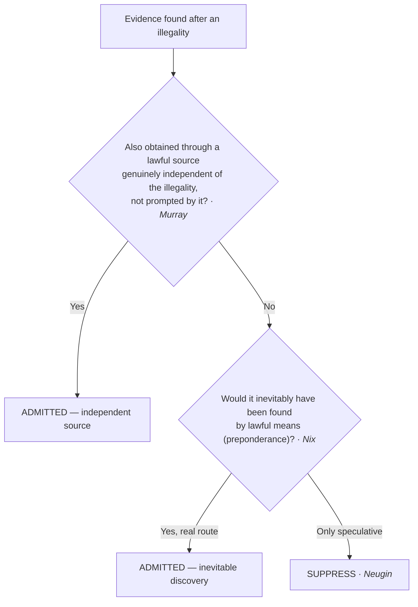

# S9 R1 panel-review — Opus model-diversity lane (prompt pack)

You are the **Claude/Opus** leg of the S9 three-lane adversarial panel (1 Claude + 2 Codex, R1). The two Codex lanes carry the A (support/quote-fidelity) and B (currency/treatment) attack lenses; **you carry model diversity and MUST vote on every paneled assertion across BOTH lenses' concerns.** You are refute-framed: try hard to break each assertion; **default to REFUTED on uncertainty**; never fabricate a cite, quote, or holding; use ONLY the evidence inlined below (no search, no outside knowledge). You are a SIGHTED reviewer — the FULL lake record (judgment fields included) is inlined.

You are a WRITER lane, not an adjudicator: you FIND and VOTE. You do not tally, adjudicate, or close any row — the orchestrator does.

For EACH group below, return one JSON object with the exact `reviewed[]` shape from the output contract (identical framing to the Codex lenses). Emit a finding object ONLY for a real defect (verdict refuted / stands-modified); a group you find wholly clean returns all-`stands` verdicts (the harness records a clean attestation). Concatenate the per-group JSON objects into a top-level `{"packs": [ ... ]}` array, one entry per group, each carrying its `group_id`.


OUTPUT CONTRACT — return ONE JSON object, nothing else:
{
  "lens": "A" | "B",
  "group_id": "<echo the group id>",
  "reviewed": [
    {
      "assertion_id": "<from group_inventory.jsonl>",
      "dimension": "existence|support|quote_fidelity|pincite|treatment|black_letter",
      "verdict": "stands" | "refuted" | "stands-modified",
      "verifiable_from_disclosed": true | false,
      "defect": null,   // null when verdict=="stands"; else an object:
      //  {"problem": "...", "severity": "high|medium|low", "proposed_fix": "...", "evidence_quote": "verbatim from disclosed evidence or null", "needs_cl": true|false, "locator_note": "..."}
      "reasons": ["short evidence-grounded reason", "..."],
      "breaks_true_positives": true | false,
      "residual_risks": ["..."],
      "suggested_tightening": "... or null"
    }
  ],
  "notes": ""
}
Rules: verdict=='stands' <=> defect==null (assertion survives your attack). verdict=='refuted' <=> a real defect (the assertion as framed is wrong). verdict=='stands-modified' <=> survives but needs a stated modification (a minor defect). Review EVERY assertion_id in group_inventory.jsonl exactly once. Output ONLY the JSON object.
---

## GROUP: content/the-exclusionary-rule-remedies-and-standing/the-exclusionary-rule/Inevitable Discovery and Independent Source.md  (`doctrine`, 6 assertions)

### content_page

```
---
weight: 40
title: "Inevitable Discovery & Independent Source"
topic: Inevitable Discovery & Independent Source
type: doctrine
aliases:
  - "Inevitable Discovery & Independent Source"
  - "Inevitable Discovery"
  - "Independent Source"
jurisdiction: Federal (U.S. Const. amend. IV); SCOTUS baseline
status: draft
related:
  - "[[The Exclusionary Rule]]"
  - "[[Fruits & Attenuation]]"
  - "[[The Good-Faith Exception]]"
  - "[[Securing the Scene]]"
  - "[[Standing to Challenge a Search]]"
---

# Inevitable Discovery & Independent Source

*Illegally found — but was there a clean path to the same evidence, actual or hypothetical?*

> [!rule] Black-letter rule
> **Independent source** admits evidence that was *in fact* also obtained through a lawful source genuinely independent of the illegality: admissible if "the search pursuant to warrant was in fact a genuinely independent source," but **not** if the decision to seek the warrant was "prompted by what they had seen during the initial entry." *[[Murray v. United States|Murray]]*, 487 U.S. 533, [542](https://www.courtlistener.com/opinion/112136/murray-v-united-states/) (1988). **Inevitable discovery** admits evidence that *would* have been found anyway: admissible if the prosecution "establish[es] by a preponderance of the evidence that the information ultimately or inevitably would have been discovered by lawful means." *[[Nix v. Williams|Nix]]*, 467 U.S. 431, [444](https://www.courtlistener.com/opinion/111204/nix-v-williams/) (1984).
> ^rule-inevitable-independent

## The Brief

**What they are, and how they differ.** Both doctrines let untainted evidence in despite an antecedent illegality, and the difference is actual versus hypothetical. **Independent source** points to a lawful channel that *really produced* the evidence, separate from the illegal one. **Inevitable discovery** concedes there was no second channel in fact, but shows the evidence *would* have surfaced through lawful means the police were entitled to use. Keep them apart from **[[Fruits and Attenuation|attenuation]]**, which admits the causal link but says it has weakened over time ([[Fruits & Attenuation]]).

**Independent source.** The idea traces to *[[Silverthorne Lumber Co. v. United States|Silverthorne]]* (facts learned lawfully from a genuinely independent source may still be proved) and is refined in *[[Murray v. United States|Murray]]*: where officers make an illegal entry, see evidence, then obtain a warrant, the later seizure is admissible **only if** the warrant application rested on information wholly independent of the entry and the decision to seek the warrant was not prompted by what the illegal entry revealed. 487 U.S. at 542. The rule extends beyond physical evidence to an **in-court identification** whose elements antedate and are independent of an illegal arrest. *[[United States v. Crews|Crews]]*, 445 U.S. 463, [471–74](https://www.courtlistener.com/opinion/110230/united-states-v-crews/) (1980).

**Inevitable discovery.** *[[Nix v. Williams|Nix]]* holds that if the government proves by a **preponderance** that the evidence would ultimately or inevitably have been discovered by lawful means, the deterrence rationale is not served by suppression, so the evidence comes in. 467 U.S. at 444. The lawful route must be **real, not speculative**: a concrete search that was underway or would routinely have been conducted, not a warrant the police could theoretically have sought.

**Burden, standard of review, remedy.** The **government** bears the burden: independent source requires proof that the clean channel was genuine and untainted; inevitable discovery requires a preponderance showing of a lawful route to the same evidence. Review is [[Common Legal Terms#de-novo|de novo]] on the ultimate question, with historical facts for [[Common Legal Terms#clear-error|clear error]]. Where either applies, there is **no suppression**; otherwise the evidence and its fruits are excluded ([[Fruits & Attenuation]]).

**Apply it.**
1. **Ask which doctrine you are in.** A real, separate lawful channel is independent source; a hypothetical lawful route is inevitable discovery.
2. **For independent source, test genuine independence** (*[[Murray v. United States|Murray]]*): the warrant may not rest on what the illegal entry revealed, and the decision to seek it may not have been prompted by that entry.
3. **For inevitable discovery, demand a real route** (*[[Nix v. Williams|Nix]]*): identify the concrete lawful means and show by a preponderance it would have produced the evidence.
4. **Do not launder the illegality after the fact.** A warrant obtained only *after* the illegal search, prompted by it, is neither an independent source nor an inevitable one.

**Common pitfalls.**
- **Confusing the two with each other or with [[Fruits and Attenuation|attenuation]].** Independent source = actually obtained cleanly; inevitable discovery = would have been; [[Fruits and Attenuation|attenuation]] = the taint faded.
- **Accepting a speculative "we could have gotten a warrant."** The lawful route must be genuine, not a hypothetical the police never pursued.
- **Missing the *[[Murray v. United States|Murray]]* prompting limit.** If the illegal entry prompted the warrant application, independent source fails.

## Lower-court developments

The core SCOTUS rules are settled; the live circuit question is **how much of a lawful investigation must already be underway** for inevitable discovery to apply.

- **Inevitable discovery applied — *[[United States v. Soto-Peguero|United States v. Soto-Peguero]]* (1st Cir. 2020).** Admission affirmed because the agent would have sought and obtained a warrant regardless of the illegality. 978 F.3d 13, 21. **Binding in-circuit — 1st Cir.**
- **Inevitable discovery failed — *[[United States v. Neugin|United States v. Neugin]]* (10th Cir. 2020).** Reversed a denial of suppression: the chain to discovery (arrest, then impound, then inventory) was too speculative; inevitable discovery demands a real lawful route, not a hypothetical one. 958 F.3d 924, 933–34. **Binding in-circuit — 10th Cir.**
- **Independent source, state illustration — *[[State v. Mitcham|State v. Mitcham]]* (Ariz. 2024).** Treats the independent-source exception as admitting evidence also obtained independently of the illegality; a persuasive illustration of the federal *[[Murray v. United States|Murray]]* principle, not the rule itself. 559 P.3d 1099, ¶ 34. **Persuasive — state, illustrative.**

**The active-pursuit split (whether an independent investigation must already be underway).** The circuits divide over whether inevitable discovery requires that the police were *already actively pursuing* a lawful line of investigation when the illegality occurred, or whether it is enough that the evidence *would* inevitably have been found by lawful means.

- **Active pursuit required — *[[United States v. Satterfield|United States v. Satterfield]]* (11th Cir. 1984).** The lawful means "must be possessed by the police and . . . being actively pursued *prior* to the occurrence of the illegal conduct"; a warrant obtained only hours after the illegal search did not qualify. 743 F.2d 827, 846. **Binding in-circuit — 11th Cir.**
- **Active pursuit not required — *United States v. Kennedy* (6th Cir. 1995).** Holds "an alternate, independent line of investigation is not required for the inevitable discovery exception to apply"; the exception reaches evidence shown by compelling facts to have been inevitable, whether or not a separate investigation was afoot. 61 F.3d 494, 500. *(Brief-mention; no standalone page.)*
- **Active pursuit not required — *United States v. Cunningham* (10th Cir. 2005).** Applies inevitable discovery without a separate ongoing investigation, requiring instead a high-confidence showing that a warrant in fact would have issued and the evidence would have been obtained by lawful means. 413 F.3d 1199. *(Brief-mention; no standalone page.)*

**Split synthesis.** *[[Nix v. Williams|Nix]]* on its face asks only whether the evidence "ultimately or inevitably would have been discovered by lawful means," and the modern majority reads it that way, declining to graft on a categorical active-pursuit prerequisite. The stricter view, that the lawful means must already have been possessed and pursued when the illegality occurred, survives chiefly to guard against the danger *[[United States v. Satterfield|Satterfield]]* named: allowing the government to manufacture a lawful avenue *after* the fact would gut the warrant requirement for the home, since a warrant can almost always be obtained afterward. In practice the two camps converge on the same instinct that *[[United States v. Neugin|Neugin]]* enforces: the lawful route must be genuine and non-speculative, not a warrant the police merely could have sought.

## Key cases

| Case | Holding | Opinion |
|---|---|---|
| *[[Nix v. Williams]]*, 467 U.S. 431 (1984) | **Inevitable discovery.** Admissible if the government proves by a preponderance that the evidence would ultimately or inevitably have been discovered by lawful means. | [opinion](https://www.courtlistener.com/opinion/111204/nix-v-williams/) |
| *[[Murray v. United States]]*, 487 U.S. 533 (1988) | **Independent source.** Evidence first seen in an unlawful entry is admissible if later acquired through a genuinely independent lawful source not prompted by the entry. | [opinion](https://www.courtlistener.com/opinion/112136/murray-v-united-states/) |
| *[[United States v. Crews]]*, 445 U.S. 463 (1980) | **Independent-source identification.** An in-court identification whose elements antedate and are independent of the illegal arrest is admissible. | [opinion](https://www.courtlistener.com/opinion/110230/united-states-v-crews/) |

## Related cases across doctrines

These are treated in full elsewhere but bear directly on the two doctrines, framed for them here.

| Case | Relevance here | Primary home | Opinion |
|---|---|---|---|
| *[[Segura v. United States]]*, 468 U.S. 796 (1984) | ***Independent-source companion.*** Evidence seized under a valid warrant resting wholly on pre-entry information is admissible despite an earlier illegal entry. | [[Securing the Scene]] | [opinion](https://www.courtlistener.com/opinion/111259/segura-v-united-states/) |
| *[[Silverthorne Lumber Co. v. United States]]*, 251 U.S. 385 (1920) | ***Independent-source seed.*** Illegally obtained knowledge may not be used, but the same facts may be proved from a genuinely independent source. | [[Fruits & Attenuation]] | [opinion](https://www.courtlistener.com/opinion/99506/silverthorne-lumber-co-v-united-states/) |

## Visual



## Sources
- [*Nix v. Williams*, 467 U.S. 431 (1984)](https://www.courtlistener.com/opinion/111204/nix-v-williams/) (pinpoint: 444)
- [*Murray v. United States*, 487 U.S. 533 (1988)](https://www.courtlistener.com/opinion/112136/murray-v-united-states/) (pinpoint: 542)
- [*United States v. Crews*, 445 U.S. 463 (1980)](https://www.courtlistener.com/opinion/110230/united-states-v-crews/) (pinpoints: 471–74)
- [*Segura v. United States*, 468 U.S. 796 (1984)](https://www.courtlistener.com/opinion/111259/segura-v-united-states/) (pinpoint: 814; home = [[Securing the Scene]])
- [*Silverthorne Lumber Co. v. United States*, 251 U.S. 385 (1920)](https://www.courtlistener.com/opinion/99506/silverthorne-lumber-co-v-united-states/) (pinpoint: 392; home = [[Fruits & Attenuation]])
- [*United States v. Soto-Peguero*, 978 F.3d 13 (1st Cir. 2020)](https://www.courtlistener.com/opinion/4798028/united-states-v-soto-peguero/) (pinpoint: 21) (Binding in-circuit — 1st Cir.; inevitable discovery applied)
- [*United States v. Neugin*, 958 F.3d 924 (10th Cir. 2020)](https://www.courtlistener.com/opinion/4750564/united-states-v-neugin/) (pinpoints: 933–34) (Binding in-circuit — 10th Cir.; inevitable discovery failed)
- [*State v. Mitcham*, 559 P.3d 1099 (Ariz. 2024)](https://www.courtlistener.com/opinion/10293607/state-of-arizona-v-ian-mitcham/) (pinpoint: ¶ 34) (Persuasive — state, illustrative)
- [*United States v. Satterfield*, 743 F.2d 827 (11th Cir. 1984)](https://www.courtlistener.com/opinion/8934150/united-states-v-satterfield/) (pinpoint: 846) (Binding in-circuit — 11th Cir.; active pursuit required)
- *United States v. Kennedy*, 61 F.3d 494 (6th Cir. 1995) (pinpoint: 500) (Binding in-circuit — 6th Cir.; active pursuit not required; brief-mention, no standalone page)
- *United States v. Cunningham*, 413 F.3d 1199 (10th Cir. 2005) (Binding in-circuit — 10th Cir.; active pursuit not required; brief-mention, no standalone page)

```

### group_inventory (assertions under review)

```jsonl
{"assertion_id": "630b4fd8feae9ead", "dimension": "existence", "kind": "case_cite", "locator": {"case": "Segura v. United States", "table_line": 61}, "payload": {"case": "Segura v. United States", "cells": ["*[[Segura v. United States]]*, 468 U.S. 796 (1984)", "***Independent-source companion.*** Evidence seized under a valid warrant resting wholly on pre-entry information is admissible despite an earlier illegal entry.", "[[Securing the Scene]]", "[opinion](https://www.courtlistener.com/opinion/111259/segura-v-united-states/)"], "header": ["Case", "Relevance here", "Primary home", "Opinion"]}}
{"assertion_id": "92a7d04031c54cf0", "dimension": "existence", "kind": "case_cite", "locator": {"case": "Silverthorne Lumber Co. v. United States", "table_line": 62}, "payload": {"case": "Silverthorne Lumber Co. v. United States", "cells": ["*[[Silverthorne Lumber Co. v. United States]]*, 251 U.S. 385 (1920)", "***Independent-source seed.*** Illegally obtained knowledge may not be used, but the same facts may be proved from a genuinely independent source.", "[[Fruits & Attenuation]]", "[opinion](https://www.courtlistener.com/opinion/99506/silverthorne-lumber-co-v-united-states/)"], "header": ["Case", "Relevance here", "Primary home", "Opinion"]}}
{"assertion_id": "a08c99dafd6fd883", "dimension": "existence", "kind": "case_cite", "locator": {"case": "United States v. Crews", "table_line": 53}, "payload": {"case": "United States v. Crews", "cells": ["*[[United States v. Crews]]*, 445 U.S. 463 (1980)", "**Independent-source identification.** An in-court identification whose elements antedate and are independent of the illegal arrest is admissible.", "[opinion](https://www.courtlistener.com/opinion/110230/united-states-v-crews/)"], "header": ["Case", "Holding", "Opinion"]}}
{"assertion_id": "b6cb552316009e13", "dimension": "existence", "kind": "case_cite", "locator": {"case": "Murray v. United States", "table_line": 52}, "payload": {"case": "Murray v. United States", "cells": ["*[[Murray v. United States]]*, 487 U.S. 533 (1988)", "**Independent source.** Evidence first seen in an unlawful entry is admissible if later acquired through a genuinely independent lawful source not prompted by the entry.", "[opinion](https://www.courtlistener.com/opinion/112136/murray-v-united-states/)"], "header": ["Case", "Holding", "Opinion"]}}
{"assertion_id": "f98816f344fd472a", "dimension": "existence", "kind": "case_cite", "locator": {"case": "Nix v. Williams", "table_line": 51}, "payload": {"case": "Nix v. Williams", "cells": ["*[[Nix v. Williams]]*, 467 U.S. 431 (1984)", "**Inevitable discovery.** Admissible if the government proves by a preponderance that the evidence would ultimately or inevitably have been discovered by lawful means.", "[opinion](https://www.courtlistener.com/opinion/111204/nix-v-williams/)"], "header": ["Case", "Holding", "Opinion"]}}
{"assertion_id": "db9f145dece90a92", "dimension": "support", "kind": "proposition", "locator": {"callout": "^rule-inevitable-independent"}, "payload": {"anchor": "^rule-inevitable-independent", "statement": "[!rule] Black-letter rule\n**Independent source** admits evidence that was *in fact* also obtained through a lawful source genuinely independent of the illegality: admissible if \"the search pursuant to warrant was in fact a genuinely independent source,\" but **not** if the decision to seek the warrant was \"prompted by what they had seen during the initial entry.\" *[[Murray v. United States|Murray]]*, 487 U.S. 533, [542](https://www.courtlistener.com/opinion/112136/murray-v-united-states/) (1988). **Inevitable discovery** admits evidence that *would* have been found anyway: admissible if the prosecution \"establish[es] by a preponderance of the evidence that the information ultimately or inevitably would have been discovered by lawful means.\" *[[Nix v. Williams|Nix]]*, 467 U.S. 431, [444](https://www.courtlistener.com/opinion/111204/nix-v-williams/) (1984)."}}
```

### lake record — Murray v. United States

```json
{
  "schema_version": "s2.v1",
  "record_id": "Murray v. United States",
  "stub": false,
  "status": "verified",
  "identity": {
    "case_name": "Murray v. United States",
    "case_name_short": "Murray",
    "case_name_full": "Murray v. United States",
    "input_case_name": "Murray v. United States",
    "court": "U.S. Supreme Court",
    "court_id": "scotus",
    "court_level": "scotus",
    "circuit": null,
    "state": null,
    "date_decided": "1988-06-27",
    "year": 1988,
    "docket": null,
    "cluster_id": 112136,
    "lead_opinion_id": 9431434,
    "sibling_ids": [
      112136,
      9431434,
      9431435,
      9431436
    ],
    "absolute_url": "/opinion/112136/murray-v-united-states/",
    "identity_method": "citation+party-text",
    "expected_citation_found": true,
    "party_name_in_text": true,
    "canonical_name_match": true,
    "alternates": [
      {
        "cluster_id": 9075667,
        "score": 20,
        "case_name": "Murray v. United States"
      },
      {
        "cluster_id": 9075666,
        "score": 20,
        "case_name": "Murray v. United States"
      }
    ],
    "reason_code": null
  },
  "citations": {
    "official": {
      "cite": "487 U.S. 533",
      "volume": "487",
      "reporter": "U.S.",
      "page": "533",
      "type": 1,
      "selected_official": true,
      "source": "cluster.citations[]"
    },
    "parallel": [
      {
        "cite": "108 S. Ct. 2529",
        "volume": "108",
        "reporter": "S. Ct.",
        "page": "2529",
        "type": 1,
        "selected_official": false,
        "source": "cluster.citations[]"
      },
      {
        "cite": "101 L. Ed. 2d 472",
        "volume": "101",
        "reporter": "L. Ed. 2d",
        "page": "472",
        "type": 1,
        "selected_official": false,
        "source": "cluster.citations[]"
      },
      {
        "cite": "56 U.S.L.W. 4801",
        "volume": "56",
        "reporter": "U.S.L.W.",
        "page": "4801",
        "type": 4,
        "selected_official": false,
        "source": "cluster.citations[]"
      }
    ],
    "vendor_neutral": [
      {
        "cite": "1988 U.S. LEXIS 2881",
        "volume": "1988",
        "reporter": "U.S. LEXIS",
        "page": "2881",
        "type": 6,
        "selected_official": false,
        "source": "cluster.citations[]"
      }
    ],
    "all": [
      {
        "cite": "487 U.S. 533",
        "volume": "487",
        "reporter": "U.S.",
        "page": "533",
        "type": 1,
        "selected_official": false,
        "source": "cluster.citations[]"
      },
      {
        "cite": "108 S. Ct. 2529",
        "volume": "108",
        "reporter": "S. Ct.",
        "page": "2529",
        "type": 1,
        "selected_official": false,
        "source": "cluster.citations[]"
      },
      {
        "cite": "101 L. Ed. 2d 472",
        "volume": "101",
        "reporter": "L. Ed. 2d",
        "page": "472",
        "type": 1,
        "selected_official": false,
        "source": "cluster.citations[]"
      },
      {
        "cite": "1988 U.S. LEXIS 2881",
        "volume": "1988",
        "reporter": "U.S. LEXIS",
        "page": "2881",
        "type": 6,
        "selected_official": false,
        "source": "cluster.citations[]"
      },
      {
        "cite": "56 U.S.L.W. 4801",
        "volume": "56",
        "reporter": "U.S.L.W.",
        "page": "4801",
        "type": 4,
        "selected_official": false,
        "source": "cluster.citations[]"
      }
    ],
    "display": "487 U.S. 533",
    "official_selection": {
      "court_class": "scotus",
      "selected": "487 U.S. 533",
      "reason": "selected_rank_1"
    }
  },
  "pinpoints": [
    {
      "id": "pin-542",
      "page": null,
      "quote": "--- # Murray v. United States *487 U.S. 533 (1988)* \u00b7 U.S. Supreme Court \u00b7 **Binding \u2014 SCOTUS** \u00b7 Treatment: **good** *(as of 2026-06-30)* <!-- header line; TreatmentBadge + weight render here, degrading to the text above --> ## Background Federal agents, suspecting drug trafficking, illegally entered a warehouse without a warrant and saw bales of marijuana. They left without disturbing the bales, then obtained a search warrant based on information they had known before the illegal entry \u2014 without mentioning the entry or what they had seen \u2014 and re-entered to seize the marijuana under the warrant. ## Issue Whether the independent-source doctrine permits admission of evidence that was first observed during an unlawful entry but later seized under a warrant obtained from genuinely independent information. ## Rule Yes \u2014 so long as the later acquisition is genuinely independent of the unlawful entry.",
      "star_marker": null,
      "quote_fidelity": "mismatch",
      "pinpoint_status": "slip-only",
      "position": null
    },
    {
      "id": "pin-542b",
      "page": null,
      "quote": "the agents' decision to seek the warrant was prompted by what they had seen during the initial entry, . . . or if information obtained during that entry was presented to the Magistrate and affected his decision to issue the warrant.",
      "star_marker": null,
      "quote_fidelity": "mismatch",
      "pinpoint_status": "slip-only",
      "position": null
    }
  ],
  "treatment": {
    "field_i_validity": "good_law",
    "as_of_content": "1988-06-27",
    "as_of_treatment": "2026-06-30",
    "composite_basis": "migration-seed",
    "composite_basis_ref": "Murray v. United States",
    "varies_by_point": false,
    "scope_note": "Extends the independent-source doctrine to re-seizure under a later warrant; good law.",
    "point_overrides": [],
    "edges": [
      {
        "citing_case": {
          "name": "State v. Serrano (A173250)",
          "cluster_id": 10135658,
          "cite": [
            "324 Or. App. 453",
            "527 P.3d 54"
          ],
          "field_ii": "abrogated"
        },
        "field_ii": "abrogated",
        "field_iii": "mentioned",
        "point": null,
        "proposed": true,
        "journal_ref": "Murray v. United States:lane1_negative"
      },
      {
        "citing_case": {
          "name": "State v. Tardie",
          "cluster_id": 10135114,
          "cite": [
            "319 Or. App. 229",
            "509 P.3d 705"
          ],
          "field_ii": "questioned"
        },
        "field_ii": "questioned",
        "field_iii": "mentioned",
        "point": null,
        "proposed": true,
        "journal_ref": "Murray v. United States:lane1_negative"
      },
      {
        "citing_case": {
          "name": "Commonwealth v. Wilson",
          "cluster_id": 4834605,
          "cite": null,
          "field_ii": "superseded_by_statute"
        },
        "field_ii": "superseded_by_statute",
        "field_iii": "mentioned",
        "point": null,
        "proposed": true,
        "journal_ref": "Murray v. United States:lane1_negative"
      },
      {
        "citing_case": {
          "name": "Commonwealth v. Pearson",
          "cluster_id": 4673683,
          "cite": null,
          "field_ii": "overruled"
        },
        "field_ii": "overruled",
        "field_iii": "mentioned",
        "point": null,
        "proposed": true,
        "journal_ref": "Murray v. United States:lane1_negative"
      },
      {
        "citing_case": {
          "name": "Pamela Golinveaux v. United States",
          "cluster_id": 4589293,
          "cite": [
            "915 F.3d 564"
          ],
          "field_ii": "questioned"
        },
        "field_ii": "questioned",
        "field_iii": "mentioned",
        "point": null,
        "proposed": true,
        "journal_ref": "Murray v. United States:lane1_negative"
      },
      {
        "citing_case": {
          "name": "Charles E. Blake v. State of Mississippi",
          "cluster_id": 4541114,
          "cite": [
            "256 So. 3d 1161"
          ],
          "field_ii": "questioned"
        },
        "field_ii": "questioned",
        "field_iii": "mentioned",
        "point": null,
        "proposed": true,
        "journal_ref": "Murray v. United States:lane1_negative"
      },
      {
        "citing_case": {
          "name": "State v. Matthew Elliot Cohagan",
          "cluster_id": 4421478,
          "cite": [
            "162 Idaho 717",
            "404 P.3d 659"
          ],
          "field_ii": "questioned"
        },
        "field_ii": "questioned",
        "field_iii": "mentioned",
        "point": null,
        "proposed": true,
        "journal_ref": "Murray v. United States:lane1_negative"
      },
      {
        "citing_case": {
          "name": "United States v. Gigliotti",
          "cluster_id": 7316853,
          "cite": [
            "145 F. Supp. 3d 203",
            "2015 WL 6830675"
          ],
          "field_ii": "superseded_by_statute"
        },
        "field_ii": "superseded_by_statute",
        "field_iii": "mentioned",
        "point": null,
        "proposed": true,
        "journal_ref": "Murray v. United States:lane1_negative"
      },
      {
        "citing_case": {
          "name": "United States v. Rose",
          "cluster_id": 2961060,
          "cite": [
            "802 F.3d 114",
            "2015 U.S. App. LEXIS 16658",
            "2015 WL 5474267"
          ],
          "field_ii": "overruled"
        },
        "field_ii": "overruled",
        "field_iii": "mentioned",
        "point": null,
        "proposed": true,
        "journal_ref": "Murray v. United States:lane1_negative"
      },
      {
        "citing_case": {
          "name": "Rivas, Gerardo Tomas",
          "cluster_id": 4288590,
          "cite": null,
          "field_ii": "overruled"
        },
        "field_ii": "overruled",
        "field_iii": "mentioned",
        "point": null,
        "proposed": true,
        "journal_ref": "Murray v. United States:lane1_negative"
      },
      {
        "citing_case": {
          "name": "Rivas, Gerardo Tomas",
          "cluster_id": 4287047,
          "cite": null,
          "field_ii": "overruled"
        },
        "field_ii": "overruled",
        "field_iii": "mentioned",
        "point": null,
        "proposed": true,
        "journal_ref": "Murray v. United States:lane1_negative"
      },
      {
        "citing_case": {
          "name": "Rivas, Gerardo Tomas",
          "cluster_id": 4286131,
          "cite": null,
          "field_ii": "overruled"
        },
        "field_ii": "overruled",
        "field_iii": "mentioned",
        "point": null,
        "proposed": true,
        "journal_ref": "Murray v. United States:lane1_negative"
      },
      {
        "citing_case": {
          "name": "STATE of Minnesota, Respondent, v. Kyle Dean McCLAIN, Appellant",
          "cluster_id": 2798238,
          "cite": [
            "862 N.W.2d 717"
          ],
          "field_ii": "questioned"
        },
        "field_ii": "questioned",
        "field_iii": "mentioned",
        "point": null,
        "proposed": true,
        "journal_ref": "Murray v. United States:lane1_negative"
      },
      {
        "citing_case": {
          "name": "Commonwealth v. Haynes",
          "cluster_id": 2795871,
          "cite": [
            "116 A.3d 640",
            "2015 Pa. Super. 94",
            "2015 Pa. Super. LEXIS 207",
            "2015 WL 1814017"
          ],
          "field_ii": "overruled"
        },
        "field_ii": "overruled",
        "field_iii": "mentioned",
        "point": null,
        "proposed": true,
        "journal_ref": "Murray v. United States:lane1_negative"
      },
      {
        "citing_case": {
          "name": "United States v. Robert Hill",
          "cluster_id": 2769569,
          "cite": [
            "776 F.3d 243"
          ],
          "field_ii": "overruled"
        },
        "field_ii": "overruled",
        "field_iii": "mentioned",
        "point": null,
        "proposed": true,
        "journal_ref": "Murray v. United States:lane1_negative"
      },
      {
        "citing_case": {
          "name": "United States v. Joseph White",
          "cluster_id": 2669804,
          "cite": [
            "748 F.3d 507",
            "2014 WL 1408748",
            "2014 U.S. App. LEXIS 6849"
          ],
          "field_ii": "overruled"
        },
        "field_ii": "overruled",
        "field_iii": "mentioned",
        "point": null,
        "proposed": true,
        "journal_ref": "Murray v. United States:lane1_negative"
      },
      {
        "citing_case": {
          "name": "Heck v. Humphrey",
          "cluster_id": 117864,
          "cite": [
            "129 L. Ed. 2d 383",
            "114 S. Ct. 2364",
            "512 U.S. 477",
            "1994 U.S. LEXIS 4824"
          ],
          "field_ii": "abrogated"
        },
        "field_ii": "abrogated",
        "field_iii": "mentioned",
        "point": null,
        "proposed": true,
        "journal_ref": "Murray v. United States:lane2_top_cited"
      },
      {
        "citing_case": {
          "name": "v. Dominguez-Castor",
          "cluster_id": 4691722,
          "cite": [
            "2020 COA 1"
          ],
          "field_ii": "overruled"
        },
        "field_ii": "overruled",
        "field_iii": "mentioned",
        "point": null,
        "proposed": true,
        "journal_ref": "Murray v. United States:lane2_top_cited"
      },
      {
        "citing_case": {
          "name": "Hudson v. Michigan",
          "cluster_id": 145646,
          "cite": [
            "165 L. Ed. 2d 56",
            "126 S. Ct. 2159",
            "547 U.S. 586",
            "2006 U.S. LEXIS 4677"
          ],
          "field_ii": "overruled"
        },
        "field_ii": "overruled",
        "field_iii": "mentioned",
        "point": null,
        "proposed": true,
        "journal_ref": "Murray v. United States:lane2_top_cited"
      },
      {
        "citing_case": {
          "name": "New York v. Harris",
          "cluster_id": 112413,
          "cite": [
            "109 L. Ed. 2d 13",
            "110 S. Ct. 1640",
            "495 U.S. 14",
            "1990 U.S. LEXIS 2037",
            "58 U.S.L.W. 4457"
          ],
          "field_ii": "questioned"
        },
        "field_ii": "questioned",
        "field_iii": "mentioned",
        "point": null,
        "proposed": true,
        "journal_ref": "Murray v. United States:lane2_top_cited"
      },
      {
        "citing_case": {
          "name": "Utah v. Strieff",
          "cluster_id": 3214882,
          "cite": [
            "579 U.S. 232",
            "195 L. Ed. 2d 400",
            "2016 U.S. LEXIS 3926"
          ],
          "field_ii": "questioned"
        },
        "field_ii": "questioned",
        "field_iii": "mentioned",
        "point": null,
        "proposed": true,
        "journal_ref": "Murray v. United States:lane2_top_cited"
      },
      {
        "citing_case": {
          "name": "Ove v. Gwinn",
          "cluster_id": 7099348,
          "cite": [
            "264 F.3d 817",
            "2001 WL 1002190"
          ],
          "field_ii": "questioned"
        },
        "field_ii": "questioned",
        "field_iii": "mentioned",
        "point": null,
        "proposed": true,
        "journal_ref": "Murray v. United States:lane2_top_cited"
      },
      {
        "citing_case": {
          "name": "v. Thompson",
          "cluster_id": 4858089,
          "cite": [
            "2021 CO 15"
          ],
          "field_ii": "superseded_by_statute"
        },
        "field_ii": "superseded_by_statute",
        "field_iii": "mentioned",
        "point": null,
        "proposed": true,
        "journal_ref": "Murray v. United States:lane2_top_cited"
      },
      {
        "citing_case": {
          "name": "United States v. Pack",
          "cluster_id": 150729,
          "cite": [
            "612 F.3d 341",
            "2010 U.S. App. LEXIS 14562",
            "2010 WL 2777061"
          ],
          "field_ii": "overruled"
        },
        "field_ii": "overruled",
        "field_iii": "mentioned",
        "point": null,
        "proposed": true,
        "journal_ref": "Murray v. United States:lane2_top_cited"
      },
      {
        "citing_case": {
          "name": "United States v. Kevin Davis (03-1451) and Keith Presley (03-1621)",
          "cluster_id": 792556,
          "cite": [
            "430 F.3d 345",
            "2005 U.S. App. LEXIS 25124",
            "2005 WL 3108503"
          ],
          "field_ii": "questioned"
        },
        "field_ii": "questioned",
        "field_iii": "mentioned",
        "point": null,
        "proposed": true,
        "journal_ref": "Murray v. United States:lane2_top_cited"
      },
      {
        "citing_case": {
          "name": "United States v. Zapata",
          "cluster_id": 195255,
          "cite": [
            "18 F.3d 971",
            "1994 WL 86216"
          ],
          "field_ii": "questioned"
        },
        "field_ii": "questioned",
        "field_iii": "mentioned",
        "point": null,
        "proposed": true,
        "journal_ref": "Murray v. United States:lane2_top_cited"
      },
      {
        "citing_case": {
          "name": "United States v. Stabile",
          "cluster_id": 183984,
          "cite": [
            "633 F.3d 219",
            "2011 U.S. App. LEXIS 1945",
            "2011 WL 294036"
          ],
          "field_ii": "superseded_by_statute"
        },
        "field_ii": "superseded_by_statute",
        "field_iii": "mentioned",
        "point": null,
        "proposed": true,
        "journal_ref": "Murray v. United States:lane2_top_cited"
      },
      {
        "citing_case": {
          "name": "State v. Daugherty",
          "cluster_id": 1777786,
          "cite": [
            "931 S.W.2d 268",
            "1996 Tex. Crim. App. LEXIS 88",
            "1996 WL 350804"
          ],
          "field_ii": "criticized"
        },
        "field_ii": "criticized",
        "field_iii": "mentioned",
        "point": null,
        "proposed": true,
        "journal_ref": "Murray v. United States:lane2_top_cited"
      },
      {
        "citing_case": {
          "name": "United States v. Runyan",
          "cluster_id": 27212,
          "cite": [
            "290 F.3d 223",
            "2002 U.S. App. LEXIS 7193",
            "2002 WL 629825"
          ],
          "field_ii": "overruled"
        },
        "field_ii": "overruled",
        "field_iii": "mentioned",
        "point": null,
        "proposed": true,
        "journal_ref": "Murray v. United States:lane2_top_cited"
      },
      {
        "citing_case": {
          "name": "United States v. Zavala",
          "cluster_id": 63259,
          "cite": [
            "541 F.3d 562",
            "2008 U.S. App. LEXIS 18132",
            "2008 WL 3877232"
          ],
          "field_ii": "questioned"
        },
        "field_ii": "questioned",
        "field_iii": "mentioned",
        "point": null,
        "proposed": true,
        "journal_ref": "Murray v. United States:lane2_top_cited"
      },
      {
        "citing_case": {
          "name": "People v. Robles",
          "cluster_id": 5607956,
          "cite": [
            "23 Cal. 4th 789",
            "3 P.3d 311",
            "2000 Daily Journal DAR 7789",
            "97 Cal. Rptr. 2d 914",
            "2000 Cal. Daily Op. Serv. 5894",
            "2000 Cal. LEXIS 5217"
          ],
          "field_ii": "questioned"
        },
        "field_ii": "questioned",
        "field_iii": "mentioned",
        "point": null,
        "proposed": true,
        "journal_ref": "Murray v. United States:lane2_top_cited"
      },
      {
        "citing_case": {
          "name": "State v. Gulbrandson",
          "cluster_id": 1127545,
          "cite": [
            "906 P.2d 579",
            "184 Ariz. 46",
            "202 Ariz. Adv. Rep. 46",
            "1995 Ariz. LEXIS 105"
          ],
          "field_ii": "overruled"
        },
        "field_ii": "overruled",
        "field_iii": "mentioned",
        "point": null,
        "proposed": true,
        "journal_ref": "Murray v. United States:lane2_top_cited"
      },
      {
        "citing_case": {
          "name": "People v. Fayed",
          "cluster_id": 4741522,
          "cite": [
            "9 Cal. 5th 147",
            "260 Cal. Rptr. 3d 761",
            "460 P.3d 1149"
          ],
          "field_ii": "overruled"
        },
        "field_ii": "overruled",
        "field_iii": "mentioned",
        "point": null,
        "proposed": true,
        "journal_ref": "Murray v. United States:lane2_top_cited"
      },
      {
        "citing_case": {
          "name": "People v. Morehead",
          "cluster_id": 4628457,
          "cite": [
            "2019 CO 48",
            "442 P.3d 413"
          ],
          "field_ii": "questioned"
        },
        "field_ii": "questioned",
        "field_iii": "mentioned",
        "point": null,
        "proposed": true,
        "journal_ref": "Murray v. United States:lane2_top_cited"
      },
      {
        "citing_case": {
          "name": "United States v. Lee Erwin Johnson",
          "cluster_id": 668574,
          "cite": [
            "22 F.3d 674",
            "1994 U.S. App. LEXIS 9337",
            "1994 WL 158484"
          ],
          "field_ii": "criticized"
        },
        "field_ii": "criticized",
        "field_iii": "mentioned",
        "point": null,
        "proposed": true,
        "journal_ref": "Murray v. United States:lane2_top_cited"
      },
      {
        "citing_case": {
          "name": "United States v. Marco Burton",
          "cluster_id": 777431,
          "cite": [
            "288 F.3d 91",
            "2002 U.S. App. LEXIS 7851",
            "2002 WL 753492"
          ],
          "field_ii": "questioned"
        },
        "field_ii": "questioned",
        "field_iii": "mentioned",
        "point": null,
        "proposed": true,
        "journal_ref": "Murray v. United States:lane2_top_cited"
      },
      {
        "citing_case": {
          "name": "State v. Lee",
          "cluster_id": 1685650,
          "cite": [
            "976 So. 2d 109",
            "2008 WL 343031"
          ],
          "field_ii": "questioned"
        },
        "field_ii": "questioned",
        "field_iii": "mentioned",
        "point": null,
        "proposed": true,
        "journal_ref": "Murray v. United States:lane2_top_cited"
      },
      {
        "citing_case": {
          "name": "United States v. Timothy W. Markling",
          "cluster_id": 655530,
          "cite": [
            "7 F.3d 1309",
            "1993 U.S. App. LEXIS 27411",
            "1993 WL 421739"
          ],
          "field_ii": "questioned"
        },
        "field_ii": "questioned",
        "field_iii": "mentioned",
        "point": null,
        "proposed": true,
        "journal_ref": "Murray v. United States:lane2_top_cited"
      },
      {
        "citing_case": {
          "name": "United States v. Christy",
          "cluster_id": 2648104,
          "cite": [
            "739 F.3d 534",
            "2014 WL 26455",
            "2014 U.S. App. LEXIS 84"
          ],
          "field_ii": "superseded_by_statute"
        },
        "field_ii": "superseded_by_statute",
        "field_iii": "mentioned",
        "point": null,
        "proposed": true,
        "journal_ref": "Murray v. United States:lane2_top_cited"
      },
      {
        "citing_case": {
          "name": "State v. Cobb",
          "cluster_id": 7898279,
          "cite": [
            "251 Conn. 285",
            "743 A.2d 1",
            "1999 Conn. LEXIS 407"
          ],
          "field_ii": "overruled"
        },
        "field_ii": "overruled",
        "field_iii": "mentioned",
        "point": null,
        "proposed": true,
        "journal_ref": "Murray v. United States:lane2_top_cited"
      },
      {
        "citing_case": {
          "name": "United States v. Vilar",
          "cluster_id": 1039434,
          "cite": [
            "729 F.3d 62",
            "92 A.L.R. Fed. 2d 661",
            "2013 WL 4608948",
            "2013 U.S. App. LEXIS 18143"
          ],
          "field_ii": "questioned"
        },
        "field_ii": "questioned",
        "field_iii": "mentioned",
        "point": null,
        "proposed": true,
        "journal_ref": "Murray v. United States:lane2_top_cited"
      }
    ],
    "derivation": {
      "lane1_negative": {
        "query": "cites:(112136 OR 9431434 OR 9431435 OR 9431436) AND (overrul* OR abrogat* OR supersed* OR \"recede from\" OR \"no longer good law\" OR vacat* OR reversed) ",
        "reviewed": 200,
        "cap": 200,
        "cap_hit": true,
        "final_cursor": "https://www.courtlistener.com/api/rest/v4/search/?cursor=cz0xMzg2NzIwMDAwMDAwJnM9Mjk0NzMwMCZ0PW8mZD0yMDI2LTA3LTA1JnA9MTE%3D&fields=absolute_url%2CcaseName%2CcaseNameFull%2Ccitation%2CciteCount%2Ccluster_id%2Ccourt%2Ccourt_citation_string%2Ccourt_id%2CdateFiled%2Copinions%2Csibling_ids%2Cstatus%2Csyllabus&order_by=dateFiled+desc&page_size=100&q=cites%3A%28112136+OR+9431434+OR+9431435+OR+9431436%29+AND+%28overrul%2A+OR+abrogat%2A+OR+supersed%2A+OR+%22recede+from%22+OR+%22no+longer+good+law%22+OR+vacat%2A+OR+reversed%29+&stat_Published=on&type=o",
        "audit_needed": true,
        "proposed_negative_events": 16,
        "audit_marker": "R15 treatment audit required",
        "triage_mode": "snippet-first",
        "snippet_field": "results[].opinions[].snippet",
        "triage_journaled": 200,
        "triage_read": 18,
        "triage_snippet_classified": 182
      },
      "lane2_top_cited": {
        "query": "cites:(112136 OR 9431434 OR 9431435 OR 9431436)",
        "reviewed": 25,
        "cap": 25,
        "cap_hit": true,
        "final_cursor": "https://www.courtlistener.com/api/rest/v4/search/?cursor=cz0xMTImcz03NTc3MTMmdD1vJmQ9MjAyNi0wNy0wNSZwPTM%3D&order_by=citeCount+desc&page_size=25&q=cites%3A%28112136+OR+9431434+OR+9431435+OR+9431436%29&type=o",
        "audit_needed": true,
        "proposed_negative_events": 25,
        "audit_marker": "R15 treatment audit required"
      },
      "lane3_recency": {
        "query": "cites:(112136 OR 9431434 OR 9431435 OR 9431436)",
        "reviewed": 44,
        "cap": 200,
        "cap_hit": false,
        "final_cursor": null,
        "audit_needed": false,
        "proposed_negative_events": 0,
        "audit_marker": null,
        "triage_mode": "snippet-first",
        "snippet_field": "results[].opinions[].snippet",
        "triage_journaled": 44,
        "triage_read": 0,
        "triage_snippet_classified": 44
      }
    }
  },
  "progeny": {
    "complete_query": "cites:(112136 OR 9431434 OR 9431435 OR 9431436)",
    "indexed_citing_opinions": 844,
    "count_source": "search",
    "per_sibling": [
      {
        "opinion_id": 112136,
        "count": 716,
        "count_source": "search"
      },
      {
        "opinion_id": 9431434,
        "count": 142,
        "count_source": "search"
      },
      {
        "opinion_id": 9431435,
        "count": 0,
        "count_source": "search"
      },
      {
        "opinion_id": 9431436,
        "count": 0,
        "count_source": "search"
      }
    ],
    "citation_count": 1426,
    "cache_path": "/Users/johngalt/cssi-lake/cache/progeny/murray-v-united-states.jsonl",
    "enumeration": "bounded",
    "cursor": "https://www.courtlistener.com/api/rest/v4/search/?cursor=cz0xLjg3NjE1ODgmcz05NDk0NjA0JnQ9byZkPTIwMjYtMDctMDUmcD0y&order_by=score+desc&page_size=100&q=cites%3A%28112136+OR+9431434+OR+9431435+OR+9431436%29&type=o",
    "rows_cached": 20,
    "outbound_opinion_edges": [
      {
        "source_opinion_id": 112136,
        "cited_id": 98094,
        "source": "search.opinions[].cites[]"
      },
      {
        "source_opinion_id": 112136,
        "cited_id": 99506,
        "source": "search.opinions[].cites[]"
      },
      {
        "source_opinion_id": 112136,
        "cited_id": 103259,
        "source": "search.opinions[].cites[]"
      },
      {
        "source_opinion_id": 112136,
        "cited_id": 106107,
        "source": "search.opinions[].cites[]"
      },
      {
        "source_opinion_id": 112136,
        "cited_id": 106172,
        "source": "search.opinions[].cites[]"
      },
      {
        "source_opinion_id": 112136,
        "cited_id": 106187,
        "source": "search.opinions[].cites[]"
      },
      {
        "source_opinion_id": 112136,
        "cited_id": 106515,
        "source": "search.opinions[].cites[]"
      },
      {
        "source_opinion_id": 112136,
        "cited_id": 107486,
        "source": "search.opinions[].cites[]"
      },
      {
        "source_opinion_id": 112136,
        "cited_id": 111204,
        "source": "search.opinions[].cites[]"
      },
      {
        "source_opinion_id": 112136,
        "cited_id": 111259,
        "source": "search.opinions[].cites[]"
      },
      {
        "source_opinion_id": 112136,
        "cited_id": 111262,
        "source": "search.opinions[].cites[]"
      },
      {
        "source_opinion_id": 112136,
        "cited_id": 111670,
        "source": "search.opinions[].cites[]"
      },
      {
        "source_opinion_id": 112136,
        "cited_id": 457689,
        "source": "search.opinions[].cites[]"
      },
      {
        "source_opinion_id": 112136,
        "cited_id": 468097,
        "source": "search.opinions[].cites[]"
      },
      {
        "source_opinion_id": 112136,
        "cited_id": 477960,
        "source": "search.opinions[].cites[]"
      }
    ]
  },
  "off_cl_links": [],
  "provenance": {
    "cl_source": "LRU",
    "cl_api": "https://www.courtlistener.com/api/rest/v4",
    "built_by": "S2-BUILDER-AUTHORING",
    "build_run": "s2-build-96d841cbb12e",
    "date_created": "2026-07-05T14:49:53Z",
    "date_modified": "2026-07-06T10:25:12Z",
    "warnings": [
      "legacy treatment migrated: good -> good_law"
    ],
    "field_provenance": {
      "identity": {
        "src": "CourtListener search + clusters + lead opinion text",
        "at": "2026-07-05T14:50:20Z",
        "verifier": "S2-BUILDER-AUTHORING"
      },
      "treatment.field_i_validity": {
        "src": "_treatment-migration.json + page frontmatter",
        "at": "2026-07-05T14:50:20Z",
        "verifier": "S2-BUILDER-AUTHORING"
      },
      "point_overrides": {
        "src": "S2 treatment derivation proposed only",
        "at": "2026-07-05T14:54:16Z",
        "verifier": "S2-BUILDER-AUTHORING"
      },
      "pinpoints": {
        "src": "content page quote harvest + lead opinion text",
        "at": "2026-07-05T14:50:20Z",
        "verifier": "S2-BUILDER-AUTHORING"
      }
    }
  }
}

```

### lake record — Nix v. Williams

```json
{
  "schema_version": "s2.v1",
  "record_id": "Nix v. Williams",
  "stub": false,
  "status": "verified",
  "identity": {
    "case_name": "Nix v. Williams",
    "case_name_short": "Nix",
    "case_name_full": "Nix, Warden of the Iowa State Penitentiary v. Williams",
    "input_case_name": "Nix v. Williams",
    "court": "U.S. Supreme Court",
    "court_id": "scotus",
    "court_level": "scotus",
    "circuit": null,
    "state": null,
    "date_decided": "1984-06-11",
    "year": 1984,
    "docket": null,
    "cluster_id": 111204,
    "lead_opinion_id": 9429647,
    "sibling_ids": [
      111204,
      9429647,
      9429648,
      9429649,
      9429650
    ],
    "absolute_url": "/opinion/111204/nix-v-williams/",
    "identity_method": "citation+party-text",
    "expected_citation_found": true,
    "party_name_in_text": true,
    "canonical_name_match": true,
    "alternates": [],
    "reason_code": null
  },
  "citations": {
    "official": {
      "cite": "467 U.S. 431",
      "volume": "467",
      "reporter": "U.S.",
      "page": "431",
      "type": 1,
      "selected_official": true,
      "source": "cluster.citations[]"
    },
    "parallel": [
      {
        "cite": "104 S. Ct. 2501",
        "volume": "104",
        "reporter": "S. Ct.",
        "page": "2501",
        "type": 1,
        "selected_official": false,
        "source": "cluster.citations[]"
      },
      {
        "cite": "81 L. Ed. 2d 377",
        "volume": "81",
        "reporter": "L. Ed. 2d",
        "page": "377",
        "type": 1,
        "selected_official": false,
        "source": "cluster.citations[]"
      },
      {
        "cite": "52 U.S.L.W. 4732",
        "volume": "52",
        "reporter": "U.S.L.W.",
        "page": "4732",
        "type": 4,
        "selected_official": false,
        "source": "cluster.citations[]"
      }
    ],
    "vendor_neutral": [
      {
        "cite": "1984 U.S. LEXIS 101",
        "volume": "1984",
        "reporter": "U.S. LEXIS",
        "page": "101",
        "type": 6,
        "selected_official": false,
        "source": "cluster.citations[]"
      }
    ],
    "all": [
      {
        "cite": "467 U.S. 431",
        "volume": "467",
        "reporter": "U.S.",
        "page": "431",
        "type": 1,
        "selected_official": false,
        "source": "cluster.citations[]"
      },
      {
        "cite": "104 S. Ct. 2501",
        "volume": "104",
        "reporter": "S. Ct.",
        "page": "2501",
        "type": 1,
        "selected_official": false,
        "source": "cluster.citations[]"
      },
      {
        "cite": "81 L. Ed. 2d 377",
        "volume": "81",
        "reporter": "L. Ed. 2d",
        "page": "377",
        "type": 1,
        "selected_official": false,
        "source": "cluster.citations[]"
      },
      {
        "cite": "1984 U.S. LEXIS 101",
        "volume": "1984",
        "reporter": "U.S. LEXIS",
        "page": "101",
        "type": 6,
        "selected_official": false,
        "source": "cluster.citations[]"
      },
      {
        "cite": "52 U.S.L.W. 4732",
        "volume": "52",
        "reporter": "U.S.L.W.",
        "page": "4732",
        "type": 4,
        "selected_official": false,
        "source": "cluster.citations[]"
      }
    ],
    "display": "467 U.S. 431",
    "official_selection": {
      "court_class": "scotus",
      "selected": "467 U.S. 431",
      "reason": "selected_rank_1"
    }
  },
  "pinpoints": [
    {
      "id": "pin-444",
      "page": null,
      "quote": "that led him to direct police to the body \u2014 interrogation later held to have violated his right to counsel (*Brewer v. Williams*). At the same time, a large organized volunteer search party was systematically searching the area and was within a few miles of the body. At Williams's retrial, the body-related evidence was admitted on an inevitable-discovery theory. ## Issue Whether evidence obtained as the fruit of a constitutional violation is nevertheless admissible if it would inevitably have been discovered by lawful means. ## Rule Yes.",
      "star_marker": null,
      "quote_fidelity": "mismatch",
      "pinpoint_status": "slip-only",
      "position": null
    }
  ],
  "treatment": {
    "field_i_validity": "good_law",
    "as_of_content": "1984-06-11",
    "as_of_treatment": "2026-06-30",
    "composite_basis": "migration-seed",
    "composite_basis_ref": "Nix v. Williams",
    "varies_by_point": false,
    "scope_note": "Establishes the inevitable-discovery exception to the exclusionary rule; good law.",
    "point_overrides": [],
    "edges": [
      {
        "citing_case": {
          "name": "State v. Rogers",
          "cluster_id": 10705828,
          "cite": null,
          "field_ii": "overruled"
        },
        "field_ii": "overruled",
        "field_iii": "mentioned",
        "point": null,
        "proposed": true,
        "journal_ref": "Nix v. Williams:lane1_negative"
      },
      {
        "citing_case": {
          "name": "State of Minnesota v. Seneca Warrior Steeprock",
          "cluster_id": 10102625,
          "cite": null,
          "field_ii": "overruled"
        },
        "field_ii": "overruled",
        "field_iii": "mentioned",
        "point": null,
        "proposed": true,
        "journal_ref": "Nix v. Williams:lane1_negative"
      },
      {
        "citing_case": {
          "name": "Commonwealth v. Privette",
          "cluster_id": 9387170,
          "cite": null,
          "field_ii": "overruled"
        },
        "field_ii": "overruled",
        "field_iii": "mentioned",
        "point": null,
        "proposed": true,
        "journal_ref": "Nix v. Williams:lane1_negative"
      },
      {
        "citing_case": {
          "name": "State of Iowa v. Michael Hillery",
          "cluster_id": 4868029,
          "cite": null,
          "field_ii": "questioned"
        },
        "field_ii": "questioned",
        "field_iii": "mentioned",
        "point": null,
        "proposed": true,
        "journal_ref": "Nix v. Williams:lane1_negative"
      },
      {
        "citing_case": {
          "name": "State of Iowa v. Michael Hillery",
          "cluster_id": 4865672,
          "cite": null,
          "field_ii": "questioned"
        },
        "field_ii": "questioned",
        "field_iii": "mentioned",
        "point": null,
        "proposed": true,
        "journal_ref": "Nix v. Williams:lane1_negative"
      },
      {
        "citing_case": {
          "name": "Kennebrew v. State",
          "cluster_id": 10366687,
          "cite": [
            "304 Ga. 406"
          ],
          "field_ii": "overruled"
        },
        "field_ii": "overruled",
        "field_iii": "mentioned",
        "point": null,
        "proposed": true,
        "journal_ref": "Nix v. Williams:lane1_negative"
      },
      {
        "citing_case": {
          "name": "People v. Wallace",
          "cluster_id": 6239020,
          "cite": [
            "222 Cal. Rptr. 3d 795",
            "15 Cal. App. 5th 82",
            "2017 Cal. App. LEXIS 775"
          ],
          "field_ii": "questioned"
        },
        "field_ii": "questioned",
        "field_iii": "mentioned",
        "point": null,
        "proposed": true,
        "journal_ref": "Nix v. Williams:lane1_negative"
      },
      {
        "citing_case": {
          "name": "State v. Turpin",
          "cluster_id": 4423584,
          "cite": [
            "2017 Ohio 7435",
            "96 N.E.3d 1171"
          ],
          "field_ii": "overruled"
        },
        "field_ii": "overruled",
        "field_iii": "mentioned",
        "point": null,
        "proposed": true,
        "journal_ref": "Nix v. Williams:lane1_negative"
      },
      {
        "citing_case": {
          "name": "State v. Matthew Elliot Cohagan",
          "cluster_id": 4421478,
          "cite": [
            "162 Idaho 717",
            "404 P.3d 659"
          ],
          "field_ii": "questioned"
        },
        "field_ii": "questioned",
        "field_iii": "mentioned",
        "point": null,
        "proposed": true,
        "journal_ref": "Nix v. Williams:lane1_negative"
      },
      {
        "citing_case": {
          "name": "Ornelas v. United States",
          "cluster_id": 118030,
          "cite": [
            "134 L. Ed. 2d 911",
            "116 S. Ct. 1657",
            "517 U.S. 690",
            "1996 U.S. LEXIS 3391"
          ],
          "field_ii": "questioned"
        },
        "field_ii": "questioned",
        "field_iii": "mentioned",
        "point": null,
        "proposed": true,
        "journal_ref": "Nix v. Williams:lane2_top_cited"
      },
      {
        "citing_case": {
          "name": "Colorado v. Connelly",
          "cluster_id": 111779,
          "cite": [
            "93 L. Ed. 2d 473",
            "107 S. Ct. 515",
            "479 U.S. 157",
            "1986 U.S. LEXIS 23",
            "55 U.S.L.W. 4043"
          ],
          "field_ii": "criticized"
        },
        "field_ii": "criticized",
        "field_iii": "mentioned",
        "point": null,
        "proposed": true,
        "journal_ref": "Nix v. Williams:lane2_top_cited"
      },
      {
        "citing_case": {
          "name": "Bourjaily v. United States",
          "cluster_id": 111938,
          "cite": [
            "97 L. Ed. 2d 144",
            "107 S. Ct. 2775",
            "483 U.S. 171",
            "1987 U.S. LEXIS 2874",
            "22 Fed. R. Serv. 1105",
            "55 U.S.L.W. 4962"
          ],
          "field_ii": "overruled"
        },
        "field_ii": "overruled",
        "field_iii": "mentioned",
        "point": null,
        "proposed": true,
        "journal_ref": "Nix v. Williams:lane2_top_cited"
      },
      {
        "citing_case": {
          "name": "Dickerson v. United States",
          "cluster_id": 118380,
          "cite": [
            "147 L. Ed. 2d 405",
            "120 S. Ct. 2326",
            "530 U.S. 428",
            "2000 U.S. LEXIS 4305"
          ],
          "field_ii": "overruled"
        },
        "field_ii": "overruled",
        "field_iii": "mentioned",
        "point": null,
        "proposed": true,
        "journal_ref": "Nix v. Williams:lane2_top_cited"
      },
      {
        "citing_case": {
          "name": "Missouri v. Seibert",
          "cluster_id": 137002,
          "cite": [
            "159 L. Ed. 2d 643",
            "124 S. Ct. 2601",
            "542 U.S. 600",
            "2004 U.S. LEXIS 4578"
          ],
          "field_ii": "overruled"
        },
        "field_ii": "overruled",
        "field_iii": "mentioned",
        "point": null,
        "proposed": true,
        "journal_ref": "Nix v. Williams:lane2_top_cited"
      },
      {
        "citing_case": {
          "name": "Murray v. United States",
          "cluster_id": 112136,
          "cite": [
            "101 L. Ed. 2d 472",
            "108 S. Ct. 2529",
            "487 U.S. 533",
            "1988 U.S. LEXIS 2881",
            "56 U.S.L.W. 4801"
          ],
          "field_ii": "questioned"
        },
        "field_ii": "questioned",
        "field_iii": "mentioned",
        "point": null,
        "proposed": true,
        "journal_ref": "Nix v. Williams:lane2_top_cited"
      },
      {
        "citing_case": {
          "name": "v. Dominguez-Castor",
          "cluster_id": 4691722,
          "cite": [
            "2020 COA 1"
          ],
          "field_ii": "overruled"
        },
        "field_ii": "overruled",
        "field_iii": "mentioned",
        "point": null,
        "proposed": true,
        "journal_ref": "Nix v. Williams:lane2_top_cited"
      },
      {
        "citing_case": {
          "name": "Hudson v. Michigan",
          "cluster_id": 145646,
          "cite": [
            "165 L. Ed. 2d 56",
            "126 S. Ct. 2159",
            "547 U.S. 586",
            "2006 U.S. LEXIS 4677"
          ],
          "field_ii": "overruled"
        },
        "field_ii": "overruled",
        "field_iii": "mentioned",
        "point": null,
        "proposed": true,
        "journal_ref": "Nix v. Williams:lane2_top_cited"
      },
      {
        "citing_case": {
          "name": "Medina v. California",
          "cluster_id": 112775,
          "cite": [
            "120 L. Ed. 2d 353",
            "112 S. Ct. 2572",
            "505 U.S. 437",
            "1992 U.S. LEXIS 3696"
          ],
          "field_ii": "abrogated"
        },
        "field_ii": "abrogated",
        "field_iii": "mentioned",
        "point": null,
        "proposed": true,
        "journal_ref": "Nix v. Williams:lane2_top_cited"
      },
      {
        "citing_case": {
          "name": "Wilson v. Arkansas",
          "cluster_id": 117936,
          "cite": [
            "131 L. Ed. 2d 976",
            "115 S. Ct. 1914",
            "514 U.S. 927",
            "1995 U.S. LEXIS 3464"
          ],
          "field_ii": "questioned"
        },
        "field_ii": "questioned",
        "field_iii": "mentioned",
        "point": null,
        "proposed": true,
        "journal_ref": "Nix v. Williams:lane2_top_cited"
      },
      {
        "citing_case": {
          "name": "People v. Kraft",
          "cluster_id": 2590211,
          "cite": [
            "5 P.3d 68",
            "99 Cal. Rptr. 2d 1",
            "23 Cal. 4th 978",
            "2000 Daily Journal DAR 8825",
            "2000 Cal. Daily Op. Serv. 6660",
            "2000 Cal. LEXIS 5822"
          ],
          "field_ii": "overruled"
        },
        "field_ii": "overruled",
        "field_iii": "mentioned",
        "point": null,
        "proposed": true,
        "journal_ref": "Nix v. Williams:lane2_top_cited"
      },
      {
        "citing_case": {
          "name": "People v. Coffman",
          "cluster_id": 2623595,
          "cite": [
            "96 P.3d 30",
            "17 Cal. Rptr. 3d 710",
            "34 Cal. 4th 1"
          ],
          "field_ii": "overruled"
        },
        "field_ii": "overruled",
        "field_iii": "mentioned",
        "point": null,
        "proposed": true,
        "journal_ref": "Nix v. Williams:lane2_top_cited"
      },
      {
        "citing_case": {
          "name": "New York v. Class",
          "cluster_id": 111600,
          "cite": [
            "89 L. Ed. 2d 81",
            "106 S. Ct. 960",
            "475 U.S. 106",
            "1986 U.S. LEXIS 5",
            "54 U.S.L.W. 4178"
          ],
          "field_ii": "questioned"
        },
        "field_ii": "questioned",
        "field_iii": "mentioned",
        "point": null,
        "proposed": true,
        "journal_ref": "Nix v. Williams:lane2_top_cited"
      },
      {
        "citing_case": {
          "name": "Michigan v. Harvey",
          "cluster_id": 112385,
          "cite": [
            "108 L. Ed. 2d 293",
            "110 S. Ct. 1176",
            "494 U.S. 344",
            "1990 U.S. LEXIS 1229"
          ],
          "field_ii": "questioned"
        },
        "field_ii": "questioned",
        "field_iii": "mentioned",
        "point": null,
        "proposed": true,
        "journal_ref": "Nix v. Williams:lane2_top_cited"
      },
      {
        "citing_case": {
          "name": "People v. Zapien",
          "cluster_id": 1367717,
          "cite": [
            "846 P.2d 704",
            "4 Cal. 4th 929",
            "17 Cal. Rptr. 2d 122",
            "93 Daily Journal DAR 2940",
            "93 Cal. Daily Op. Serv. 1612",
            "1993 Cal. LEXIS 756"
          ],
          "field_ii": "overruled"
        },
        "field_ii": "overruled",
        "field_iii": "mentioned",
        "point": null,
        "proposed": true,
        "journal_ref": "Nix v. Williams:lane2_top_cited"
      },
      {
        "citing_case": {
          "name": "United States v. Patane",
          "cluster_id": 137003,
          "cite": [
            "159 L. Ed. 2d 667",
            "124 S. Ct. 2620",
            "542 U.S. 630",
            "2004 U.S. LEXIS 4577"
          ],
          "field_ii": "superseded_by_statute"
        },
        "field_ii": "superseded_by_statute",
        "field_iii": "mentioned",
        "point": null,
        "proposed": true,
        "journal_ref": "Nix v. Williams:lane2_top_cited"
      },
      {
        "citing_case": {
          "name": "Hayes v. Florida",
          "cluster_id": 111382,
          "cite": [
            "84 L. Ed. 2d 705",
            "105 S. Ct. 1643",
            "470 U.S. 811",
            "1985 U.S. LEXIS 1523",
            "53 U.S.L.W. 4382"
          ],
          "field_ii": "questioned"
        },
        "field_ii": "questioned",
        "field_iii": "mentioned",
        "point": null,
        "proposed": true,
        "journal_ref": "Nix v. Williams:lane2_top_cited"
      },
      {
        "citing_case": {
          "name": "People v. Montoya",
          "cluster_id": 1202376,
          "cite": [
            "753 P.2d 729",
            "12 Brief Times Rptr. 482",
            "1988 Colo. LEXIS 39",
            "1988 WL 25119"
          ],
          "field_ii": "overruled"
        },
        "field_ii": "overruled",
        "field_iii": "mentioned",
        "point": null,
        "proposed": true,
        "journal_ref": "Nix v. Williams:lane2_top_cited"
      },
      {
        "citing_case": {
          "name": "Aaron Lindh v. James P. Murphy, Warden",
          "cluster_id": 726705,
          "cite": [
            "96 F.3d 856",
            "1996 U.S. App. LEXIS 24136",
            "1996 WL 517290"
          ],
          "field_ii": "overruled"
        },
        "field_ii": "overruled",
        "field_iii": "mentioned",
        "point": null,
        "proposed": true,
        "journal_ref": "Nix v. Williams:lane2_top_cited"
      },
      {
        "citing_case": {
          "name": "People v. Boyer",
          "cluster_id": 2515839,
          "cite": [
            "133 P.3d 581",
            "42 Cal. Rptr. 3d 677",
            "38 Cal. 4th 412",
            "2006 Daily Journal DAR 5671",
            "2006 Cal. Daily Op. Serv. 3863",
            "2006 Cal. LEXIS 5397"
          ],
          "field_ii": "overruled"
        },
        "field_ii": "overruled",
        "field_iii": "mentioned",
        "point": null,
        "proposed": true,
        "journal_ref": "Nix v. Williams:lane2_top_cited"
      },
      {
        "citing_case": {
          "name": "People v. Sutherland",
          "cluster_id": 2036519,
          "cite": [
            "860 N.E.2d 178",
            "223 Ill. 2d 187",
            "307 Ill. Dec. 524"
          ],
          "field_ii": "criticized"
        },
        "field_ii": "criticized",
        "field_iii": "mentioned",
        "point": null,
        "proposed": true,
        "journal_ref": "Nix v. Williams:lane2_top_cited"
      },
      {
        "citing_case": {
          "name": "State v. Moody",
          "cluster_id": 867478,
          "cite": [
            "94 P.3d 1119",
            "208 Ariz. 424"
          ],
          "field_ii": "overruled"
        },
        "field_ii": "overruled",
        "field_iii": "mentioned",
        "point": null,
        "proposed": true,
        "journal_ref": "Nix v. Williams:lane2_top_cited"
      },
      {
        "citing_case": {
          "name": "United States v. Ramirez",
          "cluster_id": 118180,
          "cite": [
            "140 L. Ed. 2d 191",
            "118 S. Ct. 992",
            "523 U.S. 65",
            "1998 U.S. LEXIS 1600"
          ],
          "field_ii": "questioned"
        },
        "field_ii": "questioned",
        "field_iii": "mentioned",
        "point": null,
        "proposed": true,
        "journal_ref": "Nix v. Williams:lane2_top_cited"
      },
      {
        "citing_case": {
          "name": "Brimage v. State",
          "cluster_id": 2417512,
          "cite": [
            "918 S.W.2d 466",
            "1996 Tex. Crim. App. LEXIS 5",
            "1994 WL 511395"
          ],
          "field_ii": "overruled"
        },
        "field_ii": "overruled",
        "field_iii": "mentioned",
        "point": null,
        "proposed": true,
        "journal_ref": "Nix v. Williams:lane2_top_cited"
      },
      {
        "citing_case": {
          "name": "Utah v. Strieff",
          "cluster_id": 3214882,
          "cite": [
            "579 U.S. 232",
            "195 L. Ed. 2d 400",
            "2016 U.S. LEXIS 3926"
          ],
          "field_ii": "questioned"
        },
        "field_ii": "questioned",
        "field_iii": "mentioned",
        "point": null,
        "proposed": true,
        "journal_ref": "Nix v. Williams:lane2_top_cited"
      }
    ],
    "derivation": {
      "lane1_negative": {
        "query": "cites:(111204 OR 9429647 OR 9429648 OR 9429649 OR 9429650) AND (overrul* OR abrogat* OR supersed* OR \"recede from\" OR \"no longer good law\" OR vacat* OR reversed) ",
        "reviewed": 200,
        "cap": 200,
        "cap_hit": true,
        "final_cursor": "https://www.courtlistener.com/api/rest/v4/search/?cursor=cz0xNDkyNzMyODAwMDAwJnM9NDM4NjA3OSZ0PW8mZD0yMDI2LTA3LTA1JnA9MTE%3D&fields=absolute_url%2CcaseName%2CcaseNameFull%2Ccitation%2CciteCount%2Ccluster_id%2Ccourt%2Ccourt_citation_string%2Ccourt_id%2CdateFiled%2Copinions%2Csibling_ids%2Cstatus%2Csyllabus&order_by=dateFiled+desc&page_size=100&q=cites%3A%28111204+OR+9429647+OR+9429648+OR+9429649+OR+9429650%29+AND+%28overrul%2A+OR+abrogat%2A+OR+supersed%2A+OR+%22recede+from%22+OR+%22no+longer+good+law%22+OR+vacat%2A+OR+reversed%29+&stat_Published=on&type=o",
        "audit_needed": true,
        "proposed_negative_events": 9,
        "audit_marker": "R15 treatment audit required",
        "triage_mode": "snippet-first",
        "snippet_field": "results[].opinions[].snippet",
        "triage_journaled": 200,
        "triage_read": 9,
        "triage_snippet_classified": 191
      },
      "lane2_top_cited": {
        "query": "cites:(111204 OR 9429647 OR 9429648 OR 9429649 OR 9429650)",
        "reviewed": 25,
        "cap": 25,
        "cap_hit": true,
        "final_cursor": "https://www.courtlistener.com/api/rest/v4/search/?cursor=cz0yNDAmcz0xNDMyMjk0JnQ9byZkPTIwMjYtMDctMDUmcD0z&order_by=citeCount+desc&page_size=25&q=cites%3A%28111204+OR+9429647+OR+9429648+OR+9429649+OR+9429650%29&type=o",
        "audit_needed": true,
        "proposed_negative_events": 25,
        "audit_marker": "R15 treatment audit required"
      },
      "lane3_recency": {
        "query": "cites:(111204 OR 9429647 OR 9429648 OR 9429649 OR 9429650)",
        "reviewed": 69,
        "cap": 200,
        "cap_hit": false,
        "final_cursor": null,
        "audit_needed": false,
        "proposed_negative_events": 2,
        "audit_marker": null,
        "triage_mode": "snippet-first",
        "snippet_field": "results[].opinions[].snippet",
        "triage_journaled": 69,
        "triage_read": 2,
        "triage_snippet_classified": 67
      }
    }
  },
  "progeny": {
    "complete_query": "cites:(111204 OR 9429647 OR 9429648 OR 9429649 OR 9429650)",
    "indexed_citing_opinions": 1839,
    "count_source": "search",
    "per_sibling": [
      {
        "opinion_id": 111204,
        "count": 1618,
        "count_source": "search"
      },
      {
        "opinion_id": 9429647,
        "count": 249,
        "count_source": "search"
      },
      {
        "opinion_id": 9429648,
        "count": 0,
        "count_source": "search"
      },
      {
        "opinion_id": 9429649,
        "count": 0,
        "count_source": "search"
      },
      {
        "opinion_id": 9429650,
        "count": 0,
        "count_source": "search"
      }
    ],
    "citation_count": 3080,
    "cache_path": "/Users/johngalt/cssi-lake/cache/progeny/nix-v-williams.jsonl",
    "enumeration": "bounded",
    "cursor": "https://www.courtlistener.com/api/rest/v4/search/?cursor=cz0xLjkwMTE3NyZzPTEwMTMyOTkxJnQ9byZkPTIwMjYtMDctMDUmcD0y&order_by=score+desc&page_size=100&q=cites%3A%28111204+OR+9429647+OR+9429648+OR+9429649+OR+9429650%29&type=o",
    "rows_cached": 20,
    "outbound_opinion_edges": [
      {
        "source_opinion_id": 111204,
        "cited_id": 99506,
        "source": "search.opinions[].cites[]"
      },
      {
        "source_opinion_id": 111204,
        "cited_id": 105917,
        "source": "search.opinions[].cites[]"
      },
      {
        "source_opinion_id": 111204,
        "cited_id": 106107,
        "source": "search.opinions[].cites[]"
      },
      {
        "source_opinion_id": 111204,
        "cited_id": 106285,
        "source": "search.opinions[].cites[]"
      },
      {
        "source_opinion_id": 111204,
        "cited_id": 106515,
        "source": "search.opinions[].cites[]"
      },
      {
        "source_opinion_id": 111204,
        "cited_id": 106822,
        "source": "search.opinions[].cites[]"
      },
      {
        "source_opinion_id": 111204,
        "cited_id": 106864,
        "source": "search.opinions[].cites[]"
      },
      {
        "source_opinion_id": 111204,
        "cited_id": 107359,
        "source": "search.opinions[].cites[]"
      },
      {
        "source_opinion_id": 111204,
        "cited_id": 107423,
        "source": "search.opinions[].cites[]"
      },
      {
        "source_opinion_id": 111204,
        "cited_id": 107486,
        "source": "search.opinions[].cites[]"
      },
      {
        "source_opinion_id": 111204,
        "cited_id": 107487,
        "source": "search.opinions[].cites[]"
      },
      {
        "source_opinion_id": 111204,
        "cited_id": 107488,
        "source": "search.opinions[].cites[]"
      },
      {
        "source_opinion_id": 111204,
        "cited_id": 107729,
        "source": "search.opinions[].cites[]"
      },
      {
        "source_opinion_id": 111204,
        "cited_id": 108375,
        "source": "search.opinions[].cites[]"
      },
      {
        "source_opinion_id": 111204,
        "cited_id": 108429,
        "source": "search.opinions[].cites[]"
      },
      {
        "source_opinion_id": 111204,
        "cited_id": 108541,
        "source": "search.opinions[].cites[]"
      },
      {
        "source_opinion_id": 111204,
        "cited_id": 108800,
        "source": "search.opinions[].cites[]"
      },
      {
        "source_opinion_id": 111204,
        "cited_id": 108846,
        "source": "search.opinions[].cites[]"
      },
      {
        "source_opinion_id": 111204,
        "cited_id": 108898,
        "source": "search.opinions[].cites[]"
      },
      {
        "source_opinion_id": 111204,
        "cited_id": 108967,
        "source": "search.opinions[].cites[]"
      },
      {
        "source_opinion_id": 111204,
        "cited_id": 109310,
        "source": "search.opinions[].cites[]"
      },
      {
        "source_opinion_id": 111204,
        "cited_id": 109539,
        "source": "search.opinions[].cites[]"
      },
      {
        "source_opinion_id": 111204,
        "cited_id": 109540,
        "source": "search.opinions[].cites[]"
      },
      {
        "source_opinion_id": 111204,
        "cited_id": 109590,
        "source": "search.opinions[].cites[]"
      },
      {
        "source_opinion_id": 111204,
        "cited_id": 109624,
        "source": "search.opinions[].cites[]"
      },
      {
        "source_opinion_id": 111204,
        "cited_id": 109757,
        "source": "search.opinions[].cites[]"
      },
      {
        "source_opinion_id": 111204,
        "cited_id": 109816,
        "source": "search.opinions[].cites[]"
      },
      {
        "source_opinion_id": 111204,
        "cited_id": 110067,
        "source": "search.opinions[].cites[]"
      },
      {
        "source_opinion_id": 111204,
        "cited_id": 110230,
        "source": "search.opinions[].cites[]"
      },
      {
        "source_opinion_id": 111204,
        "cited_id": 110300,
        "source": "search.opinions[].cites[]"
      },
      {
        "source_opinion_id": 111204,
        "cited_id": 110372,
        "source": "search.opinions[].cites[]"
      },
      {
        "source_opinion_id": 111204,
        "cited_id": 110589,
        "source": "search.opinions[].cites[]"
      },
      {
        "source_opinion_id": 111204,
        "cited_id": 110676,
        "source": "search.opinions[].cites[]"
      },
      {
        "source_opinion_id": 111204,
        "cited_id": 111169,
        "source": "search.opinions[].cites[]"
      },
      {
        "source_opinion_id": 111204,
        "cited_id": 111170,
        "source": "search.opinions[].cites[]"
      },
      {
        "source_opinion_id": 111204,
        "cited_id": 260072,
        "source": "search.opinions[].cites[]"
      },
      {
        "source_opinion_id": 111204,
        "cited_id": 260805,
        "source": "search.opinions[].cites[]"
      },
      {
        "source_opinion_id": 111204,
        "cited_id": 289216,
        "source": "search.opinions[].cites[]"
      },
      {
        "source_opinion_id": 111204,
        "cited_id": 354373,
        "source": "search.opinions[].cites[]"
      },
      {
        "source_opinion_id": 111204,
        "cited_id": 374338,
        "source": "search.opinions[].cites[]"
      },
      {
        "source_opinion_id": 111204,
        "cited_id": 382927,
        "source": "search.opinions[].cites[]"
      },
      {
        "source_opinion_id": 111204,
        "cited_id": 393006,
        "source": "search.opinions[].cites[]"
      },
      {
        "source_opinion_id": 111204,
        "cited_id": 405982,
        "source": "search.opinions[].cites[]"
      },
      {
        "source_opinion_id": 111204,
        "cited_id": 410451,
        "source": "search.opinions[].cites[]"
      },
      {
        "source_opinion_id": 111204,
        "cited_id": 414450,
        "source": "search.opinions[].cites[]"
      },
      {
        "source_opinion_id": 111204,
        "cited_id": 414492,
        "source": "search.opinions[].cites[]"
      },
      {
        "source_opinion_id": 111204,
        "cited_id": 416957,
        "source": "search.opinions[].cites[]"
      },
      {
        "source_opinion_id": 111204,
        "cited_id": 1669210,
        "source": "search.opinions[].cites[]"
      },
      {
        "source_opinion_id": 111204,
        "cited_id": 1764351,
        "source": "search.opinions[].cites[]"
      },
      {
        "source_opinion_id": 111204,
        "cited_id": 1861096,
        "source": "search.opinions[].cites[]"
      },
      {
        "source_opinion_id": 111204,
        "cited_id": 2115457,
        "source": "search.opinions[].cites[]"
      },
      {
        "source_opinion_id": 111204,
        "cited_id": 2118871,
        "source": "search.opinions[].cites[]"
      },
      {
        "source_opinion_id": 111204,
        "cited_id": 2216952,
        "source": "search.opinions[].cites[]"
      },
      {
        "source_opinion_id": 111204,
        "cited_id": 3580565,
        "source": "search.opinions[].cites[]"
      }
    ]
  },
  "off_cl_links": [],
  "provenance": {
    "cl_source": "LRU",
    "cl_api": "https://www.courtlistener.com/api/rest/v4",
    "built_by": "S2-BUILDER-AUTHORING",
    "build_run": "s2-build-96d841cbb12e",
    "date_created": "2026-07-05T15:53:21Z",
    "date_modified": "2026-07-06T10:25:12Z",
    "warnings": [
      "legacy treatment migrated: good -> good_law"
    ],
    "field_provenance": {
      "identity": {
        "src": "CourtListener search + clusters + lead opinion text",
        "at": "2026-07-05T15:53:39Z",
        "verifier": "S2-BUILDER-AUTHORING"
      },
      "treatment.field_i_validity": {
        "src": "_treatment-migration.json + page frontmatter",
        "at": "2026-07-05T15:53:39Z",
        "verifier": "S2-BUILDER-AUTHORING"
      },
      "point_overrides": {
        "src": "S2 treatment derivation proposed only",
        "at": "2026-07-05T15:56:28Z",
        "verifier": "S2-BUILDER-AUTHORING"
      },
      "pinpoints": {
        "src": "content page quote harvest + lead opinion text",
        "at": "2026-07-05T15:53:39Z",
        "verifier": "S2-BUILDER-AUTHORING"
      }
    }
  }
}

```

### lake record — Segura v. United States

```json
{
  "schema_version": "s2.v1",
  "record_id": "Segura v. United States",
  "stub": false,
  "status": "verified",
  "identity": {
    "case_name": "Segura v. United States",
    "case_name_short": "Segura",
    "case_name_full": "SEGURA Et Al. v. UNITED STATES",
    "input_case_name": "Segura v. United States",
    "court": "U.S. Supreme Court",
    "court_id": "scotus",
    "court_level": "scotus",
    "circuit": null,
    "state": null,
    "date_decided": "1984-07-05",
    "year": 1984,
    "docket": "82-5298",
    "cluster_id": 111259,
    "lead_opinion_id": 9429757,
    "sibling_ids": [
      111259,
      9429757,
      9429758
    ],
    "absolute_url": "/opinion/111259/segura-v-united-states/",
    "identity_method": "citation+party-text",
    "expected_citation_found": true,
    "party_name_in_text": true,
    "canonical_name_match": true,
    "alternates": [],
    "reason_code": null
  },
  "citations": {
    "official": {
      "cite": "468 U.S. 796",
      "volume": "468",
      "reporter": "U.S.",
      "page": "796",
      "type": 1,
      "selected_official": true,
      "source": "cluster.citations[]"
    },
    "parallel": [
      {
        "cite": "104 S. Ct. 3380",
        "volume": "104",
        "reporter": "S. Ct.",
        "page": "3380",
        "type": 1,
        "selected_official": false,
        "source": "cluster.citations[]"
      },
      {
        "cite": "82 L. Ed. 2d 599",
        "volume": "82",
        "reporter": "L. Ed. 2d",
        "page": "599",
        "type": 1,
        "selected_official": false,
        "source": "cluster.citations[]"
      },
      {
        "cite": "52 U.S.L.W. 5128",
        "volume": "52",
        "reporter": "U.S.L.W.",
        "page": "5128",
        "type": 4,
        "selected_official": false,
        "source": "cluster.citations[]"
      }
    ],
    "vendor_neutral": [
      {
        "cite": "1984 U.S. LEXIS 150",
        "volume": "1984",
        "reporter": "U.S. LEXIS",
        "page": "150",
        "type": 6,
        "selected_official": false,
        "source": "cluster.citations[]"
      }
    ],
    "all": [
      {
        "cite": "468 U.S. 796",
        "volume": "468",
        "reporter": "U.S.",
        "page": "796",
        "type": 1,
        "selected_official": false,
        "source": "cluster.citations[]"
      },
      {
        "cite": "104 S. Ct. 3380",
        "volume": "104",
        "reporter": "S. Ct.",
        "page": "3380",
        "type": 1,
        "selected_official": false,
        "source": "cluster.citations[]"
      },
      {
        "cite": "82 L. Ed. 2d 599",
        "volume": "82",
        "reporter": "L. Ed. 2d",
        "page": "599",
        "type": 1,
        "selected_official": false,
        "source": "cluster.citations[]"
      },
      {
        "cite": "1984 U.S. LEXIS 150",
        "volume": "1984",
        "reporter": "U.S. LEXIS",
        "page": "150",
        "type": 6,
        "selected_official": false,
        "source": "cluster.citations[]"
      },
      {
        "cite": "52 U.S.L.W. 5128",
        "volume": "52",
        "reporter": "U.S.L.W.",
        "page": "5128",
        "type": 4,
        "selected_official": false,
        "source": "cluster.citations[]"
      }
    ],
    "display": "468 U.S. 796",
    "official_selection": {
      "court_class": "scotus",
      "selected": "468 U.S. 796",
      "reason": "selected_rank_1"
    }
  },
  "pinpoints": [
    {
      "id": "pin-814",
      "page": null,
      "quote": "--- # Segura v. United States *468 U.S. 796 (1984)* \u00b7 U.S. Supreme Court \u00b7 **Binding \u2014 SCOTUS** \u00b7 Treatment: **good** *(as of 2026-06-30)* <!-- header line; TreatmentBadge + weight render here, degrading to the text above --> ## Background DEA agents, suspecting Segura and Colon of cocaine trafficking, arrested Segura in his apartment building, entered the apartment without a warrant, and secured it from within for roughly 19 hours until a search warrant arrived. The warrant rested entirely on information the agents knew before the entry. Evidence found during the later warranted search was challenged as fruit of the illegal entry. ## Issue Whether evidence discovered during a later search under a valid warrant\u2014issued on information wholly independent of an earlier illegal entry\u2014must be suppressed as fruit of that entry. ## Rule Evidence obtained under a genuinely independent warrant is not tainted by a prior illegal entry.",
      "star_marker": null,
      "quote_fidelity": "mismatch",
      "pinpoint_status": "slip-only",
      "position": null
    }
  ],
  "treatment": {
    "field_i_validity": "good_law",
    "as_of_content": "1984-07-05",
    "as_of_treatment": "2026-06-30",
    "composite_basis": "migration-seed",
    "composite_basis_ref": "Segura v. United States",
    "varies_by_point": false,
    "scope_note": "Old as_of seeds as_of_treatment; S2 derivation re-derives and may downgrade.",
    "point_overrides": [],
    "edges": [
      {
        "citing_case": {
          "name": "State v. Strudwick",
          "cluster_id": 10018712,
          "cite": null,
          "field_ii": "superseded_by_statute"
        },
        "field_ii": "superseded_by_statute",
        "field_iii": "mentioned",
        "point": null,
        "proposed": true,
        "journal_ref": "Segura v. United States:lane1_negative"
      },
      {
        "citing_case": {
          "name": "State v. Strudwick",
          "cluster_id": 5293509,
          "cite": null,
          "field_ii": "superseded_by_statute"
        },
        "field_ii": "superseded_by_statute",
        "field_iii": "mentioned",
        "point": null,
        "proposed": true,
        "journal_ref": "Segura v. United States:lane1_negative"
      },
      {
        "citing_case": {
          "name": "Jerel Chinedu Igboji v. State",
          "cluster_id": 4789821,
          "cite": null,
          "field_ii": "questioned"
        },
        "field_ii": "questioned",
        "field_iii": "mentioned",
        "point": null,
        "proposed": true,
        "journal_ref": "Segura v. United States:lane1_negative"
      },
      {
        "citing_case": {
          "name": "State v. Christian",
          "cluster_id": 4643309,
          "cite": [
            "445 P.3d 183"
          ],
          "field_ii": "questioned"
        },
        "field_ii": "questioned",
        "field_iii": "mentioned",
        "point": null,
        "proposed": true,
        "journal_ref": "Segura v. United States:lane1_negative"
      },
      {
        "citing_case": {
          "name": "State v. Matthew Elliot Cohagan",
          "cluster_id": 4421478,
          "cite": [
            "162 Idaho 717",
            "404 P.3d 659"
          ],
          "field_ii": "questioned"
        },
        "field_ii": "questioned",
        "field_iii": "mentioned",
        "point": null,
        "proposed": true,
        "journal_ref": "Segura v. United States:lane1_negative"
      },
      {
        "citing_case": {
          "name": "United States v. Chandler",
          "cluster_id": 7318545,
          "cite": [
            "164 F. Supp. 3d 368",
            "2016 U.S. Dist. LEXIS 17682",
            "2016 WL 614679"
          ],
          "field_ii": "superseded_by_statute"
        },
        "field_ii": "superseded_by_statute",
        "field_iii": "mentioned",
        "point": null,
        "proposed": true,
        "journal_ref": "Segura v. United States:lane1_negative"
      },
      {
        "citing_case": {
          "name": "Rivas, Gerardo Tomas",
          "cluster_id": 4288590,
          "cite": null,
          "field_ii": "overruled"
        },
        "field_ii": "overruled",
        "field_iii": "mentioned",
        "point": null,
        "proposed": true,
        "journal_ref": "Segura v. United States:lane1_negative"
      },
      {
        "citing_case": {
          "name": "Rivas, Gerardo Tomas",
          "cluster_id": 4287047,
          "cite": null,
          "field_ii": "overruled"
        },
        "field_ii": "overruled",
        "field_iii": "mentioned",
        "point": null,
        "proposed": true,
        "journal_ref": "Segura v. United States:lane1_negative"
      },
      {
        "citing_case": {
          "name": "United States v. Edward Sullivan",
          "cluster_id": 2821420,
          "cite": [
            "797 F.3d 623",
            "2015 U.S. App. LEXIS 13702",
            "2015 WL 4547498"
          ],
          "field_ii": "overruled"
        },
        "field_ii": "overruled",
        "field_iii": "mentioned",
        "point": null,
        "proposed": true,
        "journal_ref": "Segura v. United States:lane1_negative"
      },
      {
        "citing_case": {
          "name": "Rivas, Gerardo Tomas",
          "cluster_id": 4286131,
          "cite": null,
          "field_ii": "overruled"
        },
        "field_ii": "overruled",
        "field_iii": "mentioned",
        "point": null,
        "proposed": true,
        "journal_ref": "Segura v. United States:lane1_negative"
      },
      {
        "citing_case": {
          "name": "New Jersey v. T. L. O.",
          "cluster_id": 111301,
          "cite": [
            "83 L. Ed. 2d 720",
            "105 S. Ct. 733",
            "469 U.S. 325",
            "1985 U.S. LEXIS 41",
            "53 U.S.L.W. 4083"
          ],
          "field_ii": "questioned"
        },
        "field_ii": "questioned",
        "field_iii": "mentioned",
        "point": null,
        "proposed": true,
        "journal_ref": "Segura v. United States:lane2_top_cited"
      },
      {
        "citing_case": {
          "name": "Murray v. United States",
          "cluster_id": 112136,
          "cite": [
            "101 L. Ed. 2d 472",
            "108 S. Ct. 2529",
            "487 U.S. 533",
            "1988 U.S. LEXIS 2881",
            "56 U.S.L.W. 4801"
          ],
          "field_ii": "questioned"
        },
        "field_ii": "questioned",
        "field_iii": "mentioned",
        "point": null,
        "proposed": true,
        "journal_ref": "Segura v. United States:lane2_top_cited"
      },
      {
        "citing_case": {
          "name": "Hudson v. Michigan",
          "cluster_id": 145646,
          "cite": [
            "165 L. Ed. 2d 56",
            "126 S. Ct. 2159",
            "547 U.S. 586",
            "2006 U.S. LEXIS 4677"
          ],
          "field_ii": "overruled"
        },
        "field_ii": "overruled",
        "field_iii": "mentioned",
        "point": null,
        "proposed": true,
        "journal_ref": "Segura v. United States:lane2_top_cited"
      },
      {
        "citing_case": {
          "name": "Maryland v. Garrison",
          "cluster_id": 111823,
          "cite": [
            "94 L. Ed. 2d 72",
            "107 S. Ct. 1013",
            "480 U.S. 79",
            "1987 U.S. LEXIS 559",
            "55 U.S.L.W. 4190"
          ],
          "field_ii": "questioned"
        },
        "field_ii": "questioned",
        "field_iii": "mentioned",
        "point": null,
        "proposed": true,
        "journal_ref": "Segura v. United States:lane2_top_cited"
      },
      {
        "citing_case": {
          "name": "Wilson v. Arkansas",
          "cluster_id": 117936,
          "cite": [
            "131 L. Ed. 2d 976",
            "115 S. Ct. 1914",
            "514 U.S. 927",
            "1995 U.S. LEXIS 3464"
          ],
          "field_ii": "questioned"
        },
        "field_ii": "questioned",
        "field_iii": "mentioned",
        "point": null,
        "proposed": true,
        "journal_ref": "Segura v. United States:lane2_top_cited"
      },
      {
        "citing_case": {
          "name": "Pennsylvania Bd. of Probation and Parole v. Scott",
          "cluster_id": 118235,
          "cite": [
            "141 L. Ed. 2d 344",
            "118 S. Ct. 2014",
            "524 U.S. 357",
            "1998 U.S. LEXIS 4037"
          ],
          "field_ii": "overruled"
        },
        "field_ii": "overruled",
        "field_iii": "mentioned",
        "point": null,
        "proposed": true,
        "journal_ref": "Segura v. United States:lane2_top_cited"
      },
      {
        "citing_case": {
          "name": "United States v. Scroggins",
          "cluster_id": 71470,
          "cite": [
            "599 F.3d 433",
            "2010 U.S. App. LEXIS 4551",
            "2010 WL 724688"
          ],
          "field_ii": "questioned"
        },
        "field_ii": "questioned",
        "field_iii": "mentioned",
        "point": null,
        "proposed": true,
        "journal_ref": "Segura v. United States:lane2_top_cited"
      },
      {
        "citing_case": {
          "name": "United States v. Linette Perez, United States of America v. Juancho Alcantera, United States of America v. Edmundo Batoon",
          "cluster_id": 776532,
          "cite": [
            "280 F.3d 318",
            "2002 WL 171241"
          ],
          "field_ii": "overruled"
        },
        "field_ii": "overruled",
        "field_iii": "mentioned",
        "point": null,
        "proposed": true,
        "journal_ref": "Segura v. United States:lane2_top_cited"
      },
      {
        "citing_case": {
          "name": "State v. Geisler",
          "cluster_id": 7894925,
          "cite": [
            "222 Conn. 672",
            "610 A.2d 1225",
            "61 U.S.L.W. 2093",
            "1992 Conn. LEXIS 214"
          ],
          "field_ii": "superseded_by_statute"
        },
        "field_ii": "superseded_by_statute",
        "field_iii": "mentioned",
        "point": null,
        "proposed": true,
        "journal_ref": "Segura v. United States:lane2_top_cited"
      },
      {
        "citing_case": {
          "name": "Utah v. Strieff",
          "cluster_id": 3214882,
          "cite": [
            "579 U.S. 232",
            "195 L. Ed. 2d 400",
            "2016 U.S. LEXIS 3926"
          ],
          "field_ii": "questioned"
        },
        "field_ii": "questioned",
        "field_iii": "mentioned",
        "point": null,
        "proposed": true,
        "journal_ref": "Segura v. United States:lane2_top_cited"
      },
      {
        "citing_case": {
          "name": "McQuarters v. State",
          "cluster_id": 1772991,
          "cite": [
            "58 S.W.3d 250",
            "2001 Tex. App. LEXIS 6457",
            "2001 WL 1098006"
          ],
          "field_ii": "overruled"
        },
        "field_ii": "overruled",
        "field_iii": "mentioned",
        "point": null,
        "proposed": true,
        "journal_ref": "Segura v. United States:lane2_top_cited"
      },
      {
        "citing_case": {
          "name": "United States v. Carlo Scott Bagley",
          "cluster_id": 457913,
          "cite": [
            "772 F.2d 482",
            "19 Fed. R. Serv. 222",
            "1985 U.S. App. LEXIS 23309"
          ],
          "field_ii": "questioned"
        },
        "field_ii": "questioned",
        "field_iii": "mentioned",
        "point": null,
        "proposed": true,
        "journal_ref": "Segura v. United States:lane2_top_cited"
      },
      {
        "citing_case": {
          "name": "United States v. Ronald Tobin, Clifford Roger Ackerson, United States of America v. Ronald Tobin",
          "cluster_id": 554960,
          "cite": [
            "923 F.2d 1506",
            "1991 U.S. App. LEXIS 2683"
          ],
          "field_ii": "questioned"
        },
        "field_ii": "questioned",
        "field_iii": "mentioned",
        "point": null,
        "proposed": true,
        "journal_ref": "Segura v. United States:lane2_top_cited"
      },
      {
        "citing_case": {
          "name": "United States v. John Henry Morgan",
          "cluster_id": 441786,
          "cite": [
            "743 F.2d 1158",
            "1984 U.S. App. LEXIS 18632"
          ],
          "field_ii": "questioned"
        },
        "field_ii": "questioned",
        "field_iii": "mentioned",
        "point": null,
        "proposed": true,
        "journal_ref": "Segura v. United States:lane2_top_cited"
      },
      {
        "citing_case": {
          "name": "Olivarez v. State",
          "cluster_id": 1560637,
          "cite": [
            "171 S.W.3d 283",
            "2005 WL 1385355"
          ],
          "field_ii": "overruled"
        },
        "field_ii": "overruled",
        "field_iii": "mentioned",
        "point": null,
        "proposed": true,
        "journal_ref": "Segura v. United States:lane2_top_cited"
      },
      {
        "citing_case": {
          "name": "In Re United States",
          "cluster_id": 441742,
          "cite": [
            "743 F.2d 827",
            "1984 U.S. App. LEXIS 18020"
          ],
          "field_ii": "overruled"
        },
        "field_ii": "overruled",
        "field_iii": "mentioned",
        "point": null,
        "proposed": true,
        "journal_ref": "Segura v. United States:lane2_top_cited"
      },
      {
        "citing_case": {
          "name": "Commonwealth v. Woodard, A., Aplt.",
          "cluster_id": 3159995,
          "cite": [
            "129 A.3d 480",
            "634 Pa. 162",
            "2015 Pa. LEXIS 2786",
            "2015 WL 7767271"
          ],
          "field_ii": "questioned"
        },
        "field_ii": "questioned",
        "field_iii": "mentioned",
        "point": null,
        "proposed": true,
        "journal_ref": "Segura v. United States:lane2_top_cited"
      },
      {
        "citing_case": {
          "name": "Jones v. State",
          "cluster_id": 2087727,
          "cite": [
            "745 A.2d 856",
            "1999 Del. LEXIS 445",
            "1999 WL 1259008"
          ],
          "field_ii": "questioned"
        },
        "field_ii": "questioned",
        "field_iii": "mentioned",
        "point": null,
        "proposed": true,
        "journal_ref": "Segura v. United States:lane2_top_cited"
      },
      {
        "citing_case": {
          "name": "State v. Brown",
          "cluster_id": 1216654,
          "cite": [
            "358 S.E.2d 1",
            "320 N.C. 179",
            "1987 N.C. LEXIS 2180"
          ],
          "field_ii": "overruled"
        },
        "field_ii": "overruled",
        "field_iii": "mentioned",
        "point": null,
        "proposed": true,
        "journal_ref": "Segura v. United States:lane2_top_cited"
      },
      {
        "citing_case": {
          "name": "United States v. Dortch",
          "cluster_id": 7079686,
          "cite": [
            "199 F.3d 193",
            "1999 WL 1251873"
          ],
          "field_ii": "questioned"
        },
        "field_ii": "questioned",
        "field_iii": "mentioned",
        "point": null,
        "proposed": true,
        "journal_ref": "Segura v. United States:lane2_top_cited"
      },
      {
        "citing_case": {
          "name": "State v. Daugherty",
          "cluster_id": 1777786,
          "cite": [
            "931 S.W.2d 268",
            "1996 Tex. Crim. App. LEXIS 88",
            "1996 WL 350804"
          ],
          "field_ii": "criticized"
        },
        "field_ii": "criticized",
        "field_iii": "mentioned",
        "point": null,
        "proposed": true,
        "journal_ref": "Segura v. United States:lane2_top_cited"
      },
      {
        "citing_case": {
          "name": "United States v. George Terzado-Madruga",
          "cluster_id": 537704,
          "cite": [
            "897 F.2d 1099",
            "1990 WL 27249"
          ],
          "field_ii": "superseded_by_statute"
        },
        "field_ii": "superseded_by_statute",
        "field_iii": "mentioned",
        "point": null,
        "proposed": true,
        "journal_ref": "Segura v. United States:lane2_top_cited"
      },
      {
        "citing_case": {
          "name": "State v. Gulbrandson",
          "cluster_id": 1127545,
          "cite": [
            "906 P.2d 579",
            "184 Ariz. 46",
            "202 Ariz. Adv. Rep. 46",
            "1995 Ariz. LEXIS 105"
          ],
          "field_ii": "overruled"
        },
        "field_ii": "overruled",
        "field_iii": "mentioned",
        "point": null,
        "proposed": true,
        "journal_ref": "Segura v. United States:lane2_top_cited"
      },
      {
        "citing_case": {
          "name": "Powell v. Nevada",
          "cluster_id": 117833,
          "cite": [
            "128 L. Ed. 2d 1",
            "114 S. Ct. 1280",
            "511 U.S. 79",
            "1994 U.S. LEXIS 2655"
          ],
          "field_ii": "questioned"
        },
        "field_ii": "questioned",
        "field_iii": "mentioned",
        "point": null,
        "proposed": true,
        "journal_ref": "Segura v. United States:lane2_top_cited"
      },
      {
        "citing_case": {
          "name": "110OAG40",
          "cluster_id": 10638768,
          "cite": null,
          "field_ii": "abrogated"
        },
        "field_ii": "abrogated",
        "field_iii": "mentioned",
        "point": null,
        "proposed": true,
        "journal_ref": "Segura v. United States:lane3_recency"
      },
      {
        "citing_case": {
          "name": "Maryland Attorney General Opinion 110OAG40",
          "cluster_id": 10848272,
          "cite": null,
          "field_ii": "abrogated"
        },
        "field_ii": "abrogated",
        "field_iii": "mentioned",
        "point": null,
        "proposed": true,
        "journal_ref": "Segura v. United States:lane3_recency"
      }
    ],
    "derivation": {
      "lane1_negative": {
        "query": "cites:(111259 OR 9429757 OR 9429758) AND (overrul* OR abrogat* OR supersed* OR \"recede from\" OR \"no longer good law\" OR vacat* OR reversed) ",
        "reviewed": 200,
        "cap": 200,
        "cap_hit": true,
        "final_cursor": "https://www.courtlistener.com/api/rest/v4/search/?cursor=cz0xNDEwMjIwODAwMDAwJnM9MjczMTIyMCZ0PW8mZD0yMDI2LTA3LTA1JnA9MTE%3D&fields=absolute_url%2CcaseName%2CcaseNameFull%2Ccitation%2CciteCount%2Ccluster_id%2Ccourt%2Ccourt_citation_string%2Ccourt_id%2CdateFiled%2Copinions%2Csibling_ids%2Cstatus%2Csyllabus&order_by=dateFiled+desc&page_size=100&q=cites%3A%28111259+OR+9429757+OR+9429758%29+AND+%28overrul%2A+OR+abrogat%2A+OR+supersed%2A+OR+%22recede+from%22+OR+%22no+longer+good+law%22+OR+vacat%2A+OR+reversed%29+&stat_Published=on&type=o",
        "audit_needed": true,
        "proposed_negative_events": 10,
        "audit_marker": "R15 treatment audit required",
        "triage_mode": "snippet-first",
        "snippet_field": "results[].opinions[].snippet",
        "triage_journaled": 200,
        "triage_read": 10,
        "triage_snippet_classified": 190
      },
      "lane2_top_cited": {
        "query": "cites:(111259 OR 9429757 OR 9429758)",
        "reviewed": 25,
        "cap": 25,
        "cap_hit": true,
        "final_cursor": "https://www.courtlistener.com/api/rest/v4/search/?cursor=cz0xNTMmcz03OTc1NTMmdD1vJmQ9MjAyNi0wNy0wNSZwPTM%3D&order_by=citeCount+desc&page_size=25&q=cites%3A%28111259+OR+9429757+OR+9429758%29&type=o",
        "audit_needed": true,
        "proposed_negative_events": 24,
        "audit_marker": "R15 treatment audit required"
      },
      "lane3_recency": {
        "query": "cites:(111259 OR 9429757 OR 9429758)",
        "reviewed": 49,
        "cap": 200,
        "cap_hit": false,
        "final_cursor": null,
        "audit_needed": false,
        "proposed_negative_events": 2,
        "audit_marker": null,
        "triage_mode": "snippet-first",
        "snippet_field": "results[].opinions[].snippet",
        "triage_journaled": 49,
        "triage_read": 2,
        "triage_snippet_classified": 47
      }
    }
  },
  "progeny": {
    "complete_query": "cites:(111259 OR 9429757 OR 9429758)",
    "indexed_citing_opinions": 1022,
    "count_source": "search",
    "per_sibling": [
      {
        "opinion_id": 111259,
        "count": 854,
        "count_source": "search"
      },
      {
        "opinion_id": 9429757,
        "count": 188,
        "count_source": "search"
      },
      {
        "opinion_id": 9429758,
        "count": 0,
        "count_source": "search"
      }
    ],
    "citation_count": 1571,
    "cache_path": "/Users/johngalt/cssi-lake/cache/progeny/segura-v-united-states.jsonl",
    "enumeration": "bounded",
    "cursor": "https://www.courtlistener.com/api/rest/v4/search/?cursor=cz0xLjkxMDIwMjQmcz0xMDI4NjMwNiZ0PW8mZD0yMDI2LTA3LTA1JnA9Mg%3D%3D&order_by=score+desc&page_size=100&q=cites%3A%28111259+OR+9429757+OR+9429758%29&type=o",
    "rows_cached": 20,
    "outbound_opinion_edges": [
      {
        "source_opinion_id": 111259,
        "cited_id": 98094,
        "source": "search.opinions[].cites[]"
      },
      {
        "source_opinion_id": 111259,
        "cited_id": 99506,
        "source": "search.opinions[].cites[]"
      },
      {
        "source_opinion_id": 111259,
        "cited_id": 100711,
        "source": "search.opinions[].cites[]"
      },
      {
        "source_opinion_id": 111259,
        "cited_id": 103259,
        "source": "search.opinions[].cites[]"
      },
      {
        "source_opinion_id": 111259,
        "cited_id": 104422,
        "source": "search.opinions[].cites[]"
      },
      {
        "source_opinion_id": 111259,
        "cited_id": 104504,
        "source": "search.opinions[].cites[]"
      },
      {
        "source_opinion_id": 111259,
        "cited_id": 104576,
        "source": "search.opinions[].cites[]"
      },
      {
        "source_opinion_id": 111259,
        "cited_id": 104605,
        "source": "search.opinions[].cites[]"
      },
      {
        "source_opinion_id": 111259,
        "cited_id": 104716,
        "source": "search.opinions[].cites[]"
      },
      {
        "source_opinion_id": 111259,
        "cited_id": 104769,
        "source": "search.opinions[].cites[]"
      },
      {
        "source_opinion_id": 111259,
        "cited_id": 104932,
        "source": "search.opinions[].cites[]"
      },
      {
        "source_opinion_id": 111259,
        "cited_id": 105963,
        "source": "search.opinions[].cites[]"
      },
      {
        "source_opinion_id": 111259,
        "cited_id": 106107,
        "source": "search.opinions[].cites[]"
      },
      {
        "source_opinion_id": 111259,
        "cited_id": 106172,
        "source": "search.opinions[].cites[]"
      },
      {
        "source_opinion_id": 111259,
        "cited_id": 106285,
        "source": "search.opinions[].cites[]"
      },
      {
        "source_opinion_id": 111259,
        "cited_id": 106515,
        "source": "search.opinions[].cites[]"
      },
      {
        "source_opinion_id": 111259,
        "cited_id": 106936,
        "source": "search.opinions[].cites[]"
      },
      {
        "source_opinion_id": 111259,
        "cited_id": 107252,
        "source": "search.opinions[].cites[]"
      },
      {
        "source_opinion_id": 111259,
        "cited_id": 107486,
        "source": "search.opinions[].cites[]"
      },
      {
        "source_opinion_id": 111259,
        "cited_id": 107564,
        "source": "search.opinions[].cites[]"
      },
      {
        "source_opinion_id": 111259,
        "cited_id": 107729,
        "source": "search.opinions[].cites[]"
      },
      {
        "source_opinion_id": 111259,
        "cited_id": 107979,
        "source": "search.opinions[].cites[]"
      },
      {
        "source_opinion_id": 111259,
        "cited_id": 108099,
        "source": "search.opinions[].cites[]"
      },
      {
        "source_opinion_id": 111259,
        "cited_id": 108183,
        "source": "search.opinions[].cites[]"
      },
      {
        "source_opinion_id": 111259,
        "cited_id": 108184,
        "source": "search.opinions[].cites[]"
      },
      {
        "source_opinion_id": 111259,
        "cited_id": 108375,
        "source": "search.opinions[].cites[]"
      },
      {
        "source_opinion_id": 111259,
        "cited_id": 108377,
        "source": "search.opinions[].cites[]"
      },
      {
        "source_opinion_id": 111259,
        "cited_id": 108581,
        "source": "search.opinions[].cites[]"
      },
      {
        "source_opinion_id": 111259,
        "cited_id": 108893,
        "source": "search.opinions[].cites[]"
      },
      {
        "source_opinion_id": 111259,
        "cited_id": 108898,
        "source": "search.opinions[].cites[]"
      },
      {
        "source_opinion_id": 111259,
        "cited_id": 108995,
        "source": "search.opinions[].cites[]"
      },
      {
        "source_opinion_id": 111259,
        "cited_id": 109302,
        "source": "search.opinions[].cites[]"
      },
      {
        "source_opinion_id": 111259,
        "cited_id": 109304,
        "source": "search.opinions[].cites[]"
      },
      {
        "source_opinion_id": 111259,
        "cited_id": 109504,
        "source": "search.opinions[].cites[]"
      },
      {
        "source_opinion_id": 111259,
        "cited_id": 109537,
        "source": "search.opinions[].cites[]"
      },
      {
        "source_opinion_id": 111259,
        "cited_id": 109539,
        "source": "search.opinions[].cites[]"
      },
      {
        "source_opinion_id": 111259,
        "cited_id": 109540,
        "source": "search.opinions[].cites[]"
      },
      {
        "source_opinion_id": 111259,
        "cited_id": 109579,
        "source": "search.opinions[].cites[]"
      },
      {
        "source_opinion_id": 111259,
        "cited_id": 109714,
        "source": "search.opinions[].cites[]"
      },
      {
        "source_opinion_id": 111259,
        "cited_id": 109905,
        "source": "search.opinions[].cites[]"
      },
      {
        "source_opinion_id": 111259,
        "cited_id": 110096,
        "source": "search.opinions[].cites[]"
      },
      {
        "source_opinion_id": 111259,
        "cited_id": 110118,
        "source": "search.opinions[].cites[]"
      },
      {
        "source_opinion_id": 111259,
        "cited_id": 110119,
        "source": "search.opinions[].cites[]"
      },
      {
        "source_opinion_id": 111259,
        "cited_id": 110230,
        "source": "search.opinions[].cites[]"
      },
      {
        "source_opinion_id": 111259,
        "cited_id": 110235,
        "source": "search.opinions[].cites[]"
      },
      {
        "source_opinion_id": 111259,
        "cited_id": 110326,
        "source": "search.opinions[].cites[]"
      },
      {
        "source_opinion_id": 111259,
        "cited_id": 110464,
        "source": "search.opinions[].cites[]"
      },
      {
        "source_opinion_id": 111259,
        "cited_id": 110760,
        "source": "search.opinions[].cites[]"
      },
      {
        "source_opinion_id": 111259,
        "cited_id": 110882,
        "source": "search.opinions[].cites[]"
      },
      {
        "source_opinion_id": 111259,
        "cited_id": 110901,
        "source": "search.opinions[].cites[]"
      },
      {
        "source_opinion_id": 111259,
        "cited_id": 110976,
        "source": "search.opinions[].cites[]"
      },
      {
        "source_opinion_id": 111259,
        "cited_id": 110979,
        "source": "search.opinions[].cites[]"
      },
      {
        "source_opinion_id": 111259,
        "cited_id": 111013,
        "source": "search.opinions[].cites[]"
      },
      {
        "source_opinion_id": 111259,
        "cited_id": 111057,
        "source": "search.opinions[].cites[]"
      },
      {
        "source_opinion_id": 111259,
        "cited_id": 111143,
        "source": "search.opinions[].cites[]"
      },
      {
        "source_opinion_id": 111259,
        "cited_id": 111146,
        "source": "search.opinions[].cites[]"
      },
      {
        "source_opinion_id": 111259,
        "cited_id": 111173,
        "source": "search.opinions[].cites[]"
      },
      {
        "source_opinion_id": 111259,
        "cited_id": 321384,
        "source": "search.opinions[].cites[]"
      },
      {
        "source_opinion_id": 111259,
        "cited_id": 377806,
        "source": "search.opinions[].cites[]"
      },
      {
        "source_opinion_id": 111259,
        "cited_id": 383555,
        "source": "search.opinions[].cites[]"
      },
      {
        "source_opinion_id": 111259,
        "cited_id": 384447,
        "source": "search.opinions[].cites[]"
      },
      {
        "source_opinion_id": 111259,
        "cited_id": 386073,
        "source": "search.opinions[].cites[]"
      },
      {
        "source_opinion_id": 111259,
        "cited_id": 396523,
        "source": "search.opinions[].cites[]"
      },
      {
        "source_opinion_id": 111259,
        "cited_id": 402452,
        "source": "search.opinions[].cites[]"
      },
      {
        "source_opinion_id": 111259,
        "cited_id": 414500,
        "source": "search.opinions[].cites[]"
      },
      {
        "source_opinion_id": 111259,
        "cited_id": 418054,
        "source": "search.opinions[].cites[]"
      }
    ]
  },
  "off_cl_links": [],
  "provenance": {
    "cl_source": "LRU",
    "cl_api": "https://www.courtlistener.com/api/rest/v4",
    "built_by": "S2-BUILDER-AUTHORING",
    "build_run": "s2-build-96d841cbb12e",
    "date_created": "2026-07-05T19:12:03Z",
    "date_modified": "2026-07-06T10:25:12Z",
    "warnings": [
      "legacy treatment migrated: good -> good_law"
    ],
    "field_provenance": {
      "identity": {
        "src": "CourtListener search + clusters + lead opinion text",
        "at": "2026-07-05T19:12:24Z",
        "verifier": "S2-BUILDER-AUTHORING"
      },
      "treatment.field_i_validity": {
        "src": "_treatment-migration.json + page frontmatter",
        "at": "2026-07-05T19:12:24Z",
        "verifier": "S2-BUILDER-AUTHORING"
      },
      "point_overrides": {
        "src": "S2 treatment derivation proposed only",
        "at": "2026-07-05T19:17:37Z",
        "verifier": "S2-BUILDER-AUTHORING"
      },
      "pinpoints": {
        "src": "content page quote harvest + lead opinion text",
        "at": "2026-07-05T19:12:24Z",
        "verifier": "S2-BUILDER-AUTHORING"
      }
    }
  }
}

```

### lake record — Silverthorne Lumber Co. v. United States

```json
{
  "schema_version": "s2.v1",
  "record_id": "Silverthorne Lumber Co. v. United States",
  "stub": false,
  "status": "verified",
  "identity": {
    "case_name": "Silverthorne Lumber Co. v. United States",
    "case_name_short": "",
    "case_name_full": "Silverthorne Lumber Company, Inc., Et Al. v. United States",
    "input_case_name": "Silverthorne Lumber Co. v. United States",
    "court": "U.S. Supreme Court",
    "court_id": "scotus",
    "court_level": "scotus",
    "circuit": null,
    "state": null,
    "date_decided": "1920-03-01",
    "year": 1920,
    "docket": "358",
    "cluster_id": 99506,
    "lead_opinion_id": 99506,
    "sibling_ids": [
      99506
    ],
    "absolute_url": "/opinion/99506/silverthorne-lumber-co-v-united-states/",
    "identity_method": "citation+party-text",
    "expected_citation_found": true,
    "party_name_in_text": true,
    "canonical_name_match": true,
    "alternates": [],
    "reason_code": null
  },
  "citations": {
    "official": {
      "cite": "251 U.S. 385",
      "volume": "251",
      "reporter": "U.S.",
      "page": "385",
      "type": 1,
      "selected_official": true,
      "source": "cluster.citations[]"
    },
    "parallel": [
      {
        "cite": "40 S. Ct. 182",
        "volume": "40",
        "reporter": "S. Ct.",
        "page": "182",
        "type": 1,
        "selected_official": false,
        "source": "cluster.citations[]"
      },
      {
        "cite": "64 L. Ed. 319",
        "volume": "64",
        "reporter": "L. Ed.",
        "page": "319",
        "type": 1,
        "selected_official": false,
        "source": "cluster.citations[]"
      }
    ],
    "vendor_neutral": [
      {
        "cite": "1920 U.S. LEXIS 1685",
        "volume": "1920",
        "reporter": "U.S. LEXIS",
        "page": "1685",
        "type": 6,
        "selected_official": false,
        "source": "cluster.citations[]"
      }
    ],
    "all": [
      {
        "cite": "251 U.S. 385",
        "volume": "251",
        "reporter": "U.S.",
        "page": "385",
        "type": 1,
        "selected_official": false,
        "source": "cluster.citations[]"
      },
      {
        "cite": "40 S. Ct. 182",
        "volume": "40",
        "reporter": "S. Ct.",
        "page": "182",
        "type": 1,
        "selected_official": false,
        "source": "cluster.citations[]"
      },
      {
        "cite": "64 L. Ed. 319",
        "volume": "64",
        "reporter": "L. Ed.",
        "page": "319",
        "type": 1,
        "selected_official": false,
        "source": "cluster.citations[]"
      },
      {
        "cite": "1920 U.S. LEXIS 1685",
        "volume": "1920",
        "reporter": "U.S. LEXIS",
        "page": "1685",
        "type": 6,
        "selected_official": false,
        "source": "cluster.citations[]"
      }
    ],
    "display": "251 U.S. 385",
    "official_selection": {
      "court_class": "scotus",
      "selected": "251 U.S. 385",
      "reason": "selected_rank_1"
    }
  },
  "pinpoints": [
    {
      "id": "pin-392",
      "page": null,
      "quote": "process \u2014 i.e., whether the Fourth Amendment bars indirect as well as direct use of illegally obtained evidence. ## Rule No. Illegally obtained evidence may not be used even indirectly.",
      "star_marker": null,
      "quote_fidelity": "mismatch",
      "pinpoint_status": "slip-only",
      "position": null
    },
    {
      "id": "pin-392b",
      "page": null,
      "quote": "Of course this does not mean that the facts thus obtained become sacred and inaccessible. If knowledge of them is gained from an independent source they may be proved like any others, but the knowledge gained by the Government's own wrong cannot be used by it in the way proposed.",
      "star_marker": null,
      "quote_fidelity": "mismatch",
      "pinpoint_status": "slip-only",
      "position": null
    },
    {
      "id": "pin-392c",
      "page": null,
      "quote": "reduce[] the Fourth Amendment to a form of words.",
      "star_marker": null,
      "quote_fidelity": "mismatch",
      "pinpoint_status": "slip-only",
      "position": null
    }
  ],
  "treatment": {
    "field_i_validity": "good_law",
    "as_of_content": "1920-01-26",
    "as_of_treatment": "2026-06-30",
    "composite_basis": "migration-seed",
    "composite_basis_ref": "Silverthorne Lumber Co. v. United States",
    "varies_by_point": false,
    "scope_note": "Foundational good law; origin of both the fruit-of-the-poisonous-tree rule and the independent-source exception, applied continuously through Wong Sun, Murray, and modern attenuation cases.",
    "point_overrides": [],
    "edges": [
      {
        "citing_case": {
          "name": "State v. Serrano (A173250)",
          "cluster_id": 10135658,
          "cite": [
            "324 Or. App. 453",
            "527 P.3d 54"
          ],
          "field_ii": "abrogated"
        },
        "field_ii": "abrogated",
        "field_iii": "mentioned",
        "point": null,
        "proposed": true,
        "journal_ref": "Silverthorne Lumber Co. v. United States:lane1_negative"
      },
      {
        "citing_case": {
          "name": "United States v. Robert Junior Wardrick",
          "cluster_id": 784262,
          "cite": [
            "350 F.3d 446",
            "2003 U.S. App. LEXIS 23669",
            "2003 WL 22789492"
          ],
          "field_ii": "questioned"
        },
        "field_ii": "questioned",
        "field_iii": "mentioned",
        "point": null,
        "proposed": true,
        "journal_ref": "Silverthorne Lumber Co. v. United States:lane1_negative"
      },
      {
        "citing_case": {
          "name": "Hernandez v. State",
          "cluster_id": 1882057,
          "cite": [
            "60 S.W.3d 106",
            "2001 Tex. Crim. App. LEXIS 104",
            "2001 WL 1415274"
          ],
          "field_ii": "overruled"
        },
        "field_ii": "overruled",
        "field_iii": "mentioned",
        "point": null,
        "proposed": true,
        "journal_ref": "Silverthorne Lumber Co. v. United States:lane1_negative"
      },
      {
        "citing_case": {
          "name": "Miranda v. Arizona",
          "cluster_id": 107252,
          "cite": [
            "16 L. Ed. 2d 694",
            "86 S. Ct. 1602",
            "384 U.S. 436",
            "1966 U.S. LEXIS 2817",
            "10 Ohio Misc. 9",
            "36 Ohio Op. 2d 237",
            "10 A.L.R. 3d 974"
          ],
          "field_ii": "overruled"
        },
        "field_ii": "overruled",
        "field_iii": "mentioned",
        "point": null,
        "proposed": true,
        "journal_ref": "Silverthorne Lumber Co. v. United States:lane2_top_cited"
      },
      {
        "citing_case": {
          "name": "Katz v. United States",
          "cluster_id": 107564,
          "cite": [
            "19 L. Ed. 2d 576",
            "88 S. Ct. 507",
            "389 U.S. 347",
            "1967 U.S. LEXIS 2"
          ],
          "field_ii": "overruled"
        },
        "field_ii": "overruled",
        "field_iii": "mentioned",
        "point": null,
        "proposed": true,
        "journal_ref": "Silverthorne Lumber Co. v. United States:lane2_top_cited"
      },
      {
        "citing_case": {
          "name": "Wong Sun v. United States",
          "cluster_id": 106515,
          "cite": [
            "9 L. Ed. 2d 441",
            "83 S. Ct. 407",
            "371 U.S. 471",
            "1963 U.S. LEXIS 2431"
          ],
          "field_ii": "overruled"
        },
        "field_ii": "overruled",
        "field_iii": "mentioned",
        "point": null,
        "proposed": true,
        "journal_ref": "Silverthorne Lumber Co. v. United States:lane2_top_cited"
      },
      {
        "citing_case": {
          "name": "United States v. Leon",
          "cluster_id": 111262,
          "cite": [
            "82 L. Ed. 2d 677",
            "104 S. Ct. 3405",
            "468 U.S. 897",
            "1984 U.S. LEXIS 153"
          ],
          "field_ii": "overruled"
        },
        "field_ii": "overruled",
        "field_iii": "mentioned",
        "point": null,
        "proposed": true,
        "journal_ref": "Silverthorne Lumber Co. v. United States:lane2_top_cited"
      },
      {
        "citing_case": {
          "name": "Mapp v. Ohio",
          "cluster_id": 106285,
          "cite": [
            "6 L. Ed. 2d 1081",
            "81 S. Ct. 1684",
            "367 U.S. 643",
            "1961 U.S. LEXIS 812"
          ],
          "field_ii": "overruled"
        },
        "field_ii": "overruled",
        "field_iii": "mentioned",
        "point": null,
        "proposed": true,
        "journal_ref": "Silverthorne Lumber Co. v. United States:lane2_top_cited"
      },
      {
        "citing_case": {
          "name": "Coolidge v. New Hampshire",
          "cluster_id": 108377,
          "cite": [
            "29 L. Ed. 2d 564",
            "91 S. Ct. 2022",
            "403 U.S. 443",
            "1971 U.S. LEXIS 25"
          ],
          "field_ii": "overruled"
        },
        "field_ii": "overruled",
        "field_iii": "mentioned",
        "point": null,
        "proposed": true,
        "journal_ref": "Silverthorne Lumber Co. v. United States:lane2_top_cited"
      },
      {
        "citing_case": {
          "name": "Carroll v. United States",
          "cluster_id": 100567,
          "cite": [
            "267 U.S. 132",
            "45 S. Ct. 280",
            "69 L. Ed. 543",
            "1925 U.S. LEXIS 361"
          ],
          "field_ii": "abrogated"
        },
        "field_ii": "abrogated",
        "field_iii": "mentioned",
        "point": null,
        "proposed": true,
        "journal_ref": "Silverthorne Lumber Co. v. United States:lane2_top_cited"
      },
      {
        "citing_case": {
          "name": "McMann v. Richardson",
          "cluster_id": 108138,
          "cite": [
            "25 L. Ed. 2d 763",
            "90 S. Ct. 1441",
            "397 U.S. 759",
            "1970 U.S. LEXIS 46"
          ],
          "field_ii": "overruled"
        },
        "field_ii": "overruled",
        "field_iii": "mentioned",
        "point": null,
        "proposed": true,
        "journal_ref": "Silverthorne Lumber Co. v. United States:lane2_top_cited"
      },
      {
        "citing_case": {
          "name": "Stone v. Powell",
          "cluster_id": 109540,
          "cite": [
            "49 L. Ed. 2d 1067",
            "96 S. Ct. 3037",
            "428 U.S. 465",
            "1976 U.S. LEXIS 86"
          ],
          "field_ii": "overruled"
        },
        "field_ii": "overruled",
        "field_iii": "mentioned",
        "point": null,
        "proposed": true,
        "journal_ref": "Silverthorne Lumber Co. v. United States:lane2_top_cited"
      },
      {
        "citing_case": {
          "name": "Johnson v. United States",
          "cluster_id": 104504,
          "cite": [
            "92 L. Ed. 2d 436",
            "68 S. Ct. 367",
            "333 U.S. 10",
            "1948 U.S. LEXIS 2583",
            "92 L. Ed. 436"
          ],
          "field_ii": "questioned"
        },
        "field_ii": "questioned",
        "field_iii": "mentioned",
        "point": null,
        "proposed": true,
        "journal_ref": "Silverthorne Lumber Co. v. United States:lane2_top_cited"
      },
      {
        "citing_case": {
          "name": "Dunaway v. New York",
          "cluster_id": 110096,
          "cite": [
            "60 L. Ed. 2d 824",
            "99 S. Ct. 2248",
            "442 U.S. 200",
            "1979 U.S. LEXIS 126"
          ],
          "field_ii": "questioned"
        },
        "field_ii": "questioned",
        "field_iii": "mentioned",
        "point": null,
        "proposed": true,
        "journal_ref": "Silverthorne Lumber Co. v. United States:lane2_top_cited"
      },
      {
        "citing_case": {
          "name": "United States v. Calandra",
          "cluster_id": 108898,
          "cite": [
            "38 L. Ed. 2d 561",
            "94 S. Ct. 613",
            "414 U.S. 338",
            "1974 U.S. LEXIS 145",
            "66 Ohio Op. 2d 320"
          ],
          "field_ii": "overruled"
        },
        "field_ii": "overruled",
        "field_iii": "mentioned",
        "point": null,
        "proposed": true,
        "journal_ref": "Silverthorne Lumber Co. v. United States:lane2_top_cited"
      },
      {
        "citing_case": {
          "name": "Warden, Maryland Penitentiary v. Hayden",
          "cluster_id": 107465,
          "cite": [
            "18 L. Ed. 2d 782",
            "87 S. Ct. 1642",
            "387 U.S. 294",
            "1967 U.S. LEXIS 2753"
          ],
          "field_ii": "criticized"
        },
        "field_ii": "criticized",
        "field_iii": "mentioned",
        "point": null,
        "proposed": true,
        "journal_ref": "Silverthorne Lumber Co. v. United States:lane2_top_cited"
      },
      {
        "citing_case": {
          "name": "Nix v. Williams",
          "cluster_id": 111204,
          "cite": [
            "81 L. Ed. 2d 377",
            "104 S. Ct. 2501",
            "467 U.S. 431",
            "1984 U.S. LEXIS 101",
            "52 U.S.L.W. 4732"
          ],
          "field_ii": "questioned"
        },
        "field_ii": "questioned",
        "field_iii": "mentioned",
        "point": null,
        "proposed": true,
        "journal_ref": "Silverthorne Lumber Co. v. United States:lane2_top_cited"
      },
      {
        "citing_case": {
          "name": "Linkletter v. Walker",
          "cluster_id": 107084,
          "cite": [
            "14 L. Ed. 2d 601",
            "85 S. Ct. 1731",
            "381 U.S. 618",
            "1965 U.S. LEXIS 2283",
            "5 Ohio Misc. 49",
            "33 Ohio Op. 2d 118"
          ],
          "field_ii": "overruled"
        },
        "field_ii": "overruled",
        "field_iii": "mentioned",
        "point": null,
        "proposed": true,
        "journal_ref": "Silverthorne Lumber Co. v. United States:lane2_top_cited"
      },
      {
        "citing_case": {
          "name": "Oregon v. Elstad",
          "cluster_id": 111364,
          "cite": [
            "84 L. Ed. 2d 222",
            "105 S. Ct. 1285",
            "470 U.S. 298",
            "1985 U.S. LEXIS 60",
            "53 U.S.L.W. 4244"
          ],
          "field_ii": "criticized"
        },
        "field_ii": "criticized",
        "field_iii": "mentioned",
        "point": null,
        "proposed": true,
        "journal_ref": "Silverthorne Lumber Co. v. United States:lane2_top_cited"
      },
      {
        "citing_case": {
          "name": "Elkins v. United States",
          "cluster_id": 106107,
          "cite": [
            "4 L. Ed. 2d 1669",
            "80 S. Ct. 1437",
            "364 U.S. 206",
            "1960 U.S. LEXIS 1989"
          ],
          "field_ii": "overruled"
        },
        "field_ii": "overruled",
        "field_iii": "mentioned",
        "point": null,
        "proposed": true,
        "journal_ref": "Silverthorne Lumber Co. v. United States:lane2_top_cited"
      },
      {
        "citing_case": {
          "name": "Alderman v. United States",
          "cluster_id": 107872,
          "cite": [
            "22 L. Ed. 2d 176",
            "89 S. Ct. 961",
            "394 U.S. 165",
            "1969 U.S. LEXIS 3287"
          ],
          "field_ii": "overruled"
        },
        "field_ii": "overruled",
        "field_iii": "mentioned",
        "point": null,
        "proposed": true,
        "journal_ref": "Silverthorne Lumber Co. v. United States:lane2_top_cited"
      },
      {
        "citing_case": {
          "name": "Olmstead v. United States",
          "cluster_id": 101320,
          "cite": [
            "277 U.S. 438",
            "48 S. Ct. 564",
            "72 L. Ed. 944",
            "1928 U.S. LEXIS 694",
            "66 A.L.R. 376"
          ],
          "field_ii": "overruled"
        },
        "field_ii": "overruled",
        "field_iii": "mentioned",
        "point": null,
        "proposed": true,
        "journal_ref": "Silverthorne Lumber Co. v. United States:lane2_top_cited"
      },
      {
        "citing_case": {
          "name": "Branzburg v. Hayes",
          "cluster_id": 108611,
          "cite": [
            "33 L. Ed. 2d 626",
            "92 S. Ct. 2646",
            "408 U.S. 665",
            "1972 U.S. LEXIS 132",
            "24 Rad. Reg. 2d (P & F) 2125",
            "1 Media L. Rep. (BNA) 2617"
          ],
          "field_ii": "overruled"
        },
        "field_ii": "overruled",
        "field_iii": "mentioned",
        "point": null,
        "proposed": true,
        "journal_ref": "Silverthorne Lumber Co. v. United States:lane2_top_cited"
      },
      {
        "citing_case": {
          "name": "United States v. Rabinowitz",
          "cluster_id": 104769,
          "cite": [
            "94 L. Ed. 2d 653",
            "70 S. Ct. 430",
            "339 U.S. 56",
            "1950 U.S. LEXIS 2298",
            "94 L. Ed. 653"
          ],
          "field_ii": "overruled"
        },
        "field_ii": "overruled",
        "field_iii": "mentioned",
        "point": null,
        "proposed": true,
        "journal_ref": "Silverthorne Lumber Co. v. United States:lane2_top_cited"
      },
      {
        "citing_case": {
          "name": "Nardone v. United States",
          "cluster_id": 103259,
          "cite": [
            "308 U.S. 338",
            "60 S. Ct. 266",
            "84 L. Ed. 307",
            "1939 U.S. LEXIS 1132"
          ],
          "field_ii": "questioned"
        },
        "field_ii": "questioned",
        "field_iii": "mentioned",
        "point": null,
        "proposed": true,
        "journal_ref": "Silverthorne Lumber Co. v. United States:lane2_top_cited"
      },
      {
        "citing_case": {
          "name": "Fahy v. Connecticut",
          "cluster_id": 106699,
          "cite": [
            "11 L. Ed. 2d 171",
            "84 S. Ct. 229",
            "375 U.S. 85",
            "1963 U.S. LEXIS 128"
          ],
          "field_ii": "questioned"
        },
        "field_ii": "questioned",
        "field_iii": "mentioned",
        "point": null,
        "proposed": true,
        "journal_ref": "Silverthorne Lumber Co. v. United States:lane2_top_cited"
      },
      {
        "citing_case": {
          "name": "United States v. United States District Court for the Eastern District of Michigan",
          "cluster_id": 108581,
          "cite": [
            "32 L. Ed. 2d 752",
            "92 S. Ct. 2125",
            "407 U.S. 297",
            "1972 U.S. LEXIS 38"
          ],
          "field_ii": "questioned"
        },
        "field_ii": "questioned",
        "field_iii": "mentioned",
        "point": null,
        "proposed": true,
        "journal_ref": "Silverthorne Lumber Co. v. United States:lane2_top_cited"
      },
      {
        "citing_case": {
          "name": "Agnello v. United States",
          "cluster_id": 100711,
          "cite": [
            "269 U.S. 20",
            "46 S. Ct. 4",
            "70 L. Ed. 145",
            "1925 U.S. LEXIS 2",
            "51 A.L.R. 409"
          ],
          "field_ii": "questioned"
        },
        "field_ii": "questioned",
        "field_iii": "mentioned",
        "point": null,
        "proposed": true,
        "journal_ref": "Silverthorne Lumber Co. v. United States:lane2_top_cited"
      }
    ],
    "derivation": {
      "lane1_negative": {
        "query": "cites:(99506) AND (overrul* OR abrogat* OR supersed* OR \"recede from\" OR \"no longer good law\" OR vacat* OR reversed) ",
        "reviewed": 200,
        "cap": 200,
        "cap_hit": true,
        "final_cursor": "https://www.courtlistener.com/api/rest/v4/search/?cursor=cz0xMDA0NDAwMDAwMDAwJnM9Nzc1NDA0JnQ9byZkPTIwMjYtMDctMDUmcD0xMQ%3D%3D&fields=absolute_url%2CcaseName%2CcaseNameFull%2Ccitation%2CciteCount%2Ccluster_id%2Ccourt%2Ccourt_citation_string%2Ccourt_id%2CdateFiled%2Copinions%2Csibling_ids%2Cstatus%2Csyllabus&order_by=dateFiled+desc&page_size=100&q=cites%3A%2899506%29+AND+%28overrul%2A+OR+abrogat%2A+OR+supersed%2A+OR+%22recede+from%22+OR+%22no+longer+good+law%22+OR+vacat%2A+OR+reversed%29+&stat_Published=on&type=o",
        "audit_needed": true,
        "proposed_negative_events": 3,
        "audit_marker": "R15 treatment audit required",
        "triage_mode": "snippet-first",
        "snippet_field": "results[].opinions[].snippet",
        "triage_journaled": 200,
        "triage_read": 5,
        "triage_snippet_classified": 195
      },
      "lane2_top_cited": {
        "query": "cites:(99506)",
        "reviewed": 25,
        "cap": 25,
        "cap_hit": true,
        "final_cursor": "https://www.courtlistener.com/api/rest/v4/search/?cursor=cz0xMTU1JnM9MTEwMjMwJnQ9byZkPTIwMjYtMDctMDUmcD0z&order_by=citeCount+desc&page_size=25&q=cites%3A%2899506%29&type=o",
        "audit_needed": true,
        "proposed_negative_events": 25,
        "audit_marker": "R15 treatment audit required"
      },
      "lane3_recency": {
        "query": "cites:(99506)",
        "reviewed": 23,
        "cap": 200,
        "cap_hit": false,
        "final_cursor": null,
        "audit_needed": false,
        "proposed_negative_events": 0,
        "audit_marker": null,
        "triage_mode": "snippet-first",
        "snippet_field": "results[].opinions[].snippet",
        "triage_journaled": 23,
        "triage_read": 0,
        "triage_snippet_classified": 23
      }
    }
  },
  "progeny": {
    "complete_query": "cites:(99506)",
    "indexed_citing_opinions": 1487,
    "count_source": "search",
    "per_sibling": [
      {
        "opinion_id": 99506,
        "count": 1487,
        "count_source": "search"
      }
    ],
    "citation_count": 2373,
    "cache_path": "/Users/johngalt/cssi-lake/cache/progeny/silverthorne-lumber-co-v-united-states.jsonl",
    "enumeration": "bounded",
    "cursor": "https://www.courtlistener.com/api/rest/v4/search/?cursor=cz0xLjgxNzA2Mzgmcz0xMDEzNTY1OCZ0PW8mZD0yMDI2LTA3LTA1JnA9Mg%3D%3D&order_by=score+desc&page_size=100&q=cites%3A%2899506%29&type=o",
    "rows_cached": 20,
    "outbound_opinion_edges": [
      {
        "source_opinion_id": 99506,
        "cited_id": 96015,
        "source": "search.opinions[].cites[]"
      },
      {
        "source_opinion_id": 99506,
        "cited_id": 98094,
        "source": "search.opinions[].cites[]"
      }
    ]
  },
  "off_cl_links": [],
  "provenance": {
    "cl_source": "LRU",
    "cl_api": "https://www.courtlistener.com/api/rest/v4",
    "built_by": "S2-BUILDER-AUTHORING",
    "build_run": "s2-build-96d841cbb12e",
    "date_created": "2026-07-05T19:43:16Z",
    "date_modified": "2026-07-06T10:25:12Z",
    "warnings": [
      "legacy treatment migrated: good -> good_law"
    ],
    "field_provenance": {
      "identity": {
        "src": "CourtListener search + clusters + lead opinion text",
        "at": "2026-07-05T19:43:30Z",
        "verifier": "S2-BUILDER-AUTHORING"
      },
      "treatment.field_i_validity": {
        "src": "_treatment-migration.json + page frontmatter",
        "at": "2026-07-05T19:43:30Z",
        "verifier": "S2-BUILDER-AUTHORING"
      },
      "point_overrides": {
        "src": "S2 treatment derivation proposed only",
        "at": "2026-07-05T19:46:19Z",
        "verifier": "S2-BUILDER-AUTHORING"
      },
      "pinpoints": {
        "src": "content page quote harvest + lead opinion text",
        "at": "2026-07-05T19:43:30Z",
        "verifier": "S2-BUILDER-AUTHORING"
      }
    }
  }
}

```

### lake record — United States v. Crews

```json
{
  "schema_version": "s2.v1",
  "record_id": "United States v. Crews",
  "stub": false,
  "status": "verified",
  "identity": {
    "case_name": "United States v. Crews",
    "case_name_short": "Crews",
    "case_name_full": "United States v. Crews",
    "input_case_name": "United States v. Crews",
    "court": "U.S. Supreme Court",
    "court_id": "scotus",
    "court_level": "scotus",
    "circuit": null,
    "state": null,
    "date_decided": "1980-03-25",
    "year": 1980,
    "docket": "78-777",
    "cluster_id": 110230,
    "lead_opinion_id": 9427838,
    "sibling_ids": [
      110230,
      9427838,
      9427839,
      9427840
    ],
    "absolute_url": "/opinion/110230/united-states-v-crews/",
    "identity_method": "citation+party-text",
    "expected_citation_found": true,
    "party_name_in_text": true,
    "canonical_name_match": true,
    "alternates": [],
    "reason_code": null
  },
  "citations": {
    "official": {
      "cite": "445 U.S. 463",
      "volume": "445",
      "reporter": "U.S.",
      "page": "463",
      "type": 1,
      "selected_official": true,
      "source": "cluster.citations[]"
    },
    "parallel": [
      {
        "cite": "100 S. Ct. 1244",
        "volume": "100",
        "reporter": "S. Ct.",
        "page": "1244",
        "type": 1,
        "selected_official": false,
        "source": "cluster.citations[]"
      },
      {
        "cite": "63 L. Ed. 2d 537",
        "volume": "63",
        "reporter": "L. Ed. 2d",
        "page": "537",
        "type": 1,
        "selected_official": false,
        "source": "cluster.citations[]"
      }
    ],
    "vendor_neutral": [
      {
        "cite": "1980 U.S. LEXIS 1293",
        "volume": "1980",
        "reporter": "U.S. LEXIS",
        "page": "1293",
        "type": 6,
        "selected_official": false,
        "source": "cluster.citations[]"
      }
    ],
    "all": [
      {
        "cite": "445 U.S. 463",
        "volume": "445",
        "reporter": "U.S.",
        "page": "463",
        "type": 1,
        "selected_official": false,
        "source": "cluster.citations[]"
      },
      {
        "cite": "100 S. Ct. 1244",
        "volume": "100",
        "reporter": "S. Ct.",
        "page": "1244",
        "type": 1,
        "selected_official": false,
        "source": "cluster.citations[]"
      },
      {
        "cite": "63 L. Ed. 2d 537",
        "volume": "63",
        "reporter": "L. Ed. 2d",
        "page": "537",
        "type": 1,
        "selected_official": false,
        "source": "cluster.citations[]"
      },
      {
        "cite": "1980 U.S. LEXIS 1293",
        "volume": "1980",
        "reporter": "U.S. LEXIS",
        "page": "1293",
        "type": 6,
        "selected_official": false,
        "source": "cluster.citations[]"
      }
    ],
    "display": "445 U.S. 463",
    "official_selection": {
      "court_class": "scotus",
      "selected": "445 U.S. 463",
      "reason": "selected_rank_1"
    }
  },
  "pinpoints": [
    {
      "id": "pin-471",
      "page": null,
      "quote": "--- # United States v. Crews *445 U.S. 463 (1980)* \u00b7 U.S. Supreme Court \u00b7 **Binding \u2014 SCOTUS** \u00b7 Treatment: **good** *(as of 2026-06-30)* <!-- header line; TreatmentBadge + weight render here, degrading to the text above --> ## Background A woman was robbed at gunpoint; she immediately notified police, gave a full description, and the next day voluntarily viewed photographs. Crews was later detained without probable cause, photographed while in custody, and the victim identified his photo and then him at a lineup. The pretrial photographic and lineup identifications were conceded to be suppressible fruits of the illegal arrest; the disputed question was whether the victim's identification of Crews at trial must also be suppressed. ## Issue Whether a crime victim's in-court identification of the accused must be suppressed as a fruit of the defendant's unlawful arrest. ## Rule No, where the identification's components have an independent source that antedates the illegality.",
      "star_marker": null,
      "quote_fidelity": "mismatch",
      "pinpoint_status": "slip-only",
      "position": null
    },
    {
      "id": "pin-472",
      "page": null,
      "quote": "not traceable to any Fourth Amendment violation,",
      "star_marker": null,
      "quote_fidelity": "mismatch",
      "pinpoint_status": "slip-only",
      "position": null
    },
    {
      "id": "pin-473",
      "page": null,
      "quote": "the victim's capacity to identify her assailant in court neither resulted from nor was biased by the unlawful police conduct committed long after she had developed that capacity.",
      "star_marker": null,
      "quote_fidelity": "mismatch",
      "pinpoint_status": "slip-only",
      "position": null
    },
    {
      "id": "pin-474",
      "page": null,
      "quote": "claim immunity from prosecution simply because his appearance in court was precipitated by an unlawful arrest.",
      "star_marker": "474",
      "quote_fidelity": "matched",
      "pinpoint_status": "star-verified",
      "position": 15824,
      "fragment": "#:~:text=claim%20immunity%20from%20prosecution%20simply",
      "fragment_validated_at": "2026-07-09T15:40:45Z"
    }
  ],
  "treatment": {
    "field_i_validity": "good_law",
    "as_of_content": "1980-03-25",
    "as_of_treatment": "2026-06-30",
    "composite_basis": "migration-seed",
    "composite_basis_ref": "United States v. Crews",
    "varies_by_point": false,
    "scope_note": "The independent-source analysis of an in-court identification, and the rule that a defendant's presence is not a suppressible fruit, remain good law.",
    "point_overrides": [],
    "edges": [
      {
        "citing_case": {
          "name": "Parker Chad Ross v. Commonwealth of Virginia",
          "cluster_id": 1061425,
          "cite": [
            "61 Va. App. 752",
            "739 S.E.2d 910",
            "2013 WL 1564533",
            "2013 Va. App. LEXIS 115"
          ],
          "field_ii": "superseded_by_statute"
        },
        "field_ii": "superseded_by_statute",
        "field_iii": "mentioned",
        "point": null,
        "proposed": true,
        "journal_ref": "United States v. Crews:lane1_negative"
      },
      {
        "citing_case": {
          "name": "Young v. Conway",
          "cluster_id": 810124,
          "cite": [
            "698 F.3d 69",
            "2012 U.S. App. LEXIS 21502",
            "2012 WL 4876235"
          ],
          "field_ii": "abrogated"
        },
        "field_ii": "abrogated",
        "field_iii": "mentioned",
        "point": null,
        "proposed": true,
        "journal_ref": "United States v. Crews:lane1_negative"
      },
      {
        "citing_case": {
          "name": "People v. Hill",
          "cluster_id": 5901088,
          "cite": [
            "53 A.D.3d 1151",
            "860 N.Y.S.2d 780"
          ],
          "field_ii": "questioned"
        },
        "field_ii": "questioned",
        "field_iii": "mentioned",
        "point": null,
        "proposed": true,
        "journal_ref": "United States v. Crews:lane1_negative"
      },
      {
        "citing_case": {
          "name": "People v. Williams",
          "cluster_id": 6356597,
          "cite": [
            "19 Misc. 3d 675"
          ],
          "field_ii": "superseded_by_statute"
        },
        "field_ii": "superseded_by_statute",
        "field_iii": "mentioned",
        "point": null,
        "proposed": true,
        "journal_ref": "United States v. Crews:lane1_negative"
      },
      {
        "citing_case": {
          "name": "Olivarez v. State",
          "cluster_id": 1560637,
          "cite": [
            "171 S.W.3d 283",
            "2005 WL 1385355"
          ],
          "field_ii": "overruled"
        },
        "field_ii": "overruled",
        "field_iii": "mentioned",
        "point": null,
        "proposed": true,
        "journal_ref": "United States v. Crews:lane1_negative"
      },
      {
        "citing_case": {
          "name": "Commonwealth v. Martin",
          "cluster_id": 6588047,
          "cite": [
            "63 Mass. App. Ct. 587",
            "827 N.E.2d 1263",
            "2005 Mass. App. LEXIS 489"
          ],
          "field_ii": "questioned"
        },
        "field_ii": "questioned",
        "field_iii": "mentioned",
        "point": null,
        "proposed": true,
        "journal_ref": "United States v. Crews:lane1_negative"
      },
      {
        "citing_case": {
          "name": "Henderson v. State",
          "cluster_id": 1745593,
          "cite": [
            "82 S.W.3d 750",
            "2002 WL 1590495"
          ],
          "field_ii": "overruled"
        },
        "field_ii": "overruled",
        "field_iii": "mentioned",
        "point": null,
        "proposed": true,
        "journal_ref": "United States v. Crews:lane1_negative"
      },
      {
        "citing_case": {
          "name": "Leonard Henderson v. State",
          "cluster_id": 2920338,
          "cite": null,
          "field_ii": "overruled"
        },
        "field_ii": "overruled",
        "field_iii": "mentioned",
        "point": null,
        "proposed": true,
        "journal_ref": "United States v. Crews:lane1_negative"
      },
      {
        "citing_case": {
          "name": "People v. Astuto",
          "cluster_id": 6173483,
          "cite": [
            "263 A.D.2d 459",
            "694 N.Y.S.2d 407",
            "1999 N.Y. App. Div. LEXIS 7765"
          ],
          "field_ii": "questioned"
        },
        "field_ii": "questioned",
        "field_iii": "mentioned",
        "point": null,
        "proposed": true,
        "journal_ref": "United States v. Crews:lane1_negative"
      },
      {
        "citing_case": {
          "name": "Nix v. Williams",
          "cluster_id": 111204,
          "cite": [
            "81 L. Ed. 2d 377",
            "104 S. Ct. 2501",
            "467 U.S. 431",
            "1984 U.S. LEXIS 101",
            "52 U.S.L.W. 4732"
          ],
          "field_ii": "questioned"
        },
        "field_ii": "questioned",
        "field_iii": "mentioned",
        "point": null,
        "proposed": true,
        "journal_ref": "United States v. Crews:lane2_top_cited"
      },
      {
        "citing_case": {
          "name": "Segura v. United States",
          "cluster_id": 111259,
          "cite": [
            "82 L. Ed. 2d 599",
            "104 S. Ct. 3380",
            "468 U.S. 796",
            "1984 U.S. LEXIS 150",
            "52 U.S.L.W. 5128"
          ],
          "field_ii": "superseded_by_statute"
        },
        "field_ii": "superseded_by_statute",
        "field_iii": "mentioned",
        "point": null,
        "proposed": true,
        "journal_ref": "United States v. Crews:lane2_top_cited"
      },
      {
        "citing_case": {
          "name": "New York v. Quarles",
          "cluster_id": 111214,
          "cite": [
            "81 L. Ed. 2d 550",
            "104 S. Ct. 2626",
            "467 U.S. 649",
            "1984 U.S. LEXIS 111",
            "52 U.S.L.W. 4790"
          ],
          "field_ii": "questioned"
        },
        "field_ii": "questioned",
        "field_iii": "mentioned",
        "point": null,
        "proposed": true,
        "journal_ref": "United States v. Crews:lane2_top_cited"
      },
      {
        "citing_case": {
          "name": "New York v. Harris",
          "cluster_id": 112413,
          "cite": [
            "109 L. Ed. 2d 13",
            "110 S. Ct. 1640",
            "495 U.S. 14",
            "1990 U.S. LEXIS 2037",
            "58 U.S.L.W. 4457"
          ],
          "field_ii": "questioned"
        },
        "field_ii": "questioned",
        "field_iii": "mentioned",
        "point": null,
        "proposed": true,
        "journal_ref": "United States v. Crews:lane2_top_cited"
      },
      {
        "citing_case": {
          "name": "Maryland v. MacOn",
          "cluster_id": 111477,
          "cite": [
            "86 L. Ed. 2d 370",
            "105 S. Ct. 2778",
            "472 U.S. 463",
            "1985 U.S. LEXIS 110",
            "53 U.S.L.W. 4783"
          ],
          "field_ii": "questioned"
        },
        "field_ii": "questioned",
        "field_iii": "mentioned",
        "point": null,
        "proposed": true,
        "journal_ref": "United States v. Crews:lane2_top_cited"
      },
      {
        "citing_case": {
          "name": "United States v. Pablo Escoboza Vega",
          "cluster_id": 403767,
          "cite": [
            "678 F.2d 376",
            "1982 U.S. App. LEXIS 18982"
          ],
          "field_ii": "questioned"
        },
        "field_ii": "questioned",
        "field_iii": "mentioned",
        "point": null,
        "proposed": true,
        "journal_ref": "United States v. Crews:lane2_top_cited"
      },
      {
        "citing_case": {
          "name": "State v. Geisler",
          "cluster_id": 7894925,
          "cite": [
            "222 Conn. 672",
            "610 A.2d 1225",
            "61 U.S.L.W. 2093",
            "1992 Conn. LEXIS 214"
          ],
          "field_ii": "superseded_by_statute"
        },
        "field_ii": "superseded_by_statute",
        "field_iii": "mentioned",
        "point": null,
        "proposed": true,
        "journal_ref": "United States v. Crews:lane2_top_cited"
      },
      {
        "citing_case": {
          "name": "Ortiz v. Barkley",
          "cluster_id": 1810562,
          "cite": [
            "558 F. Supp. 2d 444",
            "2008 U.S. Dist. LEXIS 43653",
            "2008 WL 2266313"
          ],
          "field_ii": "questioned"
        },
        "field_ii": "questioned",
        "field_iii": "mentioned",
        "point": null,
        "proposed": true,
        "journal_ref": "United States v. Crews:lane2_top_cited"
      },
      {
        "citing_case": {
          "name": "People v. Williams",
          "cluster_id": 1377787,
          "cite": [
            "751 P.2d 395",
            "44 Cal. 3d 883",
            "245 Cal. Rptr. 336",
            "1988 Cal. LEXIS 74"
          ],
          "field_ii": "overruled"
        },
        "field_ii": "overruled",
        "field_iii": "mentioned",
        "point": null,
        "proposed": true,
        "journal_ref": "United States v. Crews:lane2_top_cited"
      },
      {
        "citing_case": {
          "name": "People v. Henderson",
          "cluster_id": 1057155,
          "cite": [
            "2013 IL 114040"
          ],
          "field_ii": "overruled"
        },
        "field_ii": "overruled",
        "field_iii": "mentioned",
        "point": null,
        "proposed": true,
        "journal_ref": "United States v. Crews:lane2_top_cited"
      },
      {
        "citing_case": {
          "name": "People v. Dodt",
          "cluster_id": 5686979,
          "cite": [
            "61 N.Y.2d 408",
            "462 N.E.2d 1159",
            "474 N.Y.S.2d 441",
            "1984 N.Y. LEXIS 4120"
          ],
          "field_ii": "questioned"
        },
        "field_ii": "questioned",
        "field_iii": "mentioned",
        "point": null,
        "proposed": true,
        "journal_ref": "United States v. Crews:lane2_top_cited"
      },
      {
        "citing_case": {
          "name": "Vanderbilt v. State",
          "cluster_id": 2459138,
          "cite": [
            "629 S.W.2d 709",
            "1981 Tex. Crim. App. LEXIS 1156"
          ],
          "field_ii": "overruled"
        },
        "field_ii": "overruled",
        "field_iii": "mentioned",
        "point": null,
        "proposed": true,
        "journal_ref": "United States v. Crews:lane2_top_cited"
      },
      {
        "citing_case": {
          "name": "United States v. $191,910.00 in U.S. Currency, Bruce R. Morgan, Claimant-Appellee",
          "cluster_id": 663161,
          "cite": [
            "16 F.3d 1051",
            "94 Daily Journal DAR 2139",
            "94 Cal. Daily Op. Serv. 1214",
            "1994 U.S. App. LEXIS 2681",
            "1994 WL 46744"
          ],
          "field_ii": "criticized"
        },
        "field_ii": "criticized",
        "field_iii": "mentioned",
        "point": null,
        "proposed": true,
        "journal_ref": "United States v. Crews:lane2_top_cited"
      },
      {
        "citing_case": {
          "name": "State v. Thurman",
          "cluster_id": 1367765,
          "cite": [
            "846 P.2d 1256",
            "203 Utah Adv. Rep. 18",
            "1993 Utah LEXIS 40",
            "1993 WL 4794"
          ],
          "field_ii": "overruled"
        },
        "field_ii": "overruled",
        "field_iii": "mentioned",
        "point": null,
        "proposed": true,
        "journal_ref": "United States v. Crews:lane2_top_cited"
      },
      {
        "citing_case": {
          "name": "People v. Brnja",
          "cluster_id": 5684289,
          "cite": [
            "50 N.Y.2d 366",
            "406 N.E.2d 1066",
            "429 N.Y.S.2d 173",
            "1980 N.Y. LEXIS 2356"
          ],
          "field_ii": "questioned"
        },
        "field_ii": "questioned",
        "field_iii": "mentioned",
        "point": null,
        "proposed": true,
        "journal_ref": "United States v. Crews:lane2_top_cited"
      },
      {
        "citing_case": {
          "name": "Fleming v. State",
          "cluster_id": 1702179,
          "cite": [
            "604 So. 2d 280",
            "1992 WL 132439"
          ],
          "field_ii": "overruled"
        },
        "field_ii": "overruled",
        "field_iii": "mentioned",
        "point": null,
        "proposed": true,
        "journal_ref": "United States v. Crews:lane2_top_cited"
      },
      {
        "citing_case": {
          "name": "United States of America, State of California, Intervenor v. Raphyal Crawford, AKA Aarmyl Crawford",
          "cluster_id": 786677,
          "cite": [
            "372 F.3d 1048",
            "2004 U.S. App. LEXIS 12116",
            "2004 WL 1375521"
          ],
          "field_ii": "overruled"
        },
        "field_ii": "overruled",
        "field_iii": "mentioned",
        "point": null,
        "proposed": true,
        "journal_ref": "United States v. Crews:lane2_top_cited"
      },
      {
        "citing_case": {
          "name": "Johnny L. Marshall v. Secretary, Florida Department of Corrections",
          "cluster_id": 4237860,
          "cite": [
            "828 F.3d 1277",
            "2016 U.S. App. LEXIS 12812",
            "2016 WL 3742164"
          ],
          "field_ii": "questioned"
        },
        "field_ii": "questioned",
        "field_iii": "mentioned",
        "point": null,
        "proposed": true,
        "journal_ref": "United States v. Crews:lane2_top_cited"
      },
      {
        "citing_case": {
          "name": "United States v. Acosta-Colon",
          "cluster_id": 198134,
          "cite": [
            "157 F.3d 9",
            "1998 U.S. App. LEXIS 24862",
            "1998 WL 671324"
          ],
          "field_ii": "questioned"
        },
        "field_ii": "questioned",
        "field_iii": "mentioned",
        "point": null,
        "proposed": true,
        "journal_ref": "United States v. Crews:lane2_top_cited"
      },
      {
        "citing_case": {
          "name": "United States v. Thomas Manbeck, United States of America v. Kenneth Herring, United States of America v. Mark Huiet Sale, United States of America v. Lorenz Josephus Proden, United States of America v. Kermit Theodore Brogden, United States of America v. John Wesley Flannel, United States of America v. Gary Gallopo, United States of America v. John Benjamin Barton, Jr., Jessie Lee Mallory, and Arthur Duncan, United States of America v. John O'hare, Eddie Brantley, Thomas Earnest Folske, Thomas Sams Hightower, Timothy Allen Laxton, Harrell Lewis, Jr., and John Isidore Stevens, United States of America v. Aaron Douglas Staetter, John Michael Iyoob, James Anthony Hastings, and Gregory Michael Scott, United States of America v. David Martin Summerville",
          "cluster_id": 441989,
          "cite": [
            "744 F.2d 360",
            "1984 U.S. App. LEXIS 18698"
          ],
          "field_ii": "overruled"
        },
        "field_ii": "overruled",
        "field_iii": "mentioned",
        "point": null,
        "proposed": true,
        "journal_ref": "United States v. Crews:lane2_top_cited"
      },
      {
        "citing_case": {
          "name": "United States v. Oliver L. North",
          "cluster_id": 552750,
          "cite": [
            "920 F.2d 940",
            "287 U.S. App. D.C. 146"
          ],
          "field_ii": "questioned"
        },
        "field_ii": "questioned",
        "field_iii": "mentioned",
        "point": null,
        "proposed": true,
        "journal_ref": "United States v. Crews:lane2_top_cited"
      },
      {
        "citing_case": {
          "name": "State v. Daugherty",
          "cluster_id": 1777786,
          "cite": [
            "931 S.W.2d 268",
            "1996 Tex. Crim. App. LEXIS 88",
            "1996 WL 350804"
          ],
          "field_ii": "criticized"
        },
        "field_ii": "criticized",
        "field_iii": "mentioned",
        "point": null,
        "proposed": true,
        "journal_ref": "United States v. Crews:lane2_top_cited"
      },
      {
        "citing_case": {
          "name": "United States v. George Terzado-Madruga",
          "cluster_id": 537704,
          "cite": [
            "897 F.2d 1099",
            "1990 WL 27249"
          ],
          "field_ii": "superseded_by_statute"
        },
        "field_ii": "superseded_by_statute",
        "field_iii": "mentioned",
        "point": null,
        "proposed": true,
        "journal_ref": "United States v. Crews:lane2_top_cited"
      },
      {
        "citing_case": {
          "name": "Powell v. Nevada",
          "cluster_id": 117833,
          "cite": [
            "128 L. Ed. 2d 1",
            "114 S. Ct. 1280",
            "511 U.S. 79",
            "1994 U.S. LEXIS 2655"
          ],
          "field_ii": "questioned"
        },
        "field_ii": "questioned",
        "field_iii": "mentioned",
        "point": null,
        "proposed": true,
        "journal_ref": "United States v. Crews:lane2_top_cited"
      },
      {
        "citing_case": {
          "name": "110OAG40",
          "cluster_id": 10638768,
          "cite": null,
          "field_ii": "abrogated"
        },
        "field_ii": "abrogated",
        "field_iii": "mentioned",
        "point": null,
        "proposed": true,
        "journal_ref": "United States v. Crews:lane3_recency"
      },
      {
        "citing_case": {
          "name": "Maryland Attorney General Opinion 110OAG40",
          "cluster_id": 10848272,
          "cite": null,
          "field_ii": "abrogated"
        },
        "field_ii": "abrogated",
        "field_iii": "mentioned",
        "point": null,
        "proposed": true,
        "journal_ref": "United States v. Crews:lane3_recency"
      }
    ],
    "derivation": {
      "lane1_negative": {
        "query": "cites:(110230 OR 9427838 OR 9427839 OR 9427840) AND (overrul* OR abrogat* OR supersed* OR \"recede from\" OR \"no longer good law\" OR vacat* OR reversed) ",
        "reviewed": 200,
        "cap": 200,
        "cap_hit": true,
        "final_cursor": "https://www.courtlistener.com/api/rest/v4/search/?cursor=cz05MjIwNjA4MDAwMDAmcz0xMTk5NjAxJnQ9byZkPTIwMjYtMDctMDUmcD0xMQ%3D%3D&fields=absolute_url%2CcaseName%2CcaseNameFull%2Ccitation%2CciteCount%2Ccluster_id%2Ccourt%2Ccourt_citation_string%2Ccourt_id%2CdateFiled%2Copinions%2Csibling_ids%2Cstatus%2Csyllabus&order_by=dateFiled+desc&page_size=100&q=cites%3A%28110230+OR+9427838+OR+9427839+OR+9427840%29+AND+%28overrul%2A+OR+abrogat%2A+OR+supersed%2A+OR+%22recede+from%22+OR+%22no+longer+good+law%22+OR+vacat%2A+OR+reversed%29+&stat_Published=on&type=o",
        "audit_needed": true,
        "proposed_negative_events": 9,
        "audit_marker": "R15 treatment audit required",
        "triage_mode": "snippet-first",
        "snippet_field": "results[].opinions[].snippet",
        "triage_journaled": 200,
        "triage_read": 10,
        "triage_snippet_classified": 190
      },
      "lane2_top_cited": {
        "query": "cites:(110230 OR 9427838 OR 9427839 OR 9427840)",
        "reviewed": 25,
        "cap": 25,
        "cap_hit": true,
        "final_cursor": "https://www.courtlistener.com/api/rest/v4/search/?cursor=cz0xMzAmcz01Njg2MTk2JnQ9byZkPTIwMjYtMDctMDUmcD0z&order_by=citeCount+desc&page_size=25&q=cites%3A%28110230+OR+9427838+OR+9427839+OR+9427840%29&type=o",
        "audit_needed": true,
        "proposed_negative_events": 25,
        "audit_marker": "R15 treatment audit required"
      },
      "lane3_recency": {
        "query": "cites:(110230 OR 9427838 OR 9427839 OR 9427840)",
        "reviewed": 18,
        "cap": 200,
        "cap_hit": false,
        "final_cursor": null,
        "audit_needed": false,
        "proposed_negative_events": 2,
        "audit_marker": null,
        "triage_mode": "snippet-first",
        "snippet_field": "results[].opinions[].snippet",
        "triage_journaled": 18,
        "triage_read": 2,
        "triage_snippet_classified": 16
      }
    }
  },
  "progeny": {
    "complete_query": "cites:(110230 OR 9427838 OR 9427839 OR 9427840)",
    "indexed_citing_opinions": 738,
    "count_source": "search",
    "per_sibling": [
      {
        "opinion_id": 110230,
        "count": 643,
        "count_source": "search"
      },
      {
        "opinion_id": 9427838,
        "count": 111,
        "count_source": "search"
      },
      {
        "opinion_id": 9427839,
        "count": 0,
        "count_source": "search"
      },
      {
        "opinion_id": 9427840,
        "count": 0,
        "count_source": "search"
      }
    ],
    "citation_count": 1155,
    "cache_path": "/Users/johngalt/cssi-lake/cache/progeny/united-states-v-crews.jsonl",
    "enumeration": "bounded",
    "cursor": "https://www.courtlistener.com/api/rest/v4/search/?cursor=cz0xLjc5NDQwNyZzPTgyNDQ5NzEmdD1vJmQ9MjAyNi0wNy0wNSZwPTI%3D&order_by=score+desc&page_size=100&q=cites%3A%28110230+OR+9427838+OR+9427839+OR+9427840%29&type=o",
    "rows_cached": 20,
    "outbound_opinion_edges": [
      {
        "source_opinion_id": 110230,
        "cited_id": 91772,
        "source": "search.opinions[].cites[]"
      },
      {
        "source_opinion_id": 110230,
        "cited_id": 98094,
        "source": "search.opinions[].cites[]"
      },
      {
        "source_opinion_id": 110230,
        "cited_id": 99506,
        "source": "search.opinions[].cites[]"
      },
      {
        "source_opinion_id": 110230,
        "cited_id": 103259,
        "source": "search.opinions[].cites[]"
      },
      {
        "source_opinion_id": 110230,
        "cited_id": 104977,
        "source": "search.opinions[].cites[]"
      },
      {
        "source_opinion_id": 110230,
        "cited_id": 106187,
        "source": "search.opinions[].cites[]"
      },
      {
        "source_opinion_id": 110230,
        "cited_id": 106515,
        "source": "search.opinions[].cites[]"
      },
      {
        "source_opinion_id": 110230,
        "cited_id": 106936,
        "source": "search.opinions[].cites[]"
      },
      {
        "source_opinion_id": 110230,
        "cited_id": 107238,
        "source": "search.opinions[].cites[]"
      },
      {
        "source_opinion_id": 110230,
        "cited_id": 107486,
        "source": "search.opinions[].cites[]"
      },
      {
        "source_opinion_id": 110230,
        "cited_id": 107488,
        "source": "search.opinions[].cites[]"
      },
      {
        "source_opinion_id": 110230,
        "cited_id": 107730,
        "source": "search.opinions[].cites[]"
      },
      {
        "source_opinion_id": 110230,
        "cited_id": 107736,
        "source": "search.opinions[].cites[]"
      },
      {
        "source_opinion_id": 110230,
        "cited_id": 107912,
        "source": "search.opinions[].cites[]"
      },
      {
        "source_opinion_id": 110230,
        "cited_id": 108297,
        "source": "search.opinions[].cites[]"
      },
      {
        "source_opinion_id": 110230,
        "cited_id": 108639,
        "source": "search.opinions[].cites[]"
      },
      {
        "source_opinion_id": 110230,
        "cited_id": 109020,
        "source": "search.opinions[].cites[]"
      },
      {
        "source_opinion_id": 110230,
        "cited_id": 109186,
        "source": "search.opinions[].cites[]"
      },
      {
        "source_opinion_id": 110230,
        "cited_id": 109304,
        "source": "search.opinions[].cites[]"
      },
      {
        "source_opinion_id": 110230,
        "cited_id": 109540,
        "source": "search.opinions[].cites[]"
      },
      {
        "source_opinion_id": 110230,
        "cited_id": 109693,
        "source": "search.opinions[].cites[]"
      },
      {
        "source_opinion_id": 110230,
        "cited_id": 110096,
        "source": "search.opinions[].cites[]"
      },
      {
        "source_opinion_id": 110230,
        "cited_id": 237954,
        "source": "search.opinions[].cites[]"
      },
      {
        "source_opinion_id": 110230,
        "cited_id": 250068,
        "source": "search.opinions[].cites[]"
      },
      {
        "source_opinion_id": 110230,
        "cited_id": 332396,
        "source": "search.opinions[].cites[]"
      },
      {
        "source_opinion_id": 110230,
        "cited_id": 1920133,
        "source": "search.opinions[].cites[]"
      },
      {
        "source_opinion_id": 110230,
        "cited_id": 2073438,
        "source": "search.opinions[].cites[]"
      }
    ]
  },
  "off_cl_links": [],
  "provenance": {
    "cl_source": "LRU",
    "cl_api": "https://www.courtlistener.com/api/rest/v4",
    "built_by": "S2-BUILDER-AUTHORING",
    "build_run": "s2-build-96d841cbb12e",
    "date_created": "2026-07-05T23:25:11Z",
    "date_modified": "2026-07-09T15:47:29Z",
    "warnings": [
      "legacy treatment migrated: good -> good_law"
    ],
    "field_provenance": {
      "identity": {
        "src": "CourtListener search + clusters + lead opinion text",
        "at": "2026-07-05T23:25:42Z",
        "verifier": "S2-BUILDER-AUTHORING"
      },
      "treatment.field_i_validity": {
        "src": "_treatment-migration.json + page frontmatter",
        "at": "2026-07-05T23:25:42Z",
        "verifier": "S2-BUILDER-AUTHORING"
      },
      "point_overrides": {
        "src": "S2 treatment derivation proposed only",
        "at": "2026-07-05T23:36:24Z",
        "verifier": "S2-BUILDER-AUTHORING"
      },
      "pinpoints": {
        "src": "content page quote harvest + lead opinion text",
        "at": "2026-07-05T23:25:42Z",
        "verifier": "S2-BUILDER-AUTHORING"
      }
    }
  }
}

```

---
