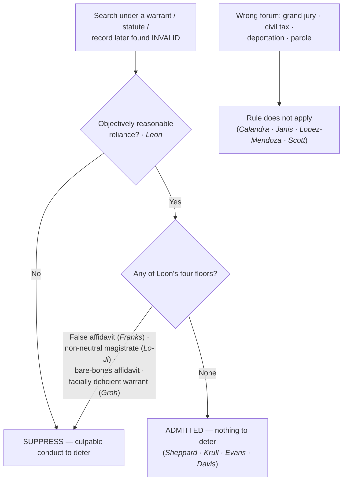
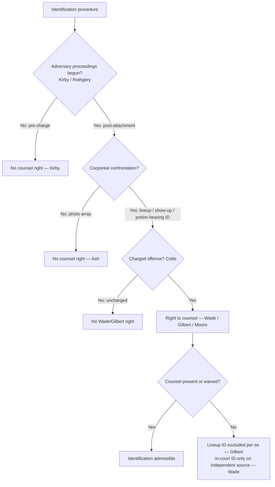

# S9 R1 panel-review — Opus model-diversity lane (prompt pack)

You are the **Claude/Opus** leg of the S9 three-lane adversarial panel (1 Claude + 2 Codex, R1). The two Codex lanes carry the A (support/quote-fidelity) and B (currency/treatment) attack lenses; **you carry model diversity and MUST vote on every paneled assertion across BOTH lenses' concerns.** You are refute-framed: try hard to break each assertion; **default to REFUTED on uncertainty**; never fabricate a cite, quote, or holding; use ONLY the evidence inlined below (no search, no outside knowledge). You are a SIGHTED reviewer — the FULL lake record (judgment fields included) is inlined.

You are a WRITER lane, not an adjudicator: you FIND and VOTE. You do not tally, adjudicate, or close any row — the orchestrator does.

For EACH group below, return one JSON object with the exact `reviewed[]` shape from the output contract (identical framing to the Codex lenses). Emit a finding object ONLY for a real defect (verdict refuted / stands-modified); a group you find wholly clean returns all-`stands` verdicts (the harness records a clean attestation). Concatenate the per-group JSON objects into a top-level `{"packs": [ ... ]}` array, one entry per group, each carrying its `group_id`.


OUTPUT CONTRACT — return ONE JSON object, nothing else:
{
  "lens": "A" | "B",
  "group_id": "<echo the group id>",
  "reviewed": [
    {
      "assertion_id": "<from group_inventory.jsonl>",
      "dimension": "existence|support|quote_fidelity|pincite|treatment|black_letter",
      "verdict": "stands" | "refuted" | "stands-modified",
      "verifiable_from_disclosed": true | false,
      "defect": null,   // null when verdict=="stands"; else an object:
      //  {"problem": "...", "severity": "high|medium|low", "proposed_fix": "...", "evidence_quote": "verbatim from disclosed evidence or null", "needs_cl": true|false, "locator_note": "..."}
      "reasons": ["short evidence-grounded reason", "..."],
      "breaks_true_positives": true | false,
      "residual_risks": ["..."],
      "suggested_tightening": "... or null"
    }
  ],
  "notes": ""
}
Rules: verdict=='stands' <=> defect==null (assertion survives your attack). verdict=='refuted' <=> a real defect (the assertion as framed is wrong). verdict=='stands-modified' <=> survives but needs a stated modification (a minor defect). Review EVERY assertion_id in group_inventory.jsonl exactly once. Output ONLY the JSON object.
---

## GROUP: content/the-exclusionary-rule-remedies-and-standing/the-exclusionary-rule/The Good-Faith Exception.md  (`doctrine`, 15 assertions)

### content_page

```
---
weight: 30
title: "The Good-Faith Exception"
topic: The Good-Faith Exception
type: doctrine
aliases:
  - "The Good-Faith Exception"
  - "Good-Faith Exception"
  - "Leon Good Faith"
jurisdiction: Federal (U.S. Const. amend. IV); SCOTUS baseline
status: draft
related:
  - "[[The Exclusionary Rule]]"
  - "[[Fruits & Attenuation]]"
  - "[[Inevitable Discovery & Independent Source]]"
  - "[[Franks Challenges]]"
  - "[[The Neutral and Detached Magistrate]]"
  - "[[Particularity]]"
  - "[[Collective Knowledge and the Fellow-Officer Rule|Collective Knowledge]]"
  - "[[The Third-Party Doctrine and Digital Surveillance]]"
---

# The Good-Faith Exception

*The warrant (or the authority behind the search) turned out to be invalid — must the evidence still be suppressed?*

> [!rule] Black-letter rule
> Because the exclusionary rule is a **deterrent remedy and not a personal right**, suppression is unwarranted where officers acted in **objectively reasonable reliance** on an authority they were entitled to trust and that was only later found invalid; excluding that evidence would deter nothing. *[[United States v. Leon|Leon]]*, 468 U.S. 897, [922](https://www.courtlistener.com/opinion/111262/united-states-v-leon/) (1984). Good faith **fails**, and suppression follows, in *[[United States v. Leon|Leon]]*'s four situations: **(1)** a knowing or reckless **false affidavit** (*[[Franks v. Delaware|Franks]]*); **(2)** a magistrate who **wholly abandoned** the neutral-and-detached role; **(3)** a **bare-bones affidavit** "so lacking in indicia of probable cause" that belief in it is unreasonable; and **(4)** a **facially deficient / general warrant** no officer could reasonably presume valid. 468 U.S. at 923.
> ^rule-good-faith

## The Brief

**What it is, and why it exists.** The good-faith exception is the sharpest expression of the rule's own logic. Suppression "is a judicially created remedy designed to safeguard Fourth Amendment rights generally through its deterrent effect, rather than a personal constitutional right of the party aggrieved." *[[United States v. Calandra|Calandra]]*, 414 U.S. 338, [348](https://www.courtlistener.com/opinion/108898/united-states-v-calandra/) (1974). It follows only where its deterrence benefits outweigh its heavy social costs and only for conduct culpable enough to deter: "To trigger the exclusionary rule, police conduct must be sufficiently deliberate that exclusion can meaningfully deter it, and sufficiently culpable that such deterrence is worth the price paid by the justice system." *[[Herring v. United States|Herring]]*, 555 U.S. 135, [144](https://www.courtlistener.com/opinion/145922/herring-v-united-states/) (2009). When an officer reasonably relies on a warrant, a statute, or a record he is entitled to trust, there is no culpable conduct to deter, so the evidence comes in.

**The anchor.** *[[United States v. Leon|Leon]]* held that evidence seized under a warrant later found to lack probable cause is admissible where the executing officers relied on it in objectively reasonable good faith. 468 U.S. at 922. The test is **objective**: not the officer's subjective sincerity but whether a reasonably well-trained officer would have known the search was illegal despite the magistrate's authorization.

**How far reliance extends.** The exception has been applied across a family of "someone else made the mistake" situations:
- **Defect in the warrant's form,** where the officer reasonably relied on the judge to fix it. *[[Massachusetts v. Sheppard|Sheppard]]*, 468 U.S. 981, [989–90](https://www.courtlistener.com/opinion/111263/massachusetts-v-sheppard/) (1984).
- **Reliance on a statute** later held unconstitutional. *[[Illinois v. Krull|Krull]]*, 480 U.S. 340, [349–50](https://www.courtlistener.com/opinion/111835/illinois-v-krull/) (1987).
- **Arrest under a presumptively valid ordinance** later voided. *[[Michigan v. DeFillippo|DeFillippo]]*, 443 U.S. 31, [40](https://www.courtlistener.com/opinion/110127/michigan-v-defillippo/) (1979).
- **A court employee's clerical error** in a database of outstanding warrants. *[[Arizona v. Evans|Evans]]*, 514 U.S. 1, [14–16](https://www.courtlistener.com/opinion/117905/arizona-v-evans/) (1995); extended to an isolated police-maintained recordkeeping error in *[[Herring v. United States|Herring]]*, 555 U.S. at [144](https://www.courtlistener.com/opinion/145922/herring-v-united-states/).
- **Reliance on binding appellate precedent** later overturned. *[[Davis v. United States (2011)|Davis (2011)]]*, 564 U.S. 229, 249–50 (2011).

**The four floors — where good faith fails.** *[[United States v. Leon|Leon]]* itself names the four situations that defeat reasonable reliance (468 U.S. at 923), and each item is independently disqualifying:
1. **A knowing or reckless falsehood in the affidavit** — the *[[Franks v. Delaware|Franks]]* problem; a dishonest affidavit cannot support reasonable reliance (developed on [[Franks Challenges]]).
2. **A magistrate who abandoned the neutral-and-detached role**, becoming an adjunct of the search rather than a check on it (developed on [[The Neutral and Detached Magistrate]]).
3. **A bare-bones affidavit** so lacking in indicia of probable cause that official belief in its existence is entirely unreasonable.
4. **A facially deficient or general warrant** — one that fails to particularize the place or things so obviously that no officer could presume it valid. A warrant that does not describe the things to be seized at all is the paradigm; no reasonable officer could rely on it (*[[Groh v. Ramirez|Groh v. Ramirez]]*, facially deficient, primary home [[Particularity]]).

**Reconcile with Collective Knowledge.** *[[Herring v. United States|Herring]]* is a good-faith case at heart (an isolated, attenuated recordkeeping error does not trigger exclusion), but it is also **keyed on [[Collective Knowledge and the Fellow-Officer Rule|Collective Knowledge]]** for the separate point that imputed knowledge through a police database is not a license: the fellow-officer doctrine pools what officers actually know and never manufactures a basis the department in fact lacked. Read *[[Herring v. United States|Herring]]* here for the culpability threshold; read it there for the imputation limit.

**The deterrence logic also fixes the boundaries of the rule.** The same cost-benefit calculus keeps the rule out of proceedings where its deterrent value is too slight to justify the cost. It does not apply to **grand-jury** questioning (*[[United States v. Calandra|Calandra]]*, 414 U.S. at [348](https://www.courtlistener.com/opinion/108898/united-states-v-calandra/)), to a **federal civil (tax)** proceeding on state-seized evidence (*[[United States v. Janis|Janis]]*, 428 U.S. 433, [454](https://www.courtlistener.com/opinion/109539/united-states-v-janis/) (1976)), to **civil removal/deportation** hearings (*[[Immigration & Naturalization Service v. Lopez-Mendoza|Lopez-Mendoza]]*, 468 U.S. 1032, [1050](https://www.courtlistener.com/opinion/111265/immigration-naturalization-service-v-lopez-mendoza/) (1984)), or to **parole-revocation** hearings (*[[Pennsylvania Board of Probation and Parole v. Scott|Pennsylvania Bd. of Probation & Parole v. Scott]]*, 524 U.S. 357, [364](https://www.courtlistener.com/opinion/118235/pennsylvania-bd-of-probation-and-parole-v-scott/) (1998)). These are not "good faith" holdings, but they run on the identical engine: no net deterrence, no suppression.

**The digital arena (cross-reference only).** Good faith has repeatedly carried admissibility on the digital frontier while the underlying search question was unsettled — reasonable reliance on a pre-*[[Carpenter v. United States|Carpenter]]* Stored Communications Act order, or on a geofence warrant issued before the law was clear. Now that the Supreme Court has held in *[[Chatrie v. United States|Chatrie]]* (2026) that acquiring geofence Location History **is** a search, the live remedial questions on pre-ruling warrants are probable cause, [[Particularity|particularity]], and, failing those, good faith. The search-definition exposition lives on [[The Third-Party Doctrine and Digital Surveillance]] and [[Reverse-Keyword and Geofence Warrants]]; this page owns only the good-faith move.

**Burden, standard of review, remedy.** Once a violation and [[Standing to Challenge a Search|standing]] are shown, the **government** bears the burden of establishing objectively reasonable reliance. The good-faith inquiry is reviewed [[Common Legal Terms#de-novo|de novo]], with historical facts for [[Common Legal Terms#clear-error|clear error]]. Where good faith applies, there is **no suppression**; where a floor is hit, the evidence and its fruits are excluded from the case-in-chief ([[Fruits & Attenuation]]).

**Apply it.**
1. **Ask what the officer relied on** (a warrant, a statute, an ordinance, a database, or binding precedent), and whether that reliance was objectively reasonable.
2. **Run the four floors.** A dishonest affidavit, a rubber-stamp magistrate, a bare-bones affidavit, or a facially deficient warrant each defeats good faith on its own.
3. **Do not let good faith rescue a warrant no one could reasonably trust.** A warrant that fails to describe the things to be seized is facially deficient (*[[Groh v. Ramirez|Groh]]*).
4. **Separate the forum question.** In a grand jury, civil tax, deportation, or parole proceeding, the rule may not apply at all (*[[United States v. Calandra|Calandra]]* / *[[United States v. Janis|Janis]]* / *[[Immigration & Naturalization Service v. Lopez-Mendoza|Lopez-Mendoza]]* / *[[Pennsylvania Board of Probation and Parole v. Scott|Scott]]*).
5. **On the digital edge, expect a good-faith fallback** while doctrine settles, and send the search question to the digital pages.

**Common pitfalls.**
- **Thinking good faith cures everything.** It does not reach a dishonest affidavit, a non-neutral magistrate, a bare-bones affidavit, or a facially overbroad warrant (*[[United States v. Leon|Leon]]*'s four floors).
- **Confusing objective reasonableness with subjective sincerity.** The officer's good heart is irrelevant; the question is what a reasonably well-trained officer would have known.
- **Reading *[[Herring v. United States|Herring]]* as an imputation rule.** Its holding here is culpability-and-cost; its imputation limit belongs to [[Collective Knowledge and the Fellow-Officer Rule|Collective Knowledge]].
- **Treating the wrong-forum limits as good-faith holdings.** They share the deterrence rationale but are their own boundary rules.

## Lower-court developments

Two threads run below: **circuit applications of the *[[United States v. Leon|Leon]]* standard**, and **good faith carrying the load in the digital arena** while the search question settled.

- **Good faith applied — *[[United States v. Mathis|United States v. Mathis]]* (11th Cir. 2014).** An officer's objectively reasonable belief in probable cause supported reliance even assuming the warrant lacked it; the evidence was not suppressed. 767 F.3d 1264, 1277. **Binding in-circuit — 11th Cir.**
- **Good faith applied — *[[United States v. Jackson|United States v. Jackson]]* (8th Cir. 2015).** A deputy relied in objectively reasonable good faith on a warrant despite a probable-cause-deficient application. 784 F.3d 1227. **Binding in-circuit — 8th Cir.**
- **Good faith unavailable — *[[United States v. Leary|United States v. Leary]]* (10th Cir. 1988).** A facially overbroad, general warrant was too deficient for objectively reasonable reliance (*[[United States v. Leon|Leon]]*'s fourth floor). 846 F.2d 592, 605–06. **Binding in-circuit — 10th Cir.**
- **Digital-arena good faith — *[[United States v. Smith|United States v. Smith]]* (5th Cir. 2024) · *[[Carpenter v. United States|United States v. Carpenter]]* (6th Cir. 2019, [[Reading and Citing Cases#on-remand|on remand]]).** *Smith* held geofence acquisition a search yet upheld admission under *[[United States v. Leon|Leon]]* given the novelty of the technology, 110 F.4th 817, 838; [[Reading and Citing Cases#on-remand|on remand]] the Sixth Circuit denied suppression of CSLI obtained under a then-valid Stored Communications Act order, applying *[[Illinois v. Krull|Krull]]*-style reliance. The search-definition exposition (now resolved by *[[Chatrie v. United States|Chatrie]]* (2026)) lives on [[The Third-Party Doctrine and Digital Surveillance]] and [[Reverse-Keyword and Geofence Warrants]]; the good-faith move is the through-line here. **Binding in-circuit — 5th Cir.; 6th Cir.**
- **Good faith withheld — *[[United States v. Cano|Cano]]* (9th Cir. 2019).** The Ninth Circuit runs *[[Davis v. United States (2011)|Davis]]* the other way on a novel technique: the good-faith exception applies only where "binding appellate precedent . . . 'specifically authorizes' the police's search" (*Cano*, quoting *Lara*), so an "unclear" or merely "plausibly . . . permissible" question is "not sufficient." On that view the very novelty of a surveillance technique cuts *against* objectively reasonable reliance rather than for it. *Cano*, 934 F.3d 1002 (9th Cir. 2019) (slip op., at 33). **Binding in-circuit — 9th Cir.**

The through-line: courts reach for good faith exactly when the officer's reliance was reasonable and the illegality was someone else's mistake or an unsettled question of law, because there is no culpable conduct for suppression to deter — though the Ninth Circuit (*[[United States v. Cano|Cano]]*) rejects the "unsettled" half of that move.

## Key cases

| Case | Holding | Opinion |
|---|---|---|
| *[[United States v. Leon]]*, 468 U.S. 897 (1984) | **Anchor.** Objectively reasonable reliance on a warrant later found to lack probable cause does not trigger exclusion; lists the four situations where good faith fails (at 923). | [opinion](https://www.courtlistener.com/opinion/111262/united-states-v-leon/) |
| *[[Massachusetts v. Sheppard]]*, 468 U.S. 981 (1984) | **Form defect.** Good faith applies where the warrant was defective in form but officers reasonably relied on the judge to correct it. | [opinion](https://www.courtlistener.com/opinion/111263/massachusetts-v-sheppard/) |
| *[[Illinois v. Krull]]*, 480 U.S. 340 (1987) | **Statute.** Good-faith reliance on a statute later held unconstitutional does not trigger exclusion. | [opinion](https://www.courtlistener.com/opinion/111835/illinois-v-krull/) |
| *[[Michigan v. DeFillippo]]*, 443 U.S. 31 (1979) | **Ordinance.** Arrest under a presumptively valid ordinance later voided was valid; the search-incident evidence is admissible. | [opinion](https://www.courtlistener.com/opinion/110127/michigan-v-defillippo/) |
| *[[Arizona v. Evans]]*, 514 U.S. 1 (1995) | **Clerical error.** Good faith extends to a mistaken arrest record produced by court-employee clerical error. | [opinion](https://www.courtlistener.com/opinion/117905/arizona-v-evans/) |
| *[[Herring v. United States]]*, 555 U.S. 135 (2009) | **Culpability threshold.** Isolated, attenuated negligence in a recordkeeping database does not trigger exclusion; suppression requires deliberate, culpable conduct. (Also keyed on [[Collective Knowledge and the Fellow-Officer Rule\|Collective Knowledge]].) | [opinion](https://www.courtlistener.com/opinion/145922/herring-v-united-states/) |
| *[[Davis v. United States (2011)]]*, 564 U.S. 229 (2011) | **Binding precedent.** Good faith extends to reliance on binding appellate precedent later overturned. | [opinion](https://www.courtlistener.com/opinion/218926/davis-v-united-states/) |
| *[[United States v. Calandra]]*, 414 U.S. 338 (1974) | **Deterrent remedy, not a right.** The rule is a judicially created deterrent remedy; it does not apply to grand-jury questioning. | [opinion](https://www.courtlistener.com/opinion/108898/united-states-v-calandra/) |
| *[[United States v. Janis]]*, 428 U.S. 433 (1976) | **Boundary.** The rule does not bar state-seized evidence in a federal civil (tax) proceeding; deterrence benefit does not outweigh the cost. | [opinion](https://www.courtlistener.com/opinion/109539/united-states-v-janis/) |
| *[[Immigration & Naturalization Service v. Lopez-Mendoza]]*, 468 U.S. 1032 (1984) | **Boundary.** The rule generally does not apply in civil removal/deportation proceedings. | [opinion](https://www.courtlistener.com/opinion/111265/immigration-naturalization-service-v-lopez-mendoza/) |
| *[[Pennsylvania Board of Probation and Parole v. Scott]]*, 524 U.S. 357 (1998) | **Boundary.** The federal exclusionary rule does not bar evidence at parole-revocation hearings. | [opinion](https://www.courtlistener.com/opinion/118235/pennsylvania-bd-of-probation-and-parole-v-scott/) |

## Related cases across doctrines

These are treated in full elsewhere but define the floors of the good-faith exception, framed for it here.

| Case | Relevance here | Primary home | Opinion |
|---|---|---|---|
| *[[Franks v. Delaware]]*, 438 U.S. 154 (1978) | ***Floor 1.*** A knowing or reckless falsehood in the affidavit voids the warrant and defeats good faith. | [[Franks Challenges]] | [opinion](https://www.courtlistener.com/opinion/109925/franks-v-delaware/) |
| *[[Lo-Ji Sales, Inc. v. New York]]*, 442 U.S. 319 (1979) | ***Floor 2.*** A magistrate who abandons the neutral-and-detached role is no valid warrant-issuer, so reliance is unreasonable. | [[The Neutral and Detached Magistrate]] | [opinion](https://www.courtlistener.com/opinion/110100/lo-ji-sales-inc-v-new-york/) |
| *[[Groh v. Ramirez]]*, 540 U.S. 551 (2004) | ***Floor 4.*** A warrant that fails to describe the things to be seized is facially deficient; no reasonable officer could rely on it. | [[Particularity]] | [opinion](https://www.courtlistener.com/opinion/134736/groh-v-ramirez/) |

## Visual



## Sources
- [*United States v. Leon*, 468 U.S. 897 (1984)](https://www.courtlistener.com/opinion/111262/united-states-v-leon/) (pinpoints: 922, 923)
- [*Massachusetts v. Sheppard*, 468 U.S. 981 (1984)](https://www.courtlistener.com/opinion/111263/massachusetts-v-sheppard/) (pinpoints: 989–90)
- [*Illinois v. Krull*, 480 U.S. 340 (1987)](https://www.courtlistener.com/opinion/111835/illinois-v-krull/) (pinpoints: 349–50)
- [*Michigan v. DeFillippo*, 443 U.S. 31 (1979)](https://www.courtlistener.com/opinion/110127/michigan-v-defillippo/) (pinpoint: 40)
- [*Arizona v. Evans*, 514 U.S. 1 (1995)](https://www.courtlistener.com/opinion/117905/arizona-v-evans/) (pinpoints: 14, 16)
- [*Herring v. United States*, 555 U.S. 135 (2009)](https://www.courtlistener.com/opinion/145922/herring-v-united-states/) (pinpoint: 144; also keyed on [[Collective Knowledge and the Fellow-Officer Rule|Collective Knowledge]])
- [*Davis v. United States*, 564 U.S. 229 (2011)](https://www.courtlistener.com/opinion/218926/davis-v-united-states/) (pinpoints: 232, 249–50)
- [*United States v. Calandra*, 414 U.S. 338 (1974)](https://www.courtlistener.com/opinion/108898/united-states-v-calandra/) (pinpoint: 348)
- [*United States v. Janis*, 428 U.S. 433 (1976)](https://www.courtlistener.com/opinion/109539/united-states-v-janis/) (pinpoint: 454)
- [*INS v. Lopez-Mendoza*, 468 U.S. 1032 (1984)](https://www.courtlistener.com/opinion/111265/immigration-naturalization-service-v-lopez-mendoza/) (pinpoints: 1039, 1050)
- [*Pennsylvania Bd. of Probation & Parole v. Scott*, 524 U.S. 357 (1998)](https://www.courtlistener.com/opinion/118235/pennsylvania-bd-of-probation-and-parole-v-scott/) (pinpoint: 364)
- [*Franks v. Delaware*, 438 U.S. 154 (1978)](https://www.courtlistener.com/opinion/109925/franks-v-delaware/) (home = [[Franks Challenges]])
- [*Lo-Ji Sales, Inc. v. New York*, 442 U.S. 319 (1979)](https://www.courtlistener.com/opinion/110100/lo-ji-sales-inc-v-new-york/) (pinpoints: 326–27; home = [[The Neutral and Detached Magistrate]])
- [*Groh v. Ramirez*, 540 U.S. 551 (2004)](https://www.courtlistener.com/opinion/134736/groh-v-ramirez/) (facially deficient warrant; home = [[Particularity]])
- [*United States v. Mathis*, 767 F.3d 1264 (11th Cir. 2014)](https://www.courtlistener.com/opinion/2736649/united-states-v-arnold-maurice-mathis/) (pinpoint: 1277) (Binding in-circuit — 11th Cir.; good faith applied)
- [*United States v. Jackson*, 784 F.3d 1227 (8th Cir. 2015)](https://www.courtlistener.com/opinion/2798587/united-states-v-ac-jackson/) (Binding in-circuit — 8th Cir.; good faith applied)
- [*United States v. Leary*, 846 F.2d 592 (10th Cir. 1988)](https://www.courtlistener.com/opinion/505922/united-states-v-richard-j-leary-and-fl-kleinberg-co/) (pinpoints: 605–06) (Binding in-circuit — 10th Cir.; good faith unavailable)
- [*United States v. Smith*, 110 F.4th 817 (5th Cir. 2024)](https://www.courtlistener.com/opinion/10036119/united-states-v-smith/) (pinpoint: 838) (Binding in-circuit — 5th Cir.; digital-arena good faith; search-question exposition on [[Reverse-Keyword and Geofence Warrants]])
- [*United States v. Carpenter*, 926 F.3d 313 (6th Cir. 2019)](https://www.courtlistener.com/opinion/4628336/united-states-v-timothy-carpenter/) (Binding in-circuit — 6th Cir.; good faith on remand under the Stored Communications Act; distinct from the SCOTUS merits opinion)
- [*United States v. Cano*, 934 F.3d 1002 (9th Cir. 2019)](https://www.courtlistener.com/opinion/4649091/united-states-v-miguel-cano/) (pinpoint: slip op., at 33; quoting *Lara*, 815 F.3d 605, 613) (Binding in-circuit — 9th Cir.; good faith withheld; *Davis* reliance requires binding precedent specifically authorizing the technique)

```

### group_inventory (assertions under review)

```jsonl
{"assertion_id": "07b1bdab23afc0a3", "dimension": "existence", "kind": "case_cite", "locator": {"case": "United States v. Janis", "table_line": 73}, "payload": {"case": "United States v. Janis", "cells": ["*[[United States v. Janis]]*, 428 U.S. 433 (1976)", "**Boundary.** The rule does not bar state-seized evidence in a federal civil (tax) proceeding; deterrence benefit does not outweigh the cost.", "[opinion](https://www.courtlistener.com/opinion/109539/united-states-v-janis/)"], "header": ["Case", "Holding", "Opinion"]}}
{"assertion_id": "083430ab8e28df13", "dimension": "existence", "kind": "case_cite", "locator": {"case": "Immigration & Naturalization Service v. Lopez-Mendoza", "table_line": 74}, "payload": {"case": "Immigration & Naturalization Service v. Lopez-Mendoza", "cells": ["*[[Immigration & Naturalization Service v. Lopez-Mendoza]]*, 468 U.S. 1032 (1984)", "**Boundary.** The rule generally does not apply in civil removal/deportation proceedings.", "[opinion](https://www.courtlistener.com/opinion/111265/immigration-naturalization-service-v-lopez-mendoza/)"], "header": ["Case", "Holding", "Opinion"]}}
{"assertion_id": "0a322ef542fabbb4", "dimension": "existence", "kind": "case_cite", "locator": {"case": "United States v. Leon", "table_line": 65}, "payload": {"case": "United States v. Leon", "cells": ["*[[United States v. Leon]]*, 468 U.S. 897 (1984)", "**Anchor.** Objectively reasonable reliance on a warrant later found to lack probable cause does not trigger exclusion; lists the four situations where good faith fails (at 923).", "[opinion](https://www.courtlistener.com/opinion/111262/united-states-v-leon/)"], "header": ["Case", "Holding", "Opinion"]}}
{"assertion_id": "17b23c9509d149d4", "dimension": "existence", "kind": "case_cite", "locator": {"case": "Arizona v. Evans", "table_line": 69}, "payload": {"case": "Arizona v. Evans", "cells": ["*[[Arizona v. Evans]]*, 514 U.S. 1 (1995)", "**Clerical error.** Good faith extends to a mistaken arrest record produced by court-employee clerical error.", "[opinion](https://www.courtlistener.com/opinion/117905/arizona-v-evans/)"], "header": ["Case", "Holding", "Opinion"]}}
{"assertion_id": "2dfa0edf30be5f4a", "dimension": "existence", "kind": "case_cite", "locator": {"case": "Davis v. United States (2011)", "table_line": 71}, "payload": {"case": "Davis v. United States (2011)", "cells": ["*[[Davis v. United States (2011)]]*, 564 U.S. 229 (2011)", "**Binding precedent.** Good faith extends to reliance on binding appellate precedent later overturned.", "[opinion](https://www.courtlistener.com/opinion/218926/davis-v-united-states/)"], "header": ["Case", "Holding", "Opinion"]}}
{"assertion_id": "4b18e2927ba73fe4", "dimension": "existence", "kind": "case_cite", "locator": {"case": "Groh v. Ramirez", "table_line": 85}, "payload": {"case": "Groh v. Ramirez", "cells": ["*[[Groh v. Ramirez]]*, 540 U.S. 551 (2004)", "***Floor 4.*** A warrant that fails to describe the things to be seized is facially deficient; no reasonable officer could rely on it.", "[[Particularity]]", "[opinion](https://www.courtlistener.com/opinion/134736/groh-v-ramirez/)"], "header": ["Case", "Relevance here", "Primary home", "Opinion"]}}
{"assertion_id": "4cdefc78be53c5ed", "dimension": "existence", "kind": "case_cite", "locator": {"case": "Michigan v. DeFillippo", "table_line": 68}, "payload": {"case": "Michigan v. DeFillippo", "cells": ["*[[Michigan v. DeFillippo]]*, 443 U.S. 31 (1979)", "**Ordinance.** Arrest under a presumptively valid ordinance later voided was valid; the search-incident evidence is admissible.", "[opinion](https://www.courtlistener.com/opinion/110127/michigan-v-defillippo/)"], "header": ["Case", "Holding", "Opinion"]}}
{"assertion_id": "74ce388430e8663d", "dimension": "existence", "kind": "case_cite", "locator": {"case": "Illinois v. Krull", "table_line": 67}, "payload": {"case": "Illinois v. Krull", "cells": ["*[[Illinois v. Krull]]*, 480 U.S. 340 (1987)", "**Statute.** Good-faith reliance on a statute later held unconstitutional does not trigger exclusion.", "[opinion](https://www.courtlistener.com/opinion/111835/illinois-v-krull/)"], "header": ["Case", "Holding", "Opinion"]}}
{"assertion_id": "8d70c29059309c1c", "dimension": "existence", "kind": "case_cite", "locator": {"case": "Herring v. United States", "table_line": 70}, "payload": {"case": "Herring v. United States", "cells": ["*[[Herring v. United States]]*, 555 U.S. 135 (2009)", "**Culpability threshold.** Isolated, attenuated negligence in a recordkeeping database does not trigger exclusion; suppression requires deliberate, culpable conduct. (Also keyed on [[Collective Knowledge and the Fellow-Officer Rule\\|Collective Knowledge]].)", "[opinion](https://www.courtlistener.com/opinion/145922/herring-v-united-states/)"], "header": ["Case", "Holding", "Opinion"]}}
{"assertion_id": "93953398173bdaeb", "dimension": "existence", "kind": "case_cite", "locator": {"case": "United States v. Calandra", "table_line": 72}, "payload": {"case": "United States v. Calandra", "cells": ["*[[United States v. Calandra]]*, 414 U.S. 338 (1974)", "**Deterrent remedy, not a right.** The rule is a judicially created deterrent remedy; it does not apply to grand-jury questioning.", "[opinion](https://www.courtlistener.com/opinion/108898/united-states-v-calandra/)"], "header": ["Case", "Holding", "Opinion"]}}
{"assertion_id": "958cc238566a884f", "dimension": "existence", "kind": "case_cite", "locator": {"case": "Lo-Ji Sales, Inc. v. New York", "table_line": 84}, "payload": {"case": "Lo-Ji Sales, Inc. v. New York", "cells": ["*[[Lo-Ji Sales, Inc. v. New York]]*, 442 U.S. 319 (1979)", "***Floor 2.*** A magistrate who abandons the neutral-and-detached role is no valid warrant-issuer, so reliance is unreasonable.", "[[The Neutral and Detached Magistrate]]", "[opinion](https://www.courtlistener.com/opinion/110100/lo-ji-sales-inc-v-new-york/)"], "header": ["Case", "Relevance here", "Primary home", "Opinion"]}}
{"assertion_id": "add4df9a16cbba74", "dimension": "existence", "kind": "case_cite", "locator": {"case": "Pennsylvania Board of Probation and Parole v. Scott", "table_line": 75}, "payload": {"case": "Pennsylvania Board of Probation and Parole v. Scott", "cells": ["*[[Pennsylvania Board of Probation and Parole v. Scott]]*, 524 U.S. 357 (1998)", "**Boundary.** The federal exclusionary rule does not bar evidence at parole-revocation hearings.", "[opinion](https://www.courtlistener.com/opinion/118235/pennsylvania-bd-of-probation-and-parole-v-scott/)"], "header": ["Case", "Holding", "Opinion"]}}
{"assertion_id": "c96e9abb3dc7e58f", "dimension": "existence", "kind": "case_cite", "locator": {"case": "Massachusetts v. Sheppard", "table_line": 66}, "payload": {"case": "Massachusetts v. Sheppard", "cells": ["*[[Massachusetts v. Sheppard]]*, 468 U.S. 981 (1984)", "**Form defect.** Good faith applies where the warrant was defective in form but officers reasonably relied on the judge to correct it.", "[opinion](https://www.courtlistener.com/opinion/111263/massachusetts-v-sheppard/)"], "header": ["Case", "Holding", "Opinion"]}}
{"assertion_id": "f3878a831da41573", "dimension": "existence", "kind": "case_cite", "locator": {"case": "Franks v. Delaware", "table_line": 83}, "payload": {"case": "Franks v. Delaware", "cells": ["*[[Franks v. Delaware]]*, 438 U.S. 154 (1978)", "***Floor 1.*** A knowing or reckless falsehood in the affidavit voids the warrant and defeats good faith.", "[[Franks Challenges]]", "[opinion](https://www.courtlistener.com/opinion/109925/franks-v-delaware/)"], "header": ["Case", "Relevance here", "Primary home", "Opinion"]}}
{"assertion_id": "20ff584c3936abb3", "dimension": "support", "kind": "proposition", "locator": {"callout": "^rule-good-faith"}, "payload": {"anchor": "^rule-good-faith", "statement": "[!rule] Black-letter rule\nBecause the exclusionary rule is a **deterrent remedy and not a personal right**, suppression is unwarranted where officers acted in **objectively reasonable reliance** on an authority they were entitled to trust and that was only later found invalid; excluding that evidence would deter nothing. *[[United States v. Leon|Leon]]*, 468 U.S. 897, [922](https://www.courtlistener.com/opinion/111262/united-states-v-leon/) (1984). Good faith **fails**, and suppression follows, in *[[United States v. Leon|Leon]]*'s four situations: **(1)** a knowing or reckless **false affidavit** (*[[Franks v. Delaware|Franks]]*); **(2)** a magistrate who **wholly abandoned** the neutral-and-detached role; **(3)** a **bare-bones affidavit** \"so lacking in indicia of probable cause\" that belief in it is unreasonable; and **(4)** a **facially deficient / general warrant** no officer could reasonably presume valid. 468 U.S. at 923."}}
```

### lake record — Arizona v. Evans

```json
{
  "schema_version": "s2.v1",
  "record_id": "Arizona v. Evans",
  "stub": false,
  "status": "verified",
  "identity": {
    "case_name": "Arizona v. Evans",
    "case_name_short": "Evans",
    "case_name_full": "Arizona v. Evans",
    "input_case_name": "Arizona v. Evans",
    "court": "U.S. Supreme Court",
    "court_id": "scotus",
    "court_level": "scotus",
    "circuit": null,
    "state": null,
    "date_decided": "1995-03-01",
    "year": 1995,
    "docket": null,
    "cluster_id": 117905,
    "lead_opinion_id": 9433091,
    "sibling_ids": [
      117905,
      9433091,
      9433092,
      9433093,
      9433094,
      9433095
    ],
    "absolute_url": "/opinion/117905/arizona-v-evans/",
    "identity_method": "citation+party-text",
    "expected_citation_found": true,
    "party_name_in_text": true,
    "canonical_name_match": true,
    "alternates": [],
    "reason_code": null
  },
  "citations": {
    "official": {
      "cite": "514 U.S. 1",
      "volume": "514",
      "reporter": "U.S.",
      "page": "1",
      "type": 1,
      "selected_official": true,
      "source": "cluster.citations[]"
    },
    "parallel": [
      {
        "cite": "115 S. Ct. 1185",
        "volume": "115",
        "reporter": "S. Ct.",
        "page": "1185",
        "type": 1,
        "selected_official": false,
        "source": "cluster.citations[]"
      },
      {
        "cite": "131 L. Ed. 2d 34",
        "volume": "131",
        "reporter": "L. Ed. 2d",
        "page": "34",
        "type": 1,
        "selected_official": false,
        "source": "cluster.citations[]"
      }
    ],
    "vendor_neutral": [
      {
        "cite": "1995 U.S. LEXIS 1806",
        "volume": "1995",
        "reporter": "U.S. LEXIS",
        "page": "1806",
        "type": 6,
        "selected_official": false,
        "source": "cluster.citations[]"
      }
    ],
    "all": [
      {
        "cite": "514 U.S. 1",
        "volume": "514",
        "reporter": "U.S.",
        "page": "1",
        "type": 1,
        "selected_official": false,
        "source": "cluster.citations[]"
      },
      {
        "cite": "115 S. Ct. 1185",
        "volume": "115",
        "reporter": "S. Ct.",
        "page": "1185",
        "type": 1,
        "selected_official": false,
        "source": "cluster.citations[]"
      },
      {
        "cite": "131 L. Ed. 2d 34",
        "volume": "131",
        "reporter": "L. Ed. 2d",
        "page": "34",
        "type": 1,
        "selected_official": false,
        "source": "cluster.citations[]"
      },
      {
        "cite": "1995 U.S. LEXIS 1806",
        "volume": "1995",
        "reporter": "U.S. LEXIS",
        "page": "1806",
        "type": 6,
        "selected_official": false,
        "source": "cluster.citations[]"
      }
    ],
    "display": "514 U.S. 1",
    "official_selection": {
      "court_class": "scotus",
      "selected": "514 U.S. 1",
      "reason": "selected_rank_1"
    }
  },
  "pinpoints": [
    {
      "id": "pin-14",
      "page": null,
      "quote": "--- # Arizona v. Evans *514 U.S. 1 (1995)* \u00b7 U.S. Supreme Court \u00b7 **Binding \u2014 SCOTUS** \u00b7 Treatment: **good** *(as of 2026-06-30)* <!-- header line; TreatmentBadge + weight render here, degrading to the text above --> ## Background Phoenix police stopped Evans for a traffic violation; the patrol-car computer showed an outstanding misdemeanor arrest warrant. Officers arrested him and, in a search incident to arrest, found marijuana. In fact the warrant had been quashed weeks earlier, but a court clerk's error left it in the computer system. Evans moved to suppress the marijuana as the fruit of an unlawful arrest. ## Issue Whether the exclusionary rule requires suppression of evidence seized incident to an arrest that resulted from inaccurate computer records attributable to the clerical error of a *court* employee rather than the police. ## Rule No. Under the *Leon* cost-benefit framework, suppression is unwarranted because it would not deter the kind of error at issue:",
      "star_marker": null,
      "quote_fidelity": "mismatch",
      "pinpoint_status": "slip-only",
      "position": null
    },
    {
      "id": "pin-16",
      "page": null,
      "quote": "are not adjuncts to the law enforcement team engaged in the often competitive enterprise of ferreting out crime,",
      "star_marker": "15",
      "quote_fidelity": "matched",
      "pinpoint_status": "star-verified",
      "position": 41308,
      "fragment": "#:~:text=are%20not%20adjuncts%20to%20the",
      "fragment_validated_at": "2026-07-09T15:40:45Z"
    }
  ],
  "treatment": {
    "field_i_validity": "good_law",
    "as_of_content": "1995-03-01",
    "as_of_treatment": "2026-06-30",
    "composite_basis": "migration-seed",
    "composite_basis_ref": "Arizona v. Evans",
    "varies_by_point": false,
    "scope_note": "Old as_of seeds as_of_treatment; S2 derivation re-derives and may downgrade.",
    "point_overrides": [],
    "edges": [
      {
        "citing_case": {
          "name": "State v. Rogers",
          "cluster_id": 10705828,
          "cite": null,
          "field_ii": "overruled"
        },
        "field_ii": "overruled",
        "field_iii": "mentioned",
        "point": null,
        "proposed": true,
        "journal_ref": "Arizona v. Evans:lane1_negative"
      },
      {
        "citing_case": {
          "name": "State of Minnesota v. Raenard Romalle Douglas",
          "cluster_id": 10129058,
          "cite": null,
          "field_ii": "overruled"
        },
        "field_ii": "overruled",
        "field_iii": "mentioned",
        "point": null,
        "proposed": true,
        "journal_ref": "Arizona v. Evans:lane1_negative"
      },
      {
        "citing_case": {
          "name": "State v. Kruse",
          "cluster_id": 4643214,
          "cite": [
            "303 Neb. 799",
            "931 N.W.2d 148"
          ],
          "field_ii": "overruled"
        },
        "field_ii": "overruled",
        "field_iii": "mentioned",
        "point": null,
        "proposed": true,
        "journal_ref": "Arizona v. Evans:lane1_negative"
      },
      {
        "citing_case": {
          "name": "1A Auto, Inc. v. Director of the Office of Campaign and Political Finance",
          "cluster_id": 4533242,
          "cite": [
            "105 N.E.3d 1175",
            "480 Mass. 423"
          ],
          "field_ii": "overruled"
        },
        "field_ii": "overruled",
        "field_iii": "mentioned",
        "point": null,
        "proposed": true,
        "journal_ref": "Arizona v. Evans:lane1_negative"
      },
      {
        "citing_case": {
          "name": "People v. Arredondo",
          "cluster_id": 6238731,
          "cite": [
            "199 Cal. Rptr. 3d 563",
            "245 Cal. App. 4th 186",
            "2016 Cal. App. LEXIS 153"
          ],
          "field_ii": "overruled"
        },
        "field_ii": "overruled",
        "field_iii": "mentioned",
        "point": null,
        "proposed": true,
        "journal_ref": "Arizona v. Evans:lane1_negative"
      },
      {
        "citing_case": {
          "name": "United States v. Kenneth Rush",
          "cluster_id": 3164356,
          "cite": [
            "808 F.3d 1007",
            "2015 U.S. App. LEXIS 22212",
            "2015 WL 9269763"
          ],
          "field_ii": "questioned"
        },
        "field_ii": "questioned",
        "field_iii": "mentioned",
        "point": null,
        "proposed": true,
        "journal_ref": "Arizona v. Evans:lane1_negative"
      },
      {
        "citing_case": {
          "name": "Rivas, Gerardo Tomas",
          "cluster_id": 4288590,
          "cite": null,
          "field_ii": "overruled"
        },
        "field_ii": "overruled",
        "field_iii": "mentioned",
        "point": null,
        "proposed": true,
        "journal_ref": "Arizona v. Evans:lane1_negative"
      },
      {
        "citing_case": {
          "name": "Rivas, Gerardo Tomas",
          "cluster_id": 4287047,
          "cite": null,
          "field_ii": "overruled"
        },
        "field_ii": "overruled",
        "field_iii": "mentioned",
        "point": null,
        "proposed": true,
        "journal_ref": "Arizona v. Evans:lane1_negative"
      },
      {
        "citing_case": {
          "name": "Rivas, Gerardo Tomas",
          "cluster_id": 4286131,
          "cite": null,
          "field_ii": "overruled"
        },
        "field_ii": "overruled",
        "field_iii": "mentioned",
        "point": null,
        "proposed": true,
        "journal_ref": "Arizona v. Evans:lane1_negative"
      },
      {
        "citing_case": {
          "name": "United States v. Chad Camou",
          "cluster_id": 2759861,
          "cite": [
            "773 F.3d 932",
            "2014 U.S. App. LEXIS 23347",
            "2014 WL 6980135"
          ],
          "field_ii": "overruled"
        },
        "field_ii": "overruled",
        "field_iii": "mentioned",
        "point": null,
        "proposed": true,
        "journal_ref": "Arizona v. Evans:lane1_negative"
      },
      {
        "citing_case": {
          "name": "United States v. Shondolyn Blevins",
          "cluster_id": 2678617,
          "cite": [
            "755 F.3d 312",
            "2014 WL 2711159",
            "2014 U.S. App. LEXIS 11138"
          ],
          "field_ii": "superseded_by_statute"
        },
        "field_ii": "superseded_by_statute",
        "field_iii": "mentioned",
        "point": null,
        "proposed": true,
        "journal_ref": "Arizona v. Evans:lane1_negative"
      },
      {
        "citing_case": {
          "name": "Isaac John Russell v. State",
          "cluster_id": 3076235,
          "cite": null,
          "field_ii": "questioned"
        },
        "field_ii": "questioned",
        "field_iii": "mentioned",
        "point": null,
        "proposed": true,
        "journal_ref": "Arizona v. Evans:lane1_negative"
      },
      {
        "citing_case": {
          "name": "Smith v. Robbins",
          "cluster_id": 118332,
          "cite": [
            "145 L. Ed. 2d 756",
            "120 S. Ct. 746",
            "528 U.S. 259",
            "2000 U.S. LEXIS 825"
          ],
          "field_ii": "overruled"
        },
        "field_ii": "overruled",
        "field_iii": "mentioned",
        "point": null,
        "proposed": true,
        "journal_ref": "Arizona v. Evans:lane2_top_cited"
      },
      {
        "citing_case": {
          "name": "Ohio v. Robinette",
          "cluster_id": 118066,
          "cite": [
            "136 L. Ed. 2d 347",
            "117 S. Ct. 417",
            "519 U.S. 33",
            "1996 U.S. LEXIS 6971"
          ],
          "field_ii": "criticized"
        },
        "field_ii": "criticized",
        "field_iii": "mentioned",
        "point": null,
        "proposed": true,
        "journal_ref": "Arizona v. Evans:lane2_top_cited"
      },
      {
        "citing_case": {
          "name": "Herring v. United States",
          "cluster_id": 145922,
          "cite": [
            "172 L. Ed. 2d 496",
            "129 S. Ct. 695",
            "555 U.S. 135",
            "2009 U.S. LEXIS 581"
          ],
          "field_ii": "overruled"
        },
        "field_ii": "overruled",
        "field_iii": "mentioned",
        "point": null,
        "proposed": true,
        "journal_ref": "Arizona v. Evans:lane2_top_cited"
      },
      {
        "citing_case": {
          "name": "Davis v. United States",
          "cluster_id": 218926,
          "cite": [
            "180 L. Ed. 2d 285",
            "131 S. Ct. 2419",
            "564 U.S. 229",
            "2011 U.S. LEXIS 4560"
          ],
          "field_ii": "overruled"
        },
        "field_ii": "overruled",
        "field_iii": "mentioned",
        "point": null,
        "proposed": true,
        "journal_ref": "Arizona v. Evans:lane2_top_cited"
      },
      {
        "citing_case": {
          "name": "United States v. Morrison",
          "cluster_id": 118363,
          "cite": [
            "146 L. Ed. 2d 658",
            "120 S. Ct. 1740",
            "529 U.S. 598",
            "2000 U.S. LEXIS 3422"
          ],
          "field_ii": "overruled"
        },
        "field_ii": "overruled",
        "field_iii": "mentioned",
        "point": null,
        "proposed": true,
        "journal_ref": "Arizona v. Evans:lane2_top_cited"
      },
      {
        "citing_case": {
          "name": "Groh v. Ramirez",
          "cluster_id": 131161,
          "cite": [
            "157 L. Ed. 2d 1068",
            "124 S. Ct. 1284",
            "540 U.S. 551",
            "2004 U.S. LEXIS 1624",
            "2004 WL 330057"
          ],
          "field_ii": "abrogated"
        },
        "field_ii": "abrogated",
        "field_iii": "mentioned",
        "point": null,
        "proposed": true,
        "journal_ref": "Arizona v. Evans:lane2_top_cited"
      },
      {
        "citing_case": {
          "name": "Hudson v. Michigan",
          "cluster_id": 145646,
          "cite": [
            "165 L. Ed. 2d 56",
            "126 S. Ct. 2159",
            "547 U.S. 586",
            "2006 U.S. LEXIS 4677"
          ],
          "field_ii": "overruled"
        },
        "field_ii": "overruled",
        "field_iii": "mentioned",
        "point": null,
        "proposed": true,
        "journal_ref": "Arizona v. Evans:lane2_top_cited"
      },
      {
        "citing_case": {
          "name": "Pennsylvania v. Labron",
          "cluster_id": 118063,
          "cite": [
            "135 L. Ed. 2d 1031",
            "116 S. Ct. 2485",
            "518 U.S. 938",
            "1996 U.S. LEXIS 4268"
          ],
          "field_ii": "questioned"
        },
        "field_ii": "questioned",
        "field_iii": "mentioned",
        "point": null,
        "proposed": true,
        "journal_ref": "Arizona v. Evans:lane2_top_cited"
      },
      {
        "citing_case": {
          "name": "Pennsylvania Bd. of Probation and Parole v. Scott",
          "cluster_id": 118235,
          "cite": [
            "141 L. Ed. 2d 344",
            "118 S. Ct. 2014",
            "524 U.S. 357",
            "1998 U.S. LEXIS 4037"
          ],
          "field_ii": "overruled"
        },
        "field_ii": "overruled",
        "field_iii": "mentioned",
        "point": null,
        "proposed": true,
        "journal_ref": "Arizona v. Evans:lane2_top_cited"
      },
      {
        "citing_case": {
          "name": "Bennis v. Michigan",
          "cluster_id": 118005,
          "cite": [
            "134 L. Ed. 2d 68",
            "116 S. Ct. 994",
            "516 U.S. 442",
            "1996 U.S. LEXIS 1565"
          ],
          "field_ii": "overruled"
        },
        "field_ii": "overruled",
        "field_iii": "mentioned",
        "point": null,
        "proposed": true,
        "journal_ref": "Arizona v. Evans:lane2_top_cited"
      },
      {
        "citing_case": {
          "name": "Ana Maria Lanza v. John Ashcroft, Attorney General",
          "cluster_id": 788423,
          "cite": [
            "389 F.3d 917",
            "2004 U.S. App. LEXIS 24281",
            "2004 WL 2650828"
          ],
          "field_ii": "overruled"
        },
        "field_ii": "overruled",
        "field_iii": "mentioned",
        "point": null,
        "proposed": true,
        "journal_ref": "Arizona v. Evans:lane2_top_cited"
      },
      {
        "citing_case": {
          "name": "Collins v. Virginia",
          "cluster_id": 4501697,
          "cite": [
            "584 U.S. 586",
            "138 S. Ct. 1663",
            "201 L. Ed. 2d 9",
            "2018 U.S. LEXIS 3210"
          ],
          "field_ii": "overruled"
        },
        "field_ii": "overruled",
        "field_iii": "mentioned",
        "point": null,
        "proposed": true,
        "journal_ref": "Arizona v. Evans:lane2_top_cited"
      },
      {
        "citing_case": {
          "name": "United States v. Shareef",
          "cluster_id": 154170,
          "cite": [
            "100 F.3d 1491",
            "1996 U.S. App. LEXIS 29483",
            "1996 WL 657885"
          ],
          "field_ii": "overruled"
        },
        "field_ii": "overruled",
        "field_iii": "mentioned",
        "point": null,
        "proposed": true,
        "journal_ref": "Arizona v. Evans:lane2_top_cited"
      },
      {
        "citing_case": {
          "name": "State v. Rogers",
          "cluster_id": 1654613,
          "cite": [
            "760 N.W.2d 35",
            "277 Neb. 37"
          ],
          "field_ii": "overruled"
        },
        "field_ii": "overruled",
        "field_iii": "mentioned",
        "point": null,
        "proposed": true,
        "journal_ref": "Arizona v. Evans:lane2_top_cited"
      },
      {
        "citing_case": {
          "name": "Florida v. Powell",
          "cluster_id": 1736,
          "cite": [
            "175 L. Ed. 2d 1009",
            "130 S. Ct. 1195",
            "559 U.S. 50",
            "2010 U.S. LEXIS 1898"
          ],
          "field_ii": "overruled"
        },
        "field_ii": "overruled",
        "field_iii": "mentioned",
        "point": null,
        "proposed": true,
        "journal_ref": "Arizona v. Evans:lane2_top_cited"
      },
      {
        "citing_case": {
          "name": "Raymond A. Berg, Jr. v. County of Allegheny Allegheny County Adult Probation Services Debbie Benton Richard R. Gardner Glenn Allen Wolfgang Ginny Demko",
          "cluster_id": 769512,
          "cite": [
            "219 F.3d 261",
            "2000 U.S. App. LEXIS 16681"
          ],
          "field_ii": "questioned"
        },
        "field_ii": "questioned",
        "field_iii": "mentioned",
        "point": null,
        "proposed": true,
        "journal_ref": "Arizona v. Evans:lane2_top_cited"
      },
      {
        "citing_case": {
          "name": "People v. McKnight",
          "cluster_id": 4621444,
          "cite": [
            "2019 CO 36",
            "446 P.3d 397"
          ],
          "field_ii": "overruled"
        },
        "field_ii": "overruled",
        "field_iii": "mentioned",
        "point": null,
        "proposed": true,
        "journal_ref": "Arizona v. Evans:lane2_top_cited"
      },
      {
        "citing_case": {
          "name": "State of California v. the Little Sisters of the Poor",
          "cluster_id": 4573161,
          "cite": [
            "911 F.3d 558"
          ],
          "field_ii": "overruled"
        },
        "field_ii": "overruled",
        "field_iii": "mentioned",
        "point": null,
        "proposed": true,
        "journal_ref": "Arizona v. Evans:lane2_top_cited"
      },
      {
        "citing_case": {
          "name": "United States v. Christopher Frazier",
          "cluster_id": 791897,
          "cite": [
            "423 F.3d 526",
            "2005 U.S. App. LEXIS 19190",
            "2005 WL 2123792"
          ],
          "field_ii": "abrogated"
        },
        "field_ii": "abrogated",
        "field_iii": "mentioned",
        "point": null,
        "proposed": true,
        "journal_ref": "Arizona v. Evans:lane2_top_cited"
      },
      {
        "citing_case": {
          "name": "United States v. McCane",
          "cluster_id": 172450,
          "cite": [
            "573 F.3d 1037",
            "2009 U.S. App. LEXIS 16557",
            "2009 WL 2231658"
          ],
          "field_ii": "questioned"
        },
        "field_ii": "questioned",
        "field_iii": "mentioned",
        "point": null,
        "proposed": true,
        "journal_ref": "Arizona v. Evans:lane2_top_cited"
      },
      {
        "citing_case": {
          "name": "State of Tennessee v. Travis Kinte Echols",
          "cluster_id": 1043929,
          "cite": [
            "382 S.W.3d 266",
            "2012 Tenn. LEXIS 738"
          ],
          "field_ii": "overruled"
        },
        "field_ii": "overruled",
        "field_iii": "mentioned",
        "point": null,
        "proposed": true,
        "journal_ref": "Arizona v. Evans:lane2_top_cited"
      },
      {
        "citing_case": {
          "name": "State v. Handy",
          "cluster_id": 2559301,
          "cite": [
            "18 A.3d 179",
            "206 N.J. 39",
            "2011 N.J. LEXIS 566"
          ],
          "field_ii": "criticized"
        },
        "field_ii": "criticized",
        "field_iii": "mentioned",
        "point": null,
        "proposed": true,
        "journal_ref": "Arizona v. Evans:lane2_top_cited"
      },
      {
        "citing_case": {
          "name": "State v. Daugherty",
          "cluster_id": 1777786,
          "cite": [
            "931 S.W.2d 268",
            "1996 Tex. Crim. App. LEXIS 88",
            "1996 WL 350804"
          ],
          "field_ii": "criticized"
        },
        "field_ii": "criticized",
        "field_iii": "mentioned",
        "point": null,
        "proposed": true,
        "journal_ref": "Arizona v. Evans:lane2_top_cited"
      },
      {
        "citing_case": {
          "name": "Goodridge v. Department of Public Health",
          "cluster_id": 6578806,
          "cite": [
            "440 Mass. 309"
          ],
          "field_ii": "abrogated"
        },
        "field_ii": "abrogated",
        "field_iii": "mentioned",
        "point": null,
        "proposed": true,
        "journal_ref": "Arizona v. Evans:lane2_top_cited"
      },
      {
        "citing_case": {
          "name": "United States v. Christopher Duguay",
          "cluster_id": 724910,
          "cite": [
            "93 F.3d 346",
            "1996 WL 467316"
          ],
          "field_ii": "questioned"
        },
        "field_ii": "questioned",
        "field_iii": "mentioned",
        "point": null,
        "proposed": true,
        "journal_ref": "Arizona v. Evans:lane2_top_cited"
      }
    ],
    "derivation": {
      "lane1_negative": {
        "query": "cites:(117905 OR 9433091 OR 9433092 OR 9433093 OR 9433094 OR 9433095) AND (overrul* OR abrogat* OR supersed* OR \"recede from\" OR \"no longer good law\" OR vacat* OR reversed) ",
        "reviewed": 200,
        "cap": 200,
        "cap_hit": true,
        "final_cursor": "https://www.courtlistener.com/api/rest/v4/search/?cursor=cz0xMjgyNzgwODAwMDAwJnM9MjYzMjExMiZ0PW8mZD0yMDI2LTA3LTA0JnA9MTE%3D&fields=absolute_url%2CcaseName%2CcaseNameFull%2Ccitation%2CciteCount%2Ccluster_id%2Ccourt%2Ccourt_citation_string%2Ccourt_id%2CdateFiled%2Copinions%2Csibling_ids%2Cstatus%2Csyllabus&order_by=dateFiled+desc&page_size=100&q=cites%3A%28117905+OR+9433091+OR+9433092+OR+9433093+OR+9433094+OR+9433095%29+AND+%28overrul%2A+OR+abrogat%2A+OR+supersed%2A+OR+%22recede+from%22+OR+%22no+longer+good+law%22+OR+vacat%2A+OR+reversed%29+&stat_Published=on&type=o",
        "audit_needed": true,
        "proposed_negative_events": 12,
        "audit_marker": "R15 treatment audit required",
        "triage_mode": "snippet-first",
        "snippet_field": "results[].opinions[].snippet",
        "triage_journaled": 200,
        "triage_read": 13,
        "triage_snippet_classified": 187
      },
      "lane2_top_cited": {
        "query": "cites:(117905 OR 9433091 OR 9433092 OR 9433093 OR 9433094 OR 9433095)",
        "reviewed": 25,
        "cap": 25,
        "cap_hit": true,
        "final_cursor": "https://www.courtlistener.com/api/rest/v4/search/?cursor=cz0xMzcmcz00NDkzODM4JnQ9byZkPTIwMjYtMDctMDQmcD0z&order_by=citeCount+desc&page_size=25&q=cites%3A%28117905+OR+9433091+OR+9433092+OR+9433093+OR+9433094+OR+9433095%29&type=o",
        "audit_needed": true,
        "proposed_negative_events": 25,
        "audit_marker": "R15 treatment audit required"
      },
      "lane3_recency": {
        "query": "cites:(117905 OR 9433091 OR 9433092 OR 9433093 OR 9433094 OR 9433095)",
        "reviewed": 34,
        "cap": 200,
        "cap_hit": false,
        "final_cursor": null,
        "audit_needed": false,
        "proposed_negative_events": 2,
        "audit_marker": null,
        "triage_mode": "snippet-first",
        "snippet_field": "results[].opinions[].snippet",
        "triage_journaled": 34,
        "triage_read": 2,
        "triage_snippet_classified": 32
      }
    }
  },
  "progeny": {
    "complete_query": "cites:(117905 OR 9433091 OR 9433092 OR 9433093 OR 9433094 OR 9433095)",
    "indexed_citing_opinions": 536,
    "count_source": "search",
    "per_sibling": [
      {
        "opinion_id": 117905,
        "count": 456,
        "count_source": "search"
      },
      {
        "opinion_id": 9433091,
        "count": 99,
        "count_source": "search"
      },
      {
        "opinion_id": 9433092,
        "count": 0,
        "count_source": "search"
      },
      {
        "opinion_id": 9433093,
        "count": 0,
        "count_source": "search"
      },
      {
        "opinion_id": 9433094,
        "count": 0,
        "count_source": "search"
      },
      {
        "opinion_id": 9433095,
        "count": 0,
        "count_source": "search"
      }
    ],
    "citation_count": 886,
    "cache_path": "/Users/johngalt/cssi-lake/cache/progeny/arizona-v-evans.jsonl",
    "enumeration": "bounded",
    "cursor": "https://www.courtlistener.com/api/rest/v4/search/?cursor=cz0xLjg1NTU5MTUmcz05NDQ3NTM5JnQ9byZkPTIwMjYtMDctMDQmcD0y&order_by=score+desc&page_size=100&q=cites%3A%28117905+OR+9433091+OR+9433092+OR+9433093+OR+9433094+OR+9433095%29&type=o",
    "rows_cached": 20,
    "outbound_opinion_edges": [
      {
        "source_opinion_id": 117905,
        "cited_id": 85330,
        "source": "search.opinions[].cites[]"
      },
      {
        "source_opinion_id": 117905,
        "cited_id": 91840,
        "source": "search.opinions[].cites[]"
      },
      {
        "source_opinion_id": 117905,
        "cited_id": 98094,
        "source": "search.opinions[].cites[]"
      },
      {
        "source_opinion_id": 117905,
        "cited_id": 101688,
        "source": "search.opinions[].cites[]"
      },
      {
        "source_opinion_id": 117905,
        "cited_id": 101887,
        "source": "search.opinions[].cites[]"
      },
      {
        "source_opinion_id": 117905,
        "cited_id": 102605,
        "source": "search.opinions[].cites[]"
      },
      {
        "source_opinion_id": 117905,
        "cited_id": 103012,
        "source": "search.opinions[].cites[]"
      },
      {
        "source_opinion_id": 117905,
        "cited_id": 103332,
        "source": "search.opinions[].cites[]"
      },
      {
        "source_opinion_id": 117905,
        "cited_id": 104422,
        "source": "search.opinions[].cites[]"
      },
      {
        "source_opinion_id": 117905,
        "cited_id": 104504,
        "source": "search.opinions[].cites[]"
      },
      {
        "source_opinion_id": 117905,
        "cited_id": 104716,
        "source": "search.opinions[].cites[]"
      },
      {
        "source_opinion_id": 117905,
        "cited_id": 106107,
        "source": "search.opinions[].cites[]"
      },
      {
        "source_opinion_id": 117905,
        "cited_id": 106285,
        "source": "search.opinions[].cites[]"
      },
      {
        "source_opinion_id": 117905,
        "cited_id": 107729,
        "source": "search.opinions[].cites[]"
      },
      {
        "source_opinion_id": 117905,
        "cited_id": 108297,
        "source": "search.opinions[].cites[]"
      },
      {
        "source_opinion_id": 117905,
        "cited_id": 108898,
        "source": "search.opinions[].cites[]"
      },
      {
        "source_opinion_id": 117905,
        "cited_id": 109539,
        "source": "search.opinions[].cites[]"
      },
      {
        "source_opinion_id": 117905,
        "cited_id": 109540,
        "source": "search.opinions[].cites[]"
      },
      {
        "source_opinion_id": 117905,
        "cited_id": 109881,
        "source": "search.opinions[].cites[]"
      },
      {
        "source_opinion_id": 117905,
        "cited_id": 110096,
        "source": "search.opinions[].cites[]"
      },
      {
        "source_opinion_id": 117905,
        "cited_id": 110100,
        "source": "search.opinions[].cites[]"
      },
      {
        "source_opinion_id": 117905,
        "cited_id": 110267,
        "source": "search.opinions[].cites[]"
      },
      {
        "source_opinion_id": 117905,
        "cited_id": 110959,
        "source": "search.opinions[].cites[]"
      },
      {
        "source_opinion_id": 117905,
        "cited_id": 111020,
        "source": "search.opinions[].cites[]"
      },
      {
        "source_opinion_id": 117905,
        "cited_id": 111146,
        "source": "search.opinions[].cites[]"
      },
      {
        "source_opinion_id": 117905,
        "cited_id": 111156,
        "source": "search.opinions[].cites[]"
      },
      {
        "source_opinion_id": 117905,
        "cited_id": 111207,
        "source": "search.opinions[].cites[]"
      },
      {
        "source_opinion_id": 117905,
        "cited_id": 111262,
        "source": "search.opinions[].cites[]"
      },
      {
        "source_opinion_id": 117905,
        "cited_id": 111263,
        "source": "search.opinions[].cites[]"
      },
      {
        "source_opinion_id": 117905,
        "cited_id": 111294,
        "source": "search.opinions[].cites[]"
      },
      {
        "source_opinion_id": 117905,
        "cited_id": 111471,
        "source": "search.opinions[].cites[]"
      },
      {
        "source_opinion_id": 117905,
        "cited_id": 111625,
        "source": "search.opinions[].cites[]"
      },
      {
        "source_opinion_id": 117905,
        "cited_id": 111823,
        "source": "search.opinions[].cites[]"
      },
      {
        "source_opinion_id": 117905,
        "cited_id": 111835,
        "source": "search.opinions[].cites[]"
      },
      {
        "source_opinion_id": 117905,
        "cited_id": 112205,
        "source": "search.opinions[].cites[]"
      },
      {
        "source_opinion_id": 117905,
        "cited_id": 112475,
        "source": "search.opinions[].cites[]"
      },
      {
        "source_opinion_id": 117905,
        "cited_id": 112640,
        "source": "search.opinions[].cites[]"
      },
      {
        "source_opinion_id": 117905,
        "cited_id": 312873,
        "source": "search.opinions[].cites[]"
      },
      {
        "source_opinion_id": 117905,
        "cited_id": 1142841,
        "source": "search.opinions[].cites[]"
      },
      {
        "source_opinion_id": 117905,
        "cited_id": 1403994,
        "source": "search.opinions[].cites[]"
      },
      {
        "source_opinion_id": 117905,
        "cited_id": 1445040,
        "source": "search.opinions[].cites[]"
      },
      {
        "source_opinion_id": 117905,
        "cited_id": 2144680,
        "source": "search.opinions[].cites[]"
      },
      {
        "source_opinion_id": 117905,
        "cited_id": 2609885,
        "source": "search.opinions[].cites[]"
      }
    ]
  },
  "off_cl_links": [],
  "provenance": {
    "cl_source": "LRU",
    "cl_api": "https://www.courtlistener.com/api/rest/v4",
    "built_by": "S2-BUILDER-AUTHORING",
    "build_run": "s2-build-96d841cbb12e",
    "date_created": "2026-07-04T18:08:00Z",
    "date_modified": "2026-07-09T15:47:29Z",
    "warnings": [
      "legacy treatment migrated: good -> good_law"
    ],
    "field_provenance": {
      "identity": {
        "src": "CourtListener search + clusters + lead opinion text",
        "at": "2026-07-04T18:08:16Z",
        "verifier": "S2-BUILDER-AUTHORING"
      },
      "treatment.field_i_validity": {
        "src": "_treatment-migration.json + page frontmatter",
        "at": "2026-07-04T18:08:16Z",
        "verifier": "S2-BUILDER-AUTHORING"
      },
      "point_overrides": {
        "src": "S2 treatment derivation proposed only",
        "at": "2026-07-04T18:14:58Z",
        "verifier": "S2-BUILDER-AUTHORING"
      },
      "pinpoints": {
        "src": "content page quote harvest + lead opinion text",
        "at": "2026-07-04T18:08:16Z",
        "verifier": "S2-BUILDER-AUTHORING"
      }
    }
  }
}

```

### lake record — Davis v. United States (2011)

```json
{
  "schema_version": "s2.v1",
  "record_id": "Davis v. United States (2011)",
  "stub": false,
  "status": "under_review",
  "identity": {
    "case_name": "Davis v. United States",
    "case_name_short": "Davis",
    "case_name_full": "Tyrone Roswell Davis v. United States",
    "input_case_name": "Davis v. United States (2011)",
    "court": "U.S. Supreme Court",
    "court_id": "scotus",
    "court_level": "scotus",
    "circuit": null,
    "state": null,
    "date_decided": "2011-06-16",
    "year": 2011,
    "docket": "09-11328",
    "cluster_id": 218926,
    "lead_opinion_id": 9441776,
    "sibling_ids": [
      218926,
      9441776,
      9441777,
      9441778
    ],
    "absolute_url": "/opinion/218926/davis-v-united-states/",
    "identity_method": "panel-cluster-rekey",
    "expected_citation_found": true,
    "party_name_in_text": false,
    "canonical_name_match": true,
    "alternates": [
      {
        "cluster_id": 7350071,
        "score": 20,
        "case_name": "Davis v. United States"
      },
      {
        "cluster_id": 7349256,
        "score": 20,
        "case_name": "Davis v. United States"
      }
    ],
    "reason_code": "recent_or_no_official_cite"
  },
  "citations": {
    "official": {
      "cite": "564 U.S. 229",
      "volume": "564",
      "reporter": "U.S.",
      "page": "229",
      "type": 1,
      "selected_official": true,
      "source": "cluster.citations[]"
    },
    "parallel": [
      {
        "cite": "131 S. Ct. 2419",
        "volume": "131",
        "reporter": "S. Ct.",
        "page": "2419",
        "type": 1,
        "selected_official": false,
        "source": "cluster.citations[]"
      },
      {
        "cite": "180 L. Ed. 2d 285",
        "volume": "180",
        "reporter": "L. Ed. 2d",
        "page": "285",
        "type": 1,
        "selected_official": false,
        "source": "cluster.citations[]"
      }
    ],
    "vendor_neutral": [
      {
        "cite": "2011 U.S. LEXIS 4560",
        "volume": "2011",
        "reporter": "U.S. LEXIS",
        "page": "4560",
        "type": 6,
        "selected_official": false,
        "source": "cluster.citations[]"
      }
    ],
    "all": [
      {
        "cite": "131 S. Ct. 2419",
        "volume": "131",
        "reporter": "S. Ct.",
        "page": "2419",
        "type": 1,
        "selected_official": false,
        "source": "cluster.citations[]"
      },
      {
        "cite": "180 L. Ed. 2d 285",
        "volume": "180",
        "reporter": "L. Ed. 2d",
        "page": "285",
        "type": 1,
        "selected_official": false,
        "source": "cluster.citations[]"
      },
      {
        "cite": "564 U.S. 229",
        "volume": "564",
        "reporter": "U.S.",
        "page": "229",
        "type": 1,
        "selected_official": false,
        "source": "cluster.citations[]"
      },
      {
        "cite": "2011 U.S. LEXIS 4560",
        "volume": "2011",
        "reporter": "U.S. LEXIS",
        "page": "4560",
        "type": 6,
        "selected_official": false,
        "source": "cluster.citations[]"
      }
    ],
    "display": "564 U.S. 229",
    "official_selection": {
      "court_class": "scotus",
      "selected": "564 U.S. 229",
      "reason": "selected_rank_1"
    }
  },
  "pinpoints": [
    {
      "id": "pin-232",
      "page": null,
      "quote": "--- # Davis v. United States (2011) *564 U.S. 229 (2011)* \u00b7 U.S. Supreme Court \u00b7 **Binding \u2014 SCOTUS** \u00b7 Treatment: **good** *(as of 2026-06-30)* <!-- header line; TreatmentBadge + weight render here, degrading to the text above; this is the 2011 good-faith case \u2014 distinct from the 1994 Miranda-invocation [[Davis v. United States]] --> ## Background During an Alabama traffic stop, Davis, a passenger, gave a false name, was arrested for that, handcuffed, and placed in a patrol car. Officers then searched the passenger compartment incident to the arrest under then-binding Eleventh Circuit precedent (which read [[New York v. Belton]] to authorize the search) and found a revolver in his jacket. He was convicted of being a felon in possession. While his appeal was pending, [[Arizona v. Gant]] was decided, which made the search unconstitutional. The Eleventh Circuit agreed the search violated *Gant* but declined to suppress. ## Issue Whether the exclusionary rule applies to evidence obtained during a search conducted in objectively reasonable reliance on binding appellate precedent that is later overruled. ## Rule No. The exclusionary rule is a deterrent sanction, and it is unjustified where the police are not culpable.",
      "star_marker": null,
      "quote_fidelity": "mismatch",
      "pinpoint_status": "slip-only",
      "position": null
    },
    {
      "id": "pin-249",
      "page": null,
      "quote": "Their conduct was not deliberate, reckless, or grossly negligent \u2014 the culpability that alone makes exclusion worth its costs under the *Leon* / *Herring* line. Suppressing the revolver would deter no misconduct and would only penalize an officer for following the law, while exacting the high social cost of releasing a felon caught with a firearm. That *Gant* later changed the rule did not retroactively make the officers' reliance unreasonable. ## Conclusion",
      "star_marker": null,
      "quote_fidelity": "mismatch",
      "pinpoint_status": "slip-only",
      "position": null
    }
  ],
  "treatment": {
    "field_i_validity": "good_law",
    "as_of_content": "2011-06-16",
    "as_of_treatment": "2026-06-30",
    "composite_basis": "migration-seed",
    "composite_basis_ref": "Davis v. United States (2011)",
    "varies_by_point": false,
    "scope_note": "Extends the Leon good-faith line to objectively reasonable reliance on binding appellate precedent later overruled. Good law.",
    "point_overrides": [],
    "edges": [],
    "derivation": {
      "lane1_negative": {
        "query": "cites:(7268220) AND (overrul* OR abrogat* OR supersed* OR \"recede from\" OR \"no longer good law\" OR vacat* OR reversed) ",
        "reviewed": 0,
        "cap": 200,
        "cap_hit": false,
        "final_cursor": null,
        "audit_needed": false,
        "proposed_negative_events": 0,
        "audit_marker": null,
        "triage_mode": "snippet-first",
        "snippet_field": "results[].opinions[].snippet",
        "triage_journaled": 0,
        "triage_read": 0,
        "triage_snippet_classified": 0
      },
      "lane2_top_cited": {
        "query": "cites:(7268220)",
        "reviewed": 0,
        "cap": 25,
        "cap_hit": false,
        "final_cursor": null,
        "audit_needed": false,
        "proposed_negative_events": 0,
        "audit_marker": null
      },
      "lane3_recency": {
        "query": "cites:(7268220)",
        "reviewed": 0,
        "cap": 200,
        "cap_hit": false,
        "final_cursor": null,
        "audit_needed": false,
        "proposed_negative_events": 0,
        "audit_marker": null,
        "triage_mode": "snippet-first",
        "snippet_field": "results[].opinions[].snippet",
        "triage_journaled": 0,
        "triage_read": 0,
        "triage_snippet_classified": 0
      }
    }
  },
  "progeny": {
    "complete_query": "cites:(7268220)",
    "indexed_citing_opinions": 0,
    "count_source": "search",
    "per_sibling": [
      {
        "opinion_id": 7268220,
        "count": 0,
        "count_source": "search"
      }
    ],
    "citation_count": 0,
    "cache_path": "/Users/johngalt/cssi-lake/cache/progeny/davis-v-united-states-2011.jsonl",
    "enumeration": "bounded",
    "cursor": null,
    "rows_cached": 0,
    "outbound_opinion_edges": []
  },
  "off_cl_links": [],
  "provenance": {
    "cl_source": "U",
    "cl_api": "https://www.courtlistener.com/api/rest/v4",
    "built_by": "S2-BUILDER-AUTHORING",
    "build_run": "s2-build-96d841cbb12e",
    "date_created": "2026-07-05T02:15:41Z",
    "date_modified": "2026-07-09T23:22:57Z",
    "warnings": [
      "legacy treatment migrated: good -> good_law",
      "panel cluster re-key -> cluster 218926 (evidence: S9 F-S9-DN-003; _run/s9/rekey-targets.jsonl 2026-07-09; stub cluster 7350241 -> merits 218926 (Davis v. United States, 564 U.S. 229, 2011); L.Ed.2d dup 7345713 noted)"
    ],
    "field_provenance": {
      "identity": {
        "src": "CourtListener search + clusters + lead opinion text",
        "at": "2026-07-05T02:16:23Z",
        "verifier": "S2-BUILDER-AUTHORING"
      },
      "treatment.field_i_validity": {
        "src": "_treatment-migration.json + page frontmatter",
        "at": "2026-07-05T02:16:23Z",
        "verifier": "S2-BUILDER-AUTHORING"
      },
      "point_overrides": {
        "src": "S2 treatment derivation proposed only",
        "at": "2026-07-05T02:18:00Z",
        "verifier": "S2-BUILDER-AUTHORING"
      },
      "pinpoints": {
        "src": "content page quote harvest + lead opinion text",
        "at": "2026-07-05T02:16:23Z",
        "verifier": "S2-BUILDER-AUTHORING"
      }
    }
  }
}

```

### lake record — Franks v. Delaware

```json
{
  "schema_version": "s2.v1",
  "record_id": "Franks v. Delaware",
  "stub": false,
  "status": "verified",
  "identity": {
    "case_name": "Franks v. Delaware",
    "case_name_short": "Franks",
    "case_name_full": "Franks v. Delaware",
    "input_case_name": "Franks v. Delaware",
    "court": "U.S. Supreme Court",
    "court_id": "scotus",
    "court_level": "scotus",
    "circuit": null,
    "state": null,
    "date_decided": "1978-06-26",
    "year": 1978,
    "docket": null,
    "cluster_id": 109925,
    "lead_opinion_id": 109925,
    "sibling_ids": [
      109925,
      9427321,
      9427322
    ],
    "absolute_url": "/opinion/109925/franks-v-delaware/",
    "identity_method": "citation+party-text",
    "expected_citation_found": true,
    "party_name_in_text": true,
    "canonical_name_match": true,
    "alternates": [
      {
        "cluster_id": 9016328,
        "score": 20,
        "case_name": "Franks v. Delaware"
      }
    ],
    "reason_code": null
  },
  "citations": {
    "official": {
      "cite": "438 U.S. 154",
      "volume": "438",
      "reporter": "U.S.",
      "page": "154",
      "type": 1,
      "selected_official": true,
      "source": "cluster.citations[]"
    },
    "parallel": [
      {
        "cite": "98 S. Ct. 2674",
        "volume": "98",
        "reporter": "S. Ct.",
        "page": "2674",
        "type": 1,
        "selected_official": false,
        "source": "cluster.citations[]"
      },
      {
        "cite": "57 L. Ed. 2d 667",
        "volume": "57",
        "reporter": "L. Ed. 2d",
        "page": "667",
        "type": 1,
        "selected_official": false,
        "source": "cluster.citations[]"
      }
    ],
    "vendor_neutral": [
      {
        "cite": "1978 U.S. LEXIS 127",
        "volume": "1978",
        "reporter": "U.S. LEXIS",
        "page": "127",
        "type": 6,
        "selected_official": false,
        "source": "cluster.citations[]"
      }
    ],
    "all": [
      {
        "cite": "438 U.S. 154",
        "volume": "438",
        "reporter": "U.S.",
        "page": "154",
        "type": 1,
        "selected_official": false,
        "source": "cluster.citations[]"
      },
      {
        "cite": "98 S. Ct. 2674",
        "volume": "98",
        "reporter": "S. Ct.",
        "page": "2674",
        "type": 1,
        "selected_official": false,
        "source": "cluster.citations[]"
      },
      {
        "cite": "57 L. Ed. 2d 667",
        "volume": "57",
        "reporter": "L. Ed. 2d",
        "page": "667",
        "type": 1,
        "selected_official": false,
        "source": "cluster.citations[]"
      },
      {
        "cite": "1978 U.S. LEXIS 127",
        "volume": "1978",
        "reporter": "U.S. LEXIS",
        "page": "127",
        "type": 6,
        "selected_official": false,
        "source": "cluster.citations[]"
      }
    ],
    "display": "438 U.S. 154",
    "official_selection": {
      "court_class": "scotus",
      "selected": "438 U.S. 154",
      "reason": "selected_rank_1"
    }
  },
  "pinpoints": [
    {
      "id": "pin-155",
      "page": null,
      "quote": "--- # Franks v. Delaware *438 U.S. 154 (1978)* \u00b7 U.S. Supreme Court \u00b7 **Binding \u2014 SCOTUS** \u00b7 Treatment: **good** *(as of 2026-06-30)* <!-- header line; TreatmentBadge + weight render here, degrading to the text above --> ## Background Police obtained a warrant to search Jerome Franks's home in a rape investigation, relying in part on an affidavit reciting statements two officers attributed to named acquaintances about Franks's clothing. Franks contended the officers had not actually interviewed those people as the affidavit claimed and sought to prove the affidavit contained deliberate falsehoods. The Delaware Supreme Court held that a defendant may never go behind a facially sufficient warrant affidavit to attack its truthfulness. ## Issue Whether a defendant ever has the right, after a warrant issues, to challenge the truthfulness of factual statements in the supporting affidavit \u2014 and to suppress the evidence if a deliberate or reckless falsehood necessary to probable cause is shown. ## Rule Yes \u2014 on a substantial preliminary showing, the defendant is entitled to a veracity hearing, and a proven falsehood essential to probable cause voids the warrant.",
      "star_marker": null,
      "quote_fidelity": "mismatch",
      "pinpoint_status": "slip-only",
      "position": null
    },
    {
      "id": "pin-156",
      "page": null,
      "quote": "In the event that at that hearing the allegation of perjury or reckless disregard is established by the defendant by a preponderance of the evidence, and, with the affidavit's false material set to one side, the affidavit's remaining content is insufficient to establish probable cause, the search warrant must be voided and the fruits of the search excluded.",
      "star_marker": null,
      "quote_fidelity": "mismatch",
      "pinpoint_status": "slip-only",
      "position": null
    }
  ],
  "treatment": {
    "field_i_validity": "good_law",
    "as_of_content": "1978-06-26",
    "as_of_treatment": "2026-06-30",
    "composite_basis": "migration-seed",
    "composite_basis_ref": "Franks v. Delaware",
    "varies_by_point": false,
    "scope_note": "Old as_of seeds as_of_treatment; S2 derivation re-derives and may downgrade.",
    "point_overrides": [],
    "edges": [
      {
        "citing_case": {
          "name": "State v. Rogers",
          "cluster_id": 10705828,
          "cite": null,
          "field_ii": "overruled"
        },
        "field_ii": "overruled",
        "field_iii": "mentioned",
        "point": null,
        "proposed": true,
        "journal_ref": "Franks v. Delaware:lane1_negative"
      },
      {
        "citing_case": {
          "name": "United States v. Fields",
          "cluster_id": 10309030,
          "cite": null,
          "field_ii": "questioned"
        },
        "field_ii": "questioned",
        "field_iii": "mentioned",
        "point": null,
        "proposed": true,
        "journal_ref": "Franks v. Delaware:lane1_negative"
      },
      {
        "citing_case": {
          "name": "State of Minnesota v. Seneca Warrior Steeprock",
          "cluster_id": 10102625,
          "cite": null,
          "field_ii": "overruled"
        },
        "field_ii": "overruled",
        "field_iii": "mentioned",
        "point": null,
        "proposed": true,
        "journal_ref": "Franks v. Delaware:lane1_negative"
      },
      {
        "citing_case": {
          "name": "Commonwealth v. Dunn",
          "cluster_id": 9500669,
          "cite": null,
          "field_ii": "superseded_by_statute"
        },
        "field_ii": "superseded_by_statute",
        "field_iii": "mentioned",
        "point": null,
        "proposed": true,
        "journal_ref": "Franks v. Delaware:lane1_negative"
      },
      {
        "citing_case": {
          "name": "State of Iowa v. Jesse Jon Harbach",
          "cluster_id": 9493041,
          "cite": null,
          "field_ii": "overruled"
        },
        "field_ii": "overruled",
        "field_iii": "mentioned",
        "point": null,
        "proposed": true,
        "journal_ref": "Franks v. Delaware:lane1_negative"
      },
      {
        "citing_case": {
          "name": "Commonwealth v. Whitfield",
          "cluster_id": 9400623,
          "cite": null,
          "field_ii": "superseded_by_statute"
        },
        "field_ii": "superseded_by_statute",
        "field_iii": "mentioned",
        "point": null,
        "proposed": true,
        "journal_ref": "Franks v. Delaware:lane1_negative"
      },
      {
        "citing_case": {
          "name": "Illinois v. Gates",
          "cluster_id": 110959,
          "cite": [
            "76 L. Ed. 2d 527",
            "103 S. Ct. 2317",
            "462 U.S. 213",
            "1983 U.S. LEXIS 54",
            "51 U.S.L.W. 4709"
          ],
          "field_ii": "overruled"
        },
        "field_ii": "overruled",
        "field_iii": "mentioned",
        "point": null,
        "proposed": true,
        "journal_ref": "Franks v. Delaware:lane2_top_cited"
      },
      {
        "citing_case": {
          "name": "United States v. Leon",
          "cluster_id": 111262,
          "cite": [
            "82 L. Ed. 2d 677",
            "104 S. Ct. 3405",
            "468 U.S. 897",
            "1984 U.S. LEXIS 153"
          ],
          "field_ii": "overruled"
        },
        "field_ii": "overruled",
        "field_iii": "mentioned",
        "point": null,
        "proposed": true,
        "journal_ref": "Franks v. Delaware:lane2_top_cited"
      },
      {
        "citing_case": {
          "name": "Ashcroft v. al-Kidd",
          "cluster_id": 217703,
          "cite": [
            "179 L. Ed. 2d 1149",
            "131 S. Ct. 2074",
            "563 U.S. 731",
            "2011 U.S. LEXIS 4021"
          ],
          "field_ii": "questioned"
        },
        "field_ii": "questioned",
        "field_iii": "mentioned",
        "point": null,
        "proposed": true,
        "journal_ref": "Franks v. Delaware:lane2_top_cited"
      },
      {
        "citing_case": {
          "name": "County Court of Ulster Cty. v. Allen",
          "cluster_id": 110093,
          "cite": [
            "60 L. Ed. 2d 777",
            "99 S. Ct. 2213",
            "442 U.S. 140",
            "1979 U.S. LEXIS 124"
          ],
          "field_ii": "overruled"
        },
        "field_ii": "overruled",
        "field_iii": "mentioned",
        "point": null,
        "proposed": true,
        "journal_ref": "Franks v. Delaware:lane2_top_cited"
      },
      {
        "citing_case": {
          "name": "Herring v. United States",
          "cluster_id": 145922,
          "cite": [
            "172 L. Ed. 2d 496",
            "129 S. Ct. 695",
            "555 U.S. 135",
            "2009 U.S. LEXIS 581"
          ],
          "field_ii": "overruled"
        },
        "field_ii": "overruled",
        "field_iii": "mentioned",
        "point": null,
        "proposed": true,
        "journal_ref": "Franks v. Delaware:lane2_top_cited"
      },
      {
        "citing_case": {
          "name": "v. Dominguez-Castor",
          "cluster_id": 4691722,
          "cite": [
            "2020 COA 1"
          ],
          "field_ii": "overruled"
        },
        "field_ii": "overruled",
        "field_iii": "mentioned",
        "point": null,
        "proposed": true,
        "journal_ref": "Franks v. Delaware:lane2_top_cited"
      },
      {
        "citing_case": {
          "name": "Mills v. Maryland",
          "cluster_id": 112085,
          "cite": [
            "100 L. Ed. 2d 384",
            "108 S. Ct. 1860",
            "486 U.S. 367",
            "1988 U.S. LEXIS 2488",
            "56 U.S.L.W. 4503"
          ],
          "field_ii": "questioned"
        },
        "field_ii": "questioned",
        "field_iii": "mentioned",
        "point": null,
        "proposed": true,
        "journal_ref": "Franks v. Delaware:lane2_top_cited"
      },
      {
        "citing_case": {
          "name": "Hudson v. Michigan",
          "cluster_id": 145646,
          "cite": [
            "165 L. Ed. 2d 56",
            "126 S. Ct. 2159",
            "547 U.S. 586",
            "2006 U.S. LEXIS 4677"
          ],
          "field_ii": "overruled"
        },
        "field_ii": "overruled",
        "field_iii": "mentioned",
        "point": null,
        "proposed": true,
        "journal_ref": "Franks v. Delaware:lane2_top_cited"
      },
      {
        "citing_case": {
          "name": "Jerry L. Branch, Valenna Branch, Colby Branch v. Dale L. Tunnell, Individually and as Special Agent of Bureau of Land Management, State of Montana",
          "cluster_id": 660713,
          "cite": [
            "14 F.3d 449",
            "94 Cal. Daily Op. Serv. 253",
            "28 Fed. R. Serv. 3d 1211",
            "94 Daily Journal DAR 442",
            "1994 U.S. App. LEXIS 409",
            "1994 WL 5496"
          ],
          "field_ii": "overruled"
        },
        "field_ii": "overruled",
        "field_iii": "mentioned",
        "point": null,
        "proposed": true,
        "journal_ref": "Franks v. Delaware:lane2_top_cited"
      },
      {
        "citing_case": {
          "name": "United States v. Karo",
          "cluster_id": 111257,
          "cite": [
            "82 L. Ed. 2d 530",
            "104 S. Ct. 3296",
            "468 U.S. 705",
            "1984 U.S. LEXIS 148"
          ],
          "field_ii": "questioned"
        },
        "field_ii": "questioned",
        "field_iii": "mentioned",
        "point": null,
        "proposed": true,
        "journal_ref": "Franks v. Delaware:lane2_top_cited"
      },
      {
        "citing_case": {
          "name": "State v. Marshall",
          "cluster_id": 1969802,
          "cite": [
            "690 A.2d 1",
            "148 N.J. 89",
            "1997 N.J. LEXIS 70"
          ],
          "field_ii": "overruled"
        },
        "field_ii": "overruled",
        "field_iii": "mentioned",
        "point": null,
        "proposed": true,
        "journal_ref": "Franks v. Delaware:lane2_top_cited"
      },
      {
        "citing_case": {
          "name": "People v. Bradford",
          "cluster_id": 1239150,
          "cite": [
            "15 Cal. 4th 1229",
            "939 P.2d 259",
            "97 Daily Journal DAR 9003",
            "97 Cal. Daily Op. Serv. 5537",
            "65 Cal. Rptr. 2d 145",
            "1997 Cal. LEXIS 3699"
          ],
          "field_ii": "overruled"
        },
        "field_ii": "overruled",
        "field_iii": "mentioned",
        "point": null,
        "proposed": true,
        "journal_ref": "Franks v. Delaware:lane2_top_cited"
      },
      {
        "citing_case": {
          "name": "Wainwright v. Greenfield",
          "cluster_id": 111553,
          "cite": [
            "88 L. Ed. 2d 623",
            "106 S. Ct. 634",
            "474 U.S. 284",
            "1986 U.S. LEXIS 41",
            "54 U.S.L.W. 4077"
          ],
          "field_ii": "questioned"
        },
        "field_ii": "questioned",
        "field_iii": "mentioned",
        "point": null,
        "proposed": true,
        "journal_ref": "Franks v. Delaware:lane2_top_cited"
      },
      {
        "citing_case": {
          "name": "United States v. Williams",
          "cluster_id": 112730,
          "cite": [
            "118 L. Ed. 2d 352",
            "112 S. Ct. 1735",
            "504 U.S. 36",
            "1992 U.S. LEXIS 2688"
          ],
          "field_ii": "overruled"
        },
        "field_ii": "overruled",
        "field_iii": "mentioned",
        "point": null,
        "proposed": true,
        "journal_ref": "Franks v. Delaware:lane2_top_cited"
      },
      {
        "citing_case": {
          "name": "Martinez v. State",
          "cluster_id": 1561283,
          "cite": [
            "17 S.W.3d 677",
            "2000 Tex. Crim. App. LEXIS 53",
            "2000 WL 628325"
          ],
          "field_ii": "overruled"
        },
        "field_ii": "overruled",
        "field_iii": "mentioned",
        "point": null,
        "proposed": true,
        "journal_ref": "Franks v. Delaware:lane2_top_cited"
      },
      {
        "citing_case": {
          "name": "Sykes v. Anderson",
          "cluster_id": 178987,
          "cite": [
            "625 F.3d 294",
            "2010 U.S. App. LEXIS 23204",
            "2010 WL 4453313"
          ],
          "field_ii": "overruled"
        },
        "field_ii": "overruled",
        "field_iii": "mentioned",
        "point": null,
        "proposed": true,
        "journal_ref": "Franks v. Delaware:lane2_top_cited"
      },
      {
        "citing_case": {
          "name": "Gregory v. City of Louisville",
          "cluster_id": 2973641,
          "cite": [
            "444 F.3d 725",
            "2006 WL 909935"
          ],
          "field_ii": "overruled"
        },
        "field_ii": "overruled",
        "field_iii": "mentioned",
        "point": null,
        "proposed": true,
        "journal_ref": "Franks v. Delaware:lane2_top_cited"
      },
      {
        "citing_case": {
          "name": "State v. Robinson",
          "cluster_id": 1539942,
          "cite": [
            "974 A.2d 1057",
            "200 N.J. 1",
            "2009 N.J. LEXIS 804"
          ],
          "field_ii": "questioned"
        },
        "field_ii": "questioned",
        "field_iii": "mentioned",
        "point": null,
        "proposed": true,
        "journal_ref": "Franks v. Delaware:lane2_top_cited"
      },
      {
        "citing_case": {
          "name": "People v. Panah",
          "cluster_id": 2509294,
          "cite": [
            "107 P.3d 790",
            "25 Cal. Rptr. 3d 672",
            "35 Cal. 4th 395",
            "2005 Cal. Daily Op. Serv. 2194",
            "2005 Daily Journal DAR 3023",
            "2005 Cal. LEXIS 2712"
          ],
          "field_ii": "overruled"
        },
        "field_ii": "overruled",
        "field_iii": "mentioned",
        "point": null,
        "proposed": true,
        "journal_ref": "Franks v. Delaware:lane2_top_cited"
      },
      {
        "citing_case": {
          "name": "Pagan v. State",
          "cluster_id": 1110208,
          "cite": [
            "830 So. 2d 792",
            "2002 WL 500315"
          ],
          "field_ii": "overruled"
        },
        "field_ii": "overruled",
        "field_iii": "mentioned",
        "point": null,
        "proposed": true,
        "journal_ref": "Franks v. Delaware:lane2_top_cited"
      },
      {
        "citing_case": {
          "name": "Janecka v. State",
          "cluster_id": 1743739,
          "cite": [
            "937 S.W.2d 456",
            "1996 Tex. Crim. App. LEXIS 240",
            "1996 WL 682137"
          ],
          "field_ii": "overruled"
        },
        "field_ii": "overruled",
        "field_iii": "mentioned",
        "point": null,
        "proposed": true,
        "journal_ref": "Franks v. Delaware:lane2_top_cited"
      },
      {
        "citing_case": {
          "name": "Tyron Brown v. Lee Lucas",
          "cluster_id": 2675935,
          "cite": [
            "753 F.3d 606",
            "2014 WL 2198419",
            "2014 U.S. App. LEXIS 9771"
          ],
          "field_ii": "superseded_by_statute"
        },
        "field_ii": "superseded_by_statute",
        "field_iii": "mentioned",
        "point": null,
        "proposed": true,
        "journal_ref": "Franks v. Delaware:lane2_top_cited"
      },
      {
        "citing_case": {
          "name": "People v. Letner and Tobin",
          "cluster_id": 2630926,
          "cite": [
            "235 P.3d 62",
            "50 Cal. 4th 99",
            "112 Cal. Rptr. 3d 746",
            "2010 Cal. LEXIS 7290"
          ],
          "field_ii": "overruled"
        },
        "field_ii": "overruled",
        "field_iii": "mentioned",
        "point": null,
        "proposed": true,
        "journal_ref": "Franks v. Delaware:lane2_top_cited"
      },
      {
        "citing_case": {
          "name": "People v. Waclawski",
          "cluster_id": 1703326,
          "cite": [
            "780 N.W.2d 321",
            "286 Mich. App. 634"
          ],
          "field_ii": "overruled"
        },
        "field_ii": "overruled",
        "field_iii": "mentioned",
        "point": null,
        "proposed": true,
        "journal_ref": "Franks v. Delaware:lane2_top_cited"
      },
      {
        "citing_case": {
          "name": "Greg Myers, Etc. v. R. Kathleen Morris, Scott County Attorney, Etc.",
          "cluster_id": 482831,
          "cite": [
            "810 F.2d 1437"
          ],
          "field_ii": "overruled"
        },
        "field_ii": "overruled",
        "field_iii": "mentioned",
        "point": null,
        "proposed": true,
        "journal_ref": "Franks v. Delaware:lane2_top_cited"
      }
    ],
    "derivation": {
      "lane1_negative": {
        "query": "cites:(109925 OR 9427321 OR 9427322) AND (overrul* OR abrogat* OR supersed* OR \"recede from\" OR \"no longer good law\" OR vacat* OR reversed) ",
        "reviewed": 200,
        "cap": 200,
        "cap_hit": true,
        "final_cursor": "https://www.courtlistener.com/api/rest/v4/search/?cursor=cz0xNjcxNTgwODAwMDAwJnM9OTM2NzYxNiZ0PW8mZD0yMDI2LTA3LTA0JnA9MTE%3D&fields=absolute_url%2CcaseName%2CcaseNameFull%2Ccitation%2CciteCount%2Ccluster_id%2Ccourt%2Ccourt_citation_string%2Ccourt_id%2CdateFiled%2Copinions%2Csibling_ids%2Cstatus%2Csyllabus&order_by=dateFiled+desc&page_size=100&q=cites%3A%28109925+OR+9427321+OR+9427322%29+AND+%28overrul%2A+OR+abrogat%2A+OR+supersed%2A+OR+%22recede+from%22+OR+%22no+longer+good+law%22+OR+vacat%2A+OR+reversed%29+&stat_Published=on&type=o",
        "audit_needed": true,
        "proposed_negative_events": 6,
        "audit_marker": "R15 treatment audit required",
        "triage_mode": "snippet-first",
        "snippet_field": "results[].opinions[].snippet",
        "triage_journaled": 200,
        "triage_read": 6,
        "triage_snippet_classified": 194
      },
      "lane2_top_cited": {
        "query": "cites:(109925 OR 9427321 OR 9427322)",
        "reviewed": 25,
        "cap": 25,
        "cap_hit": true,
        "final_cursor": "https://www.courtlistener.com/api/rest/v4/search/?cursor=cz00Mjkmcz0yNzA0JnQ9byZkPTIwMjYtMDctMDQmcD0z&order_by=citeCount+desc&page_size=25&q=cites%3A%28109925+OR+9427321+OR+9427322%29&type=o",
        "audit_needed": true,
        "proposed_negative_events": 25,
        "audit_marker": "R15 treatment audit required"
      },
      "lane3_recency": {
        "query": "cites:(109925 OR 9427321 OR 9427322)",
        "reviewed": 200,
        "cap": 200,
        "cap_hit": true,
        "final_cursor": "https://www.courtlistener.com/api/rest/v4/search/?cursor=cz0xNzAzNzIxNjAwMDAwJnM9OTQ1NTgxNiZ0PW8mZD0yMDI2LTA3LTA2JnA9MTE%3D&fields=absolute_url%2CcaseName%2CcaseNameFull%2Ccitation%2CciteCount%2Ccluster_id%2Ccourt%2Ccourt_citation_string%2Ccourt_id%2CdateFiled%2Copinions%2Csibling_ids%2Cstatus%2Csyllabus&filed_after=2023-07-06&order_by=dateFiled+desc&page_size=100&q=cites%3A%28109925+OR+9427321+OR+9427322%29&type=o",
        "audit_needed": true,
        "proposed_negative_events": 5,
        "audit_marker": "R15 treatment audit required",
        "triage_mode": "snippet-first",
        "snippet_field": "results[].opinions[].snippet",
        "triage_journaled": 200,
        "triage_read": 5,
        "triage_snippet_classified": 195
      }
    }
  },
  "progeny": {
    "complete_query": "cites:(109925 OR 9427321 OR 9427322)",
    "indexed_citing_opinions": 5121,
    "count_source": "search",
    "per_sibling": [
      {
        "opinion_id": 109925,
        "count": 4294,
        "count_source": "search"
      },
      {
        "opinion_id": 9427321,
        "count": 880,
        "count_source": "search"
      },
      {
        "opinion_id": 9427322,
        "count": 0,
        "count_source": "search"
      }
    ],
    "citation_count": 8699,
    "cache_path": "/Users/johngalt/cssi-lake/cache/progeny/franks-v-delaware.jsonl",
    "enumeration": "bounded",
    "cursor": "https://www.courtlistener.com/api/rest/v4/search/?cursor=cz0xLjk1MDQ4NiZzPTEwNjU4ODk4JnQ9byZkPTIwMjYtMDctMDQmcD0y&order_by=score+desc&page_size=100&q=cites%3A%28109925+OR+9427321+OR+9427322%29&type=o",
    "rows_cached": 20,
    "outbound_opinion_edges": [
      {
        "source_opinion_id": 109925,
        "cited_id": 98094,
        "source": "search.opinions[].cites[]"
      },
      {
        "source_opinion_id": 109925,
        "cited_id": 98212,
        "source": "search.opinions[].cites[]"
      },
      {
        "source_opinion_id": 109925,
        "cited_id": 102129,
        "source": "search.opinions[].cites[]"
      },
      {
        "source_opinion_id": 109925,
        "cited_id": 104373,
        "source": "search.opinions[].cites[]"
      },
      {
        "source_opinion_id": 109925,
        "cited_id": 104504,
        "source": "search.opinions[].cites[]"
      },
      {
        "source_opinion_id": 109925,
        "cited_id": 104709,
        "source": "search.opinions[].cites[]"
      },
      {
        "source_opinion_id": 109925,
        "cited_id": 105074,
        "source": "search.opinions[].cites[]"
      },
      {
        "source_opinion_id": 109925,
        "cited_id": 105188,
        "source": "search.opinions[].cites[]"
      },
      {
        "source_opinion_id": 109925,
        "cited_id": 105748,
        "source": "search.opinions[].cites[]"
      },
      {
        "source_opinion_id": 109925,
        "cited_id": 105925,
        "source": "search.opinions[].cites[]"
      },
      {
        "source_opinion_id": 109925,
        "cited_id": 106022,
        "source": "search.opinions[].cites[]"
      },
      {
        "source_opinion_id": 109925,
        "cited_id": 106285,
        "source": "search.opinions[].cites[]"
      },
      {
        "source_opinion_id": 109925,
        "cited_id": 106783,
        "source": "search.opinions[].cites[]"
      },
      {
        "source_opinion_id": 109925,
        "cited_id": 106865,
        "source": "search.opinions[].cites[]"
      },
      {
        "source_opinion_id": 109925,
        "cited_id": 107252,
        "source": "search.opinions[].cites[]"
      },
      {
        "source_opinion_id": 109925,
        "cited_id": 107394,
        "source": "search.opinions[].cites[]"
      },
      {
        "source_opinion_id": 109925,
        "cited_id": 107831,
        "source": "search.opinions[].cites[]"
      },
      {
        "source_opinion_id": 109925,
        "cited_id": 107951,
        "source": "search.opinions[].cites[]"
      },
      {
        "source_opinion_id": 109925,
        "cited_id": 108184,
        "source": "search.opinions[].cites[]"
      },
      {
        "source_opinion_id": 109925,
        "cited_id": 108302,
        "source": "search.opinions[].cites[]"
      },
      {
        "source_opinion_id": 109925,
        "cited_id": 108582,
        "source": "search.opinions[].cites[]"
      },
      {
        "source_opinion_id": 109925,
        "cited_id": 108898,
        "source": "search.opinions[].cites[]"
      },
      {
        "source_opinion_id": 109925,
        "cited_id": 109302,
        "source": "search.opinions[].cites[]"
      },
      {
        "source_opinion_id": 109925,
        "cited_id": 109539,
        "source": "search.opinions[].cites[]"
      },
      {
        "source_opinion_id": 109925,
        "cited_id": 109540,
        "source": "search.opinions[].cites[]"
      },
      {
        "source_opinion_id": 109925,
        "cited_id": 109624,
        "source": "search.opinions[].cites[]"
      },
      {
        "source_opinion_id": 109925,
        "cited_id": 299224,
        "source": "search.opinions[].cites[]"
      },
      {
        "source_opinion_id": 109925,
        "cited_id": 307033,
        "source": "search.opinions[].cites[]"
      },
      {
        "source_opinion_id": 109925,
        "cited_id": 316109,
        "source": "search.opinions[].cites[]"
      },
      {
        "source_opinion_id": 109925,
        "cited_id": 317254,
        "source": "search.opinions[].cites[]"
      },
      {
        "source_opinion_id": 109925,
        "cited_id": 318456,
        "source": "search.opinions[].cites[]"
      },
      {
        "source_opinion_id": 109925,
        "cited_id": 324012,
        "source": "search.opinions[].cites[]"
      },
      {
        "source_opinion_id": 109925,
        "cited_id": 327139,
        "source": "search.opinions[].cites[]"
      },
      {
        "source_opinion_id": 109925,
        "cited_id": 331000,
        "source": "search.opinions[].cites[]"
      },
      {
        "source_opinion_id": 109925,
        "cited_id": 338659,
        "source": "search.opinions[].cites[]"
      },
      {
        "source_opinion_id": 109925,
        "cited_id": 338672,
        "source": "search.opinions[].cites[]"
      },
      {
        "source_opinion_id": 109925,
        "cited_id": 340645,
        "source": "search.opinions[].cites[]"
      },
      {
        "source_opinion_id": 109925,
        "cited_id": 1130838,
        "source": "search.opinions[].cites[]"
      },
      {
        "source_opinion_id": 109925,
        "cited_id": 1148533,
        "source": "search.opinions[].cites[]"
      },
      {
        "source_opinion_id": 109925,
        "cited_id": 1163909,
        "source": "search.opinions[].cites[]"
      },
      {
        "source_opinion_id": 109925,
        "cited_id": 1176912,
        "source": "search.opinions[].cites[]"
      },
      {
        "source_opinion_id": 109925,
        "cited_id": 1180163,
        "source": "search.opinions[].cites[]"
      },
      {
        "source_opinion_id": 109925,
        "cited_id": 1183476,
        "source": "search.opinions[].cites[]"
      },
      {
        "source_opinion_id": 109925,
        "cited_id": 1190217,
        "source": "search.opinions[].cites[]"
      },
      {
        "source_opinion_id": 109925,
        "cited_id": 1198737,
        "source": "search.opinions[].cites[]"
      },
      {
        "source_opinion_id": 109925,
        "cited_id": 1285341,
        "source": "search.opinions[].cites[]"
      },
      {
        "source_opinion_id": 109925,
        "cited_id": 1306980,
        "source": "search.opinions[].cites[]"
      },
      {
        "source_opinion_id": 109925,
        "cited_id": 1311035,
        "source": "search.opinions[].cites[]"
      },
      {
        "source_opinion_id": 109925,
        "cited_id": 1312713,
        "source": "search.opinions[].cites[]"
      },
      {
        "source_opinion_id": 109925,
        "cited_id": 1353828,
        "source": "search.opinions[].cites[]"
      },
      {
        "source_opinion_id": 109925,
        "cited_id": 1363434,
        "source": "search.opinions[].cites[]"
      },
      {
        "source_opinion_id": 109925,
        "cited_id": 1367322,
        "source": "search.opinions[].cites[]"
      },
      {
        "source_opinion_id": 109925,
        "cited_id": 1367376,
        "source": "search.opinions[].cites[]"
      },
      {
        "source_opinion_id": 109925,
        "cited_id": 1391098,
        "source": "search.opinions[].cites[]"
      },
      {
        "source_opinion_id": 109925,
        "cited_id": 1415130,
        "source": "search.opinions[].cites[]"
      },
      {
        "source_opinion_id": 109925,
        "cited_id": 1424506,
        "source": "search.opinions[].cites[]"
      },
      {
        "source_opinion_id": 109925,
        "cited_id": 1437089,
        "source": "search.opinions[].cites[]"
      },
      {
        "source_opinion_id": 109925,
        "cited_id": 1445282,
        "source": "search.opinions[].cites[]"
      },
      {
        "source_opinion_id": 109925,
        "cited_id": 1451648,
        "source": "search.opinions[].cites[]"
      },
      {
        "source_opinion_id": 109925,
        "cited_id": 1452068,
        "source": "search.opinions[].cites[]"
      },
      {
        "source_opinion_id": 109925,
        "cited_id": 1498442,
        "source": "search.opinions[].cites[]"
      },
      {
        "source_opinion_id": 109925,
        "cited_id": 1530851,
        "source": "search.opinions[].cites[]"
      },
      {
        "source_opinion_id": 109925,
        "cited_id": 1600679,
        "source": "search.opinions[].cites[]"
      },
      {
        "source_opinion_id": 109925,
        "cited_id": 1631048,
        "source": "search.opinions[].cites[]"
      },
      {
        "source_opinion_id": 109925,
        "cited_id": 1760963,
        "source": "search.opinions[].cites[]"
      },
      {
        "source_opinion_id": 109925,
        "cited_id": 1768917,
        "source": "search.opinions[].cites[]"
      },
      {
        "source_opinion_id": 109925,
        "cited_id": 1769197,
        "source": "search.opinions[].cites[]"
      },
      {
        "source_opinion_id": 109925,
        "cited_id": 1828817,
        "source": "search.opinions[].cites[]"
      },
      {
        "source_opinion_id": 109925,
        "cited_id": 1850125,
        "source": "search.opinions[].cites[]"
      },
      {
        "source_opinion_id": 109925,
        "cited_id": 1851918,
        "source": "search.opinions[].cites[]"
      },
      {
        "source_opinion_id": 109925,
        "cited_id": 1886978,
        "source": "search.opinions[].cites[]"
      },
      {
        "source_opinion_id": 109925,
        "cited_id": 1895767,
        "source": "search.opinions[].cites[]"
      },
      {
        "source_opinion_id": 109925,
        "cited_id": 1973195,
        "source": "search.opinions[].cites[]"
      },
      {
        "source_opinion_id": 109925,
        "cited_id": 1987009,
        "source": "search.opinions[].cites[]"
      },
      {
        "source_opinion_id": 109925,
        "cited_id": 2053522,
        "source": "search.opinions[].cites[]"
      },
      {
        "source_opinion_id": 109925,
        "cited_id": 2060217,
        "source": "search.opinions[].cites[]"
      },
      {
        "source_opinion_id": 109925,
        "cited_id": 2120568,
        "source": "search.opinions[].cites[]"
      },
      {
        "source_opinion_id": 109925,
        "cited_id": 2133918,
        "source": "search.opinions[].cites[]"
      },
      {
        "source_opinion_id": 109925,
        "cited_id": 2184913,
        "source": "search.opinions[].cites[]"
      },
      {
        "source_opinion_id": 109925,
        "cited_id": 2215694,
        "source": "search.opinions[].cites[]"
      },
      {
        "source_opinion_id": 109925,
        "cited_id": 2221046,
        "source": "search.opinions[].cites[]"
      },
      {
        "source_opinion_id": 109925,
        "cited_id": 2233092,
        "source": "search.opinions[].cites[]"
      },
      {
        "source_opinion_id": 109925,
        "cited_id": 2341043,
        "source": "search.opinions[].cites[]"
      },
      {
        "source_opinion_id": 109925,
        "cited_id": 2349003,
        "source": "search.opinions[].cites[]"
      },
      {
        "source_opinion_id": 109925,
        "cited_id": 2356548,
        "source": "search.opinions[].cites[]"
      },
      {
        "source_opinion_id": 109925,
        "cited_id": 2379504,
        "source": "search.opinions[].cites[]"
      },
      {
        "source_opinion_id": 109925,
        "cited_id": 2386408,
        "source": "search.opinions[].cites[]"
      },
      {
        "source_opinion_id": 109925,
        "cited_id": 2398659,
        "source": "search.opinions[].cites[]"
      },
      {
        "source_opinion_id": 109925,
        "cited_id": 2442476,
        "source": "search.opinions[].cites[]"
      },
      {
        "source_opinion_id": 109925,
        "cited_id": 2467369,
        "source": "search.opinions[].cites[]"
      },
      {
        "source_opinion_id": 109925,
        "cited_id": 2609109,
        "source": "search.opinions[].cites[]"
      },
      {
        "source_opinion_id": 109925,
        "cited_id": 3423317,
        "source": "search.opinions[].cites[]"
      },
      {
        "source_opinion_id": 109925,
        "cited_id": 3486405,
        "source": "search.opinions[].cites[]"
      },
      {
        "source_opinion_id": 109925,
        "cited_id": 3493017,
        "source": "search.opinions[].cites[]"
      },
      {
        "source_opinion_id": 109925,
        "cited_id": 3535850,
        "source": "search.opinions[].cites[]"
      },
      {
        "source_opinion_id": 109925,
        "cited_id": 3744266,
        "source": "search.opinions[].cites[]"
      },
      {
        "source_opinion_id": 109925,
        "cited_id": 3865272,
        "source": "search.opinions[].cites[]"
      }
    ]
  },
  "off_cl_links": [],
  "provenance": {
    "cl_source": "LRU",
    "cl_api": "https://www.courtlistener.com/api/rest/v4",
    "built_by": "S2-BUILDER-AUTHORING",
    "build_run": "s2-build-96d841cbb12e",
    "date_created": "2026-07-05T04:50:20Z",
    "date_modified": "2026-07-06T10:25:11Z",
    "warnings": [
      "legacy treatment migrated: good -> good_law"
    ],
    "field_provenance": {
      "identity": {
        "src": "CourtListener search + clusters + lead opinion text",
        "at": "2026-07-05T04:50:34Z",
        "verifier": "S2-BUILDER-AUTHORING"
      },
      "treatment.field_i_validity": {
        "src": "_treatment-migration.json + page frontmatter",
        "at": "2026-07-05T04:50:34Z",
        "verifier": "S2-BUILDER-AUTHORING"
      },
      "point_overrides": {
        "src": "S2 treatment derivation proposed only",
        "at": "2026-07-05T04:55:46Z",
        "verifier": "S2-BUILDER-AUTHORING"
      },
      "pinpoints": {
        "src": "content page quote harvest + lead opinion text",
        "at": "2026-07-05T04:50:34Z",
        "verifier": "S2-BUILDER-AUTHORING"
      }
    }
  }
}

```

### lake record — Groh v. Ramirez

```json
{
  "schema_version": "s2.v1",
  "record_id": "Groh v. Ramirez",
  "stub": false,
  "status": "verified",
  "identity": {
    "case_name": "Groh v. Ramirez",
    "case_name_short": "Groh",
    "case_name_full": "GROH v. RAMIREZ Et Al.",
    "input_case_name": "Groh v. Ramirez",
    "court": "U.S. Supreme Court",
    "court_id": "scotus",
    "court_level": "scotus",
    "circuit": null,
    "state": null,
    "date_decided": "2004-02-24",
    "year": 2004,
    "docket": null,
    "cluster_id": 131161,
    "lead_opinion_id": 131161,
    "sibling_ids": [
      131161,
      9434540,
      9434541,
      9434542
    ],
    "absolute_url": "/opinion/131161/groh-v-ramirez/",
    "identity_method": "citation+party-text",
    "expected_citation_found": true,
    "party_name_in_text": true,
    "canonical_name_match": true,
    "alternates": [],
    "reason_code": null
  },
  "citations": {
    "official": {
      "cite": "540 U.S. 551",
      "volume": "540",
      "reporter": "U.S.",
      "page": "551",
      "type": 1,
      "selected_official": true,
      "source": "cluster.citations[]"
    },
    "parallel": [
      {
        "cite": "124 S. Ct. 1284",
        "volume": "124",
        "reporter": "S. Ct.",
        "page": "1284",
        "type": 1,
        "selected_official": false,
        "source": "cluster.citations[]"
      },
      {
        "cite": "157 L. Ed. 2d 1068",
        "volume": "157",
        "reporter": "L. Ed. 2d",
        "page": "1068",
        "type": 1,
        "selected_official": false,
        "source": "cluster.citations[]"
      }
    ],
    "vendor_neutral": [
      {
        "cite": "2004 U.S. LEXIS 1624",
        "volume": "2004",
        "reporter": "U.S. LEXIS",
        "page": "1624",
        "type": 6,
        "selected_official": false,
        "source": "cluster.citations[]"
      },
      {
        "cite": "2004 WL 330057",
        "volume": "2004",
        "reporter": "WL",
        "page": "330057",
        "type": 7,
        "selected_official": false,
        "source": "cluster.citations[]"
      }
    ],
    "all": [
      {
        "cite": "540 U.S. 551",
        "volume": "540",
        "reporter": "U.S.",
        "page": "551",
        "type": 1,
        "selected_official": false,
        "source": "cluster.citations[]"
      },
      {
        "cite": "124 S. Ct. 1284",
        "volume": "124",
        "reporter": "S. Ct.",
        "page": "1284",
        "type": 1,
        "selected_official": false,
        "source": "cluster.citations[]"
      },
      {
        "cite": "157 L. Ed. 2d 1068",
        "volume": "157",
        "reporter": "L. Ed. 2d",
        "page": "1068",
        "type": 1,
        "selected_official": false,
        "source": "cluster.citations[]"
      },
      {
        "cite": "2004 U.S. LEXIS 1624",
        "volume": "2004",
        "reporter": "U.S. LEXIS",
        "page": "1624",
        "type": 6,
        "selected_official": false,
        "source": "cluster.citations[]"
      },
      {
        "cite": "2004 WL 330057",
        "volume": "2004",
        "reporter": "WL",
        "page": "330057",
        "type": 7,
        "selected_official": false,
        "source": "cluster.citations[]"
      }
    ],
    "display": "540 U.S. 551",
    "official_selection": {
      "court_class": "scotus",
      "selected": "540 U.S. 551",
      "reason": "selected_rank_1"
    }
  },
  "pinpoints": [
    {
      "id": "pin-557",
      "page": null,
      "quote": "), not the weapons. The supporting application listed the items, but the warrant did not, no document was incorporated by reference, and no copy describing the items was left with the family. Officers searched, found nothing, and the Ramirezes sued; Groh claimed qualified immunity. ## Issue Whether a warrant that wholly fails to describe the persons or things to be seized is valid because the supporting application described them \u2014 and whether the officer who prepared and led the search under such a warrant is entitled to qualified immunity. ## Rule No. Particularity is a requirement of the warrant itself, not of the supporting papers, so a warrant that omits the things to be seized is facially invalid.",
      "star_marker": null,
      "quote_fidelity": "mismatch",
      "pinpoint_status": "slip-only",
      "position": null
    },
    {
      "id": "pin-558",
      "page": null,
      "quote": "did not describe the items to be seized at all,",
      "star_marker": null,
      "quote_fidelity": "mismatch",
      "pinpoint_status": "slip-only",
      "position": null
    }
  ],
  "treatment": {
    "field_i_validity": "good_law",
    "as_of_content": "2004-02-24",
    "as_of_treatment": "2026-06-30",
    "composite_basis": "migration-seed",
    "composite_basis_ref": "Groh v. Ramirez",
    "varies_by_point": false,
    "scope_note": "Old as_of seeds as_of_treatment; S2 derivation re-derives and may downgrade.",
    "point_overrides": [],
    "edges": [
      {
        "citing_case": {
          "name": "Nathan Ray Foreman v. State",
          "cluster_id": 4532255,
          "cite": null,
          "field_ii": "questioned"
        },
        "field_ii": "questioned",
        "field_iii": "mentioned",
        "point": null,
        "proposed": true,
        "journal_ref": "Groh v. Ramirez:lane1_negative"
      },
      {
        "citing_case": {
          "name": "Nathan Ray Foreman v. State",
          "cluster_id": 4532252,
          "cite": null,
          "field_ii": "questioned"
        },
        "field_ii": "questioned",
        "field_iii": "mentioned",
        "point": null,
        "proposed": true,
        "journal_ref": "Groh v. Ramirez:lane1_negative"
      },
      {
        "citing_case": {
          "name": "Amended July 5, 2017 State of Iowa v. Maurice D. Angel and Kemia B. McDowell",
          "cluster_id": 4471947,
          "cite": null,
          "field_ii": "overruled"
        },
        "field_ii": "overruled",
        "field_iii": "mentioned",
        "point": null,
        "proposed": true,
        "journal_ref": "Groh v. Ramirez:lane1_negative"
      },
      {
        "citing_case": {
          "name": "State of Iowa v. Maurice D. Angel and Kemia B. McDowell",
          "cluster_id": 4384931,
          "cite": [
            "893 N.W.2d 904",
            "2017 WL 1422692",
            "2017 Iowa Sup. LEXIS 41"
          ],
          "field_ii": "overruled"
        },
        "field_ii": "overruled",
        "field_iii": "mentioned",
        "point": null,
        "proposed": true,
        "journal_ref": "Groh v. Ramirez:lane1_negative"
      },
      {
        "citing_case": {
          "name": "United States v. Tosh Toussaint",
          "cluster_id": 4259133,
          "cite": [
            "838 F.3d 503",
            "2016 U.S. App. LEXIS 17357",
            "2016 WL 5314862"
          ],
          "field_ii": "questioned"
        },
        "field_ii": "questioned",
        "field_iii": "mentioned",
        "point": null,
        "proposed": true,
        "journal_ref": "Groh v. Ramirez:lane1_negative"
      },
      {
        "citing_case": {
          "name": "Wheeler v. State",
          "cluster_id": 3182294,
          "cite": [
            "135 A.3d 282",
            "2016 Del. LEXIS 121",
            "2016 WL 825395"
          ],
          "field_ii": "superseded_by_statute"
        },
        "field_ii": "superseded_by_statute",
        "field_iii": "mentioned",
        "point": null,
        "proposed": true,
        "journal_ref": "Groh v. Ramirez:lane1_negative"
      },
      {
        "citing_case": {
          "name": "United States v. Chandler",
          "cluster_id": 7318545,
          "cite": [
            "164 F. Supp. 3d 368",
            "2016 U.S. Dist. LEXIS 17682",
            "2016 WL 614679"
          ],
          "field_ii": "superseded_by_statute"
        },
        "field_ii": "superseded_by_statute",
        "field_iii": "mentioned",
        "point": null,
        "proposed": true,
        "journal_ref": "Groh v. Ramirez:lane1_negative"
      },
      {
        "citing_case": {
          "name": "State v. Yee",
          "cluster_id": 3062319,
          "cite": [
            "177 So. 3d 72",
            "2015 Fla. App. LEXIS 15198",
            "2015 WL 5965213"
          ],
          "field_ii": "criticized"
        },
        "field_ii": "criticized",
        "field_iii": "mentioned",
        "point": null,
        "proposed": true,
        "journal_ref": "Groh v. Ramirez:lane1_negative"
      },
      {
        "citing_case": {
          "name": "United States v. Michael Wright",
          "cluster_id": 2777610,
          "cite": [
            "777 F.3d 635",
            "2015 WL 507169",
            "2015 U.S. App. LEXIS 1939"
          ],
          "field_ii": "questioned"
        },
        "field_ii": "questioned",
        "field_iii": "mentioned",
        "point": null,
        "proposed": true,
        "journal_ref": "Groh v. Ramirez:lane1_negative"
      },
      {
        "citing_case": {
          "name": "Christopher Covey v. Assessor of Ohio County",
          "cluster_id": 2773276,
          "cite": [
            "777 F.3d 186",
            "2015 WL 309598",
            "2015 U.S. App. LEXIS 1113"
          ],
          "field_ii": "abrogated"
        },
        "field_ii": "abrogated",
        "field_iii": "mentioned",
        "point": null,
        "proposed": true,
        "journal_ref": "Groh v. Ramirez:lane1_negative"
      },
      {
        "citing_case": {
          "name": "Pearson v. Callahan",
          "cluster_id": 145918,
          "cite": [
            "172 L. Ed. 2d 565",
            "129 S. Ct. 808",
            "555 U.S. 223",
            "2009 U.S. LEXIS 591"
          ],
          "field_ii": "overruled"
        },
        "field_ii": "overruled",
        "field_iii": "mentioned",
        "point": null,
        "proposed": true,
        "journal_ref": "Groh v. Ramirez:lane2_top_cited"
      },
      {
        "citing_case": {
          "name": "Brigham City v. Stuart",
          "cluster_id": 145654,
          "cite": [
            "164 L. Ed. 2d 650",
            "126 S. Ct. 1943",
            "547 U.S. 398",
            "2006 U.S. LEXIS 4155"
          ],
          "field_ii": "questioned"
        },
        "field_ii": "questioned",
        "field_iii": "mentioned",
        "point": null,
        "proposed": true,
        "journal_ref": "Groh v. Ramirez:lane2_top_cited"
      },
      {
        "citing_case": {
          "name": "Kentucky v. King",
          "cluster_id": 216733,
          "cite": [
            "179 L. Ed. 2d 865",
            "131 S. Ct. 1849",
            "563 U.S. 452",
            "2011 U.S. LEXIS 3541"
          ],
          "field_ii": "questioned"
        },
        "field_ii": "questioned",
        "field_iii": "mentioned",
        "point": null,
        "proposed": true,
        "journal_ref": "Groh v. Ramirez:lane2_top_cited"
      },
      {
        "citing_case": {
          "name": "Sosa v. Alvarez-Machain",
          "cluster_id": 137006,
          "cite": [
            "159 L. Ed. 2d 718",
            "124 S. Ct. 2739",
            "542 U.S. 692",
            "2004 U.S. LEXIS 4763"
          ],
          "field_ii": "questioned"
        },
        "field_ii": "questioned",
        "field_iii": "mentioned",
        "point": null,
        "proposed": true,
        "journal_ref": "Groh v. Ramirez:lane2_top_cited"
      },
      {
        "citing_case": {
          "name": "Messerschmidt v. Millender",
          "cluster_id": 623242,
          "cite": [
            "182 L. Ed. 2d 47",
            "132 S. Ct. 1235",
            "565 U.S. 535",
            "2012 U.S. LEXIS 1687"
          ],
          "field_ii": "questioned"
        },
        "field_ii": "questioned",
        "field_iii": "mentioned",
        "point": null,
        "proposed": true,
        "journal_ref": "Groh v. Ramirez:lane2_top_cited"
      },
      {
        "citing_case": {
          "name": "Mattos v. Agarano",
          "cluster_id": 615433,
          "cite": [
            "661 F.3d 433",
            "2011 WL 4908374"
          ],
          "field_ii": "questioned"
        },
        "field_ii": "questioned",
        "field_iii": "mentioned",
        "point": null,
        "proposed": true,
        "journal_ref": "Groh v. Ramirez:lane2_top_cited"
      },
      {
        "citing_case": {
          "name": "United States v. Grubbs",
          "cluster_id": 145670,
          "cite": [
            "164 L. Ed. 2d 195",
            "126 S. Ct. 1494",
            "547 U.S. 90",
            "2006 U.S. LEXIS 2496"
          ],
          "field_ii": "questioned"
        },
        "field_ii": "questioned",
        "field_iii": "mentioned",
        "point": null,
        "proposed": true,
        "journal_ref": "Groh v. Ramirez:lane2_top_cited"
      },
      {
        "citing_case": {
          "name": "Walczyk v. Rio",
          "cluster_id": 2704,
          "cite": [
            "496 F.3d 139",
            "2007 WL 2199005"
          ],
          "field_ii": "overruled"
        },
        "field_ii": "overruled",
        "field_iii": "mentioned",
        "point": null,
        "proposed": true,
        "journal_ref": "Groh v. Ramirez:lane2_top_cited"
      },
      {
        "citing_case": {
          "name": "Estate of Tori Carter Brenda Chambers v. City of Detroit, Donald Hollins, Lieutenant",
          "cluster_id": 790266,
          "cite": [
            "408 F.3d 305",
            "2005 U.S. App. LEXIS 9717",
            "2005 WL 1280174"
          ],
          "field_ii": "questioned"
        },
        "field_ii": "questioned",
        "field_iii": "mentioned",
        "point": null,
        "proposed": true,
        "journal_ref": "Groh v. Ramirez:lane2_top_cited"
      },
      {
        "citing_case": {
          "name": "Michigan v. Fisher",
          "cluster_id": 1755,
          "cite": [
            "175 L. Ed. 2d 410",
            "130 S. Ct. 546",
            "558 U.S. 45",
            "2009 U.S. LEXIS 8773"
          ],
          "field_ii": "questioned"
        },
        "field_ii": "questioned",
        "field_iii": "mentioned",
        "point": null,
        "proposed": true,
        "journal_ref": "Groh v. Ramirez:lane2_top_cited"
      },
      {
        "citing_case": {
          "name": "Arar v. Ashcroft",
          "cluster_id": 2451,
          "cite": [
            "585 F.3d 559",
            "2009 U.S. App. LEXIS 23988",
            "2009 WL 3522887"
          ],
          "field_ii": "overruled"
        },
        "field_ii": "overruled",
        "field_iii": "mentioned",
        "point": null,
        "proposed": true,
        "journal_ref": "Groh v. Ramirez:lane2_top_cited"
      },
      {
        "citing_case": {
          "name": "Elizabeth Harvey v. Plains Township Police Department Edward J. Walsh Ronald Dombroski Plains Township Board Joan A. Chukinas",
          "cluster_id": 791673,
          "cite": [
            "421 F.3d 185",
            "2005 U.S. App. LEXIS 18756",
            "2005 WL 2077254"
          ],
          "field_ii": "questioned"
        },
        "field_ii": "questioned",
        "field_iii": "mentioned",
        "point": null,
        "proposed": true,
        "journal_ref": "Groh v. Ramirez:lane2_top_cited"
      },
      {
        "citing_case": {
          "name": "Nathaniel Brent v. Wayne Cty. Dep't of Human Servs.",
          "cluster_id": 4529474,
          "cite": [
            "901 F.3d 656"
          ],
          "field_ii": "overruled"
        },
        "field_ii": "overruled",
        "field_iii": "mentioned",
        "point": null,
        "proposed": true,
        "journal_ref": "Groh v. Ramirez:lane2_top_cited"
      },
      {
        "citing_case": {
          "name": "Fernandez v. California",
          "cluster_id": 2654534,
          "cite": [
            "188 L. Ed. 2d 25",
            "134 S. Ct. 1126",
            "2014 U.S. LEXIS 1636",
            "82 U.S.L.W. 4102",
            "571 U.S. 292",
            "24 Fla. L. Weekly Fed. S 553",
            "2014 WL 700100"
          ],
          "field_ii": "questioned"
        },
        "field_ii": "questioned",
        "field_iii": "mentioned",
        "point": null,
        "proposed": true,
        "journal_ref": "Groh v. Ramirez:lane2_top_cited"
      },
      {
        "citing_case": {
          "name": "People v. Chavez",
          "cluster_id": 2380403,
          "cite": [
            "240 P.3d 448",
            "2010 Colo. App. LEXIS 213",
            "2010 WL 547625"
          ],
          "field_ii": "questioned"
        },
        "field_ii": "questioned",
        "field_iii": "mentioned",
        "point": null,
        "proposed": true,
        "journal_ref": "Groh v. Ramirez:lane2_top_cited"
      },
      {
        "citing_case": {
          "name": "Cox v. Maine State Police",
          "cluster_id": 201366,
          "cite": [
            "391 F.3d 25",
            "2004 WL 2731499"
          ],
          "field_ii": "questioned"
        },
        "field_ii": "questioned",
        "field_iii": "mentioned",
        "point": null,
        "proposed": true,
        "journal_ref": "Groh v. Ramirez:lane2_top_cited"
      },
      {
        "citing_case": {
          "name": "United States v. Riccardi",
          "cluster_id": 165743,
          "cite": [
            "405 F.3d 852",
            "2005 U.S. App. LEXIS 6631",
            "2005 WL 896430"
          ],
          "field_ii": "overruled"
        },
        "field_ii": "overruled",
        "field_iii": "mentioned",
        "point": null,
        "proposed": true,
        "journal_ref": "Groh v. Ramirez:lane2_top_cited"
      },
      {
        "citing_case": {
          "name": "United States v. Thomas Cameron Kincade",
          "cluster_id": 787362,
          "cite": [
            "379 F.3d 813",
            "2004 U.S. App. LEXIS 17191",
            "2004 WL 1837840"
          ],
          "field_ii": "overruled"
        },
        "field_ii": "overruled",
        "field_iii": "mentioned",
        "point": null,
        "proposed": true,
        "journal_ref": "Groh v. Ramirez:lane2_top_cited"
      },
      {
        "citing_case": {
          "name": "United States v. Jeffrey Meek",
          "cluster_id": 786002,
          "cite": [
            "366 F.3d 705",
            "2004 U.S. App. LEXIS 7470",
            "2004 WL 829899"
          ],
          "field_ii": "questioned"
        },
        "field_ii": "questioned",
        "field_iii": "mentioned",
        "point": null,
        "proposed": true,
        "journal_ref": "Groh v. Ramirez:lane2_top_cited"
      },
      {
        "citing_case": {
          "name": "United States v. Cooper",
          "cluster_id": 223162,
          "cite": [
            "654 F.3d 1104",
            "108 A.F.T.R.2d (RIA) 5815",
            "2011 U.S. App. LEXIS 16825",
            "2011 WL 3559929"
          ],
          "field_ii": "superseded_by_statute"
        },
        "field_ii": "superseded_by_statute",
        "field_iii": "mentioned",
        "point": null,
        "proposed": true,
        "journal_ref": "Groh v. Ramirez:lane2_top_cited"
      },
      {
        "citing_case": {
          "name": "Motley v. Parks",
          "cluster_id": 3035469,
          "cite": [
            "432 F.3d 1072",
            "2005 WL 3556971"
          ],
          "field_ii": "overruled"
        },
        "field_ii": "overruled",
        "field_iii": "mentioned",
        "point": null,
        "proposed": true,
        "journal_ref": "Groh v. Ramirez:lane2_top_cited"
      },
      {
        "citing_case": {
          "name": "Weigel v. Broad",
          "cluster_id": 171335,
          "cite": [
            "544 F.3d 1143",
            "2008 U.S. App. LEXIS 21877",
            "2008 WL 4631920"
          ],
          "field_ii": "overruled"
        },
        "field_ii": "overruled",
        "field_iii": "mentioned",
        "point": null,
        "proposed": true,
        "journal_ref": "Groh v. Ramirez:lane2_top_cited"
      },
      {
        "citing_case": {
          "name": "Henry v. Purnell",
          "cluster_id": 1023785,
          "cite": [
            "501 F.3d 374",
            "2007 U.S. App. LEXIS 22436",
            "2007 WL 2729126"
          ],
          "field_ii": "overruled"
        },
        "field_ii": "overruled",
        "field_iii": "mentioned",
        "point": null,
        "proposed": true,
        "journal_ref": "Groh v. Ramirez:lane2_top_cited"
      },
      {
        "citing_case": {
          "name": "Moss v. Kopp",
          "cluster_id": 171900,
          "cite": [
            "559 F.3d 1155",
            "2009 U.S. App. LEXIS 5752",
            "2009 WL 692832"
          ],
          "field_ii": "questioned"
        },
        "field_ii": "questioned",
        "field_iii": "mentioned",
        "point": null,
        "proposed": true,
        "journal_ref": "Groh v. Ramirez:lane2_top_cited"
      },
      {
        "citing_case": {
          "name": "United States v. Michael Gerald Gamboa",
          "cluster_id": 793501,
          "cite": [
            "439 F.3d 796",
            "69 Fed. R. Serv. 675",
            "2006 U.S. App. LEXIS 5393",
            "2006 WL 508321"
          ],
          "field_ii": "overruled"
        },
        "field_ii": "overruled",
        "field_iii": "mentioned",
        "point": null,
        "proposed": true,
        "journal_ref": "Groh v. Ramirez:lane2_top_cited"
      }
    ],
    "derivation": {
      "lane1_negative": {
        "query": "cites:(131161 OR 9434540 OR 9434541 OR 9434542) AND (overrul* OR abrogat* OR supersed* OR \"recede from\" OR \"no longer good law\" OR vacat* OR reversed) ",
        "reviewed": 200,
        "cap": 200,
        "cap_hit": true,
        "final_cursor": "https://www.courtlistener.com/api/rest/v4/search/?cursor=cz0xNDEzMzMxMjAwMDAwJnM9Mjc0MzYxMSZ0PW8mZD0yMDI2LTA3LTA0JnA9MTE%3D&fields=absolute_url%2CcaseName%2CcaseNameFull%2Ccitation%2CciteCount%2Ccluster_id%2Ccourt%2Ccourt_citation_string%2Ccourt_id%2CdateFiled%2Copinions%2Csibling_ids%2Cstatus%2Csyllabus&order_by=dateFiled+desc&page_size=100&q=cites%3A%28131161+OR+9434540+OR+9434541+OR+9434542%29+AND+%28overrul%2A+OR+abrogat%2A+OR+supersed%2A+OR+%22recede+from%22+OR+%22no+longer+good+law%22+OR+vacat%2A+OR+reversed%29+&stat_Published=on&type=o",
        "audit_needed": true,
        "proposed_negative_events": 10,
        "audit_marker": "R15 treatment audit required",
        "triage_mode": "snippet-first",
        "snippet_field": "results[].opinions[].snippet",
        "triage_journaled": 200,
        "triage_read": 10,
        "triage_snippet_classified": 190
      },
      "lane2_top_cited": {
        "query": "cites:(131161 OR 9434540 OR 9434541 OR 9434542)",
        "reviewed": 25,
        "cap": 25,
        "cap_hit": true,
        "final_cursor": "https://www.courtlistener.com/api/rest/v4/search/?cursor=cz0xMDcmcz04MTIzNTYmdD1vJmQ9MjAyNi0wNy0wNCZwPTM%3D&order_by=citeCount+desc&page_size=25&q=cites%3A%28131161+OR+9434540+OR+9434541+OR+9434542%29&type=o",
        "audit_needed": true,
        "proposed_negative_events": 25,
        "audit_marker": "R15 treatment audit required"
      },
      "lane3_recency": {
        "query": "cites:(131161 OR 9434540 OR 9434541 OR 9434542)",
        "reviewed": 50,
        "cap": 200,
        "cap_hit": false,
        "final_cursor": null,
        "audit_needed": false,
        "proposed_negative_events": 0,
        "audit_marker": null,
        "triage_mode": "snippet-first",
        "snippet_field": "results[].opinions[].snippet",
        "triage_journaled": 50,
        "triage_read": 0,
        "triage_snippet_classified": 50
      }
    }
  },
  "progeny": {
    "complete_query": "cites:(131161 OR 9434540 OR 9434541 OR 9434542)",
    "indexed_citing_opinions": 679,
    "count_source": "search",
    "per_sibling": [
      {
        "opinion_id": 131161,
        "count": 557,
        "count_source": "search"
      },
      {
        "opinion_id": 9434540,
        "count": 132,
        "count_source": "search"
      },
      {
        "opinion_id": 9434541,
        "count": 0,
        "count_source": "search"
      },
      {
        "opinion_id": 9434542,
        "count": 0,
        "count_source": "search"
      }
    ],
    "citation_count": 1305,
    "cache_path": "/Users/johngalt/cssi-lake/cache/progeny/groh-v-ramirez.jsonl",
    "enumeration": "bounded",
    "cursor": "https://www.courtlistener.com/api/rest/v4/search/?cursor=cz0xLjkyMDk0NDEmcz0xMDMzMTE3NCZ0PW8mZD0yMDI2LTA3LTA0JnA9Mg%3D%3D&order_by=score+desc&page_size=100&q=cites%3A%28131161+OR+9434540+OR+9434541+OR+9434542%29&type=o",
    "rows_cached": 20,
    "outbound_opinion_edges": [
      {
        "source_opinion_id": 131161,
        "cited_id": 100621,
        "source": "search.opinions[].cites[]"
      },
      {
        "source_opinion_id": 131161,
        "cited_id": 104504,
        "source": "search.opinions[].cites[]"
      },
      {
        "source_opinion_id": 131161,
        "cited_id": 104605,
        "source": "search.opinions[].cites[]"
      },
      {
        "source_opinion_id": 131161,
        "cited_id": 104769,
        "source": "search.opinions[].cites[]"
      },
      {
        "source_opinion_id": 131161,
        "cited_id": 105749,
        "source": "search.opinions[].cites[]"
      },
      {
        "source_opinion_id": 131161,
        "cited_id": 106187,
        "source": "search.opinions[].cites[]"
      },
      {
        "source_opinion_id": 131161,
        "cited_id": 106641,
        "source": "search.opinions[].cites[]"
      },
      {
        "source_opinion_id": 131161,
        "cited_id": 106964,
        "source": "search.opinions[].cites[]"
      },
      {
        "source_opinion_id": 131161,
        "cited_id": 107465,
        "source": "search.opinions[].cites[]"
      },
      {
        "source_opinion_id": 131161,
        "cited_id": 107473,
        "source": "search.opinions[].cites[]"
      },
      {
        "source_opinion_id": 131161,
        "cited_id": 107564,
        "source": "search.opinions[].cites[]"
      },
      {
        "source_opinion_id": 131161,
        "cited_id": 107979,
        "source": "search.opinions[].cites[]"
      },
      {
        "source_opinion_id": 131161,
        "cited_id": 108375,
        "source": "search.opinions[].cites[]"
      },
      {
        "source_opinion_id": 131161,
        "cited_id": 108533,
        "source": "search.opinions[].cites[]"
      },
      {
        "source_opinion_id": 131161,
        "cited_id": 108845,
        "source": "search.opinions[].cites[]"
      },
      {
        "source_opinion_id": 131161,
        "cited_id": 109714,
        "source": "search.opinions[].cites[]"
      },
      {
        "source_opinion_id": 131161,
        "cited_id": 109932,
        "source": "search.opinions[].cites[]"
      },
      {
        "source_opinion_id": 131161,
        "cited_id": 110235,
        "source": "search.opinions[].cites[]"
      },
      {
        "source_opinion_id": 131161,
        "cited_id": 110464,
        "source": "search.opinions[].cites[]"
      },
      {
        "source_opinion_id": 131161,
        "cited_id": 110719,
        "source": "search.opinions[].cites[]"
      },
      {
        "source_opinion_id": 131161,
        "cited_id": 110763,
        "source": "search.opinions[].cites[]"
      },
      {
        "source_opinion_id": 131161,
        "cited_id": 110959,
        "source": "search.opinions[].cites[]"
      },
      {
        "source_opinion_id": 131161,
        "cited_id": 110976,
        "source": "search.opinions[].cites[]"
      },
      {
        "source_opinion_id": 131161,
        "cited_id": 111262,
        "source": "search.opinions[].cites[]"
      },
      {
        "source_opinion_id": 131161,
        "cited_id": 111263,
        "source": "search.opinions[].cites[]"
      },
      {
        "source_opinion_id": 131161,
        "cited_id": 111423,
        "source": "search.opinions[].cites[]"
      },
      {
        "source_opinion_id": 131161,
        "cited_id": 111611,
        "source": "search.opinions[].cites[]"
      },
      {
        "source_opinion_id": 131161,
        "cited_id": 111719,
        "source": "search.opinions[].cites[]"
      },
      {
        "source_opinion_id": 131161,
        "cited_id": 111823,
        "source": "search.opinions[].cites[]"
      },
      {
        "source_opinion_id": 131161,
        "cited_id": 111953,
        "source": "search.opinions[].cites[]"
      },
      {
        "source_opinion_id": 131161,
        "cited_id": 112475,
        "source": "search.opinions[].cites[]"
      },
      {
        "source_opinion_id": 131161,
        "cited_id": 112608,
        "source": "search.opinions[].cites[]"
      },
      {
        "source_opinion_id": 131161,
        "cited_id": 112671,
        "source": "search.opinions[].cites[]"
      },
      {
        "source_opinion_id": 131161,
        "cited_id": 112762,
        "source": "search.opinions[].cites[]"
      },
      {
        "source_opinion_id": 131161,
        "cited_id": 117905,
        "source": "search.opinions[].cites[]"
      },
      {
        "source_opinion_id": 131161,
        "cited_id": 118289,
        "source": "search.opinions[].cites[]"
      },
      {
        "source_opinion_id": 131161,
        "cited_id": 118443,
        "source": "search.opinions[].cites[]"
      },
      {
        "source_opinion_id": 131161,
        "cited_id": 288501,
        "source": "search.opinions[].cites[]"
      },
      {
        "source_opinion_id": 131161,
        "cited_id": 336439,
        "source": "search.opinions[].cites[]"
      },
      {
        "source_opinion_id": 131161,
        "cited_id": 350518,
        "source": "search.opinions[].cites[]"
      },
      {
        "source_opinion_id": 131161,
        "cited_id": 373913,
        "source": "search.opinions[].cites[]"
      },
      {
        "source_opinion_id": 131161,
        "cited_id": 402242,
        "source": "search.opinions[].cites[]"
      },
      {
        "source_opinion_id": 131161,
        "cited_id": 405042,
        "source": "search.opinions[].cites[]"
      },
      {
        "source_opinion_id": 131161,
        "cited_id": 546301,
        "source": "search.opinions[].cites[]"
      },
      {
        "source_opinion_id": 131161,
        "cited_id": 552757,
        "source": "search.opinions[].cites[]"
      },
      {
        "source_opinion_id": 131161,
        "cited_id": 567212,
        "source": "search.opinions[].cites[]"
      },
      {
        "source_opinion_id": 131161,
        "cited_id": 627497,
        "source": "search.opinions[].cites[]"
      },
      {
        "source_opinion_id": 131161,
        "cited_id": 744863,
        "source": "search.opinions[].cites[]"
      },
      {
        "source_opinion_id": 131161,
        "cited_id": 764737,
        "source": "search.opinions[].cites[]"
      },
      {
        "source_opinion_id": 131161,
        "cited_id": 778595,
        "source": "search.opinions[].cites[]"
      }
    ]
  },
  "off_cl_links": [],
  "provenance": {
    "cl_source": "LRU",
    "cl_api": "https://www.courtlistener.com/api/rest/v4",
    "built_by": "S2-BUILDER-AUTHORING",
    "build_run": "s2-build-96d841cbb12e",
    "date_created": "2026-07-05T05:58:54Z",
    "date_modified": "2026-07-06T10:25:11Z",
    "warnings": [
      "legacy treatment migrated: good -> good_law"
    ],
    "field_provenance": {
      "identity": {
        "src": "CourtListener search + clusters + lead opinion text",
        "at": "2026-07-05T05:59:04Z",
        "verifier": "S2-BUILDER-AUTHORING"
      },
      "treatment.field_i_validity": {
        "src": "_treatment-migration.json + page frontmatter",
        "at": "2026-07-05T05:59:04Z",
        "verifier": "S2-BUILDER-AUTHORING"
      },
      "point_overrides": {
        "src": "S2 treatment derivation proposed only",
        "at": "2026-07-05T06:03:22Z",
        "verifier": "S2-BUILDER-AUTHORING"
      },
      "pinpoints": {
        "src": "content page quote harvest + lead opinion text",
        "at": "2026-07-05T05:59:04Z",
        "verifier": "S2-BUILDER-AUTHORING"
      }
    }
  }
}

```

### lake record — Herring v. United States

```json
{
  "schema_version": "s2.v1",
  "record_id": "Herring v. United States",
  "stub": false,
  "status": "verified",
  "identity": {
    "case_name": "Herring v. United States",
    "case_name_short": "Herring",
    "case_name_full": "Herring v. United States",
    "input_case_name": "Herring v. United States",
    "court": "U.S. Supreme Court",
    "court_id": "scotus",
    "court_level": "scotus",
    "circuit": null,
    "state": null,
    "date_decided": "2009-01-14",
    "year": 2009,
    "docket": null,
    "cluster_id": 145922,
    "lead_opinion_id": 145922,
    "sibling_ids": [
      145922,
      9435413,
      9435414,
      9435415
    ],
    "absolute_url": "/opinion/145922/herring-v-united-states/",
    "identity_method": "citation+party-text",
    "expected_citation_found": true,
    "party_name_in_text": true,
    "canonical_name_match": true,
    "alternates": [],
    "reason_code": null
  },
  "citations": {
    "official": {
      "cite": "555 U.S. 135",
      "volume": "555",
      "reporter": "U.S.",
      "page": "135",
      "type": 1,
      "selected_official": true,
      "source": "cluster.citations[]"
    },
    "parallel": [
      {
        "cite": "129 S. Ct. 695",
        "volume": "129",
        "reporter": "S. Ct.",
        "page": "695",
        "type": 1,
        "selected_official": false,
        "source": "cluster.citations[]"
      },
      {
        "cite": "172 L. Ed. 2d 496",
        "volume": "172",
        "reporter": "L. Ed. 2d",
        "page": "496",
        "type": 1,
        "selected_official": false,
        "source": "cluster.citations[]"
      }
    ],
    "vendor_neutral": [
      {
        "cite": "2009 U.S. LEXIS 581",
        "volume": "2009",
        "reporter": "U.S. LEXIS",
        "page": "581",
        "type": 6,
        "selected_official": false,
        "source": "cluster.citations[]"
      }
    ],
    "all": [
      {
        "cite": "555 U.S. 135",
        "volume": "555",
        "reporter": "U.S.",
        "page": "135",
        "type": 1,
        "selected_official": false,
        "source": "cluster.citations[]"
      },
      {
        "cite": "129 S. Ct. 695",
        "volume": "129",
        "reporter": "S. Ct.",
        "page": "695",
        "type": 1,
        "selected_official": false,
        "source": "cluster.citations[]"
      },
      {
        "cite": "172 L. Ed. 2d 496",
        "volume": "172",
        "reporter": "L. Ed. 2d",
        "page": "496",
        "type": 1,
        "selected_official": false,
        "source": "cluster.citations[]"
      },
      {
        "cite": "2009 U.S. LEXIS 581",
        "volume": "2009",
        "reporter": "U.S. LEXIS",
        "page": "581",
        "type": 6,
        "selected_official": false,
        "source": "cluster.citations[]"
      }
    ],
    "display": "555 U.S. 135",
    "official_selection": {
      "court_class": "scotus",
      "selected": "555 U.S. 135",
      "reason": "selected_rank_1"
    }
  },
  "pinpoints": [
    {
      "id": "pin-144",
      "page": null,
      "quote": "--- # Herring v. United States *555 U.S. 135 (2009)* \u00b7 U.S. Supreme Court \u00b7 **Binding \u2014 SCOTUS** \u00b7 Treatment: **good** *(as of 2026-06-30)* <!-- header line; TreatmentBadge + weight render here, degrading to the text above --> ## Background Investigator Anderson asked a neighboring county's warrant clerk whether there was any outstanding warrant for Bennie Herring; the clerk reported one and Anderson arrested Herring, and a search incident to the arrest produced methamphetamine and a pistol. Within minutes the clerk discovered the warrant had been recalled months earlier and never removed from the database \u2014 a negligent bookkeeping error. Herring moved to suppress the gun and drugs as the fruit of an arrest unsupported by a valid warrant. ## Issue Whether the exclusionary rule requires suppression of evidence found incident to an arrest made in objectively reasonable reliance on a police recordkeeping error \u2014 a warrant that had been recalled but, through isolated negligence, was left listed as active. ## Rule No. Suppression turns on the culpability of the police conduct and the deterrence to be gained, not on the mere fact of a Fourth Amendment violation.",
      "star_marker": null,
      "quote_fidelity": "mismatch",
      "pinpoint_status": "slip-only",
      "position": null
    },
    {
      "id": "pin-144a",
      "page": null,
      "quote": "As laid out in our cases, the exclusionary rule serves to deter deliberate, reckless, or grossly negligent conduct, or in some circumstances recurring or systemic negligence.",
      "star_marker": null,
      "quote_fidelity": "mismatch",
      "pinpoint_status": "slip-only",
      "position": null
    }
  ],
  "treatment": {
    "field_i_validity": "good_law",
    "as_of_content": "2009-01-14",
    "as_of_treatment": "2026-06-30",
    "composite_basis": "migration-seed",
    "composite_basis_ref": "Herring v. United States",
    "varies_by_point": false,
    "scope_note": "Old as_of seeds as_of_treatment; S2 derivation re-derives and may downgrade.",
    "point_overrides": [],
    "edges": [
      {
        "citing_case": {
          "name": "State v. Rogers",
          "cluster_id": 10705828,
          "cite": null,
          "field_ii": "overruled"
        },
        "field_ii": "overruled",
        "field_iii": "mentioned",
        "point": null,
        "proposed": true,
        "journal_ref": "Herring v. United States:lane1_negative"
      },
      {
        "citing_case": {
          "name": "State of Minnesota v. Raenard Romalle Douglas",
          "cluster_id": 10129058,
          "cite": null,
          "field_ii": "overruled"
        },
        "field_ii": "overruled",
        "field_iii": "mentioned",
        "point": null,
        "proposed": true,
        "journal_ref": "Herring v. United States:lane1_negative"
      },
      {
        "citing_case": {
          "name": "State of Minnesota v. Seneca Warrior Steeprock",
          "cluster_id": 10102625,
          "cite": null,
          "field_ii": "overruled"
        },
        "field_ii": "overruled",
        "field_iii": "mentioned",
        "point": null,
        "proposed": true,
        "journal_ref": "Herring v. United States:lane1_negative"
      },
      {
        "citing_case": {
          "name": "Davis v. United States",
          "cluster_id": 218926,
          "cite": [
            "180 L. Ed. 2d 285",
            "131 S. Ct. 2419",
            "564 U.S. 229",
            "2011 U.S. LEXIS 4560"
          ],
          "field_ii": "overruled"
        },
        "field_ii": "overruled",
        "field_iii": "mentioned",
        "point": null,
        "proposed": true,
        "journal_ref": "Herring v. United States:lane2_top_cited"
      },
      {
        "citing_case": {
          "name": "Heien v. North Carolina",
          "cluster_id": 2760668,
          "cite": [
            "190 L. Ed. 2d 475",
            "135 S. Ct. 530",
            "2014 U.S. LEXIS 8306",
            "83 U.S.L.W. 4021",
            "25 Fla. L. Weekly Fed. S 20"
          ],
          "field_ii": "questioned"
        },
        "field_ii": "questioned",
        "field_iii": "mentioned",
        "point": null,
        "proposed": true,
        "journal_ref": "Herring v. United States:lane2_top_cited"
      },
      {
        "citing_case": {
          "name": "United States v. Scroggins",
          "cluster_id": 71470,
          "cite": [
            "599 F.3d 433",
            "2010 U.S. App. LEXIS 4551",
            "2010 WL 724688"
          ],
          "field_ii": "questioned"
        },
        "field_ii": "questioned",
        "field_iii": "mentioned",
        "point": null,
        "proposed": true,
        "journal_ref": "Herring v. United States:lane2_top_cited"
      },
      {
        "citing_case": {
          "name": "United States v. Erickson Meko Campbell",
          "cluster_id": 6357475,
          "cite": [
            "26 F.4th 860"
          ],
          "field_ii": "overruled"
        },
        "field_ii": "overruled",
        "field_iii": "mentioned",
        "point": null,
        "proposed": true,
        "journal_ref": "Herring v. United States:lane2_top_cited"
      },
      {
        "citing_case": {
          "name": "United States v. Warshak",
          "cluster_id": 181032,
          "cite": [
            "631 F.3d 266",
            "2010 U.S. App. LEXIS 25415",
            "2010 WL 5071766"
          ],
          "field_ii": "overruled"
        },
        "field_ii": "overruled",
        "field_iii": "mentioned",
        "point": null,
        "proposed": true,
        "journal_ref": "Herring v. United States:lane2_top_cited"
      },
      {
        "citing_case": {
          "name": "Utah v. Strieff",
          "cluster_id": 3214882,
          "cite": [
            "579 U.S. 232",
            "195 L. Ed. 2d 400",
            "2016 U.S. LEXIS 3926"
          ],
          "field_ii": "questioned"
        },
        "field_ii": "questioned",
        "field_iii": "mentioned",
        "point": null,
        "proposed": true,
        "journal_ref": "Herring v. United States:lane2_top_cited"
      },
      {
        "citing_case": {
          "name": "Collins v. Virginia",
          "cluster_id": 4501697,
          "cite": [
            "584 U.S. 586",
            "138 S. Ct. 1663",
            "201 L. Ed. 2d 9",
            "2018 U.S. LEXIS 3210"
          ],
          "field_ii": "overruled"
        },
        "field_ii": "overruled",
        "field_iii": "mentioned",
        "point": null,
        "proposed": true,
        "journal_ref": "Herring v. United States:lane2_top_cited"
      },
      {
        "citing_case": {
          "name": "People v. McKnight",
          "cluster_id": 4621444,
          "cite": [
            "2019 CO 36",
            "446 P.3d 397"
          ],
          "field_ii": "overruled"
        },
        "field_ii": "overruled",
        "field_iii": "mentioned",
        "point": null,
        "proposed": true,
        "journal_ref": "Herring v. United States:lane2_top_cited"
      },
      {
        "citing_case": {
          "name": "Fadwa Safar v. Lisa Tingle",
          "cluster_id": 4398025,
          "cite": [
            "859 F.3d 241",
            "2017 WL 2453257",
            "2017 U.S. App. LEXIS 10114"
          ],
          "field_ii": "questioned"
        },
        "field_ii": "questioned",
        "field_iii": "mentioned",
        "point": null,
        "proposed": true,
        "journal_ref": "Herring v. United States:lane2_top_cited"
      },
      {
        "citing_case": {
          "name": "State v. Brown",
          "cluster_id": 4582900,
          "cite": [
            "302 Neb. 53",
            "921 N.W.2d 804"
          ],
          "field_ii": "overruled"
        },
        "field_ii": "overruled",
        "field_iii": "mentioned",
        "point": null,
        "proposed": true,
        "journal_ref": "Herring v. United States:lane2_top_cited"
      },
      {
        "citing_case": {
          "name": "United States v. McCane",
          "cluster_id": 172450,
          "cite": [
            "573 F.3d 1037",
            "2009 U.S. App. LEXIS 16557",
            "2009 WL 2231658"
          ],
          "field_ii": "questioned"
        },
        "field_ii": "questioned",
        "field_iii": "mentioned",
        "point": null,
        "proposed": true,
        "journal_ref": "Herring v. United States:lane2_top_cited"
      },
      {
        "citing_case": {
          "name": "State v. Handy",
          "cluster_id": 2559301,
          "cite": [
            "18 A.3d 179",
            "206 N.J. 39",
            "2011 N.J. LEXIS 566"
          ],
          "field_ii": "criticized"
        },
        "field_ii": "criticized",
        "field_iii": "mentioned",
        "point": null,
        "proposed": true,
        "journal_ref": "Herring v. United States:lane2_top_cited"
      },
      {
        "citing_case": {
          "name": "United States v. Albert White",
          "cluster_id": 4438318,
          "cite": [
            "874 F.3d 490",
            "2017 FED App. 0242P",
            "2017 WL 4848911",
            "2017 U.S. App. LEXIS 21332"
          ],
          "field_ii": "questioned"
        },
        "field_ii": "questioned",
        "field_iii": "mentioned",
        "point": null,
        "proposed": true,
        "journal_ref": "Herring v. United States:lane2_top_cited"
      },
      {
        "citing_case": {
          "name": "People v. Burnett",
          "cluster_id": 4581383,
          "cite": [
            "2019 CO 2",
            "432 P.3d 617"
          ],
          "field_ii": "superseded_by_statute"
        },
        "field_ii": "superseded_by_statute",
        "field_iii": "mentioned",
        "point": null,
        "proposed": true,
        "journal_ref": "Herring v. United States:lane2_top_cited"
      },
      {
        "citing_case": {
          "name": "United States v. Vilar",
          "cluster_id": 1039434,
          "cite": [
            "729 F.3d 62",
            "92 A.L.R. Fed. 2d 661",
            "2013 WL 4608948",
            "2013 U.S. App. LEXIS 18143"
          ],
          "field_ii": "questioned"
        },
        "field_ii": "questioned",
        "field_iii": "mentioned",
        "point": null,
        "proposed": true,
        "journal_ref": "Herring v. United States:lane2_top_cited"
      },
      {
        "citing_case": {
          "name": "United States v. Ruehle",
          "cluster_id": 1266839,
          "cite": [
            "583 F.3d 600",
            "2009 U.S. App. LEXIS 21450",
            "2009 WL 3152971"
          ],
          "field_ii": "questioned"
        },
        "field_ii": "questioned",
        "field_iii": "mentioned",
        "point": null,
        "proposed": true,
        "journal_ref": "Herring v. United States:lane2_top_cited"
      },
      {
        "citing_case": {
          "name": "State v. Talkington",
          "cluster_id": 2784485,
          "cite": [
            "301 Kan. 453",
            "345 P.3d 258",
            "2015 Kan. LEXIS 167",
            "2015 WL 968451"
          ],
          "field_ii": "questioned"
        },
        "field_ii": "questioned",
        "field_iii": "mentioned",
        "point": null,
        "proposed": true,
        "journal_ref": "Herring v. United States:lane2_top_cited"
      },
      {
        "citing_case": {
          "name": "United States v. Dupree",
          "cluster_id": 152453,
          "cite": [
            "617 F.3d 724",
            "2010 U.S. App. LEXIS 16310",
            "2010 WL 3063290"
          ],
          "field_ii": "questioned"
        },
        "field_ii": "questioned",
        "field_iii": "mentioned",
        "point": null,
        "proposed": true,
        "journal_ref": "Herring v. United States:lane2_top_cited"
      },
      {
        "citing_case": {
          "name": "State v. Leak (Slip Opinion)",
          "cluster_id": 3170709,
          "cite": [
            "2016 Ohio 154",
            "145 Ohio St. 3d 165",
            "47 N.E.3d 821"
          ],
          "field_ii": "questioned"
        },
        "field_ii": "questioned",
        "field_iii": "mentioned",
        "point": null,
        "proposed": true,
        "journal_ref": "Herring v. United States:lane2_top_cited"
      },
      {
        "citing_case": {
          "name": "State v. Afana",
          "cluster_id": 2584726,
          "cite": [
            "233 P.3d 879"
          ],
          "field_ii": "abrogated"
        },
        "field_ii": "abrogated",
        "field_iii": "mentioned",
        "point": null,
        "proposed": true,
        "journal_ref": "Herring v. United States:lane2_top_cited"
      },
      {
        "citing_case": {
          "name": "United States v. Bershchansky",
          "cluster_id": 8442239,
          "cite": [
            "788 F.3d 102",
            "2015 U.S. App. LEXIS 9383",
            "2015 WL 3513759"
          ],
          "field_ii": "questioned"
        },
        "field_ii": "questioned",
        "field_iii": "mentioned",
        "point": null,
        "proposed": true,
        "journal_ref": "Herring v. United States:lane2_top_cited"
      },
      {
        "citing_case": {
          "name": "United States v. Earl Davis",
          "cluster_id": 2968788,
          "cite": [
            "690 F.3d 226",
            "2012 WL 3518479",
            "2012 U.S. App. LEXIS 17217"
          ],
          "field_ii": "overruled"
        },
        "field_ii": "overruled",
        "field_iii": "mentioned",
        "point": null,
        "proposed": true,
        "journal_ref": "Herring v. United States:lane2_top_cited"
      },
      {
        "citing_case": {
          "name": "United States v. Farias-Gonzalez",
          "cluster_id": 78275,
          "cite": [
            "556 F.3d 1181",
            "2009 U.S. App. LEXIS 2060",
            "2009 WL 232328"
          ],
          "field_ii": "questioned"
        },
        "field_ii": "questioned",
        "field_iii": "mentioned",
        "point": null,
        "proposed": true,
        "journal_ref": "Herring v. United States:lane2_top_cited"
      },
      {
        "citing_case": {
          "name": "United States v. Comprehensive Drug Testing, Inc.",
          "cluster_id": 175207,
          "cite": [
            "621 F.3d 1162",
            "2010 WL 3529247"
          ],
          "field_ii": "superseded_by_statute"
        },
        "field_ii": "superseded_by_statute",
        "field_iii": "mentioned",
        "point": null,
        "proposed": true,
        "journal_ref": "Herring v. United States:lane2_top_cited"
      },
      {
        "citing_case": {
          "name": "People v. Robinson",
          "cluster_id": 2637645,
          "cite": [
            "224 P.3d 55",
            "47 Cal. 4th 1104",
            "104 Cal. Rptr. 3d 727",
            "2010 Cal. LEXIS 114"
          ],
          "field_ii": "questioned"
        },
        "field_ii": "questioned",
        "field_iii": "mentioned",
        "point": null,
        "proposed": true,
        "journal_ref": "Herring v. United States:lane2_top_cited"
      }
    ],
    "derivation": {
      "lane1_negative": {
        "query": "cites:(145922 OR 9435413 OR 9435414 OR 9435415) AND (overrul* OR abrogat* OR supersed* OR \"recede from\" OR \"no longer good law\" OR vacat* OR reversed) ",
        "reviewed": 200,
        "cap": 200,
        "cap_hit": true,
        "final_cursor": "https://www.courtlistener.com/api/rest/v4/search/?cursor=cz0xNTU4MzEwNDAwMDAwJnM9NDYyMTQ0NCZ0PW8mZD0yMDI2LTA3LTA0JnA9MTE%3D&fields=absolute_url%2CcaseName%2CcaseNameFull%2Ccitation%2CciteCount%2Ccluster_id%2Ccourt%2Ccourt_citation_string%2Ccourt_id%2CdateFiled%2Copinions%2Csibling_ids%2Cstatus%2Csyllabus&order_by=dateFiled+desc&page_size=100&q=cites%3A%28145922+OR+9435413+OR+9435414+OR+9435415%29+AND+%28overrul%2A+OR+abrogat%2A+OR+supersed%2A+OR+%22recede+from%22+OR+%22no+longer+good+law%22+OR+vacat%2A+OR+reversed%29+&stat_Published=on&type=o",
        "audit_needed": true,
        "proposed_negative_events": 3,
        "audit_marker": "R15 treatment audit required",
        "triage_mode": "snippet-first",
        "snippet_field": "results[].opinions[].snippet",
        "triage_journaled": 200,
        "triage_read": 3,
        "triage_snippet_classified": 197
      },
      "lane2_top_cited": {
        "query": "cites:(145922 OR 9435413 OR 9435414 OR 9435415)",
        "reviewed": 25,
        "cap": 25,
        "cap_hit": true,
        "final_cursor": "https://www.courtlistener.com/api/rest/v4/search/?cursor=cz05NCZzPTE3MjA5NyZ0PW8mZD0yMDI2LTA3LTA1JnA9Mw%3D%3D&order_by=citeCount+desc&page_size=25&q=cites%3A%28145922+OR+9435413+OR+9435414+OR+9435415%29&type=o",
        "audit_needed": true,
        "proposed_negative_events": 25,
        "audit_marker": "R15 treatment audit required"
      },
      "lane3_recency": {
        "query": "cites:(145922 OR 9435413 OR 9435414 OR 9435415)",
        "reviewed": 88,
        "cap": 200,
        "cap_hit": false,
        "final_cursor": null,
        "audit_needed": false,
        "proposed_negative_events": 3,
        "audit_marker": null,
        "triage_mode": "snippet-first",
        "snippet_field": "results[].opinions[].snippet",
        "triage_journaled": 88,
        "triage_read": 3,
        "triage_snippet_classified": 85
      }
    }
  },
  "progeny": {
    "complete_query": "cites:(145922 OR 9435413 OR 9435414 OR 9435415)",
    "indexed_citing_opinions": 826,
    "count_source": "search",
    "per_sibling": [
      {
        "opinion_id": 145922,
        "count": 639,
        "count_source": "search"
      },
      {
        "opinion_id": 9435413,
        "count": 200,
        "count_source": "search"
      },
      {
        "opinion_id": 9435414,
        "count": 0,
        "count_source": "search"
      },
      {
        "opinion_id": 9435415,
        "count": 0,
        "count_source": "search"
      }
    ],
    "citation_count": 1552,
    "cache_path": "/Users/johngalt/cssi-lake/cache/progeny/herring-v-united-states.jsonl",
    "enumeration": "bounded",
    "cursor": "https://www.courtlistener.com/api/rest/v4/search/?cursor=cz0xLjkzMjk3NTYmcz0xMDQyMjQ1NyZ0PW8mZD0yMDI2LTA3LTA0JnA9Mg%3D%3D&order_by=score+desc&page_size=100&q=cites%3A%28145922+OR+9435413+OR+9435414+OR+9435415%29&type=o",
    "rows_cached": 20,
    "outbound_opinion_edges": [
      {
        "source_opinion_id": 145922,
        "cited_id": 77746,
        "source": "search.opinions[].cites[]"
      },
      {
        "source_opinion_id": 145922,
        "cited_id": 98094,
        "source": "search.opinions[].cites[]"
      },
      {
        "source_opinion_id": 145922,
        "cited_id": 99506,
        "source": "search.opinions[].cites[]"
      },
      {
        "source_opinion_id": 145922,
        "cited_id": 101320,
        "source": "search.opinions[].cites[]"
      },
      {
        "source_opinion_id": 145922,
        "cited_id": 104709,
        "source": "search.opinions[].cites[]"
      },
      {
        "source_opinion_id": 145922,
        "cited_id": 106107,
        "source": "search.opinions[].cites[]"
      },
      {
        "source_opinion_id": 145922,
        "cited_id": 106285,
        "source": "search.opinions[].cites[]"
      },
      {
        "source_opinion_id": 145922,
        "cited_id": 107729,
        "source": "search.opinions[].cites[]"
      },
      {
        "source_opinion_id": 145922,
        "cited_id": 108297,
        "source": "search.opinions[].cites[]"
      },
      {
        "source_opinion_id": 145922,
        "cited_id": 108898,
        "source": "search.opinions[].cites[]"
      },
      {
        "source_opinion_id": 145922,
        "cited_id": 109063,
        "source": "search.opinions[].cites[]"
      },
      {
        "source_opinion_id": 145922,
        "cited_id": 109302,
        "source": "search.opinions[].cites[]"
      },
      {
        "source_opinion_id": 145922,
        "cited_id": 109304,
        "source": "search.opinions[].cites[]"
      },
      {
        "source_opinion_id": 145922,
        "cited_id": 109539,
        "source": "search.opinions[].cites[]"
      },
      {
        "source_opinion_id": 145922,
        "cited_id": 109540,
        "source": "search.opinions[].cites[]"
      },
      {
        "source_opinion_id": 145922,
        "cited_id": 109881,
        "source": "search.opinions[].cites[]"
      },
      {
        "source_opinion_id": 145922,
        "cited_id": 109925,
        "source": "search.opinions[].cites[]"
      },
      {
        "source_opinion_id": 145922,
        "cited_id": 110267,
        "source": "search.opinions[].cites[]"
      },
      {
        "source_opinion_id": 145922,
        "cited_id": 110317,
        "source": "search.opinions[].cites[]"
      },
      {
        "source_opinion_id": 145922,
        "cited_id": 110763,
        "source": "search.opinions[].cites[]"
      },
      {
        "source_opinion_id": 145922,
        "cited_id": 110959,
        "source": "search.opinions[].cites[]"
      },
      {
        "source_opinion_id": 145922,
        "cited_id": 111262,
        "source": "search.opinions[].cites[]"
      },
      {
        "source_opinion_id": 145922,
        "cited_id": 111263,
        "source": "search.opinions[].cites[]"
      },
      {
        "source_opinion_id": 145922,
        "cited_id": 111835,
        "source": "search.opinions[].cites[]"
      },
      {
        "source_opinion_id": 145922,
        "cited_id": 117905,
        "source": "search.opinions[].cites[]"
      },
      {
        "source_opinion_id": 145922,
        "cited_id": 118030,
        "source": "search.opinions[].cites[]"
      },
      {
        "source_opinion_id": 145922,
        "cited_id": 118036,
        "source": "search.opinions[].cites[]"
      },
      {
        "source_opinion_id": 145922,
        "cited_id": 118235,
        "source": "search.opinions[].cites[]"
      },
      {
        "source_opinion_id": 145922,
        "cited_id": 145646,
        "source": "search.opinions[].cites[]"
      },
      {
        "source_opinion_id": 145922,
        "cited_id": 1662274,
        "source": "search.opinions[].cites[]"
      },
      {
        "source_opinion_id": 145922,
        "cited_id": 2574654,
        "source": "search.opinions[].cites[]"
      },
      {
        "source_opinion_id": 145922,
        "cited_id": 3580565,
        "source": "search.opinions[].cites[]"
      }
    ]
  },
  "off_cl_links": [],
  "provenance": {
    "cl_source": "LCU",
    "cl_api": "https://www.courtlistener.com/api/rest/v4",
    "built_by": "S2-BUILDER-AUTHORING",
    "build_run": "s2-build-96d841cbb12e",
    "date_created": "2026-07-05T06:58:33Z",
    "date_modified": "2026-07-06T10:25:11Z",
    "warnings": [
      "legacy treatment migrated: good -> good_law"
    ],
    "field_provenance": {
      "identity": {
        "src": "CourtListener search + clusters + lead opinion text",
        "at": "2026-07-05T06:58:43Z",
        "verifier": "S2-BUILDER-AUTHORING"
      },
      "treatment.field_i_validity": {
        "src": "_treatment-migration.json + page frontmatter",
        "at": "2026-07-05T06:58:43Z",
        "verifier": "S2-BUILDER-AUTHORING"
      },
      "point_overrides": {
        "src": "S2 treatment derivation proposed only",
        "at": "2026-07-05T07:03:00Z",
        "verifier": "S2-BUILDER-AUTHORING"
      },
      "pinpoints": {
        "src": "content page quote harvest + lead opinion text",
        "at": "2026-07-05T06:58:43Z",
        "verifier": "S2-BUILDER-AUTHORING"
      }
    }
  }
}

```

### lake record — Illinois v. Krull

```json
{
  "schema_version": "s2.v1",
  "record_id": "Illinois v. Krull",
  "stub": false,
  "status": "verified",
  "identity": {
    "case_name": "Illinois v. Krull",
    "case_name_short": "Krull",
    "case_name_full": "ILLINOIS v. KRULL Et Al.",
    "input_case_name": "Illinois v. Krull",
    "court": "U.S. Supreme Court",
    "court_id": "scotus",
    "court_level": "scotus",
    "circuit": null,
    "state": null,
    "date_decided": "1987-03-09",
    "year": 1987,
    "docket": null,
    "cluster_id": 111835,
    "lead_opinion_id": 111835,
    "sibling_ids": [
      111835,
      9430871,
      9430872,
      9430873
    ],
    "absolute_url": "/opinion/111835/illinois-v-krull/",
    "identity_method": "citation+party-text",
    "expected_citation_found": true,
    "party_name_in_text": true,
    "canonical_name_match": true,
    "alternates": [],
    "reason_code": null
  },
  "citations": {
    "official": {
      "cite": "480 U.S. 340",
      "volume": "480",
      "reporter": "U.S.",
      "page": "340",
      "type": 1,
      "selected_official": true,
      "source": "cluster.citations[]"
    },
    "parallel": [
      {
        "cite": "107 S. Ct. 1160",
        "volume": "107",
        "reporter": "S. Ct.",
        "page": "1160",
        "type": 1,
        "selected_official": false,
        "source": "cluster.citations[]"
      },
      {
        "cite": "94 L. Ed. 2d 364",
        "volume": "94",
        "reporter": "L. Ed. 2d",
        "page": "364",
        "type": 1,
        "selected_official": false,
        "source": "cluster.citations[]"
      },
      {
        "cite": "55 U.S.L.W. 4291",
        "volume": "55",
        "reporter": "U.S.L.W.",
        "page": "4291",
        "type": 4,
        "selected_official": false,
        "source": "cluster.citations[]"
      }
    ],
    "vendor_neutral": [
      {
        "cite": "1987 U.S. LEXIS 1061",
        "volume": "1987",
        "reporter": "U.S. LEXIS",
        "page": "1061",
        "type": 6,
        "selected_official": false,
        "source": "cluster.citations[]"
      }
    ],
    "all": [
      {
        "cite": "480 U.S. 340",
        "volume": "480",
        "reporter": "U.S.",
        "page": "340",
        "type": 1,
        "selected_official": false,
        "source": "cluster.citations[]"
      },
      {
        "cite": "107 S. Ct. 1160",
        "volume": "107",
        "reporter": "S. Ct.",
        "page": "1160",
        "type": 1,
        "selected_official": false,
        "source": "cluster.citations[]"
      },
      {
        "cite": "94 L. Ed. 2d 364",
        "volume": "94",
        "reporter": "L. Ed. 2d",
        "page": "364",
        "type": 1,
        "selected_official": false,
        "source": "cluster.citations[]"
      },
      {
        "cite": "1987 U.S. LEXIS 1061",
        "volume": "1987",
        "reporter": "U.S. LEXIS",
        "page": "1061",
        "type": 6,
        "selected_official": false,
        "source": "cluster.citations[]"
      },
      {
        "cite": "55 U.S.L.W. 4291",
        "volume": "55",
        "reporter": "U.S.L.W.",
        "page": "4291",
        "type": 4,
        "selected_official": false,
        "source": "cluster.citations[]"
      }
    ],
    "display": "480 U.S. 340",
    "official_selection": {
      "court_class": "scotus",
      "selected": "480 U.S. 340",
      "reason": "selected_rank_1"
    }
  },
  "pinpoints": [
    {
      "id": "pin-349",
      "page": null,
      "quote": "--- # Illinois v. Krull *480 U.S. 340 (1987)* \u00b7 U.S. Supreme Court \u00b7 **Binding \u2014 SCOTUS** \u00b7 Treatment: **good** *(as of 2026-06-30)* <!-- header line; TreatmentBadge + weight render here, degrading to the text above --> ## Background A state agent conducted a warrantless inspection of Krull's wrecking yard, examining records under an Illinois statute that authorized warrantless inspection of licensed auto-parts dealers. The inspection turned up stolen vehicles. The day after the search, a federal court held the statutory inspection scheme unconstitutional because it vested officers with too much discretion. Krull moved to suppress the evidence found in reliance on the statute. ## Issue Whether the good-faith exception to the exclusionary rule applies to evidence obtained by an officer who acted in objectively reasonable reliance on a statute later held to be unconstitutional. ## Rule Yes. The Court extended the good-faith exception of *Leon* to reasonable reliance on a statute:",
      "star_marker": null,
      "quote_fidelity": "mismatch",
      "pinpoint_status": "slip-only",
      "position": null
    },
    {
      "id": "pin-349a",
      "page": null,
      "quote": "Unless a statute is clearly unconstitutional, an officer cannot be expected to question the judgment of the legislature that passed the law.",
      "star_marker": null,
      "quote_fidelity": "mismatch",
      "pinpoint_status": "slip-only",
      "position": null
    }
  ],
  "treatment": {
    "field_i_validity": "good_law",
    "as_of_content": "1987-03-09",
    "as_of_treatment": "2026-06-30",
    "composite_basis": "migration-seed",
    "composite_basis_ref": "Illinois v. Krull",
    "varies_by_point": false,
    "scope_note": "Old as_of seeds as_of_treatment; S2 derivation re-derives and may downgrade.",
    "point_overrides": [],
    "edges": [
      {
        "citing_case": {
          "name": "State of Louisiana v. K.B.",
          "cluster_id": 10581696,
          "cite": null,
          "field_ii": "questioned"
        },
        "field_ii": "questioned",
        "field_iii": "mentioned",
        "point": null,
        "proposed": true,
        "journal_ref": "Illinois v. Krull:lane1_negative"
      },
      {
        "citing_case": {
          "name": "State of Minnesota v. Raenard Romalle Douglas",
          "cluster_id": 10129058,
          "cite": null,
          "field_ii": "overruled"
        },
        "field_ii": "overruled",
        "field_iii": "mentioned",
        "point": null,
        "proposed": true,
        "journal_ref": "Illinois v. Krull:lane1_negative"
      },
      {
        "citing_case": {
          "name": "State v. Kruse",
          "cluster_id": 4643214,
          "cite": [
            "303 Neb. 799",
            "931 N.W.2d 148"
          ],
          "field_ii": "overruled"
        },
        "field_ii": "overruled",
        "field_iii": "mentioned",
        "point": null,
        "proposed": true,
        "journal_ref": "Illinois v. Krull:lane1_negative"
      },
      {
        "citing_case": {
          "name": "Commonwealth v. Fredericq",
          "cluster_id": 4613398,
          "cite": [
            "121 N.E.3d 166",
            "482 Mass. 70"
          ],
          "field_ii": "superseded_by_statute"
        },
        "field_ii": "superseded_by_statute",
        "field_iii": "mentioned",
        "point": null,
        "proposed": true,
        "journal_ref": "Illinois v. Krull:lane1_negative"
      },
      {
        "citing_case": {
          "name": "United States v. Johnny Vasquez-Algarin",
          "cluster_id": 3199633,
          "cite": [
            "821 F.3d 467",
            "2016 U.S. App. LEXIS 7889",
            "2016 WL 1730540"
          ],
          "field_ii": "overruled"
        },
        "field_ii": "overruled",
        "field_iii": "mentioned",
        "point": null,
        "proposed": true,
        "journal_ref": "Illinois v. Krull:lane1_negative"
      },
      {
        "citing_case": {
          "name": "People v. Arredondo",
          "cluster_id": 6238731,
          "cite": [
            "199 Cal. Rptr. 3d 563",
            "245 Cal. App. 4th 186",
            "2016 Cal. App. LEXIS 153"
          ],
          "field_ii": "overruled"
        },
        "field_ii": "overruled",
        "field_iii": "mentioned",
        "point": null,
        "proposed": true,
        "journal_ref": "Illinois v. Krull:lane1_negative"
      },
      {
        "citing_case": {
          "name": "Herring v. United States",
          "cluster_id": 145922,
          "cite": [
            "172 L. Ed. 2d 496",
            "129 S. Ct. 695",
            "555 U.S. 135",
            "2009 U.S. LEXIS 581"
          ],
          "field_ii": "overruled"
        },
        "field_ii": "overruled",
        "field_iii": "mentioned",
        "point": null,
        "proposed": true,
        "journal_ref": "Illinois v. Krull:lane2_top_cited"
      },
      {
        "citing_case": {
          "name": "Davis v. United States",
          "cluster_id": 218926,
          "cite": [
            "180 L. Ed. 2d 285",
            "131 S. Ct. 2419",
            "564 U.S. 229",
            "2011 U.S. LEXIS 4560"
          ],
          "field_ii": "overruled"
        },
        "field_ii": "overruled",
        "field_iii": "mentioned",
        "point": null,
        "proposed": true,
        "journal_ref": "Illinois v. Krull:lane2_top_cited"
      },
      {
        "citing_case": {
          "name": "Vernonia School District 47J v. Acton",
          "cluster_id": 117964,
          "cite": [
            "132 L. Ed. 2d 564",
            "115 S. Ct. 2386",
            "515 U.S. 646",
            "1995 U.S. LEXIS 4275"
          ],
          "field_ii": "questioned"
        },
        "field_ii": "questioned",
        "field_iii": "mentioned",
        "point": null,
        "proposed": true,
        "journal_ref": "Illinois v. Krull:lane2_top_cited"
      },
      {
        "citing_case": {
          "name": "New York v. Burger",
          "cluster_id": 111927,
          "cite": [
            "96 L. Ed. 2d 601",
            "107 S. Ct. 2636",
            "482 U.S. 691",
            "1987 U.S. LEXIS 2725",
            "55 U.S.L.W. 4890"
          ],
          "field_ii": "overruled"
        },
        "field_ii": "overruled",
        "field_iii": "mentioned",
        "point": null,
        "proposed": true,
        "journal_ref": "Illinois v. Krull:lane2_top_cited"
      },
      {
        "citing_case": {
          "name": "Arizona v. Evans",
          "cluster_id": 117905,
          "cite": [
            "131 L. Ed. 2d 34",
            "115 S. Ct. 1185",
            "514 U.S. 1",
            "1995 U.S. LEXIS 1806"
          ],
          "field_ii": "overruled"
        },
        "field_ii": "overruled",
        "field_iii": "mentioned",
        "point": null,
        "proposed": true,
        "journal_ref": "Illinois v. Krull:lane2_top_cited"
      },
      {
        "citing_case": {
          "name": "Edwards v. Aguillard",
          "cluster_id": 111924,
          "cite": [
            "96 L. Ed. 2d 510",
            "107 S. Ct. 2573",
            "482 U.S. 578",
            "1987 U.S. LEXIS 2729",
            "55 U.S.L.W. 4860"
          ],
          "field_ii": "questioned"
        },
        "field_ii": "questioned",
        "field_iii": "mentioned",
        "point": null,
        "proposed": true,
        "journal_ref": "Illinois v. Krull:lane2_top_cited"
      },
      {
        "citing_case": {
          "name": "Commonwealth v. Edmunds",
          "cluster_id": 2316698,
          "cite": [
            "586 A.2d 887",
            "526 Pa. 374",
            "1991 Pa. LEXIS 28"
          ],
          "field_ii": "criticized"
        },
        "field_ii": "criticized",
        "field_iii": "mentioned",
        "point": null,
        "proposed": true,
        "journal_ref": "Illinois v. Krull:lane2_top_cited"
      },
      {
        "citing_case": {
          "name": "Heien v. North Carolina",
          "cluster_id": 2760668,
          "cite": [
            "190 L. Ed. 2d 475",
            "135 S. Ct. 530",
            "2014 U.S. LEXIS 8306",
            "83 U.S.L.W. 4021",
            "25 Fla. L. Weekly Fed. S 20"
          ],
          "field_ii": "questioned"
        },
        "field_ii": "questioned",
        "field_iii": "mentioned",
        "point": null,
        "proposed": true,
        "journal_ref": "Illinois v. Krull:lane2_top_cited"
      },
      {
        "citing_case": {
          "name": "Pennsylvania Bd. of Probation and Parole v. Scott",
          "cluster_id": 118235,
          "cite": [
            "141 L. Ed. 2d 344",
            "118 S. Ct. 2014",
            "524 U.S. 357",
            "1998 U.S. LEXIS 4037"
          ],
          "field_ii": "overruled"
        },
        "field_ii": "overruled",
        "field_iii": "mentioned",
        "point": null,
        "proposed": true,
        "journal_ref": "Illinois v. Krull:lane2_top_cited"
      },
      {
        "citing_case": {
          "name": "v. Johnson",
          "cluster_id": 4889243,
          "cite": [
            "2021 CO 35"
          ],
          "field_ii": "questioned"
        },
        "field_ii": "questioned",
        "field_iii": "mentioned",
        "point": null,
        "proposed": true,
        "journal_ref": "Illinois v. Krull:lane2_top_cited"
      },
      {
        "citing_case": {
          "name": "United States v. Warshak",
          "cluster_id": 181032,
          "cite": [
            "631 F.3d 266",
            "2010 U.S. App. LEXIS 25415",
            "2010 WL 5071766"
          ],
          "field_ii": "overruled"
        },
        "field_ii": "overruled",
        "field_iii": "mentioned",
        "point": null,
        "proposed": true,
        "journal_ref": "Illinois v. Krull:lane2_top_cited"
      },
      {
        "citing_case": {
          "name": "People v. Caballes",
          "cluster_id": 2192166,
          "cite": [
            "851 N.E.2d 26",
            "221 Ill. 2d 282",
            "303 Ill. Dec. 128",
            "2006 Ill. LEXIS 625"
          ],
          "field_ii": "overruled"
        },
        "field_ii": "overruled",
        "field_iii": "mentioned",
        "point": null,
        "proposed": true,
        "journal_ref": "Illinois v. Krull:lane2_top_cited"
      },
      {
        "citing_case": {
          "name": "City of L. A. v. Patel",
          "cluster_id": 2811846,
          "cite": [
            "576 U.S. 409",
            "135 S. Ct. 2443",
            "192 L. Ed. 2d 435",
            "2015 U.S. LEXIS 4065",
            "83 U.S.L.W. 4520",
            "25 Fla. L. Weekly Fed. S 412"
          ],
          "field_ii": "overruled"
        },
        "field_ii": "overruled",
        "field_iii": "mentioned",
        "point": null,
        "proposed": true,
        "journal_ref": "Illinois v. Krull:lane2_top_cited"
      },
      {
        "citing_case": {
          "name": "State v. Brown",
          "cluster_id": 4582900,
          "cite": [
            "302 Neb. 53",
            "921 N.W.2d 804"
          ],
          "field_ii": "overruled"
        },
        "field_ii": "overruled",
        "field_iii": "mentioned",
        "point": null,
        "proposed": true,
        "journal_ref": "Illinois v. Krull:lane2_top_cited"
      },
      {
        "citing_case": {
          "name": "United States v. McCane",
          "cluster_id": 172450,
          "cite": [
            "573 F.3d 1037",
            "2009 U.S. App. LEXIS 16557",
            "2009 WL 2231658"
          ],
          "field_ii": "questioned"
        },
        "field_ii": "questioned",
        "field_iii": "mentioned",
        "point": null,
        "proposed": true,
        "journal_ref": "Illinois v. Krull:lane2_top_cited"
      },
      {
        "citing_case": {
          "name": "Matthew Alexander v. Verizon Wireless Services, LL",
          "cluster_id": 4442643,
          "cite": [
            "875 F.3d 243"
          ],
          "field_ii": "superseded_by_statute"
        },
        "field_ii": "superseded_by_statute",
        "field_iii": "mentioned",
        "point": null,
        "proposed": true,
        "journal_ref": "Illinois v. Krull:lane2_top_cited"
      },
      {
        "citing_case": {
          "name": "State v. Eason",
          "cluster_id": 1863783,
          "cite": [
            "2001 WI 98",
            "629 N.W.2d 625",
            "245 Wis. 2d 206",
            "2001 Wisc. LEXIS 443"
          ],
          "field_ii": "overruled"
        },
        "field_ii": "overruled",
        "field_iii": "mentioned",
        "point": null,
        "proposed": true,
        "journal_ref": "Illinois v. Krull:lane2_top_cited"
      },
      {
        "citing_case": {
          "name": "United States v. Jeffrey Meek",
          "cluster_id": 786002,
          "cite": [
            "366 F.3d 705",
            "2004 U.S. App. LEXIS 7470",
            "2004 WL 829899"
          ],
          "field_ii": "questioned"
        },
        "field_ii": "questioned",
        "field_iii": "mentioned",
        "point": null,
        "proposed": true,
        "journal_ref": "Illinois v. Krull:lane2_top_cited"
      },
      {
        "citing_case": {
          "name": "State v. Daugherty",
          "cluster_id": 1777786,
          "cite": [
            "931 S.W.2d 268",
            "1996 Tex. Crim. App. LEXIS 88",
            "1996 WL 350804"
          ],
          "field_ii": "criticized"
        },
        "field_ii": "criticized",
        "field_iii": "mentioned",
        "point": null,
        "proposed": true,
        "journal_ref": "Illinois v. Krull:lane2_top_cited"
      },
      {
        "citing_case": {
          "name": "People v. Tyrell J.",
          "cluster_id": 1258965,
          "cite": [
            "876 P.2d 519",
            "8 Cal. 4th 68",
            "32 Cal. Rptr. 2d 33",
            "94 Cal. Daily Op. Serv. 5846",
            "94 Daily Journal DAR 10633",
            "1994 Cal. LEXIS 3897"
          ],
          "field_ii": "questioned"
        },
        "field_ii": "questioned",
        "field_iii": "mentioned",
        "point": null,
        "proposed": true,
        "journal_ref": "Illinois v. Krull:lane2_top_cited"
      },
      {
        "citing_case": {
          "name": "James Earle v. Robert Benoit",
          "cluster_id": 508419,
          "cite": [
            "850 F.2d 836",
            "1988 U.S. App. LEXIS 9166",
            "1988 WL 67108"
          ],
          "field_ii": "overruled"
        },
        "field_ii": "overruled",
        "field_iii": "mentioned",
        "point": null,
        "proposed": true,
        "journal_ref": "Illinois v. Krull:lane2_top_cited"
      },
      {
        "citing_case": {
          "name": "People v. Robles",
          "cluster_id": 5607956,
          "cite": [
            "23 Cal. 4th 789",
            "3 P.3d 311",
            "2000 Daily Journal DAR 7789",
            "97 Cal. Rptr. 2d 914",
            "2000 Cal. Daily Op. Serv. 5894",
            "2000 Cal. LEXIS 5217"
          ],
          "field_ii": "questioned"
        },
        "field_ii": "questioned",
        "field_iii": "mentioned",
        "point": null,
        "proposed": true,
        "journal_ref": "Illinois v. Krull:lane2_top_cited"
      },
      {
        "citing_case": {
          "name": "Powell v. Nevada",
          "cluster_id": 117833,
          "cite": [
            "128 L. Ed. 2d 1",
            "114 S. Ct. 1280",
            "511 U.S. 79",
            "1994 U.S. LEXIS 2655"
          ],
          "field_ii": "questioned"
        },
        "field_ii": "questioned",
        "field_iii": "mentioned",
        "point": null,
        "proposed": true,
        "journal_ref": "Illinois v. Krull:lane2_top_cited"
      },
      {
        "citing_case": {
          "name": "United States v. Albert White",
          "cluster_id": 4438318,
          "cite": [
            "874 F.3d 490",
            "2017 FED App. 0242P",
            "2017 WL 4848911",
            "2017 U.S. App. LEXIS 21332"
          ],
          "field_ii": "questioned"
        },
        "field_ii": "questioned",
        "field_iii": "mentioned",
        "point": null,
        "proposed": true,
        "journal_ref": "Illinois v. Krull:lane2_top_cited"
      },
      {
        "citing_case": {
          "name": "Warshak v. United States",
          "cluster_id": 1425282,
          "cite": [
            "532 F.3d 521",
            "2008 U.S. App. LEXIS 14717",
            "2008 WL 2698177"
          ],
          "field_ii": "questioned"
        },
        "field_ii": "questioned",
        "field_iii": "mentioned",
        "point": null,
        "proposed": true,
        "journal_ref": "Illinois v. Krull:lane2_top_cited"
      }
    ],
    "derivation": {
      "lane1_negative": {
        "query": "cites:(111835 OR 9430871 OR 9430872 OR 9430873) AND (overrul* OR abrogat* OR supersed* OR \"recede from\" OR \"no longer good law\" OR vacat* OR reversed) ",
        "reviewed": 200,
        "cap": 200,
        "cap_hit": true,
        "final_cursor": "https://www.courtlistener.com/api/rest/v4/search/?cursor=cz0xNDQ2NjgxNjAwMDAwJnM9MzE1MjI1NyZ0PW8mZD0yMDI2LTA3LTA1JnA9MTE%3D&fields=absolute_url%2CcaseName%2CcaseNameFull%2Ccitation%2CciteCount%2Ccluster_id%2Ccourt%2Ccourt_citation_string%2Ccourt_id%2CdateFiled%2Copinions%2Csibling_ids%2Cstatus%2Csyllabus&order_by=dateFiled+desc&page_size=100&q=cites%3A%28111835+OR+9430871+OR+9430872+OR+9430873%29+AND+%28overrul%2A+OR+abrogat%2A+OR+supersed%2A+OR+%22recede+from%22+OR+%22no+longer+good+law%22+OR+vacat%2A+OR+reversed%29+&stat_Published=on&type=o",
        "audit_needed": true,
        "proposed_negative_events": 6,
        "audit_marker": "R15 treatment audit required",
        "triage_mode": "snippet-first",
        "snippet_field": "results[].opinions[].snippet",
        "triage_journaled": 200,
        "triage_read": 6,
        "triage_snippet_classified": 194
      },
      "lane2_top_cited": {
        "query": "cites:(111835 OR 9430871 OR 9430872 OR 9430873)",
        "reviewed": 25,
        "cap": 25,
        "cap_hit": true,
        "final_cursor": "https://www.courtlistener.com/api/rest/v4/search/?cursor=cz0xMzImcz0yODEwNTI0JnQ9byZkPTIwMjYtMDctMDUmcD0z&order_by=citeCount+desc&page_size=25&q=cites%3A%28111835+OR+9430871+OR+9430872+OR+9430873%29&type=o",
        "audit_needed": true,
        "proposed_negative_events": 25,
        "audit_marker": "R15 treatment audit required"
      },
      "lane3_recency": {
        "query": "cites:(111835 OR 9430871 OR 9430872 OR 9430873)",
        "reviewed": 33,
        "cap": 200,
        "cap_hit": false,
        "final_cursor": null,
        "audit_needed": false,
        "proposed_negative_events": 2,
        "audit_marker": null,
        "triage_mode": "snippet-first",
        "snippet_field": "results[].opinions[].snippet",
        "triage_journaled": 33,
        "triage_read": 2,
        "triage_snippet_classified": 31
      }
    }
  },
  "progeny": {
    "complete_query": "cites:(111835 OR 9430871 OR 9430872 OR 9430873)",
    "indexed_citing_opinions": 656,
    "count_source": "search",
    "per_sibling": [
      {
        "opinion_id": 111835,
        "count": 549,
        "count_source": "search"
      },
      {
        "opinion_id": 9430871,
        "count": 123,
        "count_source": "search"
      },
      {
        "opinion_id": 9430872,
        "count": 0,
        "count_source": "search"
      },
      {
        "opinion_id": 9430873,
        "count": 0,
        "count_source": "search"
      }
    ],
    "citation_count": 1170,
    "cache_path": "/Users/johngalt/cssi-lake/cache/progeny/illinois-v-krull.jsonl",
    "enumeration": "bounded",
    "cursor": "https://www.courtlistener.com/api/rest/v4/search/?cursor=cz0xLjg2OTUyMDImcz05NDgwNzc4JnQ9byZkPTIwMjYtMDctMDUmcD0y&order_by=score+desc&page_size=100&q=cites%3A%28111835+OR+9430871+OR+9430872+OR+9430873%29&type=o",
    "rows_cached": 20,
    "outbound_opinion_edges": [
      {
        "source_opinion_id": 111835,
        "cited_id": 91573,
        "source": "search.opinions[].cites[]"
      },
      {
        "source_opinion_id": 111835,
        "cited_id": 98094,
        "source": "search.opinions[].cites[]"
      },
      {
        "source_opinion_id": 111835,
        "cited_id": 104504,
        "source": "search.opinions[].cites[]"
      },
      {
        "source_opinion_id": 111835,
        "cited_id": 106285,
        "source": "search.opinions[].cites[]"
      },
      {
        "source_opinion_id": 111835,
        "cited_id": 106865,
        "source": "search.opinions[].cites[]"
      },
      {
        "source_opinion_id": 111835,
        "cited_id": 106964,
        "source": "search.opinions[].cites[]"
      },
      {
        "source_opinion_id": 111835,
        "cited_id": 107483,
        "source": "search.opinions[].cites[]"
      },
      {
        "source_opinion_id": 111835,
        "cited_id": 107488,
        "source": "search.opinions[].cites[]"
      },
      {
        "source_opinion_id": 111835,
        "cited_id": 107730,
        "source": "search.opinions[].cites[]"
      },
      {
        "source_opinion_id": 111835,
        "cited_id": 107917,
        "source": "search.opinions[].cites[]"
      },
      {
        "source_opinion_id": 111835,
        "cited_id": 108077,
        "source": "search.opinions[].cites[]"
      },
      {
        "source_opinion_id": 111835,
        "cited_id": 108533,
        "source": "search.opinions[].cites[]"
      },
      {
        "source_opinion_id": 111835,
        "cited_id": 108845,
        "source": "search.opinions[].cites[]"
      },
      {
        "source_opinion_id": 111835,
        "cited_id": 108898,
        "source": "search.opinions[].cites[]"
      },
      {
        "source_opinion_id": 111835,
        "cited_id": 109063,
        "source": "search.opinions[].cites[]"
      },
      {
        "source_opinion_id": 111835,
        "cited_id": 109302,
        "source": "search.opinions[].cites[]"
      },
      {
        "source_opinion_id": 111835,
        "cited_id": 109539,
        "source": "search.opinions[].cites[]"
      },
      {
        "source_opinion_id": 111835,
        "cited_id": 109540,
        "source": "search.opinions[].cites[]"
      },
      {
        "source_opinion_id": 111835,
        "cited_id": 109866,
        "source": "search.opinions[].cites[]"
      },
      {
        "source_opinion_id": 111835,
        "cited_id": 109932,
        "source": "search.opinions[].cites[]"
      },
      {
        "source_opinion_id": 111835,
        "cited_id": 110100,
        "source": "search.opinions[].cites[]"
      },
      {
        "source_opinion_id": 111835,
        "cited_id": 110127,
        "source": "search.opinions[].cites[]"
      },
      {
        "source_opinion_id": 111835,
        "cited_id": 110235,
        "source": "search.opinions[].cites[]"
      },
      {
        "source_opinion_id": 111835,
        "cited_id": 110530,
        "source": "search.opinions[].cites[]"
      },
      {
        "source_opinion_id": 111835,
        "cited_id": 110763,
        "source": "search.opinions[].cites[]"
      },
      {
        "source_opinion_id": 111835,
        "cited_id": 110959,
        "source": "search.opinions[].cites[]"
      },
      {
        "source_opinion_id": 111835,
        "cited_id": 111241,
        "source": "search.opinions[].cites[]"
      },
      {
        "source_opinion_id": 111835,
        "cited_id": 111262,
        "source": "search.opinions[].cites[]"
      },
      {
        "source_opinion_id": 111835,
        "cited_id": 111263,
        "source": "search.opinions[].cites[]"
      },
      {
        "source_opinion_id": 111835,
        "cited_id": 111785,
        "source": "search.opinions[].cites[]"
      },
      {
        "source_opinion_id": 111835,
        "cited_id": 391263,
        "source": "search.opinions[].cites[]"
      },
      {
        "source_opinion_id": 111835,
        "cited_id": 427553,
        "source": "search.opinions[].cites[]"
      },
      {
        "source_opinion_id": 111835,
        "cited_id": 438820,
        "source": "search.opinions[].cites[]"
      },
      {
        "source_opinion_id": 111835,
        "cited_id": 2102923,
        "source": "search.opinions[].cites[]"
      },
      {
        "source_opinion_id": 111835,
        "cited_id": 2108094,
        "source": "search.opinions[].cites[]"
      },
      {
        "source_opinion_id": 111835,
        "cited_id": 2123138,
        "source": "search.opinions[].cites[]"
      },
      {
        "source_opinion_id": 111835,
        "cited_id": 2128773,
        "source": "search.opinions[].cites[]"
      },
      {
        "source_opinion_id": 111835,
        "cited_id": 2499246,
        "source": "search.opinions[].cites[]"
      },
      {
        "source_opinion_id": 111835,
        "cited_id": 2620876,
        "source": "search.opinions[].cites[]"
      }
    ]
  },
  "off_cl_links": [],
  "provenance": {
    "cl_source": "LRU",
    "cl_api": "https://www.courtlistener.com/api/rest/v4",
    "built_by": "S2-BUILDER-AUTHORING",
    "build_run": "s2-build-96d841cbb12e",
    "date_created": "2026-07-05T07:59:14Z",
    "date_modified": "2026-07-06T10:25:11Z",
    "warnings": [
      "legacy treatment migrated: good -> good_law"
    ],
    "field_provenance": {
      "identity": {
        "src": "CourtListener search + clusters + lead opinion text",
        "at": "2026-07-05T07:59:24Z",
        "verifier": "S2-BUILDER-AUTHORING"
      },
      "treatment.field_i_validity": {
        "src": "_treatment-migration.json + page frontmatter",
        "at": "2026-07-05T07:59:24Z",
        "verifier": "S2-BUILDER-AUTHORING"
      },
      "point_overrides": {
        "src": "S2 treatment derivation proposed only",
        "at": "2026-07-05T08:03:40Z",
        "verifier": "S2-BUILDER-AUTHORING"
      },
      "pinpoints": {
        "src": "content page quote harvest + lead opinion text",
        "at": "2026-07-05T07:59:24Z",
        "verifier": "S2-BUILDER-AUTHORING"
      }
    }
  }
}

```

### lake record — Immigration & Naturalization Service v. Lopez-Mendoza

```json
{
  "schema_version": "s2.v1",
  "record_id": "Immigration & Naturalization Service v. Lopez-Mendoza",
  "stub": false,
  "status": "verified",
  "identity": {
    "case_name": "Immigration & Naturalization Service v. Lopez-Mendoza",
    "case_name_short": "Lopez-Mendoza",
    "case_name_full": "IMMIGRATION AND NATURALIZATION SERVICE v. LOPEZ-MENDOZA Et Al.",
    "input_case_name": "Immigration & Naturalization Service v. Lopez-Mendoza",
    "court": "U.S. Supreme Court",
    "court_id": "scotus",
    "court_level": "scotus",
    "circuit": null,
    "state": null,
    "date_decided": "1984-07-05",
    "year": 1984,
    "docket": null,
    "cluster_id": 111265,
    "lead_opinion_id": 9429772,
    "sibling_ids": [
      111265,
      9429772,
      9429773,
      9429774,
      9429775,
      9429776
    ],
    "absolute_url": "/opinion/111265/immigration-naturalization-service-v-lopez-mendoza/",
    "identity_method": "citation+party-text",
    "expected_citation_found": true,
    "party_name_in_text": true,
    "canonical_name_match": true,
    "alternates": [
      {
        "cluster_id": 9287486,
        "score": 20,
        "case_name": "Immigration & Naturalization Service v. Lopez-Mendoza"
      }
    ],
    "reason_code": null
  },
  "citations": {
    "official": {
      "cite": "468 U.S. 1032",
      "volume": "468",
      "reporter": "U.S.",
      "page": "1032",
      "type": 1,
      "selected_official": true,
      "source": "cluster.citations[]"
    },
    "parallel": [
      {
        "cite": "104 S. Ct. 3479",
        "volume": "104",
        "reporter": "S. Ct.",
        "page": "3479",
        "type": 1,
        "selected_official": false,
        "source": "cluster.citations[]"
      },
      {
        "cite": "82 L. Ed. 2d 778",
        "volume": "82",
        "reporter": "L. Ed. 2d",
        "page": "778",
        "type": 1,
        "selected_official": false,
        "source": "cluster.citations[]"
      },
      {
        "cite": "52 U.S.L.W. 5190",
        "volume": "52",
        "reporter": "U.S.L.W.",
        "page": "5190",
        "type": 4,
        "selected_official": false,
        "source": "cluster.citations[]"
      }
    ],
    "vendor_neutral": [
      {
        "cite": "1984 U.S. LEXIS 156",
        "volume": "1984",
        "reporter": "U.S. LEXIS",
        "page": "156",
        "type": 6,
        "selected_official": false,
        "source": "cluster.citations[]"
      }
    ],
    "all": [
      {
        "cite": "468 U.S. 1032",
        "volume": "468",
        "reporter": "U.S.",
        "page": "1032",
        "type": 1,
        "selected_official": false,
        "source": "cluster.citations[]"
      },
      {
        "cite": "104 S. Ct. 3479",
        "volume": "104",
        "reporter": "S. Ct.",
        "page": "3479",
        "type": 1,
        "selected_official": false,
        "source": "cluster.citations[]"
      },
      {
        "cite": "82 L. Ed. 2d 778",
        "volume": "82",
        "reporter": "L. Ed. 2d",
        "page": "778",
        "type": 1,
        "selected_official": false,
        "source": "cluster.citations[]"
      },
      {
        "cite": "1984 U.S. LEXIS 156",
        "volume": "1984",
        "reporter": "U.S. LEXIS",
        "page": "156",
        "type": 6,
        "selected_official": false,
        "source": "cluster.citations[]"
      },
      {
        "cite": "52 U.S.L.W. 5190",
        "volume": "52",
        "reporter": "U.S.L.W.",
        "page": "5190",
        "type": 4,
        "selected_official": false,
        "source": "cluster.citations[]"
      }
    ],
    "display": "468 U.S. 1032",
    "official_selection": {
      "court_class": "scotus",
      "selected": "468 U.S. 1032",
      "reason": "selected_rank_1"
    }
  },
  "pinpoints": [
    {
      "id": "pin-1039",
      "page": null,
      "quote": "--- # Immigration & Naturalization Service v. Lopez-Mendoza *468 U.S. 1032 (1984)* \u00b7 U.S. Supreme Court \u00b7 **Binding \u2014 SCOTUS** \u00b7 Treatment: **good** *(as of 2026-06-30)* <!-- header line; TreatmentBadge + weight render here, degrading to the text above --> ## Background Two respondents, Lopez-Mendoza and Sandoval-Sanchez, were arrested by INS agents and placed in civil deportation proceedings. Lopez-Mendoza objected only to the immigration judge's jurisdiction over his person, claiming his arrest was unlawful. Sandoval-Sanchez sought to suppress his admission of unlawful presence as the fruit of an assertedly unlawful arrest. ## Issue Whether the Fourth Amendment exclusionary rule applies in a civil deportation proceeding so as to require suppression of the respondent's identity or of an admission obtained after an allegedly unlawful arrest. ## Rule The exclusionary rule generally does not apply in civil deportation hearings. As to identity:",
      "star_marker": null,
      "quote_fidelity": "mismatch",
      "pinpoint_status": "slip-only",
      "position": null
    },
    {
      "id": "pin-1050",
      "page": null,
      "quote": "In these circumstances we are persuaded that the Janis balance between costs and benefits comes out against applying the exclusionary rule in civil deportation hearings held by the INS.",
      "star_marker": null,
      "quote_fidelity": "mismatch",
      "pinpoint_status": "slip-only",
      "position": null
    }
  ],
  "treatment": {
    "field_i_validity": "good_law",
    "as_of_content": "1984-07-05",
    "as_of_treatment": "2026-06-30",
    "composite_basis": "migration-seed",
    "composite_basis_ref": "Immigration & Naturalization Service v. Lopez-Mendoza",
    "varies_by_point": false,
    "scope_note": "Old as_of seeds as_of_treatment; S2 derivation re-derives and may downgrade.",
    "point_overrides": [],
    "edges": [
      {
        "citing_case": {
          "name": "Gonzaga-Ortega v. Holder",
          "cluster_id": 808514,
          "cite": [
            "694 F.3d 1069",
            "2012 WL 4040247",
            "2012 U.S. App. LEXIS 19329"
          ],
          "field_ii": "questioned"
        },
        "field_ii": "questioned",
        "field_iii": "mentioned",
        "point": null,
        "proposed": true,
        "journal_ref": "Immigration & Naturalization Service v. Lopez-Mendoza:lane1_negative"
      },
      {
        "citing_case": {
          "name": "Conteh v. Gonzales",
          "cluster_id": 202370,
          "cite": [
            "461 F.3d 45",
            "2006 U.S. App. LEXIS 21422",
            "2006 WL 2406942"
          ],
          "field_ii": "questioned"
        },
        "field_ii": "questioned",
        "field_iii": "mentioned",
        "point": null,
        "proposed": true,
        "journal_ref": "Immigration & Naturalization Service v. Lopez-Mendoza:lane1_negative"
      },
      {
        "citing_case": {
          "name": "Padilla v. Kentucky",
          "cluster_id": 1723,
          "cite": [
            "176 L. Ed. 2d 284",
            "130 S. Ct. 1473",
            "559 U.S. 356",
            "2010 U.S. LEXIS 2928"
          ],
          "field_ii": "questioned"
        },
        "field_ii": "questioned",
        "field_iii": "mentioned",
        "point": null,
        "proposed": true,
        "journal_ref": "Immigration & Naturalization Service v. Lopez-Mendoza:lane2_top_cited"
      },
      {
        "citing_case": {
          "name": "Immigration & Naturalization Service v. St. Cyr",
          "cluster_id": 118452,
          "cite": [
            "150 L. Ed. 2d 347",
            "121 S. Ct. 2271",
            "533 U.S. 289",
            "2001 U.S. LEXIS 4670",
            "2001 Cal. Daily Op. Serv. 5235",
            "2001 Daily Journal DAR 6475",
            "2001 Colo. J. C.A.R. 3473",
            "69 U.S.L.W. 4510",
            "14 Fla. L. Weekly Fed. S 401"
          ],
          "field_ii": "abrogated"
        },
        "field_ii": "abrogated",
        "field_iii": "mentioned",
        "point": null,
        "proposed": true,
        "journal_ref": "Immigration & Naturalization Service v. Lopez-Mendoza:lane2_top_cited"
      },
      {
        "citing_case": {
          "name": "Reno v. Flores",
          "cluster_id": 112833,
          "cite": [
            "123 L. Ed. 2d 1",
            "113 S. Ct. 1439",
            "507 U.S. 292",
            "1993 U.S. LEXIS 2399"
          ],
          "field_ii": "criticized"
        },
        "field_ii": "criticized",
        "field_iii": "mentioned",
        "point": null,
        "proposed": true,
        "journal_ref": "Immigration & Naturalization Service v. Lopez-Mendoza:lane2_top_cited"
      },
      {
        "citing_case": {
          "name": "Davis v. United States",
          "cluster_id": 218926,
          "cite": [
            "180 L. Ed. 2d 285",
            "131 S. Ct. 2419",
            "564 U.S. 229",
            "2011 U.S. LEXIS 4560"
          ],
          "field_ii": "overruled"
        },
        "field_ii": "overruled",
        "field_iii": "mentioned",
        "point": null,
        "proposed": true,
        "journal_ref": "Immigration & Naturalization Service v. Lopez-Mendoza:lane2_top_cited"
      },
      {
        "citing_case": {
          "name": "Hudson v. Michigan",
          "cluster_id": 145646,
          "cite": [
            "165 L. Ed. 2d 56",
            "126 S. Ct. 2159",
            "547 U.S. 586",
            "2006 U.S. LEXIS 4677"
          ],
          "field_ii": "overruled"
        },
        "field_ii": "overruled",
        "field_iii": "mentioned",
        "point": null,
        "proposed": true,
        "journal_ref": "Immigration & Naturalization Service v. Lopez-Mendoza:lane2_top_cited"
      },
      {
        "citing_case": {
          "name": "Arizona v. United States",
          "cluster_id": 803270,
          "cite": [
            "183 L. Ed. 2d 351",
            "132 S. Ct. 2492",
            "567 U.S. 387",
            "2012 U.S. LEXIS 4872",
            "80 U.S.L.W. 4539",
            "23 Fla. L. Weekly Fed. S 437",
            "2012 WL 2368661",
            "95 Empl. Prac. Dec. (CCH) 44,539",
            "115 Fair Empl. Prac. Cas. (BNA) 353"
          ],
          "field_ii": "overruled"
        },
        "field_ii": "overruled",
        "field_iii": "mentioned",
        "point": null,
        "proposed": true,
        "journal_ref": "Immigration & Naturalization Service v. Lopez-Mendoza:lane2_top_cited"
      },
      {
        "citing_case": {
          "name": "United States v. Verdugo-Urquidez",
          "cluster_id": 112382,
          "cite": [
            "108 L. Ed. 2d 222",
            "110 S. Ct. 1056",
            "494 U.S. 259",
            "1990 U.S. LEXIS 1175",
            "1990 WL 16772"
          ],
          "field_ii": "overruled"
        },
        "field_ii": "overruled",
        "field_iii": "mentioned",
        "point": null,
        "proposed": true,
        "journal_ref": "Immigration & Naturalization Service v. Lopez-Mendoza:lane2_top_cited"
      },
      {
        "citing_case": {
          "name": "Mitchell v. United States",
          "cluster_id": 118278,
          "cite": [
            "143 L. Ed. 2d 424",
            "119 S. Ct. 1307",
            "526 U.S. 314",
            "1999 U.S. LEXIS 2348"
          ],
          "field_ii": "overruled"
        },
        "field_ii": "overruled",
        "field_iii": "mentioned",
        "point": null,
        "proposed": true,
        "journal_ref": "Immigration & Naturalization Service v. Lopez-Mendoza:lane2_top_cited"
      },
      {
        "citing_case": {
          "name": "People v. Peque",
          "cluster_id": 5642633,
          "cite": [
            "22 N.Y.3d 168",
            "3 N.E.3d 617"
          ],
          "field_ii": "overruled"
        },
        "field_ii": "overruled",
        "field_iii": "mentioned",
        "point": null,
        "proposed": true,
        "journal_ref": "Immigration & Naturalization Service v. Lopez-Mendoza:lane2_top_cited"
      },
      {
        "citing_case": {
          "name": "Pennsylvania Bd. of Probation and Parole v. Scott",
          "cluster_id": 118235,
          "cite": [
            "141 L. Ed. 2d 344",
            "118 S. Ct. 2014",
            "524 U.S. 357",
            "1998 U.S. LEXIS 4037"
          ],
          "field_ii": "overruled"
        },
        "field_ii": "overruled",
        "field_iii": "mentioned",
        "point": null,
        "proposed": true,
        "journal_ref": "Immigration & Naturalization Service v. Lopez-Mendoza:lane2_top_cited"
      },
      {
        "citing_case": {
          "name": "United States v. Scroggins",
          "cluster_id": 71470,
          "cite": [
            "599 F.3d 433",
            "2010 U.S. App. LEXIS 4551",
            "2010 WL 724688"
          ],
          "field_ii": "questioned"
        },
        "field_ii": "questioned",
        "field_iii": "mentioned",
        "point": null,
        "proposed": true,
        "journal_ref": "Immigration & Naturalization Service v. Lopez-Mendoza:lane2_top_cited"
      },
      {
        "citing_case": {
          "name": "United States v. Yousef",
          "cluster_id": 781722,
          "cite": [
            "327 F.3d 56",
            "61 Fed. R. Serv. 251",
            "2003 U.S. App. LEXIS 6437"
          ],
          "field_ii": "overruled"
        },
        "field_ii": "overruled",
        "field_iii": "mentioned",
        "point": null,
        "proposed": true,
        "journal_ref": "Immigration & Naturalization Service v. Lopez-Mendoza:lane2_top_cited"
      },
      {
        "citing_case": {
          "name": "Svitlana Denko v. Immigration and Naturalization Service",
          "cluster_id": 784396,
          "cite": [
            "351 F.3d 717",
            "2003 U.S. App. LEXIS 24605",
            "2003 WL 22879815"
          ],
          "field_ii": "questioned"
        },
        "field_ii": "questioned",
        "field_iii": "mentioned",
        "point": null,
        "proposed": true,
        "journal_ref": "Immigration & Naturalization Service v. Lopez-Mendoza:lane2_top_cited"
      },
      {
        "citing_case": {
          "name": "State v. Novembrino",
          "cluster_id": 1516571,
          "cite": [
            "519 A.2d 820",
            "105 N.J. 95",
            "1987 N.J. LEXIS 265"
          ],
          "field_ii": "overruled"
        },
        "field_ii": "overruled",
        "field_iii": "mentioned",
        "point": null,
        "proposed": true,
        "journal_ref": "Immigration & Naturalization Service v. Lopez-Mendoza:lane2_top_cited"
      },
      {
        "citing_case": {
          "name": "Mayfield v. United States",
          "cluster_id": 594,
          "cite": [
            "599 F.3d 964",
            "2010 U.S. App. LEXIS 6015",
            "2010 WL 1052341"
          ],
          "field_ii": "questioned"
        },
        "field_ii": "questioned",
        "field_iii": "mentioned",
        "point": null,
        "proposed": true,
        "journal_ref": "Immigration & Naturalization Service v. Lopez-Mendoza:lane2_top_cited"
      },
      {
        "citing_case": {
          "name": "State v. Huddleston",
          "cluster_id": 2435833,
          "cite": [
            "924 S.W.2d 666",
            "1996 Tenn. LEXIS 387",
            "1996 WL 328642"
          ],
          "field_ii": "questioned"
        },
        "field_ii": "questioned",
        "field_iii": "mentioned",
        "point": null,
        "proposed": true,
        "journal_ref": "Immigration & Naturalization Service v. Lopez-Mendoza:lane2_top_cited"
      },
      {
        "citing_case": {
          "name": "Emmanuel Senyo Agyeman v. Immigration & Naturalization Service",
          "cluster_id": 778380,
          "cite": [
            "296 F.3d 871",
            "2002 Daily Journal DAR 8261",
            "2002 Cal. Daily Op. Serv. 6569",
            "2002 U.S. App. LEXIS 14740",
            "2002 WL 1611190"
          ],
          "field_ii": "questioned"
        },
        "field_ii": "questioned",
        "field_iii": "mentioned",
        "point": null,
        "proposed": true,
        "journal_ref": "Immigration & Naturalization Service v. Lopez-Mendoza:lane2_top_cited"
      },
      {
        "citing_case": {
          "name": "United States v. Yousef",
          "cluster_id": 8437415,
          "cite": [
            "327 F.3d 56"
          ],
          "field_ii": "overruled"
        },
        "field_ii": "overruled",
        "field_iii": "mentioned",
        "point": null,
        "proposed": true,
        "journal_ref": "Immigration & Naturalization Service v. Lopez-Mendoza:lane2_top_cited"
      },
      {
        "citing_case": {
          "name": "United States v. 4492 South Livonia Road",
          "cluster_id": 8983256,
          "cite": [
            "889 F.2d 1258",
            "1989 U.S. App. LEXIS 17524"
          ],
          "field_ii": "questioned"
        },
        "field_ii": "questioned",
        "field_iii": "mentioned",
        "point": null,
        "proposed": true,
        "journal_ref": "Immigration & Naturalization Service v. Lopez-Mendoza:lane2_top_cited"
      },
      {
        "citing_case": {
          "name": "Julio Lozada v. Immigration and Naturalization Service",
          "cluster_id": 511756,
          "cite": [
            "857 F.2d 10",
            "1988 U.S. App. LEXIS 12733",
            "1988 WL 94706"
          ],
          "field_ii": "questioned"
        },
        "field_ii": "questioned",
        "field_iii": "mentioned",
        "point": null,
        "proposed": true,
        "journal_ref": "Immigration & Naturalization Service v. Lopez-Mendoza:lane2_top_cited"
      },
      {
        "citing_case": {
          "name": "Immigration & Naturalization Service v. National Center for Immigrants' Rights, Inc.",
          "cluster_id": 112668,
          "cite": [
            "116 L. Ed. 2d 546",
            "112 S. Ct. 551",
            "502 U.S. 183",
            "1991 U.S. LEXIS 7178",
            "60 U.S.L.W. 4052",
            "91 Daily Journal DAR 15426"
          ],
          "field_ii": "questioned"
        },
        "field_ii": "questioned",
        "field_iii": "mentioned",
        "point": null,
        "proposed": true,
        "journal_ref": "Immigration & Naturalization Service v. Lopez-Mendoza:lane2_top_cited"
      },
      {
        "citing_case": {
          "name": "Ramiro Cruz Espinoza v. Immigration & Naturalization Service",
          "cluster_id": 686823,
          "cite": [
            "45 F.3d 308"
          ],
          "field_ii": "questioned"
        },
        "field_ii": "questioned",
        "field_iii": "mentioned",
        "point": null,
        "proposed": true,
        "journal_ref": "Immigration & Naturalization Service v. Lopez-Mendoza:lane2_top_cited"
      },
      {
        "citing_case": {
          "name": "United States v. $191,910.00 in U.S. Currency, Bruce R. Morgan, Claimant-Appellee",
          "cluster_id": 663161,
          "cite": [
            "16 F.3d 1051",
            "94 Daily Journal DAR 2139",
            "94 Cal. Daily Op. Serv. 1214",
            "1994 U.S. App. LEXIS 2681",
            "1994 WL 46744"
          ],
          "field_ii": "criticized"
        },
        "field_ii": "criticized",
        "field_iii": "mentioned",
        "point": null,
        "proposed": true,
        "journal_ref": "Immigration & Naturalization Service v. Lopez-Mendoza:lane2_top_cited"
      },
      {
        "citing_case": {
          "name": "Charles Laduke v. Alan C. Nelson, Etc.",
          "cluster_id": 452994,
          "cite": [
            "762 F.2d 1318",
            "1985 U.S. App. LEXIS 19963",
            "53 U.S.L.W. 2625"
          ],
          "field_ii": "questioned"
        },
        "field_ii": "questioned",
        "field_iii": "mentioned",
        "point": null,
        "proposed": true,
        "journal_ref": "Immigration & Naturalization Service v. Lopez-Mendoza:lane2_top_cited"
      },
      {
        "citing_case": {
          "name": "Hernandez Lara v. Lyons",
          "cluster_id": 4983177,
          "cite": [
            "10 F.4th 19"
          ],
          "field_ii": "abrogated"
        },
        "field_ii": "abrogated",
        "field_iii": "mentioned",
        "point": null,
        "proposed": true,
        "journal_ref": "Immigration & Naturalization Service v. Lopez-Mendoza:lane2_top_cited"
      }
    ],
    "derivation": {
      "lane1_negative": {
        "query": "cites:(111265 OR 9429772 OR 9429773 OR 9429774 OR 9429775 OR 9429776) AND (overrul* OR abrogat* OR supersed* OR \"recede from\" OR \"no longer good law\" OR vacat* OR reversed) ",
        "reviewed": 200,
        "cap": 200,
        "cap_hit": true,
        "final_cursor": "https://www.courtlistener.com/api/rest/v4/search/?cursor=cz0xMTQzNjc2ODAwMDAwJnM9NzkzNzM2JnQ9byZkPTIwMjYtMDctMDUmcD0xMQ%3D%3D&fields=absolute_url%2CcaseName%2CcaseNameFull%2Ccitation%2CciteCount%2Ccluster_id%2Ccourt%2Ccourt_citation_string%2Ccourt_id%2CdateFiled%2Copinions%2Csibling_ids%2Cstatus%2Csyllabus&order_by=dateFiled+desc&page_size=100&q=cites%3A%28111265+OR+9429772+OR+9429773+OR+9429774+OR+9429775+OR+9429776%29+AND+%28overrul%2A+OR+abrogat%2A+OR+supersed%2A+OR+%22recede+from%22+OR+%22no+longer+good+law%22+OR+vacat%2A+OR+reversed%29+&stat_Published=on&type=o",
        "audit_needed": true,
        "proposed_negative_events": 2,
        "audit_marker": "R15 treatment audit required",
        "triage_mode": "snippet-first",
        "snippet_field": "results[].opinions[].snippet",
        "triage_journaled": 200,
        "triage_read": 2,
        "triage_snippet_classified": 198
      },
      "lane2_top_cited": {
        "query": "cites:(111265 OR 9429772 OR 9429773 OR 9429774 OR 9429775 OR 9429776)",
        "reviewed": 25,
        "cap": 25,
        "cap_hit": true,
        "final_cursor": "https://www.courtlistener.com/api/rest/v4/search/?cursor=cz0xNzMmcz01NTY0MDkmdD1vJmQ9MjAyNi0wNy0wNSZwPTM%3D&order_by=citeCount+desc&page_size=25&q=cites%3A%28111265+OR+9429772+OR+9429773+OR+9429774+OR+9429775+OR+9429776%29&type=o",
        "audit_needed": true,
        "proposed_negative_events": 25,
        "audit_marker": "R15 treatment audit required"
      },
      "lane3_recency": {
        "query": "cites:(111265 OR 9429772 OR 9429773 OR 9429774 OR 9429775 OR 9429776)",
        "reviewed": 20,
        "cap": 200,
        "cap_hit": false,
        "final_cursor": null,
        "audit_needed": false,
        "proposed_negative_events": 0,
        "audit_marker": null,
        "triage_mode": "snippet-first",
        "snippet_field": "results[].opinions[].snippet",
        "triage_journaled": 20,
        "triage_read": 0,
        "triage_snippet_classified": 20
      }
    }
  },
  "progeny": {
    "complete_query": "cites:(111265 OR 9429772 OR 9429773 OR 9429774 OR 9429775 OR 9429776)",
    "indexed_citing_opinions": 715,
    "count_source": "search",
    "per_sibling": [
      {
        "opinion_id": 111265,
        "count": 619,
        "count_source": "search"
      },
      {
        "opinion_id": 9429772,
        "count": 113,
        "count_source": "search"
      },
      {
        "opinion_id": 9429773,
        "count": 0,
        "count_source": "search"
      },
      {
        "opinion_id": 9429774,
        "count": 0,
        "count_source": "search"
      },
      {
        "opinion_id": 9429775,
        "count": 0,
        "count_source": "search"
      },
      {
        "opinion_id": 9429776,
        "count": 0,
        "count_source": "search"
      }
    ],
    "citation_count": 1189,
    "cache_path": "/Users/johngalt/cssi-lake/cache/progeny/immigration-and-naturalization-service-v-lopez-mendoza.jsonl",
    "enumeration": "bounded",
    "cursor": "https://www.courtlistener.com/api/rest/v4/search/?cursor=cz0xLjgyMDM0NzEmcz05Mzg4MzQxJnQ9byZkPTIwMjYtMDctMDUmcD0y&order_by=score+desc&page_size=100&q=cites%3A%28111265+OR+9429772+OR+9429773+OR+9429774+OR+9429775+OR+9429776%29&type=o",
    "rows_cached": 20,
    "outbound_opinion_edges": [
      {
        "source_opinion_id": 111265,
        "cited_id": 93665,
        "source": "search.opinions[].cites[]"
      },
      {
        "source_opinion_id": 111265,
        "cited_id": 97876,
        "source": "search.opinions[].cites[]"
      },
      {
        "source_opinion_id": 111265,
        "cited_id": 100280,
        "source": "search.opinions[].cites[]"
      },
      {
        "source_opinion_id": 111265,
        "cited_id": 104576,
        "source": "search.opinions[].cites[]"
      },
      {
        "source_opinion_id": 111265,
        "cited_id": 104932,
        "source": "search.opinions[].cites[]"
      },
      {
        "source_opinion_id": 111265,
        "cited_id": 104943,
        "source": "search.opinions[].cites[]"
      },
      {
        "source_opinion_id": 111265,
        "cited_id": 104977,
        "source": "search.opinions[].cites[]"
      },
      {
        "source_opinion_id": 111265,
        "cited_id": 104978,
        "source": "search.opinions[].cites[]"
      },
      {
        "source_opinion_id": 111265,
        "cited_id": 105227,
        "source": "search.opinions[].cites[]"
      },
      {
        "source_opinion_id": 111265,
        "cited_id": 105684,
        "source": "search.opinions[].cites[]"
      },
      {
        "source_opinion_id": 111265,
        "cited_id": 106021,
        "source": "search.opinions[].cites[]"
      },
      {
        "source_opinion_id": 111265,
        "cited_id": 106515,
        "source": "search.opinions[].cites[]"
      },
      {
        "source_opinion_id": 111265,
        "cited_id": 107043,
        "source": "search.opinions[].cites[]"
      },
      {
        "source_opinion_id": 111265,
        "cited_id": 108898,
        "source": "search.opinions[].cites[]"
      },
      {
        "source_opinion_id": 111265,
        "cited_id": 109186,
        "source": "search.opinions[].cites[]"
      },
      {
        "source_opinion_id": 111265,
        "cited_id": 109539,
        "source": "search.opinions[].cites[]"
      },
      {
        "source_opinion_id": 111265,
        "cited_id": 109540,
        "source": "search.opinions[].cites[]"
      },
      {
        "source_opinion_id": 111265,
        "cited_id": 110096,
        "source": "search.opinions[].cites[]"
      },
      {
        "source_opinion_id": 111265,
        "cited_id": 111148,
        "source": "search.opinions[].cites[]"
      },
      {
        "source_opinion_id": 111265,
        "cited_id": 111223,
        "source": "search.opinions[].cites[]"
      },
      {
        "source_opinion_id": 111265,
        "cited_id": 280943,
        "source": "search.opinions[].cites[]"
      },
      {
        "source_opinion_id": 111265,
        "cited_id": 324058,
        "source": "search.opinions[].cites[]"
      },
      {
        "source_opinion_id": 111265,
        "cited_id": 328798,
        "source": "search.opinions[].cites[]"
      },
      {
        "source_opinion_id": 111265,
        "cited_id": 331113,
        "source": "search.opinions[].cites[]"
      },
      {
        "source_opinion_id": 111265,
        "cited_id": 350514,
        "source": "search.opinions[].cites[]"
      },
      {
        "source_opinion_id": 111265,
        "cited_id": 352273,
        "source": "search.opinions[].cites[]"
      },
      {
        "source_opinion_id": 111265,
        "cited_id": 364939,
        "source": "search.opinions[].cites[]"
      },
      {
        "source_opinion_id": 111265,
        "cited_id": 374682,
        "source": "search.opinions[].cites[]"
      },
      {
        "source_opinion_id": 111265,
        "cited_id": 399492,
        "source": "search.opinions[].cites[]"
      },
      {
        "source_opinion_id": 111265,
        "cited_id": 421840,
        "source": "search.opinions[].cites[]"
      },
      {
        "source_opinion_id": 111265,
        "cited_id": 427728,
        "source": "search.opinions[].cites[]"
      },
      {
        "source_opinion_id": 111265,
        "cited_id": 1428147,
        "source": "search.opinions[].cites[]"
      },
      {
        "source_opinion_id": 111265,
        "cited_id": 1600515,
        "source": "search.opinions[].cites[]"
      }
    ]
  },
  "off_cl_links": [],
  "provenance": {
    "cl_source": "LRU",
    "cl_api": "https://www.courtlistener.com/api/rest/v4",
    "built_by": "S2-BUILDER-AUTHORING",
    "build_run": "s2-build-96d841cbb12e",
    "date_created": "2026-07-05T08:36:35Z",
    "date_modified": "2026-07-06T10:25:11Z",
    "warnings": [
      "legacy treatment migrated: good -> good_law"
    ],
    "field_provenance": {
      "identity": {
        "src": "CourtListener search + clusters + lead opinion text",
        "at": "2026-07-05T08:36:55Z",
        "verifier": "S2-BUILDER-AUTHORING"
      },
      "treatment.field_i_validity": {
        "src": "_treatment-migration.json + page frontmatter",
        "at": "2026-07-05T08:36:55Z",
        "verifier": "S2-BUILDER-AUTHORING"
      },
      "point_overrides": {
        "src": "S2 treatment derivation proposed only",
        "at": "2026-07-05T08:42:31Z",
        "verifier": "S2-BUILDER-AUTHORING"
      },
      "pinpoints": {
        "src": "content page quote harvest + lead opinion text",
        "at": "2026-07-05T08:36:55Z",
        "verifier": "S2-BUILDER-AUTHORING"
      }
    }
  }
}

```

### lake record — Lo-Ji Sales, Inc. v. New York

```json
{
  "schema_version": "s2.v1",
  "record_id": "Lo-Ji Sales, Inc. v. New York",
  "stub": false,
  "status": "verified",
  "identity": {
    "case_name": "Lo-Ji Sales, Inc. v. New York",
    "case_name_short": "Lo-Ji Sales",
    "case_name_full": "Lo-Ji Sales, Inc. v. New York",
    "input_case_name": "Lo-Ji Sales, Inc. v. New York",
    "court": "U.S. Supreme Court",
    "court_id": "scotus",
    "court_level": "scotus",
    "circuit": null,
    "state": null,
    "date_decided": "1979-06-11",
    "year": 1979,
    "docket": null,
    "cluster_id": 110100,
    "lead_opinion_id": 110100,
    "sibling_ids": [
      110100
    ],
    "absolute_url": "/opinion/110100/lo-ji-sales-inc-v-new-york/",
    "identity_method": "citation+party-text",
    "expected_citation_found": true,
    "party_name_in_text": true,
    "canonical_name_match": true,
    "alternates": [
      {
        "cluster_id": 9021606,
        "score": 20,
        "case_name": "Lo-Ji Sales, Inc. v. New York"
      }
    ],
    "reason_code": null
  },
  "citations": {
    "official": {
      "cite": "442 U.S. 319",
      "volume": "442",
      "reporter": "U.S.",
      "page": "319",
      "type": 1,
      "selected_official": true,
      "source": "cluster.citations[]"
    },
    "parallel": [
      {
        "cite": "99 S. Ct. 2319",
        "volume": "99",
        "reporter": "S. Ct.",
        "page": "2319",
        "type": 1,
        "selected_official": false,
        "source": "cluster.citations[]"
      },
      {
        "cite": "60 L. Ed. 2d 920",
        "volume": "60",
        "reporter": "L. Ed. 2d",
        "page": "920",
        "type": 1,
        "selected_official": false,
        "source": "cluster.citations[]"
      },
      {
        "cite": "5 Media L. Rep. (BNA) 1177",
        "volume": "5",
        "reporter": "Media L. Rep. (BNA)",
        "page": "1177",
        "type": 4,
        "selected_official": false,
        "source": "cluster.citations[]"
      }
    ],
    "vendor_neutral": [
      {
        "cite": "1979 U.S. LEXIS 107",
        "volume": "1979",
        "reporter": "U.S. LEXIS",
        "page": "107",
        "type": 6,
        "selected_official": false,
        "source": "cluster.citations[]"
      }
    ],
    "all": [
      {
        "cite": "442 U.S. 319",
        "volume": "442",
        "reporter": "U.S.",
        "page": "319",
        "type": 1,
        "selected_official": false,
        "source": "cluster.citations[]"
      },
      {
        "cite": "99 S. Ct. 2319",
        "volume": "99",
        "reporter": "S. Ct.",
        "page": "2319",
        "type": 1,
        "selected_official": false,
        "source": "cluster.citations[]"
      },
      {
        "cite": "60 L. Ed. 2d 920",
        "volume": "60",
        "reporter": "L. Ed. 2d",
        "page": "920",
        "type": 1,
        "selected_official": false,
        "source": "cluster.citations[]"
      },
      {
        "cite": "1979 U.S. LEXIS 107",
        "volume": "1979",
        "reporter": "U.S. LEXIS",
        "page": "107",
        "type": 6,
        "selected_official": false,
        "source": "cluster.citations[]"
      },
      {
        "cite": "5 Media L. Rep. (BNA) 1177",
        "volume": "5",
        "reporter": "Media L. Rep. (BNA)",
        "page": "1177",
        "type": 4,
        "selected_official": false,
        "source": "cluster.citations[]"
      }
    ],
    "display": "442 U.S. 319",
    "official_selection": {
      "court_class": "scotus",
      "selected": "442 U.S. 319",
      "reason": "selected_rank_1"
    }
  },
  "pinpoints": [
    {
      "id": "pin-326",
      "page": null,
      "quote": "items. ## Issue Whether a search conducted under an open-ended warrant is valid where the issuing magistrate abandons his neutral and detached role by joining and directing the search. ## Rule A warrant-issuing magistrate must remain neutral and detached and may not become part of the search.",
      "star_marker": null,
      "quote_fidelity": "mismatch",
      "pinpoint_status": "slip-only",
      "position": null
    },
    {
      "id": "pin-327",
      "page": null,
      "quote": "He allowed himself to become a member, if not the leader, of the search party which was essentially a police operation. . . . he was not acting as a judicial officer but as an adjunct law enforcement officer.",
      "star_marker": null,
      "quote_fidelity": "mismatch",
      "pinpoint_status": "slip-only",
      "position": null
    }
  ],
  "treatment": {
    "field_i_validity": "good_law",
    "as_of_content": "1979-06-11",
    "as_of_treatment": "2026-06-30",
    "composite_basis": "migration-seed",
    "composite_basis_ref": "Lo-Ji Sales, Inc. v. New York",
    "varies_by_point": false,
    "scope_note": "Old as_of seeds as_of_treatment; S2 derivation re-derives and may downgrade.",
    "point_overrides": [],
    "edges": [
      {
        "citing_case": {
          "name": "State v. Rogers",
          "cluster_id": 10705828,
          "cite": null,
          "field_ii": "overruled"
        },
        "field_ii": "overruled",
        "field_iii": "mentioned",
        "point": null,
        "proposed": true,
        "journal_ref": "Lo-Ji Sales, Inc. v. New York:lane1_negative"
      },
      {
        "citing_case": {
          "name": "United States v. Tyrone Melvin Servance, Jr.",
          "cluster_id": 788829,
          "cite": [
            "394 F.3d 222",
            "2005 U.S. App. LEXIS 496",
            "2005 WL 57971"
          ],
          "field_ii": "superseded_by_statute"
        },
        "field_ii": "superseded_by_statute",
        "field_iii": "mentioned",
        "point": null,
        "proposed": true,
        "journal_ref": "Lo-Ji Sales, Inc. v. New York:lane1_negative"
      },
      {
        "citing_case": {
          "name": "United States v. Luis Perez",
          "cluster_id": 788740,
          "cite": [
            "393 F.3d 457",
            "2004 U.S. App. LEXIS 27095",
            "2004 WL 2998770"
          ],
          "field_ii": "questioned"
        },
        "field_ii": "questioned",
        "field_iii": "mentioned",
        "point": null,
        "proposed": true,
        "journal_ref": "Lo-Ji Sales, Inc. v. New York:lane1_negative"
      },
      {
        "citing_case": {
          "name": "United States v. Terry Burton Kimbrough",
          "cluster_id": 707532,
          "cite": [
            "69 F.3d 723",
            "1995 WL 662084"
          ],
          "field_ii": "overruled"
        },
        "field_ii": "overruled",
        "field_iii": "mentioned",
        "point": null,
        "proposed": true,
        "journal_ref": "Lo-Ji Sales, Inc. v. New York:lane1_negative"
      },
      {
        "citing_case": {
          "name": "United States v. Noel Lee Decker, Barbara K. Decker",
          "cluster_id": 577733,
          "cite": [
            "956 F.2d 773",
            "1992 U.S. App. LEXIS 1519",
            "1992 WL 19476"
          ],
          "field_ii": "questioned"
        },
        "field_ii": "questioned",
        "field_iii": "mentioned",
        "point": null,
        "proposed": true,
        "journal_ref": "Lo-Ji Sales, Inc. v. New York:lane1_negative"
      },
      {
        "citing_case": {
          "name": "State v. Marsala",
          "cluster_id": 7894150,
          "cite": [
            "216 Conn. 150",
            "579 A.2d 58",
            "1990 Conn. LEXIS 308"
          ],
          "field_ii": "overruled"
        },
        "field_ii": "overruled",
        "field_iii": "mentioned",
        "point": null,
        "proposed": true,
        "journal_ref": "Lo-Ji Sales, Inc. v. New York:lane1_negative"
      },
      {
        "citing_case": {
          "name": "United States v. Rocky Dale McKeever Brenda Gayle McKeever and Stephen C. Newman",
          "cluster_id": 543608,
          "cite": [
            "906 F.2d 129",
            "1990 U.S. App. LEXIS 11153",
            "1990 WL 90224"
          ],
          "field_ii": "questioned"
        },
        "field_ii": "questioned",
        "field_iii": "mentioned",
        "point": null,
        "proposed": true,
        "journal_ref": "Lo-Ji Sales, Inc. v. New York:lane1_negative"
      },
      {
        "citing_case": {
          "name": "State v. Rodriguez",
          "cluster_id": 3987775,
          "cite": [
            "580 N.E.2d 1127",
            "64 Ohio App. 3d 183",
            "1989 Ohio App. LEXIS 3270"
          ],
          "field_ii": "overruled"
        },
        "field_ii": "overruled",
        "field_iii": "mentioned",
        "point": null,
        "proposed": true,
        "journal_ref": "Lo-Ji Sales, Inc. v. New York:lane1_negative"
      },
      {
        "citing_case": {
          "name": "United States v. Leon",
          "cluster_id": 111262,
          "cite": [
            "82 L. Ed. 2d 677",
            "104 S. Ct. 3405",
            "468 U.S. 897",
            "1984 U.S. LEXIS 153"
          ],
          "field_ii": "overruled"
        },
        "field_ii": "overruled",
        "field_iii": "mentioned",
        "point": null,
        "proposed": true,
        "journal_ref": "Lo-Ji Sales, Inc. v. New York:lane2_top_cited"
      },
      {
        "citing_case": {
          "name": "Malley v. Briggs",
          "cluster_id": 111611,
          "cite": [
            "89 L. Ed. 2d 271",
            "106 S. Ct. 1092",
            "475 U.S. 335",
            "1986 U.S. LEXIS 29",
            "54 U.S.L.W. 4243"
          ],
          "field_ii": "questioned"
        },
        "field_ii": "questioned",
        "field_iii": "mentioned",
        "point": null,
        "proposed": true,
        "journal_ref": "Lo-Ji Sales, Inc. v. New York:lane2_top_cited"
      },
      {
        "citing_case": {
          "name": "Florida v. Royer",
          "cluster_id": 110890,
          "cite": [
            "75 L. Ed. 2d 229",
            "103 S. Ct. 1319",
            "460 U.S. 491",
            "1983 U.S. LEXIS 151",
            "51 U.S.L.W. 4293"
          ],
          "field_ii": "questioned"
        },
        "field_ii": "questioned",
        "field_iii": "mentioned",
        "point": null,
        "proposed": true,
        "journal_ref": "Lo-Ji Sales, Inc. v. New York:lane2_top_cited"
      },
      {
        "citing_case": {
          "name": "Ybarra v. Illinois",
          "cluster_id": 110158,
          "cite": [
            "62 L. Ed. 2d 238",
            "100 S. Ct. 338",
            "444 U.S. 85",
            "1979 U.S. LEXIS 151"
          ],
          "field_ii": "questioned"
        },
        "field_ii": "questioned",
        "field_iii": "mentioned",
        "point": null,
        "proposed": true,
        "journal_ref": "Lo-Ji Sales, Inc. v. New York:lane2_top_cited"
      },
      {
        "citing_case": {
          "name": "Minnesota v. Murphy",
          "cluster_id": 111105,
          "cite": [
            "79 L. Ed. 2d 409",
            "104 S. Ct. 1136",
            "465 U.S. 420",
            "1984 U.S. LEXIS 33",
            "52 U.S.L.W. 4246"
          ],
          "field_ii": "questioned"
        },
        "field_ii": "questioned",
        "field_iii": "mentioned",
        "point": null,
        "proposed": true,
        "journal_ref": "Lo-Ji Sales, Inc. v. New York:lane2_top_cited"
      },
      {
        "citing_case": {
          "name": "Illinois v. Krull",
          "cluster_id": 111835,
          "cite": [
            "94 L. Ed. 2d 364",
            "107 S. Ct. 1160",
            "480 U.S. 340",
            "1987 U.S. LEXIS 1061",
            "55 U.S.L.W. 4291"
          ],
          "field_ii": "questioned"
        },
        "field_ii": "questioned",
        "field_iii": "mentioned",
        "point": null,
        "proposed": true,
        "journal_ref": "Lo-Ji Sales, Inc. v. New York:lane2_top_cited"
      },
      {
        "citing_case": {
          "name": "O'CONNOR v. Ortega",
          "cluster_id": 111851,
          "cite": [
            "94 L. Ed. 2d 714",
            "107 S. Ct. 1492",
            "480 U.S. 709",
            "1987 U.S. LEXIS 1507",
            "1 I.E.R. Cas. (BNA) 1617",
            "55 U.S.L.W. 4405",
            "42 Empl. Prac. Dec. (CCH) 36,891"
          ],
          "field_ii": "abrogated"
        },
        "field_ii": "abrogated",
        "field_iii": "mentioned",
        "point": null,
        "proposed": true,
        "journal_ref": "Lo-Ji Sales, Inc. v. New York:lane2_top_cited"
      },
      {
        "citing_case": {
          "name": "Arizona v. Evans",
          "cluster_id": 117905,
          "cite": [
            "131 L. Ed. 2d 34",
            "115 S. Ct. 1185",
            "514 U.S. 1",
            "1995 U.S. LEXIS 1806"
          ],
          "field_ii": "overruled"
        },
        "field_ii": "overruled",
        "field_iii": "mentioned",
        "point": null,
        "proposed": true,
        "journal_ref": "Lo-Ji Sales, Inc. v. New York:lane2_top_cited"
      },
      {
        "citing_case": {
          "name": "Alexander v. United States",
          "cluster_id": 112902,
          "cite": [
            "125 L. Ed. 2d 441",
            "113 S. Ct. 2766",
            "509 U.S. 544",
            "1993 U.S. LEXIS 4409"
          ],
          "field_ii": "questioned"
        },
        "field_ii": "questioned",
        "field_iii": "mentioned",
        "point": null,
        "proposed": true,
        "journal_ref": "Lo-Ji Sales, Inc. v. New York:lane2_top_cited"
      },
      {
        "citing_case": {
          "name": "Illinois v. Andreas",
          "cluster_id": 111013,
          "cite": [
            "77 L. Ed. 2d 1003",
            "103 S. Ct. 3319",
            "463 U.S. 765",
            "1983 U.S. LEXIS 106",
            "51 U.S.L.W. 5157"
          ],
          "field_ii": "questioned"
        },
        "field_ii": "questioned",
        "field_iii": "mentioned",
        "point": null,
        "proposed": true,
        "journal_ref": "Lo-Ji Sales, Inc. v. New York:lane2_top_cited"
      },
      {
        "citing_case": {
          "name": "Maryland v. MacOn",
          "cluster_id": 111477,
          "cite": [
            "86 L. Ed. 2d 370",
            "105 S. Ct. 2778",
            "472 U.S. 463",
            "1985 U.S. LEXIS 110",
            "53 U.S.L.W. 4783"
          ],
          "field_ii": "questioned"
        },
        "field_ii": "questioned",
        "field_iii": "mentioned",
        "point": null,
        "proposed": true,
        "journal_ref": "Lo-Ji Sales, Inc. v. New York:lane2_top_cited"
      },
      {
        "citing_case": {
          "name": "Lockett v. State",
          "cluster_id": 1148135,
          "cite": [
            "517 So. 2d 1317",
            "1987 WL 778"
          ],
          "field_ii": "overruled"
        },
        "field_ii": "overruled",
        "field_iii": "mentioned",
        "point": null,
        "proposed": true,
        "journal_ref": "Lo-Ji Sales, Inc. v. New York:lane2_top_cited"
      },
      {
        "citing_case": {
          "name": "United States v. Kenneth Eugene Allen",
          "cluster_id": 768626,
          "cite": [
            "211 F.3d 970",
            "2000 U.S. App. LEXIS 8795",
            "2000 WL 547599"
          ],
          "field_ii": "criticized"
        },
        "field_ii": "criticized",
        "field_iii": "mentioned",
        "point": null,
        "proposed": true,
        "journal_ref": "Lo-Ji Sales, Inc. v. New York:lane2_top_cited"
      },
      {
        "citing_case": {
          "name": "Abram v. State",
          "cluster_id": 1096122,
          "cite": [
            "606 So. 2d 1015",
            "1992 WL 223914"
          ],
          "field_ii": "overruled"
        },
        "field_ii": "overruled",
        "field_iii": "mentioned",
        "point": null,
        "proposed": true,
        "journal_ref": "Lo-Ji Sales, Inc. v. New York:lane2_top_cited"
      },
      {
        "citing_case": {
          "name": "Cynthia Archer v. John Chisholm",
          "cluster_id": 4422481,
          "cite": [
            "870 F.3d 603",
            "2017 WL 3709149",
            "2017 U.S. App. LEXIS 16493"
          ],
          "field_ii": "abrogated"
        },
        "field_ii": "abrogated",
        "field_iii": "mentioned",
        "point": null,
        "proposed": true,
        "journal_ref": "Lo-Ji Sales, Inc. v. New York:lane2_top_cited"
      },
      {
        "citing_case": {
          "name": "United States v. George Wuagneux",
          "cluster_id": 406519,
          "cite": [
            "683 F.2d 1343",
            "1982 U.S. App. LEXIS 16435",
            "11 Fed. R. Serv. 334"
          ],
          "field_ii": "criticized"
        },
        "field_ii": "criticized",
        "field_iii": "mentioned",
        "point": null,
        "proposed": true,
        "journal_ref": "Lo-Ji Sales, Inc. v. New York:lane2_top_cited"
      },
      {
        "citing_case": {
          "name": "United States v. Enrique Espinosa",
          "cluster_id": 493363,
          "cite": [
            "827 F.2d 604",
            "23 Fed. R. Serv. 963",
            "1987 U.S. App. LEXIS 12164"
          ],
          "field_ii": "questioned"
        },
        "field_ii": "questioned",
        "field_iii": "mentioned",
        "point": null,
        "proposed": true,
        "journal_ref": "Lo-Ji Sales, Inc. v. New York:lane2_top_cited"
      },
      {
        "citing_case": {
          "name": "United States v. Gregory James Freeman and David Lyle Boese, A/K/A Dennis Phillip Stevens and David Sterling",
          "cluster_id": 407601,
          "cite": [
            "685 F.2d 942",
            "1982 U.S. App. LEXIS 26042"
          ],
          "field_ii": "questioned"
        },
        "field_ii": "questioned",
        "field_iii": "mentioned",
        "point": null,
        "proposed": true,
        "journal_ref": "Lo-Ji Sales, Inc. v. New York:lane2_top_cited"
      },
      {
        "citing_case": {
          "name": "Doe v. Broderick",
          "cluster_id": 2967256,
          "cite": [
            "225 F.3d 440",
            "2000 U.S. App. LEXIS 22165"
          ],
          "field_ii": "questioned"
        },
        "field_ii": "questioned",
        "field_iii": "mentioned",
        "point": null,
        "proposed": true,
        "journal_ref": "Lo-Ji Sales, Inc. v. New York:lane2_top_cited"
      },
      {
        "citing_case": {
          "name": "United States v. Dracy Lamont McKneely Andrew Ellis, and Alandis Bennett, Also Known as Torjano Akines",
          "cluster_id": 654640,
          "cite": [
            "6 F.3d 1447",
            "1993 U.S. App. LEXIS 26177",
            "1993 WL 403544"
          ],
          "field_ii": "overruled"
        },
        "field_ii": "overruled",
        "field_iii": "mentioned",
        "point": null,
        "proposed": true,
        "journal_ref": "Lo-Ji Sales, Inc. v. New York:lane2_top_cited"
      },
      {
        "citing_case": {
          "name": "Fort Wayne Books, Inc. v. Indiana",
          "cluster_id": 112195,
          "cite": [
            "103 L. Ed. 2d 34",
            "109 S. Ct. 916",
            "489 U.S. 46",
            "1989 U.S. LEXIS 648",
            "57 U.S.L.W. 4180",
            "16 Media L. Rep. (BNA) 1337"
          ],
          "field_ii": "questioned"
        },
        "field_ii": "questioned",
        "field_iii": "mentioned",
        "point": null,
        "proposed": true,
        "journal_ref": "Lo-Ji Sales, Inc. v. New York:lane2_top_cited"
      },
      {
        "citing_case": {
          "name": "United States v. F. Thomas Little, United States of America v. Peter Chernik, United States of America v. Harold Grutchfield",
          "cluster_id": 447563,
          "cite": [
            "753 F.2d 1420"
          ],
          "field_ii": "questioned"
        },
        "field_ii": "questioned",
        "field_iii": "mentioned",
        "point": null,
        "proposed": true,
        "journal_ref": "Lo-Ji Sales, Inc. v. New York:lane2_top_cited"
      },
      {
        "citing_case": {
          "name": "United States v. Corey Martin",
          "cluster_id": 75908,
          "cite": [
            "297 F.3d 1308",
            "15 Fla. L. Weekly Fed. C 786"
          ],
          "field_ii": "questioned"
        },
        "field_ii": "questioned",
        "field_iii": "mentioned",
        "point": null,
        "proposed": true,
        "journal_ref": "Lo-Ji Sales, Inc. v. New York:lane2_top_cited"
      }
    ],
    "derivation": {
      "lane1_negative": {
        "query": "cites:(110100) AND (overrul* OR abrogat* OR supersed* OR \"recede from\" OR \"no longer good law\" OR vacat* OR reversed) ",
        "reviewed": 200,
        "cap": 200,
        "cap_hit": true,
        "final_cursor": "https://www.courtlistener.com/api/rest/v4/search/?cursor=cz01OTA4ODk2MDAwMDAmcz0yMjI4NTkzJnQ9byZkPTIwMjYtMDctMDUmcD0xMQ%3D%3D&fields=absolute_url%2CcaseName%2CcaseNameFull%2Ccitation%2CciteCount%2Ccluster_id%2Ccourt%2Ccourt_citation_string%2Ccourt_id%2CdateFiled%2Copinions%2Csibling_ids%2Cstatus%2Csyllabus&order_by=dateFiled+desc&page_size=100&q=cites%3A%28110100%29+AND+%28overrul%2A+OR+abrogat%2A+OR+supersed%2A+OR+%22recede+from%22+OR+%22no+longer+good+law%22+OR+vacat%2A+OR+reversed%29+&stat_Published=on&type=o",
        "audit_needed": true,
        "proposed_negative_events": 8,
        "audit_marker": "R15 treatment audit required",
        "triage_mode": "snippet-first",
        "snippet_field": "results[].opinions[].snippet",
        "triage_journaled": 200,
        "triage_read": 8,
        "triage_snippet_classified": 192
      },
      "lane2_top_cited": {
        "query": "cites:(110100)",
        "reviewed": 25,
        "cap": 25,
        "cap_hit": true,
        "final_cursor": "https://www.courtlistener.com/api/rest/v4/search/?cursor=cz0xMTImcz0xNjMyODY0JnQ9byZkPTIwMjYtMDctMDUmcD0z&order_by=citeCount+desc&page_size=25&q=cites%3A%28110100%29&type=o",
        "audit_needed": true,
        "proposed_negative_events": 25,
        "audit_marker": "R15 treatment audit required"
      },
      "lane3_recency": {
        "query": "cites:(110100)",
        "reviewed": 6,
        "cap": 200,
        "cap_hit": false,
        "final_cursor": null,
        "audit_needed": false,
        "proposed_negative_events": 1,
        "audit_marker": null,
        "triage_mode": "snippet-first",
        "snippet_field": "results[].opinions[].snippet",
        "triage_journaled": 6,
        "triage_read": 1,
        "triage_snippet_classified": 5
      }
    }
  },
  "progeny": {
    "complete_query": "cites:(110100)",
    "indexed_citing_opinions": 426,
    "count_source": "search",
    "per_sibling": [
      {
        "opinion_id": 110100,
        "count": 426,
        "count_source": "search"
      }
    ],
    "citation_count": 642,
    "cache_path": "/Users/johngalt/cssi-lake/cache/progeny/lo-ji-sales-inc-v-new-york.jsonl",
    "enumeration": "bounded",
    "cursor": "https://www.courtlistener.com/api/rest/v4/search/?cursor=cz0xLjU5NDUxMDkmcz00NTMxNTE1JnQ9byZkPTIwMjYtMDctMDUmcD0y&order_by=score+desc&page_size=100&q=cites%3A%28110100%29&type=o",
    "rows_cached": 20,
    "outbound_opinion_edges": [
      {
        "source_opinion_id": 110100,
        "cited_id": 104504,
        "source": "search.opinions[].cites[]"
      },
      {
        "source_opinion_id": 110100,
        "cited_id": 106287,
        "source": "search.opinions[].cites[]"
      },
      {
        "source_opinion_id": 110100,
        "cited_id": 106641,
        "source": "search.opinions[].cites[]"
      },
      {
        "source_opinion_id": 110100,
        "cited_id": 106878,
        "source": "search.opinions[].cites[]"
      },
      {
        "source_opinion_id": 110100,
        "cited_id": 106964,
        "source": "search.opinions[].cites[]"
      },
      {
        "source_opinion_id": 110100,
        "cited_id": 107716,
        "source": "search.opinions[].cites[]"
      },
      {
        "source_opinion_id": 110100,
        "cited_id": 107979,
        "source": "search.opinions[].cites[]"
      },
      {
        "source_opinion_id": 110100,
        "cited_id": 108377,
        "source": "search.opinions[].cites[]"
      },
      {
        "source_opinion_id": 110100,
        "cited_id": 108582,
        "source": "search.opinions[].cites[]"
      },
      {
        "source_opinion_id": 110100,
        "cited_id": 108853,
        "source": "search.opinions[].cites[]"
      },
      {
        "source_opinion_id": 110100,
        "cited_id": 108854,
        "source": "search.opinions[].cites[]"
      },
      {
        "source_opinion_id": 110100,
        "cited_id": 109714,
        "source": "search.opinions[].cites[]"
      },
      {
        "source_opinion_id": 110100,
        "cited_id": 109866,
        "source": "search.opinions[].cites[]"
      }
    ]
  },
  "off_cl_links": [],
  "provenance": {
    "cl_source": "LRU",
    "cl_api": "https://www.courtlistener.com/api/rest/v4",
    "built_by": "S2-BUILDER-AUTHORING",
    "build_run": "s2-build-96d841cbb12e",
    "date_created": "2026-07-05T10:57:39Z",
    "date_modified": "2026-07-06T10:25:11Z",
    "warnings": [
      "legacy treatment migrated: good -> good_law"
    ],
    "field_provenance": {
      "identity": {
        "src": "CourtListener search + clusters + lead opinion text",
        "at": "2026-07-05T10:57:54Z",
        "verifier": "S2-BUILDER-AUTHORING"
      },
      "treatment.field_i_validity": {
        "src": "_treatment-migration.json + page frontmatter",
        "at": "2026-07-05T10:57:54Z",
        "verifier": "S2-BUILDER-AUTHORING"
      },
      "point_overrides": {
        "src": "S2 treatment derivation proposed only",
        "at": "2026-07-05T11:01:38Z",
        "verifier": "S2-BUILDER-AUTHORING"
      },
      "pinpoints": {
        "src": "content page quote harvest + lead opinion text",
        "at": "2026-07-05T10:57:54Z",
        "verifier": "S2-BUILDER-AUTHORING"
      }
    }
  }
}

```

### lake record — Massachusetts v. Sheppard

```json
{
  "schema_version": "s2.v1",
  "record_id": "Massachusetts v. Sheppard",
  "stub": false,
  "status": "verified",
  "identity": {
    "case_name": "Massachusetts v. Sheppard",
    "case_name_short": "Sheppard",
    "case_name_full": "Massachusetts v. Sheppard",
    "input_case_name": "Massachusetts v. Sheppard",
    "court": "U.S. Supreme Court",
    "court_id": "scotus",
    "court_level": "scotus",
    "circuit": null,
    "state": null,
    "date_decided": "1984-07-05",
    "year": 1984,
    "docket": null,
    "cluster_id": 111263,
    "lead_opinion_id": 111263,
    "sibling_ids": [
      111263
    ],
    "absolute_url": "/opinion/111263/massachusetts-v-sheppard/",
    "identity_method": "citation+party-text",
    "expected_citation_found": true,
    "party_name_in_text": true,
    "canonical_name_match": true,
    "alternates": [
      {
        "cluster_id": 9287468,
        "score": 20,
        "case_name": "Massachusetts v. Sheppard"
      }
    ],
    "reason_code": null
  },
  "citations": {
    "official": {
      "cite": "468 U.S. 981",
      "volume": "468",
      "reporter": "U.S.",
      "page": "981",
      "type": 1,
      "selected_official": true,
      "source": "cluster.citations[]"
    },
    "parallel": [
      {
        "cite": "104 S. Ct. 3424",
        "volume": "104",
        "reporter": "S. Ct.",
        "page": "3424",
        "type": 1,
        "selected_official": false,
        "source": "cluster.citations[]"
      },
      {
        "cite": "82 L. Ed. 2d 737",
        "volume": "82",
        "reporter": "L. Ed. 2d",
        "page": "737",
        "type": 1,
        "selected_official": false,
        "source": "cluster.citations[]"
      },
      {
        "cite": "52 U.S.L.W. 5177",
        "volume": "52",
        "reporter": "U.S.L.W.",
        "page": "5177",
        "type": 4,
        "selected_official": false,
        "source": "cluster.citations[]"
      }
    ],
    "vendor_neutral": [
      {
        "cite": "1984 U.S. LEXIS 154",
        "volume": "1984",
        "reporter": "U.S. LEXIS",
        "page": "154",
        "type": 6,
        "selected_official": false,
        "source": "cluster.citations[]"
      }
    ],
    "all": [
      {
        "cite": "468 U.S. 981",
        "volume": "468",
        "reporter": "U.S.",
        "page": "981",
        "type": 1,
        "selected_official": false,
        "source": "cluster.citations[]"
      },
      {
        "cite": "104 S. Ct. 3424",
        "volume": "104",
        "reporter": "S. Ct.",
        "page": "3424",
        "type": 1,
        "selected_official": false,
        "source": "cluster.citations[]"
      },
      {
        "cite": "82 L. Ed. 2d 737",
        "volume": "82",
        "reporter": "L. Ed. 2d",
        "page": "737",
        "type": 1,
        "selected_official": false,
        "source": "cluster.citations[]"
      },
      {
        "cite": "1984 U.S. LEXIS 154",
        "volume": "1984",
        "reporter": "U.S. LEXIS",
        "page": "154",
        "type": 6,
        "selected_official": false,
        "source": "cluster.citations[]"
      },
      {
        "cite": "52 U.S.L.W. 5177",
        "volume": "52",
        "reporter": "U.S.L.W.",
        "page": "5177",
        "type": 4,
        "selected_official": false,
        "source": "cluster.citations[]"
      }
    ],
    "display": "468 U.S. 981",
    "official_selection": {
      "court_class": "scotus",
      "selected": "468 U.S. 981",
      "reason": "selected_rank_1"
    }
  },
  "pinpoints": [
    {
      "id": "pin-989",
      "page": null,
      "quote": "--- # Massachusetts v. Sheppard *468 U.S. 981 (1984)* \u00b7 U.S. Supreme Court \u00b7 **Binding \u2014 SCOTUS** \u00b7 Treatment: **good** *(as of 2026-06-30)* <!-- header line; TreatmentBadge + weight render here, degrading to the text above --> ## Background A detective prepared an affidavit establishing probable cause for a murder investigation but, unable to find a proper form, used a warrant form for controlled substances. He told the judge the form needed changing; the judge said he would make the necessary changes, made some alterations, and signed it. The warrant as issued still described the wrong items (controlled substances). The officers searched and found evidence of the murder, which the defendant sought to suppress because the warrant did not particularly describe the things to be seized. ## Issue Whether the exclusionary rule bars evidence seized under a warrant that was technically defective in form, where the officers reasonably relied on the issuing judge's assurance that the warrant authorized the requested search. ## Rule The good-faith exception applies; suppression is not required.",
      "star_marker": null,
      "quote_fidelity": "mismatch",
      "pinpoint_status": "slip-only",
      "position": null
    }
  ],
  "treatment": {
    "field_i_validity": "good_law",
    "as_of_content": "1984-07-05",
    "as_of_treatment": "2026-06-30",
    "composite_basis": "migration-seed",
    "composite_basis_ref": "Massachusetts v. Sheppard",
    "varies_by_point": false,
    "scope_note": "Old as_of seeds as_of_treatment; S2 derivation re-derives and may downgrade.",
    "point_overrides": [],
    "edges": [
      {
        "citing_case": {
          "name": "State v. Rogers",
          "cluster_id": 10705828,
          "cite": null,
          "field_ii": "overruled"
        },
        "field_ii": "overruled",
        "field_iii": "mentioned",
        "point": null,
        "proposed": true,
        "journal_ref": "Massachusetts v. Sheppard:lane1_negative"
      },
      {
        "citing_case": {
          "name": "Wheeler v. State",
          "cluster_id": 3182294,
          "cite": [
            "135 A.3d 282",
            "2016 Del. LEXIS 121",
            "2016 WL 825395"
          ],
          "field_ii": "superseded_by_statute"
        },
        "field_ii": "superseded_by_statute",
        "field_iii": "mentioned",
        "point": null,
        "proposed": true,
        "journal_ref": "Massachusetts v. Sheppard:lane1_negative"
      },
      {
        "citing_case": {
          "name": "United States v. Kenneth Rush",
          "cluster_id": 3164356,
          "cite": [
            "808 F.3d 1007",
            "2015 U.S. App. LEXIS 22212",
            "2015 WL 9269763"
          ],
          "field_ii": "questioned"
        },
        "field_ii": "questioned",
        "field_iii": "mentioned",
        "point": null,
        "proposed": true,
        "journal_ref": "Massachusetts v. Sheppard:lane1_negative"
      },
      {
        "citing_case": {
          "name": "United States v. Kamal Qazah",
          "cluster_id": 3155406,
          "cite": [
            "810 F.3d 879"
          ],
          "field_ii": "questioned"
        },
        "field_ii": "questioned",
        "field_iii": "mentioned",
        "point": null,
        "proposed": true,
        "journal_ref": "Massachusetts v. Sheppard:lane1_negative"
      },
      {
        "citing_case": {
          "name": "United States v. Michael Wright",
          "cluster_id": 2777610,
          "cite": [
            "777 F.3d 635",
            "2015 WL 507169",
            "2015 U.S. App. LEXIS 1939"
          ],
          "field_ii": "questioned"
        },
        "field_ii": "questioned",
        "field_iii": "mentioned",
        "point": null,
        "proposed": true,
        "journal_ref": "Massachusetts v. Sheppard:lane1_negative"
      },
      {
        "citing_case": {
          "name": "United States v. Kenneth Rose",
          "cluster_id": 2981732,
          "cite": [
            "714 F.3d 362",
            "2013 WL 1664697",
            "2013 U.S. App. LEXIS 7764"
          ],
          "field_ii": "abrogated"
        },
        "field_ii": "abrogated",
        "field_iii": "mentioned",
        "point": null,
        "proposed": true,
        "journal_ref": "Massachusetts v. Sheppard:lane1_negative"
      },
      {
        "citing_case": {
          "name": "United States v. Jay Todd Hessman",
          "cluster_id": 786373,
          "cite": [
            "369 F.3d 1016",
            "2004 U.S. App. LEXIS 10612",
            "2004 WL 1191037"
          ],
          "field_ii": "questioned"
        },
        "field_ii": "questioned",
        "field_iii": "mentioned",
        "point": null,
        "proposed": true,
        "journal_ref": "Massachusetts v. Sheppard:lane1_negative"
      },
      {
        "citing_case": {
          "name": "New Jersey v. T. L. O.",
          "cluster_id": 111301,
          "cite": [
            "83 L. Ed. 2d 720",
            "105 S. Ct. 733",
            "469 U.S. 325",
            "1985 U.S. LEXIS 41",
            "53 U.S.L.W. 4083"
          ],
          "field_ii": "questioned"
        },
        "field_ii": "questioned",
        "field_iii": "mentioned",
        "point": null,
        "proposed": true,
        "journal_ref": "Massachusetts v. Sheppard:lane2_top_cited"
      },
      {
        "citing_case": {
          "name": "Herring v. United States",
          "cluster_id": 145922,
          "cite": [
            "172 L. Ed. 2d 496",
            "129 S. Ct. 695",
            "555 U.S. 135",
            "2009 U.S. LEXIS 581"
          ],
          "field_ii": "overruled"
        },
        "field_ii": "overruled",
        "field_iii": "mentioned",
        "point": null,
        "proposed": true,
        "journal_ref": "Massachusetts v. Sheppard:lane2_top_cited"
      },
      {
        "citing_case": {
          "name": "Davis v. United States",
          "cluster_id": 218926,
          "cite": [
            "180 L. Ed. 2d 285",
            "131 S. Ct. 2419",
            "564 U.S. 229",
            "2011 U.S. LEXIS 4560"
          ],
          "field_ii": "overruled"
        },
        "field_ii": "overruled",
        "field_iii": "mentioned",
        "point": null,
        "proposed": true,
        "journal_ref": "Massachusetts v. Sheppard:lane2_top_cited"
      },
      {
        "citing_case": {
          "name": "Groh v. Ramirez",
          "cluster_id": 131161,
          "cite": [
            "157 L. Ed. 2d 1068",
            "124 S. Ct. 1284",
            "540 U.S. 551",
            "2004 U.S. LEXIS 1624",
            "2004 WL 330057"
          ],
          "field_ii": "abrogated"
        },
        "field_ii": "abrogated",
        "field_iii": "mentioned",
        "point": null,
        "proposed": true,
        "journal_ref": "Massachusetts v. Sheppard:lane2_top_cited"
      },
      {
        "citing_case": {
          "name": "Illinois v. Krull",
          "cluster_id": 111835,
          "cite": [
            "94 L. Ed. 2d 364",
            "107 S. Ct. 1160",
            "480 U.S. 340",
            "1987 U.S. LEXIS 1061",
            "55 U.S.L.W. 4291"
          ],
          "field_ii": "questioned"
        },
        "field_ii": "questioned",
        "field_iii": "mentioned",
        "point": null,
        "proposed": true,
        "journal_ref": "Massachusetts v. Sheppard:lane2_top_cited"
      },
      {
        "citing_case": {
          "name": "Arizona v. Evans",
          "cluster_id": 117905,
          "cite": [
            "131 L. Ed. 2d 34",
            "115 S. Ct. 1185",
            "514 U.S. 1",
            "1995 U.S. LEXIS 1806"
          ],
          "field_ii": "overruled"
        },
        "field_ii": "overruled",
        "field_iii": "mentioned",
        "point": null,
        "proposed": true,
        "journal_ref": "Massachusetts v. Sheppard:lane2_top_cited"
      },
      {
        "citing_case": {
          "name": "Messerschmidt v. Millender",
          "cluster_id": 623242,
          "cite": [
            "182 L. Ed. 2d 47",
            "132 S. Ct. 1235",
            "565 U.S. 535",
            "2012 U.S. LEXIS 1687"
          ],
          "field_ii": "questioned"
        },
        "field_ii": "questioned",
        "field_iii": "mentioned",
        "point": null,
        "proposed": true,
        "journal_ref": "Massachusetts v. Sheppard:lane2_top_cited"
      },
      {
        "citing_case": {
          "name": "People v. Bigelow",
          "cluster_id": 5687958,
          "cite": [
            "66 N.Y.2d 417",
            "497 N.Y.S.2d 630",
            "488 N.E.2d 451",
            "1985 N.Y. LEXIS 17919"
          ],
          "field_ii": "questioned"
        },
        "field_ii": "questioned",
        "field_iii": "mentioned",
        "point": null,
        "proposed": true,
        "journal_ref": "Massachusetts v. Sheppard:lane2_top_cited"
      },
      {
        "citing_case": {
          "name": "Commonwealth v. Edmunds",
          "cluster_id": 2316698,
          "cite": [
            "586 A.2d 887",
            "526 Pa. 374",
            "1991 Pa. LEXIS 28"
          ],
          "field_ii": "criticized"
        },
        "field_ii": "criticized",
        "field_iii": "mentioned",
        "point": null,
        "proposed": true,
        "journal_ref": "Massachusetts v. Sheppard:lane2_top_cited"
      },
      {
        "citing_case": {
          "name": "Florida v. Rodriguez",
          "cluster_id": 111280,
          "cite": [
            "83 L. Ed. 2d 165",
            "105 S. Ct. 308",
            "469 U.S. 1",
            "1984 U.S. LEXIS 159",
            "53 U.S.L.W. 3359"
          ],
          "field_ii": "questioned"
        },
        "field_ii": "questioned",
        "field_iii": "mentioned",
        "point": null,
        "proposed": true,
        "journal_ref": "Massachusetts v. Sheppard:lane2_top_cited"
      },
      {
        "citing_case": {
          "name": "United States v. Grubbs",
          "cluster_id": 145670,
          "cite": [
            "164 L. Ed. 2d 195",
            "126 S. Ct. 1494",
            "547 U.S. 90",
            "2006 U.S. LEXIS 2496"
          ],
          "field_ii": "questioned"
        },
        "field_ii": "questioned",
        "field_iii": "mentioned",
        "point": null,
        "proposed": true,
        "journal_ref": "Massachusetts v. Sheppard:lane2_top_cited"
      },
      {
        "citing_case": {
          "name": "Commonwealth v. Upton",
          "cluster_id": 2028985,
          "cite": [
            "476 N.E.2d 548",
            "394 Mass. 363",
            "1985 Mass. LEXIS 1398"
          ],
          "field_ii": "questioned"
        },
        "field_ii": "questioned",
        "field_iii": "mentioned",
        "point": null,
        "proposed": true,
        "journal_ref": "Massachusetts v. Sheppard:lane2_top_cited"
      },
      {
        "citing_case": {
          "name": "State v. Novembrino",
          "cluster_id": 1516571,
          "cite": [
            "519 A.2d 820",
            "105 N.J. 95",
            "1987 N.J. LEXIS 265"
          ],
          "field_ii": "overruled"
        },
        "field_ii": "overruled",
        "field_iii": "mentioned",
        "point": null,
        "proposed": true,
        "journal_ref": "Massachusetts v. Sheppard:lane2_top_cited"
      },
      {
        "citing_case": {
          "name": "Collins v. Virginia",
          "cluster_id": 4501697,
          "cite": [
            "584 U.S. 586",
            "138 S. Ct. 1663",
            "201 L. Ed. 2d 9",
            "2018 U.S. LEXIS 3210"
          ],
          "field_ii": "overruled"
        },
        "field_ii": "overruled",
        "field_iii": "mentioned",
        "point": null,
        "proposed": true,
        "journal_ref": "Massachusetts v. Sheppard:lane2_top_cited"
      },
      {
        "citing_case": {
          "name": "United States v. Christopher Frazier",
          "cluster_id": 791897,
          "cite": [
            "423 F.3d 526",
            "2005 U.S. App. LEXIS 19190",
            "2005 WL 2123792"
          ],
          "field_ii": "abrogated"
        },
        "field_ii": "abrogated",
        "field_iii": "mentioned",
        "point": null,
        "proposed": true,
        "journal_ref": "Massachusetts v. Sheppard:lane2_top_cited"
      },
      {
        "citing_case": {
          "name": "United States v. Richard J. Leary, and F.L. Kleinberg & Co.",
          "cluster_id": 505922,
          "cite": [
            "846 F.2d 592",
            "1988 U.S. App. LEXIS 5755",
            "1988 WL 39811"
          ],
          "field_ii": "questioned"
        },
        "field_ii": "questioned",
        "field_iii": "mentioned",
        "point": null,
        "proposed": true,
        "journal_ref": "Massachusetts v. Sheppard:lane2_top_cited"
      },
      {
        "citing_case": {
          "name": "State v. Eason",
          "cluster_id": 1863783,
          "cite": [
            "2001 WI 98",
            "629 N.W.2d 625",
            "245 Wis. 2d 206",
            "2001 Wisc. LEXIS 443"
          ],
          "field_ii": "overruled"
        },
        "field_ii": "overruled",
        "field_iii": "mentioned",
        "point": null,
        "proposed": true,
        "journal_ref": "Massachusetts v. Sheppard:lane2_top_cited"
      },
      {
        "citing_case": {
          "name": "People v. Torres",
          "cluster_id": 5689682,
          "cite": [
            "74 N.Y.2d 224",
            "544 N.Y.S.2d 796",
            "543 N.E.2d 61",
            "1989 N.Y. LEXIS 886"
          ],
          "field_ii": "questioned"
        },
        "field_ii": "questioned",
        "field_iii": "mentioned",
        "point": null,
        "proposed": true,
        "journal_ref": "Massachusetts v. Sheppard:lane2_top_cited"
      },
      {
        "citing_case": {
          "name": "State v. Marsala",
          "cluster_id": 7894150,
          "cite": [
            "216 Conn. 150",
            "579 A.2d 58",
            "1990 Conn. LEXIS 308"
          ],
          "field_ii": "overruled"
        },
        "field_ii": "overruled",
        "field_iii": "mentioned",
        "point": null,
        "proposed": true,
        "journal_ref": "Massachusetts v. Sheppard:lane2_top_cited"
      },
      {
        "citing_case": {
          "name": "United States v. Dracy Lamont McKneely Andrew Ellis, and Alandis Bennett, Also Known as Torjano Akines",
          "cluster_id": 654640,
          "cite": [
            "6 F.3d 1447",
            "1993 U.S. App. LEXIS 26177",
            "1993 WL 403544"
          ],
          "field_ii": "overruled"
        },
        "field_ii": "overruled",
        "field_iii": "mentioned",
        "point": null,
        "proposed": true,
        "journal_ref": "Massachusetts v. Sheppard:lane2_top_cited"
      },
      {
        "citing_case": {
          "name": "United States v. Russell R. George, AKA Rusty, and Pamela A. Johnson-Sherman, Francis R. Lajoice",
          "cluster_id": 590903,
          "cite": [
            "975 F.2d 72",
            "1992 U.S. App. LEXIS 22728"
          ],
          "field_ii": "questioned"
        },
        "field_ii": "questioned",
        "field_iii": "mentioned",
        "point": null,
        "proposed": true,
        "journal_ref": "Massachusetts v. Sheppard:lane2_top_cited"
      },
      {
        "citing_case": {
          "name": "United States v. James Howard Laughton",
          "cluster_id": 790424,
          "cite": [
            "409 F.3d 744",
            "2005 U.S. App. LEXIS 8683"
          ],
          "field_ii": "questioned"
        },
        "field_ii": "questioned",
        "field_iii": "mentioned",
        "point": null,
        "proposed": true,
        "journal_ref": "Massachusetts v. Sheppard:lane2_top_cited"
      },
      {
        "citing_case": {
          "name": "State v. Carter",
          "cluster_id": 1294313,
          "cite": [
            "370 S.E.2d 553",
            "322 N.C. 709",
            "1988 N.C. LEXIS 477"
          ],
          "field_ii": "overruled"
        },
        "field_ii": "overruled",
        "field_iii": "mentioned",
        "point": null,
        "proposed": true,
        "journal_ref": "Massachusetts v. Sheppard:lane2_top_cited"
      },
      {
        "citing_case": {
          "name": "United States v. Barbara Fama",
          "cluster_id": 450379,
          "cite": [
            "758 F.2d 834",
            "1985 U.S. App. LEXIS 30301"
          ],
          "field_ii": "questioned"
        },
        "field_ii": "questioned",
        "field_iii": "mentioned",
        "point": null,
        "proposed": true,
        "journal_ref": "Massachusetts v. Sheppard:lane2_top_cited"
      }
    ],
    "derivation": {
      "lane1_negative": {
        "query": "cites:(111263) AND (overrul* OR abrogat* OR supersed* OR \"recede from\" OR \"no longer good law\" OR vacat* OR reversed) ",
        "reviewed": 200,
        "cap": 200,
        "cap_hit": true,
        "final_cursor": "https://www.courtlistener.com/api/rest/v4/search/?cursor=cz0xMDEwMTAyNDAwMDAwJnM9MjA3NzcxMiZ0PW8mZD0yMDI2LTA3LTA1JnA9MTE%3D&fields=absolute_url%2CcaseName%2CcaseNameFull%2Ccitation%2CciteCount%2Ccluster_id%2Ccourt%2Ccourt_citation_string%2Ccourt_id%2CdateFiled%2Copinions%2Csibling_ids%2Cstatus%2Csyllabus&order_by=dateFiled+desc&page_size=100&q=cites%3A%28111263%29+AND+%28overrul%2A+OR+abrogat%2A+OR+supersed%2A+OR+%22recede+from%22+OR+%22no+longer+good+law%22+OR+vacat%2A+OR+reversed%29+&stat_Published=on&type=o",
        "audit_needed": true,
        "proposed_negative_events": 7,
        "audit_marker": "R15 treatment audit required",
        "triage_mode": "snippet-first",
        "snippet_field": "results[].opinions[].snippet",
        "triage_journaled": 200,
        "triage_read": 7,
        "triage_snippet_classified": 193
      },
      "lane2_top_cited": {
        "query": "cites:(111263)",
        "reviewed": 25,
        "cap": 25,
        "cap_hit": true,
        "final_cursor": "https://www.courtlistener.com/api/rest/v4/search/?cursor=cz0xMjAmcz0yOTY4Nzg4JnQ9byZkPTIwMjYtMDctMDUmcD0z&order_by=citeCount+desc&page_size=25&q=cites%3A%28111263%29&type=o",
        "audit_needed": true,
        "proposed_negative_events": 24,
        "audit_marker": "R15 treatment audit required"
      },
      "lane3_recency": {
        "query": "cites:(111263)",
        "reviewed": 18,
        "cap": 200,
        "cap_hit": false,
        "final_cursor": null,
        "audit_needed": false,
        "proposed_negative_events": 1,
        "audit_marker": null,
        "triage_mode": "snippet-first",
        "snippet_field": "results[].opinions[].snippet",
        "triage_journaled": 18,
        "triage_read": 1,
        "triage_snippet_classified": 17
      }
    }
  },
  "progeny": {
    "complete_query": "cites:(111263)",
    "indexed_citing_opinions": 572,
    "count_source": "search",
    "per_sibling": [
      {
        "opinion_id": 111263,
        "count": 572,
        "count_source": "search"
      }
    ],
    "citation_count": 854,
    "cache_path": "/Users/johngalt/cssi-lake/cache/progeny/massachusetts-v-sheppard.jsonl",
    "enumeration": "bounded",
    "cursor": "https://www.courtlistener.com/api/rest/v4/search/?cursor=cz0xLjczMTU2MTgmcz00ODk2NDI5JnQ9byZkPTIwMjYtMDctMDUmcD0y&order_by=score+desc&page_size=100&q=cites%3A%28111263%29&type=o",
    "rows_cached": 20,
    "outbound_opinion_edges": [
      {
        "source_opinion_id": 111263,
        "cited_id": 105749,
        "source": "search.opinions[].cites[]"
      },
      {
        "source_opinion_id": 111263,
        "cited_id": 106964,
        "source": "search.opinions[].cites[]"
      },
      {
        "source_opinion_id": 111263,
        "cited_id": 107473,
        "source": "search.opinions[].cites[]"
      },
      {
        "source_opinion_id": 111263,
        "cited_id": 110464,
        "source": "search.opinions[].cites[]"
      },
      {
        "source_opinion_id": 111263,
        "cited_id": 110959,
        "source": "search.opinions[].cites[]"
      },
      {
        "source_opinion_id": 111263,
        "cited_id": 288501,
        "source": "search.opinions[].cites[]"
      },
      {
        "source_opinion_id": 111263,
        "cited_id": 336439,
        "source": "search.opinions[].cites[]"
      },
      {
        "source_opinion_id": 111263,
        "cited_id": 339106,
        "source": "search.opinions[].cites[]"
      },
      {
        "source_opinion_id": 111263,
        "cited_id": 350518,
        "source": "search.opinions[].cites[]"
      },
      {
        "source_opinion_id": 111263,
        "cited_id": 388826,
        "source": "search.opinions[].cites[]"
      },
      {
        "source_opinion_id": 111263,
        "cited_id": 402242,
        "source": "search.opinions[].cites[]"
      },
      {
        "source_opinion_id": 111263,
        "cited_id": 405042,
        "source": "search.opinions[].cites[]"
      },
      {
        "source_opinion_id": 111263,
        "cited_id": 409379,
        "source": "search.opinions[].cites[]"
      },
      {
        "source_opinion_id": 111263,
        "cited_id": 2037706,
        "source": "search.opinions[].cites[]"
      },
      {
        "source_opinion_id": 111263,
        "cited_id": 2058560,
        "source": "search.opinions[].cites[]"
      },
      {
        "source_opinion_id": 111263,
        "cited_id": 2242345,
        "source": "search.opinions[].cites[]"
      }
    ]
  },
  "off_cl_links": [],
  "provenance": {
    "cl_source": "LRU",
    "cl_api": "https://www.courtlistener.com/api/rest/v4",
    "built_by": "S2-BUILDER-AUTHORING",
    "build_run": "s2-build-96d841cbb12e",
    "date_created": "2026-07-05T12:20:02Z",
    "date_modified": "2026-07-06T10:25:12Z",
    "warnings": [
      "legacy treatment migrated: good -> good_law"
    ],
    "field_provenance": {
      "identity": {
        "src": "CourtListener search + clusters + lead opinion text",
        "at": "2026-07-05T12:20:25Z",
        "verifier": "S2-BUILDER-AUTHORING"
      },
      "treatment.field_i_validity": {
        "src": "_treatment-migration.json + page frontmatter",
        "at": "2026-07-05T12:20:25Z",
        "verifier": "S2-BUILDER-AUTHORING"
      },
      "point_overrides": {
        "src": "S2 treatment derivation proposed only",
        "at": "2026-07-05T12:23:22Z",
        "verifier": "S2-BUILDER-AUTHORING"
      },
      "pinpoints": {
        "src": "content page quote harvest + lead opinion text",
        "at": "2026-07-05T12:20:25Z",
        "verifier": "S2-BUILDER-AUTHORING"
      }
    }
  }
}

```

### lake record — Michigan v. DeFillippo

```json
{
  "schema_version": "s2.v1",
  "record_id": "Michigan v. DeFillippo",
  "stub": false,
  "status": "verified",
  "identity": {
    "case_name": "Michigan v. DeFillippo",
    "case_name_short": "DeFillippo",
    "case_name_full": "MICHIGAN v. DeFILLIPPO",
    "input_case_name": "Michigan v. DeFillippo",
    "court": "U.S. Supreme Court",
    "court_id": "scotus",
    "court_level": "scotus",
    "circuit": null,
    "state": null,
    "date_decided": "1979-06-25",
    "year": 1979,
    "docket": null,
    "cluster_id": 110127,
    "lead_opinion_id": 110127,
    "sibling_ids": [
      110127,
      9427654,
      9427655,
      9427656
    ],
    "absolute_url": "/opinion/110127/michigan-v-defillippo/",
    "identity_method": "citation+party-text",
    "expected_citation_found": true,
    "party_name_in_text": true,
    "canonical_name_match": true,
    "alternates": [],
    "reason_code": null
  },
  "citations": {
    "official": {
      "cite": "443 U.S. 31",
      "volume": "443",
      "reporter": "U.S.",
      "page": "31",
      "type": 1,
      "selected_official": true,
      "source": "cluster.citations[]"
    },
    "parallel": [
      {
        "cite": "99 S. Ct. 2627",
        "volume": "99",
        "reporter": "S. Ct.",
        "page": "2627",
        "type": 1,
        "selected_official": false,
        "source": "cluster.citations[]"
      },
      {
        "cite": "61 L. Ed. 2d 343",
        "volume": "61",
        "reporter": "L. Ed. 2d",
        "page": "343",
        "type": 1,
        "selected_official": false,
        "source": "cluster.citations[]"
      }
    ],
    "vendor_neutral": [
      {
        "cite": "1979 U.S. LEXIS 135",
        "volume": "1979",
        "reporter": "U.S. LEXIS",
        "page": "135",
        "type": 6,
        "selected_official": false,
        "source": "cluster.citations[]"
      }
    ],
    "all": [
      {
        "cite": "443 U.S. 31",
        "volume": "443",
        "reporter": "U.S.",
        "page": "31",
        "type": 1,
        "selected_official": false,
        "source": "cluster.citations[]"
      },
      {
        "cite": "99 S. Ct. 2627",
        "volume": "99",
        "reporter": "S. Ct.",
        "page": "2627",
        "type": 1,
        "selected_official": false,
        "source": "cluster.citations[]"
      },
      {
        "cite": "61 L. Ed. 2d 343",
        "volume": "61",
        "reporter": "L. Ed. 2d",
        "page": "343",
        "type": 1,
        "selected_official": false,
        "source": "cluster.citations[]"
      },
      {
        "cite": "1979 U.S. LEXIS 135",
        "volume": "1979",
        "reporter": "U.S. LEXIS",
        "page": "135",
        "type": 6,
        "selected_official": false,
        "source": "cluster.citations[]"
      }
    ],
    "display": "443 U.S. 31",
    "official_selection": {
      "court_class": "scotus",
      "selected": "443 U.S. 31",
      "reason": "selected_rank_1"
    }
  },
  "pinpoints": [
    {
      "id": "pin-40",
      "page": null,
      "quote": "--- # Michigan v. DeFillippo *443 U.S. 31 (1979)* \u00b7 U.S. Supreme Court \u00b7 **Binding \u2014 SCOTUS** \u00b7 Treatment: **good** *(as of 2026-06-30)* <!-- header line; TreatmentBadge + weight render here, degrading to the text above --> ## Background A Detroit ordinance made it a crime for a person to refuse to identify himself to police under certain circumstances. Officers found DeFillippo in an alley with a woman, and when he repeatedly refused to identify himself they arrested him under the ordinance; a search incident to that arrest turned up drugs. The identification ordinance was later held unconstitutionally vague. ## Issue Whether evidence seized in a search incident to an arrest under a presumptively valid ordinance must be suppressed once the ordinance is later declared unconstitutional. ## Rule No.",
      "star_marker": null,
      "quote_fidelity": "mismatch",
      "pinpoint_status": "slip-only",
      "position": null
    }
  ],
  "treatment": {
    "field_i_validity": "good_law",
    "as_of_content": "1979-06-25",
    "as_of_treatment": "2026-06-30",
    "composite_basis": "migration-seed",
    "composite_basis_ref": "Michigan v. DeFillippo",
    "varies_by_point": false,
    "scope_note": "Old as_of seeds as_of_treatment; S2 derivation re-derives and may downgrade.",
    "point_overrides": [],
    "edges": [
      {
        "citing_case": {
          "name": "State v. Mickel",
          "cluster_id": 10680424,
          "cite": [
            "321 Ga. 751"
          ],
          "field_ii": "questioned"
        },
        "field_ii": "questioned",
        "field_iii": "mentioned",
        "point": null,
        "proposed": true,
        "journal_ref": "Michigan v. DeFillippo:lane1_negative"
      },
      {
        "citing_case": {
          "name": "Pat Reed, Commissioner of the WV DMV v. Joseph M. Winesburg",
          "cluster_id": 4597286,
          "cite": [
            "825 S.E.2d 85"
          ],
          "field_ii": "questioned"
        },
        "field_ii": "questioned",
        "field_iii": "mentioned",
        "point": null,
        "proposed": true,
        "journal_ref": "Michigan v. DeFillippo:lane1_negative"
      },
      {
        "citing_case": {
          "name": "Marlow Humbert v. Mayor and City Council of Baltimore City",
          "cluster_id": 4416687,
          "cite": [
            "866 F.3d 546"
          ],
          "field_ii": "questioned"
        },
        "field_ii": "questioned",
        "field_iii": "mentioned",
        "point": null,
        "proposed": true,
        "journal_ref": "Michigan v. DeFillippo:lane1_negative"
      },
      {
        "citing_case": {
          "name": "Lauren Graham v. C. Gagnon",
          "cluster_id": 4242146,
          "cite": [
            "831 F.3d 176",
            "2016 U.S. App. LEXIS 13672",
            "2016 WL 4011156"
          ],
          "field_ii": "questioned"
        },
        "field_ii": "questioned",
        "field_iii": "mentioned",
        "point": null,
        "proposed": true,
        "journal_ref": "Michigan v. DeFillippo:lane1_negative"
      },
      {
        "citing_case": {
          "name": "Glenda Smith v. City of Wyoming",
          "cluster_id": 3194781,
          "cite": [
            "821 F.3d 697",
            "2016 FED App. 0094P",
            "2016 U.S. App. LEXIS 6833",
            "2016 WL 1533998"
          ],
          "field_ii": "questioned"
        },
        "field_ii": "questioned",
        "field_iii": "mentioned",
        "point": null,
        "proposed": true,
        "journal_ref": "Michigan v. DeFillippo:lane1_negative"
      },
      {
        "citing_case": {
          "name": "People v. Arredondo",
          "cluster_id": 6238731,
          "cite": [
            "199 Cal. Rptr. 3d 563",
            "245 Cal. App. 4th 186",
            "2016 Cal. App. LEXIS 153"
          ],
          "field_ii": "overruled"
        },
        "field_ii": "overruled",
        "field_iii": "mentioned",
        "point": null,
        "proposed": true,
        "journal_ref": "Michigan v. DeFillippo:lane1_negative"
      },
      {
        "citing_case": {
          "name": "Mocek v. City of Albuquerque",
          "cluster_id": 3164764,
          "cite": [
            "813 F.3d 912",
            "2015 U.S. App. LEXIS 22435",
            "2015 WL 9298662"
          ],
          "field_ii": "abrogated"
        },
        "field_ii": "abrogated",
        "field_iii": "mentioned",
        "point": null,
        "proposed": true,
        "journal_ref": "Michigan v. DeFillippo:lane1_negative"
      },
      {
        "citing_case": {
          "name": "Robert Cahaly v. Paul LaRosa, III",
          "cluster_id": 2823574,
          "cite": [
            "796 F.3d 399",
            "2015 WL 4646922"
          ],
          "field_ii": "abrogated"
        },
        "field_ii": "abrogated",
        "field_iii": "mentioned",
        "point": null,
        "proposed": true,
        "journal_ref": "Michigan v. DeFillippo:lane1_negative"
      },
      {
        "citing_case": {
          "name": "Kenneth Lee Douds v. State",
          "cluster_id": 2983813,
          "cite": null,
          "field_ii": "overruled"
        },
        "field_ii": "overruled",
        "field_iii": "mentioned",
        "point": null,
        "proposed": true,
        "journal_ref": "Michigan v. DeFillippo:lane1_negative"
      },
      {
        "citing_case": {
          "name": "United States v. Fadul",
          "cluster_id": 7306139,
          "cite": [
            "16 F. Supp. 3d 270",
            "2014 WL 1584044"
          ],
          "field_ii": "superseded_by_statute"
        },
        "field_ii": "superseded_by_statute",
        "field_iii": "mentioned",
        "point": null,
        "proposed": true,
        "journal_ref": "Michigan v. DeFillippo:lane1_negative"
      },
      {
        "citing_case": {
          "name": "John Hogan v. City of Corpus Christi, Texas",
          "cluster_id": 1033766,
          "cite": [
            "722 F.3d 725"
          ],
          "field_ii": "questioned"
        },
        "field_ii": "questioned",
        "field_iii": "mentioned",
        "point": null,
        "proposed": true,
        "journal_ref": "Michigan v. DeFillippo:lane1_negative"
      },
      {
        "citing_case": {
          "name": "Illinois v. Gates",
          "cluster_id": 110959,
          "cite": [
            "76 L. Ed. 2d 527",
            "103 S. Ct. 2317",
            "462 U.S. 213",
            "1983 U.S. LEXIS 54",
            "51 U.S.L.W. 4709"
          ],
          "field_ii": "overruled"
        },
        "field_ii": "overruled",
        "field_iii": "mentioned",
        "point": null,
        "proposed": true,
        "journal_ref": "Michigan v. DeFillippo:lane2_top_cited"
      },
      {
        "citing_case": {
          "name": "United States v. Leon",
          "cluster_id": 111262,
          "cite": [
            "82 L. Ed. 2d 677",
            "104 S. Ct. 3405",
            "468 U.S. 897",
            "1984 U.S. LEXIS 153"
          ],
          "field_ii": "overruled"
        },
        "field_ii": "overruled",
        "field_iii": "mentioned",
        "point": null,
        "proposed": true,
        "journal_ref": "Michigan v. DeFillippo:lane2_top_cited"
      },
      {
        "citing_case": {
          "name": "Pennhurst State School and Hospital v. Halderman",
          "cluster_id": 111094,
          "cite": [
            "79 L. Ed. 2d 67",
            "104 S. Ct. 900",
            "465 U.S. 89",
            "1984 U.S. LEXIS 4",
            "52 U.S.L.W. 4155"
          ],
          "field_ii": "overruled"
        },
        "field_ii": "overruled",
        "field_iii": "mentioned",
        "point": null,
        "proposed": true,
        "journal_ref": "Michigan v. DeFillippo:lane2_top_cited"
      },
      {
        "citing_case": {
          "name": "Kolender v. Lawson",
          "cluster_id": 110926,
          "cite": [
            "75 L. Ed. 2d 903",
            "103 S. Ct. 1855",
            "461 U.S. 352",
            "1983 U.S. LEXIS 159",
            "51 U.S.L.W. 4532"
          ],
          "field_ii": "questioned"
        },
        "field_ii": "questioned",
        "field_iii": "mentioned",
        "point": null,
        "proposed": true,
        "journal_ref": "Michigan v. DeFillippo:lane2_top_cited"
      },
      {
        "citing_case": {
          "name": "Ybarra v. Illinois",
          "cluster_id": 110158,
          "cite": [
            "62 L. Ed. 2d 238",
            "100 S. Ct. 338",
            "444 U.S. 85",
            "1979 U.S. LEXIS 151"
          ],
          "field_ii": "questioned"
        },
        "field_ii": "questioned",
        "field_iii": "mentioned",
        "point": null,
        "proposed": true,
        "journal_ref": "Michigan v. DeFillippo:lane2_top_cited"
      },
      {
        "citing_case": {
          "name": "Kim D. Lee v. Luis Ferraro",
          "cluster_id": 75789,
          "cite": [
            "284 F.3d 1188",
            "2002 U.S. App. LEXIS 3438",
            "2002 WL 340670"
          ],
          "field_ii": "questioned"
        },
        "field_ii": "questioned",
        "field_iii": "mentioned",
        "point": null,
        "proposed": true,
        "journal_ref": "Michigan v. DeFillippo:lane2_top_cited"
      },
      {
        "citing_case": {
          "name": "Illinois v. Krull",
          "cluster_id": 111835,
          "cite": [
            "94 L. Ed. 2d 364",
            "107 S. Ct. 1160",
            "480 U.S. 340",
            "1987 U.S. LEXIS 1061",
            "55 U.S.L.W. 4291"
          ],
          "field_ii": "questioned"
        },
        "field_ii": "questioned",
        "field_iii": "mentioned",
        "point": null,
        "proposed": true,
        "journal_ref": "Michigan v. DeFillippo:lane2_top_cited"
      },
      {
        "citing_case": {
          "name": "Maryland v. King",
          "cluster_id": 873669,
          "cite": [
            "186 L. Ed. 2d 1",
            "133 S. Ct. 1958",
            "2013 U.S. LEXIS 4165",
            "569 U.S. 435",
            "24 Fla. L. Weekly Fed. S 234",
            "81 U.S.L.W. 4343",
            "2013 WL 2371466"
          ],
          "field_ii": "questioned"
        },
        "field_ii": "questioned",
        "field_iii": "mentioned",
        "point": null,
        "proposed": true,
        "journal_ref": "Michigan v. DeFillippo:lane2_top_cited"
      },
      {
        "citing_case": {
          "name": "People v. Howard",
          "cluster_id": 5684310,
          "cite": [
            "50 N.Y.2d 583",
            "408 N.E.2d 908",
            "430 N.Y.S.2d 578",
            "1980 N.Y. LEXIS 2454"
          ],
          "field_ii": "questioned"
        },
        "field_ii": "questioned",
        "field_iii": "mentioned",
        "point": null,
        "proposed": true,
        "journal_ref": "Michigan v. DeFillippo:lane2_top_cited"
      },
      {
        "citing_case": {
          "name": "Heien v. North Carolina",
          "cluster_id": 2760668,
          "cite": [
            "190 L. Ed. 2d 475",
            "135 S. Ct. 530",
            "2014 U.S. LEXIS 8306",
            "83 U.S.L.W. 4021",
            "25 Fla. L. Weekly Fed. S 20"
          ],
          "field_ii": "questioned"
        },
        "field_ii": "questioned",
        "field_iii": "mentioned",
        "point": null,
        "proposed": true,
        "journal_ref": "Michigan v. DeFillippo:lane2_top_cited"
      },
      {
        "citing_case": {
          "name": "Cindy Abbott v. Sangamon County",
          "cluster_id": 816250,
          "cite": [
            "705 F.3d 706",
            "2013 WL 322920",
            "2013 U.S. App. LEXIS 1963"
          ],
          "field_ii": "abrogated"
        },
        "field_ii": "abrogated",
        "field_iii": "mentioned",
        "point": null,
        "proposed": true,
        "journal_ref": "Michigan v. DeFillippo:lane2_top_cited"
      },
      {
        "citing_case": {
          "name": "Katherine Gardenhire and Walter Gardenhire v. Donald Schubert, in His Individual and Official Capacity as Chief of Police",
          "cluster_id": 767858,
          "cite": [
            "205 F.3d 303",
            "2000 U.S. App. LEXIS 3126",
            "2000 WL 232311"
          ],
          "field_ii": "questioned"
        },
        "field_ii": "questioned",
        "field_iii": "mentioned",
        "point": null,
        "proposed": true,
        "journal_ref": "Michigan v. DeFillippo:lane2_top_cited"
      },
      {
        "citing_case": {
          "name": "Wheeler v. Lawson",
          "cluster_id": 1427057,
          "cite": [
            "539 F.3d 629",
            "2008 U.S. App. LEXIS 17792",
            "2008 WL 3866950"
          ],
          "field_ii": "overruled"
        },
        "field_ii": "overruled",
        "field_iii": "mentioned",
        "point": null,
        "proposed": true,
        "journal_ref": "Michigan v. DeFillippo:lane2_top_cited"
      },
      {
        "citing_case": {
          "name": "Club Retro, L.L.C. v. Hilton",
          "cluster_id": 1459439,
          "cite": [
            "568 F.3d 181",
            "2009 U.S. App. LEXIS 9864",
            "2006 WL 6245546"
          ],
          "field_ii": "questioned"
        },
        "field_ii": "questioned",
        "field_iii": "mentioned",
        "point": null,
        "proposed": true,
        "journal_ref": "Michigan v. DeFillippo:lane2_top_cited"
      },
      {
        "citing_case": {
          "name": "James N. Gramenos v. Jewel Companies, Inc.",
          "cluster_id": 474259,
          "cite": [
            "797 F.2d 432"
          ],
          "field_ii": "overruled"
        },
        "field_ii": "overruled",
        "field_iii": "mentioned",
        "point": null,
        "proposed": true,
        "journal_ref": "Michigan v. DeFillippo:lane2_top_cited"
      },
      {
        "citing_case": {
          "name": "State v. White",
          "cluster_id": 1194272,
          "cite": [
            "640 P.2d 1061",
            "97 Wash. 2d 92",
            "1982 Wash. LEXIS 1262"
          ],
          "field_ii": "overruled"
        },
        "field_ii": "overruled",
        "field_iii": "mentioned",
        "point": null,
        "proposed": true,
        "journal_ref": "Michigan v. DeFillippo:lane2_top_cited"
      },
      {
        "citing_case": {
          "name": "Jones v. State",
          "cluster_id": 1104481,
          "cite": [
            "461 So. 2d 686"
          ],
          "field_ii": "overruled"
        },
        "field_ii": "overruled",
        "field_iii": "mentioned",
        "point": null,
        "proposed": true,
        "journal_ref": "Michigan v. DeFillippo:lane2_top_cited"
      },
      {
        "citing_case": {
          "name": "United States v. Francisco Sangineto-Miranda, (87-5667) Luray Betts, (87-5668) Enrique Vargas, (87-5711) & Benjamin Nelson, (87-5712)",
          "cluster_id": 513263,
          "cite": [
            "859 F.2d 1501"
          ],
          "field_ii": "questioned"
        },
        "field_ii": "questioned",
        "field_iii": "mentioned",
        "point": null,
        "proposed": true,
        "journal_ref": "Michigan v. DeFillippo:lane2_top_cited"
      },
      {
        "citing_case": {
          "name": "State v. Huddleston",
          "cluster_id": 2435833,
          "cite": [
            "924 S.W.2d 666",
            "1996 Tenn. LEXIS 387",
            "1996 WL 328642"
          ],
          "field_ii": "questioned"
        },
        "field_ii": "questioned",
        "field_iii": "mentioned",
        "point": null,
        "proposed": true,
        "journal_ref": "Michigan v. DeFillippo:lane2_top_cited"
      },
      {
        "citing_case": {
          "name": "Nicole Schneyder v. Gina Smith",
          "cluster_id": 222150,
          "cite": [
            "653 F.3d 313",
            "2011 U.S. App. LEXIS 15831",
            "2011 WL 3211504"
          ],
          "field_ii": "abrogated"
        },
        "field_ii": "abrogated",
        "field_iii": "mentioned",
        "point": null,
        "proposed": true,
        "journal_ref": "Michigan v. DeFillippo:lane2_top_cited"
      },
      {
        "citing_case": {
          "name": "Peterson Novelties, Inc v. City of Berkley",
          "cluster_id": 2179551,
          "cite": [
            "672 N.W.2d 351",
            "259 Mich. App. 1"
          ],
          "field_ii": "questioned"
        },
        "field_ii": "questioned",
        "field_iii": "mentioned",
        "point": null,
        "proposed": true,
        "journal_ref": "Michigan v. DeFillippo:lane2_top_cited"
      },
      {
        "citing_case": {
          "name": "Gonzalez v. City of Elgin",
          "cluster_id": 1456587,
          "cite": [
            "578 F.3d 526",
            "2009 U.S. App. LEXIS 18724",
            "2009 WL 2525565"
          ],
          "field_ii": "criticized"
        },
        "field_ii": "criticized",
        "field_iii": "mentioned",
        "point": null,
        "proposed": true,
        "journal_ref": "Michigan v. DeFillippo:lane2_top_cited"
      },
      {
        "citing_case": {
          "name": "Mark A. Criss v. The City of Kent Rick Haury, Officer, Kent City Police Department",
          "cluster_id": 518124,
          "cite": [
            "867 F.2d 259",
            "1988 U.S. App. LEXIS 17645",
            "1988 WL 146871"
          ],
          "field_ii": "questioned"
        },
        "field_ii": "questioned",
        "field_iii": "mentioned",
        "point": null,
        "proposed": true,
        "journal_ref": "Michigan v. DeFillippo:lane2_top_cited"
      },
      {
        "citing_case": {
          "name": "United States v. Gaetano Modica",
          "cluster_id": 396890,
          "cite": [
            "663 F.2d 1173",
            "1981 U.S. App. LEXIS 16444"
          ],
          "field_ii": "overruled"
        },
        "field_ii": "overruled",
        "field_iii": "mentioned",
        "point": null,
        "proposed": true,
        "journal_ref": "Michigan v. DeFillippo:lane2_top_cited"
      }
    ],
    "derivation": {
      "lane1_negative": {
        "query": "cites:(110127 OR 9427654 OR 9427655 OR 9427656) AND (overrul* OR abrogat* OR supersed* OR \"recede from\" OR \"no longer good law\" OR vacat* OR reversed) ",
        "reviewed": 200,
        "cap": 200,
        "cap_hit": true,
        "final_cursor": "https://www.courtlistener.com/api/rest/v4/search/?cursor=cz0xMjU5ODg0ODAwMDAwJnM9MTg3NDkzJnQ9byZkPTIwMjYtMDctMDUmcD0xMQ%3D%3D&fields=absolute_url%2CcaseName%2CcaseNameFull%2Ccitation%2CciteCount%2Ccluster_id%2Ccourt%2Ccourt_citation_string%2Ccourt_id%2CdateFiled%2Copinions%2Csibling_ids%2Cstatus%2Csyllabus&order_by=dateFiled+desc&page_size=100&q=cites%3A%28110127+OR+9427654+OR+9427655+OR+9427656%29+AND+%28overrul%2A+OR+abrogat%2A+OR+supersed%2A+OR+%22recede+from%22+OR+%22no+longer+good+law%22+OR+vacat%2A+OR+reversed%29+&stat_Published=on&type=o",
        "audit_needed": true,
        "proposed_negative_events": 11,
        "audit_marker": "R15 treatment audit required",
        "triage_mode": "snippet-first",
        "snippet_field": "results[].opinions[].snippet",
        "triage_journaled": 200,
        "triage_read": 11,
        "triage_snippet_classified": 189
      },
      "lane2_top_cited": {
        "query": "cites:(110127 OR 9427654 OR 9427655 OR 9427656)",
        "reviewed": 25,
        "cap": 25,
        "cap_hit": true,
        "final_cursor": "https://www.courtlistener.com/api/rest/v4/search/?cursor=cz0yMTImcz02ODI3NTImdD1vJmQ9MjAyNi0wNy0wNSZwPTM%3D&order_by=citeCount+desc&page_size=25&q=cites%3A%28110127+OR+9427654+OR+9427655+OR+9427656%29&type=o",
        "audit_needed": true,
        "proposed_negative_events": 24,
        "audit_marker": "R15 treatment audit required"
      },
      "lane3_recency": {
        "query": "cites:(110127 OR 9427654 OR 9427655 OR 9427656)",
        "reviewed": 35,
        "cap": 200,
        "cap_hit": false,
        "final_cursor": null,
        "audit_needed": false,
        "proposed_negative_events": 1,
        "audit_marker": null,
        "triage_mode": "snippet-first",
        "snippet_field": "results[].opinions[].snippet",
        "triage_journaled": 35,
        "triage_read": 1,
        "triage_snippet_classified": 34
      }
    }
  },
  "progeny": {
    "complete_query": "cites:(110127 OR 9427654 OR 9427655 OR 9427656)",
    "indexed_citing_opinions": 840,
    "count_source": "search",
    "per_sibling": [
      {
        "opinion_id": 110127,
        "count": 747,
        "count_source": "search"
      },
      {
        "opinion_id": 9427654,
        "count": 102,
        "count_source": "search"
      },
      {
        "opinion_id": 9427655,
        "count": 0,
        "count_source": "search"
      },
      {
        "opinion_id": 9427656,
        "count": 0,
        "count_source": "search"
      }
    ],
    "citation_count": 1695,
    "cache_path": "/Users/johngalt/cssi-lake/cache/progeny/michigan-v-defillippo.jsonl",
    "enumeration": "bounded",
    "cursor": "https://www.courtlistener.com/api/rest/v4/search/?cursor=cz0xLjg3MzA1NzUmcz05NDg4OTE4JnQ9byZkPTIwMjYtMDctMDUmcD0y&order_by=score+desc&page_size=100&q=cites%3A%28110127+OR+9427654+OR+9427655+OR+9427656%29&type=o",
    "rows_cached": 20,
    "outbound_opinion_edges": [
      {
        "source_opinion_id": 110127,
        "cited_id": 100567,
        "source": "search.opinions[].cites[]"
      },
      {
        "source_opinion_id": 110127,
        "cited_id": 104504,
        "source": "search.opinions[].cites[]"
      },
      {
        "source_opinion_id": 110127,
        "cited_id": 104716,
        "source": "search.opinions[].cites[]"
      },
      {
        "source_opinion_id": 110127,
        "cited_id": 105820,
        "source": "search.opinions[].cites[]"
      },
      {
        "source_opinion_id": 110127,
        "cited_id": 106641,
        "source": "search.opinions[].cites[]"
      },
      {
        "source_opinion_id": 110127,
        "cited_id": 106936,
        "source": "search.opinions[].cites[]"
      },
      {
        "source_opinion_id": 110127,
        "cited_id": 107082,
        "source": "search.opinions[].cites[]"
      },
      {
        "source_opinion_id": 110127,
        "cited_id": 107360,
        "source": "search.opinions[].cites[]"
      },
      {
        "source_opinion_id": 110127,
        "cited_id": 107411,
        "source": "search.opinions[].cites[]"
      },
      {
        "source_opinion_id": 110127,
        "cited_id": 107483,
        "source": "search.opinions[].cites[]"
      },
      {
        "source_opinion_id": 110127,
        "cited_id": 107564,
        "source": "search.opinions[].cites[]"
      },
      {
        "source_opinion_id": 110127,
        "cited_id": 107607,
        "source": "search.opinions[].cites[]"
      },
      {
        "source_opinion_id": 110127,
        "cited_id": 107608,
        "source": "search.opinions[].cites[]"
      },
      {
        "source_opinion_id": 110127,
        "cited_id": 107729,
        "source": "search.opinions[].cites[]"
      },
      {
        "source_opinion_id": 110127,
        "cited_id": 107730,
        "source": "search.opinions[].cites[]"
      },
      {
        "source_opinion_id": 110127,
        "cited_id": 107912,
        "source": "search.opinions[].cites[]"
      },
      {
        "source_opinion_id": 110127,
        "cited_id": 108348,
        "source": "search.opinions[].cites[]"
      },
      {
        "source_opinion_id": 110127,
        "cited_id": 108571,
        "source": "search.opinions[].cites[]"
      },
      {
        "source_opinion_id": 110127,
        "cited_id": 108845,
        "source": "search.opinions[].cites[]"
      },
      {
        "source_opinion_id": 110127,
        "cited_id": 108893,
        "source": "search.opinions[].cites[]"
      },
      {
        "source_opinion_id": 110127,
        "cited_id": 108894,
        "source": "search.opinions[].cites[]"
      },
      {
        "source_opinion_id": 110127,
        "cited_id": 109186,
        "source": "search.opinions[].cites[]"
      },
      {
        "source_opinion_id": 110127,
        "cited_id": 110096,
        "source": "search.opinions[].cites[]"
      },
      {
        "source_opinion_id": 110127,
        "cited_id": 297732,
        "source": "search.opinions[].cites[]"
      },
      {
        "source_opinion_id": 110127,
        "cited_id": 332469,
        "source": "search.opinions[].cites[]"
      },
      {
        "source_opinion_id": 110127,
        "cited_id": 1284752,
        "source": "search.opinions[].cites[]"
      },
      {
        "source_opinion_id": 110127,
        "cited_id": 2620876,
        "source": "search.opinions[].cites[]"
      }
    ]
  },
  "off_cl_links": [],
  "provenance": {
    "cl_source": "LRU",
    "cl_api": "https://www.courtlistener.com/api/rest/v4",
    "built_by": "S2-BUILDER-AUTHORING",
    "build_run": "s2-build-96d841cbb12e",
    "date_created": "2026-07-05T13:21:37Z",
    "date_modified": "2026-07-06T10:25:12Z",
    "warnings": [
      "legacy treatment migrated: good -> good_law"
    ],
    "field_provenance": {
      "identity": {
        "src": "CourtListener search + clusters + lead opinion text",
        "at": "2026-07-05T13:21:47Z",
        "verifier": "S2-BUILDER-AUTHORING"
      },
      "treatment.field_i_validity": {
        "src": "_treatment-migration.json + page frontmatter",
        "at": "2026-07-05T13:21:47Z",
        "verifier": "S2-BUILDER-AUTHORING"
      },
      "point_overrides": {
        "src": "S2 treatment derivation proposed only",
        "at": "2026-07-05T13:24:37Z",
        "verifier": "S2-BUILDER-AUTHORING"
      },
      "pinpoints": {
        "src": "content page quote harvest + lead opinion text",
        "at": "2026-07-05T13:21:47Z",
        "verifier": "S2-BUILDER-AUTHORING"
      }
    }
  }
}

```

### lake record — Pennsylvania Board of Probation and Parole v. Scott

```json
{
  "schema_version": "s2.v1",
  "record_id": "Pennsylvania Board of Probation and Parole v. Scott",
  "stub": false,
  "status": "verified",
  "identity": {
    "case_name": "Pennsylvania Bd. of Probation and Parole v. Scott",
    "case_name_short": "Scott",
    "case_name_full": "Pennsylvania Board of Probation and Parole v. Scott",
    "input_case_name": "Pennsylvania Board of Probation and Parole v. Scott",
    "court": "U.S. Supreme Court",
    "court_id": "scotus",
    "court_level": "scotus",
    "circuit": null,
    "state": null,
    "date_decided": "1998-06-25",
    "year": 1998,
    "docket": "97-581",
    "cluster_id": 118235,
    "lead_opinion_id": 9433685,
    "sibling_ids": [
      118235,
      9433685,
      9433686,
      9433687
    ],
    "absolute_url": "/opinion/118235/pennsylvania-bd-of-probation-and-parole-v-scott/",
    "identity_method": "citation+party-text",
    "expected_citation_found": true,
    "party_name_in_text": true,
    "canonical_name_match": true,
    "alternates": [
      {
        "cluster_id": 9174362,
        "score": 20,
        "case_name": "Pennsylvania Board of Probation & Parole v. Scott"
      },
      {
        "cluster_id": 118176,
        "score": 20,
        "case_name": "Spencer v. Kemna"
      }
    ],
    "reason_code": null
  },
  "citations": {
    "official": {
      "cite": "524 U.S. 357",
      "volume": "524",
      "reporter": "U.S.",
      "page": "357",
      "type": 1,
      "selected_official": true,
      "source": "cluster.citations[]"
    },
    "parallel": [
      {
        "cite": "118 S. Ct. 2014",
        "volume": "118",
        "reporter": "S. Ct.",
        "page": "2014",
        "type": 1,
        "selected_official": false,
        "source": "cluster.citations[]"
      },
      {
        "cite": "141 L. Ed. 2d 344",
        "volume": "141",
        "reporter": "L. Ed. 2d",
        "page": "344",
        "type": 1,
        "selected_official": false,
        "source": "cluster.citations[]"
      }
    ],
    "vendor_neutral": [
      {
        "cite": "1998 U.S. LEXIS 4037",
        "volume": "1998",
        "reporter": "U.S. LEXIS",
        "page": "4037",
        "type": 6,
        "selected_official": false,
        "source": "cluster.citations[]"
      }
    ],
    "all": [
      {
        "cite": "524 U.S. 357",
        "volume": "524",
        "reporter": "U.S.",
        "page": "357",
        "type": 1,
        "selected_official": false,
        "source": "cluster.citations[]"
      },
      {
        "cite": "118 S. Ct. 2014",
        "volume": "118",
        "reporter": "S. Ct.",
        "page": "2014",
        "type": 1,
        "selected_official": false,
        "source": "cluster.citations[]"
      },
      {
        "cite": "141 L. Ed. 2d 344",
        "volume": "141",
        "reporter": "L. Ed. 2d",
        "page": "344",
        "type": 1,
        "selected_official": false,
        "source": "cluster.citations[]"
      },
      {
        "cite": "1998 U.S. LEXIS 4037",
        "volume": "1998",
        "reporter": "U.S. LEXIS",
        "page": "4037",
        "type": 6,
        "selected_official": false,
        "source": "cluster.citations[]"
      }
    ],
    "display": "524 U.S. 357",
    "official_selection": {
      "court_class": "scotus",
      "selected": "524 U.S. 357",
      "reason": "selected_rank_1"
    }
  },
  "pinpoints": [
    {
      "id": "pin-364",
      "page": null,
      "quote": "because the criminal-trial exclusionary rule already deters unconstitutional searches. The social costs of excluding reliable evidence \u2014 letting violators escape revocation \u2014 outweighed those marginal benefits. ## Conclusion",
      "star_marker": null,
      "quote_fidelity": "mismatch",
      "pinpoint_status": "slip-only",
      "position": null
    }
  ],
  "treatment": {
    "field_i_validity": "good_law",
    "as_of_content": "1998-06-22",
    "as_of_treatment": "2026-06-30",
    "composite_basis": "migration-seed",
    "composite_basis_ref": "Pennsylvania Board of Probation and Parole v. Scott",
    "varies_by_point": false,
    "scope_note": "The federal exclusionary rule does not apply at parole-revocation hearings; good law.",
    "point_overrides": [],
    "edges": [
      {
        "citing_case": {
          "name": "State v. Rogers",
          "cluster_id": 10705828,
          "cite": null,
          "field_ii": "overruled"
        },
        "field_ii": "overruled",
        "field_iii": "mentioned",
        "point": null,
        "proposed": true,
        "journal_ref": "Pennsylvania Board of Probation and Parole v. Scott:lane1_negative"
      },
      {
        "citing_case": {
          "name": "State v. Grady",
          "cluster_id": 4649078,
          "cite": [
            "831 S.E.2d 542",
            "372 N.C. 509"
          ],
          "field_ii": "questioned"
        },
        "field_ii": "questioned",
        "field_iii": "mentioned",
        "point": null,
        "proposed": true,
        "journal_ref": "Pennsylvania Board of Probation and Parole v. Scott:lane1_negative"
      },
      {
        "citing_case": {
          "name": "United States v. Kenneth Rush",
          "cluster_id": 3164356,
          "cite": [
            "808 F.3d 1007",
            "2015 U.S. App. LEXIS 22212",
            "2015 WL 9269763"
          ],
          "field_ii": "questioned"
        },
        "field_ii": "questioned",
        "field_iii": "mentioned",
        "point": null,
        "proposed": true,
        "journal_ref": "Pennsylvania Board of Probation and Parole v. Scott:lane1_negative"
      },
      {
        "citing_case": {
          "name": "State of Iowa v. Isaac Andrew Baldon III",
          "cluster_id": 4472245,
          "cite": [
            "829 N.W.2d 785",
            "2013 WL 1694553",
            "2013 Iowa Sup. LEXIS 42"
          ],
          "field_ii": "superseded_by_statute"
        },
        "field_ii": "superseded_by_statute",
        "field_iii": "mentioned",
        "point": null,
        "proposed": true,
        "journal_ref": "Pennsylvania Board of Probation and Parole v. Scott:lane1_negative"
      },
      {
        "citing_case": {
          "name": "Fallon v. Colorado Department of Revenue",
          "cluster_id": 2379299,
          "cite": [
            "250 P.3d 691",
            "2010 Colo. App. LEXIS 358",
            "2010 WL 961642"
          ],
          "field_ii": "questioned"
        },
        "field_ii": "questioned",
        "field_iii": "mentioned",
        "point": null,
        "proposed": true,
        "journal_ref": "Pennsylvania Board of Probation and Parole v. Scott:lane1_negative"
      },
      {
        "citing_case": {
          "name": "United States v. Weikert",
          "cluster_id": 202888,
          "cite": [
            "504 F.3d 1",
            "2007 U.S. App. LEXIS 18845",
            "2007 WL 2265660"
          ],
          "field_ii": "questioned"
        },
        "field_ii": "questioned",
        "field_iii": "mentioned",
        "point": null,
        "proposed": true,
        "journal_ref": "Pennsylvania Board of Probation and Parole v. Scott:lane1_negative"
      },
      {
        "citing_case": {
          "name": "State v. Dennis Russell Callaghan",
          "cluster_id": 2933574,
          "cite": null,
          "field_ii": "criticized"
        },
        "field_ii": "criticized",
        "field_iii": "mentioned",
        "point": null,
        "proposed": true,
        "journal_ref": "Pennsylvania Board of Probation and Parole v. Scott:lane1_negative"
      },
      {
        "citing_case": {
          "name": "Herring v. United States",
          "cluster_id": 145922,
          "cite": [
            "172 L. Ed. 2d 496",
            "129 S. Ct. 695",
            "555 U.S. 135",
            "2009 U.S. LEXIS 581"
          ],
          "field_ii": "overruled"
        },
        "field_ii": "overruled",
        "field_iii": "mentioned",
        "point": null,
        "proposed": true,
        "journal_ref": "Pennsylvania Board of Probation and Parole v. Scott:lane2_top_cited"
      },
      {
        "citing_case": {
          "name": "Davis v. United States",
          "cluster_id": 218926,
          "cite": [
            "180 L. Ed. 2d 285",
            "131 S. Ct. 2419",
            "564 U.S. 229",
            "2011 U.S. LEXIS 4560"
          ],
          "field_ii": "overruled"
        },
        "field_ii": "overruled",
        "field_iii": "mentioned",
        "point": null,
        "proposed": true,
        "journal_ref": "Pennsylvania Board of Probation and Parole v. Scott:lane2_top_cited"
      },
      {
        "citing_case": {
          "name": "Birchfield v. N. Dakota. William Robert Bernard",
          "cluster_id": 3216497,
          "cite": [
            "579 U.S. 438",
            "195 L. Ed. 2d 560",
            "2016 U.S. LEXIS 4058",
            "136 S. Ct. 2160"
          ],
          "field_ii": "abrogated"
        },
        "field_ii": "abrogated",
        "field_iii": "mentioned",
        "point": null,
        "proposed": true,
        "journal_ref": "Pennsylvania Board of Probation and Parole v. Scott:lane2_top_cited"
      },
      {
        "citing_case": {
          "name": "Hudson v. Michigan",
          "cluster_id": 145646,
          "cite": [
            "165 L. Ed. 2d 56",
            "126 S. Ct. 2159",
            "547 U.S. 586",
            "2006 U.S. LEXIS 4677"
          ],
          "field_ii": "overruled"
        },
        "field_ii": "overruled",
        "field_iii": "mentioned",
        "point": null,
        "proposed": true,
        "journal_ref": "Pennsylvania Board of Probation and Parole v. Scott:lane2_top_cited"
      },
      {
        "citing_case": {
          "name": "Samson v. California",
          "cluster_id": 145640,
          "cite": [
            "165 L. Ed. 2d 250",
            "126 S. Ct. 2193",
            "547 U.S. 843",
            "2006 U.S. LEXIS 4885"
          ],
          "field_ii": "questioned"
        },
        "field_ii": "questioned",
        "field_iii": "mentioned",
        "point": null,
        "proposed": true,
        "journal_ref": "Pennsylvania Board of Probation and Parole v. Scott:lane2_top_cited"
      },
      {
        "citing_case": {
          "name": "People v. McCullough",
          "cluster_id": 2594742,
          "cite": [
            "6 P.3d 774",
            "2000 Colo. J. C.A.R. 3950",
            "2000 Colo. LEXIS 817",
            "2000 WL 870824"
          ],
          "field_ii": "questioned"
        },
        "field_ii": "questioned",
        "field_iii": "mentioned",
        "point": null,
        "proposed": true,
        "journal_ref": "Pennsylvania Board of Probation and Parole v. Scott:lane2_top_cited"
      },
      {
        "citing_case": {
          "name": "Sanchez-Llamas v. Oregon",
          "cluster_id": 145628,
          "cite": [
            "165 L. Ed. 2d 557",
            "126 S. Ct. 2669",
            "548 U.S. 331",
            "2006 U.S. LEXIS 5177"
          ],
          "field_ii": "overruled"
        },
        "field_ii": "overruled",
        "field_iii": "mentioned",
        "point": null,
        "proposed": true,
        "journal_ref": "Pennsylvania Board of Probation and Parole v. Scott:lane2_top_cited"
      },
      {
        "citing_case": {
          "name": "United States v. Erickson Meko Campbell",
          "cluster_id": 6357475,
          "cite": [
            "26 F.4th 860"
          ],
          "field_ii": "overruled"
        },
        "field_ii": "overruled",
        "field_iii": "mentioned",
        "point": null,
        "proposed": true,
        "journal_ref": "Pennsylvania Board of Probation and Parole v. Scott:lane2_top_cited"
      },
      {
        "citing_case": {
          "name": "Caldarola v. Calabrese",
          "cluster_id": 7106428,
          "cite": [
            "298 F.3d 156",
            "2002 WL 1759778"
          ],
          "field_ii": "questioned"
        },
        "field_ii": "questioned",
        "field_iii": "mentioned",
        "point": null,
        "proposed": true,
        "journal_ref": "Pennsylvania Board of Probation and Parole v. Scott:lane2_top_cited"
      },
      {
        "citing_case": {
          "name": "Collins v. Virginia",
          "cluster_id": 4501697,
          "cite": [
            "584 U.S. 586",
            "138 S. Ct. 1663",
            "201 L. Ed. 2d 9",
            "2018 U.S. LEXIS 3210"
          ],
          "field_ii": "overruled"
        },
        "field_ii": "overruled",
        "field_iii": "mentioned",
        "point": null,
        "proposed": true,
        "journal_ref": "Pennsylvania Board of Probation and Parole v. Scott:lane2_top_cited"
      },
      {
        "citing_case": {
          "name": "Mayfield v. United States",
          "cluster_id": 594,
          "cite": [
            "599 F.3d 964",
            "2010 U.S. App. LEXIS 6015",
            "2010 WL 1052341"
          ],
          "field_ii": "questioned"
        },
        "field_ii": "questioned",
        "field_iii": "mentioned",
        "point": null,
        "proposed": true,
        "journal_ref": "Pennsylvania Board of Probation and Parole v. Scott:lane2_top_cited"
      },
      {
        "citing_case": {
          "name": "Caldarola v. Calabrese",
          "cluster_id": 778515,
          "cite": [
            "298 F.3d 156",
            "2002 U.S. App. LEXIS 15339"
          ],
          "field_ii": "questioned"
        },
        "field_ii": "questioned",
        "field_iii": "mentioned",
        "point": null,
        "proposed": true,
        "journal_ref": "Pennsylvania Board of Probation and Parole v. Scott:lane2_top_cited"
      },
      {
        "citing_case": {
          "name": "People v. Reyes",
          "cluster_id": 1444172,
          "cite": [
            "968 P.2d 445",
            "80 Cal. Rptr. 2d 734",
            "19 Cal. 4th 743"
          ],
          "field_ii": "overruled"
        },
        "field_ii": "overruled",
        "field_iii": "mentioned",
        "point": null,
        "proposed": true,
        "journal_ref": "Pennsylvania Board of Probation and Parole v. Scott:lane2_top_cited"
      },
      {
        "citing_case": {
          "name": "Zerby v. Shanon",
          "cluster_id": 1490851,
          "cite": [
            "964 A.2d 956",
            "2009 Pa. Commw. LEXIS 22",
            "2009 WL 233053"
          ],
          "field_ii": "questioned"
        },
        "field_ii": "questioned",
        "field_iii": "mentioned",
        "point": null,
        "proposed": true,
        "journal_ref": "Pennsylvania Board of Probation and Parole v. Scott:lane2_top_cited"
      },
      {
        "citing_case": {
          "name": "United States of America, State of California, Intervenor v. Raphyal Crawford, AKA Aarmyl Crawford",
          "cluster_id": 786677,
          "cite": [
            "372 F.3d 1048",
            "2004 U.S. App. LEXIS 12116",
            "2004 WL 1375521"
          ],
          "field_ii": "overruled"
        },
        "field_ii": "overruled",
        "field_iii": "mentioned",
        "point": null,
        "proposed": true,
        "journal_ref": "Pennsylvania Board of Probation and Parole v. Scott:lane2_top_cited"
      },
      {
        "citing_case": {
          "name": "People v. Kazmierczak",
          "cluster_id": 1965440,
          "cite": [
            "605 N.W.2d 667",
            "461 Mich. 411",
            "2000 WL 146099"
          ],
          "field_ii": "overruled"
        },
        "field_ii": "overruled",
        "field_iii": "mentioned",
        "point": null,
        "proposed": true,
        "journal_ref": "Pennsylvania Board of Probation and Parole v. Scott:lane2_top_cited"
      },
      {
        "citing_case": {
          "name": "Hernandez v. State",
          "cluster_id": 1882057,
          "cite": [
            "60 S.W.3d 106",
            "2001 Tex. Crim. App. LEXIS 104",
            "2001 WL 1415274"
          ],
          "field_ii": "overruled"
        },
        "field_ii": "overruled",
        "field_iii": "mentioned",
        "point": null,
        "proposed": true,
        "journal_ref": "Pennsylvania Board of Probation and Parole v. Scott:lane2_top_cited"
      },
      {
        "citing_case": {
          "name": "United States v. Thomas Cameron Kincade",
          "cluster_id": 787362,
          "cite": [
            "379 F.3d 813",
            "2004 U.S. App. LEXIS 17191",
            "2004 WL 1837840"
          ],
          "field_ii": "overruled"
        },
        "field_ii": "overruled",
        "field_iii": "mentioned",
        "point": null,
        "proposed": true,
        "journal_ref": "Pennsylvania Board of Probation and Parole v. Scott:lane2_top_cited"
      },
      {
        "citing_case": {
          "name": "United States v. Donald Reyes, Robert Jubic",
          "cluster_id": 776901,
          "cite": [
            "283 F.3d 446",
            "2002 U.S. App. LEXIS 3646"
          ],
          "field_ii": "questioned"
        },
        "field_ii": "questioned",
        "field_iii": "mentioned",
        "point": null,
        "proposed": true,
        "journal_ref": "Pennsylvania Board of Probation and Parole v. Scott:lane2_top_cited"
      },
      {
        "citing_case": {
          "name": "Motley v. Parks",
          "cluster_id": 3035469,
          "cite": [
            "432 F.3d 1072",
            "2005 WL 3556971"
          ],
          "field_ii": "overruled"
        },
        "field_ii": "overruled",
        "field_iii": "mentioned",
        "point": null,
        "proposed": true,
        "journal_ref": "Pennsylvania Board of Probation and Parole v. Scott:lane2_top_cited"
      },
      {
        "citing_case": {
          "name": "People v. Frazier",
          "cluster_id": 842682,
          "cite": [
            "733 N.W.2d 713",
            "478 Mich. 231"
          ],
          "field_ii": "questioned"
        },
        "field_ii": "questioned",
        "field_iii": "mentioned",
        "point": null,
        "proposed": true,
        "journal_ref": "Pennsylvania Board of Probation and Parole v. Scott:lane2_top_cited"
      },
      {
        "citing_case": {
          "name": "People v. Anstey",
          "cluster_id": 845579,
          "cite": [
            "719 N.W.2d 579",
            "476 Mich. 436"
          ],
          "field_ii": "overruled"
        },
        "field_ii": "overruled",
        "field_iii": "mentioned",
        "point": null,
        "proposed": true,
        "journal_ref": "Pennsylvania Board of Probation and Parole v. Scott:lane2_top_cited"
      },
      {
        "citing_case": {
          "name": "Ernest Edgar Black Jeff Wigington",
          "cluster_id": 3171438,
          "cite": [
            "811 F.3d 1259",
            "2016 U.S. App. LEXIS 1057",
            "2016 WL 278918"
          ],
          "field_ii": "abrogated"
        },
        "field_ii": "abrogated",
        "field_iii": "mentioned",
        "point": null,
        "proposed": true,
        "journal_ref": "Pennsylvania Board of Probation and Parole v. Scott:lane2_top_cited"
      },
      {
        "citing_case": {
          "name": "Townes v. City Of New York",
          "cluster_id": 763761,
          "cite": [
            "176 F.3d 138",
            "1999 U.S. App. LEXIS 9319"
          ],
          "field_ii": "superseded_by_statute"
        },
        "field_ii": "superseded_by_statute",
        "field_iii": "mentioned",
        "point": null,
        "proposed": true,
        "journal_ref": "Pennsylvania Board of Probation and Parole v. Scott:lane2_top_cited"
      },
      {
        "citing_case": {
          "name": "Townes v. City of New York",
          "cluster_id": 7077429,
          "cite": [
            "176 F.3d 138",
            "1999 WL 279798"
          ],
          "field_ii": "superseded_by_statute"
        },
        "field_ii": "superseded_by_statute",
        "field_iii": "mentioned",
        "point": null,
        "proposed": true,
        "journal_ref": "Pennsylvania Board of Probation and Parole v. Scott:lane2_top_cited"
      }
    ],
    "derivation": {
      "lane1_negative": {
        "query": "cites:(118235 OR 9433685 OR 9433686 OR 9433687) AND (overrul* OR abrogat* OR supersed* OR \"recede from\" OR \"no longer good law\" OR vacat* OR reversed) ",
        "reviewed": 200,
        "cap": 200,
        "cap_hit": true,
        "final_cursor": "https://www.courtlistener.com/api/rest/v4/search/?cursor=cz0xMTEwMTUzNjAwMDAwJnM9Nzg5NTYwJnQ9byZkPTIwMjYtMDctMDUmcD0xMQ%3D%3D&fields=absolute_url%2CcaseName%2CcaseNameFull%2Ccitation%2CciteCount%2Ccluster_id%2Ccourt%2Ccourt_citation_string%2Ccourt_id%2CdateFiled%2Copinions%2Csibling_ids%2Cstatus%2Csyllabus&order_by=dateFiled+desc&page_size=100&q=cites%3A%28118235+OR+9433685+OR+9433686+OR+9433687%29+AND+%28overrul%2A+OR+abrogat%2A+OR+supersed%2A+OR+%22recede+from%22+OR+%22no+longer+good+law%22+OR+vacat%2A+OR+reversed%29+&stat_Published=on&type=o",
        "audit_needed": true,
        "proposed_negative_events": 7,
        "audit_marker": "R15 treatment audit required",
        "triage_mode": "snippet-first",
        "snippet_field": "results[].opinions[].snippet",
        "triage_journaled": 200,
        "triage_read": 7,
        "triage_snippet_classified": 193
      },
      "lane2_top_cited": {
        "query": "cites:(118235 OR 9433685 OR 9433686 OR 9433687)",
        "reviewed": 25,
        "cap": 25,
        "cap_hit": true,
        "final_cursor": "https://www.courtlistener.com/api/rest/v4/search/?cursor=cz05NCZzPTE2Nzk1NyZ0PW8mZD0yMDI2LTA3LTA1JnA9Mw%3D%3D&order_by=citeCount+desc&page_size=25&q=cites%3A%28118235+OR+9433685+OR+9433686+OR+9433687%29&type=o",
        "audit_needed": true,
        "proposed_negative_events": 25,
        "audit_marker": "R15 treatment audit required"
      },
      "lane3_recency": {
        "query": "cites:(118235 OR 9433685 OR 9433686 OR 9433687)",
        "reviewed": 20,
        "cap": 200,
        "cap_hit": false,
        "final_cursor": null,
        "audit_needed": false,
        "proposed_negative_events": 1,
        "audit_marker": null,
        "triage_mode": "snippet-first",
        "snippet_field": "results[].opinions[].snippet",
        "triage_journaled": 20,
        "triage_read": 1,
        "triage_snippet_classified": 19
      }
    }
  },
  "progeny": {
    "complete_query": "cites:(118235 OR 9433685 OR 9433686 OR 9433687)",
    "indexed_citing_opinions": 334,
    "count_source": "search",
    "per_sibling": [
      {
        "opinion_id": 118235,
        "count": 280,
        "count_source": "search"
      },
      {
        "opinion_id": 9433685,
        "count": 63,
        "count_source": "search"
      },
      {
        "opinion_id": 9433686,
        "count": 1,
        "count_source": "search"
      },
      {
        "opinion_id": 9433687,
        "count": 0,
        "count_source": "search"
      }
    ],
    "citation_count": 589,
    "cache_path": "/Users/johngalt/cssi-lake/cache/progeny/pennsylvania-board-of-probation-and-parole-v-scott.jsonl",
    "enumeration": "bounded",
    "cursor": "https://www.courtlistener.com/api/rest/v4/search/?cursor=cz0xLjgxODkxODgmcz05Mzg1NjA4JnQ9byZkPTIwMjYtMDctMDUmcD0y&order_by=score+desc&page_size=100&q=cites%3A%28118235+OR+9433685+OR+9433686+OR+9433687%29&type=o",
    "rows_cached": 20,
    "outbound_opinion_edges": [
      {
        "source_opinion_id": 118235,
        "cited_id": 98094,
        "source": "search.opinions[].cites[]"
      },
      {
        "source_opinion_id": 118235,
        "cited_id": 105188,
        "source": "search.opinions[].cites[]"
      },
      {
        "source_opinion_id": 118235,
        "cited_id": 106107,
        "source": "search.opinions[].cites[]"
      },
      {
        "source_opinion_id": 118235,
        "cited_id": 106285,
        "source": "search.opinions[].cites[]"
      },
      {
        "source_opinion_id": 118235,
        "cited_id": 107872,
        "source": "search.opinions[].cites[]"
      },
      {
        "source_opinion_id": 118235,
        "cited_id": 108606,
        "source": "search.opinions[].cites[]"
      },
      {
        "source_opinion_id": 118235,
        "cited_id": 108785,
        "source": "search.opinions[].cites[]"
      },
      {
        "source_opinion_id": 118235,
        "cited_id": 108898,
        "source": "search.opinions[].cites[]"
      },
      {
        "source_opinion_id": 118235,
        "cited_id": 109539,
        "source": "search.opinions[].cites[]"
      },
      {
        "source_opinion_id": 118235,
        "cited_id": 109540,
        "source": "search.opinions[].cites[]"
      },
      {
        "source_opinion_id": 118235,
        "cited_id": 110267,
        "source": "search.opinions[].cites[]"
      },
      {
        "source_opinion_id": 118235,
        "cited_id": 110317,
        "source": "search.opinions[].cites[]"
      },
      {
        "source_opinion_id": 118235,
        "cited_id": 110959,
        "source": "search.opinions[].cites[]"
      },
      {
        "source_opinion_id": 118235,
        "cited_id": 111020,
        "source": "search.opinions[].cites[]"
      },
      {
        "source_opinion_id": 118235,
        "cited_id": 111105,
        "source": "search.opinions[].cites[]"
      },
      {
        "source_opinion_id": 118235,
        "cited_id": 111259,
        "source": "search.opinions[].cites[]"
      },
      {
        "source_opinion_id": 118235,
        "cited_id": 111262,
        "source": "search.opinions[].cites[]"
      },
      {
        "source_opinion_id": 118235,
        "cited_id": 111265,
        "source": "search.opinions[].cites[]"
      },
      {
        "source_opinion_id": 118235,
        "cited_id": 111835,
        "source": "search.opinions[].cites[]"
      },
      {
        "source_opinion_id": 118235,
        "cited_id": 111959,
        "source": "search.opinions[].cites[]"
      },
      {
        "source_opinion_id": 118235,
        "cited_id": 117905,
        "source": "search.opinions[].cites[]"
      },
      {
        "source_opinion_id": 118235,
        "cited_id": 296403,
        "source": "search.opinions[].cites[]"
      },
      {
        "source_opinion_id": 118235,
        "cited_id": 412039,
        "source": "search.opinions[].cites[]"
      },
      {
        "source_opinion_id": 118235,
        "cited_id": 1068423,
        "source": "search.opinions[].cites[]"
      },
      {
        "source_opinion_id": 118235,
        "cited_id": 1968474,
        "source": "search.opinions[].cites[]"
      },
      {
        "source_opinion_id": 118235,
        "cited_id": 1969552,
        "source": "search.opinions[].cites[]"
      },
      {
        "source_opinion_id": 118235,
        "cited_id": 1982665,
        "source": "search.opinions[].cites[]"
      },
      {
        "source_opinion_id": 118235,
        "cited_id": 2108285,
        "source": "search.opinions[].cites[]"
      },
      {
        "source_opinion_id": 118235,
        "cited_id": 2110701,
        "source": "search.opinions[].cites[]"
      },
      {
        "source_opinion_id": 118235,
        "cited_id": 2388645,
        "source": "search.opinions[].cites[]"
      },
      {
        "source_opinion_id": 118235,
        "cited_id": 4952023,
        "source": "search.opinions[].cites[]"
      },
      {
        "source_opinion_id": 118235,
        "cited_id": 4952935,
        "source": "search.opinions[].cites[]"
      }
    ]
  },
  "off_cl_links": [],
  "provenance": {
    "cl_source": "LRU",
    "cl_api": "https://www.courtlistener.com/api/rest/v4",
    "built_by": "S2-BUILDER-AUTHORING",
    "build_run": "s2-build-96d841cbb12e",
    "date_created": "2026-07-05T16:46:40Z",
    "date_modified": "2026-07-06T10:25:12Z",
    "warnings": [
      "legacy treatment migrated: good -> good_law"
    ],
    "field_provenance": {
      "identity": {
        "src": "CourtListener search + clusters + lead opinion text",
        "at": "2026-07-05T16:47:29Z",
        "verifier": "S2-BUILDER-AUTHORING"
      },
      "treatment.field_i_validity": {
        "src": "_treatment-migration.json + page frontmatter",
        "at": "2026-07-05T16:47:29Z",
        "verifier": "S2-BUILDER-AUTHORING"
      },
      "point_overrides": {
        "src": "S2 treatment derivation proposed only",
        "at": "2026-07-05T16:50:48Z",
        "verifier": "S2-BUILDER-AUTHORING"
      },
      "pinpoints": {
        "src": "content page quote harvest + lead opinion text",
        "at": "2026-07-05T16:47:29Z",
        "verifier": "S2-BUILDER-AUTHORING"
      }
    }
  }
}

```

### lake record — United States v. Calandra

```json
{
  "schema_version": "s2.v1",
  "record_id": "United States v. Calandra",
  "stub": false,
  "status": "verified",
  "identity": {
    "case_name": "United States v. Calandra",
    "case_name_short": "Calandra",
    "case_name_full": "United States v. Calandra",
    "input_case_name": "United States v. Calandra",
    "court": "U.S. Supreme Court",
    "court_id": "scotus",
    "court_level": "scotus",
    "circuit": null,
    "state": null,
    "date_decided": "1974-01-08",
    "year": 1974,
    "docket": null,
    "cluster_id": 108898,
    "lead_opinion_id": 108898,
    "sibling_ids": [
      108898,
      9425486,
      9425487
    ],
    "absolute_url": "/opinion/108898/united-states-v-calandra/",
    "identity_method": "citation+party-text",
    "expected_citation_found": true,
    "party_name_in_text": true,
    "canonical_name_match": true,
    "alternates": [],
    "reason_code": null
  },
  "citations": {
    "official": {
      "cite": "414 U.S. 338",
      "volume": "414",
      "reporter": "U.S.",
      "page": "338",
      "type": 1,
      "selected_official": true,
      "source": "cluster.citations[]"
    },
    "parallel": [
      {
        "cite": "94 S. Ct. 613",
        "volume": "94",
        "reporter": "S. Ct.",
        "page": "613",
        "type": 1,
        "selected_official": false,
        "source": "cluster.citations[]"
      },
      {
        "cite": "38 L. Ed. 2d 561",
        "volume": "38",
        "reporter": "L. Ed. 2d",
        "page": "561",
        "type": 1,
        "selected_official": false,
        "source": "cluster.citations[]"
      },
      {
        "cite": "66 Ohio Op. 2d 320",
        "volume": "66",
        "reporter": "Ohio Op. 2d",
        "page": "320",
        "type": 2,
        "selected_official": false,
        "source": "cluster.citations[]"
      }
    ],
    "vendor_neutral": [
      {
        "cite": "1974 U.S. LEXIS 145",
        "volume": "1974",
        "reporter": "U.S. LEXIS",
        "page": "145",
        "type": 6,
        "selected_official": false,
        "source": "cluster.citations[]"
      }
    ],
    "all": [
      {
        "cite": "414 U.S. 338",
        "volume": "414",
        "reporter": "U.S.",
        "page": "338",
        "type": 1,
        "selected_official": false,
        "source": "cluster.citations[]"
      },
      {
        "cite": "94 S. Ct. 613",
        "volume": "94",
        "reporter": "S. Ct.",
        "page": "613",
        "type": 1,
        "selected_official": false,
        "source": "cluster.citations[]"
      },
      {
        "cite": "38 L. Ed. 2d 561",
        "volume": "38",
        "reporter": "L. Ed. 2d",
        "page": "561",
        "type": 1,
        "selected_official": false,
        "source": "cluster.citations[]"
      },
      {
        "cite": "1974 U.S. LEXIS 145",
        "volume": "1974",
        "reporter": "U.S. LEXIS",
        "page": "145",
        "type": 6,
        "selected_official": false,
        "source": "cluster.citations[]"
      },
      {
        "cite": "66 Ohio Op. 2d 320",
        "volume": "66",
        "reporter": "Ohio Op. 2d",
        "page": "320",
        "type": 2,
        "selected_official": false,
        "source": "cluster.citations[]"
      }
    ],
    "display": "414 U.S. 338",
    "official_selection": {
      "court_class": "scotus",
      "selected": "414 U.S. 338",
      "reason": "selected_rank_1"
    }
  },
  "pinpoints": [
    {
      "id": "pin-348",
      "page": null,
      "quote": "--- # United States v. Calandra *414 U.S. 338 (1974)* \u00b7 U.S. Supreme Court \u00b7 **Binding \u2014 SCOTUS** \u00b7 Treatment: **good** *(as of 2026-06-30)* <!-- header line; TreatmentBadge + weight render here, degrading to the text above --> ## Background During a search under a warrant for evidence of a bookmaking operation, agents also found and seized a card suggesting Calandra was involved in loansharking. A grand jury investigating loansharking summoned him and asked questions based on that seized evidence. Calandra refused to answer, arguing the questions were derived from an unlawful search; the lower courts agreed the search exceeded the warrant and suppressed. ## Issue Whether a grand jury witness may refuse to answer questions on the ground that the questions are based on evidence obtained through an unlawful search and seizure \u2014 i.e., whether the exclusionary rule applies in grand jury proceedings. ## Rule The exclusionary rule is a judicial deterrent, not a personal right of the aggrieved party:",
      "star_marker": null,
      "quote_fidelity": "mismatch",
      "pinpoint_status": "slip-only",
      "position": null
    }
  ],
  "treatment": {
    "field_i_validity": "good_law",
    "as_of_content": "1974-01-08",
    "as_of_treatment": "2026-06-30",
    "composite_basis": "migration-seed",
    "composite_basis_ref": "United States v. Calandra",
    "varies_by_point": false,
    "scope_note": "Good law; foundational statement of the exclusionary rule as a deterrent remedy, central to later good-faith and cost-benefit cases.",
    "point_overrides": [],
    "edges": [
      {
        "citing_case": {
          "name": "State v. Rogers",
          "cluster_id": 10705828,
          "cite": null,
          "field_ii": "overruled"
        },
        "field_ii": "overruled",
        "field_iii": "mentioned",
        "point": null,
        "proposed": true,
        "journal_ref": "United States v. Calandra:lane1_negative"
      },
      {
        "citing_case": {
          "name": "State of Minnesota v. Raenard Romalle Douglas",
          "cluster_id": 10129058,
          "cite": null,
          "field_ii": "overruled"
        },
        "field_ii": "overruled",
        "field_iii": "mentioned",
        "point": null,
        "proposed": true,
        "journal_ref": "United States v. Calandra:lane1_negative"
      },
      {
        "citing_case": {
          "name": "United States of America v. Joseph A. Foistner",
          "cluster_id": 10698819,
          "cite": [
            "2021 DNH 050"
          ],
          "field_ii": "overruled"
        },
        "field_ii": "overruled",
        "field_iii": "mentioned",
        "point": null,
        "proposed": true,
        "journal_ref": "United States v. Calandra:lane1_negative"
      },
      {
        "citing_case": {
          "name": "State v. Christian",
          "cluster_id": 4643309,
          "cite": [
            "445 P.3d 183"
          ],
          "field_ii": "questioned"
        },
        "field_ii": "questioned",
        "field_iii": "mentioned",
        "point": null,
        "proposed": true,
        "journal_ref": "United States v. Calandra:lane1_negative"
      },
      {
        "citing_case": {
          "name": "State v. Thalken",
          "cluster_id": 4497142,
          "cite": [
            "299 Neb. 857",
            "911 N.W.2d 562"
          ],
          "field_ii": "overruled"
        },
        "field_ii": "overruled",
        "field_iii": "mentioned",
        "point": null,
        "proposed": true,
        "journal_ref": "United States v. Calandra:lane1_negative"
      },
      {
        "citing_case": {
          "name": "United States v. Gomez",
          "cluster_id": 8443636,
          "cite": [
            "877 F.3d 76"
          ],
          "field_ii": "overruled"
        },
        "field_ii": "overruled",
        "field_iii": "mentioned",
        "point": null,
        "proposed": true,
        "journal_ref": "United States v. Calandra:lane1_negative"
      },
      {
        "citing_case": {
          "name": "United States v. Allen",
          "cluster_id": 4409967,
          "cite": [
            "864 F.3d 63",
            "2017 U.S. App. LEXIS 12942",
            "2017 WL 3040201"
          ],
          "field_ii": "overruled"
        },
        "field_ii": "overruled",
        "field_iii": "mentioned",
        "point": null,
        "proposed": true,
        "journal_ref": "United States v. Calandra:lane1_negative"
      },
      {
        "citing_case": {
          "name": "Commonwealth v. Long",
          "cluster_id": 4371038,
          "cite": null,
          "field_ii": "superseded_by_statute"
        },
        "field_ii": "superseded_by_statute",
        "field_iii": "mentioned",
        "point": null,
        "proposed": true,
        "journal_ref": "United States v. Calandra:lane1_negative"
      },
      {
        "citing_case": {
          "name": "State of Minnesota v. Todd Eugene Trahan",
          "cluster_id": 4311782,
          "cite": [
            "886 N.W.2d 216",
            "2016 Minn. LEXIS 660"
          ],
          "field_ii": "questioned"
        },
        "field_ii": "questioned",
        "field_iii": "mentioned",
        "point": null,
        "proposed": true,
        "journal_ref": "United States v. Calandra:lane1_negative"
      },
      {
        "citing_case": {
          "name": "Illinois v. Gates",
          "cluster_id": 110959,
          "cite": [
            "76 L. Ed. 2d 527",
            "103 S. Ct. 2317",
            "462 U.S. 213",
            "1983 U.S. LEXIS 54",
            "51 U.S.L.W. 4709"
          ],
          "field_ii": "overruled"
        },
        "field_ii": "overruled",
        "field_iii": "mentioned",
        "point": null,
        "proposed": true,
        "journal_ref": "United States v. Calandra:lane2_top_cited"
      },
      {
        "citing_case": {
          "name": "United States v. Leon",
          "cluster_id": 111262,
          "cite": [
            "82 L. Ed. 2d 677",
            "104 S. Ct. 3405",
            "468 U.S. 897",
            "1984 U.S. LEXIS 153"
          ],
          "field_ii": "overruled"
        },
        "field_ii": "overruled",
        "field_iii": "mentioned",
        "point": null,
        "proposed": true,
        "journal_ref": "United States v. Calandra:lane2_top_cited"
      },
      {
        "citing_case": {
          "name": "Franks v. Delaware",
          "cluster_id": 109925,
          "cite": [
            "57 L. Ed. 2d 667",
            "98 S. Ct. 2674",
            "438 U.S. 154",
            "1978 U.S. LEXIS 127"
          ],
          "field_ii": "overruled"
        },
        "field_ii": "overruled",
        "field_iii": "mentioned",
        "point": null,
        "proposed": true,
        "journal_ref": "United States v. Calandra:lane2_top_cited"
      },
      {
        "citing_case": {
          "name": "Albright v. Oliver",
          "cluster_id": 112924,
          "cite": [
            "127 L. Ed. 2d 114",
            "114 S. Ct. 807",
            "510 U.S. 266",
            "1994 U.S. LEXIS 1319"
          ],
          "field_ii": "overruled"
        },
        "field_ii": "overruled",
        "field_iii": "mentioned",
        "point": null,
        "proposed": true,
        "journal_ref": "United States v. Calandra:lane2_top_cited"
      },
      {
        "citing_case": {
          "name": "Rakas v. Illinois",
          "cluster_id": 109953,
          "cite": [
            "58 L. Ed. 2d 387",
            "99 S. Ct. 421",
            "439 U.S. 128",
            "1978 U.S. LEXIS 2452"
          ],
          "field_ii": "overruled"
        },
        "field_ii": "overruled",
        "field_iii": "mentioned",
        "point": null,
        "proposed": true,
        "journal_ref": "United States v. Calandra:lane2_top_cited"
      },
      {
        "citing_case": {
          "name": "Brown v. Illinois",
          "cluster_id": 109304,
          "cite": [
            "45 L. Ed. 2d 416",
            "95 S. Ct. 2254",
            "422 U.S. 590",
            "1975 U.S. LEXIS 82"
          ],
          "field_ii": "overruled"
        },
        "field_ii": "overruled",
        "field_iii": "mentioned",
        "point": null,
        "proposed": true,
        "journal_ref": "United States v. Calandra:lane2_top_cited"
      },
      {
        "citing_case": {
          "name": "Gerstein v. Pugh",
          "cluster_id": 109186,
          "cite": [
            "43 L. Ed. 2d 54",
            "95 S. Ct. 854",
            "420 U.S. 103",
            "1975 U.S. LEXIS 29",
            "19 Fed. R. Serv. 2d 1499"
          ],
          "field_ii": "overruled"
        },
        "field_ii": "overruled",
        "field_iii": "mentioned",
        "point": null,
        "proposed": true,
        "journal_ref": "United States v. Calandra:lane2_top_cited"
      },
      {
        "citing_case": {
          "name": "Stone v. Powell",
          "cluster_id": 109540,
          "cite": [
            "49 L. Ed. 2d 1067",
            "96 S. Ct. 3037",
            "428 U.S. 465",
            "1976 U.S. LEXIS 86"
          ],
          "field_ii": "overruled"
        },
        "field_ii": "overruled",
        "field_iii": "mentioned",
        "point": null,
        "proposed": true,
        "journal_ref": "United States v. Calandra:lane2_top_cited"
      },
      {
        "citing_case": {
          "name": "Colorado v. Connelly",
          "cluster_id": 111779,
          "cite": [
            "93 L. Ed. 2d 473",
            "107 S. Ct. 515",
            "479 U.S. 157",
            "1986 U.S. LEXIS 23",
            "55 U.S.L.W. 4043"
          ],
          "field_ii": "criticized"
        },
        "field_ii": "criticized",
        "field_iii": "mentioned",
        "point": null,
        "proposed": true,
        "journal_ref": "United States v. Calandra:lane2_top_cited"
      },
      {
        "citing_case": {
          "name": "Kimmelman v. Morrison",
          "cluster_id": 111724,
          "cite": [
            "91 L. Ed. 2d 305",
            "106 S. Ct. 2574",
            "477 U.S. 365",
            "1986 U.S. LEXIS 63",
            "54 U.S.L.W. 4789"
          ],
          "field_ii": "criticized"
        },
        "field_ii": "criticized",
        "field_iii": "mentioned",
        "point": null,
        "proposed": true,
        "journal_ref": "United States v. Calandra:lane2_top_cited"
      },
      {
        "citing_case": {
          "name": "Nix v. Williams",
          "cluster_id": 111204,
          "cite": [
            "81 L. Ed. 2d 377",
            "104 S. Ct. 2501",
            "467 U.S. 431",
            "1984 U.S. LEXIS 101",
            "52 U.S.L.W. 4732"
          ],
          "field_ii": "questioned"
        },
        "field_ii": "questioned",
        "field_iii": "mentioned",
        "point": null,
        "proposed": true,
        "journal_ref": "United States v. Calandra:lane2_top_cited"
      },
      {
        "citing_case": {
          "name": "Brewer v. Williams",
          "cluster_id": 109624,
          "cite": [
            "51 L. Ed. 2d 424",
            "97 S. Ct. 1232",
            "430 U.S. 387",
            "1977 U.S. LEXIS 64"
          ],
          "field_ii": "overruled"
        },
        "field_ii": "overruled",
        "field_iii": "mentioned",
        "point": null,
        "proposed": true,
        "journal_ref": "United States v. Calandra:lane2_top_cited"
      },
      {
        "citing_case": {
          "name": "New Jersey v. T. L. O.",
          "cluster_id": 111301,
          "cite": [
            "83 L. Ed. 2d 720",
            "105 S. Ct. 733",
            "469 U.S. 325",
            "1985 U.S. LEXIS 41",
            "53 U.S.L.W. 4083"
          ],
          "field_ii": "questioned"
        },
        "field_ii": "questioned",
        "field_iii": "mentioned",
        "point": null,
        "proposed": true,
        "journal_ref": "United States v. Calandra:lane2_top_cited"
      },
      {
        "citing_case": {
          "name": "Fisher v. United States",
          "cluster_id": 109432,
          "cite": [
            "48 L. Ed. 2d 39",
            "96 S. Ct. 1569",
            "425 U.S. 391",
            "1976 U.S. LEXIS 98",
            "37 A.F.T.R.2d (RIA) 1244"
          ],
          "field_ii": "questioned"
        },
        "field_ii": "questioned",
        "field_iii": "mentioned",
        "point": null,
        "proposed": true,
        "journal_ref": "United States v. Calandra:lane2_top_cited"
      },
      {
        "citing_case": {
          "name": "Richmond Newspapers, Inc. v. Virginia",
          "cluster_id": 110339,
          "cite": [
            "65 L. Ed. 2d 973",
            "100 S. Ct. 2814",
            "448 U.S. 555",
            "1980 U.S. LEXIS 18",
            "6 Media L. Rep. (BNA) 1833"
          ],
          "field_ii": "questioned"
        },
        "field_ii": "questioned",
        "field_iii": "mentioned",
        "point": null,
        "proposed": true,
        "journal_ref": "United States v. Calandra:lane2_top_cited"
      },
      {
        "citing_case": {
          "name": "United States v. Salvucci",
          "cluster_id": 110325,
          "cite": [
            "65 L. Ed. 2d 619",
            "100 S. Ct. 2547",
            "448 U.S. 83",
            "1980 U.S. LEXIS 141"
          ],
          "field_ii": "overruled"
        },
        "field_ii": "overruled",
        "field_iii": "mentioned",
        "point": null,
        "proposed": true,
        "journal_ref": "United States v. Calandra:lane2_top_cited"
      },
      {
        "citing_case": {
          "name": "Vasquez v. Hillery",
          "cluster_id": 111552,
          "cite": [
            "88 L. Ed. 2d 598",
            "106 S. Ct. 617",
            "474 U.S. 254",
            "1986 U.S. LEXIS 40",
            "54 U.S.L.W. 4068"
          ],
          "field_ii": "overruled"
        },
        "field_ii": "overruled",
        "field_iii": "mentioned",
        "point": null,
        "proposed": true,
        "journal_ref": "United States v. Calandra:lane2_top_cited"
      },
      {
        "citing_case": {
          "name": "Segura v. United States",
          "cluster_id": 111259,
          "cite": [
            "82 L. Ed. 2d 599",
            "104 S. Ct. 3380",
            "468 U.S. 796",
            "1984 U.S. LEXIS 150",
            "52 U.S.L.W. 5128"
          ],
          "field_ii": "superseded_by_statute"
        },
        "field_ii": "superseded_by_statute",
        "field_iii": "mentioned",
        "point": null,
        "proposed": true,
        "journal_ref": "United States v. Calandra:lane2_top_cited"
      },
      {
        "citing_case": {
          "name": "Herring v. United States",
          "cluster_id": 145922,
          "cite": [
            "172 L. Ed. 2d 496",
            "129 S. Ct. 695",
            "555 U.S. 135",
            "2009 U.S. LEXIS 581"
          ],
          "field_ii": "overruled"
        },
        "field_ii": "overruled",
        "field_iii": "mentioned",
        "point": null,
        "proposed": true,
        "journal_ref": "United States v. Calandra:lane2_top_cited"
      },
      {
        "citing_case": {
          "name": "Davis v. United States",
          "cluster_id": 218926,
          "cite": [
            "180 L. Ed. 2d 285",
            "131 S. Ct. 2419",
            "564 U.S. 229",
            "2011 U.S. LEXIS 4560"
          ],
          "field_ii": "overruled"
        },
        "field_ii": "overruled",
        "field_iii": "mentioned",
        "point": null,
        "proposed": true,
        "journal_ref": "United States v. Calandra:lane2_top_cited"
      },
      {
        "citing_case": {
          "name": "United States v. Janis",
          "cluster_id": 109539,
          "cite": [
            "49 L. Ed. 2d 1046",
            "96 S. Ct. 3021",
            "428 U.S. 433",
            "1976 U.S. LEXIS 162"
          ],
          "field_ii": "questioned"
        },
        "field_ii": "questioned",
        "field_iii": "mentioned",
        "point": null,
        "proposed": true,
        "journal_ref": "United States v. Calandra:lane2_top_cited"
      },
      {
        "citing_case": {
          "name": "Michigan v. Tucker",
          "cluster_id": 109063,
          "cite": [
            "41 L. Ed. 2d 182",
            "94 S. Ct. 2357",
            "417 U.S. 433",
            "1974 U.S. LEXIS 71"
          ],
          "field_ii": "overruled"
        },
        "field_ii": "overruled",
        "field_iii": "mentioned",
        "point": null,
        "proposed": true,
        "journal_ref": "United States v. Calandra:lane2_top_cited"
      },
      {
        "citing_case": {
          "name": "Oregon v. Hass",
          "cluster_id": 109221,
          "cite": [
            "43 L. Ed. 2d 570",
            "95 S. Ct. 1215",
            "420 U.S. 714",
            "1975 U.S. LEXIS 5"
          ],
          "field_ii": "overruled"
        },
        "field_ii": "overruled",
        "field_iii": "mentioned",
        "point": null,
        "proposed": true,
        "journal_ref": "United States v. Calandra:lane2_top_cited"
      },
      {
        "citing_case": {
          "name": "Hudson v. Michigan",
          "cluster_id": 145646,
          "cite": [
            "165 L. Ed. 2d 56",
            "126 S. Ct. 2159",
            "547 U.S. 586",
            "2006 U.S. LEXIS 4677"
          ],
          "field_ii": "overruled"
        },
        "field_ii": "overruled",
        "field_iii": "mentioned",
        "point": null,
        "proposed": true,
        "journal_ref": "United States v. Calandra:lane2_top_cited"
      },
      {
        "citing_case": {
          "name": "Carpenter v. United States",
          "cluster_id": 4510032,
          "cite": [
            "585 U.S. 296",
            "138 S. Ct. 2206",
            "201 L. Ed. 2d 507",
            "2018 U.S. LEXIS 3844"
          ],
          "field_ii": "overruled"
        },
        "field_ii": "overruled",
        "field_iii": "mentioned",
        "point": null,
        "proposed": true,
        "journal_ref": "United States v. Calandra:lane2_top_cited"
      }
    ],
    "derivation": {
      "lane1_negative": {
        "query": "cites:(108898 OR 9425486 OR 9425487) AND (overrul* OR abrogat* OR supersed* OR \"recede from\" OR \"no longer good law\" OR vacat* OR reversed) ",
        "reviewed": 200,
        "cap": 200,
        "cap_hit": true,
        "final_cursor": "https://www.courtlistener.com/api/rest/v4/search/?cursor=cz0xNDY4OTcyODAwMDAwJnM9ODQ0MjgyNyZ0PW8mZD0yMDI2LTA3LTA1JnA9MTE%3D&fields=absolute_url%2CcaseName%2CcaseNameFull%2Ccitation%2CciteCount%2Ccluster_id%2Ccourt%2Ccourt_citation_string%2Ccourt_id%2CdateFiled%2Copinions%2Csibling_ids%2Cstatus%2Csyllabus&order_by=dateFiled+desc&page_size=100&q=cites%3A%28108898+OR+9425486+OR+9425487%29+AND+%28overrul%2A+OR+abrogat%2A+OR+supersed%2A+OR+%22recede+from%22+OR+%22no+longer+good+law%22+OR+vacat%2A+OR+reversed%29+&stat_Published=on&type=o",
        "audit_needed": true,
        "proposed_negative_events": 9,
        "audit_marker": "R15 treatment audit required",
        "triage_mode": "snippet-first",
        "snippet_field": "results[].opinions[].snippet",
        "triage_journaled": 200,
        "triage_read": 9,
        "triage_snippet_classified": 191
      },
      "lane2_top_cited": {
        "query": "cites:(108898 OR 9425486 OR 9425487)",
        "reviewed": 25,
        "cap": 25,
        "cap_hit": true,
        "final_cursor": "https://www.courtlistener.com/api/rest/v4/search/?cursor=cz03ODUmcz0xMTAzMTcmdD1vJmQ9MjAyNi0wNy0wNSZwPTM%3D&order_by=citeCount+desc&page_size=25&q=cites%3A%28108898+OR+9425486+OR+9425487%29&type=o",
        "audit_needed": true,
        "proposed_negative_events": 25,
        "audit_marker": "R15 treatment audit required"
      },
      "lane3_recency": {
        "query": "cites:(108898 OR 9425486 OR 9425487)",
        "reviewed": 53,
        "cap": 200,
        "cap_hit": false,
        "final_cursor": null,
        "audit_needed": false,
        "proposed_negative_events": 2,
        "audit_marker": null,
        "triage_mode": "snippet-first",
        "snippet_field": "results[].opinions[].snippet",
        "triage_journaled": 53,
        "triage_read": 2,
        "triage_snippet_classified": 51
      }
    }
  },
  "progeny": {
    "complete_query": "cites:(108898 OR 9425486 OR 9425487)",
    "indexed_citing_opinions": 2242,
    "count_source": "search",
    "per_sibling": [
      {
        "opinion_id": 108898,
        "count": 2009,
        "count_source": "search"
      },
      {
        "opinion_id": 9425486,
        "count": 284,
        "count_source": "search"
      },
      {
        "opinion_id": 9425487,
        "count": 0,
        "count_source": "search"
      }
    ],
    "citation_count": 3415,
    "cache_path": "/Users/johngalt/cssi-lake/cache/progeny/united-states-v-calandra.jsonl",
    "enumeration": "bounded",
    "cursor": "https://www.courtlistener.com/api/rest/v4/search/?cursor=cz0xLjkwNDQ4MDgmcz0xMDE2MTkzMCZ0PW8mZD0yMDI2LTA3LTA1JnA9Mg%3D%3D&order_by=score+desc&page_size=100&q=cites%3A%28108898+OR+9425486+OR+9425487%29&type=o",
    "rows_cached": 20,
    "outbound_opinion_edges": [
      {
        "source_opinion_id": 108898,
        "cited_id": 91573,
        "source": "search.opinions[].cites[]"
      },
      {
        "source_opinion_id": 108898,
        "cited_id": 96424,
        "source": "search.opinions[].cites[]"
      },
      {
        "source_opinion_id": 108898,
        "cited_id": 97290,
        "source": "search.opinions[].cites[]"
      },
      {
        "source_opinion_id": 108898,
        "cited_id": 98094,
        "source": "search.opinions[].cites[]"
      },
      {
        "source_opinion_id": 108898,
        "cited_id": 99422,
        "source": "search.opinions[].cites[]"
      },
      {
        "source_opinion_id": 108898,
        "cited_id": 99506,
        "source": "search.opinions[].cites[]"
      },
      {
        "source_opinion_id": 108898,
        "cited_id": 101643,
        "source": "search.opinions[].cites[]"
      },
      {
        "source_opinion_id": 108898,
        "cited_id": 101836,
        "source": "search.opinions[].cites[]"
      },
      {
        "source_opinion_id": 108898,
        "cited_id": 103311,
        "source": "search.opinions[].cites[]"
      },
      {
        "source_opinion_id": 108898,
        "cited_id": 104709,
        "source": "search.opinions[].cites[]"
      },
      {
        "source_opinion_id": 108898,
        "cited_id": 104788,
        "source": "search.opinions[].cites[]"
      },
      {
        "source_opinion_id": 108898,
        "cited_id": 105021,
        "source": "search.opinions[].cites[]"
      },
      {
        "source_opinion_id": 108898,
        "cited_id": 105355,
        "source": "search.opinions[].cites[]"
      },
      {
        "source_opinion_id": 108898,
        "cited_id": 105609,
        "source": "search.opinions[].cites[]"
      },
      {
        "source_opinion_id": 108898,
        "cited_id": 105731,
        "source": "search.opinions[].cites[]"
      },
      {
        "source_opinion_id": 108898,
        "cited_id": 105848,
        "source": "search.opinions[].cites[]"
      },
      {
        "source_opinion_id": 108898,
        "cited_id": 106022,
        "source": "search.opinions[].cites[]"
      },
      {
        "source_opinion_id": 108898,
        "cited_id": 106107,
        "source": "search.opinions[].cites[]"
      },
      {
        "source_opinion_id": 108898,
        "cited_id": 106285,
        "source": "search.opinions[].cites[]"
      },
      {
        "source_opinion_id": 108898,
        "cited_id": 106441,
        "source": "search.opinions[].cites[]"
      },
      {
        "source_opinion_id": 108898,
        "cited_id": 106515,
        "source": "search.opinions[].cites[]"
      },
      {
        "source_opinion_id": 108898,
        "cited_id": 107084,
        "source": "search.opinions[].cites[]"
      },
      {
        "source_opinion_id": 108898,
        "cited_id": 107729,
        "source": "search.opinions[].cites[]"
      },
      {
        "source_opinion_id": 108898,
        "cited_id": 107872,
        "source": "search.opinions[].cites[]"
      },
      {
        "source_opinion_id": 108898,
        "cited_id": 107874,
        "source": "search.opinions[].cites[]"
      },
      {
        "source_opinion_id": 108898,
        "cited_id": 108340,
        "source": "search.opinions[].cites[]"
      },
      {
        "source_opinion_id": 108898,
        "cited_id": 108375,
        "source": "search.opinions[].cites[]"
      },
      {
        "source_opinion_id": 108898,
        "cited_id": 108541,
        "source": "search.opinions[].cites[]"
      },
      {
        "source_opinion_id": 108898,
        "cited_id": 108596,
        "source": "search.opinions[].cites[]"
      },
      {
        "source_opinion_id": 108898,
        "cited_id": 108611,
        "source": "search.opinions[].cites[]"
      },
      {
        "source_opinion_id": 108898,
        "cited_id": 108650,
        "source": "search.opinions[].cites[]"
      },
      {
        "source_opinion_id": 108898,
        "cited_id": 108709,
        "source": "search.opinions[].cites[]"
      },
      {
        "source_opinion_id": 108898,
        "cited_id": 108760,
        "source": "search.opinions[].cites[]"
      },
      {
        "source_opinion_id": 108898,
        "cited_id": 291186,
        "source": "search.opinions[].cites[]"
      },
      {
        "source_opinion_id": 108898,
        "cited_id": 300619,
        "source": "search.opinions[].cites[]"
      },
      {
        "source_opinion_id": 108898,
        "cited_id": 305315,
        "source": "search.opinions[].cites[]"
      },
      {
        "source_opinion_id": 108898,
        "cited_id": 1624691,
        "source": "search.opinions[].cites[]"
      }
    ]
  },
  "off_cl_links": [],
  "provenance": {
    "cl_source": "LRU",
    "cl_api": "https://www.courtlistener.com/api/rest/v4",
    "built_by": "S2-BUILDER-AUTHORING",
    "build_run": "s2-build-96d841cbb12e",
    "date_created": "2026-07-05T22:52:32Z",
    "date_modified": "2026-07-06T10:25:12Z",
    "warnings": [
      "legacy treatment migrated: good -> good_law"
    ],
    "field_provenance": {
      "identity": {
        "src": "CourtListener search + clusters + lead opinion text",
        "at": "2026-07-05T22:52:48Z",
        "verifier": "S2-BUILDER-AUTHORING"
      },
      "treatment.field_i_validity": {
        "src": "_treatment-migration.json + page frontmatter",
        "at": "2026-07-05T22:52:48Z",
        "verifier": "S2-BUILDER-AUTHORING"
      },
      "point_overrides": {
        "src": "S2 treatment derivation proposed only",
        "at": "2026-07-05T22:55:54Z",
        "verifier": "S2-BUILDER-AUTHORING"
      },
      "pinpoints": {
        "src": "content page quote harvest + lead opinion text",
        "at": "2026-07-05T22:52:48Z",
        "verifier": "S2-BUILDER-AUTHORING"
      }
    }
  }
}

```

### lake record — United States v. Janis

```json
{
  "schema_version": "s2.v1",
  "record_id": "United States v. Janis",
  "stub": false,
  "status": "verified",
  "identity": {
    "case_name": "United States v. Janis",
    "case_name_short": "Janis",
    "case_name_full": "UNITED STATES Et Al. v. JANIS",
    "input_case_name": "United States v. Janis",
    "court": "U.S. Supreme Court",
    "court_id": "scotus",
    "court_level": "scotus",
    "circuit": null,
    "state": null,
    "date_decided": "1976-10-04",
    "year": 1976,
    "docket": "74-958",
    "cluster_id": 109539,
    "lead_opinion_id": 109539,
    "sibling_ids": [
      109539,
      9426584,
      9426585,
      9426586
    ],
    "absolute_url": "/opinion/109539/united-states-v-janis/",
    "identity_method": "citation+party-text",
    "expected_citation_found": true,
    "party_name_in_text": true,
    "canonical_name_match": true,
    "alternates": [],
    "reason_code": null
  },
  "citations": {
    "official": {
      "cite": "428 U.S. 433",
      "volume": "428",
      "reporter": "U.S.",
      "page": "433",
      "type": 1,
      "selected_official": true,
      "source": "cluster.citations[]"
    },
    "parallel": [
      {
        "cite": "96 S. Ct. 3021",
        "volume": "96",
        "reporter": "S. Ct.",
        "page": "3021",
        "type": 1,
        "selected_official": false,
        "source": "cluster.citations[]"
      },
      {
        "cite": "49 L. Ed. 2d 1046",
        "volume": "49",
        "reporter": "L. Ed. 2d",
        "page": "1046",
        "type": 1,
        "selected_official": false,
        "source": "cluster.citations[]"
      }
    ],
    "vendor_neutral": [
      {
        "cite": "1976 U.S. LEXIS 162",
        "volume": "1976",
        "reporter": "U.S. LEXIS",
        "page": "162",
        "type": 6,
        "selected_official": false,
        "source": "cluster.citations[]"
      }
    ],
    "all": [
      {
        "cite": "428 U.S. 433",
        "volume": "428",
        "reporter": "U.S.",
        "page": "433",
        "type": 1,
        "selected_official": false,
        "source": "cluster.citations[]"
      },
      {
        "cite": "96 S. Ct. 3021",
        "volume": "96",
        "reporter": "S. Ct.",
        "page": "3021",
        "type": 1,
        "selected_official": false,
        "source": "cluster.citations[]"
      },
      {
        "cite": "49 L. Ed. 2d 1046",
        "volume": "49",
        "reporter": "L. Ed. 2d",
        "page": "1046",
        "type": 1,
        "selected_official": false,
        "source": "cluster.citations[]"
      },
      {
        "cite": "1976 U.S. LEXIS 162",
        "volume": "1976",
        "reporter": "U.S. LEXIS",
        "page": "162",
        "type": 6,
        "selected_official": false,
        "source": "cluster.citations[]"
      }
    ],
    "display": "428 U.S. 433",
    "official_selection": {
      "court_class": "scotus",
      "selected": "428 U.S. 433",
      "reason": "selected_rank_1"
    }
  },
  "pinpoints": [
    {
      "id": "pin-454",
      "page": null,
      "quote": "--- # United States v. Janis *428 U.S. 433 (1976)* \u00b7 U.S. Supreme Court \u00b7 **Binding \u2014 SCOTUS** \u00b7 Treatment: **good** *(as of 2026-06-30)* <!-- header line; TreatmentBadge + weight render here, degrading to the text above --> ## Background Los Angeles police, executing a search warrant that later proved defective, seized wagering records and cash from Janis; the state gambling case was dismissed after suppression. The IRS then used the seized records to assess a federal wagering excise tax against Janis and levied on the cash. Janis sued for a refund and the Government counterclaimed for the unpaid tax. He argued that the evidence, having been unconstitutionally seized by the state officers, was inadmissible in the federal civil tax proceeding. ## Issue Whether evidence unconstitutionally seized by state law-enforcement officers (in good-faith reliance on a defective warrant) is inadmissible, under the exclusionary rule, in a federal civil tax proceeding. ## Rule No; the exclusionary rule extends only where its deterrence benefits outweigh its substantial social costs.",
      "star_marker": null,
      "quote_fidelity": "mismatch",
      "pinpoint_status": "slip-only",
      "position": null
    },
    {
      "id": "pin-454b",
      "page": null,
      "quote": "In short, we conclude that exclusion from federal civil proceedings of evidence unlawfully seized by a state criminal enforcement officer has not been shown to have a sufficient likelihood of deterring the conduct of the state police so that it outweighs the societal costs imposed by the exclusion. This Court, therefore, is not justified in so extending the exclusionary rule.",
      "star_marker": "454",
      "quote_fidelity": "matched",
      "pinpoint_status": "star-verified",
      "position": 29995,
      "fragment": "#:~:text=In%20short%2C%20we%20conclude%20that",
      "fragment_validated_at": "2026-07-09T15:40:45Z"
    }
  ],
  "treatment": {
    "field_i_validity": "good_law",
    "as_of_content": "1976-07-06",
    "as_of_treatment": "2026-06-30",
    "composite_basis": "migration-seed",
    "composite_basis_ref": "United States v. Janis",
    "varies_by_point": false,
    "scope_note": "The exclusionary rule does not extend to a federal civil tax proceeding to bar evidence unlawfully seized by state officers; good law.",
    "point_overrides": [],
    "edges": [
      {
        "citing_case": {
          "name": "Commonwealth v. Privette",
          "cluster_id": 9387170,
          "cite": null,
          "field_ii": "overruled"
        },
        "field_ii": "overruled",
        "field_iii": "mentioned",
        "point": null,
        "proposed": true,
        "journal_ref": "United States v. Janis:lane1_negative"
      },
      {
        "citing_case": {
          "name": "Commonwealth v. Fredericq",
          "cluster_id": 4613398,
          "cite": [
            "121 N.E.3d 166",
            "482 Mass. 70"
          ],
          "field_ii": "superseded_by_statute"
        },
        "field_ii": "superseded_by_statute",
        "field_iii": "mentioned",
        "point": null,
        "proposed": true,
        "journal_ref": "United States v. Janis:lane1_negative"
      },
      {
        "citing_case": {
          "name": "City of Alexandria v. Kendall Dixon",
          "cluster_id": 3200119,
          "cite": [
            "196 So. 3d 592",
            "41 I.E.R. Cas. (BNA) 619",
            "2016 WL 2337943",
            "2016 La. LEXIS 1057"
          ],
          "field_ii": "questioned"
        },
        "field_ii": "questioned",
        "field_iii": "mentioned",
        "point": null,
        "proposed": true,
        "journal_ref": "United States v. Janis:lane1_negative"
      },
      {
        "citing_case": {
          "name": "United States v. Johnny Vasquez-Algarin",
          "cluster_id": 3199633,
          "cite": [
            "821 F.3d 467",
            "2016 U.S. App. LEXIS 7889",
            "2016 WL 1730540"
          ],
          "field_ii": "overruled"
        },
        "field_ii": "overruled",
        "field_iii": "mentioned",
        "point": null,
        "proposed": true,
        "journal_ref": "United States v. Janis:lane1_negative"
      },
      {
        "citing_case": {
          "name": "Principal Life Insurance Company and Subsidiaries v. United States",
          "cluster_id": 2776459,
          "cite": [
            "120 Fed. Cl. 41",
            "115 A.F.T.R.2d (RIA) 726",
            "2015 U.S. Claims LEXIS 66"
          ],
          "field_ii": "questioned"
        },
        "field_ii": "questioned",
        "field_iii": "mentioned",
        "point": null,
        "proposed": true,
        "journal_ref": "United States v. Janis:lane1_negative"
      },
      {
        "citing_case": {
          "name": "In Re Noronha",
          "cluster_id": 1808476,
          "cite": [
            "382 B.R. 363",
            "2007 Bankr. LEXIS 4425",
            "101 A.F.T.R.2d (RIA) 515"
          ],
          "field_ii": "overruled"
        },
        "field_ii": "overruled",
        "field_iii": "mentioned",
        "point": null,
        "proposed": true,
        "journal_ref": "United States v. Janis:lane1_negative"
      },
      {
        "citing_case": {
          "name": "United States v. Osama Awadallah",
          "cluster_id": 784129,
          "cite": [
            "349 F.3d 42",
            "2 A.L.R. Fed. 2d 705",
            "2003 U.S. App. LEXIS 22879",
            "2003 WL 22519622"
          ],
          "field_ii": "overruled"
        },
        "field_ii": "overruled",
        "field_iii": "mentioned",
        "point": null,
        "proposed": true,
        "journal_ref": "United States v. Janis:lane1_negative"
      },
      {
        "citing_case": {
          "name": "Illinois v. Gates",
          "cluster_id": 110959,
          "cite": [
            "76 L. Ed. 2d 527",
            "103 S. Ct. 2317",
            "462 U.S. 213",
            "1983 U.S. LEXIS 54",
            "51 U.S.L.W. 4709"
          ],
          "field_ii": "overruled"
        },
        "field_ii": "overruled",
        "field_iii": "mentioned",
        "point": null,
        "proposed": true,
        "journal_ref": "United States v. Janis:lane2_top_cited"
      },
      {
        "citing_case": {
          "name": "United States v. Leon",
          "cluster_id": 111262,
          "cite": [
            "82 L. Ed. 2d 677",
            "104 S. Ct. 3405",
            "468 U.S. 897",
            "1984 U.S. LEXIS 153"
          ],
          "field_ii": "overruled"
        },
        "field_ii": "overruled",
        "field_iii": "mentioned",
        "point": null,
        "proposed": true,
        "journal_ref": "United States v. Janis:lane2_top_cited"
      },
      {
        "citing_case": {
          "name": "Franks v. Delaware",
          "cluster_id": 109925,
          "cite": [
            "57 L. Ed. 2d 667",
            "98 S. Ct. 2674",
            "438 U.S. 154",
            "1978 U.S. LEXIS 127"
          ],
          "field_ii": "overruled"
        },
        "field_ii": "overruled",
        "field_iii": "mentioned",
        "point": null,
        "proposed": true,
        "journal_ref": "United States v. Janis:lane2_top_cited"
      },
      {
        "citing_case": {
          "name": "Manson v. Brathwaite",
          "cluster_id": 109693,
          "cite": [
            "53 L. Ed. 2d 140",
            "97 S. Ct. 2243",
            "432 U.S. 98",
            "1977 U.S. LEXIS 116"
          ],
          "field_ii": "criticized"
        },
        "field_ii": "criticized",
        "field_iii": "mentioned",
        "point": null,
        "proposed": true,
        "journal_ref": "United States v. Janis:lane2_top_cited"
      },
      {
        "citing_case": {
          "name": "Colorado v. Connelly",
          "cluster_id": 111779,
          "cite": [
            "93 L. Ed. 2d 473",
            "107 S. Ct. 515",
            "479 U.S. 157",
            "1986 U.S. LEXIS 23",
            "55 U.S.L.W. 4043"
          ],
          "field_ii": "criticized"
        },
        "field_ii": "criticized",
        "field_iii": "mentioned",
        "point": null,
        "proposed": true,
        "journal_ref": "United States v. Janis:lane2_top_cited"
      },
      {
        "citing_case": {
          "name": "United States v. Raddatz",
          "cluster_id": 110315,
          "cite": [
            "65 L. Ed. 2d 424",
            "100 S. Ct. 2406",
            "447 U.S. 667",
            "1980 U.S. LEXIS 49"
          ],
          "field_ii": "overruled"
        },
        "field_ii": "overruled",
        "field_iii": "mentioned",
        "point": null,
        "proposed": true,
        "journal_ref": "United States v. Janis:lane2_top_cited"
      },
      {
        "citing_case": {
          "name": "United States v. Jacobsen",
          "cluster_id": 111143,
          "cite": [
            "80 L. Ed. 2d 85",
            "104 S. Ct. 1652",
            "466 U.S. 109",
            "1984 U.S. LEXIS 53",
            "52 U.S.L.W. 4414"
          ],
          "field_ii": "overruled"
        },
        "field_ii": "overruled",
        "field_iii": "mentioned",
        "point": null,
        "proposed": true,
        "journal_ref": "United States v. Janis:lane2_top_cited"
      },
      {
        "citing_case": {
          "name": "Nix v. Williams",
          "cluster_id": 111204,
          "cite": [
            "81 L. Ed. 2d 377",
            "104 S. Ct. 2501",
            "467 U.S. 431",
            "1984 U.S. LEXIS 101",
            "52 U.S.L.W. 4732"
          ],
          "field_ii": "questioned"
        },
        "field_ii": "questioned",
        "field_iii": "mentioned",
        "point": null,
        "proposed": true,
        "journal_ref": "United States v. Janis:lane2_top_cited"
      },
      {
        "citing_case": {
          "name": "Brewer v. Williams",
          "cluster_id": 109624,
          "cite": [
            "51 L. Ed. 2d 424",
            "97 S. Ct. 1232",
            "430 U.S. 387",
            "1977 U.S. LEXIS 64"
          ],
          "field_ii": "overruled"
        },
        "field_ii": "overruled",
        "field_iii": "mentioned",
        "point": null,
        "proposed": true,
        "journal_ref": "United States v. Janis:lane2_top_cited"
      },
      {
        "citing_case": {
          "name": "New Jersey v. T. L. O.",
          "cluster_id": 111301,
          "cite": [
            "83 L. Ed. 2d 720",
            "105 S. Ct. 733",
            "469 U.S. 325",
            "1985 U.S. LEXIS 41",
            "53 U.S.L.W. 4083"
          ],
          "field_ii": "questioned"
        },
        "field_ii": "questioned",
        "field_iii": "mentioned",
        "point": null,
        "proposed": true,
        "journal_ref": "United States v. Janis:lane2_top_cited"
      },
      {
        "citing_case": {
          "name": "Scott v. United States",
          "cluster_id": 109860,
          "cite": [
            "56 L. Ed. 2d 168",
            "98 S. Ct. 1717",
            "436 U.S. 128",
            "1978 U.S. LEXIS 89"
          ],
          "field_ii": "overruled"
        },
        "field_ii": "overruled",
        "field_iii": "mentioned",
        "point": null,
        "proposed": true,
        "journal_ref": "United States v. Janis:lane2_top_cited"
      },
      {
        "citing_case": {
          "name": "Segura v. United States",
          "cluster_id": 111259,
          "cite": [
            "82 L. Ed. 2d 599",
            "104 S. Ct. 3380",
            "468 U.S. 796",
            "1984 U.S. LEXIS 150",
            "52 U.S.L.W. 5128"
          ],
          "field_ii": "superseded_by_statute"
        },
        "field_ii": "superseded_by_statute",
        "field_iii": "mentioned",
        "point": null,
        "proposed": true,
        "journal_ref": "United States v. Janis:lane2_top_cited"
      },
      {
        "citing_case": {
          "name": "Herring v. United States",
          "cluster_id": 145922,
          "cite": [
            "172 L. Ed. 2d 496",
            "129 S. Ct. 695",
            "555 U.S. 135",
            "2009 U.S. LEXIS 581"
          ],
          "field_ii": "overruled"
        },
        "field_ii": "overruled",
        "field_iii": "mentioned",
        "point": null,
        "proposed": true,
        "journal_ref": "United States v. Janis:lane2_top_cited"
      },
      {
        "citing_case": {
          "name": "Davis v. United States",
          "cluster_id": 218926,
          "cite": [
            "180 L. Ed. 2d 285",
            "131 S. Ct. 2419",
            "564 U.S. 229",
            "2011 U.S. LEXIS 4560"
          ],
          "field_ii": "overruled"
        },
        "field_ii": "overruled",
        "field_iii": "mentioned",
        "point": null,
        "proposed": true,
        "journal_ref": "United States v. Janis:lane2_top_cited"
      },
      {
        "citing_case": {
          "name": "Hudson v. Michigan",
          "cluster_id": 145646,
          "cite": [
            "165 L. Ed. 2d 56",
            "126 S. Ct. 2159",
            "547 U.S. 586",
            "2006 U.S. LEXIS 4677"
          ],
          "field_ii": "overruled"
        },
        "field_ii": "overruled",
        "field_iii": "mentioned",
        "point": null,
        "proposed": true,
        "journal_ref": "United States v. Janis:lane2_top_cited"
      },
      {
        "citing_case": {
          "name": "Immigration & Naturalization Service v. Lopez-Mendoza",
          "cluster_id": 111265,
          "cite": [
            "82 L. Ed. 2d 778",
            "104 S. Ct. 3479",
            "468 U.S. 1032",
            "1984 U.S. LEXIS 156",
            "52 U.S.L.W. 5190"
          ],
          "field_ii": "questioned"
        },
        "field_ii": "questioned",
        "field_iii": "mentioned",
        "point": null,
        "proposed": true,
        "journal_ref": "United States v. Janis:lane2_top_cited"
      },
      {
        "citing_case": {
          "name": "Illinois v. Krull",
          "cluster_id": 111835,
          "cite": [
            "94 L. Ed. 2d 364",
            "107 S. Ct. 1160",
            "480 U.S. 340",
            "1987 U.S. LEXIS 1061",
            "55 U.S.L.W. 4291"
          ],
          "field_ii": "questioned"
        },
        "field_ii": "questioned",
        "field_iii": "mentioned",
        "point": null,
        "proposed": true,
        "journal_ref": "United States v. Janis:lane2_top_cited"
      },
      {
        "citing_case": {
          "name": "California v. Greenwood",
          "cluster_id": 112067,
          "cite": [
            "100 L. Ed. 2d 30",
            "108 S. Ct. 1625",
            "486 U.S. 35",
            "1988 U.S. LEXIS 2279",
            "56 U.S.L.W. 4409"
          ],
          "field_ii": "overruled"
        },
        "field_ii": "overruled",
        "field_iii": "mentioned",
        "point": null,
        "proposed": true,
        "journal_ref": "United States v. Janis:lane2_top_cited"
      },
      {
        "citing_case": {
          "name": "United States v. Henry",
          "cluster_id": 110300,
          "cite": [
            "65 L. Ed. 2d 115",
            "100 S. Ct. 2183",
            "447 U.S. 264",
            "1980 U.S. LEXIS 111"
          ],
          "field_ii": "abrogated"
        },
        "field_ii": "abrogated",
        "field_iii": "mentioned",
        "point": null,
        "proposed": true,
        "journal_ref": "United States v. Janis:lane2_top_cited"
      },
      {
        "citing_case": {
          "name": "Arizona v. Evans",
          "cluster_id": 117905,
          "cite": [
            "131 L. Ed. 2d 34",
            "115 S. Ct. 1185",
            "514 U.S. 1",
            "1995 U.S. LEXIS 1806"
          ],
          "field_ii": "overruled"
        },
        "field_ii": "overruled",
        "field_iii": "mentioned",
        "point": null,
        "proposed": true,
        "journal_ref": "United States v. Janis:lane2_top_cited"
      },
      {
        "citing_case": {
          "name": "Petzoldt v. Commissioner",
          "cluster_id": 4706920,
          "cite": [
            "92 T.C. 661",
            "1989 U.S. Tax Ct. LEXIS 42",
            "92 T.C. No. 37"
          ],
          "field_ii": "questioned"
        },
        "field_ii": "questioned",
        "field_iii": "mentioned",
        "point": null,
        "proposed": true,
        "journal_ref": "United States v. Janis:lane2_top_cited"
      },
      {
        "citing_case": {
          "name": "United States v. Ceccolini",
          "cluster_id": 109816,
          "cite": [
            "55 L. Ed. 2d 268",
            "98 S. Ct. 1054",
            "435 U.S. 268",
            "1978 U.S. LEXIS 70"
          ],
          "field_ii": "questioned"
        },
        "field_ii": "questioned",
        "field_iii": "mentioned",
        "point": null,
        "proposed": true,
        "journal_ref": "United States v. Janis:lane2_top_cited"
      },
      {
        "citing_case": {
          "name": "Pennsylvania Bd. of Probation and Parole v. Scott",
          "cluster_id": 118235,
          "cite": [
            "141 L. Ed. 2d 344",
            "118 S. Ct. 2014",
            "524 U.S. 357",
            "1998 U.S. LEXIS 4037"
          ],
          "field_ii": "overruled"
        },
        "field_ii": "overruled",
        "field_iii": "mentioned",
        "point": null,
        "proposed": true,
        "journal_ref": "United States v. Janis:lane2_top_cited"
      },
      {
        "citing_case": {
          "name": "People v. McGhee",
          "cluster_id": 1872247,
          "cite": [
            "709 N.W.2d 595",
            "268 Mich. App. 600"
          ],
          "field_ii": "overruled"
        },
        "field_ii": "overruled",
        "field_iii": "mentioned",
        "point": null,
        "proposed": true,
        "journal_ref": "United States v. Janis:lane2_top_cited"
      },
      {
        "citing_case": {
          "name": "Johnny Weimerskirch v. Commissioner of Internal Revenue",
          "cluster_id": 365515,
          "cite": [
            "596 F.2d 358",
            "44 A.F.T.R.2d (RIA) 5072",
            "1979 U.S. App. LEXIS 15008"
          ],
          "field_ii": "questioned"
        },
        "field_ii": "questioned",
        "field_iii": "mentioned",
        "point": null,
        "proposed": true,
        "journal_ref": "United States v. Janis:lane2_top_cited"
      }
    ],
    "derivation": {
      "lane1_negative": {
        "query": "cites:(109539 OR 9426584 OR 9426585 OR 9426586) AND (overrul* OR abrogat* OR supersed* OR \"recede from\" OR \"no longer good law\" OR vacat* OR reversed) ",
        "reviewed": 200,
        "cap": 200,
        "cap_hit": true,
        "final_cursor": "https://www.courtlistener.com/api/rest/v4/search/?cursor=cz0xMDI2MzQ1NjAwMDAwJnM9MTY1ODc5NiZ0PW8mZD0yMDI2LTA3LTA1JnA9MTE%3D&fields=absolute_url%2CcaseName%2CcaseNameFull%2Ccitation%2CciteCount%2Ccluster_id%2Ccourt%2Ccourt_citation_string%2Ccourt_id%2CdateFiled%2Copinions%2Csibling_ids%2Cstatus%2Csyllabus&order_by=dateFiled+desc&page_size=100&q=cites%3A%28109539+OR+9426584+OR+9426585+OR+9426586%29+AND+%28overrul%2A+OR+abrogat%2A+OR+supersed%2A+OR+%22recede+from%22+OR+%22no+longer+good+law%22+OR+vacat%2A+OR+reversed%29+&stat_Published=on&type=o",
        "audit_needed": true,
        "proposed_negative_events": 7,
        "audit_marker": "R15 treatment audit required",
        "triage_mode": "snippet-first",
        "snippet_field": "results[].opinions[].snippet",
        "triage_journaled": 200,
        "triage_read": 7,
        "triage_snippet_classified": 193
      },
      "lane2_top_cited": {
        "query": "cites:(109539 OR 9426584 OR 9426585 OR 9426586)",
        "reviewed": 25,
        "cap": 25,
        "cap_hit": true,
        "final_cursor": "https://www.courtlistener.com/api/rest/v4/search/?cursor=cz0xOTQmcz0xMzA1ODQ5JnQ9byZkPTIwMjYtMDctMDUmcD0z&order_by=citeCount+desc&page_size=25&q=cites%3A%28109539+OR+9426584+OR+9426585+OR+9426586%29&type=o",
        "audit_needed": true,
        "proposed_negative_events": 25,
        "audit_marker": "R15 treatment audit required"
      },
      "lane3_recency": {
        "query": "cites:(109539 OR 9426584 OR 9426585 OR 9426586)",
        "reviewed": 20,
        "cap": 200,
        "cap_hit": false,
        "final_cursor": null,
        "audit_needed": false,
        "proposed_negative_events": 0,
        "audit_marker": null,
        "triage_mode": "snippet-first",
        "snippet_field": "results[].opinions[].snippet",
        "triage_journaled": 20,
        "triage_read": 0,
        "triage_snippet_classified": 20
      }
    }
  },
  "progeny": {
    "complete_query": "cites:(109539 OR 9426584 OR 9426585 OR 9426586)",
    "indexed_citing_opinions": 841,
    "count_source": "search",
    "per_sibling": [
      {
        "opinion_id": 109539,
        "count": 767,
        "count_source": "search"
      },
      {
        "opinion_id": 9426584,
        "count": 93,
        "count_source": "search"
      },
      {
        "opinion_id": 9426585,
        "count": 0,
        "count_source": "search"
      },
      {
        "opinion_id": 9426586,
        "count": 0,
        "count_source": "search"
      }
    ],
    "citation_count": 1453,
    "cache_path": "/Users/johngalt/cssi-lake/cache/progeny/united-states-v-janis.jsonl",
    "enumeration": "bounded",
    "cursor": "https://www.courtlistener.com/api/rest/v4/search/?cursor=cz0xLjgxODkxODgmcz05Mzg1NjA4JnQ9byZkPTIwMjYtMDctMDUmcD0y&order_by=score+desc&page_size=100&q=cites%3A%28109539+OR+9426584+OR+9426585+OR+9426586%29&type=o",
    "rows_cached": 20,
    "outbound_opinion_edges": [
      {
        "source_opinion_id": 109539,
        "cited_id": 91573,
        "source": "search.opinions[].cites[]"
      },
      {
        "source_opinion_id": 109539,
        "cited_id": 98094,
        "source": "search.opinions[].cites[]"
      },
      {
        "source_opinion_id": 109539,
        "cited_id": 99820,
        "source": "search.opinions[].cites[]"
      },
      {
        "source_opinion_id": 109539,
        "cited_id": 100980,
        "source": "search.opinions[].cites[]"
      },
      {
        "source_opinion_id": 109539,
        "cited_id": 101556,
        "source": "search.opinions[].cites[]"
      },
      {
        "source_opinion_id": 109539,
        "cited_id": 101820,
        "source": "search.opinions[].cites[]"
      },
      {
        "source_opinion_id": 109539,
        "cited_id": 102129,
        "source": "search.opinions[].cites[]"
      },
      {
        "source_opinion_id": 109539,
        "cited_id": 102139,
        "source": "search.opinions[].cites[]"
      },
      {
        "source_opinion_id": 109539,
        "cited_id": 102360,
        "source": "search.opinions[].cites[]"
      },
      {
        "source_opinion_id": 109539,
        "cited_id": 102455,
        "source": "search.opinions[].cites[]"
      },
      {
        "source_opinion_id": 109539,
        "cited_id": 104709,
        "source": "search.opinions[].cites[]"
      },
      {
        "source_opinion_id": 109539,
        "cited_id": 104713,
        "source": "search.opinions[].cites[]"
      },
      {
        "source_opinion_id": 109539,
        "cited_id": 104943,
        "source": "search.opinions[].cites[]"
      },
      {
        "source_opinion_id": 109539,
        "cited_id": 105194,
        "source": "search.opinions[].cites[]"
      },
      {
        "source_opinion_id": 109539,
        "cited_id": 105820,
        "source": "search.opinions[].cites[]"
      },
      {
        "source_opinion_id": 109539,
        "cited_id": 106107,
        "source": "search.opinions[].cites[]"
      },
      {
        "source_opinion_id": 109539,
        "cited_id": 106285,
        "source": "search.opinions[].cites[]"
      },
      {
        "source_opinion_id": 109539,
        "cited_id": 106413,
        "source": "search.opinions[].cites[]"
      },
      {
        "source_opinion_id": 109539,
        "cited_id": 106865,
        "source": "search.opinions[].cites[]"
      },
      {
        "source_opinion_id": 109539,
        "cited_id": 107043,
        "source": "search.opinions[].cites[]"
      },
      {
        "source_opinion_id": 109539,
        "cited_id": 107084,
        "source": "search.opinions[].cites[]"
      },
      {
        "source_opinion_id": 109539,
        "cited_id": 107110,
        "source": "search.opinions[].cites[]"
      },
      {
        "source_opinion_id": 109539,
        "cited_id": 107606,
        "source": "search.opinions[].cites[]"
      },
      {
        "source_opinion_id": 109539,
        "cited_id": 107607,
        "source": "search.opinions[].cites[]"
      },
      {
        "source_opinion_id": 109539,
        "cited_id": 107729,
        "source": "search.opinions[].cites[]"
      },
      {
        "source_opinion_id": 109539,
        "cited_id": 107831,
        "source": "search.opinions[].cites[]"
      },
      {
        "source_opinion_id": 109539,
        "cited_id": 107872,
        "source": "search.opinions[].cites[]"
      },
      {
        "source_opinion_id": 109539,
        "cited_id": 107875,
        "source": "search.opinions[].cites[]"
      },
      {
        "source_opinion_id": 109539,
        "cited_id": 108375,
        "source": "search.opinions[].cites[]"
      },
      {
        "source_opinion_id": 109539,
        "cited_id": 108898,
        "source": "search.opinions[].cites[]"
      },
      {
        "source_opinion_id": 109539,
        "cited_id": 109028,
        "source": "search.opinions[].cites[]"
      },
      {
        "source_opinion_id": 109539,
        "cited_id": 109029,
        "source": "search.opinions[].cites[]"
      },
      {
        "source_opinion_id": 109539,
        "cited_id": 109063,
        "source": "search.opinions[].cites[]"
      },
      {
        "source_opinion_id": 109539,
        "cited_id": 109302,
        "source": "search.opinions[].cites[]"
      },
      {
        "source_opinion_id": 109539,
        "cited_id": 109340,
        "source": "search.opinions[].cites[]"
      },
      {
        "source_opinion_id": 109539,
        "cited_id": 109349,
        "source": "search.opinions[].cites[]"
      },
      {
        "source_opinion_id": 109539,
        "cited_id": 109396,
        "source": "search.opinions[].cites[]"
      },
      {
        "source_opinion_id": 109539,
        "cited_id": 264948,
        "source": "search.opinions[].cites[]"
      },
      {
        "source_opinion_id": 109539,
        "cited_id": 273172,
        "source": "search.opinions[].cites[]"
      },
      {
        "source_opinion_id": 109539,
        "cited_id": 275789,
        "source": "search.opinions[].cites[]"
      },
      {
        "source_opinion_id": 109539,
        "cited_id": 276982,
        "source": "search.opinions[].cites[]"
      },
      {
        "source_opinion_id": 109539,
        "cited_id": 279381,
        "source": "search.opinions[].cites[]"
      },
      {
        "source_opinion_id": 109539,
        "cited_id": 280893,
        "source": "search.opinions[].cites[]"
      },
      {
        "source_opinion_id": 109539,
        "cited_id": 283983,
        "source": "search.opinions[].cites[]"
      },
      {
        "source_opinion_id": 109539,
        "cited_id": 284130,
        "source": "search.opinions[].cites[]"
      },
      {
        "source_opinion_id": 109539,
        "cited_id": 290318,
        "source": "search.opinions[].cites[]"
      },
      {
        "source_opinion_id": 109539,
        "cited_id": 290347,
        "source": "search.opinions[].cites[]"
      },
      {
        "source_opinion_id": 109539,
        "cited_id": 293542,
        "source": "search.opinions[].cites[]"
      },
      {
        "source_opinion_id": 109539,
        "cited_id": 296208,
        "source": "search.opinions[].cites[]"
      },
      {
        "source_opinion_id": 109539,
        "cited_id": 296729,
        "source": "search.opinions[].cites[]"
      },
      {
        "source_opinion_id": 109539,
        "cited_id": 312624,
        "source": "search.opinions[].cites[]"
      },
      {
        "source_opinion_id": 109539,
        "cited_id": 1237532,
        "source": "search.opinions[].cites[]"
      },
      {
        "source_opinion_id": 109539,
        "cited_id": 1380502,
        "source": "search.opinions[].cites[]"
      },
      {
        "source_opinion_id": 109539,
        "cited_id": 1550076,
        "source": "search.opinions[].cites[]"
      },
      {
        "source_opinion_id": 109539,
        "cited_id": 1574898,
        "source": "search.opinions[].cites[]"
      },
      {
        "source_opinion_id": 109539,
        "cited_id": 1575214,
        "source": "search.opinions[].cites[]"
      },
      {
        "source_opinion_id": 109539,
        "cited_id": 1675172,
        "source": "search.opinions[].cites[]"
      },
      {
        "source_opinion_id": 109539,
        "cited_id": 2262725,
        "source": "search.opinions[].cites[]"
      },
      {
        "source_opinion_id": 109539,
        "cited_id": 4482082,
        "source": "search.opinions[].cites[]"
      }
    ]
  },
  "off_cl_links": [],
  "provenance": {
    "cl_source": "LRU",
    "cl_api": "https://www.courtlistener.com/api/rest/v4",
    "built_by": "S2-BUILDER-AUTHORING",
    "build_run": "s2-build-96d841cbb12e",
    "date_created": "2026-07-06T00:47:24Z",
    "date_modified": "2026-07-09T15:47:29Z",
    "warnings": [
      "legacy treatment migrated: good -> good_law"
    ],
    "field_provenance": {
      "identity": {
        "src": "CourtListener search + clusters + lead opinion text",
        "at": "2026-07-06T00:47:37Z",
        "verifier": "S2-BUILDER-AUTHORING"
      },
      "treatment.field_i_validity": {
        "src": "_treatment-migration.json + page frontmatter",
        "at": "2026-07-06T00:47:37Z",
        "verifier": "S2-BUILDER-AUTHORING"
      },
      "point_overrides": {
        "src": "S2 treatment derivation proposed only",
        "at": "2026-07-06T00:50:45Z",
        "verifier": "S2-BUILDER-AUTHORING"
      },
      "pinpoints": {
        "src": "content page quote harvest + lead opinion text",
        "at": "2026-07-06T00:47:37Z",
        "verifier": "S2-BUILDER-AUTHORING"
      }
    }
  }
}

```

### lake record — United States v. Leon

```json
{
  "schema_version": "s2.v1",
  "record_id": "United States v. Leon",
  "stub": false,
  "status": "verified",
  "identity": {
    "case_name": "United States v. Leon",
    "case_name_short": "Leon",
    "case_name_full": "UNITED STATES v. LEON Et Al.",
    "input_case_name": "United States v. Leon",
    "court": "U.S. Supreme Court",
    "court_id": "scotus",
    "court_level": "scotus",
    "circuit": null,
    "state": null,
    "date_decided": "1984-09-18",
    "year": 1984,
    "docket": "82-1771",
    "cluster_id": 111262,
    "lead_opinion_id": 9429766,
    "sibling_ids": [
      111262,
      9429766,
      9429767,
      9429768,
      9429769
    ],
    "absolute_url": "/opinion/111262/united-states-v-leon/",
    "identity_method": "citation+party-text",
    "expected_citation_found": true,
    "party_name_in_text": true,
    "canonical_name_match": true,
    "alternates": [],
    "reason_code": null
  },
  "citations": {
    "official": {
      "cite": "468 U.S. 897",
      "volume": "468",
      "reporter": "U.S.",
      "page": "897",
      "type": 1,
      "selected_official": true,
      "source": "cluster.citations[]"
    },
    "parallel": [
      {
        "cite": "104 S. Ct. 3405",
        "volume": "104",
        "reporter": "S. Ct.",
        "page": "3405",
        "type": 1,
        "selected_official": false,
        "source": "cluster.citations[]"
      },
      {
        "cite": "82 L. Ed. 2d 677",
        "volume": "82",
        "reporter": "L. Ed. 2d",
        "page": "677",
        "type": 1,
        "selected_official": false,
        "source": "cluster.citations[]"
      }
    ],
    "vendor_neutral": [
      {
        "cite": "1984 U.S. LEXIS 153",
        "volume": "1984",
        "reporter": "U.S. LEXIS",
        "page": "153",
        "type": 6,
        "selected_official": false,
        "source": "cluster.citations[]"
      }
    ],
    "all": [
      {
        "cite": "468 U.S. 897",
        "volume": "468",
        "reporter": "U.S.",
        "page": "897",
        "type": 1,
        "selected_official": false,
        "source": "cluster.citations[]"
      },
      {
        "cite": "104 S. Ct. 3405",
        "volume": "104",
        "reporter": "S. Ct.",
        "page": "3405",
        "type": 1,
        "selected_official": false,
        "source": "cluster.citations[]"
      },
      {
        "cite": "82 L. Ed. 2d 677",
        "volume": "82",
        "reporter": "L. Ed. 2d",
        "page": "677",
        "type": 1,
        "selected_official": false,
        "source": "cluster.citations[]"
      },
      {
        "cite": "1984 U.S. LEXIS 153",
        "volume": "1984",
        "reporter": "U.S. LEXIS",
        "page": "153",
        "type": 6,
        "selected_official": false,
        "source": "cluster.citations[]"
      }
    ],
    "display": "468 U.S. 897",
    "official_selection": {
      "court_class": "scotus",
      "selected": "468 U.S. 897",
      "reason": "selected_rank_1"
    }
  },
  "pinpoints": [
    {
      "id": "pin-922",
      "page": null,
      "quote": "--- # United States v. Leon *468 U.S. 897 (1984)* \u00b7 U.S. Supreme Court \u00b7 **Binding \u2014 SCOTUS** \u00b7 Treatment: **good** *(as of 2026-06-30)* <!-- header line; TreatmentBadge + weight render here, degrading to the text above --> ## Background Acting on a confidential informant's tip of unproven reliability, Burbank police conducted surveillance and investigation, then obtained a facially valid search warrant from a state judge; the searches produced large quantities of drugs. The District Court held the affidavit insufficient to establish probable cause but recognized that the officers had acted in good faith, and granted suppression; the Ninth Circuit affirmed. ## Issue Whether the Fourth Amendment exclusionary rule should be modified so as not to bar the prosecution's use, in its case-in-chief, of evidence obtained by officers acting in objectively reasonable reliance on a search warrant issued by a detached and neutral magistrate but ultimately found to be unsupported by probable cause. ## Rule The exclusionary rule does not bar such evidence. Because the rule's purpose is to deter police misconduct, and suppressing evidence obtained on a warrant deters the magistrate's error rather than the officer's, the Court held:",
      "star_marker": null,
      "quote_fidelity": "mismatch",
      "pinpoint_status": "slip-only",
      "position": null
    },
    {
      "id": "pin-923",
      "page": null,
      "quote": "the magistrate or judge in issuing a warrant was misled by information in an affidavit that the affiant knew was false or would have known was false except for his reckless disregard of the truth",
      "star_marker": "923",
      "quote_fidelity": "matched",
      "pinpoint_status": "star-verified",
      "position": 48236,
      "fragment": "#:~:text=the%20magistrate%20or%20judge%20in",
      "fragment_validated_at": "2026-07-09T15:40:45Z"
    }
  ],
  "treatment": {
    "field_i_validity": "good_law",
    "as_of_content": "1984-07-05",
    "as_of_treatment": "2026-06-30",
    "composite_basis": "migration-seed",
    "composite_basis_ref": "United States v. Leon",
    "varies_by_point": false,
    "scope_note": "Old as_of seeds as_of_treatment; S2 derivation re-derives and may downgrade.",
    "point_overrides": [],
    "edges": [
      {
        "citing_case": {
          "name": "State v. Rogers",
          "cluster_id": 10705828,
          "cite": null,
          "field_ii": "overruled"
        },
        "field_ii": "overruled",
        "field_iii": "mentioned",
        "point": null,
        "proposed": true,
        "journal_ref": "United States v. Leon:lane1_negative"
      },
      {
        "citing_case": {
          "name": "State of Minnesota v. Raenard Romalle Douglas",
          "cluster_id": 10129058,
          "cite": null,
          "field_ii": "overruled"
        },
        "field_ii": "overruled",
        "field_iii": "mentioned",
        "point": null,
        "proposed": true,
        "journal_ref": "United States v. Leon:lane1_negative"
      },
      {
        "citing_case": {
          "name": "Batson v. Kentucky",
          "cluster_id": 111662,
          "cite": [
            "90 L. Ed. 2d 69",
            "106 S. Ct. 1712",
            "476 U.S. 79",
            "1986 U.S. LEXIS 150",
            "54 U.S.L.W. 4425"
          ],
          "field_ii": "overruled"
        },
        "field_ii": "overruled",
        "field_iii": "mentioned",
        "point": null,
        "proposed": true,
        "journal_ref": "United States v. Leon:lane2_top_cited"
      },
      {
        "citing_case": {
          "name": "Pearson v. Callahan",
          "cluster_id": 145918,
          "cite": [
            "172 L. Ed. 2d 565",
            "129 S. Ct. 808",
            "555 U.S. 223",
            "2009 U.S. LEXIS 591"
          ],
          "field_ii": "overruled"
        },
        "field_ii": "overruled",
        "field_iii": "mentioned",
        "point": null,
        "proposed": true,
        "journal_ref": "United States v. Leon:lane2_top_cited"
      },
      {
        "citing_case": {
          "name": "Anderson v. Creighton",
          "cluster_id": 111953,
          "cite": [
            "97 L. Ed. 2d 523",
            "107 S. Ct. 3034",
            "483 U.S. 635",
            "1987 U.S. LEXIS 2894",
            "55 U.S.L.W. 5092"
          ],
          "field_ii": "overruled"
        },
        "field_ii": "overruled",
        "field_iii": "mentioned",
        "point": null,
        "proposed": true,
        "journal_ref": "United States v. Leon:lane2_top_cited"
      },
      {
        "citing_case": {
          "name": "Murray v. Carrier",
          "cluster_id": 111727,
          "cite": [
            "91 L. Ed. 2d 397",
            "106 S. Ct. 2639",
            "477 U.S. 478",
            "1986 U.S. LEXIS 66",
            "54 U.S.L.W. 4820"
          ],
          "field_ii": "questioned"
        },
        "field_ii": "questioned",
        "field_iii": "mentioned",
        "point": null,
        "proposed": true,
        "journal_ref": "United States v. Leon:lane2_top_cited"
      },
      {
        "citing_case": {
          "name": "Ornelas v. United States",
          "cluster_id": 118030,
          "cite": [
            "134 L. Ed. 2d 911",
            "116 S. Ct. 1657",
            "517 U.S. 690",
            "1996 U.S. LEXIS 3391"
          ],
          "field_ii": "questioned"
        },
        "field_ii": "questioned",
        "field_iii": "mentioned",
        "point": null,
        "proposed": true,
        "journal_ref": "United States v. Leon:lane2_top_cited"
      },
      {
        "citing_case": {
          "name": "Malley v. Briggs",
          "cluster_id": 111611,
          "cite": [
            "89 L. Ed. 2d 271",
            "106 S. Ct. 1092",
            "475 U.S. 335",
            "1986 U.S. LEXIS 29",
            "54 U.S.L.W. 4243"
          ],
          "field_ii": "questioned"
        },
        "field_ii": "questioned",
        "field_iii": "mentioned",
        "point": null,
        "proposed": true,
        "journal_ref": "United States v. Leon:lane2_top_cited"
      },
      {
        "citing_case": {
          "name": "Kyles v. Whitley",
          "cluster_id": 117923,
          "cite": [
            "131 L. Ed. 2d 490",
            "115 S. Ct. 1555",
            "514 U.S. 419",
            "1995 U.S. LEXIS 2845"
          ],
          "field_ii": "questioned"
        },
        "field_ii": "questioned",
        "field_iii": "mentioned",
        "point": null,
        "proposed": true,
        "journal_ref": "United States v. Leon:lane2_top_cited"
      },
      {
        "citing_case": {
          "name": "Colorado v. Connelly",
          "cluster_id": 111779,
          "cite": [
            "93 L. Ed. 2d 473",
            "107 S. Ct. 515",
            "479 U.S. 157",
            "1986 U.S. LEXIS 23",
            "55 U.S.L.W. 4043"
          ],
          "field_ii": "criticized"
        },
        "field_ii": "criticized",
        "field_iii": "mentioned",
        "point": null,
        "proposed": true,
        "journal_ref": "United States v. Leon:lane2_top_cited"
      },
      {
        "citing_case": {
          "name": "Wainwright v. Witt",
          "cluster_id": 111303,
          "cite": [
            "83 L. Ed. 2d 841",
            "105 S. Ct. 844",
            "469 U.S. 412",
            "1985 U.S. LEXIS 43",
            "53 U.S.L.W. 4108"
          ],
          "field_ii": "criticized"
        },
        "field_ii": "criticized",
        "field_iii": "mentioned",
        "point": null,
        "proposed": true,
        "journal_ref": "United States v. Leon:lane2_top_cited"
      },
      {
        "citing_case": {
          "name": "Kimmelman v. Morrison",
          "cluster_id": 111724,
          "cite": [
            "91 L. Ed. 2d 305",
            "106 S. Ct. 2574",
            "477 U.S. 365",
            "1986 U.S. LEXIS 63",
            "54 U.S.L.W. 4789"
          ],
          "field_ii": "criticized"
        },
        "field_ii": "criticized",
        "field_iii": "mentioned",
        "point": null,
        "proposed": true,
        "journal_ref": "United States v. Leon:lane2_top_cited"
      },
      {
        "citing_case": {
          "name": "United States v. Sharpe",
          "cluster_id": 111378,
          "cite": [
            "84 L. Ed. 2d 605",
            "105 S. Ct. 1568",
            "470 U.S. 675",
            "1985 U.S. LEXIS 74",
            "53 U.S.L.W. 4346"
          ],
          "field_ii": "overruled"
        },
        "field_ii": "overruled",
        "field_iii": "mentioned",
        "point": null,
        "proposed": true,
        "journal_ref": "United States v. Leon:lane2_top_cited"
      },
      {
        "citing_case": {
          "name": "Oregon v. Elstad",
          "cluster_id": 111364,
          "cite": [
            "84 L. Ed. 2d 222",
            "105 S. Ct. 1285",
            "470 U.S. 298",
            "1985 U.S. LEXIS 60",
            "53 U.S.L.W. 4244"
          ],
          "field_ii": "criticized"
        },
        "field_ii": "criticized",
        "field_iii": "mentioned",
        "point": null,
        "proposed": true,
        "journal_ref": "United States v. Leon:lane2_top_cited"
      },
      {
        "citing_case": {
          "name": "Davis v. United States",
          "cluster_id": 117863,
          "cite": [
            "129 L. Ed. 2d 362",
            "114 S. Ct. 2350",
            "512 U.S. 452",
            "1994 U.S. LEXIS 4827"
          ],
          "field_ii": "questioned"
        },
        "field_ii": "questioned",
        "field_iii": "mentioned",
        "point": null,
        "proposed": true,
        "journal_ref": "United States v. Leon:lane2_top_cited"
      },
      {
        "citing_case": {
          "name": "New Jersey v. T. L. O.",
          "cluster_id": 111301,
          "cite": [
            "83 L. Ed. 2d 720",
            "105 S. Ct. 733",
            "469 U.S. 325",
            "1985 U.S. LEXIS 41",
            "53 U.S.L.W. 4083"
          ],
          "field_ii": "questioned"
        },
        "field_ii": "questioned",
        "field_iii": "mentioned",
        "point": null,
        "proposed": true,
        "journal_ref": "United States v. Leon:lane2_top_cited"
      },
      {
        "citing_case": {
          "name": "Jett v. Dallas Independent School District",
          "cluster_id": 112313,
          "cite": [
            "105 L. Ed. 2d 598",
            "109 S. Ct. 2702",
            "491 U.S. 701",
            "1989 U.S. LEXIS 3130",
            "57 U.S.L.W. 4858",
            "50 Fair Empl. Prac. Cas. (BNA) 27",
            "50 Empl. Prac. Dec. (CCH) 39,070"
          ],
          "field_ii": "superseded_by_statute"
        },
        "field_ii": "superseded_by_statute",
        "field_iii": "mentioned",
        "point": null,
        "proposed": true,
        "journal_ref": "United States v. Leon:lane2_top_cited"
      },
      {
        "citing_case": {
          "name": "McDonald v. City of Chicago",
          "cluster_id": 149702,
          "cite": [
            "177 L. Ed. 2d 894",
            "130 S. Ct. 3020",
            "561 U.S. 742",
            "2010 U.S. LEXIS 5523",
            "22 Fla. L. Weekly Fed. S 619",
            "78 U.S.L.W. 4844"
          ],
          "field_ii": "overruled"
        },
        "field_ii": "overruled",
        "field_iii": "mentioned",
        "point": null,
        "proposed": true,
        "journal_ref": "United States v. Leon:lane2_top_cited"
      },
      {
        "citing_case": {
          "name": "Davidson v. Cannon",
          "cluster_id": 111556,
          "cite": [
            "88 L. Ed. 2d 677",
            "106 S. Ct. 668",
            "474 U.S. 344",
            "1986 U.S. LEXIS 44",
            "54 U.S.L.W. 4095"
          ],
          "field_ii": "overruled"
        },
        "field_ii": "overruled",
        "field_iii": "mentioned",
        "point": null,
        "proposed": true,
        "journal_ref": "United States v. Leon:lane2_top_cited"
      },
      {
        "citing_case": {
          "name": "Vasquez v. Hillery",
          "cluster_id": 111552,
          "cite": [
            "88 L. Ed. 2d 598",
            "106 S. Ct. 617",
            "474 U.S. 254",
            "1986 U.S. LEXIS 40",
            "54 U.S.L.W. 4068"
          ],
          "field_ii": "overruled"
        },
        "field_ii": "overruled",
        "field_iii": "mentioned",
        "point": null,
        "proposed": true,
        "journal_ref": "United States v. Leon:lane2_top_cited"
      },
      {
        "citing_case": {
          "name": "Wright v. West",
          "cluster_id": 112771,
          "cite": [
            "120 L. Ed. 2d 225",
            "112 S. Ct. 2482",
            "505 U.S. 277",
            "1992 U.S. LEXIS 3689"
          ],
          "field_ii": "overruled"
        },
        "field_ii": "overruled",
        "field_iii": "mentioned",
        "point": null,
        "proposed": true,
        "journal_ref": "United States v. Leon:lane2_top_cited"
      },
      {
        "citing_case": {
          "name": "Herring v. United States",
          "cluster_id": 145922,
          "cite": [
            "172 L. Ed. 2d 496",
            "129 S. Ct. 695",
            "555 U.S. 135",
            "2009 U.S. LEXIS 581"
          ],
          "field_ii": "overruled"
        },
        "field_ii": "overruled",
        "field_iii": "mentioned",
        "point": null,
        "proposed": true,
        "journal_ref": "United States v. Leon:lane2_top_cited"
      },
      {
        "citing_case": {
          "name": "Missouri v. Seibert",
          "cluster_id": 137002,
          "cite": [
            "159 L. Ed. 2d 643",
            "124 S. Ct. 2601",
            "542 U.S. 600",
            "2004 U.S. LEXIS 4578"
          ],
          "field_ii": "overruled"
        },
        "field_ii": "overruled",
        "field_iii": "mentioned",
        "point": null,
        "proposed": true,
        "journal_ref": "United States v. Leon:lane2_top_cited"
      },
      {
        "citing_case": {
          "name": "Davis v. United States",
          "cluster_id": 218926,
          "cite": [
            "180 L. Ed. 2d 285",
            "131 S. Ct. 2419",
            "564 U.S. 229",
            "2011 U.S. LEXIS 4560"
          ],
          "field_ii": "overruled"
        },
        "field_ii": "overruled",
        "field_iii": "mentioned",
        "point": null,
        "proposed": true,
        "journal_ref": "United States v. Leon:lane2_top_cited"
      },
      {
        "citing_case": {
          "name": "Brower Ex Rel. Estate of Caldwell v. County of Inyo",
          "cluster_id": 112218,
          "cite": [
            "103 L. Ed. 2d 628",
            "109 S. Ct. 1378",
            "489 U.S. 593",
            "1989 U.S. LEXIS 1569",
            "57 U.S.L.W. 4321"
          ],
          "field_ii": "questioned"
        },
        "field_ii": "questioned",
        "field_iii": "mentioned",
        "point": null,
        "proposed": true,
        "journal_ref": "United States v. Leon:lane2_top_cited"
      },
      {
        "citing_case": {
          "name": "Mickens v. Taylor",
          "cluster_id": 118492,
          "cite": [
            "152 L. Ed. 2d 291",
            "122 S. Ct. 1237",
            "535 U.S. 162",
            "2002 U.S. LEXIS 2146"
          ],
          "field_ii": "questioned"
        },
        "field_ii": "questioned",
        "field_iii": "mentioned",
        "point": null,
        "proposed": true,
        "journal_ref": "United States v. Leon:lane2_top_cited"
      },
      {
        "citing_case": {
          "name": "Murray v. United States",
          "cluster_id": 112136,
          "cite": [
            "101 L. Ed. 2d 472",
            "108 S. Ct. 2529",
            "487 U.S. 533",
            "1988 U.S. LEXIS 2881",
            "56 U.S.L.W. 4801"
          ],
          "field_ii": "questioned"
        },
        "field_ii": "questioned",
        "field_iii": "mentioned",
        "point": null,
        "proposed": true,
        "journal_ref": "United States v. Leon:lane2_top_cited"
      }
    ],
    "derivation": {
      "lane1_negative": {
        "query": "cites:(111262 OR 9429766 OR 9429767 OR 9429768 OR 9429769) AND (overrul* OR abrogat* OR supersed* OR \"recede from\" OR \"no longer good law\" OR vacat* OR reversed) ",
        "reviewed": 200,
        "cap": 200,
        "cap_hit": true,
        "final_cursor": "https://www.courtlistener.com/api/rest/v4/search/?cursor=cz0xNjgwMjIwODAwMDAwJnM9OTM4ODM0MSZ0PW8mZD0yMDI2LTA3LTA1JnA9MTE%3D&fields=absolute_url%2CcaseName%2CcaseNameFull%2Ccitation%2CciteCount%2Ccluster_id%2Ccourt%2Ccourt_citation_string%2Ccourt_id%2CdateFiled%2Copinions%2Csibling_ids%2Cstatus%2Csyllabus&order_by=dateFiled+desc&page_size=100&q=cites%3A%28111262+OR+9429766+OR+9429767+OR+9429768+OR+9429769%29+AND+%28overrul%2A+OR+abrogat%2A+OR+supersed%2A+OR+%22recede+from%22+OR+%22no+longer+good+law%22+OR+vacat%2A+OR+reversed%29+&stat_Published=on&type=o",
        "audit_needed": true,
        "proposed_negative_events": 2,
        "audit_marker": "R15 treatment audit required",
        "triage_mode": "snippet-first",
        "snippet_field": "results[].opinions[].snippet",
        "triage_journaled": 200,
        "triage_read": 2,
        "triage_snippet_classified": 198
      },
      "lane2_top_cited": {
        "query": "cites:(111262 OR 9429766 OR 9429767 OR 9429768 OR 9429769)",
        "reviewed": 25,
        "cap": 25,
        "cap_hit": true,
        "final_cursor": "https://www.courtlistener.com/api/rest/v4/search/?cursor=cz03NzYmcz0yMzE2Njk4JnQ9byZkPTIwMjYtMDctMDUmcD0z&order_by=citeCount+desc&page_size=25&q=cites%3A%28111262+OR+9429766+OR+9429767+OR+9429768+OR+9429769%29&type=o",
        "audit_needed": true,
        "proposed_negative_events": 25,
        "audit_marker": "R15 treatment audit required"
      },
      "lane3_recency": {
        "query": "cites:(111262 OR 9429766 OR 9429767 OR 9429768 OR 9429769)",
        "reviewed": 200,
        "cap": 200,
        "cap_hit": true,
        "final_cursor": "https://www.courtlistener.com/api/rest/v4/search/?cursor=cz0xNzAzNzIxNjAwMDAwJnM9OTQ1NTgxNiZ0PW8mZD0yMDI2LTA3LTA2JnA9MTE%3D&fields=absolute_url%2CcaseName%2CcaseNameFull%2Ccitation%2CciteCount%2Ccluster_id%2Ccourt%2Ccourt_citation_string%2Ccourt_id%2CdateFiled%2Copinions%2Csibling_ids%2Cstatus%2Csyllabus&filed_after=2023-07-06&order_by=dateFiled+desc&page_size=100&q=cites%3A%28111262+OR+9429766+OR+9429767+OR+9429768+OR+9429769%29&type=o",
        "audit_needed": true,
        "proposed_negative_events": 2,
        "audit_marker": "R15 treatment audit required",
        "triage_mode": "snippet-first",
        "snippet_field": "results[].opinions[].snippet",
        "triage_journaled": 200,
        "triage_read": 2,
        "triage_snippet_classified": 198
      }
    }
  },
  "progeny": {
    "complete_query": "cites:(111262 OR 9429766 OR 9429767 OR 9429768 OR 9429769)",
    "indexed_citing_opinions": 5262,
    "count_source": "search",
    "per_sibling": [
      {
        "opinion_id": 111262,
        "count": 4543,
        "count_source": "search"
      },
      {
        "opinion_id": 9429766,
        "count": 808,
        "count_source": "search"
      },
      {
        "opinion_id": 9429767,
        "count": 0,
        "count_source": "search"
      },
      {
        "opinion_id": 9429768,
        "count": 0,
        "count_source": "search"
      },
      {
        "opinion_id": 9429769,
        "count": 0,
        "count_source": "search"
      }
    ],
    "citation_count": 9241,
    "cache_path": "/Users/johngalt/cssi-lake/cache/progeny/united-states-v-leon.jsonl",
    "enumeration": "bounded",
    "cursor": "https://www.courtlistener.com/api/rest/v4/search/?cursor=cz0xLjk1MTI1OCZzPTEwNjYyNTI5JnQ9byZkPTIwMjYtMDctMDUmcD0y&order_by=score+desc&page_size=100&q=cites%3A%28111262+OR+9429766+OR+9429767+OR+9429768+OR+9429769%29&type=o",
    "rows_cached": 20,
    "outbound_opinion_edges": [
      {
        "source_opinion_id": 111262,
        "cited_id": 85272,
        "source": "search.opinions[].cites[]"
      },
      {
        "source_opinion_id": 111262,
        "cited_id": 91573,
        "source": "search.opinions[].cites[]"
      },
      {
        "source_opinion_id": 111262,
        "cited_id": 98094,
        "source": "search.opinions[].cites[]"
      },
      {
        "source_opinion_id": 111262,
        "cited_id": 99506,
        "source": "search.opinions[].cites[]"
      },
      {
        "source_opinion_id": 111262,
        "cited_id": 100621,
        "source": "search.opinions[].cites[]"
      },
      {
        "source_opinion_id": 111262,
        "cited_id": 100711,
        "source": "search.opinions[].cites[]"
      },
      {
        "source_opinion_id": 111262,
        "cited_id": 100949,
        "source": "search.opinions[].cites[]"
      },
      {
        "source_opinion_id": 111262,
        "cited_id": 100980,
        "source": "search.opinions[].cites[]"
      },
      {
        "source_opinion_id": 111262,
        "cited_id": 101164,
        "source": "search.opinions[].cites[]"
      },
      {
        "source_opinion_id": 111262,
        "cited_id": 101643,
        "source": "search.opinions[].cites[]"
      },
      {
        "source_opinion_id": 111262,
        "cited_id": 102129,
        "source": "search.opinions[].cites[]"
      },
      {
        "source_opinion_id": 111262,
        "cited_id": 102879,
        "source": "search.opinions[].cites[]"
      },
      {
        "source_opinion_id": 111262,
        "cited_id": 104422,
        "source": "search.opinions[].cites[]"
      },
      {
        "source_opinion_id": 111262,
        "cited_id": 104490,
        "source": "search.opinions[].cites[]"
      },
      {
        "source_opinion_id": 111262,
        "cited_id": 104504,
        "source": "search.opinions[].cites[]"
      },
      {
        "source_opinion_id": 111262,
        "cited_id": 104709,
        "source": "search.opinions[].cites[]"
      },
      {
        "source_opinion_id": 111262,
        "cited_id": 104716,
        "source": "search.opinions[].cites[]"
      },
      {
        "source_opinion_id": 111262,
        "cited_id": 104769,
        "source": "search.opinions[].cites[]"
      },
      {
        "source_opinion_id": 111262,
        "cited_id": 105188,
        "source": "search.opinions[].cites[]"
      },
      {
        "source_opinion_id": 111262,
        "cited_id": 105242,
        "source": "search.opinions[].cites[]"
      },
      {
        "source_opinion_id": 111262,
        "cited_id": 105748,
        "source": "search.opinions[].cites[]"
      },
      {
        "source_opinion_id": 111262,
        "cited_id": 105880,
        "source": "search.opinions[].cites[]"
      },
      {
        "source_opinion_id": 111262,
        "cited_id": 105963,
        "source": "search.opinions[].cites[]"
      },
      {
        "source_opinion_id": 111262,
        "cited_id": 106022,
        "source": "search.opinions[].cites[]"
      },
      {
        "source_opinion_id": 111262,
        "cited_id": 106107,
        "source": "search.opinions[].cites[]"
      },
      {
        "source_opinion_id": 111262,
        "cited_id": 106285,
        "source": "search.opinions[].cites[]"
      },
      {
        "source_opinion_id": 111262,
        "cited_id": 106287,
        "source": "search.opinions[].cites[]"
      },
      {
        "source_opinion_id": 111262,
        "cited_id": 106515,
        "source": "search.opinions[].cites[]"
      },
      {
        "source_opinion_id": 111262,
        "cited_id": 106865,
        "source": "search.opinions[].cites[]"
      },
      {
        "source_opinion_id": 111262,
        "cited_id": 106936,
        "source": "search.opinions[].cites[]"
      },
      {
        "source_opinion_id": 111262,
        "cited_id": 106964,
        "source": "search.opinions[].cites[]"
      },
      {
        "source_opinion_id": 111262,
        "cited_id": 106990,
        "source": "search.opinions[].cites[]"
      },
      {
        "source_opinion_id": 111262,
        "cited_id": 107084,
        "source": "search.opinions[].cites[]"
      },
      {
        "source_opinion_id": 111262,
        "cited_id": 107411,
        "source": "search.opinions[].cites[]"
      },
      {
        "source_opinion_id": 111262,
        "cited_id": 107473,
        "source": "search.opinions[].cites[]"
      },
      {
        "source_opinion_id": 111262,
        "cited_id": 107474,
        "source": "search.opinions[].cites[]"
      },
      {
        "source_opinion_id": 111262,
        "cited_id": 107483,
        "source": "search.opinions[].cites[]"
      },
      {
        "source_opinion_id": 111262,
        "cited_id": 107488,
        "source": "search.opinions[].cites[]"
      },
      {
        "source_opinion_id": 111262,
        "cited_id": 107564,
        "source": "search.opinions[].cites[]"
      },
      {
        "source_opinion_id": 111262,
        "cited_id": 107577,
        "source": "search.opinions[].cites[]"
      },
      {
        "source_opinion_id": 111262,
        "cited_id": 107729,
        "source": "search.opinions[].cites[]"
      },
      {
        "source_opinion_id": 111262,
        "cited_id": 107730,
        "source": "search.opinions[].cites[]"
      },
      {
        "source_opinion_id": 111262,
        "cited_id": 107746,
        "source": "search.opinions[].cites[]"
      },
      {
        "source_opinion_id": 111262,
        "cited_id": 107831,
        "source": "search.opinions[].cites[]"
      },
      {
        "source_opinion_id": 111262,
        "cited_id": 107872,
        "source": "search.opinions[].cites[]"
      },
      {
        "source_opinion_id": 111262,
        "cited_id": 107875,
        "source": "search.opinions[].cites[]"
      },
      {
        "source_opinion_id": 111262,
        "cited_id": 107898,
        "source": "search.opinions[].cites[]"
      },
      {
        "source_opinion_id": 111262,
        "cited_id": 107979,
        "source": "search.opinions[].cites[]"
      },
      {
        "source_opinion_id": 111262,
        "cited_id": 108182,
        "source": "search.opinions[].cites[]"
      },
      {
        "source_opinion_id": 111262,
        "cited_id": 108183,
        "source": "search.opinions[].cites[]"
      },
      {
        "source_opinion_id": 111262,
        "cited_id": 108272,
        "source": "search.opinions[].cites[]"
      },
      {
        "source_opinion_id": 111262,
        "cited_id": 108297,
        "source": "search.opinions[].cites[]"
      },
      {
        "source_opinion_id": 111262,
        "cited_id": 108375,
        "source": "search.opinions[].cites[]"
      },
      {
        "source_opinion_id": 111262,
        "cited_id": 108377,
        "source": "search.opinions[].cites[]"
      },
      {
        "source_opinion_id": 111262,
        "cited_id": 108379,
        "source": "search.opinions[].cites[]"
      },
      {
        "source_opinion_id": 111262,
        "cited_id": 108430,
        "source": "search.opinions[].cites[]"
      },
      {
        "source_opinion_id": 111262,
        "cited_id": 108581,
        "source": "search.opinions[].cites[]"
      },
      {
        "source_opinion_id": 111262,
        "cited_id": 108585,
        "source": "search.opinions[].cites[]"
      },
      {
        "source_opinion_id": 111262,
        "cited_id": 108760,
        "source": "search.opinions[].cites[]"
      },
      {
        "source_opinion_id": 111262,
        "cited_id": 108800,
        "source": "search.opinions[].cites[]"
      },
      {
        "source_opinion_id": 111262,
        "cited_id": 108845,
        "source": "search.opinions[].cites[]"
      },
      {
        "source_opinion_id": 111262,
        "cited_id": 108898,
        "source": "search.opinions[].cites[]"
      },
      {
        "source_opinion_id": 111262,
        "cited_id": 109063,
        "source": "search.opinions[].cites[]"
      },
      {
        "source_opinion_id": 111262,
        "cited_id": 109221,
        "source": "search.opinions[].cites[]"
      },
      {
        "source_opinion_id": 111262,
        "cited_id": 109302,
        "source": "search.opinions[].cites[]"
      },
      {
        "source_opinion_id": 111262,
        "cited_id": 109303,
        "source": "search.opinions[].cites[]"
      },
      {
        "source_opinion_id": 111262,
        "cited_id": 109304,
        "source": "search.opinions[].cites[]"
      },
      {
        "source_opinion_id": 111262,
        "cited_id": 109309,
        "source": "search.opinions[].cites[]"
      },
      {
        "source_opinion_id": 111262,
        "cited_id": 109313,
        "source": "search.opinions[].cites[]"
      },
      {
        "source_opinion_id": 111262,
        "cited_id": 109522,
        "source": "search.opinions[].cites[]"
      },
      {
        "source_opinion_id": 111262,
        "cited_id": 109539,
        "source": "search.opinions[].cites[]"
      },
      {
        "source_opinion_id": 111262,
        "cited_id": 109540,
        "source": "search.opinions[].cites[]"
      },
      {
        "source_opinion_id": 111262,
        "cited_id": 109714,
        "source": "search.opinions[].cites[]"
      },
      {
        "source_opinion_id": 111262,
        "cited_id": 109776,
        "source": "search.opinions[].cites[]"
      },
      {
        "source_opinion_id": 111262,
        "cited_id": 109816,
        "source": "search.opinions[].cites[]"
      },
      {
        "source_opinion_id": 111262,
        "cited_id": 109860,
        "source": "search.opinions[].cites[]"
      },
      {
        "source_opinion_id": 111262,
        "cited_id": 109866,
        "source": "search.opinions[].cites[]"
      },
      {
        "source_opinion_id": 111262,
        "cited_id": 109874,
        "source": "search.opinions[].cites[]"
      },
      {
        "source_opinion_id": 111262,
        "cited_id": 109876,
        "source": "search.opinions[].cites[]"
      },
      {
        "source_opinion_id": 111262,
        "cited_id": 109925,
        "source": "search.opinions[].cites[]"
      },
      {
        "source_opinion_id": 111262,
        "cited_id": 110096,
        "source": "search.opinions[].cites[]"
      },
      {
        "source_opinion_id": 111262,
        "cited_id": 110100,
        "source": "search.opinions[].cites[]"
      },
      {
        "source_opinion_id": 111262,
        "cited_id": 110127,
        "source": "search.opinions[].cites[]"
      },
      {
        "source_opinion_id": 111262,
        "cited_id": 110143,
        "source": "search.opinions[].cites[]"
      },
      {
        "source_opinion_id": 111262,
        "cited_id": 110150,
        "source": "search.opinions[].cites[]"
      },
      {
        "source_opinion_id": 111262,
        "cited_id": 110235,
        "source": "search.opinions[].cites[]"
      },
      {
        "source_opinion_id": 111262,
        "cited_id": 110267,
        "source": "search.opinions[].cites[]"
      },
      {
        "source_opinion_id": 111262,
        "cited_id": 110317,
        "source": "search.opinions[].cites[]"
      },
      {
        "source_opinion_id": 111262,
        "cited_id": 110326,
        "source": "search.opinions[].cites[]"
      },
      {
        "source_opinion_id": 111262,
        "cited_id": 110464,
        "source": "search.opinions[].cites[]"
      },
      {
        "source_opinion_id": 111262,
        "cited_id": 110530,
        "source": "search.opinions[].cites[]"
      },
      {
        "source_opinion_id": 111262,
        "cited_id": 110719,
        "source": "search.opinions[].cites[]"
      },
      {
        "source_opinion_id": 111262,
        "cited_id": 110754,
        "source": "search.opinions[].cites[]"
      },
      {
        "source_opinion_id": 111262,
        "cited_id": 110763,
        "source": "search.opinions[].cites[]"
      },
      {
        "source_opinion_id": 111262,
        "cited_id": 110959,
        "source": "search.opinions[].cites[]"
      },
      {
        "source_opinion_id": 111262,
        "cited_id": 111057,
        "source": "search.opinions[].cites[]"
      },
      {
        "source_opinion_id": 111262,
        "cited_id": 111112,
        "source": "search.opinions[].cites[]"
      },
      {
        "source_opinion_id": 111262,
        "cited_id": 111172,
        "source": "search.opinions[].cites[]"
      },
      {
        "source_opinion_id": 111262,
        "cited_id": 294030,
        "source": "search.opinions[].cites[]"
      },
      {
        "source_opinion_id": 111262,
        "cited_id": 296213,
        "source": "search.opinions[].cites[]"
      },
      {
        "source_opinion_id": 111262,
        "cited_id": 333763,
        "source": "search.opinions[].cites[]"
      },
      {
        "source_opinion_id": 111262,
        "cited_id": 339292,
        "source": "search.opinions[].cites[]"
      },
      {
        "source_opinion_id": 111262,
        "cited_id": 378896,
        "source": "search.opinions[].cites[]"
      },
      {
        "source_opinion_id": 111262,
        "cited_id": 1237532,
        "source": "search.opinions[].cites[]"
      },
      {
        "source_opinion_id": 111262,
        "cited_id": 2058560,
        "source": "search.opinions[].cites[]"
      },
      {
        "source_opinion_id": 111262,
        "cited_id": 2620876,
        "source": "search.opinions[].cites[]"
      },
      {
        "source_opinion_id": 111262,
        "cited_id": 3580565,
        "source": "search.opinions[].cites[]"
      }
    ]
  },
  "off_cl_links": [],
  "provenance": {
    "cl_source": "LRU",
    "cl_api": "https://www.courtlistener.com/api/rest/v4",
    "built_by": "S2-BUILDER-AUTHORING",
    "build_run": "s2-build-96d841cbb12e",
    "date_created": "2026-07-06T01:20:53Z",
    "date_modified": "2026-07-09T15:47:29Z",
    "warnings": [
      "legacy treatment migrated: good -> good_law"
    ],
    "field_provenance": {
      "identity": {
        "src": "CourtListener search + clusters + lead opinion text",
        "at": "2026-07-06T01:21:07Z",
        "verifier": "S2-BUILDER-AUTHORING"
      },
      "treatment.field_i_validity": {
        "src": "_treatment-migration.json + page frontmatter",
        "at": "2026-07-06T01:21:07Z",
        "verifier": "S2-BUILDER-AUTHORING"
      },
      "point_overrides": {
        "src": "S2 treatment derivation proposed only",
        "at": "2026-07-06T01:24:14Z",
        "verifier": "S2-BUILDER-AUTHORING"
      },
      "pinpoints": {
        "src": "content page quote harvest + lead opinion text",
        "at": "2026-07-06T01:21:07Z",
        "verifier": "S2-BUILDER-AUTHORING"
      }
    }
  }
}

```

---

## GROUP: content/the-right-to-counsel/Lineups and the Right to Counsel.md  (`doctrine`, 9 assertions)

### content_page

```
---
title: "Lineups & the Right to Counsel"
weight: 20
aliases:
  - "Lineups and the Right to Counsel"
  - "Lineups & the Right to Counsel"
  - "Lineup counsel"
  - "Wade-Gilbert rule"
  - "counsel at lineup"
topic: Lineups and the Right to Counsel
type: doctrine
amendment: "U.S. Const. amend. VI"
jurisdiction: Federal (U.S. Const. amend. VI); SCOTUS baseline
status: draft
related:
  - "[[Sixth Amendment Right to Counsel]]"
  - "[[Eyewitness Identification]]"
---

# Lineups & the Right to Counsel

*At this identification procedure, did the accused have a Sixth Amendment right to counsel: was it a corporeal lineup conducted after adversary judicial proceedings had begun?*

> [!rule] Black-letter rule
> A **post-attachment corporeal lineup** is a **critical stage** of the prosecution at which the accused has a **Sixth Amendment right to counsel**. Testimony that a witness identified the accused at an **uncounseled** post-charge lineup is excluded **[[Common Legal Terms#per-se|per se]]**; an **in-court** identification survives only if the prosecution shows a **source independent** of the tainted lineup. The right does **not** reach a **pre-charge** lineup or a **photographic array**. *[[United States v. Wade|Wade]]*, 388 U.S. 218, [237](https://www.courtlistener.com/opinion/107486/united-states-v-wade/) (1967); *[[Gilbert v. California|Gilbert]]*, 388 U.S. 263, [273](https://www.courtlistener.com/opinion/107487/gilbert-v-california/) (1967); *[[Kirby v. Illinois|Kirby]]*, 406 U.S. 682, [689](https://www.courtlistener.com/opinion/108554/kirby-v-illinois/) (1972); *[[United States v. Ash|Ash]]*, 413 U.S. 300, [321](https://www.courtlistener.com/opinion/108846/united-states-v-ash/) (1973).
> ^rule-lineup-counsel

## The Brief

**This page is the counsel-presence half of the identification doctrine.** It asks one question only: was the accused entitled to a lawyer at the identification, and what follows if that lawyer was absent. It does **not** ask whether the identification was suggestive or reliable. That second, independent screen is a **Fourteenth Amendment due-process** inquiry that lives on [[Eyewitness Identification]]; an identification can satisfy this counsel rule and still fail the reliability screen, or the reverse. Keep the two apart, and map the procedure first, because the counsel right sorts by procedure.

**The rule: a post-attachment corporeal lineup is a critical stage.** In *[[United States v. Wade|Wade]]* the Court held that the "post-indictment lineup was a critical stage of the prosecution at which he was 'as much entitled to such aid [of counsel] . . . as at the trial itself.'" *[[United States v. Wade|Wade]]*, 388 U.S. at [237](https://www.courtlistener.com/opinion/107486/united-states-v-wade/). The reasoning is that a corporeal lineup is a confrontation the defense cannot reconstruct after the fact: suggestive influences leave no record, the witness's memory is reshaped by the procedure, and counsel's presence is the practical safeguard against those risks at the one moment they can be observed. Because the confrontation is trial-like, the accused is entitled to have a lawyer there.

**The remedy: [[Common Legal Terms#per-se|per se]] exclusion plus the independent-source rule.** *[[Gilbert v. California|Gilbert]]*, the companion decided the same day, supplies the sanction. Testimony that the witness identified the accused **at** an uncounseled post-charge lineup is excluded outright, a **[[Common Legal Terms#per-se|per se]]** rule with no reliability cure: "Only a *per se* exclusionary rule as to such testimony can be an effective sanction to assure that law enforcement authorities will respect the accused's constitutional right to the presence of his counsel at the critical lineup." *[[Gilbert v. California|Gilbert]]*, 388 U.S. at [273](https://www.courtlistener.com/opinion/107487/gilbert-v-california/). A later **in-court** identification is not automatically barred, but it comes in only if the prosecution establishes by **[[Common Legal Terms#clear-and-convincing-evidence|clear and convincing evidence]]** that it rests on a source **independent** of the lineup, that is, on the witness's observation of the crime itself. *[[United States v. Wade|Wade]]*, 388 U.S. at [240-42](https://www.courtlistener.com/opinion/107486/united-states-v-wade/).

**Limit one: the right does not attach pre-charge.** The counsel right runs only from the initiation of adversary judicial proceedings. In *[[Kirby v. Illinois|Kirby]]* the Court declined to extend *Wade/Gilbert* to a stationhouse showup conducted **before** any charge, holding that the right attaches only "at or after the initiation of adversary judicial criminal proceedings, whether by way of formal charge, preliminary hearing, indictment, information, or arraignment." *[[Kirby v. Illinois|Kirby]]*, 406 U.S. at [689](https://www.courtlistener.com/opinion/108554/kirby-v-illinois/) (plurality). A field showup or a pre-charge lineup therefore needs no defense counsel.

**Limit two: no counsel at a photographic array.** A photo display is not a trial-like confrontation because the accused is not present and cannot be misled or overborne; the safeguard is the prosecutor's later production of the array for cross-examination, not counsel at the viewing. So there is **no** Sixth Amendment right to counsel at a photographic identification, even one conducted after indictment. *[[United States v. Ash|Ash]]*, 413 U.S. at [321](https://www.courtlistener.com/opinion/108846/united-states-v-ash/).

**The corporeal-confrontation point extends to other post-charge identifications.** The critical-stage line follows the trial-like corporeal confrontation, not the label "lineup." *[[Moore v. Illinois|Moore]]* applied *Wade/Gilbert* to a one-on-one identification of the accused by the victim **at a preliminary hearing**, where he stood before the bench without counsel and was pointed out: that post-charge corporeal confrontation was a critical stage, and conducting it without counsel violated the Sixth Amendment. *[[Moore v. Illinois|Moore]]*, 434 U.S. 220 (1977).

**The right is offense-specific.** Because it is one application of the Sixth Amendment right, the lineup-counsel right reaches only the **charged** offense. A post-charge lineup investigating a **different, uncharged** offense is not a *Wade/Gilbert* critical stage, just as questioning about an uncharged offense is outside the *[[Massiah v. United States|Massiah]]* rule. *[[Texas v. Cobb|Cobb]]*, 532 U.S. 162 (2001); see [[Sixth Amendment Right to Counsel]].

**Burden · standard of review · remedy.** The defendant carries the initial burden of showing a **post-attachment corporeal** identification conducted **without counsel or a valid waiver**. The burden then shifts to the **prosecution**, which must prove by **[[Common Legal Terms#clear-and-convincing-evidence|clear and convincing evidence]]** that any in-court identification has an **[[Inevitable Discovery and Independent Source|independent source]]** (*[[United States v. Wade|Wade]]*, 388 U.S. at [240](https://www.courtlistener.com/opinion/107486/united-states-v-wade/)). The subsidiary historical facts are reviewed for [[Common Legal Terms#clear-error|clear error]] and the ultimate critical-stage and independent-source questions **[[Common Legal Terms#de-novo|de novo]]**. The **remedy** is **[[Common Legal Terms#per-se|per se]] exclusion** of the uncounseled-lineup identification testimony (*[[Gilbert v. California|Gilbert]]*), with the in-court identification admitted only on a proven [[Inevitable Discovery and Independent Source|independent source]] (*[[United States v. Wade|Wade]]*).

**Common pitfalls.**
- **Assuming counsel attaches at every identification.** The right reaches only **post-charge corporeal** confrontations. It does **not** attach at a **pre-charge** showup or lineup (*[[Kirby v. Illinois|Kirby]]*) or at a **photo array** (*[[United States v. Ash|Ash]]*).
- **Confusing this counsel rule with the reliability screen.** A properly counseled lineup can still be **unnecessarily suggestive** and challenged under **due process**, and an uncounseled photo array escapes this rule but remains subject to the suggestiveness/reliability screen ([[Eyewitness Identification]]).
- **Forgetting the [[Inevitable Discovery and Independent Source|independent source]].** *[[Gilbert v. California|Gilbert]]* excludes the **lineup** identification outright, but an **in-court** identification still comes in if the prosecution proves a source independent of the tainted procedure (*[[United States v. Wade|Wade]]*).
- **Overlooking offense-specificity.** A post-charge lineup on an **uncharged** offense triggers no counsel right (*[[Texas v. Cobb|Cobb]]*).

## Lower-court developments

Circuit and state developments only; no SCOTUS. The controlling Supreme Court authorities (*[[United States v. Wade|Wade]]*, *[[Gilbert v. California|Gilbert]]*, *[[Kirby v. Illinois|Kirby]]*, *[[United States v. Ash|Ash]]*, and *[[Moore v. Illinois|Moore]]*) home to **Key cases** regardless of date, per the no-SCOTUS-in-recent-developments rule. The federal rule is stable; the live line-drawing at the lower-court level tracks two recurring frontiers: (a) whether a particular **post-charge showup** is a trial-like corporeal confrontation that triggers the *Wade/Gilbert* right, or is instead an emergency field identification analyzed only under due process; and (b) the sufficiency of the prosecution's **independent-source** showing after an uncounseled lineup. No SCOTUS case is pending on either point. *Specific circuit and state authority developing these frontiers is a live-verify addition (serial CL, L2/L4) deferred to the standing find, adjudicate, and fix gate (R13) and S9; no new case holding is asserted here.*

## Key cases

| Case | Holding | Opinion |
|---|---|---|
| *[[United States v. Wade]]*, 388 U.S. 218 (1967) | **Anchor.** A **post-indictment corporeal lineup** is a **critical stage** with a Sixth Amendment right to counsel; an uncounseled lineup may taint a later in-court identification absent a proven **[[Inevitable Discovery and Independent Source\|independent source]]**. | [opinion](https://www.courtlistener.com/opinion/107486/united-states-v-wade/) |
| *[[Gilbert v. California]]*, 388 U.S. 263 (1967) | **Anchor (remedy).** Testimony that a witness identified the accused **at** an uncounseled post-charge lineup is excluded **[[Common Legal Terms#per-se\|per se]]**, with no reliability or harmless-error cure. | [opinion](https://www.courtlistener.com/opinion/107487/gilbert-v-california/) |
| *[[Kirby v. Illinois]]*, 406 U.S. 682 (1972) (plurality) | **Limit.** The right attaches only **at or after** the initiation of adversary judicial proceedings; a **pre-charge** identification is not a critical stage. | [opinion](https://www.courtlistener.com/opinion/108554/kirby-v-illinois/) |
| *[[United States v. Ash]]*, 413 U.S. 300 (1973) | **Limit.** **No** right to counsel at a **photographic array**, even after indictment, because it is not a trial-like confrontation of the accused. | [opinion](https://www.courtlistener.com/opinion/108846/united-states-v-ash/) |
| *[[Moore v. Illinois]]*, 434 U.S. 220 (1977) | **Application.** *Wade/Gilbert* reaches a post-charge corporeal identification of the accused **at a preliminary hearing**; conducting it without counsel violated the Sixth Amendment. | [opinion](https://www.courtlistener.com/opinion/109757/moore-v-illinois/) |

## Related cases across doctrines

These cases are treated in full elsewhere but bear directly on the lineup-counsel right; each holding is framed here for that context.

| Case | Relevance here | Primary home | Opinion |
|---|---|---|---|
| *[[Rothgery v. Gillespie County]]*, 554 U.S. 191 (2008) | Fixes **when** the right can attach: the Sixth Amendment attaches at the initial appearance or arraignment. But **attachment is distinct from the critical-stage question**; *[[Rothgery v. Gillespie County\|Rothgery]]* did not decide which post-attachment events require counsel, and it is *Wade/Gilbert* that makes a post-charge corporeal lineup a critical stage. | [[Sixth Amendment Right to Counsel]] | [opinion](https://www.courtlistener.com/opinion/145785/rothgery-v-gillespie-county/) |
| *[[Manson v. Brathwaite]]*, 432 U.S. 98 (1977) | The **other** identification doctrine: the due-process reliability screen that governs **suggestive** procedures, which applies to lineups, showups, and photo arrays alike and is independent of the counsel right. A lineup can be counseled yet suggestive, or suggestive yet reliable. | [[Eyewitness Identification]] | [opinion](https://www.courtlistener.com/opinion/109693/manson-v-brathwaite/) |
| *[[Texas v. Cobb]]*, 532 U.S. 162 (2001) | The lineup-counsel right is **offense-specific**: counsel is required only for a lineup concerning the **charged** offense; a post-charge lineup on a different, uncharged offense triggers no *Wade/Gilbert* right. | [[Sixth Amendment Right to Counsel]] | [opinion](https://www.courtlistener.com/opinion/118417/texas-v-cobb/) |

## Visual



## Sources

- [United States v. Wade, 388 U.S. 218 (1967)](https://www.courtlistener.com/opinion/107486/united-states-v-wade/) — pinpoints 237, 240, 242
- [Gilbert v. California, 388 U.S. 263 (1967)](https://www.courtlistener.com/opinion/107487/gilbert-v-california/) — pinpoint 273
- [Kirby v. Illinois, 406 U.S. 682 (1972)](https://www.courtlistener.com/opinion/108554/kirby-v-illinois/) — pinpoint 689 (plurality)
- [United States v. Ash, 413 U.S. 300 (1973)](https://www.courtlistener.com/opinion/108846/united-states-v-ash/) — pinpoint 321
- [Moore v. Illinois, 434 U.S. 220 (1977)](https://www.courtlistener.com/opinion/109757/moore-v-illinois/) (post-charge preliminary-hearing identification)
- [Rothgery v. Gillespie County, 554 U.S. 191 (2008)](https://www.courtlistener.com/opinion/145785/rothgery-v-gillespie-county/) (cross-doctrine; attachment)
- [Manson v. Brathwaite, 432 U.S. 98 (1977)](https://www.courtlistener.com/opinion/109693/manson-v-brathwaite/) (cross-doctrine; due-process reliability, [[Eyewitness Identification]])
- [Texas v. Cobb, 532 U.S. 162 (2001)](https://www.courtlistener.com/opinion/118417/texas-v-cobb/) (cross-doctrine; offense-specificity)

```

### group_inventory (assertions under review)

```jsonl
{"assertion_id": "2507dd29f2d5f4b1", "dimension": "existence", "kind": "case_cite", "locator": {"case": "United States v. Ash", "table_line": 45}, "payload": {"case": "United States v. Ash", "cells": ["*[[United States v. Ash]]*, 413 U.S. 300 (1973)", "**Limit.** **No** right to counsel at a **photographic array**, even after indictment, because it is not a trial-like confrontation of the accused.", "[opinion](https://www.courtlistener.com/opinion/108846/united-states-v-ash/)"], "header": ["Case", "Holding", "Opinion"]}}
{"assertion_id": "3907144d1602c7c2", "dimension": "existence", "kind": "case_cite", "locator": {"case": "Manson v. Brathwaite", "table_line": 55}, "payload": {"case": "Manson v. Brathwaite", "cells": ["*[[Manson v. Brathwaite]]*, 432 U.S. 98 (1977)", "The **other** identification doctrine: the due-process reliability screen that governs **suggestive** procedures, which applies to lineups, showups, and photo arrays alike and is independent of the counsel right. A lineup can be counseled yet suggestive, or suggestive yet reliable.", "[[Eyewitness Identification]]", "[opinion](https://www.courtlistener.com/opinion/109693/manson-v-brathwaite/)"], "header": ["Case", "Relevance here", "Primary home", "Opinion"]}}
{"assertion_id": "6a46b1aa70e3626f", "dimension": "existence", "kind": "case_cite", "locator": {"case": "Gilbert v. California", "table_line": 43}, "payload": {"case": "Gilbert v. California", "cells": ["*[[Gilbert v. California]]*, 388 U.S. 263 (1967)", "**Anchor (remedy).** Testimony that a witness identified the accused **at** an uncounseled post-charge lineup is excluded **[[Common Legal Terms#per-se\\|per se]]**, with no reliability or harmless-error cure.", "[opinion](https://www.courtlistener.com/opinion/107487/gilbert-v-california/)"], "header": ["Case", "Holding", "Opinion"]}}
{"assertion_id": "727c0d5c7743a5c0", "dimension": "existence", "kind": "case_cite", "locator": {"case": "United States v. Wade", "table_line": 42}, "payload": {"case": "United States v. Wade", "cells": ["*[[United States v. Wade]]*, 388 U.S. 218 (1967)", "**Anchor.** A **post-indictment corporeal lineup** is a **critical stage** with a Sixth Amendment right to counsel; an uncounseled lineup may taint a later in-court identification absent a proven **[[Inevitable Discovery and Independent Source\\|independent source]]**.", "[opinion](https://www.courtlistener.com/opinion/107486/united-states-v-wade/)"], "header": ["Case", "Holding", "Opinion"]}}
{"assertion_id": "82873a39b7a7a375", "dimension": "existence", "kind": "case_cite", "locator": {"case": "Texas v. Cobb", "table_line": 56}, "payload": {"case": "Texas v. Cobb", "cells": ["*[[Texas v. Cobb]]*, 532 U.S. 162 (2001)", "The lineup-counsel right is **offense-specific**: counsel is required only for a lineup concerning the **charged** offense; a post-charge lineup on a different, uncharged offense triggers no *Wade/Gilbert* right.", "[[Sixth Amendment Right to Counsel]]", "[opinion](https://www.courtlistener.com/opinion/118417/texas-v-cobb/)"], "header": ["Case", "Relevance here", "Primary home", "Opinion"]}}
{"assertion_id": "9dc562b3027668f3", "dimension": "existence", "kind": "case_cite", "locator": {"case": "Moore v. Illinois", "table_line": 46}, "payload": {"case": "Moore v. Illinois", "cells": ["*[[Moore v. Illinois]]*, 434 U.S. 220 (1977)", "**Application.** *Wade/Gilbert* reaches a post-charge corporeal identification of the accused **at a preliminary hearing**; conducting it without counsel violated the Sixth Amendment.", "[opinion](https://www.courtlistener.com/opinion/109757/moore-v-illinois/)"], "header": ["Case", "Holding", "Opinion"]}}
{"assertion_id": "b61996a9f5990107", "dimension": "existence", "kind": "case_cite", "locator": {"case": "Kirby v. Illinois", "table_line": 44}, "payload": {"case": "Kirby v. Illinois", "cells": ["*[[Kirby v. Illinois]]*, 406 U.S. 682 (1972) (plurality)", "**Limit.** The right attaches only **at or after** the initiation of adversary judicial proceedings; a **pre-charge** identification is not a critical stage.", "[opinion](https://www.courtlistener.com/opinion/108554/kirby-v-illinois/)"], "header": ["Case", "Holding", "Opinion"]}}
{"assertion_id": "da63731863bbee52", "dimension": "existence", "kind": "case_cite", "locator": {"case": "Rothgery v. Gillespie County", "table_line": 54}, "payload": {"case": "Rothgery v. Gillespie County", "cells": ["*[[Rothgery v. Gillespie County]]*, 554 U.S. 191 (2008)", "Fixes **when** the right can attach: the Sixth Amendment attaches at the initial appearance or arraignment. But **attachment is distinct from the critical-stage question**; *[[Rothgery v. Gillespie County\\|Rothgery]]* did not decide which post-attachment events require counsel, and it is *Wade/Gilbert* that makes a post-charge corporeal lineup a critical stage.", "[[Sixth Amendment Right to Counsel]]", "[opinion](https://www.courtlistener.com/opinion/145785/rothgery-v-gillespie-county/)"], "header": ["Case", "Relevance here", "Primary home", "Opinion"]}}
{"assertion_id": "3365322b2fdac481", "dimension": "support", "kind": "proposition", "locator": {"callout": "^rule-lineup-counsel"}, "payload": {"anchor": "^rule-lineup-counsel", "statement": "[!rule] Black-letter rule\nA **post-attachment corporeal lineup** is a **critical stage** of the prosecution at which the accused has a **Sixth Amendment right to counsel**. Testimony that a witness identified the accused at an **uncounseled** post-charge lineup is excluded **[[Common Legal Terms#per-se|per se]]**; an **in-court** identification survives only if the prosecution shows a **source independent** of the tainted lineup. The right does **not** reach a **pre-charge** lineup or a **photographic array**. *[[United States v. Wade|Wade]]*, 388 U.S. 218, [237](https://www.courtlistener.com/opinion/107486/united-states-v-wade/) (1967); *[[Gilbert v. California|Gilbert]]*, 388 U.S. 263, [273](https://www.courtlistener.com/opinion/107487/gilbert-v-california/) (1967); *[[Kirby v. Illinois|Kirby]]*, 406 U.S. 682, [689](https://www.courtlistener.com/opinion/108554/kirby-v-illinois/) (1972); *[[United States v. Ash|Ash]]*, 413 U.S. 300, [321](https://www.courtlistener.com/opinion/108846/united-states-v-ash/) (1973)."}}
```

### lake record — Gilbert v. California

```json
{
  "schema_version": "s2.v1",
  "record_id": "Gilbert v. California",
  "stub": false,
  "status": "verified",
  "identity": {
    "case_name": "Gilbert v. California",
    "case_name_short": "",
    "case_name_full": "Gilbert v. California",
    "input_case_name": "Gilbert v. California",
    "court": "U.S. Supreme Court",
    "court_id": "scotus",
    "court_level": "scotus",
    "circuit": null,
    "state": null,
    "date_decided": "1967-06-12",
    "year": 1967,
    "docket": null,
    "cluster_id": 107487,
    "lead_opinion_id": 107487,
    "sibling_ids": [
      107487,
      9423477,
      9423478,
      9423479,
      9423480,
      9423481
    ],
    "absolute_url": "/opinion/107487/gilbert-v-california/",
    "identity_method": "citation+party-text",
    "expected_citation_found": true,
    "party_name_in_text": true,
    "canonical_name_match": true,
    "alternates": [],
    "reason_code": null
  },
  "citations": {
    "official": {
      "cite": "388 U.S. 263",
      "volume": "388",
      "reporter": "U.S.",
      "page": "263",
      "type": 1,
      "selected_official": true,
      "source": "cluster.citations[]"
    },
    "parallel": [
      {
        "cite": "87 S. Ct. 1951",
        "volume": "87",
        "reporter": "S. Ct.",
        "page": "1951",
        "type": 1,
        "selected_official": false,
        "source": "cluster.citations[]"
      },
      {
        "cite": "18 L. Ed. 2d 1178",
        "volume": "18",
        "reporter": "L. Ed. 2d",
        "page": "1178",
        "type": 1,
        "selected_official": false,
        "source": "cluster.citations[]"
      }
    ],
    "vendor_neutral": [
      {
        "cite": "1967 U.S. LEXIS 1086",
        "volume": "1967",
        "reporter": "U.S. LEXIS",
        "page": "1086",
        "type": 6,
        "selected_official": false,
        "source": "cluster.citations[]"
      }
    ],
    "all": [
      {
        "cite": "388 U.S. 263",
        "volume": "388",
        "reporter": "U.S.",
        "page": "263",
        "type": 1,
        "selected_official": false,
        "source": "cluster.citations[]"
      },
      {
        "cite": "87 S. Ct. 1951",
        "volume": "87",
        "reporter": "S. Ct.",
        "page": "1951",
        "type": 1,
        "selected_official": false,
        "source": "cluster.citations[]"
      },
      {
        "cite": "18 L. Ed. 2d 1178",
        "volume": "18",
        "reporter": "L. Ed. 2d",
        "page": "1178",
        "type": 1,
        "selected_official": false,
        "source": "cluster.citations[]"
      },
      {
        "cite": "1967 U.S. LEXIS 1086",
        "volume": "1967",
        "reporter": "U.S. LEXIS",
        "page": "1086",
        "type": 6,
        "selected_official": false,
        "source": "cluster.citations[]"
      }
    ],
    "display": "388 U.S. 263",
    "official_selection": {
      "court_class": "scotus",
      "selected": "388 U.S. 263",
      "reason": "selected_rank_1"
    }
  },
  "pinpoints": [
    {
      "id": "pin-273",
      "page": null,
      "quote": "--- # Gilbert v. California *388 U.S. 263 (1967)* \u00b7 U.S. Supreme Court \u00b7 **Binding \u2014 SCOTUS** \u00b7 Treatment: **good** *(as of 2026-06-30)* <!-- header line; TreatmentBadge + weight render here, degrading to the text above --> ## Background Gilbert was convicted of armed robbery and the murder of a police officer. Sixteen days after his indictment and the appointment of counsel, police conducted a lineup in a Los Angeles auditorium \u2014 without notice to his counsel \u2014 before roughly 100 eyewitnesses to various robberies. At trial, several witnesses identified Gilbert in court, and the State also elicited testimony that they had identified him at the uncounseled lineup. ## Issue What relief is required when the State introduces (1) in-court identifications by witnesses who viewed an uncounseled post-indictment lineup and (2) testimony that those witnesses identified the accused at that lineup. ## Rule The two categories are treated differently. In-court identifications require a [[United States v. Wade]] hearing to determine whether they rest on an independent source untainted by the illegal lineup. But testimony that a witness identified the accused at the uncounseled lineup is the direct product of the constitutional violation and is subject to automatic exclusion:",
      "star_marker": null,
      "quote_fidelity": "mismatch",
      "pinpoint_status": "slip-only",
      "position": null
    }
  ],
  "treatment": {
    "field_i_validity": "good_law",
    "as_of_content": "1967-06-12",
    "as_of_treatment": "2026-06-30",
    "composite_basis": "migration-seed",
    "composite_basis_ref": "Gilbert v. California",
    "varies_by_point": false,
    "scope_note": "Wade-Gilbert right to counsel attaches only at/after initiation of adversary judicial proceedings (Kirby v. Illinois).",
    "point_overrides": [],
    "edges": [
      {
        "citing_case": {
          "name": "State of Minnesota v. Matthew Vaughn Diamond",
          "cluster_id": 4338873,
          "cite": [
            "890 N.W.2d 143",
            "2017 Minn. App. LEXIS 9",
            "2017 WL 163710"
          ],
          "field_ii": "questioned"
        },
        "field_ii": "questioned",
        "field_iii": "mentioned",
        "point": null,
        "proposed": true,
        "journal_ref": "Gilbert v. California:lane1_negative"
      },
      {
        "citing_case": {
          "name": "State v. Dickson",
          "cluster_id": 4244499,
          "cite": [
            "141 A.3d 810",
            "322 Conn. 410",
            "2016 Conn. LEXIS 236"
          ],
          "field_ii": "overruled"
        },
        "field_ii": "overruled",
        "field_iii": "mentioned",
        "point": null,
        "proposed": true,
        "journal_ref": "Gilbert v. California:lane1_negative"
      },
      {
        "citing_case": {
          "name": "People v. Guzman-Rincon",
          "cluster_id": 4247752,
          "cite": [
            "2015 COA 166"
          ],
          "field_ii": "overruled"
        },
        "field_ii": "overruled",
        "field_iii": "mentioned",
        "point": null,
        "proposed": true,
        "journal_ref": "Gilbert v. California:lane1_negative"
      },
      {
        "citing_case": {
          "name": "Longoria v. State",
          "cluster_id": 1397963,
          "cite": [
            "154 S.W.3d 747",
            "2004 WL 2851775"
          ],
          "field_ii": "overruled"
        },
        "field_ii": "overruled",
        "field_iii": "mentioned",
        "point": null,
        "proposed": true,
        "journal_ref": "Gilbert v. California:lane1_negative"
      },
      {
        "citing_case": {
          "name": "United States v. Gary Allen Lott, United States of America v. Johnny Marton Lott, AKA Johnny Martin Lott",
          "cluster_id": 779902,
          "cite": [
            "310 F.3d 1231",
            "2002 U.S. App. LEXIS 23050"
          ],
          "field_ii": "overruled"
        },
        "field_ii": "overruled",
        "field_iii": "mentioned",
        "point": null,
        "proposed": true,
        "journal_ref": "Gilbert v. California:lane1_negative"
      },
      {
        "citing_case": {
          "name": "People v. Cervantes",
          "cluster_id": 2633363,
          "cite": [
            "29 P.3d 225",
            "111 Cal. Rptr. 2d 148",
            "26 Cal. 4th 860",
            "2001 Cal. Daily Op. Serv. 7469",
            "2001 Daily Journal DAR 9125",
            "2001 Cal. LEXIS 5597"
          ],
          "field_ii": "overruled"
        },
        "field_ii": "overruled",
        "field_iii": "mentioned",
        "point": null,
        "proposed": true,
        "journal_ref": "Gilbert v. California:lane1_negative"
      },
      {
        "citing_case": {
          "name": "Commonwealth v. Blais",
          "cluster_id": 6577730,
          "cite": [
            "428 Mass. 294",
            "701 N.E.2d 314",
            "1998 Mass. LEXIS 547"
          ],
          "field_ii": "questioned"
        },
        "field_ii": "questioned",
        "field_iii": "mentioned",
        "point": null,
        "proposed": true,
        "journal_ref": "Gilbert v. California:lane1_negative"
      },
      {
        "citing_case": {
          "name": "Schneckloth v. Bustamonte",
          "cluster_id": 108800,
          "cite": [
            "36 L. Ed. 2d 854",
            "93 S. Ct. 2041",
            "412 U.S. 218",
            "1973 U.S. LEXIS 6"
          ],
          "field_ii": "questioned"
        },
        "field_ii": "questioned",
        "field_iii": "mentioned",
        "point": null,
        "proposed": true,
        "journal_ref": "Gilbert v. California:lane2_top_cited"
      },
      {
        "citing_case": {
          "name": "Neil v. Biggers",
          "cluster_id": 108639,
          "cite": [
            "34 L. Ed. 2d 401",
            "93 S. Ct. 375",
            "409 U.S. 188",
            "1972 U.S. LEXIS 6"
          ],
          "field_ii": "questioned"
        },
        "field_ii": "questioned",
        "field_iii": "mentioned",
        "point": null,
        "proposed": true,
        "journal_ref": "Gilbert v. California:lane2_top_cited"
      },
      {
        "citing_case": {
          "name": "Simmons v. United States",
          "cluster_id": 107636,
          "cite": [
            "19 L. Ed. 2d 1247",
            "88 S. Ct. 967",
            "390 U.S. 377",
            "1968 U.S. LEXIS 2167"
          ],
          "field_ii": "questioned"
        },
        "field_ii": "questioned",
        "field_iii": "mentioned",
        "point": null,
        "proposed": true,
        "journal_ref": "Gilbert v. California:lane2_top_cited"
      },
      {
        "citing_case": {
          "name": "Teague v. Lane",
          "cluster_id": 112206,
          "cite": [
            "103 L. Ed. 2d 334",
            "109 S. Ct. 1060",
            "489 U.S. 288",
            "1989 U.S. LEXIS 1043"
          ],
          "field_ii": "overruled"
        },
        "field_ii": "overruled",
        "field_iii": "mentioned",
        "point": null,
        "proposed": true,
        "journal_ref": "Gilbert v. California:lane2_top_cited"
      },
      {
        "citing_case": {
          "name": "Manson v. Brathwaite",
          "cluster_id": 109693,
          "cite": [
            "53 L. Ed. 2d 140",
            "97 S. Ct. 2243",
            "432 U.S. 98",
            "1977 U.S. LEXIS 116"
          ],
          "field_ii": "criticized"
        },
        "field_ii": "criticized",
        "field_iii": "mentioned",
        "point": null,
        "proposed": true,
        "journal_ref": "Gilbert v. California:lane2_top_cited"
      },
      {
        "citing_case": {
          "name": "United States v. Young",
          "cluster_id": 111353,
          "cite": [
            "84 L. Ed. 2d 1",
            "105 S. Ct. 1038",
            "470 U.S. 1",
            "1985 U.S. LEXIS 49",
            "53 U.S.L.W. 4159"
          ],
          "field_ii": "criticized"
        },
        "field_ii": "criticized",
        "field_iii": "mentioned",
        "point": null,
        "proposed": true,
        "journal_ref": "Gilbert v. California:lane2_top_cited"
      },
      {
        "citing_case": {
          "name": "Nix v. Williams",
          "cluster_id": 111204,
          "cite": [
            "81 L. Ed. 2d 377",
            "104 S. Ct. 2501",
            "467 U.S. 431",
            "1984 U.S. LEXIS 101",
            "52 U.S.L.W. 4732"
          ],
          "field_ii": "questioned"
        },
        "field_ii": "questioned",
        "field_iii": "mentioned",
        "point": null,
        "proposed": true,
        "journal_ref": "Gilbert v. California:lane2_top_cited"
      },
      {
        "citing_case": {
          "name": "Kirby v. Illinois",
          "cluster_id": 108554,
          "cite": [
            "32 L. Ed. 2d 411",
            "92 S. Ct. 1877",
            "406 U.S. 682",
            "1972 U.S. LEXIS 49"
          ],
          "field_ii": "questioned"
        },
        "field_ii": "questioned",
        "field_iii": "mentioned",
        "point": null,
        "proposed": true,
        "journal_ref": "Gilbert v. California:lane2_top_cited"
      },
      {
        "citing_case": {
          "name": "Brewer v. Williams",
          "cluster_id": 109624,
          "cite": [
            "51 L. Ed. 2d 424",
            "97 S. Ct. 1232",
            "430 U.S. 387",
            "1977 U.S. LEXIS 64"
          ],
          "field_ii": "overruled"
        },
        "field_ii": "overruled",
        "field_iii": "mentioned",
        "point": null,
        "proposed": true,
        "journal_ref": "Gilbert v. California:lane2_top_cited"
      },
      {
        "citing_case": {
          "name": "United States v. Watson",
          "cluster_id": 109352,
          "cite": [
            "46 L. Ed. 2d 598",
            "96 S. Ct. 820",
            "423 U.S. 411",
            "1976 U.S. LEXIS 121"
          ],
          "field_ii": "overruled"
        },
        "field_ii": "overruled",
        "field_iii": "mentioned",
        "point": null,
        "proposed": true,
        "journal_ref": "Gilbert v. California:lane2_top_cited"
      },
      {
        "citing_case": {
          "name": "Estelle v. Smith",
          "cluster_id": 110474,
          "cite": [
            "68 L. Ed. 2d 359",
            "101 S. Ct. 1866",
            "451 U.S. 454",
            "1981 U.S. LEXIS 95",
            "49 U.S.L.W. 4490"
          ],
          "field_ii": "questioned"
        },
        "field_ii": "questioned",
        "field_iii": "mentioned",
        "point": null,
        "proposed": true,
        "journal_ref": "Gilbert v. California:lane2_top_cited"
      },
      {
        "citing_case": {
          "name": "Fisher v. United States",
          "cluster_id": 109432,
          "cite": [
            "48 L. Ed. 2d 39",
            "96 S. Ct. 1569",
            "425 U.S. 391",
            "1976 U.S. LEXIS 98",
            "37 A.F.T.R.2d (RIA) 1244"
          ],
          "field_ii": "questioned"
        },
        "field_ii": "questioned",
        "field_iii": "mentioned",
        "point": null,
        "proposed": true,
        "journal_ref": "Gilbert v. California:lane2_top_cited"
      },
      {
        "citing_case": {
          "name": "Coleman v. Alabama",
          "cluster_id": 108182,
          "cite": [
            "26 L. Ed. 2d 387",
            "90 S. Ct. 1999",
            "399 U.S. 1",
            "1970 U.S. LEXIS 17"
          ],
          "field_ii": "questioned"
        },
        "field_ii": "questioned",
        "field_iii": "mentioned",
        "point": null,
        "proposed": true,
        "journal_ref": "Gilbert v. California:lane2_top_cited"
      },
      {
        "citing_case": {
          "name": "Williams v. Florida",
          "cluster_id": 108186,
          "cite": [
            "26 L. Ed. 2d 446",
            "90 S. Ct. 1893",
            "399 U.S. 78",
            "1970 U.S. LEXIS 98",
            "53 Ohio Op. 2d 55"
          ],
          "field_ii": "overruled"
        },
        "field_ii": "overruled",
        "field_iii": "mentioned",
        "point": null,
        "proposed": true,
        "journal_ref": "Gilbert v. California:lane2_top_cited"
      },
      {
        "citing_case": {
          "name": "United States v. Nobles",
          "cluster_id": 109292,
          "cite": [
            "45 L. Ed. 2d 141",
            "95 S. Ct. 2160",
            "422 U.S. 225",
            "1975 U.S. LEXIS 80"
          ],
          "field_ii": "questioned"
        },
        "field_ii": "questioned",
        "field_iii": "mentioned",
        "point": null,
        "proposed": true,
        "journal_ref": "Gilbert v. California:lane2_top_cited"
      },
      {
        "citing_case": {
          "name": "New York v. Quarles",
          "cluster_id": 111214,
          "cite": [
            "81 L. Ed. 2d 550",
            "104 S. Ct. 2626",
            "467 U.S. 649",
            "1984 U.S. LEXIS 111",
            "52 U.S.L.W. 4790"
          ],
          "field_ii": "questioned"
        },
        "field_ii": "questioned",
        "field_iii": "mentioned",
        "point": null,
        "proposed": true,
        "journal_ref": "Gilbert v. California:lane2_top_cited"
      },
      {
        "citing_case": {
          "name": "Michigan v. Tucker",
          "cluster_id": 109063,
          "cite": [
            "41 L. Ed. 2d 182",
            "94 S. Ct. 2357",
            "417 U.S. 433",
            "1974 U.S. LEXIS 71"
          ],
          "field_ii": "overruled"
        },
        "field_ii": "overruled",
        "field_iii": "mentioned",
        "point": null,
        "proposed": true,
        "journal_ref": "Gilbert v. California:lane2_top_cited"
      },
      {
        "citing_case": {
          "name": "United States v. Dionisio",
          "cluster_id": 108709,
          "cite": [
            "35 L. Ed. 2d 67",
            "93 S. Ct. 764",
            "410 U.S. 1",
            "1973 U.S. LEXIS 110"
          ],
          "field_ii": "questioned"
        },
        "field_ii": "questioned",
        "field_iii": "mentioned",
        "point": null,
        "proposed": true,
        "journal_ref": "Gilbert v. California:lane2_top_cited"
      },
      {
        "citing_case": {
          "name": "State v. Harris",
          "cluster_id": 2411822,
          "cite": [
            "839 S.W.2d 54",
            "1992 Tenn. LEXIS 348"
          ],
          "field_ii": "criticized"
        },
        "field_ii": "criticized",
        "field_iii": "mentioned",
        "point": null,
        "proposed": true,
        "journal_ref": "Gilbert v. California:lane2_top_cited"
      },
      {
        "citing_case": {
          "name": "Andresen v. Maryland",
          "cluster_id": 109522,
          "cite": [
            "49 L. Ed. 2d 627",
            "96 S. Ct. 2737",
            "427 U.S. 463",
            "1976 U.S. LEXIS 78"
          ],
          "field_ii": "overruled"
        },
        "field_ii": "overruled",
        "field_iii": "mentioned",
        "point": null,
        "proposed": true,
        "journal_ref": "Gilbert v. California:lane2_top_cited"
      },
      {
        "citing_case": {
          "name": "Desist v. United States",
          "cluster_id": 107875,
          "cite": [
            "22 L. Ed. 2d 248",
            "89 S. Ct. 1030",
            "394 U.S. 244",
            "1969 U.S. LEXIS 2159"
          ],
          "field_ii": "overruled"
        },
        "field_ii": "overruled",
        "field_iii": "mentioned",
        "point": null,
        "proposed": true,
        "journal_ref": "Gilbert v. California:lane2_top_cited"
      },
      {
        "citing_case": {
          "name": "Harper v. Virginia Department of Taxation",
          "cluster_id": 112890,
          "cite": [
            "125 L. Ed. 2d 74",
            "113 S. Ct. 2510",
            "509 U.S. 86",
            "1993 U.S. LEXIS 4212",
            "7 Fla. L. Weekly Fed. S 456",
            "16 Employee Benefits Cas. (BNA) 2313",
            "93 Daily Journal DAR 7730",
            "93 Cal. Daily Op. Serv. 4491",
            "61 U.S.L.W. 4664"
          ],
          "field_ii": "overruled"
        },
        "field_ii": "overruled",
        "field_iii": "mentioned",
        "point": null,
        "proposed": true,
        "journal_ref": "Gilbert v. California:lane2_top_cited"
      },
      {
        "citing_case": {
          "name": "Harris v. State",
          "cluster_id": 1577216,
          "cite": [
            "790 S.W.2d 568",
            "1989 Tex. Crim. App. LEXIS 151",
            "1989 WL 69709"
          ],
          "field_ii": "overruled"
        },
        "field_ii": "overruled",
        "field_iii": "mentioned",
        "point": null,
        "proposed": true,
        "journal_ref": "Gilbert v. California:lane2_top_cited"
      },
      {
        "citing_case": {
          "name": "United States v. Gouveia",
          "cluster_id": 111193,
          "cite": [
            "81 L. Ed. 2d 146",
            "104 S. Ct. 2292",
            "467 U.S. 180",
            "1984 U.S. LEXIS 91",
            "52 U.S.L.W. 4659"
          ],
          "field_ii": "questioned"
        },
        "field_ii": "questioned",
        "field_iii": "mentioned",
        "point": null,
        "proposed": true,
        "journal_ref": "Gilbert v. California:lane2_top_cited"
      }
    ],
    "derivation": {
      "lane1_negative": {
        "query": "cites:(107487 OR 9423477 OR 9423478 OR 9423479 OR 9423480 OR 9423481) AND (overrul* OR abrogat* OR supersed* OR \"recede from\" OR \"no longer good law\" OR vacat* OR reversed) ",
        "reviewed": 200,
        "cap": 200,
        "cap_hit": true,
        "final_cursor": "https://www.courtlistener.com/api/rest/v4/search/?cursor=cz04OTgxMjgwMDAwMDAmcz0xNTM1MTQyJnQ9byZkPTIwMjYtMDctMDQmcD0xMQ%3D%3D&fields=absolute_url%2CcaseName%2CcaseNameFull%2Ccitation%2CciteCount%2Ccluster_id%2Ccourt%2Ccourt_citation_string%2Ccourt_id%2CdateFiled%2Copinions%2Csibling_ids%2Cstatus%2Csyllabus&order_by=dateFiled+desc&page_size=100&q=cites%3A%28107487+OR+9423477+OR+9423478+OR+9423479+OR+9423480+OR+9423481%29+AND+%28overrul%2A+OR+abrogat%2A+OR+supersed%2A+OR+%22recede+from%22+OR+%22no+longer+good+law%22+OR+vacat%2A+OR+reversed%29+&stat_Published=on&type=o",
        "audit_needed": true,
        "proposed_negative_events": 7,
        "audit_marker": "R15 treatment audit required",
        "triage_mode": "snippet-first",
        "snippet_field": "results[].opinions[].snippet",
        "triage_journaled": 200,
        "triage_read": 9,
        "triage_snippet_classified": 191
      },
      "lane2_top_cited": {
        "query": "cites:(107487 OR 9423477 OR 9423478 OR 9423479 OR 9423480 OR 9423481)",
        "reviewed": 25,
        "cap": 25,
        "cap_hit": true,
        "final_cursor": "https://www.courtlistener.com/api/rest/v4/search/?cursor=cz01Nzcmcz0xMDgzMDMmdD1vJmQ9MjAyNi0wNy0wNCZwPTM%3D&order_by=citeCount+desc&page_size=25&q=cites%3A%28107487+OR+9423477+OR+9423478+OR+9423479+OR+9423480+OR+9423481%29&type=o",
        "audit_needed": true,
        "proposed_negative_events": 24,
        "audit_marker": "R15 treatment audit required"
      },
      "lane3_recency": {
        "query": "cites:(107487 OR 9423477 OR 9423478 OR 9423479 OR 9423480 OR 9423481)",
        "reviewed": 10,
        "cap": 200,
        "cap_hit": false,
        "final_cursor": null,
        "audit_needed": false,
        "proposed_negative_events": 0,
        "audit_marker": null,
        "triage_mode": "snippet-first",
        "snippet_field": "results[].opinions[].snippet",
        "triage_journaled": 10,
        "triage_read": 0,
        "triage_snippet_classified": 10
      }
    }
  },
  "progeny": {
    "complete_query": "cites:(107487 OR 9423477 OR 9423478 OR 9423479 OR 9423480 OR 9423481)",
    "indexed_citing_opinions": 2609,
    "count_source": "search",
    "per_sibling": [
      {
        "opinion_id": 107487,
        "count": 2461,
        "count_source": "search"
      },
      {
        "opinion_id": 9423477,
        "count": 235,
        "count_source": "search"
      },
      {
        "opinion_id": 9423478,
        "count": 0,
        "count_source": "search"
      },
      {
        "opinion_id": 9423479,
        "count": 0,
        "count_source": "search"
      },
      {
        "opinion_id": 9423480,
        "count": 0,
        "count_source": "search"
      },
      {
        "opinion_id": 9423481,
        "count": 0,
        "count_source": "search"
      }
    ],
    "citation_count": 3797,
    "cache_path": "/Users/johngalt/cssi-lake/cache/progeny/gilbert-v-california.jsonl",
    "enumeration": "bounded",
    "cursor": "https://www.courtlistener.com/api/rest/v4/search/?cursor=cz0xLjY4MzA0Nzgmcz0xMDM2NzQ0NCZ0PW8mZD0yMDI2LTA3LTA0JnA9Mg%3D%3D&order_by=score+desc&page_size=100&q=cites%3A%28107487+OR+9423477+OR+9423478+OR+9423479+OR+9423480+OR+9423481%29&type=o",
    "rows_cached": 20,
    "outbound_opinion_edges": [
      {
        "source_opinion_id": 107487,
        "cited_id": 91573,
        "source": "search.opinions[].cites[]"
      },
      {
        "source_opinion_id": 107487,
        "cited_id": 100711,
        "source": "search.opinions[].cites[]"
      },
      {
        "source_opinion_id": 107487,
        "cited_id": 101164,
        "source": "search.opinions[].cites[]"
      },
      {
        "source_opinion_id": 107487,
        "cited_id": 101899,
        "source": "search.opinions[].cites[]"
      },
      {
        "source_opinion_id": 107487,
        "cited_id": 103050,
        "source": "search.opinions[].cites[]"
      },
      {
        "source_opinion_id": 107487,
        "cited_id": 104422,
        "source": "search.opinions[].cites[]"
      },
      {
        "source_opinion_id": 107487,
        "cited_id": 104932,
        "source": "search.opinions[].cites[]"
      },
      {
        "source_opinion_id": 107487,
        "cited_id": 105440,
        "source": "search.opinions[].cites[]"
      },
      {
        "source_opinion_id": 107487,
        "cited_id": 105502,
        "source": "search.opinions[].cites[]"
      },
      {
        "source_opinion_id": 107487,
        "cited_id": 105749,
        "source": "search.opinions[].cites[]"
      },
      {
        "source_opinion_id": 107487,
        "cited_id": 105859,
        "source": "search.opinions[].cites[]"
      },
      {
        "source_opinion_id": 107487,
        "cited_id": 106108,
        "source": "search.opinions[].cites[]"
      },
      {
        "source_opinion_id": 107487,
        "cited_id": 106285,
        "source": "search.opinions[].cites[]"
      },
      {
        "source_opinion_id": 107487,
        "cited_id": 106515,
        "source": "search.opinions[].cites[]"
      },
      {
        "source_opinion_id": 107487,
        "cited_id": 106545,
        "source": "search.opinions[].cites[]"
      },
      {
        "source_opinion_id": 107487,
        "cited_id": 106699,
        "source": "search.opinions[].cites[]"
      },
      {
        "source_opinion_id": 107487,
        "cited_id": 106777,
        "source": "search.opinions[].cites[]"
      },
      {
        "source_opinion_id": 107487,
        "cited_id": 106862,
        "source": "search.opinions[].cites[]"
      },
      {
        "source_opinion_id": 107487,
        "cited_id": 107252,
        "source": "search.opinions[].cites[]"
      },
      {
        "source_opinion_id": 107487,
        "cited_id": 107262,
        "source": "search.opinions[].cites[]"
      },
      {
        "source_opinion_id": 107487,
        "cited_id": 107279,
        "source": "search.opinions[].cites[]"
      },
      {
        "source_opinion_id": 107487,
        "cited_id": 107342,
        "source": "search.opinions[].cites[]"
      },
      {
        "source_opinion_id": 107487,
        "cited_id": 107359,
        "source": "search.opinions[].cites[]"
      },
      {
        "source_opinion_id": 107487,
        "cited_id": 107439,
        "source": "search.opinions[].cites[]"
      },
      {
        "source_opinion_id": 107487,
        "cited_id": 107465,
        "source": "search.opinions[].cites[]"
      },
      {
        "source_opinion_id": 107487,
        "cited_id": 273233,
        "source": "search.opinions[].cites[]"
      },
      {
        "source_opinion_id": 107487,
        "cited_id": 1160583,
        "source": "search.opinions[].cites[]"
      },
      {
        "source_opinion_id": 107487,
        "cited_id": 1193668,
        "source": "search.opinions[].cites[]"
      },
      {
        "source_opinion_id": 107487,
        "cited_id": 1421049,
        "source": "search.opinions[].cites[]"
      },
      {
        "source_opinion_id": 107487,
        "cited_id": 1801408,
        "source": "search.opinions[].cites[]"
      },
      {
        "source_opinion_id": 107487,
        "cited_id": 2611155,
        "source": "search.opinions[].cites[]"
      }
    ]
  },
  "off_cl_links": [],
  "provenance": {
    "cl_source": "LRU",
    "cl_api": "https://www.courtlistener.com/api/rest/v4",
    "built_by": "S2-BUILDER-AUTHORING",
    "build_run": "s2-build-96d841cbb12e",
    "date_created": "2026-07-05T05:31:03Z",
    "date_modified": "2026-07-06T10:25:11Z",
    "warnings": [
      "legacy treatment migrated: good -> good_law"
    ],
    "field_provenance": {
      "identity": {
        "src": "CourtListener search + clusters + lead opinion text",
        "at": "2026-07-05T05:31:15Z",
        "verifier": "S2-BUILDER-AUTHORING"
      },
      "treatment.field_i_validity": {
        "src": "_treatment-migration.json + page frontmatter",
        "at": "2026-07-05T05:31:15Z",
        "verifier": "S2-BUILDER-AUTHORING"
      },
      "point_overrides": {
        "src": "S2 treatment derivation proposed only",
        "at": "2026-07-05T05:35:25Z",
        "verifier": "S2-BUILDER-AUTHORING"
      },
      "pinpoints": {
        "src": "content page quote harvest + lead opinion text",
        "at": "2026-07-05T05:31:15Z",
        "verifier": "S2-BUILDER-AUTHORING"
      }
    }
  }
}

```

### lake record — Kirby v. Illinois

```json
{
  "schema_version": "s2.v1",
  "record_id": "Kirby v. Illinois",
  "stub": false,
  "status": "verified",
  "identity": {
    "case_name": "Kirby v. Illinois",
    "case_name_short": "Kirby",
    "case_name_full": "Kirby v. Illinois",
    "input_case_name": "Kirby v. Illinois",
    "court": "U.S. Supreme Court",
    "court_id": "scotus",
    "court_level": "scotus",
    "circuit": null,
    "state": null,
    "date_decided": "1972-06-07",
    "year": 1972,
    "docket": null,
    "cluster_id": 108554,
    "lead_opinion_id": 108554,
    "sibling_ids": [
      108554,
      9424906,
      9424907,
      9424908,
      9424909,
      9424910
    ],
    "absolute_url": "/opinion/108554/kirby-v-illinois/",
    "identity_method": "citation+party-text",
    "expected_citation_found": true,
    "party_name_in_text": true,
    "canonical_name_match": true,
    "alternates": [
      {
        "cluster_id": 8987094,
        "score": 20,
        "case_name": "Kirby v. Illinois"
      }
    ],
    "reason_code": null
  },
  "citations": {
    "official": {
      "cite": "406 U.S. 682",
      "volume": "406",
      "reporter": "U.S.",
      "page": "682",
      "type": 1,
      "selected_official": true,
      "source": "cluster.citations[]"
    },
    "parallel": [
      {
        "cite": "92 S. Ct. 1877",
        "volume": "92",
        "reporter": "S. Ct.",
        "page": "1877",
        "type": 1,
        "selected_official": false,
        "source": "cluster.citations[]"
      },
      {
        "cite": "32 L. Ed. 2d 411",
        "volume": "32",
        "reporter": "L. Ed. 2d",
        "page": "411",
        "type": 1,
        "selected_official": false,
        "source": "cluster.citations[]"
      }
    ],
    "vendor_neutral": [
      {
        "cite": "1972 U.S. LEXIS 49",
        "volume": "1972",
        "reporter": "U.S. LEXIS",
        "page": "49",
        "type": 6,
        "selected_official": false,
        "source": "cluster.citations[]"
      }
    ],
    "all": [
      {
        "cite": "406 U.S. 682",
        "volume": "406",
        "reporter": "U.S.",
        "page": "682",
        "type": 1,
        "selected_official": false,
        "source": "cluster.citations[]"
      },
      {
        "cite": "92 S. Ct. 1877",
        "volume": "92",
        "reporter": "S. Ct.",
        "page": "1877",
        "type": 1,
        "selected_official": false,
        "source": "cluster.citations[]"
      },
      {
        "cite": "32 L. Ed. 2d 411",
        "volume": "32",
        "reporter": "L. Ed. 2d",
        "page": "411",
        "type": 1,
        "selected_official": false,
        "source": "cluster.citations[]"
      },
      {
        "cite": "1972 U.S. LEXIS 49",
        "volume": "1972",
        "reporter": "U.S. LEXIS",
        "page": "49",
        "type": 6,
        "selected_official": false,
        "source": "cluster.citations[]"
      }
    ],
    "display": "406 U.S. 682",
    "official_selection": {
      "court_class": "scotus",
      "selected": "406 U.S. 682",
      "reason": "selected_rank_1"
    }
  },
  "pinpoints": [
    {
      "id": "pin-689",
      "page": null,
      "quote": "--- # Kirby v. Illinois *406 U.S. 682 (1972)* \u00b7 U.S. Supreme Court \u00b7 **Binding \u2014 SCOTUS** \u00b7 Treatment: **good** *(as of 2026-06-30)* <!-- header line; TreatmentBadge + weight render here, degrading to the text above --> ## Background After Kirby and a companion were arrested on an unrelated matter, the robbery victim was brought to the police station and identified them in a one-on-one station-house showup. This identification occurred before Kirby had been indicted or otherwise formally charged with the robbery, and no counsel was present. The victim later repeated the identification at trial. ## Issue Whether the Sixth Amendment right to counsel applies to a corporeal identification conducted before the accused has been indicted or formally charged \u2014 i.e., before the initiation of adversary judicial criminal proceedings. ## Rule The right to counsel does not reach a pre-charge identification. As the plurality explained, all of the Court's right-to-counsel decisions",
      "star_marker": null,
      "quote_fidelity": "mismatch",
      "pinpoint_status": "slip-only",
      "position": null
    }
  ],
  "treatment": {
    "field_i_validity": "good_law",
    "as_of_content": "1972-06-07",
    "as_of_treatment": "2026-06-30",
    "composite_basis": "migration-seed",
    "composite_basis_ref": "Kirby v. Illinois",
    "varies_by_point": false,
    "scope_note": "Plurality opinion; its attachment rule was subsequently adopted by a majority (e.g., Moore v. Illinois) and reaffirmed in Rothgery v. Gillespie County (2008).",
    "point_overrides": [],
    "edges": [
      {
        "citing_case": {
          "name": "Guillermo Hernandez Ruiz v. State of Iowa",
          "cluster_id": 4501180,
          "cite": [
            "912 N.W.2d 435"
          ],
          "field_ii": "overruled"
        },
        "field_ii": "overruled",
        "field_iii": "mentioned",
        "point": null,
        "proposed": true,
        "journal_ref": "Kirby v. Illinois:lane1_negative"
      },
      {
        "citing_case": {
          "name": "John Turner v. United States",
          "cluster_id": 4480399,
          "cite": [
            "885 F.3d 949"
          ],
          "field_ii": "overruled"
        },
        "field_ii": "overruled",
        "field_iii": "mentioned",
        "point": null,
        "proposed": true,
        "journal_ref": "Kirby v. Illinois:lane1_negative"
      },
      {
        "citing_case": {
          "name": "John Turner v. United States",
          "cluster_id": 4348984,
          "cite": [
            "848 F.3d 767",
            "2017 FED App. 0034P",
            "2017 WL 603848",
            "2017 U.S. App. LEXIS 2629"
          ],
          "field_ii": "overruled"
        },
        "field_ii": "overruled",
        "field_iii": "mentioned",
        "point": null,
        "proposed": true,
        "journal_ref": "Kirby v. Illinois:lane1_negative"
      },
      {
        "citing_case": {
          "name": "Commonwealth v. Neary-French",
          "cluster_id": 4247088,
          "cite": null,
          "field_ii": "overruled"
        },
        "field_ii": "overruled",
        "field_iii": "mentioned",
        "point": null,
        "proposed": true,
        "journal_ref": "Kirby v. Illinois:lane1_negative"
      },
      {
        "citing_case": {
          "name": "Jones v. Stephens",
          "cluster_id": 7317930,
          "cite": [
            "157 F. Supp. 3d 623",
            "2016 U.S. Dist. LEXIS 3888",
            "2016 WL 147919"
          ],
          "field_ii": "overruled"
        },
        "field_ii": "overruled",
        "field_iii": "mentioned",
        "point": null,
        "proposed": true,
        "journal_ref": "Kirby v. Illinois:lane1_negative"
      },
      {
        "citing_case": {
          "name": "United States v. Faux",
          "cluster_id": 7312636,
          "cite": [
            "94 F. Supp. 3d 258",
            "2015 U.S. Dist. LEXIS 37051",
            "2015 WL 1347041"
          ],
          "field_ii": "superseded_by_statute"
        },
        "field_ii": "superseded_by_statute",
        "field_iii": "mentioned",
        "point": null,
        "proposed": true,
        "journal_ref": "Kirby v. Illinois:lane1_negative"
      },
      {
        "citing_case": {
          "name": "United States v. Medunjanin",
          "cluster_id": 2675041,
          "cite": [
            "752 F.3d 576",
            "2014 U.S. App. LEXIS 9306",
            "2014 WL 2054016"
          ],
          "field_ii": "superseded_by_statute"
        },
        "field_ii": "superseded_by_statute",
        "field_iii": "mentioned",
        "point": null,
        "proposed": true,
        "journal_ref": "Kirby v. Illinois:lane1_negative"
      },
      {
        "citing_case": {
          "name": "People v. McLean",
          "cluster_id": 6078787,
          "cite": [
            "109 A.D.3d 670",
            "970 N.Y.S.2d 332"
          ],
          "field_ii": "questioned"
        },
        "field_ii": "questioned",
        "field_iii": "mentioned",
        "point": null,
        "proposed": true,
        "journal_ref": "Kirby v. Illinois:lane1_negative"
      },
      {
        "citing_case": {
          "name": "People v. McLean",
          "cluster_id": 6078786,
          "cite": [
            "109 A.D.3d 670",
            "970 N.Y.S.2d 332"
          ],
          "field_ii": "questioned"
        },
        "field_ii": "questioned",
        "field_iii": "mentioned",
        "point": null,
        "proposed": true,
        "journal_ref": "Kirby v. Illinois:lane1_negative"
      },
      {
        "citing_case": {
          "name": "United States v. Basu",
          "cluster_id": 2662288,
          "cite": [
            "881 F. Supp. 2d 1",
            "2012 WL 2244875",
            "2012 U.S. Dist. LEXIS 84114"
          ],
          "field_ii": "questioned"
        },
        "field_ii": "questioned",
        "field_iii": "mentioned",
        "point": null,
        "proposed": true,
        "journal_ref": "Kirby v. Illinois:lane1_negative"
      },
      {
        "citing_case": {
          "name": "Dario Ramiro Acevedo v. State",
          "cluster_id": 3128772,
          "cite": null,
          "field_ii": "overruled"
        },
        "field_ii": "overruled",
        "field_iii": "mentioned",
        "point": null,
        "proposed": true,
        "journal_ref": "Kirby v. Illinois:lane1_negative"
      },
      {
        "citing_case": {
          "name": "State v. Moore, 07ca093 (11-26-2008)",
          "cluster_id": 3983329,
          "cite": [
            "2008 Ohio 6238"
          ],
          "field_ii": "overruled"
        },
        "field_ii": "overruled",
        "field_iii": "mentioned",
        "point": null,
        "proposed": true,
        "journal_ref": "Kirby v. Illinois:lane1_negative"
      },
      {
        "citing_case": {
          "name": "United States v. Burnette",
          "cluster_id": 2519721,
          "cite": [
            "535 F. Supp. 2d 772",
            "2007 WL 4911523"
          ],
          "field_ii": "overruled"
        },
        "field_ii": "overruled",
        "field_iii": "mentioned",
        "point": null,
        "proposed": true,
        "journal_ref": "Kirby v. Illinois:lane1_negative"
      },
      {
        "citing_case": {
          "name": "Schneckloth v. Bustamonte",
          "cluster_id": 108800,
          "cite": [
            "36 L. Ed. 2d 854",
            "93 S. Ct. 2041",
            "412 U.S. 218",
            "1973 U.S. LEXIS 6"
          ],
          "field_ii": "questioned"
        },
        "field_ii": "questioned",
        "field_iii": "mentioned",
        "point": null,
        "proposed": true,
        "journal_ref": "Kirby v. Illinois:lane2_top_cited"
      },
      {
        "citing_case": {
          "name": "Edwards v. Arizona",
          "cluster_id": 110475,
          "cite": [
            "68 L. Ed. 2d 378",
            "101 S. Ct. 1880",
            "451 U.S. 477",
            "1981 U.S. LEXIS 96"
          ],
          "field_ii": "questioned"
        },
        "field_ii": "questioned",
        "field_iii": "mentioned",
        "point": null,
        "proposed": true,
        "journal_ref": "Kirby v. Illinois:lane2_top_cited"
      },
      {
        "citing_case": {
          "name": "Manson v. Brathwaite",
          "cluster_id": 109693,
          "cite": [
            "53 L. Ed. 2d 140",
            "97 S. Ct. 2243",
            "432 U.S. 98",
            "1977 U.S. LEXIS 116"
          ],
          "field_ii": "criticized"
        },
        "field_ii": "criticized",
        "field_iii": "mentioned",
        "point": null,
        "proposed": true,
        "journal_ref": "Kirby v. Illinois:lane2_top_cited"
      },
      {
        "citing_case": {
          "name": "Moran v. Burbine",
          "cluster_id": 111614,
          "cite": [
            "89 L. Ed. 2d 410",
            "106 S. Ct. 1135",
            "475 U.S. 412",
            "1986 U.S. LEXIS 32",
            "54 U.S.L.W. 4265"
          ],
          "field_ii": "questioned"
        },
        "field_ii": "questioned",
        "field_iii": "mentioned",
        "point": null,
        "proposed": true,
        "journal_ref": "Kirby v. Illinois:lane2_top_cited"
      },
      {
        "citing_case": {
          "name": "Doggett v. United States",
          "cluster_id": 112780,
          "cite": [
            "120 L. Ed. 2d 520",
            "112 S. Ct. 2686",
            "505 U.S. 647",
            "1992 U.S. LEXIS 4362"
          ],
          "field_ii": "questioned"
        },
        "field_ii": "questioned",
        "field_iii": "mentioned",
        "point": null,
        "proposed": true,
        "journal_ref": "Kirby v. Illinois:lane2_top_cited"
      },
      {
        "citing_case": {
          "name": "Brewer v. Williams",
          "cluster_id": 109624,
          "cite": [
            "51 L. Ed. 2d 424",
            "97 S. Ct. 1232",
            "430 U.S. 387",
            "1977 U.S. LEXIS 64"
          ],
          "field_ii": "overruled"
        },
        "field_ii": "overruled",
        "field_iii": "mentioned",
        "point": null,
        "proposed": true,
        "journal_ref": "Kirby v. Illinois:lane2_top_cited"
      },
      {
        "citing_case": {
          "name": "Estelle v. Smith",
          "cluster_id": 110474,
          "cite": [
            "68 L. Ed. 2d 359",
            "101 S. Ct. 1866",
            "451 U.S. 454",
            "1981 U.S. LEXIS 95",
            "49 U.S.L.W. 4490"
          ],
          "field_ii": "questioned"
        },
        "field_ii": "questioned",
        "field_iii": "mentioned",
        "point": null,
        "proposed": true,
        "journal_ref": "Kirby v. Illinois:lane2_top_cited"
      },
      {
        "citing_case": {
          "name": "McNeil v. Wisconsin",
          "cluster_id": 112622,
          "cite": [
            "115 L. Ed. 2d 158",
            "111 S. Ct. 2204",
            "501 U.S. 171",
            "1991 U.S. LEXIS 3483"
          ],
          "field_ii": "questioned"
        },
        "field_ii": "questioned",
        "field_iii": "mentioned",
        "point": null,
        "proposed": true,
        "journal_ref": "Kirby v. Illinois:lane2_top_cited"
      },
      {
        "citing_case": {
          "name": "McFarland v. State",
          "cluster_id": 2413967,
          "cite": [
            "928 S.W.2d 482",
            "1996 Tex. Crim. App. LEXIS 19",
            "1996 WL 71513"
          ],
          "field_ii": "overruled"
        },
        "field_ii": "overruled",
        "field_iii": "mentioned",
        "point": null,
        "proposed": true,
        "journal_ref": "Kirby v. Illinois:lane2_top_cited"
      },
      {
        "citing_case": {
          "name": "Michigan v. Tucker",
          "cluster_id": 109063,
          "cite": [
            "41 L. Ed. 2d 182",
            "94 S. Ct. 2357",
            "417 U.S. 433",
            "1974 U.S. LEXIS 71"
          ],
          "field_ii": "overruled"
        },
        "field_ii": "overruled",
        "field_iii": "mentioned",
        "point": null,
        "proposed": true,
        "journal_ref": "Kirby v. Illinois:lane2_top_cited"
      },
      {
        "citing_case": {
          "name": "Michigan v. Jackson",
          "cluster_id": 111622,
          "cite": [
            "89 L. Ed. 2d 631",
            "106 S. Ct. 1404",
            "475 U.S. 625",
            "1986 U.S. LEXIS 91",
            "54 U.S.L.W. 4334"
          ],
          "field_ii": "overruled"
        },
        "field_ii": "overruled",
        "field_iii": "mentioned",
        "point": null,
        "proposed": true,
        "journal_ref": "Kirby v. Illinois:lane2_top_cited"
      },
      {
        "citing_case": {
          "name": "People v. Villanueva",
          "cluster_id": 4247666,
          "cite": [
            "2016 COA 70"
          ],
          "field_ii": "overruled"
        },
        "field_ii": "overruled",
        "field_iii": "mentioned",
        "point": null,
        "proposed": true,
        "journal_ref": "Kirby v. Illinois:lane2_top_cited"
      },
      {
        "citing_case": {
          "name": "Maine v. Moulton",
          "cluster_id": 111546,
          "cite": [
            "88 L. Ed. 2d 481",
            "106 S. Ct. 477",
            "474 U.S. 159",
            "1985 U.S. LEXIS 147",
            "54 U.S.L.W. 4039"
          ],
          "field_ii": "questioned"
        },
        "field_ii": "questioned",
        "field_iii": "mentioned",
        "point": null,
        "proposed": true,
        "journal_ref": "Kirby v. Illinois:lane2_top_cited"
      },
      {
        "citing_case": {
          "name": "United States v. Gouveia",
          "cluster_id": 111193,
          "cite": [
            "81 L. Ed. 2d 146",
            "104 S. Ct. 2292",
            "467 U.S. 180",
            "1984 U.S. LEXIS 91",
            "52 U.S.L.W. 4659"
          ],
          "field_ii": "questioned"
        },
        "field_ii": "questioned",
        "field_iii": "mentioned",
        "point": null,
        "proposed": true,
        "journal_ref": "Kirby v. Illinois:lane2_top_cited"
      },
      {
        "citing_case": {
          "name": "Patterson v. Illinois",
          "cluster_id": 112127,
          "cite": [
            "101 L. Ed. 2d 261",
            "108 S. Ct. 2389",
            "487 U.S. 285",
            "1988 U.S. LEXIS 2876",
            "56 U.S.L.W. 4733"
          ],
          "field_ii": "questioned"
        },
        "field_ii": "questioned",
        "field_iii": "mentioned",
        "point": null,
        "proposed": true,
        "journal_ref": "Kirby v. Illinois:lane2_top_cited"
      },
      {
        "citing_case": {
          "name": "Kleindienst v. Mandel",
          "cluster_id": 108612,
          "cite": [
            "33 L. Ed. 2d 683",
            "92 S. Ct. 2576",
            "408 U.S. 753",
            "1972 U.S. LEXIS 22"
          ],
          "field_ii": "overruled"
        },
        "field_ii": "overruled",
        "field_iii": "mentioned",
        "point": null,
        "proposed": true,
        "journal_ref": "Kirby v. Illinois:lane2_top_cited"
      },
      {
        "citing_case": {
          "name": "Satterwhite v. Texas",
          "cluster_id": 112080,
          "cite": [
            "100 L. Ed. 2d 284",
            "108 S. Ct. 1792",
            "486 U.S. 249",
            "1988 U.S. LEXIS 2474",
            "56 U.S.L.W. 4470"
          ],
          "field_ii": "questioned"
        },
        "field_ii": "questioned",
        "field_iii": "mentioned",
        "point": null,
        "proposed": true,
        "journal_ref": "Kirby v. Illinois:lane2_top_cited"
      },
      {
        "citing_case": {
          "name": "United States v. Ash",
          "cluster_id": 108846,
          "cite": [
            "37 L. Ed. 2d 619",
            "93 S. Ct. 2568",
            "413 U.S. 300",
            "1973 U.S. LEXIS 45"
          ],
          "field_ii": "overruled"
        },
        "field_ii": "overruled",
        "field_iii": "mentioned",
        "point": null,
        "proposed": true,
        "journal_ref": "Kirby v. Illinois:lane2_top_cited"
      },
      {
        "citing_case": {
          "name": "Michigan v. Harvey",
          "cluster_id": 112385,
          "cite": [
            "108 L. Ed. 2d 293",
            "110 S. Ct. 1176",
            "494 U.S. 344",
            "1990 U.S. LEXIS 1229"
          ],
          "field_ii": "questioned"
        },
        "field_ii": "questioned",
        "field_iii": "mentioned",
        "point": null,
        "proposed": true,
        "journal_ref": "Kirby v. Illinois:lane2_top_cited"
      },
      {
        "citing_case": {
          "name": "Moore v. Illinois",
          "cluster_id": 109757,
          "cite": [
            "54 L. Ed. 2d 424",
            "98 S. Ct. 458",
            "434 U.S. 220",
            "1977 U.S. LEXIS 163"
          ],
          "field_ii": "questioned"
        },
        "field_ii": "questioned",
        "field_iii": "mentioned",
        "point": null,
        "proposed": true,
        "journal_ref": "Kirby v. Illinois:lane2_top_cited"
      },
      {
        "citing_case": {
          "name": "Jordan v. State",
          "cluster_id": 1683166,
          "cite": [
            "495 S.W.2d 949",
            "1973 Tex. Crim. App. LEXIS 2642"
          ],
          "field_ii": "overruled"
        },
        "field_ii": "overruled",
        "field_iii": "mentioned",
        "point": null,
        "proposed": true,
        "journal_ref": "Kirby v. Illinois:lane2_top_cited"
      },
      {
        "citing_case": {
          "name": "Freddie Sevier v. Kenneth Turner",
          "cluster_id": 440363,
          "cite": [
            "742 F.2d 262"
          ],
          "field_ii": "questioned"
        },
        "field_ii": "questioned",
        "field_iii": "mentioned",
        "point": null,
        "proposed": true,
        "journal_ref": "Kirby v. Illinois:lane2_top_cited"
      },
      {
        "citing_case": {
          "name": "People v. Bing",
          "cluster_id": 5690131,
          "cite": [
            "76 N.Y.2d 331",
            "558 N.E.2d 1011",
            "559 N.Y.S.2d 474",
            "1990 N.Y. LEXIS 1488"
          ],
          "field_ii": "overruled"
        },
        "field_ii": "overruled",
        "field_iii": "mentioned",
        "point": null,
        "proposed": true,
        "journal_ref": "Kirby v. Illinois:lane2_top_cited"
      },
      {
        "citing_case": {
          "name": "United States v. Mandujano",
          "cluster_id": 109442,
          "cite": [
            "48 L. Ed. 2d 212",
            "96 S. Ct. 1768",
            "425 U.S. 564",
            "1976 U.S. LEXIS 6"
          ],
          "field_ii": "questioned"
        },
        "field_ii": "questioned",
        "field_iii": "mentioned",
        "point": null,
        "proposed": true,
        "journal_ref": "Kirby v. Illinois:lane2_top_cited"
      },
      {
        "citing_case": {
          "name": "Texas v. Cobb",
          "cluster_id": 118417,
          "cite": [
            "149 L. Ed. 2d 321",
            "121 S. Ct. 1335",
            "532 U.S. 162",
            "2001 U.S. LEXIS 2696"
          ],
          "field_ii": "overruled"
        },
        "field_ii": "overruled",
        "field_iii": "mentioned",
        "point": null,
        "proposed": true,
        "journal_ref": "Kirby v. Illinois:lane2_top_cited"
      }
    ],
    "derivation": {
      "lane1_negative": {
        "query": "cites:(108554 OR 9424906 OR 9424907 OR 9424908 OR 9424909 OR 9424910) AND (overrul* OR abrogat* OR supersed* OR \"recede from\" OR \"no longer good law\" OR vacat* OR reversed) ",
        "reviewed": 200,
        "cap": 200,
        "cap_hit": true,
        "final_cursor": "https://www.courtlistener.com/api/rest/v4/search/?cursor=cz0xMTU5NDg4MDAwMDAwJnM9Mjg5MzMyOCZ0PW8mZD0yMDI2LTA3LTA1JnA9MTE%3D&fields=absolute_url%2CcaseName%2CcaseNameFull%2Ccitation%2CciteCount%2Ccluster_id%2Ccourt%2Ccourt_citation_string%2Ccourt_id%2CdateFiled%2Copinions%2Csibling_ids%2Cstatus%2Csyllabus&order_by=dateFiled+desc&page_size=100&q=cites%3A%28108554+OR+9424906+OR+9424907+OR+9424908+OR+9424909+OR+9424910%29+AND+%28overrul%2A+OR+abrogat%2A+OR+supersed%2A+OR+%22recede+from%22+OR+%22no+longer+good+law%22+OR+vacat%2A+OR+reversed%29+&stat_Published=on&type=o",
        "audit_needed": true,
        "proposed_negative_events": 13,
        "audit_marker": "R15 treatment audit required",
        "triage_mode": "snippet-first",
        "snippet_field": "results[].opinions[].snippet",
        "triage_journaled": 200,
        "triage_read": 13,
        "triage_snippet_classified": 187
      },
      "lane2_top_cited": {
        "query": "cites:(108554 OR 9424906 OR 9424907 OR 9424908 OR 9424909 OR 9424910)",
        "reviewed": 25,
        "cap": 25,
        "cap_hit": true,
        "final_cursor": "https://www.courtlistener.com/api/rest/v4/search/?cursor=cz0zMjAmcz03NjI2MjgmdD1vJmQ9MjAyNi0wNy0wNSZwPTM%3D&order_by=citeCount+desc&page_size=25&q=cites%3A%28108554+OR+9424906+OR+9424907+OR+9424908+OR+9424909+OR+9424910%29&type=o",
        "audit_needed": true,
        "proposed_negative_events": 25,
        "audit_marker": "R15 treatment audit required"
      },
      "lane3_recency": {
        "query": "cites:(108554 OR 9424906 OR 9424907 OR 9424908 OR 9424909 OR 9424910)",
        "reviewed": 15,
        "cap": 200,
        "cap_hit": false,
        "final_cursor": null,
        "audit_needed": false,
        "proposed_negative_events": 0,
        "audit_marker": null,
        "triage_mode": "snippet-first",
        "snippet_field": "results[].opinions[].snippet",
        "triage_journaled": 15,
        "triage_read": 0,
        "triage_snippet_classified": 15
      }
    }
  },
  "progeny": {
    "complete_query": "cites:(108554 OR 9424906 OR 9424907 OR 9424908 OR 9424909 OR 9424910)",
    "indexed_citing_opinions": 2037,
    "count_source": "search",
    "per_sibling": [
      {
        "opinion_id": 108554,
        "count": 1884,
        "count_source": "search"
      },
      {
        "opinion_id": 9424906,
        "count": 208,
        "count_source": "search"
      },
      {
        "opinion_id": 9424907,
        "count": 0,
        "count_source": "search"
      },
      {
        "opinion_id": 9424908,
        "count": 0,
        "count_source": "search"
      },
      {
        "opinion_id": 9424909,
        "count": 0,
        "count_source": "search"
      },
      {
        "opinion_id": 9424910,
        "count": 0,
        "count_source": "search"
      }
    ],
    "citation_count": 3001,
    "cache_path": "/Users/johngalt/cssi-lake/cache/progeny/kirby-v-illinois.jsonl",
    "enumeration": "bounded",
    "cursor": "https://www.courtlistener.com/api/rest/v4/search/?cursor=cz0xLjczODA1ODcmcz0xMDI3ODc1OSZ0PW8mZD0yMDI2LTA3LTA1JnA9Mg%3D%3D&order_by=score+desc&page_size=100&q=cites%3A%28108554+OR+9424906+OR+9424907+OR+9424908+OR+9424909+OR+9424910%29&type=o",
    "rows_cached": 20,
    "outbound_opinion_edges": [
      {
        "source_opinion_id": 108554,
        "cited_id": 103050,
        "source": "search.opinions[].cites[]"
      },
      {
        "source_opinion_id": 108554,
        "cited_id": 105917,
        "source": "search.opinions[].cites[]"
      },
      {
        "source_opinion_id": 108554,
        "cited_id": 106300,
        "source": "search.opinions[].cites[]"
      },
      {
        "source_opinion_id": 108554,
        "cited_id": 106545,
        "source": "search.opinions[].cites[]"
      },
      {
        "source_opinion_id": 108554,
        "cited_id": 106595,
        "source": "search.opinions[].cites[]"
      },
      {
        "source_opinion_id": 108554,
        "cited_id": 106822,
        "source": "search.opinions[].cites[]"
      },
      {
        "source_opinion_id": 108554,
        "cited_id": 106883,
        "source": "search.opinions[].cites[]"
      },
      {
        "source_opinion_id": 108554,
        "cited_id": 107014,
        "source": "search.opinions[].cites[]"
      },
      {
        "source_opinion_id": 108554,
        "cited_id": 107252,
        "source": "search.opinions[].cites[]"
      },
      {
        "source_opinion_id": 108554,
        "cited_id": 107260,
        "source": "search.opinions[].cites[]"
      },
      {
        "source_opinion_id": 108554,
        "cited_id": 107262,
        "source": "search.opinions[].cites[]"
      },
      {
        "source_opinion_id": 108554,
        "cited_id": 107486,
        "source": "search.opinions[].cites[]"
      },
      {
        "source_opinion_id": 108554,
        "cited_id": 107487,
        "source": "search.opinions[].cites[]"
      },
      {
        "source_opinion_id": 108554,
        "cited_id": 107488,
        "source": "search.opinions[].cites[]"
      },
      {
        "source_opinion_id": 108554,
        "cited_id": 107636,
        "source": "search.opinions[].cites[]"
      },
      {
        "source_opinion_id": 108554,
        "cited_id": 107890,
        "source": "search.opinions[].cites[]"
      },
      {
        "source_opinion_id": 108554,
        "cited_id": 108182,
        "source": "search.opinions[].cites[]"
      },
      {
        "source_opinion_id": 108554,
        "cited_id": 108420,
        "source": "search.opinions[].cites[]"
      },
      {
        "source_opinion_id": 108554,
        "cited_id": 281459,
        "source": "search.opinions[].cites[]"
      },
      {
        "source_opinion_id": 108554,
        "cited_id": 281672,
        "source": "search.opinions[].cites[]"
      },
      {
        "source_opinion_id": 108554,
        "cited_id": 284146,
        "source": "search.opinions[].cites[]"
      },
      {
        "source_opinion_id": 108554,
        "cited_id": 285891,
        "source": "search.opinions[].cites[]"
      },
      {
        "source_opinion_id": 108554,
        "cited_id": 290198,
        "source": "search.opinions[].cites[]"
      },
      {
        "source_opinion_id": 108554,
        "cited_id": 290711,
        "source": "search.opinions[].cites[]"
      },
      {
        "source_opinion_id": 108554,
        "cited_id": 290752,
        "source": "search.opinions[].cites[]"
      },
      {
        "source_opinion_id": 108554,
        "cited_id": 291123,
        "source": "search.opinions[].cites[]"
      },
      {
        "source_opinion_id": 108554,
        "cited_id": 291198,
        "source": "search.opinions[].cites[]"
      },
      {
        "source_opinion_id": 108554,
        "cited_id": 295963,
        "source": "search.opinions[].cites[]"
      },
      {
        "source_opinion_id": 108554,
        "cited_id": 301056,
        "source": "search.opinions[].cites[]"
      },
      {
        "source_opinion_id": 108554,
        "cited_id": 1147816,
        "source": "search.opinions[].cites[]"
      },
      {
        "source_opinion_id": 108554,
        "cited_id": 1159535,
        "source": "search.opinions[].cites[]"
      },
      {
        "source_opinion_id": 108554,
        "cited_id": 1236300,
        "source": "search.opinions[].cites[]"
      },
      {
        "source_opinion_id": 108554,
        "cited_id": 1395727,
        "source": "search.opinions[].cites[]"
      },
      {
        "source_opinion_id": 108554,
        "cited_id": 1434555,
        "source": "search.opinions[].cites[]"
      },
      {
        "source_opinion_id": 108554,
        "cited_id": 1559532,
        "source": "search.opinions[].cites[]"
      },
      {
        "source_opinion_id": 108554,
        "cited_id": 1605190,
        "source": "search.opinions[].cites[]"
      },
      {
        "source_opinion_id": 108554,
        "cited_id": 1605345,
        "source": "search.opinions[].cites[]"
      },
      {
        "source_opinion_id": 108554,
        "cited_id": 1714361,
        "source": "search.opinions[].cites[]"
      },
      {
        "source_opinion_id": 108554,
        "cited_id": 1753794,
        "source": "search.opinions[].cites[]"
      },
      {
        "source_opinion_id": 108554,
        "cited_id": 1778052,
        "source": "search.opinions[].cites[]"
      },
      {
        "source_opinion_id": 108554,
        "cited_id": 1935989,
        "source": "search.opinions[].cites[]"
      },
      {
        "source_opinion_id": 108554,
        "cited_id": 1996605,
        "source": "search.opinions[].cites[]"
      },
      {
        "source_opinion_id": 108554,
        "cited_id": 2173439,
        "source": "search.opinions[].cites[]"
      },
      {
        "source_opinion_id": 108554,
        "cited_id": 2173626,
        "source": "search.opinions[].cites[]"
      },
      {
        "source_opinion_id": 108554,
        "cited_id": 2178575,
        "source": "search.opinions[].cites[]"
      },
      {
        "source_opinion_id": 108554,
        "cited_id": 2212706,
        "source": "search.opinions[].cites[]"
      },
      {
        "source_opinion_id": 108554,
        "cited_id": 2237741,
        "source": "search.opinions[].cites[]"
      },
      {
        "source_opinion_id": 108554,
        "cited_id": 2267026,
        "source": "search.opinions[].cites[]"
      },
      {
        "source_opinion_id": 108554,
        "cited_id": 2457586,
        "source": "search.opinions[].cites[]"
      },
      {
        "source_opinion_id": 108554,
        "cited_id": 2619489,
        "source": "search.opinions[].cites[]"
      },
      {
        "source_opinion_id": 108554,
        "cited_id": 3756832,
        "source": "search.opinions[].cites[]"
      }
    ]
  },
  "off_cl_links": [],
  "provenance": {
    "cl_source": "LRU",
    "cl_api": "https://www.courtlistener.com/api/rest/v4",
    "built_by": "S2-BUILDER-AUTHORING",
    "build_run": "s2-build-96d841cbb12e",
    "date_created": "2026-07-05T10:05:39Z",
    "date_modified": "2026-07-06T10:25:11Z",
    "warnings": [
      "legacy treatment migrated: good -> good_law"
    ],
    "field_provenance": {
      "identity": {
        "src": "CourtListener search + clusters + lead opinion text",
        "at": "2026-07-05T10:05:55Z",
        "verifier": "S2-BUILDER-AUTHORING"
      },
      "treatment.field_i_validity": {
        "src": "_treatment-migration.json + page frontmatter",
        "at": "2026-07-05T10:05:55Z",
        "verifier": "S2-BUILDER-AUTHORING"
      },
      "point_overrides": {
        "src": "S2 treatment derivation proposed only",
        "at": "2026-07-05T10:11:46Z",
        "verifier": "S2-BUILDER-AUTHORING"
      },
      "pinpoints": {
        "src": "content page quote harvest + lead opinion text",
        "at": "2026-07-05T10:05:55Z",
        "verifier": "S2-BUILDER-AUTHORING"
      }
    }
  }
}

```

### lake record — Manson v. Brathwaite

```json
{
  "schema_version": "s2.v1",
  "record_id": "Manson v. Brathwaite",
  "stub": false,
  "status": "verified",
  "identity": {
    "case_name": "Manson v. Brathwaite",
    "case_name_short": "Manson",
    "case_name_full": "Manson, Correction Commissioner v. Brathwaite",
    "input_case_name": "Manson v. Brathwaite",
    "court": "U.S. Supreme Court",
    "court_id": "scotus",
    "court_level": "scotus",
    "circuit": null,
    "state": null,
    "date_decided": "1977-06-16",
    "year": 1977,
    "docket": null,
    "cluster_id": 109693,
    "lead_opinion_id": 109693,
    "sibling_ids": [
      109693,
      9426868,
      9426869,
      9426870
    ],
    "absolute_url": "/opinion/109693/manson-v-brathwaite/",
    "identity_method": "citation+party-text",
    "expected_citation_found": true,
    "party_name_in_text": true,
    "canonical_name_match": true,
    "alternates": [
      {
        "cluster_id": 9011220,
        "score": 20,
        "case_name": "Manson v. Brathwaite"
      }
    ],
    "reason_code": null
  },
  "citations": {
    "official": {
      "cite": "432 U.S. 98",
      "volume": "432",
      "reporter": "U.S.",
      "page": "98",
      "type": 1,
      "selected_official": true,
      "source": "cluster.citations[]"
    },
    "parallel": [
      {
        "cite": "97 S. Ct. 2243",
        "volume": "97",
        "reporter": "S. Ct.",
        "page": "2243",
        "type": 1,
        "selected_official": false,
        "source": "cluster.citations[]"
      },
      {
        "cite": "53 L. Ed. 2d 140",
        "volume": "53",
        "reporter": "L. Ed. 2d",
        "page": "140",
        "type": 1,
        "selected_official": false,
        "source": "cluster.citations[]"
      }
    ],
    "vendor_neutral": [
      {
        "cite": "1977 U.S. LEXIS 116",
        "volume": "1977",
        "reporter": "U.S. LEXIS",
        "page": "116",
        "type": 6,
        "selected_official": false,
        "source": "cluster.citations[]"
      }
    ],
    "all": [
      {
        "cite": "432 U.S. 98",
        "volume": "432",
        "reporter": "U.S.",
        "page": "98",
        "type": 1,
        "selected_official": false,
        "source": "cluster.citations[]"
      },
      {
        "cite": "97 S. Ct. 2243",
        "volume": "97",
        "reporter": "S. Ct.",
        "page": "2243",
        "type": 1,
        "selected_official": false,
        "source": "cluster.citations[]"
      },
      {
        "cite": "53 L. Ed. 2d 140",
        "volume": "53",
        "reporter": "L. Ed. 2d",
        "page": "140",
        "type": 1,
        "selected_official": false,
        "source": "cluster.citations[]"
      },
      {
        "cite": "1977 U.S. LEXIS 116",
        "volume": "1977",
        "reporter": "U.S. LEXIS",
        "page": "116",
        "type": 6,
        "selected_official": false,
        "source": "cluster.citations[]"
      }
    ],
    "display": "432 U.S. 98",
    "official_selection": {
      "court_class": "scotus",
      "selected": "432 U.S. 98",
      "reason": "selected_rank_1"
    }
  },
  "pinpoints": [
    {
      "id": "pin-114",
      "page": null,
      "quote": "--- # Manson v. Brathwaite *432 U.S. 98 (1977)* \u00b7 U.S. Supreme Court \u00b7 **Binding \u2014 SCOTUS** \u00b7 Treatment: **good** *(as of 2026-06-30)* <!-- header line; TreatmentBadge + weight render here, degrading to the text above --> ## Background An undercover officer, Glover, bought heroin from a seller he viewed for a few minutes at an apartment door. He described the seller to another officer, who left a single police photograph of Brathwaite on Glover's desk; Glover identified it days later, and again identified Brathwaite at trial. Brathwaite argued the single-photo procedure was impermissibly suggestive and required exclusion of the identification. ## Issue Whether due process requires a per se rule excluding identification evidence derived from an unnecessarily suggestive procedure, or whether admissibility turns on the reliability of the identification under the totality of the circumstances. ## Rule No per se exclusion; reliability governs.",
      "star_marker": null,
      "quote_fidelity": "mismatch",
      "pinpoint_status": "slip-only",
      "position": null
    },
    {
      "id": "pin-114a",
      "page": null,
      "quote": "the opportunity of the witness to view the criminal at the time of the crime, the witness' degree of attention, the accuracy of his prior description of the criminal, the level of certainty demonstrated at the confrontation, and the time between the crime and the confrontation. Against these factors is to be weighed the corrupting effect of the suggestive identification itself.",
      "star_marker": "114",
      "quote_fidelity": "matched",
      "pinpoint_status": "star-verified",
      "position": 39257,
      "fragment": "#:~:text=the%20opportunity%20of%20the%20witness",
      "fragment_validated_at": "2026-07-09T15:40:45Z"
    }
  ],
  "treatment": {
    "field_i_validity": "good_law",
    "as_of_content": "1977-06-16",
    "as_of_treatment": "2026-06-30",
    "composite_basis": "migration-seed",
    "composite_basis_ref": "Manson v. Brathwaite",
    "varies_by_point": false,
    "scope_note": "Reliability/totality standard intact; Perry v. New Hampshire (2012) confirmed the due-process screen applies only where police arranged the suggestive circumstances, without disturbing the Manson reliability factors.",
    "point_overrides": [],
    "edges": [
      {
        "citing_case": {
          "name": "Traynham v. State",
          "cluster_id": 10021058,
          "cite": [
            "243 Md. App. 717"
          ],
          "field_ii": "overruled"
        },
        "field_ii": "overruled",
        "field_iii": "mentioned",
        "point": null,
        "proposed": true,
        "journal_ref": "Manson v. Brathwaite:lane1_negative"
      },
      {
        "citing_case": {
          "name": "Myers v. State",
          "cluster_id": 10021078,
          "cite": [
            "243 Md. App. 154"
          ],
          "field_ii": "criticized"
        },
        "field_ii": "criticized",
        "field_iii": "mentioned",
        "point": null,
        "proposed": true,
        "journal_ref": "Manson v. Brathwaite:lane1_negative"
      },
      {
        "citing_case": {
          "name": "State v. McComb",
          "cluster_id": 4394880,
          "cite": [
            "2017 Ohio 4010",
            "91 N.E.3d 255"
          ],
          "field_ii": "overruled"
        },
        "field_ii": "overruled",
        "field_iii": "mentioned",
        "point": null,
        "proposed": true,
        "journal_ref": "Manson v. Brathwaite:lane1_negative"
      },
      {
        "citing_case": {
          "name": "Kyles v. Whitley",
          "cluster_id": 117923,
          "cite": [
            "131 L. Ed. 2d 490",
            "115 S. Ct. 1555",
            "514 U.S. 419",
            "1995 U.S. LEXIS 2845"
          ],
          "field_ii": "questioned"
        },
        "field_ii": "questioned",
        "field_iii": "mentioned",
        "point": null,
        "proposed": true,
        "journal_ref": "Manson v. Brathwaite:lane2_top_cited"
      },
      {
        "citing_case": {
          "name": "Arizona v. Youngblood",
          "cluster_id": 112156,
          "cite": [
            "102 L. Ed. 2d 281",
            "109 S. Ct. 333",
            "488 U.S. 51",
            "1988 U.S. LEXIS 5404"
          ],
          "field_ii": "questioned"
        },
        "field_ii": "questioned",
        "field_iii": "mentioned",
        "point": null,
        "proposed": true,
        "journal_ref": "Manson v. Brathwaite:lane2_top_cited"
      },
      {
        "citing_case": {
          "name": "Wright v. West",
          "cluster_id": 112771,
          "cite": [
            "120 L. Ed. 2d 225",
            "112 S. Ct. 2482",
            "505 U.S. 277",
            "1992 U.S. LEXIS 3689"
          ],
          "field_ii": "overruled"
        },
        "field_ii": "overruled",
        "field_iii": "mentioned",
        "point": null,
        "proposed": true,
        "journal_ref": "Manson v. Brathwaite:lane2_top_cited"
      },
      {
        "citing_case": {
          "name": "United States v. Crews",
          "cluster_id": 110230,
          "cite": [
            "63 L. Ed. 2d 537",
            "100 S. Ct. 1244",
            "445 U.S. 463",
            "1980 U.S. LEXIS 1293"
          ],
          "field_ii": "questioned"
        },
        "field_ii": "questioned",
        "field_iii": "mentioned",
        "point": null,
        "proposed": true,
        "journal_ref": "Manson v. Brathwaite:lane2_top_cited"
      },
      {
        "citing_case": {
          "name": "People v. Cunningham",
          "cluster_id": 2587254,
          "cite": [
            "25 P.3d 519",
            "108 Cal. Rptr. 2d 291",
            "25 Cal. 4th 926"
          ],
          "field_ii": "overruled"
        },
        "field_ii": "overruled",
        "field_iii": "mentioned",
        "point": null,
        "proposed": true,
        "journal_ref": "Manson v. Brathwaite:lane2_top_cited"
      },
      {
        "citing_case": {
          "name": "United States v. Owens",
          "cluster_id": 111992,
          "cite": [
            "98 L. Ed. 2d 951",
            "108 S. Ct. 838",
            "484 U.S. 554",
            "1988 U.S. LEXIS 940",
            "56 U.S.L.W. 4160"
          ],
          "field_ii": "questioned"
        },
        "field_ii": "questioned",
        "field_iii": "mentioned",
        "point": null,
        "proposed": true,
        "journal_ref": "Manson v. Brathwaite:lane2_top_cited"
      },
      {
        "citing_case": {
          "name": "People v. Chipp",
          "cluster_id": 5689934,
          "cite": [
            "75 N.Y.2d 327",
            "552 N.E.2d 608",
            "553 N.Y.S.2d 72",
            "1990 N.Y. LEXIS 230"
          ],
          "field_ii": "questioned"
        },
        "field_ii": "questioned",
        "field_iii": "mentioned",
        "point": null,
        "proposed": true,
        "journal_ref": "Manson v. Brathwaite:lane2_top_cited"
      },
      {
        "citing_case": {
          "name": "People v. Jenkins",
          "cluster_id": 1195356,
          "cite": [
            "997 P.2d 1044",
            "95 Cal. Rptr. 2d 377",
            "22 Cal. 4th 900"
          ],
          "field_ii": "overruled"
        },
        "field_ii": "overruled",
        "field_iii": "mentioned",
        "point": null,
        "proposed": true,
        "journal_ref": "Manson v. Brathwaite:lane2_top_cited"
      },
      {
        "citing_case": {
          "name": "People v. Bryant, Smith and Wheeler",
          "cluster_id": 2720490,
          "cite": [
            "60 Cal. 4th 335",
            "178 Cal. Rptr. 3d 185",
            "334 P.3d 573",
            "2014 Cal. LEXIS 6110"
          ],
          "field_ii": "overruled"
        },
        "field_ii": "overruled",
        "field_iii": "mentioned",
        "point": null,
        "proposed": true,
        "journal_ref": "Manson v. Brathwaite:lane2_top_cited"
      },
      {
        "citing_case": {
          "name": "McDaniel v. Brown",
          "cluster_id": 1750,
          "cite": [
            "175 L. Ed. 2d 582",
            "130 S. Ct. 665",
            "558 U.S. 120",
            "2010 U.S. LEXIS 3"
          ],
          "field_ii": "criticized"
        },
        "field_ii": "criticized",
        "field_iii": "mentioned",
        "point": null,
        "proposed": true,
        "journal_ref": "Manson v. Brathwaite:lane2_top_cited"
      },
      {
        "citing_case": {
          "name": "Gimmy v. People",
          "cluster_id": 1231296,
          "cite": [
            "645 P.2d 262",
            "1982 Colo. LEXIS 568"
          ],
          "field_ii": "questioned"
        },
        "field_ii": "questioned",
        "field_iii": "mentioned",
        "point": null,
        "proposed": true,
        "journal_ref": "Manson v. Brathwaite:lane2_top_cited"
      },
      {
        "citing_case": {
          "name": "People v. Malloy",
          "cluster_id": 5685415,
          "cite": [
            "55 N.Y.2d 296",
            "434 N.E.2d 237",
            "449 N.Y.S.2d 168",
            "1982 N.Y. LEXIS 3140"
          ],
          "field_ii": "overruled"
        },
        "field_ii": "overruled",
        "field_iii": "mentioned",
        "point": null,
        "proposed": true,
        "journal_ref": "Manson v. Brathwaite:lane2_top_cited"
      },
      {
        "citing_case": {
          "name": "State v. Schevers",
          "cluster_id": 1191968,
          "cite": [
            "979 P.2d 659",
            "132 Idaho 786",
            "1999 Ida. App. LEXIS 10"
          ],
          "field_ii": "questioned"
        },
        "field_ii": "questioned",
        "field_iii": "mentioned",
        "point": null,
        "proposed": true,
        "journal_ref": "Manson v. Brathwaite:lane2_top_cited"
      },
      {
        "citing_case": {
          "name": "Moore v. Illinois",
          "cluster_id": 109757,
          "cite": [
            "54 L. Ed. 2d 424",
            "98 S. Ct. 458",
            "434 U.S. 220",
            "1977 U.S. LEXIS 163"
          ],
          "field_ii": "questioned"
        },
        "field_ii": "questioned",
        "field_iii": "mentioned",
        "point": null,
        "proposed": true,
        "journal_ref": "Manson v. Brathwaite:lane2_top_cited"
      },
      {
        "citing_case": {
          "name": "Gregory v. City of Louisville",
          "cluster_id": 2973641,
          "cite": [
            "444 F.3d 725",
            "2006 WL 909935"
          ],
          "field_ii": "overruled"
        },
        "field_ii": "overruled",
        "field_iii": "mentioned",
        "point": null,
        "proposed": true,
        "journal_ref": "Manson v. Brathwaite:lane2_top_cited"
      },
      {
        "citing_case": {
          "name": "State v. Prudholm",
          "cluster_id": 1956631,
          "cite": [
            "446 So. 2d 729"
          ],
          "field_ii": "overruled"
        },
        "field_ii": "overruled",
        "field_iii": "mentioned",
        "point": null,
        "proposed": true,
        "journal_ref": "Manson v. Brathwaite:lane2_top_cited"
      },
      {
        "citing_case": {
          "name": "People v. Arias",
          "cluster_id": 1179776,
          "cite": [
            "13 Cal. 4th 92",
            "913 P.2d 980",
            "51 Cal. Rptr. 2d 770",
            "96 Daily Journal DAR 4243",
            "96 Cal. Daily Op. Serv. 2575",
            "1996 Cal. LEXIS 1572"
          ],
          "field_ii": "overruled"
        },
        "field_ii": "overruled",
        "field_iii": "mentioned",
        "point": null,
        "proposed": true,
        "journal_ref": "Manson v. Brathwaite:lane2_top_cited"
      },
      {
        "citing_case": {
          "name": "Ibarra v. State",
          "cluster_id": 1960811,
          "cite": [
            "11 S.W.3d 189",
            "1999 Tex. Crim. App. LEXIS 117",
            "1999 WL 956173"
          ],
          "field_ii": "overruled"
        },
        "field_ii": "overruled",
        "field_iii": "mentioned",
        "point": null,
        "proposed": true,
        "journal_ref": "Manson v. Brathwaite:lane2_top_cited"
      },
      {
        "citing_case": {
          "name": "Harris v. State",
          "cluster_id": 2428074,
          "cite": [
            "827 S.W.2d 949",
            "1992 Tex. Crim. App. LEXIS 106",
            "1992 WL 79216"
          ],
          "field_ii": "overruled"
        },
        "field_ii": "overruled",
        "field_iii": "mentioned",
        "point": null,
        "proposed": true,
        "journal_ref": "Manson v. Brathwaite:lane2_top_cited"
      },
      {
        "citing_case": {
          "name": "Madden v. State",
          "cluster_id": 2381074,
          "cite": [
            "799 S.W.2d 683",
            "1990 WL 130495"
          ],
          "field_ii": "overruled"
        },
        "field_ii": "overruled",
        "field_iii": "mentioned",
        "point": null,
        "proposed": true,
        "journal_ref": "Manson v. Brathwaite:lane2_top_cited"
      },
      {
        "citing_case": {
          "name": "United States v. Murad Nersesian",
          "cluster_id": 492031,
          "cite": [
            "824 F.2d 1294",
            "23 Fed. R. Serv. 487",
            "1987 U.S. App. LEXIS 8418"
          ],
          "field_ii": "overruled"
        },
        "field_ii": "overruled",
        "field_iii": "mentioned",
        "point": null,
        "proposed": true,
        "journal_ref": "Manson v. Brathwaite:lane2_top_cited"
      },
      {
        "citing_case": {
          "name": "People v. Boyer",
          "cluster_id": 2515839,
          "cite": [
            "133 P.3d 581",
            "42 Cal. Rptr. 3d 677",
            "38 Cal. 4th 412",
            "2006 Daily Journal DAR 5671",
            "2006 Cal. Daily Op. Serv. 3863",
            "2006 Cal. LEXIS 5397"
          ],
          "field_ii": "overruled"
        },
        "field_ii": "overruled",
        "field_iii": "mentioned",
        "point": null,
        "proposed": true,
        "journal_ref": "Manson v. Brathwaite:lane2_top_cited"
      },
      {
        "citing_case": {
          "name": "Loserth v. State",
          "cluster_id": 1494741,
          "cite": [
            "963 S.W.2d 770",
            "1998 Tex. Crim. App. LEXIS 22",
            "1998 WL 75681"
          ],
          "field_ii": "questioned"
        },
        "field_ii": "questioned",
        "field_iii": "mentioned",
        "point": null,
        "proposed": true,
        "journal_ref": "Manson v. Brathwaite:lane2_top_cited"
      },
      {
        "citing_case": {
          "name": "People v. Yeoman",
          "cluster_id": 2588519,
          "cite": [
            "72 P.3d 1166",
            "2 Cal. Rptr. 3d 186",
            "31 Cal. 4th 93",
            "2003 Cal. Daily Op. Serv. 6313",
            "2003 Daily Journal DAR 7888",
            "2003 Cal. LEXIS 4823"
          ],
          "field_ii": "overruled"
        },
        "field_ii": "overruled",
        "field_iii": "mentioned",
        "point": null,
        "proposed": true,
        "journal_ref": "Manson v. Brathwaite:lane2_top_cited"
      },
      {
        "citing_case": {
          "name": "Hansen v. State",
          "cluster_id": 1829968,
          "cite": [
            "592 So. 2d 114",
            "1991 WL 280025"
          ],
          "field_ii": "overruled"
        },
        "field_ii": "overruled",
        "field_iii": "mentioned",
        "point": null,
        "proposed": true,
        "journal_ref": "Manson v. Brathwaite:lane2_top_cited"
      }
    ],
    "derivation": {
      "lane1_negative": {
        "query": "cites:(109693 OR 9426868 OR 9426869 OR 9426870) AND (overrul* OR abrogat* OR supersed* OR \"recede from\" OR \"no longer good law\" OR vacat* OR reversed) ",
        "reviewed": 200,
        "cap": 200,
        "cap_hit": true,
        "final_cursor": "https://www.courtlistener.com/api/rest/v4/search/?cursor=cz0xNDkyNTYwMDAwMDAwJnM9NDM4NDIxMyZ0PW8mZD0yMDI2LTA3LTA1JnA9MTE%3D&fields=absolute_url%2CcaseName%2CcaseNameFull%2Ccitation%2CciteCount%2Ccluster_id%2Ccourt%2Ccourt_citation_string%2Ccourt_id%2CdateFiled%2Copinions%2Csibling_ids%2Cstatus%2Csyllabus&order_by=dateFiled+desc&page_size=100&q=cites%3A%28109693+OR+9426868+OR+9426869+OR+9426870%29+AND+%28overrul%2A+OR+abrogat%2A+OR+supersed%2A+OR+%22recede+from%22+OR+%22no+longer+good+law%22+OR+vacat%2A+OR+reversed%29+&stat_Published=on&type=o",
        "audit_needed": true,
        "proposed_negative_events": 3,
        "audit_marker": "R15 treatment audit required",
        "triage_mode": "snippet-first",
        "snippet_field": "results[].opinions[].snippet",
        "triage_journaled": 200,
        "triage_read": 4,
        "triage_snippet_classified": 196
      },
      "lane2_top_cited": {
        "query": "cites:(109693 OR 9426868 OR 9426869 OR 9426870)",
        "reviewed": 25,
        "cap": 25,
        "cap_hit": true,
        "final_cursor": "https://www.courtlistener.com/api/rest/v4/search/?cursor=cz0zODAmcz0yNDM0MDI3JnQ9byZkPTIwMjYtMDctMDUmcD0z&order_by=citeCount+desc&page_size=25&q=cites%3A%28109693+OR+9426868+OR+9426869+OR+9426870%29&type=o",
        "audit_needed": true,
        "proposed_negative_events": 25,
        "audit_marker": "R15 treatment audit required"
      },
      "lane3_recency": {
        "query": "cites:(109693 OR 9426868 OR 9426869 OR 9426870)",
        "reviewed": 52,
        "cap": 200,
        "cap_hit": false,
        "final_cursor": null,
        "audit_needed": false,
        "proposed_negative_events": 0,
        "audit_marker": null,
        "triage_mode": "snippet-first",
        "snippet_field": "results[].opinions[].snippet",
        "triage_journaled": 52,
        "triage_read": 0,
        "triage_snippet_classified": 52
      }
    }
  },
  "progeny": {
    "complete_query": "cites:(109693 OR 9426868 OR 9426869 OR 9426870)",
    "indexed_citing_opinions": 3221,
    "count_source": "search",
    "per_sibling": [
      {
        "opinion_id": 109693,
        "count": 2827,
        "count_source": "search"
      },
      {
        "opinion_id": 9426868,
        "count": 433,
        "count_source": "search"
      },
      {
        "opinion_id": 9426869,
        "count": 0,
        "count_source": "search"
      },
      {
        "opinion_id": 9426870,
        "count": 0,
        "count_source": "search"
      }
    ],
    "citation_count": 5121,
    "cache_path": "/Users/johngalt/cssi-lake/cache/progeny/manson-v-brathwaite.jsonl",
    "enumeration": "bounded",
    "cursor": "https://www.courtlistener.com/api/rest/v4/search/?cursor=cz0xLjkyNjU2ODcmcz0xMDM2MDcxNCZ0PW8mZD0yMDI2LTA3LTA1JnA9Mg%3D%3D&order_by=score+desc&page_size=100&q=cites%3A%28109693+OR+9426868+OR+9426869+OR+9426870%29&type=o",
    "rows_cached": 20,
    "outbound_opinion_edges": [
      {
        "source_opinion_id": 109693,
        "cited_id": 104943,
        "source": "search.opinions[].cites[]"
      },
      {
        "source_opinion_id": 109693,
        "cited_id": 107359,
        "source": "search.opinions[].cites[]"
      },
      {
        "source_opinion_id": 109693,
        "cited_id": 107486,
        "source": "search.opinions[].cites[]"
      },
      {
        "source_opinion_id": 109693,
        "cited_id": 107487,
        "source": "search.opinions[].cites[]"
      },
      {
        "source_opinion_id": 109693,
        "cited_id": 107488,
        "source": "search.opinions[].cites[]"
      },
      {
        "source_opinion_id": 109693,
        "cited_id": 107636,
        "source": "search.opinions[].cites[]"
      },
      {
        "source_opinion_id": 109693,
        "cited_id": 107890,
        "source": "search.opinions[].cites[]"
      },
      {
        "source_opinion_id": 109693,
        "cited_id": 108182,
        "source": "search.opinions[].cites[]"
      },
      {
        "source_opinion_id": 109693,
        "cited_id": 108554,
        "source": "search.opinions[].cites[]"
      },
      {
        "source_opinion_id": 109693,
        "cited_id": 108639,
        "source": "search.opinions[].cites[]"
      },
      {
        "source_opinion_id": 109693,
        "cited_id": 109539,
        "source": "search.opinions[].cites[]"
      },
      {
        "source_opinion_id": 109693,
        "cited_id": 109587,
        "source": "search.opinions[].cites[]"
      },
      {
        "source_opinion_id": 109693,
        "cited_id": 109624,
        "source": "search.opinions[].cites[]"
      },
      {
        "source_opinion_id": 109693,
        "cited_id": 109659,
        "source": "search.opinions[].cites[]"
      },
      {
        "source_opinion_id": 109693,
        "cited_id": 109682,
        "source": "search.opinions[].cites[]"
      },
      {
        "source_opinion_id": 109693,
        "cited_id": 270486,
        "source": "search.opinions[].cites[]"
      },
      {
        "source_opinion_id": 109693,
        "cited_id": 284140,
        "source": "search.opinions[].cites[]"
      },
      {
        "source_opinion_id": 109693,
        "cited_id": 288139,
        "source": "search.opinions[].cites[]"
      },
      {
        "source_opinion_id": 109693,
        "cited_id": 308320,
        "source": "search.opinions[].cites[]"
      },
      {
        "source_opinion_id": 109693,
        "cited_id": 314070,
        "source": "search.opinions[].cites[]"
      },
      {
        "source_opinion_id": 109693,
        "cited_id": 324941,
        "source": "search.opinions[].cites[]"
      },
      {
        "source_opinion_id": 109693,
        "cited_id": 1436230,
        "source": "search.opinions[].cites[]"
      },
      {
        "source_opinion_id": 109693,
        "cited_id": 1801408,
        "source": "search.opinions[].cites[]"
      },
      {
        "source_opinion_id": 109693,
        "cited_id": 2221090,
        "source": "search.opinions[].cites[]"
      },
      {
        "source_opinion_id": 109693,
        "cited_id": 2222943,
        "source": "search.opinions[].cites[]"
      },
      {
        "source_opinion_id": 109693,
        "cited_id": 2611155,
        "source": "search.opinions[].cites[]"
      }
    ]
  },
  "off_cl_links": [],
  "provenance": {
    "cl_source": "LRU",
    "cl_api": "https://www.courtlistener.com/api/rest/v4",
    "built_by": "S2-BUILDER-AUTHORING",
    "build_run": "s2-build-96d841cbb12e",
    "date_created": "2026-07-05T11:35:13Z",
    "date_modified": "2026-07-09T15:47:29Z",
    "warnings": [
      "legacy treatment migrated: good -> good_law"
    ],
    "field_provenance": {
      "identity": {
        "src": "CourtListener search + clusters + lead opinion text",
        "at": "2026-07-05T11:35:28Z",
        "verifier": "S2-BUILDER-AUTHORING"
      },
      "treatment.field_i_validity": {
        "src": "_treatment-migration.json + page frontmatter",
        "at": "2026-07-05T11:35:28Z",
        "verifier": "S2-BUILDER-AUTHORING"
      },
      "point_overrides": {
        "src": "S2 treatment derivation proposed only",
        "at": "2026-07-05T11:39:19Z",
        "verifier": "S2-BUILDER-AUTHORING"
      },
      "pinpoints": {
        "src": "content page quote harvest + lead opinion text",
        "at": "2026-07-05T11:35:28Z",
        "verifier": "S2-BUILDER-AUTHORING"
      }
    }
  }
}

```

### lake record — Moore v. Illinois

```json
{
  "schema_version": "s2.v1",
  "record_id": "Moore v. Illinois",
  "status": "under_review",
  "identity": {
    "case_name": "Moore v. Illinois",
    "case_name_short": "Moore",
    "case_name_full": "Moore v. Illinois",
    "input_case_name": "Moore v. Illinois",
    "court": "U.S. Supreme Court",
    "court_id": "scotus",
    "court_level": "scotus",
    "circuit": null,
    "state": null,
    "date_decided": "1977-12-12",
    "year": 1977,
    "docket": "No. 76-5344",
    "cluster_id": 109757,
    "lead_opinion_id": 9427017,
    "sibling_ids": [],
    "absolute_url": "/opinion/109757/moore-v-illinois/",
    "identity_method": "frontier-identity",
    "expected_citation_found": true,
    "party_name_in_text": false,
    "canonical_name_match": true,
    "alternates": [],
    "reason_code": null
  },
  "citations": {
    "official": {
      "cite": "434 U.S. 220",
      "volume": "434",
      "reporter": "U.S.",
      "page": "220",
      "type": 1,
      "selected_official": true,
      "source": "cluster.citations[]"
    },
    "parallel": [
      {
        "cite": "98 S. Ct. 458",
        "volume": "98",
        "reporter": "S. Ct.",
        "page": "458",
        "type": 1,
        "selected_official": false,
        "source": "cluster.citations[]"
      },
      {
        "cite": "54 L. Ed. 2d 424",
        "volume": "54",
        "reporter": "L. Ed. 2d",
        "page": "424",
        "type": 1,
        "selected_official": false,
        "source": "cluster.citations[]"
      }
    ],
    "vendor_neutral": [
      {
        "cite": "1977 U.S. LEXIS 163",
        "volume": "1977",
        "reporter": "U.S. LEXIS",
        "page": "163",
        "type": 6,
        "selected_official": false,
        "source": "cluster.citations[]"
      }
    ],
    "all": [
      {
        "cite": "434 U.S. 220",
        "volume": "434",
        "reporter": "U.S.",
        "page": "220",
        "type": 1,
        "selected_official": false,
        "source": "cluster.citations[]"
      },
      {
        "cite": "98 S. Ct. 458",
        "volume": "98",
        "reporter": "S. Ct.",
        "page": "458",
        "type": 1,
        "selected_official": false,
        "source": "cluster.citations[]"
      },
      {
        "cite": "54 L. Ed. 2d 424",
        "volume": "54",
        "reporter": "L. Ed. 2d",
        "page": "424",
        "type": 1,
        "selected_official": false,
        "source": "cluster.citations[]"
      },
      {
        "cite": "1977 U.S. LEXIS 163",
        "volume": "1977",
        "reporter": "U.S. LEXIS",
        "page": "163",
        "type": 6,
        "selected_official": false,
        "source": "cluster.citations[]"
      }
    ],
    "display": "434 U.S. 220",
    "official_selection": {
      "court_class": "scotus",
      "selected": "434 U.S. 220",
      "reason": "selected_rank_1"
    }
  },
  "pinpoints": [],
  "treatment": {
    "field_i_validity": "unverified",
    "as_of_content": null,
    "as_of_treatment": null,
    "composite_basis": "unverified",
    "composite_basis_ref": null,
    "varies_by_point": false,
    "scope_note": "Frontier stub: treatment/progeny intentionally not derived until S6 promotion.",
    "point_overrides": [],
    "edges": [],
    "derivation": {}
  },
  "progeny": {
    "complete_query": null,
    "indexed_citing_opinions": null,
    "count_source": null,
    "per_sibling": [],
    "citation_count": null,
    "cache_path": null,
    "enumeration": null,
    "cursor": null,
    "rows_cached": 0,
    "outbound_opinion_edges": []
  },
  "off_cl_links": [],
  "provenance": {
    "cl_source": null,
    "cl_api": "https://www.courtlistener.com/api/rest/v4",
    "built_by": "S2-BUILDER-AUTHORING",
    "build_run": "s2-build-96d841cbb12e",
    "date_created": "2026-07-06T13:45:24Z",
    "date_modified": "2026-07-10T20:54:54Z",
    "warnings": [],
    "field_provenance": {
      "identity": {
        "src": "CourtListener frontier identity search",
        "at": "2026-07-06T13:45:34Z",
        "verifier": "S2-BUILDER-AUTHORING"
      },
      "treatment.field_i_validity": {
        "src": "frontier stub, no treatment",
        "at": "2026-07-06T13:45:34Z",
        "verifier": "S2-BUILDER-AUTHORING"
      },
      "point_overrides": {
        "src": "frontier stub, no treatment",
        "at": "2026-07-06T13:45:34Z",
        "verifier": "S2-BUILDER-AUTHORING"
      },
      "pinpoints": {
        "src": "frontier stub, no pinpoints",
        "at": "2026-07-06T13:45:34Z",
        "verifier": "S2-BUILDER-AUTHORING"
      }
    },
    "s6_promotion": {
      "from_record_id": "moore-v-illinois--109757",
      "to_record_id": "Moore v. Illinois",
      "as_of": "2026-07-07",
      "born_status": "under_review"
    }
  }
}

```

### lake record — Rothgery v. Gillespie County

```json
{
  "schema_version": "s2.v1",
  "record_id": "Rothgery v. Gillespie County",
  "stub": false,
  "status": "verified",
  "identity": {
    "case_name": "Rothgery v. Gillespie County",
    "case_name_short": "Rothgery",
    "case_name_full": "Rothgery v. Gillespie County, Texas",
    "input_case_name": "Rothgery v. Gillespie County",
    "court": "U.S. Supreme Court",
    "court_id": "scotus",
    "court_level": "scotus",
    "circuit": null,
    "state": null,
    "date_decided": "2008-06-23",
    "year": 2008,
    "docket": "07-440",
    "cluster_id": 145785,
    "lead_opinion_id": 145785,
    "sibling_ids": [
      145785,
      9435183,
      9435184,
      9435185,
      9435186
    ],
    "absolute_url": "/opinion/145785/rothgery-v-gillespie-county/",
    "identity_method": "citation+party-text",
    "expected_citation_found": true,
    "party_name_in_text": true,
    "canonical_name_match": true,
    "alternates": [],
    "reason_code": null
  },
  "citations": {
    "official": null,
    "parallel": [
      {
        "cite": "554 U.S. 191",
        "volume": "554",
        "reporter": "U.S.",
        "page": "191",
        "type": 1,
        "selected_official": false,
        "source": "cluster.citations[]"
      },
      {
        "cite": "128 S. Ct. 2578",
        "volume": "128",
        "reporter": "S. Ct.",
        "page": "2578",
        "type": 1,
        "selected_official": false,
        "source": "cluster.citations[]"
      },
      {
        "cite": "171 L. Ed. 2d 366",
        "volume": "171",
        "reporter": "L. Ed. 2d",
        "page": "366",
        "type": 1,
        "selected_official": false,
        "source": "cluster.citations[]"
      },
      {
        "cite": "21 Fla. L. Weekly Fed. S 429",
        "volume": "21",
        "reporter": "Fla. L. Weekly Fed. S",
        "page": "429",
        "type": 1,
        "selected_official": false,
        "source": "cluster.citations[]"
      },
      {
        "cite": "76 U.S.L.W. 4520",
        "volume": "76",
        "reporter": "U.S.L.W.",
        "page": "4520",
        "type": 4,
        "selected_official": false,
        "source": "cluster.citations[]"
      }
    ],
    "vendor_neutral": [
      {
        "cite": "2008 U.S. LEXIS 5057",
        "volume": "2008",
        "reporter": "U.S. LEXIS",
        "page": "5057",
        "type": 6,
        "selected_official": false,
        "source": "cluster.citations[]"
      }
    ],
    "all": [
      {
        "cite": "554 U.S. 191",
        "volume": "554",
        "reporter": "U.S.",
        "page": "191",
        "type": 1,
        "selected_official": false,
        "source": "cluster.citations[]"
      },
      {
        "cite": "128 S. Ct. 2578",
        "volume": "128",
        "reporter": "S. Ct.",
        "page": "2578",
        "type": 1,
        "selected_official": false,
        "source": "cluster.citations[]"
      },
      {
        "cite": "171 L. Ed. 2d 366",
        "volume": "171",
        "reporter": "L. Ed. 2d",
        "page": "366",
        "type": 1,
        "selected_official": false,
        "source": "cluster.citations[]"
      },
      {
        "cite": "2008 U.S. LEXIS 5057",
        "volume": "2008",
        "reporter": "U.S. LEXIS",
        "page": "5057",
        "type": 6,
        "selected_official": false,
        "source": "cluster.citations[]"
      },
      {
        "cite": "21 Fla. L. Weekly Fed. S 429",
        "volume": "21",
        "reporter": "Fla. L. Weekly Fed. S",
        "page": "429",
        "type": 1,
        "selected_official": false,
        "source": "cluster.citations[]"
      },
      {
        "cite": "76 U.S.L.W. 4520",
        "volume": "76",
        "reporter": "U.S.L.W.",
        "page": "4520",
        "type": 4,
        "selected_official": false,
        "source": "cluster.citations[]"
      }
    ],
    "display": null,
    "official_selection": {
      "court_class": "scotus",
      "selected": null,
      "reason": "unlisted_reporter:Fla. L. Weekly Fed. S"
    }
  },
  "pinpoints": [
    {
      "id": "pin-213",
      "page": null,
      "quote": "hearing, a magistrate informed him of the accusation and committed him to jail in lieu of bail. He repeatedly requested appointed counsel but received none for about six months, until after indictment; with counsel, the charge was dismissed. He sued the county under \u00a7 1983, contending the right to counsel had attached at the initial appearance. ## Issue Whether the Sixth Amendment right to counsel attaches at a defendant's initial appearance before a magistrate, even if no prosecutor was aware of or involved in the arrest or hearing. ## Rule Attachment occurs at the initial appearance and does not require a prosecutor's involvement.",
      "star_marker": null,
      "quote_fidelity": "mismatch",
      "pinpoint_status": "slip-only",
      "position": null
    }
  ],
  "treatment": {
    "field_i_validity": "good_law",
    "as_of_content": "2008-06-23",
    "as_of_treatment": "2026-06-30",
    "composite_basis": "migration-seed",
    "composite_basis_ref": "Rothgery v. Gillespie County",
    "varies_by_point": false,
    "scope_note": "Old as_of seeds as_of_treatment; S2 derivation re-derives and may downgrade.",
    "point_overrides": [],
    "edges": [
      {
        "citing_case": {
          "name": "Commonwealth v. Scott",
          "cluster_id": 4834608,
          "cite": null,
          "field_ii": "superseded_by_statute"
        },
        "field_ii": "superseded_by_statute",
        "field_iii": "mentioned",
        "point": null,
        "proposed": true,
        "journal_ref": "Rothgery v. Gillespie County:lane1_negative"
      },
      {
        "citing_case": {
          "name": "Guillermo Hernandez Ruiz v. State of Iowa",
          "cluster_id": 4501180,
          "cite": [
            "912 N.W.2d 435"
          ],
          "field_ii": "overruled"
        },
        "field_ii": "overruled",
        "field_iii": "mentioned",
        "point": null,
        "proposed": true,
        "journal_ref": "Rothgery v. Gillespie County:lane1_negative"
      },
      {
        "citing_case": {
          "name": "John Turner v. United States",
          "cluster_id": 4480399,
          "cite": [
            "885 F.3d 949"
          ],
          "field_ii": "overruled"
        },
        "field_ii": "overruled",
        "field_iii": "mentioned",
        "point": null,
        "proposed": true,
        "journal_ref": "Rothgery v. Gillespie County:lane1_negative"
      },
      {
        "citing_case": {
          "name": "Amended August 11, 2017 Roberto Morales Diaz v. State of Iowa",
          "cluster_id": 4471928,
          "cite": null,
          "field_ii": "abrogated"
        },
        "field_ii": "abrogated",
        "field_iii": "mentioned",
        "point": null,
        "proposed": true,
        "journal_ref": "Rothgery v. Gillespie County:lane1_negative"
      },
      {
        "citing_case": {
          "name": "Amended June 15, 2017 Roberto Morales Diaz v. State of Iowa",
          "cluster_id": 4400500,
          "cite": null,
          "field_ii": "abrogated"
        },
        "field_ii": "abrogated",
        "field_iii": "mentioned",
        "point": null,
        "proposed": true,
        "journal_ref": "Rothgery v. Gillespie County:lane1_negative"
      },
      {
        "citing_case": {
          "name": "Amended June 12, 2017 Roberto Morales Diaz v. State of Iowa",
          "cluster_id": 4399483,
          "cite": null,
          "field_ii": "abrogated"
        },
        "field_ii": "abrogated",
        "field_iii": "mentioned",
        "point": null,
        "proposed": true,
        "journal_ref": "Rothgery v. Gillespie County:lane1_negative"
      },
      {
        "citing_case": {
          "name": "Roberto Morales Diaz v. State of Iowa",
          "cluster_id": 4398775,
          "cite": [
            "896 N.W.2d 723",
            "2017 WL 2491640",
            "2017 Iowa Sup. LEXIS 63"
          ],
          "field_ii": "abrogated"
        },
        "field_ii": "abrogated",
        "field_iii": "mentioned",
        "point": null,
        "proposed": true,
        "journal_ref": "Rothgery v. Gillespie County:lane1_negative"
      },
      {
        "citing_case": {
          "name": "Commonwealth v. Neary-French",
          "cluster_id": 4247088,
          "cite": null,
          "field_ii": "overruled"
        },
        "field_ii": "overruled",
        "field_iii": "mentioned",
        "point": null,
        "proposed": true,
        "journal_ref": "Rothgery v. Gillespie County:lane1_negative"
      },
      {
        "citing_case": {
          "name": "Jones v. Stephens",
          "cluster_id": 7317930,
          "cite": [
            "157 F. Supp. 3d 623",
            "2016 U.S. Dist. LEXIS 3888",
            "2016 WL 147919"
          ],
          "field_ii": "overruled"
        },
        "field_ii": "overruled",
        "field_iii": "mentioned",
        "point": null,
        "proposed": true,
        "journal_ref": "Rothgery v. Gillespie County:lane1_negative"
      },
      {
        "citing_case": {
          "name": "United States v. Shawn Rice",
          "cluster_id": 2772299,
          "cite": [
            "776 F.3d 1021",
            "2015 WL 265459"
          ],
          "field_ii": "questioned"
        },
        "field_ii": "questioned",
        "field_iii": "mentioned",
        "point": null,
        "proposed": true,
        "journal_ref": "Rothgery v. Gillespie County:lane1_negative"
      },
      {
        "citing_case": {
          "name": "United States v. Basciano",
          "cluster_id": 2470094,
          "cite": [
            "763 F. Supp. 2d 303",
            "2011 U.S. Dist. LEXIS 2901",
            "2011 WL 114865"
          ],
          "field_ii": "superseded_by_statute"
        },
        "field_ii": "superseded_by_statute",
        "field_iii": "mentioned",
        "point": null,
        "proposed": true,
        "journal_ref": "Rothgery v. Gillespie County:lane1_negative"
      },
      {
        "citing_case": {
          "name": "Pecina v. State",
          "cluster_id": 2292956,
          "cite": [
            "326 S.W.3d 249",
            "2010 Tex. App. LEXIS 5631",
            "2010 WL 2825663"
          ],
          "field_ii": "overruled"
        },
        "field_ii": "overruled",
        "field_iii": "mentioned",
        "point": null,
        "proposed": true,
        "journal_ref": "Rothgery v. Gillespie County:lane1_negative"
      },
      {
        "citing_case": {
          "name": "Kerry Heckman, on Behalf of Themselves and All Other Persons Similarly Situated v. Williamson County",
          "cluster_id": 895412,
          "cite": [
            "369 S.W.3d 137",
            "55 Tex. Sup. Ct. J. 803",
            "2012 WL 2052813",
            "2012 Tex. LEXIS 462"
          ],
          "field_ii": "abrogated"
        },
        "field_ii": "abrogated",
        "field_iii": "mentioned",
        "point": null,
        "proposed": true,
        "journal_ref": "Rothgery v. Gillespie County:lane2_top_cited"
      },
      {
        "citing_case": {
          "name": "Commonwealth v. Briggs",
          "cluster_id": 2550075,
          "cite": [
            "12 A.3d 291",
            "608 Pa. 430",
            "2011 Pa. LEXIS 107"
          ],
          "field_ii": "overruled"
        },
        "field_ii": "overruled",
        "field_iii": "mentioned",
        "point": null,
        "proposed": true,
        "journal_ref": "Rothgery v. Gillespie County:lane2_top_cited"
      },
      {
        "citing_case": {
          "name": "United States v. Haymond",
          "cluster_id": 4632951,
          "cite": [
            "588 U.S. 634",
            "139 S. Ct. 2369",
            "204 L. Ed. 2d 897",
            "2019 U.S. LEXIS 4398"
          ],
          "field_ii": "overruled"
        },
        "field_ii": "overruled",
        "field_iii": "mentioned",
        "point": null,
        "proposed": true,
        "journal_ref": "Rothgery v. Gillespie County:lane2_top_cited"
      },
      {
        "citing_case": {
          "name": "People v. Collins",
          "cluster_id": 2518032,
          "cite": [
            "232 P.3d 32",
            "49 Cal. 4th 175",
            "110 Cal. Rptr. 3d 384",
            "2010 Cal. LEXIS 5032"
          ],
          "field_ii": "overruled"
        },
        "field_ii": "overruled",
        "field_iii": "mentioned",
        "point": null,
        "proposed": true,
        "journal_ref": "Rothgery v. Gillespie County:lane2_top_cited"
      },
      {
        "citing_case": {
          "name": "Commonwealth v. Colavita",
          "cluster_id": 1917344,
          "cite": [
            "993 A.2d 874",
            "606 Pa. 1",
            "2010 Pa. LEXIS 939"
          ],
          "field_ii": "abrogated"
        },
        "field_ii": "abrogated",
        "field_iii": "mentioned",
        "point": null,
        "proposed": true,
        "journal_ref": "Rothgery v. Gillespie County:lane2_top_cited"
      },
      {
        "citing_case": {
          "name": "People v. White",
          "cluster_id": 3135667,
          "cite": [
            "2011 IL 109689"
          ],
          "field_ii": "overruled"
        },
        "field_ii": "overruled",
        "field_iii": "mentioned",
        "point": null,
        "proposed": true,
        "journal_ref": "Rothgery v. Gillespie County:lane2_top_cited"
      },
      {
        "citing_case": {
          "name": "People v. Fayed",
          "cluster_id": 4741522,
          "cite": [
            "9 Cal. 5th 147",
            "260 Cal. Rptr. 3d 761",
            "460 P.3d 1149"
          ],
          "field_ii": "overruled"
        },
        "field_ii": "overruled",
        "field_iii": "mentioned",
        "point": null,
        "proposed": true,
        "journal_ref": "Rothgery v. Gillespie County:lane2_top_cited"
      },
      {
        "citing_case": {
          "name": "State v. Davis (Slip Opinion)",
          "cluster_id": 4723868,
          "cite": [
            "146 N.E.3d 560",
            "159 Ohio St. 3d 31",
            "2020 Ohio 309"
          ],
          "field_ii": "superseded_by_statute"
        },
        "field_ii": "superseded_by_statute",
        "field_iii": "mentioned",
        "point": null,
        "proposed": true,
        "journal_ref": "Rothgery v. Gillespie County:lane2_top_cited"
      },
      {
        "citing_case": {
          "name": "United States v. Gordon",
          "cluster_id": 855331,
          "cite": [
            "710 F.3d 1124",
            "2013 WL 1010540",
            "2013 U.S. App. LEXIS 5251"
          ],
          "field_ii": "overruled"
        },
        "field_ii": "overruled",
        "field_iii": "mentioned",
        "point": null,
        "proposed": true,
        "journal_ref": "Rothgery v. Gillespie County:lane2_top_cited"
      },
      {
        "citing_case": {
          "name": "Pecina, Alfredo Leyva",
          "cluster_id": 2947167,
          "cite": [
            "361 S.W.3d 68",
            "2012 WL 204293",
            "2012 Tex. Crim. App. LEXIS 143"
          ],
          "field_ii": "overruled"
        },
        "field_ii": "overruled",
        "field_iii": "mentioned",
        "point": null,
        "proposed": true,
        "journal_ref": "Rothgery v. Gillespie County:lane2_top_cited"
      },
      {
        "citing_case": {
          "name": "Nicholas Maslonka v. Bonita Hoffner",
          "cluster_id": 4526295,
          "cite": [
            "900 F.3d 269"
          ],
          "field_ii": "questioned"
        },
        "field_ii": "questioned",
        "field_iii": "mentioned",
        "point": null,
        "proposed": true,
        "journal_ref": "Rothgery v. Gillespie County:lane2_top_cited"
      },
      {
        "citing_case": {
          "name": "United States v. Garey",
          "cluster_id": 78113,
          "cite": [
            "540 F.3d 1253",
            "2008 WL 3850284"
          ],
          "field_ii": "questioned"
        },
        "field_ii": "questioned",
        "field_iii": "mentioned",
        "point": null,
        "proposed": true,
        "journal_ref": "Rothgery v. Gillespie County:lane2_top_cited"
      },
      {
        "citing_case": {
          "name": "Philmore v. McNeil",
          "cluster_id": 78417,
          "cite": [
            "575 F.3d 1251",
            "2009 U.S. App. LEXIS 17051",
            "2009 WL 2181682"
          ],
          "field_ii": "questioned"
        },
        "field_ii": "questioned",
        "field_iii": "mentioned",
        "point": null,
        "proposed": true,
        "journal_ref": "Rothgery v. Gillespie County:lane2_top_cited"
      },
      {
        "citing_case": {
          "name": "William Thompkins, J v. Randy Pfist",
          "cluster_id": 810674,
          "cite": [
            "698 F.3d 976",
            "2012 WL 5200352",
            "2012 U.S. App. LEXIS 22005"
          ],
          "field_ii": "questioned"
        },
        "field_ii": "questioned",
        "field_iii": "mentioned",
        "point": null,
        "proposed": true,
        "journal_ref": "Rothgery v. Gillespie County:lane2_top_cited"
      },
      {
        "citing_case": {
          "name": "Watson v. United States",
          "cluster_id": 4413795,
          "cite": [
            "865 F.3d 123",
            "2017 WL 3221270",
            "2017 U.S. App. LEXIS 13805"
          ],
          "field_ii": "overruled"
        },
        "field_ii": "overruled",
        "field_iii": "mentioned",
        "point": null,
        "proposed": true,
        "journal_ref": "Rothgery v. Gillespie County:lane2_top_cited"
      },
      {
        "citing_case": {
          "name": "Scott Schmidt v. Brian Foster",
          "cluster_id": 4575498,
          "cite": [
            "911 F.3d 469"
          ],
          "field_ii": "criticized"
        },
        "field_ii": "criticized",
        "field_iii": "mentioned",
        "point": null,
        "proposed": true,
        "journal_ref": "Rothgery v. Gillespie County:lane2_top_cited"
      },
      {
        "citing_case": {
          "name": "Hurrell-Harring v. State",
          "cluster_id": 2478385,
          "cite": [
            "930 N.E.2d 217",
            "15 N.Y.3d 8",
            "904 N.Y.S.2d 296"
          ],
          "field_ii": "questioned"
        },
        "field_ii": "questioned",
        "field_iii": "mentioned",
        "point": null,
        "proposed": true,
        "journal_ref": "Rothgery v. Gillespie County:lane2_top_cited"
      },
      {
        "citing_case": {
          "name": "People v. Gonzalez",
          "cluster_id": 5302486,
          "cite": [
            "499 P.3d 282",
            "287 Cal. Rptr. 3d 2",
            "12 Cal. 5th 367"
          ],
          "field_ii": "overruled"
        },
        "field_ii": "overruled",
        "field_iii": "mentioned",
        "point": null,
        "proposed": true,
        "journal_ref": "Rothgery v. Gillespie County:lane2_top_cited"
      },
      {
        "citing_case": {
          "name": "Commonwealth v. Lucarelli",
          "cluster_id": 2293664,
          "cite": [
            "971 A.2d 1173",
            "601 Pa. 185",
            "2009 Pa. LEXIS 933"
          ],
          "field_ii": "questioned"
        },
        "field_ii": "questioned",
        "field_iii": "mentioned",
        "point": null,
        "proposed": true,
        "journal_ref": "Rothgery v. Gillespie County:lane2_top_cited"
      },
      {
        "citing_case": {
          "name": "United States v. Stein",
          "cluster_id": 1440930,
          "cite": [
            "541 F.3d 130",
            "102 A.F.T.R.2d (RIA) 6023",
            "2008 U.S. App. LEXIS 18524",
            "2008 WL 3982104"
          ],
          "field_ii": "superseded_by_statute"
        },
        "field_ii": "superseded_by_statute",
        "field_iii": "mentioned",
        "point": null,
        "proposed": true,
        "journal_ref": "Rothgery v. Gillespie County:lane2_top_cited"
      },
      {
        "citing_case": {
          "name": "Daves v. Dallas County",
          "cluster_id": 5450527,
          "cite": [
            "22 F.4th 522"
          ],
          "field_ii": "overruled"
        },
        "field_ii": "overruled",
        "field_iii": "mentioned",
        "point": null,
        "proposed": true,
        "journal_ref": "Rothgery v. Gillespie County:lane2_top_cited"
      },
      {
        "citing_case": {
          "name": "State v. Scheffert",
          "cluster_id": 1896310,
          "cite": [
            "778 N.W.2d 733",
            "279 Neb. 479"
          ],
          "field_ii": "overruled"
        },
        "field_ii": "overruled",
        "field_iii": "mentioned",
        "point": null,
        "proposed": true,
        "journal_ref": "Rothgery v. Gillespie County:lane2_top_cited"
      },
      {
        "citing_case": {
          "name": "United States v. Alexander Michael Roy",
          "cluster_id": 4386230,
          "cite": [
            "855 F.3d 1133",
            "2017 WL 1488331",
            "2017 U.S. App. LEXIS 7354"
          ],
          "field_ii": "overruled"
        },
        "field_ii": "overruled",
        "field_iii": "mentioned",
        "point": null,
        "proposed": true,
        "journal_ref": "Rothgery v. Gillespie County:lane2_top_cited"
      }
    ],
    "derivation": {
      "lane1_negative": {
        "query": "cites:(145785 OR 9435183 OR 9435184 OR 9435185 OR 9435186) AND (overrul* OR abrogat* OR supersed* OR \"recede from\" OR \"no longer good law\" OR vacat* OR reversed) ",
        "reviewed": 200,
        "cap": 200,
        "cap_hit": true,
        "final_cursor": "https://www.courtlistener.com/api/rest/v4/search/?cursor=cz0xMjMzMDE0NDAwMDAwJnM9MTI4MzQwNiZ0PW8mZD0yMDI2LTA3LTA1JnA9MTE%3D&fields=absolute_url%2CcaseName%2CcaseNameFull%2Ccitation%2CciteCount%2Ccluster_id%2Ccourt%2Ccourt_citation_string%2Ccourt_id%2CdateFiled%2Copinions%2Csibling_ids%2Cstatus%2Csyllabus&order_by=dateFiled+desc&page_size=100&q=cites%3A%28145785+OR+9435183+OR+9435184+OR+9435185+OR+9435186%29+AND+%28overrul%2A+OR+abrogat%2A+OR+supersed%2A+OR+%22recede+from%22+OR+%22no+longer+good+law%22+OR+vacat%2A+OR+reversed%29+&stat_Published=on&type=o",
        "audit_needed": true,
        "proposed_negative_events": 12,
        "audit_marker": "R15 treatment audit required",
        "triage_mode": "snippet-first",
        "snippet_field": "results[].opinions[].snippet",
        "triage_journaled": 200,
        "triage_read": 12,
        "triage_snippet_classified": 188
      },
      "lane2_top_cited": {
        "query": "cites:(145785 OR 9435183 OR 9435184 OR 9435185 OR 9435186)",
        "reviewed": 25,
        "cap": 25,
        "cap_hit": true,
        "final_cursor": "https://www.courtlistener.com/api/rest/v4/search/?cursor=cz0zMiZzPTczMTIwMzQmdD1vJmQ9MjAyNi0wNy0wNSZwPTM%3D&order_by=citeCount+desc&page_size=25&q=cites%3A%28145785+OR+9435183+OR+9435184+OR+9435185+OR+9435186%29&type=o",
        "audit_needed": true,
        "proposed_negative_events": 24,
        "audit_marker": "R15 treatment audit required"
      },
      "lane3_recency": {
        "query": "cites:(145785 OR 9435183 OR 9435184 OR 9435185 OR 9435186)",
        "reviewed": 28,
        "cap": 200,
        "cap_hit": false,
        "final_cursor": null,
        "audit_needed": false,
        "proposed_negative_events": 0,
        "audit_marker": null,
        "triage_mode": "snippet-first",
        "snippet_field": "results[].opinions[].snippet",
        "triage_journaled": 28,
        "triage_read": 0,
        "triage_snippet_classified": 28
      }
    }
  },
  "progeny": {
    "complete_query": "cites:(145785 OR 9435183 OR 9435184 OR 9435185 OR 9435186)",
    "indexed_citing_opinions": 239,
    "count_source": "search",
    "per_sibling": [
      {
        "opinion_id": 145785,
        "count": 182,
        "count_source": "search"
      },
      {
        "opinion_id": 9435183,
        "count": 63,
        "count_source": "search"
      },
      {
        "opinion_id": 9435184,
        "count": 0,
        "count_source": "search"
      },
      {
        "opinion_id": 9435185,
        "count": 0,
        "count_source": "search"
      },
      {
        "opinion_id": 9435186,
        "count": 0,
        "count_source": "search"
      }
    ],
    "citation_count": 444,
    "cache_path": "/Users/johngalt/cssi-lake/cache/progeny/rothgery-v-gillespie-county.jsonl",
    "enumeration": "bounded",
    "cursor": "https://www.courtlistener.com/api/rest/v4/search/?cursor=cz0xLjg0MzUxNzQmcz0xMDYzMDYyMSZ0PW8mZD0yMDI2LTA3LTA1JnA9Mg%3D%3D&order_by=score+desc&page_size=100&q=cites%3A%28145785+OR+9435183+OR+9435184+OR+9435185+OR+9435186%29&type=o",
    "rows_cached": 20,
    "outbound_opinion_edges": [
      {
        "source_opinion_id": 145785,
        "cited_id": 93234,
        "source": "search.opinions[].cites[]"
      },
      {
        "source_opinion_id": 145785,
        "cited_id": 93540,
        "source": "search.opinions[].cites[]"
      },
      {
        "source_opinion_id": 145785,
        "cited_id": 96405,
        "source": "search.opinions[].cites[]"
      },
      {
        "source_opinion_id": 145785,
        "cited_id": 103050,
        "source": "search.opinions[].cites[]"
      },
      {
        "source_opinion_id": 145785,
        "cited_id": 106300,
        "source": "search.opinions[].cites[]"
      },
      {
        "source_opinion_id": 145785,
        "cited_id": 106545,
        "source": "search.opinions[].cites[]"
      },
      {
        "source_opinion_id": 145785,
        "cited_id": 106595,
        "source": "search.opinions[].cites[]"
      },
      {
        "source_opinion_id": 145785,
        "cited_id": 106822,
        "source": "search.opinions[].cites[]"
      },
      {
        "source_opinion_id": 145785,
        "cited_id": 106883,
        "source": "search.opinions[].cites[]"
      },
      {
        "source_opinion_id": 145785,
        "cited_id": 107252,
        "source": "search.opinions[].cites[]"
      },
      {
        "source_opinion_id": 145785,
        "cited_id": 107486,
        "source": "search.opinions[].cites[]"
      },
      {
        "source_opinion_id": 145785,
        "cited_id": 107487,
        "source": "search.opinions[].cites[]"
      },
      {
        "source_opinion_id": 145785,
        "cited_id": 108182,
        "source": "search.opinions[].cites[]"
      },
      {
        "source_opinion_id": 145785,
        "cited_id": 108554,
        "source": "search.opinions[].cites[]"
      },
      {
        "source_opinion_id": 145785,
        "cited_id": 108846,
        "source": "search.opinions[].cites[]"
      },
      {
        "source_opinion_id": 145785,
        "cited_id": 109186,
        "source": "search.opinions[].cites[]"
      },
      {
        "source_opinion_id": 145785,
        "cited_id": 109624,
        "source": "search.opinions[].cites[]"
      },
      {
        "source_opinion_id": 145785,
        "cited_id": 109757,
        "source": "search.opinions[].cites[]"
      },
      {
        "source_opinion_id": 145785,
        "cited_id": 110474,
        "source": "search.opinions[].cites[]"
      },
      {
        "source_opinion_id": 145785,
        "cited_id": 110475,
        "source": "search.opinions[].cites[]"
      },
      {
        "source_opinion_id": 145785,
        "cited_id": 111193,
        "source": "search.opinions[].cites[]"
      },
      {
        "source_opinion_id": 145785,
        "cited_id": 111614,
        "source": "search.opinions[].cites[]"
      },
      {
        "source_opinion_id": 145785,
        "cited_id": 111622,
        "source": "search.opinions[].cites[]"
      },
      {
        "source_opinion_id": 145785,
        "cited_id": 112080,
        "source": "search.opinions[].cites[]"
      },
      {
        "source_opinion_id": 145785,
        "cited_id": 112127,
        "source": "search.opinions[].cites[]"
      },
      {
        "source_opinion_id": 145785,
        "cited_id": 112385,
        "source": "search.opinions[].cites[]"
      },
      {
        "source_opinion_id": 145785,
        "cited_id": 112622,
        "source": "search.opinions[].cites[]"
      },
      {
        "source_opinion_id": 145785,
        "cited_id": 112780,
        "source": "search.opinions[].cites[]"
      },
      {
        "source_opinion_id": 145785,
        "cited_id": 118130,
        "source": "search.opinions[].cites[]"
      },
      {
        "source_opinion_id": 145785,
        "cited_id": 118318,
        "source": "search.opinions[].cites[]"
      },
      {
        "source_opinion_id": 145785,
        "cited_id": 118417,
        "source": "search.opinions[].cites[]"
      },
      {
        "source_opinion_id": 145785,
        "cited_id": 380338,
        "source": "search.opinions[].cites[]"
      },
      {
        "source_opinion_id": 145785,
        "cited_id": 381821,
        "source": "search.opinions[].cites[]"
      },
      {
        "source_opinion_id": 145785,
        "cited_id": 798163,
        "source": "search.opinions[].cites[]"
      },
      {
        "source_opinion_id": 145785,
        "cited_id": 1093220,
        "source": "search.opinions[].cites[]"
      },
      {
        "source_opinion_id": 145785,
        "cited_id": 1177598,
        "source": "search.opinions[].cites[]"
      },
      {
        "source_opinion_id": 145785,
        "cited_id": 1211338,
        "source": "search.opinions[].cites[]"
      },
      {
        "source_opinion_id": 145785,
        "cited_id": 1236300,
        "source": "search.opinions[].cites[]"
      },
      {
        "source_opinion_id": 145785,
        "cited_id": 1257249,
        "source": "search.opinions[].cites[]"
      },
      {
        "source_opinion_id": 145785,
        "cited_id": 1396275,
        "source": "search.opinions[].cites[]"
      },
      {
        "source_opinion_id": 145785,
        "cited_id": 1488407,
        "source": "search.opinions[].cites[]"
      },
      {
        "source_opinion_id": 145785,
        "cited_id": 1493658,
        "source": "search.opinions[].cites[]"
      },
      {
        "source_opinion_id": 145785,
        "cited_id": 1686940,
        "source": "search.opinions[].cites[]"
      },
      {
        "source_opinion_id": 145785,
        "cited_id": 1765959,
        "source": "search.opinions[].cites[]"
      },
      {
        "source_opinion_id": 145785,
        "cited_id": 1960321,
        "source": "search.opinions[].cites[]"
      },
      {
        "source_opinion_id": 145785,
        "cited_id": 2358414,
        "source": "search.opinions[].cites[]"
      },
      {
        "source_opinion_id": 145785,
        "cited_id": 2362080,
        "source": "search.opinions[].cites[]"
      },
      {
        "source_opinion_id": 145785,
        "cited_id": 2511642,
        "source": "search.opinions[].cites[]"
      }
    ]
  },
  "off_cl_links": [],
  "provenance": {
    "cl_source": "CU",
    "cl_api": "https://www.courtlistener.com/api/rest/v4",
    "built_by": "S2-BUILDER-AUTHORING",
    "build_run": "s2-build-96d841cbb12e",
    "date_created": "2026-07-05T17:47:15Z",
    "date_modified": "2026-07-06T10:25:12Z",
    "warnings": [
      "official cite selection failed closed: unlisted_reporter:Fla. L. Weekly Fed. S",
      "legacy treatment migrated: good -> good_law"
    ],
    "field_provenance": {
      "identity": {
        "src": "CourtListener search + clusters + lead opinion text",
        "at": "2026-07-05T17:47:25Z",
        "verifier": "S2-BUILDER-AUTHORING"
      },
      "treatment.field_i_validity": {
        "src": "_treatment-migration.json + page frontmatter",
        "at": "2026-07-05T17:47:25Z",
        "verifier": "S2-BUILDER-AUTHORING"
      },
      "point_overrides": {
        "src": "S2 treatment derivation proposed only",
        "at": "2026-07-05T17:52:57Z",
        "verifier": "S2-BUILDER-AUTHORING"
      },
      "pinpoints": {
        "src": "content page quote harvest + lead opinion text",
        "at": "2026-07-05T17:47:25Z",
        "verifier": "S2-BUILDER-AUTHORING"
      }
    }
  }
}

```

### lake record — Texas v. Cobb

```json
{
  "schema_version": "s2.v1",
  "record_id": "Texas v. Cobb",
  "stub": false,
  "status": "verified",
  "identity": {
    "case_name": "Texas v. Cobb",
    "case_name_short": "Cobb",
    "case_name_full": "Texas v. Cobb",
    "input_case_name": "Texas v. Cobb",
    "court": "U.S. Supreme Court",
    "court_id": "scotus",
    "court_level": "scotus",
    "circuit": null,
    "state": null,
    "date_decided": "2001-04-17",
    "year": 2001,
    "docket": null,
    "cluster_id": 118417,
    "lead_opinion_id": 9434063,
    "sibling_ids": [
      118417,
      9434063,
      9434064,
      9434065
    ],
    "absolute_url": "/opinion/118417/texas-v-cobb/",
    "identity_method": "citation+party-text",
    "expected_citation_found": true,
    "party_name_in_text": true,
    "canonical_name_match": true,
    "alternates": [],
    "reason_code": null
  },
  "citations": {
    "official": {
      "cite": "532 U.S. 162",
      "volume": "532",
      "reporter": "U.S.",
      "page": "162",
      "type": 1,
      "selected_official": true,
      "source": "cluster.citations[]"
    },
    "parallel": [
      {
        "cite": "121 S. Ct. 1335",
        "volume": "121",
        "reporter": "S. Ct.",
        "page": "1335",
        "type": 1,
        "selected_official": false,
        "source": "cluster.citations[]"
      },
      {
        "cite": "149 L. Ed. 2d 321",
        "volume": "149",
        "reporter": "L. Ed. 2d",
        "page": "321",
        "type": 1,
        "selected_official": false,
        "source": "cluster.citations[]"
      }
    ],
    "vendor_neutral": [
      {
        "cite": "2001 U.S. LEXIS 2696",
        "volume": "2001",
        "reporter": "U.S. LEXIS",
        "page": "2696",
        "type": 6,
        "selected_official": false,
        "source": "cluster.citations[]"
      }
    ],
    "all": [
      {
        "cite": "532 U.S. 162",
        "volume": "532",
        "reporter": "U.S.",
        "page": "162",
        "type": 1,
        "selected_official": false,
        "source": "cluster.citations[]"
      },
      {
        "cite": "121 S. Ct. 1335",
        "volume": "121",
        "reporter": "S. Ct.",
        "page": "1335",
        "type": 1,
        "selected_official": false,
        "source": "cluster.citations[]"
      },
      {
        "cite": "149 L. Ed. 2d 321",
        "volume": "149",
        "reporter": "L. Ed. 2d",
        "page": "321",
        "type": 1,
        "selected_official": false,
        "source": "cluster.citations[]"
      },
      {
        "cite": "2001 U.S. LEXIS 2696",
        "volume": "2001",
        "reporter": "U.S. LEXIS",
        "page": "2696",
        "type": 6,
        "selected_official": false,
        "source": "cluster.citations[]"
      }
    ],
    "display": "532 U.S. 162",
    "official_selection": {
      "court_class": "scotus",
      "selected": "532 U.S. 162",
      "reason": "selected_rank_1"
    }
  },
  "pinpoints": [
    {
      "id": "pin-164",
      "page": null,
      "quote": "--- # Texas v. Cobb *532 U.S. 162 (2001)* \u00b7 U.S. Supreme Court \u00b7 **Binding \u2014 SCOTUS** \u00b7 Treatment: **good** *(as of 2026-06-30)* <!-- header line; TreatmentBadge + weight render here, degrading to the text above --> ## Background Cobb was indicted for burglary of a home and was appointed counsel on that charge. A woman and her infant daughter had disappeared from the home. While free on bond and represented on the burglary, Cobb later confessed to his father, who told police; after Miranda warnings and a waiver, Cobb confessed to murdering the woman and child. He argued the murder confession was taken in violation of his Sixth Amendment right to counsel, which had attached on the factually related burglary. ## Issue Whether the Sixth Amendment right to counsel, once it has attached to a charged offense, also extends to other uncharged offenses that are factually related to the charged one. ## Rule The right to counsel is charge-specific:",
      "star_marker": null,
      "quote_fidelity": "mismatch",
      "pinpoint_status": "slip-only",
      "position": null
    },
    {
      "id": "pin-173",
      "page": null,
      "quote": "is fixed by the *Blockburger* same-elements test:",
      "star_marker": null,
      "quote_fidelity": "mismatch",
      "pinpoint_status": "slip-only",
      "position": null
    }
  ],
  "treatment": {
    "field_i_validity": "good_law",
    "as_of_content": "2001-04-02",
    "as_of_treatment": "2026-06-30",
    "composite_basis": "migration-seed",
    "composite_basis_ref": "Texas v. Cobb",
    "varies_by_point": false,
    "scope_note": "Good law; defines the scope of the Sixth Amendment right by the Blockburger same-elements test.",
    "point_overrides": [],
    "edges": [
      {
        "citing_case": {
          "name": "Commonwealth v. Fernandes",
          "cluster_id": 9414986,
          "cite": null,
          "field_ii": "abrogated"
        },
        "field_ii": "abrogated",
        "field_iii": "mentioned",
        "point": null,
        "proposed": true,
        "journal_ref": "Texas v. Cobb:lane1_negative"
      },
      {
        "citing_case": {
          "name": "United States v. Handa",
          "cluster_id": 4505766,
          "cite": [
            "892 F.3d 95"
          ],
          "field_ii": "superseded_by_statute"
        },
        "field_ii": "superseded_by_statute",
        "field_iii": "mentioned",
        "point": null,
        "proposed": true,
        "journal_ref": "Texas v. Cobb:lane1_negative"
      },
      {
        "citing_case": {
          "name": "John Turner v. United States",
          "cluster_id": 4480399,
          "cite": [
            "885 F.3d 949"
          ],
          "field_ii": "overruled"
        },
        "field_ii": "overruled",
        "field_iii": "mentioned",
        "point": null,
        "proposed": true,
        "journal_ref": "Texas v. Cobb:lane1_negative"
      },
      {
        "citing_case": {
          "name": "Jones v. Stephens",
          "cluster_id": 7317930,
          "cite": [
            "157 F. Supp. 3d 623",
            "2016 U.S. Dist. LEXIS 3888",
            "2016 WL 147919"
          ],
          "field_ii": "overruled"
        },
        "field_ii": "overruled",
        "field_iii": "mentioned",
        "point": null,
        "proposed": true,
        "journal_ref": "Texas v. Cobb:lane1_negative"
      },
      {
        "citing_case": {
          "name": "DUTTON v. CITY OF MIDWEST CITY",
          "cluster_id": 2813680,
          "cite": [
            "2015 OK 51",
            "353 P.3d 532",
            "2015 Okla. LEXIS 75",
            "2015 WL 3998977"
          ],
          "field_ii": "overruled"
        },
        "field_ii": "overruled",
        "field_iii": "mentioned",
        "point": null,
        "proposed": true,
        "journal_ref": "Texas v. Cobb:lane1_negative"
      },
      {
        "citing_case": {
          "name": "in Re Mark Athans, Omar Martinez and Prestige Surgical Assistants, LLC",
          "cluster_id": 2980932,
          "cite": [
            "458 S.W.3d 675",
            "2015 Tex. App. LEXIS 1499",
            "2015 WL 673416"
          ],
          "field_ii": "questioned"
        },
        "field_ii": "questioned",
        "field_iii": "mentioned",
        "point": null,
        "proposed": true,
        "journal_ref": "Texas v. Cobb:lane1_negative"
      },
      {
        "citing_case": {
          "name": "United States v. Taylor",
          "cluster_id": 7306221,
          "cite": [
            "17 F. Supp. 3d 162",
            "2014 WL 1653194",
            "2014 U.S. Dist. LEXIS 57397"
          ],
          "field_ii": "abrogated"
        },
        "field_ii": "abrogated",
        "field_iii": "mentioned",
        "point": null,
        "proposed": true,
        "journal_ref": "Texas v. Cobb:lane1_negative"
      },
      {
        "citing_case": {
          "name": "United States v. Basciano",
          "cluster_id": 2470094,
          "cite": [
            "763 F. Supp. 2d 303",
            "2011 U.S. Dist. LEXIS 2901",
            "2011 WL 114865"
          ],
          "field_ii": "superseded_by_statute"
        },
        "field_ii": "superseded_by_statute",
        "field_iii": "mentioned",
        "point": null,
        "proposed": true,
        "journal_ref": "Texas v. Cobb:lane1_negative"
      },
      {
        "citing_case": {
          "name": "Commonwealth v. Tlasek",
          "cluster_id": 6589376,
          "cite": [
            "77 Mass. App. Ct. 298",
            "930 N.E.2d 170",
            "2010 Mass. App. LEXIS 999"
          ],
          "field_ii": "overruled"
        },
        "field_ii": "overruled",
        "field_iii": "mentioned",
        "point": null,
        "proposed": true,
        "journal_ref": "Texas v. Cobb:lane1_negative"
      },
      {
        "citing_case": {
          "name": "Pecina v. State",
          "cluster_id": 2292956,
          "cite": [
            "326 S.W.3d 249",
            "2010 Tex. App. LEXIS 5631",
            "2010 WL 2825663"
          ],
          "field_ii": "overruled"
        },
        "field_ii": "overruled",
        "field_iii": "mentioned",
        "point": null,
        "proposed": true,
        "journal_ref": "Texas v. Cobb:lane1_negative"
      },
      {
        "citing_case": {
          "name": "United States v. Samuel Constanza Alvarado",
          "cluster_id": 793566,
          "cite": [
            "440 F.3d 191",
            "2006 U.S. App. LEXIS 6055",
            "2006 WL 598152"
          ],
          "field_ii": "questioned"
        },
        "field_ii": "questioned",
        "field_iii": "mentioned",
        "point": null,
        "proposed": true,
        "journal_ref": "Texas v. Cobb:lane1_negative"
      },
      {
        "citing_case": {
          "name": "Ronald R. Scarberry v. State of Iowa",
          "cluster_id": 792613,
          "cite": [
            "430 F.3d 956",
            "2005 U.S. App. LEXIS 25648",
            "2005 WL 3159221"
          ],
          "field_ii": "abrogated"
        },
        "field_ii": "abrogated",
        "field_iii": "mentioned",
        "point": null,
        "proposed": true,
        "journal_ref": "Texas v. Cobb:lane1_negative"
      },
      {
        "citing_case": {
          "name": "Padilla v. Kentucky",
          "cluster_id": 1723,
          "cite": [
            "176 L. Ed. 2d 284",
            "130 S. Ct. 1473",
            "559 U.S. 356",
            "2010 U.S. LEXIS 2928"
          ],
          "field_ii": "questioned"
        },
        "field_ii": "questioned",
        "field_iii": "mentioned",
        "point": null,
        "proposed": true,
        "journal_ref": "Texas v. Cobb:lane2_top_cited"
      },
      {
        "citing_case": {
          "name": "State v. Harris",
          "cluster_id": 1476684,
          "cite": [
            "859 A.2d 364",
            "181 N.J. 391",
            "2004 N.J. LEXIS 1080"
          ],
          "field_ii": "overruled"
        },
        "field_ii": "overruled",
        "field_iii": "mentioned",
        "point": null,
        "proposed": true,
        "journal_ref": "Texas v. Cobb:lane2_top_cited"
      },
      {
        "citing_case": {
          "name": "Montejo v. Louisiana",
          "cluster_id": 145873,
          "cite": [
            "173 L. Ed. 2d 955",
            "129 S. Ct. 2079",
            "556 U.S. 778",
            "2009 U.S. LEXIS 3973"
          ],
          "field_ii": "overruled"
        },
        "field_ii": "overruled",
        "field_iii": "mentioned",
        "point": null,
        "proposed": true,
        "journal_ref": "Texas v. Cobb:lane2_top_cited"
      },
      {
        "citing_case": {
          "name": "Maryland v. Shatzer",
          "cluster_id": 1734,
          "cite": [
            "175 L. Ed. 2d 1045",
            "130 S. Ct. 1213",
            "559 U.S. 98",
            "2010 U.S. LEXIS 1899"
          ],
          "field_ii": "criticized"
        },
        "field_ii": "criticized",
        "field_iii": "mentioned",
        "point": null,
        "proposed": true,
        "journal_ref": "Texas v. Cobb:lane2_top_cited"
      },
      {
        "citing_case": {
          "name": "Rothgery v. Gillespie County",
          "cluster_id": 145785,
          "cite": [
            "171 L. Ed. 2d 366",
            "128 S. Ct. 2578",
            "554 U.S. 191",
            "2008 U.S. LEXIS 5057",
            "21 Fla. L. Weekly Fed. S 429",
            "76 U.S.L.W. 4520"
          ],
          "field_ii": "questioned"
        },
        "field_ii": "questioned",
        "field_iii": "mentioned",
        "point": null,
        "proposed": true,
        "journal_ref": "Texas v. Cobb:lane2_top_cited"
      },
      {
        "citing_case": {
          "name": "United States v. Yousef",
          "cluster_id": 781722,
          "cite": [
            "327 F.3d 56",
            "61 Fed. R. Serv. 251",
            "2003 U.S. App. LEXIS 6437"
          ],
          "field_ii": "overruled"
        },
        "field_ii": "overruled",
        "field_iii": "mentioned",
        "point": null,
        "proposed": true,
        "journal_ref": "Texas v. Cobb:lane2_top_cited"
      },
      {
        "citing_case": {
          "name": "United States v. Quiroz",
          "cluster_id": 4282819,
          "cite": [
            "55 M.J. 334",
            "2001 CAAF LEXIS 1020"
          ],
          "field_ii": "overruled"
        },
        "field_ii": "overruled",
        "field_iii": "mentioned",
        "point": null,
        "proposed": true,
        "journal_ref": "Texas v. Cobb:lane2_top_cited"
      },
      {
        "citing_case": {
          "name": "State v. Lotter",
          "cluster_id": 8285182,
          "cite": [
            "917 N.W.2d 850",
            "301 Neb. 125"
          ],
          "field_ii": "overruled"
        },
        "field_ii": "overruled",
        "field_iii": "mentioned",
        "point": null,
        "proposed": true,
        "journal_ref": "Texas v. Cobb:lane2_top_cited"
      },
      {
        "citing_case": {
          "name": "United States v. Yousef",
          "cluster_id": 8437415,
          "cite": [
            "327 F.3d 56"
          ],
          "field_ii": "overruled"
        },
        "field_ii": "overruled",
        "field_iii": "mentioned",
        "point": null,
        "proposed": true,
        "journal_ref": "Texas v. Cobb:lane2_top_cited"
      },
      {
        "citing_case": {
          "name": "State v. Gregory",
          "cluster_id": 2621432,
          "cite": [
            "147 P.3d 1201"
          ],
          "field_ii": "overruled"
        },
        "field_ii": "overruled",
        "field_iii": "mentioned",
        "point": null,
        "proposed": true,
        "journal_ref": "Texas v. Cobb:lane2_top_cited"
      },
      {
        "citing_case": {
          "name": "People v. DePriest",
          "cluster_id": 2517841,
          "cite": [
            "163 P.3d 896",
            "63 Cal. Rptr. 3d 896",
            "42 Cal. 4th 1",
            "2007 Cal. LEXIS 8291"
          ],
          "field_ii": "overruled"
        },
        "field_ii": "overruled",
        "field_iii": "mentioned",
        "point": null,
        "proposed": true,
        "journal_ref": "Texas v. Cobb:lane2_top_cited"
      },
      {
        "citing_case": {
          "name": "People v. Thornton",
          "cluster_id": 2552553,
          "cite": [
            "161 P.3d 3",
            "61 Cal. Rptr. 3d 461",
            "41 Cal. 4th 391",
            "2007 Cal. LEXIS 6759"
          ],
          "field_ii": "overruled"
        },
        "field_ii": "overruled",
        "field_iii": "mentioned",
        "point": null,
        "proposed": true,
        "journal_ref": "Texas v. Cobb:lane2_top_cited"
      },
      {
        "citing_case": {
          "name": "United States v. Tommie T. Childs",
          "cluster_id": 776249,
          "cite": [
            "277 F.3d 947",
            "2002 U.S. App. LEXIS 760",
            "2002 WL 63798"
          ],
          "field_ii": "overruled"
        },
        "field_ii": "overruled",
        "field_iii": "mentioned",
        "point": null,
        "proposed": true,
        "journal_ref": "Texas v. Cobb:lane2_top_cited"
      },
      {
        "citing_case": {
          "name": "People v. Fayed",
          "cluster_id": 4741522,
          "cite": [
            "9 Cal. 5th 147",
            "260 Cal. Rptr. 3d 761",
            "460 P.3d 1149"
          ],
          "field_ii": "overruled"
        },
        "field_ii": "overruled",
        "field_iii": "mentioned",
        "point": null,
        "proposed": true,
        "journal_ref": "Texas v. Cobb:lane2_top_cited"
      },
      {
        "citing_case": {
          "name": "Kaemmerling v. Lappin",
          "cluster_id": 187263,
          "cite": [
            "553 F.3d 669",
            "384 U.S. App. D.C. 240",
            "2008 U.S. App. LEXIS 26507",
            "2008 WL 5396823"
          ],
          "field_ii": "questioned"
        },
        "field_ii": "questioned",
        "field_iii": "mentioned",
        "point": null,
        "proposed": true,
        "journal_ref": "Texas v. Cobb:lane2_top_cited"
      },
      {
        "citing_case": {
          "name": "United States v. Hitt",
          "cluster_id": 47622,
          "cite": [
            "473 F.3d 146",
            "2006 WL 3616560"
          ],
          "field_ii": "abrogated"
        },
        "field_ii": "abrogated",
        "field_iii": "mentioned",
        "point": null,
        "proposed": true,
        "journal_ref": "Texas v. Cobb:lane2_top_cited"
      },
      {
        "citing_case": {
          "name": "Thompson, Ex Parte Ronald",
          "cluster_id": 2949202,
          "cite": [
            "442 S.W.3d 325",
            "2014 Tex. Crim. App. LEXIS 969",
            "2014 WL 4627231"
          ],
          "field_ii": "questioned"
        },
        "field_ii": "questioned",
        "field_iii": "mentioned",
        "point": null,
        "proposed": true,
        "journal_ref": "Texas v. Cobb:lane2_top_cited"
      },
      {
        "citing_case": {
          "name": "State v. Sapp",
          "cluster_id": 2689898,
          "cite": [
            "2004 Ohio 7008",
            "105 Ohio St. 3d 104",
            "822 N.E.2d 1239"
          ],
          "field_ii": "overruled"
        },
        "field_ii": "overruled",
        "field_iii": "mentioned",
        "point": null,
        "proposed": true,
        "journal_ref": "Texas v. Cobb:lane2_top_cited"
      },
      {
        "citing_case": {
          "name": "Cobb v. State",
          "cluster_id": 1588789,
          "cite": [
            "85 S.W.3d 258",
            "2002 Tex. Crim. App. LEXIS 111",
            "2002 WL 1059741"
          ],
          "field_ii": "overruled"
        },
        "field_ii": "overruled",
        "field_iii": "mentioned",
        "point": null,
        "proposed": true,
        "journal_ref": "Texas v. Cobb:lane2_top_cited"
      },
      {
        "citing_case": {
          "name": "Warner v. State",
          "cluster_id": 2586068,
          "cite": [
            "2006 OK CR 40",
            "144 P.3d 838",
            "2006 WL 2788641"
          ],
          "field_ii": "overruled"
        },
        "field_ii": "overruled",
        "field_iii": "mentioned",
        "point": null,
        "proposed": true,
        "journal_ref": "Texas v. Cobb:lane2_top_cited"
      },
      {
        "citing_case": {
          "name": "People v. Trujillo",
          "cluster_id": 2588337,
          "cite": [
            "146 P.3d 1259",
            "51 Cal. Rptr. 3d 718",
            "40 Cal. 4th 165",
            "2006 Daily Journal DAR 16081",
            "2006 Cal. Daily Op. Serv. 11289",
            "2006 Cal. LEXIS 14358"
          ],
          "field_ii": "overruled"
        },
        "field_ii": "overruled",
        "field_iii": "mentioned",
        "point": null,
        "proposed": true,
        "journal_ref": "Texas v. Cobb:lane2_top_cited"
      },
      {
        "citing_case": {
          "name": "United States v. Toles",
          "cluster_id": 162347,
          "cite": [
            "297 F.3d 959",
            "2002 U.S. App. LEXIS 12481",
            "2002 WL 1365590"
          ],
          "field_ii": "overruled"
        },
        "field_ii": "overruled",
        "field_iii": "mentioned",
        "point": null,
        "proposed": true,
        "journal_ref": "Texas v. Cobb:lane2_top_cited"
      },
      {
        "citing_case": {
          "name": "Commonwealth v. Vasquez",
          "cluster_id": 2484061,
          "cite": [
            "456 Mass. 350",
            "923 N.E.2d 524",
            "2010 Mass. LEXIS 120"
          ],
          "field_ii": "overruled"
        },
        "field_ii": "overruled",
        "field_iii": "mentioned",
        "point": null,
        "proposed": true,
        "journal_ref": "Texas v. Cobb:lane2_top_cited"
      },
      {
        "citing_case": {
          "name": "Pecina, Alfredo Leyva",
          "cluster_id": 2947167,
          "cite": [
            "361 S.W.3d 68",
            "2012 WL 204293",
            "2012 Tex. Crim. App. LEXIS 143"
          ],
          "field_ii": "overruled"
        },
        "field_ii": "overruled",
        "field_iii": "mentioned",
        "point": null,
        "proposed": true,
        "journal_ref": "Texas v. Cobb:lane2_top_cited"
      },
      {
        "citing_case": {
          "name": "State v. Mayes",
          "cluster_id": 1440035,
          "cite": [
            "63 S.W.3d 615",
            "2001 Mo. LEXIS 99",
            "2001 WL 1609093"
          ],
          "field_ii": "overruled"
        },
        "field_ii": "overruled",
        "field_iii": "mentioned",
        "point": null,
        "proposed": true,
        "journal_ref": "Texas v. Cobb:lane2_top_cited"
      }
    ],
    "derivation": {
      "lane1_negative": {
        "query": "cites:(118417 OR 9434063 OR 9434064 OR 9434065) AND (overrul* OR abrogat* OR supersed* OR \"recede from\" OR \"no longer good law\" OR vacat* OR reversed) ",
        "reviewed": 200,
        "cap": 200,
        "cap_hit": true,
        "final_cursor": "https://www.courtlistener.com/api/rest/v4/search/?cursor=cz0xMDc2NTQ0MDAwMDAwJnM9Nzg0NDYyJnQ9byZkPTIwMjYtMDctMDUmcD0xMQ%3D%3D&fields=absolute_url%2CcaseName%2CcaseNameFull%2Ccitation%2CciteCount%2Ccluster_id%2Ccourt%2Ccourt_citation_string%2Ccourt_id%2CdateFiled%2Copinions%2Csibling_ids%2Cstatus%2Csyllabus&order_by=dateFiled+desc&page_size=100&q=cites%3A%28118417+OR+9434063+OR+9434064+OR+9434065%29+AND+%28overrul%2A+OR+abrogat%2A+OR+supersed%2A+OR+%22recede+from%22+OR+%22no+longer+good+law%22+OR+vacat%2A+OR+reversed%29+&stat_Published=on&type=o",
        "audit_needed": true,
        "proposed_negative_events": 12,
        "audit_marker": "R15 treatment audit required",
        "triage_mode": "snippet-first",
        "snippet_field": "results[].opinions[].snippet",
        "triage_journaled": 200,
        "triage_read": 12,
        "triage_snippet_classified": 188
      },
      "lane2_top_cited": {
        "query": "cites:(118417 OR 9434063 OR 9434064 OR 9434065)",
        "reviewed": 25,
        "cap": 25,
        "cap_hit": true,
        "final_cursor": "https://www.courtlistener.com/api/rest/v4/search/?cursor=cz04MCZzPTMwMTM0NzEmdD1vJmQ9MjAyNi0wNy0wNSZwPTM%3D&order_by=citeCount+desc&page_size=25&q=cites%3A%28118417+OR+9434063+OR+9434064+OR+9434065%29&type=o",
        "audit_needed": true,
        "proposed_negative_events": 25,
        "audit_marker": "R15 treatment audit required"
      },
      "lane3_recency": {
        "query": "cites:(118417 OR 9434063 OR 9434064 OR 9434065)",
        "reviewed": 13,
        "cap": 200,
        "cap_hit": false,
        "final_cursor": null,
        "audit_needed": false,
        "proposed_negative_events": 1,
        "audit_marker": null,
        "triage_mode": "snippet-first",
        "snippet_field": "results[].opinions[].snippet",
        "triage_journaled": 13,
        "triage_read": 1,
        "triage_snippet_classified": 12
      }
    }
  },
  "progeny": {
    "complete_query": "cites:(118417 OR 9434063 OR 9434064 OR 9434065)",
    "indexed_citing_opinions": 305,
    "count_source": "search",
    "per_sibling": [
      {
        "opinion_id": 118417,
        "count": 268,
        "count_source": "search"
      },
      {
        "opinion_id": 9434063,
        "count": 47,
        "count_source": "search"
      },
      {
        "opinion_id": 9434064,
        "count": 0,
        "count_source": "search"
      },
      {
        "opinion_id": 9434065,
        "count": 0,
        "count_source": "search"
      }
    ],
    "citation_count": 504,
    "cache_path": "/Users/johngalt/cssi-lake/cache/progeny/texas-v-cobb.jsonl",
    "enumeration": "bounded",
    "cursor": "https://www.courtlistener.com/api/rest/v4/search/?cursor=cz0xLjcyNzExMTEmcz00ODg3NTY2JnQ9byZkPTIwMjYtMDctMDUmcD0y&order_by=score+desc&page_size=100&q=cites%3A%28118417+OR+9434063+OR+9434064+OR+9434065%29&type=o",
    "rows_cached": 20,
    "outbound_opinion_edges": [
      {
        "source_opinion_id": 118417,
        "cited_id": 106545,
        "source": "search.opinions[].cites[]"
      },
      {
        "source_opinion_id": 118417,
        "cited_id": 106822,
        "source": "search.opinions[].cites[]"
      },
      {
        "source_opinion_id": 118417,
        "cited_id": 107252,
        "source": "search.opinions[].cites[]"
      },
      {
        "source_opinion_id": 118417,
        "cited_id": 108114,
        "source": "search.opinions[].cites[]"
      },
      {
        "source_opinion_id": 118417,
        "cited_id": 108554,
        "source": "search.opinions[].cites[]"
      },
      {
        "source_opinion_id": 118417,
        "cited_id": 108987,
        "source": "search.opinions[].cites[]"
      },
      {
        "source_opinion_id": 118417,
        "cited_id": 109624,
        "source": "search.opinions[].cites[]"
      },
      {
        "source_opinion_id": 118417,
        "cited_id": 109695,
        "source": "search.opinions[].cites[]"
      },
      {
        "source_opinion_id": 118417,
        "cited_id": 110254,
        "source": "search.opinions[].cites[]"
      },
      {
        "source_opinion_id": 118417,
        "cited_id": 110428,
        "source": "search.opinions[].cites[]"
      },
      {
        "source_opinion_id": 118417,
        "cited_id": 110475,
        "source": "search.opinions[].cites[]"
      },
      {
        "source_opinion_id": 118417,
        "cited_id": 110559,
        "source": "search.opinions[].cites[]"
      },
      {
        "source_opinion_id": 118417,
        "cited_id": 111193,
        "source": "search.opinions[].cites[]"
      },
      {
        "source_opinion_id": 118417,
        "cited_id": 111289,
        "source": "search.opinions[].cites[]"
      },
      {
        "source_opinion_id": 118417,
        "cited_id": 111546,
        "source": "search.opinions[].cites[]"
      },
      {
        "source_opinion_id": 118417,
        "cited_id": 111614,
        "source": "search.opinions[].cites[]"
      },
      {
        "source_opinion_id": 118417,
        "cited_id": 111622,
        "source": "search.opinions[].cites[]"
      },
      {
        "source_opinion_id": 118417,
        "cited_id": 112127,
        "source": "search.opinions[].cites[]"
      },
      {
        "source_opinion_id": 118417,
        "cited_id": 112622,
        "source": "search.opinions[].cites[]"
      },
      {
        "source_opinion_id": 118417,
        "cited_id": 112906,
        "source": "search.opinions[].cites[]"
      },
      {
        "source_opinion_id": 118417,
        "cited_id": 117863,
        "source": "search.opinions[].cites[]"
      },
      {
        "source_opinion_id": 118417,
        "cited_id": 118380,
        "source": "search.opinions[].cites[]"
      },
      {
        "source_opinion_id": 118417,
        "cited_id": 606691,
        "source": "search.opinions[].cites[]"
      },
      {
        "source_opinion_id": 118417,
        "cited_id": 734234,
        "source": "search.opinions[].cites[]"
      },
      {
        "source_opinion_id": 118417,
        "cited_id": 746894,
        "source": "search.opinions[].cites[]"
      },
      {
        "source_opinion_id": 118417,
        "cited_id": 752877,
        "source": "search.opinions[].cites[]"
      },
      {
        "source_opinion_id": 118417,
        "cited_id": 1236300,
        "source": "search.opinions[].cites[]"
      },
      {
        "source_opinion_id": 118417,
        "cited_id": 1778701,
        "source": "search.opinions[].cites[]"
      },
      {
        "source_opinion_id": 118417,
        "cited_id": 1960321,
        "source": "search.opinions[].cites[]"
      },
      {
        "source_opinion_id": 118417,
        "cited_id": 2009182,
        "source": "search.opinions[].cites[]"
      },
      {
        "source_opinion_id": 118417,
        "cited_id": 2025446,
        "source": "search.opinions[].cites[]"
      },
      {
        "source_opinion_id": 118417,
        "cited_id": 2239111,
        "source": "search.opinions[].cites[]"
      },
      {
        "source_opinion_id": 118417,
        "cited_id": 2278126,
        "source": "search.opinions[].cites[]"
      }
    ]
  },
  "off_cl_links": [],
  "provenance": {
    "cl_source": "LRU",
    "cl_api": "https://www.courtlistener.com/api/rest/v4",
    "built_by": "S2-BUILDER-AUTHORING",
    "build_run": "s2-build-96d841cbb12e",
    "date_created": "2026-07-05T21:28:38Z",
    "date_modified": "2026-07-06T10:25:12Z",
    "warnings": [
      "legacy treatment migrated: good -> good_law"
    ],
    "field_provenance": {
      "identity": {
        "src": "CourtListener search + clusters + lead opinion text",
        "at": "2026-07-05T21:28:58Z",
        "verifier": "S2-BUILDER-AUTHORING"
      },
      "treatment.field_i_validity": {
        "src": "_treatment-migration.json + page frontmatter",
        "at": "2026-07-05T21:28:58Z",
        "verifier": "S2-BUILDER-AUTHORING"
      },
      "point_overrides": {
        "src": "S2 treatment derivation proposed only",
        "at": "2026-07-05T21:33:21Z",
        "verifier": "S2-BUILDER-AUTHORING"
      },
      "pinpoints": {
        "src": "content page quote harvest + lead opinion text",
        "at": "2026-07-05T21:28:58Z",
        "verifier": "S2-BUILDER-AUTHORING"
      }
    }
  }
}

```

### lake record — United States v. Ash

```json
{
  "schema_version": "s2.v1",
  "record_id": "United States v. Ash",
  "stub": false,
  "status": "verified",
  "identity": {
    "case_name": "United States v. Ash",
    "case_name_short": "Ash",
    "case_name_full": "United States v. Ash",
    "input_case_name": "United States v. Ash",
    "court": "U.S. Supreme Court",
    "court_id": "scotus",
    "court_level": "scotus",
    "circuit": null,
    "state": null,
    "date_decided": "1973-06-21",
    "year": 1973,
    "docket": null,
    "cluster_id": 108846,
    "lead_opinion_id": 108846,
    "sibling_ids": [
      108846,
      9425398,
      9425399,
      9425400
    ],
    "absolute_url": "/opinion/108846/united-states-v-ash/",
    "identity_method": "citation+party-text",
    "expected_citation_found": true,
    "party_name_in_text": true,
    "canonical_name_match": true,
    "alternates": [],
    "reason_code": null
  },
  "citations": {
    "official": {
      "cite": "413 U.S. 300",
      "volume": "413",
      "reporter": "U.S.",
      "page": "300",
      "type": 1,
      "selected_official": true,
      "source": "cluster.citations[]"
    },
    "parallel": [
      {
        "cite": "93 S. Ct. 2568",
        "volume": "93",
        "reporter": "S. Ct.",
        "page": "2568",
        "type": 1,
        "selected_official": false,
        "source": "cluster.citations[]"
      },
      {
        "cite": "37 L. Ed. 2d 619",
        "volume": "37",
        "reporter": "L. Ed. 2d",
        "page": "619",
        "type": 1,
        "selected_official": false,
        "source": "cluster.citations[]"
      }
    ],
    "vendor_neutral": [
      {
        "cite": "1973 U.S. LEXIS 45",
        "volume": "1973",
        "reporter": "U.S. LEXIS",
        "page": "45",
        "type": 6,
        "selected_official": false,
        "source": "cluster.citations[]"
      }
    ],
    "all": [
      {
        "cite": "413 U.S. 300",
        "volume": "413",
        "reporter": "U.S.",
        "page": "300",
        "type": 1,
        "selected_official": false,
        "source": "cluster.citations[]"
      },
      {
        "cite": "93 S. Ct. 2568",
        "volume": "93",
        "reporter": "S. Ct.",
        "page": "2568",
        "type": 1,
        "selected_official": false,
        "source": "cluster.citations[]"
      },
      {
        "cite": "37 L. Ed. 2d 619",
        "volume": "37",
        "reporter": "L. Ed. 2d",
        "page": "619",
        "type": 1,
        "selected_official": false,
        "source": "cluster.citations[]"
      },
      {
        "cite": "1973 U.S. LEXIS 45",
        "volume": "1973",
        "reporter": "U.S. LEXIS",
        "page": "45",
        "type": 6,
        "selected_official": false,
        "source": "cluster.citations[]"
      }
    ],
    "display": "413 U.S. 300",
    "official_selection": {
      "court_class": "scotus",
      "selected": "413 U.S. 300",
      "reason": "selected_rank_1"
    }
  },
  "pinpoints": [
    {
      "id": "pin-321",
      "page": null,
      "quote": "--- # United States v. Ash *413 U.S. 300 (1973)* \u00b7 U.S. Supreme Court \u00b7 **Binding \u2014 SCOTUS** \u00b7 Treatment: **good** *(as of 2026-06-30)* <!-- header line; TreatmentBadge + weight render here, degrading to the text above --> ## Background After Ash was indicted for a bank robbery, the prosecutor, preparing for trial, showed witnesses a set of color photographs \u2014 including Ash's \u2014 to confirm their identifications. Defense counsel was not present at this post-indictment photographic display. Ash argued the procedure was a critical stage at which he was entitled to counsel under the Sixth Amendment. ## Issue Whether a defendant has a Sixth Amendment right to have counsel present when the government conducts a post-indictment photographic display of the accused to witnesses for identification purposes. ## Rule No. The Court held that",
      "star_marker": null,
      "quote_fidelity": "mismatch",
      "pinpoint_status": "slip-only",
      "position": null
    }
  ],
  "treatment": {
    "field_i_validity": "good_law",
    "as_of_content": "1973-06-21",
    "as_of_treatment": "2026-06-30",
    "composite_basis": "migration-seed",
    "composite_basis_ref": "United States v. Ash",
    "varies_by_point": false,
    "scope_note": "Good law; no Sixth Amendment right to counsel at a photographic display.",
    "point_overrides": [],
    "edges": [
      {
        "citing_case": {
          "name": "Commonwealth v. Dew",
          "cluster_id": 9406638,
          "cite": null,
          "field_ii": "abrogated"
        },
        "field_ii": "abrogated",
        "field_iii": "mentioned",
        "point": null,
        "proposed": true,
        "journal_ref": "United States v. Ash:lane1_negative"
      },
      {
        "citing_case": {
          "name": "State v. Craigen",
          "cluster_id": 10160931,
          "cite": [
            "370 Or. 696",
            "524 P.3d 85"
          ],
          "field_ii": "questioned"
        },
        "field_ii": "questioned",
        "field_iii": "mentioned",
        "point": null,
        "proposed": true,
        "journal_ref": "United States v. Ash:lane1_negative"
      },
      {
        "citing_case": {
          "name": "John Turner v. United States",
          "cluster_id": 4480399,
          "cite": [
            "885 F.3d 949"
          ],
          "field_ii": "overruled"
        },
        "field_ii": "overruled",
        "field_iii": "mentioned",
        "point": null,
        "proposed": true,
        "journal_ref": "United States v. Ash:lane1_negative"
      },
      {
        "citing_case": {
          "name": "Ramirez v. United States",
          "cluster_id": 8719635,
          "cite": [
            "898 F. Supp. 2d 659",
            "2012 U.S. Dist. LEXIS 107824",
            "2012 WL 3115161"
          ],
          "field_ii": "superseded_by_statute"
        },
        "field_ii": "superseded_by_statute",
        "field_iii": "mentioned",
        "point": null,
        "proposed": true,
        "journal_ref": "United States v. Ash:lane1_negative"
      },
      {
        "citing_case": {
          "name": "Patrick Henry Murphy v. State",
          "cluster_id": 3127894,
          "cite": null,
          "field_ii": "overruled"
        },
        "field_ii": "overruled",
        "field_iii": "mentioned",
        "point": null,
        "proposed": true,
        "journal_ref": "United States v. Ash:lane1_negative"
      },
      {
        "citing_case": {
          "name": "Joseph Van Patten v. Jodine Deppisch",
          "cluster_id": 792984,
          "cite": [
            "434 F.3d 1038",
            "2006 U.S. App. LEXIS 1658",
            "2006 WL 162992"
          ],
          "field_ii": "questioned"
        },
        "field_ii": "questioned",
        "field_iii": "mentioned",
        "point": null,
        "proposed": true,
        "journal_ref": "United States v. Ash:lane1_negative"
      },
      {
        "citing_case": {
          "name": "LaPointe v. State",
          "cluster_id": 1380200,
          "cite": [
            "166 S.W.3d 287",
            "2005 WL 995371"
          ],
          "field_ii": "overruled"
        },
        "field_ii": "overruled",
        "field_iii": "mentioned",
        "point": null,
        "proposed": true,
        "journal_ref": "United States v. Ash:lane1_negative"
      },
      {
        "citing_case": {
          "name": "Watson v. State",
          "cluster_id": 2333044,
          "cite": [
            "95 S.W.3d 342",
            "2002 WL 1722064"
          ],
          "field_ii": "overruled"
        },
        "field_ii": "overruled",
        "field_iii": "mentioned",
        "point": null,
        "proposed": true,
        "journal_ref": "United States v. Ash:lane1_negative"
      },
      {
        "citing_case": {
          "name": "Franks v. State",
          "cluster_id": 1495257,
          "cite": [
            "90 S.W.3d 771",
            "2002 WL 1592443"
          ],
          "field_ii": "overruled"
        },
        "field_ii": "overruled",
        "field_iii": "mentioned",
        "point": null,
        "proposed": true,
        "journal_ref": "United States v. Ash:lane1_negative"
      },
      {
        "citing_case": {
          "name": "United States v. Darnell Hayes",
          "cluster_id": 771010,
          "cite": [
            "231 F.3d 663",
            "2000 Cal. Daily Op. Serv. 8991",
            "2000 Daily Journal DAR 11947",
            "2000 U.S. App. LEXIS 27872",
            "2000 WL 1672631"
          ],
          "field_ii": "overruled"
        },
        "field_ii": "overruled",
        "field_iii": "mentioned",
        "point": null,
        "proposed": true,
        "journal_ref": "United States v. Ash:lane1_negative"
      },
      {
        "citing_case": {
          "name": "Oliver v. State",
          "cluster_id": 5269601,
          "cite": [
            "995 S.W.2d 878",
            "1999 Tex. App. LEXIS 4604",
            "1999 WL 417387"
          ],
          "field_ii": "overruled"
        },
        "field_ii": "overruled",
        "field_iii": "mentioned",
        "point": null,
        "proposed": true,
        "journal_ref": "United States v. Ash:lane1_negative"
      },
      {
        "citing_case": {
          "name": "United States v. Cronic",
          "cluster_id": 111169,
          "cite": [
            "80 L. Ed. 2d 657",
            "104 S. Ct. 2039",
            "466 U.S. 648",
            "1984 U.S. LEXIS 78",
            "52 U.S.L.W. 4560"
          ],
          "field_ii": "questioned"
        },
        "field_ii": "questioned",
        "field_iii": "mentioned",
        "point": null,
        "proposed": true,
        "journal_ref": "United States v. Ash:lane2_top_cited"
      },
      {
        "citing_case": {
          "name": "Kimmelman v. Morrison",
          "cluster_id": 111724,
          "cite": [
            "91 L. Ed. 2d 305",
            "106 S. Ct. 2574",
            "477 U.S. 365",
            "1986 U.S. LEXIS 63",
            "54 U.S.L.W. 4789"
          ],
          "field_ii": "criticized"
        },
        "field_ii": "criticized",
        "field_iii": "mentioned",
        "point": null,
        "proposed": true,
        "journal_ref": "United States v. Ash:lane2_top_cited"
      },
      {
        "citing_case": {
          "name": "Evitts v. Lucey",
          "cluster_id": 111302,
          "cite": [
            "83 L. Ed. 2d 821",
            "105 S. Ct. 830",
            "469 U.S. 387",
            "1985 U.S. LEXIS 42"
          ],
          "field_ii": "superseded_by_statute"
        },
        "field_ii": "superseded_by_statute",
        "field_iii": "mentioned",
        "point": null,
        "proposed": true,
        "journal_ref": "United States v. Ash:lane2_top_cited"
      },
      {
        "citing_case": {
          "name": "Nix v. Williams",
          "cluster_id": 111204,
          "cite": [
            "81 L. Ed. 2d 377",
            "104 S. Ct. 2501",
            "467 U.S. 431",
            "1984 U.S. LEXIS 101",
            "52 U.S.L.W. 4732"
          ],
          "field_ii": "questioned"
        },
        "field_ii": "questioned",
        "field_iii": "mentioned",
        "point": null,
        "proposed": true,
        "journal_ref": "United States v. Ash:lane2_top_cited"
      },
      {
        "citing_case": {
          "name": "Brewer v. Williams",
          "cluster_id": 109624,
          "cite": [
            "51 L. Ed. 2d 424",
            "97 S. Ct. 1232",
            "430 U.S. 387",
            "1977 U.S. LEXIS 64"
          ],
          "field_ii": "overruled"
        },
        "field_ii": "overruled",
        "field_iii": "mentioned",
        "point": null,
        "proposed": true,
        "journal_ref": "United States v. Ash:lane2_top_cited"
      },
      {
        "citing_case": {
          "name": "Wheat v. United States",
          "cluster_id": 112074,
          "cite": [
            "100 L. Ed. 2d 140",
            "108 S. Ct. 1692",
            "486 U.S. 153",
            "1988 U.S. LEXIS 2306"
          ],
          "field_ii": "questioned"
        },
        "field_ii": "questioned",
        "field_iii": "mentioned",
        "point": null,
        "proposed": true,
        "journal_ref": "United States v. Ash:lane2_top_cited"
      },
      {
        "citing_case": {
          "name": "United States v. Gonzalez-Lopez",
          "cluster_id": 145633,
          "cite": [
            "165 L. Ed. 2d 409",
            "126 S. Ct. 2557",
            "548 U.S. 140",
            "2006 U.S. LEXIS 5165",
            "19 Fla. L. Weekly Fed. S 368",
            "33 A.L.R. Fed. 2d 661",
            "74 U.S.L.W. 4453"
          ],
          "field_ii": "criticized"
        },
        "field_ii": "criticized",
        "field_iii": "mentioned",
        "point": null,
        "proposed": true,
        "journal_ref": "United States v. Ash:lane2_top_cited"
      },
      {
        "citing_case": {
          "name": "New York v. Quarles",
          "cluster_id": 111214,
          "cite": [
            "81 L. Ed. 2d 550",
            "104 S. Ct. 2626",
            "467 U.S. 649",
            "1984 U.S. LEXIS 111",
            "52 U.S.L.W. 4790"
          ],
          "field_ii": "questioned"
        },
        "field_ii": "questioned",
        "field_iii": "mentioned",
        "point": null,
        "proposed": true,
        "journal_ref": "United States v. Ash:lane2_top_cited"
      },
      {
        "citing_case": {
          "name": "United States v. Gouveia",
          "cluster_id": 111193,
          "cite": [
            "81 L. Ed. 2d 146",
            "104 S. Ct. 2292",
            "467 U.S. 180",
            "1984 U.S. LEXIS 91",
            "52 U.S.L.W. 4659"
          ],
          "field_ii": "questioned"
        },
        "field_ii": "questioned",
        "field_iii": "mentioned",
        "point": null,
        "proposed": true,
        "journal_ref": "United States v. Ash:lane2_top_cited"
      },
      {
        "citing_case": {
          "name": "United States v. Henry",
          "cluster_id": 110300,
          "cite": [
            "65 L. Ed. 2d 115",
            "100 S. Ct. 2183",
            "447 U.S. 264",
            "1980 U.S. LEXIS 111"
          ],
          "field_ii": "abrogated"
        },
        "field_ii": "abrogated",
        "field_iii": "mentioned",
        "point": null,
        "proposed": true,
        "journal_ref": "United States v. Ash:lane2_top_cited"
      },
      {
        "citing_case": {
          "name": "Patterson v. Illinois",
          "cluster_id": 112127,
          "cite": [
            "101 L. Ed. 2d 261",
            "108 S. Ct. 2389",
            "487 U.S. 285",
            "1988 U.S. LEXIS 2876",
            "56 U.S.L.W. 4733"
          ],
          "field_ii": "questioned"
        },
        "field_ii": "questioned",
        "field_iii": "mentioned",
        "point": null,
        "proposed": true,
        "journal_ref": "United States v. Ash:lane2_top_cited"
      },
      {
        "citing_case": {
          "name": "Michigan v. Harvey",
          "cluster_id": 112385,
          "cite": [
            "108 L. Ed. 2d 293",
            "110 S. Ct. 1176",
            "494 U.S. 344",
            "1990 U.S. LEXIS 1229"
          ],
          "field_ii": "questioned"
        },
        "field_ii": "questioned",
        "field_iii": "mentioned",
        "point": null,
        "proposed": true,
        "journal_ref": "United States v. Ash:lane2_top_cited"
      },
      {
        "citing_case": {
          "name": "Moore v. Illinois",
          "cluster_id": 109757,
          "cite": [
            "54 L. Ed. 2d 424",
            "98 S. Ct. 458",
            "434 U.S. 220",
            "1977 U.S. LEXIS 163"
          ],
          "field_ii": "questioned"
        },
        "field_ii": "questioned",
        "field_iii": "mentioned",
        "point": null,
        "proposed": true,
        "journal_ref": "United States v. Ash:lane2_top_cited"
      },
      {
        "citing_case": {
          "name": "Perry v. Leeke",
          "cluster_id": 112168,
          "cite": [
            "102 L. Ed. 2d 624",
            "109 S. Ct. 594",
            "488 U.S. 272",
            "1989 U.S. LEXIS 306",
            "57 U.S.L.W. 4075"
          ],
          "field_ii": "questioned"
        },
        "field_ii": "questioned",
        "field_iii": "mentioned",
        "point": null,
        "proposed": true,
        "journal_ref": "United States v. Ash:lane2_top_cited"
      },
      {
        "citing_case": {
          "name": "United States v. Willie Decoster, Jr.",
          "cluster_id": 314954,
          "cite": [
            "487 F.2d 1197",
            "159 U.S. App. D.C. 326"
          ],
          "field_ii": "questioned"
        },
        "field_ii": "questioned",
        "field_iii": "mentioned",
        "point": null,
        "proposed": true,
        "journal_ref": "United States v. Ash:lane2_top_cited"
      },
      {
        "citing_case": {
          "name": "Robinson v. State",
          "cluster_id": 1448541,
          "cite": [
            "16 S.W.3d 808",
            "2000 Tex. Crim. App. LEXIS 43",
            "2000 WL 369127"
          ],
          "field_ii": "overruled"
        },
        "field_ii": "overruled",
        "field_iii": "mentioned",
        "point": null,
        "proposed": true,
        "journal_ref": "United States v. Ash:lane2_top_cited"
      },
      {
        "citing_case": {
          "name": "Rothgery v. Gillespie County",
          "cluster_id": 145785,
          "cite": [
            "171 L. Ed. 2d 366",
            "128 S. Ct. 2578",
            "554 U.S. 191",
            "2008 U.S. LEXIS 5057",
            "21 Fla. L. Weekly Fed. S 429",
            "76 U.S.L.W. 4520"
          ],
          "field_ii": "questioned"
        },
        "field_ii": "questioned",
        "field_iii": "mentioned",
        "point": null,
        "proposed": true,
        "journal_ref": "United States v. Ash:lane2_top_cited"
      },
      {
        "citing_case": {
          "name": "United States v. Michael G. Thevis, Alton Bart Hood, Global Industries, Inc., Anna Jeanette Evans",
          "cluster_id": 397401,
          "cite": [
            "665 F.2d 616",
            "9 Fed. R. Serv. 1025",
            "1982 U.S. App. LEXIS 22706"
          ],
          "field_ii": "overruled"
        },
        "field_ii": "overruled",
        "field_iii": "mentioned",
        "point": null,
        "proposed": true,
        "journal_ref": "United States v. Ash:lane2_top_cited"
      },
      {
        "citing_case": {
          "name": "United States v. Rigoberto Moya-Gomez Celestino Orlando Estevez Amado Raphael Leon Adalberto Herrera and Menelao Orlando Estevez",
          "cluster_id": 513458,
          "cite": [
            "860 F.2d 706"
          ],
          "field_ii": "overruled"
        },
        "field_ii": "overruled",
        "field_iii": "mentioned",
        "point": null,
        "proposed": true,
        "journal_ref": "United States v. Ash:lane2_top_cited"
      },
      {
        "citing_case": {
          "name": "State v. Atwood",
          "cluster_id": 1182224,
          "cite": [
            "832 P.2d 593",
            "171 Ariz. 576"
          ],
          "field_ii": "overruled"
        },
        "field_ii": "overruled",
        "field_iii": "mentioned",
        "point": null,
        "proposed": true,
        "journal_ref": "United States v. Ash:lane2_top_cited"
      },
      {
        "citing_case": {
          "name": "Williamson v. State",
          "cluster_id": 1111870,
          "cite": [
            "512 So. 2d 868"
          ],
          "field_ii": "questioned"
        },
        "field_ii": "questioned",
        "field_iii": "mentioned",
        "point": null,
        "proposed": true,
        "journal_ref": "United States v. Ash:lane2_top_cited"
      },
      {
        "citing_case": {
          "name": "People v. Mitcham",
          "cluster_id": 1203051,
          "cite": [
            "824 P.2d 1277",
            "1 Cal. 4th 1027",
            "5 Cal. Rptr. 2d 230",
            "92 Cal. Daily Op. Serv. 1532",
            "92 Daily Journal DAR 3034",
            "1992 Cal. LEXIS 1269"
          ],
          "field_ii": "overruled"
        },
        "field_ii": "overruled",
        "field_iii": "mentioned",
        "point": null,
        "proposed": true,
        "journal_ref": "United States v. Ash:lane2_top_cited"
      },
      {
        "citing_case": {
          "name": "People v. Virgil",
          "cluster_id": 844274,
          "cite": [
            "253 P.3d 553",
            "51 Cal. 4th 1210",
            "126 Cal. Rptr. 3d 465",
            "2011 Cal. LEXIS 6538"
          ],
          "field_ii": "overruled"
        },
        "field_ii": "overruled",
        "field_iii": "mentioned",
        "point": null,
        "proposed": true,
        "journal_ref": "United States v. Ash:lane2_top_cited"
      },
      {
        "citing_case": {
          "name": "People v. Jackson",
          "cluster_id": 1838293,
          "cite": [
            "217 N.W.2d 22",
            "391 Mich. 323",
            "1974 Mich. LEXIS 139"
          ],
          "field_ii": "superseded_by_statute"
        },
        "field_ii": "superseded_by_statute",
        "field_iii": "mentioned",
        "point": null,
        "proposed": true,
        "journal_ref": "United States v. Ash:lane2_top_cited"
      },
      {
        "citing_case": {
          "name": "State v. Lotter",
          "cluster_id": 2116540,
          "cite": [
            "586 N.W.2d 591",
            "255 Neb. 456",
            "1998 Neb. LEXIS 224"
          ],
          "field_ii": "overruled"
        },
        "field_ii": "overruled",
        "field_iii": "mentioned",
        "point": null,
        "proposed": true,
        "journal_ref": "United States v. Ash:lane2_top_cited"
      }
    ],
    "derivation": {
      "lane1_negative": {
        "query": "cites:(108846 OR 9425398 OR 9425399 OR 9425400) AND (overrul* OR abrogat* OR supersed* OR \"recede from\" OR \"no longer good law\" OR vacat* OR reversed) ",
        "reviewed": 200,
        "cap": 200,
        "cap_hit": true,
        "final_cursor": "https://www.courtlistener.com/api/rest/v4/search/?cursor=cz03OTUyMjU2MDAwMDAmcz02NTc2Nzg2JnQ9byZkPTIwMjYtMDctMDUmcD0xMQ%3D%3D&fields=absolute_url%2CcaseName%2CcaseNameFull%2Ccitation%2CciteCount%2Ccluster_id%2Ccourt%2Ccourt_citation_string%2Ccourt_id%2CdateFiled%2Copinions%2Csibling_ids%2Cstatus%2Csyllabus&order_by=dateFiled+desc&page_size=100&q=cites%3A%28108846+OR+9425398+OR+9425399+OR+9425400%29+AND+%28overrul%2A+OR+abrogat%2A+OR+supersed%2A+OR+%22recede+from%22+OR+%22no+longer+good+law%22+OR+vacat%2A+OR+reversed%29+&stat_Published=on&type=o",
        "audit_needed": true,
        "proposed_negative_events": 11,
        "audit_marker": "R15 treatment audit required",
        "triage_mode": "snippet-first",
        "snippet_field": "results[].opinions[].snippet",
        "triage_journaled": 200,
        "triage_read": 13,
        "triage_snippet_classified": 187
      },
      "lane2_top_cited": {
        "query": "cites:(108846 OR 9425398 OR 9425399 OR 9425400)",
        "reviewed": 25,
        "cap": 25,
        "cap_hit": true,
        "final_cursor": "https://www.courtlistener.com/api/rest/v4/search/?cursor=cz0xNzImcz0yNTQzNDU5JnQ9byZkPTIwMjYtMDctMDUmcD0z&order_by=citeCount+desc&page_size=25&q=cites%3A%28108846+OR+9425398+OR+9425399+OR+9425400%29&type=o",
        "audit_needed": true,
        "proposed_negative_events": 25,
        "audit_marker": "R15 treatment audit required"
      },
      "lane3_recency": {
        "query": "cites:(108846 OR 9425398 OR 9425399 OR 9425400)",
        "reviewed": 15,
        "cap": 200,
        "cap_hit": false,
        "final_cursor": null,
        "audit_needed": false,
        "proposed_negative_events": 0,
        "audit_marker": null,
        "triage_mode": "snippet-first",
        "snippet_field": "results[].opinions[].snippet",
        "triage_journaled": 15,
        "triage_read": 0,
        "triage_snippet_classified": 15
      }
    }
  },
  "progeny": {
    "complete_query": "cites:(108846 OR 9425398 OR 9425399 OR 9425400)",
    "indexed_citing_opinions": 590,
    "count_source": "search",
    "per_sibling": [
      {
        "opinion_id": 108846,
        "count": 551,
        "count_source": "search"
      },
      {
        "opinion_id": 9425398,
        "count": 57,
        "count_source": "search"
      },
      {
        "opinion_id": 9425399,
        "count": 0,
        "count_source": "search"
      },
      {
        "opinion_id": 9425400,
        "count": 0,
        "count_source": "search"
      }
    ],
    "citation_count": 868,
    "cache_path": "/Users/johngalt/cssi-lake/cache/progeny/united-states-v-ash.jsonl",
    "enumeration": "bounded",
    "cursor": "https://www.courtlistener.com/api/rest/v4/search/?cursor=cz0xLjc2NjY3MDEmcz02NDUwODQ1JnQ9byZkPTIwMjYtMDctMDUmcD0y&order_by=score+desc&page_size=100&q=cites%3A%28108846+OR+9425398+OR+9425399+OR+9425400%29&type=o",
    "rows_cached": 20,
    "outbound_opinion_edges": [
      {
        "source_opinion_id": 108846,
        "cited_id": 102372,
        "source": "search.opinions[].cites[]"
      },
      {
        "source_opinion_id": 108846,
        "cited_id": 102436,
        "source": "search.opinions[].cites[]"
      },
      {
        "source_opinion_id": 108846,
        "cited_id": 103050,
        "source": "search.opinions[].cites[]"
      },
      {
        "source_opinion_id": 108846,
        "cited_id": 105917,
        "source": "search.opinions[].cites[]"
      },
      {
        "source_opinion_id": 108846,
        "cited_id": 106300,
        "source": "search.opinions[].cites[]"
      },
      {
        "source_opinion_id": 108846,
        "cited_id": 106545,
        "source": "search.opinions[].cites[]"
      },
      {
        "source_opinion_id": 108846,
        "cited_id": 106595,
        "source": "search.opinions[].cites[]"
      },
      {
        "source_opinion_id": 108846,
        "cited_id": 106598,
        "source": "search.opinions[].cites[]"
      },
      {
        "source_opinion_id": 108846,
        "cited_id": 106822,
        "source": "search.opinions[].cites[]"
      },
      {
        "source_opinion_id": 108846,
        "cited_id": 106883,
        "source": "search.opinions[].cites[]"
      },
      {
        "source_opinion_id": 108846,
        "cited_id": 107252,
        "source": "search.opinions[].cites[]"
      },
      {
        "source_opinion_id": 108846,
        "cited_id": 107354,
        "source": "search.opinions[].cites[]"
      },
      {
        "source_opinion_id": 108846,
        "cited_id": 107486,
        "source": "search.opinions[].cites[]"
      },
      {
        "source_opinion_id": 108846,
        "cited_id": 107487,
        "source": "search.opinions[].cites[]"
      },
      {
        "source_opinion_id": 108846,
        "cited_id": 107488,
        "source": "search.opinions[].cites[]"
      },
      {
        "source_opinion_id": 108846,
        "cited_id": 107636,
        "source": "search.opinions[].cites[]"
      },
      {
        "source_opinion_id": 108846,
        "cited_id": 108182,
        "source": "search.opinions[].cites[]"
      },
      {
        "source_opinion_id": 108846,
        "cited_id": 108471,
        "source": "search.opinions[].cites[]"
      },
      {
        "source_opinion_id": 108846,
        "cited_id": 108554,
        "source": "search.opinions[].cites[]"
      },
      {
        "source_opinion_id": 108846,
        "cited_id": 108567,
        "source": "search.opinions[].cites[]"
      },
      {
        "source_opinion_id": 108846,
        "cited_id": 108718,
        "source": "search.opinions[].cites[]"
      },
      {
        "source_opinion_id": 108846,
        "cited_id": 108800,
        "source": "search.opinions[].cites[]"
      },
      {
        "source_opinion_id": 108846,
        "cited_id": 283186,
        "source": "search.opinions[].cites[]"
      },
      {
        "source_opinion_id": 108846,
        "cited_id": 284440,
        "source": "search.opinions[].cites[]"
      },
      {
        "source_opinion_id": 108846,
        "cited_id": 288980,
        "source": "search.opinions[].cites[]"
      },
      {
        "source_opinion_id": 108846,
        "cited_id": 290782,
        "source": "search.opinions[].cites[]"
      },
      {
        "source_opinion_id": 108846,
        "cited_id": 292225,
        "source": "search.opinions[].cites[]"
      },
      {
        "source_opinion_id": 108846,
        "cited_id": 295836,
        "source": "search.opinions[].cites[]"
      },
      {
        "source_opinion_id": 108846,
        "cited_id": 299374,
        "source": "search.opinions[].cites[]"
      },
      {
        "source_opinion_id": 108846,
        "cited_id": 303766,
        "source": "search.opinions[].cites[]"
      },
      {
        "source_opinion_id": 108846,
        "cited_id": 303865,
        "source": "search.opinions[].cites[]"
      },
      {
        "source_opinion_id": 108846,
        "cited_id": 1186833,
        "source": "search.opinions[].cites[]"
      },
      {
        "source_opinion_id": 108846,
        "cited_id": 1206841,
        "source": "search.opinions[].cites[]"
      },
      {
        "source_opinion_id": 108846,
        "cited_id": 1236300,
        "source": "search.opinions[].cites[]"
      },
      {
        "source_opinion_id": 108846,
        "cited_id": 1241302,
        "source": "search.opinions[].cites[]"
      },
      {
        "source_opinion_id": 108846,
        "cited_id": 1353187,
        "source": "search.opinions[].cites[]"
      },
      {
        "source_opinion_id": 108846,
        "cited_id": 1434555,
        "source": "search.opinions[].cites[]"
      },
      {
        "source_opinion_id": 108846,
        "cited_id": 1534458,
        "source": "search.opinions[].cites[]"
      },
      {
        "source_opinion_id": 108846,
        "cited_id": 1710337,
        "source": "search.opinions[].cites[]"
      },
      {
        "source_opinion_id": 108846,
        "cited_id": 1724451,
        "source": "search.opinions[].cites[]"
      },
      {
        "source_opinion_id": 108846,
        "cited_id": 1758004,
        "source": "search.opinions[].cites[]"
      },
      {
        "source_opinion_id": 108846,
        "cited_id": 1838693,
        "source": "search.opinions[].cites[]"
      },
      {
        "source_opinion_id": 108846,
        "cited_id": 1911421,
        "source": "search.opinions[].cites[]"
      },
      {
        "source_opinion_id": 108846,
        "cited_id": 2061648,
        "source": "search.opinions[].cites[]"
      },
      {
        "source_opinion_id": 108846,
        "cited_id": 2087977,
        "source": "search.opinions[].cites[]"
      },
      {
        "source_opinion_id": 108846,
        "cited_id": 2133215,
        "source": "search.opinions[].cites[]"
      },
      {
        "source_opinion_id": 108846,
        "cited_id": 2172829,
        "source": "search.opinions[].cites[]"
      },
      {
        "source_opinion_id": 108846,
        "cited_id": 2178575,
        "source": "search.opinions[].cites[]"
      },
      {
        "source_opinion_id": 108846,
        "cited_id": 2222943,
        "source": "search.opinions[].cites[]"
      },
      {
        "source_opinion_id": 108846,
        "cited_id": 2616794,
        "source": "search.opinions[].cites[]"
      }
    ]
  },
  "off_cl_links": [],
  "provenance": {
    "cl_source": "LRU",
    "cl_api": "https://www.courtlistener.com/api/rest/v4",
    "built_by": "S2-BUILDER-AUTHORING",
    "build_run": "s2-build-96d841cbb12e",
    "date_created": "2026-07-05T22:17:08Z",
    "date_modified": "2026-07-06T10:25:12Z",
    "warnings": [
      "legacy treatment migrated: good -> good_law"
    ],
    "field_provenance": {
      "identity": {
        "src": "CourtListener search + clusters + lead opinion text",
        "at": "2026-07-05T22:17:23Z",
        "verifier": "S2-BUILDER-AUTHORING"
      },
      "treatment.field_i_validity": {
        "src": "_treatment-migration.json + page frontmatter",
        "at": "2026-07-05T22:17:23Z",
        "verifier": "S2-BUILDER-AUTHORING"
      },
      "point_overrides": {
        "src": "S2 treatment derivation proposed only",
        "at": "2026-07-05T22:24:27Z",
        "verifier": "S2-BUILDER-AUTHORING"
      },
      "pinpoints": {
        "src": "content page quote harvest + lead opinion text",
        "at": "2026-07-05T22:17:23Z",
        "verifier": "S2-BUILDER-AUTHORING"
      }
    }
  }
}

```

### lake record — United States v. Wade

```json
{
  "schema_version": "s2.v1",
  "record_id": "United States v. Wade",
  "stub": false,
  "status": "verified",
  "identity": {
    "case_name": "United States v. Wade",
    "case_name_short": "Wade",
    "case_name_full": "United States v. Wade",
    "input_case_name": "United States v. Wade",
    "court": "U.S. Supreme Court",
    "court_id": "scotus",
    "court_level": "scotus",
    "circuit": null,
    "state": null,
    "date_decided": "1967-06-12",
    "year": 1967,
    "docket": null,
    "cluster_id": 107486,
    "lead_opinion_id": 9423472,
    "sibling_ids": [
      107486,
      9423472,
      9423473,
      9423474,
      9423475,
      9423476
    ],
    "absolute_url": "/opinion/107486/united-states-v-wade/",
    "identity_method": "citation+party-text",
    "expected_citation_found": true,
    "party_name_in_text": true,
    "canonical_name_match": true,
    "alternates": [],
    "reason_code": null
  },
  "citations": {
    "official": {
      "cite": "388 U.S. 218",
      "volume": "388",
      "reporter": "U.S.",
      "page": "218",
      "type": 1,
      "selected_official": true,
      "source": "cluster.citations[]"
    },
    "parallel": [
      {
        "cite": "87 S. Ct. 1926",
        "volume": "87",
        "reporter": "S. Ct.",
        "page": "1926",
        "type": 1,
        "selected_official": false,
        "source": "cluster.citations[]"
      },
      {
        "cite": "18 L. Ed. 2d 1149",
        "volume": "18",
        "reporter": "L. Ed. 2d",
        "page": "1149",
        "type": 1,
        "selected_official": false,
        "source": "cluster.citations[]"
      }
    ],
    "vendor_neutral": [
      {
        "cite": "1967 U.S. LEXIS 1085",
        "volume": "1967",
        "reporter": "U.S. LEXIS",
        "page": "1085",
        "type": 6,
        "selected_official": false,
        "source": "cluster.citations[]"
      }
    ],
    "all": [
      {
        "cite": "388 U.S. 218",
        "volume": "388",
        "reporter": "U.S.",
        "page": "218",
        "type": 1,
        "selected_official": false,
        "source": "cluster.citations[]"
      },
      {
        "cite": "87 S. Ct. 1926",
        "volume": "87",
        "reporter": "S. Ct.",
        "page": "1926",
        "type": 1,
        "selected_official": false,
        "source": "cluster.citations[]"
      },
      {
        "cite": "18 L. Ed. 2d 1149",
        "volume": "18",
        "reporter": "L. Ed. 2d",
        "page": "1149",
        "type": 1,
        "selected_official": false,
        "source": "cluster.citations[]"
      },
      {
        "cite": "1967 U.S. LEXIS 1085",
        "volume": "1967",
        "reporter": "U.S. LEXIS",
        "page": "1085",
        "type": 6,
        "selected_official": false,
        "source": "cluster.citations[]"
      }
    ],
    "display": "388 U.S. 218",
    "official_selection": {
      "court_class": "scotus",
      "selected": "388 U.S. 218",
      "reason": "selected_rank_1"
    }
  },
  "pinpoints": [
    {
      "id": "pin-237",
      "page": null,
      "quote": "--- # United States v. Wade *388 U.S. 218 (1967)* \u00b7 U.S. Supreme Court \u00b7 **Binding \u2014 SCOTUS** \u00b7 Treatment: **good** *(as of 2026-06-30)* <!-- header line; TreatmentBadge + weight render here, degrading to the text above --> ## Background Wade was indicted for bank robbery and counsel was appointed. Without notifying counsel, an FBI agent had Wade and other prisoners stand in a lineup \u2014 wearing strips of tape on their faces and repeating words used by the robber \u2014 so two bank employees could identify him. At trial, the two employees identified Wade in the courtroom, and on cross-examination it emerged that they had also identified him at the lineup. Wade argued that the uncounseled lineup violated his Fifth and Sixth Amendment rights. ## Issue Whether a post-indictment lineup is a critical stage of the prosecution at which the accused has a Sixth Amendment right to counsel, and what remedy applies to an in-court identification that followed an uncounseled lineup. ## Rule A post-indictment lineup is a critical stage at which the accused is entitled to counsel:",
      "star_marker": null,
      "quote_fidelity": "mismatch",
      "pinpoint_status": "slip-only",
      "position": null
    },
    {
      "id": "pin-242",
      "page": null,
      "quote": "pending a hearing to determine whether the in-court identifications had an independent source.",
      "star_marker": null,
      "quote_fidelity": "mismatch",
      "pinpoint_status": "slip-only",
      "position": null
    }
  ],
  "treatment": {
    "field_i_validity": "good_law",
    "as_of_content": "1967-06-12",
    "as_of_treatment": "2026-06-30",
    "composite_basis": "migration-seed",
    "composite_basis_ref": "United States v. Wade",
    "varies_by_point": false,
    "scope_note": "Right-to-counsel reach later limited by Kirby v. Illinois (post-charge only) and United States v. Ash (no counsel at photo arrays).",
    "point_overrides": [],
    "edges": [
      {
        "citing_case": {
          "name": "State v. Red Kettle",
          "cluster_id": 4536563,
          "cite": [
            "2018 SD 66",
            "918 N.W.2d 393"
          ],
          "field_ii": "questioned"
        },
        "field_ii": "questioned",
        "field_iii": "mentioned",
        "point": null,
        "proposed": true,
        "journal_ref": "United States v. Wade:lane1_negative"
      },
      {
        "citing_case": {
          "name": "John Turner v. United States",
          "cluster_id": 4480399,
          "cite": [
            "885 F.3d 949"
          ],
          "field_ii": "overruled"
        },
        "field_ii": "overruled",
        "field_iii": "mentioned",
        "point": null,
        "proposed": true,
        "journal_ref": "United States v. Wade:lane1_negative"
      },
      {
        "citing_case": {
          "name": "People v. Dwight Smith",
          "cluster_id": 4452817,
          "cite": null,
          "field_ii": "questioned"
        },
        "field_ii": "questioned",
        "field_iii": "mentioned",
        "point": null,
        "proposed": true,
        "journal_ref": "United States v. Wade:lane1_negative"
      },
      {
        "citing_case": {
          "name": "Bivens v. Six Unknown Named Agents of Federal Bureau of Narcotics",
          "cluster_id": 108375,
          "cite": [
            "29 L. Ed. 2d 619",
            "91 S. Ct. 1999",
            "403 U.S. 388",
            "1971 U.S. LEXIS 23"
          ],
          "field_ii": "overruled"
        },
        "field_ii": "overruled",
        "field_iii": "mentioned",
        "point": null,
        "proposed": true,
        "journal_ref": "United States v. Wade:lane2_top_cited"
      },
      {
        "citing_case": {
          "name": "Schneckloth v. Bustamonte",
          "cluster_id": 108800,
          "cite": [
            "36 L. Ed. 2d 854",
            "93 S. Ct. 2041",
            "412 U.S. 218",
            "1973 U.S. LEXIS 6"
          ],
          "field_ii": "questioned"
        },
        "field_ii": "questioned",
        "field_iii": "mentioned",
        "point": null,
        "proposed": true,
        "journal_ref": "United States v. Wade:lane2_top_cited"
      },
      {
        "citing_case": {
          "name": "Simmons v. United States",
          "cluster_id": 107636,
          "cite": [
            "19 L. Ed. 2d 1247",
            "88 S. Ct. 967",
            "390 U.S. 377",
            "1968 U.S. LEXIS 2167"
          ],
          "field_ii": "questioned"
        },
        "field_ii": "questioned",
        "field_iii": "mentioned",
        "point": null,
        "proposed": true,
        "journal_ref": "United States v. Wade:lane2_top_cited"
      },
      {
        "citing_case": {
          "name": "Teague v. Lane",
          "cluster_id": 112206,
          "cite": [
            "103 L. Ed. 2d 334",
            "109 S. Ct. 1060",
            "489 U.S. 288",
            "1989 U.S. LEXIS 1043"
          ],
          "field_ii": "overruled"
        },
        "field_ii": "overruled",
        "field_iii": "mentioned",
        "point": null,
        "proposed": true,
        "journal_ref": "United States v. Wade:lane2_top_cited"
      },
      {
        "citing_case": {
          "name": "Baker v. McCollan",
          "cluster_id": 110132,
          "cite": [
            "61 L. Ed. 2d 433",
            "99 S. Ct. 2689",
            "443 U.S. 137",
            "1979 U.S. LEXIS 141"
          ],
          "field_ii": "questioned"
        },
        "field_ii": "questioned",
        "field_iii": "mentioned",
        "point": null,
        "proposed": true,
        "journal_ref": "United States v. Wade:lane2_top_cited"
      },
      {
        "citing_case": {
          "name": "Manson v. Brathwaite",
          "cluster_id": 109693,
          "cite": [
            "53 L. Ed. 2d 140",
            "97 S. Ct. 2243",
            "432 U.S. 98",
            "1977 U.S. LEXIS 116"
          ],
          "field_ii": "criticized"
        },
        "field_ii": "criticized",
        "field_iii": "mentioned",
        "point": null,
        "proposed": true,
        "journal_ref": "United States v. Wade:lane2_top_cited"
      },
      {
        "citing_case": {
          "name": "Padilla v. Kentucky",
          "cluster_id": 1723,
          "cite": [
            "176 L. Ed. 2d 284",
            "130 S. Ct. 1473",
            "559 U.S. 356",
            "2010 U.S. LEXIS 2928"
          ],
          "field_ii": "questioned"
        },
        "field_ii": "questioned",
        "field_iii": "mentioned",
        "point": null,
        "proposed": true,
        "journal_ref": "United States v. Wade:lane2_top_cited"
      },
      {
        "citing_case": {
          "name": "United States v. Young",
          "cluster_id": 111353,
          "cite": [
            "84 L. Ed. 2d 1",
            "105 S. Ct. 1038",
            "470 U.S. 1",
            "1985 U.S. LEXIS 49",
            "53 U.S.L.W. 4159"
          ],
          "field_ii": "criticized"
        },
        "field_ii": "criticized",
        "field_iii": "mentioned",
        "point": null,
        "proposed": true,
        "journal_ref": "United States v. Wade:lane2_top_cited"
      },
      {
        "citing_case": {
          "name": "Gerstein v. Pugh",
          "cluster_id": 109186,
          "cite": [
            "43 L. Ed. 2d 54",
            "95 S. Ct. 854",
            "420 U.S. 103",
            "1975 U.S. LEXIS 29",
            "19 Fed. R. Serv. 2d 1499"
          ],
          "field_ii": "overruled"
        },
        "field_ii": "overruled",
        "field_iii": "mentioned",
        "point": null,
        "proposed": true,
        "journal_ref": "United States v. Wade:lane2_top_cited"
      },
      {
        "citing_case": {
          "name": "Colorado v. Connelly",
          "cluster_id": 111779,
          "cite": [
            "93 L. Ed. 2d 473",
            "107 S. Ct. 515",
            "479 U.S. 157",
            "1986 U.S. LEXIS 23",
            "55 U.S.L.W. 4043"
          ],
          "field_ii": "criticized"
        },
        "field_ii": "criticized",
        "field_iii": "mentioned",
        "point": null,
        "proposed": true,
        "journal_ref": "United States v. Wade:lane2_top_cited"
      },
      {
        "citing_case": {
          "name": "Baxter v. Rose",
          "cluster_id": 1769614,
          "cite": [
            "523 S.W.2d 930",
            "1975 Tenn. LEXIS 605"
          ],
          "field_ii": "overruled"
        },
        "field_ii": "overruled",
        "field_iii": "mentioned",
        "point": null,
        "proposed": true,
        "journal_ref": "United States v. Wade:lane2_top_cited"
      },
      {
        "citing_case": {
          "name": "Arizona v. Youngblood",
          "cluster_id": 112156,
          "cite": [
            "102 L. Ed. 2d 281",
            "109 S. Ct. 333",
            "488 U.S. 51",
            "1988 U.S. LEXIS 5404"
          ],
          "field_ii": "questioned"
        },
        "field_ii": "questioned",
        "field_iii": "mentioned",
        "point": null,
        "proposed": true,
        "journal_ref": "United States v. Wade:lane2_top_cited"
      },
      {
        "citing_case": {
          "name": "Moran v. Burbine",
          "cluster_id": 111614,
          "cite": [
            "89 L. Ed. 2d 410",
            "106 S. Ct. 1135",
            "475 U.S. 412",
            "1986 U.S. LEXIS 32",
            "54 U.S.L.W. 4265"
          ],
          "field_ii": "questioned"
        },
        "field_ii": "questioned",
        "field_iii": "mentioned",
        "point": null,
        "proposed": true,
        "journal_ref": "United States v. Wade:lane2_top_cited"
      },
      {
        "citing_case": {
          "name": "Lafler v. Cooper",
          "cluster_id": 625833,
          "cite": [
            "182 L. Ed. 2d 398",
            "132 S. Ct. 1376",
            "566 U.S. 156",
            "2012 U.S. LEXIS 2322"
          ],
          "field_ii": "overruled"
        },
        "field_ii": "overruled",
        "field_iii": "mentioned",
        "point": null,
        "proposed": true,
        "journal_ref": "United States v. Wade:lane2_top_cited"
      },
      {
        "citing_case": {
          "name": "Nix v. Williams",
          "cluster_id": 111204,
          "cite": [
            "81 L. Ed. 2d 377",
            "104 S. Ct. 2501",
            "467 U.S. 431",
            "1984 U.S. LEXIS 101",
            "52 U.S.L.W. 4732"
          ],
          "field_ii": "questioned"
        },
        "field_ii": "questioned",
        "field_iii": "mentioned",
        "point": null,
        "proposed": true,
        "journal_ref": "United States v. Wade:lane2_top_cited"
      },
      {
        "citing_case": {
          "name": "Kirby v. Illinois",
          "cluster_id": 108554,
          "cite": [
            "32 L. Ed. 2d 411",
            "92 S. Ct. 1877",
            "406 U.S. 682",
            "1972 U.S. LEXIS 49"
          ],
          "field_ii": "questioned"
        },
        "field_ii": "questioned",
        "field_iii": "mentioned",
        "point": null,
        "proposed": true,
        "journal_ref": "United States v. Wade:lane2_top_cited"
      },
      {
        "citing_case": {
          "name": "Harrington v. California",
          "cluster_id": 107952,
          "cite": [
            "23 L. Ed. 2d 284",
            "89 S. Ct. 1726",
            "395 U.S. 250",
            "1969 U.S. LEXIS 1435"
          ],
          "field_ii": "overruled"
        },
        "field_ii": "overruled",
        "field_iii": "mentioned",
        "point": null,
        "proposed": true,
        "journal_ref": "United States v. Wade:lane2_top_cited"
      },
      {
        "citing_case": {
          "name": "Brewer v. Williams",
          "cluster_id": 109624,
          "cite": [
            "51 L. Ed. 2d 424",
            "97 S. Ct. 1232",
            "430 U.S. 387",
            "1977 U.S. LEXIS 64"
          ],
          "field_ii": "overruled"
        },
        "field_ii": "overruled",
        "field_iii": "mentioned",
        "point": null,
        "proposed": true,
        "journal_ref": "United States v. Wade:lane2_top_cited"
      },
      {
        "citing_case": {
          "name": "Pennsylvania v. Ritchie",
          "cluster_id": 111822,
          "cite": [
            "94 L. Ed. 2d 40",
            "107 S. Ct. 989",
            "480 U.S. 39",
            "1987 U.S. LEXIS 558",
            "55 U.S.L.W. 4180"
          ],
          "field_ii": "questioned"
        },
        "field_ii": "questioned",
        "field_iii": "mentioned",
        "point": null,
        "proposed": true,
        "journal_ref": "United States v. Wade:lane2_top_cited"
      },
      {
        "citing_case": {
          "name": "United States v. Watson",
          "cluster_id": 109352,
          "cite": [
            "46 L. Ed. 2d 598",
            "96 S. Ct. 820",
            "423 U.S. 411",
            "1976 U.S. LEXIS 121"
          ],
          "field_ii": "overruled"
        },
        "field_ii": "overruled",
        "field_iii": "mentioned",
        "point": null,
        "proposed": true,
        "journal_ref": "United States v. Wade:lane2_top_cited"
      },
      {
        "citing_case": {
          "name": "Missouri v. Frye",
          "cluster_id": 626055,
          "cite": [
            "182 L. Ed. 2d 379",
            "132 S. Ct. 1399",
            "566 U.S. 134",
            "2012 U.S. LEXIS 2321"
          ],
          "field_ii": "superseded_by_statute"
        },
        "field_ii": "superseded_by_statute",
        "field_iii": "mentioned",
        "point": null,
        "proposed": true,
        "journal_ref": "United States v. Wade:lane2_top_cited"
      },
      {
        "citing_case": {
          "name": "Estelle v. Smith",
          "cluster_id": 110474,
          "cite": [
            "68 L. Ed. 2d 359",
            "101 S. Ct. 1866",
            "451 U.S. 454",
            "1981 U.S. LEXIS 95",
            "49 U.S.L.W. 4490"
          ],
          "field_ii": "questioned"
        },
        "field_ii": "questioned",
        "field_iii": "mentioned",
        "point": null,
        "proposed": true,
        "journal_ref": "United States v. Wade:lane2_top_cited"
      },
      {
        "citing_case": {
          "name": "Fisher v. United States",
          "cluster_id": 109432,
          "cite": [
            "48 L. Ed. 2d 39",
            "96 S. Ct. 1569",
            "425 U.S. 391",
            "1976 U.S. LEXIS 98",
            "37 A.F.T.R.2d (RIA) 1244"
          ],
          "field_ii": "questioned"
        },
        "field_ii": "questioned",
        "field_iii": "mentioned",
        "point": null,
        "proposed": true,
        "journal_ref": "United States v. Wade:lane2_top_cited"
      },
      {
        "citing_case": {
          "name": "United States v. Hasting",
          "cluster_id": 110933,
          "cite": [
            "76 L. Ed. 2d 96",
            "103 S. Ct. 1974",
            "461 U.S. 499",
            "1983 U.S. LEXIS 31",
            "51 U.S.L.W. 4572"
          ],
          "field_ii": "questioned"
        },
        "field_ii": "questioned",
        "field_iii": "mentioned",
        "point": null,
        "proposed": true,
        "journal_ref": "United States v. Wade:lane2_top_cited"
      },
      {
        "citing_case": {
          "name": "Coleman v. Alabama",
          "cluster_id": 108182,
          "cite": [
            "26 L. Ed. 2d 387",
            "90 S. Ct. 1999",
            "399 U.S. 1",
            "1970 U.S. LEXIS 17"
          ],
          "field_ii": "questioned"
        },
        "field_ii": "questioned",
        "field_iii": "mentioned",
        "point": null,
        "proposed": true,
        "journal_ref": "United States v. Wade:lane2_top_cited"
      }
    ],
    "derivation": {
      "lane1_negative": {
        "query": "cites:(107486 OR 9423472 OR 9423473 OR 9423474 OR 9423475 OR 9423476) AND (overrul* OR abrogat* OR supersed* OR \"recede from\" OR \"no longer good law\" OR vacat* OR reversed) ",
        "reviewed": 200,
        "cap": 200,
        "cap_hit": true,
        "final_cursor": "https://www.courtlistener.com/api/rest/v4/search/?cursor=cz0xNTEwODc2ODAwMDAwJnM9NjIzOTE4NyZ0PW8mZD0yMDI2LTA3LTA1JnA9MTE%3D&fields=absolute_url%2CcaseName%2CcaseNameFull%2Ccitation%2CciteCount%2Ccluster_id%2Ccourt%2Ccourt_citation_string%2Ccourt_id%2CdateFiled%2Copinions%2Csibling_ids%2Cstatus%2Csyllabus&order_by=dateFiled+desc&page_size=100&q=cites%3A%28107486+OR+9423472+OR+9423473+OR+9423474+OR+9423475+OR+9423476%29+AND+%28overrul%2A+OR+abrogat%2A+OR+supersed%2A+OR+%22recede+from%22+OR+%22no+longer+good+law%22+OR+vacat%2A+OR+reversed%29+&stat_Published=on&type=o",
        "audit_needed": true,
        "proposed_negative_events": 3,
        "audit_marker": "R15 treatment audit required",
        "triage_mode": "snippet-first",
        "snippet_field": "results[].opinions[].snippet",
        "triage_journaled": 200,
        "triage_read": 3,
        "triage_snippet_classified": 197
      },
      "lane2_top_cited": {
        "query": "cites:(107486 OR 9423472 OR 9423473 OR 9423474 OR 9423475 OR 9423476)",
        "reviewed": 25,
        "cap": 25,
        "cap_hit": true,
        "final_cursor": "https://www.courtlistener.com/api/rest/v4/search/?cursor=cz0xMTU1JnM9MTEwMjMwJnQ9byZkPTIwMjYtMDctMDUmcD0z&order_by=citeCount+desc&page_size=25&q=cites%3A%28107486+OR+9423472+OR+9423473+OR+9423474+OR+9423475+OR+9423476%29&type=o",
        "audit_needed": true,
        "proposed_negative_events": 25,
        "audit_marker": "R15 treatment audit required"
      },
      "lane3_recency": {
        "query": "cites:(107486 OR 9423472 OR 9423473 OR 9423474 OR 9423475 OR 9423476)",
        "reviewed": 68,
        "cap": 200,
        "cap_hit": false,
        "final_cursor": null,
        "audit_needed": false,
        "proposed_negative_events": 0,
        "audit_marker": null,
        "triage_mode": "snippet-first",
        "snippet_field": "results[].opinions[].snippet",
        "triage_journaled": 68,
        "triage_read": 0,
        "triage_snippet_classified": 68
      }
    }
  },
  "progeny": {
    "complete_query": "cites:(107486 OR 9423472 OR 9423473 OR 9423474 OR 9423475 OR 9423476)",
    "indexed_citing_opinions": 5655,
    "count_source": "search",
    "per_sibling": [
      {
        "opinion_id": 107486,
        "count": 5272,
        "count_source": "search"
      },
      {
        "opinion_id": 9423472,
        "count": 545,
        "count_source": "search"
      },
      {
        "opinion_id": 9423473,
        "count": 0,
        "count_source": "search"
      },
      {
        "opinion_id": 9423474,
        "count": 0,
        "count_source": "search"
      },
      {
        "opinion_id": 9423475,
        "count": 0,
        "count_source": "search"
      },
      {
        "opinion_id": 9423476,
        "count": 0,
        "count_source": "search"
      }
    ],
    "citation_count": 8444,
    "cache_path": "/Users/johngalt/cssi-lake/cache/progeny/united-states-v-wade.jsonl",
    "enumeration": "bounded",
    "cursor": "https://www.courtlistener.com/api/rest/v4/search/?cursor=cz0xLjkwNjQzNiZzPTEwMjcwNjI1JnQ9byZkPTIwMjYtMDctMDUmcD0y&order_by=score+desc&page_size=100&q=cites%3A%28107486+OR+9423472+OR+9423473+OR+9423474+OR+9423475+OR+9423476%29&type=o",
    "rows_cached": 20,
    "outbound_opinion_edges": [
      {
        "source_opinion_id": 107486,
        "cited_id": 96015,
        "source": "search.opinions[].cites[]"
      },
      {
        "source_opinion_id": 107486,
        "cited_id": 97290,
        "source": "search.opinions[].cites[]"
      },
      {
        "source_opinion_id": 107486,
        "cited_id": 98094,
        "source": "search.opinions[].cites[]"
      },
      {
        "source_opinion_id": 107486,
        "cited_id": 102372,
        "source": "search.opinions[].cites[]"
      },
      {
        "source_opinion_id": 107486,
        "cited_id": 102436,
        "source": "search.opinions[].cites[]"
      },
      {
        "source_opinion_id": 107486,
        "cited_id": 103259,
        "source": "search.opinions[].cites[]"
      },
      {
        "source_opinion_id": 107486,
        "cited_id": 103272,
        "source": "search.opinions[].cites[]"
      },
      {
        "source_opinion_id": 107486,
        "cited_id": 103663,
        "source": "search.opinions[].cites[]"
      },
      {
        "source_opinion_id": 107486,
        "cited_id": 103727,
        "source": "search.opinions[].cites[]"
      },
      {
        "source_opinion_id": 107486,
        "cited_id": 104943,
        "source": "search.opinions[].cites[]"
      },
      {
        "source_opinion_id": 107486,
        "cited_id": 105449,
        "source": "search.opinions[].cites[]"
      },
      {
        "source_opinion_id": 107486,
        "cited_id": 105566,
        "source": "search.opinions[].cites[]"
      },
      {
        "source_opinion_id": 107486,
        "cited_id": 105597,
        "source": "search.opinions[].cites[]"
      },
      {
        "source_opinion_id": 107486,
        "cited_id": 105912,
        "source": "search.opinions[].cites[]"
      },
      {
        "source_opinion_id": 107486,
        "cited_id": 105917,
        "source": "search.opinions[].cites[]"
      },
      {
        "source_opinion_id": 107486,
        "cited_id": 106300,
        "source": "search.opinions[].cites[]"
      },
      {
        "source_opinion_id": 107486,
        "cited_id": 106388,
        "source": "search.opinions[].cites[]"
      },
      {
        "source_opinion_id": 107486,
        "cited_id": 106515,
        "source": "search.opinions[].cites[]"
      },
      {
        "source_opinion_id": 107486,
        "cited_id": 106595,
        "source": "search.opinions[].cites[]"
      },
      {
        "source_opinion_id": 107486,
        "cited_id": 106598,
        "source": "search.opinions[].cites[]"
      },
      {
        "source_opinion_id": 107486,
        "cited_id": 106822,
        "source": "search.opinions[].cites[]"
      },
      {
        "source_opinion_id": 107486,
        "cited_id": 106864,
        "source": "search.opinions[].cites[]"
      },
      {
        "source_opinion_id": 107486,
        "cited_id": 106883,
        "source": "search.opinions[].cites[]"
      },
      {
        "source_opinion_id": 107486,
        "cited_id": 107014,
        "source": "search.opinions[].cites[]"
      },
      {
        "source_opinion_id": 107486,
        "cited_id": 107252,
        "source": "search.opinions[].cites[]"
      },
      {
        "source_opinion_id": 107486,
        "cited_id": 107262,
        "source": "search.opinions[].cites[]"
      },
      {
        "source_opinion_id": 107486,
        "cited_id": 107318,
        "source": "search.opinions[].cites[]"
      },
      {
        "source_opinion_id": 107486,
        "cited_id": 107342,
        "source": "search.opinions[].cites[]"
      },
      {
        "source_opinion_id": 107486,
        "cited_id": 107354,
        "source": "search.opinions[].cites[]"
      },
      {
        "source_opinion_id": 107486,
        "cited_id": 107359,
        "source": "search.opinions[].cites[]"
      },
      {
        "source_opinion_id": 107486,
        "cited_id": 107361,
        "source": "search.opinions[].cites[]"
      },
      {
        "source_opinion_id": 107486,
        "cited_id": 107394,
        "source": "search.opinions[].cites[]"
      },
      {
        "source_opinion_id": 107486,
        "cited_id": 247981,
        "source": "search.opinions[].cites[]"
      },
      {
        "source_opinion_id": 107486,
        "cited_id": 270482,
        "source": "search.opinions[].cites[]"
      },
      {
        "source_opinion_id": 107486,
        "cited_id": 271227,
        "source": "search.opinions[].cites[]"
      },
      {
        "source_opinion_id": 107486,
        "cited_id": 273233,
        "source": "search.opinions[].cites[]"
      },
      {
        "source_opinion_id": 107486,
        "cited_id": 1143352,
        "source": "search.opinions[].cites[]"
      },
      {
        "source_opinion_id": 107486,
        "cited_id": 1176636,
        "source": "search.opinions[].cites[]"
      },
      {
        "source_opinion_id": 107486,
        "cited_id": 1192333,
        "source": "search.opinions[].cites[]"
      },
      {
        "source_opinion_id": 107486,
        "cited_id": 1236300,
        "source": "search.opinions[].cites[]"
      },
      {
        "source_opinion_id": 107486,
        "cited_id": 1512648,
        "source": "search.opinions[].cites[]"
      },
      {
        "source_opinion_id": 107486,
        "cited_id": 1550414,
        "source": "search.opinions[].cites[]"
      },
      {
        "source_opinion_id": 107486,
        "cited_id": 1748367,
        "source": "search.opinions[].cites[]"
      },
      {
        "source_opinion_id": 107486,
        "cited_id": 1780007,
        "source": "search.opinions[].cites[]"
      },
      {
        "source_opinion_id": 107486,
        "cited_id": 2023100,
        "source": "search.opinions[].cites[]"
      },
      {
        "source_opinion_id": 107486,
        "cited_id": 2023137,
        "source": "search.opinions[].cites[]"
      },
      {
        "source_opinion_id": 107486,
        "cited_id": 2063045,
        "source": "search.opinions[].cites[]"
      },
      {
        "source_opinion_id": 107486,
        "cited_id": 2122471,
        "source": "search.opinions[].cites[]"
      },
      {
        "source_opinion_id": 107486,
        "cited_id": 2144553,
        "source": "search.opinions[].cites[]"
      },
      {
        "source_opinion_id": 107486,
        "cited_id": 2241740,
        "source": "search.opinions[].cites[]"
      },
      {
        "source_opinion_id": 107486,
        "cited_id": 2340930,
        "source": "search.opinions[].cites[]"
      },
      {
        "source_opinion_id": 107486,
        "cited_id": 2609203,
        "source": "search.opinions[].cites[]"
      },
      {
        "source_opinion_id": 107486,
        "cited_id": 2619179,
        "source": "search.opinions[].cites[]"
      },
      {
        "source_opinion_id": 107486,
        "cited_id": 3416298,
        "source": "search.opinions[].cites[]"
      },
      {
        "source_opinion_id": 107486,
        "cited_id": 3484258,
        "source": "search.opinions[].cites[]"
      },
      {
        "source_opinion_id": 107486,
        "cited_id": 3609080,
        "source": "search.opinions[].cites[]"
      }
    ]
  },
  "off_cl_links": [],
  "provenance": {
    "cl_source": "LRU",
    "cl_api": "https://www.courtlistener.com/api/rest/v4",
    "built_by": "S2-BUILDER-AUTHORING",
    "build_run": "s2-build-96d841cbb12e",
    "date_created": "2026-07-06T03:26:40Z",
    "date_modified": "2026-07-06T10:25:12Z",
    "warnings": [
      "legacy treatment migrated: good -> good_law"
    ],
    "field_provenance": {
      "identity": {
        "src": "CourtListener search + clusters + lead opinion text",
        "at": "2026-07-06T03:27:07Z",
        "verifier": "S2-BUILDER-AUTHORING"
      },
      "treatment.field_i_validity": {
        "src": "_treatment-migration.json + page frontmatter",
        "at": "2026-07-06T03:27:07Z",
        "verifier": "S2-BUILDER-AUTHORING"
      },
      "point_overrides": {
        "src": "S2 treatment derivation proposed only",
        "at": "2026-07-06T03:30:51Z",
        "verifier": "S2-BUILDER-AUTHORING"
      },
      "pinpoints": {
        "src": "content page quote harvest + lead opinion text",
        "at": "2026-07-06T03:27:07Z",
        "verifier": "S2-BUILDER-AUTHORING"
      }
    }
  }
}

```

---
