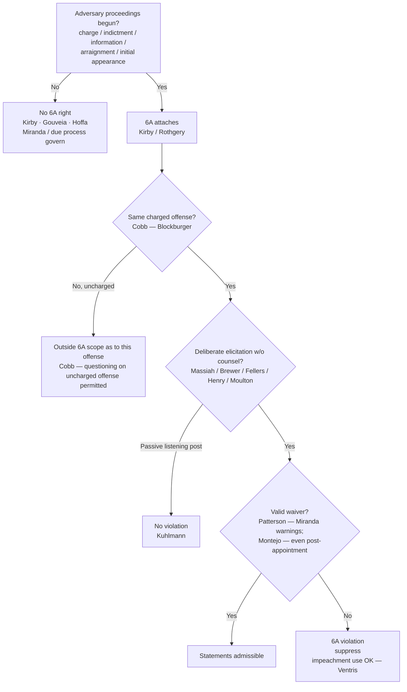

# S9 R1 panel-review — Opus model-diversity lane (prompt pack)

You are the **Claude/Opus** leg of the S9 three-lane adversarial panel (1 Claude + 2 Codex, R1). The two Codex lanes carry the A (support/quote-fidelity) and B (currency/treatment) attack lenses; **you carry model diversity and MUST vote on every paneled assertion across BOTH lenses' concerns.** You are refute-framed: try hard to break each assertion; **default to REFUTED on uncertainty**; never fabricate a cite, quote, or holding; use ONLY the evidence inlined below (no search, no outside knowledge). You are a SIGHTED reviewer — the FULL lake record (judgment fields included) is inlined.

You are a WRITER lane, not an adjudicator: you FIND and VOTE. You do not tally, adjudicate, or close any row — the orchestrator does.

For EACH group below, return one JSON object with the exact `reviewed[]` shape from the output contract (identical framing to the Codex lenses). Emit a finding object ONLY for a real defect (verdict refuted / stands-modified); a group you find wholly clean returns all-`stands` verdicts (the harness records a clean attestation). Concatenate the per-group JSON objects into a top-level `{"packs": [ ... ]}` array, one entry per group, each carrying its `group_id`.


OUTPUT CONTRACT — return ONE JSON object, nothing else:
{
  "lens": "A" | "B",
  "group_id": "<echo the group id>",
  "reviewed": [
    {
      "assertion_id": "<from group_inventory.jsonl>",
      "dimension": "existence|support|quote_fidelity|pincite|treatment|black_letter",
      "verdict": "stands" | "refuted" | "stands-modified",
      "verifiable_from_disclosed": true | false,
      "defect": null,   // null when verdict=="stands"; else an object:
      //  {"problem": "...", "severity": "high|medium|low", "proposed_fix": "...", "evidence_quote": "verbatim from disclosed evidence or null", "needs_cl": true|false, "locator_note": "..."}
      "reasons": ["short evidence-grounded reason", "..."],
      "breaks_true_positives": true | false,
      "residual_risks": ["..."],
      "suggested_tightening": "... or null"
    }
  ],
  "notes": ""
}
Rules: verdict=='stands' <=> defect==null (assertion survives your attack). verdict=='refuted' <=> a real defect (the assertion as framed is wrong). verdict=='stands-modified' <=> survives but needs a stated modification (a minor defect). Review EVERY assertion_id in group_inventory.jsonl exactly once. Output ONLY the JSON object.
---

## GROUP: content/the-right-to-counsel/Sixth Amendment Right to Counsel.md  (`doctrine`, 24 assertions)

### content_page

```
---
weight: 10
aliases:
  - "Sixth Amendment Right to Counsel"
  - "9-confessions-interrogation/Sixth-Amendment-Right-to-Counsel"
topic: Sixth Amendment Right to Counsel
type: doctrine
jurisdiction: Federal (U.S. Const. amend. VI); SCOTUS baseline
status: draft
related:
  - "[[Miranda and Custodial Interrogation]]"
  - "[[Miranda Waiver and Invocation]]"
  - "[[Lineups and the Right to Counsel]]"
  - "[[Eyewitness Identification]]"
  - "[[Due-Process Voluntariness of Confessions]]"
---

# Sixth Amendment Right to Counsel

*Has the Sixth Amendment right to counsel attached, and did the government deliberately elicit a statement about the charged offense without counsel or a valid waiver?*

> [!rule] Black-letter rule
> The Sixth Amendment right to counsel **attaches at the initiation of adversary judicial proceedings** (formal charge, indictment, information, preliminary hearing, arraignment, or the initial appearance before a magistrate). It is **offense-specific**: it reaches only the charged offense and its *Blockburger* same-offense equivalents, not other uncharged offenses. Once attached, the **Massiah rule** bars the government from **deliberately eliciting** incriminating statements about the charged offense outside the presence of counsel, absent a valid waiver. This is a **distinct** guarantee from the Fifth Amendment *Miranda–Edwards* counsel right. *[[Massiah v. United States|Massiah]]*, 377 U.S. 201, [206](https://www.courtlistener.com/opinion/106822/massiah-v-united-states/) (1964); *[[Kirby v. Illinois|Kirby]]*, 406 U.S. 682, [689](https://www.courtlistener.com/opinion/108554/kirby-v-illinois/) (1972); *[[Texas v. Cobb|Cobb]]*, 532 U.S. 162, [173](https://www.courtlistener.com/opinion/118417/texas-v-cobb/) (2001); *[[Rothgery v. Gillespie County|Rothgery]]*, 554 U.S. 191, [213](https://www.courtlistener.com/opinion/145785/rothgery-v-gillespie-county/) (2008).
> ^rule-sixth-amendment

## The Brief

**Field-decisive frame.** The doctrine turns on four questions in sequence: has the right **attached**; is this the **charged offense**; did the government **deliberately elicit** the statement without counsel; and was there a **valid waiver**. Pre-charge investigation is not this doctrine's territory; it is governed by [[Miranda and Custodial Interrogation|Miranda]] and [[Due-Process Voluntariness of Confessions|due-process voluntariness]].

**Stage 1: attachment (the timing gate).** The right turns on the **initiation of adversary judicial proceedings**, not on arrest or investigative focus. *[[Kirby v. Illinois|Kirby]]* fixes the line: the Court's right-to-counsel decisions "have involved points of time at or after the initiation of adversary judicial criminal proceedings, whether by way of formal charge, preliminary hearing, indictment, information, or arraignment." *[[Kirby v. Illinois|Kirby]]*, 406 U.S. at [689](https://www.courtlistener.com/opinion/108554/kirby-v-illinois/). *[[Rothgery v. Gillespie County|Rothgery]]* pushes the point of attachment to the **initial appearance**: once a defendant appears before a judicial officer, learns the charge, and has his liberty restricted, adversary proceedings have begun, and attachment does not require that a prosecutor be aware of that initial proceeding or be involved in its conduct. *[[Rothgery v. Gillespie County|Rothgery]]*, 554 U.S. at [213](https://www.courtlistener.com/opinion/145785/rothgery-v-gillespie-county/). Before that point there is **no** Sixth Amendment claim: the right attaches only at or after the initiation of adversary proceedings, so there is no counsel right during pre-charge administrative segregation (*[[United States v. Gouveia|Gouveia]]*, 467 U.S. at [187-88](https://www.courtlistener.com/opinion/111193/united-states-v-gouveia/)), and the Constitution does not force the government to arrest or charge early to trigger it, because "[t]here is no constitutional right to be arrested" (*[[Hoffa v. United States|Hoffa]]*, 385 U.S. at [310](https://www.courtlistener.com/opinion/107318/hoffa-v-united-states/)).

**Stage 1(b): offense-specificity.** Attachment as to a charged offense does **not** bar questioning about *other, uncharged* offenses, even closely related ones; the reach of an "offense" is fixed by the *Blockburger* same-elements test, "whether each provision requires proof of a fact which the other does not." *[[Texas v. Cobb|Cobb]]*, 532 U.S. at [173](https://www.courtlistener.com/opinion/118417/texas-v-cobb/). And a Sixth Amendment invocation is **not** an invocation of the Fifth Amendment *[[Miranda v. Arizona|Miranda]]*-counsel right: the two are distinct rights serving different purposes and are not interchangeable (*[[McNeil v. Wisconsin|McNeil]]*, 501 U.S. 171 (1991)). Contrast *[[Arizona v. Roberson|Roberson]]*, where a **Fifth Amendment** *[[Edwards v. Arizona\|Edwards]]* invocation bars custodial interrogation on **any** offense, a sharp divide the instructor should teach side by side (see [[Miranda Waiver and Invocation]]).

**Stage 2: the *[[Massiah v. United States|Massiah]]* rule, "deliberate elicitation," not "interrogation."** Once the right attaches, the government may not **deliberately elicit** statements without counsel or waiver. In *[[Massiah v. United States|Massiah]]* the accused "was denied the basic protections of that guarantee when there was used against him at his trial evidence of his own incriminating words, which federal agents had deliberately elicited from him after he had been indicted and in the absence of his counsel." *[[Massiah v. United States|Massiah]]*, 377 U.S. at [206](https://www.courtlistener.com/opinion/106822/massiah-v-united-states/). The trigger is **broader than *[[Miranda v. Arizona|Miranda]]* interrogation**: it reaches surreptitious, non-custodial efforts to draw out statements, and the *absence* of interrogation does not defeat the claim, because the Court has "expressly distinguished this standard from the Fifth Amendment custodial-interrogation standard." *[[Fellers v. United States|Fellers]]*, 540 U.S. at [524](https://www.courtlistener.com/opinion/131158/fellers-v-united-states/). Open elicitation counts: the detective who gave the "Christian burial speech" "deliberately and designedly set out to elicit information." *[[Brewer v. Williams|Brewer]]*, 430 U.S. at [399](https://www.courtlistener.com/opinion/109624/brewer-v-williams/). So does **covert** elicitation through informants, but only **active inducement**, not passive listening:

- **Active inducement violates the right.** Using a paid informant planted in the cell to "intentionally creat[e] a situation likely to induce" an indicted defendant's statements is deliberate elicitation (*[[United States v. Henry|Henry]]*, 447 U.S. at [274](https://www.courtlistener.com/opinion/110300/united-states-v-henry/)); so is the State's "knowing exploitation ... of an opportunity to confront the accused without counsel," even where the *defendant* set up the meeting (*[[Maine v. Moulton|Moulton]]*, 474 U.S. at [176](https://www.courtlistener.com/opinion/111546/maine-v-moulton/)).
- **A passive "listening post" does not.** A jailhouse informant who merely listens and reports commits no violation; the accused "must demonstrate that the police and their informant took some action, beyond merely listening, that was designed deliberately to elicit incriminating remarks." *[[Kuhlmann v. Wilson#^pin-459a|Kuhlmann]]*, 477 U.S. at [459](https://www.courtlistener.com/opinion/111726/kuhlmann-v-wilson/#:~:text=the%20defendant%20must%20demonstrate%20that).

**Stage 2 limit: a passive presence at defense meetings is not itself a violation.** The mere presence of a government informant at meetings between the defendant and defense counsel does **not** by itself violate the Sixth Amendment; there must be **purposeful intrusion** with communication of defense strategy to the prosecution and resulting **prejudice**. *[[Weatherford v. Bursey|Weatherford v. Bursey]]*, 429 U.S. 545 (1977). The line is the same as *[[Kuhlmann v. Wilson|Kuhlmann]]*'s: passivity is not the wrong; deliberate exploitation is.

**Stage 3: waiver.** The attached right can be **waived**. Standard *[[Miranda v. Arizona|Miranda]]* warnings ordinarily supply a knowing and intelligent waiver of the post-attachment right, because an accused so warned has "been sufficiently apprised of the nature of his Sixth Amendment rights, and of the consequences of abandoning those rights." *[[Patterson v. Illinois|Patterson]]*, 487 U.S. at [296](https://www.courtlistener.com/opinion/112127/patterson-v-illinois/). And *[[Montejo v. Louisiana|Montejo]]* removed the old counsel-request bar: a defendant may validly waive during **police-initiated** interrogation **even after counsel has been requested or appointed**, so long as the waiver is voluntary, knowing, and intelligent, because "*Michigan v. Jackson* should be and now is overruled." *[[Montejo v. Louisiana|Montejo]]*, 556 U.S. at [797](https://www.courtlistener.com/opinion/145873/montejo-v-louisiana/). The defendant who does not wish to be questioned without counsel is now protected through the Fifth Amendment *[[Edwards v. Arizona\|Edwards]]*/*[[Miranda v. Arizona|Miranda]]* regime instead of a Sixth Amendment presumption.

> [!warning] Historical — *[[Michigan v. Jackson]]* is no longer law
> *[[Michigan v. Jackson|Jackson]]* (1986) had held that a post-attachment, police-initiated waiver is presumptively invalid once the defendant requested counsel at arraignment. *[[Montejo v. Louisiana|Montejo]]* **overruled** it; present it **only as history**, never as current doctrine (*[[Michigan v. Jackson|Jackson]]*, *overruled by* *[[Montejo v. Louisiana|Montejo]]*, 556 U.S. at [797](https://www.courtlistener.com/opinion/145873/montejo-v-louisiana/)).

**The remedy has an impeachment exception (*[[Kansas v. Ventris|Ventris]]*).** A statement taken in violation of *[[Massiah v. United States|Massiah]]* is inadmissible in the prosecution's **case-in-chief**, but it may still be used to **impeach** the defendant if he takes the stand and testifies inconsistently. *[[Kansas v. Ventris|Kansas v. Ventris]]*, 556 U.S. 586 (2009). The exclusionary sanction protects against affirmative use of the tainted statement, not against exposing perjury, so the officer should understand that a *[[Massiah v. United States|Massiah]]* problem bars the government's main case but does not license contrary trial testimony.

**Critical stages beyond questioning: lineups.** The attachment/critical-stage rule also governs identification procedures (developed in full on [[Lineups and the Right to Counsel]] and [[Eyewitness Identification]]). A **post-attachment corporeal lineup** is a "critical stage" requiring counsel (*[[United States v. Wade|Wade]]*, 388 U.S. at [237](https://www.courtlistener.com/opinion/107486/united-states-v-wade/)); testimony about an uncounseled post-attachment lineup is subject to a **[[Common Legal Terms#per-se|per se]]** exclusionary rule (*[[Gilbert v. California|Gilbert]]*, 388 U.S. at [273](https://www.courtlistener.com/opinion/107487/gilbert-v-california/)). But a **pre-charge** lineup is **not** a critical stage (*[[Kirby v. Illinois|Kirby]]*), and there is **no** right to counsel at a **photographic array** (*[[United States v. Ash|Ash]]*, 413 U.S. at [321](https://www.courtlistener.com/opinion/108846/united-states-v-ash/)).

**Escobedo: the precursor.** *[[Escobedo v. Illinois|Escobedo]]* (1964) held that denying a focus-suspect's request to consult his lawyer during custodial interrogation violated the Sixth Amendment. It was a **precursor** to *[[Miranda v. Arizona|Miranda]]*: its rationale was recast as a Fifth Amendment matter and confined largely to its facts, so it is taught as **origin, not a freestanding test** (treatment: *limited*, result intact, rationale superseded by *[[Miranda v. Arizona|Miranda]]*).

**Elements · burden · standard of review · remedy.**
- **Elements:** (1) the right has **attached** (adversary proceedings begun, *[[Kirby v. Illinois|Kirby]]* / *[[Rothgery v. Gillespie County|Rothgery]]*); (2) as to **this charged offense** (offense-specific, *[[Texas v. Cobb|Cobb]]*); (3) the government **deliberately elicited** the statement without counsel (*[[Massiah v. United States|Massiah]]* / *[[Fellers v. United States|Fellers]]*), by active inducement, not passive listening (*[[Kuhlmann v. Wilson|Kuhlmann]]*); (4) **no valid waiver** (*[[Patterson v. Illinois|Patterson]]* / *[[Montejo v. Louisiana|Montejo]]*).
- **Burden:** on the *[[Massiah v. United States|Massiah]]* claim, the **defendant/movant** bears the burden of showing **deliberate elicitation** after attachment (a mere listening-post informant is insufficient, *[[Kuhlmann v. Wilson|Kuhlmann]]*). Once a waiver is asserted, the **government** bears a **heavy** burden of proving an "intentional relinquishment or abandonment of a known right" (*[[Brewer v. Williams|Brewer]]*, 430 U.S. at [404](https://www.courtlistener.com/opinion/109624/brewer-v-williams/)).
- **Standard of review:** the ultimate waiver/voluntariness determination is reviewed **[[Common Legal Terms#de-novo|de novo]]**; subsidiary historical facts for **[[Common Legal Terms#clear-error|clear error]]**.
- **Remedy:** **suppression** of the deliberately-elicited statement from the case-in-chief, subject to the impeachment exception (*[[Kansas v. Ventris|Ventris]]*); for an uncounseled post-attachment lineup, a **[[Common Legal Terms#per-se|per se]]** bar on testimony about the lineup, with in-court identification admissible only on an **[[Inevitable Discovery and Independent Source|independent source]]** (*[[United States v. Wade|Wade]]* / *[[Gilbert v. California|Gilbert]]*).

**Common pitfalls.**
- **Do not confuse the 5A *[[Miranda v. Arizona|Miranda]]*-counsel right with the 6A counsel right.** Different triggers (custodial interrogation vs. charging) and different scope; a *[[Miranda v. Arizona|Miranda]]* invocation is not a 6A invocation, and vice versa (*[[McNeil v. Wisconsin|McNeil]]*). Keep [[Miranda and Custodial Interrogation]] and this doctrine separate.
- **Do not assume the right attaches at arrest.** It attaches at **charging/initial appearance** (*[[Kirby v. Illinois|Kirby]]*; *[[Rothgery v. Gillespie County|Rothgery]]*); pre-charge investigation is [[Miranda and Custodial Interrogation|Miranda]] / [[Due-Process Voluntariness of Confessions|due-process]] territory (*[[United States v. Gouveia|Gouveia]]*; *[[Hoffa v. United States|Hoffa]]*).
- **Do not forget offense-specificity.** A charged defendant **may** be questioned about **uncharged** offenses (*[[Texas v. Cobb|Cobb]]*).
- **Do not treat a passive jailhouse informant as automatically unlawful.** Mere listening is not deliberate elicitation (*[[Kuhlmann v. Wilson|Kuhlmann]]*); the violation is in *inducing* the statements (*[[United States v. Henry|Henry]]* / *[[Maine v. Moulton|Moulton]]*). Compare the pre-charge undercover-informant setting, governed by *[[Miranda v. Arizona|Miranda]]* and permitted, where the 6A is not yet at issue (*[[Illinois v. Perkins|Perkins]]*).
- **Do not cite *[[Michigan v. Jackson]]* as live law.** It is **overruled** (*[[Montejo v. Louisiana|Montejo]]*).

## Lower-court developments

Circuit and state developments only; no SCOTUS. Every controlling holding in this doctrine lives in **Key cases** regardless of date, per the no-SCOTUS-in-recent-developments rule (N5). The framework is entirely Supreme Court: the *[[Kirby v. Illinois|Kirby]]*/*[[Rothgery v. Gillespie County|Rothgery]]* attachment line, the *[[Texas v. Cobb|Cobb]]*/*[[McNeil v. Wisconsin|McNeil]]* offense-specificity line, the *[[Massiah v. United States|Massiah]]*/*[[United States v. Henry|Henry]]*/*[[Kuhlmann v. Wilson|Kuhlmann]]* deliberate-elicitation-versus-listening-post line, and the *[[Patterson v. Illinois|Patterson]]*/*[[Montejo v. Louisiana|Montejo]]* waiver line all remain settled at the SCOTUS level. The live line-drawing at the lower-court level tracks how the circuits draw the **active-inducement / passive-listening-post** boundary for jailhouse informants and the **point-of-attachment quantum** for pre-charge appearances. *A circuit and state frontier pass is a live-verify addition (serial CL, L2/L4) deferred to the standing find, adjudicate, and fix gate (R13) and S9; no new case holding is asserted here.*

## Key cases

| Case | Holding | Opinion |
|---|---|---|
| *[[Kirby v. Illinois]]*, 406 U.S. 682 (1972) (plurality) | **Anchor.** The right attaches only at or after the initiation of adversary judicial proceedings; a pre-charge identification is not a critical stage. | [opinion](https://www.courtlistener.com/opinion/108554/kirby-v-illinois/) |
| *[[Rothgery v. Gillespie County]]*, 554 U.S. 191 (2008) | **Progeny.** Attachment occurs at the initial appearance before a magistrate, even if no prosecutor is aware of or involved in it. | [opinion](https://www.courtlistener.com/opinion/145785/rothgery-v-gillespie-county/) |
| *[[United States v. Gouveia]]*, 467 U.S. 180 (1984) | **Progeny.** The right attaches only at or after initiation of adversary proceedings; no counsel during pre-charge administrative detention. | [opinion](https://www.courtlistener.com/opinion/111193/united-states-v-gouveia/) |
| *[[Hoffa v. United States]]*, 385 U.S. 293 (1966) | **Progeny.** No 6A claim when an informant elicits statements before the right attaches; there is no constitutional right to be arrested, so the government need not charge early to trigger counsel. | [opinion](https://www.courtlistener.com/opinion/107318/hoffa-v-united-states/) |
| *[[Texas v. Cobb]]*, 532 U.S. 162 (2001) | **Progeny.** The 6A right is offense-specific; it does not extend to uncharged offenses, even factually related ones (*Blockburger* same-elements test). | [opinion](https://www.courtlistener.com/opinion/118417/texas-v-cobb/) |
| *[[McNeil v. Wisconsin]]*, 501 U.S. 171 (1991) | **Progeny.** The 6A right is offense-specific and is **not** an invocation of the distinct 5A *Miranda–Edwards* right; the two are separate. | [opinion](https://www.courtlistener.com/opinion/112622/mcneil-v-wisconsin/) |
| *[[Massiah v. United States]]*, 377 U.S. 201 (1964) | **Anchor.** Post-indictment deliberate elicitation of statements without counsel, even surreptitiously and outside custody, violates the 6A. | [opinion](https://www.courtlistener.com/opinion/106822/massiah-v-united-states/) |
| *[[Brewer v. Williams]]*, 430 U.S. 387 (1977) | **Progeny.** The "Christian burial speech" deliberately elicited statements after attachment with no valid waiver, a *[[Massiah v. United States\|Massiah]]* violation. | [opinion](https://www.courtlistener.com/opinion/109624/brewer-v-williams/) |
| *[[Fellers v. United States]]*, 540 U.S. 519 (2004) | **Progeny.** The 6A standard is *deliberate elicitation*, not interrogation; the absence of interrogation does not defeat the claim. | [opinion](https://www.courtlistener.com/opinion/131158/fellers-v-united-states/) |
| *[[United States v. Henry]]*, 447 U.S. 264 (1980) | **Progeny.** Using a paid informant to intentionally induce an indicted defendant's statements "deliberately elicited" them, violating the 6A. | [opinion](https://www.courtlistener.com/opinion/110300/united-states-v-henry/) |
| *[[Maine v. Moulton]]*, 474 U.S. 159 (1985) | **Progeny.** Knowingly exploiting an opportunity to confront the charged accused without counsel violates the 6A, even if the defendant set up the meeting. | [opinion](https://www.courtlistener.com/opinion/111546/maine-v-moulton/) |
| *[[Kuhlmann v. Wilson]]*, 477 U.S. 436 (1986) | **Progeny.** A passive "listening post" informant does not violate the 6A; the accused must show deliberate elicitation *beyond merely listening*. | [opinion](https://www.courtlistener.com/opinion/111726/kuhlmann-v-wilson/) |
| *[[Weatherford v. Bursey]]*, 429 U.S. 545 (1977) | **Progeny (limit).** The mere presence of an informant at defense meetings is not a [[Common Legal Terms#per-se\|per se]] 6A violation absent purposeful intrusion, disclosure of strategy, and prejudice. | [opinion](https://www.courtlistener.com/opinion/109590/weatherford-v-bursey/) |
| *[[Patterson v. Illinois]]*, 487 U.S. 285 (1988) | **Progeny.** An accused may knowingly and intelligently waive the 6A counsel right for post-indictment questioning via *[[Miranda v. Arizona\|Miranda]]* warnings. | [opinion](https://www.courtlistener.com/opinion/112127/patterson-v-illinois/) |
| *[[Montejo v. Louisiana]]*, 556 U.S. 778 (2009) | **Progeny.** A defendant may validly waive the 6A right during police-initiated interrogation even after counsel is appointed; **overrules *[[Michigan v. Jackson]]***. | [opinion](https://www.courtlistener.com/opinion/145873/montejo-v-louisiana/) |
| *[[Kansas v. Ventris]]*, 556 U.S. 586 (2009) | **Progeny (remedy).** A statement taken in violation of *[[Massiah v. United States\|Massiah]]*, though inadmissible in the case-in-chief, may be used to **impeach** the defendant's conflicting testimony. | [opinion](https://www.courtlistener.com/opinion/145880/kansas-v-ventris/) |
| *[[Escobedo v. Illinois]]*, 378 U.S. 478 (1964) | **The *[[Miranda v. Arizona\|Miranda]]* precursor.** Denying a focus-suspect's request for counsel during custodial interrogation violated the 6A; result intact, rationale superseded by *[[Miranda v. Arizona\|Miranda]]* (treatment: limited). | [opinion](https://www.courtlistener.com/opinion/106883/escobedo-v-illinois/) |
| *[[Michigan v. Jackson]]*, 475 U.S. 625 (1986) | **No longer law.** Presumed a post-appointment, police-initiated waiver invalid; *overruled by* *[[Montejo v. Louisiana\|Montejo]]*, and survives only as history. | [opinion](https://www.courtlistener.com/opinion/111622/michigan-v-jackson/) |

## Related cases across doctrines

These cases are treated in full on other doctrine pages but bear directly on the Sixth Amendment right to counsel and are framed for it here.

| Case | Relevance here | Primary home | Opinion |
|---|---|---|---|
| *[[United States v. Wade]]*, 388 U.S. 218 (1967) | A post-attachment corporeal lineup is a "critical stage" at which counsel is required, the lineup application of the same attachment/critical-stage rule that governs *[[Massiah v. United States\|Massiah]]* questioning; in-court identification admissible only on an [[Inevitable Discovery and Independent Source\|independent source]]. | [[Lineups and the Right to Counsel]] | [opinion](https://www.courtlistener.com/opinion/107486/united-states-v-wade/) |
| *[[Gilbert v. California]]*, 388 U.S. 263 (1967) | The remedy for an uncounseled post-attachment lineup: testimony that a witness identified the accused there is excluded **[[Common Legal Terms#per-se\|per se]]**, a strict sanction for the 6A violation. | [[Lineups and the Right to Counsel]] | [opinion](https://www.courtlistener.com/opinion/107487/gilbert-v-california/) |
| *[[United States v. Ash]]*, 413 U.S. 300 (1973) | Limit on the critical-stage rule: **no** right to counsel at a photographic array, because it is not a trial-like adversary confrontation of the accused. | [[Lineups and the Right to Counsel]] | [opinion](https://www.courtlistener.com/opinion/108846/united-states-v-ash/) |
| *[[Illinois v. Perkins]]*, 496 U.S. 292 (1990) | The pre-charge undercover-informant counterpart: no *[[Miranda v. Arizona\|Miranda]]* coercion, and the 6A is **not** at issue because the suspect had not been charged, fixing the line that *[[Massiah v. United States\|Massiah]]* deliberate-elicitation applies only **after** attachment. | [[Miranda and Custodial Interrogation]] | [opinion](https://www.courtlistener.com/opinion/112452/illinois-v-perkins/) |
| *[[Arizona v. Roberson]]*, 486 U.S. 675 (1988) | Contrast on offense-specificity: the **5A** *[[Edwards v. Arizona\|Edwards]]* bar is **not** offense-specific; once counsel is invoked, police may not interrogate about **any** offense. Pair with *[[Texas v. Cobb\|Cobb]]* to show the divide from the offense-specific 6A right. | [[Miranda Waiver and Invocation]] | [opinion](https://www.courtlistener.com/opinion/112100/arizona-v-roberson/) |

## Visual



## Sources

- [Massiah v. United States, 377 U.S. 201 (1964)](https://www.courtlistener.com/opinion/106822/massiah-v-united-states/) — pinpoint 206
- [Escobedo v. Illinois, 378 U.S. 478 (1964)](https://www.courtlistener.com/opinion/106883/escobedo-v-illinois/) (precursor; treatment limited)
- [Hoffa v. United States, 385 U.S. 293 (1966)](https://www.courtlistener.com/opinion/107318/hoffa-v-united-states/) — pinpoint 310
- [United States v. Wade, 388 U.S. 218 (1967)](https://www.courtlistener.com/opinion/107486/united-states-v-wade/) — pinpoints 237, 242
- [Gilbert v. California, 388 U.S. 263 (1967)](https://www.courtlistener.com/opinion/107487/gilbert-v-california/) — pinpoint 273
- [Kirby v. Illinois, 406 U.S. 682 (1972)](https://www.courtlistener.com/opinion/108554/kirby-v-illinois/) — pinpoint 689
- [United States v. Ash, 413 U.S. 300 (1973)](https://www.courtlistener.com/opinion/108846/united-states-v-ash/) — pinpoint 321
- [Weatherford v. Bursey, 429 U.S. 545 (1977)](https://www.courtlistener.com/opinion/109590/weatherford-v-bursey/) (informant-at-defense-meetings limit)
- [Brewer v. Williams, 430 U.S. 387 (1977)](https://www.courtlistener.com/opinion/109624/brewer-v-williams/) — pinpoints 399, 404
- [United States v. Henry, 447 U.S. 264 (1980)](https://www.courtlistener.com/opinion/110300/united-states-v-henry/) — pinpoint 274
- [United States v. Gouveia, 467 U.S. 180 (1984)](https://www.courtlistener.com/opinion/111193/united-states-v-gouveia/) — pinpoints 187-88
- [Maine v. Moulton, 474 U.S. 159 (1985)](https://www.courtlistener.com/opinion/111546/maine-v-moulton/) — pinpoint 176
- [Michigan v. Jackson, 475 U.S. 625 (1986)](https://www.courtlistener.com/opinion/111622/michigan-v-jackson/) (overruled by Montejo)
- [Kuhlmann v. Wilson, 477 U.S. 436 (1986)](https://www.courtlistener.com/opinion/111726/kuhlmann-v-wilson/) — pinpoint 459
- [Arizona v. Roberson, 486 U.S. 675 (1988)](https://www.courtlistener.com/opinion/112100/arizona-v-roberson/) (cross-doctrine)
- [Patterson v. Illinois, 487 U.S. 285 (1988)](https://www.courtlistener.com/opinion/112127/patterson-v-illinois/) — pinpoint 296
- [Illinois v. Perkins, 496 U.S. 292 (1990)](https://www.courtlistener.com/opinion/112452/illinois-v-perkins/) (cross-doctrine)
- [McNeil v. Wisconsin, 501 U.S. 171 (1991)](https://www.courtlistener.com/opinion/112622/mcneil-v-wisconsin/) (offense-specific; distinct from 5A right)
- [Texas v. Cobb, 532 U.S. 162 (2001)](https://www.courtlistener.com/opinion/118417/texas-v-cobb/) — pinpoint 173
- [Fellers v. United States, 540 U.S. 519 (2004)](https://www.courtlistener.com/opinion/131158/fellers-v-united-states/) — pinpoint 524
- [Rothgery v. Gillespie County, 554 U.S. 191 (2008)](https://www.courtlistener.com/opinion/145785/rothgery-v-gillespie-county/) — pinpoint 213
- [Kansas v. Ventris, 556 U.S. 586 (2009)](https://www.courtlistener.com/opinion/145880/kansas-v-ventris/) (impeachment exception)
- [Montejo v. Louisiana, 556 U.S. 778 (2009)](https://www.courtlistener.com/opinion/145873/montejo-v-louisiana/) — pinpoint 797

```

### group_inventory (assertions under review)

```jsonl
{"assertion_id": "08a3a5b9f1d1a20a", "dimension": "existence", "kind": "case_cite", "locator": {"case": "Michigan v. Jackson", "table_line": 74}, "payload": {"case": "Michigan v. Jackson", "cells": ["*[[Michigan v. Jackson]]*, 475 U.S. 625 (1986)", "**No longer law.** Presumed a post-appointment, police-initiated waiver invalid; *overruled by* *[[Montejo v. Louisiana\\|Montejo]]*, and survives only as history.", "[opinion](https://www.courtlistener.com/opinion/111622/michigan-v-jackson/)"], "header": ["Case", "Holding", "Opinion"]}}
{"assertion_id": "18c12aa465fd7c20", "dimension": "existence", "kind": "case_cite", "locator": {"case": "Kuhlmann v. Wilson", "table_line": 68}, "payload": {"case": "Kuhlmann v. Wilson", "cells": ["*[[Kuhlmann v. Wilson]]*, 477 U.S. 436 (1986)", "**Progeny.** A passive \"listening post\" informant does not violate the 6A; the accused must show deliberate elicitation *beyond merely listening*.", "[opinion](https://www.courtlistener.com/opinion/111726/kuhlmann-v-wilson/)"], "header": ["Case", "Holding", "Opinion"]}}
{"assertion_id": "3242477c64a906f6", "dimension": "existence", "kind": "case_cite", "locator": {"case": "Rothgery v. Gillespie County", "table_line": 58}, "payload": {"case": "Rothgery v. Gillespie County", "cells": ["*[[Rothgery v. Gillespie County]]*, 554 U.S. 191 (2008)", "**Progeny.** Attachment occurs at the initial appearance before a magistrate, even if no prosecutor is aware of or involved in it.", "[opinion](https://www.courtlistener.com/opinion/145785/rothgery-v-gillespie-county/)"], "header": ["Case", "Holding", "Opinion"]}}
{"assertion_id": "36767ebae8b8caa4", "dimension": "existence", "kind": "case_cite", "locator": {"case": "Hoffa v. United States", "table_line": 60}, "payload": {"case": "Hoffa v. United States", "cells": ["*[[Hoffa v. United States]]*, 385 U.S. 293 (1966)", "**Progeny.** No 6A claim when an informant elicits statements before the right attaches; there is no constitutional right to be arrested, so the government need not charge early to trigger counsel.", "[opinion](https://www.courtlistener.com/opinion/107318/hoffa-v-united-states/)"], "header": ["Case", "Holding", "Opinion"]}}
{"assertion_id": "3c9dd61c848164b7", "dimension": "existence", "kind": "case_cite", "locator": {"case": "McNeil v. Wisconsin", "table_line": 62}, "payload": {"case": "McNeil v. Wisconsin", "cells": ["*[[McNeil v. Wisconsin]]*, 501 U.S. 171 (1991)", "**Progeny.** The 6A right is offense-specific and is **not** an invocation of the distinct 5A *Miranda–Edwards* right; the two are separate.", "[opinion](https://www.courtlistener.com/opinion/112622/mcneil-v-wisconsin/)"], "header": ["Case", "Holding", "Opinion"]}}
{"assertion_id": "47668adb8597ab32", "dimension": "existence", "kind": "case_cite", "locator": {"case": "Weatherford v. Bursey", "table_line": 69}, "payload": {"case": "Weatherford v. Bursey", "cells": ["*[[Weatherford v. Bursey]]*, 429 U.S. 545 (1977)", "**Progeny (limit).** The mere presence of an informant at defense meetings is not a [[Common Legal Terms#per-se\\|per se]] 6A violation absent purposeful intrusion, disclosure of strategy, and prejudice.", "[opinion](https://www.courtlistener.com/opinion/109590/weatherford-v-bursey/)"], "header": ["Case", "Holding", "Opinion"]}}
{"assertion_id": "48d601730b7a3c5d", "dimension": "existence", "kind": "case_cite", "locator": {"case": "Patterson v. Illinois", "table_line": 70}, "payload": {"case": "Patterson v. Illinois", "cells": ["*[[Patterson v. Illinois]]*, 487 U.S. 285 (1988)", "**Progeny.** An accused may knowingly and intelligently waive the 6A counsel right for post-indictment questioning via *[[Miranda v. Arizona\\|Miranda]]* warnings.", "[opinion](https://www.courtlistener.com/opinion/112127/patterson-v-illinois/)"], "header": ["Case", "Holding", "Opinion"]}}
{"assertion_id": "568b1ff2a604ec0b", "dimension": "existence", "kind": "case_cite", "locator": {"case": "Arizona v. Roberson", "table_line": 86}, "payload": {"case": "Arizona v. Roberson", "cells": ["*[[Arizona v. Roberson]]*, 486 U.S. 675 (1988)", "Contrast on offense-specificity: the **5A** *[[Edwards v. Arizona\\|Edwards]]* bar is **not** offense-specific; once counsel is invoked, police may not interrogate about **any** offense. Pair with *[[Texas v. Cobb\\|Cobb]]* to show the divide from the offense-specific 6A right.", "[[Miranda Waiver and Invocation]]", "[opinion](https://www.courtlistener.com/opinion/112100/arizona-v-roberson/)"], "header": ["Case", "Relevance here", "Primary home", "Opinion"]}}
{"assertion_id": "5bbe2545936762b9", "dimension": "existence", "kind": "case_cite", "locator": {"case": "Kansas v. Ventris", "table_line": 72}, "payload": {"case": "Kansas v. Ventris", "cells": ["*[[Kansas v. Ventris]]*, 556 U.S. 586 (2009)", "**Progeny (remedy).** A statement taken in violation of *[[Massiah v. United States\\|Massiah]]*, though inadmissible in the case-in-chief, may be used to **impeach** the defendant's conflicting testimony.", "[opinion](https://www.courtlistener.com/opinion/145880/kansas-v-ventris/)"], "header": ["Case", "Holding", "Opinion"]}}
{"assertion_id": "7073fd7b9ebff123", "dimension": "existence", "kind": "case_cite", "locator": {"case": "Texas v. Cobb", "table_line": 61}, "payload": {"case": "Texas v. Cobb", "cells": ["*[[Texas v. Cobb]]*, 532 U.S. 162 (2001)", "**Progeny.** The 6A right is offense-specific; it does not extend to uncharged offenses, even factually related ones (*Blockburger* same-elements test).", "[opinion](https://www.courtlistener.com/opinion/118417/texas-v-cobb/)"], "header": ["Case", "Holding", "Opinion"]}}
{"assertion_id": "73648276eec3a7e7", "dimension": "existence", "kind": "case_cite", "locator": {"case": "Illinois v. Perkins", "table_line": 85}, "payload": {"case": "Illinois v. Perkins", "cells": ["*[[Illinois v. Perkins]]*, 496 U.S. 292 (1990)", "The pre-charge undercover-informant counterpart: no *[[Miranda v. Arizona\\|Miranda]]* coercion, and the 6A is **not** at issue because the suspect had not been charged, fixing the line that *[[Massiah v. United States\\|Massiah]]* deliberate-elicitation applies only **after** attachment.", "[[Miranda and Custodial Interrogation]]", "[opinion](https://www.courtlistener.com/opinion/112452/illinois-v-perkins/)"], "header": ["Case", "Relevance here", "Primary home", "Opinion"]}}
{"assertion_id": "8c438d54de6a1cab", "dimension": "existence", "kind": "case_cite", "locator": {"case": "Maine v. Moulton", "table_line": 67}, "payload": {"case": "Maine v. Moulton", "cells": ["*[[Maine v. Moulton]]*, 474 U.S. 159 (1985)", "**Progeny.** Knowingly exploiting an opportunity to confront the charged accused without counsel violates the 6A, even if the defendant set up the meeting.", "[opinion](https://www.courtlistener.com/opinion/111546/maine-v-moulton/)"], "header": ["Case", "Holding", "Opinion"]}}
{"assertion_id": "95986de8147a616b", "dimension": "existence", "kind": "case_cite", "locator": {"case": "Escobedo v. Illinois", "table_line": 73}, "payload": {"case": "Escobedo v. Illinois", "cells": ["*[[Escobedo v. Illinois]]*, 378 U.S. 478 (1964)", "**The *[[Miranda v. Arizona\\|Miranda]]* precursor.** Denying a focus-suspect's request for counsel during custodial interrogation violated the 6A; result intact, rationale superseded by *[[Miranda v. Arizona\\|Miranda]]* (treatment: limited).", "[opinion](https://www.courtlistener.com/opinion/106883/escobedo-v-illinois/)"], "header": ["Case", "Holding", "Opinion"]}}
{"assertion_id": "a0cce45a332e0228", "dimension": "existence", "kind": "case_cite", "locator": {"case": "Brewer v. Williams", "table_line": 64}, "payload": {"case": "Brewer v. Williams", "cells": ["*[[Brewer v. Williams]]*, 430 U.S. 387 (1977)", "**Progeny.** The \"Christian burial speech\" deliberately elicited statements after attachment with no valid waiver, a *[[Massiah v. United States\\|Massiah]]* violation.", "[opinion](https://www.courtlistener.com/opinion/109624/brewer-v-williams/)"], "header": ["Case", "Holding", "Opinion"]}}
{"assertion_id": "ac40549ed4e9571c", "dimension": "existence", "kind": "case_cite", "locator": {"case": "Kirby v. Illinois", "table_line": 57}, "payload": {"case": "Kirby v. Illinois", "cells": ["*[[Kirby v. Illinois]]*, 406 U.S. 682 (1972) (plurality)", "**Anchor.** The right attaches only at or after the initiation of adversary judicial proceedings; a pre-charge identification is not a critical stage.", "[opinion](https://www.courtlistener.com/opinion/108554/kirby-v-illinois/)"], "header": ["Case", "Holding", "Opinion"]}}
{"assertion_id": "b7784a908ab1c3af", "dimension": "existence", "kind": "case_cite", "locator": {"case": "Massiah v. United States", "table_line": 63}, "payload": {"case": "Massiah v. United States", "cells": ["*[[Massiah v. United States]]*, 377 U.S. 201 (1964)", "**Anchor.** Post-indictment deliberate elicitation of statements without counsel, even surreptitiously and outside custody, violates the 6A.", "[opinion](https://www.courtlistener.com/opinion/106822/massiah-v-united-states/)"], "header": ["Case", "Holding", "Opinion"]}}
{"assertion_id": "c154a87f24948aba", "dimension": "existence", "kind": "case_cite", "locator": {"case": "United States v. Ash", "table_line": 84}, "payload": {"case": "United States v. Ash", "cells": ["*[[United States v. Ash]]*, 413 U.S. 300 (1973)", "Limit on the critical-stage rule: **no** right to counsel at a photographic array, because it is not a trial-like adversary confrontation of the accused.", "[[Lineups and the Right to Counsel]]", "[opinion](https://www.courtlistener.com/opinion/108846/united-states-v-ash/)"], "header": ["Case", "Relevance here", "Primary home", "Opinion"]}}
{"assertion_id": "d367fdae16c24fc8", "dimension": "existence", "kind": "case_cite", "locator": {"case": "United States v. Henry", "table_line": 66}, "payload": {"case": "United States v. Henry", "cells": ["*[[United States v. Henry]]*, 447 U.S. 264 (1980)", "**Progeny.** Using a paid informant to intentionally induce an indicted defendant's statements \"deliberately elicited\" them, violating the 6A.", "[opinion](https://www.courtlistener.com/opinion/110300/united-states-v-henry/)"], "header": ["Case", "Holding", "Opinion"]}}
{"assertion_id": "d54db44ee3ee3d63", "dimension": "existence", "kind": "case_cite", "locator": {"case": "United States v. Wade", "table_line": 82}, "payload": {"case": "United States v. Wade", "cells": ["*[[United States v. Wade]]*, 388 U.S. 218 (1967)", "A post-attachment corporeal lineup is a \"critical stage\" at which counsel is required, the lineup application of the same attachment/critical-stage rule that governs *[[Massiah v. United States\\|Massiah]]* questioning; in-court identification admissible only on an [[Inevitable Discovery and Independent Source\\|independent source]].", "[[Lineups and the Right to Counsel]]", "[opinion](https://www.courtlistener.com/opinion/107486/united-states-v-wade/)"], "header": ["Case", "Relevance here", "Primary home", "Opinion"]}}
{"assertion_id": "ddf69ed8f6df27b8", "dimension": "existence", "kind": "case_cite", "locator": {"case": "United States v. Gouveia", "table_line": 59}, "payload": {"case": "United States v. Gouveia", "cells": ["*[[United States v. Gouveia]]*, 467 U.S. 180 (1984)", "**Progeny.** The right attaches only at or after initiation of adversary proceedings; no counsel during pre-charge administrative detention.", "[opinion](https://www.courtlistener.com/opinion/111193/united-states-v-gouveia/)"], "header": ["Case", "Holding", "Opinion"]}}
{"assertion_id": "e14248623fbba70b", "dimension": "existence", "kind": "case_cite", "locator": {"case": "Gilbert v. California", "table_line": 83}, "payload": {"case": "Gilbert v. California", "cells": ["*[[Gilbert v. California]]*, 388 U.S. 263 (1967)", "The remedy for an uncounseled post-attachment lineup: testimony that a witness identified the accused there is excluded **[[Common Legal Terms#per-se\\|per se]]**, a strict sanction for the 6A violation.", "[[Lineups and the Right to Counsel]]", "[opinion](https://www.courtlistener.com/opinion/107487/gilbert-v-california/)"], "header": ["Case", "Relevance here", "Primary home", "Opinion"]}}
{"assertion_id": "e4bbb113c298114f", "dimension": "existence", "kind": "case_cite", "locator": {"case": "Montejo v. Louisiana", "table_line": 71}, "payload": {"case": "Montejo v. Louisiana", "cells": ["*[[Montejo v. Louisiana]]*, 556 U.S. 778 (2009)", "**Progeny.** A defendant may validly waive the 6A right during police-initiated interrogation even after counsel is appointed; **overrules *[[Michigan v. Jackson]]***.", "[opinion](https://www.courtlistener.com/opinion/145873/montejo-v-louisiana/)"], "header": ["Case", "Holding", "Opinion"]}}
{"assertion_id": "eadf0e7dea3f10f8", "dimension": "existence", "kind": "case_cite", "locator": {"case": "Fellers v. United States", "table_line": 65}, "payload": {"case": "Fellers v. United States", "cells": ["*[[Fellers v. United States]]*, 540 U.S. 519 (2004)", "**Progeny.** The 6A standard is *deliberate elicitation*, not interrogation; the absence of interrogation does not defeat the claim.", "[opinion](https://www.courtlistener.com/opinion/131158/fellers-v-united-states/)"], "header": ["Case", "Holding", "Opinion"]}}
{"assertion_id": "eec415fa9f766112", "dimension": "support", "kind": "proposition", "locator": {"callout": "^rule-sixth-amendment"}, "payload": {"anchor": "^rule-sixth-amendment", "statement": "[!rule] Black-letter rule\nThe Sixth Amendment right to counsel **attaches at the initiation of adversary judicial proceedings** (formal charge, indictment, information, preliminary hearing, arraignment, or the initial appearance before a magistrate). It is **offense-specific**: it reaches only the charged offense and its *Blockburger* same-offense equivalents, not other uncharged offenses. Once attached, the **Massiah rule** bars the government from **deliberately eliciting** incriminating statements about the charged offense outside the presence of counsel, absent a valid waiver. This is a **distinct** guarantee from the Fifth Amendment *Miranda–Edwards* counsel right. *[[Massiah v. United States|Massiah]]*, 377 U.S. 201, [206](https://www.courtlistener.com/opinion/106822/massiah-v-united-states/) (1964); *[[Kirby v. Illinois|Kirby]]*, 406 U.S. 682, [689](https://www.courtlistener.com/opinion/108554/kirby-v-illinois/) (1972); *[[Texas v. Cobb|Cobb]]*, 532 U.S. 162, [173](https://www.courtlistener.com/opinion/118417/texas-v-cobb/) (2001); *[[Rothgery v. Gillespie County|Rothgery]]*, 554 U.S. 191, [213](https://www.courtlistener.com/opinion/145785/rothgery-v-gillespie-county/) (2008)."}}
```

### lake record — Arizona v. Roberson

```json
{
  "schema_version": "s2.v1",
  "record_id": "Arizona v. Roberson",
  "stub": false,
  "status": "verified",
  "identity": {
    "case_name": "Arizona v. Roberson",
    "case_name_short": "Roberson",
    "case_name_full": "Arizona v. Roberson",
    "input_case_name": "Arizona v. Roberson",
    "court": "U.S. Supreme Court",
    "court_id": "scotus",
    "court_level": "scotus",
    "circuit": null,
    "state": null,
    "date_decided": "1988-06-15",
    "year": 1988,
    "docket": null,
    "cluster_id": 112100,
    "lead_opinion_id": 9431349,
    "sibling_ids": [
      112100,
      9431349,
      9431350
    ],
    "absolute_url": "/opinion/112100/arizona-v-roberson/",
    "identity_method": "citation+party-text",
    "expected_citation_found": true,
    "party_name_in_text": true,
    "canonical_name_match": true,
    "alternates": [
      {
        "cluster_id": 9074843,
        "score": 10,
        "case_name": "Arizona v. Roberson"
      },
      {
        "cluster_id": 9074842,
        "score": 10,
        "case_name": "Arizona v. Roberson"
      },
      {
        "cluster_id": 9074378,
        "score": 10,
        "case_name": "Arizona v. Roberson"
      },
      {
        "cluster_id": 9074377,
        "score": 10,
        "case_name": "Arizona v. Roberson"
      }
    ],
    "reason_code": null
  },
  "citations": {
    "official": {
      "cite": "486 U.S. 675",
      "volume": "486",
      "reporter": "U.S.",
      "page": "675",
      "type": 1,
      "selected_official": true,
      "source": "cluster.citations[]"
    },
    "parallel": [
      {
        "cite": "108 S. Ct. 2093",
        "volume": "108",
        "reporter": "S. Ct.",
        "page": "2093",
        "type": 1,
        "selected_official": false,
        "source": "cluster.citations[]"
      },
      {
        "cite": "100 L. Ed. 2d 704",
        "volume": "100",
        "reporter": "L. Ed. 2d",
        "page": "704",
        "type": 1,
        "selected_official": false,
        "source": "cluster.citations[]"
      },
      {
        "cite": "56 U.S.L.W. 4590",
        "volume": "56",
        "reporter": "U.S.L.W.",
        "page": "4590",
        "type": 4,
        "selected_official": false,
        "source": "cluster.citations[]"
      }
    ],
    "vendor_neutral": [
      {
        "cite": "1988 U.S. LEXIS 2726",
        "volume": "1988",
        "reporter": "U.S. LEXIS",
        "page": "2726",
        "type": 6,
        "selected_official": false,
        "source": "cluster.citations[]"
      }
    ],
    "all": [
      {
        "cite": "486 U.S. 675",
        "volume": "486",
        "reporter": "U.S.",
        "page": "675",
        "type": 1,
        "selected_official": false,
        "source": "cluster.citations[]"
      },
      {
        "cite": "108 S. Ct. 2093",
        "volume": "108",
        "reporter": "S. Ct.",
        "page": "2093",
        "type": 1,
        "selected_official": false,
        "source": "cluster.citations[]"
      },
      {
        "cite": "100 L. Ed. 2d 704",
        "volume": "100",
        "reporter": "L. Ed. 2d",
        "page": "704",
        "type": 1,
        "selected_official": false,
        "source": "cluster.citations[]"
      },
      {
        "cite": "1988 U.S. LEXIS 2726",
        "volume": "1988",
        "reporter": "U.S. LEXIS",
        "page": "2726",
        "type": 6,
        "selected_official": false,
        "source": "cluster.citations[]"
      },
      {
        "cite": "56 U.S.L.W. 4590",
        "volume": "56",
        "reporter": "U.S.L.W.",
        "page": "4590",
        "type": 4,
        "selected_official": false,
        "source": "cluster.citations[]"
      }
    ],
    "display": "486 U.S. 675",
    "official_selection": {
      "court_class": "scotus",
      "selected": "486 U.S. 675",
      "reason": "selected_rank_1"
    }
  },
  "pinpoints": [
    {
      "id": "pin-683",
      "page": null,
      "quote": "--- # Arizona v. Roberson *486 U.S. 675 (1988)* \u00b7 U.S. Supreme Court \u00b7 **Binding \u2014 SCOTUS** \u00b7 Treatment: **good** *(as of 2026-06-30)* <!-- header line; TreatmentBadge + weight render here, degrading to the text above --> ## Background Roberson was arrested at the scene of a burglary and, after Miranda warnings, said he wanted a lawyer before answering any questions. Three days later, while he was still in custody, a different officer \u2014 unaware of the earlier invocation \u2014 gave fresh Miranda warnings and questioned Roberson about a *different* burglary, and Roberson made an incriminating statement. He moved to suppress it. ## Issue Whether the *Edwards* rule barring police-initiated interrogation after a suspect invokes counsel applies when the later interrogation concerns a separate offense or investigation. ## Rule Yes \u2014 the *Edwards* bar is not offense-specific.",
      "star_marker": null,
      "quote_fidelity": "mismatch",
      "pinpoint_status": "slip-only",
      "position": null
    },
    {
      "id": "pin-684",
      "page": null,
      "quote": "That a suspect's request for counsel should apply to any questions the police wish to pose follows, we think, not only from *Edwards* and *Miranda* . . . .",
      "star_marker": null,
      "quote_fidelity": "mismatch",
      "pinpoint_status": "slip-only",
      "position": null
    }
  ],
  "treatment": {
    "field_i_validity": "good_law",
    "as_of_content": "1988-06-15",
    "as_of_treatment": "2026-06-30",
    "composite_basis": "migration-seed",
    "composite_basis_ref": "Arizona v. Roberson",
    "varies_by_point": false,
    "scope_note": "Old as_of seeds as_of_treatment; S2 derivation re-derives and may downgrade.",
    "point_overrides": [],
    "edges": [
      {
        "citing_case": {
          "name": "State v. DeJong",
          "cluster_id": 2669581,
          "cite": null,
          "field_ii": "abrogated"
        },
        "field_ii": "abrogated",
        "field_iii": "mentioned",
        "point": null,
        "proposed": true,
        "journal_ref": "Arizona v. Roberson:lane1_negative"
      },
      {
        "citing_case": {
          "name": "State v. Garcia",
          "cluster_id": 2713978,
          "cite": [
            "2013 SD 46",
            "834 N.W.2d 821",
            "2013 WL 3226703",
            "2013 S.D. LEXIS 71"
          ],
          "field_ii": "abrogated"
        },
        "field_ii": "abrogated",
        "field_iii": "mentioned",
        "point": null,
        "proposed": true,
        "journal_ref": "Arizona v. Roberson:lane1_negative"
      },
      {
        "citing_case": {
          "name": "Pecina v. State",
          "cluster_id": 2292956,
          "cite": [
            "326 S.W.3d 249",
            "2010 Tex. App. LEXIS 5631",
            "2010 WL 2825663"
          ],
          "field_ii": "overruled"
        },
        "field_ii": "overruled",
        "field_iii": "mentioned",
        "point": null,
        "proposed": true,
        "journal_ref": "Arizona v. Roberson:lane1_negative"
      },
      {
        "citing_case": {
          "name": "State v. Gobert",
          "cluster_id": 1947904,
          "cite": [
            "244 S.W.3d 861",
            "2008 Tex. App. LEXIS 742",
            "2008 WL 269448"
          ],
          "field_ii": "overruled"
        },
        "field_ii": "overruled",
        "field_iii": "mentioned",
        "point": null,
        "proposed": true,
        "journal_ref": "Arizona v. Roberson:lane1_negative"
      },
      {
        "citing_case": {
          "name": "Robert Van Hook v. Carl S. Anderson, Warden",
          "cluster_id": 793987,
          "cite": [
            "444 F.3d 830",
            "2006 U.S. App. LEXIS 9628",
            "2006 WL 997203"
          ],
          "field_ii": "overruled"
        },
        "field_ii": "overruled",
        "field_iii": "mentioned",
        "point": null,
        "proposed": true,
        "journal_ref": "Arizona v. Roberson:lane1_negative"
      },
      {
        "citing_case": {
          "name": "Houston v. State",
          "cluster_id": 1678067,
          "cite": [
            "185 S.W.3d 917",
            "2006 Tex. App. LEXIS 1352",
            "2006 WL 358070"
          ],
          "field_ii": "overruled"
        },
        "field_ii": "overruled",
        "field_iii": "mentioned",
        "point": null,
        "proposed": true,
        "journal_ref": "Arizona v. Roberson:lane1_negative"
      },
      {
        "citing_case": {
          "name": "Moran v. State",
          "cluster_id": 1560713,
          "cite": [
            "171 S.W.3d 382",
            "2005 WL 1583847"
          ],
          "field_ii": "overruled"
        },
        "field_ii": "overruled",
        "field_iii": "mentioned",
        "point": null,
        "proposed": true,
        "journal_ref": "Arizona v. Roberson:lane1_negative"
      },
      {
        "citing_case": {
          "name": "United States v. Gregory Johnson, A/K/A Little Greg, United States of America v. Gregory Johnson, A/K/A Little Greg",
          "cluster_id": 789459,
          "cite": [
            "400 F.3d 187",
            "2005 WL 526889"
          ],
          "field_ii": "questioned"
        },
        "field_ii": "questioned",
        "field_iii": "mentioned",
        "point": null,
        "proposed": true,
        "journal_ref": "Arizona v. Roberson:lane1_negative"
      },
      {
        "citing_case": {
          "name": "Davis v. United States",
          "cluster_id": 117863,
          "cite": [
            "129 L. Ed. 2d 362",
            "114 S. Ct. 2350",
            "512 U.S. 452",
            "1994 U.S. LEXIS 4827"
          ],
          "field_ii": "questioned"
        },
        "field_ii": "questioned",
        "field_iii": "mentioned",
        "point": null,
        "proposed": true,
        "journal_ref": "Arizona v. Roberson:lane2_top_cited"
      },
      {
        "citing_case": {
          "name": "Dickerson v. United States",
          "cluster_id": 118380,
          "cite": [
            "147 L. Ed. 2d 405",
            "120 S. Ct. 2326",
            "530 U.S. 428",
            "2000 U.S. LEXIS 4305"
          ],
          "field_ii": "overruled"
        },
        "field_ii": "overruled",
        "field_iii": "mentioned",
        "point": null,
        "proposed": true,
        "journal_ref": "Arizona v. Roberson:lane2_top_cited"
      },
      {
        "citing_case": {
          "name": "McNeil v. Wisconsin",
          "cluster_id": 112622,
          "cite": [
            "115 L. Ed. 2d 158",
            "111 S. Ct. 2204",
            "501 U.S. 171",
            "1991 U.S. LEXIS 3483"
          ],
          "field_ii": "questioned"
        },
        "field_ii": "questioned",
        "field_iii": "mentioned",
        "point": null,
        "proposed": true,
        "journal_ref": "Arizona v. Roberson:lane2_top_cited"
      },
      {
        "citing_case": {
          "name": "Wright v. West",
          "cluster_id": 112771,
          "cite": [
            "120 L. Ed. 2d 225",
            "112 S. Ct. 2482",
            "505 U.S. 277",
            "1992 U.S. LEXIS 3689"
          ],
          "field_ii": "overruled"
        },
        "field_ii": "overruled",
        "field_iii": "mentioned",
        "point": null,
        "proposed": true,
        "journal_ref": "Arizona v. Roberson:lane2_top_cited"
      },
      {
        "citing_case": {
          "name": "California v. Acevedo",
          "cluster_id": 112608,
          "cite": [
            "114 L. Ed. 2d 619",
            "111 S. Ct. 1982",
            "500 U.S. 565",
            "1991 U.S. LEXIS 3016"
          ],
          "field_ii": "overruled"
        },
        "field_ii": "overruled",
        "field_iii": "mentioned",
        "point": null,
        "proposed": true,
        "journal_ref": "Arizona v. Roberson:lane2_top_cited"
      },
      {
        "citing_case": {
          "name": "Green v. State",
          "cluster_id": 1657475,
          "cite": [
            "934 S.W.2d 92",
            "1996 Tex. Crim. App. LEXIS 185",
            "1996 WL 512395"
          ],
          "field_ii": "overruled"
        },
        "field_ii": "overruled",
        "field_iii": "mentioned",
        "point": null,
        "proposed": true,
        "journal_ref": "Arizona v. Roberson:lane2_top_cited"
      },
      {
        "citing_case": {
          "name": "Harper v. Virginia Department of Taxation",
          "cluster_id": 112890,
          "cite": [
            "125 L. Ed. 2d 74",
            "113 S. Ct. 2510",
            "509 U.S. 86",
            "1993 U.S. LEXIS 4212",
            "7 Fla. L. Weekly Fed. S 456",
            "16 Employee Benefits Cas. (BNA) 2313",
            "93 Daily Journal DAR 7730",
            "93 Cal. Daily Op. Serv. 4491",
            "61 U.S.L.W. 4664"
          ],
          "field_ii": "overruled"
        },
        "field_ii": "overruled",
        "field_iii": "mentioned",
        "point": null,
        "proposed": true,
        "journal_ref": "Arizona v. Roberson:lane2_top_cited"
      },
      {
        "citing_case": {
          "name": "People v. Waidla",
          "cluster_id": 1316339,
          "cite": [
            "996 P.2d 46",
            "94 Cal. Rptr. 2d 396",
            "22 Cal. 4th 690",
            "22 Cal. 690",
            "2000 Daily Journal DAR 3605",
            "2000 Cal. Daily Op. Serv. 2687",
            "2000 Cal. LEXIS 2229"
          ],
          "field_ii": "overruled"
        },
        "field_ii": "overruled",
        "field_iii": "mentioned",
        "point": null,
        "proposed": true,
        "journal_ref": "Arizona v. Roberson:lane2_top_cited"
      },
      {
        "citing_case": {
          "name": "Saffle v. Parks",
          "cluster_id": 112390,
          "cite": [
            "108 L. Ed. 2d 415",
            "110 S. Ct. 1257",
            "494 U.S. 484",
            "1990 U.S. LEXIS 1178",
            "58 U.S.L.W. 4322"
          ],
          "field_ii": "overruled"
        },
        "field_ii": "overruled",
        "field_iii": "mentioned",
        "point": null,
        "proposed": true,
        "journal_ref": "Arizona v. Roberson:lane2_top_cited"
      },
      {
        "citing_case": {
          "name": "People v. Cunningham",
          "cluster_id": 2587254,
          "cite": [
            "25 P.3d 519",
            "108 Cal. Rptr. 2d 291",
            "25 Cal. 4th 926"
          ],
          "field_ii": "overruled"
        },
        "field_ii": "overruled",
        "field_iii": "mentioned",
        "point": null,
        "proposed": true,
        "journal_ref": "Arizona v. Roberson:lane2_top_cited"
      },
      {
        "citing_case": {
          "name": "Patterson v. Illinois",
          "cluster_id": 112127,
          "cite": [
            "101 L. Ed. 2d 261",
            "108 S. Ct. 2389",
            "487 U.S. 285",
            "1988 U.S. LEXIS 2876",
            "56 U.S.L.W. 4733"
          ],
          "field_ii": "questioned"
        },
        "field_ii": "questioned",
        "field_iii": "mentioned",
        "point": null,
        "proposed": true,
        "journal_ref": "Arizona v. Roberson:lane2_top_cited"
      },
      {
        "citing_case": {
          "name": "Illinois v. Perkins",
          "cluster_id": 112452,
          "cite": [
            "110 L. Ed. 2d 243",
            "110 S. Ct. 2394",
            "496 U.S. 292",
            "1990 U.S. LEXIS 2885"
          ],
          "field_ii": "questioned"
        },
        "field_ii": "questioned",
        "field_iii": "mentioned",
        "point": null,
        "proposed": true,
        "journal_ref": "Arizona v. Roberson:lane2_top_cited"
      },
      {
        "citing_case": {
          "name": "Minnick v. Mississippi",
          "cluster_id": 112513,
          "cite": [
            "112 L. Ed. 2d 489",
            "111 S. Ct. 486",
            "498 U.S. 146",
            "1990 U.S. LEXIS 6118"
          ],
          "field_ii": "questioned"
        },
        "field_ii": "questioned",
        "field_iii": "mentioned",
        "point": null,
        "proposed": true,
        "journal_ref": "Arizona v. Roberson:lane2_top_cited"
      },
      {
        "citing_case": {
          "name": "Leif Taylor v. Thomas M. Maddox, Interim Director George Galaza Cal Terhune",
          "cluster_id": 786028,
          "cite": [
            "366 F.3d 992",
            "2004 U.S. App. LEXIS 9068",
            "2004 WL 1043343"
          ],
          "field_ii": "superseded_by_statute"
        },
        "field_ii": "superseded_by_statute",
        "field_iii": "mentioned",
        "point": null,
        "proposed": true,
        "journal_ref": "Arizona v. Roberson:lane2_top_cited"
      },
      {
        "citing_case": {
          "name": "People v. Bradford",
          "cluster_id": 1239150,
          "cite": [
            "15 Cal. 4th 1229",
            "939 P.2d 259",
            "97 Daily Journal DAR 9003",
            "97 Cal. Daily Op. Serv. 5537",
            "65 Cal. Rptr. 2d 145",
            "1997 Cal. LEXIS 3699"
          ],
          "field_ii": "overruled"
        },
        "field_ii": "overruled",
        "field_iii": "mentioned",
        "point": null,
        "proposed": true,
        "journal_ref": "Arizona v. Roberson:lane2_top_cited"
      },
      {
        "citing_case": {
          "name": "People v. Crittenden",
          "cluster_id": 2614001,
          "cite": [
            "885 P.2d 887",
            "9 Cal. 4th 83",
            "36 Cal. Rptr. 2d 474",
            "94 Daily Journal DAR 18013",
            "94 Cal. Daily Op. Serv. 9702",
            "1994 Cal. LEXIS 6570"
          ],
          "field_ii": "overruled"
        },
        "field_ii": "overruled",
        "field_iii": "mentioned",
        "point": null,
        "proposed": true,
        "journal_ref": "Arizona v. Roberson:lane2_top_cited"
      },
      {
        "citing_case": {
          "name": "Montejo v. Louisiana",
          "cluster_id": 145873,
          "cite": [
            "173 L. Ed. 2d 955",
            "129 S. Ct. 2079",
            "556 U.S. 778",
            "2009 U.S. LEXIS 3973"
          ],
          "field_ii": "overruled"
        },
        "field_ii": "overruled",
        "field_iii": "mentioned",
        "point": null,
        "proposed": true,
        "journal_ref": "Arizona v. Roberson:lane2_top_cited"
      },
      {
        "citing_case": {
          "name": "Maryland v. Shatzer",
          "cluster_id": 1734,
          "cite": [
            "175 L. Ed. 2d 1045",
            "130 S. Ct. 1213",
            "559 U.S. 98",
            "2010 U.S. LEXIS 1899"
          ],
          "field_ii": "criticized"
        },
        "field_ii": "criticized",
        "field_iii": "mentioned",
        "point": null,
        "proposed": true,
        "journal_ref": "Arizona v. Roberson:lane2_top_cited"
      },
      {
        "citing_case": {
          "name": "Butler v. McKellar",
          "cluster_id": 112387,
          "cite": [
            "108 L. Ed. 2d 347",
            "110 S. Ct. 1212",
            "494 U.S. 407",
            "1990 U.S. LEXIS 1246"
          ],
          "field_ii": "overruled"
        },
        "field_ii": "overruled",
        "field_iii": "mentioned",
        "point": null,
        "proposed": true,
        "journal_ref": "Arizona v. Roberson:lane2_top_cited"
      },
      {
        "citing_case": {
          "name": "People v. Williams",
          "cluster_id": 1801669,
          "cite": [
            "49 Cal. 4th 405",
            "2010 D.A.R. 10",
            "111 Cal. Rptr. 3d 589",
            "233 P.3d 1000",
            "2010 Cal. LEXIS 5970"
          ],
          "field_ii": "overruled"
        },
        "field_ii": "overruled",
        "field_iii": "mentioned",
        "point": null,
        "proposed": true,
        "journal_ref": "Arizona v. Roberson:lane2_top_cited"
      },
      {
        "citing_case": {
          "name": "J. D. B. v. North Carolina",
          "cluster_id": 218925,
          "cite": [
            "180 L. Ed. 2d 310",
            "131 S. Ct. 2394",
            "564 U.S. 261",
            "2011 U.S. LEXIS 4557",
            "22 Fla. L. Weekly Fed. S 1135",
            "79 U.S.L.W. 4504"
          ],
          "field_ii": "overruled"
        },
        "field_ii": "overruled",
        "field_iii": "mentioned",
        "point": null,
        "proposed": true,
        "journal_ref": "Arizona v. Roberson:lane2_top_cited"
      },
      {
        "citing_case": {
          "name": "Herron v. State",
          "cluster_id": 2351946,
          "cite": [
            "86 S.W.3d 621",
            "2002 Tex. Crim. App. LEXIS 197",
            "2002 WL 31255420"
          ],
          "field_ii": "overruled"
        },
        "field_ii": "overruled",
        "field_iii": "mentioned",
        "point": null,
        "proposed": true,
        "journal_ref": "Arizona v. Roberson:lane2_top_cited"
      },
      {
        "citing_case": {
          "name": "People v. Mickey",
          "cluster_id": 1226896,
          "cite": [
            "818 P.2d 84",
            "54 Cal. 3d 612",
            "286 Cal. Rptr. 801",
            "91 Daily Journal DAR 13544",
            "91 Cal. Daily Op. Serv. 8732",
            "1991 Cal. LEXIS 4664"
          ],
          "field_ii": "overruled"
        },
        "field_ii": "overruled",
        "field_iii": "mentioned",
        "point": null,
        "proposed": true,
        "journal_ref": "Arizona v. Roberson:lane2_top_cited"
      },
      {
        "citing_case": {
          "name": "Commonwealth v. Spotz",
          "cluster_id": 2074443,
          "cite": [
            "896 A.2d 1191",
            "587 Pa. 1",
            "2006 Pa. LEXIS 659"
          ],
          "field_ii": "overruled"
        },
        "field_ii": "overruled",
        "field_iii": "mentioned",
        "point": null,
        "proposed": true,
        "journal_ref": "Arizona v. Roberson:lane2_top_cited"
      },
      {
        "citing_case": {
          "name": "People v. Bradford",
          "cluster_id": 1407706,
          "cite": [
            "14 Cal. 4th 1005",
            "929 P.2d 544",
            "97 Daily Journal DAR 899",
            "97 Cal. Daily Op. Serv. 520",
            "60 Cal. Rptr. 2d 225",
            "1997 Cal. LEXIS 9"
          ],
          "field_ii": "overruled"
        },
        "field_ii": "overruled",
        "field_iii": "mentioned",
        "point": null,
        "proposed": true,
        "journal_ref": "Arizona v. Roberson:lane2_top_cited"
      }
    ],
    "derivation": {
      "lane1_negative": {
        "query": "cites:(112100 OR 9431349 OR 9431350) AND (overrul* OR abrogat* OR supersed* OR \"recede from\" OR \"no longer good law\" OR vacat* OR reversed) ",
        "reviewed": 200,
        "cap": 200,
        "cap_hit": true,
        "final_cursor": "https://www.courtlistener.com/api/rest/v4/search/?cursor=cz0xMDE2NTgyNDAwMDAwJnM9MTgyMTk3MiZ0PW8mZD0yMDI2LTA3LTA0JnA9MTE%3D&fields=absolute_url%2CcaseName%2CcaseNameFull%2Ccitation%2CciteCount%2Ccluster_id%2Ccourt%2Ccourt_citation_string%2Ccourt_id%2CdateFiled%2Copinions%2Csibling_ids%2Cstatus%2Csyllabus&order_by=dateFiled+desc&page_size=100&q=cites%3A%28112100+OR+9431349+OR+9431350%29+AND+%28overrul%2A+OR+abrogat%2A+OR+supersed%2A+OR+%22recede+from%22+OR+%22no+longer+good+law%22+OR+vacat%2A+OR+reversed%29+&stat_Published=on&type=o",
        "audit_needed": true,
        "proposed_negative_events": 8,
        "audit_marker": "R15 treatment audit required",
        "triage_mode": "snippet-first",
        "snippet_field": "results[].opinions[].snippet",
        "triage_journaled": 200,
        "triage_read": 8,
        "triage_snippet_classified": 192
      },
      "lane2_top_cited": {
        "query": "cites:(112100 OR 9431349 OR 9431350)",
        "reviewed": 25,
        "cap": 25,
        "cap_hit": true,
        "final_cursor": "https://www.courtlistener.com/api/rest/v4/search/?cursor=cz0yMTYmcz0zMTU5OTk1JnQ9byZkPTIwMjYtMDctMDQmcD0z&order_by=citeCount+desc&page_size=25&q=cites%3A%28112100+OR+9431349+OR+9431350%29&type=o",
        "audit_needed": true,
        "proposed_negative_events": 25,
        "audit_marker": "R15 treatment audit required"
      },
      "lane3_recency": {
        "query": "cites:(112100 OR 9431349 OR 9431350)",
        "reviewed": 11,
        "cap": 200,
        "cap_hit": false,
        "final_cursor": null,
        "audit_needed": false,
        "proposed_negative_events": 0,
        "audit_marker": null,
        "triage_mode": "snippet-first",
        "snippet_field": "results[].opinions[].snippet",
        "triage_journaled": 11,
        "triage_read": 0,
        "triage_snippet_classified": 11
      }
    }
  },
  "progeny": {
    "complete_query": "cites:(112100 OR 9431349 OR 9431350)",
    "indexed_citing_opinions": 589,
    "count_source": "search",
    "per_sibling": [
      {
        "opinion_id": 112100,
        "count": 547,
        "count_source": "search"
      },
      {
        "opinion_id": 9431349,
        "count": 53,
        "count_source": "search"
      },
      {
        "opinion_id": 9431350,
        "count": 0,
        "count_source": "search"
      }
    ],
    "citation_count": 963,
    "cache_path": "/Users/johngalt/cssi-lake/cache/progeny/arizona-v-roberson.jsonl",
    "enumeration": "bounded",
    "cursor": "https://www.courtlistener.com/api/rest/v4/search/?cursor=cz0xLjY3NTc0MTcmcz00NzUxMDkzJnQ9byZkPTIwMjYtMDctMDQmcD0y&order_by=score+desc&page_size=100&q=cites%3A%28112100+OR+9431349+OR+9431350%29&type=o",
    "rows_cached": 20,
    "outbound_opinion_edges": [
      {
        "source_opinion_id": 112100,
        "cited_id": 106822,
        "source": "search.opinions[].cites[]"
      },
      {
        "source_opinion_id": 112100,
        "cited_id": 107252,
        "source": "search.opinions[].cites[]"
      },
      {
        "source_opinion_id": 112100,
        "cited_id": 108471,
        "source": "search.opinions[].cites[]"
      },
      {
        "source_opinion_id": 112100,
        "cited_id": 109063,
        "source": "search.opinions[].cites[]"
      },
      {
        "source_opinion_id": 112100,
        "cited_id": 109336,
        "source": "search.opinions[].cites[]"
      },
      {
        "source_opinion_id": 112100,
        "cited_id": 110117,
        "source": "search.opinions[].cites[]"
      },
      {
        "source_opinion_id": 112100,
        "cited_id": 110254,
        "source": "search.opinions[].cites[]"
      },
      {
        "source_opinion_id": 112100,
        "cited_id": 110475,
        "source": "search.opinions[].cites[]"
      },
      {
        "source_opinion_id": 112100,
        "cited_id": 110809,
        "source": "search.opinions[].cites[]"
      },
      {
        "source_opinion_id": 112100,
        "cited_id": 110987,
        "source": "search.opinions[].cites[]"
      },
      {
        "source_opinion_id": 112100,
        "cited_id": 111112,
        "source": "search.opinions[].cites[]"
      },
      {
        "source_opinion_id": 112100,
        "cited_id": 111214,
        "source": "search.opinions[].cites[]"
      },
      {
        "source_opinion_id": 112100,
        "cited_id": 111249,
        "source": "search.opinions[].cites[]"
      },
      {
        "source_opinion_id": 112100,
        "cited_id": 111288,
        "source": "search.opinions[].cites[]"
      },
      {
        "source_opinion_id": 112100,
        "cited_id": 111355,
        "source": "search.opinions[].cites[]"
      },
      {
        "source_opinion_id": 112100,
        "cited_id": 111364,
        "source": "search.opinions[].cites[]"
      },
      {
        "source_opinion_id": 112100,
        "cited_id": 111546,
        "source": "search.opinions[].cites[]"
      },
      {
        "source_opinion_id": 112100,
        "cited_id": 111614,
        "source": "search.opinions[].cites[]"
      },
      {
        "source_opinion_id": 112100,
        "cited_id": 111622,
        "source": "search.opinions[].cites[]"
      },
      {
        "source_opinion_id": 112100,
        "cited_id": 111796,
        "source": "search.opinions[].cites[]"
      },
      {
        "source_opinion_id": 112100,
        "cited_id": 111798,
        "source": "search.opinions[].cites[]"
      },
      {
        "source_opinion_id": 112100,
        "cited_id": 419689,
        "source": "search.opinions[].cites[]"
      },
      {
        "source_opinion_id": 112100,
        "cited_id": 484283,
        "source": "search.opinions[].cites[]"
      },
      {
        "source_opinion_id": 112100,
        "cited_id": 487174,
        "source": "search.opinions[].cites[]"
      },
      {
        "source_opinion_id": 112100,
        "cited_id": 1177179,
        "source": "search.opinions[].cites[]"
      },
      {
        "source_opinion_id": 112100,
        "cited_id": 1278606,
        "source": "search.opinions[].cites[]"
      },
      {
        "source_opinion_id": 112100,
        "cited_id": 1305977,
        "source": "search.opinions[].cites[]"
      },
      {
        "source_opinion_id": 112100,
        "cited_id": 1314131,
        "source": "search.opinions[].cites[]"
      },
      {
        "source_opinion_id": 112100,
        "cited_id": 1434323,
        "source": "search.opinions[].cites[]"
      },
      {
        "source_opinion_id": 112100,
        "cited_id": 1615933,
        "source": "search.opinions[].cites[]"
      },
      {
        "source_opinion_id": 112100,
        "cited_id": 1713623,
        "source": "search.opinions[].cites[]"
      },
      {
        "source_opinion_id": 112100,
        "cited_id": 1721254,
        "source": "search.opinions[].cites[]"
      },
      {
        "source_opinion_id": 112100,
        "cited_id": 1817395,
        "source": "search.opinions[].cites[]"
      },
      {
        "source_opinion_id": 112100,
        "cited_id": 1983609,
        "source": "search.opinions[].cites[]"
      }
    ]
  },
  "off_cl_links": [],
  "provenance": {
    "cl_source": "LRU",
    "cl_api": "https://www.courtlistener.com/api/rest/v4",
    "built_by": "S2-BUILDER-AUTHORING",
    "build_run": "s2-build-96d841cbb12e",
    "date_created": "2026-07-04T18:40:48Z",
    "date_modified": "2026-07-06T10:25:11Z",
    "warnings": [
      "legacy treatment migrated: good -> good_law"
    ],
    "field_provenance": {
      "identity": {
        "src": "CourtListener search + clusters + lead opinion text",
        "at": "2026-07-04T18:41:23Z",
        "verifier": "S2-BUILDER-AUTHORING"
      },
      "treatment.field_i_validity": {
        "src": "_treatment-migration.json + page frontmatter",
        "at": "2026-07-04T18:41:23Z",
        "verifier": "S2-BUILDER-AUTHORING"
      },
      "point_overrides": {
        "src": "S2 treatment derivation proposed only",
        "at": "2026-07-04T18:46:09Z",
        "verifier": "S2-BUILDER-AUTHORING"
      },
      "pinpoints": {
        "src": "content page quote harvest + lead opinion text",
        "at": "2026-07-04T18:41:23Z",
        "verifier": "S2-BUILDER-AUTHORING"
      }
    }
  }
}

```

### lake record — Brewer v. Williams

```json
{
  "schema_version": "s2.v1",
  "record_id": "Brewer v. Williams",
  "stub": false,
  "status": "verified",
  "identity": {
    "case_name": "Brewer v. Williams",
    "case_name_short": "Brewer",
    "case_name_full": "Brewer, Warden v. Williams",
    "input_case_name": "Brewer v. Williams",
    "court": "U.S. Supreme Court",
    "court_id": "scotus",
    "court_level": "scotus",
    "circuit": null,
    "state": null,
    "date_decided": "1977-05-16",
    "year": 1977,
    "docket": "74-1263",
    "cluster_id": 109624,
    "lead_opinion_id": 109624,
    "sibling_ids": [
      109624,
      9426723,
      9426724,
      9426725,
      9426726,
      9426727,
      9426728,
      9426729
    ],
    "absolute_url": "/opinion/109624/brewer-v-williams/",
    "identity_method": "citation+party-text",
    "expected_citation_found": true,
    "party_name_in_text": true,
    "canonical_name_match": true,
    "alternates": [
      {
        "cluster_id": 9013081,
        "score": 10,
        "case_name": "Brewer v. Williams"
      }
    ],
    "reason_code": null
  },
  "citations": {
    "official": {
      "cite": "430 U.S. 387",
      "volume": "430",
      "reporter": "U.S.",
      "page": "387",
      "type": 1,
      "selected_official": true,
      "source": "cluster.citations[]"
    },
    "parallel": [
      {
        "cite": "97 S. Ct. 1232",
        "volume": "97",
        "reporter": "S. Ct.",
        "page": "1232",
        "type": 1,
        "selected_official": false,
        "source": "cluster.citations[]"
      },
      {
        "cite": "51 L. Ed. 2d 424",
        "volume": "51",
        "reporter": "L. Ed. 2d",
        "page": "424",
        "type": 1,
        "selected_official": false,
        "source": "cluster.citations[]"
      }
    ],
    "vendor_neutral": [
      {
        "cite": "1977 U.S. LEXIS 64",
        "volume": "1977",
        "reporter": "U.S. LEXIS",
        "page": "64",
        "type": 6,
        "selected_official": false,
        "source": "cluster.citations[]"
      }
    ],
    "all": [
      {
        "cite": "430 U.S. 387",
        "volume": "430",
        "reporter": "U.S.",
        "page": "387",
        "type": 1,
        "selected_official": false,
        "source": "cluster.citations[]"
      },
      {
        "cite": "97 S. Ct. 1232",
        "volume": "97",
        "reporter": "S. Ct.",
        "page": "1232",
        "type": 1,
        "selected_official": false,
        "source": "cluster.citations[]"
      },
      {
        "cite": "51 L. Ed. 2d 424",
        "volume": "51",
        "reporter": "L. Ed. 2d",
        "page": "424",
        "type": 1,
        "selected_official": false,
        "source": "cluster.citations[]"
      },
      {
        "cite": "1977 U.S. LEXIS 64",
        "volume": "1977",
        "reporter": "U.S. LEXIS",
        "page": "64",
        "type": 6,
        "selected_official": false,
        "source": "cluster.citations[]"
      }
    ],
    "display": "430 U.S. 387",
    "official_selection": {
      "court_class": "scotus",
      "selected": "430 U.S. 387",
      "reason": "selected_rank_1"
    }
  },
  "pinpoints": [
    {
      "id": "pin-398",
      "page": null,
      "quote": "suggesting the child deserved a Christian burial before snow hid the body. Williams then directed the officers to the body. ## Issue Whether police violated the Sixth Amendment right to counsel by deliberately eliciting incriminating statements and disclosures from an arraigned, represented defendant, outside counsel's presence and without a valid waiver. ## Rule The right had attached:",
      "star_marker": null,
      "quote_fidelity": "mismatch",
      "pinpoint_status": "slip-only",
      "position": null
    },
    {
      "id": "pin-399",
      "page": null,
      "quote": "There can be no serious doubt, either, that Detective Leaming deliberately and designedly set out to elicit information from Williams just as surely as \u2014 and perhaps more effectively than \u2014 if he had formally interrogated him.",
      "star_marker": null,
      "quote_fidelity": "mismatch",
      "pinpoint_status": "slip-only",
      "position": null
    }
  ],
  "treatment": {
    "field_i_validity": "good_law",
    "as_of_content": "1977-05-16",
    "as_of_treatment": "2026-06-30",
    "composite_basis": "migration-seed",
    "composite_basis_ref": "Brewer v. Williams",
    "varies_by_point": false,
    "scope_note": "Sixth Amendment holding intact; the sequel Nix v. Williams concerned the exclusionary remedy (inevitable discovery), not Brewer's right-to-counsel holding.",
    "point_overrides": [],
    "edges": [
      {
        "citing_case": {
          "name": "State v. Simpkins",
          "cluster_id": 10018645,
          "cite": null,
          "field_ii": "questioned"
        },
        "field_ii": "questioned",
        "field_iii": "mentioned",
        "point": null,
        "proposed": true,
        "journal_ref": "Brewer v. Williams:lane1_negative"
      },
      {
        "citing_case": {
          "name": "State v. Simpkins",
          "cluster_id": 4731163,
          "cite": null,
          "field_ii": "questioned"
        },
        "field_ii": "questioned",
        "field_iii": "mentioned",
        "point": null,
        "proposed": true,
        "journal_ref": "Brewer v. Williams:lane1_negative"
      },
      {
        "citing_case": {
          "name": "Commonwealth v. Colon",
          "cluster_id": 4671866,
          "cite": null,
          "field_ii": "superseded_by_statute"
        },
        "field_ii": "superseded_by_statute",
        "field_iii": "mentioned",
        "point": null,
        "proposed": true,
        "journal_ref": "Brewer v. Williams:lane1_negative"
      },
      {
        "citing_case": {
          "name": "Commonwealth v. Carter",
          "cluster_id": 7176175,
          "cite": [
            "110 N.E.3d 1219"
          ],
          "field_ii": "questioned"
        },
        "field_ii": "questioned",
        "field_iii": "mentioned",
        "point": null,
        "proposed": true,
        "journal_ref": "Brewer v. Williams:lane1_negative"
      },
      {
        "citing_case": {
          "name": "John Turner v. United States",
          "cluster_id": 4480399,
          "cite": [
            "885 F.3d 949"
          ],
          "field_ii": "overruled"
        },
        "field_ii": "overruled",
        "field_iii": "mentioned",
        "point": null,
        "proposed": true,
        "journal_ref": "Brewer v. Williams:lane1_negative"
      },
      {
        "citing_case": {
          "name": "Jenkins v. Bergeron",
          "cluster_id": 3207734,
          "cite": [
            "824 F.3d 148",
            "2016 U.S. App. LEXIS 9732",
            "2016 WL 3031089"
          ],
          "field_ii": "overruled"
        },
        "field_ii": "overruled",
        "field_iii": "mentioned",
        "point": null,
        "proposed": true,
        "journal_ref": "Brewer v. Williams:lane1_negative"
      },
      {
        "citing_case": {
          "name": "Jones v. Stephens",
          "cluster_id": 7317930,
          "cite": [
            "157 F. Supp. 3d 623",
            "2016 U.S. Dist. LEXIS 3888",
            "2016 WL 147919"
          ],
          "field_ii": "overruled"
        },
        "field_ii": "overruled",
        "field_iii": "mentioned",
        "point": null,
        "proposed": true,
        "journal_ref": "Brewer v. Williams:lane1_negative"
      },
      {
        "citing_case": {
          "name": "Miller v. Deal",
          "cluster_id": 2735639,
          "cite": null,
          "field_ii": "abrogated"
        },
        "field_ii": "abrogated",
        "field_iii": "mentioned",
        "point": null,
        "proposed": true,
        "journal_ref": "Brewer v. Williams:lane1_negative"
      },
      {
        "citing_case": {
          "name": "Miller v. Deal",
          "cluster_id": 2687518,
          "cite": [
            "295 Ga. 504",
            "761 S.E.2d 274",
            "2014 WL 3396506",
            "2014 Ga. LEXIS 581"
          ],
          "field_ii": "questioned"
        },
        "field_ii": "questioned",
        "field_iii": "mentioned",
        "point": null,
        "proposed": true,
        "journal_ref": "Brewer v. Williams:lane1_negative"
      },
      {
        "citing_case": {
          "name": "Illinois v. Gates",
          "cluster_id": 110959,
          "cite": [
            "76 L. Ed. 2d 527",
            "103 S. Ct. 2317",
            "462 U.S. 213",
            "1983 U.S. LEXIS 54",
            "51 U.S.L.W. 4709"
          ],
          "field_ii": "overruled"
        },
        "field_ii": "overruled",
        "field_iii": "mentioned",
        "point": null,
        "proposed": true,
        "journal_ref": "Brewer v. Williams:lane2_top_cited"
      },
      {
        "citing_case": {
          "name": "Franks v. Delaware",
          "cluster_id": 109925,
          "cite": [
            "57 L. Ed. 2d 667",
            "98 S. Ct. 2674",
            "438 U.S. 154",
            "1978 U.S. LEXIS 127"
          ],
          "field_ii": "overruled"
        },
        "field_ii": "overruled",
        "field_iii": "mentioned",
        "point": null,
        "proposed": true,
        "journal_ref": "Brewer v. Williams:lane2_top_cited"
      },
      {
        "citing_case": {
          "name": "Edwards v. Arizona",
          "cluster_id": 110475,
          "cite": [
            "68 L. Ed. 2d 378",
            "101 S. Ct. 1880",
            "451 U.S. 477",
            "1981 U.S. LEXIS 96"
          ],
          "field_ii": "questioned"
        },
        "field_ii": "questioned",
        "field_iii": "mentioned",
        "point": null,
        "proposed": true,
        "journal_ref": "Brewer v. Williams:lane2_top_cited"
      },
      {
        "citing_case": {
          "name": "Wainwright v. Sykes",
          "cluster_id": 109717,
          "cite": [
            "53 L. Ed. 2d 594",
            "97 S. Ct. 2497",
            "433 U.S. 72",
            "1977 U.S. LEXIS 135"
          ],
          "field_ii": "overruled"
        },
        "field_ii": "overruled",
        "field_iii": "mentioned",
        "point": null,
        "proposed": true,
        "journal_ref": "Brewer v. Williams:lane2_top_cited"
      },
      {
        "citing_case": {
          "name": "Baker v. McCollan",
          "cluster_id": 110132,
          "cite": [
            "61 L. Ed. 2d 433",
            "99 S. Ct. 2689",
            "443 U.S. 137",
            "1979 U.S. LEXIS 141"
          ],
          "field_ii": "questioned"
        },
        "field_ii": "questioned",
        "field_iii": "mentioned",
        "point": null,
        "proposed": true,
        "journal_ref": "Brewer v. Williams:lane2_top_cited"
      },
      {
        "citing_case": {
          "name": "Rhode Island v. Innis",
          "cluster_id": 110254,
          "cite": [
            "64 L. Ed. 2d 297",
            "100 S. Ct. 1682",
            "446 U.S. 291",
            "1980 U.S. LEXIS 94"
          ],
          "field_ii": "overruled"
        },
        "field_ii": "overruled",
        "field_iii": "mentioned",
        "point": null,
        "proposed": true,
        "journal_ref": "Brewer v. Williams:lane2_top_cited"
      },
      {
        "citing_case": {
          "name": "Cuyler v. Sullivan",
          "cluster_id": 110256,
          "cite": [
            "64 L. Ed. 2d 333",
            "100 S. Ct. 1708",
            "446 U.S. 335",
            "1980 U.S. LEXIS 96"
          ],
          "field_ii": "superseded_by_statute"
        },
        "field_ii": "superseded_by_statute",
        "field_iii": "mentioned",
        "point": null,
        "proposed": true,
        "journal_ref": "Brewer v. Williams:lane2_top_cited"
      },
      {
        "citing_case": {
          "name": "Manson v. Brathwaite",
          "cluster_id": 109693,
          "cite": [
            "53 L. Ed. 2d 140",
            "97 S. Ct. 2243",
            "432 U.S. 98",
            "1977 U.S. LEXIS 116"
          ],
          "field_ii": "criticized"
        },
        "field_ii": "criticized",
        "field_iii": "mentioned",
        "point": null,
        "proposed": true,
        "journal_ref": "Brewer v. Williams:lane2_top_cited"
      },
      {
        "citing_case": {
          "name": "Moran v. Burbine",
          "cluster_id": 111614,
          "cite": [
            "89 L. Ed. 2d 410",
            "106 S. Ct. 1135",
            "475 U.S. 412",
            "1986 U.S. LEXIS 32",
            "54 U.S.L.W. 4265"
          ],
          "field_ii": "questioned"
        },
        "field_ii": "questioned",
        "field_iii": "mentioned",
        "point": null,
        "proposed": true,
        "journal_ref": "Brewer v. Williams:lane2_top_cited"
      },
      {
        "citing_case": {
          "name": "Nix v. Williams",
          "cluster_id": 111204,
          "cite": [
            "81 L. Ed. 2d 377",
            "104 S. Ct. 2501",
            "467 U.S. 431",
            "1984 U.S. LEXIS 101",
            "52 U.S.L.W. 4732"
          ],
          "field_ii": "questioned"
        },
        "field_ii": "questioned",
        "field_iii": "mentioned",
        "point": null,
        "proposed": true,
        "journal_ref": "Brewer v. Williams:lane2_top_cited"
      },
      {
        "citing_case": {
          "name": "Sumner v. Mata",
          "cluster_id": 110382,
          "cite": [
            "66 L. Ed. 2d 722",
            "101 S. Ct. 764",
            "449 U.S. 539",
            "1981 U.S. LEXIS 62",
            "49 U.S.L.W. 4133"
          ],
          "field_ii": "questioned"
        },
        "field_ii": "questioned",
        "field_iii": "mentioned",
        "point": null,
        "proposed": true,
        "journal_ref": "Brewer v. Williams:lane2_top_cited"
      },
      {
        "citing_case": {
          "name": "Estelle v. Smith",
          "cluster_id": 110474,
          "cite": [
            "68 L. Ed. 2d 359",
            "101 S. Ct. 1866",
            "451 U.S. 454",
            "1981 U.S. LEXIS 95",
            "49 U.S.L.W. 4490"
          ],
          "field_ii": "questioned"
        },
        "field_ii": "questioned",
        "field_iii": "mentioned",
        "point": null,
        "proposed": true,
        "journal_ref": "Brewer v. Williams:lane2_top_cited"
      },
      {
        "citing_case": {
          "name": "Thompson v. Keohane",
          "cluster_id": 117982,
          "cite": [
            "133 L. Ed. 2d 383",
            "116 S. Ct. 457",
            "516 U.S. 99",
            "1995 U.S. LEXIS 8315",
            "95 Cal. Daily Op. Serv. 8968"
          ],
          "field_ii": "overruled"
        },
        "field_ii": "overruled",
        "field_iii": "mentioned",
        "point": null,
        "proposed": true,
        "journal_ref": "Brewer v. Williams:lane2_top_cited"
      },
      {
        "citing_case": {
          "name": "Wright v. West",
          "cluster_id": 112771,
          "cite": [
            "120 L. Ed. 2d 225",
            "112 S. Ct. 2482",
            "505 U.S. 277",
            "1992 U.S. LEXIS 3689"
          ],
          "field_ii": "overruled"
        },
        "field_ii": "overruled",
        "field_iii": "mentioned",
        "point": null,
        "proposed": true,
        "journal_ref": "Brewer v. Williams:lane2_top_cited"
      },
      {
        "citing_case": {
          "name": "Marin v. State",
          "cluster_id": 1471238,
          "cite": [
            "851 S.W.2d 275",
            "1993 Tex. Crim. App. LEXIS 57",
            "1993 WL 62078"
          ],
          "field_ii": "questioned"
        },
        "field_ii": "questioned",
        "field_iii": "mentioned",
        "point": null,
        "proposed": true,
        "journal_ref": "Brewer v. Williams:lane2_top_cited"
      },
      {
        "citing_case": {
          "name": "New York v. Quarles",
          "cluster_id": 111214,
          "cite": [
            "81 L. Ed. 2d 550",
            "104 S. Ct. 2626",
            "467 U.S. 649",
            "1984 U.S. LEXIS 111",
            "52 U.S.L.W. 4790"
          ],
          "field_ii": "questioned"
        },
        "field_ii": "questioned",
        "field_iii": "mentioned",
        "point": null,
        "proposed": true,
        "journal_ref": "Brewer v. Williams:lane2_top_cited"
      },
      {
        "citing_case": {
          "name": "Michigan v. Jackson",
          "cluster_id": 111622,
          "cite": [
            "89 L. Ed. 2d 631",
            "106 S. Ct. 1404",
            "475 U.S. 625",
            "1986 U.S. LEXIS 91",
            "54 U.S.L.W. 4334"
          ],
          "field_ii": "overruled"
        },
        "field_ii": "overruled",
        "field_iii": "mentioned",
        "point": null,
        "proposed": true,
        "journal_ref": "Brewer v. Williams:lane2_top_cited"
      },
      {
        "citing_case": {
          "name": "Nixon v. Administrator of General Services",
          "cluster_id": 109729,
          "cite": [
            "53 L. Ed. 2d 867",
            "97 S. Ct. 2777",
            "433 U.S. 425",
            "1977 U.S. LEXIS 24",
            "2 Media L. Rep. (BNA) 2025"
          ],
          "field_ii": "overruled"
        },
        "field_ii": "overruled",
        "field_iii": "mentioned",
        "point": null,
        "proposed": true,
        "journal_ref": "Brewer v. Williams:lane2_top_cited"
      },
      {
        "citing_case": {
          "name": "Maine v. Moulton",
          "cluster_id": 111546,
          "cite": [
            "88 L. Ed. 2d 481",
            "106 S. Ct. 477",
            "474 U.S. 159",
            "1985 U.S. LEXIS 147",
            "54 U.S.L.W. 4039"
          ],
          "field_ii": "questioned"
        },
        "field_ii": "questioned",
        "field_iii": "mentioned",
        "point": null,
        "proposed": true,
        "journal_ref": "Brewer v. Williams:lane2_top_cited"
      },
      {
        "citing_case": {
          "name": "Gannett Co. v. DePasquale",
          "cluster_id": 110140,
          "cite": [
            "61 L. Ed. 2d 608",
            "99 S. Ct. 2898",
            "443 U.S. 368",
            "1979 U.S. LEXIS 15",
            "5 Media L. Rep. (BNA) 1337"
          ],
          "field_ii": "criticized"
        },
        "field_ii": "criticized",
        "field_iii": "mentioned",
        "point": null,
        "proposed": true,
        "journal_ref": "Brewer v. Williams:lane2_top_cited"
      },
      {
        "citing_case": {
          "name": "Kuhlmann v. Wilson",
          "cluster_id": 111726,
          "cite": [
            "91 L. Ed. 2d 364",
            "106 S. Ct. 2616",
            "477 U.S. 436",
            "1986 U.S. LEXIS 65",
            "54 U.S.L.W. 4809"
          ],
          "field_ii": "criticized"
        },
        "field_ii": "criticized",
        "field_iii": "mentioned",
        "point": null,
        "proposed": true,
        "journal_ref": "Brewer v. Williams:lane2_top_cited"
      },
      {
        "citing_case": {
          "name": "Kerry Heckman, on Behalf of Themselves and All Other Persons Similarly Situated v. Williamson County",
          "cluster_id": 895412,
          "cite": [
            "369 S.W.3d 137",
            "55 Tex. Sup. Ct. J. 803",
            "2012 WL 2052813",
            "2012 Tex. LEXIS 462"
          ],
          "field_ii": "abrogated"
        },
        "field_ii": "abrogated",
        "field_iii": "mentioned",
        "point": null,
        "proposed": true,
        "journal_ref": "Brewer v. Williams:lane2_top_cited"
      },
      {
        "citing_case": {
          "name": "United States v. Gouveia",
          "cluster_id": 111193,
          "cite": [
            "81 L. Ed. 2d 146",
            "104 S. Ct. 2292",
            "467 U.S. 180",
            "1984 U.S. LEXIS 91",
            "52 U.S.L.W. 4659"
          ],
          "field_ii": "questioned"
        },
        "field_ii": "questioned",
        "field_iii": "mentioned",
        "point": null,
        "proposed": true,
        "journal_ref": "Brewer v. Williams:lane2_top_cited"
      },
      {
        "citing_case": {
          "name": "Colorado v. Spring",
          "cluster_id": 111798,
          "cite": [
            "93 L. Ed. 2d 954",
            "107 S. Ct. 851",
            "479 U.S. 564",
            "1987 U.S. LEXIS 418",
            "55 U.S.L.W. 4162"
          ],
          "field_ii": "questioned"
        },
        "field_ii": "questioned",
        "field_iii": "mentioned",
        "point": null,
        "proposed": true,
        "journal_ref": "Brewer v. Williams:lane2_top_cited"
      },
      {
        "citing_case": {
          "name": "United States v. Henry",
          "cluster_id": 110300,
          "cite": [
            "65 L. Ed. 2d 115",
            "100 S. Ct. 2183",
            "447 U.S. 264",
            "1980 U.S. LEXIS 111"
          ],
          "field_ii": "abrogated"
        },
        "field_ii": "abrogated",
        "field_iii": "mentioned",
        "point": null,
        "proposed": true,
        "journal_ref": "Brewer v. Williams:lane2_top_cited"
      }
    ],
    "derivation": {
      "lane1_negative": {
        "query": "cites:(109624 OR 9426723 OR 9426724 OR 9426725 OR 9426726 OR 9426727 OR 9426728 OR 9426729) AND (overrul* OR abrogat* OR supersed* OR \"recede from\" OR \"no longer good law\" OR vacat* OR reversed) ",
        "reviewed": 200,
        "cap": 200,
        "cap_hit": true,
        "final_cursor": "https://www.courtlistener.com/api/rest/v4/search/?cursor=cz0xMzA3NDA0ODAwMDAwJnM9ODg5Nzg4JnQ9byZkPTIwMjYtMDctMDQmcD0xMQ%3D%3D&fields=absolute_url%2CcaseName%2CcaseNameFull%2Ccitation%2CciteCount%2Ccluster_id%2Ccourt%2Ccourt_citation_string%2Ccourt_id%2CdateFiled%2Copinions%2Csibling_ids%2Cstatus%2Csyllabus&order_by=dateFiled+desc&page_size=100&q=cites%3A%28109624+OR+9426723+OR+9426724+OR+9426725+OR+9426726+OR+9426727+OR+9426728+OR+9426729%29+AND+%28overrul%2A+OR+abrogat%2A+OR+supersed%2A+OR+%22recede+from%22+OR+%22no+longer+good+law%22+OR+vacat%2A+OR+reversed%29+&stat_Published=on&type=o",
        "audit_needed": true,
        "proposed_negative_events": 9,
        "audit_marker": "R15 treatment audit required",
        "triage_mode": "snippet-first",
        "snippet_field": "results[].opinions[].snippet",
        "triage_journaled": 200,
        "triage_read": 9,
        "triage_snippet_classified": 191
      },
      "lane2_top_cited": {
        "query": "cites:(109624 OR 9426723 OR 9426724 OR 9426725 OR 9426726 OR 9426727 OR 9426728 OR 9426729)",
        "reviewed": 25,
        "cap": 25,
        "cap_hit": true,
        "final_cursor": "https://www.courtlistener.com/api/rest/v4/search/?cursor=cz00Mjkmcz0xNzMzMDQ1JnQ9byZkPTIwMjYtMDctMDQmcD0z&order_by=citeCount+desc&page_size=25&q=cites%3A%28109624+OR+9426723+OR+9426724+OR+9426725+OR+9426726+OR+9426727+OR+9426728+OR+9426729%29&type=o",
        "audit_needed": true,
        "proposed_negative_events": 25,
        "audit_marker": "R15 treatment audit required"
      },
      "lane3_recency": {
        "query": "cites:(109624 OR 9426723 OR 9426724 OR 9426725 OR 9426726 OR 9426727 OR 9426728 OR 9426729)",
        "reviewed": 35,
        "cap": 200,
        "cap_hit": false,
        "final_cursor": null,
        "audit_needed": false,
        "proposed_negative_events": 0,
        "audit_marker": null,
        "triage_mode": "snippet-first",
        "snippet_field": "results[].opinions[].snippet",
        "triage_journaled": 35,
        "triage_read": 0,
        "triage_snippet_classified": 35
      }
    }
  },
  "progeny": {
    "complete_query": "cites:(109624 OR 9426723 OR 9426724 OR 9426725 OR 9426726 OR 9426727 OR 9426728 OR 9426729)",
    "indexed_citing_opinions": 1682,
    "count_source": "search",
    "per_sibling": [
      {
        "opinion_id": 109624,
        "count": 1519,
        "count_source": "search"
      },
      {
        "opinion_id": 9426723,
        "count": 222,
        "count_source": "search"
      },
      {
        "opinion_id": 9426724,
        "count": 0,
        "count_source": "search"
      },
      {
        "opinion_id": 9426725,
        "count": 0,
        "count_source": "search"
      },
      {
        "opinion_id": 9426726,
        "count": 0,
        "count_source": "search"
      },
      {
        "opinion_id": 9426727,
        "count": 0,
        "count_source": "search"
      },
      {
        "opinion_id": 9426728,
        "count": 0,
        "count_source": "search"
      },
      {
        "opinion_id": 9426729,
        "count": 0,
        "count_source": "search"
      }
    ],
    "citation_count": 2627,
    "cache_path": "/Users/johngalt/cssi-lake/cache/progeny/brewer-v-williams.jsonl",
    "enumeration": "bounded",
    "cursor": "https://www.courtlistener.com/api/rest/v4/search/?cursor=cz0xLjg1Njc2JnM9OTQ1MDM0MyZ0PW8mZD0yMDI2LTA3LTA0JnA9Mg%3D%3D&order_by=score+desc&page_size=100&q=cites%3A%28109624+OR+9426723+OR+9426724+OR+9426725+OR+9426726+OR+9426727+OR+9426728+OR+9426729%29&type=o",
    "rows_cached": 20,
    "outbound_opinion_edges": [
      {
        "source_opinion_id": 109624,
        "cited_id": 103050,
        "source": "search.opinions[].cites[]"
      },
      {
        "source_opinion_id": 109624,
        "cited_id": 103597,
        "source": "search.opinions[].cites[]"
      },
      {
        "source_opinion_id": 109624,
        "cited_id": 104491,
        "source": "search.opinions[].cites[]"
      },
      {
        "source_opinion_id": 109624,
        "cited_id": 105074,
        "source": "search.opinions[].cites[]"
      },
      {
        "source_opinion_id": 109624,
        "cited_id": 105188,
        "source": "search.opinions[].cites[]"
      },
      {
        "source_opinion_id": 109624,
        "cited_id": 105917,
        "source": "search.opinions[].cites[]"
      },
      {
        "source_opinion_id": 109624,
        "cited_id": 105977,
        "source": "search.opinions[].cites[]"
      },
      {
        "source_opinion_id": 109624,
        "cited_id": 106300,
        "source": "search.opinions[].cites[]"
      },
      {
        "source_opinion_id": 109624,
        "cited_id": 106388,
        "source": "search.opinions[].cites[]"
      },
      {
        "source_opinion_id": 109624,
        "cited_id": 106515,
        "source": "search.opinions[].cites[]"
      },
      {
        "source_opinion_id": 109624,
        "cited_id": 106544,
        "source": "search.opinions[].cites[]"
      },
      {
        "source_opinion_id": 109624,
        "cited_id": 106545,
        "source": "search.opinions[].cites[]"
      },
      {
        "source_opinion_id": 109624,
        "cited_id": 106595,
        "source": "search.opinions[].cites[]"
      },
      {
        "source_opinion_id": 109624,
        "cited_id": 106822,
        "source": "search.opinions[].cites[]"
      },
      {
        "source_opinion_id": 109624,
        "cited_id": 106883,
        "source": "search.opinions[].cites[]"
      },
      {
        "source_opinion_id": 109624,
        "cited_id": 107084,
        "source": "search.opinions[].cites[]"
      },
      {
        "source_opinion_id": 109624,
        "cited_id": 107209,
        "source": "search.opinions[].cites[]"
      },
      {
        "source_opinion_id": 109624,
        "cited_id": 107252,
        "source": "search.opinions[].cites[]"
      },
      {
        "source_opinion_id": 109624,
        "cited_id": 107486,
        "source": "search.opinions[].cites[]"
      },
      {
        "source_opinion_id": 109624,
        "cited_id": 107487,
        "source": "search.opinions[].cites[]"
      },
      {
        "source_opinion_id": 109624,
        "cited_id": 107488,
        "source": "search.opinions[].cites[]"
      },
      {
        "source_opinion_id": 109624,
        "cited_id": 107636,
        "source": "search.opinions[].cites[]"
      },
      {
        "source_opinion_id": 109624,
        "cited_id": 107872,
        "source": "search.opinions[].cites[]"
      },
      {
        "source_opinion_id": 109624,
        "cited_id": 107874,
        "source": "search.opinions[].cites[]"
      },
      {
        "source_opinion_id": 109624,
        "cited_id": 108137,
        "source": "search.opinions[].cites[]"
      },
      {
        "source_opinion_id": 109624,
        "cited_id": 108138,
        "source": "search.opinions[].cites[]"
      },
      {
        "source_opinion_id": 109624,
        "cited_id": 108182,
        "source": "search.opinions[].cites[]"
      },
      {
        "source_opinion_id": 109624,
        "cited_id": 108272,
        "source": "search.opinions[].cites[]"
      },
      {
        "source_opinion_id": 109624,
        "cited_id": 108375,
        "source": "search.opinions[].cites[]"
      },
      {
        "source_opinion_id": 109624,
        "cited_id": 108554,
        "source": "search.opinions[].cites[]"
      },
      {
        "source_opinion_id": 109624,
        "cited_id": 108567,
        "source": "search.opinions[].cites[]"
      },
      {
        "source_opinion_id": 109624,
        "cited_id": 108639,
        "source": "search.opinions[].cites[]"
      },
      {
        "source_opinion_id": 109624,
        "cited_id": 108800,
        "source": "search.opinions[].cites[]"
      },
      {
        "source_opinion_id": 109624,
        "cited_id": 108846,
        "source": "search.opinions[].cites[]"
      },
      {
        "source_opinion_id": 109624,
        "cited_id": 108898,
        "source": "search.opinions[].cites[]"
      },
      {
        "source_opinion_id": 109624,
        "cited_id": 109063,
        "source": "search.opinions[].cites[]"
      },
      {
        "source_opinion_id": 109624,
        "cited_id": 109221,
        "source": "search.opinions[].cites[]"
      },
      {
        "source_opinion_id": 109624,
        "cited_id": 109302,
        "source": "search.opinions[].cites[]"
      },
      {
        "source_opinion_id": 109624,
        "cited_id": 109304,
        "source": "search.opinions[].cites[]"
      },
      {
        "source_opinion_id": 109624,
        "cited_id": 109309,
        "source": "search.opinions[].cites[]"
      },
      {
        "source_opinion_id": 109624,
        "cited_id": 109336,
        "source": "search.opinions[].cites[]"
      },
      {
        "source_opinion_id": 109624,
        "cited_id": 109438,
        "source": "search.opinions[].cites[]"
      },
      {
        "source_opinion_id": 109624,
        "cited_id": 109469,
        "source": "search.opinions[].cites[]"
      },
      {
        "source_opinion_id": 109624,
        "cited_id": 109491,
        "source": "search.opinions[].cites[]"
      },
      {
        "source_opinion_id": 109624,
        "cited_id": 109539,
        "source": "search.opinions[].cites[]"
      },
      {
        "source_opinion_id": 109624,
        "cited_id": 109540,
        "source": "search.opinions[].cites[]"
      },
      {
        "source_opinion_id": 109624,
        "cited_id": 109573,
        "source": "search.opinions[].cites[]"
      },
      {
        "source_opinion_id": 109624,
        "cited_id": 265534,
        "source": "search.opinions[].cites[]"
      },
      {
        "source_opinion_id": 109624,
        "cited_id": 276175,
        "source": "search.opinions[].cites[]"
      },
      {
        "source_opinion_id": 109624,
        "cited_id": 279298,
        "source": "search.opinions[].cites[]"
      },
      {
        "source_opinion_id": 109624,
        "cited_id": 280792,
        "source": "search.opinions[].cites[]"
      },
      {
        "source_opinion_id": 109624,
        "cited_id": 281065,
        "source": "search.opinions[].cites[]"
      },
      {
        "source_opinion_id": 109624,
        "cited_id": 282997,
        "source": "search.opinions[].cites[]"
      },
      {
        "source_opinion_id": 109624,
        "cited_id": 286561,
        "source": "search.opinions[].cites[]"
      },
      {
        "source_opinion_id": 109624,
        "cited_id": 293260,
        "source": "search.opinions[].cites[]"
      },
      {
        "source_opinion_id": 109624,
        "cited_id": 293647,
        "source": "search.opinions[].cites[]"
      },
      {
        "source_opinion_id": 109624,
        "cited_id": 294040,
        "source": "search.opinions[].cites[]"
      },
      {
        "source_opinion_id": 109624,
        "cited_id": 294723,
        "source": "search.opinions[].cites[]"
      },
      {
        "source_opinion_id": 109624,
        "cited_id": 300514,
        "source": "search.opinions[].cites[]"
      },
      {
        "source_opinion_id": 109624,
        "cited_id": 303738,
        "source": "search.opinions[].cites[]"
      },
      {
        "source_opinion_id": 109624,
        "cited_id": 308692,
        "source": "search.opinions[].cites[]"
      },
      {
        "source_opinion_id": 109624,
        "cited_id": 319744,
        "source": "search.opinions[].cites[]"
      },
      {
        "source_opinion_id": 109624,
        "cited_id": 324438,
        "source": "search.opinions[].cites[]"
      },
      {
        "source_opinion_id": 109624,
        "cited_id": 324530,
        "source": "search.opinions[].cites[]"
      },
      {
        "source_opinion_id": 109624,
        "cited_id": 325420,
        "source": "search.opinions[].cites[]"
      },
      {
        "source_opinion_id": 109624,
        "cited_id": 328787,
        "source": "search.opinions[].cites[]"
      },
      {
        "source_opinion_id": 109624,
        "cited_id": 332311,
        "source": "search.opinions[].cites[]"
      },
      {
        "source_opinion_id": 109624,
        "cited_id": 333157,
        "source": "search.opinions[].cites[]"
      },
      {
        "source_opinion_id": 109624,
        "cited_id": 339071,
        "source": "search.opinions[].cites[]"
      },
      {
        "source_opinion_id": 109624,
        "cited_id": 340098,
        "source": "search.opinions[].cites[]"
      },
      {
        "source_opinion_id": 109624,
        "cited_id": 1236300,
        "source": "search.opinions[].cites[]"
      },
      {
        "source_opinion_id": 109624,
        "cited_id": 1669210,
        "source": "search.opinions[].cites[]"
      },
      {
        "source_opinion_id": 109624,
        "cited_id": 2115457,
        "source": "search.opinions[].cites[]"
      },
      {
        "source_opinion_id": 109624,
        "cited_id": 2510431,
        "source": "search.opinions[].cites[]"
      },
      {
        "source_opinion_id": 109624,
        "cited_id": 3580565,
        "source": "search.opinions[].cites[]"
      }
    ]
  },
  "off_cl_links": [],
  "provenance": {
    "cl_source": "LRU",
    "cl_api": "https://www.courtlistener.com/api/rest/v4",
    "built_by": "S2-BUILDER-AUTHORING",
    "build_run": "s2-build-96d841cbb12e",
    "date_created": "2026-07-04T20:26:28Z",
    "date_modified": "2026-07-06T10:25:11Z",
    "warnings": [
      "legacy treatment migrated: good -> good_law"
    ],
    "field_provenance": {
      "identity": {
        "src": "CourtListener search + clusters + lead opinion text",
        "at": "2026-07-04T20:26:43Z",
        "verifier": "S2-BUILDER-AUTHORING"
      },
      "treatment.field_i_validity": {
        "src": "_treatment-migration.json + page frontmatter",
        "at": "2026-07-04T20:26:43Z",
        "verifier": "S2-BUILDER-AUTHORING"
      },
      "point_overrides": {
        "src": "S2 treatment derivation proposed only",
        "at": "2026-07-04T20:31:27Z",
        "verifier": "S2-BUILDER-AUTHORING"
      },
      "pinpoints": {
        "src": "content page quote harvest + lead opinion text",
        "at": "2026-07-04T20:26:43Z",
        "verifier": "S2-BUILDER-AUTHORING"
      }
    }
  }
}

```

### lake record — Escobedo v. Illinois

```json
{
  "schema_version": "s2.v1",
  "record_id": "Escobedo v. Illinois",
  "stub": false,
  "status": "verified",
  "identity": {
    "case_name": "Escobedo v. Illinois",
    "case_name_short": "Escobedo",
    "case_name_full": "Escobedo v. Illinois",
    "input_case_name": "Escobedo v. Illinois",
    "court": "U.S. Supreme Court",
    "court_id": "scotus",
    "court_level": "scotus",
    "circuit": null,
    "state": null,
    "date_decided": "1964-06-22",
    "year": 1964,
    "docket": "615",
    "cluster_id": 106883,
    "lead_opinion_id": 106883,
    "sibling_ids": [
      106883,
      9422869,
      9422870
    ],
    "absolute_url": "/opinion/106883/escobedo-v-illinois/",
    "identity_method": "citation+party-text",
    "expected_citation_found": true,
    "party_name_in_text": true,
    "canonical_name_match": true,
    "alternates": [],
    "reason_code": null
  },
  "citations": {
    "official": {
      "cite": "378 U.S. 478",
      "volume": "378",
      "reporter": "U.S.",
      "page": "478",
      "type": 1,
      "selected_official": true,
      "source": "cluster.citations[]"
    },
    "parallel": [
      {
        "cite": "84 S. Ct. 1758",
        "volume": "84",
        "reporter": "S. Ct.",
        "page": "1758",
        "type": 1,
        "selected_official": false,
        "source": "cluster.citations[]"
      },
      {
        "cite": "12 L. Ed. 2d 977",
        "volume": "12",
        "reporter": "L. Ed. 2d",
        "page": "977",
        "type": 1,
        "selected_official": false,
        "source": "cluster.citations[]"
      },
      {
        "cite": "4 Ohio Misc. 197",
        "volume": "4",
        "reporter": "Ohio Misc.",
        "page": "197",
        "type": 2,
        "selected_official": false,
        "source": "cluster.citations[]"
      },
      {
        "cite": "32 Ohio Op. 2d 31",
        "volume": "32",
        "reporter": "Ohio Op. 2d",
        "page": "31",
        "type": 2,
        "selected_official": false,
        "source": "cluster.citations[]"
      }
    ],
    "vendor_neutral": [
      {
        "cite": "1964 U.S. LEXIS 827",
        "volume": "1964",
        "reporter": "U.S. LEXIS",
        "page": "827",
        "type": 6,
        "selected_official": false,
        "source": "cluster.citations[]"
      }
    ],
    "all": [
      {
        "cite": "378 U.S. 478",
        "volume": "378",
        "reporter": "U.S.",
        "page": "478",
        "type": 1,
        "selected_official": false,
        "source": "cluster.citations[]"
      },
      {
        "cite": "84 S. Ct. 1758",
        "volume": "84",
        "reporter": "S. Ct.",
        "page": "1758",
        "type": 1,
        "selected_official": false,
        "source": "cluster.citations[]"
      },
      {
        "cite": "12 L. Ed. 2d 977",
        "volume": "12",
        "reporter": "L. Ed. 2d",
        "page": "977",
        "type": 1,
        "selected_official": false,
        "source": "cluster.citations[]"
      },
      {
        "cite": "1964 U.S. LEXIS 827",
        "volume": "1964",
        "reporter": "U.S. LEXIS",
        "page": "827",
        "type": 6,
        "selected_official": false,
        "source": "cluster.citations[]"
      },
      {
        "cite": "4 Ohio Misc. 197",
        "volume": "4",
        "reporter": "Ohio Misc.",
        "page": "197",
        "type": 2,
        "selected_official": false,
        "source": "cluster.citations[]"
      },
      {
        "cite": "32 Ohio Op. 2d 31",
        "volume": "32",
        "reporter": "Ohio Op. 2d",
        "page": "31",
        "type": 2,
        "selected_official": false,
        "source": "cluster.citations[]"
      }
    ],
    "display": "378 U.S. 478",
    "official_selection": {
      "court_class": "scotus",
      "selected": "378 U.S. 478",
      "reason": "selected_rank_1"
    }
  },
  "pinpoints": [
    {
      "id": "pin-490",
      "page": null,
      "quote": "--- # Escobedo v. Illinois *378 U.S. 478 (1964)* \u00b7 U.S. Supreme Court \u00b7 **Binding \u2014 SCOTUS** \u00b7 Treatment: **limited** *(as of 2026-06-30)* <!-- header line; TreatmentBadge + weight render here, degrading to the text above --> ## Background Escobedo was arrested for the murder of his brother-in-law. During interrogation he repeatedly asked to speak with his retained lawyer, who had come to the station and was himself trying to see Escobedo; police refused to let them meet and did not warn Escobedo of his right to remain silent. Escobedo made incriminating statements that were used to convict him. ## Issue Whether the refusal, during a custodial interrogation that had focused on the suspect, to honor his request to consult his retained counsel \u2014 coupled with the failure to warn him of his right to remain silent \u2014 denied him the Sixth Amendment right to counsel and rendered his statements inadmissible. ## Rule Yes.",
      "star_marker": null,
      "quote_fidelity": "mismatch",
      "pinpoint_status": "slip-only",
      "position": null
    }
  ],
  "treatment": {
    "field_i_validity": "caution",
    "as_of_content": "1964-06-22",
    "as_of_treatment": "2026-06-30",
    "composite_basis": "migration-seed",
    "composite_basis_ref": "Escobedo v. Illinois",
    "varies_by_point": true,
    "scope_note": "The result stands, but Escobedo's Sixth-Amendment-during-interrogation theory was recast as a Fifth Amendment matter by Miranda (1966) and confined to its facts by Kirby v. Illinois (1972) and Moran v. Burbine (1986). Taught as the historical precursor to Miranda.",
    "point_overrides": [
      {
        "point": "legacy-limited-escobedo-v-illinois",
        "point_label": "Legacy limited treatment point",
        "field_i_validity": "caution",
        "as_of_treatment": "2026-06-30",
        "s3_binding_status": "provisional",
        "by": [
          {
            "name": "Miranda v. Arizona",
            "cluster_id": 107252,
            "cite": "384 U.S. 436",
            "field_ii": "limited"
          },
          {
            "name": "Kirby v. Illinois",
            "cluster_id": 108554,
            "cite": "406 U.S. 682",
            "field_ii": "limited"
          },
          {
            "name": "Moran v. Burbine",
            "cluster_id": 111614,
            "cite": "475 U.S. 412",
            "field_ii": "limited"
          }
        ],
        "scope_note": "The result stands, but Escobedo's Sixth-Amendment-during-interrogation theory was recast as a Fifth Amendment matter by Miranda (1966) and confined to its facts by Kirby v. Illinois (1972) and Moran v. Burbine (1986). Taught as the historical precursor to Miranda."
      }
    ],
    "edges": [
      {
        "citing_case": {
          "name": "Miranda v. Arizona",
          "cluster_id": 107252,
          "cite": "384 U.S. 436",
          "field_ii": "limited"
        },
        "field_ii": "limited",
        "field_iii": "mentioned",
        "point": null,
        "proposed": true,
        "journal_ref": "migration:limited"
      },
      {
        "citing_case": {
          "name": "Kirby v. Illinois",
          "cluster_id": 108554,
          "cite": "406 U.S. 682",
          "field_ii": "limited"
        },
        "field_ii": "limited",
        "field_iii": "mentioned",
        "point": null,
        "proposed": true,
        "journal_ref": "migration:limited"
      },
      {
        "citing_case": {
          "name": "Moran v. Burbine",
          "cluster_id": 111614,
          "cite": "475 U.S. 412",
          "field_ii": "limited"
        },
        "field_ii": "limited",
        "field_iii": "mentioned",
        "point": null,
        "proposed": true,
        "journal_ref": "migration:limited"
      },
      {
        "citing_case": {
          "name": "State of Tennessee v. Courtney Bishop",
          "cluster_id": 2655823,
          "cite": [
            "431 S.W.3d 22",
            "2014 WL 888198",
            "2014 Tenn. LEXIS 189"
          ],
          "field_ii": "overruled"
        },
        "field_ii": "overruled",
        "field_iii": "mentioned",
        "point": null,
        "proposed": true,
        "journal_ref": "Escobedo v. Illinois:lane1_negative"
      },
      {
        "citing_case": {
          "name": "Commonwealth v. Simon",
          "cluster_id": 2483876,
          "cite": [
            "456 Mass. 280",
            "923 N.E.2d 58",
            "2010 Mass. LEXIS 89"
          ],
          "field_ii": "questioned"
        },
        "field_ii": "questioned",
        "field_iii": "mentioned",
        "point": null,
        "proposed": true,
        "journal_ref": "Escobedo v. Illinois:lane1_negative"
      },
      {
        "citing_case": {
          "name": "Corley v. United States",
          "cluster_id": 145888,
          "cite": [
            "173 L. Ed. 2d 443",
            "129 S. Ct. 1558",
            "556 U.S. 303",
            "2009 U.S. LEXIS 2512"
          ],
          "field_ii": "overruled"
        },
        "field_ii": "overruled",
        "field_iii": "mentioned",
        "point": null,
        "proposed": true,
        "journal_ref": "Escobedo v. Illinois:lane1_negative"
      },
      {
        "citing_case": {
          "name": "United States v. Sawyer",
          "cluster_id": 2521466,
          "cite": [
            "2004 OK CR 22",
            "92 P.3d 707",
            "2004 WL 1244992"
          ],
          "field_ii": "overruled"
        },
        "field_ii": "overruled",
        "field_iii": "mentioned",
        "point": null,
        "proposed": true,
        "journal_ref": "Escobedo v. Illinois:lane1_negative"
      },
      {
        "citing_case": {
          "name": "Mendez v. State",
          "cluster_id": 1426447,
          "cite": [
            "56 S.W.3d 880",
            "2001 WL 1044612"
          ],
          "field_ii": "overruled"
        },
        "field_ii": "overruled",
        "field_iii": "mentioned",
        "point": null,
        "proposed": true,
        "journal_ref": "Escobedo v. Illinois:lane1_negative"
      },
      {
        "citing_case": {
          "name": "People v. Jones",
          "cluster_id": 1194882,
          "cite": [
            "17 Cal. 4th 279",
            "949 P.2d 890",
            "98 Cal. Daily Op. Serv. 789",
            "98 Daily Journal DAR 1025",
            "70 Cal. Rptr. 2d 793",
            "1998 Cal. LEXIS 23"
          ],
          "field_ii": "abrogated"
        },
        "field_ii": "abrogated",
        "field_iii": "mentioned",
        "point": null,
        "proposed": true,
        "journal_ref": "Escobedo v. Illinois:lane1_negative"
      },
      {
        "citing_case": {
          "name": "Larry Winsett v. Odie Washington, Warden of Dixon Correctional Center",
          "cluster_id": 748614,
          "cite": [
            "130 F.3d 269",
            "1997 U.S. App. LEXIS 32286",
            "1997 WL 716044"
          ],
          "field_ii": "overruled"
        },
        "field_ii": "overruled",
        "field_iii": "mentioned",
        "point": null,
        "proposed": true,
        "journal_ref": "Escobedo v. Illinois:lane1_negative"
      },
      {
        "citing_case": {
          "name": "Richard Louis Arnold Phillips v. Daniel B. Vasquez, Warden, San Quentin State Prison",
          "cluster_id": 697343,
          "cite": [
            "56 F.3d 1030",
            "95 Daily Journal DAR 6705",
            "95 Cal. Daily Op. Serv. 3912",
            "1995 U.S. App. LEXIS 12695",
            "1995 WL 319974"
          ],
          "field_ii": "questioned"
        },
        "field_ii": "questioned",
        "field_iii": "mentioned",
        "point": null,
        "proposed": true,
        "journal_ref": "Escobedo v. Illinois:lane1_negative"
      },
      {
        "citing_case": {
          "name": "Miranda v. Arizona",
          "cluster_id": 107252,
          "cite": [
            "16 L. Ed. 2d 694",
            "86 S. Ct. 1602",
            "384 U.S. 436",
            "1966 U.S. LEXIS 2817",
            "10 Ohio Misc. 9",
            "36 Ohio Op. 2d 237",
            "10 A.L.R. 3d 974"
          ],
          "field_ii": "overruled"
        },
        "field_ii": "overruled",
        "field_iii": "mentioned",
        "point": null,
        "proposed": true,
        "journal_ref": "Escobedo v. Illinois:lane2_top_cited"
      },
      {
        "citing_case": {
          "name": "Schneckloth v. Bustamonte",
          "cluster_id": 108800,
          "cite": [
            "36 L. Ed. 2d 854",
            "93 S. Ct. 2041",
            "412 U.S. 218",
            "1973 U.S. LEXIS 6"
          ],
          "field_ii": "questioned"
        },
        "field_ii": "questioned",
        "field_iii": "mentioned",
        "point": null,
        "proposed": true,
        "journal_ref": "Escobedo v. Illinois:lane2_top_cited"
      },
      {
        "citing_case": {
          "name": "United States v. Wade",
          "cluster_id": 107486,
          "cite": [
            "18 L. Ed. 2d 1149",
            "87 S. Ct. 1926",
            "388 U.S. 218",
            "1967 U.S. LEXIS 1085"
          ],
          "field_ii": "overruled"
        },
        "field_ii": "overruled",
        "field_iii": "mentioned",
        "point": null,
        "proposed": true,
        "journal_ref": "Escobedo v. Illinois:lane2_top_cited"
      },
      {
        "citing_case": {
          "name": "Pembaur v. City of Cincinnati",
          "cluster_id": 111615,
          "cite": [
            "89 L. Ed. 2d 452",
            "106 S. Ct. 1292",
            "475 U.S. 469",
            "1986 U.S. LEXIS 33",
            "54 U.S.L.W. 4289"
          ],
          "field_ii": "overruled"
        },
        "field_ii": "overruled",
        "field_iii": "mentioned",
        "point": null,
        "proposed": true,
        "journal_ref": "Escobedo v. Illinois:lane2_top_cited"
      },
      {
        "citing_case": {
          "name": "Wainwright v. Sykes",
          "cluster_id": 109717,
          "cite": [
            "53 L. Ed. 2d 594",
            "97 S. Ct. 2497",
            "433 U.S. 72",
            "1977 U.S. LEXIS 135"
          ],
          "field_ii": "overruled"
        },
        "field_ii": "overruled",
        "field_iii": "mentioned",
        "point": null,
        "proposed": true,
        "journal_ref": "Escobedo v. Illinois:lane2_top_cited"
      },
      {
        "citing_case": {
          "name": "Schmerber v. California",
          "cluster_id": 107262,
          "cite": [
            "16 L. Ed. 2d 908",
            "86 S. Ct. 1826",
            "384 U.S. 757",
            "1966 U.S. LEXIS 1129"
          ],
          "field_ii": "overruled"
        },
        "field_ii": "overruled",
        "field_iii": "mentioned",
        "point": null,
        "proposed": true,
        "journal_ref": "Escobedo v. Illinois:lane2_top_cited"
      },
      {
        "citing_case": {
          "name": "Rose v. Lundy",
          "cluster_id": 110662,
          "cite": [
            "71 L. Ed. 2d 379",
            "102 S. Ct. 1198",
            "455 U.S. 509",
            "1982 U.S. LEXIS 79"
          ],
          "field_ii": "overruled"
        },
        "field_ii": "overruled",
        "field_iii": "mentioned",
        "point": null,
        "proposed": true,
        "journal_ref": "Escobedo v. Illinois:lane2_top_cited"
      },
      {
        "citing_case": {
          "name": "Clewis v. State",
          "cluster_id": 2462780,
          "cite": [
            "922 S.W.2d 126",
            "1996 Tex. Crim. App. LEXIS 11",
            "1996 WL 37908"
          ],
          "field_ii": "overruled"
        },
        "field_ii": "overruled",
        "field_iii": "mentioned",
        "point": null,
        "proposed": true,
        "journal_ref": "Escobedo v. Illinois:lane2_top_cited"
      },
      {
        "citing_case": {
          "name": "Escobedo v. Illinois",
          "cluster_id": 106883,
          "cite": [
            "12 L. Ed. 2d 977",
            "84 S. Ct. 1758",
            "378 U.S. 478",
            "1964 U.S. LEXIS 827",
            "4 Ohio Misc. 197",
            "32 Ohio Op. 2d 31"
          ],
          "field_ii": "superseded_by_statute"
        },
        "field_ii": "superseded_by_statute",
        "field_iii": "mentioned",
        "point": null,
        "proposed": true,
        "journal_ref": "Escobedo v. Illinois:lane2_top_cited"
      },
      {
        "citing_case": {
          "name": "Colorado v. Connelly",
          "cluster_id": 111779,
          "cite": [
            "93 L. Ed. 2d 473",
            "107 S. Ct. 515",
            "479 U.S. 157",
            "1986 U.S. LEXIS 23",
            "55 U.S.L.W. 4043"
          ],
          "field_ii": "criticized"
        },
        "field_ii": "criticized",
        "field_iii": "mentioned",
        "point": null,
        "proposed": true,
        "journal_ref": "Escobedo v. Illinois:lane2_top_cited"
      },
      {
        "citing_case": {
          "name": "Moran v. Burbine",
          "cluster_id": 111614,
          "cite": [
            "89 L. Ed. 2d 410",
            "106 S. Ct. 1135",
            "475 U.S. 412",
            "1986 U.S. LEXIS 32",
            "54 U.S.L.W. 4265"
          ],
          "field_ii": "questioned"
        },
        "field_ii": "questioned",
        "field_iii": "mentioned",
        "point": null,
        "proposed": true,
        "journal_ref": "Escobedo v. Illinois:lane2_top_cited"
      },
      {
        "citing_case": {
          "name": "Johnson v. New Jersey",
          "cluster_id": 107260,
          "cite": [
            "16 L. Ed. 2d 882",
            "86 S. Ct. 1772",
            "384 U.S. 719",
            "1966 U.S. LEXIS 1127",
            "36 Ohio Op. 2d 439",
            "8 Ohio Misc. 324"
          ],
          "field_ii": "questioned"
        },
        "field_ii": "questioned",
        "field_iii": "mentioned",
        "point": null,
        "proposed": true,
        "journal_ref": "Escobedo v. Illinois:lane2_top_cited"
      },
      {
        "citing_case": {
          "name": "Kirby v. Illinois",
          "cluster_id": 108554,
          "cite": [
            "32 L. Ed. 2d 411",
            "92 S. Ct. 1877",
            "406 U.S. 682",
            "1972 U.S. LEXIS 49"
          ],
          "field_ii": "questioned"
        },
        "field_ii": "questioned",
        "field_iii": "mentioned",
        "point": null,
        "proposed": true,
        "journal_ref": "Escobedo v. Illinois:lane2_top_cited"
      },
      {
        "citing_case": {
          "name": "Oregon v. Elstad",
          "cluster_id": 111364,
          "cite": [
            "84 L. Ed. 2d 222",
            "105 S. Ct. 1285",
            "470 U.S. 298",
            "1985 U.S. LEXIS 60",
            "53 U.S.L.W. 4244"
          ],
          "field_ii": "criticized"
        },
        "field_ii": "criticized",
        "field_iii": "mentioned",
        "point": null,
        "proposed": true,
        "journal_ref": "Escobedo v. Illinois:lane2_top_cited"
      },
      {
        "citing_case": {
          "name": "Davis v. United States",
          "cluster_id": 117863,
          "cite": [
            "129 L. Ed. 2d 362",
            "114 S. Ct. 2350",
            "512 U.S. 452",
            "1994 U.S. LEXIS 4827"
          ],
          "field_ii": "questioned"
        },
        "field_ii": "questioned",
        "field_iii": "mentioned",
        "point": null,
        "proposed": true,
        "journal_ref": "Escobedo v. Illinois:lane2_top_cited"
      },
      {
        "citing_case": {
          "name": "Brewer v. Williams",
          "cluster_id": 109624,
          "cite": [
            "51 L. Ed. 2d 424",
            "97 S. Ct. 1232",
            "430 U.S. 387",
            "1977 U.S. LEXIS 64"
          ],
          "field_ii": "overruled"
        },
        "field_ii": "overruled",
        "field_iii": "mentioned",
        "point": null,
        "proposed": true,
        "journal_ref": "Escobedo v. Illinois:lane2_top_cited"
      },
      {
        "citing_case": {
          "name": "Michigan v. Mosley",
          "cluster_id": 109336,
          "cite": [
            "46 L. Ed. 2d 313",
            "96 S. Ct. 321",
            "423 U.S. 96",
            "1975 U.S. LEXIS 100"
          ],
          "field_ii": "overruled"
        },
        "field_ii": "overruled",
        "field_iii": "mentioned",
        "point": null,
        "proposed": true,
        "journal_ref": "Escobedo v. Illinois:lane2_top_cited"
      },
      {
        "citing_case": {
          "name": "Hoffa v. United States",
          "cluster_id": 107318,
          "cite": [
            "17 L. Ed. 2d 374",
            "87 S. Ct. 408",
            "385 U.S. 293",
            "1966 U.S. LEXIS 2778"
          ],
          "field_ii": "criticized"
        },
        "field_ii": "criticized",
        "field_iii": "mentioned",
        "point": null,
        "proposed": true,
        "journal_ref": "Escobedo v. Illinois:lane2_top_cited"
      },
      {
        "citing_case": {
          "name": "Minnesota v. Murphy",
          "cluster_id": 111105,
          "cite": [
            "79 L. Ed. 2d 409",
            "104 S. Ct. 1136",
            "465 U.S. 420",
            "1984 U.S. LEXIS 33",
            "52 U.S.L.W. 4246"
          ],
          "field_ii": "questioned"
        },
        "field_ii": "questioned",
        "field_iii": "mentioned",
        "point": null,
        "proposed": true,
        "journal_ref": "Escobedo v. Illinois:lane2_top_cited"
      },
      {
        "citing_case": {
          "name": "Hellard v. State",
          "cluster_id": 2459031,
          "cite": [
            "629 S.W.2d 4",
            "1982 Tenn. LEXIS 389"
          ],
          "field_ii": "questioned"
        },
        "field_ii": "questioned",
        "field_iii": "mentioned",
        "point": null,
        "proposed": true,
        "journal_ref": "Escobedo v. Illinois:lane2_top_cited"
      },
      {
        "citing_case": {
          "name": "Davis v. United States",
          "cluster_id": 218926,
          "cite": [
            "180 L. Ed. 2d 285",
            "131 S. Ct. 2419",
            "564 U.S. 229",
            "2011 U.S. LEXIS 4560"
          ],
          "field_ii": "overruled"
        },
        "field_ii": "overruled",
        "field_iii": "mentioned",
        "point": null,
        "proposed": true,
        "journal_ref": "Escobedo v. Illinois:lane2_top_cited"
      },
      {
        "citing_case": {
          "name": "Frazier v. Cupp",
          "cluster_id": 107913,
          "cite": [
            "22 L. Ed. 2d 684",
            "89 S. Ct. 1420",
            "394 U.S. 731",
            "1969 U.S. LEXIS 1870"
          ],
          "field_ii": "questioned"
        },
        "field_ii": "questioned",
        "field_iii": "mentioned",
        "point": null,
        "proposed": true,
        "journal_ref": "Escobedo v. Illinois:lane2_top_cited"
      },
      {
        "citing_case": {
          "name": "New York v. Quarles",
          "cluster_id": 111214,
          "cite": [
            "81 L. Ed. 2d 550",
            "104 S. Ct. 2626",
            "467 U.S. 649",
            "1984 U.S. LEXIS 111",
            "52 U.S.L.W. 4790"
          ],
          "field_ii": "questioned"
        },
        "field_ii": "questioned",
        "field_iii": "mentioned",
        "point": null,
        "proposed": true,
        "journal_ref": "Escobedo v. Illinois:lane2_top_cited"
      },
      {
        "citing_case": {
          "name": "Michigan v. Tucker",
          "cluster_id": 109063,
          "cite": [
            "41 L. Ed. 2d 182",
            "94 S. Ct. 2357",
            "417 U.S. 433",
            "1974 U.S. LEXIS 71"
          ],
          "field_ii": "overruled"
        },
        "field_ii": "overruled",
        "field_iii": "mentioned",
        "point": null,
        "proposed": true,
        "journal_ref": "Escobedo v. Illinois:lane2_top_cited"
      },
      {
        "citing_case": {
          "name": "Maine v. Moulton",
          "cluster_id": 111546,
          "cite": [
            "88 L. Ed. 2d 481",
            "106 S. Ct. 477",
            "474 U.S. 159",
            "1985 U.S. LEXIS 147",
            "54 U.S.L.W. 4039"
          ],
          "field_ii": "questioned"
        },
        "field_ii": "questioned",
        "field_iii": "mentioned",
        "point": null,
        "proposed": true,
        "journal_ref": "Escobedo v. Illinois:lane2_top_cited"
      }
    ],
    "derivation": {
      "lane1_negative": {
        "query": "cites:(106883 OR 9422869 OR 9422870) AND (overrul* OR abrogat* OR supersed* OR \"recede from\" OR \"no longer good law\" OR vacat* OR reversed) ",
        "reviewed": 200,
        "cap": 200,
        "cap_hit": true,
        "final_cursor": "https://www.courtlistener.com/api/rest/v4/search/?cursor=cz03ODc4ODE2MDAwMDAmcz02ODM5JnQ9byZkPTIwMjYtMDctMDQmcD0xMQ%3D%3D&fields=absolute_url%2CcaseName%2CcaseNameFull%2Ccitation%2CciteCount%2Ccluster_id%2Ccourt%2Ccourt_citation_string%2Ccourt_id%2CdateFiled%2Copinions%2Csibling_ids%2Cstatus%2Csyllabus&order_by=dateFiled+desc&page_size=100&q=cites%3A%28106883+OR+9422869+OR+9422870%29+AND+%28overrul%2A+OR+abrogat%2A+OR+supersed%2A+OR+%22recede+from%22+OR+%22no+longer+good+law%22+OR+vacat%2A+OR+reversed%29+&stat_Published=on&type=o",
        "audit_needed": true,
        "proposed_negative_events": 8,
        "audit_marker": "R15 treatment audit required",
        "triage_mode": "snippet-first",
        "snippet_field": "results[].opinions[].snippet",
        "triage_journaled": 200,
        "triage_read": 9,
        "triage_snippet_classified": 191
      },
      "lane2_top_cited": {
        "query": "cites:(106883 OR 9422869 OR 9422870)",
        "reviewed": 25,
        "cap": 25,
        "cap_hit": true,
        "final_cursor": "https://www.courtlistener.com/api/rest/v4/search/?cursor=cz03Mzcmcz01NjgyMDE3JnQ9byZkPTIwMjYtMDctMDQmcD0z&order_by=citeCount+desc&page_size=25&q=cites%3A%28106883+OR+9422869+OR+9422870%29&type=o",
        "audit_needed": true,
        "proposed_negative_events": 25,
        "audit_marker": "R15 treatment audit required"
      },
      "lane3_recency": {
        "query": "cites:(106883 OR 9422869 OR 9422870)",
        "reviewed": 10,
        "cap": 200,
        "cap_hit": false,
        "final_cursor": null,
        "audit_needed": false,
        "proposed_negative_events": 0,
        "audit_marker": null,
        "triage_mode": "snippet-first",
        "snippet_field": "results[].opinions[].snippet",
        "triage_journaled": 10,
        "triage_read": 0,
        "triage_snippet_classified": 10
      }
    }
  },
  "progeny": {
    "complete_query": "cites:(106883 OR 9422869 OR 9422870)",
    "indexed_citing_opinions": 3478,
    "count_source": "search",
    "per_sibling": [
      {
        "opinion_id": 106883,
        "count": 3261,
        "count_source": "search"
      },
      {
        "opinion_id": 9422869,
        "count": 360,
        "count_source": "search"
      },
      {
        "opinion_id": 9422870,
        "count": 0,
        "count_source": "search"
      }
    ],
    "citation_count": 5250,
    "cache_path": "/Users/johngalt/cssi-lake/cache/progeny/escobedo-v-illinois.jsonl",
    "enumeration": "bounded",
    "cursor": "https://www.courtlistener.com/api/rest/v4/search/?cursor=cz0xLjcwMzcyNDMmcz00ODM1MzUwJnQ9byZkPTIwMjYtMDctMDQmcD0y&order_by=score+desc&page_size=100&q=cites%3A%28106883+OR+9422869+OR+9422870%29&type=o",
    "rows_cached": 20,
    "outbound_opinion_edges": [
      {
        "source_opinion_id": 106883,
        "cited_id": 94782,
        "source": "search.opinions[].cites[]"
      },
      {
        "source_opinion_id": 106883,
        "cited_id": 103050,
        "source": "search.opinions[].cites[]"
      },
      {
        "source_opinion_id": 106883,
        "cited_id": 103702,
        "source": "search.opinions[].cites[]"
      },
      {
        "source_opinion_id": 106883,
        "cited_id": 103981,
        "source": "search.opinions[].cites[]"
      },
      {
        "source_opinion_id": 106883,
        "cited_id": 104491,
        "source": "search.opinions[].cites[]"
      },
      {
        "source_opinion_id": 106883,
        "cited_id": 104710,
        "source": "search.opinions[].cites[]"
      },
      {
        "source_opinion_id": 106883,
        "cited_id": 105382,
        "source": "search.opinions[].cites[]"
      },
      {
        "source_opinion_id": 106883,
        "cited_id": 105690,
        "source": "search.opinions[].cites[]"
      },
      {
        "source_opinion_id": 106883,
        "cited_id": 105745,
        "source": "search.opinions[].cites[]"
      },
      {
        "source_opinion_id": 106883,
        "cited_id": 105750,
        "source": "search.opinions[].cites[]"
      },
      {
        "source_opinion_id": 106883,
        "cited_id": 105917,
        "source": "search.opinions[].cites[]"
      },
      {
        "source_opinion_id": 106883,
        "cited_id": 106300,
        "source": "search.opinions[].cites[]"
      },
      {
        "source_opinion_id": 106883,
        "cited_id": 106388,
        "source": "search.opinions[].cites[]"
      },
      {
        "source_opinion_id": 106883,
        "cited_id": 106545,
        "source": "search.opinions[].cites[]"
      },
      {
        "source_opinion_id": 106883,
        "cited_id": 106546,
        "source": "search.opinions[].cites[]"
      },
      {
        "source_opinion_id": 106883,
        "cited_id": 106558,
        "source": "search.opinions[].cites[]"
      },
      {
        "source_opinion_id": 106883,
        "cited_id": 106595,
        "source": "search.opinions[].cites[]"
      },
      {
        "source_opinion_id": 106883,
        "cited_id": 106625,
        "source": "search.opinions[].cites[]"
      },
      {
        "source_opinion_id": 106883,
        "cited_id": 106822,
        "source": "search.opinions[].cites[]"
      },
      {
        "source_opinion_id": 106883,
        "cited_id": 106862,
        "source": "search.opinions[].cites[]"
      },
      {
        "source_opinion_id": 106883,
        "cited_id": 237373,
        "source": "search.opinions[].cites[]"
      },
      {
        "source_opinion_id": 106883,
        "cited_id": 261371,
        "source": "search.opinions[].cites[]"
      },
      {
        "source_opinion_id": 106883,
        "cited_id": 1236300,
        "source": "search.opinions[].cites[]"
      },
      {
        "source_opinion_id": 106883,
        "cited_id": 1490510,
        "source": "search.opinions[].cites[]"
      },
      {
        "source_opinion_id": 106883,
        "cited_id": 1501119,
        "source": "search.opinions[].cites[]"
      },
      {
        "source_opinion_id": 106883,
        "cited_id": 1653387,
        "source": "search.opinions[].cites[]"
      },
      {
        "source_opinion_id": 106883,
        "cited_id": 1952574,
        "source": "search.opinions[].cites[]"
      },
      {
        "source_opinion_id": 106883,
        "cited_id": 2193029,
        "source": "search.opinions[].cites[]"
      },
      {
        "source_opinion_id": 106883,
        "cited_id": 5520716,
        "source": "search.opinions[].cites[]"
      },
      {
        "source_opinion_id": 106883,
        "cited_id": 9422869,
        "source": "search.opinions[].cites[]"
      },
      {
        "source_opinion_id": 9422869,
        "cited_id": 94782,
        "source": "search.opinions[].cites[]"
      },
      {
        "source_opinion_id": 9422869,
        "cited_id": 103050,
        "source": "search.opinions[].cites[]"
      },
      {
        "source_opinion_id": 9422869,
        "cited_id": 103981,
        "source": "search.opinions[].cites[]"
      },
      {
        "source_opinion_id": 9422869,
        "cited_id": 104710,
        "source": "search.opinions[].cites[]"
      },
      {
        "source_opinion_id": 9422869,
        "cited_id": 105449,
        "source": "search.opinions[].cites[]"
      },
      {
        "source_opinion_id": 9422869,
        "cited_id": 105745,
        "source": "search.opinions[].cites[]"
      },
      {
        "source_opinion_id": 9422869,
        "cited_id": 105750,
        "source": "search.opinions[].cites[]"
      },
      {
        "source_opinion_id": 9422869,
        "cited_id": 105917,
        "source": "search.opinions[].cites[]"
      },
      {
        "source_opinion_id": 9422869,
        "cited_id": 106300,
        "source": "search.opinions[].cites[]"
      },
      {
        "source_opinion_id": 9422869,
        "cited_id": 106545,
        "source": "search.opinions[].cites[]"
      },
      {
        "source_opinion_id": 9422869,
        "cited_id": 106558,
        "source": "search.opinions[].cites[]"
      },
      {
        "source_opinion_id": 9422869,
        "cited_id": 106595,
        "source": "search.opinions[].cites[]"
      },
      {
        "source_opinion_id": 9422869,
        "cited_id": 106625,
        "source": "search.opinions[].cites[]"
      },
      {
        "source_opinion_id": 9422869,
        "cited_id": 106822,
        "source": "search.opinions[].cites[]"
      },
      {
        "source_opinion_id": 9422869,
        "cited_id": 261371,
        "source": "search.opinions[].cites[]"
      },
      {
        "source_opinion_id": 9422869,
        "cited_id": 1236300,
        "source": "search.opinions[].cites[]"
      },
      {
        "source_opinion_id": 9422869,
        "cited_id": 1653387,
        "source": "search.opinions[].cites[]"
      },
      {
        "source_opinion_id": 9422869,
        "cited_id": 2193029,
        "source": "search.opinions[].cites[]"
      },
      {
        "source_opinion_id": 9422869,
        "cited_id": 5520716,
        "source": "search.opinions[].cites[]"
      },
      {
        "source_opinion_id": 9422870,
        "cited_id": 103702,
        "source": "search.opinions[].cites[]"
      },
      {
        "source_opinion_id": 9422870,
        "cited_id": 104491,
        "source": "search.opinions[].cites[]"
      },
      {
        "source_opinion_id": 9422870,
        "cited_id": 105382,
        "source": "search.opinions[].cites[]"
      },
      {
        "source_opinion_id": 9422870,
        "cited_id": 105690,
        "source": "search.opinions[].cites[]"
      },
      {
        "source_opinion_id": 9422870,
        "cited_id": 105750,
        "source": "search.opinions[].cites[]"
      },
      {
        "source_opinion_id": 9422870,
        "cited_id": 106300,
        "source": "search.opinions[].cites[]"
      },
      {
        "source_opinion_id": 9422870,
        "cited_id": 106388,
        "source": "search.opinions[].cites[]"
      },
      {
        "source_opinion_id": 9422870,
        "cited_id": 106545,
        "source": "search.opinions[].cites[]"
      },
      {
        "source_opinion_id": 9422870,
        "cited_id": 106546,
        "source": "search.opinions[].cites[]"
      },
      {
        "source_opinion_id": 9422870,
        "cited_id": 106595,
        "source": "search.opinions[].cites[]"
      },
      {
        "source_opinion_id": 9422870,
        "cited_id": 106822,
        "source": "search.opinions[].cites[]"
      },
      {
        "source_opinion_id": 9422870,
        "cited_id": 106862,
        "source": "search.opinions[].cites[]"
      },
      {
        "source_opinion_id": 9422870,
        "cited_id": 237373,
        "source": "search.opinions[].cites[]"
      },
      {
        "source_opinion_id": 9422870,
        "cited_id": 1490510,
        "source": "search.opinions[].cites[]"
      },
      {
        "source_opinion_id": 9422870,
        "cited_id": 1501119,
        "source": "search.opinions[].cites[]"
      },
      {
        "source_opinion_id": 9422870,
        "cited_id": 1952574,
        "source": "search.opinions[].cites[]"
      }
    ]
  },
  "off_cl_links": [],
  "provenance": {
    "cl_source": "LRU",
    "cl_api": "https://www.courtlistener.com/api/rest/v4",
    "built_by": "S2-BUILDER-AUTHORING",
    "build_run": "s2-build-96d841cbb12e",
    "date_created": "2026-07-05T03:16:35Z",
    "date_modified": "2026-07-06T10:25:11Z",
    "warnings": [
      "legacy treatment migrated: limited -> caution",
      "F-S2-29 migration reference repair"
    ],
    "field_provenance": {
      "identity": {
        "src": "CourtListener search + clusters + lead opinion text",
        "at": "2026-07-05T03:16:50Z",
        "verifier": "S2-BUILDER-AUTHORING"
      },
      "treatment.field_i_validity": {
        "src": "_treatment-migration.json + page frontmatter",
        "at": "2026-07-05T03:16:51Z",
        "verifier": "S2-BUILDER-AUTHORING"
      },
      "point_overrides": {
        "src": "F-S2-29 migration reference repair",
        "at": "2026-07-06T07:11:31Z",
        "verifier": "orchestrator claude-fable-5"
      },
      "pinpoints": {
        "src": "content page quote harvest + lead opinion text",
        "at": "2026-07-05T03:16:51Z",
        "verifier": "S2-BUILDER-AUTHORING"
      }
    }
  }
}

```

### lake record — Fellers v. United States

```json
{
  "schema_version": "s2.v1",
  "record_id": "Fellers v. United States",
  "stub": false,
  "status": "verified",
  "identity": {
    "case_name": "Fellers v. United States",
    "case_name_short": "Fellers",
    "case_name_full": "Fellers v. United States",
    "input_case_name": "Fellers v. United States",
    "court": "U.S. Supreme Court",
    "court_id": "scotus",
    "court_level": "scotus",
    "circuit": null,
    "state": null,
    "date_decided": "2004-01-26",
    "year": 2004,
    "docket": "02-6320",
    "cluster_id": 131158,
    "lead_opinion_id": 131158,
    "sibling_ids": [
      131158
    ],
    "absolute_url": "/opinion/131158/fellers-v-united-states/",
    "identity_method": "citation+party-text",
    "expected_citation_found": true,
    "party_name_in_text": true,
    "canonical_name_match": true,
    "alternates": [],
    "reason_code": null
  },
  "citations": {
    "official": {
      "cite": "540 U.S. 519",
      "volume": "540",
      "reporter": "U.S.",
      "page": "519",
      "type": 1,
      "selected_official": true,
      "source": "cluster.citations[]"
    },
    "parallel": [
      {
        "cite": "124 S. Ct. 1019",
        "volume": "124",
        "reporter": "S. Ct.",
        "page": "1019",
        "type": 1,
        "selected_official": false,
        "source": "cluster.citations[]"
      },
      {
        "cite": "157 L. Ed. 2d 1016",
        "volume": "157",
        "reporter": "L. Ed. 2d",
        "page": "1016",
        "type": 1,
        "selected_official": false,
        "source": "cluster.citations[]"
      }
    ],
    "vendor_neutral": [
      {
        "cite": "2004 U.S. LEXIS 825",
        "volume": "2004",
        "reporter": "U.S. LEXIS",
        "page": "825",
        "type": 6,
        "selected_official": false,
        "source": "cluster.citations[]"
      }
    ],
    "all": [
      {
        "cite": "540 U.S. 519",
        "volume": "540",
        "reporter": "U.S.",
        "page": "519",
        "type": 1,
        "selected_official": false,
        "source": "cluster.citations[]"
      },
      {
        "cite": "124 S. Ct. 1019",
        "volume": "124",
        "reporter": "S. Ct.",
        "page": "1019",
        "type": 1,
        "selected_official": false,
        "source": "cluster.citations[]"
      },
      {
        "cite": "157 L. Ed. 2d 1016",
        "volume": "157",
        "reporter": "L. Ed. 2d",
        "page": "1016",
        "type": 1,
        "selected_official": false,
        "source": "cluster.citations[]"
      },
      {
        "cite": "2004 U.S. LEXIS 825",
        "volume": "2004",
        "reporter": "U.S. LEXIS",
        "page": "825",
        "type": 6,
        "selected_official": false,
        "source": "cluster.citations[]"
      }
    ],
    "display": "540 U.S. 519",
    "official_selection": {
      "court_class": "scotus",
      "selected": "540 U.S. 519",
      "reason": "selected_rank_1"
    }
  },
  "pinpoints": [
    {
      "id": "pin-524",
      "page": null,
      "quote": "\u2014 *Massiah v. United States*, 377 U.S. at 206 (quoted).",
      "star_marker": null,
      "quote_fidelity": "mismatch",
      "pinpoint_status": "slip-only",
      "position": null
    }
  ],
  "treatment": {
    "field_i_validity": "good_law",
    "as_of_content": "2004-01-26",
    "as_of_treatment": "2026-06-30",
    "composite_basis": "migration-seed",
    "composite_basis_ref": "Fellers v. United States",
    "varies_by_point": false,
    "scope_note": "Good law; unanimous. Remanded on the fruits question (whether Elstad's Fifth Amendment analysis governs a Sixth Amendment violation).",
    "point_overrides": [],
    "edges": [
      {
        "citing_case": {
          "name": "Amended September 20, 2016 State of Iowa v. Justin Alexander Marshall",
          "cluster_id": 4472001,
          "cite": null,
          "field_ii": "overruled"
        },
        "field_ii": "overruled",
        "field_iii": "mentioned",
        "point": null,
        "proposed": true,
        "journal_ref": "Fellers v. United States:lane1_negative"
      },
      {
        "citing_case": {
          "name": "State of Iowa v. Justin Alexander Marshall",
          "cluster_id": 3218790,
          "cite": [
            "882 N.W.2d 68",
            "2016 Iowa Sup. LEXIS 80"
          ],
          "field_ii": "overruled"
        },
        "field_ii": "overruled",
        "field_iii": "mentioned",
        "point": null,
        "proposed": true,
        "journal_ref": "Fellers v. United States:lane1_negative"
      },
      {
        "citing_case": {
          "name": "Arabzadegan v. State",
          "cluster_id": 2166816,
          "cite": [
            "240 S.W.3d 44",
            "2007 WL 2066225"
          ],
          "field_ii": "overruled"
        },
        "field_ii": "overruled",
        "field_iii": "mentioned",
        "point": null,
        "proposed": true,
        "journal_ref": "Fellers v. United States:lane1_negative"
      },
      {
        "citing_case": {
          "name": "United States v. Samuel Constanza Alvarado",
          "cluster_id": 793566,
          "cite": [
            "440 F.3d 191",
            "2006 U.S. App. LEXIS 6055",
            "2006 WL 598152"
          ],
          "field_ii": "questioned"
        },
        "field_ii": "questioned",
        "field_iii": "mentioned",
        "point": null,
        "proposed": true,
        "journal_ref": "Fellers v. United States:lane1_negative"
      },
      {
        "citing_case": {
          "name": "Commonwealth v. Briggs",
          "cluster_id": 2550075,
          "cite": [
            "12 A.3d 291",
            "608 Pa. 430",
            "2011 Pa. LEXIS 107"
          ],
          "field_ii": "overruled"
        },
        "field_ii": "overruled",
        "field_iii": "mentioned",
        "point": null,
        "proposed": true,
        "journal_ref": "Fellers v. United States:lane2_top_cited"
      },
      {
        "citing_case": {
          "name": "People v. Huggins",
          "cluster_id": 2575903,
          "cite": [
            "131 P.3d 995",
            "41 Cal. Rptr. 3d 593",
            "38 Cal. 4th 175",
            "2006 Cal. Daily Op. Serv. 2949",
            "2006 Daily Journal DAR 4247",
            "2006 Cal. LEXIS 4393"
          ],
          "field_ii": "overruled"
        },
        "field_ii": "overruled",
        "field_iii": "mentioned",
        "point": null,
        "proposed": true,
        "journal_ref": "Fellers v. United States:lane2_top_cited"
      },
      {
        "citing_case": {
          "name": "State v. Ball",
          "cluster_id": 1742701,
          "cite": [
            "710 N.W.2d 592",
            "271 Neb. 140",
            "2006 Neb. LEXIS 37"
          ],
          "field_ii": "overruled"
        },
        "field_ii": "overruled",
        "field_iii": "mentioned",
        "point": null,
        "proposed": true,
        "journal_ref": "Fellers v. United States:lane2_top_cited"
      },
      {
        "citing_case": {
          "name": "Donald A. Lehn v. Michael L. Holmes",
          "cluster_id": 785803,
          "cite": [
            "364 F.3d 862",
            "2004 U.S. App. LEXIS 7206",
            "2004 WL 787246"
          ],
          "field_ii": "abrogated"
        },
        "field_ii": "abrogated",
        "field_iii": "mentioned",
        "point": null,
        "proposed": true,
        "journal_ref": "Fellers v. United States:lane2_top_cited"
      },
      {
        "citing_case": {
          "name": "United States v. Rommy",
          "cluster_id": 2667,
          "cite": [
            "506 F.3d 108",
            "39 A.L.R. Fed. 2d 703",
            "2007 U.S. App. LEXIS 25732",
            "2007 WL 3243813"
          ],
          "field_ii": "superseded_by_statute"
        },
        "field_ii": "superseded_by_statute",
        "field_iii": "mentioned",
        "point": null,
        "proposed": true,
        "journal_ref": "Fellers v. United States:lane2_top_cited"
      },
      {
        "citing_case": {
          "name": "Kaczmarek v. State",
          "cluster_id": 2508848,
          "cite": [
            "91 P.3d 16",
            "120 Nev. 314",
            "120 Nev. Adv. Rep. 37",
            "2004 Nev. LEXIS 42"
          ],
          "field_ii": "overruled"
        },
        "field_ii": "overruled",
        "field_iii": "mentioned",
        "point": null,
        "proposed": true,
        "journal_ref": "Fellers v. United States:lane2_top_cited"
      },
      {
        "citing_case": {
          "name": "People v. Lopez",
          "cluster_id": 5640849,
          "cite": [
            "16 N.Y.3d 375",
            "947 N.E.2d 1155"
          ],
          "field_ii": "overruled"
        },
        "field_ii": "overruled",
        "field_iii": "mentioned",
        "point": null,
        "proposed": true,
        "journal_ref": "Fellers v. United States:lane2_top_cited"
      },
      {
        "citing_case": {
          "name": "United States v. US Infrastructure, Inc.",
          "cluster_id": 78412,
          "cite": [
            "576 F.3d 1195",
            "2009 WL 2242622"
          ],
          "field_ii": "abrogated"
        },
        "field_ii": "abrogated",
        "field_iii": "mentioned",
        "point": null,
        "proposed": true,
        "journal_ref": "Fellers v. United States:lane2_top_cited"
      },
      {
        "citing_case": {
          "name": "Willis Randolph v. People of the State of California Attorney General of the State of California James Hamlet, Warden",
          "cluster_id": 787477,
          "cite": [
            "380 F.3d 1133",
            "2004 U.S. App. LEXIS 17470",
            "2004 WL 1852899"
          ],
          "field_ii": "questioned"
        },
        "field_ii": "questioned",
        "field_iii": "mentioned",
        "point": null,
        "proposed": true,
        "journal_ref": "Fellers v. United States:lane2_top_cited"
      },
      {
        "citing_case": {
          "name": "United States v. Hornsby",
          "cluster_id": 621509,
          "cite": [
            "666 F.3d 296",
            "2012 WL 207065",
            "2012 U.S. App. LEXIS 1333"
          ],
          "field_ii": "overruled"
        },
        "field_ii": "overruled",
        "field_iii": "mentioned",
        "point": null,
        "proposed": true,
        "journal_ref": "Fellers v. United States:lane2_top_cited"
      },
      {
        "citing_case": {
          "name": "Charles E. Sweeney, Jr. v. Steve Carter, Attorney General of Indiana",
          "cluster_id": 785430,
          "cite": [
            "361 F.3d 327"
          ],
          "field_ii": "criticized"
        },
        "field_ii": "criticized",
        "field_iii": "mentioned",
        "point": null,
        "proposed": true,
        "journal_ref": "Fellers v. United States:lane2_top_cited"
      },
      {
        "citing_case": {
          "name": "United States v. Cyril S. Plumman, Also Known as Steve Plumman",
          "cluster_id": 790451,
          "cite": [
            "409 F.3d 919",
            "67 Fed. R. Serv. 451",
            "2005 U.S. App. LEXIS 10146",
            "2005 WL 1309065"
          ],
          "field_ii": "questioned"
        },
        "field_ii": "questioned",
        "field_iii": "mentioned",
        "point": null,
        "proposed": true,
        "journal_ref": "Fellers v. United States:lane2_top_cited"
      },
      {
        "citing_case": {
          "name": "Miller v. State",
          "cluster_id": 1436051,
          "cite": [
            "843 A.2d 803",
            "380 Md. 1",
            "2004 Md. LEXIS 53"
          ],
          "field_ii": "questioned"
        },
        "field_ii": "questioned",
        "field_iii": "mentioned",
        "point": null,
        "proposed": true,
        "journal_ref": "Fellers v. United States:lane2_top_cited"
      },
      {
        "citing_case": {
          "name": "In Re HV",
          "cluster_id": 894985,
          "cite": [
            "252 S.W.3d 319",
            "51 Tex. Sup. Ct. J. 736",
            "2008 Tex. LEXIS 316",
            "2008 WL 1147567"
          ],
          "field_ii": "overruled"
        },
        "field_ii": "overruled",
        "field_iii": "mentioned",
        "point": null,
        "proposed": true,
        "journal_ref": "Fellers v. United States:lane2_top_cited"
      },
      {
        "citing_case": {
          "name": "Gore v. Secretary for the Department of Corrections",
          "cluster_id": 77743,
          "cite": [
            "492 F.3d 1273",
            "20 Fla. L. Weekly Fed. C 873"
          ],
          "field_ii": "overruled"
        },
        "field_ii": "overruled",
        "field_iii": "mentioned",
        "point": null,
        "proposed": true,
        "journal_ref": "Fellers v. United States:lane2_top_cited"
      },
      {
        "citing_case": {
          "name": "Svondo Watson v. Donald Hulick, Warden, 1",
          "cluster_id": 797264,
          "cite": [
            "481 F.3d 537",
            "2007 U.S. App. LEXIS 7028",
            "2007 WL 879797"
          ],
          "field_ii": "questioned"
        },
        "field_ii": "questioned",
        "field_iii": "mentioned",
        "point": null,
        "proposed": true,
        "journal_ref": "Fellers v. United States:lane2_top_cited"
      },
      {
        "citing_case": {
          "name": "Commonwealth v. Cornelius",
          "cluster_id": 2178207,
          "cite": [
            "856 A.2d 62",
            "2004 Pa. Super. 255",
            "2004 Pa. Super. LEXIS 2144"
          ],
          "field_ii": "overruled"
        },
        "field_ii": "overruled",
        "field_iii": "mentioned",
        "point": null,
        "proposed": true,
        "journal_ref": "Fellers v. United States:lane2_top_cited"
      },
      {
        "citing_case": {
          "name": "Dewey v. State",
          "cluster_id": 2625182,
          "cite": [
            "169 P.3d 1149",
            "123 Nev. 483",
            "123 Nev. Adv. Rep. 47",
            "2007 Nev. LEXIS 58"
          ],
          "field_ii": "questioned"
        },
        "field_ii": "questioned",
        "field_iii": "mentioned",
        "point": null,
        "proposed": true,
        "journal_ref": "Fellers v. United States:lane2_top_cited"
      },
      {
        "citing_case": {
          "name": "Norman v. State",
          "cluster_id": 2068009,
          "cite": [
            "976 A.2d 843",
            "2009 Del. LEXIS 306",
            "2009 WL 1676828"
          ],
          "field_ii": "overruled"
        },
        "field_ii": "overruled",
        "field_iii": "mentioned",
        "point": null,
        "proposed": true,
        "journal_ref": "Fellers v. United States:lane2_top_cited"
      },
      {
        "citing_case": {
          "name": "Torres v. Dennehy",
          "cluster_id": 151656,
          "cite": [
            "615 F.3d 1",
            "2010 U.S. App. LEXIS 15313",
            "2010 WL 2901805"
          ],
          "field_ii": "questioned"
        },
        "field_ii": "questioned",
        "field_iii": "mentioned",
        "point": null,
        "proposed": true,
        "journal_ref": "Fellers v. United States:lane2_top_cited"
      },
      {
        "citing_case": {
          "name": "United States v. John J. Fellers",
          "cluster_id": 789225,
          "cite": [
            "397 F.3d 1090",
            "2005 U.S. App. LEXIS 2511",
            "2005 WL 350959"
          ],
          "field_ii": "questioned"
        },
        "field_ii": "questioned",
        "field_iii": "mentioned",
        "point": null,
        "proposed": true,
        "journal_ref": "Fellers v. United States:lane2_top_cited"
      },
      {
        "citing_case": {
          "name": "State v. Dominique",
          "cluster_id": 5143838,
          "cite": [
            "960 A.2d 1160",
            "2008 ME 180",
            "2008 Me. LEXIS 185"
          ],
          "field_ii": "questioned"
        },
        "field_ii": "questioned",
        "field_iii": "mentioned",
        "point": null,
        "proposed": true,
        "journal_ref": "Fellers v. United States:lane2_top_cited"
      }
    ],
    "derivation": {
      "lane1_negative": {
        "query": "cites:(131158) AND (overrul* OR abrogat* OR supersed* OR \"recede from\" OR \"no longer good law\" OR vacat* OR reversed) ",
        "reviewed": 72,
        "cap": 200,
        "cap_hit": false,
        "final_cursor": null,
        "audit_needed": false,
        "proposed_negative_events": 4,
        "audit_marker": null,
        "triage_mode": "snippet-first",
        "snippet_field": "results[].opinions[].snippet",
        "triage_journaled": 72,
        "triage_read": 4,
        "triage_snippet_classified": 68
      },
      "lane2_top_cited": {
        "query": "cites:(131158)",
        "reviewed": 25,
        "cap": 25,
        "cap_hit": true,
        "final_cursor": "https://www.courtlistener.com/api/rest/v4/search/?cursor=cz05JnM9NTI4MDUyMCZ0PW8mZD0yMDI2LTA3LTA0JnA9Mw%3D%3D&order_by=citeCount+desc&page_size=25&q=cites%3A%28131158%29&type=o",
        "audit_needed": true,
        "proposed_negative_events": 23,
        "audit_marker": "R15 treatment audit required"
      },
      "lane3_recency": {
        "query": "cites:(131158)",
        "reviewed": 3,
        "cap": 200,
        "cap_hit": false,
        "final_cursor": null,
        "audit_needed": false,
        "proposed_negative_events": 0,
        "audit_marker": null,
        "triage_mode": "snippet-first",
        "snippet_field": "results[].opinions[].snippet",
        "triage_journaled": 3,
        "triage_read": 0,
        "triage_snippet_classified": 3
      }
    }
  },
  "progeny": {
    "complete_query": "cites:(131158)",
    "indexed_citing_opinions": 86,
    "count_source": "search",
    "per_sibling": [
      {
        "opinion_id": 131158,
        "count": 86,
        "count_source": "search"
      }
    ],
    "citation_count": 132,
    "cache_path": "/Users/johngalt/cssi-lake/cache/progeny/fellers-v-united-states.jsonl",
    "enumeration": "bounded",
    "cursor": "https://www.courtlistener.com/api/rest/v4/search/?cursor=cz0xLjI0MzMxNTkmcz03ODQxMiZ0PW8mZD0yMDI2LTA3LTA0JnA9Mg%3D%3D&order_by=score+desc&page_size=100&q=cites%3A%28131158%29&type=o",
    "rows_cached": 20,
    "outbound_opinion_edges": [
      {
        "source_opinion_id": 131158,
        "cited_id": 106822,
        "source": "search.opinions[].cites[]"
      },
      {
        "source_opinion_id": 131158,
        "cited_id": 107252,
        "source": "search.opinions[].cites[]"
      },
      {
        "source_opinion_id": 131158,
        "cited_id": 107486,
        "source": "search.opinions[].cites[]"
      },
      {
        "source_opinion_id": 131158,
        "cited_id": 108554,
        "source": "search.opinions[].cites[]"
      },
      {
        "source_opinion_id": 131158,
        "cited_id": 109624,
        "source": "search.opinions[].cites[]"
      },
      {
        "source_opinion_id": 131158,
        "cited_id": 110254,
        "source": "search.opinions[].cites[]"
      },
      {
        "source_opinion_id": 131158,
        "cited_id": 110300,
        "source": "search.opinions[].cites[]"
      },
      {
        "source_opinion_id": 131158,
        "cited_id": 111364,
        "source": "search.opinions[].cites[]"
      },
      {
        "source_opinion_id": 131158,
        "cited_id": 111622,
        "source": "search.opinions[].cites[]"
      },
      {
        "source_opinion_id": 131158,
        "cited_id": 112127,
        "source": "search.opinions[].cites[]"
      },
      {
        "source_opinion_id": 131158,
        "cited_id": 777137,
        "source": "search.opinions[].cites[]"
      }
    ]
  },
  "off_cl_links": [],
  "provenance": {
    "cl_source": "LRU",
    "cl_api": "https://www.courtlistener.com/api/rest/v4",
    "built_by": "S2-BUILDER-AUTHORING",
    "build_run": "s2-build-96d841cbb12e",
    "date_created": "2026-07-05T03:24:43Z",
    "date_modified": "2026-07-06T10:25:11Z",
    "warnings": [
      "legacy treatment migrated: good -> good_law"
    ],
    "field_provenance": {
      "identity": {
        "src": "CourtListener search + clusters + lead opinion text",
        "at": "2026-07-05T03:24:57Z",
        "verifier": "S2-BUILDER-AUTHORING"
      },
      "treatment.field_i_validity": {
        "src": "_treatment-migration.json + page frontmatter",
        "at": "2026-07-05T03:24:57Z",
        "verifier": "S2-BUILDER-AUTHORING"
      },
      "point_overrides": {
        "src": "S2 treatment derivation proposed only",
        "at": "2026-07-05T03:28:28Z",
        "verifier": "S2-BUILDER-AUTHORING"
      },
      "pinpoints": {
        "src": "content page quote harvest + lead opinion text",
        "at": "2026-07-05T03:24:57Z",
        "verifier": "S2-BUILDER-AUTHORING"
      }
    }
  }
}

```

### lake record — Gilbert v. California

```json
{
  "schema_version": "s2.v1",
  "record_id": "Gilbert v. California",
  "stub": false,
  "status": "verified",
  "identity": {
    "case_name": "Gilbert v. California",
    "case_name_short": "",
    "case_name_full": "Gilbert v. California",
    "input_case_name": "Gilbert v. California",
    "court": "U.S. Supreme Court",
    "court_id": "scotus",
    "court_level": "scotus",
    "circuit": null,
    "state": null,
    "date_decided": "1967-06-12",
    "year": 1967,
    "docket": null,
    "cluster_id": 107487,
    "lead_opinion_id": 107487,
    "sibling_ids": [
      107487,
      9423477,
      9423478,
      9423479,
      9423480,
      9423481
    ],
    "absolute_url": "/opinion/107487/gilbert-v-california/",
    "identity_method": "citation+party-text",
    "expected_citation_found": true,
    "party_name_in_text": true,
    "canonical_name_match": true,
    "alternates": [],
    "reason_code": null
  },
  "citations": {
    "official": {
      "cite": "388 U.S. 263",
      "volume": "388",
      "reporter": "U.S.",
      "page": "263",
      "type": 1,
      "selected_official": true,
      "source": "cluster.citations[]"
    },
    "parallel": [
      {
        "cite": "87 S. Ct. 1951",
        "volume": "87",
        "reporter": "S. Ct.",
        "page": "1951",
        "type": 1,
        "selected_official": false,
        "source": "cluster.citations[]"
      },
      {
        "cite": "18 L. Ed. 2d 1178",
        "volume": "18",
        "reporter": "L. Ed. 2d",
        "page": "1178",
        "type": 1,
        "selected_official": false,
        "source": "cluster.citations[]"
      }
    ],
    "vendor_neutral": [
      {
        "cite": "1967 U.S. LEXIS 1086",
        "volume": "1967",
        "reporter": "U.S. LEXIS",
        "page": "1086",
        "type": 6,
        "selected_official": false,
        "source": "cluster.citations[]"
      }
    ],
    "all": [
      {
        "cite": "388 U.S. 263",
        "volume": "388",
        "reporter": "U.S.",
        "page": "263",
        "type": 1,
        "selected_official": false,
        "source": "cluster.citations[]"
      },
      {
        "cite": "87 S. Ct. 1951",
        "volume": "87",
        "reporter": "S. Ct.",
        "page": "1951",
        "type": 1,
        "selected_official": false,
        "source": "cluster.citations[]"
      },
      {
        "cite": "18 L. Ed. 2d 1178",
        "volume": "18",
        "reporter": "L. Ed. 2d",
        "page": "1178",
        "type": 1,
        "selected_official": false,
        "source": "cluster.citations[]"
      },
      {
        "cite": "1967 U.S. LEXIS 1086",
        "volume": "1967",
        "reporter": "U.S. LEXIS",
        "page": "1086",
        "type": 6,
        "selected_official": false,
        "source": "cluster.citations[]"
      }
    ],
    "display": "388 U.S. 263",
    "official_selection": {
      "court_class": "scotus",
      "selected": "388 U.S. 263",
      "reason": "selected_rank_1"
    }
  },
  "pinpoints": [
    {
      "id": "pin-273",
      "page": null,
      "quote": "--- # Gilbert v. California *388 U.S. 263 (1967)* \u00b7 U.S. Supreme Court \u00b7 **Binding \u2014 SCOTUS** \u00b7 Treatment: **good** *(as of 2026-06-30)* <!-- header line; TreatmentBadge + weight render here, degrading to the text above --> ## Background Gilbert was convicted of armed robbery and the murder of a police officer. Sixteen days after his indictment and the appointment of counsel, police conducted a lineup in a Los Angeles auditorium \u2014 without notice to his counsel \u2014 before roughly 100 eyewitnesses to various robberies. At trial, several witnesses identified Gilbert in court, and the State also elicited testimony that they had identified him at the uncounseled lineup. ## Issue What relief is required when the State introduces (1) in-court identifications by witnesses who viewed an uncounseled post-indictment lineup and (2) testimony that those witnesses identified the accused at that lineup. ## Rule The two categories are treated differently. In-court identifications require a [[United States v. Wade]] hearing to determine whether they rest on an independent source untainted by the illegal lineup. But testimony that a witness identified the accused at the uncounseled lineup is the direct product of the constitutional violation and is subject to automatic exclusion:",
      "star_marker": null,
      "quote_fidelity": "mismatch",
      "pinpoint_status": "slip-only",
      "position": null
    }
  ],
  "treatment": {
    "field_i_validity": "good_law",
    "as_of_content": "1967-06-12",
    "as_of_treatment": "2026-06-30",
    "composite_basis": "migration-seed",
    "composite_basis_ref": "Gilbert v. California",
    "varies_by_point": false,
    "scope_note": "Wade-Gilbert right to counsel attaches only at/after initiation of adversary judicial proceedings (Kirby v. Illinois).",
    "point_overrides": [],
    "edges": [
      {
        "citing_case": {
          "name": "State of Minnesota v. Matthew Vaughn Diamond",
          "cluster_id": 4338873,
          "cite": [
            "890 N.W.2d 143",
            "2017 Minn. App. LEXIS 9",
            "2017 WL 163710"
          ],
          "field_ii": "questioned"
        },
        "field_ii": "questioned",
        "field_iii": "mentioned",
        "point": null,
        "proposed": true,
        "journal_ref": "Gilbert v. California:lane1_negative"
      },
      {
        "citing_case": {
          "name": "State v. Dickson",
          "cluster_id": 4244499,
          "cite": [
            "141 A.3d 810",
            "322 Conn. 410",
            "2016 Conn. LEXIS 236"
          ],
          "field_ii": "overruled"
        },
        "field_ii": "overruled",
        "field_iii": "mentioned",
        "point": null,
        "proposed": true,
        "journal_ref": "Gilbert v. California:lane1_negative"
      },
      {
        "citing_case": {
          "name": "People v. Guzman-Rincon",
          "cluster_id": 4247752,
          "cite": [
            "2015 COA 166"
          ],
          "field_ii": "overruled"
        },
        "field_ii": "overruled",
        "field_iii": "mentioned",
        "point": null,
        "proposed": true,
        "journal_ref": "Gilbert v. California:lane1_negative"
      },
      {
        "citing_case": {
          "name": "Longoria v. State",
          "cluster_id": 1397963,
          "cite": [
            "154 S.W.3d 747",
            "2004 WL 2851775"
          ],
          "field_ii": "overruled"
        },
        "field_ii": "overruled",
        "field_iii": "mentioned",
        "point": null,
        "proposed": true,
        "journal_ref": "Gilbert v. California:lane1_negative"
      },
      {
        "citing_case": {
          "name": "United States v. Gary Allen Lott, United States of America v. Johnny Marton Lott, AKA Johnny Martin Lott",
          "cluster_id": 779902,
          "cite": [
            "310 F.3d 1231",
            "2002 U.S. App. LEXIS 23050"
          ],
          "field_ii": "overruled"
        },
        "field_ii": "overruled",
        "field_iii": "mentioned",
        "point": null,
        "proposed": true,
        "journal_ref": "Gilbert v. California:lane1_negative"
      },
      {
        "citing_case": {
          "name": "People v. Cervantes",
          "cluster_id": 2633363,
          "cite": [
            "29 P.3d 225",
            "111 Cal. Rptr. 2d 148",
            "26 Cal. 4th 860",
            "2001 Cal. Daily Op. Serv. 7469",
            "2001 Daily Journal DAR 9125",
            "2001 Cal. LEXIS 5597"
          ],
          "field_ii": "overruled"
        },
        "field_ii": "overruled",
        "field_iii": "mentioned",
        "point": null,
        "proposed": true,
        "journal_ref": "Gilbert v. California:lane1_negative"
      },
      {
        "citing_case": {
          "name": "Commonwealth v. Blais",
          "cluster_id": 6577730,
          "cite": [
            "428 Mass. 294",
            "701 N.E.2d 314",
            "1998 Mass. LEXIS 547"
          ],
          "field_ii": "questioned"
        },
        "field_ii": "questioned",
        "field_iii": "mentioned",
        "point": null,
        "proposed": true,
        "journal_ref": "Gilbert v. California:lane1_negative"
      },
      {
        "citing_case": {
          "name": "Schneckloth v. Bustamonte",
          "cluster_id": 108800,
          "cite": [
            "36 L. Ed. 2d 854",
            "93 S. Ct. 2041",
            "412 U.S. 218",
            "1973 U.S. LEXIS 6"
          ],
          "field_ii": "questioned"
        },
        "field_ii": "questioned",
        "field_iii": "mentioned",
        "point": null,
        "proposed": true,
        "journal_ref": "Gilbert v. California:lane2_top_cited"
      },
      {
        "citing_case": {
          "name": "Neil v. Biggers",
          "cluster_id": 108639,
          "cite": [
            "34 L. Ed. 2d 401",
            "93 S. Ct. 375",
            "409 U.S. 188",
            "1972 U.S. LEXIS 6"
          ],
          "field_ii": "questioned"
        },
        "field_ii": "questioned",
        "field_iii": "mentioned",
        "point": null,
        "proposed": true,
        "journal_ref": "Gilbert v. California:lane2_top_cited"
      },
      {
        "citing_case": {
          "name": "Simmons v. United States",
          "cluster_id": 107636,
          "cite": [
            "19 L. Ed. 2d 1247",
            "88 S. Ct. 967",
            "390 U.S. 377",
            "1968 U.S. LEXIS 2167"
          ],
          "field_ii": "questioned"
        },
        "field_ii": "questioned",
        "field_iii": "mentioned",
        "point": null,
        "proposed": true,
        "journal_ref": "Gilbert v. California:lane2_top_cited"
      },
      {
        "citing_case": {
          "name": "Teague v. Lane",
          "cluster_id": 112206,
          "cite": [
            "103 L. Ed. 2d 334",
            "109 S. Ct. 1060",
            "489 U.S. 288",
            "1989 U.S. LEXIS 1043"
          ],
          "field_ii": "overruled"
        },
        "field_ii": "overruled",
        "field_iii": "mentioned",
        "point": null,
        "proposed": true,
        "journal_ref": "Gilbert v. California:lane2_top_cited"
      },
      {
        "citing_case": {
          "name": "Manson v. Brathwaite",
          "cluster_id": 109693,
          "cite": [
            "53 L. Ed. 2d 140",
            "97 S. Ct. 2243",
            "432 U.S. 98",
            "1977 U.S. LEXIS 116"
          ],
          "field_ii": "criticized"
        },
        "field_ii": "criticized",
        "field_iii": "mentioned",
        "point": null,
        "proposed": true,
        "journal_ref": "Gilbert v. California:lane2_top_cited"
      },
      {
        "citing_case": {
          "name": "United States v. Young",
          "cluster_id": 111353,
          "cite": [
            "84 L. Ed. 2d 1",
            "105 S. Ct. 1038",
            "470 U.S. 1",
            "1985 U.S. LEXIS 49",
            "53 U.S.L.W. 4159"
          ],
          "field_ii": "criticized"
        },
        "field_ii": "criticized",
        "field_iii": "mentioned",
        "point": null,
        "proposed": true,
        "journal_ref": "Gilbert v. California:lane2_top_cited"
      },
      {
        "citing_case": {
          "name": "Nix v. Williams",
          "cluster_id": 111204,
          "cite": [
            "81 L. Ed. 2d 377",
            "104 S. Ct. 2501",
            "467 U.S. 431",
            "1984 U.S. LEXIS 101",
            "52 U.S.L.W. 4732"
          ],
          "field_ii": "questioned"
        },
        "field_ii": "questioned",
        "field_iii": "mentioned",
        "point": null,
        "proposed": true,
        "journal_ref": "Gilbert v. California:lane2_top_cited"
      },
      {
        "citing_case": {
          "name": "Kirby v. Illinois",
          "cluster_id": 108554,
          "cite": [
            "32 L. Ed. 2d 411",
            "92 S. Ct. 1877",
            "406 U.S. 682",
            "1972 U.S. LEXIS 49"
          ],
          "field_ii": "questioned"
        },
        "field_ii": "questioned",
        "field_iii": "mentioned",
        "point": null,
        "proposed": true,
        "journal_ref": "Gilbert v. California:lane2_top_cited"
      },
      {
        "citing_case": {
          "name": "Brewer v. Williams",
          "cluster_id": 109624,
          "cite": [
            "51 L. Ed. 2d 424",
            "97 S. Ct. 1232",
            "430 U.S. 387",
            "1977 U.S. LEXIS 64"
          ],
          "field_ii": "overruled"
        },
        "field_ii": "overruled",
        "field_iii": "mentioned",
        "point": null,
        "proposed": true,
        "journal_ref": "Gilbert v. California:lane2_top_cited"
      },
      {
        "citing_case": {
          "name": "United States v. Watson",
          "cluster_id": 109352,
          "cite": [
            "46 L. Ed. 2d 598",
            "96 S. Ct. 820",
            "423 U.S. 411",
            "1976 U.S. LEXIS 121"
          ],
          "field_ii": "overruled"
        },
        "field_ii": "overruled",
        "field_iii": "mentioned",
        "point": null,
        "proposed": true,
        "journal_ref": "Gilbert v. California:lane2_top_cited"
      },
      {
        "citing_case": {
          "name": "Estelle v. Smith",
          "cluster_id": 110474,
          "cite": [
            "68 L. Ed. 2d 359",
            "101 S. Ct. 1866",
            "451 U.S. 454",
            "1981 U.S. LEXIS 95",
            "49 U.S.L.W. 4490"
          ],
          "field_ii": "questioned"
        },
        "field_ii": "questioned",
        "field_iii": "mentioned",
        "point": null,
        "proposed": true,
        "journal_ref": "Gilbert v. California:lane2_top_cited"
      },
      {
        "citing_case": {
          "name": "Fisher v. United States",
          "cluster_id": 109432,
          "cite": [
            "48 L. Ed. 2d 39",
            "96 S. Ct. 1569",
            "425 U.S. 391",
            "1976 U.S. LEXIS 98",
            "37 A.F.T.R.2d (RIA) 1244"
          ],
          "field_ii": "questioned"
        },
        "field_ii": "questioned",
        "field_iii": "mentioned",
        "point": null,
        "proposed": true,
        "journal_ref": "Gilbert v. California:lane2_top_cited"
      },
      {
        "citing_case": {
          "name": "Coleman v. Alabama",
          "cluster_id": 108182,
          "cite": [
            "26 L. Ed. 2d 387",
            "90 S. Ct. 1999",
            "399 U.S. 1",
            "1970 U.S. LEXIS 17"
          ],
          "field_ii": "questioned"
        },
        "field_ii": "questioned",
        "field_iii": "mentioned",
        "point": null,
        "proposed": true,
        "journal_ref": "Gilbert v. California:lane2_top_cited"
      },
      {
        "citing_case": {
          "name": "Williams v. Florida",
          "cluster_id": 108186,
          "cite": [
            "26 L. Ed. 2d 446",
            "90 S. Ct. 1893",
            "399 U.S. 78",
            "1970 U.S. LEXIS 98",
            "53 Ohio Op. 2d 55"
          ],
          "field_ii": "overruled"
        },
        "field_ii": "overruled",
        "field_iii": "mentioned",
        "point": null,
        "proposed": true,
        "journal_ref": "Gilbert v. California:lane2_top_cited"
      },
      {
        "citing_case": {
          "name": "United States v. Nobles",
          "cluster_id": 109292,
          "cite": [
            "45 L. Ed. 2d 141",
            "95 S. Ct. 2160",
            "422 U.S. 225",
            "1975 U.S. LEXIS 80"
          ],
          "field_ii": "questioned"
        },
        "field_ii": "questioned",
        "field_iii": "mentioned",
        "point": null,
        "proposed": true,
        "journal_ref": "Gilbert v. California:lane2_top_cited"
      },
      {
        "citing_case": {
          "name": "New York v. Quarles",
          "cluster_id": 111214,
          "cite": [
            "81 L. Ed. 2d 550",
            "104 S. Ct. 2626",
            "467 U.S. 649",
            "1984 U.S. LEXIS 111",
            "52 U.S.L.W. 4790"
          ],
          "field_ii": "questioned"
        },
        "field_ii": "questioned",
        "field_iii": "mentioned",
        "point": null,
        "proposed": true,
        "journal_ref": "Gilbert v. California:lane2_top_cited"
      },
      {
        "citing_case": {
          "name": "Michigan v. Tucker",
          "cluster_id": 109063,
          "cite": [
            "41 L. Ed. 2d 182",
            "94 S. Ct. 2357",
            "417 U.S. 433",
            "1974 U.S. LEXIS 71"
          ],
          "field_ii": "overruled"
        },
        "field_ii": "overruled",
        "field_iii": "mentioned",
        "point": null,
        "proposed": true,
        "journal_ref": "Gilbert v. California:lane2_top_cited"
      },
      {
        "citing_case": {
          "name": "United States v. Dionisio",
          "cluster_id": 108709,
          "cite": [
            "35 L. Ed. 2d 67",
            "93 S. Ct. 764",
            "410 U.S. 1",
            "1973 U.S. LEXIS 110"
          ],
          "field_ii": "questioned"
        },
        "field_ii": "questioned",
        "field_iii": "mentioned",
        "point": null,
        "proposed": true,
        "journal_ref": "Gilbert v. California:lane2_top_cited"
      },
      {
        "citing_case": {
          "name": "State v. Harris",
          "cluster_id": 2411822,
          "cite": [
            "839 S.W.2d 54",
            "1992 Tenn. LEXIS 348"
          ],
          "field_ii": "criticized"
        },
        "field_ii": "criticized",
        "field_iii": "mentioned",
        "point": null,
        "proposed": true,
        "journal_ref": "Gilbert v. California:lane2_top_cited"
      },
      {
        "citing_case": {
          "name": "Andresen v. Maryland",
          "cluster_id": 109522,
          "cite": [
            "49 L. Ed. 2d 627",
            "96 S. Ct. 2737",
            "427 U.S. 463",
            "1976 U.S. LEXIS 78"
          ],
          "field_ii": "overruled"
        },
        "field_ii": "overruled",
        "field_iii": "mentioned",
        "point": null,
        "proposed": true,
        "journal_ref": "Gilbert v. California:lane2_top_cited"
      },
      {
        "citing_case": {
          "name": "Desist v. United States",
          "cluster_id": 107875,
          "cite": [
            "22 L. Ed. 2d 248",
            "89 S. Ct. 1030",
            "394 U.S. 244",
            "1969 U.S. LEXIS 2159"
          ],
          "field_ii": "overruled"
        },
        "field_ii": "overruled",
        "field_iii": "mentioned",
        "point": null,
        "proposed": true,
        "journal_ref": "Gilbert v. California:lane2_top_cited"
      },
      {
        "citing_case": {
          "name": "Harper v. Virginia Department of Taxation",
          "cluster_id": 112890,
          "cite": [
            "125 L. Ed. 2d 74",
            "113 S. Ct. 2510",
            "509 U.S. 86",
            "1993 U.S. LEXIS 4212",
            "7 Fla. L. Weekly Fed. S 456",
            "16 Employee Benefits Cas. (BNA) 2313",
            "93 Daily Journal DAR 7730",
            "93 Cal. Daily Op. Serv. 4491",
            "61 U.S.L.W. 4664"
          ],
          "field_ii": "overruled"
        },
        "field_ii": "overruled",
        "field_iii": "mentioned",
        "point": null,
        "proposed": true,
        "journal_ref": "Gilbert v. California:lane2_top_cited"
      },
      {
        "citing_case": {
          "name": "Harris v. State",
          "cluster_id": 1577216,
          "cite": [
            "790 S.W.2d 568",
            "1989 Tex. Crim. App. LEXIS 151",
            "1989 WL 69709"
          ],
          "field_ii": "overruled"
        },
        "field_ii": "overruled",
        "field_iii": "mentioned",
        "point": null,
        "proposed": true,
        "journal_ref": "Gilbert v. California:lane2_top_cited"
      },
      {
        "citing_case": {
          "name": "United States v. Gouveia",
          "cluster_id": 111193,
          "cite": [
            "81 L. Ed. 2d 146",
            "104 S. Ct. 2292",
            "467 U.S. 180",
            "1984 U.S. LEXIS 91",
            "52 U.S.L.W. 4659"
          ],
          "field_ii": "questioned"
        },
        "field_ii": "questioned",
        "field_iii": "mentioned",
        "point": null,
        "proposed": true,
        "journal_ref": "Gilbert v. California:lane2_top_cited"
      }
    ],
    "derivation": {
      "lane1_negative": {
        "query": "cites:(107487 OR 9423477 OR 9423478 OR 9423479 OR 9423480 OR 9423481) AND (overrul* OR abrogat* OR supersed* OR \"recede from\" OR \"no longer good law\" OR vacat* OR reversed) ",
        "reviewed": 200,
        "cap": 200,
        "cap_hit": true,
        "final_cursor": "https://www.courtlistener.com/api/rest/v4/search/?cursor=cz04OTgxMjgwMDAwMDAmcz0xNTM1MTQyJnQ9byZkPTIwMjYtMDctMDQmcD0xMQ%3D%3D&fields=absolute_url%2CcaseName%2CcaseNameFull%2Ccitation%2CciteCount%2Ccluster_id%2Ccourt%2Ccourt_citation_string%2Ccourt_id%2CdateFiled%2Copinions%2Csibling_ids%2Cstatus%2Csyllabus&order_by=dateFiled+desc&page_size=100&q=cites%3A%28107487+OR+9423477+OR+9423478+OR+9423479+OR+9423480+OR+9423481%29+AND+%28overrul%2A+OR+abrogat%2A+OR+supersed%2A+OR+%22recede+from%22+OR+%22no+longer+good+law%22+OR+vacat%2A+OR+reversed%29+&stat_Published=on&type=o",
        "audit_needed": true,
        "proposed_negative_events": 7,
        "audit_marker": "R15 treatment audit required",
        "triage_mode": "snippet-first",
        "snippet_field": "results[].opinions[].snippet",
        "triage_journaled": 200,
        "triage_read": 9,
        "triage_snippet_classified": 191
      },
      "lane2_top_cited": {
        "query": "cites:(107487 OR 9423477 OR 9423478 OR 9423479 OR 9423480 OR 9423481)",
        "reviewed": 25,
        "cap": 25,
        "cap_hit": true,
        "final_cursor": "https://www.courtlistener.com/api/rest/v4/search/?cursor=cz01Nzcmcz0xMDgzMDMmdD1vJmQ9MjAyNi0wNy0wNCZwPTM%3D&order_by=citeCount+desc&page_size=25&q=cites%3A%28107487+OR+9423477+OR+9423478+OR+9423479+OR+9423480+OR+9423481%29&type=o",
        "audit_needed": true,
        "proposed_negative_events": 24,
        "audit_marker": "R15 treatment audit required"
      },
      "lane3_recency": {
        "query": "cites:(107487 OR 9423477 OR 9423478 OR 9423479 OR 9423480 OR 9423481)",
        "reviewed": 10,
        "cap": 200,
        "cap_hit": false,
        "final_cursor": null,
        "audit_needed": false,
        "proposed_negative_events": 0,
        "audit_marker": null,
        "triage_mode": "snippet-first",
        "snippet_field": "results[].opinions[].snippet",
        "triage_journaled": 10,
        "triage_read": 0,
        "triage_snippet_classified": 10
      }
    }
  },
  "progeny": {
    "complete_query": "cites:(107487 OR 9423477 OR 9423478 OR 9423479 OR 9423480 OR 9423481)",
    "indexed_citing_opinions": 2609,
    "count_source": "search",
    "per_sibling": [
      {
        "opinion_id": 107487,
        "count": 2461,
        "count_source": "search"
      },
      {
        "opinion_id": 9423477,
        "count": 235,
        "count_source": "search"
      },
      {
        "opinion_id": 9423478,
        "count": 0,
        "count_source": "search"
      },
      {
        "opinion_id": 9423479,
        "count": 0,
        "count_source": "search"
      },
      {
        "opinion_id": 9423480,
        "count": 0,
        "count_source": "search"
      },
      {
        "opinion_id": 9423481,
        "count": 0,
        "count_source": "search"
      }
    ],
    "citation_count": 3797,
    "cache_path": "/Users/johngalt/cssi-lake/cache/progeny/gilbert-v-california.jsonl",
    "enumeration": "bounded",
    "cursor": "https://www.courtlistener.com/api/rest/v4/search/?cursor=cz0xLjY4MzA0Nzgmcz0xMDM2NzQ0NCZ0PW8mZD0yMDI2LTA3LTA0JnA9Mg%3D%3D&order_by=score+desc&page_size=100&q=cites%3A%28107487+OR+9423477+OR+9423478+OR+9423479+OR+9423480+OR+9423481%29&type=o",
    "rows_cached": 20,
    "outbound_opinion_edges": [
      {
        "source_opinion_id": 107487,
        "cited_id": 91573,
        "source": "search.opinions[].cites[]"
      },
      {
        "source_opinion_id": 107487,
        "cited_id": 100711,
        "source": "search.opinions[].cites[]"
      },
      {
        "source_opinion_id": 107487,
        "cited_id": 101164,
        "source": "search.opinions[].cites[]"
      },
      {
        "source_opinion_id": 107487,
        "cited_id": 101899,
        "source": "search.opinions[].cites[]"
      },
      {
        "source_opinion_id": 107487,
        "cited_id": 103050,
        "source": "search.opinions[].cites[]"
      },
      {
        "source_opinion_id": 107487,
        "cited_id": 104422,
        "source": "search.opinions[].cites[]"
      },
      {
        "source_opinion_id": 107487,
        "cited_id": 104932,
        "source": "search.opinions[].cites[]"
      },
      {
        "source_opinion_id": 107487,
        "cited_id": 105440,
        "source": "search.opinions[].cites[]"
      },
      {
        "source_opinion_id": 107487,
        "cited_id": 105502,
        "source": "search.opinions[].cites[]"
      },
      {
        "source_opinion_id": 107487,
        "cited_id": 105749,
        "source": "search.opinions[].cites[]"
      },
      {
        "source_opinion_id": 107487,
        "cited_id": 105859,
        "source": "search.opinions[].cites[]"
      },
      {
        "source_opinion_id": 107487,
        "cited_id": 106108,
        "source": "search.opinions[].cites[]"
      },
      {
        "source_opinion_id": 107487,
        "cited_id": 106285,
        "source": "search.opinions[].cites[]"
      },
      {
        "source_opinion_id": 107487,
        "cited_id": 106515,
        "source": "search.opinions[].cites[]"
      },
      {
        "source_opinion_id": 107487,
        "cited_id": 106545,
        "source": "search.opinions[].cites[]"
      },
      {
        "source_opinion_id": 107487,
        "cited_id": 106699,
        "source": "search.opinions[].cites[]"
      },
      {
        "source_opinion_id": 107487,
        "cited_id": 106777,
        "source": "search.opinions[].cites[]"
      },
      {
        "source_opinion_id": 107487,
        "cited_id": 106862,
        "source": "search.opinions[].cites[]"
      },
      {
        "source_opinion_id": 107487,
        "cited_id": 107252,
        "source": "search.opinions[].cites[]"
      },
      {
        "source_opinion_id": 107487,
        "cited_id": 107262,
        "source": "search.opinions[].cites[]"
      },
      {
        "source_opinion_id": 107487,
        "cited_id": 107279,
        "source": "search.opinions[].cites[]"
      },
      {
        "source_opinion_id": 107487,
        "cited_id": 107342,
        "source": "search.opinions[].cites[]"
      },
      {
        "source_opinion_id": 107487,
        "cited_id": 107359,
        "source": "search.opinions[].cites[]"
      },
      {
        "source_opinion_id": 107487,
        "cited_id": 107439,
        "source": "search.opinions[].cites[]"
      },
      {
        "source_opinion_id": 107487,
        "cited_id": 107465,
        "source": "search.opinions[].cites[]"
      },
      {
        "source_opinion_id": 107487,
        "cited_id": 273233,
        "source": "search.opinions[].cites[]"
      },
      {
        "source_opinion_id": 107487,
        "cited_id": 1160583,
        "source": "search.opinions[].cites[]"
      },
      {
        "source_opinion_id": 107487,
        "cited_id": 1193668,
        "source": "search.opinions[].cites[]"
      },
      {
        "source_opinion_id": 107487,
        "cited_id": 1421049,
        "source": "search.opinions[].cites[]"
      },
      {
        "source_opinion_id": 107487,
        "cited_id": 1801408,
        "source": "search.opinions[].cites[]"
      },
      {
        "source_opinion_id": 107487,
        "cited_id": 2611155,
        "source": "search.opinions[].cites[]"
      }
    ]
  },
  "off_cl_links": [],
  "provenance": {
    "cl_source": "LRU",
    "cl_api": "https://www.courtlistener.com/api/rest/v4",
    "built_by": "S2-BUILDER-AUTHORING",
    "build_run": "s2-build-96d841cbb12e",
    "date_created": "2026-07-05T05:31:03Z",
    "date_modified": "2026-07-06T10:25:11Z",
    "warnings": [
      "legacy treatment migrated: good -> good_law"
    ],
    "field_provenance": {
      "identity": {
        "src": "CourtListener search + clusters + lead opinion text",
        "at": "2026-07-05T05:31:15Z",
        "verifier": "S2-BUILDER-AUTHORING"
      },
      "treatment.field_i_validity": {
        "src": "_treatment-migration.json + page frontmatter",
        "at": "2026-07-05T05:31:15Z",
        "verifier": "S2-BUILDER-AUTHORING"
      },
      "point_overrides": {
        "src": "S2 treatment derivation proposed only",
        "at": "2026-07-05T05:35:25Z",
        "verifier": "S2-BUILDER-AUTHORING"
      },
      "pinpoints": {
        "src": "content page quote harvest + lead opinion text",
        "at": "2026-07-05T05:31:15Z",
        "verifier": "S2-BUILDER-AUTHORING"
      }
    }
  }
}

```

### lake record — Hoffa v. United States

```json
{
  "schema_version": "s2.v1",
  "record_id": "Hoffa v. United States",
  "stub": false,
  "status": "verified",
  "identity": {
    "case_name": "Hoffa v. United States",
    "case_name_short": "Hoffa",
    "case_name_full": "Hoffa v. United States",
    "input_case_name": "Hoffa v. United States",
    "court": "U.S. Supreme Court",
    "court_id": "scotus",
    "court_level": "scotus",
    "circuit": null,
    "state": null,
    "date_decided": "1966-12-12",
    "year": 1966,
    "docket": null,
    "cluster_id": 107318,
    "lead_opinion_id": 9423305,
    "sibling_ids": [
      107318,
      9423305,
      9423306
    ],
    "absolute_url": "/opinion/107318/hoffa-v-united-states/",
    "identity_method": "citation+party-text",
    "expected_citation_found": true,
    "party_name_in_text": true,
    "canonical_name_match": true,
    "alternates": [
      {
        "cluster_id": 8963329,
        "score": 20,
        "case_name": "Hoffa v. United States"
      }
    ],
    "reason_code": null
  },
  "citations": {
    "official": {
      "cite": "385 U.S. 293",
      "volume": "385",
      "reporter": "U.S.",
      "page": "293",
      "type": 1,
      "selected_official": true,
      "source": "cluster.citations[]"
    },
    "parallel": [
      {
        "cite": "87 S. Ct. 408",
        "volume": "87",
        "reporter": "S. Ct.",
        "page": "408",
        "type": 1,
        "selected_official": false,
        "source": "cluster.citations[]"
      },
      {
        "cite": "17 L. Ed. 2d 374",
        "volume": "17",
        "reporter": "L. Ed. 2d",
        "page": "374",
        "type": 1,
        "selected_official": false,
        "source": "cluster.citations[]"
      }
    ],
    "vendor_neutral": [
      {
        "cite": "1966 U.S. LEXIS 2778",
        "volume": "1966",
        "reporter": "U.S. LEXIS",
        "page": "2778",
        "type": 6,
        "selected_official": false,
        "source": "cluster.citations[]"
      }
    ],
    "all": [
      {
        "cite": "385 U.S. 293",
        "volume": "385",
        "reporter": "U.S.",
        "page": "293",
        "type": 1,
        "selected_official": false,
        "source": "cluster.citations[]"
      },
      {
        "cite": "87 S. Ct. 408",
        "volume": "87",
        "reporter": "S. Ct.",
        "page": "408",
        "type": 1,
        "selected_official": false,
        "source": "cluster.citations[]"
      },
      {
        "cite": "17 L. Ed. 2d 374",
        "volume": "17",
        "reporter": "L. Ed. 2d",
        "page": "374",
        "type": 1,
        "selected_official": false,
        "source": "cluster.citations[]"
      },
      {
        "cite": "1966 U.S. LEXIS 2778",
        "volume": "1966",
        "reporter": "U.S. LEXIS",
        "page": "2778",
        "type": 6,
        "selected_official": false,
        "source": "cluster.citations[]"
      }
    ],
    "display": "385 U.S. 293",
    "official_selection": {
      "court_class": "scotus",
      "selected": "385 U.S. 293",
      "reason": "selected_rank_1"
    }
  },
  "pinpoints": [
    {
      "id": "pin-310",
      "page": null,
      "quote": "trial, a local union official, Edward Partin, was with Hoffa's entourage and reported to the government that Hoffa made statements about attempting to bribe jurors. Hoffa was later convicted of jury tampering largely on Partin's testimony. Hoffa argued, among other things, that the government violated his Sixth Amendment right to counsel by failing to arrest him as soon as it had probable cause, which (he said) would have caused the right to attach before the statements were made. ## Issue Whether the government violates the Sixth Amendment right to counsel when an informant obtains incriminating statements before adversary proceedings have begun, where the government did not arrest or charge the suspect earlier even though it may have had grounds to do so. ## Rule No. The Court rejected the contention that the government must arrest a suspect as soon as it has probable cause so that the right to counsel will attach:",
      "star_marker": null,
      "quote_fidelity": "mismatch",
      "pinpoint_status": "slip-only",
      "position": null
    },
    {
      "id": "pin-310a",
      "page": null,
      "quote": "The police are not required to guess at their peril the precise moment at which they have probable cause to arrest a suspect, risking a violation of the Fourth Amendment if they act too soon, and a violation of the Sixth Amendment if they wait too long.",
      "star_marker": "310",
      "quote_fidelity": "matched",
      "pinpoint_status": "star-verified",
      "position": 32674,
      "fragment": "#:~:text=The%20police%20are%20not%20required",
      "fragment_validated_at": "2026-07-09T15:40:45Z"
    }
  ],
  "treatment": {
    "field_i_validity": "good_law",
    "as_of_content": "1966-12-12",
    "as_of_treatment": "2026-06-30",
    "composite_basis": "migration-seed",
    "composite_basis_ref": "Hoffa v. United States",
    "varies_by_point": false,
    "scope_note": "Old as_of seeds as_of_treatment; S2 derivation re-derives and may downgrade.",
    "point_overrides": [],
    "edges": [
      {
        "citing_case": {
          "name": "Commonwealth v. Sosa",
          "cluster_id": 9447945,
          "cite": null,
          "field_ii": "superseded_by_statute"
        },
        "field_ii": "superseded_by_statute",
        "field_iii": "mentioned",
        "point": null,
        "proposed": true,
        "journal_ref": "Hoffa v. United States:lane1_negative"
      },
      {
        "citing_case": {
          "name": "United States v. Allen",
          "cluster_id": 4409967,
          "cite": [
            "864 F.3d 63",
            "2017 U.S. App. LEXIS 12942",
            "2017 WL 3040201"
          ],
          "field_ii": "overruled"
        },
        "field_ii": "overruled",
        "field_iii": "mentioned",
        "point": null,
        "proposed": true,
        "journal_ref": "Hoffa v. United States:lane1_negative"
      },
      {
        "citing_case": {
          "name": "Amended September 20, 2016 State of Iowa v. Justin Alexander Marshall",
          "cluster_id": 4472001,
          "cite": null,
          "field_ii": "overruled"
        },
        "field_ii": "overruled",
        "field_iii": "mentioned",
        "point": null,
        "proposed": true,
        "journal_ref": "Hoffa v. United States:lane1_negative"
      },
      {
        "citing_case": {
          "name": "State of Iowa v. Justin Alexander Marshall",
          "cluster_id": 3218790,
          "cite": [
            "882 N.W.2d 68",
            "2016 Iowa Sup. LEXIS 80"
          ],
          "field_ii": "overruled"
        },
        "field_ii": "overruled",
        "field_iii": "mentioned",
        "point": null,
        "proposed": true,
        "journal_ref": "Hoffa v. United States:lane1_negative"
      },
      {
        "citing_case": {
          "name": "Bernard West v. United States",
          "cluster_id": 2735560,
          "cite": [
            "100 A.3d 1076",
            "2014 D.C. App. LEXIS 382",
            "2014 WL 4636023"
          ],
          "field_ii": "overruled"
        },
        "field_ii": "overruled",
        "field_iii": "mentioned",
        "point": null,
        "proposed": true,
        "journal_ref": "Hoffa v. United States:lane1_negative"
      },
      {
        "citing_case": {
          "name": "State v. Fausto Camacho (072525)",
          "cluster_id": 2708330,
          "cite": [
            "218 N.J. 533",
            "95 A.3d 635",
            "2014 WL 3819161",
            "2014 N.J. LEXIS 804"
          ],
          "field_ii": "questioned"
        },
        "field_ii": "questioned",
        "field_iii": "mentioned",
        "point": null,
        "proposed": true,
        "journal_ref": "Hoffa v. United States:lane1_negative"
      },
      {
        "citing_case": {
          "name": "Preston v. State",
          "cluster_id": 2686475,
          "cite": [
            "218 Md. App. 60",
            "96 A.3d 800",
            "2014 WL 3736529",
            "2014 Md. App. LEXIS 71"
          ],
          "field_ii": "questioned"
        },
        "field_ii": "questioned",
        "field_iii": "mentioned",
        "point": null,
        "proposed": true,
        "journal_ref": "Hoffa v. United States:lane1_negative"
      },
      {
        "citing_case": {
          "name": "United States v. Agbodjan",
          "cluster_id": 8716573,
          "cite": [
            "871 F. Supp. 2d 95",
            "2012 WL 2552140"
          ],
          "field_ii": "superseded_by_statute"
        },
        "field_ii": "superseded_by_statute",
        "field_iii": "mentioned",
        "point": null,
        "proposed": true,
        "journal_ref": "Hoffa v. United States:lane1_negative"
      },
      {
        "citing_case": {
          "name": "State v. Green",
          "cluster_id": 2487584,
          "cite": [
            "79 So. 3d 1013",
            "2012 La. LEXIS 268",
            "2012 WL 415483"
          ],
          "field_ii": "questioned"
        },
        "field_ii": "questioned",
        "field_iii": "mentioned",
        "point": null,
        "proposed": true,
        "journal_ref": "Hoffa v. United States:lane1_negative"
      },
      {
        "citing_case": {
          "name": "Caldwell v. Cablevision Systems Corp.",
          "cluster_id": 5969116,
          "cite": [
            "86 A.D.3d 46",
            "925 N.Y.2d 103"
          ],
          "field_ii": "superseded_by_statute"
        },
        "field_ii": "superseded_by_statute",
        "field_iii": "mentioned",
        "point": null,
        "proposed": true,
        "journal_ref": "Hoffa v. United States:lane1_negative"
      },
      {
        "citing_case": {
          "name": "Commonwealth v. Miranda",
          "cluster_id": 6580219,
          "cite": [
            "458 Mass. 100",
            "934 N.E.2d 222",
            "2010 Mass. LEXIS 685"
          ],
          "field_ii": "questioned"
        },
        "field_ii": "questioned",
        "field_iii": "mentioned",
        "point": null,
        "proposed": true,
        "journal_ref": "Hoffa v. United States:lane1_negative"
      },
      {
        "citing_case": {
          "name": "United States v. Alexander",
          "cluster_id": 167490,
          "cite": [
            "447 F.3d 1290",
            "2006 U.S. App. LEXIS 11993",
            "2006 WL 1314663"
          ],
          "field_ii": "questioned"
        },
        "field_ii": "questioned",
        "field_iii": "mentioned",
        "point": null,
        "proposed": true,
        "journal_ref": "Hoffa v. United States:lane1_negative"
      },
      {
        "citing_case": {
          "name": "Commonwealth v. Cabral",
          "cluster_id": 6579075,
          "cite": [
            "443 Mass. 171",
            "819 N.E.2d 951",
            "2005 Mass. LEXIS 1"
          ],
          "field_ii": "abrogated"
        },
        "field_ii": "abrogated",
        "field_iii": "mentioned",
        "point": null,
        "proposed": true,
        "journal_ref": "Hoffa v. United States:lane1_negative"
      },
      {
        "citing_case": {
          "name": "Katz v. United States",
          "cluster_id": 107564,
          "cite": [
            "19 L. Ed. 2d 576",
            "88 S. Ct. 507",
            "389 U.S. 347",
            "1967 U.S. LEXIS 2"
          ],
          "field_ii": "overruled"
        },
        "field_ii": "overruled",
        "field_iii": "mentioned",
        "point": null,
        "proposed": true,
        "journal_ref": "Hoffa v. United States:lane2_top_cited"
      },
      {
        "citing_case": {
          "name": "United States v. Wade",
          "cluster_id": 107486,
          "cite": [
            "18 L. Ed. 2d 1149",
            "87 S. Ct. 1926",
            "388 U.S. 218",
            "1967 U.S. LEXIS 1085"
          ],
          "field_ii": "overruled"
        },
        "field_ii": "overruled",
        "field_iii": "mentioned",
        "point": null,
        "proposed": true,
        "journal_ref": "Hoffa v. United States:lane2_top_cited"
      },
      {
        "citing_case": {
          "name": "Rakas v. Illinois",
          "cluster_id": 109953,
          "cite": [
            "58 L. Ed. 2d 387",
            "99 S. Ct. 421",
            "439 U.S. 128",
            "1978 U.S. LEXIS 2452"
          ],
          "field_ii": "overruled"
        },
        "field_ii": "overruled",
        "field_iii": "mentioned",
        "point": null,
        "proposed": true,
        "journal_ref": "Hoffa v. United States:lane2_top_cited"
      },
      {
        "citing_case": {
          "name": "Arizona v. Fulminante",
          "cluster_id": 112566,
          "cite": [
            "113 L. Ed. 2d 302",
            "111 S. Ct. 1246",
            "499 U.S. 279",
            "1991 U.S. LEXIS 1854"
          ],
          "field_ii": "overruled"
        },
        "field_ii": "overruled",
        "field_iii": "mentioned",
        "point": null,
        "proposed": true,
        "journal_ref": "Hoffa v. United States:lane2_top_cited"
      },
      {
        "citing_case": {
          "name": "United States v. Nixon",
          "cluster_id": 109101,
          "cite": [
            "41 L. Ed. 2d 1039",
            "94 S. Ct. 3090",
            "418 U.S. 683",
            "1974 U.S. LEXIS 93"
          ],
          "field_ii": "questioned"
        },
        "field_ii": "questioned",
        "field_iii": "mentioned",
        "point": null,
        "proposed": true,
        "journal_ref": "Hoffa v. United States:lane2_top_cited"
      },
      {
        "citing_case": {
          "name": "United States v. Marion",
          "cluster_id": 108420,
          "cite": [
            "30 L. Ed. 2d 468",
            "92 S. Ct. 455",
            "404 U.S. 307",
            "1971 U.S. LEXIS 4"
          ],
          "field_ii": "questioned"
        },
        "field_ii": "questioned",
        "field_iii": "mentioned",
        "point": null,
        "proposed": true,
        "journal_ref": "Hoffa v. United States:lane2_top_cited"
      },
      {
        "citing_case": {
          "name": "United States v. Jacobsen",
          "cluster_id": 111143,
          "cite": [
            "80 L. Ed. 2d 85",
            "104 S. Ct. 1652",
            "466 U.S. 109",
            "1984 U.S. LEXIS 53",
            "52 U.S.L.W. 4414"
          ],
          "field_ii": "overruled"
        },
        "field_ii": "overruled",
        "field_iii": "mentioned",
        "point": null,
        "proposed": true,
        "journal_ref": "Hoffa v. United States:lane2_top_cited"
      },
      {
        "citing_case": {
          "name": "Skinner v. Railway Labor Executives' Assn.",
          "cluster_id": 112219,
          "cite": [
            "103 L. Ed. 2d 639",
            "109 S. Ct. 1402",
            "489 U.S. 602",
            "1989 U.S. LEXIS 1568",
            "4 I.E.R. Cas. (BNA) 224",
            "1989 CCH OSHD 28,476",
            "57 U.S.L.W. 4324",
            "13 OSHC (BNA) 2065",
            "130 L.R.R.M. (BNA) 2857",
            "49 Empl. Prac. Dec. (CCH) 38,791"
          ],
          "field_ii": "abrogated"
        },
        "field_ii": "abrogated",
        "field_iii": "mentioned",
        "point": null,
        "proposed": true,
        "journal_ref": "Hoffa v. United States:lane2_top_cited"
      },
      {
        "citing_case": {
          "name": "Alderman v. United States",
          "cluster_id": 107872,
          "cite": [
            "22 L. Ed. 2d 176",
            "89 S. Ct. 961",
            "394 U.S. 165",
            "1969 U.S. LEXIS 3287"
          ],
          "field_ii": "overruled"
        },
        "field_ii": "overruled",
        "field_iii": "mentioned",
        "point": null,
        "proposed": true,
        "journal_ref": "Hoffa v. United States:lane2_top_cited"
      },
      {
        "citing_case": {
          "name": "Smith v. Maryland",
          "cluster_id": 110118,
          "cite": [
            "61 L. Ed. 2d 220",
            "99 S. Ct. 2577",
            "442 U.S. 735",
            "1979 U.S. LEXIS 134"
          ],
          "field_ii": "abrogated"
        },
        "field_ii": "abrogated",
        "field_iii": "mentioned",
        "point": null,
        "proposed": true,
        "journal_ref": "Hoffa v. United States:lane2_top_cited"
      },
      {
        "citing_case": {
          "name": "United States v. Watson",
          "cluster_id": 109352,
          "cite": [
            "46 L. Ed. 2d 598",
            "96 S. Ct. 820",
            "423 U.S. 411",
            "1976 U.S. LEXIS 121"
          ],
          "field_ii": "overruled"
        },
        "field_ii": "overruled",
        "field_iii": "mentioned",
        "point": null,
        "proposed": true,
        "journal_ref": "Hoffa v. United States:lane2_top_cited"
      },
      {
        "citing_case": {
          "name": "United States v. Lovasco",
          "cluster_id": 109682,
          "cite": [
            "52 L. Ed. 2d 752",
            "97 S. Ct. 2044",
            "431 U.S. 783",
            "1977 U.S. LEXIS 107"
          ],
          "field_ii": "questioned"
        },
        "field_ii": "questioned",
        "field_iii": "mentioned",
        "point": null,
        "proposed": true,
        "journal_ref": "Hoffa v. United States:lane2_top_cited"
      },
      {
        "citing_case": {
          "name": "Fisher v. United States",
          "cluster_id": 109432,
          "cite": [
            "48 L. Ed. 2d 39",
            "96 S. Ct. 1569",
            "425 U.S. 391",
            "1976 U.S. LEXIS 98",
            "37 A.F.T.R.2d (RIA) 1244"
          ],
          "field_ii": "questioned"
        },
        "field_ii": "questioned",
        "field_iii": "mentioned",
        "point": null,
        "proposed": true,
        "journal_ref": "Hoffa v. United States:lane2_top_cited"
      },
      {
        "citing_case": {
          "name": "Weatherford v. Bursey",
          "cluster_id": 109590,
          "cite": [
            "51 L. Ed. 2d 30",
            "97 S. Ct. 837",
            "429 U.S. 545",
            "1977 U.S. LEXIS 40"
          ],
          "field_ii": "questioned"
        },
        "field_ii": "questioned",
        "field_iii": "mentioned",
        "point": null,
        "proposed": true,
        "journal_ref": "Hoffa v. United States:lane2_top_cited"
      },
      {
        "citing_case": {
          "name": "United States v. Santana",
          "cluster_id": 109504,
          "cite": [
            "49 L. Ed. 2d 300",
            "96 S. Ct. 2406",
            "427 U.S. 38",
            "1976 U.S. LEXIS 71"
          ],
          "field_ii": "questioned"
        },
        "field_ii": "questioned",
        "field_iii": "mentioned",
        "point": null,
        "proposed": true,
        "journal_ref": "Hoffa v. United States:lane2_top_cited"
      },
      {
        "citing_case": {
          "name": "Andresen v. Maryland",
          "cluster_id": 109522,
          "cite": [
            "49 L. Ed. 2d 627",
            "96 S. Ct. 2737",
            "427 U.S. 463",
            "1976 U.S. LEXIS 78"
          ],
          "field_ii": "overruled"
        },
        "field_ii": "overruled",
        "field_iii": "mentioned",
        "point": null,
        "proposed": true,
        "journal_ref": "Hoffa v. United States:lane2_top_cited"
      },
      {
        "citing_case": {
          "name": "Maine v. Moulton",
          "cluster_id": 111546,
          "cite": [
            "88 L. Ed. 2d 481",
            "106 S. Ct. 477",
            "474 U.S. 159",
            "1985 U.S. LEXIS 147",
            "54 U.S.L.W. 4039"
          ],
          "field_ii": "questioned"
        },
        "field_ii": "questioned",
        "field_iii": "mentioned",
        "point": null,
        "proposed": true,
        "journal_ref": "Hoffa v. United States:lane2_top_cited"
      },
      {
        "citing_case": {
          "name": "Berger v. New York",
          "cluster_id": 107483,
          "cite": [
            "18 L. Ed. 2d 1040",
            "87 S. Ct. 1873",
            "388 U.S. 41",
            "1967 U.S. LEXIS 2964"
          ],
          "field_ii": "overruled"
        },
        "field_ii": "overruled",
        "field_iii": "mentioned",
        "point": null,
        "proposed": true,
        "journal_ref": "Hoffa v. United States:lane2_top_cited"
      },
      {
        "citing_case": {
          "name": "Carpenter v. United States",
          "cluster_id": 4510032,
          "cite": [
            "585 U.S. 296",
            "138 S. Ct. 2206",
            "201 L. Ed. 2d 507",
            "2018 U.S. LEXIS 3844"
          ],
          "field_ii": "overruled"
        },
        "field_ii": "overruled",
        "field_iii": "mentioned",
        "point": null,
        "proposed": true,
        "journal_ref": "Hoffa v. United States:lane2_top_cited"
      },
      {
        "citing_case": {
          "name": "United States v. Miller",
          "cluster_id": 109433,
          "cite": [
            "48 L. Ed. 2d 71",
            "96 S. Ct. 1619",
            "425 U.S. 435",
            "1976 U.S. LEXIS 148",
            "37 A.F.T.R.2d (RIA) 1261"
          ],
          "field_ii": "overruled"
        },
        "field_ii": "overruled",
        "field_iii": "mentioned",
        "point": null,
        "proposed": true,
        "journal_ref": "Hoffa v. United States:lane2_top_cited"
      },
      {
        "citing_case": {
          "name": "Banks v. Dretke",
          "cluster_id": 131165,
          "cite": [
            "157 L. Ed. 2d 1166",
            "124 S. Ct. 1256",
            "540 U.S. 668",
            "2004 U.S. LEXIS 1621",
            "72 U.S.L.W. 4193",
            "17 Fla. L. Weekly Fed. S 153"
          ],
          "field_ii": "questioned"
        },
        "field_ii": "questioned",
        "field_iii": "mentioned",
        "point": null,
        "proposed": true,
        "journal_ref": "Hoffa v. United States:lane2_top_cited"
      },
      {
        "citing_case": {
          "name": "United States v. White",
          "cluster_id": 108304,
          "cite": [
            "28 L. Ed. 2d 453",
            "91 S. Ct. 1122",
            "401 U.S. 745",
            "1971 U.S. LEXIS 132"
          ],
          "field_ii": "overruled"
        },
        "field_ii": "overruled",
        "field_iii": "mentioned",
        "point": null,
        "proposed": true,
        "journal_ref": "Hoffa v. United States:lane2_top_cited"
      },
      {
        "citing_case": {
          "name": "O'CONNOR v. Ortega",
          "cluster_id": 111851,
          "cite": [
            "94 L. Ed. 2d 714",
            "107 S. Ct. 1492",
            "480 U.S. 709",
            "1987 U.S. LEXIS 1507",
            "1 I.E.R. Cas. (BNA) 1617",
            "55 U.S.L.W. 4405",
            "42 Empl. Prac. Dec. (CCH) 36,891"
          ],
          "field_ii": "abrogated"
        },
        "field_ii": "abrogated",
        "field_iii": "mentioned",
        "point": null,
        "proposed": true,
        "journal_ref": "Hoffa v. United States:lane2_top_cited"
      },
      {
        "citing_case": {
          "name": "United States v. Henry",
          "cluster_id": 110300,
          "cite": [
            "65 L. Ed. 2d 115",
            "100 S. Ct. 2183",
            "447 U.S. 264",
            "1980 U.S. LEXIS 111"
          ],
          "field_ii": "abrogated"
        },
        "field_ii": "abrogated",
        "field_iii": "mentioned",
        "point": null,
        "proposed": true,
        "journal_ref": "Hoffa v. United States:lane2_top_cited"
      },
      {
        "citing_case": {
          "name": "Illinois v. Perkins",
          "cluster_id": 112452,
          "cite": [
            "110 L. Ed. 2d 243",
            "110 S. Ct. 2394",
            "496 U.S. 292",
            "1990 U.S. LEXIS 2885"
          ],
          "field_ii": "questioned"
        },
        "field_ii": "questioned",
        "field_iii": "mentioned",
        "point": null,
        "proposed": true,
        "journal_ref": "Hoffa v. United States:lane2_top_cited"
      }
    ],
    "derivation": {
      "lane1_negative": {
        "query": "cites:(107318 OR 9423305 OR 9423306) AND (overrul* OR abrogat* OR supersed* OR \"recede from\" OR \"no longer good law\" OR vacat* OR reversed) ",
        "reviewed": 200,
        "cap": 200,
        "cap_hit": true,
        "final_cursor": "https://www.courtlistener.com/api/rest/v4/search/?cursor=cz0xMDUwMzY0ODAwMDAwJnM9MjQ4MDM5NiZ0PW8mZD0yMDI2LTA3LTA1JnA9MTE%3D&fields=absolute_url%2CcaseName%2CcaseNameFull%2Ccitation%2CciteCount%2Ccluster_id%2Ccourt%2Ccourt_citation_string%2Ccourt_id%2CdateFiled%2Copinions%2Csibling_ids%2Cstatus%2Csyllabus&order_by=dateFiled+desc&page_size=100&q=cites%3A%28107318+OR+9423305+OR+9423306%29+AND+%28overrul%2A+OR+abrogat%2A+OR+supersed%2A+OR+%22recede+from%22+OR+%22no+longer+good+law%22+OR+vacat%2A+OR+reversed%29+&stat_Published=on&type=o",
        "audit_needed": true,
        "proposed_negative_events": 13,
        "audit_marker": "R15 treatment audit required",
        "triage_mode": "snippet-first",
        "snippet_field": "results[].opinions[].snippet",
        "triage_journaled": 200,
        "triage_read": 13,
        "triage_snippet_classified": 187
      },
      "lane2_top_cited": {
        "query": "cites:(107318 OR 9423305 OR 9423306)",
        "reviewed": 25,
        "cap": 25,
        "cap_hit": true,
        "final_cursor": "https://www.courtlistener.com/api/rest/v4/search/?cursor=cz0zMTUmcz0yMDE0MDM0JnQ9byZkPTIwMjYtMDctMDUmcD0z&order_by=citeCount+desc&page_size=25&q=cites%3A%28107318+OR+9423305+OR+9423306%29&type=o",
        "audit_needed": true,
        "proposed_negative_events": 25,
        "audit_marker": "R15 treatment audit required"
      },
      "lane3_recency": {
        "query": "cites:(107318 OR 9423305 OR 9423306)",
        "reviewed": 12,
        "cap": 200,
        "cap_hit": false,
        "final_cursor": null,
        "audit_needed": false,
        "proposed_negative_events": 1,
        "audit_marker": null,
        "triage_mode": "snippet-first",
        "snippet_field": "results[].opinions[].snippet",
        "triage_journaled": 12,
        "triage_read": 1,
        "triage_snippet_classified": 11
      }
    }
  },
  "progeny": {
    "complete_query": "cites:(107318 OR 9423305 OR 9423306)",
    "indexed_citing_opinions": 1482,
    "count_source": "search",
    "per_sibling": [
      {
        "opinion_id": 107318,
        "count": 1364,
        "count_source": "search"
      },
      {
        "opinion_id": 9423305,
        "count": 145,
        "count_source": "search"
      },
      {
        "opinion_id": 9423306,
        "count": 0,
        "count_source": "search"
      }
    ],
    "citation_count": 2107,
    "cache_path": "/Users/johngalt/cssi-lake/cache/progeny/hoffa-v-united-states.jsonl",
    "enumeration": "bounded",
    "cursor": "https://www.courtlistener.com/api/rest/v4/search/?cursor=cz0xLjc3NzkwMTMmcz02NDc0NzI5JnQ9byZkPTIwMjYtMDctMDUmcD0y&order_by=score+desc&page_size=100&q=cites%3A%28107318+OR+9423305+OR+9423306%29&type=o",
    "rows_cached": 20,
    "outbound_opinion_edges": [
      {
        "source_opinion_id": 107318,
        "cited_id": 98094,
        "source": "search.opinions[].cites[]"
      },
      {
        "source_opinion_id": 107318,
        "cited_id": 99745,
        "source": "search.opinions[].cites[]"
      },
      {
        "source_opinion_id": 107318,
        "cited_id": 102407,
        "source": "search.opinions[].cites[]"
      },
      {
        "source_opinion_id": 107318,
        "cited_id": 103791,
        "source": "search.opinions[].cites[]"
      },
      {
        "source_opinion_id": 107318,
        "cited_id": 104119,
        "source": "search.opinions[].cites[]"
      },
      {
        "source_opinion_id": 107318,
        "cited_id": 104637,
        "source": "search.opinions[].cites[]"
      },
      {
        "source_opinion_id": 107318,
        "cited_id": 104710,
        "source": "search.opinions[].cites[]"
      },
      {
        "source_opinion_id": 107318,
        "cited_id": 104734,
        "source": "search.opinions[].cites[]"
      },
      {
        "source_opinion_id": 107318,
        "cited_id": 104932,
        "source": "search.opinions[].cites[]"
      },
      {
        "source_opinion_id": 107318,
        "cited_id": 104943,
        "source": "search.opinions[].cites[]"
      },
      {
        "source_opinion_id": 107318,
        "cited_id": 105421,
        "source": "search.opinions[].cites[]"
      },
      {
        "source_opinion_id": 107318,
        "cited_id": 105681,
        "source": "search.opinions[].cites[]"
      },
      {
        "source_opinion_id": 107318,
        "cited_id": 105912,
        "source": "search.opinions[].cites[]"
      },
      {
        "source_opinion_id": 107318,
        "cited_id": 106022,
        "source": "search.opinions[].cites[]"
      },
      {
        "source_opinion_id": 107318,
        "cited_id": 106187,
        "source": "search.opinions[].cites[]"
      },
      {
        "source_opinion_id": 107318,
        "cited_id": 106515,
        "source": "search.opinions[].cites[]"
      },
      {
        "source_opinion_id": 107318,
        "cited_id": 106622,
        "source": "search.opinions[].cites[]"
      },
      {
        "source_opinion_id": 107318,
        "cited_id": 106625,
        "source": "search.opinions[].cites[]"
      },
      {
        "source_opinion_id": 107318,
        "cited_id": 106822,
        "source": "search.opinions[].cites[]"
      },
      {
        "source_opinion_id": 107318,
        "cited_id": 106877,
        "source": "search.opinions[].cites[]"
      },
      {
        "source_opinion_id": 107318,
        "cited_id": 106883,
        "source": "search.opinions[].cites[]"
      },
      {
        "source_opinion_id": 107318,
        "cited_id": 107252,
        "source": "search.opinions[].cites[]"
      },
      {
        "source_opinion_id": 107318,
        "cited_id": 225410,
        "source": "search.opinions[].cites[]"
      },
      {
        "source_opinion_id": 107318,
        "cited_id": 227881,
        "source": "search.opinions[].cites[]"
      },
      {
        "source_opinion_id": 107318,
        "cited_id": 232188,
        "source": "search.opinions[].cites[]"
      },
      {
        "source_opinion_id": 107318,
        "cited_id": 235478,
        "source": "search.opinions[].cites[]"
      },
      {
        "source_opinion_id": 107318,
        "cited_id": 268758,
        "source": "search.opinions[].cites[]"
      },
      {
        "source_opinion_id": 107318,
        "cited_id": 272323,
        "source": "search.opinions[].cites[]"
      }
    ]
  },
  "off_cl_links": [],
  "provenance": {
    "cl_source": "LRU",
    "cl_api": "https://www.courtlistener.com/api/rest/v4",
    "built_by": "S2-BUILDER-AUTHORING",
    "build_run": "s2-build-96d841cbb12e",
    "date_created": "2026-07-05T07:14:48Z",
    "date_modified": "2026-07-09T15:47:29Z",
    "warnings": [
      "legacy treatment migrated: good -> good_law"
    ],
    "field_provenance": {
      "identity": {
        "src": "CourtListener search + clusters + lead opinion text",
        "at": "2026-07-05T07:15:12Z",
        "verifier": "S2-BUILDER-AUTHORING"
      },
      "treatment.field_i_validity": {
        "src": "_treatment-migration.json + page frontmatter",
        "at": "2026-07-05T07:15:12Z",
        "verifier": "S2-BUILDER-AUTHORING"
      },
      "point_overrides": {
        "src": "S2 treatment derivation proposed only",
        "at": "2026-07-05T07:19:38Z",
        "verifier": "S2-BUILDER-AUTHORING"
      },
      "pinpoints": {
        "src": "content page quote harvest + lead opinion text",
        "at": "2026-07-05T07:15:12Z",
        "verifier": "S2-BUILDER-AUTHORING"
      }
    }
  }
}

```

### lake record — Illinois v. Perkins

```json
{
  "schema_version": "s2.v1",
  "record_id": "Illinois v. Perkins",
  "stub": false,
  "status": "verified",
  "identity": {
    "case_name": "Illinois v. Perkins",
    "case_name_short": "Perkins",
    "case_name_full": "Illinois v. Perkins",
    "input_case_name": "Illinois v. Perkins",
    "court": "U.S. Supreme Court",
    "court_id": "scotus",
    "court_level": "scotus",
    "circuit": null,
    "state": null,
    "date_decided": "1990-06-04",
    "year": 1990,
    "docket": null,
    "cluster_id": 112452,
    "lead_opinion_id": 9432050,
    "sibling_ids": [
      112452,
      9432050,
      9432051,
      9432052
    ],
    "absolute_url": "/opinion/112452/illinois-v-perkins/",
    "identity_method": "citation+party-text",
    "expected_citation_found": true,
    "party_name_in_text": true,
    "canonical_name_match": true,
    "alternates": [
      {
        "cluster_id": 9094326,
        "score": 20,
        "case_name": "Illinois v. Perkins"
      },
      {
        "cluster_id": 9094325,
        "score": 20,
        "case_name": "Illinois v. Perkins"
      },
      {
        "cluster_id": 9093481,
        "score": 20,
        "case_name": "Illinois v. Perkins"
      },
      {
        "cluster_id": 9093480,
        "score": 20,
        "case_name": "Illinois v. Perkins"
      }
    ],
    "reason_code": null
  },
  "citations": {
    "official": {
      "cite": "496 U.S. 292",
      "volume": "496",
      "reporter": "U.S.",
      "page": "292",
      "type": 1,
      "selected_official": true,
      "source": "cluster.citations[]"
    },
    "parallel": [
      {
        "cite": "110 S. Ct. 2394",
        "volume": "110",
        "reporter": "S. Ct.",
        "page": "2394",
        "type": 1,
        "selected_official": false,
        "source": "cluster.citations[]"
      },
      {
        "cite": "110 L. Ed. 2d 243",
        "volume": "110",
        "reporter": "L. Ed. 2d",
        "page": "243",
        "type": 1,
        "selected_official": false,
        "source": "cluster.citations[]"
      }
    ],
    "vendor_neutral": [
      {
        "cite": "1990 U.S. LEXIS 2885",
        "volume": "1990",
        "reporter": "U.S. LEXIS",
        "page": "2885",
        "type": 6,
        "selected_official": false,
        "source": "cluster.citations[]"
      }
    ],
    "all": [
      {
        "cite": "496 U.S. 292",
        "volume": "496",
        "reporter": "U.S.",
        "page": "292",
        "type": 1,
        "selected_official": false,
        "source": "cluster.citations[]"
      },
      {
        "cite": "110 S. Ct. 2394",
        "volume": "110",
        "reporter": "S. Ct.",
        "page": "2394",
        "type": 1,
        "selected_official": false,
        "source": "cluster.citations[]"
      },
      {
        "cite": "110 L. Ed. 2d 243",
        "volume": "110",
        "reporter": "L. Ed. 2d",
        "page": "243",
        "type": 1,
        "selected_official": false,
        "source": "cluster.citations[]"
      },
      {
        "cite": "1990 U.S. LEXIS 2885",
        "volume": "1990",
        "reporter": "U.S. LEXIS",
        "page": "2885",
        "type": 6,
        "selected_official": false,
        "source": "cluster.citations[]"
      }
    ],
    "display": "496 U.S. 292",
    "official_selection": {
      "court_class": "scotus",
      "selected": "496 U.S. 292",
      "reason": "selected_rank_1"
    }
  },
  "pinpoints": [
    {
      "id": "pin-296",
      "page": null,
      "quote": "), and an informant in a cellblock with Perkins, who was jailed on an unrelated charge. Posing as fellow inmates planning a sham escape, they drew Perkins into conversation, and he made statements implicating himself in a murder under investigation. He received no *Miranda* warnings and moved to suppress the statements. ## Issue Whether *Miranda* warnings are required before an undercover law enforcement officer, posing as a fellow inmate, questions an incarcerated suspect in a manner likely to elicit an incriminating response. ## Rule No.",
      "star_marker": null,
      "quote_fidelity": "mismatch",
      "pinpoint_status": "slip-only",
      "position": null
    },
    {
      "id": "pin-300",
      "page": null,
      "quote": "We hold that an undercover law enforcement officer posing as a fellow inmate need not give Miranda warnings to an incarcerated suspect before asking questions that may elicit an incriminating response.",
      "star_marker": null,
      "quote_fidelity": "mismatch",
      "pinpoint_status": "slip-only",
      "position": null
    }
  ],
  "treatment": {
    "field_i_validity": "good_law",
    "as_of_content": "1990-06-04",
    "as_of_treatment": "2026-06-30",
    "composite_basis": "migration-seed",
    "composite_basis_ref": "Illinois v. Perkins",
    "varies_by_point": false,
    "scope_note": "Old as_of seeds as_of_treatment; S2 derivation re-derives and may downgrade.",
    "point_overrides": [],
    "edges": [
      {
        "citing_case": {
          "name": "Jenkins v. State",
          "cluster_id": 10680001,
          "cite": [
            "894 S.E.2d 566",
            "317 Ga. 585"
          ],
          "field_ii": "criticized"
        },
        "field_ii": "criticized",
        "field_iii": "mentioned",
        "point": null,
        "proposed": true,
        "journal_ref": "Illinois v. Perkins:lane1_negative"
      },
      {
        "citing_case": {
          "name": "United States v. Hallford",
          "cluster_id": 4444995,
          "cite": [
            "280 F. Supp. 3d 170"
          ],
          "field_ii": "questioned"
        },
        "field_ii": "questioned",
        "field_iii": "mentioned",
        "point": null,
        "proposed": true,
        "journal_ref": "Illinois v. Perkins:lane1_negative"
      },
      {
        "citing_case": {
          "name": "NYIA GORE v. UNITED STATES",
          "cluster_id": 4248978,
          "cite": [
            "145 A.3d 540",
            "2016 D.C. App. LEXIS 313",
            "2016 WL 4411321"
          ],
          "field_ii": "questioned"
        },
        "field_ii": "questioned",
        "field_iii": "mentioned",
        "point": null,
        "proposed": true,
        "journal_ref": "Illinois v. Perkins:lane1_negative"
      },
      {
        "citing_case": {
          "name": "Amended September 20, 2016 State of Iowa v. Justin Alexander Marshall",
          "cluster_id": 4472001,
          "cite": null,
          "field_ii": "overruled"
        },
        "field_ii": "overruled",
        "field_iii": "mentioned",
        "point": null,
        "proposed": true,
        "journal_ref": "Illinois v. Perkins:lane1_negative"
      },
      {
        "citing_case": {
          "name": "State of Iowa v. Justin Alexander Marshall",
          "cluster_id": 3218790,
          "cite": [
            "882 N.W.2d 68",
            "2016 Iowa Sup. LEXIS 80"
          ],
          "field_ii": "overruled"
        },
        "field_ii": "overruled",
        "field_iii": "mentioned",
        "point": null,
        "proposed": true,
        "journal_ref": "Illinois v. Perkins:lane1_negative"
      },
      {
        "citing_case": {
          "name": "Commonwealth v. Burgos",
          "cluster_id": 2754022,
          "cite": [
            "470 Mass. 133",
            "19 N.E.3d 843"
          ],
          "field_ii": "superseded_by_statute"
        },
        "field_ii": "superseded_by_statute",
        "field_iii": "mentioned",
        "point": null,
        "proposed": true,
        "journal_ref": "Illinois v. Perkins:lane1_negative"
      },
      {
        "citing_case": {
          "name": "United States v. Taylor",
          "cluster_id": 7306221,
          "cite": [
            "17 F. Supp. 3d 162",
            "2014 WL 1653194",
            "2014 U.S. Dist. LEXIS 57397"
          ],
          "field_ii": "abrogated"
        },
        "field_ii": "abrogated",
        "field_iii": "mentioned",
        "point": null,
        "proposed": true,
        "journal_ref": "Illinois v. Perkins:lane1_negative"
      },
      {
        "citing_case": {
          "name": "United States v. Larry Whitfield",
          "cluster_id": 2968731,
          "cite": [
            "695 F.3d 288",
            "2012 U.S. App. LEXIS 17762",
            "2012 WL 3591038"
          ],
          "field_ii": "overruled"
        },
        "field_ii": "overruled",
        "field_iii": "mentioned",
        "point": null,
        "proposed": true,
        "journal_ref": "Illinois v. Perkins:lane1_negative"
      },
      {
        "citing_case": {
          "name": "United States v. Basciano",
          "cluster_id": 2470094,
          "cite": [
            "763 F. Supp. 2d 303",
            "2011 U.S. Dist. LEXIS 2901",
            "2011 WL 114865"
          ],
          "field_ii": "superseded_by_statute"
        },
        "field_ii": "superseded_by_statute",
        "field_iii": "mentioned",
        "point": null,
        "proposed": true,
        "journal_ref": "Illinois v. Perkins:lane1_negative"
      },
      {
        "citing_case": {
          "name": "People v. Passino",
          "cluster_id": 5899747,
          "cite": [
            "53 A.D.3d 204",
            "861 N.Y.S.2d 168"
          ],
          "field_ii": "questioned"
        },
        "field_ii": "questioned",
        "field_iii": "mentioned",
        "point": null,
        "proposed": true,
        "journal_ref": "Illinois v. Perkins:lane1_negative"
      },
      {
        "citing_case": {
          "name": "State v. Tate, 07 Ma 130 (6-26-2008)",
          "cluster_id": 3981154,
          "cite": [
            "2008 Ohio 3245"
          ],
          "field_ii": "overruled"
        },
        "field_ii": "overruled",
        "field_iii": "mentioned",
        "point": null,
        "proposed": true,
        "journal_ref": "Illinois v. Perkins:lane1_negative"
      },
      {
        "citing_case": {
          "name": "United States v. Burnette",
          "cluster_id": 2519721,
          "cite": [
            "535 F. Supp. 2d 772",
            "2007 WL 4911523"
          ],
          "field_ii": "overruled"
        },
        "field_ii": "overruled",
        "field_iii": "mentioned",
        "point": null,
        "proposed": true,
        "journal_ref": "Illinois v. Perkins:lane1_negative"
      },
      {
        "citing_case": {
          "name": "United States v. Damon Kimbrough",
          "cluster_id": 796843,
          "cite": [
            "477 F.3d 144",
            "2007 U.S. App. LEXIS 3488",
            "2007 WL 495026"
          ],
          "field_ii": "questioned"
        },
        "field_ii": "questioned",
        "field_iii": "mentioned",
        "point": null,
        "proposed": true,
        "journal_ref": "Illinois v. Perkins:lane1_negative"
      },
      {
        "citing_case": {
          "name": "Arizona v. Fulminante",
          "cluster_id": 112566,
          "cite": [
            "113 L. Ed. 2d 302",
            "111 S. Ct. 1246",
            "499 U.S. 279",
            "1991 U.S. LEXIS 1854"
          ],
          "field_ii": "overruled"
        },
        "field_ii": "overruled",
        "field_iii": "mentioned",
        "point": null,
        "proposed": true,
        "journal_ref": "Illinois v. Perkins:lane2_top_cited"
      },
      {
        "citing_case": {
          "name": "Stansbury v. California",
          "cluster_id": 117843,
          "cite": [
            "128 L. Ed. 2d 293",
            "114 S. Ct. 1526",
            "511 U.S. 318",
            "1994 U.S. LEXIS 3293"
          ],
          "field_ii": "questioned"
        },
        "field_ii": "questioned",
        "field_iii": "mentioned",
        "point": null,
        "proposed": true,
        "journal_ref": "Illinois v. Perkins:lane2_top_cited"
      },
      {
        "citing_case": {
          "name": "Dickerson v. United States",
          "cluster_id": 118380,
          "cite": [
            "147 L. Ed. 2d 405",
            "120 S. Ct. 2326",
            "530 U.S. 428",
            "2000 U.S. LEXIS 4305"
          ],
          "field_ii": "overruled"
        },
        "field_ii": "overruled",
        "field_iii": "mentioned",
        "point": null,
        "proposed": true,
        "journal_ref": "Illinois v. Perkins:lane2_top_cited"
      },
      {
        "citing_case": {
          "name": "Thompson v. Keohane",
          "cluster_id": 117982,
          "cite": [
            "133 L. Ed. 2d 383",
            "116 S. Ct. 457",
            "516 U.S. 99",
            "1995 U.S. LEXIS 8315",
            "95 Cal. Daily Op. Serv. 8968"
          ],
          "field_ii": "overruled"
        },
        "field_ii": "overruled",
        "field_iii": "mentioned",
        "point": null,
        "proposed": true,
        "journal_ref": "Illinois v. Perkins:lane2_top_cited"
      },
      {
        "citing_case": {
          "name": "People v. Maury",
          "cluster_id": 2598797,
          "cite": [
            "68 P.3d 1",
            "133 Cal. Rptr. 2d 561",
            "30 Cal. 4th 342"
          ],
          "field_ii": "overruled"
        },
        "field_ii": "overruled",
        "field_iii": "mentioned",
        "point": null,
        "proposed": true,
        "journal_ref": "Illinois v. Perkins:lane2_top_cited"
      },
      {
        "citing_case": {
          "name": "State v. Harris",
          "cluster_id": 1476684,
          "cite": [
            "859 A.2d 364",
            "181 N.J. 391",
            "2004 N.J. LEXIS 1080"
          ],
          "field_ii": "overruled"
        },
        "field_ii": "overruled",
        "field_iii": "mentioned",
        "point": null,
        "proposed": true,
        "journal_ref": "Illinois v. Perkins:lane2_top_cited"
      },
      {
        "citing_case": {
          "name": "Howes v. Fields",
          "cluster_id": 623144,
          "cite": [
            "182 L. Ed. 2d 17",
            "132 S. Ct. 1181",
            "565 U.S. 499",
            "2012 U.S. LEXIS 1077",
            "2012 WL 538280"
          ],
          "field_ii": "questioned"
        },
        "field_ii": "questioned",
        "field_iii": "mentioned",
        "point": null,
        "proposed": true,
        "journal_ref": "Illinois v. Perkins:lane2_top_cited"
      },
      {
        "citing_case": {
          "name": "State v. Walton",
          "cluster_id": 2355344,
          "cite": [
            "41 S.W.3d 75",
            "2001 Tenn. LEXIS 222"
          ],
          "field_ii": "overruled"
        },
        "field_ii": "overruled",
        "field_iii": "mentioned",
        "point": null,
        "proposed": true,
        "journal_ref": "Illinois v. Perkins:lane2_top_cited"
      },
      {
        "citing_case": {
          "name": "Maryland v. Shatzer",
          "cluster_id": 1734,
          "cite": [
            "175 L. Ed. 2d 1045",
            "130 S. Ct. 1213",
            "559 U.S. 98",
            "2010 U.S. LEXIS 1899"
          ],
          "field_ii": "criticized"
        },
        "field_ii": "criticized",
        "field_iii": "mentioned",
        "point": null,
        "proposed": true,
        "journal_ref": "Illinois v. Perkins:lane2_top_cited"
      },
      {
        "citing_case": {
          "name": "People v. Williams",
          "cluster_id": 1801669,
          "cite": [
            "49 Cal. 4th 405",
            "2010 D.A.R. 10",
            "111 Cal. Rptr. 3d 589",
            "233 P.3d 1000",
            "2010 Cal. LEXIS 5970"
          ],
          "field_ii": "overruled"
        },
        "field_ii": "overruled",
        "field_iii": "mentioned",
        "point": null,
        "proposed": true,
        "journal_ref": "Illinois v. Perkins:lane2_top_cited"
      },
      {
        "citing_case": {
          "name": "Ferguson v. City of Charleston",
          "cluster_id": 118414,
          "cite": [
            "149 L. Ed. 2d 205",
            "121 S. Ct. 1281",
            "532 U.S. 67",
            "2001 U.S. LEXIS 2460",
            "2001 Daily Journal DAR 2839",
            "2001 Colo. J. C.A.R. 1427",
            "14 Fla. L. Weekly Fed. S 152",
            "69 U.S.L.W. 4184"
          ],
          "field_ii": "questioned"
        },
        "field_ii": "questioned",
        "field_iii": "mentioned",
        "point": null,
        "proposed": true,
        "journal_ref": "Illinois v. Perkins:lane2_top_cited"
      },
      {
        "citing_case": {
          "name": "People v. Clair",
          "cluster_id": 1171441,
          "cite": [
            "828 P.2d 705",
            "2 Cal. 4th 629",
            "7 Cal. Rptr. 2d 564",
            "92 Cal. Daily Op. Serv. 3966",
            "92 Daily Journal DAR 6358",
            "1992 Cal. LEXIS 1837"
          ],
          "field_ii": "overruled"
        },
        "field_ii": "overruled",
        "field_iii": "mentioned",
        "point": null,
        "proposed": true,
        "journal_ref": "Illinois v. Perkins:lane2_top_cited"
      },
      {
        "citing_case": {
          "name": "Herrera v. State",
          "cluster_id": 1872663,
          "cite": [
            "241 S.W.3d 520",
            "2007 Tex. Crim. App. LEXIS 1675",
            "2007 WL 4146707"
          ],
          "field_ii": "overruled"
        },
        "field_ii": "overruled",
        "field_iii": "mentioned",
        "point": null,
        "proposed": true,
        "journal_ref": "Illinois v. Perkins:lane2_top_cited"
      },
      {
        "citing_case": {
          "name": "State v. Leger",
          "cluster_id": 1592017,
          "cite": [
            "936 So. 2d 108",
            "2006 WL 1883421"
          ],
          "field_ii": "questioned"
        },
        "field_ii": "questioned",
        "field_iii": "mentioned",
        "point": null,
        "proposed": true,
        "journal_ref": "Illinois v. Perkins:lane2_top_cited"
      },
      {
        "citing_case": {
          "name": "People v. Gonzales and Soliz",
          "cluster_id": 844263,
          "cite": [
            "256 P.3d 543",
            "52 Cal. 4th 254",
            "128 Cal. Rptr. 3d 417",
            "2011 Cal. LEXIS 7683"
          ],
          "field_ii": "overruled"
        },
        "field_ii": "overruled",
        "field_iii": "mentioned",
        "point": null,
        "proposed": true,
        "journal_ref": "Illinois v. Perkins:lane2_top_cited"
      },
      {
        "citing_case": {
          "name": "Traylor v. State",
          "cluster_id": 1765408,
          "cite": [
            "596 So. 2d 957",
            "1992 WL 4873"
          ],
          "field_ii": "overruled"
        },
        "field_ii": "overruled",
        "field_iii": "mentioned",
        "point": null,
        "proposed": true,
        "journal_ref": "Illinois v. Perkins:lane2_top_cited"
      },
      {
        "citing_case": {
          "name": "People v. Matheny",
          "cluster_id": 2637091,
          "cite": [
            "46 P.3d 453",
            "2002 WL 1009210"
          ],
          "field_ii": "overruled"
        },
        "field_ii": "overruled",
        "field_iii": "mentioned",
        "point": null,
        "proposed": true,
        "journal_ref": "Illinois v. Perkins:lane2_top_cited"
      },
      {
        "citing_case": {
          "name": "State v. Atwood",
          "cluster_id": 1182224,
          "cite": [
            "832 P.2d 593",
            "171 Ariz. 576"
          ],
          "field_ii": "overruled"
        },
        "field_ii": "overruled",
        "field_iii": "mentioned",
        "point": null,
        "proposed": true,
        "journal_ref": "Illinois v. Perkins:lane2_top_cited"
      },
      {
        "citing_case": {
          "name": "People v. Davis",
          "cluster_id": 2575950,
          "cite": [
            "115 P.3d 417",
            "31 Cal. Rptr. 3d 96",
            "36 Cal. 4th 510",
            "2005 Cal. Daily Op. Serv. 6393",
            "2005 Daily Journal DAR 8733",
            "2005 Cal. LEXIS 7963"
          ],
          "field_ii": "overruled"
        },
        "field_ii": "overruled",
        "field_iii": "mentioned",
        "point": null,
        "proposed": true,
        "journal_ref": "Illinois v. Perkins:lane2_top_cited"
      },
      {
        "citing_case": {
          "name": "People v. Leonard",
          "cluster_id": 2632907,
          "cite": [
            "157 P.3d 973",
            "58 Cal. Rptr. 3d 368",
            "40 Cal. 4th 1370",
            "2007 Cal. Daily Op. Serv. 5424",
            "2007 Cal. LEXIS 5071"
          ],
          "field_ii": "overruled"
        },
        "field_ii": "overruled",
        "field_iii": "mentioned",
        "point": null,
        "proposed": true,
        "journal_ref": "Illinois v. Perkins:lane2_top_cited"
      },
      {
        "citing_case": {
          "name": "State v. Perez",
          "cluster_id": 2691798,
          "cite": [
            "2009 Ohio 6179",
            "124 Ohio St. 3d 122",
            "920 N.E.2d 104"
          ],
          "field_ii": "overruled"
        },
        "field_ii": "overruled",
        "field_iii": "mentioned",
        "point": null,
        "proposed": true,
        "journal_ref": "Illinois v. Perkins:lane2_top_cited"
      },
      {
        "citing_case": {
          "name": "United States v. Smalls",
          "cluster_id": 145451,
          "cite": [
            "605 F.3d 765",
            "2010 U.S. App. LEXIS 9107",
            "2010 WL 1745123"
          ],
          "field_ii": "overruled"
        },
        "field_ii": "overruled",
        "field_iii": "mentioned",
        "point": null,
        "proposed": true,
        "journal_ref": "Illinois v. Perkins:lane2_top_cited"
      },
      {
        "citing_case": {
          "name": "People v. Manning",
          "cluster_id": 2074839,
          "cite": [
            "695 N.E.2d 423",
            "182 Ill. 2d 193",
            "230 Ill. Dec. 933",
            "1998 Ill. LEXIS 368"
          ],
          "field_ii": "questioned"
        },
        "field_ii": "questioned",
        "field_iii": "mentioned",
        "point": null,
        "proposed": true,
        "journal_ref": "Illinois v. Perkins:lane2_top_cited"
      },
      {
        "citing_case": {
          "name": "People v. Fayed",
          "cluster_id": 4741522,
          "cite": [
            "9 Cal. 5th 147",
            "260 Cal. Rptr. 3d 761",
            "460 P.3d 1149"
          ],
          "field_ii": "overruled"
        },
        "field_ii": "overruled",
        "field_iii": "mentioned",
        "point": null,
        "proposed": true,
        "journal_ref": "Illinois v. Perkins:lane2_top_cited"
      },
      {
        "citing_case": {
          "name": "People v. Tate",
          "cluster_id": 2512108,
          "cite": [
            "234 P.3d 428",
            "49 Cal. 4th 635",
            "112 Cal. Rptr. 3d 156",
            "2010 Cal. LEXIS 6548"
          ],
          "field_ii": "overruled"
        },
        "field_ii": "overruled",
        "field_iii": "mentioned",
        "point": null,
        "proposed": true,
        "journal_ref": "Illinois v. Perkins:lane2_top_cited"
      }
    ],
    "derivation": {
      "lane1_negative": {
        "query": "cites:(112452 OR 9432050 OR 9432051 OR 9432052) AND (overrul* OR abrogat* OR supersed* OR \"recede from\" OR \"no longer good law\" OR vacat* OR reversed) ",
        "reviewed": 200,
        "cap": 200,
        "cap_hit": true,
        "final_cursor": "https://www.courtlistener.com/api/rest/v4/search/?cursor=cz0xMTI2NzQyNDAwMDAwJnM9MjUxMzc1NSZ0PW8mZD0yMDI2LTA3LTA1JnA9MTE%3D&fields=absolute_url%2CcaseName%2CcaseNameFull%2Ccitation%2CciteCount%2Ccluster_id%2Ccourt%2Ccourt_citation_string%2Ccourt_id%2CdateFiled%2Copinions%2Csibling_ids%2Cstatus%2Csyllabus&order_by=dateFiled+desc&page_size=100&q=cites%3A%28112452+OR+9432050+OR+9432051+OR+9432052%29+AND+%28overrul%2A+OR+abrogat%2A+OR+supersed%2A+OR+%22recede+from%22+OR+%22no+longer+good+law%22+OR+vacat%2A+OR+reversed%29+&stat_Published=on&type=o",
        "audit_needed": true,
        "proposed_negative_events": 13,
        "audit_marker": "R15 treatment audit required",
        "triage_mode": "snippet-first",
        "snippet_field": "results[].opinions[].snippet",
        "triage_journaled": 200,
        "triage_read": 13,
        "triage_snippet_classified": 187
      },
      "lane2_top_cited": {
        "query": "cites:(112452 OR 9432050 OR 9432051 OR 9432052)",
        "reviewed": 25,
        "cap": 25,
        "cap_hit": true,
        "final_cursor": "https://www.courtlistener.com/api/rest/v4/search/?cursor=cz0xNDYmcz0xMzc3NTk1JnQ9byZkPTIwMjYtMDctMDUmcD0z&order_by=citeCount+desc&page_size=25&q=cites%3A%28112452+OR+9432050+OR+9432051+OR+9432052%29&type=o",
        "audit_needed": true,
        "proposed_negative_events": 25,
        "audit_marker": "R15 treatment audit required"
      },
      "lane3_recency": {
        "query": "cites:(112452 OR 9432050 OR 9432051 OR 9432052)",
        "reviewed": 26,
        "cap": 200,
        "cap_hit": false,
        "final_cursor": null,
        "audit_needed": false,
        "proposed_negative_events": 1,
        "audit_marker": null,
        "triage_mode": "snippet-first",
        "snippet_field": "results[].opinions[].snippet",
        "triage_journaled": 26,
        "triage_read": 1,
        "triage_snippet_classified": 25
      }
    }
  },
  "progeny": {
    "complete_query": "cites:(112452 OR 9432050 OR 9432051 OR 9432052)",
    "indexed_citing_opinions": 516,
    "count_source": "search",
    "per_sibling": [
      {
        "opinion_id": 112452,
        "count": 441,
        "count_source": "search"
      },
      {
        "opinion_id": 9432050,
        "count": 83,
        "count_source": "search"
      },
      {
        "opinion_id": 9432051,
        "count": 0,
        "count_source": "search"
      },
      {
        "opinion_id": 9432052,
        "count": 0,
        "count_source": "search"
      }
    ],
    "citation_count": 908,
    "cache_path": "/Users/johngalt/cssi-lake/cache/progeny/illinois-v-perkins.jsonl",
    "enumeration": "bounded",
    "cursor": "https://www.courtlistener.com/api/rest/v4/search/?cursor=cz0xLjg0MjUwMzImcz05NDI0MTMxJnQ9byZkPTIwMjYtMDctMDUmcD0y&order_by=score+desc&page_size=100&q=cites%3A%28112452+OR+9432050+OR+9432051+OR+9432052%29&type=o",
    "rows_cached": 20,
    "outbound_opinion_edges": [
      {
        "source_opinion_id": 112452,
        "cited_id": 102604,
        "source": "search.opinions[].cites[]"
      },
      {
        "source_opinion_id": 112452,
        "cited_id": 103981,
        "source": "search.opinions[].cites[]"
      },
      {
        "source_opinion_id": 112452,
        "cited_id": 105690,
        "source": "search.opinions[].cites[]"
      },
      {
        "source_opinion_id": 112452,
        "cited_id": 105917,
        "source": "search.opinions[].cites[]"
      },
      {
        "source_opinion_id": 112452,
        "cited_id": 105977,
        "source": "search.opinions[].cites[]"
      },
      {
        "source_opinion_id": 112452,
        "cited_id": 106192,
        "source": "search.opinions[].cites[]"
      },
      {
        "source_opinion_id": 112452,
        "cited_id": 106822,
        "source": "search.opinions[].cites[]"
      },
      {
        "source_opinion_id": 112452,
        "cited_id": 107252,
        "source": "search.opinions[].cites[]"
      },
      {
        "source_opinion_id": 112452,
        "cited_id": 107318,
        "source": "search.opinions[].cites[]"
      },
      {
        "source_opinion_id": 112452,
        "cited_id": 107676,
        "source": "search.opinions[].cites[]"
      },
      {
        "source_opinion_id": 112452,
        "cited_id": 107883,
        "source": "search.opinions[].cites[]"
      },
      {
        "source_opinion_id": 112452,
        "cited_id": 107913,
        "source": "search.opinions[].cites[]"
      },
      {
        "source_opinion_id": 112452,
        "cited_id": 108231,
        "source": "search.opinions[].cites[]"
      },
      {
        "source_opinion_id": 112452,
        "cited_id": 109336,
        "source": "search.opinions[].cites[]"
      },
      {
        "source_opinion_id": 112452,
        "cited_id": 109587,
        "source": "search.opinions[].cites[]"
      },
      {
        "source_opinion_id": 112452,
        "cited_id": 109905,
        "source": "search.opinions[].cites[]"
      },
      {
        "source_opinion_id": 112452,
        "cited_id": 110117,
        "source": "search.opinions[].cites[]"
      },
      {
        "source_opinion_id": 112452,
        "cited_id": 110254,
        "source": "search.opinions[].cites[]"
      },
      {
        "source_opinion_id": 112452,
        "cited_id": 110300,
        "source": "search.opinions[].cites[]"
      },
      {
        "source_opinion_id": 112452,
        "cited_id": 110474,
        "source": "search.opinions[].cites[]"
      },
      {
        "source_opinion_id": 112452,
        "cited_id": 110475,
        "source": "search.opinions[].cites[]"
      },
      {
        "source_opinion_id": 112452,
        "cited_id": 111214,
        "source": "search.opinions[].cites[]"
      },
      {
        "source_opinion_id": 112452,
        "cited_id": 111249,
        "source": "search.opinions[].cites[]"
      },
      {
        "source_opinion_id": 112452,
        "cited_id": 111542,
        "source": "search.opinions[].cites[]"
      },
      {
        "source_opinion_id": 112452,
        "cited_id": 111546,
        "source": "search.opinions[].cites[]"
      },
      {
        "source_opinion_id": 112452,
        "cited_id": 111614,
        "source": "search.opinions[].cites[]"
      },
      {
        "source_opinion_id": 112452,
        "cited_id": 111622,
        "source": "search.opinions[].cites[]"
      },
      {
        "source_opinion_id": 112452,
        "cited_id": 112100,
        "source": "search.opinions[].cites[]"
      },
      {
        "source_opinion_id": 112452,
        "cited_id": 112410,
        "source": "search.opinions[].cites[]"
      },
      {
        "source_opinion_id": 112452,
        "cited_id": 2099831,
        "source": "search.opinions[].cites[]"
      }
    ]
  },
  "off_cl_links": [],
  "provenance": {
    "cl_source": "LRU",
    "cl_api": "https://www.courtlistener.com/api/rest/v4",
    "built_by": "S2-BUILDER-AUTHORING",
    "build_run": "s2-build-96d841cbb12e",
    "date_created": "2026-07-05T08:20:09Z",
    "date_modified": "2026-07-06T10:25:11Z",
    "warnings": [
      "legacy treatment migrated: good -> good_law"
    ],
    "field_provenance": {
      "identity": {
        "src": "CourtListener search + clusters + lead opinion text",
        "at": "2026-07-05T08:20:47Z",
        "verifier": "S2-BUILDER-AUTHORING"
      },
      "treatment.field_i_validity": {
        "src": "_treatment-migration.json + page frontmatter",
        "at": "2026-07-05T08:20:47Z",
        "verifier": "S2-BUILDER-AUTHORING"
      },
      "point_overrides": {
        "src": "S2 treatment derivation proposed only",
        "at": "2026-07-05T08:26:14Z",
        "verifier": "S2-BUILDER-AUTHORING"
      },
      "pinpoints": {
        "src": "content page quote harvest + lead opinion text",
        "at": "2026-07-05T08:20:47Z",
        "verifier": "S2-BUILDER-AUTHORING"
      }
    }
  }
}

```

### lake record — Kansas v. Ventris

```json
{
  "schema_version": "s2.v1",
  "record_id": "Kansas v. Ventris",
  "status": "under_review",
  "identity": {
    "case_name": "Kansas v. Ventris",
    "case_name_short": "Ventris",
    "case_name_full": "Kansas v. Ventris",
    "input_case_name": "Kansas v. Ventris",
    "court": "U.S. Supreme Court",
    "court_id": "scotus",
    "court_level": "scotus",
    "circuit": null,
    "state": null,
    "date_decided": "2009-04-29",
    "year": 2009,
    "docket": "No. 07-1356",
    "cluster_id": 145880,
    "lead_opinion_id": 145880,
    "sibling_ids": [],
    "absolute_url": "/opinion/145880/kansas-v-ventris/",
    "identity_method": "frontier-identity",
    "expected_citation_found": true,
    "party_name_in_text": false,
    "canonical_name_match": true,
    "alternates": [],
    "reason_code": null
  },
  "citations": {
    "official": {
      "cite": "556 U.S. 586",
      "volume": "556",
      "reporter": "U.S.",
      "page": "586",
      "type": 1,
      "selected_official": true,
      "source": "cluster.citations[]"
    },
    "parallel": [
      {
        "cite": "129 S. Ct. 1841",
        "volume": "129",
        "reporter": "S. Ct.",
        "page": "1841",
        "type": 1,
        "selected_official": false,
        "source": "cluster.citations[]"
      },
      {
        "cite": "173 L. Ed. 2d 801",
        "volume": "173",
        "reporter": "L. Ed. 2d",
        "page": "801",
        "type": 1,
        "selected_official": false,
        "source": "cluster.citations[]"
      }
    ],
    "vendor_neutral": [
      {
        "cite": "2009 U.S. LEXIS 3299",
        "volume": "2009",
        "reporter": "U.S. LEXIS",
        "page": "3299",
        "type": 6,
        "selected_official": false,
        "source": "cluster.citations[]"
      }
    ],
    "all": [
      {
        "cite": "556 U.S. 586",
        "volume": "556",
        "reporter": "U.S.",
        "page": "586",
        "type": 1,
        "selected_official": false,
        "source": "cluster.citations[]"
      },
      {
        "cite": "129 S. Ct. 1841",
        "volume": "129",
        "reporter": "S. Ct.",
        "page": "1841",
        "type": 1,
        "selected_official": false,
        "source": "cluster.citations[]"
      },
      {
        "cite": "173 L. Ed. 2d 801",
        "volume": "173",
        "reporter": "L. Ed. 2d",
        "page": "801",
        "type": 1,
        "selected_official": false,
        "source": "cluster.citations[]"
      },
      {
        "cite": "2009 U.S. LEXIS 3299",
        "volume": "2009",
        "reporter": "U.S. LEXIS",
        "page": "3299",
        "type": 6,
        "selected_official": false,
        "source": "cluster.citations[]"
      }
    ],
    "display": "556 U.S. 586",
    "official_selection": {
      "court_class": "scotus",
      "selected": "556 U.S. 586",
      "reason": "selected_rank_1"
    }
  },
  "pinpoints": [],
  "treatment": {
    "field_i_validity": "unverified",
    "as_of_content": null,
    "as_of_treatment": null,
    "composite_basis": "unverified",
    "composite_basis_ref": null,
    "varies_by_point": false,
    "scope_note": "Frontier stub: treatment/progeny intentionally not derived until S6 promotion.",
    "point_overrides": [],
    "edges": [],
    "derivation": {}
  },
  "progeny": {
    "complete_query": null,
    "indexed_citing_opinions": null,
    "count_source": null,
    "per_sibling": [],
    "citation_count": null,
    "cache_path": null,
    "enumeration": null,
    "cursor": null,
    "rows_cached": 0,
    "outbound_opinion_edges": []
  },
  "off_cl_links": [],
  "provenance": {
    "cl_source": null,
    "cl_api": "https://www.courtlistener.com/api/rest/v4",
    "built_by": "S2-BUILDER-AUTHORING",
    "build_run": "s2-build-96d841cbb12e",
    "date_created": "2026-07-06T13:45:04Z",
    "date_modified": "2026-07-10T20:54:54Z",
    "warnings": [],
    "field_provenance": {
      "identity": {
        "src": "CourtListener frontier identity search",
        "at": "2026-07-06T13:45:13Z",
        "verifier": "S2-BUILDER-AUTHORING"
      },
      "treatment.field_i_validity": {
        "src": "frontier stub, no treatment",
        "at": "2026-07-06T13:45:13Z",
        "verifier": "S2-BUILDER-AUTHORING"
      },
      "point_overrides": {
        "src": "frontier stub, no treatment",
        "at": "2026-07-06T13:45:13Z",
        "verifier": "S2-BUILDER-AUTHORING"
      },
      "pinpoints": {
        "src": "frontier stub, no pinpoints",
        "at": "2026-07-06T13:45:13Z",
        "verifier": "S2-BUILDER-AUTHORING"
      }
    },
    "s6_promotion": {
      "from_record_id": "kansas-v-ventris--145880",
      "to_record_id": "Kansas v. Ventris",
      "as_of": "2026-07-07",
      "born_status": "under_review"
    }
  }
}

```

### lake record — Kirby v. Illinois

```json
{
  "schema_version": "s2.v1",
  "record_id": "Kirby v. Illinois",
  "stub": false,
  "status": "verified",
  "identity": {
    "case_name": "Kirby v. Illinois",
    "case_name_short": "Kirby",
    "case_name_full": "Kirby v. Illinois",
    "input_case_name": "Kirby v. Illinois",
    "court": "U.S. Supreme Court",
    "court_id": "scotus",
    "court_level": "scotus",
    "circuit": null,
    "state": null,
    "date_decided": "1972-06-07",
    "year": 1972,
    "docket": null,
    "cluster_id": 108554,
    "lead_opinion_id": 108554,
    "sibling_ids": [
      108554,
      9424906,
      9424907,
      9424908,
      9424909,
      9424910
    ],
    "absolute_url": "/opinion/108554/kirby-v-illinois/",
    "identity_method": "citation+party-text",
    "expected_citation_found": true,
    "party_name_in_text": true,
    "canonical_name_match": true,
    "alternates": [
      {
        "cluster_id": 8987094,
        "score": 20,
        "case_name": "Kirby v. Illinois"
      }
    ],
    "reason_code": null
  },
  "citations": {
    "official": {
      "cite": "406 U.S. 682",
      "volume": "406",
      "reporter": "U.S.",
      "page": "682",
      "type": 1,
      "selected_official": true,
      "source": "cluster.citations[]"
    },
    "parallel": [
      {
        "cite": "92 S. Ct. 1877",
        "volume": "92",
        "reporter": "S. Ct.",
        "page": "1877",
        "type": 1,
        "selected_official": false,
        "source": "cluster.citations[]"
      },
      {
        "cite": "32 L. Ed. 2d 411",
        "volume": "32",
        "reporter": "L. Ed. 2d",
        "page": "411",
        "type": 1,
        "selected_official": false,
        "source": "cluster.citations[]"
      }
    ],
    "vendor_neutral": [
      {
        "cite": "1972 U.S. LEXIS 49",
        "volume": "1972",
        "reporter": "U.S. LEXIS",
        "page": "49",
        "type": 6,
        "selected_official": false,
        "source": "cluster.citations[]"
      }
    ],
    "all": [
      {
        "cite": "406 U.S. 682",
        "volume": "406",
        "reporter": "U.S.",
        "page": "682",
        "type": 1,
        "selected_official": false,
        "source": "cluster.citations[]"
      },
      {
        "cite": "92 S. Ct. 1877",
        "volume": "92",
        "reporter": "S. Ct.",
        "page": "1877",
        "type": 1,
        "selected_official": false,
        "source": "cluster.citations[]"
      },
      {
        "cite": "32 L. Ed. 2d 411",
        "volume": "32",
        "reporter": "L. Ed. 2d",
        "page": "411",
        "type": 1,
        "selected_official": false,
        "source": "cluster.citations[]"
      },
      {
        "cite": "1972 U.S. LEXIS 49",
        "volume": "1972",
        "reporter": "U.S. LEXIS",
        "page": "49",
        "type": 6,
        "selected_official": false,
        "source": "cluster.citations[]"
      }
    ],
    "display": "406 U.S. 682",
    "official_selection": {
      "court_class": "scotus",
      "selected": "406 U.S. 682",
      "reason": "selected_rank_1"
    }
  },
  "pinpoints": [
    {
      "id": "pin-689",
      "page": null,
      "quote": "--- # Kirby v. Illinois *406 U.S. 682 (1972)* \u00b7 U.S. Supreme Court \u00b7 **Binding \u2014 SCOTUS** \u00b7 Treatment: **good** *(as of 2026-06-30)* <!-- header line; TreatmentBadge + weight render here, degrading to the text above --> ## Background After Kirby and a companion were arrested on an unrelated matter, the robbery victim was brought to the police station and identified them in a one-on-one station-house showup. This identification occurred before Kirby had been indicted or otherwise formally charged with the robbery, and no counsel was present. The victim later repeated the identification at trial. ## Issue Whether the Sixth Amendment right to counsel applies to a corporeal identification conducted before the accused has been indicted or formally charged \u2014 i.e., before the initiation of adversary judicial criminal proceedings. ## Rule The right to counsel does not reach a pre-charge identification. As the plurality explained, all of the Court's right-to-counsel decisions",
      "star_marker": null,
      "quote_fidelity": "mismatch",
      "pinpoint_status": "slip-only",
      "position": null
    }
  ],
  "treatment": {
    "field_i_validity": "good_law",
    "as_of_content": "1972-06-07",
    "as_of_treatment": "2026-06-30",
    "composite_basis": "migration-seed",
    "composite_basis_ref": "Kirby v. Illinois",
    "varies_by_point": false,
    "scope_note": "Plurality opinion; its attachment rule was subsequently adopted by a majority (e.g., Moore v. Illinois) and reaffirmed in Rothgery v. Gillespie County (2008).",
    "point_overrides": [],
    "edges": [
      {
        "citing_case": {
          "name": "Guillermo Hernandez Ruiz v. State of Iowa",
          "cluster_id": 4501180,
          "cite": [
            "912 N.W.2d 435"
          ],
          "field_ii": "overruled"
        },
        "field_ii": "overruled",
        "field_iii": "mentioned",
        "point": null,
        "proposed": true,
        "journal_ref": "Kirby v. Illinois:lane1_negative"
      },
      {
        "citing_case": {
          "name": "John Turner v. United States",
          "cluster_id": 4480399,
          "cite": [
            "885 F.3d 949"
          ],
          "field_ii": "overruled"
        },
        "field_ii": "overruled",
        "field_iii": "mentioned",
        "point": null,
        "proposed": true,
        "journal_ref": "Kirby v. Illinois:lane1_negative"
      },
      {
        "citing_case": {
          "name": "John Turner v. United States",
          "cluster_id": 4348984,
          "cite": [
            "848 F.3d 767",
            "2017 FED App. 0034P",
            "2017 WL 603848",
            "2017 U.S. App. LEXIS 2629"
          ],
          "field_ii": "overruled"
        },
        "field_ii": "overruled",
        "field_iii": "mentioned",
        "point": null,
        "proposed": true,
        "journal_ref": "Kirby v. Illinois:lane1_negative"
      },
      {
        "citing_case": {
          "name": "Commonwealth v. Neary-French",
          "cluster_id": 4247088,
          "cite": null,
          "field_ii": "overruled"
        },
        "field_ii": "overruled",
        "field_iii": "mentioned",
        "point": null,
        "proposed": true,
        "journal_ref": "Kirby v. Illinois:lane1_negative"
      },
      {
        "citing_case": {
          "name": "Jones v. Stephens",
          "cluster_id": 7317930,
          "cite": [
            "157 F. Supp. 3d 623",
            "2016 U.S. Dist. LEXIS 3888",
            "2016 WL 147919"
          ],
          "field_ii": "overruled"
        },
        "field_ii": "overruled",
        "field_iii": "mentioned",
        "point": null,
        "proposed": true,
        "journal_ref": "Kirby v. Illinois:lane1_negative"
      },
      {
        "citing_case": {
          "name": "United States v. Faux",
          "cluster_id": 7312636,
          "cite": [
            "94 F. Supp. 3d 258",
            "2015 U.S. Dist. LEXIS 37051",
            "2015 WL 1347041"
          ],
          "field_ii": "superseded_by_statute"
        },
        "field_ii": "superseded_by_statute",
        "field_iii": "mentioned",
        "point": null,
        "proposed": true,
        "journal_ref": "Kirby v. Illinois:lane1_negative"
      },
      {
        "citing_case": {
          "name": "United States v. Medunjanin",
          "cluster_id": 2675041,
          "cite": [
            "752 F.3d 576",
            "2014 U.S. App. LEXIS 9306",
            "2014 WL 2054016"
          ],
          "field_ii": "superseded_by_statute"
        },
        "field_ii": "superseded_by_statute",
        "field_iii": "mentioned",
        "point": null,
        "proposed": true,
        "journal_ref": "Kirby v. Illinois:lane1_negative"
      },
      {
        "citing_case": {
          "name": "People v. McLean",
          "cluster_id": 6078787,
          "cite": [
            "109 A.D.3d 670",
            "970 N.Y.S.2d 332"
          ],
          "field_ii": "questioned"
        },
        "field_ii": "questioned",
        "field_iii": "mentioned",
        "point": null,
        "proposed": true,
        "journal_ref": "Kirby v. Illinois:lane1_negative"
      },
      {
        "citing_case": {
          "name": "People v. McLean",
          "cluster_id": 6078786,
          "cite": [
            "109 A.D.3d 670",
            "970 N.Y.S.2d 332"
          ],
          "field_ii": "questioned"
        },
        "field_ii": "questioned",
        "field_iii": "mentioned",
        "point": null,
        "proposed": true,
        "journal_ref": "Kirby v. Illinois:lane1_negative"
      },
      {
        "citing_case": {
          "name": "United States v. Basu",
          "cluster_id": 2662288,
          "cite": [
            "881 F. Supp. 2d 1",
            "2012 WL 2244875",
            "2012 U.S. Dist. LEXIS 84114"
          ],
          "field_ii": "questioned"
        },
        "field_ii": "questioned",
        "field_iii": "mentioned",
        "point": null,
        "proposed": true,
        "journal_ref": "Kirby v. Illinois:lane1_negative"
      },
      {
        "citing_case": {
          "name": "Dario Ramiro Acevedo v. State",
          "cluster_id": 3128772,
          "cite": null,
          "field_ii": "overruled"
        },
        "field_ii": "overruled",
        "field_iii": "mentioned",
        "point": null,
        "proposed": true,
        "journal_ref": "Kirby v. Illinois:lane1_negative"
      },
      {
        "citing_case": {
          "name": "State v. Moore, 07ca093 (11-26-2008)",
          "cluster_id": 3983329,
          "cite": [
            "2008 Ohio 6238"
          ],
          "field_ii": "overruled"
        },
        "field_ii": "overruled",
        "field_iii": "mentioned",
        "point": null,
        "proposed": true,
        "journal_ref": "Kirby v. Illinois:lane1_negative"
      },
      {
        "citing_case": {
          "name": "United States v. Burnette",
          "cluster_id": 2519721,
          "cite": [
            "535 F. Supp. 2d 772",
            "2007 WL 4911523"
          ],
          "field_ii": "overruled"
        },
        "field_ii": "overruled",
        "field_iii": "mentioned",
        "point": null,
        "proposed": true,
        "journal_ref": "Kirby v. Illinois:lane1_negative"
      },
      {
        "citing_case": {
          "name": "Schneckloth v. Bustamonte",
          "cluster_id": 108800,
          "cite": [
            "36 L. Ed. 2d 854",
            "93 S. Ct. 2041",
            "412 U.S. 218",
            "1973 U.S. LEXIS 6"
          ],
          "field_ii": "questioned"
        },
        "field_ii": "questioned",
        "field_iii": "mentioned",
        "point": null,
        "proposed": true,
        "journal_ref": "Kirby v. Illinois:lane2_top_cited"
      },
      {
        "citing_case": {
          "name": "Edwards v. Arizona",
          "cluster_id": 110475,
          "cite": [
            "68 L. Ed. 2d 378",
            "101 S. Ct. 1880",
            "451 U.S. 477",
            "1981 U.S. LEXIS 96"
          ],
          "field_ii": "questioned"
        },
        "field_ii": "questioned",
        "field_iii": "mentioned",
        "point": null,
        "proposed": true,
        "journal_ref": "Kirby v. Illinois:lane2_top_cited"
      },
      {
        "citing_case": {
          "name": "Manson v. Brathwaite",
          "cluster_id": 109693,
          "cite": [
            "53 L. Ed. 2d 140",
            "97 S. Ct. 2243",
            "432 U.S. 98",
            "1977 U.S. LEXIS 116"
          ],
          "field_ii": "criticized"
        },
        "field_ii": "criticized",
        "field_iii": "mentioned",
        "point": null,
        "proposed": true,
        "journal_ref": "Kirby v. Illinois:lane2_top_cited"
      },
      {
        "citing_case": {
          "name": "Moran v. Burbine",
          "cluster_id": 111614,
          "cite": [
            "89 L. Ed. 2d 410",
            "106 S. Ct. 1135",
            "475 U.S. 412",
            "1986 U.S. LEXIS 32",
            "54 U.S.L.W. 4265"
          ],
          "field_ii": "questioned"
        },
        "field_ii": "questioned",
        "field_iii": "mentioned",
        "point": null,
        "proposed": true,
        "journal_ref": "Kirby v. Illinois:lane2_top_cited"
      },
      {
        "citing_case": {
          "name": "Doggett v. United States",
          "cluster_id": 112780,
          "cite": [
            "120 L. Ed. 2d 520",
            "112 S. Ct. 2686",
            "505 U.S. 647",
            "1992 U.S. LEXIS 4362"
          ],
          "field_ii": "questioned"
        },
        "field_ii": "questioned",
        "field_iii": "mentioned",
        "point": null,
        "proposed": true,
        "journal_ref": "Kirby v. Illinois:lane2_top_cited"
      },
      {
        "citing_case": {
          "name": "Brewer v. Williams",
          "cluster_id": 109624,
          "cite": [
            "51 L. Ed. 2d 424",
            "97 S. Ct. 1232",
            "430 U.S. 387",
            "1977 U.S. LEXIS 64"
          ],
          "field_ii": "overruled"
        },
        "field_ii": "overruled",
        "field_iii": "mentioned",
        "point": null,
        "proposed": true,
        "journal_ref": "Kirby v. Illinois:lane2_top_cited"
      },
      {
        "citing_case": {
          "name": "Estelle v. Smith",
          "cluster_id": 110474,
          "cite": [
            "68 L. Ed. 2d 359",
            "101 S. Ct. 1866",
            "451 U.S. 454",
            "1981 U.S. LEXIS 95",
            "49 U.S.L.W. 4490"
          ],
          "field_ii": "questioned"
        },
        "field_ii": "questioned",
        "field_iii": "mentioned",
        "point": null,
        "proposed": true,
        "journal_ref": "Kirby v. Illinois:lane2_top_cited"
      },
      {
        "citing_case": {
          "name": "McNeil v. Wisconsin",
          "cluster_id": 112622,
          "cite": [
            "115 L. Ed. 2d 158",
            "111 S. Ct. 2204",
            "501 U.S. 171",
            "1991 U.S. LEXIS 3483"
          ],
          "field_ii": "questioned"
        },
        "field_ii": "questioned",
        "field_iii": "mentioned",
        "point": null,
        "proposed": true,
        "journal_ref": "Kirby v. Illinois:lane2_top_cited"
      },
      {
        "citing_case": {
          "name": "McFarland v. State",
          "cluster_id": 2413967,
          "cite": [
            "928 S.W.2d 482",
            "1996 Tex. Crim. App. LEXIS 19",
            "1996 WL 71513"
          ],
          "field_ii": "overruled"
        },
        "field_ii": "overruled",
        "field_iii": "mentioned",
        "point": null,
        "proposed": true,
        "journal_ref": "Kirby v. Illinois:lane2_top_cited"
      },
      {
        "citing_case": {
          "name": "Michigan v. Tucker",
          "cluster_id": 109063,
          "cite": [
            "41 L. Ed. 2d 182",
            "94 S. Ct. 2357",
            "417 U.S. 433",
            "1974 U.S. LEXIS 71"
          ],
          "field_ii": "overruled"
        },
        "field_ii": "overruled",
        "field_iii": "mentioned",
        "point": null,
        "proposed": true,
        "journal_ref": "Kirby v. Illinois:lane2_top_cited"
      },
      {
        "citing_case": {
          "name": "Michigan v. Jackson",
          "cluster_id": 111622,
          "cite": [
            "89 L. Ed. 2d 631",
            "106 S. Ct. 1404",
            "475 U.S. 625",
            "1986 U.S. LEXIS 91",
            "54 U.S.L.W. 4334"
          ],
          "field_ii": "overruled"
        },
        "field_ii": "overruled",
        "field_iii": "mentioned",
        "point": null,
        "proposed": true,
        "journal_ref": "Kirby v. Illinois:lane2_top_cited"
      },
      {
        "citing_case": {
          "name": "People v. Villanueva",
          "cluster_id": 4247666,
          "cite": [
            "2016 COA 70"
          ],
          "field_ii": "overruled"
        },
        "field_ii": "overruled",
        "field_iii": "mentioned",
        "point": null,
        "proposed": true,
        "journal_ref": "Kirby v. Illinois:lane2_top_cited"
      },
      {
        "citing_case": {
          "name": "Maine v. Moulton",
          "cluster_id": 111546,
          "cite": [
            "88 L. Ed. 2d 481",
            "106 S. Ct. 477",
            "474 U.S. 159",
            "1985 U.S. LEXIS 147",
            "54 U.S.L.W. 4039"
          ],
          "field_ii": "questioned"
        },
        "field_ii": "questioned",
        "field_iii": "mentioned",
        "point": null,
        "proposed": true,
        "journal_ref": "Kirby v. Illinois:lane2_top_cited"
      },
      {
        "citing_case": {
          "name": "United States v. Gouveia",
          "cluster_id": 111193,
          "cite": [
            "81 L. Ed. 2d 146",
            "104 S. Ct. 2292",
            "467 U.S. 180",
            "1984 U.S. LEXIS 91",
            "52 U.S.L.W. 4659"
          ],
          "field_ii": "questioned"
        },
        "field_ii": "questioned",
        "field_iii": "mentioned",
        "point": null,
        "proposed": true,
        "journal_ref": "Kirby v. Illinois:lane2_top_cited"
      },
      {
        "citing_case": {
          "name": "Patterson v. Illinois",
          "cluster_id": 112127,
          "cite": [
            "101 L. Ed. 2d 261",
            "108 S. Ct. 2389",
            "487 U.S. 285",
            "1988 U.S. LEXIS 2876",
            "56 U.S.L.W. 4733"
          ],
          "field_ii": "questioned"
        },
        "field_ii": "questioned",
        "field_iii": "mentioned",
        "point": null,
        "proposed": true,
        "journal_ref": "Kirby v. Illinois:lane2_top_cited"
      },
      {
        "citing_case": {
          "name": "Kleindienst v. Mandel",
          "cluster_id": 108612,
          "cite": [
            "33 L. Ed. 2d 683",
            "92 S. Ct. 2576",
            "408 U.S. 753",
            "1972 U.S. LEXIS 22"
          ],
          "field_ii": "overruled"
        },
        "field_ii": "overruled",
        "field_iii": "mentioned",
        "point": null,
        "proposed": true,
        "journal_ref": "Kirby v. Illinois:lane2_top_cited"
      },
      {
        "citing_case": {
          "name": "Satterwhite v. Texas",
          "cluster_id": 112080,
          "cite": [
            "100 L. Ed. 2d 284",
            "108 S. Ct. 1792",
            "486 U.S. 249",
            "1988 U.S. LEXIS 2474",
            "56 U.S.L.W. 4470"
          ],
          "field_ii": "questioned"
        },
        "field_ii": "questioned",
        "field_iii": "mentioned",
        "point": null,
        "proposed": true,
        "journal_ref": "Kirby v. Illinois:lane2_top_cited"
      },
      {
        "citing_case": {
          "name": "United States v. Ash",
          "cluster_id": 108846,
          "cite": [
            "37 L. Ed. 2d 619",
            "93 S. Ct. 2568",
            "413 U.S. 300",
            "1973 U.S. LEXIS 45"
          ],
          "field_ii": "overruled"
        },
        "field_ii": "overruled",
        "field_iii": "mentioned",
        "point": null,
        "proposed": true,
        "journal_ref": "Kirby v. Illinois:lane2_top_cited"
      },
      {
        "citing_case": {
          "name": "Michigan v. Harvey",
          "cluster_id": 112385,
          "cite": [
            "108 L. Ed. 2d 293",
            "110 S. Ct. 1176",
            "494 U.S. 344",
            "1990 U.S. LEXIS 1229"
          ],
          "field_ii": "questioned"
        },
        "field_ii": "questioned",
        "field_iii": "mentioned",
        "point": null,
        "proposed": true,
        "journal_ref": "Kirby v. Illinois:lane2_top_cited"
      },
      {
        "citing_case": {
          "name": "Moore v. Illinois",
          "cluster_id": 109757,
          "cite": [
            "54 L. Ed. 2d 424",
            "98 S. Ct. 458",
            "434 U.S. 220",
            "1977 U.S. LEXIS 163"
          ],
          "field_ii": "questioned"
        },
        "field_ii": "questioned",
        "field_iii": "mentioned",
        "point": null,
        "proposed": true,
        "journal_ref": "Kirby v. Illinois:lane2_top_cited"
      },
      {
        "citing_case": {
          "name": "Jordan v. State",
          "cluster_id": 1683166,
          "cite": [
            "495 S.W.2d 949",
            "1973 Tex. Crim. App. LEXIS 2642"
          ],
          "field_ii": "overruled"
        },
        "field_ii": "overruled",
        "field_iii": "mentioned",
        "point": null,
        "proposed": true,
        "journal_ref": "Kirby v. Illinois:lane2_top_cited"
      },
      {
        "citing_case": {
          "name": "Freddie Sevier v. Kenneth Turner",
          "cluster_id": 440363,
          "cite": [
            "742 F.2d 262"
          ],
          "field_ii": "questioned"
        },
        "field_ii": "questioned",
        "field_iii": "mentioned",
        "point": null,
        "proposed": true,
        "journal_ref": "Kirby v. Illinois:lane2_top_cited"
      },
      {
        "citing_case": {
          "name": "People v. Bing",
          "cluster_id": 5690131,
          "cite": [
            "76 N.Y.2d 331",
            "558 N.E.2d 1011",
            "559 N.Y.S.2d 474",
            "1990 N.Y. LEXIS 1488"
          ],
          "field_ii": "overruled"
        },
        "field_ii": "overruled",
        "field_iii": "mentioned",
        "point": null,
        "proposed": true,
        "journal_ref": "Kirby v. Illinois:lane2_top_cited"
      },
      {
        "citing_case": {
          "name": "United States v. Mandujano",
          "cluster_id": 109442,
          "cite": [
            "48 L. Ed. 2d 212",
            "96 S. Ct. 1768",
            "425 U.S. 564",
            "1976 U.S. LEXIS 6"
          ],
          "field_ii": "questioned"
        },
        "field_ii": "questioned",
        "field_iii": "mentioned",
        "point": null,
        "proposed": true,
        "journal_ref": "Kirby v. Illinois:lane2_top_cited"
      },
      {
        "citing_case": {
          "name": "Texas v. Cobb",
          "cluster_id": 118417,
          "cite": [
            "149 L. Ed. 2d 321",
            "121 S. Ct. 1335",
            "532 U.S. 162",
            "2001 U.S. LEXIS 2696"
          ],
          "field_ii": "overruled"
        },
        "field_ii": "overruled",
        "field_iii": "mentioned",
        "point": null,
        "proposed": true,
        "journal_ref": "Kirby v. Illinois:lane2_top_cited"
      }
    ],
    "derivation": {
      "lane1_negative": {
        "query": "cites:(108554 OR 9424906 OR 9424907 OR 9424908 OR 9424909 OR 9424910) AND (overrul* OR abrogat* OR supersed* OR \"recede from\" OR \"no longer good law\" OR vacat* OR reversed) ",
        "reviewed": 200,
        "cap": 200,
        "cap_hit": true,
        "final_cursor": "https://www.courtlistener.com/api/rest/v4/search/?cursor=cz0xMTU5NDg4MDAwMDAwJnM9Mjg5MzMyOCZ0PW8mZD0yMDI2LTA3LTA1JnA9MTE%3D&fields=absolute_url%2CcaseName%2CcaseNameFull%2Ccitation%2CciteCount%2Ccluster_id%2Ccourt%2Ccourt_citation_string%2Ccourt_id%2CdateFiled%2Copinions%2Csibling_ids%2Cstatus%2Csyllabus&order_by=dateFiled+desc&page_size=100&q=cites%3A%28108554+OR+9424906+OR+9424907+OR+9424908+OR+9424909+OR+9424910%29+AND+%28overrul%2A+OR+abrogat%2A+OR+supersed%2A+OR+%22recede+from%22+OR+%22no+longer+good+law%22+OR+vacat%2A+OR+reversed%29+&stat_Published=on&type=o",
        "audit_needed": true,
        "proposed_negative_events": 13,
        "audit_marker": "R15 treatment audit required",
        "triage_mode": "snippet-first",
        "snippet_field": "results[].opinions[].snippet",
        "triage_journaled": 200,
        "triage_read": 13,
        "triage_snippet_classified": 187
      },
      "lane2_top_cited": {
        "query": "cites:(108554 OR 9424906 OR 9424907 OR 9424908 OR 9424909 OR 9424910)",
        "reviewed": 25,
        "cap": 25,
        "cap_hit": true,
        "final_cursor": "https://www.courtlistener.com/api/rest/v4/search/?cursor=cz0zMjAmcz03NjI2MjgmdD1vJmQ9MjAyNi0wNy0wNSZwPTM%3D&order_by=citeCount+desc&page_size=25&q=cites%3A%28108554+OR+9424906+OR+9424907+OR+9424908+OR+9424909+OR+9424910%29&type=o",
        "audit_needed": true,
        "proposed_negative_events": 25,
        "audit_marker": "R15 treatment audit required"
      },
      "lane3_recency": {
        "query": "cites:(108554 OR 9424906 OR 9424907 OR 9424908 OR 9424909 OR 9424910)",
        "reviewed": 15,
        "cap": 200,
        "cap_hit": false,
        "final_cursor": null,
        "audit_needed": false,
        "proposed_negative_events": 0,
        "audit_marker": null,
        "triage_mode": "snippet-first",
        "snippet_field": "results[].opinions[].snippet",
        "triage_journaled": 15,
        "triage_read": 0,
        "triage_snippet_classified": 15
      }
    }
  },
  "progeny": {
    "complete_query": "cites:(108554 OR 9424906 OR 9424907 OR 9424908 OR 9424909 OR 9424910)",
    "indexed_citing_opinions": 2037,
    "count_source": "search",
    "per_sibling": [
      {
        "opinion_id": 108554,
        "count": 1884,
        "count_source": "search"
      },
      {
        "opinion_id": 9424906,
        "count": 208,
        "count_source": "search"
      },
      {
        "opinion_id": 9424907,
        "count": 0,
        "count_source": "search"
      },
      {
        "opinion_id": 9424908,
        "count": 0,
        "count_source": "search"
      },
      {
        "opinion_id": 9424909,
        "count": 0,
        "count_source": "search"
      },
      {
        "opinion_id": 9424910,
        "count": 0,
        "count_source": "search"
      }
    ],
    "citation_count": 3001,
    "cache_path": "/Users/johngalt/cssi-lake/cache/progeny/kirby-v-illinois.jsonl",
    "enumeration": "bounded",
    "cursor": "https://www.courtlistener.com/api/rest/v4/search/?cursor=cz0xLjczODA1ODcmcz0xMDI3ODc1OSZ0PW8mZD0yMDI2LTA3LTA1JnA9Mg%3D%3D&order_by=score+desc&page_size=100&q=cites%3A%28108554+OR+9424906+OR+9424907+OR+9424908+OR+9424909+OR+9424910%29&type=o",
    "rows_cached": 20,
    "outbound_opinion_edges": [
      {
        "source_opinion_id": 108554,
        "cited_id": 103050,
        "source": "search.opinions[].cites[]"
      },
      {
        "source_opinion_id": 108554,
        "cited_id": 105917,
        "source": "search.opinions[].cites[]"
      },
      {
        "source_opinion_id": 108554,
        "cited_id": 106300,
        "source": "search.opinions[].cites[]"
      },
      {
        "source_opinion_id": 108554,
        "cited_id": 106545,
        "source": "search.opinions[].cites[]"
      },
      {
        "source_opinion_id": 108554,
        "cited_id": 106595,
        "source": "search.opinions[].cites[]"
      },
      {
        "source_opinion_id": 108554,
        "cited_id": 106822,
        "source": "search.opinions[].cites[]"
      },
      {
        "source_opinion_id": 108554,
        "cited_id": 106883,
        "source": "search.opinions[].cites[]"
      },
      {
        "source_opinion_id": 108554,
        "cited_id": 107014,
        "source": "search.opinions[].cites[]"
      },
      {
        "source_opinion_id": 108554,
        "cited_id": 107252,
        "source": "search.opinions[].cites[]"
      },
      {
        "source_opinion_id": 108554,
        "cited_id": 107260,
        "source": "search.opinions[].cites[]"
      },
      {
        "source_opinion_id": 108554,
        "cited_id": 107262,
        "source": "search.opinions[].cites[]"
      },
      {
        "source_opinion_id": 108554,
        "cited_id": 107486,
        "source": "search.opinions[].cites[]"
      },
      {
        "source_opinion_id": 108554,
        "cited_id": 107487,
        "source": "search.opinions[].cites[]"
      },
      {
        "source_opinion_id": 108554,
        "cited_id": 107488,
        "source": "search.opinions[].cites[]"
      },
      {
        "source_opinion_id": 108554,
        "cited_id": 107636,
        "source": "search.opinions[].cites[]"
      },
      {
        "source_opinion_id": 108554,
        "cited_id": 107890,
        "source": "search.opinions[].cites[]"
      },
      {
        "source_opinion_id": 108554,
        "cited_id": 108182,
        "source": "search.opinions[].cites[]"
      },
      {
        "source_opinion_id": 108554,
        "cited_id": 108420,
        "source": "search.opinions[].cites[]"
      },
      {
        "source_opinion_id": 108554,
        "cited_id": 281459,
        "source": "search.opinions[].cites[]"
      },
      {
        "source_opinion_id": 108554,
        "cited_id": 281672,
        "source": "search.opinions[].cites[]"
      },
      {
        "source_opinion_id": 108554,
        "cited_id": 284146,
        "source": "search.opinions[].cites[]"
      },
      {
        "source_opinion_id": 108554,
        "cited_id": 285891,
        "source": "search.opinions[].cites[]"
      },
      {
        "source_opinion_id": 108554,
        "cited_id": 290198,
        "source": "search.opinions[].cites[]"
      },
      {
        "source_opinion_id": 108554,
        "cited_id": 290711,
        "source": "search.opinions[].cites[]"
      },
      {
        "source_opinion_id": 108554,
        "cited_id": 290752,
        "source": "search.opinions[].cites[]"
      },
      {
        "source_opinion_id": 108554,
        "cited_id": 291123,
        "source": "search.opinions[].cites[]"
      },
      {
        "source_opinion_id": 108554,
        "cited_id": 291198,
        "source": "search.opinions[].cites[]"
      },
      {
        "source_opinion_id": 108554,
        "cited_id": 295963,
        "source": "search.opinions[].cites[]"
      },
      {
        "source_opinion_id": 108554,
        "cited_id": 301056,
        "source": "search.opinions[].cites[]"
      },
      {
        "source_opinion_id": 108554,
        "cited_id": 1147816,
        "source": "search.opinions[].cites[]"
      },
      {
        "source_opinion_id": 108554,
        "cited_id": 1159535,
        "source": "search.opinions[].cites[]"
      },
      {
        "source_opinion_id": 108554,
        "cited_id": 1236300,
        "source": "search.opinions[].cites[]"
      },
      {
        "source_opinion_id": 108554,
        "cited_id": 1395727,
        "source": "search.opinions[].cites[]"
      },
      {
        "source_opinion_id": 108554,
        "cited_id": 1434555,
        "source": "search.opinions[].cites[]"
      },
      {
        "source_opinion_id": 108554,
        "cited_id": 1559532,
        "source": "search.opinions[].cites[]"
      },
      {
        "source_opinion_id": 108554,
        "cited_id": 1605190,
        "source": "search.opinions[].cites[]"
      },
      {
        "source_opinion_id": 108554,
        "cited_id": 1605345,
        "source": "search.opinions[].cites[]"
      },
      {
        "source_opinion_id": 108554,
        "cited_id": 1714361,
        "source": "search.opinions[].cites[]"
      },
      {
        "source_opinion_id": 108554,
        "cited_id": 1753794,
        "source": "search.opinions[].cites[]"
      },
      {
        "source_opinion_id": 108554,
        "cited_id": 1778052,
        "source": "search.opinions[].cites[]"
      },
      {
        "source_opinion_id": 108554,
        "cited_id": 1935989,
        "source": "search.opinions[].cites[]"
      },
      {
        "source_opinion_id": 108554,
        "cited_id": 1996605,
        "source": "search.opinions[].cites[]"
      },
      {
        "source_opinion_id": 108554,
        "cited_id": 2173439,
        "source": "search.opinions[].cites[]"
      },
      {
        "source_opinion_id": 108554,
        "cited_id": 2173626,
        "source": "search.opinions[].cites[]"
      },
      {
        "source_opinion_id": 108554,
        "cited_id": 2178575,
        "source": "search.opinions[].cites[]"
      },
      {
        "source_opinion_id": 108554,
        "cited_id": 2212706,
        "source": "search.opinions[].cites[]"
      },
      {
        "source_opinion_id": 108554,
        "cited_id": 2237741,
        "source": "search.opinions[].cites[]"
      },
      {
        "source_opinion_id": 108554,
        "cited_id": 2267026,
        "source": "search.opinions[].cites[]"
      },
      {
        "source_opinion_id": 108554,
        "cited_id": 2457586,
        "source": "search.opinions[].cites[]"
      },
      {
        "source_opinion_id": 108554,
        "cited_id": 2619489,
        "source": "search.opinions[].cites[]"
      },
      {
        "source_opinion_id": 108554,
        "cited_id": 3756832,
        "source": "search.opinions[].cites[]"
      }
    ]
  },
  "off_cl_links": [],
  "provenance": {
    "cl_source": "LRU",
    "cl_api": "https://www.courtlistener.com/api/rest/v4",
    "built_by": "S2-BUILDER-AUTHORING",
    "build_run": "s2-build-96d841cbb12e",
    "date_created": "2026-07-05T10:05:39Z",
    "date_modified": "2026-07-06T10:25:11Z",
    "warnings": [
      "legacy treatment migrated: good -> good_law"
    ],
    "field_provenance": {
      "identity": {
        "src": "CourtListener search + clusters + lead opinion text",
        "at": "2026-07-05T10:05:55Z",
        "verifier": "S2-BUILDER-AUTHORING"
      },
      "treatment.field_i_validity": {
        "src": "_treatment-migration.json + page frontmatter",
        "at": "2026-07-05T10:05:55Z",
        "verifier": "S2-BUILDER-AUTHORING"
      },
      "point_overrides": {
        "src": "S2 treatment derivation proposed only",
        "at": "2026-07-05T10:11:46Z",
        "verifier": "S2-BUILDER-AUTHORING"
      },
      "pinpoints": {
        "src": "content page quote harvest + lead opinion text",
        "at": "2026-07-05T10:05:55Z",
        "verifier": "S2-BUILDER-AUTHORING"
      }
    }
  }
}

```

### lake record — Kuhlmann v. Wilson

```json
{
  "schema_version": "s2.v1",
  "record_id": "Kuhlmann v. Wilson",
  "stub": false,
  "status": "under_review",
  "identity": {
    "case_name": "Kuhlmann v. Wilson",
    "case_name_short": "Kuhlmann",
    "case_name_full": "Kuhlmann, Superintendent, Sullivan Correctional Facility v. Wilson",
    "input_case_name": "Kuhlmann v. Wilson",
    "court": "U.S. Supreme Court",
    "court_id": "scotus",
    "court_level": "scotus",
    "circuit": null,
    "state": null,
    "date_decided": "1986-06-26",
    "year": 1986,
    "docket": null,
    "cluster_id": 111726,
    "lead_opinion_id": 9430620,
    "sibling_ids": [
      111726,
      9430620,
      9430621,
      9430622,
      9430623
    ],
    "absolute_url": "/opinion/111726/kuhlmann-v-wilson/",
    "identity_method": "pending",
    "expected_citation_found": true,
    "party_name_in_text": false,
    "canonical_name_match": true,
    "alternates": [],
    "reason_code": "two_key_not_satisfied"
  },
  "citations": {
    "official": {
      "cite": "477 U.S. 436",
      "volume": "477",
      "reporter": "U.S.",
      "page": "436",
      "type": 1,
      "selected_official": true,
      "source": "cluster.citations[]"
    },
    "parallel": [
      {
        "cite": "106 S. Ct. 2616",
        "volume": "106",
        "reporter": "S. Ct.",
        "page": "2616",
        "type": 1,
        "selected_official": false,
        "source": "cluster.citations[]"
      },
      {
        "cite": "91 L. Ed. 2d 364",
        "volume": "91",
        "reporter": "L. Ed. 2d",
        "page": "364",
        "type": 1,
        "selected_official": false,
        "source": "cluster.citations[]"
      },
      {
        "cite": "54 U.S.L.W. 4809",
        "volume": "54",
        "reporter": "U.S.L.W.",
        "page": "4809",
        "type": 4,
        "selected_official": false,
        "source": "cluster.citations[]"
      }
    ],
    "vendor_neutral": [
      {
        "cite": "1986 U.S. LEXIS 65",
        "volume": "1986",
        "reporter": "U.S. LEXIS",
        "page": "65",
        "type": 6,
        "selected_official": false,
        "source": "cluster.citations[]"
      }
    ],
    "all": [
      {
        "cite": "477 U.S. 436",
        "volume": "477",
        "reporter": "U.S.",
        "page": "436",
        "type": 1,
        "selected_official": false,
        "source": "cluster.citations[]"
      },
      {
        "cite": "106 S. Ct. 2616",
        "volume": "106",
        "reporter": "S. Ct.",
        "page": "2616",
        "type": 1,
        "selected_official": false,
        "source": "cluster.citations[]"
      },
      {
        "cite": "91 L. Ed. 2d 364",
        "volume": "91",
        "reporter": "L. Ed. 2d",
        "page": "364",
        "type": 1,
        "selected_official": false,
        "source": "cluster.citations[]"
      },
      {
        "cite": "1986 U.S. LEXIS 65",
        "volume": "1986",
        "reporter": "U.S. LEXIS",
        "page": "65",
        "type": 6,
        "selected_official": false,
        "source": "cluster.citations[]"
      },
      {
        "cite": "54 U.S.L.W. 4809",
        "volume": "54",
        "reporter": "U.S.L.W.",
        "page": "4809",
        "type": 4,
        "selected_official": false,
        "source": "cluster.citations[]"
      }
    ],
    "display": "477 U.S. 436",
    "official_selection": {
      "court_class": "scotus",
      "selected": "477 U.S. 436",
      "reason": "selected_rank_1"
    }
  },
  "pinpoints": [
    {
      "id": "pin-459",
      "page": null,
      "quote": "Wilson later made incriminating statements that were used against him. ## Issue Whether a defendant's Sixth Amendment right to counsel is violated merely because a jailhouse informant, placed in his cell, reports his incriminating statements to the police \u2014 or whether more is required. ## Rule Passive listening is not enough; the State must have taken affirmative steps to draw out statements.",
      "star_marker": null,
      "quote_fidelity": "mismatch",
      "pinpoint_status": "slip-only",
      "position": null
    },
    {
      "id": "pin-459a",
      "page": null,
      "quote": "the defendant must demonstrate that the police and their informant took some action, beyond merely listening, that was designed deliberately to elicit incriminating remarks.",
      "star_marker": "459",
      "quote_fidelity": "matched",
      "pinpoint_status": "star-verified",
      "position": 51920,
      "fragment": "#:~:text=the%20defendant%20must%20demonstrate%20that",
      "fragment_validated_at": "2026-07-09T15:40:45Z"
    }
  ],
  "treatment": {
    "field_i_validity": "good_law",
    "as_of_content": "1986-06-26",
    "as_of_treatment": "2026-06-30",
    "composite_basis": "migration-seed",
    "composite_basis_ref": "Kuhlmann v. Wilson",
    "varies_by_point": false,
    "scope_note": "Old as_of seeds as_of_treatment; S2 derivation re-derives and may downgrade.",
    "point_overrides": [],
    "edges": [
      {
        "citing_case": {
          "name": "Justin Barrett Blakeney v. State of Mississippi",
          "cluster_id": 4442047,
          "cite": [
            "236 So. 3d 11"
          ],
          "field_ii": "questioned"
        },
        "field_ii": "questioned",
        "field_iii": "mentioned",
        "point": null,
        "proposed": true,
        "journal_ref": "Kuhlmann v. Wilson:lane1_negative"
      },
      {
        "citing_case": {
          "name": "Zackary Stewart v. Karl Wagner",
          "cluster_id": 4255669,
          "cite": [
            "836 F.3d 978",
            "2016 U.S. App. LEXIS 16642",
            "2016 WL 4728039"
          ],
          "field_ii": "questioned"
        },
        "field_ii": "questioned",
        "field_iii": "mentioned",
        "point": null,
        "proposed": true,
        "journal_ref": "Kuhlmann v. Wilson:lane1_negative"
      },
      {
        "citing_case": {
          "name": "Amended September 20, 2016 State of Iowa v. Justin Alexander Marshall",
          "cluster_id": 4472001,
          "cite": null,
          "field_ii": "overruled"
        },
        "field_ii": "overruled",
        "field_iii": "mentioned",
        "point": null,
        "proposed": true,
        "journal_ref": "Kuhlmann v. Wilson:lane1_negative"
      },
      {
        "citing_case": {
          "name": "State of Iowa v. Justin Alexander Marshall",
          "cluster_id": 3218790,
          "cite": [
            "882 N.W.2d 68",
            "2016 Iowa Sup. LEXIS 80"
          ],
          "field_ii": "overruled"
        },
        "field_ii": "overruled",
        "field_iii": "mentioned",
        "point": null,
        "proposed": true,
        "journal_ref": "Kuhlmann v. Wilson:lane1_negative"
      },
      {
        "citing_case": {
          "name": "State of Iowa v. Justin Alexander Marshall",
          "cluster_id": 2806802,
          "cite": null,
          "field_ii": "overruled"
        },
        "field_ii": "overruled",
        "field_iii": "mentioned",
        "point": null,
        "proposed": true,
        "journal_ref": "Kuhlmann v. Wilson:lane1_negative"
      },
      {
        "citing_case": {
          "name": "Lee v. Lampert",
          "cluster_id": 222324,
          "cite": [
            "653 F.3d 929",
            "2011 U.S. App. LEXIS 15830",
            "2011 WL 3275947"
          ],
          "field_ii": "questioned"
        },
        "field_ii": "questioned",
        "field_iii": "mentioned",
        "point": null,
        "proposed": true,
        "journal_ref": "Kuhlmann v. Wilson:lane1_negative"
      },
      {
        "citing_case": {
          "name": "Kansas v. Ventris",
          "cluster_id": 145880,
          "cite": [
            "173 L. Ed. 2d 801",
            "129 S. Ct. 1841",
            "556 U.S. 586",
            "2009 U.S. LEXIS 3299"
          ],
          "field_ii": "questioned"
        },
        "field_ii": "questioned",
        "field_iii": "mentioned",
        "point": null,
        "proposed": true,
        "journal_ref": "Kuhlmann v. Wilson:lane1_negative"
      },
      {
        "citing_case": {
          "name": "McKithen v. Brown",
          "cluster_id": 1458192,
          "cite": [
            "565 F. Supp. 2d 440",
            "2008 U.S. Dist. LEXIS 55094",
            "2008 WL 2791852"
          ],
          "field_ii": "overruled"
        },
        "field_ii": "overruled",
        "field_iii": "mentioned",
        "point": null,
        "proposed": true,
        "journal_ref": "Kuhlmann v. Wilson:lane1_negative"
      },
      {
        "citing_case": {
          "name": "Abshear v. Moore",
          "cluster_id": 1870722,
          "cite": [
            "546 F. Supp. 2d 530",
            "2008 U.S. Dist. LEXIS 16269",
            "2008 WL 640363"
          ],
          "field_ii": "overruled"
        },
        "field_ii": "overruled",
        "field_iii": "mentioned",
        "point": null,
        "proposed": true,
        "journal_ref": "Kuhlmann v. Wilson:lane1_negative"
      },
      {
        "citing_case": {
          "name": "Martin v. Giurbino",
          "cluster_id": 8642780,
          "cite": [
            "237 F. App'x 299"
          ],
          "field_ii": "questioned"
        },
        "field_ii": "questioned",
        "field_iii": "mentioned",
        "point": null,
        "proposed": true,
        "journal_ref": "Kuhlmann v. Wilson:lane1_negative"
      },
      {
        "citing_case": {
          "name": "In re: Will C. Dean, Jr.",
          "cluster_id": 76288,
          "cite": [
            "341 F.3d 1247",
            "2003 U.S. App. LEXIS 16630",
            "2003 WL 21920231"
          ],
          "field_ii": "questioned"
        },
        "field_ii": "questioned",
        "field_iii": "mentioned",
        "point": null,
        "proposed": true,
        "journal_ref": "Kuhlmann v. Wilson:lane1_negative"
      },
      {
        "citing_case": {
          "name": "Steven L. Manning v. Michael Bowersox, Superintendent Jeremiah (Jay) Nixon, Attorney General, State of Missouri.",
          "cluster_id": 779815,
          "cite": [
            "310 F.3d 571"
          ],
          "field_ii": "questioned"
        },
        "field_ii": "questioned",
        "field_iii": "mentioned",
        "point": null,
        "proposed": true,
        "journal_ref": "Kuhlmann v. Wilson:lane1_negative"
      },
      {
        "citing_case": {
          "name": "United State ex rel. Bryant v. Warden",
          "cluster_id": 7295228,
          "cite": [
            "50 F. App'x 13"
          ],
          "field_ii": "questioned"
        },
        "field_ii": "questioned",
        "field_iii": "mentioned",
        "point": null,
        "proposed": true,
        "journal_ref": "Kuhlmann v. Wilson:lane1_negative"
      },
      {
        "citing_case": {
          "name": "Schlup v. Delo",
          "cluster_id": 117893,
          "cite": [
            "130 L. Ed. 2d 808",
            "115 S. Ct. 851",
            "513 U.S. 298",
            "1995 U.S. LEXIS 701",
            "1995 WL 20524"
          ],
          "field_ii": "questioned"
        },
        "field_ii": "questioned",
        "field_iii": "mentioned",
        "point": null,
        "proposed": true,
        "journal_ref": "Kuhlmann v. Wilson:lane2_top_cited"
      },
      {
        "citing_case": {
          "name": "Brecht v. Abrahamson",
          "cluster_id": 112845,
          "cite": [
            "123 L. Ed. 2d 353",
            "113 S. Ct. 1710",
            "507 U.S. 619",
            "1993 U.S. LEXIS 2981"
          ],
          "field_ii": "criticized"
        },
        "field_ii": "criticized",
        "field_iii": "mentioned",
        "point": null,
        "proposed": true,
        "journal_ref": "Kuhlmann v. Wilson:lane2_top_cited"
      },
      {
        "citing_case": {
          "name": "Teague v. Lane",
          "cluster_id": 112206,
          "cite": [
            "103 L. Ed. 2d 334",
            "109 S. Ct. 1060",
            "489 U.S. 288",
            "1989 U.S. LEXIS 1043"
          ],
          "field_ii": "overruled"
        },
        "field_ii": "overruled",
        "field_iii": "mentioned",
        "point": null,
        "proposed": true,
        "journal_ref": "Kuhlmann v. Wilson:lane2_top_cited"
      },
      {
        "citing_case": {
          "name": "Arizona v. Fulminante",
          "cluster_id": 112566,
          "cite": [
            "113 L. Ed. 2d 302",
            "111 S. Ct. 1246",
            "499 U.S. 279",
            "1991 U.S. LEXIS 1854"
          ],
          "field_ii": "overruled"
        },
        "field_ii": "overruled",
        "field_iii": "mentioned",
        "point": null,
        "proposed": true,
        "journal_ref": "Kuhlmann v. Wilson:lane2_top_cited"
      },
      {
        "citing_case": {
          "name": "Bousley v. United States",
          "cluster_id": 118205,
          "cite": [
            "140 L. Ed. 2d 828",
            "118 S. Ct. 1604",
            "523 U.S. 614",
            "1998 U.S. LEXIS 3334"
          ],
          "field_ii": "overruled"
        },
        "field_ii": "overruled",
        "field_iii": "mentioned",
        "point": null,
        "proposed": true,
        "journal_ref": "Kuhlmann v. Wilson:lane2_top_cited"
      },
      {
        "citing_case": {
          "name": "McQuiggin v. Perkins",
          "cluster_id": 872995,
          "cite": [
            "185 L. Ed. 2d 1019",
            "133 S. Ct. 1924",
            "2013 U.S. LEXIS 4068",
            "569 U.S. 383",
            "82 A.L.R. Fed. 2d 663",
            "81 U.S.L.W. 4327",
            "24 Fla. L. Weekly Fed. S 213",
            "2013 WL 2300806"
          ],
          "field_ii": "superseded_by_statute"
        },
        "field_ii": "superseded_by_statute",
        "field_iii": "mentioned",
        "point": null,
        "proposed": true,
        "journal_ref": "Kuhlmann v. Wilson:lane2_top_cited"
      },
      {
        "citing_case": {
          "name": "McCleskey v. Zant",
          "cluster_id": 112573,
          "cite": [
            "113 L. Ed. 2d 517",
            "111 S. Ct. 1454",
            "499 U.S. 467",
            "1991 U.S. LEXIS 2218",
            "59 U.S.L.W. 4288",
            "91 Cal. Daily Op. Serv. 2680",
            "91 Daily Journal DAR 4340"
          ],
          "field_ii": "superseded_by_statute"
        },
        "field_ii": "superseded_by_statute",
        "field_iii": "mentioned",
        "point": null,
        "proposed": true,
        "journal_ref": "Kuhlmann v. Wilson:lane2_top_cited"
      },
      {
        "citing_case": {
          "name": "Herrera v. Collins",
          "cluster_id": 112808,
          "cite": [
            "122 L. Ed. 2d 203",
            "113 S. Ct. 853",
            "506 U.S. 390",
            "1993 U.S. LEXIS 1017"
          ],
          "field_ii": "questioned"
        },
        "field_ii": "questioned",
        "field_iii": "mentioned",
        "point": null,
        "proposed": true,
        "journal_ref": "Kuhlmann v. Wilson:lane2_top_cited"
      },
      {
        "citing_case": {
          "name": "Wesbrook v. State",
          "cluster_id": 1473130,
          "cite": [
            "29 S.W.3d 103",
            "2000 Tex. Crim. App. LEXIS 86",
            "2000 WL 1346901"
          ],
          "field_ii": "overruled"
        },
        "field_ii": "overruled",
        "field_iii": "mentioned",
        "point": null,
        "proposed": true,
        "journal_ref": "Kuhlmann v. Wilson:lane2_top_cited"
      },
      {
        "citing_case": {
          "name": "Montgomery v. Louisiana",
          "cluster_id": 3171724,
          "cite": [
            "577 U.S. 190",
            "136 S. Ct. 718",
            "193 L. Ed. 2d 599",
            "25 Fla. L. Weekly Fed. S 611",
            "84 U.S.L.W. 4063",
            "2016 U.S. LEXIS 862"
          ],
          "field_ii": "superseded_by_statute"
        },
        "field_ii": "superseded_by_statute",
        "field_iii": "mentioned",
        "point": null,
        "proposed": true,
        "journal_ref": "Kuhlmann v. Wilson:lane2_top_cited"
      },
      {
        "citing_case": {
          "name": "Sawyer v. Whitley",
          "cluster_id": 112773,
          "cite": [
            "120 L. Ed. 2d 269",
            "112 S. Ct. 2514",
            "505 U.S. 333",
            "1992 U.S. LEXIS 3864"
          ],
          "field_ii": "overruled"
        },
        "field_ii": "overruled",
        "field_iii": "mentioned",
        "point": null,
        "proposed": true,
        "journal_ref": "Kuhlmann v. Wilson:lane2_top_cited"
      },
      {
        "citing_case": {
          "name": "O'NEAL v. McAninch",
          "cluster_id": 117897,
          "cite": [
            "130 L. Ed. 2d 947",
            "115 S. Ct. 992",
            "513 U.S. 432",
            "1995 U.S. LEXIS 908"
          ],
          "field_ii": "overruled"
        },
        "field_ii": "overruled",
        "field_iii": "mentioned",
        "point": null,
        "proposed": true,
        "journal_ref": "Kuhlmann v. Wilson:lane2_top_cited"
      },
      {
        "citing_case": {
          "name": "Wright v. West",
          "cluster_id": 112771,
          "cite": [
            "120 L. Ed. 2d 225",
            "112 S. Ct. 2482",
            "505 U.S. 277",
            "1992 U.S. LEXIS 3689"
          ],
          "field_ii": "overruled"
        },
        "field_ii": "overruled",
        "field_iii": "mentioned",
        "point": null,
        "proposed": true,
        "journal_ref": "Kuhlmann v. Wilson:lane2_top_cited"
      },
      {
        "citing_case": {
          "name": "Panetti v. Quarterman",
          "cluster_id": 145700,
          "cite": [
            "168 L. Ed. 2d 662",
            "127 S. Ct. 2842",
            "551 U.S. 930",
            "2007 U.S. LEXIS 8667"
          ],
          "field_ii": "criticized"
        },
        "field_ii": "criticized",
        "field_iii": "mentioned",
        "point": null,
        "proposed": true,
        "journal_ref": "Kuhlmann v. Wilson:lane2_top_cited"
      },
      {
        "citing_case": {
          "name": "State v. Preciose",
          "cluster_id": 2309234,
          "cite": [
            "609 A.2d 1280",
            "129 N.J. 451",
            "1992 N.J. LEXIS 422"
          ],
          "field_ii": "criticized"
        },
        "field_ii": "criticized",
        "field_iii": "mentioned",
        "point": null,
        "proposed": true,
        "journal_ref": "Kuhlmann v. Wilson:lane2_top_cited"
      },
      {
        "citing_case": {
          "name": "People v. Udzinski",
          "cluster_id": 6046950,
          "cite": [
            "146 A.D.2d 245",
            "541 N.Y.S.2d 9",
            "1989 N.Y. App. Div. LEXIS 5019"
          ],
          "field_ii": "overruled"
        },
        "field_ii": "overruled",
        "field_iii": "mentioned",
        "point": null,
        "proposed": true,
        "journal_ref": "Kuhlmann v. Wilson:lane2_top_cited"
      },
      {
        "citing_case": {
          "name": "People v. Williams",
          "cluster_id": 1172635,
          "cite": [
            "16 Cal. 4th 153",
            "940 P.2d 710",
            "66 Cal. Rptr. 2d 123",
            "97 Cal. Daily Op. Serv. 6192",
            "97 Daily Journal DAR 10025",
            "1997 Cal. LEXIS 4410"
          ],
          "field_ii": "overruled"
        },
        "field_ii": "overruled",
        "field_iii": "mentioned",
        "point": null,
        "proposed": true,
        "journal_ref": "Kuhlmann v. Wilson:lane2_top_cited"
      },
      {
        "citing_case": {
          "name": "Neal v. State",
          "cluster_id": 2347917,
          "cite": [
            "256 S.W.3d 264",
            "2008 Tex. Crim. App. LEXIS 754",
            "2008 WL 2437667"
          ],
          "field_ii": "overruled"
        },
        "field_ii": "overruled",
        "field_iii": "mentioned",
        "point": null,
        "proposed": true,
        "journal_ref": "Kuhlmann v. Wilson:lane2_top_cited"
      },
      {
        "citing_case": {
          "name": "People v. Coffman",
          "cluster_id": 2623595,
          "cite": [
            "96 P.3d 30",
            "17 Cal. Rptr. 3d 710",
            "34 Cal. 4th 1"
          ],
          "field_ii": "overruled"
        },
        "field_ii": "overruled",
        "field_iii": "mentioned",
        "point": null,
        "proposed": true,
        "journal_ref": "Kuhlmann v. Wilson:lane2_top_cited"
      },
      {
        "citing_case": {
          "name": "People v. Frye",
          "cluster_id": 5607916,
          "cite": [
            "18 Cal. 4th 894",
            "98 Cal. Daily Op. Serv. 5949",
            "959 P.2d 183",
            "98 Daily Journal DAR 8259",
            "77 Cal. Rptr. 2d 25",
            "1998 Cal. LEXIS 4688"
          ],
          "field_ii": "overruled"
        },
        "field_ii": "overruled",
        "field_iii": "mentioned",
        "point": null,
        "proposed": true,
        "journal_ref": "Kuhlmann v. Wilson:lane2_top_cited"
      },
      {
        "citing_case": {
          "name": "Banister v. Davis",
          "cluster_id": 4757658,
          "cite": [
            "590 U.S. 504",
            "140 S. Ct. 1698",
            "207 L. Ed. 2d 58"
          ],
          "field_ii": "questioned"
        },
        "field_ii": "questioned",
        "field_iii": "mentioned",
        "point": null,
        "proposed": true,
        "journal_ref": "Kuhlmann v. Wilson:lane2_top_cited"
      },
      {
        "citing_case": {
          "name": "People v. Jenkins",
          "cluster_id": 1195356,
          "cite": [
            "997 P.2d 1044",
            "95 Cal. Rptr. 2d 377",
            "22 Cal. 4th 900"
          ],
          "field_ii": "overruled"
        },
        "field_ii": "overruled",
        "field_iii": "mentioned",
        "point": null,
        "proposed": true,
        "journal_ref": "Kuhlmann v. Wilson:lane2_top_cited"
      },
      {
        "citing_case": {
          "name": "Duckworth v. Eagan",
          "cluster_id": 112322,
          "cite": [
            "106 L. Ed. 2d 166",
            "109 S. Ct. 2875",
            "492 U.S. 195",
            "1989 U.S. LEXIS 3196",
            "57 U.S.L.W. 4942"
          ],
          "field_ii": "questioned"
        },
        "field_ii": "questioned",
        "field_iii": "mentioned",
        "point": null,
        "proposed": true,
        "journal_ref": "Kuhlmann v. Wilson:lane2_top_cited"
      },
      {
        "citing_case": {
          "name": "In Re Clark",
          "cluster_id": 1113311,
          "cite": [
            "855 P.2d 729",
            "5 Cal. 4th 750",
            "21 Cal. Rptr. 2d 509",
            "93 Cal. Daily Op. Serv. 5736",
            "93 Daily Journal DAR 9761",
            "1993 Cal. LEXIS 3652"
          ],
          "field_ii": "overruled"
        },
        "field_ii": "overruled",
        "field_iii": "mentioned",
        "point": null,
        "proposed": true,
        "journal_ref": "Kuhlmann v. Wilson:lane2_top_cited"
      }
    ],
    "derivation": {
      "lane1_negative": {
        "query": "cites:(111726 OR 9430620 OR 9430621 OR 9430622 OR 9430623) AND (overrul* OR abrogat* OR supersed* OR \"recede from\" OR \"no longer good law\" OR vacat* OR reversed) ",
        "reviewed": 200,
        "cap": 200,
        "cap_hit": true,
        "final_cursor": "https://www.courtlistener.com/api/rest/v4/search/?cursor=cz0xMDAwMDgwMDAwMDAwJnM9Nzc1MzM3JnQ9byZkPTIwMjYtMDctMDUmcD0xMQ%3D%3D&fields=absolute_url%2CcaseName%2CcaseNameFull%2Ccitation%2CciteCount%2Ccluster_id%2Ccourt%2Ccourt_citation_string%2Ccourt_id%2CdateFiled%2Copinions%2Csibling_ids%2Cstatus%2Csyllabus&order_by=dateFiled+desc&page_size=100&q=cites%3A%28111726+OR+9430620+OR+9430621+OR+9430622+OR+9430623%29+AND+%28overrul%2A+OR+abrogat%2A+OR+supersed%2A+OR+%22recede+from%22+OR+%22no+longer+good+law%22+OR+vacat%2A+OR+reversed%29+&stat_Published=on&type=o",
        "audit_needed": true,
        "proposed_negative_events": 13,
        "audit_marker": "R15 treatment audit required",
        "triage_mode": "snippet-first",
        "snippet_field": "results[].opinions[].snippet",
        "triage_journaled": 200,
        "triage_read": 13,
        "triage_snippet_classified": 187
      },
      "lane2_top_cited": {
        "query": "cites:(111726 OR 9430620 OR 9430621 OR 9430622 OR 9430623)",
        "reviewed": 25,
        "cap": 25,
        "cap_hit": true,
        "final_cursor": "https://www.courtlistener.com/api/rest/v4/search/?cursor=cz0zNDMmcz01MzQ4NzImdD1vJmQ9MjAyNi0wNy0wNSZwPTM%3D&order_by=citeCount+desc&page_size=25&q=cites%3A%28111726+OR+9430620+OR+9430621+OR+9430622+OR+9430623%29&type=o",
        "audit_needed": true,
        "proposed_negative_events": 24,
        "audit_marker": "R15 treatment audit required"
      },
      "lane3_recency": {
        "query": "cites:(111726 OR 9430620 OR 9430621 OR 9430622 OR 9430623)",
        "reviewed": 9,
        "cap": 200,
        "cap_hit": false,
        "final_cursor": null,
        "audit_needed": false,
        "proposed_negative_events": 0,
        "audit_marker": null,
        "triage_mode": "snippet-first",
        "snippet_field": "results[].opinions[].snippet",
        "triage_journaled": 9,
        "triage_read": 0,
        "triage_snippet_classified": 9
      }
    }
  },
  "progeny": {
    "complete_query": "cites:(111726 OR 9430620 OR 9430621 OR 9430622 OR 9430623)",
    "indexed_citing_opinions": 674,
    "count_source": "search",
    "per_sibling": [
      {
        "opinion_id": 111726,
        "count": 618,
        "count_source": "search"
      },
      {
        "opinion_id": 9430620,
        "count": 70,
        "count_source": "search"
      },
      {
        "opinion_id": 9430621,
        "count": 0,
        "count_source": "search"
      },
      {
        "opinion_id": 9430622,
        "count": 0,
        "count_source": "search"
      },
      {
        "opinion_id": 9430623,
        "count": 0,
        "count_source": "search"
      }
    ],
    "citation_count": 1210,
    "cache_path": "/Users/johngalt/cssi-lake/cache/progeny/kuhlmann-v-wilson.jsonl",
    "enumeration": "bounded",
    "cursor": "https://www.courtlistener.com/api/rest/v4/search/?cursor=cz0xLjcyMDEyNDEmcz0xMDEwOTk0NiZ0PW8mZD0yMDI2LTA3LTA1JnA9Mg%3D%3D&order_by=score+desc&page_size=100&q=cites%3A%28111726+OR+9430620+OR+9430621+OR+9430622+OR+9430623%29&type=o",
    "rows_cached": 20,
    "outbound_opinion_edges": [
      {
        "source_opinion_id": 111726,
        "cited_id": 100122,
        "source": "search.opinions[].cites[]"
      },
      {
        "source_opinion_id": 111726,
        "cited_id": 103660,
        "source": "search.opinions[].cites[]"
      },
      {
        "source_opinion_id": 111726,
        "cited_id": 103842,
        "source": "search.opinions[].cites[]"
      },
      {
        "source_opinion_id": 111726,
        "cited_id": 105074,
        "source": "search.opinions[].cites[]"
      },
      {
        "source_opinion_id": 111726,
        "cited_id": 105075,
        "source": "search.opinions[].cites[]"
      },
      {
        "source_opinion_id": 111726,
        "cited_id": 105917,
        "source": "search.opinions[].cites[]"
      },
      {
        "source_opinion_id": 111726,
        "cited_id": 106548,
        "source": "search.opinions[].cites[]"
      },
      {
        "source_opinion_id": 111726,
        "cited_id": 106591,
        "source": "search.opinions[].cites[]"
      },
      {
        "source_opinion_id": 111726,
        "cited_id": 106822,
        "source": "search.opinions[].cites[]"
      },
      {
        "source_opinion_id": 111726,
        "cited_id": 107679,
        "source": "search.opinions[].cites[]"
      },
      {
        "source_opinion_id": 111726,
        "cited_id": 108111,
        "source": "search.opinions[].cites[]"
      },
      {
        "source_opinion_id": 111726,
        "cited_id": 108263,
        "source": "search.opinions[].cites[]"
      },
      {
        "source_opinion_id": 111726,
        "cited_id": 108302,
        "source": "search.opinions[].cites[]"
      },
      {
        "source_opinion_id": 111726,
        "cited_id": 108578,
        "source": "search.opinions[].cites[]"
      },
      {
        "source_opinion_id": 111726,
        "cited_id": 108800,
        "source": "search.opinions[].cites[]"
      },
      {
        "source_opinion_id": 111726,
        "cited_id": 109405,
        "source": "search.opinions[].cites[]"
      },
      {
        "source_opinion_id": 111726,
        "cited_id": 109540,
        "source": "search.opinions[].cites[]"
      },
      {
        "source_opinion_id": 111726,
        "cited_id": 109624,
        "source": "search.opinions[].cites[]"
      },
      {
        "source_opinion_id": 111726,
        "cited_id": 109717,
        "source": "search.opinions[].cites[]"
      },
      {
        "source_opinion_id": 111726,
        "cited_id": 110138,
        "source": "search.opinions[].cites[]"
      },
      {
        "source_opinion_id": 111726,
        "cited_id": 110143,
        "source": "search.opinions[].cites[]"
      },
      {
        "source_opinion_id": 111726,
        "cited_id": 110300,
        "source": "search.opinions[].cites[]"
      },
      {
        "source_opinion_id": 111726,
        "cited_id": 110382,
        "source": "search.opinions[].cites[]"
      },
      {
        "source_opinion_id": 111726,
        "cited_id": 110692,
        "source": "search.opinions[].cites[]"
      },
      {
        "source_opinion_id": 111726,
        "cited_id": 111228,
        "source": "search.opinions[].cites[]"
      },
      {
        "source_opinion_id": 111726,
        "cited_id": 111235,
        "source": "search.opinions[].cites[]"
      },
      {
        "source_opinion_id": 111726,
        "cited_id": 111546,
        "source": "search.opinions[].cites[]"
      },
      {
        "source_opinion_id": 111726,
        "cited_id": 111674,
        "source": "search.opinions[].cites[]"
      },
      {
        "source_opinion_id": 111726,
        "cited_id": 258052,
        "source": "search.opinions[].cites[]"
      },
      {
        "source_opinion_id": 111726,
        "cited_id": 360154,
        "source": "search.opinions[].cites[]"
      },
      {
        "source_opinion_id": 111726,
        "cited_id": 440444,
        "source": "search.opinions[].cites[]"
      }
    ]
  },
  "off_cl_links": [],
  "provenance": {
    "cl_source": "LRU",
    "cl_api": "https://www.courtlistener.com/api/rest/v4",
    "built_by": "S2-BUILDER-AUTHORING",
    "build_run": "s2-build-96d841cbb12e",
    "date_created": "2026-07-05T10:29:37Z",
    "date_modified": "2026-07-09T15:47:29Z",
    "warnings": [
      "two-key identity check did not fully satisfy citation plus party text",
      "legacy treatment migrated: good -> good_law"
    ],
    "field_provenance": {
      "identity": {
        "src": "CourtListener search + clusters + lead opinion text",
        "at": "2026-07-05T10:29:52Z",
        "verifier": "S2-BUILDER-AUTHORING"
      },
      "treatment.field_i_validity": {
        "src": "_treatment-migration.json + page frontmatter",
        "at": "2026-07-05T10:29:52Z",
        "verifier": "S2-BUILDER-AUTHORING"
      },
      "point_overrides": {
        "src": "S2 treatment derivation proposed only",
        "at": "2026-07-05T10:35:43Z",
        "verifier": "S2-BUILDER-AUTHORING"
      },
      "pinpoints": {
        "src": "content page quote harvest + lead opinion text",
        "at": "2026-07-05T10:29:52Z",
        "verifier": "S2-BUILDER-AUTHORING"
      }
    }
  }
}

```

### lake record — Maine v. Moulton

```json
{
  "schema_version": "s2.v1",
  "record_id": "Maine v. Moulton",
  "stub": false,
  "status": "verified",
  "identity": {
    "case_name": "Maine v. Moulton",
    "case_name_short": "Moulton",
    "case_name_full": "Maine v. Moulton",
    "input_case_name": "Maine v. Moulton",
    "court": "U.S. Supreme Court",
    "court_id": "scotus",
    "court_level": "scotus",
    "circuit": null,
    "state": null,
    "date_decided": "1985-12-10",
    "year": 1985,
    "docket": null,
    "cluster_id": 111546,
    "lead_opinion_id": 9430241,
    "sibling_ids": [
      111546,
      9430241,
      9430242
    ],
    "absolute_url": "/opinion/111546/maine-v-moulton/",
    "identity_method": "citation+party-text",
    "expected_citation_found": true,
    "party_name_in_text": true,
    "canonical_name_match": true,
    "alternates": [
      {
        "cluster_id": 9053194,
        "score": 20,
        "case_name": "Maine v. Moulton"
      },
      {
        "cluster_id": 9052337,
        "score": 20,
        "case_name": "Maine v. Moulton"
      }
    ],
    "reason_code": null
  },
  "citations": {
    "official": {
      "cite": "474 U.S. 159",
      "volume": "474",
      "reporter": "U.S.",
      "page": "159",
      "type": 1,
      "selected_official": true,
      "source": "cluster.citations[]"
    },
    "parallel": [
      {
        "cite": "106 S. Ct. 477",
        "volume": "106",
        "reporter": "S. Ct.",
        "page": "477",
        "type": 1,
        "selected_official": false,
        "source": "cluster.citations[]"
      },
      {
        "cite": "88 L. Ed. 2d 481",
        "volume": "88",
        "reporter": "L. Ed. 2d",
        "page": "481",
        "type": 1,
        "selected_official": false,
        "source": "cluster.citations[]"
      },
      {
        "cite": "54 U.S.L.W. 4039",
        "volume": "54",
        "reporter": "U.S.L.W.",
        "page": "4039",
        "type": 4,
        "selected_official": false,
        "source": "cluster.citations[]"
      }
    ],
    "vendor_neutral": [
      {
        "cite": "1985 U.S. LEXIS 147",
        "volume": "1985",
        "reporter": "U.S. LEXIS",
        "page": "147",
        "type": 6,
        "selected_official": false,
        "source": "cluster.citations[]"
      }
    ],
    "all": [
      {
        "cite": "474 U.S. 159",
        "volume": "474",
        "reporter": "U.S.",
        "page": "159",
        "type": 1,
        "selected_official": false,
        "source": "cluster.citations[]"
      },
      {
        "cite": "106 S. Ct. 477",
        "volume": "106",
        "reporter": "S. Ct.",
        "page": "477",
        "type": 1,
        "selected_official": false,
        "source": "cluster.citations[]"
      },
      {
        "cite": "88 L. Ed. 2d 481",
        "volume": "88",
        "reporter": "L. Ed. 2d",
        "page": "481",
        "type": 1,
        "selected_official": false,
        "source": "cluster.citations[]"
      },
      {
        "cite": "1985 U.S. LEXIS 147",
        "volume": "1985",
        "reporter": "U.S. LEXIS",
        "page": "147",
        "type": 6,
        "selected_official": false,
        "source": "cluster.citations[]"
      },
      {
        "cite": "54 U.S.L.W. 4039",
        "volume": "54",
        "reporter": "U.S.L.W.",
        "page": "4039",
        "type": 4,
        "selected_official": false,
        "source": "cluster.citations[]"
      }
    ],
    "display": "474 U.S. 159",
    "official_selection": {
      "court_class": "scotus",
      "selected": "474 U.S. 159",
      "reason": "selected_rank_1"
    }
  },
  "pinpoints": [
    {
      "id": "pin-176",
      "page": null,
      "quote": "--- # Maine v. Moulton *474 U.S. 159 (1985)* \u00b7 U.S. Supreme Court \u00b7 **Binding \u2014 SCOTUS** \u00b7 Treatment: **good** *(as of 2026-06-30)* <!-- header line; TreatmentBadge + weight render here, degrading to the text above --> ## Background Moulton was indicted and released on bail. His codefendant, Colson, secretly agreed to cooperate with police, who had him record telephone calls with Moulton and then wear a body wire to a meeting the two arranged to plan their defense. At that recorded meeting Colson prompted Moulton to recount details of the crimes. The recordings were used against Moulton at trial. The State argued the surveillance was justified by an investigation of other, uncharged crimes. ## Issue Whether the Sixth Amendment is violated when the State, through an informant, obtains incriminating statements about pending charges from an indicted defendant, where the State claims it was also investigating other crimes. ## Rule Knowing exploitation of a confrontation without counsel violates the right:",
      "star_marker": null,
      "quote_fidelity": "mismatch",
      "pinpoint_status": "slip-only",
      "position": null
    },
    {
      "id": "pin-176a",
      "page": null,
      "quote": "knowing exploitation by the State of an opportunity to confront the accused without counsel being present is as much a breach of the State's obligation not to circumvent the right to the assistance of counsel as is the intentional creation of such an opportunity. Accordingly, the Sixth Amendment is violated when the State obtains incriminating statements by knowingly circumventing the accused's right to have counsel present in a confrontation between the accused and a state agent.",
      "star_marker": null,
      "quote_fidelity": "mismatch",
      "pinpoint_status": "slip-only",
      "position": null
    }
  ],
  "treatment": {
    "field_i_validity": "good_law",
    "as_of_content": "1985-12-10",
    "as_of_treatment": "2026-06-30",
    "composite_basis": "migration-seed",
    "composite_basis_ref": "Maine v. Moulton",
    "varies_by_point": false,
    "scope_note": "Old as_of seeds as_of_treatment; S2 derivation re-derives and may downgrade.",
    "point_overrides": [],
    "edges": [
      {
        "citing_case": {
          "name": "State v. Harvin",
          "cluster_id": 9352546,
          "cite": null,
          "field_ii": "overruled"
        },
        "field_ii": "overruled",
        "field_iii": "mentioned",
        "point": null,
        "proposed": true,
        "journal_ref": "Maine v. Moulton:lane1_negative"
      },
      {
        "citing_case": {
          "name": "State v. Harvin",
          "cluster_id": 9329344,
          "cite": null,
          "field_ii": "overruled"
        },
        "field_ii": "overruled",
        "field_iii": "mentioned",
        "point": null,
        "proposed": true,
        "journal_ref": "Maine v. Moulton:lane1_negative"
      },
      {
        "citing_case": {
          "name": "State v. Harvin",
          "cluster_id": 8465498,
          "cite": null,
          "field_ii": "overruled"
        },
        "field_ii": "overruled",
        "field_iii": "mentioned",
        "point": null,
        "proposed": true,
        "journal_ref": "Maine v. Moulton:lane1_negative"
      },
      {
        "citing_case": {
          "name": "State v. Benton",
          "cluster_id": 10134904,
          "cite": [
            "317 Or. App. 384",
            "505 P.3d 975"
          ],
          "field_ii": "overruled"
        },
        "field_ii": "overruled",
        "field_iii": "mentioned",
        "point": null,
        "proposed": true,
        "journal_ref": "Maine v. Moulton:lane1_negative"
      },
      {
        "citing_case": {
          "name": "Justin Barrett Blakeney v. State of Mississippi",
          "cluster_id": 4442047,
          "cite": [
            "236 So. 3d 11"
          ],
          "field_ii": "questioned"
        },
        "field_ii": "questioned",
        "field_iii": "mentioned",
        "point": null,
        "proposed": true,
        "journal_ref": "Maine v. Moulton:lane1_negative"
      },
      {
        "citing_case": {
          "name": "Amended September 20, 2016 State of Iowa v. Justin Alexander Marshall",
          "cluster_id": 4472001,
          "cite": null,
          "field_ii": "overruled"
        },
        "field_ii": "overruled",
        "field_iii": "mentioned",
        "point": null,
        "proposed": true,
        "journal_ref": "Maine v. Moulton:lane1_negative"
      },
      {
        "citing_case": {
          "name": "State of Iowa v. Justin Alexander Marshall",
          "cluster_id": 3218790,
          "cite": [
            "882 N.W.2d 68",
            "2016 Iowa Sup. LEXIS 80"
          ],
          "field_ii": "overruled"
        },
        "field_ii": "overruled",
        "field_iii": "mentioned",
        "point": null,
        "proposed": true,
        "journal_ref": "Maine v. Moulton:lane1_negative"
      },
      {
        "citing_case": {
          "name": "Jones v. Stephens",
          "cluster_id": 7317930,
          "cite": [
            "157 F. Supp. 3d 623",
            "2016 U.S. Dist. LEXIS 3888",
            "2016 WL 147919"
          ],
          "field_ii": "overruled"
        },
        "field_ii": "overruled",
        "field_iii": "mentioned",
        "point": null,
        "proposed": true,
        "journal_ref": "Maine v. Moulton:lane1_negative"
      },
      {
        "citing_case": {
          "name": "State of Iowa v. Justin Alexander Marshall",
          "cluster_id": 2806802,
          "cite": null,
          "field_ii": "overruled"
        },
        "field_ii": "overruled",
        "field_iii": "mentioned",
        "point": null,
        "proposed": true,
        "journal_ref": "Maine v. Moulton:lane1_negative"
      },
      {
        "citing_case": {
          "name": "United States v. Taylor",
          "cluster_id": 7306221,
          "cite": [
            "17 F. Supp. 3d 162",
            "2014 WL 1653194",
            "2014 U.S. Dist. LEXIS 57397"
          ],
          "field_ii": "abrogated"
        },
        "field_ii": "abrogated",
        "field_iii": "mentioned",
        "point": null,
        "proposed": true,
        "journal_ref": "Maine v. Moulton:lane1_negative"
      },
      {
        "citing_case": {
          "name": "United States v. Basu",
          "cluster_id": 2662288,
          "cite": [
            "881 F. Supp. 2d 1",
            "2012 WL 2244875",
            "2012 U.S. Dist. LEXIS 84114"
          ],
          "field_ii": "questioned"
        },
        "field_ii": "questioned",
        "field_iii": "mentioned",
        "point": null,
        "proposed": true,
        "journal_ref": "Maine v. Moulton:lane1_negative"
      },
      {
        "citing_case": {
          "name": "United States v. Basciano",
          "cluster_id": 2470094,
          "cite": [
            "763 F. Supp. 2d 303",
            "2011 U.S. Dist. LEXIS 2901",
            "2011 WL 114865"
          ],
          "field_ii": "superseded_by_statute"
        },
        "field_ii": "superseded_by_statute",
        "field_iii": "mentioned",
        "point": null,
        "proposed": true,
        "journal_ref": "Maine v. Moulton:lane1_negative"
      },
      {
        "citing_case": {
          "name": "Commonwealth v. Tlasek",
          "cluster_id": 6589376,
          "cite": [
            "77 Mass. App. Ct. 298",
            "930 N.E.2d 170",
            "2010 Mass. App. LEXIS 999"
          ],
          "field_ii": "overruled"
        },
        "field_ii": "overruled",
        "field_iii": "mentioned",
        "point": null,
        "proposed": true,
        "journal_ref": "Maine v. Moulton:lane1_negative"
      },
      {
        "citing_case": {
          "name": "People v. Ramirez",
          "cluster_id": 3145133,
          "cite": [
            "402 Ill. App. 3d 638",
            "343 Ill. Dec. 405",
            "934 N.E.2d 1008",
            "2010 Ill. App. LEXIS 587"
          ],
          "field_ii": "questioned"
        },
        "field_ii": "questioned",
        "field_iii": "mentioned",
        "point": null,
        "proposed": true,
        "journal_ref": "Maine v. Moulton:lane1_negative"
      },
      {
        "citing_case": {
          "name": "State v. Gonzalez",
          "cluster_id": 1888318,
          "cite": [
            "986 A.2d 235",
            "2010 R.I. LEXIS 8",
            "2010 WL 114218"
          ],
          "field_ii": "questioned"
        },
        "field_ii": "questioned",
        "field_iii": "mentioned",
        "point": null,
        "proposed": true,
        "journal_ref": "Maine v. Moulton:lane1_negative"
      },
      {
        "citing_case": {
          "name": "Kansas v. Ventris",
          "cluster_id": 145880,
          "cite": [
            "173 L. Ed. 2d 801",
            "129 S. Ct. 1841",
            "556 U.S. 586",
            "2009 U.S. LEXIS 3299"
          ],
          "field_ii": "questioned"
        },
        "field_ii": "questioned",
        "field_iii": "mentioned",
        "point": null,
        "proposed": true,
        "journal_ref": "Maine v. Moulton:lane1_negative"
      },
      {
        "citing_case": {
          "name": "State v. Maldonado",
          "cluster_id": 2334216,
          "cite": [
            "259 S.W.3d 184",
            "2008 Tex. Crim. App. LEXIS 685",
            "2008 WL 2261776"
          ],
          "field_ii": "questioned"
        },
        "field_ii": "questioned",
        "field_iii": "mentioned",
        "point": null,
        "proposed": true,
        "journal_ref": "Maine v. Moulton:lane1_negative"
      },
      {
        "citing_case": {
          "name": "Arabzadegan v. State",
          "cluster_id": 2166816,
          "cite": [
            "240 S.W.3d 44",
            "2007 WL 2066225"
          ],
          "field_ii": "overruled"
        },
        "field_ii": "overruled",
        "field_iii": "mentioned",
        "point": null,
        "proposed": true,
        "journal_ref": "Maine v. Moulton:lane1_negative"
      },
      {
        "citing_case": {
          "name": "Martin v. Giurbino",
          "cluster_id": 8642780,
          "cite": [
            "237 F. App'x 299"
          ],
          "field_ii": "questioned"
        },
        "field_ii": "questioned",
        "field_iii": "mentioned",
        "point": null,
        "proposed": true,
        "journal_ref": "Maine v. Moulton:lane1_negative"
      },
      {
        "citing_case": {
          "name": "Kimmelman v. Morrison",
          "cluster_id": 111724,
          "cite": [
            "91 L. Ed. 2d 305",
            "106 S. Ct. 2574",
            "477 U.S. 365",
            "1986 U.S. LEXIS 63",
            "54 U.S.L.W. 4789"
          ],
          "field_ii": "criticized"
        },
        "field_ii": "criticized",
        "field_iii": "mentioned",
        "point": null,
        "proposed": true,
        "journal_ref": "Maine v. Moulton:lane2_top_cited"
      },
      {
        "citing_case": {
          "name": "Payne v. Tennessee",
          "cluster_id": 112643,
          "cite": [
            "115 L. Ed. 2d 720",
            "111 S. Ct. 2597",
            "501 U.S. 808",
            "1991 U.S. LEXIS 3821"
          ],
          "field_ii": "overruled"
        },
        "field_ii": "overruled",
        "field_iii": "mentioned",
        "point": null,
        "proposed": true,
        "journal_ref": "Maine v. Moulton:lane2_top_cited"
      },
      {
        "citing_case": {
          "name": "Moran v. Burbine",
          "cluster_id": 111614,
          "cite": [
            "89 L. Ed. 2d 410",
            "106 S. Ct. 1135",
            "475 U.S. 412",
            "1986 U.S. LEXIS 32",
            "54 U.S.L.W. 4265"
          ],
          "field_ii": "questioned"
        },
        "field_ii": "questioned",
        "field_iii": "mentioned",
        "point": null,
        "proposed": true,
        "journal_ref": "Maine v. Moulton:lane2_top_cited"
      },
      {
        "citing_case": {
          "name": "Wesbrook v. State",
          "cluster_id": 1473130,
          "cite": [
            "29 S.W.3d 103",
            "2000 Tex. Crim. App. LEXIS 86",
            "2000 WL 1346901"
          ],
          "field_ii": "overruled"
        },
        "field_ii": "overruled",
        "field_iii": "mentioned",
        "point": null,
        "proposed": true,
        "journal_ref": "Maine v. Moulton:lane2_top_cited"
      },
      {
        "citing_case": {
          "name": "Dickerson v. United States",
          "cluster_id": 118380,
          "cite": [
            "147 L. Ed. 2d 405",
            "120 S. Ct. 2326",
            "530 U.S. 428",
            "2000 U.S. LEXIS 4305"
          ],
          "field_ii": "overruled"
        },
        "field_ii": "overruled",
        "field_iii": "mentioned",
        "point": null,
        "proposed": true,
        "journal_ref": "Maine v. Moulton:lane2_top_cited"
      },
      {
        "citing_case": {
          "name": "McNeil v. Wisconsin",
          "cluster_id": 112622,
          "cite": [
            "115 L. Ed. 2d 158",
            "111 S. Ct. 2204",
            "501 U.S. 171",
            "1991 U.S. LEXIS 3483"
          ],
          "field_ii": "questioned"
        },
        "field_ii": "questioned",
        "field_iii": "mentioned",
        "point": null,
        "proposed": true,
        "journal_ref": "Maine v. Moulton:lane2_top_cited"
      },
      {
        "citing_case": {
          "name": "Michigan v. Jackson",
          "cluster_id": 111622,
          "cite": [
            "89 L. Ed. 2d 631",
            "106 S. Ct. 1404",
            "475 U.S. 625",
            "1986 U.S. LEXIS 91",
            "54 U.S.L.W. 4334"
          ],
          "field_ii": "overruled"
        },
        "field_ii": "overruled",
        "field_iii": "mentioned",
        "point": null,
        "proposed": true,
        "journal_ref": "Maine v. Moulton:lane2_top_cited"
      },
      {
        "citing_case": {
          "name": "Kuhlmann v. Wilson",
          "cluster_id": 111726,
          "cite": [
            "91 L. Ed. 2d 364",
            "106 S. Ct. 2616",
            "477 U.S. 436",
            "1986 U.S. LEXIS 65",
            "54 U.S.L.W. 4809"
          ],
          "field_ii": "criticized"
        },
        "field_ii": "criticized",
        "field_iii": "mentioned",
        "point": null,
        "proposed": true,
        "journal_ref": "Maine v. Moulton:lane2_top_cited"
      },
      {
        "citing_case": {
          "name": "Patterson v. Illinois",
          "cluster_id": 112127,
          "cite": [
            "101 L. Ed. 2d 261",
            "108 S. Ct. 2389",
            "487 U.S. 285",
            "1988 U.S. LEXIS 2876",
            "56 U.S.L.W. 4733"
          ],
          "field_ii": "questioned"
        },
        "field_ii": "questioned",
        "field_iii": "mentioned",
        "point": null,
        "proposed": true,
        "journal_ref": "Maine v. Moulton:lane2_top_cited"
      },
      {
        "citing_case": {
          "name": "Arizona v. Roberson",
          "cluster_id": 112100,
          "cite": [
            "100 L. Ed. 2d 704",
            "108 S. Ct. 2093",
            "486 U.S. 675",
            "1988 U.S. LEXIS 2726",
            "56 U.S.L.W. 4590"
          ],
          "field_ii": "questioned"
        },
        "field_ii": "questioned",
        "field_iii": "mentioned",
        "point": null,
        "proposed": true,
        "journal_ref": "Maine v. Moulton:lane2_top_cited"
      },
      {
        "citing_case": {
          "name": "Illinois v. Perkins",
          "cluster_id": 112452,
          "cite": [
            "110 L. Ed. 2d 243",
            "110 S. Ct. 2394",
            "496 U.S. 292",
            "1990 U.S. LEXIS 2885"
          ],
          "field_ii": "questioned"
        },
        "field_ii": "questioned",
        "field_iii": "mentioned",
        "point": null,
        "proposed": true,
        "journal_ref": "Maine v. Moulton:lane2_top_cited"
      },
      {
        "citing_case": {
          "name": "People v. Frye",
          "cluster_id": 5607916,
          "cite": [
            "18 Cal. 4th 894",
            "98 Cal. Daily Op. Serv. 5949",
            "959 P.2d 183",
            "98 Daily Journal DAR 8259",
            "77 Cal. Rptr. 2d 25",
            "1998 Cal. LEXIS 4688"
          ],
          "field_ii": "overruled"
        },
        "field_ii": "overruled",
        "field_iii": "mentioned",
        "point": null,
        "proposed": true,
        "journal_ref": "Maine v. Moulton:lane2_top_cited"
      },
      {
        "citing_case": {
          "name": "People v. Bradford",
          "cluster_id": 1239150,
          "cite": [
            "15 Cal. 4th 1229",
            "939 P.2d 259",
            "97 Daily Journal DAR 9003",
            "97 Cal. Daily Op. Serv. 5537",
            "65 Cal. Rptr. 2d 145",
            "1997 Cal. LEXIS 3699"
          ],
          "field_ii": "overruled"
        },
        "field_ii": "overruled",
        "field_iii": "mentioned",
        "point": null,
        "proposed": true,
        "journal_ref": "Maine v. Moulton:lane2_top_cited"
      },
      {
        "citing_case": {
          "name": "Iowa v. Tovar",
          "cluster_id": 134725,
          "cite": [
            "158 L. Ed. 2d 209",
            "124 S. Ct. 1379",
            "541 U.S. 77",
            "2004 U.S. LEXIS 1837"
          ],
          "field_ii": "criticized"
        },
        "field_ii": "criticized",
        "field_iii": "mentioned",
        "point": null,
        "proposed": true,
        "journal_ref": "Maine v. Moulton:lane2_top_cited"
      },
      {
        "citing_case": {
          "name": "Michigan v. Harvey",
          "cluster_id": 112385,
          "cite": [
            "108 L. Ed. 2d 293",
            "110 S. Ct. 1176",
            "494 U.S. 344",
            "1990 U.S. LEXIS 1229"
          ],
          "field_ii": "questioned"
        },
        "field_ii": "questioned",
        "field_iii": "mentioned",
        "point": null,
        "proposed": true,
        "journal_ref": "Maine v. Moulton:lane2_top_cited"
      },
      {
        "citing_case": {
          "name": "Montejo v. Louisiana",
          "cluster_id": 145873,
          "cite": [
            "173 L. Ed. 2d 955",
            "129 S. Ct. 2079",
            "556 U.S. 778",
            "2009 U.S. LEXIS 3973"
          ],
          "field_ii": "overruled"
        },
        "field_ii": "overruled",
        "field_iii": "mentioned",
        "point": null,
        "proposed": true,
        "journal_ref": "Maine v. Moulton:lane2_top_cited"
      },
      {
        "citing_case": {
          "name": "People v. Bing",
          "cluster_id": 5690131,
          "cite": [
            "76 N.Y.2d 331",
            "558 N.E.2d 1011",
            "559 N.Y.S.2d 474",
            "1990 N.Y. LEXIS 1488"
          ],
          "field_ii": "overruled"
        },
        "field_ii": "overruled",
        "field_iii": "mentioned",
        "point": null,
        "proposed": true,
        "journal_ref": "Maine v. Moulton:lane2_top_cited"
      },
      {
        "citing_case": {
          "name": "People v. Gonzalez",
          "cluster_id": 2612406,
          "cite": [
            "800 P.2d 1159",
            "51 Cal. 3d 1179",
            "275 Cal. Rptr. 729",
            "90 Daily Journal DAR 13736",
            "90 Cal. Daily Op. Serv. 8746",
            "1990 Cal. LEXIS 5233"
          ],
          "field_ii": "overruled"
        },
        "field_ii": "overruled",
        "field_iii": "mentioned",
        "point": null,
        "proposed": true,
        "journal_ref": "Maine v. Moulton:lane2_top_cited"
      },
      {
        "citing_case": {
          "name": "Texas v. Cobb",
          "cluster_id": 118417,
          "cite": [
            "149 L. Ed. 2d 321",
            "121 S. Ct. 1335",
            "532 U.S. 162",
            "2001 U.S. LEXIS 2696"
          ],
          "field_ii": "overruled"
        },
        "field_ii": "overruled",
        "field_iii": "mentioned",
        "point": null,
        "proposed": true,
        "journal_ref": "Maine v. Moulton:lane2_top_cited"
      },
      {
        "citing_case": {
          "name": "George Thomas Franklin v. Jim Fox Martin Murray Robert Morse Bryan Cassandro John Cuneo, Sergeant Eileen Franklin-Lipsker",
          "cluster_id": 780047,
          "cite": [
            "312 F.3d 423",
            "2002 Daily Journal DAR 13381",
            "2002 Cal. Daily Op. Serv. 11479",
            "2002 U.S. App. LEXIS 24254",
            "2002 WL 31663614"
          ],
          "field_ii": "overruled"
        },
        "field_ii": "overruled",
        "field_iii": "mentioned",
        "point": null,
        "proposed": true,
        "journal_ref": "Maine v. Moulton:lane2_top_cited"
      },
      {
        "citing_case": {
          "name": "People v. Memro",
          "cluster_id": 1375029,
          "cite": [
            "905 P.2d 1305",
            "11 Cal. 4th 786",
            "47 Cal. Rptr. 2d 219",
            "95 Daily Journal DAR 15919",
            "95 Cal. Daily Op. Serv. 9091",
            "1995 Cal. LEXIS 6793"
          ],
          "field_ii": "overruled"
        },
        "field_ii": "overruled",
        "field_iii": "mentioned",
        "point": null,
        "proposed": true,
        "journal_ref": "Maine v. Moulton:lane2_top_cited"
      },
      {
        "citing_case": {
          "name": "United States v. John Voigt",
          "cluster_id": 722380,
          "cite": [
            "89 F.3d 1050",
            "78 A.F.T.R.2d (RIA) 5577",
            "1996 U.S. App. LEXIS 16287",
            "1996 WL 380609"
          ],
          "field_ii": "superseded_by_statute"
        },
        "field_ii": "superseded_by_statute",
        "field_iii": "mentioned",
        "point": null,
        "proposed": true,
        "journal_ref": "Maine v. Moulton:lane2_top_cited"
      },
      {
        "citing_case": {
          "name": "State v. Teel",
          "cluster_id": 2376013,
          "cite": [
            "793 S.W.2d 236",
            "1990 Tenn. LEXIS 216"
          ],
          "field_ii": "overruled"
        },
        "field_ii": "overruled",
        "field_iii": "mentioned",
        "point": null,
        "proposed": true,
        "journal_ref": "Maine v. Moulton:lane2_top_cited"
      },
      {
        "citing_case": {
          "name": "Commonwealth v. Briggs",
          "cluster_id": 2550075,
          "cite": [
            "12 A.3d 291",
            "608 Pa. 430",
            "2011 Pa. LEXIS 107"
          ],
          "field_ii": "overruled"
        },
        "field_ii": "overruled",
        "field_iii": "mentioned",
        "point": null,
        "proposed": true,
        "journal_ref": "Maine v. Moulton:lane2_top_cited"
      },
      {
        "citing_case": {
          "name": "People v. Morris",
          "cluster_id": 1454621,
          "cite": [
            "807 P.2d 949",
            "53 Cal. 3d 152",
            "279 Cal. Rptr. 720",
            "91 Daily Journal DAR 3869",
            "91 Cal. Daily Op. Serv. 2303",
            "1991 Cal. LEXIS 1218"
          ],
          "field_ii": "overruled"
        },
        "field_ii": "overruled",
        "field_iii": "mentioned",
        "point": null,
        "proposed": true,
        "journal_ref": "Maine v. Moulton:lane2_top_cited"
      }
    ],
    "derivation": {
      "lane1_negative": {
        "query": "cites:(111546 OR 9430241 OR 9430242) AND (overrul* OR abrogat* OR supersed* OR \"recede from\" OR \"no longer good law\" OR vacat* OR reversed) ",
        "reviewed": 200,
        "cap": 200,
        "cap_hit": true,
        "final_cursor": "https://www.courtlistener.com/api/rest/v4/search/?cursor=cz0xMTQ3MzA1NjAwMDAwJnM9MjAyNTkwMyZ0PW8mZD0yMDI2LTA3LTA1JnA9MTE%3D&fields=absolute_url%2CcaseName%2CcaseNameFull%2Ccitation%2CciteCount%2Ccluster_id%2Ccourt%2Ccourt_citation_string%2Ccourt_id%2CdateFiled%2Copinions%2Csibling_ids%2Cstatus%2Csyllabus&order_by=dateFiled+desc&page_size=100&q=cites%3A%28111546+OR+9430241+OR+9430242%29+AND+%28overrul%2A+OR+abrogat%2A+OR+supersed%2A+OR+%22recede+from%22+OR+%22no+longer+good+law%22+OR+vacat%2A+OR+reversed%29+&stat_Published=on&type=o",
        "audit_needed": true,
        "proposed_negative_events": 19,
        "audit_marker": "R15 treatment audit required",
        "triage_mode": "snippet-first",
        "snippet_field": "results[].opinions[].snippet",
        "triage_journaled": 200,
        "triage_read": 19,
        "triage_snippet_classified": 181
      },
      "lane2_top_cited": {
        "query": "cites:(111546 OR 9430241 OR 9430242)",
        "reviewed": 25,
        "cap": 25,
        "cap_hit": true,
        "final_cursor": "https://www.courtlistener.com/api/rest/v4/search/?cursor=cz0yODMmcz0xMzQ1OTc5JnQ9byZkPTIwMjYtMDctMDUmcD0z&order_by=citeCount+desc&page_size=25&q=cites%3A%28111546+OR+9430241+OR+9430242%29&type=o",
        "audit_needed": true,
        "proposed_negative_events": 25,
        "audit_marker": "R15 treatment audit required"
      },
      "lane3_recency": {
        "query": "cites:(111546 OR 9430241 OR 9430242)",
        "reviewed": 17,
        "cap": 200,
        "cap_hit": false,
        "final_cursor": null,
        "audit_needed": false,
        "proposed_negative_events": 0,
        "audit_marker": null,
        "triage_mode": "snippet-first",
        "snippet_field": "results[].opinions[].snippet",
        "triage_journaled": 17,
        "triage_read": 0,
        "triage_snippet_classified": 17
      }
    }
  },
  "progeny": {
    "complete_query": "cites:(111546 OR 9430241 OR 9430242)",
    "indexed_citing_opinions": 825,
    "count_source": "search",
    "per_sibling": [
      {
        "opinion_id": 111546,
        "count": 719,
        "count_source": "search"
      },
      {
        "opinion_id": 9430241,
        "count": 125,
        "count_source": "search"
      },
      {
        "opinion_id": 9430242,
        "count": 0,
        "count_source": "search"
      }
    ],
    "citation_count": 1260,
    "cache_path": "/Users/johngalt/cssi-lake/cache/progeny/maine-v-moulton.jsonl",
    "enumeration": "bounded",
    "cursor": "https://www.courtlistener.com/api/rest/v4/search/?cursor=cz0xLjgwNjEyMDQmcz05MzUzOTk3JnQ9byZkPTIwMjYtMDctMDUmcD0y&order_by=score+desc&page_size=100&q=cites%3A%28111546+OR+9430241+OR+9430242%29&type=o",
    "rows_cached": 20,
    "outbound_opinion_edges": [
      {
        "source_opinion_id": 111546,
        "cited_id": 102061,
        "source": "search.opinions[].cites[]"
      },
      {
        "source_opinion_id": 111546,
        "cited_id": 103050,
        "source": "search.opinions[].cites[]"
      },
      {
        "source_opinion_id": 111546,
        "cited_id": 105917,
        "source": "search.opinions[].cites[]"
      },
      {
        "source_opinion_id": 111546,
        "cited_id": 106300,
        "source": "search.opinions[].cites[]"
      },
      {
        "source_opinion_id": 111546,
        "cited_id": 106545,
        "source": "search.opinions[].cites[]"
      },
      {
        "source_opinion_id": 111546,
        "cited_id": 106595,
        "source": "search.opinions[].cites[]"
      },
      {
        "source_opinion_id": 111546,
        "cited_id": 106822,
        "source": "search.opinions[].cites[]"
      },
      {
        "source_opinion_id": 111546,
        "cited_id": 106883,
        "source": "search.opinions[].cites[]"
      },
      {
        "source_opinion_id": 111546,
        "cited_id": 107318,
        "source": "search.opinions[].cites[]"
      },
      {
        "source_opinion_id": 111546,
        "cited_id": 107486,
        "source": "search.opinions[].cites[]"
      },
      {
        "source_opinion_id": 111546,
        "cited_id": 108182,
        "source": "search.opinions[].cites[]"
      },
      {
        "source_opinion_id": 111546,
        "cited_id": 108554,
        "source": "search.opinions[].cites[]"
      },
      {
        "source_opinion_id": 111546,
        "cited_id": 109302,
        "source": "search.opinions[].cites[]"
      },
      {
        "source_opinion_id": 111546,
        "cited_id": 109540,
        "source": "search.opinions[].cites[]"
      },
      {
        "source_opinion_id": 111546,
        "cited_id": 109624,
        "source": "search.opinions[].cites[]"
      },
      {
        "source_opinion_id": 111546,
        "cited_id": 110300,
        "source": "search.opinions[].cites[]"
      },
      {
        "source_opinion_id": 111546,
        "cited_id": 110372,
        "source": "search.opinions[].cites[]"
      },
      {
        "source_opinion_id": 111546,
        "cited_id": 111193,
        "source": "search.opinions[].cites[]"
      },
      {
        "source_opinion_id": 111546,
        "cited_id": 111262,
        "source": "search.opinions[].cites[]"
      },
      {
        "source_opinion_id": 111546,
        "cited_id": 111375,
        "source": "search.opinions[].cites[]"
      },
      {
        "source_opinion_id": 111546,
        "cited_id": 258052,
        "source": "search.opinions[].cites[]"
      },
      {
        "source_opinion_id": 111546,
        "cited_id": 331822,
        "source": "search.opinions[].cites[]"
      },
      {
        "source_opinion_id": 111546,
        "cited_id": 334742,
        "source": "search.opinions[].cites[]"
      },
      {
        "source_opinion_id": 111546,
        "cited_id": 338566,
        "source": "search.opinions[].cites[]"
      },
      {
        "source_opinion_id": 111546,
        "cited_id": 339956,
        "source": "search.opinions[].cites[]"
      },
      {
        "source_opinion_id": 111546,
        "cited_id": 411762,
        "source": "search.opinions[].cites[]"
      },
      {
        "source_opinion_id": 111546,
        "cited_id": 411966,
        "source": "search.opinions[].cites[]"
      },
      {
        "source_opinion_id": 111546,
        "cited_id": 424746,
        "source": "search.opinions[].cites[]"
      },
      {
        "source_opinion_id": 111546,
        "cited_id": 440311,
        "source": "search.opinions[].cites[]"
      },
      {
        "source_opinion_id": 111546,
        "cited_id": 449567,
        "source": "search.opinions[].cites[]"
      },
      {
        "source_opinion_id": 111546,
        "cited_id": 1127309,
        "source": "search.opinions[].cites[]"
      },
      {
        "source_opinion_id": 111546,
        "cited_id": 1127374,
        "source": "search.opinions[].cites[]"
      },
      {
        "source_opinion_id": 111546,
        "cited_id": 1236300,
        "source": "search.opinions[].cites[]"
      },
      {
        "source_opinion_id": 111546,
        "cited_id": 1334560,
        "source": "search.opinions[].cites[]"
      },
      {
        "source_opinion_id": 111546,
        "cited_id": 1378224,
        "source": "search.opinions[].cites[]"
      },
      {
        "source_opinion_id": 111546,
        "cited_id": 1379716,
        "source": "search.opinions[].cites[]"
      },
      {
        "source_opinion_id": 111546,
        "cited_id": 1516878,
        "source": "search.opinions[].cites[]"
      },
      {
        "source_opinion_id": 111546,
        "cited_id": 1973022,
        "source": "search.opinions[].cites[]"
      },
      {
        "source_opinion_id": 111546,
        "cited_id": 2009182,
        "source": "search.opinions[].cites[]"
      },
      {
        "source_opinion_id": 111546,
        "cited_id": 3580565,
        "source": "search.opinions[].cites[]"
      }
    ]
  },
  "off_cl_links": [],
  "provenance": {
    "cl_source": "LRU",
    "cl_api": "https://www.courtlistener.com/api/rest/v4",
    "built_by": "S2-BUILDER-AUTHORING",
    "build_run": "s2-build-96d841cbb12e",
    "date_created": "2026-07-05T11:09:00Z",
    "date_modified": "2026-07-06T10:25:11Z",
    "warnings": [
      "legacy treatment migrated: good -> good_law"
    ],
    "field_provenance": {
      "identity": {
        "src": "CourtListener search + clusters + lead opinion text",
        "at": "2026-07-05T11:09:26Z",
        "verifier": "S2-BUILDER-AUTHORING"
      },
      "treatment.field_i_validity": {
        "src": "_treatment-migration.json + page frontmatter",
        "at": "2026-07-05T11:09:26Z",
        "verifier": "S2-BUILDER-AUTHORING"
      },
      "point_overrides": {
        "src": "S2 treatment derivation proposed only",
        "at": "2026-07-05T11:17:05Z",
        "verifier": "S2-BUILDER-AUTHORING"
      },
      "pinpoints": {
        "src": "content page quote harvest + lead opinion text",
        "at": "2026-07-05T11:09:26Z",
        "verifier": "S2-BUILDER-AUTHORING"
      }
    }
  }
}

```

### lake record — Massiah v. United States

```json
{
  "schema_version": "s2.v1",
  "record_id": "Massiah v. United States",
  "stub": false,
  "status": "verified",
  "identity": {
    "case_name": "Massiah v. United States",
    "case_name_short": "Massiah",
    "case_name_full": "Massiah v. United States",
    "input_case_name": "Massiah v. United States",
    "court": "U.S. Supreme Court",
    "court_id": "scotus",
    "court_level": "scotus",
    "circuit": null,
    "state": null,
    "date_decided": "1964-05-18",
    "year": 1964,
    "docket": null,
    "cluster_id": 106822,
    "lead_opinion_id": 106822,
    "sibling_ids": [
      106822,
      9422796,
      9422797
    ],
    "absolute_url": "/opinion/106822/massiah-v-united-states/",
    "identity_method": "citation+party-text",
    "expected_citation_found": true,
    "party_name_in_text": true,
    "canonical_name_match": true,
    "alternates": [],
    "reason_code": null
  },
  "citations": {
    "official": {
      "cite": "377 U.S. 201",
      "volume": "377",
      "reporter": "U.S.",
      "page": "201",
      "type": 1,
      "selected_official": true,
      "source": "cluster.citations[]"
    },
    "parallel": [
      {
        "cite": "84 S. Ct. 1199",
        "volume": "84",
        "reporter": "S. Ct.",
        "page": "1199",
        "type": 1,
        "selected_official": false,
        "source": "cluster.citations[]"
      },
      {
        "cite": "12 L. Ed. 2d 246",
        "volume": "12",
        "reporter": "L. Ed. 2d",
        "page": "246",
        "type": 1,
        "selected_official": false,
        "source": "cluster.citations[]"
      }
    ],
    "vendor_neutral": [
      {
        "cite": "1964 U.S. LEXIS 1277",
        "volume": "1964",
        "reporter": "U.S. LEXIS",
        "page": "1277",
        "type": 6,
        "selected_official": false,
        "source": "cluster.citations[]"
      }
    ],
    "all": [
      {
        "cite": "377 U.S. 201",
        "volume": "377",
        "reporter": "U.S.",
        "page": "201",
        "type": 1,
        "selected_official": false,
        "source": "cluster.citations[]"
      },
      {
        "cite": "84 S. Ct. 1199",
        "volume": "84",
        "reporter": "S. Ct.",
        "page": "1199",
        "type": 1,
        "selected_official": false,
        "source": "cluster.citations[]"
      },
      {
        "cite": "12 L. Ed. 2d 246",
        "volume": "12",
        "reporter": "L. Ed. 2d",
        "page": "246",
        "type": 1,
        "selected_official": false,
        "source": "cluster.citations[]"
      },
      {
        "cite": "1964 U.S. LEXIS 1277",
        "volume": "1964",
        "reporter": "U.S. LEXIS",
        "page": "1277",
        "type": 6,
        "selected_official": false,
        "source": "cluster.citations[]"
      }
    ],
    "display": "377 U.S. 201",
    "official_selection": {
      "court_class": "scotus",
      "selected": "377 U.S. 201",
      "reason": "selected_rank_1"
    }
  },
  "pinpoints": [
    {
      "id": "pin-206",
      "page": null,
      "quote": "--- # Massiah v. United States *377 U.S. 201 (1964)* \u00b7 U.S. Supreme Court \u00b7 **Binding \u2014 SCOTUS** \u00b7 Treatment: **good** *(as of 2026-06-30)* <!-- header line; TreatmentBadge + weight render here, degrading to the text above --> ## Background Massiah was indicted on federal narcotics charges, retained counsel, and was released on bail. A codefendant, Colson, agreed to cooperate with federal agents and let them install a radio transmitter in his car. Colson then drew Massiah into an incriminating conversation, which an agent overheard by radio. The statements were used against Massiah at trial. ## Issue Whether the government may use against a defendant at trial his own incriminating statements, deliberately elicited by government agents after indictment and outside the presence of his counsel. ## Rule No \u2014 such deliberate post-indictment elicitation violates the Sixth Amendment.",
      "star_marker": null,
      "quote_fidelity": "mismatch",
      "pinpoint_status": "slip-only",
      "position": null
    }
  ],
  "treatment": {
    "field_i_validity": "good_law",
    "as_of_content": "1964-05-18",
    "as_of_treatment": "2026-06-30",
    "composite_basis": "migration-seed",
    "composite_basis_ref": "Massiah v. United States",
    "varies_by_point": false,
    "scope_note": "Old as_of seeds as_of_treatment; S2 derivation re-derives and may downgrade.",
    "point_overrides": [],
    "edges": [
      {
        "citing_case": {
          "name": "Commonwealth v. Bateman",
          "cluster_id": 9413757,
          "cite": null,
          "field_ii": "superseded_by_statute"
        },
        "field_ii": "superseded_by_statute",
        "field_iii": "mentioned",
        "point": null,
        "proposed": true,
        "journal_ref": "Massiah v. United States:lane1_negative"
      },
      {
        "citing_case": {
          "name": "State v. Benton",
          "cluster_id": 10134904,
          "cite": [
            "317 Or. App. 384",
            "505 P.3d 975"
          ],
          "field_ii": "overruled"
        },
        "field_ii": "overruled",
        "field_iii": "mentioned",
        "point": null,
        "proposed": true,
        "journal_ref": "Massiah v. United States:lane1_negative"
      },
      {
        "citing_case": {
          "name": "John Turner v. United States",
          "cluster_id": 4480399,
          "cite": [
            "885 F.3d 949"
          ],
          "field_ii": "overruled"
        },
        "field_ii": "overruled",
        "field_iii": "mentioned",
        "point": null,
        "proposed": true,
        "journal_ref": "Massiah v. United States:lane1_negative"
      },
      {
        "citing_case": {
          "name": "Justin Barrett Blakeney v. State of Mississippi",
          "cluster_id": 4442047,
          "cite": [
            "236 So. 3d 11"
          ],
          "field_ii": "questioned"
        },
        "field_ii": "questioned",
        "field_iii": "mentioned",
        "point": null,
        "proposed": true,
        "journal_ref": "Massiah v. United States:lane1_negative"
      },
      {
        "citing_case": {
          "name": "John Turner v. United States",
          "cluster_id": 4348984,
          "cite": [
            "848 F.3d 767",
            "2017 FED App. 0034P",
            "2017 WL 603848",
            "2017 U.S. App. LEXIS 2629"
          ],
          "field_ii": "overruled"
        },
        "field_ii": "overruled",
        "field_iii": "mentioned",
        "point": null,
        "proposed": true,
        "journal_ref": "Massiah v. United States:lane1_negative"
      },
      {
        "citing_case": {
          "name": "Zackary Stewart v. Karl Wagner",
          "cluster_id": 4255669,
          "cite": [
            "836 F.3d 978",
            "2016 U.S. App. LEXIS 16642",
            "2016 WL 4728039"
          ],
          "field_ii": "questioned"
        },
        "field_ii": "questioned",
        "field_iii": "mentioned",
        "point": null,
        "proposed": true,
        "journal_ref": "Massiah v. United States:lane1_negative"
      },
      {
        "citing_case": {
          "name": "Amended September 20, 2016 State of Iowa v. Justin Alexander Marshall",
          "cluster_id": 4472001,
          "cite": null,
          "field_ii": "overruled"
        },
        "field_ii": "overruled",
        "field_iii": "mentioned",
        "point": null,
        "proposed": true,
        "journal_ref": "Massiah v. United States:lane1_negative"
      },
      {
        "citing_case": {
          "name": "State of Iowa v. Justin Alexander Marshall",
          "cluster_id": 3218790,
          "cite": [
            "882 N.W.2d 68",
            "2016 Iowa Sup. LEXIS 80"
          ],
          "field_ii": "overruled"
        },
        "field_ii": "overruled",
        "field_iii": "mentioned",
        "point": null,
        "proposed": true,
        "journal_ref": "Massiah v. United States:lane1_negative"
      },
      {
        "citing_case": {
          "name": "Jones v. Stephens",
          "cluster_id": 7317930,
          "cite": [
            "157 F. Supp. 3d 623",
            "2016 U.S. Dist. LEXIS 3888",
            "2016 WL 147919"
          ],
          "field_ii": "overruled"
        },
        "field_ii": "overruled",
        "field_iii": "mentioned",
        "point": null,
        "proposed": true,
        "journal_ref": "Massiah v. United States:lane1_negative"
      },
      {
        "citing_case": {
          "name": "State of Iowa v. Justin Alexander Marshall",
          "cluster_id": 2806802,
          "cite": null,
          "field_ii": "overruled"
        },
        "field_ii": "overruled",
        "field_iii": "mentioned",
        "point": null,
        "proposed": true,
        "journal_ref": "Massiah v. United States:lane1_negative"
      },
      {
        "citing_case": {
          "name": "Fischer v. Smith",
          "cluster_id": 8442138,
          "cite": [
            "780 F.3d 556",
            "2015 U.S. App. LEXIS 4195",
            "2015 WL 1186845"
          ],
          "field_ii": "questioned"
        },
        "field_ii": "questioned",
        "field_iii": "mentioned",
        "point": null,
        "proposed": true,
        "journal_ref": "Massiah v. United States:lane1_negative"
      },
      {
        "citing_case": {
          "name": "United States v. Taylor",
          "cluster_id": 7306221,
          "cite": [
            "17 F. Supp. 3d 162",
            "2014 WL 1653194",
            "2014 U.S. Dist. LEXIS 57397"
          ],
          "field_ii": "abrogated"
        },
        "field_ii": "abrogated",
        "field_iii": "mentioned",
        "point": null,
        "proposed": true,
        "journal_ref": "Massiah v. United States:lane1_negative"
      },
      {
        "citing_case": {
          "name": "United States v. Wade",
          "cluster_id": 107486,
          "cite": [
            "18 L. Ed. 2d 1149",
            "87 S. Ct. 1926",
            "388 U.S. 218",
            "1967 U.S. LEXIS 1085"
          ],
          "field_ii": "overruled"
        },
        "field_ii": "overruled",
        "field_iii": "mentioned",
        "point": null,
        "proposed": true,
        "journal_ref": "Massiah v. United States:lane2_top_cited"
      },
      {
        "citing_case": {
          "name": "Edwards v. Arizona",
          "cluster_id": 110475,
          "cite": [
            "68 L. Ed. 2d 378",
            "101 S. Ct. 1880",
            "451 U.S. 477",
            "1981 U.S. LEXIS 96"
          ],
          "field_ii": "questioned"
        },
        "field_ii": "questioned",
        "field_iii": "mentioned",
        "point": null,
        "proposed": true,
        "journal_ref": "Massiah v. United States:lane2_top_cited"
      },
      {
        "citing_case": {
          "name": "Arizona v. Fulminante",
          "cluster_id": 112566,
          "cite": [
            "113 L. Ed. 2d 302",
            "111 S. Ct. 1246",
            "499 U.S. 279",
            "1991 U.S. LEXIS 1854"
          ],
          "field_ii": "overruled"
        },
        "field_ii": "overruled",
        "field_iii": "mentioned",
        "point": null,
        "proposed": true,
        "journal_ref": "Massiah v. United States:lane2_top_cited"
      },
      {
        "citing_case": {
          "name": "Rhode Island v. Innis",
          "cluster_id": 110254,
          "cite": [
            "64 L. Ed. 2d 297",
            "100 S. Ct. 1682",
            "446 U.S. 291",
            "1980 U.S. LEXIS 94"
          ],
          "field_ii": "overruled"
        },
        "field_ii": "overruled",
        "field_iii": "mentioned",
        "point": null,
        "proposed": true,
        "journal_ref": "Massiah v. United States:lane2_top_cited"
      },
      {
        "citing_case": {
          "name": "Escobedo v. Illinois",
          "cluster_id": 106883,
          "cite": [
            "12 L. Ed. 2d 977",
            "84 S. Ct. 1758",
            "378 U.S. 478",
            "1964 U.S. LEXIS 827",
            "4 Ohio Misc. 197",
            "32 Ohio Op. 2d 31"
          ],
          "field_ii": "superseded_by_statute"
        },
        "field_ii": "superseded_by_statute",
        "field_iii": "mentioned",
        "point": null,
        "proposed": true,
        "journal_ref": "Massiah v. United States:lane2_top_cited"
      },
      {
        "citing_case": {
          "name": "Furman v. Georgia",
          "cluster_id": 108605,
          "cite": [
            "33 L. Ed. 2d 346",
            "92 S. Ct. 2726",
            "408 U.S. 238",
            "1972 U.S. LEXIS 169"
          ],
          "field_ii": "overruled"
        },
        "field_ii": "overruled",
        "field_iii": "mentioned",
        "point": null,
        "proposed": true,
        "journal_ref": "Massiah v. United States:lane2_top_cited"
      },
      {
        "citing_case": {
          "name": "Padilla v. Kentucky",
          "cluster_id": 1723,
          "cite": [
            "176 L. Ed. 2d 284",
            "130 S. Ct. 1473",
            "559 U.S. 356",
            "2010 U.S. LEXIS 2928"
          ],
          "field_ii": "questioned"
        },
        "field_ii": "questioned",
        "field_iii": "mentioned",
        "point": null,
        "proposed": true,
        "journal_ref": "Massiah v. United States:lane2_top_cited"
      },
      {
        "citing_case": {
          "name": "McCleskey v. Zant",
          "cluster_id": 112573,
          "cite": [
            "113 L. Ed. 2d 517",
            "111 S. Ct. 1454",
            "499 U.S. 467",
            "1991 U.S. LEXIS 2218",
            "59 U.S.L.W. 4288",
            "91 Cal. Daily Op. Serv. 2680",
            "91 Daily Journal DAR 4340"
          ],
          "field_ii": "superseded_by_statute"
        },
        "field_ii": "superseded_by_statute",
        "field_iii": "mentioned",
        "point": null,
        "proposed": true,
        "journal_ref": "Massiah v. United States:lane2_top_cited"
      },
      {
        "citing_case": {
          "name": "Moran v. Burbine",
          "cluster_id": 111614,
          "cite": [
            "89 L. Ed. 2d 410",
            "106 S. Ct. 1135",
            "475 U.S. 412",
            "1986 U.S. LEXIS 32",
            "54 U.S.L.W. 4265"
          ],
          "field_ii": "questioned"
        },
        "field_ii": "questioned",
        "field_iii": "mentioned",
        "point": null,
        "proposed": true,
        "journal_ref": "Massiah v. United States:lane2_top_cited"
      },
      {
        "citing_case": {
          "name": "Nix v. Williams",
          "cluster_id": 111204,
          "cite": [
            "81 L. Ed. 2d 377",
            "104 S. Ct. 2501",
            "467 U.S. 431",
            "1984 U.S. LEXIS 101",
            "52 U.S.L.W. 4732"
          ],
          "field_ii": "questioned"
        },
        "field_ii": "questioned",
        "field_iii": "mentioned",
        "point": null,
        "proposed": true,
        "journal_ref": "Massiah v. United States:lane2_top_cited"
      },
      {
        "citing_case": {
          "name": "Kirby v. Illinois",
          "cluster_id": 108554,
          "cite": [
            "32 L. Ed. 2d 411",
            "92 S. Ct. 1877",
            "406 U.S. 682",
            "1972 U.S. LEXIS 49"
          ],
          "field_ii": "questioned"
        },
        "field_ii": "questioned",
        "field_iii": "mentioned",
        "point": null,
        "proposed": true,
        "journal_ref": "Massiah v. United States:lane2_top_cited"
      },
      {
        "citing_case": {
          "name": "Wesbrook v. State",
          "cluster_id": 1473130,
          "cite": [
            "29 S.W.3d 103",
            "2000 Tex. Crim. App. LEXIS 86",
            "2000 WL 1346901"
          ],
          "field_ii": "overruled"
        },
        "field_ii": "overruled",
        "field_iii": "mentioned",
        "point": null,
        "proposed": true,
        "journal_ref": "Massiah v. United States:lane2_top_cited"
      },
      {
        "citing_case": {
          "name": "Brewer v. Williams",
          "cluster_id": 109624,
          "cite": [
            "51 L. Ed. 2d 424",
            "97 S. Ct. 1232",
            "430 U.S. 387",
            "1977 U.S. LEXIS 64"
          ],
          "field_ii": "overruled"
        },
        "field_ii": "overruled",
        "field_iii": "mentioned",
        "point": null,
        "proposed": true,
        "journal_ref": "Massiah v. United States:lane2_top_cited"
      },
      {
        "citing_case": {
          "name": "Missouri v. Frye",
          "cluster_id": 626055,
          "cite": [
            "182 L. Ed. 2d 379",
            "132 S. Ct. 1399",
            "566 U.S. 134",
            "2012 U.S. LEXIS 2321"
          ],
          "field_ii": "superseded_by_statute"
        },
        "field_ii": "superseded_by_statute",
        "field_iii": "mentioned",
        "point": null,
        "proposed": true,
        "journal_ref": "Massiah v. United States:lane2_top_cited"
      },
      {
        "citing_case": {
          "name": "Hoffa v. United States",
          "cluster_id": 107318,
          "cite": [
            "17 L. Ed. 2d 374",
            "87 S. Ct. 408",
            "385 U.S. 293",
            "1966 U.S. LEXIS 2778"
          ],
          "field_ii": "criticized"
        },
        "field_ii": "criticized",
        "field_iii": "mentioned",
        "point": null,
        "proposed": true,
        "journal_ref": "Massiah v. United States:lane2_top_cited"
      },
      {
        "citing_case": {
          "name": "Estelle v. Smith",
          "cluster_id": 110474,
          "cite": [
            "68 L. Ed. 2d 359",
            "101 S. Ct. 1866",
            "451 U.S. 454",
            "1981 U.S. LEXIS 95",
            "49 U.S.L.W. 4490"
          ],
          "field_ii": "questioned"
        },
        "field_ii": "questioned",
        "field_iii": "mentioned",
        "point": null,
        "proposed": true,
        "journal_ref": "Massiah v. United States:lane2_top_cited"
      },
      {
        "citing_case": {
          "name": "Sawyer v. Whitley",
          "cluster_id": 112773,
          "cite": [
            "120 L. Ed. 2d 269",
            "112 S. Ct. 2514",
            "505 U.S. 333",
            "1992 U.S. LEXIS 3864"
          ],
          "field_ii": "overruled"
        },
        "field_ii": "overruled",
        "field_iii": "mentioned",
        "point": null,
        "proposed": true,
        "journal_ref": "Massiah v. United States:lane2_top_cited"
      },
      {
        "citing_case": {
          "name": "Coleman v. Alabama",
          "cluster_id": 108182,
          "cite": [
            "26 L. Ed. 2d 387",
            "90 S. Ct. 1999",
            "399 U.S. 1",
            "1970 U.S. LEXIS 17"
          ],
          "field_ii": "questioned"
        },
        "field_ii": "questioned",
        "field_iii": "mentioned",
        "point": null,
        "proposed": true,
        "journal_ref": "Massiah v. United States:lane2_top_cited"
      },
      {
        "citing_case": {
          "name": "New York v. Quarles",
          "cluster_id": 111214,
          "cite": [
            "81 L. Ed. 2d 550",
            "104 S. Ct. 2626",
            "467 U.S. 649",
            "1984 U.S. LEXIS 111",
            "52 U.S.L.W. 4790"
          ],
          "field_ii": "questioned"
        },
        "field_ii": "questioned",
        "field_iii": "mentioned",
        "point": null,
        "proposed": true,
        "journal_ref": "Massiah v. United States:lane2_top_cited"
      },
      {
        "citing_case": {
          "name": "Michigan v. Jackson",
          "cluster_id": 111622,
          "cite": [
            "89 L. Ed. 2d 631",
            "106 S. Ct. 1404",
            "475 U.S. 625",
            "1986 U.S. LEXIS 91",
            "54 U.S.L.W. 4334"
          ],
          "field_ii": "overruled"
        },
        "field_ii": "overruled",
        "field_iii": "mentioned",
        "point": null,
        "proposed": true,
        "journal_ref": "Massiah v. United States:lane2_top_cited"
      },
      {
        "citing_case": {
          "name": "Maine v. Moulton",
          "cluster_id": 111546,
          "cite": [
            "88 L. Ed. 2d 481",
            "106 S. Ct. 477",
            "474 U.S. 159",
            "1985 U.S. LEXIS 147",
            "54 U.S.L.W. 4039"
          ],
          "field_ii": "questioned"
        },
        "field_ii": "questioned",
        "field_iii": "mentioned",
        "point": null,
        "proposed": true,
        "journal_ref": "Massiah v. United States:lane2_top_cited"
      },
      {
        "citing_case": {
          "name": "Kuhlmann v. Wilson",
          "cluster_id": 111726,
          "cite": [
            "91 L. Ed. 2d 364",
            "106 S. Ct. 2616",
            "477 U.S. 436",
            "1986 U.S. LEXIS 65",
            "54 U.S.L.W. 4809"
          ],
          "field_ii": "criticized"
        },
        "field_ii": "criticized",
        "field_iii": "mentioned",
        "point": null,
        "proposed": true,
        "journal_ref": "Massiah v. United States:lane2_top_cited"
      },
      {
        "citing_case": {
          "name": "United States v. Gouveia",
          "cluster_id": 111193,
          "cite": [
            "81 L. Ed. 2d 146",
            "104 S. Ct. 2292",
            "467 U.S. 180",
            "1984 U.S. LEXIS 91",
            "52 U.S.L.W. 4659"
          ],
          "field_ii": "questioned"
        },
        "field_ii": "questioned",
        "field_iii": "mentioned",
        "point": null,
        "proposed": true,
        "journal_ref": "Massiah v. United States:lane2_top_cited"
      },
      {
        "citing_case": {
          "name": "Rushen v. Spain",
          "cluster_id": 111051,
          "cite": [
            "78 L. Ed. 2d 267",
            "104 S. Ct. 453",
            "464 U.S. 114",
            "1983 U.S. LEXIS 11",
            "52 U.S.L.W. 3452"
          ],
          "field_ii": "questioned"
        },
        "field_ii": "questioned",
        "field_iii": "mentioned",
        "point": null,
        "proposed": true,
        "journal_ref": "Massiah v. United States:lane2_top_cited"
      }
    ],
    "derivation": {
      "lane1_negative": {
        "query": "cites:(106822 OR 9422796 OR 9422797) AND (overrul* OR abrogat* OR supersed* OR \"recede from\" OR \"no longer good law\" OR vacat* OR reversed) ",
        "reviewed": 200,
        "cap": 200,
        "cap_hit": true,
        "final_cursor": "https://www.courtlistener.com/api/rest/v4/search/?cursor=cz0xMzA2MjgxNjAwMDAwJnM9MjcwNjU3NiZ0PW8mZD0yMDI2LTA3LTA1JnA9MTE%3D&fields=absolute_url%2CcaseName%2CcaseNameFull%2Ccitation%2CciteCount%2Ccluster_id%2Ccourt%2Ccourt_citation_string%2Ccourt_id%2CdateFiled%2Copinions%2Csibling_ids%2Cstatus%2Csyllabus&order_by=dateFiled+desc&page_size=100&q=cites%3A%28106822+OR+9422796+OR+9422797%29+AND+%28overrul%2A+OR+abrogat%2A+OR+supersed%2A+OR+%22recede+from%22+OR+%22no+longer+good+law%22+OR+vacat%2A+OR+reversed%29+&stat_Published=on&type=o",
        "audit_needed": true,
        "proposed_negative_events": 12,
        "audit_marker": "R15 treatment audit required",
        "triage_mode": "snippet-first",
        "snippet_field": "results[].opinions[].snippet",
        "triage_journaled": 200,
        "triage_read": 12,
        "triage_snippet_classified": 188
      },
      "lane2_top_cited": {
        "query": "cites:(106822 OR 9422796 OR 9422797)",
        "reviewed": 25,
        "cap": 25,
        "cap_hit": true,
        "final_cursor": "https://www.courtlistener.com/api/rest/v4/search/?cursor=cz03OTAmcz00ODAzNjAmdD1vJmQ9MjAyNi0wNy0wNSZwPTM%3D&order_by=citeCount+desc&page_size=25&q=cites%3A%28106822+OR+9422796+OR+9422797%29&type=o",
        "audit_needed": true,
        "proposed_negative_events": 24,
        "audit_marker": "R15 treatment audit required"
      },
      "lane3_recency": {
        "query": "cites:(106822 OR 9422796 OR 9422797)",
        "reviewed": 22,
        "cap": 200,
        "cap_hit": false,
        "final_cursor": null,
        "audit_needed": false,
        "proposed_negative_events": 1,
        "audit_marker": null,
        "triage_mode": "snippet-first",
        "snippet_field": "results[].opinions[].snippet",
        "triage_journaled": 22,
        "triage_read": 1,
        "triage_snippet_classified": 21
      }
    }
  },
  "progeny": {
    "complete_query": "cites:(106822 OR 9422796 OR 9422797)",
    "indexed_citing_opinions": 2146,
    "count_source": "search",
    "per_sibling": [
      {
        "opinion_id": 106822,
        "count": 1988,
        "count_source": "search"
      },
      {
        "opinion_id": 9422796,
        "count": 206,
        "count_source": "search"
      },
      {
        "opinion_id": 9422797,
        "count": 0,
        "count_source": "search"
      }
    ],
    "citation_count": 3189,
    "cache_path": "/Users/johngalt/cssi-lake/cache/progeny/massiah-v-united-states.jsonl",
    "enumeration": "bounded",
    "cursor": "https://www.courtlistener.com/api/rest/v4/search/?cursor=cz0xLjgzMDk1NiZzPTk0MDYyOTEmdD1vJmQ9MjAyNi0wNy0wNSZwPTI%3D&order_by=score+desc&page_size=100&q=cites%3A%28106822+OR+9422796+OR+9422797%29&type=o",
    "rows_cached": 20,
    "outbound_opinion_edges": [
      {
        "source_opinion_id": 106822,
        "cited_id": 98094,
        "source": "search.opinions[].cites[]"
      },
      {
        "source_opinion_id": 106822,
        "cited_id": 100989,
        "source": "search.opinions[].cites[]"
      },
      {
        "source_opinion_id": 106822,
        "cited_id": 103791,
        "source": "search.opinions[].cites[]"
      },
      {
        "source_opinion_id": 106822,
        "cited_id": 104079,
        "source": "search.opinions[].cites[]"
      },
      {
        "source_opinion_id": 106822,
        "cited_id": 105690,
        "source": "search.opinions[].cites[]"
      },
      {
        "source_opinion_id": 106822,
        "cited_id": 105745,
        "source": "search.opinions[].cites[]"
      },
      {
        "source_opinion_id": 106822,
        "cited_id": 105750,
        "source": "search.opinions[].cites[]"
      },
      {
        "source_opinion_id": 106822,
        "cited_id": 105917,
        "source": "search.opinions[].cites[]"
      },
      {
        "source_opinion_id": 106822,
        "cited_id": 106285,
        "source": "search.opinions[].cites[]"
      },
      {
        "source_opinion_id": 106822,
        "cited_id": 106300,
        "source": "search.opinions[].cites[]"
      },
      {
        "source_opinion_id": 106822,
        "cited_id": 106545,
        "source": "search.opinions[].cites[]"
      },
      {
        "source_opinion_id": 106822,
        "cited_id": 106595,
        "source": "search.opinions[].cites[]"
      },
      {
        "source_opinion_id": 106822,
        "cited_id": 258052,
        "source": "search.opinions[].cites[]"
      },
      {
        "source_opinion_id": 106822,
        "cited_id": 262616,
        "source": "search.opinions[].cites[]"
      },
      {
        "source_opinion_id": 106822,
        "cited_id": 1236300,
        "source": "search.opinions[].cites[]"
      }
    ]
  },
  "off_cl_links": [],
  "provenance": {
    "cl_source": "LRU",
    "cl_api": "https://www.courtlistener.com/api/rest/v4",
    "built_by": "S2-BUILDER-AUTHORING",
    "build_run": "s2-build-96d841cbb12e",
    "date_created": "2026-07-05T12:23:22Z",
    "date_modified": "2026-07-06T10:25:12Z",
    "warnings": [
      "legacy treatment migrated: good -> good_law"
    ],
    "field_provenance": {
      "identity": {
        "src": "CourtListener search + clusters + lead opinion text",
        "at": "2026-07-05T12:23:45Z",
        "verifier": "S2-BUILDER-AUTHORING"
      },
      "treatment.field_i_validity": {
        "src": "_treatment-migration.json + page frontmatter",
        "at": "2026-07-05T12:23:45Z",
        "verifier": "S2-BUILDER-AUTHORING"
      },
      "point_overrides": {
        "src": "S2 treatment derivation proposed only",
        "at": "2026-07-05T12:26:18Z",
        "verifier": "S2-BUILDER-AUTHORING"
      },
      "pinpoints": {
        "src": "content page quote harvest + lead opinion text",
        "at": "2026-07-05T12:23:45Z",
        "verifier": "S2-BUILDER-AUTHORING"
      }
    }
  }
}

```

### lake record — McNeil v. Wisconsin

```json
{
  "schema_version": "s2.v1",
  "record_id": "McNeil v. Wisconsin",
  "stub": false,
  "status": "verified",
  "identity": {
    "case_name": "McNeil v. Wisconsin",
    "case_name_short": "McNeil",
    "case_name_full": "McNEIL v. WISCONSIN",
    "input_case_name": "McNeil v. Wisconsin",
    "court": "U.S. Supreme Court",
    "court_id": "scotus",
    "court_level": "scotus",
    "circuit": null,
    "state": null,
    "date_decided": "1991-06-13",
    "year": 1991,
    "docket": null,
    "cluster_id": 112622,
    "lead_opinion_id": 9432329,
    "sibling_ids": [
      112622,
      9432329,
      9432330,
      9432331
    ],
    "absolute_url": "/opinion/112622/mcneil-v-wisconsin/",
    "identity_method": "citation+party-text",
    "expected_citation_found": true,
    "party_name_in_text": true,
    "canonical_name_match": true,
    "alternates": [
      {
        "cluster_id": 9104955,
        "score": 20,
        "case_name": "McNeil v. Wisconsin"
      },
      {
        "cluster_id": 9104954,
        "score": 20,
        "case_name": "McNeil v. Wisconsin"
      }
    ],
    "reason_code": null
  },
  "citations": {
    "official": {
      "cite": "501 U.S. 171",
      "volume": "501",
      "reporter": "U.S.",
      "page": "171",
      "type": 1,
      "selected_official": true,
      "source": "cluster.citations[]"
    },
    "parallel": [
      {
        "cite": "111 S. Ct. 2204",
        "volume": "111",
        "reporter": "S. Ct.",
        "page": "2204",
        "type": 1,
        "selected_official": false,
        "source": "cluster.citations[]"
      },
      {
        "cite": "115 L. Ed. 2d 158",
        "volume": "115",
        "reporter": "L. Ed. 2d",
        "page": "158",
        "type": 1,
        "selected_official": false,
        "source": "cluster.citations[]"
      }
    ],
    "vendor_neutral": [
      {
        "cite": "1991 U.S. LEXIS 3483",
        "volume": "1991",
        "reporter": "U.S. LEXIS",
        "page": "3483",
        "type": 6,
        "selected_official": false,
        "source": "cluster.citations[]"
      }
    ],
    "all": [
      {
        "cite": "501 U.S. 171",
        "volume": "501",
        "reporter": "U.S.",
        "page": "171",
        "type": 1,
        "selected_official": false,
        "source": "cluster.citations[]"
      },
      {
        "cite": "111 S. Ct. 2204",
        "volume": "111",
        "reporter": "S. Ct.",
        "page": "2204",
        "type": 1,
        "selected_official": false,
        "source": "cluster.citations[]"
      },
      {
        "cite": "115 L. Ed. 2d 158",
        "volume": "115",
        "reporter": "L. Ed. 2d",
        "page": "158",
        "type": 1,
        "selected_official": false,
        "source": "cluster.citations[]"
      },
      {
        "cite": "1991 U.S. LEXIS 3483",
        "volume": "1991",
        "reporter": "U.S. LEXIS",
        "page": "3483",
        "type": 6,
        "selected_official": false,
        "source": "cluster.citations[]"
      }
    ],
    "display": "501 U.S. 171",
    "official_selection": {
      "court_class": "scotus",
      "selected": "501 U.S. 171",
      "reason": "selected_rank_1"
    }
  },
  "pinpoints": [
    {
      "id": "pin-175",
      "page": null,
      "quote": "--- # McNeil v. Wisconsin *501 U.S. 171 (1991)* \u00b7 U.S. Supreme Court \u00b7 **Binding \u2014 SCOTUS** \u00b7 Treatment: **good** *(as of 2026-06-30)* <!-- header line; TreatmentBadge + weight render here, degrading to the text above --> ## Background McNeil appeared with a public defender at a bail hearing on a West Allis armed robbery. While he was jailed, police later gave him Miranda warnings and questioned him about a separate set of crimes in Caledonia; he waived his rights and made incriminating statements. He argued that his courtroom appearance with counsel on the West Allis charge barred any police-initiated questioning on the uncharged Caledonia offenses. ## Issue Whether an accused's invocation of the Sixth Amendment right to counsel at a proceeding on one charged offense also invokes the Fifth Amendment *Miranda*-*Edwards* right to counsel so as to bar police-initiated interrogation about other, uncharged offenses. ## Rule No.",
      "star_marker": null,
      "quote_fidelity": "mismatch",
      "pinpoint_status": "slip-only",
      "position": null
    }
  ],
  "treatment": {
    "field_i_validity": "good_law",
    "as_of_content": "1991-06-13",
    "as_of_treatment": "2026-06-30",
    "composite_basis": "migration-seed",
    "composite_basis_ref": "McNeil v. Wisconsin",
    "varies_by_point": false,
    "scope_note": "Old as_of seeds as_of_treatment; S2 derivation re-derives and may downgrade.",
    "point_overrides": [],
    "edges": [
      {
        "citing_case": {
          "name": "Jenkins v. State",
          "cluster_id": 10680001,
          "cite": [
            "894 S.E.2d 566",
            "317 Ga. 585"
          ],
          "field_ii": "criticized"
        },
        "field_ii": "criticized",
        "field_iii": "mentioned",
        "point": null,
        "proposed": true,
        "journal_ref": "McNeil v. Wisconsin:lane1_negative"
      },
      {
        "citing_case": {
          "name": "United States v. Nader Abdallah",
          "cluster_id": 4574399,
          "cite": [
            "911 F.3d 201"
          ],
          "field_ii": "questioned"
        },
        "field_ii": "questioned",
        "field_iii": "mentioned",
        "point": null,
        "proposed": true,
        "journal_ref": "McNeil v. Wisconsin:lane1_negative"
      },
      {
        "citing_case": {
          "name": "Guillermo Hernandez Ruiz v. State of Iowa",
          "cluster_id": 4501180,
          "cite": [
            "912 N.W.2d 435"
          ],
          "field_ii": "overruled"
        },
        "field_ii": "overruled",
        "field_iii": "mentioned",
        "point": null,
        "proposed": true,
        "journal_ref": "McNeil v. Wisconsin:lane1_negative"
      },
      {
        "citing_case": {
          "name": "John Turner v. United States",
          "cluster_id": 4480399,
          "cite": [
            "885 F.3d 949"
          ],
          "field_ii": "overruled"
        },
        "field_ii": "overruled",
        "field_iii": "mentioned",
        "point": null,
        "proposed": true,
        "journal_ref": "McNeil v. Wisconsin:lane1_negative"
      },
      {
        "citing_case": {
          "name": "State v. Saldierna",
          "cluster_id": 4332369,
          "cite": [
            "369 N.C. 401",
            "794 S.E.2d 474",
            "2016 N.C. LEXIS 1117"
          ],
          "field_ii": "abrogated"
        },
        "field_ii": "abrogated",
        "field_iii": "mentioned",
        "point": null,
        "proposed": true,
        "journal_ref": "McNeil v. Wisconsin:lane1_negative"
      },
      {
        "citing_case": {
          "name": "Jones v. Stephens",
          "cluster_id": 7317930,
          "cite": [
            "157 F. Supp. 3d 623",
            "2016 U.S. Dist. LEXIS 3888",
            "2016 WL 147919"
          ],
          "field_ii": "overruled"
        },
        "field_ii": "overruled",
        "field_iii": "mentioned",
        "point": null,
        "proposed": true,
        "journal_ref": "McNeil v. Wisconsin:lane1_negative"
      },
      {
        "citing_case": {
          "name": "Ward v. Lamar University",
          "cluster_id": 5446494,
          "cite": [
            "484 S.W.3d 440",
            "2016 Tex. App. LEXIS 260",
            "2016 WL 145817"
          ],
          "field_ii": "overruled"
        },
        "field_ii": "overruled",
        "field_iii": "mentioned",
        "point": null,
        "proposed": true,
        "journal_ref": "McNeil v. Wisconsin:lane1_negative"
      },
      {
        "citing_case": {
          "name": "Vicki Ward v. Lamar University, Texas State University System and James Simmons",
          "cluster_id": 2979722,
          "cite": null,
          "field_ii": "overruled"
        },
        "field_ii": "overruled",
        "field_iii": "mentioned",
        "point": null,
        "proposed": true,
        "journal_ref": "McNeil v. Wisconsin:lane1_negative"
      },
      {
        "citing_case": {
          "name": "Tio Sessoms v. D Runnels",
          "cluster_id": 2736109,
          "cite": [
            "768 F.3d 882",
            "2014 U.S. App. LEXIS 18237",
            "2014 WL 4668005"
          ],
          "field_ii": "questioned"
        },
        "field_ii": "questioned",
        "field_iii": "mentioned",
        "point": null,
        "proposed": true,
        "journal_ref": "McNeil v. Wisconsin:lane1_negative"
      },
      {
        "citing_case": {
          "name": "United States v. Medunjanin",
          "cluster_id": 2675041,
          "cite": [
            "752 F.3d 576",
            "2014 U.S. App. LEXIS 9306",
            "2014 WL 2054016"
          ],
          "field_ii": "superseded_by_statute"
        },
        "field_ii": "superseded_by_statute",
        "field_iii": "mentioned",
        "point": null,
        "proposed": true,
        "journal_ref": "McNeil v. Wisconsin:lane1_negative"
      },
      {
        "citing_case": {
          "name": "Doggett v. United States",
          "cluster_id": 112780,
          "cite": [
            "120 L. Ed. 2d 520",
            "112 S. Ct. 2686",
            "505 U.S. 647",
            "1992 U.S. LEXIS 4362"
          ],
          "field_ii": "questioned"
        },
        "field_ii": "questioned",
        "field_iii": "mentioned",
        "point": null,
        "proposed": true,
        "journal_ref": "McNeil v. Wisconsin:lane2_top_cited"
      },
      {
        "citing_case": {
          "name": "Wesbrook v. State",
          "cluster_id": 1473130,
          "cite": [
            "29 S.W.3d 103",
            "2000 Tex. Crim. App. LEXIS 86",
            "2000 WL 1346901"
          ],
          "field_ii": "overruled"
        },
        "field_ii": "overruled",
        "field_iii": "mentioned",
        "point": null,
        "proposed": true,
        "journal_ref": "McNeil v. Wisconsin:lane2_top_cited"
      },
      {
        "citing_case": {
          "name": "Davis v. United States",
          "cluster_id": 117863,
          "cite": [
            "129 L. Ed. 2d 362",
            "114 S. Ct. 2350",
            "512 U.S. 452",
            "1994 U.S. LEXIS 4827"
          ],
          "field_ii": "questioned"
        },
        "field_ii": "questioned",
        "field_iii": "mentioned",
        "point": null,
        "proposed": true,
        "journal_ref": "McNeil v. Wisconsin:lane2_top_cited"
      },
      {
        "citing_case": {
          "name": "Green v. State",
          "cluster_id": 1657475,
          "cite": [
            "934 S.W.2d 92",
            "1996 Tex. Crim. App. LEXIS 185",
            "1996 WL 512395"
          ],
          "field_ii": "overruled"
        },
        "field_ii": "overruled",
        "field_iii": "mentioned",
        "point": null,
        "proposed": true,
        "journal_ref": "McNeil v. Wisconsin:lane2_top_cited"
      },
      {
        "citing_case": {
          "name": "People v. Cunningham",
          "cluster_id": 2587254,
          "cite": [
            "25 P.3d 519",
            "108 Cal. Rptr. 2d 291",
            "25 Cal. 4th 926"
          ],
          "field_ii": "overruled"
        },
        "field_ii": "overruled",
        "field_iii": "mentioned",
        "point": null,
        "proposed": true,
        "journal_ref": "McNeil v. Wisconsin:lane2_top_cited"
      },
      {
        "citing_case": {
          "name": "State v. Harris",
          "cluster_id": 1476684,
          "cite": [
            "859 A.2d 364",
            "181 N.J. 391",
            "2004 N.J. LEXIS 1080"
          ],
          "field_ii": "overruled"
        },
        "field_ii": "overruled",
        "field_iii": "mentioned",
        "point": null,
        "proposed": true,
        "journal_ref": "McNeil v. Wisconsin:lane2_top_cited"
      },
      {
        "citing_case": {
          "name": "People v. Frye",
          "cluster_id": 5607916,
          "cite": [
            "18 Cal. 4th 894",
            "98 Cal. Daily Op. Serv. 5949",
            "959 P.2d 183",
            "98 Daily Journal DAR 8259",
            "77 Cal. Rptr. 2d 25",
            "1998 Cal. LEXIS 4688"
          ],
          "field_ii": "overruled"
        },
        "field_ii": "overruled",
        "field_iii": "mentioned",
        "point": null,
        "proposed": true,
        "journal_ref": "McNeil v. Wisconsin:lane2_top_cited"
      },
      {
        "citing_case": {
          "name": "People v. Bradford",
          "cluster_id": 1239150,
          "cite": [
            "15 Cal. 4th 1229",
            "939 P.2d 259",
            "97 Daily Journal DAR 9003",
            "97 Cal. Daily Op. Serv. 5537",
            "65 Cal. Rptr. 2d 145",
            "1997 Cal. LEXIS 3699"
          ],
          "field_ii": "overruled"
        },
        "field_ii": "overruled",
        "field_iii": "mentioned",
        "point": null,
        "proposed": true,
        "journal_ref": "McNeil v. Wisconsin:lane2_top_cited"
      },
      {
        "citing_case": {
          "name": "State v. Lawrence",
          "cluster_id": 2501123,
          "cite": [
            "723 S.E.2d 326",
            "365 N.C. 506",
            "2012 WL 1242316",
            "2012 N.C. LEXIS 265"
          ],
          "field_ii": "questioned"
        },
        "field_ii": "questioned",
        "field_iii": "mentioned",
        "point": null,
        "proposed": true,
        "journal_ref": "McNeil v. Wisconsin:lane2_top_cited"
      },
      {
        "citing_case": {
          "name": "People v. Crittenden",
          "cluster_id": 2614001,
          "cite": [
            "885 P.2d 887",
            "9 Cal. 4th 83",
            "36 Cal. Rptr. 2d 474",
            "94 Daily Journal DAR 18013",
            "94 Cal. Daily Op. Serv. 9702",
            "1994 Cal. LEXIS 6570"
          ],
          "field_ii": "overruled"
        },
        "field_ii": "overruled",
        "field_iii": "mentioned",
        "point": null,
        "proposed": true,
        "journal_ref": "McNeil v. Wisconsin:lane2_top_cited"
      },
      {
        "citing_case": {
          "name": "Montejo v. Louisiana",
          "cluster_id": 145873,
          "cite": [
            "173 L. Ed. 2d 955",
            "129 S. Ct. 2079",
            "556 U.S. 778",
            "2009 U.S. LEXIS 3973"
          ],
          "field_ii": "overruled"
        },
        "field_ii": "overruled",
        "field_iii": "mentioned",
        "point": null,
        "proposed": true,
        "journal_ref": "McNeil v. Wisconsin:lane2_top_cited"
      },
      {
        "citing_case": {
          "name": "Withrow v. Williams",
          "cluster_id": 112847,
          "cite": [
            "123 L. Ed. 2d 407",
            "113 S. Ct. 1745",
            "507 U.S. 680",
            "1993 U.S. LEXIS 2980"
          ],
          "field_ii": "questioned"
        },
        "field_ii": "questioned",
        "field_iii": "mentioned",
        "point": null,
        "proposed": true,
        "journal_ref": "McNeil v. Wisconsin:lane2_top_cited"
      },
      {
        "citing_case": {
          "name": "Guidry v. State",
          "cluster_id": 2342370,
          "cite": [
            "9 S.W.3d 133",
            "1999 Tex. Crim. App. LEXIS 145",
            "1999 WL 1144826"
          ],
          "field_ii": "overruled"
        },
        "field_ii": "overruled",
        "field_iii": "mentioned",
        "point": null,
        "proposed": true,
        "journal_ref": "McNeil v. Wisconsin:lane2_top_cited"
      },
      {
        "citing_case": {
          "name": "Maryland v. Shatzer",
          "cluster_id": 1734,
          "cite": [
            "175 L. Ed. 2d 1045",
            "130 S. Ct. 1213",
            "559 U.S. 98",
            "2010 U.S. LEXIS 1899"
          ],
          "field_ii": "criticized"
        },
        "field_ii": "criticized",
        "field_iii": "mentioned",
        "point": null,
        "proposed": true,
        "journal_ref": "McNeil v. Wisconsin:lane2_top_cited"
      },
      {
        "citing_case": {
          "name": "Janecka v. State",
          "cluster_id": 1743739,
          "cite": [
            "937 S.W.2d 456",
            "1996 Tex. Crim. App. LEXIS 240",
            "1996 WL 682137"
          ],
          "field_ii": "overruled"
        },
        "field_ii": "overruled",
        "field_iii": "mentioned",
        "point": null,
        "proposed": true,
        "journal_ref": "McNeil v. Wisconsin:lane2_top_cited"
      },
      {
        "citing_case": {
          "name": "Texas v. Cobb",
          "cluster_id": 118417,
          "cite": [
            "149 L. Ed. 2d 321",
            "121 S. Ct. 1335",
            "532 U.S. 162",
            "2001 U.S. LEXIS 2696"
          ],
          "field_ii": "overruled"
        },
        "field_ii": "overruled",
        "field_iii": "mentioned",
        "point": null,
        "proposed": true,
        "journal_ref": "McNeil v. Wisconsin:lane2_top_cited"
      },
      {
        "citing_case": {
          "name": "Sanchez-Llamas v. Oregon",
          "cluster_id": 145628,
          "cite": [
            "165 L. Ed. 2d 557",
            "126 S. Ct. 2669",
            "548 U.S. 331",
            "2006 U.S. LEXIS 5177"
          ],
          "field_ii": "overruled"
        },
        "field_ii": "overruled",
        "field_iii": "mentioned",
        "point": null,
        "proposed": true,
        "journal_ref": "McNeil v. Wisconsin:lane2_top_cited"
      },
      {
        "citing_case": {
          "name": "Rothgery v. Gillespie County",
          "cluster_id": 145785,
          "cite": [
            "171 L. Ed. 2d 366",
            "128 S. Ct. 2578",
            "554 U.S. 191",
            "2008 U.S. LEXIS 5057",
            "21 Fla. L. Weekly Fed. S 429",
            "76 U.S.L.W. 4520"
          ],
          "field_ii": "questioned"
        },
        "field_ii": "questioned",
        "field_iii": "mentioned",
        "point": null,
        "proposed": true,
        "journal_ref": "McNeil v. Wisconsin:lane2_top_cited"
      },
      {
        "citing_case": {
          "name": "Commonwealth v. Sherwood",
          "cluster_id": 1995264,
          "cite": [
            "982 A.2d 483",
            "603 Pa. 92",
            "2009 Pa. LEXIS 2359"
          ],
          "field_ii": "questioned"
        },
        "field_ii": "questioned",
        "field_iii": "mentioned",
        "point": null,
        "proposed": true,
        "journal_ref": "McNeil v. Wisconsin:lane2_top_cited"
      },
      {
        "citing_case": {
          "name": "United States v. Yousef",
          "cluster_id": 781722,
          "cite": [
            "327 F.3d 56",
            "61 Fed. R. Serv. 251",
            "2003 U.S. App. LEXIS 6437"
          ],
          "field_ii": "overruled"
        },
        "field_ii": "overruled",
        "field_iii": "mentioned",
        "point": null,
        "proposed": true,
        "journal_ref": "McNeil v. Wisconsin:lane2_top_cited"
      },
      {
        "citing_case": {
          "name": "United States v. Erickson Meko Campbell",
          "cluster_id": 6357475,
          "cite": [
            "26 F.4th 860"
          ],
          "field_ii": "overruled"
        },
        "field_ii": "overruled",
        "field_iii": "mentioned",
        "point": null,
        "proposed": true,
        "journal_ref": "McNeil v. Wisconsin:lane2_top_cited"
      },
      {
        "citing_case": {
          "name": "MacK v. State",
          "cluster_id": 1751529,
          "cite": [
            "650 So. 2d 1289",
            "1994 WL 707272"
          ],
          "field_ii": "overruled"
        },
        "field_ii": "overruled",
        "field_iii": "mentioned",
        "point": null,
        "proposed": true,
        "journal_ref": "McNeil v. Wisconsin:lane2_top_cited"
      },
      {
        "citing_case": {
          "name": "Willie v. State",
          "cluster_id": 1706565,
          "cite": [
            "585 So. 2d 660",
            "1991 WL 142136"
          ],
          "field_ii": "overruled"
        },
        "field_ii": "overruled",
        "field_iii": "mentioned",
        "point": null,
        "proposed": true,
        "journal_ref": "McNeil v. Wisconsin:lane2_top_cited"
      },
      {
        "citing_case": {
          "name": "Traylor v. State",
          "cluster_id": 1765408,
          "cite": [
            "596 So. 2d 957",
            "1992 WL 4873"
          ],
          "field_ii": "overruled"
        },
        "field_ii": "overruled",
        "field_iii": "mentioned",
        "point": null,
        "proposed": true,
        "journal_ref": "McNeil v. Wisconsin:lane2_top_cited"
      },
      {
        "citing_case": {
          "name": "Billy Russell Clark v. Tim Murphy",
          "cluster_id": 782256,
          "cite": [
            "331 F.3d 1062",
            "2003 Cal. Daily Op. Serv. 4923",
            "2003 Daily Journal DAR 6263",
            "2003 U.S. App. LEXIS 11496",
            "2003 WL 21338911"
          ],
          "field_ii": "overruled"
        },
        "field_ii": "overruled",
        "field_iii": "mentioned",
        "point": null,
        "proposed": true,
        "journal_ref": "McNeil v. Wisconsin:lane2_top_cited"
      }
    ],
    "derivation": {
      "lane1_negative": {
        "query": "cites:(112622 OR 9432329 OR 9432330 OR 9432331) AND (overrul* OR abrogat* OR supersed* OR \"recede from\" OR \"no longer good law\" OR vacat* OR reversed) ",
        "reviewed": 200,
        "cap": 200,
        "cap_hit": true,
        "final_cursor": "https://www.courtlistener.com/api/rest/v4/search/?cursor=cz0xMzk5NTA3MjAwMDAwJnM9MjY3MzAxNiZ0PW8mZD0yMDI2LTA3LTA1JnA9MTE%3D&fields=absolute_url%2CcaseName%2CcaseNameFull%2Ccitation%2CciteCount%2Ccluster_id%2Ccourt%2Ccourt_citation_string%2Ccourt_id%2CdateFiled%2Copinions%2Csibling_ids%2Cstatus%2Csyllabus&order_by=dateFiled+desc&page_size=100&q=cites%3A%28112622+OR+9432329+OR+9432330+OR+9432331%29+AND+%28overrul%2A+OR+abrogat%2A+OR+supersed%2A+OR+%22recede+from%22+OR+%22no+longer+good+law%22+OR+vacat%2A+OR+reversed%29+&stat_Published=on&type=o",
        "audit_needed": true,
        "proposed_negative_events": 10,
        "audit_marker": "R15 treatment audit required",
        "triage_mode": "snippet-first",
        "snippet_field": "results[].opinions[].snippet",
        "triage_journaled": 200,
        "triage_read": 11,
        "triage_snippet_classified": 189
      },
      "lane2_top_cited": {
        "query": "cites:(112622 OR 9432329 OR 9432330 OR 9432331)",
        "reviewed": 25,
        "cap": 25,
        "cap_hit": true,
        "final_cursor": "https://www.courtlistener.com/api/rest/v4/search/?cursor=cz0yNjAmcz0xNDQ3ODgxJnQ9byZkPTIwMjYtMDctMDUmcD0z&order_by=citeCount+desc&page_size=25&q=cites%3A%28112622+OR+9432329+OR+9432330+OR+9432331%29&type=o",
        "audit_needed": true,
        "proposed_negative_events": 25,
        "audit_marker": "R15 treatment audit required"
      },
      "lane3_recency": {
        "query": "cites:(112622 OR 9432329 OR 9432330 OR 9432331)",
        "reviewed": 39,
        "cap": 200,
        "cap_hit": false,
        "final_cursor": null,
        "audit_needed": false,
        "proposed_negative_events": 1,
        "audit_marker": null,
        "triage_mode": "snippet-first",
        "snippet_field": "results[].opinions[].snippet",
        "triage_journaled": 39,
        "triage_read": 1,
        "triage_snippet_classified": 38
      }
    }
  },
  "progeny": {
    "complete_query": "cites:(112622 OR 9432329 OR 9432330 OR 9432331)",
    "indexed_citing_opinions": 1145,
    "count_source": "search",
    "per_sibling": [
      {
        "opinion_id": 112622,
        "count": 1017,
        "count_source": "search"
      },
      {
        "opinion_id": 9432329,
        "count": 152,
        "count_source": "search"
      },
      {
        "opinion_id": 9432330,
        "count": 0,
        "count_source": "search"
      },
      {
        "opinion_id": 9432331,
        "count": 0,
        "count_source": "search"
      }
    ],
    "citation_count": 1820,
    "cache_path": "/Users/johngalt/cssi-lake/cache/progeny/mcneil-v-wisconsin.jsonl",
    "enumeration": "bounded",
    "cursor": "https://www.courtlistener.com/api/rest/v4/search/?cursor=cz0xLjg5MjQ5Nzkmcz0xMDExMTk0NiZ0PW8mZD0yMDI2LTA3LTA1JnA9Mg%3D%3D&order_by=score+desc&page_size=100&q=cites%3A%28112622+OR+9432329+OR+9432330+OR+9432331%29&type=o",
    "rows_cached": 20,
    "outbound_opinion_edges": [
      {
        "source_opinion_id": 112622,
        "cited_id": 103833,
        "source": "search.opinions[].cites[]"
      },
      {
        "source_opinion_id": 112622,
        "cited_id": 107252,
        "source": "search.opinions[].cites[]"
      },
      {
        "source_opinion_id": 112622,
        "cited_id": 108554,
        "source": "search.opinions[].cites[]"
      },
      {
        "source_opinion_id": 112622,
        "cited_id": 110254,
        "source": "search.opinions[].cites[]"
      },
      {
        "source_opinion_id": 112622,
        "cited_id": 110475,
        "source": "search.opinions[].cites[]"
      },
      {
        "source_opinion_id": 112622,
        "cited_id": 111112,
        "source": "search.opinions[].cites[]"
      },
      {
        "source_opinion_id": 112622,
        "cited_id": 111193,
        "source": "search.opinions[].cites[]"
      },
      {
        "source_opinion_id": 112622,
        "cited_id": 111546,
        "source": "search.opinions[].cites[]"
      },
      {
        "source_opinion_id": 112622,
        "cited_id": 111614,
        "source": "search.opinions[].cites[]"
      },
      {
        "source_opinion_id": 112622,
        "cited_id": 111622,
        "source": "search.opinions[].cites[]"
      },
      {
        "source_opinion_id": 112622,
        "cited_id": 112100,
        "source": "search.opinions[].cites[]"
      },
      {
        "source_opinion_id": 112622,
        "cited_id": 112385,
        "source": "search.opinions[].cites[]"
      },
      {
        "source_opinion_id": 112622,
        "cited_id": 112464,
        "source": "search.opinions[].cites[]"
      },
      {
        "source_opinion_id": 112622,
        "cited_id": 112513,
        "source": "search.opinions[].cites[]"
      },
      {
        "source_opinion_id": 112622,
        "cited_id": 484283,
        "source": "search.opinions[].cites[]"
      },
      {
        "source_opinion_id": 112622,
        "cited_id": 1190975,
        "source": "search.opinions[].cites[]"
      },
      {
        "source_opinion_id": 112622,
        "cited_id": 2207530,
        "source": "search.opinions[].cites[]"
      }
    ]
  },
  "off_cl_links": [],
  "provenance": {
    "cl_source": "LRU",
    "cl_api": "https://www.courtlistener.com/api/rest/v4",
    "built_by": "S2-BUILDER-AUTHORING",
    "build_run": "s2-build-96d841cbb12e",
    "date_created": "2026-07-05T13:00:42Z",
    "date_modified": "2026-07-06T10:25:12Z",
    "warnings": [
      "legacy treatment migrated: good -> good_law"
    ],
    "field_provenance": {
      "identity": {
        "src": "CourtListener search + clusters + lead opinion text",
        "at": "2026-07-05T13:01:14Z",
        "verifier": "S2-BUILDER-AUTHORING"
      },
      "treatment.field_i_validity": {
        "src": "_treatment-migration.json + page frontmatter",
        "at": "2026-07-05T13:01:14Z",
        "verifier": "S2-BUILDER-AUTHORING"
      },
      "point_overrides": {
        "src": "S2 treatment derivation proposed only",
        "at": "2026-07-05T13:05:30Z",
        "verifier": "S2-BUILDER-AUTHORING"
      },
      "pinpoints": {
        "src": "content page quote harvest + lead opinion text",
        "at": "2026-07-05T13:01:14Z",
        "verifier": "S2-BUILDER-AUTHORING"
      }
    }
  }
}

```

### lake record — Michigan v. Jackson

```json
{
  "schema_version": "s2.v1",
  "record_id": "Michigan v. Jackson",
  "stub": false,
  "status": "verified",
  "identity": {
    "case_name": "Michigan v. Jackson",
    "case_name_short": "",
    "case_name_full": "Michigan v. Jackson",
    "input_case_name": "Michigan v. Jackson",
    "court": "U.S. Supreme Court",
    "court_id": "scotus",
    "court_level": "scotus",
    "circuit": null,
    "state": null,
    "date_decided": "1986-04-01",
    "year": 1986,
    "docket": null,
    "cluster_id": 111622,
    "lead_opinion_id": 9430407,
    "sibling_ids": [
      111622,
      9430407,
      9430408,
      9430409
    ],
    "absolute_url": "/opinion/111622/michigan-v-jackson/",
    "identity_method": "citation+party-text",
    "expected_citation_found": true,
    "party_name_in_text": true,
    "canonical_name_match": true,
    "alternates": [],
    "reason_code": null
  },
  "citations": {
    "official": {
      "cite": "475 U.S. 625",
      "volume": "475",
      "reporter": "U.S.",
      "page": "625",
      "type": 1,
      "selected_official": true,
      "source": "cluster.citations[]"
    },
    "parallel": [
      {
        "cite": "106 S. Ct. 1404",
        "volume": "106",
        "reporter": "S. Ct.",
        "page": "1404",
        "type": 1,
        "selected_official": false,
        "source": "cluster.citations[]"
      },
      {
        "cite": "89 L. Ed. 2d 631",
        "volume": "89",
        "reporter": "L. Ed. 2d",
        "page": "631",
        "type": 1,
        "selected_official": false,
        "source": "cluster.citations[]"
      },
      {
        "cite": "54 U.S.L.W. 4334",
        "volume": "54",
        "reporter": "U.S.L.W.",
        "page": "4334",
        "type": 4,
        "selected_official": false,
        "source": "cluster.citations[]"
      }
    ],
    "vendor_neutral": [
      {
        "cite": "1986 U.S. LEXIS 91",
        "volume": "1986",
        "reporter": "U.S. LEXIS",
        "page": "91",
        "type": 6,
        "selected_official": false,
        "source": "cluster.citations[]"
      }
    ],
    "all": [
      {
        "cite": "475 U.S. 625",
        "volume": "475",
        "reporter": "U.S.",
        "page": "625",
        "type": 1,
        "selected_official": false,
        "source": "cluster.citations[]"
      },
      {
        "cite": "106 S. Ct. 1404",
        "volume": "106",
        "reporter": "S. Ct.",
        "page": "1404",
        "type": 1,
        "selected_official": false,
        "source": "cluster.citations[]"
      },
      {
        "cite": "89 L. Ed. 2d 631",
        "volume": "89",
        "reporter": "L. Ed. 2d",
        "page": "631",
        "type": 1,
        "selected_official": false,
        "source": "cluster.citations[]"
      },
      {
        "cite": "1986 U.S. LEXIS 91",
        "volume": "1986",
        "reporter": "U.S. LEXIS",
        "page": "91",
        "type": 6,
        "selected_official": false,
        "source": "cluster.citations[]"
      },
      {
        "cite": "54 U.S.L.W. 4334",
        "volume": "54",
        "reporter": "U.S.L.W.",
        "page": "4334",
        "type": 4,
        "selected_official": false,
        "source": "cluster.citations[]"
      }
    ],
    "display": "475 U.S. 625",
    "official_selection": {
      "court_class": "scotus",
      "selected": "475 U.S. 625",
      "reason": "selected_rank_1"
    }
  },
  "pinpoints": [
    {
      "id": "pin-636",
      "page": null,
      "quote": "--- # Michigan v. Jackson *475 U.S. 625 (1986)* \u00b7 U.S. Supreme Court \u00b7 **Historical** \u00b7 Treatment: **overruled** *(as of 2026-06-30)* <!-- header line; TreatmentBadge + weight render here, degrading to the text above --> ## Background In consolidated cases, defendants requested counsel at their arraignments. Police then initiated interrogation, the defendants waived their rights, and they made incriminating statements. The Michigan Supreme Court ordered the confessions suppressed. ## Issue Whether a waiver of the Sixth Amendment right to counsel is valid where police initiate interrogation after the defendant has requested counsel at an arraignment or similar proceeding. ## Rule Extending [[Edwards v. Arizona]] to the Sixth Amendment, the Court held such a waiver presumptively invalid:",
      "star_marker": null,
      "quote_fidelity": "mismatch",
      "pinpoint_status": "slip-only",
      "position": null
    }
  ],
  "treatment": {
    "field_i_validity": "superseded",
    "as_of_content": "1986-04-01",
    "as_of_treatment": "2026-06-30",
    "composite_basis": "migration-seed",
    "composite_basis_ref": "Michigan v. Jackson",
    "varies_by_point": false,
    "scope_note": "Overruled by Montejo v. Louisiana, 556 U.S. 778 (2009); survives only as history.",
    "point_overrides": [],
    "edges": [
      {
        "citing_case": {
          "name": "Montejo v. Louisiana",
          "cluster_id": 145873,
          "cite": "556 U.S. 778",
          "field_ii": "overruled"
        },
        "field_ii": "overruled",
        "field_iii": "mentioned",
        "point": null,
        "proposed": true,
        "journal_ref": "migration:overruled"
      },
      {
        "citing_case": {
          "name": "Commonwealth v. Scott",
          "cluster_id": 4834608,
          "cite": null,
          "field_ii": "superseded_by_statute"
        },
        "field_ii": "superseded_by_statute",
        "field_iii": "mentioned",
        "point": null,
        "proposed": true,
        "journal_ref": "Michigan v. Jackson:lane1_negative"
      },
      {
        "citing_case": {
          "name": "Ramos v. Louisiana",
          "cluster_id": 9231323,
          "cite": [
            "140 S. Ct. 1390",
            "206 L. Ed. 2d 583"
          ],
          "field_ii": "overruled"
        },
        "field_ii": "overruled",
        "field_iii": "mentioned",
        "point": null,
        "proposed": true,
        "journal_ref": "Michigan v. Jackson:lane1_negative"
      },
      {
        "citing_case": {
          "name": "John Turner v. United States",
          "cluster_id": 4480399,
          "cite": [
            "885 F.3d 949"
          ],
          "field_ii": "overruled"
        },
        "field_ii": "overruled",
        "field_iii": "mentioned",
        "point": null,
        "proposed": true,
        "journal_ref": "Michigan v. Jackson:lane1_negative"
      },
      {
        "citing_case": {
          "name": "Jenkins v. Bergeron",
          "cluster_id": 3207734,
          "cite": [
            "824 F.3d 148",
            "2016 U.S. App. LEXIS 9732",
            "2016 WL 3031089"
          ],
          "field_ii": "overruled"
        },
        "field_ii": "overruled",
        "field_iii": "mentioned",
        "point": null,
        "proposed": true,
        "journal_ref": "Michigan v. Jackson:lane1_negative"
      },
      {
        "citing_case": {
          "name": "Jones v. Stephens",
          "cluster_id": 7317930,
          "cite": [
            "157 F. Supp. 3d 623",
            "2016 U.S. Dist. LEXIS 3888",
            "2016 WL 147919"
          ],
          "field_ii": "overruled"
        },
        "field_ii": "overruled",
        "field_iii": "mentioned",
        "point": null,
        "proposed": true,
        "journal_ref": "Michigan v. Jackson:lane1_negative"
      },
      {
        "citing_case": {
          "name": "Hodson v. State",
          "cluster_id": 2542781,
          "cite": [
            "350 S.W.3d 169",
            "2011 WL 1796088"
          ],
          "field_ii": "overruled"
        },
        "field_ii": "overruled",
        "field_iii": "mentioned",
        "point": null,
        "proposed": true,
        "journal_ref": "Michigan v. Jackson:lane1_negative"
      },
      {
        "citing_case": {
          "name": "Commonwealth v. Tlasek",
          "cluster_id": 6589376,
          "cite": [
            "77 Mass. App. Ct. 298",
            "930 N.E.2d 170",
            "2010 Mass. App. LEXIS 999"
          ],
          "field_ii": "overruled"
        },
        "field_ii": "overruled",
        "field_iii": "mentioned",
        "point": null,
        "proposed": true,
        "journal_ref": "Michigan v. Jackson:lane1_negative"
      },
      {
        "citing_case": {
          "name": "Pecina v. State",
          "cluster_id": 2292956,
          "cite": [
            "326 S.W.3d 249",
            "2010 Tex. App. LEXIS 5631",
            "2010 WL 2825663"
          ],
          "field_ii": "overruled"
        },
        "field_ii": "overruled",
        "field_iii": "mentioned",
        "point": null,
        "proposed": true,
        "journal_ref": "Michigan v. Jackson:lane1_negative"
      },
      {
        "citing_case": {
          "name": "Flores v. State",
          "cluster_id": 1871985,
          "cite": [
            "299 S.W.3d 843",
            "2009 WL 3466009"
          ],
          "field_ii": "overruled"
        },
        "field_ii": "overruled",
        "field_iii": "mentioned",
        "point": null,
        "proposed": true,
        "journal_ref": "Michigan v. Jackson:lane1_negative"
      },
      {
        "citing_case": {
          "name": "Arabzadegan v. State",
          "cluster_id": 2166816,
          "cite": [
            "240 S.W.3d 44",
            "2007 WL 2066225"
          ],
          "field_ii": "overruled"
        },
        "field_ii": "overruled",
        "field_iii": "mentioned",
        "point": null,
        "proposed": true,
        "journal_ref": "Michigan v. Jackson:lane1_negative"
      },
      {
        "citing_case": {
          "name": "Wesbrook v. State",
          "cluster_id": 1473130,
          "cite": [
            "29 S.W.3d 103",
            "2000 Tex. Crim. App. LEXIS 86",
            "2000 WL 1346901"
          ],
          "field_ii": "overruled"
        },
        "field_ii": "overruled",
        "field_iii": "mentioned",
        "point": null,
        "proposed": true,
        "journal_ref": "Michigan v. Jackson:lane2_top_cited"
      },
      {
        "citing_case": {
          "name": "Davis v. United States",
          "cluster_id": 117863,
          "cite": [
            "129 L. Ed. 2d 362",
            "114 S. Ct. 2350",
            "512 U.S. 452",
            "1994 U.S. LEXIS 4827"
          ],
          "field_ii": "questioned"
        },
        "field_ii": "questioned",
        "field_iii": "mentioned",
        "point": null,
        "proposed": true,
        "journal_ref": "Michigan v. Jackson:lane2_top_cited"
      },
      {
        "citing_case": {
          "name": "Dickerson v. United States",
          "cluster_id": 118380,
          "cite": [
            "147 L. Ed. 2d 405",
            "120 S. Ct. 2326",
            "530 U.S. 428",
            "2000 U.S. LEXIS 4305"
          ],
          "field_ii": "overruled"
        },
        "field_ii": "overruled",
        "field_iii": "mentioned",
        "point": null,
        "proposed": true,
        "journal_ref": "Michigan v. Jackson:lane2_top_cited"
      },
      {
        "citing_case": {
          "name": "McNeil v. Wisconsin",
          "cluster_id": 112622,
          "cite": [
            "115 L. Ed. 2d 158",
            "111 S. Ct. 2204",
            "501 U.S. 171",
            "1991 U.S. LEXIS 3483"
          ],
          "field_ii": "questioned"
        },
        "field_ii": "questioned",
        "field_iii": "mentioned",
        "point": null,
        "proposed": true,
        "journal_ref": "Michigan v. Jackson:lane2_top_cited"
      },
      {
        "citing_case": {
          "name": "McFarland v. State",
          "cluster_id": 2413967,
          "cite": [
            "928 S.W.2d 482",
            "1996 Tex. Crim. App. LEXIS 19",
            "1996 WL 71513"
          ],
          "field_ii": "overruled"
        },
        "field_ii": "overruled",
        "field_iii": "mentioned",
        "point": null,
        "proposed": true,
        "journal_ref": "Michigan v. Jackson:lane2_top_cited"
      },
      {
        "citing_case": {
          "name": "Citizens United v. Federal Election Commission",
          "cluster_id": 1741,
          "cite": [
            "175 L. Ed. 2d 753",
            "130 S. Ct. 876",
            "558 U.S. 310",
            "2010 U.S. LEXIS 766",
            "22 Fla. L. Weekly Fed. S 73",
            "78 U.S.L.W. 4078",
            "187 L.R.R.M. (BNA) 2961",
            "159 Lab. Cas. (CCH) 10,166"
          ],
          "field_ii": "overruled"
        },
        "field_ii": "overruled",
        "field_iii": "mentioned",
        "point": null,
        "proposed": true,
        "journal_ref": "Michigan v. Jackson:lane2_top_cited"
      },
      {
        "citing_case": {
          "name": "Marin v. State",
          "cluster_id": 1471238,
          "cite": [
            "851 S.W.2d 275",
            "1993 Tex. Crim. App. LEXIS 57",
            "1993 WL 62078"
          ],
          "field_ii": "questioned"
        },
        "field_ii": "questioned",
        "field_iii": "mentioned",
        "point": null,
        "proposed": true,
        "journal_ref": "Michigan v. Jackson:lane2_top_cited"
      },
      {
        "citing_case": {
          "name": "Patterson v. Illinois",
          "cluster_id": 112127,
          "cite": [
            "101 L. Ed. 2d 261",
            "108 S. Ct. 2389",
            "487 U.S. 285",
            "1988 U.S. LEXIS 2876",
            "56 U.S.L.W. 4733"
          ],
          "field_ii": "questioned"
        },
        "field_ii": "questioned",
        "field_iii": "mentioned",
        "point": null,
        "proposed": true,
        "journal_ref": "Michigan v. Jackson:lane2_top_cited"
      },
      {
        "citing_case": {
          "name": "Arizona v. Roberson",
          "cluster_id": 112100,
          "cite": [
            "100 L. Ed. 2d 704",
            "108 S. Ct. 2093",
            "486 U.S. 675",
            "1988 U.S. LEXIS 2726",
            "56 U.S.L.W. 4590"
          ],
          "field_ii": "questioned"
        },
        "field_ii": "questioned",
        "field_iii": "mentioned",
        "point": null,
        "proposed": true,
        "journal_ref": "Michigan v. Jackson:lane2_top_cited"
      },
      {
        "citing_case": {
          "name": "Illinois v. Perkins",
          "cluster_id": 112452,
          "cite": [
            "110 L. Ed. 2d 243",
            "110 S. Ct. 2394",
            "496 U.S. 292",
            "1990 U.S. LEXIS 2885"
          ],
          "field_ii": "questioned"
        },
        "field_ii": "questioned",
        "field_iii": "mentioned",
        "point": null,
        "proposed": true,
        "journal_ref": "Michigan v. Jackson:lane2_top_cited"
      },
      {
        "citing_case": {
          "name": "Minnick v. Mississippi",
          "cluster_id": 112513,
          "cite": [
            "112 L. Ed. 2d 489",
            "111 S. Ct. 486",
            "498 U.S. 146",
            "1990 U.S. LEXIS 6118"
          ],
          "field_ii": "questioned"
        },
        "field_ii": "questioned",
        "field_iii": "mentioned",
        "point": null,
        "proposed": true,
        "journal_ref": "Michigan v. Jackson:lane2_top_cited"
      },
      {
        "citing_case": {
          "name": "State v. Harris",
          "cluster_id": 1476684,
          "cite": [
            "859 A.2d 364",
            "181 N.J. 391",
            "2004 N.J. LEXIS 1080"
          ],
          "field_ii": "overruled"
        },
        "field_ii": "overruled",
        "field_iii": "mentioned",
        "point": null,
        "proposed": true,
        "journal_ref": "Michigan v. Jackson:lane2_top_cited"
      },
      {
        "citing_case": {
          "name": "People v. Frye",
          "cluster_id": 5607916,
          "cite": [
            "18 Cal. 4th 894",
            "98 Cal. Daily Op. Serv. 5949",
            "959 P.2d 183",
            "98 Daily Journal DAR 8259",
            "77 Cal. Rptr. 2d 25",
            "1998 Cal. LEXIS 4688"
          ],
          "field_ii": "overruled"
        },
        "field_ii": "overruled",
        "field_iii": "mentioned",
        "point": null,
        "proposed": true,
        "journal_ref": "Michigan v. Jackson:lane2_top_cited"
      },
      {
        "citing_case": {
          "name": "Albert L. Wilson v. Edward Murray, Director of the Virginia Department of Corrections",
          "cluster_id": 480360,
          "cite": [
            "806 F.2d 1232",
            "1986 U.S. App. LEXIS 34712"
          ],
          "field_ii": "questioned"
        },
        "field_ii": "questioned",
        "field_iii": "mentioned",
        "point": null,
        "proposed": true,
        "journal_ref": "Michigan v. Jackson:lane2_top_cited"
      },
      {
        "citing_case": {
          "name": "Michigan v. Harvey",
          "cluster_id": 112385,
          "cite": [
            "108 L. Ed. 2d 293",
            "110 S. Ct. 1176",
            "494 U.S. 344",
            "1990 U.S. LEXIS 1229"
          ],
          "field_ii": "questioned"
        },
        "field_ii": "questioned",
        "field_iii": "mentioned",
        "point": null,
        "proposed": true,
        "journal_ref": "Michigan v. Jackson:lane2_top_cited"
      },
      {
        "citing_case": {
          "name": "Montejo v. Louisiana",
          "cluster_id": 145873,
          "cite": [
            "173 L. Ed. 2d 955",
            "129 S. Ct. 2079",
            "556 U.S. 778",
            "2009 U.S. LEXIS 3973"
          ],
          "field_ii": "overruled"
        },
        "field_ii": "overruled",
        "field_iii": "mentioned",
        "point": null,
        "proposed": true,
        "journal_ref": "Michigan v. Jackson:lane2_top_cited"
      },
      {
        "citing_case": {
          "name": "Maryland v. Shatzer",
          "cluster_id": 1734,
          "cite": [
            "175 L. Ed. 2d 1045",
            "130 S. Ct. 1213",
            "559 U.S. 98",
            "2010 U.S. LEXIS 1899"
          ],
          "field_ii": "criticized"
        },
        "field_ii": "criticized",
        "field_iii": "mentioned",
        "point": null,
        "proposed": true,
        "journal_ref": "Michigan v. Jackson:lane2_top_cited"
      },
      {
        "citing_case": {
          "name": "State v. Stephenson",
          "cluster_id": 2410270,
          "cite": [
            "878 S.W.2d 530",
            "1994 Tenn. LEXIS 143"
          ],
          "field_ii": "overruled"
        },
        "field_ii": "overruled",
        "field_iii": "mentioned",
        "point": null,
        "proposed": true,
        "journal_ref": "Michigan v. Jackson:lane2_top_cited"
      },
      {
        "citing_case": {
          "name": "Connecticut v. Barrett",
          "cluster_id": 111796,
          "cite": [
            "93 L. Ed. 2d 920",
            "107 S. Ct. 828",
            "479 U.S. 523",
            "1987 U.S. LEXIS 419",
            "55 U.S.L.W. 4151"
          ],
          "field_ii": "questioned"
        },
        "field_ii": "questioned",
        "field_iii": "mentioned",
        "point": null,
        "proposed": true,
        "journal_ref": "Michigan v. Jackson:lane2_top_cited"
      },
      {
        "citing_case": {
          "name": "Texas v. Cobb",
          "cluster_id": 118417,
          "cite": [
            "149 L. Ed. 2d 321",
            "121 S. Ct. 1335",
            "532 U.S. 162",
            "2001 U.S. LEXIS 2696"
          ],
          "field_ii": "overruled"
        },
        "field_ii": "overruled",
        "field_iii": "mentioned",
        "point": null,
        "proposed": true,
        "journal_ref": "Michigan v. Jackson:lane2_top_cited"
      },
      {
        "citing_case": {
          "name": "Fuller v. State",
          "cluster_id": 1575568,
          "cite": [
            "829 S.W.2d 191",
            "1992 Tex. Crim. App. LEXIS 62",
            "1992 WL 55274"
          ],
          "field_ii": "overruled"
        },
        "field_ii": "overruled",
        "field_iii": "mentioned",
        "point": null,
        "proposed": true,
        "journal_ref": "Michigan v. Jackson:lane2_top_cited"
      },
      {
        "citing_case": {
          "name": "Rothgery v. Gillespie County",
          "cluster_id": 145785,
          "cite": [
            "171 L. Ed. 2d 366",
            "128 S. Ct. 2578",
            "554 U.S. 191",
            "2008 U.S. LEXIS 5057",
            "21 Fla. L. Weekly Fed. S 429",
            "76 U.S.L.W. 4520"
          ],
          "field_ii": "questioned"
        },
        "field_ii": "questioned",
        "field_iii": "mentioned",
        "point": null,
        "proposed": true,
        "journal_ref": "Michigan v. Jackson:lane2_top_cited"
      },
      {
        "citing_case": {
          "name": "United States v. Yousef",
          "cluster_id": 781722,
          "cite": [
            "327 F.3d 56",
            "61 Fed. R. Serv. 251",
            "2003 U.S. App. LEXIS 6437"
          ],
          "field_ii": "overruled"
        },
        "field_ii": "overruled",
        "field_iii": "mentioned",
        "point": null,
        "proposed": true,
        "journal_ref": "Michigan v. Jackson:lane2_top_cited"
      },
      {
        "citing_case": {
          "name": "Commonwealth v. Briggs",
          "cluster_id": 2550075,
          "cite": [
            "12 A.3d 291",
            "608 Pa. 430",
            "2011 Pa. LEXIS 107"
          ],
          "field_ii": "overruled"
        },
        "field_ii": "overruled",
        "field_iii": "mentioned",
        "point": null,
        "proposed": true,
        "journal_ref": "Michigan v. Jackson:lane2_top_cited"
      }
    ],
    "derivation": {
      "lane1_negative": {
        "query": "cites:(111622 OR 9430407 OR 9430408 OR 9430409) AND (overrul* OR abrogat* OR supersed* OR \"recede from\" OR \"no longer good law\" OR vacat* OR reversed) ",
        "reviewed": 200,
        "cap": 200,
        "cap_hit": true,
        "final_cursor": "https://www.courtlistener.com/api/rest/v4/search/?cursor=cz0xMTgyOTg4ODAwMDAwJnM9MTA1MzQxMSZ0PW8mZD0yMDI2LTA3LTA1JnA9MTE%3D&fields=absolute_url%2CcaseName%2CcaseNameFull%2Ccitation%2CciteCount%2Ccluster_id%2Ccourt%2Ccourt_citation_string%2Ccourt_id%2CdateFiled%2Copinions%2Csibling_ids%2Cstatus%2Csyllabus&order_by=dateFiled+desc&page_size=100&q=cites%3A%28111622+OR+9430407+OR+9430408+OR+9430409%29+AND+%28overrul%2A+OR+abrogat%2A+OR+supersed%2A+OR+%22recede+from%22+OR+%22no+longer+good+law%22+OR+vacat%2A+OR+reversed%29+&stat_Published=on&type=o",
        "audit_needed": true,
        "proposed_negative_events": 10,
        "audit_marker": "R15 treatment audit required",
        "triage_mode": "snippet-first",
        "snippet_field": "results[].opinions[].snippet",
        "triage_journaled": 200,
        "triage_read": 10,
        "triage_snippet_classified": 190
      },
      "lane2_top_cited": {
        "query": "cites:(111622 OR 9430407 OR 9430408 OR 9430409)",
        "reviewed": 25,
        "cap": 25,
        "cap_hit": true,
        "final_cursor": "https://www.courtlistener.com/api/rest/v4/search/?cursor=cz0yNTkmcz03MDU5OTYmdD1vJmQ9MjAyNi0wNy0wNSZwPTM%3D&order_by=citeCount+desc&page_size=25&q=cites%3A%28111622+OR+9430407+OR+9430408+OR+9430409%29&type=o",
        "audit_needed": true,
        "proposed_negative_events": 25,
        "audit_marker": "R15 treatment audit required"
      },
      "lane3_recency": {
        "query": "cites:(111622 OR 9430407 OR 9430408 OR 9430409)",
        "reviewed": 15,
        "cap": 200,
        "cap_hit": false,
        "final_cursor": null,
        "audit_needed": false,
        "proposed_negative_events": 0,
        "audit_marker": null,
        "triage_mode": "snippet-first",
        "snippet_field": "results[].opinions[].snippet",
        "triage_journaled": 15,
        "triage_read": 0,
        "triage_snippet_classified": 15
      }
    }
  },
  "progeny": {
    "complete_query": "cites:(111622 OR 9430407 OR 9430408 OR 9430409)",
    "indexed_citing_opinions": 954,
    "count_source": "search",
    "per_sibling": [
      {
        "opinion_id": 111622,
        "count": 875,
        "count_source": "search"
      },
      {
        "opinion_id": 9430407,
        "count": 115,
        "count_source": "search"
      },
      {
        "opinion_id": 9430408,
        "count": 0,
        "count_source": "search"
      },
      {
        "opinion_id": 9430409,
        "count": 0,
        "count_source": "search"
      }
    ],
    "citation_count": 1418,
    "cache_path": "/Users/johngalt/cssi-lake/cache/progeny/michigan-v-jackson.jsonl",
    "enumeration": "bounded",
    "cursor": "https://www.courtlistener.com/api/rest/v4/search/?cursor=cz0xLjc4ODUxMjUmcz03ODU3OTAyJnQ9byZkPTIwMjYtMDctMDUmcD0y&order_by=score+desc&page_size=100&q=cites%3A%28111622+OR+9430407+OR+9430408+OR+9430409%29&type=o",
    "rows_cached": 20,
    "outbound_opinion_edges": [
      {
        "source_opinion_id": 111622,
        "cited_id": 103050,
        "source": "search.opinions[].cites[]"
      },
      {
        "source_opinion_id": 111622,
        "cited_id": 106300,
        "source": "search.opinions[].cites[]"
      },
      {
        "source_opinion_id": 111622,
        "cited_id": 106388,
        "source": "search.opinions[].cites[]"
      },
      {
        "source_opinion_id": 111622,
        "cited_id": 106822,
        "source": "search.opinions[].cites[]"
      },
      {
        "source_opinion_id": 111622,
        "cited_id": 107252,
        "source": "search.opinions[].cites[]"
      },
      {
        "source_opinion_id": 111622,
        "cited_id": 107486,
        "source": "search.opinions[].cites[]"
      },
      {
        "source_opinion_id": 111622,
        "cited_id": 108554,
        "source": "search.opinions[].cites[]"
      },
      {
        "source_opinion_id": 111622,
        "cited_id": 108794,
        "source": "search.opinions[].cites[]"
      },
      {
        "source_opinion_id": 111622,
        "cited_id": 109624,
        "source": "search.opinions[].cites[]"
      },
      {
        "source_opinion_id": 111622,
        "cited_id": 109757,
        "source": "search.opinions[].cites[]"
      },
      {
        "source_opinion_id": 111622,
        "cited_id": 110300,
        "source": "search.opinions[].cites[]"
      },
      {
        "source_opinion_id": 111622,
        "cited_id": 110474,
        "source": "search.opinions[].cites[]"
      },
      {
        "source_opinion_id": 111622,
        "cited_id": 110475,
        "source": "search.opinions[].cites[]"
      },
      {
        "source_opinion_id": 111622,
        "cited_id": 110987,
        "source": "search.opinions[].cites[]"
      },
      {
        "source_opinion_id": 111622,
        "cited_id": 111112,
        "source": "search.opinions[].cites[]"
      },
      {
        "source_opinion_id": 111622,
        "cited_id": 111193,
        "source": "search.opinions[].cites[]"
      },
      {
        "source_opinion_id": 111622,
        "cited_id": 111288,
        "source": "search.opinions[].cites[]"
      },
      {
        "source_opinion_id": 111622,
        "cited_id": 111355,
        "source": "search.opinions[].cites[]"
      },
      {
        "source_opinion_id": 111622,
        "cited_id": 111364,
        "source": "search.opinions[].cites[]"
      },
      {
        "source_opinion_id": 111622,
        "cited_id": 111546,
        "source": "search.opinions[].cites[]"
      },
      {
        "source_opinion_id": 111622,
        "cited_id": 1236300,
        "source": "search.opinions[].cites[]"
      },
      {
        "source_opinion_id": 111622,
        "cited_id": 1576588,
        "source": "search.opinions[].cites[]"
      },
      {
        "source_opinion_id": 111622,
        "cited_id": 1853839,
        "source": "search.opinions[].cites[]"
      },
      {
        "source_opinion_id": 111622,
        "cited_id": 2206509,
        "source": "search.opinions[].cites[]"
      },
      {
        "source_opinion_id": 111622,
        "cited_id": 2510431,
        "source": "search.opinions[].cites[]"
      },
      {
        "source_opinion_id": 111622,
        "cited_id": 3580565,
        "source": "search.opinions[].cites[]"
      }
    ]
  },
  "off_cl_links": [],
  "provenance": {
    "cl_source": "LRU",
    "cl_api": "https://www.courtlistener.com/api/rest/v4",
    "built_by": "S2-BUILDER-AUTHORING",
    "build_run": "s2-build-96d841cbb12e",
    "date_created": "2026-07-05T13:27:48Z",
    "date_modified": "2026-07-06T10:25:12Z",
    "warnings": [
      "legacy treatment migrated: overruled -> superseded",
      "F-S2-29 migration reference repair"
    ],
    "field_provenance": {
      "identity": {
        "src": "CourtListener search + clusters + lead opinion text",
        "at": "2026-07-05T13:28:03Z",
        "verifier": "S2-BUILDER-AUTHORING"
      },
      "treatment.field_i_validity": {
        "src": "_treatment-migration.json + page frontmatter",
        "at": "2026-07-05T13:28:03Z",
        "verifier": "S2-BUILDER-AUTHORING"
      },
      "point_overrides": {
        "src": "F-S2-29 migration reference repair",
        "at": "2026-07-06T07:11:32Z",
        "verifier": "orchestrator claude-fable-5"
      },
      "pinpoints": {
        "src": "content page quote harvest + lead opinion text",
        "at": "2026-07-05T13:28:03Z",
        "verifier": "S2-BUILDER-AUTHORING"
      }
    }
  }
}

```

### lake record — Montejo v. Louisiana

```json
{
  "schema_version": "s2.v1",
  "record_id": "Montejo v. Louisiana",
  "stub": false,
  "status": "verified",
  "identity": {
    "case_name": "Montejo v. Louisiana",
    "case_name_short": "Montejo",
    "case_name_full": "Montejo v. Louisiana",
    "input_case_name": "Montejo v. Louisiana",
    "court": "U.S. Supreme Court",
    "court_id": "scotus",
    "court_level": "scotus",
    "circuit": null,
    "state": null,
    "date_decided": "2009-05-26",
    "year": 2009,
    "docket": null,
    "cluster_id": 145873,
    "lead_opinion_id": 145873,
    "sibling_ids": [
      145873,
      9435335,
      9435336
    ],
    "absolute_url": "/opinion/145873/montejo-v-louisiana/",
    "identity_method": "citation+party-text",
    "expected_citation_found": true,
    "party_name_in_text": true,
    "canonical_name_match": true,
    "alternates": [],
    "reason_code": null
  },
  "citations": {
    "official": {
      "cite": "556 U.S. 778",
      "volume": "556",
      "reporter": "U.S.",
      "page": "778",
      "type": 1,
      "selected_official": true,
      "source": "cluster.citations[]"
    },
    "parallel": [
      {
        "cite": "129 S. Ct. 2079",
        "volume": "129",
        "reporter": "S. Ct.",
        "page": "2079",
        "type": 1,
        "selected_official": false,
        "source": "cluster.citations[]"
      },
      {
        "cite": "173 L. Ed. 2d 955",
        "volume": "173",
        "reporter": "L. Ed. 2d",
        "page": "955",
        "type": 1,
        "selected_official": false,
        "source": "cluster.citations[]"
      }
    ],
    "vendor_neutral": [
      {
        "cite": "2009 U.S. LEXIS 3973",
        "volume": "2009",
        "reporter": "U.S. LEXIS",
        "page": "3973",
        "type": 6,
        "selected_official": false,
        "source": "cluster.citations[]"
      }
    ],
    "all": [
      {
        "cite": "556 U.S. 778",
        "volume": "556",
        "reporter": "U.S.",
        "page": "778",
        "type": 1,
        "selected_official": false,
        "source": "cluster.citations[]"
      },
      {
        "cite": "129 S. Ct. 2079",
        "volume": "129",
        "reporter": "S. Ct.",
        "page": "2079",
        "type": 1,
        "selected_official": false,
        "source": "cluster.citations[]"
      },
      {
        "cite": "173 L. Ed. 2d 955",
        "volume": "173",
        "reporter": "L. Ed. 2d",
        "page": "955",
        "type": 1,
        "selected_official": false,
        "source": "cluster.citations[]"
      },
      {
        "cite": "2009 U.S. LEXIS 3973",
        "volume": "2009",
        "reporter": "U.S. LEXIS",
        "page": "3973",
        "type": 6,
        "selected_official": false,
        "source": "cluster.citations[]"
      }
    ],
    "display": "556 U.S. 778",
    "official_selection": {
      "court_class": "scotus",
      "selected": "556 U.S. 778",
      "reason": "selected_rank_1"
    }
  },
  "pinpoints": [
    {
      "id": "pin-797",
      "page": null,
      "quote": "the court ordered the appointment of counsel. Before Montejo met his appointed lawyer, detectives read him his *Miranda* rights; he agreed to accompany them to locate the murder weapon and, during the trip, wrote an inculpatory letter of apology to the victim's widow. He sought to suppress the letter under *Michigan v. Jackson* because police had initiated interrogation after counsel was appointed. ## Issue Whether, once the Sixth Amendment right to counsel has attached and counsel has been appointed, a waiver of counsel during police-initiated interrogation is presumed invalid under *Michigan v. Jackson*. ## Rule No \u2014 police are not categorically barred from initiating interrogation. The Court overruled the *Michigan v. Jackson* presumption and held that a defendant may waive the Sixth Amendment right to counsel during police-initiated interrogation even after counsel has been requested or appointed, provided the waiver is voluntary, knowing, and intelligent. A standard set of *Miranda* warnings and waiver ordinarily suffices to relinquish the Sixth Amendment right, because the *Miranda\u2013Edwards\u2013Minnick* line already protects a defendant who does not wish to be questioned without counsel.",
      "star_marker": null,
      "quote_fidelity": "mismatch",
      "pinpoint_status": "slip-only",
      "position": null
    }
  ],
  "treatment": {
    "field_i_validity": "good_law",
    "as_of_content": "2009-05-26",
    "as_of_treatment": "2026-06-30",
    "composite_basis": "migration-seed",
    "composite_basis_ref": "Montejo v. Louisiana",
    "varies_by_point": false,
    "scope_note": "Montejo itself overruled Michigan v. Jackson; Montejo is good law.",
    "point_overrides": [],
    "edges": [
      {
        "citing_case": {
          "name": "the State of Texas v. Kevin Castanedanieto",
          "cluster_id": 7857287,
          "cite": null,
          "field_ii": "overruled"
        },
        "field_ii": "overruled",
        "field_iii": "mentioned",
        "point": null,
        "proposed": true,
        "journal_ref": "Montejo v. Louisiana:lane1_negative"
      },
      {
        "citing_case": {
          "name": "Cook v. State",
          "cluster_id": 10679925,
          "cite": [
            "870 S.E.2d 758",
            "313 Ga. 471"
          ],
          "field_ii": "overruled"
        },
        "field_ii": "overruled",
        "field_iii": "mentioned",
        "point": null,
        "proposed": true,
        "journal_ref": "Montejo v. Louisiana:lane1_negative"
      },
      {
        "citing_case": {
          "name": "Ramos v. Louisiana",
          "cluster_id": 9231323,
          "cite": [
            "140 S. Ct. 1390",
            "206 L. Ed. 2d 583"
          ],
          "field_ii": "overruled"
        },
        "field_ii": "overruled",
        "field_iii": "mentioned",
        "point": null,
        "proposed": true,
        "journal_ref": "Montejo v. Louisiana:lane1_negative"
      },
      {
        "citing_case": {
          "name": "John Turner v. United States",
          "cluster_id": 4480399,
          "cite": [
            "885 F.3d 949"
          ],
          "field_ii": "overruled"
        },
        "field_ii": "overruled",
        "field_iii": "mentioned",
        "point": null,
        "proposed": true,
        "journal_ref": "Montejo v. Louisiana:lane1_negative"
      },
      {
        "citing_case": {
          "name": "People v. Dwight Smith",
          "cluster_id": 4452817,
          "cite": null,
          "field_ii": "questioned"
        },
        "field_ii": "questioned",
        "field_iii": "mentioned",
        "point": null,
        "proposed": true,
        "journal_ref": "Montejo v. Louisiana:lane1_negative"
      },
      {
        "citing_case": {
          "name": "John Turner v. United States",
          "cluster_id": 4348984,
          "cite": [
            "848 F.3d 767",
            "2017 FED App. 0034P",
            "2017 WL 603848",
            "2017 U.S. App. LEXIS 2629"
          ],
          "field_ii": "overruled"
        },
        "field_ii": "overruled",
        "field_iii": "mentioned",
        "point": null,
        "proposed": true,
        "journal_ref": "Montejo v. Louisiana:lane1_negative"
      },
      {
        "citing_case": {
          "name": "Gustavo Andres Vasquez v. State",
          "cluster_id": 4252017,
          "cite": [
            "501 S.W.3d 691",
            "2016 Tex. App. LEXIS 9349",
            "2016 WL 4483462"
          ],
          "field_ii": "overruled"
        },
        "field_ii": "overruled",
        "field_iii": "mentioned",
        "point": null,
        "proposed": true,
        "journal_ref": "Montejo v. Louisiana:lane1_negative"
      },
      {
        "citing_case": {
          "name": "Commonwealth v. Neary-French",
          "cluster_id": 4247088,
          "cite": null,
          "field_ii": "overruled"
        },
        "field_ii": "overruled",
        "field_iii": "mentioned",
        "point": null,
        "proposed": true,
        "journal_ref": "Montejo v. Louisiana:lane1_negative"
      },
      {
        "citing_case": {
          "name": "State v. Dickson",
          "cluster_id": 4244499,
          "cite": [
            "141 A.3d 810",
            "322 Conn. 410",
            "2016 Conn. LEXIS 236"
          ],
          "field_ii": "overruled"
        },
        "field_ii": "overruled",
        "field_iii": "mentioned",
        "point": null,
        "proposed": true,
        "journal_ref": "Montejo v. Louisiana:lane1_negative"
      },
      {
        "citing_case": {
          "name": "State v. Francis",
          "cluster_id": 4243552,
          "cite": [
            "140 A.3d 927",
            "322 Conn. 247",
            "2016 Conn. LEXIS 231"
          ],
          "field_ii": "overruled"
        },
        "field_ii": "overruled",
        "field_iii": "mentioned",
        "point": null,
        "proposed": true,
        "journal_ref": "Montejo v. Louisiana:lane1_negative"
      },
      {
        "citing_case": {
          "name": "Jenkins v. Bergeron",
          "cluster_id": 3207734,
          "cite": [
            "824 F.3d 148",
            "2016 U.S. App. LEXIS 9732",
            "2016 WL 3031089"
          ],
          "field_ii": "overruled"
        },
        "field_ii": "overruled",
        "field_iii": "mentioned",
        "point": null,
        "proposed": true,
        "journal_ref": "Montejo v. Louisiana:lane1_negative"
      },
      {
        "citing_case": {
          "name": "Jones v. Stephens",
          "cluster_id": 7317930,
          "cite": [
            "157 F. Supp. 3d 623",
            "2016 U.S. Dist. LEXIS 3888",
            "2016 WL 147919"
          ],
          "field_ii": "overruled"
        },
        "field_ii": "overruled",
        "field_iii": "mentioned",
        "point": null,
        "proposed": true,
        "journal_ref": "Montejo v. Louisiana:lane1_negative"
      },
      {
        "citing_case": {
          "name": "Martinez v. Ryan",
          "cluster_id": 625711,
          "cite": [
            "182 L. Ed. 2d 272",
            "132 S. Ct. 1309",
            "566 U.S. 1",
            "2012 U.S. LEXIS 2317"
          ],
          "field_ii": "overruled"
        },
        "field_ii": "overruled",
        "field_iii": "mentioned",
        "point": null,
        "proposed": true,
        "journal_ref": "Montejo v. Louisiana:lane2_top_cited"
      },
      {
        "citing_case": {
          "name": "Missouri v. Frye",
          "cluster_id": 626055,
          "cite": [
            "182 L. Ed. 2d 379",
            "132 S. Ct. 1399",
            "566 U.S. 134",
            "2012 U.S. LEXIS 2321"
          ],
          "field_ii": "superseded_by_statute"
        },
        "field_ii": "superseded_by_statute",
        "field_iii": "mentioned",
        "point": null,
        "proposed": true,
        "journal_ref": "Montejo v. Louisiana:lane2_top_cited"
      },
      {
        "citing_case": {
          "name": "Citizens United v. Federal Election Commission",
          "cluster_id": 1741,
          "cite": [
            "175 L. Ed. 2d 753",
            "130 S. Ct. 876",
            "558 U.S. 310",
            "2010 U.S. LEXIS 766",
            "22 Fla. L. Weekly Fed. S 73",
            "78 U.S.L.W. 4078",
            "187 L.R.R.M. (BNA) 2961",
            "159 Lab. Cas. (CCH) 10,166"
          ],
          "field_ii": "overruled"
        },
        "field_ii": "overruled",
        "field_iii": "mentioned",
        "point": null,
        "proposed": true,
        "journal_ref": "Montejo v. Louisiana:lane2_top_cited"
      },
      {
        "citing_case": {
          "name": "Jae Lee v. United States",
          "cluster_id": 4403800,
          "cite": [
            "582 U.S. 357",
            "2017 U.S. LEXIS 4045",
            "137 S. Ct. 1958",
            "198 L. Ed. 2d 476",
            "26 Fla. L. Weekly Fed. S 733",
            "85 U.S.L.W. 4412",
            "2017 WL 2694701"
          ],
          "field_ii": "questioned"
        },
        "field_ii": "questioned",
        "field_iii": "mentioned",
        "point": null,
        "proposed": true,
        "journal_ref": "Montejo v. Louisiana:lane2_top_cited"
      },
      {
        "citing_case": {
          "name": "Brittany Morrow v. Barry Balaski",
          "cluster_id": 891221,
          "cite": [
            "719 F.3d 160",
            "98 A.L.R. 6th 777",
            "2013 WL 2466892",
            "2013 U.S. App. LEXIS 11246"
          ],
          "field_ii": "superseded_by_statute"
        },
        "field_ii": "superseded_by_statute",
        "field_iii": "mentioned",
        "point": null,
        "proposed": true,
        "journal_ref": "Montejo v. Louisiana:lane2_top_cited"
      },
      {
        "citing_case": {
          "name": "Janus v. State, County, and Municipal Employees",
          "cluster_id": 4511640,
          "cite": [
            "585 U.S. 878",
            "138 S. Ct. 2448",
            "201 L. Ed. 2d 924",
            "2018 U.S. LEXIS 4028"
          ],
          "field_ii": "overruled"
        },
        "field_ii": "overruled",
        "field_iii": "mentioned",
        "point": null,
        "proposed": true,
        "journal_ref": "Montejo v. Louisiana:lane2_top_cited"
      },
      {
        "citing_case": {
          "name": "People v. Williams",
          "cluster_id": 1801669,
          "cite": [
            "49 Cal. 4th 405",
            "2010 D.A.R. 10",
            "111 Cal. Rptr. 3d 589",
            "233 P.3d 1000",
            "2010 Cal. LEXIS 5970"
          ],
          "field_ii": "overruled"
        },
        "field_ii": "overruled",
        "field_iii": "mentioned",
        "point": null,
        "proposed": true,
        "journal_ref": "Montejo v. Louisiana:lane2_top_cited"
      },
      {
        "citing_case": {
          "name": "Loper Bright Enterprises v. Raimondo",
          "cluster_id": 10600041,
          "cite": [
            "603 U.S. 369"
          ],
          "field_ii": "overruled"
        },
        "field_ii": "overruled",
        "field_iii": "mentioned",
        "point": null,
        "proposed": true,
        "journal_ref": "Montejo v. Louisiana:lane2_top_cited"
      },
      {
        "citing_case": {
          "name": "Commonwealth v. Briggs",
          "cluster_id": 2550075,
          "cite": [
            "12 A.3d 291",
            "608 Pa. 430",
            "2011 Pa. LEXIS 107"
          ],
          "field_ii": "overruled"
        },
        "field_ii": "overruled",
        "field_iii": "mentioned",
        "point": null,
        "proposed": true,
        "journal_ref": "Montejo v. Louisiana:lane2_top_cited"
      },
      {
        "citing_case": {
          "name": "Loper Bright Enterprises v. Raimondo",
          "cluster_id": 9986254,
          "cite": [
            "603 U.S. 369"
          ],
          "field_ii": "overruled"
        },
        "field_ii": "overruled",
        "field_iii": "mentioned",
        "point": null,
        "proposed": true,
        "journal_ref": "Montejo v. Louisiana:lane2_top_cited"
      },
      {
        "citing_case": {
          "name": "Commonwealth v. Cox",
          "cluster_id": 2345288,
          "cite": [
            "983 A.2d 666",
            "603 Pa. 223",
            "2009 Pa. LEXIS 2423"
          ],
          "field_ii": "overruled"
        },
        "field_ii": "overruled",
        "field_iii": "mentioned",
        "point": null,
        "proposed": true,
        "journal_ref": "Montejo v. Louisiana:lane2_top_cited"
      },
      {
        "citing_case": {
          "name": "Bobby v. Dixon",
          "cluster_id": 616807,
          "cite": [
            "181 L. Ed. 2d 328",
            "132 S. Ct. 26",
            "565 U.S. 23",
            "2011 U.S. LEXIS 7926"
          ],
          "field_ii": "questioned"
        },
        "field_ii": "questioned",
        "field_iii": "mentioned",
        "point": null,
        "proposed": true,
        "journal_ref": "Montejo v. Louisiana:lane2_top_cited"
      },
      {
        "citing_case": {
          "name": "Lansing Schools Education Ass'n v. Lansing Board of Education",
          "cluster_id": 830370,
          "cite": [
            "487 Mich. 349"
          ],
          "field_ii": "overruled"
        },
        "field_ii": "overruled",
        "field_iii": "mentioned",
        "point": null,
        "proposed": true,
        "journal_ref": "Montejo v. Louisiana:lane2_top_cited"
      },
      {
        "citing_case": {
          "name": "Hooks v. Workman",
          "cluster_id": 805977,
          "cite": [
            "689 F.3d 1148",
            "2012 WL 3140916",
            "2012 U.S. App. LEXIS 16150"
          ],
          "field_ii": "overruled"
        },
        "field_ii": "overruled",
        "field_iii": "mentioned",
        "point": null,
        "proposed": true,
        "journal_ref": "Montejo v. Louisiana:lane2_top_cited"
      },
      {
        "citing_case": {
          "name": "Ramos v. Louisiana",
          "cluster_id": 4746633,
          "cite": [
            "590 U.S. 83"
          ],
          "field_ii": "overruled"
        },
        "field_ii": "overruled",
        "field_iii": "mentioned",
        "point": null,
        "proposed": true,
        "journal_ref": "Montejo v. Louisiana:lane2_top_cited"
      },
      {
        "citing_case": {
          "name": "Gamble v. United States",
          "cluster_id": 4630267,
          "cite": [
            "587 U.S. 678",
            "139 S. Ct. 1960",
            "204 L. Ed. 2d 322",
            "2019 U.S. LEXIS 4173"
          ],
          "field_ii": "overruled"
        },
        "field_ii": "overruled",
        "field_iii": "mentioned",
        "point": null,
        "proposed": true,
        "journal_ref": "Montejo v. Louisiana:lane2_top_cited"
      },
      {
        "citing_case": {
          "name": "People v. Bonilla-Barraza",
          "cluster_id": 2625609,
          "cite": [
            "209 P.3d 1090",
            "2009 WL 1741945"
          ],
          "field_ii": "questioned"
        },
        "field_ii": "questioned",
        "field_iii": "mentioned",
        "point": null,
        "proposed": true,
        "journal_ref": "Montejo v. Louisiana:lane2_top_cited"
      },
      {
        "citing_case": {
          "name": "State v. Jackson",
          "cluster_id": 1346679,
          "cite": [
            "697 S.E.2d 757",
            "287 Ga. 646",
            "2010 Fulton County D. Rep. 2574",
            "2010 Ga. LEXIS 484"
          ],
          "field_ii": "overruled"
        },
        "field_ii": "overruled",
        "field_iii": "mentioned",
        "point": null,
        "proposed": true,
        "journal_ref": "Montejo v. Louisiana:lane2_top_cited"
      },
      {
        "citing_case": {
          "name": "Vega v. Tekoh",
          "cluster_id": 6480695,
          "cite": [
            "597 U.S. 134",
            "213 L. Ed. 2d 479",
            "142 S. Ct. 2095"
          ],
          "field_ii": "overruled"
        },
        "field_ii": "overruled",
        "field_iii": "mentioned",
        "point": null,
        "proposed": true,
        "journal_ref": "Montejo v. Louisiana:lane2_top_cited"
      },
      {
        "citing_case": {
          "name": "Eldridge v. Johndrow",
          "cluster_id": 2775233,
          "cite": [
            "2015 UT 21",
            "345 P.3d 553",
            "2015 Utah LEXIS 67",
            "779 Utah Adv. Rep. 112",
            "2015 WL 404491"
          ],
          "field_ii": "overruled"
        },
        "field_ii": "overruled",
        "field_iii": "mentioned",
        "point": null,
        "proposed": true,
        "journal_ref": "Montejo v. Louisiana:lane2_top_cited"
      },
      {
        "citing_case": {
          "name": "Ayers v. Hudson",
          "cluster_id": 176545,
          "cite": [
            "623 F.3d 301",
            "2010 U.S. App. LEXIS 20487",
            "2010 WL 3894463"
          ],
          "field_ii": "overruled"
        },
        "field_ii": "overruled",
        "field_iii": "mentioned",
        "point": null,
        "proposed": true,
        "journal_ref": "Montejo v. Louisiana:lane2_top_cited"
      },
      {
        "citing_case": {
          "name": "Pecina, Alfredo Leyva",
          "cluster_id": 2947167,
          "cite": [
            "361 S.W.3d 68",
            "2012 WL 204293",
            "2012 Tex. Crim. App. LEXIS 143"
          ],
          "field_ii": "overruled"
        },
        "field_ii": "overruled",
        "field_iii": "mentioned",
        "point": null,
        "proposed": true,
        "journal_ref": "Montejo v. Louisiana:lane2_top_cited"
      },
      {
        "citing_case": {
          "name": "State of Tennessee v. Howard Hawk Willis",
          "cluster_id": 4236316,
          "cite": [
            "496 S.W.3d 653",
            "2016 Tenn. LEXIS 405"
          ],
          "field_ii": "overruled"
        },
        "field_ii": "overruled",
        "field_iii": "mentioned",
        "point": null,
        "proposed": true,
        "journal_ref": "Montejo v. Louisiana:lane2_top_cited"
      }
    ],
    "derivation": {
      "lane1_negative": {
        "query": "cites:(145873 OR 9435335 OR 9435336) AND (overrul* OR abrogat* OR supersed* OR \"recede from\" OR \"no longer good law\" OR vacat* OR reversed) ",
        "reviewed": 200,
        "cap": 200,
        "cap_hit": true,
        "final_cursor": "https://www.courtlistener.com/api/rest/v4/search/?cursor=cz0xNDM4NzMyODAwMDAwJnM9MjgyNjA1MSZ0PW8mZD0yMDI2LTA3LTA1JnA9MTE%3D&fields=absolute_url%2CcaseName%2CcaseNameFull%2Ccitation%2CciteCount%2Ccluster_id%2Ccourt%2Ccourt_citation_string%2Ccourt_id%2CdateFiled%2Copinions%2Csibling_ids%2Cstatus%2Csyllabus&order_by=dateFiled+desc&page_size=100&q=cites%3A%28145873+OR+9435335+OR+9435336%29+AND+%28overrul%2A+OR+abrogat%2A+OR+supersed%2A+OR+%22recede+from%22+OR+%22no+longer+good+law%22+OR+vacat%2A+OR+reversed%29+&stat_Published=on&type=o",
        "audit_needed": true,
        "proposed_negative_events": 12,
        "audit_marker": "R15 treatment audit required",
        "triage_mode": "snippet-first",
        "snippet_field": "results[].opinions[].snippet",
        "triage_journaled": 200,
        "triage_read": 12,
        "triage_snippet_classified": 188
      },
      "lane2_top_cited": {
        "query": "cites:(145873 OR 9435335 OR 9435336)",
        "reviewed": 25,
        "cap": 25,
        "cap_hit": true,
        "final_cursor": "https://www.courtlistener.com/api/rest/v4/search/?cursor=cz02MyZzPTgwNTkxMyZ0PW8mZD0yMDI2LTA3LTA1JnA9Mw%3D%3D&order_by=citeCount+desc&page_size=25&q=cites%3A%28145873+OR+9435335+OR+9435336%29&type=o",
        "audit_needed": true,
        "proposed_negative_events": 25,
        "audit_marker": "R15 treatment audit required"
      },
      "lane3_recency": {
        "query": "cites:(145873 OR 9435335 OR 9435336)",
        "reviewed": 49,
        "cap": 200,
        "cap_hit": false,
        "final_cursor": null,
        "audit_needed": false,
        "proposed_negative_events": 0,
        "audit_marker": null,
        "triage_mode": "snippet-first",
        "snippet_field": "results[].opinions[].snippet",
        "triage_journaled": 49,
        "triage_read": 0,
        "triage_snippet_classified": 49
      }
    }
  },
  "progeny": {
    "complete_query": "cites:(145873 OR 9435335 OR 9435336)",
    "indexed_citing_opinions": 391,
    "count_source": "search",
    "per_sibling": [
      {
        "opinion_id": 145873,
        "count": 307,
        "count_source": "search"
      },
      {
        "opinion_id": 9435335,
        "count": 93,
        "count_source": "search"
      },
      {
        "opinion_id": 9435336,
        "count": 0,
        "count_source": "search"
      }
    ],
    "citation_count": 669,
    "cache_path": "/Users/johngalt/cssi-lake/cache/progeny/montejo-v-louisiana.jsonl",
    "enumeration": "bounded",
    "cursor": "https://www.courtlistener.com/api/rest/v4/search/?cursor=cz0xLjg5MTMwNDMmcz0xMDAxNzc3NyZ0PW8mZD0yMDI2LTA3LTA1JnA9Mg%3D%3D&order_by=score+desc&page_size=100&q=cites%3A%28145873+OR+9435335+OR+9435336%29&type=o",
    "rows_cached": 20,
    "outbound_opinion_edges": [
      {
        "source_opinion_id": 145873,
        "cited_id": 96405,
        "source": "search.opinions[].cites[]"
      },
      {
        "source_opinion_id": 145873,
        "cited_id": 103050,
        "source": "search.opinions[].cites[]"
      },
      {
        "source_opinion_id": 145873,
        "cited_id": 103833,
        "source": "search.opinions[].cites[]"
      },
      {
        "source_opinion_id": 145873,
        "cited_id": 105917,
        "source": "search.opinions[].cites[]"
      },
      {
        "source_opinion_id": 145873,
        "cited_id": 106822,
        "source": "search.opinions[].cites[]"
      },
      {
        "source_opinion_id": 145873,
        "cited_id": 107252,
        "source": "search.opinions[].cites[]"
      },
      {
        "source_opinion_id": 145873,
        "cited_id": 107486,
        "source": "search.opinions[].cites[]"
      },
      {
        "source_opinion_id": 145873,
        "cited_id": 109624,
        "source": "search.opinions[].cites[]"
      },
      {
        "source_opinion_id": 145873,
        "cited_id": 110300,
        "source": "search.opinions[].cites[]"
      },
      {
        "source_opinion_id": 145873,
        "cited_id": 110475,
        "source": "search.opinions[].cites[]"
      },
      {
        "source_opinion_id": 145873,
        "cited_id": 110559,
        "source": "search.opinions[].cites[]"
      },
      {
        "source_opinion_id": 145873,
        "cited_id": 111193,
        "source": "search.opinions[].cites[]"
      },
      {
        "source_opinion_id": 145873,
        "cited_id": 111262,
        "source": "search.opinions[].cites[]"
      },
      {
        "source_opinion_id": 145873,
        "cited_id": 111546,
        "source": "search.opinions[].cites[]"
      },
      {
        "source_opinion_id": 145873,
        "cited_id": 111552,
        "source": "search.opinions[].cites[]"
      },
      {
        "source_opinion_id": 145873,
        "cited_id": 111614,
        "source": "search.opinions[].cites[]"
      },
      {
        "source_opinion_id": 145873,
        "cited_id": 111622,
        "source": "search.opinions[].cites[]"
      },
      {
        "source_opinion_id": 145873,
        "cited_id": 112100,
        "source": "search.opinions[].cites[]"
      },
      {
        "source_opinion_id": 145873,
        "cited_id": 112127,
        "source": "search.opinions[].cites[]"
      },
      {
        "source_opinion_id": 145873,
        "cited_id": 112385,
        "source": "search.opinions[].cites[]"
      },
      {
        "source_opinion_id": 145873,
        "cited_id": 112513,
        "source": "search.opinions[].cites[]"
      },
      {
        "source_opinion_id": 145873,
        "cited_id": 112622,
        "source": "search.opinions[].cites[]"
      },
      {
        "source_opinion_id": 145873,
        "cited_id": 112643,
        "source": "search.opinions[].cites[]"
      },
      {
        "source_opinion_id": 145873,
        "cited_id": 117863,
        "source": "search.opinions[].cites[]"
      },
      {
        "source_opinion_id": 145873,
        "cited_id": 118417,
        "source": "search.opinions[].cites[]"
      },
      {
        "source_opinion_id": 145873,
        "cited_id": 134725,
        "source": "search.opinions[].cites[]"
      },
      {
        "source_opinion_id": 145873,
        "cited_id": 142900,
        "source": "search.opinions[].cites[]"
      },
      {
        "source_opinion_id": 145873,
        "cited_id": 145633,
        "source": "search.opinions[].cites[]"
      },
      {
        "source_opinion_id": 145873,
        "cited_id": 145701,
        "source": "search.opinions[].cites[]"
      },
      {
        "source_opinion_id": 145873,
        "cited_id": 145702,
        "source": "search.opinions[].cites[]"
      },
      {
        "source_opinion_id": 145873,
        "cited_id": 145706,
        "source": "search.opinions[].cites[]"
      },
      {
        "source_opinion_id": 145873,
        "cited_id": 145714,
        "source": "search.opinions[].cites[]"
      },
      {
        "source_opinion_id": 145873,
        "cited_id": 145744,
        "source": "search.opinions[].cites[]"
      },
      {
        "source_opinion_id": 145873,
        "cited_id": 577034,
        "source": "search.opinions[].cites[]"
      },
      {
        "source_opinion_id": 145873,
        "cited_id": 1236300,
        "source": "search.opinions[].cites[]"
      },
      {
        "source_opinion_id": 145873,
        "cited_id": 1793654,
        "source": "search.opinions[].cites[]"
      }
    ]
  },
  "off_cl_links": [],
  "provenance": {
    "cl_source": "CU",
    "cl_api": "https://www.courtlistener.com/api/rest/v4",
    "built_by": "S2-BUILDER-AUTHORING",
    "build_run": "s2-build-96d841cbb12e",
    "date_created": "2026-07-05T14:30:21Z",
    "date_modified": "2026-07-06T10:25:12Z",
    "warnings": [
      "legacy treatment migrated: good -> good_law"
    ],
    "field_provenance": {
      "identity": {
        "src": "CourtListener search + clusters + lead opinion text",
        "at": "2026-07-05T14:30:42Z",
        "verifier": "S2-BUILDER-AUTHORING"
      },
      "treatment.field_i_validity": {
        "src": "_treatment-migration.json + page frontmatter",
        "at": "2026-07-05T14:30:42Z",
        "verifier": "S2-BUILDER-AUTHORING"
      },
      "point_overrides": {
        "src": "S2 treatment derivation proposed only",
        "at": "2026-07-05T14:36:03Z",
        "verifier": "S2-BUILDER-AUTHORING"
      },
      "pinpoints": {
        "src": "content page quote harvest + lead opinion text",
        "at": "2026-07-05T14:30:42Z",
        "verifier": "S2-BUILDER-AUTHORING"
      }
    }
  }
}

```

### lake record — Patterson v. Illinois

```json
{
  "schema_version": "s2.v1",
  "record_id": "Patterson v. Illinois",
  "stub": false,
  "status": "verified",
  "identity": {
    "case_name": "Patterson v. Illinois",
    "case_name_short": "Patterson",
    "case_name_full": "Patterson v. Illinois",
    "input_case_name": "Patterson v. Illinois",
    "court": "U.S. Supreme Court",
    "court_id": "scotus",
    "court_level": "scotus",
    "circuit": null,
    "state": null,
    "date_decided": "1988-06-24",
    "year": 1988,
    "docket": null,
    "cluster_id": 112127,
    "lead_opinion_id": 9431404,
    "sibling_ids": [
      112127,
      9431404,
      9431405,
      9431406
    ],
    "absolute_url": "/opinion/112127/patterson-v-illinois/",
    "identity_method": "citation+party-text",
    "expected_citation_found": true,
    "party_name_in_text": true,
    "canonical_name_match": true,
    "alternates": [
      {
        "cluster_id": 9074851,
        "score": 20,
        "case_name": "Patterson v. Illinois"
      },
      {
        "cluster_id": 9074850,
        "score": 20,
        "case_name": "Patterson v. Illinois"
      }
    ],
    "reason_code": null
  },
  "citations": {
    "official": {
      "cite": "487 U.S. 285",
      "volume": "487",
      "reporter": "U.S.",
      "page": "285",
      "type": 1,
      "selected_official": true,
      "source": "cluster.citations[]"
    },
    "parallel": [
      {
        "cite": "108 S. Ct. 2389",
        "volume": "108",
        "reporter": "S. Ct.",
        "page": "2389",
        "type": 1,
        "selected_official": false,
        "source": "cluster.citations[]"
      },
      {
        "cite": "101 L. Ed. 2d 261",
        "volume": "101",
        "reporter": "L. Ed. 2d",
        "page": "261",
        "type": 1,
        "selected_official": false,
        "source": "cluster.citations[]"
      },
      {
        "cite": "56 U.S.L.W. 4733",
        "volume": "56",
        "reporter": "U.S.L.W.",
        "page": "4733",
        "type": 4,
        "selected_official": false,
        "source": "cluster.citations[]"
      }
    ],
    "vendor_neutral": [
      {
        "cite": "1988 U.S. LEXIS 2876",
        "volume": "1988",
        "reporter": "U.S. LEXIS",
        "page": "2876",
        "type": 6,
        "selected_official": false,
        "source": "cluster.citations[]"
      }
    ],
    "all": [
      {
        "cite": "487 U.S. 285",
        "volume": "487",
        "reporter": "U.S.",
        "page": "285",
        "type": 1,
        "selected_official": false,
        "source": "cluster.citations[]"
      },
      {
        "cite": "108 S. Ct. 2389",
        "volume": "108",
        "reporter": "S. Ct.",
        "page": "2389",
        "type": 1,
        "selected_official": false,
        "source": "cluster.citations[]"
      },
      {
        "cite": "101 L. Ed. 2d 261",
        "volume": "101",
        "reporter": "L. Ed. 2d",
        "page": "261",
        "type": 1,
        "selected_official": false,
        "source": "cluster.citations[]"
      },
      {
        "cite": "1988 U.S. LEXIS 2876",
        "volume": "1988",
        "reporter": "U.S. LEXIS",
        "page": "2876",
        "type": 6,
        "selected_official": false,
        "source": "cluster.citations[]"
      },
      {
        "cite": "56 U.S.L.W. 4733",
        "volume": "56",
        "reporter": "U.S.L.W.",
        "page": "4733",
        "type": 4,
        "selected_official": false,
        "source": "cluster.citations[]"
      }
    ],
    "display": "487 U.S. 285",
    "official_selection": {
      "court_class": "scotus",
      "selected": "487 U.S. 285",
      "reason": "selected_rank_1"
    }
  },
  "pinpoints": [
    {
      "id": "pin-296",
      "page": null,
      "quote": "--- # Patterson v. Illinois *487 U.S. 285 (1988)* \u00b7 U.S. Supreme Court \u00b7 **Binding \u2014 SCOTUS** \u00b7 Treatment: **good** *(as of 2026-06-30)* <!-- header line; TreatmentBadge + weight render here, degrading to the text above --> ## Background After Patterson was indicted for a gang-related murder, and before he had retained or requested counsel, an officer informed him he had been formally charged, administered the *Miranda* warnings, and questioned him. Patterson waived his rights and made incriminating statements, which were used at his trial. ## Issue Whether an accused may waive his Sixth Amendment right to counsel for post-indictment questioning on the strength of the *Miranda* warnings, where he has not retained or requested counsel. ## Rule Yes.",
      "star_marker": null,
      "quote_fidelity": "mismatch",
      "pinpoint_status": "slip-only",
      "position": null
    }
  ],
  "treatment": {
    "field_i_validity": "good_law",
    "as_of_content": "1988-06-24",
    "as_of_treatment": "2026-06-30",
    "composite_basis": "migration-seed",
    "composite_basis_ref": "Patterson v. Illinois",
    "varies_by_point": false,
    "scope_note": "Old as_of seeds as_of_treatment; S2 derivation re-derives and may downgrade.",
    "point_overrides": [],
    "edges": [
      {
        "citing_case": {
          "name": "Jones v. Stephens",
          "cluster_id": 7317930,
          "cite": [
            "157 F. Supp. 3d 623",
            "2016 U.S. Dist. LEXIS 3888",
            "2016 WL 147919"
          ],
          "field_ii": "overruled"
        },
        "field_ii": "overruled",
        "field_iii": "mentioned",
        "point": null,
        "proposed": true,
        "journal_ref": "Patterson v. Illinois:lane1_negative"
      },
      {
        "citing_case": {
          "name": "United States v. Savino Braxton",
          "cluster_id": 2797003,
          "cite": [
            "784 F.3d 240",
            "2015 U.S. App. LEXIS 6990",
            "2015 WL 1905882"
          ],
          "field_ii": "questioned"
        },
        "field_ii": "questioned",
        "field_iii": "mentioned",
        "point": null,
        "proposed": true,
        "journal_ref": "Patterson v. Illinois:lane1_negative"
      },
      {
        "citing_case": {
          "name": "Commonwealth, Aplt v. Hill, E.",
          "cluster_id": 2754405,
          "cite": null,
          "field_ii": "questioned"
        },
        "field_ii": "questioned",
        "field_iii": "mentioned",
        "point": null,
        "proposed": true,
        "journal_ref": "Patterson v. Illinois:lane1_negative"
      },
      {
        "citing_case": {
          "name": "Leonard Kidd v. Michael Lemke",
          "cluster_id": 2709205,
          "cite": [
            "734 F.3d 696",
            "2013 WL 5855718",
            "2013 U.S. App. LEXIS 22303"
          ],
          "field_ii": "questioned"
        },
        "field_ii": "questioned",
        "field_iii": "mentioned",
        "point": null,
        "proposed": true,
        "journal_ref": "Patterson v. Illinois:lane1_negative"
      },
      {
        "citing_case": {
          "name": "Hodson v. State",
          "cluster_id": 2542781,
          "cite": [
            "350 S.W.3d 169",
            "2011 WL 1796088"
          ],
          "field_ii": "overruled"
        },
        "field_ii": "overruled",
        "field_iii": "mentioned",
        "point": null,
        "proposed": true,
        "journal_ref": "Patterson v. Illinois:lane1_negative"
      },
      {
        "citing_case": {
          "name": "People v. Crampe",
          "cluster_id": 5641118,
          "cite": [
            "17 N.Y.3d 469",
            "957 N.E.2d 255"
          ],
          "field_ii": "questioned"
        },
        "field_ii": "questioned",
        "field_iii": "mentioned",
        "point": null,
        "proposed": true,
        "journal_ref": "Patterson v. Illinois:lane1_negative"
      },
      {
        "citing_case": {
          "name": "Pecina v. State",
          "cluster_id": 2292956,
          "cite": [
            "326 S.W.3d 249",
            "2010 Tex. App. LEXIS 5631",
            "2010 WL 2825663"
          ],
          "field_ii": "overruled"
        },
        "field_ii": "overruled",
        "field_iii": "mentioned",
        "point": null,
        "proposed": true,
        "journal_ref": "Patterson v. Illinois:lane1_negative"
      },
      {
        "citing_case": {
          "name": "Flores v. State",
          "cluster_id": 1871985,
          "cite": [
            "299 S.W.3d 843",
            "2009 WL 3466009"
          ],
          "field_ii": "overruled"
        },
        "field_ii": "overruled",
        "field_iii": "mentioned",
        "point": null,
        "proposed": true,
        "journal_ref": "Patterson v. Illinois:lane1_negative"
      },
      {
        "citing_case": {
          "name": "Kansas v. Ventris",
          "cluster_id": 145880,
          "cite": [
            "173 L. Ed. 2d 801",
            "129 S. Ct. 1841",
            "556 U.S. 586",
            "2009 U.S. LEXIS 3299"
          ],
          "field_ii": "questioned"
        },
        "field_ii": "questioned",
        "field_iii": "mentioned",
        "point": null,
        "proposed": true,
        "journal_ref": "Patterson v. Illinois:lane1_negative"
      },
      {
        "citing_case": {
          "name": "Minnick v. Mississippi",
          "cluster_id": 112513,
          "cite": [
            "112 L. Ed. 2d 489",
            "111 S. Ct. 486",
            "498 U.S. 146",
            "1990 U.S. LEXIS 6118"
          ],
          "field_ii": "questioned"
        },
        "field_ii": "questioned",
        "field_iii": "mentioned",
        "point": null,
        "proposed": true,
        "journal_ref": "Patterson v. Illinois:lane2_top_cited"
      },
      {
        "citing_case": {
          "name": "Martinez v. Court of Appeal of California, Fourth Appellate District",
          "cluster_id": 118328,
          "cite": [
            "145 L. Ed. 2d 597",
            "120 S. Ct. 684",
            "528 U.S. 152",
            "2000 U.S. LEXIS 502"
          ],
          "field_ii": "questioned"
        },
        "field_ii": "questioned",
        "field_iii": "mentioned",
        "point": null,
        "proposed": true,
        "journal_ref": "Patterson v. Illinois:lane2_top_cited"
      },
      {
        "citing_case": {
          "name": "People v. Frye",
          "cluster_id": 5607916,
          "cite": [
            "18 Cal. 4th 894",
            "98 Cal. Daily Op. Serv. 5949",
            "959 P.2d 183",
            "98 Daily Journal DAR 8259",
            "77 Cal. Rptr. 2d 25",
            "1998 Cal. LEXIS 4688"
          ],
          "field_ii": "overruled"
        },
        "field_ii": "overruled",
        "field_iii": "mentioned",
        "point": null,
        "proposed": true,
        "journal_ref": "Patterson v. Illinois:lane2_top_cited"
      },
      {
        "citing_case": {
          "name": "Iowa v. Tovar",
          "cluster_id": 134725,
          "cite": [
            "158 L. Ed. 2d 209",
            "124 S. Ct. 1379",
            "541 U.S. 77",
            "2004 U.S. LEXIS 1837"
          ],
          "field_ii": "criticized"
        },
        "field_ii": "criticized",
        "field_iii": "mentioned",
        "point": null,
        "proposed": true,
        "journal_ref": "Patterson v. Illinois:lane2_top_cited"
      },
      {
        "citing_case": {
          "name": "Michigan v. Harvey",
          "cluster_id": 112385,
          "cite": [
            "108 L. Ed. 2d 293",
            "110 S. Ct. 1176",
            "494 U.S. 344",
            "1990 U.S. LEXIS 1229"
          ],
          "field_ii": "questioned"
        },
        "field_ii": "questioned",
        "field_iii": "mentioned",
        "point": null,
        "proposed": true,
        "journal_ref": "Patterson v. Illinois:lane2_top_cited"
      },
      {
        "citing_case": {
          "name": "United States v. Marvin Berkowitz",
          "cluster_id": 557342,
          "cite": [
            "927 F.2d 1376",
            "1991 U.S. App. LEXIS 4135",
            "1991 WL 33079"
          ],
          "field_ii": "questioned"
        },
        "field_ii": "questioned",
        "field_iii": "mentioned",
        "point": null,
        "proposed": true,
        "journal_ref": "Patterson v. Illinois:lane2_top_cited"
      },
      {
        "citing_case": {
          "name": "Montejo v. Louisiana",
          "cluster_id": 145873,
          "cite": [
            "173 L. Ed. 2d 955",
            "129 S. Ct. 2079",
            "556 U.S. 778",
            "2009 U.S. LEXIS 3973"
          ],
          "field_ii": "overruled"
        },
        "field_ii": "overruled",
        "field_iii": "mentioned",
        "point": null,
        "proposed": true,
        "journal_ref": "Patterson v. Illinois:lane2_top_cited"
      },
      {
        "citing_case": {
          "name": "Maryland v. Shatzer",
          "cluster_id": 1734,
          "cite": [
            "175 L. Ed. 2d 1045",
            "130 S. Ct. 1213",
            "559 U.S. 98",
            "2010 U.S. LEXIS 1899"
          ],
          "field_ii": "criticized"
        },
        "field_ii": "criticized",
        "field_iii": "mentioned",
        "point": null,
        "proposed": true,
        "journal_ref": "Patterson v. Illinois:lane2_top_cited"
      },
      {
        "citing_case": {
          "name": "Texas v. Cobb",
          "cluster_id": 118417,
          "cite": [
            "149 L. Ed. 2d 321",
            "121 S. Ct. 1335",
            "532 U.S. 162",
            "2001 U.S. LEXIS 2696"
          ],
          "field_ii": "overruled"
        },
        "field_ii": "overruled",
        "field_iii": "mentioned",
        "point": null,
        "proposed": true,
        "journal_ref": "Patterson v. Illinois:lane2_top_cited"
      },
      {
        "citing_case": {
          "name": "Fuller v. State",
          "cluster_id": 1575568,
          "cite": [
            "829 S.W.2d 191",
            "1992 Tex. Crim. App. LEXIS 62",
            "1992 WL 55274"
          ],
          "field_ii": "overruled"
        },
        "field_ii": "overruled",
        "field_iii": "mentioned",
        "point": null,
        "proposed": true,
        "journal_ref": "Patterson v. Illinois:lane2_top_cited"
      },
      {
        "citing_case": {
          "name": "Rothgery v. Gillespie County",
          "cluster_id": 145785,
          "cite": [
            "171 L. Ed. 2d 366",
            "128 S. Ct. 2578",
            "554 U.S. 191",
            "2008 U.S. LEXIS 5057",
            "21 Fla. L. Weekly Fed. S 429",
            "76 U.S.L.W. 4520"
          ],
          "field_ii": "questioned"
        },
        "field_ii": "questioned",
        "field_iii": "mentioned",
        "point": null,
        "proposed": true,
        "journal_ref": "Patterson v. Illinois:lane2_top_cited"
      },
      {
        "citing_case": {
          "name": "United States v. Yousef",
          "cluster_id": 781722,
          "cite": [
            "327 F.3d 56",
            "61 Fed. R. Serv. 251",
            "2003 U.S. App. LEXIS 6437"
          ],
          "field_ii": "overruled"
        },
        "field_ii": "overruled",
        "field_iii": "mentioned",
        "point": null,
        "proposed": true,
        "journal_ref": "Patterson v. Illinois:lane2_top_cited"
      },
      {
        "citing_case": {
          "name": "Commonwealth v. Briggs",
          "cluster_id": 2550075,
          "cite": [
            "12 A.3d 291",
            "608 Pa. 430",
            "2011 Pa. LEXIS 107"
          ],
          "field_ii": "overruled"
        },
        "field_ii": "overruled",
        "field_iii": "mentioned",
        "point": null,
        "proposed": true,
        "journal_ref": "Patterson v. Illinois:lane2_top_cited"
      },
      {
        "citing_case": {
          "name": "People v. Bradford",
          "cluster_id": 1407706,
          "cite": [
            "14 Cal. 4th 1005",
            "929 P.2d 544",
            "97 Daily Journal DAR 899",
            "97 Cal. Daily Op. Serv. 520",
            "60 Cal. Rptr. 2d 225",
            "1997 Cal. LEXIS 9"
          ],
          "field_ii": "overruled"
        },
        "field_ii": "overruled",
        "field_iii": "mentioned",
        "point": null,
        "proposed": true,
        "journal_ref": "Patterson v. Illinois:lane2_top_cited"
      },
      {
        "citing_case": {
          "name": "People v. Carter",
          "cluster_id": 2639408,
          "cite": [
            "70 P.3d 981",
            "135 Cal. Rptr. 2d 553",
            "30 Cal. 4th 1166"
          ],
          "field_ii": "overruled"
        },
        "field_ii": "overruled",
        "field_iii": "mentioned",
        "point": null,
        "proposed": true,
        "journal_ref": "Patterson v. Illinois:lane2_top_cited"
      },
      {
        "citing_case": {
          "name": "Willie v. State",
          "cluster_id": 1706565,
          "cite": [
            "585 So. 2d 660",
            "1991 WL 142136"
          ],
          "field_ii": "overruled"
        },
        "field_ii": "overruled",
        "field_iii": "mentioned",
        "point": null,
        "proposed": true,
        "journal_ref": "Patterson v. Illinois:lane2_top_cited"
      },
      {
        "citing_case": {
          "name": "Traylor v. State",
          "cluster_id": 1765408,
          "cite": [
            "596 So. 2d 957",
            "1992 WL 4873"
          ],
          "field_ii": "overruled"
        },
        "field_ii": "overruled",
        "field_iii": "mentioned",
        "point": null,
        "proposed": true,
        "journal_ref": "Patterson v. Illinois:lane2_top_cited"
      },
      {
        "citing_case": {
          "name": "United States v. Rigoberto Moya-Gomez Celestino Orlando Estevez Amado Raphael Leon Adalberto Herrera and Menelao Orlando Estevez",
          "cluster_id": 513458,
          "cite": [
            "860 F.2d 706"
          ],
          "field_ii": "overruled"
        },
        "field_ii": "overruled",
        "field_iii": "mentioned",
        "point": null,
        "proposed": true,
        "journal_ref": "Patterson v. Illinois:lane2_top_cited"
      },
      {
        "citing_case": {
          "name": "State v. Conway",
          "cluster_id": 6894227,
          "cite": [
            "108 Ohio St. 3d 214"
          ],
          "field_ii": "overruled"
        },
        "field_ii": "overruled",
        "field_iii": "mentioned",
        "point": null,
        "proposed": true,
        "journal_ref": "Patterson v. Illinois:lane2_top_cited"
      },
      {
        "citing_case": {
          "name": "People v. Collins",
          "cluster_id": 2518032,
          "cite": [
            "232 P.3d 32",
            "49 Cal. 4th 175",
            "110 Cal. Rptr. 3d 384",
            "2010 Cal. LEXIS 5032"
          ],
          "field_ii": "overruled"
        },
        "field_ii": "overruled",
        "field_iii": "mentioned",
        "point": null,
        "proposed": true,
        "journal_ref": "Patterson v. Illinois:lane2_top_cited"
      },
      {
        "citing_case": {
          "name": "People v. Sully",
          "cluster_id": 1386747,
          "cite": [
            "812 P.2d 163",
            "53 Cal. 3d 1195",
            "283 Cal. Rptr. 144",
            "91 Cal. Daily Op. Serv. 5489",
            "1991 Cal. LEXIS 2977"
          ],
          "field_ii": "questioned"
        },
        "field_ii": "questioned",
        "field_iii": "mentioned",
        "point": null,
        "proposed": true,
        "journal_ref": "Patterson v. Illinois:lane2_top_cited"
      },
      {
        "citing_case": {
          "name": "United States v. Posada-Rios",
          "cluster_id": 16117,
          "cite": [
            "158 F.3d 832",
            "1998 WL 736317"
          ],
          "field_ii": "overruled"
        },
        "field_ii": "overruled",
        "field_iii": "mentioned",
        "point": null,
        "proposed": true,
        "journal_ref": "Patterson v. Illinois:lane2_top_cited"
      },
      {
        "citing_case": {
          "name": "State of Texas v. Guerrero, Ex Parte Marcelino",
          "cluster_id": 2948089,
          "cite": [
            "400 S.W.3d 576",
            "2013 WL 2419595",
            "2013 Tex. Crim. App. LEXIS 820"
          ],
          "field_ii": "questioned"
        },
        "field_ii": "questioned",
        "field_iii": "mentioned",
        "point": null,
        "proposed": true,
        "journal_ref": "Patterson v. Illinois:lane2_top_cited"
      },
      {
        "citing_case": {
          "name": "United States v. Posada-Rios",
          "cluster_id": 758679,
          "cite": [
            "158 F.3d 832",
            "1998 WL 736317"
          ],
          "field_ii": "overruled"
        },
        "field_ii": "overruled",
        "field_iii": "mentioned",
        "point": null,
        "proposed": true,
        "journal_ref": "Patterson v. Illinois:lane2_top_cited"
      },
      {
        "citing_case": {
          "name": "United States v. Yousef",
          "cluster_id": 8437415,
          "cite": [
            "327 F.3d 56"
          ],
          "field_ii": "overruled"
        },
        "field_ii": "overruled",
        "field_iii": "mentioned",
        "point": null,
        "proposed": true,
        "journal_ref": "Patterson v. Illinois:lane2_top_cited"
      }
    ],
    "derivation": {
      "lane1_negative": {
        "query": "cites:(112127 OR 9431404 OR 9431405 OR 9431406) AND (overrul* OR abrogat* OR supersed* OR \"recede from\" OR \"no longer good law\" OR vacat* OR reversed) ",
        "reviewed": 200,
        "cap": 200,
        "cap_hit": true,
        "final_cursor": "https://www.courtlistener.com/api/rest/v4/search/?cursor=cz0xMjEzNTc0NDAwMDAwJnM9MzE0Njk5NyZ0PW8mZD0yMDI2LTA3LTA1JnA9MTE%3D&fields=absolute_url%2CcaseName%2CcaseNameFull%2Ccitation%2CciteCount%2Ccluster_id%2Ccourt%2Ccourt_citation_string%2Ccourt_id%2CdateFiled%2Copinions%2Csibling_ids%2Cstatus%2Csyllabus&order_by=dateFiled+desc&page_size=100&q=cites%3A%28112127+OR+9431404+OR+9431405+OR+9431406%29+AND+%28overrul%2A+OR+abrogat%2A+OR+supersed%2A+OR+%22recede+from%22+OR+%22no+longer+good+law%22+OR+vacat%2A+OR+reversed%29+&stat_Published=on&type=o",
        "audit_needed": true,
        "proposed_negative_events": 9,
        "audit_marker": "R15 treatment audit required",
        "triage_mode": "snippet-first",
        "snippet_field": "results[].opinions[].snippet",
        "triage_journaled": 200,
        "triage_read": 10,
        "triage_snippet_classified": 190
      },
      "lane2_top_cited": {
        "query": "cites:(112127 OR 9431404 OR 9431405 OR 9431406)",
        "reviewed": 25,
        "cap": 25,
        "cap_hit": true,
        "final_cursor": "https://www.courtlistener.com/api/rest/v4/search/?cursor=cz0xNzkmcz0xNDU4ODAmdD1vJmQ9MjAyNi0wNy0wNSZwPTM%3D&order_by=citeCount+desc&page_size=25&q=cites%3A%28112127+OR+9431404+OR+9431405+OR+9431406%29&type=o",
        "audit_needed": true,
        "proposed_negative_events": 25,
        "audit_marker": "R15 treatment audit required"
      },
      "lane3_recency": {
        "query": "cites:(112127 OR 9431404 OR 9431405 OR 9431406)",
        "reviewed": 15,
        "cap": 200,
        "cap_hit": false,
        "final_cursor": null,
        "audit_needed": false,
        "proposed_negative_events": 0,
        "audit_marker": null,
        "triage_mode": "snippet-first",
        "snippet_field": "results[].opinions[].snippet",
        "triage_journaled": 15,
        "triage_read": 0,
        "triage_snippet_classified": 15
      }
    }
  },
  "progeny": {
    "complete_query": "cites:(112127 OR 9431404 OR 9431405 OR 9431406)",
    "indexed_citing_opinions": 643,
    "count_source": "search",
    "per_sibling": [
      {
        "opinion_id": 112127,
        "count": 574,
        "count_source": "search"
      },
      {
        "opinion_id": 9431404,
        "count": 86,
        "count_source": "search"
      },
      {
        "opinion_id": 9431405,
        "count": 0,
        "count_source": "search"
      },
      {
        "opinion_id": 9431406,
        "count": 0,
        "count_source": "search"
      }
    ],
    "citation_count": 1013,
    "cache_path": "/Users/johngalt/cssi-lake/cache/progeny/patterson-v-illinois.jsonl",
    "enumeration": "bounded",
    "cursor": "https://www.courtlistener.com/api/rest/v4/search/?cursor=cz0xLjgyMjIwNTgmcz05MzkxNTQwJnQ9byZkPTIwMjYtMDctMDUmcD0y&order_by=score+desc&page_size=100&q=cites%3A%28112127+OR+9431404+OR+9431405+OR+9431406%29&type=o",
    "rows_cached": 20,
    "outbound_opinion_edges": [
      {
        "source_opinion_id": 112127,
        "cited_id": 103050,
        "source": "search.opinions[].cites[]"
      },
      {
        "source_opinion_id": 112127,
        "cited_id": 104496,
        "source": "search.opinions[].cites[]"
      },
      {
        "source_opinion_id": 112127,
        "cited_id": 105449,
        "source": "search.opinions[].cites[]"
      },
      {
        "source_opinion_id": 112127,
        "cited_id": 105917,
        "source": "search.opinions[].cites[]"
      },
      {
        "source_opinion_id": 112127,
        "cited_id": 106388,
        "source": "search.opinions[].cites[]"
      },
      {
        "source_opinion_id": 112127,
        "cited_id": 106822,
        "source": "search.opinions[].cites[]"
      },
      {
        "source_opinion_id": 112127,
        "cited_id": 106883,
        "source": "search.opinions[].cites[]"
      },
      {
        "source_opinion_id": 112127,
        "cited_id": 107252,
        "source": "search.opinions[].cites[]"
      },
      {
        "source_opinion_id": 112127,
        "cited_id": 107486,
        "source": "search.opinions[].cites[]"
      },
      {
        "source_opinion_id": 112127,
        "cited_id": 107487,
        "source": "search.opinions[].cites[]"
      },
      {
        "source_opinion_id": 112127,
        "cited_id": 108554,
        "source": "search.opinions[].cites[]"
      },
      {
        "source_opinion_id": 112127,
        "cited_id": 108846,
        "source": "search.opinions[].cites[]"
      },
      {
        "source_opinion_id": 112127,
        "cited_id": 109309,
        "source": "search.opinions[].cites[]"
      },
      {
        "source_opinion_id": 112127,
        "cited_id": 109336,
        "source": "search.opinions[].cites[]"
      },
      {
        "source_opinion_id": 112127,
        "cited_id": 109492,
        "source": "search.opinions[].cites[]"
      },
      {
        "source_opinion_id": 112127,
        "cited_id": 109624,
        "source": "search.opinions[].cites[]"
      },
      {
        "source_opinion_id": 112127,
        "cited_id": 109659,
        "source": "search.opinions[].cites[]"
      },
      {
        "source_opinion_id": 112127,
        "cited_id": 110254,
        "source": "search.opinions[].cites[]"
      },
      {
        "source_opinion_id": 112127,
        "cited_id": 110300,
        "source": "search.opinions[].cites[]"
      },
      {
        "source_opinion_id": 112127,
        "cited_id": 110475,
        "source": "search.opinions[].cites[]"
      },
      {
        "source_opinion_id": 112127,
        "cited_id": 110809,
        "source": "search.opinions[].cites[]"
      },
      {
        "source_opinion_id": 112127,
        "cited_id": 111193,
        "source": "search.opinions[].cites[]"
      },
      {
        "source_opinion_id": 112127,
        "cited_id": 111364,
        "source": "search.opinions[].cites[]"
      },
      {
        "source_opinion_id": 112127,
        "cited_id": 111546,
        "source": "search.opinions[].cites[]"
      },
      {
        "source_opinion_id": 112127,
        "cited_id": 111614,
        "source": "search.opinions[].cites[]"
      },
      {
        "source_opinion_id": 112127,
        "cited_id": 111622,
        "source": "search.opinions[].cites[]"
      },
      {
        "source_opinion_id": 112127,
        "cited_id": 112074,
        "source": "search.opinions[].cites[]"
      },
      {
        "source_opinion_id": 112127,
        "cited_id": 112100,
        "source": "search.opinions[].cites[]"
      },
      {
        "source_opinion_id": 112127,
        "cited_id": 374894,
        "source": "search.opinions[].cites[]"
      },
      {
        "source_opinion_id": 112127,
        "cited_id": 379999,
        "source": "search.opinions[].cites[]"
      },
      {
        "source_opinion_id": 112127,
        "cited_id": 418052,
        "source": "search.opinions[].cites[]"
      },
      {
        "source_opinion_id": 112127,
        "cited_id": 437719,
        "source": "search.opinions[].cites[]"
      },
      {
        "source_opinion_id": 112127,
        "cited_id": 454503,
        "source": "search.opinions[].cites[]"
      },
      {
        "source_opinion_id": 112127,
        "cited_id": 1653387,
        "source": "search.opinions[].cites[]"
      },
      {
        "source_opinion_id": 112127,
        "cited_id": 1875896,
        "source": "search.opinions[].cites[]"
      },
      {
        "source_opinion_id": 112127,
        "cited_id": 2037100,
        "source": "search.opinions[].cites[]"
      },
      {
        "source_opinion_id": 112127,
        "cited_id": 2043878,
        "source": "search.opinions[].cites[]"
      },
      {
        "source_opinion_id": 112127,
        "cited_id": 2140351,
        "source": "search.opinions[].cites[]"
      }
    ]
  },
  "off_cl_links": [],
  "provenance": {
    "cl_source": "LRU",
    "cl_api": "https://www.courtlistener.com/api/rest/v4",
    "built_by": "S2-BUILDER-AUTHORING",
    "build_run": "s2-build-96d841cbb12e",
    "date_created": "2026-07-05T16:31:32Z",
    "date_modified": "2026-07-06T10:25:12Z",
    "warnings": [
      "legacy treatment migrated: good -> good_law"
    ],
    "field_provenance": {
      "identity": {
        "src": "CourtListener search + clusters + lead opinion text",
        "at": "2026-07-05T16:32:01Z",
        "verifier": "S2-BUILDER-AUTHORING"
      },
      "treatment.field_i_validity": {
        "src": "_treatment-migration.json + page frontmatter",
        "at": "2026-07-05T16:32:01Z",
        "verifier": "S2-BUILDER-AUTHORING"
      },
      "point_overrides": {
        "src": "S2 treatment derivation proposed only",
        "at": "2026-07-05T16:36:39Z",
        "verifier": "S2-BUILDER-AUTHORING"
      },
      "pinpoints": {
        "src": "content page quote harvest + lead opinion text",
        "at": "2026-07-05T16:32:01Z",
        "verifier": "S2-BUILDER-AUTHORING"
      }
    }
  }
}

```

### lake record — Rothgery v. Gillespie County

```json
{
  "schema_version": "s2.v1",
  "record_id": "Rothgery v. Gillespie County",
  "stub": false,
  "status": "verified",
  "identity": {
    "case_name": "Rothgery v. Gillespie County",
    "case_name_short": "Rothgery",
    "case_name_full": "Rothgery v. Gillespie County, Texas",
    "input_case_name": "Rothgery v. Gillespie County",
    "court": "U.S. Supreme Court",
    "court_id": "scotus",
    "court_level": "scotus",
    "circuit": null,
    "state": null,
    "date_decided": "2008-06-23",
    "year": 2008,
    "docket": "07-440",
    "cluster_id": 145785,
    "lead_opinion_id": 145785,
    "sibling_ids": [
      145785,
      9435183,
      9435184,
      9435185,
      9435186
    ],
    "absolute_url": "/opinion/145785/rothgery-v-gillespie-county/",
    "identity_method": "citation+party-text",
    "expected_citation_found": true,
    "party_name_in_text": true,
    "canonical_name_match": true,
    "alternates": [],
    "reason_code": null
  },
  "citations": {
    "official": null,
    "parallel": [
      {
        "cite": "554 U.S. 191",
        "volume": "554",
        "reporter": "U.S.",
        "page": "191",
        "type": 1,
        "selected_official": false,
        "source": "cluster.citations[]"
      },
      {
        "cite": "128 S. Ct. 2578",
        "volume": "128",
        "reporter": "S. Ct.",
        "page": "2578",
        "type": 1,
        "selected_official": false,
        "source": "cluster.citations[]"
      },
      {
        "cite": "171 L. Ed. 2d 366",
        "volume": "171",
        "reporter": "L. Ed. 2d",
        "page": "366",
        "type": 1,
        "selected_official": false,
        "source": "cluster.citations[]"
      },
      {
        "cite": "21 Fla. L. Weekly Fed. S 429",
        "volume": "21",
        "reporter": "Fla. L. Weekly Fed. S",
        "page": "429",
        "type": 1,
        "selected_official": false,
        "source": "cluster.citations[]"
      },
      {
        "cite": "76 U.S.L.W. 4520",
        "volume": "76",
        "reporter": "U.S.L.W.",
        "page": "4520",
        "type": 4,
        "selected_official": false,
        "source": "cluster.citations[]"
      }
    ],
    "vendor_neutral": [
      {
        "cite": "2008 U.S. LEXIS 5057",
        "volume": "2008",
        "reporter": "U.S. LEXIS",
        "page": "5057",
        "type": 6,
        "selected_official": false,
        "source": "cluster.citations[]"
      }
    ],
    "all": [
      {
        "cite": "554 U.S. 191",
        "volume": "554",
        "reporter": "U.S.",
        "page": "191",
        "type": 1,
        "selected_official": false,
        "source": "cluster.citations[]"
      },
      {
        "cite": "128 S. Ct. 2578",
        "volume": "128",
        "reporter": "S. Ct.",
        "page": "2578",
        "type": 1,
        "selected_official": false,
        "source": "cluster.citations[]"
      },
      {
        "cite": "171 L. Ed. 2d 366",
        "volume": "171",
        "reporter": "L. Ed. 2d",
        "page": "366",
        "type": 1,
        "selected_official": false,
        "source": "cluster.citations[]"
      },
      {
        "cite": "2008 U.S. LEXIS 5057",
        "volume": "2008",
        "reporter": "U.S. LEXIS",
        "page": "5057",
        "type": 6,
        "selected_official": false,
        "source": "cluster.citations[]"
      },
      {
        "cite": "21 Fla. L. Weekly Fed. S 429",
        "volume": "21",
        "reporter": "Fla. L. Weekly Fed. S",
        "page": "429",
        "type": 1,
        "selected_official": false,
        "source": "cluster.citations[]"
      },
      {
        "cite": "76 U.S.L.W. 4520",
        "volume": "76",
        "reporter": "U.S.L.W.",
        "page": "4520",
        "type": 4,
        "selected_official": false,
        "source": "cluster.citations[]"
      }
    ],
    "display": null,
    "official_selection": {
      "court_class": "scotus",
      "selected": null,
      "reason": "unlisted_reporter:Fla. L. Weekly Fed. S"
    }
  },
  "pinpoints": [
    {
      "id": "pin-213",
      "page": null,
      "quote": "hearing, a magistrate informed him of the accusation and committed him to jail in lieu of bail. He repeatedly requested appointed counsel but received none for about six months, until after indictment; with counsel, the charge was dismissed. He sued the county under \u00a7 1983, contending the right to counsel had attached at the initial appearance. ## Issue Whether the Sixth Amendment right to counsel attaches at a defendant's initial appearance before a magistrate, even if no prosecutor was aware of or involved in the arrest or hearing. ## Rule Attachment occurs at the initial appearance and does not require a prosecutor's involvement.",
      "star_marker": null,
      "quote_fidelity": "mismatch",
      "pinpoint_status": "slip-only",
      "position": null
    }
  ],
  "treatment": {
    "field_i_validity": "good_law",
    "as_of_content": "2008-06-23",
    "as_of_treatment": "2026-06-30",
    "composite_basis": "migration-seed",
    "composite_basis_ref": "Rothgery v. Gillespie County",
    "varies_by_point": false,
    "scope_note": "Old as_of seeds as_of_treatment; S2 derivation re-derives and may downgrade.",
    "point_overrides": [],
    "edges": [
      {
        "citing_case": {
          "name": "Commonwealth v. Scott",
          "cluster_id": 4834608,
          "cite": null,
          "field_ii": "superseded_by_statute"
        },
        "field_ii": "superseded_by_statute",
        "field_iii": "mentioned",
        "point": null,
        "proposed": true,
        "journal_ref": "Rothgery v. Gillespie County:lane1_negative"
      },
      {
        "citing_case": {
          "name": "Guillermo Hernandez Ruiz v. State of Iowa",
          "cluster_id": 4501180,
          "cite": [
            "912 N.W.2d 435"
          ],
          "field_ii": "overruled"
        },
        "field_ii": "overruled",
        "field_iii": "mentioned",
        "point": null,
        "proposed": true,
        "journal_ref": "Rothgery v. Gillespie County:lane1_negative"
      },
      {
        "citing_case": {
          "name": "John Turner v. United States",
          "cluster_id": 4480399,
          "cite": [
            "885 F.3d 949"
          ],
          "field_ii": "overruled"
        },
        "field_ii": "overruled",
        "field_iii": "mentioned",
        "point": null,
        "proposed": true,
        "journal_ref": "Rothgery v. Gillespie County:lane1_negative"
      },
      {
        "citing_case": {
          "name": "Amended August 11, 2017 Roberto Morales Diaz v. State of Iowa",
          "cluster_id": 4471928,
          "cite": null,
          "field_ii": "abrogated"
        },
        "field_ii": "abrogated",
        "field_iii": "mentioned",
        "point": null,
        "proposed": true,
        "journal_ref": "Rothgery v. Gillespie County:lane1_negative"
      },
      {
        "citing_case": {
          "name": "Amended June 15, 2017 Roberto Morales Diaz v. State of Iowa",
          "cluster_id": 4400500,
          "cite": null,
          "field_ii": "abrogated"
        },
        "field_ii": "abrogated",
        "field_iii": "mentioned",
        "point": null,
        "proposed": true,
        "journal_ref": "Rothgery v. Gillespie County:lane1_negative"
      },
      {
        "citing_case": {
          "name": "Amended June 12, 2017 Roberto Morales Diaz v. State of Iowa",
          "cluster_id": 4399483,
          "cite": null,
          "field_ii": "abrogated"
        },
        "field_ii": "abrogated",
        "field_iii": "mentioned",
        "point": null,
        "proposed": true,
        "journal_ref": "Rothgery v. Gillespie County:lane1_negative"
      },
      {
        "citing_case": {
          "name": "Roberto Morales Diaz v. State of Iowa",
          "cluster_id": 4398775,
          "cite": [
            "896 N.W.2d 723",
            "2017 WL 2491640",
            "2017 Iowa Sup. LEXIS 63"
          ],
          "field_ii": "abrogated"
        },
        "field_ii": "abrogated",
        "field_iii": "mentioned",
        "point": null,
        "proposed": true,
        "journal_ref": "Rothgery v. Gillespie County:lane1_negative"
      },
      {
        "citing_case": {
          "name": "Commonwealth v. Neary-French",
          "cluster_id": 4247088,
          "cite": null,
          "field_ii": "overruled"
        },
        "field_ii": "overruled",
        "field_iii": "mentioned",
        "point": null,
        "proposed": true,
        "journal_ref": "Rothgery v. Gillespie County:lane1_negative"
      },
      {
        "citing_case": {
          "name": "Jones v. Stephens",
          "cluster_id": 7317930,
          "cite": [
            "157 F. Supp. 3d 623",
            "2016 U.S. Dist. LEXIS 3888",
            "2016 WL 147919"
          ],
          "field_ii": "overruled"
        },
        "field_ii": "overruled",
        "field_iii": "mentioned",
        "point": null,
        "proposed": true,
        "journal_ref": "Rothgery v. Gillespie County:lane1_negative"
      },
      {
        "citing_case": {
          "name": "United States v. Shawn Rice",
          "cluster_id": 2772299,
          "cite": [
            "776 F.3d 1021",
            "2015 WL 265459"
          ],
          "field_ii": "questioned"
        },
        "field_ii": "questioned",
        "field_iii": "mentioned",
        "point": null,
        "proposed": true,
        "journal_ref": "Rothgery v. Gillespie County:lane1_negative"
      },
      {
        "citing_case": {
          "name": "United States v. Basciano",
          "cluster_id": 2470094,
          "cite": [
            "763 F. Supp. 2d 303",
            "2011 U.S. Dist. LEXIS 2901",
            "2011 WL 114865"
          ],
          "field_ii": "superseded_by_statute"
        },
        "field_ii": "superseded_by_statute",
        "field_iii": "mentioned",
        "point": null,
        "proposed": true,
        "journal_ref": "Rothgery v. Gillespie County:lane1_negative"
      },
      {
        "citing_case": {
          "name": "Pecina v. State",
          "cluster_id": 2292956,
          "cite": [
            "326 S.W.3d 249",
            "2010 Tex. App. LEXIS 5631",
            "2010 WL 2825663"
          ],
          "field_ii": "overruled"
        },
        "field_ii": "overruled",
        "field_iii": "mentioned",
        "point": null,
        "proposed": true,
        "journal_ref": "Rothgery v. Gillespie County:lane1_negative"
      },
      {
        "citing_case": {
          "name": "Kerry Heckman, on Behalf of Themselves and All Other Persons Similarly Situated v. Williamson County",
          "cluster_id": 895412,
          "cite": [
            "369 S.W.3d 137",
            "55 Tex. Sup. Ct. J. 803",
            "2012 WL 2052813",
            "2012 Tex. LEXIS 462"
          ],
          "field_ii": "abrogated"
        },
        "field_ii": "abrogated",
        "field_iii": "mentioned",
        "point": null,
        "proposed": true,
        "journal_ref": "Rothgery v. Gillespie County:lane2_top_cited"
      },
      {
        "citing_case": {
          "name": "Commonwealth v. Briggs",
          "cluster_id": 2550075,
          "cite": [
            "12 A.3d 291",
            "608 Pa. 430",
            "2011 Pa. LEXIS 107"
          ],
          "field_ii": "overruled"
        },
        "field_ii": "overruled",
        "field_iii": "mentioned",
        "point": null,
        "proposed": true,
        "journal_ref": "Rothgery v. Gillespie County:lane2_top_cited"
      },
      {
        "citing_case": {
          "name": "United States v. Haymond",
          "cluster_id": 4632951,
          "cite": [
            "588 U.S. 634",
            "139 S. Ct. 2369",
            "204 L. Ed. 2d 897",
            "2019 U.S. LEXIS 4398"
          ],
          "field_ii": "overruled"
        },
        "field_ii": "overruled",
        "field_iii": "mentioned",
        "point": null,
        "proposed": true,
        "journal_ref": "Rothgery v. Gillespie County:lane2_top_cited"
      },
      {
        "citing_case": {
          "name": "People v. Collins",
          "cluster_id": 2518032,
          "cite": [
            "232 P.3d 32",
            "49 Cal. 4th 175",
            "110 Cal. Rptr. 3d 384",
            "2010 Cal. LEXIS 5032"
          ],
          "field_ii": "overruled"
        },
        "field_ii": "overruled",
        "field_iii": "mentioned",
        "point": null,
        "proposed": true,
        "journal_ref": "Rothgery v. Gillespie County:lane2_top_cited"
      },
      {
        "citing_case": {
          "name": "Commonwealth v. Colavita",
          "cluster_id": 1917344,
          "cite": [
            "993 A.2d 874",
            "606 Pa. 1",
            "2010 Pa. LEXIS 939"
          ],
          "field_ii": "abrogated"
        },
        "field_ii": "abrogated",
        "field_iii": "mentioned",
        "point": null,
        "proposed": true,
        "journal_ref": "Rothgery v. Gillespie County:lane2_top_cited"
      },
      {
        "citing_case": {
          "name": "People v. White",
          "cluster_id": 3135667,
          "cite": [
            "2011 IL 109689"
          ],
          "field_ii": "overruled"
        },
        "field_ii": "overruled",
        "field_iii": "mentioned",
        "point": null,
        "proposed": true,
        "journal_ref": "Rothgery v. Gillespie County:lane2_top_cited"
      },
      {
        "citing_case": {
          "name": "People v. Fayed",
          "cluster_id": 4741522,
          "cite": [
            "9 Cal. 5th 147",
            "260 Cal. Rptr. 3d 761",
            "460 P.3d 1149"
          ],
          "field_ii": "overruled"
        },
        "field_ii": "overruled",
        "field_iii": "mentioned",
        "point": null,
        "proposed": true,
        "journal_ref": "Rothgery v. Gillespie County:lane2_top_cited"
      },
      {
        "citing_case": {
          "name": "State v. Davis (Slip Opinion)",
          "cluster_id": 4723868,
          "cite": [
            "146 N.E.3d 560",
            "159 Ohio St. 3d 31",
            "2020 Ohio 309"
          ],
          "field_ii": "superseded_by_statute"
        },
        "field_ii": "superseded_by_statute",
        "field_iii": "mentioned",
        "point": null,
        "proposed": true,
        "journal_ref": "Rothgery v. Gillespie County:lane2_top_cited"
      },
      {
        "citing_case": {
          "name": "United States v. Gordon",
          "cluster_id": 855331,
          "cite": [
            "710 F.3d 1124",
            "2013 WL 1010540",
            "2013 U.S. App. LEXIS 5251"
          ],
          "field_ii": "overruled"
        },
        "field_ii": "overruled",
        "field_iii": "mentioned",
        "point": null,
        "proposed": true,
        "journal_ref": "Rothgery v. Gillespie County:lane2_top_cited"
      },
      {
        "citing_case": {
          "name": "Pecina, Alfredo Leyva",
          "cluster_id": 2947167,
          "cite": [
            "361 S.W.3d 68",
            "2012 WL 204293",
            "2012 Tex. Crim. App. LEXIS 143"
          ],
          "field_ii": "overruled"
        },
        "field_ii": "overruled",
        "field_iii": "mentioned",
        "point": null,
        "proposed": true,
        "journal_ref": "Rothgery v. Gillespie County:lane2_top_cited"
      },
      {
        "citing_case": {
          "name": "Nicholas Maslonka v. Bonita Hoffner",
          "cluster_id": 4526295,
          "cite": [
            "900 F.3d 269"
          ],
          "field_ii": "questioned"
        },
        "field_ii": "questioned",
        "field_iii": "mentioned",
        "point": null,
        "proposed": true,
        "journal_ref": "Rothgery v. Gillespie County:lane2_top_cited"
      },
      {
        "citing_case": {
          "name": "United States v. Garey",
          "cluster_id": 78113,
          "cite": [
            "540 F.3d 1253",
            "2008 WL 3850284"
          ],
          "field_ii": "questioned"
        },
        "field_ii": "questioned",
        "field_iii": "mentioned",
        "point": null,
        "proposed": true,
        "journal_ref": "Rothgery v. Gillespie County:lane2_top_cited"
      },
      {
        "citing_case": {
          "name": "Philmore v. McNeil",
          "cluster_id": 78417,
          "cite": [
            "575 F.3d 1251",
            "2009 U.S. App. LEXIS 17051",
            "2009 WL 2181682"
          ],
          "field_ii": "questioned"
        },
        "field_ii": "questioned",
        "field_iii": "mentioned",
        "point": null,
        "proposed": true,
        "journal_ref": "Rothgery v. Gillespie County:lane2_top_cited"
      },
      {
        "citing_case": {
          "name": "William Thompkins, J v. Randy Pfist",
          "cluster_id": 810674,
          "cite": [
            "698 F.3d 976",
            "2012 WL 5200352",
            "2012 U.S. App. LEXIS 22005"
          ],
          "field_ii": "questioned"
        },
        "field_ii": "questioned",
        "field_iii": "mentioned",
        "point": null,
        "proposed": true,
        "journal_ref": "Rothgery v. Gillespie County:lane2_top_cited"
      },
      {
        "citing_case": {
          "name": "Watson v. United States",
          "cluster_id": 4413795,
          "cite": [
            "865 F.3d 123",
            "2017 WL 3221270",
            "2017 U.S. App. LEXIS 13805"
          ],
          "field_ii": "overruled"
        },
        "field_ii": "overruled",
        "field_iii": "mentioned",
        "point": null,
        "proposed": true,
        "journal_ref": "Rothgery v. Gillespie County:lane2_top_cited"
      },
      {
        "citing_case": {
          "name": "Scott Schmidt v. Brian Foster",
          "cluster_id": 4575498,
          "cite": [
            "911 F.3d 469"
          ],
          "field_ii": "criticized"
        },
        "field_ii": "criticized",
        "field_iii": "mentioned",
        "point": null,
        "proposed": true,
        "journal_ref": "Rothgery v. Gillespie County:lane2_top_cited"
      },
      {
        "citing_case": {
          "name": "Hurrell-Harring v. State",
          "cluster_id": 2478385,
          "cite": [
            "930 N.E.2d 217",
            "15 N.Y.3d 8",
            "904 N.Y.S.2d 296"
          ],
          "field_ii": "questioned"
        },
        "field_ii": "questioned",
        "field_iii": "mentioned",
        "point": null,
        "proposed": true,
        "journal_ref": "Rothgery v. Gillespie County:lane2_top_cited"
      },
      {
        "citing_case": {
          "name": "People v. Gonzalez",
          "cluster_id": 5302486,
          "cite": [
            "499 P.3d 282",
            "287 Cal. Rptr. 3d 2",
            "12 Cal. 5th 367"
          ],
          "field_ii": "overruled"
        },
        "field_ii": "overruled",
        "field_iii": "mentioned",
        "point": null,
        "proposed": true,
        "journal_ref": "Rothgery v. Gillespie County:lane2_top_cited"
      },
      {
        "citing_case": {
          "name": "Commonwealth v. Lucarelli",
          "cluster_id": 2293664,
          "cite": [
            "971 A.2d 1173",
            "601 Pa. 185",
            "2009 Pa. LEXIS 933"
          ],
          "field_ii": "questioned"
        },
        "field_ii": "questioned",
        "field_iii": "mentioned",
        "point": null,
        "proposed": true,
        "journal_ref": "Rothgery v. Gillespie County:lane2_top_cited"
      },
      {
        "citing_case": {
          "name": "United States v. Stein",
          "cluster_id": 1440930,
          "cite": [
            "541 F.3d 130",
            "102 A.F.T.R.2d (RIA) 6023",
            "2008 U.S. App. LEXIS 18524",
            "2008 WL 3982104"
          ],
          "field_ii": "superseded_by_statute"
        },
        "field_ii": "superseded_by_statute",
        "field_iii": "mentioned",
        "point": null,
        "proposed": true,
        "journal_ref": "Rothgery v. Gillespie County:lane2_top_cited"
      },
      {
        "citing_case": {
          "name": "Daves v. Dallas County",
          "cluster_id": 5450527,
          "cite": [
            "22 F.4th 522"
          ],
          "field_ii": "overruled"
        },
        "field_ii": "overruled",
        "field_iii": "mentioned",
        "point": null,
        "proposed": true,
        "journal_ref": "Rothgery v. Gillespie County:lane2_top_cited"
      },
      {
        "citing_case": {
          "name": "State v. Scheffert",
          "cluster_id": 1896310,
          "cite": [
            "778 N.W.2d 733",
            "279 Neb. 479"
          ],
          "field_ii": "overruled"
        },
        "field_ii": "overruled",
        "field_iii": "mentioned",
        "point": null,
        "proposed": true,
        "journal_ref": "Rothgery v. Gillespie County:lane2_top_cited"
      },
      {
        "citing_case": {
          "name": "United States v. Alexander Michael Roy",
          "cluster_id": 4386230,
          "cite": [
            "855 F.3d 1133",
            "2017 WL 1488331",
            "2017 U.S. App. LEXIS 7354"
          ],
          "field_ii": "overruled"
        },
        "field_ii": "overruled",
        "field_iii": "mentioned",
        "point": null,
        "proposed": true,
        "journal_ref": "Rothgery v. Gillespie County:lane2_top_cited"
      }
    ],
    "derivation": {
      "lane1_negative": {
        "query": "cites:(145785 OR 9435183 OR 9435184 OR 9435185 OR 9435186) AND (overrul* OR abrogat* OR supersed* OR \"recede from\" OR \"no longer good law\" OR vacat* OR reversed) ",
        "reviewed": 200,
        "cap": 200,
        "cap_hit": true,
        "final_cursor": "https://www.courtlistener.com/api/rest/v4/search/?cursor=cz0xMjMzMDE0NDAwMDAwJnM9MTI4MzQwNiZ0PW8mZD0yMDI2LTA3LTA1JnA9MTE%3D&fields=absolute_url%2CcaseName%2CcaseNameFull%2Ccitation%2CciteCount%2Ccluster_id%2Ccourt%2Ccourt_citation_string%2Ccourt_id%2CdateFiled%2Copinions%2Csibling_ids%2Cstatus%2Csyllabus&order_by=dateFiled+desc&page_size=100&q=cites%3A%28145785+OR+9435183+OR+9435184+OR+9435185+OR+9435186%29+AND+%28overrul%2A+OR+abrogat%2A+OR+supersed%2A+OR+%22recede+from%22+OR+%22no+longer+good+law%22+OR+vacat%2A+OR+reversed%29+&stat_Published=on&type=o",
        "audit_needed": true,
        "proposed_negative_events": 12,
        "audit_marker": "R15 treatment audit required",
        "triage_mode": "snippet-first",
        "snippet_field": "results[].opinions[].snippet",
        "triage_journaled": 200,
        "triage_read": 12,
        "triage_snippet_classified": 188
      },
      "lane2_top_cited": {
        "query": "cites:(145785 OR 9435183 OR 9435184 OR 9435185 OR 9435186)",
        "reviewed": 25,
        "cap": 25,
        "cap_hit": true,
        "final_cursor": "https://www.courtlistener.com/api/rest/v4/search/?cursor=cz0zMiZzPTczMTIwMzQmdD1vJmQ9MjAyNi0wNy0wNSZwPTM%3D&order_by=citeCount+desc&page_size=25&q=cites%3A%28145785+OR+9435183+OR+9435184+OR+9435185+OR+9435186%29&type=o",
        "audit_needed": true,
        "proposed_negative_events": 24,
        "audit_marker": "R15 treatment audit required"
      },
      "lane3_recency": {
        "query": "cites:(145785 OR 9435183 OR 9435184 OR 9435185 OR 9435186)",
        "reviewed": 28,
        "cap": 200,
        "cap_hit": false,
        "final_cursor": null,
        "audit_needed": false,
        "proposed_negative_events": 0,
        "audit_marker": null,
        "triage_mode": "snippet-first",
        "snippet_field": "results[].opinions[].snippet",
        "triage_journaled": 28,
        "triage_read": 0,
        "triage_snippet_classified": 28
      }
    }
  },
  "progeny": {
    "complete_query": "cites:(145785 OR 9435183 OR 9435184 OR 9435185 OR 9435186)",
    "indexed_citing_opinions": 239,
    "count_source": "search",
    "per_sibling": [
      {
        "opinion_id": 145785,
        "count": 182,
        "count_source": "search"
      },
      {
        "opinion_id": 9435183,
        "count": 63,
        "count_source": "search"
      },
      {
        "opinion_id": 9435184,
        "count": 0,
        "count_source": "search"
      },
      {
        "opinion_id": 9435185,
        "count": 0,
        "count_source": "search"
      },
      {
        "opinion_id": 9435186,
        "count": 0,
        "count_source": "search"
      }
    ],
    "citation_count": 444,
    "cache_path": "/Users/johngalt/cssi-lake/cache/progeny/rothgery-v-gillespie-county.jsonl",
    "enumeration": "bounded",
    "cursor": "https://www.courtlistener.com/api/rest/v4/search/?cursor=cz0xLjg0MzUxNzQmcz0xMDYzMDYyMSZ0PW8mZD0yMDI2LTA3LTA1JnA9Mg%3D%3D&order_by=score+desc&page_size=100&q=cites%3A%28145785+OR+9435183+OR+9435184+OR+9435185+OR+9435186%29&type=o",
    "rows_cached": 20,
    "outbound_opinion_edges": [
      {
        "source_opinion_id": 145785,
        "cited_id": 93234,
        "source": "search.opinions[].cites[]"
      },
      {
        "source_opinion_id": 145785,
        "cited_id": 93540,
        "source": "search.opinions[].cites[]"
      },
      {
        "source_opinion_id": 145785,
        "cited_id": 96405,
        "source": "search.opinions[].cites[]"
      },
      {
        "source_opinion_id": 145785,
        "cited_id": 103050,
        "source": "search.opinions[].cites[]"
      },
      {
        "source_opinion_id": 145785,
        "cited_id": 106300,
        "source": "search.opinions[].cites[]"
      },
      {
        "source_opinion_id": 145785,
        "cited_id": 106545,
        "source": "search.opinions[].cites[]"
      },
      {
        "source_opinion_id": 145785,
        "cited_id": 106595,
        "source": "search.opinions[].cites[]"
      },
      {
        "source_opinion_id": 145785,
        "cited_id": 106822,
        "source": "search.opinions[].cites[]"
      },
      {
        "source_opinion_id": 145785,
        "cited_id": 106883,
        "source": "search.opinions[].cites[]"
      },
      {
        "source_opinion_id": 145785,
        "cited_id": 107252,
        "source": "search.opinions[].cites[]"
      },
      {
        "source_opinion_id": 145785,
        "cited_id": 107486,
        "source": "search.opinions[].cites[]"
      },
      {
        "source_opinion_id": 145785,
        "cited_id": 107487,
        "source": "search.opinions[].cites[]"
      },
      {
        "source_opinion_id": 145785,
        "cited_id": 108182,
        "source": "search.opinions[].cites[]"
      },
      {
        "source_opinion_id": 145785,
        "cited_id": 108554,
        "source": "search.opinions[].cites[]"
      },
      {
        "source_opinion_id": 145785,
        "cited_id": 108846,
        "source": "search.opinions[].cites[]"
      },
      {
        "source_opinion_id": 145785,
        "cited_id": 109186,
        "source": "search.opinions[].cites[]"
      },
      {
        "source_opinion_id": 145785,
        "cited_id": 109624,
        "source": "search.opinions[].cites[]"
      },
      {
        "source_opinion_id": 145785,
        "cited_id": 109757,
        "source": "search.opinions[].cites[]"
      },
      {
        "source_opinion_id": 145785,
        "cited_id": 110474,
        "source": "search.opinions[].cites[]"
      },
      {
        "source_opinion_id": 145785,
        "cited_id": 110475,
        "source": "search.opinions[].cites[]"
      },
      {
        "source_opinion_id": 145785,
        "cited_id": 111193,
        "source": "search.opinions[].cites[]"
      },
      {
        "source_opinion_id": 145785,
        "cited_id": 111614,
        "source": "search.opinions[].cites[]"
      },
      {
        "source_opinion_id": 145785,
        "cited_id": 111622,
        "source": "search.opinions[].cites[]"
      },
      {
        "source_opinion_id": 145785,
        "cited_id": 112080,
        "source": "search.opinions[].cites[]"
      },
      {
        "source_opinion_id": 145785,
        "cited_id": 112127,
        "source": "search.opinions[].cites[]"
      },
      {
        "source_opinion_id": 145785,
        "cited_id": 112385,
        "source": "search.opinions[].cites[]"
      },
      {
        "source_opinion_id": 145785,
        "cited_id": 112622,
        "source": "search.opinions[].cites[]"
      },
      {
        "source_opinion_id": 145785,
        "cited_id": 112780,
        "source": "search.opinions[].cites[]"
      },
      {
        "source_opinion_id": 145785,
        "cited_id": 118130,
        "source": "search.opinions[].cites[]"
      },
      {
        "source_opinion_id": 145785,
        "cited_id": 118318,
        "source": "search.opinions[].cites[]"
      },
      {
        "source_opinion_id": 145785,
        "cited_id": 118417,
        "source": "search.opinions[].cites[]"
      },
      {
        "source_opinion_id": 145785,
        "cited_id": 380338,
        "source": "search.opinions[].cites[]"
      },
      {
        "source_opinion_id": 145785,
        "cited_id": 381821,
        "source": "search.opinions[].cites[]"
      },
      {
        "source_opinion_id": 145785,
        "cited_id": 798163,
        "source": "search.opinions[].cites[]"
      },
      {
        "source_opinion_id": 145785,
        "cited_id": 1093220,
        "source": "search.opinions[].cites[]"
      },
      {
        "source_opinion_id": 145785,
        "cited_id": 1177598,
        "source": "search.opinions[].cites[]"
      },
      {
        "source_opinion_id": 145785,
        "cited_id": 1211338,
        "source": "search.opinions[].cites[]"
      },
      {
        "source_opinion_id": 145785,
        "cited_id": 1236300,
        "source": "search.opinions[].cites[]"
      },
      {
        "source_opinion_id": 145785,
        "cited_id": 1257249,
        "source": "search.opinions[].cites[]"
      },
      {
        "source_opinion_id": 145785,
        "cited_id": 1396275,
        "source": "search.opinions[].cites[]"
      },
      {
        "source_opinion_id": 145785,
        "cited_id": 1488407,
        "source": "search.opinions[].cites[]"
      },
      {
        "source_opinion_id": 145785,
        "cited_id": 1493658,
        "source": "search.opinions[].cites[]"
      },
      {
        "source_opinion_id": 145785,
        "cited_id": 1686940,
        "source": "search.opinions[].cites[]"
      },
      {
        "source_opinion_id": 145785,
        "cited_id": 1765959,
        "source": "search.opinions[].cites[]"
      },
      {
        "source_opinion_id": 145785,
        "cited_id": 1960321,
        "source": "search.opinions[].cites[]"
      },
      {
        "source_opinion_id": 145785,
        "cited_id": 2358414,
        "source": "search.opinions[].cites[]"
      },
      {
        "source_opinion_id": 145785,
        "cited_id": 2362080,
        "source": "search.opinions[].cites[]"
      },
      {
        "source_opinion_id": 145785,
        "cited_id": 2511642,
        "source": "search.opinions[].cites[]"
      }
    ]
  },
  "off_cl_links": [],
  "provenance": {
    "cl_source": "CU",
    "cl_api": "https://www.courtlistener.com/api/rest/v4",
    "built_by": "S2-BUILDER-AUTHORING",
    "build_run": "s2-build-96d841cbb12e",
    "date_created": "2026-07-05T17:47:15Z",
    "date_modified": "2026-07-06T10:25:12Z",
    "warnings": [
      "official cite selection failed closed: unlisted_reporter:Fla. L. Weekly Fed. S",
      "legacy treatment migrated: good -> good_law"
    ],
    "field_provenance": {
      "identity": {
        "src": "CourtListener search + clusters + lead opinion text",
        "at": "2026-07-05T17:47:25Z",
        "verifier": "S2-BUILDER-AUTHORING"
      },
      "treatment.field_i_validity": {
        "src": "_treatment-migration.json + page frontmatter",
        "at": "2026-07-05T17:47:25Z",
        "verifier": "S2-BUILDER-AUTHORING"
      },
      "point_overrides": {
        "src": "S2 treatment derivation proposed only",
        "at": "2026-07-05T17:52:57Z",
        "verifier": "S2-BUILDER-AUTHORING"
      },
      "pinpoints": {
        "src": "content page quote harvest + lead opinion text",
        "at": "2026-07-05T17:47:25Z",
        "verifier": "S2-BUILDER-AUTHORING"
      }
    }
  }
}

```

### lake record — Texas v. Cobb

```json
{
  "schema_version": "s2.v1",
  "record_id": "Texas v. Cobb",
  "stub": false,
  "status": "verified",
  "identity": {
    "case_name": "Texas v. Cobb",
    "case_name_short": "Cobb",
    "case_name_full": "Texas v. Cobb",
    "input_case_name": "Texas v. Cobb",
    "court": "U.S. Supreme Court",
    "court_id": "scotus",
    "court_level": "scotus",
    "circuit": null,
    "state": null,
    "date_decided": "2001-04-17",
    "year": 2001,
    "docket": null,
    "cluster_id": 118417,
    "lead_opinion_id": 9434063,
    "sibling_ids": [
      118417,
      9434063,
      9434064,
      9434065
    ],
    "absolute_url": "/opinion/118417/texas-v-cobb/",
    "identity_method": "citation+party-text",
    "expected_citation_found": true,
    "party_name_in_text": true,
    "canonical_name_match": true,
    "alternates": [],
    "reason_code": null
  },
  "citations": {
    "official": {
      "cite": "532 U.S. 162",
      "volume": "532",
      "reporter": "U.S.",
      "page": "162",
      "type": 1,
      "selected_official": true,
      "source": "cluster.citations[]"
    },
    "parallel": [
      {
        "cite": "121 S. Ct. 1335",
        "volume": "121",
        "reporter": "S. Ct.",
        "page": "1335",
        "type": 1,
        "selected_official": false,
        "source": "cluster.citations[]"
      },
      {
        "cite": "149 L. Ed. 2d 321",
        "volume": "149",
        "reporter": "L. Ed. 2d",
        "page": "321",
        "type": 1,
        "selected_official": false,
        "source": "cluster.citations[]"
      }
    ],
    "vendor_neutral": [
      {
        "cite": "2001 U.S. LEXIS 2696",
        "volume": "2001",
        "reporter": "U.S. LEXIS",
        "page": "2696",
        "type": 6,
        "selected_official": false,
        "source": "cluster.citations[]"
      }
    ],
    "all": [
      {
        "cite": "532 U.S. 162",
        "volume": "532",
        "reporter": "U.S.",
        "page": "162",
        "type": 1,
        "selected_official": false,
        "source": "cluster.citations[]"
      },
      {
        "cite": "121 S. Ct. 1335",
        "volume": "121",
        "reporter": "S. Ct.",
        "page": "1335",
        "type": 1,
        "selected_official": false,
        "source": "cluster.citations[]"
      },
      {
        "cite": "149 L. Ed. 2d 321",
        "volume": "149",
        "reporter": "L. Ed. 2d",
        "page": "321",
        "type": 1,
        "selected_official": false,
        "source": "cluster.citations[]"
      },
      {
        "cite": "2001 U.S. LEXIS 2696",
        "volume": "2001",
        "reporter": "U.S. LEXIS",
        "page": "2696",
        "type": 6,
        "selected_official": false,
        "source": "cluster.citations[]"
      }
    ],
    "display": "532 U.S. 162",
    "official_selection": {
      "court_class": "scotus",
      "selected": "532 U.S. 162",
      "reason": "selected_rank_1"
    }
  },
  "pinpoints": [
    {
      "id": "pin-164",
      "page": null,
      "quote": "--- # Texas v. Cobb *532 U.S. 162 (2001)* \u00b7 U.S. Supreme Court \u00b7 **Binding \u2014 SCOTUS** \u00b7 Treatment: **good** *(as of 2026-06-30)* <!-- header line; TreatmentBadge + weight render here, degrading to the text above --> ## Background Cobb was indicted for burglary of a home and was appointed counsel on that charge. A woman and her infant daughter had disappeared from the home. While free on bond and represented on the burglary, Cobb later confessed to his father, who told police; after Miranda warnings and a waiver, Cobb confessed to murdering the woman and child. He argued the murder confession was taken in violation of his Sixth Amendment right to counsel, which had attached on the factually related burglary. ## Issue Whether the Sixth Amendment right to counsel, once it has attached to a charged offense, also extends to other uncharged offenses that are factually related to the charged one. ## Rule The right to counsel is charge-specific:",
      "star_marker": null,
      "quote_fidelity": "mismatch",
      "pinpoint_status": "slip-only",
      "position": null
    },
    {
      "id": "pin-173",
      "page": null,
      "quote": "is fixed by the *Blockburger* same-elements test:",
      "star_marker": null,
      "quote_fidelity": "mismatch",
      "pinpoint_status": "slip-only",
      "position": null
    }
  ],
  "treatment": {
    "field_i_validity": "good_law",
    "as_of_content": "2001-04-02",
    "as_of_treatment": "2026-06-30",
    "composite_basis": "migration-seed",
    "composite_basis_ref": "Texas v. Cobb",
    "varies_by_point": false,
    "scope_note": "Good law; defines the scope of the Sixth Amendment right by the Blockburger same-elements test.",
    "point_overrides": [],
    "edges": [
      {
        "citing_case": {
          "name": "Commonwealth v. Fernandes",
          "cluster_id": 9414986,
          "cite": null,
          "field_ii": "abrogated"
        },
        "field_ii": "abrogated",
        "field_iii": "mentioned",
        "point": null,
        "proposed": true,
        "journal_ref": "Texas v. Cobb:lane1_negative"
      },
      {
        "citing_case": {
          "name": "United States v. Handa",
          "cluster_id": 4505766,
          "cite": [
            "892 F.3d 95"
          ],
          "field_ii": "superseded_by_statute"
        },
        "field_ii": "superseded_by_statute",
        "field_iii": "mentioned",
        "point": null,
        "proposed": true,
        "journal_ref": "Texas v. Cobb:lane1_negative"
      },
      {
        "citing_case": {
          "name": "John Turner v. United States",
          "cluster_id": 4480399,
          "cite": [
            "885 F.3d 949"
          ],
          "field_ii": "overruled"
        },
        "field_ii": "overruled",
        "field_iii": "mentioned",
        "point": null,
        "proposed": true,
        "journal_ref": "Texas v. Cobb:lane1_negative"
      },
      {
        "citing_case": {
          "name": "Jones v. Stephens",
          "cluster_id": 7317930,
          "cite": [
            "157 F. Supp. 3d 623",
            "2016 U.S. Dist. LEXIS 3888",
            "2016 WL 147919"
          ],
          "field_ii": "overruled"
        },
        "field_ii": "overruled",
        "field_iii": "mentioned",
        "point": null,
        "proposed": true,
        "journal_ref": "Texas v. Cobb:lane1_negative"
      },
      {
        "citing_case": {
          "name": "DUTTON v. CITY OF MIDWEST CITY",
          "cluster_id": 2813680,
          "cite": [
            "2015 OK 51",
            "353 P.3d 532",
            "2015 Okla. LEXIS 75",
            "2015 WL 3998977"
          ],
          "field_ii": "overruled"
        },
        "field_ii": "overruled",
        "field_iii": "mentioned",
        "point": null,
        "proposed": true,
        "journal_ref": "Texas v. Cobb:lane1_negative"
      },
      {
        "citing_case": {
          "name": "in Re Mark Athans, Omar Martinez and Prestige Surgical Assistants, LLC",
          "cluster_id": 2980932,
          "cite": [
            "458 S.W.3d 675",
            "2015 Tex. App. LEXIS 1499",
            "2015 WL 673416"
          ],
          "field_ii": "questioned"
        },
        "field_ii": "questioned",
        "field_iii": "mentioned",
        "point": null,
        "proposed": true,
        "journal_ref": "Texas v. Cobb:lane1_negative"
      },
      {
        "citing_case": {
          "name": "United States v. Taylor",
          "cluster_id": 7306221,
          "cite": [
            "17 F. Supp. 3d 162",
            "2014 WL 1653194",
            "2014 U.S. Dist. LEXIS 57397"
          ],
          "field_ii": "abrogated"
        },
        "field_ii": "abrogated",
        "field_iii": "mentioned",
        "point": null,
        "proposed": true,
        "journal_ref": "Texas v. Cobb:lane1_negative"
      },
      {
        "citing_case": {
          "name": "United States v. Basciano",
          "cluster_id": 2470094,
          "cite": [
            "763 F. Supp. 2d 303",
            "2011 U.S. Dist. LEXIS 2901",
            "2011 WL 114865"
          ],
          "field_ii": "superseded_by_statute"
        },
        "field_ii": "superseded_by_statute",
        "field_iii": "mentioned",
        "point": null,
        "proposed": true,
        "journal_ref": "Texas v. Cobb:lane1_negative"
      },
      {
        "citing_case": {
          "name": "Commonwealth v. Tlasek",
          "cluster_id": 6589376,
          "cite": [
            "77 Mass. App. Ct. 298",
            "930 N.E.2d 170",
            "2010 Mass. App. LEXIS 999"
          ],
          "field_ii": "overruled"
        },
        "field_ii": "overruled",
        "field_iii": "mentioned",
        "point": null,
        "proposed": true,
        "journal_ref": "Texas v. Cobb:lane1_negative"
      },
      {
        "citing_case": {
          "name": "Pecina v. State",
          "cluster_id": 2292956,
          "cite": [
            "326 S.W.3d 249",
            "2010 Tex. App. LEXIS 5631",
            "2010 WL 2825663"
          ],
          "field_ii": "overruled"
        },
        "field_ii": "overruled",
        "field_iii": "mentioned",
        "point": null,
        "proposed": true,
        "journal_ref": "Texas v. Cobb:lane1_negative"
      },
      {
        "citing_case": {
          "name": "United States v. Samuel Constanza Alvarado",
          "cluster_id": 793566,
          "cite": [
            "440 F.3d 191",
            "2006 U.S. App. LEXIS 6055",
            "2006 WL 598152"
          ],
          "field_ii": "questioned"
        },
        "field_ii": "questioned",
        "field_iii": "mentioned",
        "point": null,
        "proposed": true,
        "journal_ref": "Texas v. Cobb:lane1_negative"
      },
      {
        "citing_case": {
          "name": "Ronald R. Scarberry v. State of Iowa",
          "cluster_id": 792613,
          "cite": [
            "430 F.3d 956",
            "2005 U.S. App. LEXIS 25648",
            "2005 WL 3159221"
          ],
          "field_ii": "abrogated"
        },
        "field_ii": "abrogated",
        "field_iii": "mentioned",
        "point": null,
        "proposed": true,
        "journal_ref": "Texas v. Cobb:lane1_negative"
      },
      {
        "citing_case": {
          "name": "Padilla v. Kentucky",
          "cluster_id": 1723,
          "cite": [
            "176 L. Ed. 2d 284",
            "130 S. Ct. 1473",
            "559 U.S. 356",
            "2010 U.S. LEXIS 2928"
          ],
          "field_ii": "questioned"
        },
        "field_ii": "questioned",
        "field_iii": "mentioned",
        "point": null,
        "proposed": true,
        "journal_ref": "Texas v. Cobb:lane2_top_cited"
      },
      {
        "citing_case": {
          "name": "State v. Harris",
          "cluster_id": 1476684,
          "cite": [
            "859 A.2d 364",
            "181 N.J. 391",
            "2004 N.J. LEXIS 1080"
          ],
          "field_ii": "overruled"
        },
        "field_ii": "overruled",
        "field_iii": "mentioned",
        "point": null,
        "proposed": true,
        "journal_ref": "Texas v. Cobb:lane2_top_cited"
      },
      {
        "citing_case": {
          "name": "Montejo v. Louisiana",
          "cluster_id": 145873,
          "cite": [
            "173 L. Ed. 2d 955",
            "129 S. Ct. 2079",
            "556 U.S. 778",
            "2009 U.S. LEXIS 3973"
          ],
          "field_ii": "overruled"
        },
        "field_ii": "overruled",
        "field_iii": "mentioned",
        "point": null,
        "proposed": true,
        "journal_ref": "Texas v. Cobb:lane2_top_cited"
      },
      {
        "citing_case": {
          "name": "Maryland v. Shatzer",
          "cluster_id": 1734,
          "cite": [
            "175 L. Ed. 2d 1045",
            "130 S. Ct. 1213",
            "559 U.S. 98",
            "2010 U.S. LEXIS 1899"
          ],
          "field_ii": "criticized"
        },
        "field_ii": "criticized",
        "field_iii": "mentioned",
        "point": null,
        "proposed": true,
        "journal_ref": "Texas v. Cobb:lane2_top_cited"
      },
      {
        "citing_case": {
          "name": "Rothgery v. Gillespie County",
          "cluster_id": 145785,
          "cite": [
            "171 L. Ed. 2d 366",
            "128 S. Ct. 2578",
            "554 U.S. 191",
            "2008 U.S. LEXIS 5057",
            "21 Fla. L. Weekly Fed. S 429",
            "76 U.S.L.W. 4520"
          ],
          "field_ii": "questioned"
        },
        "field_ii": "questioned",
        "field_iii": "mentioned",
        "point": null,
        "proposed": true,
        "journal_ref": "Texas v. Cobb:lane2_top_cited"
      },
      {
        "citing_case": {
          "name": "United States v. Yousef",
          "cluster_id": 781722,
          "cite": [
            "327 F.3d 56",
            "61 Fed. R. Serv. 251",
            "2003 U.S. App. LEXIS 6437"
          ],
          "field_ii": "overruled"
        },
        "field_ii": "overruled",
        "field_iii": "mentioned",
        "point": null,
        "proposed": true,
        "journal_ref": "Texas v. Cobb:lane2_top_cited"
      },
      {
        "citing_case": {
          "name": "United States v. Quiroz",
          "cluster_id": 4282819,
          "cite": [
            "55 M.J. 334",
            "2001 CAAF LEXIS 1020"
          ],
          "field_ii": "overruled"
        },
        "field_ii": "overruled",
        "field_iii": "mentioned",
        "point": null,
        "proposed": true,
        "journal_ref": "Texas v. Cobb:lane2_top_cited"
      },
      {
        "citing_case": {
          "name": "State v. Lotter",
          "cluster_id": 8285182,
          "cite": [
            "917 N.W.2d 850",
            "301 Neb. 125"
          ],
          "field_ii": "overruled"
        },
        "field_ii": "overruled",
        "field_iii": "mentioned",
        "point": null,
        "proposed": true,
        "journal_ref": "Texas v. Cobb:lane2_top_cited"
      },
      {
        "citing_case": {
          "name": "United States v. Yousef",
          "cluster_id": 8437415,
          "cite": [
            "327 F.3d 56"
          ],
          "field_ii": "overruled"
        },
        "field_ii": "overruled",
        "field_iii": "mentioned",
        "point": null,
        "proposed": true,
        "journal_ref": "Texas v. Cobb:lane2_top_cited"
      },
      {
        "citing_case": {
          "name": "State v. Gregory",
          "cluster_id": 2621432,
          "cite": [
            "147 P.3d 1201"
          ],
          "field_ii": "overruled"
        },
        "field_ii": "overruled",
        "field_iii": "mentioned",
        "point": null,
        "proposed": true,
        "journal_ref": "Texas v. Cobb:lane2_top_cited"
      },
      {
        "citing_case": {
          "name": "People v. DePriest",
          "cluster_id": 2517841,
          "cite": [
            "163 P.3d 896",
            "63 Cal. Rptr. 3d 896",
            "42 Cal. 4th 1",
            "2007 Cal. LEXIS 8291"
          ],
          "field_ii": "overruled"
        },
        "field_ii": "overruled",
        "field_iii": "mentioned",
        "point": null,
        "proposed": true,
        "journal_ref": "Texas v. Cobb:lane2_top_cited"
      },
      {
        "citing_case": {
          "name": "People v. Thornton",
          "cluster_id": 2552553,
          "cite": [
            "161 P.3d 3",
            "61 Cal. Rptr. 3d 461",
            "41 Cal. 4th 391",
            "2007 Cal. LEXIS 6759"
          ],
          "field_ii": "overruled"
        },
        "field_ii": "overruled",
        "field_iii": "mentioned",
        "point": null,
        "proposed": true,
        "journal_ref": "Texas v. Cobb:lane2_top_cited"
      },
      {
        "citing_case": {
          "name": "United States v. Tommie T. Childs",
          "cluster_id": 776249,
          "cite": [
            "277 F.3d 947",
            "2002 U.S. App. LEXIS 760",
            "2002 WL 63798"
          ],
          "field_ii": "overruled"
        },
        "field_ii": "overruled",
        "field_iii": "mentioned",
        "point": null,
        "proposed": true,
        "journal_ref": "Texas v. Cobb:lane2_top_cited"
      },
      {
        "citing_case": {
          "name": "People v. Fayed",
          "cluster_id": 4741522,
          "cite": [
            "9 Cal. 5th 147",
            "260 Cal. Rptr. 3d 761",
            "460 P.3d 1149"
          ],
          "field_ii": "overruled"
        },
        "field_ii": "overruled",
        "field_iii": "mentioned",
        "point": null,
        "proposed": true,
        "journal_ref": "Texas v. Cobb:lane2_top_cited"
      },
      {
        "citing_case": {
          "name": "Kaemmerling v. Lappin",
          "cluster_id": 187263,
          "cite": [
            "553 F.3d 669",
            "384 U.S. App. D.C. 240",
            "2008 U.S. App. LEXIS 26507",
            "2008 WL 5396823"
          ],
          "field_ii": "questioned"
        },
        "field_ii": "questioned",
        "field_iii": "mentioned",
        "point": null,
        "proposed": true,
        "journal_ref": "Texas v. Cobb:lane2_top_cited"
      },
      {
        "citing_case": {
          "name": "United States v. Hitt",
          "cluster_id": 47622,
          "cite": [
            "473 F.3d 146",
            "2006 WL 3616560"
          ],
          "field_ii": "abrogated"
        },
        "field_ii": "abrogated",
        "field_iii": "mentioned",
        "point": null,
        "proposed": true,
        "journal_ref": "Texas v. Cobb:lane2_top_cited"
      },
      {
        "citing_case": {
          "name": "Thompson, Ex Parte Ronald",
          "cluster_id": 2949202,
          "cite": [
            "442 S.W.3d 325",
            "2014 Tex. Crim. App. LEXIS 969",
            "2014 WL 4627231"
          ],
          "field_ii": "questioned"
        },
        "field_ii": "questioned",
        "field_iii": "mentioned",
        "point": null,
        "proposed": true,
        "journal_ref": "Texas v. Cobb:lane2_top_cited"
      },
      {
        "citing_case": {
          "name": "State v. Sapp",
          "cluster_id": 2689898,
          "cite": [
            "2004 Ohio 7008",
            "105 Ohio St. 3d 104",
            "822 N.E.2d 1239"
          ],
          "field_ii": "overruled"
        },
        "field_ii": "overruled",
        "field_iii": "mentioned",
        "point": null,
        "proposed": true,
        "journal_ref": "Texas v. Cobb:lane2_top_cited"
      },
      {
        "citing_case": {
          "name": "Cobb v. State",
          "cluster_id": 1588789,
          "cite": [
            "85 S.W.3d 258",
            "2002 Tex. Crim. App. LEXIS 111",
            "2002 WL 1059741"
          ],
          "field_ii": "overruled"
        },
        "field_ii": "overruled",
        "field_iii": "mentioned",
        "point": null,
        "proposed": true,
        "journal_ref": "Texas v. Cobb:lane2_top_cited"
      },
      {
        "citing_case": {
          "name": "Warner v. State",
          "cluster_id": 2586068,
          "cite": [
            "2006 OK CR 40",
            "144 P.3d 838",
            "2006 WL 2788641"
          ],
          "field_ii": "overruled"
        },
        "field_ii": "overruled",
        "field_iii": "mentioned",
        "point": null,
        "proposed": true,
        "journal_ref": "Texas v. Cobb:lane2_top_cited"
      },
      {
        "citing_case": {
          "name": "People v. Trujillo",
          "cluster_id": 2588337,
          "cite": [
            "146 P.3d 1259",
            "51 Cal. Rptr. 3d 718",
            "40 Cal. 4th 165",
            "2006 Daily Journal DAR 16081",
            "2006 Cal. Daily Op. Serv. 11289",
            "2006 Cal. LEXIS 14358"
          ],
          "field_ii": "overruled"
        },
        "field_ii": "overruled",
        "field_iii": "mentioned",
        "point": null,
        "proposed": true,
        "journal_ref": "Texas v. Cobb:lane2_top_cited"
      },
      {
        "citing_case": {
          "name": "United States v. Toles",
          "cluster_id": 162347,
          "cite": [
            "297 F.3d 959",
            "2002 U.S. App. LEXIS 12481",
            "2002 WL 1365590"
          ],
          "field_ii": "overruled"
        },
        "field_ii": "overruled",
        "field_iii": "mentioned",
        "point": null,
        "proposed": true,
        "journal_ref": "Texas v. Cobb:lane2_top_cited"
      },
      {
        "citing_case": {
          "name": "Commonwealth v. Vasquez",
          "cluster_id": 2484061,
          "cite": [
            "456 Mass. 350",
            "923 N.E.2d 524",
            "2010 Mass. LEXIS 120"
          ],
          "field_ii": "overruled"
        },
        "field_ii": "overruled",
        "field_iii": "mentioned",
        "point": null,
        "proposed": true,
        "journal_ref": "Texas v. Cobb:lane2_top_cited"
      },
      {
        "citing_case": {
          "name": "Pecina, Alfredo Leyva",
          "cluster_id": 2947167,
          "cite": [
            "361 S.W.3d 68",
            "2012 WL 204293",
            "2012 Tex. Crim. App. LEXIS 143"
          ],
          "field_ii": "overruled"
        },
        "field_ii": "overruled",
        "field_iii": "mentioned",
        "point": null,
        "proposed": true,
        "journal_ref": "Texas v. Cobb:lane2_top_cited"
      },
      {
        "citing_case": {
          "name": "State v. Mayes",
          "cluster_id": 1440035,
          "cite": [
            "63 S.W.3d 615",
            "2001 Mo. LEXIS 99",
            "2001 WL 1609093"
          ],
          "field_ii": "overruled"
        },
        "field_ii": "overruled",
        "field_iii": "mentioned",
        "point": null,
        "proposed": true,
        "journal_ref": "Texas v. Cobb:lane2_top_cited"
      }
    ],
    "derivation": {
      "lane1_negative": {
        "query": "cites:(118417 OR 9434063 OR 9434064 OR 9434065) AND (overrul* OR abrogat* OR supersed* OR \"recede from\" OR \"no longer good law\" OR vacat* OR reversed) ",
        "reviewed": 200,
        "cap": 200,
        "cap_hit": true,
        "final_cursor": "https://www.courtlistener.com/api/rest/v4/search/?cursor=cz0xMDc2NTQ0MDAwMDAwJnM9Nzg0NDYyJnQ9byZkPTIwMjYtMDctMDUmcD0xMQ%3D%3D&fields=absolute_url%2CcaseName%2CcaseNameFull%2Ccitation%2CciteCount%2Ccluster_id%2Ccourt%2Ccourt_citation_string%2Ccourt_id%2CdateFiled%2Copinions%2Csibling_ids%2Cstatus%2Csyllabus&order_by=dateFiled+desc&page_size=100&q=cites%3A%28118417+OR+9434063+OR+9434064+OR+9434065%29+AND+%28overrul%2A+OR+abrogat%2A+OR+supersed%2A+OR+%22recede+from%22+OR+%22no+longer+good+law%22+OR+vacat%2A+OR+reversed%29+&stat_Published=on&type=o",
        "audit_needed": true,
        "proposed_negative_events": 12,
        "audit_marker": "R15 treatment audit required",
        "triage_mode": "snippet-first",
        "snippet_field": "results[].opinions[].snippet",
        "triage_journaled": 200,
        "triage_read": 12,
        "triage_snippet_classified": 188
      },
      "lane2_top_cited": {
        "query": "cites:(118417 OR 9434063 OR 9434064 OR 9434065)",
        "reviewed": 25,
        "cap": 25,
        "cap_hit": true,
        "final_cursor": "https://www.courtlistener.com/api/rest/v4/search/?cursor=cz04MCZzPTMwMTM0NzEmdD1vJmQ9MjAyNi0wNy0wNSZwPTM%3D&order_by=citeCount+desc&page_size=25&q=cites%3A%28118417+OR+9434063+OR+9434064+OR+9434065%29&type=o",
        "audit_needed": true,
        "proposed_negative_events": 25,
        "audit_marker": "R15 treatment audit required"
      },
      "lane3_recency": {
        "query": "cites:(118417 OR 9434063 OR 9434064 OR 9434065)",
        "reviewed": 13,
        "cap": 200,
        "cap_hit": false,
        "final_cursor": null,
        "audit_needed": false,
        "proposed_negative_events": 1,
        "audit_marker": null,
        "triage_mode": "snippet-first",
        "snippet_field": "results[].opinions[].snippet",
        "triage_journaled": 13,
        "triage_read": 1,
        "triage_snippet_classified": 12
      }
    }
  },
  "progeny": {
    "complete_query": "cites:(118417 OR 9434063 OR 9434064 OR 9434065)",
    "indexed_citing_opinions": 305,
    "count_source": "search",
    "per_sibling": [
      {
        "opinion_id": 118417,
        "count": 268,
        "count_source": "search"
      },
      {
        "opinion_id": 9434063,
        "count": 47,
        "count_source": "search"
      },
      {
        "opinion_id": 9434064,
        "count": 0,
        "count_source": "search"
      },
      {
        "opinion_id": 9434065,
        "count": 0,
        "count_source": "search"
      }
    ],
    "citation_count": 504,
    "cache_path": "/Users/johngalt/cssi-lake/cache/progeny/texas-v-cobb.jsonl",
    "enumeration": "bounded",
    "cursor": "https://www.courtlistener.com/api/rest/v4/search/?cursor=cz0xLjcyNzExMTEmcz00ODg3NTY2JnQ9byZkPTIwMjYtMDctMDUmcD0y&order_by=score+desc&page_size=100&q=cites%3A%28118417+OR+9434063+OR+9434064+OR+9434065%29&type=o",
    "rows_cached": 20,
    "outbound_opinion_edges": [
      {
        "source_opinion_id": 118417,
        "cited_id": 106545,
        "source": "search.opinions[].cites[]"
      },
      {
        "source_opinion_id": 118417,
        "cited_id": 106822,
        "source": "search.opinions[].cites[]"
      },
      {
        "source_opinion_id": 118417,
        "cited_id": 107252,
        "source": "search.opinions[].cites[]"
      },
      {
        "source_opinion_id": 118417,
        "cited_id": 108114,
        "source": "search.opinions[].cites[]"
      },
      {
        "source_opinion_id": 118417,
        "cited_id": 108554,
        "source": "search.opinions[].cites[]"
      },
      {
        "source_opinion_id": 118417,
        "cited_id": 108987,
        "source": "search.opinions[].cites[]"
      },
      {
        "source_opinion_id": 118417,
        "cited_id": 109624,
        "source": "search.opinions[].cites[]"
      },
      {
        "source_opinion_id": 118417,
        "cited_id": 109695,
        "source": "search.opinions[].cites[]"
      },
      {
        "source_opinion_id": 118417,
        "cited_id": 110254,
        "source": "search.opinions[].cites[]"
      },
      {
        "source_opinion_id": 118417,
        "cited_id": 110428,
        "source": "search.opinions[].cites[]"
      },
      {
        "source_opinion_id": 118417,
        "cited_id": 110475,
        "source": "search.opinions[].cites[]"
      },
      {
        "source_opinion_id": 118417,
        "cited_id": 110559,
        "source": "search.opinions[].cites[]"
      },
      {
        "source_opinion_id": 118417,
        "cited_id": 111193,
        "source": "search.opinions[].cites[]"
      },
      {
        "source_opinion_id": 118417,
        "cited_id": 111289,
        "source": "search.opinions[].cites[]"
      },
      {
        "source_opinion_id": 118417,
        "cited_id": 111546,
        "source": "search.opinions[].cites[]"
      },
      {
        "source_opinion_id": 118417,
        "cited_id": 111614,
        "source": "search.opinions[].cites[]"
      },
      {
        "source_opinion_id": 118417,
        "cited_id": 111622,
        "source": "search.opinions[].cites[]"
      },
      {
        "source_opinion_id": 118417,
        "cited_id": 112127,
        "source": "search.opinions[].cites[]"
      },
      {
        "source_opinion_id": 118417,
        "cited_id": 112622,
        "source": "search.opinions[].cites[]"
      },
      {
        "source_opinion_id": 118417,
        "cited_id": 112906,
        "source": "search.opinions[].cites[]"
      },
      {
        "source_opinion_id": 118417,
        "cited_id": 117863,
        "source": "search.opinions[].cites[]"
      },
      {
        "source_opinion_id": 118417,
        "cited_id": 118380,
        "source": "search.opinions[].cites[]"
      },
      {
        "source_opinion_id": 118417,
        "cited_id": 606691,
        "source": "search.opinions[].cites[]"
      },
      {
        "source_opinion_id": 118417,
        "cited_id": 734234,
        "source": "search.opinions[].cites[]"
      },
      {
        "source_opinion_id": 118417,
        "cited_id": 746894,
        "source": "search.opinions[].cites[]"
      },
      {
        "source_opinion_id": 118417,
        "cited_id": 752877,
        "source": "search.opinions[].cites[]"
      },
      {
        "source_opinion_id": 118417,
        "cited_id": 1236300,
        "source": "search.opinions[].cites[]"
      },
      {
        "source_opinion_id": 118417,
        "cited_id": 1778701,
        "source": "search.opinions[].cites[]"
      },
      {
        "source_opinion_id": 118417,
        "cited_id": 1960321,
        "source": "search.opinions[].cites[]"
      },
      {
        "source_opinion_id": 118417,
        "cited_id": 2009182,
        "source": "search.opinions[].cites[]"
      },
      {
        "source_opinion_id": 118417,
        "cited_id": 2025446,
        "source": "search.opinions[].cites[]"
      },
      {
        "source_opinion_id": 118417,
        "cited_id": 2239111,
        "source": "search.opinions[].cites[]"
      },
      {
        "source_opinion_id": 118417,
        "cited_id": 2278126,
        "source": "search.opinions[].cites[]"
      }
    ]
  },
  "off_cl_links": [],
  "provenance": {
    "cl_source": "LRU",
    "cl_api": "https://www.courtlistener.com/api/rest/v4",
    "built_by": "S2-BUILDER-AUTHORING",
    "build_run": "s2-build-96d841cbb12e",
    "date_created": "2026-07-05T21:28:38Z",
    "date_modified": "2026-07-06T10:25:12Z",
    "warnings": [
      "legacy treatment migrated: good -> good_law"
    ],
    "field_provenance": {
      "identity": {
        "src": "CourtListener search + clusters + lead opinion text",
        "at": "2026-07-05T21:28:58Z",
        "verifier": "S2-BUILDER-AUTHORING"
      },
      "treatment.field_i_validity": {
        "src": "_treatment-migration.json + page frontmatter",
        "at": "2026-07-05T21:28:58Z",
        "verifier": "S2-BUILDER-AUTHORING"
      },
      "point_overrides": {
        "src": "S2 treatment derivation proposed only",
        "at": "2026-07-05T21:33:21Z",
        "verifier": "S2-BUILDER-AUTHORING"
      },
      "pinpoints": {
        "src": "content page quote harvest + lead opinion text",
        "at": "2026-07-05T21:28:58Z",
        "verifier": "S2-BUILDER-AUTHORING"
      }
    }
  }
}

```

### lake record — United States v. Ash

```json
{
  "schema_version": "s2.v1",
  "record_id": "United States v. Ash",
  "stub": false,
  "status": "verified",
  "identity": {
    "case_name": "United States v. Ash",
    "case_name_short": "Ash",
    "case_name_full": "United States v. Ash",
    "input_case_name": "United States v. Ash",
    "court": "U.S. Supreme Court",
    "court_id": "scotus",
    "court_level": "scotus",
    "circuit": null,
    "state": null,
    "date_decided": "1973-06-21",
    "year": 1973,
    "docket": null,
    "cluster_id": 108846,
    "lead_opinion_id": 108846,
    "sibling_ids": [
      108846,
      9425398,
      9425399,
      9425400
    ],
    "absolute_url": "/opinion/108846/united-states-v-ash/",
    "identity_method": "citation+party-text",
    "expected_citation_found": true,
    "party_name_in_text": true,
    "canonical_name_match": true,
    "alternates": [],
    "reason_code": null
  },
  "citations": {
    "official": {
      "cite": "413 U.S. 300",
      "volume": "413",
      "reporter": "U.S.",
      "page": "300",
      "type": 1,
      "selected_official": true,
      "source": "cluster.citations[]"
    },
    "parallel": [
      {
        "cite": "93 S. Ct. 2568",
        "volume": "93",
        "reporter": "S. Ct.",
        "page": "2568",
        "type": 1,
        "selected_official": false,
        "source": "cluster.citations[]"
      },
      {
        "cite": "37 L. Ed. 2d 619",
        "volume": "37",
        "reporter": "L. Ed. 2d",
        "page": "619",
        "type": 1,
        "selected_official": false,
        "source": "cluster.citations[]"
      }
    ],
    "vendor_neutral": [
      {
        "cite": "1973 U.S. LEXIS 45",
        "volume": "1973",
        "reporter": "U.S. LEXIS",
        "page": "45",
        "type": 6,
        "selected_official": false,
        "source": "cluster.citations[]"
      }
    ],
    "all": [
      {
        "cite": "413 U.S. 300",
        "volume": "413",
        "reporter": "U.S.",
        "page": "300",
        "type": 1,
        "selected_official": false,
        "source": "cluster.citations[]"
      },
      {
        "cite": "93 S. Ct. 2568",
        "volume": "93",
        "reporter": "S. Ct.",
        "page": "2568",
        "type": 1,
        "selected_official": false,
        "source": "cluster.citations[]"
      },
      {
        "cite": "37 L. Ed. 2d 619",
        "volume": "37",
        "reporter": "L. Ed. 2d",
        "page": "619",
        "type": 1,
        "selected_official": false,
        "source": "cluster.citations[]"
      },
      {
        "cite": "1973 U.S. LEXIS 45",
        "volume": "1973",
        "reporter": "U.S. LEXIS",
        "page": "45",
        "type": 6,
        "selected_official": false,
        "source": "cluster.citations[]"
      }
    ],
    "display": "413 U.S. 300",
    "official_selection": {
      "court_class": "scotus",
      "selected": "413 U.S. 300",
      "reason": "selected_rank_1"
    }
  },
  "pinpoints": [
    {
      "id": "pin-321",
      "page": null,
      "quote": "--- # United States v. Ash *413 U.S. 300 (1973)* \u00b7 U.S. Supreme Court \u00b7 **Binding \u2014 SCOTUS** \u00b7 Treatment: **good** *(as of 2026-06-30)* <!-- header line; TreatmentBadge + weight render here, degrading to the text above --> ## Background After Ash was indicted for a bank robbery, the prosecutor, preparing for trial, showed witnesses a set of color photographs \u2014 including Ash's \u2014 to confirm their identifications. Defense counsel was not present at this post-indictment photographic display. Ash argued the procedure was a critical stage at which he was entitled to counsel under the Sixth Amendment. ## Issue Whether a defendant has a Sixth Amendment right to have counsel present when the government conducts a post-indictment photographic display of the accused to witnesses for identification purposes. ## Rule No. The Court held that",
      "star_marker": null,
      "quote_fidelity": "mismatch",
      "pinpoint_status": "slip-only",
      "position": null
    }
  ],
  "treatment": {
    "field_i_validity": "good_law",
    "as_of_content": "1973-06-21",
    "as_of_treatment": "2026-06-30",
    "composite_basis": "migration-seed",
    "composite_basis_ref": "United States v. Ash",
    "varies_by_point": false,
    "scope_note": "Good law; no Sixth Amendment right to counsel at a photographic display.",
    "point_overrides": [],
    "edges": [
      {
        "citing_case": {
          "name": "Commonwealth v. Dew",
          "cluster_id": 9406638,
          "cite": null,
          "field_ii": "abrogated"
        },
        "field_ii": "abrogated",
        "field_iii": "mentioned",
        "point": null,
        "proposed": true,
        "journal_ref": "United States v. Ash:lane1_negative"
      },
      {
        "citing_case": {
          "name": "State v. Craigen",
          "cluster_id": 10160931,
          "cite": [
            "370 Or. 696",
            "524 P.3d 85"
          ],
          "field_ii": "questioned"
        },
        "field_ii": "questioned",
        "field_iii": "mentioned",
        "point": null,
        "proposed": true,
        "journal_ref": "United States v. Ash:lane1_negative"
      },
      {
        "citing_case": {
          "name": "John Turner v. United States",
          "cluster_id": 4480399,
          "cite": [
            "885 F.3d 949"
          ],
          "field_ii": "overruled"
        },
        "field_ii": "overruled",
        "field_iii": "mentioned",
        "point": null,
        "proposed": true,
        "journal_ref": "United States v. Ash:lane1_negative"
      },
      {
        "citing_case": {
          "name": "Ramirez v. United States",
          "cluster_id": 8719635,
          "cite": [
            "898 F. Supp. 2d 659",
            "2012 U.S. Dist. LEXIS 107824",
            "2012 WL 3115161"
          ],
          "field_ii": "superseded_by_statute"
        },
        "field_ii": "superseded_by_statute",
        "field_iii": "mentioned",
        "point": null,
        "proposed": true,
        "journal_ref": "United States v. Ash:lane1_negative"
      },
      {
        "citing_case": {
          "name": "Patrick Henry Murphy v. State",
          "cluster_id": 3127894,
          "cite": null,
          "field_ii": "overruled"
        },
        "field_ii": "overruled",
        "field_iii": "mentioned",
        "point": null,
        "proposed": true,
        "journal_ref": "United States v. Ash:lane1_negative"
      },
      {
        "citing_case": {
          "name": "Joseph Van Patten v. Jodine Deppisch",
          "cluster_id": 792984,
          "cite": [
            "434 F.3d 1038",
            "2006 U.S. App. LEXIS 1658",
            "2006 WL 162992"
          ],
          "field_ii": "questioned"
        },
        "field_ii": "questioned",
        "field_iii": "mentioned",
        "point": null,
        "proposed": true,
        "journal_ref": "United States v. Ash:lane1_negative"
      },
      {
        "citing_case": {
          "name": "LaPointe v. State",
          "cluster_id": 1380200,
          "cite": [
            "166 S.W.3d 287",
            "2005 WL 995371"
          ],
          "field_ii": "overruled"
        },
        "field_ii": "overruled",
        "field_iii": "mentioned",
        "point": null,
        "proposed": true,
        "journal_ref": "United States v. Ash:lane1_negative"
      },
      {
        "citing_case": {
          "name": "Watson v. State",
          "cluster_id": 2333044,
          "cite": [
            "95 S.W.3d 342",
            "2002 WL 1722064"
          ],
          "field_ii": "overruled"
        },
        "field_ii": "overruled",
        "field_iii": "mentioned",
        "point": null,
        "proposed": true,
        "journal_ref": "United States v. Ash:lane1_negative"
      },
      {
        "citing_case": {
          "name": "Franks v. State",
          "cluster_id": 1495257,
          "cite": [
            "90 S.W.3d 771",
            "2002 WL 1592443"
          ],
          "field_ii": "overruled"
        },
        "field_ii": "overruled",
        "field_iii": "mentioned",
        "point": null,
        "proposed": true,
        "journal_ref": "United States v. Ash:lane1_negative"
      },
      {
        "citing_case": {
          "name": "United States v. Darnell Hayes",
          "cluster_id": 771010,
          "cite": [
            "231 F.3d 663",
            "2000 Cal. Daily Op. Serv. 8991",
            "2000 Daily Journal DAR 11947",
            "2000 U.S. App. LEXIS 27872",
            "2000 WL 1672631"
          ],
          "field_ii": "overruled"
        },
        "field_ii": "overruled",
        "field_iii": "mentioned",
        "point": null,
        "proposed": true,
        "journal_ref": "United States v. Ash:lane1_negative"
      },
      {
        "citing_case": {
          "name": "Oliver v. State",
          "cluster_id": 5269601,
          "cite": [
            "995 S.W.2d 878",
            "1999 Tex. App. LEXIS 4604",
            "1999 WL 417387"
          ],
          "field_ii": "overruled"
        },
        "field_ii": "overruled",
        "field_iii": "mentioned",
        "point": null,
        "proposed": true,
        "journal_ref": "United States v. Ash:lane1_negative"
      },
      {
        "citing_case": {
          "name": "United States v. Cronic",
          "cluster_id": 111169,
          "cite": [
            "80 L. Ed. 2d 657",
            "104 S. Ct. 2039",
            "466 U.S. 648",
            "1984 U.S. LEXIS 78",
            "52 U.S.L.W. 4560"
          ],
          "field_ii": "questioned"
        },
        "field_ii": "questioned",
        "field_iii": "mentioned",
        "point": null,
        "proposed": true,
        "journal_ref": "United States v. Ash:lane2_top_cited"
      },
      {
        "citing_case": {
          "name": "Kimmelman v. Morrison",
          "cluster_id": 111724,
          "cite": [
            "91 L. Ed. 2d 305",
            "106 S. Ct. 2574",
            "477 U.S. 365",
            "1986 U.S. LEXIS 63",
            "54 U.S.L.W. 4789"
          ],
          "field_ii": "criticized"
        },
        "field_ii": "criticized",
        "field_iii": "mentioned",
        "point": null,
        "proposed": true,
        "journal_ref": "United States v. Ash:lane2_top_cited"
      },
      {
        "citing_case": {
          "name": "Evitts v. Lucey",
          "cluster_id": 111302,
          "cite": [
            "83 L. Ed. 2d 821",
            "105 S. Ct. 830",
            "469 U.S. 387",
            "1985 U.S. LEXIS 42"
          ],
          "field_ii": "superseded_by_statute"
        },
        "field_ii": "superseded_by_statute",
        "field_iii": "mentioned",
        "point": null,
        "proposed": true,
        "journal_ref": "United States v. Ash:lane2_top_cited"
      },
      {
        "citing_case": {
          "name": "Nix v. Williams",
          "cluster_id": 111204,
          "cite": [
            "81 L. Ed. 2d 377",
            "104 S. Ct. 2501",
            "467 U.S. 431",
            "1984 U.S. LEXIS 101",
            "52 U.S.L.W. 4732"
          ],
          "field_ii": "questioned"
        },
        "field_ii": "questioned",
        "field_iii": "mentioned",
        "point": null,
        "proposed": true,
        "journal_ref": "United States v. Ash:lane2_top_cited"
      },
      {
        "citing_case": {
          "name": "Brewer v. Williams",
          "cluster_id": 109624,
          "cite": [
            "51 L. Ed. 2d 424",
            "97 S. Ct. 1232",
            "430 U.S. 387",
            "1977 U.S. LEXIS 64"
          ],
          "field_ii": "overruled"
        },
        "field_ii": "overruled",
        "field_iii": "mentioned",
        "point": null,
        "proposed": true,
        "journal_ref": "United States v. Ash:lane2_top_cited"
      },
      {
        "citing_case": {
          "name": "Wheat v. United States",
          "cluster_id": 112074,
          "cite": [
            "100 L. Ed. 2d 140",
            "108 S. Ct. 1692",
            "486 U.S. 153",
            "1988 U.S. LEXIS 2306"
          ],
          "field_ii": "questioned"
        },
        "field_ii": "questioned",
        "field_iii": "mentioned",
        "point": null,
        "proposed": true,
        "journal_ref": "United States v. Ash:lane2_top_cited"
      },
      {
        "citing_case": {
          "name": "United States v. Gonzalez-Lopez",
          "cluster_id": 145633,
          "cite": [
            "165 L. Ed. 2d 409",
            "126 S. Ct. 2557",
            "548 U.S. 140",
            "2006 U.S. LEXIS 5165",
            "19 Fla. L. Weekly Fed. S 368",
            "33 A.L.R. Fed. 2d 661",
            "74 U.S.L.W. 4453"
          ],
          "field_ii": "criticized"
        },
        "field_ii": "criticized",
        "field_iii": "mentioned",
        "point": null,
        "proposed": true,
        "journal_ref": "United States v. Ash:lane2_top_cited"
      },
      {
        "citing_case": {
          "name": "New York v. Quarles",
          "cluster_id": 111214,
          "cite": [
            "81 L. Ed. 2d 550",
            "104 S. Ct. 2626",
            "467 U.S. 649",
            "1984 U.S. LEXIS 111",
            "52 U.S.L.W. 4790"
          ],
          "field_ii": "questioned"
        },
        "field_ii": "questioned",
        "field_iii": "mentioned",
        "point": null,
        "proposed": true,
        "journal_ref": "United States v. Ash:lane2_top_cited"
      },
      {
        "citing_case": {
          "name": "United States v. Gouveia",
          "cluster_id": 111193,
          "cite": [
            "81 L. Ed. 2d 146",
            "104 S. Ct. 2292",
            "467 U.S. 180",
            "1984 U.S. LEXIS 91",
            "52 U.S.L.W. 4659"
          ],
          "field_ii": "questioned"
        },
        "field_ii": "questioned",
        "field_iii": "mentioned",
        "point": null,
        "proposed": true,
        "journal_ref": "United States v. Ash:lane2_top_cited"
      },
      {
        "citing_case": {
          "name": "United States v. Henry",
          "cluster_id": 110300,
          "cite": [
            "65 L. Ed. 2d 115",
            "100 S. Ct. 2183",
            "447 U.S. 264",
            "1980 U.S. LEXIS 111"
          ],
          "field_ii": "abrogated"
        },
        "field_ii": "abrogated",
        "field_iii": "mentioned",
        "point": null,
        "proposed": true,
        "journal_ref": "United States v. Ash:lane2_top_cited"
      },
      {
        "citing_case": {
          "name": "Patterson v. Illinois",
          "cluster_id": 112127,
          "cite": [
            "101 L. Ed. 2d 261",
            "108 S. Ct. 2389",
            "487 U.S. 285",
            "1988 U.S. LEXIS 2876",
            "56 U.S.L.W. 4733"
          ],
          "field_ii": "questioned"
        },
        "field_ii": "questioned",
        "field_iii": "mentioned",
        "point": null,
        "proposed": true,
        "journal_ref": "United States v. Ash:lane2_top_cited"
      },
      {
        "citing_case": {
          "name": "Michigan v. Harvey",
          "cluster_id": 112385,
          "cite": [
            "108 L. Ed. 2d 293",
            "110 S. Ct. 1176",
            "494 U.S. 344",
            "1990 U.S. LEXIS 1229"
          ],
          "field_ii": "questioned"
        },
        "field_ii": "questioned",
        "field_iii": "mentioned",
        "point": null,
        "proposed": true,
        "journal_ref": "United States v. Ash:lane2_top_cited"
      },
      {
        "citing_case": {
          "name": "Moore v. Illinois",
          "cluster_id": 109757,
          "cite": [
            "54 L. Ed. 2d 424",
            "98 S. Ct. 458",
            "434 U.S. 220",
            "1977 U.S. LEXIS 163"
          ],
          "field_ii": "questioned"
        },
        "field_ii": "questioned",
        "field_iii": "mentioned",
        "point": null,
        "proposed": true,
        "journal_ref": "United States v. Ash:lane2_top_cited"
      },
      {
        "citing_case": {
          "name": "Perry v. Leeke",
          "cluster_id": 112168,
          "cite": [
            "102 L. Ed. 2d 624",
            "109 S. Ct. 594",
            "488 U.S. 272",
            "1989 U.S. LEXIS 306",
            "57 U.S.L.W. 4075"
          ],
          "field_ii": "questioned"
        },
        "field_ii": "questioned",
        "field_iii": "mentioned",
        "point": null,
        "proposed": true,
        "journal_ref": "United States v. Ash:lane2_top_cited"
      },
      {
        "citing_case": {
          "name": "United States v. Willie Decoster, Jr.",
          "cluster_id": 314954,
          "cite": [
            "487 F.2d 1197",
            "159 U.S. App. D.C. 326"
          ],
          "field_ii": "questioned"
        },
        "field_ii": "questioned",
        "field_iii": "mentioned",
        "point": null,
        "proposed": true,
        "journal_ref": "United States v. Ash:lane2_top_cited"
      },
      {
        "citing_case": {
          "name": "Robinson v. State",
          "cluster_id": 1448541,
          "cite": [
            "16 S.W.3d 808",
            "2000 Tex. Crim. App. LEXIS 43",
            "2000 WL 369127"
          ],
          "field_ii": "overruled"
        },
        "field_ii": "overruled",
        "field_iii": "mentioned",
        "point": null,
        "proposed": true,
        "journal_ref": "United States v. Ash:lane2_top_cited"
      },
      {
        "citing_case": {
          "name": "Rothgery v. Gillespie County",
          "cluster_id": 145785,
          "cite": [
            "171 L. Ed. 2d 366",
            "128 S. Ct. 2578",
            "554 U.S. 191",
            "2008 U.S. LEXIS 5057",
            "21 Fla. L. Weekly Fed. S 429",
            "76 U.S.L.W. 4520"
          ],
          "field_ii": "questioned"
        },
        "field_ii": "questioned",
        "field_iii": "mentioned",
        "point": null,
        "proposed": true,
        "journal_ref": "United States v. Ash:lane2_top_cited"
      },
      {
        "citing_case": {
          "name": "United States v. Michael G. Thevis, Alton Bart Hood, Global Industries, Inc., Anna Jeanette Evans",
          "cluster_id": 397401,
          "cite": [
            "665 F.2d 616",
            "9 Fed. R. Serv. 1025",
            "1982 U.S. App. LEXIS 22706"
          ],
          "field_ii": "overruled"
        },
        "field_ii": "overruled",
        "field_iii": "mentioned",
        "point": null,
        "proposed": true,
        "journal_ref": "United States v. Ash:lane2_top_cited"
      },
      {
        "citing_case": {
          "name": "United States v. Rigoberto Moya-Gomez Celestino Orlando Estevez Amado Raphael Leon Adalberto Herrera and Menelao Orlando Estevez",
          "cluster_id": 513458,
          "cite": [
            "860 F.2d 706"
          ],
          "field_ii": "overruled"
        },
        "field_ii": "overruled",
        "field_iii": "mentioned",
        "point": null,
        "proposed": true,
        "journal_ref": "United States v. Ash:lane2_top_cited"
      },
      {
        "citing_case": {
          "name": "State v. Atwood",
          "cluster_id": 1182224,
          "cite": [
            "832 P.2d 593",
            "171 Ariz. 576"
          ],
          "field_ii": "overruled"
        },
        "field_ii": "overruled",
        "field_iii": "mentioned",
        "point": null,
        "proposed": true,
        "journal_ref": "United States v. Ash:lane2_top_cited"
      },
      {
        "citing_case": {
          "name": "Williamson v. State",
          "cluster_id": 1111870,
          "cite": [
            "512 So. 2d 868"
          ],
          "field_ii": "questioned"
        },
        "field_ii": "questioned",
        "field_iii": "mentioned",
        "point": null,
        "proposed": true,
        "journal_ref": "United States v. Ash:lane2_top_cited"
      },
      {
        "citing_case": {
          "name": "People v. Mitcham",
          "cluster_id": 1203051,
          "cite": [
            "824 P.2d 1277",
            "1 Cal. 4th 1027",
            "5 Cal. Rptr. 2d 230",
            "92 Cal. Daily Op. Serv. 1532",
            "92 Daily Journal DAR 3034",
            "1992 Cal. LEXIS 1269"
          ],
          "field_ii": "overruled"
        },
        "field_ii": "overruled",
        "field_iii": "mentioned",
        "point": null,
        "proposed": true,
        "journal_ref": "United States v. Ash:lane2_top_cited"
      },
      {
        "citing_case": {
          "name": "People v. Virgil",
          "cluster_id": 844274,
          "cite": [
            "253 P.3d 553",
            "51 Cal. 4th 1210",
            "126 Cal. Rptr. 3d 465",
            "2011 Cal. LEXIS 6538"
          ],
          "field_ii": "overruled"
        },
        "field_ii": "overruled",
        "field_iii": "mentioned",
        "point": null,
        "proposed": true,
        "journal_ref": "United States v. Ash:lane2_top_cited"
      },
      {
        "citing_case": {
          "name": "People v. Jackson",
          "cluster_id": 1838293,
          "cite": [
            "217 N.W.2d 22",
            "391 Mich. 323",
            "1974 Mich. LEXIS 139"
          ],
          "field_ii": "superseded_by_statute"
        },
        "field_ii": "superseded_by_statute",
        "field_iii": "mentioned",
        "point": null,
        "proposed": true,
        "journal_ref": "United States v. Ash:lane2_top_cited"
      },
      {
        "citing_case": {
          "name": "State v. Lotter",
          "cluster_id": 2116540,
          "cite": [
            "586 N.W.2d 591",
            "255 Neb. 456",
            "1998 Neb. LEXIS 224"
          ],
          "field_ii": "overruled"
        },
        "field_ii": "overruled",
        "field_iii": "mentioned",
        "point": null,
        "proposed": true,
        "journal_ref": "United States v. Ash:lane2_top_cited"
      }
    ],
    "derivation": {
      "lane1_negative": {
        "query": "cites:(108846 OR 9425398 OR 9425399 OR 9425400) AND (overrul* OR abrogat* OR supersed* OR \"recede from\" OR \"no longer good law\" OR vacat* OR reversed) ",
        "reviewed": 200,
        "cap": 200,
        "cap_hit": true,
        "final_cursor": "https://www.courtlistener.com/api/rest/v4/search/?cursor=cz03OTUyMjU2MDAwMDAmcz02NTc2Nzg2JnQ9byZkPTIwMjYtMDctMDUmcD0xMQ%3D%3D&fields=absolute_url%2CcaseName%2CcaseNameFull%2Ccitation%2CciteCount%2Ccluster_id%2Ccourt%2Ccourt_citation_string%2Ccourt_id%2CdateFiled%2Copinions%2Csibling_ids%2Cstatus%2Csyllabus&order_by=dateFiled+desc&page_size=100&q=cites%3A%28108846+OR+9425398+OR+9425399+OR+9425400%29+AND+%28overrul%2A+OR+abrogat%2A+OR+supersed%2A+OR+%22recede+from%22+OR+%22no+longer+good+law%22+OR+vacat%2A+OR+reversed%29+&stat_Published=on&type=o",
        "audit_needed": true,
        "proposed_negative_events": 11,
        "audit_marker": "R15 treatment audit required",
        "triage_mode": "snippet-first",
        "snippet_field": "results[].opinions[].snippet",
        "triage_journaled": 200,
        "triage_read": 13,
        "triage_snippet_classified": 187
      },
      "lane2_top_cited": {
        "query": "cites:(108846 OR 9425398 OR 9425399 OR 9425400)",
        "reviewed": 25,
        "cap": 25,
        "cap_hit": true,
        "final_cursor": "https://www.courtlistener.com/api/rest/v4/search/?cursor=cz0xNzImcz0yNTQzNDU5JnQ9byZkPTIwMjYtMDctMDUmcD0z&order_by=citeCount+desc&page_size=25&q=cites%3A%28108846+OR+9425398+OR+9425399+OR+9425400%29&type=o",
        "audit_needed": true,
        "proposed_negative_events": 25,
        "audit_marker": "R15 treatment audit required"
      },
      "lane3_recency": {
        "query": "cites:(108846 OR 9425398 OR 9425399 OR 9425400)",
        "reviewed": 15,
        "cap": 200,
        "cap_hit": false,
        "final_cursor": null,
        "audit_needed": false,
        "proposed_negative_events": 0,
        "audit_marker": null,
        "triage_mode": "snippet-first",
        "snippet_field": "results[].opinions[].snippet",
        "triage_journaled": 15,
        "triage_read": 0,
        "triage_snippet_classified": 15
      }
    }
  },
  "progeny": {
    "complete_query": "cites:(108846 OR 9425398 OR 9425399 OR 9425400)",
    "indexed_citing_opinions": 590,
    "count_source": "search",
    "per_sibling": [
      {
        "opinion_id": 108846,
        "count": 551,
        "count_source": "search"
      },
      {
        "opinion_id": 9425398,
        "count": 57,
        "count_source": "search"
      },
      {
        "opinion_id": 9425399,
        "count": 0,
        "count_source": "search"
      },
      {
        "opinion_id": 9425400,
        "count": 0,
        "count_source": "search"
      }
    ],
    "citation_count": 868,
    "cache_path": "/Users/johngalt/cssi-lake/cache/progeny/united-states-v-ash.jsonl",
    "enumeration": "bounded",
    "cursor": "https://www.courtlistener.com/api/rest/v4/search/?cursor=cz0xLjc2NjY3MDEmcz02NDUwODQ1JnQ9byZkPTIwMjYtMDctMDUmcD0y&order_by=score+desc&page_size=100&q=cites%3A%28108846+OR+9425398+OR+9425399+OR+9425400%29&type=o",
    "rows_cached": 20,
    "outbound_opinion_edges": [
      {
        "source_opinion_id": 108846,
        "cited_id": 102372,
        "source": "search.opinions[].cites[]"
      },
      {
        "source_opinion_id": 108846,
        "cited_id": 102436,
        "source": "search.opinions[].cites[]"
      },
      {
        "source_opinion_id": 108846,
        "cited_id": 103050,
        "source": "search.opinions[].cites[]"
      },
      {
        "source_opinion_id": 108846,
        "cited_id": 105917,
        "source": "search.opinions[].cites[]"
      },
      {
        "source_opinion_id": 108846,
        "cited_id": 106300,
        "source": "search.opinions[].cites[]"
      },
      {
        "source_opinion_id": 108846,
        "cited_id": 106545,
        "source": "search.opinions[].cites[]"
      },
      {
        "source_opinion_id": 108846,
        "cited_id": 106595,
        "source": "search.opinions[].cites[]"
      },
      {
        "source_opinion_id": 108846,
        "cited_id": 106598,
        "source": "search.opinions[].cites[]"
      },
      {
        "source_opinion_id": 108846,
        "cited_id": 106822,
        "source": "search.opinions[].cites[]"
      },
      {
        "source_opinion_id": 108846,
        "cited_id": 106883,
        "source": "search.opinions[].cites[]"
      },
      {
        "source_opinion_id": 108846,
        "cited_id": 107252,
        "source": "search.opinions[].cites[]"
      },
      {
        "source_opinion_id": 108846,
        "cited_id": 107354,
        "source": "search.opinions[].cites[]"
      },
      {
        "source_opinion_id": 108846,
        "cited_id": 107486,
        "source": "search.opinions[].cites[]"
      },
      {
        "source_opinion_id": 108846,
        "cited_id": 107487,
        "source": "search.opinions[].cites[]"
      },
      {
        "source_opinion_id": 108846,
        "cited_id": 107488,
        "source": "search.opinions[].cites[]"
      },
      {
        "source_opinion_id": 108846,
        "cited_id": 107636,
        "source": "search.opinions[].cites[]"
      },
      {
        "source_opinion_id": 108846,
        "cited_id": 108182,
        "source": "search.opinions[].cites[]"
      },
      {
        "source_opinion_id": 108846,
        "cited_id": 108471,
        "source": "search.opinions[].cites[]"
      },
      {
        "source_opinion_id": 108846,
        "cited_id": 108554,
        "source": "search.opinions[].cites[]"
      },
      {
        "source_opinion_id": 108846,
        "cited_id": 108567,
        "source": "search.opinions[].cites[]"
      },
      {
        "source_opinion_id": 108846,
        "cited_id": 108718,
        "source": "search.opinions[].cites[]"
      },
      {
        "source_opinion_id": 108846,
        "cited_id": 108800,
        "source": "search.opinions[].cites[]"
      },
      {
        "source_opinion_id": 108846,
        "cited_id": 283186,
        "source": "search.opinions[].cites[]"
      },
      {
        "source_opinion_id": 108846,
        "cited_id": 284440,
        "source": "search.opinions[].cites[]"
      },
      {
        "source_opinion_id": 108846,
        "cited_id": 288980,
        "source": "search.opinions[].cites[]"
      },
      {
        "source_opinion_id": 108846,
        "cited_id": 290782,
        "source": "search.opinions[].cites[]"
      },
      {
        "source_opinion_id": 108846,
        "cited_id": 292225,
        "source": "search.opinions[].cites[]"
      },
      {
        "source_opinion_id": 108846,
        "cited_id": 295836,
        "source": "search.opinions[].cites[]"
      },
      {
        "source_opinion_id": 108846,
        "cited_id": 299374,
        "source": "search.opinions[].cites[]"
      },
      {
        "source_opinion_id": 108846,
        "cited_id": 303766,
        "source": "search.opinions[].cites[]"
      },
      {
        "source_opinion_id": 108846,
        "cited_id": 303865,
        "source": "search.opinions[].cites[]"
      },
      {
        "source_opinion_id": 108846,
        "cited_id": 1186833,
        "source": "search.opinions[].cites[]"
      },
      {
        "source_opinion_id": 108846,
        "cited_id": 1206841,
        "source": "search.opinions[].cites[]"
      },
      {
        "source_opinion_id": 108846,
        "cited_id": 1236300,
        "source": "search.opinions[].cites[]"
      },
      {
        "source_opinion_id": 108846,
        "cited_id": 1241302,
        "source": "search.opinions[].cites[]"
      },
      {
        "source_opinion_id": 108846,
        "cited_id": 1353187,
        "source": "search.opinions[].cites[]"
      },
      {
        "source_opinion_id": 108846,
        "cited_id": 1434555,
        "source": "search.opinions[].cites[]"
      },
      {
        "source_opinion_id": 108846,
        "cited_id": 1534458,
        "source": "search.opinions[].cites[]"
      },
      {
        "source_opinion_id": 108846,
        "cited_id": 1710337,
        "source": "search.opinions[].cites[]"
      },
      {
        "source_opinion_id": 108846,
        "cited_id": 1724451,
        "source": "search.opinions[].cites[]"
      },
      {
        "source_opinion_id": 108846,
        "cited_id": 1758004,
        "source": "search.opinions[].cites[]"
      },
      {
        "source_opinion_id": 108846,
        "cited_id": 1838693,
        "source": "search.opinions[].cites[]"
      },
      {
        "source_opinion_id": 108846,
        "cited_id": 1911421,
        "source": "search.opinions[].cites[]"
      },
      {
        "source_opinion_id": 108846,
        "cited_id": 2061648,
        "source": "search.opinions[].cites[]"
      },
      {
        "source_opinion_id": 108846,
        "cited_id": 2087977,
        "source": "search.opinions[].cites[]"
      },
      {
        "source_opinion_id": 108846,
        "cited_id": 2133215,
        "source": "search.opinions[].cites[]"
      },
      {
        "source_opinion_id": 108846,
        "cited_id": 2172829,
        "source": "search.opinions[].cites[]"
      },
      {
        "source_opinion_id": 108846,
        "cited_id": 2178575,
        "source": "search.opinions[].cites[]"
      },
      {
        "source_opinion_id": 108846,
        "cited_id": 2222943,
        "source": "search.opinions[].cites[]"
      },
      {
        "source_opinion_id": 108846,
        "cited_id": 2616794,
        "source": "search.opinions[].cites[]"
      }
    ]
  },
  "off_cl_links": [],
  "provenance": {
    "cl_source": "LRU",
    "cl_api": "https://www.courtlistener.com/api/rest/v4",
    "built_by": "S2-BUILDER-AUTHORING",
    "build_run": "s2-build-96d841cbb12e",
    "date_created": "2026-07-05T22:17:08Z",
    "date_modified": "2026-07-06T10:25:12Z",
    "warnings": [
      "legacy treatment migrated: good -> good_law"
    ],
    "field_provenance": {
      "identity": {
        "src": "CourtListener search + clusters + lead opinion text",
        "at": "2026-07-05T22:17:23Z",
        "verifier": "S2-BUILDER-AUTHORING"
      },
      "treatment.field_i_validity": {
        "src": "_treatment-migration.json + page frontmatter",
        "at": "2026-07-05T22:17:23Z",
        "verifier": "S2-BUILDER-AUTHORING"
      },
      "point_overrides": {
        "src": "S2 treatment derivation proposed only",
        "at": "2026-07-05T22:24:27Z",
        "verifier": "S2-BUILDER-AUTHORING"
      },
      "pinpoints": {
        "src": "content page quote harvest + lead opinion text",
        "at": "2026-07-05T22:17:23Z",
        "verifier": "S2-BUILDER-AUTHORING"
      }
    }
  }
}

```

### lake record — United States v. Gouveia

```json
{
  "schema_version": "s2.v1",
  "record_id": "United States v. Gouveia",
  "stub": false,
  "status": "verified",
  "identity": {
    "case_name": "United States v. Gouveia",
    "case_name_short": "Gouveia",
    "case_name_full": "UNITED STATES v. GOUVEIA Et Al.",
    "input_case_name": "United States v. Gouveia",
    "court": "U.S. Supreme Court",
    "court_id": "scotus",
    "court_level": "scotus",
    "circuit": null,
    "state": null,
    "date_decided": "1984-05-29",
    "year": 1984,
    "docket": "83-128",
    "cluster_id": 111193,
    "lead_opinion_id": 9429629,
    "sibling_ids": [
      111193,
      9429629,
      9429630,
      9429631
    ],
    "absolute_url": "/opinion/111193/united-states-v-gouveia/",
    "identity_method": "citation+party-text",
    "expected_citation_found": true,
    "party_name_in_text": true,
    "canonical_name_match": true,
    "alternates": [],
    "reason_code": null
  },
  "citations": {
    "official": {
      "cite": "467 U.S. 180",
      "volume": "467",
      "reporter": "U.S.",
      "page": "180",
      "type": 1,
      "selected_official": true,
      "source": "cluster.citations[]"
    },
    "parallel": [
      {
        "cite": "104 S. Ct. 2292",
        "volume": "104",
        "reporter": "S. Ct.",
        "page": "2292",
        "type": 1,
        "selected_official": false,
        "source": "cluster.citations[]"
      },
      {
        "cite": "81 L. Ed. 2d 146",
        "volume": "81",
        "reporter": "L. Ed. 2d",
        "page": "146",
        "type": 1,
        "selected_official": false,
        "source": "cluster.citations[]"
      },
      {
        "cite": "52 U.S.L.W. 4659",
        "volume": "52",
        "reporter": "U.S.L.W.",
        "page": "4659",
        "type": 4,
        "selected_official": false,
        "source": "cluster.citations[]"
      }
    ],
    "vendor_neutral": [
      {
        "cite": "1984 U.S. LEXIS 91",
        "volume": "1984",
        "reporter": "U.S. LEXIS",
        "page": "91",
        "type": 6,
        "selected_official": false,
        "source": "cluster.citations[]"
      }
    ],
    "all": [
      {
        "cite": "467 U.S. 180",
        "volume": "467",
        "reporter": "U.S.",
        "page": "180",
        "type": 1,
        "selected_official": false,
        "source": "cluster.citations[]"
      },
      {
        "cite": "104 S. Ct. 2292",
        "volume": "104",
        "reporter": "S. Ct.",
        "page": "2292",
        "type": 1,
        "selected_official": false,
        "source": "cluster.citations[]"
      },
      {
        "cite": "81 L. Ed. 2d 146",
        "volume": "81",
        "reporter": "L. Ed. 2d",
        "page": "146",
        "type": 1,
        "selected_official": false,
        "source": "cluster.citations[]"
      },
      {
        "cite": "1984 U.S. LEXIS 91",
        "volume": "1984",
        "reporter": "U.S. LEXIS",
        "page": "91",
        "type": 6,
        "selected_official": false,
        "source": "cluster.citations[]"
      },
      {
        "cite": "52 U.S.L.W. 4659",
        "volume": "52",
        "reporter": "U.S.L.W.",
        "page": "4659",
        "type": 4,
        "selected_official": false,
        "source": "cluster.citations[]"
      }
    ],
    "display": "467 U.S. 180",
    "official_selection": {
      "court_class": "scotus",
      "selected": "467 U.S. 180",
      "reason": "selected_rank_1"
    }
  },
  "pinpoints": [
    {
      "id": "pin-187",
      "page": null,
      "quote": "--- # United States v. Gouveia *467 U.S. 180 (1984)* \u00b7 U.S. Supreme Court \u00b7 **Binding \u2014 SCOTUS** \u00b7 Treatment: **good** *(as of 2026-06-30)* <!-- header line; TreatmentBadge + weight render here, degrading to the text above --> ## Background Gouveia and other federal prison inmates were suspected of a murder committed inside the prison and were placed in administrative detention (segregation) for months while the crime was investigated, before any indictment. They received no appointed counsel during that segregation. After indictment they were appointed counsel, tried, and convicted; the Ninth Circuit en banc held they had been entitled to counsel during the preindictment segregation. ## Issue Whether prison inmates have a Sixth Amendment right to appointed counsel while held in administrative segregation during the investigation of a crime, before adversary judicial proceedings have begun. ## Rule No.",
      "star_marker": null,
      "quote_fidelity": "mismatch",
      "pinpoint_status": "slip-only",
      "position": null
    },
    {
      "id": "pin-188",
      "page": null,
      "quote": "have involved points of time at or after the initiation of adversary judicial criminal proceedings \u2014 whether by way of formal charge, preliminary hearing, indictment, information, or arraignment.",
      "star_marker": "188",
      "quote_fidelity": "matched",
      "pinpoint_status": "star-verified",
      "position": 15774,
      "fragment": "#:~:text=have%20involved%20points%20of%20time",
      "fragment_validated_at": "2026-07-09T15:40:45Z"
    }
  ],
  "treatment": {
    "field_i_validity": "good_law",
    "as_of_content": "1984-05-29",
    "as_of_treatment": "2026-06-30",
    "composite_basis": "migration-seed",
    "composite_basis_ref": "United States v. Gouveia",
    "varies_by_point": false,
    "scope_note": "Good law; the attachment rule was reaffirmed in Rothgery v. Gillespie County (2008).",
    "point_overrides": [],
    "edges": [
      {
        "citing_case": {
          "name": "Guillermo Hernandez Ruiz v. State of Iowa",
          "cluster_id": 4501180,
          "cite": [
            "912 N.W.2d 435"
          ],
          "field_ii": "overruled"
        },
        "field_ii": "overruled",
        "field_iii": "mentioned",
        "point": null,
        "proposed": true,
        "journal_ref": "United States v. Gouveia:lane1_negative"
      },
      {
        "citing_case": {
          "name": "John Turner v. United States",
          "cluster_id": 4480399,
          "cite": [
            "885 F.3d 949"
          ],
          "field_ii": "overruled"
        },
        "field_ii": "overruled",
        "field_iii": "mentioned",
        "point": null,
        "proposed": true,
        "journal_ref": "United States v. Gouveia:lane1_negative"
      },
      {
        "citing_case": {
          "name": "John Turner v. United States",
          "cluster_id": 4348984,
          "cite": [
            "848 F.3d 767",
            "2017 FED App. 0034P",
            "2017 WL 603848",
            "2017 U.S. App. LEXIS 2629"
          ],
          "field_ii": "overruled"
        },
        "field_ii": "overruled",
        "field_iii": "mentioned",
        "point": null,
        "proposed": true,
        "journal_ref": "United States v. Gouveia:lane1_negative"
      },
      {
        "citing_case": {
          "name": "Zackary Stewart v. Karl Wagner",
          "cluster_id": 4255669,
          "cite": [
            "836 F.3d 978",
            "2016 U.S. App. LEXIS 16642",
            "2016 WL 4728039"
          ],
          "field_ii": "questioned"
        },
        "field_ii": "questioned",
        "field_iii": "mentioned",
        "point": null,
        "proposed": true,
        "journal_ref": "United States v. Gouveia:lane1_negative"
      },
      {
        "citing_case": {
          "name": "Commonwealth v. Neary-French",
          "cluster_id": 4247088,
          "cite": null,
          "field_ii": "overruled"
        },
        "field_ii": "overruled",
        "field_iii": "mentioned",
        "point": null,
        "proposed": true,
        "journal_ref": "United States v. Gouveia:lane1_negative"
      },
      {
        "citing_case": {
          "name": "United States v. Medunjanin",
          "cluster_id": 2675041,
          "cite": [
            "752 F.3d 576",
            "2014 U.S. App. LEXIS 9306",
            "2014 WL 2054016"
          ],
          "field_ii": "superseded_by_statute"
        },
        "field_ii": "superseded_by_statute",
        "field_iii": "mentioned",
        "point": null,
        "proposed": true,
        "journal_ref": "United States v. Gouveia:lane1_negative"
      },
      {
        "citing_case": {
          "name": "Patrick Henry Murphy v. State",
          "cluster_id": 3127894,
          "cite": null,
          "field_ii": "overruled"
        },
        "field_ii": "overruled",
        "field_iii": "mentioned",
        "point": null,
        "proposed": true,
        "journal_ref": "United States v. Gouveia:lane1_negative"
      },
      {
        "citing_case": {
          "name": "Robert Earl Dangerfield v. State",
          "cluster_id": 3096392,
          "cite": null,
          "field_ii": "overruled"
        },
        "field_ii": "overruled",
        "field_iii": "mentioned",
        "point": null,
        "proposed": true,
        "journal_ref": "United States v. Gouveia:lane1_negative"
      },
      {
        "citing_case": {
          "name": "Flores v. State",
          "cluster_id": 1871985,
          "cite": [
            "299 S.W.3d 843",
            "2009 WL 3466009"
          ],
          "field_ii": "overruled"
        },
        "field_ii": "overruled",
        "field_iii": "mentioned",
        "point": null,
        "proposed": true,
        "journal_ref": "United States v. Gouveia:lane1_negative"
      },
      {
        "citing_case": {
          "name": "United States v. Burnette",
          "cluster_id": 2519721,
          "cite": [
            "535 F. Supp. 2d 772",
            "2007 WL 4911523"
          ],
          "field_ii": "overruled"
        },
        "field_ii": "overruled",
        "field_iii": "mentioned",
        "point": null,
        "proposed": true,
        "journal_ref": "United States v. Gouveia:lane1_negative"
      },
      {
        "citing_case": {
          "name": "United States v. Samuel Constanza Alvarado",
          "cluster_id": 793566,
          "cite": [
            "440 F.3d 191",
            "2006 U.S. App. LEXIS 6055",
            "2006 WL 598152"
          ],
          "field_ii": "questioned"
        },
        "field_ii": "questioned",
        "field_iii": "mentioned",
        "point": null,
        "proposed": true,
        "journal_ref": "United States v. Gouveia:lane1_negative"
      },
      {
        "citing_case": {
          "name": "Berkemer v. McCarty",
          "cluster_id": 111249,
          "cite": [
            "82 L. Ed. 2d 317",
            "104 S. Ct. 3138",
            "468 U.S. 420",
            "1984 U.S. LEXIS 140",
            "52 U.S.L.W. 5023"
          ],
          "field_ii": "overruled"
        },
        "field_ii": "overruled",
        "field_iii": "mentioned",
        "point": null,
        "proposed": true,
        "journal_ref": "United States v. Gouveia:lane2_top_cited"
      },
      {
        "citing_case": {
          "name": "Moran v. Burbine",
          "cluster_id": 111614,
          "cite": [
            "89 L. Ed. 2d 410",
            "106 S. Ct. 1135",
            "475 U.S. 412",
            "1986 U.S. LEXIS 32",
            "54 U.S.L.W. 4265"
          ],
          "field_ii": "questioned"
        },
        "field_ii": "questioned",
        "field_iii": "mentioned",
        "point": null,
        "proposed": true,
        "journal_ref": "United States v. Gouveia:lane2_top_cited"
      },
      {
        "citing_case": {
          "name": "Doggett v. United States",
          "cluster_id": 112780,
          "cite": [
            "120 L. Ed. 2d 520",
            "112 S. Ct. 2686",
            "505 U.S. 647",
            "1992 U.S. LEXIS 4362"
          ],
          "field_ii": "questioned"
        },
        "field_ii": "questioned",
        "field_iii": "mentioned",
        "point": null,
        "proposed": true,
        "journal_ref": "United States v. Gouveia:lane2_top_cited"
      },
      {
        "citing_case": {
          "name": "Davis v. United States",
          "cluster_id": 117863,
          "cite": [
            "129 L. Ed. 2d 362",
            "114 S. Ct. 2350",
            "512 U.S. 452",
            "1994 U.S. LEXIS 4827"
          ],
          "field_ii": "questioned"
        },
        "field_ii": "questioned",
        "field_iii": "mentioned",
        "point": null,
        "proposed": true,
        "journal_ref": "United States v. Gouveia:lane2_top_cited"
      },
      {
        "citing_case": {
          "name": "McNeil v. Wisconsin",
          "cluster_id": 112622,
          "cite": [
            "115 L. Ed. 2d 158",
            "111 S. Ct. 2204",
            "501 U.S. 171",
            "1991 U.S. LEXIS 3483"
          ],
          "field_ii": "questioned"
        },
        "field_ii": "questioned",
        "field_iii": "mentioned",
        "point": null,
        "proposed": true,
        "journal_ref": "United States v. Gouveia:lane2_top_cited"
      },
      {
        "citing_case": {
          "name": "Michigan v. Jackson",
          "cluster_id": 111622,
          "cite": [
            "89 L. Ed. 2d 631",
            "106 S. Ct. 1404",
            "475 U.S. 625",
            "1986 U.S. LEXIS 91",
            "54 U.S.L.W. 4334"
          ],
          "field_ii": "overruled"
        },
        "field_ii": "overruled",
        "field_iii": "mentioned",
        "point": null,
        "proposed": true,
        "journal_ref": "United States v. Gouveia:lane2_top_cited"
      },
      {
        "citing_case": {
          "name": "Green v. State",
          "cluster_id": 1657475,
          "cite": [
            "934 S.W.2d 92",
            "1996 Tex. Crim. App. LEXIS 185",
            "1996 WL 512395"
          ],
          "field_ii": "overruled"
        },
        "field_ii": "overruled",
        "field_iii": "mentioned",
        "point": null,
        "proposed": true,
        "journal_ref": "United States v. Gouveia:lane2_top_cited"
      },
      {
        "citing_case": {
          "name": "Maine v. Moulton",
          "cluster_id": 111546,
          "cite": [
            "88 L. Ed. 2d 481",
            "106 S. Ct. 477",
            "474 U.S. 159",
            "1985 U.S. LEXIS 147",
            "54 U.S.L.W. 4039"
          ],
          "field_ii": "questioned"
        },
        "field_ii": "questioned",
        "field_iii": "mentioned",
        "point": null,
        "proposed": true,
        "journal_ref": "United States v. Gouveia:lane2_top_cited"
      },
      {
        "citing_case": {
          "name": "Patterson v. Illinois",
          "cluster_id": 112127,
          "cite": [
            "101 L. Ed. 2d 261",
            "108 S. Ct. 2389",
            "487 U.S. 285",
            "1988 U.S. LEXIS 2876",
            "56 U.S.L.W. 4733"
          ],
          "field_ii": "questioned"
        },
        "field_ii": "questioned",
        "field_iii": "mentioned",
        "point": null,
        "proposed": true,
        "journal_ref": "United States v. Gouveia:lane2_top_cited"
      },
      {
        "citing_case": {
          "name": "People v. Frye",
          "cluster_id": 5607916,
          "cite": [
            "18 Cal. 4th 894",
            "98 Cal. Daily Op. Serv. 5949",
            "959 P.2d 183",
            "98 Daily Journal DAR 8259",
            "77 Cal. Rptr. 2d 25",
            "1998 Cal. LEXIS 4688"
          ],
          "field_ii": "overruled"
        },
        "field_ii": "overruled",
        "field_iii": "mentioned",
        "point": null,
        "proposed": true,
        "journal_ref": "United States v. Gouveia:lane2_top_cited"
      },
      {
        "citing_case": {
          "name": "Albert L. Wilson v. Edward Murray, Director of the Virginia Department of Corrections",
          "cluster_id": 480360,
          "cite": [
            "806 F.2d 1232",
            "1986 U.S. App. LEXIS 34712"
          ],
          "field_ii": "questioned"
        },
        "field_ii": "questioned",
        "field_iii": "mentioned",
        "point": null,
        "proposed": true,
        "journal_ref": "United States v. Gouveia:lane2_top_cited"
      },
      {
        "citing_case": {
          "name": "United States v. Loud Hawk",
          "cluster_id": 111554,
          "cite": [
            "88 L. Ed. 2d 640",
            "106 S. Ct. 648",
            "474 U.S. 302",
            "1986 U.S. LEXIS 42"
          ],
          "field_ii": "superseded_by_statute"
        },
        "field_ii": "superseded_by_statute",
        "field_iii": "mentioned",
        "point": null,
        "proposed": true,
        "journal_ref": "United States v. Gouveia:lane2_top_cited"
      },
      {
        "citing_case": {
          "name": "Montejo v. Louisiana",
          "cluster_id": 145873,
          "cite": [
            "173 L. Ed. 2d 955",
            "129 S. Ct. 2079",
            "556 U.S. 778",
            "2009 U.S. LEXIS 3973"
          ],
          "field_ii": "overruled"
        },
        "field_ii": "overruled",
        "field_iii": "mentioned",
        "point": null,
        "proposed": true,
        "journal_ref": "United States v. Gouveia:lane2_top_cited"
      },
      {
        "citing_case": {
          "name": "Guidry v. State",
          "cluster_id": 2342370,
          "cite": [
            "9 S.W.3d 133",
            "1999 Tex. Crim. App. LEXIS 145",
            "1999 WL 1144826"
          ],
          "field_ii": "overruled"
        },
        "field_ii": "overruled",
        "field_iii": "mentioned",
        "point": null,
        "proposed": true,
        "journal_ref": "United States v. Gouveia:lane2_top_cited"
      },
      {
        "citing_case": {
          "name": "Ibarra v. State",
          "cluster_id": 1960811,
          "cite": [
            "11 S.W.3d 189",
            "1999 Tex. Crim. App. LEXIS 117",
            "1999 WL 956173"
          ],
          "field_ii": "overruled"
        },
        "field_ii": "overruled",
        "field_iii": "mentioned",
        "point": null,
        "proposed": true,
        "journal_ref": "United States v. Gouveia:lane2_top_cited"
      },
      {
        "citing_case": {
          "name": "Texas v. Cobb",
          "cluster_id": 118417,
          "cite": [
            "149 L. Ed. 2d 321",
            "121 S. Ct. 1335",
            "532 U.S. 162",
            "2001 U.S. LEXIS 2696"
          ],
          "field_ii": "overruled"
        },
        "field_ii": "overruled",
        "field_iii": "mentioned",
        "point": null,
        "proposed": true,
        "journal_ref": "United States v. Gouveia:lane2_top_cited"
      },
      {
        "citing_case": {
          "name": "Commonwealth v. Bomar",
          "cluster_id": 1989353,
          "cite": [
            "826 A.2d 831",
            "573 Pa. 426",
            "2003 Pa. LEXIS 920"
          ],
          "field_ii": "overruled"
        },
        "field_ii": "overruled",
        "field_iii": "mentioned",
        "point": null,
        "proposed": true,
        "journal_ref": "United States v. Gouveia:lane2_top_cited"
      },
      {
        "citing_case": {
          "name": "People v. Mickey",
          "cluster_id": 1226896,
          "cite": [
            "818 P.2d 84",
            "54 Cal. 3d 612",
            "286 Cal. Rptr. 801",
            "91 Daily Journal DAR 13544",
            "91 Cal. Daily Op. Serv. 8732",
            "1991 Cal. LEXIS 4664"
          ],
          "field_ii": "overruled"
        },
        "field_ii": "overruled",
        "field_iii": "mentioned",
        "point": null,
        "proposed": true,
        "journal_ref": "United States v. Gouveia:lane2_top_cited"
      },
      {
        "citing_case": {
          "name": "United States v. John Voigt",
          "cluster_id": 722380,
          "cite": [
            "89 F.3d 1050",
            "78 A.F.T.R.2d (RIA) 5577",
            "1996 U.S. App. LEXIS 16287",
            "1996 WL 380609"
          ],
          "field_ii": "superseded_by_statute"
        },
        "field_ii": "superseded_by_statute",
        "field_iii": "mentioned",
        "point": null,
        "proposed": true,
        "journal_ref": "United States v. Gouveia:lane2_top_cited"
      },
      {
        "citing_case": {
          "name": "Rothgery v. Gillespie County",
          "cluster_id": 145785,
          "cite": [
            "171 L. Ed. 2d 366",
            "128 S. Ct. 2578",
            "554 U.S. 191",
            "2008 U.S. LEXIS 5057",
            "21 Fla. L. Weekly Fed. S 429",
            "76 U.S.L.W. 4520"
          ],
          "field_ii": "questioned"
        },
        "field_ii": "questioned",
        "field_iii": "mentioned",
        "point": null,
        "proposed": true,
        "journal_ref": "United States v. Gouveia:lane2_top_cited"
      },
      {
        "citing_case": {
          "name": "United States v. Yousef",
          "cluster_id": 781722,
          "cite": [
            "327 F.3d 56",
            "61 Fed. R. Serv. 251",
            "2003 U.S. App. LEXIS 6437"
          ],
          "field_ii": "overruled"
        },
        "field_ii": "overruled",
        "field_iii": "mentioned",
        "point": null,
        "proposed": true,
        "journal_ref": "United States v. Gouveia:lane2_top_cited"
      },
      {
        "citing_case": {
          "name": "People v. Johnson",
          "cluster_id": 1205096,
          "cite": [
            "842 P.2d 1",
            "3 Cal. 4th 1183",
            "14 Cal. Rptr. 2d 702",
            "92 Cal. Daily Op. Serv. 9582",
            "92 Daily Journal DAR 15971",
            "1992 Cal. LEXIS 5693"
          ],
          "field_ii": "overruled"
        },
        "field_ii": "overruled",
        "field_iii": "mentioned",
        "point": null,
        "proposed": true,
        "journal_ref": "United States v. Gouveia:lane2_top_cited"
      },
      {
        "citing_case": {
          "name": "Willie v. State",
          "cluster_id": 1706565,
          "cite": [
            "585 So. 2d 660",
            "1991 WL 142136"
          ],
          "field_ii": "overruled"
        },
        "field_ii": "overruled",
        "field_iii": "mentioned",
        "point": null,
        "proposed": true,
        "journal_ref": "United States v. Gouveia:lane2_top_cited"
      },
      {
        "citing_case": {
          "name": "State v. Conway",
          "cluster_id": 6894227,
          "cite": [
            "108 Ohio St. 3d 214"
          ],
          "field_ii": "overruled"
        },
        "field_ii": "overruled",
        "field_iii": "mentioned",
        "point": null,
        "proposed": true,
        "journal_ref": "United States v. Gouveia:lane2_top_cited"
      },
      {
        "citing_case": {
          "name": "State v. Atwood",
          "cluster_id": 1182224,
          "cite": [
            "832 P.2d 593",
            "171 Ariz. 576"
          ],
          "field_ii": "overruled"
        },
        "field_ii": "overruled",
        "field_iii": "mentioned",
        "point": null,
        "proposed": true,
        "journal_ref": "United States v. Gouveia:lane2_top_cited"
      }
    ],
    "derivation": {
      "lane1_negative": {
        "query": "cites:(111193 OR 9429629 OR 9429630 OR 9429631) AND (overrul* OR abrogat* OR supersed* OR \"recede from\" OR \"no longer good law\" OR vacat* OR reversed) ",
        "reviewed": 200,
        "cap": 200,
        "cap_hit": true,
        "final_cursor": "https://www.courtlistener.com/api/rest/v4/search/?cursor=cz0xMTQxNzc2MDAwMDAwJnM9Njg5NDIyNyZ0PW8mZD0yMDI2LTA3LTA1JnA9MTE%3D&fields=absolute_url%2CcaseName%2CcaseNameFull%2Ccitation%2CciteCount%2Ccluster_id%2Ccourt%2Ccourt_citation_string%2Ccourt_id%2CdateFiled%2Copinions%2Csibling_ids%2Cstatus%2Csyllabus&order_by=dateFiled+desc&page_size=100&q=cites%3A%28111193+OR+9429629+OR+9429630+OR+9429631%29+AND+%28overrul%2A+OR+abrogat%2A+OR+supersed%2A+OR+%22recede+from%22+OR+%22no+longer+good+law%22+OR+vacat%2A+OR+reversed%29+&stat_Published=on&type=o",
        "audit_needed": true,
        "proposed_negative_events": 11,
        "audit_marker": "R15 treatment audit required",
        "triage_mode": "snippet-first",
        "snippet_field": "results[].opinions[].snippet",
        "triage_journaled": 200,
        "triage_read": 11,
        "triage_snippet_classified": 189
      },
      "lane2_top_cited": {
        "query": "cites:(111193 OR 9429629 OR 9429630 OR 9429631)",
        "reviewed": 25,
        "cap": 25,
        "cap_hit": true,
        "final_cursor": "https://www.courtlistener.com/api/rest/v4/search/?cursor=cz0yMDAmcz0yMDQwMjgwJnQ9byZkPTIwMjYtMDctMDUmcD0z&order_by=citeCount+desc&page_size=25&q=cites%3A%28111193+OR+9429629+OR+9429630+OR+9429631%29&type=o",
        "audit_needed": true,
        "proposed_negative_events": 25,
        "audit_marker": "R15 treatment audit required"
      },
      "lane3_recency": {
        "query": "cites:(111193 OR 9429629 OR 9429630 OR 9429631)",
        "reviewed": 15,
        "cap": 200,
        "cap_hit": false,
        "final_cursor": null,
        "audit_needed": false,
        "proposed_negative_events": 0,
        "audit_marker": null,
        "triage_mode": "snippet-first",
        "snippet_field": "results[].opinions[].snippet",
        "triage_journaled": 15,
        "triage_read": 0,
        "triage_snippet_classified": 15
      }
    }
  },
  "progeny": {
    "complete_query": "cites:(111193 OR 9429629 OR 9429630 OR 9429631)",
    "indexed_citing_opinions": 721,
    "count_source": "search",
    "per_sibling": [
      {
        "opinion_id": 111193,
        "count": 650,
        "count_source": "search"
      },
      {
        "opinion_id": 9429629,
        "count": 93,
        "count_source": "search"
      },
      {
        "opinion_id": 9429630,
        "count": 0,
        "count_source": "search"
      },
      {
        "opinion_id": 9429631,
        "count": 0,
        "count_source": "search"
      }
    ],
    "citation_count": 1099,
    "cache_path": "/Users/johngalt/cssi-lake/cache/progeny/united-states-v-gouveia.jsonl",
    "enumeration": "bounded",
    "cursor": "https://www.courtlistener.com/api/rest/v4/search/?cursor=cz0xLjc4MTY2MyZzPTgyNDg5NzAmdD1vJmQ9MjAyNi0wNy0wNSZwPTI%3D&order_by=score+desc&page_size=100&q=cites%3A%28111193+OR+9429629+OR+9429630+OR+9429631%29&type=o",
    "rows_cached": 20,
    "outbound_opinion_edges": [
      {
        "source_opinion_id": 111193,
        "cited_id": 103050,
        "source": "search.opinions[].cites[]"
      },
      {
        "source_opinion_id": 111193,
        "cited_id": 104637,
        "source": "search.opinions[].cites[]"
      },
      {
        "source_opinion_id": 111193,
        "cited_id": 105917,
        "source": "search.opinions[].cites[]"
      },
      {
        "source_opinion_id": 111193,
        "cited_id": 106300,
        "source": "search.opinions[].cites[]"
      },
      {
        "source_opinion_id": 111193,
        "cited_id": 106545,
        "source": "search.opinions[].cites[]"
      },
      {
        "source_opinion_id": 111193,
        "cited_id": 106595,
        "source": "search.opinions[].cites[]"
      },
      {
        "source_opinion_id": 111193,
        "cited_id": 106822,
        "source": "search.opinions[].cites[]"
      },
      {
        "source_opinion_id": 111193,
        "cited_id": 106883,
        "source": "search.opinions[].cites[]"
      },
      {
        "source_opinion_id": 111193,
        "cited_id": 107252,
        "source": "search.opinions[].cites[]"
      },
      {
        "source_opinion_id": 111193,
        "cited_id": 107260,
        "source": "search.opinions[].cites[]"
      },
      {
        "source_opinion_id": 111193,
        "cited_id": 107486,
        "source": "search.opinions[].cites[]"
      },
      {
        "source_opinion_id": 111193,
        "cited_id": 107487,
        "source": "search.opinions[].cites[]"
      },
      {
        "source_opinion_id": 111193,
        "cited_id": 108148,
        "source": "search.opinions[].cites[]"
      },
      {
        "source_opinion_id": 111193,
        "cited_id": 108182,
        "source": "search.opinions[].cites[]"
      },
      {
        "source_opinion_id": 111193,
        "cited_id": 108420,
        "source": "search.opinions[].cites[]"
      },
      {
        "source_opinion_id": 111193,
        "cited_id": 108554,
        "source": "search.opinions[].cites[]"
      },
      {
        "source_opinion_id": 111193,
        "cited_id": 108590,
        "source": "search.opinions[].cites[]"
      },
      {
        "source_opinion_id": 111193,
        "cited_id": 108800,
        "source": "search.opinions[].cites[]"
      },
      {
        "source_opinion_id": 111193,
        "cited_id": 108846,
        "source": "search.opinions[].cites[]"
      },
      {
        "source_opinion_id": 111193,
        "cited_id": 109097,
        "source": "search.opinions[].cites[]"
      },
      {
        "source_opinion_id": 111193,
        "cited_id": 109186,
        "source": "search.opinions[].cites[]"
      },
      {
        "source_opinion_id": 111193,
        "cited_id": 109331,
        "source": "search.opinions[].cites[]"
      },
      {
        "source_opinion_id": 111193,
        "cited_id": 109429,
        "source": "search.opinions[].cites[]"
      },
      {
        "source_opinion_id": 111193,
        "cited_id": 109442,
        "source": "search.opinions[].cites[]"
      },
      {
        "source_opinion_id": 111193,
        "cited_id": 109624,
        "source": "search.opinions[].cites[]"
      },
      {
        "source_opinion_id": 111193,
        "cited_id": 109682,
        "source": "search.opinions[].cites[]"
      },
      {
        "source_opinion_id": 111193,
        "cited_id": 109757,
        "source": "search.opinions[].cites[]"
      },
      {
        "source_opinion_id": 111193,
        "cited_id": 110254,
        "source": "search.opinions[].cites[]"
      },
      {
        "source_opinion_id": 111193,
        "cited_id": 110300,
        "source": "search.opinions[].cites[]"
      },
      {
        "source_opinion_id": 111193,
        "cited_id": 110372,
        "source": "search.opinions[].cites[]"
      },
      {
        "source_opinion_id": 111193,
        "cited_id": 110474,
        "source": "search.opinions[].cites[]"
      },
      {
        "source_opinion_id": 111193,
        "cited_id": 110686,
        "source": "search.opinions[].cites[]"
      },
      {
        "source_opinion_id": 111193,
        "cited_id": 110829,
        "source": "search.opinions[].cites[]"
      },
      {
        "source_opinion_id": 111193,
        "cited_id": 322550,
        "source": "search.opinions[].cites[]"
      },
      {
        "source_opinion_id": 111193,
        "cited_id": 338481,
        "source": "search.opinions[].cites[]"
      },
      {
        "source_opinion_id": 111193,
        "cited_id": 363882,
        "source": "search.opinions[].cites[]"
      },
      {
        "source_opinion_id": 111193,
        "cited_id": 387309,
        "source": "search.opinions[].cites[]"
      },
      {
        "source_opinion_id": 111193,
        "cited_id": 413324,
        "source": "search.opinions[].cites[]"
      },
      {
        "source_opinion_id": 111193,
        "cited_id": 416732,
        "source": "search.opinions[].cites[]"
      },
      {
        "source_opinion_id": 111193,
        "cited_id": 1236300,
        "source": "search.opinions[].cites[]"
      }
    ]
  },
  "off_cl_links": [],
  "provenance": {
    "cl_source": "LRU",
    "cl_api": "https://www.courtlistener.com/api/rest/v4",
    "built_by": "S2-BUILDER-AUTHORING",
    "build_run": "s2-build-96d841cbb12e",
    "date_created": "2026-07-06T00:11:44Z",
    "date_modified": "2026-07-09T15:47:29Z",
    "warnings": [
      "legacy treatment migrated: good -> good_law"
    ],
    "field_provenance": {
      "identity": {
        "src": "CourtListener search + clusters + lead opinion text",
        "at": "2026-07-06T00:11:59Z",
        "verifier": "S2-BUILDER-AUTHORING"
      },
      "treatment.field_i_validity": {
        "src": "_treatment-migration.json + page frontmatter",
        "at": "2026-07-06T00:11:59Z",
        "verifier": "S2-BUILDER-AUTHORING"
      },
      "point_overrides": {
        "src": "S2 treatment derivation proposed only",
        "at": "2026-07-06T00:15:29Z",
        "verifier": "S2-BUILDER-AUTHORING"
      },
      "pinpoints": {
        "src": "content page quote harvest + lead opinion text",
        "at": "2026-07-06T00:11:59Z",
        "verifier": "S2-BUILDER-AUTHORING"
      }
    }
  }
}

```

### lake record — United States v. Henry

```json
{
  "schema_version": "s2.v1",
  "record_id": "United States v. Henry",
  "stub": false,
  "status": "verified",
  "identity": {
    "case_name": "United States v. Henry",
    "case_name_short": "Henry",
    "case_name_full": "United States v. Henry",
    "input_case_name": "United States v. Henry",
    "court": "U.S. Supreme Court",
    "court_id": "scotus",
    "court_level": "scotus",
    "circuit": null,
    "state": null,
    "date_decided": "1980-06-16",
    "year": 1980,
    "docket": "79-121",
    "cluster_id": 110300,
    "lead_opinion_id": 9427972,
    "sibling_ids": [
      110300,
      9427972,
      9427973,
      9427974,
      9427975
    ],
    "absolute_url": "/opinion/110300/united-states-v-henry/",
    "identity_method": "citation+party-text",
    "expected_citation_found": true,
    "party_name_in_text": true,
    "canonical_name_match": true,
    "alternates": [],
    "reason_code": null
  },
  "citations": {
    "official": {
      "cite": "447 U.S. 264",
      "volume": "447",
      "reporter": "U.S.",
      "page": "264",
      "type": 1,
      "selected_official": true,
      "source": "cluster.citations[]"
    },
    "parallel": [
      {
        "cite": "100 S. Ct. 2183",
        "volume": "100",
        "reporter": "S. Ct.",
        "page": "2183",
        "type": 1,
        "selected_official": false,
        "source": "cluster.citations[]"
      },
      {
        "cite": "65 L. Ed. 2d 115",
        "volume": "65",
        "reporter": "L. Ed. 2d",
        "page": "115",
        "type": 1,
        "selected_official": false,
        "source": "cluster.citations[]"
      }
    ],
    "vendor_neutral": [
      {
        "cite": "1980 U.S. LEXIS 111",
        "volume": "1980",
        "reporter": "U.S. LEXIS",
        "page": "111",
        "type": 6,
        "selected_official": false,
        "source": "cluster.citations[]"
      }
    ],
    "all": [
      {
        "cite": "447 U.S. 264",
        "volume": "447",
        "reporter": "U.S.",
        "page": "264",
        "type": 1,
        "selected_official": false,
        "source": "cluster.citations[]"
      },
      {
        "cite": "100 S. Ct. 2183",
        "volume": "100",
        "reporter": "S. Ct.",
        "page": "2183",
        "type": 1,
        "selected_official": false,
        "source": "cluster.citations[]"
      },
      {
        "cite": "65 L. Ed. 2d 115",
        "volume": "65",
        "reporter": "L. Ed. 2d",
        "page": "115",
        "type": 1,
        "selected_official": false,
        "source": "cluster.citations[]"
      },
      {
        "cite": "1980 U.S. LEXIS 111",
        "volume": "1980",
        "reporter": "U.S. LEXIS",
        "page": "111",
        "type": 6,
        "selected_official": false,
        "source": "cluster.citations[]"
      }
    ],
    "display": "447 U.S. 264",
    "official_selection": {
      "court_class": "scotus",
      "selected": "447 U.S. 264",
      "reason": "selected_rank_1"
    }
  },
  "pinpoints": [
    {
      "id": "pin-270",
      "page": null,
      "quote": "incriminating statements from an indicted, incarcerated defendant, in violation of his Sixth Amendment right to counsel under *Massiah*, when it used a paid jailhouse informant posing as a fellow inmate. ## Rule Yes. The Sixth Amendment, as construed in [[Massiah v. United States]], bars the government from",
      "star_marker": null,
      "quote_fidelity": "mismatch",
      "pinpoint_status": "slip-only",
      "position": null
    },
    {
      "id": "pin-274",
      "page": null,
      "quote": "By intentionally creating a situation likely to induce Henry to make incriminating statements without the assistance of counsel, the Government violated Henry's Sixth Amendment right to counsel.",
      "star_marker": null,
      "quote_fidelity": "mismatch",
      "pinpoint_status": "slip-only",
      "position": null
    }
  ],
  "treatment": {
    "field_i_validity": "good_law",
    "as_of_content": "1980-06-16",
    "as_of_treatment": "2026-06-30",
    "composite_basis": "migration-seed",
    "composite_basis_ref": "United States v. Henry",
    "varies_by_point": false,
    "scope_note": "Cabined by Kuhlmann v. Wilson (a passive 'listening post' informant who does not deliberately elicit does not violate the Sixth Amendment); Henry itself remains good law.",
    "point_overrides": [],
    "edges": [
      {
        "citing_case": {
          "name": "Commonwealth v. Bateman",
          "cluster_id": 9413757,
          "cite": null,
          "field_ii": "superseded_by_statute"
        },
        "field_ii": "superseded_by_statute",
        "field_iii": "mentioned",
        "point": null,
        "proposed": true,
        "journal_ref": "United States v. Henry:lane1_negative"
      },
      {
        "citing_case": {
          "name": "Justin Barrett Blakeney v. State of Mississippi",
          "cluster_id": 4442047,
          "cite": [
            "236 So. 3d 11"
          ],
          "field_ii": "questioned"
        },
        "field_ii": "questioned",
        "field_iii": "mentioned",
        "point": null,
        "proposed": true,
        "journal_ref": "United States v. Henry:lane1_negative"
      },
      {
        "citing_case": {
          "name": "Amended September 20, 2016 State of Iowa v. Justin Alexander Marshall",
          "cluster_id": 4472001,
          "cite": null,
          "field_ii": "overruled"
        },
        "field_ii": "overruled",
        "field_iii": "mentioned",
        "point": null,
        "proposed": true,
        "journal_ref": "United States v. Henry:lane1_negative"
      },
      {
        "citing_case": {
          "name": "State of Iowa v. Justin Alexander Marshall",
          "cluster_id": 3218790,
          "cite": [
            "882 N.W.2d 68",
            "2016 Iowa Sup. LEXIS 80"
          ],
          "field_ii": "overruled"
        },
        "field_ii": "overruled",
        "field_iii": "mentioned",
        "point": null,
        "proposed": true,
        "journal_ref": "United States v. Henry:lane1_negative"
      },
      {
        "citing_case": {
          "name": "State of Iowa v. Justin Alexander Marshall",
          "cluster_id": 2806802,
          "cite": null,
          "field_ii": "overruled"
        },
        "field_ii": "overruled",
        "field_iii": "mentioned",
        "point": null,
        "proposed": true,
        "journal_ref": "United States v. Henry:lane1_negative"
      },
      {
        "citing_case": {
          "name": "United States v. Taylor",
          "cluster_id": 7306221,
          "cite": [
            "17 F. Supp. 3d 162",
            "2014 WL 1653194",
            "2014 U.S. Dist. LEXIS 57397"
          ],
          "field_ii": "abrogated"
        },
        "field_ii": "abrogated",
        "field_iii": "mentioned",
        "point": null,
        "proposed": true,
        "journal_ref": "United States v. Henry:lane1_negative"
      },
      {
        "citing_case": {
          "name": "Martin v. Giurbino",
          "cluster_id": 8642780,
          "cite": [
            "237 F. App'x 299"
          ],
          "field_ii": "questioned"
        },
        "field_ii": "questioned",
        "field_iii": "mentioned",
        "point": null,
        "proposed": true,
        "journal_ref": "United States v. Henry:lane1_negative"
      },
      {
        "citing_case": {
          "name": "Steven L. Manning v. Michael Bowersox, Superintendent Jeremiah (Jay) Nixon, Attorney General, State of Missouri.",
          "cluster_id": 779815,
          "cite": [
            "310 F.3d 571"
          ],
          "field_ii": "questioned"
        },
        "field_ii": "questioned",
        "field_iii": "mentioned",
        "point": null,
        "proposed": true,
        "journal_ref": "United States v. Henry:lane1_negative"
      },
      {
        "citing_case": {
          "name": "United States v. Darnell Hayes",
          "cluster_id": 771010,
          "cite": [
            "231 F.3d 663",
            "2000 Cal. Daily Op. Serv. 8991",
            "2000 Daily Journal DAR 11947",
            "2000 U.S. App. LEXIS 27872",
            "2000 WL 1672631"
          ],
          "field_ii": "overruled"
        },
        "field_ii": "overruled",
        "field_iii": "mentioned",
        "point": null,
        "proposed": true,
        "journal_ref": "United States v. Henry:lane1_negative"
      },
      {
        "citing_case": {
          "name": "Wesbrook v. State",
          "cluster_id": 1473130,
          "cite": [
            "29 S.W.3d 103",
            "2000 Tex. Crim. App. LEXIS 86",
            "2000 WL 1346901"
          ],
          "field_ii": "overruled"
        },
        "field_ii": "overruled",
        "field_iii": "mentioned",
        "point": null,
        "proposed": true,
        "journal_ref": "United States v. Henry:lane1_negative"
      },
      {
        "citing_case": {
          "name": "State v. Johnson",
          "cluster_id": 7898512,
          "cite": [
            "253 Conn. 1",
            "751 A.2d 298",
            "2000 Conn. LEXIS 144"
          ],
          "field_ii": "overruled"
        },
        "field_ii": "overruled",
        "field_iii": "mentioned",
        "point": null,
        "proposed": true,
        "journal_ref": "United States v. Henry:lane1_negative"
      },
      {
        "citing_case": {
          "name": "United States v. Jacobsen",
          "cluster_id": 111143,
          "cite": [
            "80 L. Ed. 2d 85",
            "104 S. Ct. 1652",
            "466 U.S. 109",
            "1984 U.S. LEXIS 53",
            "52 U.S.L.W. 4414"
          ],
          "field_ii": "overruled"
        },
        "field_ii": "overruled",
        "field_iii": "mentioned",
        "point": null,
        "proposed": true,
        "journal_ref": "United States v. Henry:lane2_top_cited"
      },
      {
        "citing_case": {
          "name": "Nix v. Williams",
          "cluster_id": 111204,
          "cite": [
            "81 L. Ed. 2d 377",
            "104 S. Ct. 2501",
            "467 U.S. 431",
            "1984 U.S. LEXIS 101",
            "52 U.S.L.W. 4732"
          ],
          "field_ii": "questioned"
        },
        "field_ii": "questioned",
        "field_iii": "mentioned",
        "point": null,
        "proposed": true,
        "journal_ref": "United States v. Henry:lane2_top_cited"
      },
      {
        "citing_case": {
          "name": "Estelle v. Smith",
          "cluster_id": 110474,
          "cite": [
            "68 L. Ed. 2d 359",
            "101 S. Ct. 1866",
            "451 U.S. 454",
            "1981 U.S. LEXIS 95",
            "49 U.S.L.W. 4490"
          ],
          "field_ii": "questioned"
        },
        "field_ii": "questioned",
        "field_iii": "mentioned",
        "point": null,
        "proposed": true,
        "journal_ref": "United States v. Henry:lane2_top_cited"
      },
      {
        "citing_case": {
          "name": "Michigan v. Jackson",
          "cluster_id": 111622,
          "cite": [
            "89 L. Ed. 2d 631",
            "106 S. Ct. 1404",
            "475 U.S. 625",
            "1986 U.S. LEXIS 91",
            "54 U.S.L.W. 4334"
          ],
          "field_ii": "overruled"
        },
        "field_ii": "overruled",
        "field_iii": "mentioned",
        "point": null,
        "proposed": true,
        "journal_ref": "United States v. Henry:lane2_top_cited"
      },
      {
        "citing_case": {
          "name": "Maine v. Moulton",
          "cluster_id": 111546,
          "cite": [
            "88 L. Ed. 2d 481",
            "106 S. Ct. 477",
            "474 U.S. 159",
            "1985 U.S. LEXIS 147",
            "54 U.S.L.W. 4039"
          ],
          "field_ii": "questioned"
        },
        "field_ii": "questioned",
        "field_iii": "mentioned",
        "point": null,
        "proposed": true,
        "journal_ref": "United States v. Henry:lane2_top_cited"
      },
      {
        "citing_case": {
          "name": "Kuhlmann v. Wilson",
          "cluster_id": 111726,
          "cite": [
            "91 L. Ed. 2d 364",
            "106 S. Ct. 2616",
            "477 U.S. 436",
            "1986 U.S. LEXIS 65",
            "54 U.S.L.W. 4809"
          ],
          "field_ii": "criticized"
        },
        "field_ii": "criticized",
        "field_iii": "mentioned",
        "point": null,
        "proposed": true,
        "journal_ref": "United States v. Henry:lane2_top_cited"
      },
      {
        "citing_case": {
          "name": "United States v. Gouveia",
          "cluster_id": 111193,
          "cite": [
            "81 L. Ed. 2d 146",
            "104 S. Ct. 2292",
            "467 U.S. 180",
            "1984 U.S. LEXIS 91",
            "52 U.S.L.W. 4659"
          ],
          "field_ii": "questioned"
        },
        "field_ii": "questioned",
        "field_iii": "mentioned",
        "point": null,
        "proposed": true,
        "journal_ref": "United States v. Henry:lane2_top_cited"
      },
      {
        "citing_case": {
          "name": "Rushen v. Spain",
          "cluster_id": 111051,
          "cite": [
            "78 L. Ed. 2d 267",
            "104 S. Ct. 453",
            "464 U.S. 114",
            "1983 U.S. LEXIS 11",
            "52 U.S.L.W. 3452"
          ],
          "field_ii": "questioned"
        },
        "field_ii": "questioned",
        "field_iii": "mentioned",
        "point": null,
        "proposed": true,
        "journal_ref": "United States v. Henry:lane2_top_cited"
      },
      {
        "citing_case": {
          "name": "Patterson v. Illinois",
          "cluster_id": 112127,
          "cite": [
            "101 L. Ed. 2d 261",
            "108 S. Ct. 2389",
            "487 U.S. 285",
            "1988 U.S. LEXIS 2876",
            "56 U.S.L.W. 4733"
          ],
          "field_ii": "questioned"
        },
        "field_ii": "questioned",
        "field_iii": "mentioned",
        "point": null,
        "proposed": true,
        "journal_ref": "United States v. Henry:lane2_top_cited"
      },
      {
        "citing_case": {
          "name": "Illinois v. Perkins",
          "cluster_id": 112452,
          "cite": [
            "110 L. Ed. 2d 243",
            "110 S. Ct. 2394",
            "496 U.S. 292",
            "1990 U.S. LEXIS 2885"
          ],
          "field_ii": "questioned"
        },
        "field_ii": "questioned",
        "field_iii": "mentioned",
        "point": null,
        "proposed": true,
        "journal_ref": "United States v. Henry:lane2_top_cited"
      },
      {
        "citing_case": {
          "name": "People v. Frye",
          "cluster_id": 5607916,
          "cite": [
            "18 Cal. 4th 894",
            "98 Cal. Daily Op. Serv. 5949",
            "959 P.2d 183",
            "98 Daily Journal DAR 8259",
            "77 Cal. Rptr. 2d 25",
            "1998 Cal. LEXIS 4688"
          ],
          "field_ii": "overruled"
        },
        "field_ii": "overruled",
        "field_iii": "mentioned",
        "point": null,
        "proposed": true,
        "journal_ref": "United States v. Henry:lane2_top_cited"
      },
      {
        "citing_case": {
          "name": "Albert L. Wilson v. Edward Murray, Director of the Virginia Department of Corrections",
          "cluster_id": 480360,
          "cite": [
            "806 F.2d 1232",
            "1986 U.S. App. LEXIS 34712"
          ],
          "field_ii": "questioned"
        },
        "field_ii": "questioned",
        "field_iii": "mentioned",
        "point": null,
        "proposed": true,
        "journal_ref": "United States v. Henry:lane2_top_cited"
      },
      {
        "citing_case": {
          "name": "Michigan v. Harvey",
          "cluster_id": 112385,
          "cite": [
            "108 L. Ed. 2d 293",
            "110 S. Ct. 1176",
            "494 U.S. 344",
            "1990 U.S. LEXIS 1229"
          ],
          "field_ii": "questioned"
        },
        "field_ii": "questioned",
        "field_iii": "mentioned",
        "point": null,
        "proposed": true,
        "journal_ref": "United States v. Henry:lane2_top_cited"
      },
      {
        "citing_case": {
          "name": "Montejo v. Louisiana",
          "cluster_id": 145873,
          "cite": [
            "173 L. Ed. 2d 955",
            "129 S. Ct. 2079",
            "556 U.S. 778",
            "2009 U.S. LEXIS 3973"
          ],
          "field_ii": "overruled"
        },
        "field_ii": "overruled",
        "field_iii": "mentioned",
        "point": null,
        "proposed": true,
        "journal_ref": "United States v. Henry:lane2_top_cited"
      },
      {
        "citing_case": {
          "name": "Solem v. Stumes",
          "cluster_id": 111112,
          "cite": [
            "79 L. Ed. 2d 579",
            "104 S. Ct. 1338",
            "465 U.S. 638",
            "1984 U.S. LEXIS 36",
            "52 U.S.L.W. 4307"
          ],
          "field_ii": "overruled"
        },
        "field_ii": "overruled",
        "field_iii": "mentioned",
        "point": null,
        "proposed": true,
        "journal_ref": "United States v. Henry:lane2_top_cited"
      },
      {
        "citing_case": {
          "name": "People v. Gonzalez",
          "cluster_id": 2612406,
          "cite": [
            "800 P.2d 1159",
            "51 Cal. 3d 1179",
            "275 Cal. Rptr. 729",
            "90 Daily Journal DAR 13736",
            "90 Cal. Daily Op. Serv. 8746",
            "1990 Cal. LEXIS 5233"
          ],
          "field_ii": "overruled"
        },
        "field_ii": "overruled",
        "field_iii": "mentioned",
        "point": null,
        "proposed": true,
        "journal_ref": "United States v. Henry:lane2_top_cited"
      },
      {
        "citing_case": {
          "name": "People v. Miranda",
          "cluster_id": 1394991,
          "cite": [
            "744 P.2d 1127",
            "44 Cal. 3d 57",
            "241 Cal. Rptr. 594",
            "1987 Cal. LEXIS 456"
          ],
          "field_ii": "overruled"
        },
        "field_ii": "overruled",
        "field_iii": "mentioned",
        "point": null,
        "proposed": true,
        "journal_ref": "United States v. Henry:lane2_top_cited"
      },
      {
        "citing_case": {
          "name": "George Thomas Franklin v. Jim Fox Martin Murray Robert Morse Bryan Cassandro John Cuneo, Sergeant Eileen Franklin-Lipsker",
          "cluster_id": 780047,
          "cite": [
            "312 F.3d 423",
            "2002 Daily Journal DAR 13381",
            "2002 Cal. Daily Op. Serv. 11479",
            "2002 U.S. App. LEXIS 24254",
            "2002 WL 31663614"
          ],
          "field_ii": "overruled"
        },
        "field_ii": "overruled",
        "field_iii": "mentioned",
        "point": null,
        "proposed": true,
        "journal_ref": "United States v. Henry:lane2_top_cited"
      },
      {
        "citing_case": {
          "name": "People v. Memro",
          "cluster_id": 1375029,
          "cite": [
            "905 P.2d 1305",
            "11 Cal. 4th 786",
            "47 Cal. Rptr. 2d 219",
            "95 Daily Journal DAR 15919",
            "95 Cal. Daily Op. Serv. 9091",
            "1995 Cal. LEXIS 6793"
          ],
          "field_ii": "overruled"
        },
        "field_ii": "overruled",
        "field_iii": "mentioned",
        "point": null,
        "proposed": true,
        "journal_ref": "United States v. Henry:lane2_top_cited"
      },
      {
        "citing_case": {
          "name": "State v. Teel",
          "cluster_id": 2376013,
          "cite": [
            "793 S.W.2d 236",
            "1990 Tenn. LEXIS 216"
          ],
          "field_ii": "overruled"
        },
        "field_ii": "overruled",
        "field_iii": "mentioned",
        "point": null,
        "proposed": true,
        "journal_ref": "United States v. Henry:lane2_top_cited"
      },
      {
        "citing_case": {
          "name": "United States v. Yousef",
          "cluster_id": 781722,
          "cite": [
            "327 F.3d 56",
            "61 Fed. R. Serv. 251",
            "2003 U.S. App. LEXIS 6437"
          ],
          "field_ii": "overruled"
        },
        "field_ii": "overruled",
        "field_iii": "mentioned",
        "point": null,
        "proposed": true,
        "journal_ref": "United States v. Henry:lane2_top_cited"
      },
      {
        "citing_case": {
          "name": "Wyrick v. Fields",
          "cluster_id": 110809,
          "cite": [
            "74 L. Ed. 2d 214",
            "103 S. Ct. 394",
            "459 U.S. 42",
            "1982 U.S. LEXIS 165",
            "51 U.S.L.W. 3411"
          ],
          "field_ii": "questioned"
        },
        "field_ii": "questioned",
        "field_iii": "mentioned",
        "point": null,
        "proposed": true,
        "journal_ref": "United States v. Henry:lane2_top_cited"
      },
      {
        "citing_case": {
          "name": "People v. Beardslee",
          "cluster_id": 1379313,
          "cite": [
            "806 P.2d 1311",
            "53 Cal. 3d 68",
            "279 Cal. Rptr. 276",
            "91 Cal. Daily Op. Serv. 2101",
            "91 Daily Journal DAR 3490",
            "1991 Cal. LEXIS 1157"
          ],
          "field_ii": "abrogated"
        },
        "field_ii": "abrogated",
        "field_iii": "mentioned",
        "point": null,
        "proposed": true,
        "journal_ref": "United States v. Henry:lane2_top_cited"
      },
      {
        "citing_case": {
          "name": "State v. Conway",
          "cluster_id": 6894227,
          "cite": [
            "108 Ohio St. 3d 214"
          ],
          "field_ii": "overruled"
        },
        "field_ii": "overruled",
        "field_iii": "mentioned",
        "point": null,
        "proposed": true,
        "journal_ref": "United States v. Henry:lane2_top_cited"
      }
    ],
    "derivation": {
      "lane1_negative": {
        "query": "cites:(110300 OR 9427972 OR 9427973 OR 9427974 OR 9427975) AND (overrul* OR abrogat* OR supersed* OR \"recede from\" OR \"no longer good law\" OR vacat* OR reversed) ",
        "reviewed": 200,
        "cap": 200,
        "cap_hit": true,
        "final_cursor": "https://www.courtlistener.com/api/rest/v4/search/?cursor=cz05NTcyMjU2MDAwMDAmcz03ODk4NTEyJnQ9byZkPTIwMjYtMDctMDUmcD0xMQ%3D%3D&fields=absolute_url%2CcaseName%2CcaseNameFull%2Ccitation%2CciteCount%2Ccluster_id%2Ccourt%2Ccourt_citation_string%2Ccourt_id%2CdateFiled%2Copinions%2Csibling_ids%2Cstatus%2Csyllabus&order_by=dateFiled+desc&page_size=100&q=cites%3A%28110300+OR+9427972+OR+9427973+OR+9427974+OR+9427975%29+AND+%28overrul%2A+OR+abrogat%2A+OR+supersed%2A+OR+%22recede+from%22+OR+%22no+longer+good+law%22+OR+vacat%2A+OR+reversed%29+&stat_Published=on&type=o",
        "audit_needed": true,
        "proposed_negative_events": 11,
        "audit_marker": "R15 treatment audit required",
        "triage_mode": "snippet-first",
        "snippet_field": "results[].opinions[].snippet",
        "triage_journaled": 200,
        "triage_read": 11,
        "triage_snippet_classified": 189
      },
      "lane2_top_cited": {
        "query": "cites:(110300 OR 9427972 OR 9427973 OR 9427974 OR 9427975)",
        "reviewed": 25,
        "cap": 25,
        "cap_hit": true,
        "final_cursor": "https://www.courtlistener.com/api/rest/v4/search/?cursor=cz0yNDAmcz03NTExMDgmdD1vJmQ9MjAyNi0wNy0wNSZwPTM%3D&order_by=citeCount+desc&page_size=25&q=cites%3A%28110300+OR+9427972+OR+9427973+OR+9427974+OR+9427975%29&type=o",
        "audit_needed": true,
        "proposed_negative_events": 25,
        "audit_marker": "R15 treatment audit required"
      },
      "lane3_recency": {
        "query": "cites:(110300 OR 9427972 OR 9427973 OR 9427974 OR 9427975)",
        "reviewed": 8,
        "cap": 200,
        "cap_hit": false,
        "final_cursor": null,
        "audit_needed": false,
        "proposed_negative_events": 1,
        "audit_marker": null,
        "triage_mode": "snippet-first",
        "snippet_field": "results[].opinions[].snippet",
        "triage_journaled": 8,
        "triage_read": 1,
        "triage_snippet_classified": 7
      }
    }
  },
  "progeny": {
    "complete_query": "cites:(110300 OR 9427972 OR 9427973 OR 9427974 OR 9427975)",
    "indexed_citing_opinions": 705,
    "count_source": "search",
    "per_sibling": [
      {
        "opinion_id": 110300,
        "count": 642,
        "count_source": "search"
      },
      {
        "opinion_id": 9427972,
        "count": 78,
        "count_source": "search"
      },
      {
        "opinion_id": 9427973,
        "count": 0,
        "count_source": "search"
      },
      {
        "opinion_id": 9427974,
        "count": 0,
        "count_source": "search"
      },
      {
        "opinion_id": 9427975,
        "count": 0,
        "count_source": "search"
      }
    ],
    "citation_count": 1014,
    "cache_path": "/Users/johngalt/cssi-lake/cache/progeny/united-states-v-henry.jsonl",
    "enumeration": "bounded",
    "cursor": "https://www.courtlistener.com/api/rest/v4/search/?cursor=cz0xLjczMTQyNjcmcz00ODk2MjExJnQ9byZkPTIwMjYtMDctMDUmcD0y&order_by=score+desc&page_size=100&q=cites%3A%28110300+OR+9427972+OR+9427973+OR+9427974+OR+9427975%29&type=o",
    "rows_cached": 20,
    "outbound_opinion_edges": [
      {
        "source_opinion_id": 110300,
        "cited_id": 98094,
        "source": "search.opinions[].cites[]"
      },
      {
        "source_opinion_id": 110300,
        "cited_id": 102604,
        "source": "search.opinions[].cites[]"
      },
      {
        "source_opinion_id": 110300,
        "cited_id": 103050,
        "source": "search.opinions[].cites[]"
      },
      {
        "source_opinion_id": 110300,
        "cited_id": 103981,
        "source": "search.opinions[].cites[]"
      },
      {
        "source_opinion_id": 110300,
        "cited_id": 105745,
        "source": "search.opinions[].cites[]"
      },
      {
        "source_opinion_id": 110300,
        "cited_id": 105750,
        "source": "search.opinions[].cites[]"
      },
      {
        "source_opinion_id": 110300,
        "cited_id": 105917,
        "source": "search.opinions[].cites[]"
      },
      {
        "source_opinion_id": 110300,
        "cited_id": 106285,
        "source": "search.opinions[].cites[]"
      },
      {
        "source_opinion_id": 110300,
        "cited_id": 106300,
        "source": "search.opinions[].cites[]"
      },
      {
        "source_opinion_id": 110300,
        "cited_id": 106425,
        "source": "search.opinions[].cites[]"
      },
      {
        "source_opinion_id": 110300,
        "cited_id": 106545,
        "source": "search.opinions[].cites[]"
      },
      {
        "source_opinion_id": 110300,
        "cited_id": 106595,
        "source": "search.opinions[].cites[]"
      },
      {
        "source_opinion_id": 110300,
        "cited_id": 106598,
        "source": "search.opinions[].cites[]"
      },
      {
        "source_opinion_id": 110300,
        "cited_id": 106822,
        "source": "search.opinions[].cites[]"
      },
      {
        "source_opinion_id": 110300,
        "cited_id": 107252,
        "source": "search.opinions[].cites[]"
      },
      {
        "source_opinion_id": 110300,
        "cited_id": 107318,
        "source": "search.opinions[].cites[]"
      },
      {
        "source_opinion_id": 110300,
        "cited_id": 107359,
        "source": "search.opinions[].cites[]"
      },
      {
        "source_opinion_id": 110300,
        "cited_id": 107486,
        "source": "search.opinions[].cites[]"
      },
      {
        "source_opinion_id": 110300,
        "cited_id": 107487,
        "source": "search.opinions[].cites[]"
      },
      {
        "source_opinion_id": 110300,
        "cited_id": 107542,
        "source": "search.opinions[].cites[]"
      },
      {
        "source_opinion_id": 110300,
        "cited_id": 108182,
        "source": "search.opinions[].cites[]"
      },
      {
        "source_opinion_id": 110300,
        "cited_id": 108304,
        "source": "search.opinions[].cites[]"
      },
      {
        "source_opinion_id": 110300,
        "cited_id": 108375,
        "source": "search.opinions[].cites[]"
      },
      {
        "source_opinion_id": 110300,
        "cited_id": 108768,
        "source": "search.opinions[].cites[]"
      },
      {
        "source_opinion_id": 110300,
        "cited_id": 108794,
        "source": "search.opinions[].cites[]"
      },
      {
        "source_opinion_id": 110300,
        "cited_id": 108846,
        "source": "search.opinions[].cites[]"
      },
      {
        "source_opinion_id": 110300,
        "cited_id": 108898,
        "source": "search.opinions[].cites[]"
      },
      {
        "source_opinion_id": 110300,
        "cited_id": 109302,
        "source": "search.opinions[].cites[]"
      },
      {
        "source_opinion_id": 110300,
        "cited_id": 109304,
        "source": "search.opinions[].cites[]"
      },
      {
        "source_opinion_id": 110300,
        "cited_id": 109539,
        "source": "search.opinions[].cites[]"
      },
      {
        "source_opinion_id": 110300,
        "cited_id": 109540,
        "source": "search.opinions[].cites[]"
      },
      {
        "source_opinion_id": 110300,
        "cited_id": 109590,
        "source": "search.opinions[].cites[]"
      },
      {
        "source_opinion_id": 110300,
        "cited_id": 109624,
        "source": "search.opinions[].cites[]"
      },
      {
        "source_opinion_id": 110300,
        "cited_id": 109659,
        "source": "search.opinions[].cites[]"
      },
      {
        "source_opinion_id": 110300,
        "cited_id": 109757,
        "source": "search.opinions[].cites[]"
      },
      {
        "source_opinion_id": 110300,
        "cited_id": 110117,
        "source": "search.opinions[].cites[]"
      },
      {
        "source_opinion_id": 110300,
        "cited_id": 110254,
        "source": "search.opinions[].cites[]"
      },
      {
        "source_opinion_id": 110300,
        "cited_id": 258052,
        "source": "search.opinions[].cites[]"
      },
      {
        "source_opinion_id": 110300,
        "cited_id": 303848,
        "source": "search.opinions[].cites[]"
      },
      {
        "source_opinion_id": 110300,
        "cited_id": 349660,
        "source": "search.opinions[].cites[]"
      },
      {
        "source_opinion_id": 110300,
        "cited_id": 360154,
        "source": "search.opinions[].cites[]"
      },
      {
        "source_opinion_id": 110300,
        "cited_id": 362794,
        "source": "search.opinions[].cites[]"
      },
      {
        "source_opinion_id": 110300,
        "cited_id": 1236300,
        "source": "search.opinions[].cites[]"
      },
      {
        "source_opinion_id": 110300,
        "cited_id": 3580565,
        "source": "search.opinions[].cites[]"
      }
    ]
  },
  "off_cl_links": [],
  "provenance": {
    "cl_source": "LRU",
    "cl_api": "https://www.courtlistener.com/api/rest/v4",
    "built_by": "S2-BUILDER-AUTHORING",
    "build_run": "s2-build-96d841cbb12e",
    "date_created": "2026-07-06T00:33:23Z",
    "date_modified": "2026-07-06T10:25:12Z",
    "warnings": [
      "legacy treatment migrated: good -> good_law"
    ],
    "field_provenance": {
      "identity": {
        "src": "CourtListener search + clusters + lead opinion text",
        "at": "2026-07-06T00:33:43Z",
        "verifier": "S2-BUILDER-AUTHORING"
      },
      "treatment.field_i_validity": {
        "src": "_treatment-migration.json + page frontmatter",
        "at": "2026-07-06T00:33:43Z",
        "verifier": "S2-BUILDER-AUTHORING"
      },
      "point_overrides": {
        "src": "S2 treatment derivation proposed only",
        "at": "2026-07-06T00:38:19Z",
        "verifier": "S2-BUILDER-AUTHORING"
      },
      "pinpoints": {
        "src": "content page quote harvest + lead opinion text",
        "at": "2026-07-06T00:33:43Z",
        "verifier": "S2-BUILDER-AUTHORING"
      }
    }
  }
}

```

### lake record — United States v. Wade

```json
{
  "schema_version": "s2.v1",
  "record_id": "United States v. Wade",
  "stub": false,
  "status": "verified",
  "identity": {
    "case_name": "United States v. Wade",
    "case_name_short": "Wade",
    "case_name_full": "United States v. Wade",
    "input_case_name": "United States v. Wade",
    "court": "U.S. Supreme Court",
    "court_id": "scotus",
    "court_level": "scotus",
    "circuit": null,
    "state": null,
    "date_decided": "1967-06-12",
    "year": 1967,
    "docket": null,
    "cluster_id": 107486,
    "lead_opinion_id": 9423472,
    "sibling_ids": [
      107486,
      9423472,
      9423473,
      9423474,
      9423475,
      9423476
    ],
    "absolute_url": "/opinion/107486/united-states-v-wade/",
    "identity_method": "citation+party-text",
    "expected_citation_found": true,
    "party_name_in_text": true,
    "canonical_name_match": true,
    "alternates": [],
    "reason_code": null
  },
  "citations": {
    "official": {
      "cite": "388 U.S. 218",
      "volume": "388",
      "reporter": "U.S.",
      "page": "218",
      "type": 1,
      "selected_official": true,
      "source": "cluster.citations[]"
    },
    "parallel": [
      {
        "cite": "87 S. Ct. 1926",
        "volume": "87",
        "reporter": "S. Ct.",
        "page": "1926",
        "type": 1,
        "selected_official": false,
        "source": "cluster.citations[]"
      },
      {
        "cite": "18 L. Ed. 2d 1149",
        "volume": "18",
        "reporter": "L. Ed. 2d",
        "page": "1149",
        "type": 1,
        "selected_official": false,
        "source": "cluster.citations[]"
      }
    ],
    "vendor_neutral": [
      {
        "cite": "1967 U.S. LEXIS 1085",
        "volume": "1967",
        "reporter": "U.S. LEXIS",
        "page": "1085",
        "type": 6,
        "selected_official": false,
        "source": "cluster.citations[]"
      }
    ],
    "all": [
      {
        "cite": "388 U.S. 218",
        "volume": "388",
        "reporter": "U.S.",
        "page": "218",
        "type": 1,
        "selected_official": false,
        "source": "cluster.citations[]"
      },
      {
        "cite": "87 S. Ct. 1926",
        "volume": "87",
        "reporter": "S. Ct.",
        "page": "1926",
        "type": 1,
        "selected_official": false,
        "source": "cluster.citations[]"
      },
      {
        "cite": "18 L. Ed. 2d 1149",
        "volume": "18",
        "reporter": "L. Ed. 2d",
        "page": "1149",
        "type": 1,
        "selected_official": false,
        "source": "cluster.citations[]"
      },
      {
        "cite": "1967 U.S. LEXIS 1085",
        "volume": "1967",
        "reporter": "U.S. LEXIS",
        "page": "1085",
        "type": 6,
        "selected_official": false,
        "source": "cluster.citations[]"
      }
    ],
    "display": "388 U.S. 218",
    "official_selection": {
      "court_class": "scotus",
      "selected": "388 U.S. 218",
      "reason": "selected_rank_1"
    }
  },
  "pinpoints": [
    {
      "id": "pin-237",
      "page": null,
      "quote": "--- # United States v. Wade *388 U.S. 218 (1967)* \u00b7 U.S. Supreme Court \u00b7 **Binding \u2014 SCOTUS** \u00b7 Treatment: **good** *(as of 2026-06-30)* <!-- header line; TreatmentBadge + weight render here, degrading to the text above --> ## Background Wade was indicted for bank robbery and counsel was appointed. Without notifying counsel, an FBI agent had Wade and other prisoners stand in a lineup \u2014 wearing strips of tape on their faces and repeating words used by the robber \u2014 so two bank employees could identify him. At trial, the two employees identified Wade in the courtroom, and on cross-examination it emerged that they had also identified him at the lineup. Wade argued that the uncounseled lineup violated his Fifth and Sixth Amendment rights. ## Issue Whether a post-indictment lineup is a critical stage of the prosecution at which the accused has a Sixth Amendment right to counsel, and what remedy applies to an in-court identification that followed an uncounseled lineup. ## Rule A post-indictment lineup is a critical stage at which the accused is entitled to counsel:",
      "star_marker": null,
      "quote_fidelity": "mismatch",
      "pinpoint_status": "slip-only",
      "position": null
    },
    {
      "id": "pin-242",
      "page": null,
      "quote": "pending a hearing to determine whether the in-court identifications had an independent source.",
      "star_marker": null,
      "quote_fidelity": "mismatch",
      "pinpoint_status": "slip-only",
      "position": null
    }
  ],
  "treatment": {
    "field_i_validity": "good_law",
    "as_of_content": "1967-06-12",
    "as_of_treatment": "2026-06-30",
    "composite_basis": "migration-seed",
    "composite_basis_ref": "United States v. Wade",
    "varies_by_point": false,
    "scope_note": "Right-to-counsel reach later limited by Kirby v. Illinois (post-charge only) and United States v. Ash (no counsel at photo arrays).",
    "point_overrides": [],
    "edges": [
      {
        "citing_case": {
          "name": "State v. Red Kettle",
          "cluster_id": 4536563,
          "cite": [
            "2018 SD 66",
            "918 N.W.2d 393"
          ],
          "field_ii": "questioned"
        },
        "field_ii": "questioned",
        "field_iii": "mentioned",
        "point": null,
        "proposed": true,
        "journal_ref": "United States v. Wade:lane1_negative"
      },
      {
        "citing_case": {
          "name": "John Turner v. United States",
          "cluster_id": 4480399,
          "cite": [
            "885 F.3d 949"
          ],
          "field_ii": "overruled"
        },
        "field_ii": "overruled",
        "field_iii": "mentioned",
        "point": null,
        "proposed": true,
        "journal_ref": "United States v. Wade:lane1_negative"
      },
      {
        "citing_case": {
          "name": "People v. Dwight Smith",
          "cluster_id": 4452817,
          "cite": null,
          "field_ii": "questioned"
        },
        "field_ii": "questioned",
        "field_iii": "mentioned",
        "point": null,
        "proposed": true,
        "journal_ref": "United States v. Wade:lane1_negative"
      },
      {
        "citing_case": {
          "name": "Bivens v. Six Unknown Named Agents of Federal Bureau of Narcotics",
          "cluster_id": 108375,
          "cite": [
            "29 L. Ed. 2d 619",
            "91 S. Ct. 1999",
            "403 U.S. 388",
            "1971 U.S. LEXIS 23"
          ],
          "field_ii": "overruled"
        },
        "field_ii": "overruled",
        "field_iii": "mentioned",
        "point": null,
        "proposed": true,
        "journal_ref": "United States v. Wade:lane2_top_cited"
      },
      {
        "citing_case": {
          "name": "Schneckloth v. Bustamonte",
          "cluster_id": 108800,
          "cite": [
            "36 L. Ed. 2d 854",
            "93 S. Ct. 2041",
            "412 U.S. 218",
            "1973 U.S. LEXIS 6"
          ],
          "field_ii": "questioned"
        },
        "field_ii": "questioned",
        "field_iii": "mentioned",
        "point": null,
        "proposed": true,
        "journal_ref": "United States v. Wade:lane2_top_cited"
      },
      {
        "citing_case": {
          "name": "Simmons v. United States",
          "cluster_id": 107636,
          "cite": [
            "19 L. Ed. 2d 1247",
            "88 S. Ct. 967",
            "390 U.S. 377",
            "1968 U.S. LEXIS 2167"
          ],
          "field_ii": "questioned"
        },
        "field_ii": "questioned",
        "field_iii": "mentioned",
        "point": null,
        "proposed": true,
        "journal_ref": "United States v. Wade:lane2_top_cited"
      },
      {
        "citing_case": {
          "name": "Teague v. Lane",
          "cluster_id": 112206,
          "cite": [
            "103 L. Ed. 2d 334",
            "109 S. Ct. 1060",
            "489 U.S. 288",
            "1989 U.S. LEXIS 1043"
          ],
          "field_ii": "overruled"
        },
        "field_ii": "overruled",
        "field_iii": "mentioned",
        "point": null,
        "proposed": true,
        "journal_ref": "United States v. Wade:lane2_top_cited"
      },
      {
        "citing_case": {
          "name": "Baker v. McCollan",
          "cluster_id": 110132,
          "cite": [
            "61 L. Ed. 2d 433",
            "99 S. Ct. 2689",
            "443 U.S. 137",
            "1979 U.S. LEXIS 141"
          ],
          "field_ii": "questioned"
        },
        "field_ii": "questioned",
        "field_iii": "mentioned",
        "point": null,
        "proposed": true,
        "journal_ref": "United States v. Wade:lane2_top_cited"
      },
      {
        "citing_case": {
          "name": "Manson v. Brathwaite",
          "cluster_id": 109693,
          "cite": [
            "53 L. Ed. 2d 140",
            "97 S. Ct. 2243",
            "432 U.S. 98",
            "1977 U.S. LEXIS 116"
          ],
          "field_ii": "criticized"
        },
        "field_ii": "criticized",
        "field_iii": "mentioned",
        "point": null,
        "proposed": true,
        "journal_ref": "United States v. Wade:lane2_top_cited"
      },
      {
        "citing_case": {
          "name": "Padilla v. Kentucky",
          "cluster_id": 1723,
          "cite": [
            "176 L. Ed. 2d 284",
            "130 S. Ct. 1473",
            "559 U.S. 356",
            "2010 U.S. LEXIS 2928"
          ],
          "field_ii": "questioned"
        },
        "field_ii": "questioned",
        "field_iii": "mentioned",
        "point": null,
        "proposed": true,
        "journal_ref": "United States v. Wade:lane2_top_cited"
      },
      {
        "citing_case": {
          "name": "United States v. Young",
          "cluster_id": 111353,
          "cite": [
            "84 L. Ed. 2d 1",
            "105 S. Ct. 1038",
            "470 U.S. 1",
            "1985 U.S. LEXIS 49",
            "53 U.S.L.W. 4159"
          ],
          "field_ii": "criticized"
        },
        "field_ii": "criticized",
        "field_iii": "mentioned",
        "point": null,
        "proposed": true,
        "journal_ref": "United States v. Wade:lane2_top_cited"
      },
      {
        "citing_case": {
          "name": "Gerstein v. Pugh",
          "cluster_id": 109186,
          "cite": [
            "43 L. Ed. 2d 54",
            "95 S. Ct. 854",
            "420 U.S. 103",
            "1975 U.S. LEXIS 29",
            "19 Fed. R. Serv. 2d 1499"
          ],
          "field_ii": "overruled"
        },
        "field_ii": "overruled",
        "field_iii": "mentioned",
        "point": null,
        "proposed": true,
        "journal_ref": "United States v. Wade:lane2_top_cited"
      },
      {
        "citing_case": {
          "name": "Colorado v. Connelly",
          "cluster_id": 111779,
          "cite": [
            "93 L. Ed. 2d 473",
            "107 S. Ct. 515",
            "479 U.S. 157",
            "1986 U.S. LEXIS 23",
            "55 U.S.L.W. 4043"
          ],
          "field_ii": "criticized"
        },
        "field_ii": "criticized",
        "field_iii": "mentioned",
        "point": null,
        "proposed": true,
        "journal_ref": "United States v. Wade:lane2_top_cited"
      },
      {
        "citing_case": {
          "name": "Baxter v. Rose",
          "cluster_id": 1769614,
          "cite": [
            "523 S.W.2d 930",
            "1975 Tenn. LEXIS 605"
          ],
          "field_ii": "overruled"
        },
        "field_ii": "overruled",
        "field_iii": "mentioned",
        "point": null,
        "proposed": true,
        "journal_ref": "United States v. Wade:lane2_top_cited"
      },
      {
        "citing_case": {
          "name": "Arizona v. Youngblood",
          "cluster_id": 112156,
          "cite": [
            "102 L. Ed. 2d 281",
            "109 S. Ct. 333",
            "488 U.S. 51",
            "1988 U.S. LEXIS 5404"
          ],
          "field_ii": "questioned"
        },
        "field_ii": "questioned",
        "field_iii": "mentioned",
        "point": null,
        "proposed": true,
        "journal_ref": "United States v. Wade:lane2_top_cited"
      },
      {
        "citing_case": {
          "name": "Moran v. Burbine",
          "cluster_id": 111614,
          "cite": [
            "89 L. Ed. 2d 410",
            "106 S. Ct. 1135",
            "475 U.S. 412",
            "1986 U.S. LEXIS 32",
            "54 U.S.L.W. 4265"
          ],
          "field_ii": "questioned"
        },
        "field_ii": "questioned",
        "field_iii": "mentioned",
        "point": null,
        "proposed": true,
        "journal_ref": "United States v. Wade:lane2_top_cited"
      },
      {
        "citing_case": {
          "name": "Lafler v. Cooper",
          "cluster_id": 625833,
          "cite": [
            "182 L. Ed. 2d 398",
            "132 S. Ct. 1376",
            "566 U.S. 156",
            "2012 U.S. LEXIS 2322"
          ],
          "field_ii": "overruled"
        },
        "field_ii": "overruled",
        "field_iii": "mentioned",
        "point": null,
        "proposed": true,
        "journal_ref": "United States v. Wade:lane2_top_cited"
      },
      {
        "citing_case": {
          "name": "Nix v. Williams",
          "cluster_id": 111204,
          "cite": [
            "81 L. Ed. 2d 377",
            "104 S. Ct. 2501",
            "467 U.S. 431",
            "1984 U.S. LEXIS 101",
            "52 U.S.L.W. 4732"
          ],
          "field_ii": "questioned"
        },
        "field_ii": "questioned",
        "field_iii": "mentioned",
        "point": null,
        "proposed": true,
        "journal_ref": "United States v. Wade:lane2_top_cited"
      },
      {
        "citing_case": {
          "name": "Kirby v. Illinois",
          "cluster_id": 108554,
          "cite": [
            "32 L. Ed. 2d 411",
            "92 S. Ct. 1877",
            "406 U.S. 682",
            "1972 U.S. LEXIS 49"
          ],
          "field_ii": "questioned"
        },
        "field_ii": "questioned",
        "field_iii": "mentioned",
        "point": null,
        "proposed": true,
        "journal_ref": "United States v. Wade:lane2_top_cited"
      },
      {
        "citing_case": {
          "name": "Harrington v. California",
          "cluster_id": 107952,
          "cite": [
            "23 L. Ed. 2d 284",
            "89 S. Ct. 1726",
            "395 U.S. 250",
            "1969 U.S. LEXIS 1435"
          ],
          "field_ii": "overruled"
        },
        "field_ii": "overruled",
        "field_iii": "mentioned",
        "point": null,
        "proposed": true,
        "journal_ref": "United States v. Wade:lane2_top_cited"
      },
      {
        "citing_case": {
          "name": "Brewer v. Williams",
          "cluster_id": 109624,
          "cite": [
            "51 L. Ed. 2d 424",
            "97 S. Ct. 1232",
            "430 U.S. 387",
            "1977 U.S. LEXIS 64"
          ],
          "field_ii": "overruled"
        },
        "field_ii": "overruled",
        "field_iii": "mentioned",
        "point": null,
        "proposed": true,
        "journal_ref": "United States v. Wade:lane2_top_cited"
      },
      {
        "citing_case": {
          "name": "Pennsylvania v. Ritchie",
          "cluster_id": 111822,
          "cite": [
            "94 L. Ed. 2d 40",
            "107 S. Ct. 989",
            "480 U.S. 39",
            "1987 U.S. LEXIS 558",
            "55 U.S.L.W. 4180"
          ],
          "field_ii": "questioned"
        },
        "field_ii": "questioned",
        "field_iii": "mentioned",
        "point": null,
        "proposed": true,
        "journal_ref": "United States v. Wade:lane2_top_cited"
      },
      {
        "citing_case": {
          "name": "United States v. Watson",
          "cluster_id": 109352,
          "cite": [
            "46 L. Ed. 2d 598",
            "96 S. Ct. 820",
            "423 U.S. 411",
            "1976 U.S. LEXIS 121"
          ],
          "field_ii": "overruled"
        },
        "field_ii": "overruled",
        "field_iii": "mentioned",
        "point": null,
        "proposed": true,
        "journal_ref": "United States v. Wade:lane2_top_cited"
      },
      {
        "citing_case": {
          "name": "Missouri v. Frye",
          "cluster_id": 626055,
          "cite": [
            "182 L. Ed. 2d 379",
            "132 S. Ct. 1399",
            "566 U.S. 134",
            "2012 U.S. LEXIS 2321"
          ],
          "field_ii": "superseded_by_statute"
        },
        "field_ii": "superseded_by_statute",
        "field_iii": "mentioned",
        "point": null,
        "proposed": true,
        "journal_ref": "United States v. Wade:lane2_top_cited"
      },
      {
        "citing_case": {
          "name": "Estelle v. Smith",
          "cluster_id": 110474,
          "cite": [
            "68 L. Ed. 2d 359",
            "101 S. Ct. 1866",
            "451 U.S. 454",
            "1981 U.S. LEXIS 95",
            "49 U.S.L.W. 4490"
          ],
          "field_ii": "questioned"
        },
        "field_ii": "questioned",
        "field_iii": "mentioned",
        "point": null,
        "proposed": true,
        "journal_ref": "United States v. Wade:lane2_top_cited"
      },
      {
        "citing_case": {
          "name": "Fisher v. United States",
          "cluster_id": 109432,
          "cite": [
            "48 L. Ed. 2d 39",
            "96 S. Ct. 1569",
            "425 U.S. 391",
            "1976 U.S. LEXIS 98",
            "37 A.F.T.R.2d (RIA) 1244"
          ],
          "field_ii": "questioned"
        },
        "field_ii": "questioned",
        "field_iii": "mentioned",
        "point": null,
        "proposed": true,
        "journal_ref": "United States v. Wade:lane2_top_cited"
      },
      {
        "citing_case": {
          "name": "United States v. Hasting",
          "cluster_id": 110933,
          "cite": [
            "76 L. Ed. 2d 96",
            "103 S. Ct. 1974",
            "461 U.S. 499",
            "1983 U.S. LEXIS 31",
            "51 U.S.L.W. 4572"
          ],
          "field_ii": "questioned"
        },
        "field_ii": "questioned",
        "field_iii": "mentioned",
        "point": null,
        "proposed": true,
        "journal_ref": "United States v. Wade:lane2_top_cited"
      },
      {
        "citing_case": {
          "name": "Coleman v. Alabama",
          "cluster_id": 108182,
          "cite": [
            "26 L. Ed. 2d 387",
            "90 S. Ct. 1999",
            "399 U.S. 1",
            "1970 U.S. LEXIS 17"
          ],
          "field_ii": "questioned"
        },
        "field_ii": "questioned",
        "field_iii": "mentioned",
        "point": null,
        "proposed": true,
        "journal_ref": "United States v. Wade:lane2_top_cited"
      }
    ],
    "derivation": {
      "lane1_negative": {
        "query": "cites:(107486 OR 9423472 OR 9423473 OR 9423474 OR 9423475 OR 9423476) AND (overrul* OR abrogat* OR supersed* OR \"recede from\" OR \"no longer good law\" OR vacat* OR reversed) ",
        "reviewed": 200,
        "cap": 200,
        "cap_hit": true,
        "final_cursor": "https://www.courtlistener.com/api/rest/v4/search/?cursor=cz0xNTEwODc2ODAwMDAwJnM9NjIzOTE4NyZ0PW8mZD0yMDI2LTA3LTA1JnA9MTE%3D&fields=absolute_url%2CcaseName%2CcaseNameFull%2Ccitation%2CciteCount%2Ccluster_id%2Ccourt%2Ccourt_citation_string%2Ccourt_id%2CdateFiled%2Copinions%2Csibling_ids%2Cstatus%2Csyllabus&order_by=dateFiled+desc&page_size=100&q=cites%3A%28107486+OR+9423472+OR+9423473+OR+9423474+OR+9423475+OR+9423476%29+AND+%28overrul%2A+OR+abrogat%2A+OR+supersed%2A+OR+%22recede+from%22+OR+%22no+longer+good+law%22+OR+vacat%2A+OR+reversed%29+&stat_Published=on&type=o",
        "audit_needed": true,
        "proposed_negative_events": 3,
        "audit_marker": "R15 treatment audit required",
        "triage_mode": "snippet-first",
        "snippet_field": "results[].opinions[].snippet",
        "triage_journaled": 200,
        "triage_read": 3,
        "triage_snippet_classified": 197
      },
      "lane2_top_cited": {
        "query": "cites:(107486 OR 9423472 OR 9423473 OR 9423474 OR 9423475 OR 9423476)",
        "reviewed": 25,
        "cap": 25,
        "cap_hit": true,
        "final_cursor": "https://www.courtlistener.com/api/rest/v4/search/?cursor=cz0xMTU1JnM9MTEwMjMwJnQ9byZkPTIwMjYtMDctMDUmcD0z&order_by=citeCount+desc&page_size=25&q=cites%3A%28107486+OR+9423472+OR+9423473+OR+9423474+OR+9423475+OR+9423476%29&type=o",
        "audit_needed": true,
        "proposed_negative_events": 25,
        "audit_marker": "R15 treatment audit required"
      },
      "lane3_recency": {
        "query": "cites:(107486 OR 9423472 OR 9423473 OR 9423474 OR 9423475 OR 9423476)",
        "reviewed": 68,
        "cap": 200,
        "cap_hit": false,
        "final_cursor": null,
        "audit_needed": false,
        "proposed_negative_events": 0,
        "audit_marker": null,
        "triage_mode": "snippet-first",
        "snippet_field": "results[].opinions[].snippet",
        "triage_journaled": 68,
        "triage_read": 0,
        "triage_snippet_classified": 68
      }
    }
  },
  "progeny": {
    "complete_query": "cites:(107486 OR 9423472 OR 9423473 OR 9423474 OR 9423475 OR 9423476)",
    "indexed_citing_opinions": 5655,
    "count_source": "search",
    "per_sibling": [
      {
        "opinion_id": 107486,
        "count": 5272,
        "count_source": "search"
      },
      {
        "opinion_id": 9423472,
        "count": 545,
        "count_source": "search"
      },
      {
        "opinion_id": 9423473,
        "count": 0,
        "count_source": "search"
      },
      {
        "opinion_id": 9423474,
        "count": 0,
        "count_source": "search"
      },
      {
        "opinion_id": 9423475,
        "count": 0,
        "count_source": "search"
      },
      {
        "opinion_id": 9423476,
        "count": 0,
        "count_source": "search"
      }
    ],
    "citation_count": 8444,
    "cache_path": "/Users/johngalt/cssi-lake/cache/progeny/united-states-v-wade.jsonl",
    "enumeration": "bounded",
    "cursor": "https://www.courtlistener.com/api/rest/v4/search/?cursor=cz0xLjkwNjQzNiZzPTEwMjcwNjI1JnQ9byZkPTIwMjYtMDctMDUmcD0y&order_by=score+desc&page_size=100&q=cites%3A%28107486+OR+9423472+OR+9423473+OR+9423474+OR+9423475+OR+9423476%29&type=o",
    "rows_cached": 20,
    "outbound_opinion_edges": [
      {
        "source_opinion_id": 107486,
        "cited_id": 96015,
        "source": "search.opinions[].cites[]"
      },
      {
        "source_opinion_id": 107486,
        "cited_id": 97290,
        "source": "search.opinions[].cites[]"
      },
      {
        "source_opinion_id": 107486,
        "cited_id": 98094,
        "source": "search.opinions[].cites[]"
      },
      {
        "source_opinion_id": 107486,
        "cited_id": 102372,
        "source": "search.opinions[].cites[]"
      },
      {
        "source_opinion_id": 107486,
        "cited_id": 102436,
        "source": "search.opinions[].cites[]"
      },
      {
        "source_opinion_id": 107486,
        "cited_id": 103259,
        "source": "search.opinions[].cites[]"
      },
      {
        "source_opinion_id": 107486,
        "cited_id": 103272,
        "source": "search.opinions[].cites[]"
      },
      {
        "source_opinion_id": 107486,
        "cited_id": 103663,
        "source": "search.opinions[].cites[]"
      },
      {
        "source_opinion_id": 107486,
        "cited_id": 103727,
        "source": "search.opinions[].cites[]"
      },
      {
        "source_opinion_id": 107486,
        "cited_id": 104943,
        "source": "search.opinions[].cites[]"
      },
      {
        "source_opinion_id": 107486,
        "cited_id": 105449,
        "source": "search.opinions[].cites[]"
      },
      {
        "source_opinion_id": 107486,
        "cited_id": 105566,
        "source": "search.opinions[].cites[]"
      },
      {
        "source_opinion_id": 107486,
        "cited_id": 105597,
        "source": "search.opinions[].cites[]"
      },
      {
        "source_opinion_id": 107486,
        "cited_id": 105912,
        "source": "search.opinions[].cites[]"
      },
      {
        "source_opinion_id": 107486,
        "cited_id": 105917,
        "source": "search.opinions[].cites[]"
      },
      {
        "source_opinion_id": 107486,
        "cited_id": 106300,
        "source": "search.opinions[].cites[]"
      },
      {
        "source_opinion_id": 107486,
        "cited_id": 106388,
        "source": "search.opinions[].cites[]"
      },
      {
        "source_opinion_id": 107486,
        "cited_id": 106515,
        "source": "search.opinions[].cites[]"
      },
      {
        "source_opinion_id": 107486,
        "cited_id": 106595,
        "source": "search.opinions[].cites[]"
      },
      {
        "source_opinion_id": 107486,
        "cited_id": 106598,
        "source": "search.opinions[].cites[]"
      },
      {
        "source_opinion_id": 107486,
        "cited_id": 106822,
        "source": "search.opinions[].cites[]"
      },
      {
        "source_opinion_id": 107486,
        "cited_id": 106864,
        "source": "search.opinions[].cites[]"
      },
      {
        "source_opinion_id": 107486,
        "cited_id": 106883,
        "source": "search.opinions[].cites[]"
      },
      {
        "source_opinion_id": 107486,
        "cited_id": 107014,
        "source": "search.opinions[].cites[]"
      },
      {
        "source_opinion_id": 107486,
        "cited_id": 107252,
        "source": "search.opinions[].cites[]"
      },
      {
        "source_opinion_id": 107486,
        "cited_id": 107262,
        "source": "search.opinions[].cites[]"
      },
      {
        "source_opinion_id": 107486,
        "cited_id": 107318,
        "source": "search.opinions[].cites[]"
      },
      {
        "source_opinion_id": 107486,
        "cited_id": 107342,
        "source": "search.opinions[].cites[]"
      },
      {
        "source_opinion_id": 107486,
        "cited_id": 107354,
        "source": "search.opinions[].cites[]"
      },
      {
        "source_opinion_id": 107486,
        "cited_id": 107359,
        "source": "search.opinions[].cites[]"
      },
      {
        "source_opinion_id": 107486,
        "cited_id": 107361,
        "source": "search.opinions[].cites[]"
      },
      {
        "source_opinion_id": 107486,
        "cited_id": 107394,
        "source": "search.opinions[].cites[]"
      },
      {
        "source_opinion_id": 107486,
        "cited_id": 247981,
        "source": "search.opinions[].cites[]"
      },
      {
        "source_opinion_id": 107486,
        "cited_id": 270482,
        "source": "search.opinions[].cites[]"
      },
      {
        "source_opinion_id": 107486,
        "cited_id": 271227,
        "source": "search.opinions[].cites[]"
      },
      {
        "source_opinion_id": 107486,
        "cited_id": 273233,
        "source": "search.opinions[].cites[]"
      },
      {
        "source_opinion_id": 107486,
        "cited_id": 1143352,
        "source": "search.opinions[].cites[]"
      },
      {
        "source_opinion_id": 107486,
        "cited_id": 1176636,
        "source": "search.opinions[].cites[]"
      },
      {
        "source_opinion_id": 107486,
        "cited_id": 1192333,
        "source": "search.opinions[].cites[]"
      },
      {
        "source_opinion_id": 107486,
        "cited_id": 1236300,
        "source": "search.opinions[].cites[]"
      },
      {
        "source_opinion_id": 107486,
        "cited_id": 1512648,
        "source": "search.opinions[].cites[]"
      },
      {
        "source_opinion_id": 107486,
        "cited_id": 1550414,
        "source": "search.opinions[].cites[]"
      },
      {
        "source_opinion_id": 107486,
        "cited_id": 1748367,
        "source": "search.opinions[].cites[]"
      },
      {
        "source_opinion_id": 107486,
        "cited_id": 1780007,
        "source": "search.opinions[].cites[]"
      },
      {
        "source_opinion_id": 107486,
        "cited_id": 2023100,
        "source": "search.opinions[].cites[]"
      },
      {
        "source_opinion_id": 107486,
        "cited_id": 2023137,
        "source": "search.opinions[].cites[]"
      },
      {
        "source_opinion_id": 107486,
        "cited_id": 2063045,
        "source": "search.opinions[].cites[]"
      },
      {
        "source_opinion_id": 107486,
        "cited_id": 2122471,
        "source": "search.opinions[].cites[]"
      },
      {
        "source_opinion_id": 107486,
        "cited_id": 2144553,
        "source": "search.opinions[].cites[]"
      },
      {
        "source_opinion_id": 107486,
        "cited_id": 2241740,
        "source": "search.opinions[].cites[]"
      },
      {
        "source_opinion_id": 107486,
        "cited_id": 2340930,
        "source": "search.opinions[].cites[]"
      },
      {
        "source_opinion_id": 107486,
        "cited_id": 2609203,
        "source": "search.opinions[].cites[]"
      },
      {
        "source_opinion_id": 107486,
        "cited_id": 2619179,
        "source": "search.opinions[].cites[]"
      },
      {
        "source_opinion_id": 107486,
        "cited_id": 3416298,
        "source": "search.opinions[].cites[]"
      },
      {
        "source_opinion_id": 107486,
        "cited_id": 3484258,
        "source": "search.opinions[].cites[]"
      },
      {
        "source_opinion_id": 107486,
        "cited_id": 3609080,
        "source": "search.opinions[].cites[]"
      }
    ]
  },
  "off_cl_links": [],
  "provenance": {
    "cl_source": "LRU",
    "cl_api": "https://www.courtlistener.com/api/rest/v4",
    "built_by": "S2-BUILDER-AUTHORING",
    "build_run": "s2-build-96d841cbb12e",
    "date_created": "2026-07-06T03:26:40Z",
    "date_modified": "2026-07-06T10:25:12Z",
    "warnings": [
      "legacy treatment migrated: good -> good_law"
    ],
    "field_provenance": {
      "identity": {
        "src": "CourtListener search + clusters + lead opinion text",
        "at": "2026-07-06T03:27:07Z",
        "verifier": "S2-BUILDER-AUTHORING"
      },
      "treatment.field_i_validity": {
        "src": "_treatment-migration.json + page frontmatter",
        "at": "2026-07-06T03:27:07Z",
        "verifier": "S2-BUILDER-AUTHORING"
      },
      "point_overrides": {
        "src": "S2 treatment derivation proposed only",
        "at": "2026-07-06T03:30:51Z",
        "verifier": "S2-BUILDER-AUTHORING"
      },
      "pinpoints": {
        "src": "content page quote harvest + lead opinion text",
        "at": "2026-07-06T03:27:07Z",
        "verifier": "S2-BUILDER-AUTHORING"
      }
    }
  }
}

```

### lake record — Weatherford v. Bursey

```json
{
  "schema_version": "s2.v1",
  "record_id": "Weatherford v. Bursey",
  "status": "under_review",
  "identity": {
    "case_name": "Weatherford v. Bursey",
    "case_name_short": "Weatherford",
    "case_name_full": "WEATHERFORD, AGENT OF THE SOUTH CAROLINA LAW ENFORCEMENT DIVISION, Et Al. v. BURSEY",
    "input_case_name": "Weatherford v. Bursey",
    "court": "U.S. Supreme Court",
    "court_id": "scotus",
    "court_level": "scotus",
    "circuit": null,
    "state": null,
    "date_decided": "1977-02-22",
    "year": 1977,
    "docket": "No. 76-446",
    "cluster_id": 109590,
    "lead_opinion_id": 9426656,
    "sibling_ids": [],
    "absolute_url": "/opinion/109590/weatherford-v-bursey/",
    "identity_method": "frontier-identity",
    "expected_citation_found": true,
    "party_name_in_text": false,
    "canonical_name_match": true,
    "alternates": [],
    "reason_code": null
  },
  "citations": {
    "official": {
      "cite": "429 U.S. 545",
      "volume": "429",
      "reporter": "U.S.",
      "page": "545",
      "type": 1,
      "selected_official": true,
      "source": "cluster.citations[]"
    },
    "parallel": [
      {
        "cite": "97 S. Ct. 837",
        "volume": "97",
        "reporter": "S. Ct.",
        "page": "837",
        "type": 1,
        "selected_official": false,
        "source": "cluster.citations[]"
      },
      {
        "cite": "51 L. Ed. 2d 30",
        "volume": "51",
        "reporter": "L. Ed. 2d",
        "page": "30",
        "type": 1,
        "selected_official": false,
        "source": "cluster.citations[]"
      }
    ],
    "vendor_neutral": [
      {
        "cite": "1977 U.S. LEXIS 40",
        "volume": "1977",
        "reporter": "U.S. LEXIS",
        "page": "40",
        "type": 6,
        "selected_official": false,
        "source": "cluster.citations[]"
      }
    ],
    "all": [
      {
        "cite": "429 U.S. 545",
        "volume": "429",
        "reporter": "U.S.",
        "page": "545",
        "type": 1,
        "selected_official": false,
        "source": "cluster.citations[]"
      },
      {
        "cite": "97 S. Ct. 837",
        "volume": "97",
        "reporter": "S. Ct.",
        "page": "837",
        "type": 1,
        "selected_official": false,
        "source": "cluster.citations[]"
      },
      {
        "cite": "51 L. Ed. 2d 30",
        "volume": "51",
        "reporter": "L. Ed. 2d",
        "page": "30",
        "type": 1,
        "selected_official": false,
        "source": "cluster.citations[]"
      },
      {
        "cite": "1977 U.S. LEXIS 40",
        "volume": "1977",
        "reporter": "U.S. LEXIS",
        "page": "40",
        "type": 6,
        "selected_official": false,
        "source": "cluster.citations[]"
      }
    ],
    "display": "429 U.S. 545",
    "official_selection": {
      "court_class": "scotus",
      "selected": "429 U.S. 545",
      "reason": "selected_rank_1"
    }
  },
  "pinpoints": [],
  "treatment": {
    "field_i_validity": "unverified",
    "as_of_content": null,
    "as_of_treatment": null,
    "composite_basis": "unverified",
    "composite_basis_ref": null,
    "varies_by_point": false,
    "scope_note": "Frontier stub: treatment/progeny intentionally not derived until S6 promotion.",
    "point_overrides": [],
    "edges": [],
    "derivation": {}
  },
  "progeny": {
    "complete_query": null,
    "indexed_citing_opinions": null,
    "count_source": null,
    "per_sibling": [],
    "citation_count": null,
    "cache_path": null,
    "enumeration": null,
    "cursor": null,
    "rows_cached": 0,
    "outbound_opinion_edges": []
  },
  "off_cl_links": [],
  "provenance": {
    "cl_source": null,
    "cl_api": "https://www.courtlistener.com/api/rest/v4",
    "built_by": "S2-BUILDER-AUTHORING",
    "build_run": "s2-build-96d841cbb12e",
    "date_created": "2026-07-06T13:45:14Z",
    "date_modified": "2026-07-10T20:54:54Z",
    "warnings": [],
    "field_provenance": {
      "identity": {
        "src": "CourtListener frontier identity search",
        "at": "2026-07-06T13:45:24Z",
        "verifier": "S2-BUILDER-AUTHORING"
      },
      "treatment.field_i_validity": {
        "src": "frontier stub, no treatment",
        "at": "2026-07-06T13:45:24Z",
        "verifier": "S2-BUILDER-AUTHORING"
      },
      "point_overrides": {
        "src": "frontier stub, no treatment",
        "at": "2026-07-06T13:45:24Z",
        "verifier": "S2-BUILDER-AUTHORING"
      },
      "pinpoints": {
        "src": "frontier stub, no pinpoints",
        "at": "2026-07-06T13:45:24Z",
        "verifier": "S2-BUILDER-AUTHORING"
      }
    },
    "s6_promotion": {
      "from_record_id": "weatherford-v-bursey--109590",
      "to_record_id": "Weatherford v. Bursey",
      "as_of": "2026-07-07",
      "born_status": "under_review"
    }
  }
}

```

---
