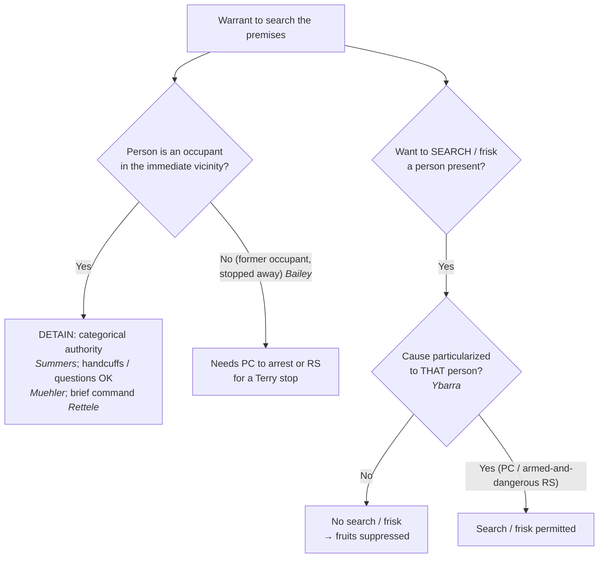

# S9 R1 panel-review — Opus model-diversity lane (prompt pack)

You are the **Claude/Opus** leg of the S9 three-lane adversarial panel (1 Claude + 2 Codex, R1). The two Codex lanes carry the A (support/quote-fidelity) and B (currency/treatment) attack lenses; **you carry model diversity and MUST vote on every paneled assertion across BOTH lenses' concerns.** You are refute-framed: try hard to break each assertion; **default to REFUTED on uncertainty**; never fabricate a cite, quote, or holding; use ONLY the evidence inlined below (no search, no outside knowledge). You are a SIGHTED reviewer — the FULL lake record (judgment fields included) is inlined.

You are a WRITER lane, not an adjudicator: you FIND and VOTE. You do not tally, adjudicate, or close any row — the orchestrator does.

For EACH group below, return one JSON object with the exact `reviewed[]` shape from the output contract (identical framing to the Codex lenses). Emit a finding object ONLY for a real defect (verdict refuted / stands-modified); a group you find wholly clean returns all-`stands` verdicts (the harness records a clean attestation). Concatenate the per-group JSON objects into a top-level `{"packs": [ ... ]}` array, one entry per group, each carrying its `group_id`.


OUTPUT CONTRACT — return ONE JSON object, nothing else:
{
  "lens": "A" | "B",
  "group_id": "<echo the group id>",
  "reviewed": [
    {
      "assertion_id": "<from group_inventory.jsonl>",
      "dimension": "existence|support|quote_fidelity|pincite|treatment|black_letter",
      "verdict": "stands" | "refuted" | "stands-modified",
      "verifiable_from_disclosed": true | false,
      "defect": null,   // null when verdict=="stands"; else an object:
      //  {"problem": "...", "severity": "high|medium|low", "proposed_fix": "...", "evidence_quote": "verbatim from disclosed evidence or null", "needs_cl": true|false, "locator_note": "..."}
      "reasons": ["short evidence-grounded reason", "..."],
      "breaks_true_positives": true | false,
      "residual_risks": ["..."],
      "suggested_tightening": "... or null"
    }
  ],
  "notes": ""
}
Rules: verdict=='stands' <=> defect==null (assertion survives your attack). verdict=='refuted' <=> a real defect (the assertion as framed is wrong). verdict=='stands-modified' <=> survives but needs a stated modification (a minor defect). Review EVERY assertion_id in group_inventory.jsonl exactly once. Output ONLY the JSON object.
---

## GROUP: content/the-warrant/executing-a-warrant/Detention and Search of Persons at the Scene.md  (`doctrine`, 6 assertions)

### content_page

```
---
weight: 20
aliases:
  - "Detention and Search of Persons at the Scene"
  - "Detention & Search of Persons at the Scene"
title: "Detention & Search of Persons at the Scene"
topic: Detention and Search of Persons at the Scene
type: doctrine
amendment: "U.S. Const. amend. IV"
jurisdiction: "Federal (U.S. Const. amend. IV); SCOTUS baseline"
status: draft
related:
  - "[[Knock-and-Announce]]"
  - "[[Scope Manner and Related Issues]]"
  - "[[Securing the Scene]]"
  - "[[Terry Stops and Reasonable Suspicion]]"
  - "[[Ybarra v. Illinois]]"
---

# Detention & Search of Persons at the Scene

*This page is about the **people** present when a search warrant is executed: whom officers may detain, and when they may search or frisk. For securing spaces and protective sweeps, see [[Securing the Scene]]; for the manner of the search itself, see [[Scope Manner and Related Issues]].*

> [!rule] Black-letter rule
> **A search warrant for premises carries the limited, categorical authority to detain the occupants while the search is conducted — but not to search them.** "A warrant to search for contraband founded on probable cause implicitly carries with it the limited authority to detain the occupants of the premises while a proper search is conducted." *[[Michigan v. Summers#^pin-705|Michigan v. Summers]]*, 452 U.S. 692, [705](https://www.courtlistener.com/opinion/110534/michigan-v-summers/) (1981). That authority is **categorical** (it needs no individualized suspicion) and may be enforced with reasonable force such as handcuffs (*[[Muehler v. Mena|Muehler v. Mena]]*), but it is **spatially limited to the immediate vicinity of the premises** (*[[Bailey v. United States#^pin-201|Bailey v. United States]]*). Detention is not search: a premises warrant does **not** authorize searching a person who merely happens to be present; that needs cause **particularized to that person**. *[[Ybarra v. Illinois|Ybarra v. Illinois]]*, 444 U.S. 85, [91](https://www.courtlistener.com/opinion/110158/ybarra-v-illinois/) (1979).
> ^rule-detention-scene

## The Brief

**Field-decisive question: this warrant lets me search the place — what may I do with the people I find here?** Two different powers are in play, and they run on different rules. Officers may **detain** the occupants automatically while they search, but they may not **search** those occupants without cause aimed at each one.

**Detention of occupants is automatic during the search.** A premises warrant founded on probable cause carries "the limited authority to detain the occupants of the premises while a proper search is conducted." *[[Michigan v. Summers#^pin-705|Michigan v. Summers]]*, 452 U.S. 692, [705](https://www.courtlistener.com/opinion/110534/michigan-v-summers/) (1981). The justification is practical: preventing flight, minimizing the risk of harm to officers and occupants, and orderly completion of the search. Because those interests are present in every such search, the authority does not depend on any suspicion of the particular occupant.

**The authority is categorical, and reasonable force is permitted.** Officers need no separate quantum of proof to detain an occupant: "An officer's authority to detain incident to a search is categorical; it does not depend on the 'quantum of proof justifying detention or the extent of the intrusion to be imposed by the seizure.'" *[[Muehler v. Mena|Muehler v. Mena]]*, 544 U.S. 93, [98](https://www.courtlistener.com/opinion/142878/muehler-v-mena/) (2005). Where the circumstances justify it (a warrant for weapons at a suspected gang house), officers may detain an occupant in **handcuffs** for the duration of the search, and may ask questions (including about immigration status) without separate reasonable suspicion, because questioning that does not prolong the detention is not itself a seizure. *Id.* at 101.

**Unquestioned command, briefly, does not turn on the occupants' innocence or state of dress.** Officers securing the scene "may briefly detain the occupants and exercise unquestioned command of the situation to protect themselves," including ordering unclothed occupants out of bed for a couple of minutes while they secure the room — even when the occupants turn out to be innocent people of a different race than the suspects. *[[Los Angeles County v. Rettele|Los Angeles County v. Rettele]]*, 550 U.S. 609 (2007). Valid warrants issue on probable cause, not certainty, and the reasonableness of a brief, safety-driven detention does not evaporate because the search comes up empty.

**But the detention must stay within the immediate vicinity, and must not be prolonged.** The *[[Michigan v. Summers|Summers]]* authority is bounded in space. It "is limited to the immediate vicinity of the premises to be searched": "A spatial constraint defined by the immediate vicinity of the premises to be searched is therefore required for detentions incident to the execution of a search warrant." *[[Bailey v. United States#^pin-201|Bailey v. United States]]*, 568 U.S. 186, [201](https://www.courtlistener.com/opinion/820749/bailey-v-united-states/) (2013). An occupant who has already left and is stopped a mile away is **outside** the rule; the flight-prevention interest "does not independently justify detention of an occupant beyond the immediate vicinity." *Id.* at 199. Stopping such a person needs ordinary justification: probable cause to arrest, or reasonable suspicion for a *[[Terry Stops and Reasonable Suspicion|Terry]]* stop.

**Searching the people present needs individualized cause.** A warrant to search a place is not a warrant to search whoever is standing in it. Officers who patted down every patron in a tavern named in a warrant violated the Fourth Amendment as to a customer they knew nothing about: "a person's mere propinquity to others independently suspected of criminal activity does not, without more, give rise to probable cause to search that person," and "[w]here the standard is probable cause, a search or seizure of a person must be supported by probable cause particularized with respect to that person." *[[Ybarra v. Illinois|Ybarra v. Illinois]]*, 444 U.S. 85, [91](https://www.courtlistener.com/opinion/110158/ybarra-v-illinois/) (1979). A protective **frisk** likewise needs individualized suspicion that **this** person is armed and presently dangerous. *Id.* at 92–93.

**Burden, standard of review, and remedy.** Detention of occupants during a premises search is justified by the warrant itself, so the government need show only that the person detained was an occupant within the premises' immediate vicinity; a search or frisk of that person, by contrast, must be justified by particularized probable cause or reasonable suspicion, which the government bears the burden to show. The reasonableness questions are reviewed [[Common Legal Terms#de-novo|de novo]] on the historical facts; evidence from an unlawful search of a bystander, or from a detention beyond *[[Michigan v. Summers|Summers]]*' spatial limit, is suppressed.

**Common pitfalls.**

- **Treating the premises warrant as a warrant to search the people.** It is not; frisking or searching a bystander needs cause aimed at that person (*[[Ybarra v. Illinois|Ybarra]]*).
- **Detaining a former occupant away from the scene.** The *[[Michigan v. Summers|Summers]]* power stops at the immediate vicinity; a stop down the street needs its own justification (*[[Bailey v. United States|Bailey]]*).
- **Assuming detention authority is thin.** It is categorical — handcuffs and questioning are permissible where justified, and questioning that does not prolong the stop needs no separate suspicion (*[[Muehler v. Mena|Muehler]]*).
- **Letting a brief safety detention run long.** *[[Los Angeles County v. Rettele|Rettele]]* allows only a brief, unquestioned-command detention; a prolonged one loses its justification.

## Key cases

| Case | Holding | Opinion |
|---|---|---|
| *[[Michigan v. Summers]]*, 452 U.S. 692 (1981) | **Anchor.** A premises warrant founded on probable cause carries the limited authority to detain the occupants while the search is conducted. | [opinion](https://www.courtlistener.com/opinion/110534/michigan-v-summers/) |
| *[[Bailey v. United States]]*, 568 U.S. 186 (2013) | **Spatial limit.** The *[[Michigan v. Summers\|Summers]]* detention authority reaches only the immediate vicinity of the premises; a former occupant stopped a mile away is outside it. | [opinion](https://www.courtlistener.com/opinion/820749/bailey-v-united-states/) |
| *[[Muehler v. Mena]]*, 544 U.S. 93 (2005) | **Categorical + force.** The authority to detain incident to a search is categorical; handcuffs for the duration are permissible where justified, and non-prolonging questions need no separate suspicion. | [opinion](https://www.courtlistener.com/opinion/142878/muehler-v-mena/) |
| *[[Los Angeles County v. Rettele]]*, 550 U.S. 609 (2007) | **Manner.** Officers may briefly exercise unquestioned command to secure the scene, including ordering unclothed occupants up for a few minutes; brief safety detentions are reasonable even when the occupants are innocent. | [opinion](https://www.courtlistener.com/opinion/145728/los-angeles-county-california-v-rettele/) |
| *[[Ybarra v. Illinois]]*, 444 U.S. 85 (1979) | **The limit.** A premises warrant does not authorize searching persons merely present; a search or frisk needs cause particularized to that person. | [opinion](https://www.courtlistener.com/opinion/110158/ybarra-v-illinois/) |

## Visual



## Sources

- [*Michigan v. Summers*, 452 U.S. 692 (1981)](https://www.courtlistener.com/opinion/110534/michigan-v-summers/) (pinpoint: 705)
- [*Bailey v. United States*, 568 U.S. 186 (2013)](https://www.courtlistener.com/opinion/820749/bailey-v-united-states/) (pinpoints: 199, 201)
- [*Muehler v. Mena*, 544 U.S. 93 (2005)](https://www.courtlistener.com/opinion/142878/muehler-v-mena/) (pinpoints: 98, 101)
- [*Los Angeles County v. Rettele*, 550 U.S. 609 (2007)](https://www.courtlistener.com/opinion/145728/los-angeles-county-california-v-rettele/) (pinpoints: 550 U.S. at 614; 127 S. Ct. at 1993–94)
- [*Ybarra v. Illinois*, 444 U.S. 85 (1979)](https://www.courtlistener.com/opinion/110158/ybarra-v-illinois/) (pinpoints: 91, 92–93)

```

### group_inventory (assertions under review)

```jsonl
{"assertion_id": "0ccbaa5618ef5711", "dimension": "existence", "kind": "case_cite", "locator": {"case": "Los Angeles County v. Rettele", "table_line": 40}, "payload": {"case": "Los Angeles County v. Rettele", "cells": ["*[[Los Angeles County v. Rettele]]*, 550 U.S. 609 (2007)", "**Manner.** Officers may briefly exercise unquestioned command to secure the scene, including ordering unclothed occupants up for a few minutes; brief safety detentions are reasonable even when the occupants are innocent.", "[opinion](https://www.courtlistener.com/opinion/145728/los-angeles-county-california-v-rettele/)"], "header": ["Case", "Holding", "Opinion"]}}
{"assertion_id": "26ea6c6791e6d615", "dimension": "existence", "kind": "case_cite", "locator": {"case": "Bailey v. United States", "table_line": 38}, "payload": {"case": "Bailey v. United States", "cells": ["*[[Bailey v. United States]]*, 568 U.S. 186 (2013)", "**Spatial limit.** The *[[Michigan v. Summers\\|Summers]]* detention authority reaches only the immediate vicinity of the premises; a former occupant stopped a mile away is outside it.", "[opinion](https://www.courtlistener.com/opinion/820749/bailey-v-united-states/)"], "header": ["Case", "Holding", "Opinion"]}}
{"assertion_id": "2aeeef31951f49d0", "dimension": "existence", "kind": "case_cite", "locator": {"case": "Ybarra v. Illinois", "table_line": 41}, "payload": {"case": "Ybarra v. Illinois", "cells": ["*[[Ybarra v. Illinois]]*, 444 U.S. 85 (1979)", "**The limit.** A premises warrant does not authorize searching persons merely present; a search or frisk needs cause particularized to that person.", "[opinion](https://www.courtlistener.com/opinion/110158/ybarra-v-illinois/)"], "header": ["Case", "Holding", "Opinion"]}}
{"assertion_id": "510fbc16e27d31f4", "dimension": "existence", "kind": "case_cite", "locator": {"case": "Michigan v. Summers", "table_line": 37}, "payload": {"case": "Michigan v. Summers", "cells": ["*[[Michigan v. Summers]]*, 452 U.S. 692 (1981)", "**Anchor.** A premises warrant founded on probable cause carries the limited authority to detain the occupants while the search is conducted.", "[opinion](https://www.courtlistener.com/opinion/110534/michigan-v-summers/)"], "header": ["Case", "Holding", "Opinion"]}}
{"assertion_id": "a9afeace8c01b723", "dimension": "existence", "kind": "case_cite", "locator": {"case": "Muehler v. Mena", "table_line": 39}, "payload": {"case": "Muehler v. Mena", "cells": ["*[[Muehler v. Mena]]*, 544 U.S. 93 (2005)", "**Categorical + force.** The authority to detain incident to a search is categorical; handcuffs for the duration are permissible where justified, and non-prolonging questions need no separate suspicion.", "[opinion](https://www.courtlistener.com/opinion/142878/muehler-v-mena/)"], "header": ["Case", "Holding", "Opinion"]}}
{"assertion_id": "d9d1a40325161450", "dimension": "support", "kind": "proposition", "locator": {"callout": "^rule-detention-scene"}, "payload": {"anchor": "^rule-detention-scene", "statement": "[!rule] Black-letter rule\n**A search warrant for premises carries the limited, categorical authority to detain the occupants while the search is conducted — but not to search them.** \"A warrant to search for contraband founded on probable cause implicitly carries with it the limited authority to detain the occupants of the premises while a proper search is conducted.\" *[[Michigan v. Summers#^pin-705|Michigan v. Summers]]*, 452 U.S. 692, [705](https://www.courtlistener.com/opinion/110534/michigan-v-summers/) (1981). That authority is **categorical** (it needs no individualized suspicion) and may be enforced with reasonable force such as handcuffs (*[[Muehler v. Mena|Muehler v. Mena]]*), but it is **spatially limited to the immediate vicinity of the premises** (*[[Bailey v. United States#^pin-201|Bailey v. United States]]*). Detention is not search: a premises warrant does **not** authorize searching a person who merely happens to be present; that needs cause **particularized to that person**. *[[Ybarra v. Illinois|Ybarra v. Illinois]]*, 444 U.S. 85, [91](https://www.courtlistener.com/opinion/110158/ybarra-v-illinois/) (1979)."}}
```

### lake record — Bailey v. United States

```json
{
  "schema_version": "s2.v1",
  "record_id": "Bailey v. United States",
  "stub": false,
  "status": "verified",
  "identity": {
    "case_name": "Bailey v. United States",
    "case_name_short": "Bailey",
    "case_name_full": "Bailey v. United States",
    "input_case_name": "Bailey v. United States",
    "court": "U.S. Supreme Court",
    "court_id": "scotus",
    "court_level": "scotus",
    "circuit": null,
    "state": null,
    "date_decided": "2013-02-19",
    "year": 2013,
    "docket": null,
    "cluster_id": 820749,
    "lead_opinion_id": 9502775,
    "sibling_ids": [
      820749,
      9502775,
      9502776,
      9502777
    ],
    "absolute_url": "/opinion/820749/bailey-v-united-states/",
    "identity_method": "citation+party-text",
    "expected_citation_found": true,
    "party_name_in_text": true,
    "canonical_name_match": true,
    "alternates": [
      {
        "cluster_id": 8412656,
        "score": 10,
        "case_name": "Bailey v. United States"
      }
    ],
    "reason_code": null
  },
  "citations": {
    "official": {
      "cite": "568 U.S. 186",
      "volume": "568",
      "reporter": "U.S.",
      "page": "186",
      "type": 1,
      "selected_official": true,
      "source": "cluster.citations[]"
    },
    "parallel": [
      {
        "cite": "133 S. Ct. 1031",
        "volume": "133",
        "reporter": "S. Ct.",
        "page": "1031",
        "type": 1,
        "selected_official": false,
        "source": "cluster.citations[]"
      },
      {
        "cite": "185 L. Ed. 2d 19",
        "volume": "185",
        "reporter": "L. Ed. 2d",
        "page": "19",
        "type": 1,
        "selected_official": false,
        "source": "cluster.citations[]"
      }
    ],
    "vendor_neutral": [
      {
        "cite": "2013 U.S. LEXIS 1075",
        "volume": "2013",
        "reporter": "U.S. LEXIS",
        "page": "1075",
        "type": 6,
        "selected_official": false,
        "source": "cluster.citations[]"
      }
    ],
    "all": [
      {
        "cite": "133 S. Ct. 1031",
        "volume": "133",
        "reporter": "S. Ct.",
        "page": "1031",
        "type": 1,
        "selected_official": false,
        "source": "cluster.citations[]"
      },
      {
        "cite": "185 L. Ed. 2d 19",
        "volume": "185",
        "reporter": "L. Ed. 2d",
        "page": "19",
        "type": 1,
        "selected_official": false,
        "source": "cluster.citations[]"
      },
      {
        "cite": "2013 U.S. LEXIS 1075",
        "volume": "2013",
        "reporter": "U.S. LEXIS",
        "page": "1075",
        "type": 6,
        "selected_official": false,
        "source": "cluster.citations[]"
      },
      {
        "cite": "568 U.S. 186",
        "volume": "568",
        "reporter": "U.S.",
        "page": "186",
        "type": 1,
        "selected_official": false,
        "source": "cluster.citations[]"
      }
    ],
    "display": "568 U.S. 186",
    "official_selection": {
      "court_class": "scotus",
      "selected": "568 U.S. 186",
      "reason": "selected_rank_1"
    }
  },
  "pinpoints": [
    {
      "id": "pin-201",
      "page": null,
      "quote": "--- # Bailey v. United States *568 U.S. 186 (2013)* \u00b7 U.S. Supreme Court \u00b7 **Binding \u2014 SCOTUS** \u00b7 Treatment: **good** *(as of 2026-06-30)* <!-- header line; TreatmentBadge + weight render here, degrading to the text above --> ## Background Officers had a warrant to search a basement apartment for a handgun. Before executing it, surveillance officers saw Bailey and another man leave the apartment by car. Officers followed and stopped them roughly a mile away, detained Bailey, patted him down, and drove him back to the apartment. The search turned up a gun and drugs, and a key in Bailey's possession opened the apartment door. The detention was justified below under [[Michigan v. Summers]], which allows detaining occupants while a search warrant is executed. ## Issue Whether the *Summers* authority to detain occupants incident to the execution of a search warrant extends to a former occupant who has already left and is stopped away from the immediate vicinity of the premises. ## Rule No \u2014 the *Summers* detention authority is spatially limited.",
      "star_marker": null,
      "quote_fidelity": "mismatch",
      "pinpoint_status": "slip-only",
      "position": null
    },
    {
      "id": "pin-199",
      "page": null,
      "quote": "does not independently justify detention of an occupant beyond the immediate vicinity of the premises to be searched.",
      "star_marker": "199",
      "quote_fidelity": "matched",
      "pinpoint_status": "star-verified",
      "position": 29407,
      "fragment": "#:~:text=does%20not%20independently%20justify%20detention",
      "fragment_validated_at": "2026-07-09T15:40:45Z"
    }
  ],
  "treatment": {
    "field_i_validity": "good_law",
    "as_of_content": "2013-02-19",
    "as_of_treatment": "2026-06-30",
    "composite_basis": "migration-seed",
    "composite_basis_ref": "Bailey v. United States",
    "varies_by_point": false,
    "scope_note": "Old as_of seeds as_of_treatment; S2 derivation re-derives and may downgrade.",
    "point_overrides": [],
    "edges": [
      {
        "citing_case": {
          "name": "State v. Tripp",
          "cluster_id": 9352593,
          "cite": null,
          "field_ii": "abrogated"
        },
        "field_ii": "abrogated",
        "field_iii": "mentioned",
        "point": null,
        "proposed": true,
        "journal_ref": "Bailey v. United States:lane1_negative"
      },
      {
        "citing_case": {
          "name": "State v. Tripp",
          "cluster_id": 6620965,
          "cite": null,
          "field_ii": "abrogated"
        },
        "field_ii": "abrogated",
        "field_iii": "mentioned",
        "point": null,
        "proposed": true,
        "journal_ref": "Bailey v. United States:lane1_negative"
      },
      {
        "citing_case": {
          "name": "State v. Tripp",
          "cluster_id": 6478743,
          "cite": null,
          "field_ii": "abrogated"
        },
        "field_ii": "abrogated",
        "field_iii": "mentioned",
        "point": null,
        "proposed": true,
        "journal_ref": "Bailey v. United States:lane1_negative"
      },
      {
        "citing_case": {
          "name": "State v. Muldrow",
          "cluster_id": 4448772,
          "cite": [
            "2017 Ohio 8839",
            "100 N.E.3d 1093"
          ],
          "field_ii": "overruled"
        },
        "field_ii": "overruled",
        "field_iii": "mentioned",
        "point": null,
        "proposed": true,
        "journal_ref": "Bailey v. United States:lane1_negative"
      },
      {
        "citing_case": {
          "name": "State of Iowa v. Connor William Clar Steffens",
          "cluster_id": 4332280,
          "cite": [
            "889 N.W.2d 691",
            "2016 Iowa App. LEXIS 1316",
            "2016 WL 7393893"
          ],
          "field_ii": "questioned"
        },
        "field_ii": "questioned",
        "field_iii": "mentioned",
        "point": null,
        "proposed": true,
        "journal_ref": "Bailey v. United States:lane1_negative"
      },
      {
        "citing_case": {
          "name": "United States v. Faux",
          "cluster_id": 7312636,
          "cite": [
            "94 F. Supp. 3d 258",
            "2015 U.S. Dist. LEXIS 37051",
            "2015 WL 1347041"
          ],
          "field_ii": "superseded_by_statute"
        },
        "field_ii": "superseded_by_statute",
        "field_iii": "mentioned",
        "point": null,
        "proposed": true,
        "journal_ref": "Bailey v. United States:lane1_negative"
      },
      {
        "citing_case": {
          "name": "Jonathan Albert Leal v. State",
          "cluster_id": 2751234,
          "cite": null,
          "field_ii": "overruled"
        },
        "field_ii": "overruled",
        "field_iii": "mentioned",
        "point": null,
        "proposed": true,
        "journal_ref": "Bailey v. United States:lane1_negative"
      },
      {
        "citing_case": {
          "name": "Prall v. City of Boston",
          "cluster_id": 8729956,
          "cite": [
            "985 F. Supp. 2d 115",
            "2013 WL 6076462",
            "2013 U.S. Dist. LEXIS 166128"
          ],
          "field_ii": "overruled"
        },
        "field_ii": "overruled",
        "field_iii": "mentioned",
        "point": null,
        "proposed": true,
        "journal_ref": "Bailey v. United States:lane1_negative"
      },
      {
        "citing_case": {
          "name": "Byron Halsey v. Frank Pfeiffer",
          "cluster_id": 2671183,
          "cite": [
            "750 F.3d 273",
            "2014 WL 1622769",
            "2014 U.S. App. LEXIS 7696"
          ],
          "field_ii": "questioned"
        },
        "field_ii": "questioned",
        "field_iii": "mentioned",
        "point": null,
        "proposed": true,
        "journal_ref": "Bailey v. United States:lane2_top_cited"
      },
      {
        "citing_case": {
          "name": "Maurice Lewis v. City of Chicago",
          "cluster_id": 4583974,
          "cite": [
            "914 F.3d 472"
          ],
          "field_ii": "overruled"
        },
        "field_ii": "overruled",
        "field_iii": "mentioned",
        "point": null,
        "proposed": true,
        "journal_ref": "Bailey v. United States:lane2_top_cited"
      },
      {
        "citing_case": {
          "name": "Shaun J. Matz v. Rodney Klotka",
          "cluster_id": 2739950,
          "cite": [
            "769 F.3d 517",
            "2014 U.S. App. LEXIS 19074",
            "2014 WL 4960311"
          ],
          "field_ii": "questioned"
        },
        "field_ii": "questioned",
        "field_iii": "mentioned",
        "point": null,
        "proposed": true,
        "journal_ref": "Bailey v. United States:lane2_top_cited"
      },
      {
        "citing_case": {
          "name": "Merritt Sharp, III v. County of Orange",
          "cluster_id": 4427211,
          "cite": [
            "871 F.3d 901",
            "2017 WL 4126947",
            "2017 U.S. App. LEXIS 18148"
          ],
          "field_ii": "questioned"
        },
        "field_ii": "questioned",
        "field_iii": "mentioned",
        "point": null,
        "proposed": true,
        "journal_ref": "Bailey v. United States:lane2_top_cited"
      },
      {
        "citing_case": {
          "name": "Americans for Prosperity Foundation v. Bonta",
          "cluster_id": 4896549,
          "cite": [
            "594 U.S. 595",
            "210 L. Ed. 2d 716",
            "141 S. Ct. 2373"
          ],
          "field_ii": "criticized"
        },
        "field_ii": "criticized",
        "field_iii": "mentioned",
        "point": null,
        "proposed": true,
        "journal_ref": "Bailey v. United States:lane2_top_cited"
      },
      {
        "citing_case": {
          "name": "State v. Antoine D. Watts(074556)",
          "cluster_id": 3159265,
          "cite": [
            "223 N.J. 503",
            "126 A.3d 1216",
            "2015 N.J. LEXIS 1239"
          ],
          "field_ii": "questioned"
        },
        "field_ii": "questioned",
        "field_iii": "mentioned",
        "point": null,
        "proposed": true,
        "journal_ref": "Bailey v. United States:lane2_top_cited"
      },
      {
        "citing_case": {
          "name": "C. B. v. City of Sonora",
          "cluster_id": 2743611,
          "cite": [
            "769 F.3d 1005",
            "89 Fed. R. Serv. 3d 1624",
            "2014 U.S. App. LEXIS 19757",
            "2014 WL 5151632"
          ],
          "field_ii": "abrogated"
        },
        "field_ii": "abrogated",
        "field_iii": "mentioned",
        "point": null,
        "proposed": true,
        "journal_ref": "Bailey v. United States:lane2_top_cited"
      },
      {
        "citing_case": {
          "name": "United States v. Bailey",
          "cluster_id": 2654019,
          "cite": [
            "743 F.3d 322",
            "2014 WL 657932"
          ],
          "field_ii": "overruled"
        },
        "field_ii": "overruled",
        "field_iii": "mentioned",
        "point": null,
        "proposed": true,
        "journal_ref": "Bailey v. United States:lane2_top_cited"
      },
      {
        "citing_case": {
          "name": "United States v. Eric Brodie",
          "cluster_id": 2653533,
          "cite": [
            "408 U.S. App. D.C. 326",
            "742 F.3d 1058",
            "2014 WL 593264",
            "2014 U.S. App. LEXIS 2874"
          ],
          "field_ii": "questioned"
        },
        "field_ii": "questioned",
        "field_iii": "mentioned",
        "point": null,
        "proposed": true,
        "journal_ref": "Bailey v. United States:lane2_top_cited"
      },
      {
        "citing_case": {
          "name": "United States v. Dwayne Sheckles",
          "cluster_id": 4879211,
          "cite": [
            "996 F.3d 330"
          ],
          "field_ii": "abrogated"
        },
        "field_ii": "abrogated",
        "field_iii": "mentioned",
        "point": null,
        "proposed": true,
        "journal_ref": "Bailey v. United States:lane2_top_cited"
      },
      {
        "citing_case": {
          "name": "United States v. Davis",
          "cluster_id": 4759018,
          "cite": [
            "961 F.3d 181"
          ],
          "field_ii": "questioned"
        },
        "field_ii": "questioned",
        "field_iii": "mentioned",
        "point": null,
        "proposed": true,
        "journal_ref": "Bailey v. United States:lane2_top_cited"
      },
      {
        "citing_case": {
          "name": "State v. Hackney",
          "cluster_id": 3218181,
          "cite": [
            "2016 Ohio 4609"
          ],
          "field_ii": "overruled"
        },
        "field_ii": "overruled",
        "field_iii": "mentioned",
        "point": null,
        "proposed": true,
        "journal_ref": "Bailey v. United States:lane2_top_cited"
      },
      {
        "citing_case": {
          "name": "Donald Delade v. John Cargan",
          "cluster_id": 4778175,
          "cite": [
            "972 F.3d 207"
          ],
          "field_ii": "questioned"
        },
        "field_ii": "questioned",
        "field_iii": "mentioned",
        "point": null,
        "proposed": true,
        "journal_ref": "Bailey v. United States:lane2_top_cited"
      },
      {
        "citing_case": {
          "name": "United States v. Jack Bruce Folk",
          "cluster_id": 2678192,
          "cite": [
            "754 F.3d 905",
            "2014 WL 2611272",
            "2014 U.S. App. LEXIS 10929"
          ],
          "field_ii": "questioned"
        },
        "field_ii": "questioned",
        "field_iii": "mentioned",
        "point": null,
        "proposed": true,
        "journal_ref": "Bailey v. United States:lane2_top_cited"
      },
      {
        "citing_case": {
          "name": "Gregorio Perez Cruz v. William Barr",
          "cluster_id": 4629270,
          "cite": [
            "926 F.3d 1128"
          ],
          "field_ii": "abrogated"
        },
        "field_ii": "abrogated",
        "field_iii": "mentioned",
        "point": null,
        "proposed": true,
        "journal_ref": "Bailey v. United States:lane2_top_cited"
      },
      {
        "citing_case": {
          "name": "United States v. Joseph Isaiah Woodson, Jr.",
          "cluster_id": 6459262,
          "cite": [
            "30 F.4th 1295"
          ],
          "field_ii": "superseded_by_statute"
        },
        "field_ii": "superseded_by_statute",
        "field_iii": "mentioned",
        "point": null,
        "proposed": true,
        "journal_ref": "Bailey v. United States:lane2_top_cited"
      },
      {
        "citing_case": {
          "name": "Ryan Moderson v. City of Neenah",
          "cluster_id": 10581758,
          "cite": [
            "137 F.4th 611"
          ],
          "field_ii": "questioned"
        },
        "field_ii": "questioned",
        "field_iii": "mentioned",
        "point": null,
        "proposed": true,
        "journal_ref": "Bailey v. United States:lane2_top_cited"
      },
      {
        "citing_case": {
          "name": "Dwayne Furlow v. Jon Belmar",
          "cluster_id": 8436813,
          "cite": [
            "52 F.4th 393"
          ],
          "field_ii": "questioned"
        },
        "field_ii": "questioned",
        "field_iii": "mentioned",
        "point": null,
        "proposed": true,
        "journal_ref": "Bailey v. United States:lane2_top_cited"
      },
      {
        "citing_case": {
          "name": "Karamanoglu v. Town of Yarmouth",
          "cluster_id": 5178962,
          "cite": [
            "15 F.4th 82"
          ],
          "field_ii": "questioned"
        },
        "field_ii": "questioned",
        "field_iii": "mentioned",
        "point": null,
        "proposed": true,
        "journal_ref": "Bailey v. United States:lane2_top_cited"
      },
      {
        "citing_case": {
          "name": "Thomas Moorer v. City of Chicago",
          "cluster_id": 9473951,
          "cite": [
            "92 F.4th 715"
          ],
          "field_ii": "questioned"
        },
        "field_ii": "questioned",
        "field_iii": "mentioned",
        "point": null,
        "proposed": true,
        "journal_ref": "Bailey v. United States:lane2_top_cited"
      },
      {
        "citing_case": {
          "name": "United States v. Joseph Lewis",
          "cluster_id": 4412774,
          "cite": [
            "864 F.3d 937",
            "2017 WL 3186308",
            "2017 U.S. App. LEXIS 13583"
          ],
          "field_ii": "questioned"
        },
        "field_ii": "questioned",
        "field_iii": "mentioned",
        "point": null,
        "proposed": true,
        "journal_ref": "Bailey v. United States:lane2_top_cited"
      },
      {
        "citing_case": {
          "name": "Chacker v. JPMorgan Chase Bank, N.A.",
          "cluster_id": 6239907,
          "cite": [
            "237 Cal. Rptr. 3d 921",
            "27 Cal. App. 5th 351"
          ],
          "field_ii": "questioned"
        },
        "field_ii": "questioned",
        "field_iii": "mentioned",
        "point": null,
        "proposed": true,
        "journal_ref": "Bailey v. United States:lane2_top_cited"
      },
      {
        "citing_case": {
          "name": "State v. Mason",
          "cluster_id": 4299107,
          "cite": [
            "2016 Ohio 7081"
          ],
          "field_ii": "overruled"
        },
        "field_ii": "overruled",
        "field_iii": "mentioned",
        "point": null,
        "proposed": true,
        "journal_ref": "Bailey v. United States:lane2_top_cited"
      },
      {
        "citing_case": {
          "name": "State v. Wilson",
          "cluster_id": 4576198,
          "cite": [
            "821 S.E.2d 811",
            "371 N.C. 920"
          ],
          "field_ii": "abrogated"
        },
        "field_ii": "abrogated",
        "field_iii": "mentioned",
        "point": null,
        "proposed": true,
        "journal_ref": "Bailey v. United States:lane2_top_cited"
      },
      {
        "citing_case": {
          "name": "State v. Kaul",
          "cluster_id": 4374844,
          "cite": [
            "2017 ND 56",
            "891 N.W.2d 352",
            "2017 N.D. LEXIS 56",
            "2017 WL 968845"
          ],
          "field_ii": "questioned"
        },
        "field_ii": "questioned",
        "field_iii": "mentioned",
        "point": null,
        "proposed": true,
        "journal_ref": "Bailey v. United States:lane2_top_cited"
      }
    ],
    "derivation": {
      "lane1_negative": {
        "query": "cites:(820749 OR 9502775 OR 9502776 OR 9502777) AND (overrul* OR abrogat* OR supersed* OR \"recede from\" OR \"no longer good law\" OR vacat* OR reversed) ",
        "reviewed": 95,
        "cap": 200,
        "cap_hit": false,
        "final_cursor": null,
        "audit_needed": false,
        "proposed_negative_events": 8,
        "audit_marker": null,
        "triage_mode": "snippet-first",
        "snippet_field": "results[].opinions[].snippet",
        "triage_journaled": 95,
        "triage_read": 8,
        "triage_snippet_classified": 87
      },
      "lane2_top_cited": {
        "query": "cites:(820749 OR 9502775 OR 9502776 OR 9502777)",
        "reviewed": 25,
        "cap": 25,
        "cap_hit": true,
        "final_cursor": "https://www.courtlistener.com/api/rest/v4/search/?cursor=cz0zJnM9NDMzMjI4MCZ0PW8mZD0yMDI2LTA3LTA0JnA9Mw%3D%3D&order_by=citeCount+desc&page_size=25&q=cites%3A%28820749+OR+9502775+OR+9502776+OR+9502777%29&type=o",
        "audit_needed": true,
        "proposed_negative_events": 25,
        "audit_marker": "R15 treatment audit required"
      },
      "lane3_recency": {
        "query": "cites:(820749 OR 9502775 OR 9502776 OR 9502777)",
        "reviewed": 16,
        "cap": 200,
        "cap_hit": false,
        "final_cursor": null,
        "audit_needed": false,
        "proposed_negative_events": 0,
        "audit_marker": null,
        "triage_mode": "snippet-first",
        "snippet_field": "results[].opinions[].snippet",
        "triage_journaled": 16,
        "triage_read": 0,
        "triage_snippet_classified": 16
      }
    }
  },
  "progeny": {
    "complete_query": "cites:(820749 OR 9502775 OR 9502776 OR 9502777)",
    "indexed_citing_opinions": 122,
    "count_source": "search",
    "per_sibling": [
      {
        "opinion_id": 820749,
        "count": 76,
        "count_source": "search"
      },
      {
        "opinion_id": 9502775,
        "count": 46,
        "count_source": "search"
      },
      {
        "opinion_id": 9502776,
        "count": 0,
        "count_source": "search"
      },
      {
        "opinion_id": 9502777,
        "count": 0,
        "count_source": "search"
      }
    ],
    "citation_count": 392,
    "cache_path": "/Users/johngalt/cssi-lake/cache/progeny/bailey-v-united-states.jsonl",
    "enumeration": "bounded",
    "cursor": "https://www.courtlistener.com/api/rest/v4/search/?cursor=cz0xLjc3MDk1OSZzPTY0NTkyNjImdD1vJmQ9MjAyNi0wNy0wNCZwPTI%3D&order_by=score+desc&page_size=100&q=cites%3A%28820749+OR+9502775+OR+9502776+OR+9502777%29&type=o",
    "rows_cached": 20,
    "outbound_opinion_edges": [
      {
        "source_opinion_id": 820749,
        "cited_id": 27226,
        "source": "search.opinions[].cites[]"
      },
      {
        "source_opinion_id": 820749,
        "cited_id": 96405,
        "source": "search.opinions[].cites[]"
      },
      {
        "source_opinion_id": 820749,
        "cited_id": 105963,
        "source": "search.opinions[].cites[]"
      },
      {
        "source_opinion_id": 820749,
        "cited_id": 107729,
        "source": "search.opinions[].cites[]"
      },
      {
        "source_opinion_id": 820749,
        "cited_id": 109751,
        "source": "search.opinions[].cites[]"
      },
      {
        "source_opinion_id": 820749,
        "cited_id": 109905,
        "source": "search.opinions[].cites[]"
      },
      {
        "source_opinion_id": 820749,
        "cited_id": 110096,
        "source": "search.opinions[].cites[]"
      },
      {
        "source_opinion_id": 820749,
        "cited_id": 110534,
        "source": "search.opinions[].cites[]"
      },
      {
        "source_opinion_id": 820749,
        "cited_id": 110890,
        "source": "search.opinions[].cites[]"
      },
      {
        "source_opinion_id": 820749,
        "cited_id": 111600,
        "source": "search.opinions[].cites[]"
      },
      {
        "source_opinion_id": 820749,
        "cited_id": 112384,
        "source": "search.opinions[].cites[]"
      },
      {
        "source_opinion_id": 820749,
        "cited_id": 134746,
        "source": "search.opinions[].cites[]"
      },
      {
        "source_opinion_id": 820749,
        "cited_id": 142878,
        "source": "search.opinions[].cites[]"
      },
      {
        "source_opinion_id": 820749,
        "cited_id": 145728,
        "source": "search.opinions[].cites[]"
      },
      {
        "source_opinion_id": 820749,
        "cited_id": 145887,
        "source": "search.opinions[].cites[]"
      },
      {
        "source_opinion_id": 820749,
        "cited_id": 183973,
        "source": "search.opinions[].cites[]"
      },
      {
        "source_opinion_id": 820749,
        "cited_id": 220356,
        "source": "search.opinions[].cites[]"
      },
      {
        "source_opinion_id": 820749,
        "cited_id": 565019,
        "source": "search.opinions[].cites[]"
      },
      {
        "source_opinion_id": 820749,
        "cited_id": 618288,
        "source": "search.opinions[].cites[]"
      },
      {
        "source_opinion_id": 820749,
        "cited_id": 2531019,
        "source": "search.opinions[].cites[]"
      }
    ]
  },
  "off_cl_links": [],
  "provenance": {
    "cl_source": "CU",
    "cl_api": "https://www.courtlistener.com/api/rest/v4",
    "built_by": "S2-BUILDER-AUTHORING",
    "build_run": "s2-build-96d841cbb12e",
    "date_created": "2026-07-04T19:16:10Z",
    "date_modified": "2026-07-09T15:47:29Z",
    "warnings": [
      "legacy treatment migrated: good -> good_law"
    ],
    "field_provenance": {
      "identity": {
        "src": "CourtListener search + clusters + lead opinion text",
        "at": "2026-07-04T19:16:25Z",
        "verifier": "S2-BUILDER-AUTHORING"
      },
      "treatment.field_i_validity": {
        "src": "_treatment-migration.json + page frontmatter",
        "at": "2026-07-04T19:16:25Z",
        "verifier": "S2-BUILDER-AUTHORING"
      },
      "point_overrides": {
        "src": "S2 treatment derivation proposed only",
        "at": "2026-07-04T19:20:23Z",
        "verifier": "S2-BUILDER-AUTHORING"
      },
      "pinpoints": {
        "src": "content page quote harvest + lead opinion text",
        "at": "2026-07-04T19:16:25Z",
        "verifier": "S2-BUILDER-AUTHORING"
      }
    }
  }
}

```

### lake record — Los Angeles County v. Rettele

```json
{
  "schema_version": "s2.v1",
  "record_id": "Los Angeles County v. Rettele",
  "stub": false,
  "status": "verified",
  "identity": {
    "case_name": "Los Angeles County, California v. Rettele",
    "case_name_short": "Rettele",
    "case_name_full": "LOS ANGELES COUNTY, CALIFORNIA, Et Al. v. RETTELE Et Al.",
    "input_case_name": "Los Angeles County v. Rettele",
    "court": "U.S. Supreme Court",
    "court_id": "scotus",
    "court_level": "scotus",
    "circuit": null,
    "state": null,
    "date_decided": "2007-05-21",
    "year": 2007,
    "docket": "06-605",
    "cluster_id": 145728,
    "lead_opinion_id": 145728,
    "sibling_ids": [
      145728,
      9435063,
      9435064
    ],
    "absolute_url": "/opinion/145728/los-angeles-county-california-v-rettele/",
    "identity_method": "citation+party-text",
    "expected_citation_found": true,
    "party_name_in_text": true,
    "canonical_name_match": true,
    "alternates": [],
    "reason_code": null
  },
  "citations": {
    "official": null,
    "parallel": [
      {
        "cite": "550 U.S. 609",
        "volume": "550",
        "reporter": "U.S.",
        "page": "609",
        "type": 1,
        "selected_official": false,
        "source": "cluster.citations[]"
      },
      {
        "cite": "127 S. Ct. 1989",
        "volume": "127",
        "reporter": "S. Ct.",
        "page": "1989",
        "type": 1,
        "selected_official": false,
        "source": "cluster.citations[]"
      },
      {
        "cite": "167 L. Ed. 2d 974",
        "volume": "167",
        "reporter": "L. Ed. 2d",
        "page": "974",
        "type": 1,
        "selected_official": false,
        "source": "cluster.citations[]"
      },
      {
        "cite": "75 U.S.L.W. 3619",
        "volume": "75",
        "reporter": "U.S.L.W.",
        "page": "3619",
        "type": 4,
        "selected_official": false,
        "source": "cluster.citations[]"
      },
      {
        "cite": "20 Fla. L. Weekly Fed. S 281",
        "volume": "20",
        "reporter": "Fla. L. Weekly Fed. S",
        "page": "281",
        "type": 1,
        "selected_official": false,
        "source": "cluster.citations[]"
      }
    ],
    "vendor_neutral": [
      {
        "cite": "2007 U.S. LEXIS 5900",
        "volume": "2007",
        "reporter": "U.S. LEXIS",
        "page": "5900",
        "type": 6,
        "selected_official": false,
        "source": "cluster.citations[]"
      }
    ],
    "all": [
      {
        "cite": "550 U.S. 609",
        "volume": "550",
        "reporter": "U.S.",
        "page": "609",
        "type": 1,
        "selected_official": false,
        "source": "cluster.citations[]"
      },
      {
        "cite": "127 S. Ct. 1989",
        "volume": "127",
        "reporter": "S. Ct.",
        "page": "1989",
        "type": 1,
        "selected_official": false,
        "source": "cluster.citations[]"
      },
      {
        "cite": "167 L. Ed. 2d 974",
        "volume": "167",
        "reporter": "L. Ed. 2d",
        "page": "974",
        "type": 1,
        "selected_official": false,
        "source": "cluster.citations[]"
      },
      {
        "cite": "2007 U.S. LEXIS 5900",
        "volume": "2007",
        "reporter": "U.S. LEXIS",
        "page": "5900",
        "type": 6,
        "selected_official": false,
        "source": "cluster.citations[]"
      },
      {
        "cite": "75 U.S.L.W. 3619",
        "volume": "75",
        "reporter": "U.S.L.W.",
        "page": "3619",
        "type": 4,
        "selected_official": false,
        "source": "cluster.citations[]"
      },
      {
        "cite": "20 Fla. L. Weekly Fed. S 281",
        "volume": "20",
        "reporter": "Fla. L. Weekly Fed. S",
        "page": "281",
        "type": 1,
        "selected_official": false,
        "source": "cluster.citations[]"
      }
    ],
    "display": null,
    "official_selection": {
      "court_class": "scotus",
      "selected": null,
      "reason": "unlisted_reporter:Fla. L. Weekly Fed. S"
    }
  },
  "pinpoints": [
    {
      "id": "pin-1993",
      "page": null,
      "quote": "--- # Los Angeles County v. Rettele *550 U.S. 609 (2007)* \u00b7 U.S. Supreme Court \u00b7 **Binding \u2014 SCOTUS** \u00b7 Treatment: **good** *(as of 2026-06-30)* <!-- header line; TreatmentBadge + weight render here, degrading to the text above --> ## Background Sheriff's deputies obtained a valid warrant to search a house in a fraud/identity-theft investigation; the suspects were African-American and one was believed to own a handgun. Unknown to the deputies, the house had recently been sold to Rettele and Sadler, who were white. Executing the warrant in the early morning, deputies entered the bedroom and ordered Rettele and Sadler \u2014 naked in bed \u2014 to get up and stand, holding them at gunpoint for a couple of minutes while securing the room before letting them dress. Realizing the suspects were not there, the deputies left within 15 minutes. The Retteles sued under \u00a7 1983. ## Issue Do deputies executing a valid search warrant violate the Fourth Amendment by briefly detaining the home's occupants at gunpoint \u2014 including ordering them, unclothed, out of bed \u2014 while securing the residence? ## Rule No.",
      "star_marker": null,
      "quote_fidelity": "mismatch",
      "pinpoint_status": "slip-only",
      "position": null
    },
    {
      "id": "pin-1993b",
      "page": null,
      "quote": "no accusation that the detention . . . was prolonged[;] [t]he deputies left the home less than 15 minutes after arriving.",
      "star_marker": null,
      "quote_fidelity": "mismatch",
      "pinpoint_status": "slip-only",
      "position": null
    },
    {
      "id": "pin-1994",
      "page": null,
      "quote": "When officers execute a valid warrant and act in a reasonable manner to protect themselves from harm . . . , the Fourth Amendment is not violated.",
      "star_marker": null,
      "quote_fidelity": "mismatch",
      "pinpoint_status": "slip-only",
      "position": null
    },
    {
      "id": "pin-1994b",
      "page": null,
      "quote": "respondents' constitutional rights were not violated, 'there is no necessity for further inquiries concerning qualified immunity.'",
      "star_marker": null,
      "quote_fidelity": "mismatch",
      "pinpoint_status": "slip-only",
      "position": null
    }
  ],
  "treatment": {
    "field_i_validity": "good_law",
    "as_of_content": "2007-05-21",
    "as_of_treatment": "2026-06-30",
    "composite_basis": "migration-seed",
    "composite_basis_ref": "Los Angeles County v. Rettele",
    "varies_by_point": false,
    "scope_note": "Controlling: officers executing a valid warrant may briefly detain occupants and exercise unquestioned command \u2014 including ordering them, unclothed, out of bed for a few minutes \u2014 to secure the scene without violating the Fourth Amendment, so long as the detention is not prolonged.",
    "point_overrides": [],
    "edges": [
      {
        "citing_case": {
          "name": "State v. Tripp",
          "cluster_id": 9352593,
          "cite": null,
          "field_ii": "abrogated"
        },
        "field_ii": "abrogated",
        "field_iii": "mentioned",
        "point": null,
        "proposed": true,
        "journal_ref": "Los Angeles County v. Rettele:lane1_negative"
      },
      {
        "citing_case": {
          "name": "State v. Tripp",
          "cluster_id": 6620965,
          "cite": null,
          "field_ii": "abrogated"
        },
        "field_ii": "abrogated",
        "field_iii": "mentioned",
        "point": null,
        "proposed": true,
        "journal_ref": "Los Angeles County v. Rettele:lane1_negative"
      },
      {
        "citing_case": {
          "name": "State v. Tripp",
          "cluster_id": 6478743,
          "cite": null,
          "field_ii": "abrogated"
        },
        "field_ii": "abrogated",
        "field_iii": "mentioned",
        "point": null,
        "proposed": true,
        "journal_ref": "Los Angeles County v. Rettele:lane1_negative"
      },
      {
        "citing_case": {
          "name": "Bailey v. United States",
          "cluster_id": 820749,
          "cite": [
            "185 L. Ed. 2d 19",
            "133 S. Ct. 1031",
            "568 U.S. 186",
            "2013 U.S. LEXIS 1075"
          ],
          "field_ii": "questioned"
        },
        "field_ii": "questioned",
        "field_iii": "mentioned",
        "point": null,
        "proposed": true,
        "journal_ref": "Los Angeles County v. Rettele:lane2_top_cited"
      },
      {
        "citing_case": {
          "name": "Curley v. Klem",
          "cluster_id": 1362944,
          "cite": [
            "499 F.3d 199",
            "2007 U.S. App. LEXIS 20213",
            "2007 WL 2404803"
          ],
          "field_ii": "criticized"
        },
        "field_ii": "criticized",
        "field_iii": "mentioned",
        "point": null,
        "proposed": true,
        "journal_ref": "Los Angeles County v. Rettele:lane2_top_cited"
      },
      {
        "citing_case": {
          "name": "Gonzalez v. City of Elgin",
          "cluster_id": 1456587,
          "cite": [
            "578 F.3d 526",
            "2009 U.S. App. LEXIS 18724",
            "2009 WL 2525565"
          ],
          "field_ii": "criticized"
        },
        "field_ii": "criticized",
        "field_iii": "mentioned",
        "point": null,
        "proposed": true,
        "journal_ref": "Los Angeles County v. Rettele:lane2_top_cited"
      },
      {
        "citing_case": {
          "name": "Terebesi v. Torreso",
          "cluster_id": 8441937,
          "cite": [
            "764 F.3d 217",
            "2014 U.S. App. LEXIS 16133",
            "2014 WL 4099309"
          ],
          "field_ii": "questioned"
        },
        "field_ii": "questioned",
        "field_iii": "mentioned",
        "point": null,
        "proposed": true,
        "journal_ref": "Los Angeles County v. Rettele:lane2_top_cited"
      },
      {
        "citing_case": {
          "name": "Commonwealth v. Thompson",
          "cluster_id": 2056760,
          "cite": [
            "985 A.2d 928",
            "604 Pa. 198",
            "2009 Pa. LEXIS 2793"
          ],
          "field_ii": "overruled"
        },
        "field_ii": "overruled",
        "field_iii": "mentioned",
        "point": null,
        "proposed": true,
        "journal_ref": "Los Angeles County v. Rettele:lane2_top_cited"
      },
      {
        "citing_case": {
          "name": "Weigel v. Broad",
          "cluster_id": 171335,
          "cite": [
            "544 F.3d 1143",
            "2008 U.S. App. LEXIS 21877",
            "2008 WL 4631920"
          ],
          "field_ii": "overruled"
        },
        "field_ii": "overruled",
        "field_iii": "mentioned",
        "point": null,
        "proposed": true,
        "journal_ref": "Los Angeles County v. Rettele:lane2_top_cited"
      },
      {
        "citing_case": {
          "name": "Baird v. Renbarger",
          "cluster_id": 1188789,
          "cite": [
            "576 F.3d 340",
            "2009 U.S. App. LEXIS 17215",
            "2009 WL 2357882"
          ],
          "field_ii": "questioned"
        },
        "field_ii": "questioned",
        "field_iii": "mentioned",
        "point": null,
        "proposed": true,
        "journal_ref": "Los Angeles County v. Rettele:lane2_top_cited"
      },
      {
        "citing_case": {
          "name": "Colbruno v. Kessler",
          "cluster_id": 4636000,
          "cite": [
            "928 F.3d 1155"
          ],
          "field_ii": "abrogated"
        },
        "field_ii": "abrogated",
        "field_iii": "mentioned",
        "point": null,
        "proposed": true,
        "journal_ref": "Los Angeles County v. Rettele:lane2_top_cited"
      },
      {
        "citing_case": {
          "name": "Mlodzinski Ex Rel. J.M. v. Lewis",
          "cluster_id": 2451581,
          "cite": [
            "648 F.3d 24",
            "2011 U.S. App. LEXIS 11117",
            "2011 WL 2150741"
          ],
          "field_ii": "questioned"
        },
        "field_ii": "questioned",
        "field_iii": "mentioned",
        "point": null,
        "proposed": true,
        "journal_ref": "Los Angeles County v. Rettele:lane2_top_cited"
      },
      {
        "citing_case": {
          "name": "United States v. Ganias",
          "cluster_id": 3207604,
          "cite": [
            "824 F.3d 199",
            "117 A.F.T.R.2d (RIA) 1841",
            "2016 U.S. App. LEXIS 9706",
            "2016 WL 3031285"
          ],
          "field_ii": "criticized"
        },
        "field_ii": "criticized",
        "field_iii": "mentioned",
        "point": null,
        "proposed": true,
        "journal_ref": "Los Angeles County v. Rettele:lane2_top_cited"
      },
      {
        "citing_case": {
          "name": "United States v. Jennings",
          "cluster_id": 1313899,
          "cite": [
            "544 F.3d 815",
            "2008 U.S. App. LEXIS 19560",
            "2008 WL 4192887"
          ],
          "field_ii": "questioned"
        },
        "field_ii": "questioned",
        "field_iii": "mentioned",
        "point": null,
        "proposed": true,
        "journal_ref": "Los Angeles County v. Rettele:lane2_top_cited"
      },
      {
        "citing_case": {
          "name": "Jennifer Cox v. Evansville Police Department and The City of Evansville Babi Beyer v. The City of Fort Wayne",
          "cluster_id": 4534961,
          "cite": [
            "107 N.E.3d 453"
          ],
          "field_ii": "questioned"
        },
        "field_ii": "questioned",
        "field_iii": "mentioned",
        "point": null,
        "proposed": true,
        "journal_ref": "Los Angeles County v. Rettele:lane2_top_cited"
      },
      {
        "citing_case": {
          "name": "Kamel Chaney-Snell v. Andrew Young",
          "cluster_id": 9493618,
          "cite": [
            "98 F.4th 699"
          ],
          "field_ii": "overruled"
        },
        "field_ii": "overruled",
        "field_iii": "mentioned",
        "point": null,
        "proposed": true,
        "journal_ref": "Los Angeles County v. Rettele:lane2_top_cited"
      },
      {
        "citing_case": {
          "name": "United States v. Norris",
          "cluster_id": 216168,
          "cite": [
            "640 F.3d 295",
            "2011 U.S. App. LEXIS 9222",
            "2011 WL 1675801"
          ],
          "field_ii": "overruled"
        },
        "field_ii": "overruled",
        "field_iii": "mentioned",
        "point": null,
        "proposed": true,
        "journal_ref": "Los Angeles County v. Rettele:lane2_top_cited"
      },
      {
        "citing_case": {
          "name": "Z. J. v. Kansas City Brd of Police Comm",
          "cluster_id": 4642838,
          "cite": [
            "931 F.3d 672"
          ],
          "field_ii": "questioned"
        },
        "field_ii": "questioned",
        "field_iii": "mentioned",
        "point": null,
        "proposed": true,
        "journal_ref": "Los Angeles County v. Rettele:lane2_top_cited"
      },
      {
        "citing_case": {
          "name": "United States v. Brian Lawrence",
          "cluster_id": 2805131,
          "cite": [
            "788 F.3d 234",
            "2015 U.S. App. LEXIS 9160",
            "2015 WL 3463089"
          ],
          "field_ii": "questioned"
        },
        "field_ii": "questioned",
        "field_iii": "mentioned",
        "point": null,
        "proposed": true,
        "journal_ref": "Los Angeles County v. Rettele:lane2_top_cited"
      },
      {
        "citing_case": {
          "name": "Erin Osmon v. United States",
          "cluster_id": 9392722,
          "cite": [
            "66 F.4th 144"
          ],
          "field_ii": "questioned"
        },
        "field_ii": "questioned",
        "field_iii": "mentioned",
        "point": null,
        "proposed": true,
        "journal_ref": "Los Angeles County v. Rettele:lane2_top_cited"
      },
      {
        "citing_case": {
          "name": "Maria Yanez-Marquez v. Loretta Lynch",
          "cluster_id": 2808824,
          "cite": [
            "789 F.3d 434",
            "2015 U.S. App. LEXIS 10107",
            "2015 WL 3719105"
          ],
          "field_ii": "criticized"
        },
        "field_ii": "criticized",
        "field_iii": "mentioned",
        "point": null,
        "proposed": true,
        "journal_ref": "Los Angeles County v. Rettele:lane2_top_cited"
      },
      {
        "citing_case": {
          "name": "Kennedy v. State",
          "cluster_id": 2546934,
          "cite": [
            "338 S.W.3d 84",
            "2011 Tex. App. LEXIS 1755",
            "2011 WL 832122"
          ],
          "field_ii": "overruled"
        },
        "field_ii": "overruled",
        "field_iii": "mentioned",
        "point": null,
        "proposed": true,
        "journal_ref": "Los Angeles County v. Rettele:lane2_top_cited"
      },
      {
        "citing_case": {
          "name": "United States v. Siciliano",
          "cluster_id": 203974,
          "cite": [
            "578 F.3d 61",
            "2009 U.S. App. LEXIS 19121",
            "2009 WL 2605704"
          ],
          "field_ii": "overruled"
        },
        "field_ii": "overruled",
        "field_iii": "mentioned",
        "point": null,
        "proposed": true,
        "journal_ref": "Los Angeles County v. Rettele:lane2_top_cited"
      },
      {
        "citing_case": {
          "name": "Bancroft v. City of Mount Vernon",
          "cluster_id": 2308267,
          "cite": [
            "672 F. Supp. 2d 391",
            "2009 U.S. Dist. LEXIS 112652",
            "2009 WL 4277268"
          ],
          "field_ii": "questioned"
        },
        "field_ii": "questioned",
        "field_iii": "mentioned",
        "point": null,
        "proposed": true,
        "journal_ref": "Los Angeles County v. Rettele:lane2_top_cited"
      },
      {
        "citing_case": {
          "name": "Sanchez v. Canales",
          "cluster_id": 1359367,
          "cite": [
            "574 F.3d 1169",
            "2009 D.A.R. 11",
            "2009 U.S. App. LEXIS 16897"
          ],
          "field_ii": "criticized"
        },
        "field_ii": "criticized",
        "field_iii": "mentioned",
        "point": null,
        "proposed": true,
        "journal_ref": "Los Angeles County v. Rettele:lane2_top_cited"
      },
      {
        "citing_case": {
          "name": "United States v. Jennen",
          "cluster_id": 1303041,
          "cite": [
            "596 F.3d 594",
            "2010 U.S. App. LEXIS 3784",
            "2010 WL 625041"
          ],
          "field_ii": "questioned"
        },
        "field_ii": "questioned",
        "field_iii": "mentioned",
        "point": null,
        "proposed": true,
        "journal_ref": "Los Angeles County v. Rettele:lane2_top_cited"
      },
      {
        "citing_case": {
          "name": "Rush v. City of Mansfield",
          "cluster_id": 2474513,
          "cite": [
            "771 F. Supp. 2d 827",
            "2011 U.S. Dist. LEXIS 13689",
            "2011 WL 609802"
          ],
          "field_ii": "overruled"
        },
        "field_ii": "overruled",
        "field_iii": "mentioned",
        "point": null,
        "proposed": true,
        "journal_ref": "Los Angeles County v. Rettele:lane2_top_cited"
      },
      {
        "citing_case": {
          "name": "United States v. Martinez-Cortes",
          "cluster_id": 1470540,
          "cite": [
            "566 F.3d 767",
            "2009 U.S. App. LEXIS 11656",
            "2009 WL 1424106"
          ],
          "field_ii": "questioned"
        },
        "field_ii": "questioned",
        "field_iii": "mentioned",
        "point": null,
        "proposed": true,
        "journal_ref": "Los Angeles County v. Rettele:lane2_top_cited"
      }
    ],
    "derivation": {
      "lane1_negative": {
        "query": "cites:(145728 OR 9435063 OR 9435064) AND (overrul* OR abrogat* OR supersed* OR \"recede from\" OR \"no longer good law\" OR vacat* OR reversed) ",
        "reviewed": 59,
        "cap": 200,
        "cap_hit": false,
        "final_cursor": null,
        "audit_needed": false,
        "proposed_negative_events": 3,
        "audit_marker": null,
        "triage_mode": "snippet-first",
        "snippet_field": "results[].opinions[].snippet",
        "triage_journaled": 59,
        "triage_read": 3,
        "triage_snippet_classified": 56
      },
      "lane2_top_cited": {
        "query": "cites:(145728 OR 9435063 OR 9435064)",
        "reviewed": 25,
        "cap": 25,
        "cap_hit": true,
        "final_cursor": "https://www.courtlistener.com/api/rest/v4/search/?cursor=cz01JnM9MTczNDc3JnQ9byZkPTIwMjYtMDctMDUmcD0z&order_by=citeCount+desc&page_size=25&q=cites%3A%28145728+OR+9435063+OR+9435064%29&type=o",
        "audit_needed": true,
        "proposed_negative_events": 25,
        "audit_marker": "R15 treatment audit required"
      },
      "lane3_recency": {
        "query": "cites:(145728 OR 9435063 OR 9435064)",
        "reviewed": 4,
        "cap": 200,
        "cap_hit": false,
        "final_cursor": null,
        "audit_needed": false,
        "proposed_negative_events": 0,
        "audit_marker": null,
        "triage_mode": "snippet-first",
        "snippet_field": "results[].opinions[].snippet",
        "triage_journaled": 4,
        "triage_read": 0,
        "triage_snippet_classified": 4
      }
    }
  },
  "progeny": {
    "complete_query": "cites:(145728 OR 9435063 OR 9435064)",
    "indexed_citing_opinions": 91,
    "count_source": "search",
    "per_sibling": [
      {
        "opinion_id": 145728,
        "count": 69,
        "count_source": "search"
      },
      {
        "opinion_id": 9435063,
        "count": 22,
        "count_source": "search"
      },
      {
        "opinion_id": 9435064,
        "count": 0,
        "count_source": "search"
      }
    ],
    "citation_count": 229,
    "cache_path": "/Users/johngalt/cssi-lake/cache/progeny/los-angeles-county-v-rettele.jsonl",
    "enumeration": "bounded",
    "cursor": "https://www.courtlistener.com/api/rest/v4/search/?cursor=cz0xLjYyNTk3NDUmcz00NjA5ODM5JnQ9byZkPTIwMjYtMDctMDUmcD0y&order_by=score+desc&page_size=100&q=cites%3A%28145728+OR+9435063+OR+9435064%29&type=o",
    "rows_cached": 20,
    "outbound_opinion_edges": [
      {
        "source_opinion_id": 145728,
        "cited_id": 110534,
        "source": "search.opinions[].cites[]"
      },
      {
        "source_opinion_id": 145728,
        "cited_id": 112257,
        "source": "search.opinions[].cites[]"
      },
      {
        "source_opinion_id": 145728,
        "cited_id": 118214,
        "source": "search.opinions[].cites[]"
      },
      {
        "source_opinion_id": 145728,
        "cited_id": 142878,
        "source": "search.opinions[].cites[]"
      },
      {
        "source_opinion_id": 145728,
        "cited_id": 675827,
        "source": "search.opinions[].cites[]"
      },
      {
        "source_opinion_id": 145728,
        "cited_id": 726621,
        "source": "search.opinions[].cites[]"
      },
      {
        "source_opinion_id": 145728,
        "cited_id": 781793,
        "source": "search.opinions[].cites[]"
      },
      {
        "source_opinion_id": 145728,
        "cited_id": 782720,
        "source": "search.opinions[].cites[]"
      },
      {
        "source_opinion_id": 145728,
        "cited_id": 1654997,
        "source": "search.opinions[].cites[]"
      }
    ]
  },
  "off_cl_links": [],
  "provenance": {
    "cl_source": "LCU",
    "cl_api": "https://www.courtlistener.com/api/rest/v4",
    "built_by": "S2-BUILDER-AUTHORING",
    "build_run": "s2-build-96d841cbb12e",
    "date_created": "2026-07-05T11:01:38Z",
    "date_modified": "2026-07-06T10:25:11Z",
    "warnings": [
      "official cite selection failed closed: unlisted_reporter:Fla. L. Weekly Fed. S",
      "legacy treatment migrated: good -> good_law"
    ],
    "field_provenance": {
      "identity": {
        "src": "CourtListener search + clusters + lead opinion text",
        "at": "2026-07-05T11:01:54Z",
        "verifier": "S2-BUILDER-AUTHORING"
      },
      "treatment.field_i_validity": {
        "src": "_treatment-migration.json + page frontmatter",
        "at": "2026-07-05T11:01:54Z",
        "verifier": "S2-BUILDER-AUTHORING"
      },
      "point_overrides": {
        "src": "S2 treatment derivation proposed only",
        "at": "2026-07-05T11:05:34Z",
        "verifier": "S2-BUILDER-AUTHORING"
      },
      "pinpoints": {
        "src": "content page quote harvest + lead opinion text",
        "at": "2026-07-05T11:01:54Z",
        "verifier": "S2-BUILDER-AUTHORING"
      }
    }
  }
}

```

### lake record — Michigan v. Summers

```json
{
  "schema_version": "s2.v1",
  "record_id": "Michigan v. Summers",
  "stub": false,
  "status": "verified",
  "identity": {
    "case_name": "Michigan v. Summers",
    "case_name_short": "Summers",
    "case_name_full": "Michigan v. Summers",
    "input_case_name": "Michigan v. Summers",
    "court": "U.S. Supreme Court",
    "court_id": "scotus",
    "court_level": "scotus",
    "circuit": null,
    "state": null,
    "date_decided": "1981-06-22",
    "year": 1981,
    "docket": null,
    "cluster_id": 110534,
    "lead_opinion_id": 9428436,
    "sibling_ids": [
      110534,
      9428436,
      9428437
    ],
    "absolute_url": "/opinion/110534/michigan-v-summers/",
    "identity_method": "citation+party-text",
    "expected_citation_found": true,
    "party_name_in_text": true,
    "canonical_name_match": true,
    "alternates": [
      {
        "cluster_id": 9030936,
        "score": 20,
        "case_name": "Michigan v. Summers"
      },
      {
        "cluster_id": 9030154,
        "score": 20,
        "case_name": "Michigan v. Summers"
      }
    ],
    "reason_code": null
  },
  "citations": {
    "official": {
      "cite": "452 U.S. 692",
      "volume": "452",
      "reporter": "U.S.",
      "page": "692",
      "type": 1,
      "selected_official": true,
      "source": "cluster.citations[]"
    },
    "parallel": [
      {
        "cite": "101 S. Ct. 2587",
        "volume": "101",
        "reporter": "S. Ct.",
        "page": "2587",
        "type": 1,
        "selected_official": false,
        "source": "cluster.citations[]"
      },
      {
        "cite": "69 L. Ed. 2d 340",
        "volume": "69",
        "reporter": "L. Ed. 2d",
        "page": "340",
        "type": 1,
        "selected_official": false,
        "source": "cluster.citations[]"
      },
      {
        "cite": "49 U.S.L.W. 4776",
        "volume": "49",
        "reporter": "U.S.L.W.",
        "page": "4776",
        "type": 4,
        "selected_official": false,
        "source": "cluster.citations[]"
      }
    ],
    "vendor_neutral": [
      {
        "cite": "1981 U.S. LEXIS 118",
        "volume": "1981",
        "reporter": "U.S. LEXIS",
        "page": "118",
        "type": 6,
        "selected_official": false,
        "source": "cluster.citations[]"
      }
    ],
    "all": [
      {
        "cite": "452 U.S. 692",
        "volume": "452",
        "reporter": "U.S.",
        "page": "692",
        "type": 1,
        "selected_official": false,
        "source": "cluster.citations[]"
      },
      {
        "cite": "101 S. Ct. 2587",
        "volume": "101",
        "reporter": "S. Ct.",
        "page": "2587",
        "type": 1,
        "selected_official": false,
        "source": "cluster.citations[]"
      },
      {
        "cite": "69 L. Ed. 2d 340",
        "volume": "69",
        "reporter": "L. Ed. 2d",
        "page": "340",
        "type": 1,
        "selected_official": false,
        "source": "cluster.citations[]"
      },
      {
        "cite": "1981 U.S. LEXIS 118",
        "volume": "1981",
        "reporter": "U.S. LEXIS",
        "page": "118",
        "type": 6,
        "selected_official": false,
        "source": "cluster.citations[]"
      },
      {
        "cite": "49 U.S.L.W. 4776",
        "volume": "49",
        "reporter": "U.S.L.W.",
        "page": "4776",
        "type": 4,
        "selected_official": false,
        "source": "cluster.citations[]"
      }
    ],
    "display": "452 U.S. 692",
    "official_selection": {
      "court_class": "scotus",
      "selected": "452 U.S. 692",
      "reason": "selected_rank_1"
    }
  },
  "pinpoints": [
    {
      "id": "pin-705",
      "page": null,
      "quote": "--- # Michigan v. Summers *452 U.S. 692 (1981)* \u00b7 U.S. Supreme Court \u00b7 **Binding \u2014 SCOTUS** \u00b7 Treatment: **good** *(as of 2026-06-30)* <!-- header line; TreatmentBadge + weight render here, degrading to the text above --> ## Background As officers arrived to execute a warrant to search Summers's house for narcotics, they encountered him descending the front steps. They detained him while they conducted the search, found narcotics in the house, arrested him, and in a search incident to the arrest found drugs on his person. ## Issue Whether officers executing a warrant to search premises for contraband may detain the occupants of the premises during the search. ## Rule Yes.",
      "star_marker": null,
      "quote_fidelity": "mismatch",
      "pinpoint_status": "slip-only",
      "position": null
    }
  ],
  "treatment": {
    "field_i_validity": "good_law",
    "as_of_content": "1981-06-22",
    "as_of_treatment": "2026-06-30",
    "composite_basis": "migration-seed",
    "composite_basis_ref": "Michigan v. Summers",
    "varies_by_point": false,
    "scope_note": "Spatial limit set by Bailey v. United States (immediate vicinity of the premises).",
    "point_overrides": [],
    "edges": [
      {
        "citing_case": {
          "name": "State v. Tripp",
          "cluster_id": 9352593,
          "cite": null,
          "field_ii": "abrogated"
        },
        "field_ii": "abrogated",
        "field_iii": "mentioned",
        "point": null,
        "proposed": true,
        "journal_ref": "Michigan v. Summers:lane1_negative"
      },
      {
        "citing_case": {
          "name": "State v. Tripp",
          "cluster_id": 6620965,
          "cite": null,
          "field_ii": "abrogated"
        },
        "field_ii": "abrogated",
        "field_iii": "mentioned",
        "point": null,
        "proposed": true,
        "journal_ref": "Michigan v. Summers:lane1_negative"
      },
      {
        "citing_case": {
          "name": "State v. Tripp",
          "cluster_id": 6478743,
          "cite": null,
          "field_ii": "abrogated"
        },
        "field_ii": "abrogated",
        "field_iii": "mentioned",
        "point": null,
        "proposed": true,
        "journal_ref": "Michigan v. Summers:lane1_negative"
      },
      {
        "citing_case": {
          "name": "Halley v. Huckaby",
          "cluster_id": 4530346,
          "cite": [
            "902 F.3d 1136"
          ],
          "field_ii": "questioned"
        },
        "field_ii": "questioned",
        "field_iii": "mentioned",
        "point": null,
        "proposed": true,
        "journal_ref": "Michigan v. Summers:lane1_negative"
      },
      {
        "citing_case": {
          "name": "Daniel J. Glasgow v. State of Indiana",
          "cluster_id": 4482193,
          "cite": [
            "99 N.E.3d 251"
          ],
          "field_ii": "questioned"
        },
        "field_ii": "questioned",
        "field_iii": "mentioned",
        "point": null,
        "proposed": true,
        "journal_ref": "Michigan v. Summers:lane1_negative"
      },
      {
        "citing_case": {
          "name": "State v. Muldrow",
          "cluster_id": 4448772,
          "cite": [
            "2017 Ohio 8839",
            "100 N.E.3d 1093"
          ],
          "field_ii": "overruled"
        },
        "field_ii": "overruled",
        "field_iii": "mentioned",
        "point": null,
        "proposed": true,
        "journal_ref": "Michigan v. Summers:lane1_negative"
      },
      {
        "citing_case": {
          "name": "Harte v. Board Comm'rs Cnty of Johnson",
          "cluster_id": 4411980,
          "cite": [
            "864 F.3d 1154",
            "2017 WL 3138494"
          ],
          "field_ii": "overruled"
        },
        "field_ii": "overruled",
        "field_iii": "mentioned",
        "point": null,
        "proposed": true,
        "journal_ref": "Michigan v. Summers:lane1_negative"
      },
      {
        "citing_case": {
          "name": "Paul Stephens v. Nick Degiovanni, individually",
          "cluster_id": 4379656,
          "cite": [
            "852 F.3d 1298",
            "2017 U.S. App. LEXIS 5548",
            "2017 WL 1174381"
          ],
          "field_ii": "questioned"
        },
        "field_ii": "questioned",
        "field_iii": "mentioned",
        "point": null,
        "proposed": true,
        "journal_ref": "Michigan v. Summers:lane1_negative"
      },
      {
        "citing_case": {
          "name": "United States v. Faux",
          "cluster_id": 7312636,
          "cite": [
            "94 F. Supp. 3d 258",
            "2015 U.S. Dist. LEXIS 37051",
            "2015 WL 1347041"
          ],
          "field_ii": "superseded_by_statute"
        },
        "field_ii": "superseded_by_statute",
        "field_iii": "mentioned",
        "point": null,
        "proposed": true,
        "journal_ref": "Michigan v. Summers:lane1_negative"
      },
      {
        "citing_case": {
          "name": "State v. Chase Duncan",
          "cluster_id": 3073098,
          "cite": null,
          "field_ii": "questioned"
        },
        "field_ii": "questioned",
        "field_iii": "mentioned",
        "point": null,
        "proposed": true,
        "journal_ref": "Michigan v. Summers:lane1_negative"
      },
      {
        "citing_case": {
          "name": "Riley v. Cal. United States",
          "cluster_id": 2680439,
          "cite": [
            "189 L. Ed. 2d 430",
            "134 S. Ct. 2473",
            "2014 U.S. LEXIS 4497",
            "82 U.S.L.W. 4558"
          ],
          "field_ii": "overruled"
        },
        "field_ii": "overruled",
        "field_iii": "mentioned",
        "point": null,
        "proposed": true,
        "journal_ref": "Michigan v. Summers:lane1_negative"
      },
      {
        "citing_case": {
          "name": "United States v. Daniel Bohman",
          "cluster_id": 803265,
          "cite": [
            "683 F.3d 861",
            "2012 WL 2432595",
            "2012 U.S. App. LEXIS 13195"
          ],
          "field_ii": "questioned"
        },
        "field_ii": "questioned",
        "field_iii": "mentioned",
        "point": null,
        "proposed": true,
        "journal_ref": "Michigan v. Summers:lane1_negative"
      },
      {
        "citing_case": {
          "name": "United States v. Werra",
          "cluster_id": 212993,
          "cite": [
            "638 F.3d 326",
            "2011 U.S. App. LEXIS 5741",
            "2011 WL 982384"
          ],
          "field_ii": "questioned"
        },
        "field_ii": "questioned",
        "field_iii": "mentioned",
        "point": null,
        "proposed": true,
        "journal_ref": "Michigan v. Summers:lane1_negative"
      },
      {
        "citing_case": {
          "name": "Florida v. Royer",
          "cluster_id": 110890,
          "cite": [
            "75 L. Ed. 2d 229",
            "103 S. Ct. 1319",
            "460 U.S. 491",
            "1983 U.S. LEXIS 151",
            "51 U.S.L.W. 4293"
          ],
          "field_ii": "questioned"
        },
        "field_ii": "questioned",
        "field_iii": "mentioned",
        "point": null,
        "proposed": true,
        "journal_ref": "Michigan v. Summers:lane2_top_cited"
      },
      {
        "citing_case": {
          "name": "Tennessee v. Garner",
          "cluster_id": 111397,
          "cite": [
            "85 L. Ed. 2d 1",
            "105 S. Ct. 1694",
            "471 U.S. 1",
            "1985 U.S. LEXIS 195",
            "53 U.S.L.W. 4410"
          ],
          "field_ii": "questioned"
        },
        "field_ii": "questioned",
        "field_iii": "mentioned",
        "point": null,
        "proposed": true,
        "journal_ref": "Michigan v. Summers:lane2_top_cited"
      },
      {
        "citing_case": {
          "name": "Michigan v. Long",
          "cluster_id": 111020,
          "cite": [
            "77 L. Ed. 2d 1201",
            "103 S. Ct. 3469",
            "463 U.S. 1032",
            "1983 U.S. LEXIS 7",
            "51 U.S.L.W. 5231"
          ],
          "field_ii": "questioned"
        },
        "field_ii": "questioned",
        "field_iii": "mentioned",
        "point": null,
        "proposed": true,
        "journal_ref": "Michigan v. Summers:lane2_top_cited"
      },
      {
        "citing_case": {
          "name": "California v. Hodari D.",
          "cluster_id": 112579,
          "cite": [
            "113 L. Ed. 2d 690",
            "111 S. Ct. 1547",
            "499 U.S. 621",
            "1991 U.S. LEXIS 2397",
            "91 Cal. Daily Op. Serv. 2893",
            "59 U.S.L.W. 4335",
            "91 Daily Journal DAR 4665"
          ],
          "field_ii": "criticized"
        },
        "field_ii": "criticized",
        "field_iii": "mentioned",
        "point": null,
        "proposed": true,
        "journal_ref": "Michigan v. Summers:lane2_top_cited"
      },
      {
        "citing_case": {
          "name": "United States v. Place",
          "cluster_id": 110979,
          "cite": [
            "77 L. Ed. 2d 110",
            "103 S. Ct. 2637",
            "462 U.S. 696",
            "1983 U.S. LEXIS 74",
            "51 U.S.L.W. 4844"
          ],
          "field_ii": "questioned"
        },
        "field_ii": "questioned",
        "field_iii": "mentioned",
        "point": null,
        "proposed": true,
        "journal_ref": "Michigan v. Summers:lane2_top_cited"
      },
      {
        "citing_case": {
          "name": "Kolender v. Lawson",
          "cluster_id": 110926,
          "cite": [
            "75 L. Ed. 2d 903",
            "103 S. Ct. 1855",
            "461 U.S. 352",
            "1983 U.S. LEXIS 159",
            "51 U.S.L.W. 4532"
          ],
          "field_ii": "questioned"
        },
        "field_ii": "questioned",
        "field_iii": "mentioned",
        "point": null,
        "proposed": true,
        "journal_ref": "Michigan v. Summers:lane2_top_cited"
      },
      {
        "citing_case": {
          "name": "United States v. Jacobsen",
          "cluster_id": 111143,
          "cite": [
            "80 L. Ed. 2d 85",
            "104 S. Ct. 1652",
            "466 U.S. 109",
            "1984 U.S. LEXIS 53",
            "52 U.S.L.W. 4414"
          ],
          "field_ii": "overruled"
        },
        "field_ii": "overruled",
        "field_iii": "mentioned",
        "point": null,
        "proposed": true,
        "journal_ref": "Michigan v. Summers:lane2_top_cited"
      },
      {
        "citing_case": {
          "name": "United States v. Sharpe",
          "cluster_id": 111378,
          "cite": [
            "84 L. Ed. 2d 605",
            "105 S. Ct. 1568",
            "470 U.S. 675",
            "1985 U.S. LEXIS 74",
            "53 U.S.L.W. 4346"
          ],
          "field_ii": "overruled"
        },
        "field_ii": "overruled",
        "field_iii": "mentioned",
        "point": null,
        "proposed": true,
        "journal_ref": "Michigan v. Summers:lane2_top_cited"
      },
      {
        "citing_case": {
          "name": "Ashcroft v. al-Kidd",
          "cluster_id": 217703,
          "cite": [
            "179 L. Ed. 2d 1149",
            "131 S. Ct. 2074",
            "563 U.S. 731",
            "2011 U.S. LEXIS 4021"
          ],
          "field_ii": "questioned"
        },
        "field_ii": "questioned",
        "field_iii": "mentioned",
        "point": null,
        "proposed": true,
        "journal_ref": "Michigan v. Summers:lane2_top_cited"
      },
      {
        "citing_case": {
          "name": "Wilson v. Layne",
          "cluster_id": 118289,
          "cite": [
            "143 L. Ed. 2d 818",
            "119 S. Ct. 1692",
            "526 U.S. 603",
            "1999 U.S. LEXIS 3633"
          ],
          "field_ii": "superseded_by_statute"
        },
        "field_ii": "superseded_by_statute",
        "field_iii": "mentioned",
        "point": null,
        "proposed": true,
        "journal_ref": "Michigan v. Summers:lane2_top_cited"
      },
      {
        "citing_case": {
          "name": "United States v. Hensley",
          "cluster_id": 111294,
          "cite": [
            "83 L. Ed. 2d 604",
            "105 S. Ct. 675",
            "469 U.S. 221",
            "1985 U.S. LEXIS 34",
            "53 U.S.L.W. 4053"
          ],
          "field_ii": "questioned"
        },
        "field_ii": "questioned",
        "field_iii": "mentioned",
        "point": null,
        "proposed": true,
        "journal_ref": "Michigan v. Summers:lane2_top_cited"
      },
      {
        "citing_case": {
          "name": "Maryland v. Buie",
          "cluster_id": 112384,
          "cite": [
            "108 L. Ed. 2d 276",
            "110 S. Ct. 1093",
            "494 U.S. 325",
            "1990 U.S. LEXIS 1176"
          ],
          "field_ii": "questioned"
        },
        "field_ii": "questioned",
        "field_iii": "mentioned",
        "point": null,
        "proposed": true,
        "journal_ref": "Michigan v. Summers:lane2_top_cited"
      },
      {
        "citing_case": {
          "name": "Rodriguez v. United States",
          "cluster_id": 2795278,
          "cite": [
            "575 U.S. 348",
            "135 S. Ct. 1609",
            "191 L. Ed. 2d 492",
            "2015 U.S. LEXIS 2807",
            "83 U.S.L.W. 4241",
            "25 Fla. L. Weekly Fed. S 191"
          ],
          "field_ii": "abrogated"
        },
        "field_ii": "abrogated",
        "field_iii": "mentioned",
        "point": null,
        "proposed": true,
        "journal_ref": "Michigan v. Summers:lane2_top_cited"
      },
      {
        "citing_case": {
          "name": "Immigration & Naturalization Service v. Delgado",
          "cluster_id": 111148,
          "cite": [
            "80 L. Ed. 2d 247",
            "104 S. Ct. 1758",
            "466 U.S. 210",
            "1984 U.S. LEXIS 57",
            "52 U.S.L.W. 4436"
          ],
          "field_ii": "questioned"
        },
        "field_ii": "questioned",
        "field_iii": "mentioned",
        "point": null,
        "proposed": true,
        "journal_ref": "Michigan v. Summers:lane2_top_cited"
      },
      {
        "citing_case": {
          "name": "Arizona v. Johnson",
          "cluster_id": 145912,
          "cite": [
            "172 L. Ed. 2d 694",
            "129 S. Ct. 781",
            "555 U.S. 323",
            "2009 U.S. LEXIS 868"
          ],
          "field_ii": "questioned"
        },
        "field_ii": "questioned",
        "field_iii": "mentioned",
        "point": null,
        "proposed": true,
        "journal_ref": "Michigan v. Summers:lane2_top_cited"
      },
      {
        "citing_case": {
          "name": "Maryland v. Wilson",
          "cluster_id": 118086,
          "cite": [
            "137 L. Ed. 2d 41",
            "117 S. Ct. 882",
            "519 U.S. 408",
            "1997 U.S. LEXIS 1271"
          ],
          "field_ii": "criticized"
        },
        "field_ii": "criticized",
        "field_iii": "mentioned",
        "point": null,
        "proposed": true,
        "journal_ref": "Michigan v. Summers:lane2_top_cited"
      },
      {
        "citing_case": {
          "name": "Brendlin v. California",
          "cluster_id": 145712,
          "cite": [
            "168 L. Ed. 2d 132",
            "127 S. Ct. 2400",
            "551 U.S. 249",
            "2007 U.S. LEXIS 7897"
          ],
          "field_ii": "questioned"
        },
        "field_ii": "questioned",
        "field_iii": "mentioned",
        "point": null,
        "proposed": true,
        "journal_ref": "Michigan v. Summers:lane2_top_cited"
      },
      {
        "citing_case": {
          "name": "Maryland v. Garrison",
          "cluster_id": 111823,
          "cite": [
            "94 L. Ed. 2d 72",
            "107 S. Ct. 1013",
            "480 U.S. 79",
            "1987 U.S. LEXIS 559",
            "55 U.S.L.W. 4190"
          ],
          "field_ii": "questioned"
        },
        "field_ii": "questioned",
        "field_iii": "mentioned",
        "point": null,
        "proposed": true,
        "journal_ref": "Michigan v. Summers:lane2_top_cited"
      },
      {
        "citing_case": {
          "name": "Richards v. Wisconsin",
          "cluster_id": 118103,
          "cite": [
            "137 L. Ed. 2d 615",
            "117 S. Ct. 1416",
            "520 U.S. 385",
            "1997 U.S. LEXIS 2794"
          ],
          "field_ii": "abrogated"
        },
        "field_ii": "abrogated",
        "field_iii": "mentioned",
        "point": null,
        "proposed": true,
        "journal_ref": "Michigan v. Summers:lane2_top_cited"
      },
      {
        "citing_case": {
          "name": "Muehler v. Mena",
          "cluster_id": 142878,
          "cite": [
            "161 L. Ed. 2d 299",
            "125 S. Ct. 1465",
            "544 U.S. 93",
            "2005 U.S. LEXIS 2755"
          ],
          "field_ii": "questioned"
        },
        "field_ii": "questioned",
        "field_iii": "mentioned",
        "point": null,
        "proposed": true,
        "journal_ref": "Michigan v. Summers:lane2_top_cited"
      },
      {
        "citing_case": {
          "name": "New York v. Class",
          "cluster_id": 111600,
          "cite": [
            "89 L. Ed. 2d 81",
            "106 S. Ct. 960",
            "475 U.S. 106",
            "1986 U.S. LEXIS 5",
            "54 U.S.L.W. 4178"
          ],
          "field_ii": "questioned"
        },
        "field_ii": "questioned",
        "field_iii": "mentioned",
        "point": null,
        "proposed": true,
        "journal_ref": "Michigan v. Summers:lane2_top_cited"
      },
      {
        "citing_case": {
          "name": "State v. Kennedy",
          "cluster_id": 1142841,
          "cite": [
            "666 P.2d 1316",
            "295 Or. 260",
            "1983 Ore. LEXIS 1311"
          ],
          "field_ii": "questioned"
        },
        "field_ii": "questioned",
        "field_iii": "mentioned",
        "point": null,
        "proposed": true,
        "journal_ref": "Michigan v. Summers:lane2_top_cited"
      },
      {
        "citing_case": {
          "name": "People v. Hicks",
          "cluster_id": 5688381,
          "cite": [
            "68 N.Y.2d 234",
            "508 N.Y.S.2d 163",
            "500 N.E.2d 861",
            "1986 N.Y. LEXIS 21211"
          ],
          "field_ii": "questioned"
        },
        "field_ii": "questioned",
        "field_iii": "mentioned",
        "point": null,
        "proposed": true,
        "journal_ref": "Michigan v. Summers:lane2_top_cited"
      }
    ],
    "derivation": {
      "lane1_negative": {
        "query": "cites:(110534 OR 9428436 OR 9428437) AND (overrul* OR abrogat* OR supersed* OR \"recede from\" OR \"no longer good law\" OR vacat* OR reversed) ",
        "reviewed": 200,
        "cap": 200,
        "cap_hit": true,
        "final_cursor": "https://www.courtlistener.com/api/rest/v4/search/?cursor=cz0xMjY5OTkzNjAwMDAwJnM9MjI5MTM0OSZ0PW8mZD0yMDI2LTA3LTA1JnA9MTE%3D&fields=absolute_url%2CcaseName%2CcaseNameFull%2Ccitation%2CciteCount%2Ccluster_id%2Ccourt%2Ccourt_citation_string%2Ccourt_id%2CdateFiled%2Copinions%2Csibling_ids%2Cstatus%2Csyllabus&order_by=dateFiled+desc&page_size=100&q=cites%3A%28110534+OR+9428436+OR+9428437%29+AND+%28overrul%2A+OR+abrogat%2A+OR+supersed%2A+OR+%22recede+from%22+OR+%22no+longer+good+law%22+OR+vacat%2A+OR+reversed%29+&stat_Published=on&type=o",
        "audit_needed": true,
        "proposed_negative_events": 13,
        "audit_marker": "R15 treatment audit required",
        "triage_mode": "snippet-first",
        "snippet_field": "results[].opinions[].snippet",
        "triage_journaled": 200,
        "triage_read": 13,
        "triage_snippet_classified": 187
      },
      "lane2_top_cited": {
        "query": "cites:(110534 OR 9428436 OR 9428437)",
        "reviewed": 25,
        "cap": 25,
        "cap_hit": true,
        "final_cursor": "https://www.courtlistener.com/api/rest/v4/search/?cursor=cz0yOTEmcz02OTIyODMmdD1vJmQ9MjAyNi0wNy0wNSZwPTM%3D&order_by=citeCount+desc&page_size=25&q=cites%3A%28110534+OR+9428436+OR+9428437%29&type=o",
        "audit_needed": true,
        "proposed_negative_events": 24,
        "audit_marker": "R15 treatment audit required"
      },
      "lane3_recency": {
        "query": "cites:(110534 OR 9428436 OR 9428437)",
        "reviewed": 20,
        "cap": 200,
        "cap_hit": false,
        "final_cursor": null,
        "audit_needed": false,
        "proposed_negative_events": 0,
        "audit_marker": null,
        "triage_mode": "snippet-first",
        "snippet_field": "results[].opinions[].snippet",
        "triage_journaled": 20,
        "triage_read": 0,
        "triage_snippet_classified": 20
      }
    }
  },
  "progeny": {
    "complete_query": "cites:(110534 OR 9428436 OR 9428437)",
    "indexed_citing_opinions": 1173,
    "count_source": "search",
    "per_sibling": [
      {
        "opinion_id": 110534,
        "count": 1053,
        "count_source": "search"
      },
      {
        "opinion_id": 9428436,
        "count": 131,
        "count_source": "search"
      },
      {
        "opinion_id": 9428437,
        "count": 0,
        "count_source": "search"
      }
    ],
    "citation_count": 2038,
    "cache_path": "/Users/johngalt/cssi-lake/cache/progeny/michigan-v-summers.jsonl",
    "enumeration": "bounded",
    "cursor": "https://www.courtlistener.com/api/rest/v4/search/?cursor=cz0xLjg1NDI3OCZzPTk0NDMzMzgmdD1vJmQ9MjAyNi0wNy0wNSZwPTI%3D&order_by=score+desc&page_size=100&q=cites%3A%28110534+OR+9428436+OR+9428437%29&type=o",
    "rows_cached": 20,
    "outbound_opinion_edges": [
      {
        "source_opinion_id": 110534,
        "cited_id": 100567,
        "source": "search.opinions[].cites[]"
      },
      {
        "source_opinion_id": 110534,
        "cited_id": 104422,
        "source": "search.opinions[].cites[]"
      },
      {
        "source_opinion_id": 110534,
        "cited_id": 104504,
        "source": "search.opinions[].cites[]"
      },
      {
        "source_opinion_id": 110534,
        "cited_id": 104716,
        "source": "search.opinions[].cites[]"
      },
      {
        "source_opinion_id": 110534,
        "cited_id": 105963,
        "source": "search.opinions[].cites[]"
      },
      {
        "source_opinion_id": 110534,
        "cited_id": 106865,
        "source": "search.opinions[].cites[]"
      },
      {
        "source_opinion_id": 110534,
        "cited_id": 106936,
        "source": "search.opinions[].cites[]"
      },
      {
        "source_opinion_id": 110534,
        "cited_id": 106964,
        "source": "search.opinions[].cites[]"
      },
      {
        "source_opinion_id": 110534,
        "cited_id": 107729,
        "source": "search.opinions[].cites[]"
      },
      {
        "source_opinion_id": 110534,
        "cited_id": 107831,
        "source": "search.opinions[].cites[]"
      },
      {
        "source_opinion_id": 110534,
        "cited_id": 107912,
        "source": "search.opinions[].cites[]"
      },
      {
        "source_opinion_id": 110534,
        "cited_id": 108571,
        "source": "search.opinions[].cites[]"
      },
      {
        "source_opinion_id": 110534,
        "cited_id": 108581,
        "source": "search.opinions[].cites[]"
      },
      {
        "source_opinion_id": 110534,
        "cited_id": 108845,
        "source": "search.opinions[].cites[]"
      },
      {
        "source_opinion_id": 110534,
        "cited_id": 109311,
        "source": "search.opinions[].cites[]"
      },
      {
        "source_opinion_id": 110534,
        "cited_id": 109541,
        "source": "search.opinions[].cites[]"
      },
      {
        "source_opinion_id": 110534,
        "cited_id": 109751,
        "source": "search.opinions[].cites[]"
      },
      {
        "source_opinion_id": 110534,
        "cited_id": 109876,
        "source": "search.opinions[].cites[]"
      },
      {
        "source_opinion_id": 110534,
        "cited_id": 110045,
        "source": "search.opinions[].cites[]"
      },
      {
        "source_opinion_id": 110534,
        "cited_id": 110096,
        "source": "search.opinions[].cites[]"
      },
      {
        "source_opinion_id": 110534,
        "cited_id": 110128,
        "source": "search.opinions[].cites[]"
      },
      {
        "source_opinion_id": 110534,
        "cited_id": 110158,
        "source": "search.opinions[].cites[]"
      },
      {
        "source_opinion_id": 110534,
        "cited_id": 110235,
        "source": "search.opinions[].cites[]"
      },
      {
        "source_opinion_id": 110534,
        "cited_id": 110377,
        "source": "search.opinions[].cites[]"
      },
      {
        "source_opinion_id": 110534,
        "cited_id": 1311155,
        "source": "search.opinions[].cites[]"
      },
      {
        "source_opinion_id": 110534,
        "cited_id": 1650768,
        "source": "search.opinions[].cites[]"
      },
      {
        "source_opinion_id": 110534,
        "cited_id": 2018459,
        "source": "search.opinions[].cites[]"
      }
    ]
  },
  "off_cl_links": [],
  "provenance": {
    "cl_source": "LRU",
    "cl_api": "https://www.courtlistener.com/api/rest/v4",
    "built_by": "S2-BUILDER-AUTHORING",
    "build_run": "s2-build-96d841cbb12e",
    "date_created": "2026-07-05T13:38:36Z",
    "date_modified": "2026-07-06T10:25:12Z",
    "warnings": [
      "legacy treatment migrated: good -> good_law"
    ],
    "field_provenance": {
      "identity": {
        "src": "CourtListener search + clusters + lead opinion text",
        "at": "2026-07-05T13:39:12Z",
        "verifier": "S2-BUILDER-AUTHORING"
      },
      "treatment.field_i_validity": {
        "src": "_treatment-migration.json + page frontmatter",
        "at": "2026-07-05T13:39:12Z",
        "verifier": "S2-BUILDER-AUTHORING"
      },
      "point_overrides": {
        "src": "S2 treatment derivation proposed only",
        "at": "2026-07-05T13:41:39Z",
        "verifier": "S2-BUILDER-AUTHORING"
      },
      "pinpoints": {
        "src": "content page quote harvest + lead opinion text",
        "at": "2026-07-05T13:39:12Z",
        "verifier": "S2-BUILDER-AUTHORING"
      }
    }
  }
}

```

### lake record — Muehler v. Mena

```json
{
  "schema_version": "s2.v1",
  "record_id": "Muehler v. Mena",
  "stub": false,
  "status": "verified",
  "identity": {
    "case_name": "Muehler v. Mena",
    "case_name_short": "Muehler",
    "case_name_full": "MUEHLER Et Al. v. MENA",
    "input_case_name": "Muehler v. Mena",
    "court": "U.S. Supreme Court",
    "court_id": "scotus",
    "court_level": "scotus",
    "circuit": null,
    "state": null,
    "date_decided": "2005-03-22",
    "year": 2005,
    "docket": null,
    "cluster_id": 142878,
    "lead_opinion_id": 142878,
    "sibling_ids": [
      142878,
      9434759,
      9434760,
      9434761
    ],
    "absolute_url": "/opinion/142878/muehler-v-mena/",
    "identity_method": "citation+party-text",
    "expected_citation_found": true,
    "party_name_in_text": true,
    "canonical_name_match": true,
    "alternates": [],
    "reason_code": null
  },
  "citations": {
    "official": {
      "cite": "544 U.S. 93",
      "volume": "544",
      "reporter": "U.S.",
      "page": "93",
      "type": 1,
      "selected_official": true,
      "source": "cluster.citations[]"
    },
    "parallel": [
      {
        "cite": "125 S. Ct. 1465",
        "volume": "125",
        "reporter": "S. Ct.",
        "page": "1465",
        "type": 1,
        "selected_official": false,
        "source": "cluster.citations[]"
      },
      {
        "cite": "161 L. Ed. 2d 299",
        "volume": "161",
        "reporter": "L. Ed. 2d",
        "page": "299",
        "type": 1,
        "selected_official": false,
        "source": "cluster.citations[]"
      }
    ],
    "vendor_neutral": [
      {
        "cite": "2005 U.S. LEXIS 2755",
        "volume": "2005",
        "reporter": "U.S. LEXIS",
        "page": "2755",
        "type": 6,
        "selected_official": false,
        "source": "cluster.citations[]"
      }
    ],
    "all": [
      {
        "cite": "544 U.S. 93",
        "volume": "544",
        "reporter": "U.S.",
        "page": "93",
        "type": 1,
        "selected_official": false,
        "source": "cluster.citations[]"
      },
      {
        "cite": "125 S. Ct. 1465",
        "volume": "125",
        "reporter": "S. Ct.",
        "page": "1465",
        "type": 1,
        "selected_official": false,
        "source": "cluster.citations[]"
      },
      {
        "cite": "161 L. Ed. 2d 299",
        "volume": "161",
        "reporter": "L. Ed. 2d",
        "page": "299",
        "type": 1,
        "selected_official": false,
        "source": "cluster.citations[]"
      },
      {
        "cite": "2005 U.S. LEXIS 2755",
        "volume": "2005",
        "reporter": "U.S. LEXIS",
        "page": "2755",
        "type": 6,
        "selected_official": false,
        "source": "cluster.citations[]"
      }
    ],
    "display": "544 U.S. 93",
    "official_selection": {
      "court_class": "scotus",
      "selected": "544 U.S. 93",
      "reason": "selected_rank_1"
    }
  },
  "pinpoints": [
    {
      "id": "pin-98",
      "page": null,
      "quote": "--- # Muehler v. Mena *544 U.S. 93 (2005)* \u00b7 U.S. Supreme Court \u00b7 **Binding \u2014 SCOTUS** \u00b7 Treatment: **good** *(as of 2026-06-30)* <!-- header line; TreatmentBadge + weight render here, degrading to the text above --> ## Background Officers executing a search warrant for weapons and evidence of gang membership at a suspected gang house detained Mena and other occupants in handcuffs in a garage for the two-to-three-hour duration of the search, guarded by officers. During the detention, and with an INS agent present, officers questioned Mena about her immigration status. She sued the officers under \u00a7 1983. ## Issue Whether handcuffing and detaining an occupant for the entire duration of a search-warrant execution was reasonable, and whether officers needed independent reasonable suspicion to ask the detainee about her immigration status. ## Rule The detention authority is categorical, and incidental questioning needs no separate justification.",
      "star_marker": null,
      "quote_fidelity": "mismatch",
      "pinpoint_status": "slip-only",
      "position": null
    },
    {
      "id": "pin-101",
      "page": null,
      "quote": "the officers did not need reasonable suspicion to ask Mena for her name, date and place of birth, or immigration status.",
      "star_marker": "101",
      "quote_fidelity": "matched",
      "pinpoint_status": "star-verified",
      "position": 17404,
      "fragment": "#:~:text=the%20officers%20did%20not%20need",
      "fragment_validated_at": "2026-07-09T15:40:45Z"
    }
  ],
  "treatment": {
    "field_i_validity": "good_law",
    "as_of_content": "2005-03-22",
    "as_of_treatment": "2026-06-30",
    "composite_basis": "migration-seed",
    "composite_basis_ref": "Muehler v. Mena",
    "varies_by_point": false,
    "scope_note": "Applies Michigan v. Summers detention authority; good law.",
    "point_overrides": [],
    "edges": [
      {
        "citing_case": {
          "name": "State v. Tripp",
          "cluster_id": 9352593,
          "cite": null,
          "field_ii": "abrogated"
        },
        "field_ii": "abrogated",
        "field_iii": "mentioned",
        "point": null,
        "proposed": true,
        "journal_ref": "Muehler v. Mena:lane1_negative"
      },
      {
        "citing_case": {
          "name": "State v. Tripp",
          "cluster_id": 6620965,
          "cite": null,
          "field_ii": "abrogated"
        },
        "field_ii": "abrogated",
        "field_iii": "mentioned",
        "point": null,
        "proposed": true,
        "journal_ref": "Muehler v. Mena:lane1_negative"
      },
      {
        "citing_case": {
          "name": "State v. Tripp",
          "cluster_id": 6478743,
          "cite": null,
          "field_ii": "abrogated"
        },
        "field_ii": "abrogated",
        "field_iii": "mentioned",
        "point": null,
        "proposed": true,
        "journal_ref": "Muehler v. Mena:lane1_negative"
      },
      {
        "citing_case": {
          "name": "Harte v. Board Comm'rs Cnty of Johnson",
          "cluster_id": 4411980,
          "cite": [
            "864 F.3d 1154",
            "2017 WL 3138494"
          ],
          "field_ii": "overruled"
        },
        "field_ii": "overruled",
        "field_iii": "mentioned",
        "point": null,
        "proposed": true,
        "journal_ref": "Muehler v. Mena:lane1_negative"
      },
      {
        "citing_case": {
          "name": "Phyllis J. May v. City of Nahunta, Georgia",
          "cluster_id": 4339893,
          "cite": [
            "846 F.3d 1320",
            "2017 WL 218838",
            "2017 U.S. App. LEXIS 985"
          ],
          "field_ii": "questioned"
        },
        "field_ii": "questioned",
        "field_iii": "mentioned",
        "point": null,
        "proposed": true,
        "journal_ref": "Muehler v. Mena:lane1_negative"
      },
      {
        "citing_case": {
          "name": "Bernard West v. United States",
          "cluster_id": 2735560,
          "cite": [
            "100 A.3d 1076",
            "2014 D.C. App. LEXIS 382",
            "2014 WL 4636023"
          ],
          "field_ii": "overruled"
        },
        "field_ii": "overruled",
        "field_iii": "mentioned",
        "point": null,
        "proposed": true,
        "journal_ref": "Muehler v. Mena:lane1_negative"
      },
      {
        "citing_case": {
          "name": "United States v. Jonathan Thomas",
          "cluster_id": 1036878,
          "cite": [
            "726 F.3d 1086",
            "2013 U.S. App. LEXIS 16413",
            "2013 WL 4017239"
          ],
          "field_ii": "overruled"
        },
        "field_ii": "overruled",
        "field_iii": "mentioned",
        "point": null,
        "proposed": true,
        "journal_ref": "Muehler v. Mena:lane1_negative"
      },
      {
        "citing_case": {
          "name": "United States v. Kareen Rasul Griffin",
          "cluster_id": 809546,
          "cite": [
            "696 F.3d 1354",
            "2012 WL 4496817",
            "2012 U.S. App. LEXIS 20543"
          ],
          "field_ii": "overruled"
        },
        "field_ii": "overruled",
        "field_iii": "mentioned",
        "point": null,
        "proposed": true,
        "journal_ref": "Muehler v. Mena:lane1_negative"
      },
      {
        "citing_case": {
          "name": "State v. Jenkins",
          "cluster_id": 2444991,
          "cite": [
            "3 A.3d 806",
            "298 Conn. 209",
            "2010 Conn. LEXIS 304"
          ],
          "field_ii": "overruled"
        },
        "field_ii": "overruled",
        "field_iii": "mentioned",
        "point": null,
        "proposed": true,
        "journal_ref": "Muehler v. Mena:lane1_negative"
      },
      {
        "citing_case": {
          "name": "Rodriguez v. United States",
          "cluster_id": 2795278,
          "cite": [
            "575 U.S. 348",
            "135 S. Ct. 1609",
            "191 L. Ed. 2d 492",
            "2015 U.S. LEXIS 2807",
            "83 U.S.L.W. 4241",
            "25 Fla. L. Weekly Fed. S 191"
          ],
          "field_ii": "abrogated"
        },
        "field_ii": "abrogated",
        "field_iii": "mentioned",
        "point": null,
        "proposed": true,
        "journal_ref": "Muehler v. Mena:lane2_top_cited"
      },
      {
        "citing_case": {
          "name": "Arizona v. Johnson",
          "cluster_id": 145912,
          "cite": [
            "172 L. Ed. 2d 694",
            "129 S. Ct. 781",
            "555 U.S. 323",
            "2009 U.S. LEXIS 868"
          ],
          "field_ii": "questioned"
        },
        "field_ii": "questioned",
        "field_iii": "mentioned",
        "point": null,
        "proposed": true,
        "journal_ref": "Muehler v. Mena:lane2_top_cited"
      },
      {
        "citing_case": {
          "name": "Arizona v. United States",
          "cluster_id": 803270,
          "cite": [
            "183 L. Ed. 2d 351",
            "132 S. Ct. 2492",
            "567 U.S. 387",
            "2012 U.S. LEXIS 4872",
            "80 U.S.L.W. 4539",
            "23 Fla. L. Weekly Fed. S 437",
            "2012 WL 2368661",
            "95 Empl. Prac. Dec. (CCH) 44,539",
            "115 Fair Empl. Prac. Cas. (BNA) 353"
          ],
          "field_ii": "overruled"
        },
        "field_ii": "overruled",
        "field_iii": "mentioned",
        "point": null,
        "proposed": true,
        "journal_ref": "Muehler v. Mena:lane2_top_cited"
      },
      {
        "citing_case": {
          "name": "Crain v. State",
          "cluster_id": 2353970,
          "cite": [
            "315 S.W.3d 43",
            "2010 Tex. Crim. App. LEXIS 794",
            "2010 WL 2595077"
          ],
          "field_ii": "overruled"
        },
        "field_ii": "overruled",
        "field_iii": "mentioned",
        "point": null,
        "proposed": true,
        "journal_ref": "Muehler v. Mena:lane2_top_cited"
      },
      {
        "citing_case": {
          "name": "Cortez v. McCauley",
          "cluster_id": 167088,
          "cite": [
            "478 F.3d 1108",
            "2007 WL 503819"
          ],
          "field_ii": "abrogated"
        },
        "field_ii": "abrogated",
        "field_iii": "mentioned",
        "point": null,
        "proposed": true,
        "journal_ref": "Muehler v. Mena:lane2_top_cited"
      },
      {
        "citing_case": {
          "name": "People v. Chavez-Barragan",
          "cluster_id": 4260741,
          "cite": [
            "2016 CO 66",
            "379 P.3d 330",
            "2016 WL 5375502"
          ],
          "field_ii": "questioned"
        },
        "field_ii": "questioned",
        "field_iii": "mentioned",
        "point": null,
        "proposed": true,
        "journal_ref": "Muehler v. Mena:lane2_top_cited"
      },
      {
        "citing_case": {
          "name": "United States v. Erickson Meko Campbell",
          "cluster_id": 6357475,
          "cite": [
            "26 F.4th 860"
          ],
          "field_ii": "overruled"
        },
        "field_ii": "overruled",
        "field_iii": "mentioned",
        "point": null,
        "proposed": true,
        "journal_ref": "Muehler v. Mena:lane2_top_cited"
      },
      {
        "citing_case": {
          "name": "Donald Bennett v. City of Eastpointe",
          "cluster_id": 790530,
          "cite": [
            "410 F.3d 810",
            "2005 U.S. App. LEXIS 10587",
            "2005 WL 1384366"
          ],
          "field_ii": "questioned"
        },
        "field_ii": "questioned",
        "field_iii": "mentioned",
        "point": null,
        "proposed": true,
        "journal_ref": "Muehler v. Mena:lane2_top_cited"
      },
      {
        "citing_case": {
          "name": "Bailey v. United States",
          "cluster_id": 820749,
          "cite": [
            "185 L. Ed. 2d 19",
            "133 S. Ct. 1031",
            "568 U.S. 186",
            "2013 U.S. LEXIS 1075"
          ],
          "field_ii": "questioned"
        },
        "field_ii": "questioned",
        "field_iii": "mentioned",
        "point": null,
        "proposed": true,
        "journal_ref": "Muehler v. Mena:lane2_top_cited"
      },
      {
        "citing_case": {
          "name": "Binay v. Bettendorf",
          "cluster_id": 2092,
          "cite": [
            "601 F.3d 640",
            "2010 U.S. App. LEXIS 8084",
            "2010 WL 1541295"
          ],
          "field_ii": "questioned"
        },
        "field_ii": "questioned",
        "field_iii": "mentioned",
        "point": null,
        "proposed": true,
        "journal_ref": "Muehler v. Mena:lane2_top_cited"
      },
      {
        "citing_case": {
          "name": "Amy Corbitt v. Michael Vickers",
          "cluster_id": 4638184,
          "cite": [
            "929 F.3d 1304"
          ],
          "field_ii": "questioned"
        },
        "field_ii": "questioned",
        "field_iii": "mentioned",
        "point": null,
        "proposed": true,
        "journal_ref": "Muehler v. Mena:lane2_top_cited"
      },
      {
        "citing_case": {
          "name": "A.M. Ex Rel. F.M. v. Holmes",
          "cluster_id": 4241340,
          "cite": [
            "830 F.3d 1123"
          ],
          "field_ii": "overruled"
        },
        "field_ii": "overruled",
        "field_iii": "mentioned",
        "point": null,
        "proposed": true,
        "journal_ref": "Muehler v. Mena:lane2_top_cited"
      },
      {
        "citing_case": {
          "name": "Russell Marcilis, II v. Township of Redford",
          "cluster_id": 807964,
          "cite": [
            "693 F.3d 589",
            "2012 WL 3854793",
            "2012 U.S. App. LEXIS 18707"
          ],
          "field_ii": "questioned"
        },
        "field_ii": "questioned",
        "field_iii": "mentioned",
        "point": null,
        "proposed": true,
        "journal_ref": "Muehler v. Mena:lane2_top_cited"
      },
      {
        "citing_case": {
          "name": "State of Iowa v. Randall Lee Pals",
          "cluster_id": 4472392,
          "cite": [
            "805 N.W.2d 767",
            "2011 Iowa Sup. LEXIS 87"
          ],
          "field_ii": "overruled"
        },
        "field_ii": "overruled",
        "field_iii": "mentioned",
        "point": null,
        "proposed": true,
        "journal_ref": "Muehler v. Mena:lane2_top_cited"
      },
      {
        "citing_case": {
          "name": "E.W. v. Rosemary Dolgos",
          "cluster_id": 4467174,
          "cite": [
            "884 F.3d 172"
          ],
          "field_ii": "criticized"
        },
        "field_ii": "criticized",
        "field_iii": "mentioned",
        "point": null,
        "proposed": true,
        "journal_ref": "Muehler v. Mena:lane2_top_cited"
      },
      {
        "citing_case": {
          "name": "Los Angeles County, California v. Rettele",
          "cluster_id": 145728,
          "cite": [
            "167 L. Ed. 2d 974",
            "127 S. Ct. 1989",
            "550 U.S. 609",
            "2007 U.S. LEXIS 5900",
            "75 U.S.L.W. 3619",
            "20 Fla. L. Weekly Fed. S 281"
          ],
          "field_ii": "questioned"
        },
        "field_ii": "questioned",
        "field_iii": "mentioned",
        "point": null,
        "proposed": true,
        "journal_ref": "Muehler v. Mena:lane2_top_cited"
      },
      {
        "citing_case": {
          "name": "People v. Bew",
          "cluster_id": 2231907,
          "cite": [
            "886 N.E.2d 1002",
            "228 Ill. 2d 122",
            "319 Ill. Dec. 878",
            "2008 Ill. LEXIS 291"
          ],
          "field_ii": "overruled"
        },
        "field_ii": "overruled",
        "field_iii": "mentioned",
        "point": null,
        "proposed": true,
        "journal_ref": "Muehler v. Mena:lane2_top_cited"
      },
      {
        "citing_case": {
          "name": "Merritt Sharp, III v. County of Orange",
          "cluster_id": 4427211,
          "cite": [
            "871 F.3d 901",
            "2017 WL 4126947",
            "2017 U.S. App. LEXIS 18148"
          ],
          "field_ii": "questioned"
        },
        "field_ii": "questioned",
        "field_iii": "mentioned",
        "point": null,
        "proposed": true,
        "journal_ref": "Muehler v. Mena:lane2_top_cited"
      },
      {
        "citing_case": {
          "name": "People v. Cosby",
          "cluster_id": 2105166,
          "cite": [
            "898 N.E.2d 603",
            "231 Ill. 2d 262",
            "325 Ill. Dec. 556",
            "2008 Ill. LEXIS 890"
          ],
          "field_ii": "overruled"
        },
        "field_ii": "overruled",
        "field_iii": "mentioned",
        "point": null,
        "proposed": true,
        "journal_ref": "Muehler v. Mena:lane2_top_cited"
      },
      {
        "citing_case": {
          "name": "State v. Leyva",
          "cluster_id": 891705,
          "cite": [
            "2011 NMSC 9",
            "250 P.3d 861",
            "149 N.M. 435",
            "2011 NMSC 009"
          ],
          "field_ii": "overruled"
        },
        "field_ii": "overruled",
        "field_iii": "mentioned",
        "point": null,
        "proposed": true,
        "journal_ref": "Muehler v. Mena:lane2_top_cited"
      },
      {
        "citing_case": {
          "name": "Bletz v. Gribble",
          "cluster_id": 217605,
          "cite": [
            "641 F.3d 743",
            "2011 U.S. App. LEXIS 10683",
            "2011 WL 2080332"
          ],
          "field_ii": "overruled"
        },
        "field_ii": "overruled",
        "field_iii": "mentioned",
        "point": null,
        "proposed": true,
        "journal_ref": "Muehler v. Mena:lane2_top_cited"
      },
      {
        "citing_case": {
          "name": "United States v. Santos",
          "cluster_id": 165698,
          "cite": [
            "403 F.3d 1120",
            "2005 U.S. App. LEXIS 5444",
            "2005 WL 768771"
          ],
          "field_ii": "questioned"
        },
        "field_ii": "questioned",
        "field_iii": "mentioned",
        "point": null,
        "proposed": true,
        "journal_ref": "Muehler v. Mena:lane2_top_cited"
      },
      {
        "citing_case": {
          "name": "United States v. Reyes Fabian Olivera-Mendez",
          "cluster_id": 797553,
          "cite": [
            "484 F.3d 505",
            "2007 U.S. App. LEXIS 10492",
            "2007 WL 1296781"
          ],
          "field_ii": "questioned"
        },
        "field_ii": "questioned",
        "field_iii": "mentioned",
        "point": null,
        "proposed": true,
        "journal_ref": "Muehler v. Mena:lane2_top_cited"
      },
      {
        "citing_case": {
          "name": "United States v. Basher",
          "cluster_id": 183144,
          "cite": [
            "629 F.3d 1161",
            "2011 U.S. App. LEXIS 1064",
            "2011 WL 167045"
          ],
          "field_ii": "questioned"
        },
        "field_ii": "questioned",
        "field_iii": "mentioned",
        "point": null,
        "proposed": true,
        "journal_ref": "Muehler v. Mena:lane2_top_cited"
      },
      {
        "citing_case": {
          "name": "United States v. Alcaraz-Arellano",
          "cluster_id": 167269,
          "cite": [
            "441 F.3d 1252",
            "2006 U.S. App. LEXIS 7797",
            "2006 WL 805323"
          ],
          "field_ii": "questioned"
        },
        "field_ii": "questioned",
        "field_iii": "mentioned",
        "point": null,
        "proposed": true,
        "journal_ref": "Muehler v. Mena:lane2_top_cited"
      }
    ],
    "derivation": {
      "lane1_negative": {
        "query": "cites:(142878 OR 9434759 OR 9434760 OR 9434761) AND (overrul* OR abrogat* OR supersed* OR \"recede from\" OR \"no longer good law\" OR vacat* OR reversed) ",
        "reviewed": 200,
        "cap": 200,
        "cap_hit": true,
        "final_cursor": "https://www.courtlistener.com/api/rest/v4/search/?cursor=cz0xMjgzODE3NjAwMDAwJnM9MjQ0NDk5MSZ0PW8mZD0yMDI2LTA3LTA1JnA9MTE%3D&fields=absolute_url%2CcaseName%2CcaseNameFull%2Ccitation%2CciteCount%2Ccluster_id%2Ccourt%2Ccourt_citation_string%2Ccourt_id%2CdateFiled%2Copinions%2Csibling_ids%2Cstatus%2Csyllabus&order_by=dateFiled+desc&page_size=100&q=cites%3A%28142878+OR+9434759+OR+9434760+OR+9434761%29+AND+%28overrul%2A+OR+abrogat%2A+OR+supersed%2A+OR+%22recede+from%22+OR+%22no+longer+good+law%22+OR+vacat%2A+OR+reversed%29+&stat_Published=on&type=o",
        "audit_needed": true,
        "proposed_negative_events": 9,
        "audit_marker": "R15 treatment audit required",
        "triage_mode": "snippet-first",
        "snippet_field": "results[].opinions[].snippet",
        "triage_journaled": 200,
        "triage_read": 9,
        "triage_snippet_classified": 191
      },
      "lane2_top_cited": {
        "query": "cites:(142878 OR 9434759 OR 9434760 OR 9434761)",
        "reviewed": 25,
        "cap": 25,
        "cap_hit": true,
        "final_cursor": "https://www.courtlistener.com/api/rest/v4/search/?cursor=cz0xMDEmcz0xMzcyNzcxJnQ9byZkPTIwMjYtMDctMDUmcD0z&order_by=citeCount+desc&page_size=25&q=cites%3A%28142878+OR+9434759+OR+9434760+OR+9434761%29&type=o",
        "audit_needed": true,
        "proposed_negative_events": 25,
        "audit_marker": "R15 treatment audit required"
      },
      "lane3_recency": {
        "query": "cites:(142878 OR 9434759 OR 9434760 OR 9434761)",
        "reviewed": 18,
        "cap": 200,
        "cap_hit": false,
        "final_cursor": null,
        "audit_needed": false,
        "proposed_negative_events": 0,
        "audit_marker": null,
        "triage_mode": "snippet-first",
        "snippet_field": "results[].opinions[].snippet",
        "triage_journaled": 18,
        "triage_read": 0,
        "triage_snippet_classified": 18
      }
    }
  },
  "progeny": {
    "complete_query": "cites:(142878 OR 9434759 OR 9434760 OR 9434761)",
    "indexed_citing_opinions": 519,
    "count_source": "search",
    "per_sibling": [
      {
        "opinion_id": 142878,
        "count": 458,
        "count_source": "search"
      },
      {
        "opinion_id": 9434759,
        "count": 69,
        "count_source": "search"
      },
      {
        "opinion_id": 9434760,
        "count": 0,
        "count_source": "search"
      },
      {
        "opinion_id": 9434761,
        "count": 0,
        "count_source": "search"
      }
    ],
    "citation_count": 938,
    "cache_path": "/Users/johngalt/cssi-lake/cache/progeny/muehler-v-mena.jsonl",
    "enumeration": "bounded",
    "cursor": "https://www.courtlistener.com/api/rest/v4/search/?cursor=cz0xLjc5NjM3Njgmcz05MzY3NzA0JnQ9byZkPTIwMjYtMDctMDUmcD0y&order_by=score+desc&page_size=100&q=cites%3A%28142878+OR+9434759+OR+9434760+OR+9434761%29&type=o",
    "rows_cached": 20,
    "outbound_opinion_edges": [
      {
        "source_opinion_id": 142878,
        "cited_id": 109311,
        "source": "search.opinions[].cites[]"
      },
      {
        "source_opinion_id": 142878,
        "cited_id": 109541,
        "source": "search.opinions[].cites[]"
      },
      {
        "source_opinion_id": 142878,
        "cited_id": 110534,
        "source": "search.opinions[].cites[]"
      },
      {
        "source_opinion_id": 142878,
        "cited_id": 111148,
        "source": "search.opinions[].cites[]"
      },
      {
        "source_opinion_id": 142878,
        "cited_id": 112257,
        "source": "search.opinions[].cites[]"
      },
      {
        "source_opinion_id": 142878,
        "cited_id": 112631,
        "source": "search.opinions[].cites[]"
      },
      {
        "source_opinion_id": 142878,
        "cited_id": 112725,
        "source": "search.opinions[].cites[]"
      },
      {
        "source_opinion_id": 142878,
        "cited_id": 118030,
        "source": "search.opinions[].cites[]"
      },
      {
        "source_opinion_id": 142878,
        "cited_id": 118086,
        "source": "search.opinions[].cites[]"
      },
      {
        "source_opinion_id": 142878,
        "cited_id": 118263,
        "source": "search.opinions[].cites[]"
      },
      {
        "source_opinion_id": 142878,
        "cited_id": 122252,
        "source": "search.opinions[].cites[]"
      },
      {
        "source_opinion_id": 142878,
        "cited_id": 137742,
        "source": "search.opinions[].cites[]"
      },
      {
        "source_opinion_id": 142878,
        "cited_id": 770457,
        "source": "search.opinions[].cites[]"
      },
      {
        "source_opinion_id": 142878,
        "cited_id": 782383,
        "source": "search.opinions[].cites[]"
      },
      {
        "source_opinion_id": 142878,
        "cited_id": 2018459,
        "source": "search.opinions[].cites[]"
      }
    ]
  },
  "off_cl_links": [],
  "provenance": {
    "cl_source": "LRU",
    "cl_api": "https://www.courtlistener.com/api/rest/v4",
    "built_by": "S2-BUILDER-AUTHORING",
    "build_run": "s2-build-96d841cbb12e",
    "date_created": "2026-07-05T14:43:30Z",
    "date_modified": "2026-07-09T15:47:29Z",
    "warnings": [
      "legacy treatment migrated: good -> good_law"
    ],
    "field_provenance": {
      "identity": {
        "src": "CourtListener search + clusters + lead opinion text",
        "at": "2026-07-05T14:43:40Z",
        "verifier": "S2-BUILDER-AUTHORING"
      },
      "treatment.field_i_validity": {
        "src": "_treatment-migration.json + page frontmatter",
        "at": "2026-07-05T14:43:40Z",
        "verifier": "S2-BUILDER-AUTHORING"
      },
      "point_overrides": {
        "src": "S2 treatment derivation proposed only",
        "at": "2026-07-05T14:46:44Z",
        "verifier": "S2-BUILDER-AUTHORING"
      },
      "pinpoints": {
        "src": "content page quote harvest + lead opinion text",
        "at": "2026-07-05T14:43:40Z",
        "verifier": "S2-BUILDER-AUTHORING"
      }
    }
  }
}

```

### lake record — Ybarra v. Illinois

```json
{
  "schema_version": "s2.v1",
  "record_id": "Ybarra v. Illinois",
  "stub": false,
  "status": "verified",
  "identity": {
    "case_name": "Ybarra v. Illinois",
    "case_name_short": "Ybarra",
    "case_name_full": "Ybarra v. Illinois",
    "input_case_name": "Ybarra v. Illinois",
    "court": "U.S. Supreme Court",
    "court_id": "scotus",
    "court_level": "scotus",
    "circuit": null,
    "state": null,
    "date_decided": "1979-11-28",
    "year": 1979,
    "docket": "78-5937",
    "cluster_id": 110158,
    "lead_opinion_id": 9427721,
    "sibling_ids": [
      110158,
      9427721,
      9427722,
      9427723
    ],
    "absolute_url": "/opinion/110158/ybarra-v-illinois/",
    "identity_method": "citation+party-text",
    "expected_citation_found": true,
    "party_name_in_text": true,
    "canonical_name_match": true,
    "alternates": [],
    "reason_code": null
  },
  "citations": {
    "official": {
      "cite": "444 U.S. 85",
      "volume": "444",
      "reporter": "U.S.",
      "page": "85",
      "type": 1,
      "selected_official": true,
      "source": "cluster.citations[]"
    },
    "parallel": [
      {
        "cite": "100 S. Ct. 338",
        "volume": "100",
        "reporter": "S. Ct.",
        "page": "338",
        "type": 1,
        "selected_official": false,
        "source": "cluster.citations[]"
      },
      {
        "cite": "62 L. Ed. 2d 238",
        "volume": "62",
        "reporter": "L. Ed. 2d",
        "page": "238",
        "type": 1,
        "selected_official": false,
        "source": "cluster.citations[]"
      }
    ],
    "vendor_neutral": [
      {
        "cite": "1979 U.S. LEXIS 151",
        "volume": "1979",
        "reporter": "U.S. LEXIS",
        "page": "151",
        "type": 6,
        "selected_official": false,
        "source": "cluster.citations[]"
      }
    ],
    "all": [
      {
        "cite": "444 U.S. 85",
        "volume": "444",
        "reporter": "U.S.",
        "page": "85",
        "type": 1,
        "selected_official": false,
        "source": "cluster.citations[]"
      },
      {
        "cite": "100 S. Ct. 338",
        "volume": "100",
        "reporter": "S. Ct.",
        "page": "338",
        "type": 1,
        "selected_official": false,
        "source": "cluster.citations[]"
      },
      {
        "cite": "62 L. Ed. 2d 238",
        "volume": "62",
        "reporter": "L. Ed. 2d",
        "page": "238",
        "type": 1,
        "selected_official": false,
        "source": "cluster.citations[]"
      },
      {
        "cite": "1979 U.S. LEXIS 151",
        "volume": "1979",
        "reporter": "U.S. LEXIS",
        "page": "151",
        "type": 6,
        "selected_official": false,
        "source": "cluster.citations[]"
      }
    ],
    "display": "444 U.S. 85",
    "official_selection": {
      "court_class": "scotus",
      "selected": "444 U.S. 85",
      "reason": "selected_rank_1"
    }
  },
  "pinpoints": [
    {
      "id": "pin-91",
      "page": null,
      "quote": "for heroin, based on an informant who reported seeing heroin on Greg and in a drawer behind the bar. Executing the warrant, officers patted down every patron present, including Ybarra, a customer about whom they knew nothing. The first patdown detected a cigarette pack; an officer later retrieved it and found heroin inside. Ybarra moved to suppress. ## Issue Whether a warrant authorizing the search of a tavern and its bartender permits officers to search a patron who merely happens to be present, and whether the patdown of that patron was a valid *Terry* frisk. ## Rule No. A premises warrant does not reach the persons of those merely present; cause must be individualized.",
      "star_marker": null,
      "quote_fidelity": "mismatch",
      "pinpoint_status": "slip-only",
      "position": null
    },
    {
      "id": "pin-91a",
      "page": null,
      "quote": "Where the standard is probable cause, a search or seizure of a person must be supported by probable cause particularized with respect to that person.",
      "star_marker": "91",
      "quote_fidelity": "matched",
      "pinpoint_status": "star-verified",
      "position": 9860,
      "fragment": "#:~:text=Where%20the%20standard%20is%20probable",
      "fragment_validated_at": "2026-07-09T15:40:45Z"
    },
    {
      "id": "pin-92",
      "page": null,
      "quote": "The initial frisk of Ybarra was simply not supported by a reasonable belief that he was armed and presently dangerous, a belief which this Court has invariably held must form the predicate to a patdown of a person for weapons.",
      "star_marker": null,
      "quote_fidelity": "mismatch",
      "pinpoint_status": "slip-only",
      "position": null
    }
  ],
  "treatment": {
    "field_i_validity": "good_law",
    "as_of_content": "1979-11-28",
    "as_of_treatment": "2026-06-30",
    "composite_basis": "migration-seed",
    "composite_basis_ref": "Ybarra v. Illinois",
    "varies_by_point": false,
    "scope_note": "Good law; the rule that a premises warrant confers no authority to search persons merely present remains controlling. Distinct from Michigan v. Summers / Bailey v. United States, which permit detaining occupants during execution of a premises warrant.",
    "point_overrides": [],
    "edges": [
      {
        "citing_case": {
          "name": "State of Louisiana v. K.B.",
          "cluster_id": 10581696,
          "cite": null,
          "field_ii": "questioned"
        },
        "field_ii": "questioned",
        "field_iii": "mentioned",
        "point": null,
        "proposed": true,
        "journal_ref": "Ybarra v. Illinois:lane1_negative"
      },
      {
        "citing_case": {
          "name": "Correll Thomas v. C. Dillard",
          "cluster_id": 3191530,
          "cite": [
            "818 F.3d 864",
            "2016 U.S. App. LEXIS 6210",
            "2016 WL 1319765"
          ],
          "field_ii": "overruled"
        },
        "field_ii": "overruled",
        "field_iii": "mentioned",
        "point": null,
        "proposed": true,
        "journal_ref": "Ybarra v. Illinois:lane1_negative"
      },
      {
        "citing_case": {
          "name": "United States v. Mercedes-De la Cruz",
          "cluster_id": 2803337,
          "cite": [
            "787 F.3d 61",
            "2015 U.S. App. LEXIS 8624",
            "2015 WL 3378255"
          ],
          "field_ii": "questioned"
        },
        "field_ii": "questioned",
        "field_iii": "mentioned",
        "point": null,
        "proposed": true,
        "journal_ref": "Ybarra v. Illinois:lane1_negative"
      },
      {
        "citing_case": {
          "name": "Hubert v. State",
          "cluster_id": 1464366,
          "cite": [
            "312 S.W.3d 554",
            "2010 Tex. Crim. App. LEXIS 636",
            "2010 WL 2077166"
          ],
          "field_ii": "overruled"
        },
        "field_ii": "overruled",
        "field_iii": "mentioned",
        "point": null,
        "proposed": true,
        "journal_ref": "Ybarra v. Illinois:lane1_negative"
      },
      {
        "citing_case": {
          "name": "United States v. Andrew Milton Flatter",
          "cluster_id": 795237,
          "cite": [
            "456 F.3d 1154",
            "2006 U.S. App. LEXIS 20435",
            "2006 WL 2269055"
          ],
          "field_ii": "questioned"
        },
        "field_ii": "questioned",
        "field_iii": "mentioned",
        "point": null,
        "proposed": true,
        "journal_ref": "Ybarra v. Illinois:lane1_negative"
      },
      {
        "citing_case": {
          "name": "State v. Quigley",
          "cluster_id": 1925418,
          "cite": [
            "2005 VT 128",
            "892 A.2d 211",
            "179 Vt. 567",
            "2005 Vt. LEXIS 312"
          ],
          "field_ii": "overruled"
        },
        "field_ii": "overruled",
        "field_iii": "mentioned",
        "point": null,
        "proposed": true,
        "journal_ref": "Ybarra v. Illinois:lane1_negative"
      },
      {
        "citing_case": {
          "name": "United States v. Ngai Man Lee",
          "cluster_id": 200295,
          "cite": [
            "317 F.3d 26",
            "2003 U.S. App. LEXIS 657",
            "2003 WL 133007"
          ],
          "field_ii": "questioned"
        },
        "field_ii": "questioned",
        "field_iii": "mentioned",
        "point": null,
        "proposed": true,
        "journal_ref": "Ybarra v. Illinois:lane1_negative"
      },
      {
        "citing_case": {
          "name": "Leday v. State",
          "cluster_id": 5269706,
          "cite": [
            "997 S.W.2d 406",
            "1999 Tex. App. LEXIS 6452",
            "1999 WL 650783"
          ],
          "field_ii": "overruled"
        },
        "field_ii": "overruled",
        "field_iii": "mentioned",
        "point": null,
        "proposed": true,
        "journal_ref": "Ybarra v. Illinois:lane1_negative"
      },
      {
        "citing_case": {
          "name": "United States v. Proctor",
          "cluster_id": 198057,
          "cite": [
            "148 F.3d 39",
            "1998 WL 377739"
          ],
          "field_ii": "superseded_by_statute"
        },
        "field_ii": "superseded_by_statute",
        "field_iii": "mentioned",
        "point": null,
        "proposed": true,
        "journal_ref": "Ybarra v. Illinois:lane1_negative"
      },
      {
        "citing_case": {
          "name": "United States v. Fernando Vizcarra-Martinez",
          "cluster_id": 698348,
          "cite": [
            "57 F.3d 1506",
            "42 Fed. R. Serv. 215",
            "95 Daily Journal DAR 8123",
            "95 Cal. Daily Op. Serv. 4735",
            "1995 U.S. App. LEXIS 15146",
            "1995 WL 366970"
          ],
          "field_ii": "questioned"
        },
        "field_ii": "questioned",
        "field_iii": "mentioned",
        "point": null,
        "proposed": true,
        "journal_ref": "Ybarra v. Illinois:lane1_negative"
      },
      {
        "citing_case": {
          "name": "Michigan v. Summers",
          "cluster_id": 110534,
          "cite": [
            "69 L. Ed. 2d 340",
            "101 S. Ct. 2587",
            "452 U.S. 692",
            "1981 U.S. LEXIS 118",
            "49 U.S.L.W. 4776"
          ],
          "field_ii": "questioned"
        },
        "field_ii": "questioned",
        "field_iii": "mentioned",
        "point": null,
        "proposed": true,
        "journal_ref": "Ybarra v. Illinois:lane2_top_cited"
      },
      {
        "citing_case": {
          "name": "Walczyk v. Rio",
          "cluster_id": 2704,
          "cite": [
            "496 F.3d 139",
            "2007 WL 2199005"
          ],
          "field_ii": "overruled"
        },
        "field_ii": "overruled",
        "field_iii": "mentioned",
        "point": null,
        "proposed": true,
        "journal_ref": "Ybarra v. Illinois:lane2_top_cited"
      },
      {
        "citing_case": {
          "name": "Club Retro, L.L.C. v. Hilton",
          "cluster_id": 1459439,
          "cite": [
            "568 F.3d 181",
            "2009 U.S. App. LEXIS 9864",
            "2006 WL 6245546"
          ],
          "field_ii": "questioned"
        },
        "field_ii": "questioned",
        "field_iii": "mentioned",
        "point": null,
        "proposed": true,
        "journal_ref": "Ybarra v. Illinois:lane2_top_cited"
      },
      {
        "citing_case": {
          "name": "People v. Glaser",
          "cluster_id": 2607117,
          "cite": [
            "902 P.2d 729",
            "11 Cal. 4th 354",
            "45 Cal. Rptr. 2d 425",
            "95 Daily Journal DAR 13816",
            "95 Cal. Daily Op. Serv. 8067",
            "1995 Cal. LEXIS 5961"
          ],
          "field_ii": "overruled"
        },
        "field_ii": "overruled",
        "field_iii": "mentioned",
        "point": null,
        "proposed": true,
        "journal_ref": "Ybarra v. Illinois:lane2_top_cited"
      },
      {
        "citing_case": {
          "name": "United States v. Dudley Lee Berry, A/K/A David Sarver, United States of America v. Jessica Linda Ann Zabish, A/K/A Joanne Sarver",
          "cluster_id": 399309,
          "cite": [
            "670 F.2d 583",
            "1982 U.S. App. LEXIS 20874"
          ],
          "field_ii": "overruled"
        },
        "field_ii": "overruled",
        "field_iii": "mentioned",
        "point": null,
        "proposed": true,
        "journal_ref": "Ybarra v. Illinois:lane2_top_cited"
      },
      {
        "citing_case": {
          "name": "People v. Dodt",
          "cluster_id": 5686979,
          "cite": [
            "61 N.Y.2d 408",
            "462 N.E.2d 1159",
            "474 N.Y.S.2d 441",
            "1984 N.Y. LEXIS 4120"
          ],
          "field_ii": "questioned"
        },
        "field_ii": "questioned",
        "field_iii": "mentioned",
        "point": null,
        "proposed": true,
        "journal_ref": "Ybarra v. Illinois:lane2_top_cited"
      },
      {
        "citing_case": {
          "name": "Freeman v. City of Santa Ana",
          "cluster_id": 7034204,
          "cite": [
            "68 F.3d 1180",
            "96 Cal. Daily Op. Serv. 25",
            "96 Daily Journal DAR 29",
            "1995 U.S. App. LEXIS 37134",
            "1995 WL 611554"
          ],
          "field_ii": "questioned"
        },
        "field_ii": "questioned",
        "field_iii": "mentioned",
        "point": null,
        "proposed": true,
        "journal_ref": "Ybarra v. Illinois:lane2_top_cited"
      },
      {
        "citing_case": {
          "name": "Johnson v. State",
          "cluster_id": 1783262,
          "cite": [
            "658 S.W.2d 623",
            "1983 Tex. Crim. App. LEXIS 1212"
          ],
          "field_ii": "questioned"
        },
        "field_ii": "questioned",
        "field_iii": "mentioned",
        "point": null,
        "proposed": true,
        "journal_ref": "Ybarra v. Illinois:lane2_top_cited"
      },
      {
        "citing_case": {
          "name": "United States v. Hosvaldo Lopez",
          "cluster_id": 797423,
          "cite": [
            "482 F.3d 1067",
            "2007 WL 725641",
            "2007 U.S. App. LEXIS 5709"
          ],
          "field_ii": "abrogated"
        },
        "field_ii": "abrogated",
        "field_iii": "mentioned",
        "point": null,
        "proposed": true,
        "journal_ref": "Ybarra v. Illinois:lane2_top_cited"
      },
      {
        "citing_case": {
          "name": "O'HARA v. State",
          "cluster_id": 2275765,
          "cite": [
            "27 S.W.3d 548",
            "2000 Tex. Crim. App. LEXIS 83",
            "2000 WL 1347932"
          ],
          "field_ii": "overruled"
        },
        "field_ii": "overruled",
        "field_iii": "mentioned",
        "point": null,
        "proposed": true,
        "journal_ref": "Ybarra v. Illinois:lane2_top_cited"
      },
      {
        "citing_case": {
          "name": "United States v. Kevin Davis (03-1451) and Keith Presley (03-1621)",
          "cluster_id": 792556,
          "cite": [
            "430 F.3d 345",
            "2005 U.S. App. LEXIS 25124",
            "2005 WL 3108503"
          ],
          "field_ii": "questioned"
        },
        "field_ii": "questioned",
        "field_iii": "mentioned",
        "point": null,
        "proposed": true,
        "journal_ref": "Ybarra v. Illinois:lane2_top_cited"
      },
      {
        "citing_case": {
          "name": "United States v. Micah J. Gourde",
          "cluster_id": 793638,
          "cite": [
            "440 F.3d 1065",
            "2006 U.S. App. LEXIS 5890",
            "2006 WL 574302"
          ],
          "field_ii": "questioned"
        },
        "field_ii": "questioned",
        "field_iii": "mentioned",
        "point": null,
        "proposed": true,
        "journal_ref": "Ybarra v. Illinois:lane2_top_cited"
      },
      {
        "citing_case": {
          "name": "Oliveira v. Mayer",
          "cluster_id": 7028788,
          "cite": [
            "23 F.3d 642",
            "1994 WL 161075"
          ],
          "field_ii": "questioned"
        },
        "field_ii": "questioned",
        "field_iii": "mentioned",
        "point": null,
        "proposed": true,
        "journal_ref": "Ybarra v. Illinois:lane2_top_cited"
      },
      {
        "citing_case": {
          "name": "Wright v. State",
          "cluster_id": 1870455,
          "cite": [
            "7 S.W.3d 148",
            "1999 Tex. Crim. App. LEXIS 146",
            "1999 WL 1178566"
          ],
          "field_ii": "overruled"
        },
        "field_ii": "overruled",
        "field_iii": "mentioned",
        "point": null,
        "proposed": true,
        "journal_ref": "Ybarra v. Illinois:lane2_top_cited"
      },
      {
        "citing_case": {
          "name": "Dufort v. City of New York",
          "cluster_id": 8443570,
          "cite": [
            "874 F.3d 338",
            "2017 WL 4847620",
            "2017 U.S. App. LEXIS 21322"
          ],
          "field_ii": "questioned"
        },
        "field_ii": "questioned",
        "field_iii": "mentioned",
        "point": null,
        "proposed": true,
        "journal_ref": "Ybarra v. Illinois:lane2_top_cited"
      },
      {
        "citing_case": {
          "name": "United States v. Michelletti",
          "cluster_id": 6205,
          "cite": [
            "13 F.3d 838",
            "1994 U.S. App. LEXIS 1229",
            "1994 WL 19106"
          ],
          "field_ii": "questioned"
        },
        "field_ii": "questioned",
        "field_iii": "mentioned",
        "point": null,
        "proposed": true,
        "journal_ref": "Ybarra v. Illinois:lane2_top_cited"
      },
      {
        "citing_case": {
          "name": "Ramirez v. City of Buena Park",
          "cluster_id": 1227729,
          "cite": [
            "560 F.3d 1012",
            "2009 U.S. App. LEXIS 6394",
            "2009 WL 764568"
          ],
          "field_ii": "questioned"
        },
        "field_ii": "questioned",
        "field_iii": "mentioned",
        "point": null,
        "proposed": true,
        "journal_ref": "Ybarra v. Illinois:lane2_top_cited"
      },
      {
        "citing_case": {
          "name": "United States v. Fernando Vizcarra-Martinez",
          "cluster_id": 705138,
          "cite": [
            "66 F.3d 1006"
          ],
          "field_ii": "questioned"
        },
        "field_ii": "questioned",
        "field_iii": "mentioned",
        "point": null,
        "proposed": true,
        "journal_ref": "Ybarra v. Illinois:lane2_top_cited"
      },
      {
        "citing_case": {
          "name": "Hart v. O'Brien",
          "cluster_id": 13422,
          "cite": [
            "127 F.3d 424",
            "47 Fed. R. Serv. 1447",
            "1997 U.S. App. LEXIS 30452",
            "1997 WL 656282"
          ],
          "field_ii": "superseded_by_statute"
        },
        "field_ii": "superseded_by_statute",
        "field_iii": "mentioned",
        "point": null,
        "proposed": true,
        "journal_ref": "Ybarra v. Illinois:lane2_top_cited"
      },
      {
        "citing_case": {
          "name": "Rivera v. United States",
          "cluster_id": 8996598,
          "cite": [
            "928 F.2d 592",
            "1991 U.S. App. LEXIS 4608",
            "1991 WL 37132"
          ],
          "field_ii": "criticized"
        },
        "field_ii": "criticized",
        "field_iii": "mentioned",
        "point": null,
        "proposed": true,
        "journal_ref": "Ybarra v. Illinois:lane2_top_cited"
      },
      {
        "citing_case": {
          "name": "United States v. Romain",
          "cluster_id": 201394,
          "cite": [
            "393 F.3d 63",
            "2004 WL 2997954"
          ],
          "field_ii": "questioned"
        },
        "field_ii": "questioned",
        "field_iii": "mentioned",
        "point": null,
        "proposed": true,
        "journal_ref": "Ybarra v. Illinois:lane2_top_cited"
      },
      {
        "citing_case": {
          "name": "Price v. Kramer",
          "cluster_id": 7079802,
          "cite": [
            "200 F.3d 1237",
            "2000 WL 14442"
          ],
          "field_ii": "criticized"
        },
        "field_ii": "criticized",
        "field_iii": "mentioned",
        "point": null,
        "proposed": true,
        "journal_ref": "Ybarra v. Illinois:lane2_top_cited"
      },
      {
        "citing_case": {
          "name": "State v. Perry",
          "cluster_id": 3176980,
          "cite": [
            "292 Neb. 708",
            "874 N.W.2d 36"
          ],
          "field_ii": "overruled"
        },
        "field_ii": "overruled",
        "field_iii": "mentioned",
        "point": null,
        "proposed": true,
        "journal_ref": "Ybarra v. Illinois:lane2_top_cited"
      },
      {
        "citing_case": {
          "name": "People v. James",
          "cluster_id": 2127694,
          "cite": [
            "645 N.E.2d 195",
            "163 Ill. 2d 302",
            "206 Ill. Dec. 190",
            "1994 Ill. LEXIS 173"
          ],
          "field_ii": "questioned"
        },
        "field_ii": "questioned",
        "field_iii": "mentioned",
        "point": null,
        "proposed": true,
        "journal_ref": "Ybarra v. Illinois:lane2_top_cited"
      }
    ],
    "derivation": {
      "lane1_negative": {
        "query": "cites:(110158 OR 9427721 OR 9427722 OR 9427723) AND (overrul* OR abrogat* OR supersed* OR \"recede from\" OR \"no longer good law\" OR vacat* OR reversed) ",
        "reviewed": 200,
        "cap": 200,
        "cap_hit": true,
        "final_cursor": "https://www.courtlistener.com/api/rest/v4/search/?cursor=cz03OTM0MTEyMDAwMDAmcz0xNDk0MTU2JnQ9byZkPTIwMjYtMDctMDUmcD0xMQ%3D%3D&fields=absolute_url%2CcaseName%2CcaseNameFull%2Ccitation%2CciteCount%2Ccluster_id%2Ccourt%2Ccourt_citation_string%2Ccourt_id%2CdateFiled%2Copinions%2Csibling_ids%2Cstatus%2Csyllabus&order_by=dateFiled+desc&page_size=100&q=cites%3A%28110158+OR+9427721+OR+9427722+OR+9427723%29+AND+%28overrul%2A+OR+abrogat%2A+OR+supersed%2A+OR+%22recede+from%22+OR+%22no+longer+good+law%22+OR+vacat%2A+OR+reversed%29+&stat_Published=on&type=o",
        "audit_needed": true,
        "proposed_negative_events": 10,
        "audit_marker": "R15 treatment audit required",
        "triage_mode": "snippet-first",
        "snippet_field": "results[].opinions[].snippet",
        "triage_journaled": 200,
        "triage_read": 10,
        "triage_snippet_classified": 190
      },
      "lane2_top_cited": {
        "query": "cites:(110158 OR 9427721 OR 9427722 OR 9427723)",
        "reviewed": 25,
        "cap": 25,
        "cap_hit": true,
        "final_cursor": "https://www.courtlistener.com/api/rest/v4/search/?cursor=cz0xMDAmcz0zMjU4OSZ0PW8mZD0yMDI2LTA3LTA1JnA9Mw%3D%3D&order_by=citeCount+desc&page_size=25&q=cites%3A%28110158+OR+9427721+OR+9427722+OR+9427723%29&type=o",
        "audit_needed": true,
        "proposed_negative_events": 25,
        "audit_marker": "R15 treatment audit required"
      },
      "lane3_recency": {
        "query": "cites:(110158 OR 9427721 OR 9427722 OR 9427723)",
        "reviewed": 35,
        "cap": 200,
        "cap_hit": false,
        "final_cursor": null,
        "audit_needed": false,
        "proposed_negative_events": 1,
        "audit_marker": null,
        "triage_mode": "snippet-first",
        "snippet_field": "results[].opinions[].snippet",
        "triage_journaled": 35,
        "triage_read": 1,
        "triage_snippet_classified": 34
      }
    }
  },
  "progeny": {
    "complete_query": "cites:(110158 OR 9427721 OR 9427722 OR 9427723)",
    "indexed_citing_opinions": 454,
    "count_source": "search",
    "per_sibling": [
      {
        "opinion_id": 110158,
        "count": 198,
        "count_source": "search"
      },
      {
        "opinion_id": 9427721,
        "count": 272,
        "count_source": "search"
      },
      {
        "opinion_id": 9427722,
        "count": 0,
        "count_source": "search"
      },
      {
        "opinion_id": 9427723,
        "count": 0,
        "count_source": "search"
      }
    ],
    "citation_count": 2086,
    "cache_path": "/Users/johngalt/cssi-lake/cache/progeny/ybarra-v-illinois.jsonl",
    "enumeration": "bounded",
    "cursor": "https://www.courtlistener.com/api/rest/v4/search/?cursor=cz0xLjkzNDE5ODYmcz0xMDU4MTY5NiZ0PW8mZD0yMDI2LTA3LTA1JnA9Mg%3D%3D&order_by=score+desc&page_size=100&q=cites%3A%28110158+OR+9427721+OR+9427722+OR+9427723%29&type=o",
    "rows_cached": 20,
    "outbound_opinion_edges": [
      {
        "source_opinion_id": 110158,
        "cited_id": 100621,
        "source": "search.opinions[].cites[]"
      },
      {
        "source_opinion_id": 110158,
        "cited_id": 101164,
        "source": "search.opinions[].cites[]"
      },
      {
        "source_opinion_id": 110158,
        "cited_id": 101643,
        "source": "search.opinions[].cites[]"
      },
      {
        "source_opinion_id": 110158,
        "cited_id": 104490,
        "source": "search.opinions[].cites[]"
      },
      {
        "source_opinion_id": 110158,
        "cited_id": 104504,
        "source": "search.opinions[].cites[]"
      },
      {
        "source_opinion_id": 110158,
        "cited_id": 104716,
        "source": "search.opinions[].cites[]"
      },
      {
        "source_opinion_id": 110158,
        "cited_id": 104769,
        "source": "search.opinions[].cites[]"
      },
      {
        "source_opinion_id": 110158,
        "cited_id": 105749,
        "source": "search.opinions[].cites[]"
      },
      {
        "source_opinion_id": 110158,
        "cited_id": 106964,
        "source": "search.opinions[].cites[]"
      },
      {
        "source_opinion_id": 110158,
        "cited_id": 107473,
        "source": "search.opinions[].cites[]"
      },
      {
        "source_opinion_id": 110158,
        "cited_id": 107483,
        "source": "search.opinions[].cites[]"
      },
      {
        "source_opinion_id": 110158,
        "cited_id": 107564,
        "source": "search.opinions[].cites[]"
      },
      {
        "source_opinion_id": 110158,
        "cited_id": 107729,
        "source": "search.opinions[].cites[]"
      },
      {
        "source_opinion_id": 110158,
        "cited_id": 107730,
        "source": "search.opinions[].cites[]"
      },
      {
        "source_opinion_id": 110158,
        "cited_id": 107979,
        "source": "search.opinions[].cites[]"
      },
      {
        "source_opinion_id": 110158,
        "cited_id": 108375,
        "source": "search.opinions[].cites[]"
      },
      {
        "source_opinion_id": 110158,
        "cited_id": 108377,
        "source": "search.opinions[].cites[]"
      },
      {
        "source_opinion_id": 110158,
        "cited_id": 108533,
        "source": "search.opinions[].cites[]"
      },
      {
        "source_opinion_id": 110158,
        "cited_id": 108571,
        "source": "search.opinions[].cites[]"
      },
      {
        "source_opinion_id": 110158,
        "cited_id": 108800,
        "source": "search.opinions[].cites[]"
      },
      {
        "source_opinion_id": 110158,
        "cited_id": 108845,
        "source": "search.opinions[].cites[]"
      },
      {
        "source_opinion_id": 110158,
        "cited_id": 108966,
        "source": "search.opinions[].cites[]"
      },
      {
        "source_opinion_id": 110158,
        "cited_id": 109311,
        "source": "search.opinions[].cites[]"
      },
      {
        "source_opinion_id": 110158,
        "cited_id": 109432,
        "source": "search.opinions[].cites[]"
      },
      {
        "source_opinion_id": 110158,
        "cited_id": 109537,
        "source": "search.opinions[].cites[]"
      },
      {
        "source_opinion_id": 110158,
        "cited_id": 109541,
        "source": "search.opinions[].cites[]"
      },
      {
        "source_opinion_id": 110158,
        "cited_id": 109584,
        "source": "search.opinions[].cites[]"
      },
      {
        "source_opinion_id": 110158,
        "cited_id": 109714,
        "source": "search.opinions[].cites[]"
      },
      {
        "source_opinion_id": 110158,
        "cited_id": 109866,
        "source": "search.opinions[].cites[]"
      },
      {
        "source_opinion_id": 110158,
        "cited_id": 109953,
        "source": "search.opinions[].cites[]"
      },
      {
        "source_opinion_id": 110158,
        "cited_id": 110045,
        "source": "search.opinions[].cites[]"
      },
      {
        "source_opinion_id": 110158,
        "cited_id": 110096,
        "source": "search.opinions[].cites[]"
      },
      {
        "source_opinion_id": 110158,
        "cited_id": 110100,
        "source": "search.opinions[].cites[]"
      },
      {
        "source_opinion_id": 110158,
        "cited_id": 110127,
        "source": "search.opinions[].cites[]"
      },
      {
        "source_opinion_id": 110158,
        "cited_id": 266664,
        "source": "search.opinions[].cites[]"
      },
      {
        "source_opinion_id": 110158,
        "cited_id": 348314,
        "source": "search.opinions[].cites[]"
      },
      {
        "source_opinion_id": 110158,
        "cited_id": 1545697,
        "source": "search.opinions[].cites[]"
      },
      {
        "source_opinion_id": 110158,
        "cited_id": 2141409,
        "source": "search.opinions[].cites[]"
      },
      {
        "source_opinion_id": 110158,
        "cited_id": 2281017,
        "source": "search.opinions[].cites[]"
      },
      {
        "source_opinion_id": 110158,
        "cited_id": 2620876,
        "source": "search.opinions[].cites[]"
      },
      {
        "source_opinion_id": 110158,
        "cited_id": 4004065,
        "source": "search.opinions[].cites[]"
      },
      {
        "source_opinion_id": 110158,
        "cited_id": 5171457,
        "source": "search.opinions[].cites[]"
      }
    ]
  },
  "off_cl_links": [],
  "provenance": {
    "cl_source": "LRU",
    "cl_api": "https://www.courtlistener.com/api/rest/v4",
    "built_by": "S2-BUILDER-AUTHORING",
    "build_run": "s2-build-96d841cbb12e",
    "date_created": "2026-07-06T04:55:11Z",
    "date_modified": "2026-07-10T00:12:42Z",
    "warnings": [
      "legacy treatment migrated: good -> good_law"
    ],
    "field_provenance": {
      "identity": {
        "src": "CourtListener search + clusters + lead opinion text",
        "at": "2026-07-06T04:55:45Z",
        "verifier": "S2-BUILDER-AUTHORING"
      },
      "treatment.field_i_validity": {
        "src": "_treatment-migration.json + page frontmatter",
        "at": "2026-07-06T04:55:45Z",
        "verifier": "S2-BUILDER-AUTHORING"
      },
      "point_overrides": {
        "src": "S2 treatment derivation proposed only",
        "at": "2026-07-06T04:59:04Z",
        "verifier": "S2-BUILDER-AUTHORING"
      },
      "pinpoints": {
        "src": "content page quote harvest + lead opinion text",
        "at": "2026-07-06T04:55:45Z",
        "verifier": "S2-BUILDER-AUTHORING"
      }
    }
  }
}

```

---
