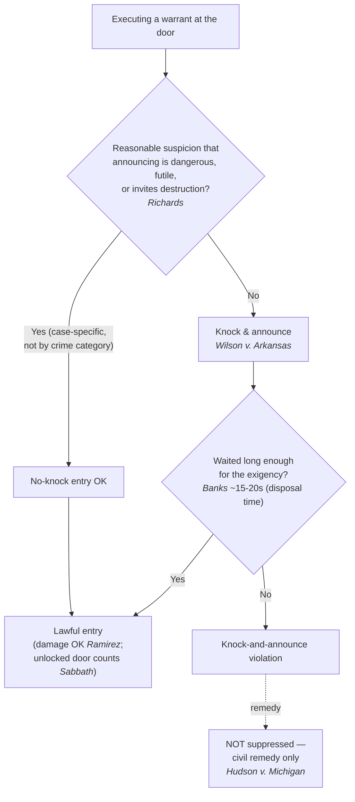
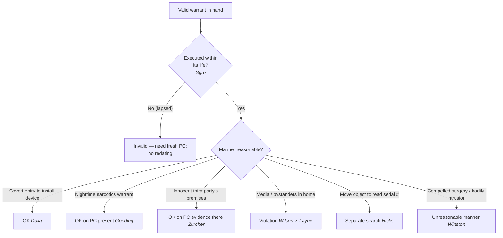

# S9 R1 panel-review — Opus model-diversity lane (prompt pack)

You are the **Claude/Opus** leg of the S9 three-lane adversarial panel (1 Claude + 2 Codex, R1). The two Codex lanes carry the A (support/quote-fidelity) and B (currency/treatment) attack lenses; **you carry model diversity and MUST vote on every paneled assertion across BOTH lenses' concerns.** You are refute-framed: try hard to break each assertion; **default to REFUTED on uncertainty**; never fabricate a cite, quote, or holding; use ONLY the evidence inlined below (no search, no outside knowledge). You are a SIGHTED reviewer — the FULL lake record (judgment fields included) is inlined.

You are a WRITER lane, not an adjudicator: you FIND and VOTE. You do not tally, adjudicate, or close any row — the orchestrator does.

For EACH group below, return one JSON object with the exact `reviewed[]` shape from the output contract (identical framing to the Codex lenses). Emit a finding object ONLY for a real defect (verdict refuted / stands-modified); a group you find wholly clean returns all-`stands` verdicts (the harness records a clean attestation). Concatenate the per-group JSON objects into a top-level `{"packs": [ ... ]}` array, one entry per group, each carrying its `group_id`.


OUTPUT CONTRACT — return ONE JSON object, nothing else:
{
  "lens": "A" | "B",
  "group_id": "<echo the group id>",
  "reviewed": [
    {
      "assertion_id": "<from group_inventory.jsonl>",
      "dimension": "existence|support|quote_fidelity|pincite|treatment|black_letter",
      "verdict": "stands" | "refuted" | "stands-modified",
      "verifiable_from_disclosed": true | false,
      "defect": null,   // null when verdict=="stands"; else an object:
      //  {"problem": "...", "severity": "high|medium|low", "proposed_fix": "...", "evidence_quote": "verbatim from disclosed evidence or null", "needs_cl": true|false, "locator_note": "..."}
      "reasons": ["short evidence-grounded reason", "..."],
      "breaks_true_positives": true | false,
      "residual_risks": ["..."],
      "suggested_tightening": "... or null"
    }
  ],
  "notes": ""
}
Rules: verdict=='stands' <=> defect==null (assertion survives your attack). verdict=='refuted' <=> a real defect (the assertion as framed is wrong). verdict=='stands-modified' <=> survives but needs a stated modification (a minor defect). Review EVERY assertion_id in group_inventory.jsonl exactly once. Output ONLY the JSON object.
---

## GROUP: content/the-warrant/executing-a-warrant/Knock-and-Announce.md  (`doctrine`, 7 assertions)

### content_page

```
---
weight: 10
aliases:
  - "Knock-and-Announce"
  - "Knock and Announce"
title: "Knock-and-Announce"
topic: Knock-and-Announce
type: doctrine
amendment: "U.S. Const. amend. IV"
jurisdiction: "Federal (U.S. Const. amend. IV); SCOTUS baseline"
status: draft
related:
  - "[[Detention and Search of Persons at the Scene]]"
  - "[[Scope Manner and Related Issues]]"
  - "[[The Exclusionary Rule]]"
  - "[[Exigent Circumstances and Hot Pursuit]]"
  - "[[Destruction of Evidence]]"
---

# Knock-and-Announce

*This page is about **announcement at the door** when executing a warrant. For what officers may do once inside, see [[Detention and Search of Persons at the Scene]] and [[Scope Manner and Related Issues]].*

> [!rule] Black-letter rule
> **Before forcing entry, officers must ordinarily announce their presence and authority; the common-law knock-and-announce principle is part of the Fourth Amendment reasonableness inquiry.** *[[Wilson v. Arkansas|Wilson v. Arkansas]]*, 514 U.S. 927, [929](https://www.courtlistener.com/opinion/117936/wilson-v-arkansas/) (1995). It is not absolute: a **no-knock** entry is reasonable where officers have a **reasonable suspicion** that announcing would be **dangerous, futile, or would inhibit the effective investigation** (e.g., by allowing destruction of evidence), but there is **no blanket exception by crime category**. *[[Richards v. Wisconsin#^pin-394a|Richards v. Wisconsin]]*, 520 U.S. 385, [394](https://www.courtlistener.com/opinion/118103/richards-v-wisconsin/) (1997). The **pivotal remedy point:** a knock-and-announce violation does **NOT** trigger the exclusionary rule — the evidence found inside stays in, and the remedy is civil. *[[Hudson v. Michigan#^pin-594|Hudson v. Michigan]]*, 547 U.S. 586, [594](https://www.courtlistener.com/opinion/145646/hudson-v-michigan/) (2006).
> ^rule-knock-announce

## The Brief

**Field-decisive question: must I announce before I force this entry, and what happens if I do not?** The default at the threshold of a home is announcement, but the rule flexes for real [[Exigent Circumstances and Hot Pursuit|exigencies]], and a violation does not suppress the evidence (the part officers most often get wrong).

**The rule and its source.** The common-law requirement that officers announce before entering "forms a part of the reasonableness inquiry under the Fourth Amendment," so "in some circumstances an officer's unannounced entry into a home might be unreasonable." *[[Wilson v. Arkansas|Wilson v. Arkansas]]*, 514 U.S. 927, [929](https://www.courtlistener.com/opinion/117936/wilson-v-arkansas/), 934 (1995). But the requirement is "flexible," not "a rigid rule of announcement that ignores countervailing law enforcement interests." *Id.* at 934.

**No categorical no-knock: it takes reasonable suspicion, case by case.** There is no "it's a drug case" shortcut. A blanket exception "cannot remove from the neutral scrutiny of a reviewing court the reasonableness of the police decision not to knock and announce in a particular case." *[[Richards v. Wisconsin|Richards v. Wisconsin]]*, 520 U.S. 385, [394](https://www.courtlistener.com/opinion/118103/richards-v-wisconsin/) (1997). The standard is reasonable suspicion, tied to the specific circumstances: "the police must have a reasonable suspicion that knocking and announcing their presence, under the particular circumstances, would be dangerous or futile, or that it would inhibit the effective investigation of the crime by, for example, allowing the destruction of evidence." *Id.*

**How long to wait: measure the [[Exigent Circumstances and Hot Pursuit|exigency]], not the walk to the door.** Where the [[Exigent Circumstances and Hot Pursuit|exigency]] is the imminent destruction of easily disposable evidence, the wait is short. After knocking and announcing on a felony drug warrant, "after 15 or 20 seconds without a response, police could fairly suspect that cocaine would be gone if they were reticent any longer." *[[United States v. Banks|United States v. Banks]]*, 540 U.S. 31, [38](https://www.courtlistener.com/opinion/131146/united-states-v-banks/) (2003). The clock runs on **disposal time**, not on how long the occupant needs to reach the door: "it is imminent disposal, not travel time to the entrance, that governs when the police may reasonably enter." *Id.* at 40.

**Property damage does not raise the bar.** A forced or destructive entry is judged by the same *[[Richards v. Wisconsin|Richards]]* reasonable-suspicion standard even when it breaks something. Whether officers must destroy property "depends in no way" on the analysis; there is no higher standard for a no-knock entry that causes damage. *[[United States v. Ramirez|United States v. Ramirez]]*, 523 U.S. 65, [71](https://www.courtlistener.com/opinion/118180/united-states-v-ramirez/) (1998). The manner is still bounded, though: "Excessive or unnecessary destruction of property in the course of a search may violate the Fourth Amendment, even though the entry itself is lawful." *Id.* (further treated at [[Scope Manner and Related Issues]]).

**"Breaking" is broader than force.** An unannounced entry is not limited to smashing a door. Opening "a closed but unlocked door" without first announcing authority and purpose is an unannounced "breaking" just as much as forcing a locked one; the protection cannot turn on "the fortuitous circumstance of an unlocked door." *[[Sabbath v. United States#^pin-590b|Sabbath v. United States]]*, 391 U.S. 585, [590](https://www.courtlistener.com/opinion/107718/sabbath-v-united-states/#:~:text=governed%20by%20something%20more%20than) (1968).

**The remedy: no suppression for a knock-and-announce violation.** This is the single most overstated rule in the doctrine. Suppression does not follow a knock-and-announce violation, because the interests the rule protects are not the interests exclusion serves: "What the knock-and-announce rule has never protected . . . is one's interest in preventing the government from seeing or taking evidence described in a warrant," so "since the interests that were violated in this case have nothing to do with the seizure of the evidence, the exclusionary rule is inapplicable." *[[Hudson v. Michigan#^pin-594|Hudson v. Michigan]]*, 547 U.S. 586, [594](https://www.courtlistener.com/opinion/145646/hudson-v-michigan/) (2006). The entry may be unlawful for **civil** purposes while the seized evidence is admitted.

**Burden, standard of review, and remedy.** The government bears the burden of justifying a no-knock or shortened-wait entry with the reasonable suspicion *[[Richards v. Wisconsin|Richards]]* requires; whether that suspicion existed is reviewed [[Common Legal Terms#de-novo|de novo]] on the historical facts. And per *[[Hudson v. Michigan|Hudson]]*, the remedy for a violation is **not** suppression — it is a civil action (and, separately, excessive destruction may independently violate the Fourth Amendment).

**Common pitfalls.**

- **Assuming a violation suppresses the evidence.** It does not; the remedy is civil (*[[Hudson v. Michigan|Hudson]]*). Do not concede suppression on this ground.
- **Treating "drug case" as an automatic no-knock.** There is no categorical exception; a no-knock entry needs case-specific reasonable suspicion (*[[Richards v. Wisconsin|Richards]]*).
- **Counting the wait by travel time.** The clock measures imminent disposal of the evidence, not how long the occupant needs to answer (*[[United States v. Banks|Banks]]*).
- **Thinking an unlocked door is a free pass.** Opening a closed but unlocked door without announcing is still an unannounced entry (*[[Sabbath v. United States|Sabbath]]*).

## Key cases

| Case | Holding | Opinion |
|---|---|---|
| *[[Wilson v. Arkansas]]*, 514 U.S. 927 (1995) | **Anchor.** The common-law knock-and-announce principle is part of the Fourth Amendment reasonableness inquiry, but it is flexible and yields to countervailing law-enforcement interests. | [opinion](https://www.courtlistener.com/opinion/117936/wilson-v-arkansas/) |
| *[[Richards v. Wisconsin]]*, 520 U.S. 385 (1997) | **No blanket rule.** A no-knock entry needs case-specific reasonable suspicion of danger, futility, or evidence destruction; no crime category is automatically exempt. | [opinion](https://www.courtlistener.com/opinion/118103/richards-v-wisconsin/) |
| *[[United States v. Banks]]*, 540 U.S. 31 (2003) | **Wait time.** A 15-to-20-second wait before forcing entry on a felony drug warrant is reasonable; the clock measures imminent disposal, not travel time to the door. | [opinion](https://www.courtlistener.com/opinion/131146/united-states-v-banks/) |
| *[[United States v. Ramirez]]*, 523 U.S. 65 (1998) | **Property damage.** Damage does not raise the no-knock standard, though excessive or unnecessary destruction can independently violate the Fourth Amendment. | [opinion](https://www.courtlistener.com/opinion/118180/united-states-v-ramirez/) |
| *[[Sabbath v. United States]]*, 391 U.S. 585 (1968) | **Breaking.** An unannounced "breaking" includes opening a closed but unlocked door without first announcing authority and purpose. | [opinion](https://www.courtlistener.com/opinion/107718/sabbath-v-united-states/) |
| *[[Hudson v. Michigan]]*, 547 U.S. 586 (2006) | **Remedy.** A knock-and-announce violation does not trigger suppression of the evidence found inside; the remedy is civil, not exclusionary. | [opinion](https://www.courtlistener.com/opinion/145646/hudson-v-michigan/) |

## Visual



## Sources

- [*Wilson v. Arkansas*, 514 U.S. 927 (1995)](https://www.courtlistener.com/opinion/117936/wilson-v-arkansas/) (pinpoints: 929, 934)
- [*Richards v. Wisconsin*, 520 U.S. 385 (1997)](https://www.courtlistener.com/opinion/118103/richards-v-wisconsin/) (pinpoint: 394)
- [*United States v. Banks*, 540 U.S. 31 (2003)](https://www.courtlistener.com/opinion/131146/united-states-v-banks/) (pinpoints: 38, 40)
- [*United States v. Ramirez*, 523 U.S. 65 (1998)](https://www.courtlistener.com/opinion/118180/united-states-v-ramirez/) (pinpoints: 68, 71)
- [*Sabbath v. United States*, 391 U.S. 585 (1968)](https://www.courtlistener.com/opinion/107718/sabbath-v-united-states/) (pinpoints: 585–86, 590)
- [*Hudson v. Michigan*, 547 U.S. 586 (2006)](https://www.courtlistener.com/opinion/145646/hudson-v-michigan/) (pinpoint: 594)

```

### group_inventory (assertions under review)

```jsonl
{"assertion_id": "1efba808c7b7bcab", "dimension": "existence", "kind": "case_cite", "locator": {"case": "Sabbath v. United States", "table_line": 43}, "payload": {"case": "Sabbath v. United States", "cells": ["*[[Sabbath v. United States]]*, 391 U.S. 585 (1968)", "**Breaking.** An unannounced \"breaking\" includes opening a closed but unlocked door without first announcing authority and purpose.", "[opinion](https://www.courtlistener.com/opinion/107718/sabbath-v-united-states/)"], "header": ["Case", "Holding", "Opinion"]}}
{"assertion_id": "4d555f37b01925e2", "dimension": "existence", "kind": "case_cite", "locator": {"case": "Wilson v. Arkansas", "table_line": 39}, "payload": {"case": "Wilson v. Arkansas", "cells": ["*[[Wilson v. Arkansas]]*, 514 U.S. 927 (1995)", "**Anchor.** The common-law knock-and-announce principle is part of the Fourth Amendment reasonableness inquiry, but it is flexible and yields to countervailing law-enforcement interests.", "[opinion](https://www.courtlistener.com/opinion/117936/wilson-v-arkansas/)"], "header": ["Case", "Holding", "Opinion"]}}
{"assertion_id": "808010bb420f178d", "dimension": "existence", "kind": "case_cite", "locator": {"case": "United States v. Ramirez", "table_line": 42}, "payload": {"case": "United States v. Ramirez", "cells": ["*[[United States v. Ramirez]]*, 523 U.S. 65 (1998)", "**Property damage.** Damage does not raise the no-knock standard, though excessive or unnecessary destruction can independently violate the Fourth Amendment.", "[opinion](https://www.courtlistener.com/opinion/118180/united-states-v-ramirez/)"], "header": ["Case", "Holding", "Opinion"]}}
{"assertion_id": "8cc1719784b7e644", "dimension": "existence", "kind": "case_cite", "locator": {"case": "Richards v. Wisconsin", "table_line": 40}, "payload": {"case": "Richards v. Wisconsin", "cells": ["*[[Richards v. Wisconsin]]*, 520 U.S. 385 (1997)", "**No blanket rule.** A no-knock entry needs case-specific reasonable suspicion of danger, futility, or evidence destruction; no crime category is automatically exempt.", "[opinion](https://www.courtlistener.com/opinion/118103/richards-v-wisconsin/)"], "header": ["Case", "Holding", "Opinion"]}}
{"assertion_id": "adac67a5a9d6ed51", "dimension": "existence", "kind": "case_cite", "locator": {"case": "United States v. Banks", "table_line": 41}, "payload": {"case": "United States v. Banks", "cells": ["*[[United States v. Banks]]*, 540 U.S. 31 (2003)", "**Wait time.** A 15-to-20-second wait before forcing entry on a felony drug warrant is reasonable; the clock measures imminent disposal, not travel time to the door.", "[opinion](https://www.courtlistener.com/opinion/131146/united-states-v-banks/)"], "header": ["Case", "Holding", "Opinion"]}}
{"assertion_id": "b774cffa81e8eeba", "dimension": "existence", "kind": "case_cite", "locator": {"case": "Hudson v. Michigan", "table_line": 44}, "payload": {"case": "Hudson v. Michigan", "cells": ["*[[Hudson v. Michigan]]*, 547 U.S. 586 (2006)", "**Remedy.** A knock-and-announce violation does not trigger suppression of the evidence found inside; the remedy is civil, not exclusionary.", "[opinion](https://www.courtlistener.com/opinion/145646/hudson-v-michigan/)"], "header": ["Case", "Holding", "Opinion"]}}
{"assertion_id": "d16fdca14a8ac004", "dimension": "support", "kind": "proposition", "locator": {"callout": "^rule-knock-announce"}, "payload": {"anchor": "^rule-knock-announce", "statement": "[!rule] Black-letter rule\n**Before forcing entry, officers must ordinarily announce their presence and authority; the common-law knock-and-announce principle is part of the Fourth Amendment reasonableness inquiry.** *[[Wilson v. Arkansas|Wilson v. Arkansas]]*, 514 U.S. 927, [929](https://www.courtlistener.com/opinion/117936/wilson-v-arkansas/) (1995). It is not absolute: a **no-knock** entry is reasonable where officers have a **reasonable suspicion** that announcing would be **dangerous, futile, or would inhibit the effective investigation** (e.g., by allowing destruction of evidence), but there is **no blanket exception by crime category**. *[[Richards v. Wisconsin#^pin-394a|Richards v. Wisconsin]]*, 520 U.S. 385, [394](https://www.courtlistener.com/opinion/118103/richards-v-wisconsin/) (1997). The **pivotal remedy point:** a knock-and-announce violation does **NOT** trigger the exclusionary rule — the evidence found inside stays in, and the remedy is civil. *[[Hudson v. Michigan#^pin-594|Hudson v. Michigan]]*, 547 U.S. 586, [594](https://www.courtlistener.com/opinion/145646/hudson-v-michigan/) (2006)."}}
```

### lake record — Hudson v. Michigan

```json
{
  "schema_version": "s2.v1",
  "record_id": "Hudson v. Michigan",
  "stub": false,
  "status": "verified",
  "identity": {
    "case_name": "Hudson v. Michigan",
    "case_name_short": "Hudson",
    "case_name_full": "Hudson v. Michigan",
    "input_case_name": "Hudson v. Michigan",
    "court": "U.S. Supreme Court",
    "court_id": "scotus",
    "court_level": "scotus",
    "circuit": null,
    "state": null,
    "date_decided": "2006-06-15",
    "year": 2006,
    "docket": null,
    "cluster_id": 145646,
    "lead_opinion_id": 145646,
    "sibling_ids": [
      145646,
      9434934,
      9434935,
      9434936
    ],
    "absolute_url": "/opinion/145646/hudson-v-michigan/",
    "identity_method": "citation+party-text",
    "expected_citation_found": true,
    "party_name_in_text": true,
    "canonical_name_match": true,
    "alternates": [],
    "reason_code": null
  },
  "citations": {
    "official": {
      "cite": "547 U.S. 586",
      "volume": "547",
      "reporter": "U.S.",
      "page": "586",
      "type": 1,
      "selected_official": true,
      "source": "cluster.citations[]"
    },
    "parallel": [
      {
        "cite": "126 S. Ct. 2159",
        "volume": "126",
        "reporter": "S. Ct.",
        "page": "2159",
        "type": 1,
        "selected_official": false,
        "source": "cluster.citations[]"
      },
      {
        "cite": "165 L. Ed. 2d 56",
        "volume": "165",
        "reporter": "L. Ed. 2d",
        "page": "56",
        "type": 1,
        "selected_official": false,
        "source": "cluster.citations[]"
      }
    ],
    "vendor_neutral": [
      {
        "cite": "2006 U.S. LEXIS 4677",
        "volume": "2006",
        "reporter": "U.S. LEXIS",
        "page": "4677",
        "type": 6,
        "selected_official": false,
        "source": "cluster.citations[]"
      }
    ],
    "all": [
      {
        "cite": "547 U.S. 586",
        "volume": "547",
        "reporter": "U.S.",
        "page": "586",
        "type": 1,
        "selected_official": false,
        "source": "cluster.citations[]"
      },
      {
        "cite": "126 S. Ct. 2159",
        "volume": "126",
        "reporter": "S. Ct.",
        "page": "2159",
        "type": 1,
        "selected_official": false,
        "source": "cluster.citations[]"
      },
      {
        "cite": "165 L. Ed. 2d 56",
        "volume": "165",
        "reporter": "L. Ed. 2d",
        "page": "56",
        "type": 1,
        "selected_official": false,
        "source": "cluster.citations[]"
      },
      {
        "cite": "2006 U.S. LEXIS 4677",
        "volume": "2006",
        "reporter": "U.S. LEXIS",
        "page": "4677",
        "type": 6,
        "selected_official": false,
        "source": "cluster.citations[]"
      }
    ],
    "display": "547 U.S. 586",
    "official_selection": {
      "court_class": "scotus",
      "selected": "547 U.S. 586",
      "reason": "selected_rank_1"
    }
  },
  "pinpoints": [
    {
      "id": "pin-594",
      "page": null,
      "quote": "--- # Hudson v. Michigan *547 U.S. 586 (2006)* \u00b7 U.S. Supreme Court \u00b7 **Binding \u2014 SCOTUS** \u00b7 Treatment: **good** *(as of 2026-06-30)* <!-- header line; TreatmentBadge + weight render here, degrading to the text above --> ## Background Police executing a valid search warrant at Hudson's home announced their presence but waited only a short time \u2014 about three to five seconds \u2014 before entering. They found drugs and a firearm. Hudson moved to suppress, arguing the premature entry violated the Fourth Amendment's knock-and-announce requirement. ## Issue Whether a violation of the knock-and-announce rule requires suppression of the evidence found in the ensuing search. ## Rule No. The interests protected by the knock-and-announce rule are not the interests served by suppression.",
      "star_marker": null,
      "quote_fidelity": "mismatch",
      "pinpoint_status": "slip-only",
      "position": null
    },
    {
      "id": "pin-594a",
      "page": null,
      "quote": "Since the interests that were violated in this case have nothing to do with the seizure of the evidence, the exclusionary rule is inapplicable.",
      "star_marker": null,
      "quote_fidelity": "mismatch",
      "pinpoint_status": "slip-only",
      "position": null
    }
  ],
  "treatment": {
    "field_i_validity": "good_law",
    "as_of_content": "2006-06-15",
    "as_of_treatment": "2026-06-30",
    "composite_basis": "migration-seed",
    "composite_basis_ref": "Hudson v. Michigan",
    "varies_by_point": false,
    "scope_note": "Old as_of seeds as_of_treatment; S2 derivation re-derives and may downgrade.",
    "point_overrides": [],
    "edges": [
      {
        "citing_case": {
          "name": "State v. Rogers",
          "cluster_id": 10705828,
          "cite": null,
          "field_ii": "overruled"
        },
        "field_ii": "overruled",
        "field_iii": "mentioned",
        "point": null,
        "proposed": true,
        "journal_ref": "Hudson v. Michigan:lane1_negative"
      },
      {
        "citing_case": {
          "name": "State of Minnesota v. Raenard Romalle Douglas",
          "cluster_id": 10129058,
          "cite": null,
          "field_ii": "overruled"
        },
        "field_ii": "overruled",
        "field_iii": "mentioned",
        "point": null,
        "proposed": true,
        "journal_ref": "Hudson v. Michigan:lane1_negative"
      },
      {
        "citing_case": {
          "name": "State v. Christian",
          "cluster_id": 4643309,
          "cite": [
            "445 P.3d 183"
          ],
          "field_ii": "questioned"
        },
        "field_ii": "questioned",
        "field_iii": "mentioned",
        "point": null,
        "proposed": true,
        "journal_ref": "Hudson v. Michigan:lane1_negative"
      },
      {
        "citing_case": {
          "name": "United States v. Sasiadek",
          "cluster_id": 7330153,
          "cite": [
            "310 F. Supp. 3d 371"
          ],
          "field_ii": "superseded_by_statute"
        },
        "field_ii": "superseded_by_statute",
        "field_iii": "mentioned",
        "point": null,
        "proposed": true,
        "journal_ref": "Hudson v. Michigan:lane1_negative"
      },
      {
        "citing_case": {
          "name": "United States v. Gomez",
          "cluster_id": 8443636,
          "cite": [
            "877 F.3d 76"
          ],
          "field_ii": "overruled"
        },
        "field_ii": "overruled",
        "field_iii": "mentioned",
        "point": null,
        "proposed": true,
        "journal_ref": "Hudson v. Michigan:lane1_negative"
      },
      {
        "citing_case": {
          "name": "State v. Turpin",
          "cluster_id": 4423584,
          "cite": [
            "2017 Ohio 7435",
            "96 N.E.3d 1171"
          ],
          "field_ii": "overruled"
        },
        "field_ii": "overruled",
        "field_iii": "mentioned",
        "point": null,
        "proposed": true,
        "journal_ref": "Hudson v. Michigan:lane1_negative"
      },
      {
        "citing_case": {
          "name": "State v. Matthew Elliot Cohagan",
          "cluster_id": 4421478,
          "cite": [
            "162 Idaho 717",
            "404 P.3d 659"
          ],
          "field_ii": "questioned"
        },
        "field_ii": "questioned",
        "field_iii": "mentioned",
        "point": null,
        "proposed": true,
        "journal_ref": "Hudson v. Michigan:lane1_negative"
      },
      {
        "citing_case": {
          "name": "People v. Brown",
          "cluster_id": 4316369,
          "cite": [
            "2016 COA 150",
            "417 P.3d 868"
          ],
          "field_ii": "overruled"
        },
        "field_ii": "overruled",
        "field_iii": "mentioned",
        "point": null,
        "proposed": true,
        "journal_ref": "Hudson v. Michigan:lane1_negative"
      },
      {
        "citing_case": {
          "name": "Johnny James Tims v. State of Florida",
          "cluster_id": 4302086,
          "cite": [
            "204 So. 3d 536",
            "2016 Fla. App. LEXIS 14742"
          ],
          "field_ii": "abrogated"
        },
        "field_ii": "abrogated",
        "field_iii": "mentioned",
        "point": null,
        "proposed": true,
        "journal_ref": "Hudson v. Michigan:lane1_negative"
      },
      {
        "citing_case": {
          "name": "United States v. Lajai Pridgette",
          "cluster_id": 4244999,
          "cite": [
            "831 F.3d 1253",
            "2016 U.S. App. LEXIS 14408",
            "2016 WL 4151222"
          ],
          "field_ii": "questioned"
        },
        "field_ii": "questioned",
        "field_iii": "mentioned",
        "point": null,
        "proposed": true,
        "journal_ref": "Hudson v. Michigan:lane1_negative"
      },
      {
        "citing_case": {
          "name": "McDonald v. City of Chicago",
          "cluster_id": 149702,
          "cite": [
            "177 L. Ed. 2d 894",
            "130 S. Ct. 3020",
            "561 U.S. 742",
            "2010 U.S. LEXIS 5523",
            "22 Fla. L. Weekly Fed. S 619",
            "78 U.S.L.W. 4844"
          ],
          "field_ii": "overruled"
        },
        "field_ii": "overruled",
        "field_iii": "mentioned",
        "point": null,
        "proposed": true,
        "journal_ref": "Hudson v. Michigan:lane2_top_cited"
      },
      {
        "citing_case": {
          "name": "Herring v. United States",
          "cluster_id": 145922,
          "cite": [
            "172 L. Ed. 2d 496",
            "129 S. Ct. 695",
            "555 U.S. 135",
            "2009 U.S. LEXIS 581"
          ],
          "field_ii": "overruled"
        },
        "field_ii": "overruled",
        "field_iii": "mentioned",
        "point": null,
        "proposed": true,
        "journal_ref": "Hudson v. Michigan:lane2_top_cited"
      },
      {
        "citing_case": {
          "name": "Davis v. United States",
          "cluster_id": 218926,
          "cite": [
            "180 L. Ed. 2d 285",
            "131 S. Ct. 2419",
            "564 U.S. 229",
            "2011 U.S. LEXIS 4560"
          ],
          "field_ii": "overruled"
        },
        "field_ii": "overruled",
        "field_iii": "mentioned",
        "point": null,
        "proposed": true,
        "journal_ref": "Hudson v. Michigan:lane2_top_cited"
      },
      {
        "citing_case": {
          "name": "Corley v. United States",
          "cluster_id": 145888,
          "cite": [
            "173 L. Ed. 2d 443",
            "129 S. Ct. 1558",
            "556 U.S. 303",
            "2009 U.S. LEXIS 2512"
          ],
          "field_ii": "overruled"
        },
        "field_ii": "overruled",
        "field_iii": "mentioned",
        "point": null,
        "proposed": true,
        "journal_ref": "Hudson v. Michigan:lane2_top_cited"
      },
      {
        "citing_case": {
          "name": "State v. Robinson",
          "cluster_id": 1539942,
          "cite": [
            "974 A.2d 1057",
            "200 N.J. 1",
            "2009 N.J. LEXIS 804"
          ],
          "field_ii": "questioned"
        },
        "field_ii": "questioned",
        "field_iii": "mentioned",
        "point": null,
        "proposed": true,
        "journal_ref": "Hudson v. Michigan:lane2_top_cited"
      },
      {
        "citing_case": {
          "name": "United States v. Fred Snow, Marcus Snow, Rahad Ross",
          "cluster_id": 795598,
          "cite": [
            "462 F.3d 55",
            "2006 U.S. App. LEXIS 22613"
          ],
          "field_ii": "superseded_by_statute"
        },
        "field_ii": "superseded_by_statute",
        "field_iii": "mentioned",
        "point": null,
        "proposed": true,
        "journal_ref": "Hudson v. Michigan:lane2_top_cited"
      },
      {
        "citing_case": {
          "name": "Wilson v. State",
          "cluster_id": 2106367,
          "cite": [
            "311 S.W.3d 452",
            "2010 Tex. Crim. App. LEXIS 685",
            "2010 WL 715253"
          ],
          "field_ii": "overruled"
        },
        "field_ii": "overruled",
        "field_iii": "mentioned",
        "point": null,
        "proposed": true,
        "journal_ref": "Hudson v. Michigan:lane2_top_cited"
      },
      {
        "citing_case": {
          "name": "United States v. Erickson Meko Campbell",
          "cluster_id": 6357475,
          "cite": [
            "26 F.4th 860"
          ],
          "field_ii": "overruled"
        },
        "field_ii": "overruled",
        "field_iii": "mentioned",
        "point": null,
        "proposed": true,
        "journal_ref": "Hudson v. Michigan:lane2_top_cited"
      },
      {
        "citing_case": {
          "name": "Utah v. Strieff",
          "cluster_id": 3214882,
          "cite": [
            "579 U.S. 232",
            "195 L. Ed. 2d 400",
            "2016 U.S. LEXIS 3926"
          ],
          "field_ii": "questioned"
        },
        "field_ii": "questioned",
        "field_iii": "mentioned",
        "point": null,
        "proposed": true,
        "journal_ref": "Hudson v. Michigan:lane2_top_cited"
      },
      {
        "citing_case": {
          "name": "Collins v. Virginia",
          "cluster_id": 4501697,
          "cite": [
            "584 U.S. 586",
            "138 S. Ct. 1663",
            "201 L. Ed. 2d 9",
            "2018 U.S. LEXIS 3210"
          ],
          "field_ii": "overruled"
        },
        "field_ii": "overruled",
        "field_iii": "mentioned",
        "point": null,
        "proposed": true,
        "journal_ref": "Hudson v. Michigan:lane2_top_cited"
      },
      {
        "citing_case": {
          "name": "People v. Henderson",
          "cluster_id": 1057155,
          "cite": [
            "2013 IL 114040"
          ],
          "field_ii": "overruled"
        },
        "field_ii": "overruled",
        "field_iii": "mentioned",
        "point": null,
        "proposed": true,
        "journal_ref": "Hudson v. Michigan:lane2_top_cited"
      },
      {
        "citing_case": {
          "name": "Terebesi v. Torreso",
          "cluster_id": 8441937,
          "cite": [
            "764 F.3d 217",
            "2014 U.S. App. LEXIS 16133",
            "2014 WL 4099309"
          ],
          "field_ii": "questioned"
        },
        "field_ii": "questioned",
        "field_iii": "mentioned",
        "point": null,
        "proposed": true,
        "journal_ref": "Hudson v. Michigan:lane2_top_cited"
      },
      {
        "citing_case": {
          "name": "People v. McKnight",
          "cluster_id": 4621444,
          "cite": [
            "2019 CO 36",
            "446 P.3d 397"
          ],
          "field_ii": "overruled"
        },
        "field_ii": "overruled",
        "field_iii": "mentioned",
        "point": null,
        "proposed": true,
        "journal_ref": "Hudson v. Michigan:lane2_top_cited"
      },
      {
        "citing_case": {
          "name": "Price v. Sery",
          "cluster_id": 1272546,
          "cite": [
            "513 F.3d 962",
            "2008 U.S. App. LEXIS 1196",
            "2008 WL 170205"
          ],
          "field_ii": "overruled"
        },
        "field_ii": "overruled",
        "field_iii": "mentioned",
        "point": null,
        "proposed": true,
        "journal_ref": "Hudson v. Michigan:lane2_top_cited"
      },
      {
        "citing_case": {
          "name": "State v. Brown",
          "cluster_id": 4582900,
          "cite": [
            "302 Neb. 53",
            "921 N.W.2d 804"
          ],
          "field_ii": "overruled"
        },
        "field_ii": "overruled",
        "field_iii": "mentioned",
        "point": null,
        "proposed": true,
        "journal_ref": "Hudson v. Michigan:lane2_top_cited"
      },
      {
        "citing_case": {
          "name": "People v. Fayed",
          "cluster_id": 4741522,
          "cite": [
            "9 Cal. 5th 147",
            "260 Cal. Rptr. 3d 761",
            "460 P.3d 1149"
          ],
          "field_ii": "overruled"
        },
        "field_ii": "overruled",
        "field_iii": "mentioned",
        "point": null,
        "proposed": true,
        "journal_ref": "Hudson v. Michigan:lane2_top_cited"
      },
      {
        "citing_case": {
          "name": "United States v. Justin Barrett Hill",
          "cluster_id": 795398,
          "cite": [
            "459 F.3d 966",
            "2006 U.S. App. LEXIS 20584",
            "2006 WL 2328721"
          ],
          "field_ii": "questioned"
        },
        "field_ii": "questioned",
        "field_iii": "mentioned",
        "point": null,
        "proposed": true,
        "journal_ref": "Hudson v. Michigan:lane2_top_cited"
      },
      {
        "citing_case": {
          "name": "People v. Frazier",
          "cluster_id": 842682,
          "cite": [
            "733 N.W.2d 713",
            "478 Mich. 231"
          ],
          "field_ii": "questioned"
        },
        "field_ii": "questioned",
        "field_iii": "mentioned",
        "point": null,
        "proposed": true,
        "journal_ref": "Hudson v. Michigan:lane2_top_cited"
      },
      {
        "citing_case": {
          "name": "People v. Anstey",
          "cluster_id": 845579,
          "cite": [
            "719 N.W.2d 579",
            "476 Mich. 436"
          ],
          "field_ii": "overruled"
        },
        "field_ii": "overruled",
        "field_iii": "mentioned",
        "point": null,
        "proposed": true,
        "journal_ref": "Hudson v. Michigan:lane2_top_cited"
      },
      {
        "citing_case": {
          "name": "Ernest Edgar Black Jeff Wigington",
          "cluster_id": 3171438,
          "cite": [
            "811 F.3d 1259",
            "2016 U.S. App. LEXIS 1057",
            "2016 WL 278918"
          ],
          "field_ii": "abrogated"
        },
        "field_ii": "abrogated",
        "field_iii": "mentioned",
        "point": null,
        "proposed": true,
        "journal_ref": "Hudson v. Michigan:lane2_top_cited"
      },
      {
        "citing_case": {
          "name": "Roger Trent v. Steven Wade",
          "cluster_id": 2774855,
          "cite": [
            "776 F.3d 368",
            "2015 WL 394096"
          ],
          "field_ii": "abrogated"
        },
        "field_ii": "abrogated",
        "field_iii": "mentioned",
        "point": null,
        "proposed": true,
        "journal_ref": "Hudson v. Michigan:lane2_top_cited"
      },
      {
        "citing_case": {
          "name": "State v. Johnston",
          "cluster_id": 2276813,
          "cite": [
            "336 S.W.3d 649",
            "2011 Tex. Crim. App. LEXIS 388",
            "2011 WL 891324"
          ],
          "field_ii": "questioned"
        },
        "field_ii": "questioned",
        "field_iii": "mentioned",
        "point": null,
        "proposed": true,
        "journal_ref": "Hudson v. Michigan:lane2_top_cited"
      },
      {
        "citing_case": {
          "name": "United States v. Reyes Fabian Olivera-Mendez",
          "cluster_id": 797553,
          "cite": [
            "484 F.3d 505",
            "2007 U.S. App. LEXIS 10492",
            "2007 WL 1296781"
          ],
          "field_ii": "questioned"
        },
        "field_ii": "questioned",
        "field_iii": "mentioned",
        "point": null,
        "proposed": true,
        "journal_ref": "Hudson v. Michigan:lane2_top_cited"
      },
      {
        "citing_case": {
          "name": "110OAG40",
          "cluster_id": 10638768,
          "cite": null,
          "field_ii": "abrogated"
        },
        "field_ii": "abrogated",
        "field_iii": "mentioned",
        "point": null,
        "proposed": true,
        "journal_ref": "Hudson v. Michigan:lane3_recency"
      },
      {
        "citing_case": {
          "name": "Maryland Attorney General Opinion 110OAG40",
          "cluster_id": 10848272,
          "cite": null,
          "field_ii": "abrogated"
        },
        "field_ii": "abrogated",
        "field_iii": "mentioned",
        "point": null,
        "proposed": true,
        "journal_ref": "Hudson v. Michigan:lane3_recency"
      }
    ],
    "derivation": {
      "lane1_negative": {
        "query": "cites:(145646 OR 9434934 OR 9434935 OR 9434936) AND (overrul* OR abrogat* OR supersed* OR \"recede from\" OR \"no longer good law\" OR vacat* OR reversed) ",
        "reviewed": 200,
        "cap": 200,
        "cap_hit": true,
        "final_cursor": "https://www.courtlistener.com/api/rest/v4/search/?cursor=cz0xNDY2MzgwODAwMDAwJnM9MzIxNDg4MiZ0PW8mZD0yMDI2LTA3LTA1JnA9MTE%3D&fields=absolute_url%2CcaseName%2CcaseNameFull%2Ccitation%2CciteCount%2Ccluster_id%2Ccourt%2Ccourt_citation_string%2Ccourt_id%2CdateFiled%2Copinions%2Csibling_ids%2Cstatus%2Csyllabus&order_by=dateFiled+desc&page_size=100&q=cites%3A%28145646+OR+9434934+OR+9434935+OR+9434936%29+AND+%28overrul%2A+OR+abrogat%2A+OR+supersed%2A+OR+%22recede+from%22+OR+%22no+longer+good+law%22+OR+vacat%2A+OR+reversed%29+&stat_Published=on&type=o",
        "audit_needed": true,
        "proposed_negative_events": 10,
        "audit_marker": "R15 treatment audit required",
        "triage_mode": "snippet-first",
        "snippet_field": "results[].opinions[].snippet",
        "triage_journaled": 200,
        "triage_read": 10,
        "triage_snippet_classified": 190
      },
      "lane2_top_cited": {
        "query": "cites:(145646 OR 9434934 OR 9434935 OR 9434936)",
        "reviewed": 25,
        "cap": 25,
        "cap_hit": true,
        "final_cursor": "https://www.courtlistener.com/api/rest/v4/search/?cursor=cz0xMTAmcz04NDQzNjM2JnQ9byZkPTIwMjYtMDctMDUmcD0z&order_by=citeCount+desc&page_size=25&q=cites%3A%28145646+OR+9434934+OR+9434935+OR+9434936%29&type=o",
        "audit_needed": true,
        "proposed_negative_events": 23,
        "audit_marker": "R15 treatment audit required"
      },
      "lane3_recency": {
        "query": "cites:(145646 OR 9434934 OR 9434935 OR 9434936)",
        "reviewed": 52,
        "cap": 200,
        "cap_hit": false,
        "final_cursor": null,
        "audit_needed": false,
        "proposed_negative_events": 4,
        "audit_marker": null,
        "triage_mode": "snippet-first",
        "snippet_field": "results[].opinions[].snippet",
        "triage_journaled": 52,
        "triage_read": 4,
        "triage_snippet_classified": 48
      }
    }
  },
  "progeny": {
    "complete_query": "cites:(145646 OR 9434934 OR 9434935 OR 9434936)",
    "indexed_citing_opinions": 714,
    "count_source": "search",
    "per_sibling": [
      {
        "opinion_id": 145646,
        "count": 582,
        "count_source": "search"
      },
      {
        "opinion_id": 9434934,
        "count": 143,
        "count_source": "search"
      },
      {
        "opinion_id": 9434935,
        "count": 0,
        "count_source": "search"
      },
      {
        "opinion_id": 9434936,
        "count": 0,
        "count_source": "search"
      }
    ],
    "citation_count": 1223,
    "cache_path": "/Users/johngalt/cssi-lake/cache/progeny/hudson-v-michigan.jsonl",
    "enumeration": "bounded",
    "cursor": "https://www.courtlistener.com/api/rest/v4/search/?cursor=cz0xLjkwNDMzMDUmcz0xMDE2MDgzNSZ0PW8mZD0yMDI2LTA3LTA1JnA9Mg%3D%3D&order_by=score+desc&page_size=100&q=cites%3A%28145646+OR+9434934+OR+9434935+OR+9434936%29&type=o",
    "rows_cached": 20,
    "outbound_opinion_edges": [
      {
        "source_opinion_id": 145646,
        "cited_id": 91573,
        "source": "search.opinions[].cites[]"
      },
      {
        "source_opinion_id": 145646,
        "cited_id": 98094,
        "source": "search.opinions[].cites[]"
      },
      {
        "source_opinion_id": 145646,
        "cited_id": 99506,
        "source": "search.opinions[].cites[]"
      },
      {
        "source_opinion_id": 145646,
        "cited_id": 99746,
        "source": "search.opinions[].cites[]"
      },
      {
        "source_opinion_id": 145646,
        "cited_id": 100711,
        "source": "search.opinions[].cites[]"
      },
      {
        "source_opinion_id": 145646,
        "cited_id": 100980,
        "source": "search.opinions[].cites[]"
      },
      {
        "source_opinion_id": 145646,
        "cited_id": 101156,
        "source": "search.opinions[].cites[]"
      },
      {
        "source_opinion_id": 145646,
        "cited_id": 101905,
        "source": "search.opinions[].cites[]"
      },
      {
        "source_opinion_id": 145646,
        "cited_id": 101963,
        "source": "search.opinions[].cites[]"
      },
      {
        "source_opinion_id": 145646,
        "cited_id": 102129,
        "source": "search.opinions[].cites[]"
      },
      {
        "source_opinion_id": 145646,
        "cited_id": 103259,
        "source": "search.opinions[].cites[]"
      },
      {
        "source_opinion_id": 145646,
        "cited_id": 104605,
        "source": "search.opinions[].cites[]"
      },
      {
        "source_opinion_id": 145646,
        "cited_id": 104709,
        "source": "search.opinions[].cites[]"
      },
      {
        "source_opinion_id": 145646,
        "cited_id": 105188,
        "source": "search.opinions[].cites[]"
      },
      {
        "source_opinion_id": 145646,
        "cited_id": 105502,
        "source": "search.opinions[].cites[]"
      },
      {
        "source_opinion_id": 145646,
        "cited_id": 105731,
        "source": "search.opinions[].cites[]"
      },
      {
        "source_opinion_id": 145646,
        "cited_id": 106107,
        "source": "search.opinions[].cites[]"
      },
      {
        "source_opinion_id": 145646,
        "cited_id": 106170,
        "source": "search.opinions[].cites[]"
      },
      {
        "source_opinion_id": 145646,
        "cited_id": 106187,
        "source": "search.opinions[].cites[]"
      },
      {
        "source_opinion_id": 145646,
        "cited_id": 106197,
        "source": "search.opinions[].cites[]"
      },
      {
        "source_opinion_id": 145646,
        "cited_id": 106285,
        "source": "search.opinions[].cites[]"
      },
      {
        "source_opinion_id": 145646,
        "cited_id": 106515,
        "source": "search.opinions[].cites[]"
      },
      {
        "source_opinion_id": 145646,
        "cited_id": 106641,
        "source": "search.opinions[].cites[]"
      },
      {
        "source_opinion_id": 145646,
        "cited_id": 106699,
        "source": "search.opinions[].cites[]"
      },
      {
        "source_opinion_id": 145646,
        "cited_id": 106865,
        "source": "search.opinions[].cites[]"
      },
      {
        "source_opinion_id": 145646,
        "cited_id": 106964,
        "source": "search.opinions[].cites[]"
      },
      {
        "source_opinion_id": 145646,
        "cited_id": 107102,
        "source": "search.opinions[].cites[]"
      },
      {
        "source_opinion_id": 145646,
        "cited_id": 107225,
        "source": "search.opinions[].cites[]"
      },
      {
        "source_opinion_id": 145646,
        "cited_id": 107716,
        "source": "search.opinions[].cites[]"
      },
      {
        "source_opinion_id": 145646,
        "cited_id": 107718,
        "source": "search.opinions[].cites[]"
      },
      {
        "source_opinion_id": 145646,
        "cited_id": 107729,
        "source": "search.opinions[].cites[]"
      },
      {
        "source_opinion_id": 145646,
        "cited_id": 107800,
        "source": "search.opinions[].cites[]"
      },
      {
        "source_opinion_id": 145646,
        "cited_id": 107979,
        "source": "search.opinions[].cites[]"
      },
      {
        "source_opinion_id": 145646,
        "cited_id": 107981,
        "source": "search.opinions[].cites[]"
      },
      {
        "source_opinion_id": 145646,
        "cited_id": 107982,
        "source": "search.opinions[].cites[]"
      },
      {
        "source_opinion_id": 145646,
        "cited_id": 108183,
        "source": "search.opinions[].cites[]"
      },
      {
        "source_opinion_id": 145646,
        "cited_id": 108297,
        "source": "search.opinions[].cites[]"
      },
      {
        "source_opinion_id": 145646,
        "cited_id": 108375,
        "source": "search.opinions[].cites[]"
      },
      {
        "source_opinion_id": 145646,
        "cited_id": 108377,
        "source": "search.opinions[].cites[]"
      },
      {
        "source_opinion_id": 145646,
        "cited_id": 108898,
        "source": "search.opinions[].cites[]"
      },
      {
        "source_opinion_id": 145646,
        "cited_id": 109063,
        "source": "search.opinions[].cites[]"
      },
      {
        "source_opinion_id": 145646,
        "cited_id": 109304,
        "source": "search.opinions[].cites[]"
      },
      {
        "source_opinion_id": 145646,
        "cited_id": 109539,
        "source": "search.opinions[].cites[]"
      },
      {
        "source_opinion_id": 145646,
        "cited_id": 109540,
        "source": "search.opinions[].cites[]"
      },
      {
        "source_opinion_id": 145646,
        "cited_id": 109572,
        "source": "search.opinions[].cites[]"
      },
      {
        "source_opinion_id": 145646,
        "cited_id": 109816,
        "source": "search.opinions[].cites[]"
      },
      {
        "source_opinion_id": 145646,
        "cited_id": 109874,
        "source": "search.opinions[].cites[]"
      },
      {
        "source_opinion_id": 145646,
        "cited_id": 109881,
        "source": "search.opinions[].cites[]"
      },
      {
        "source_opinion_id": 145646,
        "cited_id": 109905,
        "source": "search.opinions[].cites[]"
      },
      {
        "source_opinion_id": 145646,
        "cited_id": 109925,
        "source": "search.opinions[].cites[]"
      },
      {
        "source_opinion_id": 145646,
        "cited_id": 110235,
        "source": "search.opinions[].cites[]"
      },
      {
        "source_opinion_id": 145646,
        "cited_id": 110317,
        "source": "search.opinions[].cites[]"
      },
      {
        "source_opinion_id": 145646,
        "cited_id": 110464,
        "source": "search.opinions[].cites[]"
      },
      {
        "source_opinion_id": 145646,
        "cited_id": 110959,
        "source": "search.opinions[].cites[]"
      },
      {
        "source_opinion_id": 145646,
        "cited_id": 111057,
        "source": "search.opinions[].cites[]"
      },
      {
        "source_opinion_id": 145646,
        "cited_id": 111173,
        "source": "search.opinions[].cites[]"
      },
      {
        "source_opinion_id": 145646,
        "cited_id": 111204,
        "source": "search.opinions[].cites[]"
      },
      {
        "source_opinion_id": 145646,
        "cited_id": 111259,
        "source": "search.opinions[].cites[]"
      },
      {
        "source_opinion_id": 145646,
        "cited_id": 111262,
        "source": "search.opinions[].cites[]"
      },
      {
        "source_opinion_id": 145646,
        "cited_id": 111265,
        "source": "search.opinions[].cites[]"
      },
      {
        "source_opinion_id": 145646,
        "cited_id": 111779,
        "source": "search.opinions[].cites[]"
      },
      {
        "source_opinion_id": 145646,
        "cited_id": 111834,
        "source": "search.opinions[].cites[]"
      },
      {
        "source_opinion_id": 145646,
        "cited_id": 112136,
        "source": "search.opinions[].cites[]"
      },
      {
        "source_opinion_id": 145646,
        "cited_id": 112209,
        "source": "search.opinions[].cites[]"
      },
      {
        "source_opinion_id": 145646,
        "cited_id": 112350,
        "source": "search.opinions[].cites[]"
      },
      {
        "source_opinion_id": 145646,
        "cited_id": 112413,
        "source": "search.opinions[].cites[]"
      },
      {
        "source_opinion_id": 145646,
        "cited_id": 112416,
        "source": "search.opinions[].cites[]"
      },
      {
        "source_opinion_id": 145646,
        "cited_id": 112454,
        "source": "search.opinions[].cites[]"
      },
      {
        "source_opinion_id": 145646,
        "cited_id": 117905,
        "source": "search.opinions[].cites[]"
      },
      {
        "source_opinion_id": 145646,
        "cited_id": 117936,
        "source": "search.opinions[].cites[]"
      },
      {
        "source_opinion_id": 145646,
        "cited_id": 118103,
        "source": "search.opinions[].cites[]"
      },
      {
        "source_opinion_id": 145646,
        "cited_id": 118180,
        "source": "search.opinions[].cites[]"
      },
      {
        "source_opinion_id": 145646,
        "cited_id": 118235,
        "source": "search.opinions[].cites[]"
      },
      {
        "source_opinion_id": 145646,
        "cited_id": 118380,
        "source": "search.opinions[].cites[]"
      },
      {
        "source_opinion_id": 145646,
        "cited_id": 118443,
        "source": "search.opinions[].cites[]"
      },
      {
        "source_opinion_id": 145646,
        "cited_id": 118466,
        "source": "search.opinions[].cites[]"
      },
      {
        "source_opinion_id": 145646,
        "cited_id": 121167,
        "source": "search.opinions[].cites[]"
      },
      {
        "source_opinion_id": 145646,
        "cited_id": 121169,
        "source": "search.opinions[].cites[]"
      },
      {
        "source_opinion_id": 145646,
        "cited_id": 127919,
        "source": "search.opinions[].cites[]"
      },
      {
        "source_opinion_id": 145646,
        "cited_id": 131146,
        "source": "search.opinions[].cites[]"
      },
      {
        "source_opinion_id": 145646,
        "cited_id": 161659,
        "source": "search.opinions[].cites[]"
      },
      {
        "source_opinion_id": 145646,
        "cited_id": 770457,
        "source": "search.opinions[].cites[]"
      },
      {
        "source_opinion_id": 145646,
        "cited_id": 791612,
        "source": "search.opinions[].cites[]"
      },
      {
        "source_opinion_id": 145646,
        "cited_id": 793669,
        "source": "search.opinions[].cites[]"
      },
      {
        "source_opinion_id": 145646,
        "cited_id": 1237532,
        "source": "search.opinions[].cites[]"
      },
      {
        "source_opinion_id": 145646,
        "cited_id": 1693561,
        "source": "search.opinions[].cites[]"
      },
      {
        "source_opinion_id": 145646,
        "cited_id": 1854815,
        "source": "search.opinions[].cites[]"
      },
      {
        "source_opinion_id": 145646,
        "cited_id": 1934151,
        "source": "search.opinions[].cites[]"
      }
    ]
  },
  "off_cl_links": [],
  "provenance": {
    "cl_source": "LCU",
    "cl_api": "https://www.courtlistener.com/api/rest/v4",
    "built_by": "S2-BUILDER-AUTHORING",
    "build_run": "s2-build-96d841cbb12e",
    "date_created": "2026-07-05T07:37:58Z",
    "date_modified": "2026-07-06T10:25:11Z",
    "warnings": [
      "legacy treatment migrated: good -> good_law"
    ],
    "field_provenance": {
      "identity": {
        "src": "CourtListener search + clusters + lead opinion text",
        "at": "2026-07-05T07:38:16Z",
        "verifier": "S2-BUILDER-AUTHORING"
      },
      "treatment.field_i_validity": {
        "src": "_treatment-migration.json + page frontmatter",
        "at": "2026-07-05T07:38:16Z",
        "verifier": "S2-BUILDER-AUTHORING"
      },
      "point_overrides": {
        "src": "S2 treatment derivation proposed only",
        "at": "2026-07-05T07:43:24Z",
        "verifier": "S2-BUILDER-AUTHORING"
      },
      "pinpoints": {
        "src": "content page quote harvest + lead opinion text",
        "at": "2026-07-05T07:38:16Z",
        "verifier": "S2-BUILDER-AUTHORING"
      }
    }
  }
}

```

### lake record — Richards v. Wisconsin

```json
{
  "schema_version": "s2.v1",
  "record_id": "Richards v. Wisconsin",
  "stub": false,
  "status": "verified",
  "identity": {
    "case_name": "Richards v. Wisconsin",
    "case_name_short": "Richards",
    "case_name_full": "Richards v. Wisconsin",
    "input_case_name": "Richards v. Wisconsin",
    "court": "U.S. Supreme Court",
    "court_id": "scotus",
    "court_level": "scotus",
    "circuit": null,
    "state": null,
    "date_decided": "1997-04-28",
    "year": 1997,
    "docket": "96-5955",
    "cluster_id": 118103,
    "lead_opinion_id": 118103,
    "sibling_ids": [
      118103
    ],
    "absolute_url": "/opinion/118103/richards-v-wisconsin/",
    "identity_method": "citation+party-text",
    "expected_citation_found": true,
    "party_name_in_text": true,
    "canonical_name_match": true,
    "alternates": [
      {
        "cluster_id": 9163841,
        "score": 20,
        "case_name": "Richards v. Wisconsin"
      },
      {
        "cluster_id": 9163840,
        "score": 20,
        "case_name": "Richards v. Wisconsin"
      },
      {
        "cluster_id": 9162684,
        "score": 20,
        "case_name": "Richards v. Wisconsin"
      },
      {
        "cluster_id": 9162683,
        "score": 20,
        "case_name": "Richards v. Wisconsin"
      },
      {
        "cluster_id": 9284920,
        "score": 20,
        "case_name": "Richards v. Wisconsin"
      }
    ],
    "reason_code": null
  },
  "citations": {
    "official": {
      "cite": "520 U.S. 385",
      "volume": "520",
      "reporter": "U.S.",
      "page": "385",
      "type": 1,
      "selected_official": true,
      "source": "cluster.citations[]"
    },
    "parallel": [
      {
        "cite": "117 S. Ct. 1416",
        "volume": "117",
        "reporter": "S. Ct.",
        "page": "1416",
        "type": 1,
        "selected_official": false,
        "source": "cluster.citations[]"
      },
      {
        "cite": "137 L. Ed. 2d 615",
        "volume": "137",
        "reporter": "L. Ed. 2d",
        "page": "615",
        "type": 1,
        "selected_official": false,
        "source": "cluster.citations[]"
      }
    ],
    "vendor_neutral": [
      {
        "cite": "1997 U.S. LEXIS 2794",
        "volume": "1997",
        "reporter": "U.S. LEXIS",
        "page": "2794",
        "type": 6,
        "selected_official": false,
        "source": "cluster.citations[]"
      }
    ],
    "all": [
      {
        "cite": "520 U.S. 385",
        "volume": "520",
        "reporter": "U.S.",
        "page": "385",
        "type": 1,
        "selected_official": false,
        "source": "cluster.citations[]"
      },
      {
        "cite": "117 S. Ct. 1416",
        "volume": "117",
        "reporter": "S. Ct.",
        "page": "1416",
        "type": 1,
        "selected_official": false,
        "source": "cluster.citations[]"
      },
      {
        "cite": "137 L. Ed. 2d 615",
        "volume": "137",
        "reporter": "L. Ed. 2d",
        "page": "615",
        "type": 1,
        "selected_official": false,
        "source": "cluster.citations[]"
      },
      {
        "cite": "1997 U.S. LEXIS 2794",
        "volume": "1997",
        "reporter": "U.S. LEXIS",
        "page": "2794",
        "type": 6,
        "selected_official": false,
        "source": "cluster.citations[]"
      }
    ],
    "display": "520 U.S. 385",
    "official_selection": {
      "court_class": "scotus",
      "selected": "520 U.S. 385",
      "reason": "selected_rank_1"
    }
  },
  "pinpoints": [
    {
      "id": "pin-394",
      "page": null,
      "quote": "--- # Richards v. Wisconsin *520 U.S. 385 (1997)* \u00b7 U.S. Supreme Court \u00b7 **Binding \u2014 SCOTUS** \u00b7 Treatment: **good** *(as of 2026-06-30)* <!-- header line; TreatmentBadge + weight render here, degrading to the text above --> ## Background Officers had a warrant to search Richards's motel room for drugs (the magistrate had deleted no-knock authorization). An officer posing as a maintenance man knocked; Richards opened the door, saw a uniformed officer, and quickly closed it. The officers then forced entry without further announcement and found drugs and cash. The Wisconsin Supreme Court upheld the entry under a blanket rule that police need never knock and announce when executing a warrant in a felony drug investigation. ## Issue Whether the Fourth Amendment permits a blanket exception to the knock-and-announce requirement for an entire category of crime \u2014 all felony drug investigations. ## Rule No blanket exception.",
      "star_marker": null,
      "quote_fidelity": "mismatch",
      "pinpoint_status": "slip-only",
      "position": null
    },
    {
      "id": "pin-394a",
      "page": null,
      "quote": "In order to justify a 'no-knock' entry, the police must have a reasonable suspicion that knocking and announcing their presence, under the particular circumstances, would be dangerous or futile, or that it would inhibit the effective investigation of the crime by, for example, allowing the destruction of evidence.",
      "star_marker": null,
      "quote_fidelity": "mismatch",
      "pinpoint_status": "slip-only",
      "position": null
    }
  ],
  "treatment": {
    "field_i_validity": "good_law",
    "as_of_content": "1997-04-28",
    "as_of_treatment": "2026-06-30",
    "composite_basis": "migration-seed",
    "composite_basis_ref": "Richards v. Wisconsin",
    "varies_by_point": false,
    "scope_note": "Old as_of seeds as_of_treatment; S2 derivation re-derives and may downgrade.",
    "point_overrides": [],
    "edges": [
      {
        "citing_case": {
          "name": "State v. McCarthy",
          "cluster_id": 10160868,
          "cite": [
            "369 Or. 129",
            "501 P.3d 478"
          ],
          "field_ii": "overruled"
        },
        "field_ii": "overruled",
        "field_iii": "mentioned",
        "point": null,
        "proposed": true,
        "journal_ref": "Richards v. Wisconsin:lane1_negative"
      },
      {
        "citing_case": {
          "name": "Harte v. Board Comm'rs Cnty of Johnson",
          "cluster_id": 4411980,
          "cite": [
            "864 F.3d 1154",
            "2017 WL 3138494"
          ],
          "field_ii": "overruled"
        },
        "field_ii": "overruled",
        "field_iii": "mentioned",
        "point": null,
        "proposed": true,
        "journal_ref": "Richards v. Wisconsin:lane1_negative"
      },
      {
        "citing_case": {
          "name": "James Sunny Burton v. State",
          "cluster_id": 3092638,
          "cite": null,
          "field_ii": "questioned"
        },
        "field_ii": "questioned",
        "field_iii": "mentioned",
        "point": null,
        "proposed": true,
        "journal_ref": "Richards v. Wisconsin:lane1_negative"
      },
      {
        "citing_case": {
          "name": "State v. Foster",
          "cluster_id": 835141,
          "cite": [
            "217 P.3d 168",
            "347 Or. 1",
            "2009 Ore. LEXIS 223"
          ],
          "field_ii": "questioned"
        },
        "field_ii": "questioned",
        "field_iii": "mentioned",
        "point": null,
        "proposed": true,
        "journal_ref": "Richards v. Wisconsin:lane1_negative"
      },
      {
        "citing_case": {
          "name": "State v. Gilbert, 06ca3055 (5-30-2007)",
          "cluster_id": 4021002,
          "cite": [
            "2007 Ohio 2717"
          ],
          "field_ii": "overruled"
        },
        "field_ii": "overruled",
        "field_iii": "mentioned",
        "point": null,
        "proposed": true,
        "journal_ref": "Richards v. Wisconsin:lane1_negative"
      },
      {
        "citing_case": {
          "name": "State v. Dennis Russell Callaghan",
          "cluster_id": 2933574,
          "cite": null,
          "field_ii": "criticized"
        },
        "field_ii": "criticized",
        "field_iii": "mentioned",
        "point": null,
        "proposed": true,
        "journal_ref": "Richards v. Wisconsin:lane1_negative"
      },
      {
        "citing_case": {
          "name": "United States v. Southerland, Vince",
          "cluster_id": 186774,
          "cite": [
            "373 U.S. App. D.C. 305",
            "466 F.3d 1083",
            "2006 U.S. App. LEXIS 26978",
            "2006 WL 3069122"
          ],
          "field_ii": "overruled"
        },
        "field_ii": "overruled",
        "field_iii": "mentioned",
        "point": null,
        "proposed": true,
        "journal_ref": "Richards v. Wisconsin:lane1_negative"
      },
      {
        "citing_case": {
          "name": "United States v. Anthony Singleton",
          "cluster_id": 793669,
          "cite": [
            "441 F.3d 290",
            "2006 U.S. App. LEXIS 7201",
            "2006 WL 724800"
          ],
          "field_ii": "overruled"
        },
        "field_ii": "overruled",
        "field_iii": "mentioned",
        "point": null,
        "proposed": true,
        "journal_ref": "Richards v. Wisconsin:lane1_negative"
      },
      {
        "citing_case": {
          "name": "United States v. Richard J. Rizzi",
          "cluster_id": 792946,
          "cite": [
            "434 F.3d 669",
            "2006 U.S. App. LEXIS 450",
            "2006 WL 39266"
          ],
          "field_ii": "abrogated"
        },
        "field_ii": "abrogated",
        "field_iii": "mentioned",
        "point": null,
        "proposed": true,
        "journal_ref": "Richards v. Wisconsin:lane1_negative"
      },
      {
        "citing_case": {
          "name": "Flores v. State",
          "cluster_id": 1790339,
          "cite": [
            "177 S.W.3d 8"
          ],
          "field_ii": "overruled"
        },
        "field_ii": "overruled",
        "field_iii": "mentioned",
        "point": null,
        "proposed": true,
        "journal_ref": "Richards v. Wisconsin:lane1_negative"
      },
      {
        "citing_case": {
          "name": "Missouri v. McNeely",
          "cluster_id": 858288,
          "cite": [
            "185 L. Ed. 2d 696",
            "133 S. Ct. 1552",
            "569 U.S. 141",
            "2013 U.S. LEXIS 3160",
            "81 U.S.L.W. 4250",
            "24 Fla. L. Weekly Fed. S 150",
            "2013 WL 1628934"
          ],
          "field_ii": "questioned"
        },
        "field_ii": "questioned",
        "field_iii": "mentioned",
        "point": null,
        "proposed": true,
        "journal_ref": "Richards v. Wisconsin:lane2_top_cited"
      },
      {
        "citing_case": {
          "name": "Kentucky v. King",
          "cluster_id": 216733,
          "cite": [
            "179 L. Ed. 2d 865",
            "131 S. Ct. 1849",
            "563 U.S. 452",
            "2011 U.S. LEXIS 3541"
          ],
          "field_ii": "questioned"
        },
        "field_ii": "questioned",
        "field_iii": "mentioned",
        "point": null,
        "proposed": true,
        "journal_ref": "Richards v. Wisconsin:lane2_top_cited"
      },
      {
        "citing_case": {
          "name": "Florida v. JL",
          "cluster_id": 118352,
          "cite": [
            "146 L. Ed. 2d 254",
            "120 S. Ct. 1375",
            "529 U.S. 266",
            "2000 U.S. LEXIS 2345",
            "13 Fla. L. Weekly Fed. S 216",
            "68 U.S.L.W. 4236",
            "2000 Cal. Daily Op. Serv. 2409",
            "2000 Colo. J. C.A.R. 1642",
            "2000 Daily Journal DAR 3226"
          ],
          "field_ii": "questioned"
        },
        "field_ii": "questioned",
        "field_iii": "mentioned",
        "point": null,
        "proposed": true,
        "journal_ref": "Richards v. Wisconsin:lane2_top_cited"
      },
      {
        "citing_case": {
          "name": "Hudson v. Michigan",
          "cluster_id": 145646,
          "cite": [
            "165 L. Ed. 2d 56",
            "126 S. Ct. 2159",
            "547 U.S. 586",
            "2006 U.S. LEXIS 4677"
          ],
          "field_ii": "overruled"
        },
        "field_ii": "overruled",
        "field_iii": "mentioned",
        "point": null,
        "proposed": true,
        "journal_ref": "Richards v. Wisconsin:lane2_top_cited"
      },
      {
        "citing_case": {
          "name": "State v. Henning",
          "cluster_id": 1060855,
          "cite": [
            "975 S.W.2d 290",
            "1998 Tenn. LEXIS 370",
            "1998 WL 324318"
          ],
          "field_ii": "abrogated"
        },
        "field_ii": "abrogated",
        "field_iii": "mentioned",
        "point": null,
        "proposed": true,
        "journal_ref": "Richards v. Wisconsin:lane2_top_cited"
      },
      {
        "citing_case": {
          "name": "United States v. Ramirez",
          "cluster_id": 118180,
          "cite": [
            "140 L. Ed. 2d 191",
            "118 S. Ct. 992",
            "523 U.S. 65",
            "1998 U.S. LEXIS 1600"
          ],
          "field_ii": "questioned"
        },
        "field_ii": "questioned",
        "field_iii": "mentioned",
        "point": null,
        "proposed": true,
        "journal_ref": "Richards v. Wisconsin:lane2_top_cited"
      },
      {
        "citing_case": {
          "name": "United States v. Banks",
          "cluster_id": 131146,
          "cite": [
            "157 L. Ed. 2d 343",
            "124 S. Ct. 521",
            "540 U.S. 31",
            "2003 U.S. LEXIS 8966"
          ],
          "field_ii": "questioned"
        },
        "field_ii": "questioned",
        "field_iii": "mentioned",
        "point": null,
        "proposed": true,
        "journal_ref": "Richards v. Wisconsin:lane2_top_cited"
      },
      {
        "citing_case": {
          "name": "United States v. James H. Spikes (96-3899) Marilyn Smith (96-3660)",
          "cluster_id": 758684,
          "cite": [
            "158 F.3d 913",
            "49 Fed. R. Serv. 1564",
            "1998 U.S. App. LEXIS 21399",
            "1998 WL 551966"
          ],
          "field_ii": "overruled"
        },
        "field_ii": "overruled",
        "field_iii": "mentioned",
        "point": null,
        "proposed": true,
        "journal_ref": "Richards v. Wisconsin:lane2_top_cited"
      },
      {
        "citing_case": {
          "name": "Terebesi v. Torreso",
          "cluster_id": 8441937,
          "cite": [
            "764 F.3d 217",
            "2014 U.S. App. LEXIS 16133",
            "2014 WL 4099309"
          ],
          "field_ii": "questioned"
        },
        "field_ii": "questioned",
        "field_iii": "mentioned",
        "point": null,
        "proposed": true,
        "journal_ref": "Richards v. Wisconsin:lane2_top_cited"
      },
      {
        "citing_case": {
          "name": "Cheryl D. Lyons v. City of Xenia, Christine Keith, Officer Matthew Foubert, Officer",
          "cluster_id": 791266,
          "cite": [
            "417 F.3d 565",
            "2005 U.S. App. LEXIS 16034",
            "2005 WL 1846994"
          ],
          "field_ii": "overruled"
        },
        "field_ii": "overruled",
        "field_iii": "mentioned",
        "point": null,
        "proposed": true,
        "journal_ref": "Richards v. Wisconsin:lane2_top_cited"
      },
      {
        "citing_case": {
          "name": "State v. Eason",
          "cluster_id": 1863783,
          "cite": [
            "2001 WI 98",
            "629 N.W.2d 625",
            "245 Wis. 2d 206",
            "2001 Wisc. LEXIS 443"
          ],
          "field_ii": "overruled"
        },
        "field_ii": "overruled",
        "field_iii": "mentioned",
        "point": null,
        "proposed": true,
        "journal_ref": "Richards v. Wisconsin:lane2_top_cited"
      },
      {
        "citing_case": {
          "name": "United States v. James Fields Christopher Crawley",
          "cluster_id": 740479,
          "cite": [
            "113 F.3d 313",
            "1997 U.S. App. LEXIS 10728"
          ],
          "field_ii": "questioned"
        },
        "field_ii": "questioned",
        "field_iii": "mentioned",
        "point": null,
        "proposed": true,
        "journal_ref": "Richards v. Wisconsin:lane2_top_cited"
      },
      {
        "citing_case": {
          "name": "Commonwealth v. Zhahir",
          "cluster_id": 2196510,
          "cite": [
            "751 A.2d 1153",
            "561 Pa. 545",
            "2000 Pa. LEXIS 1245"
          ],
          "field_ii": "questioned"
        },
        "field_ii": "questioned",
        "field_iii": "mentioned",
        "point": null,
        "proposed": true,
        "journal_ref": "Richards v. Wisconsin:lane2_top_cited"
      },
      {
        "citing_case": {
          "name": "Roger Trent v. Steven Wade",
          "cluster_id": 2774855,
          "cite": [
            "776 F.3d 368",
            "2015 WL 394096"
          ],
          "field_ii": "abrogated"
        },
        "field_ii": "abrogated",
        "field_iii": "mentioned",
        "point": null,
        "proposed": true,
        "journal_ref": "Richards v. Wisconsin:lane2_top_cited"
      },
      {
        "citing_case": {
          "name": "Bravo v. City of Santa Maria",
          "cluster_id": 618647,
          "cite": [
            "665 F.3d 1076",
            "101 A.L.R. 6th 615",
            "2011 U.S. App. LEXIS 24383",
            "2011 WL 6117918"
          ],
          "field_ii": "overruled"
        },
        "field_ii": "overruled",
        "field_iii": "mentioned",
        "point": null,
        "proposed": true,
        "journal_ref": "Richards v. Wisconsin:lane2_top_cited"
      },
      {
        "citing_case": {
          "name": "John Quinn v. Jesus Guerrero",
          "cluster_id": 4407590,
          "cite": [
            "863 F.3d 353",
            "2017 WL 2951586",
            "2017 U.S. App. LEXIS 12290"
          ],
          "field_ii": "superseded_by_statute"
        },
        "field_ii": "superseded_by_statute",
        "field_iii": "mentioned",
        "point": null,
        "proposed": true,
        "journal_ref": "Richards v. Wisconsin:lane2_top_cited"
      },
      {
        "citing_case": {
          "name": "Willie Jacobs and Linda Siller v. City of Chicago , a Municipal Corporation the Estate of Sergeant Michael Garner Officers Quintero, Buckner, McLean Keith, and Garrido and Metropolitan Enforcement Group Officers Huff, Martin, Sowinski, and McIntyre",
          "cluster_id": 769087,
          "cite": [
            "215 F.3d 758",
            "46 Fed. R. Serv. 3d 832",
            "2000 U.S. App. LEXIS 12013"
          ],
          "field_ii": "questioned"
        },
        "field_ii": "questioned",
        "field_iii": "mentioned",
        "point": null,
        "proposed": true,
        "journal_ref": "Richards v. Wisconsin:lane2_top_cited"
      },
      {
        "citing_case": {
          "name": "Larry J. Leaf, Individually and as Personal Representative of the Estate of John P. Leaf, Deceased, Martha A. Leaf, John P. Leaf v. Ronald Shelnutt",
          "cluster_id": 789551,
          "cite": [
            "400 F.3d 1070",
            "2005 U.S. App. LEXIS 4513",
            "2005 WL 628217"
          ],
          "field_ii": "questioned"
        },
        "field_ii": "questioned",
        "field_iii": "mentioned",
        "point": null,
        "proposed": true,
        "journal_ref": "Richards v. Wisconsin:lane2_top_cited"
      },
      {
        "citing_case": {
          "name": "United States v. Kelly Donald Gould",
          "cluster_id": 785789,
          "cite": [
            "364 F.3d 578",
            "2004 U.S. App. LEXIS 5505",
            "2004 WL 576173"
          ],
          "field_ii": "overruled"
        },
        "field_ii": "overruled",
        "field_iii": "mentioned",
        "point": null,
        "proposed": true,
        "journal_ref": "Richards v. Wisconsin:lane2_top_cited"
      },
      {
        "citing_case": {
          "name": "State v. Jones",
          "cluster_id": 2181223,
          "cite": [
            "846 A.2d 569",
            "179 N.J. 377",
            "2004 N.J. LEXIS 437"
          ],
          "field_ii": "abrogated"
        },
        "field_ii": "abrogated",
        "field_iii": "mentioned",
        "point": null,
        "proposed": true,
        "journal_ref": "Richards v. Wisconsin:lane2_top_cited"
      },
      {
        "citing_case": {
          "name": "State v. Ward",
          "cluster_id": 1614689,
          "cite": [
            "2000 WI 3",
            "604 N.W.2d 517",
            "231 Wis. 2d 723",
            "2000 Wisc. LEXIS 3"
          ],
          "field_ii": "criticized"
        },
        "field_ii": "criticized",
        "field_iii": "mentioned",
        "point": null,
        "proposed": true,
        "journal_ref": "Richards v. Wisconsin:lane2_top_cited"
      },
      {
        "citing_case": {
          "name": "Adcock v. Commonwealth",
          "cluster_id": 2433405,
          "cite": [
            "967 S.W.2d 6",
            "1998 Ky. LEXIS 59",
            "1998 WL 178596"
          ],
          "field_ii": "overruled"
        },
        "field_ii": "overruled",
        "field_iii": "mentioned",
        "point": null,
        "proposed": true,
        "journal_ref": "Richards v. Wisconsin:lane2_top_cited"
      },
      {
        "citing_case": {
          "name": "State v. Nordstrom",
          "cluster_id": 2587271,
          "cite": [
            "25 P.3d 717",
            "200 Ariz. 229",
            "350 Ariz. Adv. Rep. 16",
            "2001 Ariz. LEXIS 89"
          ],
          "field_ii": "questioned"
        },
        "field_ii": "questioned",
        "field_iii": "mentioned",
        "point": null,
        "proposed": true,
        "journal_ref": "Richards v. Wisconsin:lane2_top_cited"
      }
    ],
    "derivation": {
      "lane1_negative": {
        "query": "cites:(118103) AND (overrul* OR abrogat* OR supersed* OR \"recede from\" OR \"no longer good law\" OR vacat* OR reversed) ",
        "reviewed": 200,
        "cap": 200,
        "cap_hit": true,
        "final_cursor": "https://www.courtlistener.com/api/rest/v4/search/?cursor=cz0xMTA4MzM5MjAwMDAwJnM9MTU0NzY1NSZ0PW8mZD0yMDI2LTA3LTA1JnA9MTE%3D&fields=absolute_url%2CcaseName%2CcaseNameFull%2Ccitation%2CciteCount%2Ccluster_id%2Ccourt%2Ccourt_citation_string%2Ccourt_id%2CdateFiled%2Copinions%2Csibling_ids%2Cstatus%2Csyllabus&order_by=dateFiled+desc&page_size=100&q=cites%3A%28118103%29+AND+%28overrul%2A+OR+abrogat%2A+OR+supersed%2A+OR+%22recede+from%22+OR+%22no+longer+good+law%22+OR+vacat%2A+OR+reversed%29+&stat_Published=on&type=o",
        "audit_needed": true,
        "proposed_negative_events": 10,
        "audit_marker": "R15 treatment audit required",
        "triage_mode": "snippet-first",
        "snippet_field": "results[].opinions[].snippet",
        "triage_journaled": 200,
        "triage_read": 10,
        "triage_snippet_classified": 190
      },
      "lane2_top_cited": {
        "query": "cites:(118103)",
        "reviewed": 25,
        "cap": 25,
        "cap_hit": true,
        "final_cursor": "https://www.courtlistener.com/api/rest/v4/search/?cursor=cz05NSZzPTIwMzYwMzgmdD1vJmQ9MjAyNi0wNy0wNSZwPTM%3D&order_by=citeCount+desc&page_size=25&q=cites%3A%28118103%29&type=o",
        "audit_needed": true,
        "proposed_negative_events": 23,
        "audit_marker": "R15 treatment audit required"
      },
      "lane3_recency": {
        "query": "cites:(118103)",
        "reviewed": 12,
        "cap": 200,
        "cap_hit": false,
        "final_cursor": null,
        "audit_needed": false,
        "proposed_negative_events": 0,
        "audit_marker": null,
        "triage_mode": "snippet-first",
        "snippet_field": "results[].opinions[].snippet",
        "triage_journaled": 12,
        "triage_read": 0,
        "triage_snippet_classified": 12
      }
    }
  },
  "progeny": {
    "complete_query": "cites:(118103)",
    "indexed_citing_opinions": 584,
    "count_source": "search",
    "per_sibling": [
      {
        "opinion_id": 118103,
        "count": 584,
        "count_source": "search"
      }
    ],
    "citation_count": 959,
    "cache_path": "/Users/johngalt/cssi-lake/cache/progeny/richards-v-wisconsin.jsonl",
    "enumeration": "bounded",
    "cursor": "https://www.courtlistener.com/api/rest/v4/search/?cursor=cz0xLjY3NDA1MDgmcz00NzQ3Mzk3JnQ9byZkPTIwMjYtMDctMDUmcD0y&order_by=score+desc&page_size=100&q=cites%3A%28118103%29&type=o",
    "rows_cached": 20,
    "outbound_opinion_edges": [
      {
        "source_opinion_id": 118103,
        "cited_id": 106641,
        "source": "search.opinions[].cites[]"
      },
      {
        "source_opinion_id": 118103,
        "cited_id": 107729,
        "source": "search.opinions[].cites[]"
      },
      {
        "source_opinion_id": 118103,
        "cited_id": 110534,
        "source": "search.opinions[].cites[]"
      },
      {
        "source_opinion_id": 118103,
        "cited_id": 112384,
        "source": "search.opinions[].cites[]"
      },
      {
        "source_opinion_id": 118103,
        "cited_id": 112873,
        "source": "search.opinions[].cites[]"
      },
      {
        "source_opinion_id": 118103,
        "cited_id": 117936,
        "source": "search.opinions[].cites[]"
      },
      {
        "source_opinion_id": 118103,
        "cited_id": 1124319,
        "source": "search.opinions[].cites[]"
      },
      {
        "source_opinion_id": 118103,
        "cited_id": 1504743,
        "source": "search.opinions[].cites[]"
      },
      {
        "source_opinion_id": 118103,
        "cited_id": 1632862,
        "source": "search.opinions[].cites[]"
      },
      {
        "source_opinion_id": 118103,
        "cited_id": 1677415,
        "source": "search.opinions[].cites[]"
      },
      {
        "source_opinion_id": 118103,
        "cited_id": 2032318,
        "source": "search.opinions[].cites[]"
      }
    ]
  },
  "off_cl_links": [],
  "provenance": {
    "cl_source": "LRU",
    "cl_api": "https://www.courtlistener.com/api/rest/v4",
    "built_by": "S2-BUILDER-AUTHORING",
    "build_run": "s2-build-96d841cbb12e",
    "date_created": "2026-07-05T17:29:24Z",
    "date_modified": "2026-07-06T10:25:12Z",
    "warnings": [
      "legacy treatment migrated: good -> good_law"
    ],
    "field_provenance": {
      "identity": {
        "src": "CourtListener search + clusters + lead opinion text",
        "at": "2026-07-05T17:30:04Z",
        "verifier": "S2-BUILDER-AUTHORING"
      },
      "treatment.field_i_validity": {
        "src": "_treatment-migration.json + page frontmatter",
        "at": "2026-07-05T17:30:04Z",
        "verifier": "S2-BUILDER-AUTHORING"
      },
      "point_overrides": {
        "src": "S2 treatment derivation proposed only",
        "at": "2026-07-05T17:33:55Z",
        "verifier": "S2-BUILDER-AUTHORING"
      },
      "pinpoints": {
        "src": "content page quote harvest + lead opinion text",
        "at": "2026-07-05T17:30:04Z",
        "verifier": "S2-BUILDER-AUTHORING"
      }
    }
  }
}

```

### lake record — Sabbath v. United States

```json
{
  "schema_version": "s2.v1",
  "record_id": "Sabbath v. United States",
  "stub": false,
  "status": "verified",
  "identity": {
    "case_name": "Sabbath v. United States",
    "case_name_short": "Sabbath",
    "case_name_full": "Sabbath v. United States",
    "input_case_name": "Sabbath v. United States",
    "court": "U.S. Supreme Court",
    "court_id": "scotus",
    "court_level": "scotus",
    "circuit": null,
    "state": null,
    "date_decided": "1968-06-03",
    "year": 1968,
    "docket": "898",
    "cluster_id": 107718,
    "lead_opinion_id": 107718,
    "sibling_ids": [
      107718
    ],
    "absolute_url": "/opinion/107718/sabbath-v-united-states/",
    "identity_method": "citation+party-text",
    "expected_citation_found": true,
    "party_name_in_text": true,
    "canonical_name_match": true,
    "alternates": [],
    "reason_code": null
  },
  "citations": {
    "official": {
      "cite": "391 U.S. 585",
      "volume": "391",
      "reporter": "U.S.",
      "page": "585",
      "type": 1,
      "selected_official": true,
      "source": "cluster.citations[]"
    },
    "parallel": [
      {
        "cite": "88 S. Ct. 1755",
        "volume": "88",
        "reporter": "S. Ct.",
        "page": "1755",
        "type": 1,
        "selected_official": false,
        "source": "cluster.citations[]"
      },
      {
        "cite": "20 L. Ed. 2d 828",
        "volume": "20",
        "reporter": "L. Ed. 2d",
        "page": "828",
        "type": 1,
        "selected_official": false,
        "source": "cluster.citations[]"
      }
    ],
    "vendor_neutral": [
      {
        "cite": "1968 U.S. LEXIS 1472",
        "volume": "1968",
        "reporter": "U.S. LEXIS",
        "page": "1472",
        "type": 6,
        "selected_official": false,
        "source": "cluster.citations[]"
      }
    ],
    "all": [
      {
        "cite": "391 U.S. 585",
        "volume": "391",
        "reporter": "U.S.",
        "page": "585",
        "type": 1,
        "selected_official": false,
        "source": "cluster.citations[]"
      },
      {
        "cite": "88 S. Ct. 1755",
        "volume": "88",
        "reporter": "S. Ct.",
        "page": "1755",
        "type": 1,
        "selected_official": false,
        "source": "cluster.citations[]"
      },
      {
        "cite": "20 L. Ed. 2d 828",
        "volume": "20",
        "reporter": "L. Ed. 2d",
        "page": "828",
        "type": 1,
        "selected_official": false,
        "source": "cluster.citations[]"
      },
      {
        "cite": "1968 U.S. LEXIS 1472",
        "volume": "1968",
        "reporter": "U.S. LEXIS",
        "page": "1472",
        "type": 6,
        "selected_official": false,
        "source": "cluster.citations[]"
      }
    ],
    "display": "391 U.S. 585",
    "official_selection": {
      "court_class": "scotus",
      "selected": "391 U.S. 585",
      "reason": "selected_rank_1"
    }
  },
  "pinpoints": [
    {
      "id": "pin-590",
      "page": null,
      "quote": "subject to the announcement requirement of \u00a7 3109 (codifying the common-law knock-and-announce rule)? ## Rule Yes.",
      "star_marker": null,
      "quote_fidelity": "mismatch",
      "pinpoint_status": "slip-only",
      "position": null
    },
    {
      "id": "pin-590b",
      "page": null,
      "quote": "governed by something more than the fortuitous circumstance of an unlocked door.",
      "star_marker": "590",
      "quote_fidelity": "matched",
      "pinpoint_status": "star-verified",
      "position": 8809,
      "fragment": "#:~:text=governed%20by%20something%20more%20than",
      "fragment_validated_at": "2026-07-09T15:40:45Z"
    },
    {
      "id": "pin-585",
      "page": null,
      "quote": "h[e]ld that the method of entry vitiated the arrest and therefore that evidence seized in the subsequent search incident thereto should not have been admitted.",
      "star_marker": null,
      "quote_fidelity": "mismatch",
      "pinpoint_status": "slip-only",
      "position": null
    }
  ],
  "treatment": {
    "field_i_validity": "good_law",
    "as_of_content": "1968-06-03",
    "as_of_treatment": "2026-06-30",
    "composite_basis": "migration-seed",
    "composite_basis_ref": "Sabbath v. United States",
    "varies_by_point": false,
    "scope_note": "The definition of an unannounced 'breaking' \u2014 including opening a closed but unlocked door \u2014 remains good law. The suppression remedy Sabbath applied for knock-and-announce violations was later sharply limited (for Fourth Amendment violations) by Hudson v. Michigan (2006), which does not disturb Sabbath's substantive holding.",
    "point_overrides": [],
    "edges": [
      {
        "citing_case": {
          "name": "United States v. Southerland, Vince",
          "cluster_id": 186774,
          "cite": [
            "373 U.S. App. D.C. 305",
            "466 F.3d 1083",
            "2006 U.S. App. LEXIS 26978",
            "2006 WL 3069122"
          ],
          "field_ii": "overruled"
        },
        "field_ii": "overruled",
        "field_iii": "mentioned",
        "point": null,
        "proposed": true,
        "journal_ref": "Sabbath v. United States:lane1_negative"
      },
      {
        "citing_case": {
          "name": "Price, Gilbert Colman v. State",
          "cluster_id": 2927694,
          "cite": null,
          "field_ii": "overruled"
        },
        "field_ii": "overruled",
        "field_iii": "mentioned",
        "point": null,
        "proposed": true,
        "journal_ref": "Sabbath v. United States:lane1_negative"
      },
      {
        "citing_case": {
          "name": "Price v. State",
          "cluster_id": 1891038,
          "cite": [
            "93 S.W.3d 358",
            "2002 Tex. App. LEXIS 8436",
            "2002 WL 31043513"
          ],
          "field_ii": "overruled"
        },
        "field_ii": "overruled",
        "field_iii": "mentioned",
        "point": null,
        "proposed": true,
        "journal_ref": "Sabbath v. United States:lane1_negative"
      },
      {
        "citing_case": {
          "name": "United States v. Cantu",
          "cluster_id": 22035,
          "cite": [
            "230 F.3d 148",
            "2000 WL 1481157"
          ],
          "field_ii": "overruled"
        },
        "field_ii": "overruled",
        "field_iii": "mentioned",
        "point": null,
        "proposed": true,
        "journal_ref": "Sabbath v. United States:lane1_negative"
      },
      {
        "citing_case": {
          "name": "State v. Valentine",
          "cluster_id": 3945655,
          "cite": [
            "598 N.E.2d 82",
            "74 Ohio App. 3d 110",
            "1991 Ohio App. LEXIS 2465"
          ],
          "field_ii": "overruled"
        },
        "field_ii": "overruled",
        "field_iii": "mentioned",
        "point": null,
        "proposed": true,
        "journal_ref": "Sabbath v. United States:lane1_negative"
      },
      {
        "citing_case": {
          "name": "United States v. Oscar Arboleda",
          "cluster_id": 383729,
          "cite": [
            "633 F.2d 985",
            "1980 U.S. App. LEXIS 13254"
          ],
          "field_ii": "questioned"
        },
        "field_ii": "questioned",
        "field_iii": "mentioned",
        "point": null,
        "proposed": true,
        "journal_ref": "Sabbath v. United States:lane1_negative"
      },
      {
        "citing_case": {
          "name": "United States v. German Fidel Cueto",
          "cluster_id": 372938,
          "cite": [
            "611 F.2d 1056",
            "1980 U.S. App. LEXIS 20484",
            "5 Fed. R. Serv. 1081"
          ],
          "field_ii": "overruled"
        },
        "field_ii": "overruled",
        "field_iii": "mentioned",
        "point": null,
        "proposed": true,
        "journal_ref": "Sabbath v. United States:lane1_negative"
      },
      {
        "citing_case": {
          "name": "United States v. Cadena",
          "cluster_id": 8919342,
          "cite": [
            "585 F.2d 1252",
            "1979 A.M.C. 1934"
          ],
          "field_ii": "superseded_by_statute"
        },
        "field_ii": "superseded_by_statute",
        "field_iii": "mentioned",
        "point": null,
        "proposed": true,
        "journal_ref": "Sabbath v. United States:lane1_negative"
      },
      {
        "citing_case": {
          "name": "United States v. Hoyt Albert Gaultney and Francis Gilmere",
          "cluster_id": 358808,
          "cite": [
            "581 F.2d 1137",
            "1978 U.S. App. LEXIS 8522"
          ],
          "field_ii": "questioned"
        },
        "field_ii": "questioned",
        "field_iii": "mentioned",
        "point": null,
        "proposed": true,
        "journal_ref": "Sabbath v. United States:lane1_negative"
      },
      {
        "citing_case": {
          "name": "United States v. Nancy Reed and Morris Goldsmith, A/K/A \"Marlowe,\"",
          "cluster_id": 354014,
          "cite": [
            "572 F.2d 412",
            "3 Fed. R. Serv. 155",
            "1978 U.S. App. LEXIS 11727"
          ],
          "field_ii": "questioned"
        },
        "field_ii": "questioned",
        "field_iii": "mentioned",
        "point": null,
        "proposed": true,
        "journal_ref": "Sabbath v. United States:lane1_negative"
      },
      {
        "citing_case": {
          "name": "Coolidge v. New Hampshire",
          "cluster_id": 108377,
          "cite": [
            "29 L. Ed. 2d 564",
            "91 S. Ct. 2022",
            "403 U.S. 443",
            "1971 U.S. LEXIS 25"
          ],
          "field_ii": "overruled"
        },
        "field_ii": "overruled",
        "field_iii": "mentioned",
        "point": null,
        "proposed": true,
        "journal_ref": "Sabbath v. United States:lane2_top_cited"
      },
      {
        "citing_case": {
          "name": "Payton v. New York",
          "cluster_id": 110235,
          "cite": [
            "63 L. Ed. 2d 639",
            "100 S. Ct. 1371",
            "445 U.S. 573",
            "1980 U.S. LEXIS 13"
          ],
          "field_ii": "questioned"
        },
        "field_ii": "questioned",
        "field_iii": "mentioned",
        "point": null,
        "proposed": true,
        "journal_ref": "Sabbath v. United States:lane2_top_cited"
      },
      {
        "citing_case": {
          "name": "United States v. Winston Bryant McConney",
          "cluster_id": 431931,
          "cite": [
            "728 F.2d 1195",
            "1984 U.S. App. LEXIS 25576"
          ],
          "field_ii": "overruled"
        },
        "field_ii": "overruled",
        "field_iii": "mentioned",
        "point": null,
        "proposed": true,
        "journal_ref": "Sabbath v. United States:lane2_top_cited"
      },
      {
        "citing_case": {
          "name": "Hudson v. Michigan",
          "cluster_id": 145646,
          "cite": [
            "165 L. Ed. 2d 56",
            "126 S. Ct. 2159",
            "547 U.S. 586",
            "2006 U.S. LEXIS 4677"
          ],
          "field_ii": "overruled"
        },
        "field_ii": "overruled",
        "field_iii": "mentioned",
        "point": null,
        "proposed": true,
        "journal_ref": "Sabbath v. United States:lane2_top_cited"
      },
      {
        "citing_case": {
          "name": "Wilson v. Arkansas",
          "cluster_id": 117936,
          "cite": [
            "131 L. Ed. 2d 976",
            "115 S. Ct. 1914",
            "514 U.S. 927",
            "1995 U.S. LEXIS 3464"
          ],
          "field_ii": "questioned"
        },
        "field_ii": "questioned",
        "field_iii": "mentioned",
        "point": null,
        "proposed": true,
        "journal_ref": "Sabbath v. United States:lane2_top_cited"
      },
      {
        "citing_case": {
          "name": "United States v. Ramirez",
          "cluster_id": 118180,
          "cite": [
            "140 L. Ed. 2d 191",
            "118 S. Ct. 992",
            "523 U.S. 65",
            "1998 U.S. LEXIS 1600"
          ],
          "field_ii": "questioned"
        },
        "field_ii": "questioned",
        "field_iii": "mentioned",
        "point": null,
        "proposed": true,
        "journal_ref": "Sabbath v. United States:lane2_top_cited"
      },
      {
        "citing_case": {
          "name": "United States v. Banks",
          "cluster_id": 131146,
          "cite": [
            "157 L. Ed. 2d 343",
            "124 S. Ct. 521",
            "540 U.S. 31",
            "2003 U.S. LEXIS 8966"
          ],
          "field_ii": "questioned"
        },
        "field_ii": "questioned",
        "field_iii": "mentioned",
        "point": null,
        "proposed": true,
        "journal_ref": "Sabbath v. United States:lane2_top_cited"
      },
      {
        "citing_case": {
          "name": "People v. Bradley",
          "cluster_id": 1123090,
          "cite": [
            "460 P.2d 129",
            "1 Cal. 3d 80",
            "81 Cal. Rptr. 457",
            "1969 Cal. LEXIS 194"
          ],
          "field_ii": "questioned"
        },
        "field_ii": "questioned",
        "field_iii": "mentioned",
        "point": null,
        "proposed": true,
        "journal_ref": "Sabbath v. United States:lane2_top_cited"
      },
      {
        "citing_case": {
          "name": "United States v. Sonya Evette Singleton",
          "cluster_id": 754623,
          "cite": [
            "144 F.3d 1343",
            "1998 U.S. App. LEXIS 15451",
            "1998 WL 350507"
          ],
          "field_ii": "overruled"
        },
        "field_ii": "overruled",
        "field_iii": "mentioned",
        "point": null,
        "proposed": true,
        "journal_ref": "Sabbath v. United States:lane2_top_cited"
      },
      {
        "citing_case": {
          "name": "United States v. Daniel J. Leichtnam",
          "cluster_id": 571305,
          "cite": [
            "948 F.2d 370",
            "1991 U.S. App. LEXIS 27434",
            "1991 WL 242204"
          ],
          "field_ii": "questioned"
        },
        "field_ii": "questioned",
        "field_iii": "mentioned",
        "point": null,
        "proposed": true,
        "journal_ref": "Sabbath v. United States:lane2_top_cited"
      },
      {
        "citing_case": {
          "name": "United States v. Ronald Berkowitz, Paul D'alessandro, Kevin Van Coughnett, Bisan Vafaie, and Wendall Howell",
          "cluster_id": 396333,
          "cite": [
            "662 F.2d 1127",
            "9 Fed. R. Serv. 864",
            "1981 U.S. App. LEXIS 15433"
          ],
          "field_ii": "questioned"
        },
        "field_ii": "questioned",
        "field_iii": "mentioned",
        "point": null,
        "proposed": true,
        "journal_ref": "Sabbath v. United States:lane2_top_cited"
      },
      {
        "citing_case": {
          "name": "United States v. F. Thomas Little, United States of America v. Peter Chernik, United States of America v. Harold Grutchfield",
          "cluster_id": 447563,
          "cite": [
            "753 F.2d 1420"
          ],
          "field_ii": "questioned"
        },
        "field_ii": "questioned",
        "field_iii": "mentioned",
        "point": null,
        "proposed": true,
        "journal_ref": "Sabbath v. United States:lane2_top_cited"
      },
      {
        "citing_case": {
          "name": "Roger Trent v. Steven Wade",
          "cluster_id": 2774855,
          "cite": [
            "776 F.3d 368",
            "2015 WL 394096"
          ],
          "field_ii": "abrogated"
        },
        "field_ii": "abrogated",
        "field_iii": "mentioned",
        "point": null,
        "proposed": true,
        "journal_ref": "Sabbath v. United States:lane2_top_cited"
      },
      {
        "citing_case": {
          "name": "United States v. Patrick Wayde Mealy and Lance B. Spotts",
          "cluster_id": 508775,
          "cite": [
            "851 F.2d 890",
            "26 Fed. R. Serv. 305",
            "1988 U.S. App. LEXIS 9479"
          ],
          "field_ii": "overruled"
        },
        "field_ii": "overruled",
        "field_iii": "mentioned",
        "point": null,
        "proposed": true,
        "journal_ref": "Sabbath v. United States:lane2_top_cited"
      },
      {
        "citing_case": {
          "name": "Commonwealth v. Cundriff",
          "cluster_id": 2042454,
          "cite": [
            "415 N.E.2d 172",
            "382 Mass. 137",
            "17 A.L.R. 4th 287",
            "1980 Mass. LEXIS 1398"
          ],
          "field_ii": "questioned"
        },
        "field_ii": "questioned",
        "field_iii": "mentioned",
        "point": null,
        "proposed": true,
        "journal_ref": "Sabbath v. United States:lane2_top_cited"
      },
      {
        "citing_case": {
          "name": "United States v. Edward Mapp, A/K/A Sonny Woods",
          "cluster_id": 310049,
          "cite": [
            "476 F.2d 67",
            "1973 U.S. App. LEXIS 10838"
          ],
          "field_ii": "questioned"
        },
        "field_ii": "questioned",
        "field_iii": "mentioned",
        "point": null,
        "proposed": true,
        "journal_ref": "Sabbath v. United States:lane2_top_cited"
      },
      {
        "citing_case": {
          "name": "United States v. Francisco Bustamante-Gamez, United States of America v. Abelardo Garcia-Ramirez",
          "cluster_id": 315322,
          "cite": [
            "488 F.2d 4",
            "1973 U.S. App. LEXIS 7396"
          ],
          "field_ii": "questioned"
        },
        "field_ii": "questioned",
        "field_iii": "mentioned",
        "point": null,
        "proposed": true,
        "journal_ref": "Sabbath v. United States:lane2_top_cited"
      },
      {
        "citing_case": {
          "name": "United States v. Ronald Finch",
          "cluster_id": 610951,
          "cite": [
            "998 F.2d 349",
            "1993 U.S. App. LEXIS 16174",
            "1993 WL 239386"
          ],
          "field_ii": "questioned"
        },
        "field_ii": "questioned",
        "field_iii": "mentioned",
        "point": null,
        "proposed": true,
        "journal_ref": "Sabbath v. United States:lane2_top_cited"
      },
      {
        "citing_case": {
          "name": "Larry J. Leaf, Individually and as Personal Representative of the Estate of John P. Leaf, Deceased, Martha A. Leaf, John P. Leaf v. Ronald Shelnutt",
          "cluster_id": 789551,
          "cite": [
            "400 F.3d 1070",
            "2005 U.S. App. LEXIS 4513",
            "2005 WL 628217"
          ],
          "field_ii": "questioned"
        },
        "field_ii": "questioned",
        "field_iii": "mentioned",
        "point": null,
        "proposed": true,
        "journal_ref": "Sabbath v. United States:lane2_top_cited"
      },
      {
        "citing_case": {
          "name": "United States v. John C. Mueller",
          "cluster_id": 540816,
          "cite": [
            "902 F.2d 336",
            "1990 U.S. App. LEXIS 8344",
            "1990 WL 66485"
          ],
          "field_ii": "overruled"
        },
        "field_ii": "overruled",
        "field_iii": "mentioned",
        "point": null,
        "proposed": true,
        "journal_ref": "Sabbath v. United States:lane2_top_cited"
      },
      {
        "citing_case": {
          "name": "Commonwealth v. Hall",
          "cluster_id": 2155249,
          "cite": [
            "323 N.E.2d 319",
            "366 Mass. 790",
            "1975 Mass. LEXIS 1141"
          ],
          "field_ii": "overruled"
        },
        "field_ii": "overruled",
        "field_iii": "mentioned",
        "point": null,
        "proposed": true,
        "journal_ref": "Sabbath v. United States:lane2_top_cited"
      },
      {
        "citing_case": {
          "name": "United States v. Ronald Thompson",
          "cluster_id": 414469,
          "cite": [
            "700 F.2d 944",
            "1983 U.S. App. LEXIS 29939"
          ],
          "field_ii": "superseded_by_statute"
        },
        "field_ii": "superseded_by_statute",
        "field_iii": "mentioned",
        "point": null,
        "proposed": true,
        "journal_ref": "Sabbath v. United States:lane2_top_cited"
      },
      {
        "citing_case": {
          "name": "People v. Stevens",
          "cluster_id": 1693561,
          "cite": [
            "597 N.W.2d 53",
            "460 Mich. 626"
          ],
          "field_ii": "overruled"
        },
        "field_ii": "overruled",
        "field_iii": "mentioned",
        "point": null,
        "proposed": true,
        "journal_ref": "Sabbath v. United States:lane2_top_cited"
      },
      {
        "citing_case": {
          "name": "United States v. Phillip Moore",
          "cluster_id": 577749,
          "cite": [
            "956 F.2d 843",
            "1992 U.S. App. LEXIS 5431",
            "1992 WL 23161"
          ],
          "field_ii": "questioned"
        },
        "field_ii": "questioned",
        "field_iii": "mentioned",
        "point": null,
        "proposed": true,
        "journal_ref": "Sabbath v. United States:lane2_top_cited"
      }
    ],
    "derivation": {
      "lane1_negative": {
        "query": "cites:(107718) AND (overrul* OR abrogat* OR supersed* OR \"recede from\" OR \"no longer good law\" OR vacat* OR reversed) ",
        "reviewed": 200,
        "cap": 200,
        "cap_hit": true,
        "final_cursor": "https://www.courtlistener.com/api/rest/v4/search/?cursor=cz0xMzY1OTg0MDAwMDAmcz0xOTA1OTg2JnQ9byZkPTIwMjYtMDctMDUmcD0xMQ%3D%3D&fields=absolute_url%2CcaseName%2CcaseNameFull%2Ccitation%2CciteCount%2Ccluster_id%2Ccourt%2Ccourt_citation_string%2Ccourt_id%2CdateFiled%2Copinions%2Csibling_ids%2Cstatus%2Csyllabus&order_by=dateFiled+desc&page_size=100&q=cites%3A%28107718%29+AND+%28overrul%2A+OR+abrogat%2A+OR+supersed%2A+OR+%22recede+from%22+OR+%22no+longer+good+law%22+OR+vacat%2A+OR+reversed%29+&stat_Published=on&type=o",
        "audit_needed": true,
        "proposed_negative_events": 10,
        "audit_marker": "R15 treatment audit required",
        "triage_mode": "snippet-first",
        "snippet_field": "results[].opinions[].snippet",
        "triage_journaled": 200,
        "triage_read": 10,
        "triage_snippet_classified": 190
      },
      "lane2_top_cited": {
        "query": "cites:(107718)",
        "reviewed": 25,
        "cap": 25,
        "cap_hit": true,
        "final_cursor": "https://www.courtlistener.com/api/rest/v4/search/?cursor=cz04NiZzPTM4OTMxMyZ0PW8mZD0yMDI2LTA3LTA1JnA9Mw%3D%3D&order_by=citeCount+desc&page_size=25&q=cites%3A%28107718%29&type=o",
        "audit_needed": true,
        "proposed_negative_events": 25,
        "audit_marker": "R15 treatment audit required"
      },
      "lane3_recency": {
        "query": "cites:(107718)",
        "reviewed": 0,
        "cap": 200,
        "cap_hit": false,
        "final_cursor": null,
        "audit_needed": false,
        "proposed_negative_events": 0,
        "audit_marker": null,
        "triage_mode": "snippet-first",
        "snippet_field": "results[].opinions[].snippet",
        "triage_journaled": 0,
        "triage_read": 0,
        "triage_snippet_classified": 0
      }
    }
  },
  "progeny": {
    "complete_query": "cites:(107718)",
    "indexed_citing_opinions": 360,
    "count_source": "search",
    "per_sibling": [
      {
        "opinion_id": 107718,
        "count": 360,
        "count_source": "search"
      }
    ],
    "citation_count": 529,
    "cache_path": "/Users/johngalt/cssi-lake/cache/progeny/sabbath-v-united-states.jsonl",
    "enumeration": "bounded",
    "cursor": "https://www.courtlistener.com/api/rest/v4/search/?cursor=cz0xLjE1MDU0MiZzPTIzNjAzNzcmdD1vJmQ9MjAyNi0wNy0wNSZwPTI%3D&order_by=score+desc&page_size=100&q=cites%3A%28107718%29&type=o",
    "rows_cached": 20,
    "outbound_opinion_edges": [
      {
        "source_opinion_id": 107718,
        "cited_id": 104605,
        "source": "search.opinions[].cites[]"
      },
      {
        "source_opinion_id": 107718,
        "cited_id": 105731,
        "source": "search.opinions[].cites[]"
      },
      {
        "source_opinion_id": 107718,
        "cited_id": 106515,
        "source": "search.opinions[].cites[]"
      },
      {
        "source_opinion_id": 107718,
        "cited_id": 106641,
        "source": "search.opinions[].cites[]"
      },
      {
        "source_opinion_id": 107718,
        "cited_id": 262481,
        "source": "search.opinions[].cites[]"
      },
      {
        "source_opinion_id": 107718,
        "cited_id": 262919,
        "source": "search.opinions[].cites[]"
      },
      {
        "source_opinion_id": 107718,
        "cited_id": 269628,
        "source": "search.opinions[].cites[]"
      },
      {
        "source_opinion_id": 107718,
        "cited_id": 270969,
        "source": "search.opinions[].cites[]"
      },
      {
        "source_opinion_id": 107718,
        "cited_id": 273233,
        "source": "search.opinions[].cites[]"
      },
      {
        "source_opinion_id": 107718,
        "cited_id": 276554,
        "source": "search.opinions[].cites[]"
      },
      {
        "source_opinion_id": 107718,
        "cited_id": 1266674,
        "source": "search.opinions[].cites[]"
      },
      {
        "source_opinion_id": 107718,
        "cited_id": 1444858,
        "source": "search.opinions[].cites[]"
      },
      {
        "source_opinion_id": 107718,
        "cited_id": 1457039,
        "source": "search.opinions[].cites[]"
      }
    ]
  },
  "off_cl_links": [],
  "provenance": {
    "cl_source": "LRU",
    "cl_api": "https://www.courtlistener.com/api/rest/v4",
    "built_by": "S2-BUILDER-AUTHORING",
    "build_run": "s2-build-96d841cbb12e",
    "date_created": "2026-07-05T18:21:45Z",
    "date_modified": "2026-07-09T15:47:29Z",
    "warnings": [
      "legacy treatment migrated: good -> good_law"
    ],
    "field_provenance": {
      "identity": {
        "src": "CourtListener search + clusters + lead opinion text",
        "at": "2026-07-05T18:22:00Z",
        "verifier": "S2-BUILDER-AUTHORING"
      },
      "treatment.field_i_validity": {
        "src": "_treatment-migration.json + page frontmatter",
        "at": "2026-07-05T18:22:00Z",
        "verifier": "S2-BUILDER-AUTHORING"
      },
      "point_overrides": {
        "src": "S2 treatment derivation proposed only",
        "at": "2026-07-05T18:27:22Z",
        "verifier": "S2-BUILDER-AUTHORING"
      },
      "pinpoints": {
        "src": "content page quote harvest + lead opinion text",
        "at": "2026-07-05T18:22:00Z",
        "verifier": "S2-BUILDER-AUTHORING"
      }
    }
  }
}

```

### lake record — United States v. Banks

```json
{
  "schema_version": "s2.v1",
  "record_id": "United States v. Banks",
  "stub": false,
  "status": "verified",
  "identity": {
    "case_name": "United States v. Banks",
    "case_name_short": "Banks",
    "case_name_full": "United States v. Banks",
    "input_case_name": "United States v. Banks",
    "court": "U.S. Supreme Court",
    "court_id": "scotus",
    "court_level": "scotus",
    "circuit": null,
    "state": null,
    "date_decided": "2003-12-02",
    "year": 2003,
    "docket": "02-473",
    "cluster_id": 131146,
    "lead_opinion_id": 131146,
    "sibling_ids": [
      131146
    ],
    "absolute_url": "/opinion/131146/united-states-v-banks/",
    "identity_method": "citation+party-text",
    "expected_citation_found": true,
    "party_name_in_text": true,
    "canonical_name_match": true,
    "alternates": [],
    "reason_code": null
  },
  "citations": {
    "official": {
      "cite": "540 U.S. 31",
      "volume": "540",
      "reporter": "U.S.",
      "page": "31",
      "type": 1,
      "selected_official": true,
      "source": "cluster.citations[]"
    },
    "parallel": [
      {
        "cite": "124 S. Ct. 521",
        "volume": "124",
        "reporter": "S. Ct.",
        "page": "521",
        "type": 1,
        "selected_official": false,
        "source": "cluster.citations[]"
      },
      {
        "cite": "157 L. Ed. 2d 343",
        "volume": "157",
        "reporter": "L. Ed. 2d",
        "page": "343",
        "type": 1,
        "selected_official": false,
        "source": "cluster.citations[]"
      }
    ],
    "vendor_neutral": [
      {
        "cite": "2003 U.S. LEXIS 8966",
        "volume": "2003",
        "reporter": "U.S. LEXIS",
        "page": "8966",
        "type": 6,
        "selected_official": false,
        "source": "cluster.citations[]"
      }
    ],
    "all": [
      {
        "cite": "540 U.S. 31",
        "volume": "540",
        "reporter": "U.S.",
        "page": "31",
        "type": 1,
        "selected_official": false,
        "source": "cluster.citations[]"
      },
      {
        "cite": "124 S. Ct. 521",
        "volume": "124",
        "reporter": "S. Ct.",
        "page": "521",
        "type": 1,
        "selected_official": false,
        "source": "cluster.citations[]"
      },
      {
        "cite": "157 L. Ed. 2d 343",
        "volume": "157",
        "reporter": "L. Ed. 2d",
        "page": "343",
        "type": 1,
        "selected_official": false,
        "source": "cluster.citations[]"
      },
      {
        "cite": "2003 U.S. LEXIS 8966",
        "volume": "2003",
        "reporter": "U.S. LEXIS",
        "page": "8966",
        "type": 6,
        "selected_official": false,
        "source": "cluster.citations[]"
      }
    ],
    "display": "540 U.S. 31",
    "official_selection": {
      "court_class": "scotus",
      "selected": "540 U.S. 31",
      "reason": "selected_rank_1"
    }
  },
  "pinpoints": [
    {
      "id": "pin-38",
      "page": null,
      "quote": "and knocked hard on the door. After waiting 15 to 20 seconds with no answer, they broke open the front door with a battering ram. Banks, in the shower, heard nothing until the crash. The search produced weapons, crack cocaine, and other drug-dealing evidence. Banks moved to suppress, arguing the officers waited an unreasonably short time before forcing entry. ## Issue In executing a felony drug warrant, was the officers' 15-to-20-second wait after knocking and announcing, before forcibly entering, reasonable under the Fourth Amendment? ## Rule Yes. Reasonableness depends on the totality of the circumstances and the particular exigency claimed. Where the exigency is the imminent destruction of easily disposable drugs,",
      "star_marker": null,
      "quote_fidelity": "mismatch",
      "pinpoint_status": "slip-only",
      "position": null
    },
    {
      "id": "pin-40",
      "page": null,
      "quote": "[W]hen circumstances are exigent because a pusher may be near the point of putting his drugs beyond reach, it is imminent disposal, not travel time to the entrance, that governs when the police may reasonably enter.",
      "star_marker": null,
      "quote_fidelity": "mismatch",
      "pinpoint_status": "slip-only",
      "position": null
    },
    {
      "id": "pin-40b",
      "page": null,
      "quote": "Once the exigency had matured . . . the officers were not bound to learn anything more or wait any longer before going in, even though their entry entailed some harm to the building.",
      "star_marker": null,
      "quote_fidelity": "mismatch",
      "pinpoint_status": "slip-only",
      "position": null
    }
  ],
  "treatment": {
    "field_i_validity": "good_law",
    "as_of_content": "2003-12-02",
    "as_of_treatment": "2026-06-30",
    "composite_basis": "migration-seed",
    "composite_basis_ref": "United States v. Banks",
    "varies_by_point": false,
    "scope_note": "Controlling: in a felony drug case, a 15\u201320-second wait after knock-and-announce before forcible entry is reasonable where the exigency is imminent destruction of easily disposable evidence; reasonableness turns on the time to dispose of evidence, not travel time to the door.",
    "point_overrides": [],
    "edges": [
      {
        "citing_case": {
          "name": "State v. Dennis Russell Callaghan",
          "cluster_id": 2933574,
          "cite": null,
          "field_ii": "criticized"
        },
        "field_ii": "criticized",
        "field_iii": "mentioned",
        "point": null,
        "proposed": true,
        "journal_ref": "United States v. Banks:lane1_negative"
      },
      {
        "citing_case": {
          "name": "United States v. Southerland, Vince",
          "cluster_id": 186774,
          "cite": [
            "373 U.S. App. D.C. 305",
            "466 F.3d 1083",
            "2006 U.S. App. LEXIS 26978",
            "2006 WL 3069122"
          ],
          "field_ii": "overruled"
        },
        "field_ii": "overruled",
        "field_iii": "mentioned",
        "point": null,
        "proposed": true,
        "journal_ref": "United States v. Banks:lane1_negative"
      },
      {
        "citing_case": {
          "name": "United States v. Najar",
          "cluster_id": 167674,
          "cite": [
            "451 F.3d 710",
            "2006 U.S. App. LEXIS 15171",
            "2006 WL 1689231"
          ],
          "field_ii": "questioned"
        },
        "field_ii": "questioned",
        "field_iii": "mentioned",
        "point": null,
        "proposed": true,
        "journal_ref": "United States v. Banks:lane1_negative"
      },
      {
        "citing_case": {
          "name": "United States v. Anthony Singleton",
          "cluster_id": 793669,
          "cite": [
            "441 F.3d 290",
            "2006 U.S. App. LEXIS 7201",
            "2006 WL 724800"
          ],
          "field_ii": "overruled"
        },
        "field_ii": "overruled",
        "field_iii": "mentioned",
        "point": null,
        "proposed": true,
        "journal_ref": "United States v. Banks:lane1_negative"
      },
      {
        "citing_case": {
          "name": "Flores v. State",
          "cluster_id": 1790339,
          "cite": [
            "177 S.W.3d 8"
          ],
          "field_ii": "overruled"
        },
        "field_ii": "overruled",
        "field_iii": "mentioned",
        "point": null,
        "proposed": true,
        "journal_ref": "United States v. Banks:lane1_negative"
      },
      {
        "citing_case": {
          "name": "United States v. Jackie McCraven",
          "cluster_id": 789610,
          "cite": [
            "401 F.3d 693",
            "2005 U.S. App. LEXIS 4450",
            "2005 WL 608263"
          ],
          "field_ii": "questioned"
        },
        "field_ii": "questioned",
        "field_iii": "mentioned",
        "point": null,
        "proposed": true,
        "journal_ref": "United States v. Banks:lane1_negative"
      },
      {
        "citing_case": {
          "name": "United States v. Deandre J. Scroggins",
          "cluster_id": 785508,
          "cite": [
            "361 F.3d 1075",
            "2004 WL 574495"
          ],
          "field_ii": "questioned"
        },
        "field_ii": "questioned",
        "field_iii": "mentioned",
        "point": null,
        "proposed": true,
        "journal_ref": "United States v. Banks:lane1_negative"
      },
      {
        "citing_case": {
          "name": "Kentucky v. King",
          "cluster_id": 216733,
          "cite": [
            "179 L. Ed. 2d 865",
            "131 S. Ct. 1849",
            "563 U.S. 452",
            "2011 U.S. LEXIS 3541"
          ],
          "field_ii": "questioned"
        },
        "field_ii": "questioned",
        "field_iii": "mentioned",
        "point": null,
        "proposed": true,
        "journal_ref": "United States v. Banks:lane2_top_cited"
      },
      {
        "citing_case": {
          "name": "Hudson v. Michigan",
          "cluster_id": 145646,
          "cite": [
            "165 L. Ed. 2d 56",
            "126 S. Ct. 2159",
            "547 U.S. 586",
            "2006 U.S. LEXIS 4677"
          ],
          "field_ii": "overruled"
        },
        "field_ii": "overruled",
        "field_iii": "mentioned",
        "point": null,
        "proposed": true,
        "journal_ref": "United States v. Banks:lane2_top_cited"
      },
      {
        "citing_case": {
          "name": "The PEOPLE of the State of Colorado v. Joshua M. AARNESS",
          "cluster_id": 10014025,
          "cite": [
            "150 P.3d 1271",
            "2006 WL 2998823"
          ],
          "field_ii": "abrogated"
        },
        "field_ii": "abrogated",
        "field_iii": "mentioned",
        "point": null,
        "proposed": true,
        "journal_ref": "United States v. Banks:lane2_top_cited"
      },
      {
        "citing_case": {
          "name": "State v. Robinson",
          "cluster_id": 1539942,
          "cite": [
            "974 A.2d 1057",
            "200 N.J. 1",
            "2009 N.J. LEXIS 804"
          ],
          "field_ii": "questioned"
        },
        "field_ii": "questioned",
        "field_iii": "mentioned",
        "point": null,
        "proposed": true,
        "journal_ref": "United States v. Banks:lane2_top_cited"
      },
      {
        "citing_case": {
          "name": "Johnson v. Deep East Texas Regional Narcotics Trafficking Task Force",
          "cluster_id": 36001,
          "cite": [
            "379 F.3d 293",
            "2004 U.S. App. LEXIS 15493",
            "2004 WL 1662515"
          ],
          "field_ii": "questioned"
        },
        "field_ii": "questioned",
        "field_iii": "mentioned",
        "point": null,
        "proposed": true,
        "journal_ref": "United States v. Banks:lane2_top_cited"
      },
      {
        "citing_case": {
          "name": "Terebesi v. Torreso",
          "cluster_id": 8441937,
          "cite": [
            "764 F.3d 217",
            "2014 U.S. App. LEXIS 16133",
            "2014 WL 4099309"
          ],
          "field_ii": "questioned"
        },
        "field_ii": "questioned",
        "field_iii": "mentioned",
        "point": null,
        "proposed": true,
        "journal_ref": "United States v. Banks:lane2_top_cited"
      },
      {
        "citing_case": {
          "name": "People v. Aarness",
          "cluster_id": 2632419,
          "cite": [
            "150 P.3d 1271",
            "2006 WL 2998823"
          ],
          "field_ii": "abrogated"
        },
        "field_ii": "abrogated",
        "field_iii": "mentioned",
        "point": null,
        "proposed": true,
        "journal_ref": "United States v. Banks:lane2_top_cited"
      },
      {
        "citing_case": {
          "name": "Larry J. Leaf, Individually and as Personal Representative of the Estate of John P. Leaf, Deceased, Martha A. Leaf, John P. Leaf v. Ronald Shelnutt",
          "cluster_id": 789551,
          "cite": [
            "400 F.3d 1070",
            "2005 U.S. App. LEXIS 4513",
            "2005 WL 628217"
          ],
          "field_ii": "questioned"
        },
        "field_ii": "questioned",
        "field_iii": "mentioned",
        "point": null,
        "proposed": true,
        "journal_ref": "United States v. Banks:lane2_top_cited"
      },
      {
        "citing_case": {
          "name": "United States v. Michael Bynum",
          "cluster_id": 785581,
          "cite": [
            "362 F.3d 574",
            "2004 U.S. App. LEXIS 5703",
            "2004 WL 595136"
          ],
          "field_ii": "questioned"
        },
        "field_ii": "questioned",
        "field_iii": "mentioned",
        "point": null,
        "proposed": true,
        "journal_ref": "United States v. Banks:lane2_top_cited"
      },
      {
        "citing_case": {
          "name": "United States v. Snipe",
          "cluster_id": 1387263,
          "cite": [
            "515 F.3d 947",
            "2008 U.S. App. LEXIS 1794",
            "2008 WL 216996"
          ],
          "field_ii": "questioned"
        },
        "field_ii": "questioned",
        "field_iii": "mentioned",
        "point": null,
        "proposed": true,
        "journal_ref": "United States v. Banks:lane2_top_cited"
      },
      {
        "citing_case": {
          "name": "United States v. Estrada",
          "cluster_id": 8439099,
          "cite": [
            "430 F.3d 606"
          ],
          "field_ii": "questioned"
        },
        "field_ii": "questioned",
        "field_iii": "mentioned",
        "point": null,
        "proposed": true,
        "journal_ref": "United States v. Banks:lane2_top_cited"
      },
      {
        "citing_case": {
          "name": "Ellen Storck v. City of Coral Springs",
          "cluster_id": 76396,
          "cite": [
            "354 F.3d 1307",
            "2003 U.S. App. LEXIS 26415",
            "2003 WL 23024573"
          ],
          "field_ii": "questioned"
        },
        "field_ii": "questioned",
        "field_iii": "mentioned",
        "point": null,
        "proposed": true,
        "journal_ref": "United States v. Banks:lane2_top_cited"
      },
      {
        "citing_case": {
          "name": "Mitchell v. Wisconsin",
          "cluster_id": 4633470,
          "cite": [
            "588 U.S. 840",
            "139 S. Ct. 2525",
            "2019 U.S. LEXIS 4400"
          ],
          "field_ii": "criticized"
        },
        "field_ii": "criticized",
        "field_iii": "mentioned",
        "point": null,
        "proposed": true,
        "journal_ref": "United States v. Banks:lane2_top_cited"
      },
      {
        "citing_case": {
          "name": "Mark Brown v. Battle Creek Police Dep't",
          "cluster_id": 4331219,
          "cite": [
            "844 F.3d 556",
            "2016 FED App. 0293P",
            "2016 U.S. App. LEXIS 22447",
            "2016 WL 7336612"
          ],
          "field_ii": "questioned"
        },
        "field_ii": "questioned",
        "field_iii": "mentioned",
        "point": null,
        "proposed": true,
        "journal_ref": "United States v. Banks:lane2_top_cited"
      },
      {
        "citing_case": {
          "name": "United States v. McHugh",
          "cluster_id": 213881,
          "cite": [
            "639 F.3d 1250",
            "2011 U.S. App. LEXIS 6791",
            "2011 WL 1226486"
          ],
          "field_ii": "questioned"
        },
        "field_ii": "questioned",
        "field_iii": "mentioned",
        "point": null,
        "proposed": true,
        "journal_ref": "United States v. Banks:lane2_top_cited"
      },
      {
        "citing_case": {
          "name": "United States v. Estrada",
          "cluster_id": 792578,
          "cite": [
            "430 F.3d 606",
            "2005 U.S. App. LEXIS 25680"
          ],
          "field_ii": "questioned"
        },
        "field_ii": "questioned",
        "field_iii": "mentioned",
        "point": null,
        "proposed": true,
        "journal_ref": "United States v. Banks:lane2_top_cited"
      },
      {
        "citing_case": {
          "name": "Lynch Ex Rel. Lynch v. City of Mount Vernon",
          "cluster_id": 1454597,
          "cite": [
            "567 F. Supp. 2d 459",
            "2008 U.S. Dist. LEXIS 47137",
            "2008 WL 2885118"
          ],
          "field_ii": "questioned"
        },
        "field_ii": "questioned",
        "field_iii": "mentioned",
        "point": null,
        "proposed": true,
        "journal_ref": "United States v. Banks:lane2_top_cited"
      },
      {
        "citing_case": {
          "name": "State v. Lopez",
          "cluster_id": 2566898,
          "cite": [
            "116 P.3d 80",
            "138 N.M. 9",
            "2005 NMSC 018"
          ],
          "field_ii": "questioned"
        },
        "field_ii": "questioned",
        "field_iii": "mentioned",
        "point": null,
        "proposed": true,
        "journal_ref": "United States v. Banks:lane2_top_cited"
      },
      {
        "citing_case": {
          "name": "State v. Vargas",
          "cluster_id": 2634395,
          "cite": [
            "181 P.3d 684",
            "143 N.M. 692",
            "2008 NMSC 019"
          ],
          "field_ii": "questioned"
        },
        "field_ii": "questioned",
        "field_iii": "mentioned",
        "point": null,
        "proposed": true,
        "journal_ref": "United States v. Banks:lane2_top_cited"
      },
      {
        "citing_case": {
          "name": "Matylinsky v. Budge",
          "cluster_id": 1232674,
          "cite": [
            "577 F.3d 1083",
            "2009 U.S. App. LEXIS 18414",
            "2009 WL 2501932"
          ],
          "field_ii": "overruled"
        },
        "field_ii": "overruled",
        "field_iii": "mentioned",
        "point": null,
        "proposed": true,
        "journal_ref": "United States v. Banks:lane2_top_cited"
      },
      {
        "citing_case": {
          "name": "Mark D. Jones and Theresa A. Jones v. Ron Wilhelm, Cross-Appellee",
          "cluster_id": 792109,
          "cite": [
            "425 F.3d 455",
            "2005 U.S. App. LEXIS 21386",
            "2005 WL 2417087"
          ],
          "field_ii": "questioned"
        },
        "field_ii": "questioned",
        "field_iii": "mentioned",
        "point": null,
        "proposed": true,
        "journal_ref": "United States v. Banks:lane2_top_cited"
      },
      {
        "citing_case": {
          "name": "United States v. Salvador Martinez-Garcia",
          "cluster_id": 789239,
          "cite": [
            "397 F.3d 1205",
            "2005 U.S. App. LEXIS 2236",
            "2005 WL 326844"
          ],
          "field_ii": "abrogated"
        },
        "field_ii": "abrogated",
        "field_iii": "mentioned",
        "point": null,
        "proposed": true,
        "journal_ref": "United States v. Banks:lane2_top_cited"
      }
    ],
    "derivation": {
      "lane1_negative": {
        "query": "cites:(131146) AND (overrul* OR abrogat* OR supersed* OR \"recede from\" OR \"no longer good law\" OR vacat* OR reversed) ",
        "reviewed": 150,
        "cap": 200,
        "cap_hit": false,
        "final_cursor": null,
        "audit_needed": false,
        "proposed_negative_events": 7,
        "audit_marker": null,
        "triage_mode": "snippet-first",
        "snippet_field": "results[].opinions[].snippet",
        "triage_journaled": 150,
        "triage_read": 8,
        "triage_snippet_classified": 142
      },
      "lane2_top_cited": {
        "query": "cites:(131146)",
        "reviewed": 25,
        "cap": 25,
        "cap_hit": true,
        "final_cursor": "https://www.courtlistener.com/api/rest/v4/search/?cursor=cz00OCZzPTIxNjE2OCZ0PW8mZD0yMDI2LTA3LTA1JnA9Mw%3D%3D&order_by=citeCount+desc&page_size=25&q=cites%3A%28131146%29&type=o",
        "audit_needed": true,
        "proposed_negative_events": 24,
        "audit_marker": "R15 treatment audit required"
      },
      "lane3_recency": {
        "query": "cites:(131146)",
        "reviewed": 8,
        "cap": 200,
        "cap_hit": false,
        "final_cursor": null,
        "audit_needed": false,
        "proposed_negative_events": 0,
        "audit_marker": null,
        "triage_mode": "snippet-first",
        "snippet_field": "results[].opinions[].snippet",
        "triage_journaled": 8,
        "triage_read": 0,
        "triage_snippet_classified": 8
      }
    }
  },
  "progeny": {
    "complete_query": "cites:(131146)",
    "indexed_citing_opinions": 212,
    "count_source": "search",
    "per_sibling": [
      {
        "opinion_id": 131146,
        "count": 212,
        "count_source": "search"
      }
    ],
    "citation_count": 343,
    "cache_path": "/Users/johngalt/cssi-lake/cache/progeny/united-states-v-banks.jsonl",
    "enumeration": "bounded",
    "cursor": "https://www.courtlistener.com/api/rest/v4/search/?cursor=cz0xLjY2MjI2ODYmcz00NzE0MTY4JnQ9byZkPTIwMjYtMDctMDUmcD0y&order_by=score+desc&page_size=100&q=cites%3A%28131146%29&type=o",
    "rows_cached": 20,
    "outbound_opinion_edges": [
      {
        "source_opinion_id": 131146,
        "cited_id": 13843,
        "source": "search.opinions[].cites[]"
      },
      {
        "source_opinion_id": 131146,
        "cited_id": 101643,
        "source": "search.opinions[].cites[]"
      },
      {
        "source_opinion_id": 131146,
        "cited_id": 105731,
        "source": "search.opinions[].cites[]"
      },
      {
        "source_opinion_id": 131146,
        "cited_id": 106641,
        "source": "search.opinions[].cites[]"
      },
      {
        "source_opinion_id": 131146,
        "cited_id": 107718,
        "source": "search.opinions[].cites[]"
      },
      {
        "source_opinion_id": 131146,
        "cited_id": 111173,
        "source": "search.opinions[].cites[]"
      },
      {
        "source_opinion_id": 131146,
        "cited_id": 112257,
        "source": "search.opinions[].cites[]"
      },
      {
        "source_opinion_id": 131146,
        "cited_id": 117936,
        "source": "search.opinions[].cites[]"
      },
      {
        "source_opinion_id": 131146,
        "cited_id": 118066,
        "source": "search.opinions[].cites[]"
      },
      {
        "source_opinion_id": 131146,
        "cited_id": 118103,
        "source": "search.opinions[].cites[]"
      },
      {
        "source_opinion_id": 131146,
        "cited_id": 118180,
        "source": "search.opinions[].cites[]"
      },
      {
        "source_opinion_id": 131146,
        "cited_id": 118474,
        "source": "search.opinions[].cites[]"
      },
      {
        "source_opinion_id": 131146,
        "cited_id": 157939,
        "source": "search.opinions[].cites[]"
      },
      {
        "source_opinion_id": 131146,
        "cited_id": 499820,
        "source": "search.opinions[].cites[]"
      },
      {
        "source_opinion_id": 131146,
        "cited_id": 510300,
        "source": "search.opinions[].cites[]"
      },
      {
        "source_opinion_id": 131146,
        "cited_id": 598972,
        "source": "search.opinions[].cites[]"
      },
      {
        "source_opinion_id": 131146,
        "cited_id": 609715,
        "source": "search.opinions[].cites[]"
      },
      {
        "source_opinion_id": 131146,
        "cited_id": 655530,
        "source": "search.opinions[].cites[]"
      },
      {
        "source_opinion_id": 131146,
        "cited_id": 758684,
        "source": "search.opinions[].cites[]"
      },
      {
        "source_opinion_id": 131146,
        "cited_id": 760850,
        "source": "search.opinions[].cites[]"
      },
      {
        "source_opinion_id": 131146,
        "cited_id": 776811,
        "source": "search.opinions[].cites[]"
      },
      {
        "source_opinion_id": 131146,
        "cited_id": 779415,
        "source": "search.opinions[].cites[]"
      }
    ]
  },
  "off_cl_links": [],
  "provenance": {
    "cl_source": "LRU",
    "cl_api": "https://www.courtlistener.com/api/rest/v4",
    "built_by": "S2-BUILDER-AUTHORING",
    "build_run": "s2-build-96d841cbb12e",
    "date_created": "2026-07-05T22:29:51Z",
    "date_modified": "2026-07-06T10:25:12Z",
    "warnings": [
      "legacy treatment migrated: good -> good_law"
    ],
    "field_provenance": {
      "identity": {
        "src": "CourtListener search + clusters + lead opinion text",
        "at": "2026-07-05T22:31:15Z",
        "verifier": "S2-BUILDER-AUTHORING"
      },
      "treatment.field_i_validity": {
        "src": "_treatment-migration.json + page frontmatter",
        "at": "2026-07-05T22:31:15Z",
        "verifier": "S2-BUILDER-AUTHORING"
      },
      "point_overrides": {
        "src": "S2 treatment derivation proposed only",
        "at": "2026-07-05T22:35:58Z",
        "verifier": "S2-BUILDER-AUTHORING"
      },
      "pinpoints": {
        "src": "content page quote harvest + lead opinion text",
        "at": "2026-07-05T22:31:15Z",
        "verifier": "S2-BUILDER-AUTHORING"
      }
    }
  }
}

```

### lake record — United States v. Ramirez

```json
{
  "schema_version": "s2.v1",
  "record_id": "United States v. Ramirez",
  "stub": false,
  "status": "verified",
  "identity": {
    "case_name": "United States v. Ramirez",
    "case_name_short": "Ramirez",
    "case_name_full": "United States v. Ramirez",
    "input_case_name": "United States v. Ramirez",
    "court": "U.S. Supreme Court",
    "court_id": "scotus",
    "court_level": "scotus",
    "circuit": null,
    "state": null,
    "date_decided": "1998-03-04",
    "year": 1998,
    "docket": "96-1469",
    "cluster_id": 118180,
    "lead_opinion_id": 118180,
    "sibling_ids": [
      118180
    ],
    "absolute_url": "/opinion/118180/united-states-v-ramirez/",
    "identity_method": "citation+party-text",
    "expected_citation_found": true,
    "party_name_in_text": true,
    "canonical_name_match": true,
    "alternates": [],
    "reason_code": null
  },
  "citations": {
    "official": {
      "cite": "523 U.S. 65",
      "volume": "523",
      "reporter": "U.S.",
      "page": "65",
      "type": 1,
      "selected_official": true,
      "source": "cluster.citations[]"
    },
    "parallel": [
      {
        "cite": "118 S. Ct. 992",
        "volume": "118",
        "reporter": "S. Ct.",
        "page": "992",
        "type": 1,
        "selected_official": false,
        "source": "cluster.citations[]"
      },
      {
        "cite": "140 L. Ed. 2d 191",
        "volume": "140",
        "reporter": "L. Ed. 2d",
        "page": "191",
        "type": 1,
        "selected_official": false,
        "source": "cluster.citations[]"
      }
    ],
    "vendor_neutral": [
      {
        "cite": "1998 U.S. LEXIS 1600",
        "volume": "1998",
        "reporter": "U.S. LEXIS",
        "page": "1600",
        "type": 6,
        "selected_official": false,
        "source": "cluster.citations[]"
      }
    ],
    "all": [
      {
        "cite": "523 U.S. 65",
        "volume": "523",
        "reporter": "U.S.",
        "page": "65",
        "type": 1,
        "selected_official": false,
        "source": "cluster.citations[]"
      },
      {
        "cite": "118 S. Ct. 992",
        "volume": "118",
        "reporter": "S. Ct.",
        "page": "992",
        "type": 1,
        "selected_official": false,
        "source": "cluster.citations[]"
      },
      {
        "cite": "140 L. Ed. 2d 191",
        "volume": "140",
        "reporter": "L. Ed. 2d",
        "page": "191",
        "type": 1,
        "selected_official": false,
        "source": "cluster.citations[]"
      },
      {
        "cite": "1998 U.S. LEXIS 1600",
        "volume": "1998",
        "reporter": "U.S. LEXIS",
        "page": "1600",
        "type": 6,
        "selected_official": false,
        "source": "cluster.citations[]"
      }
    ],
    "display": "523 U.S. 65",
    "official_selection": {
      "court_class": "scotus",
      "selected": "523 U.S. 65",
      "reason": "selected_rank_1"
    }
  },
  "pinpoints": [
    {
      "id": "pin-68",
      "page": null,
      "quote": "--- # United States v. Ramirez *523 U.S. 65 (1998)* \u00b7 U.S. Supreme Court \u00b7 **Binding \u2014 SCOTUS** \u00b7 Treatment: **good** *(as of 2026-06-30)* <!-- header line; TreatmentBadge + weight render here, degrading to the text above --> ## Background Officers had a warrant connected to the search for Alan Shelby, a violent prison escapee reported to be hiding in Hernan Ramirez's home and to have access to a supply of weapons. Executing the warrant early one morning, the police announced their presence and broke a single window in Ramirez's garage \u2014 pointing a weapon through it to discourage anyone from rushing to the guns. Believing a burglary was underway, Ramirez fired a shot, then surrendered. Shelby was not found, but officers recovered firearms, and Ramirez (a felon) was charged with being a felon in possession. The District Court and Ninth Circuit suppressed the evidence, finding insufficient exigency to justify the property destruction. ## Issue Does the Fourth Amendment (or 18 U.S.C. \u00a7 3109) hold officers to a higher standard for a no-knock entry when the entry results in the destruction of property? ## Rule No.",
      "star_marker": null,
      "quote_fidelity": "mismatch",
      "pinpoint_status": "slip-only",
      "position": null
    },
    {
      "id": "pin-71",
      "page": null,
      "quote": "Under *Richards*, a no-knock entry is justified if police have a 'reasonable suspicion' that knocking and announcing would be dangerous, futile, or destructive to the purposes of the investigation. Whether such a 'reasonable suspicion' exists depends in no way on whether police must destroy property in order to enter.",
      "star_marker": null,
      "quote_fidelity": "mismatch",
      "pinpoint_status": "slip-only",
      "position": null
    },
    {
      "id": "pin-71b",
      "page": null,
      "quote": "Excessive or unnecessary destruction of property in the course of a search may violate the Fourth Amendment, even though the entry itself is lawful and the fruits of the search are not subject to suppression.",
      "star_marker": "71",
      "quote_fidelity": "matched",
      "pinpoint_status": "star-verified",
      "position": 9732,
      "fragment": "#:~:text=Excessive%20or%20unnecessary%20destruction%20of",
      "fragment_validated_at": "2026-07-09T15:40:45Z"
    }
  ],
  "treatment": {
    "field_i_validity": "good_law",
    "as_of_content": "1998-03-04",
    "as_of_treatment": "2026-06-30",
    "composite_basis": "migration-seed",
    "composite_basis_ref": "United States v. Ramirez",
    "varies_by_point": false,
    "scope_note": "Controlling: a no-knock entry that damages property is judged by the same Richards reasonable-suspicion standard \u2014 no heightened showing is required because property is destroyed \u2014 though excessive or unnecessary destruction may independently violate the Fourth Amendment.",
    "point_overrides": [],
    "edges": [
      {
        "citing_case": {
          "name": "United States v. Southerland, Vince",
          "cluster_id": 186774,
          "cite": [
            "373 U.S. App. D.C. 305",
            "466 F.3d 1083",
            "2006 U.S. App. LEXIS 26978",
            "2006 WL 3069122"
          ],
          "field_ii": "overruled"
        },
        "field_ii": "overruled",
        "field_iii": "mentioned",
        "point": null,
        "proposed": true,
        "journal_ref": "United States v. Ramirez:lane1_negative"
      },
      {
        "citing_case": {
          "name": "United States v. Julio Cortez-Rocha",
          "cluster_id": 788904,
          "cite": [
            "394 F.3d 1115",
            "2005 U.S. App. LEXIS 1014",
            "2005 WL 107088"
          ],
          "field_ii": "criticized"
        },
        "field_ii": "criticized",
        "field_iii": "mentioned",
        "point": null,
        "proposed": true,
        "journal_ref": "United States v. Ramirez:lane1_negative"
      },
      {
        "citing_case": {
          "name": "United States v. Julio Cortez-Rocha",
          "cluster_id": 787787,
          "cite": [
            "383 F.3d 1093",
            "2004 U.S. App. LEXIS 19583",
            "2004 WL 2093451"
          ],
          "field_ii": "criticized"
        },
        "field_ii": "criticized",
        "field_iii": "mentioned",
        "point": null,
        "proposed": true,
        "journal_ref": "United States v. Ramirez:lane1_negative"
      },
      {
        "citing_case": {
          "name": "United States v. Deandre J. Scroggins",
          "cluster_id": 785508,
          "cite": [
            "361 F.3d 1075",
            "2004 WL 574495"
          ],
          "field_ii": "questioned"
        },
        "field_ii": "questioned",
        "field_iii": "mentioned",
        "point": null,
        "proposed": true,
        "journal_ref": "United States v. Ramirez:lane1_negative"
      },
      {
        "citing_case": {
          "name": "United States v. Robert Junior Wardrick",
          "cluster_id": 784262,
          "cite": [
            "350 F.3d 446",
            "2003 U.S. App. LEXIS 23669",
            "2003 WL 22789492"
          ],
          "field_ii": "questioned"
        },
        "field_ii": "questioned",
        "field_iii": "mentioned",
        "point": null,
        "proposed": true,
        "journal_ref": "United States v. Ramirez:lane1_negative"
      },
      {
        "citing_case": {
          "name": "Atwater v. City of Lago Vista",
          "cluster_id": 2620702,
          "cite": [
            "149 L. Ed. 2d 549",
            "121 S. Ct. 1536",
            "532 U.S. 318",
            "2001 U.S. LEXIS 3366",
            "2001 Daily Journal DAR 3953",
            "2001 Colo. J. C.A.R. 2069",
            "14 Fla. L. Weekly Fed. S 193",
            "69 U.S.L.W. 4262",
            "2001 Cal. Daily Op. Serv. 3203"
          ],
          "field_ii": "overruled"
        },
        "field_ii": "overruled",
        "field_iii": "mentioned",
        "point": null,
        "proposed": true,
        "journal_ref": "United States v. Ramirez:lane2_top_cited"
      },
      {
        "citing_case": {
          "name": "Hudson v. Michigan",
          "cluster_id": 145646,
          "cite": [
            "165 L. Ed. 2d 56",
            "126 S. Ct. 2159",
            "547 U.S. 586",
            "2006 U.S. LEXIS 4677"
          ],
          "field_ii": "overruled"
        },
        "field_ii": "overruled",
        "field_iii": "mentioned",
        "point": null,
        "proposed": true,
        "journal_ref": "United States v. Ramirez:lane2_top_cited"
      },
      {
        "citing_case": {
          "name": "Carpenter v. United States",
          "cluster_id": 4510032,
          "cite": [
            "585 U.S. 296",
            "138 S. Ct. 2206",
            "201 L. Ed. 2d 507",
            "2018 U.S. LEXIS 3844"
          ],
          "field_ii": "overruled"
        },
        "field_ii": "overruled",
        "field_iii": "mentioned",
        "point": null,
        "proposed": true,
        "journal_ref": "United States v. Ramirez:lane2_top_cited"
      },
      {
        "citing_case": {
          "name": "The PEOPLE of the State of Colorado v. Joshua M. AARNESS",
          "cluster_id": 10014025,
          "cite": [
            "150 P.3d 1271",
            "2006 WL 2998823"
          ],
          "field_ii": "abrogated"
        },
        "field_ii": "abrogated",
        "field_iii": "mentioned",
        "point": null,
        "proposed": true,
        "journal_ref": "United States v. Ramirez:lane2_top_cited"
      },
      {
        "citing_case": {
          "name": "John Louis Lalonde v. County of Riverside, Robert Moquin, and Jason Horton, Opinion",
          "cluster_id": 767803,
          "cite": [
            "204 F.3d 947",
            "2000 Daily Journal DAR 2031",
            "2000 Cal. Daily Op. Serv. 1433",
            "2000 U.S. App. LEXIS 2778",
            "2000 WL 217552"
          ],
          "field_ii": "overruled"
        },
        "field_ii": "overruled",
        "field_iii": "mentioned",
        "point": null,
        "proposed": true,
        "journal_ref": "United States v. Ramirez:lane2_top_cited"
      },
      {
        "citing_case": {
          "name": "United States v. Banks",
          "cluster_id": 131146,
          "cite": [
            "157 L. Ed. 2d 343",
            "124 S. Ct. 521",
            "540 U.S. 31",
            "2003 U.S. LEXIS 8966"
          ],
          "field_ii": "questioned"
        },
        "field_ii": "questioned",
        "field_iii": "mentioned",
        "point": null,
        "proposed": true,
        "journal_ref": "United States v. Ramirez:lane2_top_cited"
      },
      {
        "citing_case": {
          "name": "United States v. James H. Spikes (96-3899) Marilyn Smith (96-3660)",
          "cluster_id": 758684,
          "cite": [
            "158 F.3d 913",
            "49 Fed. R. Serv. 1564",
            "1998 U.S. App. LEXIS 21399",
            "1998 WL 551966"
          ],
          "field_ii": "overruled"
        },
        "field_ii": "overruled",
        "field_iii": "mentioned",
        "point": null,
        "proposed": true,
        "journal_ref": "United States v. Ramirez:lane2_top_cited"
      },
      {
        "citing_case": {
          "name": "Terebesi v. Torreso",
          "cluster_id": 8441937,
          "cite": [
            "764 F.3d 217",
            "2014 U.S. App. LEXIS 16133",
            "2014 WL 4099309"
          ],
          "field_ii": "questioned"
        },
        "field_ii": "questioned",
        "field_iii": "mentioned",
        "point": null,
        "proposed": true,
        "journal_ref": "United States v. Ramirez:lane2_top_cited"
      },
      {
        "citing_case": {
          "name": "State v. Handy",
          "cluster_id": 2559301,
          "cite": [
            "18 A.3d 179",
            "206 N.J. 39",
            "2011 N.J. LEXIS 566"
          ],
          "field_ii": "criticized"
        },
        "field_ii": "criticized",
        "field_iii": "mentioned",
        "point": null,
        "proposed": true,
        "journal_ref": "United States v. Ramirez:lane2_top_cited"
      },
      {
        "citing_case": {
          "name": "People v. Aarness",
          "cluster_id": 2632419,
          "cite": [
            "150 P.3d 1271",
            "2006 WL 2998823"
          ],
          "field_ii": "abrogated"
        },
        "field_ii": "abrogated",
        "field_iii": "mentioned",
        "point": null,
        "proposed": true,
        "journal_ref": "United States v. Ramirez:lane2_top_cited"
      },
      {
        "citing_case": {
          "name": "Roger Trent v. Steven Wade",
          "cluster_id": 2774855,
          "cite": [
            "776 F.3d 368",
            "2015 WL 394096"
          ],
          "field_ii": "abrogated"
        },
        "field_ii": "abrogated",
        "field_iii": "mentioned",
        "point": null,
        "proposed": true,
        "journal_ref": "United States v. Ramirez:lane2_top_cited"
      },
      {
        "citing_case": {
          "name": "People v. McDonough",
          "cluster_id": 2483242,
          "cite": [
            "940 N.E.2d 1100",
            "239 Ill. 2d 260",
            "346 Ill. Dec. 496",
            "2010 Ill. LEXIS 1557"
          ],
          "field_ii": "questioned"
        },
        "field_ii": "questioned",
        "field_iii": "mentioned",
        "point": null,
        "proposed": true,
        "journal_ref": "United States v. Ramirez:lane2_top_cited"
      },
      {
        "citing_case": {
          "name": "Larry J. Leaf, Individually and as Personal Representative of the Estate of John P. Leaf, Deceased, Martha A. Leaf, John P. Leaf v. Ronald Shelnutt",
          "cluster_id": 789551,
          "cite": [
            "400 F.3d 1070",
            "2005 U.S. App. LEXIS 4513",
            "2005 WL 628217"
          ],
          "field_ii": "questioned"
        },
        "field_ii": "questioned",
        "field_iii": "mentioned",
        "point": null,
        "proposed": true,
        "journal_ref": "United States v. Ramirez:lane2_top_cited"
      },
      {
        "citing_case": {
          "name": "United States v. Hardin",
          "cluster_id": 1427400,
          "cite": [
            "539 F.3d 404",
            "2008 U.S. App. LEXIS 18135",
            "2008 WL 3891265"
          ],
          "field_ii": "overruled"
        },
        "field_ii": "overruled",
        "field_iii": "mentioned",
        "point": null,
        "proposed": true,
        "journal_ref": "United States v. Ramirez:lane2_top_cited"
      },
      {
        "citing_case": {
          "name": "State v. Jones",
          "cluster_id": 2181223,
          "cite": [
            "846 A.2d 569",
            "179 N.J. 377",
            "2004 N.J. LEXIS 437"
          ],
          "field_ii": "abrogated"
        },
        "field_ii": "abrogated",
        "field_iii": "mentioned",
        "point": null,
        "proposed": true,
        "journal_ref": "United States v. Ramirez:lane2_top_cited"
      },
      {
        "citing_case": {
          "name": "State v. Ward",
          "cluster_id": 1614689,
          "cite": [
            "2000 WI 3",
            "604 N.W.2d 517",
            "231 Wis. 2d 723",
            "2000 Wisc. LEXIS 3"
          ],
          "field_ii": "criticized"
        },
        "field_ii": "criticized",
        "field_iii": "mentioned",
        "point": null,
        "proposed": true,
        "journal_ref": "United States v. Ramirez:lane2_top_cited"
      },
      {
        "citing_case": {
          "name": "Cybernet, LLC v. Jonathan David",
          "cluster_id": 4738712,
          "cite": [
            "954 F.3d 162"
          ],
          "field_ii": "questioned"
        },
        "field_ii": "questioned",
        "field_iii": "mentioned",
        "point": null,
        "proposed": true,
        "journal_ref": "United States v. Ramirez:lane2_top_cited"
      },
      {
        "citing_case": {
          "name": "United States v. Basham",
          "cluster_id": 161661,
          "cite": [
            "268 F.3d 1199",
            "2001 U.S. App. LEXIS 22854",
            "2001 WL 1262098"
          ],
          "field_ii": "questioned"
        },
        "field_ii": "questioned",
        "field_iii": "mentioned",
        "point": null,
        "proposed": true,
        "journal_ref": "United States v. Ramirez:lane2_top_cited"
      },
      {
        "citing_case": {
          "name": "People v. Stevens",
          "cluster_id": 1693561,
          "cite": [
            "597 N.W.2d 53",
            "460 Mich. 626"
          ],
          "field_ii": "overruled"
        },
        "field_ii": "overruled",
        "field_iii": "mentioned",
        "point": null,
        "proposed": true,
        "journal_ref": "United States v. Ramirez:lane2_top_cited"
      },
      {
        "citing_case": {
          "name": "United States v. Michael Bynum",
          "cluster_id": 785581,
          "cite": [
            "362 F.3d 574",
            "2004 U.S. App. LEXIS 5703",
            "2004 WL 595136"
          ],
          "field_ii": "questioned"
        },
        "field_ii": "questioned",
        "field_iii": "mentioned",
        "point": null,
        "proposed": true,
        "journal_ref": "United States v. Ramirez:lane2_top_cited"
      },
      {
        "citing_case": {
          "name": "People v. McKay",
          "cluster_id": 2600831,
          "cite": [
            "41 P.3d 59",
            "117 Cal. Rptr. 2d 236",
            "27 Cal. 4th 601",
            "2002 Cal. Daily Op. Serv. 2036",
            "2002 Daily Journal DAR 2485",
            "2002 Cal. LEXIS 624"
          ],
          "field_ii": "criticized"
        },
        "field_ii": "criticized",
        "field_iii": "mentioned",
        "point": null,
        "proposed": true,
        "journal_ref": "United States v. Ramirez:lane2_top_cited"
      },
      {
        "citing_case": {
          "name": "United States v. Rudolph Keszthelyi",
          "cluster_id": 779578,
          "cite": [
            "308 F.3d 557",
            "2002 U.S. App. LEXIS 21631",
            "2002 F. App'x 0362P"
          ],
          "field_ii": "overruled"
        },
        "field_ii": "overruled",
        "field_iii": "mentioned",
        "point": null,
        "proposed": true,
        "journal_ref": "United States v. Ramirez:lane2_top_cited"
      },
      {
        "citing_case": {
          "name": "Steven Guest Denise B. Kelley Nelda Sturgill Deborah Cummings Randy Bowling Richard E. Kramer, on Behalf of Themselves and All Others Similarly Situated v. Simon L. Leis, Jr. Hamilton County Sheriff's Department Hamilton County Regional Electronic Computer Intelligence Task Force Dale Menkhaus James Nerlinger David L. Ausdenmoore, Michael O'Brien Noah O'Brien Anthony Blackmon Randall Dodds Darrell McAvoy Brian Kaeppner v. Simon L. Leis, Jr. Hamilton County Sheriff's Department Hamilton County Regional Electronic Computer Intelligence Task Force Dale Menkhaus James Nerlinger David L. Ausdenmoore",
          "cluster_id": 773807,
          "cite": [
            "255 F.3d 325",
            "2001 U.S. App. LEXIS 14597"
          ],
          "field_ii": "questioned"
        },
        "field_ii": "questioned",
        "field_iii": "mentioned",
        "point": null,
        "proposed": true,
        "journal_ref": "United States v. Ramirez:lane2_top_cited"
      },
      {
        "citing_case": {
          "name": "Mark Brown v. Battle Creek Police Dep't",
          "cluster_id": 4331219,
          "cite": [
            "844 F.3d 556",
            "2016 FED App. 0293P",
            "2016 U.S. App. LEXIS 22447",
            "2016 WL 7336612"
          ],
          "field_ii": "questioned"
        },
        "field_ii": "questioned",
        "field_iii": "mentioned",
        "point": null,
        "proposed": true,
        "journal_ref": "United States v. Ramirez:lane2_top_cited"
      }
    ],
    "derivation": {
      "lane1_negative": {
        "query": "cites:(118180) AND (overrul* OR abrogat* OR supersed* OR \"recede from\" OR \"no longer good law\" OR vacat* OR reversed) ",
        "reviewed": 178,
        "cap": 200,
        "cap_hit": false,
        "final_cursor": null,
        "audit_needed": false,
        "proposed_negative_events": 5,
        "audit_marker": null,
        "triage_mode": "snippet-first",
        "snippet_field": "results[].opinions[].snippet",
        "triage_journaled": 178,
        "triage_read": 6,
        "triage_snippet_classified": 172
      },
      "lane2_top_cited": {
        "query": "cites:(118180)",
        "reviewed": 25,
        "cap": 25,
        "cap_hit": true,
        "final_cursor": "https://www.courtlistener.com/api/rest/v4/search/?cursor=cz01NCZzPTI2Nzg2NzUmdD1vJmQ9MjAyNi0wNy0wNSZwPTM%3D&order_by=citeCount+desc&page_size=25&q=cites%3A%28118180%29&type=o",
        "audit_needed": true,
        "proposed_negative_events": 24,
        "audit_marker": "R15 treatment audit required"
      },
      "lane3_recency": {
        "query": "cites:(118180)",
        "reviewed": 8,
        "cap": 200,
        "cap_hit": false,
        "final_cursor": null,
        "audit_needed": false,
        "proposed_negative_events": 0,
        "audit_marker": null,
        "triage_mode": "snippet-first",
        "snippet_field": "results[].opinions[].snippet",
        "triage_journaled": 8,
        "triage_read": 0,
        "triage_snippet_classified": 8
      }
    }
  },
  "progeny": {
    "complete_query": "cites:(118180)",
    "indexed_citing_opinions": 242,
    "count_source": "search",
    "per_sibling": [
      {
        "opinion_id": 118180,
        "count": 242,
        "count_source": "search"
      }
    ],
    "citation_count": 410,
    "cache_path": "/Users/johngalt/cssi-lake/cache/progeny/united-states-v-ramirez.jsonl",
    "enumeration": "bounded",
    "cursor": "https://www.courtlistener.com/api/rest/v4/search/?cursor=cz0xLjY2NjAxMzEmcz00NzI4ODE4JnQ9byZkPTIwMjYtMDctMDUmcD0y&order_by=score+desc&page_size=100&q=cites%3A%28118180%29&type=o",
    "rows_cached": 20,
    "outbound_opinion_edges": [
      {
        "source_opinion_id": 118180,
        "cited_id": 105731,
        "source": "search.opinions[].cites[]"
      },
      {
        "source_opinion_id": 118180,
        "cited_id": 106515,
        "source": "search.opinions[].cites[]"
      },
      {
        "source_opinion_id": 118180,
        "cited_id": 106641,
        "source": "search.opinions[].cites[]"
      },
      {
        "source_opinion_id": 118180,
        "cited_id": 107718,
        "source": "search.opinions[].cites[]"
      },
      {
        "source_opinion_id": 118180,
        "cited_id": 109751,
        "source": "search.opinions[].cites[]"
      },
      {
        "source_opinion_id": 118180,
        "cited_id": 111204,
        "source": "search.opinions[].cites[]"
      },
      {
        "source_opinion_id": 118180,
        "cited_id": 117936,
        "source": "search.opinions[].cites[]"
      },
      {
        "source_opinion_id": 118180,
        "cited_id": 118103,
        "source": "search.opinions[].cites[]"
      },
      {
        "source_opinion_id": 118180,
        "cited_id": 723873,
        "source": "search.opinions[].cites[]"
      }
    ]
  },
  "off_cl_links": [],
  "provenance": {
    "cl_source": "LRU",
    "cl_api": "https://www.courtlistener.com/api/rest/v4",
    "built_by": "S2-BUILDER-AUTHORING",
    "build_run": "s2-build-96d841cbb12e",
    "date_created": "2026-07-06T02:21:27Z",
    "date_modified": "2026-07-09T15:47:29Z",
    "warnings": [
      "legacy treatment migrated: good -> good_law"
    ],
    "field_provenance": {
      "identity": {
        "src": "CourtListener search + clusters + lead opinion text",
        "at": "2026-07-06T02:21:56Z",
        "verifier": "S2-BUILDER-AUTHORING"
      },
      "treatment.field_i_validity": {
        "src": "_treatment-migration.json + page frontmatter",
        "at": "2026-07-06T02:21:56Z",
        "verifier": "S2-BUILDER-AUTHORING"
      },
      "point_overrides": {
        "src": "S2 treatment derivation proposed only",
        "at": "2026-07-06T02:24:41Z",
        "verifier": "S2-BUILDER-AUTHORING"
      },
      "pinpoints": {
        "src": "content page quote harvest + lead opinion text",
        "at": "2026-07-06T02:21:56Z",
        "verifier": "S2-BUILDER-AUTHORING"
      }
    }
  }
}

```

### lake record — Wilson v. Arkansas

```json
{
  "schema_version": "s2.v1",
  "record_id": "Wilson v. Arkansas",
  "stub": false,
  "status": "verified",
  "identity": {
    "case_name": "Wilson v. Arkansas",
    "case_name_short": "Wilson",
    "case_name_full": "Wilson v. Arkansas",
    "input_case_name": "Wilson v. Arkansas",
    "court": "U.S. Supreme Court",
    "court_id": "scotus",
    "court_level": "scotus",
    "circuit": null,
    "state": null,
    "date_decided": "1995-05-22",
    "year": 1995,
    "docket": "94-5707",
    "cluster_id": 117936,
    "lead_opinion_id": 117936,
    "sibling_ids": [
      117936
    ],
    "absolute_url": "/opinion/117936/wilson-v-arkansas/",
    "identity_method": "citation+party-text",
    "expected_citation_found": true,
    "party_name_in_text": true,
    "canonical_name_match": true,
    "alternates": [],
    "reason_code": null
  },
  "citations": {
    "official": {
      "cite": "514 U.S. 927",
      "volume": "514",
      "reporter": "U.S.",
      "page": "927",
      "type": 1,
      "selected_official": true,
      "source": "cluster.citations[]"
    },
    "parallel": [
      {
        "cite": "115 S. Ct. 1914",
        "volume": "115",
        "reporter": "S. Ct.",
        "page": "1914",
        "type": 1,
        "selected_official": false,
        "source": "cluster.citations[]"
      },
      {
        "cite": "131 L. Ed. 2d 976",
        "volume": "131",
        "reporter": "L. Ed. 2d",
        "page": "976",
        "type": 1,
        "selected_official": false,
        "source": "cluster.citations[]"
      }
    ],
    "vendor_neutral": [
      {
        "cite": "1995 U.S. LEXIS 3464",
        "volume": "1995",
        "reporter": "U.S. LEXIS",
        "page": "3464",
        "type": 6,
        "selected_official": false,
        "source": "cluster.citations[]"
      }
    ],
    "all": [
      {
        "cite": "514 U.S. 927",
        "volume": "514",
        "reporter": "U.S.",
        "page": "927",
        "type": 1,
        "selected_official": false,
        "source": "cluster.citations[]"
      },
      {
        "cite": "115 S. Ct. 1914",
        "volume": "115",
        "reporter": "S. Ct.",
        "page": "1914",
        "type": 1,
        "selected_official": false,
        "source": "cluster.citations[]"
      },
      {
        "cite": "131 L. Ed. 2d 976",
        "volume": "131",
        "reporter": "L. Ed. 2d",
        "page": "976",
        "type": 1,
        "selected_official": false,
        "source": "cluster.citations[]"
      },
      {
        "cite": "1995 U.S. LEXIS 3464",
        "volume": "1995",
        "reporter": "U.S. LEXIS",
        "page": "3464",
        "type": 6,
        "selected_official": false,
        "source": "cluster.citations[]"
      }
    ],
    "display": "514 U.S. 927",
    "official_selection": {
      "court_class": "scotus",
      "selected": "514 U.S. 927",
      "reason": "selected_rank_1"
    }
  },
  "pinpoints": [
    {
      "id": "pin-929",
      "page": null,
      "quote": "principle \u2014 that officers ordinarily must announce their presence and authority before entering a dwelling \u2014 forms part of the Fourth Amendment reasonableness inquiry. ## Rule Yes.",
      "star_marker": null,
      "quote_fidelity": "mismatch",
      "pinpoint_status": "slip-only",
      "position": null
    },
    {
      "id": "pin-934",
      "page": null,
      "quote": "in some circumstances an officer's unannounced entry into a home might be unreasonable under the Fourth Amendment.",
      "star_marker": null,
      "quote_fidelity": "mismatch",
      "pinpoint_status": "slip-only",
      "position": null
    },
    {
      "id": "pin-934a",
      "page": null,
      "quote": "This is not to say, of course, that every entry must be preceded by an announcement. The Fourth Amendment's flexible requirement of reasonableness should not be read to mandate a rigid rule of announcement that ignores countervailing law enforcement interests.",
      "star_marker": null,
      "quote_fidelity": "mismatch",
      "pinpoint_status": "slip-only",
      "position": null
    }
  ],
  "treatment": {
    "field_i_validity": "good_law",
    "as_of_content": "1995-05-22",
    "as_of_treatment": "2026-06-30",
    "composite_basis": "migration-seed",
    "composite_basis_ref": "Wilson v. Arkansas",
    "varies_by_point": false,
    "scope_note": "Knock-and-announce as part of reasonableness; refined by Richards v. Wisconsin (1997). Hudson v. Michigan (2006) held a violation does not trigger suppression. Good law.",
    "point_overrides": [],
    "edges": [
      {
        "citing_case": {
          "name": "James Sunny Burton v. State",
          "cluster_id": 3092638,
          "cite": null,
          "field_ii": "questioned"
        },
        "field_ii": "questioned",
        "field_iii": "mentioned",
        "point": null,
        "proposed": true,
        "journal_ref": "Wilson v. Arkansas:lane1_negative"
      },
      {
        "citing_case": {
          "name": "State v. Dennis Russell Callaghan",
          "cluster_id": 2933574,
          "cite": null,
          "field_ii": "criticized"
        },
        "field_ii": "criticized",
        "field_iii": "mentioned",
        "point": null,
        "proposed": true,
        "journal_ref": "Wilson v. Arkansas:lane1_negative"
      },
      {
        "citing_case": {
          "name": "United States v. Southerland, Vince",
          "cluster_id": 186774,
          "cite": [
            "373 U.S. App. D.C. 305",
            "466 F.3d 1083",
            "2006 U.S. App. LEXIS 26978",
            "2006 WL 3069122"
          ],
          "field_ii": "overruled"
        },
        "field_ii": "overruled",
        "field_iii": "mentioned",
        "point": null,
        "proposed": true,
        "journal_ref": "Wilson v. Arkansas:lane1_negative"
      },
      {
        "citing_case": {
          "name": "United States v. Anthony Singleton",
          "cluster_id": 793669,
          "cite": [
            "441 F.3d 290",
            "2006 U.S. App. LEXIS 7201",
            "2006 WL 724800"
          ],
          "field_ii": "overruled"
        },
        "field_ii": "overruled",
        "field_iii": "mentioned",
        "point": null,
        "proposed": true,
        "journal_ref": "Wilson v. Arkansas:lane1_negative"
      },
      {
        "citing_case": {
          "name": "United States v. Richard J. Rizzi",
          "cluster_id": 792946,
          "cite": [
            "434 F.3d 669",
            "2006 U.S. App. LEXIS 450",
            "2006 WL 39266"
          ],
          "field_ii": "abrogated"
        },
        "field_ii": "abrogated",
        "field_iii": "mentioned",
        "point": null,
        "proposed": true,
        "journal_ref": "Wilson v. Arkansas:lane1_negative"
      },
      {
        "citing_case": {
          "name": "Flores v. State",
          "cluster_id": 1790339,
          "cite": [
            "177 S.W.3d 8"
          ],
          "field_ii": "overruled"
        },
        "field_ii": "overruled",
        "field_iii": "mentioned",
        "point": null,
        "proposed": true,
        "journal_ref": "Wilson v. Arkansas:lane1_negative"
      },
      {
        "citing_case": {
          "name": "United States v. Deandre J. Scroggins",
          "cluster_id": 785508,
          "cite": [
            "361 F.3d 1075",
            "2004 WL 574495"
          ],
          "field_ii": "questioned"
        },
        "field_ii": "questioned",
        "field_iii": "mentioned",
        "point": null,
        "proposed": true,
        "journal_ref": "Wilson v. Arkansas:lane1_negative"
      },
      {
        "citing_case": {
          "name": "United States v. David Lynn Hatfield",
          "cluster_id": 785869,
          "cite": [
            "365 F.3d 332",
            "2004 U.S. App. LEXIS 8123",
            "2004 WL 869674"
          ],
          "field_ii": "questioned"
        },
        "field_ii": "questioned",
        "field_iii": "mentioned",
        "point": null,
        "proposed": true,
        "journal_ref": "Wilson v. Arkansas:lane1_negative"
      },
      {
        "citing_case": {
          "name": "Whren v. United States",
          "cluster_id": 118036,
          "cite": [
            "135 L. Ed. 2d 89",
            "116 S. Ct. 1769",
            "517 U.S. 806",
            "1996 U.S. LEXIS 3720"
          ],
          "field_ii": "questioned"
        },
        "field_ii": "questioned",
        "field_iii": "mentioned",
        "point": null,
        "proposed": true,
        "journal_ref": "Wilson v. Arkansas:lane2_top_cited"
      },
      {
        "citing_case": {
          "name": "Atwater v. City of Lago Vista",
          "cluster_id": 2620702,
          "cite": [
            "149 L. Ed. 2d 549",
            "121 S. Ct. 1536",
            "532 U.S. 318",
            "2001 U.S. LEXIS 3366",
            "2001 Daily Journal DAR 3953",
            "2001 Colo. J. C.A.R. 2069",
            "14 Fla. L. Weekly Fed. S 193",
            "69 U.S.L.W. 4262",
            "2001 Cal. Daily Op. Serv. 3203"
          ],
          "field_ii": "overruled"
        },
        "field_ii": "overruled",
        "field_iii": "mentioned",
        "point": null,
        "proposed": true,
        "journal_ref": "Wilson v. Arkansas:lane2_top_cited"
      },
      {
        "citing_case": {
          "name": "Hudson v. Michigan",
          "cluster_id": 145646,
          "cite": [
            "165 L. Ed. 2d 56",
            "126 S. Ct. 2159",
            "547 U.S. 586",
            "2006 U.S. LEXIS 4677"
          ],
          "field_ii": "overruled"
        },
        "field_ii": "overruled",
        "field_iii": "mentioned",
        "point": null,
        "proposed": true,
        "journal_ref": "Wilson v. Arkansas:lane2_top_cited"
      },
      {
        "citing_case": {
          "name": "Carpenter v. United States",
          "cluster_id": 4510032,
          "cite": [
            "585 U.S. 296",
            "138 S. Ct. 2206",
            "201 L. Ed. 2d 507",
            "2018 U.S. LEXIS 3844"
          ],
          "field_ii": "overruled"
        },
        "field_ii": "overruled",
        "field_iii": "mentioned",
        "point": null,
        "proposed": true,
        "journal_ref": "Wilson v. Arkansas:lane2_top_cited"
      },
      {
        "citing_case": {
          "name": "Wyoming v. Houghton",
          "cluster_id": 118277,
          "cite": [
            "143 L. Ed. 2d 408",
            "119 S. Ct. 1297",
            "526 U.S. 295",
            "1999 U.S. LEXIS 2347"
          ],
          "field_ii": "questioned"
        },
        "field_ii": "questioned",
        "field_iii": "mentioned",
        "point": null,
        "proposed": true,
        "journal_ref": "Wilson v. Arkansas:lane2_top_cited"
      },
      {
        "citing_case": {
          "name": "Richards v. Wisconsin",
          "cluster_id": 118103,
          "cite": [
            "137 L. Ed. 2d 615",
            "117 S. Ct. 1416",
            "520 U.S. 385",
            "1997 U.S. LEXIS 2794"
          ],
          "field_ii": "abrogated"
        },
        "field_ii": "abrogated",
        "field_iii": "mentioned",
        "point": null,
        "proposed": true,
        "journal_ref": "Wilson v. Arkansas:lane2_top_cited"
      },
      {
        "citing_case": {
          "name": "State v. Robinson",
          "cluster_id": 1539942,
          "cite": [
            "974 A.2d 1057",
            "200 N.J. 1",
            "2009 N.J. LEXIS 804"
          ],
          "field_ii": "questioned"
        },
        "field_ii": "questioned",
        "field_iii": "mentioned",
        "point": null,
        "proposed": true,
        "journal_ref": "Wilson v. Arkansas:lane2_top_cited"
      },
      {
        "citing_case": {
          "name": "State v. Henning",
          "cluster_id": 1060855,
          "cite": [
            "975 S.W.2d 290",
            "1998 Tenn. LEXIS 370",
            "1998 WL 324318"
          ],
          "field_ii": "abrogated"
        },
        "field_ii": "abrogated",
        "field_iii": "mentioned",
        "point": null,
        "proposed": true,
        "journal_ref": "Wilson v. Arkansas:lane2_top_cited"
      },
      {
        "citing_case": {
          "name": "State v. Majors",
          "cluster_id": 1057596,
          "cite": [
            "318 S.W.3d 850",
            "2010 WL 11507501",
            "2010 Tenn. LEXIS 722"
          ],
          "field_ii": "superseded_by_statute"
        },
        "field_ii": "superseded_by_statute",
        "field_iii": "mentioned",
        "point": null,
        "proposed": true,
        "journal_ref": "Wilson v. Arkansas:lane2_top_cited"
      },
      {
        "citing_case": {
          "name": "United States v. Fred Snow, Marcus Snow, Rahad Ross",
          "cluster_id": 795598,
          "cite": [
            "462 F.3d 55",
            "2006 U.S. App. LEXIS 22613"
          ],
          "field_ii": "superseded_by_statute"
        },
        "field_ii": "superseded_by_statute",
        "field_iii": "mentioned",
        "point": null,
        "proposed": true,
        "journal_ref": "Wilson v. Arkansas:lane2_top_cited"
      },
      {
        "citing_case": {
          "name": "State v. Gomez",
          "cluster_id": 2613548,
          "cite": [
            "932 P.2d 1",
            "122 N.M. 777",
            "1997 NMSC 006"
          ],
          "field_ii": "overruled"
        },
        "field_ii": "overruled",
        "field_iii": "mentioned",
        "point": null,
        "proposed": true,
        "journal_ref": "Wilson v. Arkansas:lane2_top_cited"
      },
      {
        "citing_case": {
          "name": "United States v. Ramirez",
          "cluster_id": 118180,
          "cite": [
            "140 L. Ed. 2d 191",
            "118 S. Ct. 992",
            "523 U.S. 65",
            "1998 U.S. LEXIS 1600"
          ],
          "field_ii": "questioned"
        },
        "field_ii": "questioned",
        "field_iii": "mentioned",
        "point": null,
        "proposed": true,
        "journal_ref": "Wilson v. Arkansas:lane2_top_cited"
      },
      {
        "citing_case": {
          "name": "Torres v. Madrid",
          "cluster_id": 4867542,
          "cite": [
            "592 U.S. 306",
            "141 S. Ct. 989",
            "209 L. Ed. 2d 190"
          ],
          "field_ii": "criticized"
        },
        "field_ii": "criticized",
        "field_iii": "mentioned",
        "point": null,
        "proposed": true,
        "journal_ref": "Wilson v. Arkansas:lane2_top_cited"
      },
      {
        "citing_case": {
          "name": "Holland Ex Rel. Overdorff v. Harrington",
          "cluster_id": 161659,
          "cite": [
            "268 F.3d 1179",
            "2001 U.S. App. LEXIS 22593",
            "2001 WL 1251670"
          ],
          "field_ii": "questioned"
        },
        "field_ii": "questioned",
        "field_iii": "mentioned",
        "point": null,
        "proposed": true,
        "journal_ref": "Wilson v. Arkansas:lane2_top_cited"
      },
      {
        "citing_case": {
          "name": "Albert Woods v. City of Chicago, Officer Makowski, Chicago Police Officer 16971, Officer Alanis, Chicago Police Officer 5001",
          "cluster_id": 771403,
          "cite": [
            "234 F.3d 979",
            "55 Fed. R. Serv. 912",
            "2000 U.S. App. LEXIS 31315",
            "2000 WL 1801038"
          ],
          "field_ii": "abrogated"
        },
        "field_ii": "abrogated",
        "field_iii": "mentioned",
        "point": null,
        "proposed": true,
        "journal_ref": "Wilson v. Arkansas:lane2_top_cited"
      },
      {
        "citing_case": {
          "name": "United States v. Banks",
          "cluster_id": 131146,
          "cite": [
            "157 L. Ed. 2d 343",
            "124 S. Ct. 521",
            "540 U.S. 31",
            "2003 U.S. LEXIS 8966"
          ],
          "field_ii": "questioned"
        },
        "field_ii": "questioned",
        "field_iii": "mentioned",
        "point": null,
        "proposed": true,
        "journal_ref": "Wilson v. Arkansas:lane2_top_cited"
      },
      {
        "citing_case": {
          "name": "United States v. Shareef",
          "cluster_id": 154170,
          "cite": [
            "100 F.3d 1491",
            "1996 U.S. App. LEXIS 29483",
            "1996 WL 657885"
          ],
          "field_ii": "overruled"
        },
        "field_ii": "overruled",
        "field_iii": "mentioned",
        "point": null,
        "proposed": true,
        "journal_ref": "Wilson v. Arkansas:lane2_top_cited"
      },
      {
        "citing_case": {
          "name": "United States v. James H. Spikes (96-3899) Marilyn Smith (96-3660)",
          "cluster_id": 758684,
          "cite": [
            "158 F.3d 913",
            "49 Fed. R. Serv. 1564",
            "1998 U.S. App. LEXIS 21399",
            "1998 WL 551966"
          ],
          "field_ii": "overruled"
        },
        "field_ii": "overruled",
        "field_iii": "mentioned",
        "point": null,
        "proposed": true,
        "journal_ref": "Wilson v. Arkansas:lane2_top_cited"
      },
      {
        "citing_case": {
          "name": "City of West Covina v. Perkins",
          "cluster_id": 118255,
          "cite": [
            "142 L. Ed. 2d 636",
            "119 S. Ct. 678",
            "525 U.S. 234",
            "1999 U.S. LEXIS 507"
          ],
          "field_ii": "criticized"
        },
        "field_ii": "criticized",
        "field_iii": "mentioned",
        "point": null,
        "proposed": true,
        "journal_ref": "Wilson v. Arkansas:lane2_top_cited"
      },
      {
        "citing_case": {
          "name": "State v. Eason",
          "cluster_id": 1863783,
          "cite": [
            "2001 WI 98",
            "629 N.W.2d 625",
            "245 Wis. 2d 206",
            "2001 Wisc. LEXIS 443"
          ],
          "field_ii": "overruled"
        },
        "field_ii": "overruled",
        "field_iii": "mentioned",
        "point": null,
        "proposed": true,
        "journal_ref": "Wilson v. Arkansas:lane2_top_cited"
      },
      {
        "citing_case": {
          "name": "United States v. Lenin M. Jerez and Carlos M. Solis",
          "cluster_id": 737426,
          "cite": [
            "108 F.3d 684"
          ],
          "field_ii": "overruled"
        },
        "field_ii": "overruled",
        "field_iii": "mentioned",
        "point": null,
        "proposed": true,
        "journal_ref": "Wilson v. Arkansas:lane2_top_cited"
      },
      {
        "citing_case": {
          "name": "Michalik v. Hermann",
          "cluster_id": 39242,
          "cite": [
            "422 F.3d 252",
            "2005 WL 1971273"
          ],
          "field_ii": "abrogated"
        },
        "field_ii": "abrogated",
        "field_iii": "mentioned",
        "point": null,
        "proposed": true,
        "journal_ref": "Wilson v. Arkansas:lane2_top_cited"
      },
      {
        "citing_case": {
          "name": "United States v. James Fields Christopher Crawley",
          "cluster_id": 740479,
          "cite": [
            "113 F.3d 313",
            "1997 U.S. App. LEXIS 10728"
          ],
          "field_ii": "questioned"
        },
        "field_ii": "questioned",
        "field_iii": "mentioned",
        "point": null,
        "proposed": true,
        "journal_ref": "Wilson v. Arkansas:lane2_top_cited"
      },
      {
        "citing_case": {
          "name": "Roger Trent v. Steven Wade",
          "cluster_id": 2774855,
          "cite": [
            "776 F.3d 368",
            "2015 WL 394096"
          ],
          "field_ii": "abrogated"
        },
        "field_ii": "abrogated",
        "field_iii": "mentioned",
        "point": null,
        "proposed": true,
        "journal_ref": "Wilson v. Arkansas:lane2_top_cited"
      }
    ],
    "derivation": {
      "lane1_negative": {
        "query": "cites:(117936) AND (overrul* OR abrogat* OR supersed* OR \"recede from\" OR \"no longer good law\" OR vacat* OR reversed) ",
        "reviewed": 200,
        "cap": 200,
        "cap_hit": true,
        "final_cursor": "https://www.courtlistener.com/api/rest/v4/search/?cursor=cz0xMDYwODE5MjAwMDAwJnM9Mjg2NjU2OCZ0PW8mZD0yMDI2LTA3LTA1JnA9MTE%3D&fields=absolute_url%2CcaseName%2CcaseNameFull%2Ccitation%2CciteCount%2Ccluster_id%2Ccourt%2Ccourt_citation_string%2Ccourt_id%2CdateFiled%2Copinions%2Csibling_ids%2Cstatus%2Csyllabus&order_by=dateFiled+desc&page_size=100&q=cites%3A%28117936%29+AND+%28overrul%2A+OR+abrogat%2A+OR+supersed%2A+OR+%22recede+from%22+OR+%22no+longer+good+law%22+OR+vacat%2A+OR+reversed%29+&stat_Published=on&type=o",
        "audit_needed": true,
        "proposed_negative_events": 8,
        "audit_marker": "R15 treatment audit required",
        "triage_mode": "snippet-first",
        "snippet_field": "results[].opinions[].snippet",
        "triage_journaled": 200,
        "triage_read": 8,
        "triage_snippet_classified": 192
      },
      "lane2_top_cited": {
        "query": "cites:(117936)",
        "reviewed": 25,
        "cap": 25,
        "cap_hit": true,
        "final_cursor": "https://www.courtlistener.com/api/rest/v4/search/?cursor=cz0xMTYmcz0xOTc3NzImdD1vJmQ9MjAyNi0wNy0wNSZwPTM%3D&order_by=citeCount+desc&page_size=25&q=cites%3A%28117936%29&type=o",
        "audit_needed": true,
        "proposed_negative_events": 24,
        "audit_marker": "R15 treatment audit required"
      },
      "lane3_recency": {
        "query": "cites:(117936)",
        "reviewed": 11,
        "cap": 200,
        "cap_hit": false,
        "final_cursor": null,
        "audit_needed": false,
        "proposed_negative_events": 0,
        "audit_marker": null,
        "triage_mode": "snippet-first",
        "snippet_field": "results[].opinions[].snippet",
        "triage_journaled": 11,
        "triage_read": 0,
        "triage_snippet_classified": 11
      }
    }
  },
  "progeny": {
    "complete_query": "cites:(117936)",
    "indexed_citing_opinions": 592,
    "count_source": "search",
    "per_sibling": [
      {
        "opinion_id": 117936,
        "count": 592,
        "count_source": "search"
      }
    ],
    "citation_count": 925,
    "cache_path": "/Users/johngalt/cssi-lake/cache/progeny/wilson-v-arkansas.jsonl",
    "enumeration": "bounded",
    "cursor": "https://www.courtlistener.com/api/rest/v4/search/?cursor=cz0xLjczMDYxNjcmcz00ODk0NDA3JnQ9byZkPTIwMjYtMDctMDUmcD0y&order_by=score+desc&page_size=100&q=cites%3A%28117936%29&type=o",
    "rows_cached": 20,
    "outbound_opinion_edges": [
      {
        "source_opinion_id": 117936,
        "cited_id": 100567,
        "source": "search.opinions[].cites[]"
      },
      {
        "source_opinion_id": 117936,
        "cited_id": 105731,
        "source": "search.opinions[].cites[]"
      },
      {
        "source_opinion_id": 117936,
        "cited_id": 106641,
        "source": "search.opinions[].cites[]"
      },
      {
        "source_opinion_id": 117936,
        "cited_id": 107718,
        "source": "search.opinions[].cites[]"
      },
      {
        "source_opinion_id": 117936,
        "cited_id": 111204,
        "source": "search.opinions[].cites[]"
      },
      {
        "source_opinion_id": 117936,
        "cited_id": 111259,
        "source": "search.opinions[].cites[]"
      },
      {
        "source_opinion_id": 117936,
        "cited_id": 111301,
        "source": "search.opinions[].cites[]"
      },
      {
        "source_opinion_id": 117936,
        "cited_id": 112579,
        "source": "search.opinions[].cites[]"
      },
      {
        "source_opinion_id": 117936,
        "cited_id": 1428666,
        "source": "search.opinions[].cites[]"
      },
      {
        "source_opinion_id": 117936,
        "cited_id": 2148687,
        "source": "search.opinions[].cites[]"
      },
      {
        "source_opinion_id": 117936,
        "cited_id": 2220027,
        "source": "search.opinions[].cites[]"
      },
      {
        "source_opinion_id": 117936,
        "cited_id": 2225575,
        "source": "search.opinions[].cites[]"
      },
      {
        "source_opinion_id": 117936,
        "cited_id": 2410364,
        "source": "search.opinions[].cites[]"
      },
      {
        "source_opinion_id": 117936,
        "cited_id": 5514070,
        "source": "search.opinions[].cites[]"
      }
    ]
  },
  "off_cl_links": [],
  "provenance": {
    "cl_source": "LRU",
    "cl_api": "https://www.courtlistener.com/api/rest/v4",
    "built_by": "S2-BUILDER-AUTHORING",
    "build_run": "s2-build-96d841cbb12e",
    "date_created": "2026-07-06T04:24:50Z",
    "date_modified": "2026-07-06T10:25:12Z",
    "warnings": [
      "legacy treatment migrated: good -> good_law"
    ],
    "field_provenance": {
      "identity": {
        "src": "CourtListener search + clusters + lead opinion text",
        "at": "2026-07-06T04:25:12Z",
        "verifier": "S2-BUILDER-AUTHORING"
      },
      "treatment.field_i_validity": {
        "src": "_treatment-migration.json + page frontmatter",
        "at": "2026-07-06T04:25:12Z",
        "verifier": "S2-BUILDER-AUTHORING"
      },
      "point_overrides": {
        "src": "S2 treatment derivation proposed only",
        "at": "2026-07-06T04:29:06Z",
        "verifier": "S2-BUILDER-AUTHORING"
      },
      "pinpoints": {
        "src": "content page quote harvest + lead opinion text",
        "at": "2026-07-06T04:25:12Z",
        "verifier": "S2-BUILDER-AUTHORING"
      }
    }
  }
}

```

---

## GROUP: content/the-warrant/executing-a-warrant/Scope Manner and Related Issues.md  (`doctrine`, 10 assertions)

### content_page

```
---
weight: 30
aliases:
  - "Scope Manner and Related Issues"
  - "Scope, Manner & Related Issues"
title: "Scope, Manner & Related Issues"
topic: Scope Manner and Related Issues
type: doctrine
amendment: "U.S. Const. amend. IV"
jurisdiction: "Federal (U.S. Const. amend. IV); SCOTUS baseline"
status: draft
related:
  - "[[Knock-and-Announce]]"
  - "[[Detention and Search of Persons at the Scene]]"
  - "[[Particularity]]"
  - "[[Plain View & Plain Feel]]"
  - "[[Arrest in the Home]]"
---

# Scope, Manner & Related Issues

*This page is about **how** a valid warrant may be carried out: timing, manner, place, third parties, and the outer limits on the intrusion. For announcement at the door, see [[Knock-and-Announce]]; for the people present, see [[Detention and Search of Persons at the Scene]].*

> [!rule] Black-letter rule
> **A valid warrant authorizes the search it describes, but the manner of execution has its own reasonableness rules.** A warrant **need not specify its manner of execution**, and a surveillance order implicitly authorizes the covert entry needed to carry it out. *[[Dalia v. United States#^pin-257|Dalia v. United States]]*, 441 U.S. 238, [257](https://www.courtlistener.com/opinion/110061/dalia-v-united-states/#:~:text=Nothing%20in%20the%20language%20of) (1979). It must be executed **within its life**: a stale or lapsed warrant cannot be revived by redating, but requires a fresh probable-cause finding. *[[Sgro v. United States#^pin-211|Sgro v. United States]]*, 287 U.S. 206, [210–11](https://www.courtlistener.com/opinion/101970/sgro-v-united-states/#:~:text=The%20issue%20of%20a%20second) (1932). A warrant may search an **innocent third party's** premises where there is probable cause that evidence is there. *[[Zurcher v. Stanford Daily#^pin-556|Zurcher v. Stanford Daily]]*, 436 U.S. 547, [556](https://www.courtlistener.com/opinion/109876/zurcher-v-stanford-daily/) (1978). And even **with** a warrant, the **manner** can be unreasonable — compelled surgery to recover evidence is the classic example. *[[Winston v. Lee|Winston v. Lee]]*, 470 U.S. 753, [759](https://www.courtlistener.com/opinion/111380/winston-v-lee/) (1985).
> ^rule-scope-manner

## The Brief

**Field-decisive question: I have a valid warrant — is the way I am carrying it out still reasonable?** A valid warrant answers the *whether*; it does not write a blank check on the *how*. Timing, manner, place, and who comes along each carry their own limits, and any of them can make an otherwise-authorized search unreasonable.

**Manner is generally left to the officers, and covert entry is implicit where needed.** A warrant "need not . . . include a specification of the precise manner in which [it is] to be executed"; the details are "generally left to the discretion of the executing officers." *[[Dalia v. United States#^pin-257|Dalia v. United States]]*, 441 U.S. 238, [257](https://www.courtlistener.com/opinion/110061/dalia-v-united-states/#:~:text=Nothing%20in%20the%20language%20of) (1979). Where the warrant authorizes electronic surveillance, it implicitly authorizes the covert entry needed to install the device: "The Fourth Amendment does not prohibit *per se* a covert entry performed for the purpose of installing otherwise legal electronic bugging equipment." *Id.* at 248.

**Timing: a warrant must be executed within its life.** A warrant that has gone stale or lapsed cannot be brought back by simply redating it; reissuance is "essentially a new proceeding which must have adequate support," resting on "a proper finding . . . that probable cause then exists." *[[Sgro v. United States#^pin-211|Sgro v. United States]]*, 287 U.S. 206, [211](https://www.courtlistener.com/opinion/101970/sgro-v-united-states/#:~:text=The%20issue%20of%20a%20second) (1932). "The purpose of the statute would be thwarted if by the simple expedient of redating . . . the time for the execution of a warrant could be extended." *Id.* (This is the execution-side cousin of affidavit [[Probable Cause in the Affidavit|staleness]].)

**Timing: nighttime execution needs no special showing beyond probable cause.** For a narcotics warrant, executing at night requires "no special showing . . . other than a showing that the contraband is likely to be on the property or person to be searched at that time." *[[Gooding v. United States#^pin-458|Gooding v. United States]]*, 416 U.S. 430, [458](https://www.courtlistener.com/opinion/109017/gooding-v-united-states/) (1974). Probable cause that the contraband is present at that hour is enough.

**Place: whose premises may be searched does not turn on suspicion of the owner.** A warrant may search the premises of an **innocent third party** (even a newspaper) so long as there is probable cause that the evidence is there. "The critical element in a reasonable search is not that the owner of the property is suspected of crime but that there is reasonable cause to believe that the specific 'things' to be searched for and seized are located on the property to which entry is sought." *[[Zurcher v. Stanford Daily#^pin-556|Zurcher v. Stanford Daily]]*, 436 U.S. 547, [556](https://www.courtlistener.com/opinion/109876/zurcher-v-stanford-daily/) (1978). (Entering a third party's **home to arrest** the subject of an arrest warrant is the separate *[[Arrest in the Home|Steagald]]* problem, which needs a search warrant for the home.)

**Third parties along for the ride: media in the home violates the Fourth Amendment.** Bringing "members of the media or other third parties into a home during the execution of a warrant," where their presence "was not in aid of the execution of the warrant," violates the Fourth Amendment. *[[Wilson v. Layne|Wilson v. Layne]]*, 526 U.S. 603, [614](https://www.courtlistener.com/opinion/118289/wilson-v-layne/) (1999).

**Scope of examination: do not develop probable cause by rummaging.** The warrant defines what officers may examine. Moving an object to look for hidden identifying marks is a **new search** that the warrant did not authorize unless the incriminating nature was already **immediately apparent**; the [[Plain View Doctrine|plain-view doctrine]] "may not be used to extend a general exploratory search from one object to another until something incriminating at last emerges." *[[Arizona v. Hicks|Arizona v. Hicks]]*, 480 U.S. 321 (1987) (treated in full at [[Plain View & Plain Feel]]). Likewise, once officers realize the warrant is overbroad or they are in the wrong unit, they must stop (the execution side of *[[Particularity|Garrison]]*).

**Manner can be unreasonable even with a warrant and probable cause.** A court order and probable cause do not make every intrusion reasonable. Compelled **surgery** under anesthesia to recover a bullet is an unreasonable search where the bodily-integrity intrusion outweighs the State's need: "A compelled surgical intrusion into an individual's body for evidence . . . implicates expectations of privacy and security of such magnitude that the intrusion may be 'unreasonable' even if likely to produce evidence of a crime." *[[Winston v. Lee|Winston v. Lee]]*, 470 U.S. 753, [759](https://www.courtlistener.com/opinion/111380/winston-v-lee/) (1985). And excessive or unnecessary **property destruction** during a search can itself violate the Fourth Amendment, even where the entry is lawful (*[[United States v. Ramirez|Ramirez]]*; see [[Knock-and-Announce]]).

**Burden, standard of review, and remedy.** The government must justify the reasonableness of how a warrant was carried out; whether the manner, timing, or scope was reasonable is reviewed [[Common Legal Terms#de-novo|de novo]] on the historical facts. A search that exceeds the warrant's scope, or an unreasonable manner of execution, can lead to suppression of what the excess produced, and, as with [[Knock-and-Announce|knock-and-announce]] and media ride-alongs, may also give rise to civil liability independent of suppression.

**Common pitfalls.**

- **Reviving a stale warrant by redating it.** A lapsed warrant is dead; you need a fresh probable-cause finding (*[[Sgro v. United States|Sgro]]*).
- **Assuming a warrant makes any intrusion reasonable.** The manner can still be unconstitutional — surgery is the classic example (*[[Winston v. Lee|Winston]]*).
- **Bringing the press or other bystanders into a home.** Media ride-alongs not in aid of the warrant violate the Fourth Amendment (*[[Wilson v. Layne|Wilson v. Layne]]*).
- **Moving objects to develop probable cause.** Turning over a stereo to read its serial number is a separate search the warrant did not authorize (*[[Arizona v. Hicks|Hicks]]*).

## Key cases

| Case | Holding | Opinion |
|---|---|---|
| *[[Dalia v. United States]]*, 441 U.S. 238 (1979) | **Manner.** A warrant need not specify its manner of execution; a surveillance order implicitly authorizes the covert entry needed to install the device. | [opinion](https://www.courtlistener.com/opinion/110061/dalia-v-united-states/) |
| *[[Sgro v. United States]]*, 287 U.S. 206 (1932) | **Staleness / life of the warrant.** A warrant not executed within its life cannot be revived by redating; reissuance needs a fresh, contemporaneous probable-cause finding. | [opinion](https://www.courtlistener.com/opinion/101970/sgro-v-united-states/) |
| *[[Gooding v. United States]]*, 416 U.S. 430 (1974) | **Nighttime.** Nighttime execution of a narcotics warrant requires no special showing beyond probable cause that the contraband is present at that time. | [opinion](https://www.courtlistener.com/opinion/109017/gooding-v-united-states/) |
| *[[Zurcher v. Stanford Daily]]*, 436 U.S. 547 (1978) | **Third-party premises.** A warrant may search an innocent third party's premises, even a newspaper, wherever there is probable cause that evidence is located there. | [opinion](https://www.courtlistener.com/opinion/109876/zurcher-v-stanford-daily/) |
| *[[Winston v. Lee]]*, 470 U.S. 753 (1985) | **Manner limit.** Even with probable cause and a court order, the manner of intrusion can be unreasonable; compelled surgery to recover a bullet fails the balance. | [opinion](https://www.courtlistener.com/opinion/111380/winston-v-lee/) |

## Related cases across doctrines

These cases are treated in full elsewhere but bear on the scope and manner of executing a warrant, framed here for it.

| Case | Relevance here | Primary home | Opinion |
|---|---|---|---|
| *[[United States v. Ramirez]]*, 523 U.S. 65 (1998) | ***Destruction.*** Property damage does not raise the no-knock standard, but excessive or unnecessary destruction can independently violate the Fourth Amendment. | [[Knock-and-Announce]] | [opinion](https://www.courtlistener.com/opinion/118180/united-states-v-ramirez/) |
| *[[Maryland v. Garrison]]*, 480 U.S. 79 (1987) | ***Stop at the mistake.*** Once officers realize the warrant is overbroad or they are in the wrong unit, they must stop; the execution side of the [[Particularity\|particularity]] rule. | [[Particularity]] | [opinion](https://www.courtlistener.com/opinion/111823/maryland-v-garrison/) |
| *[[Wilson v. Layne]]*, 526 U.S. 603 (1999) | ***Third parties.*** Bringing media or other third parties into a home during execution, when not in aid of the warrant, violates the Fourth Amendment. | [[Section 1983 Liability and Qualified Immunity]] | [opinion](https://www.courtlistener.com/opinion/118289/wilson-v-layne/) |
| *[[Arizona v. Hicks]]*, 480 U.S. 321 (1987) | ***Scope.*** Moving an object to find hidden marks is a new search beyond the warrant unless the incriminating nature was already immediately apparent. | [[Plain View & Plain Feel]] | [opinion](https://www.courtlistener.com/opinion/111834/arizona-v-hicks/) |

## Visual



## Sources

- [*Dalia v. United States*, 441 U.S. 238 (1979)](https://www.courtlistener.com/opinion/110061/dalia-v-united-states/) (pinpoints: 248, 257)
- [*Sgro v. United States*, 287 U.S. 206 (1932)](https://www.courtlistener.com/opinion/101970/sgro-v-united-states/) (pinpoints: 210, 211)
- [*Gooding v. United States*, 416 U.S. 430 (1974)](https://www.courtlistener.com/opinion/109017/gooding-v-united-states/) (pinpoints: 439, 458)
- [*Zurcher v. Stanford Daily*, 436 U.S. 547 (1978)](https://www.courtlistener.com/opinion/109876/zurcher-v-stanford-daily/) (pinpoints: 556, 564)
- [*Winston v. Lee*, 470 U.S. 753 (1985)](https://www.courtlistener.com/opinion/111380/winston-v-lee/) (pinpoints: 759, 760, 767)
- [*United States v. Ramirez*, 523 U.S. 65 (1998)](https://www.courtlistener.com/opinion/118180/united-states-v-ramirez/) (pinpoint: 71)
- [*Maryland v. Garrison*, 480 U.S. 79 (1987)](https://www.courtlistener.com/opinion/111823/maryland-v-garrison/) (pinpoint: 88)
- [*Wilson v. Layne*, 526 U.S. 603 (1999)](https://www.courtlistener.com/opinion/118289/wilson-v-layne/) (pinpoint: 614)
- [*Arizona v. Hicks*, 480 U.S. 321 (1987)](https://www.courtlistener.com/opinion/111834/arizona-v-hicks/)

```

### group_inventory (assertions under review)

```jsonl
{"assertion_id": "28a762cf5d748f3a", "dimension": "existence", "kind": "case_cite", "locator": {"case": "Dalia v. United States", "table_line": 41}, "payload": {"case": "Dalia v. United States", "cells": ["*[[Dalia v. United States]]*, 441 U.S. 238 (1979)", "**Manner.** A warrant need not specify its manner of execution; a surveillance order implicitly authorizes the covert entry needed to install the device.", "[opinion](https://www.courtlistener.com/opinion/110061/dalia-v-united-states/)"], "header": ["Case", "Holding", "Opinion"]}}
{"assertion_id": "339f96db59ac08e7", "dimension": "existence", "kind": "case_cite", "locator": {"case": "Sgro v. United States", "table_line": 42}, "payload": {"case": "Sgro v. United States", "cells": ["*[[Sgro v. United States]]*, 287 U.S. 206 (1932)", "**Staleness / life of the warrant.** A warrant not executed within its life cannot be revived by redating; reissuance needs a fresh, contemporaneous probable-cause finding.", "[opinion](https://www.courtlistener.com/opinion/101970/sgro-v-united-states/)"], "header": ["Case", "Holding", "Opinion"]}}
{"assertion_id": "3d106b1448160e63", "dimension": "existence", "kind": "case_cite", "locator": {"case": "Arizona v. Hicks", "table_line": 56}, "payload": {"case": "Arizona v. Hicks", "cells": ["*[[Arizona v. Hicks]]*, 480 U.S. 321 (1987)", "***Scope.*** Moving an object to find hidden marks is a new search beyond the warrant unless the incriminating nature was already immediately apparent.", "[[Plain View & Plain Feel]]", "[opinion](https://www.courtlistener.com/opinion/111834/arizona-v-hicks/)"], "header": ["Case", "Relevance here", "Primary home", "Opinion"]}}
{"assertion_id": "4da79a2519f939b0", "dimension": "existence", "kind": "case_cite", "locator": {"case": "Maryland v. Garrison", "table_line": 54}, "payload": {"case": "Maryland v. Garrison", "cells": ["*[[Maryland v. Garrison]]*, 480 U.S. 79 (1987)", "***Stop at the mistake.*** Once officers realize the warrant is overbroad or they are in the wrong unit, they must stop; the execution side of the [[Particularity\\|particularity]] rule.", "[[Particularity]]", "[opinion](https://www.courtlistener.com/opinion/111823/maryland-v-garrison/)"], "header": ["Case", "Relevance here", "Primary home", "Opinion"]}}
{"assertion_id": "b3cab1af67ce9094", "dimension": "existence", "kind": "case_cite", "locator": {"case": "United States v. Ramirez", "table_line": 53}, "payload": {"case": "United States v. Ramirez", "cells": ["*[[United States v. Ramirez]]*, 523 U.S. 65 (1998)", "***Destruction.*** Property damage does not raise the no-knock standard, but excessive or unnecessary destruction can independently violate the Fourth Amendment.", "[[Knock-and-Announce]]", "[opinion](https://www.courtlistener.com/opinion/118180/united-states-v-ramirez/)"], "header": ["Case", "Relevance here", "Primary home", "Opinion"]}}
{"assertion_id": "c40aa7af93253d70", "dimension": "existence", "kind": "case_cite", "locator": {"case": "Zurcher v. Stanford Daily", "table_line": 44}, "payload": {"case": "Zurcher v. Stanford Daily", "cells": ["*[[Zurcher v. Stanford Daily]]*, 436 U.S. 547 (1978)", "**Third-party premises.** A warrant may search an innocent third party's premises, even a newspaper, wherever there is probable cause that evidence is located there.", "[opinion](https://www.courtlistener.com/opinion/109876/zurcher-v-stanford-daily/)"], "header": ["Case", "Holding", "Opinion"]}}
{"assertion_id": "c4c56c36c17b4ea6", "dimension": "existence", "kind": "case_cite", "locator": {"case": "Winston v. Lee", "table_line": 45}, "payload": {"case": "Winston v. Lee", "cells": ["*[[Winston v. Lee]]*, 470 U.S. 753 (1985)", "**Manner limit.** Even with probable cause and a court order, the manner of intrusion can be unreasonable; compelled surgery to recover a bullet fails the balance.", "[opinion](https://www.courtlistener.com/opinion/111380/winston-v-lee/)"], "header": ["Case", "Holding", "Opinion"]}}
{"assertion_id": "df1a9b8245f9ad79", "dimension": "existence", "kind": "case_cite", "locator": {"case": "Gooding v. United States", "table_line": 43}, "payload": {"case": "Gooding v. United States", "cells": ["*[[Gooding v. United States]]*, 416 U.S. 430 (1974)", "**Nighttime.** Nighttime execution of a narcotics warrant requires no special showing beyond probable cause that the contraband is present at that time.", "[opinion](https://www.courtlistener.com/opinion/109017/gooding-v-united-states/)"], "header": ["Case", "Holding", "Opinion"]}}
{"assertion_id": "fc98c889a3bc1fcf", "dimension": "existence", "kind": "case_cite", "locator": {"case": "Wilson v. Layne", "table_line": 55}, "payload": {"case": "Wilson v. Layne", "cells": ["*[[Wilson v. Layne]]*, 526 U.S. 603 (1999)", "***Third parties.*** Bringing media or other third parties into a home during execution, when not in aid of the warrant, violates the Fourth Amendment.", "[[Section 1983 Liability and Qualified Immunity]]", "[opinion](https://www.courtlistener.com/opinion/118289/wilson-v-layne/)"], "header": ["Case", "Relevance here", "Primary home", "Opinion"]}}
{"assertion_id": "1a6123ee863c2888", "dimension": "support", "kind": "proposition", "locator": {"callout": "^rule-scope-manner"}, "payload": {"anchor": "^rule-scope-manner", "statement": "[!rule] Black-letter rule\n**A valid warrant authorizes the search it describes, but the manner of execution has its own reasonableness rules.** A warrant **need not specify its manner of execution**, and a surveillance order implicitly authorizes the covert entry needed to carry it out. *[[Dalia v. United States#^pin-257|Dalia v. United States]]*, 441 U.S. 238, [257](https://www.courtlistener.com/opinion/110061/dalia-v-united-states/#:~:text=Nothing%20in%20the%20language%20of) (1979). It must be executed **within its life**: a stale or lapsed warrant cannot be revived by redating, but requires a fresh probable-cause finding. *[[Sgro v. United States#^pin-211|Sgro v. United States]]*, 287 U.S. 206, [210–11](https://www.courtlistener.com/opinion/101970/sgro-v-united-states/#:~:text=The%20issue%20of%20a%20second) (1932). A warrant may search an **innocent third party's** premises where there is probable cause that evidence is there. *[[Zurcher v. Stanford Daily#^pin-556|Zurcher v. Stanford Daily]]*, 436 U.S. 547, [556](https://www.courtlistener.com/opinion/109876/zurcher-v-stanford-daily/) (1978). And even **with** a warrant, the **manner** can be unreasonable — compelled surgery to recover evidence is the classic example. *[[Winston v. Lee|Winston v. Lee]]*, 470 U.S. 753, [759](https://www.courtlistener.com/opinion/111380/winston-v-lee/) (1985)."}}
```

### lake record — Arizona v. Hicks

```json
{
  "schema_version": "s2.v1",
  "record_id": "Arizona v. Hicks",
  "stub": false,
  "status": "verified",
  "identity": {
    "case_name": "Arizona v. Hicks",
    "case_name_short": "Hicks",
    "case_name_full": "Arizona v. Hicks",
    "input_case_name": "Arizona v. Hicks",
    "court": "U.S. Supreme Court",
    "court_id": "scotus",
    "court_level": "scotus",
    "circuit": null,
    "state": null,
    "date_decided": "1987-03-03",
    "year": 1987,
    "docket": null,
    "cluster_id": 111834,
    "lead_opinion_id": 9430865,
    "sibling_ids": [
      111834,
      9430865,
      9430866,
      9430867,
      9430868,
      9430869,
      9430870
    ],
    "absolute_url": "/opinion/111834/arizona-v-hicks/",
    "identity_method": "citation+party-text",
    "expected_citation_found": true,
    "party_name_in_text": true,
    "canonical_name_match": true,
    "alternates": [],
    "reason_code": null
  },
  "citations": {
    "official": {
      "cite": "480 U.S. 321",
      "volume": "480",
      "reporter": "U.S.",
      "page": "321",
      "type": 1,
      "selected_official": true,
      "source": "cluster.citations[]"
    },
    "parallel": [
      {
        "cite": "107 S. Ct. 1149",
        "volume": "107",
        "reporter": "S. Ct.",
        "page": "1149",
        "type": 1,
        "selected_official": false,
        "source": "cluster.citations[]"
      },
      {
        "cite": "94 L. Ed. 2d 347",
        "volume": "94",
        "reporter": "L. Ed. 2d",
        "page": "347",
        "type": 1,
        "selected_official": false,
        "source": "cluster.citations[]"
      },
      {
        "cite": "55 U.S.L.W. 4258",
        "volume": "55",
        "reporter": "U.S.L.W.",
        "page": "4258",
        "type": 4,
        "selected_official": false,
        "source": "cluster.citations[]"
      }
    ],
    "vendor_neutral": [
      {
        "cite": "1987 U.S. LEXIS 1056",
        "volume": "1987",
        "reporter": "U.S. LEXIS",
        "page": "1056",
        "type": 6,
        "selected_official": false,
        "source": "cluster.citations[]"
      }
    ],
    "all": [
      {
        "cite": "480 U.S. 321",
        "volume": "480",
        "reporter": "U.S.",
        "page": "321",
        "type": 1,
        "selected_official": false,
        "source": "cluster.citations[]"
      },
      {
        "cite": "107 S. Ct. 1149",
        "volume": "107",
        "reporter": "S. Ct.",
        "page": "1149",
        "type": 1,
        "selected_official": false,
        "source": "cluster.citations[]"
      },
      {
        "cite": "94 L. Ed. 2d 347",
        "volume": "94",
        "reporter": "L. Ed. 2d",
        "page": "347",
        "type": 1,
        "selected_official": false,
        "source": "cluster.citations[]"
      },
      {
        "cite": "1987 U.S. LEXIS 1056",
        "volume": "1987",
        "reporter": "U.S. LEXIS",
        "page": "1056",
        "type": 6,
        "selected_official": false,
        "source": "cluster.citations[]"
      },
      {
        "cite": "55 U.S.L.W. 4258",
        "volume": "55",
        "reporter": "U.S.L.W.",
        "page": "4258",
        "type": 4,
        "selected_official": false,
        "source": "cluster.citations[]"
      }
    ],
    "display": "480 U.S. 321",
    "official_selection": {
      "court_class": "scotus",
      "selected": "480 U.S. 321",
      "reason": "selected_rank_1"
    }
  },
  "pinpoints": [
    {
      "id": "pin-324",
      "page": null,
      "quote": "and if so whether the plain-view doctrine required probable cause rather than mere reasonable suspicion. ## Rule Moving the equipment to expose hidden information was a new search beyond the entry's justification: the moving of the components",
      "star_marker": null,
      "quote_fidelity": "mismatch",
      "pinpoint_status": "slip-only",
      "position": null
    },
    {
      "id": "pin-325",
      "page": null,
      "quote": "A search is a search, even if it happens to disclose nothing but the bottom of a turntable.",
      "star_marker": "325",
      "quote_fidelity": "matched",
      "pinpoint_status": "star-verified",
      "position": 7220,
      "fragment": "#:~:text=A%20search%20is%20a%20search%2C",
      "fragment_validated_at": "2026-07-09T15:40:45Z"
    },
    {
      "id": "pin-326",
      "page": null,
      "quote": "We now hold that probable cause is required. To say otherwise would be to cut the 'plain view' doctrine loose from its theoretical and practical moorings.",
      "star_marker": null,
      "quote_fidelity": "mismatch",
      "pinpoint_status": "slip-only",
      "position": null
    }
  ],
  "treatment": {
    "field_i_validity": "good_law",
    "as_of_content": "1987-03-03",
    "as_of_treatment": "2026-06-30",
    "composite_basis": "migration-seed",
    "composite_basis_ref": "Arizona v. Hicks",
    "varies_by_point": false,
    "scope_note": "Old as_of seeds as_of_treatment; S2 derivation re-derives and may downgrade.",
    "point_overrides": [],
    "edges": [
      {
        "citing_case": {
          "name": "Martin v. State",
          "cluster_id": 10740496,
          "cite": null,
          "field_ii": "questioned"
        },
        "field_ii": "questioned",
        "field_iii": "mentioned",
        "point": null,
        "proposed": true,
        "journal_ref": "Arizona v. Hicks:lane1_negative"
      },
      {
        "citing_case": {
          "name": "State v. Bock (A169480)",
          "cluster_id": 10134134,
          "cite": [
            "310 Or. App. 329",
            "485 P.3d 931"
          ],
          "field_ii": "overruled"
        },
        "field_ii": "overruled",
        "field_iii": "mentioned",
        "point": null,
        "proposed": true,
        "journal_ref": "Arizona v. Hicks:lane1_negative"
      },
      {
        "citing_case": {
          "name": "Commonwealth v. Arias",
          "cluster_id": 4600764,
          "cite": [
            "119 N.E.3d 257",
            "481 Mass. 604"
          ],
          "field_ii": "superseded_by_statute"
        },
        "field_ii": "superseded_by_statute",
        "field_iii": "mentioned",
        "point": null,
        "proposed": true,
        "journal_ref": "Arizona v. Hicks:lane1_negative"
      },
      {
        "citing_case": {
          "name": "Nathan Ray Foreman v. State",
          "cluster_id": 4532255,
          "cite": null,
          "field_ii": "questioned"
        },
        "field_ii": "questioned",
        "field_iii": "mentioned",
        "point": null,
        "proposed": true,
        "journal_ref": "Arizona v. Hicks:lane1_negative"
      },
      {
        "citing_case": {
          "name": "Nathan Ray Foreman v. State",
          "cluster_id": 4532252,
          "cite": null,
          "field_ii": "questioned"
        },
        "field_ii": "questioned",
        "field_iii": "mentioned",
        "point": null,
        "proposed": true,
        "journal_ref": "Arizona v. Hicks:lane1_negative"
      },
      {
        "citing_case": {
          "name": "Barry Trynell Davis, Jr. v. State of Florida",
          "cluster_id": 4390534,
          "cite": [
            "217 So. 3d 1006",
            "42 Fla. L. Weekly Supp. 558",
            "2017 WL 1954979",
            "2017 Fla. LEXIS 1055"
          ],
          "field_ii": "overruled"
        },
        "field_ii": "overruled",
        "field_iii": "mentioned",
        "point": null,
        "proposed": true,
        "journal_ref": "Arizona v. Hicks:lane1_negative"
      },
      {
        "citing_case": {
          "name": "Commonwealth v. Kaeppeler",
          "cluster_id": 3166351,
          "cite": [
            "473 Mass. 396",
            "42 N.E.3d 1090"
          ],
          "field_ii": "superseded_by_statute"
        },
        "field_ii": "superseded_by_statute",
        "field_iii": "mentioned",
        "point": null,
        "proposed": true,
        "journal_ref": "Arizona v. Hicks:lane1_negative"
      },
      {
        "citing_case": {
          "name": "United States v. Gamache",
          "cluster_id": 2814721,
          "cite": [
            "792 F.3d 194",
            "2015 U.S. App. LEXIS 11586",
            "2015 WL 4071911"
          ],
          "field_ii": "overruled"
        },
        "field_ii": "overruled",
        "field_iii": "mentioned",
        "point": null,
        "proposed": true,
        "journal_ref": "Arizona v. Hicks:lane1_negative"
      },
      {
        "citing_case": {
          "name": "State v. Telshaw",
          "cluster_id": 2701202,
          "cite": [
            "2011 Ohio 3373",
            "195 Ohio App. 3d 596",
            "961 N.E.2d 223"
          ],
          "field_ii": "overruled"
        },
        "field_ii": "overruled",
        "field_iii": "mentioned",
        "point": null,
        "proposed": true,
        "journal_ref": "Arizona v. Hicks:lane1_negative"
      },
      {
        "citing_case": {
          "name": "Horton v. California",
          "cluster_id": 112448,
          "cite": [
            "110 L. Ed. 2d 112",
            "110 S. Ct. 2301",
            "496 U.S. 128",
            "1990 U.S. LEXIS 2937"
          ],
          "field_ii": "questioned"
        },
        "field_ii": "questioned",
        "field_iii": "mentioned",
        "point": null,
        "proposed": true,
        "journal_ref": "Arizona v. Hicks:lane2_top_cited"
      },
      {
        "citing_case": {
          "name": "Wilson v. Layne",
          "cluster_id": 118289,
          "cite": [
            "143 L. Ed. 2d 818",
            "119 S. Ct. 1692",
            "526 U.S. 603",
            "1999 U.S. LEXIS 3633"
          ],
          "field_ii": "superseded_by_statute"
        },
        "field_ii": "superseded_by_statute",
        "field_iii": "mentioned",
        "point": null,
        "proposed": true,
        "journal_ref": "Arizona v. Hicks:lane2_top_cited"
      },
      {
        "citing_case": {
          "name": "Minnesota v. Dickerson",
          "cluster_id": 112873,
          "cite": [
            "124 L. Ed. 2d 334",
            "113 S. Ct. 2130",
            "508 U.S. 366",
            "1993 U.S. LEXIS 4018"
          ],
          "field_ii": "questioned"
        },
        "field_ii": "questioned",
        "field_iii": "mentioned",
        "point": null,
        "proposed": true,
        "journal_ref": "Arizona v. Hicks:lane2_top_cited"
      },
      {
        "citing_case": {
          "name": "Skinner v. Railway Labor Executives' Assn.",
          "cluster_id": 112219,
          "cite": [
            "103 L. Ed. 2d 639",
            "109 S. Ct. 1402",
            "489 U.S. 602",
            "1989 U.S. LEXIS 1568",
            "4 I.E.R. Cas. (BNA) 224",
            "1989 CCH OSHD 28,476",
            "57 U.S.L.W. 4324",
            "13 OSHC (BNA) 2065",
            "130 L.R.R.M. (BNA) 2857",
            "49 Empl. Prac. Dec. (CCH) 38,791"
          ],
          "field_ii": "abrogated"
        },
        "field_ii": "abrogated",
        "field_iii": "mentioned",
        "point": null,
        "proposed": true,
        "journal_ref": "Arizona v. Hicks:lane2_top_cited"
      },
      {
        "citing_case": {
          "name": "Maryland v. Buie",
          "cluster_id": 112384,
          "cite": [
            "108 L. Ed. 2d 276",
            "110 S. Ct. 1093",
            "494 U.S. 325",
            "1990 U.S. LEXIS 1176"
          ],
          "field_ii": "questioned"
        },
        "field_ii": "questioned",
        "field_iii": "mentioned",
        "point": null,
        "proposed": true,
        "journal_ref": "Arizona v. Hicks:lane2_top_cited"
      },
      {
        "citing_case": {
          "name": "Kyllo v. United States",
          "cluster_id": 118443,
          "cite": [
            "150 L. Ed. 2d 94",
            "121 S. Ct. 2038",
            "533 U.S. 27",
            "2001 U.S. LEXIS 4487"
          ],
          "field_ii": "criticized"
        },
        "field_ii": "criticized",
        "field_iii": "mentioned",
        "point": null,
        "proposed": true,
        "journal_ref": "Arizona v. Hicks:lane2_top_cited"
      },
      {
        "citing_case": {
          "name": "Vernonia School District 47J v. Acton",
          "cluster_id": 117964,
          "cite": [
            "132 L. Ed. 2d 564",
            "115 S. Ct. 2386",
            "515 U.S. 646",
            "1995 U.S. LEXIS 4275"
          ],
          "field_ii": "questioned"
        },
        "field_ii": "questioned",
        "field_iii": "mentioned",
        "point": null,
        "proposed": true,
        "journal_ref": "Arizona v. Hicks:lane2_top_cited"
      },
      {
        "citing_case": {
          "name": "Hudson v. Michigan",
          "cluster_id": 145646,
          "cite": [
            "165 L. Ed. 2d 56",
            "126 S. Ct. 2159",
            "547 U.S. 586",
            "2006 U.S. LEXIS 4677"
          ],
          "field_ii": "overruled"
        },
        "field_ii": "overruled",
        "field_iii": "mentioned",
        "point": null,
        "proposed": true,
        "journal_ref": "Arizona v. Hicks:lane2_top_cited"
      },
      {
        "citing_case": {
          "name": "Soldal v. Cook County",
          "cluster_id": 112795,
          "cite": [
            "121 L. Ed. 2d 450",
            "113 S. Ct. 538",
            "506 U.S. 56",
            "1992 U.S. LEXIS 7835",
            "92 Daily Journal DAR 16378",
            "61 U.S.L.W. 4019",
            "6 Fla. L. Weekly Fed. S 769",
            "92 Cal. Daily Op. Serv. 9794"
          ],
          "field_ii": "questioned"
        },
        "field_ii": "questioned",
        "field_iii": "mentioned",
        "point": null,
        "proposed": true,
        "journal_ref": "Arizona v. Hicks:lane2_top_cited"
      },
      {
        "citing_case": {
          "name": "People v. Bradford",
          "cluster_id": 1239150,
          "cite": [
            "15 Cal. 4th 1229",
            "939 P.2d 259",
            "97 Daily Journal DAR 9003",
            "97 Cal. Daily Op. Serv. 5537",
            "65 Cal. Rptr. 2d 145",
            "1997 Cal. LEXIS 3699"
          ],
          "field_ii": "overruled"
        },
        "field_ii": "overruled",
        "field_iii": "mentioned",
        "point": null,
        "proposed": true,
        "journal_ref": "Arizona v. Hicks:lane2_top_cited"
      },
      {
        "citing_case": {
          "name": "United States v. Marvin Berkowitz",
          "cluster_id": 557342,
          "cite": [
            "927 F.2d 1376",
            "1991 U.S. App. LEXIS 4135",
            "1991 WL 33079"
          ],
          "field_ii": "questioned"
        },
        "field_ii": "questioned",
        "field_iii": "mentioned",
        "point": null,
        "proposed": true,
        "journal_ref": "Arizona v. Hicks:lane2_top_cited"
      },
      {
        "citing_case": {
          "name": "Commonwealth v. Grimstead",
          "cluster_id": 1376491,
          "cite": [
            "407 S.E.2d 47",
            "12 Va. App. 1066",
            "8 Va. Law Rep. 449",
            "1991 Va. App. LEXIS 205"
          ],
          "field_ii": "questioned"
        },
        "field_ii": "questioned",
        "field_iii": "mentioned",
        "point": null,
        "proposed": true,
        "journal_ref": "Arizona v. Hicks:lane2_top_cited"
      },
      {
        "citing_case": {
          "name": "United States v. Jose Luis Guzman and Sonia Cruz-Lazo",
          "cluster_id": 516479,
          "cite": [
            "864 F.2d 1512",
            "1988 U.S. App. LEXIS 17681",
            "1988 WL 138644"
          ],
          "field_ii": "questioned"
        },
        "field_ii": "questioned",
        "field_iii": "mentioned",
        "point": null,
        "proposed": true,
        "journal_ref": "Arizona v. Hicks:lane2_top_cited"
      },
      {
        "citing_case": {
          "name": "Zarnow v. CITY OF WICHITA FALLS, TEX.",
          "cluster_id": 152551,
          "cite": [
            "614 F.3d 161",
            "2010 U.S. App. LEXIS 16445",
            "2010 WL 3093443"
          ],
          "field_ii": "abrogated"
        },
        "field_ii": "abrogated",
        "field_iii": "mentioned",
        "point": null,
        "proposed": true,
        "journal_ref": "Arizona v. Hicks:lane2_top_cited"
      },
      {
        "citing_case": {
          "name": "People v. Bostic",
          "cluster_id": 2542685,
          "cite": [
            "148 P.3d 250",
            "2006 Colo. App. LEXIS 622",
            "2006 WL 1171864"
          ],
          "field_ii": "questioned"
        },
        "field_ii": "questioned",
        "field_iii": "mentioned",
        "point": null,
        "proposed": true,
        "journal_ref": "Arizona v. Hicks:lane2_top_cited"
      },
      {
        "citing_case": {
          "name": "People v. Clark",
          "cluster_id": 1121458,
          "cite": [
            "857 P.2d 1099",
            "5 Cal. 4th 950",
            "22 Cal. Rptr. 2d 689",
            "93 Daily Journal DAR 11122",
            "93 Cal. Daily Op. Serv. 6528",
            "1993 Cal. LEXIS 4179"
          ],
          "field_ii": "overruled"
        },
        "field_ii": "overruled",
        "field_iii": "mentioned",
        "point": null,
        "proposed": true,
        "journal_ref": "Arizona v. Hicks:lane2_top_cited"
      },
      {
        "citing_case": {
          "name": "United States v. Ronald Tobin, Clifford Roger Ackerson, United States of America v. Ronald Tobin",
          "cluster_id": 554960,
          "cite": [
            "923 F.2d 1506",
            "1991 U.S. App. LEXIS 2683"
          ],
          "field_ii": "questioned"
        },
        "field_ii": "questioned",
        "field_iii": "mentioned",
        "point": null,
        "proposed": true,
        "journal_ref": "Arizona v. Hicks:lane2_top_cited"
      },
      {
        "citing_case": {
          "name": "People v. Jones",
          "cluster_id": 2058953,
          "cite": [
            "830 N.E.2d 541",
            "215 Ill. 2d 261",
            "294 Ill. Dec. 129",
            "2005 Ill. LEXIS 632"
          ],
          "field_ii": "overruled"
        },
        "field_ii": "overruled",
        "field_iii": "mentioned",
        "point": null,
        "proposed": true,
        "journal_ref": "Arizona v. Hicks:lane2_top_cited"
      },
      {
        "citing_case": {
          "name": "People v. Champion",
          "cluster_id": 2032324,
          "cite": [
            "549 N.W.2d 849",
            "452 Mich. 92"
          ],
          "field_ii": "criticized"
        },
        "field_ii": "criticized",
        "field_iii": "mentioned",
        "point": null,
        "proposed": true,
        "journal_ref": "Arizona v. Hicks:lane2_top_cited"
      },
      {
        "citing_case": {
          "name": "People v. Woods",
          "cluster_id": 5607944,
          "cite": [
            "21 Cal. 4th 668",
            "99 Cal. Daily Op. Serv. 6990",
            "99 Daily Journal DAR 8867",
            "981 P.2d 1019",
            "88 Cal. Rptr. 2d 88",
            "1999 Cal. LEXIS 5534"
          ],
          "field_ii": "overruled"
        },
        "field_ii": "overruled",
        "field_iii": "mentioned",
        "point": null,
        "proposed": true,
        "journal_ref": "Arizona v. Hicks:lane2_top_cited"
      },
      {
        "citing_case": {
          "name": "State v. Bridges",
          "cluster_id": 1060919,
          "cite": [
            "963 S.W.2d 487",
            "1997 Tenn. LEXIS 642",
            "1997 WL 804620"
          ],
          "field_ii": "questioned"
        },
        "field_ii": "questioned",
        "field_iii": "mentioned",
        "point": null,
        "proposed": true,
        "journal_ref": "Arizona v. Hicks:lane2_top_cited"
      },
      {
        "citing_case": {
          "name": "Flamer v. State",
          "cluster_id": 1486303,
          "cite": [
            "585 A.2d 736",
            "1990 Del. LEXIS 408"
          ],
          "field_ii": "questioned"
        },
        "field_ii": "questioned",
        "field_iii": "mentioned",
        "point": null,
        "proposed": true,
        "journal_ref": "Arizona v. Hicks:lane2_top_cited"
      },
      {
        "citing_case": {
          "name": "People v. McKnight",
          "cluster_id": 4621444,
          "cite": [
            "2019 CO 36",
            "446 P.3d 397"
          ],
          "field_ii": "overruled"
        },
        "field_ii": "overruled",
        "field_iii": "mentioned",
        "point": null,
        "proposed": true,
        "journal_ref": "Arizona v. Hicks:lane2_top_cited"
      },
      {
        "citing_case": {
          "name": "Jones v. State",
          "cluster_id": 853051,
          "cite": [
            "783 N.E.2d 1132",
            "2003 WL 734194"
          ],
          "field_ii": "questioned"
        },
        "field_ii": "questioned",
        "field_iii": "mentioned",
        "point": null,
        "proposed": true,
        "journal_ref": "Arizona v. Hicks:lane2_top_cited"
      }
    ],
    "derivation": {
      "lane1_negative": {
        "query": "cites:(111834 OR 9430865 OR 9430866 OR 9430867 OR 9430868 OR 9430869 OR 9430870) AND (overrul* OR abrogat* OR supersed* OR \"recede from\" OR \"no longer good law\" OR vacat* OR reversed) ",
        "reviewed": 200,
        "cap": 200,
        "cap_hit": true,
        "final_cursor": "https://www.courtlistener.com/api/rest/v4/search/?cursor=cz0xMjQ4MTM0NDAwMDAwJnM9MjAxMDQ2MCZ0PW8mZD0yMDI2LTA3LTA0JnA9MTE%3D&fields=absolute_url%2CcaseName%2CcaseNameFull%2Ccitation%2CciteCount%2Ccluster_id%2Ccourt%2Ccourt_citation_string%2Ccourt_id%2CdateFiled%2Copinions%2Csibling_ids%2Cstatus%2Csyllabus&order_by=dateFiled+desc&page_size=100&q=cites%3A%28111834+OR+9430865+OR+9430866+OR+9430867+OR+9430868+OR+9430869+OR+9430870%29+AND+%28overrul%2A+OR+abrogat%2A+OR+supersed%2A+OR+%22recede+from%22+OR+%22no+longer+good+law%22+OR+vacat%2A+OR+reversed%29+&stat_Published=on&type=o",
        "audit_needed": true,
        "proposed_negative_events": 9,
        "audit_marker": "R15 treatment audit required",
        "triage_mode": "snippet-first",
        "snippet_field": "results[].opinions[].snippet",
        "triage_journaled": 200,
        "triage_read": 9,
        "triage_snippet_classified": 191
      },
      "lane2_top_cited": {
        "query": "cites:(111834 OR 9430865 OR 9430866 OR 9430867 OR 9430868 OR 9430869 OR 9430870)",
        "reviewed": 25,
        "cap": 25,
        "cap_hit": true,
        "final_cursor": "https://www.courtlistener.com/api/rest/v4/search/?cursor=cz0xNjgmcz02MDc4ODkmdD1vJmQ9MjAyNi0wNy0wNCZwPTM%3D&order_by=citeCount+desc&page_size=25&q=cites%3A%28111834+OR+9430865+OR+9430866+OR+9430867+OR+9430868+OR+9430869+OR+9430870%29&type=o",
        "audit_needed": true,
        "proposed_negative_events": 24,
        "audit_marker": "R15 treatment audit required"
      },
      "lane3_recency": {
        "query": "cites:(111834 OR 9430865 OR 9430866 OR 9430867 OR 9430868 OR 9430869 OR 9430870)",
        "reviewed": 37,
        "cap": 200,
        "cap_hit": false,
        "final_cursor": null,
        "audit_needed": false,
        "proposed_negative_events": 1,
        "audit_marker": null,
        "triage_mode": "snippet-first",
        "snippet_field": "results[].opinions[].snippet",
        "triage_journaled": 37,
        "triage_read": 1,
        "triage_snippet_classified": 36
      }
    }
  },
  "progeny": {
    "complete_query": "cites:(111834 OR 9430865 OR 9430866 OR 9430867 OR 9430868 OR 9430869 OR 9430870)",
    "indexed_citing_opinions": 951,
    "count_source": "search",
    "per_sibling": [
      {
        "opinion_id": 111834,
        "count": 821,
        "count_source": "search"
      },
      {
        "opinion_id": 9430865,
        "count": 148,
        "count_source": "search"
      },
      {
        "opinion_id": 9430866,
        "count": 0,
        "count_source": "search"
      },
      {
        "opinion_id": 9430867,
        "count": 0,
        "count_source": "search"
      },
      {
        "opinion_id": 9430868,
        "count": 0,
        "count_source": "search"
      },
      {
        "opinion_id": 9430869,
        "count": 0,
        "count_source": "search"
      },
      {
        "opinion_id": 9430870,
        "count": 0,
        "count_source": "search"
      }
    ],
    "citation_count": 1525,
    "cache_path": "/Users/johngalt/cssi-lake/cache/progeny/arizona-v-hicks.jsonl",
    "enumeration": "bounded",
    "cursor": "https://www.courtlistener.com/api/rest/v4/search/?cursor=cz0xLjg5MjQ5Nzkmcz0xMDAzMjc0NSZ0PW8mZD0yMDI2LTA3LTA0JnA9Mg%3D%3D&order_by=score+desc&page_size=100&q=cites%3A%28111834+OR+9430865+OR+9430866+OR+9430867+OR+9430868+OR+9430869+OR+9430870%29&type=o",
    "rows_cached": 20,
    "outbound_opinion_edges": [
      {
        "source_opinion_id": 111834,
        "cited_id": 100567,
        "source": "search.opinions[].cites[]"
      },
      {
        "source_opinion_id": 111834,
        "cited_id": 107729,
        "source": "search.opinions[].cites[]"
      },
      {
        "source_opinion_id": 111834,
        "cited_id": 107898,
        "source": "search.opinions[].cites[]"
      },
      {
        "source_opinion_id": 111834,
        "cited_id": 108377,
        "source": "search.opinions[].cites[]"
      },
      {
        "source_opinion_id": 111834,
        "cited_id": 109311,
        "source": "search.opinions[].cites[]"
      },
      {
        "source_opinion_id": 111834,
        "cited_id": 109905,
        "source": "search.opinions[].cites[]"
      },
      {
        "source_opinion_id": 111834,
        "cited_id": 110045,
        "source": "search.opinions[].cites[]"
      },
      {
        "source_opinion_id": 111834,
        "cited_id": 110235,
        "source": "search.opinions[].cites[]"
      },
      {
        "source_opinion_id": 111834,
        "cited_id": 110377,
        "source": "search.opinions[].cites[]"
      },
      {
        "source_opinion_id": 111834,
        "cited_id": 110901,
        "source": "search.opinions[].cites[]"
      },
      {
        "source_opinion_id": 111834,
        "cited_id": 110979,
        "source": "search.opinions[].cites[]"
      },
      {
        "source_opinion_id": 111834,
        "cited_id": 111013,
        "source": "search.opinions[].cites[]"
      },
      {
        "source_opinion_id": 111834,
        "cited_id": 111301,
        "source": "search.opinions[].cites[]"
      },
      {
        "source_opinion_id": 111834,
        "cited_id": 111477,
        "source": "search.opinions[].cites[]"
      },
      {
        "source_opinion_id": 111834,
        "cited_id": 111600,
        "source": "search.opinions[].cites[]"
      },
      {
        "source_opinion_id": 111834,
        "cited_id": 365436,
        "source": "search.opinions[].cites[]"
      },
      {
        "source_opinion_id": 111834,
        "cited_id": 377016,
        "source": "search.opinions[].cites[]"
      },
      {
        "source_opinion_id": 111834,
        "cited_id": 403710,
        "source": "search.opinions[].cites[]"
      },
      {
        "source_opinion_id": 111834,
        "cited_id": 434694,
        "source": "search.opinions[].cites[]"
      },
      {
        "source_opinion_id": 111834,
        "cited_id": 1172524,
        "source": "search.opinions[].cites[]"
      },
      {
        "source_opinion_id": 111834,
        "cited_id": 1268637,
        "source": "search.opinions[].cites[]"
      },
      {
        "source_opinion_id": 111834,
        "cited_id": 1286575,
        "source": "search.opinions[].cites[]"
      },
      {
        "source_opinion_id": 111834,
        "cited_id": 1939307,
        "source": "search.opinions[].cites[]"
      },
      {
        "source_opinion_id": 111834,
        "cited_id": 1978640,
        "source": "search.opinions[].cites[]"
      },
      {
        "source_opinion_id": 111834,
        "cited_id": 1998068,
        "source": "search.opinions[].cites[]"
      },
      {
        "source_opinion_id": 111834,
        "cited_id": 2056305,
        "source": "search.opinions[].cites[]"
      }
    ]
  },
  "off_cl_links": [],
  "provenance": {
    "cl_source": "LRU",
    "cl_api": "https://www.courtlistener.com/api/rest/v4",
    "built_by": "S2-BUILDER-AUTHORING",
    "build_run": "s2-build-96d841cbb12e",
    "date_created": "2026-07-04T18:25:14Z",
    "date_modified": "2026-07-09T15:47:29Z",
    "warnings": [
      "legacy treatment migrated: good -> good_law"
    ],
    "field_provenance": {
      "identity": {
        "src": "CourtListener search + clusters + lead opinion text",
        "at": "2026-07-04T18:25:29Z",
        "verifier": "S2-BUILDER-AUTHORING"
      },
      "treatment.field_i_validity": {
        "src": "_treatment-migration.json + page frontmatter",
        "at": "2026-07-04T18:25:29Z",
        "verifier": "S2-BUILDER-AUTHORING"
      },
      "point_overrides": {
        "src": "S2 treatment derivation proposed only",
        "at": "2026-07-04T18:30:31Z",
        "verifier": "S2-BUILDER-AUTHORING"
      },
      "pinpoints": {
        "src": "content page quote harvest + lead opinion text",
        "at": "2026-07-04T18:25:29Z",
        "verifier": "S2-BUILDER-AUTHORING"
      }
    }
  }
}

```

### lake record — Dalia v. United States

```json
{
  "schema_version": "s2.v1",
  "record_id": "Dalia v. United States",
  "stub": false,
  "status": "verified",
  "identity": {
    "case_name": "Dalia v. United States",
    "case_name_short": "Dalia",
    "case_name_full": "Dalia v. United States",
    "input_case_name": "Dalia v. United States",
    "court": "U.S. Supreme Court",
    "court_id": "scotus",
    "court_level": "scotus",
    "circuit": null,
    "state": null,
    "date_decided": "1979-04-18",
    "year": 1979,
    "docket": "77-1722",
    "cluster_id": 110061,
    "lead_opinion_id": 110061,
    "sibling_ids": [
      110061,
      9427537,
      9427538,
      9427539
    ],
    "absolute_url": "/opinion/110061/dalia-v-united-states/",
    "identity_method": "citation+party-text",
    "expected_citation_found": true,
    "party_name_in_text": true,
    "canonical_name_match": true,
    "alternates": [],
    "reason_code": null
  },
  "citations": {
    "official": {
      "cite": "441 U.S. 238",
      "volume": "441",
      "reporter": "U.S.",
      "page": "238",
      "type": 1,
      "selected_official": true,
      "source": "cluster.citations[]"
    },
    "parallel": [
      {
        "cite": "99 S. Ct. 1682",
        "volume": "99",
        "reporter": "S. Ct.",
        "page": "1682",
        "type": 1,
        "selected_official": false,
        "source": "cluster.citations[]"
      },
      {
        "cite": "60 L. Ed. 2d 177",
        "volume": "60",
        "reporter": "L. Ed. 2d",
        "page": "177",
        "type": 1,
        "selected_official": false,
        "source": "cluster.citations[]"
      }
    ],
    "vendor_neutral": [
      {
        "cite": "1979 U.S. LEXIS 89",
        "volume": "1979",
        "reporter": "U.S. LEXIS",
        "page": "89",
        "type": 6,
        "selected_official": false,
        "source": "cluster.citations[]"
      }
    ],
    "all": [
      {
        "cite": "441 U.S. 238",
        "volume": "441",
        "reporter": "U.S.",
        "page": "238",
        "type": 1,
        "selected_official": false,
        "source": "cluster.citations[]"
      },
      {
        "cite": "99 S. Ct. 1682",
        "volume": "99",
        "reporter": "S. Ct.",
        "page": "1682",
        "type": 1,
        "selected_official": false,
        "source": "cluster.citations[]"
      },
      {
        "cite": "60 L. Ed. 2d 177",
        "volume": "60",
        "reporter": "L. Ed. 2d",
        "page": "177",
        "type": 1,
        "selected_official": false,
        "source": "cluster.citations[]"
      },
      {
        "cite": "1979 U.S. LEXIS 89",
        "volume": "1979",
        "reporter": "U.S. LEXIS",
        "page": "89",
        "type": 6,
        "selected_official": false,
        "source": "cluster.citations[]"
      }
    ],
    "display": "441 U.S. 238",
    "official_selection": {
      "court_class": "scotus",
      "selected": "441 U.S. 238",
      "reason": "selected_rank_1"
    }
  },
  "pinpoints": [
    {
      "id": "pin-248",
      "page": null,
      "quote": "--- # Dalia v. United States *441 U.S. 238 (1979)* \u00b7 U.S. Supreme Court \u00b7 **Binding \u2014 SCOTUS** \u00b7 Treatment: **good** *(as of 2026-06-30)* <!-- header line; TreatmentBadge + weight render here, degrading to the text above --> ## Background Acting under a Title III order (18 U.S.C. \u00a7 2518) authorizing interception of oral communications in Dalia's business office, FBI agents covertly entered the office at night, installed a bug in the ceiling, and later re-entered to remove it. The authorizing order did not expressly state that the surveillance would be carried out by a covert entry. Dalia moved to suppress the resulting evidence, arguing the unannounced break-in to install the device was unconstitutional and unauthorized. ## Issue (1) Whether the Fourth Amendment categorically forbids covert entry of private premises to install electronic surveillance equipment; and (2) whether a Title III surveillance order must include an explicit, advance statement authorizing such a covert entry. ## Rule Covert entry to install lawful bugging equipment is not per se unconstitutional.",
      "star_marker": null,
      "quote_fidelity": "mismatch",
      "pinpoint_status": "slip-only",
      "position": null
    },
    {
      "id": "pin-257",
      "page": null,
      "quote": "Nothing in the language of the Constitution or in this Court's decisions interpreting that language suggests that, in addition to the three requirements discussed above, search warrants also must include a specification of the precise manner in which they are to be executed. On the contrary, it is generally left to the discretion of the executing officers to determine the details of how best to proceed with the performance of a search authorized by warrant",
      "star_marker": "257",
      "quote_fidelity": "matched",
      "pinpoint_status": "star-verified",
      "position": 30611,
      "fragment": "#:~:text=Nothing%20in%20the%20language%20of",
      "fragment_validated_at": "2026-07-09T15:40:45Z"
    }
  ],
  "treatment": {
    "field_i_validity": "good_law",
    "as_of_content": "1979-04-18",
    "as_of_treatment": "2026-06-30",
    "composite_basis": "migration-seed",
    "composite_basis_ref": "Dalia v. United States",
    "varies_by_point": false,
    "scope_note": "Constitutional holdings on covert entry and manner-of-execution remain good law and are regularly applied to surveillance-installation warrants.",
    "point_overrides": [],
    "edges": [
      {
        "citing_case": {
          "name": "United States v. Lonnell Glover",
          "cluster_id": 2641656,
          "cite": [
            "407 U.S. App. D.C. 189",
            "736 F.3d 509",
            "2013 WL 5951521",
            "2013 U.S. App. LEXIS 22667"
          ],
          "field_ii": "overruled"
        },
        "field_ii": "overruled",
        "field_iii": "mentioned",
        "point": null,
        "proposed": true,
        "journal_ref": "Dalia v. United States:lane1_negative"
      },
      {
        "citing_case": {
          "name": "State v. Leotis B. Branigh, III",
          "cluster_id": 1034108,
          "cite": [
            "155 Idaho 404",
            "313 P.3d 732",
            "2013 WL 3718751",
            "2013 Ida. App. LEXIS 63"
          ],
          "field_ii": "overruled"
        },
        "field_ii": "overruled",
        "field_iii": "mentioned",
        "point": null,
        "proposed": true,
        "journal_ref": "Dalia v. United States:lane1_negative"
      },
      {
        "citing_case": {
          "name": "State v. Christi Lynn Johnston",
          "cluster_id": 2855234,
          "cite": null,
          "field_ii": "overruled"
        },
        "field_ii": "overruled",
        "field_iii": "mentioned",
        "point": null,
        "proposed": true,
        "journal_ref": "Dalia v. United States:lane1_negative"
      },
      {
        "citing_case": {
          "name": "United States v. Cunningham",
          "cluster_id": 197364,
          "cite": [
            "113 F.3d 289",
            "1997 U.S. App. LEXIS 11632",
            "1997 WL 251388"
          ],
          "field_ii": "questioned"
        },
        "field_ii": "questioned",
        "field_iii": "mentioned",
        "point": null,
        "proposed": true,
        "journal_ref": "Dalia v. United States:lane1_negative"
      },
      {
        "citing_case": {
          "name": "Commonwealth v. Garner",
          "cluster_id": 6577195,
          "cite": [
            "423 Mass. 735",
            "672 N.E.2d 510",
            "1996 Mass. LEXIS 305"
          ],
          "field_ii": "questioned"
        },
        "field_ii": "questioned",
        "field_iii": "mentioned",
        "point": null,
        "proposed": true,
        "journal_ref": "Dalia v. United States:lane1_negative"
      },
      {
        "citing_case": {
          "name": "Joan Cody v. Keith Mello and Thomas Murray",
          "cluster_id": 698733,
          "cite": [
            "59 F.3d 13",
            "32 Fed. R. Serv. 3d 1002",
            "1995 U.S. App. LEXIS 15863",
            "1995 WL 377409"
          ],
          "field_ii": "questioned"
        },
        "field_ii": "questioned",
        "field_iii": "mentioned",
        "point": null,
        "proposed": true,
        "journal_ref": "Dalia v. United States:lane1_negative"
      },
      {
        "citing_case": {
          "name": "United States v. Chen",
          "cluster_id": 9012794,
          "cite": [
            "979 F.2d 714"
          ],
          "field_ii": "questioned"
        },
        "field_ii": "questioned",
        "field_iii": "mentioned",
        "point": null,
        "proposed": true,
        "journal_ref": "Dalia v. United States:lane1_negative"
      },
      {
        "citing_case": {
          "name": "United States v. Koyomejian",
          "cluster_id": 9002607,
          "cite": [
            "946 F.2d 1450",
            "1991 WL 204462"
          ],
          "field_ii": "superseded_by_statute"
        },
        "field_ii": "superseded_by_statute",
        "field_iii": "mentioned",
        "point": null,
        "proposed": true,
        "journal_ref": "Dalia v. United States:lane1_negative"
      },
      {
        "citing_case": {
          "name": "Pembaur v. City of Cincinnati",
          "cluster_id": 111615,
          "cite": [
            "89 L. Ed. 2d 452",
            "106 S. Ct. 1292",
            "475 U.S. 469",
            "1986 U.S. LEXIS 33",
            "54 U.S.L.W. 4289"
          ],
          "field_ii": "overruled"
        },
        "field_ii": "overruled",
        "field_iii": "mentioned",
        "point": null,
        "proposed": true,
        "journal_ref": "Dalia v. United States:lane2_top_cited"
      },
      {
        "citing_case": {
          "name": "Steagald v. United States",
          "cluster_id": 110464,
          "cite": [
            "68 L. Ed. 2d 38",
            "101 S. Ct. 1642",
            "451 U.S. 204",
            "1981 U.S. LEXIS 89",
            "49 U.S.L.W. 4418"
          ],
          "field_ii": "overruled"
        },
        "field_ii": "overruled",
        "field_iii": "mentioned",
        "point": null,
        "proposed": true,
        "journal_ref": "Dalia v. United States:lane2_top_cited"
      },
      {
        "citing_case": {
          "name": "Carpenter v. United States",
          "cluster_id": 4510032,
          "cite": [
            "585 U.S. 296",
            "138 S. Ct. 2206",
            "201 L. Ed. 2d 507",
            "2018 U.S. LEXIS 3844"
          ],
          "field_ii": "overruled"
        },
        "field_ii": "overruled",
        "field_iii": "mentioned",
        "point": null,
        "proposed": true,
        "journal_ref": "Dalia v. United States:lane2_top_cited"
      },
      {
        "citing_case": {
          "name": "Maryland v. Garrison",
          "cluster_id": 111823,
          "cite": [
            "94 L. Ed. 2d 72",
            "107 S. Ct. 1013",
            "480 U.S. 79",
            "1987 U.S. LEXIS 559",
            "55 U.S.L.W. 4190"
          ],
          "field_ii": "questioned"
        },
        "field_ii": "questioned",
        "field_iii": "mentioned",
        "point": null,
        "proposed": true,
        "journal_ref": "Dalia v. United States:lane2_top_cited"
      },
      {
        "citing_case": {
          "name": "Lewis v. United States",
          "cluster_id": 110213,
          "cite": [
            "63 L. Ed. 2d 198",
            "100 S. Ct. 915",
            "445 U.S. 55",
            "1980 U.S. LEXIS 85"
          ],
          "field_ii": "questioned"
        },
        "field_ii": "questioned",
        "field_iii": "mentioned",
        "point": null,
        "proposed": true,
        "journal_ref": "Dalia v. United States:lane2_top_cited"
      },
      {
        "citing_case": {
          "name": "United States v. Grubbs",
          "cluster_id": 145670,
          "cite": [
            "164 L. Ed. 2d 195",
            "126 S. Ct. 1494",
            "547 U.S. 90",
            "2006 U.S. LEXIS 2496"
          ],
          "field_ii": "questioned"
        },
        "field_ii": "questioned",
        "field_iii": "mentioned",
        "point": null,
        "proposed": true,
        "journal_ref": "Dalia v. United States:lane2_top_cited"
      },
      {
        "citing_case": {
          "name": "Lawmaster v. Ward",
          "cluster_id": 155277,
          "cite": [
            "125 F.3d 1341",
            "1997 WL 577708"
          ],
          "field_ii": "questioned"
        },
        "field_ii": "questioned",
        "field_iii": "mentioned",
        "point": null,
        "proposed": true,
        "journal_ref": "Dalia v. United States:lane2_top_cited"
      },
      {
        "citing_case": {
          "name": "Mink v. Knox",
          "cluster_id": 158328,
          "cite": [
            "613 F.3d 995",
            "38 Media L. Rep. (BNA) 1961",
            "2010 U.S. App. LEXIS 14684",
            "2010 WL 2802729"
          ],
          "field_ii": "questioned"
        },
        "field_ii": "questioned",
        "field_iii": "mentioned",
        "point": null,
        "proposed": true,
        "journal_ref": "Dalia v. United States:lane2_top_cited"
      },
      {
        "citing_case": {
          "name": "Cynthia Archer v. John Chisholm",
          "cluster_id": 4422481,
          "cite": [
            "870 F.3d 603",
            "2017 WL 3709149",
            "2017 U.S. App. LEXIS 16493"
          ],
          "field_ii": "abrogated"
        },
        "field_ii": "abrogated",
        "field_iii": "mentioned",
        "point": null,
        "proposed": true,
        "journal_ref": "Dalia v. United States:lane2_top_cited"
      },
      {
        "citing_case": {
          "name": "United States v. George Wuagneux",
          "cluster_id": 406519,
          "cite": [
            "683 F.2d 1343",
            "1982 U.S. App. LEXIS 16435",
            "11 Fed. R. Serv. 334"
          ],
          "field_ii": "criticized"
        },
        "field_ii": "criticized",
        "field_iii": "mentioned",
        "point": null,
        "proposed": true,
        "journal_ref": "Dalia v. United States:lane2_top_cited"
      },
      {
        "citing_case": {
          "name": "United States v. Jimmy Dewitt Webster, Sr., Candido Daniel Santiago, Barry Weinreich, Joe Buhajla, Arthur Byron Murphy, and Clarence Royalston",
          "cluster_id": 445460,
          "cite": [
            "750 F.2d 307"
          ],
          "field_ii": "overruled"
        },
        "field_ii": "overruled",
        "field_iii": "mentioned",
        "point": null,
        "proposed": true,
        "journal_ref": "Dalia v. United States:lane2_top_cited"
      },
      {
        "citing_case": {
          "name": "Liston v. County of Riverside",
          "cluster_id": 7049587,
          "cite": [
            "120 F.3d 965",
            "97 Daily Journal DAR 9229",
            "97 Cal. Daily Op. Serv. 5742",
            "1997 U.S. App. LEXIS 18962",
            "1997 WL 403988"
          ],
          "field_ii": "questioned"
        },
        "field_ii": "questioned",
        "field_iii": "mentioned",
        "point": null,
        "proposed": true,
        "journal_ref": "Dalia v. United States:lane2_top_cited"
      },
      {
        "citing_case": {
          "name": "United States v. Henning Heldt and Duke Snider, United States of America v. Mary Sue Hubbard, United States of America v. Sharon Thomas, United States of America v. Gregory Willardson, United States of America v. Richard Weigand, United States of America v. Cindy Raymond, United States of America v. Gerald Bennett Wolfe, United States of America v. Mitchell Hermann",
          "cluster_id": 398883,
          "cite": [
            "668 F.2d 1238"
          ],
          "field_ii": "questioned"
        },
        "field_ii": "questioned",
        "field_iii": "mentioned",
        "point": null,
        "proposed": true,
        "journal_ref": "Dalia v. United States:lane2_top_cited"
      },
      {
        "citing_case": {
          "name": "United States v. Southard",
          "cluster_id": 8926695,
          "cite": [
            "700 F.2d 1"
          ],
          "field_ii": "questioned"
        },
        "field_ii": "questioned",
        "field_iii": "mentioned",
        "point": null,
        "proposed": true,
        "journal_ref": "Dalia v. United States:lane2_top_cited"
      },
      {
        "citing_case": {
          "name": "Gilmere v. City Of Atlanta",
          "cluster_id": 459876,
          "cite": [
            "774 F.2d 1495"
          ],
          "field_ii": "questioned"
        },
        "field_ii": "questioned",
        "field_iii": "mentioned",
        "point": null,
        "proposed": true,
        "journal_ref": "Dalia v. United States:lane2_top_cited"
      },
      {
        "citing_case": {
          "name": "United States v. Euge",
          "cluster_id": 110191,
          "cite": [
            "63 L. Ed. 2d 141",
            "100 S. Ct. 874",
            "444 U.S. 707",
            "1980 U.S. LEXIS 80"
          ],
          "field_ii": "questioned"
        },
        "field_ii": "questioned",
        "field_iii": "mentioned",
        "point": null,
        "proposed": true,
        "journal_ref": "Dalia v. United States:lane2_top_cited"
      },
      {
        "citing_case": {
          "name": "Lawmaster v. Ward",
          "cluster_id": 746807,
          "cite": [
            "125 F.3d 1341",
            "1997 Colo. J. C.A.R. 2061",
            "1997 U.S. App. LEXIS 25248"
          ],
          "field_ii": "questioned"
        },
        "field_ii": "questioned",
        "field_iii": "mentioned",
        "point": null,
        "proposed": true,
        "journal_ref": "Dalia v. United States:lane2_top_cited"
      },
      {
        "citing_case": {
          "name": "United States v. Abu-Jihaad",
          "cluster_id": 181375,
          "cite": [
            "630 F.3d 102",
            "2010 U.S. App. LEXIS 25832",
            "2010 WL 5140864"
          ],
          "field_ii": "criticized"
        },
        "field_ii": "criticized",
        "field_iii": "mentioned",
        "point": null,
        "proposed": true,
        "journal_ref": "Dalia v. United States:lane2_top_cited"
      },
      {
        "citing_case": {
          "name": "Fred Tarpley, Sr. v. Raymond J. Greene",
          "cluster_id": 406593,
          "cite": [
            "684 F.2d 1",
            "221 U.S. App. D.C. 227",
            "1982 U.S. App. LEXIS 17751"
          ],
          "field_ii": "questioned"
        },
        "field_ii": "questioned",
        "field_iii": "mentioned",
        "point": null,
        "proposed": true,
        "journal_ref": "Dalia v. United States:lane2_top_cited"
      },
      {
        "citing_case": {
          "name": "United States v. James Purdy Lambert (84-5660) Philip M. Block (84-5661), Defendants",
          "cluster_id": 457615,
          "cite": [
            "771 F.2d 83",
            "1985 U.S. App. LEXIS 22335"
          ],
          "field_ii": "overruled"
        },
        "field_ii": "overruled",
        "field_iii": "mentioned",
        "point": null,
        "proposed": true,
        "journal_ref": "Dalia v. United States:lane2_top_cited"
      },
      {
        "citing_case": {
          "name": "United States v. Jack Southard, United States of America v. Monsour Ferris, A/K/A Monte, United States of America v. Lester Banker, A/K/A Lem, United States of America v. John Brian, A/K/A John Baborian, United States of America v. Anna Quinterno, United States of America v. Vincent Quinterno, United States of America v. Harry Kachougian, A/K/A Tom and Tommy, United States of America v. Robert Martin, United States of America v. Bernard Falk, United States of America v. Anthony Lauro, A/K/A Poochie",
          "cluster_id": 414332,
          "cite": [
            "700 F.2d 1"
          ],
          "field_ii": "questioned"
        },
        "field_ii": "questioned",
        "field_iii": "mentioned",
        "point": null,
        "proposed": true,
        "journal_ref": "Dalia v. United States:lane2_top_cited"
      },
      {
        "citing_case": {
          "name": "United States v. Aaron Graham",
          "cluster_id": 3208153,
          "cite": [
            "824 F.3d 421",
            "2016 WL 3068018"
          ],
          "field_ii": "questioned"
        },
        "field_ii": "questioned",
        "field_iii": "mentioned",
        "point": null,
        "proposed": true,
        "journal_ref": "Dalia v. United States:lane2_top_cited"
      },
      {
        "citing_case": {
          "name": "United States v. Mark L. Simons",
          "cluster_id": 767973,
          "cite": [
            "206 F.3d 392",
            "2000 U.S. App. LEXIS 2877",
            "2000 WL 223332"
          ],
          "field_ii": "questioned"
        },
        "field_ii": "questioned",
        "field_iii": "mentioned",
        "point": null,
        "proposed": true,
        "journal_ref": "Dalia v. United States:lane2_top_cited"
      }
    ],
    "derivation": {
      "lane1_negative": {
        "query": "cites:(110061 OR 9427537 OR 9427538 OR 9427539) AND (overrul* OR abrogat* OR supersed* OR \"recede from\" OR \"no longer good law\" OR vacat* OR reversed) ",
        "reviewed": 200,
        "cap": 200,
        "cap_hit": true,
        "final_cursor": "https://www.courtlistener.com/api/rest/v4/search/?cursor=cz02NDQ0NTc2MDAwMDAmcz04OTg4ODEzJnQ9byZkPTIwMjYtMDctMDQmcD0xMQ%3D%3D&fields=absolute_url%2CcaseName%2CcaseNameFull%2Ccitation%2CciteCount%2Ccluster_id%2Ccourt%2Ccourt_citation_string%2Ccourt_id%2CdateFiled%2Copinions%2Csibling_ids%2Cstatus%2Csyllabus&order_by=dateFiled+desc&page_size=100&q=cites%3A%28110061+OR+9427537+OR+9427538+OR+9427539%29+AND+%28overrul%2A+OR+abrogat%2A+OR+supersed%2A+OR+%22recede+from%22+OR+%22no+longer+good+law%22+OR+vacat%2A+OR+reversed%29+&stat_Published=on&type=o",
        "audit_needed": true,
        "proposed_negative_events": 8,
        "audit_marker": "R15 treatment audit required",
        "triage_mode": "snippet-first",
        "snippet_field": "results[].opinions[].snippet",
        "triage_journaled": 200,
        "triage_read": 8,
        "triage_snippet_classified": 192
      },
      "lane2_top_cited": {
        "query": "cites:(110061 OR 9427537 OR 9427538 OR 9427539)",
        "reviewed": 25,
        "cap": 25,
        "cap_hit": true,
        "final_cursor": "https://www.courtlistener.com/api/rest/v4/search/?cursor=cz05MiZzPTgxMDEzMyZ0PW8mZD0yMDI2LTA3LTA0JnA9Mw%3D%3D&order_by=citeCount+desc&page_size=25&q=cites%3A%28110061+OR+9427537+OR+9427538+OR+9427539%29&type=o",
        "audit_needed": true,
        "proposed_negative_events": 24,
        "audit_marker": "R15 treatment audit required"
      },
      "lane3_recency": {
        "query": "cites:(110061 OR 9427537 OR 9427538 OR 9427539)",
        "reviewed": 28,
        "cap": 200,
        "cap_hit": false,
        "final_cursor": null,
        "audit_needed": false,
        "proposed_negative_events": 0,
        "audit_marker": null,
        "triage_mode": "snippet-first",
        "snippet_field": "results[].opinions[].snippet",
        "triage_journaled": 28,
        "triage_read": 0,
        "triage_snippet_classified": 28
      }
    }
  },
  "progeny": {
    "complete_query": "cites:(110061 OR 9427537 OR 9427538 OR 9427539)",
    "indexed_citing_opinions": 348,
    "count_source": "search",
    "per_sibling": [
      {
        "opinion_id": 110061,
        "count": 285,
        "count_source": "search"
      },
      {
        "opinion_id": 9427537,
        "count": 67,
        "count_source": "search"
      },
      {
        "opinion_id": 9427538,
        "count": 1,
        "count_source": "search"
      },
      {
        "opinion_id": 9427539,
        "count": 0,
        "count_source": "search"
      }
    ],
    "citation_count": 641,
    "cache_path": "/Users/johngalt/cssi-lake/cache/progeny/dalia-v-united-states.jsonl",
    "enumeration": "bounded",
    "cursor": "https://www.courtlistener.com/api/rest/v4/search/?cursor=cz0xLjg2NzE2NjImcz05NDc2MzI0JnQ9byZkPTIwMjYtMDctMDQmcD0y&order_by=score+desc&page_size=100&q=cites%3A%28110061+OR+9427537+OR+9427538+OR+9427539%29&type=o",
    "rows_cached": 20,
    "outbound_opinion_edges": [
      {
        "source_opinion_id": 110061,
        "cited_id": 91573,
        "source": "search.opinions[].cites[]"
      },
      {
        "source_opinion_id": 110061,
        "cited_id": 101164,
        "source": "search.opinions[].cites[]"
      },
      {
        "source_opinion_id": 110061,
        "cited_id": 103259,
        "source": "search.opinions[].cites[]"
      },
      {
        "source_opinion_id": 110061,
        "cited_id": 104313,
        "source": "search.opinions[].cites[]"
      },
      {
        "source_opinion_id": 110061,
        "cited_id": 104504,
        "source": "search.opinions[].cites[]"
      },
      {
        "source_opinion_id": 110061,
        "cited_id": 104716,
        "source": "search.opinions[].cites[]"
      },
      {
        "source_opinion_id": 110061,
        "cited_id": 105021,
        "source": "search.opinions[].cites[]"
      },
      {
        "source_opinion_id": 110061,
        "cited_id": 105172,
        "source": "search.opinions[].cites[]"
      },
      {
        "source_opinion_id": 110061,
        "cited_id": 105194,
        "source": "search.opinions[].cites[]"
      },
      {
        "source_opinion_id": 110061,
        "cited_id": 106078,
        "source": "search.opinions[].cites[]"
      },
      {
        "source_opinion_id": 110061,
        "cited_id": 106187,
        "source": "search.opinions[].cites[]"
      },
      {
        "source_opinion_id": 110061,
        "cited_id": 106285,
        "source": "search.opinions[].cites[]"
      },
      {
        "source_opinion_id": 110061,
        "cited_id": 106288,
        "source": "search.opinions[].cites[]"
      },
      {
        "source_opinion_id": 110061,
        "cited_id": 106525,
        "source": "search.opinions[].cites[]"
      },
      {
        "source_opinion_id": 110061,
        "cited_id": 106622,
        "source": "search.opinions[].cites[]"
      },
      {
        "source_opinion_id": 110061,
        "cited_id": 106641,
        "source": "search.opinions[].cites[]"
      },
      {
        "source_opinion_id": 110061,
        "cited_id": 106964,
        "source": "search.opinions[].cites[]"
      },
      {
        "source_opinion_id": 110061,
        "cited_id": 107319,
        "source": "search.opinions[].cites[]"
      },
      {
        "source_opinion_id": 110061,
        "cited_id": 107465,
        "source": "search.opinions[].cites[]"
      },
      {
        "source_opinion_id": 110061,
        "cited_id": 107483,
        "source": "search.opinions[].cites[]"
      },
      {
        "source_opinion_id": 110061,
        "cited_id": 107564,
        "source": "search.opinions[].cites[]"
      },
      {
        "source_opinion_id": 110061,
        "cited_id": 107735,
        "source": "search.opinions[].cites[]"
      },
      {
        "source_opinion_id": 110061,
        "cited_id": 108077,
        "source": "search.opinions[].cites[]"
      },
      {
        "source_opinion_id": 110061,
        "cited_id": 108375,
        "source": "search.opinions[].cites[]"
      },
      {
        "source_opinion_id": 110061,
        "cited_id": 108377,
        "source": "search.opinions[].cites[]"
      },
      {
        "source_opinion_id": 110061,
        "cited_id": 108533,
        "source": "search.opinions[].cites[]"
      },
      {
        "source_opinion_id": 110061,
        "cited_id": 108581,
        "source": "search.opinions[].cites[]"
      },
      {
        "source_opinion_id": 110061,
        "cited_id": 108582,
        "source": "search.opinions[].cites[]"
      },
      {
        "source_opinion_id": 110061,
        "cited_id": 108596,
        "source": "search.opinions[].cites[]"
      },
      {
        "source_opinion_id": 110061,
        "cited_id": 108767,
        "source": "search.opinions[].cites[]"
      },
      {
        "source_opinion_id": 110061,
        "cited_id": 109572,
        "source": "search.opinions[].cites[]"
      },
      {
        "source_opinion_id": 110061,
        "cited_id": 109579,
        "source": "search.opinions[].cites[]"
      },
      {
        "source_opinion_id": 110061,
        "cited_id": 109584,
        "source": "search.opinions[].cites[]"
      },
      {
        "source_opinion_id": 110061,
        "cited_id": 109675,
        "source": "search.opinions[].cites[]"
      },
      {
        "source_opinion_id": 110061,
        "cited_id": 109755,
        "source": "search.opinions[].cites[]"
      },
      {
        "source_opinion_id": 110061,
        "cited_id": 109866,
        "source": "search.opinions[].cites[]"
      },
      {
        "source_opinion_id": 110061,
        "cited_id": 109876,
        "source": "search.opinions[].cites[]"
      },
      {
        "source_opinion_id": 110061,
        "cited_id": 308678,
        "source": "search.opinions[].cites[]"
      },
      {
        "source_opinion_id": 110061,
        "cited_id": 324480,
        "source": "search.opinions[].cites[]"
      },
      {
        "source_opinion_id": 110061,
        "cited_id": 339006,
        "source": "search.opinions[].cites[]"
      },
      {
        "source_opinion_id": 110061,
        "cited_id": 344771,
        "source": "search.opinions[].cites[]"
      },
      {
        "source_opinion_id": 110061,
        "cited_id": 345743,
        "source": "search.opinions[].cites[]"
      },
      {
        "source_opinion_id": 110061,
        "cited_id": 349546,
        "source": "search.opinions[].cites[]"
      },
      {
        "source_opinion_id": 110061,
        "cited_id": 350102,
        "source": "search.opinions[].cites[]"
      },
      {
        "source_opinion_id": 110061,
        "cited_id": 355846,
        "source": "search.opinions[].cites[]"
      },
      {
        "source_opinion_id": 110061,
        "cited_id": 359575,
        "source": "search.opinions[].cites[]"
      },
      {
        "source_opinion_id": 110061,
        "cited_id": 359662,
        "source": "search.opinions[].cites[]"
      },
      {
        "source_opinion_id": 110061,
        "cited_id": 1442699,
        "source": "search.opinions[].cites[]"
      },
      {
        "source_opinion_id": 110061,
        "cited_id": 1595144,
        "source": "search.opinions[].cites[]"
      },
      {
        "source_opinion_id": 110061,
        "cited_id": 2443377,
        "source": "search.opinions[].cites[]"
      }
    ]
  },
  "off_cl_links": [],
  "provenance": {
    "cl_source": "LRU",
    "cl_api": "https://www.courtlistener.com/api/rest/v4",
    "built_by": "S2-BUILDER-AUTHORING",
    "build_run": "s2-build-96d841cbb12e",
    "date_created": "2026-07-05T01:55:39Z",
    "date_modified": "2026-07-09T15:47:29Z",
    "warnings": [
      "legacy treatment migrated: good -> good_law"
    ],
    "field_provenance": {
      "identity": {
        "src": "CourtListener search + clusters + lead opinion text",
        "at": "2026-07-05T01:55:49Z",
        "verifier": "S2-BUILDER-AUTHORING"
      },
      "treatment.field_i_validity": {
        "src": "_treatment-migration.json + page frontmatter",
        "at": "2026-07-05T01:55:49Z",
        "verifier": "S2-BUILDER-AUTHORING"
      },
      "point_overrides": {
        "src": "S2 treatment derivation proposed only",
        "at": "2026-07-05T02:04:14Z",
        "verifier": "S2-BUILDER-AUTHORING"
      },
      "pinpoints": {
        "src": "content page quote harvest + lead opinion text",
        "at": "2026-07-05T01:55:49Z",
        "verifier": "S2-BUILDER-AUTHORING"
      }
    }
  }
}

```

### lake record — Gooding v. United States

```json
{
  "schema_version": "s2.v1",
  "record_id": "Gooding v. United States",
  "stub": false,
  "status": "verified",
  "identity": {
    "case_name": "Gooding v. United States",
    "case_name_short": "Gooding",
    "case_name_full": "Gooding v. United States",
    "input_case_name": "Gooding v. United States",
    "court": "U.S. Supreme Court",
    "court_id": "scotus",
    "court_level": "scotus",
    "circuit": null,
    "state": null,
    "date_decided": "1974-04-29",
    "year": 1974,
    "docket": "72-6902",
    "cluster_id": 109017,
    "lead_opinion_id": 109017,
    "sibling_ids": [
      109017,
      9425696,
      9425697,
      9425698
    ],
    "absolute_url": "/opinion/109017/gooding-v-united-states/",
    "identity_method": "citation+party-text",
    "expected_citation_found": true,
    "party_name_in_text": true,
    "canonical_name_match": true,
    "alternates": [],
    "reason_code": null
  },
  "citations": {
    "official": {
      "cite": "416 U.S. 430",
      "volume": "416",
      "reporter": "U.S.",
      "page": "430",
      "type": 1,
      "selected_official": true,
      "source": "cluster.citations[]"
    },
    "parallel": [
      {
        "cite": "94 S. Ct. 1780",
        "volume": "94",
        "reporter": "S. Ct.",
        "page": "1780",
        "type": 1,
        "selected_official": false,
        "source": "cluster.citations[]"
      },
      {
        "cite": "40 L. Ed. 2d 250",
        "volume": "40",
        "reporter": "L. Ed. 2d",
        "page": "250",
        "type": 1,
        "selected_official": false,
        "source": "cluster.citations[]"
      }
    ],
    "vendor_neutral": [
      {
        "cite": "1974 U.S. LEXIS 133",
        "volume": "1974",
        "reporter": "U.S. LEXIS",
        "page": "133",
        "type": 6,
        "selected_official": false,
        "source": "cluster.citations[]"
      }
    ],
    "all": [
      {
        "cite": "416 U.S. 430",
        "volume": "416",
        "reporter": "U.S.",
        "page": "430",
        "type": 1,
        "selected_official": false,
        "source": "cluster.citations[]"
      },
      {
        "cite": "94 S. Ct. 1780",
        "volume": "94",
        "reporter": "S. Ct.",
        "page": "1780",
        "type": 1,
        "selected_official": false,
        "source": "cluster.citations[]"
      },
      {
        "cite": "40 L. Ed. 2d 250",
        "volume": "40",
        "reporter": "L. Ed. 2d",
        "page": "250",
        "type": 1,
        "selected_official": false,
        "source": "cluster.citations[]"
      },
      {
        "cite": "1974 U.S. LEXIS 133",
        "volume": "1974",
        "reporter": "U.S. LEXIS",
        "page": "133",
        "type": 6,
        "selected_official": false,
        "source": "cluster.citations[]"
      }
    ],
    "display": "416 U.S. 430",
    "official_selection": {
      "court_class": "scotus",
      "selected": "416 U.S. 430",
      "reason": "selected_rank_1"
    }
  },
  "pinpoints": [
    {
      "id": "pin-439",
      "page": null,
      "quote": "Gooding was secreting narcotics in the apartment and described continuing drug traffic plus a prior controlled purchase. Gooding moved to suppress, arguing the nighttime seizure violated the governing statutory restrictions on after-dark search-warrant execution. ## Issue Which statute governs nighttime execution of a federal narcotics search warrant, and what showing it requires \u2014 specifically, whether 21 U.S.C. \u00a7 879(a) demands a special justification for searching at night beyond probable cause that the contraband is present. ## Rule The narcotics-specific statute, 21 U.S.C. \u00a7 879(a), controls rather than Federal Rule of Criminal Procedure 41 or the D.C. Code daytime-service provisions. Section 879(a) permits service",
      "star_marker": null,
      "quote_fidelity": "mismatch",
      "pinpoint_status": "slip-only",
      "position": null
    },
    {
      "id": "pin-458",
      "page": null,
      "quote": "We therefore conclude that 21 U.S.C. \u00a7 879(a) requires no special showing for a nighttime search, other than a showing that the contraband is likely to be on the property or person to be searched at that time.",
      "star_marker": null,
      "quote_fidelity": "mismatch",
      "pinpoint_status": "slip-only",
      "position": null
    },
    {
      "id": "pin-458b",
      "page": null,
      "quote": "suggested that there was a continuing traffic of drugs from petitioner's apartment, and a prior purchase through an informer had confirmed that drugs were available.",
      "star_marker": "458",
      "quote_fidelity": "matched",
      "pinpoint_status": "star-verified",
      "position": 29625,
      "fragment": "#:~:text=suggested%20that%20there%20was%20a",
      "fragment_validated_at": "2026-07-09T15:40:45Z"
    }
  ],
  "treatment": {
    "field_i_validity": "good_law",
    "as_of_content": "1974-04-29",
    "as_of_treatment": "2026-06-30",
    "composite_basis": "migration-seed",
    "composite_basis_ref": "Gooding v. United States",
    "varies_by_point": false,
    "scope_note": "Statutory holding interpreting 21 U.S.C. \u00a7 879(a); the statute remains in force and the construction stands. Good law.",
    "point_overrides": [],
    "edges": [
      {
        "citing_case": {
          "name": "United States v. Richard J. Rizzi",
          "cluster_id": 792946,
          "cite": [
            "434 F.3d 669",
            "2006 U.S. App. LEXIS 450",
            "2006 WL 39266"
          ],
          "field_ii": "abrogated"
        },
        "field_ii": "abrogated",
        "field_iii": "mentioned",
        "point": null,
        "proposed": true,
        "journal_ref": "Gooding v. United States:lane1_negative"
      },
      {
        "citing_case": {
          "name": "City of Rome v. United States",
          "cluster_id": 110248,
          "cite": [
            "64 L. Ed. 2d 119",
            "100 S. Ct. 1548",
            "446 U.S. 156",
            "1980 U.S. LEXIS 123"
          ],
          "field_ii": "overruled"
        },
        "field_ii": "overruled",
        "field_iii": "mentioned",
        "point": null,
        "proposed": true,
        "journal_ref": "Gooding v. United States:lane2_top_cited"
      },
      {
        "citing_case": {
          "name": "James N. Gramenos v. Jewel Companies, Inc.",
          "cluster_id": 474259,
          "cite": [
            "797 F.2d 432"
          ],
          "field_ii": "overruled"
        },
        "field_ii": "overruled",
        "field_iii": "mentioned",
        "point": null,
        "proposed": true,
        "journal_ref": "Gooding v. United States:lane2_top_cited"
      },
      {
        "citing_case": {
          "name": "United States v. Alejandrina Torres",
          "cluster_id": 446389,
          "cite": [
            "751 F.2d 875"
          ],
          "field_ii": "questioned"
        },
        "field_ii": "questioned",
        "field_iii": "mentioned",
        "point": null,
        "proposed": true,
        "journal_ref": "Gooding v. United States:lane2_top_cited"
      },
      {
        "citing_case": {
          "name": "Antoine Jones v. Steve Kirchner",
          "cluster_id": 4251490,
          "cite": [
            "835 F.3d 74",
            "2016 U.S. App. LEXIS 15759"
          ],
          "field_ii": "overruled"
        },
        "field_ii": "overruled",
        "field_iii": "mentioned",
        "point": null,
        "proposed": true,
        "journal_ref": "Gooding v. United States:lane2_top_cited"
      },
      {
        "citing_case": {
          "name": "United States v. Jerry Wayne Searp",
          "cluster_id": 360886,
          "cite": [
            "586 F.2d 1117",
            "58 A.L.R. Fed. 743",
            "1978 U.S. App. LEXIS 7945"
          ],
          "field_ii": "criticized"
        },
        "field_ii": "criticized",
        "field_iii": "mentioned",
        "point": null,
        "proposed": true,
        "journal_ref": "Gooding v. United States:lane2_top_cited"
      },
      {
        "citing_case": {
          "name": "Scott v. State",
          "cluster_id": 2386467,
          "cite": [
            "782 A.2d 862",
            "366 Md. 121",
            "2001 Md. LEXIS 780"
          ],
          "field_ii": "questioned"
        },
        "field_ii": "questioned",
        "field_iii": "mentioned",
        "point": null,
        "proposed": true,
        "journal_ref": "Gooding v. United States:lane2_top_cited"
      },
      {
        "citing_case": {
          "name": "United States v. Burch, Larry D.",
          "cluster_id": 184680,
          "cite": [
            "156 F.3d 1315",
            "332 U.S. App. D.C. 287",
            "50 Fed. R. Serv. 3d 1",
            "1998 U.S. App. LEXIS 24913"
          ],
          "field_ii": "questioned"
        },
        "field_ii": "questioned",
        "field_iii": "mentioned",
        "point": null,
        "proposed": true,
        "journal_ref": "Gooding v. United States:lane2_top_cited"
      },
      {
        "citing_case": {
          "name": "State v. Jackson",
          "cluster_id": 1995209,
          "cite": [
            "742 N.W.2d 163",
            "2007 Minn. LEXIS 756",
            "2007 WL 4261169"
          ],
          "field_ii": "overruled"
        },
        "field_ii": "overruled",
        "field_iii": "mentioned",
        "point": null,
        "proposed": true,
        "journal_ref": "Gooding v. United States:lane2_top_cited"
      },
      {
        "citing_case": {
          "name": "State v. Lien",
          "cluster_id": 1719873,
          "cite": [
            "265 N.W.2d 833",
            "1978 Minn. LEXIS 1353"
          ],
          "field_ii": "overruled"
        },
        "field_ii": "overruled",
        "field_iii": "mentioned",
        "point": null,
        "proposed": true,
        "journal_ref": "Gooding v. United States:lane2_top_cited"
      },
      {
        "citing_case": {
          "name": "United States v. Lawson",
          "cluster_id": 1512232,
          "cite": [
            "502 F. Supp. 158",
            "1980 U.S. Dist. LEXIS 14227"
          ],
          "field_ii": "overruled"
        },
        "field_ii": "overruled",
        "field_iii": "mentioned",
        "point": null,
        "proposed": true,
        "journal_ref": "Gooding v. United States:lane2_top_cited"
      },
      {
        "citing_case": {
          "name": "United States v. Patrick Harm Keene",
          "cluster_id": 548987,
          "cite": [
            "915 F.2d 1164",
            "31 Fed. R. Serv. 64",
            "1990 U.S. App. LEXIS 16882",
            "1990 WL 138148"
          ],
          "field_ii": "overruled"
        },
        "field_ii": "overruled",
        "field_iii": "mentioned",
        "point": null,
        "proposed": true,
        "journal_ref": "Gooding v. United States:lane2_top_cited"
      },
      {
        "citing_case": {
          "name": "United States v. Charles Richard Tedford",
          "cluster_id": 523577,
          "cite": [
            "875 F.2d 446",
            "1989 U.S. App. LEXIS 7870",
            "1989 WL 56819"
          ],
          "field_ii": "superseded_by_statute"
        },
        "field_ii": "superseded_by_statute",
        "field_iii": "mentioned",
        "point": null,
        "proposed": true,
        "journal_ref": "Gooding v. United States:lane2_top_cited"
      },
      {
        "citing_case": {
          "name": "Maria Yanez-Marquez v. Loretta Lynch",
          "cluster_id": 2808824,
          "cite": [
            "789 F.3d 434",
            "2015 U.S. App. LEXIS 10107",
            "2015 WL 3719105"
          ],
          "field_ii": "criticized"
        },
        "field_ii": "criticized",
        "field_iii": "mentioned",
        "point": null,
        "proposed": true,
        "journal_ref": "Gooding v. United States:lane2_top_cited"
      },
      {
        "citing_case": {
          "name": "State v. Johnson",
          "cluster_id": 1757509,
          "cite": [
            "665 So. 2d 1237",
            "1995 WL 713755"
          ],
          "field_ii": "overruled"
        },
        "field_ii": "overruled",
        "field_iii": "mentioned",
        "point": null,
        "proposed": true,
        "journal_ref": "Gooding v. United States:lane2_top_cited"
      },
      {
        "citing_case": {
          "name": "Johnson v. State",
          "cluster_id": 1149871,
          "cite": [
            "617 P.2d 1117",
            "1980 Alas. LEXIS 721"
          ],
          "field_ii": "questioned"
        },
        "field_ii": "questioned",
        "field_iii": "mentioned",
        "point": null,
        "proposed": true,
        "journal_ref": "Gooding v. United States:lane2_top_cited"
      },
      {
        "citing_case": {
          "name": "Roth v. State",
          "cluster_id": 898092,
          "cite": [
            "2007 ND 112",
            "735 N.W.2d 882",
            "2007 N.D. LEXIS 125",
            "2007 WL 2120566"
          ],
          "field_ii": "questioned"
        },
        "field_ii": "questioned",
        "field_iii": "mentioned",
        "point": null,
        "proposed": true,
        "journal_ref": "Gooding v. United States:lane2_top_cited"
      },
      {
        "citing_case": {
          "name": "State v. Brock",
          "cluster_id": 1188105,
          "cite": [
            "653 P.2d 543",
            "294 Or. 15",
            "1982 Ore. LEXIS 1281"
          ],
          "field_ii": "questioned"
        },
        "field_ii": "questioned",
        "field_iii": "mentioned",
        "point": null,
        "proposed": true,
        "journal_ref": "Gooding v. United States:lane2_top_cited"
      },
      {
        "citing_case": {
          "name": "Rodriguez v. Superior Court",
          "cluster_id": 2180261,
          "cite": [
            "199 Cal. App. 3d 1453",
            "245 Cal. Rptr. 617",
            "1988 Cal. App. LEXIS 309"
          ],
          "field_ii": "questioned"
        },
        "field_ii": "questioned",
        "field_iii": "mentioned",
        "point": null,
        "proposed": true,
        "journal_ref": "Gooding v. United States:lane2_top_cited"
      },
      {
        "citing_case": {
          "name": "State v. Jordan",
          "cluster_id": 1995384,
          "cite": [
            "742 N.W.2d 149",
            "2007 Minn. LEXIS 752",
            "2007 WL 4259511"
          ],
          "field_ii": "overruled"
        },
        "field_ii": "overruled",
        "field_iii": "mentioned",
        "point": null,
        "proposed": true,
        "journal_ref": "Gooding v. United States:lane2_top_cited"
      },
      {
        "citing_case": {
          "name": "Seth Mason and Carl Peterson v. United States",
          "cluster_id": 426314,
          "cite": [
            "719 F.2d 1485",
            "14 Fed. R. Serv. 817",
            "1983 U.S. App. LEXIS 15900"
          ],
          "field_ii": "criticized"
        },
        "field_ii": "criticized",
        "field_iii": "mentioned",
        "point": null,
        "proposed": true,
        "journal_ref": "Gooding v. United States:lane2_top_cited"
      },
      {
        "citing_case": {
          "name": "Commonwealth v. Grimshaw",
          "cluster_id": 2219758,
          "cite": [
            "595 N.E.2d 302",
            "413 Mass. 73",
            "1992 Mass. LEXIS 388"
          ],
          "field_ii": "questioned"
        },
        "field_ii": "questioned",
        "field_iii": "mentioned",
        "point": null,
        "proposed": true,
        "journal_ref": "Gooding v. United States:lane2_top_cited"
      },
      {
        "citing_case": {
          "name": "United States v. Porco",
          "cluster_id": 1461438,
          "cite": [
            "842 F. Supp. 1393",
            "1994 U.S. Dist. LEXIS 869",
            "1994 WL 22574"
          ],
          "field_ii": "questioned"
        },
        "field_ii": "questioned",
        "field_iii": "mentioned",
        "point": null,
        "proposed": true,
        "journal_ref": "Gooding v. United States:lane2_top_cited"
      },
      {
        "citing_case": {
          "name": "State v. Rowe",
          "cluster_id": 1379495,
          "cite": [
            "806 P.2d 730",
            "154 Utah Adv. Rep. 12",
            "1991 Utah App. LEXIS 15",
            "1991 WL 17377"
          ],
          "field_ii": "criticized"
        },
        "field_ii": "criticized",
        "field_iii": "mentioned",
        "point": null,
        "proposed": true,
        "journal_ref": "Gooding v. United States:lane2_top_cited"
      }
    ],
    "derivation": {
      "lane1_negative": {
        "query": "cites:(109017 OR 9425696 OR 9425697 OR 9425698) AND (overrul* OR abrogat* OR supersed* OR \"recede from\" OR \"no longer good law\" OR vacat* OR reversed) ",
        "reviewed": 48,
        "cap": 200,
        "cap_hit": false,
        "final_cursor": null,
        "audit_needed": false,
        "proposed_negative_events": 1,
        "audit_marker": null,
        "triage_mode": "snippet-first",
        "snippet_field": "results[].opinions[].snippet",
        "triage_journaled": 48,
        "triage_read": 2,
        "triage_snippet_classified": 46
      },
      "lane2_top_cited": {
        "query": "cites:(109017 OR 9425696 OR 9425697 OR 9425698)",
        "reviewed": 25,
        "cap": 25,
        "cap_hit": true,
        "final_cursor": "https://www.courtlistener.com/api/rest/v4/search/?cursor=cz02JnM9MTgxMTkxNiZ0PW8mZD0yMDI2LTA3LTA0JnA9Mw%3D%3D&order_by=citeCount+desc&page_size=25&q=cites%3A%28109017+OR+9425696+OR+9425697+OR+9425698%29&type=o",
        "audit_needed": true,
        "proposed_negative_events": 23,
        "audit_marker": "R15 treatment audit required"
      },
      "lane3_recency": {
        "query": "cites:(109017 OR 9425696 OR 9425697 OR 9425698)",
        "reviewed": 3,
        "cap": 200,
        "cap_hit": false,
        "final_cursor": null,
        "audit_needed": false,
        "proposed_negative_events": 0,
        "audit_marker": null,
        "triage_mode": "snippet-first",
        "snippet_field": "results[].opinions[].snippet",
        "triage_journaled": 3,
        "triage_read": 0,
        "triage_snippet_classified": 3
      }
    }
  },
  "progeny": {
    "complete_query": "cites:(109017 OR 9425696 OR 9425697 OR 9425698)",
    "indexed_citing_opinions": 65,
    "count_source": "search",
    "per_sibling": [
      {
        "opinion_id": 109017,
        "count": 61,
        "count_source": "search"
      },
      {
        "opinion_id": 9425696,
        "count": 5,
        "count_source": "search"
      },
      {
        "opinion_id": 9425697,
        "count": 0,
        "count_source": "search"
      },
      {
        "opinion_id": 9425698,
        "count": 0,
        "count_source": "search"
      }
    ],
    "citation_count": 98,
    "cache_path": "/Users/johngalt/cssi-lake/cache/progeny/gooding-v-united-states.jsonl",
    "enumeration": "bounded",
    "cursor": "https://www.courtlistener.com/api/rest/v4/search/?cursor=cz0xLjEzMDU1Mjkmcz0yOTY4MjQ3JnQ9byZkPTIwMjYtMDctMDQmcD0y&order_by=score+desc&page_size=100&q=cites%3A%28109017+OR+9425696+OR+9425697+OR+9425698%29&type=o",
    "rows_cached": 20,
    "outbound_opinion_edges": [
      {
        "source_opinion_id": 109017,
        "cited_id": 101357,
        "source": "search.opinions[].cites[]"
      },
      {
        "source_opinion_id": 109017,
        "cited_id": 101970,
        "source": "search.opinions[].cites[]"
      },
      {
        "source_opinion_id": 109017,
        "cited_id": 102494,
        "source": "search.opinions[].cites[]"
      },
      {
        "source_opinion_id": 109017,
        "cited_id": 104285,
        "source": "search.opinions[].cites[]"
      },
      {
        "source_opinion_id": 109017,
        "cited_id": 104671,
        "source": "search.opinions[].cites[]"
      },
      {
        "source_opinion_id": 109017,
        "cited_id": 105749,
        "source": "search.opinions[].cites[]"
      },
      {
        "source_opinion_id": 109017,
        "cited_id": 106253,
        "source": "search.opinions[].cites[]"
      },
      {
        "source_opinion_id": 109017,
        "cited_id": 106964,
        "source": "search.opinions[].cites[]"
      },
      {
        "source_opinion_id": 109017,
        "cited_id": 107082,
        "source": "search.opinions[].cites[]"
      },
      {
        "source_opinion_id": 109017,
        "cited_id": 107473,
        "source": "search.opinions[].cites[]"
      },
      {
        "source_opinion_id": 109017,
        "cited_id": 107564,
        "source": "search.opinions[].cites[]"
      },
      {
        "source_opinion_id": 109017,
        "cited_id": 107729,
        "source": "search.opinions[].cites[]"
      },
      {
        "source_opinion_id": 109017,
        "cited_id": 108377,
        "source": "search.opinions[].cites[]"
      },
      {
        "source_opinion_id": 109017,
        "cited_id": 108650,
        "source": "search.opinions[].cites[]"
      },
      {
        "source_opinion_id": 109017,
        "cited_id": 260559,
        "source": "search.opinions[].cites[]"
      },
      {
        "source_opinion_id": 109017,
        "cited_id": 270626,
        "source": "search.opinions[].cites[]"
      },
      {
        "source_opinion_id": 109017,
        "cited_id": 285611,
        "source": "search.opinions[].cites[]"
      },
      {
        "source_opinion_id": 109017,
        "cited_id": 310420,
        "source": "search.opinions[].cites[]"
      },
      {
        "source_opinion_id": 109017,
        "cited_id": 2293098,
        "source": "search.opinions[].cites[]"
      },
      {
        "source_opinion_id": 109017,
        "cited_id": 2307321,
        "source": "search.opinions[].cites[]"
      }
    ]
  },
  "off_cl_links": [],
  "provenance": {
    "cl_source": "LRU",
    "cl_api": "https://www.courtlistener.com/api/rest/v4",
    "built_by": "S2-BUILDER-AUTHORING",
    "build_run": "s2-build-96d841cbb12e",
    "date_created": "2026-07-05T05:40:02Z",
    "date_modified": "2026-07-09T15:47:29Z",
    "warnings": [
      "legacy treatment migrated: good -> good_law"
    ],
    "field_provenance": {
      "identity": {
        "src": "CourtListener search + clusters + lead opinion text",
        "at": "2026-07-05T05:40:28Z",
        "verifier": "S2-BUILDER-AUTHORING"
      },
      "treatment.field_i_validity": {
        "src": "_treatment-migration.json + page frontmatter",
        "at": "2026-07-05T05:40:28Z",
        "verifier": "S2-BUILDER-AUTHORING"
      },
      "point_overrides": {
        "src": "S2 treatment derivation proposed only",
        "at": "2026-07-05T05:45:51Z",
        "verifier": "S2-BUILDER-AUTHORING"
      },
      "pinpoints": {
        "src": "content page quote harvest + lead opinion text",
        "at": "2026-07-05T05:40:28Z",
        "verifier": "S2-BUILDER-AUTHORING"
      }
    }
  }
}

```

### lake record — Maryland v. Garrison

```json
{
  "schema_version": "s2.v1",
  "record_id": "Maryland v. Garrison",
  "stub": false,
  "status": "verified",
  "identity": {
    "case_name": "Maryland v. Garrison",
    "case_name_short": "Garrison",
    "case_name_full": "Maryland v. Garrison",
    "input_case_name": "Maryland v. Garrison",
    "court": "U.S. Supreme Court",
    "court_id": "scotus",
    "court_level": "scotus",
    "circuit": null,
    "state": null,
    "date_decided": "1987-02-24",
    "year": 1987,
    "docket": null,
    "cluster_id": 111823,
    "lead_opinion_id": 9430836,
    "sibling_ids": [
      111823,
      9430836,
      9430837
    ],
    "absolute_url": "/opinion/111823/maryland-v-garrison/",
    "identity_method": "citation+party-text",
    "expected_citation_found": true,
    "party_name_in_text": true,
    "canonical_name_match": true,
    "alternates": [],
    "reason_code": null
  },
  "citations": {
    "official": {
      "cite": "480 U.S. 79",
      "volume": "480",
      "reporter": "U.S.",
      "page": "79",
      "type": 1,
      "selected_official": true,
      "source": "cluster.citations[]"
    },
    "parallel": [
      {
        "cite": "107 S. Ct. 1013",
        "volume": "107",
        "reporter": "S. Ct.",
        "page": "1013",
        "type": 1,
        "selected_official": false,
        "source": "cluster.citations[]"
      },
      {
        "cite": "94 L. Ed. 2d 72",
        "volume": "94",
        "reporter": "L. Ed. 2d",
        "page": "72",
        "type": 1,
        "selected_official": false,
        "source": "cluster.citations[]"
      },
      {
        "cite": "55 U.S.L.W. 4190",
        "volume": "55",
        "reporter": "U.S.L.W.",
        "page": "4190",
        "type": 4,
        "selected_official": false,
        "source": "cluster.citations[]"
      }
    ],
    "vendor_neutral": [
      {
        "cite": "1987 U.S. LEXIS 559",
        "volume": "1987",
        "reporter": "U.S. LEXIS",
        "page": "559",
        "type": 6,
        "selected_official": false,
        "source": "cluster.citations[]"
      }
    ],
    "all": [
      {
        "cite": "480 U.S. 79",
        "volume": "480",
        "reporter": "U.S.",
        "page": "79",
        "type": 1,
        "selected_official": false,
        "source": "cluster.citations[]"
      },
      {
        "cite": "107 S. Ct. 1013",
        "volume": "107",
        "reporter": "S. Ct.",
        "page": "1013",
        "type": 1,
        "selected_official": false,
        "source": "cluster.citations[]"
      },
      {
        "cite": "94 L. Ed. 2d 72",
        "volume": "94",
        "reporter": "L. Ed. 2d",
        "page": "72",
        "type": 1,
        "selected_official": false,
        "source": "cluster.citations[]"
      },
      {
        "cite": "1987 U.S. LEXIS 559",
        "volume": "1987",
        "reporter": "U.S. LEXIS",
        "page": "559",
        "type": 6,
        "selected_official": false,
        "source": "cluster.citations[]"
      },
      {
        "cite": "55 U.S.L.W. 4190",
        "volume": "55",
        "reporter": "U.S.L.W.",
        "page": "4190",
        "type": 4,
        "selected_official": false,
        "source": "cluster.citations[]"
      }
    ],
    "display": "480 U.S. 79",
    "official_selection": {
      "court_class": "scotus",
      "selected": "480 U.S. 79",
      "reason": "selected_rank_1"
    }
  },
  "pinpoints": [
    {
      "id": "pin-85",
      "page": null,
      "quote": "of a building they reasonably believed contained a single unit on that floor. In fact the third floor held two apartments. Before they realized their mistake, the officers entered Garrison's apartment (not the target's) and found contraband. They stopped once they recognized the third floor was divided. ## Issue Whether a warrant valid on its face is invalidated by a latent factual mistake about the premises, and whether the officers' good-faith execution of the warrant before discovering the error violated the Fourth Amendment. ## Rule Warrant validity is judged on the information reasonably available when it issued:",
      "star_marker": null,
      "quote_fidelity": "mismatch",
      "pinpoint_status": "slip-only",
      "position": null
    },
    {
      "id": "pin-88",
      "page": null,
      "quote": "the validity of the search of respondent's apartment pursuant to a warrant authorizing the search of the entire third floor depends on whether the officers' failure to realize the overbreadth of the warrant was objectively understandable and reasonable.",
      "star_marker": null,
      "quote_fidelity": "mismatch",
      "pinpoint_status": "slip-only",
      "position": null
    }
  ],
  "treatment": {
    "field_i_validity": "good_law",
    "as_of_content": "1987-02-24",
    "as_of_treatment": "2026-06-30",
    "composite_basis": "migration-seed",
    "composite_basis_ref": "Maryland v. Garrison",
    "varies_by_point": false,
    "scope_note": "Old as_of seeds as_of_treatment; S2 derivation re-derives and may downgrade.",
    "point_overrides": [],
    "edges": [
      {
        "citing_case": {
          "name": "Commonwealth v. Janvier",
          "cluster_id": 9494606,
          "cite": null,
          "field_ii": "superseded_by_statute"
        },
        "field_ii": "superseded_by_statute",
        "field_iii": "mentioned",
        "point": null,
        "proposed": true,
        "journal_ref": "Maryland v. Garrison:lane1_negative"
      },
      {
        "citing_case": {
          "name": "State v. Hector Feliciano(074395)",
          "cluster_id": 3183943,
          "cite": [
            "224 N.J. 351",
            "132 A.3d 1245",
            "2016 N.J. LEXIS 229"
          ],
          "field_ii": "questioned"
        },
        "field_ii": "questioned",
        "field_iii": "mentioned",
        "point": null,
        "proposed": true,
        "journal_ref": "Maryland v. Garrison:lane1_negative"
      },
      {
        "citing_case": {
          "name": "Wheeler v. State",
          "cluster_id": 3182294,
          "cite": [
            "135 A.3d 282",
            "2016 Del. LEXIS 121",
            "2016 WL 825395"
          ],
          "field_ii": "superseded_by_statute"
        },
        "field_ii": "superseded_by_statute",
        "field_iii": "mentioned",
        "point": null,
        "proposed": true,
        "journal_ref": "Maryland v. Garrison:lane1_negative"
      },
      {
        "citing_case": {
          "name": "Bonds, Michael Ray",
          "cluster_id": 2948505,
          "cite": [
            "403 S.W.3d 867",
            "2013 Tex. Crim. App. LEXIS 531",
            "2013 WL 1136522"
          ],
          "field_ii": "overruled"
        },
        "field_ii": "overruled",
        "field_iii": "mentioned",
        "point": null,
        "proposed": true,
        "journal_ref": "Maryland v. Garrison:lane1_negative"
      },
      {
        "citing_case": {
          "name": "State v. Hamilton",
          "cluster_id": 893142,
          "cite": [
            "2012 NMCA 115",
            "3 N.M. 61"
          ],
          "field_ii": "questioned"
        },
        "field_ii": "questioned",
        "field_iii": "mentioned",
        "point": null,
        "proposed": true,
        "journal_ref": "Maryland v. Garrison:lane1_negative"
      },
      {
        "citing_case": {
          "name": "State Of Iowa Vs. Joshua Daniel Fleming",
          "cluster_id": 4472496,
          "cite": [
            "790 N.W.2d 560",
            "2010 Iowa Sup. LEXIS 110"
          ],
          "field_ii": "overruled"
        },
        "field_ii": "overruled",
        "field_iii": "mentioned",
        "point": null,
        "proposed": true,
        "journal_ref": "Maryland v. Garrison:lane1_negative"
      },
      {
        "citing_case": {
          "name": "Graham v. Connor",
          "cluster_id": 112257,
          "cite": [
            "104 L. Ed. 2d 443",
            "109 S. Ct. 1865",
            "490 U.S. 386",
            "1989 U.S. LEXIS 2467",
            "57 U.S.L.W. 4513"
          ],
          "field_ii": "questioned"
        },
        "field_ii": "questioned",
        "field_iii": "mentioned",
        "point": null,
        "proposed": true,
        "journal_ref": "Maryland v. Garrison:lane2_top_cited"
      },
      {
        "citing_case": {
          "name": "Harris v. Reed",
          "cluster_id": 112205,
          "cite": [
            "103 L. Ed. 2d 308",
            "109 S. Ct. 1038",
            "489 U.S. 255",
            "1989 U.S. LEXIS 1044",
            "57 U.S.L.W. 4224"
          ],
          "field_ii": "overruled"
        },
        "field_ii": "overruled",
        "field_iii": "mentioned",
        "point": null,
        "proposed": true,
        "journal_ref": "Maryland v. Garrison:lane2_top_cited"
      },
      {
        "citing_case": {
          "name": "Horton v. California",
          "cluster_id": 112448,
          "cite": [
            "110 L. Ed. 2d 112",
            "110 S. Ct. 2301",
            "496 U.S. 128",
            "1990 U.S. LEXIS 2937"
          ],
          "field_ii": "questioned"
        },
        "field_ii": "questioned",
        "field_iii": "mentioned",
        "point": null,
        "proposed": true,
        "journal_ref": "Maryland v. Garrison:lane2_top_cited"
      },
      {
        "citing_case": {
          "name": "Arizona v. Gant",
          "cluster_id": 145887,
          "cite": [
            "173 L. Ed. 2d 485",
            "129 S. Ct. 1710",
            "556 U.S. 332",
            "2009 U.S. LEXIS 3120"
          ],
          "field_ii": "overruled"
        },
        "field_ii": "overruled",
        "field_iii": "mentioned",
        "point": null,
        "proposed": true,
        "journal_ref": "Maryland v. Garrison:lane2_top_cited"
      },
      {
        "citing_case": {
          "name": "Wilson v. Layne",
          "cluster_id": 118289,
          "cite": [
            "143 L. Ed. 2d 818",
            "119 S. Ct. 1692",
            "526 U.S. 603",
            "1999 U.S. LEXIS 3633"
          ],
          "field_ii": "superseded_by_statute"
        },
        "field_ii": "superseded_by_statute",
        "field_iii": "mentioned",
        "point": null,
        "proposed": true,
        "journal_ref": "Maryland v. Garrison:lane2_top_cited"
      },
      {
        "citing_case": {
          "name": "Illinois v. Rodriguez",
          "cluster_id": 112475,
          "cite": [
            "111 L. Ed. 2d 148",
            "110 S. Ct. 2793",
            "497 U.S. 177",
            "1990 U.S. LEXIS 3295",
            "58 U.S.L.W. 4892"
          ],
          "field_ii": "questioned"
        },
        "field_ii": "questioned",
        "field_iii": "mentioned",
        "point": null,
        "proposed": true,
        "journal_ref": "Maryland v. Garrison:lane2_top_cited"
      },
      {
        "citing_case": {
          "name": "Brower Ex Rel. Estate of Caldwell v. County of Inyo",
          "cluster_id": 112218,
          "cite": [
            "103 L. Ed. 2d 628",
            "109 S. Ct. 1378",
            "489 U.S. 593",
            "1989 U.S. LEXIS 1569",
            "57 U.S.L.W. 4321"
          ],
          "field_ii": "questioned"
        },
        "field_ii": "questioned",
        "field_iii": "mentioned",
        "point": null,
        "proposed": true,
        "journal_ref": "Maryland v. Garrison:lane2_top_cited"
      },
      {
        "citing_case": {
          "name": "California v. Acevedo",
          "cluster_id": 112608,
          "cite": [
            "114 L. Ed. 2d 619",
            "111 S. Ct. 1982",
            "500 U.S. 565",
            "1991 U.S. LEXIS 3016"
          ],
          "field_ii": "overruled"
        },
        "field_ii": "overruled",
        "field_iii": "mentioned",
        "point": null,
        "proposed": true,
        "journal_ref": "Maryland v. Garrison:lane2_top_cited"
      },
      {
        "citing_case": {
          "name": "Groh v. Ramirez",
          "cluster_id": 131161,
          "cite": [
            "157 L. Ed. 2d 1068",
            "124 S. Ct. 1284",
            "540 U.S. 551",
            "2004 U.S. LEXIS 1624",
            "2004 WL 330057"
          ],
          "field_ii": "abrogated"
        },
        "field_ii": "abrogated",
        "field_iii": "mentioned",
        "point": null,
        "proposed": true,
        "journal_ref": "Maryland v. Garrison:lane2_top_cited"
      },
      {
        "citing_case": {
          "name": "Arizona v. Evans",
          "cluster_id": 117905,
          "cite": [
            "131 L. Ed. 2d 34",
            "115 S. Ct. 1185",
            "514 U.S. 1",
            "1995 U.S. LEXIS 1806"
          ],
          "field_ii": "overruled"
        },
        "field_ii": "overruled",
        "field_iii": "mentioned",
        "point": null,
        "proposed": true,
        "journal_ref": "Maryland v. Garrison:lane2_top_cited"
      },
      {
        "citing_case": {
          "name": "Henry v. Purnell",
          "cluster_id": 220962,
          "cite": [
            "652 F.3d 524",
            "2011 U.S. App. LEXIS 14391",
            "2011 WL 2725816"
          ],
          "field_ii": "overruled"
        },
        "field_ii": "overruled",
        "field_iii": "mentioned",
        "point": null,
        "proposed": true,
        "journal_ref": "Maryland v. Garrison:lane2_top_cited"
      },
      {
        "citing_case": {
          "name": "Pennsylvania v. Labron",
          "cluster_id": 118063,
          "cite": [
            "135 L. Ed. 2d 1031",
            "116 S. Ct. 2485",
            "518 U.S. 938",
            "1996 U.S. LEXIS 4268"
          ],
          "field_ii": "questioned"
        },
        "field_ii": "questioned",
        "field_iii": "mentioned",
        "point": null,
        "proposed": true,
        "journal_ref": "Maryland v. Garrison:lane2_top_cited"
      },
      {
        "citing_case": {
          "name": "Garcia v. State",
          "cluster_id": 2428168,
          "cite": [
            "827 S.W.2d 937",
            "1992 Tex. Crim. App. LEXIS 83",
            "1992 WL 61756"
          ],
          "field_ii": "overruled"
        },
        "field_ii": "overruled",
        "field_iii": "mentioned",
        "point": null,
        "proposed": true,
        "journal_ref": "Maryland v. Garrison:lane2_top_cited"
      },
      {
        "citing_case": {
          "name": "Bryan Santini v. Joseph Fuentes",
          "cluster_id": 2823503,
          "cite": [
            "795 F.3d 410",
            "2015 U.S. App. LEXIS 13552",
            "2015 WL 4620235"
          ],
          "field_ii": "questioned"
        },
        "field_ii": "questioned",
        "field_iii": "mentioned",
        "point": null,
        "proposed": true,
        "journal_ref": "Maryland v. Garrison:lane2_top_cited"
      },
      {
        "citing_case": {
          "name": "Lockett v. State",
          "cluster_id": 1148135,
          "cite": [
            "517 So. 2d 1317",
            "1987 WL 778"
          ],
          "field_ii": "overruled"
        },
        "field_ii": "overruled",
        "field_iii": "mentioned",
        "point": null,
        "proposed": true,
        "journal_ref": "Maryland v. Garrison:lane2_top_cited"
      },
      {
        "citing_case": {
          "name": "Curley v. Klem",
          "cluster_id": 1362944,
          "cite": [
            "499 F.3d 199",
            "2007 U.S. App. LEXIS 20213",
            "2007 WL 2404803"
          ],
          "field_ii": "criticized"
        },
        "field_ii": "criticized",
        "field_iii": "mentioned",
        "point": null,
        "proposed": true,
        "journal_ref": "Maryland v. Garrison:lane2_top_cited"
      },
      {
        "citing_case": {
          "name": "Torres v. City of Madera",
          "cluster_id": 223714,
          "cite": [
            "648 F.3d 1119",
            "2011 U.S. App. LEXIS 17459",
            "2011 WL 3659355"
          ],
          "field_ii": "abrogated"
        },
        "field_ii": "abrogated",
        "field_iii": "mentioned",
        "point": null,
        "proposed": true,
        "journal_ref": "Maryland v. Garrison:lane2_top_cited"
      },
      {
        "citing_case": {
          "name": "United States v. Bradley",
          "cluster_id": 220050,
          "cite": [
            "644 F.3d 1213"
          ],
          "field_ii": "overruled"
        },
        "field_ii": "overruled",
        "field_iii": "mentioned",
        "point": null,
        "proposed": true,
        "journal_ref": "Maryland v. Garrison:lane2_top_cited"
      },
      {
        "citing_case": {
          "name": "United States v. Jaime Soto, Also Known as Leonel Guerra",
          "cluster_id": 602824,
          "cite": [
            "988 F.2d 1548",
            "1993 U.S. App. LEXIS 5415",
            "1993 WL 77475"
          ],
          "field_ii": "questioned"
        },
        "field_ii": "questioned",
        "field_iii": "mentioned",
        "point": null,
        "proposed": true,
        "journal_ref": "Maryland v. Garrison:lane2_top_cited"
      },
      {
        "citing_case": {
          "name": "Cynthia Archer v. John Chisholm",
          "cluster_id": 4422481,
          "cite": [
            "870 F.3d 603",
            "2017 WL 3709149",
            "2017 U.S. App. LEXIS 16493"
          ],
          "field_ii": "abrogated"
        },
        "field_ii": "abrogated",
        "field_iii": "mentioned",
        "point": null,
        "proposed": true,
        "journal_ref": "Maryland v. Garrison:lane2_top_cited"
      },
      {
        "citing_case": {
          "name": "Florida v. Powell",
          "cluster_id": 1736,
          "cite": [
            "175 L. Ed. 2d 1009",
            "130 S. Ct. 1195",
            "559 U.S. 50",
            "2010 U.S. LEXIS 1898"
          ],
          "field_ii": "overruled"
        },
        "field_ii": "overruled",
        "field_iii": "mentioned",
        "point": null,
        "proposed": true,
        "journal_ref": "Maryland v. Garrison:lane2_top_cited"
      },
      {
        "citing_case": {
          "name": "People v. Martin",
          "cluster_id": 1651199,
          "cite": [
            "721 N.W.2d 815",
            "271 Mich. App. 280"
          ],
          "field_ii": "overruled"
        },
        "field_ii": "overruled",
        "field_iii": "mentioned",
        "point": null,
        "proposed": true,
        "journal_ref": "Maryland v. Garrison:lane2_top_cited"
      },
      {
        "citing_case": {
          "name": "United States v. Richard J. Leary, and F.L. Kleinberg & Co.",
          "cluster_id": 505922,
          "cite": [
            "846 F.2d 592",
            "1988 U.S. App. LEXIS 5755",
            "1988 WL 39811"
          ],
          "field_ii": "questioned"
        },
        "field_ii": "questioned",
        "field_iii": "mentioned",
        "point": null,
        "proposed": true,
        "journal_ref": "Maryland v. Garrison:lane2_top_cited"
      },
      {
        "citing_case": {
          "name": "United States v. Enrique Espinosa",
          "cluster_id": 493363,
          "cite": [
            "827 F.2d 604",
            "23 Fed. R. Serv. 963",
            "1987 U.S. App. LEXIS 12164"
          ],
          "field_ii": "questioned"
        },
        "field_ii": "questioned",
        "field_iii": "mentioned",
        "point": null,
        "proposed": true,
        "journal_ref": "Maryland v. Garrison:lane2_top_cited"
      },
      {
        "citing_case": {
          "name": "United States v. Riccardi",
          "cluster_id": 165743,
          "cite": [
            "405 F.3d 852",
            "2005 U.S. App. LEXIS 6631",
            "2005 WL 896430"
          ],
          "field_ii": "overruled"
        },
        "field_ii": "overruled",
        "field_iii": "mentioned",
        "point": null,
        "proposed": true,
        "journal_ref": "Maryland v. Garrison:lane2_top_cited"
      }
    ],
    "derivation": {
      "lane1_negative": {
        "query": "cites:(111823 OR 9430836 OR 9430837) AND (overrul* OR abrogat* OR supersed* OR \"recede from\" OR \"no longer good law\" OR vacat* OR reversed) ",
        "reviewed": 200,
        "cap": 200,
        "cap_hit": true,
        "final_cursor": "https://www.courtlistener.com/api/rest/v4/search/?cursor=cz0xMjQ4MTM0NDAwMDAwJnM9MjAxMDQ2MCZ0PW8mZD0yMDI2LTA3LTA1JnA9MTE%3D&fields=absolute_url%2CcaseName%2CcaseNameFull%2Ccitation%2CciteCount%2Ccluster_id%2Ccourt%2Ccourt_citation_string%2Ccourt_id%2CdateFiled%2Copinions%2Csibling_ids%2Cstatus%2Csyllabus&order_by=dateFiled+desc&page_size=100&q=cites%3A%28111823+OR+9430836+OR+9430837%29+AND+%28overrul%2A+OR+abrogat%2A+OR+supersed%2A+OR+%22recede+from%22+OR+%22no+longer+good+law%22+OR+vacat%2A+OR+reversed%29+&stat_Published=on&type=o",
        "audit_needed": true,
        "proposed_negative_events": 6,
        "audit_marker": "R15 treatment audit required",
        "triage_mode": "snippet-first",
        "snippet_field": "results[].opinions[].snippet",
        "triage_journaled": 200,
        "triage_read": 6,
        "triage_snippet_classified": 194
      },
      "lane2_top_cited": {
        "query": "cites:(111823 OR 9430836 OR 9430837)",
        "reviewed": 25,
        "cap": 25,
        "cap_hit": true,
        "final_cursor": "https://www.courtlistener.com/api/rest/v4/search/?cursor=cz0xNDImcz01MTgwODgmdD1vJmQ9MjAyNi0wNy0wNSZwPTM%3D&order_by=citeCount+desc&page_size=25&q=cites%3A%28111823+OR+9430836+OR+9430837%29&type=o",
        "audit_needed": true,
        "proposed_negative_events": 25,
        "audit_marker": "R15 treatment audit required"
      },
      "lane3_recency": {
        "query": "cites:(111823 OR 9430836 OR 9430837)",
        "reviewed": 42,
        "cap": 200,
        "cap_hit": false,
        "final_cursor": null,
        "audit_needed": false,
        "proposed_negative_events": 1,
        "audit_marker": null,
        "triage_mode": "snippet-first",
        "snippet_field": "results[].opinions[].snippet",
        "triage_journaled": 42,
        "triage_read": 1,
        "triage_snippet_classified": 41
      }
    }
  },
  "progeny": {
    "complete_query": "cites:(111823 OR 9430836 OR 9430837)",
    "indexed_citing_opinions": 655,
    "count_source": "search",
    "per_sibling": [
      {
        "opinion_id": 111823,
        "count": 551,
        "count_source": "search"
      },
      {
        "opinion_id": 9430836,
        "count": 120,
        "count_source": "search"
      },
      {
        "opinion_id": 9430837,
        "count": 0,
        "count_source": "search"
      }
    ],
    "citation_count": 1108,
    "cache_path": "/Users/johngalt/cssi-lake/cache/progeny/maryland-v-garrison.jsonl",
    "enumeration": "bounded",
    "cursor": "https://www.courtlistener.com/api/rest/v4/search/?cursor=cz0xLjg5MDQwOTUmcz0xMDAxMTYzNSZ0PW8mZD0yMDI2LTA3LTA1JnA9Mg%3D%3D&order_by=score+desc&page_size=100&q=cites%3A%28111823+OR+9430836+OR+9430837%29&type=o",
    "rows_cached": 20,
    "outbound_opinion_edges": [
      {
        "source_opinion_id": 111823,
        "cited_id": 100621,
        "source": "search.opinions[].cites[]"
      },
      {
        "source_opinion_id": 111823,
        "cited_id": 101164,
        "source": "search.opinions[].cites[]"
      },
      {
        "source_opinion_id": 111823,
        "cited_id": 101643,
        "source": "search.opinions[].cites[]"
      },
      {
        "source_opinion_id": 111823,
        "cited_id": 104422,
        "source": "search.opinions[].cites[]"
      },
      {
        "source_opinion_id": 111823,
        "cited_id": 104716,
        "source": "search.opinions[].cites[]"
      },
      {
        "source_opinion_id": 111823,
        "cited_id": 106187,
        "source": "search.opinions[].cites[]"
      },
      {
        "source_opinion_id": 111823,
        "cited_id": 106641,
        "source": "search.opinions[].cites[]"
      },
      {
        "source_opinion_id": 111823,
        "cited_id": 106964,
        "source": "search.opinions[].cites[]"
      },
      {
        "source_opinion_id": 111823,
        "cited_id": 107252,
        "source": "search.opinions[].cites[]"
      },
      {
        "source_opinion_id": 111823,
        "cited_id": 107564,
        "source": "search.opinions[].cites[]"
      },
      {
        "source_opinion_id": 111823,
        "cited_id": 107898,
        "source": "search.opinions[].cites[]"
      },
      {
        "source_opinion_id": 111823,
        "cited_id": 107979,
        "source": "search.opinions[].cites[]"
      },
      {
        "source_opinion_id": 111823,
        "cited_id": 108305,
        "source": "search.opinions[].cites[]"
      },
      {
        "source_opinion_id": 111823,
        "cited_id": 108377,
        "source": "search.opinions[].cites[]"
      },
      {
        "source_opinion_id": 111823,
        "cited_id": 108581,
        "source": "search.opinions[].cites[]"
      },
      {
        "source_opinion_id": 111823,
        "cited_id": 109522,
        "source": "search.opinions[].cites[]"
      },
      {
        "source_opinion_id": 111823,
        "cited_id": 110061,
        "source": "search.opinions[].cites[]"
      },
      {
        "source_opinion_id": 111823,
        "cited_id": 110235,
        "source": "search.opinions[].cites[]"
      },
      {
        "source_opinion_id": 111823,
        "cited_id": 110464,
        "source": "search.opinions[].cites[]"
      },
      {
        "source_opinion_id": 111823,
        "cited_id": 110534,
        "source": "search.opinions[].cites[]"
      },
      {
        "source_opinion_id": 111823,
        "cited_id": 110719,
        "source": "search.opinions[].cites[]"
      },
      {
        "source_opinion_id": 111823,
        "cited_id": 111013,
        "source": "search.opinions[].cites[]"
      },
      {
        "source_opinion_id": 111823,
        "cited_id": 111020,
        "source": "search.opinions[].cites[]"
      },
      {
        "source_opinion_id": 111823,
        "cited_id": 111143,
        "source": "search.opinions[].cites[]"
      },
      {
        "source_opinion_id": 111823,
        "cited_id": 111257,
        "source": "search.opinions[].cites[]"
      },
      {
        "source_opinion_id": 111823,
        "cited_id": 111259,
        "source": "search.opinions[].cites[]"
      },
      {
        "source_opinion_id": 111823,
        "cited_id": 111423,
        "source": "search.opinions[].cites[]"
      },
      {
        "source_opinion_id": 111823,
        "cited_id": 290856,
        "source": "search.opinions[].cites[]"
      },
      {
        "source_opinion_id": 111823,
        "cited_id": 328845,
        "source": "search.opinions[].cites[]"
      },
      {
        "source_opinion_id": 111823,
        "cited_id": 340572,
        "source": "search.opinions[].cites[]"
      },
      {
        "source_opinion_id": 111823,
        "cited_id": 1513305,
        "source": "search.opinions[].cites[]"
      },
      {
        "source_opinion_id": 111823,
        "cited_id": 2379484,
        "source": "search.opinions[].cites[]"
      }
    ]
  },
  "off_cl_links": [],
  "provenance": {
    "cl_source": "LRU",
    "cl_api": "https://www.courtlistener.com/api/rest/v4",
    "built_by": "S2-BUILDER-AUTHORING",
    "build_run": "s2-build-96d841cbb12e",
    "date_created": "2026-07-05T11:56:31Z",
    "date_modified": "2026-07-06T10:25:11Z",
    "warnings": [
      "legacy treatment migrated: good -> good_law"
    ],
    "field_provenance": {
      "identity": {
        "src": "CourtListener search + clusters + lead opinion text",
        "at": "2026-07-05T11:56:46Z",
        "verifier": "S2-BUILDER-AUTHORING"
      },
      "treatment.field_i_validity": {
        "src": "_treatment-migration.json + page frontmatter",
        "at": "2026-07-05T11:56:46Z",
        "verifier": "S2-BUILDER-AUTHORING"
      },
      "point_overrides": {
        "src": "S2 treatment derivation proposed only",
        "at": "2026-07-05T11:59:33Z",
        "verifier": "S2-BUILDER-AUTHORING"
      },
      "pinpoints": {
        "src": "content page quote harvest + lead opinion text",
        "at": "2026-07-05T11:56:46Z",
        "verifier": "S2-BUILDER-AUTHORING"
      }
    }
  }
}

```

### lake record — Sgro v. United States

```json
{
  "schema_version": "s2.v1",
  "record_id": "Sgro v. United States",
  "stub": false,
  "status": "verified",
  "identity": {
    "case_name": "Sgro v. United States",
    "case_name_short": "Sgro",
    "case_name_full": "Sgro v. United States",
    "input_case_name": "Sgro v. United States",
    "court": "U.S. Supreme Court",
    "court_id": "scotus",
    "court_level": "scotus",
    "circuit": null,
    "state": null,
    "date_decided": "1932-12-05",
    "year": 1932,
    "docket": "55",
    "cluster_id": 101970,
    "lead_opinion_id": 101970,
    "sibling_ids": [
      101970,
      9418758,
      9418759
    ],
    "absolute_url": "/opinion/101970/sgro-v-united-states/",
    "identity_method": "citation+party-text",
    "expected_citation_found": true,
    "party_name_in_text": true,
    "canonical_name_match": true,
    "alternates": [],
    "reason_code": null
  },
  "citations": {
    "official": {
      "cite": "287 U.S. 206",
      "volume": "287",
      "reporter": "U.S.",
      "page": "206",
      "type": 1,
      "selected_official": true,
      "source": "cluster.citations[]"
    },
    "parallel": [
      {
        "cite": "53 S. Ct. 138",
        "volume": "53",
        "reporter": "S. Ct.",
        "page": "138",
        "type": 1,
        "selected_official": false,
        "source": "cluster.citations[]"
      },
      {
        "cite": "77 L. Ed. 260",
        "volume": "77",
        "reporter": "L. Ed.",
        "page": "260",
        "type": 1,
        "selected_official": false,
        "source": "cluster.citations[]"
      },
      {
        "cite": "85 A.L.R. 108",
        "volume": "85",
        "reporter": "A.L.R.",
        "page": "108",
        "type": 4,
        "selected_official": false,
        "source": "cluster.citations[]"
      }
    ],
    "vendor_neutral": [
      {
        "cite": "1932 U.S. LEXIS 13",
        "volume": "1932",
        "reporter": "U.S. LEXIS",
        "page": "13",
        "type": 6,
        "selected_official": false,
        "source": "cluster.citations[]"
      }
    ],
    "all": [
      {
        "cite": "287 U.S. 206",
        "volume": "287",
        "reporter": "U.S.",
        "page": "206",
        "type": 1,
        "selected_official": false,
        "source": "cluster.citations[]"
      },
      {
        "cite": "53 S. Ct. 138",
        "volume": "53",
        "reporter": "S. Ct.",
        "page": "138",
        "type": 1,
        "selected_official": false,
        "source": "cluster.citations[]"
      },
      {
        "cite": "77 L. Ed. 260",
        "volume": "77",
        "reporter": "L. Ed.",
        "page": "260",
        "type": 1,
        "selected_official": false,
        "source": "cluster.citations[]"
      },
      {
        "cite": "1932 U.S. LEXIS 13",
        "volume": "1932",
        "reporter": "U.S. LEXIS",
        "page": "13",
        "type": 6,
        "selected_official": false,
        "source": "cluster.citations[]"
      },
      {
        "cite": "85 A.L.R. 108",
        "volume": "85",
        "reporter": "A.L.R.",
        "page": "108",
        "type": 4,
        "selected_official": false,
        "source": "cluster.citations[]"
      }
    ],
    "display": "287 U.S. 206",
    "official_selection": {
      "court_class": "scotus",
      "selected": "287 U.S. 206",
      "reason": "selected_rank_1"
    }
  },
  "pinpoints": [
    {
      "id": "pin-210",
      "page": null,
      "quote": ") it on the original affidavit, without a fresh probable-cause determination at the time of reissue. ## Rule No. The statute made the unexecuted warrant void after ten days, and",
      "star_marker": null,
      "quote_fidelity": "mismatch",
      "pinpoint_status": "slip-only",
      "position": null
    },
    {
      "id": "pin-211",
      "page": null,
      "quote": "The issue of a second warrant is essentially a new proceeding which must have adequate support. The fact that it is a second warrant gives the commissioner no privilege to dispense with the statutory conditions. These cannot be escaped by describing the action as a reissue.",
      "star_marker": "211",
      "quote_fidelity": "matched",
      "pinpoint_status": "star-verified",
      "position": 6625,
      "fragment": "#:~:text=The%20issue%20of%20a%20second",
      "fragment_validated_at": "2026-07-09T15:40:45Z"
    },
    {
      "id": "pin-211b",
      "page": null,
      "quote": "must speak as of the time of the issue of that warrant,",
      "star_marker": null,
      "quote_fidelity": "mismatch",
      "pinpoint_status": "slip-only",
      "position": null
    },
    {
      "id": "pin-212",
      "page": null,
      "quote": "On the July 27 application",
      "star_marker": null,
      "quote_fidelity": "mismatch",
      "pinpoint_status": "slip-only",
      "position": null
    }
  ],
  "treatment": {
    "field_i_validity": "good_law",
    "as_of_content": "1932-12-05",
    "as_of_treatment": "2026-06-30",
    "composite_basis": "migration-seed",
    "composite_basis_ref": "Sgro v. United States",
    "varies_by_point": false,
    "scope_note": "Foundational warrant-staleness / prompt-execution holding; the principle that a stale warrant cannot be revived by redating without a fresh probable-cause finding remains good law and is widely cited.",
    "point_overrides": [],
    "edges": [
      {
        "citing_case": {
          "name": "Commonwealth v. Guastucci",
          "cluster_id": 4796647,
          "cite": null,
          "field_ii": "superseded_by_statute"
        },
        "field_ii": "superseded_by_statute",
        "field_iii": "mentioned",
        "point": null,
        "proposed": true,
        "journal_ref": "Sgro v. United States:lane1_negative"
      },
      {
        "citing_case": {
          "name": "State v. Harry, Ca2008-01-013 (12-8-2008)",
          "cluster_id": 3938320,
          "cite": [
            "2008 Ohio 6380"
          ],
          "field_ii": "overruled"
        },
        "field_ii": "overruled",
        "field_iii": "mentioned",
        "point": null,
        "proposed": true,
        "journal_ref": "Sgro v. United States:lane1_negative"
      },
      {
        "citing_case": {
          "name": "United States v. Webb, Dennis L.",
          "cluster_id": 185466,
          "cite": [
            "255 F.3d 890",
            "347 U.S. App. D.C. 162",
            "2001 U.S. App. LEXIS 16837",
            "2001 WL 848613"
          ],
          "field_ii": "overruled"
        },
        "field_ii": "overruled",
        "field_iii": "mentioned",
        "point": null,
        "proposed": true,
        "journal_ref": "Sgro v. United States:lane1_negative"
      },
      {
        "citing_case": {
          "name": "United States v. Jason R. Bervaldi",
          "cluster_id": 770469,
          "cite": [
            "226 F.3d 1256",
            "2000 WL 1299557"
          ],
          "field_ii": "questioned"
        },
        "field_ii": "questioned",
        "field_iii": "mentioned",
        "point": null,
        "proposed": true,
        "journal_ref": "Sgro v. United States:lane1_negative"
      },
      {
        "citing_case": {
          "name": "United States v. Steven Ricciardelli",
          "cluster_id": 610895,
          "cite": [
            "998 F.2d 8",
            "1993 U.S. App. LEXIS 14891",
            "1993 WL 210540"
          ],
          "field_ii": "questioned"
        },
        "field_ii": "questioned",
        "field_iii": "mentioned",
        "point": null,
        "proposed": true,
        "journal_ref": "Sgro v. United States:lane1_negative"
      },
      {
        "citing_case": {
          "name": "Flores v. State",
          "cluster_id": 2428024,
          "cite": [
            "827 S.W.2d 416",
            "1992 WL 27945"
          ],
          "field_ii": "overruled"
        },
        "field_ii": "overruled",
        "field_iii": "mentioned",
        "point": null,
        "proposed": true,
        "journal_ref": "Sgro v. United States:lane1_negative"
      },
      {
        "citing_case": {
          "name": "Imo v. State",
          "cluster_id": 1670863,
          "cite": [
            "816 S.W.2d 474",
            "1991 WL 155846"
          ],
          "field_ii": "overruled"
        },
        "field_ii": "overruled",
        "field_iii": "mentioned",
        "point": null,
        "proposed": true,
        "journal_ref": "Sgro v. United States:lane1_negative"
      },
      {
        "citing_case": {
          "name": "People v. Acevedo",
          "cluster_id": 6075247,
          "cite": [
            "175 A.D.2d 323",
            "572 N.Y.S.2d 101",
            "1991 N.Y. App. Div. LEXIS 9510"
          ],
          "field_ii": "questioned"
        },
        "field_ii": "questioned",
        "field_iii": "mentioned",
        "point": null,
        "proposed": true,
        "journal_ref": "Sgro v. United States:lane1_negative"
      },
      {
        "citing_case": {
          "name": "People v. Edwards",
          "cluster_id": 5688749,
          "cite": [
            "69 N.Y.2d 814",
            "513 N.Y.S.2d 960",
            "506 N.E.2d 530",
            "1987 N.Y. LEXIS 15449"
          ],
          "field_ii": "questioned"
        },
        "field_ii": "questioned",
        "field_iii": "mentioned",
        "point": null,
        "proposed": true,
        "journal_ref": "Sgro v. United States:lane1_negative"
      },
      {
        "citing_case": {
          "name": "State v. Maguire",
          "cluster_id": 2160403,
          "cite": [
            "498 A.2d 1028",
            "146 Vt. 49",
            "1985 Vt. LEXIS 349"
          ],
          "field_ii": "superseded_by_statute"
        },
        "field_ii": "superseded_by_statute",
        "field_iii": "mentioned",
        "point": null,
        "proposed": true,
        "journal_ref": "Sgro v. United States:lane1_negative"
      },
      {
        "citing_case": {
          "name": "People v. Christopher",
          "cluster_id": 6006278,
          "cite": [
            "101 A.D.2d 504",
            "476 N.Y.S.2d 640",
            "1984 N.Y. App. Div. LEXIS 18141"
          ],
          "field_ii": "superseded_by_statute"
        },
        "field_ii": "superseded_by_statute",
        "field_iii": "mentioned",
        "point": null,
        "proposed": true,
        "journal_ref": "Sgro v. United States:lane1_negative"
      },
      {
        "citing_case": {
          "name": "Winkles v. State",
          "cluster_id": 1622479,
          "cite": [
            "634 S.W.2d 289",
            "1982 Tex. Crim. App. LEXIS 932"
          ],
          "field_ii": "overruled"
        },
        "field_ii": "overruled",
        "field_iii": "mentioned",
        "point": null,
        "proposed": true,
        "journal_ref": "Sgro v. United States:lane1_negative"
      },
      {
        "citing_case": {
          "name": "Peltier v. State",
          "cluster_id": 2385774,
          "cite": [
            "626 S.W.2d 30",
            "1981 Tex. Crim. App. LEXIS 1217"
          ],
          "field_ii": "overruled"
        },
        "field_ii": "overruled",
        "field_iii": "mentioned",
        "point": null,
        "proposed": true,
        "journal_ref": "Sgro v. United States:lane1_negative"
      },
      {
        "citing_case": {
          "name": "United States v. Watson",
          "cluster_id": 109352,
          "cite": [
            "46 L. Ed. 2d 598",
            "96 S. Ct. 820",
            "423 U.S. 411",
            "1976 U.S. LEXIS 121"
          ],
          "field_ii": "overruled"
        },
        "field_ii": "overruled",
        "field_iii": "mentioned",
        "point": null,
        "proposed": true,
        "journal_ref": "Sgro v. United States:lane2_top_cited"
      },
      {
        "citing_case": {
          "name": "Berger v. New York",
          "cluster_id": 107483,
          "cite": [
            "18 L. Ed. 2d 1040",
            "87 S. Ct. 1873",
            "388 U.S. 41",
            "1967 U.S. LEXIS 2964"
          ],
          "field_ii": "overruled"
        },
        "field_ii": "overruled",
        "field_iii": "mentioned",
        "point": null,
        "proposed": true,
        "journal_ref": "Sgro v. United States:lane2_top_cited"
      },
      {
        "citing_case": {
          "name": "Davis v. United States",
          "cluster_id": 104313,
          "cite": [
            "328 U.S. 582",
            "66 S. Ct. 1256",
            "90 L. Ed. 1453",
            "1946 U.S. LEXIS 2180"
          ],
          "field_ii": "questioned"
        },
        "field_ii": "questioned",
        "field_iii": "mentioned",
        "point": null,
        "proposed": true,
        "journal_ref": "Sgro v. United States:lane2_top_cited"
      },
      {
        "citing_case": {
          "name": "United States v. Grubbs",
          "cluster_id": 145670,
          "cite": [
            "164 L. Ed. 2d 195",
            "126 S. Ct. 1494",
            "547 U.S. 90",
            "2006 U.S. LEXIS 2496"
          ],
          "field_ii": "questioned"
        },
        "field_ii": "questioned",
        "field_iii": "mentioned",
        "point": null,
        "proposed": true,
        "journal_ref": "Sgro v. United States:lane2_top_cited"
      },
      {
        "citing_case": {
          "name": "State v. Novembrino",
          "cluster_id": 1516571,
          "cite": [
            "519 A.2d 820",
            "105 N.J. 95",
            "1987 N.J. LEXIS 265"
          ],
          "field_ii": "overruled"
        },
        "field_ii": "overruled",
        "field_iii": "mentioned",
        "point": null,
        "proposed": true,
        "journal_ref": "Sgro v. United States:lane2_top_cited"
      },
      {
        "citing_case": {
          "name": "United States v. Elie F. Abboud (04-3942) and Michel Abboud (04-3943)",
          "cluster_id": 793369,
          "cite": [
            "438 F.3d 554",
            "97 A.F.T.R.2d (RIA) 1142",
            "2006 U.S. App. LEXIS 3797",
            "2006 WL 354808"
          ],
          "field_ii": "overruled"
        },
        "field_ii": "overruled",
        "field_iii": "mentioned",
        "point": null,
        "proposed": true,
        "journal_ref": "Sgro v. United States:lane2_top_cited"
      },
      {
        "citing_case": {
          "name": "United States v. Thomas",
          "cluster_id": 8939436,
          "cite": [
            "757 F.2d 1359"
          ],
          "field_ii": "questioned"
        },
        "field_ii": "questioned",
        "field_iii": "mentioned",
        "point": null,
        "proposed": true,
        "journal_ref": "Sgro v. United States:lane2_top_cited"
      },
      {
        "citing_case": {
          "name": "Zap v. United States",
          "cluster_id": 104314,
          "cite": [
            "328 U.S. 624",
            "66 S. Ct. 1277",
            "90 L. Ed. 1477",
            "1946 U.S. LEXIS 2998"
          ],
          "field_ii": "questioned"
        },
        "field_ii": "questioned",
        "field_iii": "mentioned",
        "point": null,
        "proposed": true,
        "journal_ref": "Sgro v. United States:lane2_top_cited"
      },
      {
        "citing_case": {
          "name": "United States v. James H. Spikes (96-3899) Marilyn Smith (96-3660)",
          "cluster_id": 758684,
          "cite": [
            "158 F.3d 913",
            "49 Fed. R. Serv. 1564",
            "1998 U.S. App. LEXIS 21399",
            "1998 WL 551966"
          ],
          "field_ii": "overruled"
        },
        "field_ii": "overruled",
        "field_iii": "mentioned",
        "point": null,
        "proposed": true,
        "journal_ref": "Sgro v. United States:lane2_top_cited"
      },
      {
        "citing_case": {
          "name": "UNITED STATES of America, Plaintiff-Appellee, v. Scott Douglas LACY, Defendant-Appellant",
          "cluster_id": 744128,
          "cite": [
            "119 F.3d 742",
            "97 Cal. Daily Op. Serv. 5466",
            "97 Daily Journal DAR 8856",
            "1997 U.S. App. LEXIS 17067",
            "1997 WL 378104"
          ],
          "field_ii": "questioned"
        },
        "field_ii": "questioned",
        "field_iii": "mentioned",
        "point": null,
        "proposed": true,
        "journal_ref": "Sgro v. United States:lane2_top_cited"
      },
      {
        "citing_case": {
          "name": "United States v. Reginald James Causey",
          "cluster_id": 498394,
          "cite": [
            "834 F.2d 1179",
            "1987 U.S. App. LEXIS 17041",
            "1987 WL 23392"
          ],
          "field_ii": "overruled"
        },
        "field_ii": "overruled",
        "field_iii": "mentioned",
        "point": null,
        "proposed": true,
        "journal_ref": "Sgro v. United States:lane2_top_cited"
      },
      {
        "citing_case": {
          "name": "Samuel Rosencranz v. United States of America, Anthony Dipietro v. United States",
          "cluster_id": 270626,
          "cite": [
            "356 F.2d 310",
            "1966 U.S. App. LEXIS 7245"
          ],
          "field_ii": "questioned"
        },
        "field_ii": "questioned",
        "field_iii": "mentioned",
        "point": null,
        "proposed": true,
        "journal_ref": "Sgro v. United States:lane2_top_cited"
      },
      {
        "citing_case": {
          "name": "United States v. Thomas",
          "cluster_id": 449643,
          "cite": [
            "757 F.2d 1359",
            "1985 U.S. App. LEXIS 29735"
          ],
          "field_ii": "questioned"
        },
        "field_ii": "questioned",
        "field_iii": "mentioned",
        "point": null,
        "proposed": true,
        "journal_ref": "Sgro v. United States:lane2_top_cited"
      },
      {
        "citing_case": {
          "name": "United States v. Vincent Martino, John Torrioni, Policardo Despaigne, A/K/A \"Paulie,\" Odell Miller, A/K/A \"Pluggy,\" John Radice, and John Perry",
          "cluster_id": 397139,
          "cite": [
            "664 F.2d 860",
            "1981 U.S. App. LEXIS 16278"
          ],
          "field_ii": "overruled"
        },
        "field_ii": "overruled",
        "field_iii": "mentioned",
        "point": null,
        "proposed": true,
        "journal_ref": "Sgro v. United States:lane2_top_cited"
      },
      {
        "citing_case": {
          "name": "People v. Russo",
          "cluster_id": 2191658,
          "cite": [
            "487 N.W.2d 698",
            "439 Mich. 584"
          ],
          "field_ii": "overruled"
        },
        "field_ii": "overruled",
        "field_iii": "mentioned",
        "point": null,
        "proposed": true,
        "journal_ref": "Sgro v. United States:lane2_top_cited"
      },
      {
        "citing_case": {
          "name": "United States v. William Kenneth Banks, A/K/A Kenny, United States of America v. William Kenneth Banks, A/K/A Kenny, United States of America v. Garry Copeland, A/K/A Fat Garry, United States of America v. Fernando Cumbo Blow, United States of America v. Bruce Elliott Boone, Sr., United States of America v. Samuel Collins, Jr., A/K/A Cross, A/K/A Cadillac Sam, A/K/A Norristown Sam",
          "cluster_id": 658315,
          "cite": [
            "10 F.3d 1044",
            "1993 U.S. App. LEXIS 30572"
          ],
          "field_ii": "questioned"
        },
        "field_ii": "questioned",
        "field_iii": "mentioned",
        "point": null,
        "proposed": true,
        "journal_ref": "Sgro v. United States:lane2_top_cited"
      },
      {
        "citing_case": {
          "name": "United States v. Gregory James Freeman and David Lyle Boese, A/K/A Dennis Phillip Stevens and David Sterling",
          "cluster_id": 407601,
          "cite": [
            "685 F.2d 942",
            "1982 U.S. App. LEXIS 26042"
          ],
          "field_ii": "questioned"
        },
        "field_ii": "questioned",
        "field_iii": "mentioned",
        "point": null,
        "proposed": true,
        "journal_ref": "Sgro v. United States:lane2_top_cited"
      },
      {
        "citing_case": {
          "name": "United States v. Michael J. McNeese and Laura Conwell",
          "cluster_id": 540059,
          "cite": [
            "901 F.2d 585",
            "30 Fed. R. Serv. 383",
            "1990 U.S. App. LEXIS 7055",
            "1990 WL 55059"
          ],
          "field_ii": "questioned"
        },
        "field_ii": "questioned",
        "field_iii": "mentioned",
        "point": null,
        "proposed": true,
        "journal_ref": "Sgro v. United States:lane2_top_cited"
      },
      {
        "citing_case": {
          "name": "United States v. David Scott Zimmerman",
          "cluster_id": 776207,
          "cite": [
            "277 F.3d 426",
            "187 A.L.R. Fed. 761",
            "2002 U.S. App. LEXIS 73",
            "2002 WL 13167"
          ],
          "field_ii": "questioned"
        },
        "field_ii": "questioned",
        "field_iii": "mentioned",
        "point": null,
        "proposed": true,
        "journal_ref": "Sgro v. United States:lane2_top_cited"
      },
      {
        "citing_case": {
          "name": "United States v. Feola",
          "cluster_id": 2307132,
          "cite": [
            "651 F. Supp. 1068",
            "1987 U.S. Dist. LEXIS 435"
          ],
          "field_ii": "abrogated"
        },
        "field_ii": "abrogated",
        "field_iii": "mentioned",
        "point": null,
        "proposed": true,
        "journal_ref": "Sgro v. United States:lane2_top_cited"
      },
      {
        "citing_case": {
          "name": "William Spinelli v. United States",
          "cluster_id": 277169,
          "cite": [
            "382 F.2d 871"
          ],
          "field_ii": "overruled"
        },
        "field_ii": "overruled",
        "field_iii": "mentioned",
        "point": null,
        "proposed": true,
        "journal_ref": "Sgro v. United States:lane2_top_cited"
      },
      {
        "citing_case": {
          "name": "People v. Cook",
          "cluster_id": 1291238,
          "cite": [
            "583 P.2d 130",
            "22 Cal. 3d 67",
            "148 Cal. Rptr. 605",
            "1978 Cal. LEXIS 277"
          ],
          "field_ii": "overruled"
        },
        "field_ii": "overruled",
        "field_iii": "mentioned",
        "point": null,
        "proposed": true,
        "journal_ref": "Sgro v. United States:lane2_top_cited"
      }
    ],
    "derivation": {
      "lane1_negative": {
        "query": "cites:(101970 OR 9418758 OR 9418759) AND (overrul* OR abrogat* OR supersed* OR \"recede from\" OR \"no longer good law\" OR vacat* OR reversed) ",
        "reviewed": 200,
        "cap": 200,
        "cap_hit": true,
        "final_cursor": "https://www.courtlistener.com/api/rest/v4/search/?cursor=cz0zNTc3ODI0MDAwMDAmcz0zODYyMTkmdD1vJmQ9MjAyNi0wNy0wNSZwPTEx&fields=absolute_url%2CcaseName%2CcaseNameFull%2Ccitation%2CciteCount%2Ccluster_id%2Ccourt%2Ccourt_citation_string%2Ccourt_id%2CdateFiled%2Copinions%2Csibling_ids%2Cstatus%2Csyllabus&order_by=dateFiled+desc&page_size=100&q=cites%3A%28101970+OR+9418758+OR+9418759%29+AND+%28overrul%2A+OR+abrogat%2A+OR+supersed%2A+OR+%22recede+from%22+OR+%22no+longer+good+law%22+OR+vacat%2A+OR+reversed%29+&stat_Published=on&type=o",
        "audit_needed": true,
        "proposed_negative_events": 13,
        "audit_marker": "R15 treatment audit required",
        "triage_mode": "snippet-first",
        "snippet_field": "results[].opinions[].snippet",
        "triage_journaled": 200,
        "triage_read": 13,
        "triage_snippet_classified": 187
      },
      "lane2_top_cited": {
        "query": "cites:(101970 OR 9418758 OR 9418759)",
        "reviewed": 25,
        "cap": 25,
        "cap_hit": true,
        "final_cursor": "https://www.courtlistener.com/api/rest/v4/search/?cursor=cz0xMDImcz0yNDU1ODI0JnQ9byZkPTIwMjYtMDctMDUmcD0z&order_by=citeCount+desc&page_size=25&q=cites%3A%28101970+OR+9418758+OR+9418759%29&type=o",
        "audit_needed": true,
        "proposed_negative_events": 24,
        "audit_marker": "R15 treatment audit required"
      },
      "lane3_recency": {
        "query": "cites:(101970 OR 9418758 OR 9418759)",
        "reviewed": 7,
        "cap": 200,
        "cap_hit": false,
        "final_cursor": null,
        "audit_needed": false,
        "proposed_negative_events": 0,
        "audit_marker": null,
        "triage_mode": "snippet-first",
        "snippet_field": "results[].opinions[].snippet",
        "triage_journaled": 7,
        "triage_read": 0,
        "triage_snippet_classified": 7
      }
    }
  },
  "progeny": {
    "complete_query": "cites:(101970 OR 9418758 OR 9418759)",
    "indexed_citing_opinions": 444,
    "count_source": "search",
    "per_sibling": [
      {
        "opinion_id": 101970,
        "count": 392,
        "count_source": "search"
      },
      {
        "opinion_id": 9418758,
        "count": 67,
        "count_source": "search"
      },
      {
        "opinion_id": 9418759,
        "count": 0,
        "count_source": "search"
      }
    ],
    "citation_count": 657,
    "cache_path": "/Users/johngalt/cssi-lake/cache/progeny/sgro-v-united-states.jsonl",
    "enumeration": "bounded",
    "cursor": "https://www.courtlistener.com/api/rest/v4/search/?cursor=cz0xLjU3ODAwNzEmcz00NDc4OTUxJnQ9byZkPTIwMjYtMDctMDUmcD0y&order_by=score+desc&page_size=100&q=cites%3A%28101970+OR+9418758+OR+9418759%29&type=o",
    "rows_cached": 20,
    "outbound_opinion_edges": [
      {
        "source_opinion_id": 101970,
        "cited_id": 91573,
        "source": "search.opinions[].cites[]"
      },
      {
        "source_opinion_id": 101970,
        "cited_id": 96015,
        "source": "search.opinions[].cites[]"
      },
      {
        "source_opinion_id": 101970,
        "cited_id": 100980,
        "source": "search.opinions[].cites[]"
      },
      {
        "source_opinion_id": 101970,
        "cited_id": 101164,
        "source": "search.opinions[].cites[]"
      },
      {
        "source_opinion_id": 101970,
        "cited_id": 101899,
        "source": "search.opinions[].cites[]"
      }
    ]
  },
  "off_cl_links": [],
  "provenance": {
    "cl_source": "LRU",
    "cl_api": "https://www.courtlistener.com/api/rest/v4",
    "built_by": "S2-BUILDER-AUTHORING",
    "build_run": "s2-build-96d841cbb12e",
    "date_created": "2026-07-05T19:17:37Z",
    "date_modified": "2026-07-09T15:47:29Z",
    "warnings": [
      "legacy treatment migrated: good -> good_law"
    ],
    "field_provenance": {
      "identity": {
        "src": "CourtListener search + clusters + lead opinion text",
        "at": "2026-07-05T19:17:57Z",
        "verifier": "S2-BUILDER-AUTHORING"
      },
      "treatment.field_i_validity": {
        "src": "_treatment-migration.json + page frontmatter",
        "at": "2026-07-05T19:17:57Z",
        "verifier": "S2-BUILDER-AUTHORING"
      },
      "point_overrides": {
        "src": "S2 treatment derivation proposed only",
        "at": "2026-07-05T19:24:53Z",
        "verifier": "S2-BUILDER-AUTHORING"
      },
      "pinpoints": {
        "src": "content page quote harvest + lead opinion text",
        "at": "2026-07-05T19:17:57Z",
        "verifier": "S2-BUILDER-AUTHORING"
      }
    }
  }
}

```

### lake record — United States v. Ramirez

```json
{
  "schema_version": "s2.v1",
  "record_id": "United States v. Ramirez",
  "stub": false,
  "status": "verified",
  "identity": {
    "case_name": "United States v. Ramirez",
    "case_name_short": "Ramirez",
    "case_name_full": "United States v. Ramirez",
    "input_case_name": "United States v. Ramirez",
    "court": "U.S. Supreme Court",
    "court_id": "scotus",
    "court_level": "scotus",
    "circuit": null,
    "state": null,
    "date_decided": "1998-03-04",
    "year": 1998,
    "docket": "96-1469",
    "cluster_id": 118180,
    "lead_opinion_id": 118180,
    "sibling_ids": [
      118180
    ],
    "absolute_url": "/opinion/118180/united-states-v-ramirez/",
    "identity_method": "citation+party-text",
    "expected_citation_found": true,
    "party_name_in_text": true,
    "canonical_name_match": true,
    "alternates": [],
    "reason_code": null
  },
  "citations": {
    "official": {
      "cite": "523 U.S. 65",
      "volume": "523",
      "reporter": "U.S.",
      "page": "65",
      "type": 1,
      "selected_official": true,
      "source": "cluster.citations[]"
    },
    "parallel": [
      {
        "cite": "118 S. Ct. 992",
        "volume": "118",
        "reporter": "S. Ct.",
        "page": "992",
        "type": 1,
        "selected_official": false,
        "source": "cluster.citations[]"
      },
      {
        "cite": "140 L. Ed. 2d 191",
        "volume": "140",
        "reporter": "L. Ed. 2d",
        "page": "191",
        "type": 1,
        "selected_official": false,
        "source": "cluster.citations[]"
      }
    ],
    "vendor_neutral": [
      {
        "cite": "1998 U.S. LEXIS 1600",
        "volume": "1998",
        "reporter": "U.S. LEXIS",
        "page": "1600",
        "type": 6,
        "selected_official": false,
        "source": "cluster.citations[]"
      }
    ],
    "all": [
      {
        "cite": "523 U.S. 65",
        "volume": "523",
        "reporter": "U.S.",
        "page": "65",
        "type": 1,
        "selected_official": false,
        "source": "cluster.citations[]"
      },
      {
        "cite": "118 S. Ct. 992",
        "volume": "118",
        "reporter": "S. Ct.",
        "page": "992",
        "type": 1,
        "selected_official": false,
        "source": "cluster.citations[]"
      },
      {
        "cite": "140 L. Ed. 2d 191",
        "volume": "140",
        "reporter": "L. Ed. 2d",
        "page": "191",
        "type": 1,
        "selected_official": false,
        "source": "cluster.citations[]"
      },
      {
        "cite": "1998 U.S. LEXIS 1600",
        "volume": "1998",
        "reporter": "U.S. LEXIS",
        "page": "1600",
        "type": 6,
        "selected_official": false,
        "source": "cluster.citations[]"
      }
    ],
    "display": "523 U.S. 65",
    "official_selection": {
      "court_class": "scotus",
      "selected": "523 U.S. 65",
      "reason": "selected_rank_1"
    }
  },
  "pinpoints": [
    {
      "id": "pin-68",
      "page": null,
      "quote": "--- # United States v. Ramirez *523 U.S. 65 (1998)* \u00b7 U.S. Supreme Court \u00b7 **Binding \u2014 SCOTUS** \u00b7 Treatment: **good** *(as of 2026-06-30)* <!-- header line; TreatmentBadge + weight render here, degrading to the text above --> ## Background Officers had a warrant connected to the search for Alan Shelby, a violent prison escapee reported to be hiding in Hernan Ramirez's home and to have access to a supply of weapons. Executing the warrant early one morning, the police announced their presence and broke a single window in Ramirez's garage \u2014 pointing a weapon through it to discourage anyone from rushing to the guns. Believing a burglary was underway, Ramirez fired a shot, then surrendered. Shelby was not found, but officers recovered firearms, and Ramirez (a felon) was charged with being a felon in possession. The District Court and Ninth Circuit suppressed the evidence, finding insufficient exigency to justify the property destruction. ## Issue Does the Fourth Amendment (or 18 U.S.C. \u00a7 3109) hold officers to a higher standard for a no-knock entry when the entry results in the destruction of property? ## Rule No.",
      "star_marker": null,
      "quote_fidelity": "mismatch",
      "pinpoint_status": "slip-only",
      "position": null
    },
    {
      "id": "pin-71",
      "page": null,
      "quote": "Under *Richards*, a no-knock entry is justified if police have a 'reasonable suspicion' that knocking and announcing would be dangerous, futile, or destructive to the purposes of the investigation. Whether such a 'reasonable suspicion' exists depends in no way on whether police must destroy property in order to enter.",
      "star_marker": null,
      "quote_fidelity": "mismatch",
      "pinpoint_status": "slip-only",
      "position": null
    },
    {
      "id": "pin-71b",
      "page": null,
      "quote": "Excessive or unnecessary destruction of property in the course of a search may violate the Fourth Amendment, even though the entry itself is lawful and the fruits of the search are not subject to suppression.",
      "star_marker": "71",
      "quote_fidelity": "matched",
      "pinpoint_status": "star-verified",
      "position": 9732,
      "fragment": "#:~:text=Excessive%20or%20unnecessary%20destruction%20of",
      "fragment_validated_at": "2026-07-09T15:40:45Z"
    }
  ],
  "treatment": {
    "field_i_validity": "good_law",
    "as_of_content": "1998-03-04",
    "as_of_treatment": "2026-06-30",
    "composite_basis": "migration-seed",
    "composite_basis_ref": "United States v. Ramirez",
    "varies_by_point": false,
    "scope_note": "Controlling: a no-knock entry that damages property is judged by the same Richards reasonable-suspicion standard \u2014 no heightened showing is required because property is destroyed \u2014 though excessive or unnecessary destruction may independently violate the Fourth Amendment.",
    "point_overrides": [],
    "edges": [
      {
        "citing_case": {
          "name": "United States v. Southerland, Vince",
          "cluster_id": 186774,
          "cite": [
            "373 U.S. App. D.C. 305",
            "466 F.3d 1083",
            "2006 U.S. App. LEXIS 26978",
            "2006 WL 3069122"
          ],
          "field_ii": "overruled"
        },
        "field_ii": "overruled",
        "field_iii": "mentioned",
        "point": null,
        "proposed": true,
        "journal_ref": "United States v. Ramirez:lane1_negative"
      },
      {
        "citing_case": {
          "name": "United States v. Julio Cortez-Rocha",
          "cluster_id": 788904,
          "cite": [
            "394 F.3d 1115",
            "2005 U.S. App. LEXIS 1014",
            "2005 WL 107088"
          ],
          "field_ii": "criticized"
        },
        "field_ii": "criticized",
        "field_iii": "mentioned",
        "point": null,
        "proposed": true,
        "journal_ref": "United States v. Ramirez:lane1_negative"
      },
      {
        "citing_case": {
          "name": "United States v. Julio Cortez-Rocha",
          "cluster_id": 787787,
          "cite": [
            "383 F.3d 1093",
            "2004 U.S. App. LEXIS 19583",
            "2004 WL 2093451"
          ],
          "field_ii": "criticized"
        },
        "field_ii": "criticized",
        "field_iii": "mentioned",
        "point": null,
        "proposed": true,
        "journal_ref": "United States v. Ramirez:lane1_negative"
      },
      {
        "citing_case": {
          "name": "United States v. Deandre J. Scroggins",
          "cluster_id": 785508,
          "cite": [
            "361 F.3d 1075",
            "2004 WL 574495"
          ],
          "field_ii": "questioned"
        },
        "field_ii": "questioned",
        "field_iii": "mentioned",
        "point": null,
        "proposed": true,
        "journal_ref": "United States v. Ramirez:lane1_negative"
      },
      {
        "citing_case": {
          "name": "United States v. Robert Junior Wardrick",
          "cluster_id": 784262,
          "cite": [
            "350 F.3d 446",
            "2003 U.S. App. LEXIS 23669",
            "2003 WL 22789492"
          ],
          "field_ii": "questioned"
        },
        "field_ii": "questioned",
        "field_iii": "mentioned",
        "point": null,
        "proposed": true,
        "journal_ref": "United States v. Ramirez:lane1_negative"
      },
      {
        "citing_case": {
          "name": "Atwater v. City of Lago Vista",
          "cluster_id": 2620702,
          "cite": [
            "149 L. Ed. 2d 549",
            "121 S. Ct. 1536",
            "532 U.S. 318",
            "2001 U.S. LEXIS 3366",
            "2001 Daily Journal DAR 3953",
            "2001 Colo. J. C.A.R. 2069",
            "14 Fla. L. Weekly Fed. S 193",
            "69 U.S.L.W. 4262",
            "2001 Cal. Daily Op. Serv. 3203"
          ],
          "field_ii": "overruled"
        },
        "field_ii": "overruled",
        "field_iii": "mentioned",
        "point": null,
        "proposed": true,
        "journal_ref": "United States v. Ramirez:lane2_top_cited"
      },
      {
        "citing_case": {
          "name": "Hudson v. Michigan",
          "cluster_id": 145646,
          "cite": [
            "165 L. Ed. 2d 56",
            "126 S. Ct. 2159",
            "547 U.S. 586",
            "2006 U.S. LEXIS 4677"
          ],
          "field_ii": "overruled"
        },
        "field_ii": "overruled",
        "field_iii": "mentioned",
        "point": null,
        "proposed": true,
        "journal_ref": "United States v. Ramirez:lane2_top_cited"
      },
      {
        "citing_case": {
          "name": "Carpenter v. United States",
          "cluster_id": 4510032,
          "cite": [
            "585 U.S. 296",
            "138 S. Ct. 2206",
            "201 L. Ed. 2d 507",
            "2018 U.S. LEXIS 3844"
          ],
          "field_ii": "overruled"
        },
        "field_ii": "overruled",
        "field_iii": "mentioned",
        "point": null,
        "proposed": true,
        "journal_ref": "United States v. Ramirez:lane2_top_cited"
      },
      {
        "citing_case": {
          "name": "The PEOPLE of the State of Colorado v. Joshua M. AARNESS",
          "cluster_id": 10014025,
          "cite": [
            "150 P.3d 1271",
            "2006 WL 2998823"
          ],
          "field_ii": "abrogated"
        },
        "field_ii": "abrogated",
        "field_iii": "mentioned",
        "point": null,
        "proposed": true,
        "journal_ref": "United States v. Ramirez:lane2_top_cited"
      },
      {
        "citing_case": {
          "name": "John Louis Lalonde v. County of Riverside, Robert Moquin, and Jason Horton, Opinion",
          "cluster_id": 767803,
          "cite": [
            "204 F.3d 947",
            "2000 Daily Journal DAR 2031",
            "2000 Cal. Daily Op. Serv. 1433",
            "2000 U.S. App. LEXIS 2778",
            "2000 WL 217552"
          ],
          "field_ii": "overruled"
        },
        "field_ii": "overruled",
        "field_iii": "mentioned",
        "point": null,
        "proposed": true,
        "journal_ref": "United States v. Ramirez:lane2_top_cited"
      },
      {
        "citing_case": {
          "name": "United States v. Banks",
          "cluster_id": 131146,
          "cite": [
            "157 L. Ed. 2d 343",
            "124 S. Ct. 521",
            "540 U.S. 31",
            "2003 U.S. LEXIS 8966"
          ],
          "field_ii": "questioned"
        },
        "field_ii": "questioned",
        "field_iii": "mentioned",
        "point": null,
        "proposed": true,
        "journal_ref": "United States v. Ramirez:lane2_top_cited"
      },
      {
        "citing_case": {
          "name": "United States v. James H. Spikes (96-3899) Marilyn Smith (96-3660)",
          "cluster_id": 758684,
          "cite": [
            "158 F.3d 913",
            "49 Fed. R. Serv. 1564",
            "1998 U.S. App. LEXIS 21399",
            "1998 WL 551966"
          ],
          "field_ii": "overruled"
        },
        "field_ii": "overruled",
        "field_iii": "mentioned",
        "point": null,
        "proposed": true,
        "journal_ref": "United States v. Ramirez:lane2_top_cited"
      },
      {
        "citing_case": {
          "name": "Terebesi v. Torreso",
          "cluster_id": 8441937,
          "cite": [
            "764 F.3d 217",
            "2014 U.S. App. LEXIS 16133",
            "2014 WL 4099309"
          ],
          "field_ii": "questioned"
        },
        "field_ii": "questioned",
        "field_iii": "mentioned",
        "point": null,
        "proposed": true,
        "journal_ref": "United States v. Ramirez:lane2_top_cited"
      },
      {
        "citing_case": {
          "name": "State v. Handy",
          "cluster_id": 2559301,
          "cite": [
            "18 A.3d 179",
            "206 N.J. 39",
            "2011 N.J. LEXIS 566"
          ],
          "field_ii": "criticized"
        },
        "field_ii": "criticized",
        "field_iii": "mentioned",
        "point": null,
        "proposed": true,
        "journal_ref": "United States v. Ramirez:lane2_top_cited"
      },
      {
        "citing_case": {
          "name": "People v. Aarness",
          "cluster_id": 2632419,
          "cite": [
            "150 P.3d 1271",
            "2006 WL 2998823"
          ],
          "field_ii": "abrogated"
        },
        "field_ii": "abrogated",
        "field_iii": "mentioned",
        "point": null,
        "proposed": true,
        "journal_ref": "United States v. Ramirez:lane2_top_cited"
      },
      {
        "citing_case": {
          "name": "Roger Trent v. Steven Wade",
          "cluster_id": 2774855,
          "cite": [
            "776 F.3d 368",
            "2015 WL 394096"
          ],
          "field_ii": "abrogated"
        },
        "field_ii": "abrogated",
        "field_iii": "mentioned",
        "point": null,
        "proposed": true,
        "journal_ref": "United States v. Ramirez:lane2_top_cited"
      },
      {
        "citing_case": {
          "name": "People v. McDonough",
          "cluster_id": 2483242,
          "cite": [
            "940 N.E.2d 1100",
            "239 Ill. 2d 260",
            "346 Ill. Dec. 496",
            "2010 Ill. LEXIS 1557"
          ],
          "field_ii": "questioned"
        },
        "field_ii": "questioned",
        "field_iii": "mentioned",
        "point": null,
        "proposed": true,
        "journal_ref": "United States v. Ramirez:lane2_top_cited"
      },
      {
        "citing_case": {
          "name": "Larry J. Leaf, Individually and as Personal Representative of the Estate of John P. Leaf, Deceased, Martha A. Leaf, John P. Leaf v. Ronald Shelnutt",
          "cluster_id": 789551,
          "cite": [
            "400 F.3d 1070",
            "2005 U.S. App. LEXIS 4513",
            "2005 WL 628217"
          ],
          "field_ii": "questioned"
        },
        "field_ii": "questioned",
        "field_iii": "mentioned",
        "point": null,
        "proposed": true,
        "journal_ref": "United States v. Ramirez:lane2_top_cited"
      },
      {
        "citing_case": {
          "name": "United States v. Hardin",
          "cluster_id": 1427400,
          "cite": [
            "539 F.3d 404",
            "2008 U.S. App. LEXIS 18135",
            "2008 WL 3891265"
          ],
          "field_ii": "overruled"
        },
        "field_ii": "overruled",
        "field_iii": "mentioned",
        "point": null,
        "proposed": true,
        "journal_ref": "United States v. Ramirez:lane2_top_cited"
      },
      {
        "citing_case": {
          "name": "State v. Jones",
          "cluster_id": 2181223,
          "cite": [
            "846 A.2d 569",
            "179 N.J. 377",
            "2004 N.J. LEXIS 437"
          ],
          "field_ii": "abrogated"
        },
        "field_ii": "abrogated",
        "field_iii": "mentioned",
        "point": null,
        "proposed": true,
        "journal_ref": "United States v. Ramirez:lane2_top_cited"
      },
      {
        "citing_case": {
          "name": "State v. Ward",
          "cluster_id": 1614689,
          "cite": [
            "2000 WI 3",
            "604 N.W.2d 517",
            "231 Wis. 2d 723",
            "2000 Wisc. LEXIS 3"
          ],
          "field_ii": "criticized"
        },
        "field_ii": "criticized",
        "field_iii": "mentioned",
        "point": null,
        "proposed": true,
        "journal_ref": "United States v. Ramirez:lane2_top_cited"
      },
      {
        "citing_case": {
          "name": "Cybernet, LLC v. Jonathan David",
          "cluster_id": 4738712,
          "cite": [
            "954 F.3d 162"
          ],
          "field_ii": "questioned"
        },
        "field_ii": "questioned",
        "field_iii": "mentioned",
        "point": null,
        "proposed": true,
        "journal_ref": "United States v. Ramirez:lane2_top_cited"
      },
      {
        "citing_case": {
          "name": "United States v. Basham",
          "cluster_id": 161661,
          "cite": [
            "268 F.3d 1199",
            "2001 U.S. App. LEXIS 22854",
            "2001 WL 1262098"
          ],
          "field_ii": "questioned"
        },
        "field_ii": "questioned",
        "field_iii": "mentioned",
        "point": null,
        "proposed": true,
        "journal_ref": "United States v. Ramirez:lane2_top_cited"
      },
      {
        "citing_case": {
          "name": "People v. Stevens",
          "cluster_id": 1693561,
          "cite": [
            "597 N.W.2d 53",
            "460 Mich. 626"
          ],
          "field_ii": "overruled"
        },
        "field_ii": "overruled",
        "field_iii": "mentioned",
        "point": null,
        "proposed": true,
        "journal_ref": "United States v. Ramirez:lane2_top_cited"
      },
      {
        "citing_case": {
          "name": "United States v. Michael Bynum",
          "cluster_id": 785581,
          "cite": [
            "362 F.3d 574",
            "2004 U.S. App. LEXIS 5703",
            "2004 WL 595136"
          ],
          "field_ii": "questioned"
        },
        "field_ii": "questioned",
        "field_iii": "mentioned",
        "point": null,
        "proposed": true,
        "journal_ref": "United States v. Ramirez:lane2_top_cited"
      },
      {
        "citing_case": {
          "name": "People v. McKay",
          "cluster_id": 2600831,
          "cite": [
            "41 P.3d 59",
            "117 Cal. Rptr. 2d 236",
            "27 Cal. 4th 601",
            "2002 Cal. Daily Op. Serv. 2036",
            "2002 Daily Journal DAR 2485",
            "2002 Cal. LEXIS 624"
          ],
          "field_ii": "criticized"
        },
        "field_ii": "criticized",
        "field_iii": "mentioned",
        "point": null,
        "proposed": true,
        "journal_ref": "United States v. Ramirez:lane2_top_cited"
      },
      {
        "citing_case": {
          "name": "United States v. Rudolph Keszthelyi",
          "cluster_id": 779578,
          "cite": [
            "308 F.3d 557",
            "2002 U.S. App. LEXIS 21631",
            "2002 F. App'x 0362P"
          ],
          "field_ii": "overruled"
        },
        "field_ii": "overruled",
        "field_iii": "mentioned",
        "point": null,
        "proposed": true,
        "journal_ref": "United States v. Ramirez:lane2_top_cited"
      },
      {
        "citing_case": {
          "name": "Steven Guest Denise B. Kelley Nelda Sturgill Deborah Cummings Randy Bowling Richard E. Kramer, on Behalf of Themselves and All Others Similarly Situated v. Simon L. Leis, Jr. Hamilton County Sheriff's Department Hamilton County Regional Electronic Computer Intelligence Task Force Dale Menkhaus James Nerlinger David L. Ausdenmoore, Michael O'Brien Noah O'Brien Anthony Blackmon Randall Dodds Darrell McAvoy Brian Kaeppner v. Simon L. Leis, Jr. Hamilton County Sheriff's Department Hamilton County Regional Electronic Computer Intelligence Task Force Dale Menkhaus James Nerlinger David L. Ausdenmoore",
          "cluster_id": 773807,
          "cite": [
            "255 F.3d 325",
            "2001 U.S. App. LEXIS 14597"
          ],
          "field_ii": "questioned"
        },
        "field_ii": "questioned",
        "field_iii": "mentioned",
        "point": null,
        "proposed": true,
        "journal_ref": "United States v. Ramirez:lane2_top_cited"
      },
      {
        "citing_case": {
          "name": "Mark Brown v. Battle Creek Police Dep't",
          "cluster_id": 4331219,
          "cite": [
            "844 F.3d 556",
            "2016 FED App. 0293P",
            "2016 U.S. App. LEXIS 22447",
            "2016 WL 7336612"
          ],
          "field_ii": "questioned"
        },
        "field_ii": "questioned",
        "field_iii": "mentioned",
        "point": null,
        "proposed": true,
        "journal_ref": "United States v. Ramirez:lane2_top_cited"
      }
    ],
    "derivation": {
      "lane1_negative": {
        "query": "cites:(118180) AND (overrul* OR abrogat* OR supersed* OR \"recede from\" OR \"no longer good law\" OR vacat* OR reversed) ",
        "reviewed": 178,
        "cap": 200,
        "cap_hit": false,
        "final_cursor": null,
        "audit_needed": false,
        "proposed_negative_events": 5,
        "audit_marker": null,
        "triage_mode": "snippet-first",
        "snippet_field": "results[].opinions[].snippet",
        "triage_journaled": 178,
        "triage_read": 6,
        "triage_snippet_classified": 172
      },
      "lane2_top_cited": {
        "query": "cites:(118180)",
        "reviewed": 25,
        "cap": 25,
        "cap_hit": true,
        "final_cursor": "https://www.courtlistener.com/api/rest/v4/search/?cursor=cz01NCZzPTI2Nzg2NzUmdD1vJmQ9MjAyNi0wNy0wNSZwPTM%3D&order_by=citeCount+desc&page_size=25&q=cites%3A%28118180%29&type=o",
        "audit_needed": true,
        "proposed_negative_events": 24,
        "audit_marker": "R15 treatment audit required"
      },
      "lane3_recency": {
        "query": "cites:(118180)",
        "reviewed": 8,
        "cap": 200,
        "cap_hit": false,
        "final_cursor": null,
        "audit_needed": false,
        "proposed_negative_events": 0,
        "audit_marker": null,
        "triage_mode": "snippet-first",
        "snippet_field": "results[].opinions[].snippet",
        "triage_journaled": 8,
        "triage_read": 0,
        "triage_snippet_classified": 8
      }
    }
  },
  "progeny": {
    "complete_query": "cites:(118180)",
    "indexed_citing_opinions": 242,
    "count_source": "search",
    "per_sibling": [
      {
        "opinion_id": 118180,
        "count": 242,
        "count_source": "search"
      }
    ],
    "citation_count": 410,
    "cache_path": "/Users/johngalt/cssi-lake/cache/progeny/united-states-v-ramirez.jsonl",
    "enumeration": "bounded",
    "cursor": "https://www.courtlistener.com/api/rest/v4/search/?cursor=cz0xLjY2NjAxMzEmcz00NzI4ODE4JnQ9byZkPTIwMjYtMDctMDUmcD0y&order_by=score+desc&page_size=100&q=cites%3A%28118180%29&type=o",
    "rows_cached": 20,
    "outbound_opinion_edges": [
      {
        "source_opinion_id": 118180,
        "cited_id": 105731,
        "source": "search.opinions[].cites[]"
      },
      {
        "source_opinion_id": 118180,
        "cited_id": 106515,
        "source": "search.opinions[].cites[]"
      },
      {
        "source_opinion_id": 118180,
        "cited_id": 106641,
        "source": "search.opinions[].cites[]"
      },
      {
        "source_opinion_id": 118180,
        "cited_id": 107718,
        "source": "search.opinions[].cites[]"
      },
      {
        "source_opinion_id": 118180,
        "cited_id": 109751,
        "source": "search.opinions[].cites[]"
      },
      {
        "source_opinion_id": 118180,
        "cited_id": 111204,
        "source": "search.opinions[].cites[]"
      },
      {
        "source_opinion_id": 118180,
        "cited_id": 117936,
        "source": "search.opinions[].cites[]"
      },
      {
        "source_opinion_id": 118180,
        "cited_id": 118103,
        "source": "search.opinions[].cites[]"
      },
      {
        "source_opinion_id": 118180,
        "cited_id": 723873,
        "source": "search.opinions[].cites[]"
      }
    ]
  },
  "off_cl_links": [],
  "provenance": {
    "cl_source": "LRU",
    "cl_api": "https://www.courtlistener.com/api/rest/v4",
    "built_by": "S2-BUILDER-AUTHORING",
    "build_run": "s2-build-96d841cbb12e",
    "date_created": "2026-07-06T02:21:27Z",
    "date_modified": "2026-07-09T15:47:29Z",
    "warnings": [
      "legacy treatment migrated: good -> good_law"
    ],
    "field_provenance": {
      "identity": {
        "src": "CourtListener search + clusters + lead opinion text",
        "at": "2026-07-06T02:21:56Z",
        "verifier": "S2-BUILDER-AUTHORING"
      },
      "treatment.field_i_validity": {
        "src": "_treatment-migration.json + page frontmatter",
        "at": "2026-07-06T02:21:56Z",
        "verifier": "S2-BUILDER-AUTHORING"
      },
      "point_overrides": {
        "src": "S2 treatment derivation proposed only",
        "at": "2026-07-06T02:24:41Z",
        "verifier": "S2-BUILDER-AUTHORING"
      },
      "pinpoints": {
        "src": "content page quote harvest + lead opinion text",
        "at": "2026-07-06T02:21:56Z",
        "verifier": "S2-BUILDER-AUTHORING"
      }
    }
  }
}

```

### lake record — Wilson v. Layne

```json
{
  "schema_version": "s2.v1",
  "record_id": "Wilson v. Layne",
  "stub": false,
  "status": "verified",
  "identity": {
    "case_name": "Wilson v. Layne",
    "case_name_short": "Wilson",
    "case_name_full": "WILSON Et Al. v. LAYNE, DEPUTY UNITED STATES MARSHAL, Et Al.",
    "input_case_name": "Wilson v. Layne",
    "court": "U.S. Supreme Court",
    "court_id": "scotus",
    "court_level": "scotus",
    "circuit": null,
    "state": null,
    "date_decided": "1999-05-24",
    "year": 1999,
    "docket": "98-83",
    "cluster_id": 118289,
    "lead_opinion_id": 9433801,
    "sibling_ids": [
      118289,
      9433801,
      9433802
    ],
    "absolute_url": "/opinion/118289/wilson-v-layne/",
    "identity_method": "citation+party-text",
    "expected_citation_found": true,
    "party_name_in_text": true,
    "canonical_name_match": true,
    "alternates": [],
    "reason_code": null
  },
  "citations": {
    "official": {
      "cite": "526 U.S. 603",
      "volume": "526",
      "reporter": "U.S.",
      "page": "603",
      "type": 1,
      "selected_official": true,
      "source": "cluster.citations[]"
    },
    "parallel": [
      {
        "cite": "119 S. Ct. 1692",
        "volume": "119",
        "reporter": "S. Ct.",
        "page": "1692",
        "type": 1,
        "selected_official": false,
        "source": "cluster.citations[]"
      },
      {
        "cite": "143 L. Ed. 2d 818",
        "volume": "143",
        "reporter": "L. Ed. 2d",
        "page": "818",
        "type": 1,
        "selected_official": false,
        "source": "cluster.citations[]"
      }
    ],
    "vendor_neutral": [
      {
        "cite": "1999 U.S. LEXIS 3633",
        "volume": "1999",
        "reporter": "U.S. LEXIS",
        "page": "3633",
        "type": 6,
        "selected_official": false,
        "source": "cluster.citations[]"
      }
    ],
    "all": [
      {
        "cite": "526 U.S. 603",
        "volume": "526",
        "reporter": "U.S.",
        "page": "603",
        "type": 1,
        "selected_official": false,
        "source": "cluster.citations[]"
      },
      {
        "cite": "119 S. Ct. 1692",
        "volume": "119",
        "reporter": "S. Ct.",
        "page": "1692",
        "type": 1,
        "selected_official": false,
        "source": "cluster.citations[]"
      },
      {
        "cite": "143 L. Ed. 2d 818",
        "volume": "143",
        "reporter": "L. Ed. 2d",
        "page": "818",
        "type": 1,
        "selected_official": false,
        "source": "cluster.citations[]"
      },
      {
        "cite": "1999 U.S. LEXIS 3633",
        "volume": "1999",
        "reporter": "U.S. LEXIS",
        "page": "3633",
        "type": 6,
        "selected_official": false,
        "source": "cluster.citations[]"
      }
    ],
    "display": "526 U.S. 603",
    "official_selection": {
      "court_class": "scotus",
      "selected": "526 U.S. 603",
      "reason": "selected_rank_1"
    }
  },
  "pinpoints": [
    {
      "id": "pin-614",
      "page": null,
      "quote": "--- # Wilson v. Layne *526 U.S. 603 (1999)* \u00b7 U.S. Supreme Court \u00b7 **Binding \u2014 SCOTUS** \u00b7 Treatment: **good** *(as of 2026-06-30)* <!-- header line; TreatmentBadge + weight render here, degrading to the text above --> ## Background In April 1992, deputy U.S. Marshals and county deputies executing arrest warrants for Dominic Wilson invited a *Washington Post* reporter and photographer to accompany them into the home of Dominic's parents, Charles and Geraldine Wilson, during the early-morning entry. The parents were roused from bed; Charles Wilson, in his underwear, was subdued on the floor while the journalists observed and photographed (the photos were never published). Dominic was not there. The Wilsons sued the officers under *Bivens* and \u00a7 1983. ## Issue Whether police violate the Fourth Amendment by bringing media into a home during the execution of a warrant, and if so, whether the officers were entitled to qualified immunity. ## Rule Such a media intrusion violates the Fourth Amendment:",
      "star_marker": null,
      "quote_fidelity": "mismatch",
      "pinpoint_status": "slip-only",
      "position": null
    },
    {
      "id": "pin-615",
      "page": null,
      "quote": "We hold that it was not unreasonable for a police officer in April 1992 to have believed that bringing media observers along during the execution of an arrest warrant (even in a home) was lawful.",
      "star_marker": null,
      "quote_fidelity": "mismatch",
      "pinpoint_status": "slip-only",
      "position": null
    }
  ],
  "treatment": {
    "field_i_validity": "good_law",
    "as_of_content": "1999-05-24",
    "as_of_treatment": "2026-06-30",
    "composite_basis": "migration-seed",
    "composite_basis_ref": "Wilson v. Layne",
    "varies_by_point": false,
    "scope_note": "Good law: media ride-along into a home during warrant execution violates the 4A; officers had QI on the then-undeveloped law.",
    "point_overrides": [],
    "edges": [
      {
        "citing_case": {
          "name": "Morrow v. Meachum",
          "cluster_id": 8443910,
          "cite": [
            "917 F.3d 870"
          ],
          "field_ii": "questioned"
        },
        "field_ii": "questioned",
        "field_iii": "mentioned",
        "point": null,
        "proposed": true,
        "journal_ref": "Wilson v. Layne:lane1_negative"
      },
      {
        "citing_case": {
          "name": "Brown v. City of Hous.",
          "cluster_id": 7329084,
          "cite": [
            "297 F. Supp. 3d 748"
          ],
          "field_ii": "abrogated"
        },
        "field_ii": "abrogated",
        "field_iii": "mentioned",
        "point": null,
        "proposed": true,
        "journal_ref": "Wilson v. Layne:lane1_negative"
      },
      {
        "citing_case": {
          "name": "Paul Thompson, Jr. v. Commonwealth of Virginia",
          "cluster_id": 4452532,
          "cite": [
            "878 F.3d 89"
          ],
          "field_ii": "questioned"
        },
        "field_ii": "questioned",
        "field_iii": "mentioned",
        "point": null,
        "proposed": true,
        "journal_ref": "Wilson v. Layne:lane1_negative"
      },
      {
        "citing_case": {
          "name": "United States v. Pirk",
          "cluster_id": 7327733,
          "cite": [
            "282 F. Supp. 3d 585"
          ],
          "field_ii": "superseded_by_statute"
        },
        "field_ii": "superseded_by_statute",
        "field_iii": "mentioned",
        "point": null,
        "proposed": true,
        "journal_ref": "Wilson v. Layne:lane1_negative"
      },
      {
        "citing_case": {
          "name": "State v. Yee",
          "cluster_id": 3062319,
          "cite": [
            "177 So. 3d 72",
            "2015 Fla. App. LEXIS 15198",
            "2015 WL 5965213"
          ],
          "field_ii": "criticized"
        },
        "field_ii": "criticized",
        "field_iii": "mentioned",
        "point": null,
        "proposed": true,
        "journal_ref": "Wilson v. Layne:lane1_negative"
      },
      {
        "citing_case": {
          "name": "Quiroz v. Short",
          "cluster_id": 7311906,
          "cite": [
            "85 F. Supp. 3d 1092",
            "2015 WL 1395786",
            "2015 U.S. Dist. LEXIS 42278"
          ],
          "field_ii": "superseded_by_statute"
        },
        "field_ii": "superseded_by_statute",
        "field_iii": "mentioned",
        "point": null,
        "proposed": true,
        "journal_ref": "Wilson v. Layne:lane1_negative"
      },
      {
        "citing_case": {
          "name": "Ashcroft v. Iqbal",
          "cluster_id": 145875,
          "cite": [
            "173 L. Ed. 2d 868",
            "129 S. Ct. 1937",
            "556 U.S. 662",
            "2009 U.S. LEXIS 3472"
          ],
          "field_ii": "questioned"
        },
        "field_ii": "questioned",
        "field_iii": "mentioned",
        "point": null,
        "proposed": true,
        "journal_ref": "Wilson v. Layne:lane2_top_cited"
      },
      {
        "citing_case": {
          "name": "Pearson v. Callahan",
          "cluster_id": 145918,
          "cite": [
            "172 L. Ed. 2d 565",
            "129 S. Ct. 808",
            "555 U.S. 223",
            "2009 U.S. LEXIS 591"
          ],
          "field_ii": "overruled"
        },
        "field_ii": "overruled",
        "field_iii": "mentioned",
        "point": null,
        "proposed": true,
        "journal_ref": "Wilson v. Layne:lane2_top_cited"
      },
      {
        "citing_case": {
          "name": "Hope v. Pelzer",
          "cluster_id": 121169,
          "cite": [
            "153 L. Ed. 2d 666",
            "122 S. Ct. 2508",
            "536 U.S. 730",
            "2002 U.S. LEXIS 4884"
          ],
          "field_ii": "overruled"
        },
        "field_ii": "overruled",
        "field_iii": "mentioned",
        "point": null,
        "proposed": true,
        "journal_ref": "Wilson v. Layne:lane2_top_cited"
      },
      {
        "citing_case": {
          "name": "Ziglar v. Abbasi",
          "cluster_id": 4403804,
          "cite": [
            "582 U.S. 120",
            "2017 U.S. LEXIS 3874",
            "137 S. Ct. 1843",
            "198 L. Ed. 2d 290",
            "26 Fla. L. Weekly Fed. S 655",
            "85 U.S.L.W. 4360",
            "2017 WL 2621317"
          ],
          "field_ii": "questioned"
        },
        "field_ii": "questioned",
        "field_iii": "mentioned",
        "point": null,
        "proposed": true,
        "journal_ref": "Wilson v. Layne:lane2_top_cited"
      },
      {
        "citing_case": {
          "name": "Reichle v. Howards",
          "cluster_id": 801500,
          "cite": [
            "182 L. Ed. 2d 985",
            "132 S. Ct. 2088",
            "566 U.S. 658",
            "2012 U.S. LEXIS 4132"
          ],
          "field_ii": "abrogated"
        },
        "field_ii": "abrogated",
        "field_iii": "mentioned",
        "point": null,
        "proposed": true,
        "journal_ref": "Wilson v. Layne:lane2_top_cited"
      },
      {
        "citing_case": {
          "name": "Ashcroft v. al-Kidd",
          "cluster_id": 217703,
          "cite": [
            "179 L. Ed. 2d 1149",
            "131 S. Ct. 2074",
            "563 U.S. 731",
            "2011 U.S. LEXIS 4021"
          ],
          "field_ii": "questioned"
        },
        "field_ii": "questioned",
        "field_iii": "mentioned",
        "point": null,
        "proposed": true,
        "journal_ref": "Wilson v. Layne:lane2_top_cited"
      },
      {
        "citing_case": {
          "name": "District of Columbia v. Wesby",
          "cluster_id": 4460854,
          "cite": [
            "583 U.S. 48",
            "138 S. Ct. 577",
            "199 L. Ed. 2d 453",
            "2018 U.S. LEXIS 760"
          ],
          "field_ii": "criticized"
        },
        "field_ii": "criticized",
        "field_iii": "mentioned",
        "point": null,
        "proposed": true,
        "journal_ref": "Wilson v. Layne:lane2_top_cited"
      },
      {
        "citing_case": {
          "name": "Kisela v. Hughes",
          "cluster_id": 4482892,
          "cite": [
            "584 U.S. 100",
            "138 S. Ct. 1148",
            "200 L. Ed. 2d 449",
            "2018 U.S. LEXIS 2066"
          ],
          "field_ii": "questioned"
        },
        "field_ii": "questioned",
        "field_iii": "mentioned",
        "point": null,
        "proposed": true,
        "journal_ref": "Wilson v. Layne:lane2_top_cited"
      },
      {
        "citing_case": {
          "name": "Plumhoff v. Rickard",
          "cluster_id": 2675750,
          "cite": [
            "188 L. Ed. 2d 1056",
            "134 S. Ct. 2012",
            "2014 U.S. LEXIS 3816",
            "82 U.S.L.W. 4394",
            "572 U.S. 765",
            "24 Fla. L. Weekly Fed. S 790",
            "2014 WL 2178335"
          ],
          "field_ii": "questioned"
        },
        "field_ii": "questioned",
        "field_iii": "mentioned",
        "point": null,
        "proposed": true,
        "journal_ref": "Wilson v. Layne:lane2_top_cited"
      },
      {
        "citing_case": {
          "name": "Hartman v. Moore",
          "cluster_id": 145662,
          "cite": [
            "164 L. Ed. 2d 441",
            "126 S. Ct. 1695",
            "547 U.S. 250",
            "2006 U.S. LEXIS 3450"
          ],
          "field_ii": "criticized"
        },
        "field_ii": "criticized",
        "field_iii": "mentioned",
        "point": null,
        "proposed": true,
        "journal_ref": "Wilson v. Layne:lane2_top_cited"
      },
      {
        "citing_case": {
          "name": "Johnson v. State",
          "cluster_id": 2336338,
          "cite": [
            "68 S.W.3d 644",
            "2002 Tex. Crim. App. LEXIS 17",
            "2002 WL 122735"
          ],
          "field_ii": "overruled"
        },
        "field_ii": "overruled",
        "field_iii": "mentioned",
        "point": null,
        "proposed": true,
        "journal_ref": "Wilson v. Layne:lane2_top_cited"
      },
      {
        "citing_case": {
          "name": "Groh v. Ramirez",
          "cluster_id": 131161,
          "cite": [
            "157 L. Ed. 2d 1068",
            "124 S. Ct. 1284",
            "540 U.S. 551",
            "2004 U.S. LEXIS 1624",
            "2004 WL 330057"
          ],
          "field_ii": "abrogated"
        },
        "field_ii": "abrogated",
        "field_iii": "mentioned",
        "point": null,
        "proposed": true,
        "journal_ref": "Wilson v. Layne:lane2_top_cited"
      },
      {
        "citing_case": {
          "name": "Keith A. Hill v. Borough of Kutztown and Gennaro Marino, Mayor of Kutztown, in His Individual and Official Capacity",
          "cluster_id": 795079,
          "cite": [
            "455 F.3d 225",
            "2006 U.S. App. LEXIS 18708",
            "98 Fair Empl. Prac. Cas. (BNA) 942",
            "2006 WL 2061145"
          ],
          "field_ii": "abrogated"
        },
        "field_ii": "abrogated",
        "field_iii": "mentioned",
        "point": null,
        "proposed": true,
        "journal_ref": "Wilson v. Layne:lane2_top_cited"
      },
      {
        "citing_case": {
          "name": "Georgia v. Randolph",
          "cluster_id": 145669,
          "cite": [
            "164 L. Ed. 2d 208",
            "126 S. Ct. 1515",
            "547 U.S. 103",
            "2006 U.S. LEXIS 2498"
          ],
          "field_ii": "questioned"
        },
        "field_ii": "questioned",
        "field_iii": "mentioned",
        "point": null,
        "proposed": true,
        "journal_ref": "Wilson v. Layne:lane2_top_cited"
      },
      {
        "citing_case": {
          "name": "Terri Vinyard v. Steve Wilson",
          "cluster_id": 76029,
          "cite": [
            "311 F.3d 1340",
            "2002 U.S. App. LEXIS 23576",
            "2002 WL 31521208"
          ],
          "field_ii": "overruled"
        },
        "field_ii": "overruled",
        "field_iii": "mentioned",
        "point": null,
        "proposed": true,
        "journal_ref": "Wilson v. Layne:lane2_top_cited"
      },
      {
        "citing_case": {
          "name": "Anthony C. Greene v. Jack Barber, Edward Hillyer, Victor Gillis, William Hegarty, and the City of Grand Rapids, Michigan",
          "cluster_id": 779855,
          "cite": [
            "310 F.3d 889",
            "2002 U.S. App. LEXIS 23228",
            "2002 WL 31487268"
          ],
          "field_ii": "questioned"
        },
        "field_ii": "questioned",
        "field_iii": "mentioned",
        "point": null,
        "proposed": true,
        "journal_ref": "Wilson v. Layne:lane2_top_cited"
      },
      {
        "citing_case": {
          "name": "Messerschmidt v. Millender",
          "cluster_id": 623242,
          "cite": [
            "182 L. Ed. 2d 47",
            "132 S. Ct. 1235",
            "565 U.S. 535",
            "2012 U.S. LEXIS 1687"
          ],
          "field_ii": "questioned"
        },
        "field_ii": "questioned",
        "field_iii": "mentioned",
        "point": null,
        "proposed": true,
        "journal_ref": "Wilson v. Layne:lane2_top_cited"
      },
      {
        "citing_case": {
          "name": "Owens v. Baltimore City State's Attorneys Office",
          "cluster_id": 2736472,
          "cite": [
            "767 F.3d 379",
            "2014 U.S. App. LEXIS 18294",
            "2014 WL 4723803"
          ],
          "field_ii": "abrogated"
        },
        "field_ii": "abrogated",
        "field_iii": "mentioned",
        "point": null,
        "proposed": true,
        "journal_ref": "Wilson v. Layne:lane2_top_cited"
      },
      {
        "citing_case": {
          "name": "White v. Lee",
          "cluster_id": 7082005,
          "cite": [
            "227 F.3d 1214",
            "2000 Daily Journal DAR 10557",
            "2000 Cal. Daily Op. Serv. 7958",
            "2000 U.S. App. LEXIS 23778",
            "2000 WL 1407125"
          ],
          "field_ii": "overruled"
        },
        "field_ii": "overruled",
        "field_iii": "mentioned",
        "point": null,
        "proposed": true,
        "journal_ref": "Wilson v. Layne:lane2_top_cited"
      },
      {
        "citing_case": {
          "name": "Cousins v. Lockyer",
          "cluster_id": 1459853,
          "cite": [
            "568 F.3d 1063",
            "2009 U.S. App. LEXIS 12708",
            "2009 WL 1652208"
          ],
          "field_ii": "questioned"
        },
        "field_ii": "questioned",
        "field_iii": "mentioned",
        "point": null,
        "proposed": true,
        "journal_ref": "Wilson v. Layne:lane2_top_cited"
      },
      {
        "citing_case": {
          "name": "Rubin Sira v. R. Morton, C. Artuz, D. Selsky, and G. Goord",
          "cluster_id": 787387,
          "cite": [
            "380 F.3d 57",
            "2004 WL 1837779"
          ],
          "field_ii": "questioned"
        },
        "field_ii": "questioned",
        "field_iii": "mentioned",
        "point": null,
        "proposed": true,
        "journal_ref": "Wilson v. Layne:lane2_top_cited"
      },
      {
        "citing_case": {
          "name": "Holloman Ex Rel. Holloman v. Harland",
          "cluster_id": 76571,
          "cite": [
            "370 F.3d 1252",
            "2004 WL 1178465"
          ],
          "field_ii": "overruled"
        },
        "field_ii": "overruled",
        "field_iii": "mentioned",
        "point": null,
        "proposed": true,
        "journal_ref": "Wilson v. Layne:lane2_top_cited"
      },
      {
        "citing_case": {
          "name": "Henry v. Purnell",
          "cluster_id": 220962,
          "cite": [
            "652 F.3d 524",
            "2011 U.S. App. LEXIS 14391",
            "2011 WL 2725816"
          ],
          "field_ii": "overruled"
        },
        "field_ii": "overruled",
        "field_iii": "mentioned",
        "point": null,
        "proposed": true,
        "journal_ref": "Wilson v. Layne:lane2_top_cited"
      },
      {
        "citing_case": {
          "name": "District of Columbia v. Wesby",
          "cluster_id": 4460811,
          "cite": [
            "583 U.S. 48"
          ],
          "field_ii": "criticized"
        },
        "field_ii": "criticized",
        "field_iii": "mentioned",
        "point": null,
        "proposed": true,
        "journal_ref": "Wilson v. Layne:lane2_top_cited"
      }
    ],
    "derivation": {
      "lane1_negative": {
        "query": "cites:(118289 OR 9433801 OR 9433802) AND (overrul* OR abrogat* OR supersed* OR \"recede from\" OR \"no longer good law\" OR vacat* OR reversed) ",
        "reviewed": 200,
        "cap": 200,
        "cap_hit": true,
        "final_cursor": "https://www.courtlistener.com/api/rest/v4/search/?cursor=cz0xNDI3NzYwMDAwMDAwJnM9NzMxMTkwNiZ0PW8mZD0yMDI2LTA3LTA1JnA9MTE%3D&fields=absolute_url%2CcaseName%2CcaseNameFull%2Ccitation%2CciteCount%2Ccluster_id%2Ccourt%2Ccourt_citation_string%2Ccourt_id%2CdateFiled%2Copinions%2Csibling_ids%2Cstatus%2Csyllabus&order_by=dateFiled+desc&page_size=100&q=cites%3A%28118289+OR+9433801+OR+9433802%29+AND+%28overrul%2A+OR+abrogat%2A+OR+supersed%2A+OR+%22recede+from%22+OR+%22no+longer+good+law%22+OR+vacat%2A+OR+reversed%29+&stat_Published=on&type=o",
        "audit_needed": true,
        "proposed_negative_events": 6,
        "audit_marker": "R15 treatment audit required",
        "triage_mode": "snippet-first",
        "snippet_field": "results[].opinions[].snippet",
        "triage_journaled": 200,
        "triage_read": 6,
        "triage_snippet_classified": 194
      },
      "lane2_top_cited": {
        "query": "cites:(118289 OR 9433801 OR 9433802)",
        "reviewed": 25,
        "cap": 25,
        "cap_hit": true,
        "final_cursor": "https://www.courtlistener.com/api/rest/v4/search/?cursor=cz00ODEmcz0xNDYzMTcyJnQ9byZkPTIwMjYtMDctMDUmcD0z&order_by=citeCount+desc&page_size=25&q=cites%3A%28118289+OR+9433801+OR+9433802%29&type=o",
        "audit_needed": true,
        "proposed_negative_events": 24,
        "audit_marker": "R15 treatment audit required"
      },
      "lane3_recency": {
        "query": "cites:(118289 OR 9433801 OR 9433802)",
        "reviewed": 53,
        "cap": 200,
        "cap_hit": false,
        "final_cursor": null,
        "audit_needed": false,
        "proposed_negative_events": 0,
        "audit_marker": null,
        "triage_mode": "snippet-first",
        "snippet_field": "results[].opinions[].snippet",
        "triage_journaled": 53,
        "triage_read": 0,
        "triage_snippet_classified": 53
      }
    }
  },
  "progeny": {
    "complete_query": "cites:(118289 OR 9433801 OR 9433802)",
    "indexed_citing_opinions": 1451,
    "count_source": "search",
    "per_sibling": [
      {
        "opinion_id": 118289,
        "count": 1241,
        "count_source": "search"
      },
      {
        "opinion_id": 9433801,
        "count": 228,
        "count_source": "search"
      },
      {
        "opinion_id": 9433802,
        "count": 0,
        "count_source": "search"
      }
    ],
    "citation_count": 2687,
    "cache_path": "/Users/johngalt/cssi-lake/cache/progeny/wilson-v-layne.jsonl",
    "enumeration": "bounded",
    "cursor": "https://www.courtlistener.com/api/rest/v4/search/?cursor=cz0xLjg5OTk3NzImcz0xMDEyNTAyMyZ0PW8mZD0yMDI2LTA3LTA1JnA9Mg%3D%3D&order_by=score+desc&page_size=100&q=cites%3A%28118289+OR+9433801+OR+9433802%29&type=o",
    "rows_cached": 20,
    "outbound_opinion_edges": [
      {
        "source_opinion_id": 118289,
        "cited_id": 91573,
        "source": "search.opinions[].cites[]"
      },
      {
        "source_opinion_id": 118289,
        "cited_id": 107411,
        "source": "search.opinions[].cites[]"
      },
      {
        "source_opinion_id": 118289,
        "cited_id": 108375,
        "source": "search.opinions[].cites[]"
      },
      {
        "source_opinion_id": 118289,
        "cited_id": 108581,
        "source": "search.opinions[].cites[]"
      },
      {
        "source_opinion_id": 118289,
        "cited_id": 109199,
        "source": "search.opinions[].cites[]"
      },
      {
        "source_opinion_id": 118289,
        "cited_id": 109207,
        "source": "search.opinions[].cites[]"
      },
      {
        "source_opinion_id": 118289,
        "cited_id": 110235,
        "source": "search.opinions[].cites[]"
      },
      {
        "source_opinion_id": 118289,
        "cited_id": 110339,
        "source": "search.opinions[].cites[]"
      },
      {
        "source_opinion_id": 118289,
        "cited_id": 110534,
        "source": "search.opinions[].cites[]"
      },
      {
        "source_opinion_id": 118289,
        "cited_id": 110763,
        "source": "search.opinions[].cites[]"
      },
      {
        "source_opinion_id": 118289,
        "cited_id": 111611,
        "source": "search.opinions[].cites[]"
      },
      {
        "source_opinion_id": 118289,
        "cited_id": 111823,
        "source": "search.opinions[].cites[]"
      },
      {
        "source_opinion_id": 118289,
        "cited_id": 111834,
        "source": "search.opinions[].cites[]"
      },
      {
        "source_opinion_id": 118289,
        "cited_id": 111953,
        "source": "search.opinions[].cites[]"
      },
      {
        "source_opinion_id": 118289,
        "cited_id": 112257,
        "source": "search.opinions[].cites[]"
      },
      {
        "source_opinion_id": 118289,
        "cited_id": 112448,
        "source": "search.opinions[].cites[]"
      },
      {
        "source_opinion_id": 118289,
        "cited_id": 112594,
        "source": "search.opinions[].cites[]"
      },
      {
        "source_opinion_id": 118289,
        "cited_id": 118066,
        "source": "search.opinions[].cites[]"
      },
      {
        "source_opinion_id": 118289,
        "cited_id": 118098,
        "source": "search.opinions[].cites[]"
      },
      {
        "source_opinion_id": 118289,
        "cited_id": 118214,
        "source": "search.opinions[].cites[]"
      },
      {
        "source_opinion_id": 118289,
        "cited_id": 579234,
        "source": "search.opinions[].cites[]"
      },
      {
        "source_opinion_id": 118289,
        "cited_id": 678500,
        "source": "search.opinions[].cites[]"
      },
      {
        "source_opinion_id": 118289,
        "cited_id": 719620,
        "source": "search.opinions[].cites[]"
      },
      {
        "source_opinion_id": 118289,
        "cited_id": 724925,
        "source": "search.opinions[].cites[]"
      },
      {
        "source_opinion_id": 118289,
        "cited_id": 748210,
        "source": "search.opinions[].cites[]"
      },
      {
        "source_opinion_id": 118289,
        "cited_id": 752970,
        "source": "search.opinions[].cites[]"
      },
      {
        "source_opinion_id": 118289,
        "cited_id": 1769461,
        "source": "search.opinions[].cites[]"
      },
      {
        "source_opinion_id": 118289,
        "cited_id": 2178648,
        "source": "search.opinions[].cites[]"
      },
      {
        "source_opinion_id": 118289,
        "cited_id": 2281316,
        "source": "search.opinions[].cites[]"
      }
    ]
  },
  "off_cl_links": [],
  "provenance": {
    "cl_source": "LRU",
    "cl_api": "https://www.courtlistener.com/api/rest/v4",
    "built_by": "S2-BUILDER-AUTHORING",
    "build_run": "s2-build-96d841cbb12e",
    "date_created": "2026-07-06T04:29:07Z",
    "date_modified": "2026-07-06T10:25:12Z",
    "warnings": [
      "legacy treatment migrated: good -> good_law"
    ],
    "field_provenance": {
      "identity": {
        "src": "CourtListener search + clusters + lead opinion text",
        "at": "2026-07-06T04:29:26Z",
        "verifier": "S2-BUILDER-AUTHORING"
      },
      "treatment.field_i_validity": {
        "src": "_treatment-migration.json + page frontmatter",
        "at": "2026-07-06T04:29:26Z",
        "verifier": "S2-BUILDER-AUTHORING"
      },
      "point_overrides": {
        "src": "S2 treatment derivation proposed only",
        "at": "2026-07-06T04:33:28Z",
        "verifier": "S2-BUILDER-AUTHORING"
      },
      "pinpoints": {
        "src": "content page quote harvest + lead opinion text",
        "at": "2026-07-06T04:29:26Z",
        "verifier": "S2-BUILDER-AUTHORING"
      }
    }
  }
}

```

### lake record — Winston v. Lee

```json
{
  "schema_version": "s2.v1",
  "record_id": "Winston v. Lee",
  "stub": false,
  "status": "verified",
  "identity": {
    "case_name": "Winston v. Lee",
    "case_name_short": "Winston",
    "case_name_full": "WINSTON, SHERIFF, Et Al. v. LEE",
    "input_case_name": "Winston v. Lee",
    "court": "U.S. Supreme Court",
    "court_id": "scotus",
    "court_level": "scotus",
    "circuit": null,
    "state": null,
    "date_decided": "1985-03-20",
    "year": 1985,
    "docket": "83-1334",
    "cluster_id": 111380,
    "lead_opinion_id": 9429963,
    "sibling_ids": [
      111380,
      9429963,
      9429964
    ],
    "absolute_url": "/opinion/111380/winston-v-lee/",
    "identity_method": "citation+party-text",
    "expected_citation_found": true,
    "party_name_in_text": true,
    "canonical_name_match": true,
    "alternates": [],
    "reason_code": null
  },
  "citations": {
    "official": {
      "cite": "470 U.S. 753",
      "volume": "470",
      "reporter": "U.S.",
      "page": "753",
      "type": 1,
      "selected_official": true,
      "source": "cluster.citations[]"
    },
    "parallel": [
      {
        "cite": "105 S. Ct. 1611",
        "volume": "105",
        "reporter": "S. Ct.",
        "page": "1611",
        "type": 1,
        "selected_official": false,
        "source": "cluster.citations[]"
      },
      {
        "cite": "84 L. Ed. 2d 662",
        "volume": "84",
        "reporter": "L. Ed. 2d",
        "page": "662",
        "type": 1,
        "selected_official": false,
        "source": "cluster.citations[]"
      },
      {
        "cite": "53 U.S.L.W. 4367",
        "volume": "53",
        "reporter": "U.S.L.W.",
        "page": "4367",
        "type": 4,
        "selected_official": false,
        "source": "cluster.citations[]"
      }
    ],
    "vendor_neutral": [
      {
        "cite": "1985 U.S. LEXIS 76",
        "volume": "1985",
        "reporter": "U.S. LEXIS",
        "page": "76",
        "type": 6,
        "selected_official": false,
        "source": "cluster.citations[]"
      }
    ],
    "all": [
      {
        "cite": "470 U.S. 753",
        "volume": "470",
        "reporter": "U.S.",
        "page": "753",
        "type": 1,
        "selected_official": false,
        "source": "cluster.citations[]"
      },
      {
        "cite": "105 S. Ct. 1611",
        "volume": "105",
        "reporter": "S. Ct.",
        "page": "1611",
        "type": 1,
        "selected_official": false,
        "source": "cluster.citations[]"
      },
      {
        "cite": "84 L. Ed. 2d 662",
        "volume": "84",
        "reporter": "L. Ed. 2d",
        "page": "662",
        "type": 1,
        "selected_official": false,
        "source": "cluster.citations[]"
      },
      {
        "cite": "1985 U.S. LEXIS 76",
        "volume": "1985",
        "reporter": "U.S. LEXIS",
        "page": "76",
        "type": 6,
        "selected_official": false,
        "source": "cluster.citations[]"
      },
      {
        "cite": "53 U.S.L.W. 4367",
        "volume": "53",
        "reporter": "U.S.L.W.",
        "page": "4367",
        "type": 4,
        "selected_official": false,
        "source": "cluster.citations[]"
      }
    ],
    "display": "470 U.S. 753",
    "official_selection": {
      "court_class": "scotus",
      "selected": "470 U.S. 753",
      "reason": "selected_rank_1"
    }
  },
  "pinpoints": [
    {
      "id": "pin-759",
      "page": null,
      "quote": "--- # Winston v. Lee *470 U.S. 753 (1985)* \u00b7 U.S. Supreme Court \u00b7 **Binding \u2014 SCOTUS** \u00b7 Treatment: **good** *(as of 2026-06-30)* <!-- header line; TreatmentBadge + weight render here, degrading to the text above --> ## Background Lee was suspected of an armed robbery in which the store owner shot the robber. Hours later, Lee appeared at a hospital with a gunshot wound and was identified by the owner. To prove the bullet lodged under Lee's collarbone came from the owner's gun, the Commonwealth sought a court order compelling Lee to undergo surgery \u2014 requiring general anesthesia \u2014 to remove it. Lee resisted, and the lower courts enjoined the surgery as an unreasonable search. ## Issue Does the Fourth Amendment permit a State to compel a suspect to undergo surgery under general anesthesia to recover a bullet for use as evidence? ## Rule Not on these facts.",
      "star_marker": null,
      "quote_fidelity": "mismatch",
      "pinpoint_status": "slip-only",
      "position": null
    },
    {
      "id": "pin-760",
      "page": null,
      "quote": "The reasonableness of surgical intrusions beneath the skin depends on a case-by-case approach, in which the individual's interests in privacy and security are weighed against society's interests in conducting the procedure.",
      "star_marker": null,
      "quote_fidelity": "mismatch",
      "pinpoint_status": "slip-only",
      "position": null
    },
    {
      "id": "pin-767",
      "page": null,
      "quote": "seeks to intrude upon an area in which our society recognizes a significantly heightened privacy interest, a more substantial justification is required to make the search 'reasonable.'",
      "star_marker": null,
      "quote_fidelity": "mismatch",
      "pinpoint_status": "slip-only",
      "position": null
    },
    {
      "id": "pin-766",
      "page": null,
      "quote": "the Commonwealth has failed to demonstrate that it would be 'reasonable' . . . to search for evidence of this crime by means of the contemplated surgery.",
      "star_marker": null,
      "quote_fidelity": "mismatch",
      "pinpoint_status": "slip-only",
      "position": null
    }
  ],
  "treatment": {
    "field_i_validity": "good_law",
    "as_of_content": "1985-03-20",
    "as_of_treatment": "2026-06-30",
    "composite_basis": "migration-seed",
    "composite_basis_ref": "Winston v. Lee",
    "varies_by_point": false,
    "scope_note": "Controlling: a compelled surgical intrusion into the body for evidence may be unreasonable even with probable cause and a court order; reasonableness turns on the Schmerber balance of intrusion against need.",
    "point_overrides": [],
    "edges": [
      {
        "citing_case": {
          "name": "Commonwealth v. Dennis",
          "cluster_id": 4679939,
          "cite": null,
          "field_ii": "superseded_by_statute"
        },
        "field_ii": "superseded_by_statute",
        "field_iii": "mentioned",
        "point": null,
        "proposed": true,
        "journal_ref": "Winston v. Lee:lane1_negative"
      },
      {
        "citing_case": {
          "name": "Adrian King, Jr. v. Jim Rubenstein",
          "cluster_id": 3210222,
          "cite": [
            "825 F.3d 206",
            "2016 U.S. App. LEXIS 10276",
            "2016 WL 3165598"
          ],
          "field_ii": "abrogated"
        },
        "field_ii": "abrogated",
        "field_iii": "mentioned",
        "point": null,
        "proposed": true,
        "journal_ref": "Winston v. Lee:lane1_negative"
      },
      {
        "citing_case": {
          "name": "Cole v. State",
          "cluster_id": 5446855,
          "cite": [
            "490 S.W.3d 918",
            "2016 Tex. Crim. App. LEXIS 84",
            "2016 WL 3018203"
          ],
          "field_ii": "overruled"
        },
        "field_ii": "overruled",
        "field_iii": "mentioned",
        "point": null,
        "proposed": true,
        "journal_ref": "Winston v. Lee:lane1_negative"
      },
      {
        "citing_case": {
          "name": "United States v. Weikert",
          "cluster_id": 202888,
          "cite": [
            "504 F.3d 1",
            "2007 U.S. App. LEXIS 18845",
            "2007 WL 2265660"
          ],
          "field_ii": "questioned"
        },
        "field_ii": "questioned",
        "field_iii": "mentioned",
        "point": null,
        "proposed": true,
        "journal_ref": "Winston v. Lee:lane1_negative"
      },
      {
        "citing_case": {
          "name": "Whren v. United States",
          "cluster_id": 118036,
          "cite": [
            "135 L. Ed. 2d 89",
            "116 S. Ct. 1769",
            "517 U.S. 806",
            "1996 U.S. LEXIS 3720"
          ],
          "field_ii": "questioned"
        },
        "field_ii": "questioned",
        "field_iii": "mentioned",
        "point": null,
        "proposed": true,
        "journal_ref": "Winston v. Lee:lane2_top_cited"
      },
      {
        "citing_case": {
          "name": "United States v. Sokolow",
          "cluster_id": 112239,
          "cite": [
            "104 L. Ed. 2d 1",
            "109 S. Ct. 1581",
            "490 U.S. 1",
            "1989 U.S. LEXIS 1694",
            "57 U.S.L.W. 4401"
          ],
          "field_ii": "questioned"
        },
        "field_ii": "questioned",
        "field_iii": "mentioned",
        "point": null,
        "proposed": true,
        "journal_ref": "Winston v. Lee:lane2_top_cited"
      },
      {
        "citing_case": {
          "name": "Tennessee v. Garner",
          "cluster_id": 111397,
          "cite": [
            "85 L. Ed. 2d 1",
            "105 S. Ct. 1694",
            "471 U.S. 1",
            "1985 U.S. LEXIS 195",
            "53 U.S.L.W. 4410"
          ],
          "field_ii": "questioned"
        },
        "field_ii": "questioned",
        "field_iii": "mentioned",
        "point": null,
        "proposed": true,
        "journal_ref": "Winston v. Lee:lane2_top_cited"
      },
      {
        "citing_case": {
          "name": "Washington v. Glucksberg",
          "cluster_id": 118144,
          "cite": [
            "138 L. Ed. 2d 772",
            "117 S. Ct. 2258",
            "521 U.S. 702",
            "1997 U.S. LEXIS 4039",
            "11 Fla. L. Weekly Fed. S 190",
            "97 Cal. Daily Op. Serv. 5008",
            "97 Daily Journal DAR 8150",
            "65 U.S.L.W. 4669"
          ],
          "field_ii": "overruled"
        },
        "field_ii": "overruled",
        "field_iii": "mentioned",
        "point": null,
        "proposed": true,
        "journal_ref": "Winston v. Lee:lane2_top_cited"
      },
      {
        "citing_case": {
          "name": "Skinner v. Railway Labor Executives' Assn.",
          "cluster_id": 112219,
          "cite": [
            "103 L. Ed. 2d 639",
            "109 S. Ct. 1402",
            "489 U.S. 602",
            "1989 U.S. LEXIS 1568",
            "4 I.E.R. Cas. (BNA) 224",
            "1989 CCH OSHD 28,476",
            "57 U.S.L.W. 4324",
            "13 OSHC (BNA) 2065",
            "130 L.R.R.M. (BNA) 2857",
            "49 Empl. Prac. Dec. (CCH) 38,791"
          ],
          "field_ii": "abrogated"
        },
        "field_ii": "abrogated",
        "field_iii": "mentioned",
        "point": null,
        "proposed": true,
        "journal_ref": "Winston v. Lee:lane2_top_cited"
      },
      {
        "citing_case": {
          "name": "Planned Parenthood of Southeastern Pa. v. Casey",
          "cluster_id": 112786,
          "cite": [
            "120 L. Ed. 2d 674",
            "112 S. Ct. 2791",
            "505 U.S. 833",
            "1992 U.S. LEXIS 4751"
          ],
          "field_ii": "overruled"
        },
        "field_ii": "overruled",
        "field_iii": "mentioned",
        "point": null,
        "proposed": true,
        "journal_ref": "Winston v. Lee:lane2_top_cited"
      },
      {
        "citing_case": {
          "name": "Missouri v. McNeely",
          "cluster_id": 858288,
          "cite": [
            "185 L. Ed. 2d 696",
            "133 S. Ct. 1552",
            "569 U.S. 141",
            "2013 U.S. LEXIS 3160",
            "81 U.S.L.W. 4250",
            "24 Fla. L. Weekly Fed. S 150",
            "2013 WL 1628934"
          ],
          "field_ii": "questioned"
        },
        "field_ii": "questioned",
        "field_iii": "mentioned",
        "point": null,
        "proposed": true,
        "journal_ref": "Winston v. Lee:lane2_top_cited"
      },
      {
        "citing_case": {
          "name": "Washington v. Harper",
          "cluster_id": 112381,
          "cite": [
            "108 L. Ed. 2d 178",
            "110 S. Ct. 1028",
            "494 U.S. 210",
            "1990 U.S. LEXIS 1174"
          ],
          "field_ii": "overruled"
        },
        "field_ii": "overruled",
        "field_iii": "mentioned",
        "point": null,
        "proposed": true,
        "journal_ref": "Winston v. Lee:lane2_top_cited"
      },
      {
        "citing_case": {
          "name": "Atwater v. City of Lago Vista",
          "cluster_id": 2620702,
          "cite": [
            "149 L. Ed. 2d 549",
            "121 S. Ct. 1536",
            "532 U.S. 318",
            "2001 U.S. LEXIS 3366",
            "2001 Daily Journal DAR 3953",
            "2001 Colo. J. C.A.R. 2069",
            "14 Fla. L. Weekly Fed. S 193",
            "69 U.S.L.W. 4262",
            "2001 Cal. Daily Op. Serv. 3203"
          ],
          "field_ii": "overruled"
        },
        "field_ii": "overruled",
        "field_iii": "mentioned",
        "point": null,
        "proposed": true,
        "journal_ref": "Winston v. Lee:lane2_top_cited"
      },
      {
        "citing_case": {
          "name": "Sell v. United States",
          "cluster_id": 130152,
          "cite": [
            "156 L. Ed. 2d 197",
            "123 S. Ct. 2174",
            "539 U.S. 166",
            "2003 U.S. LEXIS 4594"
          ],
          "field_ii": "overruled"
        },
        "field_ii": "overruled",
        "field_iii": "mentioned",
        "point": null,
        "proposed": true,
        "journal_ref": "Winston v. Lee:lane2_top_cited"
      },
      {
        "citing_case": {
          "name": "United States v. Montoya De Hernandez",
          "cluster_id": 111509,
          "cite": [
            "87 L. Ed. 2d 381",
            "105 S. Ct. 3304",
            "473 U.S. 531",
            "1985 U.S. LEXIS 120",
            "53 U.S.L.W. 5048"
          ],
          "field_ii": "questioned"
        },
        "field_ii": "questioned",
        "field_iii": "mentioned",
        "point": null,
        "proposed": true,
        "journal_ref": "Winston v. Lee:lane2_top_cited"
      },
      {
        "citing_case": {
          "name": "Bowers v. Hardwick",
          "cluster_id": 111738,
          "cite": [
            "92 L. Ed. 2d 140",
            "106 S. Ct. 2841",
            "478 U.S. 186",
            "1986 U.S. LEXIS 123"
          ],
          "field_ii": "questioned"
        },
        "field_ii": "questioned",
        "field_iii": "mentioned",
        "point": null,
        "proposed": true,
        "journal_ref": "Winston v. Lee:lane2_top_cited"
      },
      {
        "citing_case": {
          "name": "Cruzan Ex Rel. Cruzan v. Director, Missouri Department of Health",
          "cluster_id": 112478,
          "cite": [
            "111 L. Ed. 2d 224",
            "110 S. Ct. 2841",
            "497 U.S. 261",
            "1990 U.S. LEXIS 3301",
            "58 U.S.L.W. 4916"
          ],
          "field_ii": "superseded_by_statute"
        },
        "field_ii": "superseded_by_statute",
        "field_iii": "mentioned",
        "point": null,
        "proposed": true,
        "journal_ref": "Winston v. Lee:lane2_top_cited"
      },
      {
        "citing_case": {
          "name": "Marshall King v. Robert McCarty",
          "cluster_id": 2789826,
          "cite": [
            "781 F.3d 889",
            "2015 U.S. App. LEXIS 5008",
            "2015 WL 1396611"
          ],
          "field_ii": "questioned"
        },
        "field_ii": "questioned",
        "field_iii": "mentioned",
        "point": null,
        "proposed": true,
        "journal_ref": "Winston v. Lee:lane2_top_cited"
      },
      {
        "citing_case": {
          "name": "Maryland v. King",
          "cluster_id": 873669,
          "cite": [
            "186 L. Ed. 2d 1",
            "133 S. Ct. 1958",
            "2013 U.S. LEXIS 4165",
            "569 U.S. 435",
            "24 Fla. L. Weekly Fed. S 234",
            "81 U.S.L.W. 4343",
            "2013 WL 2371466"
          ],
          "field_ii": "questioned"
        },
        "field_ii": "questioned",
        "field_iii": "mentioned",
        "point": null,
        "proposed": true,
        "journal_ref": "Winston v. Lee:lane2_top_cited"
      },
      {
        "citing_case": {
          "name": "Hedges v. Musco",
          "cluster_id": 767706,
          "cite": [
            "204 F.3d 109",
            "2000 U.S. App. LEXIS 2671"
          ],
          "field_ii": "questioned"
        },
        "field_ii": "questioned",
        "field_iii": "mentioned",
        "point": null,
        "proposed": true,
        "journal_ref": "Winston v. Lee:lane2_top_cited"
      },
      {
        "citing_case": {
          "name": "Officer Melissa Kallstrom v. City of Columbus",
          "cluster_id": 751709,
          "cite": [
            "136 F.3d 1055",
            "26 Media L. Rep. (BNA) 1353",
            "13 I.E.R. Cas. (BNA) 1202",
            "1998 U.S. App. LEXIS 1941"
          ],
          "field_ii": "questioned"
        },
        "field_ii": "questioned",
        "field_iii": "mentioned",
        "point": null,
        "proposed": true,
        "journal_ref": "Winston v. Lee:lane2_top_cited"
      },
      {
        "citing_case": {
          "name": "People v. Melton",
          "cluster_id": 1215941,
          "cite": [
            "750 P.2d 741",
            "44 Cal. 3d 713",
            "244 Cal. Rptr. 867",
            "1988 Cal. LEXIS 53"
          ],
          "field_ii": "overruled"
        },
        "field_ii": "overruled",
        "field_iii": "mentioned",
        "point": null,
        "proposed": true,
        "journal_ref": "Winston v. Lee:lane2_top_cited"
      },
      {
        "citing_case": {
          "name": "Sanchez v. Pereira-Castillo",
          "cluster_id": 204120,
          "cite": [
            "590 F.3d 31",
            "2009 U.S. App. LEXIS 28250",
            "2009 WL 4936397"
          ],
          "field_ii": "overruled"
        },
        "field_ii": "overruled",
        "field_iii": "mentioned",
        "point": null,
        "proposed": true,
        "journal_ref": "Winston v. Lee:lane2_top_cited"
      },
      {
        "citing_case": {
          "name": "Jordan v. Gardner",
          "cluster_id": 601474,
          "cite": [
            "986 F.2d 1521",
            "93 Cal. Daily Op. Serv. 1354",
            "1993 U.S. App. LEXIS 3065",
            "1993 WL 46630"
          ],
          "field_ii": "overruled"
        },
        "field_ii": "overruled",
        "field_iii": "mentioned",
        "point": null,
        "proposed": true,
        "journal_ref": "Winston v. Lee:lane2_top_cited"
      },
      {
        "citing_case": {
          "name": "Bull v. City and County of San Francisco",
          "cluster_id": 1313115,
          "cite": [
            "595 F.3d 964",
            "2010 WL 431790"
          ],
          "field_ii": "overruled"
        },
        "field_ii": "overruled",
        "field_iii": "mentioned",
        "point": null,
        "proposed": true,
        "journal_ref": "Winston v. Lee:lane2_top_cited"
      },
      {
        "citing_case": {
          "name": "Shari Guertin v. State of Mich.",
          "cluster_id": 4578962,
          "cite": [
            "912 F.3d 907"
          ],
          "field_ii": "overruled"
        },
        "field_ii": "overruled",
        "field_iii": "mentioned",
        "point": null,
        "proposed": true,
        "journal_ref": "Winston v. Lee:lane2_top_cited"
      },
      {
        "citing_case": {
          "name": "Terebesi v. Torreso",
          "cluster_id": 8441937,
          "cite": [
            "764 F.3d 217",
            "2014 U.S. App. LEXIS 16133",
            "2014 WL 4099309"
          ],
          "field_ii": "questioned"
        },
        "field_ii": "questioned",
        "field_iii": "mentioned",
        "point": null,
        "proposed": true,
        "journal_ref": "Winston v. Lee:lane2_top_cited"
      },
      {
        "citing_case": {
          "name": "State v. Villarreal, David",
          "cluster_id": 2948963,
          "cite": [
            "475 S.W.3d 784",
            "2014 Tex. Crim. App. LEXIS 1898",
            "2014 WL 6734178"
          ],
          "field_ii": "overruled"
        },
        "field_ii": "overruled",
        "field_iii": "mentioned",
        "point": null,
        "proposed": true,
        "journal_ref": "Winston v. Lee:lane2_top_cited"
      }
    ],
    "derivation": {
      "lane1_negative": {
        "query": "cites:(111380 OR 9429963 OR 9429964) AND (overrul* OR abrogat* OR supersed* OR \"recede from\" OR \"no longer good law\" OR vacat* OR reversed) ",
        "reviewed": 200,
        "cap": 200,
        "cap_hit": true,
        "final_cursor": "https://www.courtlistener.com/api/rest/v4/search/?cursor=cz0xMDE5NjA2NDAwMDAwJnM9Nzc3NTM5JnQ9byZkPTIwMjYtMDctMDUmcD0xMQ%3D%3D&fields=absolute_url%2CcaseName%2CcaseNameFull%2Ccitation%2CciteCount%2Ccluster_id%2Ccourt%2Ccourt_citation_string%2Ccourt_id%2CdateFiled%2Copinions%2Csibling_ids%2Cstatus%2Csyllabus&order_by=dateFiled+desc&page_size=100&q=cites%3A%28111380+OR+9429963+OR+9429964%29+AND+%28overrul%2A+OR+abrogat%2A+OR+supersed%2A+OR+%22recede+from%22+OR+%22no+longer+good+law%22+OR+vacat%2A+OR+reversed%29+&stat_Published=on&type=o",
        "audit_needed": true,
        "proposed_negative_events": 1,
        "audit_marker": "R15 treatment audit required",
        "triage_mode": "snippet-first",
        "snippet_field": "results[].opinions[].snippet",
        "triage_journaled": 60,
        "triage_read": 1,
        "triage_snippet_classified": 59
      },
      "lane2_top_cited": {
        "query": "cites:(111380 OR 9429963 OR 9429964)",
        "reviewed": 25,
        "cap": 25,
        "cap_hit": true,
        "final_cursor": "https://www.courtlistener.com/api/rest/v4/search/?cursor=cz0xMzMmcz0xNjM5MDUmdD1vJmQ9MjAyNi0wNy0wNSZwPTM%3D&order_by=citeCount+desc&page_size=25&q=cites%3A%28111380+OR+9429963+OR+9429964%29&type=o",
        "audit_needed": true,
        "proposed_negative_events": 25,
        "audit_marker": "R15 treatment audit required"
      },
      "lane3_recency": {
        "query": "cites:(111380 OR 9429963 OR 9429964)",
        "reviewed": 6,
        "cap": 200,
        "cap_hit": false,
        "final_cursor": null,
        "audit_needed": false,
        "proposed_negative_events": 0,
        "audit_marker": null,
        "triage_mode": "snippet-first",
        "snippet_field": "results[].opinions[].snippet",
        "triage_journaled": 6,
        "triage_read": 0,
        "triage_snippet_classified": 6
      }
    }
  },
  "progeny": {
    "complete_query": "cites:(111380 OR 9429963 OR 9429964)",
    "indexed_citing_opinions": 474,
    "count_source": "search",
    "per_sibling": [
      {
        "opinion_id": 111380,
        "count": 411,
        "count_source": "search"
      },
      {
        "opinion_id": 9429963,
        "count": 73,
        "count_source": "search"
      },
      {
        "opinion_id": 9429964,
        "count": 0,
        "count_source": "search"
      }
    ],
    "citation_count": 734,
    "cache_path": "/Users/johngalt/cssi-lake/cache/progeny/winston-v-lee.jsonl",
    "enumeration": "bounded",
    "cursor": "https://www.courtlistener.com/api/rest/v4/search/?cursor=cz0xLjY4NDc0OSZzPTQ3Njc3MTEmdD1vJmQ9MjAyNi0wNy0wNSZwPTI%3D&order_by=score+desc&page_size=100&q=cites%3A%28111380+OR+9429963+OR+9429964%29&type=o",
    "rows_cached": 20,
    "outbound_opinion_edges": [
      {
        "source_opinion_id": 111380,
        "cited_id": 104709,
        "source": "search.opinions[].cites[]"
      },
      {
        "source_opinion_id": 111380,
        "cited_id": 104943,
        "source": "search.opinions[].cites[]"
      },
      {
        "source_opinion_id": 111380,
        "cited_id": 105456,
        "source": "search.opinions[].cites[]"
      },
      {
        "source_opinion_id": 111380,
        "cited_id": 106285,
        "source": "search.opinions[].cites[]"
      },
      {
        "source_opinion_id": 111380,
        "cited_id": 107262,
        "source": "search.opinions[].cites[]"
      },
      {
        "source_opinion_id": 111380,
        "cited_id": 107564,
        "source": "search.opinions[].cites[]"
      },
      {
        "source_opinion_id": 111380,
        "cited_id": 107729,
        "source": "search.opinions[].cites[]"
      },
      {
        "source_opinion_id": 111380,
        "cited_id": 108571,
        "source": "search.opinions[].cites[]"
      },
      {
        "source_opinion_id": 111380,
        "cited_id": 109311,
        "source": "search.opinions[].cites[]"
      },
      {
        "source_opinion_id": 111380,
        "cited_id": 109537,
        "source": "search.opinions[].cites[]"
      },
      {
        "source_opinion_id": 111380,
        "cited_id": 110096,
        "source": "search.opinions[].cites[]"
      },
      {
        "source_opinion_id": 111380,
        "cited_id": 110235,
        "source": "search.opinions[].cites[]"
      },
      {
        "source_opinion_id": 111380,
        "cited_id": 110360,
        "source": "search.opinions[].cites[]"
      },
      {
        "source_opinion_id": 111380,
        "cited_id": 111294,
        "source": "search.opinions[].cites[]"
      },
      {
        "source_opinion_id": 111380,
        "cited_id": 339793,
        "source": "search.opinions[].cites[]"
      },
      {
        "source_opinion_id": 111380,
        "cited_id": 424900,
        "source": "search.opinions[].cites[]"
      },
      {
        "source_opinion_id": 111380,
        "cited_id": 1332724,
        "source": "search.opinions[].cites[]"
      },
      {
        "source_opinion_id": 111380,
        "cited_id": 1672565,
        "source": "search.opinions[].cites[]"
      },
      {
        "source_opinion_id": 111380,
        "cited_id": 1784735,
        "source": "search.opinions[].cites[]"
      },
      {
        "source_opinion_id": 111380,
        "cited_id": 1948196,
        "source": "search.opinions[].cites[]"
      },
      {
        "source_opinion_id": 111380,
        "cited_id": 2365879,
        "source": "search.opinions[].cites[]"
      }
    ]
  },
  "off_cl_links": [],
  "provenance": {
    "cl_source": "LRU",
    "cl_api": "https://www.courtlistener.com/api/rest/v4",
    "built_by": "S2-BUILDER-AUTHORING",
    "build_run": "s2-build-96d841cbb12e",
    "date_created": "2026-07-06T04:33:28Z",
    "date_modified": "2026-07-06T10:25:12Z",
    "warnings": [
      "legacy treatment migrated: good -> good_law"
    ],
    "field_provenance": {
      "identity": {
        "src": "CourtListener search + clusters + lead opinion text",
        "at": "2026-07-06T04:33:43Z",
        "verifier": "S2-BUILDER-AUTHORING"
      },
      "treatment.field_i_validity": {
        "src": "_treatment-migration.json + page frontmatter",
        "at": "2026-07-06T04:33:43Z",
        "verifier": "S2-BUILDER-AUTHORING"
      },
      "point_overrides": {
        "src": "S2 treatment derivation proposed only",
        "at": "2026-07-06T04:41:07Z",
        "verifier": "S2-BUILDER-AUTHORING"
      },
      "pinpoints": {
        "src": "content page quote harvest + lead opinion text",
        "at": "2026-07-06T04:33:43Z",
        "verifier": "S2-BUILDER-AUTHORING"
      }
    }
  }
}

```

### lake record — Zurcher v. Stanford Daily

```json
{
  "schema_version": "s2.v1",
  "record_id": "Zurcher v. Stanford Daily",
  "stub": false,
  "status": "verified",
  "identity": {
    "case_name": "Zurcher v. Stanford Daily",
    "case_name_short": "Zurcher",
    "case_name_full": "ZURCHER, CHIEF OF POLICE OF PALO ALTO, Et Al. v. STANFORD DAILY Et Al.",
    "input_case_name": "Zurcher v. Stanford Daily",
    "court": "U.S. Supreme Court",
    "court_id": "scotus",
    "court_level": "scotus",
    "circuit": null,
    "state": null,
    "date_decided": "1978-10-02",
    "year": 1978,
    "docket": "76-1484",
    "cluster_id": 109876,
    "lead_opinion_id": 109876,
    "sibling_ids": [
      109876,
      9427224,
      9427225,
      9427226,
      9427227
    ],
    "absolute_url": "/opinion/109876/zurcher-v-stanford-daily/",
    "identity_method": "citation+party-text",
    "expected_citation_found": true,
    "party_name_in_text": true,
    "canonical_name_match": true,
    "alternates": [],
    "reason_code": null
  },
  "citations": {
    "official": {
      "cite": "436 U.S. 547",
      "volume": "436",
      "reporter": "U.S.",
      "page": "547",
      "type": 1,
      "selected_official": true,
      "source": "cluster.citations[]"
    },
    "parallel": [
      {
        "cite": "98 S. Ct. 1970",
        "volume": "98",
        "reporter": "S. Ct.",
        "page": "1970",
        "type": 1,
        "selected_official": false,
        "source": "cluster.citations[]"
      },
      {
        "cite": "56 L. Ed. 2d 525",
        "volume": "56",
        "reporter": "L. Ed. 2d",
        "page": "525",
        "type": 1,
        "selected_official": false,
        "source": "cluster.citations[]"
      }
    ],
    "vendor_neutral": [
      {
        "cite": "1978 U.S. LEXIS 98",
        "volume": "1978",
        "reporter": "U.S. LEXIS",
        "page": "98",
        "type": 6,
        "selected_official": false,
        "source": "cluster.citations[]"
      }
    ],
    "all": [
      {
        "cite": "436 U.S. 547",
        "volume": "436",
        "reporter": "U.S.",
        "page": "547",
        "type": 1,
        "selected_official": false,
        "source": "cluster.citations[]"
      },
      {
        "cite": "98 S. Ct. 1970",
        "volume": "98",
        "reporter": "S. Ct.",
        "page": "1970",
        "type": 1,
        "selected_official": false,
        "source": "cluster.citations[]"
      },
      {
        "cite": "56 L. Ed. 2d 525",
        "volume": "56",
        "reporter": "L. Ed. 2d",
        "page": "525",
        "type": 1,
        "selected_official": false,
        "source": "cluster.citations[]"
      },
      {
        "cite": "1978 U.S. LEXIS 98",
        "volume": "1978",
        "reporter": "U.S. LEXIS",
        "page": "98",
        "type": 6,
        "selected_official": false,
        "source": "cluster.citations[]"
      }
    ],
    "display": "436 U.S. 547",
    "official_selection": {
      "court_class": "scotus",
      "selected": "436 U.S. 547",
      "reason": "selected_rank_1"
    }
  },
  "pinpoints": [
    {
      "id": "pin-556",
      "page": null,
      "quote": "--- # Zurcher v. Stanford Daily *436 U.S. 547 (1978)* \u00b7 U.S. Supreme Court \u00b7 **Binding \u2014 SCOTUS** \u00b7 Treatment: **good** *(as of 2026-06-30)* <!-- header line; TreatmentBadge + weight render here, degrading to the text above --> ## Background After a clash between police and demonstrators at Stanford University Hospital, police obtained a warrant to search the offices of the *Stanford Daily*, a student newspaper, for photographs that might identify assailants. The newspaper itself was not suspected of any crime. The *Daily* sued, claiming the search of a non-suspect third party \u2014 and of a newspaper in particular \u2014 violated the Fourth and First Amendments and that police should have been required to proceed by subpoena. ## Issue Whether the Fourth Amendment bars a warranted search of premises occupied by a third party not suspected of crime, and whether the First Amendment requires that searches of a newspaper proceed only by subpoena rather than search warrant. ## Rule A warrant may issue to search a non-suspect third party's premises on probable cause that evidence is there.",
      "star_marker": null,
      "quote_fidelity": "mismatch",
      "pinpoint_status": "slip-only",
      "position": null
    },
    {
      "id": "pin-564",
      "page": null,
      "quote": "Where the materials sought to be seized may be protected by the First Amendment, the requirements of the Fourth Amendment must be applied with 'scrupulous exactitude.'",
      "star_marker": null,
      "quote_fidelity": "mismatch",
      "pinpoint_status": "slip-only",
      "position": null
    }
  ],
  "treatment": {
    "field_i_validity": "good_law",
    "as_of_content": "1978-05-31",
    "as_of_treatment": "2026-06-30",
    "composite_basis": "migration-seed",
    "composite_basis_ref": "Zurcher v. Stanford Daily",
    "varies_by_point": false,
    "scope_note": "Fourth Amendment holding remains good law. Congress responded with the Privacy Protection Act of 1980 (42 U.S.C. \u00a7 2000aa), which statutorily restricts searches of press/documentary work product \u2014 a statutory overlay, not a constitutional limitation of Zurcher.",
    "point_overrides": [],
    "edges": [
      {
        "citing_case": {
          "name": "State v. Ghim",
          "cluster_id": 4312059,
          "cite": [
            "360 Or. 425",
            "381 P.3d 789",
            "2016 Ore. LEXIS 680"
          ],
          "field_ii": "questioned"
        },
        "field_ii": "questioned",
        "field_iii": "mentioned",
        "point": null,
        "proposed": true,
        "journal_ref": "Zurcher v. Stanford Daily:lane1_negative"
      },
      {
        "citing_case": {
          "name": "United States v. Kenneth Rose",
          "cluster_id": 2981732,
          "cite": [
            "714 F.3d 362",
            "2013 WL 1664697",
            "2013 U.S. App. LEXIS 7764"
          ],
          "field_ii": "abrogated"
        },
        "field_ii": "abrogated",
        "field_iii": "mentioned",
        "point": null,
        "proposed": true,
        "journal_ref": "Zurcher v. Stanford Daily:lane1_negative"
      },
      {
        "citing_case": {
          "name": "Al-Kidd v. Ashcroft",
          "cluster_id": 1204118,
          "cite": [
            "580 F.3d 949",
            "2009 U.S. App. LEXIS 20000",
            "2009 WL 2836448"
          ],
          "field_ii": "overruled"
        },
        "field_ii": "overruled",
        "field_iii": "mentioned",
        "point": null,
        "proposed": true,
        "journal_ref": "Zurcher v. Stanford Daily:lane1_negative"
      },
      {
        "citing_case": {
          "name": "United States v. Kevin Eric Curtin",
          "cluster_id": 798060,
          "cite": [
            "489 F.3d 935",
            "73 Fed. R. Serv. 646",
            "2007 U.S. App. LEXIS 12110",
            "2007 WL 1500295"
          ],
          "field_ii": "overruled"
        },
        "field_ii": "overruled",
        "field_iii": "mentioned",
        "point": null,
        "proposed": true,
        "journal_ref": "Zurcher v. Stanford Daily:lane1_negative"
      },
      {
        "citing_case": {
          "name": "United States v. James Daniel Good Real Property",
          "cluster_id": 145121,
          "cite": null,
          "field_ii": "superseded_by_statute"
        },
        "field_ii": "superseded_by_statute",
        "field_iii": "mentioned",
        "point": null,
        "proposed": true,
        "journal_ref": "Zurcher v. Stanford Daily:lane1_negative"
      },
      {
        "citing_case": {
          "name": "Hensley v. Eckerhart",
          "cluster_id": 110929,
          "cite": [
            "76 L. Ed. 2d 40",
            "103 S. Ct. 1933",
            "461 U.S. 424",
            "1983 U.S. LEXIS 160",
            "51 U.S.L.W. 4552",
            "32 Empl. Prac. Dec. (CCH) 33,618",
            "31 Fair Empl. Prac. Cas. (BNA) 1169"
          ],
          "field_ii": "abrogated"
        },
        "field_ii": "abrogated",
        "field_iii": "mentioned",
        "point": null,
        "proposed": true,
        "journal_ref": "Zurcher v. Stanford Daily:lane2_top_cited"
      },
      {
        "citing_case": {
          "name": "Illinois v. Gates",
          "cluster_id": 110959,
          "cite": [
            "76 L. Ed. 2d 527",
            "103 S. Ct. 2317",
            "462 U.S. 213",
            "1983 U.S. LEXIS 54",
            "51 U.S.L.W. 4709"
          ],
          "field_ii": "overruled"
        },
        "field_ii": "overruled",
        "field_iii": "mentioned",
        "point": null,
        "proposed": true,
        "journal_ref": "Zurcher v. Stanford Daily:lane2_top_cited"
      },
      {
        "citing_case": {
          "name": "United States v. Leon",
          "cluster_id": 111262,
          "cite": [
            "82 L. Ed. 2d 677",
            "104 S. Ct. 3405",
            "468 U.S. 897",
            "1984 U.S. LEXIS 153"
          ],
          "field_ii": "overruled"
        },
        "field_ii": "overruled",
        "field_iii": "mentioned",
        "point": null,
        "proposed": true,
        "journal_ref": "Zurcher v. Stanford Daily:lane2_top_cited"
      },
      {
        "citing_case": {
          "name": "Blum v. Stenson",
          "cluster_id": 111123,
          "cite": [
            "79 L. Ed. 2d 891",
            "104 S. Ct. 1541",
            "465 U.S. 886",
            "1984 U.S. LEXIS 47",
            "52 U.S.L.W. 4377",
            "33 Empl. Prac. Dec. (CCH) 34,226",
            "34 Fair Empl. Prac. Cas. (BNA) 417"
          ],
          "field_ii": "questioned"
        },
        "field_ii": "questioned",
        "field_iii": "mentioned",
        "point": null,
        "proposed": true,
        "journal_ref": "Zurcher v. Stanford Daily:lane2_top_cited"
      },
      {
        "citing_case": {
          "name": "Dunaway v. New York",
          "cluster_id": 110096,
          "cite": [
            "60 L. Ed. 2d 824",
            "99 S. Ct. 2248",
            "442 U.S. 200",
            "1979 U.S. LEXIS 126"
          ],
          "field_ii": "questioned"
        },
        "field_ii": "questioned",
        "field_iii": "mentioned",
        "point": null,
        "proposed": true,
        "journal_ref": "Zurcher v. Stanford Daily:lane2_top_cited"
      },
      {
        "citing_case": {
          "name": "Michigan v. Summers",
          "cluster_id": 110534,
          "cite": [
            "69 L. Ed. 2d 340",
            "101 S. Ct. 2587",
            "452 U.S. 692",
            "1981 U.S. LEXIS 118",
            "49 U.S.L.W. 4776"
          ],
          "field_ii": "questioned"
        },
        "field_ii": "questioned",
        "field_iii": "mentioned",
        "point": null,
        "proposed": true,
        "journal_ref": "Zurcher v. Stanford Daily:lane2_top_cited"
      },
      {
        "citing_case": {
          "name": "Thornburgh v. Abbott",
          "cluster_id": 112258,
          "cite": [
            "104 L. Ed. 2d 459",
            "109 S. Ct. 1874",
            "490 U.S. 401",
            "1989 U.S. LEXIS 2437",
            "57 U.S.L.W. 4517"
          ],
          "field_ii": "overruled"
        },
        "field_ii": "overruled",
        "field_iii": "mentioned",
        "point": null,
        "proposed": true,
        "journal_ref": "Zurcher v. Stanford Daily:lane2_top_cited"
      },
      {
        "citing_case": {
          "name": "Blanchard v. Bergeron",
          "cluster_id": 112196,
          "cite": [
            "103 L. Ed. 2d 67",
            "109 S. Ct. 939",
            "489 U.S. 87",
            "1989 U.S. LEXIS 595",
            "57 U.S.L.W. 4191",
            "49 Fair Empl. Prac. Cas. (BNA) 1",
            "49 Empl. Prac. Dec. (CCH) 38,722"
          ],
          "field_ii": "questioned"
        },
        "field_ii": "questioned",
        "field_iii": "mentioned",
        "point": null,
        "proposed": true,
        "journal_ref": "Zurcher v. Stanford Daily:lane2_top_cited"
      },
      {
        "citing_case": {
          "name": "United States v. James Daniel Good Real Property",
          "cluster_id": 112914,
          "cite": [
            "126 L. Ed. 2d 490",
            "114 S. Ct. 492",
            "510 U.S. 43",
            "1993 U.S. LEXIS 7941",
            "7 Fla. L. Weekly Fed. S 665",
            "93 Daily Journal DAR 15706",
            "93 Cal. Daily Op. Serv. 9143",
            "62 U.S.L.W. 4013",
            "1993 WL 505539"
          ],
          "field_ii": "superseded_by_statute"
        },
        "field_ii": "superseded_by_statute",
        "field_iii": "mentioned",
        "point": null,
        "proposed": true,
        "journal_ref": "Zurcher v. Stanford Daily:lane2_top_cited"
      },
      {
        "citing_case": {
          "name": "Wyoming v. Houghton",
          "cluster_id": 118277,
          "cite": [
            "143 L. Ed. 2d 408",
            "119 S. Ct. 1297",
            "526 U.S. 295",
            "1999 U.S. LEXIS 2347"
          ],
          "field_ii": "questioned"
        },
        "field_ii": "questioned",
        "field_iii": "mentioned",
        "point": null,
        "proposed": true,
        "journal_ref": "Zurcher v. Stanford Daily:lane2_top_cited"
      },
      {
        "citing_case": {
          "name": "Pennsylvania v. Delaware Valley Citizens' Council for Clean Air",
          "cluster_id": 111955,
          "cite": [
            "97 L. Ed. 2d 585",
            "107 S. Ct. 3078",
            "483 U.S. 711",
            "1987 U.S. LEXIS 2979",
            "17 Envtl. L. Rep. (Envtl. Law Inst.) 20929",
            "55 U.S.L.W. 5113",
            "26 ERC (BNA) 1091",
            "45 Fair Empl. Prac. Cas. (BNA) 1750"
          ],
          "field_ii": "questioned"
        },
        "field_ii": "questioned",
        "field_iii": "mentioned",
        "point": null,
        "proposed": true,
        "journal_ref": "Zurcher v. Stanford Daily:lane2_top_cited"
      },
      {
        "citing_case": {
          "name": "United States v. Knotts",
          "cluster_id": 110882,
          "cite": [
            "75 L. Ed. 2d 55",
            "103 S. Ct. 1081",
            "460 U.S. 276",
            "1983 U.S. LEXIS 135",
            "51 U.S.L.W. 4232"
          ],
          "field_ii": "overruled"
        },
        "field_ii": "overruled",
        "field_iii": "mentioned",
        "point": null,
        "proposed": true,
        "journal_ref": "Zurcher v. Stanford Daily:lane2_top_cited"
      },
      {
        "citing_case": {
          "name": "Dalia v. United States",
          "cluster_id": 110061,
          "cite": [
            "60 L. Ed. 2d 177",
            "99 S. Ct. 1682",
            "441 U.S. 238",
            "1979 U.S. LEXIS 89"
          ],
          "field_ii": "questioned"
        },
        "field_ii": "questioned",
        "field_iii": "mentioned",
        "point": null,
        "proposed": true,
        "journal_ref": "Zurcher v. Stanford Daily:lane2_top_cited"
      },
      {
        "citing_case": {
          "name": "State v. Smith",
          "cluster_id": 1728885,
          "cite": [
            "868 S.W.2d 561",
            "1993 Tenn. LEXIS 410"
          ],
          "field_ii": "questioned"
        },
        "field_ii": "questioned",
        "field_iii": "mentioned",
        "point": null,
        "proposed": true,
        "journal_ref": "Zurcher v. Stanford Daily:lane2_top_cited"
      },
      {
        "citing_case": {
          "name": "Ewing v. City of Stockton",
          "cluster_id": 1310475,
          "cite": [
            "588 F.3d 1218",
            "2009 U.S. App. LEXIS 26799",
            "2009 WL 4641736"
          ],
          "field_ii": "overruled"
        },
        "field_ii": "overruled",
        "field_iii": "mentioned",
        "point": null,
        "proposed": true,
        "journal_ref": "Zurcher v. Stanford Daily:lane2_top_cited"
      },
      {
        "citing_case": {
          "name": "Marvin Jones, on His Own Behalf and on Behalf of Those Similarly Situated v. Fred R. Diamond",
          "cluster_id": 385707,
          "cite": [
            "636 F.2d 1364",
            "1981 U.S. App. LEXIS 20595"
          ],
          "field_ii": "questioned"
        },
        "field_ii": "questioned",
        "field_iii": "mentioned",
        "point": null,
        "proposed": true,
        "journal_ref": "Zurcher v. Stanford Daily:lane2_top_cited"
      },
      {
        "citing_case": {
          "name": "Aaron Tobey v. Terri Jones",
          "cluster_id": 816055,
          "cite": [
            "706 F.3d 379"
          ],
          "field_ii": "questioned"
        },
        "field_ii": "questioned",
        "field_iii": "mentioned",
        "point": null,
        "proposed": true,
        "journal_ref": "Zurcher v. Stanford Daily:lane2_top_cited"
      },
      {
        "citing_case": {
          "name": "Michigan v. Clifford",
          "cluster_id": 111057,
          "cite": [
            "78 L. Ed. 2d 477",
            "104 S. Ct. 641",
            "464 U.S. 287",
            "1984 U.S. LEXIS 14",
            "52 U.S.L.W. 4056"
          ],
          "field_ii": "questioned"
        },
        "field_ii": "questioned",
        "field_iii": "mentioned",
        "point": null,
        "proposed": true,
        "journal_ref": "Zurcher v. Stanford Daily:lane2_top_cited"
      },
      {
        "citing_case": {
          "name": "United States v. Kenneth Eugene Allen",
          "cluster_id": 768626,
          "cite": [
            "211 F.3d 970",
            "2000 U.S. App. LEXIS 8795",
            "2000 WL 547599"
          ],
          "field_ii": "criticized"
        },
        "field_ii": "criticized",
        "field_iii": "mentioned",
        "point": null,
        "proposed": true,
        "journal_ref": "Zurcher v. Stanford Daily:lane2_top_cited"
      },
      {
        "citing_case": {
          "name": "Serrano v. Unruh",
          "cluster_id": 1165326,
          "cite": [
            "652 P.2d 985",
            "32 Cal. 3d 621",
            "186 Cal. Rptr. 754",
            "1982 Cal. LEXIS 238"
          ],
          "field_ii": "overruled"
        },
        "field_ii": "overruled",
        "field_iii": "mentioned",
        "point": null,
        "proposed": true,
        "journal_ref": "Zurcher v. Stanford Daily:lane2_top_cited"
      },
      {
        "citing_case": {
          "name": "State v. Caraher",
          "cluster_id": 1188275,
          "cite": [
            "653 P.2d 942",
            "293 Or. 741",
            "1982 Ore. LEXIS 1190"
          ],
          "field_ii": "questioned"
        },
        "field_ii": "questioned",
        "field_iii": "mentioned",
        "point": null,
        "proposed": true,
        "journal_ref": "Zurcher v. Stanford Daily:lane2_top_cited"
      },
      {
        "citing_case": {
          "name": "General William C. Westmoreland, Ambassador Richard Helms v. Cbs, Inc.",
          "cluster_id": 457539,
          "cite": [
            "770 F.2d 1168",
            "248 U.S. App. D.C. 255",
            "2 Fed. R. Serv. 3d 1451",
            "1985 U.S. App. LEXIS 21281"
          ],
          "field_ii": "questioned"
        },
        "field_ii": "questioned",
        "field_iii": "mentioned",
        "point": null,
        "proposed": true,
        "journal_ref": "Zurcher v. Stanford Daily:lane2_top_cited"
      },
      {
        "citing_case": {
          "name": "In Re Nucorp Energy, Inc., an Ohio Corporation, and Its Affiliates, Debtors. Luce, Forward, Hamilton & Scripps",
          "cluster_id": 453423,
          "cite": [
            "764 F.2d 655",
            "12 Collier Bankr. Cas. 2d 1463",
            "1985 U.S. App. LEXIS 20043",
            "13 Bankr. Ct. Dec. (CRR) 435",
            "54 U.S.L.W. 2013"
          ],
          "field_ii": "overruled"
        },
        "field_ii": "overruled",
        "field_iii": "mentioned",
        "point": null,
        "proposed": true,
        "journal_ref": "Zurcher v. Stanford Daily:lane2_top_cited"
      },
      {
        "citing_case": {
          "name": "United States v. Parcel of Rumson, NJ, Land",
          "cluster_id": 112823,
          "cite": [
            "122 L. Ed. 2d 469",
            "113 S. Ct. 1126",
            "507 U.S. 111",
            "1993 U.S. LEXIS 1782",
            "61 U.S.L.W. 4189",
            "7 Fla. L. Weekly Fed. S 24",
            "93 Cal. Daily Op. Serv. 1249"
          ],
          "field_ii": "questioned"
        },
        "field_ii": "questioned",
        "field_iii": "mentioned",
        "point": null,
        "proposed": true,
        "journal_ref": "Zurcher v. Stanford Daily:lane2_top_cited"
      },
      {
        "citing_case": {
          "name": "United States v. Hector Martin Ramos",
          "cluster_id": 554939,
          "cite": [
            "923 F.2d 1346",
            "91 Daily Journal DAR 800",
            "91 Cal. Daily Op. Serv. 513",
            "1991 U.S. App. LEXIS 547",
            "1991 WL 2877"
          ],
          "field_ii": "overruled"
        },
        "field_ii": "overruled",
        "field_iii": "mentioned",
        "point": null,
        "proposed": true,
        "journal_ref": "Zurcher v. Stanford Daily:lane2_top_cited"
      }
    ],
    "derivation": {
      "lane1_negative": {
        "query": "cites:(109876 OR 9427224 OR 9427225 OR 9427226 OR 9427227) AND (overrul* OR abrogat* OR supersed* OR \"recede from\" OR \"no longer good law\" OR vacat* OR reversed) ",
        "reviewed": 200,
        "cap": 200,
        "cap_hit": true,
        "final_cursor": "https://www.courtlistener.com/api/rest/v4/search/?cursor=cz04NzUxNDU2MDAwMDAmcz03NDY3NzMmdD1vJmQ9MjAyNi0wNy0wNSZwPTEx&fields=absolute_url%2CcaseName%2CcaseNameFull%2Ccitation%2CciteCount%2Ccluster_id%2Ccourt%2Ccourt_citation_string%2Ccourt_id%2CdateFiled%2Copinions%2Csibling_ids%2Cstatus%2Csyllabus&order_by=dateFiled+desc&page_size=100&q=cites%3A%28109876+OR+9427224+OR+9427225+OR+9427226+OR+9427227%29+AND+%28overrul%2A+OR+abrogat%2A+OR+supersed%2A+OR+%22recede+from%22+OR+%22no+longer+good+law%22+OR+vacat%2A+OR+reversed%29+&stat_Published=on&type=o",
        "audit_needed": true,
        "proposed_negative_events": 5,
        "audit_marker": "R15 treatment audit required",
        "triage_mode": "snippet-first",
        "snippet_field": "results[].opinions[].snippet",
        "triage_journaled": 200,
        "triage_read": 5,
        "triage_snippet_classified": 195
      },
      "lane2_top_cited": {
        "query": "cites:(109876 OR 9427224 OR 9427225 OR 9427226 OR 9427227)",
        "reviewed": 25,
        "cap": 25,
        "cap_hit": true,
        "final_cursor": "https://www.courtlistener.com/api/rest/v4/search/?cursor=cz0xNjkmcz0zNjAxODgmdD1vJmQ9MjAyNi0wNy0wNSZwPTM%3D&order_by=citeCount+desc&page_size=25&q=cites%3A%28109876+OR+9427224+OR+9427225+OR+9427226+OR+9427227%29&type=o",
        "audit_needed": true,
        "proposed_negative_events": 25,
        "audit_marker": "R15 treatment audit required"
      },
      "lane3_recency": {
        "query": "cites:(109876 OR 9427224 OR 9427225 OR 9427226 OR 9427227)",
        "reviewed": 22,
        "cap": 200,
        "cap_hit": false,
        "final_cursor": null,
        "audit_needed": false,
        "proposed_negative_events": 0,
        "audit_marker": null,
        "triage_mode": "snippet-first",
        "snippet_field": "results[].opinions[].snippet",
        "triage_journaled": 22,
        "triage_read": 0,
        "triage_snippet_classified": 22
      }
    }
  },
  "progeny": {
    "complete_query": "cites:(109876 OR 9427224 OR 9427225 OR 9427226 OR 9427227)",
    "indexed_citing_opinions": 586,
    "count_source": "search",
    "per_sibling": [
      {
        "opinion_id": 109876,
        "count": 521,
        "count_source": "search"
      },
      {
        "opinion_id": 9427224,
        "count": 79,
        "count_source": "search"
      },
      {
        "opinion_id": 9427225,
        "count": 0,
        "count_source": "search"
      },
      {
        "opinion_id": 9427226,
        "count": 0,
        "count_source": "search"
      },
      {
        "opinion_id": 9427227,
        "count": 0,
        "count_source": "search"
      }
    ],
    "citation_count": 910,
    "cache_path": "/Users/johngalt/cssi-lake/cache/progeny/zurcher-v-stanford-daily.jsonl",
    "enumeration": "bounded",
    "cursor": "https://www.courtlistener.com/api/rest/v4/search/?cursor=cz0xLjgxMzc4NzImcz05Mzc1MDIwJnQ9byZkPTIwMjYtMDctMDUmcD0y&order_by=score+desc&page_size=100&q=cites%3A%28109876+OR+9427224+OR+9427225+OR+9427226+OR+9427227%29&type=o",
    "rows_cached": 20,
    "outbound_opinion_edges": [
      {
        "source_opinion_id": 109876,
        "cited_id": 100567,
        "source": "search.opinions[].cites[]"
      },
      {
        "source_opinion_id": 109876,
        "cited_id": 101682,
        "source": "search.opinions[].cites[]"
      },
      {
        "source_opinion_id": 109876,
        "cited_id": 101764,
        "source": "search.opinions[].cites[]"
      },
      {
        "source_opinion_id": 109876,
        "cited_id": 102601,
        "source": "search.opinions[].cites[]"
      },
      {
        "source_opinion_id": 109876,
        "cited_id": 104422,
        "source": "search.opinions[].cites[]"
      },
      {
        "source_opinion_id": 109876,
        "cited_id": 104504,
        "source": "search.opinions[].cites[]"
      },
      {
        "source_opinion_id": 109876,
        "cited_id": 104912,
        "source": "search.opinions[].cites[]"
      },
      {
        "source_opinion_id": 109876,
        "cited_id": 105880,
        "source": "search.opinions[].cites[]"
      },
      {
        "source_opinion_id": 109876,
        "cited_id": 105972,
        "source": "search.opinions[].cites[]"
      },
      {
        "source_opinion_id": 109876,
        "cited_id": 106287,
        "source": "search.opinions[].cites[]"
      },
      {
        "source_opinion_id": 109876,
        "cited_id": 106761,
        "source": "search.opinions[].cites[]"
      },
      {
        "source_opinion_id": 109876,
        "cited_id": 106865,
        "source": "search.opinions[].cites[]"
      },
      {
        "source_opinion_id": 109876,
        "cited_id": 106878,
        "source": "search.opinions[].cites[]"
      },
      {
        "source_opinion_id": 109876,
        "cited_id": 106964,
        "source": "search.opinions[].cites[]"
      },
      {
        "source_opinion_id": 109876,
        "cited_id": 106987,
        "source": "search.opinions[].cites[]"
      },
      {
        "source_opinion_id": 109876,
        "cited_id": 106990,
        "source": "search.opinions[].cites[]"
      },
      {
        "source_opinion_id": 109876,
        "cited_id": 107235,
        "source": "search.opinions[].cites[]"
      },
      {
        "source_opinion_id": 109876,
        "cited_id": 107465,
        "source": "search.opinions[].cites[]"
      },
      {
        "source_opinion_id": 109876,
        "cited_id": 107473,
        "source": "search.opinions[].cites[]"
      },
      {
        "source_opinion_id": 109876,
        "cited_id": 107474,
        "source": "search.opinions[].cites[]"
      },
      {
        "source_opinion_id": 109876,
        "cited_id": 107483,
        "source": "search.opinions[].cites[]"
      },
      {
        "source_opinion_id": 109876,
        "cited_id": 107755,
        "source": "search.opinions[].cites[]"
      },
      {
        "source_opinion_id": 109876,
        "cited_id": 107801,
        "source": "search.opinions[].cites[]"
      },
      {
        "source_opinion_id": 109876,
        "cited_id": 107831,
        "source": "search.opinions[].cites[]"
      },
      {
        "source_opinion_id": 109876,
        "cited_id": 107872,
        "source": "search.opinions[].cites[]"
      },
      {
        "source_opinion_id": 109876,
        "cited_id": 108077,
        "source": "search.opinions[].cites[]"
      },
      {
        "source_opinion_id": 109876,
        "cited_id": 108297,
        "source": "search.opinions[].cites[]"
      },
      {
        "source_opinion_id": 109876,
        "cited_id": 108332,
        "source": "search.opinions[].cites[]"
      },
      {
        "source_opinion_id": 109876,
        "cited_id": 108533,
        "source": "search.opinions[].cites[]"
      },
      {
        "source_opinion_id": 109876,
        "cited_id": 108568,
        "source": "search.opinions[].cites[]"
      },
      {
        "source_opinion_id": 109876,
        "cited_id": 108611,
        "source": "search.opinions[].cites[]"
      },
      {
        "source_opinion_id": 109876,
        "cited_id": 108853,
        "source": "search.opinions[].cites[]"
      },
      {
        "source_opinion_id": 109876,
        "cited_id": 108854,
        "source": "search.opinions[].cites[]"
      },
      {
        "source_opinion_id": 109876,
        "cited_id": 108966,
        "source": "search.opinions[].cites[]"
      },
      {
        "source_opinion_id": 109876,
        "cited_id": 109023,
        "source": "search.opinions[].cites[]"
      },
      {
        "source_opinion_id": 109876,
        "cited_id": 109079,
        "source": "search.opinions[].cites[]"
      },
      {
        "source_opinion_id": 109876,
        "cited_id": 109130,
        "source": "search.opinions[].cites[]"
      },
      {
        "source_opinion_id": 109876,
        "cited_id": 109432,
        "source": "search.opinions[].cites[]"
      },
      {
        "source_opinion_id": 109876,
        "cited_id": 299535,
        "source": "search.opinions[].cites[]"
      },
      {
        "source_opinion_id": 109876,
        "cited_id": 336136,
        "source": "search.opinions[].cites[]"
      },
      {
        "source_opinion_id": 109876,
        "cited_id": 343344,
        "source": "search.opinions[].cites[]"
      },
      {
        "source_opinion_id": 109876,
        "cited_id": 1396227,
        "source": "search.opinions[].cites[]"
      },
      {
        "source_opinion_id": 109876,
        "cited_id": 1964303,
        "source": "search.opinions[].cites[]"
      },
      {
        "source_opinion_id": 109876,
        "cited_id": 2344500,
        "source": "search.opinions[].cites[]"
      }
    ]
  },
  "off_cl_links": [],
  "provenance": {
    "cl_source": "LRU",
    "cl_api": "https://www.courtlistener.com/api/rest/v4",
    "built_by": "S2-BUILDER-AUTHORING",
    "build_run": "s2-build-96d841cbb12e",
    "date_created": "2026-07-06T04:59:04Z",
    "date_modified": "2026-07-06T10:25:12Z",
    "warnings": [
      "legacy treatment migrated: good -> good_law"
    ],
    "field_provenance": {
      "identity": {
        "src": "CourtListener search + clusters + lead opinion text",
        "at": "2026-07-06T04:59:16Z",
        "verifier": "S2-BUILDER-AUTHORING"
      },
      "treatment.field_i_validity": {
        "src": "_treatment-migration.json + page frontmatter",
        "at": "2026-07-06T04:59:16Z",
        "verifier": "S2-BUILDER-AUTHORING"
      },
      "point_overrides": {
        "src": "S2 treatment derivation proposed only",
        "at": "2026-07-06T05:02:21Z",
        "verifier": "S2-BUILDER-AUTHORING"
      },
      "pinpoints": {
        "src": "content page quote harvest + lead opinion text",
        "at": "2026-07-06T04:59:16Z",
        "verifier": "S2-BUILDER-AUTHORING"
      }
    }
  }
}

```

---
