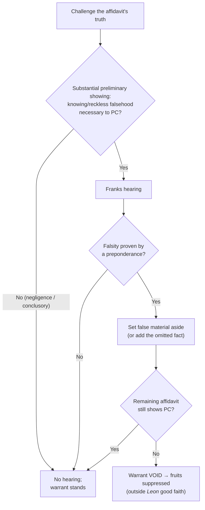
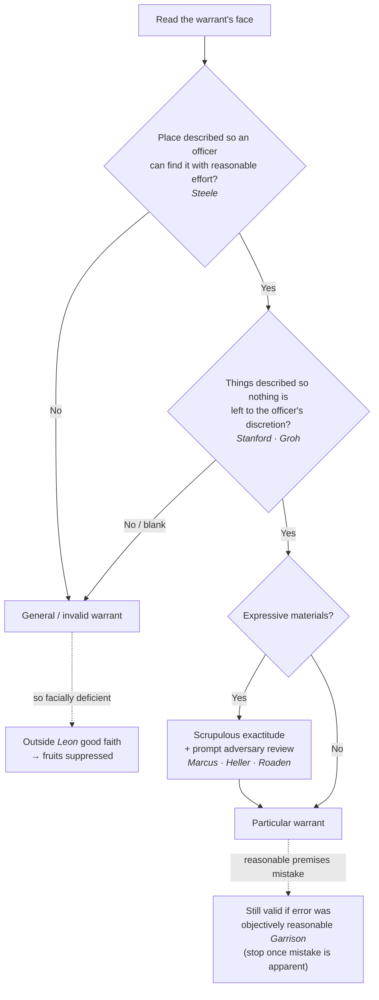

# S9 R1 panel-review — Opus model-diversity lane (prompt pack)

You are the **Claude/Opus** leg of the S9 three-lane adversarial panel (1 Claude + 2 Codex, R1). The two Codex lanes carry the A (support/quote-fidelity) and B (currency/treatment) attack lenses; **you carry model diversity and MUST vote on every paneled assertion across BOTH lenses' concerns.** You are refute-framed: try hard to break each assertion; **default to REFUTED on uncertainty**; never fabricate a cite, quote, or holding; use ONLY the evidence inlined below (no search, no outside knowledge). You are a SIGHTED reviewer — the FULL lake record (judgment fields included) is inlined.

You are a WRITER lane, not an adjudicator: you FIND and VOTE. You do not tally, adjudicate, or close any row — the orchestrator does.

For EACH group below, return one JSON object with the exact `reviewed[]` shape from the output contract (identical framing to the Codex lenses). Emit a finding object ONLY for a real defect (verdict refuted / stands-modified); a group you find wholly clean returns all-`stands` verdicts (the harness records a clean attestation). Concatenate the per-group JSON objects into a top-level `{"packs": [ ... ]}` array, one entry per group, each carrying its `group_id`.


OUTPUT CONTRACT — return ONE JSON object, nothing else:
{
  "lens": "A" | "B",
  "group_id": "<echo the group id>",
  "reviewed": [
    {
      "assertion_id": "<from group_inventory.jsonl>",
      "dimension": "existence|support|quote_fidelity|pincite|treatment|black_letter",
      "verdict": "stands" | "refuted" | "stands-modified",
      "verifiable_from_disclosed": true | false,
      "defect": null,   // null when verdict=="stands"; else an object:
      //  {"problem": "...", "severity": "high|medium|low", "proposed_fix": "...", "evidence_quote": "verbatim from disclosed evidence or null", "needs_cl": true|false, "locator_note": "..."}
      "reasons": ["short evidence-grounded reason", "..."],
      "breaks_true_positives": true | false,
      "residual_risks": ["..."],
      "suggested_tightening": "... or null"
    }
  ],
  "notes": ""
}
Rules: verdict=='stands' <=> defect==null (assertion survives your attack). verdict=='refuted' <=> a real defect (the assertion as framed is wrong). verdict=='stands-modified' <=> survives but needs a stated modification (a minor defect). Review EVERY assertion_id in group_inventory.jsonl exactly once. Output ONLY the JSON object.
---

## GROUP: content/the-warrant/getting-a-warrant/Franks Challenges.md  (`doctrine`, 6 assertions)

### content_page

```
---
weight: 40
aliases:
  - "Franks Challenges"
  - "Franks Challenge"
  - "Franks Hearing"
title: "Franks Challenges"
topic: Franks Challenges
type: doctrine
amendment: "U.S. Const. amend. IV"
jurisdiction: "Federal (U.S. Const. amend. IV); SCOTUS baseline"
status: draft
related:
  - "[[Probable Cause in the Affidavit]]"
  - "[[The Neutral and Detached Magistrate]]"
  - "[[Particularity]]"
  - "[[The Exclusionary Rule]]"
  - "[[Section 1983 Liability and Qualified Immunity]]"
---

# Franks Challenges

*This page is about attacking the **truthfulness** of a warrant affidavit. For what the affidavit must show in the first place, see [[Probable Cause in the Affidavit]]; for the good-faith consequence, see [[The Exclusionary Rule]].*

> [!rule] Black-letter rule
> **A defendant may attack a facially sufficient warrant by showing the affidavit was deliberately or recklessly false.** On a **substantial preliminary showing** that the affiant included a **knowing or intentional, or reckless, falsehood** that was **necessary to the finding of probable cause**, the defendant is entitled to a **hearing**. *[[Franks v. Delaware#^pin-155|Franks v. Delaware]]*, 438 U.S. 154, [155–56](https://www.courtlistener.com/opinion/109925/franks-v-delaware/) (1978). If, at that hearing, he proves the falsity **by a preponderance** and the affidavit's remaining content, with the false material set aside, "is insufficient to establish probable cause, the search warrant must be voided and the fruits of the search excluded." *Id.* at 156. *[[Franks v. Delaware|Franks]]* is also the **first floor** of *[[United States v. Leon|Leon]]* good faith: you cannot rely in good faith on a warrant you lied to get.
> ^rule-franks

## The Brief

**Field-decisive question: was the affidavit that got this warrant honest, and does it still show probable cause once the lies come out?** A warrant is presumed valid, and normally a court will not look behind the affidavit. *[[Franks v. Delaware|Franks]]* is the narrow exception that lets a defendant do exactly that, but only on a real showing and only for falsity that mattered.

**The two-step structure.** *[[Franks v. Delaware|Franks]]* builds a gate, then a merits test. First, the defendant must make a **substantial preliminary showing**: he must point to specific alleged falsehoods, show they were made "knowingly and intentionally, or with reckless disregard for the truth," and show they were "necessary to the finding of probable cause." *[[Franks v. Delaware#^pin-155|Franks v. Delaware]]*, 438 U.S. 154, [155–56](https://www.courtlistener.com/opinion/109925/franks-v-delaware/) (1978). Allegations of mere negligence or innocent mistake, and conclusory attacks, do not open the door. Second, if that showing is made, the court holds a **hearing** at which the defendant must prove the deliberate or reckless falsity **by a [[Common Legal Terms#preponderance-of-the-evidence|preponderance of the evidence]]**. *Id.* at 156.

**The materiality filter is what decides the case.** Even a proven lie does not automatically void the warrant. The court **sets the false material to one side** and asks whether the affidavit's **remaining content** still establishes probable cause. If it does, the warrant stands and the evidence comes in; only if the affidavit **without** the falsehood is "insufficient to establish probable cause" is the warrant voided and the fruits excluded. *[[Franks v. Delaware#^pin-156|Franks]]*, 438 U.S. at [156](https://www.courtlistener.com/opinion/109925/franks-v-delaware/). This is why an affiant's stray exaggeration rarely wins: it has to be load-bearing.

**Falsehoods and omissions.** *[[Franks v. Delaware|Franks]]* itself involved a false statement **included** in the affidavit. Its logic applies with equal force to a **material omission**: a fact the affiant deliberately or recklessly left out, where including it would have defeated probable cause, is analyzed under the same standard, with the reviewing court asking whether the affidavit as it **should** have read still shows probable cause. The mental-state bar is the same: deliberate or reckless, never merely negligent.

**Reckless disregard is the mens-rea line.** *[[Franks v. Delaware|Franks]]* does not punish honest error. The affiant must have either known the statement was false or entertained serious doubts about its truth and included it anyway. Getting a fact wrong is not a *[[Franks v. Delaware|Franks]]* violation; putting a fact in the affidavit while recklessly indifferent to whether it is true is.

**Burden, standard of review, and remedy.** The warrant's **presumption of validity** places the whole burden on the **defendant** — first the substantial preliminary showing, then proof by a preponderance. On appeal, the district court's historical findings (what the affiant knew, whether he was reckless) are reviewed for [[Common Legal Terms#clear-error|clear error]], and the ultimate probable-cause question on the corrected affidavit [[Common Legal Terms#de-novo|de novo]]. The remedy is suppression of the fruits, and because the violation is a deliberate or reckless lie, it sits **outside** *[[United States v. Leon|Leon]]* good faith: reliance on a warrant "the magistrate . . . was misled by information in an affidavit that the affiant knew was false or would have known was false except for his reckless disregard of the truth" is not objectively reasonable. *[[United States v. Leon#^pin-923|United States v. Leon]]*, 468 U.S. 897, [923](https://www.courtlistener.com/opinion/111262/united-states-v-leon/#:~:text=the%20magistrate%20or%20judge%20in) (1984).

**The civil mirror.** The same duty of candor is enforced in damages. An officer who seeks a warrant on an affidavit "so lacking in indicia of probable cause" that "no reasonably competent officer would have concluded that a warrant should issue" loses [[Qualified Immunity|qualified immunity]]. *[[Malley v. Briggs|Malley v. Briggs]]*, 475 U.S. 335, [341](https://www.courtlistener.com/opinion/111611/malley-v-briggs/) (1986). That is a **high** threshold, though: reasonable reliance on a magistrate's approval of even an overbroad warrant usually keeps immunity. *[[Messerschmidt v. Millender|Messerschmidt v. Millender]]*, 565 U.S. 535, [547](https://www.courtlistener.com/opinion/623242/messerschmidt-v-millender/) (2012).

**Common pitfalls.**

- **Confusing negligence with recklessness.** An honest mistake is not a *[[Franks v. Delaware|Franks]]* violation; the affiant must have lied knowingly or recklessly.
- **Skipping the materiality step.** A proven falsehood wins only if the affidavit **without** it fails for probable cause; a non-material lie leaves the warrant standing.
- **Forgetting omissions count.** A deliberately or recklessly omitted fact that would have defeated probable cause is attacked the same way as an affirmative falsehood.
- **Expecting a hearing for the asking.** The substantial-preliminary-showing gate is real; conclusory or negligence-only allegations do not earn a *[[Franks v. Delaware|Franks]]* hearing.

## Key cases

| Case | Holding | Opinion |
|---|---|---|
| *[[Franks v. Delaware]]*, 438 U.S. 154 (1978) | **Anchor.** On a substantial preliminary showing of a knowing or reckless falsehood material to probable cause, the defendant gets a hearing; proven by a preponderance, with the false material set aside, if the remainder fails for probable cause the warrant is voided and the fruits excluded. | [opinion](https://www.courtlistener.com/opinion/109925/franks-v-delaware/) |

## Related cases across doctrines

These cases are treated in full elsewhere but bear on the *[[Franks v. Delaware|Franks]]* challenge, framed here for it.

| Case | Relevance here | Primary home | Opinion |
|---|---|---|---|
| *[[United States v. Leon]]*, 468 U.S. 897 (1984) | ***Good-faith floor.*** A *[[Franks v. Delaware\|Franks]]* falsehood is the first of *[[United States v. Leon\|Leon]]*'s own exceptions: reliance on a warrant the affiant knew or recklessly should have known was false is not objectively reasonable. | [[The Exclusionary Rule]] | [opinion](https://www.courtlistener.com/opinion/111262/united-states-v-leon/) |
| *[[Massachusetts v. Sheppard]]*, 468 U.S. 981 (1984) | ***Good-faith companion.*** By contrast, an officer misled by a judge's assurance that a mis-worded warrant was valid may still be in good faith; the affiant's honesty is what separates the cases. | [[The Exclusionary Rule]] | [opinion](https://www.courtlistener.com/opinion/111263/massachusetts-v-sheppard/) |
| *[[Malley v. Briggs]]*, 475 U.S. 335 (1986) | ***Civil mirror.*** An officer who applies on an affidavit no reasonably competent officer would present loses [[Qualified Immunity\|qualified immunity]], the outer bound of reasonable reliance. | [[Section 1983 Liability and Qualified Immunity]] | [opinion](https://www.courtlistener.com/opinion/111611/malley-v-briggs/) |
| *[[Messerschmidt v. Millender]]*, 565 U.S. 535 (2012) | ***High threshold.*** Reasonable reliance on a magistrate's approval of even an overbroad warrant usually keeps [[Qualified Immunity\|qualified immunity]]; *[[Malley v. Briggs\|Malley]]* liability is the exception. | [[Section 1983 Liability and Qualified Immunity]] | [opinion](https://www.courtlistener.com/opinion/623242/messerschmidt-v-millender/) |

## Visual



## Sources

- [*Franks v. Delaware*, 438 U.S. 154 (1978)](https://www.courtlistener.com/opinion/109925/franks-v-delaware/) (pinpoints: 155, 156)
- [*United States v. Leon*, 468 U.S. 897 (1984)](https://www.courtlistener.com/opinion/111262/united-states-v-leon/) (pinpoint: 923)
- [*Massachusetts v. Sheppard*, 468 U.S. 981 (1984)](https://www.courtlistener.com/opinion/111263/massachusetts-v-sheppard/) (pinpoint: 989)
- [*Malley v. Briggs*, 475 U.S. 335 (1986)](https://www.courtlistener.com/opinion/111611/malley-v-briggs/) (pinpoints: 341, 345)
- [*Messerschmidt v. Millender*, 565 U.S. 535 (2012)](https://www.courtlistener.com/opinion/623242/messerschmidt-v-millender/) (pinpoint: 547)

```

### group_inventory (assertions under review)

```jsonl
{"assertion_id": "0aa7f85ce33f594c", "dimension": "existence", "kind": "case_cite", "locator": {"case": "Massachusetts v. Sheppard", "table_line": 46}, "payload": {"case": "Massachusetts v. Sheppard", "cells": ["*[[Massachusetts v. Sheppard]]*, 468 U.S. 981 (1984)", "***Good-faith companion.*** By contrast, an officer misled by a judge's assurance that a mis-worded warrant was valid may still be in good faith; the affiant's honesty is what separates the cases.", "[[The Exclusionary Rule]]", "[opinion](https://www.courtlistener.com/opinion/111263/massachusetts-v-sheppard/)"], "header": ["Case", "Relevance here", "Primary home", "Opinion"]}}
{"assertion_id": "249ad58fe788db2e", "dimension": "existence", "kind": "case_cite", "locator": {"case": "United States v. Leon", "table_line": 45}, "payload": {"case": "United States v. Leon", "cells": ["*[[United States v. Leon]]*, 468 U.S. 897 (1984)", "***Good-faith floor.*** A *[[Franks v. Delaware\\|Franks]]* falsehood is the first of *[[United States v. Leon\\|Leon]]*'s own exceptions: reliance on a warrant the affiant knew or recklessly should have known was false is not objectively reasonable.", "[[The Exclusionary Rule]]", "[opinion](https://www.courtlistener.com/opinion/111262/united-states-v-leon/)"], "header": ["Case", "Relevance here", "Primary home", "Opinion"]}}
{"assertion_id": "6e17c3dc59850750", "dimension": "existence", "kind": "case_cite", "locator": {"case": "Malley v. Briggs", "table_line": 47}, "payload": {"case": "Malley v. Briggs", "cells": ["*[[Malley v. Briggs]]*, 475 U.S. 335 (1986)", "***Civil mirror.*** An officer who applies on an affidavit no reasonably competent officer would present loses [[Qualified Immunity\\|qualified immunity]], the outer bound of reasonable reliance.", "[[Section 1983 Liability and Qualified Immunity]]", "[opinion](https://www.courtlistener.com/opinion/111611/malley-v-briggs/)"], "header": ["Case", "Relevance here", "Primary home", "Opinion"]}}
{"assertion_id": "7ee6fc21fb5d9bbf", "dimension": "existence", "kind": "case_cite", "locator": {"case": "Messerschmidt v. Millender", "table_line": 48}, "payload": {"case": "Messerschmidt v. Millender", "cells": ["*[[Messerschmidt v. Millender]]*, 565 U.S. 535 (2012)", "***High threshold.*** Reasonable reliance on a magistrate's approval of even an overbroad warrant usually keeps [[Qualified Immunity\\|qualified immunity]]; *[[Malley v. Briggs\\|Malley]]* liability is the exception.", "[[Section 1983 Liability and Qualified Immunity]]", "[opinion](https://www.courtlistener.com/opinion/623242/messerschmidt-v-millender/)"], "header": ["Case", "Relevance here", "Primary home", "Opinion"]}}
{"assertion_id": "e689cf57b61aece4", "dimension": "existence", "kind": "case_cite", "locator": {"case": "Franks v. Delaware", "table_line": 37}, "payload": {"case": "Franks v. Delaware", "cells": ["*[[Franks v. Delaware]]*, 438 U.S. 154 (1978)", "**Anchor.** On a substantial preliminary showing of a knowing or reckless falsehood material to probable cause, the defendant gets a hearing; proven by a preponderance, with the false material set aside, if the remainder fails for probable cause the warrant is voided and the fruits excluded.", "[opinion](https://www.courtlistener.com/opinion/109925/franks-v-delaware/)"], "header": ["Case", "Holding", "Opinion"]}}
{"assertion_id": "6871994baf096522", "dimension": "support", "kind": "proposition", "locator": {"callout": "^rule-franks"}, "payload": {"anchor": "^rule-franks", "statement": "[!rule] Black-letter rule\n**A defendant may attack a facially sufficient warrant by showing the affidavit was deliberately or recklessly false.** On a **substantial preliminary showing** that the affiant included a **knowing or intentional, or reckless, falsehood** that was **necessary to the finding of probable cause**, the defendant is entitled to a **hearing**. *[[Franks v. Delaware#^pin-155|Franks v. Delaware]]*, 438 U.S. 154, [155–56](https://www.courtlistener.com/opinion/109925/franks-v-delaware/) (1978). If, at that hearing, he proves the falsity **by a preponderance** and the affidavit's remaining content, with the false material set aside, \"is insufficient to establish probable cause, the search warrant must be voided and the fruits of the search excluded.\" *Id.* at 156. *[[Franks v. Delaware|Franks]]* is also the **first floor** of *[[United States v. Leon|Leon]]* good faith: you cannot rely in good faith on a warrant you lied to get."}}
```

### lake record — Franks v. Delaware

```json
{
  "schema_version": "s2.v1",
  "record_id": "Franks v. Delaware",
  "stub": false,
  "status": "verified",
  "identity": {
    "case_name": "Franks v. Delaware",
    "case_name_short": "Franks",
    "case_name_full": "Franks v. Delaware",
    "input_case_name": "Franks v. Delaware",
    "court": "U.S. Supreme Court",
    "court_id": "scotus",
    "court_level": "scotus",
    "circuit": null,
    "state": null,
    "date_decided": "1978-06-26",
    "year": 1978,
    "docket": null,
    "cluster_id": 109925,
    "lead_opinion_id": 109925,
    "sibling_ids": [
      109925,
      9427321,
      9427322
    ],
    "absolute_url": "/opinion/109925/franks-v-delaware/",
    "identity_method": "citation+party-text",
    "expected_citation_found": true,
    "party_name_in_text": true,
    "canonical_name_match": true,
    "alternates": [
      {
        "cluster_id": 9016328,
        "score": 20,
        "case_name": "Franks v. Delaware"
      }
    ],
    "reason_code": null
  },
  "citations": {
    "official": {
      "cite": "438 U.S. 154",
      "volume": "438",
      "reporter": "U.S.",
      "page": "154",
      "type": 1,
      "selected_official": true,
      "source": "cluster.citations[]"
    },
    "parallel": [
      {
        "cite": "98 S. Ct. 2674",
        "volume": "98",
        "reporter": "S. Ct.",
        "page": "2674",
        "type": 1,
        "selected_official": false,
        "source": "cluster.citations[]"
      },
      {
        "cite": "57 L. Ed. 2d 667",
        "volume": "57",
        "reporter": "L. Ed. 2d",
        "page": "667",
        "type": 1,
        "selected_official": false,
        "source": "cluster.citations[]"
      }
    ],
    "vendor_neutral": [
      {
        "cite": "1978 U.S. LEXIS 127",
        "volume": "1978",
        "reporter": "U.S. LEXIS",
        "page": "127",
        "type": 6,
        "selected_official": false,
        "source": "cluster.citations[]"
      }
    ],
    "all": [
      {
        "cite": "438 U.S. 154",
        "volume": "438",
        "reporter": "U.S.",
        "page": "154",
        "type": 1,
        "selected_official": false,
        "source": "cluster.citations[]"
      },
      {
        "cite": "98 S. Ct. 2674",
        "volume": "98",
        "reporter": "S. Ct.",
        "page": "2674",
        "type": 1,
        "selected_official": false,
        "source": "cluster.citations[]"
      },
      {
        "cite": "57 L. Ed. 2d 667",
        "volume": "57",
        "reporter": "L. Ed. 2d",
        "page": "667",
        "type": 1,
        "selected_official": false,
        "source": "cluster.citations[]"
      },
      {
        "cite": "1978 U.S. LEXIS 127",
        "volume": "1978",
        "reporter": "U.S. LEXIS",
        "page": "127",
        "type": 6,
        "selected_official": false,
        "source": "cluster.citations[]"
      }
    ],
    "display": "438 U.S. 154",
    "official_selection": {
      "court_class": "scotus",
      "selected": "438 U.S. 154",
      "reason": "selected_rank_1"
    }
  },
  "pinpoints": [
    {
      "id": "pin-155",
      "page": null,
      "quote": "--- # Franks v. Delaware *438 U.S. 154 (1978)* \u00b7 U.S. Supreme Court \u00b7 **Binding \u2014 SCOTUS** \u00b7 Treatment: **good** *(as of 2026-06-30)* <!-- header line; TreatmentBadge + weight render here, degrading to the text above --> ## Background Police obtained a warrant to search Jerome Franks's home in a rape investigation, relying in part on an affidavit reciting statements two officers attributed to named acquaintances about Franks's clothing. Franks contended the officers had not actually interviewed those people as the affidavit claimed and sought to prove the affidavit contained deliberate falsehoods. The Delaware Supreme Court held that a defendant may never go behind a facially sufficient warrant affidavit to attack its truthfulness. ## Issue Whether a defendant ever has the right, after a warrant issues, to challenge the truthfulness of factual statements in the supporting affidavit \u2014 and to suppress the evidence if a deliberate or reckless falsehood necessary to probable cause is shown. ## Rule Yes \u2014 on a substantial preliminary showing, the defendant is entitled to a veracity hearing, and a proven falsehood essential to probable cause voids the warrant.",
      "star_marker": null,
      "quote_fidelity": "mismatch",
      "pinpoint_status": "slip-only",
      "position": null
    },
    {
      "id": "pin-156",
      "page": null,
      "quote": "In the event that at that hearing the allegation of perjury or reckless disregard is established by the defendant by a preponderance of the evidence, and, with the affidavit's false material set to one side, the affidavit's remaining content is insufficient to establish probable cause, the search warrant must be voided and the fruits of the search excluded.",
      "star_marker": null,
      "quote_fidelity": "mismatch",
      "pinpoint_status": "slip-only",
      "position": null
    }
  ],
  "treatment": {
    "field_i_validity": "good_law",
    "as_of_content": "1978-06-26",
    "as_of_treatment": "2026-06-30",
    "composite_basis": "migration-seed",
    "composite_basis_ref": "Franks v. Delaware",
    "varies_by_point": false,
    "scope_note": "Old as_of seeds as_of_treatment; S2 derivation re-derives and may downgrade.",
    "point_overrides": [],
    "edges": [
      {
        "citing_case": {
          "name": "State v. Rogers",
          "cluster_id": 10705828,
          "cite": null,
          "field_ii": "overruled"
        },
        "field_ii": "overruled",
        "field_iii": "mentioned",
        "point": null,
        "proposed": true,
        "journal_ref": "Franks v. Delaware:lane1_negative"
      },
      {
        "citing_case": {
          "name": "United States v. Fields",
          "cluster_id": 10309030,
          "cite": null,
          "field_ii": "questioned"
        },
        "field_ii": "questioned",
        "field_iii": "mentioned",
        "point": null,
        "proposed": true,
        "journal_ref": "Franks v. Delaware:lane1_negative"
      },
      {
        "citing_case": {
          "name": "State of Minnesota v. Seneca Warrior Steeprock",
          "cluster_id": 10102625,
          "cite": null,
          "field_ii": "overruled"
        },
        "field_ii": "overruled",
        "field_iii": "mentioned",
        "point": null,
        "proposed": true,
        "journal_ref": "Franks v. Delaware:lane1_negative"
      },
      {
        "citing_case": {
          "name": "Commonwealth v. Dunn",
          "cluster_id": 9500669,
          "cite": null,
          "field_ii": "superseded_by_statute"
        },
        "field_ii": "superseded_by_statute",
        "field_iii": "mentioned",
        "point": null,
        "proposed": true,
        "journal_ref": "Franks v. Delaware:lane1_negative"
      },
      {
        "citing_case": {
          "name": "State of Iowa v. Jesse Jon Harbach",
          "cluster_id": 9493041,
          "cite": null,
          "field_ii": "overruled"
        },
        "field_ii": "overruled",
        "field_iii": "mentioned",
        "point": null,
        "proposed": true,
        "journal_ref": "Franks v. Delaware:lane1_negative"
      },
      {
        "citing_case": {
          "name": "Commonwealth v. Whitfield",
          "cluster_id": 9400623,
          "cite": null,
          "field_ii": "superseded_by_statute"
        },
        "field_ii": "superseded_by_statute",
        "field_iii": "mentioned",
        "point": null,
        "proposed": true,
        "journal_ref": "Franks v. Delaware:lane1_negative"
      },
      {
        "citing_case": {
          "name": "Illinois v. Gates",
          "cluster_id": 110959,
          "cite": [
            "76 L. Ed. 2d 527",
            "103 S. Ct. 2317",
            "462 U.S. 213",
            "1983 U.S. LEXIS 54",
            "51 U.S.L.W. 4709"
          ],
          "field_ii": "overruled"
        },
        "field_ii": "overruled",
        "field_iii": "mentioned",
        "point": null,
        "proposed": true,
        "journal_ref": "Franks v. Delaware:lane2_top_cited"
      },
      {
        "citing_case": {
          "name": "United States v. Leon",
          "cluster_id": 111262,
          "cite": [
            "82 L. Ed. 2d 677",
            "104 S. Ct. 3405",
            "468 U.S. 897",
            "1984 U.S. LEXIS 153"
          ],
          "field_ii": "overruled"
        },
        "field_ii": "overruled",
        "field_iii": "mentioned",
        "point": null,
        "proposed": true,
        "journal_ref": "Franks v. Delaware:lane2_top_cited"
      },
      {
        "citing_case": {
          "name": "Ashcroft v. al-Kidd",
          "cluster_id": 217703,
          "cite": [
            "179 L. Ed. 2d 1149",
            "131 S. Ct. 2074",
            "563 U.S. 731",
            "2011 U.S. LEXIS 4021"
          ],
          "field_ii": "questioned"
        },
        "field_ii": "questioned",
        "field_iii": "mentioned",
        "point": null,
        "proposed": true,
        "journal_ref": "Franks v. Delaware:lane2_top_cited"
      },
      {
        "citing_case": {
          "name": "County Court of Ulster Cty. v. Allen",
          "cluster_id": 110093,
          "cite": [
            "60 L. Ed. 2d 777",
            "99 S. Ct. 2213",
            "442 U.S. 140",
            "1979 U.S. LEXIS 124"
          ],
          "field_ii": "overruled"
        },
        "field_ii": "overruled",
        "field_iii": "mentioned",
        "point": null,
        "proposed": true,
        "journal_ref": "Franks v. Delaware:lane2_top_cited"
      },
      {
        "citing_case": {
          "name": "Herring v. United States",
          "cluster_id": 145922,
          "cite": [
            "172 L. Ed. 2d 496",
            "129 S. Ct. 695",
            "555 U.S. 135",
            "2009 U.S. LEXIS 581"
          ],
          "field_ii": "overruled"
        },
        "field_ii": "overruled",
        "field_iii": "mentioned",
        "point": null,
        "proposed": true,
        "journal_ref": "Franks v. Delaware:lane2_top_cited"
      },
      {
        "citing_case": {
          "name": "v. Dominguez-Castor",
          "cluster_id": 4691722,
          "cite": [
            "2020 COA 1"
          ],
          "field_ii": "overruled"
        },
        "field_ii": "overruled",
        "field_iii": "mentioned",
        "point": null,
        "proposed": true,
        "journal_ref": "Franks v. Delaware:lane2_top_cited"
      },
      {
        "citing_case": {
          "name": "Mills v. Maryland",
          "cluster_id": 112085,
          "cite": [
            "100 L. Ed. 2d 384",
            "108 S. Ct. 1860",
            "486 U.S. 367",
            "1988 U.S. LEXIS 2488",
            "56 U.S.L.W. 4503"
          ],
          "field_ii": "questioned"
        },
        "field_ii": "questioned",
        "field_iii": "mentioned",
        "point": null,
        "proposed": true,
        "journal_ref": "Franks v. Delaware:lane2_top_cited"
      },
      {
        "citing_case": {
          "name": "Hudson v. Michigan",
          "cluster_id": 145646,
          "cite": [
            "165 L. Ed. 2d 56",
            "126 S. Ct. 2159",
            "547 U.S. 586",
            "2006 U.S. LEXIS 4677"
          ],
          "field_ii": "overruled"
        },
        "field_ii": "overruled",
        "field_iii": "mentioned",
        "point": null,
        "proposed": true,
        "journal_ref": "Franks v. Delaware:lane2_top_cited"
      },
      {
        "citing_case": {
          "name": "Jerry L. Branch, Valenna Branch, Colby Branch v. Dale L. Tunnell, Individually and as Special Agent of Bureau of Land Management, State of Montana",
          "cluster_id": 660713,
          "cite": [
            "14 F.3d 449",
            "94 Cal. Daily Op. Serv. 253",
            "28 Fed. R. Serv. 3d 1211",
            "94 Daily Journal DAR 442",
            "1994 U.S. App. LEXIS 409",
            "1994 WL 5496"
          ],
          "field_ii": "overruled"
        },
        "field_ii": "overruled",
        "field_iii": "mentioned",
        "point": null,
        "proposed": true,
        "journal_ref": "Franks v. Delaware:lane2_top_cited"
      },
      {
        "citing_case": {
          "name": "United States v. Karo",
          "cluster_id": 111257,
          "cite": [
            "82 L. Ed. 2d 530",
            "104 S. Ct. 3296",
            "468 U.S. 705",
            "1984 U.S. LEXIS 148"
          ],
          "field_ii": "questioned"
        },
        "field_ii": "questioned",
        "field_iii": "mentioned",
        "point": null,
        "proposed": true,
        "journal_ref": "Franks v. Delaware:lane2_top_cited"
      },
      {
        "citing_case": {
          "name": "State v. Marshall",
          "cluster_id": 1969802,
          "cite": [
            "690 A.2d 1",
            "148 N.J. 89",
            "1997 N.J. LEXIS 70"
          ],
          "field_ii": "overruled"
        },
        "field_ii": "overruled",
        "field_iii": "mentioned",
        "point": null,
        "proposed": true,
        "journal_ref": "Franks v. Delaware:lane2_top_cited"
      },
      {
        "citing_case": {
          "name": "People v. Bradford",
          "cluster_id": 1239150,
          "cite": [
            "15 Cal. 4th 1229",
            "939 P.2d 259",
            "97 Daily Journal DAR 9003",
            "97 Cal. Daily Op. Serv. 5537",
            "65 Cal. Rptr. 2d 145",
            "1997 Cal. LEXIS 3699"
          ],
          "field_ii": "overruled"
        },
        "field_ii": "overruled",
        "field_iii": "mentioned",
        "point": null,
        "proposed": true,
        "journal_ref": "Franks v. Delaware:lane2_top_cited"
      },
      {
        "citing_case": {
          "name": "Wainwright v. Greenfield",
          "cluster_id": 111553,
          "cite": [
            "88 L. Ed. 2d 623",
            "106 S. Ct. 634",
            "474 U.S. 284",
            "1986 U.S. LEXIS 41",
            "54 U.S.L.W. 4077"
          ],
          "field_ii": "questioned"
        },
        "field_ii": "questioned",
        "field_iii": "mentioned",
        "point": null,
        "proposed": true,
        "journal_ref": "Franks v. Delaware:lane2_top_cited"
      },
      {
        "citing_case": {
          "name": "United States v. Williams",
          "cluster_id": 112730,
          "cite": [
            "118 L. Ed. 2d 352",
            "112 S. Ct. 1735",
            "504 U.S. 36",
            "1992 U.S. LEXIS 2688"
          ],
          "field_ii": "overruled"
        },
        "field_ii": "overruled",
        "field_iii": "mentioned",
        "point": null,
        "proposed": true,
        "journal_ref": "Franks v. Delaware:lane2_top_cited"
      },
      {
        "citing_case": {
          "name": "Martinez v. State",
          "cluster_id": 1561283,
          "cite": [
            "17 S.W.3d 677",
            "2000 Tex. Crim. App. LEXIS 53",
            "2000 WL 628325"
          ],
          "field_ii": "overruled"
        },
        "field_ii": "overruled",
        "field_iii": "mentioned",
        "point": null,
        "proposed": true,
        "journal_ref": "Franks v. Delaware:lane2_top_cited"
      },
      {
        "citing_case": {
          "name": "Sykes v. Anderson",
          "cluster_id": 178987,
          "cite": [
            "625 F.3d 294",
            "2010 U.S. App. LEXIS 23204",
            "2010 WL 4453313"
          ],
          "field_ii": "overruled"
        },
        "field_ii": "overruled",
        "field_iii": "mentioned",
        "point": null,
        "proposed": true,
        "journal_ref": "Franks v. Delaware:lane2_top_cited"
      },
      {
        "citing_case": {
          "name": "Gregory v. City of Louisville",
          "cluster_id": 2973641,
          "cite": [
            "444 F.3d 725",
            "2006 WL 909935"
          ],
          "field_ii": "overruled"
        },
        "field_ii": "overruled",
        "field_iii": "mentioned",
        "point": null,
        "proposed": true,
        "journal_ref": "Franks v. Delaware:lane2_top_cited"
      },
      {
        "citing_case": {
          "name": "State v. Robinson",
          "cluster_id": 1539942,
          "cite": [
            "974 A.2d 1057",
            "200 N.J. 1",
            "2009 N.J. LEXIS 804"
          ],
          "field_ii": "questioned"
        },
        "field_ii": "questioned",
        "field_iii": "mentioned",
        "point": null,
        "proposed": true,
        "journal_ref": "Franks v. Delaware:lane2_top_cited"
      },
      {
        "citing_case": {
          "name": "People v. Panah",
          "cluster_id": 2509294,
          "cite": [
            "107 P.3d 790",
            "25 Cal. Rptr. 3d 672",
            "35 Cal. 4th 395",
            "2005 Cal. Daily Op. Serv. 2194",
            "2005 Daily Journal DAR 3023",
            "2005 Cal. LEXIS 2712"
          ],
          "field_ii": "overruled"
        },
        "field_ii": "overruled",
        "field_iii": "mentioned",
        "point": null,
        "proposed": true,
        "journal_ref": "Franks v. Delaware:lane2_top_cited"
      },
      {
        "citing_case": {
          "name": "Pagan v. State",
          "cluster_id": 1110208,
          "cite": [
            "830 So. 2d 792",
            "2002 WL 500315"
          ],
          "field_ii": "overruled"
        },
        "field_ii": "overruled",
        "field_iii": "mentioned",
        "point": null,
        "proposed": true,
        "journal_ref": "Franks v. Delaware:lane2_top_cited"
      },
      {
        "citing_case": {
          "name": "Janecka v. State",
          "cluster_id": 1743739,
          "cite": [
            "937 S.W.2d 456",
            "1996 Tex. Crim. App. LEXIS 240",
            "1996 WL 682137"
          ],
          "field_ii": "overruled"
        },
        "field_ii": "overruled",
        "field_iii": "mentioned",
        "point": null,
        "proposed": true,
        "journal_ref": "Franks v. Delaware:lane2_top_cited"
      },
      {
        "citing_case": {
          "name": "Tyron Brown v. Lee Lucas",
          "cluster_id": 2675935,
          "cite": [
            "753 F.3d 606",
            "2014 WL 2198419",
            "2014 U.S. App. LEXIS 9771"
          ],
          "field_ii": "superseded_by_statute"
        },
        "field_ii": "superseded_by_statute",
        "field_iii": "mentioned",
        "point": null,
        "proposed": true,
        "journal_ref": "Franks v. Delaware:lane2_top_cited"
      },
      {
        "citing_case": {
          "name": "People v. Letner and Tobin",
          "cluster_id": 2630926,
          "cite": [
            "235 P.3d 62",
            "50 Cal. 4th 99",
            "112 Cal. Rptr. 3d 746",
            "2010 Cal. LEXIS 7290"
          ],
          "field_ii": "overruled"
        },
        "field_ii": "overruled",
        "field_iii": "mentioned",
        "point": null,
        "proposed": true,
        "journal_ref": "Franks v. Delaware:lane2_top_cited"
      },
      {
        "citing_case": {
          "name": "People v. Waclawski",
          "cluster_id": 1703326,
          "cite": [
            "780 N.W.2d 321",
            "286 Mich. App. 634"
          ],
          "field_ii": "overruled"
        },
        "field_ii": "overruled",
        "field_iii": "mentioned",
        "point": null,
        "proposed": true,
        "journal_ref": "Franks v. Delaware:lane2_top_cited"
      },
      {
        "citing_case": {
          "name": "Greg Myers, Etc. v. R. Kathleen Morris, Scott County Attorney, Etc.",
          "cluster_id": 482831,
          "cite": [
            "810 F.2d 1437"
          ],
          "field_ii": "overruled"
        },
        "field_ii": "overruled",
        "field_iii": "mentioned",
        "point": null,
        "proposed": true,
        "journal_ref": "Franks v. Delaware:lane2_top_cited"
      }
    ],
    "derivation": {
      "lane1_negative": {
        "query": "cites:(109925 OR 9427321 OR 9427322) AND (overrul* OR abrogat* OR supersed* OR \"recede from\" OR \"no longer good law\" OR vacat* OR reversed) ",
        "reviewed": 200,
        "cap": 200,
        "cap_hit": true,
        "final_cursor": "https://www.courtlistener.com/api/rest/v4/search/?cursor=cz0xNjcxNTgwODAwMDAwJnM9OTM2NzYxNiZ0PW8mZD0yMDI2LTA3LTA0JnA9MTE%3D&fields=absolute_url%2CcaseName%2CcaseNameFull%2Ccitation%2CciteCount%2Ccluster_id%2Ccourt%2Ccourt_citation_string%2Ccourt_id%2CdateFiled%2Copinions%2Csibling_ids%2Cstatus%2Csyllabus&order_by=dateFiled+desc&page_size=100&q=cites%3A%28109925+OR+9427321+OR+9427322%29+AND+%28overrul%2A+OR+abrogat%2A+OR+supersed%2A+OR+%22recede+from%22+OR+%22no+longer+good+law%22+OR+vacat%2A+OR+reversed%29+&stat_Published=on&type=o",
        "audit_needed": true,
        "proposed_negative_events": 6,
        "audit_marker": "R15 treatment audit required",
        "triage_mode": "snippet-first",
        "snippet_field": "results[].opinions[].snippet",
        "triage_journaled": 200,
        "triage_read": 6,
        "triage_snippet_classified": 194
      },
      "lane2_top_cited": {
        "query": "cites:(109925 OR 9427321 OR 9427322)",
        "reviewed": 25,
        "cap": 25,
        "cap_hit": true,
        "final_cursor": "https://www.courtlistener.com/api/rest/v4/search/?cursor=cz00Mjkmcz0yNzA0JnQ9byZkPTIwMjYtMDctMDQmcD0z&order_by=citeCount+desc&page_size=25&q=cites%3A%28109925+OR+9427321+OR+9427322%29&type=o",
        "audit_needed": true,
        "proposed_negative_events": 25,
        "audit_marker": "R15 treatment audit required"
      },
      "lane3_recency": {
        "query": "cites:(109925 OR 9427321 OR 9427322)",
        "reviewed": 200,
        "cap": 200,
        "cap_hit": true,
        "final_cursor": "https://www.courtlistener.com/api/rest/v4/search/?cursor=cz0xNzAzNzIxNjAwMDAwJnM9OTQ1NTgxNiZ0PW8mZD0yMDI2LTA3LTA2JnA9MTE%3D&fields=absolute_url%2CcaseName%2CcaseNameFull%2Ccitation%2CciteCount%2Ccluster_id%2Ccourt%2Ccourt_citation_string%2Ccourt_id%2CdateFiled%2Copinions%2Csibling_ids%2Cstatus%2Csyllabus&filed_after=2023-07-06&order_by=dateFiled+desc&page_size=100&q=cites%3A%28109925+OR+9427321+OR+9427322%29&type=o",
        "audit_needed": true,
        "proposed_negative_events": 5,
        "audit_marker": "R15 treatment audit required",
        "triage_mode": "snippet-first",
        "snippet_field": "results[].opinions[].snippet",
        "triage_journaled": 200,
        "triage_read": 5,
        "triage_snippet_classified": 195
      }
    }
  },
  "progeny": {
    "complete_query": "cites:(109925 OR 9427321 OR 9427322)",
    "indexed_citing_opinions": 5121,
    "count_source": "search",
    "per_sibling": [
      {
        "opinion_id": 109925,
        "count": 4294,
        "count_source": "search"
      },
      {
        "opinion_id": 9427321,
        "count": 880,
        "count_source": "search"
      },
      {
        "opinion_id": 9427322,
        "count": 0,
        "count_source": "search"
      }
    ],
    "citation_count": 8699,
    "cache_path": "/Users/johngalt/cssi-lake/cache/progeny/franks-v-delaware.jsonl",
    "enumeration": "bounded",
    "cursor": "https://www.courtlistener.com/api/rest/v4/search/?cursor=cz0xLjk1MDQ4NiZzPTEwNjU4ODk4JnQ9byZkPTIwMjYtMDctMDQmcD0y&order_by=score+desc&page_size=100&q=cites%3A%28109925+OR+9427321+OR+9427322%29&type=o",
    "rows_cached": 20,
    "outbound_opinion_edges": [
      {
        "source_opinion_id": 109925,
        "cited_id": 98094,
        "source": "search.opinions[].cites[]"
      },
      {
        "source_opinion_id": 109925,
        "cited_id": 98212,
        "source": "search.opinions[].cites[]"
      },
      {
        "source_opinion_id": 109925,
        "cited_id": 102129,
        "source": "search.opinions[].cites[]"
      },
      {
        "source_opinion_id": 109925,
        "cited_id": 104373,
        "source": "search.opinions[].cites[]"
      },
      {
        "source_opinion_id": 109925,
        "cited_id": 104504,
        "source": "search.opinions[].cites[]"
      },
      {
        "source_opinion_id": 109925,
        "cited_id": 104709,
        "source": "search.opinions[].cites[]"
      },
      {
        "source_opinion_id": 109925,
        "cited_id": 105074,
        "source": "search.opinions[].cites[]"
      },
      {
        "source_opinion_id": 109925,
        "cited_id": 105188,
        "source": "search.opinions[].cites[]"
      },
      {
        "source_opinion_id": 109925,
        "cited_id": 105748,
        "source": "search.opinions[].cites[]"
      },
      {
        "source_opinion_id": 109925,
        "cited_id": 105925,
        "source": "search.opinions[].cites[]"
      },
      {
        "source_opinion_id": 109925,
        "cited_id": 106022,
        "source": "search.opinions[].cites[]"
      },
      {
        "source_opinion_id": 109925,
        "cited_id": 106285,
        "source": "search.opinions[].cites[]"
      },
      {
        "source_opinion_id": 109925,
        "cited_id": 106783,
        "source": "search.opinions[].cites[]"
      },
      {
        "source_opinion_id": 109925,
        "cited_id": 106865,
        "source": "search.opinions[].cites[]"
      },
      {
        "source_opinion_id": 109925,
        "cited_id": 107252,
        "source": "search.opinions[].cites[]"
      },
      {
        "source_opinion_id": 109925,
        "cited_id": 107394,
        "source": "search.opinions[].cites[]"
      },
      {
        "source_opinion_id": 109925,
        "cited_id": 107831,
        "source": "search.opinions[].cites[]"
      },
      {
        "source_opinion_id": 109925,
        "cited_id": 107951,
        "source": "search.opinions[].cites[]"
      },
      {
        "source_opinion_id": 109925,
        "cited_id": 108184,
        "source": "search.opinions[].cites[]"
      },
      {
        "source_opinion_id": 109925,
        "cited_id": 108302,
        "source": "search.opinions[].cites[]"
      },
      {
        "source_opinion_id": 109925,
        "cited_id": 108582,
        "source": "search.opinions[].cites[]"
      },
      {
        "source_opinion_id": 109925,
        "cited_id": 108898,
        "source": "search.opinions[].cites[]"
      },
      {
        "source_opinion_id": 109925,
        "cited_id": 109302,
        "source": "search.opinions[].cites[]"
      },
      {
        "source_opinion_id": 109925,
        "cited_id": 109539,
        "source": "search.opinions[].cites[]"
      },
      {
        "source_opinion_id": 109925,
        "cited_id": 109540,
        "source": "search.opinions[].cites[]"
      },
      {
        "source_opinion_id": 109925,
        "cited_id": 109624,
        "source": "search.opinions[].cites[]"
      },
      {
        "source_opinion_id": 109925,
        "cited_id": 299224,
        "source": "search.opinions[].cites[]"
      },
      {
        "source_opinion_id": 109925,
        "cited_id": 307033,
        "source": "search.opinions[].cites[]"
      },
      {
        "source_opinion_id": 109925,
        "cited_id": 316109,
        "source": "search.opinions[].cites[]"
      },
      {
        "source_opinion_id": 109925,
        "cited_id": 317254,
        "source": "search.opinions[].cites[]"
      },
      {
        "source_opinion_id": 109925,
        "cited_id": 318456,
        "source": "search.opinions[].cites[]"
      },
      {
        "source_opinion_id": 109925,
        "cited_id": 324012,
        "source": "search.opinions[].cites[]"
      },
      {
        "source_opinion_id": 109925,
        "cited_id": 327139,
        "source": "search.opinions[].cites[]"
      },
      {
        "source_opinion_id": 109925,
        "cited_id": 331000,
        "source": "search.opinions[].cites[]"
      },
      {
        "source_opinion_id": 109925,
        "cited_id": 338659,
        "source": "search.opinions[].cites[]"
      },
      {
        "source_opinion_id": 109925,
        "cited_id": 338672,
        "source": "search.opinions[].cites[]"
      },
      {
        "source_opinion_id": 109925,
        "cited_id": 340645,
        "source": "search.opinions[].cites[]"
      },
      {
        "source_opinion_id": 109925,
        "cited_id": 1130838,
        "source": "search.opinions[].cites[]"
      },
      {
        "source_opinion_id": 109925,
        "cited_id": 1148533,
        "source": "search.opinions[].cites[]"
      },
      {
        "source_opinion_id": 109925,
        "cited_id": 1163909,
        "source": "search.opinions[].cites[]"
      },
      {
        "source_opinion_id": 109925,
        "cited_id": 1176912,
        "source": "search.opinions[].cites[]"
      },
      {
        "source_opinion_id": 109925,
        "cited_id": 1180163,
        "source": "search.opinions[].cites[]"
      },
      {
        "source_opinion_id": 109925,
        "cited_id": 1183476,
        "source": "search.opinions[].cites[]"
      },
      {
        "source_opinion_id": 109925,
        "cited_id": 1190217,
        "source": "search.opinions[].cites[]"
      },
      {
        "source_opinion_id": 109925,
        "cited_id": 1198737,
        "source": "search.opinions[].cites[]"
      },
      {
        "source_opinion_id": 109925,
        "cited_id": 1285341,
        "source": "search.opinions[].cites[]"
      },
      {
        "source_opinion_id": 109925,
        "cited_id": 1306980,
        "source": "search.opinions[].cites[]"
      },
      {
        "source_opinion_id": 109925,
        "cited_id": 1311035,
        "source": "search.opinions[].cites[]"
      },
      {
        "source_opinion_id": 109925,
        "cited_id": 1312713,
        "source": "search.opinions[].cites[]"
      },
      {
        "source_opinion_id": 109925,
        "cited_id": 1353828,
        "source": "search.opinions[].cites[]"
      },
      {
        "source_opinion_id": 109925,
        "cited_id": 1363434,
        "source": "search.opinions[].cites[]"
      },
      {
        "source_opinion_id": 109925,
        "cited_id": 1367322,
        "source": "search.opinions[].cites[]"
      },
      {
        "source_opinion_id": 109925,
        "cited_id": 1367376,
        "source": "search.opinions[].cites[]"
      },
      {
        "source_opinion_id": 109925,
        "cited_id": 1391098,
        "source": "search.opinions[].cites[]"
      },
      {
        "source_opinion_id": 109925,
        "cited_id": 1415130,
        "source": "search.opinions[].cites[]"
      },
      {
        "source_opinion_id": 109925,
        "cited_id": 1424506,
        "source": "search.opinions[].cites[]"
      },
      {
        "source_opinion_id": 109925,
        "cited_id": 1437089,
        "source": "search.opinions[].cites[]"
      },
      {
        "source_opinion_id": 109925,
        "cited_id": 1445282,
        "source": "search.opinions[].cites[]"
      },
      {
        "source_opinion_id": 109925,
        "cited_id": 1451648,
        "source": "search.opinions[].cites[]"
      },
      {
        "source_opinion_id": 109925,
        "cited_id": 1452068,
        "source": "search.opinions[].cites[]"
      },
      {
        "source_opinion_id": 109925,
        "cited_id": 1498442,
        "source": "search.opinions[].cites[]"
      },
      {
        "source_opinion_id": 109925,
        "cited_id": 1530851,
        "source": "search.opinions[].cites[]"
      },
      {
        "source_opinion_id": 109925,
        "cited_id": 1600679,
        "source": "search.opinions[].cites[]"
      },
      {
        "source_opinion_id": 109925,
        "cited_id": 1631048,
        "source": "search.opinions[].cites[]"
      },
      {
        "source_opinion_id": 109925,
        "cited_id": 1760963,
        "source": "search.opinions[].cites[]"
      },
      {
        "source_opinion_id": 109925,
        "cited_id": 1768917,
        "source": "search.opinions[].cites[]"
      },
      {
        "source_opinion_id": 109925,
        "cited_id": 1769197,
        "source": "search.opinions[].cites[]"
      },
      {
        "source_opinion_id": 109925,
        "cited_id": 1828817,
        "source": "search.opinions[].cites[]"
      },
      {
        "source_opinion_id": 109925,
        "cited_id": 1850125,
        "source": "search.opinions[].cites[]"
      },
      {
        "source_opinion_id": 109925,
        "cited_id": 1851918,
        "source": "search.opinions[].cites[]"
      },
      {
        "source_opinion_id": 109925,
        "cited_id": 1886978,
        "source": "search.opinions[].cites[]"
      },
      {
        "source_opinion_id": 109925,
        "cited_id": 1895767,
        "source": "search.opinions[].cites[]"
      },
      {
        "source_opinion_id": 109925,
        "cited_id": 1973195,
        "source": "search.opinions[].cites[]"
      },
      {
        "source_opinion_id": 109925,
        "cited_id": 1987009,
        "source": "search.opinions[].cites[]"
      },
      {
        "source_opinion_id": 109925,
        "cited_id": 2053522,
        "source": "search.opinions[].cites[]"
      },
      {
        "source_opinion_id": 109925,
        "cited_id": 2060217,
        "source": "search.opinions[].cites[]"
      },
      {
        "source_opinion_id": 109925,
        "cited_id": 2120568,
        "source": "search.opinions[].cites[]"
      },
      {
        "source_opinion_id": 109925,
        "cited_id": 2133918,
        "source": "search.opinions[].cites[]"
      },
      {
        "source_opinion_id": 109925,
        "cited_id": 2184913,
        "source": "search.opinions[].cites[]"
      },
      {
        "source_opinion_id": 109925,
        "cited_id": 2215694,
        "source": "search.opinions[].cites[]"
      },
      {
        "source_opinion_id": 109925,
        "cited_id": 2221046,
        "source": "search.opinions[].cites[]"
      },
      {
        "source_opinion_id": 109925,
        "cited_id": 2233092,
        "source": "search.opinions[].cites[]"
      },
      {
        "source_opinion_id": 109925,
        "cited_id": 2341043,
        "source": "search.opinions[].cites[]"
      },
      {
        "source_opinion_id": 109925,
        "cited_id": 2349003,
        "source": "search.opinions[].cites[]"
      },
      {
        "source_opinion_id": 109925,
        "cited_id": 2356548,
        "source": "search.opinions[].cites[]"
      },
      {
        "source_opinion_id": 109925,
        "cited_id": 2379504,
        "source": "search.opinions[].cites[]"
      },
      {
        "source_opinion_id": 109925,
        "cited_id": 2386408,
        "source": "search.opinions[].cites[]"
      },
      {
        "source_opinion_id": 109925,
        "cited_id": 2398659,
        "source": "search.opinions[].cites[]"
      },
      {
        "source_opinion_id": 109925,
        "cited_id": 2442476,
        "source": "search.opinions[].cites[]"
      },
      {
        "source_opinion_id": 109925,
        "cited_id": 2467369,
        "source": "search.opinions[].cites[]"
      },
      {
        "source_opinion_id": 109925,
        "cited_id": 2609109,
        "source": "search.opinions[].cites[]"
      },
      {
        "source_opinion_id": 109925,
        "cited_id": 3423317,
        "source": "search.opinions[].cites[]"
      },
      {
        "source_opinion_id": 109925,
        "cited_id": 3486405,
        "source": "search.opinions[].cites[]"
      },
      {
        "source_opinion_id": 109925,
        "cited_id": 3493017,
        "source": "search.opinions[].cites[]"
      },
      {
        "source_opinion_id": 109925,
        "cited_id": 3535850,
        "source": "search.opinions[].cites[]"
      },
      {
        "source_opinion_id": 109925,
        "cited_id": 3744266,
        "source": "search.opinions[].cites[]"
      },
      {
        "source_opinion_id": 109925,
        "cited_id": 3865272,
        "source": "search.opinions[].cites[]"
      }
    ]
  },
  "off_cl_links": [],
  "provenance": {
    "cl_source": "LRU",
    "cl_api": "https://www.courtlistener.com/api/rest/v4",
    "built_by": "S2-BUILDER-AUTHORING",
    "build_run": "s2-build-96d841cbb12e",
    "date_created": "2026-07-05T04:50:20Z",
    "date_modified": "2026-07-06T10:25:11Z",
    "warnings": [
      "legacy treatment migrated: good -> good_law"
    ],
    "field_provenance": {
      "identity": {
        "src": "CourtListener search + clusters + lead opinion text",
        "at": "2026-07-05T04:50:34Z",
        "verifier": "S2-BUILDER-AUTHORING"
      },
      "treatment.field_i_validity": {
        "src": "_treatment-migration.json + page frontmatter",
        "at": "2026-07-05T04:50:34Z",
        "verifier": "S2-BUILDER-AUTHORING"
      },
      "point_overrides": {
        "src": "S2 treatment derivation proposed only",
        "at": "2026-07-05T04:55:46Z",
        "verifier": "S2-BUILDER-AUTHORING"
      },
      "pinpoints": {
        "src": "content page quote harvest + lead opinion text",
        "at": "2026-07-05T04:50:34Z",
        "verifier": "S2-BUILDER-AUTHORING"
      }
    }
  }
}

```

### lake record — Malley v. Briggs

```json
{
  "schema_version": "s2.v1",
  "record_id": "Malley v. Briggs",
  "stub": false,
  "status": "verified",
  "identity": {
    "case_name": "Malley v. Briggs",
    "case_name_short": "Malley",
    "case_name_full": "MALLEY Et Al. v. BRIGGS Et Al.",
    "input_case_name": "Malley v. Briggs",
    "court": "U.S. Supreme Court",
    "court_id": "scotus",
    "court_level": "scotus",
    "circuit": null,
    "state": null,
    "date_decided": "1986-03-05",
    "year": 1986,
    "docket": "84-1586",
    "cluster_id": 111611,
    "lead_opinion_id": 9430379,
    "sibling_ids": [
      111611,
      9430379,
      9430380
    ],
    "absolute_url": "/opinion/111611/malley-v-briggs/",
    "identity_method": "citation+party-text",
    "expected_citation_found": true,
    "party_name_in_text": true,
    "canonical_name_match": true,
    "alternates": [],
    "reason_code": null
  },
  "citations": {
    "official": {
      "cite": "475 U.S. 335",
      "volume": "475",
      "reporter": "U.S.",
      "page": "335",
      "type": 1,
      "selected_official": true,
      "source": "cluster.citations[]"
    },
    "parallel": [
      {
        "cite": "106 S. Ct. 1092",
        "volume": "106",
        "reporter": "S. Ct.",
        "page": "1092",
        "type": 1,
        "selected_official": false,
        "source": "cluster.citations[]"
      },
      {
        "cite": "89 L. Ed. 2d 271",
        "volume": "89",
        "reporter": "L. Ed. 2d",
        "page": "271",
        "type": 1,
        "selected_official": false,
        "source": "cluster.citations[]"
      },
      {
        "cite": "54 U.S.L.W. 4243",
        "volume": "54",
        "reporter": "U.S.L.W.",
        "page": "4243",
        "type": 4,
        "selected_official": false,
        "source": "cluster.citations[]"
      }
    ],
    "vendor_neutral": [
      {
        "cite": "1986 U.S. LEXIS 29",
        "volume": "1986",
        "reporter": "U.S. LEXIS",
        "page": "29",
        "type": 6,
        "selected_official": false,
        "source": "cluster.citations[]"
      }
    ],
    "all": [
      {
        "cite": "475 U.S. 335",
        "volume": "475",
        "reporter": "U.S.",
        "page": "335",
        "type": 1,
        "selected_official": false,
        "source": "cluster.citations[]"
      },
      {
        "cite": "106 S. Ct. 1092",
        "volume": "106",
        "reporter": "S. Ct.",
        "page": "1092",
        "type": 1,
        "selected_official": false,
        "source": "cluster.citations[]"
      },
      {
        "cite": "89 L. Ed. 2d 271",
        "volume": "89",
        "reporter": "L. Ed. 2d",
        "page": "271",
        "type": 1,
        "selected_official": false,
        "source": "cluster.citations[]"
      },
      {
        "cite": "1986 U.S. LEXIS 29",
        "volume": "1986",
        "reporter": "U.S. LEXIS",
        "page": "29",
        "type": 6,
        "selected_official": false,
        "source": "cluster.citations[]"
      },
      {
        "cite": "54 U.S.L.W. 4243",
        "volume": "54",
        "reporter": "U.S.L.W.",
        "page": "4243",
        "type": 4,
        "selected_official": false,
        "source": "cluster.citations[]"
      }
    ],
    "display": "475 U.S. 335",
    "official_selection": {
      "court_class": "scotus",
      "selected": "475 U.S. 335",
      "reason": "selected_rank_1"
    }
  },
  "pinpoints": [
    {
      "id": "pin-341",
      "page": null,
      "quote": "--- # Malley v. Briggs *475 U.S. 335 (1986)* \u00b7 U.S. Supreme Court \u00b7 **Binding \u2014 SCOTUS** \u00b7 Treatment: **good** *(as of 2026-06-30)* <!-- header line; TreatmentBadge + weight render here, degrading to the text above --> ## Background Rhode Island state trooper Malley, relying on court-authorized wiretap intercepts, drew up felony complaints and supporting affidavits charging James and Louise Briggs with a marijuana offense. A state judge signed the arrest warrants and the Briggses were arrested, but the grand jury did not indict and the charges were dropped. The Briggses sued Malley under \u00a7 1983, alleging the affidavit did not establish probable cause. Malley claimed he was absolutely immune because a judge had issued the warrant. ## Issue Whether an officer who applies for and obtains an arrest warrant is entitled to absolute immunity from a \u00a7 1983 damages suit, or only to qualified immunity \u2014 and if the latter, what the standard is. ## Rule The officer gets **qualified**, not absolute, immunity, judged by the objective-reasonableness standard of *Harlow* and *Leon*.",
      "star_marker": null,
      "quote_fidelity": "mismatch",
      "pinpoint_status": "slip-only",
      "position": null
    },
    {
      "id": "pin-345",
      "page": null,
      "quote": "whether a reasonably well-trained officer in petitioner's position would have known that his affidavit failed to establish probable cause and that he should not have applied for the warrant.",
      "star_marker": null,
      "quote_fidelity": "mismatch",
      "pinpoint_status": "slip-only",
      "position": null
    }
  ],
  "treatment": {
    "field_i_validity": "good_law",
    "as_of_content": "1986-03-05",
    "as_of_treatment": "2026-06-30",
    "composite_basis": "migration-seed",
    "composite_basis_ref": "Malley v. Briggs",
    "varies_by_point": false,
    "scope_note": "Good law: officers applying for warrants get qualified, not absolute, immunity; the 'no reasonably competent officer' standard governs.",
    "point_overrides": [],
    "edges": [
      {
        "citing_case": {
          "name": "C.M. v. Commissioner of the Department of Children and Families",
          "cluster_id": 4747689,
          "cite": null,
          "field_ii": "overruled"
        },
        "field_ii": "overruled",
        "field_iii": "mentioned",
        "point": null,
        "proposed": true,
        "journal_ref": "Malley v. Briggs:lane1_negative"
      },
      {
        "citing_case": {
          "name": "Harris County, Texas and Kevin Vailes v. Barbara Coats, Individually, as Personal Representative of the Estate of Jamail Amron, and as Heir to the Estate of Jamail Amron, And Ali Amron, Individually and as Heir to the Estate of Jamail Amron, Barbara Coats",
          "cluster_id": 4725124,
          "cite": null,
          "field_ii": "overruled"
        },
        "field_ii": "overruled",
        "field_iii": "mentioned",
        "point": null,
        "proposed": true,
        "journal_ref": "Malley v. Briggs:lane1_negative"
      },
      {
        "citing_case": {
          "name": "Heck v. Humphrey",
          "cluster_id": 117864,
          "cite": [
            "129 L. Ed. 2d 383",
            "114 S. Ct. 2364",
            "512 U.S. 477",
            "1994 U.S. LEXIS 4824"
          ],
          "field_ii": "abrogated"
        },
        "field_ii": "abrogated",
        "field_iii": "mentioned",
        "point": null,
        "proposed": true,
        "journal_ref": "Malley v. Briggs:lane2_top_cited"
      },
      {
        "citing_case": {
          "name": "Anderson v. Creighton",
          "cluster_id": 111953,
          "cite": [
            "97 L. Ed. 2d 523",
            "107 S. Ct. 3034",
            "483 U.S. 635",
            "1987 U.S. LEXIS 2894",
            "55 U.S.L.W. 5092"
          ],
          "field_ii": "overruled"
        },
        "field_ii": "overruled",
        "field_iii": "mentioned",
        "point": null,
        "proposed": true,
        "journal_ref": "Malley v. Briggs:lane2_top_cited"
      },
      {
        "citing_case": {
          "name": "Hope v. Pelzer",
          "cluster_id": 121169,
          "cite": [
            "153 L. Ed. 2d 666",
            "122 S. Ct. 2508",
            "536 U.S. 730",
            "2002 U.S. LEXIS 4884"
          ],
          "field_ii": "overruled"
        },
        "field_ii": "overruled",
        "field_iii": "mentioned",
        "point": null,
        "proposed": true,
        "journal_ref": "Malley v. Briggs:lane2_top_cited"
      },
      {
        "citing_case": {
          "name": "Michael Lacey v. Joseph Arpaio",
          "cluster_id": 807646,
          "cite": [
            "693 F.3d 896"
          ],
          "field_ii": "overruled"
        },
        "field_ii": "overruled",
        "field_iii": "mentioned",
        "point": null,
        "proposed": true,
        "journal_ref": "Malley v. Briggs:lane2_top_cited"
      },
      {
        "citing_case": {
          "name": "Mullenix v. Luna",
          "cluster_id": 3153112,
          "cite": [
            "577 U.S. 7",
            "136 S. Ct. 305",
            "193 L. Ed. 2d 255",
            "2015 U.S. LEXIS 7160",
            "84 U.S.L.W. 4003",
            "25 Fla. L. Weekly Fed. S 555"
          ],
          "field_ii": "questioned"
        },
        "field_ii": "questioned",
        "field_iii": "mentioned",
        "point": null,
        "proposed": true,
        "journal_ref": "Malley v. Briggs:lane2_top_cited"
      },
      {
        "citing_case": {
          "name": "Hunter v. Bryant",
          "cluster_id": 112671,
          "cite": [
            "116 L. Ed. 2d 589",
            "112 S. Ct. 534",
            "502 U.S. 224",
            "1991 U.S. LEXIS 7262"
          ],
          "field_ii": "questioned"
        },
        "field_ii": "questioned",
        "field_iii": "mentioned",
        "point": null,
        "proposed": true,
        "journal_ref": "Malley v. Briggs:lane2_top_cited"
      },
      {
        "citing_case": {
          "name": "Ziglar v. Abbasi",
          "cluster_id": 4403804,
          "cite": [
            "582 U.S. 120",
            "2017 U.S. LEXIS 3874",
            "137 S. Ct. 1843",
            "198 L. Ed. 2d 290",
            "26 Fla. L. Weekly Fed. S 655",
            "85 U.S.L.W. 4360",
            "2017 WL 2621317"
          ],
          "field_ii": "questioned"
        },
        "field_ii": "questioned",
        "field_iii": "mentioned",
        "point": null,
        "proposed": true,
        "journal_ref": "Malley v. Briggs:lane2_top_cited"
      },
      {
        "citing_case": {
          "name": "Ashcroft v. al-Kidd",
          "cluster_id": 217703,
          "cite": [
            "179 L. Ed. 2d 1149",
            "131 S. Ct. 2074",
            "563 U.S. 731",
            "2011 U.S. LEXIS 4021"
          ],
          "field_ii": "questioned"
        },
        "field_ii": "questioned",
        "field_iii": "mentioned",
        "point": null,
        "proposed": true,
        "journal_ref": "Malley v. Briggs:lane2_top_cited"
      },
      {
        "citing_case": {
          "name": "Wilson v. Layne",
          "cluster_id": 118289,
          "cite": [
            "143 L. Ed. 2d 818",
            "119 S. Ct. 1692",
            "526 U.S. 603",
            "1999 U.S. LEXIS 3633"
          ],
          "field_ii": "superseded_by_statute"
        },
        "field_ii": "superseded_by_statute",
        "field_iii": "mentioned",
        "point": null,
        "proposed": true,
        "journal_ref": "Malley v. Briggs:lane2_top_cited"
      },
      {
        "citing_case": {
          "name": "Buckley v. Fitzsimmons",
          "cluster_id": 112894,
          "cite": [
            "125 L. Ed. 2d 209",
            "113 S. Ct. 2606",
            "509 U.S. 259",
            "1993 U.S. LEXIS 4400"
          ],
          "field_ii": "abrogated"
        },
        "field_ii": "abrogated",
        "field_iii": "mentioned",
        "point": null,
        "proposed": true,
        "journal_ref": "Malley v. Briggs:lane2_top_cited"
      },
      {
        "citing_case": {
          "name": "District of Columbia v. Wesby",
          "cluster_id": 4460854,
          "cite": [
            "583 U.S. 48",
            "138 S. Ct. 577",
            "199 L. Ed. 2d 453",
            "2018 U.S. LEXIS 760"
          ],
          "field_ii": "criticized"
        },
        "field_ii": "criticized",
        "field_iii": "mentioned",
        "point": null,
        "proposed": true,
        "journal_ref": "Malley v. Briggs:lane2_top_cited"
      },
      {
        "citing_case": {
          "name": "Burns v. Reed",
          "cluster_id": 112606,
          "cite": [
            "114 L. Ed. 2d 547",
            "111 S. Ct. 1934",
            "500 U.S. 478",
            "1991 U.S. LEXIS 3018"
          ],
          "field_ii": "questioned"
        },
        "field_ii": "questioned",
        "field_iii": "mentioned",
        "point": null,
        "proposed": true,
        "journal_ref": "Malley v. Briggs:lane2_top_cited"
      },
      {
        "citing_case": {
          "name": "Miller v. Gammie",
          "cluster_id": 8437592,
          "cite": [
            "335 F.3d 889",
            "2003 WL 21540416"
          ],
          "field_ii": "overruled"
        },
        "field_ii": "overruled",
        "field_iii": "mentioned",
        "point": null,
        "proposed": true,
        "journal_ref": "Malley v. Briggs:lane2_top_cited"
      },
      {
        "citing_case": {
          "name": "Barbara Payne v. Michael Pauley",
          "cluster_id": 782880,
          "cite": [
            "337 F.3d 767",
            "2003 U.S. App. LEXIS 13807",
            "2003 WL 21540424"
          ],
          "field_ii": "questioned"
        },
        "field_ii": "questioned",
        "field_iii": "mentioned",
        "point": null,
        "proposed": true,
        "journal_ref": "Malley v. Briggs:lane2_top_cited"
      },
      {
        "citing_case": {
          "name": "Groh v. Ramirez",
          "cluster_id": 131161,
          "cite": [
            "157 L. Ed. 2d 1068",
            "124 S. Ct. 1284",
            "540 U.S. 551",
            "2004 U.S. LEXIS 1624",
            "2004 WL 330057"
          ],
          "field_ii": "abrogated"
        },
        "field_ii": "abrogated",
        "field_iii": "mentioned",
        "point": null,
        "proposed": true,
        "journal_ref": "Malley v. Briggs:lane2_top_cited"
      },
      {
        "citing_case": {
          "name": "Kalina v. Fletcher",
          "cluster_id": 118156,
          "cite": [
            "139 L. Ed. 2d 471",
            "118 S. Ct. 502",
            "522 U.S. 118",
            "1997 U.S. LEXIS 7498"
          ],
          "field_ii": "questioned"
        },
        "field_ii": "questioned",
        "field_iii": "mentioned",
        "point": null,
        "proposed": true,
        "journal_ref": "Malley v. Briggs:lane2_top_cited"
      },
      {
        "citing_case": {
          "name": "Kathleen Hansen v. Ronald L. Black",
          "cluster_id": 529383,
          "cite": [
            "885 F.2d 642",
            "1989 U.S. App. LEXIS 13906",
            "1989 WL 106525"
          ],
          "field_ii": "questioned"
        },
        "field_ii": "questioned",
        "field_iii": "mentioned",
        "point": null,
        "proposed": true,
        "journal_ref": "Malley v. Briggs:lane2_top_cited"
      },
      {
        "citing_case": {
          "name": "Miller v. Gammie",
          "cluster_id": 782687,
          "cite": [
            "335 F.3d 889",
            "2003 Daily Journal DAR 7566",
            "2003 U.S. App. LEXIS 13720"
          ],
          "field_ii": "overruled"
        },
        "field_ii": "overruled",
        "field_iii": "mentioned",
        "point": null,
        "proposed": true,
        "journal_ref": "Malley v. Briggs:lane2_top_cited"
      },
      {
        "citing_case": {
          "name": "City of Lancaster v. Chambers",
          "cluster_id": 1524989,
          "cite": [
            "883 S.W.2d 650",
            "37 Tex. Sup. Ct. J. 980",
            "1994 Tex. LEXIS 101",
            "1994 WL 264968"
          ],
          "field_ii": "superseded_by_statute"
        },
        "field_ii": "superseded_by_statute",
        "field_iii": "mentioned",
        "point": null,
        "proposed": true,
        "journal_ref": "Malley v. Briggs:lane2_top_cited"
      },
      {
        "citing_case": {
          "name": "Wyatt v. Cole",
          "cluster_id": 112733,
          "cite": [
            "118 L. Ed. 2d 504",
            "112 S. Ct. 1827",
            "504 U.S. 158",
            "1992 U.S. LEXIS 2702"
          ],
          "field_ii": "abrogated"
        },
        "field_ii": "abrogated",
        "field_iii": "mentioned",
        "point": null,
        "proposed": true,
        "journal_ref": "Malley v. Briggs:lane2_top_cited"
      },
      {
        "citing_case": {
          "name": "Weyant v. Okst",
          "cluster_id": 7040522,
          "cite": [
            "101 F.3d 845",
            "1996 WL 689976"
          ],
          "field_ii": "questioned"
        },
        "field_ii": "questioned",
        "field_iii": "mentioned",
        "point": null,
        "proposed": true,
        "journal_ref": "Malley v. Briggs:lane2_top_cited"
      },
      {
        "citing_case": {
          "name": "Spavone v. New York State Department of Correctional Services",
          "cluster_id": 903750,
          "cite": [
            "719 F.3d 127",
            "2013 WL 3064853",
            "2013 U.S. App. LEXIS 12549"
          ],
          "field_ii": "questioned"
        },
        "field_ii": "questioned",
        "field_iii": "mentioned",
        "point": null,
        "proposed": true,
        "journal_ref": "Malley v. Briggs:lane2_top_cited"
      },
      {
        "citing_case": {
          "name": "Owens v. Baltimore City State's Attorneys Office",
          "cluster_id": 2736472,
          "cite": [
            "767 F.3d 379",
            "2014 U.S. App. LEXIS 18294",
            "2014 WL 4723803"
          ],
          "field_ii": "abrogated"
        },
        "field_ii": "abrogated",
        "field_iii": "mentioned",
        "point": null,
        "proposed": true,
        "journal_ref": "Malley v. Briggs:lane2_top_cited"
      },
      {
        "citing_case": {
          "name": "Messerschmidt v. Millender",
          "cluster_id": 623242,
          "cite": [
            "182 L. Ed. 2d 47",
            "132 S. Ct. 1235",
            "565 U.S. 535",
            "2012 U.S. LEXIS 1687"
          ],
          "field_ii": "questioned"
        },
        "field_ii": "questioned",
        "field_iii": "mentioned",
        "point": null,
        "proposed": true,
        "journal_ref": "Malley v. Briggs:lane2_top_cited"
      },
      {
        "citing_case": {
          "name": "Weyant v. Okst",
          "cluster_id": 730829,
          "cite": [
            "101 F.3d 845",
            "1996 U.S. App. LEXIS 31034"
          ],
          "field_ii": "questioned"
        },
        "field_ii": "questioned",
        "field_iii": "mentioned",
        "point": null,
        "proposed": true,
        "journal_ref": "Malley v. Briggs:lane2_top_cited"
      }
    ],
    "derivation": {
      "lane1_negative": {
        "query": "cites:(111611 OR 9430379 OR 9430380) AND (overrul* OR abrogat* OR supersed* OR \"recede from\" OR \"no longer good law\" OR vacat* OR reversed) ",
        "reviewed": 200,
        "cap": 200,
        "cap_hit": true,
        "final_cursor": "https://www.courtlistener.com/api/rest/v4/search/?cursor=cz0xNTY4Njc4NDAwMDAwJnM9NDY2MTQzNiZ0PW8mZD0yMDI2LTA3LTA1JnA9MTE%3D&fields=absolute_url%2CcaseName%2CcaseNameFull%2Ccitation%2CciteCount%2Ccluster_id%2Ccourt%2Ccourt_citation_string%2Ccourt_id%2CdateFiled%2Copinions%2Csibling_ids%2Cstatus%2Csyllabus&order_by=dateFiled+desc&page_size=100&q=cites%3A%28111611+OR+9430379+OR+9430380%29+AND+%28overrul%2A+OR+abrogat%2A+OR+supersed%2A+OR+%22recede+from%22+OR+%22no+longer+good+law%22+OR+vacat%2A+OR+reversed%29+&stat_Published=on&type=o",
        "audit_needed": true,
        "proposed_negative_events": 2,
        "audit_marker": "R15 treatment audit required",
        "triage_mode": "snippet-first",
        "snippet_field": "results[].opinions[].snippet",
        "triage_journaled": 200,
        "triage_read": 2,
        "triage_snippet_classified": 198
      },
      "lane2_top_cited": {
        "query": "cites:(111611 OR 9430379 OR 9430380)",
        "reviewed": 25,
        "cap": 25,
        "cap_hit": true,
        "final_cursor": "https://www.courtlistener.com/api/rest/v4/search/?cursor=cz02NTEmcz02NjAxNjYmdD1vJmQ9MjAyNi0wNy0wNSZwPTM%3D&order_by=citeCount+desc&page_size=25&q=cites%3A%28111611+OR+9430379+OR+9430380%29&type=o",
        "audit_needed": true,
        "proposed_negative_events": 25,
        "audit_marker": "R15 treatment audit required"
      },
      "lane3_recency": {
        "query": "cites:(111611 OR 9430379 OR 9430380)",
        "reviewed": 94,
        "cap": 200,
        "cap_hit": false,
        "final_cursor": null,
        "audit_needed": false,
        "proposed_negative_events": 0,
        "audit_marker": null,
        "triage_mode": "snippet-first",
        "snippet_field": "results[].opinions[].snippet",
        "triage_journaled": 94,
        "triage_read": 0,
        "triage_snippet_classified": 94
      }
    }
  },
  "progeny": {
    "complete_query": "cites:(111611 OR 9430379 OR 9430380)",
    "indexed_citing_opinions": 3310,
    "count_source": "search",
    "per_sibling": [
      {
        "opinion_id": 111611,
        "count": 2834,
        "count_source": "search"
      },
      {
        "opinion_id": 9430379,
        "count": 512,
        "count_source": "search"
      },
      {
        "opinion_id": 9430380,
        "count": 0,
        "count_source": "search"
      }
    ],
    "citation_count": 6783,
    "cache_path": "/Users/johngalt/cssi-lake/cache/progeny/malley-v-briggs.jsonl",
    "enumeration": "bounded",
    "cursor": "https://www.courtlistener.com/api/rest/v4/search/?cursor=cz0xLjkyNzc4NzImcz0xMDM2ODAxMiZ0PW8mZD0yMDI2LTA3LTA1JnA9Mg%3D%3D&order_by=score+desc&page_size=100&q=cites%3A%28111611+OR+9430379+OR+9430380%29&type=o",
    "rows_cached": 20,
    "outbound_opinion_edges": [
      {
        "source_opinion_id": 111611,
        "cited_id": 86704,
        "source": "search.opinions[].cites[]"
      },
      {
        "source_opinion_id": 111611,
        "cited_id": 101899,
        "source": "search.opinions[].cites[]"
      },
      {
        "source_opinion_id": 111611,
        "cited_id": 104504,
        "source": "search.opinions[].cites[]"
      },
      {
        "source_opinion_id": 111611,
        "cited_id": 106022,
        "source": "search.opinions[].cites[]"
      },
      {
        "source_opinion_id": 111611,
        "cited_id": 106170,
        "source": "search.opinions[].cites[]"
      },
      {
        "source_opinion_id": 111611,
        "cited_id": 106197,
        "source": "search.opinions[].cites[]"
      },
      {
        "source_opinion_id": 111611,
        "cited_id": 106990,
        "source": "search.opinions[].cites[]"
      },
      {
        "source_opinion_id": 111611,
        "cited_id": 107411,
        "source": "search.opinions[].cites[]"
      },
      {
        "source_opinion_id": 111611,
        "cited_id": 108581,
        "source": "search.opinions[].cites[]"
      },
      {
        "source_opinion_id": 111611,
        "cited_id": 108582,
        "source": "search.opinions[].cites[]"
      },
      {
        "source_opinion_id": 111611,
        "cited_id": 109199,
        "source": "search.opinions[].cites[]"
      },
      {
        "source_opinion_id": 111611,
        "cited_id": 109387,
        "source": "search.opinions[].cites[]"
      },
      {
        "source_opinion_id": 111611,
        "cited_id": 109516,
        "source": "search.opinions[].cites[]"
      },
      {
        "source_opinion_id": 111611,
        "cited_id": 109932,
        "source": "search.opinions[].cites[]"
      },
      {
        "source_opinion_id": 111611,
        "cited_id": 110100,
        "source": "search.opinions[].cites[]"
      },
      {
        "source_opinion_id": 111611,
        "cited_id": 110119,
        "source": "search.opinions[].cites[]"
      },
      {
        "source_opinion_id": 111611,
        "cited_id": 110132,
        "source": "search.opinions[].cites[]"
      },
      {
        "source_opinion_id": 111611,
        "cited_id": 110236,
        "source": "search.opinions[].cites[]"
      },
      {
        "source_opinion_id": 111611,
        "cited_id": 110464,
        "source": "search.opinions[].cites[]"
      },
      {
        "source_opinion_id": 111611,
        "cited_id": 110763,
        "source": "search.opinions[].cites[]"
      },
      {
        "source_opinion_id": 111611,
        "cited_id": 110885,
        "source": "search.opinions[].cites[]"
      },
      {
        "source_opinion_id": 111611,
        "cited_id": 110959,
        "source": "search.opinions[].cites[]"
      },
      {
        "source_opinion_id": 111611,
        "cited_id": 111224,
        "source": "search.opinions[].cites[]"
      },
      {
        "source_opinion_id": 111611,
        "cited_id": 111262,
        "source": "search.opinions[].cites[]"
      },
      {
        "source_opinion_id": 111611,
        "cited_id": 444547,
        "source": "search.opinions[].cites[]"
      }
    ]
  },
  "off_cl_links": [],
  "provenance": {
    "cl_source": "LRU",
    "cl_api": "https://www.courtlistener.com/api/rest/v4",
    "built_by": "S2-BUILDER-AUTHORING",
    "build_run": "s2-build-96d841cbb12e",
    "date_created": "2026-07-05T11:17:05Z",
    "date_modified": "2026-07-06T10:25:11Z",
    "warnings": [
      "legacy treatment migrated: good -> good_law"
    ],
    "field_provenance": {
      "identity": {
        "src": "CourtListener search + clusters + lead opinion text",
        "at": "2026-07-05T11:17:20Z",
        "verifier": "S2-BUILDER-AUTHORING"
      },
      "treatment.field_i_validity": {
        "src": "_treatment-migration.json + page frontmatter",
        "at": "2026-07-05T11:17:20Z",
        "verifier": "S2-BUILDER-AUTHORING"
      },
      "point_overrides": {
        "src": "S2 treatment derivation proposed only",
        "at": "2026-07-05T11:23:50Z",
        "verifier": "S2-BUILDER-AUTHORING"
      },
      "pinpoints": {
        "src": "content page quote harvest + lead opinion text",
        "at": "2026-07-05T11:17:20Z",
        "verifier": "S2-BUILDER-AUTHORING"
      }
    }
  }
}

```

### lake record — Massachusetts v. Sheppard

```json
{
  "schema_version": "s2.v1",
  "record_id": "Massachusetts v. Sheppard",
  "stub": false,
  "status": "verified",
  "identity": {
    "case_name": "Massachusetts v. Sheppard",
    "case_name_short": "Sheppard",
    "case_name_full": "Massachusetts v. Sheppard",
    "input_case_name": "Massachusetts v. Sheppard",
    "court": "U.S. Supreme Court",
    "court_id": "scotus",
    "court_level": "scotus",
    "circuit": null,
    "state": null,
    "date_decided": "1984-07-05",
    "year": 1984,
    "docket": null,
    "cluster_id": 111263,
    "lead_opinion_id": 111263,
    "sibling_ids": [
      111263
    ],
    "absolute_url": "/opinion/111263/massachusetts-v-sheppard/",
    "identity_method": "citation+party-text",
    "expected_citation_found": true,
    "party_name_in_text": true,
    "canonical_name_match": true,
    "alternates": [
      {
        "cluster_id": 9287468,
        "score": 20,
        "case_name": "Massachusetts v. Sheppard"
      }
    ],
    "reason_code": null
  },
  "citations": {
    "official": {
      "cite": "468 U.S. 981",
      "volume": "468",
      "reporter": "U.S.",
      "page": "981",
      "type": 1,
      "selected_official": true,
      "source": "cluster.citations[]"
    },
    "parallel": [
      {
        "cite": "104 S. Ct. 3424",
        "volume": "104",
        "reporter": "S. Ct.",
        "page": "3424",
        "type": 1,
        "selected_official": false,
        "source": "cluster.citations[]"
      },
      {
        "cite": "82 L. Ed. 2d 737",
        "volume": "82",
        "reporter": "L. Ed. 2d",
        "page": "737",
        "type": 1,
        "selected_official": false,
        "source": "cluster.citations[]"
      },
      {
        "cite": "52 U.S.L.W. 5177",
        "volume": "52",
        "reporter": "U.S.L.W.",
        "page": "5177",
        "type": 4,
        "selected_official": false,
        "source": "cluster.citations[]"
      }
    ],
    "vendor_neutral": [
      {
        "cite": "1984 U.S. LEXIS 154",
        "volume": "1984",
        "reporter": "U.S. LEXIS",
        "page": "154",
        "type": 6,
        "selected_official": false,
        "source": "cluster.citations[]"
      }
    ],
    "all": [
      {
        "cite": "468 U.S. 981",
        "volume": "468",
        "reporter": "U.S.",
        "page": "981",
        "type": 1,
        "selected_official": false,
        "source": "cluster.citations[]"
      },
      {
        "cite": "104 S. Ct. 3424",
        "volume": "104",
        "reporter": "S. Ct.",
        "page": "3424",
        "type": 1,
        "selected_official": false,
        "source": "cluster.citations[]"
      },
      {
        "cite": "82 L. Ed. 2d 737",
        "volume": "82",
        "reporter": "L. Ed. 2d",
        "page": "737",
        "type": 1,
        "selected_official": false,
        "source": "cluster.citations[]"
      },
      {
        "cite": "1984 U.S. LEXIS 154",
        "volume": "1984",
        "reporter": "U.S. LEXIS",
        "page": "154",
        "type": 6,
        "selected_official": false,
        "source": "cluster.citations[]"
      },
      {
        "cite": "52 U.S.L.W. 5177",
        "volume": "52",
        "reporter": "U.S.L.W.",
        "page": "5177",
        "type": 4,
        "selected_official": false,
        "source": "cluster.citations[]"
      }
    ],
    "display": "468 U.S. 981",
    "official_selection": {
      "court_class": "scotus",
      "selected": "468 U.S. 981",
      "reason": "selected_rank_1"
    }
  },
  "pinpoints": [
    {
      "id": "pin-989",
      "page": null,
      "quote": "--- # Massachusetts v. Sheppard *468 U.S. 981 (1984)* \u00b7 U.S. Supreme Court \u00b7 **Binding \u2014 SCOTUS** \u00b7 Treatment: **good** *(as of 2026-06-30)* <!-- header line; TreatmentBadge + weight render here, degrading to the text above --> ## Background A detective prepared an affidavit establishing probable cause for a murder investigation but, unable to find a proper form, used a warrant form for controlled substances. He told the judge the form needed changing; the judge said he would make the necessary changes, made some alterations, and signed it. The warrant as issued still described the wrong items (controlled substances). The officers searched and found evidence of the murder, which the defendant sought to suppress because the warrant did not particularly describe the things to be seized. ## Issue Whether the exclusionary rule bars evidence seized under a warrant that was technically defective in form, where the officers reasonably relied on the issuing judge's assurance that the warrant authorized the requested search. ## Rule The good-faith exception applies; suppression is not required.",
      "star_marker": null,
      "quote_fidelity": "mismatch",
      "pinpoint_status": "slip-only",
      "position": null
    }
  ],
  "treatment": {
    "field_i_validity": "good_law",
    "as_of_content": "1984-07-05",
    "as_of_treatment": "2026-06-30",
    "composite_basis": "migration-seed",
    "composite_basis_ref": "Massachusetts v. Sheppard",
    "varies_by_point": false,
    "scope_note": "Old as_of seeds as_of_treatment; S2 derivation re-derives and may downgrade.",
    "point_overrides": [],
    "edges": [
      {
        "citing_case": {
          "name": "State v. Rogers",
          "cluster_id": 10705828,
          "cite": null,
          "field_ii": "overruled"
        },
        "field_ii": "overruled",
        "field_iii": "mentioned",
        "point": null,
        "proposed": true,
        "journal_ref": "Massachusetts v. Sheppard:lane1_negative"
      },
      {
        "citing_case": {
          "name": "Wheeler v. State",
          "cluster_id": 3182294,
          "cite": [
            "135 A.3d 282",
            "2016 Del. LEXIS 121",
            "2016 WL 825395"
          ],
          "field_ii": "superseded_by_statute"
        },
        "field_ii": "superseded_by_statute",
        "field_iii": "mentioned",
        "point": null,
        "proposed": true,
        "journal_ref": "Massachusetts v. Sheppard:lane1_negative"
      },
      {
        "citing_case": {
          "name": "United States v. Kenneth Rush",
          "cluster_id": 3164356,
          "cite": [
            "808 F.3d 1007",
            "2015 U.S. App. LEXIS 22212",
            "2015 WL 9269763"
          ],
          "field_ii": "questioned"
        },
        "field_ii": "questioned",
        "field_iii": "mentioned",
        "point": null,
        "proposed": true,
        "journal_ref": "Massachusetts v. Sheppard:lane1_negative"
      },
      {
        "citing_case": {
          "name": "United States v. Kamal Qazah",
          "cluster_id": 3155406,
          "cite": [
            "810 F.3d 879"
          ],
          "field_ii": "questioned"
        },
        "field_ii": "questioned",
        "field_iii": "mentioned",
        "point": null,
        "proposed": true,
        "journal_ref": "Massachusetts v. Sheppard:lane1_negative"
      },
      {
        "citing_case": {
          "name": "United States v. Michael Wright",
          "cluster_id": 2777610,
          "cite": [
            "777 F.3d 635",
            "2015 WL 507169",
            "2015 U.S. App. LEXIS 1939"
          ],
          "field_ii": "questioned"
        },
        "field_ii": "questioned",
        "field_iii": "mentioned",
        "point": null,
        "proposed": true,
        "journal_ref": "Massachusetts v. Sheppard:lane1_negative"
      },
      {
        "citing_case": {
          "name": "United States v. Kenneth Rose",
          "cluster_id": 2981732,
          "cite": [
            "714 F.3d 362",
            "2013 WL 1664697",
            "2013 U.S. App. LEXIS 7764"
          ],
          "field_ii": "abrogated"
        },
        "field_ii": "abrogated",
        "field_iii": "mentioned",
        "point": null,
        "proposed": true,
        "journal_ref": "Massachusetts v. Sheppard:lane1_negative"
      },
      {
        "citing_case": {
          "name": "United States v. Jay Todd Hessman",
          "cluster_id": 786373,
          "cite": [
            "369 F.3d 1016",
            "2004 U.S. App. LEXIS 10612",
            "2004 WL 1191037"
          ],
          "field_ii": "questioned"
        },
        "field_ii": "questioned",
        "field_iii": "mentioned",
        "point": null,
        "proposed": true,
        "journal_ref": "Massachusetts v. Sheppard:lane1_negative"
      },
      {
        "citing_case": {
          "name": "New Jersey v. T. L. O.",
          "cluster_id": 111301,
          "cite": [
            "83 L. Ed. 2d 720",
            "105 S. Ct. 733",
            "469 U.S. 325",
            "1985 U.S. LEXIS 41",
            "53 U.S.L.W. 4083"
          ],
          "field_ii": "questioned"
        },
        "field_ii": "questioned",
        "field_iii": "mentioned",
        "point": null,
        "proposed": true,
        "journal_ref": "Massachusetts v. Sheppard:lane2_top_cited"
      },
      {
        "citing_case": {
          "name": "Herring v. United States",
          "cluster_id": 145922,
          "cite": [
            "172 L. Ed. 2d 496",
            "129 S. Ct. 695",
            "555 U.S. 135",
            "2009 U.S. LEXIS 581"
          ],
          "field_ii": "overruled"
        },
        "field_ii": "overruled",
        "field_iii": "mentioned",
        "point": null,
        "proposed": true,
        "journal_ref": "Massachusetts v. Sheppard:lane2_top_cited"
      },
      {
        "citing_case": {
          "name": "Davis v. United States",
          "cluster_id": 218926,
          "cite": [
            "180 L. Ed. 2d 285",
            "131 S. Ct. 2419",
            "564 U.S. 229",
            "2011 U.S. LEXIS 4560"
          ],
          "field_ii": "overruled"
        },
        "field_ii": "overruled",
        "field_iii": "mentioned",
        "point": null,
        "proposed": true,
        "journal_ref": "Massachusetts v. Sheppard:lane2_top_cited"
      },
      {
        "citing_case": {
          "name": "Groh v. Ramirez",
          "cluster_id": 131161,
          "cite": [
            "157 L. Ed. 2d 1068",
            "124 S. Ct. 1284",
            "540 U.S. 551",
            "2004 U.S. LEXIS 1624",
            "2004 WL 330057"
          ],
          "field_ii": "abrogated"
        },
        "field_ii": "abrogated",
        "field_iii": "mentioned",
        "point": null,
        "proposed": true,
        "journal_ref": "Massachusetts v. Sheppard:lane2_top_cited"
      },
      {
        "citing_case": {
          "name": "Illinois v. Krull",
          "cluster_id": 111835,
          "cite": [
            "94 L. Ed. 2d 364",
            "107 S. Ct. 1160",
            "480 U.S. 340",
            "1987 U.S. LEXIS 1061",
            "55 U.S.L.W. 4291"
          ],
          "field_ii": "questioned"
        },
        "field_ii": "questioned",
        "field_iii": "mentioned",
        "point": null,
        "proposed": true,
        "journal_ref": "Massachusetts v. Sheppard:lane2_top_cited"
      },
      {
        "citing_case": {
          "name": "Arizona v. Evans",
          "cluster_id": 117905,
          "cite": [
            "131 L. Ed. 2d 34",
            "115 S. Ct. 1185",
            "514 U.S. 1",
            "1995 U.S. LEXIS 1806"
          ],
          "field_ii": "overruled"
        },
        "field_ii": "overruled",
        "field_iii": "mentioned",
        "point": null,
        "proposed": true,
        "journal_ref": "Massachusetts v. Sheppard:lane2_top_cited"
      },
      {
        "citing_case": {
          "name": "Messerschmidt v. Millender",
          "cluster_id": 623242,
          "cite": [
            "182 L. Ed. 2d 47",
            "132 S. Ct. 1235",
            "565 U.S. 535",
            "2012 U.S. LEXIS 1687"
          ],
          "field_ii": "questioned"
        },
        "field_ii": "questioned",
        "field_iii": "mentioned",
        "point": null,
        "proposed": true,
        "journal_ref": "Massachusetts v. Sheppard:lane2_top_cited"
      },
      {
        "citing_case": {
          "name": "People v. Bigelow",
          "cluster_id": 5687958,
          "cite": [
            "66 N.Y.2d 417",
            "497 N.Y.S.2d 630",
            "488 N.E.2d 451",
            "1985 N.Y. LEXIS 17919"
          ],
          "field_ii": "questioned"
        },
        "field_ii": "questioned",
        "field_iii": "mentioned",
        "point": null,
        "proposed": true,
        "journal_ref": "Massachusetts v. Sheppard:lane2_top_cited"
      },
      {
        "citing_case": {
          "name": "Commonwealth v. Edmunds",
          "cluster_id": 2316698,
          "cite": [
            "586 A.2d 887",
            "526 Pa. 374",
            "1991 Pa. LEXIS 28"
          ],
          "field_ii": "criticized"
        },
        "field_ii": "criticized",
        "field_iii": "mentioned",
        "point": null,
        "proposed": true,
        "journal_ref": "Massachusetts v. Sheppard:lane2_top_cited"
      },
      {
        "citing_case": {
          "name": "Florida v. Rodriguez",
          "cluster_id": 111280,
          "cite": [
            "83 L. Ed. 2d 165",
            "105 S. Ct. 308",
            "469 U.S. 1",
            "1984 U.S. LEXIS 159",
            "53 U.S.L.W. 3359"
          ],
          "field_ii": "questioned"
        },
        "field_ii": "questioned",
        "field_iii": "mentioned",
        "point": null,
        "proposed": true,
        "journal_ref": "Massachusetts v. Sheppard:lane2_top_cited"
      },
      {
        "citing_case": {
          "name": "United States v. Grubbs",
          "cluster_id": 145670,
          "cite": [
            "164 L. Ed. 2d 195",
            "126 S. Ct. 1494",
            "547 U.S. 90",
            "2006 U.S. LEXIS 2496"
          ],
          "field_ii": "questioned"
        },
        "field_ii": "questioned",
        "field_iii": "mentioned",
        "point": null,
        "proposed": true,
        "journal_ref": "Massachusetts v. Sheppard:lane2_top_cited"
      },
      {
        "citing_case": {
          "name": "Commonwealth v. Upton",
          "cluster_id": 2028985,
          "cite": [
            "476 N.E.2d 548",
            "394 Mass. 363",
            "1985 Mass. LEXIS 1398"
          ],
          "field_ii": "questioned"
        },
        "field_ii": "questioned",
        "field_iii": "mentioned",
        "point": null,
        "proposed": true,
        "journal_ref": "Massachusetts v. Sheppard:lane2_top_cited"
      },
      {
        "citing_case": {
          "name": "State v. Novembrino",
          "cluster_id": 1516571,
          "cite": [
            "519 A.2d 820",
            "105 N.J. 95",
            "1987 N.J. LEXIS 265"
          ],
          "field_ii": "overruled"
        },
        "field_ii": "overruled",
        "field_iii": "mentioned",
        "point": null,
        "proposed": true,
        "journal_ref": "Massachusetts v. Sheppard:lane2_top_cited"
      },
      {
        "citing_case": {
          "name": "Collins v. Virginia",
          "cluster_id": 4501697,
          "cite": [
            "584 U.S. 586",
            "138 S. Ct. 1663",
            "201 L. Ed. 2d 9",
            "2018 U.S. LEXIS 3210"
          ],
          "field_ii": "overruled"
        },
        "field_ii": "overruled",
        "field_iii": "mentioned",
        "point": null,
        "proposed": true,
        "journal_ref": "Massachusetts v. Sheppard:lane2_top_cited"
      },
      {
        "citing_case": {
          "name": "United States v. Christopher Frazier",
          "cluster_id": 791897,
          "cite": [
            "423 F.3d 526",
            "2005 U.S. App. LEXIS 19190",
            "2005 WL 2123792"
          ],
          "field_ii": "abrogated"
        },
        "field_ii": "abrogated",
        "field_iii": "mentioned",
        "point": null,
        "proposed": true,
        "journal_ref": "Massachusetts v. Sheppard:lane2_top_cited"
      },
      {
        "citing_case": {
          "name": "United States v. Richard J. Leary, and F.L. Kleinberg & Co.",
          "cluster_id": 505922,
          "cite": [
            "846 F.2d 592",
            "1988 U.S. App. LEXIS 5755",
            "1988 WL 39811"
          ],
          "field_ii": "questioned"
        },
        "field_ii": "questioned",
        "field_iii": "mentioned",
        "point": null,
        "proposed": true,
        "journal_ref": "Massachusetts v. Sheppard:lane2_top_cited"
      },
      {
        "citing_case": {
          "name": "State v. Eason",
          "cluster_id": 1863783,
          "cite": [
            "2001 WI 98",
            "629 N.W.2d 625",
            "245 Wis. 2d 206",
            "2001 Wisc. LEXIS 443"
          ],
          "field_ii": "overruled"
        },
        "field_ii": "overruled",
        "field_iii": "mentioned",
        "point": null,
        "proposed": true,
        "journal_ref": "Massachusetts v. Sheppard:lane2_top_cited"
      },
      {
        "citing_case": {
          "name": "People v. Torres",
          "cluster_id": 5689682,
          "cite": [
            "74 N.Y.2d 224",
            "544 N.Y.S.2d 796",
            "543 N.E.2d 61",
            "1989 N.Y. LEXIS 886"
          ],
          "field_ii": "questioned"
        },
        "field_ii": "questioned",
        "field_iii": "mentioned",
        "point": null,
        "proposed": true,
        "journal_ref": "Massachusetts v. Sheppard:lane2_top_cited"
      },
      {
        "citing_case": {
          "name": "State v. Marsala",
          "cluster_id": 7894150,
          "cite": [
            "216 Conn. 150",
            "579 A.2d 58",
            "1990 Conn. LEXIS 308"
          ],
          "field_ii": "overruled"
        },
        "field_ii": "overruled",
        "field_iii": "mentioned",
        "point": null,
        "proposed": true,
        "journal_ref": "Massachusetts v. Sheppard:lane2_top_cited"
      },
      {
        "citing_case": {
          "name": "United States v. Dracy Lamont McKneely Andrew Ellis, and Alandis Bennett, Also Known as Torjano Akines",
          "cluster_id": 654640,
          "cite": [
            "6 F.3d 1447",
            "1993 U.S. App. LEXIS 26177",
            "1993 WL 403544"
          ],
          "field_ii": "overruled"
        },
        "field_ii": "overruled",
        "field_iii": "mentioned",
        "point": null,
        "proposed": true,
        "journal_ref": "Massachusetts v. Sheppard:lane2_top_cited"
      },
      {
        "citing_case": {
          "name": "United States v. Russell R. George, AKA Rusty, and Pamela A. Johnson-Sherman, Francis R. Lajoice",
          "cluster_id": 590903,
          "cite": [
            "975 F.2d 72",
            "1992 U.S. App. LEXIS 22728"
          ],
          "field_ii": "questioned"
        },
        "field_ii": "questioned",
        "field_iii": "mentioned",
        "point": null,
        "proposed": true,
        "journal_ref": "Massachusetts v. Sheppard:lane2_top_cited"
      },
      {
        "citing_case": {
          "name": "United States v. James Howard Laughton",
          "cluster_id": 790424,
          "cite": [
            "409 F.3d 744",
            "2005 U.S. App. LEXIS 8683"
          ],
          "field_ii": "questioned"
        },
        "field_ii": "questioned",
        "field_iii": "mentioned",
        "point": null,
        "proposed": true,
        "journal_ref": "Massachusetts v. Sheppard:lane2_top_cited"
      },
      {
        "citing_case": {
          "name": "State v. Carter",
          "cluster_id": 1294313,
          "cite": [
            "370 S.E.2d 553",
            "322 N.C. 709",
            "1988 N.C. LEXIS 477"
          ],
          "field_ii": "overruled"
        },
        "field_ii": "overruled",
        "field_iii": "mentioned",
        "point": null,
        "proposed": true,
        "journal_ref": "Massachusetts v. Sheppard:lane2_top_cited"
      },
      {
        "citing_case": {
          "name": "United States v. Barbara Fama",
          "cluster_id": 450379,
          "cite": [
            "758 F.2d 834",
            "1985 U.S. App. LEXIS 30301"
          ],
          "field_ii": "questioned"
        },
        "field_ii": "questioned",
        "field_iii": "mentioned",
        "point": null,
        "proposed": true,
        "journal_ref": "Massachusetts v. Sheppard:lane2_top_cited"
      }
    ],
    "derivation": {
      "lane1_negative": {
        "query": "cites:(111263) AND (overrul* OR abrogat* OR supersed* OR \"recede from\" OR \"no longer good law\" OR vacat* OR reversed) ",
        "reviewed": 200,
        "cap": 200,
        "cap_hit": true,
        "final_cursor": "https://www.courtlistener.com/api/rest/v4/search/?cursor=cz0xMDEwMTAyNDAwMDAwJnM9MjA3NzcxMiZ0PW8mZD0yMDI2LTA3LTA1JnA9MTE%3D&fields=absolute_url%2CcaseName%2CcaseNameFull%2Ccitation%2CciteCount%2Ccluster_id%2Ccourt%2Ccourt_citation_string%2Ccourt_id%2CdateFiled%2Copinions%2Csibling_ids%2Cstatus%2Csyllabus&order_by=dateFiled+desc&page_size=100&q=cites%3A%28111263%29+AND+%28overrul%2A+OR+abrogat%2A+OR+supersed%2A+OR+%22recede+from%22+OR+%22no+longer+good+law%22+OR+vacat%2A+OR+reversed%29+&stat_Published=on&type=o",
        "audit_needed": true,
        "proposed_negative_events": 7,
        "audit_marker": "R15 treatment audit required",
        "triage_mode": "snippet-first",
        "snippet_field": "results[].opinions[].snippet",
        "triage_journaled": 200,
        "triage_read": 7,
        "triage_snippet_classified": 193
      },
      "lane2_top_cited": {
        "query": "cites:(111263)",
        "reviewed": 25,
        "cap": 25,
        "cap_hit": true,
        "final_cursor": "https://www.courtlistener.com/api/rest/v4/search/?cursor=cz0xMjAmcz0yOTY4Nzg4JnQ9byZkPTIwMjYtMDctMDUmcD0z&order_by=citeCount+desc&page_size=25&q=cites%3A%28111263%29&type=o",
        "audit_needed": true,
        "proposed_negative_events": 24,
        "audit_marker": "R15 treatment audit required"
      },
      "lane3_recency": {
        "query": "cites:(111263)",
        "reviewed": 18,
        "cap": 200,
        "cap_hit": false,
        "final_cursor": null,
        "audit_needed": false,
        "proposed_negative_events": 1,
        "audit_marker": null,
        "triage_mode": "snippet-first",
        "snippet_field": "results[].opinions[].snippet",
        "triage_journaled": 18,
        "triage_read": 1,
        "triage_snippet_classified": 17
      }
    }
  },
  "progeny": {
    "complete_query": "cites:(111263)",
    "indexed_citing_opinions": 572,
    "count_source": "search",
    "per_sibling": [
      {
        "opinion_id": 111263,
        "count": 572,
        "count_source": "search"
      }
    ],
    "citation_count": 854,
    "cache_path": "/Users/johngalt/cssi-lake/cache/progeny/massachusetts-v-sheppard.jsonl",
    "enumeration": "bounded",
    "cursor": "https://www.courtlistener.com/api/rest/v4/search/?cursor=cz0xLjczMTU2MTgmcz00ODk2NDI5JnQ9byZkPTIwMjYtMDctMDUmcD0y&order_by=score+desc&page_size=100&q=cites%3A%28111263%29&type=o",
    "rows_cached": 20,
    "outbound_opinion_edges": [
      {
        "source_opinion_id": 111263,
        "cited_id": 105749,
        "source": "search.opinions[].cites[]"
      },
      {
        "source_opinion_id": 111263,
        "cited_id": 106964,
        "source": "search.opinions[].cites[]"
      },
      {
        "source_opinion_id": 111263,
        "cited_id": 107473,
        "source": "search.opinions[].cites[]"
      },
      {
        "source_opinion_id": 111263,
        "cited_id": 110464,
        "source": "search.opinions[].cites[]"
      },
      {
        "source_opinion_id": 111263,
        "cited_id": 110959,
        "source": "search.opinions[].cites[]"
      },
      {
        "source_opinion_id": 111263,
        "cited_id": 288501,
        "source": "search.opinions[].cites[]"
      },
      {
        "source_opinion_id": 111263,
        "cited_id": 336439,
        "source": "search.opinions[].cites[]"
      },
      {
        "source_opinion_id": 111263,
        "cited_id": 339106,
        "source": "search.opinions[].cites[]"
      },
      {
        "source_opinion_id": 111263,
        "cited_id": 350518,
        "source": "search.opinions[].cites[]"
      },
      {
        "source_opinion_id": 111263,
        "cited_id": 388826,
        "source": "search.opinions[].cites[]"
      },
      {
        "source_opinion_id": 111263,
        "cited_id": 402242,
        "source": "search.opinions[].cites[]"
      },
      {
        "source_opinion_id": 111263,
        "cited_id": 405042,
        "source": "search.opinions[].cites[]"
      },
      {
        "source_opinion_id": 111263,
        "cited_id": 409379,
        "source": "search.opinions[].cites[]"
      },
      {
        "source_opinion_id": 111263,
        "cited_id": 2037706,
        "source": "search.opinions[].cites[]"
      },
      {
        "source_opinion_id": 111263,
        "cited_id": 2058560,
        "source": "search.opinions[].cites[]"
      },
      {
        "source_opinion_id": 111263,
        "cited_id": 2242345,
        "source": "search.opinions[].cites[]"
      }
    ]
  },
  "off_cl_links": [],
  "provenance": {
    "cl_source": "LRU",
    "cl_api": "https://www.courtlistener.com/api/rest/v4",
    "built_by": "S2-BUILDER-AUTHORING",
    "build_run": "s2-build-96d841cbb12e",
    "date_created": "2026-07-05T12:20:02Z",
    "date_modified": "2026-07-06T10:25:12Z",
    "warnings": [
      "legacy treatment migrated: good -> good_law"
    ],
    "field_provenance": {
      "identity": {
        "src": "CourtListener search + clusters + lead opinion text",
        "at": "2026-07-05T12:20:25Z",
        "verifier": "S2-BUILDER-AUTHORING"
      },
      "treatment.field_i_validity": {
        "src": "_treatment-migration.json + page frontmatter",
        "at": "2026-07-05T12:20:25Z",
        "verifier": "S2-BUILDER-AUTHORING"
      },
      "point_overrides": {
        "src": "S2 treatment derivation proposed only",
        "at": "2026-07-05T12:23:22Z",
        "verifier": "S2-BUILDER-AUTHORING"
      },
      "pinpoints": {
        "src": "content page quote harvest + lead opinion text",
        "at": "2026-07-05T12:20:25Z",
        "verifier": "S2-BUILDER-AUTHORING"
      }
    }
  }
}

```

### lake record — Messerschmidt v. Millender

```json
{
  "schema_version": "s2.v1",
  "record_id": "Messerschmidt v. Millender",
  "stub": false,
  "status": "verified",
  "identity": {
    "case_name": "Messerschmidt v. Millender",
    "case_name_short": "Messerschmidt",
    "case_name_full": "MESSERSCHMIDT Et Al. v. MILLENDER, Executor of ESTATE OF MILLENDER, DECEASED, Et Al.",
    "input_case_name": "Messerschmidt v. Millender",
    "court": "U.S. Supreme Court",
    "court_id": "scotus",
    "court_level": "scotus",
    "circuit": null,
    "state": null,
    "date_decided": "2012-02-22",
    "year": 2012,
    "docket": "10-704",
    "cluster_id": 623242,
    "lead_opinion_id": 623242,
    "sibling_ids": [
      623242,
      9485385,
      9485386,
      9485387,
      9485388
    ],
    "absolute_url": "/opinion/623242/messerschmidt-v-millender/",
    "identity_method": "citation+party-text",
    "expected_citation_found": true,
    "party_name_in_text": true,
    "canonical_name_match": true,
    "alternates": [],
    "reason_code": null
  },
  "citations": {
    "official": {
      "cite": "565 U.S. 535",
      "volume": "565",
      "reporter": "U.S.",
      "page": "535",
      "type": 1,
      "selected_official": true,
      "source": "cluster.citations[]"
    },
    "parallel": [
      {
        "cite": "132 S. Ct. 1235",
        "volume": "132",
        "reporter": "S. Ct.",
        "page": "1235",
        "type": 1,
        "selected_official": false,
        "source": "cluster.citations[]"
      },
      {
        "cite": "182 L. Ed. 2d 47",
        "volume": "182",
        "reporter": "L. Ed. 2d",
        "page": "47",
        "type": 1,
        "selected_official": false,
        "source": "cluster.citations[]"
      }
    ],
    "vendor_neutral": [
      {
        "cite": "2012 U.S. LEXIS 1687",
        "volume": "2012",
        "reporter": "U.S. LEXIS",
        "page": "1687",
        "type": 6,
        "selected_official": false,
        "source": "cluster.citations[]"
      }
    ],
    "all": [
      {
        "cite": "132 S. Ct. 1235",
        "volume": "132",
        "reporter": "S. Ct.",
        "page": "1235",
        "type": 1,
        "selected_official": false,
        "source": "cluster.citations[]"
      },
      {
        "cite": "182 L. Ed. 2d 47",
        "volume": "182",
        "reporter": "L. Ed. 2d",
        "page": "47",
        "type": 1,
        "selected_official": false,
        "source": "cluster.citations[]"
      },
      {
        "cite": "2012 U.S. LEXIS 1687",
        "volume": "2012",
        "reporter": "U.S. LEXIS",
        "page": "1687",
        "type": 6,
        "selected_official": false,
        "source": "cluster.citations[]"
      },
      {
        "cite": "565 U.S. 535",
        "volume": "565",
        "reporter": "U.S.",
        "page": "535",
        "type": 1,
        "selected_official": false,
        "source": "cluster.citations[]"
      }
    ],
    "display": "565 U.S. 535",
    "official_selection": {
      "court_class": "scotus",
      "selected": "565 U.S. 535",
      "reason": "selected_rank_1"
    }
  },
  "pinpoints": [
    {
      "id": "pin-547",
      "page": null,
      "quote": "and fired at her as she fled, Detective Messerschmidt prepared a warrant to search Augusta Millender's home \u2014 where Bowen was thought to live \u2014 for **all firearms** and **all gang-related material**. The warrant was reviewed and approved by a supervisor, a deputy district attorney, and a magistrate before execution. The Millenders sued the officers under \u00a7 1983, alleging the warrant was unconstitutionally overbroad. ## Issue Whether officers are entitled to qualified immunity from a \u00a7 1983 damages suit for obtaining and executing a warrant later alleged to be overbroad, where a neutral magistrate approved the warrant. ## Rule Officers are immune unless the warrant was so obviously deficient that no reasonable officer could have relied on it. A magistrate's approval is strong evidence of objective reasonableness, but it does not end the inquiry:",
      "star_marker": null,
      "quote_fidelity": "mismatch",
      "pinpoint_status": "slip-only",
      "position": null
    },
    {
      "id": "pin-547b",
      "page": null,
      "quote": "so lacking in indicia of probable cause as to render official belief in its existence entirely unreasonable.",
      "star_marker": null,
      "quote_fidelity": "matched",
      "pinpoint_status": "slip-only",
      "position": 5024,
      "fragment": "#:~:text=so%20lacking%20in%20indicia%20of",
      "fragment_validated_at": "2026-07-09T15:40:45Z"
    }
  ],
  "treatment": {
    "field_i_validity": "good_law",
    "as_of_content": "2012-02-22",
    "as_of_treatment": "2026-06-30",
    "composite_basis": "migration-seed",
    "composite_basis_ref": "Messerschmidt v. Millender",
    "varies_by_point": false,
    "scope_note": "Good law on qualified immunity for executing a magistrate-approved warrant later claimed to be overbroad.",
    "point_overrides": [],
    "edges": [
      {
        "citing_case": {
          "name": "Gregory Baldwin v. City of Estherville, Iowa Matt Reineke, Individually and in His Official Capacity as an Officer of the Estherville Police Department and Matt Hellickson, Individually and in His Official Capacity as an Officer of the Estherville Police Department",
          "cluster_id": 4512940,
          "cite": [
            "915 N.W.2d 259"
          ],
          "field_ii": "overruled"
        },
        "field_ii": "overruled",
        "field_iii": "mentioned",
        "point": null,
        "proposed": true,
        "journal_ref": "Messerschmidt v. Millender:lane1_negative"
      },
      {
        "citing_case": {
          "name": "Lauren Graham v. C. Gagnon",
          "cluster_id": 4242146,
          "cite": [
            "831 F.3d 176",
            "2016 U.S. App. LEXIS 13672",
            "2016 WL 4011156"
          ],
          "field_ii": "questioned"
        },
        "field_ii": "questioned",
        "field_iii": "mentioned",
        "point": null,
        "proposed": true,
        "journal_ref": "Messerschmidt v. Millender:lane1_negative"
      },
      {
        "citing_case": {
          "name": "Cion Peralta v. T. Dillard",
          "cluster_id": 814919,
          "cite": [
            "704 F.3d 1124",
            "2013 U.S. App. LEXIS 379",
            "2013 WL 57893"
          ],
          "field_ii": "abrogated"
        },
        "field_ii": "abrogated",
        "field_iii": "mentioned",
        "point": null,
        "proposed": true,
        "journal_ref": "Messerschmidt v. Millender:lane1_negative"
      },
      {
        "citing_case": {
          "name": "Cindy Abbott v. Sangamon County",
          "cluster_id": 816250,
          "cite": [
            "705 F.3d 706",
            "2013 WL 322920",
            "2013 U.S. App. LEXIS 1963"
          ],
          "field_ii": "abrogated"
        },
        "field_ii": "abrogated",
        "field_iii": "mentioned",
        "point": null,
        "proposed": true,
        "journal_ref": "Messerschmidt v. Millender:lane2_top_cited"
      },
      {
        "citing_case": {
          "name": "DiStiso ex rel. DiStiso v. Cook",
          "cluster_id": 807074,
          "cite": [
            "691 F.3d 226",
            "2012 WL 3570755"
          ],
          "field_ii": "overruled"
        },
        "field_ii": "overruled",
        "field_iii": "mentioned",
        "point": null,
        "proposed": true,
        "journal_ref": "Messerschmidt v. Millender:lane2_top_cited"
      },
      {
        "citing_case": {
          "name": "Felders v. Malcom",
          "cluster_id": 2679716,
          "cite": [
            "755 F.3d 870",
            "2014 WL 2782368",
            "2014 U.S. App. LEXIS 11627"
          ],
          "field_ii": "questioned"
        },
        "field_ii": "questioned",
        "field_iii": "mentioned",
        "point": null,
        "proposed": true,
        "journal_ref": "Messerschmidt v. Millender:lane2_top_cited"
      },
      {
        "citing_case": {
          "name": "Garcia v. Does 1-40",
          "cluster_id": 8442118,
          "cite": [
            "779 F.3d 84",
            "2014 U.S. App. LEXIS 24772",
            "2015 WL 737758"
          ],
          "field_ii": "questioned"
        },
        "field_ii": "questioned",
        "field_iii": "mentioned",
        "point": null,
        "proposed": true,
        "journal_ref": "Messerschmidt v. Millender:lane2_top_cited"
      },
      {
        "citing_case": {
          "name": "Andy Thayer v. Ralph Chiczewski",
          "cluster_id": 808703,
          "cite": [
            "705 F.3d 237",
            "2012 U.S. App. LEXIS 26899",
            "2012 WL 6621169"
          ],
          "field_ii": "questioned"
        },
        "field_ii": "questioned",
        "field_iii": "mentioned",
        "point": null,
        "proposed": true,
        "journal_ref": "Messerschmidt v. Millender:lane2_top_cited"
      },
      {
        "citing_case": {
          "name": "Jonathan Davidson v. City of Stafford, Texas, et a",
          "cluster_id": 4346685,
          "cite": [
            "848 F.3d 384",
            "2017 WL 507305",
            "2017 U.S. App. LEXIS 2189"
          ],
          "field_ii": "abrogated"
        },
        "field_ii": "abrogated",
        "field_iii": "mentioned",
        "point": null,
        "proposed": true,
        "journal_ref": "Messerschmidt v. Millender:lane2_top_cited"
      },
      {
        "citing_case": {
          "name": "Bobby Bland v. B. Roberts",
          "cluster_id": 1041207,
          "cite": [
            "730 F.3d 368",
            "36 I.E.R. Cas. (BNA) 1045",
            "41 Media L. Rep. (BNA) 2445",
            "2013 WL 5228033",
            "2013 U.S. App. LEXIS 19268"
          ],
          "field_ii": "overruled"
        },
        "field_ii": "overruled",
        "field_iii": "mentioned",
        "point": null,
        "proposed": true,
        "journal_ref": "Messerschmidt v. Millender:lane2_top_cited"
      },
      {
        "citing_case": {
          "name": "Brittany Harris v. Kimberly Klare",
          "cluster_id": 4532638,
          "cite": [
            "902 F.3d 630"
          ],
          "field_ii": "questioned"
        },
        "field_ii": "questioned",
        "field_iii": "mentioned",
        "point": null,
        "proposed": true,
        "journal_ref": "Messerschmidt v. Millender:lane2_top_cited"
      },
      {
        "citing_case": {
          "name": "Leona Mullins v. Oscar Cyranek",
          "cluster_id": 3153107,
          "cite": [
            "805 F.3d 760",
            "2015 FED App. 0273P",
            "2015 U.S. App. LEXIS 19485",
            "2015 WL 6859303"
          ],
          "field_ii": "questioned"
        },
        "field_ii": "questioned",
        "field_iii": "mentioned",
        "point": null,
        "proposed": true,
        "journal_ref": "Messerschmidt v. Millender:lane2_top_cited"
      },
      {
        "citing_case": {
          "name": "Stonecipher v. Valles",
          "cluster_id": 2681550,
          "cite": [
            "759 F.3d 1134",
            "2014 U.S. App. LEXIS 12384",
            "2014 WL 2937038"
          ],
          "field_ii": "questioned"
        },
        "field_ii": "questioned",
        "field_iii": "mentioned",
        "point": null,
        "proposed": true,
        "journal_ref": "Messerschmidt v. Millender:lane2_top_cited"
      },
      {
        "citing_case": {
          "name": "Zalaski v. City of Hartford",
          "cluster_id": 1034747,
          "cite": [
            "723 F.3d 382",
            "2013 WL 3796448",
            "2013 U.S. App. LEXIS 14898"
          ],
          "field_ii": "overruled"
        },
        "field_ii": "overruled",
        "field_iii": "mentioned",
        "point": null,
        "proposed": true,
        "journal_ref": "Messerschmidt v. Millender:lane2_top_cited"
      },
      {
        "citing_case": {
          "name": "Randy Cole v. Michael Hunter",
          "cluster_id": 4654098,
          "cite": [
            "935 F.3d 444"
          ],
          "field_ii": "overruled"
        },
        "field_ii": "overruled",
        "field_iii": "mentioned",
        "point": null,
        "proposed": true,
        "journal_ref": "Messerschmidt v. Millender:lane2_top_cited"
      },
      {
        "citing_case": {
          "name": "April Smith v. Jason Munday",
          "cluster_id": 4345933,
          "cite": [
            "848 F.3d 248"
          ],
          "field_ii": "questioned"
        },
        "field_ii": "questioned",
        "field_iii": "mentioned",
        "point": null,
        "proposed": true,
        "journal_ref": "Messerschmidt v. Millender:lane2_top_cited"
      },
      {
        "citing_case": {
          "name": "Rex Chappell v. R. Mandeville",
          "cluster_id": 818032,
          "cite": [
            "706 F.3d 1052",
            "2013 WL 364203",
            "2013 U.S. App. LEXIS 2192"
          ],
          "field_ii": "overruled"
        },
        "field_ii": "overruled",
        "field_iii": "mentioned",
        "point": null,
        "proposed": true,
        "journal_ref": "Messerschmidt v. Millender:lane2_top_cited"
      },
      {
        "citing_case": {
          "name": "Nathson Fields v. Lawrence Wharrie",
          "cluster_id": 2708971,
          "cite": [
            "740 F.3d 1107",
            "2014 WL 243245",
            "2014 U.S. App. LEXIS 1333"
          ],
          "field_ii": "overruled"
        },
        "field_ii": "overruled",
        "field_iii": "mentioned",
        "point": null,
        "proposed": true,
        "journal_ref": "Messerschmidt v. Millender:lane2_top_cited"
      },
      {
        "citing_case": {
          "name": "Clint Small v. James McCrystal",
          "cluster_id": 820762,
          "cite": [
            "708 F.3d 997",
            "2013 WL 599567",
            "2013 U.S. App. LEXIS 3372"
          ],
          "field_ii": "abrogated"
        },
        "field_ii": "abrogated",
        "field_iii": "mentioned",
        "point": null,
        "proposed": true,
        "journal_ref": "Messerschmidt v. Millender:lane2_top_cited"
      },
      {
        "citing_case": {
          "name": "Frank Snider, III v. Matthew Peters",
          "cluster_id": 2676418,
          "cite": [
            "752 F.3d 1149"
          ],
          "field_ii": "questioned"
        },
        "field_ii": "questioned",
        "field_iii": "mentioned",
        "point": null,
        "proposed": true,
        "journal_ref": "Messerschmidt v. Millender:lane2_top_cited"
      },
      {
        "citing_case": {
          "name": "Lal v. California",
          "cluster_id": 8441683,
          "cite": [
            "746 F.3d 1112",
            "2014 WL 1272781"
          ],
          "field_ii": "criticized"
        },
        "field_ii": "criticized",
        "field_iii": "mentioned",
        "point": null,
        "proposed": true,
        "journal_ref": "Messerschmidt v. Millender:lane2_top_cited"
      },
      {
        "citing_case": {
          "name": "United States v. Paul Pavulak",
          "cluster_id": 812356,
          "cite": [
            "700 F.3d 651",
            "2012 U.S. App. LEXIS 24036",
            "2012 WL 5870742"
          ],
          "field_ii": "questioned"
        },
        "field_ii": "questioned",
        "field_iii": "mentioned",
        "point": null,
        "proposed": true,
        "journal_ref": "Messerschmidt v. Millender:lane2_top_cited"
      },
      {
        "citing_case": {
          "name": "Turkmen v. Hasty",
          "cluster_id": 8442249,
          "cite": [
            "789 F.3d 218",
            "2015 U.S. App. LEXIS 10160",
            "2015 WL 3756331"
          ],
          "field_ii": "abrogated"
        },
        "field_ii": "abrogated",
        "field_iii": "mentioned",
        "point": null,
        "proposed": true,
        "journal_ref": "Messerschmidt v. Millender:lane2_top_cited"
      },
      {
        "citing_case": {
          "name": "Eddie Ford v. City of Yakima",
          "cluster_id": 820004,
          "cite": [
            "706 F.3d 1188",
            "2013 U.S. App. LEXIS 2716",
            "2013 WL 485233"
          ],
          "field_ii": "abrogated"
        },
        "field_ii": "abrogated",
        "field_iii": "mentioned",
        "point": null,
        "proposed": true,
        "journal_ref": "Messerschmidt v. Millender:lane2_top_cited"
      },
      {
        "citing_case": {
          "name": "Ganek v. Leibowitz",
          "cluster_id": 4434937,
          "cite": [
            "874 F.3d 73",
            "2017 WL 4639594",
            "2017 U.S. App. LEXIS 20226"
          ],
          "field_ii": "overruled"
        },
        "field_ii": "overruled",
        "field_iii": "mentioned",
        "point": null,
        "proposed": true,
        "journal_ref": "Messerschmidt v. Millender:lane2_top_cited"
      },
      {
        "citing_case": {
          "name": "Wesby v. District of Columbia",
          "cluster_id": 2722589,
          "cite": [
            "412 U.S. App. D.C. 246",
            "765 F.3d 13",
            "2014 U.S. App. LEXIS 16893",
            "2014 WL 4290316"
          ],
          "field_ii": "overruled"
        },
        "field_ii": "overruled",
        "field_iii": "mentioned",
        "point": null,
        "proposed": true,
        "journal_ref": "Messerschmidt v. Millender:lane2_top_cited"
      },
      {
        "citing_case": {
          "name": "Almighty Supreme Born Allah v. Milling",
          "cluster_id": 8443619,
          "cite": [
            "876 F.3d 48"
          ],
          "field_ii": "questioned"
        },
        "field_ii": "questioned",
        "field_iii": "mentioned",
        "point": null,
        "proposed": true,
        "journal_ref": "Messerschmidt v. Millender:lane2_top_cited"
      },
      {
        "citing_case": {
          "name": "Thomas Avina v. United States",
          "cluster_id": 802109,
          "cite": [
            "681 F.3d 1127",
            "2012 WL 2099257",
            "2012 U.S. App. LEXIS 11876"
          ],
          "field_ii": "questioned"
        },
        "field_ii": "questioned",
        "field_iii": "mentioned",
        "point": null,
        "proposed": true,
        "journal_ref": "Messerschmidt v. Millender:lane2_top_cited"
      }
    ],
    "derivation": {
      "lane1_negative": {
        "query": "cites:(623242 OR 9485385 OR 9485386 OR 9485387 OR 9485388) AND (overrul* OR abrogat* OR supersed* OR \"recede from\" OR \"no longer good law\" OR vacat* OR reversed) ",
        "reviewed": 137,
        "cap": 200,
        "cap_hit": false,
        "final_cursor": null,
        "audit_needed": false,
        "proposed_negative_events": 3,
        "audit_marker": null,
        "triage_mode": "snippet-first",
        "snippet_field": "results[].opinions[].snippet",
        "triage_journaled": 137,
        "triage_read": 4,
        "triage_snippet_classified": 133
      },
      "lane2_top_cited": {
        "query": "cites:(623242 OR 9485385 OR 9485386 OR 9485387 OR 9485388)",
        "reviewed": 25,
        "cap": 25,
        "cap_hit": true,
        "final_cursor": "https://www.courtlistener.com/api/rest/v4/search/?cursor=cz0zNyZzPTgwNjExOCZ0PW8mZD0yMDI2LTA3LTA1JnA9Mw%3D%3D&order_by=citeCount+desc&page_size=25&q=cites%3A%28623242+OR+9485385+OR+9485386+OR+9485387+OR+9485388%29&type=o",
        "audit_needed": true,
        "proposed_negative_events": 25,
        "audit_marker": "R15 treatment audit required"
      },
      "lane3_recency": {
        "query": "cites:(623242 OR 9485385 OR 9485386 OR 9485387 OR 9485388)",
        "reviewed": 32,
        "cap": 200,
        "cap_hit": false,
        "final_cursor": null,
        "audit_needed": false,
        "proposed_negative_events": 0,
        "audit_marker": null,
        "triage_mode": "snippet-first",
        "snippet_field": "results[].opinions[].snippet",
        "triage_journaled": 32,
        "triage_read": 0,
        "triage_snippet_classified": 32
      }
    }
  },
  "progeny": {
    "complete_query": "cites:(623242 OR 9485385 OR 9485386 OR 9485387 OR 9485388)",
    "indexed_citing_opinions": 182,
    "count_source": "search",
    "per_sibling": [
      {
        "opinion_id": 623242,
        "count": 127,
        "count_source": "search"
      },
      {
        "opinion_id": 9485385,
        "count": 59,
        "count_source": "search"
      },
      {
        "opinion_id": 9485386,
        "count": 0,
        "count_source": "search"
      },
      {
        "opinion_id": 9485387,
        "count": 0,
        "count_source": "search"
      },
      {
        "opinion_id": 9485388,
        "count": 0,
        "count_source": "search"
      }
    ],
    "citation_count": 873,
    "cache_path": "/Users/johngalt/cssi-lake/cache/progeny/messerschmidt-v-millender.jsonl",
    "enumeration": "bounded",
    "cursor": "https://www.courtlistener.com/api/rest/v4/search/?cursor=cz0xLjg2MzM0Nzkmcz05NDY3ODE5JnQ9byZkPTIwMjYtMDctMDUmcD0y&order_by=score+desc&page_size=100&q=cites%3A%28623242+OR+9485385+OR+9485386+OR+9485387+OR+9485388%29&type=o",
    "rows_cached": 20,
    "outbound_opinion_edges": [
      {
        "source_opinion_id": 623242,
        "cited_id": 91573,
        "source": "search.opinions[].cites[]"
      },
      {
        "source_opinion_id": 623242,
        "cited_id": 96405,
        "source": "search.opinions[].cites[]"
      },
      {
        "source_opinion_id": 623242,
        "cited_id": 98094,
        "source": "search.opinions[].cites[]"
      },
      {
        "source_opinion_id": 623242,
        "cited_id": 101643,
        "source": "search.opinions[].cites[]"
      },
      {
        "source_opinion_id": 623242,
        "cited_id": 104504,
        "source": "search.opinions[].cites[]"
      },
      {
        "source_opinion_id": 623242,
        "cited_id": 106865,
        "source": "search.opinions[].cites[]"
      },
      {
        "source_opinion_id": 623242,
        "cited_id": 107465,
        "source": "search.opinions[].cites[]"
      },
      {
        "source_opinion_id": 623242,
        "cited_id": 108377,
        "source": "search.opinions[].cites[]"
      },
      {
        "source_opinion_id": 623242,
        "cited_id": 109522,
        "source": "search.opinions[].cites[]"
      },
      {
        "source_opinion_id": 623242,
        "cited_id": 110763,
        "source": "search.opinions[].cites[]"
      },
      {
        "source_opinion_id": 623242,
        "cited_id": 110959,
        "source": "search.opinions[].cites[]"
      },
      {
        "source_opinion_id": 623242,
        "cited_id": 111143,
        "source": "search.opinions[].cites[]"
      },
      {
        "source_opinion_id": 623242,
        "cited_id": 111262,
        "source": "search.opinions[].cites[]"
      },
      {
        "source_opinion_id": 623242,
        "cited_id": 111263,
        "source": "search.opinions[].cites[]"
      },
      {
        "source_opinion_id": 623242,
        "cited_id": 111611,
        "source": "search.opinions[].cites[]"
      },
      {
        "source_opinion_id": 623242,
        "cited_id": 111953,
        "source": "search.opinions[].cites[]"
      },
      {
        "source_opinion_id": 623242,
        "cited_id": 112671,
        "source": "search.opinions[].cites[]"
      },
      {
        "source_opinion_id": 623242,
        "cited_id": 118030,
        "source": "search.opinions[].cites[]"
      },
      {
        "source_opinion_id": 623242,
        "cited_id": 118289,
        "source": "search.opinions[].cites[]"
      },
      {
        "source_opinion_id": 623242,
        "cited_id": 131161,
        "source": "search.opinions[].cites[]"
      },
      {
        "source_opinion_id": 623242,
        "cited_id": 145777,
        "source": "search.opinions[].cites[]"
      },
      {
        "source_opinion_id": 623242,
        "cited_id": 145918,
        "source": "search.opinions[].cites[]"
      },
      {
        "source_opinion_id": 623242,
        "cited_id": 173961,
        "source": "search.opinions[].cites[]"
      },
      {
        "source_opinion_id": 623242,
        "cited_id": 1122997,
        "source": "search.opinions[].cites[]"
      },
      {
        "source_opinion_id": 623242,
        "cited_id": 1192791,
        "source": "search.opinions[].cites[]"
      }
    ]
  },
  "off_cl_links": [],
  "provenance": {
    "cl_source": "CU",
    "cl_api": "https://www.courtlistener.com/api/rest/v4",
    "built_by": "S2-BUILDER-AUTHORING",
    "build_run": "s2-build-96d841cbb12e",
    "date_created": "2026-07-05T13:05:30Z",
    "date_modified": "2026-07-09T15:47:29Z",
    "warnings": [
      "legacy treatment migrated: good -> good_law"
    ],
    "field_provenance": {
      "identity": {
        "src": "CourtListener search + clusters + lead opinion text",
        "at": "2026-07-05T13:05:40Z",
        "verifier": "S2-BUILDER-AUTHORING"
      },
      "treatment.field_i_validity": {
        "src": "_treatment-migration.json + page frontmatter",
        "at": "2026-07-05T13:05:40Z",
        "verifier": "S2-BUILDER-AUTHORING"
      },
      "point_overrides": {
        "src": "S2 treatment derivation proposed only",
        "at": "2026-07-05T13:09:17Z",
        "verifier": "S2-BUILDER-AUTHORING"
      },
      "pinpoints": {
        "src": "content page quote harvest + lead opinion text",
        "at": "2026-07-05T13:05:40Z",
        "verifier": "S2-BUILDER-AUTHORING"
      }
    }
  }
}

```

### lake record — United States v. Leon

```json
{
  "schema_version": "s2.v1",
  "record_id": "United States v. Leon",
  "stub": false,
  "status": "verified",
  "identity": {
    "case_name": "United States v. Leon",
    "case_name_short": "Leon",
    "case_name_full": "UNITED STATES v. LEON Et Al.",
    "input_case_name": "United States v. Leon",
    "court": "U.S. Supreme Court",
    "court_id": "scotus",
    "court_level": "scotus",
    "circuit": null,
    "state": null,
    "date_decided": "1984-09-18",
    "year": 1984,
    "docket": "82-1771",
    "cluster_id": 111262,
    "lead_opinion_id": 9429766,
    "sibling_ids": [
      111262,
      9429766,
      9429767,
      9429768,
      9429769
    ],
    "absolute_url": "/opinion/111262/united-states-v-leon/",
    "identity_method": "citation+party-text",
    "expected_citation_found": true,
    "party_name_in_text": true,
    "canonical_name_match": true,
    "alternates": [],
    "reason_code": null
  },
  "citations": {
    "official": {
      "cite": "468 U.S. 897",
      "volume": "468",
      "reporter": "U.S.",
      "page": "897",
      "type": 1,
      "selected_official": true,
      "source": "cluster.citations[]"
    },
    "parallel": [
      {
        "cite": "104 S. Ct. 3405",
        "volume": "104",
        "reporter": "S. Ct.",
        "page": "3405",
        "type": 1,
        "selected_official": false,
        "source": "cluster.citations[]"
      },
      {
        "cite": "82 L. Ed. 2d 677",
        "volume": "82",
        "reporter": "L. Ed. 2d",
        "page": "677",
        "type": 1,
        "selected_official": false,
        "source": "cluster.citations[]"
      }
    ],
    "vendor_neutral": [
      {
        "cite": "1984 U.S. LEXIS 153",
        "volume": "1984",
        "reporter": "U.S. LEXIS",
        "page": "153",
        "type": 6,
        "selected_official": false,
        "source": "cluster.citations[]"
      }
    ],
    "all": [
      {
        "cite": "468 U.S. 897",
        "volume": "468",
        "reporter": "U.S.",
        "page": "897",
        "type": 1,
        "selected_official": false,
        "source": "cluster.citations[]"
      },
      {
        "cite": "104 S. Ct. 3405",
        "volume": "104",
        "reporter": "S. Ct.",
        "page": "3405",
        "type": 1,
        "selected_official": false,
        "source": "cluster.citations[]"
      },
      {
        "cite": "82 L. Ed. 2d 677",
        "volume": "82",
        "reporter": "L. Ed. 2d",
        "page": "677",
        "type": 1,
        "selected_official": false,
        "source": "cluster.citations[]"
      },
      {
        "cite": "1984 U.S. LEXIS 153",
        "volume": "1984",
        "reporter": "U.S. LEXIS",
        "page": "153",
        "type": 6,
        "selected_official": false,
        "source": "cluster.citations[]"
      }
    ],
    "display": "468 U.S. 897",
    "official_selection": {
      "court_class": "scotus",
      "selected": "468 U.S. 897",
      "reason": "selected_rank_1"
    }
  },
  "pinpoints": [
    {
      "id": "pin-922",
      "page": null,
      "quote": "--- # United States v. Leon *468 U.S. 897 (1984)* \u00b7 U.S. Supreme Court \u00b7 **Binding \u2014 SCOTUS** \u00b7 Treatment: **good** *(as of 2026-06-30)* <!-- header line; TreatmentBadge + weight render here, degrading to the text above --> ## Background Acting on a confidential informant's tip of unproven reliability, Burbank police conducted surveillance and investigation, then obtained a facially valid search warrant from a state judge; the searches produced large quantities of drugs. The District Court held the affidavit insufficient to establish probable cause but recognized that the officers had acted in good faith, and granted suppression; the Ninth Circuit affirmed. ## Issue Whether the Fourth Amendment exclusionary rule should be modified so as not to bar the prosecution's use, in its case-in-chief, of evidence obtained by officers acting in objectively reasonable reliance on a search warrant issued by a detached and neutral magistrate but ultimately found to be unsupported by probable cause. ## Rule The exclusionary rule does not bar such evidence. Because the rule's purpose is to deter police misconduct, and suppressing evidence obtained on a warrant deters the magistrate's error rather than the officer's, the Court held:",
      "star_marker": null,
      "quote_fidelity": "mismatch",
      "pinpoint_status": "slip-only",
      "position": null
    },
    {
      "id": "pin-923",
      "page": null,
      "quote": "the magistrate or judge in issuing a warrant was misled by information in an affidavit that the affiant knew was false or would have known was false except for his reckless disregard of the truth",
      "star_marker": "923",
      "quote_fidelity": "matched",
      "pinpoint_status": "star-verified",
      "position": 48236,
      "fragment": "#:~:text=the%20magistrate%20or%20judge%20in",
      "fragment_validated_at": "2026-07-09T15:40:45Z"
    }
  ],
  "treatment": {
    "field_i_validity": "good_law",
    "as_of_content": "1984-07-05",
    "as_of_treatment": "2026-06-30",
    "composite_basis": "migration-seed",
    "composite_basis_ref": "United States v. Leon",
    "varies_by_point": false,
    "scope_note": "Old as_of seeds as_of_treatment; S2 derivation re-derives and may downgrade.",
    "point_overrides": [],
    "edges": [
      {
        "citing_case": {
          "name": "State v. Rogers",
          "cluster_id": 10705828,
          "cite": null,
          "field_ii": "overruled"
        },
        "field_ii": "overruled",
        "field_iii": "mentioned",
        "point": null,
        "proposed": true,
        "journal_ref": "United States v. Leon:lane1_negative"
      },
      {
        "citing_case": {
          "name": "State of Minnesota v. Raenard Romalle Douglas",
          "cluster_id": 10129058,
          "cite": null,
          "field_ii": "overruled"
        },
        "field_ii": "overruled",
        "field_iii": "mentioned",
        "point": null,
        "proposed": true,
        "journal_ref": "United States v. Leon:lane1_negative"
      },
      {
        "citing_case": {
          "name": "Batson v. Kentucky",
          "cluster_id": 111662,
          "cite": [
            "90 L. Ed. 2d 69",
            "106 S. Ct. 1712",
            "476 U.S. 79",
            "1986 U.S. LEXIS 150",
            "54 U.S.L.W. 4425"
          ],
          "field_ii": "overruled"
        },
        "field_ii": "overruled",
        "field_iii": "mentioned",
        "point": null,
        "proposed": true,
        "journal_ref": "United States v. Leon:lane2_top_cited"
      },
      {
        "citing_case": {
          "name": "Pearson v. Callahan",
          "cluster_id": 145918,
          "cite": [
            "172 L. Ed. 2d 565",
            "129 S. Ct. 808",
            "555 U.S. 223",
            "2009 U.S. LEXIS 591"
          ],
          "field_ii": "overruled"
        },
        "field_ii": "overruled",
        "field_iii": "mentioned",
        "point": null,
        "proposed": true,
        "journal_ref": "United States v. Leon:lane2_top_cited"
      },
      {
        "citing_case": {
          "name": "Anderson v. Creighton",
          "cluster_id": 111953,
          "cite": [
            "97 L. Ed. 2d 523",
            "107 S. Ct. 3034",
            "483 U.S. 635",
            "1987 U.S. LEXIS 2894",
            "55 U.S.L.W. 5092"
          ],
          "field_ii": "overruled"
        },
        "field_ii": "overruled",
        "field_iii": "mentioned",
        "point": null,
        "proposed": true,
        "journal_ref": "United States v. Leon:lane2_top_cited"
      },
      {
        "citing_case": {
          "name": "Murray v. Carrier",
          "cluster_id": 111727,
          "cite": [
            "91 L. Ed. 2d 397",
            "106 S. Ct. 2639",
            "477 U.S. 478",
            "1986 U.S. LEXIS 66",
            "54 U.S.L.W. 4820"
          ],
          "field_ii": "questioned"
        },
        "field_ii": "questioned",
        "field_iii": "mentioned",
        "point": null,
        "proposed": true,
        "journal_ref": "United States v. Leon:lane2_top_cited"
      },
      {
        "citing_case": {
          "name": "Ornelas v. United States",
          "cluster_id": 118030,
          "cite": [
            "134 L. Ed. 2d 911",
            "116 S. Ct. 1657",
            "517 U.S. 690",
            "1996 U.S. LEXIS 3391"
          ],
          "field_ii": "questioned"
        },
        "field_ii": "questioned",
        "field_iii": "mentioned",
        "point": null,
        "proposed": true,
        "journal_ref": "United States v. Leon:lane2_top_cited"
      },
      {
        "citing_case": {
          "name": "Malley v. Briggs",
          "cluster_id": 111611,
          "cite": [
            "89 L. Ed. 2d 271",
            "106 S. Ct. 1092",
            "475 U.S. 335",
            "1986 U.S. LEXIS 29",
            "54 U.S.L.W. 4243"
          ],
          "field_ii": "questioned"
        },
        "field_ii": "questioned",
        "field_iii": "mentioned",
        "point": null,
        "proposed": true,
        "journal_ref": "United States v. Leon:lane2_top_cited"
      },
      {
        "citing_case": {
          "name": "Kyles v. Whitley",
          "cluster_id": 117923,
          "cite": [
            "131 L. Ed. 2d 490",
            "115 S. Ct. 1555",
            "514 U.S. 419",
            "1995 U.S. LEXIS 2845"
          ],
          "field_ii": "questioned"
        },
        "field_ii": "questioned",
        "field_iii": "mentioned",
        "point": null,
        "proposed": true,
        "journal_ref": "United States v. Leon:lane2_top_cited"
      },
      {
        "citing_case": {
          "name": "Colorado v. Connelly",
          "cluster_id": 111779,
          "cite": [
            "93 L. Ed. 2d 473",
            "107 S. Ct. 515",
            "479 U.S. 157",
            "1986 U.S. LEXIS 23",
            "55 U.S.L.W. 4043"
          ],
          "field_ii": "criticized"
        },
        "field_ii": "criticized",
        "field_iii": "mentioned",
        "point": null,
        "proposed": true,
        "journal_ref": "United States v. Leon:lane2_top_cited"
      },
      {
        "citing_case": {
          "name": "Wainwright v. Witt",
          "cluster_id": 111303,
          "cite": [
            "83 L. Ed. 2d 841",
            "105 S. Ct. 844",
            "469 U.S. 412",
            "1985 U.S. LEXIS 43",
            "53 U.S.L.W. 4108"
          ],
          "field_ii": "criticized"
        },
        "field_ii": "criticized",
        "field_iii": "mentioned",
        "point": null,
        "proposed": true,
        "journal_ref": "United States v. Leon:lane2_top_cited"
      },
      {
        "citing_case": {
          "name": "Kimmelman v. Morrison",
          "cluster_id": 111724,
          "cite": [
            "91 L. Ed. 2d 305",
            "106 S. Ct. 2574",
            "477 U.S. 365",
            "1986 U.S. LEXIS 63",
            "54 U.S.L.W. 4789"
          ],
          "field_ii": "criticized"
        },
        "field_ii": "criticized",
        "field_iii": "mentioned",
        "point": null,
        "proposed": true,
        "journal_ref": "United States v. Leon:lane2_top_cited"
      },
      {
        "citing_case": {
          "name": "United States v. Sharpe",
          "cluster_id": 111378,
          "cite": [
            "84 L. Ed. 2d 605",
            "105 S. Ct. 1568",
            "470 U.S. 675",
            "1985 U.S. LEXIS 74",
            "53 U.S.L.W. 4346"
          ],
          "field_ii": "overruled"
        },
        "field_ii": "overruled",
        "field_iii": "mentioned",
        "point": null,
        "proposed": true,
        "journal_ref": "United States v. Leon:lane2_top_cited"
      },
      {
        "citing_case": {
          "name": "Oregon v. Elstad",
          "cluster_id": 111364,
          "cite": [
            "84 L. Ed. 2d 222",
            "105 S. Ct. 1285",
            "470 U.S. 298",
            "1985 U.S. LEXIS 60",
            "53 U.S.L.W. 4244"
          ],
          "field_ii": "criticized"
        },
        "field_ii": "criticized",
        "field_iii": "mentioned",
        "point": null,
        "proposed": true,
        "journal_ref": "United States v. Leon:lane2_top_cited"
      },
      {
        "citing_case": {
          "name": "Davis v. United States",
          "cluster_id": 117863,
          "cite": [
            "129 L. Ed. 2d 362",
            "114 S. Ct. 2350",
            "512 U.S. 452",
            "1994 U.S. LEXIS 4827"
          ],
          "field_ii": "questioned"
        },
        "field_ii": "questioned",
        "field_iii": "mentioned",
        "point": null,
        "proposed": true,
        "journal_ref": "United States v. Leon:lane2_top_cited"
      },
      {
        "citing_case": {
          "name": "New Jersey v. T. L. O.",
          "cluster_id": 111301,
          "cite": [
            "83 L. Ed. 2d 720",
            "105 S. Ct. 733",
            "469 U.S. 325",
            "1985 U.S. LEXIS 41",
            "53 U.S.L.W. 4083"
          ],
          "field_ii": "questioned"
        },
        "field_ii": "questioned",
        "field_iii": "mentioned",
        "point": null,
        "proposed": true,
        "journal_ref": "United States v. Leon:lane2_top_cited"
      },
      {
        "citing_case": {
          "name": "Jett v. Dallas Independent School District",
          "cluster_id": 112313,
          "cite": [
            "105 L. Ed. 2d 598",
            "109 S. Ct. 2702",
            "491 U.S. 701",
            "1989 U.S. LEXIS 3130",
            "57 U.S.L.W. 4858",
            "50 Fair Empl. Prac. Cas. (BNA) 27",
            "50 Empl. Prac. Dec. (CCH) 39,070"
          ],
          "field_ii": "superseded_by_statute"
        },
        "field_ii": "superseded_by_statute",
        "field_iii": "mentioned",
        "point": null,
        "proposed": true,
        "journal_ref": "United States v. Leon:lane2_top_cited"
      },
      {
        "citing_case": {
          "name": "McDonald v. City of Chicago",
          "cluster_id": 149702,
          "cite": [
            "177 L. Ed. 2d 894",
            "130 S. Ct. 3020",
            "561 U.S. 742",
            "2010 U.S. LEXIS 5523",
            "22 Fla. L. Weekly Fed. S 619",
            "78 U.S.L.W. 4844"
          ],
          "field_ii": "overruled"
        },
        "field_ii": "overruled",
        "field_iii": "mentioned",
        "point": null,
        "proposed": true,
        "journal_ref": "United States v. Leon:lane2_top_cited"
      },
      {
        "citing_case": {
          "name": "Davidson v. Cannon",
          "cluster_id": 111556,
          "cite": [
            "88 L. Ed. 2d 677",
            "106 S. Ct. 668",
            "474 U.S. 344",
            "1986 U.S. LEXIS 44",
            "54 U.S.L.W. 4095"
          ],
          "field_ii": "overruled"
        },
        "field_ii": "overruled",
        "field_iii": "mentioned",
        "point": null,
        "proposed": true,
        "journal_ref": "United States v. Leon:lane2_top_cited"
      },
      {
        "citing_case": {
          "name": "Vasquez v. Hillery",
          "cluster_id": 111552,
          "cite": [
            "88 L. Ed. 2d 598",
            "106 S. Ct. 617",
            "474 U.S. 254",
            "1986 U.S. LEXIS 40",
            "54 U.S.L.W. 4068"
          ],
          "field_ii": "overruled"
        },
        "field_ii": "overruled",
        "field_iii": "mentioned",
        "point": null,
        "proposed": true,
        "journal_ref": "United States v. Leon:lane2_top_cited"
      },
      {
        "citing_case": {
          "name": "Wright v. West",
          "cluster_id": 112771,
          "cite": [
            "120 L. Ed. 2d 225",
            "112 S. Ct. 2482",
            "505 U.S. 277",
            "1992 U.S. LEXIS 3689"
          ],
          "field_ii": "overruled"
        },
        "field_ii": "overruled",
        "field_iii": "mentioned",
        "point": null,
        "proposed": true,
        "journal_ref": "United States v. Leon:lane2_top_cited"
      },
      {
        "citing_case": {
          "name": "Herring v. United States",
          "cluster_id": 145922,
          "cite": [
            "172 L. Ed. 2d 496",
            "129 S. Ct. 695",
            "555 U.S. 135",
            "2009 U.S. LEXIS 581"
          ],
          "field_ii": "overruled"
        },
        "field_ii": "overruled",
        "field_iii": "mentioned",
        "point": null,
        "proposed": true,
        "journal_ref": "United States v. Leon:lane2_top_cited"
      },
      {
        "citing_case": {
          "name": "Missouri v. Seibert",
          "cluster_id": 137002,
          "cite": [
            "159 L. Ed. 2d 643",
            "124 S. Ct. 2601",
            "542 U.S. 600",
            "2004 U.S. LEXIS 4578"
          ],
          "field_ii": "overruled"
        },
        "field_ii": "overruled",
        "field_iii": "mentioned",
        "point": null,
        "proposed": true,
        "journal_ref": "United States v. Leon:lane2_top_cited"
      },
      {
        "citing_case": {
          "name": "Davis v. United States",
          "cluster_id": 218926,
          "cite": [
            "180 L. Ed. 2d 285",
            "131 S. Ct. 2419",
            "564 U.S. 229",
            "2011 U.S. LEXIS 4560"
          ],
          "field_ii": "overruled"
        },
        "field_ii": "overruled",
        "field_iii": "mentioned",
        "point": null,
        "proposed": true,
        "journal_ref": "United States v. Leon:lane2_top_cited"
      },
      {
        "citing_case": {
          "name": "Brower Ex Rel. Estate of Caldwell v. County of Inyo",
          "cluster_id": 112218,
          "cite": [
            "103 L. Ed. 2d 628",
            "109 S. Ct. 1378",
            "489 U.S. 593",
            "1989 U.S. LEXIS 1569",
            "57 U.S.L.W. 4321"
          ],
          "field_ii": "questioned"
        },
        "field_ii": "questioned",
        "field_iii": "mentioned",
        "point": null,
        "proposed": true,
        "journal_ref": "United States v. Leon:lane2_top_cited"
      },
      {
        "citing_case": {
          "name": "Mickens v. Taylor",
          "cluster_id": 118492,
          "cite": [
            "152 L. Ed. 2d 291",
            "122 S. Ct. 1237",
            "535 U.S. 162",
            "2002 U.S. LEXIS 2146"
          ],
          "field_ii": "questioned"
        },
        "field_ii": "questioned",
        "field_iii": "mentioned",
        "point": null,
        "proposed": true,
        "journal_ref": "United States v. Leon:lane2_top_cited"
      },
      {
        "citing_case": {
          "name": "Murray v. United States",
          "cluster_id": 112136,
          "cite": [
            "101 L. Ed. 2d 472",
            "108 S. Ct. 2529",
            "487 U.S. 533",
            "1988 U.S. LEXIS 2881",
            "56 U.S.L.W. 4801"
          ],
          "field_ii": "questioned"
        },
        "field_ii": "questioned",
        "field_iii": "mentioned",
        "point": null,
        "proposed": true,
        "journal_ref": "United States v. Leon:lane2_top_cited"
      }
    ],
    "derivation": {
      "lane1_negative": {
        "query": "cites:(111262 OR 9429766 OR 9429767 OR 9429768 OR 9429769) AND (overrul* OR abrogat* OR supersed* OR \"recede from\" OR \"no longer good law\" OR vacat* OR reversed) ",
        "reviewed": 200,
        "cap": 200,
        "cap_hit": true,
        "final_cursor": "https://www.courtlistener.com/api/rest/v4/search/?cursor=cz0xNjgwMjIwODAwMDAwJnM9OTM4ODM0MSZ0PW8mZD0yMDI2LTA3LTA1JnA9MTE%3D&fields=absolute_url%2CcaseName%2CcaseNameFull%2Ccitation%2CciteCount%2Ccluster_id%2Ccourt%2Ccourt_citation_string%2Ccourt_id%2CdateFiled%2Copinions%2Csibling_ids%2Cstatus%2Csyllabus&order_by=dateFiled+desc&page_size=100&q=cites%3A%28111262+OR+9429766+OR+9429767+OR+9429768+OR+9429769%29+AND+%28overrul%2A+OR+abrogat%2A+OR+supersed%2A+OR+%22recede+from%22+OR+%22no+longer+good+law%22+OR+vacat%2A+OR+reversed%29+&stat_Published=on&type=o",
        "audit_needed": true,
        "proposed_negative_events": 2,
        "audit_marker": "R15 treatment audit required",
        "triage_mode": "snippet-first",
        "snippet_field": "results[].opinions[].snippet",
        "triage_journaled": 200,
        "triage_read": 2,
        "triage_snippet_classified": 198
      },
      "lane2_top_cited": {
        "query": "cites:(111262 OR 9429766 OR 9429767 OR 9429768 OR 9429769)",
        "reviewed": 25,
        "cap": 25,
        "cap_hit": true,
        "final_cursor": "https://www.courtlistener.com/api/rest/v4/search/?cursor=cz03NzYmcz0yMzE2Njk4JnQ9byZkPTIwMjYtMDctMDUmcD0z&order_by=citeCount+desc&page_size=25&q=cites%3A%28111262+OR+9429766+OR+9429767+OR+9429768+OR+9429769%29&type=o",
        "audit_needed": true,
        "proposed_negative_events": 25,
        "audit_marker": "R15 treatment audit required"
      },
      "lane3_recency": {
        "query": "cites:(111262 OR 9429766 OR 9429767 OR 9429768 OR 9429769)",
        "reviewed": 200,
        "cap": 200,
        "cap_hit": true,
        "final_cursor": "https://www.courtlistener.com/api/rest/v4/search/?cursor=cz0xNzAzNzIxNjAwMDAwJnM9OTQ1NTgxNiZ0PW8mZD0yMDI2LTA3LTA2JnA9MTE%3D&fields=absolute_url%2CcaseName%2CcaseNameFull%2Ccitation%2CciteCount%2Ccluster_id%2Ccourt%2Ccourt_citation_string%2Ccourt_id%2CdateFiled%2Copinions%2Csibling_ids%2Cstatus%2Csyllabus&filed_after=2023-07-06&order_by=dateFiled+desc&page_size=100&q=cites%3A%28111262+OR+9429766+OR+9429767+OR+9429768+OR+9429769%29&type=o",
        "audit_needed": true,
        "proposed_negative_events": 2,
        "audit_marker": "R15 treatment audit required",
        "triage_mode": "snippet-first",
        "snippet_field": "results[].opinions[].snippet",
        "triage_journaled": 200,
        "triage_read": 2,
        "triage_snippet_classified": 198
      }
    }
  },
  "progeny": {
    "complete_query": "cites:(111262 OR 9429766 OR 9429767 OR 9429768 OR 9429769)",
    "indexed_citing_opinions": 5262,
    "count_source": "search",
    "per_sibling": [
      {
        "opinion_id": 111262,
        "count": 4543,
        "count_source": "search"
      },
      {
        "opinion_id": 9429766,
        "count": 808,
        "count_source": "search"
      },
      {
        "opinion_id": 9429767,
        "count": 0,
        "count_source": "search"
      },
      {
        "opinion_id": 9429768,
        "count": 0,
        "count_source": "search"
      },
      {
        "opinion_id": 9429769,
        "count": 0,
        "count_source": "search"
      }
    ],
    "citation_count": 9241,
    "cache_path": "/Users/johngalt/cssi-lake/cache/progeny/united-states-v-leon.jsonl",
    "enumeration": "bounded",
    "cursor": "https://www.courtlistener.com/api/rest/v4/search/?cursor=cz0xLjk1MTI1OCZzPTEwNjYyNTI5JnQ9byZkPTIwMjYtMDctMDUmcD0y&order_by=score+desc&page_size=100&q=cites%3A%28111262+OR+9429766+OR+9429767+OR+9429768+OR+9429769%29&type=o",
    "rows_cached": 20,
    "outbound_opinion_edges": [
      {
        "source_opinion_id": 111262,
        "cited_id": 85272,
        "source": "search.opinions[].cites[]"
      },
      {
        "source_opinion_id": 111262,
        "cited_id": 91573,
        "source": "search.opinions[].cites[]"
      },
      {
        "source_opinion_id": 111262,
        "cited_id": 98094,
        "source": "search.opinions[].cites[]"
      },
      {
        "source_opinion_id": 111262,
        "cited_id": 99506,
        "source": "search.opinions[].cites[]"
      },
      {
        "source_opinion_id": 111262,
        "cited_id": 100621,
        "source": "search.opinions[].cites[]"
      },
      {
        "source_opinion_id": 111262,
        "cited_id": 100711,
        "source": "search.opinions[].cites[]"
      },
      {
        "source_opinion_id": 111262,
        "cited_id": 100949,
        "source": "search.opinions[].cites[]"
      },
      {
        "source_opinion_id": 111262,
        "cited_id": 100980,
        "source": "search.opinions[].cites[]"
      },
      {
        "source_opinion_id": 111262,
        "cited_id": 101164,
        "source": "search.opinions[].cites[]"
      },
      {
        "source_opinion_id": 111262,
        "cited_id": 101643,
        "source": "search.opinions[].cites[]"
      },
      {
        "source_opinion_id": 111262,
        "cited_id": 102129,
        "source": "search.opinions[].cites[]"
      },
      {
        "source_opinion_id": 111262,
        "cited_id": 102879,
        "source": "search.opinions[].cites[]"
      },
      {
        "source_opinion_id": 111262,
        "cited_id": 104422,
        "source": "search.opinions[].cites[]"
      },
      {
        "source_opinion_id": 111262,
        "cited_id": 104490,
        "source": "search.opinions[].cites[]"
      },
      {
        "source_opinion_id": 111262,
        "cited_id": 104504,
        "source": "search.opinions[].cites[]"
      },
      {
        "source_opinion_id": 111262,
        "cited_id": 104709,
        "source": "search.opinions[].cites[]"
      },
      {
        "source_opinion_id": 111262,
        "cited_id": 104716,
        "source": "search.opinions[].cites[]"
      },
      {
        "source_opinion_id": 111262,
        "cited_id": 104769,
        "source": "search.opinions[].cites[]"
      },
      {
        "source_opinion_id": 111262,
        "cited_id": 105188,
        "source": "search.opinions[].cites[]"
      },
      {
        "source_opinion_id": 111262,
        "cited_id": 105242,
        "source": "search.opinions[].cites[]"
      },
      {
        "source_opinion_id": 111262,
        "cited_id": 105748,
        "source": "search.opinions[].cites[]"
      },
      {
        "source_opinion_id": 111262,
        "cited_id": 105880,
        "source": "search.opinions[].cites[]"
      },
      {
        "source_opinion_id": 111262,
        "cited_id": 105963,
        "source": "search.opinions[].cites[]"
      },
      {
        "source_opinion_id": 111262,
        "cited_id": 106022,
        "source": "search.opinions[].cites[]"
      },
      {
        "source_opinion_id": 111262,
        "cited_id": 106107,
        "source": "search.opinions[].cites[]"
      },
      {
        "source_opinion_id": 111262,
        "cited_id": 106285,
        "source": "search.opinions[].cites[]"
      },
      {
        "source_opinion_id": 111262,
        "cited_id": 106287,
        "source": "search.opinions[].cites[]"
      },
      {
        "source_opinion_id": 111262,
        "cited_id": 106515,
        "source": "search.opinions[].cites[]"
      },
      {
        "source_opinion_id": 111262,
        "cited_id": 106865,
        "source": "search.opinions[].cites[]"
      },
      {
        "source_opinion_id": 111262,
        "cited_id": 106936,
        "source": "search.opinions[].cites[]"
      },
      {
        "source_opinion_id": 111262,
        "cited_id": 106964,
        "source": "search.opinions[].cites[]"
      },
      {
        "source_opinion_id": 111262,
        "cited_id": 106990,
        "source": "search.opinions[].cites[]"
      },
      {
        "source_opinion_id": 111262,
        "cited_id": 107084,
        "source": "search.opinions[].cites[]"
      },
      {
        "source_opinion_id": 111262,
        "cited_id": 107411,
        "source": "search.opinions[].cites[]"
      },
      {
        "source_opinion_id": 111262,
        "cited_id": 107473,
        "source": "search.opinions[].cites[]"
      },
      {
        "source_opinion_id": 111262,
        "cited_id": 107474,
        "source": "search.opinions[].cites[]"
      },
      {
        "source_opinion_id": 111262,
        "cited_id": 107483,
        "source": "search.opinions[].cites[]"
      },
      {
        "source_opinion_id": 111262,
        "cited_id": 107488,
        "source": "search.opinions[].cites[]"
      },
      {
        "source_opinion_id": 111262,
        "cited_id": 107564,
        "source": "search.opinions[].cites[]"
      },
      {
        "source_opinion_id": 111262,
        "cited_id": 107577,
        "source": "search.opinions[].cites[]"
      },
      {
        "source_opinion_id": 111262,
        "cited_id": 107729,
        "source": "search.opinions[].cites[]"
      },
      {
        "source_opinion_id": 111262,
        "cited_id": 107730,
        "source": "search.opinions[].cites[]"
      },
      {
        "source_opinion_id": 111262,
        "cited_id": 107746,
        "source": "search.opinions[].cites[]"
      },
      {
        "source_opinion_id": 111262,
        "cited_id": 107831,
        "source": "search.opinions[].cites[]"
      },
      {
        "source_opinion_id": 111262,
        "cited_id": 107872,
        "source": "search.opinions[].cites[]"
      },
      {
        "source_opinion_id": 111262,
        "cited_id": 107875,
        "source": "search.opinions[].cites[]"
      },
      {
        "source_opinion_id": 111262,
        "cited_id": 107898,
        "source": "search.opinions[].cites[]"
      },
      {
        "source_opinion_id": 111262,
        "cited_id": 107979,
        "source": "search.opinions[].cites[]"
      },
      {
        "source_opinion_id": 111262,
        "cited_id": 108182,
        "source": "search.opinions[].cites[]"
      },
      {
        "source_opinion_id": 111262,
        "cited_id": 108183,
        "source": "search.opinions[].cites[]"
      },
      {
        "source_opinion_id": 111262,
        "cited_id": 108272,
        "source": "search.opinions[].cites[]"
      },
      {
        "source_opinion_id": 111262,
        "cited_id": 108297,
        "source": "search.opinions[].cites[]"
      },
      {
        "source_opinion_id": 111262,
        "cited_id": 108375,
        "source": "search.opinions[].cites[]"
      },
      {
        "source_opinion_id": 111262,
        "cited_id": 108377,
        "source": "search.opinions[].cites[]"
      },
      {
        "source_opinion_id": 111262,
        "cited_id": 108379,
        "source": "search.opinions[].cites[]"
      },
      {
        "source_opinion_id": 111262,
        "cited_id": 108430,
        "source": "search.opinions[].cites[]"
      },
      {
        "source_opinion_id": 111262,
        "cited_id": 108581,
        "source": "search.opinions[].cites[]"
      },
      {
        "source_opinion_id": 111262,
        "cited_id": 108585,
        "source": "search.opinions[].cites[]"
      },
      {
        "source_opinion_id": 111262,
        "cited_id": 108760,
        "source": "search.opinions[].cites[]"
      },
      {
        "source_opinion_id": 111262,
        "cited_id": 108800,
        "source": "search.opinions[].cites[]"
      },
      {
        "source_opinion_id": 111262,
        "cited_id": 108845,
        "source": "search.opinions[].cites[]"
      },
      {
        "source_opinion_id": 111262,
        "cited_id": 108898,
        "source": "search.opinions[].cites[]"
      },
      {
        "source_opinion_id": 111262,
        "cited_id": 109063,
        "source": "search.opinions[].cites[]"
      },
      {
        "source_opinion_id": 111262,
        "cited_id": 109221,
        "source": "search.opinions[].cites[]"
      },
      {
        "source_opinion_id": 111262,
        "cited_id": 109302,
        "source": "search.opinions[].cites[]"
      },
      {
        "source_opinion_id": 111262,
        "cited_id": 109303,
        "source": "search.opinions[].cites[]"
      },
      {
        "source_opinion_id": 111262,
        "cited_id": 109304,
        "source": "search.opinions[].cites[]"
      },
      {
        "source_opinion_id": 111262,
        "cited_id": 109309,
        "source": "search.opinions[].cites[]"
      },
      {
        "source_opinion_id": 111262,
        "cited_id": 109313,
        "source": "search.opinions[].cites[]"
      },
      {
        "source_opinion_id": 111262,
        "cited_id": 109522,
        "source": "search.opinions[].cites[]"
      },
      {
        "source_opinion_id": 111262,
        "cited_id": 109539,
        "source": "search.opinions[].cites[]"
      },
      {
        "source_opinion_id": 111262,
        "cited_id": 109540,
        "source": "search.opinions[].cites[]"
      },
      {
        "source_opinion_id": 111262,
        "cited_id": 109714,
        "source": "search.opinions[].cites[]"
      },
      {
        "source_opinion_id": 111262,
        "cited_id": 109776,
        "source": "search.opinions[].cites[]"
      },
      {
        "source_opinion_id": 111262,
        "cited_id": 109816,
        "source": "search.opinions[].cites[]"
      },
      {
        "source_opinion_id": 111262,
        "cited_id": 109860,
        "source": "search.opinions[].cites[]"
      },
      {
        "source_opinion_id": 111262,
        "cited_id": 109866,
        "source": "search.opinions[].cites[]"
      },
      {
        "source_opinion_id": 111262,
        "cited_id": 109874,
        "source": "search.opinions[].cites[]"
      },
      {
        "source_opinion_id": 111262,
        "cited_id": 109876,
        "source": "search.opinions[].cites[]"
      },
      {
        "source_opinion_id": 111262,
        "cited_id": 109925,
        "source": "search.opinions[].cites[]"
      },
      {
        "source_opinion_id": 111262,
        "cited_id": 110096,
        "source": "search.opinions[].cites[]"
      },
      {
        "source_opinion_id": 111262,
        "cited_id": 110100,
        "source": "search.opinions[].cites[]"
      },
      {
        "source_opinion_id": 111262,
        "cited_id": 110127,
        "source": "search.opinions[].cites[]"
      },
      {
        "source_opinion_id": 111262,
        "cited_id": 110143,
        "source": "search.opinions[].cites[]"
      },
      {
        "source_opinion_id": 111262,
        "cited_id": 110150,
        "source": "search.opinions[].cites[]"
      },
      {
        "source_opinion_id": 111262,
        "cited_id": 110235,
        "source": "search.opinions[].cites[]"
      },
      {
        "source_opinion_id": 111262,
        "cited_id": 110267,
        "source": "search.opinions[].cites[]"
      },
      {
        "source_opinion_id": 111262,
        "cited_id": 110317,
        "source": "search.opinions[].cites[]"
      },
      {
        "source_opinion_id": 111262,
        "cited_id": 110326,
        "source": "search.opinions[].cites[]"
      },
      {
        "source_opinion_id": 111262,
        "cited_id": 110464,
        "source": "search.opinions[].cites[]"
      },
      {
        "source_opinion_id": 111262,
        "cited_id": 110530,
        "source": "search.opinions[].cites[]"
      },
      {
        "source_opinion_id": 111262,
        "cited_id": 110719,
        "source": "search.opinions[].cites[]"
      },
      {
        "source_opinion_id": 111262,
        "cited_id": 110754,
        "source": "search.opinions[].cites[]"
      },
      {
        "source_opinion_id": 111262,
        "cited_id": 110763,
        "source": "search.opinions[].cites[]"
      },
      {
        "source_opinion_id": 111262,
        "cited_id": 110959,
        "source": "search.opinions[].cites[]"
      },
      {
        "source_opinion_id": 111262,
        "cited_id": 111057,
        "source": "search.opinions[].cites[]"
      },
      {
        "source_opinion_id": 111262,
        "cited_id": 111112,
        "source": "search.opinions[].cites[]"
      },
      {
        "source_opinion_id": 111262,
        "cited_id": 111172,
        "source": "search.opinions[].cites[]"
      },
      {
        "source_opinion_id": 111262,
        "cited_id": 294030,
        "source": "search.opinions[].cites[]"
      },
      {
        "source_opinion_id": 111262,
        "cited_id": 296213,
        "source": "search.opinions[].cites[]"
      },
      {
        "source_opinion_id": 111262,
        "cited_id": 333763,
        "source": "search.opinions[].cites[]"
      },
      {
        "source_opinion_id": 111262,
        "cited_id": 339292,
        "source": "search.opinions[].cites[]"
      },
      {
        "source_opinion_id": 111262,
        "cited_id": 378896,
        "source": "search.opinions[].cites[]"
      },
      {
        "source_opinion_id": 111262,
        "cited_id": 1237532,
        "source": "search.opinions[].cites[]"
      },
      {
        "source_opinion_id": 111262,
        "cited_id": 2058560,
        "source": "search.opinions[].cites[]"
      },
      {
        "source_opinion_id": 111262,
        "cited_id": 2620876,
        "source": "search.opinions[].cites[]"
      },
      {
        "source_opinion_id": 111262,
        "cited_id": 3580565,
        "source": "search.opinions[].cites[]"
      }
    ]
  },
  "off_cl_links": [],
  "provenance": {
    "cl_source": "LRU",
    "cl_api": "https://www.courtlistener.com/api/rest/v4",
    "built_by": "S2-BUILDER-AUTHORING",
    "build_run": "s2-build-96d841cbb12e",
    "date_created": "2026-07-06T01:20:53Z",
    "date_modified": "2026-07-09T15:47:29Z",
    "warnings": [
      "legacy treatment migrated: good -> good_law"
    ],
    "field_provenance": {
      "identity": {
        "src": "CourtListener search + clusters + lead opinion text",
        "at": "2026-07-06T01:21:07Z",
        "verifier": "S2-BUILDER-AUTHORING"
      },
      "treatment.field_i_validity": {
        "src": "_treatment-migration.json + page frontmatter",
        "at": "2026-07-06T01:21:07Z",
        "verifier": "S2-BUILDER-AUTHORING"
      },
      "point_overrides": {
        "src": "S2 treatment derivation proposed only",
        "at": "2026-07-06T01:24:14Z",
        "verifier": "S2-BUILDER-AUTHORING"
      },
      "pinpoints": {
        "src": "content page quote harvest + lead opinion text",
        "at": "2026-07-06T01:21:07Z",
        "verifier": "S2-BUILDER-AUTHORING"
      }
    }
  }
}

```

---

## GROUP: content/the-warrant/getting-a-warrant/Particularity.md  (`doctrine`, 11 assertions)

### content_page

```
---
weight: 30
aliases:
  - "Particularity"
title: "Particularity"
topic: Particularity
type: doctrine
amendment: "U.S. Const. amend. IV"
jurisdiction: "Federal (U.S. Const. amend. IV); SCOTUS baseline"
status: draft
related:
  - "[[Probable Cause in the Affidavit]]"
  - "[[The Neutral and Detached Magistrate]]"
  - "[[Franks Challenges]]"
  - "[[Scope Manner and Related Issues]]"
  - "[[Plain View & Plain Feel]]"
  - "[[Reverse-Keyword and Geofence Warrants]]"
  - "[[Common Law Origins]]"
---

# Particularity

*This page is about what the warrant must say **on its own face**. For the showing behind it, see [[Probable Cause in the Affidavit]]; for how far officers may look while executing it, see [[Scope Manner and Related Issues]].*

> [!rule] Black-letter rule
> **The warrant must, on its own face, particularly describe the place to be searched and the persons or things to be seized.** For the **place**, the description suffices if the executing officer "can with reasonable effort ascertain and identify the place intended." *[[Steele v. United States|Steele v. United States]]*, 267 U.S. 498, [503](https://www.courtlistener.com/opinion/100621/steele-v-united-states-no-1/) (1925). For the **things**, generality is the vice: a warrant that leaves "nothing . . . to the discretion of the officer executing the warrant" satisfies the clause, and one that does not is a forbidden **general warrant**. *[[Stanford v. Texas|Stanford v. Texas]]*, 379 U.S. 476, [485](https://www.courtlistener.com/opinion/106964/stanford-v-texas/) (1965). Particularity lives **in the warrant, not in the supporting documents**: a detailed affidavit cannot rescue a warrant that fails to describe the things to be seized. *[[Groh v. Ramirez#^pin-557|Groh v. Ramirez]]*, 540 U.S. 551, [557–58](https://www.courtlistener.com/opinion/131161/groh-v-ramirez/) (2004).
> ^rule-particularity

## The Brief

**Field-decisive question: does the warrant itself tell the officer exactly where to search and exactly what to seize?** Particularity is the Fourth Amendment's answer to the general warrant, the open-ended writ the Framers despised (the *[[Entick v. Carrington|Entick]]* and *[[Wilkes v. Wood|Wilkes]]* line; see [[Common Law Origins]]). It has two objects, place and things, and both must be described **on the warrant** with enough precision to confine the search and leave no roving discretion in the field.

**Place: reasonable-effort identification.** The description of the place need not be perfect, only sufficient to steer the executing officer to the right premises. "It is enough if the description is such that the officer with a search warrant can with reasonable effort ascertain and identify the place intended." *[[Steele v. United States|Steele v. United States]]*, 267 U.S. 498, [503](https://www.courtlistener.com/opinion/100621/steele-v-united-states-no-1/) (1925).

**Things: no discretion left to the officer.** For what may be seized, generality is exactly the evil the clause was written against. Where the target is described so broadly that the officer chooses in the field what is covered, the warrant is general and void; a valid warrant leaves "nothing . . . to the discretion of the officer executing the warrant." *[[Stanford v. Texas|Stanford v. Texas]]*, 379 U.S. 476, [485](https://www.courtlistener.com/opinion/106964/stanford-v-texas/) (1965).

**The blank warrant: a great affidavit cannot cure it.** This is the pivotal rule, and the one most often misunderstood. Particularity is a requirement **of the warrant itself**, so a warrant that fails to describe the things to be seized is **facially invalid even when the supporting affidavit is meticulous**. "The fact that the application adequately described the 'things to be seized' does not save the warrant from its facial invalidity. The Fourth Amendment by its terms requires particularity in the warrant, not in the supporting documents." *[[Groh v. Ramirez#^pin-557|Groh v. Ramirez]]*, 540 U.S. 551, [557](https://www.courtlistener.com/opinion/131161/groh-v-ramirez/) (2004). A warrant that "did not describe the items to be seized at all" is "so obviously deficient" that the search is treated as warrantless. *Id.* at 558.

**A reasonable mistake about the premises does not void the warrant.** Particularity is judged on what the officers reasonably knew when they applied, not on facts that surface later. Where officers reasonably but wrongly believed a third-floor apartment filled the whole floor, the warrant and the search conducted before the mistake became apparent were valid: validity turns on "whether the officers' failure to realize the overbreadth of the warrant was objectively understandable and reasonable." *[[Maryland v. Garrison#^pin-88|Maryland v. Garrison]]*, 480 U.S. 79, [88](https://www.courtlistener.com/opinion/111823/maryland-v-garrison/) (1987). The corollary is an **execution** limit: once officers realize they are in the wrong place, they must stop (treated at [[Scope Manner and Related Issues]]).

**A particular warrant for records raises no Fifth Amendment problem.** A warrant that particularly describes **business records** and their seizure does not compel the accused to do anything, so it does not offend the privilege against self-incrimination: the records "contained statements that petitioner had voluntarily committed to writing," and "petitioner was not asked to say or to do anything." *[[Andresen v. Maryland|Andresen v. Maryland]]*, 427 U.S. 463, [473](https://www.courtlistener.com/opinion/109522/andresen-v-maryland/) (1976). A broad-looking catch-all phrase can still satisfy particularity when read as limited by the crime under investigation; the *[[Andresen v. Maryland|Andresen]]* warrant's phrase was saved because it authorized seizure only of evidence relating to "the crime of false pretenses with respect to Lot 13T." *Id.* at 480.

**Expressive materials demand the most scrupulous exactitude.** When the "things" are books, films, or other expressive material, the particularity command tightens, because an overbroad seizure is also a prior restraint on speech. The strand runs through several cases and is best held as a list:

- **Scrupulous exactitude.** Where "the 'things' are books, and the basis for their seizure is the ideas which they contain," particularity "is to be accorded the most scrupulous exactitude." *[[Stanford v. Texas|Stanford v. Texas]]*, 379 U.S. at [485](https://www.courtlistener.com/opinion/106964/stanford-v-texas/).
- **No officer's-eye obscenity call.** A warrant that merely tracks the obscenity statute and lets each officer decide which magazines are "obscene" gives "the broadest discretion to the executing officers" and is a general warrant. *[[Marcus v. Search Warrant#^pin-732|Marcus v. Search Warrant]]*, 367 U.S. 717, [732](https://www.courtlistener.com/opinion/106287/marcus-v-search-warrant-of-property/) (1961).
- **A hearing before mass seizure.** Seizing a bookstore's stock without first affording an adversary hearing on the materials is "constitutionally deficient." *[[A Quantity of Copies of Books v. Kansas#^pin-211|A Quantity of Copies of Books v. Kansas]]*, 378 U.S. 205, [211](https://www.courtlistener.com/opinion/106878/a-quantity-of-copies-of-books-v-kansas/) (1964).
- **Warrant plus prompt adversary review.** A single copy may be seized as evidence "pursuant to a warrant, issued after a determination of probable cause by a neutral magistrate," so long as "a prompt judicial determination of the obscenity issue in an adversary proceeding is available." *[[Heller v. New York#^pin-492|Heller v. New York]]*, 413 U.S. 483, [492](https://www.courtlistener.com/opinion/108853/heller-v-new-york/) (1973).
- **No warrantless film seizure.** Taking a film out of circulation "without the authority of a constitutionally sufficient warrant" is "a form of prior restraint" and "calls for a higher hurdle in the evaluation of reasonableness." *[[Roaden v. Kentucky#^pin-504|Roaden v. Kentucky]]*, 413 U.S. 496, [504](https://www.courtlistener.com/opinion/108854/roaden-v-kentucky/) (1973).

For these warrants the probable-cause showing is still ordinary *[[Illinois v. Gates|Gates]]* fair probability; what tightens is **particularity** and the need for **prompt adversary review** before expressive stock is taken out of circulation (*Fort Wayne Books, Inc. v. Indiana*; *Lee Art Theatre, Inc. v. Virginia*).

**The digital frontier.** The hardest particularity fights now are over **geofence ("reverse-location") warrants** and **computer searches**, where the question is whether a warrant for a place-and-time window, or for an entire device, is a modern general warrant. Those battles, and the Supreme Court's resolution of the threshold "is it a search" question for geofence data, are treated at [[Reverse-Keyword and Geofence Warrants]]; the particularity issue is the live one there [[Reading and Citing Cases#on-remand|on remand]].

**Burden, standard of review, and remedy.** The warrant is presumed valid and the challenger bears the burden. Particularity is a legal question the court reviews [[Common Legal Terms#de-novo|de novo]] on the face of the warrant. A general or blank warrant is void and its fruits are suppressed, subject only to *[[United States v. Leon|Leon]]* good faith — which does **not** rescue a warrant "so facially deficient . . . that the executing officers cannot reasonably presume it to be valid." *See* [[Franks Challenges]]; [[The Exclusionary Rule]].

**Common pitfalls.**

- **Thinking a great affidavit cures a blank warrant.** It does not; particularity lives on the face of the warrant (*[[Groh v. Ramirez|Groh]]*).
- **Drafting "all records relating to" clauses.** A standardless catch-all is a general warrant unless cabined by the specific crime (*[[Stanford v. Texas|Stanford]]*; *[[Andresen v. Maryland|Andresen]]*).
- **Treating a reasonable premises mistake as fatal.** It is not, if the error was objectively reasonable when officers applied (*[[Maryland v. Garrison|Garrison]]*); but once the mistake is apparent, stop.
- **Handling expressive materials like ordinary contraband.** Books and films demand scrupulous exactitude and, for stock, a prompt adversary hearing (*[[Marcus v. Search Warrant|Marcus]]*; *[[Roaden v. Kentucky|Roaden]]*).

## Lower-court developments

The particularity core is settled; the recurring circuit work is policing "catch-all" descriptions and applying the general-warrant bar to new media. A circuit decision is **Binding in-circuit** within its own circuit and **Persuasive (outside circuit)** elsewhere.

- **[[United States v. Leary]] (10th Cir. 1988).** *role: applies the general-warrant bar.* A warrant authorizing seizure of business records "relating to" violations of the export laws "offer[ed] no such guidelines" and left officers "to their own discretion"; it was "so facially deficient in its description of the items to be seized that the executing officers could not reasonably rely on it," so even good faith did not save the evidence. *[[United States v. Leary#^pin-609|Leary]]*, 846 F.2d 592, 609 (10th Cir. 1988). **Binding in-circuit — 10th Cir.; Persuasive (outside circuit).** [opinion](https://www.courtlistener.com/opinion/505922/united-states-v-richard-j-leary-and-fl-kleinberg-co/)

## Key cases

| Case | Holding | Opinion |
|---|---|---|
| *[[Groh v. Ramirez]]*, 540 U.S. 551 (2004) | **Anchor.** A warrant that fails to describe the things to be seized is facially invalid; a particular affidavit cannot cure a blank warrant, because particularity is required in the warrant itself. | [opinion](https://www.courtlistener.com/opinion/131161/groh-v-ramirez/) |
| *[[Stanford v. Texas]]*, 379 U.S. 476 (1965) | **General-warrant bar.** Nothing may be left to the officer's discretion; where expressive materials are targeted, particularity applies with the most scrupulous exactitude. | [opinion](https://www.courtlistener.com/opinion/106964/stanford-v-texas/) |
| *[[Steele v. United States]]*, 267 U.S. 498 (1925) | **Place.** Particularity of place is satisfied if the officer can, with reasonable effort, ascertain and identify the place intended. | [opinion](https://www.courtlistener.com/opinion/100621/steele-v-united-states-no-1/) |
| *[[Maryland v. Garrison]]*, 480 U.S. 79 (1987) | **Reasonable mistake.** Validity is judged on what officers reasonably knew when they applied; an objectively reasonable wrong-apartment error does not void the search. | [opinion](https://www.courtlistener.com/opinion/111823/maryland-v-garrison/) |
| *[[Andresen v. Maryland]]*, 427 U.S. 463 (1976) | **Records.** A particular warrant for business records offends no Fifth Amendment privilege; a catch-all phrase is saved when limited to the crime under investigation. | [opinion](https://www.courtlistener.com/opinion/109522/andresen-v-maryland/) |
| *[[Marcus v. Search Warrant]]*, 367 U.S. 717 (1961) | **Expressive materials.** A warrant that lets each officer decide what is "obscene" gives the broadest discretion and is a general warrant. | [opinion](https://www.courtlistener.com/opinion/106287/marcus-v-search-warrant-of-property/) |
| *[[Roaden v. Kentucky]]*, 413 U.S. 496 (1973) | **Prior restraint.** A warrantless seizure of a film is a form of prior restraint and calls for a higher hurdle of reasonableness. | [opinion](https://www.courtlistener.com/opinion/108854/roaden-v-kentucky/) |
| *[[Heller v. New York]]*, 413 U.S. 483 (1973) | **Warrant plus review.** A copy may be seized on a warrant issued by a neutral magistrate if a prompt adversary hearing on obscenity is then available. | [opinion](https://www.courtlistener.com/opinion/108853/heller-v-new-york/) |
| *[[A Quantity of Copies of Books v. Kansas]]*, 378 U.S. 205 (1964) | **Hearing first.** Seizing a bookseller's stock without a prior adversary hearing on the materials is constitutionally deficient. | [opinion](https://www.courtlistener.com/opinion/106878/a-quantity-of-copies-of-books-v-kansas/) |

## Related cases across doctrines

These cases are treated in full elsewhere but bear on particularity, framed here for it.

| Case | Relevance here | Primary home | Opinion |
|---|---|---|---|
| *[[Arizona v. Hicks]]*, 480 U.S. 321 (1987) | ***Seizure on sight.*** Items not described in the warrant come in, if at all, under plain view, and their incriminating nature must be immediately apparent with no further searching. | [[Plain View & Plain Feel]] | [opinion](https://www.courtlistener.com/opinion/111834/arizona-v-hicks/) |

## Visual



## Sources

- [*Groh v. Ramirez*, 540 U.S. 551 (2004)](https://www.courtlistener.com/opinion/131161/groh-v-ramirez/) (pinpoints: 557, 558)
- [*Stanford v. Texas*, 379 U.S. 476 (1965)](https://www.courtlistener.com/opinion/106964/stanford-v-texas/) (pinpoint: 485)
- [*Steele v. United States*, 267 U.S. 498 (1925)](https://www.courtlistener.com/opinion/100621/steele-v-united-states-no-1/) (pinpoint: 503)
- [*Maryland v. Garrison*, 480 U.S. 79 (1987)](https://www.courtlistener.com/opinion/111823/maryland-v-garrison/) (pinpoints: 85, 88)
- [*Andresen v. Maryland*, 427 U.S. 463 (1976)](https://www.courtlistener.com/opinion/109522/andresen-v-maryland/) (pinpoints: 473, 477, 480)
- [*Marcus v. Search Warrant*, 367 U.S. 717 (1961)](https://www.courtlistener.com/opinion/106287/marcus-v-search-warrant-of-property/) (pinpoint: 732)
- [*Roaden v. Kentucky*, 413 U.S. 496 (1973)](https://www.courtlistener.com/opinion/108854/roaden-v-kentucky/) (pinpoint: 504)
- [*Heller v. New York*, 413 U.S. 483 (1973)](https://www.courtlistener.com/opinion/108853/heller-v-new-york/) (pinpoint: 492)
- [*A Quantity of Copies of Books v. Kansas*, 378 U.S. 205 (1964)](https://www.courtlistener.com/opinion/106878/a-quantity-of-copies-of-books-v-kansas/) (pinpoint: 211)
- [*United States v. Leary*, 846 F.2d 592 (10th Cir. 1988)](https://www.courtlistener.com/opinion/505922/united-states-v-richard-j-leary-and-fl-kleinberg-co/) (pinpoints: 600, 609)
- [*Arizona v. Hicks*, 480 U.S. 321 (1987)](https://www.courtlistener.com/opinion/111834/arizona-v-hicks/)

```

### group_inventory (assertions under review)

```jsonl
{"assertion_id": "0bac274f991d5b82", "dimension": "existence", "kind": "case_cite", "locator": {"case": "Roaden v. Kentucky", "table_line": 61}, "payload": {"case": "Roaden v. Kentucky", "cells": ["*[[Roaden v. Kentucky]]*, 413 U.S. 496 (1973)", "**Prior restraint.** A warrantless seizure of a film is a form of prior restraint and calls for a higher hurdle of reasonableness.", "[opinion](https://www.courtlistener.com/opinion/108854/roaden-v-kentucky/)"], "header": ["Case", "Holding", "Opinion"]}}
{"assertion_id": "270e74114416647b", "dimension": "existence", "kind": "case_cite", "locator": {"case": "Maryland v. Garrison", "table_line": 58}, "payload": {"case": "Maryland v. Garrison", "cells": ["*[[Maryland v. Garrison]]*, 480 U.S. 79 (1987)", "**Reasonable mistake.** Validity is judged on what officers reasonably knew when they applied; an objectively reasonable wrong-apartment error does not void the search.", "[opinion](https://www.courtlistener.com/opinion/111823/maryland-v-garrison/)"], "header": ["Case", "Holding", "Opinion"]}}
{"assertion_id": "398260f5551a94e3", "dimension": "existence", "kind": "case_cite", "locator": {"case": "Andresen v. Maryland", "table_line": 59}, "payload": {"case": "Andresen v. Maryland", "cells": ["*[[Andresen v. Maryland]]*, 427 U.S. 463 (1976)", "**Records.** A particular warrant for business records offends no Fifth Amendment privilege; a catch-all phrase is saved when limited to the crime under investigation.", "[opinion](https://www.courtlistener.com/opinion/109522/andresen-v-maryland/)"], "header": ["Case", "Holding", "Opinion"]}}
{"assertion_id": "4a44fc1677493737", "dimension": "existence", "kind": "case_cite", "locator": {"case": "Steele v. United States", "table_line": 57}, "payload": {"case": "Steele v. United States", "cells": ["*[[Steele v. United States]]*, 267 U.S. 498 (1925)", "**Place.** Particularity of place is satisfied if the officer can, with reasonable effort, ascertain and identify the place intended.", "[opinion](https://www.courtlistener.com/opinion/100621/steele-v-united-states-no-1/)"], "header": ["Case", "Holding", "Opinion"]}}
{"assertion_id": "784cb775432afda7", "dimension": "existence", "kind": "case_cite", "locator": {"case": "A Quantity of Copies of Books v. Kansas", "table_line": 63}, "payload": {"case": "A Quantity of Copies of Books v. Kansas", "cells": ["*[[A Quantity of Copies of Books v. Kansas]]*, 378 U.S. 205 (1964)", "**Hearing first.** Seizing a bookseller's stock without a prior adversary hearing on the materials is constitutionally deficient.", "[opinion](https://www.courtlistener.com/opinion/106878/a-quantity-of-copies-of-books-v-kansas/)"], "header": ["Case", "Holding", "Opinion"]}}
{"assertion_id": "9e6bf993e303a402", "dimension": "existence", "kind": "case_cite", "locator": {"case": "Groh v. Ramirez", "table_line": 55}, "payload": {"case": "Groh v. Ramirez", "cells": ["*[[Groh v. Ramirez]]*, 540 U.S. 551 (2004)", "**Anchor.** A warrant that fails to describe the things to be seized is facially invalid; a particular affidavit cannot cure a blank warrant, because particularity is required in the warrant itself.", "[opinion](https://www.courtlistener.com/opinion/131161/groh-v-ramirez/)"], "header": ["Case", "Holding", "Opinion"]}}
{"assertion_id": "c8a29cc1b03d7d3c", "dimension": "existence", "kind": "case_cite", "locator": {"case": "Arizona v. Hicks", "table_line": 71}, "payload": {"case": "Arizona v. Hicks", "cells": ["*[[Arizona v. Hicks]]*, 480 U.S. 321 (1987)", "***Seizure on sight.*** Items not described in the warrant come in, if at all, under plain view, and their incriminating nature must be immediately apparent with no further searching.", "[[Plain View & Plain Feel]]", "[opinion](https://www.courtlistener.com/opinion/111834/arizona-v-hicks/)"], "header": ["Case", "Relevance here", "Primary home", "Opinion"]}}
{"assertion_id": "dbf2f57749a51be3", "dimension": "existence", "kind": "case_cite", "locator": {"case": "Heller v. New York", "table_line": 62}, "payload": {"case": "Heller v. New York", "cells": ["*[[Heller v. New York]]*, 413 U.S. 483 (1973)", "**Warrant plus review.** A copy may be seized on a warrant issued by a neutral magistrate if a prompt adversary hearing on obscenity is then available.", "[opinion](https://www.courtlistener.com/opinion/108853/heller-v-new-york/)"], "header": ["Case", "Holding", "Opinion"]}}
{"assertion_id": "f394925fb4385f76", "dimension": "existence", "kind": "case_cite", "locator": {"case": "Stanford v. Texas", "table_line": 56}, "payload": {"case": "Stanford v. Texas", "cells": ["*[[Stanford v. Texas]]*, 379 U.S. 476 (1965)", "**General-warrant bar.** Nothing may be left to the officer's discretion; where expressive materials are targeted, particularity applies with the most scrupulous exactitude.", "[opinion](https://www.courtlistener.com/opinion/106964/stanford-v-texas/)"], "header": ["Case", "Holding", "Opinion"]}}
{"assertion_id": "fb79d84125e944c8", "dimension": "existence", "kind": "case_cite", "locator": {"case": "Marcus v. Search Warrant", "table_line": 60}, "payload": {"case": "Marcus v. Search Warrant", "cells": ["*[[Marcus v. Search Warrant]]*, 367 U.S. 717 (1961)", "**Expressive materials.** A warrant that lets each officer decide what is \"obscene\" gives the broadest discretion and is a general warrant.", "[opinion](https://www.courtlistener.com/opinion/106287/marcus-v-search-warrant-of-property/)"], "header": ["Case", "Holding", "Opinion"]}}
{"assertion_id": "03c1d0b347ec52c9", "dimension": "support", "kind": "proposition", "locator": {"callout": "^rule-particularity"}, "payload": {"anchor": "^rule-particularity", "statement": "[!rule] Black-letter rule\n**The warrant must, on its own face, particularly describe the place to be searched and the persons or things to be seized.** For the **place**, the description suffices if the executing officer \"can with reasonable effort ascertain and identify the place intended.\" *[[Steele v. United States|Steele v. United States]]*, 267 U.S. 498, [503](https://www.courtlistener.com/opinion/100621/steele-v-united-states-no-1/) (1925). For the **things**, generality is the vice: a warrant that leaves \"nothing . . . to the discretion of the officer executing the warrant\" satisfies the clause, and one that does not is a forbidden **general warrant**. *[[Stanford v. Texas|Stanford v. Texas]]*, 379 U.S. 476, [485](https://www.courtlistener.com/opinion/106964/stanford-v-texas/) (1965). Particularity lives **in the warrant, not in the supporting documents**: a detailed affidavit cannot rescue a warrant that fails to describe the things to be seized. *[[Groh v. Ramirez#^pin-557|Groh v. Ramirez]]*, 540 U.S. 551, [557–58](https://www.courtlistener.com/opinion/131161/groh-v-ramirez/) (2004)."}}
```

### lake record — A Quantity of Copies of Books v. Kansas

```json
{
  "schema_version": "s2.v1",
  "record_id": "A Quantity of Copies of Books v. Kansas",
  "status": "under_review",
  "identity": {
    "case_name": "A Quantity of Copies of Books v. Kansas",
    "case_name_short": "Copies of Books",
    "case_name_full": "A QUANTITY OF COPIES OF BOOKS Et Al. v. KANSAS",
    "input_case_name": "Quantity of Copies of Books v. Kansas",
    "court": "U.S.",
    "court_id": null,
    "court_level": "scotus",
    "circuit": null,
    "state": null,
    "date_decided": "1964-06-22",
    "year": 1964,
    "docket": "449",
    "cluster_id": 106878,
    "lead_opinion_id": 9422858,
    "sibling_ids": [],
    "absolute_url": "/opinion/106878/a-quantity-of-copies-of-books-v-kansas/",
    "identity_method": "frontier-identity",
    "expected_citation_found": true,
    "party_name_in_text": false,
    "canonical_name_match": true,
    "alternates": [],
    "reason_code": null
  },
  "citations": {
    "official": {
      "cite": "378 U.S. 205",
      "volume": "378",
      "reporter": "U.S.",
      "page": "205",
      "type": 1,
      "selected_official": true,
      "source": "cluster.citations[]"
    },
    "parallel": [
      {
        "cite": "84 S. Ct. 1723",
        "volume": "84",
        "reporter": "S. Ct.",
        "page": "1723",
        "type": 1,
        "selected_official": false,
        "source": "cluster.citations[]"
      },
      {
        "cite": "12 L. Ed. 2d 809",
        "volume": "12",
        "reporter": "L. Ed. 2d",
        "page": "809",
        "type": 1,
        "selected_official": false,
        "source": "cluster.citations[]"
      }
    ],
    "vendor_neutral": [
      {
        "cite": "1964 U.S. LEXIS 823",
        "volume": "1964",
        "reporter": "U.S. LEXIS",
        "page": "823",
        "type": 6,
        "selected_official": false,
        "source": "cluster.citations[]"
      }
    ],
    "all": [
      {
        "cite": "378 U.S. 205",
        "volume": "378",
        "reporter": "U.S.",
        "page": "205",
        "type": 1,
        "selected_official": false,
        "source": "cluster.citations[]"
      },
      {
        "cite": "84 S. Ct. 1723",
        "volume": "84",
        "reporter": "S. Ct.",
        "page": "1723",
        "type": 1,
        "selected_official": false,
        "source": "cluster.citations[]"
      },
      {
        "cite": "12 L. Ed. 2d 809",
        "volume": "12",
        "reporter": "L. Ed. 2d",
        "page": "809",
        "type": 1,
        "selected_official": false,
        "source": "cluster.citations[]"
      },
      {
        "cite": "1964 U.S. LEXIS 823",
        "volume": "1964",
        "reporter": "U.S. LEXIS",
        "page": "823",
        "type": 6,
        "selected_official": false,
        "source": "cluster.citations[]"
      }
    ],
    "display": "378 U.S. 205",
    "official_selection": {
      "court_class": "scotus",
      "selected": "378 U.S. 205",
      "reason": "selected_rank_1"
    }
  },
  "pinpoints": [],
  "treatment": {
    "field_i_validity": "unverified",
    "as_of_content": null,
    "as_of_treatment": null,
    "composite_basis": "unverified",
    "composite_basis_ref": null,
    "varies_by_point": false,
    "scope_note": "Frontier stub: treatment/progeny intentionally not derived until S6 promotion.",
    "point_overrides": [],
    "edges": [],
    "derivation": {}
  },
  "progeny": {
    "complete_query": null,
    "indexed_citing_opinions": null,
    "count_source": null,
    "per_sibling": [],
    "citation_count": null,
    "cache_path": null,
    "enumeration": null,
    "cursor": null,
    "rows_cached": 0,
    "outbound_opinion_edges": []
  },
  "off_cl_links": [],
  "provenance": {
    "cl_source": null,
    "cl_api": "https://www.courtlistener.com/api/rest/v4",
    "built_by": "S2-BUILDER-AUTHORING",
    "build_run": "s2-build-96d841cbb12e",
    "date_created": "2026-07-07T13:26:03Z",
    "date_modified": "2026-07-10T20:54:54Z",
    "warnings": [],
    "field_provenance": {
      "identity": {
        "src": "CourtListener frontier identity search",
        "at": "2026-07-07T13:26:11Z",
        "verifier": "S2-BUILDER-AUTHORING"
      },
      "treatment.field_i_validity": {
        "src": "frontier stub, no treatment",
        "at": "2026-07-07T13:26:11Z",
        "verifier": "S2-BUILDER-AUTHORING"
      },
      "point_overrides": {
        "src": "frontier stub, no treatment",
        "at": "2026-07-07T13:26:11Z",
        "verifier": "S2-BUILDER-AUTHORING"
      },
      "pinpoints": {
        "src": "frontier stub, no pinpoints",
        "at": "2026-07-07T13:26:11Z",
        "verifier": "S2-BUILDER-AUTHORING"
      }
    },
    "s6_promotion": {
      "from_record_id": "quantity-of-copies-of-books-v-kansas--106878",
      "to_record_id": "A Quantity of Copies of Books v. Kansas",
      "as_of": "2026-07-07",
      "born_status": "under_review"
    }
  }
}

```

### lake record — Andresen v. Maryland

```json
{
  "schema_version": "s2.v1",
  "record_id": "Andresen v. Maryland",
  "stub": false,
  "status": "verified",
  "identity": {
    "case_name": "Andresen v. Maryland",
    "case_name_short": "Andresen",
    "case_name_full": "Andresen v. Maryland",
    "input_case_name": "Andresen v. Maryland",
    "court": "U.S. Supreme Court",
    "court_id": "scotus",
    "court_level": "scotus",
    "circuit": null,
    "state": null,
    "date_decided": "1976-06-29",
    "year": 1976,
    "docket": null,
    "cluster_id": 109522,
    "lead_opinion_id": 109522,
    "sibling_ids": [
      109522,
      9426530,
      9426531,
      9426532
    ],
    "absolute_url": "/opinion/109522/andresen-v-maryland/",
    "identity_method": "citation+party-text",
    "expected_citation_found": true,
    "party_name_in_text": true,
    "canonical_name_match": true,
    "alternates": [
      {
        "cluster_id": 9006080,
        "score": 10,
        "case_name": "Andresen v. Maryland"
      }
    ],
    "reason_code": null
  },
  "citations": {
    "official": {
      "cite": "427 U.S. 463",
      "volume": "427",
      "reporter": "U.S.",
      "page": "463",
      "type": 1,
      "selected_official": true,
      "source": "cluster.citations[]"
    },
    "parallel": [
      {
        "cite": "96 S. Ct. 2737",
        "volume": "96",
        "reporter": "S. Ct.",
        "page": "2737",
        "type": 1,
        "selected_official": false,
        "source": "cluster.citations[]"
      },
      {
        "cite": "49 L. Ed. 2d 627",
        "volume": "49",
        "reporter": "L. Ed. 2d",
        "page": "627",
        "type": 1,
        "selected_official": false,
        "source": "cluster.citations[]"
      }
    ],
    "vendor_neutral": [
      {
        "cite": "1976 U.S. LEXIS 78",
        "volume": "1976",
        "reporter": "U.S. LEXIS",
        "page": "78",
        "type": 6,
        "selected_official": false,
        "source": "cluster.citations[]"
      }
    ],
    "all": [
      {
        "cite": "427 U.S. 463",
        "volume": "427",
        "reporter": "U.S.",
        "page": "463",
        "type": 1,
        "selected_official": false,
        "source": "cluster.citations[]"
      },
      {
        "cite": "96 S. Ct. 2737",
        "volume": "96",
        "reporter": "S. Ct.",
        "page": "2737",
        "type": 1,
        "selected_official": false,
        "source": "cluster.citations[]"
      },
      {
        "cite": "49 L. Ed. 2d 627",
        "volume": "49",
        "reporter": "L. Ed. 2d",
        "page": "627",
        "type": 1,
        "selected_official": false,
        "source": "cluster.citations[]"
      },
      {
        "cite": "1976 U.S. LEXIS 78",
        "volume": "1976",
        "reporter": "U.S. LEXIS",
        "page": "78",
        "type": 6,
        "selected_official": false,
        "source": "cluster.citations[]"
      }
    ],
    "display": "427 U.S. 463",
    "official_selection": {
      "court_class": "scotus",
      "selected": "427 U.S. 463",
      "reason": "selected_rank_1"
    }
  },
  "pinpoints": [
    {
      "id": "pin-473",
      "page": null,
      "quote": "\u2014 rendered it an impermissibly general warrant. ## Rule No Fifth Amendment violation: records voluntarily created before the search are not compelled testimony.",
      "star_marker": null,
      "quote_fidelity": "mismatch",
      "pinpoint_status": "slip-only",
      "position": null
    },
    {
      "id": "pin-477",
      "page": null,
      "quote": "we hold that the search of an individual's office for business records, their seizure, and subsequent introduction into evidence do not offend the Fifth Amendment's proscription that '[n]o person . . . shall be compelled in any criminal case to be a witness against himself.'",
      "star_marker": null,
      "quote_fidelity": "mismatch",
      "pinpoint_status": "slip-only",
      "position": null
    },
    {
      "id": "pin-480",
      "page": null,
      "quote": "the challenged phrase must be read as authorizing only the search for and seizure of evidence relating to 'the crime of false pretenses with respect to Lot 13T.'",
      "star_marker": null,
      "quote_fidelity": "mismatch",
      "pinpoint_status": "slip-only",
      "position": null
    }
  ],
  "treatment": {
    "field_i_validity": "good_law",
    "as_of_content": "1976-06-29",
    "as_of_treatment": "2026-06-30",
    "composite_basis": "migration-seed",
    "composite_basis_ref": "Andresen v. Maryland",
    "varies_by_point": false,
    "scope_note": "Old as_of seeds as_of_treatment; S2 derivation re-derives and may downgrade.",
    "point_overrides": [],
    "edges": [
      {
        "citing_case": {
          "name": "Porath v. State",
          "cluster_id": 1770795,
          "cite": [
            "148 S.W.3d 402",
            "2004 WL 1660763"
          ],
          "field_ii": "overruled"
        },
        "field_ii": "overruled",
        "field_iii": "mentioned",
        "point": null,
        "proposed": true,
        "journal_ref": "Andresen v. Maryland:lane1_negative"
      },
      {
        "citing_case": {
          "name": "United States v. Triumph Capital Group, Inc.",
          "cluster_id": 8751433,
          "cite": [
            "211 F.R.D. 31",
            "2002 U.S. Dist. LEXIS 21615",
            "2002 WL 31487754"
          ],
          "field_ii": "superseded_by_statute"
        },
        "field_ii": "superseded_by_statute",
        "field_iii": "mentioned",
        "point": null,
        "proposed": true,
        "journal_ref": "Andresen v. Maryland:lane1_negative"
      },
      {
        "citing_case": {
          "name": "Hernandez v. State",
          "cluster_id": 1882057,
          "cite": [
            "60 S.W.3d 106",
            "2001 Tex. Crim. App. LEXIS 104",
            "2001 WL 1415274"
          ],
          "field_ii": "overruled"
        },
        "field_ii": "overruled",
        "field_iii": "mentioned",
        "point": null,
        "proposed": true,
        "journal_ref": "Andresen v. Maryland:lane1_negative"
      },
      {
        "citing_case": {
          "name": "United States v. Leon",
          "cluster_id": 111262,
          "cite": [
            "82 L. Ed. 2d 677",
            "104 S. Ct. 3405",
            "468 U.S. 897",
            "1984 U.S. LEXIS 153"
          ],
          "field_ii": "overruled"
        },
        "field_ii": "overruled",
        "field_iii": "mentioned",
        "point": null,
        "proposed": true,
        "journal_ref": "Andresen v. Maryland:lane2_top_cited"
      },
      {
        "citing_case": {
          "name": "Waller v. Georgia",
          "cluster_id": 111186,
          "cite": [
            "81 L. Ed. 2d 31",
            "104 S. Ct. 2210",
            "467 U.S. 39",
            "1984 U.S. LEXIS 86",
            "52 U.S.L.W. 4618",
            "10 Media L. Rep. (BNA) 1714"
          ],
          "field_ii": "questioned"
        },
        "field_ii": "questioned",
        "field_iii": "mentioned",
        "point": null,
        "proposed": true,
        "journal_ref": "Andresen v. Maryland:lane2_top_cited"
      },
      {
        "citing_case": {
          "name": "United States v. Martinez-Fuerte",
          "cluster_id": 109541,
          "cite": [
            "49 L. Ed. 2d 1116",
            "96 S. Ct. 3074",
            "428 U.S. 543",
            "1976 U.S. LEXIS 87"
          ],
          "field_ii": "questioned"
        },
        "field_ii": "questioned",
        "field_iii": "mentioned",
        "point": null,
        "proposed": true,
        "journal_ref": "Andresen v. Maryland:lane2_top_cited"
      },
      {
        "citing_case": {
          "name": "Carpenter v. United States",
          "cluster_id": 4510032,
          "cite": [
            "585 U.S. 296",
            "138 S. Ct. 2206",
            "201 L. Ed. 2d 507",
            "2018 U.S. LEXIS 3844"
          ],
          "field_ii": "overruled"
        },
        "field_ii": "overruled",
        "field_iii": "mentioned",
        "point": null,
        "proposed": true,
        "journal_ref": "Andresen v. Maryland:lane2_top_cited"
      },
      {
        "citing_case": {
          "name": "United States v. Orange Jell Beechum",
          "cluster_id": 358983,
          "cite": [
            "582 F.2d 898",
            "1978 U.S. App. LEXIS 8198",
            "3 Fed. R. Serv. 1185"
          ],
          "field_ii": "overruled"
        },
        "field_ii": "overruled",
        "field_iii": "mentioned",
        "point": null,
        "proposed": true,
        "journal_ref": "Andresen v. Maryland:lane2_top_cited"
      },
      {
        "citing_case": {
          "name": "Maryland v. Garrison",
          "cluster_id": 111823,
          "cite": [
            "94 L. Ed. 2d 72",
            "107 S. Ct. 1013",
            "480 U.S. 79",
            "1987 U.S. LEXIS 559",
            "55 U.S.L.W. 4190"
          ],
          "field_ii": "questioned"
        },
        "field_ii": "questioned",
        "field_iii": "mentioned",
        "point": null,
        "proposed": true,
        "journal_ref": "Andresen v. Maryland:lane2_top_cited"
      },
      {
        "citing_case": {
          "name": "Pennsylvania v. Muniz",
          "cluster_id": 112464,
          "cite": [
            "110 L. Ed. 2d 528",
            "110 S. Ct. 2638",
            "496 U.S. 582",
            "1990 U.S. LEXIS 3211"
          ],
          "field_ii": "questioned"
        },
        "field_ii": "questioned",
        "field_iii": "mentioned",
        "point": null,
        "proposed": true,
        "journal_ref": "Andresen v. Maryland:lane2_top_cited"
      },
      {
        "citing_case": {
          "name": "State v. Stenson",
          "cluster_id": 1172684,
          "cite": [
            "940 P.2d 1239"
          ],
          "field_ii": "questioned"
        },
        "field_ii": "questioned",
        "field_iii": "mentioned",
        "point": null,
        "proposed": true,
        "journal_ref": "Andresen v. Maryland:lane2_top_cited"
      },
      {
        "citing_case": {
          "name": "McKune v. Lile",
          "cluster_id": 121146,
          "cite": [
            "153 L. Ed. 2d 47",
            "122 S. Ct. 2017",
            "536 U.S. 24",
            "2002 U.S. LEXIS 4206"
          ],
          "field_ii": "overruled"
        },
        "field_ii": "overruled",
        "field_iii": "mentioned",
        "point": null,
        "proposed": true,
        "journal_ref": "Andresen v. Maryland:lane2_top_cited"
      },
      {
        "citing_case": {
          "name": "Messerschmidt v. Millender",
          "cluster_id": 623242,
          "cite": [
            "182 L. Ed. 2d 47",
            "132 S. Ct. 1235",
            "565 U.S. 535",
            "2012 U.S. LEXIS 1687"
          ],
          "field_ii": "questioned"
        },
        "field_ii": "questioned",
        "field_iii": "mentioned",
        "point": null,
        "proposed": true,
        "journal_ref": "Andresen v. Maryland:lane2_top_cited"
      },
      {
        "citing_case": {
          "name": "People v. Bradford",
          "cluster_id": 1239150,
          "cite": [
            "15 Cal. 4th 1229",
            "939 P.2d 259",
            "97 Daily Journal DAR 9003",
            "97 Cal. Daily Op. Serv. 5537",
            "65 Cal. Rptr. 2d 145",
            "1997 Cal. LEXIS 3699"
          ],
          "field_ii": "overruled"
        },
        "field_ii": "overruled",
        "field_iii": "mentioned",
        "point": null,
        "proposed": true,
        "journal_ref": "Andresen v. Maryland:lane2_top_cited"
      },
      {
        "citing_case": {
          "name": "G. M. Leasing Corp. v. United States",
          "cluster_id": 109579,
          "cite": [
            "50 L. Ed. 2d 530",
            "97 S. Ct. 619",
            "429 U.S. 338",
            "1977 U.S. LEXIS 33",
            "39 A.F.T.R.2d (RIA) 475"
          ],
          "field_ii": "questioned"
        },
        "field_ii": "questioned",
        "field_iii": "mentioned",
        "point": null,
        "proposed": true,
        "journal_ref": "Andresen v. Maryland:lane2_top_cited"
      },
      {
        "citing_case": {
          "name": "United States v. Doe",
          "cluster_id": 111110,
          "cite": [
            "79 L. Ed. 2d 552",
            "104 S. Ct. 1237",
            "465 U.S. 605",
            "1984 U.S. LEXIS 169",
            "15 Fed. R. Serv. 1",
            "52 U.S.L.W. 4296",
            "57 A.F.T.R.2d (RIA) 1270"
          ],
          "field_ii": "questioned"
        },
        "field_ii": "questioned",
        "field_iii": "mentioned",
        "point": null,
        "proposed": true,
        "journal_ref": "Andresen v. Maryland:lane2_top_cited"
      },
      {
        "citing_case": {
          "name": "Ewing v. City of Stockton",
          "cluster_id": 1310475,
          "cite": [
            "588 F.3d 1218",
            "2009 U.S. App. LEXIS 26799",
            "2009 WL 4641736"
          ],
          "field_ii": "overruled"
        },
        "field_ii": "overruled",
        "field_iii": "mentioned",
        "point": null,
        "proposed": true,
        "journal_ref": "Andresen v. Maryland:lane2_top_cited"
      },
      {
        "citing_case": {
          "name": "State v. Melson",
          "cluster_id": 2442934,
          "cite": [
            "638 S.W.2d 342",
            "1982 Tenn. LEXIS 431"
          ],
          "field_ii": "overruled"
        },
        "field_ii": "overruled",
        "field_iii": "mentioned",
        "point": null,
        "proposed": true,
        "journal_ref": "Andresen v. Maryland:lane2_top_cited"
      },
      {
        "citing_case": {
          "name": "Doe v. United States",
          "cluster_id": 112123,
          "cite": [
            "101 L. Ed. 2d 184",
            "108 S. Ct. 2341",
            "487 U.S. 201",
            "1988 U.S. LEXIS 2869",
            "56 U.S.L.W. 4708",
            "25 Fed. R. Serv. 632",
            "62 A.F.T.R.2d (RIA) 5744"
          ],
          "field_ii": "questioned"
        },
        "field_ii": "questioned",
        "field_iii": "mentioned",
        "point": null,
        "proposed": true,
        "journal_ref": "Andresen v. Maryland:lane2_top_cited"
      },
      {
        "citing_case": {
          "name": "United States v. Willie H. Dennis",
          "cluster_id": 380192,
          "cite": [
            "625 F.2d 782"
          ],
          "field_ii": "overruled"
        },
        "field_ii": "overruled",
        "field_iii": "mentioned",
        "point": null,
        "proposed": true,
        "journal_ref": "Andresen v. Maryland:lane2_top_cited"
      },
      {
        "citing_case": {
          "name": "United States v. Hubbell",
          "cluster_id": 1087666,
          "cite": [
            "147 L. Ed. 2d 24",
            "120 S. Ct. 2037",
            "530 U.S. 27",
            "2000 U.S. LEXIS 3768"
          ],
          "field_ii": "questioned"
        },
        "field_ii": "questioned",
        "field_iii": "mentioned",
        "point": null,
        "proposed": true,
        "journal_ref": "Andresen v. Maryland:lane2_top_cited"
      },
      {
        "citing_case": {
          "name": "United States v. Young",
          "cluster_id": 8934968,
          "cite": [
            "745 F.2d 733"
          ],
          "field_ii": "overruled"
        },
        "field_ii": "overruled",
        "field_iii": "mentioned",
        "point": null,
        "proposed": true,
        "journal_ref": "Andresen v. Maryland:lane2_top_cited"
      },
      {
        "citing_case": {
          "name": "United States v. Davis",
          "cluster_id": 8923386,
          "cite": [
            "636 F.2d 1028"
          ],
          "field_ii": "overruled"
        },
        "field_ii": "overruled",
        "field_iii": "mentioned",
        "point": null,
        "proposed": true,
        "journal_ref": "Andresen v. Maryland:lane2_top_cited"
      },
      {
        "citing_case": {
          "name": "United States v. Kenneth Joe Whitten, John Elmer Gaiefsky, Jack Wayne Gish, Richard Lawrence Shimel",
          "cluster_id": 418069,
          "cite": [
            "706 F.2d 1000",
            "13 Fed. R. Serv. 384",
            "1983 U.S. App. LEXIS 27369"
          ],
          "field_ii": "questioned"
        },
        "field_ii": "questioned",
        "field_iii": "mentioned",
        "point": null,
        "proposed": true,
        "journal_ref": "Andresen v. Maryland:lane2_top_cited"
      },
      {
        "citing_case": {
          "name": "Matter of Vanderbilt (Rosner-Hickey)",
          "cluster_id": 2592656,
          "cite": [
            "57 N.Y.2d 66",
            "439 N.E.2d 378",
            "453 N.Y.S.2d 662",
            "1982 N.Y. LEXIS 3577"
          ],
          "field_ii": "questioned"
        },
        "field_ii": "questioned",
        "field_iii": "mentioned",
        "point": null,
        "proposed": true,
        "journal_ref": "Andresen v. Maryland:lane2_top_cited"
      },
      {
        "citing_case": {
          "name": "United States v. John F. Gardiner (05-1247) Ronald Lupo (05-1248)",
          "cluster_id": 795717,
          "cite": [
            "463 F.3d 445",
            "2006 U.S. App. LEXIS 23176",
            "2006 WL 2597365"
          ],
          "field_ii": "superseded_by_statute"
        },
        "field_ii": "superseded_by_statute",
        "field_iii": "mentioned",
        "point": null,
        "proposed": true,
        "journal_ref": "Andresen v. Maryland:lane2_top_cited"
      },
      {
        "citing_case": {
          "name": "v. Thompson",
          "cluster_id": 4858089,
          "cite": [
            "2021 CO 15"
          ],
          "field_ii": "superseded_by_statute"
        },
        "field_ii": "superseded_by_statute",
        "field_iii": "mentioned",
        "point": null,
        "proposed": true,
        "journal_ref": "Andresen v. Maryland:lane2_top_cited"
      },
      {
        "citing_case": {
          "name": "Commonwealth v. Sell",
          "cluster_id": 1462347,
          "cite": [
            "470 A.2d 457",
            "504 Pa. 46",
            "1983 Pa. LEXIS 792"
          ],
          "field_ii": "overruled"
        },
        "field_ii": "overruled",
        "field_iii": "mentioned",
        "point": null,
        "proposed": true,
        "journal_ref": "Andresen v. Maryland:lane2_top_cited"
      }
    ],
    "derivation": {
      "lane1_negative": {
        "query": "cites:(109522 OR 9426530 OR 9426531 OR 9426532) AND (overrul* OR abrogat* OR supersed* OR \"recede from\" OR \"no longer good law\" OR vacat* OR reversed) ",
        "reviewed": 200,
        "cap": 200,
        "cap_hit": true,
        "final_cursor": "https://www.courtlistener.com/api/rest/v4/search/?cursor=cz05MjgzNjgwMDAwMDAmcz03NjQ3MzcmdD1vJmQ9MjAyNi0wNy0wNCZwPTEx&fields=absolute_url%2CcaseName%2CcaseNameFull%2Ccitation%2CciteCount%2Ccluster_id%2Ccourt%2Ccourt_citation_string%2Ccourt_id%2CdateFiled%2Copinions%2Csibling_ids%2Cstatus%2Csyllabus&order_by=dateFiled+desc&page_size=100&q=cites%3A%28109522+OR+9426530+OR+9426531+OR+9426532%29+AND+%28overrul%2A+OR+abrogat%2A+OR+supersed%2A+OR+%22recede+from%22+OR+%22no+longer+good+law%22+OR+vacat%2A+OR+reversed%29+&stat_Published=on&type=o",
        "audit_needed": true,
        "proposed_negative_events": 3,
        "audit_marker": "R15 treatment audit required",
        "triage_mode": "snippet-first",
        "snippet_field": "results[].opinions[].snippet",
        "triage_journaled": 200,
        "triage_read": 3,
        "triage_snippet_classified": 197
      },
      "lane2_top_cited": {
        "query": "cites:(109522 OR 9426530 OR 9426531 OR 9426532)",
        "reviewed": 25,
        "cap": 25,
        "cap_hit": true,
        "final_cursor": "https://www.courtlistener.com/api/rest/v4/search/?cursor=cz0xOTMmcz0xMTk2MTc0JnQ9byZkPTIwMjYtMDctMDQmcD0z&order_by=citeCount+desc&page_size=25&q=cites%3A%28109522+OR+9426530+OR+9426531+OR+9426532%29&type=o",
        "audit_needed": true,
        "proposed_negative_events": 25,
        "audit_marker": "R15 treatment audit required"
      },
      "lane3_recency": {
        "query": "cites:(109522 OR 9426530 OR 9426531 OR 9426532)",
        "reviewed": 18,
        "cap": 200,
        "cap_hit": false,
        "final_cursor": null,
        "audit_needed": false,
        "proposed_negative_events": 0,
        "audit_marker": null,
        "triage_mode": "snippet-first",
        "snippet_field": "results[].opinions[].snippet",
        "triage_journaled": 18,
        "triage_read": 0,
        "triage_snippet_classified": 18
      }
    }
  },
  "progeny": {
    "complete_query": "cites:(109522 OR 9426530 OR 9426531 OR 9426532)",
    "indexed_citing_opinions": 849,
    "count_source": "search",
    "per_sibling": [
      {
        "opinion_id": 109522,
        "count": 752,
        "count_source": "search"
      },
      {
        "opinion_id": 9426530,
        "count": 109,
        "count_source": "search"
      },
      {
        "opinion_id": 9426531,
        "count": 0,
        "count_source": "search"
      },
      {
        "opinion_id": 9426532,
        "count": 0,
        "count_source": "search"
      }
    ],
    "citation_count": 1306,
    "cache_path": "/Users/johngalt/cssi-lake/cache/progeny/andresen-v-maryland.jsonl",
    "enumeration": "bounded",
    "cursor": "https://www.courtlistener.com/api/rest/v4/search/?cursor=cz0xLjgyMTA2MTcmcz0xMDYyODQyOCZ0PW8mZD0yMDI2LTA3LTA0JnA9Mg%3D%3D&order_by=score+desc&page_size=100&q=cites%3A%28109522+OR+9426530+OR+9426531+OR+9426532%29&type=o",
    "rows_cached": 20,
    "outbound_opinion_edges": [
      {
        "source_opinion_id": 109522,
        "cited_id": 91573,
        "source": "search.opinions[].cites[]"
      },
      {
        "source_opinion_id": 109522,
        "cited_id": 96424,
        "source": "search.opinions[].cites[]"
      },
      {
        "source_opinion_id": 109522,
        "cited_id": 97758,
        "source": "search.opinions[].cites[]"
      },
      {
        "source_opinion_id": 109522,
        "cited_id": 97862,
        "source": "search.opinions[].cites[]"
      },
      {
        "source_opinion_id": 109522,
        "cited_id": 98094,
        "source": "search.opinions[].cites[]"
      },
      {
        "source_opinion_id": 109522,
        "cited_id": 99745,
        "source": "search.opinions[].cites[]"
      },
      {
        "source_opinion_id": 109522,
        "cited_id": 100711,
        "source": "search.opinions[].cites[]"
      },
      {
        "source_opinion_id": 109522,
        "cited_id": 101164,
        "source": "search.opinions[].cites[]"
      },
      {
        "source_opinion_id": 109522,
        "cited_id": 101899,
        "source": "search.opinions[].cites[]"
      },
      {
        "source_opinion_id": 109522,
        "cited_id": 104016,
        "source": "search.opinions[].cites[]"
      },
      {
        "source_opinion_id": 109522,
        "cited_id": 104504,
        "source": "search.opinions[].cites[]"
      },
      {
        "source_opinion_id": 109522,
        "cited_id": 104655,
        "source": "search.opinions[].cites[]"
      },
      {
        "source_opinion_id": 109522,
        "cited_id": 104710,
        "source": "search.opinions[].cites[]"
      },
      {
        "source_opinion_id": 109522,
        "cited_id": 106021,
        "source": "search.opinions[].cites[]"
      },
      {
        "source_opinion_id": 109522,
        "cited_id": 106862,
        "source": "search.opinions[].cites[]"
      },
      {
        "source_opinion_id": 109522,
        "cited_id": 106864,
        "source": "search.opinions[].cites[]"
      },
      {
        "source_opinion_id": 109522,
        "cited_id": 106865,
        "source": "search.opinions[].cites[]"
      },
      {
        "source_opinion_id": 109522,
        "cited_id": 106964,
        "source": "search.opinions[].cites[]"
      },
      {
        "source_opinion_id": 109522,
        "cited_id": 106990,
        "source": "search.opinions[].cites[]"
      },
      {
        "source_opinion_id": 109522,
        "cited_id": 107262,
        "source": "search.opinions[].cites[]"
      },
      {
        "source_opinion_id": 109522,
        "cited_id": 107318,
        "source": "search.opinions[].cites[]"
      },
      {
        "source_opinion_id": 109522,
        "cited_id": 107465,
        "source": "search.opinions[].cites[]"
      },
      {
        "source_opinion_id": 109522,
        "cited_id": 107483,
        "source": "search.opinions[].cites[]"
      },
      {
        "source_opinion_id": 109522,
        "cited_id": 107486,
        "source": "search.opinions[].cites[]"
      },
      {
        "source_opinion_id": 109522,
        "cited_id": 107487,
        "source": "search.opinions[].cites[]"
      },
      {
        "source_opinion_id": 109522,
        "cited_id": 107716,
        "source": "search.opinions[].cites[]"
      },
      {
        "source_opinion_id": 109522,
        "cited_id": 107729,
        "source": "search.opinions[].cites[]"
      },
      {
        "source_opinion_id": 109522,
        "cited_id": 107980,
        "source": "search.opinions[].cites[]"
      },
      {
        "source_opinion_id": 109522,
        "cited_id": 108377,
        "source": "search.opinions[].cites[]"
      },
      {
        "source_opinion_id": 109522,
        "cited_id": 108650,
        "source": "search.opinions[].cites[]"
      },
      {
        "source_opinion_id": 109522,
        "cited_id": 108709,
        "source": "search.opinions[].cites[]"
      },
      {
        "source_opinion_id": 109522,
        "cited_id": 108710,
        "source": "search.opinions[].cites[]"
      },
      {
        "source_opinion_id": 109522,
        "cited_id": 108830,
        "source": "search.opinions[].cites[]"
      },
      {
        "source_opinion_id": 109522,
        "cited_id": 109046,
        "source": "search.opinions[].cites[]"
      },
      {
        "source_opinion_id": 109522,
        "cited_id": 109063,
        "source": "search.opinions[].cites[]"
      },
      {
        "source_opinion_id": 109522,
        "cited_id": 109332,
        "source": "search.opinions[].cites[]"
      },
      {
        "source_opinion_id": 109522,
        "cited_id": 109432,
        "source": "search.opinions[].cites[]"
      },
      {
        "source_opinion_id": 109522,
        "cited_id": 109433,
        "source": "search.opinions[].cites[]"
      },
      {
        "source_opinion_id": 109522,
        "cited_id": 284440,
        "source": "search.opinions[].cites[]"
      },
      {
        "source_opinion_id": 109522,
        "cited_id": 297692,
        "source": "search.opinions[].cites[]"
      },
      {
        "source_opinion_id": 109522,
        "cited_id": 299281,
        "source": "search.opinions[].cites[]"
      },
      {
        "source_opinion_id": 109522,
        "cited_id": 303166,
        "source": "search.opinions[].cites[]"
      },
      {
        "source_opinion_id": 109522,
        "cited_id": 305642,
        "source": "search.opinions[].cites[]"
      },
      {
        "source_opinion_id": 109522,
        "cited_id": 317124,
        "source": "search.opinions[].cites[]"
      },
      {
        "source_opinion_id": 109522,
        "cited_id": 330234,
        "source": "search.opinions[].cites[]"
      },
      {
        "source_opinion_id": 109522,
        "cited_id": 1480134,
        "source": "search.opinions[].cites[]"
      },
      {
        "source_opinion_id": 109522,
        "cited_id": 1895902,
        "source": "search.opinions[].cites[]"
      }
    ]
  },
  "off_cl_links": [],
  "provenance": {
    "cl_source": "LRU",
    "cl_api": "https://www.courtlistener.com/api/rest/v4",
    "built_by": "S2-BUILDER-AUTHORING",
    "build_run": "s2-build-96d841cbb12e",
    "date_created": "2026-07-04T18:01:08Z",
    "date_modified": "2026-07-06T10:25:11Z",
    "warnings": [
      "legacy treatment migrated: good -> good_law"
    ],
    "field_provenance": {
      "identity": {
        "src": "CourtListener search + clusters + lead opinion text",
        "at": "2026-07-04T18:01:25Z",
        "verifier": "S2-BUILDER-AUTHORING"
      },
      "treatment.field_i_validity": {
        "src": "_treatment-migration.json + page frontmatter",
        "at": "2026-07-04T18:01:25Z",
        "verifier": "S2-BUILDER-AUTHORING"
      },
      "point_overrides": {
        "src": "S2 treatment derivation proposed only",
        "at": "2026-07-04T18:07:59Z",
        "verifier": "S2-BUILDER-AUTHORING"
      },
      "pinpoints": {
        "src": "content page quote harvest + lead opinion text",
        "at": "2026-07-04T18:01:25Z",
        "verifier": "S2-BUILDER-AUTHORING"
      }
    }
  }
}

```

### lake record — Arizona v. Hicks

```json
{
  "schema_version": "s2.v1",
  "record_id": "Arizona v. Hicks",
  "stub": false,
  "status": "verified",
  "identity": {
    "case_name": "Arizona v. Hicks",
    "case_name_short": "Hicks",
    "case_name_full": "Arizona v. Hicks",
    "input_case_name": "Arizona v. Hicks",
    "court": "U.S. Supreme Court",
    "court_id": "scotus",
    "court_level": "scotus",
    "circuit": null,
    "state": null,
    "date_decided": "1987-03-03",
    "year": 1987,
    "docket": null,
    "cluster_id": 111834,
    "lead_opinion_id": 9430865,
    "sibling_ids": [
      111834,
      9430865,
      9430866,
      9430867,
      9430868,
      9430869,
      9430870
    ],
    "absolute_url": "/opinion/111834/arizona-v-hicks/",
    "identity_method": "citation+party-text",
    "expected_citation_found": true,
    "party_name_in_text": true,
    "canonical_name_match": true,
    "alternates": [],
    "reason_code": null
  },
  "citations": {
    "official": {
      "cite": "480 U.S. 321",
      "volume": "480",
      "reporter": "U.S.",
      "page": "321",
      "type": 1,
      "selected_official": true,
      "source": "cluster.citations[]"
    },
    "parallel": [
      {
        "cite": "107 S. Ct. 1149",
        "volume": "107",
        "reporter": "S. Ct.",
        "page": "1149",
        "type": 1,
        "selected_official": false,
        "source": "cluster.citations[]"
      },
      {
        "cite": "94 L. Ed. 2d 347",
        "volume": "94",
        "reporter": "L. Ed. 2d",
        "page": "347",
        "type": 1,
        "selected_official": false,
        "source": "cluster.citations[]"
      },
      {
        "cite": "55 U.S.L.W. 4258",
        "volume": "55",
        "reporter": "U.S.L.W.",
        "page": "4258",
        "type": 4,
        "selected_official": false,
        "source": "cluster.citations[]"
      }
    ],
    "vendor_neutral": [
      {
        "cite": "1987 U.S. LEXIS 1056",
        "volume": "1987",
        "reporter": "U.S. LEXIS",
        "page": "1056",
        "type": 6,
        "selected_official": false,
        "source": "cluster.citations[]"
      }
    ],
    "all": [
      {
        "cite": "480 U.S. 321",
        "volume": "480",
        "reporter": "U.S.",
        "page": "321",
        "type": 1,
        "selected_official": false,
        "source": "cluster.citations[]"
      },
      {
        "cite": "107 S. Ct. 1149",
        "volume": "107",
        "reporter": "S. Ct.",
        "page": "1149",
        "type": 1,
        "selected_official": false,
        "source": "cluster.citations[]"
      },
      {
        "cite": "94 L. Ed. 2d 347",
        "volume": "94",
        "reporter": "L. Ed. 2d",
        "page": "347",
        "type": 1,
        "selected_official": false,
        "source": "cluster.citations[]"
      },
      {
        "cite": "1987 U.S. LEXIS 1056",
        "volume": "1987",
        "reporter": "U.S. LEXIS",
        "page": "1056",
        "type": 6,
        "selected_official": false,
        "source": "cluster.citations[]"
      },
      {
        "cite": "55 U.S.L.W. 4258",
        "volume": "55",
        "reporter": "U.S.L.W.",
        "page": "4258",
        "type": 4,
        "selected_official": false,
        "source": "cluster.citations[]"
      }
    ],
    "display": "480 U.S. 321",
    "official_selection": {
      "court_class": "scotus",
      "selected": "480 U.S. 321",
      "reason": "selected_rank_1"
    }
  },
  "pinpoints": [
    {
      "id": "pin-324",
      "page": null,
      "quote": "and if so whether the plain-view doctrine required probable cause rather than mere reasonable suspicion. ## Rule Moving the equipment to expose hidden information was a new search beyond the entry's justification: the moving of the components",
      "star_marker": null,
      "quote_fidelity": "mismatch",
      "pinpoint_status": "slip-only",
      "position": null
    },
    {
      "id": "pin-325",
      "page": null,
      "quote": "A search is a search, even if it happens to disclose nothing but the bottom of a turntable.",
      "star_marker": "325",
      "quote_fidelity": "matched",
      "pinpoint_status": "star-verified",
      "position": 7220,
      "fragment": "#:~:text=A%20search%20is%20a%20search%2C",
      "fragment_validated_at": "2026-07-09T15:40:45Z"
    },
    {
      "id": "pin-326",
      "page": null,
      "quote": "We now hold that probable cause is required. To say otherwise would be to cut the 'plain view' doctrine loose from its theoretical and practical moorings.",
      "star_marker": null,
      "quote_fidelity": "mismatch",
      "pinpoint_status": "slip-only",
      "position": null
    }
  ],
  "treatment": {
    "field_i_validity": "good_law",
    "as_of_content": "1987-03-03",
    "as_of_treatment": "2026-06-30",
    "composite_basis": "migration-seed",
    "composite_basis_ref": "Arizona v. Hicks",
    "varies_by_point": false,
    "scope_note": "Old as_of seeds as_of_treatment; S2 derivation re-derives and may downgrade.",
    "point_overrides": [],
    "edges": [
      {
        "citing_case": {
          "name": "Martin v. State",
          "cluster_id": 10740496,
          "cite": null,
          "field_ii": "questioned"
        },
        "field_ii": "questioned",
        "field_iii": "mentioned",
        "point": null,
        "proposed": true,
        "journal_ref": "Arizona v. Hicks:lane1_negative"
      },
      {
        "citing_case": {
          "name": "State v. Bock (A169480)",
          "cluster_id": 10134134,
          "cite": [
            "310 Or. App. 329",
            "485 P.3d 931"
          ],
          "field_ii": "overruled"
        },
        "field_ii": "overruled",
        "field_iii": "mentioned",
        "point": null,
        "proposed": true,
        "journal_ref": "Arizona v. Hicks:lane1_negative"
      },
      {
        "citing_case": {
          "name": "Commonwealth v. Arias",
          "cluster_id": 4600764,
          "cite": [
            "119 N.E.3d 257",
            "481 Mass. 604"
          ],
          "field_ii": "superseded_by_statute"
        },
        "field_ii": "superseded_by_statute",
        "field_iii": "mentioned",
        "point": null,
        "proposed": true,
        "journal_ref": "Arizona v. Hicks:lane1_negative"
      },
      {
        "citing_case": {
          "name": "Nathan Ray Foreman v. State",
          "cluster_id": 4532255,
          "cite": null,
          "field_ii": "questioned"
        },
        "field_ii": "questioned",
        "field_iii": "mentioned",
        "point": null,
        "proposed": true,
        "journal_ref": "Arizona v. Hicks:lane1_negative"
      },
      {
        "citing_case": {
          "name": "Nathan Ray Foreman v. State",
          "cluster_id": 4532252,
          "cite": null,
          "field_ii": "questioned"
        },
        "field_ii": "questioned",
        "field_iii": "mentioned",
        "point": null,
        "proposed": true,
        "journal_ref": "Arizona v. Hicks:lane1_negative"
      },
      {
        "citing_case": {
          "name": "Barry Trynell Davis, Jr. v. State of Florida",
          "cluster_id": 4390534,
          "cite": [
            "217 So. 3d 1006",
            "42 Fla. L. Weekly Supp. 558",
            "2017 WL 1954979",
            "2017 Fla. LEXIS 1055"
          ],
          "field_ii": "overruled"
        },
        "field_ii": "overruled",
        "field_iii": "mentioned",
        "point": null,
        "proposed": true,
        "journal_ref": "Arizona v. Hicks:lane1_negative"
      },
      {
        "citing_case": {
          "name": "Commonwealth v. Kaeppeler",
          "cluster_id": 3166351,
          "cite": [
            "473 Mass. 396",
            "42 N.E.3d 1090"
          ],
          "field_ii": "superseded_by_statute"
        },
        "field_ii": "superseded_by_statute",
        "field_iii": "mentioned",
        "point": null,
        "proposed": true,
        "journal_ref": "Arizona v. Hicks:lane1_negative"
      },
      {
        "citing_case": {
          "name": "United States v. Gamache",
          "cluster_id": 2814721,
          "cite": [
            "792 F.3d 194",
            "2015 U.S. App. LEXIS 11586",
            "2015 WL 4071911"
          ],
          "field_ii": "overruled"
        },
        "field_ii": "overruled",
        "field_iii": "mentioned",
        "point": null,
        "proposed": true,
        "journal_ref": "Arizona v. Hicks:lane1_negative"
      },
      {
        "citing_case": {
          "name": "State v. Telshaw",
          "cluster_id": 2701202,
          "cite": [
            "2011 Ohio 3373",
            "195 Ohio App. 3d 596",
            "961 N.E.2d 223"
          ],
          "field_ii": "overruled"
        },
        "field_ii": "overruled",
        "field_iii": "mentioned",
        "point": null,
        "proposed": true,
        "journal_ref": "Arizona v. Hicks:lane1_negative"
      },
      {
        "citing_case": {
          "name": "Horton v. California",
          "cluster_id": 112448,
          "cite": [
            "110 L. Ed. 2d 112",
            "110 S. Ct. 2301",
            "496 U.S. 128",
            "1990 U.S. LEXIS 2937"
          ],
          "field_ii": "questioned"
        },
        "field_ii": "questioned",
        "field_iii": "mentioned",
        "point": null,
        "proposed": true,
        "journal_ref": "Arizona v. Hicks:lane2_top_cited"
      },
      {
        "citing_case": {
          "name": "Wilson v. Layne",
          "cluster_id": 118289,
          "cite": [
            "143 L. Ed. 2d 818",
            "119 S. Ct. 1692",
            "526 U.S. 603",
            "1999 U.S. LEXIS 3633"
          ],
          "field_ii": "superseded_by_statute"
        },
        "field_ii": "superseded_by_statute",
        "field_iii": "mentioned",
        "point": null,
        "proposed": true,
        "journal_ref": "Arizona v. Hicks:lane2_top_cited"
      },
      {
        "citing_case": {
          "name": "Minnesota v. Dickerson",
          "cluster_id": 112873,
          "cite": [
            "124 L. Ed. 2d 334",
            "113 S. Ct. 2130",
            "508 U.S. 366",
            "1993 U.S. LEXIS 4018"
          ],
          "field_ii": "questioned"
        },
        "field_ii": "questioned",
        "field_iii": "mentioned",
        "point": null,
        "proposed": true,
        "journal_ref": "Arizona v. Hicks:lane2_top_cited"
      },
      {
        "citing_case": {
          "name": "Skinner v. Railway Labor Executives' Assn.",
          "cluster_id": 112219,
          "cite": [
            "103 L. Ed. 2d 639",
            "109 S. Ct. 1402",
            "489 U.S. 602",
            "1989 U.S. LEXIS 1568",
            "4 I.E.R. Cas. (BNA) 224",
            "1989 CCH OSHD 28,476",
            "57 U.S.L.W. 4324",
            "13 OSHC (BNA) 2065",
            "130 L.R.R.M. (BNA) 2857",
            "49 Empl. Prac. Dec. (CCH) 38,791"
          ],
          "field_ii": "abrogated"
        },
        "field_ii": "abrogated",
        "field_iii": "mentioned",
        "point": null,
        "proposed": true,
        "journal_ref": "Arizona v. Hicks:lane2_top_cited"
      },
      {
        "citing_case": {
          "name": "Maryland v. Buie",
          "cluster_id": 112384,
          "cite": [
            "108 L. Ed. 2d 276",
            "110 S. Ct. 1093",
            "494 U.S. 325",
            "1990 U.S. LEXIS 1176"
          ],
          "field_ii": "questioned"
        },
        "field_ii": "questioned",
        "field_iii": "mentioned",
        "point": null,
        "proposed": true,
        "journal_ref": "Arizona v. Hicks:lane2_top_cited"
      },
      {
        "citing_case": {
          "name": "Kyllo v. United States",
          "cluster_id": 118443,
          "cite": [
            "150 L. Ed. 2d 94",
            "121 S. Ct. 2038",
            "533 U.S. 27",
            "2001 U.S. LEXIS 4487"
          ],
          "field_ii": "criticized"
        },
        "field_ii": "criticized",
        "field_iii": "mentioned",
        "point": null,
        "proposed": true,
        "journal_ref": "Arizona v. Hicks:lane2_top_cited"
      },
      {
        "citing_case": {
          "name": "Vernonia School District 47J v. Acton",
          "cluster_id": 117964,
          "cite": [
            "132 L. Ed. 2d 564",
            "115 S. Ct. 2386",
            "515 U.S. 646",
            "1995 U.S. LEXIS 4275"
          ],
          "field_ii": "questioned"
        },
        "field_ii": "questioned",
        "field_iii": "mentioned",
        "point": null,
        "proposed": true,
        "journal_ref": "Arizona v. Hicks:lane2_top_cited"
      },
      {
        "citing_case": {
          "name": "Hudson v. Michigan",
          "cluster_id": 145646,
          "cite": [
            "165 L. Ed. 2d 56",
            "126 S. Ct. 2159",
            "547 U.S. 586",
            "2006 U.S. LEXIS 4677"
          ],
          "field_ii": "overruled"
        },
        "field_ii": "overruled",
        "field_iii": "mentioned",
        "point": null,
        "proposed": true,
        "journal_ref": "Arizona v. Hicks:lane2_top_cited"
      },
      {
        "citing_case": {
          "name": "Soldal v. Cook County",
          "cluster_id": 112795,
          "cite": [
            "121 L. Ed. 2d 450",
            "113 S. Ct. 538",
            "506 U.S. 56",
            "1992 U.S. LEXIS 7835",
            "92 Daily Journal DAR 16378",
            "61 U.S.L.W. 4019",
            "6 Fla. L. Weekly Fed. S 769",
            "92 Cal. Daily Op. Serv. 9794"
          ],
          "field_ii": "questioned"
        },
        "field_ii": "questioned",
        "field_iii": "mentioned",
        "point": null,
        "proposed": true,
        "journal_ref": "Arizona v. Hicks:lane2_top_cited"
      },
      {
        "citing_case": {
          "name": "People v. Bradford",
          "cluster_id": 1239150,
          "cite": [
            "15 Cal. 4th 1229",
            "939 P.2d 259",
            "97 Daily Journal DAR 9003",
            "97 Cal. Daily Op. Serv. 5537",
            "65 Cal. Rptr. 2d 145",
            "1997 Cal. LEXIS 3699"
          ],
          "field_ii": "overruled"
        },
        "field_ii": "overruled",
        "field_iii": "mentioned",
        "point": null,
        "proposed": true,
        "journal_ref": "Arizona v. Hicks:lane2_top_cited"
      },
      {
        "citing_case": {
          "name": "United States v. Marvin Berkowitz",
          "cluster_id": 557342,
          "cite": [
            "927 F.2d 1376",
            "1991 U.S. App. LEXIS 4135",
            "1991 WL 33079"
          ],
          "field_ii": "questioned"
        },
        "field_ii": "questioned",
        "field_iii": "mentioned",
        "point": null,
        "proposed": true,
        "journal_ref": "Arizona v. Hicks:lane2_top_cited"
      },
      {
        "citing_case": {
          "name": "Commonwealth v. Grimstead",
          "cluster_id": 1376491,
          "cite": [
            "407 S.E.2d 47",
            "12 Va. App. 1066",
            "8 Va. Law Rep. 449",
            "1991 Va. App. LEXIS 205"
          ],
          "field_ii": "questioned"
        },
        "field_ii": "questioned",
        "field_iii": "mentioned",
        "point": null,
        "proposed": true,
        "journal_ref": "Arizona v. Hicks:lane2_top_cited"
      },
      {
        "citing_case": {
          "name": "United States v. Jose Luis Guzman and Sonia Cruz-Lazo",
          "cluster_id": 516479,
          "cite": [
            "864 F.2d 1512",
            "1988 U.S. App. LEXIS 17681",
            "1988 WL 138644"
          ],
          "field_ii": "questioned"
        },
        "field_ii": "questioned",
        "field_iii": "mentioned",
        "point": null,
        "proposed": true,
        "journal_ref": "Arizona v. Hicks:lane2_top_cited"
      },
      {
        "citing_case": {
          "name": "Zarnow v. CITY OF WICHITA FALLS, TEX.",
          "cluster_id": 152551,
          "cite": [
            "614 F.3d 161",
            "2010 U.S. App. LEXIS 16445",
            "2010 WL 3093443"
          ],
          "field_ii": "abrogated"
        },
        "field_ii": "abrogated",
        "field_iii": "mentioned",
        "point": null,
        "proposed": true,
        "journal_ref": "Arizona v. Hicks:lane2_top_cited"
      },
      {
        "citing_case": {
          "name": "People v. Bostic",
          "cluster_id": 2542685,
          "cite": [
            "148 P.3d 250",
            "2006 Colo. App. LEXIS 622",
            "2006 WL 1171864"
          ],
          "field_ii": "questioned"
        },
        "field_ii": "questioned",
        "field_iii": "mentioned",
        "point": null,
        "proposed": true,
        "journal_ref": "Arizona v. Hicks:lane2_top_cited"
      },
      {
        "citing_case": {
          "name": "People v. Clark",
          "cluster_id": 1121458,
          "cite": [
            "857 P.2d 1099",
            "5 Cal. 4th 950",
            "22 Cal. Rptr. 2d 689",
            "93 Daily Journal DAR 11122",
            "93 Cal. Daily Op. Serv. 6528",
            "1993 Cal. LEXIS 4179"
          ],
          "field_ii": "overruled"
        },
        "field_ii": "overruled",
        "field_iii": "mentioned",
        "point": null,
        "proposed": true,
        "journal_ref": "Arizona v. Hicks:lane2_top_cited"
      },
      {
        "citing_case": {
          "name": "United States v. Ronald Tobin, Clifford Roger Ackerson, United States of America v. Ronald Tobin",
          "cluster_id": 554960,
          "cite": [
            "923 F.2d 1506",
            "1991 U.S. App. LEXIS 2683"
          ],
          "field_ii": "questioned"
        },
        "field_ii": "questioned",
        "field_iii": "mentioned",
        "point": null,
        "proposed": true,
        "journal_ref": "Arizona v. Hicks:lane2_top_cited"
      },
      {
        "citing_case": {
          "name": "People v. Jones",
          "cluster_id": 2058953,
          "cite": [
            "830 N.E.2d 541",
            "215 Ill. 2d 261",
            "294 Ill. Dec. 129",
            "2005 Ill. LEXIS 632"
          ],
          "field_ii": "overruled"
        },
        "field_ii": "overruled",
        "field_iii": "mentioned",
        "point": null,
        "proposed": true,
        "journal_ref": "Arizona v. Hicks:lane2_top_cited"
      },
      {
        "citing_case": {
          "name": "People v. Champion",
          "cluster_id": 2032324,
          "cite": [
            "549 N.W.2d 849",
            "452 Mich. 92"
          ],
          "field_ii": "criticized"
        },
        "field_ii": "criticized",
        "field_iii": "mentioned",
        "point": null,
        "proposed": true,
        "journal_ref": "Arizona v. Hicks:lane2_top_cited"
      },
      {
        "citing_case": {
          "name": "People v. Woods",
          "cluster_id": 5607944,
          "cite": [
            "21 Cal. 4th 668",
            "99 Cal. Daily Op. Serv. 6990",
            "99 Daily Journal DAR 8867",
            "981 P.2d 1019",
            "88 Cal. Rptr. 2d 88",
            "1999 Cal. LEXIS 5534"
          ],
          "field_ii": "overruled"
        },
        "field_ii": "overruled",
        "field_iii": "mentioned",
        "point": null,
        "proposed": true,
        "journal_ref": "Arizona v. Hicks:lane2_top_cited"
      },
      {
        "citing_case": {
          "name": "State v. Bridges",
          "cluster_id": 1060919,
          "cite": [
            "963 S.W.2d 487",
            "1997 Tenn. LEXIS 642",
            "1997 WL 804620"
          ],
          "field_ii": "questioned"
        },
        "field_ii": "questioned",
        "field_iii": "mentioned",
        "point": null,
        "proposed": true,
        "journal_ref": "Arizona v. Hicks:lane2_top_cited"
      },
      {
        "citing_case": {
          "name": "Flamer v. State",
          "cluster_id": 1486303,
          "cite": [
            "585 A.2d 736",
            "1990 Del. LEXIS 408"
          ],
          "field_ii": "questioned"
        },
        "field_ii": "questioned",
        "field_iii": "mentioned",
        "point": null,
        "proposed": true,
        "journal_ref": "Arizona v. Hicks:lane2_top_cited"
      },
      {
        "citing_case": {
          "name": "People v. McKnight",
          "cluster_id": 4621444,
          "cite": [
            "2019 CO 36",
            "446 P.3d 397"
          ],
          "field_ii": "overruled"
        },
        "field_ii": "overruled",
        "field_iii": "mentioned",
        "point": null,
        "proposed": true,
        "journal_ref": "Arizona v. Hicks:lane2_top_cited"
      },
      {
        "citing_case": {
          "name": "Jones v. State",
          "cluster_id": 853051,
          "cite": [
            "783 N.E.2d 1132",
            "2003 WL 734194"
          ],
          "field_ii": "questioned"
        },
        "field_ii": "questioned",
        "field_iii": "mentioned",
        "point": null,
        "proposed": true,
        "journal_ref": "Arizona v. Hicks:lane2_top_cited"
      }
    ],
    "derivation": {
      "lane1_negative": {
        "query": "cites:(111834 OR 9430865 OR 9430866 OR 9430867 OR 9430868 OR 9430869 OR 9430870) AND (overrul* OR abrogat* OR supersed* OR \"recede from\" OR \"no longer good law\" OR vacat* OR reversed) ",
        "reviewed": 200,
        "cap": 200,
        "cap_hit": true,
        "final_cursor": "https://www.courtlistener.com/api/rest/v4/search/?cursor=cz0xMjQ4MTM0NDAwMDAwJnM9MjAxMDQ2MCZ0PW8mZD0yMDI2LTA3LTA0JnA9MTE%3D&fields=absolute_url%2CcaseName%2CcaseNameFull%2Ccitation%2CciteCount%2Ccluster_id%2Ccourt%2Ccourt_citation_string%2Ccourt_id%2CdateFiled%2Copinions%2Csibling_ids%2Cstatus%2Csyllabus&order_by=dateFiled+desc&page_size=100&q=cites%3A%28111834+OR+9430865+OR+9430866+OR+9430867+OR+9430868+OR+9430869+OR+9430870%29+AND+%28overrul%2A+OR+abrogat%2A+OR+supersed%2A+OR+%22recede+from%22+OR+%22no+longer+good+law%22+OR+vacat%2A+OR+reversed%29+&stat_Published=on&type=o",
        "audit_needed": true,
        "proposed_negative_events": 9,
        "audit_marker": "R15 treatment audit required",
        "triage_mode": "snippet-first",
        "snippet_field": "results[].opinions[].snippet",
        "triage_journaled": 200,
        "triage_read": 9,
        "triage_snippet_classified": 191
      },
      "lane2_top_cited": {
        "query": "cites:(111834 OR 9430865 OR 9430866 OR 9430867 OR 9430868 OR 9430869 OR 9430870)",
        "reviewed": 25,
        "cap": 25,
        "cap_hit": true,
        "final_cursor": "https://www.courtlistener.com/api/rest/v4/search/?cursor=cz0xNjgmcz02MDc4ODkmdD1vJmQ9MjAyNi0wNy0wNCZwPTM%3D&order_by=citeCount+desc&page_size=25&q=cites%3A%28111834+OR+9430865+OR+9430866+OR+9430867+OR+9430868+OR+9430869+OR+9430870%29&type=o",
        "audit_needed": true,
        "proposed_negative_events": 24,
        "audit_marker": "R15 treatment audit required"
      },
      "lane3_recency": {
        "query": "cites:(111834 OR 9430865 OR 9430866 OR 9430867 OR 9430868 OR 9430869 OR 9430870)",
        "reviewed": 37,
        "cap": 200,
        "cap_hit": false,
        "final_cursor": null,
        "audit_needed": false,
        "proposed_negative_events": 1,
        "audit_marker": null,
        "triage_mode": "snippet-first",
        "snippet_field": "results[].opinions[].snippet",
        "triage_journaled": 37,
        "triage_read": 1,
        "triage_snippet_classified": 36
      }
    }
  },
  "progeny": {
    "complete_query": "cites:(111834 OR 9430865 OR 9430866 OR 9430867 OR 9430868 OR 9430869 OR 9430870)",
    "indexed_citing_opinions": 951,
    "count_source": "search",
    "per_sibling": [
      {
        "opinion_id": 111834,
        "count": 821,
        "count_source": "search"
      },
      {
        "opinion_id": 9430865,
        "count": 148,
        "count_source": "search"
      },
      {
        "opinion_id": 9430866,
        "count": 0,
        "count_source": "search"
      },
      {
        "opinion_id": 9430867,
        "count": 0,
        "count_source": "search"
      },
      {
        "opinion_id": 9430868,
        "count": 0,
        "count_source": "search"
      },
      {
        "opinion_id": 9430869,
        "count": 0,
        "count_source": "search"
      },
      {
        "opinion_id": 9430870,
        "count": 0,
        "count_source": "search"
      }
    ],
    "citation_count": 1525,
    "cache_path": "/Users/johngalt/cssi-lake/cache/progeny/arizona-v-hicks.jsonl",
    "enumeration": "bounded",
    "cursor": "https://www.courtlistener.com/api/rest/v4/search/?cursor=cz0xLjg5MjQ5Nzkmcz0xMDAzMjc0NSZ0PW8mZD0yMDI2LTA3LTA0JnA9Mg%3D%3D&order_by=score+desc&page_size=100&q=cites%3A%28111834+OR+9430865+OR+9430866+OR+9430867+OR+9430868+OR+9430869+OR+9430870%29&type=o",
    "rows_cached": 20,
    "outbound_opinion_edges": [
      {
        "source_opinion_id": 111834,
        "cited_id": 100567,
        "source": "search.opinions[].cites[]"
      },
      {
        "source_opinion_id": 111834,
        "cited_id": 107729,
        "source": "search.opinions[].cites[]"
      },
      {
        "source_opinion_id": 111834,
        "cited_id": 107898,
        "source": "search.opinions[].cites[]"
      },
      {
        "source_opinion_id": 111834,
        "cited_id": 108377,
        "source": "search.opinions[].cites[]"
      },
      {
        "source_opinion_id": 111834,
        "cited_id": 109311,
        "source": "search.opinions[].cites[]"
      },
      {
        "source_opinion_id": 111834,
        "cited_id": 109905,
        "source": "search.opinions[].cites[]"
      },
      {
        "source_opinion_id": 111834,
        "cited_id": 110045,
        "source": "search.opinions[].cites[]"
      },
      {
        "source_opinion_id": 111834,
        "cited_id": 110235,
        "source": "search.opinions[].cites[]"
      },
      {
        "source_opinion_id": 111834,
        "cited_id": 110377,
        "source": "search.opinions[].cites[]"
      },
      {
        "source_opinion_id": 111834,
        "cited_id": 110901,
        "source": "search.opinions[].cites[]"
      },
      {
        "source_opinion_id": 111834,
        "cited_id": 110979,
        "source": "search.opinions[].cites[]"
      },
      {
        "source_opinion_id": 111834,
        "cited_id": 111013,
        "source": "search.opinions[].cites[]"
      },
      {
        "source_opinion_id": 111834,
        "cited_id": 111301,
        "source": "search.opinions[].cites[]"
      },
      {
        "source_opinion_id": 111834,
        "cited_id": 111477,
        "source": "search.opinions[].cites[]"
      },
      {
        "source_opinion_id": 111834,
        "cited_id": 111600,
        "source": "search.opinions[].cites[]"
      },
      {
        "source_opinion_id": 111834,
        "cited_id": 365436,
        "source": "search.opinions[].cites[]"
      },
      {
        "source_opinion_id": 111834,
        "cited_id": 377016,
        "source": "search.opinions[].cites[]"
      },
      {
        "source_opinion_id": 111834,
        "cited_id": 403710,
        "source": "search.opinions[].cites[]"
      },
      {
        "source_opinion_id": 111834,
        "cited_id": 434694,
        "source": "search.opinions[].cites[]"
      },
      {
        "source_opinion_id": 111834,
        "cited_id": 1172524,
        "source": "search.opinions[].cites[]"
      },
      {
        "source_opinion_id": 111834,
        "cited_id": 1268637,
        "source": "search.opinions[].cites[]"
      },
      {
        "source_opinion_id": 111834,
        "cited_id": 1286575,
        "source": "search.opinions[].cites[]"
      },
      {
        "source_opinion_id": 111834,
        "cited_id": 1939307,
        "source": "search.opinions[].cites[]"
      },
      {
        "source_opinion_id": 111834,
        "cited_id": 1978640,
        "source": "search.opinions[].cites[]"
      },
      {
        "source_opinion_id": 111834,
        "cited_id": 1998068,
        "source": "search.opinions[].cites[]"
      },
      {
        "source_opinion_id": 111834,
        "cited_id": 2056305,
        "source": "search.opinions[].cites[]"
      }
    ]
  },
  "off_cl_links": [],
  "provenance": {
    "cl_source": "LRU",
    "cl_api": "https://www.courtlistener.com/api/rest/v4",
    "built_by": "S2-BUILDER-AUTHORING",
    "build_run": "s2-build-96d841cbb12e",
    "date_created": "2026-07-04T18:25:14Z",
    "date_modified": "2026-07-09T15:47:29Z",
    "warnings": [
      "legacy treatment migrated: good -> good_law"
    ],
    "field_provenance": {
      "identity": {
        "src": "CourtListener search + clusters + lead opinion text",
        "at": "2026-07-04T18:25:29Z",
        "verifier": "S2-BUILDER-AUTHORING"
      },
      "treatment.field_i_validity": {
        "src": "_treatment-migration.json + page frontmatter",
        "at": "2026-07-04T18:25:29Z",
        "verifier": "S2-BUILDER-AUTHORING"
      },
      "point_overrides": {
        "src": "S2 treatment derivation proposed only",
        "at": "2026-07-04T18:30:31Z",
        "verifier": "S2-BUILDER-AUTHORING"
      },
      "pinpoints": {
        "src": "content page quote harvest + lead opinion text",
        "at": "2026-07-04T18:25:29Z",
        "verifier": "S2-BUILDER-AUTHORING"
      }
    }
  }
}

```

### lake record — Groh v. Ramirez

```json
{
  "schema_version": "s2.v1",
  "record_id": "Groh v. Ramirez",
  "stub": false,
  "status": "verified",
  "identity": {
    "case_name": "Groh v. Ramirez",
    "case_name_short": "Groh",
    "case_name_full": "GROH v. RAMIREZ Et Al.",
    "input_case_name": "Groh v. Ramirez",
    "court": "U.S. Supreme Court",
    "court_id": "scotus",
    "court_level": "scotus",
    "circuit": null,
    "state": null,
    "date_decided": "2004-02-24",
    "year": 2004,
    "docket": null,
    "cluster_id": 131161,
    "lead_opinion_id": 131161,
    "sibling_ids": [
      131161,
      9434540,
      9434541,
      9434542
    ],
    "absolute_url": "/opinion/131161/groh-v-ramirez/",
    "identity_method": "citation+party-text",
    "expected_citation_found": true,
    "party_name_in_text": true,
    "canonical_name_match": true,
    "alternates": [],
    "reason_code": null
  },
  "citations": {
    "official": {
      "cite": "540 U.S. 551",
      "volume": "540",
      "reporter": "U.S.",
      "page": "551",
      "type": 1,
      "selected_official": true,
      "source": "cluster.citations[]"
    },
    "parallel": [
      {
        "cite": "124 S. Ct. 1284",
        "volume": "124",
        "reporter": "S. Ct.",
        "page": "1284",
        "type": 1,
        "selected_official": false,
        "source": "cluster.citations[]"
      },
      {
        "cite": "157 L. Ed. 2d 1068",
        "volume": "157",
        "reporter": "L. Ed. 2d",
        "page": "1068",
        "type": 1,
        "selected_official": false,
        "source": "cluster.citations[]"
      }
    ],
    "vendor_neutral": [
      {
        "cite": "2004 U.S. LEXIS 1624",
        "volume": "2004",
        "reporter": "U.S. LEXIS",
        "page": "1624",
        "type": 6,
        "selected_official": false,
        "source": "cluster.citations[]"
      },
      {
        "cite": "2004 WL 330057",
        "volume": "2004",
        "reporter": "WL",
        "page": "330057",
        "type": 7,
        "selected_official": false,
        "source": "cluster.citations[]"
      }
    ],
    "all": [
      {
        "cite": "540 U.S. 551",
        "volume": "540",
        "reporter": "U.S.",
        "page": "551",
        "type": 1,
        "selected_official": false,
        "source": "cluster.citations[]"
      },
      {
        "cite": "124 S. Ct. 1284",
        "volume": "124",
        "reporter": "S. Ct.",
        "page": "1284",
        "type": 1,
        "selected_official": false,
        "source": "cluster.citations[]"
      },
      {
        "cite": "157 L. Ed. 2d 1068",
        "volume": "157",
        "reporter": "L. Ed. 2d",
        "page": "1068",
        "type": 1,
        "selected_official": false,
        "source": "cluster.citations[]"
      },
      {
        "cite": "2004 U.S. LEXIS 1624",
        "volume": "2004",
        "reporter": "U.S. LEXIS",
        "page": "1624",
        "type": 6,
        "selected_official": false,
        "source": "cluster.citations[]"
      },
      {
        "cite": "2004 WL 330057",
        "volume": "2004",
        "reporter": "WL",
        "page": "330057",
        "type": 7,
        "selected_official": false,
        "source": "cluster.citations[]"
      }
    ],
    "display": "540 U.S. 551",
    "official_selection": {
      "court_class": "scotus",
      "selected": "540 U.S. 551",
      "reason": "selected_rank_1"
    }
  },
  "pinpoints": [
    {
      "id": "pin-557",
      "page": null,
      "quote": "), not the weapons. The supporting application listed the items, but the warrant did not, no document was incorporated by reference, and no copy describing the items was left with the family. Officers searched, found nothing, and the Ramirezes sued; Groh claimed qualified immunity. ## Issue Whether a warrant that wholly fails to describe the persons or things to be seized is valid because the supporting application described them \u2014 and whether the officer who prepared and led the search under such a warrant is entitled to qualified immunity. ## Rule No. Particularity is a requirement of the warrant itself, not of the supporting papers, so a warrant that omits the things to be seized is facially invalid.",
      "star_marker": null,
      "quote_fidelity": "mismatch",
      "pinpoint_status": "slip-only",
      "position": null
    },
    {
      "id": "pin-558",
      "page": null,
      "quote": "did not describe the items to be seized at all,",
      "star_marker": null,
      "quote_fidelity": "mismatch",
      "pinpoint_status": "slip-only",
      "position": null
    }
  ],
  "treatment": {
    "field_i_validity": "good_law",
    "as_of_content": "2004-02-24",
    "as_of_treatment": "2026-06-30",
    "composite_basis": "migration-seed",
    "composite_basis_ref": "Groh v. Ramirez",
    "varies_by_point": false,
    "scope_note": "Old as_of seeds as_of_treatment; S2 derivation re-derives and may downgrade.",
    "point_overrides": [],
    "edges": [
      {
        "citing_case": {
          "name": "Nathan Ray Foreman v. State",
          "cluster_id": 4532255,
          "cite": null,
          "field_ii": "questioned"
        },
        "field_ii": "questioned",
        "field_iii": "mentioned",
        "point": null,
        "proposed": true,
        "journal_ref": "Groh v. Ramirez:lane1_negative"
      },
      {
        "citing_case": {
          "name": "Nathan Ray Foreman v. State",
          "cluster_id": 4532252,
          "cite": null,
          "field_ii": "questioned"
        },
        "field_ii": "questioned",
        "field_iii": "mentioned",
        "point": null,
        "proposed": true,
        "journal_ref": "Groh v. Ramirez:lane1_negative"
      },
      {
        "citing_case": {
          "name": "Amended July 5, 2017 State of Iowa v. Maurice D. Angel and Kemia B. McDowell",
          "cluster_id": 4471947,
          "cite": null,
          "field_ii": "overruled"
        },
        "field_ii": "overruled",
        "field_iii": "mentioned",
        "point": null,
        "proposed": true,
        "journal_ref": "Groh v. Ramirez:lane1_negative"
      },
      {
        "citing_case": {
          "name": "State of Iowa v. Maurice D. Angel and Kemia B. McDowell",
          "cluster_id": 4384931,
          "cite": [
            "893 N.W.2d 904",
            "2017 WL 1422692",
            "2017 Iowa Sup. LEXIS 41"
          ],
          "field_ii": "overruled"
        },
        "field_ii": "overruled",
        "field_iii": "mentioned",
        "point": null,
        "proposed": true,
        "journal_ref": "Groh v. Ramirez:lane1_negative"
      },
      {
        "citing_case": {
          "name": "United States v. Tosh Toussaint",
          "cluster_id": 4259133,
          "cite": [
            "838 F.3d 503",
            "2016 U.S. App. LEXIS 17357",
            "2016 WL 5314862"
          ],
          "field_ii": "questioned"
        },
        "field_ii": "questioned",
        "field_iii": "mentioned",
        "point": null,
        "proposed": true,
        "journal_ref": "Groh v. Ramirez:lane1_negative"
      },
      {
        "citing_case": {
          "name": "Wheeler v. State",
          "cluster_id": 3182294,
          "cite": [
            "135 A.3d 282",
            "2016 Del. LEXIS 121",
            "2016 WL 825395"
          ],
          "field_ii": "superseded_by_statute"
        },
        "field_ii": "superseded_by_statute",
        "field_iii": "mentioned",
        "point": null,
        "proposed": true,
        "journal_ref": "Groh v. Ramirez:lane1_negative"
      },
      {
        "citing_case": {
          "name": "United States v. Chandler",
          "cluster_id": 7318545,
          "cite": [
            "164 F. Supp. 3d 368",
            "2016 U.S. Dist. LEXIS 17682",
            "2016 WL 614679"
          ],
          "field_ii": "superseded_by_statute"
        },
        "field_ii": "superseded_by_statute",
        "field_iii": "mentioned",
        "point": null,
        "proposed": true,
        "journal_ref": "Groh v. Ramirez:lane1_negative"
      },
      {
        "citing_case": {
          "name": "State v. Yee",
          "cluster_id": 3062319,
          "cite": [
            "177 So. 3d 72",
            "2015 Fla. App. LEXIS 15198",
            "2015 WL 5965213"
          ],
          "field_ii": "criticized"
        },
        "field_ii": "criticized",
        "field_iii": "mentioned",
        "point": null,
        "proposed": true,
        "journal_ref": "Groh v. Ramirez:lane1_negative"
      },
      {
        "citing_case": {
          "name": "United States v. Michael Wright",
          "cluster_id": 2777610,
          "cite": [
            "777 F.3d 635",
            "2015 WL 507169",
            "2015 U.S. App. LEXIS 1939"
          ],
          "field_ii": "questioned"
        },
        "field_ii": "questioned",
        "field_iii": "mentioned",
        "point": null,
        "proposed": true,
        "journal_ref": "Groh v. Ramirez:lane1_negative"
      },
      {
        "citing_case": {
          "name": "Christopher Covey v. Assessor of Ohio County",
          "cluster_id": 2773276,
          "cite": [
            "777 F.3d 186",
            "2015 WL 309598",
            "2015 U.S. App. LEXIS 1113"
          ],
          "field_ii": "abrogated"
        },
        "field_ii": "abrogated",
        "field_iii": "mentioned",
        "point": null,
        "proposed": true,
        "journal_ref": "Groh v. Ramirez:lane1_negative"
      },
      {
        "citing_case": {
          "name": "Pearson v. Callahan",
          "cluster_id": 145918,
          "cite": [
            "172 L. Ed. 2d 565",
            "129 S. Ct. 808",
            "555 U.S. 223",
            "2009 U.S. LEXIS 591"
          ],
          "field_ii": "overruled"
        },
        "field_ii": "overruled",
        "field_iii": "mentioned",
        "point": null,
        "proposed": true,
        "journal_ref": "Groh v. Ramirez:lane2_top_cited"
      },
      {
        "citing_case": {
          "name": "Brigham City v. Stuart",
          "cluster_id": 145654,
          "cite": [
            "164 L. Ed. 2d 650",
            "126 S. Ct. 1943",
            "547 U.S. 398",
            "2006 U.S. LEXIS 4155"
          ],
          "field_ii": "questioned"
        },
        "field_ii": "questioned",
        "field_iii": "mentioned",
        "point": null,
        "proposed": true,
        "journal_ref": "Groh v. Ramirez:lane2_top_cited"
      },
      {
        "citing_case": {
          "name": "Kentucky v. King",
          "cluster_id": 216733,
          "cite": [
            "179 L. Ed. 2d 865",
            "131 S. Ct. 1849",
            "563 U.S. 452",
            "2011 U.S. LEXIS 3541"
          ],
          "field_ii": "questioned"
        },
        "field_ii": "questioned",
        "field_iii": "mentioned",
        "point": null,
        "proposed": true,
        "journal_ref": "Groh v. Ramirez:lane2_top_cited"
      },
      {
        "citing_case": {
          "name": "Sosa v. Alvarez-Machain",
          "cluster_id": 137006,
          "cite": [
            "159 L. Ed. 2d 718",
            "124 S. Ct. 2739",
            "542 U.S. 692",
            "2004 U.S. LEXIS 4763"
          ],
          "field_ii": "questioned"
        },
        "field_ii": "questioned",
        "field_iii": "mentioned",
        "point": null,
        "proposed": true,
        "journal_ref": "Groh v. Ramirez:lane2_top_cited"
      },
      {
        "citing_case": {
          "name": "Messerschmidt v. Millender",
          "cluster_id": 623242,
          "cite": [
            "182 L. Ed. 2d 47",
            "132 S. Ct. 1235",
            "565 U.S. 535",
            "2012 U.S. LEXIS 1687"
          ],
          "field_ii": "questioned"
        },
        "field_ii": "questioned",
        "field_iii": "mentioned",
        "point": null,
        "proposed": true,
        "journal_ref": "Groh v. Ramirez:lane2_top_cited"
      },
      {
        "citing_case": {
          "name": "Mattos v. Agarano",
          "cluster_id": 615433,
          "cite": [
            "661 F.3d 433",
            "2011 WL 4908374"
          ],
          "field_ii": "questioned"
        },
        "field_ii": "questioned",
        "field_iii": "mentioned",
        "point": null,
        "proposed": true,
        "journal_ref": "Groh v. Ramirez:lane2_top_cited"
      },
      {
        "citing_case": {
          "name": "United States v. Grubbs",
          "cluster_id": 145670,
          "cite": [
            "164 L. Ed. 2d 195",
            "126 S. Ct. 1494",
            "547 U.S. 90",
            "2006 U.S. LEXIS 2496"
          ],
          "field_ii": "questioned"
        },
        "field_ii": "questioned",
        "field_iii": "mentioned",
        "point": null,
        "proposed": true,
        "journal_ref": "Groh v. Ramirez:lane2_top_cited"
      },
      {
        "citing_case": {
          "name": "Walczyk v. Rio",
          "cluster_id": 2704,
          "cite": [
            "496 F.3d 139",
            "2007 WL 2199005"
          ],
          "field_ii": "overruled"
        },
        "field_ii": "overruled",
        "field_iii": "mentioned",
        "point": null,
        "proposed": true,
        "journal_ref": "Groh v. Ramirez:lane2_top_cited"
      },
      {
        "citing_case": {
          "name": "Estate of Tori Carter Brenda Chambers v. City of Detroit, Donald Hollins, Lieutenant",
          "cluster_id": 790266,
          "cite": [
            "408 F.3d 305",
            "2005 U.S. App. LEXIS 9717",
            "2005 WL 1280174"
          ],
          "field_ii": "questioned"
        },
        "field_ii": "questioned",
        "field_iii": "mentioned",
        "point": null,
        "proposed": true,
        "journal_ref": "Groh v. Ramirez:lane2_top_cited"
      },
      {
        "citing_case": {
          "name": "Michigan v. Fisher",
          "cluster_id": 1755,
          "cite": [
            "175 L. Ed. 2d 410",
            "130 S. Ct. 546",
            "558 U.S. 45",
            "2009 U.S. LEXIS 8773"
          ],
          "field_ii": "questioned"
        },
        "field_ii": "questioned",
        "field_iii": "mentioned",
        "point": null,
        "proposed": true,
        "journal_ref": "Groh v. Ramirez:lane2_top_cited"
      },
      {
        "citing_case": {
          "name": "Arar v. Ashcroft",
          "cluster_id": 2451,
          "cite": [
            "585 F.3d 559",
            "2009 U.S. App. LEXIS 23988",
            "2009 WL 3522887"
          ],
          "field_ii": "overruled"
        },
        "field_ii": "overruled",
        "field_iii": "mentioned",
        "point": null,
        "proposed": true,
        "journal_ref": "Groh v. Ramirez:lane2_top_cited"
      },
      {
        "citing_case": {
          "name": "Elizabeth Harvey v. Plains Township Police Department Edward J. Walsh Ronald Dombroski Plains Township Board Joan A. Chukinas",
          "cluster_id": 791673,
          "cite": [
            "421 F.3d 185",
            "2005 U.S. App. LEXIS 18756",
            "2005 WL 2077254"
          ],
          "field_ii": "questioned"
        },
        "field_ii": "questioned",
        "field_iii": "mentioned",
        "point": null,
        "proposed": true,
        "journal_ref": "Groh v. Ramirez:lane2_top_cited"
      },
      {
        "citing_case": {
          "name": "Nathaniel Brent v. Wayne Cty. Dep't of Human Servs.",
          "cluster_id": 4529474,
          "cite": [
            "901 F.3d 656"
          ],
          "field_ii": "overruled"
        },
        "field_ii": "overruled",
        "field_iii": "mentioned",
        "point": null,
        "proposed": true,
        "journal_ref": "Groh v. Ramirez:lane2_top_cited"
      },
      {
        "citing_case": {
          "name": "Fernandez v. California",
          "cluster_id": 2654534,
          "cite": [
            "188 L. Ed. 2d 25",
            "134 S. Ct. 1126",
            "2014 U.S. LEXIS 1636",
            "82 U.S.L.W. 4102",
            "571 U.S. 292",
            "24 Fla. L. Weekly Fed. S 553",
            "2014 WL 700100"
          ],
          "field_ii": "questioned"
        },
        "field_ii": "questioned",
        "field_iii": "mentioned",
        "point": null,
        "proposed": true,
        "journal_ref": "Groh v. Ramirez:lane2_top_cited"
      },
      {
        "citing_case": {
          "name": "People v. Chavez",
          "cluster_id": 2380403,
          "cite": [
            "240 P.3d 448",
            "2010 Colo. App. LEXIS 213",
            "2010 WL 547625"
          ],
          "field_ii": "questioned"
        },
        "field_ii": "questioned",
        "field_iii": "mentioned",
        "point": null,
        "proposed": true,
        "journal_ref": "Groh v. Ramirez:lane2_top_cited"
      },
      {
        "citing_case": {
          "name": "Cox v. Maine State Police",
          "cluster_id": 201366,
          "cite": [
            "391 F.3d 25",
            "2004 WL 2731499"
          ],
          "field_ii": "questioned"
        },
        "field_ii": "questioned",
        "field_iii": "mentioned",
        "point": null,
        "proposed": true,
        "journal_ref": "Groh v. Ramirez:lane2_top_cited"
      },
      {
        "citing_case": {
          "name": "United States v. Riccardi",
          "cluster_id": 165743,
          "cite": [
            "405 F.3d 852",
            "2005 U.S. App. LEXIS 6631",
            "2005 WL 896430"
          ],
          "field_ii": "overruled"
        },
        "field_ii": "overruled",
        "field_iii": "mentioned",
        "point": null,
        "proposed": true,
        "journal_ref": "Groh v. Ramirez:lane2_top_cited"
      },
      {
        "citing_case": {
          "name": "United States v. Thomas Cameron Kincade",
          "cluster_id": 787362,
          "cite": [
            "379 F.3d 813",
            "2004 U.S. App. LEXIS 17191",
            "2004 WL 1837840"
          ],
          "field_ii": "overruled"
        },
        "field_ii": "overruled",
        "field_iii": "mentioned",
        "point": null,
        "proposed": true,
        "journal_ref": "Groh v. Ramirez:lane2_top_cited"
      },
      {
        "citing_case": {
          "name": "United States v. Jeffrey Meek",
          "cluster_id": 786002,
          "cite": [
            "366 F.3d 705",
            "2004 U.S. App. LEXIS 7470",
            "2004 WL 829899"
          ],
          "field_ii": "questioned"
        },
        "field_ii": "questioned",
        "field_iii": "mentioned",
        "point": null,
        "proposed": true,
        "journal_ref": "Groh v. Ramirez:lane2_top_cited"
      },
      {
        "citing_case": {
          "name": "United States v. Cooper",
          "cluster_id": 223162,
          "cite": [
            "654 F.3d 1104",
            "108 A.F.T.R.2d (RIA) 5815",
            "2011 U.S. App. LEXIS 16825",
            "2011 WL 3559929"
          ],
          "field_ii": "superseded_by_statute"
        },
        "field_ii": "superseded_by_statute",
        "field_iii": "mentioned",
        "point": null,
        "proposed": true,
        "journal_ref": "Groh v. Ramirez:lane2_top_cited"
      },
      {
        "citing_case": {
          "name": "Motley v. Parks",
          "cluster_id": 3035469,
          "cite": [
            "432 F.3d 1072",
            "2005 WL 3556971"
          ],
          "field_ii": "overruled"
        },
        "field_ii": "overruled",
        "field_iii": "mentioned",
        "point": null,
        "proposed": true,
        "journal_ref": "Groh v. Ramirez:lane2_top_cited"
      },
      {
        "citing_case": {
          "name": "Weigel v. Broad",
          "cluster_id": 171335,
          "cite": [
            "544 F.3d 1143",
            "2008 U.S. App. LEXIS 21877",
            "2008 WL 4631920"
          ],
          "field_ii": "overruled"
        },
        "field_ii": "overruled",
        "field_iii": "mentioned",
        "point": null,
        "proposed": true,
        "journal_ref": "Groh v. Ramirez:lane2_top_cited"
      },
      {
        "citing_case": {
          "name": "Henry v. Purnell",
          "cluster_id": 1023785,
          "cite": [
            "501 F.3d 374",
            "2007 U.S. App. LEXIS 22436",
            "2007 WL 2729126"
          ],
          "field_ii": "overruled"
        },
        "field_ii": "overruled",
        "field_iii": "mentioned",
        "point": null,
        "proposed": true,
        "journal_ref": "Groh v. Ramirez:lane2_top_cited"
      },
      {
        "citing_case": {
          "name": "Moss v. Kopp",
          "cluster_id": 171900,
          "cite": [
            "559 F.3d 1155",
            "2009 U.S. App. LEXIS 5752",
            "2009 WL 692832"
          ],
          "field_ii": "questioned"
        },
        "field_ii": "questioned",
        "field_iii": "mentioned",
        "point": null,
        "proposed": true,
        "journal_ref": "Groh v. Ramirez:lane2_top_cited"
      },
      {
        "citing_case": {
          "name": "United States v. Michael Gerald Gamboa",
          "cluster_id": 793501,
          "cite": [
            "439 F.3d 796",
            "69 Fed. R. Serv. 675",
            "2006 U.S. App. LEXIS 5393",
            "2006 WL 508321"
          ],
          "field_ii": "overruled"
        },
        "field_ii": "overruled",
        "field_iii": "mentioned",
        "point": null,
        "proposed": true,
        "journal_ref": "Groh v. Ramirez:lane2_top_cited"
      }
    ],
    "derivation": {
      "lane1_negative": {
        "query": "cites:(131161 OR 9434540 OR 9434541 OR 9434542) AND (overrul* OR abrogat* OR supersed* OR \"recede from\" OR \"no longer good law\" OR vacat* OR reversed) ",
        "reviewed": 200,
        "cap": 200,
        "cap_hit": true,
        "final_cursor": "https://www.courtlistener.com/api/rest/v4/search/?cursor=cz0xNDEzMzMxMjAwMDAwJnM9Mjc0MzYxMSZ0PW8mZD0yMDI2LTA3LTA0JnA9MTE%3D&fields=absolute_url%2CcaseName%2CcaseNameFull%2Ccitation%2CciteCount%2Ccluster_id%2Ccourt%2Ccourt_citation_string%2Ccourt_id%2CdateFiled%2Copinions%2Csibling_ids%2Cstatus%2Csyllabus&order_by=dateFiled+desc&page_size=100&q=cites%3A%28131161+OR+9434540+OR+9434541+OR+9434542%29+AND+%28overrul%2A+OR+abrogat%2A+OR+supersed%2A+OR+%22recede+from%22+OR+%22no+longer+good+law%22+OR+vacat%2A+OR+reversed%29+&stat_Published=on&type=o",
        "audit_needed": true,
        "proposed_negative_events": 10,
        "audit_marker": "R15 treatment audit required",
        "triage_mode": "snippet-first",
        "snippet_field": "results[].opinions[].snippet",
        "triage_journaled": 200,
        "triage_read": 10,
        "triage_snippet_classified": 190
      },
      "lane2_top_cited": {
        "query": "cites:(131161 OR 9434540 OR 9434541 OR 9434542)",
        "reviewed": 25,
        "cap": 25,
        "cap_hit": true,
        "final_cursor": "https://www.courtlistener.com/api/rest/v4/search/?cursor=cz0xMDcmcz04MTIzNTYmdD1vJmQ9MjAyNi0wNy0wNCZwPTM%3D&order_by=citeCount+desc&page_size=25&q=cites%3A%28131161+OR+9434540+OR+9434541+OR+9434542%29&type=o",
        "audit_needed": true,
        "proposed_negative_events": 25,
        "audit_marker": "R15 treatment audit required"
      },
      "lane3_recency": {
        "query": "cites:(131161 OR 9434540 OR 9434541 OR 9434542)",
        "reviewed": 50,
        "cap": 200,
        "cap_hit": false,
        "final_cursor": null,
        "audit_needed": false,
        "proposed_negative_events": 0,
        "audit_marker": null,
        "triage_mode": "snippet-first",
        "snippet_field": "results[].opinions[].snippet",
        "triage_journaled": 50,
        "triage_read": 0,
        "triage_snippet_classified": 50
      }
    }
  },
  "progeny": {
    "complete_query": "cites:(131161 OR 9434540 OR 9434541 OR 9434542)",
    "indexed_citing_opinions": 679,
    "count_source": "search",
    "per_sibling": [
      {
        "opinion_id": 131161,
        "count": 557,
        "count_source": "search"
      },
      {
        "opinion_id": 9434540,
        "count": 132,
        "count_source": "search"
      },
      {
        "opinion_id": 9434541,
        "count": 0,
        "count_source": "search"
      },
      {
        "opinion_id": 9434542,
        "count": 0,
        "count_source": "search"
      }
    ],
    "citation_count": 1305,
    "cache_path": "/Users/johngalt/cssi-lake/cache/progeny/groh-v-ramirez.jsonl",
    "enumeration": "bounded",
    "cursor": "https://www.courtlistener.com/api/rest/v4/search/?cursor=cz0xLjkyMDk0NDEmcz0xMDMzMTE3NCZ0PW8mZD0yMDI2LTA3LTA0JnA9Mg%3D%3D&order_by=score+desc&page_size=100&q=cites%3A%28131161+OR+9434540+OR+9434541+OR+9434542%29&type=o",
    "rows_cached": 20,
    "outbound_opinion_edges": [
      {
        "source_opinion_id": 131161,
        "cited_id": 100621,
        "source": "search.opinions[].cites[]"
      },
      {
        "source_opinion_id": 131161,
        "cited_id": 104504,
        "source": "search.opinions[].cites[]"
      },
      {
        "source_opinion_id": 131161,
        "cited_id": 104605,
        "source": "search.opinions[].cites[]"
      },
      {
        "source_opinion_id": 131161,
        "cited_id": 104769,
        "source": "search.opinions[].cites[]"
      },
      {
        "source_opinion_id": 131161,
        "cited_id": 105749,
        "source": "search.opinions[].cites[]"
      },
      {
        "source_opinion_id": 131161,
        "cited_id": 106187,
        "source": "search.opinions[].cites[]"
      },
      {
        "source_opinion_id": 131161,
        "cited_id": 106641,
        "source": "search.opinions[].cites[]"
      },
      {
        "source_opinion_id": 131161,
        "cited_id": 106964,
        "source": "search.opinions[].cites[]"
      },
      {
        "source_opinion_id": 131161,
        "cited_id": 107465,
        "source": "search.opinions[].cites[]"
      },
      {
        "source_opinion_id": 131161,
        "cited_id": 107473,
        "source": "search.opinions[].cites[]"
      },
      {
        "source_opinion_id": 131161,
        "cited_id": 107564,
        "source": "search.opinions[].cites[]"
      },
      {
        "source_opinion_id": 131161,
        "cited_id": 107979,
        "source": "search.opinions[].cites[]"
      },
      {
        "source_opinion_id": 131161,
        "cited_id": 108375,
        "source": "search.opinions[].cites[]"
      },
      {
        "source_opinion_id": 131161,
        "cited_id": 108533,
        "source": "search.opinions[].cites[]"
      },
      {
        "source_opinion_id": 131161,
        "cited_id": 108845,
        "source": "search.opinions[].cites[]"
      },
      {
        "source_opinion_id": 131161,
        "cited_id": 109714,
        "source": "search.opinions[].cites[]"
      },
      {
        "source_opinion_id": 131161,
        "cited_id": 109932,
        "source": "search.opinions[].cites[]"
      },
      {
        "source_opinion_id": 131161,
        "cited_id": 110235,
        "source": "search.opinions[].cites[]"
      },
      {
        "source_opinion_id": 131161,
        "cited_id": 110464,
        "source": "search.opinions[].cites[]"
      },
      {
        "source_opinion_id": 131161,
        "cited_id": 110719,
        "source": "search.opinions[].cites[]"
      },
      {
        "source_opinion_id": 131161,
        "cited_id": 110763,
        "source": "search.opinions[].cites[]"
      },
      {
        "source_opinion_id": 131161,
        "cited_id": 110959,
        "source": "search.opinions[].cites[]"
      },
      {
        "source_opinion_id": 131161,
        "cited_id": 110976,
        "source": "search.opinions[].cites[]"
      },
      {
        "source_opinion_id": 131161,
        "cited_id": 111262,
        "source": "search.opinions[].cites[]"
      },
      {
        "source_opinion_id": 131161,
        "cited_id": 111263,
        "source": "search.opinions[].cites[]"
      },
      {
        "source_opinion_id": 131161,
        "cited_id": 111423,
        "source": "search.opinions[].cites[]"
      },
      {
        "source_opinion_id": 131161,
        "cited_id": 111611,
        "source": "search.opinions[].cites[]"
      },
      {
        "source_opinion_id": 131161,
        "cited_id": 111719,
        "source": "search.opinions[].cites[]"
      },
      {
        "source_opinion_id": 131161,
        "cited_id": 111823,
        "source": "search.opinions[].cites[]"
      },
      {
        "source_opinion_id": 131161,
        "cited_id": 111953,
        "source": "search.opinions[].cites[]"
      },
      {
        "source_opinion_id": 131161,
        "cited_id": 112475,
        "source": "search.opinions[].cites[]"
      },
      {
        "source_opinion_id": 131161,
        "cited_id": 112608,
        "source": "search.opinions[].cites[]"
      },
      {
        "source_opinion_id": 131161,
        "cited_id": 112671,
        "source": "search.opinions[].cites[]"
      },
      {
        "source_opinion_id": 131161,
        "cited_id": 112762,
        "source": "search.opinions[].cites[]"
      },
      {
        "source_opinion_id": 131161,
        "cited_id": 117905,
        "source": "search.opinions[].cites[]"
      },
      {
        "source_opinion_id": 131161,
        "cited_id": 118289,
        "source": "search.opinions[].cites[]"
      },
      {
        "source_opinion_id": 131161,
        "cited_id": 118443,
        "source": "search.opinions[].cites[]"
      },
      {
        "source_opinion_id": 131161,
        "cited_id": 288501,
        "source": "search.opinions[].cites[]"
      },
      {
        "source_opinion_id": 131161,
        "cited_id": 336439,
        "source": "search.opinions[].cites[]"
      },
      {
        "source_opinion_id": 131161,
        "cited_id": 350518,
        "source": "search.opinions[].cites[]"
      },
      {
        "source_opinion_id": 131161,
        "cited_id": 373913,
        "source": "search.opinions[].cites[]"
      },
      {
        "source_opinion_id": 131161,
        "cited_id": 402242,
        "source": "search.opinions[].cites[]"
      },
      {
        "source_opinion_id": 131161,
        "cited_id": 405042,
        "source": "search.opinions[].cites[]"
      },
      {
        "source_opinion_id": 131161,
        "cited_id": 546301,
        "source": "search.opinions[].cites[]"
      },
      {
        "source_opinion_id": 131161,
        "cited_id": 552757,
        "source": "search.opinions[].cites[]"
      },
      {
        "source_opinion_id": 131161,
        "cited_id": 567212,
        "source": "search.opinions[].cites[]"
      },
      {
        "source_opinion_id": 131161,
        "cited_id": 627497,
        "source": "search.opinions[].cites[]"
      },
      {
        "source_opinion_id": 131161,
        "cited_id": 744863,
        "source": "search.opinions[].cites[]"
      },
      {
        "source_opinion_id": 131161,
        "cited_id": 764737,
        "source": "search.opinions[].cites[]"
      },
      {
        "source_opinion_id": 131161,
        "cited_id": 778595,
        "source": "search.opinions[].cites[]"
      }
    ]
  },
  "off_cl_links": [],
  "provenance": {
    "cl_source": "LRU",
    "cl_api": "https://www.courtlistener.com/api/rest/v4",
    "built_by": "S2-BUILDER-AUTHORING",
    "build_run": "s2-build-96d841cbb12e",
    "date_created": "2026-07-05T05:58:54Z",
    "date_modified": "2026-07-06T10:25:11Z",
    "warnings": [
      "legacy treatment migrated: good -> good_law"
    ],
    "field_provenance": {
      "identity": {
        "src": "CourtListener search + clusters + lead opinion text",
        "at": "2026-07-05T05:59:04Z",
        "verifier": "S2-BUILDER-AUTHORING"
      },
      "treatment.field_i_validity": {
        "src": "_treatment-migration.json + page frontmatter",
        "at": "2026-07-05T05:59:04Z",
        "verifier": "S2-BUILDER-AUTHORING"
      },
      "point_overrides": {
        "src": "S2 treatment derivation proposed only",
        "at": "2026-07-05T06:03:22Z",
        "verifier": "S2-BUILDER-AUTHORING"
      },
      "pinpoints": {
        "src": "content page quote harvest + lead opinion text",
        "at": "2026-07-05T05:59:04Z",
        "verifier": "S2-BUILDER-AUTHORING"
      }
    }
  }
}

```

### lake record — Heller v. New York

```json
{
  "schema_version": "s2.v1",
  "record_id": "Heller v. New York",
  "status": "under_review",
  "identity": {
    "case_name": "Heller v. New York",
    "case_name_short": "Heller",
    "case_name_full": "Heller v. New York",
    "input_case_name": "Heller v. New York",
    "court": "U.S. Supreme Court",
    "court_id": "scotus",
    "court_level": "scotus",
    "circuit": null,
    "state": null,
    "date_decided": "1973-06-25",
    "year": 1973,
    "docket": "No. 71-1043",
    "cluster_id": 108853,
    "lead_opinion_id": 9425413,
    "sibling_ids": [],
    "absolute_url": "/opinion/108853/heller-v-new-york/",
    "identity_method": "frontier-identity",
    "expected_citation_found": true,
    "party_name_in_text": false,
    "canonical_name_match": true,
    "alternates": [],
    "reason_code": null
  },
  "citations": {
    "official": {
      "cite": "413 U.S. 483",
      "volume": "413",
      "reporter": "U.S.",
      "page": "483",
      "type": 1,
      "selected_official": true,
      "source": "cluster.citations[]"
    },
    "parallel": [
      {
        "cite": "93 S. Ct. 2789",
        "volume": "93",
        "reporter": "S. Ct.",
        "page": "2789",
        "type": 1,
        "selected_official": false,
        "source": "cluster.citations[]"
      },
      {
        "cite": "37 L. Ed. 2d 745",
        "volume": "37",
        "reporter": "L. Ed. 2d",
        "page": "745",
        "type": 1,
        "selected_official": false,
        "source": "cluster.citations[]"
      }
    ],
    "vendor_neutral": [
      {
        "cite": "1973 U.S. LEXIS 30",
        "volume": "1973",
        "reporter": "U.S. LEXIS",
        "page": "30",
        "type": 6,
        "selected_official": false,
        "source": "cluster.citations[]"
      }
    ],
    "all": [
      {
        "cite": "413 U.S. 483",
        "volume": "413",
        "reporter": "U.S.",
        "page": "483",
        "type": 1,
        "selected_official": false,
        "source": "cluster.citations[]"
      },
      {
        "cite": "93 S. Ct. 2789",
        "volume": "93",
        "reporter": "S. Ct.",
        "page": "2789",
        "type": 1,
        "selected_official": false,
        "source": "cluster.citations[]"
      },
      {
        "cite": "37 L. Ed. 2d 745",
        "volume": "37",
        "reporter": "L. Ed. 2d",
        "page": "745",
        "type": 1,
        "selected_official": false,
        "source": "cluster.citations[]"
      },
      {
        "cite": "1973 U.S. LEXIS 30",
        "volume": "1973",
        "reporter": "U.S. LEXIS",
        "page": "30",
        "type": 6,
        "selected_official": false,
        "source": "cluster.citations[]"
      }
    ],
    "display": "413 U.S. 483",
    "official_selection": {
      "court_class": "scotus",
      "selected": "413 U.S. 483",
      "reason": "selected_rank_1"
    }
  },
  "pinpoints": [],
  "treatment": {
    "field_i_validity": "unverified",
    "as_of_content": null,
    "as_of_treatment": null,
    "composite_basis": "unverified",
    "composite_basis_ref": null,
    "varies_by_point": false,
    "scope_note": "Frontier stub: treatment/progeny intentionally not derived until S6 promotion.",
    "point_overrides": [],
    "edges": [],
    "derivation": {}
  },
  "progeny": {
    "complete_query": null,
    "indexed_citing_opinions": null,
    "count_source": null,
    "per_sibling": [],
    "citation_count": null,
    "cache_path": null,
    "enumeration": null,
    "cursor": null,
    "rows_cached": 0,
    "outbound_opinion_edges": []
  },
  "off_cl_links": [],
  "provenance": {
    "cl_source": null,
    "cl_api": "https://www.courtlistener.com/api/rest/v4",
    "built_by": "S2-BUILDER-AUTHORING",
    "build_run": "s2-build-96d841cbb12e",
    "date_created": "2026-07-06T13:44:22Z",
    "date_modified": "2026-07-10T20:54:54Z",
    "warnings": [],
    "field_provenance": {
      "identity": {
        "src": "CourtListener frontier identity search",
        "at": "2026-07-06T13:44:31Z",
        "verifier": "S2-BUILDER-AUTHORING"
      },
      "treatment.field_i_validity": {
        "src": "frontier stub, no treatment",
        "at": "2026-07-06T13:44:31Z",
        "verifier": "S2-BUILDER-AUTHORING"
      },
      "point_overrides": {
        "src": "frontier stub, no treatment",
        "at": "2026-07-06T13:44:31Z",
        "verifier": "S2-BUILDER-AUTHORING"
      },
      "pinpoints": {
        "src": "frontier stub, no pinpoints",
        "at": "2026-07-06T13:44:31Z",
        "verifier": "S2-BUILDER-AUTHORING"
      }
    },
    "s6_promotion": {
      "from_record_id": "heller-v-new-york--108853",
      "to_record_id": "Heller v. New York",
      "as_of": "2026-07-07",
      "born_status": "under_review"
    }
  }
}

```

### lake record — Marcus v. Search Warrant

```json
{
  "schema_version": "s2.v1",
  "record_id": "Marcus v. Search Warrant",
  "status": "under_review",
  "identity": {
    "case_name": "Marcus v. Search Warrant of Property",
    "case_name_short": "Marcus",
    "case_name_full": "MARCUS Et Al. v. SEARCH WARRANT OF PROPERTY AT 104 EAST TENTH STREET, KANSAS CITY, MISSOURI, Et Al.",
    "input_case_name": "Marcus v. Search Warrant",
    "court": "U.S. Supreme Court",
    "court_id": "scotus",
    "court_level": "scotus",
    "circuit": null,
    "state": null,
    "date_decided": "1961-06-19",
    "year": 1961,
    "docket": "No. 225",
    "cluster_id": 106287,
    "lead_opinion_id": 9422285,
    "sibling_ids": [],
    "absolute_url": "/opinion/106287/marcus-v-search-warrant-of-property/",
    "identity_method": "frontier-identity",
    "expected_citation_found": true,
    "party_name_in_text": false,
    "canonical_name_match": true,
    "alternates": [],
    "reason_code": null
  },
  "citations": {
    "official": {
      "cite": "367 U.S. 717",
      "volume": "367",
      "reporter": "U.S.",
      "page": "717",
      "type": 1,
      "selected_official": true,
      "source": "cluster.citations[]"
    },
    "parallel": [
      {
        "cite": "81 S. Ct. 1708",
        "volume": "81",
        "reporter": "S. Ct.",
        "page": "1708",
        "type": 1,
        "selected_official": false,
        "source": "cluster.citations[]"
      },
      {
        "cite": "6 L. Ed. 2d 1127",
        "volume": "6",
        "reporter": "L. Ed. 2d",
        "page": "1127",
        "type": 1,
        "selected_official": false,
        "source": "cluster.citations[]"
      }
    ],
    "vendor_neutral": [
      {
        "cite": "1961 U.S. LEXIS 813",
        "volume": "1961",
        "reporter": "U.S. LEXIS",
        "page": "813",
        "type": 6,
        "selected_official": false,
        "source": "cluster.citations[]"
      }
    ],
    "all": [
      {
        "cite": "367 U.S. 717",
        "volume": "367",
        "reporter": "U.S.",
        "page": "717",
        "type": 1,
        "selected_official": false,
        "source": "cluster.citations[]"
      },
      {
        "cite": "81 S. Ct. 1708",
        "volume": "81",
        "reporter": "S. Ct.",
        "page": "1708",
        "type": 1,
        "selected_official": false,
        "source": "cluster.citations[]"
      },
      {
        "cite": "6 L. Ed. 2d 1127",
        "volume": "6",
        "reporter": "L. Ed. 2d",
        "page": "1127",
        "type": 1,
        "selected_official": false,
        "source": "cluster.citations[]"
      },
      {
        "cite": "1961 U.S. LEXIS 813",
        "volume": "1961",
        "reporter": "U.S. LEXIS",
        "page": "813",
        "type": 6,
        "selected_official": false,
        "source": "cluster.citations[]"
      }
    ],
    "display": "367 U.S. 717",
    "official_selection": {
      "court_class": "scotus",
      "selected": "367 U.S. 717",
      "reason": "selected_rank_1"
    }
  },
  "pinpoints": [],
  "treatment": {
    "field_i_validity": "unverified",
    "as_of_content": null,
    "as_of_treatment": null,
    "composite_basis": "unverified",
    "composite_basis_ref": null,
    "varies_by_point": false,
    "scope_note": "Frontier stub: treatment/progeny intentionally not derived until S6 promotion.",
    "point_overrides": [],
    "edges": [],
    "derivation": {}
  },
  "progeny": {
    "complete_query": null,
    "indexed_citing_opinions": null,
    "count_source": null,
    "per_sibling": [],
    "citation_count": null,
    "cache_path": null,
    "enumeration": null,
    "cursor": null,
    "rows_cached": 0,
    "outbound_opinion_edges": []
  },
  "off_cl_links": [],
  "provenance": {
    "cl_source": null,
    "cl_api": "https://www.courtlistener.com/api/rest/v4",
    "built_by": "S2-BUILDER-AUTHORING",
    "build_run": "s2-build-96d841cbb12e",
    "date_created": "2026-07-06T13:43:51Z",
    "date_modified": "2026-07-10T20:54:54Z",
    "warnings": [],
    "field_provenance": {
      "identity": {
        "src": "CourtListener frontier identity search",
        "at": "2026-07-06T13:44:00Z",
        "verifier": "S2-BUILDER-AUTHORING"
      },
      "treatment.field_i_validity": {
        "src": "frontier stub, no treatment",
        "at": "2026-07-06T13:44:00Z",
        "verifier": "S2-BUILDER-AUTHORING"
      },
      "point_overrides": {
        "src": "frontier stub, no treatment",
        "at": "2026-07-06T13:44:00Z",
        "verifier": "S2-BUILDER-AUTHORING"
      },
      "pinpoints": {
        "src": "frontier stub, no pinpoints",
        "at": "2026-07-06T13:44:00Z",
        "verifier": "S2-BUILDER-AUTHORING"
      }
    },
    "s6_promotion": {
      "from_record_id": "marcus-v-search-warrant--106287",
      "to_record_id": "Marcus v. Search Warrant",
      "as_of": "2026-07-07",
      "born_status": "under_review"
    }
  }
}

```

### lake record — Maryland v. Garrison

```json
{
  "schema_version": "s2.v1",
  "record_id": "Maryland v. Garrison",
  "stub": false,
  "status": "verified",
  "identity": {
    "case_name": "Maryland v. Garrison",
    "case_name_short": "Garrison",
    "case_name_full": "Maryland v. Garrison",
    "input_case_name": "Maryland v. Garrison",
    "court": "U.S. Supreme Court",
    "court_id": "scotus",
    "court_level": "scotus",
    "circuit": null,
    "state": null,
    "date_decided": "1987-02-24",
    "year": 1987,
    "docket": null,
    "cluster_id": 111823,
    "lead_opinion_id": 9430836,
    "sibling_ids": [
      111823,
      9430836,
      9430837
    ],
    "absolute_url": "/opinion/111823/maryland-v-garrison/",
    "identity_method": "citation+party-text",
    "expected_citation_found": true,
    "party_name_in_text": true,
    "canonical_name_match": true,
    "alternates": [],
    "reason_code": null
  },
  "citations": {
    "official": {
      "cite": "480 U.S. 79",
      "volume": "480",
      "reporter": "U.S.",
      "page": "79",
      "type": 1,
      "selected_official": true,
      "source": "cluster.citations[]"
    },
    "parallel": [
      {
        "cite": "107 S. Ct. 1013",
        "volume": "107",
        "reporter": "S. Ct.",
        "page": "1013",
        "type": 1,
        "selected_official": false,
        "source": "cluster.citations[]"
      },
      {
        "cite": "94 L. Ed. 2d 72",
        "volume": "94",
        "reporter": "L. Ed. 2d",
        "page": "72",
        "type": 1,
        "selected_official": false,
        "source": "cluster.citations[]"
      },
      {
        "cite": "55 U.S.L.W. 4190",
        "volume": "55",
        "reporter": "U.S.L.W.",
        "page": "4190",
        "type": 4,
        "selected_official": false,
        "source": "cluster.citations[]"
      }
    ],
    "vendor_neutral": [
      {
        "cite": "1987 U.S. LEXIS 559",
        "volume": "1987",
        "reporter": "U.S. LEXIS",
        "page": "559",
        "type": 6,
        "selected_official": false,
        "source": "cluster.citations[]"
      }
    ],
    "all": [
      {
        "cite": "480 U.S. 79",
        "volume": "480",
        "reporter": "U.S.",
        "page": "79",
        "type": 1,
        "selected_official": false,
        "source": "cluster.citations[]"
      },
      {
        "cite": "107 S. Ct. 1013",
        "volume": "107",
        "reporter": "S. Ct.",
        "page": "1013",
        "type": 1,
        "selected_official": false,
        "source": "cluster.citations[]"
      },
      {
        "cite": "94 L. Ed. 2d 72",
        "volume": "94",
        "reporter": "L. Ed. 2d",
        "page": "72",
        "type": 1,
        "selected_official": false,
        "source": "cluster.citations[]"
      },
      {
        "cite": "1987 U.S. LEXIS 559",
        "volume": "1987",
        "reporter": "U.S. LEXIS",
        "page": "559",
        "type": 6,
        "selected_official": false,
        "source": "cluster.citations[]"
      },
      {
        "cite": "55 U.S.L.W. 4190",
        "volume": "55",
        "reporter": "U.S.L.W.",
        "page": "4190",
        "type": 4,
        "selected_official": false,
        "source": "cluster.citations[]"
      }
    ],
    "display": "480 U.S. 79",
    "official_selection": {
      "court_class": "scotus",
      "selected": "480 U.S. 79",
      "reason": "selected_rank_1"
    }
  },
  "pinpoints": [
    {
      "id": "pin-85",
      "page": null,
      "quote": "of a building they reasonably believed contained a single unit on that floor. In fact the third floor held two apartments. Before they realized their mistake, the officers entered Garrison's apartment (not the target's) and found contraband. They stopped once they recognized the third floor was divided. ## Issue Whether a warrant valid on its face is invalidated by a latent factual mistake about the premises, and whether the officers' good-faith execution of the warrant before discovering the error violated the Fourth Amendment. ## Rule Warrant validity is judged on the information reasonably available when it issued:",
      "star_marker": null,
      "quote_fidelity": "mismatch",
      "pinpoint_status": "slip-only",
      "position": null
    },
    {
      "id": "pin-88",
      "page": null,
      "quote": "the validity of the search of respondent's apartment pursuant to a warrant authorizing the search of the entire third floor depends on whether the officers' failure to realize the overbreadth of the warrant was objectively understandable and reasonable.",
      "star_marker": null,
      "quote_fidelity": "mismatch",
      "pinpoint_status": "slip-only",
      "position": null
    }
  ],
  "treatment": {
    "field_i_validity": "good_law",
    "as_of_content": "1987-02-24",
    "as_of_treatment": "2026-06-30",
    "composite_basis": "migration-seed",
    "composite_basis_ref": "Maryland v. Garrison",
    "varies_by_point": false,
    "scope_note": "Old as_of seeds as_of_treatment; S2 derivation re-derives and may downgrade.",
    "point_overrides": [],
    "edges": [
      {
        "citing_case": {
          "name": "Commonwealth v. Janvier",
          "cluster_id": 9494606,
          "cite": null,
          "field_ii": "superseded_by_statute"
        },
        "field_ii": "superseded_by_statute",
        "field_iii": "mentioned",
        "point": null,
        "proposed": true,
        "journal_ref": "Maryland v. Garrison:lane1_negative"
      },
      {
        "citing_case": {
          "name": "State v. Hector Feliciano(074395)",
          "cluster_id": 3183943,
          "cite": [
            "224 N.J. 351",
            "132 A.3d 1245",
            "2016 N.J. LEXIS 229"
          ],
          "field_ii": "questioned"
        },
        "field_ii": "questioned",
        "field_iii": "mentioned",
        "point": null,
        "proposed": true,
        "journal_ref": "Maryland v. Garrison:lane1_negative"
      },
      {
        "citing_case": {
          "name": "Wheeler v. State",
          "cluster_id": 3182294,
          "cite": [
            "135 A.3d 282",
            "2016 Del. LEXIS 121",
            "2016 WL 825395"
          ],
          "field_ii": "superseded_by_statute"
        },
        "field_ii": "superseded_by_statute",
        "field_iii": "mentioned",
        "point": null,
        "proposed": true,
        "journal_ref": "Maryland v. Garrison:lane1_negative"
      },
      {
        "citing_case": {
          "name": "Bonds, Michael Ray",
          "cluster_id": 2948505,
          "cite": [
            "403 S.W.3d 867",
            "2013 Tex. Crim. App. LEXIS 531",
            "2013 WL 1136522"
          ],
          "field_ii": "overruled"
        },
        "field_ii": "overruled",
        "field_iii": "mentioned",
        "point": null,
        "proposed": true,
        "journal_ref": "Maryland v. Garrison:lane1_negative"
      },
      {
        "citing_case": {
          "name": "State v. Hamilton",
          "cluster_id": 893142,
          "cite": [
            "2012 NMCA 115",
            "3 N.M. 61"
          ],
          "field_ii": "questioned"
        },
        "field_ii": "questioned",
        "field_iii": "mentioned",
        "point": null,
        "proposed": true,
        "journal_ref": "Maryland v. Garrison:lane1_negative"
      },
      {
        "citing_case": {
          "name": "State Of Iowa Vs. Joshua Daniel Fleming",
          "cluster_id": 4472496,
          "cite": [
            "790 N.W.2d 560",
            "2010 Iowa Sup. LEXIS 110"
          ],
          "field_ii": "overruled"
        },
        "field_ii": "overruled",
        "field_iii": "mentioned",
        "point": null,
        "proposed": true,
        "journal_ref": "Maryland v. Garrison:lane1_negative"
      },
      {
        "citing_case": {
          "name": "Graham v. Connor",
          "cluster_id": 112257,
          "cite": [
            "104 L. Ed. 2d 443",
            "109 S. Ct. 1865",
            "490 U.S. 386",
            "1989 U.S. LEXIS 2467",
            "57 U.S.L.W. 4513"
          ],
          "field_ii": "questioned"
        },
        "field_ii": "questioned",
        "field_iii": "mentioned",
        "point": null,
        "proposed": true,
        "journal_ref": "Maryland v. Garrison:lane2_top_cited"
      },
      {
        "citing_case": {
          "name": "Harris v. Reed",
          "cluster_id": 112205,
          "cite": [
            "103 L. Ed. 2d 308",
            "109 S. Ct. 1038",
            "489 U.S. 255",
            "1989 U.S. LEXIS 1044",
            "57 U.S.L.W. 4224"
          ],
          "field_ii": "overruled"
        },
        "field_ii": "overruled",
        "field_iii": "mentioned",
        "point": null,
        "proposed": true,
        "journal_ref": "Maryland v. Garrison:lane2_top_cited"
      },
      {
        "citing_case": {
          "name": "Horton v. California",
          "cluster_id": 112448,
          "cite": [
            "110 L. Ed. 2d 112",
            "110 S. Ct. 2301",
            "496 U.S. 128",
            "1990 U.S. LEXIS 2937"
          ],
          "field_ii": "questioned"
        },
        "field_ii": "questioned",
        "field_iii": "mentioned",
        "point": null,
        "proposed": true,
        "journal_ref": "Maryland v. Garrison:lane2_top_cited"
      },
      {
        "citing_case": {
          "name": "Arizona v. Gant",
          "cluster_id": 145887,
          "cite": [
            "173 L. Ed. 2d 485",
            "129 S. Ct. 1710",
            "556 U.S. 332",
            "2009 U.S. LEXIS 3120"
          ],
          "field_ii": "overruled"
        },
        "field_ii": "overruled",
        "field_iii": "mentioned",
        "point": null,
        "proposed": true,
        "journal_ref": "Maryland v. Garrison:lane2_top_cited"
      },
      {
        "citing_case": {
          "name": "Wilson v. Layne",
          "cluster_id": 118289,
          "cite": [
            "143 L. Ed. 2d 818",
            "119 S. Ct. 1692",
            "526 U.S. 603",
            "1999 U.S. LEXIS 3633"
          ],
          "field_ii": "superseded_by_statute"
        },
        "field_ii": "superseded_by_statute",
        "field_iii": "mentioned",
        "point": null,
        "proposed": true,
        "journal_ref": "Maryland v. Garrison:lane2_top_cited"
      },
      {
        "citing_case": {
          "name": "Illinois v. Rodriguez",
          "cluster_id": 112475,
          "cite": [
            "111 L. Ed. 2d 148",
            "110 S. Ct. 2793",
            "497 U.S. 177",
            "1990 U.S. LEXIS 3295",
            "58 U.S.L.W. 4892"
          ],
          "field_ii": "questioned"
        },
        "field_ii": "questioned",
        "field_iii": "mentioned",
        "point": null,
        "proposed": true,
        "journal_ref": "Maryland v. Garrison:lane2_top_cited"
      },
      {
        "citing_case": {
          "name": "Brower Ex Rel. Estate of Caldwell v. County of Inyo",
          "cluster_id": 112218,
          "cite": [
            "103 L. Ed. 2d 628",
            "109 S. Ct. 1378",
            "489 U.S. 593",
            "1989 U.S. LEXIS 1569",
            "57 U.S.L.W. 4321"
          ],
          "field_ii": "questioned"
        },
        "field_ii": "questioned",
        "field_iii": "mentioned",
        "point": null,
        "proposed": true,
        "journal_ref": "Maryland v. Garrison:lane2_top_cited"
      },
      {
        "citing_case": {
          "name": "California v. Acevedo",
          "cluster_id": 112608,
          "cite": [
            "114 L. Ed. 2d 619",
            "111 S. Ct. 1982",
            "500 U.S. 565",
            "1991 U.S. LEXIS 3016"
          ],
          "field_ii": "overruled"
        },
        "field_ii": "overruled",
        "field_iii": "mentioned",
        "point": null,
        "proposed": true,
        "journal_ref": "Maryland v. Garrison:lane2_top_cited"
      },
      {
        "citing_case": {
          "name": "Groh v. Ramirez",
          "cluster_id": 131161,
          "cite": [
            "157 L. Ed. 2d 1068",
            "124 S. Ct. 1284",
            "540 U.S. 551",
            "2004 U.S. LEXIS 1624",
            "2004 WL 330057"
          ],
          "field_ii": "abrogated"
        },
        "field_ii": "abrogated",
        "field_iii": "mentioned",
        "point": null,
        "proposed": true,
        "journal_ref": "Maryland v. Garrison:lane2_top_cited"
      },
      {
        "citing_case": {
          "name": "Arizona v. Evans",
          "cluster_id": 117905,
          "cite": [
            "131 L. Ed. 2d 34",
            "115 S. Ct. 1185",
            "514 U.S. 1",
            "1995 U.S. LEXIS 1806"
          ],
          "field_ii": "overruled"
        },
        "field_ii": "overruled",
        "field_iii": "mentioned",
        "point": null,
        "proposed": true,
        "journal_ref": "Maryland v. Garrison:lane2_top_cited"
      },
      {
        "citing_case": {
          "name": "Henry v. Purnell",
          "cluster_id": 220962,
          "cite": [
            "652 F.3d 524",
            "2011 U.S. App. LEXIS 14391",
            "2011 WL 2725816"
          ],
          "field_ii": "overruled"
        },
        "field_ii": "overruled",
        "field_iii": "mentioned",
        "point": null,
        "proposed": true,
        "journal_ref": "Maryland v. Garrison:lane2_top_cited"
      },
      {
        "citing_case": {
          "name": "Pennsylvania v. Labron",
          "cluster_id": 118063,
          "cite": [
            "135 L. Ed. 2d 1031",
            "116 S. Ct. 2485",
            "518 U.S. 938",
            "1996 U.S. LEXIS 4268"
          ],
          "field_ii": "questioned"
        },
        "field_ii": "questioned",
        "field_iii": "mentioned",
        "point": null,
        "proposed": true,
        "journal_ref": "Maryland v. Garrison:lane2_top_cited"
      },
      {
        "citing_case": {
          "name": "Garcia v. State",
          "cluster_id": 2428168,
          "cite": [
            "827 S.W.2d 937",
            "1992 Tex. Crim. App. LEXIS 83",
            "1992 WL 61756"
          ],
          "field_ii": "overruled"
        },
        "field_ii": "overruled",
        "field_iii": "mentioned",
        "point": null,
        "proposed": true,
        "journal_ref": "Maryland v. Garrison:lane2_top_cited"
      },
      {
        "citing_case": {
          "name": "Bryan Santini v. Joseph Fuentes",
          "cluster_id": 2823503,
          "cite": [
            "795 F.3d 410",
            "2015 U.S. App. LEXIS 13552",
            "2015 WL 4620235"
          ],
          "field_ii": "questioned"
        },
        "field_ii": "questioned",
        "field_iii": "mentioned",
        "point": null,
        "proposed": true,
        "journal_ref": "Maryland v. Garrison:lane2_top_cited"
      },
      {
        "citing_case": {
          "name": "Lockett v. State",
          "cluster_id": 1148135,
          "cite": [
            "517 So. 2d 1317",
            "1987 WL 778"
          ],
          "field_ii": "overruled"
        },
        "field_ii": "overruled",
        "field_iii": "mentioned",
        "point": null,
        "proposed": true,
        "journal_ref": "Maryland v. Garrison:lane2_top_cited"
      },
      {
        "citing_case": {
          "name": "Curley v. Klem",
          "cluster_id": 1362944,
          "cite": [
            "499 F.3d 199",
            "2007 U.S. App. LEXIS 20213",
            "2007 WL 2404803"
          ],
          "field_ii": "criticized"
        },
        "field_ii": "criticized",
        "field_iii": "mentioned",
        "point": null,
        "proposed": true,
        "journal_ref": "Maryland v. Garrison:lane2_top_cited"
      },
      {
        "citing_case": {
          "name": "Torres v. City of Madera",
          "cluster_id": 223714,
          "cite": [
            "648 F.3d 1119",
            "2011 U.S. App. LEXIS 17459",
            "2011 WL 3659355"
          ],
          "field_ii": "abrogated"
        },
        "field_ii": "abrogated",
        "field_iii": "mentioned",
        "point": null,
        "proposed": true,
        "journal_ref": "Maryland v. Garrison:lane2_top_cited"
      },
      {
        "citing_case": {
          "name": "United States v. Bradley",
          "cluster_id": 220050,
          "cite": [
            "644 F.3d 1213"
          ],
          "field_ii": "overruled"
        },
        "field_ii": "overruled",
        "field_iii": "mentioned",
        "point": null,
        "proposed": true,
        "journal_ref": "Maryland v. Garrison:lane2_top_cited"
      },
      {
        "citing_case": {
          "name": "United States v. Jaime Soto, Also Known as Leonel Guerra",
          "cluster_id": 602824,
          "cite": [
            "988 F.2d 1548",
            "1993 U.S. App. LEXIS 5415",
            "1993 WL 77475"
          ],
          "field_ii": "questioned"
        },
        "field_ii": "questioned",
        "field_iii": "mentioned",
        "point": null,
        "proposed": true,
        "journal_ref": "Maryland v. Garrison:lane2_top_cited"
      },
      {
        "citing_case": {
          "name": "Cynthia Archer v. John Chisholm",
          "cluster_id": 4422481,
          "cite": [
            "870 F.3d 603",
            "2017 WL 3709149",
            "2017 U.S. App. LEXIS 16493"
          ],
          "field_ii": "abrogated"
        },
        "field_ii": "abrogated",
        "field_iii": "mentioned",
        "point": null,
        "proposed": true,
        "journal_ref": "Maryland v. Garrison:lane2_top_cited"
      },
      {
        "citing_case": {
          "name": "Florida v. Powell",
          "cluster_id": 1736,
          "cite": [
            "175 L. Ed. 2d 1009",
            "130 S. Ct. 1195",
            "559 U.S. 50",
            "2010 U.S. LEXIS 1898"
          ],
          "field_ii": "overruled"
        },
        "field_ii": "overruled",
        "field_iii": "mentioned",
        "point": null,
        "proposed": true,
        "journal_ref": "Maryland v. Garrison:lane2_top_cited"
      },
      {
        "citing_case": {
          "name": "People v. Martin",
          "cluster_id": 1651199,
          "cite": [
            "721 N.W.2d 815",
            "271 Mich. App. 280"
          ],
          "field_ii": "overruled"
        },
        "field_ii": "overruled",
        "field_iii": "mentioned",
        "point": null,
        "proposed": true,
        "journal_ref": "Maryland v. Garrison:lane2_top_cited"
      },
      {
        "citing_case": {
          "name": "United States v. Richard J. Leary, and F.L. Kleinberg & Co.",
          "cluster_id": 505922,
          "cite": [
            "846 F.2d 592",
            "1988 U.S. App. LEXIS 5755",
            "1988 WL 39811"
          ],
          "field_ii": "questioned"
        },
        "field_ii": "questioned",
        "field_iii": "mentioned",
        "point": null,
        "proposed": true,
        "journal_ref": "Maryland v. Garrison:lane2_top_cited"
      },
      {
        "citing_case": {
          "name": "United States v. Enrique Espinosa",
          "cluster_id": 493363,
          "cite": [
            "827 F.2d 604",
            "23 Fed. R. Serv. 963",
            "1987 U.S. App. LEXIS 12164"
          ],
          "field_ii": "questioned"
        },
        "field_ii": "questioned",
        "field_iii": "mentioned",
        "point": null,
        "proposed": true,
        "journal_ref": "Maryland v. Garrison:lane2_top_cited"
      },
      {
        "citing_case": {
          "name": "United States v. Riccardi",
          "cluster_id": 165743,
          "cite": [
            "405 F.3d 852",
            "2005 U.S. App. LEXIS 6631",
            "2005 WL 896430"
          ],
          "field_ii": "overruled"
        },
        "field_ii": "overruled",
        "field_iii": "mentioned",
        "point": null,
        "proposed": true,
        "journal_ref": "Maryland v. Garrison:lane2_top_cited"
      }
    ],
    "derivation": {
      "lane1_negative": {
        "query": "cites:(111823 OR 9430836 OR 9430837) AND (overrul* OR abrogat* OR supersed* OR \"recede from\" OR \"no longer good law\" OR vacat* OR reversed) ",
        "reviewed": 200,
        "cap": 200,
        "cap_hit": true,
        "final_cursor": "https://www.courtlistener.com/api/rest/v4/search/?cursor=cz0xMjQ4MTM0NDAwMDAwJnM9MjAxMDQ2MCZ0PW8mZD0yMDI2LTA3LTA1JnA9MTE%3D&fields=absolute_url%2CcaseName%2CcaseNameFull%2Ccitation%2CciteCount%2Ccluster_id%2Ccourt%2Ccourt_citation_string%2Ccourt_id%2CdateFiled%2Copinions%2Csibling_ids%2Cstatus%2Csyllabus&order_by=dateFiled+desc&page_size=100&q=cites%3A%28111823+OR+9430836+OR+9430837%29+AND+%28overrul%2A+OR+abrogat%2A+OR+supersed%2A+OR+%22recede+from%22+OR+%22no+longer+good+law%22+OR+vacat%2A+OR+reversed%29+&stat_Published=on&type=o",
        "audit_needed": true,
        "proposed_negative_events": 6,
        "audit_marker": "R15 treatment audit required",
        "triage_mode": "snippet-first",
        "snippet_field": "results[].opinions[].snippet",
        "triage_journaled": 200,
        "triage_read": 6,
        "triage_snippet_classified": 194
      },
      "lane2_top_cited": {
        "query": "cites:(111823 OR 9430836 OR 9430837)",
        "reviewed": 25,
        "cap": 25,
        "cap_hit": true,
        "final_cursor": "https://www.courtlistener.com/api/rest/v4/search/?cursor=cz0xNDImcz01MTgwODgmdD1vJmQ9MjAyNi0wNy0wNSZwPTM%3D&order_by=citeCount+desc&page_size=25&q=cites%3A%28111823+OR+9430836+OR+9430837%29&type=o",
        "audit_needed": true,
        "proposed_negative_events": 25,
        "audit_marker": "R15 treatment audit required"
      },
      "lane3_recency": {
        "query": "cites:(111823 OR 9430836 OR 9430837)",
        "reviewed": 42,
        "cap": 200,
        "cap_hit": false,
        "final_cursor": null,
        "audit_needed": false,
        "proposed_negative_events": 1,
        "audit_marker": null,
        "triage_mode": "snippet-first",
        "snippet_field": "results[].opinions[].snippet",
        "triage_journaled": 42,
        "triage_read": 1,
        "triage_snippet_classified": 41
      }
    }
  },
  "progeny": {
    "complete_query": "cites:(111823 OR 9430836 OR 9430837)",
    "indexed_citing_opinions": 655,
    "count_source": "search",
    "per_sibling": [
      {
        "opinion_id": 111823,
        "count": 551,
        "count_source": "search"
      },
      {
        "opinion_id": 9430836,
        "count": 120,
        "count_source": "search"
      },
      {
        "opinion_id": 9430837,
        "count": 0,
        "count_source": "search"
      }
    ],
    "citation_count": 1108,
    "cache_path": "/Users/johngalt/cssi-lake/cache/progeny/maryland-v-garrison.jsonl",
    "enumeration": "bounded",
    "cursor": "https://www.courtlistener.com/api/rest/v4/search/?cursor=cz0xLjg5MDQwOTUmcz0xMDAxMTYzNSZ0PW8mZD0yMDI2LTA3LTA1JnA9Mg%3D%3D&order_by=score+desc&page_size=100&q=cites%3A%28111823+OR+9430836+OR+9430837%29&type=o",
    "rows_cached": 20,
    "outbound_opinion_edges": [
      {
        "source_opinion_id": 111823,
        "cited_id": 100621,
        "source": "search.opinions[].cites[]"
      },
      {
        "source_opinion_id": 111823,
        "cited_id": 101164,
        "source": "search.opinions[].cites[]"
      },
      {
        "source_opinion_id": 111823,
        "cited_id": 101643,
        "source": "search.opinions[].cites[]"
      },
      {
        "source_opinion_id": 111823,
        "cited_id": 104422,
        "source": "search.opinions[].cites[]"
      },
      {
        "source_opinion_id": 111823,
        "cited_id": 104716,
        "source": "search.opinions[].cites[]"
      },
      {
        "source_opinion_id": 111823,
        "cited_id": 106187,
        "source": "search.opinions[].cites[]"
      },
      {
        "source_opinion_id": 111823,
        "cited_id": 106641,
        "source": "search.opinions[].cites[]"
      },
      {
        "source_opinion_id": 111823,
        "cited_id": 106964,
        "source": "search.opinions[].cites[]"
      },
      {
        "source_opinion_id": 111823,
        "cited_id": 107252,
        "source": "search.opinions[].cites[]"
      },
      {
        "source_opinion_id": 111823,
        "cited_id": 107564,
        "source": "search.opinions[].cites[]"
      },
      {
        "source_opinion_id": 111823,
        "cited_id": 107898,
        "source": "search.opinions[].cites[]"
      },
      {
        "source_opinion_id": 111823,
        "cited_id": 107979,
        "source": "search.opinions[].cites[]"
      },
      {
        "source_opinion_id": 111823,
        "cited_id": 108305,
        "source": "search.opinions[].cites[]"
      },
      {
        "source_opinion_id": 111823,
        "cited_id": 108377,
        "source": "search.opinions[].cites[]"
      },
      {
        "source_opinion_id": 111823,
        "cited_id": 108581,
        "source": "search.opinions[].cites[]"
      },
      {
        "source_opinion_id": 111823,
        "cited_id": 109522,
        "source": "search.opinions[].cites[]"
      },
      {
        "source_opinion_id": 111823,
        "cited_id": 110061,
        "source": "search.opinions[].cites[]"
      },
      {
        "source_opinion_id": 111823,
        "cited_id": 110235,
        "source": "search.opinions[].cites[]"
      },
      {
        "source_opinion_id": 111823,
        "cited_id": 110464,
        "source": "search.opinions[].cites[]"
      },
      {
        "source_opinion_id": 111823,
        "cited_id": 110534,
        "source": "search.opinions[].cites[]"
      },
      {
        "source_opinion_id": 111823,
        "cited_id": 110719,
        "source": "search.opinions[].cites[]"
      },
      {
        "source_opinion_id": 111823,
        "cited_id": 111013,
        "source": "search.opinions[].cites[]"
      },
      {
        "source_opinion_id": 111823,
        "cited_id": 111020,
        "source": "search.opinions[].cites[]"
      },
      {
        "source_opinion_id": 111823,
        "cited_id": 111143,
        "source": "search.opinions[].cites[]"
      },
      {
        "source_opinion_id": 111823,
        "cited_id": 111257,
        "source": "search.opinions[].cites[]"
      },
      {
        "source_opinion_id": 111823,
        "cited_id": 111259,
        "source": "search.opinions[].cites[]"
      },
      {
        "source_opinion_id": 111823,
        "cited_id": 111423,
        "source": "search.opinions[].cites[]"
      },
      {
        "source_opinion_id": 111823,
        "cited_id": 290856,
        "source": "search.opinions[].cites[]"
      },
      {
        "source_opinion_id": 111823,
        "cited_id": 328845,
        "source": "search.opinions[].cites[]"
      },
      {
        "source_opinion_id": 111823,
        "cited_id": 340572,
        "source": "search.opinions[].cites[]"
      },
      {
        "source_opinion_id": 111823,
        "cited_id": 1513305,
        "source": "search.opinions[].cites[]"
      },
      {
        "source_opinion_id": 111823,
        "cited_id": 2379484,
        "source": "search.opinions[].cites[]"
      }
    ]
  },
  "off_cl_links": [],
  "provenance": {
    "cl_source": "LRU",
    "cl_api": "https://www.courtlistener.com/api/rest/v4",
    "built_by": "S2-BUILDER-AUTHORING",
    "build_run": "s2-build-96d841cbb12e",
    "date_created": "2026-07-05T11:56:31Z",
    "date_modified": "2026-07-06T10:25:11Z",
    "warnings": [
      "legacy treatment migrated: good -> good_law"
    ],
    "field_provenance": {
      "identity": {
        "src": "CourtListener search + clusters + lead opinion text",
        "at": "2026-07-05T11:56:46Z",
        "verifier": "S2-BUILDER-AUTHORING"
      },
      "treatment.field_i_validity": {
        "src": "_treatment-migration.json + page frontmatter",
        "at": "2026-07-05T11:56:46Z",
        "verifier": "S2-BUILDER-AUTHORING"
      },
      "point_overrides": {
        "src": "S2 treatment derivation proposed only",
        "at": "2026-07-05T11:59:33Z",
        "verifier": "S2-BUILDER-AUTHORING"
      },
      "pinpoints": {
        "src": "content page quote harvest + lead opinion text",
        "at": "2026-07-05T11:56:46Z",
        "verifier": "S2-BUILDER-AUTHORING"
      }
    }
  }
}

```

### lake record — Roaden v. Kentucky

```json
{
  "schema_version": "s2.v1",
  "record_id": "Roaden v. Kentucky",
  "status": "under_review",
  "identity": {
    "case_name": "Roaden v. Kentucky",
    "case_name_short": "Roaden",
    "case_name_full": "Roaden v. Kentucky",
    "input_case_name": "Roaden v. Kentucky",
    "court": "U.S. Supreme Court",
    "court_id": "scotus",
    "court_level": "scotus",
    "circuit": null,
    "state": null,
    "date_decided": "1973-06-25",
    "year": 1973,
    "docket": "No. 71-1134",
    "cluster_id": 108854,
    "lead_opinion_id": 9425416,
    "sibling_ids": [],
    "absolute_url": "/opinion/108854/roaden-v-kentucky/",
    "identity_method": "frontier-identity",
    "expected_citation_found": true,
    "party_name_in_text": false,
    "canonical_name_match": true,
    "alternates": [],
    "reason_code": null
  },
  "citations": {
    "official": {
      "cite": "413 U.S. 496",
      "volume": "413",
      "reporter": "U.S.",
      "page": "496",
      "type": 1,
      "selected_official": true,
      "source": "cluster.citations[]"
    },
    "parallel": [
      {
        "cite": "93 S. Ct. 2796",
        "volume": "93",
        "reporter": "S. Ct.",
        "page": "2796",
        "type": 1,
        "selected_official": false,
        "source": "cluster.citations[]"
      },
      {
        "cite": "37 L. Ed. 2d 757",
        "volume": "37",
        "reporter": "L. Ed. 2d",
        "page": "757",
        "type": 1,
        "selected_official": false,
        "source": "cluster.citations[]"
      }
    ],
    "vendor_neutral": [
      {
        "cite": "1973 U.S. LEXIS 31",
        "volume": "1973",
        "reporter": "U.S. LEXIS",
        "page": "31",
        "type": 6,
        "selected_official": false,
        "source": "cluster.citations[]"
      }
    ],
    "all": [
      {
        "cite": "413 U.S. 496",
        "volume": "413",
        "reporter": "U.S.",
        "page": "496",
        "type": 1,
        "selected_official": false,
        "source": "cluster.citations[]"
      },
      {
        "cite": "93 S. Ct. 2796",
        "volume": "93",
        "reporter": "S. Ct.",
        "page": "2796",
        "type": 1,
        "selected_official": false,
        "source": "cluster.citations[]"
      },
      {
        "cite": "37 L. Ed. 2d 757",
        "volume": "37",
        "reporter": "L. Ed. 2d",
        "page": "757",
        "type": 1,
        "selected_official": false,
        "source": "cluster.citations[]"
      },
      {
        "cite": "1973 U.S. LEXIS 31",
        "volume": "1973",
        "reporter": "U.S. LEXIS",
        "page": "31",
        "type": 6,
        "selected_official": false,
        "source": "cluster.citations[]"
      }
    ],
    "display": "413 U.S. 496",
    "official_selection": {
      "court_class": "scotus",
      "selected": "413 U.S. 496",
      "reason": "selected_rank_1"
    }
  },
  "pinpoints": [],
  "treatment": {
    "field_i_validity": "unverified",
    "as_of_content": null,
    "as_of_treatment": null,
    "composite_basis": "unverified",
    "composite_basis_ref": null,
    "varies_by_point": false,
    "scope_note": "Frontier stub: treatment/progeny intentionally not derived until S6 promotion.",
    "point_overrides": [],
    "edges": [],
    "derivation": {}
  },
  "progeny": {
    "complete_query": null,
    "indexed_citing_opinions": null,
    "count_source": null,
    "per_sibling": [],
    "citation_count": null,
    "cache_path": null,
    "enumeration": null,
    "cursor": null,
    "rows_cached": 0,
    "outbound_opinion_edges": []
  },
  "off_cl_links": [],
  "provenance": {
    "cl_source": null,
    "cl_api": "https://www.courtlistener.com/api/rest/v4",
    "built_by": "S2-BUILDER-AUTHORING",
    "build_run": "s2-build-96d841cbb12e",
    "date_created": "2026-07-06T13:44:00Z",
    "date_modified": "2026-07-10T20:54:54Z",
    "warnings": [],
    "field_provenance": {
      "identity": {
        "src": "CourtListener frontier identity search",
        "at": "2026-07-06T13:44:09Z",
        "verifier": "S2-BUILDER-AUTHORING"
      },
      "treatment.field_i_validity": {
        "src": "frontier stub, no treatment",
        "at": "2026-07-06T13:44:09Z",
        "verifier": "S2-BUILDER-AUTHORING"
      },
      "point_overrides": {
        "src": "frontier stub, no treatment",
        "at": "2026-07-06T13:44:09Z",
        "verifier": "S2-BUILDER-AUTHORING"
      },
      "pinpoints": {
        "src": "frontier stub, no pinpoints",
        "at": "2026-07-06T13:44:09Z",
        "verifier": "S2-BUILDER-AUTHORING"
      }
    },
    "s6_promotion": {
      "from_record_id": "roaden-v-kentucky--108854",
      "to_record_id": "Roaden v. Kentucky",
      "as_of": "2026-07-07",
      "born_status": "under_review"
    }
  }
}

```

### lake record — Stanford v. Texas

```json
{
  "schema_version": "s2.v1",
  "record_id": "Stanford v. Texas",
  "stub": false,
  "status": "verified",
  "identity": {
    "case_name": "Stanford v. Texas",
    "case_name_short": "Stanford",
    "case_name_full": "Stanford v. Texas",
    "input_case_name": "Stanford v. Texas",
    "court": "U.S. Supreme Court",
    "court_id": "scotus",
    "court_level": "scotus",
    "circuit": null,
    "state": null,
    "date_decided": "1965-03-01",
    "year": 1965,
    "docket": "40",
    "cluster_id": 106964,
    "lead_opinion_id": 106964,
    "sibling_ids": [
      106964
    ],
    "absolute_url": "/opinion/106964/stanford-v-texas/",
    "identity_method": "citation+party-text",
    "expected_citation_found": true,
    "party_name_in_text": true,
    "canonical_name_match": true,
    "alternates": [],
    "reason_code": null
  },
  "citations": {
    "official": {
      "cite": "379 U.S. 476",
      "volume": "379",
      "reporter": "U.S.",
      "page": "476",
      "type": 1,
      "selected_official": true,
      "source": "cluster.citations[]"
    },
    "parallel": [
      {
        "cite": "85 S. Ct. 506",
        "volume": "85",
        "reporter": "S. Ct.",
        "page": "506",
        "type": 1,
        "selected_official": false,
        "source": "cluster.citations[]"
      },
      {
        "cite": "13 L. Ed. 2d 431",
        "volume": "13",
        "reporter": "L. Ed. 2d",
        "page": "431",
        "type": 1,
        "selected_official": false,
        "source": "cluster.citations[]"
      }
    ],
    "vendor_neutral": [
      {
        "cite": "1965 U.S. LEXIS 2380",
        "volume": "1965",
        "reporter": "U.S. LEXIS",
        "page": "2380",
        "type": 6,
        "selected_official": false,
        "source": "cluster.citations[]"
      }
    ],
    "all": [
      {
        "cite": "379 U.S. 476",
        "volume": "379",
        "reporter": "U.S.",
        "page": "476",
        "type": 1,
        "selected_official": false,
        "source": "cluster.citations[]"
      },
      {
        "cite": "85 S. Ct. 506",
        "volume": "85",
        "reporter": "S. Ct.",
        "page": "506",
        "type": 1,
        "selected_official": false,
        "source": "cluster.citations[]"
      },
      {
        "cite": "13 L. Ed. 2d 431",
        "volume": "13",
        "reporter": "L. Ed. 2d",
        "page": "431",
        "type": 1,
        "selected_official": false,
        "source": "cluster.citations[]"
      },
      {
        "cite": "1965 U.S. LEXIS 2380",
        "volume": "1965",
        "reporter": "U.S. LEXIS",
        "page": "2380",
        "type": 6,
        "selected_official": false,
        "source": "cluster.citations[]"
      }
    ],
    "display": "379 U.S. 476",
    "official_selection": {
      "court_class": "scotus",
      "selected": "379 U.S. 476",
      "reason": "selected_rank_1"
    }
  },
  "pinpoints": [
    {
      "id": "pin-485",
      "page": null,
      "quote": "satisfy the Fourth Amendment's particularity requirement when the items seized are expressive materials taken for the ideas they contain? ## Rule No.",
      "star_marker": null,
      "quote_fidelity": "mismatch",
      "pinpoint_status": "slip-only",
      "position": null
    },
    {
      "id": "pin-485b",
      "page": null,
      "quote": "[a]s to what is to be taken, nothing is left to the discretion of the officer executing the warrant.",
      "star_marker": null,
      "quote_fidelity": "mismatch",
      "pinpoint_status": "slip-only",
      "position": null
    },
    {
      "id": "pin-486",
      "page": null,
      "quote": "literary material",
      "star_marker": "486",
      "quote_fidelity": "matched",
      "pinpoint_status": "star-verified",
      "position": 20345,
      "fragment": "#:~:text=literary%20material",
      "fragment_validated_at": "2026-07-09T15:40:45Z"
    },
    {
      "id": "pin-486b",
      "page": null,
      "quote": "shall ransack [Stanford's] home and seize his books and papers under the unbridled authority of a general warrant \u2014 no less than the law 200 years ago shielded John Entick from the messengers of the King.",
      "star_marker": null,
      "quote_fidelity": "mismatch",
      "pinpoint_status": "slip-only",
      "position": null
    }
  ],
  "treatment": {
    "field_i_validity": "good_law",
    "as_of_content": "1965-03-01",
    "as_of_treatment": "2026-06-30",
    "composite_basis": "migration-seed",
    "composite_basis_ref": "Stanford v. Texas",
    "varies_by_point": false,
    "scope_note": "Controlling: warrants for expressive materials seized for their ideas demand 'the most scrupulous exactitude'; a warrant sweeping in books and papers by subject matter is an unconstitutional general warrant.",
    "point_overrides": [],
    "edges": [
      {
        "citing_case": {
          "name": "State v. Rogers",
          "cluster_id": 10705828,
          "cite": null,
          "field_ii": "overruled"
        },
        "field_ii": "overruled",
        "field_iii": "mentioned",
        "point": null,
        "proposed": true,
        "journal_ref": "Stanford v. Texas:lane1_negative"
      },
      {
        "citing_case": {
          "name": "State v. Hilton",
          "cluster_id": 10018723,
          "cite": null,
          "field_ii": "overruled"
        },
        "field_ii": "overruled",
        "field_iii": "mentioned",
        "point": null,
        "proposed": true,
        "journal_ref": "Stanford v. Texas:lane1_negative"
      },
      {
        "citing_case": {
          "name": "State v. Hilton",
          "cluster_id": 5144554,
          "cite": null,
          "field_ii": "overruled"
        },
        "field_ii": "overruled",
        "field_iii": "mentioned",
        "point": null,
        "proposed": true,
        "journal_ref": "Stanford v. Texas:lane1_negative"
      },
      {
        "citing_case": {
          "name": "State v. Hector Feliciano(074395)",
          "cluster_id": 3183943,
          "cite": [
            "224 N.J. 351",
            "132 A.3d 1245",
            "2016 N.J. LEXIS 229"
          ],
          "field_ii": "questioned"
        },
        "field_ii": "questioned",
        "field_iii": "mentioned",
        "point": null,
        "proposed": true,
        "journal_ref": "Stanford v. Texas:lane1_negative"
      },
      {
        "citing_case": {
          "name": "Wheeler v. State",
          "cluster_id": 3182294,
          "cite": [
            "135 A.3d 282",
            "2016 Del. LEXIS 121",
            "2016 WL 825395"
          ],
          "field_ii": "superseded_by_statute"
        },
        "field_ii": "superseded_by_statute",
        "field_iii": "mentioned",
        "point": null,
        "proposed": true,
        "journal_ref": "Stanford v. Texas:lane1_negative"
      },
      {
        "citing_case": {
          "name": "Jon Thomas Ford v. State",
          "cluster_id": 2719207,
          "cite": [
            "444 S.W.3d 171",
            "2014 Tex. App. LEXIS 9159",
            "2014 WL 4099731"
          ],
          "field_ii": "overruled"
        },
        "field_ii": "overruled",
        "field_iii": "mentioned",
        "point": null,
        "proposed": true,
        "journal_ref": "Stanford v. Texas:lane1_negative"
      },
      {
        "citing_case": {
          "name": "State v. Leotis B. Branigh, III",
          "cluster_id": 1034108,
          "cite": [
            "155 Idaho 404",
            "313 P.3d 732",
            "2013 WL 3718751",
            "2013 Ida. App. LEXIS 63"
          ],
          "field_ii": "overruled"
        },
        "field_ii": "overruled",
        "field_iii": "mentioned",
        "point": null,
        "proposed": true,
        "journal_ref": "Stanford v. Texas:lane1_negative"
      },
      {
        "citing_case": {
          "name": "Tanaya Montgomery v. State",
          "cluster_id": 2922297,
          "cite": null,
          "field_ii": "overruled"
        },
        "field_ii": "overruled",
        "field_iii": "mentioned",
        "point": null,
        "proposed": true,
        "journal_ref": "Stanford v. Texas:lane1_negative"
      },
      {
        "citing_case": {
          "name": "Porath v. State",
          "cluster_id": 1770795,
          "cite": [
            "148 S.W.3d 402",
            "2004 WL 1660763"
          ],
          "field_ii": "overruled"
        },
        "field_ii": "overruled",
        "field_iii": "mentioned",
        "point": null,
        "proposed": true,
        "journal_ref": "Stanford v. Texas:lane1_negative"
      },
      {
        "citing_case": {
          "name": "United States v. One Parcel of Real Property Described as Lot 41, Berryhill Farm Estates, Etc., Tommy Lee Dunmore, Claimant-Appellant",
          "cluster_id": 747825,
          "cite": [
            "128 F.3d 1386",
            "1997 Colo. J. C.A.R. 2612",
            "1997 U.S. App. LEXIS 29832"
          ],
          "field_ii": "overruled"
        },
        "field_ii": "overruled",
        "field_iii": "mentioned",
        "point": null,
        "proposed": true,
        "journal_ref": "Stanford v. Texas:lane1_negative"
      },
      {
        "citing_case": {
          "name": "Commonwealth v. Gauthier",
          "cluster_id": 6577354,
          "cite": [
            "425 Mass. 37",
            "679 N.E.2d 211",
            "1997 Mass. LEXIS 111"
          ],
          "field_ii": "questioned"
        },
        "field_ii": "questioned",
        "field_iii": "mentioned",
        "point": null,
        "proposed": true,
        "journal_ref": "Stanford v. Texas:lane1_negative"
      },
      {
        "citing_case": {
          "name": "United States v. Terry Burton Kimbrough",
          "cluster_id": 707532,
          "cite": [
            "69 F.3d 723",
            "1995 WL 662084"
          ],
          "field_ii": "overruled"
        },
        "field_ii": "overruled",
        "field_iii": "mentioned",
        "point": null,
        "proposed": true,
        "journal_ref": "Stanford v. Texas:lane1_negative"
      },
      {
        "citing_case": {
          "name": "Thacker v. State",
          "cluster_id": 1634092,
          "cite": [
            "889 S.W.2d 380",
            "1994 WL 456786"
          ],
          "field_ii": "overruled"
        },
        "field_ii": "overruled",
        "field_iii": "mentioned",
        "point": null,
        "proposed": true,
        "journal_ref": "Stanford v. Texas:lane1_negative"
      },
      {
        "citing_case": {
          "name": "United States v. Steven Ricciardelli",
          "cluster_id": 610895,
          "cite": [
            "998 F.2d 8",
            "1993 U.S. App. LEXIS 14891",
            "1993 WL 210540"
          ],
          "field_ii": "questioned"
        },
        "field_ii": "questioned",
        "field_iii": "mentioned",
        "point": null,
        "proposed": true,
        "journal_ref": "Stanford v. Texas:lane1_negative"
      },
      {
        "citing_case": {
          "name": "Joseph v. State",
          "cluster_id": 1665187,
          "cite": [
            "807 S.W.2d 303",
            "1991 WL 22992"
          ],
          "field_ii": "overruled"
        },
        "field_ii": "overruled",
        "field_iii": "mentioned",
        "point": null,
        "proposed": true,
        "journal_ref": "Stanford v. Texas:lane1_negative"
      },
      {
        "citing_case": {
          "name": "United States v. Leon",
          "cluster_id": 111262,
          "cite": [
            "82 L. Ed. 2d 677",
            "104 S. Ct. 3405",
            "468 U.S. 897",
            "1984 U.S. LEXIS 153"
          ],
          "field_ii": "overruled"
        },
        "field_ii": "overruled",
        "field_iii": "mentioned",
        "point": null,
        "proposed": true,
        "journal_ref": "Stanford v. Texas:lane2_top_cited"
      },
      {
        "citing_case": {
          "name": "Coolidge v. New Hampshire",
          "cluster_id": 108377,
          "cite": [
            "29 L. Ed. 2d 564",
            "91 S. Ct. 2022",
            "403 U.S. 443",
            "1971 U.S. LEXIS 25"
          ],
          "field_ii": "overruled"
        },
        "field_ii": "overruled",
        "field_iii": "mentioned",
        "point": null,
        "proposed": true,
        "journal_ref": "Stanford v. Texas:lane2_top_cited"
      },
      {
        "citing_case": {
          "name": "Chimel v. California",
          "cluster_id": 107979,
          "cite": [
            "23 L. Ed. 2d 685",
            "89 S. Ct. 2034",
            "395 U.S. 752",
            "1969 U.S. LEXIS 1166"
          ],
          "field_ii": "questioned"
        },
        "field_ii": "questioned",
        "field_iii": "mentioned",
        "point": null,
        "proposed": true,
        "journal_ref": "Stanford v. Texas:lane2_top_cited"
      },
      {
        "citing_case": {
          "name": "Stone v. Powell",
          "cluster_id": 109540,
          "cite": [
            "49 L. Ed. 2d 1067",
            "96 S. Ct. 3037",
            "428 U.S. 465",
            "1976 U.S. LEXIS 86"
          ],
          "field_ii": "overruled"
        },
        "field_ii": "overruled",
        "field_iii": "mentioned",
        "point": null,
        "proposed": true,
        "journal_ref": "Stanford v. Texas:lane2_top_cited"
      },
      {
        "citing_case": {
          "name": "United States v. Ventresca",
          "cluster_id": 106990,
          "cite": [
            "13 L. Ed. 2d 684",
            "85 S. Ct. 741",
            "380 U.S. 102",
            "1965 U.S. LEXIS 2438",
            "16 A.F.T.R.2d (RIA) 5787"
          ],
          "field_ii": "questioned"
        },
        "field_ii": "questioned",
        "field_iii": "mentioned",
        "point": null,
        "proposed": true,
        "journal_ref": "Stanford v. Texas:lane2_top_cited"
      },
      {
        "citing_case": {
          "name": "Arizona v. Gant",
          "cluster_id": 145887,
          "cite": [
            "173 L. Ed. 2d 485",
            "129 S. Ct. 1710",
            "556 U.S. 332",
            "2009 U.S. LEXIS 3120"
          ],
          "field_ii": "overruled"
        },
        "field_ii": "overruled",
        "field_iii": "mentioned",
        "point": null,
        "proposed": true,
        "journal_ref": "Stanford v. Texas:lane2_top_cited"
      },
      {
        "citing_case": {
          "name": "Ashcroft v. al-Kidd",
          "cluster_id": 217703,
          "cite": [
            "179 L. Ed. 2d 1149",
            "131 S. Ct. 2074",
            "563 U.S. 731",
            "2011 U.S. LEXIS 4021"
          ],
          "field_ii": "questioned"
        },
        "field_ii": "questioned",
        "field_iii": "mentioned",
        "point": null,
        "proposed": true,
        "journal_ref": "Stanford v. Texas:lane2_top_cited"
      },
      {
        "citing_case": {
          "name": "United States v. Chadwick",
          "cluster_id": 109714,
          "cite": [
            "53 L. Ed. 2d 538",
            "97 S. Ct. 2476",
            "433 U.S. 1",
            "1977 U.S. LEXIS 133"
          ],
          "field_ii": "questioned"
        },
        "field_ii": "questioned",
        "field_iii": "mentioned",
        "point": null,
        "proposed": true,
        "journal_ref": "Stanford v. Texas:lane2_top_cited"
      },
      {
        "citing_case": {
          "name": "Ybarra v. Illinois",
          "cluster_id": 110158,
          "cite": [
            "62 L. Ed. 2d 238",
            "100 S. Ct. 338",
            "444 U.S. 85",
            "1979 U.S. LEXIS 151"
          ],
          "field_ii": "questioned"
        },
        "field_ii": "questioned",
        "field_iii": "mentioned",
        "point": null,
        "proposed": true,
        "journal_ref": "Stanford v. Texas:lane2_top_cited"
      },
      {
        "citing_case": {
          "name": "Michigan v. Summers",
          "cluster_id": 110534,
          "cite": [
            "69 L. Ed. 2d 340",
            "101 S. Ct. 2587",
            "452 U.S. 692",
            "1981 U.S. LEXIS 118",
            "49 U.S.L.W. 4776"
          ],
          "field_ii": "questioned"
        },
        "field_ii": "questioned",
        "field_iii": "mentioned",
        "point": null,
        "proposed": true,
        "journal_ref": "Stanford v. Texas:lane2_top_cited"
      },
      {
        "citing_case": {
          "name": "Stanley v. Georgia",
          "cluster_id": 107898,
          "cite": [
            "22 L. Ed. 2d 542",
            "89 S. Ct. 1243",
            "394 U.S. 557",
            "1969 U.S. LEXIS 1972"
          ],
          "field_ii": "criticized"
        },
        "field_ii": "criticized",
        "field_iii": "mentioned",
        "point": null,
        "proposed": true,
        "journal_ref": "Stanford v. Texas:lane2_top_cited"
      },
      {
        "citing_case": {
          "name": "United States v. United States District Court for the Eastern District of Michigan",
          "cluster_id": 108581,
          "cite": [
            "32 L. Ed. 2d 752",
            "92 S. Ct. 2125",
            "407 U.S. 297",
            "1972 U.S. LEXIS 38"
          ],
          "field_ii": "questioned"
        },
        "field_ii": "questioned",
        "field_iii": "mentioned",
        "point": null,
        "proposed": true,
        "journal_ref": "Stanford v. Texas:lane2_top_cited"
      },
      {
        "citing_case": {
          "name": "Steagald v. United States",
          "cluster_id": 110464,
          "cite": [
            "68 L. Ed. 2d 38",
            "101 S. Ct. 1642",
            "451 U.S. 204",
            "1981 U.S. LEXIS 89",
            "49 U.S.L.W. 4418"
          ],
          "field_ii": "overruled"
        },
        "field_ii": "overruled",
        "field_iii": "mentioned",
        "point": null,
        "proposed": true,
        "journal_ref": "Stanford v. Texas:lane2_top_cited"
      },
      {
        "citing_case": {
          "name": "Nixon v. Administrator of General Services",
          "cluster_id": 109729,
          "cite": [
            "53 L. Ed. 2d 867",
            "97 S. Ct. 2777",
            "433 U.S. 425",
            "1977 U.S. LEXIS 24",
            "2 Media L. Rep. (BNA) 2025"
          ],
          "field_ii": "overruled"
        },
        "field_ii": "overruled",
        "field_iii": "mentioned",
        "point": null,
        "proposed": true,
        "journal_ref": "Stanford v. Texas:lane2_top_cited"
      },
      {
        "citing_case": {
          "name": "Andresen v. Maryland",
          "cluster_id": 109522,
          "cite": [
            "49 L. Ed. 2d 627",
            "96 S. Ct. 2737",
            "427 U.S. 463",
            "1976 U.S. LEXIS 78"
          ],
          "field_ii": "overruled"
        },
        "field_ii": "overruled",
        "field_iii": "mentioned",
        "point": null,
        "proposed": true,
        "journal_ref": "Stanford v. Texas:lane2_top_cited"
      },
      {
        "citing_case": {
          "name": "Groh v. Ramirez",
          "cluster_id": 131161,
          "cite": [
            "157 L. Ed. 2d 1068",
            "124 S. Ct. 1284",
            "540 U.S. 551",
            "2004 U.S. LEXIS 1624",
            "2004 WL 330057"
          ],
          "field_ii": "abrogated"
        },
        "field_ii": "abrogated",
        "field_iii": "mentioned",
        "point": null,
        "proposed": true,
        "journal_ref": "Stanford v. Texas:lane2_top_cited"
      },
      {
        "citing_case": {
          "name": "Hudson v. Michigan",
          "cluster_id": 145646,
          "cite": [
            "165 L. Ed. 2d 56",
            "126 S. Ct. 2159",
            "547 U.S. 586",
            "2006 U.S. LEXIS 4677"
          ],
          "field_ii": "overruled"
        },
        "field_ii": "overruled",
        "field_iii": "mentioned",
        "point": null,
        "proposed": true,
        "journal_ref": "Stanford v. Texas:lane2_top_cited"
      },
      {
        "citing_case": {
          "name": "Berger v. New York",
          "cluster_id": 107483,
          "cite": [
            "18 L. Ed. 2d 1040",
            "87 S. Ct. 1873",
            "388 U.S. 41",
            "1967 U.S. LEXIS 2964"
          ],
          "field_ii": "overruled"
        },
        "field_ii": "overruled",
        "field_iii": "mentioned",
        "point": null,
        "proposed": true,
        "journal_ref": "Stanford v. Texas:lane2_top_cited"
      },
      {
        "citing_case": {
          "name": "Carpenter v. United States",
          "cluster_id": 4510032,
          "cite": [
            "585 U.S. 296",
            "138 S. Ct. 2206",
            "201 L. Ed. 2d 507",
            "2018 U.S. LEXIS 3844"
          ],
          "field_ii": "overruled"
        },
        "field_ii": "overruled",
        "field_iii": "mentioned",
        "point": null,
        "proposed": true,
        "journal_ref": "Stanford v. Texas:lane2_top_cited"
      },
      {
        "citing_case": {
          "name": "Illinois v. Krull",
          "cluster_id": 111835,
          "cite": [
            "94 L. Ed. 2d 364",
            "107 S. Ct. 1160",
            "480 U.S. 340",
            "1987 U.S. LEXIS 1061",
            "55 U.S.L.W. 4291"
          ],
          "field_ii": "questioned"
        },
        "field_ii": "questioned",
        "field_iii": "mentioned",
        "point": null,
        "proposed": true,
        "journal_ref": "Stanford v. Texas:lane2_top_cited"
      },
      {
        "citing_case": {
          "name": "Maryland v. Garrison",
          "cluster_id": 111823,
          "cite": [
            "94 L. Ed. 2d 72",
            "107 S. Ct. 1013",
            "480 U.S. 79",
            "1987 U.S. LEXIS 559",
            "55 U.S.L.W. 4190"
          ],
          "field_ii": "questioned"
        },
        "field_ii": "questioned",
        "field_iii": "mentioned",
        "point": null,
        "proposed": true,
        "journal_ref": "Stanford v. Texas:lane2_top_cited"
      },
      {
        "citing_case": {
          "name": "Zurcher v. Stanford Daily",
          "cluster_id": 109876,
          "cite": [
            "56 L. Ed. 2d 525",
            "98 S. Ct. 1970",
            "436 U.S. 547",
            "1978 U.S. LEXIS 98"
          ],
          "field_ii": "questioned"
        },
        "field_ii": "questioned",
        "field_iii": "mentioned",
        "point": null,
        "proposed": true,
        "journal_ref": "Stanford v. Texas:lane2_top_cited"
      },
      {
        "citing_case": {
          "name": "Massachusetts v. Sheppard",
          "cluster_id": 111263,
          "cite": [
            "82 L. Ed. 2d 737",
            "104 S. Ct. 3424",
            "468 U.S. 981",
            "1984 U.S. LEXIS 154",
            "52 U.S.L.W. 5177"
          ],
          "field_ii": "questioned"
        },
        "field_ii": "questioned",
        "field_iii": "mentioned",
        "point": null,
        "proposed": true,
        "journal_ref": "Stanford v. Texas:lane2_top_cited"
      },
      {
        "citing_case": {
          "name": "Couch v. United States",
          "cluster_id": 108650,
          "cite": [
            "34 L. Ed. 2d 548",
            "93 S. Ct. 611",
            "409 U.S. 322",
            "1973 U.S. LEXIS 23",
            "31 A.F.T.R.2d (RIA) 477"
          ],
          "field_ii": "questioned"
        },
        "field_ii": "questioned",
        "field_iii": "mentioned",
        "point": null,
        "proposed": true,
        "journal_ref": "Stanford v. Texas:lane2_top_cited"
      },
      {
        "citing_case": {
          "name": "Walter v. United States",
          "cluster_id": 110314,
          "cite": [
            "65 L. Ed. 2d 410",
            "100 S. Ct. 2395",
            "447 U.S. 649",
            "1980 U.S. LEXIS 135"
          ],
          "field_ii": "criticized"
        },
        "field_ii": "criticized",
        "field_iii": "mentioned",
        "point": null,
        "proposed": true,
        "journal_ref": "Stanford v. Texas:lane2_top_cited"
      }
    ],
    "derivation": {
      "lane1_negative": {
        "query": "cites:(106964) AND (overrul* OR abrogat* OR supersed* OR \"recede from\" OR \"no longer good law\" OR vacat* OR reversed) ",
        "reviewed": 200,
        "cap": 200,
        "cap_hit": true,
        "final_cursor": "https://www.courtlistener.com/api/rest/v4/search/?cursor=cz02NDU4NDAwMDAwMDAmcz0yMTUzMTM3JnQ9byZkPTIwMjYtMDctMDUmcD0xMQ%3D%3D&fields=absolute_url%2CcaseName%2CcaseNameFull%2Ccitation%2CciteCount%2Ccluster_id%2Ccourt%2Ccourt_citation_string%2Ccourt_id%2CdateFiled%2Copinions%2Csibling_ids%2Cstatus%2Csyllabus&order_by=dateFiled+desc&page_size=100&q=cites%3A%28106964%29+AND+%28overrul%2A+OR+abrogat%2A+OR+supersed%2A+OR+%22recede+from%22+OR+%22no+longer+good+law%22+OR+vacat%2A+OR+reversed%29+&stat_Published=on&type=o",
        "audit_needed": true,
        "proposed_negative_events": 15,
        "audit_marker": "R15 treatment audit required",
        "triage_mode": "snippet-first",
        "snippet_field": "results[].opinions[].snippet",
        "triage_journaled": 200,
        "triage_read": 15,
        "triage_snippet_classified": 185
      },
      "lane2_top_cited": {
        "query": "cites:(106964)",
        "reviewed": 25,
        "cap": 25,
        "cap_hit": true,
        "final_cursor": "https://www.courtlistener.com/api/rest/v4/search/?cursor=cz0yMzAmcz01MDU5MjImdD1vJmQ9MjAyNi0wNy0wNSZwPTM%3D&order_by=citeCount+desc&page_size=25&q=cites%3A%28106964%29&type=o",
        "audit_needed": true,
        "proposed_negative_events": 25,
        "audit_marker": "R15 treatment audit required"
      },
      "lane3_recency": {
        "query": "cites:(106964)",
        "reviewed": 13,
        "cap": 200,
        "cap_hit": false,
        "final_cursor": null,
        "audit_needed": false,
        "proposed_negative_events": 1,
        "audit_marker": null,
        "triage_mode": "snippet-first",
        "snippet_field": "results[].opinions[].snippet",
        "triage_journaled": 13,
        "triage_read": 1,
        "triage_snippet_classified": 12
      }
    }
  },
  "progeny": {
    "complete_query": "cites:(106964)",
    "indexed_citing_opinions": 619,
    "count_source": "search",
    "per_sibling": [
      {
        "opinion_id": 106964,
        "count": 619,
        "count_source": "search"
      }
    ],
    "citation_count": 948,
    "cache_path": "/Users/johngalt/cssi-lake/cache/progeny/stanford-v-texas.jsonl",
    "enumeration": "bounded",
    "cursor": "https://www.courtlistener.com/api/rest/v4/search/?cursor=cz0xLjY4OTczMjkmcz00Nzc2ODEwJnQ9byZkPTIwMjYtMDctMDUmcD0y&order_by=score+desc&page_size=100&q=cites%3A%28106964%29&type=o",
    "rows_cached": 20,
    "outbound_opinion_edges": [
      {
        "source_opinion_id": 106964,
        "cited_id": 91573,
        "source": "search.opinions[].cites[]"
      },
      {
        "source_opinion_id": 106964,
        "cited_id": 100621,
        "source": "search.opinions[].cites[]"
      },
      {
        "source_opinion_id": 106964,
        "cited_id": 101164,
        "source": "search.opinions[].cites[]"
      },
      {
        "source_opinion_id": 106964,
        "cited_id": 104709,
        "source": "search.opinions[].cites[]"
      },
      {
        "source_opinion_id": 106964,
        "cited_id": 105371,
        "source": "search.opinions[].cites[]"
      },
      {
        "source_opinion_id": 106964,
        "cited_id": 105880,
        "source": "search.opinions[].cites[]"
      },
      {
        "source_opinion_id": 106964,
        "cited_id": 106017,
        "source": "search.opinions[].cites[]"
      },
      {
        "source_opinion_id": 106964,
        "cited_id": 106285,
        "source": "search.opinions[].cites[]"
      },
      {
        "source_opinion_id": 106964,
        "cited_id": 106287,
        "source": "search.opinions[].cites[]"
      },
      {
        "source_opinion_id": 106964,
        "cited_id": 106641,
        "source": "search.opinions[].cites[]"
      },
      {
        "source_opinion_id": 106964,
        "cited_id": 106865,
        "source": "search.opinions[].cites[]"
      },
      {
        "source_opinion_id": 106964,
        "cited_id": 106878,
        "source": "search.opinions[].cites[]"
      }
    ]
  },
  "off_cl_links": [],
  "provenance": {
    "cl_source": "LRU",
    "cl_api": "https://www.courtlistener.com/api/rest/v4",
    "built_by": "S2-BUILDER-AUTHORING",
    "build_run": "s2-build-96d841cbb12e",
    "date_created": "2026-07-05T20:20:47Z",
    "date_modified": "2026-07-09T15:47:29Z",
    "warnings": [
      "legacy treatment migrated: good -> good_law"
    ],
    "field_provenance": {
      "identity": {
        "src": "CourtListener search + clusters + lead opinion text",
        "at": "2026-07-05T20:21:19Z",
        "verifier": "S2-BUILDER-AUTHORING"
      },
      "treatment.field_i_validity": {
        "src": "_treatment-migration.json + page frontmatter",
        "at": "2026-07-05T20:21:19Z",
        "verifier": "S2-BUILDER-AUTHORING"
      },
      "point_overrides": {
        "src": "S2 treatment derivation proposed only",
        "at": "2026-07-05T20:24:12Z",
        "verifier": "S2-BUILDER-AUTHORING"
      },
      "pinpoints": {
        "src": "content page quote harvest + lead opinion text",
        "at": "2026-07-05T20:21:19Z",
        "verifier": "S2-BUILDER-AUTHORING"
      }
    }
  }
}

```

### lake record — Steele v. United States

```json
{
  "schema_version": "s2.v1",
  "record_id": "Steele v. United States",
  "stub": false,
  "status": "verified",
  "identity": {
    "case_name": "Steele v. United States No. 1",
    "case_name_short": "Steele",
    "case_name_full": "STEELE v. UNITED STATES No. 1",
    "input_case_name": "Steele v. United States",
    "court": "U.S. Supreme Court",
    "court_id": "scotus",
    "court_level": "scotus",
    "circuit": null,
    "state": null,
    "date_decided": "1925-04-13",
    "year": 1925,
    "docket": "235",
    "cluster_id": 100621,
    "lead_opinion_id": 100621,
    "sibling_ids": [
      100621
    ],
    "absolute_url": "/opinion/100621/steele-v-united-states-no-1/",
    "identity_method": "citation+party-text",
    "expected_citation_found": true,
    "party_name_in_text": true,
    "canonical_name_match": true,
    "alternates": [],
    "reason_code": null
  },
  "citations": {
    "official": {
      "cite": "267 U.S. 498",
      "volume": "267",
      "reporter": "U.S.",
      "page": "498",
      "type": 1,
      "selected_official": true,
      "source": "cluster.citations[]"
    },
    "parallel": [
      {
        "cite": "45 S. Ct. 414",
        "volume": "45",
        "reporter": "S. Ct.",
        "page": "414",
        "type": 1,
        "selected_official": false,
        "source": "cluster.citations[]"
      },
      {
        "cite": "69 L. Ed. 757",
        "volume": "69",
        "reporter": "L. Ed.",
        "page": "757",
        "type": 1,
        "selected_official": false,
        "source": "cluster.citations[]"
      }
    ],
    "vendor_neutral": [
      {
        "cite": "1925 U.S. LEXIS 386",
        "volume": "1925",
        "reporter": "U.S. LEXIS",
        "page": "386",
        "type": 6,
        "selected_official": false,
        "source": "cluster.citations[]"
      }
    ],
    "all": [
      {
        "cite": "267 U.S. 498",
        "volume": "267",
        "reporter": "U.S.",
        "page": "498",
        "type": 1,
        "selected_official": false,
        "source": "cluster.citations[]"
      },
      {
        "cite": "45 S. Ct. 414",
        "volume": "45",
        "reporter": "S. Ct.",
        "page": "414",
        "type": 1,
        "selected_official": false,
        "source": "cluster.citations[]"
      },
      {
        "cite": "69 L. Ed. 757",
        "volume": "69",
        "reporter": "L. Ed.",
        "page": "757",
        "type": 1,
        "selected_official": false,
        "source": "cluster.citations[]"
      },
      {
        "cite": "1925 U.S. LEXIS 386",
        "volume": "1925",
        "reporter": "U.S. LEXIS",
        "page": "386",
        "type": 6,
        "selected_official": false,
        "source": "cluster.citations[]"
      }
    ],
    "display": "267 U.S. 498",
    "official_selection": {
      "court_class": "scotus",
      "selected": "267 U.S. 498",
      "reason": "selected_rank_1"
    }
  },
  "pinpoints": [
    {
      "id": "pin-503",
      "page": null,
      "quote": "Executing it, agents seized large quantities of liquor across multiple floors. Steele sought return of the property, arguing the warrant failed to describe the place to be searched with sufficient particularity. ## Issue Did the warrant's description of the place to be searched satisfy the Fourth Amendment's particularity requirement? ## Rule Yes.",
      "star_marker": null,
      "quote_fidelity": "mismatch",
      "pinpoint_status": "slip-only",
      "position": null
    },
    {
      "id": "pin-503b",
      "page": null,
      "quote": "The description of the building as a garage and for business purposes at 611 W. 46th Street clearly indicated the whole building as the place intended to be searched,",
      "star_marker": null,
      "quote_fidelity": "mismatch",
      "pinpoint_status": "slip-only",
      "position": null
    }
  ],
  "treatment": {
    "field_i_validity": "good_law",
    "as_of_content": "1925-04-13",
    "as_of_treatment": "2026-06-30",
    "composite_basis": "migration-seed",
    "composite_basis_ref": "Steele v. United States",
    "varies_by_point": false,
    "scope_note": "Controlling and canonical: the particularity-of-place requirement is satisfied if an officer can, with reasonable effort, ascertain and identify the place intended.",
    "point_overrides": [],
    "edges": [
      {
        "citing_case": {
          "name": "State v. Hector Feliciano(074395)",
          "cluster_id": 3183943,
          "cite": [
            "224 N.J. 351",
            "132 A.3d 1245",
            "2016 N.J. LEXIS 229"
          ],
          "field_ii": "questioned"
        },
        "field_ii": "questioned",
        "field_iii": "mentioned",
        "point": null,
        "proposed": true,
        "journal_ref": "Steele v. United States:lane1_negative"
      },
      {
        "citing_case": {
          "name": "Bonds, Michael Ray",
          "cluster_id": 2948505,
          "cite": [
            "403 S.W.3d 867",
            "2013 Tex. Crim. App. LEXIS 531",
            "2013 WL 1136522"
          ],
          "field_ii": "overruled"
        },
        "field_ii": "overruled",
        "field_iii": "mentioned",
        "point": null,
        "proposed": true,
        "journal_ref": "Steele v. United States:lane1_negative"
      },
      {
        "citing_case": {
          "name": "State v. Eikenberry, 22017 (3-14-2008)",
          "cluster_id": 4023636,
          "cite": [
            "2008 Ohio 1159"
          ],
          "field_ii": "overruled"
        },
        "field_ii": "overruled",
        "field_iii": "mentioned",
        "point": null,
        "proposed": true,
        "journal_ref": "Steele v. United States:lane1_negative"
      },
      {
        "citing_case": {
          "name": "State v. Murphy",
          "cluster_id": 1781916,
          "cite": [
            "693 S.W.2d 255",
            "1985 Mo. App. LEXIS 4042"
          ],
          "field_ii": "overruled"
        },
        "field_ii": "overruled",
        "field_iii": "mentioned",
        "point": null,
        "proposed": true,
        "journal_ref": "Steele v. United States:lane1_negative"
      },
      {
        "citing_case": {
          "name": "United States v. Kenneth Guarino",
          "cluster_id": 432229,
          "cite": [
            "729 F.2d 864",
            "1984 U.S. App. LEXIS 25026"
          ],
          "field_ii": "questioned"
        },
        "field_ii": "questioned",
        "field_iii": "mentioned",
        "point": null,
        "proposed": true,
        "journal_ref": "Steele v. United States:lane1_negative"
      },
      {
        "citing_case": {
          "name": "Olivas v. State",
          "cluster_id": 1659675,
          "cite": [
            "631 S.W.2d 553",
            "1982 Tex. App. LEXIS 4221"
          ],
          "field_ii": "overruled"
        },
        "field_ii": "overruled",
        "field_iii": "mentioned",
        "point": null,
        "proposed": true,
        "journal_ref": "Steele v. United States:lane1_negative"
      },
      {
        "citing_case": {
          "name": "United States v. Allan Michael Klein",
          "cluster_id": 350518,
          "cite": [
            "565 F.2d 183",
            "196 U.S.P.Q. (BNA) 273",
            "1977 U.S. App. LEXIS 10758"
          ],
          "field_ii": "questioned"
        },
        "field_ii": "questioned",
        "field_iii": "mentioned",
        "point": null,
        "proposed": true,
        "journal_ref": "Steele v. United States:lane1_negative"
      },
      {
        "citing_case": {
          "name": "United States v. Eduardo Bermudez",
          "cluster_id": 331417,
          "cite": [
            "526 F.2d 89"
          ],
          "field_ii": "questioned"
        },
        "field_ii": "questioned",
        "field_iii": "mentioned",
        "point": null,
        "proposed": true,
        "journal_ref": "Steele v. United States:lane1_negative"
      },
      {
        "citing_case": {
          "name": "United States v. Louis M. Darensbourg",
          "cluster_id": 329404,
          "cite": [
            "520 F.2d 985",
            "1975 U.S. App. LEXIS 12416"
          ],
          "field_ii": "questioned"
        },
        "field_ii": "questioned",
        "field_iii": "mentioned",
        "point": null,
        "proposed": true,
        "journal_ref": "Steele v. United States:lane1_negative"
      },
      {
        "citing_case": {
          "name": "United States v. Leon",
          "cluster_id": 111262,
          "cite": [
            "82 L. Ed. 2d 677",
            "104 S. Ct. 3405",
            "468 U.S. 897",
            "1984 U.S. LEXIS 153"
          ],
          "field_ii": "overruled"
        },
        "field_ii": "overruled",
        "field_iii": "mentioned",
        "point": null,
        "proposed": true,
        "journal_ref": "Steele v. United States:lane2_top_cited"
      },
      {
        "citing_case": {
          "name": "Coolidge v. New Hampshire",
          "cluster_id": 108377,
          "cite": [
            "29 L. Ed. 2d 564",
            "91 S. Ct. 2022",
            "403 U.S. 443",
            "1971 U.S. LEXIS 25"
          ],
          "field_ii": "overruled"
        },
        "field_ii": "overruled",
        "field_iii": "mentioned",
        "point": null,
        "proposed": true,
        "journal_ref": "Steele v. United States:lane2_top_cited"
      },
      {
        "citing_case": {
          "name": "Brinegar v. United States",
          "cluster_id": 104716,
          "cite": [
            "93 L. Ed. 2d 1879",
            "69 S. Ct. 1302",
            "338 U.S. 160",
            "1949 U.S. LEXIS 2084"
          ],
          "field_ii": "overruled"
        },
        "field_ii": "overruled",
        "field_iii": "mentioned",
        "point": null,
        "proposed": true,
        "journal_ref": "Steele v. United States:lane2_top_cited"
      },
      {
        "citing_case": {
          "name": "Draper v. United States",
          "cluster_id": 105820,
          "cite": [
            "3 L. Ed. 2d 327",
            "79 S. Ct. 329",
            "358 U.S. 307",
            "1959 U.S. LEXIS 1607"
          ],
          "field_ii": "overruled"
        },
        "field_ii": "overruled",
        "field_iii": "mentioned",
        "point": null,
        "proposed": true,
        "journal_ref": "Steele v. United States:lane2_top_cited"
      },
      {
        "citing_case": {
          "name": "Horton v. California",
          "cluster_id": 112448,
          "cite": [
            "110 L. Ed. 2d 112",
            "110 S. Ct. 2301",
            "496 U.S. 128",
            "1990 U.S. LEXIS 2937"
          ],
          "field_ii": "questioned"
        },
        "field_ii": "questioned",
        "field_iii": "mentioned",
        "point": null,
        "proposed": true,
        "journal_ref": "Steele v. United States:lane2_top_cited"
      },
      {
        "citing_case": {
          "name": "Ybarra v. Illinois",
          "cluster_id": 110158,
          "cite": [
            "62 L. Ed. 2d 238",
            "100 S. Ct. 338",
            "444 U.S. 85",
            "1979 U.S. LEXIS 151"
          ],
          "field_ii": "questioned"
        },
        "field_ii": "questioned",
        "field_iii": "mentioned",
        "point": null,
        "proposed": true,
        "journal_ref": "Steele v. United States:lane2_top_cited"
      },
      {
        "citing_case": {
          "name": "Marron v. United States",
          "cluster_id": 101164,
          "cite": [
            "275 U.S. 192",
            "48 S. Ct. 74",
            "72 L. Ed. 231",
            "1927 U.S. LEXIS 273"
          ],
          "field_ii": "questioned"
        },
        "field_ii": "questioned",
        "field_iii": "mentioned",
        "point": null,
        "proposed": true,
        "journal_ref": "Steele v. United States:lane2_top_cited"
      },
      {
        "citing_case": {
          "name": "Groh v. Ramirez",
          "cluster_id": 131161,
          "cite": [
            "157 L. Ed. 2d 1068",
            "124 S. Ct. 1284",
            "540 U.S. 551",
            "2004 U.S. LEXIS 1624",
            "2004 WL 330057"
          ],
          "field_ii": "abrogated"
        },
        "field_ii": "abrogated",
        "field_iii": "mentioned",
        "point": null,
        "proposed": true,
        "journal_ref": "Steele v. United States:lane2_top_cited"
      },
      {
        "citing_case": {
          "name": "Berger v. New York",
          "cluster_id": 107483,
          "cite": [
            "18 L. Ed. 2d 1040",
            "87 S. Ct. 1873",
            "388 U.S. 41",
            "1967 U.S. LEXIS 2964"
          ],
          "field_ii": "overruled"
        },
        "field_ii": "overruled",
        "field_iii": "mentioned",
        "point": null,
        "proposed": true,
        "journal_ref": "Steele v. United States:lane2_top_cited"
      },
      {
        "citing_case": {
          "name": "Maryland v. Garrison",
          "cluster_id": 111823,
          "cite": [
            "94 L. Ed. 2d 72",
            "107 S. Ct. 1013",
            "480 U.S. 79",
            "1987 U.S. LEXIS 559",
            "55 U.S.L.W. 4190"
          ],
          "field_ii": "questioned"
        },
        "field_ii": "questioned",
        "field_iii": "mentioned",
        "point": null,
        "proposed": true,
        "journal_ref": "Steele v. United States:lane2_top_cited"
      },
      {
        "citing_case": {
          "name": "Stanford v. Texas",
          "cluster_id": 106964,
          "cite": [
            "13 L. Ed. 2d 431",
            "85 S. Ct. 506",
            "379 U.S. 476",
            "1965 U.S. LEXIS 2380"
          ],
          "field_ii": "questioned"
        },
        "field_ii": "questioned",
        "field_iii": "mentioned",
        "point": null,
        "proposed": true,
        "journal_ref": "Steele v. United States:lane2_top_cited"
      },
      {
        "citing_case": {
          "name": "Jones v. United States",
          "cluster_id": 105749,
          "cite": [
            "2 L. Ed. 2d 1514",
            "78 S. Ct. 1253",
            "357 U.S. 493",
            "1958 U.S. LEXIS 1928",
            "2 C.B. 1005",
            "2 A.F.T.R.2d (RIA) 6467"
          ],
          "field_ii": "questioned"
        },
        "field_ii": "questioned",
        "field_iii": "mentioned",
        "point": null,
        "proposed": true,
        "journal_ref": "Steele v. United States:lane2_top_cited"
      },
      {
        "citing_case": {
          "name": "Carroll v. United States",
          "cluster_id": 105542,
          "cite": [
            "1 L. Ed. 2d 1442",
            "77 S. Ct. 1332",
            "354 U.S. 394",
            "1957 U.S. LEXIS 583"
          ],
          "field_ii": "questioned"
        },
        "field_ii": "questioned",
        "field_iii": "mentioned",
        "point": null,
        "proposed": true,
        "journal_ref": "Steele v. United States:lane2_top_cited"
      },
      {
        "citing_case": {
          "name": "State v. Sprague",
          "cluster_id": 3160073,
          "cite": [
            "303 Kan. 418",
            "362 P.3d 828",
            "2015 Kan. LEXIS 935"
          ],
          "field_ii": "questioned"
        },
        "field_ii": "questioned",
        "field_iii": "mentioned",
        "point": null,
        "proposed": true,
        "journal_ref": "Steele v. United States:lane2_top_cited"
      },
      {
        "citing_case": {
          "name": "People v. McCarty",
          "cluster_id": 2045025,
          "cite": [
            "858 N.E.2d 15",
            "223 Ill. 2d 109",
            "306 Ill. Dec. 570",
            "2006 Ill. LEXIS 1649"
          ],
          "field_ii": "overruled"
        },
        "field_ii": "overruled",
        "field_iii": "mentioned",
        "point": null,
        "proposed": true,
        "journal_ref": "Steele v. United States:lane2_top_cited"
      },
      {
        "citing_case": {
          "name": "United States v. George Wuagneux",
          "cluster_id": 406519,
          "cite": [
            "683 F.2d 1343",
            "1982 U.S. App. LEXIS 16435",
            "11 Fed. R. Serv. 334"
          ],
          "field_ii": "criticized"
        },
        "field_ii": "criticized",
        "field_iii": "mentioned",
        "point": null,
        "proposed": true,
        "journal_ref": "Steele v. United States:lane2_top_cited"
      },
      {
        "citing_case": {
          "name": "People v. Martin",
          "cluster_id": 1651199,
          "cite": [
            "721 N.W.2d 815",
            "271 Mich. App. 280"
          ],
          "field_ii": "overruled"
        },
        "field_ii": "overruled",
        "field_iii": "mentioned",
        "point": null,
        "proposed": true,
        "journal_ref": "Steele v. United States:lane2_top_cited"
      },
      {
        "citing_case": {
          "name": "United States v. Terry",
          "cluster_id": 8926810,
          "cite": [
            "702 F.2d 299"
          ],
          "field_ii": "criticized"
        },
        "field_ii": "criticized",
        "field_iii": "mentioned",
        "point": null,
        "proposed": true,
        "journal_ref": "Steele v. United States:lane2_top_cited"
      },
      {
        "citing_case": {
          "name": "Cogen v. United States",
          "cluster_id": 101354,
          "cite": [
            "278 U.S. 221",
            "49 S. Ct. 118",
            "73 L. Ed. 275",
            "1929 U.S. LEXIS 7"
          ],
          "field_ii": "questioned"
        },
        "field_ii": "questioned",
        "field_iii": "mentioned",
        "point": null,
        "proposed": true,
        "journal_ref": "Steele v. United States:lane2_top_cited"
      },
      {
        "citing_case": {
          "name": "United States v. Falcone",
          "cluster_id": 1500782,
          "cite": [
            "109 F.2d 579",
            "1940 U.S. App. LEXIS 3954"
          ],
          "field_ii": "questioned"
        },
        "field_ii": "questioned",
        "field_iii": "mentioned",
        "point": null,
        "proposed": true,
        "journal_ref": "Steele v. United States:lane2_top_cited"
      },
      {
        "citing_case": {
          "name": "People v. Nieves",
          "cluster_id": 5681167,
          "cite": [
            "36 N.Y.2d 396",
            "330 N.E.2d 26",
            "369 N.Y.S.2d 50",
            "1975 N.Y. LEXIS 1819"
          ],
          "field_ii": "questioned"
        },
        "field_ii": "questioned",
        "field_iii": "mentioned",
        "point": null,
        "proposed": true,
        "journal_ref": "Steele v. United States:lane2_top_cited"
      },
      {
        "citing_case": {
          "name": "People v. Dumas",
          "cluster_id": 1164023,
          "cite": [
            "512 P.2d 1208",
            "9 Cal. 3d 871",
            "109 Cal. Rptr. 304",
            "1973 Cal. LEXIS 234"
          ],
          "field_ii": "questioned"
        },
        "field_ii": "questioned",
        "field_iii": "mentioned",
        "point": null,
        "proposed": true,
        "journal_ref": "Steele v. United States:lane2_top_cited"
      },
      {
        "citing_case": {
          "name": "Mary Velardi and Frances Velardi v. Cornelius R. Walsh, Jr. And Robert L. Boek",
          "cluster_id": 682739,
          "cite": [
            "40 F.3d 569",
            "1994 U.S. App. LEXIS 32582"
          ],
          "field_ii": "questioned"
        },
        "field_ii": "questioned",
        "field_iii": "mentioned",
        "point": null,
        "proposed": true,
        "journal_ref": "Steele v. United States:lane2_top_cited"
      },
      {
        "citing_case": {
          "name": "United States v. Russell R. George, AKA Rusty, and Pamela A. Johnson-Sherman, Francis R. Lajoice",
          "cluster_id": 590903,
          "cite": [
            "975 F.2d 72",
            "1992 U.S. App. LEXIS 22728"
          ],
          "field_ii": "questioned"
        },
        "field_ii": "questioned",
        "field_iii": "mentioned",
        "point": null,
        "proposed": true,
        "journal_ref": "Steele v. United States:lane2_top_cited"
      }
    ],
    "derivation": {
      "lane1_negative": {
        "query": "cites:(100621) AND (overrul* OR abrogat* OR supersed* OR \"recede from\" OR \"no longer good law\" OR vacat* OR reversed) ",
        "reviewed": 200,
        "cap": 200,
        "cap_hit": true,
        "final_cursor": "https://www.courtlistener.com/api/rest/v4/search/?cursor=cz0xNjczNTY4MDAwMDAmcz0xMTkwMTU3JnQ9byZkPTIwMjYtMDctMDUmcD0xMQ%3D%3D&fields=absolute_url%2CcaseName%2CcaseNameFull%2Ccitation%2CciteCount%2Ccluster_id%2Ccourt%2Ccourt_citation_string%2Ccourt_id%2CdateFiled%2Copinions%2Csibling_ids%2Cstatus%2Csyllabus&order_by=dateFiled+desc&page_size=100&q=cites%3A%28100621%29+AND+%28overrul%2A+OR+abrogat%2A+OR+supersed%2A+OR+%22recede+from%22+OR+%22no+longer+good+law%22+OR+vacat%2A+OR+reversed%29+&stat_Published=on&type=o",
        "audit_needed": true,
        "proposed_negative_events": 5,
        "audit_marker": "R15 treatment audit required",
        "triage_mode": "snippet-first",
        "snippet_field": "results[].opinions[].snippet",
        "triage_journaled": 60,
        "triage_read": 6,
        "triage_snippet_classified": 54
      },
      "lane2_top_cited": {
        "query": "cites:(100621)",
        "reviewed": 25,
        "cap": 25,
        "cap_hit": true,
        "final_cursor": "https://www.courtlistener.com/api/rest/v4/search/?cursor=cz0xMDUmcz0yOTQ4NTA1JnQ9byZkPTIwMjYtMDctMDUmcD0z&order_by=citeCount+desc&page_size=25&q=cites%3A%28100621%29&type=o",
        "audit_needed": true,
        "proposed_negative_events": 25,
        "audit_marker": "R15 treatment audit required"
      },
      "lane3_recency": {
        "query": "cites:(100621)",
        "reviewed": 9,
        "cap": 200,
        "cap_hit": false,
        "final_cursor": null,
        "audit_needed": false,
        "proposed_negative_events": 0,
        "audit_marker": null,
        "triage_mode": "snippet-first",
        "snippet_field": "results[].opinions[].snippet",
        "triage_journaled": 9,
        "triage_read": 0,
        "triage_snippet_classified": 9
      }
    }
  },
  "progeny": {
    "complete_query": "cites:(100621)",
    "indexed_citing_opinions": 480,
    "count_source": "search",
    "per_sibling": [
      {
        "opinion_id": 100621,
        "count": 480,
        "count_source": "search"
      }
    ],
    "citation_count": 727,
    "cache_path": "/Users/johngalt/cssi-lake/cache/progeny/steele-v-united-states.jsonl",
    "enumeration": "bounded",
    "cursor": "https://www.courtlistener.com/api/rest/v4/search/?cursor=cz0xLjY2MjEzOTgmcz00NzEzOTc1JnQ9byZkPTIwMjYtMDctMDUmcD0y&order_by=score+desc&page_size=100&q=cites%3A%28100621%29&type=o",
    "rows_cached": 20,
    "outbound_opinion_edges": [
      {
        "source_opinion_id": 100621,
        "cited_id": 100567,
        "source": "search.opinions[].cites[]"
      },
      {
        "source_opinion_id": 100621,
        "cited_id": 3554462,
        "source": "search.opinions[].cites[]"
      }
    ]
  },
  "off_cl_links": [],
  "provenance": {
    "cl_source": "LRU",
    "cl_api": "https://www.courtlistener.com/api/rest/v4",
    "built_by": "S2-BUILDER-AUTHORING",
    "build_run": "s2-build-96d841cbb12e",
    "date_created": "2026-07-05T20:41:05Z",
    "date_modified": "2026-07-06T10:25:12Z",
    "warnings": [
      "legacy treatment migrated: good -> good_law"
    ],
    "field_provenance": {
      "identity": {
        "src": "CourtListener search + clusters + lead opinion text",
        "at": "2026-07-05T20:41:21Z",
        "verifier": "S2-BUILDER-AUTHORING"
      },
      "treatment.field_i_validity": {
        "src": "_treatment-migration.json + page frontmatter",
        "at": "2026-07-05T20:41:21Z",
        "verifier": "S2-BUILDER-AUTHORING"
      },
      "point_overrides": {
        "src": "S2 treatment derivation proposed only",
        "at": "2026-07-05T21:03:18Z",
        "verifier": "S2-BUILDER-AUTHORING"
      },
      "pinpoints": {
        "src": "content page quote harvest + lead opinion text",
        "at": "2026-07-05T20:41:21Z",
        "verifier": "S2-BUILDER-AUTHORING"
      }
    }
  }
}

```

---
