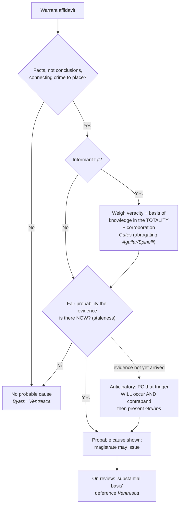
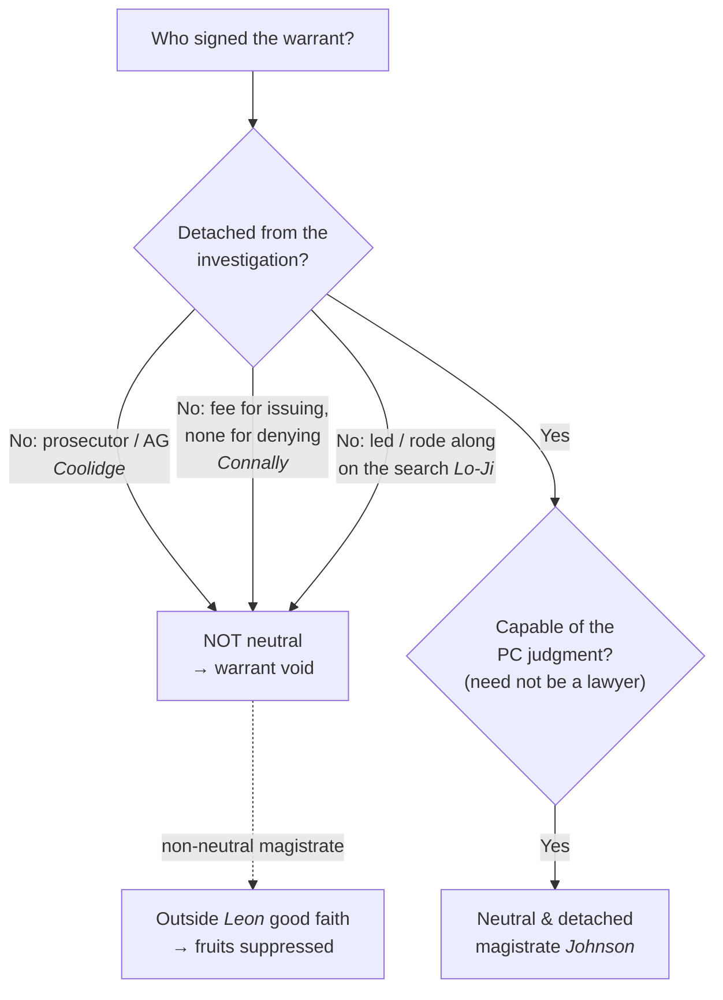

# S9 R1 panel-review — Opus model-diversity lane (prompt pack)

You are the **Claude/Opus** leg of the S9 three-lane adversarial panel (1 Claude + 2 Codex, R1). The two Codex lanes carry the A (support/quote-fidelity) and B (currency/treatment) attack lenses; **you carry model diversity and MUST vote on every paneled assertion across BOTH lenses' concerns.** You are refute-framed: try hard to break each assertion; **default to REFUTED on uncertainty**; never fabricate a cite, quote, or holding; use ONLY the evidence inlined below (no search, no outside knowledge). You are a SIGHTED reviewer — the FULL lake record (judgment fields included) is inlined.

You are a WRITER lane, not an adjudicator: you FIND and VOTE. You do not tally, adjudicate, or close any row — the orchestrator does.

For EACH group below, return one JSON object with the exact `reviewed[]` shape from the output contract (identical framing to the Codex lenses). Emit a finding object ONLY for a real defect (verdict refuted / stands-modified); a group you find wholly clean returns all-`stands` verdicts (the harness records a clean attestation). Concatenate the per-group JSON objects into a top-level `{"packs": [ ... ]}` array, one entry per group, each carrying its `group_id`.


OUTPUT CONTRACT — return ONE JSON object, nothing else:
{
  "lens": "A" | "B",
  "group_id": "<echo the group id>",
  "reviewed": [
    {
      "assertion_id": "<from group_inventory.jsonl>",
      "dimension": "existence|support|quote_fidelity|pincite|treatment|black_letter",
      "verdict": "stands" | "refuted" | "stands-modified",
      "verifiable_from_disclosed": true | false,
      "defect": null,   // null when verdict=="stands"; else an object:
      //  {"problem": "...", "severity": "high|medium|low", "proposed_fix": "...", "evidence_quote": "verbatim from disclosed evidence or null", "needs_cl": true|false, "locator_note": "..."}
      "reasons": ["short evidence-grounded reason", "..."],
      "breaks_true_positives": true | false,
      "residual_risks": ["..."],
      "suggested_tightening": "... or null"
    }
  ],
  "notes": ""
}
Rules: verdict=='stands' <=> defect==null (assertion survives your attack). verdict=='refuted' <=> a real defect (the assertion as framed is wrong). verdict=='stands-modified' <=> survives but needs a stated modification (a minor defect). Review EVERY assertion_id in group_inventory.jsonl exactly once. Output ONLY the JSON object.
---

## GROUP: content/the-warrant/getting-a-warrant/Probable Cause in the Affidavit.md  (`doctrine`, 8 assertions)

### content_page

```
---
weight: 10
aliases:
  - "Probable Cause in the Affidavit"
title: "Probable Cause in the Affidavit"
topic: Probable Cause in the Affidavit
type: doctrine
amendment: "U.S. Const. amend. IV"
jurisdiction: "Federal (U.S. Const. amend. IV); SCOTUS baseline"
status: draft
related:
  - "[[Probable Cause]]"
  - "[[The Neutral and Detached Magistrate]]"
  - "[[Particularity]]"
  - "[[Franks Challenges]]"
  - "[[Reasonable Suspicion]]"
  - "[[The Exclusionary Rule]]"
---

# Probable Cause in the Affidavit

*This page is about the **showing** a warrant affidavit must make. For the quantum of probable cause itself, see [[Probable Cause]]; for attacks on a false affidavit, see [[Franks Challenges]].*

> [!rule] Black-letter rule
> **A search warrant issues only on probable cause, and probable cause is judged on the four corners of the sworn affidavit.** The magistrate makes "a practical, common-sense decision whether, given all the circumstances set forth in the affidavit," there is a **fair probability** that evidence of a crime will be found in the place described, weighing the **veracity** and **basis of knowledge** of any informant under the **[[Common Legal Terms#totality-of-the-circumstances|totality of the circumstances]]**. *[[Illinois v. Gates#^pin-238a|Illinois v. Gates]]*, 462 U.S. 213, [238](https://www.courtlistener.com/opinion/110959/illinois-v-gates/) (1983). On review the affidavit gets a **deferential** look: a court does not decide probable cause anew but asks only whether the magistrate had a **"substantial basis"** for the finding, reading the affidavit "in a commonsense and realistic fashion," not hypertechnically. *[[United States v. Ventresca|United States v. Ventresca]]*, 380 U.S. 102, [108–09](https://www.courtlistener.com/opinion/106990/united-states-v-ventresca/) (1965).
> ^rule-pc-affidavit

## The Brief

**Field-decisive question: does my affidavit, on its own words, show a fair probability that evidence of this crime is in this place?** Probable cause for a warrant is decided by the magistrate from the sworn affidavit, so the affidavit has to carry the whole load. The governing test is *[[Illinois v. Gates|Gates]]*: "The task of the issuing magistrate is simply to make a practical, common-sense decision whether, given all the circumstances set forth in the affidavit before him, including the 'veracity' and 'basis of knowledge' of persons supplying hearsay information, there is a fair probability that contraband or evidence of a crime will be found in a particular place." *[[Illinois v. Gates#^pin-238a|Gates]]*, 462 U.S. at [238](https://www.courtlistener.com/opinion/110959/illinois-v-gates/). This is the same quantum treated at [[Probable Cause]]; the point here is that it must appear **inside the affidavit**.

**Totality replaced the rigid two-prong test.** Before 1983 an informant's tip was measured by the two independent prongs of *[[Aguilar v. Texas#^pin-114|Aguilar v. Texas]]*, 378 U.S. 108 (1964), sharpened in *[[Spinelli v. United States#^pin-415|Spinelli v. United States]]*, 393 U.S. 410 (1969): the affidavit had to show both the informant's **basis of knowledge** (how he knew) and his **veracity or reliability** (why to believe him), each satisfied on its own. *[[Illinois v. Gates|Gates]]* **abandoned** that rigid structure, keeping the two prongs as "relevant considerations in the totality-of-the-circumstances analysis," not as separate hurdles, so a strong showing on one can compensate for a weaker showing on the other, and independent **police corroboration** of an informant's predictive detail can supply what the tip lacks. *[[Illinois v. Gates|Gates]]*, 462 U.S. at [233](https://www.courtlistener.com/opinion/110959/illinois-v-gates/). Treat the *[[Aguilar v. Texas|Aguilar]]*/*[[Spinelli v. United States|Spinelli]]* prongs as the checklist of what still makes a tip persuasive, not as a test that must be passed prong-by-prong.

**Some sources carry their own credibility.** A statement **against the informant's penal interest** is itself a reason to credit him: "Admissions of crime, like admissions against proprietary interests, carry their own indicia of credibility — sufficient at least to support a finding of probable cause to search." *[[United States v. Harris (1971)|United States v. Harris]]*, 403 U.S. 573, 583 (1971). The affidavit should still lay out the underlying facts; a **bare, conclusory** affidavit that states only the affiant's belief has never been enough. *[[Byars v. United States|Byars v. United States]]*, 273 U.S. 28 (1927); see *[[United States v. Ventresca|Ventresca]]*, 380 U.S. at [108–09](https://www.courtlistener.com/opinion/106990/united-states-v-ventresca/) (a "purely conclusory" affidavit fails, while detailed circumstances plus a stated reason for crediting the source do not).

**Deference is the field's friend, so draft for the warrant.** Affidavits "must be tested and interpreted by magistrates and courts in a commonsense and realistic fashion," because "[t]hey are normally drafted by nonlawyers in the midst and haste of a criminal investigation." *[[United States v. Ventresca#^pin-109b|Ventresca]]*, 380 U.S. at [108](https://www.courtlistener.com/opinion/106990/united-states-v-ventresca/#:~:text=the%20resolution%20of%20doubtful%20or). A reviewing court gives the magistrate's finding **great deference** and asks only whether there was a "substantial basis for . . . concluding" that probable cause existed, and "the resolution of doubtful or marginal cases in this area should be largely determined by the preference to be accorded to warrants." *Id.* at 109. That preference is exactly why a warrant, imperfect as the affidavit may be, is the safer path than acting on the same facts without one.

**Anticipatory warrants: probable cause on a double finding.** A warrant may issue before the evidence has arrived, keyed to a future **triggering condition** (typically a controlled delivery that is accepted and taken inside). It is valid so long as the magistrate finds it presently probable **both** that the triggering condition will occur **and** that, once it does, contraband will be at the place to be searched. "Anticipatory warrants are . . . no different in principle from ordinary warrants. They require the magistrate to determine (1) that it is *now probable* that (2) contraband, evidence of a crime, or a fugitive *will be* on the described premises (3) when the warrant is executed." *[[United States v. Grubbs#^pin-96|United States v. Grubbs]]*, 547 U.S. 90, [96](https://www.courtlistener.com/opinion/145670/united-states-v-grubbs/) (2006). The triggering condition is part of the probable-cause showing in the affidavit; it "need [not] be set forth in the warrant itself." *Id.* at 99.

**Staleness: probable cause is a snapshot that decays.** The affidavit must show that the evidence is **probably there now**, not that it was there once. Information grows stale with time, but there is no fixed clock: staleness turns on the nature of the crime, the item sought, and whether the activity is ongoing. Continuing conduct such as an ongoing drug operation or a collection of images stays fresh far longer than a single, disposable transaction. State the dates in the affidavit and tie them to a present probability.

**Burden and standard of review.** A warrant carries a **presumption of validity**, and the challenger bears the burden of overcoming it. On appeal the magistrate's probable-cause finding gets the deferential **"substantial basis"** look (*[[Illinois v. Gates|Gates]]*); historical facts are reviewed for [[Common Legal Terms#clear-error|clear error]] and the ultimate legal questions [[Common Legal Terms#de-novo|de novo]]. Because a warrant application is judged on what the affidavit says, evidence outside its four corners generally cannot prop up a thin affidavit after the fact.

**Apply it.** Building or reading a warrant affidavit:

1. **Name the crime and the place**, and state facts, not conclusions, connecting the two.
2. **For each informant**, put both prongs on the page: how he knows (basis of knowledge) and why to believe him (veracity, whether from a track record, a statement against penal interest, or corroboration).
3. **Corroborate** the tip's predictive detail with independent police work, and say so.
4. **Date everything**, and tie the facts to a present probability that the evidence is there **now**.
5. **If the evidence has not arrived yet**, draft it as an anticipatory warrant: state the triggering condition and the facts making both its occurrence and the resulting presence of contraband presently probable.

**Common pitfalls.**

- **Writing a conclusory affidavit.** "I have probable cause to believe" is not probable cause; the magistrate needs the underlying facts (*[[Byars v. United States|Byars]]*; *[[United States v. Ventresca|Ventresca]]*).
- **Treating the *[[Aguilar v. Texas|Aguilar]]*/*[[Spinelli v. United States|Spinelli]]* prongs as a pass/fail gate.** After *[[Illinois v. Gates|Gates]]* they are weighed in the totality; a shortfall on one can be made up by the other or by corroboration.
- **Letting the information go stale.** Old facts do not show present probability; date the affidavit and match the staleness window to the crime.
- **Assuming an anticipatory warrant is suspect.** It is valid on the *[[United States v. Grubbs|Grubbs]]* double finding; the triggering condition belongs in the affidavit, and need not appear on the warrant's face.

## Key cases

| Case | Holding | Opinion |
|---|---|---|
| *[[United States v. Ventresca]]*, 380 U.S. 102 (1965) | **Deferential review.** Affidavits are read commonsensically, not hypertechnically; the magistrate's finding gets "substantial basis" deference, and doubtful cases favor the warrant. | [opinion](https://www.courtlistener.com/opinion/106990/united-states-v-ventresca/) |
| *[[United States v. Grubbs]]*, 547 U.S. 90 (2006) | **Anticipatory warrants.** Valid where the magistrate finds it presently probable both that the triggering condition will occur and that contraband will then be present; the condition need not be on the warrant's face. | [opinion](https://www.courtlistener.com/opinion/145670/united-states-v-grubbs/) |

## Related cases across doctrines

These cases are treated in full on other pages but supply the affidavit's probable-cause showing, framed here for it.

| Case | Relevance here | Primary home | Opinion |
|---|---|---|---|
| *[[Illinois v. Gates]]*, 462 U.S. 213 (1983) | ***The test.*** Probable cause is a "fair probability" judged on the totality of the affidavit, weighing an informant's veracity and basis of knowledge; corroboration can cure a weak tip. | [[Probable Cause]] | [opinion](https://www.courtlistener.com/opinion/110959/illinois-v-gates/) |
| *[[Aguilar v. Texas]]*, 378 U.S. 108 (1964) | ***Two-prong origin.*** An informant affidavit had to show basis of knowledge and veracity; the rigid version was abrogated by *[[Illinois v. Gates\|Gates]]*, but the prongs survive as totality factors. | [[Probable Cause]] | [opinion](https://www.courtlistener.com/opinion/106865/aguilar-v-texas/) |
| *[[Spinelli v. United States]]*, 393 U.S. 410 (1969) | ***Two-prong refinement.*** Sharpened *[[Aguilar v. Texas\|Aguilar]]* on how corroboration counts; the historical backbone of the affidavit inquiry, abrogated by *[[Illinois v. Gates\|Gates]]*. | [[Probable Cause]] | [opinion](https://www.courtlistener.com/opinion/107831/spinelli-v-united-states/) |
| *[[United States v. Harris (1971)]]*, 403 U.S. 573 (1971) | ***Self-verifying tip.*** A statement against the informant's penal interest carries its own indicia of credibility supporting probable cause. | [[Probable Cause]] | [opinion](https://www.courtlistener.com/opinion/108379/united-states-v-harris/) |
| *[[Byars v. United States]]*, 273 U.S. 28 (1927) | ***Bare affidavit.*** A conclusory affidavit stating only the affiant's belief cannot support a warrant; the underlying facts must appear. | [[The Exclusionary Rule]] | [opinion](https://www.courtlistener.com/opinion/100980/byars-v-united-states/) |

## Visual



## Sources

- [*Illinois v. Gates*, 462 U.S. 213 (1983)](https://www.courtlistener.com/opinion/110959/illinois-v-gates/) (pinpoints: 233, 238)
- [*United States v. Ventresca*, 380 U.S. 102 (1965)](https://www.courtlistener.com/opinion/106990/united-states-v-ventresca/) (pinpoints: 106, 108, 109)
- [*United States v. Grubbs*, 547 U.S. 90 (2006)](https://www.courtlistener.com/opinion/145670/united-states-v-grubbs/) (pinpoints: 96, 99)
- [*Aguilar v. Texas*, 378 U.S. 108 (1964)](https://www.courtlistener.com/opinion/106865/aguilar-v-texas/) (pinpoint: 114)
- [*Spinelli v. United States*, 393 U.S. 410 (1969)](https://www.courtlistener.com/opinion/107831/spinelli-v-united-states/) (pinpoints: 415, 418)
- [*United States v. Harris*, 403 U.S. 573 (1971)](https://www.courtlistener.com/opinion/108379/united-states-v-harris/) (pinpoint: 583)
- [*Byars v. United States*, 273 U.S. 28 (1927)](https://www.courtlistener.com/opinion/100980/byars-v-united-states/) (pinpoint: 29)

```

### group_inventory (assertions under review)

```jsonl
{"assertion_id": "1d81018c5fd6c955", "dimension": "existence", "kind": "case_cite", "locator": {"case": "Illinois v. Gates", "table_line": 54}, "payload": {"case": "Illinois v. Gates", "cells": ["*[[Illinois v. Gates]]*, 462 U.S. 213 (1983)", "***The test.*** Probable cause is a \"fair probability\" judged on the totality of the affidavit, weighing an informant's veracity and basis of knowledge; corroboration can cure a weak tip.", "[[Probable Cause]]", "[opinion](https://www.courtlistener.com/opinion/110959/illinois-v-gates/)"], "header": ["Case", "Relevance here", "Primary home", "Opinion"]}}
{"assertion_id": "25b27b24fc6d4ee0", "dimension": "existence", "kind": "case_cite", "locator": {"case": "United States v. Grubbs", "table_line": 46}, "payload": {"case": "United States v. Grubbs", "cells": ["*[[United States v. Grubbs]]*, 547 U.S. 90 (2006)", "**Anticipatory warrants.** Valid where the magistrate finds it presently probable both that the triggering condition will occur and that contraband will then be present; the condition need not be on the warrant's face.", "[opinion](https://www.courtlistener.com/opinion/145670/united-states-v-grubbs/)"], "header": ["Case", "Holding", "Opinion"]}}
{"assertion_id": "2b01147bdcf5843e", "dimension": "existence", "kind": "case_cite", "locator": {"case": "Spinelli v. United States", "table_line": 56}, "payload": {"case": "Spinelli v. United States", "cells": ["*[[Spinelli v. United States]]*, 393 U.S. 410 (1969)", "***Two-prong refinement.*** Sharpened *[[Aguilar v. Texas\\|Aguilar]]* on how corroboration counts; the historical backbone of the affidavit inquiry, abrogated by *[[Illinois v. Gates\\|Gates]]*.", "[[Probable Cause]]", "[opinion](https://www.courtlistener.com/opinion/107831/spinelli-v-united-states/)"], "header": ["Case", "Relevance here", "Primary home", "Opinion"]}}
{"assertion_id": "43ba30577fb0858a", "dimension": "existence", "kind": "case_cite", "locator": {"case": "United States v. Harris (1971)", "table_line": 57}, "payload": {"case": "United States v. Harris (1971)", "cells": ["*[[United States v. Harris (1971)]]*, 403 U.S. 573 (1971)", "***Self-verifying tip.*** A statement against the informant's penal interest carries its own indicia of credibility supporting probable cause.", "[[Probable Cause]]", "[opinion](https://www.courtlistener.com/opinion/108379/united-states-v-harris/)"], "header": ["Case", "Relevance here", "Primary home", "Opinion"]}}
{"assertion_id": "70680562633199c7", "dimension": "existence", "kind": "case_cite", "locator": {"case": "Byars v. United States", "table_line": 58}, "payload": {"case": "Byars v. United States", "cells": ["*[[Byars v. United States]]*, 273 U.S. 28 (1927)", "***Bare affidavit.*** A conclusory affidavit stating only the affiant's belief cannot support a warrant; the underlying facts must appear.", "[[The Exclusionary Rule]]", "[opinion](https://www.courtlistener.com/opinion/100980/byars-v-united-states/)"], "header": ["Case", "Relevance here", "Primary home", "Opinion"]}}
{"assertion_id": "c1e6574cc5889d65", "dimension": "existence", "kind": "case_cite", "locator": {"case": "Aguilar v. Texas", "table_line": 55}, "payload": {"case": "Aguilar v. Texas", "cells": ["*[[Aguilar v. Texas]]*, 378 U.S. 108 (1964)", "***Two-prong origin.*** An informant affidavit had to show basis of knowledge and veracity; the rigid version was abrogated by *[[Illinois v. Gates\\|Gates]]*, but the prongs survive as totality factors.", "[[Probable Cause]]", "[opinion](https://www.courtlistener.com/opinion/106865/aguilar-v-texas/)"], "header": ["Case", "Relevance here", "Primary home", "Opinion"]}}
{"assertion_id": "d0bdcec969839f59", "dimension": "existence", "kind": "case_cite", "locator": {"case": "United States v. Ventresca", "table_line": 45}, "payload": {"case": "United States v. Ventresca", "cells": ["*[[United States v. Ventresca]]*, 380 U.S. 102 (1965)", "**Deferential review.** Affidavits are read commonsensically, not hypertechnically; the magistrate's finding gets \"substantial basis\" deference, and doubtful cases favor the warrant.", "[opinion](https://www.courtlistener.com/opinion/106990/united-states-v-ventresca/)"], "header": ["Case", "Holding", "Opinion"]}}
{"assertion_id": "159afac90d7a9616", "dimension": "support", "kind": "proposition", "locator": {"callout": "^rule-pc-affidavit"}, "payload": {"anchor": "^rule-pc-affidavit", "statement": "[!rule] Black-letter rule\n**A search warrant issues only on probable cause, and probable cause is judged on the four corners of the sworn affidavit.** The magistrate makes \"a practical, common-sense decision whether, given all the circumstances set forth in the affidavit,\" there is a **fair probability** that evidence of a crime will be found in the place described, weighing the **veracity** and **basis of knowledge** of any informant under the **[[Common Legal Terms#totality-of-the-circumstances|totality of the circumstances]]**. *[[Illinois v. Gates#^pin-238a|Illinois v. Gates]]*, 462 U.S. 213, [238](https://www.courtlistener.com/opinion/110959/illinois-v-gates/) (1983). On review the affidavit gets a **deferential** look: a court does not decide probable cause anew but asks only whether the magistrate had a **\"substantial basis\"** for the finding, reading the affidavit \"in a commonsense and realistic fashion,\" not hypertechnically. *[[United States v. Ventresca|United States v. Ventresca]]*, 380 U.S. 102, [108–09](https://www.courtlistener.com/opinion/106990/united-states-v-ventresca/) (1965)."}}
```

### lake record — Aguilar v. Texas

```json
{
  "schema_version": "s2.v1",
  "record_id": "Aguilar v. Texas",
  "stub": false,
  "status": "verified",
  "identity": {
    "case_name": "Aguilar v. Texas",
    "case_name_short": "Aguilar",
    "case_name_full": "Aguilar v. Texas",
    "input_case_name": "Aguilar v. Texas",
    "court": "U.S. Supreme Court",
    "court_id": "scotus",
    "court_level": "scotus",
    "circuit": null,
    "state": null,
    "date_decided": "1964-06-15",
    "year": 1964,
    "docket": null,
    "cluster_id": 106865,
    "lead_opinion_id": 106865,
    "sibling_ids": [
      106865,
      9422845,
      9422846,
      9422847
    ],
    "absolute_url": "/opinion/106865/aguilar-v-texas/",
    "identity_method": "citation+party-text",
    "expected_citation_found": true,
    "party_name_in_text": true,
    "canonical_name_match": true,
    "alternates": [],
    "reason_code": null
  },
  "citations": {
    "official": {
      "cite": "378 U.S. 108",
      "volume": "378",
      "reporter": "U.S.",
      "page": "108",
      "type": 1,
      "selected_official": true,
      "source": "cluster.citations[]"
    },
    "parallel": [
      {
        "cite": "84 S. Ct. 1509",
        "volume": "84",
        "reporter": "S. Ct.",
        "page": "1509",
        "type": 1,
        "selected_official": false,
        "source": "cluster.citations[]"
      },
      {
        "cite": "12 L. Ed. 2d 723",
        "volume": "12",
        "reporter": "L. Ed. 2d",
        "page": "723",
        "type": 1,
        "selected_official": false,
        "source": "cluster.citations[]"
      }
    ],
    "vendor_neutral": [
      {
        "cite": "1964 U.S. LEXIS 994",
        "volume": "1964",
        "reporter": "U.S. LEXIS",
        "page": "994",
        "type": 6,
        "selected_official": false,
        "source": "cluster.citations[]"
      }
    ],
    "all": [
      {
        "cite": "378 U.S. 108",
        "volume": "378",
        "reporter": "U.S.",
        "page": "108",
        "type": 1,
        "selected_official": false,
        "source": "cluster.citations[]"
      },
      {
        "cite": "84 S. Ct. 1509",
        "volume": "84",
        "reporter": "S. Ct.",
        "page": "1509",
        "type": 1,
        "selected_official": false,
        "source": "cluster.citations[]"
      },
      {
        "cite": "12 L. Ed. 2d 723",
        "volume": "12",
        "reporter": "L. Ed. 2d",
        "page": "723",
        "type": 1,
        "selected_official": false,
        "source": "cluster.citations[]"
      },
      {
        "cite": "1964 U.S. LEXIS 994",
        "volume": "1964",
        "reporter": "U.S. LEXIS",
        "page": "994",
        "type": 6,
        "selected_official": false,
        "source": "cluster.citations[]"
      }
    ],
    "display": "378 U.S. 108",
    "official_selection": {
      "court_class": "scotus",
      "selected": "378 U.S. 108",
      "reason": "selected_rank_1"
    }
  },
  "pinpoints": [
    {
      "id": "pin-114",
      "page": null,
      "quote": "that narcotics were being kept at the premises. The affidavit gave no underlying facts \u2014 neither how the informant knew nor why he was believed. The warrant issued and evidence was seized and used to convict. ## Issue Whether an affidavit resting solely on an informant's tip \u2014 stated as a conclusion, without underlying facts showing the informant's basis of knowledge or his credibility \u2014 can support a magistrate's finding of probable cause. ## Rule No. An affidavit may rest on hearsay, but the magistrate must be given the underlying facts behind both the informant's knowledge and his reliability. The",
      "star_marker": null,
      "quote_fidelity": "mismatch",
      "pinpoint_status": "slip-only",
      "position": null
    },
    {
      "id": "pin-115",
      "page": null,
      "quote": "by a neutral and detached magistrate,",
      "star_marker": "115",
      "quote_fidelity": "matched",
      "pinpoint_status": "star-verified",
      "position": 13622,
      "fragment": "#:~:text=by%20a%20neutral%20and%20detached%20magistrate%2C",
      "fragment_validated_at": "2026-07-09T15:40:45Z"
    }
  ],
  "treatment": {
    "field_i_validity": "superseded",
    "as_of_content": "1964-06-15",
    "as_of_treatment": "2026-06-30",
    "composite_basis": "migration-seed",
    "composite_basis_ref": "Aguilar v. Texas",
    "varies_by_point": false,
    "scope_note": "Two-prong Aguilar-Spinelli test for informant tips abandoned for a totality-of-the-circumstances approach by Illinois v. Gates (1983).",
    "point_overrides": [],
    "edges": [
      {
        "citing_case": {
          "name": "Illinois v. Gates",
          "cluster_id": 110959,
          "cite": "462 U.S. 213",
          "field_ii": "abrogated"
        },
        "field_ii": "abrogated",
        "field_iii": "mentioned",
        "point": null,
        "proposed": true,
        "journal_ref": "migration:abrogated"
      },
      {
        "citing_case": {
          "name": "In re Grijalva; Judith del Cuadro-Zimmerman",
          "cluster_id": 10847130,
          "cite": null,
          "field_ii": "questioned"
        },
        "field_ii": "questioned",
        "field_iii": "mentioned",
        "point": null,
        "proposed": true,
        "journal_ref": "Aguilar v. Texas:lane1_negative"
      },
      {
        "citing_case": {
          "name": "State v. Mercer",
          "cluster_id": 10803481,
          "cite": null,
          "field_ii": "abrogated"
        },
        "field_ii": "abrogated",
        "field_iii": "mentioned",
        "point": null,
        "proposed": true,
        "journal_ref": "Aguilar v. Texas:lane1_negative"
      },
      {
        "citing_case": {
          "name": "People v. Leighton R.",
          "cluster_id": 10742062,
          "cite": [
            "2025 NY Slip Op 06534"
          ],
          "field_ii": "overruled"
        },
        "field_ii": "overruled",
        "field_iii": "mentioned",
        "point": null,
        "proposed": true,
        "journal_ref": "Aguilar v. Texas:lane1_negative"
      },
      {
        "citing_case": {
          "name": "Commonwealth v. Luis Morales",
          "cluster_id": 10734924,
          "cite": null,
          "field_ii": "superseded_by_statute"
        },
        "field_ii": "superseded_by_statute",
        "field_iii": "mentioned",
        "point": null,
        "proposed": true,
        "journal_ref": "Aguilar v. Texas:lane1_negative"
      },
      {
        "citing_case": {
          "name": "FRASER, MARIAN v. the State of Texas",
          "cluster_id": 10667479,
          "cite": null,
          "field_ii": "questioned"
        },
        "field_ii": "questioned",
        "field_iii": "mentioned",
        "point": null,
        "proposed": true,
        "journal_ref": "Aguilar v. Texas:lane1_negative"
      },
      {
        "citing_case": {
          "name": "United States v. Wilson",
          "cluster_id": 10664712,
          "cite": null,
          "field_ii": "questioned"
        },
        "field_ii": "questioned",
        "field_iii": "mentioned",
        "point": null,
        "proposed": true,
        "journal_ref": "Aguilar v. Texas:lane1_negative"
      },
      {
        "citing_case": {
          "name": "United States v. Silva",
          "cluster_id": 10640306,
          "cite": null,
          "field_ii": "abrogated"
        },
        "field_ii": "abrogated",
        "field_iii": "mentioned",
        "point": null,
        "proposed": true,
        "journal_ref": "Aguilar v. Texas:lane1_negative"
      },
      {
        "citing_case": {
          "name": "State of Tennessee v. Brandon Tylor Mulac",
          "cluster_id": 10633329,
          "cite": null,
          "field_ii": "overruled"
        },
        "field_ii": "overruled",
        "field_iii": "mentioned",
        "point": null,
        "proposed": true,
        "journal_ref": "Aguilar v. Texas:lane1_negative"
      },
      {
        "citing_case": {
          "name": "People v. Hill",
          "cluster_id": 10582111,
          "cite": [
            "2025 NY Slip Op 25109"
          ],
          "field_ii": "abrogated"
        },
        "field_ii": "abrogated",
        "field_iii": "mentioned",
        "point": null,
        "proposed": true,
        "journal_ref": "Aguilar v. Texas:lane1_negative"
      },
      {
        "citing_case": {
          "name": "Ball v. New York State Dept. of Health",
          "cluster_id": 10379926,
          "cite": [
            "2025 NY Slip Op 25090"
          ],
          "field_ii": "abrogated"
        },
        "field_ii": "abrogated",
        "field_iii": "mentioned",
        "point": null,
        "proposed": true,
        "journal_ref": "Aguilar v. Texas:lane1_negative"
      },
      {
        "citing_case": {
          "name": "State v. Shannon",
          "cluster_id": 10373759,
          "cite": [
            "2025 Ohio 1224"
          ],
          "field_ii": "overruled"
        },
        "field_ii": "overruled",
        "field_iii": "mentioned",
        "point": null,
        "proposed": true,
        "journal_ref": "Aguilar v. Texas:lane1_negative"
      },
      {
        "citing_case": {
          "name": "State of Washington, V. Tommy Darren Tyson",
          "cluster_id": 10339068,
          "cite": [
            "564 P.3d 248"
          ],
          "field_ii": "abrogated"
        },
        "field_ii": "abrogated",
        "field_iii": "mentioned",
        "point": null,
        "proposed": true,
        "journal_ref": "Aguilar v. Texas:lane1_negative"
      },
      {
        "citing_case": {
          "name": "COMMONWEALTH v. S. CHRISTOPHER M. BOYER / COMMONWEALTH v. S. ROMUALD BERNAUD",
          "cluster_id": 10642653,
          "cite": null,
          "field_ii": "overruled"
        },
        "field_ii": "overruled",
        "field_iii": "mentioned",
        "point": null,
        "proposed": true,
        "journal_ref": "Aguilar v. Texas:lane1_negative"
      },
      {
        "citing_case": {
          "name": "United States v. Antwone Miguel Sanders",
          "cluster_id": 9986839,
          "cite": [
            "106 F.4th 455"
          ],
          "field_ii": "abrogated"
        },
        "field_ii": "abrogated",
        "field_iii": "mentioned",
        "point": null,
        "proposed": true,
        "journal_ref": "Aguilar v. Texas:lane1_negative"
      },
      {
        "citing_case": {
          "name": "Todd Michael Glover v. the State of Texas",
          "cluster_id": 9509712,
          "cite": null,
          "field_ii": "overruled"
        },
        "field_ii": "overruled",
        "field_iii": "mentioned",
        "point": null,
        "proposed": true,
        "journal_ref": "Aguilar v. Texas:lane1_negative"
      },
      {
        "citing_case": {
          "name": "Todd Michael Glover v. the State of Texas",
          "cluster_id": 9509711,
          "cite": null,
          "field_ii": "questioned"
        },
        "field_ii": "questioned",
        "field_iii": "mentioned",
        "point": null,
        "proposed": true,
        "journal_ref": "Aguilar v. Texas:lane1_negative"
      },
      {
        "citing_case": {
          "name": "State of Tennessee v. Willie Locust",
          "cluster_id": 9455816,
          "cite": null,
          "field_ii": "overruled"
        },
        "field_ii": "overruled",
        "field_iii": "mentioned",
        "point": null,
        "proposed": true,
        "journal_ref": "Aguilar v. Texas:lane1_negative"
      },
      {
        "citing_case": {
          "name": "State v. Smith",
          "cluster_id": 9452598,
          "cite": [
            "2023 Ohio 4565"
          ],
          "field_ii": "overruled"
        },
        "field_ii": "overruled",
        "field_iii": "mentioned",
        "point": null,
        "proposed": true,
        "journal_ref": "Aguilar v. Texas:lane1_negative"
      },
      {
        "citing_case": {
          "name": "State v. Williams",
          "cluster_id": 9448572,
          "cite": [
            "2023 Ohio 4344"
          ],
          "field_ii": "questioned"
        },
        "field_ii": "questioned",
        "field_iii": "mentioned",
        "point": null,
        "proposed": true,
        "journal_ref": "Aguilar v. Texas:lane1_negative"
      },
      {
        "citing_case": {
          "name": "State of Louisiana v. Roosevelt Randolph",
          "cluster_id": 10612306,
          "cite": null,
          "field_ii": "questioned"
        },
        "field_ii": "questioned",
        "field_iii": "mentioned",
        "point": null,
        "proposed": true,
        "journal_ref": "Aguilar v. Texas:lane1_negative"
      },
      {
        "citing_case": {
          "name": "State v. Grace",
          "cluster_id": 9433421,
          "cite": [
            "2023 Ohio 3781"
          ],
          "field_ii": "overruled"
        },
        "field_ii": "overruled",
        "field_iii": "mentioned",
        "point": null,
        "proposed": true,
        "journal_ref": "Aguilar v. Texas:lane1_negative"
      },
      {
        "citing_case": {
          "name": "United States v. Edward Leonidas Lewis",
          "cluster_id": 9424185,
          "cite": null,
          "field_ii": "questioned"
        },
        "field_ii": "questioned",
        "field_iii": "mentioned",
        "point": null,
        "proposed": true,
        "journal_ref": "Aguilar v. Texas:lane1_negative"
      },
      {
        "citing_case": {
          "name": "People v. Joyette",
          "cluster_id": 9419192,
          "cite": [
            "219 A.D.3d 628",
            "194 N.Y.S.3d 287",
            "2023 NY Slip Op 04216"
          ],
          "field_ii": "questioned"
        },
        "field_ii": "questioned",
        "field_iii": "mentioned",
        "point": null,
        "proposed": true,
        "journal_ref": "Aguilar v. Texas:lane1_negative"
      },
      {
        "citing_case": {
          "name": "State of Arizona v. Tito Rene Scott",
          "cluster_id": 9403530,
          "cite": [
            "530 P.3d 1178",
            "97 Arizona Cases Digest 31"
          ],
          "field_ii": "abrogated"
        },
        "field_ii": "abrogated",
        "field_iii": "mentioned",
        "point": null,
        "proposed": true,
        "journal_ref": "Aguilar v. Texas:lane1_negative"
      },
      {
        "citing_case": {
          "name": "Robert Donald Ehrhardt III v. State of Mississippi",
          "cluster_id": 10628852,
          "cite": null,
          "field_ii": "overruled"
        },
        "field_ii": "overruled",
        "field_iii": "mentioned",
        "point": null,
        "proposed": true,
        "journal_ref": "Aguilar v. Texas:lane1_negative"
      },
      {
        "citing_case": {
          "name": "Commonwealth v. Michael Figueroa",
          "cluster_id": 10642568,
          "cite": null,
          "field_ii": "questioned"
        },
        "field_ii": "questioned",
        "field_iii": "mentioned",
        "point": null,
        "proposed": true,
        "journal_ref": "Aguilar v. Texas:lane1_negative"
      },
      {
        "citing_case": {
          "name": "Commonwealth v. Guardado",
          "cluster_id": 9391153,
          "cite": null,
          "field_ii": "overruled"
        },
        "field_ii": "overruled",
        "field_iii": "mentioned",
        "point": null,
        "proposed": true,
        "journal_ref": "Aguilar v. Texas:lane1_negative"
      },
      {
        "citing_case": {
          "name": "State v. Collins",
          "cluster_id": 9381212,
          "cite": [
            "2023 Ohio 646"
          ],
          "field_ii": "overruled"
        },
        "field_ii": "overruled",
        "field_iii": "mentioned",
        "point": null,
        "proposed": true,
        "journal_ref": "Aguilar v. Texas:lane1_negative"
      },
      {
        "citing_case": {
          "name": "State v. Schubert",
          "cluster_id": 9354069,
          "cite": [
            "219 N.E.3d 916",
            "171 Ohio St. 3d 617",
            "2022 Ohio 4604"
          ],
          "field_ii": "overruled"
        },
        "field_ii": "overruled",
        "field_iii": "mentioned",
        "point": null,
        "proposed": true,
        "journal_ref": "Aguilar v. Texas:lane1_negative"
      },
      {
        "citing_case": {
          "name": "State v. Lucas",
          "cluster_id": 9353082,
          "cite": null,
          "field_ii": "overruled"
        },
        "field_ii": "overruled",
        "field_iii": "mentioned",
        "point": null,
        "proposed": true,
        "journal_ref": "Aguilar v. Texas:lane1_negative"
      },
      {
        "citing_case": {
          "name": "State v. Lucas",
          "cluster_id": 8509871,
          "cite": null,
          "field_ii": "overruled"
        },
        "field_ii": "overruled",
        "field_iii": "mentioned",
        "point": null,
        "proposed": true,
        "journal_ref": "Aguilar v. Texas:lane1_negative"
      },
      {
        "citing_case": {
          "name": "State v. Lucas",
          "cluster_id": 8436709,
          "cite": null,
          "field_ii": "overruled"
        },
        "field_ii": "overruled",
        "field_iii": "mentioned",
        "point": null,
        "proposed": true,
        "journal_ref": "Aguilar v. Texas:lane1_negative"
      },
      {
        "citing_case": {
          "name": "COMMONWEALTH v. PIERRE A. SERTYL.",
          "cluster_id": 10271855,
          "cite": [
            "101 Mass. App. Ct. 836"
          ],
          "field_ii": "questioned"
        },
        "field_ii": "questioned",
        "field_iii": "mentioned",
        "point": null,
        "proposed": true,
        "journal_ref": "Aguilar v. Texas:lane1_negative"
      },
      {
        "citing_case": {
          "name": "United States v. Morton",
          "cluster_id": 7859188,
          "cite": null,
          "field_ii": "overruled"
        },
        "field_ii": "overruled",
        "field_iii": "mentioned",
        "point": null,
        "proposed": true,
        "journal_ref": "Aguilar v. Texas:lane1_negative"
      },
      {
        "citing_case": {
          "name": "COMMONWEALTH v. BRITTANY WESTGATE.",
          "cluster_id": 10271879,
          "cite": [
            "101 Mass. App. Ct. 548"
          ],
          "field_ii": "questioned"
        },
        "field_ii": "questioned",
        "field_iii": "mentioned",
        "point": null,
        "proposed": true,
        "journal_ref": "Aguilar v. Texas:lane1_negative"
      },
      {
        "citing_case": {
          "name": "Baldwin, John Wesley",
          "cluster_id": 6468832,
          "cite": null,
          "field_ii": "superseded_by_statute"
        },
        "field_ii": "superseded_by_statute",
        "field_iii": "mentioned",
        "point": null,
        "proposed": true,
        "journal_ref": "Aguilar v. Texas:lane1_negative"
      },
      {
        "citing_case": {
          "name": "COMMONWEALTH v. CRISTOBAL RODRIGUEZ.",
          "cluster_id": 10271920,
          "cite": [
            "101 Mass. App. Ct. 54"
          ],
          "field_ii": "questioned"
        },
        "field_ii": "questioned",
        "field_iii": "mentioned",
        "point": null,
        "proposed": true,
        "journal_ref": "Aguilar v. Texas:lane1_negative"
      },
      {
        "citing_case": {
          "name": "People v. Robinson",
          "cluster_id": 6465711,
          "cite": [
            "167 N.Y.S.3d 542",
            "205 A.D.3d 737",
            "2022 NY Slip Op 03010"
          ],
          "field_ii": "questioned"
        },
        "field_ii": "questioned",
        "field_iii": "mentioned",
        "point": null,
        "proposed": true,
        "journal_ref": "Aguilar v. Texas:lane1_negative"
      },
      {
        "citing_case": {
          "name": "State of Iowa v. Patrick Bracy",
          "cluster_id": 6452507,
          "cite": null,
          "field_ii": "overruled"
        },
        "field_ii": "overruled",
        "field_iii": "mentioned",
        "point": null,
        "proposed": true,
        "journal_ref": "Aguilar v. Texas:lane1_negative"
      },
      {
        "citing_case": {
          "name": "United States v. Jumaev",
          "cluster_id": 5305647,
          "cite": null,
          "field_ii": "superseded_by_statute"
        },
        "field_ii": "superseded_by_statute",
        "field_iii": "mentioned",
        "point": null,
        "proposed": true,
        "journal_ref": "Aguilar v. Texas:lane1_negative"
      },
      {
        "citing_case": {
          "name": "United States v. Jumaev",
          "cluster_id": 5304277,
          "cite": [
            "20 F.4th 518"
          ],
          "field_ii": "superseded_by_statute"
        },
        "field_ii": "superseded_by_statute",
        "field_iii": "mentioned",
        "point": null,
        "proposed": true,
        "journal_ref": "Aguilar v. Texas:lane1_negative"
      },
      {
        "citing_case": {
          "name": "State v. Siegel",
          "cluster_id": 5302012,
          "cite": [
            "180 N.E.3d 574",
            "2021 Ohio 4208"
          ],
          "field_ii": "questioned"
        },
        "field_ii": "questioned",
        "field_iii": "mentioned",
        "point": null,
        "proposed": true,
        "journal_ref": "Aguilar v. Texas:lane1_negative"
      },
      {
        "citing_case": {
          "name": "People v. Mortel",
          "cluster_id": 4901591,
          "cite": [
            "152 N.Y.S.3d 68",
            "197 A.D.3d 196",
            "2021 NY Slip Op 04498"
          ],
          "field_ii": "criticized"
        },
        "field_ii": "criticized",
        "field_iii": "mentioned",
        "point": null,
        "proposed": true,
        "journal_ref": "Aguilar v. Texas:lane1_negative"
      },
      {
        "citing_case": {
          "name": "United States v. Maximo Gondres-Medrano",
          "cluster_id": 4898417,
          "cite": [
            "3 F.4th 708"
          ],
          "field_ii": "abrogated"
        },
        "field_ii": "abrogated",
        "field_iii": "mentioned",
        "point": null,
        "proposed": true,
        "journal_ref": "Aguilar v. Texas:lane1_negative"
      },
      {
        "citing_case": {
          "name": "State v. Siler",
          "cluster_id": 4879520,
          "cite": null,
          "field_ii": "overruled"
        },
        "field_ii": "overruled",
        "field_iii": "mentioned",
        "point": null,
        "proposed": true,
        "journal_ref": "Aguilar v. Texas:lane1_negative"
      },
      {
        "citing_case": {
          "name": "State v. Siler",
          "cluster_id": 4877161,
          "cite": null,
          "field_ii": "overruled"
        },
        "field_ii": "overruled",
        "field_iii": "mentioned",
        "point": null,
        "proposed": true,
        "journal_ref": "Aguilar v. Texas:lane1_negative"
      },
      {
        "citing_case": {
          "name": "People of Michigan v. Victoria Catherine Pagano",
          "cluster_id": 6248596,
          "cite": null,
          "field_ii": "overruled"
        },
        "field_ii": "overruled",
        "field_iii": "mentioned",
        "point": null,
        "proposed": true,
        "journal_ref": "Aguilar v. Texas:lane1_negative"
      },
      {
        "citing_case": {
          "name": "People of Michigan v. Victoria Catherine Pagano",
          "cluster_id": 4876573,
          "cite": null,
          "field_ii": "overruled"
        },
        "field_ii": "overruled",
        "field_iii": "mentioned",
        "point": null,
        "proposed": true,
        "journal_ref": "Aguilar v. Texas:lane1_negative"
      },
      {
        "citing_case": {
          "name": "State v. Salvas",
          "cluster_id": 4869523,
          "cite": [
            "149 Haw. 152",
            "483 P.3d 312"
          ],
          "field_ii": "abrogated"
        },
        "field_ii": "abrogated",
        "field_iii": "mentioned",
        "point": null,
        "proposed": true,
        "journal_ref": "Aguilar v. Texas:lane1_negative"
      },
      {
        "citing_case": {
          "name": "People v. Mayhew",
          "cluster_id": 4867625,
          "cite": [
            "145 N.Y.S.3d 202",
            "192 A.D.3d 1391",
            "2021 NY Slip Op 01807"
          ],
          "field_ii": "questioned"
        },
        "field_ii": "questioned",
        "field_iii": "mentioned",
        "point": null,
        "proposed": true,
        "journal_ref": "Aguilar v. Texas:lane1_negative"
      },
      {
        "citing_case": {
          "name": "Richard Dale Griffin v. State",
          "cluster_id": 4843483,
          "cite": null,
          "field_ii": "overruled"
        },
        "field_ii": "overruled",
        "field_iii": "mentioned",
        "point": null,
        "proposed": true,
        "journal_ref": "Aguilar v. Texas:lane1_negative"
      },
      {
        "citing_case": {
          "name": "United States v. Samer Abdalla",
          "cluster_id": 4780505,
          "cite": [
            "972 F.3d 838"
          ],
          "field_ii": "abrogated"
        },
        "field_ii": "abrogated",
        "field_iii": "mentioned",
        "point": null,
        "proposed": true,
        "journal_ref": "Aguilar v. Texas:lane1_negative"
      },
      {
        "citing_case": {
          "name": "People v. Nettles",
          "cluster_id": 4778561,
          "cite": [
            "186 A.D.3d 861",
            "128 N.Y.S.3d 610",
            "2020 NY Slip Op 04776"
          ],
          "field_ii": "questioned"
        },
        "field_ii": "questioned",
        "field_iii": "mentioned",
        "point": null,
        "proposed": true,
        "journal_ref": "Aguilar v. Texas:lane1_negative"
      },
      {
        "citing_case": {
          "name": "Burn v. United States",
          "cluster_id": 4776810,
          "cite": null,
          "field_ii": "overruled"
        },
        "field_ii": "overruled",
        "field_iii": "mentioned",
        "point": null,
        "proposed": true,
        "journal_ref": "Aguilar v. Texas:lane1_negative"
      },
      {
        "citing_case": {
          "name": "State of Tennessee v. Gary Campbell",
          "cluster_id": 4771571,
          "cite": null,
          "field_ii": "overruled"
        },
        "field_ii": "overruled",
        "field_iii": "mentioned",
        "point": null,
        "proposed": true,
        "journal_ref": "Aguilar v. Texas:lane1_negative"
      },
      {
        "citing_case": {
          "name": "United States v. Joseph Ward, III",
          "cluster_id": 4771237,
          "cite": null,
          "field_ii": "overruled"
        },
        "field_ii": "overruled",
        "field_iii": "mentioned",
        "point": null,
        "proposed": true,
        "journal_ref": "Aguilar v. Texas:lane1_negative"
      },
      {
        "citing_case": {
          "name": "United States v. Joseph Ward, III",
          "cluster_id": 4770977,
          "cite": [
            "967 F.3d 550"
          ],
          "field_ii": "overruled"
        },
        "field_ii": "overruled",
        "field_iii": "mentioned",
        "point": null,
        "proposed": true,
        "journal_ref": "Aguilar v. Texas:lane1_negative"
      },
      {
        "citing_case": {
          "name": "State of Indiana v. Wesley Ryder",
          "cluster_id": 4764454,
          "cite": null,
          "field_ii": "questioned"
        },
        "field_ii": "questioned",
        "field_iii": "mentioned",
        "point": null,
        "proposed": true,
        "journal_ref": "Aguilar v. Texas:lane1_negative"
      },
      {
        "citing_case": {
          "name": "State v. MacIas",
          "cluster_id": 4763635,
          "cite": [
            "249 Ariz. 335",
            "469 P.3d 472"
          ],
          "field_ii": "questioned"
        },
        "field_ii": "questioned",
        "field_iii": "mentioned",
        "point": null,
        "proposed": true,
        "journal_ref": "Aguilar v. Texas:lane1_negative"
      },
      {
        "citing_case": {
          "name": "State v. Stubbs",
          "cluster_id": 4763578,
          "cite": [
            "2020 Ohio 3464"
          ],
          "field_ii": "overruled"
        },
        "field_ii": "overruled",
        "field_iii": "mentioned",
        "point": null,
        "proposed": true,
        "journal_ref": "Aguilar v. Texas:lane1_negative"
      },
      {
        "citing_case": {
          "name": "State v. Oki",
          "cluster_id": 4759146,
          "cite": null,
          "field_ii": "overruled"
        },
        "field_ii": "overruled",
        "field_iii": "mentioned",
        "point": null,
        "proposed": true,
        "journal_ref": "Aguilar v. Texas:lane1_negative"
      },
      {
        "citing_case": {
          "name": "Commonwealth v. Costa",
          "cluster_id": 4744366,
          "cite": null,
          "field_ii": "superseded_by_statute"
        },
        "field_ii": "superseded_by_statute",
        "field_iii": "mentioned",
        "point": null,
        "proposed": true,
        "journal_ref": "Aguilar v. Texas:lane1_negative"
      },
      {
        "citing_case": {
          "name": "State v. Marmon",
          "cluster_id": 10133414,
          "cite": [
            "303 Or. App. 469",
            "463 P.3d 555"
          ],
          "field_ii": "questioned"
        },
        "field_ii": "questioned",
        "field_iii": "mentioned",
        "point": null,
        "proposed": true,
        "journal_ref": "Aguilar v. Texas:lane1_negative"
      },
      {
        "citing_case": {
          "name": "Thompson v. State",
          "cluster_id": 10021199,
          "cite": [
            "226 A.3d 871",
            "245 Md. App. 450"
          ],
          "field_ii": "questioned"
        },
        "field_ii": "questioned",
        "field_iii": "mentioned",
        "point": null,
        "proposed": true,
        "journal_ref": "Aguilar v. Texas:lane1_negative"
      },
      {
        "citing_case": {
          "name": "United States v. Tyrone Gilbert",
          "cluster_id": 4734622,
          "cite": [
            "952 F.3d 759"
          ],
          "field_ii": "questioned"
        },
        "field_ii": "questioned",
        "field_iii": "mentioned",
        "point": null,
        "proposed": true,
        "journal_ref": "Aguilar v. Texas:lane1_negative"
      },
      {
        "citing_case": {
          "name": "State v. Dibble (Slip Opinion)",
          "cluster_id": 4728568,
          "cite": [
            "150 N.E.3d 912",
            "159 Ohio St. 3d 322",
            "2020 Ohio 546"
          ],
          "field_ii": "abrogated"
        },
        "field_ii": "abrogated",
        "field_iii": "mentioned",
        "point": null,
        "proposed": true,
        "journal_ref": "Aguilar v. Texas:lane1_negative"
      },
      {
        "citing_case": {
          "name": "Commonwealth v. Barreto",
          "cluster_id": 4690114,
          "cite": null,
          "field_ii": "superseded_by_statute"
        },
        "field_ii": "superseded_by_statute",
        "field_iii": "mentioned",
        "point": null,
        "proposed": true,
        "journal_ref": "Aguilar v. Texas:lane1_negative"
      },
      {
        "citing_case": {
          "name": "People v. Dunbar",
          "cluster_id": 4688211,
          "cite": [
            "2019 NY Slip Op 9018"
          ],
          "field_ii": "questioned"
        },
        "field_ii": "questioned",
        "field_iii": "mentioned",
        "point": null,
        "proposed": true,
        "journal_ref": "Aguilar v. Texas:lane1_negative"
      },
      {
        "citing_case": {
          "name": "Charles Edward Johnson v. State",
          "cluster_id": 4666476,
          "cite": null,
          "field_ii": "overruled"
        },
        "field_ii": "overruled",
        "field_iii": "mentioned",
        "point": null,
        "proposed": true,
        "journal_ref": "Aguilar v. Texas:lane1_negative"
      },
      {
        "citing_case": {
          "name": "People v. Manzo",
          "cluster_id": 4658488,
          "cite": [
            "2018 IL 122761"
          ],
          "field_ii": "questioned"
        },
        "field_ii": "questioned",
        "field_iii": "mentioned",
        "point": null,
        "proposed": true,
        "journal_ref": "Aguilar v. Texas:lane1_negative"
      },
      {
        "citing_case": {
          "name": "State of Tennessee v. Robert Jason Allison",
          "cluster_id": 4657477,
          "cite": null,
          "field_ii": "abrogated"
        },
        "field_ii": "abrogated",
        "field_iii": "mentioned",
        "point": null,
        "proposed": true,
        "journal_ref": "Aguilar v. Texas:lane1_negative"
      },
      {
        "citing_case": {
          "name": "Andrews v. District of Columbia",
          "cluster_id": 4648603,
          "cite": null,
          "field_ii": "questioned"
        },
        "field_ii": "questioned",
        "field_iii": "mentioned",
        "point": null,
        "proposed": true,
        "journal_ref": "Aguilar v. Texas:lane1_negative"
      },
      {
        "citing_case": {
          "name": "United States v. Tyrone Christian",
          "cluster_id": 4625269,
          "cite": [
            "925 F.3d 305"
          ],
          "field_ii": "overruled"
        },
        "field_ii": "overruled",
        "field_iii": "mentioned",
        "point": null,
        "proposed": true,
        "journal_ref": "Aguilar v. Texas:lane1_negative"
      },
      {
        "citing_case": {
          "name": "State v. Henderson",
          "cluster_id": 4622068,
          "cite": [
            "2019 Ohio 1974"
          ],
          "field_ii": "questioned"
        },
        "field_ii": "questioned",
        "field_iii": "mentioned",
        "point": null,
        "proposed": true,
        "journal_ref": "Aguilar v. Texas:lane1_negative"
      },
      {
        "citing_case": {
          "name": "United States v. Perkins",
          "cluster_id": 4617416,
          "cite": null,
          "field_ii": "overruled"
        },
        "field_ii": "overruled",
        "field_iii": "mentioned",
        "point": null,
        "proposed": true,
        "journal_ref": "Aguilar v. Texas:lane1_negative"
      },
      {
        "citing_case": {
          "name": "United States v. Perkins",
          "cluster_id": 4612731,
          "cite": null,
          "field_ii": "overruled"
        },
        "field_ii": "overruled",
        "field_iii": "mentioned",
        "point": null,
        "proposed": true,
        "journal_ref": "Aguilar v. Texas:lane1_negative"
      },
      {
        "citing_case": {
          "name": "Valentine v. State",
          "cluster_id": 4601787,
          "cite": [
            "207 A.3d 566"
          ],
          "field_ii": "abrogated"
        },
        "field_ii": "abrogated",
        "field_iii": "mentioned",
        "point": null,
        "proposed": true,
        "journal_ref": "Aguilar v. Texas:lane1_negative"
      },
      {
        "citing_case": {
          "name": "Commonwealth v. Ferreira",
          "cluster_id": 4601010,
          "cite": [
            "119 N.E.3d 278",
            "481 Mass. 641"
          ],
          "field_ii": "superseded_by_statute"
        },
        "field_ii": "superseded_by_statute",
        "field_iii": "mentioned",
        "point": null,
        "proposed": true,
        "journal_ref": "Aguilar v. Texas:lane1_negative"
      },
      {
        "citing_case": {
          "name": "Commonwealth v. Arias",
          "cluster_id": 4600764,
          "cite": [
            "119 N.E.3d 257",
            "481 Mass. 604"
          ],
          "field_ii": "superseded_by_statute"
        },
        "field_ii": "superseded_by_statute",
        "field_iii": "mentioned",
        "point": null,
        "proposed": true,
        "journal_ref": "Aguilar v. Texas:lane1_negative"
      },
      {
        "citing_case": {
          "name": "Kent Taderro Bailey, Jr. v. State of Indiana (mem. dec.)",
          "cluster_id": 4580461,
          "cite": null,
          "field_ii": "overruled"
        },
        "field_ii": "overruled",
        "field_iii": "mentioned",
        "point": null,
        "proposed": true,
        "journal_ref": "Aguilar v. Texas:lane1_negative"
      },
      {
        "citing_case": {
          "name": "Commonwealth v. Cintron",
          "cluster_id": 7178110,
          "cite": [
            "119 N.E.3d 357",
            "94 Mass. App. Ct. 1115"
          ],
          "field_ii": "questioned"
        },
        "field_ii": "questioned",
        "field_iii": "mentioned",
        "point": null,
        "proposed": true,
        "journal_ref": "Aguilar v. Texas:lane1_negative"
      },
      {
        "citing_case": {
          "name": "Commonwealth v. Barreto",
          "cluster_id": 4548401,
          "cite": [
            "113 N.E.3d 429"
          ],
          "field_ii": "superseded_by_statute"
        },
        "field_ii": "superseded_by_statute",
        "field_iii": "mentioned",
        "point": null,
        "proposed": true,
        "journal_ref": "Aguilar v. Texas:lane1_negative"
      },
      {
        "citing_case": {
          "name": "Commonwealth v. Silva",
          "cluster_id": 7177073,
          "cite": [
            "113 N.E.3d 400"
          ],
          "field_ii": "abrogated"
        },
        "field_ii": "abrogated",
        "field_iii": "mentioned",
        "point": null,
        "proposed": true,
        "journal_ref": "Aguilar v. Texas:lane1_negative"
      },
      {
        "citing_case": {
          "name": "Com. v. Manuel, C.",
          "cluster_id": 4529555,
          "cite": null,
          "field_ii": "questioned"
        },
        "field_ii": "questioned",
        "field_iii": "mentioned",
        "point": null,
        "proposed": true,
        "journal_ref": "Aguilar v. Texas:lane1_negative"
      },
      {
        "citing_case": {
          "name": "Commonwealth v. Manuel",
          "cluster_id": 4529554,
          "cite": [
            "194 A.3d 1076"
          ],
          "field_ii": "questioned"
        },
        "field_ii": "questioned",
        "field_iii": "mentioned",
        "point": null,
        "proposed": true,
        "journal_ref": "Aguilar v. Texas:lane1_negative"
      },
      {
        "citing_case": {
          "name": "Commonwealth v. Monteiro",
          "cluster_id": 4512544,
          "cite": [
            "103 N.E.3d 1230",
            "93 Mass. App. Ct. 478"
          ],
          "field_ii": "overruled"
        },
        "field_ii": "overruled",
        "field_iii": "mentioned",
        "point": null,
        "proposed": true,
        "journal_ref": "Aguilar v. Texas:lane1_negative"
      },
      {
        "citing_case": {
          "name": "United States v. Tyrone Christian",
          "cluster_id": 4511817,
          "cite": null,
          "field_ii": "criticized"
        },
        "field_ii": "criticized",
        "field_iii": "mentioned",
        "point": null,
        "proposed": true,
        "journal_ref": "Aguilar v. Texas:lane1_negative"
      },
      {
        "citing_case": {
          "name": "United States v. Tyrone Christian",
          "cluster_id": 4511298,
          "cite": [
            "893 F.3d 846"
          ],
          "field_ii": "questioned"
        },
        "field_ii": "questioned",
        "field_iii": "mentioned",
        "point": null,
        "proposed": true,
        "journal_ref": "Aguilar v. Texas:lane1_negative"
      },
      {
        "citing_case": {
          "name": "State of Tennessee v. Richard Lebron Madden, Sr.",
          "cluster_id": 4504038,
          "cite": null,
          "field_ii": "overruled"
        },
        "field_ii": "overruled",
        "field_iii": "mentioned",
        "point": null,
        "proposed": true,
        "journal_ref": "Aguilar v. Texas:lane1_negative"
      },
      {
        "citing_case": {
          "name": "Brandon McGrath v. State of Indiana",
          "cluster_id": 4494172,
          "cite": [
            "95 N.E.3d 522"
          ],
          "field_ii": "abrogated"
        },
        "field_ii": "abrogated",
        "field_iii": "mentioned",
        "point": null,
        "proposed": true,
        "journal_ref": "Aguilar v. Texas:lane1_negative"
      },
      {
        "citing_case": {
          "name": "Commonwealth v. Decarvalho",
          "cluster_id": 7174850,
          "cite": [
            "103 N.E.3d 771",
            "93 Mass. App. Ct. 1106"
          ],
          "field_ii": "questioned"
        },
        "field_ii": "questioned",
        "field_iii": "mentioned",
        "point": null,
        "proposed": true,
        "journal_ref": "Aguilar v. Texas:lane1_negative"
      },
      {
        "citing_case": {
          "name": "Commonwealth v. Gonzalez",
          "cluster_id": 4476634,
          "cite": [
            "96 N.E.3d 719",
            "93 Mass. App. Ct. 6"
          ],
          "field_ii": "superseded_by_statute"
        },
        "field_ii": "superseded_by_statute",
        "field_iii": "mentioned",
        "point": null,
        "proposed": true,
        "journal_ref": "Aguilar v. Texas:lane1_negative"
      },
      {
        "citing_case": {
          "name": "Commonwealth v. Manha",
          "cluster_id": 4473484,
          "cite": [
            "91 N.E.3d 669",
            "479 Mass. 44"
          ],
          "field_ii": "overruled"
        },
        "field_ii": "overruled",
        "field_iii": "mentioned",
        "point": null,
        "proposed": true,
        "journal_ref": "Aguilar v. Texas:lane1_negative"
      },
      {
        "citing_case": {
          "name": "People v. Sanchez",
          "cluster_id": 4455867,
          "cite": [
            "2017 NY Slip Op 8899"
          ],
          "field_ii": "questioned"
        },
        "field_ii": "questioned",
        "field_iii": "mentioned",
        "point": null,
        "proposed": true,
        "journal_ref": "Aguilar v. Texas:lane1_negative"
      },
      {
        "citing_case": {
          "name": "People v. Sanchez",
          "cluster_id": 4453920,
          "cite": [
            "2017 NY Slip Op 8899"
          ],
          "field_ii": "questioned"
        },
        "field_ii": "questioned",
        "field_iii": "mentioned",
        "point": null,
        "proposed": true,
        "journal_ref": "Aguilar v. Texas:lane1_negative"
      },
      {
        "citing_case": {
          "name": "Commonwealth v. Luna",
          "cluster_id": 4449164,
          "cite": null,
          "field_ii": "superseded_by_statute"
        },
        "field_ii": "superseded_by_statute",
        "field_iii": "mentioned",
        "point": null,
        "proposed": true,
        "journal_ref": "Aguilar v. Texas:lane1_negative"
      },
      {
        "citing_case": {
          "name": "State of Tennessee v. Rodney Paul Starnes, II",
          "cluster_id": 4447496,
          "cite": null,
          "field_ii": "overruled"
        },
        "field_ii": "overruled",
        "field_iii": "mentioned",
        "point": null,
        "proposed": true,
        "journal_ref": "Aguilar v. Texas:lane1_negative"
      },
      {
        "citing_case": {
          "name": "Commonwealth v. (And",
          "cluster_id": 7171453,
          "cite": [
            "94 N.E.3d 435",
            "92 Mass. App. Ct. 1107"
          ],
          "field_ii": "questioned"
        },
        "field_ii": "questioned",
        "field_iii": "mentioned",
        "point": null,
        "proposed": true,
        "journal_ref": "Aguilar v. Texas:lane1_negative"
      },
      {
        "citing_case": {
          "name": "United States v. Ezra Griffith",
          "cluster_id": 4419946,
          "cite": [
            "867 F.3d 1265",
            "2017 WL 3568288",
            "2017 U.S. App. LEXIS 15636"
          ],
          "field_ii": "questioned"
        },
        "field_ii": "questioned",
        "field_iii": "mentioned",
        "point": null,
        "proposed": true,
        "journal_ref": "Aguilar v. Texas:lane1_negative"
      },
      {
        "citing_case": {
          "name": "Commonwealth v. Jordan",
          "cluster_id": 4406528,
          "cite": null,
          "field_ii": "superseded_by_statute"
        },
        "field_ii": "superseded_by_statute",
        "field_iii": "mentioned",
        "point": null,
        "proposed": true,
        "journal_ref": "Aguilar v. Texas:lane1_negative"
      },
      {
        "citing_case": {
          "name": "State Of Washington v. Anthony Youngs",
          "cluster_id": 4405941,
          "cite": [
            "199 Wash. App. 472"
          ],
          "field_ii": "questioned"
        },
        "field_ii": "questioned",
        "field_iii": "mentioned",
        "point": null,
        "proposed": true,
        "journal_ref": "Aguilar v. Texas:lane1_negative"
      },
      {
        "citing_case": {
          "name": "State of Tennessee v. Dominique Greer",
          "cluster_id": 4392274,
          "cite": null,
          "field_ii": "overruled"
        },
        "field_ii": "overruled",
        "field_iii": "mentioned",
        "point": null,
        "proposed": true,
        "journal_ref": "Aguilar v. Texas:lane1_negative"
      },
      {
        "citing_case": {
          "name": "State of Tennessee v. Lucy Caitlin Alford and Jeremie Alford",
          "cluster_id": 4392026,
          "cite": null,
          "field_ii": "overruled"
        },
        "field_ii": "overruled",
        "field_iii": "mentioned",
        "point": null,
        "proposed": true,
        "journal_ref": "Aguilar v. Texas:lane1_negative"
      },
      {
        "citing_case": {
          "name": "People of Michigan v. Darius Lamarr Franklin",
          "cluster_id": 4391006,
          "cite": null,
          "field_ii": "overruled"
        },
        "field_ii": "overruled",
        "field_iii": "mentioned",
        "point": null,
        "proposed": true,
        "journal_ref": "Aguilar v. Texas:lane1_negative"
      },
      {
        "citing_case": {
          "name": "State of Tennessee v. Thomas Braden",
          "cluster_id": 4387920,
          "cite": null,
          "field_ii": "overruled"
        },
        "field_ii": "overruled",
        "field_iii": "mentioned",
        "point": null,
        "proposed": true,
        "journal_ref": "Aguilar v. Texas:lane1_negative"
      },
      {
        "citing_case": {
          "name": "Joppy v. State",
          "cluster_id": 4386883,
          "cite": [
            "158 A.3d 1112",
            "232 Md. App. 510",
            "2017 WL 1508235",
            "2017 Md. App. LEXIS 420"
          ],
          "field_ii": "overruled"
        },
        "field_ii": "overruled",
        "field_iii": "mentioned",
        "point": null,
        "proposed": true,
        "journal_ref": "Aguilar v. Texas:lane1_negative"
      },
      {
        "citing_case": {
          "name": "Nathan P. Jackson v. United States",
          "cluster_id": 4382813,
          "cite": [
            "157 A.3d 1259",
            "2017 WL 1373326",
            "2017 D.C. App. LEXIS 81"
          ],
          "field_ii": "criticized"
        },
        "field_ii": "criticized",
        "field_iii": "mentioned",
        "point": null,
        "proposed": true,
        "journal_ref": "Aguilar v. Texas:lane1_negative"
      },
      {
        "citing_case": {
          "name": "State of Tennessee v. Jerry Lewis Tuttle",
          "cluster_id": 4380976,
          "cite": [
            "515 S.W.3d 282",
            "2017 WL 1246855",
            "2017 Tenn. LEXIS 190"
          ],
          "field_ii": "overruled"
        },
        "field_ii": "overruled",
        "field_iii": "mentioned",
        "point": null,
        "proposed": true,
        "journal_ref": "Aguilar v. Texas:lane1_negative"
      },
      {
        "citing_case": {
          "name": "State of Tennessee v. Christopher Douglas Smith",
          "cluster_id": 4375166,
          "cite": null,
          "field_ii": "questioned"
        },
        "field_ii": "questioned",
        "field_iii": "mentioned",
        "point": null,
        "proposed": true,
        "journal_ref": "Aguilar v. Texas:lane1_negative"
      },
      {
        "citing_case": {
          "name": "People v. Camel",
          "cluster_id": 4369470,
          "cite": [
            "8 Cal. App. 5th 989",
            "214 Cal. Rptr. 3d 531",
            "2017 Cal. App. LEXIS 142"
          ],
          "field_ii": "overruled"
        },
        "field_ii": "overruled",
        "field_iii": "mentioned",
        "point": null,
        "proposed": true,
        "journal_ref": "Aguilar v. Texas:lane1_negative"
      },
      {
        "citing_case": {
          "name": "April Smith v. Jason Munday",
          "cluster_id": 4345933,
          "cite": [
            "848 F.3d 248"
          ],
          "field_ii": "questioned"
        },
        "field_ii": "questioned",
        "field_iii": "mentioned",
        "point": null,
        "proposed": true,
        "journal_ref": "Aguilar v. Texas:lane1_negative"
      },
      {
        "citing_case": {
          "name": "State v. Kono",
          "cluster_id": 4333305,
          "cite": null,
          "field_ii": "overruled"
        },
        "field_ii": "overruled",
        "field_iii": "mentioned",
        "point": null,
        "proposed": true,
        "journal_ref": "Aguilar v. Texas:lane1_negative"
      },
      {
        "citing_case": {
          "name": "State v. Kono",
          "cluster_id": 4333306,
          "cite": [
            "152 A.3d 1",
            "324 Conn. 80",
            "2016 Conn. LEXIS 396"
          ],
          "field_ii": "criticized"
        },
        "field_ii": "criticized",
        "field_iii": "mentioned",
        "point": null,
        "proposed": true,
        "journal_ref": "Aguilar v. Texas:lane1_negative"
      },
      {
        "citing_case": {
          "name": "Commonwealth v. Perez",
          "cluster_id": 4314370,
          "cite": [
            "90 Mass. App. Ct. 548"
          ],
          "field_ii": "superseded_by_statute"
        },
        "field_ii": "superseded_by_statute",
        "field_iii": "mentioned",
        "point": null,
        "proposed": true,
        "journal_ref": "Aguilar v. Texas:lane1_negative"
      },
      {
        "citing_case": {
          "name": "State of Tennessee v. Laurie Lynn Welch and Roland John Welch",
          "cluster_id": 4312164,
          "cite": null,
          "field_ii": "overruled"
        },
        "field_ii": "overruled",
        "field_iii": "mentioned",
        "point": null,
        "proposed": true,
        "journal_ref": "Aguilar v. Texas:lane1_negative"
      },
      {
        "citing_case": {
          "name": "Delgado v. City of New York",
          "cluster_id": 4260335,
          "cite": [
            "144 A.D.3d 46",
            "38 N.Y.S.3d 129"
          ],
          "field_ii": "questioned"
        },
        "field_ii": "questioned",
        "field_iii": "mentioned",
        "point": null,
        "proposed": true,
        "journal_ref": "Aguilar v. Texas:lane1_negative"
      },
      {
        "citing_case": {
          "name": "State v. Keenan",
          "cluster_id": 4249780,
          "cite": null,
          "field_ii": "overruled"
        },
        "field_ii": "overruled",
        "field_iii": "mentioned",
        "point": null,
        "proposed": true,
        "journal_ref": "Aguilar v. Texas:lane1_negative"
      },
      {
        "citing_case": {
          "name": "State v. Keenan",
          "cluster_id": 4249294,
          "cite": [
            "304 Kan. 986",
            "377 P.3d 439",
            "2016 Kan. LEXIS 440"
          ],
          "field_ii": "overruled"
        },
        "field_ii": "overruled",
        "field_iii": "mentioned",
        "point": null,
        "proposed": true,
        "journal_ref": "Aguilar v. Texas:lane1_negative"
      },
      {
        "citing_case": {
          "name": "Rauf v. State",
          "cluster_id": 4243712,
          "cite": [
            "145 A.3d 430",
            "2016 Del. LEXIS 419",
            "2016 WL 4224252"
          ],
          "field_ii": "overruled"
        },
        "field_ii": "overruled",
        "field_iii": "mentioned",
        "point": null,
        "proposed": true,
        "journal_ref": "Aguilar v. Texas:lane1_negative"
      },
      {
        "citing_case": {
          "name": "State of Tennessee v. Thomas Braden",
          "cluster_id": 4242137,
          "cite": null,
          "field_ii": "overruled"
        },
        "field_ii": "overruled",
        "field_iii": "mentioned",
        "point": null,
        "proposed": true,
        "journal_ref": "Aguilar v. Texas:lane1_negative"
      },
      {
        "citing_case": {
          "name": "Moore v. State",
          "cluster_id": 3207660,
          "cite": [
            "372 P.3d 922",
            "2016 Alas. App. LEXIS 101",
            "2016 WL 3033860"
          ],
          "field_ii": "questioned"
        },
        "field_ii": "questioned",
        "field_iii": "mentioned",
        "point": null,
        "proposed": true,
        "journal_ref": "Aguilar v. Texas:lane1_negative"
      },
      {
        "citing_case": {
          "name": "State of Tennessee v. William Gary Mosley",
          "cluster_id": 3172337,
          "cite": null,
          "field_ii": "questioned"
        },
        "field_ii": "questioned",
        "field_iii": "mentioned",
        "point": null,
        "proposed": true,
        "journal_ref": "Aguilar v. Texas:lane1_negative"
      },
      {
        "citing_case": {
          "name": "Valadez, Alvin Jr.",
          "cluster_id": 4295917,
          "cite": null,
          "field_ii": "overruled"
        },
        "field_ii": "overruled",
        "field_iii": "mentioned",
        "point": null,
        "proposed": true,
        "journal_ref": "Aguilar v. Texas:lane1_negative"
      },
      {
        "citing_case": {
          "name": "State of Tennessee v. Donna Marie Chartrand",
          "cluster_id": 3008533,
          "cite": null,
          "field_ii": "questioned"
        },
        "field_ii": "questioned",
        "field_iii": "mentioned",
        "point": null,
        "proposed": true,
        "journal_ref": "Aguilar v. Texas:lane1_negative"
      },
      {
        "citing_case": {
          "name": "State of Tennessee v. Vernon Elliott Lockhart",
          "cluster_id": 2898080,
          "cite": null,
          "field_ii": "questioned"
        },
        "field_ii": "questioned",
        "field_iii": "mentioned",
        "point": null,
        "proposed": true,
        "journal_ref": "Aguilar v. Texas:lane1_negative"
      },
      {
        "citing_case": {
          "name": "Commonwealth v. Ramos",
          "cluster_id": 2827409,
          "cite": [
            "88 Mass. App. Ct. 68"
          ],
          "field_ii": "superseded_by_statute"
        },
        "field_ii": "superseded_by_statute",
        "field_iii": "mentioned",
        "point": null,
        "proposed": true,
        "journal_ref": "Aguilar v. Texas:lane1_negative"
      },
      {
        "citing_case": {
          "name": "Rivas, Gerardo Tomas",
          "cluster_id": 4288590,
          "cite": null,
          "field_ii": "overruled"
        },
        "field_ii": "overruled",
        "field_iii": "mentioned",
        "point": null,
        "proposed": true,
        "journal_ref": "Aguilar v. Texas:lane1_negative"
      },
      {
        "citing_case": {
          "name": "Rivas, Gerardo Tomas",
          "cluster_id": 4287047,
          "cite": null,
          "field_ii": "overruled"
        },
        "field_ii": "overruled",
        "field_iii": "mentioned",
        "point": null,
        "proposed": true,
        "journal_ref": "Aguilar v. Texas:lane1_negative"
      },
      {
        "citing_case": {
          "name": "Rivas, Gerardo Tomas",
          "cluster_id": 4286131,
          "cite": null,
          "field_ii": "overruled"
        },
        "field_ii": "overruled",
        "field_iii": "mentioned",
        "point": null,
        "proposed": true,
        "journal_ref": "Aguilar v. Texas:lane1_negative"
      },
      {
        "citing_case": {
          "name": "State of Tennessee v. Darryl L. Bryant",
          "cluster_id": 2818139,
          "cite": null,
          "field_ii": "overruled"
        },
        "field_ii": "overruled",
        "field_iii": "mentioned",
        "point": null,
        "proposed": true,
        "journal_ref": "Aguilar v. Texas:lane1_negative"
      },
      {
        "citing_case": {
          "name": "State v. Z. U. E.",
          "cluster_id": 2817762,
          "cite": null,
          "field_ii": "questioned"
        },
        "field_ii": "questioned",
        "field_iii": "mentioned",
        "point": null,
        "proposed": true,
        "journal_ref": "Aguilar v. Texas:lane1_negative"
      },
      {
        "citing_case": {
          "name": "United States v. Veloz",
          "cluster_id": 7313876,
          "cite": [
            "109 F. Supp. 3d 305",
            "2015 WL 3540808"
          ],
          "field_ii": "abrogated"
        },
        "field_ii": "abrogated",
        "field_iii": "mentioned",
        "point": null,
        "proposed": true,
        "journal_ref": "Aguilar v. Texas:lane1_negative"
      },
      {
        "citing_case": {
          "name": "Commonwealth v. Freeman",
          "cluster_id": 2805220,
          "cite": [
            "87 Mass. App. Ct. 448"
          ],
          "field_ii": "superseded_by_statute"
        },
        "field_ii": "superseded_by_statute",
        "field_iii": "mentioned",
        "point": null,
        "proposed": true,
        "journal_ref": "Aguilar v. Texas:lane1_negative"
      },
      {
        "citing_case": {
          "name": "Commonwealth v. Perez",
          "cluster_id": 2793890,
          "cite": [
            "87 Mass. App. Ct. 278"
          ],
          "field_ii": "abrogated"
        },
        "field_ii": "abrogated",
        "field_iii": "mentioned",
        "point": null,
        "proposed": true,
        "journal_ref": "Aguilar v. Texas:lane1_negative"
      },
      {
        "citing_case": {
          "name": "Robinson, Timothy Lee",
          "cluster_id": 4265214,
          "cite": null,
          "field_ii": "overruled"
        },
        "field_ii": "overruled",
        "field_iii": "mentioned",
        "point": null,
        "proposed": true,
        "journal_ref": "Aguilar v. Texas:lane1_negative"
      },
      {
        "citing_case": {
          "name": "Gonzales, Rodolfo v. State",
          "cluster_id": 4264446,
          "cite": null,
          "field_ii": "overruled"
        },
        "field_ii": "overruled",
        "field_iii": "mentioned",
        "point": null,
        "proposed": true,
        "journal_ref": "Aguilar v. Texas:lane1_negative"
      },
      {
        "citing_case": {
          "name": "State of Missouri v. Gregory Robinson, Sr.",
          "cluster_id": 2779601,
          "cite": [
            "454 S.W.3d 428",
            "2015 Mo. App. LEXIS 154"
          ],
          "field_ii": "overruled"
        },
        "field_ii": "overruled",
        "field_iii": "mentioned",
        "point": null,
        "proposed": true,
        "journal_ref": "Aguilar v. Texas:lane1_negative"
      },
      {
        "citing_case": {
          "name": "United States v. Long",
          "cluster_id": 2763468,
          "cite": [
            "774 F.3d 653",
            "2014 U.S. App. LEXIS 24169",
            "2014 WL 7240718"
          ],
          "field_ii": "overruled"
        },
        "field_ii": "overruled",
        "field_iii": "mentioned",
        "point": null,
        "proposed": true,
        "journal_ref": "Aguilar v. Texas:lane1_negative"
      },
      {
        "citing_case": {
          "name": "State v. Hoffman (Slip Opinion)",
          "cluster_id": 2747812,
          "cite": [
            "2014 Ohio 4795",
            "141 Ohio St. 3d 428",
            "25 N.E.3d 993"
          ],
          "field_ii": "overruled"
        },
        "field_ii": "overruled",
        "field_iii": "mentioned",
        "point": null,
        "proposed": true,
        "journal_ref": "Aguilar v. Texas:lane1_negative"
      },
      {
        "citing_case": {
          "name": "People v. Clark",
          "cluster_id": 2741338,
          "cite": [
            "230 Cal. App. 4th 490",
            "178 Cal. Rptr. 3d 649",
            "2014 Cal. App. LEXIS 903"
          ],
          "field_ii": "overruled"
        },
        "field_ii": "overruled",
        "field_iii": "mentioned",
        "point": null,
        "proposed": true,
        "journal_ref": "Aguilar v. Texas:lane1_negative"
      },
      {
        "citing_case": {
          "name": "State Of Washington v. Andrew Davis Saggers",
          "cluster_id": 2717177,
          "cite": null,
          "field_ii": "abrogated"
        },
        "field_ii": "abrogated",
        "field_iii": "mentioned",
        "point": null,
        "proposed": true,
        "journal_ref": "Aguilar v. Texas:lane1_negative"
      },
      {
        "citing_case": {
          "name": "State v. Cuong Phu Le",
          "cluster_id": 2984353,
          "cite": null,
          "field_ii": "overruled"
        },
        "field_ii": "overruled",
        "field_iii": "mentioned",
        "point": null,
        "proposed": true,
        "journal_ref": "Aguilar v. Texas:lane1_negative"
      },
      {
        "citing_case": {
          "name": "State of Tennessee v. Courtney Bishop",
          "cluster_id": 2655823,
          "cite": [
            "431 S.W.3d 22",
            "2014 WL 888198",
            "2014 Tenn. LEXIS 189"
          ],
          "field_ii": "overruled"
        },
        "field_ii": "overruled",
        "field_iii": "mentioned",
        "point": null,
        "proposed": true,
        "journal_ref": "Aguilar v. Texas:lane1_negative"
      },
      {
        "citing_case": {
          "name": "State of Tennessee v. Michael A. Talley",
          "cluster_id": 2651055,
          "cite": null,
          "field_ii": "overruled"
        },
        "field_ii": "overruled",
        "field_iii": "mentioned",
        "point": null,
        "proposed": true,
        "journal_ref": "Aguilar v. Texas:lane1_negative"
      },
      {
        "citing_case": {
          "name": "State Of Washington v. Z.E.",
          "cluster_id": 2648374,
          "cite": null,
          "field_ii": "overruled"
        },
        "field_ii": "overruled",
        "field_iii": "mentioned",
        "point": null,
        "proposed": true,
        "journal_ref": "Aguilar v. Texas:lane1_negative"
      },
      {
        "citing_case": {
          "name": "State v. Ollivier",
          "cluster_id": 2620563,
          "cite": null,
          "field_ii": "overruled"
        },
        "field_ii": "overruled",
        "field_iii": "mentioned",
        "point": null,
        "proposed": true,
        "journal_ref": "Aguilar v. Texas:lane1_negative"
      },
      {
        "citing_case": {
          "name": "State v. Ollivier",
          "cluster_id": 2620490,
          "cite": null,
          "field_ii": "overruled"
        },
        "field_ii": "overruled",
        "field_iii": "mentioned",
        "point": null,
        "proposed": true,
        "journal_ref": "Aguilar v. Texas:lane1_negative"
      },
      {
        "citing_case": {
          "name": "State of Tennessee v. William Lance Walker",
          "cluster_id": 1044056,
          "cite": null,
          "field_ii": "questioned"
        },
        "field_ii": "questioned",
        "field_iii": "mentioned",
        "point": null,
        "proposed": true,
        "journal_ref": "Aguilar v. Texas:lane1_negative"
      },
      {
        "citing_case": {
          "name": "State of Tennessee v. Jeffrey Kristopher King and Kasey Lynn King",
          "cluster_id": 1044089,
          "cite": [
            "437 S.W.3d 856"
          ],
          "field_ii": "questioned"
        },
        "field_ii": "questioned",
        "field_iii": "mentioned",
        "point": null,
        "proposed": true,
        "journal_ref": "Aguilar v. Texas:lane1_negative"
      },
      {
        "citing_case": {
          "name": "State Of Washington v. Tawana Lea Davis",
          "cluster_id": 1039839,
          "cite": null,
          "field_ii": "overruled"
        },
        "field_ii": "overruled",
        "field_iii": "mentioned",
        "point": null,
        "proposed": true,
        "journal_ref": "Aguilar v. Texas:lane1_negative"
      },
      {
        "citing_case": {
          "name": "State v. Betts",
          "cluster_id": 1043601,
          "cite": [
            "194 Vt. 212",
            "2013 VT 53",
            "75 A.3d 629",
            "2013 WL 3957591",
            "2013 Vt. LEXIS 56"
          ],
          "field_ii": "questioned"
        },
        "field_ii": "questioned",
        "field_iii": "mentioned",
        "point": null,
        "proposed": true,
        "journal_ref": "Aguilar v. Texas:lane1_negative"
      },
      {
        "citing_case": {
          "name": "State of Tennessee v. Stephen Baker",
          "cluster_id": 1044492,
          "cite": null,
          "field_ii": "questioned"
        },
        "field_ii": "questioned",
        "field_iii": "mentioned",
        "point": null,
        "proposed": true,
        "journal_ref": "Aguilar v. Texas:lane1_negative"
      },
      {
        "citing_case": {
          "name": "State of Tennessee v. Michael T. Shelby",
          "cluster_id": 1044601,
          "cite": null,
          "field_ii": "questioned"
        },
        "field_ii": "questioned",
        "field_iii": "mentioned",
        "point": null,
        "proposed": true,
        "journal_ref": "Aguilar v. Texas:lane1_negative"
      },
      {
        "citing_case": {
          "name": "State of Tennessee v. Kenneth Hubanks",
          "cluster_id": 1044648,
          "cite": null,
          "field_ii": "overruled"
        },
        "field_ii": "overruled",
        "field_iii": "mentioned",
        "point": null,
        "proposed": true,
        "journal_ref": "Aguilar v. Texas:lane1_negative"
      },
      {
        "citing_case": {
          "name": "United States v. Arturo Castellanos",
          "cluster_id": 873156,
          "cite": [
            "716 F.3d 828",
            "2013 WL 2321976",
            "2013 U.S. App. LEXIS 10797"
          ],
          "field_ii": "questioned"
        },
        "field_ii": "questioned",
        "field_iii": "mentioned",
        "point": null,
        "proposed": true,
        "journal_ref": "Aguilar v. Texas:lane1_negative"
      },
      {
        "citing_case": {
          "name": "Commonwealth v. Clagon",
          "cluster_id": 6580704,
          "cite": [
            "465 Mass. 1004",
            "987 N.E.2d 554",
            "2013 WL 1878923",
            "2013 Mass. LEXIS 325"
          ],
          "field_ii": "questioned"
        },
        "field_ii": "questioned",
        "field_iii": "mentioned",
        "point": null,
        "proposed": true,
        "journal_ref": "Aguilar v. Texas:lane1_negative"
      },
      {
        "citing_case": {
          "name": "State of Tennessee v. Cayetano Ramirez",
          "cluster_id": 1044752,
          "cite": null,
          "field_ii": "overruled"
        },
        "field_ii": "overruled",
        "field_iii": "mentioned",
        "point": null,
        "proposed": true,
        "journal_ref": "Aguilar v. Texas:lane1_negative"
      },
      {
        "citing_case": {
          "name": "Bonds, Michael Ray",
          "cluster_id": 2948506,
          "cite": null,
          "field_ii": "overruled"
        },
        "field_ii": "overruled",
        "field_iii": "mentioned",
        "point": null,
        "proposed": true,
        "journal_ref": "Aguilar v. Texas:lane1_negative"
      },
      {
        "citing_case": {
          "name": "Bonds, Michael Ray",
          "cluster_id": 2948505,
          "cite": [
            "403 S.W.3d 867",
            "2013 Tex. Crim. App. LEXIS 531",
            "2013 WL 1136522"
          ],
          "field_ii": "overruled"
        },
        "field_ii": "overruled",
        "field_iii": "mentioned",
        "point": null,
        "proposed": true,
        "journal_ref": "Aguilar v. Texas:lane1_negative"
      },
      {
        "citing_case": {
          "name": "Commonwealth v. Montoya",
          "cluster_id": 6580607,
          "cite": [
            "464 Mass. 566",
            "984 N.E.2d 793",
            "2013 WL 951128",
            "2013 Mass. LEXIS 45"
          ],
          "field_ii": "abrogated"
        },
        "field_ii": "abrogated",
        "field_iii": "mentioned",
        "point": null,
        "proposed": true,
        "journal_ref": "Aguilar v. Texas:lane1_negative"
      },
      {
        "citing_case": {
          "name": "David Evans v. Patrick Baker",
          "cluster_id": 813710,
          "cite": [
            "703 F.3d 636"
          ],
          "field_ii": "overruled"
        },
        "field_ii": "overruled",
        "field_iii": "mentioned",
        "point": null,
        "proposed": true,
        "journal_ref": "Aguilar v. Texas:lane1_negative"
      },
      {
        "citing_case": {
          "name": "Commonwealth v. Tapia",
          "cluster_id": 6580545,
          "cite": [
            "463 Mass. 721",
            "978 N.E.2d 534",
            "2012 Mass. LEXIS 1060"
          ],
          "field_ii": "questioned"
        },
        "field_ii": "questioned",
        "field_iii": "mentioned",
        "point": null,
        "proposed": true,
        "journal_ref": "Aguilar v. Texas:lane1_negative"
      },
      {
        "citing_case": {
          "name": "State of Tennessee v. Travis Kinte Echols",
          "cluster_id": 1043929,
          "cite": [
            "382 S.W.3d 266",
            "2012 Tenn. LEXIS 738"
          ],
          "field_ii": "overruled"
        },
        "field_ii": "overruled",
        "field_iii": "mentioned",
        "point": null,
        "proposed": true,
        "journal_ref": "Aguilar v. Texas:lane1_negative"
      },
      {
        "citing_case": {
          "name": "United States v. Madrid",
          "cluster_id": 8721843,
          "cite": [
            "916 F. Supp. 2d 730",
            "2012 WL 6771011",
            "2012 U.S. Dist. LEXIS 183606"
          ],
          "field_ii": "overruled"
        },
        "field_ii": "overruled",
        "field_iii": "mentioned",
        "point": null,
        "proposed": true,
        "journal_ref": "Aguilar v. Texas:lane1_negative"
      },
      {
        "citing_case": {
          "name": "State of Texas v. Duarte, Gilbert",
          "cluster_id": 2946139,
          "cite": null,
          "field_ii": "overruled"
        },
        "field_ii": "overruled",
        "field_iii": "mentioned",
        "point": null,
        "proposed": true,
        "journal_ref": "Aguilar v. Texas:lane1_negative"
      },
      {
        "citing_case": {
          "name": "State of Texas v. Duarte, Gilbert",
          "cluster_id": 2946138,
          "cite": [
            "389 S.W.3d 349",
            "2012 WL 3965824",
            "2012 Tex. Crim. App. LEXIS 1180"
          ],
          "field_ii": "overruled"
        },
        "field_ii": "overruled",
        "field_iii": "mentioned",
        "point": null,
        "proposed": true,
        "journal_ref": "Aguilar v. Texas:lane1_negative"
      },
      {
        "citing_case": {
          "name": "Commonwealth v. Mendes",
          "cluster_id": 6580522,
          "cite": [
            "463 Mass. 353",
            "974 N.E.2d 606",
            "2012 WL 3797614",
            "2012 Mass. LEXIS 829"
          ],
          "field_ii": "abrogated"
        },
        "field_ii": "abrogated",
        "field_iii": "mentioned",
        "point": null,
        "proposed": true,
        "journal_ref": "Aguilar v. Texas:lane1_negative"
      },
      {
        "citing_case": {
          "name": "James Patrick Stout v. State of Tennessee",
          "cluster_id": 1046186,
          "cite": null,
          "field_ii": "overruled"
        },
        "field_ii": "overruled",
        "field_iii": "mentioned",
        "point": null,
        "proposed": true,
        "journal_ref": "Aguilar v. Texas:lane1_negative"
      },
      {
        "citing_case": {
          "name": "State v. Haidle",
          "cluster_id": 891753,
          "cite": [
            "2012 NMSC 33",
            "2 N.M. 491",
            "2012 NMSC 033"
          ],
          "field_ii": "overruled"
        },
        "field_ii": "overruled",
        "field_iii": "mentioned",
        "point": null,
        "proposed": true,
        "journal_ref": "Aguilar v. Texas:lane1_negative"
      },
      {
        "citing_case": {
          "name": "State v. Eldridge",
          "cluster_id": 2697621,
          "cite": [
            "2012 Ohio 3747"
          ],
          "field_ii": "overruled"
        },
        "field_ii": "overruled",
        "field_iii": "mentioned",
        "point": null,
        "proposed": true,
        "journal_ref": "Aguilar v. Texas:lane1_negative"
      },
      {
        "citing_case": {
          "name": "Commonwealth v. Barbosa",
          "cluster_id": 6580509,
          "cite": [
            "463 Mass. 116",
            "972 N.E.2d 987",
            "2012 WL 3139732",
            "2012 Mass. LEXIS 689"
          ],
          "field_ii": "questioned"
        },
        "field_ii": "questioned",
        "field_iii": "mentioned",
        "point": null,
        "proposed": true,
        "journal_ref": "Aguilar v. Texas:lane1_negative"
      },
      {
        "citing_case": {
          "name": "Armijo v. Perales",
          "cluster_id": 805666,
          "cite": null,
          "field_ii": "questioned"
        },
        "field_ii": "questioned",
        "field_iii": "mentioned",
        "point": null,
        "proposed": true,
        "journal_ref": "Aguilar v. Texas:lane1_negative"
      },
      {
        "citing_case": {
          "name": "State of Tennessee v. Jerome Sidney Barrett",
          "cluster_id": 1046423,
          "cite": null,
          "field_ii": "questioned"
        },
        "field_ii": "questioned",
        "field_iii": "mentioned",
        "point": null,
        "proposed": true,
        "journal_ref": "Aguilar v. Texas:lane1_negative"
      },
      {
        "citing_case": {
          "name": "United States v. Voustianiouk",
          "cluster_id": 804162,
          "cite": [
            "685 F.3d 206",
            "2012 WL 2849655",
            "2012 U.S. App. LEXIS 14317"
          ],
          "field_ii": "questioned"
        },
        "field_ii": "questioned",
        "field_iii": "mentioned",
        "point": null,
        "proposed": true,
        "journal_ref": "Aguilar v. Texas:lane1_negative"
      },
      {
        "citing_case": {
          "name": "Freeman v. Kadien",
          "cluster_id": 803571,
          "cite": [
            "684 F.3d 30",
            "2012 U.S. App. LEXIS 13674",
            "2012 WL 2551092"
          ],
          "field_ii": "superseded_by_statute"
        },
        "field_ii": "superseded_by_statute",
        "field_iii": "mentioned",
        "point": null,
        "proposed": true,
        "journal_ref": "Aguilar v. Texas:lane1_negative"
      },
      {
        "citing_case": {
          "name": "State of Tennessee v. Guy Alvin Williamson",
          "cluster_id": 1043952,
          "cite": [
            "368 S.W.3d 468",
            "2012 WL 1950275",
            "2012 Tenn. LEXIS 380"
          ],
          "field_ii": "overruled"
        },
        "field_ii": "overruled",
        "field_iii": "mentioned",
        "point": null,
        "proposed": true,
        "journal_ref": "Aguilar v. Texas:lane1_negative"
      },
      {
        "citing_case": {
          "name": "Commonwealth v. Santiago",
          "cluster_id": 8358036,
          "cite": [
            "30 Mass. L. Rptr. 81"
          ],
          "field_ii": "questioned"
        },
        "field_ii": "questioned",
        "field_iii": "mentioned",
        "point": null,
        "proposed": true,
        "journal_ref": "Aguilar v. Texas:lane1_negative"
      },
      {
        "citing_case": {
          "name": "Blane v. Commonwealth",
          "cluster_id": 2547964,
          "cite": [
            "364 S.W.3d 140",
            "2012 Ky. LEXIS 54",
            "2012 WL 1450212"
          ],
          "field_ii": "overruled"
        },
        "field_ii": "overruled",
        "field_iii": "mentioned",
        "point": null,
        "proposed": true,
        "journal_ref": "Aguilar v. Texas:lane1_negative"
      },
      {
        "citing_case": {
          "name": "State v. Lyons",
          "cluster_id": 2500041,
          "cite": [
            "275 P.3d 314",
            "174 Wash. 2d 354"
          ],
          "field_ii": "criticized"
        },
        "field_ii": "criticized",
        "field_iii": "mentioned",
        "point": null,
        "proposed": true,
        "journal_ref": "Aguilar v. Texas:lane1_negative"
      },
      {
        "citing_case": {
          "name": "State v. Jackson",
          "cluster_id": 2504396,
          "cite": [
            "727 S.E.2d 322",
            "220 N.C. App. 1",
            "2012 WL 1293800",
            "2012 N.C. App. LEXIS 510"
          ],
          "field_ii": "questioned"
        },
        "field_ii": "questioned",
        "field_iii": "mentioned",
        "point": null,
        "proposed": true,
        "journal_ref": "Aguilar v. Texas:lane1_negative"
      },
      {
        "citing_case": {
          "name": "Terry v. Ohio",
          "cluster_id": 107729,
          "cite": [
            "20 L. Ed. 2d 889",
            "88 S. Ct. 1868",
            "392 U.S. 1",
            "1968 U.S. LEXIS 1345",
            "44 Ohio Op. 2d 383"
          ],
          "field_ii": "questioned"
        },
        "field_ii": "questioned",
        "field_iii": "mentioned",
        "point": null,
        "proposed": true,
        "journal_ref": "Aguilar v. Texas:lane2_top_cited"
      },
      {
        "citing_case": {
          "name": "Illinois v. Gates",
          "cluster_id": 110959,
          "cite": [
            "76 L. Ed. 2d 527",
            "103 S. Ct. 2317",
            "462 U.S. 213",
            "1983 U.S. LEXIS 54",
            "51 U.S.L.W. 4709"
          ],
          "field_ii": "overruled"
        },
        "field_ii": "overruled",
        "field_iii": "mentioned",
        "point": null,
        "proposed": true,
        "journal_ref": "Aguilar v. Texas:lane2_top_cited"
      },
      {
        "citing_case": {
          "name": "United States v. Leon",
          "cluster_id": 111262,
          "cite": [
            "82 L. Ed. 2d 677",
            "104 S. Ct. 3405",
            "468 U.S. 897",
            "1984 U.S. LEXIS 153"
          ],
          "field_ii": "overruled"
        },
        "field_ii": "overruled",
        "field_iii": "mentioned",
        "point": null,
        "proposed": true,
        "journal_ref": "Aguilar v. Texas:lane2_top_cited"
      },
      {
        "citing_case": {
          "name": "Coolidge v. New Hampshire",
          "cluster_id": 108377,
          "cite": [
            "29 L. Ed. 2d 564",
            "91 S. Ct. 2022",
            "403 U.S. 443",
            "1971 U.S. LEXIS 25"
          ],
          "field_ii": "overruled"
        },
        "field_ii": "overruled",
        "field_iii": "mentioned",
        "point": null,
        "proposed": true,
        "journal_ref": "Aguilar v. Texas:lane2_top_cited"
      },
      {
        "citing_case": {
          "name": "Franks v. Delaware",
          "cluster_id": 109925,
          "cite": [
            "57 L. Ed. 2d 667",
            "98 S. Ct. 2674",
            "438 U.S. 154",
            "1978 U.S. LEXIS 127"
          ],
          "field_ii": "overruled"
        },
        "field_ii": "overruled",
        "field_iii": "mentioned",
        "point": null,
        "proposed": true,
        "journal_ref": "Aguilar v. Texas:lane2_top_cited"
      },
      {
        "citing_case": {
          "name": "Chimel v. California",
          "cluster_id": 107979,
          "cite": [
            "23 L. Ed. 2d 685",
            "89 S. Ct. 2034",
            "395 U.S. 752",
            "1969 U.S. LEXIS 1166"
          ],
          "field_ii": "questioned"
        },
        "field_ii": "questioned",
        "field_iii": "mentioned",
        "point": null,
        "proposed": true,
        "journal_ref": "Aguilar v. Texas:lane2_top_cited"
      },
      {
        "citing_case": {
          "name": "Spinelli v. United States",
          "cluster_id": 107831,
          "cite": [
            "21 L. Ed. 2d 637",
            "89 S. Ct. 584",
            "393 U.S. 410",
            "1969 U.S. LEXIS 2701"
          ],
          "field_ii": "questioned"
        },
        "field_ii": "questioned",
        "field_iii": "mentioned",
        "point": null,
        "proposed": true,
        "journal_ref": "Aguilar v. Texas:lane2_top_cited"
      },
      {
        "citing_case": {
          "name": "Schmerber v. California",
          "cluster_id": 107262,
          "cite": [
            "16 L. Ed. 2d 908",
            "86 S. Ct. 1826",
            "384 U.S. 757",
            "1966 U.S. LEXIS 1129"
          ],
          "field_ii": "overruled"
        },
        "field_ii": "overruled",
        "field_iii": "mentioned",
        "point": null,
        "proposed": true,
        "journal_ref": "Aguilar v. Texas:lane2_top_cited"
      },
      {
        "citing_case": {
          "name": "Beck v. Ohio",
          "cluster_id": 106936,
          "cite": [
            "13 L. Ed. 2d 142",
            "85 S. Ct. 223",
            "379 U.S. 89",
            "1964 U.S. LEXIS 151",
            "3 Ohio Misc. 71",
            "31 Ohio Op. 2d 80"
          ],
          "field_ii": "overruled"
        },
        "field_ii": "overruled",
        "field_iii": "mentioned",
        "point": null,
        "proposed": true,
        "journal_ref": "Aguilar v. Texas:lane2_top_cited"
      },
      {
        "citing_case": {
          "name": "Adams v. Williams",
          "cluster_id": 108571,
          "cite": [
            "32 L. Ed. 2d 612",
            "92 S. Ct. 1921",
            "407 U.S. 143",
            "1972 U.S. LEXIS 2206"
          ],
          "field_ii": "questioned"
        },
        "field_ii": "questioned",
        "field_iii": "mentioned",
        "point": null,
        "proposed": true,
        "journal_ref": "Aguilar v. Texas:lane2_top_cited"
      },
      {
        "citing_case": {
          "name": "Sibron v. New York",
          "cluster_id": 107730,
          "cite": [
            "20 L. Ed. 2d 917",
            "88 S. Ct. 1889",
            "392 U.S. 40",
            "1968 U.S. LEXIS 1346",
            "44 Ohio Op. 2d 402"
          ],
          "field_ii": "superseded_by_statute"
        },
        "field_ii": "superseded_by_statute",
        "field_iii": "mentioned",
        "point": null,
        "proposed": true,
        "journal_ref": "Aguilar v. Texas:lane2_top_cited"
      },
      {
        "citing_case": {
          "name": "Stone v. Powell",
          "cluster_id": 109540,
          "cite": [
            "49 L. Ed. 2d 1067",
            "96 S. Ct. 3037",
            "428 U.S. 465",
            "1976 U.S. LEXIS 86"
          ],
          "field_ii": "overruled"
        },
        "field_ii": "overruled",
        "field_iii": "mentioned",
        "point": null,
        "proposed": true,
        "journal_ref": "Aguilar v. Texas:lane2_top_cited"
      },
      {
        "citing_case": {
          "name": "United States v. Ventresca",
          "cluster_id": 106990,
          "cite": [
            "13 L. Ed. 2d 684",
            "85 S. Ct. 741",
            "380 U.S. 102",
            "1965 U.S. LEXIS 2438",
            "16 A.F.T.R.2d (RIA) 5787"
          ],
          "field_ii": "questioned"
        },
        "field_ii": "questioned",
        "field_iii": "mentioned",
        "point": null,
        "proposed": true,
        "journal_ref": "Aguilar v. Texas:lane2_top_cited"
      },
      {
        "citing_case": {
          "name": "Dunaway v. New York",
          "cluster_id": 110096,
          "cite": [
            "60 L. Ed. 2d 824",
            "99 S. Ct. 2248",
            "442 U.S. 200",
            "1979 U.S. LEXIS 126"
          ],
          "field_ii": "questioned"
        },
        "field_ii": "questioned",
        "field_iii": "mentioned",
        "point": null,
        "proposed": true,
        "journal_ref": "Aguilar v. Texas:lane2_top_cited"
      },
      {
        "citing_case": {
          "name": "Payne v. Tennessee",
          "cluster_id": 112643,
          "cite": [
            "115 L. Ed. 2d 720",
            "111 S. Ct. 2597",
            "501 U.S. 808",
            "1991 U.S. LEXIS 3821"
          ],
          "field_ii": "overruled"
        },
        "field_ii": "overruled",
        "field_iii": "mentioned",
        "point": null,
        "proposed": true,
        "journal_ref": "Aguilar v. Texas:lane2_top_cited"
      },
      {
        "citing_case": {
          "name": "Alabama v. White",
          "cluster_id": 112454,
          "cite": [
            "110 L. Ed. 2d 301",
            "110 S. Ct. 2412",
            "496 U.S. 325",
            "1990 U.S. LEXIS 3053"
          ],
          "field_ii": "questioned"
        },
        "field_ii": "questioned",
        "field_iii": "mentioned",
        "point": null,
        "proposed": true,
        "journal_ref": "Aguilar v. Texas:lane2_top_cited"
      },
      {
        "citing_case": {
          "name": "United States v. Jacobsen",
          "cluster_id": 111143,
          "cite": [
            "80 L. Ed. 2d 85",
            "104 S. Ct. 1652",
            "466 U.S. 109",
            "1984 U.S. LEXIS 53",
            "52 U.S.L.W. 4414"
          ],
          "field_ii": "overruled"
        },
        "field_ii": "overruled",
        "field_iii": "mentioned",
        "point": null,
        "proposed": true,
        "journal_ref": "Aguilar v. Texas:lane2_top_cited"
      },
      {
        "citing_case": {
          "name": "Warden, Maryland Penitentiary v. Hayden",
          "cluster_id": 107465,
          "cite": [
            "18 L. Ed. 2d 782",
            "87 S. Ct. 1642",
            "387 U.S. 294",
            "1967 U.S. LEXIS 2753"
          ],
          "field_ii": "criticized"
        },
        "field_ii": "criticized",
        "field_iii": "mentioned",
        "point": null,
        "proposed": true,
        "journal_ref": "Aguilar v. Texas:lane2_top_cited"
      },
      {
        "citing_case": {
          "name": "New Jersey v. T. L. O.",
          "cluster_id": 111301,
          "cite": [
            "83 L. Ed. 2d 720",
            "105 S. Ct. 733",
            "469 U.S. 325",
            "1985 U.S. LEXIS 41",
            "53 U.S.L.W. 4083"
          ],
          "field_ii": "questioned"
        },
        "field_ii": "questioned",
        "field_iii": "mentioned",
        "point": null,
        "proposed": true,
        "journal_ref": "Aguilar v. Texas:lane2_top_cited"
      },
      {
        "citing_case": {
          "name": "United States v. Watson",
          "cluster_id": 109352,
          "cite": [
            "46 L. Ed. 2d 598",
            "96 S. Ct. 820",
            "423 U.S. 411",
            "1976 U.S. LEXIS 121"
          ],
          "field_ii": "overruled"
        },
        "field_ii": "overruled",
        "field_iii": "mentioned",
        "point": null,
        "proposed": true,
        "journal_ref": "Aguilar v. Texas:lane2_top_cited"
      },
      {
        "citing_case": {
          "name": "Branzburg v. Hayes",
          "cluster_id": 108611,
          "cite": [
            "33 L. Ed. 2d 626",
            "92 S. Ct. 2646",
            "408 U.S. 665",
            "1972 U.S. LEXIS 132",
            "24 Rad. Reg. 2d (P & F) 2125",
            "1 Media L. Rep. (BNA) 2617"
          ],
          "field_ii": "overruled"
        },
        "field_ii": "overruled",
        "field_iii": "mentioned",
        "point": null,
        "proposed": true,
        "journal_ref": "Aguilar v. Texas:lane2_top_cited"
      },
      {
        "citing_case": {
          "name": "Michigan v. Summers",
          "cluster_id": 110534,
          "cite": [
            "69 L. Ed. 2d 340",
            "101 S. Ct. 2587",
            "452 U.S. 692",
            "1981 U.S. LEXIS 118",
            "49 U.S.L.W. 4776"
          ],
          "field_ii": "questioned"
        },
        "field_ii": "questioned",
        "field_iii": "mentioned",
        "point": null,
        "proposed": true,
        "journal_ref": "Aguilar v. Texas:lane2_top_cited"
      },
      {
        "citing_case": {
          "name": "McDonald v. City of Chicago",
          "cluster_id": 149702,
          "cite": [
            "177 L. Ed. 2d 894",
            "130 S. Ct. 3020",
            "561 U.S. 742",
            "2010 U.S. LEXIS 5523",
            "22 Fla. L. Weekly Fed. S 619",
            "78 U.S.L.W. 4844"
          ],
          "field_ii": "overruled"
        },
        "field_ii": "overruled",
        "field_iii": "mentioned",
        "point": null,
        "proposed": true,
        "journal_ref": "Aguilar v. Texas:lane2_top_cited"
      },
      {
        "citing_case": {
          "name": "Whiteley v. Warden, Wyoming State Penitentiary",
          "cluster_id": 108297,
          "cite": [
            "28 L. Ed. 2d 306",
            "91 S. Ct. 1031",
            "401 U.S. 560",
            "1971 U.S. LEXIS 65",
            "58 Ohio Op. 2d 434"
          ],
          "field_ii": "overruled"
        },
        "field_ii": "overruled",
        "field_iii": "mentioned",
        "point": null,
        "proposed": true,
        "journal_ref": "Aguilar v. Texas:lane2_top_cited"
      },
      {
        "citing_case": {
          "name": "United States v. Harris",
          "cluster_id": 108379,
          "cite": [
            "29 L. Ed. 2d 723",
            "91 S. Ct. 2075",
            "403 U.S. 573",
            "1971 U.S. LEXIS 18"
          ],
          "field_ii": "overruled"
        },
        "field_ii": "overruled",
        "field_iii": "mentioned",
        "point": null,
        "proposed": true,
        "journal_ref": "Aguilar v. Texas:lane2_top_cited"
      }
    ],
    "derivation": {
      "lane1_negative": {
        "query": "cites:(106865 OR 9422845 OR 9422846 OR 9422847) AND (overrul* OR abrogat* OR supersed* OR \"recede from\" OR \"no longer good law\" OR vacat* OR reversed) ",
        "reviewed": 200,
        "cap": 200,
        "cap_hit": true,
        "final_cursor": "https://www.courtlistener.com/api/rest/v4/search/?cursor=cz0xMzM0NjIwODAwMDAwJnM9MjUwNDM5NiZ0PW8mZD0yMDI2LTA3LTA0JnA9MTE%3D&order_by=dateFiled+desc&page_size=100&q=cites%3A%28106865+OR+9422845+OR+9422846+OR+9422847%29+AND+%28overrul%2A+OR+abrogat%2A+OR+supersed%2A+OR+%22recede+from%22+OR+%22no+longer+good+law%22+OR+vacat%2A+OR+reversed%29+&stat_Published=on&type=o",
        "audit_needed": true,
        "audit_marker": "R15 treatment audit required",
        "proposed_negative_events": 180
      },
      "lane2_top_cited": {
        "query": "cites:(106865 OR 9422845 OR 9422846 OR 9422847)",
        "reviewed": 25,
        "cap": 25,
        "cap_hit": true,
        "final_cursor": "https://www.courtlistener.com/api/rest/v4/search/?cursor=cz05NDgmcz0xMDY5NjQmdD1vJmQ9MjAyNi0wNy0wNCZwPTM%3D&order_by=citeCount+desc&page_size=25&q=cites%3A%28106865+OR+9422845+OR+9422846+OR+9422847%29&type=o",
        "audit_needed": true,
        "audit_marker": "R15 treatment audit required",
        "proposed_negative_events": 25
      },
      "lane3_recency": {
        "query": "cites:(106865 OR 9422845 OR 9422846 OR 9422847)",
        "reviewed": 36,
        "cap": 200,
        "cap_hit": false,
        "final_cursor": null,
        "audit_needed": false,
        "proposed_negative_events": 0,
        "audit_marker": null,
        "triage_mode": "snippet-first",
        "snippet_field": "results[].opinions[].snippet",
        "triage_journaled": 36,
        "triage_read": 0,
        "triage_snippet_classified": 36
      }
    }
  },
  "progeny": {
    "complete_query": "cites:(106865 OR 9422845 OR 9422846 OR 9422847)",
    "indexed_citing_opinions": 5035,
    "count_source": "search",
    "per_sibling": [
      {
        "opinion_id": 106865,
        "count": 4539,
        "count_source": "search"
      },
      {
        "opinion_id": 9422845,
        "count": 629,
        "count_source": "search"
      },
      {
        "opinion_id": 9422846,
        "count": 0,
        "count_source": "search"
      },
      {
        "opinion_id": 9422847,
        "count": 0,
        "count_source": "search"
      }
    ],
    "citation_count": 7290,
    "cache_path": "/Users/johngalt/cssi-lake/cache/progeny/aguilar-v-texas.jsonl",
    "enumeration": "bounded",
    "cursor": "https://www.courtlistener.com/api/rest/v4/search/?cursor=cz0xLjg4NjgzNTUmcz05OTg2ODM5JnQ9byZkPTIwMjYtMDctMDQmcD0y&order_by=score+desc&page_size=100&q=cites%3A%28106865+OR+9422845+OR+9422846+OR+9422847%29&type=o",
    "rows_cached": 20,
    "outbound_opinion_edges": [
      {
        "source_opinion_id": 106865,
        "cited_id": 100567,
        "source": "search.opinions[].cites[]"
      },
      {
        "source_opinion_id": 106865,
        "cited_id": 100996,
        "source": "search.opinions[].cites[]"
      },
      {
        "source_opinion_id": 106865,
        "cited_id": 101899,
        "source": "search.opinions[].cites[]"
      },
      {
        "source_opinion_id": 106865,
        "cited_id": 102129,
        "source": "search.opinions[].cites[]"
      },
      {
        "source_opinion_id": 106865,
        "cited_id": 104504,
        "source": "search.opinions[].cites[]"
      },
      {
        "source_opinion_id": 106865,
        "cited_id": 104716,
        "source": "search.opinions[].cites[]"
      },
      {
        "source_opinion_id": 106865,
        "cited_id": 105517,
        "source": "search.opinions[].cites[]"
      },
      {
        "source_opinion_id": 106865,
        "cited_id": 105748,
        "source": "search.opinions[].cites[]"
      },
      {
        "source_opinion_id": 106865,
        "cited_id": 105820,
        "source": "search.opinions[].cites[]"
      },
      {
        "source_opinion_id": 106865,
        "cited_id": 106022,
        "source": "search.opinions[].cites[]"
      },
      {
        "source_opinion_id": 106865,
        "cited_id": 106641,
        "source": "search.opinions[].cites[]"
      },
      {
        "source_opinion_id": 106865,
        "cited_id": 106783,
        "source": "search.opinions[].cites[]"
      },
      {
        "source_opinion_id": 106865,
        "cited_id": 241734,
        "source": "search.opinions[].cites[]"
      },
      {
        "source_opinion_id": 106865,
        "cited_id": 251313,
        "source": "search.opinions[].cites[]"
      },
      {
        "source_opinion_id": 106865,
        "cited_id": 255849,
        "source": "search.opinions[].cites[]"
      },
      {
        "source_opinion_id": 106865,
        "cited_id": 259614,
        "source": "search.opinions[].cites[]"
      },
      {
        "source_opinion_id": 106865,
        "cited_id": 260180,
        "source": "search.opinions[].cites[]"
      },
      {
        "source_opinion_id": 106865,
        "cited_id": 1183044,
        "source": "search.opinions[].cites[]"
      },
      {
        "source_opinion_id": 106865,
        "cited_id": 2417960,
        "source": "search.opinions[].cites[]"
      }
    ]
  },
  "off_cl_links": [],
  "provenance": {
    "cl_source": "LRU",
    "cl_api": "https://www.courtlistener.com/api/rest/v4",
    "built_by": "S2-BUILDER-AUTHORING",
    "build_run": "s2-build-96d841cbb12e",
    "date_created": "2026-07-04T16:18:55Z",
    "date_modified": "2026-07-09T15:47:29Z",
    "warnings": [
      "legacy treatment migrated: abrogated -> superseded",
      "F-S2-29 migration reference repair"
    ],
    "field_provenance": {
      "identity": {
        "src": "CourtListener search + clusters + lead opinion text",
        "at": "2026-07-04T16:19:13Z",
        "verifier": "S2-BUILDER-AUTHORING"
      },
      "treatment.field_i_validity": {
        "src": "_treatment-migration.json + page frontmatter",
        "at": "2026-07-04T16:19:13Z",
        "verifier": "S2-BUILDER-AUTHORING"
      },
      "point_overrides": {
        "src": "F-S2-29 migration reference repair",
        "at": "2026-07-06T07:11:31Z",
        "verifier": "orchestrator claude-fable-5"
      },
      "pinpoints": {
        "src": "content page quote harvest + lead opinion text",
        "at": "2026-07-04T16:19:13Z",
        "verifier": "S2-BUILDER-AUTHORING"
      }
    }
  }
}

```

### lake record — Byars v. United States

```json
{
  "schema_version": "s2.v1",
  "record_id": "Byars v. United States",
  "stub": false,
  "status": "verified",
  "identity": {
    "case_name": "Byars v. United States",
    "case_name_short": "Byars",
    "case_name_full": "Byars v. United States",
    "input_case_name": "Byars v. United States",
    "court": "U.S. Supreme Court",
    "court_id": "scotus",
    "court_level": "scotus",
    "circuit": null,
    "state": null,
    "date_decided": "1927-01-03",
    "year": 1927,
    "docket": "72",
    "cluster_id": 100980,
    "lead_opinion_id": 100980,
    "sibling_ids": [
      100980
    ],
    "absolute_url": "/opinion/100980/byars-v-united-states/",
    "identity_method": "citation+party-text",
    "expected_citation_found": true,
    "party_name_in_text": true,
    "canonical_name_match": true,
    "alternates": [],
    "reason_code": null
  },
  "citations": {
    "official": {
      "cite": "273 U.S. 28",
      "volume": "273",
      "reporter": "U.S.",
      "page": "28",
      "type": 1,
      "selected_official": true,
      "source": "cluster.citations[]"
    },
    "parallel": [
      {
        "cite": "47 S. Ct. 248",
        "volume": "47",
        "reporter": "S. Ct.",
        "page": "248",
        "type": 1,
        "selected_official": false,
        "source": "cluster.citations[]"
      },
      {
        "cite": "71 L. Ed. 520",
        "volume": "71",
        "reporter": "L. Ed.",
        "page": "520",
        "type": 1,
        "selected_official": false,
        "source": "cluster.citations[]"
      }
    ],
    "vendor_neutral": [
      {
        "cite": "1927 U.S. LEXIS 679",
        "volume": "1927",
        "reporter": "U.S. LEXIS",
        "page": "679",
        "type": 6,
        "selected_official": false,
        "source": "cluster.citations[]"
      }
    ],
    "all": [
      {
        "cite": "273 U.S. 28",
        "volume": "273",
        "reporter": "U.S.",
        "page": "28",
        "type": 1,
        "selected_official": false,
        "source": "cluster.citations[]"
      },
      {
        "cite": "47 S. Ct. 248",
        "volume": "47",
        "reporter": "S. Ct.",
        "page": "248",
        "type": 1,
        "selected_official": false,
        "source": "cluster.citations[]"
      },
      {
        "cite": "71 L. Ed. 520",
        "volume": "71",
        "reporter": "L. Ed.",
        "page": "520",
        "type": 1,
        "selected_official": false,
        "source": "cluster.citations[]"
      },
      {
        "cite": "1927 U.S. LEXIS 679",
        "volume": "1927",
        "reporter": "U.S. LEXIS",
        "page": "679",
        "type": 6,
        "selected_official": false,
        "source": "cluster.citations[]"
      }
    ],
    "display": "273 U.S. 28",
    "official_selection": {
      "court_class": "scotus",
      "selected": "273 U.S. 28",
      "reason": "selected_rank_1"
    }
  },
  "pinpoints": [
    {
      "id": "pin-29",
      "page": null,
      "quote": "liquor was present. The local officer in charge specifically asked a federal prohibition agent to come along; the agent participated in the search, personally found some of the stamps, and kept all of them for federal use. Byars moved to suppress. ## Issue May evidence seized during a state search in which a federal officer actively participated \u2014 under a state warrant resting on a conclusory affidavit \u2014 be used against the defendant in a federal prosecution? ## Rule No. The supporting affidavit was wholly conclusory, so",
      "star_marker": null,
      "quote_fidelity": "mismatch",
      "pinpoint_status": "slip-only",
      "position": null
    },
    {
      "id": "pin-29b",
      "page": null,
      "quote": "[a] search prosecuted in violation of the Constitution is not made lawful by what it brings to light.",
      "star_marker": null,
      "quote_fidelity": "mismatch",
      "pinpoint_status": "slip-only",
      "position": null
    },
    {
      "id": "pin-32",
      "page": null,
      "quote": "the mere participation in a state search of one who is a federal officer does not render it a federal undertaking, the court must be vigilant to scrutinize the attendant facts with an eye to detect and a hand to prevent violations of the Constitution by circuitous and indirect methods.",
      "star_marker": null,
      "quote_fidelity": "mismatch",
      "pinpoint_status": "slip-only",
      "position": null
    },
    {
      "id": "pin-33",
      "page": null,
      "quote": "the search in substance and effect [is] a joint operation of the local and federal officers,",
      "star_marker": null,
      "quote_fidelity": "mismatch",
      "pinpoint_status": "slip-only",
      "position": null
    },
    {
      "id": "pin-33b",
      "page": null,
      "quote": "improperly seized by state officers operating entirely upon their own account[,]",
      "star_marker": null,
      "quote_fidelity": "mismatch",
      "pinpoint_status": "slip-only",
      "position": null
    }
  ],
  "treatment": {
    "field_i_validity": "good_law",
    "as_of_content": "1927-01-03",
    "as_of_treatment": "2026-06-30",
    "composite_basis": "migration-seed",
    "composite_basis_ref": "Byars v. United States",
    "varies_by_point": false,
    "scope_note": "Not overruled. Its core Fourth Amendment holdings \u2014 a conclusory affidavit cannot support a warrant, and an unconstitutional search is not validated by its fruits \u2014 survive. The federal-participation / silver-platter framework it operated within was superseded by Elkins v. United States (1960) and [[Mapp v. Ohio]] (1961), which extended exclusion to all illegally seized evidence regardless of which sovereign's officers searched.",
    "point_overrides": [],
    "edges": [
      {
        "citing_case": {
          "name": "Commonwealth v. Warren",
          "cluster_id": 2806866,
          "cite": [
            "87 Mass. App. Ct. 476"
          ],
          "field_ii": "superseded_by_statute"
        },
        "field_ii": "superseded_by_statute",
        "field_iii": "mentioned",
        "point": null,
        "proposed": true,
        "journal_ref": "Byars v. United States:lane1_negative"
      },
      {
        "citing_case": {
          "name": "United States v. Mark Brock Palmer",
          "cluster_id": 603897,
          "cite": [
            "990 F.2d 490",
            "93 Daily Journal DAR 4307",
            "93 Cal. Daily Op. Serv. 2528",
            "1993 U.S. App. LEXIS 6868",
            "1993 WL 96500"
          ],
          "field_ii": "questioned"
        },
        "field_ii": "questioned",
        "field_iii": "mentioned",
        "point": null,
        "proposed": true,
        "journal_ref": "Byars v. United States:lane1_negative"
      },
      {
        "citing_case": {
          "name": "California v. Acevedo",
          "cluster_id": 112608,
          "cite": [
            "114 L. Ed. 2d 619",
            "111 S. Ct. 1982",
            "500 U.S. 565",
            "1991 U.S. LEXIS 3016"
          ],
          "field_ii": "overruled"
        },
        "field_ii": "overruled",
        "field_iii": "mentioned",
        "point": null,
        "proposed": true,
        "journal_ref": "Byars v. United States:lane1_negative"
      },
      {
        "citing_case": {
          "name": "United States v. Rocky Dale McKeever Brenda Gayle McKeever and Stephen C. Newman",
          "cluster_id": 543114,
          "cite": [
            "905 F.2d 829",
            "1990 U.S. App. LEXIS 10558",
            "1990 WL 86435"
          ],
          "field_ii": "overruled"
        },
        "field_ii": "overruled",
        "field_iii": "mentioned",
        "point": null,
        "proposed": true,
        "journal_ref": "Byars v. United States:lane1_negative"
      },
      {
        "citing_case": {
          "name": "United States v. Wanda Anderson MacConnell United States of America v. Kenneth L. MacConnell",
          "cluster_id": 518789,
          "cite": [
            "868 F.2d 281"
          ],
          "field_ii": "questioned"
        },
        "field_ii": "questioned",
        "field_iii": "mentioned",
        "point": null,
        "proposed": true,
        "journal_ref": "Byars v. United States:lane1_negative"
      },
      {
        "citing_case": {
          "name": "United States v. Hawk",
          "cluster_id": 8922952,
          "cite": [
            "628 F.2d 1139"
          ],
          "field_ii": "overruled"
        },
        "field_ii": "overruled",
        "field_iii": "mentioned",
        "point": null,
        "proposed": true,
        "journal_ref": "Byars v. United States:lane1_negative"
      },
      {
        "citing_case": {
          "name": "United States v. Steve Karathanos and John Karathanos",
          "cluster_id": 333763,
          "cite": [
            "531 F.2d 26"
          ],
          "field_ii": "overruled"
        },
        "field_ii": "overruled",
        "field_iii": "mentioned",
        "point": null,
        "proposed": true,
        "journal_ref": "Byars v. United States:lane1_negative"
      },
      {
        "citing_case": {
          "name": "W. Thomas Holmes v. Waldon v. Burr, Sheriff of Pima County, Arizona",
          "cluster_id": 314071,
          "cite": [
            "486 F.2d 55"
          ],
          "field_ii": "overruled"
        },
        "field_ii": "overruled",
        "field_iii": "mentioned",
        "point": null,
        "proposed": true,
        "journal_ref": "Byars v. United States:lane1_negative"
      },
      {
        "citing_case": {
          "name": "Fry v. State",
          "cluster_id": 2456043,
          "cite": [
            "493 S.W.2d 758"
          ],
          "field_ii": "overruled"
        },
        "field_ii": "overruled",
        "field_iii": "mentioned",
        "point": null,
        "proposed": true,
        "journal_ref": "Byars v. United States:lane1_negative"
      },
      {
        "citing_case": {
          "name": "United States v. Richard Robert Payne",
          "cluster_id": 291194,
          "cite": [
            "429 F.2d 169",
            "1970 U.S. App. LEXIS 8358"
          ],
          "field_ii": "questioned"
        },
        "field_ii": "questioned",
        "field_iii": "mentioned",
        "point": null,
        "proposed": true,
        "journal_ref": "Byars v. United States:lane1_negative"
      },
      {
        "citing_case": {
          "name": "People v. Superior Court",
          "cluster_id": 2191869,
          "cite": [
            "275 Cal. App. 2d 489",
            "79 Cal. Rptr. 904",
            "1969 Cal. App. LEXIS 1940"
          ],
          "field_ii": "overruled"
        },
        "field_ii": "overruled",
        "field_iii": "mentioned",
        "point": null,
        "proposed": true,
        "journal_ref": "Byars v. United States:lane1_negative"
      },
      {
        "citing_case": {
          "name": "Melvin Corngold v. United States",
          "cluster_id": 273246,
          "cite": [
            "367 F.2d 1",
            "1966 U.S. App. LEXIS 4865"
          ],
          "field_ii": "overruled"
        },
        "field_ii": "overruled",
        "field_iii": "mentioned",
        "point": null,
        "proposed": true,
        "journal_ref": "Byars v. United States:lane1_negative"
      },
      {
        "citing_case": {
          "name": "People v. Buys",
          "cluster_id": 6316251,
          "cite": [
            "42 Misc. 2d 154",
            "246 N.Y.S.2d 925",
            "1964 N.Y. Misc. LEXIS 2180"
          ],
          "field_ii": "questioned"
        },
        "field_ii": "questioned",
        "field_iii": "mentioned",
        "point": null,
        "proposed": true,
        "journal_ref": "Byars v. United States:lane1_negative"
      },
      {
        "citing_case": {
          "name": "Chin Kay v. United States",
          "cluster_id": 259093,
          "cite": [
            "311 F.2d 317"
          ],
          "field_ii": "overruled"
        },
        "field_ii": "overruled",
        "field_iii": "mentioned",
        "point": null,
        "proposed": true,
        "journal_ref": "Byars v. United States:lane1_negative"
      },
      {
        "citing_case": {
          "name": "People v. Eastman",
          "cluster_id": 6311875,
          "cite": [
            "33 Misc. 2d 583",
            "228 N.Y.S.2d 156",
            "1962 N.Y. Misc. LEXIS 3424"
          ],
          "field_ii": "questioned"
        },
        "field_ii": "questioned",
        "field_iii": "mentioned",
        "point": null,
        "proposed": true,
        "journal_ref": "Byars v. United States:lane1_negative"
      },
      {
        "citing_case": {
          "name": "Bivens v. Six Unknown Named Agents of Federal Bureau of Narcotics",
          "cluster_id": 108375,
          "cite": [
            "29 L. Ed. 2d 619",
            "91 S. Ct. 1999",
            "403 U.S. 388",
            "1971 U.S. LEXIS 23"
          ],
          "field_ii": "overruled"
        },
        "field_ii": "overruled",
        "field_iii": "mentioned",
        "point": null,
        "proposed": true,
        "journal_ref": "Byars v. United States:lane2_top_cited"
      },
      {
        "citing_case": {
          "name": "Wong Sun v. United States",
          "cluster_id": 106515,
          "cite": [
            "9 L. Ed. 2d 441",
            "83 S. Ct. 407",
            "371 U.S. 471",
            "1963 U.S. LEXIS 2431"
          ],
          "field_ii": "overruled"
        },
        "field_ii": "overruled",
        "field_iii": "mentioned",
        "point": null,
        "proposed": true,
        "journal_ref": "Byars v. United States:lane2_top_cited"
      },
      {
        "citing_case": {
          "name": "United States v. Leon",
          "cluster_id": 111262,
          "cite": [
            "82 L. Ed. 2d 677",
            "104 S. Ct. 3405",
            "468 U.S. 897",
            "1984 U.S. LEXIS 153"
          ],
          "field_ii": "overruled"
        },
        "field_ii": "overruled",
        "field_iii": "mentioned",
        "point": null,
        "proposed": true,
        "journal_ref": "Byars v. United States:lane2_top_cited"
      },
      {
        "citing_case": {
          "name": "Mapp v. Ohio",
          "cluster_id": 106285,
          "cite": [
            "6 L. Ed. 2d 1081",
            "81 S. Ct. 1684",
            "367 U.S. 643",
            "1961 U.S. LEXIS 812"
          ],
          "field_ii": "overruled"
        },
        "field_ii": "overruled",
        "field_iii": "mentioned",
        "point": null,
        "proposed": true,
        "journal_ref": "Byars v. United States:lane2_top_cited"
      },
      {
        "citing_case": {
          "name": "Coolidge v. New Hampshire",
          "cluster_id": 108377,
          "cite": [
            "29 L. Ed. 2d 564",
            "91 S. Ct. 2022",
            "403 U.S. 443",
            "1971 U.S. LEXIS 25"
          ],
          "field_ii": "overruled"
        },
        "field_ii": "overruled",
        "field_iii": "mentioned",
        "point": null,
        "proposed": true,
        "journal_ref": "Byars v. United States:lane2_top_cited"
      },
      {
        "citing_case": {
          "name": "Spinelli v. United States",
          "cluster_id": 107831,
          "cite": [
            "21 L. Ed. 2d 637",
            "89 S. Ct. 584",
            "393 U.S. 410",
            "1969 U.S. LEXIS 2701"
          ],
          "field_ii": "questioned"
        },
        "field_ii": "questioned",
        "field_iii": "mentioned",
        "point": null,
        "proposed": true,
        "journal_ref": "Byars v. United States:lane2_top_cited"
      },
      {
        "citing_case": {
          "name": "United States v. O'Brien",
          "cluster_id": 107701,
          "cite": [
            "20 L. Ed. 2d 672",
            "88 S. Ct. 1673",
            "391 U.S. 367",
            "1968 U.S. LEXIS 2910"
          ],
          "field_ii": "questioned"
        },
        "field_ii": "questioned",
        "field_iii": "mentioned",
        "point": null,
        "proposed": true,
        "journal_ref": "Byars v. United States:lane2_top_cited"
      },
      {
        "citing_case": {
          "name": "United States v. Jacobsen",
          "cluster_id": 111143,
          "cite": [
            "80 L. Ed. 2d 85",
            "104 S. Ct. 1652",
            "466 U.S. 109",
            "1984 U.S. LEXIS 53",
            "52 U.S.L.W. 4414"
          ],
          "field_ii": "overruled"
        },
        "field_ii": "overruled",
        "field_iii": "mentioned",
        "point": null,
        "proposed": true,
        "journal_ref": "Byars v. United States:lane2_top_cited"
      },
      {
        "citing_case": {
          "name": "Bumper v. North Carolina",
          "cluster_id": 107716,
          "cite": [
            "20 L. Ed. 2d 797",
            "88 S. Ct. 1788",
            "391 U.S. 543",
            "1968 U.S. LEXIS 1470",
            "46 Ohio Op. 2d 382"
          ],
          "field_ii": "overruled"
        },
        "field_ii": "overruled",
        "field_iii": "mentioned",
        "point": null,
        "proposed": true,
        "journal_ref": "Byars v. United States:lane2_top_cited"
      },
      {
        "citing_case": {
          "name": "Skinner v. Railway Labor Executives' Assn.",
          "cluster_id": 112219,
          "cite": [
            "103 L. Ed. 2d 639",
            "109 S. Ct. 1402",
            "489 U.S. 602",
            "1989 U.S. LEXIS 1568",
            "4 I.E.R. Cas. (BNA) 224",
            "1989 CCH OSHD 28,476",
            "57 U.S.L.W. 4324",
            "13 OSHC (BNA) 2065",
            "130 L.R.R.M. (BNA) 2857",
            "49 Empl. Prac. Dec. (CCH) 38,791"
          ],
          "field_ii": "abrogated"
        },
        "field_ii": "abrogated",
        "field_iii": "mentioned",
        "point": null,
        "proposed": true,
        "journal_ref": "Byars v. United States:lane2_top_cited"
      },
      {
        "citing_case": {
          "name": "Elkins v. United States",
          "cluster_id": 106107,
          "cite": [
            "4 L. Ed. 2d 1669",
            "80 S. Ct. 1437",
            "364 U.S. 206",
            "1960 U.S. LEXIS 1989"
          ],
          "field_ii": "overruled"
        },
        "field_ii": "overruled",
        "field_iii": "mentioned",
        "point": null,
        "proposed": true,
        "journal_ref": "Byars v. United States:lane2_top_cited"
      },
      {
        "citing_case": {
          "name": "Olmstead v. United States",
          "cluster_id": 101320,
          "cite": [
            "277 U.S. 438",
            "48 S. Ct. 564",
            "72 L. Ed. 944",
            "1928 U.S. LEXIS 694",
            "66 A.L.R. 376"
          ],
          "field_ii": "overruled"
        },
        "field_ii": "overruled",
        "field_iii": "mentioned",
        "point": null,
        "proposed": true,
        "journal_ref": "Byars v. United States:lane2_top_cited"
      },
      {
        "citing_case": {
          "name": "United States v. Rabinowitz",
          "cluster_id": 104769,
          "cite": [
            "94 L. Ed. 2d 653",
            "70 S. Ct. 430",
            "339 U.S. 56",
            "1950 U.S. LEXIS 2298",
            "94 L. Ed. 653"
          ],
          "field_ii": "overruled"
        },
        "field_ii": "overruled",
        "field_iii": "mentioned",
        "point": null,
        "proposed": true,
        "journal_ref": "Byars v. United States:lane2_top_cited"
      },
      {
        "citing_case": {
          "name": "McNabb v. United States",
          "cluster_id": 103791,
          "cite": [
            "318 U.S. 332",
            "63 S. Ct. 608",
            "87 L. Ed. 819",
            "1943 U.S. LEXIS 1280"
          ],
          "field_ii": "questioned"
        },
        "field_ii": "questioned",
        "field_iii": "mentioned",
        "point": null,
        "proposed": true,
        "journal_ref": "Byars v. United States:lane2_top_cited"
      },
      {
        "citing_case": {
          "name": "Screws v. United States",
          "cluster_id": 104135,
          "cite": [
            "325 U.S. 91",
            "65 S. Ct. 1031",
            "89 L. Ed. 1495",
            "1945 U.S. LEXIS 2096",
            "162 A.L.R. 1330"
          ],
          "field_ii": "overruled"
        },
        "field_ii": "overruled",
        "field_iii": "mentioned",
        "point": null,
        "proposed": true,
        "journal_ref": "Byars v. United States:lane2_top_cited"
      },
      {
        "citing_case": {
          "name": "Stanley v. Georgia",
          "cluster_id": 107898,
          "cite": [
            "22 L. Ed. 2d 542",
            "89 S. Ct. 1243",
            "394 U.S. 557",
            "1969 U.S. LEXIS 1972"
          ],
          "field_ii": "criticized"
        },
        "field_ii": "criticized",
        "field_iii": "mentioned",
        "point": null,
        "proposed": true,
        "journal_ref": "Byars v. United States:lane2_top_cited"
      },
      {
        "citing_case": {
          "name": "United States v. Di Re",
          "cluster_id": 104490,
          "cite": [
            "92 L. Ed. 2d 210",
            "68 S. Ct. 222",
            "332 U.S. 581",
            "1948 U.S. LEXIS 2667"
          ],
          "field_ii": "superseded_by_statute"
        },
        "field_ii": "superseded_by_statute",
        "field_iii": "mentioned",
        "point": null,
        "proposed": true,
        "journal_ref": "Byars v. United States:lane2_top_cited"
      },
      {
        "citing_case": {
          "name": "Brower Ex Rel. Estate of Caldwell v. County of Inyo",
          "cluster_id": 112218,
          "cite": [
            "103 L. Ed. 2d 628",
            "109 S. Ct. 1378",
            "489 U.S. 593",
            "1989 U.S. LEXIS 1569",
            "57 U.S.L.W. 4321"
          ],
          "field_ii": "questioned"
        },
        "field_ii": "questioned",
        "field_iii": "mentioned",
        "point": null,
        "proposed": true,
        "journal_ref": "Byars v. United States:lane2_top_cited"
      },
      {
        "citing_case": {
          "name": "United States v. Janis",
          "cluster_id": 109539,
          "cite": [
            "49 L. Ed. 2d 1046",
            "96 S. Ct. 3021",
            "428 U.S. 433",
            "1976 U.S. LEXIS 162"
          ],
          "field_ii": "questioned"
        },
        "field_ii": "questioned",
        "field_iii": "mentioned",
        "point": null,
        "proposed": true,
        "journal_ref": "Byars v. United States:lane2_top_cited"
      },
      {
        "citing_case": {
          "name": "Harris v. United States",
          "cluster_id": 104422,
          "cite": [
            "67 S. Ct. 1098",
            "331 U.S. 145",
            "91 L. Ed. 1399",
            "1947 U.S. LEXIS 2936"
          ],
          "field_ii": "overruled"
        },
        "field_ii": "overruled",
        "field_iii": "mentioned",
        "point": null,
        "proposed": true,
        "journal_ref": "Byars v. United States:lane2_top_cited"
      },
      {
        "citing_case": {
          "name": "Hudson v. Michigan",
          "cluster_id": 145646,
          "cite": [
            "165 L. Ed. 2d 56",
            "126 S. Ct. 2159",
            "547 U.S. 586",
            "2006 U.S. LEXIS 4677"
          ],
          "field_ii": "overruled"
        },
        "field_ii": "overruled",
        "field_iii": "mentioned",
        "point": null,
        "proposed": true,
        "journal_ref": "Byars v. United States:lane2_top_cited"
      },
      {
        "citing_case": {
          "name": "Lopez v. United States",
          "cluster_id": 106622,
          "cite": [
            "10 L. Ed. 2d 462",
            "83 S. Ct. 1381",
            "373 U.S. 427",
            "1963 U.S. LEXIS 2618"
          ],
          "field_ii": "overruled"
        },
        "field_ii": "overruled",
        "field_iii": "mentioned",
        "point": null,
        "proposed": true,
        "journal_ref": "Byars v. United States:lane2_top_cited"
      },
      {
        "citing_case": {
          "name": "Go-Bart Importing Co. v. United States",
          "cluster_id": 101643,
          "cite": [
            "282 U.S. 344",
            "51 S. Ct. 153",
            "75 L. Ed. 374",
            "1931 U.S. LEXIS 842"
          ],
          "field_ii": "questioned"
        },
        "field_ii": "questioned",
        "field_iii": "mentioned",
        "point": null,
        "proposed": true,
        "journal_ref": "Byars v. United States:lane2_top_cited"
      },
      {
        "citing_case": {
          "name": "United States v. Lefkowitz",
          "cluster_id": 101899,
          "cite": [
            "285 U.S. 452",
            "52 S. Ct. 420",
            "76 L. Ed. 877",
            "1932 U.S. LEXIS 446",
            "82 A.L.R. 775"
          ],
          "field_ii": "questioned"
        },
        "field_ii": "questioned",
        "field_iii": "mentioned",
        "point": null,
        "proposed": true,
        "journal_ref": "Byars v. United States:lane2_top_cited"
      }
    ],
    "derivation": {
      "lane1_negative": {
        "query": "cites:(100980) AND (overrul* OR abrogat* OR supersed* OR \"recede from\" OR \"no longer good law\" OR vacat* OR reversed) ",
        "reviewed": 200,
        "cap": 200,
        "cap_hit": true,
        "final_cursor": "https://www.courtlistener.com/api/rest/v4/search/?cursor=cz0tMjQzOTkzNjAwMDAwJnM9MTk0MDk0MiZ0PW8mZD0yMDI2LTA3LTA0JnA9MTE%3D&fields=absolute_url%2CcaseName%2CcaseNameFull%2Ccitation%2CciteCount%2Ccluster_id%2Ccourt%2Ccourt_citation_string%2Ccourt_id%2CdateFiled%2Copinions%2Csibling_ids%2Cstatus%2Csyllabus&order_by=dateFiled+desc&page_size=100&q=cites%3A%28100980%29+AND+%28overrul%2A+OR+abrogat%2A+OR+supersed%2A+OR+%22recede+from%22+OR+%22no+longer+good+law%22+OR+vacat%2A+OR+reversed%29+&stat_Published=on&type=o",
        "audit_needed": true,
        "proposed_negative_events": 15,
        "audit_marker": "R15 treatment audit required",
        "triage_mode": "snippet-first",
        "snippet_field": "results[].opinions[].snippet",
        "triage_journaled": 200,
        "triage_read": 16,
        "triage_snippet_classified": 184
      },
      "lane2_top_cited": {
        "query": "cites:(100980)",
        "reviewed": 25,
        "cap": 25,
        "cap_hit": true,
        "final_cursor": "https://www.courtlistener.com/api/rest/v4/search/?cursor=cz0yMDgmcz0xMDQwMDYmdD1vJmQ9MjAyNi0wNy0wNCZwPTM%3D&order_by=citeCount+desc&page_size=25&q=cites%3A%28100980%29&type=o",
        "audit_needed": true,
        "proposed_negative_events": 25,
        "audit_marker": "R15 treatment audit required"
      },
      "lane3_recency": {
        "query": "cites:(100980)",
        "reviewed": 2,
        "cap": 200,
        "cap_hit": false,
        "final_cursor": null,
        "audit_needed": false,
        "proposed_negative_events": 0,
        "audit_marker": null,
        "triage_mode": "snippet-first",
        "snippet_field": "results[].opinions[].snippet",
        "triage_journaled": 2,
        "triage_read": 0,
        "triage_snippet_classified": 2
      }
    }
  },
  "progeny": {
    "complete_query": "cites:(100980)",
    "indexed_citing_opinions": 444,
    "count_source": "search",
    "per_sibling": [
      {
        "opinion_id": 100980,
        "count": 444,
        "count_source": "search"
      }
    ],
    "citation_count": 701,
    "cache_path": "/Users/johngalt/cssi-lake/cache/progeny/byars-v-united-states.jsonl",
    "enumeration": "bounded",
    "cursor": "https://www.courtlistener.com/api/rest/v4/search/?cursor=cz0xLjQwNzU4MjQmcz0yNjUyODc2JnQ9byZkPTIwMjYtMDctMDQmcD0y&order_by=score+desc&page_size=100&q=cites%3A%28100980%29&type=o",
    "rows_cached": 20,
    "outbound_opinion_edges": [
      {
        "source_opinion_id": 100980,
        "cited_id": 91573,
        "source": "search.opinions[].cites[]"
      },
      {
        "source_opinion_id": 100980,
        "cited_id": 98094,
        "source": "search.opinions[].cites[]"
      },
      {
        "source_opinion_id": 100980,
        "cited_id": 99506,
        "source": "search.opinions[].cites[]"
      },
      {
        "source_opinion_id": 100980,
        "cited_id": 99745,
        "source": "search.opinions[].cites[]"
      },
      {
        "source_opinion_id": 100980,
        "cited_id": 99746,
        "source": "search.opinions[].cites[]"
      },
      {
        "source_opinion_id": 100980,
        "cited_id": 100711,
        "source": "search.opinions[].cites[]"
      }
    ]
  },
  "off_cl_links": [],
  "provenance": {
    "cl_source": "LRU",
    "cl_api": "https://www.courtlistener.com/api/rest/v4",
    "built_by": "S2-BUILDER-AUTHORING",
    "build_run": "s2-build-96d841cbb12e",
    "date_created": "2026-07-04T21:01:57Z",
    "date_modified": "2026-07-06T10:25:11Z",
    "warnings": [
      "legacy treatment migrated: good -> good_law"
    ],
    "field_provenance": {
      "identity": {
        "src": "CourtListener search + clusters + lead opinion text",
        "at": "2026-07-04T21:02:12Z",
        "verifier": "S2-BUILDER-AUTHORING"
      },
      "treatment.field_i_validity": {
        "src": "_treatment-migration.json + page frontmatter",
        "at": "2026-07-04T21:02:12Z",
        "verifier": "S2-BUILDER-AUTHORING"
      },
      "point_overrides": {
        "src": "S2 treatment derivation proposed only",
        "at": "2026-07-04T21:07:32Z",
        "verifier": "S2-BUILDER-AUTHORING"
      },
      "pinpoints": {
        "src": "content page quote harvest + lead opinion text",
        "at": "2026-07-04T21:02:12Z",
        "verifier": "S2-BUILDER-AUTHORING"
      }
    }
  }
}

```

### lake record — Illinois v. Gates

```json
{
  "schema_version": "s2.v1",
  "record_id": "Illinois v. Gates",
  "stub": false,
  "status": "verified",
  "identity": {
    "case_name": "Illinois v. Gates",
    "case_name_short": "Gates",
    "case_name_full": "ILLINOIS v. GATES Et Ux.",
    "input_case_name": "Illinois v. Gates",
    "court": "U.S. Supreme Court",
    "court_id": "scotus",
    "court_level": "scotus",
    "circuit": null,
    "state": null,
    "date_decided": "1983-06-08",
    "year": 1983,
    "docket": null,
    "cluster_id": 110959,
    "lead_opinion_id": 9429232,
    "sibling_ids": [
      110959,
      9429232,
      9429233,
      9429234,
      9429235
    ],
    "absolute_url": "/opinion/110959/illinois-v-gates/",
    "identity_method": "citation+party-text",
    "expected_citation_found": true,
    "party_name_in_text": true,
    "canonical_name_match": true,
    "alternates": [
      {
        "cluster_id": 9046341,
        "score": 20,
        "case_name": "Illinois v. Gates"
      },
      {
        "cluster_id": 9044083,
        "score": 20,
        "case_name": "Illinois v. Gates"
      },
      {
        "cluster_id": 9043404,
        "score": 20,
        "case_name": "Illinois v. Gates"
      }
    ],
    "reason_code": null
  },
  "citations": {
    "official": {
      "cite": "462 U.S. 213",
      "volume": "462",
      "reporter": "U.S.",
      "page": "213",
      "type": 1,
      "selected_official": true,
      "source": "cluster.citations[]"
    },
    "parallel": [
      {
        "cite": "103 S. Ct. 2317",
        "volume": "103",
        "reporter": "S. Ct.",
        "page": "2317",
        "type": 1,
        "selected_official": false,
        "source": "cluster.citations[]"
      },
      {
        "cite": "76 L. Ed. 2d 527",
        "volume": "76",
        "reporter": "L. Ed. 2d",
        "page": "527",
        "type": 1,
        "selected_official": false,
        "source": "cluster.citations[]"
      },
      {
        "cite": "51 U.S.L.W. 4709",
        "volume": "51",
        "reporter": "U.S.L.W.",
        "page": "4709",
        "type": 4,
        "selected_official": false,
        "source": "cluster.citations[]"
      }
    ],
    "vendor_neutral": [
      {
        "cite": "1983 U.S. LEXIS 54",
        "volume": "1983",
        "reporter": "U.S. LEXIS",
        "page": "54",
        "type": 6,
        "selected_official": false,
        "source": "cluster.citations[]"
      }
    ],
    "all": [
      {
        "cite": "462 U.S. 213",
        "volume": "462",
        "reporter": "U.S.",
        "page": "213",
        "type": 1,
        "selected_official": false,
        "source": "cluster.citations[]"
      },
      {
        "cite": "103 S. Ct. 2317",
        "volume": "103",
        "reporter": "S. Ct.",
        "page": "2317",
        "type": 1,
        "selected_official": false,
        "source": "cluster.citations[]"
      },
      {
        "cite": "76 L. Ed. 2d 527",
        "volume": "76",
        "reporter": "L. Ed. 2d",
        "page": "527",
        "type": 1,
        "selected_official": false,
        "source": "cluster.citations[]"
      },
      {
        "cite": "1983 U.S. LEXIS 54",
        "volume": "1983",
        "reporter": "U.S. LEXIS",
        "page": "54",
        "type": 6,
        "selected_official": false,
        "source": "cluster.citations[]"
      },
      {
        "cite": "51 U.S.L.W. 4709",
        "volume": "51",
        "reporter": "U.S.L.W.",
        "page": "4709",
        "type": 4,
        "selected_official": false,
        "source": "cluster.citations[]"
      }
    ],
    "display": "462 U.S. 213",
    "official_selection": {
      "court_class": "scotus",
      "selected": "462 U.S. 213",
      "reason": "selected_rank_1"
    }
  },
  "pinpoints": [
    {
      "id": "pin-238",
      "page": null,
      "quote": "--- # Illinois v. Gates *462 U.S. 213 (1983)* \u00b7 U.S. Supreme Court \u00b7 **Binding \u2014 SCOTUS** \u00b7 Treatment: **good** *(as of 2026-06-30)* <!-- header line; TreatmentBadge + weight render here, degrading to the text above --> ## Background Police received an anonymous letter stating that Lance and Susan Gates were drug dealers, detailing a method by which one would fly to Florida, load a car with drugs, and drive it back while the other flew home. Officers corroborated the largely innocent travel details and obtained a warrant; a search of the Gateses' car and home turned up marijuana and other contraband. The Illinois courts, applying the rigid two-pronged informant test, suppressed the evidence. ## Issue Whether probable cause based on an informant's tip must satisfy the two independent prongs of the *Aguilar*\u2013*Spinelli* test, or is instead judged by the totality of the circumstances. ## Rule Probable cause from a tip is judged by the totality of the circumstances.",
      "star_marker": null,
      "quote_fidelity": "mismatch",
      "pinpoint_status": "slip-only",
      "position": null
    },
    {
      "id": "pin-238a",
      "page": null,
      "quote": "The task of the issuing magistrate is simply to make a practical, common-sense decision whether, given all the circumstances set forth in the affidavit before him, including the 'veracity' and 'basis of knowledge' of persons supplying hearsay information, there is a fair probability that contraband or evidence of a crime will be found in a particular place.",
      "star_marker": null,
      "quote_fidelity": "mismatch",
      "pinpoint_status": "slip-only",
      "position": null
    }
  ],
  "treatment": {
    "field_i_validity": "good_law",
    "as_of_content": "1983-06-08",
    "as_of_treatment": "2026-06-30",
    "composite_basis": "migration-seed",
    "composite_basis_ref": "Illinois v. Gates",
    "varies_by_point": false,
    "scope_note": "Old as_of seeds as_of_treatment; S2 derivation re-derives and may downgrade.",
    "point_overrides": [],
    "edges": [
      {
        "citing_case": {
          "name": "State v. Rogers",
          "cluster_id": 10705828,
          "cite": null,
          "field_ii": "overruled"
        },
        "field_ii": "overruled",
        "field_iii": "mentioned",
        "point": null,
        "proposed": true,
        "journal_ref": "Illinois v. Gates:lane1_negative"
      },
      {
        "citing_case": {
          "name": "State v. Wright",
          "cluster_id": 10658752,
          "cite": null,
          "field_ii": "questioned"
        },
        "field_ii": "questioned",
        "field_iii": "mentioned",
        "point": null,
        "proposed": true,
        "journal_ref": "Illinois v. Gates:lane1_negative"
      },
      {
        "citing_case": {
          "name": "United States v. Leon",
          "cluster_id": 111262,
          "cite": [
            "82 L. Ed. 2d 677",
            "104 S. Ct. 3405",
            "468 U.S. 897",
            "1984 U.S. LEXIS 153"
          ],
          "field_ii": "overruled"
        },
        "field_ii": "overruled",
        "field_iii": "mentioned",
        "point": null,
        "proposed": true,
        "journal_ref": "Illinois v. Gates:lane2_top_cited"
      },
      {
        "citing_case": {
          "name": "Ornelas v. United States",
          "cluster_id": 118030,
          "cite": [
            "134 L. Ed. 2d 911",
            "116 S. Ct. 1657",
            "517 U.S. 690",
            "1996 U.S. LEXIS 3391"
          ],
          "field_ii": "questioned"
        },
        "field_ii": "questioned",
        "field_iii": "mentioned",
        "point": null,
        "proposed": true,
        "journal_ref": "Illinois v. Gates:lane2_top_cited"
      },
      {
        "citing_case": {
          "name": "Malley v. Briggs",
          "cluster_id": 111611,
          "cite": [
            "89 L. Ed. 2d 271",
            "106 S. Ct. 1092",
            "475 U.S. 335",
            "1986 U.S. LEXIS 29",
            "54 U.S.L.W. 4243"
          ],
          "field_ii": "questioned"
        },
        "field_ii": "questioned",
        "field_iii": "mentioned",
        "point": null,
        "proposed": true,
        "journal_ref": "Illinois v. Gates:lane2_top_cited"
      },
      {
        "citing_case": {
          "name": "United States v. Sokolow",
          "cluster_id": 112239,
          "cite": [
            "104 L. Ed. 2d 1",
            "109 S. Ct. 1581",
            "490 U.S. 1",
            "1989 U.S. LEXIS 1694",
            "57 U.S.L.W. 4401"
          ],
          "field_ii": "questioned"
        },
        "field_ii": "questioned",
        "field_iii": "mentioned",
        "point": null,
        "proposed": true,
        "journal_ref": "Illinois v. Gates:lane2_top_cited"
      },
      {
        "citing_case": {
          "name": "Michigan v. Long",
          "cluster_id": 111020,
          "cite": [
            "77 L. Ed. 2d 1201",
            "103 S. Ct. 3469",
            "463 U.S. 1032",
            "1983 U.S. LEXIS 7",
            "51 U.S.L.W. 5231"
          ],
          "field_ii": "questioned"
        },
        "field_ii": "questioned",
        "field_iii": "mentioned",
        "point": null,
        "proposed": true,
        "journal_ref": "Illinois v. Gates:lane2_top_cited"
      },
      {
        "citing_case": {
          "name": "Payne v. Tennessee",
          "cluster_id": 112643,
          "cite": [
            "115 L. Ed. 2d 720",
            "111 S. Ct. 2597",
            "501 U.S. 808",
            "1991 U.S. LEXIS 3821"
          ],
          "field_ii": "overruled"
        },
        "field_ii": "overruled",
        "field_iii": "mentioned",
        "point": null,
        "proposed": true,
        "journal_ref": "Illinois v. Gates:lane2_top_cited"
      },
      {
        "citing_case": {
          "name": "Edward H. Phillips v. Awh Corporation, Hopeman Brothers, Inc., and Lofton Corporation, Defendants-Cross",
          "cluster_id": 791122,
          "cite": [
            "415 F.3d 1303"
          ],
          "field_ii": "questioned"
        },
        "field_ii": "questioned",
        "field_iii": "mentioned",
        "point": null,
        "proposed": true,
        "journal_ref": "Illinois v. Gates:lane2_top_cited"
      },
      {
        "citing_case": {
          "name": "Alabama v. White",
          "cluster_id": 112454,
          "cite": [
            "110 L. Ed. 2d 301",
            "110 S. Ct. 2412",
            "496 U.S. 325",
            "1990 U.S. LEXIS 3053"
          ],
          "field_ii": "questioned"
        },
        "field_ii": "questioned",
        "field_iii": "mentioned",
        "point": null,
        "proposed": true,
        "journal_ref": "Illinois v. Gates:lane2_top_cited"
      },
      {
        "citing_case": {
          "name": "United States v. Jacobsen",
          "cluster_id": 111143,
          "cite": [
            "80 L. Ed. 2d 85",
            "104 S. Ct. 1652",
            "466 U.S. 109",
            "1984 U.S. LEXIS 53",
            "52 U.S.L.W. 4414"
          ],
          "field_ii": "overruled"
        },
        "field_ii": "overruled",
        "field_iii": "mentioned",
        "point": null,
        "proposed": true,
        "journal_ref": "Illinois v. Gates:lane2_top_cited"
      },
      {
        "citing_case": {
          "name": "Siegert v. Gilley",
          "cluster_id": 112594,
          "cite": [
            "114 L. Ed. 2d 277",
            "111 S. Ct. 1789",
            "500 U.S. 226",
            "1991 U.S. LEXIS 2909",
            "59 U.S.L.W. 4465"
          ],
          "field_ii": "questioned"
        },
        "field_ii": "questioned",
        "field_iii": "mentioned",
        "point": null,
        "proposed": true,
        "journal_ref": "Illinois v. Gates:lane2_top_cited"
      },
      {
        "citing_case": {
          "name": "Illinois v. Rodriguez",
          "cluster_id": 112475,
          "cite": [
            "111 L. Ed. 2d 148",
            "110 S. Ct. 2793",
            "497 U.S. 177",
            "1990 U.S. LEXIS 3295",
            "58 U.S.L.W. 4892"
          ],
          "field_ii": "questioned"
        },
        "field_ii": "questioned",
        "field_iii": "mentioned",
        "point": null,
        "proposed": true,
        "journal_ref": "Illinois v. Gates:lane2_top_cited"
      },
      {
        "citing_case": {
          "name": "District of Columbia v. Wesby",
          "cluster_id": 4460854,
          "cite": [
            "583 U.S. 48",
            "138 S. Ct. 577",
            "199 L. Ed. 2d 453",
            "2018 U.S. LEXIS 760"
          ],
          "field_ii": "criticized"
        },
        "field_ii": "criticized",
        "field_iii": "mentioned",
        "point": null,
        "proposed": true,
        "journal_ref": "Illinois v. Gates:lane2_top_cited"
      },
      {
        "citing_case": {
          "name": "New Jersey v. T. L. O.",
          "cluster_id": 111301,
          "cite": [
            "83 L. Ed. 2d 720",
            "105 S. Ct. 733",
            "469 U.S. 325",
            "1985 U.S. LEXIS 41",
            "53 U.S.L.W. 4083"
          ],
          "field_ii": "questioned"
        },
        "field_ii": "questioned",
        "field_iii": "mentioned",
        "point": null,
        "proposed": true,
        "journal_ref": "Illinois v. Gates:lane2_top_cited"
      },
      {
        "citing_case": {
          "name": "Florida v. Jimeno",
          "cluster_id": 112595,
          "cite": [
            "114 L. Ed. 2d 297",
            "111 S. Ct. 1801",
            "500 U.S. 248",
            "1991 U.S. LEXIS 2910"
          ],
          "field_ii": "questioned"
        },
        "field_ii": "questioned",
        "field_iii": "mentioned",
        "point": null,
        "proposed": true,
        "journal_ref": "Illinois v. Gates:lane2_top_cited"
      },
      {
        "citing_case": {
          "name": "People v. Unger",
          "cluster_id": 1916834,
          "cite": [
            "749 N.W.2d 272",
            "278 Mich. App. 210"
          ],
          "field_ii": "overruled"
        },
        "field_ii": "overruled",
        "field_iii": "mentioned",
        "point": null,
        "proposed": true,
        "journal_ref": "Illinois v. Gates:lane2_top_cited"
      },
      {
        "citing_case": {
          "name": "Idaho v. Wright",
          "cluster_id": 112488,
          "cite": [
            "111 L. Ed. 2d 638",
            "110 S. Ct. 3139",
            "497 U.S. 805",
            "1990 U.S. LEXIS 3461",
            "30 Fed. R. Serv. 24",
            "58 U.S.L.W. 5036"
          ],
          "field_ii": "questioned"
        },
        "field_ii": "questioned",
        "field_iii": "mentioned",
        "point": null,
        "proposed": true,
        "journal_ref": "Illinois v. Gates:lane2_top_cited"
      },
      {
        "citing_case": {
          "name": "R. A. v. v. City of St. Paul",
          "cluster_id": 112774,
          "cite": [
            "120 L. Ed. 2d 305",
            "112 S. Ct. 2538",
            "505 U.S. 377",
            "1992 U.S. LEXIS 3863"
          ],
          "field_ii": "questioned"
        },
        "field_ii": "questioned",
        "field_iii": "mentioned",
        "point": null,
        "proposed": true,
        "journal_ref": "Illinois v. Gates:lane2_top_cited"
      },
      {
        "citing_case": {
          "name": "Maryland v. Pringle",
          "cluster_id": 131150,
          "cite": [
            "157 L. Ed. 2d 769",
            "124 S. Ct. 795",
            "540 U.S. 366",
            "2003 U.S. LEXIS 9198"
          ],
          "field_ii": "questioned"
        },
        "field_ii": "questioned",
        "field_iii": "mentioned",
        "point": null,
        "proposed": true,
        "journal_ref": "Illinois v. Gates:lane2_top_cited"
      },
      {
        "citing_case": {
          "name": "Herring v. United States",
          "cluster_id": 145922,
          "cite": [
            "172 L. Ed. 2d 496",
            "129 S. Ct. 695",
            "555 U.S. 135",
            "2009 U.S. LEXIS 581"
          ],
          "field_ii": "overruled"
        },
        "field_ii": "overruled",
        "field_iii": "mentioned",
        "point": null,
        "proposed": true,
        "journal_ref": "Illinois v. Gates:lane2_top_cited"
      },
      {
        "citing_case": {
          "name": "New York v. Quarles",
          "cluster_id": 111214,
          "cite": [
            "81 L. Ed. 2d 550",
            "104 S. Ct. 2626",
            "467 U.S. 649",
            "1984 U.S. LEXIS 111",
            "52 U.S.L.W. 4790"
          ],
          "field_ii": "questioned"
        },
        "field_ii": "questioned",
        "field_iii": "mentioned",
        "point": null,
        "proposed": true,
        "journal_ref": "Illinois v. Gates:lane2_top_cited"
      },
      {
        "citing_case": {
          "name": "California v. Acevedo",
          "cluster_id": 112608,
          "cite": [
            "114 L. Ed. 2d 619",
            "111 S. Ct. 1982",
            "500 U.S. 565",
            "1991 U.S. LEXIS 3016"
          ],
          "field_ii": "overruled"
        },
        "field_ii": "overruled",
        "field_iii": "mentioned",
        "point": null,
        "proposed": true,
        "journal_ref": "Illinois v. Gates:lane2_top_cited"
      },
      {
        "citing_case": {
          "name": "Mills v. Maryland",
          "cluster_id": 112085,
          "cite": [
            "100 L. Ed. 2d 384",
            "108 S. Ct. 1860",
            "486 U.S. 367",
            "1988 U.S. LEXIS 2488",
            "56 U.S.L.W. 4503"
          ],
          "field_ii": "questioned"
        },
        "field_ii": "questioned",
        "field_iii": "mentioned",
        "point": null,
        "proposed": true,
        "journal_ref": "Illinois v. Gates:lane2_top_cited"
      },
      {
        "citing_case": {
          "name": "Wiede v. State",
          "cluster_id": 1404049,
          "cite": [
            "214 S.W.3d 17",
            "2007 Tex. Crim. App. LEXIS 100",
            "2007 WL 257624"
          ],
          "field_ii": "questioned"
        },
        "field_ii": "questioned",
        "field_iii": "mentioned",
        "point": null,
        "proposed": true,
        "journal_ref": "Illinois v. Gates:lane2_top_cited"
      },
      {
        "citing_case": {
          "name": "Ramos v. Louisiana",
          "cluster_id": 9231323,
          "cite": [
            "140 S. Ct. 1390",
            "206 L. Ed. 2d 583"
          ],
          "field_ii": "overruled"
        },
        "field_ii": "overruled",
        "field_iii": "mentioned",
        "point": null,
        "proposed": true,
        "journal_ref": "Illinois v. Gates:lane2_top_cited"
      }
    ],
    "derivation": {
      "lane1_negative": {
        "query": "cites:(110959 OR 9429232 OR 9429233 OR 9429234 OR 9429235) AND (overrul* OR abrogat* OR supersed* OR \"recede from\" OR \"no longer good law\" OR vacat* OR reversed) ",
        "reviewed": 200,
        "cap": 200,
        "cap_hit": true,
        "final_cursor": "https://www.courtlistener.com/api/rest/v4/search/?cursor=cz0xNzI5MTIzMjAwMDAwJnM9MTAxNDUzMzkmdD1vJmQ9MjAyNi0wNy0wNSZwPTEx&fields=absolute_url%2CcaseName%2CcaseNameFull%2Ccitation%2CciteCount%2Ccluster_id%2Ccourt%2Ccourt_citation_string%2Ccourt_id%2CdateFiled%2Copinions%2Csibling_ids%2Cstatus%2Csyllabus&order_by=dateFiled+desc&page_size=100&q=cites%3A%28110959+OR+9429232+OR+9429233+OR+9429234+OR+9429235%29+AND+%28overrul%2A+OR+abrogat%2A+OR+supersed%2A+OR+%22recede+from%22+OR+%22no+longer+good+law%22+OR+vacat%2A+OR+reversed%29+&stat_Published=on&type=o",
        "audit_needed": true,
        "proposed_negative_events": 2,
        "audit_marker": "R15 treatment audit required",
        "triage_mode": "snippet-first",
        "snippet_field": "results[].opinions[].snippet",
        "triage_journaled": 200,
        "triage_read": 2,
        "triage_snippet_classified": 198
      },
      "lane2_top_cited": {
        "query": "cites:(110959 OR 9429232 OR 9429233 OR 9429234 OR 9429235)",
        "reviewed": 25,
        "cap": 25,
        "cap_hit": true,
        "final_cursor": "https://www.courtlistener.com/api/rest/v4/search/?cursor=cz04MjImcz0xMTExNzImdD1vJmQ9MjAyNi0wNy0wNSZwPTM%3D&order_by=citeCount+desc&page_size=25&q=cites%3A%28110959+OR+9429232+OR+9429233+OR+9429234+OR+9429235%29&type=o",
        "audit_needed": true,
        "proposed_negative_events": 24,
        "audit_marker": "R15 treatment audit required"
      },
      "lane3_recency": {
        "query": "cites:(110959 OR 9429232 OR 9429233 OR 9429234 OR 9429235)",
        "reviewed": 200,
        "cap": 200,
        "cap_hit": true,
        "final_cursor": "https://www.courtlistener.com/api/rest/v4/search/?cursor=cz0xNzQ0ODQ4MDAwMDAwJnM9MTAzODA1NDImdD1vJmQ9MjAyNi0wNy0wNiZwPTEx&fields=absolute_url%2CcaseName%2CcaseNameFull%2Ccitation%2CciteCount%2Ccluster_id%2Ccourt%2Ccourt_citation_string%2Ccourt_id%2CdateFiled%2Copinions%2Csibling_ids%2Cstatus%2Csyllabus&filed_after=2023-07-06&order_by=dateFiled+desc&page_size=100&q=cites%3A%28110959+OR+9429232+OR+9429233+OR+9429234+OR+9429235%29&type=o",
        "audit_needed": true,
        "proposed_negative_events": 2,
        "audit_marker": "R15 treatment audit required",
        "triage_mode": "snippet-first",
        "snippet_field": "results[].opinions[].snippet",
        "triage_journaled": 200,
        "triage_read": 2,
        "triage_snippet_classified": 198
      }
    }
  },
  "progeny": {
    "complete_query": "cites:(110959 OR 9429232 OR 9429233 OR 9429234 OR 9429235)",
    "indexed_citing_opinions": 10044,
    "count_source": "search",
    "per_sibling": [
      {
        "opinion_id": 110959,
        "count": 8815,
        "count_source": "search"
      },
      {
        "opinion_id": 9429232,
        "count": 1423,
        "count_source": "search"
      },
      {
        "opinion_id": 9429233,
        "count": 0,
        "count_source": "search"
      },
      {
        "opinion_id": 9429234,
        "count": 0,
        "count_source": "search"
      },
      {
        "opinion_id": 9429235,
        "count": 0,
        "count_source": "search"
      }
    ],
    "citation_count": 16734,
    "cache_path": "/Users/johngalt/cssi-lake/cache/progeny/illinois-v-gates.jsonl",
    "enumeration": "bounded",
    "cursor": "https://www.courtlistener.com/api/rest/v4/search/?cursor=cz0xLjk4MDM4Njcmcz0yMjk4NDE2JnQ9byZkPTIwMjYtMDctMDUmcD0y&order_by=score+desc&page_size=100&q=cites%3A%28110959+OR+9429232+OR+9429233+OR+9429234+OR+9429235%29&type=o",
    "rows_cached": 20,
    "outbound_opinion_edges": [
      {
        "source_opinion_id": 110959,
        "cited_id": 93933,
        "source": "search.opinions[].cites[]"
      },
      {
        "source_opinion_id": 110959,
        "cited_id": 95004,
        "source": "search.opinions[].cites[]"
      },
      {
        "source_opinion_id": 110959,
        "cited_id": 98094,
        "source": "search.opinions[].cites[]"
      },
      {
        "source_opinion_id": 110959,
        "cited_id": 100711,
        "source": "search.opinions[].cites[]"
      },
      {
        "source_opinion_id": 110959,
        "cited_id": 101335,
        "source": "search.opinions[].cites[]"
      },
      {
        "source_opinion_id": 110959,
        "cited_id": 101899,
        "source": "search.opinions[].cites[]"
      },
      {
        "source_opinion_id": 110959,
        "cited_id": 101905,
        "source": "search.opinions[].cites[]"
      },
      {
        "source_opinion_id": 110959,
        "cited_id": 102129,
        "source": "search.opinions[].cites[]"
      },
      {
        "source_opinion_id": 110959,
        "cited_id": 103320,
        "source": "search.opinions[].cites[]"
      },
      {
        "source_opinion_id": 110959,
        "cited_id": 103597,
        "source": "search.opinions[].cites[]"
      },
      {
        "source_opinion_id": 110959,
        "cited_id": 104087,
        "source": "search.opinions[].cites[]"
      },
      {
        "source_opinion_id": 110959,
        "cited_id": 104504,
        "source": "search.opinions[].cites[]"
      },
      {
        "source_opinion_id": 110959,
        "cited_id": 104668,
        "source": "search.opinions[].cites[]"
      },
      {
        "source_opinion_id": 110959,
        "cited_id": 104709,
        "source": "search.opinions[].cites[]"
      },
      {
        "source_opinion_id": 110959,
        "cited_id": 104716,
        "source": "search.opinions[].cites[]"
      },
      {
        "source_opinion_id": 110959,
        "cited_id": 104943,
        "source": "search.opinions[].cites[]"
      },
      {
        "source_opinion_id": 110959,
        "cited_id": 105188,
        "source": "search.opinions[].cites[]"
      },
      {
        "source_opinion_id": 110959,
        "cited_id": 105194,
        "source": "search.opinions[].cites[]"
      },
      {
        "source_opinion_id": 110959,
        "cited_id": 105748,
        "source": "search.opinions[].cites[]"
      },
      {
        "source_opinion_id": 110959,
        "cited_id": 105749,
        "source": "search.opinions[].cites[]"
      },
      {
        "source_opinion_id": 110959,
        "cited_id": 105820,
        "source": "search.opinions[].cites[]"
      },
      {
        "source_opinion_id": 110959,
        "cited_id": 106022,
        "source": "search.opinions[].cites[]"
      },
      {
        "source_opinion_id": 110959,
        "cited_id": 106107,
        "source": "search.opinions[].cites[]"
      },
      {
        "source_opinion_id": 110959,
        "cited_id": 106285,
        "source": "search.opinions[].cites[]"
      },
      {
        "source_opinion_id": 110959,
        "cited_id": 106515,
        "source": "search.opinions[].cites[]"
      },
      {
        "source_opinion_id": 110959,
        "cited_id": 106641,
        "source": "search.opinions[].cites[]"
      },
      {
        "source_opinion_id": 110959,
        "cited_id": 106783,
        "source": "search.opinions[].cites[]"
      },
      {
        "source_opinion_id": 110959,
        "cited_id": 106865,
        "source": "search.opinions[].cites[]"
      },
      {
        "source_opinion_id": 110959,
        "cited_id": 106936,
        "source": "search.opinions[].cites[]"
      },
      {
        "source_opinion_id": 110959,
        "cited_id": 106990,
        "source": "search.opinions[].cites[]"
      },
      {
        "source_opinion_id": 110959,
        "cited_id": 107058,
        "source": "search.opinions[].cites[]"
      },
      {
        "source_opinion_id": 110959,
        "cited_id": 107084,
        "source": "search.opinions[].cites[]"
      },
      {
        "source_opinion_id": 110959,
        "cited_id": 107252,
        "source": "search.opinions[].cites[]"
      },
      {
        "source_opinion_id": 110959,
        "cited_id": 107394,
        "source": "search.opinions[].cites[]"
      },
      {
        "source_opinion_id": 110959,
        "cited_id": 107483,
        "source": "search.opinions[].cites[]"
      },
      {
        "source_opinion_id": 110959,
        "cited_id": 107488,
        "source": "search.opinions[].cites[]"
      },
      {
        "source_opinion_id": 110959,
        "cited_id": 107526,
        "source": "search.opinions[].cites[]"
      },
      {
        "source_opinion_id": 110959,
        "cited_id": 107577,
        "source": "search.opinions[].cites[]"
      },
      {
        "source_opinion_id": 110959,
        "cited_id": 107729,
        "source": "search.opinions[].cites[]"
      },
      {
        "source_opinion_id": 110959,
        "cited_id": 107730,
        "source": "search.opinions[].cites[]"
      },
      {
        "source_opinion_id": 110959,
        "cited_id": 107831,
        "source": "search.opinions[].cites[]"
      },
      {
        "source_opinion_id": 110959,
        "cited_id": 107872,
        "source": "search.opinions[].cites[]"
      },
      {
        "source_opinion_id": 110959,
        "cited_id": 107875,
        "source": "search.opinions[].cites[]"
      },
      {
        "source_opinion_id": 110959,
        "cited_id": 107889,
        "source": "search.opinions[].cites[]"
      },
      {
        "source_opinion_id": 110959,
        "cited_id": 107900,
        "source": "search.opinions[].cites[]"
      },
      {
        "source_opinion_id": 110959,
        "cited_id": 108182,
        "source": "search.opinions[].cites[]"
      },
      {
        "source_opinion_id": 110959,
        "cited_id": 108183,
        "source": "search.opinions[].cites[]"
      },
      {
        "source_opinion_id": 110959,
        "cited_id": 108184,
        "source": "search.opinions[].cites[]"
      },
      {
        "source_opinion_id": 110959,
        "cited_id": 108272,
        "source": "search.opinions[].cites[]"
      },
      {
        "source_opinion_id": 110959,
        "cited_id": 108297,
        "source": "search.opinions[].cites[]"
      },
      {
        "source_opinion_id": 110959,
        "cited_id": 108301,
        "source": "search.opinions[].cites[]"
      },
      {
        "source_opinion_id": 110959,
        "cited_id": 108305,
        "source": "search.opinions[].cites[]"
      },
      {
        "source_opinion_id": 110959,
        "cited_id": 108375,
        "source": "search.opinions[].cites[]"
      },
      {
        "source_opinion_id": 110959,
        "cited_id": 108377,
        "source": "search.opinions[].cites[]"
      },
      {
        "source_opinion_id": 110959,
        "cited_id": 108379,
        "source": "search.opinions[].cites[]"
      },
      {
        "source_opinion_id": 110959,
        "cited_id": 108497,
        "source": "search.opinions[].cites[]"
      },
      {
        "source_opinion_id": 110959,
        "cited_id": 108571,
        "source": "search.opinions[].cites[]"
      },
      {
        "source_opinion_id": 110959,
        "cited_id": 108581,
        "source": "search.opinions[].cites[]"
      },
      {
        "source_opinion_id": 110959,
        "cited_id": 108582,
        "source": "search.opinions[].cites[]"
      },
      {
        "source_opinion_id": 110959,
        "cited_id": 108585,
        "source": "search.opinions[].cites[]"
      },
      {
        "source_opinion_id": 110959,
        "cited_id": 108737,
        "source": "search.opinions[].cites[]"
      },
      {
        "source_opinion_id": 110959,
        "cited_id": 108760,
        "source": "search.opinions[].cites[]"
      },
      {
        "source_opinion_id": 110959,
        "cited_id": 108845,
        "source": "search.opinions[].cites[]"
      },
      {
        "source_opinion_id": 110959,
        "cited_id": 108898,
        "source": "search.opinions[].cites[]"
      },
      {
        "source_opinion_id": 110959,
        "cited_id": 108905,
        "source": "search.opinions[].cites[]"
      },
      {
        "source_opinion_id": 110959,
        "cited_id": 109063,
        "source": "search.opinions[].cites[]"
      },
      {
        "source_opinion_id": 110959,
        "cited_id": 109221,
        "source": "search.opinions[].cites[]"
      },
      {
        "source_opinion_id": 110959,
        "cited_id": 109302,
        "source": "search.opinions[].cites[]"
      },
      {
        "source_opinion_id": 110959,
        "cited_id": 109303,
        "source": "search.opinions[].cites[]"
      },
      {
        "source_opinion_id": 110959,
        "cited_id": 109304,
        "source": "search.opinions[].cites[]"
      },
      {
        "source_opinion_id": 110959,
        "cited_id": 109349,
        "source": "search.opinions[].cites[]"
      },
      {
        "source_opinion_id": 110959,
        "cited_id": 109539,
        "source": "search.opinions[].cites[]"
      },
      {
        "source_opinion_id": 110959,
        "cited_id": 109540,
        "source": "search.opinions[].cites[]"
      },
      {
        "source_opinion_id": 110959,
        "cited_id": 109624,
        "source": "search.opinions[].cites[]"
      },
      {
        "source_opinion_id": 110959,
        "cited_id": 109714,
        "source": "search.opinions[].cites[]"
      },
      {
        "source_opinion_id": 110959,
        "cited_id": 109730,
        "source": "search.opinions[].cites[]"
      },
      {
        "source_opinion_id": 110959,
        "cited_id": 109776,
        "source": "search.opinions[].cites[]"
      },
      {
        "source_opinion_id": 110959,
        "cited_id": 109816,
        "source": "search.opinions[].cites[]"
      },
      {
        "source_opinion_id": 110959,
        "cited_id": 109860,
        "source": "search.opinions[].cites[]"
      },
      {
        "source_opinion_id": 110959,
        "cited_id": 109876,
        "source": "search.opinions[].cites[]"
      },
      {
        "source_opinion_id": 110959,
        "cited_id": 109881,
        "source": "search.opinions[].cites[]"
      },
      {
        "source_opinion_id": 110959,
        "cited_id": 109925,
        "source": "search.opinions[].cites[]"
      },
      {
        "source_opinion_id": 110959,
        "cited_id": 110045,
        "source": "search.opinions[].cites[]"
      },
      {
        "source_opinion_id": 110959,
        "cited_id": 110049,
        "source": "search.opinions[].cites[]"
      },
      {
        "source_opinion_id": 110959,
        "cited_id": 110096,
        "source": "search.opinions[].cites[]"
      },
      {
        "source_opinion_id": 110959,
        "cited_id": 110127,
        "source": "search.opinions[].cites[]"
      },
      {
        "source_opinion_id": 110959,
        "cited_id": 110128,
        "source": "search.opinions[].cites[]"
      },
      {
        "source_opinion_id": 110959,
        "cited_id": 110150,
        "source": "search.opinions[].cites[]"
      },
      {
        "source_opinion_id": 110959,
        "cited_id": 110235,
        "source": "search.opinions[].cites[]"
      },
      {
        "source_opinion_id": 110959,
        "cited_id": 110236,
        "source": "search.opinions[].cites[]"
      },
      {
        "source_opinion_id": 110959,
        "cited_id": 110264,
        "source": "search.opinions[].cites[]"
      },
      {
        "source_opinion_id": 110959,
        "cited_id": 110267,
        "source": "search.opinions[].cites[]"
      },
      {
        "source_opinion_id": 110959,
        "cited_id": 110377,
        "source": "search.opinions[].cites[]"
      },
      {
        "source_opinion_id": 110959,
        "cited_id": 110425,
        "source": "search.opinions[].cites[]"
      },
      {
        "source_opinion_id": 110959,
        "cited_id": 110509,
        "source": "search.opinions[].cites[]"
      },
      {
        "source_opinion_id": 110959,
        "cited_id": 110558,
        "source": "search.opinions[].cites[]"
      },
      {
        "source_opinion_id": 110959,
        "cited_id": 110641,
        "source": "search.opinions[].cites[]"
      },
      {
        "source_opinion_id": 110959,
        "cited_id": 110719,
        "source": "search.opinions[].cites[]"
      },
      {
        "source_opinion_id": 110959,
        "cited_id": 110754,
        "source": "search.opinions[].cites[]"
      },
      {
        "source_opinion_id": 110959,
        "cited_id": 110763,
        "source": "search.opinions[].cites[]"
      },
      {
        "source_opinion_id": 110959,
        "cited_id": 110850,
        "source": "search.opinions[].cites[]"
      },
      {
        "source_opinion_id": 110959,
        "cited_id": 110890,
        "source": "search.opinions[].cites[]"
      },
      {
        "source_opinion_id": 110959,
        "cited_id": 110916,
        "source": "search.opinions[].cites[]"
      },
      {
        "source_opinion_id": 110959,
        "cited_id": 110926,
        "source": "search.opinions[].cites[]"
      },
      {
        "source_opinion_id": 110959,
        "cited_id": 312873,
        "source": "search.opinions[].cites[]"
      },
      {
        "source_opinion_id": 110959,
        "cited_id": 326825,
        "source": "search.opinions[].cites[]"
      },
      {
        "source_opinion_id": 110959,
        "cited_id": 378896,
        "source": "search.opinions[].cites[]"
      },
      {
        "source_opinion_id": 110959,
        "cited_id": 1123854,
        "source": "search.opinions[].cites[]"
      },
      {
        "source_opinion_id": 110959,
        "cited_id": 2023247,
        "source": "search.opinions[].cites[]"
      },
      {
        "source_opinion_id": 110959,
        "cited_id": 2100482,
        "source": "search.opinions[].cites[]"
      },
      {
        "source_opinion_id": 110959,
        "cited_id": 2151397,
        "source": "search.opinions[].cites[]"
      },
      {
        "source_opinion_id": 110959,
        "cited_id": 2333704,
        "source": "search.opinions[].cites[]"
      },
      {
        "source_opinion_id": 110959,
        "cited_id": 2433225,
        "source": "search.opinions[].cites[]"
      },
      {
        "source_opinion_id": 110959,
        "cited_id": 2620876,
        "source": "search.opinions[].cites[]"
      }
    ]
  },
  "off_cl_links": [],
  "provenance": {
    "cl_source": "LRU",
    "cl_api": "https://www.courtlistener.com/api/rest/v4",
    "built_by": "S2-BUILDER-AUTHORING",
    "build_run": "s2-build-96d841cbb12e",
    "date_created": "2026-07-05T07:54:35Z",
    "date_modified": "2026-07-06T10:25:11Z",
    "warnings": [
      "legacy treatment migrated: good -> good_law"
    ],
    "field_provenance": {
      "identity": {
        "src": "CourtListener search + clusters + lead opinion text",
        "at": "2026-07-05T07:55:13Z",
        "verifier": "S2-BUILDER-AUTHORING"
      },
      "treatment.field_i_validity": {
        "src": "_treatment-migration.json + page frontmatter",
        "at": "2026-07-05T07:55:13Z",
        "verifier": "S2-BUILDER-AUTHORING"
      },
      "point_overrides": {
        "src": "S2 treatment derivation proposed only",
        "at": "2026-07-05T07:59:14Z",
        "verifier": "S2-BUILDER-AUTHORING"
      },
      "pinpoints": {
        "src": "content page quote harvest + lead opinion text",
        "at": "2026-07-05T07:55:13Z",
        "verifier": "S2-BUILDER-AUTHORING"
      }
    }
  }
}

```

### lake record — Spinelli v. United States

```json
{
  "schema_version": "s2.v1",
  "record_id": "Spinelli v. United States",
  "stub": false,
  "status": "verified",
  "identity": {
    "case_name": "Spinelli v. United States",
    "case_name_short": "Spinelli",
    "case_name_full": "Spinelli v. United States",
    "input_case_name": "Spinelli v. United States",
    "court": "U.S. Supreme Court",
    "court_id": "scotus",
    "court_level": "scotus",
    "circuit": null,
    "state": null,
    "date_decided": "1969-01-27",
    "year": 1969,
    "docket": "8",
    "cluster_id": 107831,
    "lead_opinion_id": 107831,
    "sibling_ids": [
      107831,
      9423895,
      9423896,
      9423897,
      9423898,
      9423899
    ],
    "absolute_url": "/opinion/107831/spinelli-v-united-states/",
    "identity_method": "citation+party-text",
    "expected_citation_found": true,
    "party_name_in_text": true,
    "canonical_name_match": true,
    "alternates": [],
    "reason_code": null
  },
  "citations": {
    "official": {
      "cite": "393 U.S. 410",
      "volume": "393",
      "reporter": "U.S.",
      "page": "410",
      "type": 1,
      "selected_official": true,
      "source": "cluster.citations[]"
    },
    "parallel": [
      {
        "cite": "89 S. Ct. 584",
        "volume": "89",
        "reporter": "S. Ct.",
        "page": "584",
        "type": 1,
        "selected_official": false,
        "source": "cluster.citations[]"
      },
      {
        "cite": "21 L. Ed. 2d 637",
        "volume": "21",
        "reporter": "L. Ed. 2d",
        "page": "637",
        "type": 1,
        "selected_official": false,
        "source": "cluster.citations[]"
      }
    ],
    "vendor_neutral": [
      {
        "cite": "1969 U.S. LEXIS 2701",
        "volume": "1969",
        "reporter": "U.S. LEXIS",
        "page": "2701",
        "type": 6,
        "selected_official": false,
        "source": "cluster.citations[]"
      }
    ],
    "all": [
      {
        "cite": "393 U.S. 410",
        "volume": "393",
        "reporter": "U.S.",
        "page": "410",
        "type": 1,
        "selected_official": false,
        "source": "cluster.citations[]"
      },
      {
        "cite": "89 S. Ct. 584",
        "volume": "89",
        "reporter": "S. Ct.",
        "page": "584",
        "type": 1,
        "selected_official": false,
        "source": "cluster.citations[]"
      },
      {
        "cite": "21 L. Ed. 2d 637",
        "volume": "21",
        "reporter": "L. Ed. 2d",
        "page": "637",
        "type": 1,
        "selected_official": false,
        "source": "cluster.citations[]"
      },
      {
        "cite": "1969 U.S. LEXIS 2701",
        "volume": "1969",
        "reporter": "U.S. LEXIS",
        "page": "2701",
        "type": 6,
        "selected_official": false,
        "source": "cluster.citations[]"
      }
    ],
    "display": "393 U.S. 410",
    "official_selection": {
      "court_class": "scotus",
      "selected": "393 U.S. 410",
      "reason": "selected_rank_1"
    }
  },
  "pinpoints": [
    {
      "id": "pin-415",
      "page": null,
      "quote": "had reported he was running a bookmaking operation using those two phones. The affidavit gave no facts showing why the informant was reliable or how he knew what he claimed. ## Issue How the two-pronged test of [[Aguilar v. Texas]] \u2014 the informant's basis of knowledge and his veracity \u2014 applies when an informant's tip is partly corroborated by independent police investigation, and whether this affidavit established probable cause. ## Rule The tip is first assessed under *Aguilar*, and only then is corroboration considered.",
      "star_marker": null,
      "quote_fidelity": "mismatch",
      "pinpoint_status": "slip-only",
      "position": null
    },
    {
      "id": "pin-418",
      "page": null,
      "quote": "the informant's tip \u2014 even when corroborated to the extent indicated \u2014 was not sufficient to provide the basis for a finding of probable cause.",
      "star_marker": null,
      "quote_fidelity": "mismatch",
      "pinpoint_status": "slip-only",
      "position": null
    }
  ],
  "treatment": {
    "field_i_validity": "superseded",
    "as_of_content": "1969-01-27",
    "as_of_treatment": "2026-06-30",
    "composite_basis": "migration-seed",
    "composite_basis_ref": "Spinelli v. United States",
    "varies_by_point": false,
    "scope_note": "Refined the Aguilar two-prong informant-tip test; the rigid Aguilar-Spinelli framework was abandoned for a totality-of-the-circumstances approach by Illinois v. Gates (1983).",
    "point_overrides": [],
    "edges": [
      {
        "citing_case": {
          "name": "Illinois v. Gates",
          "cluster_id": 110959,
          "cite": "462 U.S. 213",
          "field_ii": "abrogated"
        },
        "field_ii": "abrogated",
        "field_iii": "mentioned",
        "point": null,
        "proposed": true,
        "journal_ref": "migration:abrogated"
      },
      {
        "citing_case": {
          "name": "State of Iowa v. Jesse Jon Harbach",
          "cluster_id": 9493041,
          "cite": null,
          "field_ii": "overruled"
        },
        "field_ii": "overruled",
        "field_iii": "mentioned",
        "point": null,
        "proposed": true,
        "journal_ref": "Spinelli v. United States:lane1_negative"
      },
      {
        "citing_case": {
          "name": "Commonwealth v. Guardado",
          "cluster_id": 9391153,
          "cite": null,
          "field_ii": "overruled"
        },
        "field_ii": "overruled",
        "field_iii": "mentioned",
        "point": null,
        "proposed": true,
        "journal_ref": "Spinelli v. United States:lane1_negative"
      },
      {
        "citing_case": {
          "name": "Commonwealth v. Costa",
          "cluster_id": 4744366,
          "cite": null,
          "field_ii": "superseded_by_statute"
        },
        "field_ii": "superseded_by_statute",
        "field_iii": "mentioned",
        "point": null,
        "proposed": true,
        "journal_ref": "Spinelli v. United States:lane1_negative"
      },
      {
        "citing_case": {
          "name": "State v. Marmon",
          "cluster_id": 10133414,
          "cite": [
            "303 Or. App. 469",
            "463 P.3d 555"
          ],
          "field_ii": "questioned"
        },
        "field_ii": "questioned",
        "field_iii": "mentioned",
        "point": null,
        "proposed": true,
        "journal_ref": "Spinelli v. United States:lane1_negative"
      },
      {
        "citing_case": {
          "name": "Commonwealth v. Barreto",
          "cluster_id": 4690114,
          "cite": null,
          "field_ii": "superseded_by_statute"
        },
        "field_ii": "superseded_by_statute",
        "field_iii": "mentioned",
        "point": null,
        "proposed": true,
        "journal_ref": "Spinelli v. United States:lane1_negative"
      },
      {
        "citing_case": {
          "name": "Commonwealth v. Arias",
          "cluster_id": 4600764,
          "cite": [
            "119 N.E.3d 257",
            "481 Mass. 604"
          ],
          "field_ii": "superseded_by_statute"
        },
        "field_ii": "superseded_by_statute",
        "field_iii": "mentioned",
        "point": null,
        "proposed": true,
        "journal_ref": "Spinelli v. United States:lane1_negative"
      },
      {
        "citing_case": {
          "name": "Commonwealth v. Gonzalez",
          "cluster_id": 4476634,
          "cite": [
            "96 N.E.3d 719",
            "93 Mass. App. Ct. 6"
          ],
          "field_ii": "superseded_by_statute"
        },
        "field_ii": "superseded_by_statute",
        "field_iii": "mentioned",
        "point": null,
        "proposed": true,
        "journal_ref": "Spinelli v. United States:lane1_negative"
      },
      {
        "citing_case": {
          "name": "Commonwealth v. Luna",
          "cluster_id": 4449164,
          "cite": null,
          "field_ii": "superseded_by_statute"
        },
        "field_ii": "superseded_by_statute",
        "field_iii": "mentioned",
        "point": null,
        "proposed": true,
        "journal_ref": "Spinelli v. United States:lane1_negative"
      },
      {
        "citing_case": {
          "name": "Commonwealth v. (And",
          "cluster_id": 7171453,
          "cite": [
            "94 N.E.3d 435",
            "92 Mass. App. Ct. 1107"
          ],
          "field_ii": "questioned"
        },
        "field_ii": "questioned",
        "field_iii": "mentioned",
        "point": null,
        "proposed": true,
        "journal_ref": "Spinelli v. United States:lane1_negative"
      },
      {
        "citing_case": {
          "name": "Commonwealth v. Jordan",
          "cluster_id": 4406528,
          "cite": null,
          "field_ii": "superseded_by_statute"
        },
        "field_ii": "superseded_by_statute",
        "field_iii": "mentioned",
        "point": null,
        "proposed": true,
        "journal_ref": "Spinelli v. United States:lane1_negative"
      },
      {
        "citing_case": {
          "name": "Commonwealth v. Ramos",
          "cluster_id": 2827409,
          "cite": [
            "88 Mass. App. Ct. 68"
          ],
          "field_ii": "superseded_by_statute"
        },
        "field_ii": "superseded_by_statute",
        "field_iii": "mentioned",
        "point": null,
        "proposed": true,
        "journal_ref": "Spinelli v. United States:lane1_negative"
      },
      {
        "citing_case": {
          "name": "State of Tennessee v. Courtney Bishop",
          "cluster_id": 2655823,
          "cite": [
            "431 S.W.3d 22",
            "2014 WL 888198",
            "2014 Tenn. LEXIS 189"
          ],
          "field_ii": "overruled"
        },
        "field_ii": "overruled",
        "field_iii": "mentioned",
        "point": null,
        "proposed": true,
        "journal_ref": "Spinelli v. United States:lane1_negative"
      },
      {
        "citing_case": {
          "name": "Illinois v. Gates",
          "cluster_id": 110959,
          "cite": [
            "76 L. Ed. 2d 527",
            "103 S. Ct. 2317",
            "462 U.S. 213",
            "1983 U.S. LEXIS 54",
            "51 U.S.L.W. 4709"
          ],
          "field_ii": "overruled"
        },
        "field_ii": "overruled",
        "field_iii": "mentioned",
        "point": null,
        "proposed": true,
        "journal_ref": "Spinelli v. United States:lane2_top_cited"
      },
      {
        "citing_case": {
          "name": "United States v. Leon",
          "cluster_id": 111262,
          "cite": [
            "82 L. Ed. 2d 677",
            "104 S. Ct. 3405",
            "468 U.S. 897",
            "1984 U.S. LEXIS 153"
          ],
          "field_ii": "overruled"
        },
        "field_ii": "overruled",
        "field_iii": "mentioned",
        "point": null,
        "proposed": true,
        "journal_ref": "Spinelli v. United States:lane2_top_cited"
      },
      {
        "citing_case": {
          "name": "Coolidge v. New Hampshire",
          "cluster_id": 108377,
          "cite": [
            "29 L. Ed. 2d 564",
            "91 S. Ct. 2022",
            "403 U.S. 443",
            "1971 U.S. LEXIS 25"
          ],
          "field_ii": "overruled"
        },
        "field_ii": "overruled",
        "field_iii": "mentioned",
        "point": null,
        "proposed": true,
        "journal_ref": "Spinelli v. United States:lane2_top_cited"
      },
      {
        "citing_case": {
          "name": "Franks v. Delaware",
          "cluster_id": 109925,
          "cite": [
            "57 L. Ed. 2d 667",
            "98 S. Ct. 2674",
            "438 U.S. 154",
            "1978 U.S. LEXIS 127"
          ],
          "field_ii": "overruled"
        },
        "field_ii": "overruled",
        "field_iii": "mentioned",
        "point": null,
        "proposed": true,
        "journal_ref": "Spinelli v. United States:lane2_top_cited"
      },
      {
        "citing_case": {
          "name": "Chimel v. California",
          "cluster_id": 107979,
          "cite": [
            "23 L. Ed. 2d 685",
            "89 S. Ct. 2034",
            "395 U.S. 752",
            "1969 U.S. LEXIS 1166"
          ],
          "field_ii": "questioned"
        },
        "field_ii": "questioned",
        "field_iii": "mentioned",
        "point": null,
        "proposed": true,
        "journal_ref": "Spinelli v. United States:lane2_top_cited"
      },
      {
        "citing_case": {
          "name": "Baker v. McCollan",
          "cluster_id": 110132,
          "cite": [
            "61 L. Ed. 2d 433",
            "99 S. Ct. 2689",
            "443 U.S. 137",
            "1979 U.S. LEXIS 141"
          ],
          "field_ii": "questioned"
        },
        "field_ii": "questioned",
        "field_iii": "mentioned",
        "point": null,
        "proposed": true,
        "journal_ref": "Spinelli v. United States:lane2_top_cited"
      },
      {
        "citing_case": {
          "name": "Adams v. Williams",
          "cluster_id": 108571,
          "cite": [
            "32 L. Ed. 2d 612",
            "92 S. Ct. 1921",
            "407 U.S. 143",
            "1972 U.S. LEXIS 2206"
          ],
          "field_ii": "questioned"
        },
        "field_ii": "questioned",
        "field_iii": "mentioned",
        "point": null,
        "proposed": true,
        "journal_ref": "Spinelli v. United States:lane2_top_cited"
      },
      {
        "citing_case": {
          "name": "Stone v. Powell",
          "cluster_id": 109540,
          "cite": [
            "49 L. Ed. 2d 1067",
            "96 S. Ct. 3037",
            "428 U.S. 465",
            "1976 U.S. LEXIS 86"
          ],
          "field_ii": "overruled"
        },
        "field_ii": "overruled",
        "field_iii": "mentioned",
        "point": null,
        "proposed": true,
        "journal_ref": "Spinelli v. United States:lane2_top_cited"
      },
      {
        "citing_case": {
          "name": "Dunaway v. New York",
          "cluster_id": 110096,
          "cite": [
            "60 L. Ed. 2d 824",
            "99 S. Ct. 2248",
            "442 U.S. 200",
            "1979 U.S. LEXIS 126"
          ],
          "field_ii": "questioned"
        },
        "field_ii": "questioned",
        "field_iii": "mentioned",
        "point": null,
        "proposed": true,
        "journal_ref": "Spinelli v. United States:lane2_top_cited"
      },
      {
        "citing_case": {
          "name": "Alabama v. White",
          "cluster_id": 112454,
          "cite": [
            "110 L. Ed. 2d 301",
            "110 S. Ct. 2412",
            "496 U.S. 325",
            "1990 U.S. LEXIS 3053"
          ],
          "field_ii": "questioned"
        },
        "field_ii": "questioned",
        "field_iii": "mentioned",
        "point": null,
        "proposed": true,
        "journal_ref": "Spinelli v. United States:lane2_top_cited"
      },
      {
        "citing_case": {
          "name": "United States v. Jacobsen",
          "cluster_id": 111143,
          "cite": [
            "80 L. Ed. 2d 85",
            "104 S. Ct. 1652",
            "466 U.S. 109",
            "1984 U.S. LEXIS 53",
            "52 U.S.L.W. 4414"
          ],
          "field_ii": "overruled"
        },
        "field_ii": "overruled",
        "field_iii": "mentioned",
        "point": null,
        "proposed": true,
        "journal_ref": "Spinelli v. United States:lane2_top_cited"
      },
      {
        "citing_case": {
          "name": "New Jersey v. T. L. O.",
          "cluster_id": 111301,
          "cite": [
            "83 L. Ed. 2d 720",
            "105 S. Ct. 733",
            "469 U.S. 325",
            "1985 U.S. LEXIS 41",
            "53 U.S.L.W. 4083"
          ],
          "field_ii": "questioned"
        },
        "field_ii": "questioned",
        "field_iii": "mentioned",
        "point": null,
        "proposed": true,
        "journal_ref": "Spinelli v. United States:lane2_top_cited"
      },
      {
        "citing_case": {
          "name": "People v. Unger",
          "cluster_id": 1916834,
          "cite": [
            "749 N.W.2d 272",
            "278 Mich. App. 210"
          ],
          "field_ii": "overruled"
        },
        "field_ii": "overruled",
        "field_iii": "mentioned",
        "point": null,
        "proposed": true,
        "journal_ref": "Spinelli v. United States:lane2_top_cited"
      },
      {
        "citing_case": {
          "name": "Idaho v. Wright",
          "cluster_id": 112488,
          "cite": [
            "111 L. Ed. 2d 638",
            "110 S. Ct. 3139",
            "497 U.S. 805",
            "1990 U.S. LEXIS 3461",
            "30 Fed. R. Serv. 24",
            "58 U.S.L.W. 5036"
          ],
          "field_ii": "questioned"
        },
        "field_ii": "questioned",
        "field_iii": "mentioned",
        "point": null,
        "proposed": true,
        "journal_ref": "Spinelli v. United States:lane2_top_cited"
      },
      {
        "citing_case": {
          "name": "Michigan v. Summers",
          "cluster_id": 110534,
          "cite": [
            "69 L. Ed. 2d 340",
            "101 S. Ct. 2587",
            "452 U.S. 692",
            "1981 U.S. LEXIS 118",
            "49 U.S.L.W. 4776"
          ],
          "field_ii": "questioned"
        },
        "field_ii": "questioned",
        "field_iii": "mentioned",
        "point": null,
        "proposed": true,
        "journal_ref": "Spinelli v. United States:lane2_top_cited"
      },
      {
        "citing_case": {
          "name": "Whiteley v. Warden, Wyoming State Penitentiary",
          "cluster_id": 108297,
          "cite": [
            "28 L. Ed. 2d 306",
            "91 S. Ct. 1031",
            "401 U.S. 560",
            "1971 U.S. LEXIS 65",
            "58 Ohio Op. 2d 434"
          ],
          "field_ii": "overruled"
        },
        "field_ii": "overruled",
        "field_iii": "mentioned",
        "point": null,
        "proposed": true,
        "journal_ref": "Spinelli v. United States:lane2_top_cited"
      },
      {
        "citing_case": {
          "name": "United States v. Harris",
          "cluster_id": 108379,
          "cite": [
            "29 L. Ed. 2d 723",
            "91 S. Ct. 2075",
            "403 U.S. 573",
            "1971 U.S. LEXIS 18"
          ],
          "field_ii": "overruled"
        },
        "field_ii": "overruled",
        "field_iii": "mentioned",
        "point": null,
        "proposed": true,
        "journal_ref": "Spinelli v. United States:lane2_top_cited"
      },
      {
        "citing_case": {
          "name": "State v. Salinas",
          "cluster_id": 1423352,
          "cite": [
            "829 P.2d 1068",
            "119 Wash. 2d 192",
            "1992 Wash. LEXIS 146"
          ],
          "field_ii": "overruled"
        },
        "field_ii": "overruled",
        "field_iii": "mentioned",
        "point": null,
        "proposed": true,
        "journal_ref": "Spinelli v. United States:lane2_top_cited"
      },
      {
        "citing_case": {
          "name": "United States v. Janis",
          "cluster_id": 109539,
          "cite": [
            "49 L. Ed. 2d 1046",
            "96 S. Ct. 3021",
            "428 U.S. 433",
            "1976 U.S. LEXIS 162"
          ],
          "field_ii": "questioned"
        },
        "field_ii": "questioned",
        "field_iii": "mentioned",
        "point": null,
        "proposed": true,
        "journal_ref": "Spinelli v. United States:lane2_top_cited"
      },
      {
        "citing_case": {
          "name": "Davis v. Mississippi",
          "cluster_id": 107912,
          "cite": [
            "22 L. Ed. 2d 676",
            "89 S. Ct. 1394",
            "394 U.S. 721",
            "1969 U.S. LEXIS 1869"
          ],
          "field_ii": "questioned"
        },
        "field_ii": "questioned",
        "field_iii": "mentioned",
        "point": null,
        "proposed": true,
        "journal_ref": "Spinelli v. United States:lane2_top_cited"
      },
      {
        "citing_case": {
          "name": "Desist v. United States",
          "cluster_id": 107875,
          "cite": [
            "22 L. Ed. 2d 248",
            "89 S. Ct. 1030",
            "394 U.S. 244",
            "1969 U.S. LEXIS 2159"
          ],
          "field_ii": "overruled"
        },
        "field_ii": "overruled",
        "field_iii": "mentioned",
        "point": null,
        "proposed": true,
        "journal_ref": "Spinelli v. United States:lane2_top_cited"
      },
      {
        "citing_case": {
          "name": "Harris v. Nelson",
          "cluster_id": 107877,
          "cite": [
            "22 L. Ed. 2d 281",
            "89 S. Ct. 1082",
            "394 U.S. 286",
            "1969 U.S. LEXIS 2161"
          ],
          "field_ii": "questioned"
        },
        "field_ii": "questioned",
        "field_iii": "mentioned",
        "point": null,
        "proposed": true,
        "journal_ref": "Spinelli v. United States:lane2_top_cited"
      },
      {
        "citing_case": {
          "name": "Prado Navarette v. California",
          "cluster_id": 2670795,
          "cite": [
            "188 L. Ed. 2d 680",
            "134 S. Ct. 1683",
            "2014 U.S. LEXIS 2930",
            "82 U.S.L.W. 4282",
            "572 U.S. 393",
            "24 Fla. L. Weekly Fed. S 690",
            "2014 WL 1577513"
          ],
          "field_ii": "questioned"
        },
        "field_ii": "questioned",
        "field_iii": "mentioned",
        "point": null,
        "proposed": true,
        "journal_ref": "Spinelli v. United States:lane2_top_cited"
      },
      {
        "citing_case": {
          "name": "United States v. Johnson",
          "cluster_id": 110754,
          "cite": [
            "73 L. Ed. 2d 202",
            "102 S. Ct. 2579",
            "457 U.S. 537",
            "1982 U.S. LEXIS 134",
            "50 U.S.L.W. 4742"
          ],
          "field_ii": "overruled"
        },
        "field_ii": "overruled",
        "field_iii": "mentioned",
        "point": null,
        "proposed": true,
        "journal_ref": "Spinelli v. United States:lane2_top_cited"
      },
      {
        "citing_case": {
          "name": "Zurcher v. Stanford Daily",
          "cluster_id": 109876,
          "cite": [
            "56 L. Ed. 2d 525",
            "98 S. Ct. 1970",
            "436 U.S. 547",
            "1978 U.S. LEXIS 98"
          ],
          "field_ii": "questioned"
        },
        "field_ii": "questioned",
        "field_iii": "mentioned",
        "point": null,
        "proposed": true,
        "journal_ref": "Spinelli v. United States:lane2_top_cited"
      }
    ],
    "derivation": {
      "lane1_negative": {
        "query": "cites:(107831 OR 9423895 OR 9423896 OR 9423897 OR 9423898 OR 9423899) AND (overrul* OR abrogat* OR supersed* OR \"recede from\" OR \"no longer good law\" OR vacat* OR reversed) ",
        "reviewed": 200,
        "cap": 200,
        "cap_hit": true,
        "final_cursor": "https://www.courtlistener.com/api/rest/v4/search/?cursor=cz0xMzEzOTcxMjAwMDAwJnM9MjE1NzkxOSZ0PW8mZD0yMDI2LTA3LTA1JnA9MTE%3D&fields=absolute_url%2CcaseName%2CcaseNameFull%2Ccitation%2CciteCount%2Ccluster_id%2Ccourt%2Ccourt_citation_string%2Ccourt_id%2CdateFiled%2Copinions%2Csibling_ids%2Cstatus%2Csyllabus&order_by=dateFiled+desc&page_size=100&q=cites%3A%28107831+OR+9423895+OR+9423896+OR+9423897+OR+9423898+OR+9423899%29+AND+%28overrul%2A+OR+abrogat%2A+OR+supersed%2A+OR+%22recede+from%22+OR+%22no+longer+good+law%22+OR+vacat%2A+OR+reversed%29+&stat_Published=on&type=o",
        "audit_needed": true,
        "proposed_negative_events": 12,
        "audit_marker": "R15 treatment audit required",
        "triage_mode": "snippet-first",
        "snippet_field": "results[].opinions[].snippet",
        "triage_journaled": 200,
        "triage_read": 16,
        "triage_snippet_classified": 184
      },
      "lane2_top_cited": {
        "query": "cites:(107831 OR 9423895 OR 9423896 OR 9423897 OR 9423898 OR 9423899)",
        "reviewed": 25,
        "cap": 25,
        "cap_hit": true,
        "final_cursor": "https://www.courtlistener.com/api/rest/v4/search/?cursor=cz0zNzkmcz0xODkxNjM4JnQ9byZkPTIwMjYtMDctMDUmcD0z&order_by=citeCount+desc&page_size=25&q=cites%3A%28107831+OR+9423895+OR+9423896+OR+9423897+OR+9423898+OR+9423899%29&type=o",
        "audit_needed": true,
        "proposed_negative_events": 25,
        "audit_marker": "R15 treatment audit required"
      },
      "lane3_recency": {
        "query": "cites:(107831 OR 9423895 OR 9423896 OR 9423897 OR 9423898 OR 9423899)",
        "reviewed": 30,
        "cap": 200,
        "cap_hit": false,
        "final_cursor": null,
        "audit_needed": false,
        "proposed_negative_events": 1,
        "audit_marker": null,
        "triage_mode": "snippet-first",
        "snippet_field": "results[].opinions[].snippet",
        "triage_journaled": 30,
        "triage_read": 1,
        "triage_snippet_classified": 29
      }
    }
  },
  "progeny": {
    "complete_query": "cites:(107831 OR 9423895 OR 9423896 OR 9423897 OR 9423898 OR 9423899)",
    "indexed_citing_opinions": 4302,
    "count_source": "search",
    "per_sibling": [
      {
        "opinion_id": 107831,
        "count": 3864,
        "count_source": "search"
      },
      {
        "opinion_id": 9423895,
        "count": 545,
        "count_source": "search"
      },
      {
        "opinion_id": 9423896,
        "count": 0,
        "count_source": "search"
      },
      {
        "opinion_id": 9423897,
        "count": 0,
        "count_source": "search"
      },
      {
        "opinion_id": 9423898,
        "count": 0,
        "count_source": "search"
      },
      {
        "opinion_id": 9423899,
        "count": 0,
        "count_source": "search"
      }
    ],
    "citation_count": 6224,
    "cache_path": "/Users/johngalt/cssi-lake/cache/progeny/spinelli-v-united-states.jsonl",
    "enumeration": "bounded",
    "cursor": "https://www.courtlistener.com/api/rest/v4/search/?cursor=cz0xLjg2NzAxOSZzPTk0OTMwNDEmdD1vJmQ9MjAyNi0wNy0wNSZwPTI%3D&order_by=score+desc&page_size=100&q=cites%3A%28107831+OR+9423895+OR+9423896+OR+9423897+OR+9423898+OR+9423899%29&type=o",
    "rows_cached": 20,
    "outbound_opinion_edges": [
      {
        "source_opinion_id": 107831,
        "cited_id": 98094,
        "source": "search.opinions[].cites[]"
      },
      {
        "source_opinion_id": 107831,
        "cited_id": 100980,
        "source": "search.opinions[].cites[]"
      },
      {
        "source_opinion_id": 107831,
        "cited_id": 101682,
        "source": "search.opinions[].cites[]"
      },
      {
        "source_opinion_id": 107831,
        "cited_id": 101963,
        "source": "search.opinions[].cites[]"
      },
      {
        "source_opinion_id": 107831,
        "cited_id": 102129,
        "source": "search.opinions[].cites[]"
      },
      {
        "source_opinion_id": 107831,
        "cited_id": 104504,
        "source": "search.opinions[].cites[]"
      },
      {
        "source_opinion_id": 107831,
        "cited_id": 104576,
        "source": "search.opinions[].cites[]"
      },
      {
        "source_opinion_id": 107831,
        "cited_id": 104709,
        "source": "search.opinions[].cites[]"
      },
      {
        "source_opinion_id": 107831,
        "cited_id": 104716,
        "source": "search.opinions[].cites[]"
      },
      {
        "source_opinion_id": 107831,
        "cited_id": 104769,
        "source": "search.opinions[].cites[]"
      },
      {
        "source_opinion_id": 107831,
        "cited_id": 105748,
        "source": "search.opinions[].cites[]"
      },
      {
        "source_opinion_id": 107831,
        "cited_id": 105749,
        "source": "search.opinions[].cites[]"
      },
      {
        "source_opinion_id": 107831,
        "cited_id": 105820,
        "source": "search.opinions[].cites[]"
      },
      {
        "source_opinion_id": 107831,
        "cited_id": 106022,
        "source": "search.opinions[].cites[]"
      },
      {
        "source_opinion_id": 107831,
        "cited_id": 106285,
        "source": "search.opinions[].cites[]"
      },
      {
        "source_opinion_id": 107831,
        "cited_id": 106783,
        "source": "search.opinions[].cites[]"
      },
      {
        "source_opinion_id": 107831,
        "cited_id": 106865,
        "source": "search.opinions[].cites[]"
      },
      {
        "source_opinion_id": 107831,
        "cited_id": 106936,
        "source": "search.opinions[].cites[]"
      },
      {
        "source_opinion_id": 107831,
        "cited_id": 106990,
        "source": "search.opinions[].cites[]"
      },
      {
        "source_opinion_id": 107831,
        "cited_id": 107058,
        "source": "search.opinions[].cites[]"
      },
      {
        "source_opinion_id": 107831,
        "cited_id": 107325,
        "source": "search.opinions[].cites[]"
      },
      {
        "source_opinion_id": 107831,
        "cited_id": 107394,
        "source": "search.opinions[].cites[]"
      },
      {
        "source_opinion_id": 107831,
        "cited_id": 107465,
        "source": "search.opinions[].cites[]"
      },
      {
        "source_opinion_id": 107831,
        "cited_id": 277169,
        "source": "search.opinions[].cites[]"
      }
    ]
  },
  "off_cl_links": [],
  "provenance": {
    "cl_source": "LRU",
    "cl_api": "https://www.courtlistener.com/api/rest/v4",
    "built_by": "S2-BUILDER-AUTHORING",
    "build_run": "s2-build-96d841cbb12e",
    "date_created": "2026-07-05T20:16:44Z",
    "date_modified": "2026-07-06T10:25:12Z",
    "warnings": [
      "legacy treatment migrated: abrogated -> superseded",
      "F-S2-29 migration reference repair"
    ],
    "field_provenance": {
      "identity": {
        "src": "CourtListener search + clusters + lead opinion text",
        "at": "2026-07-05T20:16:56Z",
        "verifier": "S2-BUILDER-AUTHORING"
      },
      "treatment.field_i_validity": {
        "src": "_treatment-migration.json + page frontmatter",
        "at": "2026-07-05T20:16:56Z",
        "verifier": "S2-BUILDER-AUTHORING"
      },
      "point_overrides": {
        "src": "F-S2-29 migration reference repair",
        "at": "2026-07-06T07:11:32Z",
        "verifier": "orchestrator claude-fable-5"
      },
      "pinpoints": {
        "src": "content page quote harvest + lead opinion text",
        "at": "2026-07-05T20:16:56Z",
        "verifier": "S2-BUILDER-AUTHORING"
      }
    }
  }
}

```

### lake record — United States v. Grubbs

```json
{
  "schema_version": "s2.v1",
  "record_id": "United States v. Grubbs",
  "stub": false,
  "status": "verified",
  "identity": {
    "case_name": "United States v. Grubbs",
    "case_name_short": "Grubbs",
    "case_name_full": "United States v. Grubbs",
    "input_case_name": "United States v. Grubbs",
    "court": "U.S. Supreme Court",
    "court_id": "scotus",
    "court_level": "scotus",
    "circuit": null,
    "state": null,
    "date_decided": "2006-03-21",
    "year": 2006,
    "docket": "04-1414",
    "cluster_id": 145670,
    "lead_opinion_id": 145670,
    "sibling_ids": [
      145670,
      9434968,
      9434969
    ],
    "absolute_url": "/opinion/145670/united-states-v-grubbs/",
    "identity_method": "citation+party-text",
    "expected_citation_found": true,
    "party_name_in_text": true,
    "canonical_name_match": true,
    "alternates": [],
    "reason_code": null
  },
  "citations": {
    "official": {
      "cite": "547 U.S. 90",
      "volume": "547",
      "reporter": "U.S.",
      "page": "90",
      "type": 1,
      "selected_official": true,
      "source": "cluster.citations[]"
    },
    "parallel": [
      {
        "cite": "126 S. Ct. 1494",
        "volume": "126",
        "reporter": "S. Ct.",
        "page": "1494",
        "type": 1,
        "selected_official": false,
        "source": "cluster.citations[]"
      },
      {
        "cite": "164 L. Ed. 2d 195",
        "volume": "164",
        "reporter": "L. Ed. 2d",
        "page": "195",
        "type": 1,
        "selected_official": false,
        "source": "cluster.citations[]"
      }
    ],
    "vendor_neutral": [
      {
        "cite": "2006 U.S. LEXIS 2496",
        "volume": "2006",
        "reporter": "U.S. LEXIS",
        "page": "2496",
        "type": 6,
        "selected_official": false,
        "source": "cluster.citations[]"
      }
    ],
    "all": [
      {
        "cite": "547 U.S. 90",
        "volume": "547",
        "reporter": "U.S.",
        "page": "90",
        "type": 1,
        "selected_official": false,
        "source": "cluster.citations[]"
      },
      {
        "cite": "126 S. Ct. 1494",
        "volume": "126",
        "reporter": "S. Ct.",
        "page": "1494",
        "type": 1,
        "selected_official": false,
        "source": "cluster.citations[]"
      },
      {
        "cite": "164 L. Ed. 2d 195",
        "volume": "164",
        "reporter": "L. Ed. 2d",
        "page": "195",
        "type": 1,
        "selected_official": false,
        "source": "cluster.citations[]"
      },
      {
        "cite": "2006 U.S. LEXIS 2496",
        "volume": "2006",
        "reporter": "U.S. LEXIS",
        "page": "2496",
        "type": 6,
        "selected_official": false,
        "source": "cluster.citations[]"
      }
    ],
    "display": "547 U.S. 90",
    "official_selection": {
      "court_class": "scotus",
      "selected": "547 U.S. 90",
      "reason": "selected_rank_1"
    }
  },
  "pinpoints": [
    {
      "id": "pin-96",
      "page": null,
      "quote": "The package was delivered, Grubbs' wife took it inside, and officers executed the warrant. The Ninth Circuit invalidated the warrant because the triggering condition appeared only in the affidavit, not on the face of the warrant. ## Issue (1) Whether anticipatory search warrants are categorically unconstitutional under the Fourth Amendment's probable-cause requirement; and (2) whether the Fourth Amendment requires the triggering condition to be set forth in the warrant itself. ## Rule No to both. An anticipatory warrant \u2014 one",
      "star_marker": null,
      "quote_fidelity": "mismatch",
      "pinpoint_status": "slip-only",
      "position": null
    },
    {
      "id": "pin-96a",
      "page": null,
      "quote": "two prerequisites of probability must be satisfied",
      "star_marker": null,
      "quote_fidelity": "matched",
      "pinpoint_status": "slip-only",
      "position": 15892,
      "fragment": "#:~:text=two%20prerequisites%20of%20probability%20must",
      "fragment_validated_at": "2026-07-09T15:40:45Z"
    },
    {
      "id": "pin-99",
      "page": null,
      "quote": "Because the Fourth Amendment does not require that the triggering condition for an anticipatory search warrant be set forth in the warrant itself, the Court of Appeals erred in invalidating the warrant at issue here.",
      "star_marker": null,
      "quote_fidelity": "matched",
      "pinpoint_status": "slip-only",
      "position": 21470,
      "fragment": "#:~:text=Because%20the%20Fourth%20Amendment%20does",
      "fragment_validated_at": "2026-07-09T15:40:45Z"
    }
  ],
  "treatment": {
    "field_i_validity": "good_law",
    "as_of_content": "2006-03-21",
    "as_of_treatment": "2026-06-30",
    "composite_basis": "migration-seed",
    "composite_basis_ref": "United States v. Grubbs",
    "varies_by_point": false,
    "scope_note": "Old as_of seeds as_of_treatment; S2 derivation re-derives and may downgrade.",
    "point_overrides": [],
    "edges": [
      {
        "citing_case": {
          "name": "Harte v. Board Comm'rs Cnty of Johnson",
          "cluster_id": 4411980,
          "cite": [
            "864 F.3d 1154",
            "2017 WL 3138494"
          ],
          "field_ii": "overruled"
        },
        "field_ii": "overruled",
        "field_iii": "mentioned",
        "point": null,
        "proposed": true,
        "journal_ref": "United States v. Grubbs:lane1_negative"
      },
      {
        "citing_case": {
          "name": "Wheeler v. State",
          "cluster_id": 3182294,
          "cite": [
            "135 A.3d 282",
            "2016 Del. LEXIS 121",
            "2016 WL 825395"
          ],
          "field_ii": "superseded_by_statute"
        },
        "field_ii": "superseded_by_statute",
        "field_iii": "mentioned",
        "point": null,
        "proposed": true,
        "journal_ref": "United States v. Grubbs:lane1_negative"
      },
      {
        "citing_case": {
          "name": "381 Search Warrants Directed to Facebook, Inc. v. New York County Dist. Attorney's Off.",
          "cluster_id": 2818762,
          "cite": [
            "132 A.D.3d 11",
            "14 N.Y.S.3d 23"
          ],
          "field_ii": "questioned"
        },
        "field_ii": "questioned",
        "field_iii": "mentioned",
        "point": null,
        "proposed": true,
        "journal_ref": "United States v. Grubbs:lane1_negative"
      },
      {
        "citing_case": {
          "name": "United States v. Michael Wright",
          "cluster_id": 2777610,
          "cite": [
            "777 F.3d 635",
            "2015 WL 507169",
            "2015 U.S. App. LEXIS 1939"
          ],
          "field_ii": "questioned"
        },
        "field_ii": "questioned",
        "field_iii": "mentioned",
        "point": null,
        "proposed": true,
        "journal_ref": "United States v. Grubbs:lane1_negative"
      },
      {
        "citing_case": {
          "name": "David Evans v. Patrick Baker",
          "cluster_id": 813710,
          "cite": [
            "703 F.3d 636"
          ],
          "field_ii": "overruled"
        },
        "field_ii": "overruled",
        "field_iii": "mentioned",
        "point": null,
        "proposed": true,
        "journal_ref": "United States v. Grubbs:lane2_top_cited"
      },
      {
        "citing_case": {
          "name": "Mink v. Knox",
          "cluster_id": 158328,
          "cite": [
            "613 F.3d 995",
            "38 Media L. Rep. (BNA) 1961",
            "2010 U.S. App. LEXIS 14684",
            "2010 WL 2802729"
          ],
          "field_ii": "questioned"
        },
        "field_ii": "questioned",
        "field_iii": "mentioned",
        "point": null,
        "proposed": true,
        "journal_ref": "United States v. Grubbs:lane2_top_cited"
      },
      {
        "citing_case": {
          "name": "Kasten v. Saint-Gobain Performance Plastics Corp.",
          "cluster_id": 212970,
          "cite": [
            "179 L. Ed. 2d 379",
            "131 S. Ct. 1325",
            "563 U.S. 1",
            "2011 U.S. LEXIS 2417"
          ],
          "field_ii": "questioned"
        },
        "field_ii": "questioned",
        "field_iii": "mentioned",
        "point": null,
        "proposed": true,
        "journal_ref": "United States v. Grubbs:lane2_top_cited"
      },
      {
        "citing_case": {
          "name": "Commonwealth v. Wallace",
          "cluster_id": 2303175,
          "cite": [
            "42 A.3d 1040",
            "615 Pa. 395",
            "2012 WL 1434885",
            "2012 Pa. LEXIS 981"
          ],
          "field_ii": "questioned"
        },
        "field_ii": "questioned",
        "field_iii": "mentioned",
        "point": null,
        "proposed": true,
        "journal_ref": "United States v. Grubbs:lane2_top_cited"
      },
      {
        "citing_case": {
          "name": "Jones v. Com.",
          "cluster_id": 1058401,
          "cite": [
            "670 S.E.2d 727",
            "277 Va. 171",
            "2009 Va. LEXIS 10"
          ],
          "field_ii": "questioned"
        },
        "field_ii": "questioned",
        "field_iii": "mentioned",
        "point": null,
        "proposed": true,
        "journal_ref": "United States v. Grubbs:lane2_top_cited"
      },
      {
        "citing_case": {
          "name": "Phillip C. BAY, S/K/A Philip C. Bay v. COMMONWEALTH of Virginia",
          "cluster_id": 1061627,
          "cite": [
            "60 Va. App. 520",
            "729 S.E.2d 768",
            "2012 WL 3165070",
            "2012 Va. App. LEXIS 254"
          ],
          "field_ii": "overruled"
        },
        "field_ii": "overruled",
        "field_iii": "mentioned",
        "point": null,
        "proposed": true,
        "journal_ref": "United States v. Grubbs:lane2_top_cited"
      },
      {
        "citing_case": {
          "name": "United States v. Kevin McClain George Brandt, III Jason Davis",
          "cluster_id": 793976,
          "cite": [
            "444 F.3d 556",
            "2006 U.S. App. LEXIS 32292"
          ],
          "field_ii": "questioned"
        },
        "field_ii": "questioned",
        "field_iii": "mentioned",
        "point": null,
        "proposed": true,
        "journal_ref": "United States v. Grubbs:lane2_top_cited"
      },
      {
        "citing_case": {
          "name": "United States v. Hurwitz",
          "cluster_id": 2968341,
          "cite": [
            "459 F.3d 463",
            "2006 WL 2414056"
          ],
          "field_ii": "questioned"
        },
        "field_ii": "questioned",
        "field_iii": "mentioned",
        "point": null,
        "proposed": true,
        "journal_ref": "United States v. Grubbs:lane2_top_cited"
      },
      {
        "citing_case": {
          "name": "Unus v. Kane",
          "cluster_id": 1028751,
          "cite": [
            "565 F.3d 103",
            "2009 U.S. App. LEXIS 9955",
            "2009 WL 1219679"
          ],
          "field_ii": "abrogated"
        },
        "field_ii": "abrogated",
        "field_iii": "mentioned",
        "point": null,
        "proposed": true,
        "journal_ref": "United States v. Grubbs:lane2_top_cited"
      },
      {
        "citing_case": {
          "name": "Sisson v. State",
          "cluster_id": 1443990,
          "cite": [
            "903 A.2d 288",
            "2006 Del. LEXIS 326",
            "2006 WL 1699480"
          ],
          "field_ii": "questioned"
        },
        "field_ii": "questioned",
        "field_iii": "mentioned",
        "point": null,
        "proposed": true,
        "journal_ref": "United States v. Grubbs:lane2_top_cited"
      },
      {
        "citing_case": {
          "name": "United States v. Tracey",
          "cluster_id": 62,
          "cite": [
            "597 F.3d 140",
            "2010 U.S. App. LEXIS 4204",
            "2010 WL 681364"
          ],
          "field_ii": "questioned"
        },
        "field_ii": "questioned",
        "field_iii": "mentioned",
        "point": null,
        "proposed": true,
        "journal_ref": "United States v. Grubbs:lane2_top_cited"
      },
      {
        "citing_case": {
          "name": "State of Iowa v. Jesus Angel Ramirez",
          "cluster_id": 4394389,
          "cite": [
            "895 N.W.2d 884",
            "2017 WL 2291388",
            "2017 Iowa Sup. LEXIS 57"
          ],
          "field_ii": "overruled"
        },
        "field_ii": "overruled",
        "field_iii": "mentioned",
        "point": null,
        "proposed": true,
        "journal_ref": "United States v. Grubbs:lane2_top_cited"
      },
      {
        "citing_case": {
          "name": "State of Iowa v. Christopher George Storm",
          "cluster_id": 4405282,
          "cite": [
            "898 N.W.2d 140",
            "2017 WL 2822483",
            "2017 Iowa Sup. LEXIS 81"
          ],
          "field_ii": "overruled"
        },
        "field_ii": "overruled",
        "field_iii": "mentioned",
        "point": null,
        "proposed": true,
        "journal_ref": "United States v. Grubbs:lane2_top_cited"
      },
      {
        "citing_case": {
          "name": "United States v. Clark",
          "cluster_id": 206195,
          "cite": [
            "638 F.3d 89",
            "2011 U.S. App. LEXIS 4506",
            "2011 WL 781597"
          ],
          "field_ii": "questioned"
        },
        "field_ii": "questioned",
        "field_iii": "mentioned",
        "point": null,
        "proposed": true,
        "journal_ref": "United States v. Grubbs:lane2_top_cited"
      },
      {
        "citing_case": {
          "name": "United States v. SDI Future Health, Inc.",
          "cluster_id": 1459636,
          "cite": [
            "568 F.3d 684",
            "103 A.F.T.R.2d (RIA) 2436",
            "2009 U.S. App. LEXIS 13003",
            "2009 WL 1508763"
          ],
          "field_ii": "overruled"
        },
        "field_ii": "overruled",
        "field_iii": "mentioned",
        "point": null,
        "proposed": true,
        "journal_ref": "United States v. Grubbs:lane2_top_cited"
      },
      {
        "citing_case": {
          "name": "United States v. Hurwitz",
          "cluster_id": 795366,
          "cite": [
            "459 F.3d 463",
            "2006 U.S. App. LEXIS 21425"
          ],
          "field_ii": "questioned"
        },
        "field_ii": "questioned",
        "field_iii": "mentioned",
        "point": null,
        "proposed": true,
        "journal_ref": "United States v. Grubbs:lane2_top_cited"
      },
      {
        "citing_case": {
          "name": "People v. Keller",
          "cluster_id": 842342,
          "cite": [
            "739 N.W.2d 505",
            "479 Mich. 467"
          ],
          "field_ii": "overruled"
        },
        "field_ii": "overruled",
        "field_iii": "mentioned",
        "point": null,
        "proposed": true,
        "journal_ref": "United States v. Grubbs:lane2_top_cited"
      },
      {
        "citing_case": {
          "name": "United States v. Scott",
          "cluster_id": 150069,
          "cite": [
            "610 F.3d 1009",
            "2010 U.S. App. LEXIS 13683",
            "2010 WL 2650709"
          ],
          "field_ii": "questioned"
        },
        "field_ii": "questioned",
        "field_iii": "mentioned",
        "point": null,
        "proposed": true,
        "journal_ref": "United States v. Grubbs:lane2_top_cited"
      },
      {
        "citing_case": {
          "name": "United States v. Lyman Wagers",
          "cluster_id": 794753,
          "cite": [
            "452 F.3d 534",
            "2006 U.S. App. LEXIS 16070",
            "2006 WL 1735574"
          ],
          "field_ii": "criticized"
        },
        "field_ii": "criticized",
        "field_iii": "mentioned",
        "point": null,
        "proposed": true,
        "journal_ref": "United States v. Grubbs:lane2_top_cited"
      },
      {
        "citing_case": {
          "name": "United States v. Rosa",
          "cluster_id": 178085,
          "cite": [
            "626 F.3d 56",
            "2010 U.S. App. LEXIS 22099",
            "2010 WL 4227428"
          ],
          "field_ii": "abrogated"
        },
        "field_ii": "abrogated",
        "field_iii": "mentioned",
        "point": null,
        "proposed": true,
        "journal_ref": "United States v. Grubbs:lane2_top_cited"
      },
      {
        "citing_case": {
          "name": "Bowling v. Rector",
          "cluster_id": 172792,
          "cite": [
            "584 F.3d 956",
            "2009 U.S. App. LEXIS 23542",
            "2009 WL 3416342"
          ],
          "field_ii": "questioned"
        },
        "field_ii": "questioned",
        "field_iii": "mentioned",
        "point": null,
        "proposed": true,
        "journal_ref": "United States v. Grubbs:lane2_top_cited"
      },
      {
        "citing_case": {
          "name": "United States v. Penney",
          "cluster_id": 1188924,
          "cite": [
            "576 F.3d 297",
            "80 Fed. R. Serv. 590",
            "2009 U.S. App. LEXIS 17595",
            "2009 WL 2408721"
          ],
          "field_ii": "overruled"
        },
        "field_ii": "overruled",
        "field_iii": "mentioned",
        "point": null,
        "proposed": true,
        "journal_ref": "United States v. Grubbs:lane2_top_cited"
      },
      {
        "citing_case": {
          "name": "United States v. Spencer",
          "cluster_id": 187217,
          "cite": [
            "530 F.3d 1003",
            "382 U.S. App. D.C. 90",
            "2008 U.S. App. LEXIS 14713",
            "2008 WL 2697191"
          ],
          "field_ii": "questioned"
        },
        "field_ii": "questioned",
        "field_iii": "mentioned",
        "point": null,
        "proposed": true,
        "journal_ref": "United States v. Grubbs:lane2_top_cited"
      },
      {
        "citing_case": {
          "name": "Jones v. State",
          "cluster_id": 2281341,
          "cite": [
            "338 S.W.3d 725",
            "2011 Tex. App. LEXIS 4300",
            "2011 WL 1448147"
          ],
          "field_ii": "overruled"
        },
        "field_ii": "overruled",
        "field_iii": "mentioned",
        "point": null,
        "proposed": true,
        "journal_ref": "United States v. Grubbs:lane2_top_cited"
      }
    ],
    "derivation": {
      "lane1_negative": {
        "query": "cites:(145670 OR 9434968 OR 9434969) AND (overrul* OR abrogat* OR supersed* OR \"recede from\" OR \"no longer good law\" OR vacat* OR reversed) ",
        "reviewed": 178,
        "cap": 200,
        "cap_hit": false,
        "final_cursor": null,
        "audit_needed": false,
        "proposed_negative_events": 4,
        "audit_marker": null,
        "triage_mode": "snippet-first",
        "snippet_field": "results[].opinions[].snippet",
        "triage_journaled": 178,
        "triage_read": 4,
        "triage_snippet_classified": 174
      },
      "lane2_top_cited": {
        "query": "cites:(145670 OR 9434968 OR 9434969)",
        "reviewed": 25,
        "cap": 25,
        "cap_hit": true,
        "final_cursor": "https://www.courtlistener.com/api/rest/v4/search/?cursor=cz00MCZzPTI2NjkxNTImdD1vJmQ9MjAyNi0wNy0wNSZwPTM%3D&order_by=citeCount+desc&page_size=25&q=cites%3A%28145670+OR+9434968+OR+9434969%29&type=o",
        "audit_needed": true,
        "proposed_negative_events": 25,
        "audit_marker": "R15 treatment audit required"
      },
      "lane3_recency": {
        "query": "cites:(145670 OR 9434968 OR 9434969)",
        "reviewed": 23,
        "cap": 200,
        "cap_hit": false,
        "final_cursor": null,
        "audit_needed": false,
        "proposed_negative_events": 0,
        "audit_marker": null,
        "triage_mode": "snippet-first",
        "snippet_field": "results[].opinions[].snippet",
        "triage_journaled": 23,
        "triage_read": 0,
        "triage_snippet_classified": 23
      }
    }
  },
  "progeny": {
    "complete_query": "cites:(145670 OR 9434968 OR 9434969)",
    "indexed_citing_opinions": 245,
    "count_source": "search",
    "per_sibling": [
      {
        "opinion_id": 145670,
        "count": 199,
        "count_source": "search"
      },
      {
        "opinion_id": 9434968,
        "count": 55,
        "count_source": "search"
      },
      {
        "opinion_id": 9434969,
        "count": 0,
        "count_source": "search"
      }
    ],
    "citation_count": 430,
    "cache_path": "/Users/johngalt/cssi-lake/cache/progeny/united-states-v-grubbs.jsonl",
    "enumeration": "bounded",
    "cursor": "https://www.courtlistener.com/api/rest/v4/search/?cursor=cz0xLjg0MDkxMDYmcz05NDIxNDM5JnQ9byZkPTIwMjYtMDctMDUmcD0y&order_by=score+desc&page_size=100&q=cites%3A%28145670+OR+9434968+OR+9434969%29&type=o",
    "rows_cached": 20,
    "outbound_opinion_edges": [
      {
        "source_opinion_id": 145670,
        "cited_id": 101970,
        "source": "search.opinions[].cites[]"
      },
      {
        "source_opinion_id": 145670,
        "cited_id": 106022,
        "source": "search.opinions[].cites[]"
      },
      {
        "source_opinion_id": 145670,
        "cited_id": 106515,
        "source": "search.opinions[].cites[]"
      },
      {
        "source_opinion_id": 145670,
        "cited_id": 106964,
        "source": "search.opinions[].cites[]"
      },
      {
        "source_opinion_id": 145670,
        "cited_id": 107564,
        "source": "search.opinions[].cites[]"
      },
      {
        "source_opinion_id": 145670,
        "cited_id": 109714,
        "source": "search.opinions[].cites[]"
      },
      {
        "source_opinion_id": 145670,
        "cited_id": 110061,
        "source": "search.opinions[].cites[]"
      },
      {
        "source_opinion_id": 145670,
        "cited_id": 110959,
        "source": "search.opinions[].cites[]"
      },
      {
        "source_opinion_id": 145670,
        "cited_id": 111263,
        "source": "search.opinions[].cites[]"
      },
      {
        "source_opinion_id": 145670,
        "cited_id": 118066,
        "source": "search.opinions[].cites[]"
      },
      {
        "source_opinion_id": 145670,
        "cited_id": 131161,
        "source": "search.opinions[].cites[]"
      },
      {
        "source_opinion_id": 145670,
        "cited_id": 355709,
        "source": "search.opinions[].cites[]"
      },
      {
        "source_opinion_id": 145670,
        "cited_id": 527795,
        "source": "search.opinions[].cites[]"
      },
      {
        "source_opinion_id": 145670,
        "cited_id": 539861,
        "source": "search.opinions[].cites[]"
      },
      {
        "source_opinion_id": 145670,
        "cited_id": 602842,
        "source": "search.opinions[].cites[]"
      },
      {
        "source_opinion_id": 145670,
        "cited_id": 610895,
        "source": "search.opinions[].cites[]"
      },
      {
        "source_opinion_id": 145670,
        "cited_id": 754298,
        "source": "search.opinions[].cites[]"
      },
      {
        "source_opinion_id": 145670,
        "cited_id": 764737,
        "source": "search.opinions[].cites[]"
      },
      {
        "source_opinion_id": 145670,
        "cited_id": 766120,
        "source": "search.opinions[].cites[]"
      },
      {
        "source_opinion_id": 145670,
        "cited_id": 778595,
        "source": "search.opinions[].cites[]"
      },
      {
        "source_opinion_id": 145670,
        "cited_id": 787181,
        "source": "search.opinions[].cites[]"
      },
      {
        "source_opinion_id": 145670,
        "cited_id": 788436,
        "source": "search.opinions[].cites[]"
      },
      {
        "source_opinion_id": 145670,
        "cited_id": 799975,
        "source": "search.opinions[].cites[]"
      }
    ]
  },
  "off_cl_links": [],
  "provenance": {
    "cl_source": "LCU",
    "cl_api": "https://www.courtlistener.com/api/rest/v4",
    "built_by": "S2-BUILDER-AUTHORING",
    "build_run": "s2-build-96d841cbb12e",
    "date_created": "2026-07-06T00:15:29Z",
    "date_modified": "2026-07-09T15:47:29Z",
    "warnings": [
      "legacy treatment migrated: good -> good_law"
    ],
    "field_provenance": {
      "identity": {
        "src": "CourtListener search + clusters + lead opinion text",
        "at": "2026-07-06T00:15:39Z",
        "verifier": "S2-BUILDER-AUTHORING"
      },
      "treatment.field_i_validity": {
        "src": "_treatment-migration.json + page frontmatter",
        "at": "2026-07-06T00:15:39Z",
        "verifier": "S2-BUILDER-AUTHORING"
      },
      "point_overrides": {
        "src": "S2 treatment derivation proposed only",
        "at": "2026-07-06T00:22:37Z",
        "verifier": "S2-BUILDER-AUTHORING"
      },
      "pinpoints": {
        "src": "content page quote harvest + lead opinion text",
        "at": "2026-07-06T00:15:39Z",
        "verifier": "S2-BUILDER-AUTHORING"
      }
    }
  }
}

```

### lake record — United States v. Harris (1971)

```json
{
  "schema_version": "s2.v1",
  "record_id": "United States v. Harris (1971)",
  "stub": false,
  "status": "verified",
  "identity": {
    "case_name": "United States v. Harris",
    "case_name_short": "Harris",
    "case_name_full": "United States v. Harris",
    "input_case_name": "United States v. Harris (1971)",
    "court": "U.S. Supreme Court",
    "court_id": "scotus",
    "court_level": "scotus",
    "circuit": null,
    "state": null,
    "date_decided": "1971-06-28",
    "year": 1971,
    "docket": "30",
    "cluster_id": 108379,
    "lead_opinion_id": 108379,
    "sibling_ids": [
      108379,
      9883118,
      9883119,
      9883120,
      9883121
    ],
    "absolute_url": "/opinion/108379/united-states-v-harris/",
    "identity_method": "citation+party-text",
    "expected_citation_found": true,
    "party_name_in_text": true,
    "canonical_name_match": true,
    "alternates": [],
    "reason_code": null
  },
  "citations": {
    "official": {
      "cite": "403 U.S. 573",
      "volume": "403",
      "reporter": "U.S.",
      "page": "573",
      "type": 1,
      "selected_official": true,
      "source": "cluster.citations[]"
    },
    "parallel": [
      {
        "cite": "91 S. Ct. 2075",
        "volume": "91",
        "reporter": "S. Ct.",
        "page": "2075",
        "type": 1,
        "selected_official": false,
        "source": "cluster.citations[]"
      },
      {
        "cite": "29 L. Ed. 2d 723",
        "volume": "29",
        "reporter": "L. Ed. 2d",
        "page": "723",
        "type": 1,
        "selected_official": false,
        "source": "cluster.citations[]"
      }
    ],
    "vendor_neutral": [
      {
        "cite": "1971 U.S. LEXIS 18",
        "volume": "1971",
        "reporter": "U.S. LEXIS",
        "page": "18",
        "type": 6,
        "selected_official": false,
        "source": "cluster.citations[]"
      }
    ],
    "all": [
      {
        "cite": "403 U.S. 573",
        "volume": "403",
        "reporter": "U.S.",
        "page": "573",
        "type": 1,
        "selected_official": false,
        "source": "cluster.citations[]"
      },
      {
        "cite": "91 S. Ct. 2075",
        "volume": "91",
        "reporter": "S. Ct.",
        "page": "2075",
        "type": 1,
        "selected_official": false,
        "source": "cluster.citations[]"
      },
      {
        "cite": "29 L. Ed. 2d 723",
        "volume": "29",
        "reporter": "L. Ed. 2d",
        "page": "723",
        "type": 1,
        "selected_official": false,
        "source": "cluster.citations[]"
      },
      {
        "cite": "1971 U.S. LEXIS 18",
        "volume": "1971",
        "reporter": "U.S. LEXIS",
        "page": "18",
        "type": 6,
        "selected_official": false,
        "source": "cluster.citations[]"
      }
    ],
    "display": "403 U.S. 573",
    "official_selection": {
      "court_class": "scotus",
      "selected": "403 U.S. 573",
      "reason": "selected_rank_1"
    }
  },
  "pinpoints": [
    {
      "id": "pin-583",
      "page": null,
      "quote": "--- # United States v. Harris (1971) *403 U.S. 573 (1971)* \u00b7 U.S. Supreme Court \u00b7 **Binding \u2014 SCOTUS** \u00b7 Treatment: **good** *(as of 2026-06-30)* <!-- header line; TreatmentBadge + weight render here, degrading to the text above --> ## Background A federal tax investigator obtained a warrant to search Harris's premises for nontaxpaid liquor. The affidavit recited the affiant's knowledge of Harris's longstanding reputation as a trafficker in illicit whiskey and a tip from a confidential informant \u2014 who feared for his safety \u2014 stating that he had repeatedly, and recently, purchased illicit whiskey at the premises over the past two years. The Court of Appeals held the affidavit insufficient under *Aguilar v. Texas* and *Spinelli v. United States*. ## Issue May an informant's tip support probable cause for a warrant where it is corroborated by the affiant's knowledge of the suspect's reputation and by the informant's own admission \u2014 against his penal interest \u2014 of buying illicit whiskey at the premises? ## Rule Yes. The informant's statements",
      "star_marker": null,
      "quote_fidelity": "mismatch",
      "pinpoint_status": "slip-only",
      "position": null
    },
    {
      "id": "pin-584",
      "page": null,
      "quote": "That the informant may be paid or promised a 'break' does not eliminate the residual risk and opprobrium of having admitted criminal conduct.",
      "star_marker": null,
      "quote_fidelity": "mismatch",
      "pinpoint_status": "slip-only",
      "position": null
    },
    {
      "id": "pin-584b",
      "page": null,
      "quote": "itself and without more, implicated that property and furnished probable cause to search.",
      "star_marker": "584",
      "quote_fidelity": "matched",
      "pinpoint_status": "star-verified",
      "position": 26583,
      "fragment": "#:~:text=itself%20and%20without%20more%2C%20implicated",
      "fragment_validated_at": "2026-07-09T15:40:45Z"
    },
    {
      "id": "pin-583b",
      "page": null,
      "quote": "practical consideration of everyday life.",
      "star_marker": null,
      "quote_fidelity": "mismatch",
      "pinpoint_status": "slip-only",
      "position": null
    }
  ],
  "treatment": {
    "field_i_validity": "good_law",
    "as_of_content": "1971-06-28",
    "as_of_treatment": "2026-06-30",
    "composite_basis": "migration-seed",
    "composite_basis_ref": "United States v. Harris (1971)",
    "varies_by_point": false,
    "scope_note": "The penal-interest reliability principle survives \u2014 a declaration against penal interest remains a recognized indicium of an informant's reliability, carried forward into the totality-of-the-circumstances test. The Aguilar-Spinelli two-pronged framework this plurality was eroding was later replaced by Illinois v. Gates (1983).",
    "point_overrides": [],
    "edges": [
      {
        "citing_case": {
          "name": "State of Tennessee v. Courtney Bishop",
          "cluster_id": 2655823,
          "cite": [
            "431 S.W.3d 22",
            "2014 WL 888198",
            "2014 Tenn. LEXIS 189"
          ],
          "field_ii": "overruled"
        },
        "field_ii": "overruled",
        "field_iii": "mentioned",
        "point": null,
        "proposed": true,
        "journal_ref": "United States v. Harris (1971):lane1_negative"
      },
      {
        "citing_case": {
          "name": "United States v. Brundidge",
          "cluster_id": 73678,
          "cite": [
            "170 F.3d 1350",
            "1999 U.S. App. LEXIS 5958",
            "1999 WL 181850"
          ],
          "field_ii": "criticized"
        },
        "field_ii": "criticized",
        "field_iii": "mentioned",
        "point": null,
        "proposed": true,
        "journal_ref": "United States v. Harris (1971):lane1_negative"
      },
      {
        "citing_case": {
          "name": "United States v. Lawrence D. Lamorie Patricia L. Lamorie",
          "cluster_id": 729724,
          "cite": [
            "100 F.3d 547",
            "1996 U.S. App. LEXIS 28984",
            "1996 WL 637645"
          ],
          "field_ii": "overruled"
        },
        "field_ii": "overruled",
        "field_iii": "mentioned",
        "point": null,
        "proposed": true,
        "journal_ref": "United States v. Harris (1971):lane1_negative"
      },
      {
        "citing_case": {
          "name": "Hackleman v. State",
          "cluster_id": 2459738,
          "cite": [
            "919 S.W.2d 440",
            "1996 WL 60451"
          ],
          "field_ii": "overruled"
        },
        "field_ii": "overruled",
        "field_iii": "mentioned",
        "point": null,
        "proposed": true,
        "journal_ref": "United States v. Harris (1971):lane1_negative"
      },
      {
        "citing_case": {
          "name": "United States v. Lauren Eric Wilhelm",
          "cluster_id": 715677,
          "cite": [
            "80 F.3d 116",
            "1996 U.S. App. LEXIS 6245",
            "1996 WL 149356"
          ],
          "field_ii": "questioned"
        },
        "field_ii": "questioned",
        "field_iii": "mentioned",
        "point": null,
        "proposed": true,
        "journal_ref": "United States v. Harris (1971):lane1_negative"
      },
      {
        "citing_case": {
          "name": "United States v. Edward Czuprynski",
          "cluster_id": 656589,
          "cite": [
            "8 F.3d 1113",
            "1993 WL 454161"
          ],
          "field_ii": "questioned"
        },
        "field_ii": "questioned",
        "field_iii": "mentioned",
        "point": null,
        "proposed": true,
        "journal_ref": "United States v. Harris (1971):lane1_negative"
      },
      {
        "citing_case": {
          "name": "United States v. Mellan",
          "cluster_id": 8717546,
          "cite": [
            "817 F. Supp. 1072"
          ],
          "field_ii": "superseded_by_statute"
        },
        "field_ii": "superseded_by_statute",
        "field_iii": "mentioned",
        "point": null,
        "proposed": true,
        "journal_ref": "United States v. Harris (1971):lane1_negative"
      },
      {
        "citing_case": {
          "name": "Illinois v. Gates",
          "cluster_id": 110959,
          "cite": [
            "76 L. Ed. 2d 527",
            "103 S. Ct. 2317",
            "462 U.S. 213",
            "1983 U.S. LEXIS 54",
            "51 U.S.L.W. 4709"
          ],
          "field_ii": "overruled"
        },
        "field_ii": "overruled",
        "field_iii": "mentioned",
        "point": null,
        "proposed": true,
        "journal_ref": "United States v. Harris (1971):lane2_top_cited"
      },
      {
        "citing_case": {
          "name": "United States v. Leon",
          "cluster_id": 111262,
          "cite": [
            "82 L. Ed. 2d 677",
            "104 S. Ct. 3405",
            "468 U.S. 897",
            "1984 U.S. LEXIS 153"
          ],
          "field_ii": "overruled"
        },
        "field_ii": "overruled",
        "field_iii": "mentioned",
        "point": null,
        "proposed": true,
        "journal_ref": "United States v. Harris (1971):lane2_top_cited"
      },
      {
        "citing_case": {
          "name": "Chambers v. Mississippi",
          "cluster_id": 108718,
          "cite": [
            "35 L. Ed. 2d 297",
            "93 S. Ct. 1038",
            "410 U.S. 284",
            "1973 U.S. LEXIS 107"
          ],
          "field_ii": "overruled"
        },
        "field_ii": "overruled",
        "field_iii": "mentioned",
        "point": null,
        "proposed": true,
        "journal_ref": "United States v. Harris (1971):lane2_top_cited"
      },
      {
        "citing_case": {
          "name": "State v. Melson",
          "cluster_id": 2442934,
          "cite": [
            "638 S.W.2d 342",
            "1982 Tenn. LEXIS 431"
          ],
          "field_ii": "overruled"
        },
        "field_ii": "overruled",
        "field_iii": "mentioned",
        "point": null,
        "proposed": true,
        "journal_ref": "United States v. Harris (1971):lane2_top_cited"
      },
      {
        "citing_case": {
          "name": "State v. Novembrino",
          "cluster_id": 1516571,
          "cite": [
            "519 A.2d 820",
            "105 N.J. 95",
            "1987 N.J. LEXIS 265"
          ],
          "field_ii": "overruled"
        },
        "field_ii": "overruled",
        "field_iii": "mentioned",
        "point": null,
        "proposed": true,
        "journal_ref": "United States v. Harris (1971):lane2_top_cited"
      },
      {
        "citing_case": {
          "name": "United States v. Carmine Tramunti",
          "cluster_id": 326798,
          "cite": [
            "513 F.2d 1087"
          ],
          "field_ii": "superseded_by_statute"
        },
        "field_ii": "superseded_by_statute",
        "field_iii": "mentioned",
        "point": null,
        "proposed": true,
        "journal_ref": "United States v. Harris (1971):lane2_top_cited"
      },
      {
        "citing_case": {
          "name": "People v. Johnson",
          "cluster_id": 5687957,
          "cite": [
            "66 N.Y.2d 398",
            "488 N.E.2d 439",
            "497 N.Y.S.2d 618",
            "1985 N.Y. LEXIS 17918"
          ],
          "field_ii": "questioned"
        },
        "field_ii": "questioned",
        "field_iii": "mentioned",
        "point": null,
        "proposed": true,
        "journal_ref": "United States v. Harris (1971):lane2_top_cited"
      },
      {
        "citing_case": {
          "name": "Bower v. State",
          "cluster_id": 1625069,
          "cite": [
            "769 S.W.2d 887",
            "1989 Tex. Crim. App. LEXIS 6",
            "1989 WL 4325"
          ],
          "field_ii": "overruled"
        },
        "field_ii": "overruled",
        "field_iii": "mentioned",
        "point": null,
        "proposed": true,
        "journal_ref": "United States v. Harris (1971):lane2_top_cited"
      },
      {
        "citing_case": {
          "name": "Jones v. State",
          "cluster_id": 1690639,
          "cite": [
            "709 So. 2d 512",
            "1998 WL 114500"
          ],
          "field_ii": "questioned"
        },
        "field_ii": "questioned",
        "field_iii": "mentioned",
        "point": null,
        "proposed": true,
        "journal_ref": "United States v. Harris (1971):lane2_top_cited"
      },
      {
        "citing_case": {
          "name": "Abram v. State",
          "cluster_id": 1096122,
          "cite": [
            "606 So. 2d 1015",
            "1992 WL 223914"
          ],
          "field_ii": "overruled"
        },
        "field_ii": "overruled",
        "field_iii": "mentioned",
        "point": null,
        "proposed": true,
        "journal_ref": "United States v. Harris (1971):lane2_top_cited"
      },
      {
        "citing_case": {
          "name": "United States v. Randolph Jakobetz",
          "cluster_id": 577111,
          "cite": [
            "955 F.2d 786",
            "34 Fed. R. Serv. 876",
            "1992 U.S. App. LEXIS 322",
            "1992 WL 2126"
          ],
          "field_ii": "superseded_by_statute"
        },
        "field_ii": "superseded_by_statute",
        "field_iii": "mentioned",
        "point": null,
        "proposed": true,
        "journal_ref": "United States v. Harris (1971):lane2_top_cited"
      },
      {
        "citing_case": {
          "name": "People v. Bartolomeo",
          "cluster_id": 5684916,
          "cite": [
            "53 N.Y.2d 225",
            "423 N.E.2d 371",
            "440 N.Y.S.2d 894",
            "1981 N.Y. LEXIS 2477"
          ],
          "field_ii": "questioned"
        },
        "field_ii": "questioned",
        "field_iii": "mentioned",
        "point": null,
        "proposed": true,
        "journal_ref": "United States v. Harris (1971):lane2_top_cited"
      },
      {
        "citing_case": {
          "name": "United States v. Martin F. Burke",
          "cluster_id": 328036,
          "cite": [
            "517 F.2d 377",
            "1975 U.S. App. LEXIS 14661"
          ],
          "field_ii": "overruled"
        },
        "field_ii": "overruled",
        "field_iii": "mentioned",
        "point": null,
        "proposed": true,
        "journal_ref": "United States v. Harris (1971):lane2_top_cited"
      },
      {
        "citing_case": {
          "name": "United States v. Stanley Mills Stanert",
          "cluster_id": 452155,
          "cite": [
            "762 F.2d 775"
          ],
          "field_ii": "questioned"
        },
        "field_ii": "questioned",
        "field_iii": "mentioned",
        "point": null,
        "proposed": true,
        "journal_ref": "United States v. Harris (1971):lane2_top_cited"
      },
      {
        "citing_case": {
          "name": "United States v. Frank Diecidue, Larry Neil Miller, Frank Boni, Jr., A/K/A \"Mustache Frankie,\" Manuel Gispert, Anthony Antone, and Homer Rex Davis",
          "cluster_id": 368882,
          "cite": [
            "603 F.2d 535",
            "4 Fed. R. Serv. 1294",
            "1979 U.S. App. LEXIS 11494"
          ],
          "field_ii": "questioned"
        },
        "field_ii": "questioned",
        "field_iii": "mentioned",
        "point": null,
        "proposed": true,
        "journal_ref": "United States v. Harris (1971):lane2_top_cited"
      },
      {
        "citing_case": {
          "name": "United States v. John Martin",
          "cluster_id": 374716,
          "cite": [
            "615 F.2d 318",
            "1980 U.S. App. LEXIS 18767"
          ],
          "field_ii": "questioned"
        },
        "field_ii": "questioned",
        "field_iii": "mentioned",
        "point": null,
        "proposed": true,
        "journal_ref": "United States v. Harris (1971):lane2_top_cited"
      },
      {
        "citing_case": {
          "name": "State v. Lilly",
          "cluster_id": 1375322,
          "cite": [
            "461 S.E.2d 101",
            "194 W. Va. 595"
          ],
          "field_ii": "overruled"
        },
        "field_ii": "overruled",
        "field_iii": "mentioned",
        "point": null,
        "proposed": true,
        "journal_ref": "United States v. Harris (1971):lane2_top_cited"
      },
      {
        "citing_case": {
          "name": "Woodward v. State",
          "cluster_id": 2388927,
          "cite": [
            "668 S.W.2d 337",
            "1984 Tex. Crim. App. LEXIS 616"
          ],
          "field_ii": "overruled"
        },
        "field_ii": "overruled",
        "field_iii": "mentioned",
        "point": null,
        "proposed": true,
        "journal_ref": "United States v. Harris (1971):lane2_top_cited"
      },
      {
        "citing_case": {
          "name": "United States v. Kevin Davis (03-1451) and Keith Presley (03-1621)",
          "cluster_id": 792556,
          "cite": [
            "430 F.3d 345",
            "2005 U.S. App. LEXIS 25124",
            "2005 WL 3108503"
          ],
          "field_ii": "questioned"
        },
        "field_ii": "questioned",
        "field_iii": "mentioned",
        "point": null,
        "proposed": true,
        "journal_ref": "United States v. Harris (1971):lane2_top_cited"
      },
      {
        "citing_case": {
          "name": "United States v. Warren G. Johnson",
          "cluster_id": 303789,
          "cite": [
            "461 F.2d 285",
            "1972 U.S. App. LEXIS 9023"
          ],
          "field_ii": "questioned"
        },
        "field_ii": "questioned",
        "field_iii": "mentioned",
        "point": null,
        "proposed": true,
        "journal_ref": "United States v. Harris (1971):lane2_top_cited"
      },
      {
        "citing_case": {
          "name": "People v. Hanlon",
          "cluster_id": 5681186,
          "cite": [
            "36 N.Y.2d 549",
            "330 N.E.2d 631",
            "369 N.Y.S.2d 677",
            "1975 N.Y. LEXIS 1854"
          ],
          "field_ii": "questioned"
        },
        "field_ii": "questioned",
        "field_iii": "mentioned",
        "point": null,
        "proposed": true,
        "journal_ref": "United States v. Harris (1971):lane2_top_cited"
      },
      {
        "citing_case": {
          "name": "Janecka v. State",
          "cluster_id": 2467162,
          "cite": [
            "739 S.W.2d 813",
            "1987 Tex. Crim. App. LEXIS 739"
          ],
          "field_ii": "overruled"
        },
        "field_ii": "overruled",
        "field_iii": "mentioned",
        "point": null,
        "proposed": true,
        "journal_ref": "United States v. Harris (1971):lane2_top_cited"
      },
      {
        "citing_case": {
          "name": "United States v. Kirk C. Reivich",
          "cluster_id": 471842,
          "cite": [
            "793 F.2d 957",
            "1986 U.S. App. LEXIS 26468"
          ],
          "field_ii": "overruled"
        },
        "field_ii": "overruled",
        "field_iii": "mentioned",
        "point": null,
        "proposed": true,
        "journal_ref": "United States v. Harris (1971):lane2_top_cited"
      },
      {
        "citing_case": {
          "name": "State v. Arrington",
          "cluster_id": 1350177,
          "cite": [
            "319 S.E.2d 254",
            "311 N.C. 633",
            "1984 N.C. LEXIS 1750"
          ],
          "field_ii": "questioned"
        },
        "field_ii": "questioned",
        "field_iii": "mentioned",
        "point": null,
        "proposed": true,
        "journal_ref": "United States v. Harris (1971):lane2_top_cited"
      },
      {
        "citing_case": {
          "name": "State v. Couture",
          "cluster_id": 7891945,
          "cite": [
            "194 Conn. 530",
            "482 A.2d 300",
            "1984 Conn. LEXIS 695"
          ],
          "field_ii": "overruled"
        },
        "field_ii": "overruled",
        "field_iii": "mentioned",
        "point": null,
        "proposed": true,
        "journal_ref": "United States v. Harris (1971):lane2_top_cited"
      }
    ],
    "derivation": {
      "lane1_negative": {
        "query": "cites:(108379 OR 9883118 OR 9883119 OR 9883120 OR 9883121) AND (overrul* OR abrogat* OR supersed* OR \"recede from\" OR \"no longer good law\" OR vacat* OR reversed) ",
        "reviewed": 200,
        "cap": 200,
        "cap_hit": true,
        "final_cursor": "https://www.courtlistener.com/api/rest/v4/search/?cursor=cz02NzQ0Mzg0MDAwMDAmcz0yMDY2NDIxJnQ9byZkPTIwMjYtMDctMDUmcD0xMQ%3D%3D&fields=absolute_url%2CcaseName%2CcaseNameFull%2Ccitation%2CciteCount%2Ccluster_id%2Ccourt%2Ccourt_citation_string%2Ccourt_id%2CdateFiled%2Copinions%2Csibling_ids%2Cstatus%2Csyllabus&order_by=dateFiled+desc&page_size=100&q=cites%3A%28108379+OR+9883118+OR+9883119+OR+9883120+OR+9883121%29+AND+%28overrul%2A+OR+abrogat%2A+OR+supersed%2A+OR+%22recede+from%22+OR+%22no+longer+good+law%22+OR+vacat%2A+OR+reversed%29+&stat_Published=on&type=o",
        "audit_needed": true,
        "proposed_negative_events": 7,
        "audit_marker": "R15 treatment audit required",
        "triage_mode": "snippet-first",
        "snippet_field": "results[].opinions[].snippet",
        "triage_journaled": 200,
        "triage_read": 7,
        "triage_snippet_classified": 193
      },
      "lane2_top_cited": {
        "query": "cites:(108379 OR 9883118 OR 9883119 OR 9883120 OR 9883121)",
        "reviewed": 25,
        "cap": 25,
        "cap_hit": true,
        "final_cursor": "https://www.courtlistener.com/api/rest/v4/search/?cursor=cz0xNDUmcz0yMTQxMDQzJnQ9byZkPTIwMjYtMDctMDUmcD0z&order_by=citeCount+desc&page_size=25&q=cites%3A%28108379+OR+9883118+OR+9883119+OR+9883120+OR+9883121%29&type=o",
        "audit_needed": true,
        "proposed_negative_events": 25,
        "audit_marker": "R15 treatment audit required"
      },
      "lane3_recency": {
        "query": "cites:(108379 OR 9883118 OR 9883119 OR 9883120 OR 9883121)",
        "reviewed": 5,
        "cap": 200,
        "cap_hit": false,
        "final_cursor": null,
        "audit_needed": false,
        "proposed_negative_events": 0,
        "audit_marker": null,
        "triage_mode": "snippet-first",
        "snippet_field": "results[].opinions[].snippet",
        "triage_journaled": 5,
        "triage_read": 0,
        "triage_snippet_classified": 5
      }
    }
  },
  "progeny": {
    "complete_query": "cites:(108379 OR 9883118 OR 9883119 OR 9883120 OR 9883121)",
    "indexed_citing_opinions": 1258,
    "count_source": "search",
    "per_sibling": [
      {
        "opinion_id": 108379,
        "count": 1178,
        "count_source": "search"
      },
      {
        "opinion_id": 9883118,
        "count": 115,
        "count_source": "search"
      },
      {
        "opinion_id": 9883119,
        "count": 0,
        "count_source": "search"
      },
      {
        "opinion_id": 9883120,
        "count": 0,
        "count_source": "search"
      },
      {
        "opinion_id": 9883121,
        "count": 0,
        "count_source": "search"
      }
    ],
    "citation_count": 1806,
    "cache_path": "/Users/johngalt/cssi-lake/cache/progeny/united-states-v-harris-1971.jsonl",
    "enumeration": "bounded",
    "cursor": "https://www.courtlistener.com/api/rest/v4/search/?cursor=cz0xLjYzMTc3MSZzPTQ2MjM2NjAmdD1vJmQ9MjAyNi0wNy0wNSZwPTI%3D&order_by=score+desc&page_size=100&q=cites%3A%28108379+OR+9883118+OR+9883119+OR+9883120+OR+9883121%29&type=o",
    "rows_cached": 20,
    "outbound_opinion_edges": [
      {
        "source_opinion_id": 108379,
        "cited_id": 97847,
        "source": "search.opinions[].cites[]"
      },
      {
        "source_opinion_id": 108379,
        "cited_id": 102129,
        "source": "search.opinions[].cites[]"
      },
      {
        "source_opinion_id": 108379,
        "cited_id": 104716,
        "source": "search.opinions[].cites[]"
      },
      {
        "source_opinion_id": 108379,
        "cited_id": 105748,
        "source": "search.opinions[].cites[]"
      },
      {
        "source_opinion_id": 108379,
        "cited_id": 105820,
        "source": "search.opinions[].cites[]"
      },
      {
        "source_opinion_id": 108379,
        "cited_id": 106022,
        "source": "search.opinions[].cites[]"
      },
      {
        "source_opinion_id": 108379,
        "cited_id": 106865,
        "source": "search.opinions[].cites[]"
      },
      {
        "source_opinion_id": 108379,
        "cited_id": 106990,
        "source": "search.opinions[].cites[]"
      },
      {
        "source_opinion_id": 108379,
        "cited_id": 107394,
        "source": "search.opinions[].cites[]"
      },
      {
        "source_opinion_id": 108379,
        "cited_id": 107483,
        "source": "search.opinions[].cites[]"
      },
      {
        "source_opinion_id": 108379,
        "cited_id": 107684,
        "source": "search.opinions[].cites[]"
      },
      {
        "source_opinion_id": 108379,
        "cited_id": 107831,
        "source": "search.opinions[].cites[]"
      },
      {
        "source_opinion_id": 108379,
        "cited_id": 108297,
        "source": "search.opinions[].cites[]"
      },
      {
        "source_opinion_id": 108379,
        "cited_id": 277169,
        "source": "search.opinions[].cites[]"
      },
      {
        "source_opinion_id": 108379,
        "cited_id": 285442,
        "source": "search.opinions[].cites[]"
      }
    ]
  },
  "off_cl_links": [],
  "provenance": {
    "cl_source": "LRU",
    "cl_api": "https://www.courtlistener.com/api/rest/v4",
    "built_by": "S2-BUILDER-AUTHORING",
    "build_run": "s2-build-96d841cbb12e",
    "date_created": "2026-07-06T00:22:38Z",
    "date_modified": "2026-07-09T15:47:29Z",
    "warnings": [
      "legacy treatment migrated: good -> good_law"
    ],
    "field_provenance": {
      "identity": {
        "src": "CourtListener search + clusters + lead opinion text",
        "at": "2026-07-06T00:22:48Z",
        "verifier": "S2-BUILDER-AUTHORING"
      },
      "treatment.field_i_validity": {
        "src": "_treatment-migration.json + page frontmatter",
        "at": "2026-07-06T00:22:48Z",
        "verifier": "S2-BUILDER-AUTHORING"
      },
      "point_overrides": {
        "src": "S2 treatment derivation proposed only",
        "at": "2026-07-06T00:27:16Z",
        "verifier": "S2-BUILDER-AUTHORING"
      },
      "pinpoints": {
        "src": "content page quote harvest + lead opinion text",
        "at": "2026-07-06T00:22:48Z",
        "verifier": "S2-BUILDER-AUTHORING"
      }
    }
  }
}

```

### lake record — United States v. Ventresca

```json
{
  "schema_version": "s2.v1",
  "record_id": "United States v. Ventresca",
  "stub": false,
  "status": "verified",
  "identity": {
    "case_name": "United States v. Ventresca",
    "case_name_short": "Ventresca",
    "case_name_full": "United States v. Ventresca",
    "input_case_name": "United States v. Ventresca",
    "court": "U.S. Supreme Court",
    "court_id": "scotus",
    "court_level": "scotus",
    "circuit": null,
    "state": null,
    "date_decided": "1965-03-01",
    "year": 1965,
    "docket": "28",
    "cluster_id": 106990,
    "lead_opinion_id": 106990,
    "sibling_ids": [
      106990,
      9422971,
      9422972
    ],
    "absolute_url": "/opinion/106990/united-states-v-ventresca/",
    "identity_method": "citation+party-text",
    "expected_citation_found": true,
    "party_name_in_text": true,
    "canonical_name_match": true,
    "alternates": [],
    "reason_code": null
  },
  "citations": {
    "official": {
      "cite": "380 U.S. 102",
      "volume": "380",
      "reporter": "U.S.",
      "page": "102",
      "type": 1,
      "selected_official": true,
      "source": "cluster.citations[]"
    },
    "parallel": [
      {
        "cite": "85 S. Ct. 741",
        "volume": "85",
        "reporter": "S. Ct.",
        "page": "741",
        "type": 1,
        "selected_official": false,
        "source": "cluster.citations[]"
      },
      {
        "cite": "13 L. Ed. 2d 684",
        "volume": "13",
        "reporter": "L. Ed. 2d",
        "page": "684",
        "type": 1,
        "selected_official": false,
        "source": "cluster.citations[]"
      },
      {
        "cite": "16 A.F.T.R.2d (RIA) 5787",
        "volume": "16",
        "reporter": "A.F.T.R.2d (RIA)",
        "page": "5787",
        "type": 4,
        "selected_official": false,
        "source": "cluster.citations[]"
      }
    ],
    "vendor_neutral": [
      {
        "cite": "1965 U.S. LEXIS 2438",
        "volume": "1965",
        "reporter": "U.S. LEXIS",
        "page": "2438",
        "type": 6,
        "selected_official": false,
        "source": "cluster.citations[]"
      }
    ],
    "all": [
      {
        "cite": "380 U.S. 102",
        "volume": "380",
        "reporter": "U.S.",
        "page": "102",
        "type": 1,
        "selected_official": false,
        "source": "cluster.citations[]"
      },
      {
        "cite": "85 S. Ct. 741",
        "volume": "85",
        "reporter": "S. Ct.",
        "page": "741",
        "type": 1,
        "selected_official": false,
        "source": "cluster.citations[]"
      },
      {
        "cite": "13 L. Ed. 2d 684",
        "volume": "13",
        "reporter": "L. Ed. 2d",
        "page": "684",
        "type": 1,
        "selected_official": false,
        "source": "cluster.citations[]"
      },
      {
        "cite": "1965 U.S. LEXIS 2438",
        "volume": "1965",
        "reporter": "U.S. LEXIS",
        "page": "2438",
        "type": 6,
        "selected_official": false,
        "source": "cluster.citations[]"
      },
      {
        "cite": "16 A.F.T.R.2d (RIA) 5787",
        "volume": "16",
        "reporter": "A.F.T.R.2d (RIA)",
        "page": "5787",
        "type": 4,
        "selected_official": false,
        "source": "cluster.citations[]"
      }
    ],
    "display": "380 U.S. 102",
    "official_selection": {
      "court_class": "scotus",
      "selected": "380 U.S. 102",
      "reason": "selected_rank_1"
    }
  },
  "pinpoints": [
    {
      "id": "pin-108",
      "page": null,
      "quote": "--- # United States v. Ventresca *380 U.S. 102 (1965)* \u00b7 U.S. Supreme Court \u00b7 **Binding \u2014 SCOTUS** \u00b7 Treatment: **good** *(as of 2026-06-30)* <!-- header line; TreatmentBadge + weight render here, degrading to the text above --> ## Background Federal investigators suspected Ventresca of operating an illegal still. An investigator's affidavit, drawing on his own observations and the corroborating reports of fellow investigators, detailed numerous facts \u2014 the odor of fermenting mash, deliveries of sugar and metal cans, and related activity at the premises. A United States Commissioner issued a search warrant, and the ensuing search uncovered an illegal distillery. The Court of Appeals held the affidavit insufficient because it did not clearly separate which facts were hearsay and which were within the affiant's personal knowledge. ## Issue Did a detailed search-warrant affidavit \u2014 combining the affiant's own observations with corroborating reports of fellow officers \u2014 establish probable cause when read in a commonsense manner? ## Rule Yes.",
      "star_marker": null,
      "quote_fidelity": "mismatch",
      "pinpoint_status": "slip-only",
      "position": null
    },
    {
      "id": "pin-106",
      "page": null,
      "quote": "underscore[] the preference accorded police action taken under a warrant.",
      "star_marker": null,
      "quote_fidelity": "mismatch",
      "pinpoint_status": "slip-only",
      "position": null
    },
    {
      "id": "pin-109a",
      "page": null,
      "quote": "purely conclusory,",
      "star_marker": "108",
      "quote_fidelity": "matched",
      "pinpoint_status": "star-verified",
      "position": 12771,
      "fragment": "#:~:text=purely%20conclusory%2C",
      "fragment_validated_at": "2026-07-09T15:40:45Z"
    },
    {
      "id": "pin-109b",
      "page": null,
      "quote": "the resolution of doubtful or marginal cases in this area should be largely determined by the preference to be accorded to warrants.",
      "star_marker": "109",
      "quote_fidelity": "matched",
      "pinpoint_status": "star-verified",
      "position": 13807,
      "fragment": "#:~:text=the%20resolution%20of%20doubtful%20or",
      "fragment_validated_at": "2026-07-09T15:40:45Z"
    }
  ],
  "treatment": {
    "field_i_validity": "good_law",
    "as_of_content": "1965-03-01",
    "as_of_treatment": "2026-06-30",
    "composite_basis": "migration-seed",
    "composite_basis_ref": "United States v. Ventresca",
    "varies_by_point": false,
    "scope_note": "Controlling and foundational: warrant affidavits are read in a commonsense, not hypertechnical, manner and doubtful cases are resolved in favor of the warrant \u2014 a cornerstone of the deferential review reaffirmed in Illinois v. Gates and the good-faith rule of United States v. Leon.",
    "point_overrides": [],
    "edges": [
      {
        "citing_case": {
          "name": "State of Iowa v. Jesse Jon Harbach",
          "cluster_id": 9493041,
          "cite": null,
          "field_ii": "overruled"
        },
        "field_ii": "overruled",
        "field_iii": "mentioned",
        "point": null,
        "proposed": true,
        "journal_ref": "United States v. Ventresca:lane1_negative"
      },
      {
        "citing_case": {
          "name": "State of Tennessee v. Charlotte Lynn Frazier And Andrea Parks",
          "cluster_id": 4538535,
          "cite": [
            "558 S.W.3d 145"
          ],
          "field_ii": "overruled"
        },
        "field_ii": "overruled",
        "field_iii": "mentioned",
        "point": null,
        "proposed": true,
        "journal_ref": "United States v. Ventresca:lane1_negative"
      },
      {
        "citing_case": {
          "name": "Commonwealth v. (And",
          "cluster_id": 7171453,
          "cite": [
            "94 N.E.3d 435",
            "92 Mass. App. Ct. 1107"
          ],
          "field_ii": "questioned"
        },
        "field_ii": "questioned",
        "field_iii": "mentioned",
        "point": null,
        "proposed": true,
        "journal_ref": "United States v. Ventresca:lane1_negative"
      },
      {
        "citing_case": {
          "name": "United States v. Gigliotti",
          "cluster_id": 7316853,
          "cite": [
            "145 F. Supp. 3d 203",
            "2015 WL 6830675"
          ],
          "field_ii": "superseded_by_statute"
        },
        "field_ii": "superseded_by_statute",
        "field_iii": "mentioned",
        "point": null,
        "proposed": true,
        "journal_ref": "United States v. Ventresca:lane1_negative"
      },
      {
        "citing_case": {
          "name": "United States v. Byron Moore",
          "cluster_id": 3150840,
          "cite": [
            "805 F.3d 590",
            "2015 U.S. App. LEXIS 18858",
            "2015 WL 6742704"
          ],
          "field_ii": "questioned"
        },
        "field_ii": "questioned",
        "field_iii": "mentioned",
        "point": null,
        "proposed": true,
        "journal_ref": "United States v. Ventresca:lane1_negative"
      },
      {
        "citing_case": {
          "name": "State v. John Flanagan",
          "cluster_id": 2826359,
          "cite": null,
          "field_ii": "questioned"
        },
        "field_ii": "questioned",
        "field_iii": "mentioned",
        "point": null,
        "proposed": true,
        "journal_ref": "United States v. Ventresca:lane1_negative"
      },
      {
        "citing_case": {
          "name": "Commonwealth v. Fontaine",
          "cluster_id": 6590019,
          "cite": [
            "84 Mass. App. Ct. 699",
            "3 N.E.3d 82",
            "2014 WL 185357",
            "2014 Mass. App. LEXIS 4"
          ],
          "field_ii": "questioned"
        },
        "field_ii": "questioned",
        "field_iii": "mentioned",
        "point": null,
        "proposed": true,
        "journal_ref": "United States v. Ventresca:lane1_negative"
      },
      {
        "citing_case": {
          "name": "United States v. Simmons",
          "cluster_id": 2660461,
          "cite": [
            "951 F. Supp. 2d 137",
            "2013 U.S. Dist. LEXIS 94034",
            "2013 WL 3244813"
          ],
          "field_ii": "overruled"
        },
        "field_ii": "overruled",
        "field_iii": "mentioned",
        "point": null,
        "proposed": true,
        "journal_ref": "United States v. Ventresca:lane1_negative"
      },
      {
        "citing_case": {
          "name": "United States v. Jesus Cervantes",
          "cluster_id": 799940,
          "cite": [
            "678 F.3d 798",
            "2012 WL 1700840",
            "2012 U.S. App. LEXIS 9843"
          ],
          "field_ii": "overruled"
        },
        "field_ii": "overruled",
        "field_iii": "mentioned",
        "point": null,
        "proposed": true,
        "journal_ref": "United States v. Ventresca:lane1_negative"
      },
      {
        "citing_case": {
          "name": "State v. Howard Lee Griggs",
          "cluster_id": 2991280,
          "cite": null,
          "field_ii": "questioned"
        },
        "field_ii": "questioned",
        "field_iii": "mentioned",
        "point": null,
        "proposed": true,
        "journal_ref": "United States v. Ventresca:lane1_negative"
      },
      {
        "citing_case": {
          "name": "Maurice Jackson v. State",
          "cluster_id": 3103664,
          "cite": null,
          "field_ii": "overruled"
        },
        "field_ii": "overruled",
        "field_iii": "mentioned",
        "point": null,
        "proposed": true,
        "journal_ref": "United States v. Ventresca:lane1_negative"
      },
      {
        "citing_case": {
          "name": "Illinois v. Gates",
          "cluster_id": 110959,
          "cite": [
            "76 L. Ed. 2d 527",
            "103 S. Ct. 2317",
            "462 U.S. 213",
            "1983 U.S. LEXIS 54",
            "51 U.S.L.W. 4709"
          ],
          "field_ii": "overruled"
        },
        "field_ii": "overruled",
        "field_iii": "mentioned",
        "point": null,
        "proposed": true,
        "journal_ref": "United States v. Ventresca:lane2_top_cited"
      },
      {
        "citing_case": {
          "name": "United States v. Leon",
          "cluster_id": 111262,
          "cite": [
            "82 L. Ed. 2d 677",
            "104 S. Ct. 3405",
            "468 U.S. 897",
            "1984 U.S. LEXIS 153"
          ],
          "field_ii": "overruled"
        },
        "field_ii": "overruled",
        "field_iii": "mentioned",
        "point": null,
        "proposed": true,
        "journal_ref": "United States v. Ventresca:lane2_top_cited"
      },
      {
        "citing_case": {
          "name": "Malley v. Briggs",
          "cluster_id": 111611,
          "cite": [
            "89 L. Ed. 2d 271",
            "106 S. Ct. 1092",
            "475 U.S. 335",
            "1986 U.S. LEXIS 29",
            "54 U.S.L.W. 4243"
          ],
          "field_ii": "questioned"
        },
        "field_ii": "questioned",
        "field_iii": "mentioned",
        "point": null,
        "proposed": true,
        "journal_ref": "United States v. Ventresca:lane2_top_cited"
      },
      {
        "citing_case": {
          "name": "Spinelli v. United States",
          "cluster_id": 107831,
          "cite": [
            "21 L. Ed. 2d 637",
            "89 S. Ct. 584",
            "393 U.S. 410",
            "1969 U.S. LEXIS 2701"
          ],
          "field_ii": "questioned"
        },
        "field_ii": "questioned",
        "field_iii": "mentioned",
        "point": null,
        "proposed": true,
        "journal_ref": "United States v. Ventresca:lane2_top_cited"
      },
      {
        "citing_case": {
          "name": "Chambers v. Maroney",
          "cluster_id": 108184,
          "cite": [
            "26 L. Ed. 2d 419",
            "90 S. Ct. 1975",
            "399 U.S. 42",
            "1970 U.S. LEXIS 19"
          ],
          "field_ii": "overruled"
        },
        "field_ii": "overruled",
        "field_iii": "mentioned",
        "point": null,
        "proposed": true,
        "journal_ref": "United States v. Ventresca:lane2_top_cited"
      },
      {
        "citing_case": {
          "name": "United States v. Matlock",
          "cluster_id": 108967,
          "cite": [
            "39 L. Ed. 2d 242",
            "94 S. Ct. 988",
            "415 U.S. 164",
            "1974 U.S. LEXIS 8"
          ],
          "field_ii": "questioned"
        },
        "field_ii": "questioned",
        "field_iii": "mentioned",
        "point": null,
        "proposed": true,
        "journal_ref": "United States v. Ventresca:lane2_top_cited"
      },
      {
        "citing_case": {
          "name": "United States v. Watson",
          "cluster_id": 109352,
          "cite": [
            "46 L. Ed. 2d 598",
            "96 S. Ct. 820",
            "423 U.S. 411",
            "1976 U.S. LEXIS 121"
          ],
          "field_ii": "overruled"
        },
        "field_ii": "overruled",
        "field_iii": "mentioned",
        "point": null,
        "proposed": true,
        "journal_ref": "United States v. Ventresca:lane2_top_cited"
      },
      {
        "citing_case": {
          "name": "Branzburg v. Hayes",
          "cluster_id": 108611,
          "cite": [
            "33 L. Ed. 2d 626",
            "92 S. Ct. 2646",
            "408 U.S. 665",
            "1972 U.S. LEXIS 132",
            "24 Rad. Reg. 2d (P & F) 2125",
            "1 Media L. Rep. (BNA) 2617"
          ],
          "field_ii": "overruled"
        },
        "field_ii": "overruled",
        "field_iii": "mentioned",
        "point": null,
        "proposed": true,
        "journal_ref": "United States v. Ventresca:lane2_top_cited"
      },
      {
        "citing_case": {
          "name": "Whiteley v. Warden, Wyoming State Penitentiary",
          "cluster_id": 108297,
          "cite": [
            "28 L. Ed. 2d 306",
            "91 S. Ct. 1031",
            "401 U.S. 560",
            "1971 U.S. LEXIS 65",
            "58 Ohio Op. 2d 434"
          ],
          "field_ii": "overruled"
        },
        "field_ii": "overruled",
        "field_iii": "mentioned",
        "point": null,
        "proposed": true,
        "journal_ref": "United States v. Ventresca:lane2_top_cited"
      },
      {
        "citing_case": {
          "name": "United States v. Harris",
          "cluster_id": 108379,
          "cite": [
            "29 L. Ed. 2d 723",
            "91 S. Ct. 2075",
            "403 U.S. 573",
            "1971 U.S. LEXIS 18"
          ],
          "field_ii": "overruled"
        },
        "field_ii": "overruled",
        "field_iii": "mentioned",
        "point": null,
        "proposed": true,
        "journal_ref": "United States v. Ventresca:lane2_top_cited"
      },
      {
        "citing_case": {
          "name": "Florida v. Jardines",
          "cluster_id": 856347,
          "cite": [
            "185 L. Ed. 2d 495",
            "133 S. Ct. 1409",
            "569 U.S. 1",
            "2013 U.S. LEXIS 2542",
            "24 Fla. L. Weekly Fed. S 117",
            "81 U.S.L.W. 4209",
            "2013 WL 1196577"
          ],
          "field_ii": "questioned"
        },
        "field_ii": "questioned",
        "field_iii": "mentioned",
        "point": null,
        "proposed": true,
        "journal_ref": "United States v. Ventresca:lane2_top_cited"
      },
      {
        "citing_case": {
          "name": "McCray v. Illinois",
          "cluster_id": 107394,
          "cite": [
            "18 L. Ed. 2d 62",
            "87 S. Ct. 1056",
            "386 U.S. 300",
            "1967 U.S. LEXIS 1983"
          ],
          "field_ii": "questioned"
        },
        "field_ii": "questioned",
        "field_iii": "mentioned",
        "point": null,
        "proposed": true,
        "journal_ref": "United States v. Ventresca:lane2_top_cited"
      },
      {
        "citing_case": {
          "name": "Michigan v. Tyler",
          "cluster_id": 109874,
          "cite": [
            "56 L. Ed. 2d 486",
            "98 S. Ct. 1942",
            "436 U.S. 499",
            "1978 U.S. LEXIS 97"
          ],
          "field_ii": "questioned"
        },
        "field_ii": "questioned",
        "field_iii": "mentioned",
        "point": null,
        "proposed": true,
        "journal_ref": "United States v. Ventresca:lane2_top_cited"
      },
      {
        "citing_case": {
          "name": "Andresen v. Maryland",
          "cluster_id": 109522,
          "cite": [
            "49 L. Ed. 2d 627",
            "96 S. Ct. 2737",
            "427 U.S. 463",
            "1976 U.S. LEXIS 78"
          ],
          "field_ii": "overruled"
        },
        "field_ii": "overruled",
        "field_iii": "mentioned",
        "point": null,
        "proposed": true,
        "journal_ref": "United States v. Ventresca:lane2_top_cited"
      },
      {
        "citing_case": {
          "name": "Berger v. New York",
          "cluster_id": 107483,
          "cite": [
            "18 L. Ed. 2d 1040",
            "87 S. Ct. 1873",
            "388 U.S. 41",
            "1967 U.S. LEXIS 2964"
          ],
          "field_ii": "overruled"
        },
        "field_ii": "overruled",
        "field_iii": "mentioned",
        "point": null,
        "proposed": true,
        "journal_ref": "United States v. Ventresca:lane2_top_cited"
      },
      {
        "citing_case": {
          "name": "Georgia v. Randolph",
          "cluster_id": 145669,
          "cite": [
            "164 L. Ed. 2d 208",
            "126 S. Ct. 1515",
            "547 U.S. 103",
            "2006 U.S. LEXIS 2498"
          ],
          "field_ii": "questioned"
        },
        "field_ii": "questioned",
        "field_iii": "mentioned",
        "point": null,
        "proposed": true,
        "journal_ref": "United States v. Ventresca:lane2_top_cited"
      },
      {
        "citing_case": {
          "name": "United States v. White",
          "cluster_id": 108304,
          "cite": [
            "28 L. Ed. 2d 453",
            "91 S. Ct. 1122",
            "401 U.S. 745",
            "1971 U.S. LEXIS 132"
          ],
          "field_ii": "overruled"
        },
        "field_ii": "overruled",
        "field_iii": "mentioned",
        "point": null,
        "proposed": true,
        "journal_ref": "United States v. Ventresca:lane2_top_cited"
      },
      {
        "citing_case": {
          "name": "Zurcher v. Stanford Daily",
          "cluster_id": 109876,
          "cite": [
            "56 L. Ed. 2d 525",
            "98 S. Ct. 1970",
            "436 U.S. 547",
            "1978 U.S. LEXIS 98"
          ],
          "field_ii": "questioned"
        },
        "field_ii": "questioned",
        "field_iii": "mentioned",
        "point": null,
        "proposed": true,
        "journal_ref": "United States v. Ventresca:lane2_top_cited"
      },
      {
        "citing_case": {
          "name": "People v. Bigelow",
          "cluster_id": 5687958,
          "cite": [
            "66 N.Y.2d 417",
            "497 N.Y.S.2d 630",
            "488 N.E.2d 451",
            "1985 N.Y. LEXIS 17919"
          ],
          "field_ii": "questioned"
        },
        "field_ii": "questioned",
        "field_iii": "mentioned",
        "point": null,
        "proposed": true,
        "journal_ref": "United States v. Ventresca:lane2_top_cited"
      },
      {
        "citing_case": {
          "name": "Massachusetts v. Upton",
          "cluster_id": 111172,
          "cite": [
            "80 L. Ed. 2d 721",
            "104 S. Ct. 2085",
            "466 U.S. 727",
            "1984 U.S. LEXIS 81",
            "52 U.S.L.W. 3822"
          ],
          "field_ii": "questioned"
        },
        "field_ii": "questioned",
        "field_iii": "mentioned",
        "point": null,
        "proposed": true,
        "journal_ref": "United States v. Ventresca:lane2_top_cited"
      },
      {
        "citing_case": {
          "name": "New York v. Class",
          "cluster_id": 111600,
          "cite": [
            "89 L. Ed. 2d 81",
            "106 S. Ct. 960",
            "475 U.S. 106",
            "1986 U.S. LEXIS 5",
            "54 U.S.L.W. 4178"
          ],
          "field_ii": "questioned"
        },
        "field_ii": "questioned",
        "field_iii": "mentioned",
        "point": null,
        "proposed": true,
        "journal_ref": "United States v. Ventresca:lane2_top_cited"
      },
      {
        "citing_case": {
          "name": "Henry v. Purnell",
          "cluster_id": 220962,
          "cite": [
            "652 F.3d 524",
            "2011 U.S. App. LEXIS 14391",
            "2011 WL 2725816"
          ],
          "field_ii": "overruled"
        },
        "field_ii": "overruled",
        "field_iii": "mentioned",
        "point": null,
        "proposed": true,
        "journal_ref": "United States v. Ventresca:lane2_top_cited"
      },
      {
        "citing_case": {
          "name": "Barnes v. State",
          "cluster_id": 2455822,
          "cite": [
            "876 S.W.2d 316",
            "1994 Tex. Crim. App. LEXIS 21",
            "1994 WL 36894"
          ],
          "field_ii": "overruled"
        },
        "field_ii": "overruled",
        "field_iii": "mentioned",
        "point": null,
        "proposed": true,
        "journal_ref": "United States v. Ventresca:lane2_top_cited"
      },
      {
        "citing_case": {
          "name": "Johnson v. State",
          "cluster_id": 1718150,
          "cite": [
            "803 S.W.2d 272",
            "1990 WL 180807"
          ],
          "field_ii": "overruled"
        },
        "field_ii": "overruled",
        "field_iii": "mentioned",
        "point": null,
        "proposed": true,
        "journal_ref": "United States v. Ventresca:lane2_top_cited"
      }
    ],
    "derivation": {
      "lane1_negative": {
        "query": "cites:(106990 OR 9422971 OR 9422972) AND (overrul* OR abrogat* OR supersed* OR \"recede from\" OR \"no longer good law\" OR vacat* OR reversed) ",
        "reviewed": 200,
        "cap": 200,
        "cap_hit": true,
        "final_cursor": "https://www.courtlistener.com/api/rest/v4/search/?cursor=cz0xMzAyNjUyODAwMDAwJnM9MjI5MTA3MSZ0PW8mZD0yMDI2LTA3LTA1JnA9MTE%3D&fields=absolute_url%2CcaseName%2CcaseNameFull%2Ccitation%2CciteCount%2Ccluster_id%2Ccourt%2Ccourt_citation_string%2Ccourt_id%2CdateFiled%2Copinions%2Csibling_ids%2Cstatus%2Csyllabus&order_by=dateFiled+desc&page_size=100&q=cites%3A%28106990+OR+9422971+OR+9422972%29+AND+%28overrul%2A+OR+abrogat%2A+OR+supersed%2A+OR+%22recede+from%22+OR+%22no+longer+good+law%22+OR+vacat%2A+OR+reversed%29+&stat_Published=on&type=o",
        "audit_needed": true,
        "proposed_negative_events": 11,
        "audit_marker": "R15 treatment audit required",
        "triage_mode": "snippet-first",
        "snippet_field": "results[].opinions[].snippet",
        "triage_journaled": 200,
        "triage_read": 12,
        "triage_snippet_classified": 188
      },
      "lane2_top_cited": {
        "query": "cites:(106990 OR 9422971 OR 9422972)",
        "reviewed": 25,
        "cap": 25,
        "cap_hit": true,
        "final_cursor": "https://www.courtlistener.com/api/rest/v4/search/?cursor=cz0zNTEmcz01Mzg4MTgmdD1vJmQ9MjAyNi0wNy0wNSZwPTM%3D&order_by=citeCount+desc&page_size=25&q=cites%3A%28106990+OR+9422971+OR+9422972%29&type=o",
        "audit_needed": true,
        "proposed_negative_events": 24,
        "audit_marker": "R15 treatment audit required"
      },
      "lane3_recency": {
        "query": "cites:(106990 OR 9422971 OR 9422972)",
        "reviewed": 31,
        "cap": 200,
        "cap_hit": false,
        "final_cursor": null,
        "audit_needed": false,
        "proposed_negative_events": 1,
        "audit_marker": null,
        "triage_mode": "snippet-first",
        "snippet_field": "results[].opinions[].snippet",
        "triage_journaled": 31,
        "triage_read": 1,
        "triage_snippet_classified": 30
      }
    }
  },
  "progeny": {
    "complete_query": "cites:(106990 OR 9422971 OR 9422972)",
    "indexed_citing_opinions": 2890,
    "count_source": "search",
    "per_sibling": [
      {
        "opinion_id": 106990,
        "count": 2623,
        "count_source": "search"
      },
      {
        "opinion_id": 9422971,
        "count": 334,
        "count_source": "search"
      },
      {
        "opinion_id": 9422972,
        "count": 0,
        "count_source": "search"
      }
    ],
    "citation_count": 4171,
    "cache_path": "/Users/johngalt/cssi-lake/cache/progeny/united-states-v-ventresca.jsonl",
    "enumeration": "bounded",
    "cursor": "https://www.courtlistener.com/api/rest/v4/search/?cursor=cz0xLjg1MDYzNDgmcz05NDM1NzY0JnQ9byZkPTIwMjYtMDctMDUmcD0y&order_by=score+desc&page_size=100&q=cites%3A%28106990+OR+9422971+OR+9422972%29&type=o",
    "rows_cached": 20,
    "outbound_opinion_edges": [
      {
        "source_opinion_id": 106990,
        "cited_id": 85007,
        "source": "search.opinions[].cites[]"
      },
      {
        "source_opinion_id": 106990,
        "cited_id": 98094,
        "source": "search.opinions[].cites[]"
      },
      {
        "source_opinion_id": 106990,
        "cited_id": 100567,
        "source": "search.opinions[].cites[]"
      },
      {
        "source_opinion_id": 106990,
        "cited_id": 100711,
        "source": "search.opinions[].cites[]"
      },
      {
        "source_opinion_id": 106990,
        "cited_id": 101164,
        "source": "search.opinions[].cites[]"
      },
      {
        "source_opinion_id": 106990,
        "cited_id": 101899,
        "source": "search.opinions[].cites[]"
      },
      {
        "source_opinion_id": 106990,
        "cited_id": 101905,
        "source": "search.opinions[].cites[]"
      },
      {
        "source_opinion_id": 106990,
        "cited_id": 102129,
        "source": "search.opinions[].cites[]"
      },
      {
        "source_opinion_id": 106990,
        "cited_id": 104504,
        "source": "search.opinions[].cites[]"
      },
      {
        "source_opinion_id": 106990,
        "cited_id": 104716,
        "source": "search.opinions[].cites[]"
      },
      {
        "source_opinion_id": 106990,
        "cited_id": 104769,
        "source": "search.opinions[].cites[]"
      },
      {
        "source_opinion_id": 106990,
        "cited_id": 105748,
        "source": "search.opinions[].cites[]"
      },
      {
        "source_opinion_id": 106990,
        "cited_id": 105820,
        "source": "search.opinions[].cites[]"
      },
      {
        "source_opinion_id": 106990,
        "cited_id": 106022,
        "source": "search.opinions[].cites[]"
      },
      {
        "source_opinion_id": 106990,
        "cited_id": 106197,
        "source": "search.opinions[].cites[]"
      },
      {
        "source_opinion_id": 106990,
        "cited_id": 106771,
        "source": "search.opinions[].cites[]"
      },
      {
        "source_opinion_id": 106990,
        "cited_id": 106783,
        "source": "search.opinions[].cites[]"
      },
      {
        "source_opinion_id": 106990,
        "cited_id": 106865,
        "source": "search.opinions[].cites[]"
      },
      {
        "source_opinion_id": 106990,
        "cited_id": 106936,
        "source": "search.opinions[].cites[]"
      },
      {
        "source_opinion_id": 106990,
        "cited_id": 106964,
        "source": "search.opinions[].cites[]"
      }
    ]
  },
  "off_cl_links": [],
  "provenance": {
    "cl_source": "LRU",
    "cl_api": "https://www.courtlistener.com/api/rest/v4",
    "built_by": "S2-BUILDER-AUTHORING",
    "build_run": "s2-build-96d841cbb12e",
    "date_created": "2026-07-06T03:19:52Z",
    "date_modified": "2026-07-09T15:47:29Z",
    "warnings": [
      "legacy treatment migrated: good -> good_law"
    ],
    "field_provenance": {
      "identity": {
        "src": "CourtListener search + clusters + lead opinion text",
        "at": "2026-07-06T03:20:02Z",
        "verifier": "S2-BUILDER-AUTHORING"
      },
      "treatment.field_i_validity": {
        "src": "_treatment-migration.json + page frontmatter",
        "at": "2026-07-06T03:20:02Z",
        "verifier": "S2-BUILDER-AUTHORING"
      },
      "point_overrides": {
        "src": "S2 treatment derivation proposed only",
        "at": "2026-07-06T03:22:46Z",
        "verifier": "S2-BUILDER-AUTHORING"
      },
      "pinpoints": {
        "src": "content page quote harvest + lead opinion text",
        "at": "2026-07-06T03:20:02Z",
        "verifier": "S2-BUILDER-AUTHORING"
      }
    }
  }
}

```

---

## GROUP: content/the-warrant/getting-a-warrant/The Neutral and Detached Magistrate.md  (`doctrine`, 6 assertions)

### content_page

```
---
weight: 20
aliases:
  - "The Neutral and Detached Magistrate"
  - "The Neutral & Detached Magistrate"
title: "The Neutral & Detached Magistrate"
topic: The Neutral and Detached Magistrate
type: doctrine
amendment: "U.S. Const. amend. IV"
jurisdiction: "Federal (U.S. Const. amend. IV); SCOTUS baseline"
status: draft
related:
  - "[[Probable Cause in the Affidavit]]"
  - "[[Particularity]]"
  - "[[Franks Challenges]]"
  - "[[Plain View & Plain Feel]]"
  - "[[The Exclusionary Rule]]"
---

# The Neutral & Detached Magistrate

*This page is about **who** may issue a warrant. For what the affidavit must show, see [[Probable Cause in the Affidavit]]; for the good-faith consequence when a non-neutral magistrate signs, see [[Franks Challenges]] and [[The Exclusionary Rule]].*

> [!rule] Black-letter rule
> **The probable-cause inference must be drawn by a neutral and detached magistrate, not by the officer hunting the evidence.** The Fourth Amendment's protection "consists in requiring that those inferences be drawn by a neutral and detached magistrate instead of being judged by the officer engaged in the often competitive enterprise of ferreting out crime." *[[Johnson v. United States#^pin-13|Johnson v. United States]]*, 333 U.S. 10, [13–14](https://www.courtlistener.com/opinion/104504/johnson-v-united-states/) (1948). The issuer loses that status two ways: by **joining the operation** (leading or riding along on the search — *[[Lo-Ji Sales, Inc. v. New York#^pin-327|Lo-Ji Sales]]*), or by **having a stake** in the outcome (a prosecutor, or a magistrate paid a fee for issuing but nothing for denying — *[[Connally v. Georgia|Connally]]*, *[[Coolidge v. New Hampshire|Coolidge]]*). The issuer need not be a lawyer or a judge, but must be neutral and capable of the probable-cause judgment.
> ^rule-neutral-magistrate

## The Brief

**Field-decisive question: is the person signing this warrant genuinely detached from the investigation?** The whole point of the warrant process is to move the probable-cause judgment out of the hands of the officer and into the hands of someone with no stake in the hunt. As *[[Johnson v. United States|Johnson]]* put it, the Amendment "does not deny law enforcement the support of the usual inferences which reasonable men draw from evidence[;] [i]ts protection consists in requiring that those inferences be drawn by a neutral and detached magistrate instead of being judged by the officer engaged in the often competitive enterprise of ferreting out crime." *[[Johnson v. United States#^pin-13|Johnson v. United States]]*, 333 U.S. 10, [13–14](https://www.courtlistener.com/opinion/104504/johnson-v-united-states/) (1948). Strip away neutrality and the warrant is worth no more than the officer's own say-so.

**Failure mode one: the magistrate joins the search.** A judge who leaves the bench to run the operation has stopped being a magistrate. In *[[Lo-Ji Sales, Inc. v. New York|Lo-Ji]]* the town justice issued an open-ended warrant, then personally led officers through an adult bookstore deciding item-by-item what to seize: he "did not manifest that neutrality and detachment demanded of a judicial officer," and instead "allowed himself to become a member, if not the leader, of the search party . . . he was not acting as a judicial officer but as an adjunct law enforcement officer." *[[Lo-Ji Sales, Inc. v. New York#^pin-327|Lo-Ji Sales, Inc. v. New York]]*, 442 U.S. 319, [326–27](https://www.courtlistener.com/opinion/110100/lo-ji-sales-inc-v-new-york/) (1979). The lesson runs the other way too: the officer must not let the issuing judge ride along and make the seizure calls in the field.

**Failure mode two: the magistrate has a stake.** Neutrality fails when the issuer stands to gain from saying yes. Two clear cases mark the line. A **prosecutor** cannot issue: a warrant "signed by the State Attorney General," the State's chief investigator and prosecutor, is invalid because he is "not the neutral and detached magistrate" the Constitution requires. *[[Coolidge v. New Hampshire|Coolidge v. New Hampshire]]*, 403 U.S. 443 (1971). And a **financial** stake disqualifies: an unsalaried justice of the peace paid a fee for issuing a warrant but nothing for denying one has "a direct, personal, substantial, pecuniary interest" in the outcome, so his issuance "effected a violation" of the Fourth and Fourteenth Amendments. *[[Connally v. Georgia|Connally v. Georgia]]*, 429 U.S. 245, [250–51](https://www.courtlistener.com/opinion/109572/connally-v-georgia/) (1977). The test is not corruption in fact but the structural temptation: an interest "[that] might lead him not to hold the balance nice, clear and true between the State and the accused." *Id.* at 250.

**What neutrality does not require.** The issuer need not be a lawyer or a judge. What matters is that the person is severed from the investigation and able to make the probable-cause determination; a court clerk or other non-lawyer officer can qualify so long as neutrality and capability are present. The requirement is detachment, not a law degree.

**Burden, standard of review, and remedy.** A duly issued warrant is presumed valid, and the challenger must show the disqualifying interest or conduct. Whether the issuer was neutral and detached is a legal question reviewed [[Common Legal Terms#de-novo|de novo]] on the historical facts. The remedy is the important twist: a warrant issued by a non-neutral magistrate is void, and (unlike a facially close call) it is **outside** the [[The Good-Faith Exception|good-faith exception]], because "the issuing magistrate wholly abandoned his judicial role" is one of *[[United States v. Leon|Leon]]*'s own exceptions. *See* [[Franks Challenges]]; [[The Exclusionary Rule]]. You cannot save the evidence by pointing to reasonable reliance on a magistrate who was never acting as one.

**Common pitfalls.**

- **Acting as your own magistrate.** Drawing the probable-cause inference yourself defeats the entire purpose of the warrant (*[[Johnson v. United States|Johnson]]*).
- **Letting the issuing judge run the search.** A magistrate who joins the operation becomes "an adjunct law enforcement officer," and the warrant collapses into a general one (*[[Lo-Ji Sales, Inc. v. New York|Lo-Ji]]*).
- **Overlooking a stake.** A prosecutor (*[[Coolidge v. New Hampshire|Coolidge]]*) or a fee-paid, deny-nothing magistrate (*[[Connally v. Georgia|Connally]]*) is not neutral, however honest.
- **Assuming good faith will rescue it.** Reliance on a non-neutral magistrate is one of the express floors of *[[United States v. Leon|Leon]]* good faith; the evidence is not saved.

## Key cases

| Case | Holding | Opinion |
|---|---|---|
| *[[Johnson v. United States]]*, 333 U.S. 10 (1948) | **Anchor.** The probable-cause inference must be drawn by a neutral and detached magistrate, not the officer "engaged in the often competitive enterprise of ferreting out crime." | [opinion](https://www.courtlistener.com/opinion/104504/johnson-v-united-states/) |
| *[[Lo-Ji Sales, Inc. v. New York]]*, 442 U.S. 319 (1979) | **Joining the search.** A magistrate who leads officers through a store deciding what to seize is "an adjunct law enforcement officer," and the open-ended warrant is a forbidden general warrant. | [opinion](https://www.courtlistener.com/opinion/110100/lo-ji-sales-inc-v-new-york/) |
| *[[Connally v. Georgia]]*, 429 U.S. 245 (1977) | **Financial stake.** A magistrate paid a fee for issuing but nothing for denying a warrant has a direct pecuniary interest and is not neutral and detached. | [opinion](https://www.courtlistener.com/opinion/109572/connally-v-georgia/) |

## Related cases across doctrines

These cases are treated in full elsewhere but bear on who may issue a warrant, framed here for this doctrine.

| Case | Relevance here | Primary home | Opinion |
|---|---|---|---|
| *[[Coolidge v. New Hampshire]]*, 403 U.S. 443 (1971) | ***Prosecutor as magistrate.*** A warrant signed by the State Attorney General, the chief investigator and prosecutor, is invalid: he is not a neutral and detached magistrate. | [[Plain View & Plain Feel]] | [opinion](https://www.courtlistener.com/opinion/108377/coolidge-v-new-hampshire/) |
| *[[United States v. Leon]]*, 468 U.S. 897 (1984) | ***Good-faith floor.*** Reliance on a warrant is not objectively reasonable where the issuing magistrate "wholly abandoned his judicial role," so a non-neutral magistrate is outside good faith. | [[The Exclusionary Rule]] | [opinion](https://www.courtlistener.com/opinion/111262/united-states-v-leon/) |

## Visual



## Sources

- [*Johnson v. United States*, 333 U.S. 10 (1948)](https://www.courtlistener.com/opinion/104504/johnson-v-united-states/) (pinpoints: 13–14)
- [*Lo-Ji Sales, Inc. v. New York*, 442 U.S. 319 (1979)](https://www.courtlistener.com/opinion/110100/lo-ji-sales-inc-v-new-york/) (pinpoints: 326, 327)
- [*Connally v. Georgia*, 429 U.S. 245 (1977)](https://www.courtlistener.com/opinion/109572/connally-v-georgia/) (pinpoints: 250, 251)
- [*Coolidge v. New Hampshire*, 403 U.S. 443 (1971)](https://www.courtlistener.com/opinion/108377/coolidge-v-new-hampshire/)
- [*United States v. Leon*, 468 U.S. 897 (1984)](https://www.courtlistener.com/opinion/111262/united-states-v-leon/) (pinpoint: 923)

```

### group_inventory (assertions under review)

```jsonl
{"assertion_id": "1575b7e30ab47030", "dimension": "existence", "kind": "case_cite", "locator": {"case": "Coolidge v. New Hampshire", "table_line": 43}, "payload": {"case": "Coolidge v. New Hampshire", "cells": ["*[[Coolidge v. New Hampshire]]*, 403 U.S. 443 (1971)", "***Prosecutor as magistrate.*** A warrant signed by the State Attorney General, the chief investigator and prosecutor, is invalid: he is not a neutral and detached magistrate.", "[[Plain View & Plain Feel]]", "[opinion](https://www.courtlistener.com/opinion/108377/coolidge-v-new-hampshire/)"], "header": ["Case", "Relevance here", "Primary home", "Opinion"]}}
{"assertion_id": "2201f95f595ea4be", "dimension": "existence", "kind": "case_cite", "locator": {"case": "Lo-Ji Sales, Inc. v. New York", "table_line": 34}, "payload": {"case": "Lo-Ji Sales, Inc. v. New York", "cells": ["*[[Lo-Ji Sales, Inc. v. New York]]*, 442 U.S. 319 (1979)", "**Joining the search.** A magistrate who leads officers through a store deciding what to seize is \"an adjunct law enforcement officer,\" and the open-ended warrant is a forbidden general warrant.", "[opinion](https://www.courtlistener.com/opinion/110100/lo-ji-sales-inc-v-new-york/)"], "header": ["Case", "Holding", "Opinion"]}}
{"assertion_id": "61ebc45e8d6c2b94", "dimension": "existence", "kind": "case_cite", "locator": {"case": "United States v. Leon", "table_line": 44}, "payload": {"case": "United States v. Leon", "cells": ["*[[United States v. Leon]]*, 468 U.S. 897 (1984)", "***Good-faith floor.*** Reliance on a warrant is not objectively reasonable where the issuing magistrate \"wholly abandoned his judicial role,\" so a non-neutral magistrate is outside good faith.", "[[The Exclusionary Rule]]", "[opinion](https://www.courtlistener.com/opinion/111262/united-states-v-leon/)"], "header": ["Case", "Relevance here", "Primary home", "Opinion"]}}
{"assertion_id": "96e9b1af724da396", "dimension": "existence", "kind": "case_cite", "locator": {"case": "Johnson v. United States", "table_line": 33}, "payload": {"case": "Johnson v. United States", "cells": ["*[[Johnson v. United States]]*, 333 U.S. 10 (1948)", "**Anchor.** The probable-cause inference must be drawn by a neutral and detached magistrate, not the officer \"engaged in the often competitive enterprise of ferreting out crime.\"", "[opinion](https://www.courtlistener.com/opinion/104504/johnson-v-united-states/)"], "header": ["Case", "Holding", "Opinion"]}}
{"assertion_id": "acfb72fa35113586", "dimension": "existence", "kind": "case_cite", "locator": {"case": "Connally v. Georgia", "table_line": 35}, "payload": {"case": "Connally v. Georgia", "cells": ["*[[Connally v. Georgia]]*, 429 U.S. 245 (1977)", "**Financial stake.** A magistrate paid a fee for issuing but nothing for denying a warrant has a direct pecuniary interest and is not neutral and detached.", "[opinion](https://www.courtlistener.com/opinion/109572/connally-v-georgia/)"], "header": ["Case", "Holding", "Opinion"]}}
{"assertion_id": "cff8651df73d9416", "dimension": "support", "kind": "proposition", "locator": {"callout": "^rule-neutral-magistrate"}, "payload": {"anchor": "^rule-neutral-magistrate", "statement": "[!rule] Black-letter rule\n**The probable-cause inference must be drawn by a neutral and detached magistrate, not by the officer hunting the evidence.** The Fourth Amendment's protection \"consists in requiring that those inferences be drawn by a neutral and detached magistrate instead of being judged by the officer engaged in the often competitive enterprise of ferreting out crime.\" *[[Johnson v. United States#^pin-13|Johnson v. United States]]*, 333 U.S. 10, [13–14](https://www.courtlistener.com/opinion/104504/johnson-v-united-states/) (1948). The issuer loses that status two ways: by **joining the operation** (leading or riding along on the search — *[[Lo-Ji Sales, Inc. v. New York#^pin-327|Lo-Ji Sales]]*), or by **having a stake** in the outcome (a prosecutor, or a magistrate paid a fee for issuing but nothing for denying — *[[Connally v. Georgia|Connally]]*, *[[Coolidge v. New Hampshire|Coolidge]]*). The issuer need not be a lawyer or a judge, but must be neutral and capable of the probable-cause judgment."}}
```

### lake record — Connally v. Georgia

```json
{
  "schema_version": "s2.v1",
  "record_id": "Connally v. Georgia",
  "stub": false,
  "status": "verified",
  "identity": {
    "case_name": "Connally v. Georgia",
    "case_name_short": "Connally",
    "case_name_full": "Connally v. Georgia",
    "input_case_name": "Connally v. Georgia",
    "court": "U.S. Supreme Court",
    "court_id": "scotus",
    "court_level": "scotus",
    "circuit": null,
    "state": null,
    "date_decided": "1977-01-10",
    "year": 1977,
    "docket": "76-461",
    "cluster_id": 109572,
    "lead_opinion_id": 109572,
    "sibling_ids": [
      109572
    ],
    "absolute_url": "/opinion/109572/connally-v-georgia/",
    "identity_method": "citation+party-text",
    "expected_citation_found": true,
    "party_name_in_text": true,
    "canonical_name_match": true,
    "alternates": [],
    "reason_code": null
  },
  "citations": {
    "official": {
      "cite": "429 U.S. 245",
      "volume": "429",
      "reporter": "U.S.",
      "page": "245",
      "type": 1,
      "selected_official": true,
      "source": "cluster.citations[]"
    },
    "parallel": [
      {
        "cite": "97 S. Ct. 546",
        "volume": "97",
        "reporter": "S. Ct.",
        "page": "546",
        "type": 1,
        "selected_official": false,
        "source": "cluster.citations[]"
      },
      {
        "cite": "50 L. Ed. 2d 444",
        "volume": "50",
        "reporter": "L. Ed. 2d",
        "page": "444",
        "type": 1,
        "selected_official": false,
        "source": "cluster.citations[]"
      }
    ],
    "vendor_neutral": [
      {
        "cite": "1977 U.S. LEXIS 27",
        "volume": "1977",
        "reporter": "U.S. LEXIS",
        "page": "27",
        "type": 6,
        "selected_official": false,
        "source": "cluster.citations[]"
      }
    ],
    "all": [
      {
        "cite": "429 U.S. 245",
        "volume": "429",
        "reporter": "U.S.",
        "page": "245",
        "type": 1,
        "selected_official": false,
        "source": "cluster.citations[]"
      },
      {
        "cite": "97 S. Ct. 546",
        "volume": "97",
        "reporter": "S. Ct.",
        "page": "546",
        "type": 1,
        "selected_official": false,
        "source": "cluster.citations[]"
      },
      {
        "cite": "50 L. Ed. 2d 444",
        "volume": "50",
        "reporter": "L. Ed. 2d",
        "page": "444",
        "type": 1,
        "selected_official": false,
        "source": "cluster.citations[]"
      },
      {
        "cite": "1977 U.S. LEXIS 27",
        "volume": "1977",
        "reporter": "U.S. LEXIS",
        "page": "27",
        "type": 6,
        "selected_official": false,
        "source": "cluster.citations[]"
      }
    ],
    "display": "429 U.S. 245",
    "official_selection": {
      "court_class": "scotus",
      "selected": "429 U.S. 245",
      "reason": "selected_rank_1"
    }
  },
  "pinpoints": [
    {
      "id": "pin-250",
      "page": null,
      "quote": "--- # Connally v. Georgia *429 U.S. 245 (1977)* \u00b7 U.S. Supreme Court \u00b7 **Binding \u2014 SCOTUS** \u00b7 Treatment: **good** *(as of 2026-06-30)* <!-- header line; TreatmentBadge + weight render here, degrading to the text above --> ## Background A Georgia justice of the peace issued a search warrant for Connally's premises. Under Georgia's fee system, the justice received a $5 fee when he issued a warrant and nothing when he declined to issue one. The justice testified that the fee did enter his mind when deciding whether to issue a warrant. Connally challenged the warrant on the ground that it was issued by a magistrate who was not neutral and detached. ## Issue Is a search warrant valid under the Fourth Amendment when issued by a magistrate who is compensated for issuing the warrant but receives nothing for denying it? ## Rule No. Applying the principle of *Tumey* and *Ward*, the justice's",
      "star_marker": null,
      "quote_fidelity": "mismatch",
      "pinpoint_status": "slip-only",
      "position": null
    },
    {
      "id": "pin-250b",
      "page": null,
      "quote": "subjected to what surely is judicial action by an officer of a court who has 'a direct, personal, substantial, pecuniary interest' in his conclusion to issue or to deny the warrant.",
      "star_marker": null,
      "quote_fidelity": "mismatch",
      "pinpoint_status": "slip-only",
      "position": null
    },
    {
      "id": "pin-251",
      "page": null,
      "quote": "h[e]ld that the issuance of the search warrant by the justice of the peace in Connally's case effected a violation of the protections afforded him by the Fourth and Fourteenth Amendments.",
      "star_marker": null,
      "quote_fidelity": "mismatch",
      "pinpoint_status": "slip-only",
      "position": null
    }
  ],
  "treatment": {
    "field_i_validity": "good_law",
    "as_of_content": "1977-01-10",
    "as_of_treatment": "2026-06-30",
    "composite_basis": "migration-seed",
    "composite_basis_ref": "Connally v. Georgia",
    "varies_by_point": false,
    "scope_note": "Controlling: a magistrate with a direct pecuniary interest in issuing warrants is not neutral and detached, so such warrants are void.",
    "point_overrides": [],
    "edges": [
      {
        "citing_case": {
          "name": "State of Tennessee v. Rosemary L. Decosimo",
          "cluster_id": 4529649,
          "cite": [
            "555 S.W.3d 494"
          ],
          "field_ii": "questioned"
        },
        "field_ii": "questioned",
        "field_iii": "mentioned",
        "point": null,
        "proposed": true,
        "journal_ref": "Connally v. Georgia:lane1_negative"
      },
      {
        "citing_case": {
          "name": "State v. Leotis B. Branigh, III",
          "cluster_id": 1034108,
          "cite": [
            "155 Idaho 404",
            "313 P.3d 732",
            "2013 WL 3718751",
            "2013 Ida. App. LEXIS 63"
          ],
          "field_ii": "overruled"
        },
        "field_ii": "overruled",
        "field_iii": "mentioned",
        "point": null,
        "proposed": true,
        "journal_ref": "Connally v. Georgia:lane1_negative"
      },
      {
        "citing_case": {
          "name": "Hudson v. Michigan",
          "cluster_id": 145646,
          "cite": [
            "165 L. Ed. 2d 56",
            "126 S. Ct. 2159",
            "547 U.S. 586",
            "2006 U.S. LEXIS 4677"
          ],
          "field_ii": "overruled"
        },
        "field_ii": "overruled",
        "field_iii": "mentioned",
        "point": null,
        "proposed": true,
        "journal_ref": "Connally v. Georgia:lane2_top_cited"
      },
      {
        "citing_case": {
          "name": "Caperton v. A. T. Massey Coal Co., Inc.",
          "cluster_id": 145867,
          "cite": [
            "173 L. Ed. 2d 1208",
            "129 S. Ct. 2252",
            "556 U.S. 868",
            "2009 U.S. LEXIS 4157",
            "39 Envtl. L. Rep. (Envtl. Law Inst.) 20125",
            "77 U.S.L.W. 4456",
            "21 Fla. L. Weekly Fed. S 908"
          ],
          "field_ii": "questioned"
        },
        "field_ii": "questioned",
        "field_iii": "mentioned",
        "point": null,
        "proposed": true,
        "journal_ref": "Connally v. Georgia:lane2_top_cited"
      },
      {
        "citing_case": {
          "name": "Marshall v. Jerrico, Inc.",
          "cluster_id": 110251,
          "cite": [
            "64 L. Ed. 2d 182",
            "100 S. Ct. 1610",
            "446 U.S. 238",
            "1980 U.S. LEXIS 126",
            "24 Wage & Hour Cas. (BNA) 681"
          ],
          "field_ii": "questioned"
        },
        "field_ii": "questioned",
        "field_iii": "mentioned",
        "point": null,
        "proposed": true,
        "journal_ref": "Connally v. Georgia:lane2_top_cited"
      },
      {
        "citing_case": {
          "name": "Dalia v. United States",
          "cluster_id": 110061,
          "cite": [
            "60 L. Ed. 2d 177",
            "99 S. Ct. 1682",
            "441 U.S. 238",
            "1979 U.S. LEXIS 89"
          ],
          "field_ii": "questioned"
        },
        "field_ii": "questioned",
        "field_iii": "mentioned",
        "point": null,
        "proposed": true,
        "journal_ref": "Connally v. Georgia:lane2_top_cited"
      },
      {
        "citing_case": {
          "name": "United States v. Ira Silverman (90-3205) Morris G. Woodard (90-5816) and Gary Caton (90-5733/91-6506)",
          "cluster_id": 592207,
          "cite": [
            "976 F.2d 1502",
            "1992 U.S. App. LEXIS 22892"
          ],
          "field_ii": "overruled"
        },
        "field_ii": "overruled",
        "field_iii": "mentioned",
        "point": null,
        "proposed": true,
        "journal_ref": "Connally v. Georgia:lane2_top_cited"
      },
      {
        "citing_case": {
          "name": "Felker v. State",
          "cluster_id": 1257587,
          "cite": [
            "314 S.E.2d 621",
            "252 Ga. 351",
            "1984 Ga. LEXIS 691"
          ],
          "field_ii": "overruled"
        },
        "field_ii": "overruled",
        "field_iii": "mentioned",
        "point": null,
        "proposed": true,
        "journal_ref": "Connally v. Georgia:lane2_top_cited"
      },
      {
        "citing_case": {
          "name": "Florida v. White",
          "cluster_id": 118287,
          "cite": [
            "143 L. Ed. 2d 748",
            "119 S. Ct. 1555",
            "526 U.S. 559",
            "1999 U.S. LEXIS 3172"
          ],
          "field_ii": "overruled"
        },
        "field_ii": "overruled",
        "field_iii": "mentioned",
        "point": null,
        "proposed": true,
        "journal_ref": "Connally v. Georgia:lane2_top_cited"
      },
      {
        "citing_case": {
          "name": "Mettler Walloon, LLC v. Melrose Township",
          "cluster_id": 1991212,
          "cite": [
            "761 N.W.2d 293",
            "281 Mich. App. 184"
          ],
          "field_ii": "overruled"
        },
        "field_ii": "overruled",
        "field_iii": "mentioned",
        "point": null,
        "proposed": true,
        "journal_ref": "Connally v. Georgia:lane2_top_cited"
      },
      {
        "citing_case": {
          "name": "State v. Robinson",
          "cluster_id": 3152697,
          "cite": [
            "303 Kan. 11",
            "363 P.3d 875",
            "2015 Kan. LEXIS 929"
          ],
          "field_ii": "overruled"
        },
        "field_ii": "overruled",
        "field_iii": "mentioned",
        "point": null,
        "proposed": true,
        "journal_ref": "Connally v. Georgia:lane2_top_cited"
      },
      {
        "citing_case": {
          "name": "State v. Hyde",
          "cluster_id": 1119531,
          "cite": [
            "921 P.2d 655",
            "186 Ariz. 252",
            "220 Ariz. Adv. Rep. 19",
            "1996 Ariz. LEXIS 75"
          ],
          "field_ii": "overruled"
        },
        "field_ii": "overruled",
        "field_iii": "mentioned",
        "point": null,
        "proposed": true,
        "journal_ref": "Connally v. Georgia:lane2_top_cited"
      },
      {
        "citing_case": {
          "name": "Railey v. Webb",
          "cluster_id": 1268291,
          "cite": [
            "540 F.3d 393",
            "2008 U.S. App. LEXIS 18230",
            "2008 WL 3905492"
          ],
          "field_ii": "overruled"
        },
        "field_ii": "overruled",
        "field_iii": "mentioned",
        "point": null,
        "proposed": true,
        "journal_ref": "Connally v. Georgia:lane2_top_cited"
      },
      {
        "citing_case": {
          "name": "Lackey v. State",
          "cluster_id": 1308629,
          "cite": [
            "271 S.E.2d 478",
            "246 Ga. 331",
            "1980 Ga. LEXIS 1130"
          ],
          "field_ii": "overruled"
        },
        "field_ii": "overruled",
        "field_iii": "mentioned",
        "point": null,
        "proposed": true,
        "journal_ref": "Connally v. Georgia:lane2_top_cited"
      },
      {
        "citing_case": {
          "name": "Haas v. County of San Bernardino",
          "cluster_id": 2638590,
          "cite": [
            "45 P.3d 280",
            "119 Cal. Rptr. 2d 341",
            "27 Cal. 4th 1017",
            "2002 Cal. Daily Op. Serv. 3888",
            "2002 Daily Journal DAR 4893",
            "2002 Cal. LEXIS 2609"
          ],
          "field_ii": "questioned"
        },
        "field_ii": "questioned",
        "field_iii": "mentioned",
        "point": null,
        "proposed": true,
        "journal_ref": "Connally v. Georgia:lane2_top_cited"
      },
      {
        "citing_case": {
          "name": "Grigsby v. Mabry",
          "cluster_id": 1518699,
          "cite": [
            "569 F. Supp. 1273",
            "1983 U.S. Dist. LEXIS 14839"
          ],
          "field_ii": "overruled"
        },
        "field_ii": "overruled",
        "field_iii": "mentioned",
        "point": null,
        "proposed": true,
        "journal_ref": "Connally v. Georgia:lane2_top_cited"
      },
      {
        "citing_case": {
          "name": "Los Angeles Memorial Coliseum Commission v. National Football League",
          "cluster_id": 8812474,
          "cite": [
            "89 F.R.D. 497",
            "1981 U.S. Dist. LEXIS 13126"
          ],
          "field_ii": "questioned"
        },
        "field_ii": "questioned",
        "field_iii": "mentioned",
        "point": null,
        "proposed": true,
        "journal_ref": "Connally v. Georgia:lane2_top_cited"
      },
      {
        "citing_case": {
          "name": "United States v. Harris",
          "cluster_id": 65395,
          "cite": [
            "566 F.3d 422",
            "2009 WL 1065970"
          ],
          "field_ii": "overruled"
        },
        "field_ii": "overruled",
        "field_iii": "mentioned",
        "point": null,
        "proposed": true,
        "journal_ref": "Connally v. Georgia:lane2_top_cited"
      },
      {
        "citing_case": {
          "name": "United States v. Luis Santiago Ramirez",
          "cluster_id": 702391,
          "cite": [
            "63 F.3d 937",
            "42 Fed. R. Serv. 1270",
            "1995 U.S. App. LEXIS 21416",
            "1995 WL 465806"
          ],
          "field_ii": "abrogated"
        },
        "field_ii": "abrogated",
        "field_iii": "mentioned",
        "point": null,
        "proposed": true,
        "journal_ref": "Connally v. Georgia:lane2_top_cited"
      },
      {
        "citing_case": {
          "name": "State v. Slaughter",
          "cluster_id": 1408323,
          "cite": [
            "315 S.E.2d 865",
            "252 Ga. 435",
            "1984 Ga. LEXIS 731"
          ],
          "field_ii": "overruled"
        },
        "field_ii": "overruled",
        "field_iii": "mentioned",
        "point": null,
        "proposed": true,
        "journal_ref": "Connally v. Georgia:lane2_top_cited"
      },
      {
        "citing_case": {
          "name": "William (Bob) Brown v. Wiley C. Edwards and All Other Constables in the State of Mississippi",
          "cluster_id": 427621,
          "cite": [
            "721 F.2d 1442",
            "1984 U.S. App. LEXIS 26739"
          ],
          "field_ii": "questioned"
        },
        "field_ii": "questioned",
        "field_iii": "mentioned",
        "point": null,
        "proposed": true,
        "journal_ref": "Connally v. Georgia:lane2_top_cited"
      },
      {
        "citing_case": {
          "name": "State v. Ryan",
          "cluster_id": 2001201,
          "cite": [
            "601 N.W.2d 473",
            "257 Neb. 635",
            "1999 Neb. LEXIS 158"
          ],
          "field_ii": "overruled"
        },
        "field_ii": "overruled",
        "field_iii": "mentioned",
        "point": null,
        "proposed": true,
        "journal_ref": "Connally v. Georgia:lane2_top_cited"
      },
      {
        "citing_case": {
          "name": "Ismene M. Kalaris, Administrative Appeals Judge v. Raymond J. Donovan, Secretary of Labor, Julius Miller, Administrative Appeals Judge v. Raymond J. Donovan, Secretary of Labor, Ismene M. Kalaris, Administrative Appeals Judge v. Raymond J. Donovan, Secretary of Labor Julius Miller, Administrative Appeals Judge v. Raymond J. Donovan, Secretary of Labor",
          "cluster_id": 413120,
          "cite": [
            "697 F.2d 376"
          ],
          "field_ii": "questioned"
        },
        "field_ii": "questioned",
        "field_iii": "mentioned",
        "point": null,
        "proposed": true,
        "journal_ref": "Connally v. Georgia:lane2_top_cited"
      },
      {
        "citing_case": {
          "name": "United States v. John P. Davern",
          "cluster_id": 587642,
          "cite": [
            "970 F.2d 1490",
            "1992 WL 167526"
          ],
          "field_ii": "overruled"
        },
        "field_ii": "overruled",
        "field_iii": "mentioned",
        "point": null,
        "proposed": true,
        "journal_ref": "Connally v. Georgia:lane2_top_cited"
      },
      {
        "citing_case": {
          "name": "United States v. Sharon Pollard",
          "cluster_id": 461623,
          "cite": [
            "778 F.2d 1177",
            "19 Fed. R. Serv. 593",
            "1985 U.S. App. LEXIS 24958"
          ],
          "field_ii": "overruled"
        },
        "field_ii": "overruled",
        "field_iii": "mentioned",
        "point": null,
        "proposed": true,
        "journal_ref": "Connally v. Georgia:lane2_top_cited"
      },
      {
        "citing_case": {
          "name": "Margaret T. Whitacre v. James F. Davey",
          "cluster_id": 532956,
          "cite": [
            "890 F.2d 1168",
            "281 U.S. App. D.C. 363",
            "1989 U.S. App. LEXIS 17393",
            "52 Empl. Prac. Dec. (CCH) 39,478",
            "51 Fair Empl. Prac. Cas. (BNA) 538",
            "1989 WL 140507"
          ],
          "field_ii": "questioned"
        },
        "field_ii": "questioned",
        "field_iii": "mentioned",
        "point": null,
        "proposed": true,
        "journal_ref": "Connally v. Georgia:lane2_top_cited"
      },
      {
        "citing_case": {
          "name": "Waterman Steamship Corp. v. Avondale Shipyards, Inc.",
          "cluster_id": 2369360,
          "cite": [
            "527 F. Supp. 256",
            "1981 U.S. Dist. LEXIS 16059"
          ],
          "field_ii": "questioned"
        },
        "field_ii": "questioned",
        "field_iii": "mentioned",
        "point": null,
        "proposed": true,
        "journal_ref": "Connally v. Georgia:lane2_top_cited"
      }
    ],
    "derivation": {
      "lane1_negative": {
        "query": "cites:(109572) AND (overrul* OR abrogat* OR supersed* OR \"recede from\" OR \"no longer good law\" OR vacat* OR reversed) ",
        "reviewed": 93,
        "cap": 200,
        "cap_hit": false,
        "final_cursor": null,
        "audit_needed": false,
        "proposed_negative_events": 2,
        "audit_marker": null,
        "triage_mode": "snippet-first",
        "snippet_field": "results[].opinions[].snippet",
        "triage_journaled": 93,
        "triage_read": 2,
        "triage_snippet_classified": 91
      },
      "lane2_top_cited": {
        "query": "cites:(109572)",
        "reviewed": 25,
        "cap": 25,
        "cap_hit": true,
        "final_cursor": "https://www.courtlistener.com/api/rest/v4/search/?cursor=cz0yMiZzPTEyNDQxODImdD1vJmQ9MjAyNi0wNy0wNCZwPTM%3D&order_by=citeCount+desc&page_size=25&q=cites%3A%28109572%29&type=o",
        "audit_needed": true,
        "proposed_negative_events": 25,
        "audit_marker": "R15 treatment audit required"
      },
      "lane3_recency": {
        "query": "cites:(109572)",
        "reviewed": 1,
        "cap": 200,
        "cap_hit": false,
        "final_cursor": null,
        "audit_needed": false,
        "proposed_negative_events": 0,
        "audit_marker": null,
        "triage_mode": "snippet-first",
        "snippet_field": "results[].opinions[].snippet",
        "triage_journaled": 1,
        "triage_read": 0,
        "triage_snippet_classified": 1
      }
    }
  },
  "progeny": {
    "complete_query": "cites:(109572)",
    "indexed_citing_opinions": 111,
    "count_source": "search",
    "per_sibling": [
      {
        "opinion_id": 109572,
        "count": 111,
        "count_source": "search"
      }
    ],
    "citation_count": 175,
    "cache_path": "/Users/johngalt/cssi-lake/cache/progeny/connally-v-georgia.jsonl",
    "enumeration": "bounded",
    "cursor": "https://www.courtlistener.com/api/rest/v4/search/?cursor=cz0xLjIxMjc2NTMmcz0yOTc2OTU2JnQ9byZkPTIwMjYtMDctMDQmcD0y&order_by=score+desc&page_size=100&q=cites%3A%28109572%29&type=o",
    "rows_cached": 20,
    "outbound_opinion_edges": [
      {
        "source_opinion_id": 109572,
        "cited_id": 101031,
        "source": "search.opinions[].cites[]"
      },
      {
        "source_opinion_id": 109572,
        "cited_id": 101283,
        "source": "search.opinions[].cites[]"
      },
      {
        "source_opinion_id": 109572,
        "cited_id": 102105,
        "source": "search.opinions[].cites[]"
      },
      {
        "source_opinion_id": 109572,
        "cited_id": 104504,
        "source": "search.opinions[].cites[]"
      },
      {
        "source_opinion_id": 109572,
        "cited_id": 108377,
        "source": "search.opinions[].cites[]"
      },
      {
        "source_opinion_id": 109572,
        "cited_id": 108582,
        "source": "search.opinions[].cites[]"
      },
      {
        "source_opinion_id": 109572,
        "cited_id": 108629,
        "source": "search.opinions[].cites[]"
      },
      {
        "source_opinion_id": 109572,
        "cited_id": 109540,
        "source": "search.opinions[].cites[]"
      },
      {
        "source_opinion_id": 109572,
        "cited_id": 1090898,
        "source": "search.opinions[].cites[]"
      },
      {
        "source_opinion_id": 109572,
        "cited_id": 1296142,
        "source": "search.opinions[].cites[]"
      }
    ]
  },
  "off_cl_links": [],
  "provenance": {
    "cl_source": "LRU",
    "cl_api": "https://www.courtlistener.com/api/rest/v4",
    "built_by": "S2-BUILDER-AUTHORING",
    "build_run": "s2-build-96d841cbb12e",
    "date_created": "2026-07-05T00:52:15Z",
    "date_modified": "2026-07-06T10:25:11Z",
    "warnings": [
      "legacy treatment migrated: good -> good_law"
    ],
    "field_provenance": {
      "identity": {
        "src": "CourtListener search + clusters + lead opinion text",
        "at": "2026-07-05T00:52:32Z",
        "verifier": "S2-BUILDER-AUTHORING"
      },
      "treatment.field_i_validity": {
        "src": "_treatment-migration.json + page frontmatter",
        "at": "2026-07-05T00:52:32Z",
        "verifier": "S2-BUILDER-AUTHORING"
      },
      "point_overrides": {
        "src": "S2 treatment derivation proposed only",
        "at": "2026-07-05T00:56:06Z",
        "verifier": "S2-BUILDER-AUTHORING"
      },
      "pinpoints": {
        "src": "content page quote harvest + lead opinion text",
        "at": "2026-07-05T00:52:32Z",
        "verifier": "S2-BUILDER-AUTHORING"
      }
    }
  }
}

```

### lake record — Coolidge v. New Hampshire

```json
{
  "schema_version": "s2.v1",
  "record_id": "Coolidge v. New Hampshire",
  "stub": false,
  "status": "verified",
  "identity": {
    "case_name": "Coolidge v. New Hampshire",
    "case_name_short": "Coolidge",
    "case_name_full": "Coolidge v. New Hampshire",
    "input_case_name": "Coolidge v. New Hampshire",
    "court": "U.S. Supreme Court",
    "court_id": "scotus",
    "court_level": "scotus",
    "circuit": null,
    "state": null,
    "date_decided": "1971-06-21",
    "year": 1971,
    "docket": null,
    "cluster_id": 108377,
    "lead_opinion_id": 108377,
    "sibling_ids": [
      108377,
      9424643,
      9424644,
      9424645,
      9424646,
      9424647
    ],
    "absolute_url": "/opinion/108377/coolidge-v-new-hampshire/",
    "identity_method": "citation+party-text",
    "expected_citation_found": true,
    "party_name_in_text": true,
    "canonical_name_match": true,
    "alternates": [],
    "reason_code": null
  },
  "citations": {
    "official": {
      "cite": "403 U.S. 443",
      "volume": "403",
      "reporter": "U.S.",
      "page": "443",
      "type": 1,
      "selected_official": true,
      "source": "cluster.citations[]"
    },
    "parallel": [
      {
        "cite": "91 S. Ct. 2022",
        "volume": "91",
        "reporter": "S. Ct.",
        "page": "2022",
        "type": 1,
        "selected_official": false,
        "source": "cluster.citations[]"
      },
      {
        "cite": "29 L. Ed. 2d 564",
        "volume": "29",
        "reporter": "L. Ed. 2d",
        "page": "564",
        "type": 1,
        "selected_official": false,
        "source": "cluster.citations[]"
      }
    ],
    "vendor_neutral": [
      {
        "cite": "1971 U.S. LEXIS 25",
        "volume": "1971",
        "reporter": "U.S. LEXIS",
        "page": "25",
        "type": 6,
        "selected_official": false,
        "source": "cluster.citations[]"
      }
    ],
    "all": [
      {
        "cite": "403 U.S. 443",
        "volume": "403",
        "reporter": "U.S.",
        "page": "443",
        "type": 1,
        "selected_official": false,
        "source": "cluster.citations[]"
      },
      {
        "cite": "91 S. Ct. 2022",
        "volume": "91",
        "reporter": "S. Ct.",
        "page": "2022",
        "type": 1,
        "selected_official": false,
        "source": "cluster.citations[]"
      },
      {
        "cite": "29 L. Ed. 2d 564",
        "volume": "29",
        "reporter": "L. Ed. 2d",
        "page": "564",
        "type": 1,
        "selected_official": false,
        "source": "cluster.citations[]"
      },
      {
        "cite": "1971 U.S. LEXIS 25",
        "volume": "1971",
        "reporter": "U.S. LEXIS",
        "page": "25",
        "type": 6,
        "selected_official": false,
        "source": "cluster.citations[]"
      }
    ],
    "display": "403 U.S. 443",
    "official_selection": {
      "court_class": "scotus",
      "selected": "403 U.S. 443",
      "reason": "selected_rank_1"
    }
  },
  "pinpoints": [
    {
      "id": "pin-466",
      "page": null,
      "quote": "doctrine. ## Rule Plain view supplements a prior justified intrusion; it does not authorize a planned warrantless seizure on its own.",
      "star_marker": null,
      "quote_fidelity": "mismatch",
      "pinpoint_status": "slip-only",
      "position": null
    },
    {
      "id": "pin-466a",
      "page": null,
      "quote": "[T]he extension of the original justification is legitimate only where it is immediately apparent to the police that they have evidence before them; the 'plain view' doctrine may not be used to extend a general exploratory search from one object to another until something incriminating at last emerges.",
      "star_marker": null,
      "quote_fidelity": "mismatch",
      "pinpoint_status": "slip-only",
      "position": null
    }
  ],
  "treatment": {
    "field_i_validity": "caution",
    "as_of_content": "1971-06-21",
    "as_of_treatment": "2026-06-30",
    "composite_basis": "migration-seed",
    "composite_basis_ref": "Coolidge v. New Hampshire",
    "varies_by_point": true,
    "scope_note": "Horton v. California (1990) abandoned the inadvertence requirement of the Coolidge plurality's plain-view formulation; the prior-justification and immediately-apparent requirements survive.",
    "point_overrides": [
      {
        "point": "legacy-limited-coolidge-v-new-hampshire",
        "point_label": "Legacy limited treatment point",
        "field_i_validity": "caution",
        "as_of_treatment": "2026-06-30",
        "s3_binding_status": "provisional",
        "by": [
          {
            "name": "Horton v. California",
            "cluster_id": 112448,
            "cite": "496 U.S. 128",
            "field_ii": "limited"
          }
        ],
        "scope_note": "Horton v. California (1990) abandoned the inadvertence requirement of the Coolidge plurality's plain-view formulation; the prior-justification and immediately-apparent requirements survive."
      }
    ],
    "edges": [
      {
        "citing_case": {
          "name": "Horton v. California",
          "cluster_id": 112448,
          "cite": "496 U.S. 128",
          "field_ii": "limited"
        },
        "field_ii": "limited",
        "field_iii": "mentioned",
        "point": null,
        "proposed": true,
        "journal_ref": "migration:limited"
      },
      {
        "citing_case": {
          "name": "Martin v. State",
          "cluster_id": 10740496,
          "cite": null,
          "field_ii": "questioned"
        },
        "field_ii": "questioned",
        "field_iii": "mentioned",
        "point": null,
        "proposed": true,
        "journal_ref": "Coolidge v. New Hampshire:lane1_negative"
      },
      {
        "citing_case": {
          "name": "State of Louisiana v. K.B.",
          "cluster_id": 10581696,
          "cite": null,
          "field_ii": "questioned"
        },
        "field_ii": "questioned",
        "field_iii": "mentioned",
        "point": null,
        "proposed": true,
        "journal_ref": "Coolidge v. New Hampshire:lane1_negative"
      },
      {
        "citing_case": {
          "name": "State v. Bock (A169480)",
          "cluster_id": 10134134,
          "cite": [
            "310 Or. App. 329",
            "485 P.3d 931"
          ],
          "field_ii": "overruled"
        },
        "field_ii": "overruled",
        "field_iii": "mentioned",
        "point": null,
        "proposed": true,
        "journal_ref": "Coolidge v. New Hampshire:lane1_negative"
      },
      {
        "citing_case": {
          "name": "Illinois v. Gates",
          "cluster_id": 110959,
          "cite": [
            "76 L. Ed. 2d 527",
            "103 S. Ct. 2317",
            "462 U.S. 213",
            "1983 U.S. LEXIS 54",
            "51 U.S.L.W. 4709"
          ],
          "field_ii": "overruled"
        },
        "field_ii": "overruled",
        "field_iii": "mentioned",
        "point": null,
        "proposed": true,
        "journal_ref": "Coolidge v. New Hampshire:lane2_top_cited"
      },
      {
        "citing_case": {
          "name": "Schneckloth v. Bustamonte",
          "cluster_id": 108800,
          "cite": [
            "36 L. Ed. 2d 854",
            "93 S. Ct. 2041",
            "412 U.S. 218",
            "1973 U.S. LEXIS 6"
          ],
          "field_ii": "questioned"
        },
        "field_ii": "questioned",
        "field_iii": "mentioned",
        "point": null,
        "proposed": true,
        "journal_ref": "Coolidge v. New Hampshire:lane2_top_cited"
      },
      {
        "citing_case": {
          "name": "United States v. Leon",
          "cluster_id": 111262,
          "cite": [
            "82 L. Ed. 2d 677",
            "104 S. Ct. 3405",
            "468 U.S. 897",
            "1984 U.S. LEXIS 153"
          ],
          "field_ii": "overruled"
        },
        "field_ii": "overruled",
        "field_iii": "mentioned",
        "point": null,
        "proposed": true,
        "journal_ref": "Coolidge v. New Hampshire:lane2_top_cited"
      },
      {
        "citing_case": {
          "name": "Payton v. New York",
          "cluster_id": 110235,
          "cite": [
            "63 L. Ed. 2d 639",
            "100 S. Ct. 1371",
            "445 U.S. 573",
            "1980 U.S. LEXIS 13"
          ],
          "field_ii": "questioned"
        },
        "field_ii": "questioned",
        "field_iii": "mentioned",
        "point": null,
        "proposed": true,
        "journal_ref": "Coolidge v. New Hampshire:lane2_top_cited"
      },
      {
        "citing_case": {
          "name": "Florida v. Royer",
          "cluster_id": 110890,
          "cite": [
            "75 L. Ed. 2d 229",
            "103 S. Ct. 1319",
            "460 U.S. 491",
            "1983 U.S. LEXIS 151",
            "51 U.S.L.W. 4293"
          ],
          "field_ii": "questioned"
        },
        "field_ii": "questioned",
        "field_iii": "mentioned",
        "point": null,
        "proposed": true,
        "journal_ref": "Coolidge v. New Hampshire:lane2_top_cited"
      },
      {
        "citing_case": {
          "name": "Rakas v. Illinois",
          "cluster_id": 109953,
          "cite": [
            "58 L. Ed. 2d 387",
            "99 S. Ct. 421",
            "439 U.S. 128",
            "1978 U.S. LEXIS 2452"
          ],
          "field_ii": "overruled"
        },
        "field_ii": "overruled",
        "field_iii": "mentioned",
        "point": null,
        "proposed": true,
        "journal_ref": "Coolidge v. New Hampshire:lane2_top_cited"
      },
      {
        "citing_case": {
          "name": "Adams v. Williams",
          "cluster_id": 108571,
          "cite": [
            "32 L. Ed. 2d 612",
            "92 S. Ct. 1921",
            "407 U.S. 143",
            "1972 U.S. LEXIS 2206"
          ],
          "field_ii": "questioned"
        },
        "field_ii": "questioned",
        "field_iii": "mentioned",
        "point": null,
        "proposed": true,
        "journal_ref": "Coolidge v. New Hampshire:lane2_top_cited"
      },
      {
        "citing_case": {
          "name": "Brown v. Illinois",
          "cluster_id": 109304,
          "cite": [
            "45 L. Ed. 2d 416",
            "95 S. Ct. 2254",
            "422 U.S. 590",
            "1975 U.S. LEXIS 82"
          ],
          "field_ii": "overruled"
        },
        "field_ii": "overruled",
        "field_iii": "mentioned",
        "point": null,
        "proposed": true,
        "journal_ref": "Coolidge v. New Hampshire:lane2_top_cited"
      },
      {
        "citing_case": {
          "name": "Gerstein v. Pugh",
          "cluster_id": 109186,
          "cite": [
            "43 L. Ed. 2d 54",
            "95 S. Ct. 854",
            "420 U.S. 103",
            "1975 U.S. LEXIS 29",
            "19 Fed. R. Serv. 2d 1499"
          ],
          "field_ii": "overruled"
        },
        "field_ii": "overruled",
        "field_iii": "mentioned",
        "point": null,
        "proposed": true,
        "journal_ref": "Coolidge v. New Hampshire:lane2_top_cited"
      },
      {
        "citing_case": {
          "name": "Colorado v. Connelly",
          "cluster_id": 111779,
          "cite": [
            "93 L. Ed. 2d 473",
            "107 S. Ct. 515",
            "479 U.S. 157",
            "1986 U.S. LEXIS 23",
            "55 U.S.L.W. 4043"
          ],
          "field_ii": "criticized"
        },
        "field_ii": "criticized",
        "field_iii": "mentioned",
        "point": null,
        "proposed": true,
        "journal_ref": "Coolidge v. New Hampshire:lane2_top_cited"
      },
      {
        "citing_case": {
          "name": "United States v. Ross",
          "cluster_id": 110719,
          "cite": [
            "72 L. Ed. 2d 572",
            "102 S. Ct. 2157",
            "456 U.S. 798",
            "1982 U.S. LEXIS 18",
            "50 U.S.L.W. 4580"
          ],
          "field_ii": "overruled"
        },
        "field_ii": "overruled",
        "field_iii": "mentioned",
        "point": null,
        "proposed": true,
        "journal_ref": "Coolidge v. New Hampshire:lane2_top_cited"
      },
      {
        "citing_case": {
          "name": "Mincey v. Arizona",
          "cluster_id": 109905,
          "cite": [
            "57 L. Ed. 2d 290",
            "98 S. Ct. 2408",
            "437 U.S. 385",
            "1978 U.S. LEXIS 115"
          ],
          "field_ii": "overruled"
        },
        "field_ii": "overruled",
        "field_iii": "mentioned",
        "point": null,
        "proposed": true,
        "journal_ref": "Coolidge v. New Hampshire:lane2_top_cited"
      },
      {
        "citing_case": {
          "name": "Michigan v. Long",
          "cluster_id": 111020,
          "cite": [
            "77 L. Ed. 2d 1201",
            "103 S. Ct. 3469",
            "463 U.S. 1032",
            "1983 U.S. LEXIS 7",
            "51 U.S.L.W. 5231"
          ],
          "field_ii": "questioned"
        },
        "field_ii": "questioned",
        "field_iii": "mentioned",
        "point": null,
        "proposed": true,
        "journal_ref": "Coolidge v. New Hampshire:lane2_top_cited"
      },
      {
        "citing_case": {
          "name": "United States v. Matlock",
          "cluster_id": 108967,
          "cite": [
            "39 L. Ed. 2d 242",
            "94 S. Ct. 988",
            "415 U.S. 164",
            "1974 U.S. LEXIS 8"
          ],
          "field_ii": "questioned"
        },
        "field_ii": "questioned",
        "field_iii": "mentioned",
        "point": null,
        "proposed": true,
        "journal_ref": "Coolidge v. New Hampshire:lane2_top_cited"
      },
      {
        "citing_case": {
          "name": "United States v. Robinson",
          "cluster_id": 108893,
          "cite": [
            "38 L. Ed. 2d 427",
            "94 S. Ct. 467",
            "414 U.S. 218",
            "1973 U.S. LEXIS 21",
            "66 Ohio Op. 2d 202"
          ],
          "field_ii": "overruled"
        },
        "field_ii": "overruled",
        "field_iii": "mentioned",
        "point": null,
        "proposed": true,
        "journal_ref": "Coolidge v. New Hampshire:lane2_top_cited"
      },
      {
        "citing_case": {
          "name": "New York v. Belton",
          "cluster_id": 110559,
          "cite": [
            "69 L. Ed. 2d 768",
            "101 S. Ct. 2860",
            "453 U.S. 454",
            "1981 U.S. LEXIS 13"
          ],
          "field_ii": "overruled"
        },
        "field_ii": "overruled",
        "field_iii": "mentioned",
        "point": null,
        "proposed": true,
        "journal_ref": "Coolidge v. New Hampshire:lane2_top_cited"
      },
      {
        "citing_case": {
          "name": "South Dakota v. Opperman",
          "cluster_id": 109537,
          "cite": [
            "49 L. Ed. 2d 1000",
            "96 S. Ct. 3092",
            "428 U.S. 364",
            "1976 U.S. LEXIS 15"
          ],
          "field_ii": "questioned"
        },
        "field_ii": "questioned",
        "field_iii": "mentioned",
        "point": null,
        "proposed": true,
        "journal_ref": "Coolidge v. New Hampshire:lane2_top_cited"
      },
      {
        "citing_case": {
          "name": "United States v. Place",
          "cluster_id": 110979,
          "cite": [
            "77 L. Ed. 2d 110",
            "103 S. Ct. 2637",
            "462 U.S. 696",
            "1983 U.S. LEXIS 74",
            "51 U.S.L.W. 4844"
          ],
          "field_ii": "questioned"
        },
        "field_ii": "questioned",
        "field_iii": "mentioned",
        "point": null,
        "proposed": true,
        "journal_ref": "Coolidge v. New Hampshire:lane2_top_cited"
      },
      {
        "citing_case": {
          "name": "United States v. Jacobsen",
          "cluster_id": 111143,
          "cite": [
            "80 L. Ed. 2d 85",
            "104 S. Ct. 1652",
            "466 U.S. 109",
            "1984 U.S. LEXIS 53",
            "52 U.S.L.W. 4414"
          ],
          "field_ii": "overruled"
        },
        "field_ii": "overruled",
        "field_iii": "mentioned",
        "point": null,
        "proposed": true,
        "journal_ref": "Coolidge v. New Hampshire:lane2_top_cited"
      },
      {
        "citing_case": {
          "name": "Texas v. Brown",
          "cluster_id": 110901,
          "cite": [
            "75 L. Ed. 2d 502",
            "103 S. Ct. 1535",
            "460 U.S. 730",
            "1983 U.S. LEXIS 143",
            "51 U.S.L.W. 4361"
          ],
          "field_ii": "criticized"
        },
        "field_ii": "criticized",
        "field_iii": "mentioned",
        "point": null,
        "proposed": true,
        "journal_ref": "Coolidge v. New Hampshire:lane2_top_cited"
      },
      {
        "citing_case": {
          "name": "Horton v. California",
          "cluster_id": 112448,
          "cite": [
            "110 L. Ed. 2d 112",
            "110 S. Ct. 2301",
            "496 U.S. 128",
            "1990 U.S. LEXIS 2937"
          ],
          "field_ii": "questioned"
        },
        "field_ii": "questioned",
        "field_iii": "mentioned",
        "point": null,
        "proposed": true,
        "journal_ref": "Coolidge v. New Hampshire:lane2_top_cited"
      },
      {
        "citing_case": {
          "name": "Minnesota v. Dickerson",
          "cluster_id": 112873,
          "cite": [
            "124 L. Ed. 2d 334",
            "113 S. Ct. 2130",
            "508 U.S. 366",
            "1993 U.S. LEXIS 4018"
          ],
          "field_ii": "questioned"
        },
        "field_ii": "questioned",
        "field_iii": "mentioned",
        "point": null,
        "proposed": true,
        "journal_ref": "Coolidge v. New Hampshire:lane2_top_cited"
      },
      {
        "citing_case": {
          "name": "Illinois v. Rodriguez",
          "cluster_id": 112475,
          "cite": [
            "111 L. Ed. 2d 148",
            "110 S. Ct. 2793",
            "497 U.S. 177",
            "1990 U.S. LEXIS 3295",
            "58 U.S.L.W. 4892"
          ],
          "field_ii": "questioned"
        },
        "field_ii": "questioned",
        "field_iii": "mentioned",
        "point": null,
        "proposed": true,
        "journal_ref": "Coolidge v. New Hampshire:lane2_top_cited"
      },
      {
        "citing_case": {
          "name": "Skinner v. Railway Labor Executives' Assn.",
          "cluster_id": 112219,
          "cite": [
            "103 L. Ed. 2d 639",
            "109 S. Ct. 1402",
            "489 U.S. 602",
            "1989 U.S. LEXIS 1568",
            "4 I.E.R. Cas. (BNA) 224",
            "1989 CCH OSHD 28,476",
            "57 U.S.L.W. 4324",
            "13 OSHC (BNA) 2065",
            "130 L.R.R.M. (BNA) 2857",
            "49 Empl. Prac. Dec. (CCH) 38,791"
          ],
          "field_ii": "abrogated"
        },
        "field_ii": "abrogated",
        "field_iii": "mentioned",
        "point": null,
        "proposed": true,
        "journal_ref": "Coolidge v. New Hampshire:lane2_top_cited"
      },
      {
        "citing_case": {
          "name": "United States v. Chadwick",
          "cluster_id": 109714,
          "cite": [
            "53 L. Ed. 2d 538",
            "97 S. Ct. 2476",
            "433 U.S. 1",
            "1977 U.S. LEXIS 133"
          ],
          "field_ii": "questioned"
        },
        "field_ii": "questioned",
        "field_iii": "mentioned",
        "point": null,
        "proposed": true,
        "journal_ref": "Coolidge v. New Hampshire:lane2_top_cited"
      }
    ],
    "derivation": {
      "lane1_negative": {
        "query": "cites:(108377 OR 9424643 OR 9424644 OR 9424645 OR 9424646 OR 9424647) AND (overrul* OR abrogat* OR supersed* OR \"recede from\" OR \"no longer good law\" OR vacat* OR reversed) ",
        "reviewed": 200,
        "cap": 200,
        "cap_hit": true,
        "final_cursor": "https://www.courtlistener.com/api/rest/v4/search/?cursor=cz0xNTY3MTIzMjAwMDAwJnM9NDY1ODI3NyZ0PW8mZD0yMDI2LTA3LTA0JnA9MTE%3D&fields=absolute_url%2CcaseName%2CcaseNameFull%2Ccitation%2CciteCount%2Ccluster_id%2Ccourt%2Ccourt_citation_string%2Ccourt_id%2CdateFiled%2Copinions%2Csibling_ids%2Cstatus%2Csyllabus&order_by=dateFiled+desc&page_size=100&q=cites%3A%28108377+OR+9424643+OR+9424644+OR+9424645+OR+9424646+OR+9424647%29+AND+%28overrul%2A+OR+abrogat%2A+OR+supersed%2A+OR+%22recede+from%22+OR+%22no+longer+good+law%22+OR+vacat%2A+OR+reversed%29+&stat_Published=on&type=o",
        "audit_needed": true,
        "proposed_negative_events": 3,
        "audit_marker": "R15 treatment audit required",
        "triage_mode": "snippet-first",
        "snippet_field": "results[].opinions[].snippet",
        "triage_journaled": 200,
        "triage_read": 3,
        "triage_snippet_classified": 197
      },
      "lane2_top_cited": {
        "query": "cites:(108377 OR 9424643 OR 9424644 OR 9424645 OR 9424646 OR 9424647)",
        "reviewed": 25,
        "cap": 25,
        "cap_hit": true,
        "final_cursor": "https://www.courtlistener.com/api/rest/v4/search/?cursor=cz0xMzgzJnM9MTA5NTA0JnQ9byZkPTIwMjYtMDctMDQmcD0z&order_by=citeCount+desc&page_size=25&q=cites%3A%28108377+OR+9424643+OR+9424644+OR+9424645+OR+9424646+OR+9424647%29&type=o",
        "audit_needed": true,
        "proposed_negative_events": 25,
        "audit_marker": "R15 treatment audit required"
      },
      "lane3_recency": {
        "query": "cites:(108377 OR 9424643 OR 9424644 OR 9424645 OR 9424646 OR 9424647)",
        "reviewed": 99,
        "cap": 200,
        "cap_hit": false,
        "final_cursor": null,
        "audit_needed": false,
        "proposed_negative_events": 2,
        "audit_marker": null,
        "triage_mode": "snippet-first",
        "snippet_field": "results[].opinions[].snippet",
        "triage_journaled": 99,
        "triage_read": 2,
        "triage_snippet_classified": 97
      }
    }
  },
  "progeny": {
    "complete_query": "cites:(108377 OR 9424643 OR 9424644 OR 9424645 OR 9424646 OR 9424647)",
    "indexed_citing_opinions": 5998,
    "count_source": "search",
    "per_sibling": [
      {
        "opinion_id": 108377,
        "count": 5499,
        "count_source": "search"
      },
      {
        "opinion_id": 9424643,
        "count": 661,
        "count_source": "search"
      },
      {
        "opinion_id": 9424644,
        "count": 0,
        "count_source": "search"
      },
      {
        "opinion_id": 9424645,
        "count": 0,
        "count_source": "search"
      },
      {
        "opinion_id": 9424646,
        "count": 0,
        "count_source": "search"
      },
      {
        "opinion_id": 9424647,
        "count": 0,
        "count_source": "search"
      }
    ],
    "citation_count": 9038,
    "cache_path": "/Users/johngalt/cssi-lake/cache/progeny/coolidge-v-new-hampshire.jsonl",
    "enumeration": "bounded",
    "cursor": "https://www.courtlistener.com/api/rest/v4/search/?cursor=cz0xLjkzNDA0NTgmcz0xMDU1NjA2MyZ0PW8mZD0yMDI2LTA3LTA0JnA9Mg%3D%3D&order_by=score+desc&page_size=100&q=cites%3A%28108377+OR+9424643+OR+9424644+OR+9424645+OR+9424646+OR+9424647%29&type=o",
    "rows_cached": 20,
    "outbound_opinion_edges": [
      {
        "source_opinion_id": 108377,
        "cited_id": 91573,
        "source": "search.opinions[].cites[]"
      },
      {
        "source_opinion_id": 108377,
        "cited_id": 98094,
        "source": "search.opinions[].cites[]"
      },
      {
        "source_opinion_id": 108377,
        "cited_id": 99506,
        "source": "search.opinions[].cites[]"
      },
      {
        "source_opinion_id": 108377,
        "cited_id": 99745,
        "source": "search.opinions[].cites[]"
      },
      {
        "source_opinion_id": 108377,
        "cited_id": 99820,
        "source": "search.opinions[].cites[]"
      },
      {
        "source_opinion_id": 108377,
        "cited_id": 100413,
        "source": "search.opinions[].cites[]"
      },
      {
        "source_opinion_id": 108377,
        "cited_id": 100567,
        "source": "search.opinions[].cites[]"
      },
      {
        "source_opinion_id": 108377,
        "cited_id": 100621,
        "source": "search.opinions[].cites[]"
      },
      {
        "source_opinion_id": 108377,
        "cited_id": 100711,
        "source": "search.opinions[].cites[]"
      },
      {
        "source_opinion_id": 108377,
        "cited_id": 100980,
        "source": "search.opinions[].cites[]"
      },
      {
        "source_opinion_id": 108377,
        "cited_id": 101118,
        "source": "search.opinions[].cites[]"
      },
      {
        "source_opinion_id": 108377,
        "cited_id": 101164,
        "source": "search.opinions[].cites[]"
      },
      {
        "source_opinion_id": 108377,
        "cited_id": 101180,
        "source": "search.opinions[].cites[]"
      },
      {
        "source_opinion_id": 108377,
        "cited_id": 101643,
        "source": "search.opinions[].cites[]"
      },
      {
        "source_opinion_id": 108377,
        "cited_id": 101682,
        "source": "search.opinions[].cites[]"
      },
      {
        "source_opinion_id": 108377,
        "cited_id": 101899,
        "source": "search.opinions[].cites[]"
      },
      {
        "source_opinion_id": 108377,
        "cited_id": 101905,
        "source": "search.opinions[].cites[]"
      },
      {
        "source_opinion_id": 108377,
        "cited_id": 103100,
        "source": "search.opinions[].cites[]"
      },
      {
        "source_opinion_id": 108377,
        "cited_id": 103791,
        "source": "search.opinions[].cites[]"
      },
      {
        "source_opinion_id": 108377,
        "cited_id": 104313,
        "source": "search.opinions[].cites[]"
      },
      {
        "source_opinion_id": 108377,
        "cited_id": 104314,
        "source": "search.opinions[].cites[]"
      },
      {
        "source_opinion_id": 108377,
        "cited_id": 104422,
        "source": "search.opinions[].cites[]"
      },
      {
        "source_opinion_id": 108377,
        "cited_id": 104490,
        "source": "search.opinions[].cites[]"
      },
      {
        "source_opinion_id": 108377,
        "cited_id": 104504,
        "source": "search.opinions[].cites[]"
      },
      {
        "source_opinion_id": 108377,
        "cited_id": 104576,
        "source": "search.opinions[].cites[]"
      },
      {
        "source_opinion_id": 108377,
        "cited_id": 104605,
        "source": "search.opinions[].cites[]"
      },
      {
        "source_opinion_id": 108377,
        "cited_id": 104709,
        "source": "search.opinions[].cites[]"
      },
      {
        "source_opinion_id": 108377,
        "cited_id": 104716,
        "source": "search.opinions[].cites[]"
      },
      {
        "source_opinion_id": 108377,
        "cited_id": 104769,
        "source": "search.opinions[].cites[]"
      },
      {
        "source_opinion_id": 108377,
        "cited_id": 104943,
        "source": "search.opinions[].cites[]"
      },
      {
        "source_opinion_id": 108377,
        "cited_id": 105194,
        "source": "search.opinions[].cites[]"
      },
      {
        "source_opinion_id": 108377,
        "cited_id": 105731,
        "source": "search.opinions[].cites[]"
      },
      {
        "source_opinion_id": 108377,
        "cited_id": 105748,
        "source": "search.opinions[].cites[]"
      },
      {
        "source_opinion_id": 108377,
        "cited_id": 105749,
        "source": "search.opinions[].cites[]"
      },
      {
        "source_opinion_id": 108377,
        "cited_id": 106107,
        "source": "search.opinions[].cites[]"
      },
      {
        "source_opinion_id": 108377,
        "cited_id": 106197,
        "source": "search.opinions[].cites[]"
      },
      {
        "source_opinion_id": 108377,
        "cited_id": 106285,
        "source": "search.opinions[].cites[]"
      },
      {
        "source_opinion_id": 108377,
        "cited_id": 106515,
        "source": "search.opinions[].cites[]"
      },
      {
        "source_opinion_id": 108377,
        "cited_id": 106641,
        "source": "search.opinions[].cites[]"
      },
      {
        "source_opinion_id": 108377,
        "cited_id": 106771,
        "source": "search.opinions[].cites[]"
      },
      {
        "source_opinion_id": 108377,
        "cited_id": 106777,
        "source": "search.opinions[].cites[]"
      },
      {
        "source_opinion_id": 108377,
        "cited_id": 106865,
        "source": "search.opinions[].cites[]"
      },
      {
        "source_opinion_id": 108377,
        "cited_id": 106964,
        "source": "search.opinions[].cites[]"
      },
      {
        "source_opinion_id": 108377,
        "cited_id": 107082,
        "source": "search.opinions[].cites[]"
      },
      {
        "source_opinion_id": 108377,
        "cited_id": 107102,
        "source": "search.opinions[].cites[]"
      },
      {
        "source_opinion_id": 108377,
        "cited_id": 107262,
        "source": "search.opinions[].cites[]"
      },
      {
        "source_opinion_id": 108377,
        "cited_id": 107312,
        "source": "search.opinions[].cites[]"
      },
      {
        "source_opinion_id": 108377,
        "cited_id": 107359,
        "source": "search.opinions[].cites[]"
      },
      {
        "source_opinion_id": 108377,
        "cited_id": 107360,
        "source": "search.opinions[].cites[]"
      },
      {
        "source_opinion_id": 108377,
        "cited_id": 107465,
        "source": "search.opinions[].cites[]"
      },
      {
        "source_opinion_id": 108377,
        "cited_id": 107473,
        "source": "search.opinions[].cites[]"
      },
      {
        "source_opinion_id": 108377,
        "cited_id": 107474,
        "source": "search.opinions[].cites[]"
      },
      {
        "source_opinion_id": 108377,
        "cited_id": 107483,
        "source": "search.opinions[].cites[]"
      },
      {
        "source_opinion_id": 108377,
        "cited_id": 107564,
        "source": "search.opinions[].cites[]"
      },
      {
        "source_opinion_id": 108377,
        "cited_id": 107625,
        "source": "search.opinions[].cites[]"
      },
      {
        "source_opinion_id": 108377,
        "cited_id": 107687,
        "source": "search.opinions[].cites[]"
      },
      {
        "source_opinion_id": 108377,
        "cited_id": 107718,
        "source": "search.opinions[].cites[]"
      },
      {
        "source_opinion_id": 108377,
        "cited_id": 107729,
        "source": "search.opinions[].cites[]"
      },
      {
        "source_opinion_id": 108377,
        "cited_id": 107730,
        "source": "search.opinions[].cites[]"
      },
      {
        "source_opinion_id": 108377,
        "cited_id": 107745,
        "source": "search.opinions[].cites[]"
      },
      {
        "source_opinion_id": 108377,
        "cited_id": 107831,
        "source": "search.opinions[].cites[]"
      },
      {
        "source_opinion_id": 108377,
        "cited_id": 107898,
        "source": "search.opinions[].cites[]"
      },
      {
        "source_opinion_id": 108377,
        "cited_id": 107912,
        "source": "search.opinions[].cites[]"
      },
      {
        "source_opinion_id": 108377,
        "cited_id": 107913,
        "source": "search.opinions[].cites[]"
      },
      {
        "source_opinion_id": 108377,
        "cited_id": 107952,
        "source": "search.opinions[].cites[]"
      },
      {
        "source_opinion_id": 108377,
        "cited_id": 107979,
        "source": "search.opinions[].cites[]"
      },
      {
        "source_opinion_id": 108377,
        "cited_id": 107982,
        "source": "search.opinions[].cites[]"
      },
      {
        "source_opinion_id": 108377,
        "cited_id": 108183,
        "source": "search.opinions[].cites[]"
      },
      {
        "source_opinion_id": 108377,
        "cited_id": 108184,
        "source": "search.opinions[].cites[]"
      },
      {
        "source_opinion_id": 108377,
        "cited_id": 108186,
        "source": "search.opinions[].cites[]"
      },
      {
        "source_opinion_id": 108377,
        "cited_id": 108297,
        "source": "search.opinions[].cites[]"
      },
      {
        "source_opinion_id": 108377,
        "cited_id": 108301,
        "source": "search.opinions[].cites[]"
      },
      {
        "source_opinion_id": 108377,
        "cited_id": 108302,
        "source": "search.opinions[].cites[]"
      },
      {
        "source_opinion_id": 108377,
        "cited_id": 108335,
        "source": "search.opinions[].cites[]"
      },
      {
        "source_opinion_id": 108377,
        "cited_id": 263859,
        "source": "search.opinions[].cites[]"
      },
      {
        "source_opinion_id": 108377,
        "cited_id": 291194,
        "source": "search.opinions[].cites[]"
      },
      {
        "source_opinion_id": 108377,
        "cited_id": 293653,
        "source": "search.opinions[].cites[]"
      },
      {
        "source_opinion_id": 108377,
        "cited_id": 1139971,
        "source": "search.opinions[].cites[]"
      },
      {
        "source_opinion_id": 108377,
        "cited_id": 1501475,
        "source": "search.opinions[].cites[]"
      }
    ]
  },
  "off_cl_links": [],
  "provenance": {
    "cl_source": "LRU",
    "cl_api": "https://www.courtlistener.com/api/rest/v4",
    "built_by": "S2-BUILDER-AUTHORING",
    "build_run": "s2-build-96d841cbb12e",
    "date_created": "2026-07-05T01:09:56Z",
    "date_modified": "2026-07-06T10:25:11Z",
    "warnings": [
      "legacy treatment migrated: limited -> caution",
      "F-S2-29 migration reference repair"
    ],
    "field_provenance": {
      "identity": {
        "src": "CourtListener search + clusters + lead opinion text",
        "at": "2026-07-05T01:10:24Z",
        "verifier": "S2-BUILDER-AUTHORING"
      },
      "treatment.field_i_validity": {
        "src": "_treatment-migration.json + page frontmatter",
        "at": "2026-07-05T01:10:24Z",
        "verifier": "S2-BUILDER-AUTHORING"
      },
      "point_overrides": {
        "src": "F-S2-29 migration reference repair",
        "at": "2026-07-06T07:11:31Z",
        "verifier": "orchestrator claude-fable-5"
      },
      "pinpoints": {
        "src": "content page quote harvest + lead opinion text",
        "at": "2026-07-05T01:10:24Z",
        "verifier": "S2-BUILDER-AUTHORING"
      }
    }
  }
}

```

### lake record — Johnson v. United States

```json
{
  "schema_version": "s2.v1",
  "record_id": "Johnson v. United States",
  "stub": false,
  "status": "verified",
  "identity": {
    "case_name": "Johnson v. United States",
    "case_name_short": "",
    "case_name_full": "Johnson v. United States",
    "input_case_name": "Johnson v. United States",
    "court": "U.S. Supreme Court",
    "court_id": "scotus",
    "court_level": "scotus",
    "circuit": null,
    "state": null,
    "date_decided": "1948-02-02",
    "year": 1948,
    "docket": null,
    "cluster_id": 104504,
    "lead_opinion_id": 104504,
    "sibling_ids": [
      104504
    ],
    "absolute_url": "/opinion/104504/johnson-v-united-states/",
    "identity_method": "citation+party-text",
    "expected_citation_found": true,
    "party_name_in_text": true,
    "canonical_name_match": true,
    "alternates": [
      {
        "cluster_id": 8202565,
        "score": 20,
        "case_name": "Johnson v. United States"
      },
      {
        "cluster_id": 8202381,
        "score": 20,
        "case_name": "Johnson v. United States"
      },
      {
        "cluster_id": 104507,
        "score": 20,
        "case_name": "Johnson v. United States"
      },
      {
        "cluster_id": 8202305,
        "score": 20,
        "case_name": "Johnson v. United States"
      }
    ],
    "reason_code": null
  },
  "citations": {
    "official": {
      "cite": "333 U.S. 10",
      "volume": "333",
      "reporter": "U.S.",
      "page": "10",
      "type": 1,
      "selected_official": true,
      "source": "cluster.citations[]"
    },
    "parallel": [
      {
        "cite": "68 S. Ct. 367",
        "volume": "68",
        "reporter": "S. Ct.",
        "page": "367",
        "type": 1,
        "selected_official": false,
        "source": "cluster.citations[]"
      },
      {
        "cite": "92 L. Ed. 2d 436",
        "volume": "92",
        "reporter": "L. Ed. 2d",
        "page": "436",
        "type": 1,
        "selected_official": false,
        "source": "cluster.citations[]"
      },
      {
        "cite": "92 L. Ed. 436",
        "volume": "92",
        "reporter": "L. Ed.",
        "page": "436",
        "type": 1,
        "selected_official": false,
        "source": "cluster.citations[]"
      }
    ],
    "vendor_neutral": [
      {
        "cite": "1948 U.S. LEXIS 2583",
        "volume": "1948",
        "reporter": "U.S. LEXIS",
        "page": "2583",
        "type": 6,
        "selected_official": false,
        "source": "cluster.citations[]"
      }
    ],
    "all": [
      {
        "cite": "333 U.S. 10",
        "volume": "333",
        "reporter": "U.S.",
        "page": "10",
        "type": 1,
        "selected_official": false,
        "source": "cluster.citations[]"
      },
      {
        "cite": "68 S. Ct. 367",
        "volume": "68",
        "reporter": "S. Ct.",
        "page": "367",
        "type": 1,
        "selected_official": false,
        "source": "cluster.citations[]"
      },
      {
        "cite": "92 L. Ed. 2d 436",
        "volume": "92",
        "reporter": "L. Ed. 2d",
        "page": "436",
        "type": 1,
        "selected_official": false,
        "source": "cluster.citations[]"
      },
      {
        "cite": "1948 U.S. LEXIS 2583",
        "volume": "1948",
        "reporter": "U.S. LEXIS",
        "page": "2583",
        "type": 6,
        "selected_official": false,
        "source": "cluster.citations[]"
      },
      {
        "cite": "92 L. Ed. 436",
        "volume": "92",
        "reporter": "L. Ed.",
        "page": "436",
        "type": 1,
        "selected_official": false,
        "source": "cluster.citations[]"
      }
    ],
    "display": "333 U.S. 10",
    "official_selection": {
      "court_class": "scotus",
      "selected": "333 U.S. 10",
      "reason": "selected_rank_1"
    }
  },
  "pinpoints": [
    {
      "id": "pin-13",
      "page": null,
      "quote": "--- # Johnson v. United States *333 U.S. 10 (1948)* \u00b7 U.S. Supreme Court \u00b7 **Binding \u2014 SCOTUS** \u00b7 Treatment: **good** *(as of 2026-06-30)* <!-- header line; TreatmentBadge + weight render here, degrading to the text above --> ## Background Officers, acting on an informant's tip, detected the distinctive odor of burning opium coming from a hotel room. Without a warrant, they knocked, entered when the occupant opened the door, arrested Johnson, and searched the room, finding opium and smoking apparatus. Johnson challenged the warrantless search. ## Issue Whether officers who have probable cause may conduct a warrantless search of a home or hotel room, or whether the probable-cause determination must instead be made by a neutral magistrate issuing a warrant. ## Rule The probable-cause inference must be drawn by a neutral magistrate, not the investigating officer.",
      "star_marker": null,
      "quote_fidelity": "mismatch",
      "pinpoint_status": "slip-only",
      "position": null
    },
    {
      "id": "pin-14",
      "page": null,
      "quote": "Any assumption that evidence sufficient to support a magistrate's disinterested determination to issue a search warrant will justify the officers in making a search without a warrant would reduce the Amendment to a nullity and leave the people's homes secure only in the discretion of police officers.",
      "star_marker": null,
      "quote_fidelity": "mismatch",
      "pinpoint_status": "slip-only",
      "position": null
    }
  ],
  "treatment": {
    "field_i_validity": "good_law",
    "as_of_content": "1948-02-02",
    "as_of_treatment": "2026-06-30",
    "composite_basis": "migration-seed",
    "composite_basis_ref": "Johnson v. United States",
    "varies_by_point": false,
    "scope_note": "Old as_of seeds as_of_treatment; S2 derivation re-derives and may downgrade.",
    "point_overrides": [],
    "edges": [
      {
        "citing_case": {
          "name": "State v. Hilton",
          "cluster_id": 10018723,
          "cite": null,
          "field_ii": "overruled"
        },
        "field_ii": "overruled",
        "field_iii": "mentioned",
        "point": null,
        "proposed": true,
        "journal_ref": "Johnson v. United States:lane1_negative"
      },
      {
        "citing_case": {
          "name": "State v. Hilton",
          "cluster_id": 5144554,
          "cite": null,
          "field_ii": "overruled"
        },
        "field_ii": "overruled",
        "field_iii": "mentioned",
        "point": null,
        "proposed": true,
        "journal_ref": "Johnson v. United States:lane1_negative"
      },
      {
        "citing_case": {
          "name": "Commonwealth v. Sorenson",
          "cluster_id": 4806437,
          "cite": null,
          "field_ii": "abrogated"
        },
        "field_ii": "abrogated",
        "field_iii": "mentioned",
        "point": null,
        "proposed": true,
        "journal_ref": "Johnson v. United States:lane1_negative"
      },
      {
        "citing_case": {
          "name": "State of Tennessee v. Charlotte Lynn Frazier And Andrea Parks",
          "cluster_id": 4538535,
          "cite": [
            "558 S.W.3d 145"
          ],
          "field_ii": "overruled"
        },
        "field_ii": "overruled",
        "field_iii": "mentioned",
        "point": null,
        "proposed": true,
        "journal_ref": "Johnson v. United States:lane1_negative"
      },
      {
        "citing_case": {
          "name": "The People v. Sean Garvin",
          "cluster_id": 4436829,
          "cite": null,
          "field_ii": "overruled"
        },
        "field_ii": "overruled",
        "field_iii": "mentioned",
        "point": null,
        "proposed": true,
        "journal_ref": "Johnson v. United States:lane1_negative"
      },
      {
        "citing_case": {
          "name": "Harte v. Board Comm'rs Cnty of Johnson",
          "cluster_id": 4411980,
          "cite": [
            "864 F.3d 1154",
            "2017 WL 3138494"
          ],
          "field_ii": "overruled"
        },
        "field_ii": "overruled",
        "field_iii": "mentioned",
        "point": null,
        "proposed": true,
        "journal_ref": "Johnson v. United States:lane1_negative"
      },
      {
        "citing_case": {
          "name": "People v. McKnight",
          "cluster_id": 4409778,
          "cite": [
            "2017 COA 93"
          ],
          "field_ii": "overruled"
        },
        "field_ii": "overruled",
        "field_iii": "mentioned",
        "point": null,
        "proposed": true,
        "journal_ref": "Johnson v. United States:lane1_negative"
      },
      {
        "citing_case": {
          "name": "Amended July 5, 2017 State of Iowa v. Maurice D. Angel and Kemia B. McDowell",
          "cluster_id": 4471947,
          "cite": null,
          "field_ii": "overruled"
        },
        "field_ii": "overruled",
        "field_iii": "mentioned",
        "point": null,
        "proposed": true,
        "journal_ref": "Johnson v. United States:lane1_negative"
      },
      {
        "citing_case": {
          "name": "State of Iowa v. Maurice D. Angel and Kemia B. McDowell",
          "cluster_id": 4384931,
          "cite": [
            "893 N.W.2d 904",
            "2017 WL 1422692",
            "2017 Iowa Sup. LEXIS 41"
          ],
          "field_ii": "overruled"
        },
        "field_ii": "overruled",
        "field_iii": "mentioned",
        "point": null,
        "proposed": true,
        "journal_ref": "Johnson v. United States:lane1_negative"
      },
      {
        "citing_case": {
          "name": "Otis Sams, Jr. v. State of Indiana",
          "cluster_id": 4369368,
          "cite": [
            "71 N.E.3d 372",
            "2017 WL 677723",
            "2017 Ind. App. LEXIS 70"
          ],
          "field_ii": "questioned"
        },
        "field_ii": "questioned",
        "field_iii": "mentioned",
        "point": null,
        "proposed": true,
        "journal_ref": "Johnson v. United States:lane1_negative"
      },
      {
        "citing_case": {
          "name": "State v. Yee",
          "cluster_id": 3062319,
          "cite": [
            "177 So. 3d 72",
            "2015 Fla. App. LEXIS 15198",
            "2015 WL 5965213"
          ],
          "field_ii": "criticized"
        },
        "field_ii": "criticized",
        "field_iii": "mentioned",
        "point": null,
        "proposed": true,
        "journal_ref": "Johnson v. United States:lane1_negative"
      },
      {
        "citing_case": {
          "name": "Pyon v. State",
          "cluster_id": 2791489,
          "cite": [
            "222 Md. App. 412",
            "112 A.3d 1130",
            "2015 Md. App. LEXIS 50"
          ],
          "field_ii": "overruled"
        },
        "field_ii": "overruled",
        "field_iii": "mentioned",
        "point": null,
        "proposed": true,
        "journal_ref": "Johnson v. United States:lane1_negative"
      },
      {
        "citing_case": {
          "name": "State v. Grice",
          "cluster_id": 2792904,
          "cite": null,
          "field_ii": "overruled"
        },
        "field_ii": "overruled",
        "field_iii": "mentioned",
        "point": null,
        "proposed": true,
        "journal_ref": "Johnson v. United States:lane1_negative"
      },
      {
        "citing_case": {
          "name": "State v. Grice",
          "cluster_id": 2772730,
          "cite": [
            "367 N.C. 753",
            "767 S.E.2d 312",
            "2015 N.C. LEXIS 69"
          ],
          "field_ii": "overruled"
        },
        "field_ii": "overruled",
        "field_iii": "mentioned",
        "point": null,
        "proposed": true,
        "journal_ref": "Johnson v. United States:lane1_negative"
      },
      {
        "citing_case": {
          "name": "Riley v. Cal. United States",
          "cluster_id": 2680439,
          "cite": [
            "189 L. Ed. 2d 430",
            "134 S. Ct. 2473",
            "2014 U.S. LEXIS 4497",
            "82 U.S.L.W. 4558"
          ],
          "field_ii": "overruled"
        },
        "field_ii": "overruled",
        "field_iii": "mentioned",
        "point": null,
        "proposed": true,
        "journal_ref": "Johnson v. United States:lane1_negative"
      },
      {
        "citing_case": {
          "name": "Kenneth Lee Douds v. State",
          "cluster_id": 2983813,
          "cite": null,
          "field_ii": "overruled"
        },
        "field_ii": "overruled",
        "field_iii": "mentioned",
        "point": null,
        "proposed": true,
        "journal_ref": "Johnson v. United States:lane1_negative"
      },
      {
        "citing_case": {
          "name": "Terry v. Ohio",
          "cluster_id": 107729,
          "cite": [
            "20 L. Ed. 2d 889",
            "88 S. Ct. 1868",
            "392 U.S. 1",
            "1968 U.S. LEXIS 1345",
            "44 Ohio Op. 2d 383"
          ],
          "field_ii": "questioned"
        },
        "field_ii": "questioned",
        "field_iii": "mentioned",
        "point": null,
        "proposed": true,
        "journal_ref": "Johnson v. United States:lane2_top_cited"
      },
      {
        "citing_case": {
          "name": "Illinois v. Gates",
          "cluster_id": 110959,
          "cite": [
            "76 L. Ed. 2d 527",
            "103 S. Ct. 2317",
            "462 U.S. 213",
            "1983 U.S. LEXIS 54",
            "51 U.S.L.W. 4709"
          ],
          "field_ii": "overruled"
        },
        "field_ii": "overruled",
        "field_iii": "mentioned",
        "point": null,
        "proposed": true,
        "journal_ref": "Johnson v. United States:lane2_top_cited"
      },
      {
        "citing_case": {
          "name": "Wong Sun v. United States",
          "cluster_id": 106515,
          "cite": [
            "9 L. Ed. 2d 441",
            "83 S. Ct. 407",
            "371 U.S. 471",
            "1963 U.S. LEXIS 2431"
          ],
          "field_ii": "overruled"
        },
        "field_ii": "overruled",
        "field_iii": "mentioned",
        "point": null,
        "proposed": true,
        "journal_ref": "Johnson v. United States:lane2_top_cited"
      },
      {
        "citing_case": {
          "name": "Schneckloth v. Bustamonte",
          "cluster_id": 108800,
          "cite": [
            "36 L. Ed. 2d 854",
            "93 S. Ct. 2041",
            "412 U.S. 218",
            "1973 U.S. LEXIS 6"
          ],
          "field_ii": "questioned"
        },
        "field_ii": "questioned",
        "field_iii": "mentioned",
        "point": null,
        "proposed": true,
        "journal_ref": "Johnson v. United States:lane2_top_cited"
      },
      {
        "citing_case": {
          "name": "United States v. Leon",
          "cluster_id": 111262,
          "cite": [
            "82 L. Ed. 2d 677",
            "104 S. Ct. 3405",
            "468 U.S. 897",
            "1984 U.S. LEXIS 153"
          ],
          "field_ii": "overruled"
        },
        "field_ii": "overruled",
        "field_iii": "mentioned",
        "point": null,
        "proposed": true,
        "journal_ref": "Johnson v. United States:lane2_top_cited"
      },
      {
        "citing_case": {
          "name": "Coolidge v. New Hampshire",
          "cluster_id": 108377,
          "cite": [
            "29 L. Ed. 2d 564",
            "91 S. Ct. 2022",
            "403 U.S. 443",
            "1971 U.S. LEXIS 25"
          ],
          "field_ii": "overruled"
        },
        "field_ii": "overruled",
        "field_iii": "mentioned",
        "point": null,
        "proposed": true,
        "journal_ref": "Johnson v. United States:lane2_top_cited"
      },
      {
        "citing_case": {
          "name": "Franks v. Delaware",
          "cluster_id": 109925,
          "cite": [
            "57 L. Ed. 2d 667",
            "98 S. Ct. 2674",
            "438 U.S. 154",
            "1978 U.S. LEXIS 127"
          ],
          "field_ii": "overruled"
        },
        "field_ii": "overruled",
        "field_iii": "mentioned",
        "point": null,
        "proposed": true,
        "journal_ref": "Johnson v. United States:lane2_top_cited"
      },
      {
        "citing_case": {
          "name": "Payton v. New York",
          "cluster_id": 110235,
          "cite": [
            "63 L. Ed. 2d 639",
            "100 S. Ct. 1371",
            "445 U.S. 573",
            "1980 U.S. LEXIS 13"
          ],
          "field_ii": "questioned"
        },
        "field_ii": "questioned",
        "field_iii": "mentioned",
        "point": null,
        "proposed": true,
        "journal_ref": "Johnson v. United States:lane2_top_cited"
      },
      {
        "citing_case": {
          "name": "Aguilar v. Texas",
          "cluster_id": 106865,
          "cite": [
            "12 L. Ed. 2d 723",
            "84 S. Ct. 1509",
            "378 U.S. 108",
            "1964 U.S. LEXIS 994"
          ],
          "field_ii": "overruled"
        },
        "field_ii": "overruled",
        "field_iii": "mentioned",
        "point": null,
        "proposed": true,
        "journal_ref": "Johnson v. United States:lane2_top_cited"
      },
      {
        "citing_case": {
          "name": "Malley v. Briggs",
          "cluster_id": 111611,
          "cite": [
            "89 L. Ed. 2d 271",
            "106 S. Ct. 1092",
            "475 U.S. 335",
            "1986 U.S. LEXIS 29",
            "54 U.S.L.W. 4243"
          ],
          "field_ii": "questioned"
        },
        "field_ii": "questioned",
        "field_iii": "mentioned",
        "point": null,
        "proposed": true,
        "journal_ref": "Johnson v. United States:lane2_top_cited"
      },
      {
        "citing_case": {
          "name": "Florida v. Royer",
          "cluster_id": 110890,
          "cite": [
            "75 L. Ed. 2d 229",
            "103 S. Ct. 1319",
            "460 U.S. 491",
            "1983 U.S. LEXIS 151",
            "51 U.S.L.W. 4293"
          ],
          "field_ii": "questioned"
        },
        "field_ii": "questioned",
        "field_iii": "mentioned",
        "point": null,
        "proposed": true,
        "journal_ref": "Johnson v. United States:lane2_top_cited"
      },
      {
        "citing_case": {
          "name": "United States v. Mendenhall",
          "cluster_id": 110264,
          "cite": [
            "64 L. Ed. 2d 497",
            "100 S. Ct. 1870",
            "446 U.S. 544",
            "1980 U.S. LEXIS 102"
          ],
          "field_ii": "questioned"
        },
        "field_ii": "questioned",
        "field_iii": "mentioned",
        "point": null,
        "proposed": true,
        "journal_ref": "Johnson v. United States:lane2_top_cited"
      },
      {
        "citing_case": {
          "name": "Spinelli v. United States",
          "cluster_id": 107831,
          "cite": [
            "21 L. Ed. 2d 637",
            "89 S. Ct. 584",
            "393 U.S. 410",
            "1969 U.S. LEXIS 2701"
          ],
          "field_ii": "questioned"
        },
        "field_ii": "questioned",
        "field_iii": "mentioned",
        "point": null,
        "proposed": true,
        "journal_ref": "Johnson v. United States:lane2_top_cited"
      },
      {
        "citing_case": {
          "name": "Schmerber v. California",
          "cluster_id": 107262,
          "cite": [
            "16 L. Ed. 2d 908",
            "86 S. Ct. 1826",
            "384 U.S. 757",
            "1966 U.S. LEXIS 1129"
          ],
          "field_ii": "overruled"
        },
        "field_ii": "overruled",
        "field_iii": "mentioned",
        "point": null,
        "proposed": true,
        "journal_ref": "Johnson v. United States:lane2_top_cited"
      },
      {
        "citing_case": {
          "name": "Brinegar v. United States",
          "cluster_id": 104716,
          "cite": [
            "93 L. Ed. 2d 1879",
            "69 S. Ct. 1302",
            "338 U.S. 160",
            "1949 U.S. LEXIS 2084"
          ],
          "field_ii": "overruled"
        },
        "field_ii": "overruled",
        "field_iii": "mentioned",
        "point": null,
        "proposed": true,
        "journal_ref": "Johnson v. United States:lane2_top_cited"
      },
      {
        "citing_case": {
          "name": "Adams v. Williams",
          "cluster_id": 108571,
          "cite": [
            "32 L. Ed. 2d 612",
            "92 S. Ct. 1921",
            "407 U.S. 143",
            "1972 U.S. LEXIS 2206"
          ],
          "field_ii": "questioned"
        },
        "field_ii": "questioned",
        "field_iii": "mentioned",
        "point": null,
        "proposed": true,
        "journal_ref": "Johnson v. United States:lane2_top_cited"
      },
      {
        "citing_case": {
          "name": "Gerstein v. Pugh",
          "cluster_id": 109186,
          "cite": [
            "43 L. Ed. 2d 54",
            "95 S. Ct. 854",
            "420 U.S. 103",
            "1975 U.S. LEXIS 29",
            "19 Fed. R. Serv. 2d 1499"
          ],
          "field_ii": "overruled"
        },
        "field_ii": "overruled",
        "field_iii": "mentioned",
        "point": null,
        "proposed": true,
        "journal_ref": "Johnson v. United States:lane2_top_cited"
      },
      {
        "citing_case": {
          "name": "Sibron v. New York",
          "cluster_id": 107730,
          "cite": [
            "20 L. Ed. 2d 917",
            "88 S. Ct. 1889",
            "392 U.S. 40",
            "1968 U.S. LEXIS 1346",
            "44 Ohio Op. 2d 402"
          ],
          "field_ii": "superseded_by_statute"
        },
        "field_ii": "superseded_by_statute",
        "field_iii": "mentioned",
        "point": null,
        "proposed": true,
        "journal_ref": "Johnson v. United States:lane2_top_cited"
      },
      {
        "citing_case": {
          "name": "Stone v. Powell",
          "cluster_id": 109540,
          "cite": [
            "49 L. Ed. 2d 1067",
            "96 S. Ct. 3037",
            "428 U.S. 465",
            "1976 U.S. LEXIS 86"
          ],
          "field_ii": "overruled"
        },
        "field_ii": "overruled",
        "field_iii": "mentioned",
        "point": null,
        "proposed": true,
        "journal_ref": "Johnson v. United States:lane2_top_cited"
      },
      {
        "citing_case": {
          "name": "United States v. Ventresca",
          "cluster_id": 106990,
          "cite": [
            "13 L. Ed. 2d 684",
            "85 S. Ct. 741",
            "380 U.S. 102",
            "1965 U.S. LEXIS 2438",
            "16 A.F.T.R.2d (RIA) 5787"
          ],
          "field_ii": "questioned"
        },
        "field_ii": "questioned",
        "field_iii": "mentioned",
        "point": null,
        "proposed": true,
        "journal_ref": "Johnson v. United States:lane2_top_cited"
      },
      {
        "citing_case": {
          "name": "United States v. Ross",
          "cluster_id": 110719,
          "cite": [
            "72 L. Ed. 2d 572",
            "102 S. Ct. 2157",
            "456 U.S. 798",
            "1982 U.S. LEXIS 18",
            "50 U.S.L.W. 4580"
          ],
          "field_ii": "overruled"
        },
        "field_ii": "overruled",
        "field_iii": "mentioned",
        "point": null,
        "proposed": true,
        "journal_ref": "Johnson v. United States:lane2_top_cited"
      },
      {
        "citing_case": {
          "name": "Mincey v. Arizona",
          "cluster_id": 109905,
          "cite": [
            "57 L. Ed. 2d 290",
            "98 S. Ct. 2408",
            "437 U.S. 385",
            "1978 U.S. LEXIS 115"
          ],
          "field_ii": "overruled"
        },
        "field_ii": "overruled",
        "field_iii": "mentioned",
        "point": null,
        "proposed": true,
        "journal_ref": "Johnson v. United States:lane2_top_cited"
      },
      {
        "citing_case": {
          "name": "United States v. Matlock",
          "cluster_id": 108967,
          "cite": [
            "39 L. Ed. 2d 242",
            "94 S. Ct. 988",
            "415 U.S. 164",
            "1974 U.S. LEXIS 8"
          ],
          "field_ii": "questioned"
        },
        "field_ii": "questioned",
        "field_iii": "mentioned",
        "point": null,
        "proposed": true,
        "journal_ref": "Johnson v. United States:lane2_top_cited"
      },
      {
        "citing_case": {
          "name": "Dunaway v. New York",
          "cluster_id": 110096,
          "cite": [
            "60 L. Ed. 2d 824",
            "99 S. Ct. 2248",
            "442 U.S. 200",
            "1979 U.S. LEXIS 126"
          ],
          "field_ii": "questioned"
        },
        "field_ii": "questioned",
        "field_iii": "mentioned",
        "point": null,
        "proposed": true,
        "journal_ref": "Johnson v. United States:lane2_top_cited"
      },
      {
        "citing_case": {
          "name": "Camara v. Municipal Court of City and County of San Francisco",
          "cluster_id": 107473,
          "cite": [
            "18 L. Ed. 2d 930",
            "87 S. Ct. 1727",
            "387 U.S. 523",
            "1967 U.S. LEXIS 1254"
          ],
          "field_ii": "overruled"
        },
        "field_ii": "overruled",
        "field_iii": "mentioned",
        "point": null,
        "proposed": true,
        "journal_ref": "Johnson v. United States:lane2_top_cited"
      }
    ],
    "derivation": {
      "lane1_negative": {
        "query": "cites:(104504) AND (overrul* OR abrogat* OR supersed* OR \"recede from\" OR \"no longer good law\" OR vacat* OR reversed) ",
        "reviewed": 200,
        "cap": 200,
        "cap_hit": true,
        "final_cursor": "https://www.courtlistener.com/api/rest/v4/search/?cursor=cz0xMzk0NDk2MDAwMDAwJnM9MjcwODgyNSZ0PW8mZD0yMDI2LTA3LTA1JnA9MTE%3D&fields=absolute_url%2CcaseName%2CcaseNameFull%2Ccitation%2CciteCount%2Ccluster_id%2Ccourt%2Ccourt_citation_string%2Ccourt_id%2CdateFiled%2Copinions%2Csibling_ids%2Cstatus%2Csyllabus&order_by=dateFiled+desc&page_size=100&q=cites%3A%28104504%29+AND+%28overrul%2A+OR+abrogat%2A+OR+supersed%2A+OR+%22recede+from%22+OR+%22no+longer+good+law%22+OR+vacat%2A+OR+reversed%29+&stat_Published=on&type=o",
        "audit_needed": true,
        "proposed_negative_events": 16,
        "audit_marker": "R15 treatment audit required",
        "triage_mode": "snippet-first",
        "snippet_field": "results[].opinions[].snippet",
        "triage_journaled": 200,
        "triage_read": 17,
        "triage_snippet_classified": 183
      },
      "lane2_top_cited": {
        "query": "cites:(104504)",
        "reviewed": 25,
        "cap": 25,
        "cap_hit": true,
        "final_cursor": "https://www.courtlistener.com/api/rest/v4/search/?cursor=cz0yMzk2JnM9MTExMzAxJnQ9byZkPTIwMjYtMDctMDUmcD0z&order_by=citeCount+desc&page_size=25&q=cites%3A%28104504%29&type=o",
        "audit_needed": true,
        "proposed_negative_events": 25,
        "audit_marker": "R15 treatment audit required"
      },
      "lane3_recency": {
        "query": "cites:(104504)",
        "reviewed": 39,
        "cap": 200,
        "cap_hit": false,
        "final_cursor": null,
        "audit_needed": false,
        "proposed_negative_events": 0,
        "audit_marker": null,
        "triage_mode": "snippet-first",
        "snippet_field": "results[].opinions[].snippet",
        "triage_journaled": 39,
        "triage_read": 0,
        "triage_snippet_classified": 39
      }
    }
  },
  "progeny": {
    "complete_query": "cites:(104504)",
    "indexed_citing_opinions": 2463,
    "count_source": "search",
    "per_sibling": [
      {
        "opinion_id": 104504,
        "count": 2463,
        "count_source": "search"
      }
    ],
    "citation_count": 3856,
    "cache_path": "/Users/johngalt/cssi-lake/cache/progeny/johnson-v-united-states.jsonl",
    "enumeration": "bounded",
    "cursor": "https://www.courtlistener.com/api/rest/v4/search/?cursor=cz0xLjg4MTA0Mzkmcz0xMDY4ODU2NyZ0PW8mZD0yMDI2LTA3LTA1JnA9Mg%3D%3D&order_by=score+desc&page_size=100&q=cites%3A%28104504%29&type=o",
    "rows_cached": 20,
    "outbound_opinion_edges": [
      {
        "source_opinion_id": 104504,
        "cited_id": 91573,
        "source": "search.opinions[].cites[]"
      },
      {
        "source_opinion_id": 104504,
        "cited_id": 98094,
        "source": "search.opinions[].cites[]"
      },
      {
        "source_opinion_id": 104504,
        "cited_id": 99506,
        "source": "search.opinions[].cites[]"
      },
      {
        "source_opinion_id": 104504,
        "cited_id": 99745,
        "source": "search.opinions[].cites[]"
      },
      {
        "source_opinion_id": 104504,
        "cited_id": 99746,
        "source": "search.opinions[].cites[]"
      },
      {
        "source_opinion_id": 104504,
        "cited_id": 100711,
        "source": "search.opinions[].cites[]"
      },
      {
        "source_opinion_id": 104504,
        "cited_id": 101899,
        "source": "search.opinions[].cites[]"
      },
      {
        "source_opinion_id": 104504,
        "cited_id": 101905,
        "source": "search.opinions[].cites[]"
      },
      {
        "source_opinion_id": 104504,
        "cited_id": 104490,
        "source": "search.opinions[].cites[]"
      },
      {
        "source_opinion_id": 104504,
        "cited_id": 3994178,
        "source": "search.opinions[].cites[]"
      },
      {
        "source_opinion_id": 104504,
        "cited_id": 3998924,
        "source": "search.opinions[].cites[]"
      },
      {
        "source_opinion_id": 104504,
        "cited_id": 4001986,
        "source": "search.opinions[].cites[]"
      }
    ]
  },
  "off_cl_links": [],
  "provenance": {
    "cl_source": "RU",
    "cl_api": "https://www.courtlistener.com/api/rest/v4",
    "built_by": "S2-BUILDER-AUTHORING",
    "build_run": "s2-build-96d841cbb12e",
    "date_created": "2026-07-05T08:55:56Z",
    "date_modified": "2026-07-06T10:25:11Z",
    "warnings": [
      "legacy treatment migrated: good -> good_law"
    ],
    "field_provenance": {
      "identity": {
        "src": "CourtListener search + clusters + lead opinion text",
        "at": "2026-07-05T08:56:25Z",
        "verifier": "S2-BUILDER-AUTHORING"
      },
      "treatment.field_i_validity": {
        "src": "_treatment-migration.json + page frontmatter",
        "at": "2026-07-05T08:56:25Z",
        "verifier": "S2-BUILDER-AUTHORING"
      },
      "point_overrides": {
        "src": "S2 treatment derivation proposed only",
        "at": "2026-07-05T08:59:23Z",
        "verifier": "S2-BUILDER-AUTHORING"
      },
      "pinpoints": {
        "src": "content page quote harvest + lead opinion text",
        "at": "2026-07-05T08:56:25Z",
        "verifier": "S2-BUILDER-AUTHORING"
      }
    }
  }
}

```

### lake record — Lo-Ji Sales, Inc. v. New York

```json
{
  "schema_version": "s2.v1",
  "record_id": "Lo-Ji Sales, Inc. v. New York",
  "stub": false,
  "status": "verified",
  "identity": {
    "case_name": "Lo-Ji Sales, Inc. v. New York",
    "case_name_short": "Lo-Ji Sales",
    "case_name_full": "Lo-Ji Sales, Inc. v. New York",
    "input_case_name": "Lo-Ji Sales, Inc. v. New York",
    "court": "U.S. Supreme Court",
    "court_id": "scotus",
    "court_level": "scotus",
    "circuit": null,
    "state": null,
    "date_decided": "1979-06-11",
    "year": 1979,
    "docket": null,
    "cluster_id": 110100,
    "lead_opinion_id": 110100,
    "sibling_ids": [
      110100
    ],
    "absolute_url": "/opinion/110100/lo-ji-sales-inc-v-new-york/",
    "identity_method": "citation+party-text",
    "expected_citation_found": true,
    "party_name_in_text": true,
    "canonical_name_match": true,
    "alternates": [
      {
        "cluster_id": 9021606,
        "score": 20,
        "case_name": "Lo-Ji Sales, Inc. v. New York"
      }
    ],
    "reason_code": null
  },
  "citations": {
    "official": {
      "cite": "442 U.S. 319",
      "volume": "442",
      "reporter": "U.S.",
      "page": "319",
      "type": 1,
      "selected_official": true,
      "source": "cluster.citations[]"
    },
    "parallel": [
      {
        "cite": "99 S. Ct. 2319",
        "volume": "99",
        "reporter": "S. Ct.",
        "page": "2319",
        "type": 1,
        "selected_official": false,
        "source": "cluster.citations[]"
      },
      {
        "cite": "60 L. Ed. 2d 920",
        "volume": "60",
        "reporter": "L. Ed. 2d",
        "page": "920",
        "type": 1,
        "selected_official": false,
        "source": "cluster.citations[]"
      },
      {
        "cite": "5 Media L. Rep. (BNA) 1177",
        "volume": "5",
        "reporter": "Media L. Rep. (BNA)",
        "page": "1177",
        "type": 4,
        "selected_official": false,
        "source": "cluster.citations[]"
      }
    ],
    "vendor_neutral": [
      {
        "cite": "1979 U.S. LEXIS 107",
        "volume": "1979",
        "reporter": "U.S. LEXIS",
        "page": "107",
        "type": 6,
        "selected_official": false,
        "source": "cluster.citations[]"
      }
    ],
    "all": [
      {
        "cite": "442 U.S. 319",
        "volume": "442",
        "reporter": "U.S.",
        "page": "319",
        "type": 1,
        "selected_official": false,
        "source": "cluster.citations[]"
      },
      {
        "cite": "99 S. Ct. 2319",
        "volume": "99",
        "reporter": "S. Ct.",
        "page": "2319",
        "type": 1,
        "selected_official": false,
        "source": "cluster.citations[]"
      },
      {
        "cite": "60 L. Ed. 2d 920",
        "volume": "60",
        "reporter": "L. Ed. 2d",
        "page": "920",
        "type": 1,
        "selected_official": false,
        "source": "cluster.citations[]"
      },
      {
        "cite": "1979 U.S. LEXIS 107",
        "volume": "1979",
        "reporter": "U.S. LEXIS",
        "page": "107",
        "type": 6,
        "selected_official": false,
        "source": "cluster.citations[]"
      },
      {
        "cite": "5 Media L. Rep. (BNA) 1177",
        "volume": "5",
        "reporter": "Media L. Rep. (BNA)",
        "page": "1177",
        "type": 4,
        "selected_official": false,
        "source": "cluster.citations[]"
      }
    ],
    "display": "442 U.S. 319",
    "official_selection": {
      "court_class": "scotus",
      "selected": "442 U.S. 319",
      "reason": "selected_rank_1"
    }
  },
  "pinpoints": [
    {
      "id": "pin-326",
      "page": null,
      "quote": "items. ## Issue Whether a search conducted under an open-ended warrant is valid where the issuing magistrate abandons his neutral and detached role by joining and directing the search. ## Rule A warrant-issuing magistrate must remain neutral and detached and may not become part of the search.",
      "star_marker": null,
      "quote_fidelity": "mismatch",
      "pinpoint_status": "slip-only",
      "position": null
    },
    {
      "id": "pin-327",
      "page": null,
      "quote": "He allowed himself to become a member, if not the leader, of the search party which was essentially a police operation. . . . he was not acting as a judicial officer but as an adjunct law enforcement officer.",
      "star_marker": null,
      "quote_fidelity": "mismatch",
      "pinpoint_status": "slip-only",
      "position": null
    }
  ],
  "treatment": {
    "field_i_validity": "good_law",
    "as_of_content": "1979-06-11",
    "as_of_treatment": "2026-06-30",
    "composite_basis": "migration-seed",
    "composite_basis_ref": "Lo-Ji Sales, Inc. v. New York",
    "varies_by_point": false,
    "scope_note": "Old as_of seeds as_of_treatment; S2 derivation re-derives and may downgrade.",
    "point_overrides": [],
    "edges": [
      {
        "citing_case": {
          "name": "State v. Rogers",
          "cluster_id": 10705828,
          "cite": null,
          "field_ii": "overruled"
        },
        "field_ii": "overruled",
        "field_iii": "mentioned",
        "point": null,
        "proposed": true,
        "journal_ref": "Lo-Ji Sales, Inc. v. New York:lane1_negative"
      },
      {
        "citing_case": {
          "name": "United States v. Tyrone Melvin Servance, Jr.",
          "cluster_id": 788829,
          "cite": [
            "394 F.3d 222",
            "2005 U.S. App. LEXIS 496",
            "2005 WL 57971"
          ],
          "field_ii": "superseded_by_statute"
        },
        "field_ii": "superseded_by_statute",
        "field_iii": "mentioned",
        "point": null,
        "proposed": true,
        "journal_ref": "Lo-Ji Sales, Inc. v. New York:lane1_negative"
      },
      {
        "citing_case": {
          "name": "United States v. Luis Perez",
          "cluster_id": 788740,
          "cite": [
            "393 F.3d 457",
            "2004 U.S. App. LEXIS 27095",
            "2004 WL 2998770"
          ],
          "field_ii": "questioned"
        },
        "field_ii": "questioned",
        "field_iii": "mentioned",
        "point": null,
        "proposed": true,
        "journal_ref": "Lo-Ji Sales, Inc. v. New York:lane1_negative"
      },
      {
        "citing_case": {
          "name": "United States v. Terry Burton Kimbrough",
          "cluster_id": 707532,
          "cite": [
            "69 F.3d 723",
            "1995 WL 662084"
          ],
          "field_ii": "overruled"
        },
        "field_ii": "overruled",
        "field_iii": "mentioned",
        "point": null,
        "proposed": true,
        "journal_ref": "Lo-Ji Sales, Inc. v. New York:lane1_negative"
      },
      {
        "citing_case": {
          "name": "United States v. Noel Lee Decker, Barbara K. Decker",
          "cluster_id": 577733,
          "cite": [
            "956 F.2d 773",
            "1992 U.S. App. LEXIS 1519",
            "1992 WL 19476"
          ],
          "field_ii": "questioned"
        },
        "field_ii": "questioned",
        "field_iii": "mentioned",
        "point": null,
        "proposed": true,
        "journal_ref": "Lo-Ji Sales, Inc. v. New York:lane1_negative"
      },
      {
        "citing_case": {
          "name": "State v. Marsala",
          "cluster_id": 7894150,
          "cite": [
            "216 Conn. 150",
            "579 A.2d 58",
            "1990 Conn. LEXIS 308"
          ],
          "field_ii": "overruled"
        },
        "field_ii": "overruled",
        "field_iii": "mentioned",
        "point": null,
        "proposed": true,
        "journal_ref": "Lo-Ji Sales, Inc. v. New York:lane1_negative"
      },
      {
        "citing_case": {
          "name": "United States v. Rocky Dale McKeever Brenda Gayle McKeever and Stephen C. Newman",
          "cluster_id": 543608,
          "cite": [
            "906 F.2d 129",
            "1990 U.S. App. LEXIS 11153",
            "1990 WL 90224"
          ],
          "field_ii": "questioned"
        },
        "field_ii": "questioned",
        "field_iii": "mentioned",
        "point": null,
        "proposed": true,
        "journal_ref": "Lo-Ji Sales, Inc. v. New York:lane1_negative"
      },
      {
        "citing_case": {
          "name": "State v. Rodriguez",
          "cluster_id": 3987775,
          "cite": [
            "580 N.E.2d 1127",
            "64 Ohio App. 3d 183",
            "1989 Ohio App. LEXIS 3270"
          ],
          "field_ii": "overruled"
        },
        "field_ii": "overruled",
        "field_iii": "mentioned",
        "point": null,
        "proposed": true,
        "journal_ref": "Lo-Ji Sales, Inc. v. New York:lane1_negative"
      },
      {
        "citing_case": {
          "name": "United States v. Leon",
          "cluster_id": 111262,
          "cite": [
            "82 L. Ed. 2d 677",
            "104 S. Ct. 3405",
            "468 U.S. 897",
            "1984 U.S. LEXIS 153"
          ],
          "field_ii": "overruled"
        },
        "field_ii": "overruled",
        "field_iii": "mentioned",
        "point": null,
        "proposed": true,
        "journal_ref": "Lo-Ji Sales, Inc. v. New York:lane2_top_cited"
      },
      {
        "citing_case": {
          "name": "Malley v. Briggs",
          "cluster_id": 111611,
          "cite": [
            "89 L. Ed. 2d 271",
            "106 S. Ct. 1092",
            "475 U.S. 335",
            "1986 U.S. LEXIS 29",
            "54 U.S.L.W. 4243"
          ],
          "field_ii": "questioned"
        },
        "field_ii": "questioned",
        "field_iii": "mentioned",
        "point": null,
        "proposed": true,
        "journal_ref": "Lo-Ji Sales, Inc. v. New York:lane2_top_cited"
      },
      {
        "citing_case": {
          "name": "Florida v. Royer",
          "cluster_id": 110890,
          "cite": [
            "75 L. Ed. 2d 229",
            "103 S. Ct. 1319",
            "460 U.S. 491",
            "1983 U.S. LEXIS 151",
            "51 U.S.L.W. 4293"
          ],
          "field_ii": "questioned"
        },
        "field_ii": "questioned",
        "field_iii": "mentioned",
        "point": null,
        "proposed": true,
        "journal_ref": "Lo-Ji Sales, Inc. v. New York:lane2_top_cited"
      },
      {
        "citing_case": {
          "name": "Ybarra v. Illinois",
          "cluster_id": 110158,
          "cite": [
            "62 L. Ed. 2d 238",
            "100 S. Ct. 338",
            "444 U.S. 85",
            "1979 U.S. LEXIS 151"
          ],
          "field_ii": "questioned"
        },
        "field_ii": "questioned",
        "field_iii": "mentioned",
        "point": null,
        "proposed": true,
        "journal_ref": "Lo-Ji Sales, Inc. v. New York:lane2_top_cited"
      },
      {
        "citing_case": {
          "name": "Minnesota v. Murphy",
          "cluster_id": 111105,
          "cite": [
            "79 L. Ed. 2d 409",
            "104 S. Ct. 1136",
            "465 U.S. 420",
            "1984 U.S. LEXIS 33",
            "52 U.S.L.W. 4246"
          ],
          "field_ii": "questioned"
        },
        "field_ii": "questioned",
        "field_iii": "mentioned",
        "point": null,
        "proposed": true,
        "journal_ref": "Lo-Ji Sales, Inc. v. New York:lane2_top_cited"
      },
      {
        "citing_case": {
          "name": "Illinois v. Krull",
          "cluster_id": 111835,
          "cite": [
            "94 L. Ed. 2d 364",
            "107 S. Ct. 1160",
            "480 U.S. 340",
            "1987 U.S. LEXIS 1061",
            "55 U.S.L.W. 4291"
          ],
          "field_ii": "questioned"
        },
        "field_ii": "questioned",
        "field_iii": "mentioned",
        "point": null,
        "proposed": true,
        "journal_ref": "Lo-Ji Sales, Inc. v. New York:lane2_top_cited"
      },
      {
        "citing_case": {
          "name": "O'CONNOR v. Ortega",
          "cluster_id": 111851,
          "cite": [
            "94 L. Ed. 2d 714",
            "107 S. Ct. 1492",
            "480 U.S. 709",
            "1987 U.S. LEXIS 1507",
            "1 I.E.R. Cas. (BNA) 1617",
            "55 U.S.L.W. 4405",
            "42 Empl. Prac. Dec. (CCH) 36,891"
          ],
          "field_ii": "abrogated"
        },
        "field_ii": "abrogated",
        "field_iii": "mentioned",
        "point": null,
        "proposed": true,
        "journal_ref": "Lo-Ji Sales, Inc. v. New York:lane2_top_cited"
      },
      {
        "citing_case": {
          "name": "Arizona v. Evans",
          "cluster_id": 117905,
          "cite": [
            "131 L. Ed. 2d 34",
            "115 S. Ct. 1185",
            "514 U.S. 1",
            "1995 U.S. LEXIS 1806"
          ],
          "field_ii": "overruled"
        },
        "field_ii": "overruled",
        "field_iii": "mentioned",
        "point": null,
        "proposed": true,
        "journal_ref": "Lo-Ji Sales, Inc. v. New York:lane2_top_cited"
      },
      {
        "citing_case": {
          "name": "Alexander v. United States",
          "cluster_id": 112902,
          "cite": [
            "125 L. Ed. 2d 441",
            "113 S. Ct. 2766",
            "509 U.S. 544",
            "1993 U.S. LEXIS 4409"
          ],
          "field_ii": "questioned"
        },
        "field_ii": "questioned",
        "field_iii": "mentioned",
        "point": null,
        "proposed": true,
        "journal_ref": "Lo-Ji Sales, Inc. v. New York:lane2_top_cited"
      },
      {
        "citing_case": {
          "name": "Illinois v. Andreas",
          "cluster_id": 111013,
          "cite": [
            "77 L. Ed. 2d 1003",
            "103 S. Ct. 3319",
            "463 U.S. 765",
            "1983 U.S. LEXIS 106",
            "51 U.S.L.W. 5157"
          ],
          "field_ii": "questioned"
        },
        "field_ii": "questioned",
        "field_iii": "mentioned",
        "point": null,
        "proposed": true,
        "journal_ref": "Lo-Ji Sales, Inc. v. New York:lane2_top_cited"
      },
      {
        "citing_case": {
          "name": "Maryland v. MacOn",
          "cluster_id": 111477,
          "cite": [
            "86 L. Ed. 2d 370",
            "105 S. Ct. 2778",
            "472 U.S. 463",
            "1985 U.S. LEXIS 110",
            "53 U.S.L.W. 4783"
          ],
          "field_ii": "questioned"
        },
        "field_ii": "questioned",
        "field_iii": "mentioned",
        "point": null,
        "proposed": true,
        "journal_ref": "Lo-Ji Sales, Inc. v. New York:lane2_top_cited"
      },
      {
        "citing_case": {
          "name": "Lockett v. State",
          "cluster_id": 1148135,
          "cite": [
            "517 So. 2d 1317",
            "1987 WL 778"
          ],
          "field_ii": "overruled"
        },
        "field_ii": "overruled",
        "field_iii": "mentioned",
        "point": null,
        "proposed": true,
        "journal_ref": "Lo-Ji Sales, Inc. v. New York:lane2_top_cited"
      },
      {
        "citing_case": {
          "name": "United States v. Kenneth Eugene Allen",
          "cluster_id": 768626,
          "cite": [
            "211 F.3d 970",
            "2000 U.S. App. LEXIS 8795",
            "2000 WL 547599"
          ],
          "field_ii": "criticized"
        },
        "field_ii": "criticized",
        "field_iii": "mentioned",
        "point": null,
        "proposed": true,
        "journal_ref": "Lo-Ji Sales, Inc. v. New York:lane2_top_cited"
      },
      {
        "citing_case": {
          "name": "Abram v. State",
          "cluster_id": 1096122,
          "cite": [
            "606 So. 2d 1015",
            "1992 WL 223914"
          ],
          "field_ii": "overruled"
        },
        "field_ii": "overruled",
        "field_iii": "mentioned",
        "point": null,
        "proposed": true,
        "journal_ref": "Lo-Ji Sales, Inc. v. New York:lane2_top_cited"
      },
      {
        "citing_case": {
          "name": "Cynthia Archer v. John Chisholm",
          "cluster_id": 4422481,
          "cite": [
            "870 F.3d 603",
            "2017 WL 3709149",
            "2017 U.S. App. LEXIS 16493"
          ],
          "field_ii": "abrogated"
        },
        "field_ii": "abrogated",
        "field_iii": "mentioned",
        "point": null,
        "proposed": true,
        "journal_ref": "Lo-Ji Sales, Inc. v. New York:lane2_top_cited"
      },
      {
        "citing_case": {
          "name": "United States v. George Wuagneux",
          "cluster_id": 406519,
          "cite": [
            "683 F.2d 1343",
            "1982 U.S. App. LEXIS 16435",
            "11 Fed. R. Serv. 334"
          ],
          "field_ii": "criticized"
        },
        "field_ii": "criticized",
        "field_iii": "mentioned",
        "point": null,
        "proposed": true,
        "journal_ref": "Lo-Ji Sales, Inc. v. New York:lane2_top_cited"
      },
      {
        "citing_case": {
          "name": "United States v. Enrique Espinosa",
          "cluster_id": 493363,
          "cite": [
            "827 F.2d 604",
            "23 Fed. R. Serv. 963",
            "1987 U.S. App. LEXIS 12164"
          ],
          "field_ii": "questioned"
        },
        "field_ii": "questioned",
        "field_iii": "mentioned",
        "point": null,
        "proposed": true,
        "journal_ref": "Lo-Ji Sales, Inc. v. New York:lane2_top_cited"
      },
      {
        "citing_case": {
          "name": "United States v. Gregory James Freeman and David Lyle Boese, A/K/A Dennis Phillip Stevens and David Sterling",
          "cluster_id": 407601,
          "cite": [
            "685 F.2d 942",
            "1982 U.S. App. LEXIS 26042"
          ],
          "field_ii": "questioned"
        },
        "field_ii": "questioned",
        "field_iii": "mentioned",
        "point": null,
        "proposed": true,
        "journal_ref": "Lo-Ji Sales, Inc. v. New York:lane2_top_cited"
      },
      {
        "citing_case": {
          "name": "Doe v. Broderick",
          "cluster_id": 2967256,
          "cite": [
            "225 F.3d 440",
            "2000 U.S. App. LEXIS 22165"
          ],
          "field_ii": "questioned"
        },
        "field_ii": "questioned",
        "field_iii": "mentioned",
        "point": null,
        "proposed": true,
        "journal_ref": "Lo-Ji Sales, Inc. v. New York:lane2_top_cited"
      },
      {
        "citing_case": {
          "name": "United States v. Dracy Lamont McKneely Andrew Ellis, and Alandis Bennett, Also Known as Torjano Akines",
          "cluster_id": 654640,
          "cite": [
            "6 F.3d 1447",
            "1993 U.S. App. LEXIS 26177",
            "1993 WL 403544"
          ],
          "field_ii": "overruled"
        },
        "field_ii": "overruled",
        "field_iii": "mentioned",
        "point": null,
        "proposed": true,
        "journal_ref": "Lo-Ji Sales, Inc. v. New York:lane2_top_cited"
      },
      {
        "citing_case": {
          "name": "Fort Wayne Books, Inc. v. Indiana",
          "cluster_id": 112195,
          "cite": [
            "103 L. Ed. 2d 34",
            "109 S. Ct. 916",
            "489 U.S. 46",
            "1989 U.S. LEXIS 648",
            "57 U.S.L.W. 4180",
            "16 Media L. Rep. (BNA) 1337"
          ],
          "field_ii": "questioned"
        },
        "field_ii": "questioned",
        "field_iii": "mentioned",
        "point": null,
        "proposed": true,
        "journal_ref": "Lo-Ji Sales, Inc. v. New York:lane2_top_cited"
      },
      {
        "citing_case": {
          "name": "United States v. F. Thomas Little, United States of America v. Peter Chernik, United States of America v. Harold Grutchfield",
          "cluster_id": 447563,
          "cite": [
            "753 F.2d 1420"
          ],
          "field_ii": "questioned"
        },
        "field_ii": "questioned",
        "field_iii": "mentioned",
        "point": null,
        "proposed": true,
        "journal_ref": "Lo-Ji Sales, Inc. v. New York:lane2_top_cited"
      },
      {
        "citing_case": {
          "name": "United States v. Corey Martin",
          "cluster_id": 75908,
          "cite": [
            "297 F.3d 1308",
            "15 Fla. L. Weekly Fed. C 786"
          ],
          "field_ii": "questioned"
        },
        "field_ii": "questioned",
        "field_iii": "mentioned",
        "point": null,
        "proposed": true,
        "journal_ref": "Lo-Ji Sales, Inc. v. New York:lane2_top_cited"
      }
    ],
    "derivation": {
      "lane1_negative": {
        "query": "cites:(110100) AND (overrul* OR abrogat* OR supersed* OR \"recede from\" OR \"no longer good law\" OR vacat* OR reversed) ",
        "reviewed": 200,
        "cap": 200,
        "cap_hit": true,
        "final_cursor": "https://www.courtlistener.com/api/rest/v4/search/?cursor=cz01OTA4ODk2MDAwMDAmcz0yMjI4NTkzJnQ9byZkPTIwMjYtMDctMDUmcD0xMQ%3D%3D&fields=absolute_url%2CcaseName%2CcaseNameFull%2Ccitation%2CciteCount%2Ccluster_id%2Ccourt%2Ccourt_citation_string%2Ccourt_id%2CdateFiled%2Copinions%2Csibling_ids%2Cstatus%2Csyllabus&order_by=dateFiled+desc&page_size=100&q=cites%3A%28110100%29+AND+%28overrul%2A+OR+abrogat%2A+OR+supersed%2A+OR+%22recede+from%22+OR+%22no+longer+good+law%22+OR+vacat%2A+OR+reversed%29+&stat_Published=on&type=o",
        "audit_needed": true,
        "proposed_negative_events": 8,
        "audit_marker": "R15 treatment audit required",
        "triage_mode": "snippet-first",
        "snippet_field": "results[].opinions[].snippet",
        "triage_journaled": 200,
        "triage_read": 8,
        "triage_snippet_classified": 192
      },
      "lane2_top_cited": {
        "query": "cites:(110100)",
        "reviewed": 25,
        "cap": 25,
        "cap_hit": true,
        "final_cursor": "https://www.courtlistener.com/api/rest/v4/search/?cursor=cz0xMTImcz0xNjMyODY0JnQ9byZkPTIwMjYtMDctMDUmcD0z&order_by=citeCount+desc&page_size=25&q=cites%3A%28110100%29&type=o",
        "audit_needed": true,
        "proposed_negative_events": 25,
        "audit_marker": "R15 treatment audit required"
      },
      "lane3_recency": {
        "query": "cites:(110100)",
        "reviewed": 6,
        "cap": 200,
        "cap_hit": false,
        "final_cursor": null,
        "audit_needed": false,
        "proposed_negative_events": 1,
        "audit_marker": null,
        "triage_mode": "snippet-first",
        "snippet_field": "results[].opinions[].snippet",
        "triage_journaled": 6,
        "triage_read": 1,
        "triage_snippet_classified": 5
      }
    }
  },
  "progeny": {
    "complete_query": "cites:(110100)",
    "indexed_citing_opinions": 426,
    "count_source": "search",
    "per_sibling": [
      {
        "opinion_id": 110100,
        "count": 426,
        "count_source": "search"
      }
    ],
    "citation_count": 642,
    "cache_path": "/Users/johngalt/cssi-lake/cache/progeny/lo-ji-sales-inc-v-new-york.jsonl",
    "enumeration": "bounded",
    "cursor": "https://www.courtlistener.com/api/rest/v4/search/?cursor=cz0xLjU5NDUxMDkmcz00NTMxNTE1JnQ9byZkPTIwMjYtMDctMDUmcD0y&order_by=score+desc&page_size=100&q=cites%3A%28110100%29&type=o",
    "rows_cached": 20,
    "outbound_opinion_edges": [
      {
        "source_opinion_id": 110100,
        "cited_id": 104504,
        "source": "search.opinions[].cites[]"
      },
      {
        "source_opinion_id": 110100,
        "cited_id": 106287,
        "source": "search.opinions[].cites[]"
      },
      {
        "source_opinion_id": 110100,
        "cited_id": 106641,
        "source": "search.opinions[].cites[]"
      },
      {
        "source_opinion_id": 110100,
        "cited_id": 106878,
        "source": "search.opinions[].cites[]"
      },
      {
        "source_opinion_id": 110100,
        "cited_id": 106964,
        "source": "search.opinions[].cites[]"
      },
      {
        "source_opinion_id": 110100,
        "cited_id": 107716,
        "source": "search.opinions[].cites[]"
      },
      {
        "source_opinion_id": 110100,
        "cited_id": 107979,
        "source": "search.opinions[].cites[]"
      },
      {
        "source_opinion_id": 110100,
        "cited_id": 108377,
        "source": "search.opinions[].cites[]"
      },
      {
        "source_opinion_id": 110100,
        "cited_id": 108582,
        "source": "search.opinions[].cites[]"
      },
      {
        "source_opinion_id": 110100,
        "cited_id": 108853,
        "source": "search.opinions[].cites[]"
      },
      {
        "source_opinion_id": 110100,
        "cited_id": 108854,
        "source": "search.opinions[].cites[]"
      },
      {
        "source_opinion_id": 110100,
        "cited_id": 109714,
        "source": "search.opinions[].cites[]"
      },
      {
        "source_opinion_id": 110100,
        "cited_id": 109866,
        "source": "search.opinions[].cites[]"
      }
    ]
  },
  "off_cl_links": [],
  "provenance": {
    "cl_source": "LRU",
    "cl_api": "https://www.courtlistener.com/api/rest/v4",
    "built_by": "S2-BUILDER-AUTHORING",
    "build_run": "s2-build-96d841cbb12e",
    "date_created": "2026-07-05T10:57:39Z",
    "date_modified": "2026-07-06T10:25:11Z",
    "warnings": [
      "legacy treatment migrated: good -> good_law"
    ],
    "field_provenance": {
      "identity": {
        "src": "CourtListener search + clusters + lead opinion text",
        "at": "2026-07-05T10:57:54Z",
        "verifier": "S2-BUILDER-AUTHORING"
      },
      "treatment.field_i_validity": {
        "src": "_treatment-migration.json + page frontmatter",
        "at": "2026-07-05T10:57:54Z",
        "verifier": "S2-BUILDER-AUTHORING"
      },
      "point_overrides": {
        "src": "S2 treatment derivation proposed only",
        "at": "2026-07-05T11:01:38Z",
        "verifier": "S2-BUILDER-AUTHORING"
      },
      "pinpoints": {
        "src": "content page quote harvest + lead opinion text",
        "at": "2026-07-05T10:57:54Z",
        "verifier": "S2-BUILDER-AUTHORING"
      }
    }
  }
}

```

### lake record — United States v. Leon

```json
{
  "schema_version": "s2.v1",
  "record_id": "United States v. Leon",
  "stub": false,
  "status": "verified",
  "identity": {
    "case_name": "United States v. Leon",
    "case_name_short": "Leon",
    "case_name_full": "UNITED STATES v. LEON Et Al.",
    "input_case_name": "United States v. Leon",
    "court": "U.S. Supreme Court",
    "court_id": "scotus",
    "court_level": "scotus",
    "circuit": null,
    "state": null,
    "date_decided": "1984-09-18",
    "year": 1984,
    "docket": "82-1771",
    "cluster_id": 111262,
    "lead_opinion_id": 9429766,
    "sibling_ids": [
      111262,
      9429766,
      9429767,
      9429768,
      9429769
    ],
    "absolute_url": "/opinion/111262/united-states-v-leon/",
    "identity_method": "citation+party-text",
    "expected_citation_found": true,
    "party_name_in_text": true,
    "canonical_name_match": true,
    "alternates": [],
    "reason_code": null
  },
  "citations": {
    "official": {
      "cite": "468 U.S. 897",
      "volume": "468",
      "reporter": "U.S.",
      "page": "897",
      "type": 1,
      "selected_official": true,
      "source": "cluster.citations[]"
    },
    "parallel": [
      {
        "cite": "104 S. Ct. 3405",
        "volume": "104",
        "reporter": "S. Ct.",
        "page": "3405",
        "type": 1,
        "selected_official": false,
        "source": "cluster.citations[]"
      },
      {
        "cite": "82 L. Ed. 2d 677",
        "volume": "82",
        "reporter": "L. Ed. 2d",
        "page": "677",
        "type": 1,
        "selected_official": false,
        "source": "cluster.citations[]"
      }
    ],
    "vendor_neutral": [
      {
        "cite": "1984 U.S. LEXIS 153",
        "volume": "1984",
        "reporter": "U.S. LEXIS",
        "page": "153",
        "type": 6,
        "selected_official": false,
        "source": "cluster.citations[]"
      }
    ],
    "all": [
      {
        "cite": "468 U.S. 897",
        "volume": "468",
        "reporter": "U.S.",
        "page": "897",
        "type": 1,
        "selected_official": false,
        "source": "cluster.citations[]"
      },
      {
        "cite": "104 S. Ct. 3405",
        "volume": "104",
        "reporter": "S. Ct.",
        "page": "3405",
        "type": 1,
        "selected_official": false,
        "source": "cluster.citations[]"
      },
      {
        "cite": "82 L. Ed. 2d 677",
        "volume": "82",
        "reporter": "L. Ed. 2d",
        "page": "677",
        "type": 1,
        "selected_official": false,
        "source": "cluster.citations[]"
      },
      {
        "cite": "1984 U.S. LEXIS 153",
        "volume": "1984",
        "reporter": "U.S. LEXIS",
        "page": "153",
        "type": 6,
        "selected_official": false,
        "source": "cluster.citations[]"
      }
    ],
    "display": "468 U.S. 897",
    "official_selection": {
      "court_class": "scotus",
      "selected": "468 U.S. 897",
      "reason": "selected_rank_1"
    }
  },
  "pinpoints": [
    {
      "id": "pin-922",
      "page": null,
      "quote": "--- # United States v. Leon *468 U.S. 897 (1984)* \u00b7 U.S. Supreme Court \u00b7 **Binding \u2014 SCOTUS** \u00b7 Treatment: **good** *(as of 2026-06-30)* <!-- header line; TreatmentBadge + weight render here, degrading to the text above --> ## Background Acting on a confidential informant's tip of unproven reliability, Burbank police conducted surveillance and investigation, then obtained a facially valid search warrant from a state judge; the searches produced large quantities of drugs. The District Court held the affidavit insufficient to establish probable cause but recognized that the officers had acted in good faith, and granted suppression; the Ninth Circuit affirmed. ## Issue Whether the Fourth Amendment exclusionary rule should be modified so as not to bar the prosecution's use, in its case-in-chief, of evidence obtained by officers acting in objectively reasonable reliance on a search warrant issued by a detached and neutral magistrate but ultimately found to be unsupported by probable cause. ## Rule The exclusionary rule does not bar such evidence. Because the rule's purpose is to deter police misconduct, and suppressing evidence obtained on a warrant deters the magistrate's error rather than the officer's, the Court held:",
      "star_marker": null,
      "quote_fidelity": "mismatch",
      "pinpoint_status": "slip-only",
      "position": null
    },
    {
      "id": "pin-923",
      "page": null,
      "quote": "the magistrate or judge in issuing a warrant was misled by information in an affidavit that the affiant knew was false or would have known was false except for his reckless disregard of the truth",
      "star_marker": "923",
      "quote_fidelity": "matched",
      "pinpoint_status": "star-verified",
      "position": 48236,
      "fragment": "#:~:text=the%20magistrate%20or%20judge%20in",
      "fragment_validated_at": "2026-07-09T15:40:45Z"
    }
  ],
  "treatment": {
    "field_i_validity": "good_law",
    "as_of_content": "1984-07-05",
    "as_of_treatment": "2026-06-30",
    "composite_basis": "migration-seed",
    "composite_basis_ref": "United States v. Leon",
    "varies_by_point": false,
    "scope_note": "Old as_of seeds as_of_treatment; S2 derivation re-derives and may downgrade.",
    "point_overrides": [],
    "edges": [
      {
        "citing_case": {
          "name": "State v. Rogers",
          "cluster_id": 10705828,
          "cite": null,
          "field_ii": "overruled"
        },
        "field_ii": "overruled",
        "field_iii": "mentioned",
        "point": null,
        "proposed": true,
        "journal_ref": "United States v. Leon:lane1_negative"
      },
      {
        "citing_case": {
          "name": "State of Minnesota v. Raenard Romalle Douglas",
          "cluster_id": 10129058,
          "cite": null,
          "field_ii": "overruled"
        },
        "field_ii": "overruled",
        "field_iii": "mentioned",
        "point": null,
        "proposed": true,
        "journal_ref": "United States v. Leon:lane1_negative"
      },
      {
        "citing_case": {
          "name": "Batson v. Kentucky",
          "cluster_id": 111662,
          "cite": [
            "90 L. Ed. 2d 69",
            "106 S. Ct. 1712",
            "476 U.S. 79",
            "1986 U.S. LEXIS 150",
            "54 U.S.L.W. 4425"
          ],
          "field_ii": "overruled"
        },
        "field_ii": "overruled",
        "field_iii": "mentioned",
        "point": null,
        "proposed": true,
        "journal_ref": "United States v. Leon:lane2_top_cited"
      },
      {
        "citing_case": {
          "name": "Pearson v. Callahan",
          "cluster_id": 145918,
          "cite": [
            "172 L. Ed. 2d 565",
            "129 S. Ct. 808",
            "555 U.S. 223",
            "2009 U.S. LEXIS 591"
          ],
          "field_ii": "overruled"
        },
        "field_ii": "overruled",
        "field_iii": "mentioned",
        "point": null,
        "proposed": true,
        "journal_ref": "United States v. Leon:lane2_top_cited"
      },
      {
        "citing_case": {
          "name": "Anderson v. Creighton",
          "cluster_id": 111953,
          "cite": [
            "97 L. Ed. 2d 523",
            "107 S. Ct. 3034",
            "483 U.S. 635",
            "1987 U.S. LEXIS 2894",
            "55 U.S.L.W. 5092"
          ],
          "field_ii": "overruled"
        },
        "field_ii": "overruled",
        "field_iii": "mentioned",
        "point": null,
        "proposed": true,
        "journal_ref": "United States v. Leon:lane2_top_cited"
      },
      {
        "citing_case": {
          "name": "Murray v. Carrier",
          "cluster_id": 111727,
          "cite": [
            "91 L. Ed. 2d 397",
            "106 S. Ct. 2639",
            "477 U.S. 478",
            "1986 U.S. LEXIS 66",
            "54 U.S.L.W. 4820"
          ],
          "field_ii": "questioned"
        },
        "field_ii": "questioned",
        "field_iii": "mentioned",
        "point": null,
        "proposed": true,
        "journal_ref": "United States v. Leon:lane2_top_cited"
      },
      {
        "citing_case": {
          "name": "Ornelas v. United States",
          "cluster_id": 118030,
          "cite": [
            "134 L. Ed. 2d 911",
            "116 S. Ct. 1657",
            "517 U.S. 690",
            "1996 U.S. LEXIS 3391"
          ],
          "field_ii": "questioned"
        },
        "field_ii": "questioned",
        "field_iii": "mentioned",
        "point": null,
        "proposed": true,
        "journal_ref": "United States v. Leon:lane2_top_cited"
      },
      {
        "citing_case": {
          "name": "Malley v. Briggs",
          "cluster_id": 111611,
          "cite": [
            "89 L. Ed. 2d 271",
            "106 S. Ct. 1092",
            "475 U.S. 335",
            "1986 U.S. LEXIS 29",
            "54 U.S.L.W. 4243"
          ],
          "field_ii": "questioned"
        },
        "field_ii": "questioned",
        "field_iii": "mentioned",
        "point": null,
        "proposed": true,
        "journal_ref": "United States v. Leon:lane2_top_cited"
      },
      {
        "citing_case": {
          "name": "Kyles v. Whitley",
          "cluster_id": 117923,
          "cite": [
            "131 L. Ed. 2d 490",
            "115 S. Ct. 1555",
            "514 U.S. 419",
            "1995 U.S. LEXIS 2845"
          ],
          "field_ii": "questioned"
        },
        "field_ii": "questioned",
        "field_iii": "mentioned",
        "point": null,
        "proposed": true,
        "journal_ref": "United States v. Leon:lane2_top_cited"
      },
      {
        "citing_case": {
          "name": "Colorado v. Connelly",
          "cluster_id": 111779,
          "cite": [
            "93 L. Ed. 2d 473",
            "107 S. Ct. 515",
            "479 U.S. 157",
            "1986 U.S. LEXIS 23",
            "55 U.S.L.W. 4043"
          ],
          "field_ii": "criticized"
        },
        "field_ii": "criticized",
        "field_iii": "mentioned",
        "point": null,
        "proposed": true,
        "journal_ref": "United States v. Leon:lane2_top_cited"
      },
      {
        "citing_case": {
          "name": "Wainwright v. Witt",
          "cluster_id": 111303,
          "cite": [
            "83 L. Ed. 2d 841",
            "105 S. Ct. 844",
            "469 U.S. 412",
            "1985 U.S. LEXIS 43",
            "53 U.S.L.W. 4108"
          ],
          "field_ii": "criticized"
        },
        "field_ii": "criticized",
        "field_iii": "mentioned",
        "point": null,
        "proposed": true,
        "journal_ref": "United States v. Leon:lane2_top_cited"
      },
      {
        "citing_case": {
          "name": "Kimmelman v. Morrison",
          "cluster_id": 111724,
          "cite": [
            "91 L. Ed. 2d 305",
            "106 S. Ct. 2574",
            "477 U.S. 365",
            "1986 U.S. LEXIS 63",
            "54 U.S.L.W. 4789"
          ],
          "field_ii": "criticized"
        },
        "field_ii": "criticized",
        "field_iii": "mentioned",
        "point": null,
        "proposed": true,
        "journal_ref": "United States v. Leon:lane2_top_cited"
      },
      {
        "citing_case": {
          "name": "United States v. Sharpe",
          "cluster_id": 111378,
          "cite": [
            "84 L. Ed. 2d 605",
            "105 S. Ct. 1568",
            "470 U.S. 675",
            "1985 U.S. LEXIS 74",
            "53 U.S.L.W. 4346"
          ],
          "field_ii": "overruled"
        },
        "field_ii": "overruled",
        "field_iii": "mentioned",
        "point": null,
        "proposed": true,
        "journal_ref": "United States v. Leon:lane2_top_cited"
      },
      {
        "citing_case": {
          "name": "Oregon v. Elstad",
          "cluster_id": 111364,
          "cite": [
            "84 L. Ed. 2d 222",
            "105 S. Ct. 1285",
            "470 U.S. 298",
            "1985 U.S. LEXIS 60",
            "53 U.S.L.W. 4244"
          ],
          "field_ii": "criticized"
        },
        "field_ii": "criticized",
        "field_iii": "mentioned",
        "point": null,
        "proposed": true,
        "journal_ref": "United States v. Leon:lane2_top_cited"
      },
      {
        "citing_case": {
          "name": "Davis v. United States",
          "cluster_id": 117863,
          "cite": [
            "129 L. Ed. 2d 362",
            "114 S. Ct. 2350",
            "512 U.S. 452",
            "1994 U.S. LEXIS 4827"
          ],
          "field_ii": "questioned"
        },
        "field_ii": "questioned",
        "field_iii": "mentioned",
        "point": null,
        "proposed": true,
        "journal_ref": "United States v. Leon:lane2_top_cited"
      },
      {
        "citing_case": {
          "name": "New Jersey v. T. L. O.",
          "cluster_id": 111301,
          "cite": [
            "83 L. Ed. 2d 720",
            "105 S. Ct. 733",
            "469 U.S. 325",
            "1985 U.S. LEXIS 41",
            "53 U.S.L.W. 4083"
          ],
          "field_ii": "questioned"
        },
        "field_ii": "questioned",
        "field_iii": "mentioned",
        "point": null,
        "proposed": true,
        "journal_ref": "United States v. Leon:lane2_top_cited"
      },
      {
        "citing_case": {
          "name": "Jett v. Dallas Independent School District",
          "cluster_id": 112313,
          "cite": [
            "105 L. Ed. 2d 598",
            "109 S. Ct. 2702",
            "491 U.S. 701",
            "1989 U.S. LEXIS 3130",
            "57 U.S.L.W. 4858",
            "50 Fair Empl. Prac. Cas. (BNA) 27",
            "50 Empl. Prac. Dec. (CCH) 39,070"
          ],
          "field_ii": "superseded_by_statute"
        },
        "field_ii": "superseded_by_statute",
        "field_iii": "mentioned",
        "point": null,
        "proposed": true,
        "journal_ref": "United States v. Leon:lane2_top_cited"
      },
      {
        "citing_case": {
          "name": "McDonald v. City of Chicago",
          "cluster_id": 149702,
          "cite": [
            "177 L. Ed. 2d 894",
            "130 S. Ct. 3020",
            "561 U.S. 742",
            "2010 U.S. LEXIS 5523",
            "22 Fla. L. Weekly Fed. S 619",
            "78 U.S.L.W. 4844"
          ],
          "field_ii": "overruled"
        },
        "field_ii": "overruled",
        "field_iii": "mentioned",
        "point": null,
        "proposed": true,
        "journal_ref": "United States v. Leon:lane2_top_cited"
      },
      {
        "citing_case": {
          "name": "Davidson v. Cannon",
          "cluster_id": 111556,
          "cite": [
            "88 L. Ed. 2d 677",
            "106 S. Ct. 668",
            "474 U.S. 344",
            "1986 U.S. LEXIS 44",
            "54 U.S.L.W. 4095"
          ],
          "field_ii": "overruled"
        },
        "field_ii": "overruled",
        "field_iii": "mentioned",
        "point": null,
        "proposed": true,
        "journal_ref": "United States v. Leon:lane2_top_cited"
      },
      {
        "citing_case": {
          "name": "Vasquez v. Hillery",
          "cluster_id": 111552,
          "cite": [
            "88 L. Ed. 2d 598",
            "106 S. Ct. 617",
            "474 U.S. 254",
            "1986 U.S. LEXIS 40",
            "54 U.S.L.W. 4068"
          ],
          "field_ii": "overruled"
        },
        "field_ii": "overruled",
        "field_iii": "mentioned",
        "point": null,
        "proposed": true,
        "journal_ref": "United States v. Leon:lane2_top_cited"
      },
      {
        "citing_case": {
          "name": "Wright v. West",
          "cluster_id": 112771,
          "cite": [
            "120 L. Ed. 2d 225",
            "112 S. Ct. 2482",
            "505 U.S. 277",
            "1992 U.S. LEXIS 3689"
          ],
          "field_ii": "overruled"
        },
        "field_ii": "overruled",
        "field_iii": "mentioned",
        "point": null,
        "proposed": true,
        "journal_ref": "United States v. Leon:lane2_top_cited"
      },
      {
        "citing_case": {
          "name": "Herring v. United States",
          "cluster_id": 145922,
          "cite": [
            "172 L. Ed. 2d 496",
            "129 S. Ct. 695",
            "555 U.S. 135",
            "2009 U.S. LEXIS 581"
          ],
          "field_ii": "overruled"
        },
        "field_ii": "overruled",
        "field_iii": "mentioned",
        "point": null,
        "proposed": true,
        "journal_ref": "United States v. Leon:lane2_top_cited"
      },
      {
        "citing_case": {
          "name": "Missouri v. Seibert",
          "cluster_id": 137002,
          "cite": [
            "159 L. Ed. 2d 643",
            "124 S. Ct. 2601",
            "542 U.S. 600",
            "2004 U.S. LEXIS 4578"
          ],
          "field_ii": "overruled"
        },
        "field_ii": "overruled",
        "field_iii": "mentioned",
        "point": null,
        "proposed": true,
        "journal_ref": "United States v. Leon:lane2_top_cited"
      },
      {
        "citing_case": {
          "name": "Davis v. United States",
          "cluster_id": 218926,
          "cite": [
            "180 L. Ed. 2d 285",
            "131 S. Ct. 2419",
            "564 U.S. 229",
            "2011 U.S. LEXIS 4560"
          ],
          "field_ii": "overruled"
        },
        "field_ii": "overruled",
        "field_iii": "mentioned",
        "point": null,
        "proposed": true,
        "journal_ref": "United States v. Leon:lane2_top_cited"
      },
      {
        "citing_case": {
          "name": "Brower Ex Rel. Estate of Caldwell v. County of Inyo",
          "cluster_id": 112218,
          "cite": [
            "103 L. Ed. 2d 628",
            "109 S. Ct. 1378",
            "489 U.S. 593",
            "1989 U.S. LEXIS 1569",
            "57 U.S.L.W. 4321"
          ],
          "field_ii": "questioned"
        },
        "field_ii": "questioned",
        "field_iii": "mentioned",
        "point": null,
        "proposed": true,
        "journal_ref": "United States v. Leon:lane2_top_cited"
      },
      {
        "citing_case": {
          "name": "Mickens v. Taylor",
          "cluster_id": 118492,
          "cite": [
            "152 L. Ed. 2d 291",
            "122 S. Ct. 1237",
            "535 U.S. 162",
            "2002 U.S. LEXIS 2146"
          ],
          "field_ii": "questioned"
        },
        "field_ii": "questioned",
        "field_iii": "mentioned",
        "point": null,
        "proposed": true,
        "journal_ref": "United States v. Leon:lane2_top_cited"
      },
      {
        "citing_case": {
          "name": "Murray v. United States",
          "cluster_id": 112136,
          "cite": [
            "101 L. Ed. 2d 472",
            "108 S. Ct. 2529",
            "487 U.S. 533",
            "1988 U.S. LEXIS 2881",
            "56 U.S.L.W. 4801"
          ],
          "field_ii": "questioned"
        },
        "field_ii": "questioned",
        "field_iii": "mentioned",
        "point": null,
        "proposed": true,
        "journal_ref": "United States v. Leon:lane2_top_cited"
      }
    ],
    "derivation": {
      "lane1_negative": {
        "query": "cites:(111262 OR 9429766 OR 9429767 OR 9429768 OR 9429769) AND (overrul* OR abrogat* OR supersed* OR \"recede from\" OR \"no longer good law\" OR vacat* OR reversed) ",
        "reviewed": 200,
        "cap": 200,
        "cap_hit": true,
        "final_cursor": "https://www.courtlistener.com/api/rest/v4/search/?cursor=cz0xNjgwMjIwODAwMDAwJnM9OTM4ODM0MSZ0PW8mZD0yMDI2LTA3LTA1JnA9MTE%3D&fields=absolute_url%2CcaseName%2CcaseNameFull%2Ccitation%2CciteCount%2Ccluster_id%2Ccourt%2Ccourt_citation_string%2Ccourt_id%2CdateFiled%2Copinions%2Csibling_ids%2Cstatus%2Csyllabus&order_by=dateFiled+desc&page_size=100&q=cites%3A%28111262+OR+9429766+OR+9429767+OR+9429768+OR+9429769%29+AND+%28overrul%2A+OR+abrogat%2A+OR+supersed%2A+OR+%22recede+from%22+OR+%22no+longer+good+law%22+OR+vacat%2A+OR+reversed%29+&stat_Published=on&type=o",
        "audit_needed": true,
        "proposed_negative_events": 2,
        "audit_marker": "R15 treatment audit required",
        "triage_mode": "snippet-first",
        "snippet_field": "results[].opinions[].snippet",
        "triage_journaled": 200,
        "triage_read": 2,
        "triage_snippet_classified": 198
      },
      "lane2_top_cited": {
        "query": "cites:(111262 OR 9429766 OR 9429767 OR 9429768 OR 9429769)",
        "reviewed": 25,
        "cap": 25,
        "cap_hit": true,
        "final_cursor": "https://www.courtlistener.com/api/rest/v4/search/?cursor=cz03NzYmcz0yMzE2Njk4JnQ9byZkPTIwMjYtMDctMDUmcD0z&order_by=citeCount+desc&page_size=25&q=cites%3A%28111262+OR+9429766+OR+9429767+OR+9429768+OR+9429769%29&type=o",
        "audit_needed": true,
        "proposed_negative_events": 25,
        "audit_marker": "R15 treatment audit required"
      },
      "lane3_recency": {
        "query": "cites:(111262 OR 9429766 OR 9429767 OR 9429768 OR 9429769)",
        "reviewed": 200,
        "cap": 200,
        "cap_hit": true,
        "final_cursor": "https://www.courtlistener.com/api/rest/v4/search/?cursor=cz0xNzAzNzIxNjAwMDAwJnM9OTQ1NTgxNiZ0PW8mZD0yMDI2LTA3LTA2JnA9MTE%3D&fields=absolute_url%2CcaseName%2CcaseNameFull%2Ccitation%2CciteCount%2Ccluster_id%2Ccourt%2Ccourt_citation_string%2Ccourt_id%2CdateFiled%2Copinions%2Csibling_ids%2Cstatus%2Csyllabus&filed_after=2023-07-06&order_by=dateFiled+desc&page_size=100&q=cites%3A%28111262+OR+9429766+OR+9429767+OR+9429768+OR+9429769%29&type=o",
        "audit_needed": true,
        "proposed_negative_events": 2,
        "audit_marker": "R15 treatment audit required",
        "triage_mode": "snippet-first",
        "snippet_field": "results[].opinions[].snippet",
        "triage_journaled": 200,
        "triage_read": 2,
        "triage_snippet_classified": 198
      }
    }
  },
  "progeny": {
    "complete_query": "cites:(111262 OR 9429766 OR 9429767 OR 9429768 OR 9429769)",
    "indexed_citing_opinions": 5262,
    "count_source": "search",
    "per_sibling": [
      {
        "opinion_id": 111262,
        "count": 4543,
        "count_source": "search"
      },
      {
        "opinion_id": 9429766,
        "count": 808,
        "count_source": "search"
      },
      {
        "opinion_id": 9429767,
        "count": 0,
        "count_source": "search"
      },
      {
        "opinion_id": 9429768,
        "count": 0,
        "count_source": "search"
      },
      {
        "opinion_id": 9429769,
        "count": 0,
        "count_source": "search"
      }
    ],
    "citation_count": 9241,
    "cache_path": "/Users/johngalt/cssi-lake/cache/progeny/united-states-v-leon.jsonl",
    "enumeration": "bounded",
    "cursor": "https://www.courtlistener.com/api/rest/v4/search/?cursor=cz0xLjk1MTI1OCZzPTEwNjYyNTI5JnQ9byZkPTIwMjYtMDctMDUmcD0y&order_by=score+desc&page_size=100&q=cites%3A%28111262+OR+9429766+OR+9429767+OR+9429768+OR+9429769%29&type=o",
    "rows_cached": 20,
    "outbound_opinion_edges": [
      {
        "source_opinion_id": 111262,
        "cited_id": 85272,
        "source": "search.opinions[].cites[]"
      },
      {
        "source_opinion_id": 111262,
        "cited_id": 91573,
        "source": "search.opinions[].cites[]"
      },
      {
        "source_opinion_id": 111262,
        "cited_id": 98094,
        "source": "search.opinions[].cites[]"
      },
      {
        "source_opinion_id": 111262,
        "cited_id": 99506,
        "source": "search.opinions[].cites[]"
      },
      {
        "source_opinion_id": 111262,
        "cited_id": 100621,
        "source": "search.opinions[].cites[]"
      },
      {
        "source_opinion_id": 111262,
        "cited_id": 100711,
        "source": "search.opinions[].cites[]"
      },
      {
        "source_opinion_id": 111262,
        "cited_id": 100949,
        "source": "search.opinions[].cites[]"
      },
      {
        "source_opinion_id": 111262,
        "cited_id": 100980,
        "source": "search.opinions[].cites[]"
      },
      {
        "source_opinion_id": 111262,
        "cited_id": 101164,
        "source": "search.opinions[].cites[]"
      },
      {
        "source_opinion_id": 111262,
        "cited_id": 101643,
        "source": "search.opinions[].cites[]"
      },
      {
        "source_opinion_id": 111262,
        "cited_id": 102129,
        "source": "search.opinions[].cites[]"
      },
      {
        "source_opinion_id": 111262,
        "cited_id": 102879,
        "source": "search.opinions[].cites[]"
      },
      {
        "source_opinion_id": 111262,
        "cited_id": 104422,
        "source": "search.opinions[].cites[]"
      },
      {
        "source_opinion_id": 111262,
        "cited_id": 104490,
        "source": "search.opinions[].cites[]"
      },
      {
        "source_opinion_id": 111262,
        "cited_id": 104504,
        "source": "search.opinions[].cites[]"
      },
      {
        "source_opinion_id": 111262,
        "cited_id": 104709,
        "source": "search.opinions[].cites[]"
      },
      {
        "source_opinion_id": 111262,
        "cited_id": 104716,
        "source": "search.opinions[].cites[]"
      },
      {
        "source_opinion_id": 111262,
        "cited_id": 104769,
        "source": "search.opinions[].cites[]"
      },
      {
        "source_opinion_id": 111262,
        "cited_id": 105188,
        "source": "search.opinions[].cites[]"
      },
      {
        "source_opinion_id": 111262,
        "cited_id": 105242,
        "source": "search.opinions[].cites[]"
      },
      {
        "source_opinion_id": 111262,
        "cited_id": 105748,
        "source": "search.opinions[].cites[]"
      },
      {
        "source_opinion_id": 111262,
        "cited_id": 105880,
        "source": "search.opinions[].cites[]"
      },
      {
        "source_opinion_id": 111262,
        "cited_id": 105963,
        "source": "search.opinions[].cites[]"
      },
      {
        "source_opinion_id": 111262,
        "cited_id": 106022,
        "source": "search.opinions[].cites[]"
      },
      {
        "source_opinion_id": 111262,
        "cited_id": 106107,
        "source": "search.opinions[].cites[]"
      },
      {
        "source_opinion_id": 111262,
        "cited_id": 106285,
        "source": "search.opinions[].cites[]"
      },
      {
        "source_opinion_id": 111262,
        "cited_id": 106287,
        "source": "search.opinions[].cites[]"
      },
      {
        "source_opinion_id": 111262,
        "cited_id": 106515,
        "source": "search.opinions[].cites[]"
      },
      {
        "source_opinion_id": 111262,
        "cited_id": 106865,
        "source": "search.opinions[].cites[]"
      },
      {
        "source_opinion_id": 111262,
        "cited_id": 106936,
        "source": "search.opinions[].cites[]"
      },
      {
        "source_opinion_id": 111262,
        "cited_id": 106964,
        "source": "search.opinions[].cites[]"
      },
      {
        "source_opinion_id": 111262,
        "cited_id": 106990,
        "source": "search.opinions[].cites[]"
      },
      {
        "source_opinion_id": 111262,
        "cited_id": 107084,
        "source": "search.opinions[].cites[]"
      },
      {
        "source_opinion_id": 111262,
        "cited_id": 107411,
        "source": "search.opinions[].cites[]"
      },
      {
        "source_opinion_id": 111262,
        "cited_id": 107473,
        "source": "search.opinions[].cites[]"
      },
      {
        "source_opinion_id": 111262,
        "cited_id": 107474,
        "source": "search.opinions[].cites[]"
      },
      {
        "source_opinion_id": 111262,
        "cited_id": 107483,
        "source": "search.opinions[].cites[]"
      },
      {
        "source_opinion_id": 111262,
        "cited_id": 107488,
        "source": "search.opinions[].cites[]"
      },
      {
        "source_opinion_id": 111262,
        "cited_id": 107564,
        "source": "search.opinions[].cites[]"
      },
      {
        "source_opinion_id": 111262,
        "cited_id": 107577,
        "source": "search.opinions[].cites[]"
      },
      {
        "source_opinion_id": 111262,
        "cited_id": 107729,
        "source": "search.opinions[].cites[]"
      },
      {
        "source_opinion_id": 111262,
        "cited_id": 107730,
        "source": "search.opinions[].cites[]"
      },
      {
        "source_opinion_id": 111262,
        "cited_id": 107746,
        "source": "search.opinions[].cites[]"
      },
      {
        "source_opinion_id": 111262,
        "cited_id": 107831,
        "source": "search.opinions[].cites[]"
      },
      {
        "source_opinion_id": 111262,
        "cited_id": 107872,
        "source": "search.opinions[].cites[]"
      },
      {
        "source_opinion_id": 111262,
        "cited_id": 107875,
        "source": "search.opinions[].cites[]"
      },
      {
        "source_opinion_id": 111262,
        "cited_id": 107898,
        "source": "search.opinions[].cites[]"
      },
      {
        "source_opinion_id": 111262,
        "cited_id": 107979,
        "source": "search.opinions[].cites[]"
      },
      {
        "source_opinion_id": 111262,
        "cited_id": 108182,
        "source": "search.opinions[].cites[]"
      },
      {
        "source_opinion_id": 111262,
        "cited_id": 108183,
        "source": "search.opinions[].cites[]"
      },
      {
        "source_opinion_id": 111262,
        "cited_id": 108272,
        "source": "search.opinions[].cites[]"
      },
      {
        "source_opinion_id": 111262,
        "cited_id": 108297,
        "source": "search.opinions[].cites[]"
      },
      {
        "source_opinion_id": 111262,
        "cited_id": 108375,
        "source": "search.opinions[].cites[]"
      },
      {
        "source_opinion_id": 111262,
        "cited_id": 108377,
        "source": "search.opinions[].cites[]"
      },
      {
        "source_opinion_id": 111262,
        "cited_id": 108379,
        "source": "search.opinions[].cites[]"
      },
      {
        "source_opinion_id": 111262,
        "cited_id": 108430,
        "source": "search.opinions[].cites[]"
      },
      {
        "source_opinion_id": 111262,
        "cited_id": 108581,
        "source": "search.opinions[].cites[]"
      },
      {
        "source_opinion_id": 111262,
        "cited_id": 108585,
        "source": "search.opinions[].cites[]"
      },
      {
        "source_opinion_id": 111262,
        "cited_id": 108760,
        "source": "search.opinions[].cites[]"
      },
      {
        "source_opinion_id": 111262,
        "cited_id": 108800,
        "source": "search.opinions[].cites[]"
      },
      {
        "source_opinion_id": 111262,
        "cited_id": 108845,
        "source": "search.opinions[].cites[]"
      },
      {
        "source_opinion_id": 111262,
        "cited_id": 108898,
        "source": "search.opinions[].cites[]"
      },
      {
        "source_opinion_id": 111262,
        "cited_id": 109063,
        "source": "search.opinions[].cites[]"
      },
      {
        "source_opinion_id": 111262,
        "cited_id": 109221,
        "source": "search.opinions[].cites[]"
      },
      {
        "source_opinion_id": 111262,
        "cited_id": 109302,
        "source": "search.opinions[].cites[]"
      },
      {
        "source_opinion_id": 111262,
        "cited_id": 109303,
        "source": "search.opinions[].cites[]"
      },
      {
        "source_opinion_id": 111262,
        "cited_id": 109304,
        "source": "search.opinions[].cites[]"
      },
      {
        "source_opinion_id": 111262,
        "cited_id": 109309,
        "source": "search.opinions[].cites[]"
      },
      {
        "source_opinion_id": 111262,
        "cited_id": 109313,
        "source": "search.opinions[].cites[]"
      },
      {
        "source_opinion_id": 111262,
        "cited_id": 109522,
        "source": "search.opinions[].cites[]"
      },
      {
        "source_opinion_id": 111262,
        "cited_id": 109539,
        "source": "search.opinions[].cites[]"
      },
      {
        "source_opinion_id": 111262,
        "cited_id": 109540,
        "source": "search.opinions[].cites[]"
      },
      {
        "source_opinion_id": 111262,
        "cited_id": 109714,
        "source": "search.opinions[].cites[]"
      },
      {
        "source_opinion_id": 111262,
        "cited_id": 109776,
        "source": "search.opinions[].cites[]"
      },
      {
        "source_opinion_id": 111262,
        "cited_id": 109816,
        "source": "search.opinions[].cites[]"
      },
      {
        "source_opinion_id": 111262,
        "cited_id": 109860,
        "source": "search.opinions[].cites[]"
      },
      {
        "source_opinion_id": 111262,
        "cited_id": 109866,
        "source": "search.opinions[].cites[]"
      },
      {
        "source_opinion_id": 111262,
        "cited_id": 109874,
        "source": "search.opinions[].cites[]"
      },
      {
        "source_opinion_id": 111262,
        "cited_id": 109876,
        "source": "search.opinions[].cites[]"
      },
      {
        "source_opinion_id": 111262,
        "cited_id": 109925,
        "source": "search.opinions[].cites[]"
      },
      {
        "source_opinion_id": 111262,
        "cited_id": 110096,
        "source": "search.opinions[].cites[]"
      },
      {
        "source_opinion_id": 111262,
        "cited_id": 110100,
        "source": "search.opinions[].cites[]"
      },
      {
        "source_opinion_id": 111262,
        "cited_id": 110127,
        "source": "search.opinions[].cites[]"
      },
      {
        "source_opinion_id": 111262,
        "cited_id": 110143,
        "source": "search.opinions[].cites[]"
      },
      {
        "source_opinion_id": 111262,
        "cited_id": 110150,
        "source": "search.opinions[].cites[]"
      },
      {
        "source_opinion_id": 111262,
        "cited_id": 110235,
        "source": "search.opinions[].cites[]"
      },
      {
        "source_opinion_id": 111262,
        "cited_id": 110267,
        "source": "search.opinions[].cites[]"
      },
      {
        "source_opinion_id": 111262,
        "cited_id": 110317,
        "source": "search.opinions[].cites[]"
      },
      {
        "source_opinion_id": 111262,
        "cited_id": 110326,
        "source": "search.opinions[].cites[]"
      },
      {
        "source_opinion_id": 111262,
        "cited_id": 110464,
        "source": "search.opinions[].cites[]"
      },
      {
        "source_opinion_id": 111262,
        "cited_id": 110530,
        "source": "search.opinions[].cites[]"
      },
      {
        "source_opinion_id": 111262,
        "cited_id": 110719,
        "source": "search.opinions[].cites[]"
      },
      {
        "source_opinion_id": 111262,
        "cited_id": 110754,
        "source": "search.opinions[].cites[]"
      },
      {
        "source_opinion_id": 111262,
        "cited_id": 110763,
        "source": "search.opinions[].cites[]"
      },
      {
        "source_opinion_id": 111262,
        "cited_id": 110959,
        "source": "search.opinions[].cites[]"
      },
      {
        "source_opinion_id": 111262,
        "cited_id": 111057,
        "source": "search.opinions[].cites[]"
      },
      {
        "source_opinion_id": 111262,
        "cited_id": 111112,
        "source": "search.opinions[].cites[]"
      },
      {
        "source_opinion_id": 111262,
        "cited_id": 111172,
        "source": "search.opinions[].cites[]"
      },
      {
        "source_opinion_id": 111262,
        "cited_id": 294030,
        "source": "search.opinions[].cites[]"
      },
      {
        "source_opinion_id": 111262,
        "cited_id": 296213,
        "source": "search.opinions[].cites[]"
      },
      {
        "source_opinion_id": 111262,
        "cited_id": 333763,
        "source": "search.opinions[].cites[]"
      },
      {
        "source_opinion_id": 111262,
        "cited_id": 339292,
        "source": "search.opinions[].cites[]"
      },
      {
        "source_opinion_id": 111262,
        "cited_id": 378896,
        "source": "search.opinions[].cites[]"
      },
      {
        "source_opinion_id": 111262,
        "cited_id": 1237532,
        "source": "search.opinions[].cites[]"
      },
      {
        "source_opinion_id": 111262,
        "cited_id": 2058560,
        "source": "search.opinions[].cites[]"
      },
      {
        "source_opinion_id": 111262,
        "cited_id": 2620876,
        "source": "search.opinions[].cites[]"
      },
      {
        "source_opinion_id": 111262,
        "cited_id": 3580565,
        "source": "search.opinions[].cites[]"
      }
    ]
  },
  "off_cl_links": [],
  "provenance": {
    "cl_source": "LRU",
    "cl_api": "https://www.courtlistener.com/api/rest/v4",
    "built_by": "S2-BUILDER-AUTHORING",
    "build_run": "s2-build-96d841cbb12e",
    "date_created": "2026-07-06T01:20:53Z",
    "date_modified": "2026-07-09T15:47:29Z",
    "warnings": [
      "legacy treatment migrated: good -> good_law"
    ],
    "field_provenance": {
      "identity": {
        "src": "CourtListener search + clusters + lead opinion text",
        "at": "2026-07-06T01:21:07Z",
        "verifier": "S2-BUILDER-AUTHORING"
      },
      "treatment.field_i_validity": {
        "src": "_treatment-migration.json + page frontmatter",
        "at": "2026-07-06T01:21:07Z",
        "verifier": "S2-BUILDER-AUTHORING"
      },
      "point_overrides": {
        "src": "S2 treatment derivation proposed only",
        "at": "2026-07-06T01:24:14Z",
        "verifier": "S2-BUILDER-AUTHORING"
      },
      "pinpoints": {
        "src": "content page quote harvest + lead opinion text",
        "at": "2026-07-06T01:21:07Z",
        "verifier": "S2-BUILDER-AUTHORING"
      }
    }
  }
}

```

---
