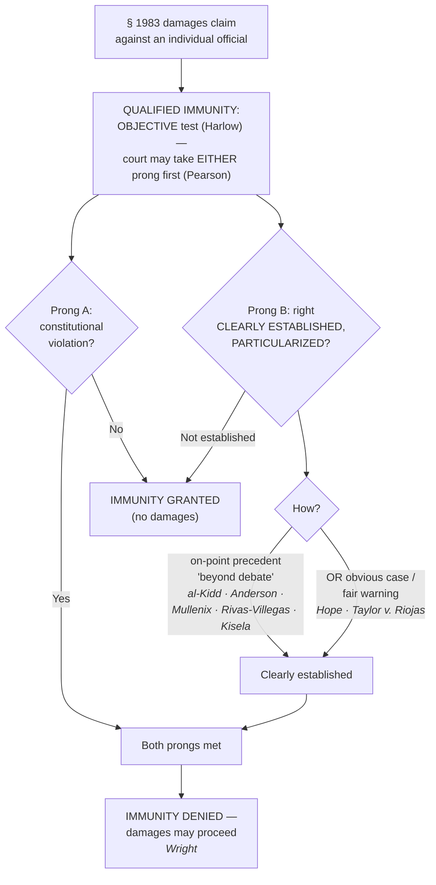

# S9 R1 panel-review — Opus model-diversity lane (prompt pack)

You are the **Claude/Opus** leg of the S9 three-lane adversarial panel (1 Claude + 2 Codex, R1). The two Codex lanes carry the A (support/quote-fidelity) and B (currency/treatment) attack lenses; **you carry model diversity and MUST vote on every paneled assertion across BOTH lenses' concerns.** You are refute-framed: try hard to break each assertion; **default to REFUTED on uncertainty**; never fabricate a cite, quote, or holding; use ONLY the evidence inlined below (no search, no outside knowledge). You are a SIGHTED reviewer — the FULL lake record (judgment fields included) is inlined.

You are a WRITER lane, not an adjudicator: you FIND and VOTE. You do not tally, adjudicate, or close any row — the orchestrator does.

For EACH group below, return one JSON object with the exact `reviewed[]` shape from the output contract (identical framing to the Codex lenses). Emit a finding object ONLY for a real defect (verdict refuted / stands-modified); a group you find wholly clean returns all-`stands` verdicts (the harness records a clean attestation). Concatenate the per-group JSON objects into a top-level `{"packs": [ ... ]}` array, one entry per group, each carrying its `group_id`.


OUTPUT CONTRACT — return ONE JSON object, nothing else:
{
  "lens": "A" | "B",
  "group_id": "<echo the group id>",
  "reviewed": [
    {
      "assertion_id": "<from group_inventory.jsonl>",
      "dimension": "existence|support|quote_fidelity|pincite|treatment|black_letter",
      "verdict": "stands" | "refuted" | "stands-modified",
      "verifiable_from_disclosed": true | false,
      "defect": null,   // null when verdict=="stands"; else an object:
      //  {"problem": "...", "severity": "high|medium|low", "proposed_fix": "...", "evidence_quote": "verbatim from disclosed evidence or null", "needs_cl": true|false, "locator_note": "..."}
      "reasons": ["short evidence-grounded reason", "..."],
      "breaks_true_positives": true | false,
      "residual_risks": ["..."],
      "suggested_tightening": "... or null"
    }
  ],
  "notes": ""
}
Rules: verdict=='stands' <=> defect==null (assertion survives your attack). verdict=='refuted' <=> a real defect (the assertion as framed is wrong). verdict=='stands-modified' <=> survives but needs a stated modification (a minor defect). Review EVERY assertion_id in group_inventory.jsonl exactly once. Output ONLY the JSON object.
---

## GROUP: content/use-of-force-and-liability/Malicious Prosecution under the Fourth Amendment.md  (`doctrine`, 4 assertions)

### content_page

```
---
weight: 70
title: "Malicious Prosecution under the Fourth Amendment"
aliases:
  - "Malicious Prosecution under the Fourth Amendment"
  - "Malicious Prosecution"
  - "10-use-of-force-liability/Malicious-Prosecution-under-the-Fourth-Amendment"
  - "malicious-prosecution"
topic: "Fourth Amendment malicious prosecution"
type: doctrine
jurisdiction: "Federal — U.S. Const. amend. IV; 42 U.S.C. § 1983; SCOTUS baseline"
status: draft
related:
  - "[[Section 1983 Liability and Qualified Immunity]]"
  - "[[Probable Cause]]"
  - "[[Retaliatory Arrest]]"
---

# Malicious Prosecution under the Fourth Amendment

*Was this person seized pursuant to legal process that lacked probable cause, in a prosecution that ended without a conviction?*

> [!rule] Black-letter rule
> A **Fourth Amendment malicious-prosecution claim** (the § 1983 analog to the common-law tort) lies where the plaintiff was **seized pursuant to legal process** (e.g., detained after arraignment or indictment) **without probable cause**, and the prosecution **terminated in his favor**. The **favorable-termination** element requires only that the prosecution **ended without a conviction** — not an affirmative indication of innocence — and probable cause is assessed **charge by charge**. *[[Thompson v. Clark|Thompson v. Clark]]*, 596 U.S. 36 (2022); *[[Chiaverini v. City of Napoleon|Chiaverini v. City of Napoleon]]*, 602 U.S. 556 (2024).
> ^rule-malicious-prosecution

## The Brief

**A Fourth Amendment claim, not a due-process one.** A person prosecuted without cause suffers a **seizure** when legal process (an arrest warrant, an indictment, a detention order) holds him — and that seizure, if unsupported by probable cause, is the constitutional wrong. The claim is grounded in the **Fourth Amendment**, not substantive due process. *Albright v. Oliver*, 510 U.S. 266 (1994). It is brought under § 1983 (see [[Section 1983 Liability and Qualified Immunity]]) and borrows the common-law tort's elements, chief among them **favorable termination** and the **absence of probable cause**.

**The seizure runs through legal process — *[[Manuel v. City of Joliet|Manuel]]*.** The Fourth Amendment governs a claim challenging **pretrial detention** even after the onset of legal process: if a judge's probable-cause determination rested on fabricated or baseless evidence, the ensuing detention can violate the Fourth Amendment, and the claim does not evaporate merely because it followed an arraignment. *[[Manuel v. City of Joliet|Manuel v. City of Joliet]]*, 580 U.S. 357 (2017). *[[Manuel v. City of Joliet|Manuel]]* confirmed that unlawful detention **pursuant to legal process** is Fourth Amendment territory, distinct from a pure false-arrest claim, whose accrual is measured differently. *Wallace v. Kato*, 549 U.S. 384 (2007).

**Favorable termination means "no conviction" — *[[Thompson v. Clark|Thompson]]*.** The plaintiff need not prove the prosecution ended with an **affirmative indication of innocence**; it is enough that it **ended without a conviction** (a dismissal or acquittal suffices). *[[Thompson v. Clark|Thompson v. Clark]]*, 596 U.S. 36 (2022). *[[Thompson v. Clark|Thompson]]* rejected the stricter rule that had required the accused to show the termination affirmatively signaled innocence, which had made many meritorious claims impossible to bring.

**Probable cause is charge-specific — *[[Chiaverini v. City of Napoleon|Chiaverini]]*.** The presence of probable cause for **one** charge does **not** categorically defeat a Fourth Amendment malicious-prosecution claim based on a **different** charge that lacked probable cause. *[[Chiaverini v. City of Napoleon|Chiaverini v. City of Napoleon]]*, 602 U.S. 556 (2024). The inquiry proceeds **charge by charge**: an officer who tacks on a baseless charge is not insulated just because some other charge was supported. Causation still matters (the baseless charge must have caused a Fourth Amendment seizure), but the "any-valid-charge" shortcut is rejected.

**Common pitfalls.**
- **Pleading substantive due process.** The claim is **Fourth Amendment** (*Albright v. Oliver*), keyed to the seizure, not a generalized due-process theory.
- **Demanding proof of innocence.** After *[[Thompson v. Clark|Thompson]]*, favorable termination requires only that the prosecution **ended without a conviction**.
- **Applying an "any-valid-charge" rule.** *[[Chiaverini v. City of Napoleon|Chiaverini]]* assesses probable cause **charge by charge**; a valid charge does not immunize a baseless companion charge.
- **Confusing it with false arrest or retaliatory arrest.** False arrest concerns the warrantless seizure (accrual per *Wallace v. Kato*); malicious prosecution concerns the seizure **pursuant to legal process**; a First Amendment motive is [[Retaliatory Arrest]].

## Key cases

| Case | Holding | Opinion |
|---|---|---|
| *[[Manuel v. City of Joliet]]*, 580 U.S. 357 (2017) | **Locus.** Pretrial **detention pursuant to legal process** that rests on baseless or fabricated evidence can violate the **Fourth Amendment**; the claim is not defeated merely because legal process had begun. | [opinion](https://www.courtlistener.com/opinion/4376986/manuel-v-city-of-joliet/) |
| *[[Thompson v. Clark]]*, 596 U.S. 36 (2022) | **Favorable termination.** The element requires only that the prosecution **ended without a conviction**; no affirmative indication of innocence is needed. | [opinion](https://www.courtlistener.com/opinion/6457347/thompson-v-clark/) |
| *[[Chiaverini v. City of Napoleon]]*, 602 U.S. 556 (2024) | **Charge-specific.** Probable cause for one charge does **not** categorically defeat a malicious-prosecution claim based on a **separate** charge that lacked probable cause. | [opinion](https://www.courtlistener.com/opinion/10600074/chiaverini-v-city-of-napoleon/) |

## Sources
- *Manuel v. City of Joliet*, 580 U.S. 357 (2017) — https://www.courtlistener.com/opinion/4376986/manuel-v-city-of-joliet/
- *Thompson v. Clark*, 596 U.S. 36 (2022) — https://www.courtlistener.com/opinion/6457347/thompson-v-clark/
- *Chiaverini v. City of Napoleon*, 602 U.S. 556 (2024) — https://www.courtlistener.com/opinion/10600074/chiaverini-v-city-of-napoleon/

```

### group_inventory (assertions under review)

```jsonl
{"assertion_id": "88a00da5ec975905", "dimension": "existence", "kind": "case_cite", "locator": {"case": "Chiaverini v. City of Napoleon", "table_line": 32}, "payload": {"case": "Chiaverini v. City of Napoleon", "cells": ["*[[Chiaverini v. City of Napoleon]]*, 602 U.S. 556 (2024)", "**Charge-specific.** Probable cause for one charge does **not** categorically defeat a malicious-prosecution claim based on a **separate** charge that lacked probable cause.", "[opinion](https://www.courtlistener.com/opinion/10600074/chiaverini-v-city-of-napoleon/)"], "header": ["Case", "Holding", "Opinion"]}}
{"assertion_id": "95a7fdeea25636d5", "dimension": "existence", "kind": "case_cite", "locator": {"case": "Manuel v. City of Joliet", "table_line": 30}, "payload": {"case": "Manuel v. City of Joliet", "cells": ["*[[Manuel v. City of Joliet]]*, 580 U.S. 357 (2017)", "**Locus.** Pretrial **detention pursuant to legal process** that rests on baseless or fabricated evidence can violate the **Fourth Amendment**; the claim is not defeated merely because legal process had begun.", "[opinion](https://www.courtlistener.com/opinion/4376986/manuel-v-city-of-joliet/)"], "header": ["Case", "Holding", "Opinion"]}}
{"assertion_id": "bc4cb64dfad93fba", "dimension": "existence", "kind": "case_cite", "locator": {"case": "Thompson v. Clark", "table_line": 31}, "payload": {"case": "Thompson v. Clark", "cells": ["*[[Thompson v. Clark]]*, 596 U.S. 36 (2022)", "**Favorable termination.** The element requires only that the prosecution **ended without a conviction**; no affirmative indication of innocence is needed.", "[opinion](https://www.courtlistener.com/opinion/6457347/thompson-v-clark/)"], "header": ["Case", "Holding", "Opinion"]}}
{"assertion_id": "b7925f3674468ac3", "dimension": "support", "kind": "proposition", "locator": {"callout": "^rule-malicious-prosecution"}, "payload": {"anchor": "^rule-malicious-prosecution", "statement": "[!rule] Black-letter rule\nA **Fourth Amendment malicious-prosecution claim** (the § 1983 analog to the common-law tort) lies where the plaintiff was **seized pursuant to legal process** (e.g., detained after arraignment or indictment) **without probable cause**, and the prosecution **terminated in his favor**. The **favorable-termination** element requires only that the prosecution **ended without a conviction** — not an affirmative indication of innocence — and probable cause is assessed **charge by charge**. *[[Thompson v. Clark|Thompson v. Clark]]*, 596 U.S. 36 (2022); *[[Chiaverini v. City of Napoleon|Chiaverini v. City of Napoleon]]*, 602 U.S. 556 (2024)."}}
```

### lake record — Chiaverini v. City of Napoleon

```json
{
  "schema_version": "s2.v1",
  "record_id": "Chiaverini v. City of Napoleon",
  "status": "under_review",
  "identity": {
    "case_name": "Chiaverini v. City of Napoleon",
    "case_name_short": "Chiaverini",
    "case_name_full": "",
    "input_case_name": "Chiaverini v. City of Napoleon",
    "court": "scotus",
    "court_id": null,
    "court_level": "scotus",
    "circuit": null,
    "state": null,
    "date_decided": null,
    "year": 2024,
    "docket": "23-50",
    "cluster_id": 10600074,
    "lead_opinion_id": 11066663,
    "sibling_ids": [],
    "absolute_url": "/opinion/10600074/chiaverini-v-city-of-napoleon/",
    "identity_method": "frontier-identity",
    "expected_citation_found": true,
    "party_name_in_text": false,
    "canonical_name_match": true,
    "alternates": [],
    "reason_code": null
  },
  "citations": {
    "official": {
      "cite": "602 U.S. 556",
      "volume": "602",
      "reporter": "U.S.",
      "page": "556",
      "type": 1,
      "selected_official": true,
      "source": "cluster.citations[]"
    },
    "parallel": [],
    "vendor_neutral": [],
    "all": [
      {
        "cite": "602 U.S. 556",
        "volume": "602",
        "reporter": "U.S.",
        "page": "556",
        "type": 1,
        "selected_official": false,
        "source": "cluster.citations[]"
      }
    ],
    "display": "602 U.S. 556",
    "official_selection": {
      "court_class": "scotus",
      "selected": "602 U.S. 556",
      "reason": "selected_rank_1"
    }
  },
  "pinpoints": [],
  "treatment": {
    "field_i_validity": "unverified",
    "as_of_content": null,
    "as_of_treatment": null,
    "composite_basis": "unverified",
    "composite_basis_ref": null,
    "varies_by_point": false,
    "scope_note": "Frontier stub: treatment/progeny intentionally not derived until S6 promotion.",
    "point_overrides": [],
    "edges": [],
    "derivation": {}
  },
  "progeny": {
    "complete_query": null,
    "indexed_citing_opinions": null,
    "count_source": null,
    "per_sibling": [],
    "citation_count": null,
    "cache_path": null,
    "enumeration": null,
    "cursor": null,
    "rows_cached": 0,
    "outbound_opinion_edges": []
  },
  "off_cl_links": [],
  "provenance": {
    "cl_source": null,
    "cl_api": "https://www.courtlistener.com/api/rest/v4",
    "built_by": "S2-BUILDER-AUTHORING",
    "build_run": "s2-build-96d841cbb12e",
    "date_created": "2026-07-06T12:12:08Z",
    "date_modified": "2026-07-09T23:29:56Z",
    "warnings": [],
    "field_provenance": {
      "identity": {
        "src": "CourtListener frontier identity search",
        "at": "2026-07-06T12:12:18Z",
        "verifier": "S2-BUILDER-AUTHORING"
      },
      "treatment.field_i_validity": {
        "src": "frontier stub, no treatment",
        "at": "2026-07-06T12:12:18Z",
        "verifier": "S2-BUILDER-AUTHORING"
      },
      "point_overrides": {
        "src": "frontier stub, no treatment",
        "at": "2026-07-06T12:12:18Z",
        "verifier": "S2-BUILDER-AUTHORING"
      },
      "pinpoints": {
        "src": "frontier stub, no pinpoints",
        "at": "2026-07-06T12:12:18Z",
        "verifier": "S2-BUILDER-AUTHORING"
      }
    },
    "s6_promotion": {
      "from_record_id": "chiaverini-v-city-of-napoleon--10600074",
      "to_record_id": "Chiaverini v. City of Napoleon",
      "as_of": "2026-07-07",
      "born_status": "under_review"
    }
  }
}

```

### lake record — Manuel v. City of Joliet

```json
{
  "schema_version": "s2.v1",
  "record_id": "Manuel v. City of Joliet",
  "status": "under_review",
  "identity": {
    "case_name": "Manuel v. City of Joliet",
    "case_name_short": "Manuel",
    "case_name_full": "Elijah MANUEL, Petitioner v. CITY OF JOLIET, ILLINOIS, Et Al.",
    "input_case_name": "Manuel v. City of Joliet",
    "court": "U.S. Supreme Court",
    "court_id": "scotus",
    "court_level": "scotus",
    "circuit": null,
    "state": null,
    "date_decided": "2017-03-21",
    "year": 2017,
    "docket": "No. 14-9496",
    "cluster_id": 4376986,
    "lead_opinion_id": 9873459,
    "sibling_ids": [],
    "absolute_url": "/opinion/4376986/manuel-v-city-of-joliet/",
    "identity_method": "frontier-identity",
    "expected_citation_found": true,
    "party_name_in_text": false,
    "canonical_name_match": true,
    "alternates": [],
    "reason_code": null
  },
  "citations": {
    "official": {
      "cite": "580 U.S. 357",
      "volume": "580",
      "reporter": "U.S.",
      "page": "357",
      "type": 1,
      "selected_official": true,
      "source": "cluster.citations[]"
    },
    "parallel": [
      {
        "cite": "137 S. Ct. 911",
        "volume": "137",
        "reporter": "S. Ct.",
        "page": "911",
        "type": 1,
        "selected_official": false,
        "source": "cluster.citations[]"
      },
      {
        "cite": "197 L. Ed. 2d 312",
        "volume": "197",
        "reporter": "L. Ed. 2d",
        "page": "312",
        "type": 1,
        "selected_official": false,
        "source": "cluster.citations[]"
      },
      {
        "cite": "26 Fla. L. Weekly Fed. S 476",
        "volume": "26",
        "reporter": "Fla. L. Weekly Fed. S",
        "page": "476",
        "type": 1,
        "selected_official": false,
        "source": "cluster.citations[]"
      },
      {
        "cite": "85 U.S.L.W. 4130",
        "volume": "85",
        "reporter": "U.S.L.W.",
        "page": "4130",
        "type": 4,
        "selected_official": false,
        "source": "cluster.citations[]"
      }
    ],
    "vendor_neutral": [
      {
        "cite": "2017 U.S. LEXIS 2021",
        "volume": "2017",
        "reporter": "U.S. LEXIS",
        "page": "2021",
        "type": 6,
        "selected_official": false,
        "source": "cluster.citations[]"
      }
    ],
    "all": [
      {
        "cite": "580 U.S. 357",
        "volume": "580",
        "reporter": "U.S.",
        "page": "357",
        "type": 1,
        "selected_official": false,
        "source": "cluster.citations[]"
      },
      {
        "cite": "137 S. Ct. 911",
        "volume": "137",
        "reporter": "S. Ct.",
        "page": "911",
        "type": 1,
        "selected_official": false,
        "source": "cluster.citations[]"
      },
      {
        "cite": "197 L. Ed. 2d 312",
        "volume": "197",
        "reporter": "L. Ed. 2d",
        "page": "312",
        "type": 1,
        "selected_official": false,
        "source": "cluster.citations[]"
      },
      {
        "cite": "2017 U.S. LEXIS 2021",
        "volume": "2017",
        "reporter": "U.S. LEXIS",
        "page": "2021",
        "type": 6,
        "selected_official": false,
        "source": "cluster.citations[]"
      },
      {
        "cite": "26 Fla. L. Weekly Fed. S 476",
        "volume": "26",
        "reporter": "Fla. L. Weekly Fed. S",
        "page": "476",
        "type": 1,
        "selected_official": false,
        "source": "cluster.citations[]"
      },
      {
        "cite": "85 U.S.L.W. 4130",
        "volume": "85",
        "reporter": "U.S.L.W.",
        "page": "4130",
        "type": 4,
        "selected_official": false,
        "source": "cluster.citations[]"
      }
    ],
    "display": "580 U.S. 357",
    "official_selection": {
      "court_class": "scotus",
      "selected": "580 U.S. 357",
      "reason": "selected_rank_1"
    }
  },
  "pinpoints": [],
  "treatment": {
    "field_i_validity": "unverified",
    "as_of_content": null,
    "as_of_treatment": null,
    "composite_basis": "unverified",
    "composite_basis_ref": null,
    "varies_by_point": false,
    "scope_note": "Frontier stub: treatment/progeny intentionally not derived until S6 promotion.",
    "point_overrides": [],
    "edges": [],
    "derivation": {}
  },
  "progeny": {
    "complete_query": null,
    "indexed_citing_opinions": null,
    "count_source": null,
    "per_sibling": [],
    "citation_count": null,
    "cache_path": null,
    "enumeration": null,
    "cursor": null,
    "rows_cached": 0,
    "outbound_opinion_edges": []
  },
  "off_cl_links": [],
  "provenance": {
    "cl_source": null,
    "cl_api": "https://www.courtlistener.com/api/rest/v4",
    "built_by": "S2-BUILDER-AUTHORING",
    "build_run": "s2-build-96d841cbb12e",
    "date_created": "2026-07-06T13:14:47Z",
    "date_modified": "2026-07-10T20:54:54Z",
    "warnings": [],
    "field_provenance": {
      "identity": {
        "src": "CourtListener frontier identity search",
        "at": "2026-07-06T13:14:57Z",
        "verifier": "S2-BUILDER-AUTHORING"
      },
      "treatment.field_i_validity": {
        "src": "frontier stub, no treatment",
        "at": "2026-07-06T13:14:57Z",
        "verifier": "S2-BUILDER-AUTHORING"
      },
      "point_overrides": {
        "src": "frontier stub, no treatment",
        "at": "2026-07-06T13:14:57Z",
        "verifier": "S2-BUILDER-AUTHORING"
      },
      "pinpoints": {
        "src": "frontier stub, no pinpoints",
        "at": "2026-07-06T13:14:57Z",
        "verifier": "S2-BUILDER-AUTHORING"
      }
    },
    "s6_promotion": {
      "from_record_id": "manuel-v-city-of-joliet--4376986",
      "to_record_id": "Manuel v. City of Joliet",
      "as_of": "2026-07-07",
      "born_status": "under_review"
    }
  }
}

```

### lake record — Thompson v. Clark

```json
{
  "schema_version": "s2.v1",
  "record_id": "Thompson v. Clark",
  "status": "under_review",
  "identity": {
    "case_name": "Thompson v. Clark",
    "case_name_short": "Thompson",
    "case_name_full": "",
    "input_case_name": "Thompson v. Clark",
    "court": "scotus",
    "court_id": null,
    "court_level": "scotus",
    "circuit": null,
    "state": null,
    "date_decided": null,
    "year": 2022,
    "docket": "20-659",
    "cluster_id": 6457347,
    "lead_opinion_id": 6329458,
    "sibling_ids": [],
    "absolute_url": "/opinion/6457347/thompson-v-clark/",
    "identity_method": "frontier-identity",
    "expected_citation_found": true,
    "party_name_in_text": false,
    "canonical_name_match": true,
    "alternates": [],
    "reason_code": null
  },
  "citations": {
    "official": {
      "cite": "596 U.S. 36",
      "volume": "596",
      "reporter": "U.S.",
      "page": "36",
      "type": 1,
      "selected_official": true,
      "source": "cluster.citations[]"
    },
    "parallel": [
      {
        "cite": "142 S. Ct. 1332",
        "volume": "142",
        "reporter": "S. Ct.",
        "page": "1332",
        "type": 1,
        "selected_official": false,
        "source": "cluster.citations[]"
      }
    ],
    "vendor_neutral": [],
    "all": [
      {
        "cite": "596 U.S. 36",
        "volume": "596",
        "reporter": "U.S.",
        "page": "36",
        "type": 1,
        "selected_official": false,
        "source": "cluster.citations[]"
      },
      {
        "cite": "142 S. Ct. 1332",
        "volume": "142",
        "reporter": "S. Ct.",
        "page": "1332",
        "type": 1,
        "selected_official": false,
        "source": "cluster.citations[]"
      }
    ],
    "display": "596 U.S. 36",
    "official_selection": {
      "court_class": "scotus",
      "selected": "596 U.S. 36",
      "reason": "selected_rank_1"
    }
  },
  "pinpoints": [],
  "treatment": {
    "field_i_validity": "unverified",
    "as_of_content": null,
    "as_of_treatment": null,
    "composite_basis": "unverified",
    "composite_basis_ref": null,
    "varies_by_point": false,
    "scope_note": "Frontier stub: treatment/progeny intentionally not derived until S6 promotion.",
    "point_overrides": [],
    "edges": [],
    "derivation": {}
  },
  "progeny": {
    "complete_query": null,
    "indexed_citing_opinions": null,
    "count_source": null,
    "per_sibling": [],
    "citation_count": null,
    "cache_path": null,
    "enumeration": null,
    "cursor": null,
    "rows_cached": 0,
    "outbound_opinion_edges": []
  },
  "off_cl_links": [],
  "provenance": {
    "cl_source": null,
    "cl_api": "https://www.courtlistener.com/api/rest/v4",
    "built_by": "S2-BUILDER-AUTHORING",
    "build_run": "s2-build-96d841cbb12e",
    "date_created": "2026-07-06T12:11:00Z",
    "date_modified": "2026-07-09T23:29:56Z",
    "warnings": [],
    "field_provenance": {
      "identity": {
        "src": "CourtListener frontier identity search",
        "at": "2026-07-06T12:11:17Z",
        "verifier": "S2-BUILDER-AUTHORING"
      },
      "treatment.field_i_validity": {
        "src": "frontier stub, no treatment",
        "at": "2026-07-06T12:11:17Z",
        "verifier": "S2-BUILDER-AUTHORING"
      },
      "point_overrides": {
        "src": "frontier stub, no treatment",
        "at": "2026-07-06T12:11:17Z",
        "verifier": "S2-BUILDER-AUTHORING"
      },
      "pinpoints": {
        "src": "frontier stub, no pinpoints",
        "at": "2026-07-06T12:11:17Z",
        "verifier": "S2-BUILDER-AUTHORING"
      }
    },
    "s6_promotion": {
      "from_record_id": "thompson-v-clark--6457347",
      "to_record_id": "Thompson v. Clark",
      "as_of": "2026-07-07",
      "born_status": "under_review"
    }
  }
}

```

---

## GROUP: content/use-of-force-and-liability/Qualified Immunity.md  (`doctrine`, 21 assertions)

### content_page

```
---
weight: 30
title: "Qualified Immunity"
aliases:
  - "Qualified Immunity"
  - "10-use-of-force-liability/Qualified-Immunity"
  - "qualified-immunity"
topic: "Qualified immunity"
type: doctrine
jurisdiction: "Federal — 42 U.S.C. § 1983 defense; SCOTUS baseline"
status: draft
related:
  - "[[Section 1983 Liability and Qualified Immunity]]"
  - "[[Use of Force]]"
  - "[[Suing Federal Officers]]"
  - "[[Absolute Immunity]]"
---

# Qualified Immunity

*Even if the conduct was unconstitutional, was the right so clearly established that every reasonable officer would have known it?*

> [!rule] Black-letter rule
> **Qualified immunity** shields a government official sued for **damages** unless the conduct **violated a clearly established statutory or constitutional right of which a reasonable person would have known**. The test is **objective** (the officer's good faith is irrelevant), and it has **two prongs** — (1) a **violation** of a right, and (2) that the right was **clearly established** — which a court may take in **either order**. "Clearly established" means **existing precedent placed the question "beyond debate"**, defined at a **high degree of specificity**, not as a broad principle. *[[Harlow v. Fitzgerald|Harlow v. Fitzgerald]]*, 457 U.S. 800 (1982); *[[Pearson v. Callahan|Pearson v. Callahan]]*, 555 U.S. 223 (2009); *[[Ashcroft v. al-Kidd|Ashcroft v. al-Kidd]]*, 563 U.S. 731 (2011).
> ^rule-qualified-immunity

## The Brief

**What qualified immunity is.** Qualified immunity is the individual officer's **shield** against § 1983 **damages** (see [[Section 1983 Liability and Qualified Immunity]]). It is an **immunity from suit**, not merely a defense to liability, so a denial that turns on a legal question is **immediately appealable**. It decides nothing about suppression (that is [[The Exclusionary Rule]]) and nothing about what the Constitution requires on the merits; it asks only whether **this officer** can be made to pay.

**The objective standard — *[[Harlow v. Fitzgerald|Harlow]]* killed the good-faith inquiry.** Officials "are shielded from liability for civil damages insofar as their conduct does not violate clearly established statutory or constitutional rights of which a reasonable person would have known." *[[Harlow v. Fitzgerald|Harlow]]*, 457 U.S. at [818](https://www.courtlistener.com/opinion/110763/harlow-v-fitzgerald/). *[[Harlow v. Fitzgerald|Harlow]]* **abandoned the subjective good-faith/malice prong**: the question is not whether the officer meant well, but whether the **law was clearly established at the time**. A well-meaning officer who crosses a clearly established line loses immunity; a malicious officer whose conduct violated no clearly established right keeps it.

**The two prongs, in either order (*[[Pearson v. Callahan|Pearson]]*).** Immunity turns on two questions: (a) did the conduct **violate a constitutional right**, and (b) was that right **clearly established**? *[[Saucier v. Katz|Saucier v. Katz]]*, 533 U.S. 194 (2001), once made the sequence mandatory. *[[Pearson v. Callahan|Pearson]]* made it **discretionary**: "while the sequence set forth there is often appropriate, it should no longer be regarded as mandatory." *[[Pearson v. Callahan|Pearson]]*, 555 U.S. at [236](https://www.courtlistener.com/opinion/145918/pearson-v-callahan/). A court may grant immunity on "not clearly established" **without deciding** whether a right was violated — a practice critics say freezes the law by never announcing the underlying rule.

**"Clearly established" is particularized: the heart of modern QI.** A right is clearly established only where "existing precedent [has] placed the ... question beyond debate." *[[Ashcroft v. al-Kidd|al-Kidd]]*, 563 U.S. at [741](https://www.courtlistener.com/opinion/7344719/ashcroft-v-al-kidd/). The inquiry is **particularized to the facts**: *[[Anderson v. Creighton|Anderson v. Creighton]]*, 483 U.S. 635 (1987), fixed the frame — the **contours** of the right must be specific enough that a reasonable officer understood **what he was doing** violated it, so the question is never "was there a Fourth Amendment right" in the abstract but whether **this conduct** was clearly unlawful. The dispositive question is "whether the violative nature of **particular conduct** is clearly established," *[[Mullenix v. Luna|Mullenix v. Luna]]*, 577 U.S. 7, [12](https://www.courtlistener.com/opinion/3153112/mullenix-v-luna/) (2015) (per curiam), "in light of the specific context of the case, not as a broad general proposition." The plaintiff must **identify a case** that put the officer on notice that his **specific conduct** was unlawful. *[[Rivas-Villegas v. Cortesluna|Rivas-Villegas v. Cortesluna]]*, 595 U.S. 1 (2021) (per curiam). Courts are "repeatedly told ... not to define clearly established law at too high a level of generality," and immunity protects "all but the plainly incompetent or those who knowingly violate the law." *[[City of Tahlequah v. Bond|City of Tahlequah v. Bond]]*, 595 U.S. 9 (2021) (per curiam) (quoting *[[District of Columbia v. Wesby|Wesby]]*, 583 U.S. 48 (2018), quoting *[[Malley v. Briggs|Malley]]*, 475 U.S. at [341](https://www.courtlistener.com/opinion/111611/malley-v-briggs/)).

**Strictest of all in the force setting.** Because *[[Graham v. Connor|Graham]]* and *[[Tennessee v. Garner|Garner]]* are "cast at a high level of generality," they "do not by themselves create clearly established law outside an 'obvious case.'" *[[White v. Pauly|White v. Pauly]]*, 580 U.S. 73 (2017) (per curiam). Officers keep immunity "unless existing precedent 'squarely governs' the specific facts at issue," and fact-specific shootings fall in the "hazy border between excessive and acceptable force." *[[Kisela v. Hughes|Kisela v. Hughes]]*, 584 U.S. 100 (2018) (per curiam); *[[Brosseau v. Haugen|Brosseau v. Haugen]]*, 543 U.S. 194 (2004) (per curiam). This is why so many excessive-force claims are lost at the **second** prong even when the force may have been unreasonable (see [[Use of Force]]).

**The counterweight — the "obvious case" needs no precedent on point.** A right can be clearly established **without a case on all fours**: "officials can still be on notice that their conduct violates established law even in novel factual circumstances." *[[Hope v. Pelzer|Hope v. Pelzer]]*, 536 U.S. 730, [741](https://www.courtlistener.com/opinion/121169/hope-v-pelzer/) (2002). The Court revived that route in *[[Taylor v. Riojas|Taylor v. Riojas]]*, 592 U.S. 7 (2020) (per curiam), **denying immunity without a case on point** because any reasonable officer should have realized that confining an inmate for days in shockingly unsanitary cells was unconstitutional. Read the lines together: **particularized precedent *or* an obvious case defeats immunity.**

**Qualified immunity in the warrant setting.** Applying for a warrant earns **qualified, not absolute, immunity**, lost only where "no reasonably competent officer would have concluded that a warrant should issue." *[[Malley v. Briggs|Malley v. Briggs]]*, 475 U.S. 335, [341](https://www.courtlistener.com/opinion/111611/malley-v-briggs/) (1986). The magistrate's approval is strong but not conclusive, yet "the threshold for establishing this exception is a high one." *[[Messerschmidt v. Millender|Messerschmidt v. Millender]]*, 565 U.S. 535, [547](https://www.courtlistener.com/opinion/623242/messerschmidt-v-millender/) (2012). Bringing **media into a home** during a warrant's execution violates the Fourth Amendment, but the officers had immunity because in 1992 the right was not clearly established. *[[Wilson v. Layne|Wilson v. Layne]]*, 526 U.S. 603 (1999); *[[Hanlon v. Berger|Hanlon v. Berger]]*, 526 U.S. 808 (1999).

**The doctrine under internal criticism.** Individual Justices have questioned qualified immunity from opposite directions in **statements respecting the denial of [[Reading and Citing Cases#certiorari-cert|certiorari]]** (not holdings, but signals worth knowing). *Baxter v. Bracey* drew a statement questioning whether the modern doctrine has any grounding in the 1871 statute; *Cope v. Cogdill* and *Johnson v. Prentice* drew statements protesting immunity grants on egregious facts. The Court itself, however, continues to enforce the high-specificity rule and to **summarily reverse** circuits that frame the right too generally — most recently in *Zorn v. Linton* (2026) (per curiam), reversing a qualified-immunity denial where circuit precedent had not clearly established the specific conduct's unlawfulness. The teaching point is stable even as the debate continues: **plead and prove particularized, on-point precedent.**

**Burden, standard of review, and remedy.** Qualified immunity is an **[[Common Legal Terms#affirmative-defense|affirmative defense]]** the official pleads; once raised, the **plaintiff** bears the burden of showing the right was **clearly established**. Its application is a **question of law**, reviewed **[[Common Legal Terms#de-novo|de novo]]**, and (because it is an **immunity from suit**) a denial resting on a legal question is **immediately appealable** by interlocutory appeal. The consequence of a grant is simple: **no damages** against that official (the constitutional merits may still be decided, or left open). **Municipalities have no qualified immunity** (*[[Owen v. City of Independence|Owen]]*, on [[Section 1983 Liability and Qualified Immunity]]); **prosecutors, judges, and witnesses** get **absolute** immunity for their protected functions (see [[Absolute Immunity]]); and the federal-officer analog, with *[[Bivens v. Six Unknown Named Agents|Bivens]]* now all but closed, lives on [[Suing Federal Officers]].

**Apply it.** For the individual officer, work the two prongs:
1. **Prong A — was a constitutional right violated** on the plaintiff's version of the facts? (A court may skip to Prong B under *[[Pearson v. Callahan|Pearson]]*.)
2. **Prong B — was the right clearly established** at the time, **particularized** to this conduct? Identify a **prior case** (binding precedent, or a robust consensus of persuasive authority) that put a reasonable officer on notice that **this specific conduct** was unlawful (*[[Ashcroft v. al-Kidd|al-Kidd]]*; *[[Mullenix v. Luna|Mullenix]]*; *[[Rivas-Villegas v. Cortesluna|Rivas-Villegas]]*).
3. **Or invoke the obvious case** — some conduct is so plainly unlawful that no prior case is needed (*[[Hope v. Pelzer|Hope]]*; *[[Taylor v. Riojas|Taylor]]*).
4. **Do not argue at the wrong altitude.** "Freedom from excessive force" is too general; "shooting a non-threatening, non-fleeing suspect" is the level that governs.
5. **Separate immunity from the merits.** Even a found violation is not payable if the right was not clearly established — and immunity never touches suppression.

**Common pitfalls.**
- **Defining the right too generally.** Vague rights rarely overcome immunity; precedent must be **particularized** and "beyond debate" (*[[Ashcroft v. al-Kidd|al-Kidd]]*; *[[Mullenix v. Luna|Mullenix]]*; *[[City of Tahlequah v. Bond|Tahlequah]]*).
- **Assuming *any* precedent suffices — or that *only* an identical case does.** Both extremes are wrong: precedent must be particularized, **but** an obvious case needs none (*[[Hope v. Pelzer|Hope]]*; *[[Taylor v. Riojas|Taylor]]*).
- **Relying on subjective intent.** *[[Harlow v. Fitzgerald|Harlow]]* made it **objective**; a good motive does not save clearly unlawful conduct, and a bad motive does not defeat immunity where the right was not clearly established.
- **Confusing qualified immunity with the *[[United States v. Leon|Leon]]* [[The Good-Faith Exception|good-faith exception]].** Immunity is a **civil** defense to **damages**; *[[The Good-Faith Exception|Leon]]* good faith is a **criminal-side** suppression doctrine.
- **Thinking immunity affects suppression.** It never decides whether evidence comes in or out — only civil damages.
- **Forgetting the municipality and the absolute-immunity actors.** Cities have **no** qualified immunity (*[[Owen v. City of Independence|Owen]]*); prosecutors and witnesses may have **absolute** immunity (see [[Absolute Immunity]]).

## Lower-court developments

The Supreme Court supplies the specificity rule; the circuits do the day-to-day line-drawing, and the modern battleground is the **wrong-house / wrong-target raid**, where courts divide over whether *[[Maryland v. Garrison|Maryland v. Garrison]]*'s duty to identify the place to be searched clearly establishes a specific address-verification duty. Each decision below binds only in its own circuit.

- **[[Wright v. City of Euclid]] (6th Cir. 2020)** — *illustrative denial.* Reversed summary judgment and **denied** qualified immunity on excessive force and related claims: it was clearly established that "drawing a weapon on a suspect who was not fleeing or posing a safety risk and tasering a suspect who was not actively resisting arrest constituted excessive force." 962 F.3d 852, 868. The concrete-facts model of what **defeats** immunity. **Binding in-circuit — 6th Cir.** · good. [opinion](https://www.courtlistener.com/opinion/4762133/lamar-wright-v-city-of-euclid/)
- **[[Jimerson v. Lewis]] (5th Cir. 2024)** — *narrowing application / split.* A divided panel **granted** immunity to officers who raided the **wrong house**, reading *[[Maryland v. Garrison|Garrison]]* as only a "general principle" that did not clearly establish a specific duty to verify the address; the [[Common Legal Terms#dissenting-opinion|dissent]] read *[[Maryland v. Garrison|Garrison]]* plus circuit precedent to clearly establish it. A live **circuit divide** on the wrong-house-raid question; cert. denied. **Binding in-circuit — 5th Cir.** · good. [opinion](https://www.courtlistener.com/opinion/9471275/jimerson-v-lewis/)

## Key cases

| Case | Holding | Opinion |
|---|---|---|
| *[[Harlow v. Fitzgerald]]*, 457 U.S. 800 (1982) | **Anchor.** Reformulated immunity as a purely **objective** test; shielded unless conduct violated **clearly established** law a reasonable person would have known; abandoned the subjective good-faith prong. | [opinion](https://www.courtlistener.com/opinion/110763/harlow-v-fitzgerald/) |
| *[[Anderson v. Creighton]]*, 483 U.S. 635 (1987) | **[[Particularity]] frame.** The **contours** of the right must be sufficiently clear that a reasonable officer understands his specific conduct is unlawful; clearly-established law is judged at a fact-specific level, not in the abstract. | [opinion](https://www.courtlistener.com/opinion/111953/anderson-v-creighton/) |
| *[[Saucier v. Katz]]*, 533 U.S. 194 (2001) | **Two-step (now optional).** Set the sequence (violation first, clearly-established second) later made **discretionary** by *[[Pearson v. Callahan\|Pearson]]*. | [opinion](https://www.courtlistener.com/opinion/118449/saucier-v-katz/) |
| *[[Pearson v. Callahan]]*, 555 U.S. 223 (2009) | **Refinement.** The *Saucier* sequence "should no longer be regarded as mandatory"; courts may decide either prong first. | [opinion](https://www.courtlistener.com/opinion/145918/pearson-v-callahan/) |
| *[[Ashcroft v. al-Kidd]]*, 563 U.S. 731 (2011) | **Standard.** "Clearly established" requires existing precedent placing the question **"beyond debate"**; subjective intent is irrelevant to Fourth Amendment reasonableness. | [opinion](https://www.courtlistener.com/opinion/217703/ashcroft-v-al-kidd/) |
| *[[Mullenix v. Luna]]*, 577 U.S. 7 (2015) | **Standard.** Immunity turns on "whether the **violative nature of particular conduct** is clearly established"; particularized, not a broad proposition. | [opinion](https://www.courtlistener.com/opinion/3153112/mullenix-v-luna/) |
| *[[Rivas-Villegas v. Cortesluna]]*, 595 U.S. 1 (2021) | **Standard.** The plaintiff must **identify a case** that put the officer on notice his specific conduct was unlawful, judged in the specific context. | [opinion](https://www.courtlistener.com/opinion/5290447/rivas-villegas-v-cortesluna/) |
| *[[City of Tahlequah v. Bond]]*, 595 U.S. 9 (2021) | **Standard.** "Do not define clearly established law at too high a level of generality"; immunity protects "all but the plainly incompetent or those who knowingly violate the law." | [opinion](https://www.courtlistener.com/opinion/5290448/city-of-tahlequah-v-bond/) |
| *[[White v. Pauly]]*, 580 U.S. 73 (2017) | **Force-setting.** *[[Tennessee v. Garner\|Garner]]* and *[[Graham v. Connor\|Graham]]* "do not by themselves create clearly established law outside an 'obvious case'"; clearly-established law must be particularized to the facts. | [opinion](https://www.courtlistener.com/opinion/4374579/white-v-pauly/) |
| *[[Kisela v. Hughes]]*, 584 U.S. 100 (2018) | **Force-setting.** Officers keep immunity unless existing precedent **"squarely governs"** the specific facts; fact-specific shootings fall in the "hazy border." | [opinion](https://www.courtlistener.com/opinion/4482892/kisela-v-hughes/) |
| *[[Malley v. Briggs]]*, 475 U.S. 335 (1986) | **Warrant-setting.** A **warrant-applying** officer gets **qualified**, not absolute, immunity, lost only where no reasonably competent officer would have sought the warrant; source of the "plainly incompetent" formula. | [opinion](https://www.courtlistener.com/opinion/111611/malley-v-briggs/) |
| *[[Messerschmidt v. Millender]]*, 565 U.S. 535 (2012) | **Warrant-setting.** Officers retain immunity for a facially overbroad warrant where reliance on the magistrate's approval was objectively reasonable; the *[[Malley v. Briggs\|Malley]]* exception is a **high** threshold. | [opinion](https://www.courtlistener.com/opinion/623242/messerschmidt-v-millender/) |
| *[[Wilson v. Layne]]*, 526 U.S. 603 (1999) | **Warrant-setting.** Bringing **media into a home** during a warrant's execution violates the Fourth Amendment; but the officers had immunity (right not clearly established in 1992). | [opinion](https://www.courtlistener.com/opinion/118289/wilson-v-layne/) |
| *[[Hanlon v. Berger]]*, 526 U.S. 808 (1999) | **Warrant-setting.** Same-day companion to *[[Wilson v. Layne\|Wilson]]*: a media ride-along during a search warrant violated the Fourth Amendment, but the officers were entitled to immunity. | [opinion](https://www.courtlistener.com/opinion/1087699/hanlon-v-berger/) |
| *[[Hope v. Pelzer]]*, 536 U.S. 730 (2002) | **Counterweight.** A right can be clearly established **without a factually identical case**; in an "obvious case," officials have **fair warning** even in novel circumstances. | [opinion](https://www.courtlistener.com/opinion/121169/hope-v-pelzer/) |
| *[[Taylor v. Riojas]]*, 592 U.S. 7 (2020) | **Counterweight.** Revived the *[[Hope v. Pelzer\|Hope]]* route: immunity **denied without a case on point** where days in shockingly unsanitary cells were **obviously** unconstitutional. | [opinion](https://www.courtlistener.com/opinion/4802501/taylor-v-riojas/) |

## Related cases across doctrines

| Case | Relevance here | Primary home | Opinion |
|---|---|---|---|
| *[[District of Columbia v. Wesby]]*, 583 U.S. 48 (2018) | Restates the "settled law" / "beyond debate" standard and warns against high-generality framing. | [[Probable Cause]] | [opinion](https://www.courtlistener.com/opinion/4460854/district-of-columbia-v-wesby/) |
| *[[Ryburn v. Huff]]*, 565 U.S. 469 (2012) | A warrantless home entry on an objectively reasonable fear of imminent violence was reasonable; officers had immunity. | [[Emergency Aid]] | [opinion](https://www.courtlistener.com/opinion/622303/ryburn-v-huff/) |
| *[[Los Angeles County v. Rettele]]*, 550 U.S. 609 (2007) | Officers executing a valid warrant may briefly detain occupants (even unclothed) to secure the room; a recurring immunity setting. | [[Securing the Scene]] | [opinion](https://www.courtlistener.com/opinion/145728/los-angeles-county-california-v-rettele/) |
| *[[Safford Unified School District v. Redding]]*, 557 U.S. 364 (2009) | A student strip search was unreasonable, **but** officials had immunity because the right was not clearly established. | [[Special Needs and Administrative Searches]] | [opinion](https://www.courtlistener.com/opinion/145852/safford-unified-school-district-1-v-redding/) |

## Visual



## Sources
- *Harlow v. Fitzgerald*, 457 U.S. 800 (1982) (pinpoint 818) — https://www.courtlistener.com/opinion/110763/harlow-v-fitzgerald/
- *Anderson v. Creighton*, 483 U.S. 635 (1987) — https://www.courtlistener.com/opinion/111953/anderson-v-creighton/
- *Saucier v. Katz*, 533 U.S. 194 (2001) (pinpoint 201) — https://www.courtlistener.com/opinion/118449/saucier-v-katz/
- *Pearson v. Callahan*, 555 U.S. 223 (2009) (pinpoint 236) — https://www.courtlistener.com/opinion/145918/pearson-v-callahan/
- *Ashcroft v. al-Kidd*, 563 U.S. 731 (2011) (pinpoints 736, 741) — https://www.courtlistener.com/opinion/217703/ashcroft-v-al-kidd/
- *Mullenix v. Luna*, 577 U.S. 7 (2015) (per curiam) (pinpoint 12) — https://www.courtlistener.com/opinion/3153112/mullenix-v-luna/
- *Rivas-Villegas v. Cortesluna*, 595 U.S. 1 (2021) (per curiam) — https://www.courtlistener.com/opinion/5290447/rivas-villegas-v-cortesluna/
- *City of Tahlequah v. Bond*, 595 U.S. 9 (2021) (per curiam) — https://www.courtlistener.com/opinion/5290448/city-of-tahlequah-v-bond/
- *District of Columbia v. Wesby*, 583 U.S. 48 (2018) (pinpoint 63) — https://www.courtlistener.com/opinion/4460854/district-of-columbia-v-wesby/
- *White v. Pauly*, 580 U.S. 73 (2017) (per curiam) — https://www.courtlistener.com/opinion/4374579/white-v-pauly/
- *Kisela v. Hughes*, 584 U.S. 100 (2018) (per curiam) (138 S. Ct. at 1153) — https://www.courtlistener.com/opinion/4482892/kisela-v-hughes/
- *Malley v. Briggs*, 475 U.S. 335 (1986) (pinpoint 341) — https://www.courtlistener.com/opinion/111611/malley-v-briggs/
- *Messerschmidt v. Millender*, 565 U.S. 535 (2012) (pinpoint 547) — https://www.courtlistener.com/opinion/623242/messerschmidt-v-millender/
- *Wilson v. Layne*, 526 U.S. 603 (1999) (pinpoints 614–615) — https://www.courtlistener.com/opinion/118289/wilson-v-layne/
- *Hanlon v. Berger*, 526 U.S. 808 (1999) — https://www.courtlistener.com/opinion/1087699/hanlon-v-berger/
- *Hope v. Pelzer*, 536 U.S. 730 (2002) (pinpoint 741) — https://www.courtlistener.com/opinion/121169/hope-v-pelzer/
- *Taylor v. Riojas*, 592 U.S. 7 (2020) (per curiam) — https://www.courtlistener.com/opinion/4802501/taylor-v-riojas/
- *Brosseau v. Haugen*, 543 U.S. 194 (2004) (per curiam) — https://www.courtlistener.com/opinion/137736/brosseau-v-haugen/
- *Ryburn v. Huff*, 565 U.S. 469 (2012) (per curiam) — https://www.courtlistener.com/opinion/622303/ryburn-v-huff/
- *Los Angeles County v. Rettele*, 550 U.S. 609 (2007) (per curiam) — https://www.courtlistener.com/opinion/145728/los-angeles-county-california-v-rettele/
- *Safford Unified School District v. Redding*, 557 U.S. 364 (2009) — https://www.courtlistener.com/opinion/145852/safford-unified-school-district-1-v-redding/
- *Wright v. City of Euclid*, 962 F.3d 852 (6th Cir. 2020) (pinpoint 868) — https://www.courtlistener.com/opinion/4762133/lamar-wright-v-city-of-euclid/
- *Jimerson v. Lewis*, 116 F.4th 407 (5th Cir. 2024) — https://www.courtlistener.com/opinion/9471275/jimerson-v-lewis/
- *Zorn v. Linton*, No. 25-297 (U.S. 2026) (per curiam) (slip opinion; per-curiam summary reversal of a qualified-immunity denial (reaffirming the high-specificity rule)) — https://www.supremecourt.gov/opinions/25pdf/25-297_bqm2.pdf

```

### group_inventory (assertions under review)

```jsonl
{"assertion_id": "017e897d14826f54", "dimension": "existence", "kind": "case_cite", "locator": {"case": "Safford Unified School District v. Redding", "table_line": 80}, "payload": {"case": "Safford Unified School District v. Redding", "cells": ["*[[Safford Unified School District v. Redding]]*, 557 U.S. 364 (2009)", "A student strip search was unreasonable, **but** officials had immunity because the right was not clearly established.", "[[Special Needs and Administrative Searches]]", "[opinion](https://www.courtlistener.com/opinion/145852/safford-unified-school-district-1-v-redding/)"], "header": ["Case", "Relevance here", "Primary home", "Opinion"]}}
{"assertion_id": "05008564d1f77758", "dimension": "existence", "kind": "case_cite", "locator": {"case": "Ashcroft v. al-Kidd", "table_line": 60}, "payload": {"case": "Ashcroft v. al-Kidd", "cells": ["*[[Ashcroft v. al-Kidd]]*, 563 U.S. 731 (2011)", "**Standard.** \"Clearly established\" requires existing precedent placing the question **\"beyond debate\"**; subjective intent is irrelevant to Fourth Amendment reasonableness.", "[opinion](https://www.courtlistener.com/opinion/217703/ashcroft-v-al-kidd/)"], "header": ["Case", "Holding", "Opinion"]}}
{"assertion_id": "0648a1f5b158ed57", "dimension": "existence", "kind": "case_cite", "locator": {"case": "Mullenix v. Luna", "table_line": 61}, "payload": {"case": "Mullenix v. Luna", "cells": ["*[[Mullenix v. Luna]]*, 577 U.S. 7 (2015)", "**Standard.** Immunity turns on \"whether the **violative nature of particular conduct** is clearly established\"; particularized, not a broad proposition.", "[opinion](https://www.courtlistener.com/opinion/3153112/mullenix-v-luna/)"], "header": ["Case", "Holding", "Opinion"]}}
{"assertion_id": "0d9d9f638af4edb7", "dimension": "existence", "kind": "case_cite", "locator": {"case": "Kisela v. Hughes", "table_line": 65}, "payload": {"case": "Kisela v. Hughes", "cells": ["*[[Kisela v. Hughes]]*, 584 U.S. 100 (2018)", "**Force-setting.** Officers keep immunity unless existing precedent **\"squarely governs\"** the specific facts; fact-specific shootings fall in the \"hazy border.\"", "[opinion](https://www.courtlistener.com/opinion/4482892/kisela-v-hughes/)"], "header": ["Case", "Holding", "Opinion"]}}
{"assertion_id": "0f9a4bf6780eb79b", "dimension": "existence", "kind": "case_cite", "locator": {"case": "Messerschmidt v. Millender", "table_line": 67}, "payload": {"case": "Messerschmidt v. Millender", "cells": ["*[[Messerschmidt v. Millender]]*, 565 U.S. 535 (2012)", "**Warrant-setting.** Officers retain immunity for a facially overbroad warrant where reliance on the magistrate's approval was objectively reasonable; the *[[Malley v. Briggs\\|Malley]]* exception is a **high** threshold.", "[opinion](https://www.courtlistener.com/opinion/623242/messerschmidt-v-millender/)"], "header": ["Case", "Holding", "Opinion"]}}
{"assertion_id": "1fad90345700be11", "dimension": "existence", "kind": "case_cite", "locator": {"case": "Saucier v. Katz", "table_line": 58}, "payload": {"case": "Saucier v. Katz", "cells": ["*[[Saucier v. Katz]]*, 533 U.S. 194 (2001)", "**Two-step (now optional).** Set the sequence (violation first, clearly-established second) later made **discretionary** by *[[Pearson v. Callahan\\|Pearson]]*.", "[opinion](https://www.courtlistener.com/opinion/118449/saucier-v-katz/)"], "header": ["Case", "Holding", "Opinion"]}}
{"assertion_id": "40ef3dba37b8ea19", "dimension": "existence", "kind": "case_cite", "locator": {"case": "Anderson v. Creighton", "table_line": 57}, "payload": {"case": "Anderson v. Creighton", "cells": ["*[[Anderson v. Creighton]]*, 483 U.S. 635 (1987)", "**[[Particularity]] frame.** The **contours** of the right must be sufficiently clear that a reasonable officer understands his specific conduct is unlawful; clearly-established law is judged at a fact-specific level, not in the abstract.", "[opinion](https://www.courtlistener.com/opinion/111953/anderson-v-creighton/)"], "header": ["Case", "Holding", "Opinion"]}}
{"assertion_id": "442c758f1c8a8523", "dimension": "existence", "kind": "case_cite", "locator": {"case": "Taylor v. Riojas", "table_line": 71}, "payload": {"case": "Taylor v. Riojas", "cells": ["*[[Taylor v. Riojas]]*, 592 U.S. 7 (2020)", "**Counterweight.** Revived the *[[Hope v. Pelzer\\|Hope]]* route: immunity **denied without a case on point** where days in shockingly unsanitary cells were **obviously** unconstitutional.", "[opinion](https://www.courtlistener.com/opinion/4802501/taylor-v-riojas/)"], "header": ["Case", "Holding", "Opinion"]}}
{"assertion_id": "4740d364ff811eb9", "dimension": "existence", "kind": "case_cite", "locator": {"case": "Wilson v. Layne", "table_line": 68}, "payload": {"case": "Wilson v. Layne", "cells": ["*[[Wilson v. Layne]]*, 526 U.S. 603 (1999)", "**Warrant-setting.** Bringing **media into a home** during a warrant's execution violates the Fourth Amendment; but the officers had immunity (right not clearly established in 1992).", "[opinion](https://www.courtlistener.com/opinion/118289/wilson-v-layne/)"], "header": ["Case", "Holding", "Opinion"]}}
{"assertion_id": "48400ca2b0f52d42", "dimension": "existence", "kind": "case_cite", "locator": {"case": "Los Angeles County v. Rettele", "table_line": 79}, "payload": {"case": "Los Angeles County v. Rettele", "cells": ["*[[Los Angeles County v. Rettele]]*, 550 U.S. 609 (2007)", "Officers executing a valid warrant may briefly detain occupants (even unclothed) to secure the room; a recurring immunity setting.", "[[Securing the Scene]]", "[opinion](https://www.courtlistener.com/opinion/145728/los-angeles-county-california-v-rettele/)"], "header": ["Case", "Relevance here", "Primary home", "Opinion"]}}
{"assertion_id": "554f209eec6f0c2d", "dimension": "existence", "kind": "case_cite", "locator": {"case": "City of Tahlequah v. Bond", "table_line": 63}, "payload": {"case": "City of Tahlequah v. Bond", "cells": ["*[[City of Tahlequah v. Bond]]*, 595 U.S. 9 (2021)", "**Standard.** \"Do not define clearly established law at too high a level of generality\"; immunity protects \"all but the plainly incompetent or those who knowingly violate the law.\"", "[opinion](https://www.courtlistener.com/opinion/5290448/city-of-tahlequah-v-bond/)"], "header": ["Case", "Holding", "Opinion"]}}
{"assertion_id": "b297ef50743ebd38", "dimension": "existence", "kind": "case_cite", "locator": {"case": "White v. Pauly", "table_line": 64}, "payload": {"case": "White v. Pauly", "cells": ["*[[White v. Pauly]]*, 580 U.S. 73 (2017)", "**Force-setting.** *[[Tennessee v. Garner\\|Garner]]* and *[[Graham v. Connor\\|Graham]]* \"do not by themselves create clearly established law outside an 'obvious case'\"; clearly-established law must be particularized to the facts.", "[opinion](https://www.courtlistener.com/opinion/4374579/white-v-pauly/)"], "header": ["Case", "Holding", "Opinion"]}}
{"assertion_id": "b630737b7b77c48c", "dimension": "existence", "kind": "case_cite", "locator": {"case": "Pearson v. Callahan", "table_line": 59}, "payload": {"case": "Pearson v. Callahan", "cells": ["*[[Pearson v. Callahan]]*, 555 U.S. 223 (2009)", "**Refinement.** The *Saucier* sequence \"should no longer be regarded as mandatory\"; courts may decide either prong first.", "[opinion](https://www.courtlistener.com/opinion/145918/pearson-v-callahan/)"], "header": ["Case", "Holding", "Opinion"]}}
{"assertion_id": "c0bf3f8ec3c5cfda", "dimension": "existence", "kind": "case_cite", "locator": {"case": "Hanlon v. Berger", "table_line": 69}, "payload": {"case": "Hanlon v. Berger", "cells": ["*[[Hanlon v. Berger]]*, 526 U.S. 808 (1999)", "**Warrant-setting.** Same-day companion to *[[Wilson v. Layne\\|Wilson]]*: a media ride-along during a search warrant violated the Fourth Amendment, but the officers were entitled to immunity.", "[opinion](https://www.courtlistener.com/opinion/1087699/hanlon-v-berger/)"], "header": ["Case", "Holding", "Opinion"]}}
{"assertion_id": "c5e24b5ae92ce984", "dimension": "existence", "kind": "case_cite", "locator": {"case": "Malley v. Briggs", "table_line": 66}, "payload": {"case": "Malley v. Briggs", "cells": ["*[[Malley v. Briggs]]*, 475 U.S. 335 (1986)", "**Warrant-setting.** A **warrant-applying** officer gets **qualified**, not absolute, immunity, lost only where no reasonably competent officer would have sought the warrant; source of the \"plainly incompetent\" formula.", "[opinion](https://www.courtlistener.com/opinion/111611/malley-v-briggs/)"], "header": ["Case", "Holding", "Opinion"]}}
{"assertion_id": "c867f356d6769364", "dimension": "existence", "kind": "case_cite", "locator": {"case": "Hope v. Pelzer", "table_line": 70}, "payload": {"case": "Hope v. Pelzer", "cells": ["*[[Hope v. Pelzer]]*, 536 U.S. 730 (2002)", "**Counterweight.** A right can be clearly established **without a factually identical case**; in an \"obvious case,\" officials have **fair warning** even in novel circumstances.", "[opinion](https://www.courtlistener.com/opinion/121169/hope-v-pelzer/)"], "header": ["Case", "Holding", "Opinion"]}}
{"assertion_id": "cd348dcd7ffeba2c", "dimension": "existence", "kind": "case_cite", "locator": {"case": "Ryburn v. Huff", "table_line": 78}, "payload": {"case": "Ryburn v. Huff", "cells": ["*[[Ryburn v. Huff]]*, 565 U.S. 469 (2012)", "A warrantless home entry on an objectively reasonable fear of imminent violence was reasonable; officers had immunity.", "[[Emergency Aid]]", "[opinion](https://www.courtlistener.com/opinion/622303/ryburn-v-huff/)"], "header": ["Case", "Relevance here", "Primary home", "Opinion"]}}
{"assertion_id": "cf5f7093ee1cc459", "dimension": "existence", "kind": "case_cite", "locator": {"case": "Harlow v. Fitzgerald", "table_line": 56}, "payload": {"case": "Harlow v. Fitzgerald", "cells": ["*[[Harlow v. Fitzgerald]]*, 457 U.S. 800 (1982)", "**Anchor.** Reformulated immunity as a purely **objective** test; shielded unless conduct violated **clearly established** law a reasonable person would have known; abandoned the subjective good-faith prong.", "[opinion](https://www.courtlistener.com/opinion/110763/harlow-v-fitzgerald/)"], "header": ["Case", "Holding", "Opinion"]}}
{"assertion_id": "f1b0dcd09c1abf04", "dimension": "existence", "kind": "case_cite", "locator": {"case": "Rivas-Villegas v. Cortesluna", "table_line": 62}, "payload": {"case": "Rivas-Villegas v. Cortesluna", "cells": ["*[[Rivas-Villegas v. Cortesluna]]*, 595 U.S. 1 (2021)", "**Standard.** The plaintiff must **identify a case** that put the officer on notice his specific conduct was unlawful, judged in the specific context.", "[opinion](https://www.courtlistener.com/opinion/5290447/rivas-villegas-v-cortesluna/)"], "header": ["Case", "Holding", "Opinion"]}}
{"assertion_id": "f1c4c8ceae99c4c0", "dimension": "existence", "kind": "case_cite", "locator": {"case": "District of Columbia v. Wesby", "table_line": 77}, "payload": {"case": "District of Columbia v. Wesby", "cells": ["*[[District of Columbia v. Wesby]]*, 583 U.S. 48 (2018)", "Restates the \"settled law\" / \"beyond debate\" standard and warns against high-generality framing.", "[[Probable Cause]]", "[opinion](https://www.courtlistener.com/opinion/4460854/district-of-columbia-v-wesby/)"], "header": ["Case", "Relevance here", "Primary home", "Opinion"]}}
{"assertion_id": "a8c612ad05563710", "dimension": "support", "kind": "proposition", "locator": {"callout": "^rule-qualified-immunity"}, "payload": {"anchor": "^rule-qualified-immunity", "statement": "[!rule] Black-letter rule\n**Qualified immunity** shields a government official sued for **damages** unless the conduct **violated a clearly established statutory or constitutional right of which a reasonable person would have known**. The test is **objective** (the officer's good faith is irrelevant), and it has **two prongs** — (1) a **violation** of a right, and (2) that the right was **clearly established** — which a court may take in **either order**. \"Clearly established\" means **existing precedent placed the question \"beyond debate\"**, defined at a **high degree of specificity**, not as a broad principle. *[[Harlow v. Fitzgerald|Harlow v. Fitzgerald]]*, 457 U.S. 800 (1982); *[[Pearson v. Callahan|Pearson v. Callahan]]*, 555 U.S. 223 (2009); *[[Ashcroft v. al-Kidd|Ashcroft v. al-Kidd]]*, 563 U.S. 731 (2011)."}}
```

### lake record — Anderson v. Creighton

```json
{
  "schema_version": "s2.v1",
  "record_id": "Anderson v. Creighton",
  "status": "under_review",
  "identity": {
    "case_name": "Anderson v. Creighton",
    "case_name_short": "Anderson",
    "case_name_full": "ANDERSON v. CREIGHTON Et Al.",
    "input_case_name": "Anderson v. Creighton",
    "court": "U.S. Supreme Court",
    "court_id": "scotus",
    "court_level": "scotus",
    "circuit": null,
    "state": null,
    "date_decided": "1987-06-25",
    "year": 1987,
    "docket": "85-1520",
    "cluster_id": 111953,
    "lead_opinion_id": 9431119,
    "sibling_ids": [],
    "absolute_url": "/opinion/111953/anderson-v-creighton/",
    "identity_method": "frontier-identity",
    "expected_citation_found": true,
    "party_name_in_text": false,
    "canonical_name_match": true,
    "alternates": [],
    "reason_code": null
  },
  "citations": {
    "official": {
      "cite": "483 U.S. 635",
      "volume": "483",
      "reporter": "U.S.",
      "page": "635",
      "type": 1,
      "selected_official": true,
      "source": "cluster.citations[]"
    },
    "parallel": [
      {
        "cite": "107 S. Ct. 3034",
        "volume": "107",
        "reporter": "S. Ct.",
        "page": "3034",
        "type": 1,
        "selected_official": false,
        "source": "cluster.citations[]"
      },
      {
        "cite": "97 L. Ed. 2d 523",
        "volume": "97",
        "reporter": "L. Ed. 2d",
        "page": "523",
        "type": 1,
        "selected_official": false,
        "source": "cluster.citations[]"
      },
      {
        "cite": "55 U.S.L.W. 5092",
        "volume": "55",
        "reporter": "U.S.L.W.",
        "page": "5092",
        "type": 4,
        "selected_official": false,
        "source": "cluster.citations[]"
      }
    ],
    "vendor_neutral": [
      {
        "cite": "1987 U.S. LEXIS 2894",
        "volume": "1987",
        "reporter": "U.S. LEXIS",
        "page": "2894",
        "type": 6,
        "selected_official": false,
        "source": "cluster.citations[]"
      }
    ],
    "all": [
      {
        "cite": "483 U.S. 635",
        "volume": "483",
        "reporter": "U.S.",
        "page": "635",
        "type": 1,
        "selected_official": false,
        "source": "cluster.citations[]"
      },
      {
        "cite": "107 S. Ct. 3034",
        "volume": "107",
        "reporter": "S. Ct.",
        "page": "3034",
        "type": 1,
        "selected_official": false,
        "source": "cluster.citations[]"
      },
      {
        "cite": "97 L. Ed. 2d 523",
        "volume": "97",
        "reporter": "L. Ed. 2d",
        "page": "523",
        "type": 1,
        "selected_official": false,
        "source": "cluster.citations[]"
      },
      {
        "cite": "1987 U.S. LEXIS 2894",
        "volume": "1987",
        "reporter": "U.S. LEXIS",
        "page": "2894",
        "type": 6,
        "selected_official": false,
        "source": "cluster.citations[]"
      },
      {
        "cite": "55 U.S.L.W. 5092",
        "volume": "55",
        "reporter": "U.S.L.W.",
        "page": "5092",
        "type": 4,
        "selected_official": false,
        "source": "cluster.citations[]"
      }
    ],
    "display": "483 U.S. 635",
    "official_selection": {
      "court_class": "scotus",
      "selected": "483 U.S. 635",
      "reason": "selected_rank_1"
    }
  },
  "pinpoints": [],
  "treatment": {
    "field_i_validity": "unverified",
    "as_of_content": null,
    "as_of_treatment": null,
    "composite_basis": "unverified",
    "composite_basis_ref": null,
    "varies_by_point": false,
    "scope_note": "Frontier stub: treatment/progeny intentionally not derived until S6 promotion.",
    "point_overrides": [],
    "edges": [],
    "derivation": {}
  },
  "progeny": {
    "complete_query": null,
    "indexed_citing_opinions": null,
    "count_source": null,
    "per_sibling": [],
    "citation_count": null,
    "cache_path": null,
    "enumeration": null,
    "cursor": null,
    "rows_cached": 0,
    "outbound_opinion_edges": []
  },
  "off_cl_links": [],
  "provenance": {
    "cl_source": null,
    "cl_api": "https://www.courtlistener.com/api/rest/v4",
    "built_by": "S2-BUILDER-AUTHORING",
    "build_run": "s2-build-96d841cbb12e",
    "date_created": "2026-07-08T00:38:32Z",
    "date_modified": "2026-07-10T20:54:54Z",
    "warnings": [
      "W10 on-read identity re-verification 2026-07-07: docket 85-1520 confirmed verbatim from CL lead-opinion caption (html_with_citations)"
    ],
    "field_provenance": {
      "identity": {
        "src": "CourtListener frontier identity search",
        "at": "2026-07-08T00:38:38Z",
        "verifier": "S2-BUILDER-AUTHORING"
      },
      "treatment.field_i_validity": {
        "src": "frontier stub, no treatment",
        "at": "2026-07-08T00:38:38Z",
        "verifier": "S2-BUILDER-AUTHORING"
      },
      "point_overrides": {
        "src": "frontier stub, no treatment",
        "at": "2026-07-08T00:38:38Z",
        "verifier": "S2-BUILDER-AUTHORING"
      },
      "pinpoints": {
        "src": "frontier stub, no pinpoints",
        "at": "2026-07-08T00:38:38Z",
        "verifier": "S2-BUILDER-AUTHORING"
      }
    },
    "s6_promotion": {
      "from_record_id": "anderson-v-creighton--111953",
      "to_record_id": "Anderson v. Creighton",
      "as_of": "2026-07-07",
      "born_status": "under_review"
    }
  }
}

```

### lake record — Ashcroft v. al-Kidd

```json
{
  "schema_version": "s2.v1",
  "record_id": "Ashcroft v. al-Kidd",
  "stub": false,
  "status": "verified",
  "identity": {
    "case_name": "Ashcroft v. al-Kidd",
    "case_name_short": "al-Kidd",
    "case_name_full": "JOHN D. ASHCROFT v. ABDULLAH al-KIDD",
    "input_case_name": "Ashcroft v. al-Kidd",
    "court": "U.S. Supreme Court",
    "court_id": "scotus",
    "court_level": "scotus",
    "circuit": null,
    "state": null,
    "date_decided": "2011-05-31",
    "year": 2011,
    "docket": "10-98",
    "cluster_id": 7344719,
    "lead_opinion_id": 7262676,
    "sibling_ids": [
      7262676,
      7262677,
      7262678,
      7262679
    ],
    "absolute_url": "/opinion/7344719/ashcroft-v-al-kidd/",
    "identity_method": "citation+party-text",
    "expected_citation_found": true,
    "party_name_in_text": true,
    "canonical_name_match": true,
    "alternates": [
      {
        "cluster_id": 217703,
        "score": 110,
        "case_name": "Ashcroft v. al-Kidd"
      }
    ],
    "reason_code": null
  },
  "citations": {
    "official": null,
    "parallel": [
      {
        "cite": "179 L. Ed. 2d 1149",
        "volume": "179",
        "reporter": "L. Ed. 2d",
        "page": "1149",
        "type": 1,
        "selected_official": false,
        "source": "cluster.citations[]"
      },
      {
        "cite": "131 S. Ct. 2074",
        "volume": "131",
        "reporter": "S. Ct.",
        "page": "2074",
        "type": 1,
        "selected_official": false,
        "source": "cluster.citations[]"
      },
      {
        "cite": "563 U.S. 731",
        "volume": "563",
        "reporter": "U.S.",
        "page": "731",
        "type": 1,
        "selected_official": false,
        "source": "cluster.citations[]"
      },
      {
        "cite": "79 U.S.L.W. 4393",
        "volume": "79",
        "reporter": "U.S.L.W.",
        "page": "4393",
        "type": 4,
        "selected_official": false,
        "source": "cluster.citations[]"
      },
      {
        "cite": "22 Fla. L. Weekly Fed. S 1057",
        "volume": "22",
        "reporter": "Fla. L. Weekly Fed. S",
        "page": "1057",
        "type": 1,
        "selected_official": false,
        "source": "cluster.citations[]"
      }
    ],
    "vendor_neutral": [
      {
        "cite": "2011 U.S. LEXIS 4021",
        "volume": "2011",
        "reporter": "U.S. LEXIS",
        "page": "4021",
        "type": 6,
        "selected_official": false,
        "source": "cluster.citations[]"
      }
    ],
    "all": [
      {
        "cite": "179 L. Ed. 2d 1149",
        "volume": "179",
        "reporter": "L. Ed. 2d",
        "page": "1149",
        "type": 1,
        "selected_official": false,
        "source": "cluster.citations[]"
      },
      {
        "cite": "2011 U.S. LEXIS 4021",
        "volume": "2011",
        "reporter": "U.S. LEXIS",
        "page": "4021",
        "type": 6,
        "selected_official": false,
        "source": "cluster.citations[]"
      },
      {
        "cite": "131 S. Ct. 2074",
        "volume": "131",
        "reporter": "S. Ct.",
        "page": "2074",
        "type": 1,
        "selected_official": false,
        "source": "cluster.citations[]"
      },
      {
        "cite": "563 U.S. 731",
        "volume": "563",
        "reporter": "U.S.",
        "page": "731",
        "type": 1,
        "selected_official": false,
        "source": "cluster.citations[]"
      },
      {
        "cite": "79 U.S.L.W. 4393",
        "volume": "79",
        "reporter": "U.S.L.W.",
        "page": "4393",
        "type": 4,
        "selected_official": false,
        "source": "cluster.citations[]"
      },
      {
        "cite": "22 Fla. L. Weekly Fed. S 1057",
        "volume": "22",
        "reporter": "Fla. L. Weekly Fed. S",
        "page": "1057",
        "type": 1,
        "selected_official": false,
        "source": "cluster.citations[]"
      }
    ],
    "display": null,
    "official_selection": {
      "court_class": "scotus",
      "selected": null,
      "reason": "unlisted_reporter:Fla. L. Weekly Fed. S"
    }
  },
  "pinpoints": [
    {
      "id": "pin-736",
      "page": null,
      "quote": "--- # Ashcroft v. al-Kidd *563 U.S. 731 (2011)* \u00b7 U.S. Supreme Court \u00b7 **Binding \u2014 SCOTUS** \u00b7 Treatment: **good** *(as of 2026-06-30)* <!-- header line; TreatmentBadge + weight render here, degrading to the text above --> ## Background Abdullah al-Kidd, a U.S. citizen, was arrested in 2003 on a federal material-witness warrant \u2014 ostensibly to secure his testimony in a terrorism prosecution \u2014 but was never called to testify. He sued former Attorney General John Ashcroft under *Bivens*, alleging that Ashcroft had adopted a policy of using the material-witness statute as a **pretext** to detain terrorism suspects whom the government lacked probable cause to charge, in violation of the Fourth Amendment. Ashcroft asserted qualified immunity. ## Issue Whether an arrest made on a valid material-witness warrant can be challenged as unconstitutional based on the officer's alleged improper subjective motive \u2014 and, if the theory is doubtful, whether Ashcroft violated clearly established law. ## Rule Fourth Amendment reasonableness is judged objectively, so subjective motive does not invalidate an otherwise-valid arrest.",
      "star_marker": null,
      "quote_fidelity": "mismatch",
      "pinpoint_status": "slip-only",
      "position": null
    },
    {
      "id": "pin-743",
      "page": null,
      "quote": "We hold that an objectively reasonable arrest and detention of a material witness pursuant to a validly obtained warrant cannot be challenged as unconstitutional on the basis of allegations that the arresting authority had an improper motive.",
      "star_marker": "1161",
      "quote_fidelity": "matched",
      "pinpoint_status": "star-verified",
      "position": 52473,
      "fragment": "#:~:text=We%20hold%20that%20an%20objectively",
      "fragment_validated_at": "2026-07-09T15:40:45Z"
    }
  ],
  "treatment": {
    "field_i_validity": "good_law",
    "as_of_content": "2011-05-31",
    "as_of_treatment": "2026-06-30",
    "composite_basis": "migration-seed",
    "composite_basis_ref": "Ashcroft v. al-Kidd",
    "varies_by_point": false,
    "scope_note": "Good law: subjective intent is irrelevant to Fourth Amendment objective reasonableness; leading 'clearly established' qualified-immunity statement.",
    "point_overrides": [],
    "edges": [
      {
        "citing_case": {
          "name": "Morrow v. Meachum",
          "cluster_id": 8443910,
          "cite": [
            "917 F.3d 870"
          ],
          "field_ii": "questioned"
        },
        "field_ii": "questioned",
        "field_iii": "mentioned",
        "point": null,
        "proposed": true,
        "journal_ref": "Ashcroft v. al-Kidd:lane1_negative"
      },
      {
        "citing_case": {
          "name": "George Trammell v. Kevin Fruge",
          "cluster_id": 4419631,
          "cite": [
            "868 F.3d 332",
            "2017 WL 3528437",
            "2017 U.S. App. LEXIS 15529"
          ],
          "field_ii": "questioned"
        },
        "field_ii": "questioned",
        "field_iii": "mentioned",
        "point": null,
        "proposed": true,
        "journal_ref": "Ashcroft v. al-Kidd:lane1_negative"
      },
      {
        "citing_case": {
          "name": "Phillip Turner v. Driver",
          "cluster_id": 4349754,
          "cite": [
            "848 F.3d 678",
            "2017 WL 650186",
            "2017 U.S. App. LEXIS 2769"
          ],
          "field_ii": "questioned"
        },
        "field_ii": "questioned",
        "field_iii": "mentioned",
        "point": null,
        "proposed": true,
        "journal_ref": "Ashcroft v. al-Kidd:lane1_negative"
      },
      {
        "citing_case": {
          "name": "Carlos Gonzalez v. Able Huerta",
          "cluster_id": 3216824,
          "cite": [
            "826 F.3d 854",
            "2016 U.S. App. LEXIS 11530",
            "2016 WL 3457258"
          ],
          "field_ii": "questioned"
        },
        "field_ii": "questioned",
        "field_iii": "mentioned",
        "point": null,
        "proposed": true,
        "journal_ref": "Ashcroft v. al-Kidd:lane1_negative"
      },
      {
        "citing_case": {
          "name": "Ramona Hinojosa v. Brad Livingston",
          "cluster_id": 3155936,
          "cite": [
            "807 F.3d 657",
            "2015 U.S. App. LEXIS 20016",
            "2015 WL 7422990"
          ],
          "field_ii": "overruled"
        },
        "field_ii": "overruled",
        "field_iii": "mentioned",
        "point": null,
        "proposed": true,
        "journal_ref": "Ashcroft v. al-Kidd:lane1_negative"
      },
      {
        "citing_case": {
          "name": "MacDonald v. Town of Eastham",
          "cluster_id": 2656464,
          "cite": [
            "745 F.3d 8",
            "2014 WL 944707",
            "2014 U.S. App. LEXIS 4618"
          ],
          "field_ii": "questioned"
        },
        "field_ii": "questioned",
        "field_iii": "mentioned",
        "point": null,
        "proposed": true,
        "journal_ref": "Ashcroft v. al-Kidd:lane1_negative"
      },
      {
        "citing_case": {
          "name": "Prall v. City of Boston",
          "cluster_id": 8729956,
          "cite": [
            "985 F. Supp. 2d 115",
            "2013 WL 6076462",
            "2013 U.S. Dist. LEXIS 166128"
          ],
          "field_ii": "overruled"
        },
        "field_ii": "overruled",
        "field_iii": "mentioned",
        "point": null,
        "proposed": true,
        "journal_ref": "Ashcroft v. al-Kidd:lane1_negative"
      },
      {
        "citing_case": {
          "name": "Morgan v. Swanson",
          "cluster_id": 8441074,
          "cite": [
            "659 F.3d 359",
            "2011 U.S. App. LEXIS 19656",
            "2011 WL 4470233"
          ],
          "field_ii": "overruled"
        },
        "field_ii": "overruled",
        "field_iii": "mentioned",
        "point": null,
        "proposed": true,
        "journal_ref": "Ashcroft v. al-Kidd:lane1_negative"
      },
      {
        "citing_case": {
          "name": "Egbert v. Boule",
          "cluster_id": 6475794,
          "cite": [
            "596 U.S. 482",
            "142 S. Ct. 1793"
          ],
          "field_ii": "overruled"
        },
        "field_ii": "overruled",
        "field_iii": "mentioned",
        "point": null,
        "proposed": true,
        "journal_ref": "Ashcroft v. al-Kidd:lane2_top_cited"
      },
      {
        "citing_case": {
          "name": "Natasha Whitley v. John Hanna",
          "cluster_id": 1036944,
          "cite": [
            "726 F.3d 631",
            "2013 WL 4029134",
            "2013 U.S. App. LEXIS 16485"
          ],
          "field_ii": "criticized"
        },
        "field_ii": "criticized",
        "field_iii": "mentioned",
        "point": null,
        "proposed": true,
        "journal_ref": "Ashcroft v. al-Kidd:lane2_top_cited"
      },
      {
        "citing_case": {
          "name": "Roger Poole v. City of Shreveport",
          "cluster_id": 806839,
          "cite": [
            "691 F.3d 624",
            "2012 WL 3517357",
            "2012 U.S. App. LEXIS 17243"
          ],
          "field_ii": "criticized"
        },
        "field_ii": "criticized",
        "field_iii": "mentioned",
        "point": null,
        "proposed": true,
        "journal_ref": "Ashcroft v. al-Kidd:lane2_top_cited"
      },
      {
        "citing_case": {
          "name": "DiStiso ex rel. DiStiso v. Cook",
          "cluster_id": 807074,
          "cite": [
            "691 F.3d 226",
            "2012 WL 3570755"
          ],
          "field_ii": "overruled"
        },
        "field_ii": "overruled",
        "field_iii": "mentioned",
        "point": null,
        "proposed": true,
        "journal_ref": "Ashcroft v. al-Kidd:lane2_top_cited"
      },
      {
        "citing_case": {
          "name": "Derrick Newman v. James Guedry",
          "cluster_id": 3071815,
          "cite": [
            "703 F.3d 757",
            "2012 U.S. App. LEXIS 26205",
            "2012 WL 6634975"
          ],
          "field_ii": "abrogated"
        },
        "field_ii": "abrogated",
        "field_iii": "mentioned",
        "point": null,
        "proposed": true,
        "journal_ref": "Ashcroft v. al-Kidd:lane2_top_cited"
      },
      {
        "citing_case": {
          "name": "Michael-Ryan Kruger v. State of Nebraska",
          "cluster_id": 3192229,
          "cite": [
            "820 F.3d 295",
            "2016 U.S. App. LEXIS 6326",
            "2016 WL 1376343"
          ],
          "field_ii": "questioned"
        },
        "field_ii": "questioned",
        "field_iii": "mentioned",
        "point": null,
        "proposed": true,
        "journal_ref": "Ashcroft v. al-Kidd:lane2_top_cited"
      },
      {
        "citing_case": {
          "name": "Glik v. Cunniffe",
          "cluster_id": 612667,
          "cite": [
            "655 F.3d 78",
            "84 A.L.R. 6th 647",
            "39 Media L. Rep. (BNA) 2257",
            "2011 U.S. App. LEXIS 17841",
            "2011 WL 3769092"
          ],
          "field_ii": "overruled"
        },
        "field_ii": "overruled",
        "field_iii": "mentioned",
        "point": null,
        "proposed": true,
        "journal_ref": "Ashcroft v. al-Kidd:lane2_top_cited"
      },
      {
        "citing_case": {
          "name": "Gray v. Cummings",
          "cluster_id": 4593291,
          "cite": [
            "917 F.3d 1"
          ],
          "field_ii": "overruled"
        },
        "field_ii": "overruled",
        "field_iii": "mentioned",
        "point": null,
        "proposed": true,
        "journal_ref": "Ashcroft v. al-Kidd:lane2_top_cited"
      },
      {
        "citing_case": {
          "name": "Corey Hughes v. Michael Rodriguez",
          "cluster_id": 6461702,
          "cite": [
            "31 F.4th 1211"
          ],
          "field_ii": "questioned"
        },
        "field_ii": "questioned",
        "field_iii": "mentioned",
        "point": null,
        "proposed": true,
        "journal_ref": "Ashcroft v. al-Kidd:lane2_top_cited"
      },
      {
        "citing_case": {
          "name": "Pratt Ex Rel. Estate of Pratt v. Harris County",
          "cluster_id": 3200293,
          "cite": [
            "822 F.3d 174",
            "2016 U.S. App. LEXIS 8049",
            "2016 WL 2343032"
          ],
          "field_ii": "questioned"
        },
        "field_ii": "questioned",
        "field_iii": "mentioned",
        "point": null,
        "proposed": true,
        "journal_ref": "Ashcroft v. al-Kidd:lane2_top_cited"
      },
      {
        "citing_case": {
          "name": "Barbara Wyatt v. Rhonda Fletcher",
          "cluster_id": 873536,
          "cite": [
            "718 F.3d 496",
            "2013 WL 2371280",
            "2013 U.S. App. LEXIS 11045"
          ],
          "field_ii": "criticized"
        },
        "field_ii": "criticized",
        "field_iii": "mentioned",
        "point": null,
        "proposed": true,
        "journal_ref": "Ashcroft v. al-Kidd:lane2_top_cited"
      },
      {
        "citing_case": {
          "name": "Lamont Shepard v. T. Quillen",
          "cluster_id": 4315689,
          "cite": [
            "840 F.3d 686",
            "2016 U.S. App. LEXIS 19352",
            "2016 WL 6246873"
          ],
          "field_ii": "abrogated"
        },
        "field_ii": "abrogated",
        "field_iii": "mentioned",
        "point": null,
        "proposed": true,
        "journal_ref": "Ashcroft v. al-Kidd:lane2_top_cited"
      },
      {
        "citing_case": {
          "name": "Irish v. Fowler",
          "cluster_id": 4803838,
          "cite": [
            "979 F.3d 65"
          ],
          "field_ii": "questioned"
        },
        "field_ii": "questioned",
        "field_iii": "mentioned",
        "point": null,
        "proposed": true,
        "journal_ref": "Ashcroft v. al-Kidd:lane2_top_cited"
      },
      {
        "citing_case": {
          "name": "Tucker v. City of Shreveport",
          "cluster_id": 4884106,
          "cite": [
            "998 F.3d 165"
          ],
          "field_ii": "questioned"
        },
        "field_ii": "questioned",
        "field_iii": "mentioned",
        "point": null,
        "proposed": true,
        "journal_ref": "Ashcroft v. al-Kidd:lane2_top_cited"
      },
      {
        "citing_case": {
          "name": "Susan Doxtator v. Erik O'Brien",
          "cluster_id": 6623081,
          "cite": [
            "39 F.4th 852"
          ],
          "field_ii": "questioned"
        },
        "field_ii": "questioned",
        "field_iii": "mentioned",
        "point": null,
        "proposed": true,
        "journal_ref": "Ashcroft v. al-Kidd:lane2_top_cited"
      },
      {
        "citing_case": {
          "name": "Stamps Ex Rel. Estate of Stamps v. Town of Framingham",
          "cluster_id": 3175226,
          "cite": [
            "813 F.3d 27",
            "2016 U.S. App. LEXIS 2026",
            "2016 WL 457153"
          ],
          "field_ii": "overruled"
        },
        "field_ii": "overruled",
        "field_iii": "mentioned",
        "point": null,
        "proposed": true,
        "journal_ref": "Ashcroft v. al-Kidd:lane2_top_cited"
      },
      {
        "citing_case": {
          "name": "Matalon v. Hynnes",
          "cluster_id": 3155905,
          "cite": [
            "806 F.3d 627",
            "2015 U.S. App. LEXIS 20008",
            "2015 WL 7280627"
          ],
          "field_ii": "questioned"
        },
        "field_ii": "questioned",
        "field_iii": "mentioned",
        "point": null,
        "proposed": true,
        "journal_ref": "Ashcroft v. al-Kidd:lane2_top_cited"
      },
      {
        "citing_case": {
          "name": "Jacob Pfaller v. Mark Amonette",
          "cluster_id": 9344950,
          "cite": [
            "55 F.4th 436"
          ],
          "field_ii": "superseded_by_statute"
        },
        "field_ii": "superseded_by_statute",
        "field_iii": "mentioned",
        "point": null,
        "proposed": true,
        "journal_ref": "Ashcroft v. al-Kidd:lane2_top_cited"
      },
      {
        "citing_case": {
          "name": "Drumgold v. Callahan",
          "cluster_id": 816494,
          "cite": [
            "707 F.3d 28",
            "2013 U.S. App. LEXIS 2301",
            "2013 WL 376747"
          ],
          "field_ii": "questioned"
        },
        "field_ii": "questioned",
        "field_iii": "mentioned",
        "point": null,
        "proposed": true,
        "journal_ref": "Ashcroft v. al-Kidd:lane2_top_cited"
      }
    ],
    "derivation": {
      "lane1_negative": {
        "query": "cites:(7262676 OR 7262677 OR 7262678 OR 7262679) AND (overrul* OR abrogat* OR supersed* OR \"recede from\" OR \"no longer good law\" OR vacat* OR reversed) ",
        "reviewed": 106,
        "cap": 200,
        "cap_hit": false,
        "final_cursor": null,
        "audit_needed": false,
        "proposed_negative_events": 8,
        "audit_marker": null,
        "triage_mode": "snippet-first",
        "snippet_field": "results[].opinions[].snippet",
        "triage_journaled": 106,
        "triage_read": 8,
        "triage_snippet_classified": 98
      },
      "lane2_top_cited": {
        "query": "cites:(7262676 OR 7262677 OR 7262678 OR 7262679)",
        "reviewed": 25,
        "cap": 25,
        "cap_hit": true,
        "final_cursor": "https://www.courtlistener.com/api/rest/v4/search/?cursor=cz00MiZzPTk0MjE3NjMmdD1vJmQ9MjAyNi0wNy0wNCZwPTM%3D&order_by=citeCount+desc&page_size=25&q=cites%3A%287262676+OR+7262677+OR+7262678+OR+7262679%29&type=o",
        "audit_needed": true,
        "proposed_negative_events": 25,
        "audit_marker": "R15 treatment audit required"
      },
      "lane3_recency": {
        "query": "cites:(7262676 OR 7262677 OR 7262678 OR 7262679)",
        "reviewed": 24,
        "cap": 200,
        "cap_hit": false,
        "final_cursor": null,
        "audit_needed": false,
        "proposed_negative_events": 0,
        "audit_marker": null,
        "triage_mode": "snippet-first",
        "snippet_field": "results[].opinions[].snippet",
        "triage_journaled": 24,
        "triage_read": 0,
        "triage_snippet_classified": 24
      }
    }
  },
  "progeny": {
    "complete_query": "cites:(7262676 OR 7262677 OR 7262678 OR 7262679)",
    "indexed_citing_opinions": 168,
    "count_source": "search",
    "per_sibling": [
      {
        "opinion_id": 7262676,
        "count": 168,
        "count_source": "search"
      },
      {
        "opinion_id": 7262677,
        "count": 0,
        "count_source": "search"
      },
      {
        "opinion_id": 7262678,
        "count": 0,
        "count_source": "search"
      },
      {
        "opinion_id": 7262679,
        "count": 0,
        "count_source": "search"
      }
    ],
    "citation_count": 1746,
    "cache_path": "/Users/johngalt/cssi-lake/cache/progeny/ashcroft-v-al-kidd.jsonl",
    "enumeration": "bounded",
    "cursor": "https://www.courtlistener.com/api/rest/v4/search/?cursor=cz0xLjgzNDU1NTcmcz05NDEyMTU0JnQ9byZkPTIwMjYtMDctMDQmcD0y&order_by=score+desc&page_size=100&q=cites%3A%287262676+OR+7262677+OR+7262678+OR+7262679%29&type=o",
    "rows_cached": 20,
    "outbound_opinion_edges": []
  },
  "off_cl_links": [],
  "provenance": {
    "cl_source": "U",
    "cl_api": "https://www.courtlistener.com/api/rest/v4",
    "built_by": "S2-BUILDER-AUTHORING",
    "build_run": "s2-build-96d841cbb12e",
    "date_created": "2026-07-04T19:06:31Z",
    "date_modified": "2026-07-09T15:47:29Z",
    "warnings": [
      "official cite selection failed closed: unlisted_reporter:Fla. L. Weekly Fed. S",
      "legacy treatment migrated: good -> good_law"
    ],
    "field_provenance": {
      "identity": {
        "src": "CourtListener search + clusters + lead opinion text",
        "at": "2026-07-04T19:06:52Z",
        "verifier": "S2-BUILDER-AUTHORING"
      },
      "treatment.field_i_validity": {
        "src": "_treatment-migration.json + page frontmatter",
        "at": "2026-07-04T19:06:52Z",
        "verifier": "S2-BUILDER-AUTHORING"
      },
      "point_overrides": {
        "src": "S2 treatment derivation proposed only",
        "at": "2026-07-04T19:10:49Z",
        "verifier": "S2-BUILDER-AUTHORING"
      },
      "pinpoints": {
        "src": "content page quote harvest + lead opinion text",
        "at": "2026-07-04T19:06:52Z",
        "verifier": "S2-BUILDER-AUTHORING"
      }
    }
  }
}

```

### lake record — City of Tahlequah v. Bond

```json
{
  "schema_version": "s2.v1",
  "record_id": "City of Tahlequah v. Bond",
  "stub": false,
  "status": "verified",
  "identity": {
    "case_name": "City of Tahlequah v. Bond",
    "case_name_short": "Bond",
    "case_name_full": "",
    "input_case_name": "City of Tahlequah v. Bond",
    "court": "U.S. Supreme Court",
    "court_id": "scotus",
    "court_level": "scotus",
    "circuit": null,
    "state": null,
    "date_decided": "2021-10-18",
    "year": 2021,
    "docket": "20-1668",
    "cluster_id": 5292018,
    "lead_opinion_id": 5120580,
    "sibling_ids": [
      5120580
    ],
    "absolute_url": "/opinion/5292018/city-of-tahlequah-v-bond/",
    "identity_method": "citation+party-text",
    "expected_citation_found": true,
    "party_name_in_text": true,
    "canonical_name_match": true,
    "alternates": [
      {
        "cluster_id": 5290448,
        "score": 120,
        "case_name": "City of Tahlequah v. Bond"
      },
      {
        "cluster_id": 5292017,
        "score": 20,
        "case_name": "City of Tahlequah v. Bond"
      }
    ],
    "reason_code": null
  },
  "citations": {
    "official": {
      "cite": "595 U.S. 9",
      "volume": "595",
      "reporter": "U.S.",
      "page": "9",
      "type": 1,
      "selected_official": true,
      "source": "cluster.citations[]"
    },
    "parallel": [],
    "vendor_neutral": [],
    "all": [
      {
        "cite": "595 U.S. 9",
        "volume": "595",
        "reporter": "U.S.",
        "page": "9",
        "type": 1,
        "selected_official": false,
        "source": "cluster.citations[]"
      }
    ],
    "display": "595 U.S. 9",
    "official_selection": {
      "court_class": "scotus",
      "selected": "595 U.S. 9",
      "reason": "selected_rank_1"
    }
  },
  "pinpoints": [
    {
      "id": "pin-op3",
      "page": null,
      "quote": "of Rollice was reckless and that circuit precedent clearly established the violation. ## Issue Whether the officers were entitled to qualified immunity because no precedent clearly established that their conduct violated the Fourth Amendment. ## Rule Yes. Clearly established law must be defined with specificity:",
      "star_marker": null,
      "quote_fidelity": "mismatch",
      "pinpoint_status": "slip-only",
      "position": null
    },
    {
      "id": "pin-op3a",
      "page": null,
      "quote": "all but the plainly incompetent or those who knowingly violate the law.",
      "star_marker": null,
      "quote_fidelity": "mismatch",
      "pinpoint_status": "slip-only",
      "position": null
    }
  ],
  "treatment": {
    "field_i_validity": "good_law",
    "as_of_content": "2021-10-18",
    "as_of_treatment": "2026-06-30",
    "composite_basis": "migration-seed",
    "composite_basis_ref": "City of Tahlequah v. Bond",
    "varies_by_point": false,
    "scope_note": "Old as_of seeds as_of_treatment; S2 derivation re-derives and may downgrade.",
    "point_overrides": [],
    "edges": [],
    "derivation": {
      "lane1_negative": {
        "query": "cites:(5120580) AND (overrul* OR abrogat* OR supersed* OR \"recede from\" OR \"no longer good law\" OR vacat* OR reversed) ",
        "reviewed": 0,
        "cap": 200,
        "cap_hit": false,
        "final_cursor": null,
        "audit_needed": false,
        "proposed_negative_events": 0,
        "audit_marker": null,
        "triage_mode": "snippet-first",
        "snippet_field": "results[].opinions[].snippet",
        "triage_journaled": 0,
        "triage_read": 0,
        "triage_snippet_classified": 0
      },
      "lane2_top_cited": {
        "query": "cites:(5120580)",
        "reviewed": 0,
        "cap": 25,
        "cap_hit": false,
        "final_cursor": null,
        "audit_needed": false,
        "proposed_negative_events": 0,
        "audit_marker": null
      },
      "lane3_recency": {
        "query": "cites:(5120580)",
        "reviewed": 0,
        "cap": 200,
        "cap_hit": false,
        "final_cursor": null,
        "audit_needed": false,
        "proposed_negative_events": 0,
        "audit_marker": null,
        "triage_mode": "snippet-first",
        "snippet_field": "results[].opinions[].snippet",
        "triage_journaled": 0,
        "triage_read": 0,
        "triage_snippet_classified": 0
      }
    }
  },
  "progeny": {
    "complete_query": "cites:(5120580)",
    "indexed_citing_opinions": 0,
    "count_source": "search",
    "per_sibling": [
      {
        "opinion_id": 5120580,
        "count": 0,
        "count_source": "search"
      }
    ],
    "citation_count": 0,
    "cache_path": "/Users/johngalt/cssi-lake/cache/progeny/city-of-tahlequah-v-bond.jsonl",
    "enumeration": "bounded",
    "cursor": null,
    "rows_cached": 0,
    "outbound_opinion_edges": [
      {
        "source_opinion_id": 5120580,
        "cited_id": 145918,
        "source": "search.opinions[].cites[]"
      },
      {
        "source_opinion_id": 5120580,
        "cited_id": 169897,
        "source": "search.opinions[].cites[]"
      },
      {
        "source_opinion_id": 5120580,
        "cited_id": 744141,
        "source": "search.opinions[].cites[]"
      },
      {
        "source_opinion_id": 5120580,
        "cited_id": 4638478,
        "source": "search.opinions[].cites[]"
      },
      {
        "source_opinion_id": 5120580,
        "cited_id": 9430379,
        "source": "search.opinions[].cites[]"
      },
      {
        "source_opinion_id": 5120580,
        "cited_id": 9434715,
        "source": "search.opinions[].cites[]"
      },
      {
        "source_opinion_id": 5120580,
        "cited_id": 9820073,
        "source": "search.opinions[].cites[]"
      },
      {
        "source_opinion_id": 5120580,
        "cited_id": 9888205,
        "source": "search.opinions[].cites[]"
      }
    ]
  },
  "off_cl_links": [],
  "provenance": {
    "cl_source": "C",
    "cl_api": "https://www.courtlistener.com/api/rest/v4",
    "built_by": "S2-BUILDER-AUTHORING",
    "build_run": "s2-build-96d841cbb12e",
    "date_created": "2026-07-05T00:29:11Z",
    "date_modified": "2026-07-06T10:25:11Z",
    "warnings": [
      "legacy treatment migrated: good -> good_law"
    ],
    "field_provenance": {
      "identity": {
        "src": "CourtListener search + clusters + lead opinion text",
        "at": "2026-07-05T00:29:36Z",
        "verifier": "S2-BUILDER-AUTHORING"
      },
      "treatment.field_i_validity": {
        "src": "_treatment-migration.json + page frontmatter",
        "at": "2026-07-05T00:29:36Z",
        "verifier": "S2-BUILDER-AUTHORING"
      },
      "point_overrides": {
        "src": "S2 treatment derivation proposed only",
        "at": "2026-07-05T00:30:26Z",
        "verifier": "S2-BUILDER-AUTHORING"
      },
      "pinpoints": {
        "src": "content page quote harvest + lead opinion text",
        "at": "2026-07-05T00:29:36Z",
        "verifier": "S2-BUILDER-AUTHORING"
      }
    }
  }
}

```

### lake record — District of Columbia v. Wesby

```json
{
  "schema_version": "s2.v1",
  "record_id": "District of Columbia v. Wesby",
  "stub": false,
  "status": "verified",
  "identity": {
    "case_name": "District of Columbia v. Wesby",
    "case_name_short": "Wesby",
    "case_name_full": "",
    "input_case_name": "District of Columbia v. Wesby",
    "court": "U.S. Supreme Court",
    "court_id": "scotus",
    "court_level": "scotus",
    "circuit": null,
    "state": null,
    "date_decided": "2018-01-22",
    "year": 2018,
    "docket": "15-1485",
    "cluster_id": 4460854,
    "lead_opinion_id": 4238107,
    "sibling_ids": [
      4238107
    ],
    "absolute_url": "/opinion/4460854/district-of-columbia-v-wesby/",
    "identity_method": "citation+party-text",
    "expected_citation_found": true,
    "party_name_in_text": true,
    "canonical_name_match": true,
    "alternates": [
      {
        "cluster_id": 4460853,
        "score": 120,
        "case_name": "District of Columbia v. Wesby"
      },
      {
        "cluster_id": 4460811,
        "score": 120,
        "case_name": "District of Columbia v. Wesby"
      }
    ],
    "reason_code": null
  },
  "citations": {
    "official": {
      "cite": "583 U.S. 48",
      "volume": "583",
      "reporter": "U.S.",
      "page": "48",
      "type": 1,
      "selected_official": true,
      "source": "cluster.citations[]"
    },
    "parallel": [
      {
        "cite": "138 S. Ct. 577",
        "volume": "138",
        "reporter": "S. Ct.",
        "page": "577",
        "type": 1,
        "selected_official": false,
        "source": "cluster.citations[]"
      },
      {
        "cite": "199 L. Ed. 2d 453",
        "volume": "199",
        "reporter": "L. Ed. 2d",
        "page": "453",
        "type": 1,
        "selected_official": false,
        "source": "cluster.citations[]"
      }
    ],
    "vendor_neutral": [
      {
        "cite": "2018 U.S. LEXIS 760",
        "volume": "2018",
        "reporter": "U.S. LEXIS",
        "page": "760",
        "type": 6,
        "selected_official": false,
        "source": "cluster.citations[]"
      }
    ],
    "all": [
      {
        "cite": "583 U.S. 48",
        "volume": "583",
        "reporter": "U.S.",
        "page": "48",
        "type": 1,
        "selected_official": false,
        "source": "cluster.citations[]"
      },
      {
        "cite": "138 S. Ct. 577",
        "volume": "138",
        "reporter": "S. Ct.",
        "page": "577",
        "type": 1,
        "selected_official": false,
        "source": "cluster.citations[]"
      },
      {
        "cite": "199 L. Ed. 2d 453",
        "volume": "199",
        "reporter": "L. Ed. 2d",
        "page": "453",
        "type": 1,
        "selected_official": false,
        "source": "cluster.citations[]"
      },
      {
        "cite": "2018 U.S. LEXIS 760",
        "volume": "2018",
        "reporter": "U.S. LEXIS",
        "page": "760",
        "type": 6,
        "selected_official": false,
        "source": "cluster.citations[]"
      }
    ],
    "display": "583 U.S. 48",
    "official_selection": {
      "court_class": "scotus",
      "selected": "583 U.S. 48",
      "reason": "selected_rank_1"
    }
  },
  "pinpoints": [
    {
      "id": "pin-op11",
      "page": null,
      "quote": ") admitted by phone she had no permission to use the house. Officers arrested the guests for unlawful entry. The arrestees sued under \u00a7 1983, and the D.C. Circuit held the officers lacked probable cause and qualified immunity. ## Issue Whether officers had probable cause to arrest the partygoers for unlawful entry, judged on the totality of the circumstances rather than fact-by-fact. ## Rule Yes; probable cause is a totality inquiry and courts may not divide and conquer the facts.",
      "star_marker": null,
      "quote_fidelity": "mismatch",
      "pinpoint_status": "slip-only",
      "position": null
    },
    {
      "id": "pin-op11a",
      "page": null,
      "quote": "view[ing] each fact 'in isolation, rather than as a factor in the totality of the circumstances.'",
      "star_marker": null,
      "quote_fidelity": "mismatch",
      "pinpoint_status": "slip-only",
      "position": null
    }
  ],
  "treatment": {
    "field_i_validity": "good_law",
    "as_of_content": "2018-01-22",
    "as_of_treatment": "2026-06-30",
    "composite_basis": "migration-seed",
    "composite_basis_ref": "District of Columbia v. Wesby",
    "varies_by_point": false,
    "scope_note": "Old as_of seeds as_of_treatment; S2 derivation re-derives and may downgrade.",
    "point_overrides": [],
    "edges": [
      {
        "citing_case": {
          "name": "State v. Mickel",
          "cluster_id": 10680424,
          "cite": [
            "321 Ga. 751"
          ],
          "field_ii": "questioned"
        },
        "field_ii": "questioned",
        "field_iii": "mentioned",
        "point": null,
        "proposed": true,
        "journal_ref": "District of Columbia v. Wesby:lane1_negative"
      },
      {
        "citing_case": {
          "name": "Marlon Juan Lall v. the State of Texas",
          "cluster_id": 10046849,
          "cite": null,
          "field_ii": "overruled"
        },
        "field_ii": "overruled",
        "field_iii": "mentioned",
        "point": null,
        "proposed": true,
        "journal_ref": "District of Columbia v. Wesby:lane1_negative"
      },
      {
        "citing_case": {
          "name": "The State of Texas v. Christian Bruce Gonzales",
          "cluster_id": 9433471,
          "cite": null,
          "field_ii": "abrogated"
        },
        "field_ii": "abrogated",
        "field_iii": "mentioned",
        "point": null,
        "proposed": true,
        "journal_ref": "District of Columbia v. Wesby:lane1_negative"
      },
      {
        "citing_case": {
          "name": "Commonwealth v. Torres",
          "cluster_id": 9381469,
          "cite": null,
          "field_ii": "superseded_by_statute"
        },
        "field_ii": "superseded_by_statute",
        "field_iii": "mentioned",
        "point": null,
        "proposed": true,
        "journal_ref": "District of Columbia v. Wesby:lane1_negative"
      },
      {
        "citing_case": {
          "name": "Ana Sandoval v. County of San Diego",
          "cluster_id": 4847368,
          "cite": [
            "985 F.3d 657"
          ],
          "field_ii": "overruled"
        },
        "field_ii": "overruled",
        "field_iii": "mentioned",
        "point": null,
        "proposed": true,
        "journal_ref": "District of Columbia v. Wesby:lane2_top_cited"
      },
      {
        "citing_case": {
          "name": "Katie Joseph v. John Doe",
          "cluster_id": 4821017,
          "cite": [
            "981 F.3d 319"
          ],
          "field_ii": "overruled"
        },
        "field_ii": "overruled",
        "field_iii": "mentioned",
        "point": null,
        "proposed": true,
        "journal_ref": "District of Columbia v. Wesby:lane2_top_cited"
      },
      {
        "citing_case": {
          "name": "Jeffery Mays v. Ronald Sprinkle",
          "cluster_id": 4869132,
          "cite": [
            "992 F.3d 295"
          ],
          "field_ii": "questioned"
        },
        "field_ii": "questioned",
        "field_iii": "mentioned",
        "point": null,
        "proposed": true,
        "journal_ref": "District of Columbia v. Wesby:lane2_top_cited"
      },
      {
        "citing_case": {
          "name": "Kee v. City of New York",
          "cluster_id": 5064686,
          "cite": [
            "12 F.4th 150"
          ],
          "field_ii": "overruled"
        },
        "field_ii": "overruled",
        "field_iii": "mentioned",
        "point": null,
        "proposed": true,
        "journal_ref": "District of Columbia v. Wesby:lane2_top_cited"
      },
      {
        "citing_case": {
          "name": "Delores Henry v. Melody Hulett",
          "cluster_id": 4774392,
          "cite": [
            "969 F.3d 769"
          ],
          "field_ii": "overruled"
        },
        "field_ii": "overruled",
        "field_iii": "mentioned",
        "point": null,
        "proposed": true,
        "journal_ref": "District of Columbia v. Wesby:lane2_top_cited"
      },
      {
        "citing_case": {
          "name": "Dawn Crawford v. John Tilley",
          "cluster_id": 5288690,
          "cite": [
            "15 F.4th 752"
          ],
          "field_ii": "questioned"
        },
        "field_ii": "questioned",
        "field_iii": "mentioned",
        "point": null,
        "proposed": true,
        "journal_ref": "District of Columbia v. Wesby:lane2_top_cited"
      },
      {
        "citing_case": {
          "name": "Morrow v. Meachum",
          "cluster_id": 8443910,
          "cite": [
            "917 F.3d 870"
          ],
          "field_ii": "questioned"
        },
        "field_ii": "questioned",
        "field_iii": "mentioned",
        "point": null,
        "proposed": true,
        "journal_ref": "District of Columbia v. Wesby:lane2_top_cited"
      },
      {
        "citing_case": {
          "name": "Kathy Dyer v. City of Mesquite Texas",
          "cluster_id": 4765962,
          "cite": [
            "964 F.3d 374"
          ],
          "field_ii": "questioned"
        },
        "field_ii": "questioned",
        "field_iii": "mentioned",
        "point": null,
        "proposed": true,
        "journal_ref": "District of Columbia v. Wesby:lane2_top_cited"
      },
      {
        "citing_case": {
          "name": "Feminist Majority Foundation v. Richard Hurley",
          "cluster_id": 4574853,
          "cite": [
            "911 F.3d 674"
          ],
          "field_ii": "abrogated"
        },
        "field_ii": "abrogated",
        "field_iii": "mentioned",
        "point": null,
        "proposed": true,
        "journal_ref": "District of Columbia v. Wesby:lane2_top_cited"
      },
      {
        "citing_case": {
          "name": "Darnell Hines v. Ashrafe Youseff",
          "cluster_id": 4586720,
          "cite": [
            "914 F.3d 1218"
          ],
          "field_ii": "questioned"
        },
        "field_ii": "questioned",
        "field_iii": "mentioned",
        "point": null,
        "proposed": true,
        "journal_ref": "District of Columbia v. Wesby:lane2_top_cited"
      },
      {
        "citing_case": {
          "name": "Raheem Jacobs v. Cumberland County",
          "cluster_id": 4906491,
          "cite": [
            "8 F.4th 187"
          ],
          "field_ii": "abrogated"
        },
        "field_ii": "abrogated",
        "field_iii": "mentioned",
        "point": null,
        "proposed": true,
        "journal_ref": "District of Columbia v. Wesby:lane2_top_cited"
      },
      {
        "citing_case": {
          "name": "Calvin Dibrell v. City of Knoxville, Tenn.",
          "cluster_id": 4846329,
          "cite": [
            "984 F.3d 1156"
          ],
          "field_ii": "questioned"
        },
        "field_ii": "questioned",
        "field_iii": "mentioned",
        "point": null,
        "proposed": true,
        "journal_ref": "District of Columbia v. Wesby:lane2_top_cited"
      },
      {
        "citing_case": {
          "name": "Kevin Lipman v. Armond Budish",
          "cluster_id": 4782865,
          "cite": [
            "974 F.3d 726"
          ],
          "field_ii": "criticized"
        },
        "field_ii": "criticized",
        "field_iii": "mentioned",
        "point": null,
        "proposed": true,
        "journal_ref": "District of Columbia v. Wesby:lane2_top_cited"
      },
      {
        "citing_case": {
          "name": "Harmon v. City of Arlington",
          "cluster_id": 5292775,
          "cite": [
            "16 F.4th 1159"
          ],
          "field_ii": "questioned"
        },
        "field_ii": "questioned",
        "field_iii": "mentioned",
        "point": null,
        "proposed": true,
        "journal_ref": "District of Columbia v. Wesby:lane2_top_cited"
      },
      {
        "citing_case": {
          "name": "State v. Botts",
          "cluster_id": 4495354,
          "cite": [
            "299 Neb. 806",
            "910 N.W.2d 779"
          ],
          "field_ii": "overruled"
        },
        "field_ii": "overruled",
        "field_iii": "mentioned",
        "point": null,
        "proposed": true,
        "journal_ref": "District of Columbia v. Wesby:lane2_top_cited"
      },
      {
        "citing_case": {
          "name": "Gray v. Cummings",
          "cluster_id": 4593291,
          "cite": [
            "917 F.3d 1"
          ],
          "field_ii": "overruled"
        },
        "field_ii": "overruled",
        "field_iii": "mentioned",
        "point": null,
        "proposed": true,
        "journal_ref": "District of Columbia v. Wesby:lane2_top_cited"
      },
      {
        "citing_case": {
          "name": "Percy Taylor v. Joseph Ways",
          "cluster_id": 4888555,
          "cite": [
            "999 F.3d 478"
          ],
          "field_ii": "overruled"
        },
        "field_ii": "overruled",
        "field_iii": "mentioned",
        "point": null,
        "proposed": true,
        "journal_ref": "District of Columbia v. Wesby:lane2_top_cited"
      },
      {
        "citing_case": {
          "name": "Jerry Smith, Jr. v. Melvin Finkley",
          "cluster_id": 4970388,
          "cite": [
            "10 F.4th 725"
          ],
          "field_ii": "questioned"
        },
        "field_ii": "questioned",
        "field_iii": "mentioned",
        "point": null,
        "proposed": true,
        "journal_ref": "District of Columbia v. Wesby:lane2_top_cited"
      },
      {
        "citing_case": {
          "name": "Crowson v. Washington County State, Utah",
          "cluster_id": 4843706,
          "cite": [
            "983 F.3d 1166"
          ],
          "field_ii": "overruled"
        },
        "field_ii": "overruled",
        "field_iii": "mentioned",
        "point": null,
        "proposed": true,
        "journal_ref": "District of Columbia v. Wesby:lane2_top_cited"
      },
      {
        "citing_case": {
          "name": "Sachin Gupta v. Chad Melloh",
          "cluster_id": 5303583,
          "cite": [
            "19 F.4th 990"
          ],
          "field_ii": "questioned"
        },
        "field_ii": "questioned",
        "field_iii": "mentioned",
        "point": null,
        "proposed": true,
        "journal_ref": "District of Columbia v. Wesby:lane2_top_cited"
      },
      {
        "citing_case": {
          "name": "Pearlie Gambrel v. Knox Cnty., Ky.",
          "cluster_id": 6347889,
          "cite": [
            "25 F.4th 391"
          ],
          "field_ii": "questioned"
        },
        "field_ii": "questioned",
        "field_iii": "mentioned",
        "point": null,
        "proposed": true,
        "journal_ref": "District of Columbia v. Wesby:lane2_top_cited"
      },
      {
        "citing_case": {
          "name": "Vivianne Jade Washington v. Investigator Hugh Howard",
          "cluster_id": 6347134,
          "cite": [
            "25 F.4th 891"
          ],
          "field_ii": "overruled"
        },
        "field_ii": "overruled",
        "field_iii": "mentioned",
        "point": null,
        "proposed": true,
        "journal_ref": "District of Columbia v. Wesby:lane2_top_cited"
      },
      {
        "citing_case": {
          "name": "State v. Seckinger",
          "cluster_id": 4577639,
          "cite": [
            "301 Neb. 963",
            "920 N.W.2d 842"
          ],
          "field_ii": "overruled"
        },
        "field_ii": "overruled",
        "field_iii": "mentioned",
        "point": null,
        "proposed": true,
        "journal_ref": "District of Columbia v. Wesby:lane2_top_cited"
      },
      {
        "citing_case": {
          "name": "Estate of Seth Michael Zakora v. Troy Chrisman",
          "cluster_id": 7855600,
          "cite": [
            "44 F.4th 452"
          ],
          "field_ii": "questioned"
        },
        "field_ii": "questioned",
        "field_iii": "mentioned",
        "point": null,
        "proposed": true,
        "journal_ref": "District of Columbia v. Wesby:lane2_top_cited"
      },
      {
        "citing_case": {
          "name": "Bretton Westmoreland v. Butler Cnty.",
          "cluster_id": 6454550,
          "cite": [
            "29 F.4th 721"
          ],
          "field_ii": "overruled"
        },
        "field_ii": "overruled",
        "field_iii": "mentioned",
        "point": null,
        "proposed": true,
        "journal_ref": "District of Columbia v. Wesby:lane2_top_cited"
      }
    ],
    "derivation": {
      "lane1_negative": {
        "query": "cites:(4238107) AND (overrul* OR abrogat* OR supersed* OR \"recede from\" OR \"no longer good law\" OR vacat* OR reversed) ",
        "reviewed": 200,
        "cap": 200,
        "cap_hit": true,
        "final_cursor": "https://www.courtlistener.com/api/rest/v4/search/?cursor=cz0xNjMwMDIyNDAwMDAwJnM9NTA2NDI5MCZ0PW8mZD0yMDI2LTA3LTA0JnA9MTE%3D&fields=absolute_url%2CcaseName%2CcaseNameFull%2Ccitation%2CciteCount%2Ccluster_id%2Ccourt%2Ccourt_citation_string%2Ccourt_id%2CdateFiled%2Copinions%2Csibling_ids%2Cstatus%2Csyllabus&order_by=dateFiled+desc&page_size=100&q=cites%3A%284238107%29+AND+%28overrul%2A+OR+abrogat%2A+OR+supersed%2A+OR+%22recede+from%22+OR+%22no+longer+good+law%22+OR+vacat%2A+OR+reversed%29+&stat_Published=on&type=o",
        "audit_needed": true,
        "proposed_negative_events": 4,
        "audit_marker": "R15 treatment audit required",
        "triage_mode": "snippet-first",
        "snippet_field": "results[].opinions[].snippet",
        "triage_journaled": 200,
        "triage_read": 4,
        "triage_snippet_classified": 196
      },
      "lane2_top_cited": {
        "query": "cites:(4238107)",
        "reviewed": 25,
        "cap": 25,
        "cap_hit": true,
        "final_cursor": "https://www.courtlistener.com/api/rest/v4/search/?cursor=cz0xMTEmcz00NzI1NzgzJnQ9byZkPTIwMjYtMDctMDQmcD0z&order_by=citeCount+desc&page_size=25&q=cites%3A%284238107%29&type=o",
        "audit_needed": true,
        "proposed_negative_events": 25,
        "audit_marker": "R15 treatment audit required"
      },
      "lane3_recency": {
        "query": "cites:(4238107)",
        "reviewed": 59,
        "cap": 200,
        "cap_hit": false,
        "final_cursor": null,
        "audit_needed": false,
        "proposed_negative_events": 3,
        "audit_marker": null,
        "triage_mode": "snippet-first",
        "snippet_field": "results[].opinions[].snippet",
        "triage_journaled": 59,
        "triage_read": 3,
        "triage_snippet_classified": 56
      }
    }
  },
  "progeny": {
    "complete_query": "cites:(4238107)",
    "indexed_citing_opinions": 521,
    "count_source": "search",
    "per_sibling": [
      {
        "opinion_id": 4238107,
        "count": 521,
        "count_source": "search"
      }
    ],
    "citation_count": 2467,
    "cache_path": "/Users/johngalt/cssi-lake/cache/progeny/district-of-columbia-v-wesby.jsonl",
    "enumeration": "bounded",
    "cursor": "https://www.courtlistener.com/api/rest/v4/search/?cursor=cz0xLjg2NzE2NjImcz05NDc2MjI0JnQ9byZkPTIwMjYtMDctMDQmcD0y&order_by=score+desc&page_size=100&q=cites%3A%284238107%29&type=o",
    "rows_cached": 20,
    "outbound_opinion_edges": [
      {
        "source_opinion_id": 4238107,
        "cited_id": 96405,
        "source": "search.opinions[].cites[]"
      },
      {
        "source_opinion_id": 4238107,
        "cited_id": 104504,
        "source": "search.opinions[].cites[]"
      },
      {
        "source_opinion_id": 4238107,
        "cited_id": 107730,
        "source": "search.opinions[].cites[]"
      },
      {
        "source_opinion_id": 4238107,
        "cited_id": 110235,
        "source": "search.opinions[].cites[]"
      },
      {
        "source_opinion_id": 4238107,
        "cited_id": 110377,
        "source": "search.opinions[].cites[]"
      },
      {
        "source_opinion_id": 4238107,
        "cited_id": 110959,
        "source": "search.opinions[].cites[]"
      },
      {
        "source_opinion_id": 4238107,
        "cited_id": 111611,
        "source": "search.opinions[].cites[]"
      },
      {
        "source_opinion_id": 4238107,
        "cited_id": 111953,
        "source": "search.opinions[].cites[]"
      },
      {
        "source_opinion_id": 4238107,
        "cited_id": 112671,
        "source": "search.opinions[].cites[]"
      },
      {
        "source_opinion_id": 4238107,
        "cited_id": 118030,
        "source": "search.opinions[].cites[]"
      },
      {
        "source_opinion_id": 4238107,
        "cited_id": 118036,
        "source": "search.opinions[].cites[]"
      },
      {
        "source_opinion_id": 4238107,
        "cited_id": 118289,
        "source": "search.opinions[].cites[]"
      },
      {
        "source_opinion_id": 4238107,
        "cited_id": 118326,
        "source": "search.opinions[].cites[]"
      },
      {
        "source_opinion_id": 4238107,
        "cited_id": 118474,
        "source": "search.opinions[].cites[]"
      },
      {
        "source_opinion_id": 4238107,
        "cited_id": 131150,
        "source": "search.opinions[].cites[]"
      },
      {
        "source_opinion_id": 4238107,
        "cited_id": 137733,
        "source": "search.opinions[].cites[]"
      },
      {
        "source_opinion_id": 4238107,
        "cited_id": 137736,
        "source": "search.opinions[].cites[]"
      },
      {
        "source_opinion_id": 4238107,
        "cited_id": 145738,
        "source": "search.opinions[].cites[]"
      },
      {
        "source_opinion_id": 4238107,
        "cited_id": 145908,
        "source": "search.opinions[].cites[]"
      },
      {
        "source_opinion_id": 4238107,
        "cited_id": 160847,
        "source": "search.opinions[].cites[]"
      },
      {
        "source_opinion_id": 4238107,
        "cited_id": 201366,
        "source": "search.opinions[].cites[]"
      },
      {
        "source_opinion_id": 4238107,
        "cited_id": 217512,
        "source": "search.opinions[].cites[]"
      },
      {
        "source_opinion_id": 4238107,
        "cited_id": 217703,
        "source": "search.opinions[].cites[]"
      },
      {
        "source_opinion_id": 4238107,
        "cited_id": 221236,
        "source": "search.opinions[].cites[]"
      },
      {
        "source_opinion_id": 4238107,
        "cited_id": 518124,
        "source": "search.opinions[].cites[]"
      },
      {
        "source_opinion_id": 4238107,
        "cited_id": 543224,
        "source": "search.opinions[].cites[]"
      },
      {
        "source_opinion_id": 4238107,
        "cited_id": 672041,
        "source": "search.opinions[].cites[]"
      },
      {
        "source_opinion_id": 4238107,
        "cited_id": 1227729,
        "source": "search.opinions[].cites[]"
      },
      {
        "source_opinion_id": 4238107,
        "cited_id": 2303533,
        "source": "search.opinions[].cites[]"
      },
      {
        "source_opinion_id": 4238107,
        "cited_id": 2620702,
        "source": "search.opinions[].cites[]"
      }
    ]
  },
  "off_cl_links": [],
  "provenance": {
    "cl_source": "C",
    "cl_api": "https://www.courtlistener.com/api/rest/v4",
    "built_by": "S2-BUILDER-AUTHORING",
    "build_run": "s2-build-96d841cbb12e",
    "date_created": "2026-07-05T02:34:44Z",
    "date_modified": "2026-07-06T10:25:11Z",
    "warnings": [
      "legacy treatment migrated: good -> good_law"
    ],
    "field_provenance": {
      "identity": {
        "src": "CourtListener search + clusters + lead opinion text",
        "at": "2026-07-05T02:35:13Z",
        "verifier": "S2-BUILDER-AUTHORING"
      },
      "treatment.field_i_validity": {
        "src": "_treatment-migration.json + page frontmatter",
        "at": "2026-07-05T02:35:13Z",
        "verifier": "S2-BUILDER-AUTHORING"
      },
      "point_overrides": {
        "src": "S2 treatment derivation proposed only",
        "at": "2026-07-05T02:40:01Z",
        "verifier": "S2-BUILDER-AUTHORING"
      },
      "pinpoints": {
        "src": "content page quote harvest + lead opinion text",
        "at": "2026-07-05T02:35:13Z",
        "verifier": "S2-BUILDER-AUTHORING"
      }
    }
  }
}

```

### lake record — Hanlon v. Berger

```json
{
  "schema_version": "s2.v1",
  "record_id": "Hanlon v. Berger",
  "stub": false,
  "status": "verified",
  "identity": {
    "case_name": "Hanlon v. Berger",
    "case_name_short": "Hanlon",
    "case_name_full": "HANLON Et Al. v. BERGER Et Ux.",
    "input_case_name": "Hanlon v. Berger",
    "court": "U.S. Supreme Court",
    "court_id": "scotus",
    "court_level": "scotus",
    "circuit": null,
    "state": null,
    "date_decided": "1999-05-24",
    "year": 1999,
    "docket": "97-1927",
    "cluster_id": 1087699,
    "lead_opinion_id": 1087699,
    "sibling_ids": [
      1087699,
      9526990,
      9526991
    ],
    "absolute_url": "/opinion/1087699/hanlon-v-berger/",
    "identity_method": "citation+party-text",
    "expected_citation_found": true,
    "party_name_in_text": true,
    "canonical_name_match": true,
    "alternates": [
      {
        "cluster_id": 9183869,
        "score": 20,
        "case_name": "Hanlon v. Berger"
      },
      {
        "cluster_id": 9183868,
        "score": 20,
        "case_name": "Hanlon v. Berger"
      },
      {
        "cluster_id": 9182880,
        "score": 20,
        "case_name": "Hanlon v. Berger"
      },
      {
        "cluster_id": 9182879,
        "score": 20,
        "case_name": "Hanlon v. Berger"
      }
    ],
    "reason_code": null
  },
  "citations": {
    "official": {
      "cite": "526 U.S. 808",
      "volume": "526",
      "reporter": "U.S.",
      "page": "808",
      "type": 1,
      "selected_official": true,
      "source": "cluster.citations[]"
    },
    "parallel": [
      {
        "cite": "119 S. Ct. 1706",
        "volume": "119",
        "reporter": "S. Ct.",
        "page": "1706",
        "type": 1,
        "selected_official": false,
        "source": "cluster.citations[]"
      },
      {
        "cite": "143 L. Ed. 2d 978",
        "volume": "143",
        "reporter": "L. Ed. 2d",
        "page": "978",
        "type": 1,
        "selected_official": false,
        "source": "cluster.citations[]"
      }
    ],
    "vendor_neutral": [
      {
        "cite": "1999 U.S. LEXIS 3634",
        "volume": "1999",
        "reporter": "U.S. LEXIS",
        "page": "3634",
        "type": 6,
        "selected_official": false,
        "source": "cluster.citations[]"
      }
    ],
    "all": [
      {
        "cite": "526 U.S. 808",
        "volume": "526",
        "reporter": "U.S.",
        "page": "808",
        "type": 1,
        "selected_official": false,
        "source": "cluster.citations[]"
      },
      {
        "cite": "119 S. Ct. 1706",
        "volume": "119",
        "reporter": "S. Ct.",
        "page": "1706",
        "type": 1,
        "selected_official": false,
        "source": "cluster.citations[]"
      },
      {
        "cite": "143 L. Ed. 2d 978",
        "volume": "143",
        "reporter": "L. Ed. 2d",
        "page": "978",
        "type": 1,
        "selected_official": false,
        "source": "cluster.citations[]"
      },
      {
        "cite": "1999 U.S. LEXIS 3634",
        "volume": "1999",
        "reporter": "U.S. LEXIS",
        "page": "3634",
        "type": 6,
        "selected_official": false,
        "source": "cluster.citations[]"
      }
    ],
    "display": "526 U.S. 808",
    "official_selection": {
      "court_class": "scotus",
      "selected": "526 U.S. 808",
      "reason": "selected_rank_1"
    }
  },
  "pinpoints": [
    {
      "id": "pin-810",
      "page": null,
      "quote": "--- # Hanlon v. Berger *526 U.S. 808 (1999)* \u00b7 U.S. Supreme Court \u00b7 **Binding \u2014 SCOTUS** \u00b7 Treatment: **good** *(as of 2026-06-30)* <!-- header line; TreatmentBadge + weight render here, degrading to the text above --> ## Background Paul and Erma Berger lived on a 75,000-acre ranch near Jordan, Montana. In 1993 a magistrate issued a warrant to search the ranch and outbuildings (excluding the residence) for evidence of unlawful taking of wildlife. When U.S. Fish and Wildlife Service agents executed the warrant, a CNN photo-and-reporting crew accompanied them, observing and recording the search. The Bergers sued the agents and an assistant U.S. attorney for damages under [[Bivens v. Six Unknown Named Agents]], alleging a Fourth Amendment violation. ## Issue Whether the media's accompaniment during execution of the warrant stated a Fourth Amendment violation, and whether the officers were entitled to qualified immunity. ## Rule The case is governed by its same-day companion, [[Wilson v. Layne]]. The Court treated the allegations as stating a Fourth Amendment violation under *Wilson* \u2014",
      "star_marker": null,
      "quote_fidelity": "mismatch",
      "pinpoint_status": "slip-only",
      "position": null
    },
    {
      "id": "pin-810b",
      "page": null,
      "quote": "Petitioners maintain that even though they may have violated the Fourth Amendment rights of respondents, they are entitled to the defense of qualified immunity. We agree. Our holding in *Wilson* makes clear that this right was not clearly established in 1992.",
      "star_marker": null,
      "quote_fidelity": "mismatch",
      "pinpoint_status": "slip-only",
      "position": null
    }
  ],
  "treatment": {
    "field_i_validity": "good_law",
    "as_of_content": "1999-05-24",
    "as_of_treatment": "2026-06-30",
    "composite_basis": "migration-seed",
    "composite_basis_ref": "Hanlon v. Berger",
    "varies_by_point": false,
    "scope_note": "Per curiam companion to Wilson v. Layne; good law.",
    "point_overrides": [],
    "edges": [
      {
        "citing_case": {
          "name": "Detroy v. City & County of Honolulu",
          "cluster_id": 8653044,
          "cite": [
            "271 F. App'x 554"
          ],
          "field_ii": "questioned"
        },
        "field_ii": "questioned",
        "field_iii": "mentioned",
        "point": null,
        "proposed": true,
        "journal_ref": "Hanlon v. Berger:lane1_negative"
      },
      {
        "citing_case": {
          "name": "Brokers' Choice of America, Inc. v. NBC Universal, Inc.",
          "cluster_id": 2682361,
          "cite": [
            "757 F.3d 1125",
            "2014 WL 3307834"
          ],
          "field_ii": "questioned"
        },
        "field_ii": "questioned",
        "field_iii": "mentioned",
        "point": null,
        "proposed": true,
        "journal_ref": "Hanlon v. Berger:lane2_top_cited"
      },
      {
        "citing_case": {
          "name": "Anderson v. Suiters",
          "cluster_id": 169685,
          "cite": [
            "499 F.3d 1228",
            "35 Media L. Rep. (BNA) 2409",
            "2007 U.S. App. LEXIS 20686",
            "2007 WL 2421765"
          ],
          "field_ii": "questioned"
        },
        "field_ii": "questioned",
        "field_iii": "mentioned",
        "point": null,
        "proposed": true,
        "journal_ref": "Hanlon v. Berger:lane2_top_cited"
      },
      {
        "citing_case": {
          "name": "Villegas v. Gilroy Garlic Festival Ass'n",
          "cluster_id": 1441350,
          "cite": [
            "541 F.3d 950",
            "2008 U.S. App. LEXIS 18801",
            "2008 WL 4058566"
          ],
          "field_ii": "overruled"
        },
        "field_ii": "overruled",
        "field_iii": "mentioned",
        "point": null,
        "proposed": true,
        "journal_ref": "Hanlon v. Berger:lane2_top_cited"
      },
      {
        "citing_case": {
          "name": "In Re DoubleClick Inc. Privacy Litigation",
          "cluster_id": 2429654,
          "cite": [
            "154 F. Supp. 2d 497",
            "2001 WL 303744"
          ],
          "field_ii": "questioned"
        },
        "field_ii": "questioned",
        "field_iii": "mentioned",
        "point": null,
        "proposed": true,
        "journal_ref": "Hanlon v. Berger:lane2_top_cited"
      },
      {
        "citing_case": {
          "name": "Brunette v. Humane Society Of Ventura County",
          "cluster_id": 778168,
          "cite": [
            "294 F.3d 1205"
          ],
          "field_ii": "questioned"
        },
        "field_ii": "questioned",
        "field_iii": "mentioned",
        "point": null,
        "proposed": true,
        "journal_ref": "Hanlon v. Berger:lane2_top_cited"
      },
      {
        "citing_case": {
          "name": "Theofel v. Farey-Jones",
          "cluster_id": 8438109,
          "cite": [
            "359 F.3d 1066"
          ],
          "field_ii": "questioned"
        },
        "field_ii": "questioned",
        "field_iii": "mentioned",
        "point": null,
        "proposed": true,
        "journal_ref": "Hanlon v. Berger:lane2_top_cited"
      },
      {
        "citing_case": {
          "name": "George Theofel Howard Teig David Kelley Integrated Capital Associates, Inc., a Delaware Corporation Nancy Rilett Ryan Tam Claudia English Teresa Patterson Tanya Young Roberto Marsella Regina Ovenden Emil Pesiri Eric Sullivan Douglas H. Wolf Richard Buckingham v. Alwyn Farey-Jones Iryna A. Kwasny, George Theofel Howard Teig David Kelley Integrated Capital Associates, Inc., a Delaware Corporation Nancy Rilett Ryan Tam Claudia English Teresa Patterson Tanya Young Roberto Marsella Regina Ovenden Emil Pesiri Eric Sullivan Douglas H. Wolf Richard Buckingham v. Alwyn Farey-Jones Iryna A. Kwasny",
          "cluster_id": 785281,
          "cite": [
            "359 F.3d 1066",
            "2003 U.S. App. LEXIS 26896"
          ],
          "field_ii": "questioned"
        },
        "field_ii": "questioned",
        "field_iii": "mentioned",
        "point": null,
        "proposed": true,
        "journal_ref": "Hanlon v. Berger:lane2_top_cited"
      },
      {
        "citing_case": {
          "name": "Ramirez v. Butte-Silver Bow County",
          "cluster_id": 778595,
          "cite": [
            "298 F.3d 1022",
            "2002 Cal. Daily Op. Serv. 6645",
            "2002 Daily Journal DAR 8361",
            "2002 U.S. App. LEXIS 14911",
            "2002 WL 1677990"
          ],
          "field_ii": "questioned"
        },
        "field_ii": "questioned",
        "field_iii": "mentioned",
        "point": null,
        "proposed": true,
        "journal_ref": "Hanlon v. Berger:lane2_top_cited"
      },
      {
        "citing_case": {
          "name": "Artis v. United States",
          "cluster_id": 2159070,
          "cite": [
            "802 A.2d 959",
            "2002 D.C. App. LEXIS 380",
            "2002 WL 1575751"
          ],
          "field_ii": "questioned"
        },
        "field_ii": "questioned",
        "field_iii": "mentioned",
        "point": null,
        "proposed": true,
        "journal_ref": "Hanlon v. Berger:lane2_top_cited"
      },
      {
        "citing_case": {
          "name": "George Theofel Howard Teig David Kelley Integrated Capital Associates, Inc., a Delaware Corporation Nancy Rilett Ryan Tam Claudia English Teresa Patterson Tanya Young Roberto Marsella Regina Ovenden Emil Pesiri Eric Sullivan Douglas H. Wolf Richard Buckingham v. Alwyn Farey-Jones Iryna A. Kwasny, George Theofel Howard Teig David Kelley Integrated Capital Associates, Inc., a Delaware Corporation Nancy Rilett Ryan Tam Claudia English Teresa Patterson Tanya Young Roberto Marsella Regina Ovenden Emil Pesiri Eric Sullivan Douglas H. Wolf Richard Buckingham v. Alwyn Farey-Jones Iryna A. Kwasny",
          "cluster_id": 783378,
          "cite": [
            "341 F.3d 978",
            "2003 Daily Journal DAR 9849",
            "2003 Cal. Daily Op. Serv. 7848",
            "2003 U.S. App. LEXIS 17963"
          ],
          "field_ii": "questioned"
        },
        "field_ii": "questioned",
        "field_iii": "mentioned",
        "point": null,
        "proposed": true,
        "journal_ref": "Hanlon v. Berger:lane2_top_cited"
      },
      {
        "citing_case": {
          "name": "Theofel v. Farey-Jones",
          "cluster_id": 8437727,
          "cite": [
            "341 F.3d 978",
            "2003 WL 22020268"
          ],
          "field_ii": "questioned"
        },
        "field_ii": "questioned",
        "field_iii": "mentioned",
        "point": null,
        "proposed": true,
        "journal_ref": "Hanlon v. Berger:lane2_top_cited"
      },
      {
        "citing_case": {
          "name": "Conradt Ex Rel. Conradt v. NBC Universal, Inc.",
          "cluster_id": 2009416,
          "cite": [
            "536 F. Supp. 2d 380",
            "36 Media L. Rep. (BNA) 1490",
            "2008 U.S. Dist. LEXIS 14112",
            "2008 WL 501361"
          ],
          "field_ii": "abrogated"
        },
        "field_ii": "abrogated",
        "field_iii": "mentioned",
        "point": null,
        "proposed": true,
        "journal_ref": "Hanlon v. Berger:lane2_top_cited"
      },
      {
        "citing_case": {
          "name": "Ramirez v. Butte-Silver Bow County",
          "cluster_id": 7103940,
          "cite": [
            "283 F.3d 985"
          ],
          "field_ii": "questioned"
        },
        "field_ii": "questioned",
        "field_iii": "mentioned",
        "point": null,
        "proposed": true,
        "journal_ref": "Hanlon v. Berger:lane2_top_cited"
      },
      {
        "citing_case": {
          "name": "Joseph R. Ramirez Julia L. Ramirez Joshua Ramirez Regina Ramirez v. Butte-Silver Bow County John McPherson Sheriff of Butte-Silver Bow County Joe Lee, Undersheriff of Butte-Silver Bow County John Does 1-50, in Their Individual And/or Official Capacities, and Jeff Groh, Special Agent With the Bureau of Alcohol, Tobacco, and Firearms, Joseph R. Ramirez Julia L. Ramirez Joshua Ramirez Regina Ramirez v. Butte Silver Bow County John McPherson Sheriff of Butte-Silver Bow County Joe Lee, Undersheriff of Butte-Silver Bow County Jeff Groh, Special Agent With the Bureau of Alcohol, Tobacco, and Firearms John Does 1-50, in Their Individual And/or Official Capacities",
          "cluster_id": 776951,
          "cite": [
            "283 F.3d 985",
            "2002 Daily Journal DAR 2872",
            "2002 Cal. Daily Op. Serv. 2343",
            "2002 U.S. App. LEXIS 3893"
          ],
          "field_ii": "questioned"
        },
        "field_ii": "questioned",
        "field_iii": "mentioned",
        "point": null,
        "proposed": true,
        "journal_ref": "Hanlon v. Berger:lane2_top_cited"
      },
      {
        "citing_case": {
          "name": "Brunette v. Humane Society",
          "cluster_id": 7105844,
          "cite": [
            "294 F.3d 1205",
            "2002 WL 1396511"
          ],
          "field_ii": "questioned"
        },
        "field_ii": "questioned",
        "field_iii": "mentioned",
        "point": null,
        "proposed": true,
        "journal_ref": "Hanlon v. Berger:lane2_top_cited"
      },
      {
        "citing_case": {
          "name": "Ramirez v. Butte-Silver Bow County",
          "cluster_id": 7106653,
          "cite": [
            "298 F.3d 1022"
          ],
          "field_ii": "questioned"
        },
        "field_ii": "questioned",
        "field_iii": "mentioned",
        "point": null,
        "proposed": true,
        "journal_ref": "Hanlon v. Berger:lane2_top_cited"
      },
      {
        "citing_case": {
          "name": "Brokers' Choice of America v. NBC Universal, Inc.",
          "cluster_id": 3062233,
          "cite": null,
          "field_ii": "questioned"
        },
        "field_ii": "questioned",
        "field_iii": "mentioned",
        "point": null,
        "proposed": true,
        "journal_ref": "Hanlon v. Berger:lane2_top_cited"
      },
      {
        "citing_case": {
          "name": "Villegas v. City of Gilroy",
          "cluster_id": 3052856,
          "cite": null,
          "field_ii": "overruled"
        },
        "field_ii": "overruled",
        "field_iii": "mentioned",
        "point": null,
        "proposed": true,
        "journal_ref": "Hanlon v. Berger:lane2_top_cited"
      },
      {
        "citing_case": {
          "name": "Frederick v. BIOGRAPHY CHANNEL",
          "cluster_id": 2350172,
          "cite": [
            "683 F. Supp. 2d 798",
            "38 Media L. Rep. (BNA) 1362",
            "2010 U.S. Dist. LEXIS 9743",
            "2010 WL 431502"
          ],
          "field_ii": "questioned"
        },
        "field_ii": "questioned",
        "field_iii": "mentioned",
        "point": null,
        "proposed": true,
        "journal_ref": "Hanlon v. Berger:lane2_top_cited"
      }
    ],
    "derivation": {
      "lane1_negative": {
        "query": "cites:(1087699 OR 9526990 OR 9526991) AND (overrul* OR abrogat* OR supersed* OR \"recede from\" OR \"no longer good law\" OR vacat* OR reversed) ",
        "reviewed": 22,
        "cap": 200,
        "cap_hit": false,
        "final_cursor": null,
        "audit_needed": false,
        "proposed_negative_events": 1,
        "audit_marker": null,
        "triage_mode": "snippet-first",
        "snippet_field": "results[].opinions[].snippet",
        "triage_journaled": 22,
        "triage_read": 2,
        "triage_snippet_classified": 20
      },
      "lane2_top_cited": {
        "query": "cites:(1087699 OR 9526990 OR 9526991)",
        "reviewed": 23,
        "cap": 25,
        "cap_hit": false,
        "final_cursor": null,
        "audit_needed": false,
        "proposed_negative_events": 20,
        "audit_marker": null
      },
      "lane3_recency": {
        "query": "cites:(1087699 OR 9526990 OR 9526991)",
        "reviewed": 0,
        "cap": 200,
        "cap_hit": false,
        "final_cursor": null,
        "audit_needed": false,
        "proposed_negative_events": 0,
        "audit_marker": null,
        "triage_mode": "snippet-first",
        "snippet_field": "results[].opinions[].snippet",
        "triage_journaled": 0,
        "triage_read": 0,
        "triage_snippet_classified": 0
      }
    }
  },
  "progeny": {
    "complete_query": "cites:(1087699 OR 9526990 OR 9526991)",
    "indexed_citing_opinions": 23,
    "count_source": "search",
    "per_sibling": [
      {
        "opinion_id": 1087699,
        "count": 22,
        "count_source": "search"
      },
      {
        "opinion_id": 9526990,
        "count": 1,
        "count_source": "search"
      },
      {
        "opinion_id": 9526991,
        "count": 0,
        "count_source": "search"
      }
    ],
    "citation_count": 34,
    "cache_path": "/Users/johngalt/cssi-lake/cache/progeny/hanlon-v-berger.jsonl",
    "enumeration": "bounded",
    "cursor": "https://www.courtlistener.com/api/rest/v4/search/?cursor=cz0xLjAyMjYxNzcmcz03NzY5NTEmdD1vJmQ9MjAyNi0wNy0wNCZwPTI%3D&order_by=score+desc&page_size=100&q=cites%3A%281087699+OR+9526990+OR+9526991%29&type=o",
    "rows_cached": 20,
    "outbound_opinion_edges": [
      {
        "source_opinion_id": 1087699,
        "cited_id": 108375,
        "source": "search.opinions[].cites[]"
      },
      {
        "source_opinion_id": 1087699,
        "cited_id": 748210,
        "source": "search.opinions[].cites[]"
      }
    ]
  },
  "off_cl_links": [],
  "provenance": {
    "cl_source": "LU",
    "cl_api": "https://www.courtlistener.com/api/rest/v4",
    "built_by": "S2-BUILDER-AUTHORING",
    "build_run": "s2-build-96d841cbb12e",
    "date_created": "2026-07-05T06:11:33Z",
    "date_modified": "2026-07-06T10:25:11Z",
    "warnings": [
      "legacy treatment migrated: good -> good_law"
    ],
    "field_provenance": {
      "identity": {
        "src": "CourtListener search + clusters + lead opinion text",
        "at": "2026-07-05T06:12:07Z",
        "verifier": "S2-BUILDER-AUTHORING"
      },
      "treatment.field_i_validity": {
        "src": "_treatment-migration.json + page frontmatter",
        "at": "2026-07-05T06:12:07Z",
        "verifier": "S2-BUILDER-AUTHORING"
      },
      "point_overrides": {
        "src": "S2 treatment derivation proposed only",
        "at": "2026-07-05T06:15:17Z",
        "verifier": "S2-BUILDER-AUTHORING"
      },
      "pinpoints": {
        "src": "content page quote harvest + lead opinion text",
        "at": "2026-07-05T06:12:07Z",
        "verifier": "S2-BUILDER-AUTHORING"
      }
    }
  }
}

```

### lake record — Harlow v. Fitzgerald

```json
{
  "schema_version": "s2.v1",
  "record_id": "Harlow v. Fitzgerald",
  "stub": false,
  "status": "verified",
  "identity": {
    "case_name": "Harlow v. Fitzgerald",
    "case_name_short": "Harlow",
    "case_name_full": "HARLOW Et Al. v. FITZGERALD",
    "input_case_name": "Harlow v. Fitzgerald",
    "court": "U.S. Supreme Court",
    "court_id": "scotus",
    "court_level": "scotus",
    "circuit": null,
    "state": null,
    "date_decided": "1982-06-24",
    "year": 1982,
    "docket": null,
    "cluster_id": 110763,
    "lead_opinion_id": 9428863,
    "sibling_ids": [
      110763,
      9428863,
      9428864,
      9428865
    ],
    "absolute_url": "/opinion/110763/harlow-v-fitzgerald/",
    "identity_method": "citation+party-text",
    "expected_citation_found": true,
    "party_name_in_text": true,
    "canonical_name_match": true,
    "alternates": [],
    "reason_code": null
  },
  "citations": {
    "official": {
      "cite": "457 U.S. 800",
      "volume": "457",
      "reporter": "U.S.",
      "page": "800",
      "type": 1,
      "selected_official": true,
      "source": "cluster.citations[]"
    },
    "parallel": [
      {
        "cite": "102 S. Ct. 2727",
        "volume": "102",
        "reporter": "S. Ct.",
        "page": "2727",
        "type": 1,
        "selected_official": false,
        "source": "cluster.citations[]"
      },
      {
        "cite": "73 L. Ed. 2d 396",
        "volume": "73",
        "reporter": "L. Ed. 2d",
        "page": "396",
        "type": 1,
        "selected_official": false,
        "source": "cluster.citations[]"
      }
    ],
    "vendor_neutral": [
      {
        "cite": "1982 U.S. LEXIS 139",
        "volume": "1982",
        "reporter": "U.S. LEXIS",
        "page": "139",
        "type": 6,
        "selected_official": false,
        "source": "cluster.citations[]"
      }
    ],
    "all": [
      {
        "cite": "457 U.S. 800",
        "volume": "457",
        "reporter": "U.S.",
        "page": "800",
        "type": 1,
        "selected_official": false,
        "source": "cluster.citations[]"
      },
      {
        "cite": "102 S. Ct. 2727",
        "volume": "102",
        "reporter": "S. Ct.",
        "page": "2727",
        "type": 1,
        "selected_official": false,
        "source": "cluster.citations[]"
      },
      {
        "cite": "73 L. Ed. 2d 396",
        "volume": "73",
        "reporter": "L. Ed. 2d",
        "page": "396",
        "type": 1,
        "selected_official": false,
        "source": "cluster.citations[]"
      },
      {
        "cite": "1982 U.S. LEXIS 139",
        "volume": "1982",
        "reporter": "U.S. LEXIS",
        "page": "139",
        "type": 6,
        "selected_official": false,
        "source": "cluster.citations[]"
      }
    ],
    "display": "457 U.S. 800",
    "official_selection": {
      "court_class": "scotus",
      "selected": "457 U.S. 800",
      "reason": "selected_rank_1"
    }
  },
  "pinpoints": [
    {
      "id": "pin-818",
      "page": null,
      "quote": "--- # Harlow v. Fitzgerald *457 U.S. 800 (1982)* \u00b7 U.S. Supreme Court \u00b7 **Binding \u2014 SCOTUS** \u00b7 Treatment: **good** *(as of 2026-06-30)* <!-- header line; TreatmentBadge + weight render here, degrading to the text above --> ## Background A. Ernest Fitzgerald, a former Air Force management analyst, sued senior aides to President Nixon, claiming he had been unlawfully discharged in retaliation for his whistleblowing testimony to Congress. The aides asserted qualified immunity. (The suit was a *Bivens* action against federal officials, but the immunity standard the Court announced governs \u00a7 1983 suits against state officials as well.) The Court used the case to re-examine the standard for qualified immunity. ## Issue What standard governs the qualified immunity of government officials performing discretionary functions when they are sued for civil damages. ## Rule Qualified immunity is governed by a purely objective standard keyed to clearly established law.",
      "star_marker": null,
      "quote_fidelity": "mismatch",
      "pinpoint_status": "slip-only",
      "position": null
    }
  ],
  "treatment": {
    "field_i_validity": "good_law",
    "as_of_content": "1982-06-24",
    "as_of_treatment": "2026-06-30",
    "composite_basis": "migration-seed",
    "composite_basis_ref": "Harlow v. Fitzgerald",
    "varies_by_point": false,
    "scope_note": "Objective standard refined (not displaced) by later cases governing the clearly-established inquiry.",
    "point_overrides": [],
    "edges": [
      {
        "citing_case": {
          "name": "Ashcroft v. Iqbal",
          "cluster_id": 145875,
          "cite": [
            "173 L. Ed. 2d 868",
            "129 S. Ct. 1937",
            "556 U.S. 662",
            "2009 U.S. LEXIS 3472"
          ],
          "field_ii": "questioned"
        },
        "field_ii": "questioned",
        "field_iii": "mentioned",
        "point": null,
        "proposed": true,
        "journal_ref": "Harlow v. Fitzgerald:lane2_top_cited"
      },
      {
        "citing_case": {
          "name": "Illinois v. Gates",
          "cluster_id": 110959,
          "cite": [
            "76 L. Ed. 2d 527",
            "103 S. Ct. 2317",
            "462 U.S. 213",
            "1983 U.S. LEXIS 54",
            "51 U.S.L.W. 4709"
          ],
          "field_ii": "overruled"
        },
        "field_ii": "overruled",
        "field_iii": "mentioned",
        "point": null,
        "proposed": true,
        "journal_ref": "Harlow v. Fitzgerald:lane2_top_cited"
      },
      {
        "citing_case": {
          "name": "Pearson v. Callahan",
          "cluster_id": 145918,
          "cite": [
            "172 L. Ed. 2d 565",
            "129 S. Ct. 808",
            "555 U.S. 223",
            "2009 U.S. LEXIS 591"
          ],
          "field_ii": "overruled"
        },
        "field_ii": "overruled",
        "field_iii": "mentioned",
        "point": null,
        "proposed": true,
        "journal_ref": "Harlow v. Fitzgerald:lane2_top_cited"
      },
      {
        "citing_case": {
          "name": "Anderson v. Creighton",
          "cluster_id": 111953,
          "cite": [
            "97 L. Ed. 2d 523",
            "107 S. Ct. 3034",
            "483 U.S. 635",
            "1987 U.S. LEXIS 2894",
            "55 U.S.L.W. 5092"
          ],
          "field_ii": "overruled"
        },
        "field_ii": "overruled",
        "field_iii": "mentioned",
        "point": null,
        "proposed": true,
        "journal_ref": "Harlow v. Fitzgerald:lane2_top_cited"
      },
      {
        "citing_case": {
          "name": "Kentucky v. Graham",
          "cluster_id": 111500,
          "cite": [
            "87 L. Ed. 2d 114",
            "105 S. Ct. 3099",
            "473 U.S. 159",
            "1985 U.S. LEXIS 86",
            "53 U.S.L.W. 4966"
          ],
          "field_ii": "abrogated"
        },
        "field_ii": "abrogated",
        "field_iii": "mentioned",
        "point": null,
        "proposed": true,
        "journal_ref": "Harlow v. Fitzgerald:lane2_top_cited"
      },
      {
        "citing_case": {
          "name": "United States v. Leon",
          "cluster_id": 111262,
          "cite": [
            "82 L. Ed. 2d 677",
            "104 S. Ct. 3405",
            "468 U.S. 897",
            "1984 U.S. LEXIS 153"
          ],
          "field_ii": "overruled"
        },
        "field_ii": "overruled",
        "field_iii": "mentioned",
        "point": null,
        "proposed": true,
        "journal_ref": "Harlow v. Fitzgerald:lane2_top_cited"
      },
      {
        "citing_case": {
          "name": "Pennhurst State School and Hospital v. Halderman",
          "cluster_id": 111094,
          "cite": [
            "79 L. Ed. 2d 67",
            "104 S. Ct. 900",
            "465 U.S. 89",
            "1984 U.S. LEXIS 4",
            "52 U.S.L.W. 4155"
          ],
          "field_ii": "overruled"
        },
        "field_ii": "overruled",
        "field_iii": "mentioned",
        "point": null,
        "proposed": true,
        "journal_ref": "Harlow v. Fitzgerald:lane2_top_cited"
      },
      {
        "citing_case": {
          "name": "Mitchell v. Forsyth",
          "cluster_id": 111481,
          "cite": [
            "86 L. Ed. 2d 411",
            "105 S. Ct. 2806",
            "472 U.S. 511",
            "1985 U.S. LEXIS 113",
            "53 U.S.L.W. 4798",
            "2 Fed. R. Serv. 3d 221"
          ],
          "field_ii": "questioned"
        },
        "field_ii": "questioned",
        "field_iii": "mentioned",
        "point": null,
        "proposed": true,
        "journal_ref": "Harlow v. Fitzgerald:lane2_top_cited"
      },
      {
        "citing_case": {
          "name": "Hudson v. McMillian",
          "cluster_id": 112693,
          "cite": [
            "117 L. Ed. 2d 156",
            "112 S. Ct. 995",
            "503 U.S. 1",
            "1992 U.S. LEXIS 1372"
          ],
          "field_ii": "questioned"
        },
        "field_ii": "questioned",
        "field_iii": "mentioned",
        "point": null,
        "proposed": true,
        "journal_ref": "Harlow v. Fitzgerald:lane2_top_cited"
      },
      {
        "citing_case": {
          "name": "Malley v. Briggs",
          "cluster_id": 111611,
          "cite": [
            "89 L. Ed. 2d 271",
            "106 S. Ct. 1092",
            "475 U.S. 335",
            "1986 U.S. LEXIS 29",
            "54 U.S.L.W. 4243"
          ],
          "field_ii": "questioned"
        },
        "field_ii": "questioned",
        "field_iii": "mentioned",
        "point": null,
        "proposed": true,
        "journal_ref": "Harlow v. Fitzgerald:lane2_top_cited"
      },
      {
        "citing_case": {
          "name": "Pembaur v. City of Cincinnati",
          "cluster_id": 111615,
          "cite": [
            "89 L. Ed. 2d 452",
            "106 S. Ct. 1292",
            "475 U.S. 469",
            "1986 U.S. LEXIS 33",
            "54 U.S.L.W. 4289"
          ],
          "field_ii": "overruled"
        },
        "field_ii": "overruled",
        "field_iii": "mentioned",
        "point": null,
        "proposed": true,
        "journal_ref": "Harlow v. Fitzgerald:lane2_top_cited"
      },
      {
        "citing_case": {
          "name": "Hope v. Pelzer",
          "cluster_id": 121169,
          "cite": [
            "153 L. Ed. 2d 666",
            "122 S. Ct. 2508",
            "536 U.S. 730",
            "2002 U.S. LEXIS 4884"
          ],
          "field_ii": "overruled"
        },
        "field_ii": "overruled",
        "field_iii": "mentioned",
        "point": null,
        "proposed": true,
        "journal_ref": "Harlow v. Fitzgerald:lane2_top_cited"
      },
      {
        "citing_case": {
          "name": "Michael Lacey v. Joseph Arpaio",
          "cluster_id": 807646,
          "cite": [
            "693 F.3d 896"
          ],
          "field_ii": "overruled"
        },
        "field_ii": "overruled",
        "field_iii": "mentioned",
        "point": null,
        "proposed": true,
        "journal_ref": "Harlow v. Fitzgerald:lane2_top_cited"
      },
      {
        "citing_case": {
          "name": "Mireles v. Waco",
          "cluster_id": 112655,
          "cite": [
            "116 L. Ed. 2d 9",
            "112 S. Ct. 286",
            "502 U.S. 9",
            "1991 U.S. LEXIS 6225"
          ],
          "field_ii": "questioned"
        },
        "field_ii": "questioned",
        "field_iii": "mentioned",
        "point": null,
        "proposed": true,
        "journal_ref": "Harlow v. Fitzgerald:lane2_top_cited"
      },
      {
        "citing_case": {
          "name": "Hafer v. Melo",
          "cluster_id": 112657,
          "cite": [
            "116 L. Ed. 2d 301",
            "112 S. Ct. 358",
            "502 U.S. 21",
            "1991 U.S. LEXIS 6502",
            "57 Empl. Prac. Dec. (CCH) 41,059"
          ],
          "field_ii": "questioned"
        },
        "field_ii": "questioned",
        "field_iii": "mentioned",
        "point": null,
        "proposed": true,
        "journal_ref": "Harlow v. Fitzgerald:lane2_top_cited"
      },
      {
        "citing_case": {
          "name": "City of Oklahoma v. Tuttle",
          "cluster_id": 111441,
          "cite": [
            "85 L. Ed. 2d 791",
            "105 S. Ct. 2427",
            "471 U.S. 808",
            "1985 U.S. LEXIS 26"
          ],
          "field_ii": "overruled"
        },
        "field_ii": "overruled",
        "field_iii": "mentioned",
        "point": null,
        "proposed": true,
        "journal_ref": "Harlow v. Fitzgerald:lane2_top_cited"
      },
      {
        "citing_case": {
          "name": "Seminole Tribe of Florida v. Florida",
          "cluster_id": 118011,
          "cite": [
            "134 L. Ed. 2d 252",
            "116 S. Ct. 1114",
            "517 U.S. 44",
            "1996 U.S. LEXIS 2165",
            "96 Cal. Daily Op. Serv. 2125",
            "96 Daily Journal DAR 3499",
            "64 U.S.L.W. 4167",
            "9 Fla. L. Weekly Fed. S 484",
            "34 Collier Bankr. Cas. 2d 1199",
            "42 ERC (BNA) 1289",
            "67 Empl. Prac. Dec. (CCH) 43,952"
          ],
          "field_ii": "overruled"
        },
        "field_ii": "overruled",
        "field_iii": "mentioned",
        "point": null,
        "proposed": true,
        "journal_ref": "Harlow v. Fitzgerald:lane2_top_cited"
      },
      {
        "citing_case": {
          "name": "Robbins Ex Rel. Robbins v. Oklahoma Ex Rel. Department of Human Services",
          "cluster_id": 170460,
          "cite": [
            "519 F.3d 1242",
            "70 Fed. R. Serv. 3d 175",
            "2008 U.S. App. LEXIS 5915",
            "2008 WL 747132"
          ],
          "field_ii": "questioned"
        },
        "field_ii": "questioned",
        "field_iii": "mentioned",
        "point": null,
        "proposed": true,
        "journal_ref": "Harlow v. Fitzgerald:lane2_top_cited"
      },
      {
        "citing_case": {
          "name": "Mullenix v. Luna",
          "cluster_id": 3153112,
          "cite": [
            "577 U.S. 7",
            "136 S. Ct. 305",
            "193 L. Ed. 2d 255",
            "2015 U.S. LEXIS 7160",
            "84 U.S.L.W. 4003",
            "25 Fla. L. Weekly Fed. S 555"
          ],
          "field_ii": "questioned"
        },
        "field_ii": "questioned",
        "field_iii": "mentioned",
        "point": null,
        "proposed": true,
        "journal_ref": "Harlow v. Fitzgerald:lane2_top_cited"
      },
      {
        "citing_case": {
          "name": "Hunter v. Bryant",
          "cluster_id": 112671,
          "cite": [
            "116 L. Ed. 2d 589",
            "112 S. Ct. 534",
            "502 U.S. 224",
            "1991 U.S. LEXIS 7262"
          ],
          "field_ii": "questioned"
        },
        "field_ii": "questioned",
        "field_iii": "mentioned",
        "point": null,
        "proposed": true,
        "journal_ref": "Harlow v. Fitzgerald:lane2_top_cited"
      },
      {
        "citing_case": {
          "name": "Moss v. U.S. Secret Service",
          "cluster_id": 1450162,
          "cite": [
            "572 F.3d 962",
            "2009 U.S. App. LEXIS 15694",
            "2009 WL 2052985"
          ],
          "field_ii": "overruled"
        },
        "field_ii": "overruled",
        "field_iii": "mentioned",
        "point": null,
        "proposed": true,
        "journal_ref": "Harlow v. Fitzgerald:lane2_top_cited"
      },
      {
        "citing_case": {
          "name": "Walker v. Schult",
          "cluster_id": 868764,
          "cite": [
            "717 F.3d 119",
            "2013 U.S. App. LEXIS 10397",
            "2013 WL 2249159"
          ],
          "field_ii": "abrogated"
        },
        "field_ii": "abrogated",
        "field_iii": "mentioned",
        "point": null,
        "proposed": true,
        "journal_ref": "Harlow v. Fitzgerald:lane2_top_cited"
      },
      {
        "citing_case": {
          "name": "Cuoco v. Moritsugu",
          "cluster_id": 7080999,
          "cite": [
            "222 F.3d 99",
            "2000 WL 1041227"
          ],
          "field_ii": "questioned"
        },
        "field_ii": "questioned",
        "field_iii": "mentioned",
        "point": null,
        "proposed": true,
        "journal_ref": "Harlow v. Fitzgerald:lane2_top_cited"
      },
      {
        "citing_case": {
          "name": "Ziglar v. Abbasi",
          "cluster_id": 4403804,
          "cite": [
            "582 U.S. 120",
            "2017 U.S. LEXIS 3874",
            "137 S. Ct. 1843",
            "198 L. Ed. 2d 290",
            "26 Fla. L. Weekly Fed. S 655",
            "85 U.S.L.W. 4360",
            "2017 WL 2621317"
          ],
          "field_ii": "questioned"
        },
        "field_ii": "questioned",
        "field_iii": "mentioned",
        "point": null,
        "proposed": true,
        "journal_ref": "Harlow v. Fitzgerald:lane2_top_cited"
      },
      {
        "citing_case": {
          "name": "Johnson v. Jones",
          "cluster_id": 117950,
          "cite": [
            "132 L. Ed. 2d 238",
            "115 S. Ct. 2151",
            "515 U.S. 304",
            "1995 U.S. LEXIS 3907"
          ],
          "field_ii": "questioned"
        },
        "field_ii": "questioned",
        "field_iii": "mentioned",
        "point": null,
        "proposed": true,
        "journal_ref": "Harlow v. Fitzgerald:lane2_top_cited"
      }
    ],
    "derivation": {
      "lane1_negative": {
        "query": "cites:(110763 OR 9428863 OR 9428864 OR 9428865) AND (overrul* OR abrogat* OR supersed* OR \"recede from\" OR \"no longer good law\" OR vacat* OR reversed) ",
        "reviewed": 200,
        "cap": 200,
        "cap_hit": true,
        "final_cursor": "https://www.courtlistener.com/api/rest/v4/search/?cursor=cz0xNjg2Nzg3MjAwMDAwJnM9OTQwNjk2OCZ0PW8mZD0yMDI2LTA3LTA0JnA9MTE%3D&fields=absolute_url%2CcaseName%2CcaseNameFull%2Ccitation%2CciteCount%2Ccluster_id%2Ccourt%2Ccourt_citation_string%2Ccourt_id%2CdateFiled%2Copinions%2Csibling_ids%2Cstatus%2Csyllabus&order_by=dateFiled+desc&page_size=100&q=cites%3A%28110763+OR+9428863+OR+9428864+OR+9428865%29+AND+%28overrul%2A+OR+abrogat%2A+OR+supersed%2A+OR+%22recede+from%22+OR+%22no+longer+good+law%22+OR+vacat%2A+OR+reversed%29+&stat_Published=on&type=o",
        "audit_needed": true,
        "proposed_negative_events": 0,
        "audit_marker": "R15 treatment audit required",
        "triage_mode": "snippet-first",
        "snippet_field": "results[].opinions[].snippet",
        "triage_journaled": 200,
        "triage_read": 0,
        "triage_snippet_classified": 200
      },
      "lane2_top_cited": {
        "query": "cites:(110763 OR 9428863 OR 9428864 OR 9428865)",
        "reviewed": 25,
        "cap": 25,
        "cap_hit": true,
        "final_cursor": "https://www.courtlistener.com/api/rest/v4/search/?cursor=cz0xOTk4JnM9NzkwMzA0JnQ9byZkPTIwMjYtMDctMDQmcD0z&order_by=citeCount+desc&page_size=25&q=cites%3A%28110763+OR+9428863+OR+9428864+OR+9428865%29&type=o",
        "audit_needed": true,
        "proposed_negative_events": 25,
        "audit_marker": "R15 treatment audit required"
      },
      "lane3_recency": {
        "query": "cites:(110763 OR 9428863 OR 9428864 OR 9428865)",
        "reviewed": 200,
        "cap": 200,
        "cap_hit": true,
        "final_cursor": "https://www.courtlistener.com/api/rest/v4/search/?cursor=cz0xNzA4OTA1NjAwMDAwJnM9OTQ4NTYzNSZ0PW8mZD0yMDI2LTA3LTA2JnA9MTE%3D&fields=absolute_url%2CcaseName%2CcaseNameFull%2Ccitation%2CciteCount%2Ccluster_id%2Ccourt%2Ccourt_citation_string%2Ccourt_id%2CdateFiled%2Copinions%2Csibling_ids%2Cstatus%2Csyllabus&filed_after=2023-07-06&order_by=dateFiled+desc&page_size=100&q=cites%3A%28110763+OR+9428863+OR+9428864+OR+9428865%29&type=o",
        "audit_needed": true,
        "proposed_negative_events": 0,
        "audit_marker": "R15 treatment audit required",
        "triage_mode": "snippet-first",
        "snippet_field": "results[].opinions[].snippet",
        "triage_journaled": 200,
        "triage_read": 0,
        "triage_snippet_classified": 200
      }
    }
  },
  "progeny": {
    "complete_query": "cites:(110763 OR 9428863 OR 9428864 OR 9428865)",
    "indexed_citing_opinions": 11839,
    "count_source": "search",
    "per_sibling": [
      {
        "opinion_id": 110763,
        "count": 10331,
        "count_source": "search"
      },
      {
        "opinion_id": 9428863,
        "count": 1355,
        "count_source": "search"
      },
      {
        "opinion_id": 9428864,
        "count": 0,
        "count_source": "search"
      },
      {
        "opinion_id": 9428865,
        "count": 0,
        "count_source": "search"
      }
    ],
    "citation_count": 22957,
    "cache_path": "/Users/johngalt/cssi-lake/cache/progeny/harlow-v-fitzgerald.jsonl",
    "enumeration": "bounded",
    "cursor": "https://www.courtlistener.com/api/rest/v4/search/?cursor=cz0xLjk3NDY4Mjgmcz03MTAzMjEwJnQ9byZkPTIwMjYtMDctMDQmcD0y&order_by=score+desc&page_size=100&q=cites%3A%28110763+OR+9428863+OR+9428864+OR+9428865%29&type=o",
    "rows_cached": 20,
    "outbound_opinion_edges": [
      {
        "source_opinion_id": 110763,
        "cited_id": 90311,
        "source": "search.opinions[].cites[]"
      },
      {
        "source_opinion_id": 110763,
        "cited_id": 94400,
        "source": "search.opinions[].cites[]"
      },
      {
        "source_opinion_id": 110763,
        "cited_id": 104906,
        "source": "search.opinions[].cites[]"
      },
      {
        "source_opinion_id": 110763,
        "cited_id": 106334,
        "source": "search.opinions[].cites[]"
      },
      {
        "source_opinion_id": 110763,
        "cited_id": 107411,
        "source": "search.opinions[].cites[]"
      },
      {
        "source_opinion_id": 110763,
        "cited_id": 107564,
        "source": "search.opinions[].cites[]"
      },
      {
        "source_opinion_id": 110763,
        "cited_id": 108375,
        "source": "search.opinions[].cites[]"
      },
      {
        "source_opinion_id": 110763,
        "cited_id": 108610,
        "source": "search.opinions[].cites[]"
      },
      {
        "source_opinion_id": 110763,
        "cited_id": 108802,
        "source": "search.opinions[].cites[]"
      },
      {
        "source_opinion_id": 110763,
        "cited_id": 109009,
        "source": "search.opinions[].cites[]"
      },
      {
        "source_opinion_id": 110763,
        "cited_id": 109101,
        "source": "search.opinions[].cites[]"
      },
      {
        "source_opinion_id": 110763,
        "cited_id": 109199,
        "source": "search.opinions[].cites[]"
      },
      {
        "source_opinion_id": 110763,
        "cited_id": 109257,
        "source": "search.opinions[].cites[]"
      },
      {
        "source_opinion_id": 110763,
        "cited_id": 109387,
        "source": "search.opinions[].cites[]"
      },
      {
        "source_opinion_id": 110763,
        "cited_id": 109776,
        "source": "search.opinions[].cites[]"
      },
      {
        "source_opinion_id": 110763,
        "cited_id": 109820,
        "source": "search.opinions[].cites[]"
      },
      {
        "source_opinion_id": 110763,
        "cited_id": 109932,
        "source": "search.opinions[].cites[]"
      },
      {
        "source_opinion_id": 110763,
        "cited_id": 110033,
        "source": "search.opinions[].cites[]"
      },
      {
        "source_opinion_id": 110763,
        "cited_id": 110059,
        "source": "search.opinions[].cites[]"
      },
      {
        "source_opinion_id": 110763,
        "cited_id": 110131,
        "source": "search.opinions[].cites[]"
      },
      {
        "source_opinion_id": 110763,
        "cited_id": 110132,
        "source": "search.opinions[].cites[]"
      },
      {
        "source_opinion_id": 110763,
        "cited_id": 110268,
        "source": "search.opinions[].cites[]"
      },
      {
        "source_opinion_id": 110763,
        "cited_id": 110273,
        "source": "search.opinions[].cites[]"
      },
      {
        "source_opinion_id": 110763,
        "cited_id": 110275,
        "source": "search.opinions[].cites[]"
      },
      {
        "source_opinion_id": 110763,
        "cited_id": 110484,
        "source": "search.opinions[].cites[]"
      },
      {
        "source_opinion_id": 110763,
        "cited_id": 110535,
        "source": "search.opinions[].cites[]"
      },
      {
        "source_opinion_id": 110763,
        "cited_id": 110546,
        "source": "search.opinions[].cites[]"
      },
      {
        "source_opinion_id": 110763,
        "cited_id": 110701,
        "source": "search.opinions[].cites[]"
      },
      {
        "source_opinion_id": 110763,
        "cited_id": 350998,
        "source": "search.opinions[].cites[]"
      },
      {
        "source_opinion_id": 110763,
        "cited_id": 356040,
        "source": "search.opinions[].cites[]"
      },
      {
        "source_opinion_id": 110763,
        "cited_id": 366924,
        "source": "search.opinions[].cites[]"
      },
      {
        "source_opinion_id": 110763,
        "cited_id": 370395,
        "source": "search.opinions[].cites[]"
      },
      {
        "source_opinion_id": 110763,
        "cited_id": 382202,
        "source": "search.opinions[].cites[]"
      },
      {
        "source_opinion_id": 110763,
        "cited_id": 389983,
        "source": "search.opinions[].cites[]"
      },
      {
        "source_opinion_id": 110763,
        "cited_id": 1507366,
        "source": "search.opinions[].cites[]"
      },
      {
        "source_opinion_id": 110763,
        "cited_id": 2390269,
        "source": "search.opinions[].cites[]"
      }
    ]
  },
  "off_cl_links": [],
  "provenance": {
    "cl_source": "LRU",
    "cl_api": "https://www.courtlistener.com/api/rest/v4",
    "built_by": "S2-BUILDER-AUTHORING",
    "build_run": "s2-build-96d841cbb12e",
    "date_created": "2026-07-05T06:15:17Z",
    "date_modified": "2026-07-06T10:25:11Z",
    "warnings": [
      "legacy treatment migrated: good -> good_law"
    ],
    "field_provenance": {
      "identity": {
        "src": "CourtListener search + clusters + lead opinion text",
        "at": "2026-07-05T06:15:36Z",
        "verifier": "S2-BUILDER-AUTHORING"
      },
      "treatment.field_i_validity": {
        "src": "_treatment-migration.json + page frontmatter",
        "at": "2026-07-05T06:15:36Z",
        "verifier": "S2-BUILDER-AUTHORING"
      },
      "point_overrides": {
        "src": "S2 treatment derivation proposed only",
        "at": "2026-07-05T06:21:44Z",
        "verifier": "S2-BUILDER-AUTHORING"
      },
      "pinpoints": {
        "src": "content page quote harvest + lead opinion text",
        "at": "2026-07-05T06:15:36Z",
        "verifier": "S2-BUILDER-AUTHORING"
      }
    }
  }
}

```

### lake record — Hope v. Pelzer

```json
{
  "schema_version": "s2.v1",
  "record_id": "Hope v. Pelzer",
  "stub": false,
  "status": "verified",
  "identity": {
    "case_name": "Hope v. Pelzer",
    "case_name_short": "Hope",
    "case_name_full": "HOPE v. PELZER Et Al.",
    "input_case_name": "Hope v. Pelzer",
    "court": "U.S. Supreme Court",
    "court_id": "scotus",
    "court_level": "scotus",
    "circuit": null,
    "state": null,
    "date_decided": "2002-06-27",
    "year": 2002,
    "docket": null,
    "cluster_id": 121169,
    "lead_opinion_id": 9434318,
    "sibling_ids": [
      121169,
      9434318,
      9434319
    ],
    "absolute_url": "/opinion/121169/hope-v-pelzer/",
    "identity_method": "citation+party-text",
    "expected_citation_found": true,
    "party_name_in_text": true,
    "canonical_name_match": true,
    "alternates": [
      {
        "cluster_id": 119432,
        "score": 20,
        "case_name": "Hope v. Pelzer"
      },
      {
        "cluster_id": 119246,
        "score": 20,
        "case_name": "Hope v. Pelzer"
      },
      {
        "cluster_id": 9271893,
        "score": 20,
        "case_name": "Hope v. Pelzer"
      },
      {
        "cluster_id": 9268772,
        "score": 20,
        "case_name": "Hope v. Pelzer"
      }
    ],
    "reason_code": null
  },
  "citations": {
    "official": {
      "cite": "536 U.S. 730",
      "volume": "536",
      "reporter": "U.S.",
      "page": "730",
      "type": 1,
      "selected_official": true,
      "source": "cluster.citations[]"
    },
    "parallel": [
      {
        "cite": "122 S. Ct. 2508",
        "volume": "122",
        "reporter": "S. Ct.",
        "page": "2508",
        "type": 1,
        "selected_official": false,
        "source": "cluster.citations[]"
      },
      {
        "cite": "153 L. Ed. 2d 666",
        "volume": "153",
        "reporter": "L. Ed. 2d",
        "page": "666",
        "type": 1,
        "selected_official": false,
        "source": "cluster.citations[]"
      }
    ],
    "vendor_neutral": [
      {
        "cite": "2002 U.S. LEXIS 4884",
        "volume": "2002",
        "reporter": "U.S. LEXIS",
        "page": "4884",
        "type": 6,
        "selected_official": false,
        "source": "cluster.citations[]"
      }
    ],
    "all": [
      {
        "cite": "536 U.S. 730",
        "volume": "536",
        "reporter": "U.S.",
        "page": "730",
        "type": 1,
        "selected_official": false,
        "source": "cluster.citations[]"
      },
      {
        "cite": "122 S. Ct. 2508",
        "volume": "122",
        "reporter": "S. Ct.",
        "page": "2508",
        "type": 1,
        "selected_official": false,
        "source": "cluster.citations[]"
      },
      {
        "cite": "153 L. Ed. 2d 666",
        "volume": "153",
        "reporter": "L. Ed. 2d",
        "page": "666",
        "type": 1,
        "selected_official": false,
        "source": "cluster.citations[]"
      },
      {
        "cite": "2002 U.S. LEXIS 4884",
        "volume": "2002",
        "reporter": "U.S. LEXIS",
        "page": "4884",
        "type": 6,
        "selected_official": false,
        "source": "cluster.citations[]"
      }
    ],
    "display": "536 U.S. 730",
    "official_selection": {
      "court_class": "scotus",
      "selected": "536 U.S. 730",
      "reason": "selected_rank_1"
    }
  },
  "pinpoints": [
    {
      "id": "pin-741",
      "page": null,
      "quote": "facts, or whether a right can be clearly established without such a factually identical precedent. ## Rule A right may be clearly established without a factually identical case.",
      "star_marker": null,
      "quote_fidelity": "mismatch",
      "pinpoint_status": "slip-only",
      "position": null
    },
    {
      "id": "pin-741a",
      "page": null,
      "quote": "the salient question that the Court of Appeals ought to have asked is whether the state of the law in 1995 gave respondents fair warning that their alleged treatment of Hope was unconstitutional.",
      "star_marker": "741",
      "quote_fidelity": "matched",
      "pinpoint_status": "star-verified",
      "position": 17898,
      "fragment": "#:~:text=the%20salient%20question%20that%20the",
      "fragment_validated_at": "2026-07-09T15:40:45Z"
    }
  ],
  "treatment": {
    "field_i_validity": "good_law",
    "as_of_content": "2002-06-27",
    "as_of_treatment": "2026-06-30",
    "composite_basis": "migration-seed",
    "composite_basis_ref": "Hope v. Pelzer",
    "varies_by_point": false,
    "scope_note": "Old as_of seeds as_of_treatment; S2 derivation re-derives and may downgrade.",
    "point_overrides": [],
    "edges": [
      {
        "citing_case": {
          "name": "Nat'l Rifle Ass'n of Am. v. Vullo",
          "cluster_id": 10635063,
          "cite": null,
          "field_ii": "overruled"
        },
        "field_ii": "overruled",
        "field_iii": "mentioned",
        "point": null,
        "proposed": true,
        "journal_ref": "Hope v. Pelzer:lane1_negative"
      },
      {
        "citing_case": {
          "name": "Pearson v. Callahan",
          "cluster_id": 145918,
          "cite": [
            "172 L. Ed. 2d 565",
            "129 S. Ct. 808",
            "555 U.S. 223",
            "2009 U.S. LEXIS 591"
          ],
          "field_ii": "overruled"
        },
        "field_ii": "overruled",
        "field_iii": "mentioned",
        "point": null,
        "proposed": true,
        "journal_ref": "Hope v. Pelzer:lane2_top_cited"
      },
      {
        "citing_case": {
          "name": "Tolan v. Cotton",
          "cluster_id": 2672535,
          "cite": [
            "188 L. Ed. 2d 895",
            "134 S. Ct. 1861",
            "2014 U.S. LEXIS 3112",
            "82 U.S.L.W. 4358",
            "572 U.S. 650",
            "88 Fed. R. Serv. 3d 765",
            "24 Fla. L. Weekly Fed. S 731",
            "2014 WL 1757856"
          ],
          "field_ii": "questioned"
        },
        "field_ii": "questioned",
        "field_iii": "mentioned",
        "point": null,
        "proposed": true,
        "journal_ref": "Hope v. Pelzer:lane2_top_cited"
      },
      {
        "citing_case": {
          "name": "Mullenix v. Luna",
          "cluster_id": 3153112,
          "cite": [
            "577 U.S. 7",
            "136 S. Ct. 305",
            "193 L. Ed. 2d 255",
            "2015 U.S. LEXIS 7160",
            "84 U.S.L.W. 4003",
            "25 Fla. L. Weekly Fed. S 555"
          ],
          "field_ii": "questioned"
        },
        "field_ii": "questioned",
        "field_iii": "mentioned",
        "point": null,
        "proposed": true,
        "journal_ref": "Hope v. Pelzer:lane2_top_cited"
      },
      {
        "citing_case": {
          "name": "Brosseau v. Haugen",
          "cluster_id": 137736,
          "cite": [
            "160 L. Ed. 2d 583",
            "125 S. Ct. 596",
            "543 U.S. 194",
            "2004 U.S. LEXIS 8275"
          ],
          "field_ii": "questioned"
        },
        "field_ii": "questioned",
        "field_iii": "mentioned",
        "point": null,
        "proposed": true,
        "journal_ref": "Hope v. Pelzer:lane2_top_cited"
      },
      {
        "citing_case": {
          "name": "Adrian King, Jr. v. Jim Rubenstein",
          "cluster_id": 3210222,
          "cite": [
            "825 F.3d 206",
            "2016 U.S. App. LEXIS 10276",
            "2016 WL 3165598"
          ],
          "field_ii": "abrogated"
        },
        "field_ii": "abrogated",
        "field_iii": "mentioned",
        "point": null,
        "proposed": true,
        "journal_ref": "Hope v. Pelzer:lane2_top_cited"
      },
      {
        "citing_case": {
          "name": "Kisela v. Hughes",
          "cluster_id": 4482892,
          "cite": [
            "584 U.S. 100",
            "138 S. Ct. 1148",
            "200 L. Ed. 2d 449",
            "2018 U.S. LEXIS 2066"
          ],
          "field_ii": "questioned"
        },
        "field_ii": "questioned",
        "field_iii": "mentioned",
        "point": null,
        "proposed": true,
        "journal_ref": "Hope v. Pelzer:lane2_top_cited"
      },
      {
        "citing_case": {
          "name": "Iko v. Shreve",
          "cluster_id": 1026358,
          "cite": [
            "535 F.3d 225",
            "2008 U.S. App. LEXIS 16607",
            "2008 WL 3018444"
          ],
          "field_ii": "questioned"
        },
        "field_ii": "questioned",
        "field_iii": "mentioned",
        "point": null,
        "proposed": true,
        "journal_ref": "Hope v. Pelzer:lane2_top_cited"
      },
      {
        "citing_case": {
          "name": "Randy Berkshire v. Debra Dahl",
          "cluster_id": 4635241,
          "cite": [
            "928 F.3d 520"
          ],
          "field_ii": "questioned"
        },
        "field_ii": "questioned",
        "field_iii": "mentioned",
        "point": null,
        "proposed": true,
        "journal_ref": "Hope v. Pelzer:lane2_top_cited"
      },
      {
        "citing_case": {
          "name": "Hudson v. Michigan",
          "cluster_id": 145646,
          "cite": [
            "165 L. Ed. 2d 56",
            "126 S. Ct. 2159",
            "547 U.S. 586",
            "2006 U.S. LEXIS 4677"
          ],
          "field_ii": "overruled"
        },
        "field_ii": "overruled",
        "field_iii": "mentioned",
        "point": null,
        "proposed": true,
        "journal_ref": "Hope v. Pelzer:lane2_top_cited"
      },
      {
        "citing_case": {
          "name": "Randall v. Scott",
          "cluster_id": 149841,
          "cite": [
            "610 F.3d 701",
            "76 Fed. R. Serv. 3d 1566",
            "30 I.E.R. Cas. (BNA) 1544",
            "2010 U.S. App. LEXIS 13377",
            "93 Empl. Prac. Dec. (CCH) 43,922",
            "2010 WL 2595585"
          ],
          "field_ii": "overruled"
        },
        "field_ii": "overruled",
        "field_iii": "mentioned",
        "point": null,
        "proposed": true,
        "journal_ref": "Hope v. Pelzer:lane2_top_cited"
      },
      {
        "citing_case": {
          "name": "Herbert L. Board v. Karl Farnham, Jr.",
          "cluster_id": 788844,
          "cite": [
            "394 F.3d 469",
            "2005 U.S. App. LEXIS 101",
            "2005 WL 18109"
          ],
          "field_ii": "questioned"
        },
        "field_ii": "questioned",
        "field_iii": "mentioned",
        "point": null,
        "proposed": true,
        "journal_ref": "Hope v. Pelzer:lane2_top_cited"
      },
      {
        "citing_case": {
          "name": "Bingham v. Thomas",
          "cluster_id": 613095,
          "cite": [
            "654 F.3d 1171",
            "2011 U.S. App. LEXIS 18293",
            "2011 WL 3862101"
          ],
          "field_ii": "abrogated"
        },
        "field_ii": "abrogated",
        "field_iii": "mentioned",
        "point": null,
        "proposed": true,
        "journal_ref": "Hope v. Pelzer:lane2_top_cited"
      },
      {
        "citing_case": {
          "name": "Terri Vinyard v. Steve Wilson",
          "cluster_id": 76029,
          "cite": [
            "311 F.3d 1340",
            "2002 U.S. App. LEXIS 23576",
            "2002 WL 31521208"
          ],
          "field_ii": "overruled"
        },
        "field_ii": "overruled",
        "field_iii": "mentioned",
        "point": null,
        "proposed": true,
        "journal_ref": "Hope v. Pelzer:lane2_top_cited"
      },
      {
        "citing_case": {
          "name": "Owens v. Baltimore City State's Attorneys Office",
          "cluster_id": 2736472,
          "cite": [
            "767 F.3d 379",
            "2014 U.S. App. LEXIS 18294",
            "2014 WL 4723803"
          ],
          "field_ii": "abrogated"
        },
        "field_ii": "abrogated",
        "field_iii": "mentioned",
        "point": null,
        "proposed": true,
        "journal_ref": "Hope v. Pelzer:lane2_top_cited"
      },
      {
        "citing_case": {
          "name": "Anderson v. Blake",
          "cluster_id": 168392,
          "cite": [
            "469 F.3d 910",
            "34 Media L. Rep. (BNA) 2505",
            "2006 U.S. App. LEXIS 28144",
            "2006 WL 3291688"
          ],
          "field_ii": "questioned"
        },
        "field_ii": "questioned",
        "field_iii": "mentioned",
        "point": null,
        "proposed": true,
        "journal_ref": "Hope v. Pelzer:lane2_top_cited"
      },
      {
        "citing_case": {
          "name": "Dean Effarage Farrow v. Dr. West",
          "cluster_id": 76092,
          "cite": [
            "320 F.3d 1235",
            "2003 U.S. App. LEXIS 2163",
            "22 Fla. L. Weekly Fed. C 582"
          ],
          "field_ii": "criticized"
        },
        "field_ii": "criticized",
        "field_iii": "mentioned",
        "point": null,
        "proposed": true,
        "journal_ref": "Hope v. Pelzer:lane2_top_cited"
      },
      {
        "citing_case": {
          "name": "Gobert v. Caldwell",
          "cluster_id": 45544,
          "cite": [
            "463 F.3d 339",
            "2006 U.S. App. LEXIS 22216",
            "2006 WL 2474846"
          ],
          "field_ii": "abrogated"
        },
        "field_ii": "abrogated",
        "field_iii": "mentioned",
        "point": null,
        "proposed": true,
        "journal_ref": "Hope v. Pelzer:lane2_top_cited"
      },
      {
        "citing_case": {
          "name": "Mann v. Taser International, Inc.",
          "cluster_id": 78530,
          "cite": [
            "588 F.3d 1291",
            "2009 U.S. App. LEXIS 26155",
            "2009 WL 4279713"
          ],
          "field_ii": "overruled"
        },
        "field_ii": "overruled",
        "field_iii": "mentioned",
        "point": null,
        "proposed": true,
        "journal_ref": "Hope v. Pelzer:lane2_top_cited"
      },
      {
        "citing_case": {
          "name": "Goebert v. Lee County",
          "cluster_id": 77881,
          "cite": [
            "510 F.3d 1312",
            "2007 U.S. App. LEXIS 29513",
            "2007 WL 4458122"
          ],
          "field_ii": "questioned"
        },
        "field_ii": "questioned",
        "field_iii": "mentioned",
        "point": null,
        "proposed": true,
        "journal_ref": "Hope v. Pelzer:lane2_top_cited"
      },
      {
        "citing_case": {
          "name": "Dodds v. Richardson",
          "cluster_id": 158503,
          "cite": [
            "614 F.3d 1185",
            "2010 U.S. App. LEXIS 16326",
            "2010 WL 3064002"
          ],
          "field_ii": "overruled"
        },
        "field_ii": "overruled",
        "field_iii": "mentioned",
        "point": null,
        "proposed": true,
        "journal_ref": "Hope v. Pelzer:lane2_top_cited"
      },
      {
        "citing_case": {
          "name": "Paul Scinto, Sr. v. Warden Stansberry",
          "cluster_id": 4318473,
          "cite": [
            "841 F.3d 219",
            "101 Fed. R. Serv. 1229",
            "2016 U.S. App. LEXIS 19936",
            "2016 WL 6543368"
          ],
          "field_ii": "overruled"
        },
        "field_ii": "overruled",
        "field_iii": "mentioned",
        "point": null,
        "proposed": true,
        "journal_ref": "Hope v. Pelzer:lane2_top_cited"
      },
      {
        "citing_case": {
          "name": "Gary Blankenhorn v. City of Orange Andy Romero Dung Nguyen Garrett Ross Tamara South Gray, Sergeant Montano, Officer Kayano, Officer Roman, Officer",
          "cluster_id": 797658,
          "cite": [
            "485 F.3d 463",
            "2007 U.S. App. LEXIS 10856",
            "2007 D.A.R. 6484"
          ],
          "field_ii": "questioned"
        },
        "field_ii": "questioned",
        "field_iii": "mentioned",
        "point": null,
        "proposed": true,
        "journal_ref": "Hope v. Pelzer:lane2_top_cited"
      },
      {
        "citing_case": {
          "name": "Laura Skop v. City of Atlanta, Georgia",
          "cluster_id": 77695,
          "cite": [
            "485 F.3d 1130",
            "2007 U.S. App. LEXIS 10341",
            "2007 WL 1288012"
          ],
          "field_ii": "overruled"
        },
        "field_ii": "overruled",
        "field_iii": "mentioned",
        "point": null,
        "proposed": true,
        "journal_ref": "Hope v. Pelzer:lane2_top_cited"
      },
      {
        "citing_case": {
          "name": "Holloman Ex Rel. Holloman v. Harland",
          "cluster_id": 76571,
          "cite": [
            "370 F.3d 1252",
            "2004 WL 1178465"
          ],
          "field_ii": "overruled"
        },
        "field_ii": "overruled",
        "field_iii": "mentioned",
        "point": null,
        "proposed": true,
        "journal_ref": "Hope v. Pelzer:lane2_top_cited"
      },
      {
        "citing_case": {
          "name": "Wilkie v. Robbins",
          "cluster_id": 145705,
          "cite": [
            "168 L. Ed. 2d 389",
            "127 S. Ct. 2588",
            "551 U.S. 537",
            "2007 U.S. LEXIS 8513"
          ],
          "field_ii": "questioned"
        },
        "field_ii": "questioned",
        "field_iii": "mentioned",
        "point": null,
        "proposed": true,
        "journal_ref": "Hope v. Pelzer:lane2_top_cited"
      }
    ],
    "derivation": {
      "lane1_negative": {
        "query": "cites:(121169 OR 9434318 OR 9434319) AND (overrul* OR abrogat* OR supersed* OR \"recede from\" OR \"no longer good law\" OR vacat* OR reversed) ",
        "reviewed": 200,
        "cap": 200,
        "cap_hit": true,
        "final_cursor": "https://www.courtlistener.com/api/rest/v4/search/?cursor=cz0xNjM5NTI2NDAwMDAwJnM9NTMwNjc5OCZ0PW8mZD0yMDI2LTA3LTA1JnA9MTE%3D&fields=absolute_url%2CcaseName%2CcaseNameFull%2Ccitation%2CciteCount%2Ccluster_id%2Ccourt%2Ccourt_citation_string%2Ccourt_id%2CdateFiled%2Copinions%2Csibling_ids%2Cstatus%2Csyllabus&order_by=dateFiled+desc&page_size=100&q=cites%3A%28121169+OR+9434318+OR+9434319%29+AND+%28overrul%2A+OR+abrogat%2A+OR+supersed%2A+OR+%22recede+from%22+OR+%22no+longer+good+law%22+OR+vacat%2A+OR+reversed%29+&stat_Published=on&type=o",
        "audit_needed": true,
        "proposed_negative_events": 1,
        "audit_marker": "R15 treatment audit required",
        "triage_mode": "snippet-first",
        "snippet_field": "results[].opinions[].snippet",
        "triage_journaled": 200,
        "triage_read": 1,
        "triage_snippet_classified": 199
      },
      "lane2_top_cited": {
        "query": "cites:(121169 OR 9434318 OR 9434319)",
        "reviewed": 25,
        "cap": 25,
        "cap_hit": true,
        "final_cursor": "https://www.courtlistener.com/api/rest/v4/search/?cursor=cz01NTQmcz0xNjcwODgmdD1vJmQ9MjAyNi0wNy0wNSZwPTM%3D&order_by=citeCount+desc&page_size=25&q=cites%3A%28121169+OR+9434318+OR+9434319%29&type=o",
        "audit_needed": true,
        "proposed_negative_events": 25,
        "audit_marker": "R15 treatment audit required"
      },
      "lane3_recency": {
        "query": "cites:(121169 OR 9434318 OR 9434319)",
        "reviewed": 163,
        "cap": 200,
        "cap_hit": false,
        "final_cursor": null,
        "audit_needed": false,
        "proposed_negative_events": 1,
        "audit_marker": null,
        "triage_mode": "snippet-first",
        "snippet_field": "results[].opinions[].snippet",
        "triage_journaled": 163,
        "triage_read": 1,
        "triage_snippet_classified": 162
      }
    }
  },
  "progeny": {
    "complete_query": "cites:(121169 OR 9434318 OR 9434319)",
    "indexed_citing_opinions": 1902,
    "count_source": "search",
    "per_sibling": [
      {
        "opinion_id": 121169,
        "count": 1518,
        "count_source": "search"
      },
      {
        "opinion_id": 9434318,
        "count": 397,
        "count_source": "search"
      },
      {
        "opinion_id": 9434319,
        "count": 0,
        "count_source": "search"
      }
    ],
    "citation_count": 4984,
    "cache_path": "/Users/johngalt/cssi-lake/cache/progeny/hope-v-pelzer.jsonl",
    "enumeration": "bounded",
    "cursor": "https://www.courtlistener.com/api/rest/v4/search/?cursor=cz0xLjkzOTA5OTYmcz0xMDYwMTg0NCZ0PW8mZD0yMDI2LTA3LTA1JnA9Mg%3D%3D&order_by=score+desc&page_size=100&q=cites%3A%28121169+OR+9434318+OR+9434319%29&type=o",
    "rows_cached": 20,
    "outbound_opinion_edges": [
      {
        "source_opinion_id": 121169,
        "cited_id": 70757,
        "source": "search.opinions[].cites[]"
      },
      {
        "source_opinion_id": 121169,
        "cited_id": 72332,
        "source": "search.opinions[].cites[]"
      },
      {
        "source_opinion_id": 121169,
        "cited_id": 105659,
        "source": "search.opinions[].cites[]"
      },
      {
        "source_opinion_id": 121169,
        "cited_id": 109561,
        "source": "search.opinions[].cites[]"
      },
      {
        "source_opinion_id": 121169,
        "cited_id": 110518,
        "source": "search.opinions[].cites[]"
      },
      {
        "source_opinion_id": 121169,
        "cited_id": 110763,
        "source": "search.opinions[].cites[]"
      },
      {
        "source_opinion_id": 121169,
        "cited_id": 111610,
        "source": "search.opinions[].cites[]"
      },
      {
        "source_opinion_id": 121169,
        "cited_id": 111611,
        "source": "search.opinions[].cites[]"
      },
      {
        "source_opinion_id": 121169,
        "cited_id": 111953,
        "source": "search.opinions[].cites[]"
      },
      {
        "source_opinion_id": 121169,
        "cited_id": 112693,
        "source": "search.opinions[].cites[]"
      },
      {
        "source_opinion_id": 121169,
        "cited_id": 118098,
        "source": "search.opinions[].cites[]"
      },
      {
        "source_opinion_id": 121169,
        "cited_id": 118289,
        "source": "search.opinions[].cites[]"
      },
      {
        "source_opinion_id": 121169,
        "cited_id": 321166,
        "source": "search.opinions[].cites[]"
      },
      {
        "source_opinion_id": 121169,
        "cited_id": 396175,
        "source": "search.opinions[].cites[]"
      },
      {
        "source_opinion_id": 121169,
        "cited_id": 484321,
        "source": "search.opinions[].cites[]"
      },
      {
        "source_opinion_id": 121169,
        "cited_id": 673540,
        "source": "search.opinions[].cites[]"
      },
      {
        "source_opinion_id": 121169,
        "cited_id": 682819,
        "source": "search.opinions[].cites[]"
      },
      {
        "source_opinion_id": 121169,
        "cited_id": 711049,
        "source": "search.opinions[].cites[]"
      },
      {
        "source_opinion_id": 121169,
        "cited_id": 772146,
        "source": "search.opinions[].cites[]"
      },
      {
        "source_opinion_id": 121169,
        "cited_id": 1087956,
        "source": "search.opinions[].cites[]"
      },
      {
        "source_opinion_id": 121169,
        "cited_id": 2314799,
        "source": "search.opinions[].cites[]"
      },
      {
        "source_opinion_id": 121169,
        "cited_id": 2503952,
        "source": "search.opinions[].cites[]"
      }
    ]
  },
  "off_cl_links": [],
  "provenance": {
    "cl_source": "LRU",
    "cl_api": "https://www.courtlistener.com/api/rest/v4",
    "built_by": "S2-BUILDER-AUTHORING",
    "build_run": "s2-build-96d841cbb12e",
    "date_created": "2026-07-05T07:19:38Z",
    "date_modified": "2026-07-09T15:47:29Z",
    "warnings": [
      "legacy treatment migrated: good -> good_law"
    ],
    "field_provenance": {
      "identity": {
        "src": "CourtListener search + clusters + lead opinion text",
        "at": "2026-07-05T07:20:17Z",
        "verifier": "S2-BUILDER-AUTHORING"
      },
      "treatment.field_i_validity": {
        "src": "_treatment-migration.json + page frontmatter",
        "at": "2026-07-05T07:20:17Z",
        "verifier": "S2-BUILDER-AUTHORING"
      },
      "point_overrides": {
        "src": "S2 treatment derivation proposed only",
        "at": "2026-07-05T07:26:53Z",
        "verifier": "S2-BUILDER-AUTHORING"
      },
      "pinpoints": {
        "src": "content page quote harvest + lead opinion text",
        "at": "2026-07-05T07:20:17Z",
        "verifier": "S2-BUILDER-AUTHORING"
      }
    }
  }
}

```

### lake record — Kisela v. Hughes

```json
{
  "schema_version": "s2.v1",
  "record_id": "Kisela v. Hughes",
  "stub": false,
  "status": "verified",
  "identity": {
    "case_name": "Kisela v. Hughes",
    "case_name_short": "Kisela",
    "case_name_full": "Andrew KISELA v. Amy HUGHES.",
    "input_case_name": "Kisela v. Hughes",
    "court": "U.S. Supreme Court",
    "court_id": "scotus",
    "court_level": "scotus",
    "circuit": null,
    "state": null,
    "date_decided": "2018-04-02",
    "year": 2018,
    "docket": "17-467",
    "cluster_id": 4482892,
    "lead_opinion_id": 4260145,
    "sibling_ids": [
      4260145
    ],
    "absolute_url": "/opinion/4482892/kisela-v-hughes/",
    "identity_method": "citation+party-text",
    "expected_citation_found": true,
    "party_name_in_text": true,
    "canonical_name_match": true,
    "alternates": [],
    "reason_code": null
  },
  "citations": {
    "official": {
      "cite": "584 U.S. 100",
      "volume": "584",
      "reporter": "U.S.",
      "page": "100",
      "type": 1,
      "selected_official": true,
      "source": "cluster.citations[]"
    },
    "parallel": [
      {
        "cite": "138 S. Ct. 1148",
        "volume": "138",
        "reporter": "S. Ct.",
        "page": "1148",
        "type": 1,
        "selected_official": false,
        "source": "cluster.citations[]"
      },
      {
        "cite": "200 L. Ed. 2d 449",
        "volume": "200",
        "reporter": "L. Ed. 2d",
        "page": "449",
        "type": 1,
        "selected_official": false,
        "source": "cluster.citations[]"
      }
    ],
    "vendor_neutral": [
      {
        "cite": "2018 U.S. LEXIS 2066",
        "volume": "2018",
        "reporter": "U.S. LEXIS",
        "page": "2066",
        "type": 6,
        "selected_official": false,
        "source": "cluster.citations[]"
      }
    ],
    "all": [
      {
        "cite": "584 U.S. 100",
        "volume": "584",
        "reporter": "U.S.",
        "page": "100",
        "type": 1,
        "selected_official": false,
        "source": "cluster.citations[]"
      },
      {
        "cite": "138 S. Ct. 1148",
        "volume": "138",
        "reporter": "S. Ct.",
        "page": "1148",
        "type": 1,
        "selected_official": false,
        "source": "cluster.citations[]"
      },
      {
        "cite": "200 L. Ed. 2d 449",
        "volume": "200",
        "reporter": "L. Ed. 2d",
        "page": "449",
        "type": 1,
        "selected_official": false,
        "source": "cluster.citations[]"
      },
      {
        "cite": "2018 U.S. LEXIS 2066",
        "volume": "2018",
        "reporter": "U.S. LEXIS",
        "page": "2066",
        "type": 6,
        "selected_official": false,
        "source": "cluster.citations[]"
      }
    ],
    "display": "584 U.S. 100",
    "official_selection": {
      "court_class": "scotus",
      "selected": "584 U.S. 100",
      "reason": "selected_rank_1"
    }
  },
  "pinpoints": [
    {
      "id": "pin-1152",
      "page": null,
      "quote": "--- # Kisela v. Hughes *584 U.S. 100 (2018)* \u00b7 U.S. Supreme Court \u00b7 **Binding \u2014 SCOTUS** \u00b7 Treatment: **good** *(as of 2026-06-30)* <!-- header line; TreatmentBadge + weight render here, degrading to the text above --> ## Background Tucson officer Andrew Kisela and two others responded to a 911 report of a woman hacking a tree with a kitchen knife and acting erratically. Within about a minute of arriving they saw Amy Hughes emerge from a house carrying a large knife and walk to within six feet of another woman, Sharon Chadwick. A chain-link fence separated the officers from the two women. The officers drew their guns and ordered Hughes at least twice to drop the knife; she appeared calm but did not comply. Kisela dropped to the ground and fired four shots through the fence, wounding Hughes (non-life-threatening). It later emerged the women were roommates and Chadwick said she never felt endangered. Hughes sued Kisela under \u00a7 1983 for excessive force. ## Issue Whether Officer Kisela was entitled to qualified immunity \u2014 i.e., whether his use of deadly force against Hughes violated clearly established law. ## Rule The Court assumed without deciding that the shooting may have violated the Fourth Amendment and resolved the case on qualified immunity.",
      "star_marker": null,
      "quote_fidelity": "mismatch",
      "pinpoint_status": "slip-only",
      "position": null
    },
    {
      "id": "pin-1153",
      "page": null,
      "quote": "\u2014 *Id.* Force law demands particularity.",
      "star_marker": null,
      "quote_fidelity": "mismatch",
      "pinpoint_status": "slip-only",
      "position": null
    }
  ],
  "treatment": {
    "field_i_validity": "good_law",
    "as_of_content": "2018-04-02",
    "as_of_treatment": "2026-06-30",
    "composite_basis": "migration-seed",
    "composite_basis_ref": "Kisela v. Hughes",
    "varies_by_point": false,
    "scope_note": "Good law (per curiam). Reaffirms and applies the Brosseau/Mullenix specificity rule: in excessive-force cases officers get qualified immunity unless existing precedent 'squarely governs' the specific facts. Sotomayor (joined by Ginsburg) dissented.",
    "point_overrides": [],
    "edges": [
      {
        "citing_case": {
          "name": "Nat'l Rifle Ass'n of Am. v. Vullo",
          "cluster_id": 10635063,
          "cite": null,
          "field_ii": "overruled"
        },
        "field_ii": "overruled",
        "field_iii": "mentioned",
        "point": null,
        "proposed": true,
        "journal_ref": "Kisela v. Hughes:lane1_negative"
      },
      {
        "citing_case": {
          "name": "Heriberto Rodriguez v. County of Los Angeles",
          "cluster_id": 4502306,
          "cite": [
            "891 F.3d 776"
          ],
          "field_ii": "overruled"
        },
        "field_ii": "overruled",
        "field_iii": "mentioned",
        "point": null,
        "proposed": true,
        "journal_ref": "Kisela v. Hughes:lane2_top_cited"
      },
      {
        "citing_case": {
          "name": "Ana Sandoval v. County of San Diego",
          "cluster_id": 4847368,
          "cite": [
            "985 F.3d 657"
          ],
          "field_ii": "overruled"
        },
        "field_ii": "overruled",
        "field_iii": "mentioned",
        "point": null,
        "proposed": true,
        "journal_ref": "Kisela v. Hughes:lane2_top_cited"
      },
      {
        "citing_case": {
          "name": "Frost v. New York City Police Department",
          "cluster_id": 4805103,
          "cite": [
            "980 F.3d 231"
          ],
          "field_ii": "questioned"
        },
        "field_ii": "questioned",
        "field_iii": "mentioned",
        "point": null,
        "proposed": true,
        "journal_ref": "Kisela v. Hughes:lane2_top_cited"
      },
      {
        "citing_case": {
          "name": "Maurice Lewis v. City of Chicago",
          "cluster_id": 4583974,
          "cite": [
            "914 F.3d 472"
          ],
          "field_ii": "overruled"
        },
        "field_ii": "overruled",
        "field_iii": "mentioned",
        "point": null,
        "proposed": true,
        "journal_ref": "Kisela v. Hughes:lane2_top_cited"
      },
      {
        "citing_case": {
          "name": "Jeffery Mays v. Ronald Sprinkle",
          "cluster_id": 4869132,
          "cite": [
            "992 F.3d 295"
          ],
          "field_ii": "questioned"
        },
        "field_ii": "questioned",
        "field_iii": "mentioned",
        "point": null,
        "proposed": true,
        "journal_ref": "Kisela v. Hughes:lane2_top_cited"
      },
      {
        "citing_case": {
          "name": "Amy Corbitt v. Michael Vickers",
          "cluster_id": 4638184,
          "cite": [
            "929 F.3d 1304"
          ],
          "field_ii": "questioned"
        },
        "field_ii": "questioned",
        "field_iii": "mentioned",
        "point": null,
        "proposed": true,
        "journal_ref": "Kisela v. Hughes:lane2_top_cited"
      },
      {
        "citing_case": {
          "name": "Kirk Horshaw v. Mark Casper",
          "cluster_id": 4573724,
          "cite": [
            "910 F.3d 1027"
          ],
          "field_ii": "questioned"
        },
        "field_ii": "questioned",
        "field_iii": "mentioned",
        "point": null,
        "proposed": true,
        "journal_ref": "Kisela v. Hughes:lane2_top_cited"
      },
      {
        "citing_case": {
          "name": "Richard Vos v. City of Newport Beach",
          "cluster_id": 4506067,
          "cite": [
            "892 F.3d 1024"
          ],
          "field_ii": "questioned"
        },
        "field_ii": "questioned",
        "field_iii": "mentioned",
        "point": null,
        "proposed": true,
        "journal_ref": "Kisela v. Hughes:lane2_top_cited"
      },
      {
        "citing_case": {
          "name": "Morrow v. Meachum",
          "cluster_id": 8443910,
          "cite": [
            "917 F.3d 870"
          ],
          "field_ii": "questioned"
        },
        "field_ii": "questioned",
        "field_iii": "mentioned",
        "point": null,
        "proposed": true,
        "journal_ref": "Kisela v. Hughes:lane2_top_cited"
      },
      {
        "citing_case": {
          "name": "Anthony Martin v. Susan Duffy",
          "cluster_id": 4795803,
          "cite": [
            "977 F.3d 294"
          ],
          "field_ii": "criticized"
        },
        "field_ii": "criticized",
        "field_iii": "mentioned",
        "point": null,
        "proposed": true,
        "journal_ref": "Kisela v. Hughes:lane2_top_cited"
      },
      {
        "citing_case": {
          "name": "Feminist Majority Foundation v. Richard Hurley",
          "cluster_id": 4574853,
          "cite": [
            "911 F.3d 674"
          ],
          "field_ii": "abrogated"
        },
        "field_ii": "abrogated",
        "field_iii": "mentioned",
        "point": null,
        "proposed": true,
        "journal_ref": "Kisela v. Hughes:lane2_top_cited"
      },
      {
        "citing_case": {
          "name": "Naumovski v. Norris",
          "cluster_id": 4647449,
          "cite": [
            "934 F.3d 200"
          ],
          "field_ii": "overruled"
        },
        "field_ii": "overruled",
        "field_iii": "mentioned",
        "point": null,
        "proposed": true,
        "journal_ref": "Kisela v. Hughes:lane2_top_cited"
      },
      {
        "citing_case": {
          "name": "Jose Peroza-Benitez v. Darren Smith",
          "cluster_id": 4871933,
          "cite": [
            "994 F.3d 157"
          ],
          "field_ii": "questioned"
        },
        "field_ii": "questioned",
        "field_iii": "mentioned",
        "point": null,
        "proposed": true,
        "journal_ref": "Kisela v. Hughes:lane2_top_cited"
      },
      {
        "citing_case": {
          "name": "Raheem Jacobs v. Cumberland County",
          "cluster_id": 4906491,
          "cite": [
            "8 F.4th 187"
          ],
          "field_ii": "abrogated"
        },
        "field_ii": "abrogated",
        "field_iii": "mentioned",
        "point": null,
        "proposed": true,
        "journal_ref": "Kisela v. Hughes:lane2_top_cited"
      },
      {
        "citing_case": {
          "name": "Brittany Harris v. Kimberly Klare",
          "cluster_id": 4532638,
          "cite": [
            "902 F.3d 630"
          ],
          "field_ii": "questioned"
        },
        "field_ii": "questioned",
        "field_iii": "mentioned",
        "point": null,
        "proposed": true,
        "journal_ref": "Kisela v. Hughes:lane2_top_cited"
      },
      {
        "citing_case": {
          "name": "Jonathan Capp v. County of San Diego",
          "cluster_id": 4667181,
          "cite": [
            "940 F.3d 1046"
          ],
          "field_ii": "abrogated"
        },
        "field_ii": "abrogated",
        "field_iii": "mentioned",
        "point": null,
        "proposed": true,
        "journal_ref": "Kisela v. Hughes:lane2_top_cited"
      },
      {
        "citing_case": {
          "name": "Harmon v. City of Arlington",
          "cluster_id": 5292775,
          "cite": [
            "16 F.4th 1159"
          ],
          "field_ii": "questioned"
        },
        "field_ii": "questioned",
        "field_iii": "mentioned",
        "point": null,
        "proposed": true,
        "journal_ref": "Kisela v. Hughes:lane2_top_cited"
      },
      {
        "citing_case": {
          "name": "James P. Crocker v. Deputy Sheriff Steven Eric Beatty",
          "cluster_id": 4875336,
          "cite": [
            "995 F.3d 1232"
          ],
          "field_ii": "abrogated"
        },
        "field_ii": "abrogated",
        "field_iii": "mentioned",
        "point": null,
        "proposed": true,
        "journal_ref": "Kisela v. Hughes:lane2_top_cited"
      },
      {
        "citing_case": {
          "name": "Torcivia v. Suffolk County, New York",
          "cluster_id": 5295971,
          "cite": [
            "17 F.4th 342"
          ],
          "field_ii": "criticized"
        },
        "field_ii": "criticized",
        "field_iii": "mentioned",
        "point": null,
        "proposed": true,
        "journal_ref": "Kisela v. Hughes:lane2_top_cited"
      },
      {
        "citing_case": {
          "name": "Gene Bell, Jr. v. City of Southfield, Mich.",
          "cluster_id": 6477591,
          "cite": [
            "37 F.4th 362"
          ],
          "field_ii": "questioned"
        },
        "field_ii": "questioned",
        "field_iii": "mentioned",
        "point": null,
        "proposed": true,
        "journal_ref": "Kisela v. Hughes:lane2_top_cited"
      },
      {
        "citing_case": {
          "name": "Vega v. Semple",
          "cluster_id": 4764447,
          "cite": [
            "963 F.3d 259"
          ],
          "field_ii": "abrogated"
        },
        "field_ii": "abrogated",
        "field_iii": "mentioned",
        "point": null,
        "proposed": true,
        "journal_ref": "Kisela v. Hughes:lane2_top_cited"
      },
      {
        "citing_case": {
          "name": "Jerry Smith, Jr. v. Melvin Finkley",
          "cluster_id": 4970388,
          "cite": [
            "10 F.4th 725"
          ],
          "field_ii": "questioned"
        },
        "field_ii": "questioned",
        "field_iii": "mentioned",
        "point": null,
        "proposed": true,
        "journal_ref": "Kisela v. Hughes:lane2_top_cited"
      },
      {
        "citing_case": {
          "name": "Sachin Gupta v. Chad Melloh",
          "cluster_id": 5303583,
          "cite": [
            "19 F.4th 990"
          ],
          "field_ii": "questioned"
        },
        "field_ii": "questioned",
        "field_iii": "mentioned",
        "point": null,
        "proposed": true,
        "journal_ref": "Kisela v. Hughes:lane2_top_cited"
      },
      {
        "citing_case": {
          "name": "Corey Hughes v. Michael Rodriguez",
          "cluster_id": 6461702,
          "cite": [
            "31 F.4th 1211"
          ],
          "field_ii": "questioned"
        },
        "field_ii": "questioned",
        "field_iii": "mentioned",
        "point": null,
        "proposed": true,
        "journal_ref": "Kisela v. Hughes:lane2_top_cited"
      },
      {
        "citing_case": {
          "name": "Matthew King v. Hendricks County Commissioner",
          "cluster_id": 4740934,
          "cite": [
            "954 F.3d 981"
          ],
          "field_ii": "questioned"
        },
        "field_ii": "questioned",
        "field_iii": "mentioned",
        "point": null,
        "proposed": true,
        "journal_ref": "Kisela v. Hughes:lane2_top_cited"
      }
    ],
    "derivation": {
      "lane1_negative": {
        "query": "cites:(4260145) AND (overrul* OR abrogat* OR supersed* OR \"recede from\" OR \"no longer good law\" OR vacat* OR reversed) ",
        "reviewed": 200,
        "cap": 200,
        "cap_hit": true,
        "final_cursor": "https://www.courtlistener.com/api/rest/v4/search/?cursor=cz0xNjE3MDYyNDAwMDAwJnM9NDg2OTEzMiZ0PW8mZD0yMDI2LTA3LTA1JnA9MTE%3D&fields=absolute_url%2CcaseName%2CcaseNameFull%2Ccitation%2CciteCount%2Ccluster_id%2Ccourt%2Ccourt_citation_string%2Ccourt_id%2CdateFiled%2Copinions%2Csibling_ids%2Cstatus%2Csyllabus&order_by=dateFiled+desc&page_size=100&q=cites%3A%284260145%29+AND+%28overrul%2A+OR+abrogat%2A+OR+supersed%2A+OR+%22recede+from%22+OR+%22no+longer+good+law%22+OR+vacat%2A+OR+reversed%29+&stat_Published=on&type=o",
        "audit_needed": true,
        "proposed_negative_events": 1,
        "audit_marker": "R15 treatment audit required",
        "triage_mode": "snippet-first",
        "snippet_field": "results[].opinions[].snippet",
        "triage_journaled": 200,
        "triage_read": 1,
        "triage_snippet_classified": 199
      },
      "lane2_top_cited": {
        "query": "cites:(4260145)",
        "reviewed": 25,
        "cap": 25,
        "cap_hit": true,
        "final_cursor": "https://www.courtlistener.com/api/rest/v4/search/?cursor=cz0xMDImcz02NDQ1OTcwJnQ9byZkPTIwMjYtMDctMDUmcD0z&order_by=citeCount+desc&page_size=25&q=cites%3A%284260145%29&type=o",
        "audit_needed": true,
        "proposed_negative_events": 25,
        "audit_marker": "R15 treatment audit required"
      },
      "lane3_recency": {
        "query": "cites:(4260145)",
        "reviewed": 139,
        "cap": 200,
        "cap_hit": false,
        "final_cursor": null,
        "audit_needed": false,
        "proposed_negative_events": 1,
        "audit_marker": null,
        "triage_mode": "snippet-first",
        "snippet_field": "results[].opinions[].snippet",
        "triage_journaled": 139,
        "triage_read": 1,
        "triage_snippet_classified": 138
      }
    }
  },
  "progeny": {
    "complete_query": "cites:(4260145)",
    "indexed_citing_opinions": 381,
    "count_source": "search",
    "per_sibling": [
      {
        "opinion_id": 4260145,
        "count": 381,
        "count_source": "search"
      }
    ],
    "citation_count": 1755,
    "cache_path": "/Users/johngalt/cssi-lake/cache/progeny/kisela-v-hughes.jsonl",
    "enumeration": "bounded",
    "cursor": "https://www.courtlistener.com/api/rest/v4/search/?cursor=cz0xLjkyOTQ2NDEmcz0xMDM3NDUzMCZ0PW8mZD0yMDI2LTA3LTA1JnA9Mg%3D%3D&order_by=score+desc&page_size=100&q=cites%3A%284260145%29&type=o",
    "rows_cached": 20,
    "outbound_opinion_edges": [
      {
        "source_opinion_id": 4260145,
        "cited_id": 110443,
        "source": "search.opinions[].cites[]"
      },
      {
        "source_opinion_id": 4260145,
        "cited_id": 111397,
        "source": "search.opinions[].cites[]"
      },
      {
        "source_opinion_id": 4260145,
        "cited_id": 111953,
        "source": "search.opinions[].cites[]"
      },
      {
        "source_opinion_id": 4260145,
        "cited_id": 112257,
        "source": "search.opinions[].cites[]"
      },
      {
        "source_opinion_id": 4260145,
        "cited_id": 112458,
        "source": "search.opinions[].cites[]"
      },
      {
        "source_opinion_id": 4260145,
        "cited_id": 118289,
        "source": "search.opinions[].cites[]"
      },
      {
        "source_opinion_id": 4260145,
        "cited_id": 121169,
        "source": "search.opinions[].cites[]"
      },
      {
        "source_opinion_id": 4260145,
        "cited_id": 137736,
        "source": "search.opinions[].cites[]"
      },
      {
        "source_opinion_id": 4260145,
        "cited_id": 145738,
        "source": "search.opinions[].cites[]"
      },
      {
        "source_opinion_id": 4260145,
        "cited_id": 180078,
        "source": "search.opinions[].cites[]"
      },
      {
        "source_opinion_id": 4260145,
        "cited_id": 217703,
        "source": "search.opinions[].cites[]"
      },
      {
        "source_opinion_id": 4260145,
        "cited_id": 574389,
        "source": "search.opinions[].cites[]"
      },
      {
        "source_opinion_id": 4260145,
        "cited_id": 610866,
        "source": "search.opinions[].cites[]"
      },
      {
        "source_opinion_id": 4260145,
        "cited_id": 746949,
        "source": "search.opinions[].cites[]"
      },
      {
        "source_opinion_id": 4260145,
        "cited_id": 775749,
        "source": "search.opinions[].cites[]"
      },
      {
        "source_opinion_id": 4260145,
        "cited_id": 790155,
        "source": "search.opinions[].cites[]"
      },
      {
        "source_opinion_id": 4260145,
        "cited_id": 2620705,
        "source": "search.opinions[].cites[]"
      }
    ]
  },
  "off_cl_links": [],
  "provenance": {
    "cl_source": "CU",
    "cl_api": "https://www.courtlistener.com/api/rest/v4",
    "built_by": "S2-BUILDER-AUTHORING",
    "build_run": "s2-build-96d841cbb12e",
    "date_created": "2026-07-05T10:16:31Z",
    "date_modified": "2026-07-06T10:25:11Z",
    "warnings": [
      "legacy treatment migrated: good -> good_law"
    ],
    "field_provenance": {
      "identity": {
        "src": "CourtListener search + clusters + lead opinion text",
        "at": "2026-07-05T10:16:45Z",
        "verifier": "S2-BUILDER-AUTHORING"
      },
      "treatment.field_i_validity": {
        "src": "_treatment-migration.json + page frontmatter",
        "at": "2026-07-05T10:16:45Z",
        "verifier": "S2-BUILDER-AUTHORING"
      },
      "point_overrides": {
        "src": "S2 treatment derivation proposed only",
        "at": "2026-07-05T10:19:41Z",
        "verifier": "S2-BUILDER-AUTHORING"
      },
      "pinpoints": {
        "src": "content page quote harvest + lead opinion text",
        "at": "2026-07-05T10:16:45Z",
        "verifier": "S2-BUILDER-AUTHORING"
      }
    }
  }
}

```

### lake record — Los Angeles County v. Rettele

```json
{
  "schema_version": "s2.v1",
  "record_id": "Los Angeles County v. Rettele",
  "stub": false,
  "status": "verified",
  "identity": {
    "case_name": "Los Angeles County, California v. Rettele",
    "case_name_short": "Rettele",
    "case_name_full": "LOS ANGELES COUNTY, CALIFORNIA, Et Al. v. RETTELE Et Al.",
    "input_case_name": "Los Angeles County v. Rettele",
    "court": "U.S. Supreme Court",
    "court_id": "scotus",
    "court_level": "scotus",
    "circuit": null,
    "state": null,
    "date_decided": "2007-05-21",
    "year": 2007,
    "docket": "06-605",
    "cluster_id": 145728,
    "lead_opinion_id": 145728,
    "sibling_ids": [
      145728,
      9435063,
      9435064
    ],
    "absolute_url": "/opinion/145728/los-angeles-county-california-v-rettele/",
    "identity_method": "citation+party-text",
    "expected_citation_found": true,
    "party_name_in_text": true,
    "canonical_name_match": true,
    "alternates": [],
    "reason_code": null
  },
  "citations": {
    "official": null,
    "parallel": [
      {
        "cite": "550 U.S. 609",
        "volume": "550",
        "reporter": "U.S.",
        "page": "609",
        "type": 1,
        "selected_official": false,
        "source": "cluster.citations[]"
      },
      {
        "cite": "127 S. Ct. 1989",
        "volume": "127",
        "reporter": "S. Ct.",
        "page": "1989",
        "type": 1,
        "selected_official": false,
        "source": "cluster.citations[]"
      },
      {
        "cite": "167 L. Ed. 2d 974",
        "volume": "167",
        "reporter": "L. Ed. 2d",
        "page": "974",
        "type": 1,
        "selected_official": false,
        "source": "cluster.citations[]"
      },
      {
        "cite": "75 U.S.L.W. 3619",
        "volume": "75",
        "reporter": "U.S.L.W.",
        "page": "3619",
        "type": 4,
        "selected_official": false,
        "source": "cluster.citations[]"
      },
      {
        "cite": "20 Fla. L. Weekly Fed. S 281",
        "volume": "20",
        "reporter": "Fla. L. Weekly Fed. S",
        "page": "281",
        "type": 1,
        "selected_official": false,
        "source": "cluster.citations[]"
      }
    ],
    "vendor_neutral": [
      {
        "cite": "2007 U.S. LEXIS 5900",
        "volume": "2007",
        "reporter": "U.S. LEXIS",
        "page": "5900",
        "type": 6,
        "selected_official": false,
        "source": "cluster.citations[]"
      }
    ],
    "all": [
      {
        "cite": "550 U.S. 609",
        "volume": "550",
        "reporter": "U.S.",
        "page": "609",
        "type": 1,
        "selected_official": false,
        "source": "cluster.citations[]"
      },
      {
        "cite": "127 S. Ct. 1989",
        "volume": "127",
        "reporter": "S. Ct.",
        "page": "1989",
        "type": 1,
        "selected_official": false,
        "source": "cluster.citations[]"
      },
      {
        "cite": "167 L. Ed. 2d 974",
        "volume": "167",
        "reporter": "L. Ed. 2d",
        "page": "974",
        "type": 1,
        "selected_official": false,
        "source": "cluster.citations[]"
      },
      {
        "cite": "2007 U.S. LEXIS 5900",
        "volume": "2007",
        "reporter": "U.S. LEXIS",
        "page": "5900",
        "type": 6,
        "selected_official": false,
        "source": "cluster.citations[]"
      },
      {
        "cite": "75 U.S.L.W. 3619",
        "volume": "75",
        "reporter": "U.S.L.W.",
        "page": "3619",
        "type": 4,
        "selected_official": false,
        "source": "cluster.citations[]"
      },
      {
        "cite": "20 Fla. L. Weekly Fed. S 281",
        "volume": "20",
        "reporter": "Fla. L. Weekly Fed. S",
        "page": "281",
        "type": 1,
        "selected_official": false,
        "source": "cluster.citations[]"
      }
    ],
    "display": null,
    "official_selection": {
      "court_class": "scotus",
      "selected": null,
      "reason": "unlisted_reporter:Fla. L. Weekly Fed. S"
    }
  },
  "pinpoints": [
    {
      "id": "pin-1993",
      "page": null,
      "quote": "--- # Los Angeles County v. Rettele *550 U.S. 609 (2007)* \u00b7 U.S. Supreme Court \u00b7 **Binding \u2014 SCOTUS** \u00b7 Treatment: **good** *(as of 2026-06-30)* <!-- header line; TreatmentBadge + weight render here, degrading to the text above --> ## Background Sheriff's deputies obtained a valid warrant to search a house in a fraud/identity-theft investigation; the suspects were African-American and one was believed to own a handgun. Unknown to the deputies, the house had recently been sold to Rettele and Sadler, who were white. Executing the warrant in the early morning, deputies entered the bedroom and ordered Rettele and Sadler \u2014 naked in bed \u2014 to get up and stand, holding them at gunpoint for a couple of minutes while securing the room before letting them dress. Realizing the suspects were not there, the deputies left within 15 minutes. The Retteles sued under \u00a7 1983. ## Issue Do deputies executing a valid search warrant violate the Fourth Amendment by briefly detaining the home's occupants at gunpoint \u2014 including ordering them, unclothed, out of bed \u2014 while securing the residence? ## Rule No.",
      "star_marker": null,
      "quote_fidelity": "mismatch",
      "pinpoint_status": "slip-only",
      "position": null
    },
    {
      "id": "pin-1993b",
      "page": null,
      "quote": "no accusation that the detention . . . was prolonged[;] [t]he deputies left the home less than 15 minutes after arriving.",
      "star_marker": null,
      "quote_fidelity": "mismatch",
      "pinpoint_status": "slip-only",
      "position": null
    },
    {
      "id": "pin-1994",
      "page": null,
      "quote": "When officers execute a valid warrant and act in a reasonable manner to protect themselves from harm . . . , the Fourth Amendment is not violated.",
      "star_marker": null,
      "quote_fidelity": "mismatch",
      "pinpoint_status": "slip-only",
      "position": null
    },
    {
      "id": "pin-1994b",
      "page": null,
      "quote": "respondents' constitutional rights were not violated, 'there is no necessity for further inquiries concerning qualified immunity.'",
      "star_marker": null,
      "quote_fidelity": "mismatch",
      "pinpoint_status": "slip-only",
      "position": null
    }
  ],
  "treatment": {
    "field_i_validity": "good_law",
    "as_of_content": "2007-05-21",
    "as_of_treatment": "2026-06-30",
    "composite_basis": "migration-seed",
    "composite_basis_ref": "Los Angeles County v. Rettele",
    "varies_by_point": false,
    "scope_note": "Controlling: officers executing a valid warrant may briefly detain occupants and exercise unquestioned command \u2014 including ordering them, unclothed, out of bed for a few minutes \u2014 to secure the scene without violating the Fourth Amendment, so long as the detention is not prolonged.",
    "point_overrides": [],
    "edges": [
      {
        "citing_case": {
          "name": "State v. Tripp",
          "cluster_id": 9352593,
          "cite": null,
          "field_ii": "abrogated"
        },
        "field_ii": "abrogated",
        "field_iii": "mentioned",
        "point": null,
        "proposed": true,
        "journal_ref": "Los Angeles County v. Rettele:lane1_negative"
      },
      {
        "citing_case": {
          "name": "State v. Tripp",
          "cluster_id": 6620965,
          "cite": null,
          "field_ii": "abrogated"
        },
        "field_ii": "abrogated",
        "field_iii": "mentioned",
        "point": null,
        "proposed": true,
        "journal_ref": "Los Angeles County v. Rettele:lane1_negative"
      },
      {
        "citing_case": {
          "name": "State v. Tripp",
          "cluster_id": 6478743,
          "cite": null,
          "field_ii": "abrogated"
        },
        "field_ii": "abrogated",
        "field_iii": "mentioned",
        "point": null,
        "proposed": true,
        "journal_ref": "Los Angeles County v. Rettele:lane1_negative"
      },
      {
        "citing_case": {
          "name": "Bailey v. United States",
          "cluster_id": 820749,
          "cite": [
            "185 L. Ed. 2d 19",
            "133 S. Ct. 1031",
            "568 U.S. 186",
            "2013 U.S. LEXIS 1075"
          ],
          "field_ii": "questioned"
        },
        "field_ii": "questioned",
        "field_iii": "mentioned",
        "point": null,
        "proposed": true,
        "journal_ref": "Los Angeles County v. Rettele:lane2_top_cited"
      },
      {
        "citing_case": {
          "name": "Curley v. Klem",
          "cluster_id": 1362944,
          "cite": [
            "499 F.3d 199",
            "2007 U.S. App. LEXIS 20213",
            "2007 WL 2404803"
          ],
          "field_ii": "criticized"
        },
        "field_ii": "criticized",
        "field_iii": "mentioned",
        "point": null,
        "proposed": true,
        "journal_ref": "Los Angeles County v. Rettele:lane2_top_cited"
      },
      {
        "citing_case": {
          "name": "Gonzalez v. City of Elgin",
          "cluster_id": 1456587,
          "cite": [
            "578 F.3d 526",
            "2009 U.S. App. LEXIS 18724",
            "2009 WL 2525565"
          ],
          "field_ii": "criticized"
        },
        "field_ii": "criticized",
        "field_iii": "mentioned",
        "point": null,
        "proposed": true,
        "journal_ref": "Los Angeles County v. Rettele:lane2_top_cited"
      },
      {
        "citing_case": {
          "name": "Terebesi v. Torreso",
          "cluster_id": 8441937,
          "cite": [
            "764 F.3d 217",
            "2014 U.S. App. LEXIS 16133",
            "2014 WL 4099309"
          ],
          "field_ii": "questioned"
        },
        "field_ii": "questioned",
        "field_iii": "mentioned",
        "point": null,
        "proposed": true,
        "journal_ref": "Los Angeles County v. Rettele:lane2_top_cited"
      },
      {
        "citing_case": {
          "name": "Commonwealth v. Thompson",
          "cluster_id": 2056760,
          "cite": [
            "985 A.2d 928",
            "604 Pa. 198",
            "2009 Pa. LEXIS 2793"
          ],
          "field_ii": "overruled"
        },
        "field_ii": "overruled",
        "field_iii": "mentioned",
        "point": null,
        "proposed": true,
        "journal_ref": "Los Angeles County v. Rettele:lane2_top_cited"
      },
      {
        "citing_case": {
          "name": "Weigel v. Broad",
          "cluster_id": 171335,
          "cite": [
            "544 F.3d 1143",
            "2008 U.S. App. LEXIS 21877",
            "2008 WL 4631920"
          ],
          "field_ii": "overruled"
        },
        "field_ii": "overruled",
        "field_iii": "mentioned",
        "point": null,
        "proposed": true,
        "journal_ref": "Los Angeles County v. Rettele:lane2_top_cited"
      },
      {
        "citing_case": {
          "name": "Baird v. Renbarger",
          "cluster_id": 1188789,
          "cite": [
            "576 F.3d 340",
            "2009 U.S. App. LEXIS 17215",
            "2009 WL 2357882"
          ],
          "field_ii": "questioned"
        },
        "field_ii": "questioned",
        "field_iii": "mentioned",
        "point": null,
        "proposed": true,
        "journal_ref": "Los Angeles County v. Rettele:lane2_top_cited"
      },
      {
        "citing_case": {
          "name": "Colbruno v. Kessler",
          "cluster_id": 4636000,
          "cite": [
            "928 F.3d 1155"
          ],
          "field_ii": "abrogated"
        },
        "field_ii": "abrogated",
        "field_iii": "mentioned",
        "point": null,
        "proposed": true,
        "journal_ref": "Los Angeles County v. Rettele:lane2_top_cited"
      },
      {
        "citing_case": {
          "name": "Mlodzinski Ex Rel. J.M. v. Lewis",
          "cluster_id": 2451581,
          "cite": [
            "648 F.3d 24",
            "2011 U.S. App. LEXIS 11117",
            "2011 WL 2150741"
          ],
          "field_ii": "questioned"
        },
        "field_ii": "questioned",
        "field_iii": "mentioned",
        "point": null,
        "proposed": true,
        "journal_ref": "Los Angeles County v. Rettele:lane2_top_cited"
      },
      {
        "citing_case": {
          "name": "United States v. Ganias",
          "cluster_id": 3207604,
          "cite": [
            "824 F.3d 199",
            "117 A.F.T.R.2d (RIA) 1841",
            "2016 U.S. App. LEXIS 9706",
            "2016 WL 3031285"
          ],
          "field_ii": "criticized"
        },
        "field_ii": "criticized",
        "field_iii": "mentioned",
        "point": null,
        "proposed": true,
        "journal_ref": "Los Angeles County v. Rettele:lane2_top_cited"
      },
      {
        "citing_case": {
          "name": "United States v. Jennings",
          "cluster_id": 1313899,
          "cite": [
            "544 F.3d 815",
            "2008 U.S. App. LEXIS 19560",
            "2008 WL 4192887"
          ],
          "field_ii": "questioned"
        },
        "field_ii": "questioned",
        "field_iii": "mentioned",
        "point": null,
        "proposed": true,
        "journal_ref": "Los Angeles County v. Rettele:lane2_top_cited"
      },
      {
        "citing_case": {
          "name": "Jennifer Cox v. Evansville Police Department and The City of Evansville Babi Beyer v. The City of Fort Wayne",
          "cluster_id": 4534961,
          "cite": [
            "107 N.E.3d 453"
          ],
          "field_ii": "questioned"
        },
        "field_ii": "questioned",
        "field_iii": "mentioned",
        "point": null,
        "proposed": true,
        "journal_ref": "Los Angeles County v. Rettele:lane2_top_cited"
      },
      {
        "citing_case": {
          "name": "Kamel Chaney-Snell v. Andrew Young",
          "cluster_id": 9493618,
          "cite": [
            "98 F.4th 699"
          ],
          "field_ii": "overruled"
        },
        "field_ii": "overruled",
        "field_iii": "mentioned",
        "point": null,
        "proposed": true,
        "journal_ref": "Los Angeles County v. Rettele:lane2_top_cited"
      },
      {
        "citing_case": {
          "name": "United States v. Norris",
          "cluster_id": 216168,
          "cite": [
            "640 F.3d 295",
            "2011 U.S. App. LEXIS 9222",
            "2011 WL 1675801"
          ],
          "field_ii": "overruled"
        },
        "field_ii": "overruled",
        "field_iii": "mentioned",
        "point": null,
        "proposed": true,
        "journal_ref": "Los Angeles County v. Rettele:lane2_top_cited"
      },
      {
        "citing_case": {
          "name": "Z. J. v. Kansas City Brd of Police Comm",
          "cluster_id": 4642838,
          "cite": [
            "931 F.3d 672"
          ],
          "field_ii": "questioned"
        },
        "field_ii": "questioned",
        "field_iii": "mentioned",
        "point": null,
        "proposed": true,
        "journal_ref": "Los Angeles County v. Rettele:lane2_top_cited"
      },
      {
        "citing_case": {
          "name": "United States v. Brian Lawrence",
          "cluster_id": 2805131,
          "cite": [
            "788 F.3d 234",
            "2015 U.S. App. LEXIS 9160",
            "2015 WL 3463089"
          ],
          "field_ii": "questioned"
        },
        "field_ii": "questioned",
        "field_iii": "mentioned",
        "point": null,
        "proposed": true,
        "journal_ref": "Los Angeles County v. Rettele:lane2_top_cited"
      },
      {
        "citing_case": {
          "name": "Erin Osmon v. United States",
          "cluster_id": 9392722,
          "cite": [
            "66 F.4th 144"
          ],
          "field_ii": "questioned"
        },
        "field_ii": "questioned",
        "field_iii": "mentioned",
        "point": null,
        "proposed": true,
        "journal_ref": "Los Angeles County v. Rettele:lane2_top_cited"
      },
      {
        "citing_case": {
          "name": "Maria Yanez-Marquez v. Loretta Lynch",
          "cluster_id": 2808824,
          "cite": [
            "789 F.3d 434",
            "2015 U.S. App. LEXIS 10107",
            "2015 WL 3719105"
          ],
          "field_ii": "criticized"
        },
        "field_ii": "criticized",
        "field_iii": "mentioned",
        "point": null,
        "proposed": true,
        "journal_ref": "Los Angeles County v. Rettele:lane2_top_cited"
      },
      {
        "citing_case": {
          "name": "Kennedy v. State",
          "cluster_id": 2546934,
          "cite": [
            "338 S.W.3d 84",
            "2011 Tex. App. LEXIS 1755",
            "2011 WL 832122"
          ],
          "field_ii": "overruled"
        },
        "field_ii": "overruled",
        "field_iii": "mentioned",
        "point": null,
        "proposed": true,
        "journal_ref": "Los Angeles County v. Rettele:lane2_top_cited"
      },
      {
        "citing_case": {
          "name": "United States v. Siciliano",
          "cluster_id": 203974,
          "cite": [
            "578 F.3d 61",
            "2009 U.S. App. LEXIS 19121",
            "2009 WL 2605704"
          ],
          "field_ii": "overruled"
        },
        "field_ii": "overruled",
        "field_iii": "mentioned",
        "point": null,
        "proposed": true,
        "journal_ref": "Los Angeles County v. Rettele:lane2_top_cited"
      },
      {
        "citing_case": {
          "name": "Bancroft v. City of Mount Vernon",
          "cluster_id": 2308267,
          "cite": [
            "672 F. Supp. 2d 391",
            "2009 U.S. Dist. LEXIS 112652",
            "2009 WL 4277268"
          ],
          "field_ii": "questioned"
        },
        "field_ii": "questioned",
        "field_iii": "mentioned",
        "point": null,
        "proposed": true,
        "journal_ref": "Los Angeles County v. Rettele:lane2_top_cited"
      },
      {
        "citing_case": {
          "name": "Sanchez v. Canales",
          "cluster_id": 1359367,
          "cite": [
            "574 F.3d 1169",
            "2009 D.A.R. 11",
            "2009 U.S. App. LEXIS 16897"
          ],
          "field_ii": "criticized"
        },
        "field_ii": "criticized",
        "field_iii": "mentioned",
        "point": null,
        "proposed": true,
        "journal_ref": "Los Angeles County v. Rettele:lane2_top_cited"
      },
      {
        "citing_case": {
          "name": "United States v. Jennen",
          "cluster_id": 1303041,
          "cite": [
            "596 F.3d 594",
            "2010 U.S. App. LEXIS 3784",
            "2010 WL 625041"
          ],
          "field_ii": "questioned"
        },
        "field_ii": "questioned",
        "field_iii": "mentioned",
        "point": null,
        "proposed": true,
        "journal_ref": "Los Angeles County v. Rettele:lane2_top_cited"
      },
      {
        "citing_case": {
          "name": "Rush v. City of Mansfield",
          "cluster_id": 2474513,
          "cite": [
            "771 F. Supp. 2d 827",
            "2011 U.S. Dist. LEXIS 13689",
            "2011 WL 609802"
          ],
          "field_ii": "overruled"
        },
        "field_ii": "overruled",
        "field_iii": "mentioned",
        "point": null,
        "proposed": true,
        "journal_ref": "Los Angeles County v. Rettele:lane2_top_cited"
      },
      {
        "citing_case": {
          "name": "United States v. Martinez-Cortes",
          "cluster_id": 1470540,
          "cite": [
            "566 F.3d 767",
            "2009 U.S. App. LEXIS 11656",
            "2009 WL 1424106"
          ],
          "field_ii": "questioned"
        },
        "field_ii": "questioned",
        "field_iii": "mentioned",
        "point": null,
        "proposed": true,
        "journal_ref": "Los Angeles County v. Rettele:lane2_top_cited"
      }
    ],
    "derivation": {
      "lane1_negative": {
        "query": "cites:(145728 OR 9435063 OR 9435064) AND (overrul* OR abrogat* OR supersed* OR \"recede from\" OR \"no longer good law\" OR vacat* OR reversed) ",
        "reviewed": 59,
        "cap": 200,
        "cap_hit": false,
        "final_cursor": null,
        "audit_needed": false,
        "proposed_negative_events": 3,
        "audit_marker": null,
        "triage_mode": "snippet-first",
        "snippet_field": "results[].opinions[].snippet",
        "triage_journaled": 59,
        "triage_read": 3,
        "triage_snippet_classified": 56
      },
      "lane2_top_cited": {
        "query": "cites:(145728 OR 9435063 OR 9435064)",
        "reviewed": 25,
        "cap": 25,
        "cap_hit": true,
        "final_cursor": "https://www.courtlistener.com/api/rest/v4/search/?cursor=cz01JnM9MTczNDc3JnQ9byZkPTIwMjYtMDctMDUmcD0z&order_by=citeCount+desc&page_size=25&q=cites%3A%28145728+OR+9435063+OR+9435064%29&type=o",
        "audit_needed": true,
        "proposed_negative_events": 25,
        "audit_marker": "R15 treatment audit required"
      },
      "lane3_recency": {
        "query": "cites:(145728 OR 9435063 OR 9435064)",
        "reviewed": 4,
        "cap": 200,
        "cap_hit": false,
        "final_cursor": null,
        "audit_needed": false,
        "proposed_negative_events": 0,
        "audit_marker": null,
        "triage_mode": "snippet-first",
        "snippet_field": "results[].opinions[].snippet",
        "triage_journaled": 4,
        "triage_read": 0,
        "triage_snippet_classified": 4
      }
    }
  },
  "progeny": {
    "complete_query": "cites:(145728 OR 9435063 OR 9435064)",
    "indexed_citing_opinions": 91,
    "count_source": "search",
    "per_sibling": [
      {
        "opinion_id": 145728,
        "count": 69,
        "count_source": "search"
      },
      {
        "opinion_id": 9435063,
        "count": 22,
        "count_source": "search"
      },
      {
        "opinion_id": 9435064,
        "count": 0,
        "count_source": "search"
      }
    ],
    "citation_count": 229,
    "cache_path": "/Users/johngalt/cssi-lake/cache/progeny/los-angeles-county-v-rettele.jsonl",
    "enumeration": "bounded",
    "cursor": "https://www.courtlistener.com/api/rest/v4/search/?cursor=cz0xLjYyNTk3NDUmcz00NjA5ODM5JnQ9byZkPTIwMjYtMDctMDUmcD0y&order_by=score+desc&page_size=100&q=cites%3A%28145728+OR+9435063+OR+9435064%29&type=o",
    "rows_cached": 20,
    "outbound_opinion_edges": [
      {
        "source_opinion_id": 145728,
        "cited_id": 110534,
        "source": "search.opinions[].cites[]"
      },
      {
        "source_opinion_id": 145728,
        "cited_id": 112257,
        "source": "search.opinions[].cites[]"
      },
      {
        "source_opinion_id": 145728,
        "cited_id": 118214,
        "source": "search.opinions[].cites[]"
      },
      {
        "source_opinion_id": 145728,
        "cited_id": 142878,
        "source": "search.opinions[].cites[]"
      },
      {
        "source_opinion_id": 145728,
        "cited_id": 675827,
        "source": "search.opinions[].cites[]"
      },
      {
        "source_opinion_id": 145728,
        "cited_id": 726621,
        "source": "search.opinions[].cites[]"
      },
      {
        "source_opinion_id": 145728,
        "cited_id": 781793,
        "source": "search.opinions[].cites[]"
      },
      {
        "source_opinion_id": 145728,
        "cited_id": 782720,
        "source": "search.opinions[].cites[]"
      },
      {
        "source_opinion_id": 145728,
        "cited_id": 1654997,
        "source": "search.opinions[].cites[]"
      }
    ]
  },
  "off_cl_links": [],
  "provenance": {
    "cl_source": "LCU",
    "cl_api": "https://www.courtlistener.com/api/rest/v4",
    "built_by": "S2-BUILDER-AUTHORING",
    "build_run": "s2-build-96d841cbb12e",
    "date_created": "2026-07-05T11:01:38Z",
    "date_modified": "2026-07-06T10:25:11Z",
    "warnings": [
      "official cite selection failed closed: unlisted_reporter:Fla. L. Weekly Fed. S",
      "legacy treatment migrated: good -> good_law"
    ],
    "field_provenance": {
      "identity": {
        "src": "CourtListener search + clusters + lead opinion text",
        "at": "2026-07-05T11:01:54Z",
        "verifier": "S2-BUILDER-AUTHORING"
      },
      "treatment.field_i_validity": {
        "src": "_treatment-migration.json + page frontmatter",
        "at": "2026-07-05T11:01:54Z",
        "verifier": "S2-BUILDER-AUTHORING"
      },
      "point_overrides": {
        "src": "S2 treatment derivation proposed only",
        "at": "2026-07-05T11:05:34Z",
        "verifier": "S2-BUILDER-AUTHORING"
      },
      "pinpoints": {
        "src": "content page quote harvest + lead opinion text",
        "at": "2026-07-05T11:01:54Z",
        "verifier": "S2-BUILDER-AUTHORING"
      }
    }
  }
}

```

### lake record — Malley v. Briggs

```json
{
  "schema_version": "s2.v1",
  "record_id": "Malley v. Briggs",
  "stub": false,
  "status": "verified",
  "identity": {
    "case_name": "Malley v. Briggs",
    "case_name_short": "Malley",
    "case_name_full": "MALLEY Et Al. v. BRIGGS Et Al.",
    "input_case_name": "Malley v. Briggs",
    "court": "U.S. Supreme Court",
    "court_id": "scotus",
    "court_level": "scotus",
    "circuit": null,
    "state": null,
    "date_decided": "1986-03-05",
    "year": 1986,
    "docket": "84-1586",
    "cluster_id": 111611,
    "lead_opinion_id": 9430379,
    "sibling_ids": [
      111611,
      9430379,
      9430380
    ],
    "absolute_url": "/opinion/111611/malley-v-briggs/",
    "identity_method": "citation+party-text",
    "expected_citation_found": true,
    "party_name_in_text": true,
    "canonical_name_match": true,
    "alternates": [],
    "reason_code": null
  },
  "citations": {
    "official": {
      "cite": "475 U.S. 335",
      "volume": "475",
      "reporter": "U.S.",
      "page": "335",
      "type": 1,
      "selected_official": true,
      "source": "cluster.citations[]"
    },
    "parallel": [
      {
        "cite": "106 S. Ct. 1092",
        "volume": "106",
        "reporter": "S. Ct.",
        "page": "1092",
        "type": 1,
        "selected_official": false,
        "source": "cluster.citations[]"
      },
      {
        "cite": "89 L. Ed. 2d 271",
        "volume": "89",
        "reporter": "L. Ed. 2d",
        "page": "271",
        "type": 1,
        "selected_official": false,
        "source": "cluster.citations[]"
      },
      {
        "cite": "54 U.S.L.W. 4243",
        "volume": "54",
        "reporter": "U.S.L.W.",
        "page": "4243",
        "type": 4,
        "selected_official": false,
        "source": "cluster.citations[]"
      }
    ],
    "vendor_neutral": [
      {
        "cite": "1986 U.S. LEXIS 29",
        "volume": "1986",
        "reporter": "U.S. LEXIS",
        "page": "29",
        "type": 6,
        "selected_official": false,
        "source": "cluster.citations[]"
      }
    ],
    "all": [
      {
        "cite": "475 U.S. 335",
        "volume": "475",
        "reporter": "U.S.",
        "page": "335",
        "type": 1,
        "selected_official": false,
        "source": "cluster.citations[]"
      },
      {
        "cite": "106 S. Ct. 1092",
        "volume": "106",
        "reporter": "S. Ct.",
        "page": "1092",
        "type": 1,
        "selected_official": false,
        "source": "cluster.citations[]"
      },
      {
        "cite": "89 L. Ed. 2d 271",
        "volume": "89",
        "reporter": "L. Ed. 2d",
        "page": "271",
        "type": 1,
        "selected_official": false,
        "source": "cluster.citations[]"
      },
      {
        "cite": "1986 U.S. LEXIS 29",
        "volume": "1986",
        "reporter": "U.S. LEXIS",
        "page": "29",
        "type": 6,
        "selected_official": false,
        "source": "cluster.citations[]"
      },
      {
        "cite": "54 U.S.L.W. 4243",
        "volume": "54",
        "reporter": "U.S.L.W.",
        "page": "4243",
        "type": 4,
        "selected_official": false,
        "source": "cluster.citations[]"
      }
    ],
    "display": "475 U.S. 335",
    "official_selection": {
      "court_class": "scotus",
      "selected": "475 U.S. 335",
      "reason": "selected_rank_1"
    }
  },
  "pinpoints": [
    {
      "id": "pin-341",
      "page": null,
      "quote": "--- # Malley v. Briggs *475 U.S. 335 (1986)* \u00b7 U.S. Supreme Court \u00b7 **Binding \u2014 SCOTUS** \u00b7 Treatment: **good** *(as of 2026-06-30)* <!-- header line; TreatmentBadge + weight render here, degrading to the text above --> ## Background Rhode Island state trooper Malley, relying on court-authorized wiretap intercepts, drew up felony complaints and supporting affidavits charging James and Louise Briggs with a marijuana offense. A state judge signed the arrest warrants and the Briggses were arrested, but the grand jury did not indict and the charges were dropped. The Briggses sued Malley under \u00a7 1983, alleging the affidavit did not establish probable cause. Malley claimed he was absolutely immune because a judge had issued the warrant. ## Issue Whether an officer who applies for and obtains an arrest warrant is entitled to absolute immunity from a \u00a7 1983 damages suit, or only to qualified immunity \u2014 and if the latter, what the standard is. ## Rule The officer gets **qualified**, not absolute, immunity, judged by the objective-reasonableness standard of *Harlow* and *Leon*.",
      "star_marker": null,
      "quote_fidelity": "mismatch",
      "pinpoint_status": "slip-only",
      "position": null
    },
    {
      "id": "pin-345",
      "page": null,
      "quote": "whether a reasonably well-trained officer in petitioner's position would have known that his affidavit failed to establish probable cause and that he should not have applied for the warrant.",
      "star_marker": null,
      "quote_fidelity": "mismatch",
      "pinpoint_status": "slip-only",
      "position": null
    }
  ],
  "treatment": {
    "field_i_validity": "good_law",
    "as_of_content": "1986-03-05",
    "as_of_treatment": "2026-06-30",
    "composite_basis": "migration-seed",
    "composite_basis_ref": "Malley v. Briggs",
    "varies_by_point": false,
    "scope_note": "Good law: officers applying for warrants get qualified, not absolute, immunity; the 'no reasonably competent officer' standard governs.",
    "point_overrides": [],
    "edges": [
      {
        "citing_case": {
          "name": "C.M. v. Commissioner of the Department of Children and Families",
          "cluster_id": 4747689,
          "cite": null,
          "field_ii": "overruled"
        },
        "field_ii": "overruled",
        "field_iii": "mentioned",
        "point": null,
        "proposed": true,
        "journal_ref": "Malley v. Briggs:lane1_negative"
      },
      {
        "citing_case": {
          "name": "Harris County, Texas and Kevin Vailes v. Barbara Coats, Individually, as Personal Representative of the Estate of Jamail Amron, and as Heir to the Estate of Jamail Amron, And Ali Amron, Individually and as Heir to the Estate of Jamail Amron, Barbara Coats",
          "cluster_id": 4725124,
          "cite": null,
          "field_ii": "overruled"
        },
        "field_ii": "overruled",
        "field_iii": "mentioned",
        "point": null,
        "proposed": true,
        "journal_ref": "Malley v. Briggs:lane1_negative"
      },
      {
        "citing_case": {
          "name": "Heck v. Humphrey",
          "cluster_id": 117864,
          "cite": [
            "129 L. Ed. 2d 383",
            "114 S. Ct. 2364",
            "512 U.S. 477",
            "1994 U.S. LEXIS 4824"
          ],
          "field_ii": "abrogated"
        },
        "field_ii": "abrogated",
        "field_iii": "mentioned",
        "point": null,
        "proposed": true,
        "journal_ref": "Malley v. Briggs:lane2_top_cited"
      },
      {
        "citing_case": {
          "name": "Anderson v. Creighton",
          "cluster_id": 111953,
          "cite": [
            "97 L. Ed. 2d 523",
            "107 S. Ct. 3034",
            "483 U.S. 635",
            "1987 U.S. LEXIS 2894",
            "55 U.S.L.W. 5092"
          ],
          "field_ii": "overruled"
        },
        "field_ii": "overruled",
        "field_iii": "mentioned",
        "point": null,
        "proposed": true,
        "journal_ref": "Malley v. Briggs:lane2_top_cited"
      },
      {
        "citing_case": {
          "name": "Hope v. Pelzer",
          "cluster_id": 121169,
          "cite": [
            "153 L. Ed. 2d 666",
            "122 S. Ct. 2508",
            "536 U.S. 730",
            "2002 U.S. LEXIS 4884"
          ],
          "field_ii": "overruled"
        },
        "field_ii": "overruled",
        "field_iii": "mentioned",
        "point": null,
        "proposed": true,
        "journal_ref": "Malley v. Briggs:lane2_top_cited"
      },
      {
        "citing_case": {
          "name": "Michael Lacey v. Joseph Arpaio",
          "cluster_id": 807646,
          "cite": [
            "693 F.3d 896"
          ],
          "field_ii": "overruled"
        },
        "field_ii": "overruled",
        "field_iii": "mentioned",
        "point": null,
        "proposed": true,
        "journal_ref": "Malley v. Briggs:lane2_top_cited"
      },
      {
        "citing_case": {
          "name": "Mullenix v. Luna",
          "cluster_id": 3153112,
          "cite": [
            "577 U.S. 7",
            "136 S. Ct. 305",
            "193 L. Ed. 2d 255",
            "2015 U.S. LEXIS 7160",
            "84 U.S.L.W. 4003",
            "25 Fla. L. Weekly Fed. S 555"
          ],
          "field_ii": "questioned"
        },
        "field_ii": "questioned",
        "field_iii": "mentioned",
        "point": null,
        "proposed": true,
        "journal_ref": "Malley v. Briggs:lane2_top_cited"
      },
      {
        "citing_case": {
          "name": "Hunter v. Bryant",
          "cluster_id": 112671,
          "cite": [
            "116 L. Ed. 2d 589",
            "112 S. Ct. 534",
            "502 U.S. 224",
            "1991 U.S. LEXIS 7262"
          ],
          "field_ii": "questioned"
        },
        "field_ii": "questioned",
        "field_iii": "mentioned",
        "point": null,
        "proposed": true,
        "journal_ref": "Malley v. Briggs:lane2_top_cited"
      },
      {
        "citing_case": {
          "name": "Ziglar v. Abbasi",
          "cluster_id": 4403804,
          "cite": [
            "582 U.S. 120",
            "2017 U.S. LEXIS 3874",
            "137 S. Ct. 1843",
            "198 L. Ed. 2d 290",
            "26 Fla. L. Weekly Fed. S 655",
            "85 U.S.L.W. 4360",
            "2017 WL 2621317"
          ],
          "field_ii": "questioned"
        },
        "field_ii": "questioned",
        "field_iii": "mentioned",
        "point": null,
        "proposed": true,
        "journal_ref": "Malley v. Briggs:lane2_top_cited"
      },
      {
        "citing_case": {
          "name": "Ashcroft v. al-Kidd",
          "cluster_id": 217703,
          "cite": [
            "179 L. Ed. 2d 1149",
            "131 S. Ct. 2074",
            "563 U.S. 731",
            "2011 U.S. LEXIS 4021"
          ],
          "field_ii": "questioned"
        },
        "field_ii": "questioned",
        "field_iii": "mentioned",
        "point": null,
        "proposed": true,
        "journal_ref": "Malley v. Briggs:lane2_top_cited"
      },
      {
        "citing_case": {
          "name": "Wilson v. Layne",
          "cluster_id": 118289,
          "cite": [
            "143 L. Ed. 2d 818",
            "119 S. Ct. 1692",
            "526 U.S. 603",
            "1999 U.S. LEXIS 3633"
          ],
          "field_ii": "superseded_by_statute"
        },
        "field_ii": "superseded_by_statute",
        "field_iii": "mentioned",
        "point": null,
        "proposed": true,
        "journal_ref": "Malley v. Briggs:lane2_top_cited"
      },
      {
        "citing_case": {
          "name": "Buckley v. Fitzsimmons",
          "cluster_id": 112894,
          "cite": [
            "125 L. Ed. 2d 209",
            "113 S. Ct. 2606",
            "509 U.S. 259",
            "1993 U.S. LEXIS 4400"
          ],
          "field_ii": "abrogated"
        },
        "field_ii": "abrogated",
        "field_iii": "mentioned",
        "point": null,
        "proposed": true,
        "journal_ref": "Malley v. Briggs:lane2_top_cited"
      },
      {
        "citing_case": {
          "name": "District of Columbia v. Wesby",
          "cluster_id": 4460854,
          "cite": [
            "583 U.S. 48",
            "138 S. Ct. 577",
            "199 L. Ed. 2d 453",
            "2018 U.S. LEXIS 760"
          ],
          "field_ii": "criticized"
        },
        "field_ii": "criticized",
        "field_iii": "mentioned",
        "point": null,
        "proposed": true,
        "journal_ref": "Malley v. Briggs:lane2_top_cited"
      },
      {
        "citing_case": {
          "name": "Burns v. Reed",
          "cluster_id": 112606,
          "cite": [
            "114 L. Ed. 2d 547",
            "111 S. Ct. 1934",
            "500 U.S. 478",
            "1991 U.S. LEXIS 3018"
          ],
          "field_ii": "questioned"
        },
        "field_ii": "questioned",
        "field_iii": "mentioned",
        "point": null,
        "proposed": true,
        "journal_ref": "Malley v. Briggs:lane2_top_cited"
      },
      {
        "citing_case": {
          "name": "Miller v. Gammie",
          "cluster_id": 8437592,
          "cite": [
            "335 F.3d 889",
            "2003 WL 21540416"
          ],
          "field_ii": "overruled"
        },
        "field_ii": "overruled",
        "field_iii": "mentioned",
        "point": null,
        "proposed": true,
        "journal_ref": "Malley v. Briggs:lane2_top_cited"
      },
      {
        "citing_case": {
          "name": "Barbara Payne v. Michael Pauley",
          "cluster_id": 782880,
          "cite": [
            "337 F.3d 767",
            "2003 U.S. App. LEXIS 13807",
            "2003 WL 21540424"
          ],
          "field_ii": "questioned"
        },
        "field_ii": "questioned",
        "field_iii": "mentioned",
        "point": null,
        "proposed": true,
        "journal_ref": "Malley v. Briggs:lane2_top_cited"
      },
      {
        "citing_case": {
          "name": "Groh v. Ramirez",
          "cluster_id": 131161,
          "cite": [
            "157 L. Ed. 2d 1068",
            "124 S. Ct. 1284",
            "540 U.S. 551",
            "2004 U.S. LEXIS 1624",
            "2004 WL 330057"
          ],
          "field_ii": "abrogated"
        },
        "field_ii": "abrogated",
        "field_iii": "mentioned",
        "point": null,
        "proposed": true,
        "journal_ref": "Malley v. Briggs:lane2_top_cited"
      },
      {
        "citing_case": {
          "name": "Kalina v. Fletcher",
          "cluster_id": 118156,
          "cite": [
            "139 L. Ed. 2d 471",
            "118 S. Ct. 502",
            "522 U.S. 118",
            "1997 U.S. LEXIS 7498"
          ],
          "field_ii": "questioned"
        },
        "field_ii": "questioned",
        "field_iii": "mentioned",
        "point": null,
        "proposed": true,
        "journal_ref": "Malley v. Briggs:lane2_top_cited"
      },
      {
        "citing_case": {
          "name": "Kathleen Hansen v. Ronald L. Black",
          "cluster_id": 529383,
          "cite": [
            "885 F.2d 642",
            "1989 U.S. App. LEXIS 13906",
            "1989 WL 106525"
          ],
          "field_ii": "questioned"
        },
        "field_ii": "questioned",
        "field_iii": "mentioned",
        "point": null,
        "proposed": true,
        "journal_ref": "Malley v. Briggs:lane2_top_cited"
      },
      {
        "citing_case": {
          "name": "Miller v. Gammie",
          "cluster_id": 782687,
          "cite": [
            "335 F.3d 889",
            "2003 Daily Journal DAR 7566",
            "2003 U.S. App. LEXIS 13720"
          ],
          "field_ii": "overruled"
        },
        "field_ii": "overruled",
        "field_iii": "mentioned",
        "point": null,
        "proposed": true,
        "journal_ref": "Malley v. Briggs:lane2_top_cited"
      },
      {
        "citing_case": {
          "name": "City of Lancaster v. Chambers",
          "cluster_id": 1524989,
          "cite": [
            "883 S.W.2d 650",
            "37 Tex. Sup. Ct. J. 980",
            "1994 Tex. LEXIS 101",
            "1994 WL 264968"
          ],
          "field_ii": "superseded_by_statute"
        },
        "field_ii": "superseded_by_statute",
        "field_iii": "mentioned",
        "point": null,
        "proposed": true,
        "journal_ref": "Malley v. Briggs:lane2_top_cited"
      },
      {
        "citing_case": {
          "name": "Wyatt v. Cole",
          "cluster_id": 112733,
          "cite": [
            "118 L. Ed. 2d 504",
            "112 S. Ct. 1827",
            "504 U.S. 158",
            "1992 U.S. LEXIS 2702"
          ],
          "field_ii": "abrogated"
        },
        "field_ii": "abrogated",
        "field_iii": "mentioned",
        "point": null,
        "proposed": true,
        "journal_ref": "Malley v. Briggs:lane2_top_cited"
      },
      {
        "citing_case": {
          "name": "Weyant v. Okst",
          "cluster_id": 7040522,
          "cite": [
            "101 F.3d 845",
            "1996 WL 689976"
          ],
          "field_ii": "questioned"
        },
        "field_ii": "questioned",
        "field_iii": "mentioned",
        "point": null,
        "proposed": true,
        "journal_ref": "Malley v. Briggs:lane2_top_cited"
      },
      {
        "citing_case": {
          "name": "Spavone v. New York State Department of Correctional Services",
          "cluster_id": 903750,
          "cite": [
            "719 F.3d 127",
            "2013 WL 3064853",
            "2013 U.S. App. LEXIS 12549"
          ],
          "field_ii": "questioned"
        },
        "field_ii": "questioned",
        "field_iii": "mentioned",
        "point": null,
        "proposed": true,
        "journal_ref": "Malley v. Briggs:lane2_top_cited"
      },
      {
        "citing_case": {
          "name": "Owens v. Baltimore City State's Attorneys Office",
          "cluster_id": 2736472,
          "cite": [
            "767 F.3d 379",
            "2014 U.S. App. LEXIS 18294",
            "2014 WL 4723803"
          ],
          "field_ii": "abrogated"
        },
        "field_ii": "abrogated",
        "field_iii": "mentioned",
        "point": null,
        "proposed": true,
        "journal_ref": "Malley v. Briggs:lane2_top_cited"
      },
      {
        "citing_case": {
          "name": "Messerschmidt v. Millender",
          "cluster_id": 623242,
          "cite": [
            "182 L. Ed. 2d 47",
            "132 S. Ct. 1235",
            "565 U.S. 535",
            "2012 U.S. LEXIS 1687"
          ],
          "field_ii": "questioned"
        },
        "field_ii": "questioned",
        "field_iii": "mentioned",
        "point": null,
        "proposed": true,
        "journal_ref": "Malley v. Briggs:lane2_top_cited"
      },
      {
        "citing_case": {
          "name": "Weyant v. Okst",
          "cluster_id": 730829,
          "cite": [
            "101 F.3d 845",
            "1996 U.S. App. LEXIS 31034"
          ],
          "field_ii": "questioned"
        },
        "field_ii": "questioned",
        "field_iii": "mentioned",
        "point": null,
        "proposed": true,
        "journal_ref": "Malley v. Briggs:lane2_top_cited"
      }
    ],
    "derivation": {
      "lane1_negative": {
        "query": "cites:(111611 OR 9430379 OR 9430380) AND (overrul* OR abrogat* OR supersed* OR \"recede from\" OR \"no longer good law\" OR vacat* OR reversed) ",
        "reviewed": 200,
        "cap": 200,
        "cap_hit": true,
        "final_cursor": "https://www.courtlistener.com/api/rest/v4/search/?cursor=cz0xNTY4Njc4NDAwMDAwJnM9NDY2MTQzNiZ0PW8mZD0yMDI2LTA3LTA1JnA9MTE%3D&fields=absolute_url%2CcaseName%2CcaseNameFull%2Ccitation%2CciteCount%2Ccluster_id%2Ccourt%2Ccourt_citation_string%2Ccourt_id%2CdateFiled%2Copinions%2Csibling_ids%2Cstatus%2Csyllabus&order_by=dateFiled+desc&page_size=100&q=cites%3A%28111611+OR+9430379+OR+9430380%29+AND+%28overrul%2A+OR+abrogat%2A+OR+supersed%2A+OR+%22recede+from%22+OR+%22no+longer+good+law%22+OR+vacat%2A+OR+reversed%29+&stat_Published=on&type=o",
        "audit_needed": true,
        "proposed_negative_events": 2,
        "audit_marker": "R15 treatment audit required",
        "triage_mode": "snippet-first",
        "snippet_field": "results[].opinions[].snippet",
        "triage_journaled": 200,
        "triage_read": 2,
        "triage_snippet_classified": 198
      },
      "lane2_top_cited": {
        "query": "cites:(111611 OR 9430379 OR 9430380)",
        "reviewed": 25,
        "cap": 25,
        "cap_hit": true,
        "final_cursor": "https://www.courtlistener.com/api/rest/v4/search/?cursor=cz02NTEmcz02NjAxNjYmdD1vJmQ9MjAyNi0wNy0wNSZwPTM%3D&order_by=citeCount+desc&page_size=25&q=cites%3A%28111611+OR+9430379+OR+9430380%29&type=o",
        "audit_needed": true,
        "proposed_negative_events": 25,
        "audit_marker": "R15 treatment audit required"
      },
      "lane3_recency": {
        "query": "cites:(111611 OR 9430379 OR 9430380)",
        "reviewed": 94,
        "cap": 200,
        "cap_hit": false,
        "final_cursor": null,
        "audit_needed": false,
        "proposed_negative_events": 0,
        "audit_marker": null,
        "triage_mode": "snippet-first",
        "snippet_field": "results[].opinions[].snippet",
        "triage_journaled": 94,
        "triage_read": 0,
        "triage_snippet_classified": 94
      }
    }
  },
  "progeny": {
    "complete_query": "cites:(111611 OR 9430379 OR 9430380)",
    "indexed_citing_opinions": 3310,
    "count_source": "search",
    "per_sibling": [
      {
        "opinion_id": 111611,
        "count": 2834,
        "count_source": "search"
      },
      {
        "opinion_id": 9430379,
        "count": 512,
        "count_source": "search"
      },
      {
        "opinion_id": 9430380,
        "count": 0,
        "count_source": "search"
      }
    ],
    "citation_count": 6783,
    "cache_path": "/Users/johngalt/cssi-lake/cache/progeny/malley-v-briggs.jsonl",
    "enumeration": "bounded",
    "cursor": "https://www.courtlistener.com/api/rest/v4/search/?cursor=cz0xLjkyNzc4NzImcz0xMDM2ODAxMiZ0PW8mZD0yMDI2LTA3LTA1JnA9Mg%3D%3D&order_by=score+desc&page_size=100&q=cites%3A%28111611+OR+9430379+OR+9430380%29&type=o",
    "rows_cached": 20,
    "outbound_opinion_edges": [
      {
        "source_opinion_id": 111611,
        "cited_id": 86704,
        "source": "search.opinions[].cites[]"
      },
      {
        "source_opinion_id": 111611,
        "cited_id": 101899,
        "source": "search.opinions[].cites[]"
      },
      {
        "source_opinion_id": 111611,
        "cited_id": 104504,
        "source": "search.opinions[].cites[]"
      },
      {
        "source_opinion_id": 111611,
        "cited_id": 106022,
        "source": "search.opinions[].cites[]"
      },
      {
        "source_opinion_id": 111611,
        "cited_id": 106170,
        "source": "search.opinions[].cites[]"
      },
      {
        "source_opinion_id": 111611,
        "cited_id": 106197,
        "source": "search.opinions[].cites[]"
      },
      {
        "source_opinion_id": 111611,
        "cited_id": 106990,
        "source": "search.opinions[].cites[]"
      },
      {
        "source_opinion_id": 111611,
        "cited_id": 107411,
        "source": "search.opinions[].cites[]"
      },
      {
        "source_opinion_id": 111611,
        "cited_id": 108581,
        "source": "search.opinions[].cites[]"
      },
      {
        "source_opinion_id": 111611,
        "cited_id": 108582,
        "source": "search.opinions[].cites[]"
      },
      {
        "source_opinion_id": 111611,
        "cited_id": 109199,
        "source": "search.opinions[].cites[]"
      },
      {
        "source_opinion_id": 111611,
        "cited_id": 109387,
        "source": "search.opinions[].cites[]"
      },
      {
        "source_opinion_id": 111611,
        "cited_id": 109516,
        "source": "search.opinions[].cites[]"
      },
      {
        "source_opinion_id": 111611,
        "cited_id": 109932,
        "source": "search.opinions[].cites[]"
      },
      {
        "source_opinion_id": 111611,
        "cited_id": 110100,
        "source": "search.opinions[].cites[]"
      },
      {
        "source_opinion_id": 111611,
        "cited_id": 110119,
        "source": "search.opinions[].cites[]"
      },
      {
        "source_opinion_id": 111611,
        "cited_id": 110132,
        "source": "search.opinions[].cites[]"
      },
      {
        "source_opinion_id": 111611,
        "cited_id": 110236,
        "source": "search.opinions[].cites[]"
      },
      {
        "source_opinion_id": 111611,
        "cited_id": 110464,
        "source": "search.opinions[].cites[]"
      },
      {
        "source_opinion_id": 111611,
        "cited_id": 110763,
        "source": "search.opinions[].cites[]"
      },
      {
        "source_opinion_id": 111611,
        "cited_id": 110885,
        "source": "search.opinions[].cites[]"
      },
      {
        "source_opinion_id": 111611,
        "cited_id": 110959,
        "source": "search.opinions[].cites[]"
      },
      {
        "source_opinion_id": 111611,
        "cited_id": 111224,
        "source": "search.opinions[].cites[]"
      },
      {
        "source_opinion_id": 111611,
        "cited_id": 111262,
        "source": "search.opinions[].cites[]"
      },
      {
        "source_opinion_id": 111611,
        "cited_id": 444547,
        "source": "search.opinions[].cites[]"
      }
    ]
  },
  "off_cl_links": [],
  "provenance": {
    "cl_source": "LRU",
    "cl_api": "https://www.courtlistener.com/api/rest/v4",
    "built_by": "S2-BUILDER-AUTHORING",
    "build_run": "s2-build-96d841cbb12e",
    "date_created": "2026-07-05T11:17:05Z",
    "date_modified": "2026-07-06T10:25:11Z",
    "warnings": [
      "legacy treatment migrated: good -> good_law"
    ],
    "field_provenance": {
      "identity": {
        "src": "CourtListener search + clusters + lead opinion text",
        "at": "2026-07-05T11:17:20Z",
        "verifier": "S2-BUILDER-AUTHORING"
      },
      "treatment.field_i_validity": {
        "src": "_treatment-migration.json + page frontmatter",
        "at": "2026-07-05T11:17:20Z",
        "verifier": "S2-BUILDER-AUTHORING"
      },
      "point_overrides": {
        "src": "S2 treatment derivation proposed only",
        "at": "2026-07-05T11:23:50Z",
        "verifier": "S2-BUILDER-AUTHORING"
      },
      "pinpoints": {
        "src": "content page quote harvest + lead opinion text",
        "at": "2026-07-05T11:17:20Z",
        "verifier": "S2-BUILDER-AUTHORING"
      }
    }
  }
}

```

### lake record — Messerschmidt v. Millender

```json
{
  "schema_version": "s2.v1",
  "record_id": "Messerschmidt v. Millender",
  "stub": false,
  "status": "verified",
  "identity": {
    "case_name": "Messerschmidt v. Millender",
    "case_name_short": "Messerschmidt",
    "case_name_full": "MESSERSCHMIDT Et Al. v. MILLENDER, Executor of ESTATE OF MILLENDER, DECEASED, Et Al.",
    "input_case_name": "Messerschmidt v. Millender",
    "court": "U.S. Supreme Court",
    "court_id": "scotus",
    "court_level": "scotus",
    "circuit": null,
    "state": null,
    "date_decided": "2012-02-22",
    "year": 2012,
    "docket": "10-704",
    "cluster_id": 623242,
    "lead_opinion_id": 623242,
    "sibling_ids": [
      623242,
      9485385,
      9485386,
      9485387,
      9485388
    ],
    "absolute_url": "/opinion/623242/messerschmidt-v-millender/",
    "identity_method": "citation+party-text",
    "expected_citation_found": true,
    "party_name_in_text": true,
    "canonical_name_match": true,
    "alternates": [],
    "reason_code": null
  },
  "citations": {
    "official": {
      "cite": "565 U.S. 535",
      "volume": "565",
      "reporter": "U.S.",
      "page": "535",
      "type": 1,
      "selected_official": true,
      "source": "cluster.citations[]"
    },
    "parallel": [
      {
        "cite": "132 S. Ct. 1235",
        "volume": "132",
        "reporter": "S. Ct.",
        "page": "1235",
        "type": 1,
        "selected_official": false,
        "source": "cluster.citations[]"
      },
      {
        "cite": "182 L. Ed. 2d 47",
        "volume": "182",
        "reporter": "L. Ed. 2d",
        "page": "47",
        "type": 1,
        "selected_official": false,
        "source": "cluster.citations[]"
      }
    ],
    "vendor_neutral": [
      {
        "cite": "2012 U.S. LEXIS 1687",
        "volume": "2012",
        "reporter": "U.S. LEXIS",
        "page": "1687",
        "type": 6,
        "selected_official": false,
        "source": "cluster.citations[]"
      }
    ],
    "all": [
      {
        "cite": "132 S. Ct. 1235",
        "volume": "132",
        "reporter": "S. Ct.",
        "page": "1235",
        "type": 1,
        "selected_official": false,
        "source": "cluster.citations[]"
      },
      {
        "cite": "182 L. Ed. 2d 47",
        "volume": "182",
        "reporter": "L. Ed. 2d",
        "page": "47",
        "type": 1,
        "selected_official": false,
        "source": "cluster.citations[]"
      },
      {
        "cite": "2012 U.S. LEXIS 1687",
        "volume": "2012",
        "reporter": "U.S. LEXIS",
        "page": "1687",
        "type": 6,
        "selected_official": false,
        "source": "cluster.citations[]"
      },
      {
        "cite": "565 U.S. 535",
        "volume": "565",
        "reporter": "U.S.",
        "page": "535",
        "type": 1,
        "selected_official": false,
        "source": "cluster.citations[]"
      }
    ],
    "display": "565 U.S. 535",
    "official_selection": {
      "court_class": "scotus",
      "selected": "565 U.S. 535",
      "reason": "selected_rank_1"
    }
  },
  "pinpoints": [
    {
      "id": "pin-547",
      "page": null,
      "quote": "and fired at her as she fled, Detective Messerschmidt prepared a warrant to search Augusta Millender's home \u2014 where Bowen was thought to live \u2014 for **all firearms** and **all gang-related material**. The warrant was reviewed and approved by a supervisor, a deputy district attorney, and a magistrate before execution. The Millenders sued the officers under \u00a7 1983, alleging the warrant was unconstitutionally overbroad. ## Issue Whether officers are entitled to qualified immunity from a \u00a7 1983 damages suit for obtaining and executing a warrant later alleged to be overbroad, where a neutral magistrate approved the warrant. ## Rule Officers are immune unless the warrant was so obviously deficient that no reasonable officer could have relied on it. A magistrate's approval is strong evidence of objective reasonableness, but it does not end the inquiry:",
      "star_marker": null,
      "quote_fidelity": "mismatch",
      "pinpoint_status": "slip-only",
      "position": null
    },
    {
      "id": "pin-547b",
      "page": null,
      "quote": "so lacking in indicia of probable cause as to render official belief in its existence entirely unreasonable.",
      "star_marker": null,
      "quote_fidelity": "matched",
      "pinpoint_status": "slip-only",
      "position": 5024,
      "fragment": "#:~:text=so%20lacking%20in%20indicia%20of",
      "fragment_validated_at": "2026-07-09T15:40:45Z"
    }
  ],
  "treatment": {
    "field_i_validity": "good_law",
    "as_of_content": "2012-02-22",
    "as_of_treatment": "2026-06-30",
    "composite_basis": "migration-seed",
    "composite_basis_ref": "Messerschmidt v. Millender",
    "varies_by_point": false,
    "scope_note": "Good law on qualified immunity for executing a magistrate-approved warrant later claimed to be overbroad.",
    "point_overrides": [],
    "edges": [
      {
        "citing_case": {
          "name": "Gregory Baldwin v. City of Estherville, Iowa Matt Reineke, Individually and in His Official Capacity as an Officer of the Estherville Police Department and Matt Hellickson, Individually and in His Official Capacity as an Officer of the Estherville Police Department",
          "cluster_id": 4512940,
          "cite": [
            "915 N.W.2d 259"
          ],
          "field_ii": "overruled"
        },
        "field_ii": "overruled",
        "field_iii": "mentioned",
        "point": null,
        "proposed": true,
        "journal_ref": "Messerschmidt v. Millender:lane1_negative"
      },
      {
        "citing_case": {
          "name": "Lauren Graham v. C. Gagnon",
          "cluster_id": 4242146,
          "cite": [
            "831 F.3d 176",
            "2016 U.S. App. LEXIS 13672",
            "2016 WL 4011156"
          ],
          "field_ii": "questioned"
        },
        "field_ii": "questioned",
        "field_iii": "mentioned",
        "point": null,
        "proposed": true,
        "journal_ref": "Messerschmidt v. Millender:lane1_negative"
      },
      {
        "citing_case": {
          "name": "Cion Peralta v. T. Dillard",
          "cluster_id": 814919,
          "cite": [
            "704 F.3d 1124",
            "2013 U.S. App. LEXIS 379",
            "2013 WL 57893"
          ],
          "field_ii": "abrogated"
        },
        "field_ii": "abrogated",
        "field_iii": "mentioned",
        "point": null,
        "proposed": true,
        "journal_ref": "Messerschmidt v. Millender:lane1_negative"
      },
      {
        "citing_case": {
          "name": "Cindy Abbott v. Sangamon County",
          "cluster_id": 816250,
          "cite": [
            "705 F.3d 706",
            "2013 WL 322920",
            "2013 U.S. App. LEXIS 1963"
          ],
          "field_ii": "abrogated"
        },
        "field_ii": "abrogated",
        "field_iii": "mentioned",
        "point": null,
        "proposed": true,
        "journal_ref": "Messerschmidt v. Millender:lane2_top_cited"
      },
      {
        "citing_case": {
          "name": "DiStiso ex rel. DiStiso v. Cook",
          "cluster_id": 807074,
          "cite": [
            "691 F.3d 226",
            "2012 WL 3570755"
          ],
          "field_ii": "overruled"
        },
        "field_ii": "overruled",
        "field_iii": "mentioned",
        "point": null,
        "proposed": true,
        "journal_ref": "Messerschmidt v. Millender:lane2_top_cited"
      },
      {
        "citing_case": {
          "name": "Felders v. Malcom",
          "cluster_id": 2679716,
          "cite": [
            "755 F.3d 870",
            "2014 WL 2782368",
            "2014 U.S. App. LEXIS 11627"
          ],
          "field_ii": "questioned"
        },
        "field_ii": "questioned",
        "field_iii": "mentioned",
        "point": null,
        "proposed": true,
        "journal_ref": "Messerschmidt v. Millender:lane2_top_cited"
      },
      {
        "citing_case": {
          "name": "Garcia v. Does 1-40",
          "cluster_id": 8442118,
          "cite": [
            "779 F.3d 84",
            "2014 U.S. App. LEXIS 24772",
            "2015 WL 737758"
          ],
          "field_ii": "questioned"
        },
        "field_ii": "questioned",
        "field_iii": "mentioned",
        "point": null,
        "proposed": true,
        "journal_ref": "Messerschmidt v. Millender:lane2_top_cited"
      },
      {
        "citing_case": {
          "name": "Andy Thayer v. Ralph Chiczewski",
          "cluster_id": 808703,
          "cite": [
            "705 F.3d 237",
            "2012 U.S. App. LEXIS 26899",
            "2012 WL 6621169"
          ],
          "field_ii": "questioned"
        },
        "field_ii": "questioned",
        "field_iii": "mentioned",
        "point": null,
        "proposed": true,
        "journal_ref": "Messerschmidt v. Millender:lane2_top_cited"
      },
      {
        "citing_case": {
          "name": "Jonathan Davidson v. City of Stafford, Texas, et a",
          "cluster_id": 4346685,
          "cite": [
            "848 F.3d 384",
            "2017 WL 507305",
            "2017 U.S. App. LEXIS 2189"
          ],
          "field_ii": "abrogated"
        },
        "field_ii": "abrogated",
        "field_iii": "mentioned",
        "point": null,
        "proposed": true,
        "journal_ref": "Messerschmidt v. Millender:lane2_top_cited"
      },
      {
        "citing_case": {
          "name": "Bobby Bland v. B. Roberts",
          "cluster_id": 1041207,
          "cite": [
            "730 F.3d 368",
            "36 I.E.R. Cas. (BNA) 1045",
            "41 Media L. Rep. (BNA) 2445",
            "2013 WL 5228033",
            "2013 U.S. App. LEXIS 19268"
          ],
          "field_ii": "overruled"
        },
        "field_ii": "overruled",
        "field_iii": "mentioned",
        "point": null,
        "proposed": true,
        "journal_ref": "Messerschmidt v. Millender:lane2_top_cited"
      },
      {
        "citing_case": {
          "name": "Brittany Harris v. Kimberly Klare",
          "cluster_id": 4532638,
          "cite": [
            "902 F.3d 630"
          ],
          "field_ii": "questioned"
        },
        "field_ii": "questioned",
        "field_iii": "mentioned",
        "point": null,
        "proposed": true,
        "journal_ref": "Messerschmidt v. Millender:lane2_top_cited"
      },
      {
        "citing_case": {
          "name": "Leona Mullins v. Oscar Cyranek",
          "cluster_id": 3153107,
          "cite": [
            "805 F.3d 760",
            "2015 FED App. 0273P",
            "2015 U.S. App. LEXIS 19485",
            "2015 WL 6859303"
          ],
          "field_ii": "questioned"
        },
        "field_ii": "questioned",
        "field_iii": "mentioned",
        "point": null,
        "proposed": true,
        "journal_ref": "Messerschmidt v. Millender:lane2_top_cited"
      },
      {
        "citing_case": {
          "name": "Stonecipher v. Valles",
          "cluster_id": 2681550,
          "cite": [
            "759 F.3d 1134",
            "2014 U.S. App. LEXIS 12384",
            "2014 WL 2937038"
          ],
          "field_ii": "questioned"
        },
        "field_ii": "questioned",
        "field_iii": "mentioned",
        "point": null,
        "proposed": true,
        "journal_ref": "Messerschmidt v. Millender:lane2_top_cited"
      },
      {
        "citing_case": {
          "name": "Zalaski v. City of Hartford",
          "cluster_id": 1034747,
          "cite": [
            "723 F.3d 382",
            "2013 WL 3796448",
            "2013 U.S. App. LEXIS 14898"
          ],
          "field_ii": "overruled"
        },
        "field_ii": "overruled",
        "field_iii": "mentioned",
        "point": null,
        "proposed": true,
        "journal_ref": "Messerschmidt v. Millender:lane2_top_cited"
      },
      {
        "citing_case": {
          "name": "Randy Cole v. Michael Hunter",
          "cluster_id": 4654098,
          "cite": [
            "935 F.3d 444"
          ],
          "field_ii": "overruled"
        },
        "field_ii": "overruled",
        "field_iii": "mentioned",
        "point": null,
        "proposed": true,
        "journal_ref": "Messerschmidt v. Millender:lane2_top_cited"
      },
      {
        "citing_case": {
          "name": "April Smith v. Jason Munday",
          "cluster_id": 4345933,
          "cite": [
            "848 F.3d 248"
          ],
          "field_ii": "questioned"
        },
        "field_ii": "questioned",
        "field_iii": "mentioned",
        "point": null,
        "proposed": true,
        "journal_ref": "Messerschmidt v. Millender:lane2_top_cited"
      },
      {
        "citing_case": {
          "name": "Rex Chappell v. R. Mandeville",
          "cluster_id": 818032,
          "cite": [
            "706 F.3d 1052",
            "2013 WL 364203",
            "2013 U.S. App. LEXIS 2192"
          ],
          "field_ii": "overruled"
        },
        "field_ii": "overruled",
        "field_iii": "mentioned",
        "point": null,
        "proposed": true,
        "journal_ref": "Messerschmidt v. Millender:lane2_top_cited"
      },
      {
        "citing_case": {
          "name": "Nathson Fields v. Lawrence Wharrie",
          "cluster_id": 2708971,
          "cite": [
            "740 F.3d 1107",
            "2014 WL 243245",
            "2014 U.S. App. LEXIS 1333"
          ],
          "field_ii": "overruled"
        },
        "field_ii": "overruled",
        "field_iii": "mentioned",
        "point": null,
        "proposed": true,
        "journal_ref": "Messerschmidt v. Millender:lane2_top_cited"
      },
      {
        "citing_case": {
          "name": "Clint Small v. James McCrystal",
          "cluster_id": 820762,
          "cite": [
            "708 F.3d 997",
            "2013 WL 599567",
            "2013 U.S. App. LEXIS 3372"
          ],
          "field_ii": "abrogated"
        },
        "field_ii": "abrogated",
        "field_iii": "mentioned",
        "point": null,
        "proposed": true,
        "journal_ref": "Messerschmidt v. Millender:lane2_top_cited"
      },
      {
        "citing_case": {
          "name": "Frank Snider, III v. Matthew Peters",
          "cluster_id": 2676418,
          "cite": [
            "752 F.3d 1149"
          ],
          "field_ii": "questioned"
        },
        "field_ii": "questioned",
        "field_iii": "mentioned",
        "point": null,
        "proposed": true,
        "journal_ref": "Messerschmidt v. Millender:lane2_top_cited"
      },
      {
        "citing_case": {
          "name": "Lal v. California",
          "cluster_id": 8441683,
          "cite": [
            "746 F.3d 1112",
            "2014 WL 1272781"
          ],
          "field_ii": "criticized"
        },
        "field_ii": "criticized",
        "field_iii": "mentioned",
        "point": null,
        "proposed": true,
        "journal_ref": "Messerschmidt v. Millender:lane2_top_cited"
      },
      {
        "citing_case": {
          "name": "United States v. Paul Pavulak",
          "cluster_id": 812356,
          "cite": [
            "700 F.3d 651",
            "2012 U.S. App. LEXIS 24036",
            "2012 WL 5870742"
          ],
          "field_ii": "questioned"
        },
        "field_ii": "questioned",
        "field_iii": "mentioned",
        "point": null,
        "proposed": true,
        "journal_ref": "Messerschmidt v. Millender:lane2_top_cited"
      },
      {
        "citing_case": {
          "name": "Turkmen v. Hasty",
          "cluster_id": 8442249,
          "cite": [
            "789 F.3d 218",
            "2015 U.S. App. LEXIS 10160",
            "2015 WL 3756331"
          ],
          "field_ii": "abrogated"
        },
        "field_ii": "abrogated",
        "field_iii": "mentioned",
        "point": null,
        "proposed": true,
        "journal_ref": "Messerschmidt v. Millender:lane2_top_cited"
      },
      {
        "citing_case": {
          "name": "Eddie Ford v. City of Yakima",
          "cluster_id": 820004,
          "cite": [
            "706 F.3d 1188",
            "2013 U.S. App. LEXIS 2716",
            "2013 WL 485233"
          ],
          "field_ii": "abrogated"
        },
        "field_ii": "abrogated",
        "field_iii": "mentioned",
        "point": null,
        "proposed": true,
        "journal_ref": "Messerschmidt v. Millender:lane2_top_cited"
      },
      {
        "citing_case": {
          "name": "Ganek v. Leibowitz",
          "cluster_id": 4434937,
          "cite": [
            "874 F.3d 73",
            "2017 WL 4639594",
            "2017 U.S. App. LEXIS 20226"
          ],
          "field_ii": "overruled"
        },
        "field_ii": "overruled",
        "field_iii": "mentioned",
        "point": null,
        "proposed": true,
        "journal_ref": "Messerschmidt v. Millender:lane2_top_cited"
      },
      {
        "citing_case": {
          "name": "Wesby v. District of Columbia",
          "cluster_id": 2722589,
          "cite": [
            "412 U.S. App. D.C. 246",
            "765 F.3d 13",
            "2014 U.S. App. LEXIS 16893",
            "2014 WL 4290316"
          ],
          "field_ii": "overruled"
        },
        "field_ii": "overruled",
        "field_iii": "mentioned",
        "point": null,
        "proposed": true,
        "journal_ref": "Messerschmidt v. Millender:lane2_top_cited"
      },
      {
        "citing_case": {
          "name": "Almighty Supreme Born Allah v. Milling",
          "cluster_id": 8443619,
          "cite": [
            "876 F.3d 48"
          ],
          "field_ii": "questioned"
        },
        "field_ii": "questioned",
        "field_iii": "mentioned",
        "point": null,
        "proposed": true,
        "journal_ref": "Messerschmidt v. Millender:lane2_top_cited"
      },
      {
        "citing_case": {
          "name": "Thomas Avina v. United States",
          "cluster_id": 802109,
          "cite": [
            "681 F.3d 1127",
            "2012 WL 2099257",
            "2012 U.S. App. LEXIS 11876"
          ],
          "field_ii": "questioned"
        },
        "field_ii": "questioned",
        "field_iii": "mentioned",
        "point": null,
        "proposed": true,
        "journal_ref": "Messerschmidt v. Millender:lane2_top_cited"
      }
    ],
    "derivation": {
      "lane1_negative": {
        "query": "cites:(623242 OR 9485385 OR 9485386 OR 9485387 OR 9485388) AND (overrul* OR abrogat* OR supersed* OR \"recede from\" OR \"no longer good law\" OR vacat* OR reversed) ",
        "reviewed": 137,
        "cap": 200,
        "cap_hit": false,
        "final_cursor": null,
        "audit_needed": false,
        "proposed_negative_events": 3,
        "audit_marker": null,
        "triage_mode": "snippet-first",
        "snippet_field": "results[].opinions[].snippet",
        "triage_journaled": 137,
        "triage_read": 4,
        "triage_snippet_classified": 133
      },
      "lane2_top_cited": {
        "query": "cites:(623242 OR 9485385 OR 9485386 OR 9485387 OR 9485388)",
        "reviewed": 25,
        "cap": 25,
        "cap_hit": true,
        "final_cursor": "https://www.courtlistener.com/api/rest/v4/search/?cursor=cz0zNyZzPTgwNjExOCZ0PW8mZD0yMDI2LTA3LTA1JnA9Mw%3D%3D&order_by=citeCount+desc&page_size=25&q=cites%3A%28623242+OR+9485385+OR+9485386+OR+9485387+OR+9485388%29&type=o",
        "audit_needed": true,
        "proposed_negative_events": 25,
        "audit_marker": "R15 treatment audit required"
      },
      "lane3_recency": {
        "query": "cites:(623242 OR 9485385 OR 9485386 OR 9485387 OR 9485388)",
        "reviewed": 32,
        "cap": 200,
        "cap_hit": false,
        "final_cursor": null,
        "audit_needed": false,
        "proposed_negative_events": 0,
        "audit_marker": null,
        "triage_mode": "snippet-first",
        "snippet_field": "results[].opinions[].snippet",
        "triage_journaled": 32,
        "triage_read": 0,
        "triage_snippet_classified": 32
      }
    }
  },
  "progeny": {
    "complete_query": "cites:(623242 OR 9485385 OR 9485386 OR 9485387 OR 9485388)",
    "indexed_citing_opinions": 182,
    "count_source": "search",
    "per_sibling": [
      {
        "opinion_id": 623242,
        "count": 127,
        "count_source": "search"
      },
      {
        "opinion_id": 9485385,
        "count": 59,
        "count_source": "search"
      },
      {
        "opinion_id": 9485386,
        "count": 0,
        "count_source": "search"
      },
      {
        "opinion_id": 9485387,
        "count": 0,
        "count_source": "search"
      },
      {
        "opinion_id": 9485388,
        "count": 0,
        "count_source": "search"
      }
    ],
    "citation_count": 873,
    "cache_path": "/Users/johngalt/cssi-lake/cache/progeny/messerschmidt-v-millender.jsonl",
    "enumeration": "bounded",
    "cursor": "https://www.courtlistener.com/api/rest/v4/search/?cursor=cz0xLjg2MzM0Nzkmcz05NDY3ODE5JnQ9byZkPTIwMjYtMDctMDUmcD0y&order_by=score+desc&page_size=100&q=cites%3A%28623242+OR+9485385+OR+9485386+OR+9485387+OR+9485388%29&type=o",
    "rows_cached": 20,
    "outbound_opinion_edges": [
      {
        "source_opinion_id": 623242,
        "cited_id": 91573,
        "source": "search.opinions[].cites[]"
      },
      {
        "source_opinion_id": 623242,
        "cited_id": 96405,
        "source": "search.opinions[].cites[]"
      },
      {
        "source_opinion_id": 623242,
        "cited_id": 98094,
        "source": "search.opinions[].cites[]"
      },
      {
        "source_opinion_id": 623242,
        "cited_id": 101643,
        "source": "search.opinions[].cites[]"
      },
      {
        "source_opinion_id": 623242,
        "cited_id": 104504,
        "source": "search.opinions[].cites[]"
      },
      {
        "source_opinion_id": 623242,
        "cited_id": 106865,
        "source": "search.opinions[].cites[]"
      },
      {
        "source_opinion_id": 623242,
        "cited_id": 107465,
        "source": "search.opinions[].cites[]"
      },
      {
        "source_opinion_id": 623242,
        "cited_id": 108377,
        "source": "search.opinions[].cites[]"
      },
      {
        "source_opinion_id": 623242,
        "cited_id": 109522,
        "source": "search.opinions[].cites[]"
      },
      {
        "source_opinion_id": 623242,
        "cited_id": 110763,
        "source": "search.opinions[].cites[]"
      },
      {
        "source_opinion_id": 623242,
        "cited_id": 110959,
        "source": "search.opinions[].cites[]"
      },
      {
        "source_opinion_id": 623242,
        "cited_id": 111143,
        "source": "search.opinions[].cites[]"
      },
      {
        "source_opinion_id": 623242,
        "cited_id": 111262,
        "source": "search.opinions[].cites[]"
      },
      {
        "source_opinion_id": 623242,
        "cited_id": 111263,
        "source": "search.opinions[].cites[]"
      },
      {
        "source_opinion_id": 623242,
        "cited_id": 111611,
        "source": "search.opinions[].cites[]"
      },
      {
        "source_opinion_id": 623242,
        "cited_id": 111953,
        "source": "search.opinions[].cites[]"
      },
      {
        "source_opinion_id": 623242,
        "cited_id": 112671,
        "source": "search.opinions[].cites[]"
      },
      {
        "source_opinion_id": 623242,
        "cited_id": 118030,
        "source": "search.opinions[].cites[]"
      },
      {
        "source_opinion_id": 623242,
        "cited_id": 118289,
        "source": "search.opinions[].cites[]"
      },
      {
        "source_opinion_id": 623242,
        "cited_id": 131161,
        "source": "search.opinions[].cites[]"
      },
      {
        "source_opinion_id": 623242,
        "cited_id": 145777,
        "source": "search.opinions[].cites[]"
      },
      {
        "source_opinion_id": 623242,
        "cited_id": 145918,
        "source": "search.opinions[].cites[]"
      },
      {
        "source_opinion_id": 623242,
        "cited_id": 173961,
        "source": "search.opinions[].cites[]"
      },
      {
        "source_opinion_id": 623242,
        "cited_id": 1122997,
        "source": "search.opinions[].cites[]"
      },
      {
        "source_opinion_id": 623242,
        "cited_id": 1192791,
        "source": "search.opinions[].cites[]"
      }
    ]
  },
  "off_cl_links": [],
  "provenance": {
    "cl_source": "CU",
    "cl_api": "https://www.courtlistener.com/api/rest/v4",
    "built_by": "S2-BUILDER-AUTHORING",
    "build_run": "s2-build-96d841cbb12e",
    "date_created": "2026-07-05T13:05:30Z",
    "date_modified": "2026-07-09T15:47:29Z",
    "warnings": [
      "legacy treatment migrated: good -> good_law"
    ],
    "field_provenance": {
      "identity": {
        "src": "CourtListener search + clusters + lead opinion text",
        "at": "2026-07-05T13:05:40Z",
        "verifier": "S2-BUILDER-AUTHORING"
      },
      "treatment.field_i_validity": {
        "src": "_treatment-migration.json + page frontmatter",
        "at": "2026-07-05T13:05:40Z",
        "verifier": "S2-BUILDER-AUTHORING"
      },
      "point_overrides": {
        "src": "S2 treatment derivation proposed only",
        "at": "2026-07-05T13:09:17Z",
        "verifier": "S2-BUILDER-AUTHORING"
      },
      "pinpoints": {
        "src": "content page quote harvest + lead opinion text",
        "at": "2026-07-05T13:05:40Z",
        "verifier": "S2-BUILDER-AUTHORING"
      }
    }
  }
}

```

### lake record — Mullenix v. Luna

```json
{
  "schema_version": "s2.v1",
  "record_id": "Mullenix v. Luna",
  "stub": false,
  "status": "verified",
  "identity": {
    "case_name": "Mullenix v. Luna",
    "case_name_short": "Mullenix",
    "case_name_full": "Chadrin Lee MULLENIX v. Beatrice LUNA, Individually and as Representative of the Estate of Israel Leija, Jr., Et Al.",
    "input_case_name": "Mullenix v. Luna",
    "court": "U.S. Supreme Court",
    "court_id": "scotus",
    "court_level": "scotus",
    "circuit": null,
    "state": null,
    "date_decided": "2015-11-09",
    "year": 2015,
    "docket": null,
    "cluster_id": 3153112,
    "lead_opinion_id": 3153112,
    "sibling_ids": [
      3153112,
      9820073,
      9820074
    ],
    "absolute_url": "/opinion/3153112/mullenix-v-luna/",
    "identity_method": "citation+party-text",
    "expected_citation_found": true,
    "party_name_in_text": true,
    "canonical_name_match": true,
    "alternates": [],
    "reason_code": null
  },
  "citations": {
    "official": null,
    "parallel": [
      {
        "cite": "577 U.S. 7",
        "volume": "577",
        "reporter": "U.S.",
        "page": "7",
        "type": 1,
        "selected_official": false,
        "source": "cluster.citations[]"
      },
      {
        "cite": "136 S. Ct. 305",
        "volume": "136",
        "reporter": "S. Ct.",
        "page": "305",
        "type": 1,
        "selected_official": false,
        "source": "cluster.citations[]"
      },
      {
        "cite": "193 L. Ed. 2d 255",
        "volume": "193",
        "reporter": "L. Ed. 2d",
        "page": "255",
        "type": 1,
        "selected_official": false,
        "source": "cluster.citations[]"
      },
      {
        "cite": "84 U.S.L.W. 4003",
        "volume": "84",
        "reporter": "U.S.L.W.",
        "page": "4003",
        "type": 4,
        "selected_official": false,
        "source": "cluster.citations[]"
      },
      {
        "cite": "25 Fla. L. Weekly Fed. S 555",
        "volume": "25",
        "reporter": "Fla. L. Weekly Fed. S",
        "page": "555",
        "type": 1,
        "selected_official": false,
        "source": "cluster.citations[]"
      }
    ],
    "vendor_neutral": [
      {
        "cite": "2015 U.S. LEXIS 7160",
        "volume": "2015",
        "reporter": "U.S. LEXIS",
        "page": "7160",
        "type": 6,
        "selected_official": false,
        "source": "cluster.citations[]"
      }
    ],
    "all": [
      {
        "cite": "577 U.S. 7",
        "volume": "577",
        "reporter": "U.S.",
        "page": "7",
        "type": 1,
        "selected_official": false,
        "source": "cluster.citations[]"
      },
      {
        "cite": "136 S. Ct. 305",
        "volume": "136",
        "reporter": "S. Ct.",
        "page": "305",
        "type": 1,
        "selected_official": false,
        "source": "cluster.citations[]"
      },
      {
        "cite": "193 L. Ed. 2d 255",
        "volume": "193",
        "reporter": "L. Ed. 2d",
        "page": "255",
        "type": 1,
        "selected_official": false,
        "source": "cluster.citations[]"
      },
      {
        "cite": "2015 U.S. LEXIS 7160",
        "volume": "2015",
        "reporter": "U.S. LEXIS",
        "page": "7160",
        "type": 6,
        "selected_official": false,
        "source": "cluster.citations[]"
      },
      {
        "cite": "84 U.S.L.W. 4003",
        "volume": "84",
        "reporter": "U.S.L.W.",
        "page": "4003",
        "type": 4,
        "selected_official": false,
        "source": "cluster.citations[]"
      },
      {
        "cite": "25 Fla. L. Weekly Fed. S 555",
        "volume": "25",
        "reporter": "Fla. L. Weekly Fed. S",
        "page": "555",
        "type": 1,
        "selected_official": false,
        "source": "cluster.citations[]"
      }
    ],
    "display": null,
    "official_selection": {
      "court_class": "scotus",
      "selected": null,
      "reason": "unlisted_reporter:Fla. L. Weekly Fed. S"
    }
  },
  "pinpoints": [
    {
      "id": "pin-12",
      "page": null,
      "quote": "--- # Mullenix v. Luna *577 U.S. 7 (2015)* \u00b7 U.S. Supreme Court \u00b7 **Binding \u2014 SCOTUS** \u00b7 Treatment: **good** *(as of 2026-06-30)* <!-- header line; TreatmentBadge + weight render here, degrading to the text above --> ## Background A fleeing, reportedly intoxicated suspect, Israel Leija, led police on a high-speed chase and twice threatened by phone to shoot officers. As other officers set up spike strips beneath an overpass, Trooper Mullenix instead fired six rifle shots at Leija's car from the overpass, killing him. Leija's estate sued Mullenix under \u00a7 1983 for excessive force. ## Issue Whether Mullenix was entitled to qualified immunity \u2014 that is, whether the unlawfulness of his use of deadly force was clearly established at the time he acted. ## Rule Qualified immunity shields an official unless his conduct violated clearly established law, and that law must be identified with specificity, not at a high level of generality.",
      "star_marker": null,
      "quote_fidelity": "mismatch",
      "pinpoint_status": "slip-only",
      "position": null
    }
  ],
  "treatment": {
    "field_i_validity": "good_law",
    "as_of_content": "2015-11-09",
    "as_of_treatment": "2026-06-30",
    "composite_basis": "migration-seed",
    "composite_basis_ref": "Mullenix v. Luna",
    "varies_by_point": false,
    "scope_note": "Per curiam; good law on the specificity of 'clearly established' law for qualified immunity.",
    "point_overrides": [],
    "edges": [
      {
        "citing_case": {
          "name": "Nat'l Rifle Ass'n of Am. v. Vullo",
          "cluster_id": 10635063,
          "cite": null,
          "field_ii": "overruled"
        },
        "field_ii": "overruled",
        "field_iii": "mentioned",
        "point": null,
        "proposed": true,
        "journal_ref": "Mullenix v. Luna:lane1_negative"
      },
      {
        "citing_case": {
          "name": "Barton Ex Rel. Estate of Barton v. Taber",
          "cluster_id": 3198370,
          "cite": [
            "820 F.3d 958",
            "2016 WL 1658098"
          ],
          "field_ii": "questioned"
        },
        "field_ii": "questioned",
        "field_iii": "mentioned",
        "point": null,
        "proposed": true,
        "journal_ref": "Mullenix v. Luna:lane2_top_cited"
      },
      {
        "citing_case": {
          "name": "Patrick Booker v. South Carolina Department of Corrections",
          "cluster_id": 4387227,
          "cite": [
            "855 F.3d 533",
            "2017 WL 1531576",
            "2017 U.S. App. LEXIS 7563"
          ],
          "field_ii": "overruled"
        },
        "field_ii": "overruled",
        "field_iii": "mentioned",
        "point": null,
        "proposed": true,
        "journal_ref": "Mullenix v. Luna:lane2_top_cited"
      },
      {
        "citing_case": {
          "name": "Tapanga Hardeman v. David Wathen",
          "cluster_id": 4647629,
          "cite": [
            "933 F.3d 816"
          ],
          "field_ii": "questioned"
        },
        "field_ii": "questioned",
        "field_iii": "mentioned",
        "point": null,
        "proposed": true,
        "journal_ref": "Mullenix v. Luna:lane2_top_cited"
      },
      {
        "citing_case": {
          "name": "Ellen Keates v. Michael Koile",
          "cluster_id": 4474827,
          "cite": [
            "883 F.3d 1228"
          ],
          "field_ii": "overruled"
        },
        "field_ii": "overruled",
        "field_iii": "mentioned",
        "point": null,
        "proposed": true,
        "journal_ref": "Mullenix v. Luna:lane2_top_cited"
      },
      {
        "citing_case": {
          "name": "Kwame Ajamu v. City of Cleveland",
          "cluster_id": 4621394,
          "cite": [
            "925 F.3d 793"
          ],
          "field_ii": "abrogated"
        },
        "field_ii": "abrogated",
        "field_iii": "mentioned",
        "point": null,
        "proposed": true,
        "journal_ref": "Mullenix v. Luna:lane2_top_cited"
      },
      {
        "citing_case": {
          "name": "Rivas-Villegas v. Cortesluna",
          "cluster_id": 5290447,
          "cite": [
            "595 U.S. 1",
            "142 S. Ct. 4",
            "211 L. Ed. 2d 164"
          ],
          "field_ii": "questioned"
        },
        "field_ii": "questioned",
        "field_iii": "mentioned",
        "point": null,
        "proposed": true,
        "journal_ref": "Mullenix v. Luna:lane2_top_cited"
      },
      {
        "citing_case": {
          "name": "Barna v. Board of School Directors of the Panther Valley School District",
          "cluster_id": 4449477,
          "cite": [
            "877 F.3d 136"
          ],
          "field_ii": "questioned"
        },
        "field_ii": "questioned",
        "field_iii": "mentioned",
        "point": null,
        "proposed": true,
        "journal_ref": "Mullenix v. Luna:lane2_top_cited"
      },
      {
        "citing_case": {
          "name": "Charles Mack v. Warden Loretto FCI",
          "cluster_id": 4311322,
          "cite": [
            "839 F.3d 286",
            "2016 U.S. App. LEXIS 18336",
            "2016 WL 5899173"
          ],
          "field_ii": "abrogated"
        },
        "field_ii": "abrogated",
        "field_iii": "mentioned",
        "point": null,
        "proposed": true,
        "journal_ref": "Mullenix v. Luna:lane2_top_cited"
      },
      {
        "citing_case": {
          "name": "Figueroa v. Mazza",
          "cluster_id": 3209159,
          "cite": [
            "825 F.3d 89",
            "2016 U.S. App. LEXIS 10152",
            "2016 WL 3126772"
          ],
          "field_ii": "questioned"
        },
        "field_ii": "questioned",
        "field_iii": "mentioned",
        "point": null,
        "proposed": true,
        "journal_ref": "Mullenix v. Luna:lane2_top_cited"
      },
      {
        "citing_case": {
          "name": "Robert Reese, Jr. v. County of Sacramento",
          "cluster_id": 4489118,
          "cite": [
            "888 F.3d 1030"
          ],
          "field_ii": "overruled"
        },
        "field_ii": "overruled",
        "field_iii": "mentioned",
        "point": null,
        "proposed": true,
        "journal_ref": "Mullenix v. Luna:lane2_top_cited"
      },
      {
        "citing_case": {
          "name": "Fleet Hamby v. Steven Hammond",
          "cluster_id": 3199645,
          "cite": [
            "821 F.3d 1085",
            "2016 U.S. App. LEXIS 7894",
            "2016 WL 1730532"
          ],
          "field_ii": "overruled"
        },
        "field_ii": "overruled",
        "field_iii": "mentioned",
        "point": null,
        "proposed": true,
        "journal_ref": "Mullenix v. Luna:lane2_top_cited"
      },
      {
        "citing_case": {
          "name": "Shane Horton v. City of Santa Maria",
          "cluster_id": 4586718,
          "cite": [
            "915 F.3d 592"
          ],
          "field_ii": "overruled"
        },
        "field_ii": "overruled",
        "field_iii": "mentioned",
        "point": null,
        "proposed": true,
        "journal_ref": "Mullenix v. Luna:lane2_top_cited"
      },
      {
        "citing_case": {
          "name": "Katie Joseph v. John Doe",
          "cluster_id": 4821017,
          "cite": [
            "981 F.3d 319"
          ],
          "field_ii": "overruled"
        },
        "field_ii": "overruled",
        "field_iii": "mentioned",
        "point": null,
        "proposed": true,
        "journal_ref": "Mullenix v. Luna:lane2_top_cited"
      },
      {
        "citing_case": {
          "name": "Shari Guertin v. State of Mich.",
          "cluster_id": 4578962,
          "cite": [
            "912 F.3d 907"
          ],
          "field_ii": "overruled"
        },
        "field_ii": "overruled",
        "field_iii": "mentioned",
        "point": null,
        "proposed": true,
        "journal_ref": "Mullenix v. Luna:lane2_top_cited"
      },
      {
        "citing_case": {
          "name": "A.M. Ex Rel. F.M. v. Holmes",
          "cluster_id": 4241340,
          "cite": [
            "830 F.3d 1123"
          ],
          "field_ii": "overruled"
        },
        "field_ii": "overruled",
        "field_iii": "mentioned",
        "point": null,
        "proposed": true,
        "journal_ref": "Mullenix v. Luna:lane2_top_cited"
      },
      {
        "citing_case": {
          "name": "Gutierrez v. Luna County",
          "cluster_id": 4321034,
          "cite": [
            "841 F.3d 895",
            "96 Fed. R. Serv. 3d 126",
            "2016 U.S. App. LEXIS 20466",
            "2016 WL 6694533"
          ],
          "field_ii": "overruled"
        },
        "field_ii": "overruled",
        "field_iii": "mentioned",
        "point": null,
        "proposed": true,
        "journal_ref": "Mullenix v. Luna:lane2_top_cited"
      },
      {
        "citing_case": {
          "name": "Susan King v. Todd Harwood",
          "cluster_id": 4378482,
          "cite": [
            "852 F.3d 568",
            "2017 FED App. 0070P",
            "2017 WL 1130881",
            "2017 U.S. App. LEXIS 5264"
          ],
          "field_ii": "criticized"
        },
        "field_ii": "criticized",
        "field_iii": "mentioned",
        "point": null,
        "proposed": true,
        "journal_ref": "Mullenix v. Luna:lane2_top_cited"
      },
      {
        "citing_case": {
          "name": "E.W. v. Rosemary Dolgos",
          "cluster_id": 4467174,
          "cite": [
            "884 F.3d 172"
          ],
          "field_ii": "criticized"
        },
        "field_ii": "criticized",
        "field_iii": "mentioned",
        "point": null,
        "proposed": true,
        "journal_ref": "Mullenix v. Luna:lane2_top_cited"
      },
      {
        "citing_case": {
          "name": "Paige Ray-Cluney v. Charles Palmer",
          "cluster_id": 4542007,
          "cite": [
            "906 F.3d 540"
          ],
          "field_ii": "questioned"
        },
        "field_ii": "questioned",
        "field_iii": "mentioned",
        "point": null,
        "proposed": true,
        "journal_ref": "Mullenix v. Luna:lane2_top_cited"
      },
      {
        "citing_case": {
          "name": "L.R. v. Philadelphia School District",
          "cluster_id": 4254183,
          "cite": [
            "836 F.3d 235",
            "2016 U.S. App. LEXIS 16344",
            "2016 WL 4608133"
          ],
          "field_ii": "questioned"
        },
        "field_ii": "questioned",
        "field_iii": "mentioned",
        "point": null,
        "proposed": true,
        "journal_ref": "Mullenix v. Luna:lane2_top_cited"
      },
      {
        "citing_case": {
          "name": "Joan Kedra v. Richard Schroeter",
          "cluster_id": 4446761,
          "cite": [
            "876 F.3d 424"
          ],
          "field_ii": "questioned"
        },
        "field_ii": "questioned",
        "field_iii": "mentioned",
        "point": null,
        "proposed": true,
        "journal_ref": "Mullenix v. Luna:lane2_top_cited"
      },
      {
        "citing_case": {
          "name": "Austin Gates v. Hassan Khokar",
          "cluster_id": 4476683,
          "cite": [
            "884 F.3d 1290"
          ],
          "field_ii": "overruled"
        },
        "field_ii": "overruled",
        "field_iii": "mentioned",
        "point": null,
        "proposed": true,
        "journal_ref": "Mullenix v. Luna:lane2_top_cited"
      },
      {
        "citing_case": {
          "name": "Richard Vos v. City of Newport Beach",
          "cluster_id": 4506067,
          "cite": [
            "892 F.3d 1024"
          ],
          "field_ii": "questioned"
        },
        "field_ii": "questioned",
        "field_iii": "mentioned",
        "point": null,
        "proposed": true,
        "journal_ref": "Mullenix v. Luna:lane2_top_cited"
      },
      {
        "citing_case": {
          "name": "Morrow v. Meachum",
          "cluster_id": 8443910,
          "cite": [
            "917 F.3d 870"
          ],
          "field_ii": "questioned"
        },
        "field_ii": "questioned",
        "field_iii": "mentioned",
        "point": null,
        "proposed": true,
        "journal_ref": "Mullenix v. Luna:lane2_top_cited"
      },
      {
        "citing_case": {
          "name": "Phillip Turner v. Driver",
          "cluster_id": 4349754,
          "cite": [
            "848 F.3d 678",
            "2017 WL 650186",
            "2017 U.S. App. LEXIS 2769"
          ],
          "field_ii": "questioned"
        },
        "field_ii": "questioned",
        "field_iii": "mentioned",
        "point": null,
        "proposed": true,
        "journal_ref": "Mullenix v. Luna:lane2_top_cited"
      }
    ],
    "derivation": {
      "lane1_negative": {
        "query": "cites:(3153112 OR 9820073 OR 9820074) AND (overrul* OR abrogat* OR supersed* OR \"recede from\" OR \"no longer good law\" OR vacat* OR reversed) ",
        "reviewed": 200,
        "cap": 200,
        "cap_hit": true,
        "final_cursor": "https://www.courtlistener.com/api/rest/v4/search/?cursor=cz0xNjYxMTI2NDAwMDAwJnM9Nzg1ODUxOSZ0PW8mZD0yMDI2LTA3LTA1JnA9MTE%3D&fields=absolute_url%2CcaseName%2CcaseNameFull%2Ccitation%2CciteCount%2Ccluster_id%2Ccourt%2Ccourt_citation_string%2Ccourt_id%2CdateFiled%2Copinions%2Csibling_ids%2Cstatus%2Csyllabus&order_by=dateFiled+desc&page_size=100&q=cites%3A%283153112+OR+9820073+OR+9820074%29+AND+%28overrul%2A+OR+abrogat%2A+OR+supersed%2A+OR+%22recede+from%22+OR+%22no+longer+good+law%22+OR+vacat%2A+OR+reversed%29+&stat_Published=on&type=o",
        "audit_needed": true,
        "proposed_negative_events": 1,
        "audit_marker": "R15 treatment audit required",
        "triage_mode": "snippet-first",
        "snippet_field": "results[].opinions[].snippet",
        "triage_journaled": 200,
        "triage_read": 1,
        "triage_snippet_classified": 199
      },
      "lane2_top_cited": {
        "query": "cites:(3153112 OR 9820073 OR 9820074)",
        "reviewed": 25,
        "cap": 25,
        "cap_hit": true,
        "final_cursor": "https://www.courtlistener.com/api/rest/v4/search/?cursor=cz0xNzMmcz00NjU0MDk4JnQ9byZkPTIwMjYtMDctMDUmcD0z&order_by=citeCount+desc&page_size=25&q=cites%3A%283153112+OR+9820073+OR+9820074%29&type=o",
        "audit_needed": true,
        "proposed_negative_events": 25,
        "audit_marker": "R15 treatment audit required"
      },
      "lane3_recency": {
        "query": "cites:(3153112 OR 9820073 OR 9820074)",
        "reviewed": 199,
        "cap": 200,
        "cap_hit": false,
        "final_cursor": null,
        "audit_needed": false,
        "proposed_negative_events": 1,
        "audit_marker": null,
        "triage_mode": "snippet-first",
        "snippet_field": "results[].opinions[].snippet",
        "triage_journaled": 199,
        "triage_read": 1,
        "triage_snippet_classified": 198
      }
    }
  },
  "progeny": {
    "complete_query": "cites:(3153112 OR 9820073 OR 9820074)",
    "indexed_citing_opinions": 756,
    "count_source": "search",
    "per_sibling": [
      {
        "opinion_id": 3153112,
        "count": 324,
        "count_source": "search"
      },
      {
        "opinion_id": 9820073,
        "count": 437,
        "count_source": "search"
      },
      {
        "opinion_id": 9820074,
        "count": 0,
        "count_source": "search"
      }
    ],
    "citation_count": 3491,
    "cache_path": "/Users/johngalt/cssi-lake/cache/progeny/mullenix-v-luna.jsonl",
    "enumeration": "bounded",
    "cursor": "https://www.courtlistener.com/api/rest/v4/search/?cursor=cz0xLjkzNTExNjUmcz0xMDU4NDk1MyZ0PW8mZD0yMDI2LTA3LTA1JnA9Mg%3D%3D&order_by=score+desc&page_size=100&q=cites%3A%283153112+OR+9820073+OR+9820074%29&type=o",
    "rows_cached": 20,
    "outbound_opinion_edges": [
      {
        "source_opinion_id": 3153112,
        "cited_id": 64737,
        "source": "search.opinions[].cites[]"
      },
      {
        "source_opinion_id": 3153112,
        "cited_id": 65421,
        "source": "search.opinions[].cites[]"
      },
      {
        "source_opinion_id": 3153112,
        "cited_id": 76270,
        "source": "search.opinions[].cites[]"
      },
      {
        "source_opinion_id": 3153112,
        "cited_id": 77858,
        "source": "search.opinions[].cites[]"
      },
      {
        "source_opinion_id": 3153112,
        "cited_id": 110763,
        "source": "search.opinions[].cites[]"
      },
      {
        "source_opinion_id": 3153112,
        "cited_id": 110979,
        "source": "search.opinions[].cites[]"
      },
      {
        "source_opinion_id": 3153112,
        "cited_id": 111397,
        "source": "search.opinions[].cites[]"
      },
      {
        "source_opinion_id": 3153112,
        "cited_id": 111611,
        "source": "search.opinions[].cites[]"
      },
      {
        "source_opinion_id": 3153112,
        "cited_id": 111953,
        "source": "search.opinions[].cites[]"
      },
      {
        "source_opinion_id": 3153112,
        "cited_id": 112257,
        "source": "search.opinions[].cites[]"
      },
      {
        "source_opinion_id": 3153112,
        "cited_id": 121169,
        "source": "search.opinions[].cites[]"
      },
      {
        "source_opinion_id": 3153112,
        "cited_id": 137736,
        "source": "search.opinions[].cites[]"
      },
      {
        "source_opinion_id": 3153112,
        "cited_id": 145738,
        "source": "search.opinions[].cites[]"
      },
      {
        "source_opinion_id": 3153112,
        "cited_id": 145918,
        "source": "search.opinions[].cites[]"
      },
      {
        "source_opinion_id": 3153112,
        "cited_id": 172286,
        "source": "search.opinions[].cites[]"
      },
      {
        "source_opinion_id": 3153112,
        "cited_id": 217703,
        "source": "search.opinions[].cites[]"
      },
      {
        "source_opinion_id": 3153112,
        "cited_id": 223678,
        "source": "search.opinions[].cites[]"
      },
      {
        "source_opinion_id": 3153112,
        "cited_id": 783116,
        "source": "search.opinions[].cites[]"
      },
      {
        "source_opinion_id": 3153112,
        "cited_id": 792586,
        "source": "search.opinions[].cites[]"
      },
      {
        "source_opinion_id": 3153112,
        "cited_id": 796504,
        "source": "search.opinions[].cites[]"
      },
      {
        "source_opinion_id": 3153112,
        "cited_id": 1189741,
        "source": "search.opinions[].cites[]"
      }
    ]
  },
  "off_cl_links": [],
  "provenance": {
    "cl_source": "CU",
    "cl_api": "https://www.courtlistener.com/api/rest/v4",
    "built_by": "S2-BUILDER-AUTHORING",
    "build_run": "s2-build-96d841cbb12e",
    "date_created": "2026-07-05T14:46:44Z",
    "date_modified": "2026-07-06T10:25:12Z",
    "warnings": [
      "official cite selection failed closed: unlisted_reporter:Fla. L. Weekly Fed. S",
      "legacy treatment migrated: good -> good_law"
    ],
    "field_provenance": {
      "identity": {
        "src": "CourtListener search + clusters + lead opinion text",
        "at": "2026-07-05T14:46:58Z",
        "verifier": "S2-BUILDER-AUTHORING"
      },
      "treatment.field_i_validity": {
        "src": "_treatment-migration.json + page frontmatter",
        "at": "2026-07-05T14:46:58Z",
        "verifier": "S2-BUILDER-AUTHORING"
      },
      "point_overrides": {
        "src": "S2 treatment derivation proposed only",
        "at": "2026-07-05T14:49:53Z",
        "verifier": "S2-BUILDER-AUTHORING"
      },
      "pinpoints": {
        "src": "content page quote harvest + lead opinion text",
        "at": "2026-07-05T14:46:58Z",
        "verifier": "S2-BUILDER-AUTHORING"
      }
    }
  }
}

```

### lake record — Pearson v. Callahan

```json
{
  "schema_version": "s2.v1",
  "record_id": "Pearson v. Callahan",
  "stub": false,
  "status": "verified",
  "identity": {
    "case_name": "Pearson v. Callahan",
    "case_name_short": "Pearson",
    "case_name_full": "PEARSON Et Al. v. CALLAHAN",
    "input_case_name": "Pearson v. Callahan",
    "court": "U.S. Supreme Court",
    "court_id": "scotus",
    "court_level": "scotus",
    "circuit": null,
    "state": null,
    "date_decided": "2009-01-21",
    "year": 2009,
    "docket": "07-751",
    "cluster_id": 145918,
    "lead_opinion_id": 145918,
    "sibling_ids": [
      145918
    ],
    "absolute_url": "/opinion/145918/pearson-v-callahan/",
    "identity_method": "citation+party-text",
    "expected_citation_found": true,
    "party_name_in_text": true,
    "canonical_name_match": true,
    "alternates": [],
    "reason_code": null
  },
  "citations": {
    "official": {
      "cite": "555 U.S. 223",
      "volume": "555",
      "reporter": "U.S.",
      "page": "223",
      "type": 1,
      "selected_official": true,
      "source": "cluster.citations[]"
    },
    "parallel": [
      {
        "cite": "129 S. Ct. 808",
        "volume": "129",
        "reporter": "S. Ct.",
        "page": "808",
        "type": 1,
        "selected_official": false,
        "source": "cluster.citations[]"
      },
      {
        "cite": "172 L. Ed. 2d 565",
        "volume": "172",
        "reporter": "L. Ed. 2d",
        "page": "565",
        "type": 1,
        "selected_official": false,
        "source": "cluster.citations[]"
      }
    ],
    "vendor_neutral": [
      {
        "cite": "2009 U.S. LEXIS 591",
        "volume": "2009",
        "reporter": "U.S. LEXIS",
        "page": "591",
        "type": 6,
        "selected_official": false,
        "source": "cluster.citations[]"
      }
    ],
    "all": [
      {
        "cite": "555 U.S. 223",
        "volume": "555",
        "reporter": "U.S.",
        "page": "223",
        "type": 1,
        "selected_official": false,
        "source": "cluster.citations[]"
      },
      {
        "cite": "129 S. Ct. 808",
        "volume": "129",
        "reporter": "S. Ct.",
        "page": "808",
        "type": 1,
        "selected_official": false,
        "source": "cluster.citations[]"
      },
      {
        "cite": "172 L. Ed. 2d 565",
        "volume": "172",
        "reporter": "L. Ed. 2d",
        "page": "565",
        "type": 1,
        "selected_official": false,
        "source": "cluster.citations[]"
      },
      {
        "cite": "2009 U.S. LEXIS 591",
        "volume": "2009",
        "reporter": "U.S. LEXIS",
        "page": "591",
        "type": 6,
        "selected_official": false,
        "source": "cluster.citations[]"
      }
    ],
    "display": "555 U.S. 223",
    "official_selection": {
      "court_class": "scotus",
      "selected": "555 U.S. 223",
      "reason": "selected_rank_1"
    }
  },
  "pinpoints": [
    {
      "id": "pin-236",
      "page": null,
      "quote": "theory). Callahan sued under \u00a7 1983. Applying the then-mandatory two-step sequence of [[Saucier v. Katz]], the Tenth Circuit held the search unconstitutional and the right clearly established, denying qualified immunity. ## Issue Whether courts must always follow *Saucier*'s rigid two-step sequence \u2014 first deciding whether a constitutional violation occurred, then whether the right was clearly established. ## Rule No.",
      "star_marker": null,
      "quote_fidelity": "mismatch",
      "pinpoint_status": "slip-only",
      "position": null
    }
  ],
  "treatment": {
    "field_i_validity": "good_law",
    "as_of_content": "2009-01-21",
    "as_of_treatment": "2026-06-30",
    "composite_basis": "migration-seed",
    "composite_basis_ref": "Pearson v. Callahan",
    "varies_by_point": false,
    "scope_note": "Old as_of seeds as_of_treatment; S2 derivation re-derives and may downgrade.",
    "point_overrides": [],
    "edges": [
      {
        "citing_case": {
          "name": "Nat'l Rifle Ass'n of Am. v. Vullo",
          "cluster_id": 10635063,
          "cite": null,
          "field_ii": "overruled"
        },
        "field_ii": "overruled",
        "field_iii": "mentioned",
        "point": null,
        "proposed": true,
        "journal_ref": "Pearson v. Callahan:lane1_negative"
      },
      {
        "citing_case": {
          "name": "Ashcroft v. Iqbal",
          "cluster_id": 145875,
          "cite": [
            "173 L. Ed. 2d 868",
            "129 S. Ct. 1937",
            "556 U.S. 662",
            "2009 U.S. LEXIS 3472"
          ],
          "field_ii": "questioned"
        },
        "field_ii": "questioned",
        "field_iii": "mentioned",
        "point": null,
        "proposed": true,
        "journal_ref": "Pearson v. Callahan:lane2_top_cited"
      },
      {
        "citing_case": {
          "name": "Michael Lacey v. Joseph Arpaio",
          "cluster_id": 807646,
          "cite": [
            "693 F.3d 896"
          ],
          "field_ii": "overruled"
        },
        "field_ii": "overruled",
        "field_iii": "mentioned",
        "point": null,
        "proposed": true,
        "journal_ref": "Pearson v. Callahan:lane2_top_cited"
      },
      {
        "citing_case": {
          "name": "Tolan v. Cotton",
          "cluster_id": 2672535,
          "cite": [
            "188 L. Ed. 2d 895",
            "134 S. Ct. 1861",
            "2014 U.S. LEXIS 3112",
            "82 U.S.L.W. 4358",
            "572 U.S. 650",
            "88 Fed. R. Serv. 3d 765",
            "24 Fla. L. Weekly Fed. S 731",
            "2014 WL 1757856"
          ],
          "field_ii": "questioned"
        },
        "field_ii": "questioned",
        "field_iii": "mentioned",
        "point": null,
        "proposed": true,
        "journal_ref": "Pearson v. Callahan:lane2_top_cited"
      },
      {
        "citing_case": {
          "name": "Mullenix v. Luna",
          "cluster_id": 3153112,
          "cite": [
            "577 U.S. 7",
            "136 S. Ct. 305",
            "193 L. Ed. 2d 255",
            "2015 U.S. LEXIS 7160",
            "84 U.S.L.W. 4003",
            "25 Fla. L. Weekly Fed. S 555"
          ],
          "field_ii": "questioned"
        },
        "field_ii": "questioned",
        "field_iii": "mentioned",
        "point": null,
        "proposed": true,
        "journal_ref": "Pearson v. Callahan:lane2_top_cited"
      },
      {
        "citing_case": {
          "name": "Moss v. U.S. Secret Service",
          "cluster_id": 1450162,
          "cite": [
            "572 F.3d 962",
            "2009 U.S. App. LEXIS 15694",
            "2009 WL 2052985"
          ],
          "field_ii": "overruled"
        },
        "field_ii": "overruled",
        "field_iii": "mentioned",
        "point": null,
        "proposed": true,
        "journal_ref": "Pearson v. Callahan:lane2_top_cited"
      },
      {
        "citing_case": {
          "name": "Walker v. Schult",
          "cluster_id": 868764,
          "cite": [
            "717 F.3d 119",
            "2013 U.S. App. LEXIS 10397",
            "2013 WL 2249159"
          ],
          "field_ii": "abrogated"
        },
        "field_ii": "abrogated",
        "field_iii": "mentioned",
        "point": null,
        "proposed": true,
        "journal_ref": "Pearson v. Callahan:lane2_top_cited"
      },
      {
        "citing_case": {
          "name": "Padgett v. Wright",
          "cluster_id": 1345341,
          "cite": [
            "587 F.3d 983",
            "2009 U.S. App. LEXIS 25614",
            "2009 WL 3925042"
          ],
          "field_ii": "questioned"
        },
        "field_ii": "questioned",
        "field_iii": "mentioned",
        "point": null,
        "proposed": true,
        "journal_ref": "Pearson v. Callahan:lane2_top_cited"
      },
      {
        "citing_case": {
          "name": "Ziglar v. Abbasi",
          "cluster_id": 4403804,
          "cite": [
            "582 U.S. 120",
            "2017 U.S. LEXIS 3874",
            "137 S. Ct. 1843",
            "198 L. Ed. 2d 290",
            "26 Fla. L. Weekly Fed. S 655",
            "85 U.S.L.W. 4360",
            "2017 WL 2621317"
          ],
          "field_ii": "questioned"
        },
        "field_ii": "questioned",
        "field_iii": "mentioned",
        "point": null,
        "proposed": true,
        "journal_ref": "Pearson v. Callahan:lane2_top_cited"
      },
      {
        "citing_case": {
          "name": "Reichle v. Howards",
          "cluster_id": 801500,
          "cite": [
            "182 L. Ed. 2d 985",
            "132 S. Ct. 2088",
            "566 U.S. 658",
            "2012 U.S. LEXIS 4132"
          ],
          "field_ii": "abrogated"
        },
        "field_ii": "abrogated",
        "field_iii": "mentioned",
        "point": null,
        "proposed": true,
        "journal_ref": "Pearson v. Callahan:lane2_top_cited"
      },
      {
        "citing_case": {
          "name": "Ashcroft v. al-Kidd",
          "cluster_id": 217703,
          "cite": [
            "179 L. Ed. 2d 1149",
            "131 S. Ct. 2074",
            "563 U.S. 731",
            "2011 U.S. LEXIS 4021"
          ],
          "field_ii": "questioned"
        },
        "field_ii": "questioned",
        "field_iii": "mentioned",
        "point": null,
        "proposed": true,
        "journal_ref": "Pearson v. Callahan:lane2_top_cited"
      },
      {
        "citing_case": {
          "name": "White v. Pauly",
          "cluster_id": 4374579,
          "cite": [
            "580 U.S. 73",
            "196 L. Ed. 2d 463",
            "2017 U.S. LEXIS 5",
            "137 S. Ct. 548",
            "26 Fla. L. Weekly Fed. S 409",
            "85 U.S.L.W. 4027",
            "2017 WL 69170"
          ],
          "field_ii": "questioned"
        },
        "field_ii": "questioned",
        "field_iii": "mentioned",
        "point": null,
        "proposed": true,
        "journal_ref": "Pearson v. Callahan:lane2_top_cited"
      },
      {
        "citing_case": {
          "name": "Jonathon Castro v. County of Los Angeles",
          "cluster_id": 4247081,
          "cite": [
            "833 F.3d 1060",
            "2016 U.S. App. LEXIS 14950",
            "2016 WL 4268955"
          ],
          "field_ii": "overruled"
        },
        "field_ii": "overruled",
        "field_iii": "mentioned",
        "point": null,
        "proposed": true,
        "journal_ref": "Pearson v. Callahan:lane2_top_cited"
      },
      {
        "citing_case": {
          "name": "Tracy v. Freshwater",
          "cluster_id": 177179,
          "cite": [
            "623 F.3d 90",
            "2010 U.S. App. LEXIS 21238",
            "2010 WL 4008747"
          ],
          "field_ii": "questioned"
        },
        "field_ii": "questioned",
        "field_iii": "mentioned",
        "point": null,
        "proposed": true,
        "journal_ref": "Pearson v. Callahan:lane2_top_cited"
      },
      {
        "citing_case": {
          "name": "Plumhoff v. Rickard",
          "cluster_id": 2675750,
          "cite": [
            "188 L. Ed. 2d 1056",
            "134 S. Ct. 2012",
            "2014 U.S. LEXIS 3816",
            "82 U.S.L.W. 4394",
            "572 U.S. 765",
            "24 Fla. L. Weekly Fed. S 790",
            "2014 WL 2178335"
          ],
          "field_ii": "questioned"
        },
        "field_ii": "questioned",
        "field_iii": "mentioned",
        "point": null,
        "proposed": true,
        "journal_ref": "Pearson v. Callahan:lane2_top_cited"
      },
      {
        "citing_case": {
          "name": "Citizens United v. Federal Election Commission",
          "cluster_id": 1741,
          "cite": [
            "175 L. Ed. 2d 753",
            "130 S. Ct. 876",
            "558 U.S. 310",
            "2010 U.S. LEXIS 766",
            "22 Fla. L. Weekly Fed. S 73",
            "78 U.S.L.W. 4078",
            "187 L.R.R.M. (BNA) 2961",
            "159 Lab. Cas. (CCH) 10,166"
          ],
          "field_ii": "overruled"
        },
        "field_ii": "overruled",
        "field_iii": "mentioned",
        "point": null,
        "proposed": true,
        "journal_ref": "Pearson v. Callahan:lane2_top_cited"
      },
      {
        "citing_case": {
          "name": "Alfredo Miranda v. County of Lake",
          "cluster_id": 4525558,
          "cite": [
            "900 F.3d 335"
          ],
          "field_ii": "overruled"
        },
        "field_ii": "overruled",
        "field_iii": "mentioned",
        "point": null,
        "proposed": true,
        "journal_ref": "Pearson v. Callahan:lane2_top_cited"
      },
      {
        "citing_case": {
          "name": "Ramos v. Louisiana",
          "cluster_id": 9231323,
          "cite": [
            "140 S. Ct. 1390",
            "206 L. Ed. 2d 583"
          ],
          "field_ii": "overruled"
        },
        "field_ii": "overruled",
        "field_iii": "mentioned",
        "point": null,
        "proposed": true,
        "journal_ref": "Pearson v. Callahan:lane2_top_cited"
      },
      {
        "citing_case": {
          "name": "Anthony Martin v. Susan Duffy",
          "cluster_id": 4396964,
          "cite": [
            "858 F.3d 239",
            "2017 WL 2366997"
          ],
          "field_ii": "questioned"
        },
        "field_ii": "questioned",
        "field_iii": "mentioned",
        "point": null,
        "proposed": true,
        "journal_ref": "Pearson v. Callahan:lane2_top_cited"
      },
      {
        "citing_case": {
          "name": "Lucas Burgess v. Gene Fischer",
          "cluster_id": 2641010,
          "cite": [
            "735 F.3d 462",
            "2013 WL 5873323",
            "2013 U.S. App. LEXIS 22279"
          ],
          "field_ii": "abrogated"
        },
        "field_ii": "abrogated",
        "field_iii": "mentioned",
        "point": null,
        "proposed": true,
        "journal_ref": "Pearson v. Callahan:lane2_top_cited"
      },
      {
        "citing_case": {
          "name": "Everson v. Leis",
          "cluster_id": 1464717,
          "cite": [
            "556 F.3d 484",
            "2009 U.S. App. LEXIS 3288",
            "2009 WL 414625"
          ],
          "field_ii": "questioned"
        },
        "field_ii": "questioned",
        "field_iii": "mentioned",
        "point": null,
        "proposed": true,
        "journal_ref": "Pearson v. Callahan:lane2_top_cited"
      },
      {
        "citing_case": {
          "name": "Randall v. Scott",
          "cluster_id": 149841,
          "cite": [
            "610 F.3d 701",
            "76 Fed. R. Serv. 3d 1566",
            "30 I.E.R. Cas. (BNA) 1544",
            "2010 U.S. App. LEXIS 13377",
            "93 Empl. Prac. Dec. (CCH) 43,922",
            "2010 WL 2595585"
          ],
          "field_ii": "overruled"
        },
        "field_ii": "overruled",
        "field_iii": "mentioned",
        "point": null,
        "proposed": true,
        "journal_ref": "Pearson v. Callahan:lane2_top_cited"
      },
      {
        "citing_case": {
          "name": "Kisor v. Wilkie",
          "cluster_id": 4632953,
          "cite": [
            "588 U.S. 558",
            "139 S. Ct. 2400",
            "204 L. Ed. 2d 841",
            "2019 U.S. LEXIS 4397"
          ],
          "field_ii": "overruled"
        },
        "field_ii": "overruled",
        "field_iii": "mentioned",
        "point": null,
        "proposed": true,
        "journal_ref": "Pearson v. Callahan:lane2_top_cited"
      },
      {
        "citing_case": {
          "name": "City and County of San Francisco v. Sheehan",
          "cluster_id": 2801435,
          "cite": [
            "575 U.S. 600",
            "135 S. Ct. 1765",
            "191 L. Ed. 2d 856",
            "2015 U.S. LEXIS 3200",
            "83 U.S.L.W. 4303",
            "25 Fla. L. Weekly Fed. S 254"
          ],
          "field_ii": "questioned"
        },
        "field_ii": "questioned",
        "field_iii": "mentioned",
        "point": null,
        "proposed": true,
        "journal_ref": "Pearson v. Callahan:lane2_top_cited"
      },
      {
        "citing_case": {
          "name": "Atherton v. District of Columbia Office of the Mayor",
          "cluster_id": 187408,
          "cite": [
            "567 F.3d 672",
            "386 U.S. App. D.C. 144",
            "2009 U.S. App. LEXIS 11734",
            "2009 WL 1515373"
          ],
          "field_ii": "questioned"
        },
        "field_ii": "questioned",
        "field_iii": "mentioned",
        "point": null,
        "proposed": true,
        "journal_ref": "Pearson v. Callahan:lane2_top_cited"
      }
    ],
    "derivation": {
      "lane1_negative": {
        "query": "cites:(145918) AND (overrul* OR abrogat* OR supersed* OR \"recede from\" OR \"no longer good law\" OR vacat* OR reversed) ",
        "reviewed": 200,
        "cap": 200,
        "cap_hit": true,
        "final_cursor": "https://www.courtlistener.com/api/rest/v4/search/?cursor=cz0xNzIzNDIwODAwMDAwJnM9MTAwMzgyNTImdD1vJmQ9MjAyNi0wNy0wNSZwPTEx&fields=absolute_url%2CcaseName%2CcaseNameFull%2Ccitation%2CciteCount%2Ccluster_id%2Ccourt%2Ccourt_citation_string%2Ccourt_id%2CdateFiled%2Copinions%2Csibling_ids%2Cstatus%2Csyllabus&order_by=dateFiled+desc&page_size=100&q=cites%3A%28145918%29+AND+%28overrul%2A+OR+abrogat%2A+OR+supersed%2A+OR+%22recede+from%22+OR+%22no+longer+good+law%22+OR+vacat%2A+OR+reversed%29+&stat_Published=on&type=o",
        "audit_needed": true,
        "proposed_negative_events": 1,
        "audit_marker": "R15 treatment audit required",
        "triage_mode": "snippet-first",
        "snippet_field": "results[].opinions[].snippet",
        "triage_journaled": 200,
        "triage_read": 1,
        "triage_snippet_classified": 199
      },
      "lane2_top_cited": {
        "query": "cites:(145918)",
        "reviewed": 25,
        "cap": 25,
        "cap_hit": true,
        "final_cursor": "https://www.courtlistener.com/api/rest/v4/search/?cursor=cz02NzAmcz00Mzg3MjI3JnQ9byZkPTIwMjYtMDctMDUmcD0z&order_by=citeCount+desc&page_size=25&q=cites%3A%28145918%29&type=o",
        "audit_needed": true,
        "proposed_negative_events": 24,
        "audit_marker": "R15 treatment audit required"
      },
      "lane3_recency": {
        "query": "cites:(145918)",
        "reviewed": 200,
        "cap": 200,
        "cap_hit": true,
        "final_cursor": "https://www.courtlistener.com/api/rest/v4/search/?cursor=cz0xNzM3NTkwNDAwMDAwJnM9MTAzMTk5ODgmdD1vJmQ9MjAyNi0wNy0wNiZwPTEx&fields=absolute_url%2CcaseName%2CcaseNameFull%2Ccitation%2CciteCount%2Ccluster_id%2Ccourt%2Ccourt_citation_string%2Ccourt_id%2CdateFiled%2Copinions%2Csibling_ids%2Cstatus%2Csyllabus&filed_after=2023-07-06&order_by=dateFiled+desc&page_size=100&q=cites%3A%28145918%29&type=o",
        "audit_needed": true,
        "proposed_negative_events": 1,
        "audit_marker": "R15 treatment audit required",
        "triage_mode": "snippet-first",
        "snippet_field": "results[].opinions[].snippet",
        "triage_journaled": 200,
        "triage_read": 1,
        "triage_snippet_classified": 199
      }
    }
  },
  "progeny": {
    "complete_query": "cites:(145918)",
    "indexed_citing_opinions": 3408,
    "count_source": "search",
    "per_sibling": [
      {
        "opinion_id": 145918,
        "count": 3408,
        "count_source": "search"
      }
    ],
    "citation_count": 14077,
    "cache_path": "/Users/johngalt/cssi-lake/cache/progeny/pearson-v-callahan.jsonl",
    "enumeration": "bounded",
    "cursor": "https://www.courtlistener.com/api/rest/v4/search/?cursor=cz0xLjk0Nzg2MzYmcz0xMDY0OTA1NCZ0PW8mZD0yMDI2LTA3LTA1JnA9Mg%3D%3D&order_by=score+desc&page_size=100&q=cites%3A%28145918%29&type=o",
    "rows_cached": 20,
    "outbound_opinion_edges": [
      {
        "source_opinion_id": 145918,
        "cited_id": 102605,
        "source": "search.opinions[].cites[]"
      },
      {
        "source_opinion_id": 145918,
        "cited_id": 104029,
        "source": "search.opinions[].cites[]"
      },
      {
        "source_opinion_id": 145918,
        "cited_id": 108375,
        "source": "search.opinions[].cites[]"
      },
      {
        "source_opinion_id": 145918,
        "cited_id": 109680,
        "source": "search.opinions[].cites[]"
      },
      {
        "source_opinion_id": 145918,
        "cited_id": 109932,
        "source": "search.opinions[].cites[]"
      },
      {
        "source_opinion_id": 145918,
        "cited_id": 110763,
        "source": "search.opinions[].cites[]"
      },
      {
        "source_opinion_id": 145918,
        "cited_id": 111170,
        "source": "search.opinions[].cites[]"
      },
      {
        "source_opinion_id": 145918,
        "cited_id": 111262,
        "source": "search.opinions[].cites[]"
      },
      {
        "source_opinion_id": 145918,
        "cited_id": 111481,
        "source": "search.opinions[].cites[]"
      },
      {
        "source_opinion_id": 145918,
        "cited_id": 111953,
        "source": "search.opinions[].cites[]"
      },
      {
        "source_opinion_id": 145918,
        "cited_id": 112643,
        "source": "search.opinions[].cites[]"
      },
      {
        "source_opinion_id": 145918,
        "cited_id": 112671,
        "source": "search.opinions[].cites[]"
      },
      {
        "source_opinion_id": 145918,
        "cited_id": 117958,
        "source": "search.opinions[].cites[]"
      },
      {
        "source_opinion_id": 145918,
        "cited_id": 118149,
        "source": "search.opinions[].cites[]"
      },
      {
        "source_opinion_id": 145918,
        "cited_id": 118214,
        "source": "search.opinions[].cites[]"
      },
      {
        "source_opinion_id": 145918,
        "cited_id": 118289,
        "source": "search.opinions[].cites[]"
      },
      {
        "source_opinion_id": 145918,
        "cited_id": 121169,
        "source": "search.opinions[].cites[]"
      },
      {
        "source_opinion_id": 145918,
        "cited_id": 131161,
        "source": "search.opinions[].cites[]"
      },
      {
        "source_opinion_id": 145918,
        "cited_id": 134724,
        "source": "search.opinions[].cites[]"
      },
      {
        "source_opinion_id": 145918,
        "cited_id": 136067,
        "source": "search.opinions[].cites[]"
      },
      {
        "source_opinion_id": 145918,
        "cited_id": 137736,
        "source": "search.opinions[].cites[]"
      },
      {
        "source_opinion_id": 145918,
        "cited_id": 145669,
        "source": "search.opinions[].cites[]"
      },
      {
        "source_opinion_id": 145918,
        "cited_id": 145707,
        "source": "search.opinions[].cites[]"
      },
      {
        "source_opinion_id": 145918,
        "cited_id": 145738,
        "source": "search.opinions[].cites[]"
      },
      {
        "source_opinion_id": 145918,
        "cited_id": 200739,
        "source": "search.opinions[].cites[]"
      },
      {
        "source_opinion_id": 145918,
        "cited_id": 481056,
        "source": "search.opinions[].cites[]"
      },
      {
        "source_opinion_id": 145918,
        "cited_id": 766110,
        "source": "search.opinions[].cites[]"
      },
      {
        "source_opinion_id": 145918,
        "cited_id": 769027,
        "source": "search.opinions[].cites[]"
      },
      {
        "source_opinion_id": 145918,
        "cited_id": 769072,
        "source": "search.opinions[].cites[]"
      },
      {
        "source_opinion_id": 145918,
        "cited_id": 770728,
        "source": "search.opinions[].cites[]"
      },
      {
        "source_opinion_id": 145918,
        "cited_id": 771767,
        "source": "search.opinions[].cites[]"
      },
      {
        "source_opinion_id": 145918,
        "cited_id": 781742,
        "source": "search.opinions[].cites[]"
      },
      {
        "source_opinion_id": 145918,
        "cited_id": 783639,
        "source": "search.opinions[].cites[]"
      },
      {
        "source_opinion_id": 145918,
        "cited_id": 784028,
        "source": "search.opinions[].cites[]"
      },
      {
        "source_opinion_id": 145918,
        "cited_id": 786761,
        "source": "search.opinions[].cites[]"
      },
      {
        "source_opinion_id": 145918,
        "cited_id": 789303,
        "source": "search.opinions[].cites[]"
      },
      {
        "source_opinion_id": 145918,
        "cited_id": 791266,
        "source": "search.opinions[].cites[]"
      },
      {
        "source_opinion_id": 145918,
        "cited_id": 792791,
        "source": "search.opinions[].cites[]"
      },
      {
        "source_opinion_id": 145918,
        "cited_id": 796788,
        "source": "search.opinions[].cites[]"
      },
      {
        "source_opinion_id": 145918,
        "cited_id": 1190202,
        "source": "search.opinions[].cites[]"
      },
      {
        "source_opinion_id": 145918,
        "cited_id": 1384819,
        "source": "search.opinions[].cites[]"
      },
      {
        "source_opinion_id": 145918,
        "cited_id": 1425860,
        "source": "search.opinions[].cites[]"
      },
      {
        "source_opinion_id": 145918,
        "cited_id": 1457999,
        "source": "search.opinions[].cites[]"
      },
      {
        "source_opinion_id": 145918,
        "cited_id": 2197206,
        "source": "search.opinions[].cites[]"
      },
      {
        "source_opinion_id": 145918,
        "cited_id": 2337194,
        "source": "search.opinions[].cites[]"
      },
      {
        "source_opinion_id": 145918,
        "cited_id": 2581092,
        "source": "search.opinions[].cites[]"
      }
    ]
  },
  "off_cl_links": [],
  "provenance": {
    "cl_source": "LCU",
    "cl_api": "https://www.courtlistener.com/api/rest/v4",
    "built_by": "S2-BUILDER-AUTHORING",
    "build_run": "s2-build-96d841cbb12e",
    "date_created": "2026-07-05T16:40:00Z",
    "date_modified": "2026-07-06T10:25:12Z",
    "warnings": [
      "legacy treatment migrated: good -> good_law"
    ],
    "field_provenance": {
      "identity": {
        "src": "CourtListener search + clusters + lead opinion text",
        "at": "2026-07-05T16:40:13Z",
        "verifier": "S2-BUILDER-AUTHORING"
      },
      "treatment.field_i_validity": {
        "src": "_treatment-migration.json + page frontmatter",
        "at": "2026-07-05T16:40:13Z",
        "verifier": "S2-BUILDER-AUTHORING"
      },
      "point_overrides": {
        "src": "S2 treatment derivation proposed only",
        "at": "2026-07-05T16:42:52Z",
        "verifier": "S2-BUILDER-AUTHORING"
      },
      "pinpoints": {
        "src": "content page quote harvest + lead opinion text",
        "at": "2026-07-05T16:40:13Z",
        "verifier": "S2-BUILDER-AUTHORING"
      }
    }
  }
}

```

### lake record — Rivas-Villegas v. Cortesluna

```json
{
  "schema_version": "s2.v1",
  "record_id": "Rivas-Villegas v. Cortesluna",
  "stub": false,
  "status": "verified",
  "identity": {
    "case_name": "Rivas-Villegas v. Cortesluna",
    "case_name_short": "Rivas-Villegas",
    "case_name_full": "",
    "input_case_name": "Rivas-Villegas v. Cortesluna",
    "court": "U.S. Supreme Court",
    "court_id": "scotus",
    "court_level": "scotus",
    "circuit": null,
    "state": null,
    "date_decided": "2021-10-18",
    "year": 2021,
    "docket": "20-1539",
    "cluster_id": 5290447,
    "lead_opinion_id": 5118993,
    "sibling_ids": [
      5118993
    ],
    "absolute_url": "/opinion/5290447/rivas-villegas-v-cortesluna/",
    "identity_method": "citation+party-text",
    "expected_citation_found": true,
    "party_name_in_text": true,
    "canonical_name_match": true,
    "alternates": [],
    "reason_code": null
  },
  "citations": {
    "official": {
      "cite": "595 U.S. 1",
      "volume": "595",
      "reporter": "U.S.",
      "page": "1",
      "type": 1,
      "selected_official": true,
      "source": "cluster.citations[]"
    },
    "parallel": [
      {
        "cite": "142 S. Ct. 4",
        "volume": "142",
        "reporter": "S. Ct.",
        "page": "4",
        "type": 1,
        "selected_official": false,
        "source": "cluster.citations[]"
      },
      {
        "cite": "211 L. Ed. 2d 164",
        "volume": "211",
        "reporter": "L. Ed. 2d",
        "page": "164",
        "type": 1,
        "selected_official": false,
        "source": "cluster.citations[]"
      }
    ],
    "vendor_neutral": [],
    "all": [
      {
        "cite": "595 U.S. 1",
        "volume": "595",
        "reporter": "U.S.",
        "page": "1",
        "type": 1,
        "selected_official": false,
        "source": "cluster.citations[]"
      },
      {
        "cite": "142 S. Ct. 4",
        "volume": "142",
        "reporter": "S. Ct.",
        "page": "4",
        "type": 1,
        "selected_official": false,
        "source": "cluster.citations[]"
      },
      {
        "cite": "211 L. Ed. 2d 164",
        "volume": "211",
        "reporter": "L. Ed. 2d",
        "page": "164",
        "type": 1,
        "selected_official": false,
        "source": "cluster.citations[]"
      }
    ],
    "display": "595 U.S. 1",
    "official_selection": {
      "court_class": "scotus",
      "selected": "595 U.S. 1",
      "reason": "selected_rank_1"
    }
  },
  "pinpoints": [
    {
      "id": "pin-op4",
      "page": null,
      "quote": "--- # Rivas-Villegas v. Cortesluna *595 U.S. 1 (2021)* \u00b7 U.S. Supreme Court \u00b7 **Binding \u2014 SCOTUS** \u00b7 Treatment: **good** *(as of 2026-06-30)* <!-- header line; TreatmentBadge + weight render here, degrading to the text above --> ## Background Officers responded to a 911 call from a crying 12-year-old reporting that she, her mother, and her sister had locked themselves in a room because the mother's boyfriend, Cortesluna, was trying to hurt them and had a chainsaw. Officers ordered Cortesluna out and onto the ground and saw a knife in his left pocket. While removing the knife and handcuffing him, Officer Rivas-Villegas briefly placed his knee on the left side of Cortesluna's back for no more than eight seconds. Cortesluna sued under \u00a7 1983 for excessive force; the Ninth Circuit denied qualified immunity, relying on its precedent *LaLonde v. County of Riverside*. ## Issue Whether Rivas-Villegas was entitled to qualified immunity because he did not violate clearly established law. ## Rule Clearly established law must be particularized to the case. The",
      "star_marker": null,
      "quote_fidelity": "mismatch",
      "pinpoint_status": "slip-only",
      "position": null
    },
    {
      "id": "pin-op5",
      "page": null,
      "quote": "[T]o show a violation of clearly established law, Cortesluna must identify a case that put Rivas-Villegas on notice that his specific conduct was unlawful.",
      "star_marker": null,
      "quote_fidelity": "mismatch",
      "pinpoint_status": "slip-only",
      "position": null
    }
  ],
  "treatment": {
    "field_i_validity": "good_law",
    "as_of_content": "2021-10-18",
    "as_of_treatment": "2026-06-30",
    "composite_basis": "migration-seed",
    "composite_basis_ref": "Rivas-Villegas v. Cortesluna",
    "varies_by_point": false,
    "scope_note": "Old as_of seeds as_of_treatment; S2 derivation re-derives and may downgrade.",
    "point_overrides": [],
    "edges": [
      {
        "citing_case": {
          "name": "Pearlie Gambrel v. Knox Cnty., Ky.",
          "cluster_id": 6347889,
          "cite": [
            "25 F.4th 391"
          ],
          "field_ii": "questioned"
        },
        "field_ii": "questioned",
        "field_iii": "mentioned",
        "point": null,
        "proposed": true,
        "journal_ref": "Rivas-Villegas v. Cortesluna:lane2_top_cited"
      },
      {
        "citing_case": {
          "name": "Bretton Westmoreland v. Butler Cnty.",
          "cluster_id": 6454550,
          "cite": [
            "29 F.4th 721"
          ],
          "field_ii": "overruled"
        },
        "field_ii": "overruled",
        "field_iii": "mentioned",
        "point": null,
        "proposed": true,
        "journal_ref": "Rivas-Villegas v. Cortesluna:lane2_top_cited"
      },
      {
        "citing_case": {
          "name": "Melissa Knibbs v. Anthony Momphard, Jr.",
          "cluster_id": 6456228,
          "cite": [
            "30 F.4th 200"
          ],
          "field_ii": "superseded_by_statute"
        },
        "field_ii": "superseded_by_statute",
        "field_iii": "mentioned",
        "point": null,
        "proposed": true,
        "journal_ref": "Rivas-Villegas v. Cortesluna:lane2_top_cited"
      },
      {
        "citing_case": {
          "name": "Jerry Lawler v. Hardeman Cnty., Tenn.",
          "cluster_id": 9476181,
          "cite": [
            "93 F.4th 919"
          ],
          "field_ii": "questioned"
        },
        "field_ii": "questioned",
        "field_iii": "mentioned",
        "point": null,
        "proposed": true,
        "journal_ref": "Rivas-Villegas v. Cortesluna:lane2_top_cited"
      },
      {
        "citing_case": {
          "name": "Salvatore Palma, Jr. v. Matthew Johns",
          "cluster_id": 6445970,
          "cite": [
            "27 F.4th 419"
          ],
          "field_ii": "questioned"
        },
        "field_ii": "questioned",
        "field_iii": "mentioned",
        "point": null,
        "proposed": true,
        "journal_ref": "Rivas-Villegas v. Cortesluna:lane2_top_cited"
      },
      {
        "citing_case": {
          "name": "Trellus Richmond v. Mario J. Badia",
          "cluster_id": 7858519,
          "cite": [
            "47 F.4th 1172"
          ],
          "field_ii": "abrogated"
        },
        "field_ii": "abrogated",
        "field_iii": "mentioned",
        "point": null,
        "proposed": true,
        "journal_ref": "Rivas-Villegas v. Cortesluna:lane2_top_cited"
      },
      {
        "citing_case": {
          "name": "Sheri Trozzi v. Lake County, Ohio",
          "cluster_id": 6455758,
          "cite": [
            "29 F.4th 745"
          ],
          "field_ii": "questioned"
        },
        "field_ii": "questioned",
        "field_iii": "mentioned",
        "point": null,
        "proposed": true,
        "journal_ref": "Rivas-Villegas v. Cortesluna:lane2_top_cited"
      },
      {
        "citing_case": {
          "name": "Robert Shumate v. City of Adrian, Mich.",
          "cluster_id": 7855599,
          "cite": [
            "44 F.4th 427"
          ],
          "field_ii": "questioned"
        },
        "field_ii": "questioned",
        "field_iii": "mentioned",
        "point": null,
        "proposed": true,
        "journal_ref": "Rivas-Villegas v. Cortesluna:lane2_top_cited"
      },
      {
        "citing_case": {
          "name": "William LaPlante v. City of Battle Creek, Mich.",
          "cluster_id": 6458100,
          "cite": [
            "30 F.4th 572"
          ],
          "field_ii": "questioned"
        },
        "field_ii": "questioned",
        "field_iii": "mentioned",
        "point": null,
        "proposed": true,
        "journal_ref": "Rivas-Villegas v. Cortesluna:lane2_top_cited"
      },
      {
        "citing_case": {
          "name": "Sherelle Thomas v. City of Harrisburg",
          "cluster_id": 9449712,
          "cite": [
            "88 F.4th 275"
          ],
          "field_ii": "questioned"
        },
        "field_ii": "questioned",
        "field_iii": "mentioned",
        "point": null,
        "proposed": true,
        "journal_ref": "Rivas-Villegas v. Cortesluna:lane2_top_cited"
      },
      {
        "citing_case": {
          "name": "Patricia Polanco v. Ralph Diaz",
          "cluster_id": 9418406,
          "cite": [
            "76 F.4th 918"
          ],
          "field_ii": "criticized"
        },
        "field_ii": "criticized",
        "field_iii": "mentioned",
        "point": null,
        "proposed": true,
        "journal_ref": "Rivas-Villegas v. Cortesluna:lane2_top_cited"
      },
      {
        "citing_case": {
          "name": "Charles Mack v. John Yost",
          "cluster_id": 9385401,
          "cite": [
            "63 F.4th 211"
          ],
          "field_ii": "overruled"
        },
        "field_ii": "overruled",
        "field_iii": "mentioned",
        "point": null,
        "proposed": true,
        "journal_ref": "Rivas-Villegas v. Cortesluna:lane2_top_cited"
      },
      {
        "citing_case": {
          "name": "Henderson v. Harris County",
          "cluster_id": 8248448,
          "cite": [
            "51 F.4th 125"
          ],
          "field_ii": "questioned"
        },
        "field_ii": "questioned",
        "field_iii": "mentioned",
        "point": null,
        "proposed": true,
        "journal_ref": "Rivas-Villegas v. Cortesluna:lane2_top_cited"
      },
      {
        "citing_case": {
          "name": "Azucena Zamorano Aleman v. City of Charlotte",
          "cluster_id": 9421054,
          "cite": [
            "80 F.4th 264"
          ],
          "field_ii": "criticized"
        },
        "field_ii": "criticized",
        "field_iii": "mentioned",
        "point": null,
        "proposed": true,
        "journal_ref": "Rivas-Villegas v. Cortesluna:lane2_top_cited"
      },
      {
        "citing_case": {
          "name": "Salazar v. Molina",
          "cluster_id": 6478362,
          "cite": [
            "37 F.4th 278"
          ],
          "field_ii": "questioned"
        },
        "field_ii": "questioned",
        "field_iii": "mentioned",
        "point": null,
        "proposed": true,
        "journal_ref": "Rivas-Villegas v. Cortesluna:lane2_top_cited"
      },
      {
        "citing_case": {
          "name": "Kamel Chaney-Snell v. Andrew Young",
          "cluster_id": 9493618,
          "cite": [
            "98 F.4th 699"
          ],
          "field_ii": "overruled"
        },
        "field_ii": "overruled",
        "field_iii": "mentioned",
        "point": null,
        "proposed": true,
        "journal_ref": "Rivas-Villegas v. Cortesluna:lane2_top_cited"
      },
      {
        "citing_case": {
          "name": "George v. Beaver County",
          "cluster_id": 6465265,
          "cite": [
            "32 F.4th 1246"
          ],
          "field_ii": "questioned"
        },
        "field_ii": "questioned",
        "field_iii": "mentioned",
        "point": null,
        "proposed": true,
        "journal_ref": "Rivas-Villegas v. Cortesluna:lane2_top_cited"
      },
      {
        "citing_case": {
          "name": "Anthony Novak v. City of Parma, Ohio",
          "cluster_id": 6464344,
          "cite": [
            "33 F.4th 296"
          ],
          "field_ii": "criticized"
        },
        "field_ii": "criticized",
        "field_iii": "mentioned",
        "point": null,
        "proposed": true,
        "journal_ref": "Rivas-Villegas v. Cortesluna:lane2_top_cited"
      },
      {
        "citing_case": {
          "name": "Crittindon v. LeBlanc",
          "cluster_id": 6476851,
          "cite": [
            "37 F.4th 177"
          ],
          "field_ii": "questioned"
        },
        "field_ii": "questioned",
        "field_iii": "mentioned",
        "point": null,
        "proposed": true,
        "journal_ref": "Rivas-Villegas v. Cortesluna:lane2_top_cited"
      },
      {
        "citing_case": {
          "name": "Charles Jackson v. City of Cleveland",
          "cluster_id": 9389985,
          "cite": [
            "64 F.4th 736"
          ],
          "field_ii": "criticized"
        },
        "field_ii": "criticized",
        "field_iii": "mentioned",
        "point": null,
        "proposed": true,
        "journal_ref": "Rivas-Villegas v. Cortesluna:lane2_top_cited"
      },
      {
        "citing_case": {
          "name": "Timmy Mosier v. Joseph Evans",
          "cluster_id": 9458549,
          "cite": [
            "90 F.4th 541"
          ],
          "field_ii": "abrogated"
        },
        "field_ii": "abrogated",
        "field_iii": "mentioned",
        "point": null,
        "proposed": true,
        "journal_ref": "Rivas-Villegas v. Cortesluna:lane2_top_cited"
      },
      {
        "citing_case": {
          "name": "Mark Campbell v. Cheatham County Sheriff's Dep't",
          "cluster_id": 7860703,
          "cite": [
            "47 F.4th 468"
          ],
          "field_ii": "questioned"
        },
        "field_ii": "questioned",
        "field_iii": "mentioned",
        "point": null,
        "proposed": true,
        "journal_ref": "Rivas-Villegas v. Cortesluna:lane2_top_cited"
      },
      {
        "citing_case": {
          "name": "Daniel Andrews v. City of Henderson",
          "cluster_id": 6470929,
          "cite": [
            "35 F.4th 710"
          ],
          "field_ii": "questioned"
        },
        "field_ii": "questioned",
        "field_iii": "mentioned",
        "point": null,
        "proposed": true,
        "journal_ref": "Rivas-Villegas v. Cortesluna:lane2_top_cited"
      },
      {
        "citing_case": {
          "name": "Cameron Lewis v. Kevin Caraballo",
          "cluster_id": 9494123,
          "cite": [
            "98 F.4th 521"
          ],
          "field_ii": "questioned"
        },
        "field_ii": "questioned",
        "field_iii": "mentioned",
        "point": null,
        "proposed": true,
        "journal_ref": "Rivas-Villegas v. Cortesluna:lane2_top_cited"
      },
      {
        "citing_case": {
          "name": "Dejuan Hopson v. Jacob Alexander",
          "cluster_id": 9407196,
          "cite": [
            "71 F.4th 692"
          ],
          "field_ii": "questioned"
        },
        "field_ii": "questioned",
        "field_iii": "mentioned",
        "point": null,
        "proposed": true,
        "journal_ref": "Rivas-Villegas v. Cortesluna:lane2_top_cited"
      }
    ],
    "derivation": {
      "lane1_negative": {
        "query": "cites:(5118993) AND (overrul* OR abrogat* OR supersed* OR \"recede from\" OR \"no longer good law\" OR vacat* OR reversed) ",
        "reviewed": 105,
        "cap": 200,
        "cap_hit": false,
        "final_cursor": null,
        "audit_needed": false,
        "proposed_negative_events": 0,
        "audit_marker": null,
        "triage_mode": "snippet-first",
        "snippet_field": "results[].opinions[].snippet",
        "triage_journaled": 105,
        "triage_read": 0,
        "triage_snippet_classified": 105
      },
      "lane2_top_cited": {
        "query": "cites:(5118993)",
        "reviewed": 25,
        "cap": 25,
        "cap_hit": true,
        "final_cursor": "https://www.courtlistener.com/api/rest/v4/search/?cursor=cz0yMSZzPTU3OTM4ODUmdD1vJmQ9MjAyNi0wNy0wNSZwPTM%3D&order_by=citeCount+desc&page_size=25&q=cites%3A%285118993%29&type=o",
        "audit_needed": true,
        "proposed_negative_events": 25,
        "audit_marker": "R15 treatment audit required"
      },
      "lane3_recency": {
        "query": "cites:(5118993)",
        "reviewed": 77,
        "cap": 200,
        "cap_hit": false,
        "final_cursor": null,
        "audit_needed": false,
        "proposed_negative_events": 0,
        "audit_marker": null,
        "triage_mode": "snippet-first",
        "snippet_field": "results[].opinions[].snippet",
        "triage_journaled": 77,
        "triage_read": 0,
        "triage_snippet_classified": 77
      }
    }
  },
  "progeny": {
    "complete_query": "cites:(5118993)",
    "indexed_citing_opinions": 126,
    "count_source": "search",
    "per_sibling": [
      {
        "opinion_id": 5118993,
        "count": 126,
        "count_source": "search"
      }
    ],
    "citation_count": 489,
    "cache_path": "/Users/johngalt/cssi-lake/cache/progeny/rivas-villegas-v-cortesluna.jsonl",
    "enumeration": "bounded",
    "cursor": "https://www.courtlistener.com/api/rest/v4/search/?cursor=cz0xLjg5OTIyNzkmcz0xMDEyNDEwMSZ0PW8mZD0yMDI2LTA3LTA1JnA9Mg%3D%3D&order_by=score+desc&page_size=100&q=cites%3A%285118993%29&type=o",
    "rows_cached": 20,
    "outbound_opinion_edges": [
      {
        "source_opinion_id": 5118993,
        "cited_id": 4580945,
        "source": "search.opinions[].cites[]"
      },
      {
        "source_opinion_id": 5118993,
        "cited_id": 9429990,
        "source": "search.opinions[].cites[]"
      },
      {
        "source_opinion_id": 5118993,
        "cited_id": 9431666,
        "source": "search.opinions[].cites[]"
      },
      {
        "source_opinion_id": 5118993,
        "cited_id": 9434715,
        "source": "search.opinions[].cites[]"
      },
      {
        "source_opinion_id": 5118993,
        "cited_id": 9492827,
        "source": "search.opinions[].cites[]"
      },
      {
        "source_opinion_id": 5118993,
        "cited_id": 9820073,
        "source": "search.opinions[].cites[]"
      }
    ]
  },
  "off_cl_links": [],
  "provenance": {
    "cl_source": "C",
    "cl_api": "https://www.courtlistener.com/api/rest/v4",
    "built_by": "S2-BUILDER-AUTHORING",
    "build_run": "s2-build-96d841cbb12e",
    "date_created": "2026-07-05T17:35:44Z",
    "date_modified": "2026-07-06T10:25:12Z",
    "warnings": [
      "legacy treatment migrated: good -> good_law"
    ],
    "field_provenance": {
      "identity": {
        "src": "CourtListener search + clusters + lead opinion text",
        "at": "2026-07-05T17:35:57Z",
        "verifier": "S2-BUILDER-AUTHORING"
      },
      "treatment.field_i_validity": {
        "src": "_treatment-migration.json + page frontmatter",
        "at": "2026-07-05T17:35:57Z",
        "verifier": "S2-BUILDER-AUTHORING"
      },
      "point_overrides": {
        "src": "S2 treatment derivation proposed only",
        "at": "2026-07-05T17:38:44Z",
        "verifier": "S2-BUILDER-AUTHORING"
      },
      "pinpoints": {
        "src": "content page quote harvest + lead opinion text",
        "at": "2026-07-05T17:35:57Z",
        "verifier": "S2-BUILDER-AUTHORING"
      }
    }
  }
}

```

### lake record — Ryburn v. Huff

```json
{
  "schema_version": "s2.v1",
  "record_id": "Ryburn v. Huff",
  "stub": false,
  "status": "verified",
  "identity": {
    "case_name": "Ryburn v. Huff",
    "case_name_short": "Ryburn",
    "case_name_full": "RYBURN Et Al. v. HUFF Et Al.",
    "input_case_name": "Ryburn v. Huff",
    "court": "U.S. Supreme Court",
    "court_id": "scotus",
    "court_level": "scotus",
    "circuit": null,
    "state": null,
    "date_decided": "2012-01-23",
    "year": 2012,
    "docket": "11-208",
    "cluster_id": 622303,
    "lead_opinion_id": 622303,
    "sibling_ids": [
      622303
    ],
    "absolute_url": "/opinion/622303/ryburn-v-huff/",
    "identity_method": "citation+party-text",
    "expected_citation_found": true,
    "party_name_in_text": true,
    "canonical_name_match": true,
    "alternates": [
      {
        "cluster_id": 621715,
        "score": 20,
        "case_name": "Ryburn v. Huff"
      },
      {
        "cluster_id": 621349,
        "score": 20,
        "case_name": "Ryburn v. Huff"
      },
      {
        "cluster_id": 621292,
        "score": 20,
        "case_name": "Ryburn v. Huff"
      }
    ],
    "reason_code": null
  },
  "citations": {
    "official": {
      "cite": "565 U.S. 469",
      "volume": "565",
      "reporter": "U.S.",
      "page": "469",
      "type": 1,
      "selected_official": true,
      "source": "cluster.citations[]"
    },
    "parallel": [
      {
        "cite": "132 S. Ct. 987",
        "volume": "132",
        "reporter": "S. Ct.",
        "page": "987",
        "type": 1,
        "selected_official": false,
        "source": "cluster.citations[]"
      },
      {
        "cite": "181 L. Ed. 2d 966",
        "volume": "181",
        "reporter": "L. Ed. 2d",
        "page": "966",
        "type": 1,
        "selected_official": false,
        "source": "cluster.citations[]"
      }
    ],
    "vendor_neutral": [
      {
        "cite": "2012 U.S. LEXIS 910",
        "volume": "2012",
        "reporter": "U.S. LEXIS",
        "page": "910",
        "type": 6,
        "selected_official": false,
        "source": "cluster.citations[]"
      }
    ],
    "all": [
      {
        "cite": "132 S. Ct. 987",
        "volume": "132",
        "reporter": "S. Ct.",
        "page": "987",
        "type": 1,
        "selected_official": false,
        "source": "cluster.citations[]"
      },
      {
        "cite": "181 L. Ed. 2d 966",
        "volume": "181",
        "reporter": "L. Ed. 2d",
        "page": "966",
        "type": 1,
        "selected_official": false,
        "source": "cluster.citations[]"
      },
      {
        "cite": "565 U.S. 469",
        "volume": "565",
        "reporter": "U.S.",
        "page": "469",
        "type": 1,
        "selected_official": false,
        "source": "cluster.citations[]"
      },
      {
        "cite": "2012 U.S. LEXIS 910",
        "volume": "2012",
        "reporter": "U.S. LEXIS",
        "page": "910",
        "type": 6,
        "selected_official": false,
        "source": "cluster.citations[]"
      }
    ],
    "display": "565 U.S. 469",
    "official_selection": {
      "court_class": "scotus",
      "selected": "565 U.S. 469",
      "reason": "selected_rank_1"
    }
  },
  "pinpoints": [
    {
      "id": "pin-476",
      "page": null,
      "quote": "his school. At the Huff home, no one answered the door or the family's phones. The mother eventually stepped outside; when an officer asked whether there were any guns in the house, she immediately turned and ran back inside. Concerned for their safety and that of others, officers entered behind her. The Huffs sued under \u00a7 1983 for an unlawful warrantless entry. The District Court found the entry reasonable (and the officers protected by qualified immunity); a divided Ninth Circuit panel reversed, holding the officers were not entitled to qualified immunity. ## Issue Whether officers who reasonably believe, on the scene, that violence is imminent may make a warrantless entry into a home, and whether the officers here were entitled to qualified immunity. ## Rule Yes.",
      "star_marker": null,
      "quote_fidelity": "mismatch",
      "pinpoint_status": "slip-only",
      "position": null
    },
    {
      "id": "pin-477",
      "page": null,
      "quote": "In sum, reasonable police officers in petitioners' position could have come to the conclusion that the Fourth Amendment permitted them to enter the Huff residence if there was an objectively reasonable basis for fearing that violence was imminent. And a reasonable officer could have come to such a conclusion based on the facts as found by the District Court.",
      "star_marker": null,
      "quote_fidelity": "mismatch",
      "pinpoint_status": "slip-only",
      "position": null
    }
  ],
  "treatment": {
    "field_i_validity": "good_law",
    "as_of_content": "2012-01-23",
    "as_of_treatment": "2026-06-30",
    "composite_basis": "migration-seed",
    "composite_basis_ref": "Ryburn v. Huff",
    "varies_by_point": false,
    "scope_note": "Per curiam. Good law; consistent with the emergency-aid line and the qualified-immunity 'reasonable officer on the scene' standard.",
    "point_overrides": [],
    "edges": [
      {
        "citing_case": {
          "name": "Cole v. State",
          "cluster_id": 5446855,
          "cite": [
            "490 S.W.3d 918",
            "2016 Tex. Crim. App. LEXIS 84",
            "2016 WL 3018203"
          ],
          "field_ii": "overruled"
        },
        "field_ii": "overruled",
        "field_iii": "mentioned",
        "point": null,
        "proposed": true,
        "journal_ref": "Ryburn v. Huff:lane1_negative"
      },
      {
        "citing_case": {
          "name": "Commonwealth v. Caple",
          "cluster_id": 2820305,
          "cite": [
            "121 A.3d 511",
            "2015 WL 4497915"
          ],
          "field_ii": "questioned"
        },
        "field_ii": "questioned",
        "field_iii": "mentioned",
        "point": null,
        "proposed": true,
        "journal_ref": "Ryburn v. Huff:lane1_negative"
      },
      {
        "citing_case": {
          "name": "Parker Chad Ross v. Commonwealth of Virginia",
          "cluster_id": 1061425,
          "cite": [
            "61 Va. App. 752",
            "739 S.E.2d 910",
            "2013 WL 1564533",
            "2013 Va. App. LEXIS 115"
          ],
          "field_ii": "superseded_by_statute"
        },
        "field_ii": "superseded_by_statute",
        "field_iii": "mentioned",
        "point": null,
        "proposed": true,
        "journal_ref": "Ryburn v. Huff:lane1_negative"
      },
      {
        "citing_case": {
          "name": "Storey v. Garcia",
          "cluster_id": 3062104,
          "cite": [
            "696 F.3d 987",
            "2012 WL 4478784",
            "2012 U.S. App. LEXIS 20471"
          ],
          "field_ii": "questioned"
        },
        "field_ii": "questioned",
        "field_iii": "mentioned",
        "point": null,
        "proposed": true,
        "journal_ref": "Ryburn v. Huff:lane1_negative"
      },
      {
        "citing_case": {
          "name": "Michael Lacey v. Joseph Arpaio",
          "cluster_id": 807646,
          "cite": [
            "693 F.3d 896"
          ],
          "field_ii": "overruled"
        },
        "field_ii": "overruled",
        "field_iii": "mentioned",
        "point": null,
        "proposed": true,
        "journal_ref": "Ryburn v. Huff:lane2_top_cited"
      },
      {
        "citing_case": {
          "name": "Missouri v. McNeely",
          "cluster_id": 858288,
          "cite": [
            "185 L. Ed. 2d 696",
            "133 S. Ct. 1552",
            "569 U.S. 141",
            "2013 U.S. LEXIS 3160",
            "81 U.S.L.W. 4250",
            "24 Fla. L. Weekly Fed. S 150",
            "2013 WL 1628934"
          ],
          "field_ii": "questioned"
        },
        "field_ii": "questioned",
        "field_iii": "mentioned",
        "point": null,
        "proposed": true,
        "journal_ref": "Ryburn v. Huff:lane2_top_cited"
      },
      {
        "citing_case": {
          "name": "Gonzalez Ex Rel. Gonzalez v. City of Anaheim",
          "cluster_id": 2658912,
          "cite": [
            "747 F.3d 789",
            "2014 WL 1274551",
            "2014 U.S. App. LEXIS 5895"
          ],
          "field_ii": "questioned"
        },
        "field_ii": "questioned",
        "field_iii": "mentioned",
        "point": null,
        "proposed": true,
        "journal_ref": "Ryburn v. Huff:lane2_top_cited"
      },
      {
        "citing_case": {
          "name": "E.W. v. Rosemary Dolgos",
          "cluster_id": 4467174,
          "cite": [
            "884 F.3d 172"
          ],
          "field_ii": "criticized"
        },
        "field_ii": "criticized",
        "field_iii": "mentioned",
        "point": null,
        "proposed": true,
        "journal_ref": "Ryburn v. Huff:lane2_top_cited"
      },
      {
        "citing_case": {
          "name": "Jamie Kirkpatrick v. County of Washoe",
          "cluster_id": 4328788,
          "cite": [
            "843 F.3d 784",
            "2016 U.S. App. LEXIS 21925",
            "2016 WL 7176654"
          ],
          "field_ii": "questioned"
        },
        "field_ii": "questioned",
        "field_iii": "mentioned",
        "point": null,
        "proposed": true,
        "journal_ref": "Ryburn v. Huff:lane2_top_cited"
      },
      {
        "citing_case": {
          "name": "Randy Cole v. Michael Hunter",
          "cluster_id": 4654098,
          "cite": [
            "935 F.3d 444"
          ],
          "field_ii": "overruled"
        },
        "field_ii": "overruled",
        "field_iii": "mentioned",
        "point": null,
        "proposed": true,
        "journal_ref": "Ryburn v. Huff:lane2_top_cited"
      },
      {
        "citing_case": {
          "name": "Martha Romero v. City of Grapevine, Texas",
          "cluster_id": 4488919,
          "cite": [
            "888 F.3d 170"
          ],
          "field_ii": "questioned"
        },
        "field_ii": "questioned",
        "field_iii": "mentioned",
        "point": null,
        "proposed": true,
        "journal_ref": "Ryburn v. Huff:lane2_top_cited"
      },
      {
        "citing_case": {
          "name": "Harmon v. City of Arlington",
          "cluster_id": 5292775,
          "cite": [
            "16 F.4th 1159"
          ],
          "field_ii": "questioned"
        },
        "field_ii": "questioned",
        "field_iii": "mentioned",
        "point": null,
        "proposed": true,
        "journal_ref": "Ryburn v. Huff:lane2_top_cited"
      },
      {
        "citing_case": {
          "name": "Jim Maxwell v. County of San Diego",
          "cluster_id": 820536,
          "cite": [
            "708 F.3d 1075",
            "2013 WL 542756"
          ],
          "field_ii": "overruled"
        },
        "field_ii": "overruled",
        "field_iii": "mentioned",
        "point": null,
        "proposed": true,
        "journal_ref": "Ryburn v. Huff:lane2_top_cited"
      },
      {
        "citing_case": {
          "name": "Salvatore Palma, Jr. v. Matthew Johns",
          "cluster_id": 6445970,
          "cite": [
            "27 F.4th 419"
          ],
          "field_ii": "questioned"
        },
        "field_ii": "questioned",
        "field_iii": "mentioned",
        "point": null,
        "proposed": true,
        "journal_ref": "Ryburn v. Huff:lane2_top_cited"
      },
      {
        "citing_case": {
          "name": "Than Orn v. City of Tacoma",
          "cluster_id": 4723681,
          "cite": [
            "949 F.3d 1167"
          ],
          "field_ii": "questioned"
        },
        "field_ii": "questioned",
        "field_iii": "mentioned",
        "point": null,
        "proposed": true,
        "journal_ref": "Ryburn v. Huff:lane2_top_cited"
      },
      {
        "citing_case": {
          "name": "Batyukova v. Doege",
          "cluster_id": 4875692,
          "cite": [
            "994 F.3d 717"
          ],
          "field_ii": "questioned"
        },
        "field_ii": "questioned",
        "field_iii": "mentioned",
        "point": null,
        "proposed": true,
        "journal_ref": "Ryburn v. Huff:lane2_top_cited"
      },
      {
        "citing_case": {
          "name": "Roque v. Harvel",
          "cluster_id": 4870008,
          "cite": [
            "993 F.3d 325"
          ],
          "field_ii": "questioned"
        },
        "field_ii": "questioned",
        "field_iii": "mentioned",
        "point": null,
        "proposed": true,
        "journal_ref": "Ryburn v. Huff:lane2_top_cited"
      },
      {
        "citing_case": {
          "name": "State v. Dunn",
          "cluster_id": 2690881,
          "cite": [
            "2012 Ohio 1008",
            "131 Ohio St. 3d 325"
          ],
          "field_ii": "overruled"
        },
        "field_ii": "overruled",
        "field_iii": "mentioned",
        "point": null,
        "proposed": true,
        "journal_ref": "Ryburn v. Huff:lane2_top_cited"
      },
      {
        "citing_case": {
          "name": "Ryan Bonivert v. City of Clarkston",
          "cluster_id": 4471017,
          "cite": [
            "883 F.3d 865"
          ],
          "field_ii": "questioned"
        },
        "field_ii": "questioned",
        "field_iii": "mentioned",
        "point": null,
        "proposed": true,
        "journal_ref": "Ryburn v. Huff:lane2_top_cited"
      },
      {
        "citing_case": {
          "name": "Sandoval v. Las Vegas Metropolitan Police Department",
          "cluster_id": 2681571,
          "cite": [
            "756 F.3d 1154",
            "2014 WL 2936254",
            "2014 U.S. App. LEXIS 12395"
          ],
          "field_ii": "abrogated"
        },
        "field_ii": "abrogated",
        "field_iii": "mentioned",
        "point": null,
        "proposed": true,
        "journal_ref": "Ryburn v. Huff:lane2_top_cited"
      },
      {
        "citing_case": {
          "name": "Eric Mueller v. City of Boise",
          "cluster_id": 808184,
          "cite": [
            "700 F.3d 1180"
          ],
          "field_ii": "questioned"
        },
        "field_ii": "questioned",
        "field_iii": "mentioned",
        "point": null,
        "proposed": true,
        "journal_ref": "Ryburn v. Huff:lane2_top_cited"
      },
      {
        "citing_case": {
          "name": "Sonia Garcia v. Wesley Blevins",
          "cluster_id": 4750052,
          "cite": [
            "957 F.3d 596"
          ],
          "field_ii": "questioned"
        },
        "field_ii": "questioned",
        "field_iii": "mentioned",
        "point": null,
        "proposed": true,
        "journal_ref": "Ryburn v. Huff:lane2_top_cited"
      },
      {
        "citing_case": {
          "name": "Ellison Ex Rel. Estate of Ellison v. Lesher",
          "cluster_id": 2824534,
          "cite": [
            "796 F.3d 910",
            "2015 U.S. App. LEXIS 13714",
            "2015 WL 4645667"
          ],
          "field_ii": "questioned"
        },
        "field_ii": "questioned",
        "field_iii": "mentioned",
        "point": null,
        "proposed": true,
        "journal_ref": "Ryburn v. Huff:lane2_top_cited"
      },
      {
        "citing_case": {
          "name": "Weems, Daniel James",
          "cluster_id": 3207097,
          "cite": [
            "493 S.W.3d 574",
            "2016 WL 2997333",
            "2016 Tex. Crim. App. LEXIS 85"
          ],
          "field_ii": "overruled"
        },
        "field_ii": "overruled",
        "field_iii": "mentioned",
        "point": null,
        "proposed": true,
        "journal_ref": "Ryburn v. Huff:lane2_top_cited"
      },
      {
        "citing_case": {
          "name": "Alan Hoover v. Timothy Walsh",
          "cluster_id": 802155,
          "cite": [
            "682 F.3d 481",
            "2012 WL 2122485",
            "2012 U.S. App. LEXIS 11929"
          ],
          "field_ii": "questioned"
        },
        "field_ii": "questioned",
        "field_iii": "mentioned",
        "point": null,
        "proposed": true,
        "journal_ref": "Ryburn v. Huff:lane2_top_cited"
      },
      {
        "citing_case": {
          "name": "Azucena Zamorano Aleman v. City of Charlotte",
          "cluster_id": 9421054,
          "cite": [
            "80 F.4th 264"
          ],
          "field_ii": "criticized"
        },
        "field_ii": "criticized",
        "field_iii": "mentioned",
        "point": null,
        "proposed": true,
        "journal_ref": "Ryburn v. Huff:lane2_top_cited"
      },
      {
        "citing_case": {
          "name": "Ronald Mitchell v. Justin Schlabach",
          "cluster_id": 4409996,
          "cite": [
            "864 F.3d 416"
          ],
          "field_ii": "questioned"
        },
        "field_ii": "questioned",
        "field_iii": "mentioned",
        "point": null,
        "proposed": true,
        "journal_ref": "Ryburn v. Huff:lane2_top_cited"
      }
    ],
    "derivation": {
      "lane1_negative": {
        "query": "cites:(622303) AND (overrul* OR abrogat* OR supersed* OR \"recede from\" OR \"no longer good law\" OR vacat* OR reversed) ",
        "reviewed": 81,
        "cap": 200,
        "cap_hit": false,
        "final_cursor": null,
        "audit_needed": false,
        "proposed_negative_events": 4,
        "audit_marker": null,
        "triage_mode": "snippet-first",
        "snippet_field": "results[].opinions[].snippet",
        "triage_journaled": 81,
        "triage_read": 4,
        "triage_snippet_classified": 77
      },
      "lane2_top_cited": {
        "query": "cites:(622303)",
        "reviewed": 25,
        "cap": 25,
        "cap_hit": true,
        "final_cursor": "https://www.courtlistener.com/api/rest/v4/search/?cursor=cz0yNCZzPTQ4MDA1OTgmdD1vJmQ9MjAyNi0wNy0wNSZwPTM%3D&order_by=citeCount+desc&page_size=25&q=cites%3A%28622303%29&type=o",
        "audit_needed": true,
        "proposed_negative_events": 25,
        "audit_marker": "R15 treatment audit required"
      },
      "lane3_recency": {
        "query": "cites:(622303)",
        "reviewed": 15,
        "cap": 200,
        "cap_hit": false,
        "final_cursor": null,
        "audit_needed": false,
        "proposed_negative_events": 0,
        "audit_marker": null,
        "triage_mode": "snippet-first",
        "snippet_field": "results[].opinions[].snippet",
        "triage_journaled": 15,
        "triage_read": 0,
        "triage_snippet_classified": 15
      }
    }
  },
  "progeny": {
    "complete_query": "cites:(622303)",
    "indexed_citing_opinions": 101,
    "count_source": "search",
    "per_sibling": [
      {
        "opinion_id": 622303,
        "count": 101,
        "count_source": "search"
      }
    ],
    "citation_count": 193,
    "cache_path": "/Users/johngalt/cssi-lake/cache/progeny/ryburn-v-huff.jsonl",
    "enumeration": "bounded",
    "cursor": "https://www.courtlistener.com/api/rest/v4/search/?cursor=cz0xLjcyMjEzNjQmcz00ODc1NjkyJnQ9byZkPTIwMjYtMDctMDUmcD0y&order_by=score+desc&page_size=100&q=cites%3A%28622303%29&type=o",
    "rows_cached": 20,
    "outbound_opinion_edges": [
      {
        "source_opinion_id": 622303,
        "cited_id": 109905,
        "source": "search.opinions[].cites[]"
      },
      {
        "source_opinion_id": 622303,
        "cited_id": 112257,
        "source": "search.opinions[].cites[]"
      },
      {
        "source_opinion_id": 622303,
        "cited_id": 145654,
        "source": "search.opinions[].cites[]"
      },
      {
        "source_opinion_id": 622303,
        "cited_id": 145669,
        "source": "search.opinions[].cites[]"
      }
    ]
  },
  "off_cl_links": [],
  "provenance": {
    "cl_source": "CU",
    "cl_api": "https://www.courtlistener.com/api/rest/v4",
    "built_by": "S2-BUILDER-AUTHORING",
    "build_run": "s2-build-96d841cbb12e",
    "date_created": "2026-07-05T17:52:58Z",
    "date_modified": "2026-07-06T10:25:12Z",
    "warnings": [
      "legacy treatment migrated: good -> good_law"
    ],
    "field_provenance": {
      "identity": {
        "src": "CourtListener search + clusters + lead opinion text",
        "at": "2026-07-05T17:53:23Z",
        "verifier": "S2-BUILDER-AUTHORING"
      },
      "treatment.field_i_validity": {
        "src": "_treatment-migration.json + page frontmatter",
        "at": "2026-07-05T18:19:35Z",
        "verifier": "S2-BUILDER-AUTHORING"
      },
      "point_overrides": {
        "src": "S2 treatment derivation proposed only",
        "at": "2026-07-05T18:21:45Z",
        "verifier": "S2-BUILDER-AUTHORING"
      },
      "pinpoints": {
        "src": "content page quote harvest + lead opinion text",
        "at": "2026-07-05T18:19:35Z",
        "verifier": "S2-BUILDER-AUTHORING"
      }
    }
  }
}

```

### lake record — Safford Unified School District v. Redding

```json
{
  "schema_version": "s2.v1",
  "record_id": "Safford Unified School District v. Redding",
  "stub": false,
  "status": "verified",
  "identity": {
    "case_name": "Safford Unified School District 1 v. Redding",
    "case_name_short": "Redding",
    "case_name_full": "SAFFORD UNIFIED SCHOOL DISTRICT #1 Et Al. v. REDDING",
    "input_case_name": "Safford Unified School District v. Redding",
    "court": "U.S. Supreme Court",
    "court_id": "scotus",
    "court_level": "scotus",
    "circuit": null,
    "state": null,
    "date_decided": "2009-06-25",
    "year": 2009,
    "docket": "08-479",
    "cluster_id": 145852,
    "lead_opinion_id": 9435302,
    "sibling_ids": [
      145852,
      9435302,
      9435303,
      9435304,
      9435305
    ],
    "absolute_url": "/opinion/145852/safford-unified-school-district-1-v-redding/",
    "identity_method": "citation+party-text",
    "expected_citation_found": true,
    "party_name_in_text": true,
    "canonical_name_match": true,
    "alternates": [],
    "reason_code": null
  },
  "citations": {
    "official": null,
    "parallel": [
      {
        "cite": "557 U.S. 364",
        "volume": "557",
        "reporter": "U.S.",
        "page": "364",
        "type": 1,
        "selected_official": false,
        "source": "cluster.citations[]"
      },
      {
        "cite": "129 S. Ct. 2633",
        "volume": "129",
        "reporter": "S. Ct.",
        "page": "2633",
        "type": 1,
        "selected_official": false,
        "source": "cluster.citations[]"
      },
      {
        "cite": "174 L. Ed. 2d 354",
        "volume": "174",
        "reporter": "L. Ed. 2d",
        "page": "354",
        "type": 1,
        "selected_official": false,
        "source": "cluster.citations[]"
      },
      {
        "cite": "21 Fla. L. Weekly Fed. S 1011",
        "volume": "21",
        "reporter": "Fla. L. Weekly Fed. S",
        "page": "1011",
        "type": 1,
        "selected_official": false,
        "source": "cluster.citations[]"
      },
      {
        "cite": "77 U.S.L.W. 4591",
        "volume": "77",
        "reporter": "U.S.L.W.",
        "page": "4591",
        "type": 4,
        "selected_official": false,
        "source": "cluster.citations[]"
      }
    ],
    "vendor_neutral": [
      {
        "cite": "2009 U.S. LEXIS 4735",
        "volume": "2009",
        "reporter": "U.S. LEXIS",
        "page": "4735",
        "type": 6,
        "selected_official": false,
        "source": "cluster.citations[]"
      }
    ],
    "all": [
      {
        "cite": "557 U.S. 364",
        "volume": "557",
        "reporter": "U.S.",
        "page": "364",
        "type": 1,
        "selected_official": false,
        "source": "cluster.citations[]"
      },
      {
        "cite": "129 S. Ct. 2633",
        "volume": "129",
        "reporter": "S. Ct.",
        "page": "2633",
        "type": 1,
        "selected_official": false,
        "source": "cluster.citations[]"
      },
      {
        "cite": "174 L. Ed. 2d 354",
        "volume": "174",
        "reporter": "L. Ed. 2d",
        "page": "354",
        "type": 1,
        "selected_official": false,
        "source": "cluster.citations[]"
      },
      {
        "cite": "2009 U.S. LEXIS 4735",
        "volume": "2009",
        "reporter": "U.S. LEXIS",
        "page": "4735",
        "type": 6,
        "selected_official": false,
        "source": "cluster.citations[]"
      },
      {
        "cite": "21 Fla. L. Weekly Fed. S 1011",
        "volume": "21",
        "reporter": "Fla. L. Weekly Fed. S",
        "page": "1011",
        "type": 1,
        "selected_official": false,
        "source": "cluster.citations[]"
      },
      {
        "cite": "77 U.S.L.W. 4591",
        "volume": "77",
        "reporter": "U.S.L.W.",
        "page": "4591",
        "type": 4,
        "selected_official": false,
        "source": "cluster.citations[]"
      }
    ],
    "display": null,
    "official_selection": {
      "court_class": "scotus",
      "selected": null,
      "reason": "unlisted_reporter:Fla. L. Weekly Fed. S"
    }
  },
  "pinpoints": [
    {
      "id": "pin-376",
      "page": null,
      "quote": "and its degree of intrusion must be matched by the suspicion supporting it.",
      "star_marker": null,
      "quote_fidelity": "mismatch",
      "pinpoint_status": "slip-only",
      "position": null
    },
    {
      "id": "pin-368",
      "page": null,
      "quote": "because there is reason to question the clarity with which the right was established, the official who ordered the unconstitutional search is entitled to qualified immunity from liability.",
      "star_marker": "368",
      "quote_fidelity": "matched",
      "pinpoint_status": "star-verified",
      "position": 691,
      "fragment": "#:~:text=because%20there%20is%20reason%20to",
      "fragment_validated_at": "2026-07-09T15:40:45Z"
    },
    {
      "id": "pin-374",
      "page": null,
      "quote": "Savana's subjective expectation of privacy \u2026 is inherent in her account of it as embarrassing, frightening, and humiliating.",
      "star_marker": null,
      "quote_fidelity": "mismatch",
      "pinpoint_status": "slip-only",
      "position": null
    }
  ],
  "treatment": {
    "field_i_validity": "good_law",
    "as_of_content": "2009-06-25",
    "as_of_treatment": "2026-06-30",
    "composite_basis": "migration-seed",
    "composite_basis_ref": "Safford Unified School District v. Redding",
    "varies_by_point": false,
    "scope_note": "Good law; applies and cabins the New Jersey v. T.L.O. school-search standard to strip searches.",
    "point_overrides": [],
    "edges": [
      {
        "citing_case": {
          "name": "State v. Ward",
          "cluster_id": 4433423,
          "cite": [
            "2017 Ohio 8141",
            "98 N.E.3d 1257"
          ],
          "field_ii": "overruled"
        },
        "field_ii": "overruled",
        "field_iii": "mentioned",
        "point": null,
        "proposed": true,
        "journal_ref": "Safford Unified School District v. Redding:lane1_negative"
      },
      {
        "citing_case": {
          "name": "United States v. King",
          "cluster_id": 8441539,
          "cite": [
            "736 F.3d 805",
            "2013 WL 4516751"
          ],
          "field_ii": "overruled"
        },
        "field_ii": "overruled",
        "field_iii": "mentioned",
        "point": null,
        "proposed": true,
        "journal_ref": "Safford Unified School District v. Redding:lane1_negative"
      },
      {
        "citing_case": {
          "name": "United States v. Marcel King",
          "cluster_id": 854814,
          "cite": [
            "711 F.3d 986",
            "2013 WL 886161",
            "2013 U.S. App. LEXIS 4730"
          ],
          "field_ii": "overruled"
        },
        "field_ii": "overruled",
        "field_iii": "mentioned",
        "point": null,
        "proposed": true,
        "journal_ref": "Safford Unified School District v. Redding:lane1_negative"
      },
      {
        "citing_case": {
          "name": "Morgan v. Swanson",
          "cluster_id": 8441074,
          "cite": [
            "659 F.3d 359",
            "2011 U.S. App. LEXIS 19656",
            "2011 WL 4470233"
          ],
          "field_ii": "overruled"
        },
        "field_ii": "overruled",
        "field_iii": "mentioned",
        "point": null,
        "proposed": true,
        "journal_ref": "Safford Unified School District v. Redding:lane1_negative"
      },
      {
        "citing_case": {
          "name": "In re D.H.",
          "cluster_id": 5280981,
          "cite": [
            "306 S.W.3d 955"
          ],
          "field_ii": "overruled"
        },
        "field_ii": "overruled",
        "field_iii": "mentioned",
        "point": null,
        "proposed": true,
        "journal_ref": "Safford Unified School District v. Redding:lane1_negative"
      },
      {
        "citing_case": {
          "name": "Florida v. Harris",
          "cluster_id": 820744,
          "cite": [
            "185 L. Ed. 2d 61",
            "133 S. Ct. 1050",
            "568 U.S. 237",
            "2013 U.S. LEXIS 1121"
          ],
          "field_ii": "criticized"
        },
        "field_ii": "criticized",
        "field_iii": "mentioned",
        "point": null,
        "proposed": true,
        "journal_ref": "Safford Unified School District v. Redding:lane2_top_cited"
      },
      {
        "citing_case": {
          "name": "Natasha Whitley v. John Hanna",
          "cluster_id": 1036944,
          "cite": [
            "726 F.3d 631",
            "2013 WL 4029134",
            "2013 U.S. App. LEXIS 16485"
          ],
          "field_ii": "criticized"
        },
        "field_ii": "criticized",
        "field_iii": "mentioned",
        "point": null,
        "proposed": true,
        "journal_ref": "Safford Unified School District v. Redding:lane2_top_cited"
      },
      {
        "citing_case": {
          "name": "Brittany Morrow v. Barry Balaski",
          "cluster_id": 891221,
          "cite": [
            "719 F.3d 160",
            "98 A.L.R. 6th 777",
            "2013 WL 2466892",
            "2013 U.S. App. LEXIS 11246"
          ],
          "field_ii": "superseded_by_statute"
        },
        "field_ii": "superseded_by_statute",
        "field_iii": "mentioned",
        "point": null,
        "proposed": true,
        "journal_ref": "Safford Unified School District v. Redding:lane2_top_cited"
      },
      {
        "citing_case": {
          "name": "Roe v. Elyea",
          "cluster_id": 183790,
          "cite": [
            "631 F.3d 843",
            "78 Fed. R. Serv. 3d 874",
            "2011 U.S. App. LEXIS 1781",
            "2011 WL 256978"
          ],
          "field_ii": "questioned"
        },
        "field_ii": "questioned",
        "field_iii": "mentioned",
        "point": null,
        "proposed": true,
        "journal_ref": "Safford Unified School District v. Redding:lane2_top_cited"
      },
      {
        "citing_case": {
          "name": "Emerson v. City of New York",
          "cluster_id": 2473879,
          "cite": [
            "740 F. Supp. 2d 385",
            "2010 U.S. Dist. LEXIS 74318",
            "2010 WL 2910661"
          ],
          "field_ii": "superseded_by_statute"
        },
        "field_ii": "superseded_by_statute",
        "field_iii": "mentioned",
        "point": null,
        "proposed": true,
        "journal_ref": "Safford Unified School District v. Redding:lane2_top_cited"
      },
      {
        "citing_case": {
          "name": "Alan Baynes v. Brandon Cleland",
          "cluster_id": 2829925,
          "cite": [
            "799 F.3d 600",
            "2015 FED App. 0205P",
            "2015 U.S. App. LEXIS 14824",
            "2015 WL 5000615"
          ],
          "field_ii": "overruled"
        },
        "field_ii": "overruled",
        "field_iii": "mentioned",
        "point": null,
        "proposed": true,
        "journal_ref": "Safford Unified School District v. Redding:lane2_top_cited"
      },
      {
        "citing_case": {
          "name": "Nicole Schneyder v. Gina Smith",
          "cluster_id": 222150,
          "cite": [
            "653 F.3d 313",
            "2011 U.S. App. LEXIS 15831",
            "2011 WL 3211504"
          ],
          "field_ii": "abrogated"
        },
        "field_ii": "abrogated",
        "field_iii": "mentioned",
        "point": null,
        "proposed": true,
        "journal_ref": "Safford Unified School District v. Redding:lane2_top_cited"
      },
      {
        "citing_case": {
          "name": "Bull v. City and County of San Francisco",
          "cluster_id": 1313115,
          "cite": [
            "595 F.3d 964",
            "2010 WL 431790"
          ],
          "field_ii": "overruled"
        },
        "field_ii": "overruled",
        "field_iii": "mentioned",
        "point": null,
        "proposed": true,
        "journal_ref": "Safford Unified School District v. Redding:lane2_top_cited"
      },
      {
        "citing_case": {
          "name": "Shari Guertin v. State of Mich.",
          "cluster_id": 4578962,
          "cite": [
            "912 F.3d 907"
          ],
          "field_ii": "overruled"
        },
        "field_ii": "overruled",
        "field_iii": "mentioned",
        "point": null,
        "proposed": true,
        "journal_ref": "Safford Unified School District v. Redding:lane2_top_cited"
      },
      {
        "citing_case": {
          "name": "A.M. Ex Rel. F.M. v. Holmes",
          "cluster_id": 4241340,
          "cite": [
            "830 F.3d 1123"
          ],
          "field_ii": "overruled"
        },
        "field_ii": "overruled",
        "field_iii": "mentioned",
        "point": null,
        "proposed": true,
        "journal_ref": "Safford Unified School District v. Redding:lane2_top_cited"
      },
      {
        "citing_case": {
          "name": "United States v. Pack",
          "cluster_id": 150729,
          "cite": [
            "612 F.3d 341",
            "2010 U.S. App. LEXIS 14562",
            "2010 WL 2777061"
          ],
          "field_ii": "overruled"
        },
        "field_ii": "overruled",
        "field_iii": "mentioned",
        "point": null,
        "proposed": true,
        "journal_ref": "Safford Unified School District v. Redding:lane2_top_cited"
      },
      {
        "citing_case": {
          "name": "Allen Quigley v. Tuong Thai",
          "cluster_id": 821001,
          "cite": [
            "707 F.3d 675",
            "2013 WL 627207",
            "2013 U.S. App. LEXIS 3615"
          ],
          "field_ii": "criticized"
        },
        "field_ii": "criticized",
        "field_iii": "mentioned",
        "point": null,
        "proposed": true,
        "journal_ref": "Safford Unified School District v. Redding:lane2_top_cited"
      },
      {
        "citing_case": {
          "name": "Outlaw v. City of Hartford",
          "cluster_id": 4475062,
          "cite": [
            "884 F.3d 351"
          ],
          "field_ii": "criticized"
        },
        "field_ii": "criticized",
        "field_iii": "mentioned",
        "point": null,
        "proposed": true,
        "journal_ref": "Safford Unified School District v. Redding:lane2_top_cited"
      },
      {
        "citing_case": {
          "name": "Phillips v. Community Ins. Corp.",
          "cluster_id": 798871,
          "cite": [
            "678 F.3d 513",
            "2012 WL 1449675",
            "2012 U.S. App. LEXIS 8582"
          ],
          "field_ii": "questioned"
        },
        "field_ii": "questioned",
        "field_iii": "mentioned",
        "point": null,
        "proposed": true,
        "journal_ref": "Safford Unified School District v. Redding:lane2_top_cited"
      },
      {
        "citing_case": {
          "name": "Edgerly v. City and County of San Francisco",
          "cluster_id": 409,
          "cite": [
            "599 F.3d 946",
            "2010 U.S. App. LEXIS 5697",
            "2010 WL 986764"
          ],
          "field_ii": "overruled"
        },
        "field_ii": "overruled",
        "field_iii": "mentioned",
        "point": null,
        "proposed": true,
        "journal_ref": "Safford Unified School District v. Redding:lane2_top_cited"
      },
      {
        "citing_case": {
          "name": "Doe v. Woodard",
          "cluster_id": 4578612,
          "cite": [
            "912 F.3d 1278"
          ],
          "field_ii": "superseded_by_statute"
        },
        "field_ii": "superseded_by_statute",
        "field_iii": "mentioned",
        "point": null,
        "proposed": true,
        "journal_ref": "Safford Unified School District v. Redding:lane2_top_cited"
      },
      {
        "citing_case": {
          "name": "Bettina Littell v. Houston Independent Sch",
          "cluster_id": 4511891,
          "cite": [
            "894 F.3d 616"
          ],
          "field_ii": "criticized"
        },
        "field_ii": "criticized",
        "field_iii": "mentioned",
        "point": null,
        "proposed": true,
        "journal_ref": "Safford Unified School District v. Redding:lane2_top_cited"
      },
      {
        "citing_case": {
          "name": "Jeffrey Leiser v. Karen Kloth",
          "cluster_id": 4645048,
          "cite": [
            "933 F.3d 696"
          ],
          "field_ii": "questioned"
        },
        "field_ii": "questioned",
        "field_iii": "mentioned",
        "point": null,
        "proposed": true,
        "journal_ref": "Safford Unified School District v. Redding:lane2_top_cited"
      },
      {
        "citing_case": {
          "name": "State v. Maciel-Figueroa",
          "cluster_id": 4372448,
          "cite": [
            "361 Or. 163",
            "389 P.3d 1121",
            "2017 Ore. LEXIS 166"
          ],
          "field_ii": "questioned"
        },
        "field_ii": "questioned",
        "field_iii": "mentioned",
        "point": null,
        "proposed": true,
        "journal_ref": "Safford Unified School District v. Redding:lane2_top_cited"
      },
      {
        "citing_case": {
          "name": "C. B. v. City of Sonora",
          "cluster_id": 2743611,
          "cite": [
            "769 F.3d 1005",
            "89 Fed. R. Serv. 3d 1624",
            "2014 U.S. App. LEXIS 19757",
            "2014 WL 5151632"
          ],
          "field_ii": "abrogated"
        },
        "field_ii": "abrogated",
        "field_iii": "mentioned",
        "point": null,
        "proposed": true,
        "journal_ref": "Safford Unified School District v. Redding:lane2_top_cited"
      },
      {
        "citing_case": {
          "name": "Vincent v. Yelich Earley v. Annucci",
          "cluster_id": 875349,
          "cite": [
            "718 F.3d 157"
          ],
          "field_ii": "overruled"
        },
        "field_ii": "overruled",
        "field_iii": "mentioned",
        "point": null,
        "proposed": true,
        "journal_ref": "Safford Unified School District v. Redding:lane2_top_cited"
      },
      {
        "citing_case": {
          "name": "Anthony Novak v. City of Parma",
          "cluster_id": 4643674,
          "cite": [
            "932 F.3d 421"
          ],
          "field_ii": "abrogated"
        },
        "field_ii": "abrogated",
        "field_iii": "mentioned",
        "point": null,
        "proposed": true,
        "journal_ref": "Safford Unified School District v. Redding:lane2_top_cited"
      },
      {
        "citing_case": {
          "name": "Christopher Cantu v. City of Dothan, Alabama",
          "cluster_id": 4782328,
          "cite": [
            "974 F.3d 1217"
          ],
          "field_ii": "questioned"
        },
        "field_ii": "questioned",
        "field_iii": "mentioned",
        "point": null,
        "proposed": true,
        "journal_ref": "Safford Unified School District v. Redding:lane2_top_cited"
      },
      {
        "citing_case": {
          "name": "Wesby v. District of Columbia",
          "cluster_id": 2722589,
          "cite": [
            "412 U.S. App. D.C. 246",
            "765 F.3d 13",
            "2014 U.S. App. LEXIS 16893",
            "2014 WL 4290316"
          ],
          "field_ii": "overruled"
        },
        "field_ii": "overruled",
        "field_iii": "mentioned",
        "point": null,
        "proposed": true,
        "journal_ref": "Safford Unified School District v. Redding:lane2_top_cited"
      }
    ],
    "derivation": {
      "lane1_negative": {
        "query": "cites:(145852 OR 9435302 OR 9435303 OR 9435304 OR 9435305) AND (overrul* OR abrogat* OR supersed* OR \"recede from\" OR \"no longer good law\" OR vacat* OR reversed) ",
        "reviewed": 157,
        "cap": 200,
        "cap_hit": false,
        "final_cursor": null,
        "audit_needed": false,
        "proposed_negative_events": 5,
        "audit_marker": null,
        "triage_mode": "snippet-first",
        "snippet_field": "results[].opinions[].snippet",
        "triage_journaled": 157,
        "triage_read": 5,
        "triage_snippet_classified": 152
      },
      "lane2_top_cited": {
        "query": "cites:(145852 OR 9435302 OR 9435303 OR 9435304 OR 9435305)",
        "reviewed": 25,
        "cap": 25,
        "cap_hit": true,
        "final_cursor": "https://www.courtlistener.com/api/rest/v4/search/?cursor=cz00OSZzPTI4MzA5MjMmdD1vJmQ9MjAyNi0wNy0wNSZwPTM%3D&order_by=citeCount+desc&page_size=25&q=cites%3A%28145852+OR+9435302+OR+9435303+OR+9435304+OR+9435305%29&type=o",
        "audit_needed": true,
        "proposed_negative_events": 25,
        "audit_marker": "R15 treatment audit required"
      },
      "lane3_recency": {
        "query": "cites:(145852 OR 9435302 OR 9435303 OR 9435304 OR 9435305)",
        "reviewed": 12,
        "cap": 200,
        "cap_hit": false,
        "final_cursor": null,
        "audit_needed": false,
        "proposed_negative_events": 0,
        "audit_marker": null,
        "triage_mode": "snippet-first",
        "snippet_field": "results[].opinions[].snippet",
        "triage_journaled": 12,
        "triage_read": 0,
        "triage_snippet_classified": 12
      }
    }
  },
  "progeny": {
    "complete_query": "cites:(145852 OR 9435302 OR 9435303 OR 9435304 OR 9435305)",
    "indexed_citing_opinions": 191,
    "count_source": "search",
    "per_sibling": [
      {
        "opinion_id": 145852,
        "count": 150,
        "count_source": "search"
      },
      {
        "opinion_id": 9435302,
        "count": 46,
        "count_source": "search"
      },
      {
        "opinion_id": 9435303,
        "count": 0,
        "count_source": "search"
      },
      {
        "opinion_id": 9435304,
        "count": 0,
        "count_source": "search"
      },
      {
        "opinion_id": 9435305,
        "count": 0,
        "count_source": "search"
      }
    ],
    "citation_count": 367,
    "cache_path": "/Users/johngalt/cssi-lake/cache/progeny/safford-unified-school-district-v-redding.jsonl",
    "enumeration": "bounded",
    "cursor": "https://www.courtlistener.com/api/rest/v4/search/?cursor=cz0xLjY3MDY3NDgmcz00NzM5ODgwJnQ9byZkPTIwMjYtMDctMDUmcD0y&order_by=score+desc&page_size=100&q=cites%3A%28145852+OR+9435302+OR+9435303+OR+9435304+OR+9435305%29&type=o",
    "rows_cached": 20,
    "outbound_opinion_edges": [
      {
        "source_opinion_id": 145852,
        "cited_id": 96405,
        "source": "search.opinions[].cites[]"
      },
      {
        "source_opinion_id": 145852,
        "cited_id": 100567,
        "source": "search.opinions[].cites[]"
      },
      {
        "source_opinion_id": 145852,
        "cited_id": 104716,
        "source": "search.opinions[].cites[]"
      },
      {
        "source_opinion_id": 145852,
        "cited_id": 106865,
        "source": "search.opinions[].cites[]"
      },
      {
        "source_opinion_id": 145852,
        "cited_id": 107262,
        "source": "search.opinions[].cites[]"
      },
      {
        "source_opinion_id": 145852,
        "cited_id": 107729,
        "source": "search.opinions[].cites[]"
      },
      {
        "source_opinion_id": 145852,
        "cited_id": 107831,
        "source": "search.opinions[].cites[]"
      },
      {
        "source_opinion_id": 145852,
        "cited_id": 107841,
        "source": "search.opinions[].cites[]"
      },
      {
        "source_opinion_id": 145852,
        "cited_id": 108571,
        "source": "search.opinions[].cites[]"
      },
      {
        "source_opinion_id": 145852,
        "cited_id": 109136,
        "source": "search.opinions[].cites[]"
      },
      {
        "source_opinion_id": 145852,
        "cited_id": 109776,
        "source": "search.opinions[].cites[]"
      },
      {
        "source_opinion_id": 145852,
        "cited_id": 109881,
        "source": "search.opinions[].cites[]"
      },
      {
        "source_opinion_id": 145852,
        "cited_id": 110075,
        "source": "search.opinions[].cites[]"
      },
      {
        "source_opinion_id": 145852,
        "cited_id": 110377,
        "source": "search.opinions[].cites[]"
      },
      {
        "source_opinion_id": 145852,
        "cited_id": 110719,
        "source": "search.opinions[].cites[]"
      },
      {
        "source_opinion_id": 145852,
        "cited_id": 110959,
        "source": "search.opinions[].cites[]"
      },
      {
        "source_opinion_id": 145852,
        "cited_id": 111301,
        "source": "search.opinions[].cites[]"
      },
      {
        "source_opinion_id": 145852,
        "cited_id": 111305,
        "source": "search.opinions[].cites[]"
      },
      {
        "source_opinion_id": 145852,
        "cited_id": 111549,
        "source": "search.opinions[].cites[]"
      },
      {
        "source_opinion_id": 145852,
        "cited_id": 111959,
        "source": "search.opinions[].cites[]"
      },
      {
        "source_opinion_id": 145852,
        "cited_id": 112219,
        "source": "search.opinions[].cites[]"
      },
      {
        "source_opinion_id": 145852,
        "cited_id": 112239,
        "source": "search.opinions[].cites[]"
      },
      {
        "source_opinion_id": 145852,
        "cited_id": 112448,
        "source": "search.opinions[].cites[]"
      },
      {
        "source_opinion_id": 145852,
        "cited_id": 112595,
        "source": "search.opinions[].cites[]"
      },
      {
        "source_opinion_id": 145852,
        "cited_id": 112699,
        "source": "search.opinions[].cites[]"
      },
      {
        "source_opinion_id": 145852,
        "cited_id": 117957,
        "source": "search.opinions[].cites[]"
      },
      {
        "source_opinion_id": 145852,
        "cited_id": 117964,
        "source": "search.opinions[].cites[]"
      },
      {
        "source_opinion_id": 145852,
        "cited_id": 118030,
        "source": "search.opinions[].cites[]"
      },
      {
        "source_opinion_id": 145852,
        "cited_id": 118277,
        "source": "search.opinions[].cites[]"
      },
      {
        "source_opinion_id": 145852,
        "cited_id": 118289,
        "source": "search.opinions[].cites[]"
      },
      {
        "source_opinion_id": 145852,
        "cited_id": 118474,
        "source": "search.opinions[].cites[]"
      },
      {
        "source_opinion_id": 145852,
        "cited_id": 121169,
        "source": "search.opinions[].cites[]"
      },
      {
        "source_opinion_id": 145852,
        "cited_id": 121171,
        "source": "search.opinions[].cites[]"
      },
      {
        "source_opinion_id": 145852,
        "cited_id": 145626,
        "source": "search.opinions[].cites[]"
      },
      {
        "source_opinion_id": 145852,
        "cited_id": 145669,
        "source": "search.opinions[].cites[]"
      },
      {
        "source_opinion_id": 145852,
        "cited_id": 145707,
        "source": "search.opinions[].cites[]"
      },
      {
        "source_opinion_id": 145852,
        "cited_id": 145814,
        "source": "search.opinions[].cites[]"
      },
      {
        "source_opinion_id": 145852,
        "cited_id": 145918,
        "source": "search.opinions[].cites[]"
      },
      {
        "source_opinion_id": 145852,
        "cited_id": 382282,
        "source": "search.opinions[].cites[]"
      },
      {
        "source_opinion_id": 145852,
        "cited_id": 438820,
        "source": "search.opinions[].cites[]"
      },
      {
        "source_opinion_id": 145852,
        "cited_id": 548401,
        "source": "search.opinions[].cites[]"
      },
      {
        "source_opinion_id": 145852,
        "cited_id": 563694,
        "source": "search.opinions[].cites[]"
      },
      {
        "source_opinion_id": 145852,
        "cited_id": 741842,
        "source": "search.opinions[].cites[]"
      },
      {
        "source_opinion_id": 145852,
        "cited_id": 781346,
        "source": "search.opinions[].cites[]"
      },
      {
        "source_opinion_id": 145852,
        "cited_id": 1262302,
        "source": "search.opinions[].cites[]"
      },
      {
        "source_opinion_id": 145852,
        "cited_id": 1429635,
        "source": "search.opinions[].cites[]"
      },
      {
        "source_opinion_id": 145852,
        "cited_id": 1467104,
        "source": "search.opinions[].cites[]"
      },
      {
        "source_opinion_id": 145852,
        "cited_id": 2620702,
        "source": "search.opinions[].cites[]"
      }
    ]
  },
  "off_cl_links": [],
  "provenance": {
    "cl_source": "CU",
    "cl_api": "https://www.courtlistener.com/api/rest/v4",
    "built_by": "S2-BUILDER-AUTHORING",
    "build_run": "s2-build-96d841cbb12e",
    "date_created": "2026-07-05T18:27:23Z",
    "date_modified": "2026-07-09T15:47:29Z",
    "warnings": [
      "official cite selection failed closed: unlisted_reporter:Fla. L. Weekly Fed. S",
      "legacy treatment migrated: good -> good_law"
    ],
    "field_provenance": {
      "identity": {
        "src": "CourtListener search + clusters + lead opinion text",
        "at": "2026-07-05T18:27:40Z",
        "verifier": "S2-BUILDER-AUTHORING"
      },
      "treatment.field_i_validity": {
        "src": "_treatment-migration.json + page frontmatter",
        "at": "2026-07-05T18:27:40Z",
        "verifier": "S2-BUILDER-AUTHORING"
      },
      "point_overrides": {
        "src": "S2 treatment derivation proposed only",
        "at": "2026-07-05T18:30:51Z",
        "verifier": "S2-BUILDER-AUTHORING"
      },
      "pinpoints": {
        "src": "content page quote harvest + lead opinion text",
        "at": "2026-07-05T18:27:40Z",
        "verifier": "S2-BUILDER-AUTHORING"
      }
    }
  }
}

```

### lake record — Saucier v. Katz

```json
{
  "schema_version": "s2.v1",
  "record_id": "Saucier v. Katz",
  "stub": false,
  "status": "verified",
  "identity": {
    "case_name": "SAUCIER v. KATZ Et Al.",
    "case_name_short": "Katz",
    "case_name_full": "Donald Saucier v. Elliot M. Katz and in Defense of Animals",
    "input_case_name": "Saucier v. Katz",
    "court": "U.S. Supreme Court",
    "court_id": "scotus",
    "court_level": "scotus",
    "circuit": null,
    "state": null,
    "date_decided": "2001-06-18",
    "year": 2001,
    "docket": "99-1977",
    "cluster_id": 118449,
    "lead_opinion_id": 118449,
    "sibling_ids": [
      118449,
      9434118,
      9434119,
      9434120
    ],
    "absolute_url": "/opinion/118449/saucier-v-katz-et-al/",
    "identity_method": "citation+party-text",
    "expected_citation_found": true,
    "party_name_in_text": true,
    "canonical_name_match": true,
    "alternates": [
      {
        "cluster_id": 118448,
        "score": 120,
        "case_name": "Donald Saucier v. Elliot M. Katz and in Defense of Animals"
      }
    ],
    "reason_code": null
  },
  "citations": {
    "official": {
      "cite": "533 U.S. 194",
      "volume": "533",
      "reporter": "U.S.",
      "page": "194",
      "type": 1,
      "selected_official": true,
      "source": "cluster.citations[]"
    },
    "parallel": [
      {
        "cite": "121 S. Ct. 2151",
        "volume": "121",
        "reporter": "S. Ct.",
        "page": "2151",
        "type": 1,
        "selected_official": false,
        "source": "cluster.citations[]"
      },
      {
        "cite": "150 L. Ed. 2d 272",
        "volume": "150",
        "reporter": "L. Ed. 2d",
        "page": "272",
        "type": 1,
        "selected_official": false,
        "source": "cluster.citations[]"
      }
    ],
    "vendor_neutral": [
      {
        "cite": "2001 U.S. LEXIS 4664",
        "volume": "2001",
        "reporter": "U.S. LEXIS",
        "page": "4664",
        "type": 6,
        "selected_official": false,
        "source": "cluster.citations[]"
      }
    ],
    "all": [
      {
        "cite": "533 U.S. 194",
        "volume": "533",
        "reporter": "U.S.",
        "page": "194",
        "type": 1,
        "selected_official": false,
        "source": "cluster.citations[]"
      },
      {
        "cite": "121 S. Ct. 2151",
        "volume": "121",
        "reporter": "S. Ct.",
        "page": "2151",
        "type": 1,
        "selected_official": false,
        "source": "cluster.citations[]"
      },
      {
        "cite": "150 L. Ed. 2d 272",
        "volume": "150",
        "reporter": "L. Ed. 2d",
        "page": "272",
        "type": 1,
        "selected_official": false,
        "source": "cluster.citations[]"
      },
      {
        "cite": "2001 U.S. LEXIS 4664",
        "volume": "2001",
        "reporter": "U.S. LEXIS",
        "page": "4664",
        "type": 6,
        "selected_official": false,
        "source": "cluster.citations[]"
      }
    ],
    "display": "533 U.S. 194",
    "official_selection": {
      "court_class": "scotus",
      "selected": "533 U.S. 194",
      "reason": "selected_rank_1"
    }
  },
  "pinpoints": [
    {
      "id": "pin-201",
      "page": null,
      "quote": "--- # Saucier v. Katz *533 U.S. 194 (2001)* \u00b7 U.S. Supreme Court \u00b7 **Binding \u2014 SCOTUS** \u00b7 Treatment: **limited** *(as of 2026-06-30)* \u2014 sequence no longer mandatory per [[Pearson v. Callahan]] <!-- header line; TreatmentBadge + weight render here, degrading to the text above --> ## Background Saucier, a military police officer providing security at a base where Vice President Gore was speaking, removed Katz \u2014 an animal-rights protester who tried to display a banner \u2014 and allegedly shoved him roughly while putting him into a van. Katz sued under *Bivens* for excessive force. Saucier asserted qualified immunity; the Ninth Circuit denied it, treating the qualified-immunity inquiry as identical to the Fourth Amendment excessive-force merits. ## Issue How a court must analyze qualified immunity in an excessive-force case, and whether that inquiry collapses into the Fourth Amendment merits. ## Rule A court analyzes qualified immunity in a fixed sequence.",
      "star_marker": null,
      "quote_fidelity": "mismatch",
      "pinpoint_status": "slip-only",
      "position": null
    },
    {
      "id": "pin-201a",
      "page": null,
      "quote": "[I]f a violation could be made out on a favorable view of the parties' submissions, the next, sequential step is to ask whether the right was clearly established. . . . [in] light of the specific context of the case, not as a broad general proposition.",
      "star_marker": null,
      "quote_fidelity": "mismatch",
      "pinpoint_status": "slip-only",
      "position": null
    }
  ],
  "treatment": {
    "field_i_validity": "caution",
    "as_of_content": "2001-06-18",
    "as_of_treatment": "2026-06-30",
    "composite_basis": "migration-seed",
    "composite_basis_ref": "Saucier v. Katz",
    "varies_by_point": true,
    "scope_note": "Pearson v. Callahan (2009) held that Saucier's two-step sequence is no longer mandatory; Saucier's two-part qualified-immunity test survives.",
    "point_overrides": [
      {
        "point": "legacy-limited-saucier-v-katz",
        "point_label": "Legacy limited treatment point",
        "field_i_validity": "caution",
        "as_of_treatment": "2026-06-30",
        "s3_binding_status": "provisional",
        "by": [
          {
            "name": "Pearson v. Callahan",
            "cluster_id": 145918,
            "cite": "555 U.S. 223",
            "field_ii": "limited"
          }
        ],
        "scope_note": "Pearson v. Callahan (2009) held that Saucier's two-step sequence is no longer mandatory; Saucier's two-part qualified-immunity test survives."
      }
    ],
    "edges": [
      {
        "citing_case": {
          "name": "Pearson v. Callahan",
          "cluster_id": 145918,
          "cite": "555 U.S. 223",
          "field_ii": "limited"
        },
        "field_ii": "limited",
        "field_iii": "mentioned",
        "point": null,
        "proposed": true,
        "journal_ref": "migration:limited"
      },
      {
        "citing_case": {
          "name": "Vincent v. The Money Store",
          "cluster_id": 2641986,
          "cite": [
            "736 F.3d 88",
            "2013 WL 5989446"
          ],
          "field_ii": "questioned"
        },
        "field_ii": "questioned",
        "field_iii": "mentioned",
        "point": null,
        "proposed": true,
        "journal_ref": "Saucier v. Katz:lane2_top_cited"
      }
    ],
    "derivation": {
      "lane1_negative": {
        "query": "cites:(118449 OR 9434118 OR 9434119 OR 9434120) AND (overrul* OR abrogat* OR supersed* OR \"recede from\" OR \"no longer good law\" OR vacat* OR reversed) ",
        "reviewed": 1,
        "cap": 200,
        "cap_hit": false,
        "final_cursor": null,
        "audit_needed": false,
        "proposed_negative_events": 0,
        "audit_marker": null,
        "triage_mode": "snippet-first",
        "snippet_field": "results[].opinions[].snippet",
        "triage_journaled": 1,
        "triage_read": 0,
        "triage_snippet_classified": 1
      },
      "lane2_top_cited": {
        "query": "cites:(118449 OR 9434118 OR 9434119 OR 9434120)",
        "reviewed": 1,
        "cap": 25,
        "cap_hit": false,
        "final_cursor": null,
        "audit_needed": false,
        "proposed_negative_events": 1,
        "audit_marker": null
      },
      "lane3_recency": {
        "query": "cites:(118449 OR 9434118 OR 9434119 OR 9434120)",
        "reviewed": 0,
        "cap": 200,
        "cap_hit": false,
        "final_cursor": null,
        "audit_needed": false,
        "proposed_negative_events": 0,
        "audit_marker": null,
        "triage_mode": "snippet-first",
        "snippet_field": "results[].opinions[].snippet",
        "triage_journaled": 0,
        "triage_read": 0,
        "triage_snippet_classified": 0
      }
    }
  },
  "progeny": {
    "complete_query": "cites:(118449 OR 9434118 OR 9434119 OR 9434120)",
    "indexed_citing_opinions": 1,
    "count_source": "search",
    "per_sibling": [
      {
        "opinion_id": 118449,
        "count": 0,
        "count_source": "search"
      },
      {
        "opinion_id": 9434118,
        "count": 1,
        "count_source": "search"
      },
      {
        "opinion_id": 9434119,
        "count": 0,
        "count_source": "search"
      },
      {
        "opinion_id": 9434120,
        "count": 0,
        "count_source": "search"
      }
    ],
    "citation_count": 14,
    "cache_path": "/Users/johngalt/cssi-lake/cache/progeny/saucier-v-katz.jsonl",
    "enumeration": "bounded",
    "cursor": null,
    "rows_cached": 1,
    "outbound_opinion_edges": [
      {
        "source_opinion_id": 118449,
        "cited_id": 106936,
        "source": "search.opinions[].cites[]"
      },
      {
        "source_opinion_id": 118449,
        "cited_id": 107729,
        "source": "search.opinions[].cites[]"
      },
      {
        "source_opinion_id": 118449,
        "cited_id": 108305,
        "source": "search.opinions[].cites[]"
      },
      {
        "source_opinion_id": 118449,
        "cited_id": 108375,
        "source": "search.opinions[].cites[]"
      },
      {
        "source_opinion_id": 118449,
        "cited_id": 110763,
        "source": "search.opinions[].cites[]"
      },
      {
        "source_opinion_id": 118449,
        "cited_id": 111481,
        "source": "search.opinions[].cites[]"
      },
      {
        "source_opinion_id": 118449,
        "cited_id": 111611,
        "source": "search.opinions[].cites[]"
      },
      {
        "source_opinion_id": 118449,
        "cited_id": 111823,
        "source": "search.opinions[].cites[]"
      },
      {
        "source_opinion_id": 118449,
        "cited_id": 111953,
        "source": "search.opinions[].cites[]"
      },
      {
        "source_opinion_id": 118449,
        "cited_id": 112257,
        "source": "search.opinions[].cites[]"
      },
      {
        "source_opinion_id": 118449,
        "cited_id": 112594,
        "source": "search.opinions[].cites[]"
      },
      {
        "source_opinion_id": 118449,
        "cited_id": 112671,
        "source": "search.opinions[].cites[]"
      },
      {
        "source_opinion_id": 118449,
        "cited_id": 118289,
        "source": "search.opinions[].cites[]"
      },
      {
        "source_opinion_id": 118449,
        "cited_id": 195798,
        "source": "search.opinions[].cites[]"
      },
      {
        "source_opinion_id": 118449,
        "cited_id": 302266,
        "source": "search.opinions[].cites[]"
      },
      {
        "source_opinion_id": 118449,
        "cited_id": 548937,
        "source": "search.opinions[].cites[]"
      },
      {
        "source_opinion_id": 118449,
        "cited_id": 558137,
        "source": "search.opinions[].cites[]"
      },
      {
        "source_opinion_id": 118449,
        "cited_id": 628034,
        "source": "search.opinions[].cites[]"
      },
      {
        "source_opinion_id": 118449,
        "cited_id": 683167,
        "source": "search.opinions[].cites[]"
      },
      {
        "source_opinion_id": 118449,
        "cited_id": 766536,
        "source": "search.opinions[].cites[]"
      },
      {
        "source_opinion_id": 118449,
        "cited_id": 768361,
        "source": "search.opinions[].cites[]"
      },
      {
        "source_opinion_id": 118449,
        "cited_id": 1268548,
        "source": "search.opinions[].cites[]"
      }
    ]
  },
  "off_cl_links": [],
  "provenance": {
    "cl_source": "RU",
    "cl_api": "https://www.courtlistener.com/api/rest/v4",
    "built_by": "S2-BUILDER-AUTHORING",
    "build_run": "s2-build-96d841cbb12e",
    "date_created": "2026-07-05T18:38:19Z",
    "date_modified": "2026-07-06T10:25:12Z",
    "warnings": [
      "legacy treatment migrated: limited -> caution",
      "F-S2-29 migration reference repair"
    ],
    "field_provenance": {
      "identity": {
        "src": "CourtListener search + clusters + lead opinion text",
        "at": "2026-07-05T18:38:41Z",
        "verifier": "S2-BUILDER-AUTHORING"
      },
      "treatment.field_i_validity": {
        "src": "_treatment-migration.json + page frontmatter",
        "at": "2026-07-05T18:38:41Z",
        "verifier": "S2-BUILDER-AUTHORING"
      },
      "point_overrides": {
        "src": "F-S2-29 migration reference repair",
        "at": "2026-07-06T07:11:32Z",
        "verifier": "orchestrator claude-fable-5"
      },
      "pinpoints": {
        "src": "content page quote harvest + lead opinion text",
        "at": "2026-07-05T18:38:41Z",
        "verifier": "S2-BUILDER-AUTHORING"
      }
    }
  }
}

```

### lake record — Taylor v. Riojas

```json
{
  "schema_version": "s2.v1",
  "record_id": "Taylor v. Riojas",
  "stub": false,
  "status": "verified",
  "identity": {
    "case_name": "Taylor v. Riojas",
    "case_name_short": "Taylor",
    "case_name_full": "",
    "input_case_name": "Taylor v. Riojas",
    "court": "U.S. Supreme Court",
    "court_id": "scotus",
    "court_level": "scotus",
    "circuit": null,
    "state": null,
    "date_decided": "2020-11-02",
    "year": 2020,
    "docket": "19-1261",
    "cluster_id": 4802501,
    "lead_opinion_id": 4582848,
    "sibling_ids": [
      4582848
    ],
    "absolute_url": "/opinion/4802501/taylor-v-riojas/",
    "identity_method": "citation+party-text",
    "expected_citation_found": true,
    "party_name_in_text": true,
    "canonical_name_match": true,
    "alternates": [],
    "reason_code": null
  },
  "citations": {
    "official": {
      "cite": "592 U.S. 7",
      "volume": "592",
      "reporter": "U.S.",
      "page": "7",
      "type": 1,
      "selected_official": true,
      "source": "cluster.citations[]"
    },
    "parallel": [
      {
        "cite": "141 S. Ct. 52",
        "volume": "141",
        "reporter": "S. Ct.",
        "page": "52",
        "type": 1,
        "selected_official": false,
        "source": "cluster.citations[]"
      },
      {
        "cite": "208 L. Ed. 2d 164",
        "volume": "208",
        "reporter": "L. Ed. 2d",
        "page": "164",
        "type": 1,
        "selected_official": false,
        "source": "cluster.citations[]"
      }
    ],
    "vendor_neutral": [],
    "all": [
      {
        "cite": "592 U.S. 7",
        "volume": "592",
        "reporter": "U.S.",
        "page": "7",
        "type": 1,
        "selected_official": false,
        "source": "cluster.citations[]"
      },
      {
        "cite": "141 S. Ct. 52",
        "volume": "141",
        "reporter": "S. Ct.",
        "page": "52",
        "type": 1,
        "selected_official": false,
        "source": "cluster.citations[]"
      },
      {
        "cite": "208 L. Ed. 2d 164",
        "volume": "208",
        "reporter": "L. Ed. 2d",
        "page": "164",
        "type": 1,
        "selected_official": false,
        "source": "cluster.citations[]"
      }
    ],
    "display": "592 U.S. 7",
    "official_selection": {
      "court_class": "scotus",
      "selected": "592 U.S. 7",
      "reason": "selected_rank_1"
    }
  },
  "pinpoints": [
    {
      "id": "pin-7",
      "page": null,
      "quote": "were unconstitutional. ## Issue Whether officers were entitled to qualified immunity for these conditions of confinement merely because no prior decision had specifically addressed materially similar facts. ## Rule No. Where the unconstitutionality of conduct is obvious, qualified immunity does not require a prior case on point.",
      "star_marker": null,
      "quote_fidelity": "mismatch",
      "pinpoint_status": "slip-only",
      "position": null
    },
    {
      "id": "pin-7b",
      "page": null,
      "quote": "a general constitutional rule already identified in the decisional law may apply with obvious clarity to the specific conduct in question.",
      "star_marker": null,
      "quote_fidelity": "mismatch",
      "pinpoint_status": "slip-only",
      "position": null
    }
  ],
  "treatment": {
    "field_i_validity": "good_law",
    "as_of_content": "2020-11-02",
    "as_of_treatment": "2026-06-30",
    "composite_basis": "migration-seed",
    "composite_basis_ref": "Taylor v. Riojas",
    "varies_by_point": false,
    "scope_note": "Per curiam; good law on the 'obvious case' route to defeating qualified immunity without a case directly on point.",
    "point_overrides": [],
    "edges": [
      {
        "citing_case": {
          "name": "Gail Stockton v. Milwaukee County, Wisconsin",
          "cluster_id": 7855452,
          "cite": [
            "44 F.4th 605"
          ],
          "field_ii": "questioned"
        },
        "field_ii": "questioned",
        "field_iii": "mentioned",
        "point": null,
        "proposed": true,
        "journal_ref": "Taylor v. Riojas:lane2_top_cited"
      },
      {
        "citing_case": {
          "name": "Percy Taylor v. Joseph Ways",
          "cluster_id": 4888555,
          "cite": [
            "999 F.3d 478"
          ],
          "field_ii": "overruled"
        },
        "field_ii": "overruled",
        "field_iii": "mentioned",
        "point": null,
        "proposed": true,
        "journal_ref": "Taylor v. Riojas:lane2_top_cited"
      },
      {
        "citing_case": {
          "name": "Jerry Smith, Jr. v. Melvin Finkley",
          "cluster_id": 4970388,
          "cite": [
            "10 F.4th 725"
          ],
          "field_ii": "questioned"
        },
        "field_ii": "questioned",
        "field_iii": "mentioned",
        "point": null,
        "proposed": true,
        "journal_ref": "Taylor v. Riojas:lane2_top_cited"
      },
      {
        "citing_case": {
          "name": "Estate of Seth Michael Zakora v. Troy Chrisman",
          "cluster_id": 7855600,
          "cite": [
            "44 F.4th 452"
          ],
          "field_ii": "questioned"
        },
        "field_ii": "questioned",
        "field_iii": "mentioned",
        "point": null,
        "proposed": true,
        "journal_ref": "Taylor v. Riojas:lane2_top_cited"
      },
      {
        "citing_case": {
          "name": "James Williams v. Brian Maurer",
          "cluster_id": 4958226,
          "cite": [
            "9 F.4th 416"
          ],
          "field_ii": "questioned"
        },
        "field_ii": "questioned",
        "field_iii": "mentioned",
        "point": null,
        "proposed": true,
        "journal_ref": "Taylor v. Riojas:lane2_top_cited"
      },
      {
        "citing_case": {
          "name": "Aguirre v. City of San Antonio",
          "cluster_id": 4876506,
          "cite": [
            "995 F.3d 395"
          ],
          "field_ii": "questioned"
        },
        "field_ii": "questioned",
        "field_iii": "mentioned",
        "point": null,
        "proposed": true,
        "journal_ref": "Taylor v. Riojas:lane2_top_cited"
      },
      {
        "citing_case": {
          "name": "Marie Moderwell v. Cuyahoga Cnty., Ohio",
          "cluster_id": 4882339,
          "cite": [
            "997 F.3d 653"
          ],
          "field_ii": "questioned"
        },
        "field_ii": "questioned",
        "field_iii": "mentioned",
        "point": null,
        "proposed": true,
        "journal_ref": "Taylor v. Riojas:lane2_top_cited"
      },
      {
        "citing_case": {
          "name": "Cope v. Cogdill",
          "cluster_id": 4897232,
          "cite": [
            "3 F.4th 198"
          ],
          "field_ii": "abrogated"
        },
        "field_ii": "abrogated",
        "field_iii": "mentioned",
        "point": null,
        "proposed": true,
        "journal_ref": "Taylor v. Riojas:lane2_top_cited"
      },
      {
        "citing_case": {
          "name": "Salvatore Palma, Jr. v. Matthew Johns",
          "cluster_id": 6445970,
          "cite": [
            "27 F.4th 419"
          ],
          "field_ii": "questioned"
        },
        "field_ii": "questioned",
        "field_iii": "mentioned",
        "point": null,
        "proposed": true,
        "journal_ref": "Taylor v. Riojas:lane2_top_cited"
      },
      {
        "citing_case": {
          "name": "David King v. Timothy Riley",
          "cluster_id": 9418866,
          "cite": [
            "76 F.4th 259"
          ],
          "field_ii": "criticized"
        },
        "field_ii": "criticized",
        "field_iii": "mentioned",
        "point": null,
        "proposed": true,
        "journal_ref": "Taylor v. Riojas:lane2_top_cited"
      },
      {
        "citing_case": {
          "name": "William Thorpe v. Harold Clarke",
          "cluster_id": 7454730,
          "cite": [
            "37 F.4th 926"
          ],
          "field_ii": "questioned"
        },
        "field_ii": "questioned",
        "field_iii": "mentioned",
        "point": null,
        "proposed": true,
        "journal_ref": "Taylor v. Riojas:lane2_top_cited"
      },
      {
        "citing_case": {
          "name": "Trellus Richmond v. Mario J. Badia",
          "cluster_id": 7858519,
          "cite": [
            "47 F.4th 1172"
          ],
          "field_ii": "abrogated"
        },
        "field_ii": "abrogated",
        "field_iii": "mentioned",
        "point": null,
        "proposed": true,
        "journal_ref": "Taylor v. Riojas:lane2_top_cited"
      },
      {
        "citing_case": {
          "name": "James O'Doan v. Joshua Sanford",
          "cluster_id": 4865836,
          "cite": [
            "991 F.3d 1027"
          ],
          "field_ii": "criticized"
        },
        "field_ii": "criticized",
        "field_iii": "mentioned",
        "point": null,
        "proposed": true,
        "journal_ref": "Taylor v. Riojas:lane2_top_cited"
      },
      {
        "citing_case": {
          "name": "Charles Mack v. John Yost",
          "cluster_id": 9385401,
          "cite": [
            "63 F.4th 211"
          ],
          "field_ii": "overruled"
        },
        "field_ii": "overruled",
        "field_iii": "mentioned",
        "point": null,
        "proposed": true,
        "journal_ref": "Taylor v. Riojas:lane2_top_cited"
      },
      {
        "citing_case": {
          "name": "Henderson v. Harris County",
          "cluster_id": 8248448,
          "cite": [
            "51 F.4th 125"
          ],
          "field_ii": "questioned"
        },
        "field_ii": "questioned",
        "field_iii": "mentioned",
        "point": null,
        "proposed": true,
        "journal_ref": "Taylor v. Riojas:lane2_top_cited"
      },
      {
        "citing_case": {
          "name": "French v. Merrill",
          "cluster_id": 5273192,
          "cite": [
            "15 F.4th 116"
          ],
          "field_ii": "questioned"
        },
        "field_ii": "questioned",
        "field_iii": "mentioned",
        "point": null,
        "proposed": true,
        "journal_ref": "Taylor v. Riojas:lane2_top_cited"
      },
      {
        "citing_case": {
          "name": "Timothy Finley v. Erica Huss",
          "cluster_id": 9506473,
          "cite": [
            "102 F.4th 789"
          ],
          "field_ii": "overruled"
        },
        "field_ii": "overruled",
        "field_iii": "mentioned",
        "point": null,
        "proposed": true,
        "journal_ref": "Taylor v. Riojas:lane2_top_cited"
      },
      {
        "citing_case": {
          "name": "Fernando Lopez v. Sheriff of Cook County",
          "cluster_id": 4872436,
          "cite": [
            "993 F.3d 981"
          ],
          "field_ii": "questioned"
        },
        "field_ii": "questioned",
        "field_iii": "mentioned",
        "point": null,
        "proposed": true,
        "journal_ref": "Taylor v. Riojas:lane2_top_cited"
      },
      {
        "citing_case": {
          "name": "Terrance Prude v. Anthony Meli",
          "cluster_id": 9418547,
          "cite": [
            "76 F.4th 648"
          ],
          "field_ii": "questioned"
        },
        "field_ii": "questioned",
        "field_iii": "mentioned",
        "point": null,
        "proposed": true,
        "journal_ref": "Taylor v. Riojas:lane2_top_cited"
      },
      {
        "citing_case": {
          "name": "Jordan Jones v. George Solomon",
          "cluster_id": 9457388,
          "cite": [
            "90 F.4th 198"
          ],
          "field_ii": "superseded_by_statute"
        },
        "field_ii": "superseded_by_statute",
        "field_iii": "mentioned",
        "point": null,
        "proposed": true,
        "journal_ref": "Taylor v. Riojas:lane2_top_cited"
      },
      {
        "citing_case": {
          "name": "Charles Jackson v. City of Cleveland",
          "cluster_id": 9389985,
          "cite": [
            "64 F.4th 736"
          ],
          "field_ii": "criticized"
        },
        "field_ii": "criticized",
        "field_iii": "mentioned",
        "point": null,
        "proposed": true,
        "journal_ref": "Taylor v. Riojas:lane2_top_cited"
      },
      {
        "citing_case": {
          "name": "John Sabo v. Megan Erickson",
          "cluster_id": 10325326,
          "cite": [
            "128 F.4th 836"
          ],
          "field_ii": "questioned"
        },
        "field_ii": "questioned",
        "field_iii": "mentioned",
        "point": null,
        "proposed": true,
        "journal_ref": "Taylor v. Riojas:lane2_top_cited"
      },
      {
        "citing_case": {
          "name": "LaChance v. Town of Charlton",
          "cluster_id": 4860892,
          "cite": [
            "990 F.3d 14"
          ],
          "field_ii": "questioned"
        },
        "field_ii": "questioned",
        "field_iii": "mentioned",
        "point": null,
        "proposed": true,
        "journal_ref": "Taylor v. Riojas:lane2_top_cited"
      }
    ],
    "derivation": {
      "lane1_negative": {
        "query": "cites:(4582848) AND (overrul* OR abrogat* OR supersed* OR \"recede from\" OR \"no longer good law\" OR vacat* OR reversed) ",
        "reviewed": 85,
        "cap": 200,
        "cap_hit": false,
        "final_cursor": null,
        "audit_needed": false,
        "proposed_negative_events": 0,
        "audit_marker": null,
        "triage_mode": "snippet-first",
        "snippet_field": "results[].opinions[].snippet",
        "triage_journaled": 85,
        "triage_read": 0,
        "triage_snippet_classified": 85
      },
      "lane2_top_cited": {
        "query": "cites:(4582848)",
        "reviewed": 25,
        "cap": 25,
        "cap_hit": true,
        "final_cursor": "https://www.courtlistener.com/api/rest/v4/search/?cursor=cz0xNCZzPTk0NzM1NTImdD1vJmQ9MjAyNi0wNy0wNSZwPTM%3D&order_by=citeCount+desc&page_size=25&q=cites%3A%284582848%29&type=o",
        "audit_needed": true,
        "proposed_negative_events": 23,
        "audit_marker": "R15 treatment audit required"
      },
      "lane3_recency": {
        "query": "cites:(4582848)",
        "reviewed": 55,
        "cap": 200,
        "cap_hit": false,
        "final_cursor": null,
        "audit_needed": false,
        "proposed_negative_events": 0,
        "audit_marker": null,
        "triage_mode": "snippet-first",
        "snippet_field": "results[].opinions[].snippet",
        "triage_journaled": 55,
        "triage_read": 0,
        "triage_snippet_classified": 55
      }
    }
  },
  "progeny": {
    "complete_query": "cites:(4582848)",
    "indexed_citing_opinions": 99,
    "count_source": "search",
    "per_sibling": [
      {
        "opinion_id": 4582848,
        "count": 99,
        "count_source": "search"
      }
    ],
    "citation_count": 420,
    "cache_path": "/Users/johngalt/cssi-lake/cache/progeny/taylor-v-riojas.jsonl",
    "enumeration": "bounded",
    "cursor": "https://www.courtlistener.com/api/rest/v4/search/?cursor=cz0xLjg5Mjk0NTYmcz0xMDAzNTcyNiZ0PW8mZD0yMDI2LTA3LTA1JnA9Mg%3D%3D&order_by=score+desc&page_size=100&q=cites%3A%284582848%29&type=o",
    "rows_cached": 20,
    "outbound_opinion_edges": [
      {
        "source_opinion_id": 4582848,
        "cited_id": 118098,
        "source": "search.opinions[].cites[]"
      },
      {
        "source_opinion_id": 4582848,
        "cited_id": 758498,
        "source": "search.opinions[].cites[]"
      },
      {
        "source_opinion_id": 4582848,
        "cited_id": 4466815,
        "source": "search.opinions[].cites[]"
      },
      {
        "source_opinion_id": 4582848,
        "cited_id": 9427304,
        "source": "search.opinions[].cites[]"
      },
      {
        "source_opinion_id": 4582848,
        "cited_id": 9434318,
        "source": "search.opinions[].cites[]"
      },
      {
        "source_opinion_id": 4582848,
        "cited_id": 9434715,
        "source": "search.opinions[].cites[]"
      },
      {
        "source_opinion_id": 4582848,
        "cited_id": 9795093,
        "source": "search.opinions[].cites[]"
      }
    ]
  },
  "off_cl_links": [],
  "provenance": {
    "cl_source": "C",
    "cl_api": "https://www.courtlistener.com/api/rest/v4",
    "built_by": "S2-BUILDER-AUTHORING",
    "build_run": "s2-build-96d841cbb12e",
    "date_created": "2026-07-05T21:18:03Z",
    "date_modified": "2026-07-06T10:25:12Z",
    "warnings": [
      "legacy treatment migrated: good -> good_law"
    ],
    "field_provenance": {
      "identity": {
        "src": "CourtListener search + clusters + lead opinion text",
        "at": "2026-07-05T21:18:32Z",
        "verifier": "S2-BUILDER-AUTHORING"
      },
      "treatment.field_i_validity": {
        "src": "_treatment-migration.json + page frontmatter",
        "at": "2026-07-05T21:18:32Z",
        "verifier": "S2-BUILDER-AUTHORING"
      },
      "point_overrides": {
        "src": "S2 treatment derivation proposed only",
        "at": "2026-07-05T21:21:12Z",
        "verifier": "S2-BUILDER-AUTHORING"
      },
      "pinpoints": {
        "src": "content page quote harvest + lead opinion text",
        "at": "2026-07-05T21:18:32Z",
        "verifier": "S2-BUILDER-AUTHORING"
      }
    }
  }
}

```

### lake record — White v. Pauly

```json
{
  "schema_version": "s2.v1",
  "record_id": "White v. Pauly",
  "stub": false,
  "status": "verified",
  "identity": {
    "case_name": "White v. Pauly",
    "case_name_short": "White",
    "case_name_full": "Ray WHITE, Et Al. v. Daniel T. PAULY, as Personal Representative of the Estate of Samuel Pauly, Deceased Et Al.",
    "input_case_name": "White v. Pauly",
    "court": "U.S. Supreme Court",
    "court_id": "scotus",
    "court_level": "scotus",
    "circuit": null,
    "state": null,
    "date_decided": "2017-01-09",
    "year": 2017,
    "docket": "16-67",
    "cluster_id": 4374579,
    "lead_opinion_id": 4151832,
    "sibling_ids": [
      4151832,
      9873109,
      9873111
    ],
    "absolute_url": "/opinion/4374579/white-v-pauly/",
    "identity_method": "citation+party-text",
    "expected_citation_found": true,
    "party_name_in_text": true,
    "canonical_name_match": true,
    "alternates": [],
    "reason_code": null
  },
  "citations": {
    "official": null,
    "parallel": [
      {
        "cite": "580 U.S. 73",
        "volume": "580",
        "reporter": "U.S.",
        "page": "73",
        "type": 1,
        "selected_official": false,
        "source": "cluster.citations[]"
      },
      {
        "cite": "196 L. Ed. 2d 463",
        "volume": "196",
        "reporter": "L. Ed. 2d",
        "page": "463",
        "type": 1,
        "selected_official": false,
        "source": "cluster.citations[]"
      },
      {
        "cite": "137 S. Ct. 548",
        "volume": "137",
        "reporter": "S. Ct.",
        "page": "548",
        "type": 1,
        "selected_official": false,
        "source": "cluster.citations[]"
      },
      {
        "cite": "26 Fla. L. Weekly Fed. S 409",
        "volume": "26",
        "reporter": "Fla. L. Weekly Fed. S",
        "page": "409",
        "type": 1,
        "selected_official": false,
        "source": "cluster.citations[]"
      },
      {
        "cite": "85 U.S.L.W. 4027",
        "volume": "85",
        "reporter": "U.S.L.W.",
        "page": "4027",
        "type": 4,
        "selected_official": false,
        "source": "cluster.citations[]"
      }
    ],
    "vendor_neutral": [
      {
        "cite": "2017 U.S. LEXIS 5",
        "volume": "2017",
        "reporter": "U.S. LEXIS",
        "page": "5",
        "type": 6,
        "selected_official": false,
        "source": "cluster.citations[]"
      },
      {
        "cite": "2017 WL 69170",
        "volume": "2017",
        "reporter": "WL",
        "page": "69170",
        "type": 7,
        "selected_official": false,
        "source": "cluster.citations[]"
      }
    ],
    "all": [
      {
        "cite": "580 U.S. 73",
        "volume": "580",
        "reporter": "U.S.",
        "page": "73",
        "type": 1,
        "selected_official": false,
        "source": "cluster.citations[]"
      },
      {
        "cite": "196 L. Ed. 2d 463",
        "volume": "196",
        "reporter": "L. Ed. 2d",
        "page": "463",
        "type": 1,
        "selected_official": false,
        "source": "cluster.citations[]"
      },
      {
        "cite": "2017 U.S. LEXIS 5",
        "volume": "2017",
        "reporter": "U.S. LEXIS",
        "page": "5",
        "type": 6,
        "selected_official": false,
        "source": "cluster.citations[]"
      },
      {
        "cite": "137 S. Ct. 548",
        "volume": "137",
        "reporter": "S. Ct.",
        "page": "548",
        "type": 1,
        "selected_official": false,
        "source": "cluster.citations[]"
      },
      {
        "cite": "26 Fla. L. Weekly Fed. S 409",
        "volume": "26",
        "reporter": "Fla. L. Weekly Fed. S",
        "page": "409",
        "type": 1,
        "selected_official": false,
        "source": "cluster.citations[]"
      },
      {
        "cite": "85 U.S.L.W. 4027",
        "volume": "85",
        "reporter": "U.S.L.W.",
        "page": "4027",
        "type": 4,
        "selected_official": false,
        "source": "cluster.citations[]"
      },
      {
        "cite": "2017 WL 69170",
        "volume": "2017",
        "reporter": "WL",
        "page": "69170",
        "type": 7,
        "selected_official": false,
        "source": "cluster.citations[]"
      }
    ],
    "display": null,
    "official_selection": {
      "court_class": "scotus",
      "selected": null,
      "reason": "unlisted_reporter:Fla. L. Weekly Fed. S"
    }
  },
  "pinpoints": [
    {
      "id": "pin-73",
      "page": null,
      "quote": "Officer White arrived late, took cover behind a stone wall, and \u2014 without first shouting a warning \u2014 shot and killed Samuel Pauly when Samuel pointed a handgun out a window. Samuel's estate sued under \u00a7 1983 for excessive force; the district court and a divided Tenth Circuit denied White qualified immunity. ## Issue Whether Officer White, who arrived late to an ongoing armed confrontation, violated clearly established law by using deadly force without first giving a warning. ## Rule",
      "star_marker": null,
      "quote_fidelity": "mismatch",
      "pinpoint_status": "slip-only",
      "position": null
    },
    {
      "id": "pin-73b",
      "page": null,
      "quote": "we have held that *Garner* and *Graham* do not by themselves create clearly established law outside 'an obvious case.'",
      "star_marker": null,
      "quote_fidelity": "mismatch",
      "pinpoint_status": "slip-only",
      "position": null
    }
  ],
  "treatment": {
    "field_i_validity": "good_law",
    "as_of_content": "2017-01-09",
    "as_of_treatment": "2026-06-30",
    "composite_basis": "migration-seed",
    "composite_basis_ref": "White v. Pauly",
    "varies_by_point": false,
    "scope_note": "Per curiam; good law on the specificity ('particularized') requirement for clearly established law in excessive-force cases.",
    "point_overrides": [],
    "edges": [
      {
        "citing_case": {
          "name": "Nat'l Rifle Ass'n of Am. v. Vullo",
          "cluster_id": 10635063,
          "cite": null,
          "field_ii": "overruled"
        },
        "field_ii": "overruled",
        "field_iii": "mentioned",
        "point": null,
        "proposed": true,
        "journal_ref": "White v. Pauly:lane1_negative"
      },
      {
        "citing_case": {
          "name": "Katie Joseph v. John Doe",
          "cluster_id": 4821017,
          "cite": [
            "981 F.3d 319"
          ],
          "field_ii": "overruled"
        },
        "field_ii": "overruled",
        "field_iii": "mentioned",
        "point": null,
        "proposed": true,
        "journal_ref": "White v. Pauly:lane2_top_cited"
      },
      {
        "citing_case": {
          "name": "Dawn Crawford v. John Tilley",
          "cluster_id": 5288690,
          "cite": [
            "15 F.4th 752"
          ],
          "field_ii": "questioned"
        },
        "field_ii": "questioned",
        "field_iii": "mentioned",
        "point": null,
        "proposed": true,
        "journal_ref": "White v. Pauly:lane2_top_cited"
      },
      {
        "citing_case": {
          "name": "Morrow v. Meachum",
          "cluster_id": 8443910,
          "cite": [
            "917 F.3d 870"
          ],
          "field_ii": "questioned"
        },
        "field_ii": "questioned",
        "field_iii": "mentioned",
        "point": null,
        "proposed": true,
        "journal_ref": "White v. Pauly:lane2_top_cited"
      },
      {
        "citing_case": {
          "name": "Phillip Turner v. Driver",
          "cluster_id": 4349754,
          "cite": [
            "848 F.3d 678",
            "2017 WL 650186",
            "2017 U.S. App. LEXIS 2769"
          ],
          "field_ii": "questioned"
        },
        "field_ii": "questioned",
        "field_iii": "mentioned",
        "point": null,
        "proposed": true,
        "journal_ref": "White v. Pauly:lane2_top_cited"
      },
      {
        "citing_case": {
          "name": "Merritt Sharp, III v. County of Orange",
          "cluster_id": 4427211,
          "cite": [
            "871 F.3d 901",
            "2017 WL 4126947",
            "2017 U.S. App. LEXIS 18148"
          ],
          "field_ii": "questioned"
        },
        "field_ii": "questioned",
        "field_iii": "mentioned",
        "point": null,
        "proposed": true,
        "journal_ref": "White v. Pauly:lane2_top_cited"
      },
      {
        "citing_case": {
          "name": "Naumovski v. Norris",
          "cluster_id": 4647449,
          "cite": [
            "934 F.3d 200"
          ],
          "field_ii": "overruled"
        },
        "field_ii": "overruled",
        "field_iii": "mentioned",
        "point": null,
        "proposed": true,
        "journal_ref": "White v. Pauly:lane2_top_cited"
      },
      {
        "citing_case": {
          "name": "Harmon v. City of Arlington",
          "cluster_id": 5292775,
          "cite": [
            "16 F.4th 1159"
          ],
          "field_ii": "questioned"
        },
        "field_ii": "questioned",
        "field_iii": "mentioned",
        "point": null,
        "proposed": true,
        "journal_ref": "White v. Pauly:lane2_top_cited"
      },
      {
        "citing_case": {
          "name": "Maria Morales v. Sonya Fry",
          "cluster_id": 4434701,
          "cite": [
            "873 F.3d 817"
          ],
          "field_ii": "overruled"
        },
        "field_ii": "overruled",
        "field_iii": "mentioned",
        "point": null,
        "proposed": true,
        "journal_ref": "White v. Pauly:lane2_top_cited"
      },
      {
        "citing_case": {
          "name": "Gene Bell, Jr. v. City of Southfield, Mich.",
          "cluster_id": 6477591,
          "cite": [
            "37 F.4th 362"
          ],
          "field_ii": "questioned"
        },
        "field_ii": "questioned",
        "field_iii": "mentioned",
        "point": null,
        "proposed": true,
        "journal_ref": "White v. Pauly:lane2_top_cited"
      },
      {
        "citing_case": {
          "name": "Percy Taylor v. Joseph Ways",
          "cluster_id": 4888555,
          "cite": [
            "999 F.3d 478"
          ],
          "field_ii": "overruled"
        },
        "field_ii": "overruled",
        "field_iii": "mentioned",
        "point": null,
        "proposed": true,
        "journal_ref": "White v. Pauly:lane2_top_cited"
      },
      {
        "citing_case": {
          "name": "McKinney v. City of Middletown",
          "cluster_id": 8243805,
          "cite": [
            "49 F.4th 730"
          ],
          "field_ii": "overruled"
        },
        "field_ii": "overruled",
        "field_iii": "mentioned",
        "point": null,
        "proposed": true,
        "journal_ref": "White v. Pauly:lane2_top_cited"
      },
      {
        "citing_case": {
          "name": "Will El v. City of Pittsburgh",
          "cluster_id": 4785653,
          "cite": [
            "975 F.3d 327"
          ],
          "field_ii": "overruled"
        },
        "field_ii": "overruled",
        "field_iii": "mentioned",
        "point": null,
        "proposed": true,
        "journal_ref": "White v. Pauly:lane2_top_cited"
      },
      {
        "citing_case": {
          "name": "Estate of Lopez Ex Rel. Lopez v. Gelhaus",
          "cluster_id": 4428262,
          "cite": [
            "871 F.3d 998",
            "2017 U.S. App. LEXIS 18439"
          ],
          "field_ii": "abrogated"
        },
        "field_ii": "abrogated",
        "field_iii": "mentioned",
        "point": null,
        "proposed": true,
        "journal_ref": "White v. Pauly:lane2_top_cited"
      },
      {
        "citing_case": {
          "name": "Bledsoe v. Board Cty Comm. Jefferson KS",
          "cluster_id": 8511576,
          "cite": [
            "53 F.4th 589"
          ],
          "field_ii": "overruled"
        },
        "field_ii": "overruled",
        "field_iii": "mentioned",
        "point": null,
        "proposed": true,
        "journal_ref": "White v. Pauly:lane2_top_cited"
      },
      {
        "citing_case": {
          "name": "Natia Sampson v. County of Los Angeles",
          "cluster_id": 4783620,
          "cite": [
            "974 F.3d 1012"
          ],
          "field_ii": "superseded_by_statute"
        },
        "field_ii": "superseded_by_statute",
        "field_iii": "mentioned",
        "point": null,
        "proposed": true,
        "journal_ref": "White v. Pauly:lane2_top_cited"
      },
      {
        "citing_case": {
          "name": "Michael Melton v. Hunt County",
          "cluster_id": 4442642,
          "cite": [
            "875 F.3d 256"
          ],
          "field_ii": "overruled"
        },
        "field_ii": "overruled",
        "field_iii": "mentioned",
        "point": null,
        "proposed": true,
        "journal_ref": "White v. Pauly:lane2_top_cited"
      },
      {
        "citing_case": {
          "name": "Melissa Knibbs v. Anthony Momphard, Jr.",
          "cluster_id": 6456228,
          "cite": [
            "30 F.4th 200"
          ],
          "field_ii": "superseded_by_statute"
        },
        "field_ii": "superseded_by_statute",
        "field_iii": "mentioned",
        "point": null,
        "proposed": true,
        "journal_ref": "White v. Pauly:lane2_top_cited"
      },
      {
        "citing_case": {
          "name": "Sloley v. VanBramer",
          "cluster_id": 4686314,
          "cite": [
            "945 F.3d 30"
          ],
          "field_ii": "abrogated"
        },
        "field_ii": "abrogated",
        "field_iii": "mentioned",
        "point": null,
        "proposed": true,
        "journal_ref": "White v. Pauly:lane2_top_cited"
      },
      {
        "citing_case": {
          "name": "Jerry Lawler v. Hardeman Cnty., Tenn.",
          "cluster_id": 9476181,
          "cite": [
            "93 F.4th 919"
          ],
          "field_ii": "questioned"
        },
        "field_ii": "questioned",
        "field_iii": "mentioned",
        "point": null,
        "proposed": true,
        "journal_ref": "White v. Pauly:lane2_top_cited"
      },
      {
        "citing_case": {
          "name": "Ullery v. Bradley",
          "cluster_id": 4725783,
          "cite": [
            "949 F.3d 1282"
          ],
          "field_ii": "abrogated"
        },
        "field_ii": "abrogated",
        "field_iii": "mentioned",
        "point": null,
        "proposed": true,
        "journal_ref": "White v. Pauly:lane2_top_cited"
      },
      {
        "citing_case": {
          "name": "Aguirre v. City of San Antonio",
          "cluster_id": 4876506,
          "cite": [
            "995 F.3d 395"
          ],
          "field_ii": "questioned"
        },
        "field_ii": "questioned",
        "field_iii": "mentioned",
        "point": null,
        "proposed": true,
        "journal_ref": "White v. Pauly:lane2_top_cited"
      },
      {
        "citing_case": {
          "name": "Cope v. Cogdill",
          "cluster_id": 4897232,
          "cite": [
            "3 F.4th 198"
          ],
          "field_ii": "abrogated"
        },
        "field_ii": "abrogated",
        "field_iii": "mentioned",
        "point": null,
        "proposed": true,
        "journal_ref": "White v. Pauly:lane2_top_cited"
      },
      {
        "citing_case": {
          "name": "Radwan v. Manuel",
          "cluster_id": 9302274,
          "cite": [
            "55 F.4th 101"
          ],
          "field_ii": "abrogated"
        },
        "field_ii": "abrogated",
        "field_iii": "mentioned",
        "point": null,
        "proposed": true,
        "journal_ref": "White v. Pauly:lane2_top_cited"
      },
      {
        "citing_case": {
          "name": "Salvatore Palma, Jr. v. Matthew Johns",
          "cluster_id": 6445970,
          "cite": [
            "27 F.4th 419"
          ],
          "field_ii": "questioned"
        },
        "field_ii": "questioned",
        "field_iii": "mentioned",
        "point": null,
        "proposed": true,
        "journal_ref": "White v. Pauly:lane2_top_cited"
      },
      {
        "citing_case": {
          "name": "McKenney v. Mangino",
          "cluster_id": 4432664,
          "cite": [
            "873 F.3d 75",
            "2017 WL 4450989",
            "2017 U.S. App. LEXIS 19548"
          ],
          "field_ii": "questioned"
        },
        "field_ii": "questioned",
        "field_iii": "mentioned",
        "point": null,
        "proposed": true,
        "journal_ref": "White v. Pauly:lane2_top_cited"
      }
    ],
    "derivation": {
      "lane1_negative": {
        "query": "cites:(4151832 OR 9873109 OR 9873111) AND (overrul* OR abrogat* OR supersed* OR \"recede from\" OR \"no longer good law\" OR vacat* OR reversed) ",
        "reviewed": 200,
        "cap": 200,
        "cap_hit": true,
        "final_cursor": "https://www.courtlistener.com/api/rest/v4/search/?cursor=cz0xNTk1OTgwODAwMDAwJnM9NDc3MTM1NSZ0PW8mZD0yMDI2LTA3LTA1JnA9MTE%3D&fields=absolute_url%2CcaseName%2CcaseNameFull%2Ccitation%2CciteCount%2Ccluster_id%2Ccourt%2Ccourt_citation_string%2Ccourt_id%2CdateFiled%2Copinions%2Csibling_ids%2Cstatus%2Csyllabus&order_by=dateFiled+desc&page_size=100&q=cites%3A%284151832+OR+9873109+OR+9873111%29+AND+%28overrul%2A+OR+abrogat%2A+OR+supersed%2A+OR+%22recede+from%22+OR+%22no+longer+good+law%22+OR+vacat%2A+OR+reversed%29+&stat_Published=on&type=o",
        "audit_needed": true,
        "proposed_negative_events": 1,
        "audit_marker": "R15 treatment audit required",
        "triage_mode": "snippet-first",
        "snippet_field": "results[].opinions[].snippet",
        "triage_journaled": 200,
        "triage_read": 1,
        "triage_snippet_classified": 199
      },
      "lane2_top_cited": {
        "query": "cites:(4151832 OR 9873109 OR 9873111)",
        "reviewed": 25,
        "cap": 25,
        "cap_hit": true,
        "final_cursor": "https://www.courtlistener.com/api/rest/v4/search/?cursor=cz03NyZzPTQ3NDA0MzgmdD1vJmQ9MjAyNi0wNy0wNSZwPTM%3D&order_by=citeCount+desc&page_size=25&q=cites%3A%284151832+OR+9873109+OR+9873111%29&type=o",
        "audit_needed": true,
        "proposed_negative_events": 25,
        "audit_marker": "R15 treatment audit required"
      },
      "lane3_recency": {
        "query": "cites:(4151832 OR 9873109 OR 9873111)",
        "reviewed": 129,
        "cap": 200,
        "cap_hit": false,
        "final_cursor": null,
        "audit_needed": false,
        "proposed_negative_events": 1,
        "audit_marker": null,
        "triage_mode": "snippet-first",
        "snippet_field": "results[].opinions[].snippet",
        "triage_journaled": 129,
        "triage_read": 1,
        "triage_snippet_classified": 128
      }
    }
  },
  "progeny": {
    "complete_query": "cites:(4151832 OR 9873109 OR 9873111)",
    "indexed_citing_opinions": 330,
    "count_source": "search",
    "per_sibling": [
      {
        "opinion_id": 4151832,
        "count": 32,
        "count_source": "search"
      },
      {
        "opinion_id": 9873109,
        "count": 299,
        "count_source": "search"
      },
      {
        "opinion_id": 9873111,
        "count": 0,
        "count_source": "search"
      }
    ],
    "citation_count": 2532,
    "cache_path": "/Users/johngalt/cssi-lake/cache/progeny/white-v-pauly.jsonl",
    "enumeration": "bounded",
    "cursor": "https://www.courtlistener.com/api/rest/v4/search/?cursor=cz0xLjkyNTA0Njcmcz0xMDM1MzA2MSZ0PW8mZD0yMDI2LTA3LTA1JnA9Mg%3D%3D&order_by=score+desc&page_size=100&q=cites%3A%284151832+OR+9873109+OR+9873111%29&type=o",
    "rows_cached": 20,
    "outbound_opinion_edges": [
      {
        "source_opinion_id": 4151832,
        "cited_id": 111397,
        "source": "search.opinions[].cites[]"
      },
      {
        "source_opinion_id": 4151832,
        "cited_id": 111953,
        "source": "search.opinions[].cites[]"
      },
      {
        "source_opinion_id": 4151832,
        "cited_id": 112257,
        "source": "search.opinions[].cites[]"
      },
      {
        "source_opinion_id": 4151832,
        "cited_id": 118098,
        "source": "search.opinions[].cites[]"
      },
      {
        "source_opinion_id": 4151832,
        "cited_id": 137736,
        "source": "search.opinions[].cites[]"
      },
      {
        "source_opinion_id": 4151832,
        "cited_id": 145918,
        "source": "search.opinions[].cites[]"
      },
      {
        "source_opinion_id": 4151832,
        "cited_id": 217703,
        "source": "search.opinions[].cites[]"
      }
    ]
  },
  "off_cl_links": [],
  "provenance": {
    "cl_source": "CU",
    "cl_api": "https://www.courtlistener.com/api/rest/v4",
    "built_by": "S2-BUILDER-AUTHORING",
    "build_run": "s2-build-96d841cbb12e",
    "date_created": "2026-07-06T04:16:35Z",
    "date_modified": "2026-07-06T10:25:12Z",
    "warnings": [
      "official cite selection failed closed: unlisted_reporter:Fla. L. Weekly Fed. S",
      "legacy treatment migrated: good -> good_law"
    ],
    "field_provenance": {
      "identity": {
        "src": "CourtListener search + clusters + lead opinion text",
        "at": "2026-07-06T04:16:44Z",
        "verifier": "S2-BUILDER-AUTHORING"
      },
      "treatment.field_i_validity": {
        "src": "_treatment-migration.json + page frontmatter",
        "at": "2026-07-06T04:16:44Z",
        "verifier": "S2-BUILDER-AUTHORING"
      },
      "point_overrides": {
        "src": "S2 treatment derivation proposed only",
        "at": "2026-07-06T04:19:47Z",
        "verifier": "S2-BUILDER-AUTHORING"
      },
      "pinpoints": {
        "src": "content page quote harvest + lead opinion text",
        "at": "2026-07-06T04:16:44Z",
        "verifier": "S2-BUILDER-AUTHORING"
      }
    }
  }
}

```

### lake record — Wilson v. Layne

```json
{
  "schema_version": "s2.v1",
  "record_id": "Wilson v. Layne",
  "stub": false,
  "status": "verified",
  "identity": {
    "case_name": "Wilson v. Layne",
    "case_name_short": "Wilson",
    "case_name_full": "WILSON Et Al. v. LAYNE, DEPUTY UNITED STATES MARSHAL, Et Al.",
    "input_case_name": "Wilson v. Layne",
    "court": "U.S. Supreme Court",
    "court_id": "scotus",
    "court_level": "scotus",
    "circuit": null,
    "state": null,
    "date_decided": "1999-05-24",
    "year": 1999,
    "docket": "98-83",
    "cluster_id": 118289,
    "lead_opinion_id": 9433801,
    "sibling_ids": [
      118289,
      9433801,
      9433802
    ],
    "absolute_url": "/opinion/118289/wilson-v-layne/",
    "identity_method": "citation+party-text",
    "expected_citation_found": true,
    "party_name_in_text": true,
    "canonical_name_match": true,
    "alternates": [],
    "reason_code": null
  },
  "citations": {
    "official": {
      "cite": "526 U.S. 603",
      "volume": "526",
      "reporter": "U.S.",
      "page": "603",
      "type": 1,
      "selected_official": true,
      "source": "cluster.citations[]"
    },
    "parallel": [
      {
        "cite": "119 S. Ct. 1692",
        "volume": "119",
        "reporter": "S. Ct.",
        "page": "1692",
        "type": 1,
        "selected_official": false,
        "source": "cluster.citations[]"
      },
      {
        "cite": "143 L. Ed. 2d 818",
        "volume": "143",
        "reporter": "L. Ed. 2d",
        "page": "818",
        "type": 1,
        "selected_official": false,
        "source": "cluster.citations[]"
      }
    ],
    "vendor_neutral": [
      {
        "cite": "1999 U.S. LEXIS 3633",
        "volume": "1999",
        "reporter": "U.S. LEXIS",
        "page": "3633",
        "type": 6,
        "selected_official": false,
        "source": "cluster.citations[]"
      }
    ],
    "all": [
      {
        "cite": "526 U.S. 603",
        "volume": "526",
        "reporter": "U.S.",
        "page": "603",
        "type": 1,
        "selected_official": false,
        "source": "cluster.citations[]"
      },
      {
        "cite": "119 S. Ct. 1692",
        "volume": "119",
        "reporter": "S. Ct.",
        "page": "1692",
        "type": 1,
        "selected_official": false,
        "source": "cluster.citations[]"
      },
      {
        "cite": "143 L. Ed. 2d 818",
        "volume": "143",
        "reporter": "L. Ed. 2d",
        "page": "818",
        "type": 1,
        "selected_official": false,
        "source": "cluster.citations[]"
      },
      {
        "cite": "1999 U.S. LEXIS 3633",
        "volume": "1999",
        "reporter": "U.S. LEXIS",
        "page": "3633",
        "type": 6,
        "selected_official": false,
        "source": "cluster.citations[]"
      }
    ],
    "display": "526 U.S. 603",
    "official_selection": {
      "court_class": "scotus",
      "selected": "526 U.S. 603",
      "reason": "selected_rank_1"
    }
  },
  "pinpoints": [
    {
      "id": "pin-614",
      "page": null,
      "quote": "--- # Wilson v. Layne *526 U.S. 603 (1999)* \u00b7 U.S. Supreme Court \u00b7 **Binding \u2014 SCOTUS** \u00b7 Treatment: **good** *(as of 2026-06-30)* <!-- header line; TreatmentBadge + weight render here, degrading to the text above --> ## Background In April 1992, deputy U.S. Marshals and county deputies executing arrest warrants for Dominic Wilson invited a *Washington Post* reporter and photographer to accompany them into the home of Dominic's parents, Charles and Geraldine Wilson, during the early-morning entry. The parents were roused from bed; Charles Wilson, in his underwear, was subdued on the floor while the journalists observed and photographed (the photos were never published). Dominic was not there. The Wilsons sued the officers under *Bivens* and \u00a7 1983. ## Issue Whether police violate the Fourth Amendment by bringing media into a home during the execution of a warrant, and if so, whether the officers were entitled to qualified immunity. ## Rule Such a media intrusion violates the Fourth Amendment:",
      "star_marker": null,
      "quote_fidelity": "mismatch",
      "pinpoint_status": "slip-only",
      "position": null
    },
    {
      "id": "pin-615",
      "page": null,
      "quote": "We hold that it was not unreasonable for a police officer in April 1992 to have believed that bringing media observers along during the execution of an arrest warrant (even in a home) was lawful.",
      "star_marker": null,
      "quote_fidelity": "mismatch",
      "pinpoint_status": "slip-only",
      "position": null
    }
  ],
  "treatment": {
    "field_i_validity": "good_law",
    "as_of_content": "1999-05-24",
    "as_of_treatment": "2026-06-30",
    "composite_basis": "migration-seed",
    "composite_basis_ref": "Wilson v. Layne",
    "varies_by_point": false,
    "scope_note": "Good law: media ride-along into a home during warrant execution violates the 4A; officers had QI on the then-undeveloped law.",
    "point_overrides": [],
    "edges": [
      {
        "citing_case": {
          "name": "Morrow v. Meachum",
          "cluster_id": 8443910,
          "cite": [
            "917 F.3d 870"
          ],
          "field_ii": "questioned"
        },
        "field_ii": "questioned",
        "field_iii": "mentioned",
        "point": null,
        "proposed": true,
        "journal_ref": "Wilson v. Layne:lane1_negative"
      },
      {
        "citing_case": {
          "name": "Brown v. City of Hous.",
          "cluster_id": 7329084,
          "cite": [
            "297 F. Supp. 3d 748"
          ],
          "field_ii": "abrogated"
        },
        "field_ii": "abrogated",
        "field_iii": "mentioned",
        "point": null,
        "proposed": true,
        "journal_ref": "Wilson v. Layne:lane1_negative"
      },
      {
        "citing_case": {
          "name": "Paul Thompson, Jr. v. Commonwealth of Virginia",
          "cluster_id": 4452532,
          "cite": [
            "878 F.3d 89"
          ],
          "field_ii": "questioned"
        },
        "field_ii": "questioned",
        "field_iii": "mentioned",
        "point": null,
        "proposed": true,
        "journal_ref": "Wilson v. Layne:lane1_negative"
      },
      {
        "citing_case": {
          "name": "United States v. Pirk",
          "cluster_id": 7327733,
          "cite": [
            "282 F. Supp. 3d 585"
          ],
          "field_ii": "superseded_by_statute"
        },
        "field_ii": "superseded_by_statute",
        "field_iii": "mentioned",
        "point": null,
        "proposed": true,
        "journal_ref": "Wilson v. Layne:lane1_negative"
      },
      {
        "citing_case": {
          "name": "State v. Yee",
          "cluster_id": 3062319,
          "cite": [
            "177 So. 3d 72",
            "2015 Fla. App. LEXIS 15198",
            "2015 WL 5965213"
          ],
          "field_ii": "criticized"
        },
        "field_ii": "criticized",
        "field_iii": "mentioned",
        "point": null,
        "proposed": true,
        "journal_ref": "Wilson v. Layne:lane1_negative"
      },
      {
        "citing_case": {
          "name": "Quiroz v. Short",
          "cluster_id": 7311906,
          "cite": [
            "85 F. Supp. 3d 1092",
            "2015 WL 1395786",
            "2015 U.S. Dist. LEXIS 42278"
          ],
          "field_ii": "superseded_by_statute"
        },
        "field_ii": "superseded_by_statute",
        "field_iii": "mentioned",
        "point": null,
        "proposed": true,
        "journal_ref": "Wilson v. Layne:lane1_negative"
      },
      {
        "citing_case": {
          "name": "Ashcroft v. Iqbal",
          "cluster_id": 145875,
          "cite": [
            "173 L. Ed. 2d 868",
            "129 S. Ct. 1937",
            "556 U.S. 662",
            "2009 U.S. LEXIS 3472"
          ],
          "field_ii": "questioned"
        },
        "field_ii": "questioned",
        "field_iii": "mentioned",
        "point": null,
        "proposed": true,
        "journal_ref": "Wilson v. Layne:lane2_top_cited"
      },
      {
        "citing_case": {
          "name": "Pearson v. Callahan",
          "cluster_id": 145918,
          "cite": [
            "172 L. Ed. 2d 565",
            "129 S. Ct. 808",
            "555 U.S. 223",
            "2009 U.S. LEXIS 591"
          ],
          "field_ii": "overruled"
        },
        "field_ii": "overruled",
        "field_iii": "mentioned",
        "point": null,
        "proposed": true,
        "journal_ref": "Wilson v. Layne:lane2_top_cited"
      },
      {
        "citing_case": {
          "name": "Hope v. Pelzer",
          "cluster_id": 121169,
          "cite": [
            "153 L. Ed. 2d 666",
            "122 S. Ct. 2508",
            "536 U.S. 730",
            "2002 U.S. LEXIS 4884"
          ],
          "field_ii": "overruled"
        },
        "field_ii": "overruled",
        "field_iii": "mentioned",
        "point": null,
        "proposed": true,
        "journal_ref": "Wilson v. Layne:lane2_top_cited"
      },
      {
        "citing_case": {
          "name": "Ziglar v. Abbasi",
          "cluster_id": 4403804,
          "cite": [
            "582 U.S. 120",
            "2017 U.S. LEXIS 3874",
            "137 S. Ct. 1843",
            "198 L. Ed. 2d 290",
            "26 Fla. L. Weekly Fed. S 655",
            "85 U.S.L.W. 4360",
            "2017 WL 2621317"
          ],
          "field_ii": "questioned"
        },
        "field_ii": "questioned",
        "field_iii": "mentioned",
        "point": null,
        "proposed": true,
        "journal_ref": "Wilson v. Layne:lane2_top_cited"
      },
      {
        "citing_case": {
          "name": "Reichle v. Howards",
          "cluster_id": 801500,
          "cite": [
            "182 L. Ed. 2d 985",
            "132 S. Ct. 2088",
            "566 U.S. 658",
            "2012 U.S. LEXIS 4132"
          ],
          "field_ii": "abrogated"
        },
        "field_ii": "abrogated",
        "field_iii": "mentioned",
        "point": null,
        "proposed": true,
        "journal_ref": "Wilson v. Layne:lane2_top_cited"
      },
      {
        "citing_case": {
          "name": "Ashcroft v. al-Kidd",
          "cluster_id": 217703,
          "cite": [
            "179 L. Ed. 2d 1149",
            "131 S. Ct. 2074",
            "563 U.S. 731",
            "2011 U.S. LEXIS 4021"
          ],
          "field_ii": "questioned"
        },
        "field_ii": "questioned",
        "field_iii": "mentioned",
        "point": null,
        "proposed": true,
        "journal_ref": "Wilson v. Layne:lane2_top_cited"
      },
      {
        "citing_case": {
          "name": "District of Columbia v. Wesby",
          "cluster_id": 4460854,
          "cite": [
            "583 U.S. 48",
            "138 S. Ct. 577",
            "199 L. Ed. 2d 453",
            "2018 U.S. LEXIS 760"
          ],
          "field_ii": "criticized"
        },
        "field_ii": "criticized",
        "field_iii": "mentioned",
        "point": null,
        "proposed": true,
        "journal_ref": "Wilson v. Layne:lane2_top_cited"
      },
      {
        "citing_case": {
          "name": "Kisela v. Hughes",
          "cluster_id": 4482892,
          "cite": [
            "584 U.S. 100",
            "138 S. Ct. 1148",
            "200 L. Ed. 2d 449",
            "2018 U.S. LEXIS 2066"
          ],
          "field_ii": "questioned"
        },
        "field_ii": "questioned",
        "field_iii": "mentioned",
        "point": null,
        "proposed": true,
        "journal_ref": "Wilson v. Layne:lane2_top_cited"
      },
      {
        "citing_case": {
          "name": "Plumhoff v. Rickard",
          "cluster_id": 2675750,
          "cite": [
            "188 L. Ed. 2d 1056",
            "134 S. Ct. 2012",
            "2014 U.S. LEXIS 3816",
            "82 U.S.L.W. 4394",
            "572 U.S. 765",
            "24 Fla. L. Weekly Fed. S 790",
            "2014 WL 2178335"
          ],
          "field_ii": "questioned"
        },
        "field_ii": "questioned",
        "field_iii": "mentioned",
        "point": null,
        "proposed": true,
        "journal_ref": "Wilson v. Layne:lane2_top_cited"
      },
      {
        "citing_case": {
          "name": "Hartman v. Moore",
          "cluster_id": 145662,
          "cite": [
            "164 L. Ed. 2d 441",
            "126 S. Ct. 1695",
            "547 U.S. 250",
            "2006 U.S. LEXIS 3450"
          ],
          "field_ii": "criticized"
        },
        "field_ii": "criticized",
        "field_iii": "mentioned",
        "point": null,
        "proposed": true,
        "journal_ref": "Wilson v. Layne:lane2_top_cited"
      },
      {
        "citing_case": {
          "name": "Johnson v. State",
          "cluster_id": 2336338,
          "cite": [
            "68 S.W.3d 644",
            "2002 Tex. Crim. App. LEXIS 17",
            "2002 WL 122735"
          ],
          "field_ii": "overruled"
        },
        "field_ii": "overruled",
        "field_iii": "mentioned",
        "point": null,
        "proposed": true,
        "journal_ref": "Wilson v. Layne:lane2_top_cited"
      },
      {
        "citing_case": {
          "name": "Groh v. Ramirez",
          "cluster_id": 131161,
          "cite": [
            "157 L. Ed. 2d 1068",
            "124 S. Ct. 1284",
            "540 U.S. 551",
            "2004 U.S. LEXIS 1624",
            "2004 WL 330057"
          ],
          "field_ii": "abrogated"
        },
        "field_ii": "abrogated",
        "field_iii": "mentioned",
        "point": null,
        "proposed": true,
        "journal_ref": "Wilson v. Layne:lane2_top_cited"
      },
      {
        "citing_case": {
          "name": "Keith A. Hill v. Borough of Kutztown and Gennaro Marino, Mayor of Kutztown, in His Individual and Official Capacity",
          "cluster_id": 795079,
          "cite": [
            "455 F.3d 225",
            "2006 U.S. App. LEXIS 18708",
            "98 Fair Empl. Prac. Cas. (BNA) 942",
            "2006 WL 2061145"
          ],
          "field_ii": "abrogated"
        },
        "field_ii": "abrogated",
        "field_iii": "mentioned",
        "point": null,
        "proposed": true,
        "journal_ref": "Wilson v. Layne:lane2_top_cited"
      },
      {
        "citing_case": {
          "name": "Georgia v. Randolph",
          "cluster_id": 145669,
          "cite": [
            "164 L. Ed. 2d 208",
            "126 S. Ct. 1515",
            "547 U.S. 103",
            "2006 U.S. LEXIS 2498"
          ],
          "field_ii": "questioned"
        },
        "field_ii": "questioned",
        "field_iii": "mentioned",
        "point": null,
        "proposed": true,
        "journal_ref": "Wilson v. Layne:lane2_top_cited"
      },
      {
        "citing_case": {
          "name": "Terri Vinyard v. Steve Wilson",
          "cluster_id": 76029,
          "cite": [
            "311 F.3d 1340",
            "2002 U.S. App. LEXIS 23576",
            "2002 WL 31521208"
          ],
          "field_ii": "overruled"
        },
        "field_ii": "overruled",
        "field_iii": "mentioned",
        "point": null,
        "proposed": true,
        "journal_ref": "Wilson v. Layne:lane2_top_cited"
      },
      {
        "citing_case": {
          "name": "Anthony C. Greene v. Jack Barber, Edward Hillyer, Victor Gillis, William Hegarty, and the City of Grand Rapids, Michigan",
          "cluster_id": 779855,
          "cite": [
            "310 F.3d 889",
            "2002 U.S. App. LEXIS 23228",
            "2002 WL 31487268"
          ],
          "field_ii": "questioned"
        },
        "field_ii": "questioned",
        "field_iii": "mentioned",
        "point": null,
        "proposed": true,
        "journal_ref": "Wilson v. Layne:lane2_top_cited"
      },
      {
        "citing_case": {
          "name": "Messerschmidt v. Millender",
          "cluster_id": 623242,
          "cite": [
            "182 L. Ed. 2d 47",
            "132 S. Ct. 1235",
            "565 U.S. 535",
            "2012 U.S. LEXIS 1687"
          ],
          "field_ii": "questioned"
        },
        "field_ii": "questioned",
        "field_iii": "mentioned",
        "point": null,
        "proposed": true,
        "journal_ref": "Wilson v. Layne:lane2_top_cited"
      },
      {
        "citing_case": {
          "name": "Owens v. Baltimore City State's Attorneys Office",
          "cluster_id": 2736472,
          "cite": [
            "767 F.3d 379",
            "2014 U.S. App. LEXIS 18294",
            "2014 WL 4723803"
          ],
          "field_ii": "abrogated"
        },
        "field_ii": "abrogated",
        "field_iii": "mentioned",
        "point": null,
        "proposed": true,
        "journal_ref": "Wilson v. Layne:lane2_top_cited"
      },
      {
        "citing_case": {
          "name": "White v. Lee",
          "cluster_id": 7082005,
          "cite": [
            "227 F.3d 1214",
            "2000 Daily Journal DAR 10557",
            "2000 Cal. Daily Op. Serv. 7958",
            "2000 U.S. App. LEXIS 23778",
            "2000 WL 1407125"
          ],
          "field_ii": "overruled"
        },
        "field_ii": "overruled",
        "field_iii": "mentioned",
        "point": null,
        "proposed": true,
        "journal_ref": "Wilson v. Layne:lane2_top_cited"
      },
      {
        "citing_case": {
          "name": "Cousins v. Lockyer",
          "cluster_id": 1459853,
          "cite": [
            "568 F.3d 1063",
            "2009 U.S. App. LEXIS 12708",
            "2009 WL 1652208"
          ],
          "field_ii": "questioned"
        },
        "field_ii": "questioned",
        "field_iii": "mentioned",
        "point": null,
        "proposed": true,
        "journal_ref": "Wilson v. Layne:lane2_top_cited"
      },
      {
        "citing_case": {
          "name": "Rubin Sira v. R. Morton, C. Artuz, D. Selsky, and G. Goord",
          "cluster_id": 787387,
          "cite": [
            "380 F.3d 57",
            "2004 WL 1837779"
          ],
          "field_ii": "questioned"
        },
        "field_ii": "questioned",
        "field_iii": "mentioned",
        "point": null,
        "proposed": true,
        "journal_ref": "Wilson v. Layne:lane2_top_cited"
      },
      {
        "citing_case": {
          "name": "Holloman Ex Rel. Holloman v. Harland",
          "cluster_id": 76571,
          "cite": [
            "370 F.3d 1252",
            "2004 WL 1178465"
          ],
          "field_ii": "overruled"
        },
        "field_ii": "overruled",
        "field_iii": "mentioned",
        "point": null,
        "proposed": true,
        "journal_ref": "Wilson v. Layne:lane2_top_cited"
      },
      {
        "citing_case": {
          "name": "Henry v. Purnell",
          "cluster_id": 220962,
          "cite": [
            "652 F.3d 524",
            "2011 U.S. App. LEXIS 14391",
            "2011 WL 2725816"
          ],
          "field_ii": "overruled"
        },
        "field_ii": "overruled",
        "field_iii": "mentioned",
        "point": null,
        "proposed": true,
        "journal_ref": "Wilson v. Layne:lane2_top_cited"
      },
      {
        "citing_case": {
          "name": "District of Columbia v. Wesby",
          "cluster_id": 4460811,
          "cite": [
            "583 U.S. 48"
          ],
          "field_ii": "criticized"
        },
        "field_ii": "criticized",
        "field_iii": "mentioned",
        "point": null,
        "proposed": true,
        "journal_ref": "Wilson v. Layne:lane2_top_cited"
      }
    ],
    "derivation": {
      "lane1_negative": {
        "query": "cites:(118289 OR 9433801 OR 9433802) AND (overrul* OR abrogat* OR supersed* OR \"recede from\" OR \"no longer good law\" OR vacat* OR reversed) ",
        "reviewed": 200,
        "cap": 200,
        "cap_hit": true,
        "final_cursor": "https://www.courtlistener.com/api/rest/v4/search/?cursor=cz0xNDI3NzYwMDAwMDAwJnM9NzMxMTkwNiZ0PW8mZD0yMDI2LTA3LTA1JnA9MTE%3D&fields=absolute_url%2CcaseName%2CcaseNameFull%2Ccitation%2CciteCount%2Ccluster_id%2Ccourt%2Ccourt_citation_string%2Ccourt_id%2CdateFiled%2Copinions%2Csibling_ids%2Cstatus%2Csyllabus&order_by=dateFiled+desc&page_size=100&q=cites%3A%28118289+OR+9433801+OR+9433802%29+AND+%28overrul%2A+OR+abrogat%2A+OR+supersed%2A+OR+%22recede+from%22+OR+%22no+longer+good+law%22+OR+vacat%2A+OR+reversed%29+&stat_Published=on&type=o",
        "audit_needed": true,
        "proposed_negative_events": 6,
        "audit_marker": "R15 treatment audit required",
        "triage_mode": "snippet-first",
        "snippet_field": "results[].opinions[].snippet",
        "triage_journaled": 200,
        "triage_read": 6,
        "triage_snippet_classified": 194
      },
      "lane2_top_cited": {
        "query": "cites:(118289 OR 9433801 OR 9433802)",
        "reviewed": 25,
        "cap": 25,
        "cap_hit": true,
        "final_cursor": "https://www.courtlistener.com/api/rest/v4/search/?cursor=cz00ODEmcz0xNDYzMTcyJnQ9byZkPTIwMjYtMDctMDUmcD0z&order_by=citeCount+desc&page_size=25&q=cites%3A%28118289+OR+9433801+OR+9433802%29&type=o",
        "audit_needed": true,
        "proposed_negative_events": 24,
        "audit_marker": "R15 treatment audit required"
      },
      "lane3_recency": {
        "query": "cites:(118289 OR 9433801 OR 9433802)",
        "reviewed": 53,
        "cap": 200,
        "cap_hit": false,
        "final_cursor": null,
        "audit_needed": false,
        "proposed_negative_events": 0,
        "audit_marker": null,
        "triage_mode": "snippet-first",
        "snippet_field": "results[].opinions[].snippet",
        "triage_journaled": 53,
        "triage_read": 0,
        "triage_snippet_classified": 53
      }
    }
  },
  "progeny": {
    "complete_query": "cites:(118289 OR 9433801 OR 9433802)",
    "indexed_citing_opinions": 1451,
    "count_source": "search",
    "per_sibling": [
      {
        "opinion_id": 118289,
        "count": 1241,
        "count_source": "search"
      },
      {
        "opinion_id": 9433801,
        "count": 228,
        "count_source": "search"
      },
      {
        "opinion_id": 9433802,
        "count": 0,
        "count_source": "search"
      }
    ],
    "citation_count": 2687,
    "cache_path": "/Users/johngalt/cssi-lake/cache/progeny/wilson-v-layne.jsonl",
    "enumeration": "bounded",
    "cursor": "https://www.courtlistener.com/api/rest/v4/search/?cursor=cz0xLjg5OTk3NzImcz0xMDEyNTAyMyZ0PW8mZD0yMDI2LTA3LTA1JnA9Mg%3D%3D&order_by=score+desc&page_size=100&q=cites%3A%28118289+OR+9433801+OR+9433802%29&type=o",
    "rows_cached": 20,
    "outbound_opinion_edges": [
      {
        "source_opinion_id": 118289,
        "cited_id": 91573,
        "source": "search.opinions[].cites[]"
      },
      {
        "source_opinion_id": 118289,
        "cited_id": 107411,
        "source": "search.opinions[].cites[]"
      },
      {
        "source_opinion_id": 118289,
        "cited_id": 108375,
        "source": "search.opinions[].cites[]"
      },
      {
        "source_opinion_id": 118289,
        "cited_id": 108581,
        "source": "search.opinions[].cites[]"
      },
      {
        "source_opinion_id": 118289,
        "cited_id": 109199,
        "source": "search.opinions[].cites[]"
      },
      {
        "source_opinion_id": 118289,
        "cited_id": 109207,
        "source": "search.opinions[].cites[]"
      },
      {
        "source_opinion_id": 118289,
        "cited_id": 110235,
        "source": "search.opinions[].cites[]"
      },
      {
        "source_opinion_id": 118289,
        "cited_id": 110339,
        "source": "search.opinions[].cites[]"
      },
      {
        "source_opinion_id": 118289,
        "cited_id": 110534,
        "source": "search.opinions[].cites[]"
      },
      {
        "source_opinion_id": 118289,
        "cited_id": 110763,
        "source": "search.opinions[].cites[]"
      },
      {
        "source_opinion_id": 118289,
        "cited_id": 111611,
        "source": "search.opinions[].cites[]"
      },
      {
        "source_opinion_id": 118289,
        "cited_id": 111823,
        "source": "search.opinions[].cites[]"
      },
      {
        "source_opinion_id": 118289,
        "cited_id": 111834,
        "source": "search.opinions[].cites[]"
      },
      {
        "source_opinion_id": 118289,
        "cited_id": 111953,
        "source": "search.opinions[].cites[]"
      },
      {
        "source_opinion_id": 118289,
        "cited_id": 112257,
        "source": "search.opinions[].cites[]"
      },
      {
        "source_opinion_id": 118289,
        "cited_id": 112448,
        "source": "search.opinions[].cites[]"
      },
      {
        "source_opinion_id": 118289,
        "cited_id": 112594,
        "source": "search.opinions[].cites[]"
      },
      {
        "source_opinion_id": 118289,
        "cited_id": 118066,
        "source": "search.opinions[].cites[]"
      },
      {
        "source_opinion_id": 118289,
        "cited_id": 118098,
        "source": "search.opinions[].cites[]"
      },
      {
        "source_opinion_id": 118289,
        "cited_id": 118214,
        "source": "search.opinions[].cites[]"
      },
      {
        "source_opinion_id": 118289,
        "cited_id": 579234,
        "source": "search.opinions[].cites[]"
      },
      {
        "source_opinion_id": 118289,
        "cited_id": 678500,
        "source": "search.opinions[].cites[]"
      },
      {
        "source_opinion_id": 118289,
        "cited_id": 719620,
        "source": "search.opinions[].cites[]"
      },
      {
        "source_opinion_id": 118289,
        "cited_id": 724925,
        "source": "search.opinions[].cites[]"
      },
      {
        "source_opinion_id": 118289,
        "cited_id": 748210,
        "source": "search.opinions[].cites[]"
      },
      {
        "source_opinion_id": 118289,
        "cited_id": 752970,
        "source": "search.opinions[].cites[]"
      },
      {
        "source_opinion_id": 118289,
        "cited_id": 1769461,
        "source": "search.opinions[].cites[]"
      },
      {
        "source_opinion_id": 118289,
        "cited_id": 2178648,
        "source": "search.opinions[].cites[]"
      },
      {
        "source_opinion_id": 118289,
        "cited_id": 2281316,
        "source": "search.opinions[].cites[]"
      }
    ]
  },
  "off_cl_links": [],
  "provenance": {
    "cl_source": "LRU",
    "cl_api": "https://www.courtlistener.com/api/rest/v4",
    "built_by": "S2-BUILDER-AUTHORING",
    "build_run": "s2-build-96d841cbb12e",
    "date_created": "2026-07-06T04:29:07Z",
    "date_modified": "2026-07-06T10:25:12Z",
    "warnings": [
      "legacy treatment migrated: good -> good_law"
    ],
    "field_provenance": {
      "identity": {
        "src": "CourtListener search + clusters + lead opinion text",
        "at": "2026-07-06T04:29:26Z",
        "verifier": "S2-BUILDER-AUTHORING"
      },
      "treatment.field_i_validity": {
        "src": "_treatment-migration.json + page frontmatter",
        "at": "2026-07-06T04:29:26Z",
        "verifier": "S2-BUILDER-AUTHORING"
      },
      "point_overrides": {
        "src": "S2 treatment derivation proposed only",
        "at": "2026-07-06T04:33:28Z",
        "verifier": "S2-BUILDER-AUTHORING"
      },
      "pinpoints": {
        "src": "content page quote harvest + lead opinion text",
        "at": "2026-07-06T04:29:26Z",
        "verifier": "S2-BUILDER-AUTHORING"
      }
    }
  }
}

```

---
