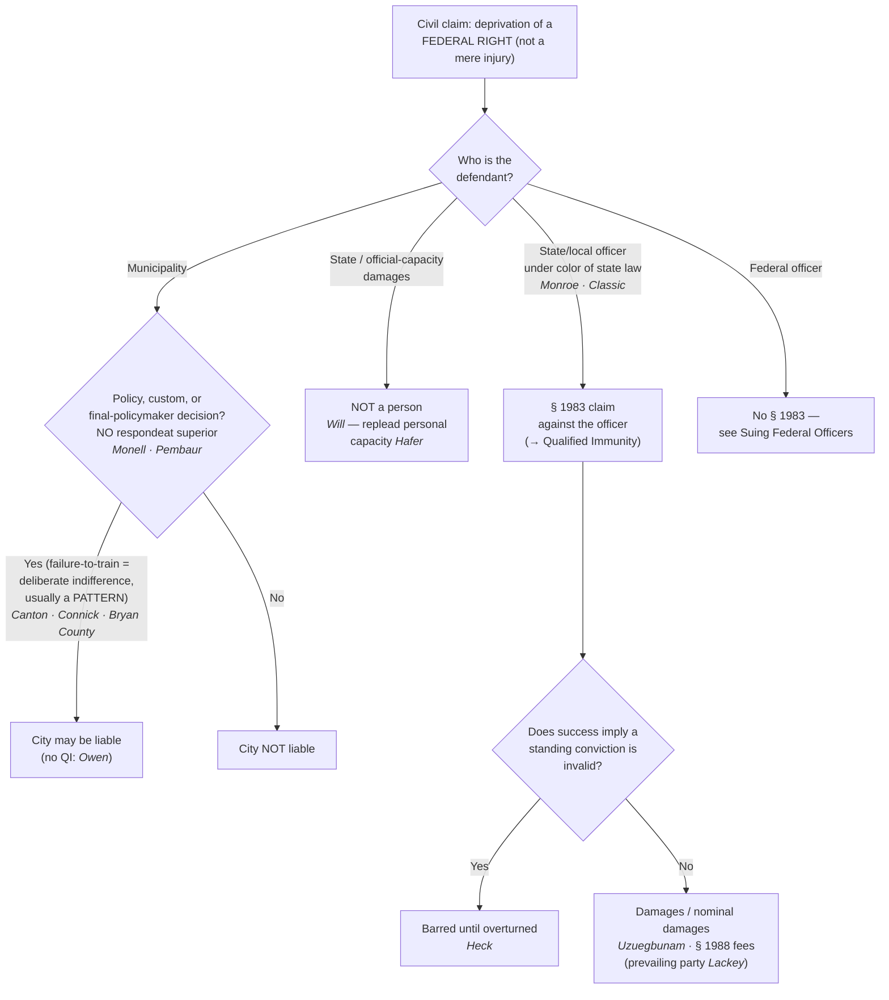

# S9 R1 panel-review — Opus model-diversity lane (prompt pack)

You are the **Claude/Opus** leg of the S9 three-lane adversarial panel (1 Claude + 2 Codex, R1). The two Codex lanes carry the A (support/quote-fidelity) and B (currency/treatment) attack lenses; **you carry model diversity and MUST vote on every paneled assertion across BOTH lenses' concerns.** You are refute-framed: try hard to break each assertion; **default to REFUTED on uncertainty**; never fabricate a cite, quote, or holding; use ONLY the evidence inlined below (no search, no outside knowledge). You are a SIGHTED reviewer — the FULL lake record (judgment fields included) is inlined.

You are a WRITER lane, not an adjudicator: you FIND and VOTE. You do not tally, adjudicate, or close any row — the orchestrator does.

For EACH group below, return one JSON object with the exact `reviewed[]` shape from the output contract (identical framing to the Codex lenses). Emit a finding object ONLY for a real defect (verdict refuted / stands-modified); a group you find wholly clean returns all-`stands` verdicts (the harness records a clean attestation). Concatenate the per-group JSON objects into a top-level `{"packs": [ ... ]}` array, one entry per group, each carrying its `group_id`.


OUTPUT CONTRACT — return ONE JSON object, nothing else:
{
  "lens": "A" | "B",
  "group_id": "<echo the group id>",
  "reviewed": [
    {
      "assertion_id": "<from group_inventory.jsonl>",
      "dimension": "existence|support|quote_fidelity|pincite|treatment|black_letter",
      "verdict": "stands" | "refuted" | "stands-modified",
      "verifiable_from_disclosed": true | false,
      "defect": null,   // null when verdict=="stands"; else an object:
      //  {"problem": "...", "severity": "high|medium|low", "proposed_fix": "...", "evidence_quote": "verbatim from disclosed evidence or null", "needs_cl": true|false, "locator_note": "..."}
      "reasons": ["short evidence-grounded reason", "..."],
      "breaks_true_positives": true | false,
      "residual_risks": ["..."],
      "suggested_tightening": "... or null"
    }
  ],
  "notes": ""
}
Rules: verdict=='stands' <=> defect==null (assertion survives your attack). verdict=='refuted' <=> a real defect (the assertion as framed is wrong). verdict=='stands-modified' <=> survives but needs a stated modification (a minor defect). Review EVERY assertion_id in group_inventory.jsonl exactly once. Output ONLY the JSON object.
---

## GROUP: content/use-of-force-and-liability/Retaliatory Arrest.md  (`doctrine`, 4 assertions)

### content_page

```
---
weight: 60
title: "Retaliatory Arrest"
aliases:
  - "Retaliatory Arrest"
  - "10-use-of-force-liability/Retaliatory-Arrest"
  - "retaliatory-arrest"
topic: "First Amendment retaliatory arrest"
type: doctrine
jurisdiction: "Federal — U.S. Const. amend. I; 42 U.S.C. § 1983; SCOTUS baseline"
status: draft
related:
  - "[[Section 1983 Liability and Qualified Immunity]]"
  - "[[Probable Cause]]"
  - "[[Malicious Prosecution under the Fourth Amendment]]"
---

# Retaliatory Arrest

*Was this person arrested because of protected speech — and if so, does the existence of probable cause defeat the claim anyway?*

> [!rule] Black-letter rule
> A plaintiff claiming he was arrested in **retaliation for First Amendment–protected speech** must ordinarily plead and prove the **absence of probable cause**: the presence of probable cause **generally defeats** a retaliatory-arrest claim. The exception is **narrow** — the plaintiff may proceed despite probable cause by presenting **objective evidence** that he was arrested when **otherwise similarly situated individuals not engaged in the protected speech were not**. *[[Nieves v. Bartlett|Nieves v. Bartlett]]*, 587 U.S. 391 (2019); *[[Gonzalez v. Trevino|Gonzalez v. Trevino]]*, 602 U.S. 653 (2024).
> ^rule-retaliatory-arrest

## The Brief

**The claim and the probable-cause bar.** A retaliatory-arrest claim asserts that officers arrested the plaintiff **because of** his protected speech, in violation of the First Amendment (litigated under § 1983; see [[Section 1983 Liability and Qualified Immunity]]). The central obstacle is **probable cause**. Because officers routinely have valid grounds to arrest, the Court held that a plaintiff must generally **plead and prove the absence of probable cause**, and its presence **defeats** the claim. *[[Nieves v. Bartlett|Nieves v. Bartlett]]*, 587 U.S. 391 (2019). This mirrors the rule for retaliatory **prosecution**, where the plaintiff must likewise show no probable cause. *Hartman v. Moore*, 547 U.S. 250 (2006). The concern is causation: a valid basis to arrest makes it hard to say the speech, rather than the offense, was the but-for cause.

**The *[[Nieves v. Bartlett|Nieves]]* exception, and what *[[Gonzalez v. Trevino|Gonzalez]]* did to it.** *[[Nieves v. Bartlett|Nieves]]* carved out a **narrow exception**: probable cause does **not** bar the claim where the plaintiff offers **objective evidence** that he was arrested when other people who had **not** engaged in the same protected speech, but were otherwise similarly situated, were **not** arrested (the classic example is arresting an outspoken critic for jaywalking that police normally ignore). *[[Gonzalez v. Trevino|Gonzalez v. Trevino]]*, 602 U.S. 653 (2024) (per curiam), clarified that exception in the plaintiff's favor: the plaintiff is **not required** to produce evidence of otherwise-identical individuals who were never arrested, and the exception is **not limited** to split-second warrantless arrests. Comparative evidence is **a** way, not the **only** way, to show the arrest was atypical. The exception remains narrow, but it is real.

**The *[[Lozman v. City of Riviera Beach|Lozman]]* municipal-policy carve-out.** Even before *[[Nieves v. Bartlett|Nieves]]*, the Court recognized a distinct situation: where the retaliatory arrest is carried out **pursuant to an official municipal policy** of retaliation (a premeditated plan to intimidate a critic), the existence of probable cause for the specific arrest does not automatically defeat the claim. *[[Lozman v. City of Riviera Beach|Lozman v. City of Riviera Beach]]*, 585 U.S. 87 (2018). *[[Lozman v. City of Riviera Beach|Lozman]]* was deliberately narrow and left the general probable-cause question for *[[Nieves v. Bartlett|Nieves]]* to answer, but it marks the "official policy" scenario as different from the ordinary on-the-street arrest.

**Common pitfalls.**
- **Ignoring the probable-cause bar.** In the ordinary case the plaintiff must plead and prove **no probable cause**; its presence generally defeats the claim (*[[Nieves v. Bartlett|Nieves]]*).
- **Reading the *[[Nieves v. Bartlett|Nieves]]* exception too narrowly.** After *[[Gonzalez v. Trevino|Gonzalez]]*, the plaintiff need not produce a perfectly identical comparator, and the exception is not confined to snap arrests.
- **Confusing retaliatory arrest with malicious prosecution.** They are different claims with different elements; a seizure pursuant to legal process is [[Malicious Prosecution under the Fourth Amendment]].
- **Forgetting [[Qualified Immunity|qualified immunity]].** Even a viable First Amendment theory meets the clearly-established defense (see [[Qualified Immunity]]); *Reichle v. Howards*, 566 U.S. 658 (2012), granted immunity precisely because the probable-cause question was then unsettled.

## Lower-court developments

The Supreme Court supplies the probable-cause framework; the circuits apply the *[[Nieves v. Bartlett|Nieves]]* exception case by case, and each decision below binds only in its own circuit.

- **Villarreal v. Alaniz (5th Cir. 2024) (en banc), 91 F.4th 693** — *post-Gonzalez application (immunity granted).* The [[Reading and Citing Cases#en-banc|en banc]] court granted [[Qualified Immunity|qualified immunity]] to officers who arrested a citizen-journalist, applying the *[[Nieves v. Bartlett|Nieves]]*/*[[Gonzalez v. Trevino|Gonzalez]]* framework to the specific facts. A worked example of how the narrow exception is litigated after *[[Gonzalez v. Trevino|Gonzalez]]*. *Role: application / immunity grant.* **Binding in-circuit — 5th Cir.**

## Key cases

| Case | Holding | Opinion |
|---|---|---|
| *[[Nieves v. Bartlett]]*, 587 U.S. 391 (2019) | **Anchor.** The presence of **probable cause generally defeats** a First Amendment retaliatory-arrest claim; a **narrow exception** applies where the plaintiff shows he was arrested when otherwise similarly situated non-speakers were not. | [opinion](https://www.courtlistener.com/opinion/9231236/nieves-v-bartlett/) |
| *[[Gonzalez v. Trevino]]*, 602 U.S. 653 (2024) | **Refinement.** Clarified the *[[Nieves v. Bartlett\|Nieves]]* exception in the plaintiff's favor: no need to produce a perfectly identical comparator, and the exception is not limited to split-second arrests. | [opinion](https://www.courtlistener.com/opinion/10600071/gonzalez-v-trevino/) |
| *[[Lozman v. City of Riviera Beach]]*, 585 U.S. 87 (2018) | **Carve-out.** Where a retaliatory arrest is made pursuant to an **official municipal policy** of retaliation, probable cause does not automatically defeat the claim. | [opinion](https://www.courtlistener.com/opinion/4508137/lozman-v-riviera-beach/) |

## Sources
- *Nieves v. Bartlett*, 587 U.S. 391 (2019) — https://www.courtlistener.com/opinion/9231236/nieves-v-bartlett/
- *Gonzalez v. Trevino*, 602 U.S. 653 (2024) (per curiam) — https://www.courtlistener.com/opinion/10600071/gonzalez-v-trevino/
- *Lozman v. City of Riviera Beach*, 585 U.S. 87 (2018) — https://www.courtlistener.com/opinion/4508137/lozman-v-riviera-beach/

```

### group_inventory (assertions under review)

```jsonl
{"assertion_id": "11bf622efd1f3115", "dimension": "existence", "kind": "case_cite", "locator": {"case": "Lozman v. City of Riviera Beach", "table_line": 36}, "payload": {"case": "Lozman v. City of Riviera Beach", "cells": ["*[[Lozman v. City of Riviera Beach]]*, 585 U.S. 87 (2018)", "**Carve-out.** Where a retaliatory arrest is made pursuant to an **official municipal policy** of retaliation, probable cause does not automatically defeat the claim.", "[opinion](https://www.courtlistener.com/opinion/4508137/lozman-v-riviera-beach/)"], "header": ["Case", "Holding", "Opinion"]}}
{"assertion_id": "3590d35aadf2989f", "dimension": "existence", "kind": "case_cite", "locator": {"case": "Gonzalez v. Trevino", "table_line": 35}, "payload": {"case": "Gonzalez v. Trevino", "cells": ["*[[Gonzalez v. Trevino]]*, 602 U.S. 653 (2024)", "**Refinement.** Clarified the *[[Nieves v. Bartlett\\|Nieves]]* exception in the plaintiff's favor: no need to produce a perfectly identical comparator, and the exception is not limited to split-second arrests.", "[opinion](https://www.courtlistener.com/opinion/10600071/gonzalez-v-trevino/)"], "header": ["Case", "Holding", "Opinion"]}}
{"assertion_id": "f614b49011dafbc0", "dimension": "existence", "kind": "case_cite", "locator": {"case": "Nieves v. Bartlett", "table_line": 34}, "payload": {"case": "Nieves v. Bartlett", "cells": ["*[[Nieves v. Bartlett]]*, 587 U.S. 391 (2019)", "**Anchor.** The presence of **probable cause generally defeats** a First Amendment retaliatory-arrest claim; a **narrow exception** applies where the plaintiff shows he was arrested when otherwise similarly situated non-speakers were not.", "[opinion](https://www.courtlistener.com/opinion/9231236/nieves-v-bartlett/)"], "header": ["Case", "Holding", "Opinion"]}}
{"assertion_id": "0d719ddbe5eb9fab", "dimension": "support", "kind": "proposition", "locator": {"callout": "^rule-retaliatory-arrest"}, "payload": {"anchor": "^rule-retaliatory-arrest", "statement": "[!rule] Black-letter rule\nA plaintiff claiming he was arrested in **retaliation for First Amendment–protected speech** must ordinarily plead and prove the **absence of probable cause**: the presence of probable cause **generally defeats** a retaliatory-arrest claim. The exception is **narrow** — the plaintiff may proceed despite probable cause by presenting **objective evidence** that he was arrested when **otherwise similarly situated individuals not engaged in the protected speech were not**. *[[Nieves v. Bartlett|Nieves v. Bartlett]]*, 587 U.S. 391 (2019); *[[Gonzalez v. Trevino|Gonzalez v. Trevino]]*, 602 U.S. 653 (2024)."}}
```

### lake record — Gonzalez v. Trevino

```json
{
  "schema_version": "s2.v1",
  "record_id": "Gonzalez v. Trevino",
  "status": "under_review",
  "identity": {
    "case_name": "Gonzalez v. Trevino",
    "case_name_short": "Gonzalez",
    "case_name_full": "",
    "input_case_name": "Gonzalez v. Trevino",
    "court": "scotus",
    "court_id": null,
    "court_level": "scotus",
    "circuit": null,
    "state": null,
    "date_decided": null,
    "year": 2024,
    "docket": "22-1025",
    "cluster_id": 10600071,
    "lead_opinion_id": 11066659,
    "sibling_ids": [],
    "absolute_url": "/opinion/10600071/gonzalez-v-trevino/",
    "identity_method": "frontier-identity",
    "expected_citation_found": true,
    "party_name_in_text": false,
    "canonical_name_match": true,
    "alternates": [],
    "reason_code": null
  },
  "citations": {
    "official": {
      "cite": "602 U.S. 653",
      "volume": "602",
      "reporter": "U.S.",
      "page": "653",
      "type": 1,
      "selected_official": true,
      "source": "cluster.citations[]"
    },
    "parallel": [],
    "vendor_neutral": [],
    "all": [
      {
        "cite": "602 U.S. 653",
        "volume": "602",
        "reporter": "U.S.",
        "page": "653",
        "type": 1,
        "selected_official": false,
        "source": "cluster.citations[]"
      }
    ],
    "display": "602 U.S. 653",
    "official_selection": {
      "court_class": "scotus",
      "selected": "602 U.S. 653",
      "reason": "selected_rank_1"
    }
  },
  "pinpoints": [],
  "treatment": {
    "field_i_validity": "unverified",
    "as_of_content": null,
    "as_of_treatment": null,
    "composite_basis": "unverified",
    "composite_basis_ref": null,
    "varies_by_point": false,
    "scope_note": "Frontier stub: treatment/progeny intentionally not derived until S6 promotion.",
    "point_overrides": [],
    "edges": [],
    "derivation": {}
  },
  "progeny": {
    "complete_query": null,
    "indexed_citing_opinions": null,
    "count_source": null,
    "per_sibling": [],
    "citation_count": null,
    "cache_path": null,
    "enumeration": null,
    "cursor": null,
    "rows_cached": 0,
    "outbound_opinion_edges": []
  },
  "off_cl_links": [],
  "provenance": {
    "cl_source": null,
    "cl_api": "https://www.courtlistener.com/api/rest/v4",
    "built_by": "S2-BUILDER-AUTHORING",
    "build_run": "s2-build-96d841cbb12e",
    "date_created": "2026-07-06T12:12:18Z",
    "date_modified": "2026-07-10T20:54:54Z",
    "warnings": [],
    "field_provenance": {
      "identity": {
        "src": "CourtListener frontier identity search",
        "at": "2026-07-06T12:12:29Z",
        "verifier": "S2-BUILDER-AUTHORING"
      },
      "treatment.field_i_validity": {
        "src": "frontier stub, no treatment",
        "at": "2026-07-06T12:12:29Z",
        "verifier": "S2-BUILDER-AUTHORING"
      },
      "point_overrides": {
        "src": "frontier stub, no treatment",
        "at": "2026-07-06T12:12:29Z",
        "verifier": "S2-BUILDER-AUTHORING"
      },
      "pinpoints": {
        "src": "frontier stub, no pinpoints",
        "at": "2026-07-06T12:12:29Z",
        "verifier": "S2-BUILDER-AUTHORING"
      }
    },
    "s6_promotion": {
      "from_record_id": "gonzalez-v-trevino--10600071",
      "to_record_id": "Gonzalez v. Trevino",
      "as_of": "2026-07-07",
      "born_status": "under_review"
    }
  }
}

```

### lake record — Lozman v. City of Riviera Beach

```json
{
  "schema_version": "s2.v1",
  "record_id": "Lozman v. City of Riviera Beach",
  "status": "under_review",
  "identity": {
    "case_name": "Lozman v. Riviera Beach",
    "case_name_short": "Lozman",
    "case_name_full": "",
    "input_case_name": "Lozman v. City of Riviera Beach",
    "court": "U.S. Supreme Court",
    "court_id": "scotus",
    "court_level": "scotus",
    "circuit": null,
    "state": null,
    "date_decided": "2018-06-18",
    "year": 2018,
    "docket": "No. 17-21",
    "cluster_id": 4508137,
    "lead_opinion_id": 4285390,
    "sibling_ids": [],
    "absolute_url": "/opinion/4508137/lozman-v-riviera-beach/",
    "identity_method": "frontier-identity",
    "expected_citation_found": true,
    "party_name_in_text": false,
    "canonical_name_match": true,
    "alternates": [],
    "reason_code": null
  },
  "citations": {
    "official": {
      "cite": "585 U.S. 87",
      "volume": "585",
      "reporter": "U.S.",
      "page": "87",
      "type": 1,
      "selected_official": true,
      "source": "cluster.citations[]"
    },
    "parallel": [
      {
        "cite": "138 S. Ct. 1945",
        "volume": "138",
        "reporter": "S. Ct.",
        "page": "1945",
        "type": 1,
        "selected_official": false,
        "source": "cluster.citations[]"
      },
      {
        "cite": "201 L. Ed. 2d 342",
        "volume": "201",
        "reporter": "L. Ed. 2d",
        "page": "342",
        "type": 1,
        "selected_official": false,
        "source": "cluster.citations[]"
      }
    ],
    "vendor_neutral": [
      {
        "cite": "2018 U.S. LEXIS 3691",
        "volume": "2018",
        "reporter": "U.S. LEXIS",
        "page": "3691",
        "type": 6,
        "selected_official": false,
        "source": "cluster.citations[]"
      }
    ],
    "all": [
      {
        "cite": "585 U.S. 87",
        "volume": "585",
        "reporter": "U.S.",
        "page": "87",
        "type": 1,
        "selected_official": false,
        "source": "cluster.citations[]"
      },
      {
        "cite": "138 S. Ct. 1945",
        "volume": "138",
        "reporter": "S. Ct.",
        "page": "1945",
        "type": 1,
        "selected_official": false,
        "source": "cluster.citations[]"
      },
      {
        "cite": "201 L. Ed. 2d 342",
        "volume": "201",
        "reporter": "L. Ed. 2d",
        "page": "342",
        "type": 1,
        "selected_official": false,
        "source": "cluster.citations[]"
      },
      {
        "cite": "2018 U.S. LEXIS 3691",
        "volume": "2018",
        "reporter": "U.S. LEXIS",
        "page": "3691",
        "type": 6,
        "selected_official": false,
        "source": "cluster.citations[]"
      }
    ],
    "display": "585 U.S. 87",
    "official_selection": {
      "court_class": "scotus",
      "selected": "585 U.S. 87",
      "reason": "selected_rank_1"
    }
  },
  "pinpoints": [],
  "treatment": {
    "field_i_validity": "unverified",
    "as_of_content": null,
    "as_of_treatment": null,
    "composite_basis": "unverified",
    "composite_basis_ref": null,
    "varies_by_point": false,
    "scope_note": "Frontier stub: treatment/progeny intentionally not derived until S6 promotion.",
    "point_overrides": [],
    "edges": [],
    "derivation": {}
  },
  "progeny": {
    "complete_query": null,
    "indexed_citing_opinions": null,
    "count_source": null,
    "per_sibling": [],
    "citation_count": null,
    "cache_path": null,
    "enumeration": null,
    "cursor": null,
    "rows_cached": 0,
    "outbound_opinion_edges": []
  },
  "off_cl_links": [],
  "provenance": {
    "cl_source": null,
    "cl_api": "https://www.courtlistener.com/api/rest/v4",
    "built_by": "S2-BUILDER-AUTHORING",
    "build_run": "s2-build-96d841cbb12e",
    "date_created": "2026-07-06T13:17:07Z",
    "date_modified": "2026-07-10T20:54:54Z",
    "warnings": [],
    "field_provenance": {
      "identity": {
        "src": "CourtListener frontier identity search",
        "at": "2026-07-06T13:17:24Z",
        "verifier": "S2-BUILDER-AUTHORING"
      },
      "treatment.field_i_validity": {
        "src": "frontier stub, no treatment",
        "at": "2026-07-06T13:17:24Z",
        "verifier": "S2-BUILDER-AUTHORING"
      },
      "point_overrides": {
        "src": "frontier stub, no treatment",
        "at": "2026-07-06T13:17:24Z",
        "verifier": "S2-BUILDER-AUTHORING"
      },
      "pinpoints": {
        "src": "frontier stub, no pinpoints",
        "at": "2026-07-06T13:17:24Z",
        "verifier": "S2-BUILDER-AUTHORING"
      }
    },
    "s6_promotion": {
      "from_record_id": "lozman-v-city-of-riviera-beach--4508137",
      "to_record_id": "Lozman v. City of Riviera Beach",
      "as_of": "2026-07-07",
      "born_status": "under_review"
    }
  }
}

```

### lake record — Nieves v. Bartlett

```json
{
  "schema_version": "s2.v1",
  "record_id": "Nieves v. Bartlett",
  "status": "under_review",
  "identity": {
    "case_name": "Nieves v. Bartlett",
    "case_name_short": "Nieves",
    "case_name_full": "Luis A. NIEVES v. Russell P. BARTLETT",
    "input_case_name": "Nieves v. Bartlett",
    "court": "scotus",
    "court_id": null,
    "court_level": "scotus",
    "circuit": null,
    "state": null,
    "date_decided": null,
    "year": 2019,
    "docket": "17-1174",
    "cluster_id": 9231236,
    "lead_opinion_id": 9226038,
    "sibling_ids": [],
    "absolute_url": "/opinion/9231236/nieves-v-bartlett/",
    "identity_method": "frontier-identity",
    "expected_citation_found": true,
    "party_name_in_text": false,
    "canonical_name_match": true,
    "alternates": [],
    "reason_code": null
  },
  "citations": {
    "official": {
      "cite": "587 U.S. 391",
      "volume": "587",
      "reporter": "U.S.",
      "page": "391",
      "type": 1,
      "selected_official": true,
      "source": "cluster.citations[]"
    },
    "parallel": [
      {
        "cite": "139 S. Ct. 1715",
        "volume": "139",
        "reporter": "S. Ct.",
        "page": "1715",
        "type": 1,
        "selected_official": false,
        "source": "cluster.citations[]"
      }
    ],
    "vendor_neutral": [],
    "all": [
      {
        "cite": "587 U.S. 391",
        "volume": "587",
        "reporter": "U.S.",
        "page": "391",
        "type": 1,
        "selected_official": false,
        "source": "cluster.citations[]"
      },
      {
        "cite": "139 S. Ct. 1715",
        "volume": "139",
        "reporter": "S. Ct.",
        "page": "1715",
        "type": 1,
        "selected_official": false,
        "source": "cluster.citations[]"
      }
    ],
    "display": "587 U.S. 391",
    "official_selection": {
      "court_class": "scotus",
      "selected": "587 U.S. 391",
      "reason": "selected_rank_1"
    }
  },
  "pinpoints": [],
  "treatment": {
    "field_i_validity": "unverified",
    "as_of_content": null,
    "as_of_treatment": null,
    "composite_basis": "unverified",
    "composite_basis_ref": null,
    "varies_by_point": false,
    "scope_note": "Frontier stub: treatment/progeny intentionally not derived until S6 promotion.",
    "point_overrides": [],
    "edges": [],
    "derivation": {}
  },
  "progeny": {
    "complete_query": null,
    "indexed_citing_opinions": null,
    "count_source": null,
    "per_sibling": [],
    "citation_count": null,
    "cache_path": null,
    "enumeration": null,
    "cursor": null,
    "rows_cached": 0,
    "outbound_opinion_edges": []
  },
  "off_cl_links": [],
  "provenance": {
    "cl_source": null,
    "cl_api": "https://www.courtlistener.com/api/rest/v4",
    "built_by": "S2-BUILDER-AUTHORING",
    "build_run": "s2-build-96d841cbb12e",
    "date_created": "2026-07-06T12:14:24Z",
    "date_modified": "2026-07-10T20:54:54Z",
    "warnings": [],
    "field_provenance": {
      "identity": {
        "src": "CourtListener frontier identity search",
        "at": "2026-07-06T12:14:36Z",
        "verifier": "S2-BUILDER-AUTHORING"
      },
      "treatment.field_i_validity": {
        "src": "frontier stub, no treatment",
        "at": "2026-07-06T12:14:36Z",
        "verifier": "S2-BUILDER-AUTHORING"
      },
      "point_overrides": {
        "src": "frontier stub, no treatment",
        "at": "2026-07-06T12:14:36Z",
        "verifier": "S2-BUILDER-AUTHORING"
      },
      "pinpoints": {
        "src": "frontier stub, no pinpoints",
        "at": "2026-07-06T12:14:36Z",
        "verifier": "S2-BUILDER-AUTHORING"
      }
    },
    "s6_promotion": {
      "from_record_id": "nieves-v-bartlett--9231236",
      "to_record_id": "Nieves v. Bartlett",
      "as_of": "2026-07-07",
      "born_status": "under_review"
    }
  }
}

```

---

## GROUP: content/use-of-force-and-liability/Section 1983 Liability and Qualified Immunity.md  (`doctrine`, 21 assertions)

### content_page

```
---
weight: 20
title: "Section 1983 & Municipal Liability"
aliases:
  - "Section 1983 Liability and Qualified Immunity"
  - "Section 1983 & Municipal Liability"
  - "1983 Liability"
  - "10-use-of-force-liability/Section-1983-Liability-and-Qualified-Immunity"
  - "civil-liability-1983"
topic: "Section 1983 & municipal liability"
type: doctrine
amendment: "42 U.S.C. § 1983 · U.S. Const. amend. XIV"
jurisdiction: "Federal — 42 U.S.C. §§ 1983, 1988; 18 U.S.C. § 242; SCOTUS baseline"
status: draft
related:
  - "[[Use of Force]]"
  - "[[Qualified Immunity]]"
  - "[[Suing Federal Officers]]"
  - "[[Brady and Giglio]]"
  - "[[Fourth Amendment Framework]]"
---

# Section 1983 & Municipal Liability

*Who can be sued for a constitutional violation under color of state law, and when is the government itself on the hook?*

> [!rule] Black-letter rule
> **42 U.S.C. § 1983** creates a civil action against any **person** who, **under color of** state law, deprives another of a **right secured by the Constitution or federal law**. Two elements: (1) conduct **under color of state law**, and (2) **deprivation of a federal right** (not a mere injury). A **municipality** is a "person" but is liable **only** where the deprivation is caused by its own official **policy or custom** — **never on [[Common Legal Terms#respondeat-superior|respondeat superior]]**. *[[Monroe v. Pape|Monroe v. Pape]]*, 365 U.S. 167 (1961); *[[Monell v. Department of Social Services|Monell v. Dep't of Soc. Servs.]]*, 436 U.S. 658 (1978).
> ^rule-section-1983

## The Brief

**What § 1983 is, and what it is not.** Section 1983 is the **engine of civil accountability** for constitutional violations by state and local officials. It creates no rights of its own; it supplies a **remedy** (damages or injunctive relief) for the deprivation of rights secured elsewhere. This page is about **who may be sued and when** the government entity answers. It is not about suppression (that is [[The Exclusionary Rule]]), not about the immunity defense the individual officer raises (that is [[Qualified Immunity]]), and not about suing a **federal** officer (that is [[Suing Federal Officers]]).

**The two elements: color of law and a federal right.** A § 1983 claim requires (1) a person acting **under color of** state law who (2) **deprives** the plaintiff of a **federal right**. "Under color of" reaches an officer's **misuse** of state-conferred authority even when the conduct violates state law, and no exhaustion of state remedies is required. *[[Monroe v. Pape|Monroe v. Pape]]*, 365 U.S. at [184](https://www.courtlistener.com/opinion/106170/monroe-v-pape/). The definition traces to *[[United States v. Classic|Classic]]*: "Misuse of power, possessed by virtue of state law and made possible only because the wrongdoer is clothed with the authority of state law, is action taken 'under color of' state law." *[[United States v. Classic|United States v. Classic]]*, 313 U.S. 299, [326](https://www.courtlistener.com/opinion/103531/united-states-v-classic/) (1941). The badge is what makes an otherwise-private wrong actionable. Prevailing plaintiffs may recover **reasonable attorney's fees** in the court's discretion. 42 U.S.C. § 1988(b). The **criminal** analog is **18 U.S.C. § 242**, which punishes a **willful** (specific-intent) deprivation of rights under color of law; the steep willfulness burden is why § 242 charges are reserved for the most egregious cases. *[[Screws v. United States|Screws v. United States]]*, 325 U.S. 91 (1945) (construing "willfully").

**Section 1983 protects rights, not injuries — and not every constitutional-adjacent wrong is a claim.** A violation of the *[[Miranda v. Arizona|Miranda]]* prophylactic rules is **not itself** a constitutional violation and "does not provide a basis for a § 1983 claim." *[[Vega v. Tekoh|Vega v. Tekoh]]*, 597 U.S. 134 (2022). The Self-Incrimination Clause is a **trial right**: coercive questioning that produces no statement used against the suspect in a criminal case is not, by itself, a completed Fifth Amendment violation, so it cannot ground a self-incrimination claim. *[[Chavez v. Martinez|Chavez v. Martinez]]*, 538 U.S. 760, [767](https://www.courtlistener.com/opinion/127927/chavez-v-martinez/) (2003) (plurality) (leaving open a separate substantive-due-process "shocks the conscience" theory).

**Who counts as a "person": the State does not, its officials in their personal capacity do.** A **State** (and a state official sued in an **official** capacity for damages) is **not** a "person" under § 1983. *[[Will v. Michigan Department of State Police|Will v. Michigan Dep't of State Police]]*, 491 U.S. 58 (1989). But the same official sued in a **personal** (individual) capacity **is** a person and may be held personally liable. *[[Hafer v. Melo|Hafer v. Melo]]*, 502 U.S. 21 (1991). The distinction is not a pleading formality: an official-capacity suit "is only another way of pleading an action against an entity of which an officer is an agent," so it runs against the government, while a personal-capacity suit seeks to impose liability on the individual. *Kentucky v. Graham*, 473 U.S. 159 (1985).

**Reaching the local government (*[[Monell v. Department of Social Services|Monell]]*): policy or custom, never [[Common Legal Terms#respondeat-superior|respondeat superior]].** Municipalities and local governing bodies are "persons," but are liable **only** for injuries inflicted by their own official **policy or custom**: "a municipality cannot be held liable under § 1983 on a *respondeat superior* theory." *[[Monell v. Department of Social Services|Monell]]*, 436 U.S. at [691](https://www.courtlistener.com/opinion/109881/monell-v-new-york-city-dept-of-social-servs/). Liability attaches only when "execution of a government's policy or custom" inflicts the injury. *[[Monell v. Department of Social Services|Monell]]*, 436 U.S. at [694](https://www.courtlistener.com/opinion/109881/monell-v-new-york-city-dept-of-social-servs/). Three routes reach the entity: an official **policy**; a widespread **custom**; or a **single decision by an official with final policymaking authority**. *[[Pembaur v. City of Cincinnati|Pembaur v. City of Cincinnati]]*, 475 U.S. 469, [483–484](https://www.courtlistener.com/opinion/111615/pembaur-v-city-of-cincinnati/) (1986). Because the wrong must be the municipality's own, the entity has **no [[Qualified Immunity|qualified immunity]]** — unlike the individual officer, a city cannot invoke good faith. *[[Owen v. City of Independence|Owen v. City of Independence]]*, 445 U.S. 622 (1980).

**The hardest municipal routes: failure-to-train and single-incident liability.** Inadequate training is a "policy" only where the failure amounts to **deliberate indifference** to the rights of those the police encounter. *[[City of Canton v. Harris|City of Canton v. Harris]]*, 489 U.S. 378, [388](https://www.courtlistener.com/opinion/112209/city-of-canton-v-harris/) (1989). And a **pattern** of similar violations is "ordinarily necessary" to prove that indifference: a single incident almost never suffices. *[[Connick v. Thompson|Connick v. Thompson]]*, 563 U.S. 51, [62](https://www.courtlistener.com/opinion/7343085/connick-v-thompson/) (2011) (a lone *[[Brady v. Maryland|Brady]]* nondisclosure did not support municipal liability — cross-reference [[Brady and Giglio]]). The Court has policed the "single hiring decision" theory just as strictly, requiring that the plaintiff show the specific injury was a **plainly obvious** consequence of the decision. *[[Board of County Commissioners of Bryan County v. Brown|Bd. of Cnty. Comm'rs of Bryan Cnty. v. Brown]]*, 520 U.S. 397 (1997). *[[Monell v. Department of Social Services|Monell]]* liability is real but genuinely hard to prove.

**Remedies and the *[[Heck v. Humphrey|Heck]]* bar.** A § 1983 plaintiff may recover **compensatory** and, against individuals, **punitive** damages; **injunctive and declaratory** relief; and **§ 1988(b) attorney's fees** as a **prevailing party**. A completed constitutional violation supports at least **nominal damages** even without proof of compensable harm, which keeps a live case from becoming moot. *[[Uzuegbunam v. Preczewski|Uzuegbunam v. Preczewski]]*, 592 U.S. 279 (2021). But a plaintiff who wins only a **preliminary injunction** and never a final judgment is **not** a "prevailing party" for fees. *[[Lackey v. Stinnie|Lackey v. Stinnie]]*, 604 U.S. 192 (2025). And a damages action that "would necessarily imply the invalidity of" a **standing conviction or sentence** is **not cognizable** until that conviction is set aside. *[[Heck v. Humphrey|Heck v. Humphrey]]*, 512 U.S. 477, [486–487](https://www.courtlistener.com/opinion/117864/heck-v-humphrey/) (1994). A defendant convicted on challenged evidence generally cannot pursue a parallel § 1983 suit attacking the same search while the conviction stands.

**Burden, standard of review, and remedy.** The **plaintiff** bears the burden on both elements. Whether a **defendant is a "person," whether conduct was under color of law,** and **whether a municipal policy caused the injury** are the litigated fronts; municipal liability turns on **causation** (the policy must be the "moving force"). Compensatory relief is measured by **actual injury** (a constitutional violation is not itself a damages measure). The § 1983 civil track sits alongside the **§ 242 criminal** track and, for **federal** officers, the *[[Bivens v. Six Unknown Named Agents|Bivens]]* and **FTCA** tracks on [[Suing Federal Officers]].

**Apply it.** Work the defendant and the theory in order:
1. **Who is the defendant?** A **state or local officer** → § 1983 against the individual (personal capacity, or official capacity for **injunctive** relief). A **State** or a state officer sued for **damages in official capacity** → **not a person** (*[[Will v. Michigan Department of State Police|Will]]*); replead in **personal capacity** if the individual is the target (*[[Hafer v. Melo|Hafer]]*). A **federal** officer → not § 1983 at all; see [[Suing Federal Officers]].
2. **Was a *federal right* actually deprived** — not merely an injury, and not a bare *[[Miranda v. Arizona|Miranda]]* lapse (*[[Vega v. Tekoh|Vega]]*)?
3. **If the target is the municipality**, identify a **policy, custom, or final-policymaker decision** (*[[Pembaur v. City of Cincinnati|Pembaur]]*); a **failure-to-train** theory needs **deliberate indifference**, ordinarily shown by a **pattern** (*[[City of Canton v. Harris|Canton]]*; *[[Connick v. Thompson|Connick]]*) — a lone bad act by one employee is not enough.
4. **Is a conviction in the way?** If success would necessarily imply its invalidity, *[[Heck v. Humphrey|Heck]]* bars the suit until the conviction is overturned.
5. **Separate the individual officer's immunity** — the **clearly-established** question lives on [[Qualified Immunity]], and it does not change what § 1983 or the Fourth Amendment requires.

**Common pitfalls.**
- **Suing the city as if [[Common Legal Terms#respondeat-superior|respondeat superior]] applied.** *[[Monell v. Department of Social Services|Monell]]* forecloses it: find a **policy, custom, or final-policymaker decision**, not merely a bad employee.
- **Treating one bad incident as failure-to-train.** *[[Connick v. Thompson|Connick]]* ordinarily requires a **pattern** to show deliberate indifference; a single incident almost never suffices.
- **Suing a State (or a state officer for official-capacity damages).** Neither is a "person" (*[[Will v. Michigan Department of State Police|Will]]*); the individual must be sued in **personal** capacity (*[[Hafer v. Melo|Hafer]]*).
- **Confusing § 1983 with a *[[Bivens v. Six Unknown Named Agents|Bivens]]* claim.** Section 1983 reaches **state and local** actors only; a **federal** officer requires *[[Bivens v. Six Unknown Named Agents|Bivens]]*, now nearly foreclosed (see [[Suing Federal Officers]]).
- **Filing a Miranda-only claim.** A *[[Miranda v. Arizona|Miranda]]* violation is not itself actionable under § 1983 (*[[Vega v. Tekoh|Vega]]*).
- **Attacking a standing conviction.** *[[Heck v. Humphrey|Heck]]* bars a suit whose success would necessarily imply the conviction's invalidity.
- **Assuming a preliminary-injunction win earns fees.** It does not without a final judgment (*[[Lackey v. Stinnie|Lackey]]*).
- **Treating § 1983 and § 242 as interchangeable.** Civil (damages, preponderance, no willfulness) versus criminal (prosecution, [[Common Legal Terms#beyond-a-reasonable-doubt|beyond a reasonable doubt]], a **willful** deprivation — *[[Screws v. United States|Screws]]*).

## Key cases

| Case | Holding | Opinion |
|---|---|---|
| *[[Monroe v. Pape]]*, 365 U.S. 167 (1961) | **Anchor.** "Under color of" law reaches an officer's **misuse** of state-conferred authority, even when it violates state law; no exhaustion of state remedies required. Its municipal-immunity holding was later overruled by *[[Monell v. Department of Social Services\|Monell]]*. | [opinion](https://www.courtlistener.com/opinion/106170/monroe-v-pape/) |
| *[[United States v. Classic]]*, 313 U.S. 299 (1941) | **Definition.** Misuse of power possessed by virtue of state law, made possible only because the actor is clothed with state authority, is action "under color of" state law. | [opinion](https://www.courtlistener.com/opinion/103531/united-states-v-classic/) |
| *[[Monell v. Department of Social Services]]*, 436 U.S. 658 (1978) | **Anchor.** Municipalities are § 1983 "persons," but liable **only** for injuries caused by an official **policy or custom**; **no [[Common Legal Terms#respondeat-superior\|respondeat superior]]**. | [opinion](https://www.courtlistener.com/opinion/109881/monell-v-new-york-city-dept-of-social-servs/) |
| *[[Pembaur v. City of Cincinnati]]*, 475 U.S. 469 (1986) | **Refinement.** A **single decision by an official with final policymaking authority** for the subject matter is an "official policy" that triggers *[[Monell v. Department of Social Services\|Monell]]* liability. | [opinion](https://www.courtlistener.com/opinion/111615/pembaur-v-city-of-cincinnati/) |
| *[[City of Canton v. Harris]]*, 489 U.S. 378 (1989) | **Refinement.** **Failure-to-train** grounds municipal liability **only** where the inadequacy amounts to **deliberate indifference** to the rights of those the police encounter. | [opinion](https://www.courtlistener.com/opinion/112209/city-of-canton-v-harris/) |
| *[[Connick v. Thompson]]*, 563 U.S. 51 (2011) | **Refinement.** A **pattern** of similar violations is "ordinarily necessary" to show deliberate indifference; a **single** *[[Brady v. Maryland\|Brady]]* nondisclosure does not support *[[Monell v. Department of Social Services\|Monell]]* liability. | [opinion](https://www.courtlistener.com/opinion/213505/connick-v-thompson/) |
| *[[Board of County Commissioners of Bryan County v. Brown]]*, 520 U.S. 397 (1997) | **Refinement.** A **single hiring decision** grounds municipal liability only where the specific injury was a **plainly obvious** consequence of the decision; a strict culpability-and-causation bar. | [opinion](https://www.courtlistener.com/opinion/118104/board-of-the-county-commissioners-of-bryan-county-v-brown/) |
| *[[Owen v. City of Independence]]*, 445 U.S. 622 (1980) | **Refinement.** A **municipality has no [[Qualified Immunity\|qualified immunity]]**; it cannot assert the good-faith defense available to its individual officers. | [opinion](https://www.courtlistener.com/opinion/110236/owen-v-city-of-independence/) |
| *[[Will v. Michigan Department of State Police]]*, 491 U.S. 58 (1989) | **Boundary.** A **State** (and a state official sued for damages in **official** capacity) is **not a "person"** under § 1983. | [opinion](https://www.courtlistener.com/opinion/112293/will-v-michigan-department-of-state-police/) |
| *[[Hafer v. Melo]]*, 502 U.S. 21 (1991) | **Boundary.** A state official sued in a **personal (individual)** capacity **is** a "person" and may be personally liable for acts taken under color of state law. | [opinion](https://www.courtlistener.com/opinion/112657/hafer-v-melo/) |
| *[[Uzuegbunam v. Preczewski]]*, 592 U.S. 279 (2021) | **Remedy.** A completed constitutional violation supports at least **nominal damages**, which keep a live controversy from becoming moot. | [opinion](https://www.courtlistener.com/opinion/4861817/uzuegbunam-v-preczewski/) |
| *[[Lackey v. Stinnie]]*, 604 U.S. 192 (2025) | **Remedy.** A plaintiff who wins only a **preliminary injunction**, with no final judgment on the merits, is **not** a "prevailing party" entitled to § 1988 fees. | [opinion](https://www.courtlistener.com/opinion/10776869/lackey-v-stinnie/) |
| *[[Vega v. Tekoh]]*, 597 U.S. 134 (2022) | **Boundary.** A **Miranda** violation is not itself a Fifth Amendment violation and **does not** provide a basis for a § 1983 damages claim against the officer. | [opinion](https://www.courtlistener.com/opinion/6480695/vega-v-tekoh/) |
| *[[Chavez v. Martinez]]*, 538 U.S. 760 (2003) | **Boundary.** The Self-Incrimination Clause is a **trial right**: coercive questioning not used against the suspect in a criminal case is not, by itself, a completed violation grounding § 1983. | [opinion](https://www.courtlistener.com/opinion/127927/chavez-v-martinez/) |
| *[[Heck v. Humphrey]]*, 512 U.S. 477 (1994) | **Bar.** A § 1983 claim that would **necessarily imply the invalidity** of a standing conviction is barred until the conviction is overturned (favorable-termination rule). | [opinion](https://www.courtlistener.com/opinion/117864/heck-v-humphrey/) |
| *[[Screws v. United States]]*, 325 U.S. 91 (1945) | **Criminal analog.** 18 U.S.C. § 242 requires a **willful** (specific-intent) deprivation of rights under color of law; the reason § 242 charges are rare. | [opinion](https://www.courtlistener.com/opinion/104135/screws-v-united-states/) |

## Related cases across doctrines

| Case | Relevance here | Primary home | Opinion |
|---|---|---|---|
| *[[Graham v. Connor]]*, 490 U.S. 386 (1989) | The merits standard most § 1983 force claims run on: Fourth Amendment **objective reasonableness**, not "malice" or "sadism." | [[Use of Force]] | [opinion](https://www.courtlistener.com/opinion/112257/graham-v-connor/) |
| *[[Devenpeck v. Alford]]*, 543 U.S. 146 (2004) | Defeats a § 1983 **false-arrest** claim: an arrest is lawful if the known facts give probable cause for **some** offense, even if not the one invoked. | [[Probable Cause]] | [opinion](https://www.courtlistener.com/opinion/137733/devenpeck-v-alford/) |
| *[[Heien v. North Carolina]]*, 574 U.S. 54 (2014) | An **objectively reasonable mistake of law or fact** is no Fourth Amendment violation, blunting § 1983 exposure for good-faith errors. | [[Traffic Stops]] | [opinion](https://www.courtlistener.com/opinion/2760668/heien-v-north-carolina/) |
| *[[Bivens v. Six Unknown Named Agents]]*, 403 U.S. 388 (1971) | The § 1983 analog for **federal** officers; an implied damages remedy, now sharply cabined for new contexts. | [[Suing Federal Officers]] | [opinion](https://www.courtlistener.com/opinion/108375/bivens-v-six-unknown-named-agents-of-federal-bureau-of-narcotics/) |

## Visual



## Sources
- *Monroe v. Pape*, 365 U.S. 167 (1961) (pinpoint 184) — https://www.courtlistener.com/opinion/106170/monroe-v-pape/
- *United States v. Classic*, 313 U.S. 299 (1941) (pinpoint 326) — https://www.courtlistener.com/opinion/103531/united-states-v-classic/
- *Monell v. Department of Social Services*, 436 U.S. 658 (1978) (pinpoints 691, 694) — https://www.courtlistener.com/opinion/109881/monell-v-new-york-city-dept-of-social-servs/
- *Pembaur v. City of Cincinnati*, 475 U.S. 469 (1986) (pinpoints 483–484) — https://www.courtlistener.com/opinion/111615/pembaur-v-city-of-cincinnati/
- *City of Canton v. Harris*, 489 U.S. 378 (1989) (pinpoint 388) — https://www.courtlistener.com/opinion/112209/city-of-canton-v-harris/
- *Connick v. Thompson*, 563 U.S. 51 (2011) (pinpoint 62) — https://www.courtlistener.com/opinion/213505/connick-v-thompson/ *(a single Brady nondisclosure is not a pattern; cross-reference [[Brady and Giglio]])*
- *Board of County Commissioners of Bryan County v. Brown*, 520 U.S. 397 (1997) — https://www.courtlistener.com/opinion/118104/board-of-the-county-commissioners-of-bryan-county-v-brown/
- *Owen v. City of Independence*, 445 U.S. 622 (1980) — https://www.courtlistener.com/opinion/110236/owen-v-city-of-independence/
- *Will v. Michigan Department of State Police*, 491 U.S. 58 (1989) — https://www.courtlistener.com/opinion/112293/will-v-michigan-department-of-state-police/
- *Hafer v. Melo*, 502 U.S. 21 (1991) — https://www.courtlistener.com/opinion/112657/hafer-v-melo/
- *Kentucky v. Graham*, 473 U.S. 159 (1985) — https://www.courtlistener.com/opinion/111500/kentucky-v-graham/
- *Uzuegbunam v. Preczewski*, 592 U.S. 279 (2021) — https://www.courtlistener.com/opinion/4861817/uzuegbunam-v-preczewski/
- *Lackey v. Stinnie*, 604 U.S. 192 (2025) — https://www.courtlistener.com/opinion/10776869/lackey-v-stinnie/
- *Vega v. Tekoh*, 597 U.S. 134 (2022) — https://www.courtlistener.com/opinion/6480695/vega-v-tekoh/
- *Chavez v. Martinez*, 538 U.S. 760 (2003) (pinpoint 767) — https://www.courtlistener.com/opinion/127927/chavez-v-martinez/
- *Heck v. Humphrey*, 512 U.S. 477 (1994) (pinpoints 486–487) — https://www.courtlistener.com/opinion/117864/heck-v-humphrey/
- *Screws v. United States*, 325 U.S. 91 (1945) — https://www.courtlistener.com/opinion/104135/screws-v-united-states/
- *Graham v. Connor*, 490 U.S. 386 (1989) — https://www.courtlistener.com/opinion/112257/graham-v-connor/ *(objective-reasonableness merits; home [[Use of Force]])*
- *Devenpeck v. Alford*, 543 U.S. 146 (2004) — https://www.courtlistener.com/opinion/137733/devenpeck-v-alford/
- *Heien v. North Carolina*, 574 U.S. 54 (2014) — https://www.courtlistener.com/opinion/2760668/heien-v-north-carolina/
- *Bivens v. Six Unknown Named Agents*, 403 U.S. 388 (1971) — https://www.courtlistener.com/opinion/108375/bivens-v-six-unknown-named-agents-of-federal-bureau-of-narcotics/ *(home [[Suing Federal Officers]])*

```

### group_inventory (assertions under review)

```jsonl
{"assertion_id": "176471dbee4a85bf", "dimension": "existence", "kind": "case_cite", "locator": {"case": "Heien v. North Carolina", "table_line": 72}, "payload": {"case": "Heien v. North Carolina", "cells": ["*[[Heien v. North Carolina]]*, 574 U.S. 54 (2014)", "An **objectively reasonable mistake of law or fact** is no Fourth Amendment violation, blunting § 1983 exposure for good-faith errors.", "[[Traffic Stops]]", "[opinion](https://www.courtlistener.com/opinion/2760668/heien-v-north-carolina/)"], "header": ["Case", "Relevance here", "Primary home", "Opinion"]}}
{"assertion_id": "1c22be83cdd3377a", "dimension": "existence", "kind": "case_cite", "locator": {"case": "Monell v. Department of Social Services", "table_line": 51}, "payload": {"case": "Monell v. Department of Social Services", "cells": ["*[[Monell v. Department of Social Services]]*, 436 U.S. 658 (1978)", "**Anchor.** Municipalities are § 1983 \"persons,\" but liable **only** for injuries caused by an official **policy or custom**; **no [[Common Legal Terms#respondeat-superior\\|respondeat superior]]**.", "[opinion](https://www.courtlistener.com/opinion/109881/monell-v-new-york-city-dept-of-social-servs/)"], "header": ["Case", "Holding", "Opinion"]}}
{"assertion_id": "24b5e3c46fd73372", "dimension": "existence", "kind": "case_cite", "locator": {"case": "Pembaur v. City of Cincinnati", "table_line": 52}, "payload": {"case": "Pembaur v. City of Cincinnati", "cells": ["*[[Pembaur v. City of Cincinnati]]*, 475 U.S. 469 (1986)", "**Refinement.** A **single decision by an official with final policymaking authority** for the subject matter is an \"official policy\" that triggers *[[Monell v. Department of Social Services\\|Monell]]* liability.", "[opinion](https://www.courtlistener.com/opinion/111615/pembaur-v-city-of-cincinnati/)"], "header": ["Case", "Holding", "Opinion"]}}
{"assertion_id": "30ad9489bf64ac68", "dimension": "existence", "kind": "case_cite", "locator": {"case": "Hafer v. Melo", "table_line": 58}, "payload": {"case": "Hafer v. Melo", "cells": ["*[[Hafer v. Melo]]*, 502 U.S. 21 (1991)", "**Boundary.** A state official sued in a **personal (individual)** capacity **is** a \"person\" and may be personally liable for acts taken under color of state law.", "[opinion](https://www.courtlistener.com/opinion/112657/hafer-v-melo/)"], "header": ["Case", "Holding", "Opinion"]}}
{"assertion_id": "37f87af2d10ccc41", "dimension": "existence", "kind": "case_cite", "locator": {"case": "Board of County Commissioners of Bryan County v. Brown", "table_line": 55}, "payload": {"case": "Board of County Commissioners of Bryan County v. Brown", "cells": ["*[[Board of County Commissioners of Bryan County v. Brown]]*, 520 U.S. 397 (1997)", "**Refinement.** A **single hiring decision** grounds municipal liability only where the specific injury was a **plainly obvious** consequence of the decision; a strict culpability-and-causation bar.", "[opinion](https://www.courtlistener.com/opinion/118104/board-of-the-county-commissioners-of-bryan-county-v-brown/)"], "header": ["Case", "Holding", "Opinion"]}}
{"assertion_id": "56dabb2f360a4bf0", "dimension": "existence", "kind": "case_cite", "locator": {"case": "Uzuegbunam v. Preczewski", "table_line": 59}, "payload": {"case": "Uzuegbunam v. Preczewski", "cells": ["*[[Uzuegbunam v. Preczewski]]*, 592 U.S. 279 (2021)", "**Remedy.** A completed constitutional violation supports at least **nominal damages**, which keep a live controversy from becoming moot.", "[opinion](https://www.courtlistener.com/opinion/4861817/uzuegbunam-v-preczewski/)"], "header": ["Case", "Holding", "Opinion"]}}
{"assertion_id": "59141d49d922026e", "dimension": "existence", "kind": "case_cite", "locator": {"case": "Lackey v. Stinnie", "table_line": 60}, "payload": {"case": "Lackey v. Stinnie", "cells": ["*[[Lackey v. Stinnie]]*, 604 U.S. 192 (2025)", "**Remedy.** A plaintiff who wins only a **preliminary injunction**, with no final judgment on the merits, is **not** a \"prevailing party\" entitled to § 1988 fees.", "[opinion](https://www.courtlistener.com/opinion/10776869/lackey-v-stinnie/)"], "header": ["Case", "Holding", "Opinion"]}}
{"assertion_id": "5aff037a340aab36", "dimension": "existence", "kind": "case_cite", "locator": {"case": "City of Canton v. Harris", "table_line": 53}, "payload": {"case": "City of Canton v. Harris", "cells": ["*[[City of Canton v. Harris]]*, 489 U.S. 378 (1989)", "**Refinement.** **Failure-to-train** grounds municipal liability **only** where the inadequacy amounts to **deliberate indifference** to the rights of those the police encounter.", "[opinion](https://www.courtlistener.com/opinion/112209/city-of-canton-v-harris/)"], "header": ["Case", "Holding", "Opinion"]}}
{"assertion_id": "5f8edd7a3e0f835c", "dimension": "existence", "kind": "case_cite", "locator": {"case": "Devenpeck v. Alford", "table_line": 71}, "payload": {"case": "Devenpeck v. Alford", "cells": ["*[[Devenpeck v. Alford]]*, 543 U.S. 146 (2004)", "Defeats a § 1983 **false-arrest** claim: an arrest is lawful if the known facts give probable cause for **some** offense, even if not the one invoked.", "[[Probable Cause]]", "[opinion](https://www.courtlistener.com/opinion/137733/devenpeck-v-alford/)"], "header": ["Case", "Relevance here", "Primary home", "Opinion"]}}
{"assertion_id": "67a7d92565cc42c9", "dimension": "existence", "kind": "case_cite", "locator": {"case": "Owen v. City of Independence", "table_line": 56}, "payload": {"case": "Owen v. City of Independence", "cells": ["*[[Owen v. City of Independence]]*, 445 U.S. 622 (1980)", "**Refinement.** A **municipality has no [[Qualified Immunity\\|qualified immunity]]**; it cannot assert the good-faith defense available to its individual officers.", "[opinion](https://www.courtlistener.com/opinion/110236/owen-v-city-of-independence/)"], "header": ["Case", "Holding", "Opinion"]}}
{"assertion_id": "6adc7091d9f8811d", "dimension": "existence", "kind": "case_cite", "locator": {"case": "Bivens v. Six Unknown Named Agents", "table_line": 73}, "payload": {"case": "Bivens v. Six Unknown Named Agents", "cells": ["*[[Bivens v. Six Unknown Named Agents]]*, 403 U.S. 388 (1971)", "The § 1983 analog for **federal** officers; an implied damages remedy, now sharply cabined for new contexts.", "[[Suing Federal Officers]]", "[opinion](https://www.courtlistener.com/opinion/108375/bivens-v-six-unknown-named-agents-of-federal-bureau-of-narcotics/)"], "header": ["Case", "Relevance here", "Primary home", "Opinion"]}}
{"assertion_id": "9913e0fa5921133c", "dimension": "existence", "kind": "case_cite", "locator": {"case": "Graham v. Connor", "table_line": 70}, "payload": {"case": "Graham v. Connor", "cells": ["*[[Graham v. Connor]]*, 490 U.S. 386 (1989)", "The merits standard most § 1983 force claims run on: Fourth Amendment **objective reasonableness**, not \"malice\" or \"sadism.\"", "[[Use of Force]]", "[opinion](https://www.courtlistener.com/opinion/112257/graham-v-connor/)"], "header": ["Case", "Relevance here", "Primary home", "Opinion"]}}
{"assertion_id": "a144e085897939bb", "dimension": "existence", "kind": "case_cite", "locator": {"case": "Screws v. United States", "table_line": 64}, "payload": {"case": "Screws v. United States", "cells": ["*[[Screws v. United States]]*, 325 U.S. 91 (1945)", "**Criminal analog.** 18 U.S.C. § 242 requires a **willful** (specific-intent) deprivation of rights under color of law; the reason § 242 charges are rare.", "[opinion](https://www.courtlistener.com/opinion/104135/screws-v-united-states/)"], "header": ["Case", "Holding", "Opinion"]}}
{"assertion_id": "b4d6a5919d38491b", "dimension": "existence", "kind": "case_cite", "locator": {"case": "Will v. Michigan Department of State Police", "table_line": 57}, "payload": {"case": "Will v. Michigan Department of State Police", "cells": ["*[[Will v. Michigan Department of State Police]]*, 491 U.S. 58 (1989)", "**Boundary.** A **State** (and a state official sued for damages in **official** capacity) is **not a \"person\"** under § 1983.", "[opinion](https://www.courtlistener.com/opinion/112293/will-v-michigan-department-of-state-police/)"], "header": ["Case", "Holding", "Opinion"]}}
{"assertion_id": "b9d7e6866f29ac79", "dimension": "existence", "kind": "case_cite", "locator": {"case": "Connick v. Thompson", "table_line": 54}, "payload": {"case": "Connick v. Thompson", "cells": ["*[[Connick v. Thompson]]*, 563 U.S. 51 (2011)", "**Refinement.** A **pattern** of similar violations is \"ordinarily necessary\" to show deliberate indifference; a **single** *[[Brady v. Maryland\\|Brady]]* nondisclosure does not support *[[Monell v. Department of Social Services\\|Monell]]* liability.", "[opinion](https://www.courtlistener.com/opinion/213505/connick-v-thompson/)"], "header": ["Case", "Holding", "Opinion"]}}
{"assertion_id": "d47188bfad708e9b", "dimension": "existence", "kind": "case_cite", "locator": {"case": "Chavez v. Martinez", "table_line": 62}, "payload": {"case": "Chavez v. Martinez", "cells": ["*[[Chavez v. Martinez]]*, 538 U.S. 760 (2003)", "**Boundary.** The Self-Incrimination Clause is a **trial right**: coercive questioning not used against the suspect in a criminal case is not, by itself, a completed violation grounding § 1983.", "[opinion](https://www.courtlistener.com/opinion/127927/chavez-v-martinez/)"], "header": ["Case", "Holding", "Opinion"]}}
{"assertion_id": "d66fb379aa345085", "dimension": "existence", "kind": "case_cite", "locator": {"case": "Monroe v. Pape", "table_line": 49}, "payload": {"case": "Monroe v. Pape", "cells": ["*[[Monroe v. Pape]]*, 365 U.S. 167 (1961)", "**Anchor.** \"Under color of\" law reaches an officer's **misuse** of state-conferred authority, even when it violates state law; no exhaustion of state remedies required. Its municipal-immunity holding was later overruled by *[[Monell v. Department of Social Services\\|Monell]]*.", "[opinion](https://www.courtlistener.com/opinion/106170/monroe-v-pape/)"], "header": ["Case", "Holding", "Opinion"]}}
{"assertion_id": "dd0bff471df430a4", "dimension": "existence", "kind": "case_cite", "locator": {"case": "Heck v. Humphrey", "table_line": 63}, "payload": {"case": "Heck v. Humphrey", "cells": ["*[[Heck v. Humphrey]]*, 512 U.S. 477 (1994)", "**Bar.** A § 1983 claim that would **necessarily imply the invalidity** of a standing conviction is barred until the conviction is overturned (favorable-termination rule).", "[opinion](https://www.courtlistener.com/opinion/117864/heck-v-humphrey/)"], "header": ["Case", "Holding", "Opinion"]}}
{"assertion_id": "f46be7e8c5a19d6b", "dimension": "existence", "kind": "case_cite", "locator": {"case": "Vega v. Tekoh", "table_line": 61}, "payload": {"case": "Vega v. Tekoh", "cells": ["*[[Vega v. Tekoh]]*, 597 U.S. 134 (2022)", "**Boundary.** A **Miranda** violation is not itself a Fifth Amendment violation and **does not** provide a basis for a § 1983 damages claim against the officer.", "[opinion](https://www.courtlistener.com/opinion/6480695/vega-v-tekoh/)"], "header": ["Case", "Holding", "Opinion"]}}
{"assertion_id": "fe9051104b067fba", "dimension": "existence", "kind": "case_cite", "locator": {"case": "United States v. Classic", "table_line": 50}, "payload": {"case": "United States v. Classic", "cells": ["*[[United States v. Classic]]*, 313 U.S. 299 (1941)", "**Definition.** Misuse of power possessed by virtue of state law, made possible only because the actor is clothed with state authority, is action \"under color of\" state law.", "[opinion](https://www.courtlistener.com/opinion/103531/united-states-v-classic/)"], "header": ["Case", "Holding", "Opinion"]}}
{"assertion_id": "22be4b6f26d502cc", "dimension": "support", "kind": "proposition", "locator": {"callout": "^rule-section-1983"}, "payload": {"anchor": "^rule-section-1983", "statement": "[!rule] Black-letter rule\n**42 U.S.C. § 1983** creates a civil action against any **person** who, **under color of** state law, deprives another of a **right secured by the Constitution or federal law**. Two elements: (1) conduct **under color of state law**, and (2) **deprivation of a federal right** (not a mere injury). A **municipality** is a \"person\" but is liable **only** where the deprivation is caused by its own official **policy or custom** — **never on [[Common Legal Terms#respondeat-superior|respondeat superior]]**. *[[Monroe v. Pape|Monroe v. Pape]]*, 365 U.S. 167 (1961); *[[Monell v. Department of Social Services|Monell v. Dep't of Soc. Servs.]]*, 436 U.S. 658 (1978)."}}
```

### lake record — Bivens v. Six Unknown Named Agents

```json
{
  "schema_version": "s2.v1",
  "record_id": "Bivens v. Six Unknown Named Agents",
  "stub": false,
  "status": "verified",
  "identity": {
    "case_name": "Bivens v. Six Unknown Named Agents of Federal Bureau of Narcotics",
    "case_name_short": "Bivens",
    "case_name_full": "Bivens v. Six Unknown Named Agents of Federal Bureau of Narcotics",
    "input_case_name": "Bivens v. Six Unknown Named Agents",
    "court": "U.S. Supreme Court",
    "court_id": "scotus",
    "court_level": "scotus",
    "circuit": null,
    "state": null,
    "date_decided": "1971-06-21",
    "year": 1971,
    "docket": "301",
    "cluster_id": 108375,
    "lead_opinion_id": 108375,
    "sibling_ids": [
      108375,
      9883113,
      9883114,
      9883115,
      9883116,
      9883117
    ],
    "absolute_url": "/opinion/108375/bivens-v-six-unknown-named-agents-of-federal-bureau-of-narcotics/",
    "identity_method": "citation+party-text",
    "expected_citation_found": true,
    "party_name_in_text": true,
    "canonical_name_match": true,
    "alternates": [],
    "reason_code": null
  },
  "citations": {
    "official": {
      "cite": "403 U.S. 388",
      "volume": "403",
      "reporter": "U.S.",
      "page": "388",
      "type": 1,
      "selected_official": true,
      "source": "cluster.citations[]"
    },
    "parallel": [
      {
        "cite": "91 S. Ct. 1999",
        "volume": "91",
        "reporter": "S. Ct.",
        "page": "1999",
        "type": 1,
        "selected_official": false,
        "source": "cluster.citations[]"
      },
      {
        "cite": "29 L. Ed. 2d 619",
        "volume": "29",
        "reporter": "L. Ed. 2d",
        "page": "619",
        "type": 1,
        "selected_official": false,
        "source": "cluster.citations[]"
      }
    ],
    "vendor_neutral": [
      {
        "cite": "1971 U.S. LEXIS 23",
        "volume": "1971",
        "reporter": "U.S. LEXIS",
        "page": "23",
        "type": 6,
        "selected_official": false,
        "source": "cluster.citations[]"
      }
    ],
    "all": [
      {
        "cite": "403 U.S. 388",
        "volume": "403",
        "reporter": "U.S.",
        "page": "388",
        "type": 1,
        "selected_official": false,
        "source": "cluster.citations[]"
      },
      {
        "cite": "91 S. Ct. 1999",
        "volume": "91",
        "reporter": "S. Ct.",
        "page": "1999",
        "type": 1,
        "selected_official": false,
        "source": "cluster.citations[]"
      },
      {
        "cite": "29 L. Ed. 2d 619",
        "volume": "29",
        "reporter": "L. Ed. 2d",
        "page": "619",
        "type": 1,
        "selected_official": false,
        "source": "cluster.citations[]"
      },
      {
        "cite": "1971 U.S. LEXIS 23",
        "volume": "1971",
        "reporter": "U.S. LEXIS",
        "page": "23",
        "type": 6,
        "selected_official": false,
        "source": "cluster.citations[]"
      }
    ],
    "display": "403 U.S. 388",
    "official_selection": {
      "court_class": "scotus",
      "selected": "403 U.S. 388",
      "reason": "selected_rank_1"
    }
  },
  "pinpoints": [
    {
      "id": "pin-392",
      "page": null,
      "quote": "--- # Bivens v. Six Unknown Named Agents *403 U.S. 388 (1971)* \u00b7 U.S. Supreme Court \u00b7 **Binding \u2014 SCOTUS** \u00b7 Treatment: **good** *(as of 2026-06-30)* <!-- header line; TreatmentBadge + weight render here, degrading to the text above --> ## Background Webster Bivens alleged that agents of the Federal Bureau of Narcotics, acting without a warrant or probable cause, entered his apartment, arrested him for narcotics offenses, manacled him in front of his wife and children, threatened to arrest the entire family, searched the apartment, and later subjected him to a visual strip search. He sued the agents for damages, claiming the entry, arrest, and search violated the Fourth Amendment. The lower courts dismissed because no federal statute authorized a damages suit against federal officers for such a violation. ## Issue Whether a victim of an unconstitutional search and seizure by federal officers may sue them for money damages directly under the Fourth Amendment, even though no statute creates the cause of action. ## Rule Yes. The Fourth Amendment itself supports a damages remedy against federal officers who violate it. Invoking *Bell v. Hood*, the Court reasoned that",
      "star_marker": null,
      "quote_fidelity": "mismatch",
      "pinpoint_status": "slip-only",
      "position": null
    },
    {
      "id": "pin-397",
      "page": null,
      "quote": "Having concluded that petitioner's complaint states a cause of action under the Fourth Amendment . . . we hold that petitioner is entitled to recover money damages for any injuries he has suffered as a result of the agents' violation of the Amendment.",
      "star_marker": null,
      "quote_fidelity": "mismatch",
      "pinpoint_status": "slip-only",
      "position": null
    }
  ],
  "treatment": {
    "field_i_validity": "good_law",
    "as_of_content": "1971-06-21",
    "as_of_treatment": "2026-06-30",
    "composite_basis": "migration-seed",
    "composite_basis_ref": "Bivens v. Six Unknown Named Agents",
    "varies_by_point": false,
    "scope_note": "Core holding (4A damages against federal officers) remains good law; the Court has declined to extend Bivens to new contexts (Ziglar v. Abbasi (2017); Egbert v. Boule (2022)).",
    "point_overrides": [],
    "edges": [
      {
        "citing_case": {
          "name": "Andrew Lennette, Individually and on behalf of C.L., O.L. and S.L., Minor Children v. State of Iowa, Melody Siver, Amy Howell, and Valerie Lovaglia",
          "cluster_id": 6476611,
          "cite": null,
          "field_ii": "overruled"
        },
        "field_ii": "overruled",
        "field_iii": "mentioned",
        "point": null,
        "proposed": true,
        "journal_ref": "Bivens v. Six Unknown Named Agents:lane1_negative"
      },
      {
        "citing_case": {
          "name": "Ashcroft v. Iqbal",
          "cluster_id": 145875,
          "cite": [
            "173 L. Ed. 2d 868",
            "129 S. Ct. 1937",
            "556 U.S. 662",
            "2009 U.S. LEXIS 3472"
          ],
          "field_ii": "questioned"
        },
        "field_ii": "questioned",
        "field_iii": "mentioned",
        "point": null,
        "proposed": true,
        "journal_ref": "Bivens v. Six Unknown Named Agents:lane2_top_cited"
      },
      {
        "citing_case": {
          "name": "Monell v. New York City Dept. of Social Servs.",
          "cluster_id": 109881,
          "cite": [
            "56 L. Ed. 2d 611",
            "98 S. Ct. 2018",
            "436 U.S. 658",
            "1978 U.S. LEXIS 100",
            "16 Empl. Prac. Dec. (CCH) 8345",
            "17 Fair Empl. Prac. Cas. (BNA) 873"
          ],
          "field_ii": "overruled"
        },
        "field_ii": "overruled",
        "field_iii": "mentioned",
        "point": null,
        "proposed": true,
        "journal_ref": "Bivens v. Six Unknown Named Agents:lane2_top_cited"
      },
      {
        "citing_case": {
          "name": "Farmer v. Brennan",
          "cluster_id": 1087956,
          "cite": [
            "128 L. Ed. 2d 811",
            "114 S. Ct. 1970",
            "511 U.S. 825",
            "1994 U.S. LEXIS 4274"
          ],
          "field_ii": "overruled"
        },
        "field_ii": "overruled",
        "field_iii": "mentioned",
        "point": null,
        "proposed": true,
        "journal_ref": "Bivens v. Six Unknown Named Agents:lane2_top_cited"
      },
      {
        "citing_case": {
          "name": "Harlow v. Fitzgerald",
          "cluster_id": 110763,
          "cite": [
            "73 L. Ed. 2d 396",
            "102 S. Ct. 2727",
            "457 U.S. 800",
            "1982 U.S. LEXIS 139"
          ],
          "field_ii": "abrogated"
        },
        "field_ii": "abrogated",
        "field_iii": "mentioned",
        "point": null,
        "proposed": true,
        "journal_ref": "Bivens v. Six Unknown Named Agents:lane2_top_cited"
      },
      {
        "citing_case": {
          "name": "Neitzke v. Williams",
          "cluster_id": 112254,
          "cite": [
            "104 L. Ed. 2d 338",
            "109 S. Ct. 1827",
            "490 U.S. 319",
            "1989 U.S. LEXIS 2231",
            "57 U.S.L.W. 4493"
          ],
          "field_ii": "questioned"
        },
        "field_ii": "questioned",
        "field_iii": "mentioned",
        "point": null,
        "proposed": true,
        "journal_ref": "Bivens v. Six Unknown Named Agents:lane2_top_cited"
      },
      {
        "citing_case": {
          "name": "Illinois v. Gates",
          "cluster_id": 110959,
          "cite": [
            "76 L. Ed. 2d 527",
            "103 S. Ct. 2317",
            "462 U.S. 213",
            "1983 U.S. LEXIS 54",
            "51 U.S.L.W. 4709"
          ],
          "field_ii": "overruled"
        },
        "field_ii": "overruled",
        "field_iii": "mentioned",
        "point": null,
        "proposed": true,
        "journal_ref": "Bivens v. Six Unknown Named Agents:lane2_top_cited"
      },
      {
        "citing_case": {
          "name": "Graham v. Connor",
          "cluster_id": 112257,
          "cite": [
            "104 L. Ed. 2d 443",
            "109 S. Ct. 1865",
            "490 U.S. 386",
            "1989 U.S. LEXIS 2467",
            "57 U.S.L.W. 4513"
          ],
          "field_ii": "questioned"
        },
        "field_ii": "questioned",
        "field_iii": "mentioned",
        "point": null,
        "proposed": true,
        "journal_ref": "Bivens v. Six Unknown Named Agents:lane2_top_cited"
      },
      {
        "citing_case": {
          "name": "Pearson v. Callahan",
          "cluster_id": 145918,
          "cite": [
            "172 L. Ed. 2d 565",
            "129 S. Ct. 808",
            "555 U.S. 223",
            "2009 U.S. LEXIS 591"
          ],
          "field_ii": "overruled"
        },
        "field_ii": "overruled",
        "field_iii": "mentioned",
        "point": null,
        "proposed": true,
        "journal_ref": "Bivens v. Six Unknown Named Agents:lane2_top_cited"
      },
      {
        "citing_case": {
          "name": "Anderson v. Creighton",
          "cluster_id": 111953,
          "cite": [
            "97 L. Ed. 2d 523",
            "107 S. Ct. 3034",
            "483 U.S. 635",
            "1987 U.S. LEXIS 2894",
            "55 U.S.L.W. 5092"
          ],
          "field_ii": "overruled"
        },
        "field_ii": "overruled",
        "field_iii": "mentioned",
        "point": null,
        "proposed": true,
        "journal_ref": "Bivens v. Six Unknown Named Agents:lane2_top_cited"
      },
      {
        "citing_case": {
          "name": "Schneckloth v. Bustamonte",
          "cluster_id": 108800,
          "cite": [
            "36 L. Ed. 2d 854",
            "93 S. Ct. 2041",
            "412 U.S. 218",
            "1973 U.S. LEXIS 6"
          ],
          "field_ii": "questioned"
        },
        "field_ii": "questioned",
        "field_iii": "mentioned",
        "point": null,
        "proposed": true,
        "journal_ref": "Bivens v. Six Unknown Named Agents:lane2_top_cited"
      },
      {
        "citing_case": {
          "name": "Steel Co. v. Citizens for a Better Environment",
          "cluster_id": 2620886,
          "cite": [
            "140 L. Ed. 2d 210",
            "118 S. Ct. 1003",
            "523 U.S. 83",
            "1998 U.S. LEXIS 1601",
            "66 U.S.L.W. 4174",
            "98 Daily Journal DAR 2102",
            "11 Fla. L. Weekly Fed. S 369",
            "1998 Colo. J. C.A.R. 1025",
            "98 Cal. Daily Op. Serv. 1512",
            "28 Envtl. L. Rep. (Envtl. Law Inst.) 20434",
            "46 ERC (BNA) 1097"
          ],
          "field_ii": "overruled"
        },
        "field_ii": "overruled",
        "field_iii": "mentioned",
        "point": null,
        "proposed": true,
        "journal_ref": "Bivens v. Six Unknown Named Agents:lane2_top_cited"
      },
      {
        "citing_case": {
          "name": "United States v. Leon",
          "cluster_id": 111262,
          "cite": [
            "82 L. Ed. 2d 677",
            "104 S. Ct. 3405",
            "468 U.S. 897",
            "1984 U.S. LEXIS 153"
          ],
          "field_ii": "overruled"
        },
        "field_ii": "overruled",
        "field_iii": "mentioned",
        "point": null,
        "proposed": true,
        "journal_ref": "Bivens v. Six Unknown Named Agents:lane2_top_cited"
      },
      {
        "citing_case": {
          "name": "Mitchell v. Forsyth",
          "cluster_id": 111481,
          "cite": [
            "86 L. Ed. 2d 411",
            "105 S. Ct. 2806",
            "472 U.S. 511",
            "1985 U.S. LEXIS 113",
            "53 U.S.L.W. 4798",
            "2 Fed. R. Serv. 3d 221"
          ],
          "field_ii": "questioned"
        },
        "field_ii": "questioned",
        "field_iii": "mentioned",
        "point": null,
        "proposed": true,
        "journal_ref": "Bivens v. Six Unknown Named Agents:lane2_top_cited"
      },
      {
        "citing_case": {
          "name": "Lewis v. Casey",
          "cluster_id": 118054,
          "cite": [
            "135 L. Ed. 2d 606",
            "116 S. Ct. 2174",
            "518 U.S. 343",
            "1996 U.S. LEXIS 4220"
          ],
          "field_ii": "overruled"
        },
        "field_ii": "overruled",
        "field_iii": "mentioned",
        "point": null,
        "proposed": true,
        "journal_ref": "Bivens v. Six Unknown Named Agents:lane2_top_cited"
      },
      {
        "citing_case": {
          "name": "Mt. Healthy City School District Board of Education v. Doyle",
          "cluster_id": 109574,
          "cite": [
            "50 L. Ed. 2d 471",
            "97 S. Ct. 568",
            "429 U.S. 274",
            "1977 U.S. LEXIS 29",
            "1 I.E.R. Cas. (BNA) 76"
          ],
          "field_ii": "questioned"
        },
        "field_ii": "questioned",
        "field_iii": "mentioned",
        "point": null,
        "proposed": true,
        "journal_ref": "Bivens v. Six Unknown Named Agents:lane2_top_cited"
      },
      {
        "citing_case": {
          "name": "Ben Gary Triestman v. Federal Bureau of Prisons, United States of America",
          "cluster_id": 796150,
          "cite": [
            "470 F.3d 471",
            "2006 U.S. App. LEXIS 29858",
            "2006 WL 3499975"
          ],
          "field_ii": "questioned"
        },
        "field_ii": "questioned",
        "field_iii": "mentioned",
        "point": null,
        "proposed": true,
        "journal_ref": "Bivens v. Six Unknown Named Agents:lane2_top_cited"
      },
      {
        "citing_case": {
          "name": "City of Los Angeles v. Lyons",
          "cluster_id": 110916,
          "cite": [
            "75 L. Ed. 2d 675",
            "103 S. Ct. 1660",
            "461 U.S. 95",
            "1983 U.S. LEXIS 152",
            "51 U.S.L.W. 4424"
          ],
          "field_ii": "questioned"
        },
        "field_ii": "questioned",
        "field_iii": "mentioned",
        "point": null,
        "proposed": true,
        "journal_ref": "Bivens v. Six Unknown Named Agents:lane2_top_cited"
      },
      {
        "citing_case": {
          "name": "Hill v. Lappin",
          "cluster_id": 181820,
          "cite": [
            "630 F.3d 468",
            "2010 U.S. App. LEXIS 26261",
            "2010 WL 5288892"
          ],
          "field_ii": "questioned"
        },
        "field_ii": "questioned",
        "field_iii": "mentioned",
        "point": null,
        "proposed": true,
        "journal_ref": "Bivens v. Six Unknown Named Agents:lane2_top_cited"
      },
      {
        "citing_case": {
          "name": "Porter v. Nussle",
          "cluster_id": 118483,
          "cite": [
            "152 L. Ed. 2d 12",
            "122 S. Ct. 983",
            "534 U.S. 516",
            "2002 U.S. LEXIS 1373"
          ],
          "field_ii": "questioned"
        },
        "field_ii": "questioned",
        "field_iii": "mentioned",
        "point": null,
        "proposed": true,
        "journal_ref": "Bivens v. Six Unknown Named Agents:lane2_top_cited"
      },
      {
        "citing_case": {
          "name": "Allen v. McCurry",
          "cluster_id": 110360,
          "cite": [
            "66 L. Ed. 2d 308",
            "101 S. Ct. 411",
            "449 U.S. 90",
            "1980 U.S. LEXIS 156",
            "49 U.S.L.W. 4015"
          ],
          "field_ii": "overruled"
        },
        "field_ii": "overruled",
        "field_iii": "mentioned",
        "point": null,
        "proposed": true,
        "journal_ref": "Bivens v. Six Unknown Named Agents:lane2_top_cited"
      },
      {
        "citing_case": {
          "name": "Federal Deposit Insurance v. Meyer",
          "cluster_id": 112931,
          "cite": [
            "127 L. Ed. 2d 308",
            "114 S. Ct. 996",
            "510 U.S. 471",
            "1994 U.S. LEXIS 1866",
            "94 Cal. Daily Op. Serv. 1298",
            "93 Daily Journal DAR 2365",
            "62 U.S.L.W. 4138",
            "7 Fla. L. Weekly Fed. S 761",
            "63 Empl. Prac. Dec. (CCH) 42,847"
          ],
          "field_ii": "questioned"
        },
        "field_ii": "questioned",
        "field_iii": "mentioned",
        "point": null,
        "proposed": true,
        "journal_ref": "Bivens v. Six Unknown Named Agents:lane2_top_cited"
      },
      {
        "citing_case": {
          "name": "Paul v. Davis",
          "cluster_id": 109402,
          "cite": [
            "47 L. Ed. 2d 405",
            "96 S. Ct. 1155",
            "424 U.S. 693",
            "1976 U.S. LEXIS 112"
          ],
          "field_ii": "questioned"
        },
        "field_ii": "questioned",
        "field_iii": "mentioned",
        "point": null,
        "proposed": true,
        "journal_ref": "Bivens v. Six Unknown Named Agents:lane2_top_cited"
      },
      {
        "citing_case": {
          "name": "Brown v. Illinois",
          "cluster_id": 109304,
          "cite": [
            "45 L. Ed. 2d 416",
            "95 S. Ct. 2254",
            "422 U.S. 590",
            "1975 U.S. LEXIS 82"
          ],
          "field_ii": "overruled"
        },
        "field_ii": "overruled",
        "field_iii": "mentioned",
        "point": null,
        "proposed": true,
        "journal_ref": "Bivens v. Six Unknown Named Agents:lane2_top_cited"
      },
      {
        "citing_case": {
          "name": "Stone v. Powell",
          "cluster_id": 109540,
          "cite": [
            "49 L. Ed. 2d 1067",
            "96 S. Ct. 3037",
            "428 U.S. 465",
            "1976 U.S. LEXIS 86"
          ],
          "field_ii": "overruled"
        },
        "field_ii": "overruled",
        "field_iii": "mentioned",
        "point": null,
        "proposed": true,
        "journal_ref": "Bivens v. Six Unknown Named Agents:lane2_top_cited"
      },
      {
        "citing_case": {
          "name": "Hafer v. Melo",
          "cluster_id": 112657,
          "cite": [
            "116 L. Ed. 2d 301",
            "112 S. Ct. 358",
            "502 U.S. 21",
            "1991 U.S. LEXIS 6502",
            "57 Empl. Prac. Dec. (CCH) 41,059"
          ],
          "field_ii": "questioned"
        },
        "field_ii": "questioned",
        "field_iii": "mentioned",
        "point": null,
        "proposed": true,
        "journal_ref": "Bivens v. Six Unknown Named Agents:lane2_top_cited"
      }
    ],
    "derivation": {
      "lane1_negative": {
        "query": "cites:(108375 OR 9883113 OR 9883114 OR 9883115 OR 9883116 OR 9883117) AND (overrul* OR abrogat* OR supersed* OR \"recede from\" OR \"no longer good law\" OR vacat* OR reversed) ",
        "reviewed": 200,
        "cap": 200,
        "cap_hit": true,
        "final_cursor": "https://www.courtlistener.com/api/rest/v4/search/?cursor=cz0xNjI2OTEyMDAwMDAwJnM9NDkwMjYzNiZ0PW8mZD0yMDI2LTA3LTA0JnA9MTE%3D&fields=absolute_url%2CcaseName%2CcaseNameFull%2Ccitation%2CciteCount%2Ccluster_id%2Ccourt%2Ccourt_citation_string%2Ccourt_id%2CdateFiled%2Copinions%2Csibling_ids%2Cstatus%2Csyllabus&order_by=dateFiled+desc&page_size=100&q=cites%3A%28108375+OR+9883113+OR+9883114+OR+9883115+OR+9883116+OR+9883117%29+AND+%28overrul%2A+OR+abrogat%2A+OR+supersed%2A+OR+%22recede+from%22+OR+%22no+longer+good+law%22+OR+vacat%2A+OR+reversed%29+&stat_Published=on&type=o",
        "audit_needed": true,
        "proposed_negative_events": 1,
        "audit_marker": "R15 treatment audit required",
        "triage_mode": "snippet-first",
        "snippet_field": "results[].opinions[].snippet",
        "triage_journaled": 200,
        "triage_read": 1,
        "triage_snippet_classified": 199
      },
      "lane2_top_cited": {
        "query": "cites:(108375 OR 9883113 OR 9883114 OR 9883115 OR 9883116 OR 9883117)",
        "reviewed": 25,
        "cap": 25,
        "cap_hit": true,
        "final_cursor": "https://www.courtlistener.com/api/rest/v4/search/?cursor=cz0zMDQxJnM9NzA4MDk5OSZ0PW8mZD0yMDI2LTA3LTA0JnA9Mw%3D%3D&order_by=citeCount+desc&page_size=25&q=cites%3A%28108375+OR+9883113+OR+9883114+OR+9883115+OR+9883116+OR+9883117%29&type=o",
        "audit_needed": true,
        "proposed_negative_events": 25,
        "audit_marker": "R15 treatment audit required"
      },
      "lane3_recency": {
        "query": "cites:(108375 OR 9883113 OR 9883114 OR 9883115 OR 9883116 OR 9883117)",
        "reviewed": 153,
        "cap": 200,
        "cap_hit": false,
        "final_cursor": null,
        "audit_needed": false,
        "proposed_negative_events": 0,
        "audit_marker": null,
        "triage_mode": "snippet-first",
        "snippet_field": "results[].opinions[].snippet",
        "triage_journaled": 153,
        "triage_read": 0,
        "triage_snippet_classified": 153
      }
    }
  },
  "progeny": {
    "complete_query": "cites:(108375 OR 9883113 OR 9883114 OR 9883115 OR 9883116 OR 9883117)",
    "indexed_citing_opinions": 5558,
    "count_source": "search",
    "per_sibling": [
      {
        "opinion_id": 108375,
        "count": 4988,
        "count_source": "search"
      },
      {
        "opinion_id": 9883113,
        "count": 640,
        "count_source": "search"
      },
      {
        "opinion_id": 9883114,
        "count": 0,
        "count_source": "search"
      },
      {
        "opinion_id": 9883115,
        "count": 0,
        "count_source": "search"
      },
      {
        "opinion_id": 9883116,
        "count": 0,
        "count_source": "search"
      },
      {
        "opinion_id": 9883117,
        "count": 0,
        "count_source": "search"
      }
    ],
    "citation_count": 18304,
    "cache_path": "/Users/johngalt/cssi-lake/cache/progeny/bivens-v-six-unknown-named-agents.jsonl",
    "enumeration": "bounded",
    "cursor": "https://www.courtlistener.com/api/rest/v4/search/?cursor=cz0xLjk1MTI1OCZzPTEwNjYxNTg4JnQ9byZkPTIwMjYtMDctMDQmcD0y&order_by=score+desc&page_size=100&q=cites%3A%28108375+OR+9883113+OR+9883114+OR+9883115+OR+9883116+OR+9883117%29&type=o",
    "rows_cached": 20,
    "outbound_opinion_edges": [
      {
        "source_opinion_id": 108375,
        "cited_id": 90667,
        "source": "search.opinions[].cites[]"
      },
      {
        "source_opinion_id": 108375,
        "cited_id": 91076,
        "source": "search.opinions[].cites[]"
      },
      {
        "source_opinion_id": 108375,
        "cited_id": 91573,
        "source": "search.opinions[].cites[]"
      },
      {
        "source_opinion_id": 108375,
        "cited_id": 92059,
        "source": "search.opinions[].cites[]"
      },
      {
        "source_opinion_id": 108375,
        "cited_id": 92766,
        "source": "search.opinions[].cites[]"
      },
      {
        "source_opinion_id": 108375,
        "cited_id": 93880,
        "source": "search.opinions[].cites[]"
      },
      {
        "source_opinion_id": 108375,
        "cited_id": 95333,
        "source": "search.opinions[].cites[]"
      },
      {
        "source_opinion_id": 108375,
        "cited_id": 95662,
        "source": "search.opinions[].cites[]"
      },
      {
        "source_opinion_id": 108375,
        "cited_id": 96087,
        "source": "search.opinions[].cites[]"
      },
      {
        "source_opinion_id": 108375,
        "cited_id": 96819,
        "source": "search.opinions[].cites[]"
      },
      {
        "source_opinion_id": 108375,
        "cited_id": 97862,
        "source": "search.opinions[].cites[]"
      },
      {
        "source_opinion_id": 108375,
        "cited_id": 98094,
        "source": "search.opinions[].cites[]"
      },
      {
        "source_opinion_id": 108375,
        "cited_id": 99746,
        "source": "search.opinions[].cites[]"
      },
      {
        "source_opinion_id": 108375,
        "cited_id": 99820,
        "source": "search.opinions[].cites[]"
      },
      {
        "source_opinion_id": 108375,
        "cited_id": 100413,
        "source": "search.opinions[].cites[]"
      },
      {
        "source_opinion_id": 108375,
        "cited_id": 100980,
        "source": "search.opinions[].cites[]"
      },
      {
        "source_opinion_id": 108375,
        "cited_id": 100989,
        "source": "search.opinions[].cites[]"
      },
      {
        "source_opinion_id": 108375,
        "cited_id": 101032,
        "source": "search.opinions[].cites[]"
      },
      {
        "source_opinion_id": 108375,
        "cited_id": 101164,
        "source": "search.opinions[].cites[]"
      },
      {
        "source_opinion_id": 108375,
        "cited_id": 101911,
        "source": "search.opinions[].cites[]"
      },
      {
        "source_opinion_id": 108375,
        "cited_id": 102063,
        "source": "search.opinions[].cites[]"
      },
      {
        "source_opinion_id": 108375,
        "cited_id": 102125,
        "source": "search.opinions[].cites[]"
      },
      {
        "source_opinion_id": 108375,
        "cited_id": 103012,
        "source": "search.opinions[].cites[]"
      },
      {
        "source_opinion_id": 108375,
        "cited_id": 103201,
        "source": "search.opinions[].cites[]"
      },
      {
        "source_opinion_id": 108375,
        "cited_id": 103531,
        "source": "search.opinions[].cites[]"
      },
      {
        "source_opinion_id": 108375,
        "cited_id": 103794,
        "source": "search.opinions[].cites[]"
      },
      {
        "source_opinion_id": 108375,
        "cited_id": 104250,
        "source": "search.opinions[].cites[]"
      },
      {
        "source_opinion_id": 108375,
        "cited_id": 104272,
        "source": "search.opinions[].cites[]"
      },
      {
        "source_opinion_id": 108375,
        "cited_id": 104468,
        "source": "search.opinions[].cites[]"
      },
      {
        "source_opinion_id": 108375,
        "cited_id": 104709,
        "source": "search.opinions[].cites[]"
      },
      {
        "source_opinion_id": 108375,
        "cited_id": 105194,
        "source": "search.opinions[].cites[]"
      },
      {
        "source_opinion_id": 108375,
        "cited_id": 105224,
        "source": "search.opinions[].cites[]"
      },
      {
        "source_opinion_id": 108375,
        "cited_id": 105511,
        "source": "search.opinions[].cites[]"
      },
      {
        "source_opinion_id": 108375,
        "cited_id": 105731,
        "source": "search.opinions[].cites[]"
      },
      {
        "source_opinion_id": 108375,
        "cited_id": 105933,
        "source": "search.opinions[].cites[]"
      },
      {
        "source_opinion_id": 108375,
        "cited_id": 106170,
        "source": "search.opinions[].cites[]"
      },
      {
        "source_opinion_id": 108375,
        "cited_id": 106187,
        "source": "search.opinions[].cites[]"
      },
      {
        "source_opinion_id": 108375,
        "cited_id": 106285,
        "source": "search.opinions[].cites[]"
      },
      {
        "source_opinion_id": 108375,
        "cited_id": 106628,
        "source": "search.opinions[].cites[]"
      },
      {
        "source_opinion_id": 108375,
        "cited_id": 106845,
        "source": "search.opinions[].cites[]"
      },
      {
        "source_opinion_id": 108375,
        "cited_id": 107262,
        "source": "search.opinions[].cites[]"
      },
      {
        "source_opinion_id": 108375,
        "cited_id": 107483,
        "source": "search.opinions[].cites[]"
      },
      {
        "source_opinion_id": 108375,
        "cited_id": 107486,
        "source": "search.opinions[].cites[]"
      },
      {
        "source_opinion_id": 108375,
        "cited_id": 107547,
        "source": "search.opinions[].cites[]"
      },
      {
        "source_opinion_id": 108375,
        "cited_id": 107564,
        "source": "search.opinions[].cites[]"
      },
      {
        "source_opinion_id": 108375,
        "cited_id": 107729,
        "source": "search.opinions[].cites[]"
      },
      {
        "source_opinion_id": 108375,
        "cited_id": 107898,
        "source": "search.opinions[].cites[]"
      },
      {
        "source_opinion_id": 108375,
        "cited_id": 107963,
        "source": "search.opinions[].cites[]"
      },
      {
        "source_opinion_id": 108375,
        "cited_id": 108261,
        "source": "search.opinions[].cites[]"
      },
      {
        "source_opinion_id": 108375,
        "cited_id": 108273,
        "source": "search.opinions[].cites[]"
      },
      {
        "source_opinion_id": 108375,
        "cited_id": 260072,
        "source": "search.opinions[].cites[]"
      },
      {
        "source_opinion_id": 108375,
        "cited_id": 284380,
        "source": "search.opinions[].cites[]"
      },
      {
        "source_opinion_id": 108375,
        "cited_id": 1116658,
        "source": "search.opinions[].cites[]"
      },
      {
        "source_opinion_id": 108375,
        "cited_id": 1461249,
        "source": "search.opinions[].cites[]"
      },
      {
        "source_opinion_id": 108375,
        "cited_id": 1518638,
        "source": "search.opinions[].cites[]"
      },
      {
        "source_opinion_id": 108375,
        "cited_id": 1674567,
        "source": "search.opinions[].cites[]"
      },
      {
        "source_opinion_id": 108375,
        "cited_id": 2390269,
        "source": "search.opinions[].cites[]"
      },
      {
        "source_opinion_id": 108375,
        "cited_id": 3576215,
        "source": "search.opinions[].cites[]"
      },
      {
        "source_opinion_id": 108375,
        "cited_id": 3580565,
        "source": "search.opinions[].cites[]"
      }
    ]
  },
  "off_cl_links": [],
  "provenance": {
    "cl_source": "LRU",
    "cl_api": "https://www.courtlistener.com/api/rest/v4",
    "built_by": "S2-BUILDER-AUTHORING",
    "build_run": "s2-build-96d841cbb12e",
    "date_created": "2026-07-04T22:57:48Z",
    "date_modified": "2026-07-06T10:25:11Z",
    "warnings": [
      "legacy treatment migrated: good -> good_law"
    ],
    "field_provenance": {
      "identity": {
        "src": "CourtListener search + clusters + lead opinion text",
        "at": "2026-07-04T23:05:55Z",
        "verifier": "S2-BUILDER-AUTHORING"
      },
      "treatment.field_i_validity": {
        "src": "_treatment-migration.json + page frontmatter",
        "at": "2026-07-04T23:05:55Z",
        "verifier": "S2-BUILDER-AUTHORING"
      },
      "point_overrides": {
        "src": "S2 treatment derivation proposed only",
        "at": "2026-07-04T23:09:32Z",
        "verifier": "S2-BUILDER-AUTHORING"
      },
      "pinpoints": {
        "src": "content page quote harvest + lead opinion text",
        "at": "2026-07-04T23:05:55Z",
        "verifier": "S2-BUILDER-AUTHORING"
      }
    }
  }
}

```

### lake record — Board of County Commissioners of Bryan County v. Brown

```json
{
  "schema_version": "s2.v1",
  "record_id": "Board of County Commissioners of Bryan County v. Brown",
  "status": "under_review",
  "identity": {
    "case_name": "Board of the County Commissioners of Bryan County v. Brown",
    "case_name_short": "Brown",
    "case_name_full": "BOARD OF THE COUNTY COMMISSIONERS OF BRYAN COUNTY, OKLAHOMA v. BROWN Et Al.",
    "input_case_name": "Board of County Commissioners of Bryan County v. Brown",
    "court": "U.S.",
    "court_id": null,
    "court_level": "scotus",
    "circuit": null,
    "state": null,
    "date_decided": "1997-04-28",
    "year": 1997,
    "docket": "95-1100",
    "cluster_id": 118104,
    "lead_opinion_id": 9842136,
    "sibling_ids": [],
    "absolute_url": "/opinion/118104/board-of-the-county-commissioners-of-bryan-county-v-brown/",
    "identity_method": "frontier-identity",
    "expected_citation_found": true,
    "party_name_in_text": false,
    "canonical_name_match": true,
    "alternates": [],
    "reason_code": null
  },
  "citations": {
    "official": {
      "cite": "520 U.S. 397",
      "volume": "520",
      "reporter": "U.S.",
      "page": "397",
      "type": 1,
      "selected_official": true,
      "source": "cluster.citations[]"
    },
    "parallel": [
      {
        "cite": "117 S. Ct. 1382",
        "volume": "117",
        "reporter": "S. Ct.",
        "page": "1382",
        "type": 1,
        "selected_official": false,
        "source": "cluster.citations[]"
      },
      {
        "cite": "137 L. Ed. 2d 626",
        "volume": "137",
        "reporter": "L. Ed. 2d",
        "page": "626",
        "type": 1,
        "selected_official": false,
        "source": "cluster.citations[]"
      },
      {
        "cite": "65 U.S.L.W. 4286",
        "volume": "65",
        "reporter": "U.S.L.W.",
        "page": "4286",
        "type": 4,
        "selected_official": false,
        "source": "cluster.citations[]"
      },
      {
        "cite": "10 Fla. L. Weekly Fed. S 405",
        "volume": "10",
        "reporter": "Fla. L. Weekly Fed. S",
        "page": "405",
        "type": 1,
        "selected_official": false,
        "source": "cluster.citations[]"
      },
      {
        "cite": "12 I.E.R. Cas. (BNA) 1217",
        "volume": "12",
        "reporter": "I.E.R. Cas. (BNA)",
        "page": "1217",
        "type": 4,
        "selected_official": false,
        "source": "cluster.citations[]"
      },
      {
        "cite": "97 Daily Journal DAR 5311",
        "volume": "97",
        "reporter": "Daily Journal DAR",
        "page": "5311",
        "type": 2,
        "selected_official": false,
        "source": "cluster.citations[]"
      }
    ],
    "vendor_neutral": [
      {
        "cite": "1997 U.S. LEXIS 2793",
        "volume": "1997",
        "reporter": "U.S. LEXIS",
        "page": "2793",
        "type": 6,
        "selected_official": false,
        "source": "cluster.citations[]"
      },
      {
        "cite": "97 Cal. Daily Op. Serv. 3033",
        "volume": "97",
        "reporter": "Cal. Daily Op. Serv.",
        "page": "3033",
        "type": 6,
        "selected_official": false,
        "source": "cluster.citations[]"
      }
    ],
    "all": [
      {
        "cite": "520 U.S. 397",
        "volume": "520",
        "reporter": "U.S.",
        "page": "397",
        "type": 1,
        "selected_official": false,
        "source": "cluster.citations[]"
      },
      {
        "cite": "117 S. Ct. 1382",
        "volume": "117",
        "reporter": "S. Ct.",
        "page": "1382",
        "type": 1,
        "selected_official": false,
        "source": "cluster.citations[]"
      },
      {
        "cite": "137 L. Ed. 2d 626",
        "volume": "137",
        "reporter": "L. Ed. 2d",
        "page": "626",
        "type": 1,
        "selected_official": false,
        "source": "cluster.citations[]"
      },
      {
        "cite": "1997 U.S. LEXIS 2793",
        "volume": "1997",
        "reporter": "U.S. LEXIS",
        "page": "2793",
        "type": 6,
        "selected_official": false,
        "source": "cluster.citations[]"
      },
      {
        "cite": "65 U.S.L.W. 4286",
        "volume": "65",
        "reporter": "U.S.L.W.",
        "page": "4286",
        "type": 4,
        "selected_official": false,
        "source": "cluster.citations[]"
      },
      {
        "cite": "10 Fla. L. Weekly Fed. S 405",
        "volume": "10",
        "reporter": "Fla. L. Weekly Fed. S",
        "page": "405",
        "type": 1,
        "selected_official": false,
        "source": "cluster.citations[]"
      },
      {
        "cite": "12 I.E.R. Cas. (BNA) 1217",
        "volume": "12",
        "reporter": "I.E.R. Cas. (BNA)",
        "page": "1217",
        "type": 4,
        "selected_official": false,
        "source": "cluster.citations[]"
      },
      {
        "cite": "97 Cal. Daily Op. Serv. 3033",
        "volume": "97",
        "reporter": "Cal. Daily Op. Serv.",
        "page": "3033",
        "type": 6,
        "selected_official": false,
        "source": "cluster.citations[]"
      },
      {
        "cite": "97 Daily Journal DAR 5311",
        "volume": "97",
        "reporter": "Daily Journal DAR",
        "page": "5311",
        "type": 2,
        "selected_official": false,
        "source": "cluster.citations[]"
      }
    ],
    "display": "520 U.S. 397",
    "official_selection": {
      "court_class": "scotus",
      "selected": "520 U.S. 397",
      "reason": "selected_rank_1"
    }
  },
  "pinpoints": [],
  "treatment": {
    "field_i_validity": "unverified",
    "as_of_content": null,
    "as_of_treatment": null,
    "composite_basis": "unverified",
    "composite_basis_ref": null,
    "varies_by_point": false,
    "scope_note": "Frontier stub: treatment/progeny intentionally not derived until S6 promotion.",
    "point_overrides": [],
    "edges": [],
    "derivation": {}
  },
  "progeny": {
    "complete_query": null,
    "indexed_citing_opinions": null,
    "count_source": null,
    "per_sibling": [],
    "citation_count": null,
    "cache_path": null,
    "enumeration": null,
    "cursor": null,
    "rows_cached": 0,
    "outbound_opinion_edges": []
  },
  "off_cl_links": [],
  "provenance": {
    "cl_source": null,
    "cl_api": "https://www.courtlistener.com/api/rest/v4",
    "built_by": "S2-BUILDER-AUTHORING",
    "build_run": "s2-build-96d841cbb12e",
    "date_created": "2026-07-07T13:24:37Z",
    "date_modified": "2026-07-10T20:54:54Z",
    "warnings": [],
    "field_provenance": {
      "identity": {
        "src": "CourtListener frontier identity search",
        "at": "2026-07-07T13:24:44Z",
        "verifier": "S2-BUILDER-AUTHORING"
      },
      "treatment.field_i_validity": {
        "src": "frontier stub, no treatment",
        "at": "2026-07-07T13:24:44Z",
        "verifier": "S2-BUILDER-AUTHORING"
      },
      "point_overrides": {
        "src": "frontier stub, no treatment",
        "at": "2026-07-07T13:24:44Z",
        "verifier": "S2-BUILDER-AUTHORING"
      },
      "pinpoints": {
        "src": "frontier stub, no pinpoints",
        "at": "2026-07-07T13:24:44Z",
        "verifier": "S2-BUILDER-AUTHORING"
      }
    },
    "s6_promotion": {
      "from_record_id": "board-of-county-commissioners-of-bryan-county-v-brown--118104",
      "to_record_id": "Board of County Commissioners of Bryan County v. Brown",
      "as_of": "2026-07-07",
      "born_status": "under_review"
    }
  }
}

```

### lake record — Chavez v. Martinez

```json
{
  "schema_version": "s2.v1",
  "record_id": "Chavez v. Martinez",
  "stub": false,
  "status": "verified",
  "identity": {
    "case_name": "Chavez v. Martinez",
    "case_name_short": "Chavez",
    "case_name_full": "Chavez v. Martinez",
    "input_case_name": "Chavez v. Martinez",
    "court": "U.S. Supreme Court",
    "court_id": "scotus",
    "court_level": "scotus",
    "circuit": null,
    "state": null,
    "date_decided": "2003-05-27",
    "year": 2003,
    "docket": "01-1444",
    "cluster_id": 127927,
    "lead_opinion_id": 127927,
    "sibling_ids": [
      127927,
      9434450,
      9434451,
      9434452,
      9434453,
      9434454,
      9434455
    ],
    "absolute_url": "/opinion/127927/chavez-v-martinez/",
    "identity_method": "citation+party-text",
    "expected_citation_found": true,
    "party_name_in_text": true,
    "canonical_name_match": true,
    "alternates": [
      {
        "cluster_id": 127891,
        "score": 20,
        "case_name": "Ben Chavez v. Oliverio Martinez"
      }
    ],
    "reason_code": null
  },
  "citations": {
    "official": {
      "cite": "538 U.S. 760",
      "volume": "538",
      "reporter": "U.S.",
      "page": "760",
      "type": 1,
      "selected_official": true,
      "source": "cluster.citations[]"
    },
    "parallel": [
      {
        "cite": "123 S. Ct. 1994",
        "volume": "123",
        "reporter": "S. Ct.",
        "page": "1994",
        "type": 1,
        "selected_official": false,
        "source": "cluster.citations[]"
      },
      {
        "cite": "155 L. Ed. 2d 984",
        "volume": "155",
        "reporter": "L. Ed. 2d",
        "page": "984",
        "type": 1,
        "selected_official": false,
        "source": "cluster.citations[]"
      }
    ],
    "vendor_neutral": [
      {
        "cite": "2003 U.S. LEXIS 4274",
        "volume": "2003",
        "reporter": "U.S. LEXIS",
        "page": "4274",
        "type": 6,
        "selected_official": false,
        "source": "cluster.citations[]"
      }
    ],
    "all": [
      {
        "cite": "538 U.S. 760",
        "volume": "538",
        "reporter": "U.S.",
        "page": "760",
        "type": 1,
        "selected_official": false,
        "source": "cluster.citations[]"
      },
      {
        "cite": "123 S. Ct. 1994",
        "volume": "123",
        "reporter": "S. Ct.",
        "page": "1994",
        "type": 1,
        "selected_official": false,
        "source": "cluster.citations[]"
      },
      {
        "cite": "155 L. Ed. 2d 984",
        "volume": "155",
        "reporter": "L. Ed. 2d",
        "page": "984",
        "type": 1,
        "selected_official": false,
        "source": "cluster.citations[]"
      },
      {
        "cite": "2003 U.S. LEXIS 4274",
        "volume": "2003",
        "reporter": "U.S. LEXIS",
        "page": "4274",
        "type": 6,
        "selected_official": false,
        "source": "cluster.citations[]"
      }
    ],
    "display": "538 U.S. 760",
    "official_selection": {
      "court_class": "scotus",
      "selected": "538 U.S. 760",
      "reason": "selected_rank_1"
    }
  },
  "pinpoints": [
    {
      "id": "pin-766",
      "page": null,
      "quote": "--- # Chavez v. Martinez *538 U.S. 760 (2003)* \u00b7 U.S. Supreme Court \u00b7 **Binding \u2014 SCOTUS** \u00b7 Treatment: **good** *(as of 2026-06-30)* <!-- header line; TreatmentBadge + weight render here, degrading to the text above --> ## Background Officer Chavez questioned Martinez, who had been shot during a police encounter and was receiving emergency treatment, persistently and without Miranda warnings while Martinez screamed in pain and begged for treatment. Martinez was never charged with a crime and his statements were never used against him in any criminal proceeding. He sued under 42 U.S.C. \u00a7 1983, alleging the coercive interrogation violated his Fifth and Fourteenth Amendment rights; the Ninth Circuit denied Chavez qualified immunity. ## Issue Whether coercive police questioning that yields no statement ever used against the suspect in a criminal case violates the Fifth Amendment's Self-Incrimination Clause (or substantive due process) so as to support a \u00a7 1983 damages action. ## Rule No completed Self-Incrimination Clause violation occurs from the questioning alone. The Fifth Amendment provides that no person",
      "star_marker": null,
      "quote_fidelity": "mismatch",
      "pinpoint_status": "slip-only",
      "position": null
    },
    {
      "id": "pin-767",
      "page": null,
      "quote": "but it is not until their use in a criminal case that a violation of the Self-Incrimination Clause occurs",
      "star_marker": null,
      "quote_fidelity": "matched",
      "pinpoint_status": "slip-only",
      "position": 21039,
      "fragment": "#:~:text=but%20it%20is%20not%20until%20their",
      "fragment_validated_at": "2026-07-09T15:40:45Z"
    }
  ],
  "treatment": {
    "field_i_validity": "good_law",
    "as_of_content": "2003-05-27",
    "as_of_treatment": "2026-06-30",
    "composite_basis": "migration-seed",
    "composite_basis_ref": "Chavez v. Martinez",
    "varies_by_point": false,
    "scope_note": "Fractured decision; the Self-Incrimination holding was reaffirmed and clarified by Vega v. Tekoh (2022). Good law.",
    "point_overrides": [],
    "edges": [
      {
        "citing_case": {
          "name": "State of Iowa v. Colby Davis Laub",
          "cluster_id": 9493043,
          "cite": null,
          "field_ii": "overruled"
        },
        "field_ii": "overruled",
        "field_iii": "mentioned",
        "point": null,
        "proposed": true,
        "journal_ref": "Chavez v. Martinez:lane1_negative"
      },
      {
        "citing_case": {
          "name": "State of Iowa v. Colby Davis Laub",
          "cluster_id": 9473742,
          "cite": null,
          "field_ii": "overruled"
        },
        "field_ii": "overruled",
        "field_iii": "mentioned",
        "point": null,
        "proposed": true,
        "journal_ref": "Chavez v. Martinez:lane1_negative"
      },
      {
        "citing_case": {
          "name": "Jamie Peterson v. David Heymes",
          "cluster_id": 4642776,
          "cite": [
            "931 F.3d 546"
          ],
          "field_ii": "questioned"
        },
        "field_ii": "questioned",
        "field_iii": "mentioned",
        "point": null,
        "proposed": true,
        "journal_ref": "Chavez v. Martinez:lane1_negative"
      },
      {
        "citing_case": {
          "name": "Anthony Johnson v. Edward Winstead",
          "cluster_id": 4526340,
          "cite": [
            "900 F.3d 428"
          ],
          "field_ii": "overruled"
        },
        "field_ii": "overruled",
        "field_iii": "mentioned",
        "point": null,
        "proposed": true,
        "journal_ref": "Chavez v. Martinez:lane1_negative"
      },
      {
        "citing_case": {
          "name": "United States v. Chhay Lim",
          "cluster_id": 4522500,
          "cite": [
            "897 F.3d 673"
          ],
          "field_ii": "overruled"
        },
        "field_ii": "overruled",
        "field_iii": "mentioned",
        "point": null,
        "proposed": true,
        "journal_ref": "Chavez v. Martinez:lane1_negative"
      },
      {
        "citing_case": {
          "name": "United States v. Allen",
          "cluster_id": 4409967,
          "cite": [
            "864 F.3d 63",
            "2017 U.S. App. LEXIS 12942",
            "2017 WL 3040201"
          ],
          "field_ii": "overruled"
        },
        "field_ii": "overruled",
        "field_iii": "mentioned",
        "point": null,
        "proposed": true,
        "journal_ref": "Chavez v. Martinez:lane1_negative"
      },
      {
        "citing_case": {
          "name": "Kelly Park v. Karen Thompson",
          "cluster_id": 4375052,
          "cite": [
            "851 F.3d 910",
            "2017 WL 971806",
            "2017 U.S. App. LEXIS 4426"
          ],
          "field_ii": "overruled"
        },
        "field_ii": "overruled",
        "field_iii": "mentioned",
        "point": null,
        "proposed": true,
        "journal_ref": "Chavez v. Martinez:lane1_negative"
      },
      {
        "citing_case": {
          "name": "Cruz, Adelfo Ramirez",
          "cluster_id": 2950538,
          "cite": [
            "461 S.W.3d 531",
            "2015 Tex. Crim. App. LEXIS 561",
            "2015 WL 2236982"
          ],
          "field_ii": "questioned"
        },
        "field_ii": "questioned",
        "field_iii": "mentioned",
        "point": null,
        "proposed": true,
        "journal_ref": "Chavez v. Martinez:lane1_negative"
      },
      {
        "citing_case": {
          "name": "Marrero-Rodriguez v. Municipality of San Juan",
          "cluster_id": 799410,
          "cite": [
            "677 F.3d 497",
            "2012 U.S. App. LEXIS 9273",
            "2012 WL 1571234"
          ],
          "field_ii": "questioned"
        },
        "field_ii": "questioned",
        "field_iii": "mentioned",
        "point": null,
        "proposed": true,
        "journal_ref": "Chavez v. Martinez:lane1_negative"
      },
      {
        "citing_case": {
          "name": "People v. Uribe",
          "cluster_id": 5810602,
          "cite": [
            "199 Cal. App. 4th 836",
            "132 Cal. Rptr. 3d 102",
            "2011 Cal. App. LEXIS 1253"
          ],
          "field_ii": "criticized"
        },
        "field_ii": "criticized",
        "field_iii": "mentioned",
        "point": null,
        "proposed": true,
        "journal_ref": "Chavez v. Martinez:lane1_negative"
      },
      {
        "citing_case": {
          "name": "Smith v. Almada",
          "cluster_id": 177469,
          "cite": [
            "640 F.3d 931",
            "2011 WL 941606"
          ],
          "field_ii": "overruled"
        },
        "field_ii": "overruled",
        "field_iii": "mentioned",
        "point": null,
        "proposed": true,
        "journal_ref": "Chavez v. Martinez:lane1_negative"
      },
      {
        "citing_case": {
          "name": "Crowe v. County of San Diego",
          "cluster_id": 3065383,
          "cite": [
            "593 F.3d 841",
            "2010 WL 293758"
          ],
          "field_ii": "overruled"
        },
        "field_ii": "overruled",
        "field_iii": "mentioned",
        "point": null,
        "proposed": true,
        "journal_ref": "Chavez v. Martinez:lane1_negative"
      },
      {
        "citing_case": {
          "name": "Mayle v. Felix",
          "cluster_id": 799989,
          "cite": [
            "162 L. Ed. 2d 582",
            "125 S. Ct. 2562",
            "545 U.S. 644",
            "2005 U.S. LEXIS 5016"
          ],
          "field_ii": "questioned"
        },
        "field_ii": "questioned",
        "field_iii": "mentioned",
        "point": null,
        "proposed": true,
        "journal_ref": "Chavez v. Martinez:lane2_top_cited"
      },
      {
        "citing_case": {
          "name": "Missouri v. Seibert",
          "cluster_id": 137002,
          "cite": [
            "159 L. Ed. 2d 643",
            "124 S. Ct. 2601",
            "542 U.S. 600",
            "2004 U.S. LEXIS 4578"
          ],
          "field_ii": "overruled"
        },
        "field_ii": "overruled",
        "field_iii": "mentioned",
        "point": null,
        "proposed": true,
        "journal_ref": "Chavez v. Martinez:lane2_top_cited"
      },
      {
        "citing_case": {
          "name": "Hiibel v. Sixth Judicial Dist. Court of Nev., Humboldt Cty.",
          "cluster_id": 136990,
          "cite": [
            "159 L. Ed. 2d 292",
            "124 S. Ct. 2451",
            "542 U.S. 177",
            "2004 U.S. LEXIS 4385",
            "17 Fla. L. Weekly Fed. S 406",
            "72 U.S.L.W. 4509"
          ],
          "field_ii": "questioned"
        },
        "field_ii": "questioned",
        "field_iii": "mentioned",
        "point": null,
        "proposed": true,
        "journal_ref": "Chavez v. Martinez:lane2_top_cited"
      },
      {
        "citing_case": {
          "name": "Maryland v. Shatzer",
          "cluster_id": 1734,
          "cite": [
            "175 L. Ed. 2d 1045",
            "130 S. Ct. 1213",
            "559 U.S. 98",
            "2010 U.S. LEXIS 1899"
          ],
          "field_ii": "criticized"
        },
        "field_ii": "criticized",
        "field_iii": "mentioned",
        "point": null,
        "proposed": true,
        "journal_ref": "Chavez v. Martinez:lane2_top_cited"
      },
      {
        "citing_case": {
          "name": "United States v. Patane",
          "cluster_id": 137003,
          "cite": [
            "159 L. Ed. 2d 667",
            "124 S. Ct. 2620",
            "542 U.S. 630",
            "2004 U.S. LEXIS 4577"
          ],
          "field_ii": "superseded_by_statute"
        },
        "field_ii": "superseded_by_statute",
        "field_iii": "mentioned",
        "point": null,
        "proposed": true,
        "journal_ref": "Chavez v. Martinez:lane2_top_cited"
      },
      {
        "citing_case": {
          "name": "Brittany Morrow v. Barry Balaski",
          "cluster_id": 891221,
          "cite": [
            "719 F.3d 160",
            "98 A.L.R. 6th 777",
            "2013 WL 2466892",
            "2013 U.S. App. LEXIS 11246"
          ],
          "field_ii": "superseded_by_statute"
        },
        "field_ii": "superseded_by_statute",
        "field_iii": "mentioned",
        "point": null,
        "proposed": true,
        "journal_ref": "Chavez v. Martinez:lane2_top_cited"
      },
      {
        "citing_case": {
          "name": "Maldonado v. Fontanes",
          "cluster_id": 203857,
          "cite": [
            "568 F.3d 263",
            "2009 U.S. App. LEXIS 12716",
            "2009 WL 1547737"
          ],
          "field_ii": "overruled"
        },
        "field_ii": "overruled",
        "field_iii": "mentioned",
        "point": null,
        "proposed": true,
        "journal_ref": "Chavez v. Martinez:lane2_top_cited"
      },
      {
        "citing_case": {
          "name": "Harold Hall v. City of Los Angeles",
          "cluster_id": 809053,
          "cite": [
            "697 F.3d 1059",
            "83 Fed. R. Serv. 3d 930",
            "2012 WL 4335936",
            "2012 U.S. App. LEXIS 19980"
          ],
          "field_ii": "superseded_by_statute"
        },
        "field_ii": "superseded_by_statute",
        "field_iii": "mentioned",
        "point": null,
        "proposed": true,
        "journal_ref": "Chavez v. Martinez:lane2_top_cited"
      },
      {
        "citing_case": {
          "name": "Doe Ex Rel. Magee v. Covington County School District",
          "cluster_id": 626050,
          "cite": [
            "675 F.3d 849",
            "2012 U.S. App. LEXIS 6080",
            "2012 WL 976349"
          ],
          "field_ii": "abrogated"
        },
        "field_ii": "abrogated",
        "field_iii": "mentioned",
        "point": null,
        "proposed": true,
        "journal_ref": "Chavez v. Martinez:lane2_top_cited"
      },
      {
        "citing_case": {
          "name": "Dias v. City and County of Denver",
          "cluster_id": 172192,
          "cite": [
            "567 F.3d 1169",
            "2009 U.S. App. LEXIS 11163",
            "2009 WL 1490359"
          ],
          "field_ii": "questioned"
        },
        "field_ii": "questioned",
        "field_iii": "mentioned",
        "point": null,
        "proposed": true,
        "journal_ref": "Chavez v. Martinez:lane2_top_cited"
      },
      {
        "citing_case": {
          "name": "Koch v. City of Del City",
          "cluster_id": 616534,
          "cite": [
            "660 F.3d 1228",
            "2011 U.S. App. LEXIS 22095",
            "2011 WL 5176164"
          ],
          "field_ii": "questioned"
        },
        "field_ii": "questioned",
        "field_iii": "mentioned",
        "point": null,
        "proposed": true,
        "journal_ref": "Chavez v. Martinez:lane2_top_cited"
      },
      {
        "citing_case": {
          "name": "Higazy v. Templeton",
          "cluster_id": 1384819,
          "cite": [
            "505 F.3d 161",
            "2007 WL 3024811"
          ],
          "field_ii": "superseded_by_statute"
        },
        "field_ii": "superseded_by_statute",
        "field_iii": "mentioned",
        "point": null,
        "proposed": true,
        "journal_ref": "Chavez v. Martinez:lane2_top_cited"
      },
      {
        "citing_case": {
          "name": "Crowe v. County of San Diego",
          "cluster_id": 148932,
          "cite": [
            "608 F.3d 406",
            "2010 U.S. App. LEXIS 12917",
            "2010 WL 2431842"
          ],
          "field_ii": "overruled"
        },
        "field_ii": "overruled",
        "field_iii": "mentioned",
        "point": null,
        "proposed": true,
        "journal_ref": "Chavez v. Martinez:lane2_top_cited"
      },
      {
        "citing_case": {
          "name": "Jackson v. Conway",
          "cluster_id": 2718013,
          "cite": [
            "763 F.3d 115",
            "2014 WL 3953234",
            "2014 U.S. App. LEXIS 15589"
          ],
          "field_ii": "overruled"
        },
        "field_ii": "overruled",
        "field_iii": "mentioned",
        "point": null,
        "proposed": true,
        "journal_ref": "Chavez v. Martinez:lane2_top_cited"
      },
      {
        "citing_case": {
          "name": "People v. Neal",
          "cluster_id": 2588587,
          "cite": [
            "72 P.3d 280",
            "1 Cal. Rptr. 3d 650",
            "31 Cal. 4th 63",
            "2003 Daily Journal DAR 7693",
            "2003 Cal. Daily Op. Serv. 6149",
            "2003 Cal. LEXIS 4426",
            "2003 WL 21639167"
          ],
          "field_ii": "overruled"
        },
        "field_ii": "overruled",
        "field_iii": "mentioned",
        "point": null,
        "proposed": true,
        "journal_ref": "Chavez v. Martinez:lane2_top_cited"
      },
      {
        "citing_case": {
          "name": "United States v. Tashiri Wayne Williams",
          "cluster_id": 793121,
          "cite": [
            "435 F.3d 1148",
            "2006 U.S. App. LEXIS 2235",
            "2006 WL 213852"
          ],
          "field_ii": "abrogated"
        },
        "field_ii": "abrogated",
        "field_iii": "mentioned",
        "point": null,
        "proposed": true,
        "journal_ref": "Chavez v. Martinez:lane2_top_cited"
      },
      {
        "citing_case": {
          "name": "State v. Seering",
          "cluster_id": 1787414,
          "cite": [
            "701 N.W.2d 655",
            "2005 Iowa Sup. LEXIS 105",
            "2005 WL 1790924"
          ],
          "field_ii": "questioned"
        },
        "field_ii": "questioned",
        "field_iii": "mentioned",
        "point": null,
        "proposed": true,
        "journal_ref": "Chavez v. Martinez:lane2_top_cited"
      },
      {
        "citing_case": {
          "name": "Matthew Livers v. Tim Dunning",
          "cluster_id": 811594,
          "cite": [
            "700 F.3d 340"
          ],
          "field_ii": "overruled"
        },
        "field_ii": "overruled",
        "field_iii": "mentioned",
        "point": null,
        "proposed": true,
        "journal_ref": "Chavez v. Martinez:lane2_top_cited"
      },
      {
        "citing_case": {
          "name": "Hopkins v. Bonvicino",
          "cluster_id": 1448451,
          "cite": [
            "573 F.3d 752",
            "2009 U.S. App. LEXIS 15689",
            "2009 WL 2052987"
          ],
          "field_ii": "abrogated"
        },
        "field_ii": "abrogated",
        "field_iii": "mentioned",
        "point": null,
        "proposed": true,
        "journal_ref": "Chavez v. Martinez:lane2_top_cited"
      },
      {
        "citing_case": {
          "name": "Knight Ex Rel. Kerr v. Miami-Dade County",
          "cluster_id": 4389467,
          "cite": [
            "856 F.3d 795",
            "103 Fed. R. Serv. 388",
            "97 Fed. R. Serv. 3d 1086",
            "2017 WL 1755573",
            "2017 U.S. App. LEXIS 8036"
          ],
          "field_ii": "questioned"
        },
        "field_ii": "questioned",
        "field_iii": "mentioned",
        "point": null,
        "proposed": true,
        "journal_ref": "Chavez v. Martinez:lane2_top_cited"
      },
      {
        "citing_case": {
          "name": "Jeffrey McKinley v. City of Mansfield",
          "cluster_id": 789901,
          "cite": [
            "404 F.3d 418",
            "22 I.E.R. Cas. (BNA) 1254",
            "2005 U.S. App. LEXIS 5875",
            "2005 WL 819969"
          ],
          "field_ii": "questioned"
        },
        "field_ii": "questioned",
        "field_iii": "mentioned",
        "point": null,
        "proposed": true,
        "journal_ref": "Chavez v. Martinez:lane2_top_cited"
      },
      {
        "citing_case": {
          "name": "Sornberger v. City Of Knoxville",
          "cluster_id": 792982,
          "cite": [
            "434 F.3d 1006",
            "2006 U.S. App. LEXIS 1394"
          ],
          "field_ii": "questioned"
        },
        "field_ii": "questioned",
        "field_iii": "mentioned",
        "point": null,
        "proposed": true,
        "journal_ref": "Chavez v. Martinez:lane2_top_cited"
      },
      {
        "citing_case": {
          "name": "Murray v. Earle",
          "cluster_id": 37873,
          "cite": [
            "405 F.3d 278",
            "2005 WL 730071"
          ],
          "field_ii": "superseded_by_statute"
        },
        "field_ii": "superseded_by_statute",
        "field_iii": "mentioned",
        "point": null,
        "proposed": true,
        "journal_ref": "Chavez v. Martinez:lane2_top_cited"
      },
      {
        "citing_case": {
          "name": "United States v. Lawrence Antelope, United States of America v. Lawrence Antelope",
          "cluster_id": 789030,
          "cite": [
            "395 F.3d 1128",
            "2005 WL 170738"
          ],
          "field_ii": "questioned"
        },
        "field_ii": "questioned",
        "field_iii": "mentioned",
        "point": null,
        "proposed": true,
        "journal_ref": "Chavez v. Martinez:lane2_top_cited"
      }
    ],
    "derivation": {
      "lane1_negative": {
        "query": "cites:(127927 OR 9434450 OR 9434451 OR 9434452 OR 9434453 OR 9434454 OR 9434455) AND (overrul* OR abrogat* OR supersed* OR \"recede from\" OR \"no longer good law\" OR vacat* OR reversed) ",
        "reviewed": 200,
        "cap": 200,
        "cap_hit": true,
        "final_cursor": "https://www.courtlistener.com/api/rest/v4/search/?cursor=cz0xMjQ4MzkzNjAwMDAwJnM9MjU5MDM5OCZ0PW8mZD0yMDI2LTA3LTA0JnA9MTE%3D&fields=absolute_url%2CcaseName%2CcaseNameFull%2Ccitation%2CciteCount%2Ccluster_id%2Ccourt%2Ccourt_citation_string%2Ccourt_id%2CdateFiled%2Copinions%2Csibling_ids%2Cstatus%2Csyllabus&order_by=dateFiled+desc&page_size=100&q=cites%3A%28127927+OR+9434450+OR+9434451+OR+9434452+OR+9434453+OR+9434454+OR+9434455%29+AND+%28overrul%2A+OR+abrogat%2A+OR+supersed%2A+OR+%22recede+from%22+OR+%22no+longer+good+law%22+OR+vacat%2A+OR+reversed%29+&stat_Published=on&type=o",
        "audit_needed": true,
        "proposed_negative_events": 12,
        "audit_marker": "R15 treatment audit required",
        "triage_mode": "snippet-first",
        "snippet_field": "results[].opinions[].snippet",
        "triage_journaled": 200,
        "triage_read": 12,
        "triage_snippet_classified": 188
      },
      "lane2_top_cited": {
        "query": "cites:(127927 OR 9434450 OR 9434451 OR 9434452 OR 9434453 OR 9434454 OR 9434455)",
        "reviewed": 25,
        "cap": 25,
        "cap_hit": true,
        "final_cursor": "https://www.courtlistener.com/api/rest/v4/search/?cursor=cz0xMDcmcz0xMzQ2MzEyJnQ9byZkPTIwMjYtMDctMDQmcD0z&order_by=citeCount+desc&page_size=25&q=cites%3A%28127927+OR+9434450+OR+9434451+OR+9434452+OR+9434453+OR+9434454+OR+9434455%29&type=o",
        "audit_needed": true,
        "proposed_negative_events": 25,
        "audit_marker": "R15 treatment audit required"
      },
      "lane3_recency": {
        "query": "cites:(127927 OR 9434450 OR 9434451 OR 9434452 OR 9434453 OR 9434454 OR 9434455)",
        "reviewed": 34,
        "cap": 200,
        "cap_hit": false,
        "final_cursor": null,
        "audit_needed": false,
        "proposed_negative_events": 2,
        "audit_marker": null,
        "triage_mode": "snippet-first",
        "snippet_field": "results[].opinions[].snippet",
        "triage_journaled": 34,
        "triage_read": 2,
        "triage_snippet_classified": 32
      }
    }
  },
  "progeny": {
    "complete_query": "cites:(127927 OR 9434450 OR 9434451 OR 9434452 OR 9434453 OR 9434454 OR 9434455)",
    "indexed_citing_opinions": 403,
    "count_source": "search",
    "per_sibling": [
      {
        "opinion_id": 127927,
        "count": 326,
        "count_source": "search"
      },
      {
        "opinion_id": 9434450,
        "count": 85,
        "count_source": "search"
      },
      {
        "opinion_id": 9434451,
        "count": 0,
        "count_source": "search"
      },
      {
        "opinion_id": 9434452,
        "count": 0,
        "count_source": "search"
      },
      {
        "opinion_id": 9434453,
        "count": 0,
        "count_source": "search"
      },
      {
        "opinion_id": 9434454,
        "count": 0,
        "count_source": "search"
      },
      {
        "opinion_id": 9434455,
        "count": 0,
        "count_source": "search"
      }
    ],
    "citation_count": 902,
    "cache_path": "/Users/johngalt/cssi-lake/cache/progeny/chavez-v-martinez.jsonl",
    "enumeration": "bounded",
    "cursor": "https://www.courtlistener.com/api/rest/v4/search/?cursor=cz0xLjg5MTkwMDkmcz0xMDAyNzkyNiZ0PW8mZD0yMDI2LTA3LTA0JnA9Mg%3D%3D&order_by=score+desc&page_size=100&q=cites%3A%28127927+OR+9434450+OR+9434451+OR+9434452+OR+9434453+OR+9434454+OR+9434455%29&type=o",
    "rows_cached": 20,
    "outbound_opinion_edges": [
      {
        "source_opinion_id": 127927,
        "cited_id": 88493,
        "source": "search.opinions[].cites[]"
      },
      {
        "source_opinion_id": 127927,
        "cited_id": 93234,
        "source": "search.opinions[].cites[]"
      },
      {
        "source_opinion_id": 127927,
        "cited_id": 93425,
        "source": "search.opinions[].cites[]"
      },
      {
        "source_opinion_id": 127927,
        "cited_id": 94410,
        "source": "search.opinions[].cites[]"
      },
      {
        "source_opinion_id": 127927,
        "cited_id": 94782,
        "source": "search.opinions[].cites[]"
      },
      {
        "source_opinion_id": 127927,
        "cited_id": 100474,
        "source": "search.opinions[].cites[]"
      },
      {
        "source_opinion_id": 127927,
        "cited_id": 102604,
        "source": "search.opinions[].cites[]"
      },
      {
        "source_opinion_id": 127927,
        "cited_id": 102879,
        "source": "search.opinions[].cites[]"
      },
      {
        "source_opinion_id": 127927,
        "cited_id": 103301,
        "source": "search.opinions[].cites[]"
      },
      {
        "source_opinion_id": 127927,
        "cited_id": 103368,
        "source": "search.opinions[].cites[]"
      },
      {
        "source_opinion_id": 127927,
        "cited_id": 103702,
        "source": "search.opinions[].cites[]"
      },
      {
        "source_opinion_id": 127927,
        "cited_id": 103748,
        "source": "search.opinions[].cites[]"
      },
      {
        "source_opinion_id": 127927,
        "cited_id": 103981,
        "source": "search.opinions[].cites[]"
      },
      {
        "source_opinion_id": 127927,
        "cited_id": 104108,
        "source": "search.opinions[].cites[]"
      },
      {
        "source_opinion_id": 127927,
        "cited_id": 104135,
        "source": "search.opinions[].cites[]"
      },
      {
        "source_opinion_id": 127927,
        "cited_id": 104585,
        "source": "search.opinions[].cites[]"
      },
      {
        "source_opinion_id": 127927,
        "cited_id": 104813,
        "source": "search.opinions[].cites[]"
      },
      {
        "source_opinion_id": 127927,
        "cited_id": 104849,
        "source": "search.opinions[].cites[]"
      },
      {
        "source_opinion_id": 127927,
        "cited_id": 104943,
        "source": "search.opinions[].cites[]"
      },
      {
        "source_opinion_id": 127927,
        "cited_id": 105229,
        "source": "search.opinions[].cites[]"
      },
      {
        "source_opinion_id": 127927,
        "cited_id": 105456,
        "source": "search.opinions[].cites[]"
      },
      {
        "source_opinion_id": 127927,
        "cited_id": 106278,
        "source": "search.opinions[].cites[]"
      },
      {
        "source_opinion_id": 127927,
        "cited_id": 106862,
        "source": "search.opinions[].cites[]"
      },
      {
        "source_opinion_id": 127927,
        "cited_id": 106864,
        "source": "search.opinions[].cites[]"
      },
      {
        "source_opinion_id": 127927,
        "cited_id": 107038,
        "source": "search.opinions[].cites[]"
      },
      {
        "source_opinion_id": 127927,
        "cited_id": 107238,
        "source": "search.opinions[].cites[]"
      },
      {
        "source_opinion_id": 127927,
        "cited_id": 107252,
        "source": "search.opinions[].cites[]"
      },
      {
        "source_opinion_id": 127927,
        "cited_id": 107419,
        "source": "search.opinions[].cites[]"
      },
      {
        "source_opinion_id": 127927,
        "cited_id": 107526,
        "source": "search.opinions[].cites[]"
      },
      {
        "source_opinion_id": 127927,
        "cited_id": 107694,
        "source": "search.opinions[].cites[]"
      },
      {
        "source_opinion_id": 127927,
        "cited_id": 107738,
        "source": "search.opinions[].cites[]"
      },
      {
        "source_opinion_id": 127927,
        "cited_id": 107739,
        "source": "search.opinions[].cites[]"
      },
      {
        "source_opinion_id": 127927,
        "cited_id": 108066,
        "source": "search.opinions[].cites[]"
      },
      {
        "source_opinion_id": 127927,
        "cited_id": 108182,
        "source": "search.opinions[].cites[]"
      },
      {
        "source_opinion_id": 127927,
        "cited_id": 108272,
        "source": "search.opinions[].cites[]"
      },
      {
        "source_opinion_id": 127927,
        "cited_id": 108301,
        "source": "search.opinions[].cites[]"
      },
      {
        "source_opinion_id": 127927,
        "cited_id": 108541,
        "source": "search.opinions[].cites[]"
      },
      {
        "source_opinion_id": 127927,
        "cited_id": 108882,
        "source": "search.opinions[].cites[]"
      },
      {
        "source_opinion_id": 127927,
        "cited_id": 109063,
        "source": "search.opinions[].cites[]"
      },
      {
        "source_opinion_id": 127927,
        "cited_id": 109130,
        "source": "search.opinions[].cites[]"
      },
      {
        "source_opinion_id": 127927,
        "cited_id": 109400,
        "source": "search.opinions[].cites[]"
      },
      {
        "source_opinion_id": 127927,
        "cited_id": 109683,
        "source": "search.opinions[].cites[]"
      },
      {
        "source_opinion_id": 127927,
        "cited_id": 109905,
        "source": "search.opinions[].cites[]"
      },
      {
        "source_opinion_id": 127927,
        "cited_id": 110821,
        "source": "search.opinions[].cites[]"
      },
      {
        "source_opinion_id": 127927,
        "cited_id": 111105,
        "source": "search.opinions[].cites[]"
      },
      {
        "source_opinion_id": 127927,
        "cited_id": 111214,
        "source": "search.opinions[].cites[]"
      },
      {
        "source_opinion_id": 127927,
        "cited_id": 111364,
        "source": "search.opinions[].cites[]"
      },
      {
        "source_opinion_id": 127927,
        "cited_id": 111549,
        "source": "search.opinions[].cites[]"
      },
      {
        "source_opinion_id": 127927,
        "cited_id": 111796,
        "source": "search.opinions[].cites[]"
      },
      {
        "source_opinion_id": 127927,
        "cited_id": 111891,
        "source": "search.opinions[].cites[]"
      },
      {
        "source_opinion_id": 127927,
        "cited_id": 112257,
        "source": "search.opinions[].cites[]"
      },
      {
        "source_opinion_id": 127927,
        "cited_id": 112341,
        "source": "search.opinions[].cites[]"
      },
      {
        "source_opinion_id": 127927,
        "cited_id": 112382,
        "source": "search.opinions[].cites[]"
      },
      {
        "source_opinion_id": 127927,
        "cited_id": 112699,
        "source": "search.opinions[].cites[]"
      },
      {
        "source_opinion_id": 127927,
        "cited_id": 112833,
        "source": "search.opinions[].cites[]"
      },
      {
        "source_opinion_id": 127927,
        "cited_id": 112847,
        "source": "search.opinions[].cites[]"
      },
      {
        "source_opinion_id": 127927,
        "cited_id": 112924,
        "source": "search.opinions[].cites[]"
      },
      {
        "source_opinion_id": 127927,
        "cited_id": 118101,
        "source": "search.opinions[].cites[]"
      },
      {
        "source_opinion_id": 127927,
        "cited_id": 118144,
        "source": "search.opinions[].cites[]"
      },
      {
        "source_opinion_id": 127927,
        "cited_id": 118214,
        "source": "search.opinions[].cites[]"
      },
      {
        "source_opinion_id": 127927,
        "cited_id": 118242,
        "source": "search.opinions[].cites[]"
      },
      {
        "source_opinion_id": 127927,
        "cited_id": 118380,
        "source": "search.opinions[].cites[]"
      },
      {
        "source_opinion_id": 127927,
        "cited_id": 121146,
        "source": "search.opinions[].cites[]"
      },
      {
        "source_opinion_id": 127927,
        "cited_id": 244463,
        "source": "search.opinions[].cites[]"
      },
      {
        "source_opinion_id": 127927,
        "cited_id": 340844,
        "source": "search.opinions[].cites[]"
      },
      {
        "source_opinion_id": 127927,
        "cited_id": 516470,
        "source": "search.opinions[].cites[]"
      },
      {
        "source_opinion_id": 127927,
        "cited_id": 583447,
        "source": "search.opinions[].cites[]"
      },
      {
        "source_opinion_id": 127927,
        "cited_id": 676039,
        "source": "search.opinions[].cites[]"
      },
      {
        "source_opinion_id": 127927,
        "cited_id": 775485,
        "source": "search.opinions[].cites[]"
      },
      {
        "source_opinion_id": 127927,
        "cited_id": 1634761,
        "source": "search.opinions[].cites[]"
      },
      {
        "source_opinion_id": 127927,
        "cited_id": 1635158,
        "source": "search.opinions[].cites[]"
      },
      {
        "source_opinion_id": 127927,
        "cited_id": 1992428,
        "source": "search.opinions[].cites[]"
      },
      {
        "source_opinion_id": 127927,
        "cited_id": 2285307,
        "source": "search.opinions[].cites[]"
      }
    ]
  },
  "off_cl_links": [],
  "provenance": {
    "cl_source": "RU",
    "cl_api": "https://www.courtlistener.com/api/rest/v4",
    "built_by": "S2-BUILDER-AUTHORING",
    "build_run": "s2-build-96d841cbb12e",
    "date_created": "2026-07-04T23:57:49Z",
    "date_modified": "2026-07-09T15:47:29Z",
    "warnings": [
      "legacy treatment migrated: good -> good_law"
    ],
    "field_provenance": {
      "identity": {
        "src": "CourtListener search + clusters + lead opinion text",
        "at": "2026-07-04T23:58:05Z",
        "verifier": "S2-BUILDER-AUTHORING"
      },
      "treatment.field_i_validity": {
        "src": "_treatment-migration.json + page frontmatter",
        "at": "2026-07-04T23:58:05Z",
        "verifier": "S2-BUILDER-AUTHORING"
      },
      "point_overrides": {
        "src": "S2 treatment derivation proposed only",
        "at": "2026-07-05T00:04:45Z",
        "verifier": "S2-BUILDER-AUTHORING"
      },
      "pinpoints": {
        "src": "content page quote harvest + lead opinion text",
        "at": "2026-07-04T23:58:05Z",
        "verifier": "S2-BUILDER-AUTHORING"
      }
    }
  }
}

```

### lake record — City of Canton v. Harris

```json
{
  "schema_version": "s2.v1",
  "record_id": "City of Canton v. Harris",
  "stub": false,
  "status": "verified",
  "identity": {
    "case_name": "City of Canton v. Harris",
    "case_name_short": "Canton",
    "case_name_full": "CITY OF CANTON, OHIO v. HARRIS Et Al.",
    "input_case_name": "City of Canton v. Harris",
    "court": "U.S. Supreme Court",
    "court_id": "scotus",
    "court_level": "scotus",
    "circuit": null,
    "state": null,
    "date_decided": "1989-02-28",
    "year": 1989,
    "docket": "86-1088",
    "cluster_id": 112209,
    "lead_opinion_id": 112209,
    "sibling_ids": [
      112209,
      9431589,
      9431590,
      9431591
    ],
    "absolute_url": "/opinion/112209/city-of-canton-v-harris/",
    "identity_method": "citation+party-text",
    "expected_citation_found": true,
    "party_name_in_text": true,
    "canonical_name_match": true,
    "alternates": [],
    "reason_code": null
  },
  "citations": {
    "official": {
      "cite": "489 U.S. 378",
      "volume": "489",
      "reporter": "U.S.",
      "page": "378",
      "type": 1,
      "selected_official": true,
      "source": "cluster.citations[]"
    },
    "parallel": [
      {
        "cite": "109 S. Ct. 1197",
        "volume": "109",
        "reporter": "S. Ct.",
        "page": "1197",
        "type": 1,
        "selected_official": false,
        "source": "cluster.citations[]"
      },
      {
        "cite": "103 L. Ed. 2d 412",
        "volume": "103",
        "reporter": "L. Ed. 2d",
        "page": "412",
        "type": 1,
        "selected_official": false,
        "source": "cluster.citations[]"
      },
      {
        "cite": "57 U.S.L.W. 4270",
        "volume": "57",
        "reporter": "U.S.L.W.",
        "page": "4270",
        "type": 4,
        "selected_official": false,
        "source": "cluster.citations[]"
      }
    ],
    "vendor_neutral": [
      {
        "cite": "1989 U.S. LEXIS 1200",
        "volume": "1989",
        "reporter": "U.S. LEXIS",
        "page": "1200",
        "type": 6,
        "selected_official": false,
        "source": "cluster.citations[]"
      }
    ],
    "all": [
      {
        "cite": "489 U.S. 378",
        "volume": "489",
        "reporter": "U.S.",
        "page": "378",
        "type": 1,
        "selected_official": false,
        "source": "cluster.citations[]"
      },
      {
        "cite": "109 S. Ct. 1197",
        "volume": "109",
        "reporter": "S. Ct.",
        "page": "1197",
        "type": 1,
        "selected_official": false,
        "source": "cluster.citations[]"
      },
      {
        "cite": "103 L. Ed. 2d 412",
        "volume": "103",
        "reporter": "L. Ed. 2d",
        "page": "412",
        "type": 1,
        "selected_official": false,
        "source": "cluster.citations[]"
      },
      {
        "cite": "1989 U.S. LEXIS 1200",
        "volume": "1989",
        "reporter": "U.S. LEXIS",
        "page": "1200",
        "type": 6,
        "selected_official": false,
        "source": "cluster.citations[]"
      },
      {
        "cite": "57 U.S.L.W. 4270",
        "volume": "57",
        "reporter": "U.S.L.W.",
        "page": "4270",
        "type": 4,
        "selected_official": false,
        "source": "cluster.citations[]"
      }
    ],
    "display": "489 U.S. 378",
    "official_selection": {
      "court_class": "scotus",
      "selected": "489 U.S. 378",
      "reason": "selected_rank_1"
    }
  },
  "pinpoints": [
    {
      "id": "pin-388",
      "page": null,
      "quote": "--- # City of Canton v. Harris *489 U.S. 378 (1989)* \u00b7 U.S. Supreme Court \u00b7 **Binding \u2014 SCOTUS** \u00b7 Treatment: **good** *(as of 2026-06-30)* <!-- header line; TreatmentBadge + weight render here, degrading to the text above --> ## Background Geraldine Harris was arrested and brought to the Canton, Ohio police station, where she slumped to the floor several times and behaved incoherently. Officers summoned no medical care; she was later diagnosed with emotional ailments requiring treatment. She sued the city under \u00a7 1983, claiming it had failed to train its officers on when to provide medical care to detainees in custody. ## Issue Whether, and on what fault standard, a municipality can be held liable under \u00a7 1983 for a constitutional injury caused by its failure to adequately train its police officers. ## Rule Failure-to-train liability requires deliberate indifference.",
      "star_marker": null,
      "quote_fidelity": "mismatch",
      "pinpoint_status": "slip-only",
      "position": null
    },
    {
      "id": "pin-390",
      "page": null,
      "quote": "the need for more or different training is so obvious, and the inadequacy so likely to result in the violation of constitutional rights, that the policymakers of the city can reasonably be said to have been deliberately indifferent to the need.",
      "star_marker": "390",
      "quote_fidelity": "matched",
      "pinpoint_status": "star-verified",
      "position": 19335,
      "fragment": "#:~:text=employees-,the%20need%20for%20more%20or%20different%20training%20is%20so%20obvious%2C%20and%20the%20inadequacy%20so%20likely%20to%20result%20in%20the%20violation%20of%20constitutional%20rights%2C%20that%20the%20policymakers%20of%20the%20city%20can%20reasonably%20be%20said%20to%20have%20been%20deliberately%20indifferent%20to%20the%20need.",
      "fragment_validated_at": "2026-07-09T15:40:45Z"
    }
  ],
  "treatment": {
    "field_i_validity": "good_law",
    "as_of_content": "1989-02-28",
    "as_of_treatment": "2026-06-30",
    "composite_basis": "migration-seed",
    "composite_basis_ref": "City of Canton v. Harris",
    "varies_by_point": false,
    "scope_note": "Good law: the 'deliberate indifference' standard for municipal failure-to-train liability.",
    "point_overrides": [],
    "edges": [
      {
        "citing_case": {
          "name": "Alanda Forrest v. Kevin Parry",
          "cluster_id": 4638072,
          "cite": [
            "930 F.3d 93"
          ],
          "field_ii": "questioned"
        },
        "field_ii": "questioned",
        "field_iii": "mentioned",
        "point": null,
        "proposed": true,
        "journal_ref": "City of Canton v. Harris:lane1_negative"
      },
      {
        "citing_case": {
          "name": "Gregory Baldwin v. City of Estherville, Iowa",
          "cluster_id": 4629600,
          "cite": [
            "929 N.W.2d 691"
          ],
          "field_ii": "overruled"
        },
        "field_ii": "overruled",
        "field_iii": "mentioned",
        "point": null,
        "proposed": true,
        "journal_ref": "City of Canton v. Harris:lane1_negative"
      },
      {
        "citing_case": {
          "name": "Keyon Harrison v. Curt Vanderkooi",
          "cluster_id": 4522518,
          "cite": [
            "918 N.W.2d 785",
            "502 Mich. 751"
          ],
          "field_ii": "overruled"
        },
        "field_ii": "overruled",
        "field_iii": "mentioned",
        "point": null,
        "proposed": true,
        "journal_ref": "City of Canton v. Harris:lane1_negative"
      },
      {
        "citing_case": {
          "name": "Farmer v. Brennan",
          "cluster_id": 1087956,
          "cite": [
            "128 L. Ed. 2d 811",
            "114 S. Ct. 1970",
            "511 U.S. 825",
            "1994 U.S. LEXIS 4274"
          ],
          "field_ii": "overruled"
        },
        "field_ii": "overruled",
        "field_iii": "mentioned",
        "point": null,
        "proposed": true,
        "journal_ref": "City of Canton v. Harris:lane2_top_cited"
      },
      {
        "citing_case": {
          "name": "Board of the County Commissioners of Bryan County v. Brown",
          "cluster_id": 118104,
          "cite": [
            "137 L. Ed. 2d 626",
            "117 S. Ct. 1382",
            "520 U.S. 397",
            "1997 U.S. LEXIS 2793",
            "65 U.S.L.W. 4286",
            "10 Fla. L. Weekly Fed. S 405",
            "12 I.E.R. Cas. (BNA) 1217",
            "97 Cal. Daily Op. Serv. 3033",
            "97 Daily Journal DAR 5311"
          ],
          "field_ii": "overruled"
        },
        "field_ii": "overruled",
        "field_iii": "mentioned",
        "point": null,
        "proposed": true,
        "journal_ref": "City of Canton v. Harris:lane2_top_cited"
      },
      {
        "citing_case": {
          "name": "Wilson v. Seiter",
          "cluster_id": 112626,
          "cite": [
            "115 L. Ed. 2d 271",
            "111 S. Ct. 2321",
            "501 U.S. 294",
            "1991 U.S. LEXIS 3490"
          ],
          "field_ii": "questioned"
        },
        "field_ii": "questioned",
        "field_iii": "mentioned",
        "point": null,
        "proposed": true,
        "journal_ref": "City of Canton v. Harris:lane2_top_cited"
      },
      {
        "citing_case": {
          "name": "County of Sacramento v. Lewis",
          "cluster_id": 118214,
          "cite": [
            "140 L. Ed. 2d 1043",
            "118 S. Ct. 1708",
            "523 U.S. 833",
            "1998 U.S. LEXIS 3404"
          ],
          "field_ii": "overruled"
        },
        "field_ii": "overruled",
        "field_iii": "mentioned",
        "point": null,
        "proposed": true,
        "journal_ref": "City of Canton v. Harris:lane2_top_cited"
      },
      {
        "citing_case": {
          "name": "Collins v. City of Harker Heights",
          "cluster_id": 112699,
          "cite": [
            "117 L. Ed. 2d 261",
            "112 S. Ct. 1061",
            "503 U.S. 115",
            "1992 U.S. LEXIS 1376"
          ],
          "field_ii": "questioned"
        },
        "field_ii": "questioned",
        "field_iii": "mentioned",
        "point": null,
        "proposed": true,
        "journal_ref": "City of Canton v. Harris:lane2_top_cited"
      },
      {
        "citing_case": {
          "name": "Leatherman v. Tarrant County Narcotics Intelligence and Coordination Unit",
          "cluster_id": 112825,
          "cite": [
            "122 L. Ed. 2d 517",
            "113 S. Ct. 1160",
            "507 U.S. 163",
            "1993 U.S. LEXIS 1941",
            "61 U.S.L.W. 4205",
            "25 Fed. R. Serv. 3d 1",
            "93 Cal. Daily Op. Serv. 1493",
            "8 I.E.R. Cas. (BNA) 428",
            "7 Fla. L. Weekly Fed. S 40",
            "93 Daily Journal DAR 2747"
          ],
          "field_ii": "overruled"
        },
        "field_ii": "overruled",
        "field_iii": "mentioned",
        "point": null,
        "proposed": true,
        "journal_ref": "City of Canton v. Harris:lane2_top_cited"
      },
      {
        "citing_case": {
          "name": "Lee v. City of Los Angeles",
          "cluster_id": 7092482,
          "cite": [
            "250 F.3d 668",
            "2001 WL 468408"
          ],
          "field_ii": "overruled"
        },
        "field_ii": "overruled",
        "field_iii": "mentioned",
        "point": null,
        "proposed": true,
        "journal_ref": "City of Canton v. Harris:lane2_top_cited"
      },
      {
        "citing_case": {
          "name": "Lee v. City Of Los Angeles",
          "cluster_id": 773312,
          "cite": [
            "250 F.3d 668",
            "2001 Cal. Daily Op. Serv. 3507",
            "2001 Daily Journal DAR 4351",
            "56 Fed. R. Serv. 698",
            "2001 U.S. App. LEXIS 8150"
          ],
          "field_ii": "overruled"
        },
        "field_ii": "overruled",
        "field_iii": "mentioned",
        "point": null,
        "proposed": true,
        "journal_ref": "City of Canton v. Harris:lane2_top_cited"
      },
      {
        "citing_case": {
          "name": "Christopher J. Weiland v. Palm Beach County Sheriff's Office",
          "cluster_id": 2815299,
          "cite": [
            "792 F.3d 1313",
            "92 Fed. R. Serv. 3d 378",
            "2015 U.S. App. LEXIS 11750",
            "2015 WL 4098270"
          ],
          "field_ii": "abrogated"
        },
        "field_ii": "abrogated",
        "field_iii": "mentioned",
        "point": null,
        "proposed": true,
        "journal_ref": "City of Canton v. Harris:lane2_top_cited"
      },
      {
        "citing_case": {
          "name": "Jonathon Castro v. County of Los Angeles",
          "cluster_id": 4247081,
          "cite": [
            "833 F.3d 1060",
            "2016 U.S. App. LEXIS 14950",
            "2016 WL 4268955"
          ],
          "field_ii": "overruled"
        },
        "field_ii": "overruled",
        "field_iii": "mentioned",
        "point": null,
        "proposed": true,
        "journal_ref": "City of Canton v. Harris:lane2_top_cited"
      },
      {
        "citing_case": {
          "name": "Jett v. Dallas Independent School District",
          "cluster_id": 112313,
          "cite": [
            "105 L. Ed. 2d 598",
            "109 S. Ct. 2702",
            "491 U.S. 701",
            "1989 U.S. LEXIS 3130",
            "57 U.S.L.W. 4858",
            "50 Fair Empl. Prac. Cas. (BNA) 27",
            "50 Empl. Prac. Dec. (CCH) 39,070"
          ],
          "field_ii": "superseded_by_statute"
        },
        "field_ii": "superseded_by_statute",
        "field_iii": "mentioned",
        "point": null,
        "proposed": true,
        "journal_ref": "City of Canton v. Harris:lane2_top_cited"
      },
      {
        "citing_case": {
          "name": "John C. McGuckin v. Dr. Smith John C. Medlen, Dr.",
          "cluster_id": 590324,
          "cite": [
            "974 F.2d 1050",
            "92 Cal. Daily Op. Serv. 7224",
            "23 Fed. R. Serv. 3d 922",
            "92 Daily Journal DAR 11690",
            "1992 U.S. App. LEXIS 19402",
            "1992 WL 201087"
          ],
          "field_ii": "questioned"
        },
        "field_ii": "questioned",
        "field_iii": "mentioned",
        "point": null,
        "proposed": true,
        "journal_ref": "City of Canton v. Harris:lane2_top_cited"
      },
      {
        "citing_case": {
          "name": "Davis Ex Rel. LaShonda D. v. Monroe County Board of Education",
          "cluster_id": 118290,
          "cite": [
            "143 L. Ed. 2d 839",
            "119 S. Ct. 1661",
            "526 U.S. 629",
            "1999 U.S. LEXIS 3452",
            "12 Fla. L. Weekly Fed. S 280",
            "67 U.S.L.W. 4329",
            "1999 Colo. J. C.A.R. 2948",
            "99 Cal. Daily Op. Serv. 3861",
            "99 Daily Journal DAR 4931"
          ],
          "field_ii": "superseded_by_statute"
        },
        "field_ii": "superseded_by_statute",
        "field_iii": "mentioned",
        "point": null,
        "proposed": true,
        "journal_ref": "City of Canton v. Harris:lane2_top_cited"
      },
      {
        "citing_case": {
          "name": "United States v. James C. Dunkel",
          "cluster_id": 557241,
          "cite": [
            "927 F.2d 955",
            "67 A.F.T.R.2d (RIA) 637",
            "1991 U.S. App. LEXIS 3599",
            "1991 WL 28790"
          ],
          "field_ii": "questioned"
        },
        "field_ii": "questioned",
        "field_iii": "mentioned",
        "point": null,
        "proposed": true,
        "journal_ref": "City of Canton v. Harris:lane2_top_cited"
      },
      {
        "citing_case": {
          "name": "Alfredo Miranda v. County of Lake",
          "cluster_id": 4525558,
          "cite": [
            "900 F.3d 335"
          ],
          "field_ii": "overruled"
        },
        "field_ii": "overruled",
        "field_iii": "mentioned",
        "point": null,
        "proposed": true,
        "journal_ref": "City of Canton v. Harris:lane2_top_cited"
      },
      {
        "citing_case": {
          "name": "Gebser v. Lago Vista Independent School District",
          "cluster_id": 118232,
          "cite": [
            "141 L. Ed. 2d 277",
            "118 S. Ct. 1989",
            "524 U.S. 274",
            "1998 U.S. LEXIS 4173"
          ],
          "field_ii": "overruled"
        },
        "field_ii": "overruled",
        "field_iii": "mentioned",
        "point": null,
        "proposed": true,
        "journal_ref": "City of Canton v. Harris:lane2_top_cited"
      },
      {
        "citing_case": {
          "name": "Piotrowski v. City of Houston",
          "cluster_id": 22972,
          "cite": [
            "237 F.3d 567",
            "2001 U.S. App. LEXIS 603",
            "2001 WL 6712"
          ],
          "field_ii": "questioned"
        },
        "field_ii": "questioned",
        "field_iii": "mentioned",
        "point": null,
        "proposed": true,
        "journal_ref": "City of Canton v. Harris:lane2_top_cited"
      },
      {
        "citing_case": {
          "name": "Tjymas Blackmore v. Kalamazoo County",
          "cluster_id": 788501,
          "cite": [
            "390 F.3d 890",
            "2004 U.S. App. LEXIS 25057",
            "2004 WL 2792016"
          ],
          "field_ii": "questioned"
        },
        "field_ii": "questioned",
        "field_iii": "mentioned",
        "point": null,
        "proposed": true,
        "journal_ref": "City of Canton v. Harris:lane2_top_cited"
      },
      {
        "citing_case": {
          "name": "Philomene Long, Surviving Spouse and Heir-At-Law of John Thomas Idlet, Deceased v. County of Los Angeles",
          "cluster_id": 793848,
          "cite": [
            "442 F.3d 1178",
            "2006 U.S. App. LEXIS 7552",
            "2006 WL 770615"
          ],
          "field_ii": "questioned"
        },
        "field_ii": "questioned",
        "field_iii": "mentioned",
        "point": null,
        "proposed": true,
        "journal_ref": "City of Canton v. Harris:lane2_top_cited"
      },
      {
        "citing_case": {
          "name": "Kneipp v. Tedder",
          "cluster_id": 726573,
          "cite": [
            "95 F.3d 1199",
            "159 A.L.R. Fed. 619",
            "1996 U.S. App. LEXIS 24401"
          ],
          "field_ii": "questioned"
        },
        "field_ii": "questioned",
        "field_iii": "mentioned",
        "point": null,
        "proposed": true,
        "journal_ref": "City of Canton v. Harris:lane2_top_cited"
      },
      {
        "citing_case": {
          "name": "Grieveson v. Anderson",
          "cluster_id": 1443143,
          "cite": [
            "538 F.3d 763",
            "2008 WL 3823872"
          ],
          "field_ii": "questioned"
        },
        "field_ii": "questioned",
        "field_iii": "mentioned",
        "point": null,
        "proposed": true,
        "journal_ref": "City of Canton v. Harris:lane2_top_cited"
      },
      {
        "citing_case": {
          "name": "Hudson v. Michigan",
          "cluster_id": 145646,
          "cite": [
            "165 L. Ed. 2d 56",
            "126 S. Ct. 2159",
            "547 U.S. 586",
            "2006 U.S. LEXIS 4677"
          ],
          "field_ii": "overruled"
        },
        "field_ii": "overruled",
        "field_iii": "mentioned",
        "point": null,
        "proposed": true,
        "journal_ref": "City of Canton v. Harris:lane2_top_cited"
      },
      {
        "citing_case": {
          "name": "Howlett Ex Rel. Howlett v. Rose",
          "cluster_id": 112456,
          "cite": [
            "110 L. Ed. 2d 332",
            "110 S. Ct. 2430",
            "496 U.S. 356",
            "1990 U.S. LEXIS 3077"
          ],
          "field_ii": "overruled"
        },
        "field_ii": "overruled",
        "field_iii": "mentioned",
        "point": null,
        "proposed": true,
        "journal_ref": "City of Canton v. Harris:lane2_top_cited"
      },
      {
        "citing_case": {
          "name": "Scott L. Matthews v. Leon E. Jones, Sr., Jefferson County Police Department, and Unknown Police Officer, Jefferson County Police Department",
          "cluster_id": 678528,
          "cite": [
            "35 F.3d 1046",
            "1994 U.S. App. LEXIS 25924",
            "1994 WL 509049"
          ],
          "field_ii": "questioned"
        },
        "field_ii": "questioned",
        "field_iii": "mentioned",
        "point": null,
        "proposed": true,
        "journal_ref": "City of Canton v. Harris:lane2_top_cited"
      },
      {
        "citing_case": {
          "name": "Everson v. Leis",
          "cluster_id": 1464717,
          "cite": [
            "556 F.3d 484",
            "2009 U.S. App. LEXIS 3288",
            "2009 WL 414625"
          ],
          "field_ii": "questioned"
        },
        "field_ii": "questioned",
        "field_iii": "mentioned",
        "point": null,
        "proposed": true,
        "journal_ref": "City of Canton v. Harris:lane2_top_cited"
      }
    ],
    "derivation": {
      "lane1_negative": {
        "query": "cites:(112209 OR 9431589 OR 9431590 OR 9431591) AND (overrul* OR abrogat* OR supersed* OR \"recede from\" OR \"no longer good law\" OR vacat* OR reversed) ",
        "reviewed": 200,
        "cap": 200,
        "cap_hit": true,
        "final_cursor": "https://www.courtlistener.com/api/rest/v4/search/?cursor=cz0xNTE0NDE5MjAwMDAwJnM9NzMyODI4MiZ0PW8mZD0yMDI2LTA3LTA0JnA9MTE%3D&fields=absolute_url%2CcaseName%2CcaseNameFull%2Ccitation%2CciteCount%2Ccluster_id%2Ccourt%2Ccourt_citation_string%2Ccourt_id%2CdateFiled%2Copinions%2Csibling_ids%2Cstatus%2Csyllabus&order_by=dateFiled+desc&page_size=100&q=cites%3A%28112209+OR+9431589+OR+9431590+OR+9431591%29+AND+%28overrul%2A+OR+abrogat%2A+OR+supersed%2A+OR+%22recede+from%22+OR+%22no+longer+good+law%22+OR+vacat%2A+OR+reversed%29+&stat_Published=on&type=o",
        "audit_needed": true,
        "proposed_negative_events": 3,
        "audit_marker": "R15 treatment audit required",
        "triage_mode": "snippet-first",
        "snippet_field": "results[].opinions[].snippet",
        "triage_journaled": 200,
        "triage_read": 3,
        "triage_snippet_classified": 197
      },
      "lane2_top_cited": {
        "query": "cites:(112209 OR 9431589 OR 9431590 OR 9431591)",
        "reviewed": 25,
        "cap": 25,
        "cap_hit": true,
        "final_cursor": "https://www.courtlistener.com/api/rest/v4/search/?cursor=cz04MTImcz0xNTYyOTMmdD1vJmQ9MjAyNi0wNy0wNCZwPTM%3D&order_by=citeCount+desc&page_size=25&q=cites%3A%28112209+OR+9431589+OR+9431590+OR+9431591%29&type=o",
        "audit_needed": true,
        "proposed_negative_events": 25,
        "audit_marker": "R15 treatment audit required"
      },
      "lane3_recency": {
        "query": "cites:(112209 OR 9431589 OR 9431590 OR 9431591)",
        "reviewed": 85,
        "cap": 200,
        "cap_hit": false,
        "final_cursor": null,
        "audit_needed": false,
        "proposed_negative_events": 0,
        "audit_marker": null,
        "triage_mode": "snippet-first",
        "snippet_field": "results[].opinions[].snippet",
        "triage_journaled": 85,
        "triage_read": 0,
        "triage_snippet_classified": 85
      }
    }
  },
  "progeny": {
    "complete_query": "cites:(112209 OR 9431589 OR 9431590 OR 9431591)",
    "indexed_citing_opinions": 3328,
    "count_source": "search",
    "per_sibling": [
      {
        "opinion_id": 112209,
        "count": 2907,
        "count_source": "search"
      },
      {
        "opinion_id": 9431589,
        "count": 451,
        "count_source": "search"
      },
      {
        "opinion_id": 9431590,
        "count": 0,
        "count_source": "search"
      },
      {
        "opinion_id": 9431591,
        "count": 0,
        "count_source": "search"
      }
    ],
    "citation_count": 10152,
    "cache_path": "/Users/johngalt/cssi-lake/cache/progeny/city-of-canton-v-harris.jsonl",
    "enumeration": "bounded",
    "cursor": "https://www.courtlistener.com/api/rest/v4/search/?cursor=cz0xLjk0MTI0OCZzPTEwNjE1NDQyJnQ9byZkPTIwMjYtMDctMDQmcD0y&order_by=score+desc&page_size=100&q=cites%3A%28112209+OR+9431589+OR+9431590+OR+9431591%29&type=o",
    "rows_cached": 20,
    "outbound_opinion_edges": [
      {
        "source_opinion_id": 112209,
        "cited_id": 108153,
        "source": "search.opinions[].cites[]"
      },
      {
        "source_opinion_id": 112209,
        "cited_id": 109349,
        "source": "search.opinions[].cites[]"
      },
      {
        "source_opinion_id": 112209,
        "cited_id": 109881,
        "source": "search.opinions[].cites[]"
      },
      {
        "source_opinion_id": 112209,
        "cited_id": 110076,
        "source": "search.opinions[].cites[]"
      },
      {
        "source_opinion_id": 112209,
        "cited_id": 110589,
        "source": "search.opinions[].cites[]"
      },
      {
        "source_opinion_id": 112209,
        "cited_id": 110998,
        "source": "search.opinions[].cites[]"
      },
      {
        "source_opinion_id": 112209,
        "cited_id": 111397,
        "source": "search.opinions[].cites[]"
      },
      {
        "source_opinion_id": 112209,
        "cited_id": 111441,
        "source": "search.opinions[].cites[]"
      },
      {
        "source_opinion_id": 112209,
        "cited_id": 111615,
        "source": "search.opinions[].cites[]"
      },
      {
        "source_opinion_id": 112209,
        "cited_id": 111630,
        "source": "search.opinions[].cites[]"
      },
      {
        "source_opinion_id": 112209,
        "cited_id": 111831,
        "source": "search.opinions[].cites[]"
      },
      {
        "source_opinion_id": 112209,
        "cited_id": 112017,
        "source": "search.opinions[].cites[]"
      },
      {
        "source_opinion_id": 112209,
        "cited_id": 366970,
        "source": "search.opinions[].cites[]"
      },
      {
        "source_opinion_id": 112209,
        "cited_id": 392242,
        "source": "search.opinions[].cites[]"
      },
      {
        "source_opinion_id": 112209,
        "cited_id": 398831,
        "source": "search.opinions[].cites[]"
      },
      {
        "source_opinion_id": 112209,
        "cited_id": 414191,
        "source": "search.opinions[].cites[]"
      },
      {
        "source_opinion_id": 112209,
        "cited_id": 424798,
        "source": "search.opinions[].cites[]"
      },
      {
        "source_opinion_id": 112209,
        "cited_id": 424905,
        "source": "search.opinions[].cites[]"
      },
      {
        "source_opinion_id": 112209,
        "cited_id": 447620,
        "source": "search.opinions[].cites[]"
      },
      {
        "source_opinion_id": 112209,
        "cited_id": 453103,
        "source": "search.opinions[].cites[]"
      },
      {
        "source_opinion_id": 112209,
        "cited_id": 459876,
        "source": "search.opinions[].cites[]"
      },
      {
        "source_opinion_id": 112209,
        "cited_id": 460084,
        "source": "search.opinions[].cites[]"
      },
      {
        "source_opinion_id": 112209,
        "cited_id": 462512,
        "source": "search.opinions[].cites[]"
      },
      {
        "source_opinion_id": 112209,
        "cited_id": 464799,
        "source": "search.opinions[].cites[]"
      },
      {
        "source_opinion_id": 112209,
        "cited_id": 469366,
        "source": "search.opinions[].cites[]"
      },
      {
        "source_opinion_id": 112209,
        "cited_id": 480385,
        "source": "search.opinions[].cites[]"
      },
      {
        "source_opinion_id": 112209,
        "cited_id": 487192,
        "source": "search.opinions[].cites[]"
      },
      {
        "source_opinion_id": 112209,
        "cited_id": 489887,
        "source": "search.opinions[].cites[]"
      },
      {
        "source_opinion_id": 112209,
        "cited_id": 492036,
        "source": "search.opinions[].cites[]"
      },
      {
        "source_opinion_id": 112209,
        "cited_id": 501192,
        "source": "search.opinions[].cites[]"
      }
    ]
  },
  "off_cl_links": [],
  "provenance": {
    "cl_source": "LRU",
    "cl_api": "https://www.courtlistener.com/api/rest/v4",
    "built_by": "S2-BUILDER-AUTHORING",
    "build_run": "s2-build-96d841cbb12e",
    "date_created": "2026-07-05T00:11:30Z",
    "date_modified": "2026-07-09T15:47:29Z",
    "warnings": [
      "legacy treatment migrated: good -> good_law"
    ],
    "field_provenance": {
      "identity": {
        "src": "CourtListener search + clusters + lead opinion text",
        "at": "2026-07-05T00:11:46Z",
        "verifier": "S2-BUILDER-AUTHORING"
      },
      "treatment.field_i_validity": {
        "src": "_treatment-migration.json + page frontmatter",
        "at": "2026-07-05T00:11:46Z",
        "verifier": "S2-BUILDER-AUTHORING"
      },
      "point_overrides": {
        "src": "S2 treatment derivation proposed only",
        "at": "2026-07-05T00:17:26Z",
        "verifier": "S2-BUILDER-AUTHORING"
      },
      "pinpoints": {
        "src": "content page quote harvest + lead opinion text",
        "at": "2026-07-05T00:11:46Z",
        "verifier": "S2-BUILDER-AUTHORING"
      }
    }
  }
}

```

### lake record — Connick v. Thompson

```json
{
  "schema_version": "s2.v1",
  "record_id": "Connick v. Thompson",
  "stub": false,
  "status": "verified",
  "identity": {
    "case_name": "Connick v. Thompson",
    "case_name_short": "Connick",
    "case_name_full": "HARRY F. CONNICK, DISTRICT ATTORNEY v. JOHN THOMPSON",
    "input_case_name": "Connick v. Thompson",
    "court": "U.S. Supreme Court",
    "court_id": "scotus",
    "court_level": "scotus",
    "circuit": null,
    "state": null,
    "date_decided": "2011-03-29",
    "year": 2011,
    "docket": "09-571",
    "cluster_id": 7343085,
    "lead_opinion_id": 7261027,
    "sibling_ids": [
      7261027,
      7261028,
      7261029
    ],
    "absolute_url": "/opinion/7343085/connick-v-thompson/",
    "identity_method": "citation+party-text",
    "expected_citation_found": true,
    "party_name_in_text": true,
    "canonical_name_match": true,
    "alternates": [
      {
        "cluster_id": 213505,
        "score": 120,
        "case_name": "Connick v. Thompson"
      }
    ],
    "reason_code": null
  },
  "citations": {
    "official": null,
    "parallel": [
      {
        "cite": "179 L. Ed. 2d 417",
        "volume": "179",
        "reporter": "L. Ed. 2d",
        "page": "417",
        "type": 1,
        "selected_official": false,
        "source": "cluster.citations[]"
      },
      {
        "cite": "131 S. Ct. 1350",
        "volume": "131",
        "reporter": "S. Ct.",
        "page": "1350",
        "type": 1,
        "selected_official": false,
        "source": "cluster.citations[]"
      },
      {
        "cite": "563 U.S. 51",
        "volume": "563",
        "reporter": "U.S.",
        "page": "51",
        "type": 1,
        "selected_official": false,
        "source": "cluster.citations[]"
      },
      {
        "cite": "22 Fla. L. Weekly Fed. S 887",
        "volume": "22",
        "reporter": "Fla. L. Weekly Fed. S",
        "page": "887",
        "type": 1,
        "selected_official": false,
        "source": "cluster.citations[]"
      },
      {
        "cite": "79 U.S.L.W. 4195",
        "volume": "79",
        "reporter": "U.S.L.W.",
        "page": "4195",
        "type": 4,
        "selected_official": false,
        "source": "cluster.citations[]"
      }
    ],
    "vendor_neutral": [
      {
        "cite": "2011 U.S. LEXIS 2594",
        "volume": "2011",
        "reporter": "U.S. LEXIS",
        "page": "2594",
        "type": 6,
        "selected_official": false,
        "source": "cluster.citations[]"
      }
    ],
    "all": [
      {
        "cite": "179 L. Ed. 2d 417",
        "volume": "179",
        "reporter": "L. Ed. 2d",
        "page": "417",
        "type": 1,
        "selected_official": false,
        "source": "cluster.citations[]"
      },
      {
        "cite": "2011 U.S. LEXIS 2594",
        "volume": "2011",
        "reporter": "U.S. LEXIS",
        "page": "2594",
        "type": 6,
        "selected_official": false,
        "source": "cluster.citations[]"
      },
      {
        "cite": "131 S. Ct. 1350",
        "volume": "131",
        "reporter": "S. Ct.",
        "page": "1350",
        "type": 1,
        "selected_official": false,
        "source": "cluster.citations[]"
      },
      {
        "cite": "563 U.S. 51",
        "volume": "563",
        "reporter": "U.S.",
        "page": "51",
        "type": 1,
        "selected_official": false,
        "source": "cluster.citations[]"
      },
      {
        "cite": "22 Fla. L. Weekly Fed. S 887",
        "volume": "22",
        "reporter": "Fla. L. Weekly Fed. S",
        "page": "887",
        "type": 1,
        "selected_official": false,
        "source": "cluster.citations[]"
      },
      {
        "cite": "79 U.S.L.W. 4195",
        "volume": "79",
        "reporter": "U.S.L.W.",
        "page": "4195",
        "type": 4,
        "selected_official": false,
        "source": "cluster.citations[]"
      }
    ],
    "display": null,
    "official_selection": {
      "court_class": "scotus",
      "selected": null,
      "reason": "unlisted_reporter:Fla. L. Weekly Fed. S"
    }
  },
  "pinpoints": [
    {
      "id": "pin-62",
      "page": null,
      "quote": "--- # Connick v. Thompson *563 U.S. 51 (2011)* \u00b7 U.S. Supreme Court \u00b7 **Binding \u2014 SCOTUS** \u00b7 Treatment: **good** *(as of 2026-06-30)* <!-- header line; TreatmentBadge + weight render here, degrading to the text above --> ## Background John Thompson was convicted of armed robbery and murder in New Orleans and spent years on death row before it emerged that prosecutors in District Attorney Harry Connick's office had suppressed a crime-lab report (blood-type evidence) favorable to him, in violation of [[Brady v. Maryland]]. His convictions were vacated and he was acquitted on retrial. He sued the District Attorney's Office under \u00a7 1983, claiming Connick had been deliberately indifferent in failing to train prosecutors on their *Brady* obligations. A jury awarded him $14 million. ## Issue Whether a district attorney's office may be held liable under \u00a7 1983 for failure to train its prosecutors on *Brady* based on a single violation, absent a pattern of similar violations. ## Rule A pattern of violations is ordinarily required.",
      "star_marker": null,
      "quote_fidelity": "mismatch",
      "pinpoint_status": "slip-only",
      "position": null
    },
    {
      "id": "pin-64",
      "page": null,
      "quote": "narrow range",
      "star_marker": "428",
      "quote_fidelity": "matched",
      "pinpoint_status": "star-verified",
      "position": 39484,
      "fragment": "#:~:text=a-,narrow%20range",
      "fragment_validated_at": "2026-07-09T15:40:45Z"
    }
  ],
  "treatment": {
    "field_i_validity": "good_law",
    "as_of_content": "2011-03-29",
    "as_of_treatment": "2026-06-30",
    "composite_basis": "migration-seed",
    "composite_basis_ref": "Connick v. Thompson",
    "varies_by_point": false,
    "scope_note": "Good law: a single Brady violation, without a pattern, does not establish municipal failure-to-train liability.",
    "point_overrides": [],
    "edges": [
      {
        "citing_case": {
          "name": "Brown v. City of Hous.",
          "cluster_id": 7329084,
          "cite": [
            "297 F. Supp. 3d 748"
          ],
          "field_ii": "abrogated"
        },
        "field_ii": "abrogated",
        "field_iii": "mentioned",
        "point": null,
        "proposed": true,
        "journal_ref": "Connick v. Thompson:lane1_negative"
      },
      {
        "citing_case": {
          "name": "Ramona Hinojosa v. Brad Livingston",
          "cluster_id": 3155936,
          "cite": [
            "807 F.3d 657",
            "2015 U.S. App. LEXIS 20016",
            "2015 WL 7422990"
          ],
          "field_ii": "overruled"
        },
        "field_ii": "overruled",
        "field_iii": "mentioned",
        "point": null,
        "proposed": true,
        "journal_ref": "Connick v. Thompson:lane1_negative"
      },
      {
        "citing_case": {
          "name": "Prall v. City of Boston",
          "cluster_id": 8729956,
          "cite": [
            "985 F. Supp. 2d 115",
            "2013 WL 6076462",
            "2013 U.S. Dist. LEXIS 166128"
          ],
          "field_ii": "overruled"
        },
        "field_ii": "overruled",
        "field_iii": "mentioned",
        "point": null,
        "proposed": true,
        "journal_ref": "Connick v. Thompson:lane1_negative"
      },
      {
        "citing_case": {
          "name": "Foley v. Town of Lee",
          "cluster_id": 8716566,
          "cite": [
            "871 F. Supp. 2d 39",
            "2012 DNH 081",
            "2012 WL 1624947",
            "2012 U.S. Dist. LEXIS 64907"
          ],
          "field_ii": "questioned"
        },
        "field_ii": "questioned",
        "field_iii": "mentioned",
        "point": null,
        "proposed": true,
        "journal_ref": "Connick v. Thompson:lane1_negative"
      },
      {
        "citing_case": {
          "name": "Jones v. Town of East Haven",
          "cluster_id": 8441252,
          "cite": [
            "691 F.3d 72",
            "2012 U.S. App. LEXIS 15928",
            "2012 WL 3104523"
          ],
          "field_ii": "questioned"
        },
        "field_ii": "questioned",
        "field_iii": "mentioned",
        "point": null,
        "proposed": true,
        "journal_ref": "Connick v. Thompson:lane2_top_cited"
      },
      {
        "citing_case": {
          "name": "Haley v. City of Boston",
          "cluster_id": 613874,
          "cite": [
            "657 F.3d 39",
            "2011 U.S. App. LEXIS 19223",
            "2011 WL 4347027"
          ],
          "field_ii": "questioned"
        },
        "field_ii": "questioned",
        "field_iii": "mentioned",
        "point": null,
        "proposed": true,
        "journal_ref": "Connick v. Thompson:lane2_top_cited"
      },
      {
        "citing_case": {
          "name": "Porter v. Epps",
          "cluster_id": 614341,
          "cite": [
            "659 F.3d 440",
            "2011 U.S. App. LEXIS 19756",
            "2011 WL 4471051"
          ],
          "field_ii": "overruled"
        },
        "field_ii": "overruled",
        "field_iii": "mentioned",
        "point": null,
        "proposed": true,
        "journal_ref": "Connick v. Thompson:lane2_top_cited"
      },
      {
        "citing_case": {
          "name": "Julie Helphenstine v. Lewis County",
          "cluster_id": 9374379,
          "cite": [
            "60 F.4th 305"
          ],
          "field_ii": "questioned"
        },
        "field_ii": "questioned",
        "field_iii": "mentioned",
        "point": null,
        "proposed": true,
        "journal_ref": "Connick v. Thompson:lane2_top_cited"
      },
      {
        "citing_case": {
          "name": "Matusick v. Erie County Water Authority",
          "cluster_id": 8441814,
          "cite": [
            "757 F.3d 31",
            "2014 WL 700718"
          ],
          "field_ii": "questioned"
        },
        "field_ii": "questioned",
        "field_iii": "mentioned",
        "point": null,
        "proposed": true,
        "journal_ref": "Connick v. Thompson:lane2_top_cited"
      },
      {
        "citing_case": {
          "name": "Armstrong v. Ashley",
          "cluster_id": 9375737,
          "cite": [
            "60 F.4th 262"
          ],
          "field_ii": "overruled"
        },
        "field_ii": "overruled",
        "field_iii": "mentioned",
        "point": null,
        "proposed": true,
        "journal_ref": "Connick v. Thompson:lane2_top_cited"
      },
      {
        "citing_case": {
          "name": "Saldivar v. Racine",
          "cluster_id": 3189097,
          "cite": [
            "818 F.3d 14",
            "2016 U.S. App. LEXIS 5623",
            "2016 WL 1169397"
          ],
          "field_ii": "questioned"
        },
        "field_ii": "questioned",
        "field_iii": "mentioned",
        "point": null,
        "proposed": true,
        "journal_ref": "Connick v. Thompson:lane2_top_cited"
      },
      {
        "citing_case": {
          "name": "Tamika Johnson v. City of Philadelphia",
          "cluster_id": 4787333,
          "cite": [
            "975 F.3d 394"
          ],
          "field_ii": "questioned"
        },
        "field_ii": "questioned",
        "field_iii": "mentioned",
        "point": null,
        "proposed": true,
        "journal_ref": "Connick v. Thompson:lane2_top_cited"
      },
      {
        "citing_case": {
          "name": "Gray v. Cummings",
          "cluster_id": 4593291,
          "cite": [
            "917 F.3d 1"
          ],
          "field_ii": "overruled"
        },
        "field_ii": "overruled",
        "field_iii": "mentioned",
        "point": null,
        "proposed": true,
        "journal_ref": "Connick v. Thompson:lane2_top_cited"
      },
      {
        "citing_case": {
          "name": "Pearlie Gambrel v. Knox Cnty., Ky.",
          "cluster_id": 6347889,
          "cite": [
            "25 F.4th 391"
          ],
          "field_ii": "questioned"
        },
        "field_ii": "questioned",
        "field_iii": "mentioned",
        "point": null,
        "proposed": true,
        "journal_ref": "Connick v. Thompson:lane2_top_cited"
      },
      {
        "citing_case": {
          "name": "Michael Reck v. Wexford Health Sources, Inc.",
          "cluster_id": 6444901,
          "cite": [
            "27 F.4th 473"
          ],
          "field_ii": "questioned"
        },
        "field_ii": "questioned",
        "field_iii": "mentioned",
        "point": null,
        "proposed": true,
        "journal_ref": "Connick v. Thompson:lane2_top_cited"
      },
      {
        "citing_case": {
          "name": "Nathson Fields v. City of Chicago",
          "cluster_id": 4820969,
          "cite": [
            "981 F.3d 534"
          ],
          "field_ii": "questioned"
        },
        "field_ii": "questioned",
        "field_iii": "mentioned",
        "point": null,
        "proposed": true,
        "journal_ref": "Connick v. Thompson:lane2_top_cited"
      },
      {
        "citing_case": {
          "name": "Henderson v. Harris County",
          "cluster_id": 8248448,
          "cite": [
            "51 F.4th 125"
          ],
          "field_ii": "questioned"
        },
        "field_ii": "questioned",
        "field_iii": "mentioned",
        "point": null,
        "proposed": true,
        "journal_ref": "Connick v. Thompson:lane2_top_cited"
      },
      {
        "citing_case": {
          "name": "Lefebure v. D'aquila",
          "cluster_id": 5287572,
          "cite": [
            "15 F.4th 650"
          ],
          "field_ii": "overruled"
        },
        "field_ii": "overruled",
        "field_iii": "mentioned",
        "point": null,
        "proposed": true,
        "journal_ref": "Connick v. Thompson:lane2_top_cited"
      },
      {
        "citing_case": {
          "name": "George v. Beaver County",
          "cluster_id": 6465265,
          "cite": [
            "32 F.4th 1246"
          ],
          "field_ii": "questioned"
        },
        "field_ii": "questioned",
        "field_iii": "mentioned",
        "point": null,
        "proposed": true,
        "journal_ref": "Connick v. Thompson:lane2_top_cited"
      },
      {
        "citing_case": {
          "name": "Teresa Graham v. Shannon Barnette",
          "cluster_id": 4900401,
          "cite": [
            "5 F.4th 872"
          ],
          "field_ii": "overruled"
        },
        "field_ii": "overruled",
        "field_iii": "mentioned",
        "point": null,
        "proposed": true,
        "journal_ref": "Connick v. Thompson:lane2_top_cited"
      },
      {
        "citing_case": {
          "name": "Daniel Robbins v. City of Des Moines",
          "cluster_id": 4845312,
          "cite": [
            "984 F.3d 673"
          ],
          "field_ii": "questioned"
        },
        "field_ii": "questioned",
        "field_iii": "mentioned",
        "point": null,
        "proposed": true,
        "journal_ref": "Connick v. Thompson:lane2_top_cited"
      },
      {
        "citing_case": {
          "name": "Hill v. Walsh",
          "cluster_id": 4471312,
          "cite": [
            "884 F.3d 16"
          ],
          "field_ii": "superseded_by_statute"
        },
        "field_ii": "superseded_by_statute",
        "field_iii": "mentioned",
        "point": null,
        "proposed": true,
        "journal_ref": "Connick v. Thompson:lane2_top_cited"
      },
      {
        "citing_case": {
          "name": "Gerald Marshall v. Town of Dexter",
          "cluster_id": 3134066,
          "cite": [
            "2015 ME 135",
            "125 A.3d 1141",
            "2015 Me. LEXIS 147"
          ],
          "field_ii": "questioned"
        },
        "field_ii": "questioned",
        "field_iii": "mentioned",
        "point": null,
        "proposed": true,
        "journal_ref": "Connick v. Thompson:lane2_top_cited"
      },
      {
        "citing_case": {
          "name": "Friend v. Gasparino",
          "cluster_id": 9379829,
          "cite": [
            "61 F.4th 77"
          ],
          "field_ii": "questioned"
        },
        "field_ii": "questioned",
        "field_iii": "mentioned",
        "point": null,
        "proposed": true,
        "journal_ref": "Connick v. Thompson:lane2_top_cited"
      },
      {
        "citing_case": {
          "name": "Crittindon v. LeBlanc",
          "cluster_id": 6476851,
          "cite": [
            "37 F.4th 177"
          ],
          "field_ii": "questioned"
        },
        "field_ii": "questioned",
        "field_iii": "mentioned",
        "point": null,
        "proposed": true,
        "journal_ref": "Connick v. Thompson:lane2_top_cited"
      },
      {
        "citing_case": {
          "name": "Timmy Mosier v. Joseph Evans",
          "cluster_id": 9458549,
          "cite": [
            "90 F.4th 541"
          ],
          "field_ii": "abrogated"
        },
        "field_ii": "abrogated",
        "field_iii": "mentioned",
        "point": null,
        "proposed": true,
        "journal_ref": "Connick v. Thompson:lane2_top_cited"
      },
      {
        "citing_case": {
          "name": "Richard Hightower v. City of Philadelphia",
          "cluster_id": 10352157,
          "cite": [
            "130 F.4th 352"
          ],
          "field_ii": "abrogated"
        },
        "field_ii": "abrogated",
        "field_iii": "mentioned",
        "point": null,
        "proposed": true,
        "journal_ref": "Connick v. Thompson:lane2_top_cited"
      }
    ],
    "derivation": {
      "lane1_negative": {
        "query": "cites:(7261027 OR 7261028 OR 7261029) AND (overrul* OR abrogat* OR supersed* OR \"recede from\" OR \"no longer good law\" OR vacat* OR reversed) ",
        "reviewed": 109,
        "cap": 200,
        "cap_hit": false,
        "final_cursor": null,
        "audit_needed": false,
        "proposed_negative_events": 4,
        "audit_marker": null,
        "triage_mode": "snippet-first",
        "snippet_field": "results[].opinions[].snippet",
        "triage_journaled": 109,
        "triage_read": 5,
        "triage_snippet_classified": 104
      },
      "lane2_top_cited": {
        "query": "cites:(7261027 OR 7261028 OR 7261029)",
        "reviewed": 25,
        "cap": 25,
        "cap_hit": true,
        "final_cursor": "https://www.courtlistener.com/api/rest/v4/search/?cursor=cz0yMCZzPTg3MTI3MDkmdD1vJmQ9MjAyNi0wNy0wNCZwPTM%3D&order_by=citeCount+desc&page_size=25&q=cites%3A%287261027+OR+7261028+OR+7261029%29&type=o",
        "audit_needed": true,
        "proposed_negative_events": 24,
        "audit_marker": "R15 treatment audit required"
      },
      "lane3_recency": {
        "query": "cites:(7261027 OR 7261028 OR 7261029)",
        "reviewed": 51,
        "cap": 200,
        "cap_hit": false,
        "final_cursor": null,
        "audit_needed": false,
        "proposed_negative_events": 0,
        "audit_marker": null,
        "triage_mode": "snippet-first",
        "snippet_field": "results[].opinions[].snippet",
        "triage_journaled": 51,
        "triage_read": 0,
        "triage_snippet_classified": 51
      }
    }
  },
  "progeny": {
    "complete_query": "cites:(7261027 OR 7261028 OR 7261029)",
    "indexed_citing_opinions": 171,
    "count_source": "search",
    "per_sibling": [
      {
        "opinion_id": 7261027,
        "count": 171,
        "count_source": "search"
      },
      {
        "opinion_id": 7261028,
        "count": 0,
        "count_source": "search"
      },
      {
        "opinion_id": 7261029,
        "count": 0,
        "count_source": "search"
      }
    ],
    "citation_count": 4362,
    "cache_path": "/Users/johngalt/cssi-lake/cache/progeny/connick-v-thompson.jsonl",
    "enumeration": "bounded",
    "cursor": "https://www.courtlistener.com/api/rest/v4/search/?cursor=cz0xLjg4ODkxOTUmcz0xMDAwMTEzNiZ0PW8mZD0yMDI2LTA3LTA0JnA9Mg%3D%3D&order_by=score+desc&page_size=100&q=cites%3A%287261027+OR+7261028+OR+7261029%29&type=o",
    "rows_cached": 20,
    "outbound_opinion_edges": []
  },
  "off_cl_links": [],
  "provenance": {
    "cl_source": "U",
    "cl_api": "https://www.courtlistener.com/api/rest/v4",
    "built_by": "S2-BUILDER-AUTHORING",
    "build_run": "s2-build-96d841cbb12e",
    "date_created": "2026-07-05T01:01:06Z",
    "date_modified": "2026-07-09T15:47:29Z",
    "warnings": [
      "official cite selection failed closed: unlisted_reporter:Fla. L. Weekly Fed. S",
      "legacy treatment migrated: good -> good_law"
    ],
    "field_provenance": {
      "identity": {
        "src": "CourtListener search + clusters + lead opinion text",
        "at": "2026-07-05T01:01:25Z",
        "verifier": "S2-BUILDER-AUTHORING"
      },
      "treatment.field_i_validity": {
        "src": "_treatment-migration.json + page frontmatter",
        "at": "2026-07-05T01:01:25Z",
        "verifier": "S2-BUILDER-AUTHORING"
      },
      "point_overrides": {
        "src": "S2 treatment derivation proposed only",
        "at": "2026-07-05T01:09:56Z",
        "verifier": "S2-BUILDER-AUTHORING"
      },
      "pinpoints": {
        "src": "content page quote harvest + lead opinion text",
        "at": "2026-07-05T01:01:25Z",
        "verifier": "S2-BUILDER-AUTHORING"
      }
    }
  }
}

```

### lake record — Devenpeck v. Alford

```json
{
  "schema_version": "s2.v1",
  "record_id": "Devenpeck v. Alford",
  "stub": false,
  "status": "verified",
  "identity": {
    "case_name": "Devenpeck v. Alford",
    "case_name_short": "Devenpeck",
    "case_name_full": "DEVENPECK Et Al. v. ALFORD",
    "input_case_name": "Devenpeck v. Alford",
    "court": "U.S. Supreme Court",
    "court_id": "scotus",
    "court_level": "scotus",
    "circuit": null,
    "state": null,
    "date_decided": "2004-12-13",
    "year": 2004,
    "docket": null,
    "cluster_id": 137733,
    "lead_opinion_id": 137733,
    "sibling_ids": [
      137733
    ],
    "absolute_url": "/opinion/137733/devenpeck-v-alford/",
    "identity_method": "citation+party-text",
    "expected_citation_found": true,
    "party_name_in_text": true,
    "canonical_name_match": true,
    "alternates": [
      {
        "cluster_id": 139725,
        "score": 20,
        "case_name": "Devenpeck v. Alford"
      },
      {
        "cluster_id": 137710,
        "score": 20,
        "case_name": "Devenpeck v. Alford"
      },
      {
        "cluster_id": 9223394,
        "score": 20,
        "case_name": "Devenpeck v. Alford"
      },
      {
        "cluster_id": 9223393,
        "score": 20,
        "case_name": "Devenpeck v. Alford"
      },
      {
        "cluster_id": 135641,
        "score": 20,
        "case_name": "Devenpeck v. Alford"
      }
    ],
    "reason_code": null
  },
  "citations": {
    "official": {
      "cite": "543 U.S. 146",
      "volume": "543",
      "reporter": "U.S.",
      "page": "146",
      "type": 1,
      "selected_official": true,
      "source": "cluster.citations[]"
    },
    "parallel": [
      {
        "cite": "125 S. Ct. 588",
        "volume": "125",
        "reporter": "S. Ct.",
        "page": "588",
        "type": 1,
        "selected_official": false,
        "source": "cluster.citations[]"
      },
      {
        "cite": "160 L. Ed. 2d 537",
        "volume": "160",
        "reporter": "L. Ed. 2d",
        "page": "537",
        "type": 1,
        "selected_official": false,
        "source": "cluster.citations[]"
      }
    ],
    "vendor_neutral": [
      {
        "cite": "2004 U.S. LEXIS 8272",
        "volume": "2004",
        "reporter": "U.S. LEXIS",
        "page": "8272",
        "type": 6,
        "selected_official": false,
        "source": "cluster.citations[]"
      }
    ],
    "all": [
      {
        "cite": "543 U.S. 146",
        "volume": "543",
        "reporter": "U.S.",
        "page": "146",
        "type": 1,
        "selected_official": false,
        "source": "cluster.citations[]"
      },
      {
        "cite": "125 S. Ct. 588",
        "volume": "125",
        "reporter": "S. Ct.",
        "page": "588",
        "type": 1,
        "selected_official": false,
        "source": "cluster.citations[]"
      },
      {
        "cite": "160 L. Ed. 2d 537",
        "volume": "160",
        "reporter": "L. Ed. 2d",
        "page": "537",
        "type": 1,
        "selected_official": false,
        "source": "cluster.citations[]"
      },
      {
        "cite": "2004 U.S. LEXIS 8272",
        "volume": "2004",
        "reporter": "U.S. LEXIS",
        "page": "8272",
        "type": 6,
        "selected_official": false,
        "source": "cluster.citations[]"
      }
    ],
    "display": "543 U.S. 146",
    "official_selection": {
      "court_class": "scotus",
      "selected": "543 U.S. 146",
      "reason": "selected_rank_1"
    }
  },
  "pinpoints": [
    {
      "id": "pin-153",
      "page": null,
      "quote": "to the one the officer invoked. The State sought review of that limitation. ## Issue Whether a warrantless arrest is lawful only if there is probable cause for an offense closely related to the one the arresting officer announced. ## Rule No; the inquiry is objective and offense-agnostic.",
      "star_marker": null,
      "quote_fidelity": "mismatch",
      "pinpoint_status": "slip-only",
      "position": null
    }
  ],
  "treatment": {
    "field_i_validity": "good_law",
    "as_of_content": "2004-12-13",
    "as_of_treatment": "2026-06-30",
    "composite_basis": "migration-seed",
    "composite_basis_ref": "Devenpeck v. Alford",
    "varies_by_point": false,
    "scope_note": "Old as_of seeds as_of_treatment; S2 derivation re-derives and may downgrade.",
    "point_overrides": [],
    "edges": [
      {
        "citing_case": {
          "name": "United States v. Darrell Mark Babcock",
          "cluster_id": 4623035,
          "cite": [
            "924 F.3d 1180"
          ],
          "field_ii": "questioned"
        },
        "field_ii": "questioned",
        "field_iii": "mentioned",
        "point": null,
        "proposed": true,
        "journal_ref": "Devenpeck v. Alford:lane1_negative"
      },
      {
        "citing_case": {
          "name": "Lionel Alexander v. City of Round Rock",
          "cluster_id": 4384027,
          "cite": [
            "854 F.3d 298",
            "2017 U.S. App. LEXIS 6692",
            "2017 WL 1393702"
          ],
          "field_ii": "questioned"
        },
        "field_ii": "questioned",
        "field_iii": "mentioned",
        "point": null,
        "proposed": true,
        "journal_ref": "Devenpeck v. Alford:lane1_negative"
      },
      {
        "citing_case": {
          "name": "Rife v. Oklahoma Department of Public Safety",
          "cluster_id": 4340429,
          "cite": [
            "846 F.3d 1119",
            "2017 WL 280700",
            "2017 U.S. App. LEXIS 1117"
          ],
          "field_ii": "questioned"
        },
        "field_ii": "questioned",
        "field_iii": "mentioned",
        "point": null,
        "proposed": true,
        "journal_ref": "Devenpeck v. Alford:lane1_negative"
      },
      {
        "citing_case": {
          "name": "Brandon Pegg v. Grant Herrnberger",
          "cluster_id": 4335908,
          "cite": [
            "845 F.3d 112",
            "2017 WL 35722",
            "2017 U.S. App. LEXIS 109"
          ],
          "field_ii": "questioned"
        },
        "field_ii": "questioned",
        "field_iii": "mentioned",
        "point": null,
        "proposed": true,
        "journal_ref": "Devenpeck v. Alford:lane1_negative"
      },
      {
        "citing_case": {
          "name": "United States v. Raymond Demilia",
          "cluster_id": 2746456,
          "cite": [
            "771 F.3d 1051",
            "2014 U.S. App. LEXIS 20684",
            "2014 WL 5462413"
          ],
          "field_ii": "questioned"
        },
        "field_ii": "questioned",
        "field_iii": "mentioned",
        "point": null,
        "proposed": true,
        "journal_ref": "Devenpeck v. Alford:lane1_negative"
      },
      {
        "citing_case": {
          "name": "Ashcroft v. al-Kidd",
          "cluster_id": 217703,
          "cite": [
            "179 L. Ed. 2d 1149",
            "131 S. Ct. 2074",
            "563 U.S. 731",
            "2011 U.S. LEXIS 4021"
          ],
          "field_ii": "questioned"
        },
        "field_ii": "questioned",
        "field_iii": "mentioned",
        "point": null,
        "proposed": true,
        "journal_ref": "Devenpeck v. Alford:lane2_top_cited"
      },
      {
        "citing_case": {
          "name": "District of Columbia v. Wesby",
          "cluster_id": 4460854,
          "cite": [
            "583 U.S. 48",
            "138 S. Ct. 577",
            "199 L. Ed. 2d 453",
            "2018 U.S. LEXIS 760"
          ],
          "field_ii": "criticized"
        },
        "field_ii": "criticized",
        "field_iii": "mentioned",
        "point": null,
        "proposed": true,
        "journal_ref": "Devenpeck v. Alford:lane2_top_cited"
      },
      {
        "citing_case": {
          "name": "Rodriguez v. United States",
          "cluster_id": 2795278,
          "cite": [
            "575 U.S. 348",
            "135 S. Ct. 1609",
            "191 L. Ed. 2d 492",
            "2015 U.S. LEXIS 2807",
            "83 U.S.L.W. 4241",
            "25 Fla. L. Weekly Fed. S 191"
          ],
          "field_ii": "abrogated"
        },
        "field_ii": "abrogated",
        "field_iii": "mentioned",
        "point": null,
        "proposed": true,
        "journal_ref": "Devenpeck v. Alford:lane2_top_cited"
      },
      {
        "citing_case": {
          "name": "Laurie Tsao v. Desert Palace, Inc.",
          "cluster_id": 810771,
          "cite": [
            "698 F.3d 1128",
            "2012 WL 5200336"
          ],
          "field_ii": "overruled"
        },
        "field_ii": "overruled",
        "field_iii": "mentioned",
        "point": null,
        "proposed": true,
        "journal_ref": "Devenpeck v. Alford:lane2_top_cited"
      },
      {
        "citing_case": {
          "name": "Fogarty v. Gallegos",
          "cluster_id": 170599,
          "cite": [
            "523 F.3d 1147",
            "2008 U.S. App. LEXIS 8587",
            "2008 WL 1765018"
          ],
          "field_ii": "questioned"
        },
        "field_ii": "questioned",
        "field_iii": "mentioned",
        "point": null,
        "proposed": true,
        "journal_ref": "Devenpeck v. Alford:lane2_top_cited"
      },
      {
        "citing_case": {
          "name": "Gary Blankenhorn v. City of Orange Andy Romero Dung Nguyen Garrett Ross Tamara South Gray, Sergeant Montano, Officer Kayano, Officer Roman, Officer",
          "cluster_id": 797658,
          "cite": [
            "485 F.3d 463",
            "2007 U.S. App. LEXIS 10856",
            "2007 D.A.R. 6484"
          ],
          "field_ii": "questioned"
        },
        "field_ii": "questioned",
        "field_iii": "mentioned",
        "point": null,
        "proposed": true,
        "journal_ref": "Devenpeck v. Alford:lane2_top_cited"
      },
      {
        "citing_case": {
          "name": "District of Columbia v. Wesby",
          "cluster_id": 4460811,
          "cite": [
            "583 U.S. 48"
          ],
          "field_ii": "criticized"
        },
        "field_ii": "criticized",
        "field_iii": "mentioned",
        "point": null,
        "proposed": true,
        "journal_ref": "Devenpeck v. Alford:lane2_top_cited"
      },
      {
        "citing_case": {
          "name": "People v. Campbell",
          "cluster_id": 4463634,
          "cite": [
            "2018 COA 5",
            "425 P.3d 1163"
          ],
          "field_ii": "questioned"
        },
        "field_ii": "questioned",
        "field_iii": "mentioned",
        "point": null,
        "proposed": true,
        "journal_ref": "Devenpeck v. Alford:lane2_top_cited"
      },
      {
        "citing_case": {
          "name": "Heien v. North Carolina",
          "cluster_id": 2760668,
          "cite": [
            "190 L. Ed. 2d 475",
            "135 S. Ct. 530",
            "2014 U.S. LEXIS 8306",
            "83 U.S.L.W. 4021",
            "25 Fla. L. Weekly Fed. S 20"
          ],
          "field_ii": "questioned"
        },
        "field_ii": "questioned",
        "field_iii": "mentioned",
        "point": null,
        "proposed": true,
        "journal_ref": "Devenpeck v. Alford:lane2_top_cited"
      },
      {
        "citing_case": {
          "name": "Cindy Abbott v. Sangamon County",
          "cluster_id": 816250,
          "cite": [
            "705 F.3d 706",
            "2013 WL 322920",
            "2013 U.S. App. LEXIS 1963"
          ],
          "field_ii": "abrogated"
        },
        "field_ii": "abrogated",
        "field_iii": "mentioned",
        "point": null,
        "proposed": true,
        "journal_ref": "Devenpeck v. Alford:lane2_top_cited"
      },
      {
        "citing_case": {
          "name": "Tracey White v. Thomas Jackson",
          "cluster_id": 4414209,
          "cite": [
            "865 F.3d 1064",
            "2017 WL 3254496",
            "2017 U.S. App. LEXIS 13926"
          ],
          "field_ii": "questioned"
        },
        "field_ii": "questioned",
        "field_iii": "mentioned",
        "point": null,
        "proposed": true,
        "journal_ref": "Devenpeck v. Alford:lane2_top_cited"
      },
      {
        "citing_case": {
          "name": "Byron Halsey v. Frank Pfeiffer",
          "cluster_id": 2671183,
          "cite": [
            "750 F.3d 273",
            "2014 WL 1622769",
            "2014 U.S. App. LEXIS 7696"
          ],
          "field_ii": "questioned"
        },
        "field_ii": "questioned",
        "field_iii": "mentioned",
        "point": null,
        "proposed": true,
        "journal_ref": "Devenpeck v. Alford:lane2_top_cited"
      },
      {
        "citing_case": {
          "name": "Fabrikant v. French",
          "cluster_id": 806776,
          "cite": [
            "691 F.3d 193",
            "2012 U.S. App. LEXIS 17254",
            "2012 WL 3518527"
          ],
          "field_ii": "questioned"
        },
        "field_ii": "questioned",
        "field_iii": "mentioned",
        "point": null,
        "proposed": true,
        "journal_ref": "Devenpeck v. Alford:lane2_top_cited"
      },
      {
        "citing_case": {
          "name": "Robert Jaegly, Jr. v. Matthew Couch, Bernard Santandria, Paula Breen and City of Albany, Docket No. 05-2191-Cv",
          "cluster_id": 793434,
          "cite": [
            "439 F.3d 149",
            "2006 U.S. App. LEXIS 4533"
          ],
          "field_ii": "questioned"
        },
        "field_ii": "questioned",
        "field_iii": "mentioned",
        "point": null,
        "proposed": true,
        "journal_ref": "Devenpeck v. Alford:lane2_top_cited"
      },
      {
        "citing_case": {
          "name": "Zellner v. Summerlin",
          "cluster_id": 2707,
          "cite": [
            "494 F.3d 344",
            "2007 U.S. App. LEXIS 17272",
            "2007 WL 2067932"
          ],
          "field_ii": "questioned"
        },
        "field_ii": "questioned",
        "field_iii": "mentioned",
        "point": null,
        "proposed": true,
        "journal_ref": "Devenpeck v. Alford:lane2_top_cited"
      },
      {
        "citing_case": {
          "name": "Brian Ulrich v. Pope County",
          "cluster_id": 868496,
          "cite": [
            "715 F.3d 1054",
            "2013 U.S. App. LEXIS 10157",
            "2013 WL 2157812"
          ],
          "field_ii": "questioned"
        },
        "field_ii": "questioned",
        "field_iii": "mentioned",
        "point": null,
        "proposed": true,
        "journal_ref": "Devenpeck v. Alford:lane2_top_cited"
      },
      {
        "citing_case": {
          "name": "Club Retro, L.L.C. v. Hilton",
          "cluster_id": 1459439,
          "cite": [
            "568 F.3d 181",
            "2009 U.S. App. LEXIS 9864",
            "2006 WL 6245546"
          ],
          "field_ii": "questioned"
        },
        "field_ii": "questioned",
        "field_iii": "mentioned",
        "point": null,
        "proposed": true,
        "journal_ref": "Devenpeck v. Alford:lane2_top_cited"
      },
      {
        "citing_case": {
          "name": "Utah v. Strieff",
          "cluster_id": 3214882,
          "cite": [
            "579 U.S. 232",
            "195 L. Ed. 2d 400",
            "2016 U.S. LEXIS 3926"
          ],
          "field_ii": "questioned"
        },
        "field_ii": "questioned",
        "field_iii": "mentioned",
        "point": null,
        "proposed": true,
        "journal_ref": "Devenpeck v. Alford:lane2_top_cited"
      },
      {
        "citing_case": {
          "name": "Carmichael v. Village of Palatine, Ill.",
          "cluster_id": 146911,
          "cite": [
            "605 F.3d 451",
            "2010 U.S. App. LEXIS 10378",
            "2010 WL 2011509"
          ],
          "field_ii": "questioned"
        },
        "field_ii": "questioned",
        "field_iii": "mentioned",
        "point": null,
        "proposed": true,
        "journal_ref": "Devenpeck v. Alford:lane2_top_cited"
      },
      {
        "citing_case": {
          "name": "Freeman v. Gore",
          "cluster_id": 48719,
          "cite": [
            "483 F.3d 404",
            "2007 WL 968131"
          ],
          "field_ii": "questioned"
        },
        "field_ii": "questioned",
        "field_iii": "mentioned",
        "point": null,
        "proposed": true,
        "journal_ref": "Devenpeck v. Alford:lane2_top_cited"
      },
      {
        "citing_case": {
          "name": "Figueroa v. Mazza",
          "cluster_id": 3209159,
          "cite": [
            "825 F.3d 89",
            "2016 U.S. App. LEXIS 10152",
            "2016 WL 3126772"
          ],
          "field_ii": "questioned"
        },
        "field_ii": "questioned",
        "field_iii": "mentioned",
        "point": null,
        "proposed": true,
        "journal_ref": "Devenpeck v. Alford:lane2_top_cited"
      },
      {
        "citing_case": {
          "name": "Fayer v. Vaughn",
          "cluster_id": 216101,
          "cite": [
            "649 F.3d 1061",
            "2011 U.S. App. LEXIS 9103",
            "2011 WL 1663595"
          ],
          "field_ii": "abrogated"
        },
        "field_ii": "abrogated",
        "field_iii": "mentioned",
        "point": null,
        "proposed": true,
        "journal_ref": "Devenpeck v. Alford:lane2_top_cited"
      },
      {
        "citing_case": {
          "name": "Dickerson Ex Rel. Davison v. Napolitano",
          "cluster_id": 146453,
          "cite": [
            "604 F.3d 732",
            "2010 U.S. App. LEXIS 9887",
            "2010 WL 1931683"
          ],
          "field_ii": "questioned"
        },
        "field_ii": "questioned",
        "field_iii": "mentioned",
        "point": null,
        "proposed": true,
        "journal_ref": "Devenpeck v. Alford:lane2_top_cited"
      },
      {
        "citing_case": {
          "name": "Revell v. Port Authority of New York & New Jersey",
          "cluster_id": 423,
          "cite": [
            "598 F.3d 128",
            "2010 U.S. App. LEXIS 5803",
            "2010 WL 1006651"
          ],
          "field_ii": "overruled"
        },
        "field_ii": "overruled",
        "field_iii": "mentioned",
        "point": null,
        "proposed": true,
        "journal_ref": "Devenpeck v. Alford:lane2_top_cited"
      }
    ],
    "derivation": {
      "lane1_negative": {
        "query": "cites:(137733) AND (overrul* OR abrogat* OR supersed* OR \"recede from\" OR \"no longer good law\" OR vacat* OR reversed) ",
        "reviewed": 200,
        "cap": 200,
        "cap_hit": true,
        "final_cursor": "https://www.courtlistener.com/api/rest/v4/search/?cursor=cz0xNDA4NjY1NjAwMDAwJnM9MzE0OTI4NCZ0PW8mZD0yMDI2LTA3LTA0JnA9MTE%3D&fields=absolute_url%2CcaseName%2CcaseNameFull%2Ccitation%2CciteCount%2Ccluster_id%2Ccourt%2Ccourt_citation_string%2Ccourt_id%2CdateFiled%2Copinions%2Csibling_ids%2Cstatus%2Csyllabus&order_by=dateFiled+desc&page_size=100&q=cites%3A%28137733%29+AND+%28overrul%2A+OR+abrogat%2A+OR+supersed%2A+OR+%22recede+from%22+OR+%22no+longer+good+law%22+OR+vacat%2A+OR+reversed%29+&stat_Published=on&type=o",
        "audit_needed": true,
        "proposed_negative_events": 5,
        "audit_marker": "R15 treatment audit required",
        "triage_mode": "snippet-first",
        "snippet_field": "results[].opinions[].snippet",
        "triage_journaled": 200,
        "triage_read": 6,
        "triage_snippet_classified": 194
      },
      "lane2_top_cited": {
        "query": "cites:(137733)",
        "reviewed": 25,
        "cap": 25,
        "cap_hit": true,
        "final_cursor": "https://www.courtlistener.com/api/rest/v4/search/?cursor=cz0yMTUmcz0xMzAzNzEwJnQ9byZkPTIwMjYtMDctMDQmcD0z&order_by=citeCount+desc&page_size=25&q=cites%3A%28137733%29&type=o",
        "audit_needed": true,
        "proposed_negative_events": 24,
        "audit_marker": "R15 treatment audit required"
      },
      "lane3_recency": {
        "query": "cites:(137733)",
        "reviewed": 54,
        "cap": 200,
        "cap_hit": false,
        "final_cursor": null,
        "audit_needed": false,
        "proposed_negative_events": 0,
        "audit_marker": null,
        "triage_mode": "snippet-first",
        "snippet_field": "results[].opinions[].snippet",
        "triage_journaled": 54,
        "triage_read": 0,
        "triage_snippet_classified": 54
      }
    }
  },
  "progeny": {
    "complete_query": "cites:(137733)",
    "indexed_citing_opinions": 689,
    "count_source": "search",
    "per_sibling": [
      {
        "opinion_id": 137733,
        "count": 689,
        "count_source": "search"
      }
    ],
    "citation_count": 1834,
    "cache_path": "/Users/johngalt/cssi-lake/cache/progeny/devenpeck-v-alford.jsonl",
    "enumeration": "bounded",
    "cursor": "https://www.courtlistener.com/api/rest/v4/search/?cursor=cz0xLjkwMjA3NzQmcz0xMDEzMTc2MyZ0PW8mZD0yMDI2LTA3LTA0JnA9Mg%3D%3D&order_by=score+desc&page_size=100&q=cites%3A%28137733%29&type=o",
    "rows_cached": 20,
    "outbound_opinion_edges": [
      {
        "source_opinion_id": 137733,
        "cited_id": 104716,
        "source": "search.opinions[].cites[]"
      },
      {
        "source_opinion_id": 137733,
        "cited_id": 109860,
        "source": "search.opinions[].cites[]"
      },
      {
        "source_opinion_id": 137733,
        "cited_id": 112448,
        "source": "search.opinions[].cites[]"
      },
      {
        "source_opinion_id": 137733,
        "cited_id": 112585,
        "source": "search.opinions[].cites[]"
      },
      {
        "source_opinion_id": 137733,
        "cited_id": 118036,
        "source": "search.opinions[].cites[]"
      },
      {
        "source_opinion_id": 137733,
        "cited_id": 131150,
        "source": "search.opinions[].cites[]"
      },
      {
        "source_opinion_id": 137733,
        "cited_id": 198626,
        "source": "search.opinions[].cites[]"
      },
      {
        "source_opinion_id": 137733,
        "cited_id": 411158,
        "source": "search.opinions[].cites[]"
      },
      {
        "source_opinion_id": 137733,
        "cited_id": 516197,
        "source": "search.opinions[].cites[]"
      },
      {
        "source_opinion_id": 137733,
        "cited_id": 782475,
        "source": "search.opinions[].cites[]"
      },
      {
        "source_opinion_id": 137733,
        "cited_id": 1202122,
        "source": "search.opinions[].cites[]"
      },
      {
        "source_opinion_id": 137733,
        "cited_id": 2620699,
        "source": "search.opinions[].cites[]"
      }
    ]
  },
  "off_cl_links": [],
  "provenance": {
    "cl_source": "LRU",
    "cl_api": "https://www.courtlistener.com/api/rest/v4",
    "built_by": "S2-BUILDER-AUTHORING",
    "build_run": "s2-build-96d841cbb12e",
    "date_created": "2026-07-05T02:24:44Z",
    "date_modified": "2026-07-06T10:25:11Z",
    "warnings": [
      "legacy treatment migrated: good -> good_law"
    ],
    "field_provenance": {
      "identity": {
        "src": "CourtListener search + clusters + lead opinion text",
        "at": "2026-07-05T02:25:52Z",
        "verifier": "S2-BUILDER-AUTHORING"
      },
      "treatment.field_i_validity": {
        "src": "_treatment-migration.json + page frontmatter",
        "at": "2026-07-05T02:25:52Z",
        "verifier": "S2-BUILDER-AUTHORING"
      },
      "point_overrides": {
        "src": "S2 treatment derivation proposed only",
        "at": "2026-07-05T02:29:36Z",
        "verifier": "S2-BUILDER-AUTHORING"
      },
      "pinpoints": {
        "src": "content page quote harvest + lead opinion text",
        "at": "2026-07-05T02:25:52Z",
        "verifier": "S2-BUILDER-AUTHORING"
      }
    }
  }
}

```

### lake record — Graham v. Connor

```json
{
  "schema_version": "s2.v1",
  "record_id": "Graham v. Connor",
  "stub": false,
  "status": "verified",
  "identity": {
    "case_name": "Graham v. Connor",
    "case_name_short": "Graham",
    "case_name_full": "GRAHAM v. CONNOR Et Al.",
    "input_case_name": "Graham v. Connor",
    "court": "U.S. Supreme Court",
    "court_id": "scotus",
    "court_level": "scotus",
    "circuit": null,
    "state": null,
    "date_decided": "1989-05-15",
    "year": 1989,
    "docket": null,
    "cluster_id": 112257,
    "lead_opinion_id": 112257,
    "sibling_ids": [
      112257,
      9431666,
      9431667
    ],
    "absolute_url": "/opinion/112257/graham-v-connor/",
    "identity_method": "citation+party-text",
    "expected_citation_found": true,
    "party_name_in_text": true,
    "canonical_name_match": true,
    "alternates": [
      {
        "cluster_id": 9083940,
        "score": 20,
        "case_name": "Graham v. Connor"
      },
      {
        "cluster_id": 9083939,
        "score": 20,
        "case_name": "Graham v. Connor"
      },
      {
        "cluster_id": 9083419,
        "score": 20,
        "case_name": "Graham v. Connor"
      },
      {
        "cluster_id": 9083418,
        "score": 20,
        "case_name": "Graham v. Connor"
      }
    ],
    "reason_code": null
  },
  "citations": {
    "official": {
      "cite": "490 U.S. 386",
      "volume": "490",
      "reporter": "U.S.",
      "page": "386",
      "type": 1,
      "selected_official": true,
      "source": "cluster.citations[]"
    },
    "parallel": [
      {
        "cite": "109 S. Ct. 1865",
        "volume": "109",
        "reporter": "S. Ct.",
        "page": "1865",
        "type": 1,
        "selected_official": false,
        "source": "cluster.citations[]"
      },
      {
        "cite": "104 L. Ed. 2d 443",
        "volume": "104",
        "reporter": "L. Ed. 2d",
        "page": "443",
        "type": 1,
        "selected_official": false,
        "source": "cluster.citations[]"
      },
      {
        "cite": "57 U.S.L.W. 4513",
        "volume": "57",
        "reporter": "U.S.L.W.",
        "page": "4513",
        "type": 4,
        "selected_official": false,
        "source": "cluster.citations[]"
      }
    ],
    "vendor_neutral": [
      {
        "cite": "1989 U.S. LEXIS 2467",
        "volume": "1989",
        "reporter": "U.S. LEXIS",
        "page": "2467",
        "type": 6,
        "selected_official": false,
        "source": "cluster.citations[]"
      }
    ],
    "all": [
      {
        "cite": "490 U.S. 386",
        "volume": "490",
        "reporter": "U.S.",
        "page": "386",
        "type": 1,
        "selected_official": false,
        "source": "cluster.citations[]"
      },
      {
        "cite": "109 S. Ct. 1865",
        "volume": "109",
        "reporter": "S. Ct.",
        "page": "1865",
        "type": 1,
        "selected_official": false,
        "source": "cluster.citations[]"
      },
      {
        "cite": "104 L. Ed. 2d 443",
        "volume": "104",
        "reporter": "L. Ed. 2d",
        "page": "443",
        "type": 1,
        "selected_official": false,
        "source": "cluster.citations[]"
      },
      {
        "cite": "1989 U.S. LEXIS 2467",
        "volume": "1989",
        "reporter": "U.S. LEXIS",
        "page": "2467",
        "type": 6,
        "selected_official": false,
        "source": "cluster.citations[]"
      },
      {
        "cite": "57 U.S.L.W. 4513",
        "volume": "57",
        "reporter": "U.S.L.W.",
        "page": "4513",
        "type": 4,
        "selected_official": false,
        "source": "cluster.citations[]"
      }
    ],
    "display": "490 U.S. 386",
    "official_selection": {
      "court_class": "scotus",
      "selected": "490 U.S. 386",
      "reason": "selected_rank_1"
    }
  },
  "pinpoints": [
    {
      "id": "pin-395",
      "page": null,
      "quote": "test drawn from *Johnson v. Glick*. ## Issue What constitutional standard governs a \u00a7 1983 claim that law enforcement officers used excessive force in the course of an arrest, investigatory stop, or other seizure. ## Rule Such claims are governed by the Fourth Amendment's objective-reasonableness standard, not substantive due process.",
      "star_marker": null,
      "quote_fidelity": "mismatch",
      "pinpoint_status": "slip-only",
      "position": null
    },
    {
      "id": "pin-396",
      "page": null,
      "quote": "The 'reasonableness' of a particular use of force must be judged from the perspective of a reasonable officer on the scene, rather than with the 20/20 vision of hindsight.",
      "star_marker": null,
      "quote_fidelity": "mismatch",
      "pinpoint_status": "slip-only",
      "position": null
    },
    {
      "id": "pin-396a",
      "page": null,
      "quote": "including the severity of the crime at issue, whether the suspect poses an immediate threat to the safety of the officers or others, and whether he is actively resisting arrest or attempting to evade arrest by flight.",
      "star_marker": "396",
      "quote_fidelity": "matched",
      "pinpoint_status": "star-verified",
      "position": 19548,
      "fragment": "#:~:text=including%20the%20severity%20of%20the",
      "fragment_validated_at": "2026-07-09T15:40:45Z"
    }
  ],
  "treatment": {
    "field_i_validity": "good_law",
    "as_of_content": "1989-05-15",
    "as_of_treatment": "2026-06-30",
    "composite_basis": "migration-seed",
    "composite_basis_ref": "Graham v. Connor",
    "varies_by_point": false,
    "scope_note": "Old as_of seeds as_of_treatment; S2 derivation re-derives and may downgrade.",
    "point_overrides": [],
    "edges": [
      {
        "citing_case": {
          "name": "Scott v. Harris",
          "cluster_id": 145738,
          "cite": [
            "167 L. Ed. 2d 686",
            "127 S. Ct. 1769",
            "550 U.S. 372",
            "2007 U.S. LEXIS 4748"
          ],
          "field_ii": "overruled"
        },
        "field_ii": "overruled",
        "field_iii": "mentioned",
        "point": null,
        "proposed": true,
        "journal_ref": "Graham v. Connor:lane2_top_cited"
      },
      {
        "citing_case": {
          "name": "Albright v. Oliver",
          "cluster_id": 112924,
          "cite": [
            "127 L. Ed. 2d 114",
            "114 S. Ct. 807",
            "510 U.S. 266",
            "1994 U.S. LEXIS 1319"
          ],
          "field_ii": "overruled"
        },
        "field_ii": "overruled",
        "field_iii": "mentioned",
        "point": null,
        "proposed": true,
        "journal_ref": "Graham v. Connor:lane2_top_cited"
      },
      {
        "citing_case": {
          "name": "Wilson v. Seiter",
          "cluster_id": 112626,
          "cite": [
            "115 L. Ed. 2d 271",
            "111 S. Ct. 2321",
            "501 U.S. 294",
            "1991 U.S. LEXIS 3490"
          ],
          "field_ii": "questioned"
        },
        "field_ii": "questioned",
        "field_iii": "mentioned",
        "point": null,
        "proposed": true,
        "journal_ref": "Graham v. Connor:lane2_top_cited"
      },
      {
        "citing_case": {
          "name": "County of Sacramento v. Lewis",
          "cluster_id": 118214,
          "cite": [
            "140 L. Ed. 2d 1043",
            "118 S. Ct. 1708",
            "523 U.S. 833",
            "1998 U.S. LEXIS 3404"
          ],
          "field_ii": "overruled"
        },
        "field_ii": "overruled",
        "field_iii": "mentioned",
        "point": null,
        "proposed": true,
        "journal_ref": "Graham v. Connor:lane2_top_cited"
      },
      {
        "citing_case": {
          "name": "Michael Lacey v. Joseph Arpaio",
          "cluster_id": 807646,
          "cite": [
            "693 F.3d 896"
          ],
          "field_ii": "overruled"
        },
        "field_ii": "overruled",
        "field_iii": "mentioned",
        "point": null,
        "proposed": true,
        "journal_ref": "Graham v. Connor:lane2_top_cited"
      },
      {
        "citing_case": {
          "name": "Tolan v. Cotton",
          "cluster_id": 2672535,
          "cite": [
            "188 L. Ed. 2d 895",
            "134 S. Ct. 1861",
            "2014 U.S. LEXIS 3112",
            "82 U.S.L.W. 4358",
            "572 U.S. 650",
            "88 Fed. R. Serv. 3d 765",
            "24 Fla. L. Weekly Fed. S 731",
            "2014 WL 1757856"
          ],
          "field_ii": "questioned"
        },
        "field_ii": "questioned",
        "field_iii": "mentioned",
        "point": null,
        "proposed": true,
        "journal_ref": "Graham v. Connor:lane2_top_cited"
      },
      {
        "citing_case": {
          "name": "Kingsley v. Hendrickson",
          "cluster_id": 2811847,
          "cite": [
            "576 U.S. 389",
            "135 S. Ct. 2466",
            "192 L. Ed. 2d 416",
            "2015 U.S. LEXIS 4073",
            "25 Fla. L. Weekly Fed. S 401",
            "83 U.S.L.W. 4515"
          ],
          "field_ii": "questioned"
        },
        "field_ii": "questioned",
        "field_iii": "mentioned",
        "point": null,
        "proposed": true,
        "journal_ref": "Graham v. Connor:lane2_top_cited"
      },
      {
        "citing_case": {
          "name": "Koon v. United States",
          "cluster_id": 118044,
          "cite": [
            "135 L. Ed. 2d 392",
            "116 S. Ct. 2035",
            "518 U.S. 81",
            "1996 U.S. LEXIS 3877"
          ],
          "field_ii": "questioned"
        },
        "field_ii": "questioned",
        "field_iii": "mentioned",
        "point": null,
        "proposed": true,
        "journal_ref": "Graham v. Connor:lane2_top_cited"
      },
      {
        "citing_case": {
          "name": "Mullenix v. Luna",
          "cluster_id": 3153112,
          "cite": [
            "577 U.S. 7",
            "136 S. Ct. 305",
            "193 L. Ed. 2d 255",
            "2015 U.S. LEXIS 7160",
            "84 U.S.L.W. 4003",
            "25 Fla. L. Weekly Fed. S 555"
          ],
          "field_ii": "questioned"
        },
        "field_ii": "questioned",
        "field_iii": "mentioned",
        "point": null,
        "proposed": true,
        "journal_ref": "Graham v. Connor:lane2_top_cited"
      },
      {
        "citing_case": {
          "name": "Lee v. City of Los Angeles",
          "cluster_id": 7092482,
          "cite": [
            "250 F.3d 668",
            "2001 WL 468408"
          ],
          "field_ii": "overruled"
        },
        "field_ii": "overruled",
        "field_iii": "mentioned",
        "point": null,
        "proposed": true,
        "journal_ref": "Graham v. Connor:lane2_top_cited"
      },
      {
        "citing_case": {
          "name": "Brosseau v. Haugen",
          "cluster_id": 137736,
          "cite": [
            "160 L. Ed. 2d 583",
            "125 S. Ct. 596",
            "543 U.S. 194",
            "2004 U.S. LEXIS 8275"
          ],
          "field_ii": "questioned"
        },
        "field_ii": "questioned",
        "field_iii": "mentioned",
        "point": null,
        "proposed": true,
        "journal_ref": "Graham v. Connor:lane2_top_cited"
      },
      {
        "citing_case": {
          "name": "Wilson v. Layne",
          "cluster_id": 118289,
          "cite": [
            "143 L. Ed. 2d 818",
            "119 S. Ct. 1692",
            "526 U.S. 603",
            "1999 U.S. LEXIS 3633"
          ],
          "field_ii": "superseded_by_statute"
        },
        "field_ii": "superseded_by_statute",
        "field_iii": "mentioned",
        "point": null,
        "proposed": true,
        "journal_ref": "Graham v. Connor:lane2_top_cited"
      },
      {
        "citing_case": {
          "name": "Thaddeus-X and Earnest Bell, Jr. v. Blatter",
          "cluster_id": 763587,
          "cite": [
            "175 F.3d 378",
            "1999 U.S. App. LEXIS 3497",
            "1999 WL 114379"
          ],
          "field_ii": "criticized"
        },
        "field_ii": "criticized",
        "field_iii": "mentioned",
        "point": null,
        "proposed": true,
        "journal_ref": "Graham v. Connor:lane2_top_cited"
      },
      {
        "citing_case": {
          "name": "White v. Pauly",
          "cluster_id": 4374579,
          "cite": [
            "580 U.S. 73",
            "196 L. Ed. 2d 463",
            "2017 U.S. LEXIS 5",
            "137 S. Ct. 548",
            "26 Fla. L. Weekly Fed. S 409",
            "85 U.S.L.W. 4027",
            "2017 WL 69170"
          ],
          "field_ii": "questioned"
        },
        "field_ii": "questioned",
        "field_iii": "mentioned",
        "point": null,
        "proposed": true,
        "journal_ref": "Graham v. Connor:lane2_top_cited"
      },
      {
        "citing_case": {
          "name": "Lee v. City Of Los Angeles",
          "cluster_id": 773312,
          "cite": [
            "250 F.3d 668",
            "2001 Cal. Daily Op. Serv. 3507",
            "2001 Daily Journal DAR 4351",
            "56 Fed. R. Serv. 698",
            "2001 U.S. App. LEXIS 8150"
          ],
          "field_ii": "overruled"
        },
        "field_ii": "overruled",
        "field_iii": "mentioned",
        "point": null,
        "proposed": true,
        "journal_ref": "Graham v. Connor:lane2_top_cited"
      },
      {
        "citing_case": {
          "name": "Christopher J. Weiland v. Palm Beach County Sheriff's Office",
          "cluster_id": 2815299,
          "cite": [
            "792 F.3d 1313",
            "92 Fed. R. Serv. 3d 378",
            "2015 U.S. App. LEXIS 11750",
            "2015 WL 4098270"
          ],
          "field_ii": "abrogated"
        },
        "field_ii": "abrogated",
        "field_iii": "mentioned",
        "point": null,
        "proposed": true,
        "journal_ref": "Graham v. Connor:lane2_top_cited"
      },
      {
        "citing_case": {
          "name": "Brigham City v. Stuart",
          "cluster_id": 145654,
          "cite": [
            "164 L. Ed. 2d 650",
            "126 S. Ct. 1943",
            "547 U.S. 398",
            "2006 U.S. LEXIS 4155"
          ],
          "field_ii": "questioned"
        },
        "field_ii": "questioned",
        "field_iii": "mentioned",
        "point": null,
        "proposed": true,
        "journal_ref": "Graham v. Connor:lane2_top_cited"
      },
      {
        "citing_case": {
          "name": "Jonathon Castro v. County of Los Angeles",
          "cluster_id": 4247081,
          "cite": [
            "833 F.3d 1060",
            "2016 U.S. App. LEXIS 14950",
            "2016 WL 4268955"
          ],
          "field_ii": "overruled"
        },
        "field_ii": "overruled",
        "field_iii": "mentioned",
        "point": null,
        "proposed": true,
        "journal_ref": "Graham v. Connor:lane2_top_cited"
      },
      {
        "citing_case": {
          "name": "United States v. Lanier",
          "cluster_id": 118098,
          "cite": [
            "137 L. Ed. 2d 432",
            "117 S. Ct. 1219",
            "520 U.S. 259",
            "1997 U.S. LEXIS 2079"
          ],
          "field_ii": "questioned"
        },
        "field_ii": "questioned",
        "field_iii": "mentioned",
        "point": null,
        "proposed": true,
        "journal_ref": "Graham v. Connor:lane2_top_cited"
      },
      {
        "citing_case": {
          "name": "Allen King v. Eric Taylor",
          "cluster_id": 808337,
          "cite": [
            "694 F.3d 650",
            "2012 WL 3968371",
            "2012 U.S. App. LEXIS 19109"
          ],
          "field_ii": "overruled"
        },
        "field_ii": "overruled",
        "field_iii": "mentioned",
        "point": null,
        "proposed": true,
        "journal_ref": "Graham v. Connor:lane2_top_cited"
      },
      {
        "citing_case": {
          "name": "Tracy v. Freshwater",
          "cluster_id": 177179,
          "cite": [
            "623 F.3d 90",
            "2010 U.S. App. LEXIS 21238",
            "2010 WL 4008747"
          ],
          "field_ii": "questioned"
        },
        "field_ii": "questioned",
        "field_iii": "mentioned",
        "point": null,
        "proposed": true,
        "journal_ref": "Graham v. Connor:lane2_top_cited"
      },
      {
        "citing_case": {
          "name": "Kisela v. Hughes",
          "cluster_id": 4482892,
          "cite": [
            "584 U.S. 100",
            "138 S. Ct. 1148",
            "200 L. Ed. 2d 449",
            "2018 U.S. LEXIS 2066"
          ],
          "field_ii": "questioned"
        },
        "field_ii": "questioned",
        "field_iii": "mentioned",
        "point": null,
        "proposed": true,
        "journal_ref": "Graham v. Connor:lane2_top_cited"
      },
      {
        "citing_case": {
          "name": "Plumhoff v. Rickard",
          "cluster_id": 2675750,
          "cite": [
            "188 L. Ed. 2d 1056",
            "134 S. Ct. 2012",
            "2014 U.S. LEXIS 3816",
            "82 U.S.L.W. 4394",
            "572 U.S. 765",
            "24 Fla. L. Weekly Fed. S 790",
            "2014 WL 2178335"
          ],
          "field_ii": "questioned"
        },
        "field_ii": "questioned",
        "field_iii": "mentioned",
        "point": null,
        "proposed": true,
        "journal_ref": "Graham v. Connor:lane2_top_cited"
      },
      {
        "citing_case": {
          "name": "Kentucky v. King",
          "cluster_id": 216733,
          "cite": [
            "179 L. Ed. 2d 865",
            "131 S. Ct. 1849",
            "563 U.S. 452",
            "2011 U.S. LEXIS 3541"
          ],
          "field_ii": "questioned"
        },
        "field_ii": "questioned",
        "field_iii": "mentioned",
        "point": null,
        "proposed": true,
        "journal_ref": "Graham v. Connor:lane2_top_cited"
      },
      {
        "citing_case": {
          "name": "Atwater v. City of Lago Vista",
          "cluster_id": 2620702,
          "cite": [
            "149 L. Ed. 2d 549",
            "121 S. Ct. 1536",
            "532 U.S. 318",
            "2001 U.S. LEXIS 3366",
            "2001 Daily Journal DAR 3953",
            "2001 Colo. J. C.A.R. 2069",
            "14 Fla. L. Weekly Fed. S 193",
            "69 U.S.L.W. 4262",
            "2001 Cal. Daily Op. Serv. 3203"
          ],
          "field_ii": "overruled"
        },
        "field_ii": "overruled",
        "field_iii": "mentioned",
        "point": null,
        "proposed": true,
        "journal_ref": "Graham v. Connor:lane2_top_cited"
      }
    ],
    "derivation": {
      "lane1_negative": {
        "query": "cites:(112257 OR 9431666 OR 9431667) AND (overrul* OR abrogat* OR supersed* OR \"recede from\" OR \"no longer good law\" OR vacat* OR reversed) ",
        "reviewed": 200,
        "cap": 200,
        "cap_hit": true,
        "final_cursor": "https://www.courtlistener.com/api/rest/v4/search/?cursor=cz0xNzA2ODMyMDAwMDAwJnM9OTQ3MTU4NyZ0PW8mZD0yMDI2LTA3LTA0JnA9MTE%3D&fields=absolute_url%2CcaseName%2CcaseNameFull%2Ccitation%2CciteCount%2Ccluster_id%2Ccourt%2Ccourt_citation_string%2Ccourt_id%2CdateFiled%2Copinions%2Csibling_ids%2Cstatus%2Csyllabus&order_by=dateFiled+desc&page_size=100&q=cites%3A%28112257+OR+9431666+OR+9431667%29+AND+%28overrul%2A+OR+abrogat%2A+OR+supersed%2A+OR+%22recede+from%22+OR+%22no+longer+good+law%22+OR+vacat%2A+OR+reversed%29+&stat_Published=on&type=o",
        "audit_needed": true,
        "proposed_negative_events": 0,
        "audit_marker": "R15 treatment audit required",
        "triage_mode": "snippet-first",
        "snippet_field": "results[].opinions[].snippet",
        "triage_journaled": 200,
        "triage_read": 0,
        "triage_snippet_classified": 200
      },
      "lane2_top_cited": {
        "query": "cites:(112257 OR 9431666 OR 9431667)",
        "reviewed": 25,
        "cap": 25,
        "cap_hit": true,
        "final_cursor": "https://www.courtlistener.com/api/rest/v4/search/?cursor=cz0xMDI4JnM9MjgwMTQzNSZ0PW8mZD0yMDI2LTA3LTA0JnA9Mw%3D%3D&order_by=citeCount+desc&page_size=25&q=cites%3A%28112257+OR+9431666+OR+9431667%29&type=o",
        "audit_needed": true,
        "proposed_negative_events": 25,
        "audit_marker": "R15 treatment audit required"
      },
      "lane3_recency": {
        "query": "cites:(112257 OR 9431666 OR 9431667)",
        "reviewed": 200,
        "cap": 200,
        "cap_hit": true,
        "final_cursor": "https://www.courtlistener.com/api/rest/v4/search/?cursor=cz0xNzI4MzQ1NjAwMDAwJnM9MTAxMzE3NjMmdD1vJmQ9MjAyNi0wNy0wNiZwPTEx&fields=absolute_url%2CcaseName%2CcaseNameFull%2Ccitation%2CciteCount%2Ccluster_id%2Ccourt%2Ccourt_citation_string%2Ccourt_id%2CdateFiled%2Copinions%2Csibling_ids%2Cstatus%2Csyllabus&filed_after=2023-07-06&order_by=dateFiled+desc&page_size=100&q=cites%3A%28112257+OR+9431666+OR+9431667%29&type=o",
        "audit_needed": true,
        "proposed_negative_events": 0,
        "audit_marker": "R15 treatment audit required",
        "triage_mode": "snippet-first",
        "snippet_field": "results[].opinions[].snippet",
        "triage_journaled": 200,
        "triage_read": 0,
        "triage_snippet_classified": 200
      }
    }
  },
  "progeny": {
    "complete_query": "cites:(112257 OR 9431666 OR 9431667)",
    "indexed_citing_opinions": 5378,
    "count_source": "search",
    "per_sibling": [
      {
        "opinion_id": 112257,
        "count": 4465,
        "count_source": "search"
      },
      {
        "opinion_id": 9431666,
        "count": 1007,
        "count_source": "search"
      },
      {
        "opinion_id": 9431667,
        "count": 0,
        "count_source": "search"
      }
    ],
    "citation_count": 16638,
    "cache_path": "/Users/johngalt/cssi-lake/cache/progeny/graham-v-connor.jsonl",
    "enumeration": "bounded",
    "cursor": "https://www.courtlistener.com/api/rest/v4/search/?cursor=cz0yLjY2MDU5MSZzPTg3MTI4MzImdD1vJmQ9MjAyNi0wNy0wNCZwPTI%3D&order_by=score+desc&page_size=100&q=cites%3A%28112257+OR+9431666+OR+9431667%29&type=o",
    "rows_cached": 20,
    "outbound_opinion_edges": [
      {
        "source_opinion_id": 112257,
        "cited_id": 104943,
        "source": "search.opinions[].cites[]"
      },
      {
        "source_opinion_id": 112257,
        "cited_id": 107729,
        "source": "search.opinions[].cites[]"
      },
      {
        "source_opinion_id": 112257,
        "cited_id": 108305,
        "source": "search.opinions[].cites[]"
      },
      {
        "source_opinion_id": 112257,
        "cited_id": 108375,
        "source": "search.opinions[].cites[]"
      },
      {
        "source_opinion_id": 112257,
        "cited_id": 108893,
        "source": "search.opinions[].cites[]"
      },
      {
        "source_opinion_id": 112257,
        "cited_id": 109561,
        "source": "search.opinions[].cites[]"
      },
      {
        "source_opinion_id": 112257,
        "cited_id": 109635,
        "source": "search.opinions[].cites[]"
      },
      {
        "source_opinion_id": 112257,
        "cited_id": 109860,
        "source": "search.opinions[].cites[]"
      },
      {
        "source_opinion_id": 112257,
        "cited_id": 110075,
        "source": "search.opinions[].cites[]"
      },
      {
        "source_opinion_id": 112257,
        "cited_id": 110132,
        "source": "search.opinions[].cites[]"
      },
      {
        "source_opinion_id": 112257,
        "cited_id": 110979,
        "source": "search.opinions[].cites[]"
      },
      {
        "source_opinion_id": 112257,
        "cited_id": 111397,
        "source": "search.opinions[].cites[]"
      },
      {
        "source_opinion_id": 112257,
        "cited_id": 111610,
        "source": "search.opinions[].cites[]"
      },
      {
        "source_opinion_id": 112257,
        "cited_id": 111823,
        "source": "search.opinions[].cites[]"
      },
      {
        "source_opinion_id": 112257,
        "cited_id": 111953,
        "source": "search.opinions[].cites[]"
      },
      {
        "source_opinion_id": 112257,
        "cited_id": 112218,
        "source": "search.opinions[].cites[]"
      },
      {
        "source_opinion_id": 112257,
        "cited_id": 312370,
        "source": "search.opinions[].cites[]"
      },
      {
        "source_opinion_id": 112257,
        "cited_id": 459830,
        "source": "search.opinions[].cites[]"
      },
      {
        "source_opinion_id": 112257,
        "cited_id": 493625,
        "source": "search.opinions[].cites[]"
      },
      {
        "source_opinion_id": 112257,
        "cited_id": 498147,
        "source": "search.opinions[].cites[]"
      },
      {
        "source_opinion_id": 112257,
        "cited_id": 1558828,
        "source": "search.opinions[].cites[]"
      }
    ]
  },
  "off_cl_links": [],
  "provenance": {
    "cl_source": "LRU",
    "cl_api": "https://www.courtlistener.com/api/rest/v4",
    "built_by": "S2-BUILDER-AUTHORING",
    "build_run": "s2-build-96d841cbb12e",
    "date_created": "2026-07-05T05:51:56Z",
    "date_modified": "2026-07-09T15:47:29Z",
    "warnings": [
      "legacy treatment migrated: good -> good_law"
    ],
    "field_provenance": {
      "identity": {
        "src": "CourtListener search + clusters + lead opinion text",
        "at": "2026-07-05T05:52:27Z",
        "verifier": "S2-BUILDER-AUTHORING"
      },
      "treatment.field_i_validity": {
        "src": "_treatment-migration.json + page frontmatter",
        "at": "2026-07-05T05:52:27Z",
        "verifier": "S2-BUILDER-AUTHORING"
      },
      "point_overrides": {
        "src": "S2 treatment derivation proposed only",
        "at": "2026-07-05T05:55:14Z",
        "verifier": "S2-BUILDER-AUTHORING"
      },
      "pinpoints": {
        "src": "content page quote harvest + lead opinion text",
        "at": "2026-07-05T05:52:27Z",
        "verifier": "S2-BUILDER-AUTHORING"
      }
    }
  }
}

```

### lake record — Hafer v. Melo

```json
{
  "schema_version": "s2.v1",
  "record_id": "Hafer v. Melo",
  "status": "under_review",
  "identity": {
    "case_name": "Hafer v. Melo",
    "case_name_short": "Hafer",
    "case_name_full": "HAFER v. MELO Et Al.",
    "input_case_name": "Hafer v. Melo",
    "court": "U.S. Supreme Court",
    "court_id": "scotus",
    "court_level": "scotus",
    "circuit": null,
    "state": null,
    "date_decided": "1991-11-05",
    "year": 1991,
    "docket": "No. 90-681",
    "cluster_id": 112657,
    "lead_opinion_id": 112657,
    "sibling_ids": [],
    "absolute_url": "/opinion/112657/hafer-v-melo/",
    "identity_method": "frontier-identity",
    "expected_citation_found": true,
    "party_name_in_text": false,
    "canonical_name_match": true,
    "alternates": [],
    "reason_code": null
  },
  "citations": {
    "official": {
      "cite": "502 U.S. 21",
      "volume": "502",
      "reporter": "U.S.",
      "page": "21",
      "type": 1,
      "selected_official": true,
      "source": "cluster.citations[]"
    },
    "parallel": [
      {
        "cite": "112 S. Ct. 358",
        "volume": "112",
        "reporter": "S. Ct.",
        "page": "358",
        "type": 1,
        "selected_official": false,
        "source": "cluster.citations[]"
      },
      {
        "cite": "116 L. Ed. 2d 301",
        "volume": "116",
        "reporter": "L. Ed. 2d",
        "page": "301",
        "type": 1,
        "selected_official": false,
        "source": "cluster.citations[]"
      },
      {
        "cite": "57 Empl. Prac. Dec. (CCH) 41,059",
        "volume": "57",
        "reporter": "Empl. Prac. Dec. (CCH)",
        "page": "41,059",
        "type": 4,
        "selected_official": false,
        "source": "cluster.citations[]"
      }
    ],
    "vendor_neutral": [
      {
        "cite": "1991 U.S. LEXIS 6502",
        "volume": "1991",
        "reporter": "U.S. LEXIS",
        "page": "6502",
        "type": 6,
        "selected_official": false,
        "source": "cluster.citations[]"
      }
    ],
    "all": [
      {
        "cite": "502 U.S. 21",
        "volume": "502",
        "reporter": "U.S.",
        "page": "21",
        "type": 1,
        "selected_official": false,
        "source": "cluster.citations[]"
      },
      {
        "cite": "112 S. Ct. 358",
        "volume": "112",
        "reporter": "S. Ct.",
        "page": "358",
        "type": 1,
        "selected_official": false,
        "source": "cluster.citations[]"
      },
      {
        "cite": "116 L. Ed. 2d 301",
        "volume": "116",
        "reporter": "L. Ed. 2d",
        "page": "301",
        "type": 1,
        "selected_official": false,
        "source": "cluster.citations[]"
      },
      {
        "cite": "1991 U.S. LEXIS 6502",
        "volume": "1991",
        "reporter": "U.S. LEXIS",
        "page": "6502",
        "type": 6,
        "selected_official": false,
        "source": "cluster.citations[]"
      },
      {
        "cite": "57 Empl. Prac. Dec. (CCH) 41,059",
        "volume": "57",
        "reporter": "Empl. Prac. Dec. (CCH)",
        "page": "41,059",
        "type": 4,
        "selected_official": false,
        "source": "cluster.citations[]"
      }
    ],
    "display": "502 U.S. 21",
    "official_selection": {
      "court_class": "scotus",
      "selected": "502 U.S. 21",
      "reason": "selected_rank_1"
    }
  },
  "pinpoints": [],
  "treatment": {
    "field_i_validity": "unverified",
    "as_of_content": null,
    "as_of_treatment": null,
    "composite_basis": "unverified",
    "composite_basis_ref": null,
    "varies_by_point": false,
    "scope_note": "Frontier stub: treatment/progeny intentionally not derived until S6 promotion.",
    "point_overrides": [],
    "edges": [],
    "derivation": {}
  },
  "progeny": {
    "complete_query": null,
    "indexed_citing_opinions": null,
    "count_source": null,
    "per_sibling": [],
    "citation_count": null,
    "cache_path": null,
    "enumeration": null,
    "cursor": null,
    "rows_cached": 0,
    "outbound_opinion_edges": []
  },
  "off_cl_links": [],
  "provenance": {
    "cl_source": null,
    "cl_api": "https://www.courtlistener.com/api/rest/v4",
    "built_by": "S2-BUILDER-AUTHORING",
    "build_run": "s2-build-96d841cbb12e",
    "date_created": "2026-07-06T13:18:47Z",
    "date_modified": "2026-07-10T20:54:54Z",
    "warnings": [],
    "field_provenance": {
      "identity": {
        "src": "CourtListener frontier identity search",
        "at": "2026-07-06T13:18:56Z",
        "verifier": "S2-BUILDER-AUTHORING"
      },
      "treatment.field_i_validity": {
        "src": "frontier stub, no treatment",
        "at": "2026-07-06T13:18:56Z",
        "verifier": "S2-BUILDER-AUTHORING"
      },
      "point_overrides": {
        "src": "frontier stub, no treatment",
        "at": "2026-07-06T13:18:56Z",
        "verifier": "S2-BUILDER-AUTHORING"
      },
      "pinpoints": {
        "src": "frontier stub, no pinpoints",
        "at": "2026-07-06T13:18:56Z",
        "verifier": "S2-BUILDER-AUTHORING"
      }
    },
    "s6_promotion": {
      "from_record_id": "hafer-v-melo--112657",
      "to_record_id": "Hafer v. Melo",
      "as_of": "2026-07-07",
      "born_status": "under_review"
    }
  }
}

```

### lake record — Heck v. Humphrey

```json
{
  "schema_version": "s2.v1",
  "record_id": "Heck v. Humphrey",
  "stub": false,
  "status": "verified",
  "identity": {
    "case_name": "Heck v. Humphrey",
    "case_name_short": "Heck",
    "case_name_full": "HECK v. HUMPHREY Et Al.",
    "input_case_name": "Heck v. Humphrey",
    "court": "U.S. Supreme Court",
    "court_id": "scotus",
    "court_level": "scotus",
    "circuit": null,
    "state": null,
    "date_decided": "1994-06-24",
    "year": 1994,
    "docket": "93-6188",
    "cluster_id": 117864,
    "lead_opinion_id": 117864,
    "sibling_ids": [
      117864,
      9433019,
      9433020
    ],
    "absolute_url": "/opinion/117864/heck-v-humphrey/",
    "identity_method": "citation+party-text",
    "expected_citation_found": true,
    "party_name_in_text": true,
    "canonical_name_match": true,
    "alternates": [
      {
        "cluster_id": 116323,
        "score": 20,
        "case_name": "Heck v. Humphrey"
      }
    ],
    "reason_code": null
  },
  "citations": {
    "official": {
      "cite": "512 U.S. 477",
      "volume": "512",
      "reporter": "U.S.",
      "page": "477",
      "type": 1,
      "selected_official": true,
      "source": "cluster.citations[]"
    },
    "parallel": [
      {
        "cite": "114 S. Ct. 2364",
        "volume": "114",
        "reporter": "S. Ct.",
        "page": "2364",
        "type": 1,
        "selected_official": false,
        "source": "cluster.citations[]"
      },
      {
        "cite": "129 L. Ed. 2d 383",
        "volume": "129",
        "reporter": "L. Ed. 2d",
        "page": "383",
        "type": 1,
        "selected_official": false,
        "source": "cluster.citations[]"
      }
    ],
    "vendor_neutral": [
      {
        "cite": "1994 U.S. LEXIS 4824",
        "volume": "1994",
        "reporter": "U.S. LEXIS",
        "page": "4824",
        "type": 6,
        "selected_official": false,
        "source": "cluster.citations[]"
      }
    ],
    "all": [
      {
        "cite": "512 U.S. 477",
        "volume": "512",
        "reporter": "U.S.",
        "page": "477",
        "type": 1,
        "selected_official": false,
        "source": "cluster.citations[]"
      },
      {
        "cite": "114 S. Ct. 2364",
        "volume": "114",
        "reporter": "S. Ct.",
        "page": "2364",
        "type": 1,
        "selected_official": false,
        "source": "cluster.citations[]"
      },
      {
        "cite": "129 L. Ed. 2d 383",
        "volume": "129",
        "reporter": "L. Ed. 2d",
        "page": "383",
        "type": 1,
        "selected_official": false,
        "source": "cluster.citations[]"
      },
      {
        "cite": "1994 U.S. LEXIS 4824",
        "volume": "1994",
        "reporter": "U.S. LEXIS",
        "page": "4824",
        "type": 6,
        "selected_official": false,
        "source": "cluster.citations[]"
      }
    ],
    "display": "512 U.S. 477",
    "official_selection": {
      "court_class": "scotus",
      "selected": "512 U.S. 477",
      "reason": "selected_rank_1"
    }
  },
  "pinpoints": [
    {
      "id": "pin-486",
      "page": null,
      "quote": "--- # Heck v. Humphrey *512 U.S. 477 (1994)* \u00b7 U.S. Supreme Court \u00b7 **Binding \u2014 SCOTUS** \u00b7 Treatment: **good** *(as of 2026-06-30)* <!-- header line; TreatmentBadge + weight render here, degrading to the text above --> ## Background Roy Heck was convicted in Indiana of voluntary manslaughter for killing his wife. While his conviction was being challenged, he brought a \u00a7 1983 damages action against prosecutors and a state police investigator, alleging they had conducted an unlawful investigation, knowingly destroyed exculpatory evidence, and used an unlawful voice-identification procedure. He sought money damages, not release from custody \u2014 but the claims, if proven, would have implied that his still-valid conviction was unlawful. ## Issue Whether a state prisoner may bring a \u00a7 1983 damages action that, if successful, would necessarily imply the invalidity of his outstanding conviction or sentence. ## Rule Such a claim is barred until the conviction is invalidated.",
      "star_marker": null,
      "quote_fidelity": "mismatch",
      "pinpoint_status": "slip-only",
      "position": null
    }
  ],
  "treatment": {
    "field_i_validity": "good_law",
    "as_of_content": "1994-06-24",
    "as_of_treatment": "2026-06-30",
    "composite_basis": "migration-seed",
    "composite_basis_ref": "Heck v. Humphrey",
    "varies_by_point": false,
    "scope_note": "Good law: the favorable-termination rule for \u00a7 1983 damages claims that would imply the invalidity of a conviction.",
    "point_overrides": [],
    "edges": [
      {
        "citing_case": {
          "name": "Trump v. J. G. G.",
          "cluster_id": 10373795,
          "cite": [
            "604 U.S. 670",
            "145 S. Ct. 1003"
          ],
          "field_ii": "questioned"
        },
        "field_ii": "questioned",
        "field_iii": "mentioned",
        "point": null,
        "proposed": true,
        "journal_ref": "Heck v. Humphrey:lane1_negative"
      },
      {
        "citing_case": {
          "name": "Tinsley v. Town of Framingham",
          "cluster_id": 4786329,
          "cite": null,
          "field_ii": "superseded_by_statute"
        },
        "field_ii": "superseded_by_statute",
        "field_iii": "mentioned",
        "point": null,
        "proposed": true,
        "journal_ref": "Heck v. Humphrey:lane1_negative"
      },
      {
        "citing_case": {
          "name": "J. Wilkerson v. B. Wheeler",
          "cluster_id": 2752607,
          "cite": [
            "772 F.3d 834",
            "2014 U.S. App. LEXIS 21809",
            "2014 WL 6435497"
          ],
          "field_ii": "questioned"
        },
        "field_ii": "questioned",
        "field_iii": "mentioned",
        "point": null,
        "proposed": true,
        "journal_ref": "Heck v. Humphrey:lane2_top_cited"
      },
      {
        "citing_case": {
          "name": "Wallace v. Kato",
          "cluster_id": 145756,
          "cite": [
            "127 S. Ct. 1091",
            "549 U.S. 384"
          ],
          "field_ii": "criticized"
        },
        "field_ii": "criticized",
        "field_iii": "mentioned",
        "point": null,
        "proposed": true,
        "journal_ref": "Heck v. Humphrey:lane2_top_cited"
      },
      {
        "citing_case": {
          "name": "Michael Lacey v. Joseph Arpaio",
          "cluster_id": 807646,
          "cite": [
            "693 F.3d 896"
          ],
          "field_ii": "overruled"
        },
        "field_ii": "overruled",
        "field_iii": "mentioned",
        "point": null,
        "proposed": true,
        "journal_ref": "Heck v. Humphrey:lane2_top_cited"
      },
      {
        "citing_case": {
          "name": "Hebbe v. Pliler",
          "cluster_id": 151811,
          "cite": [
            "627 F.3d 338"
          ],
          "field_ii": "questioned"
        },
        "field_ii": "questioned",
        "field_iii": "mentioned",
        "point": null,
        "proposed": true,
        "journal_ref": "Heck v. Humphrey:lane2_top_cited"
      },
      {
        "citing_case": {
          "name": "Spencer v. Kemna",
          "cluster_id": 118176,
          "cite": [
            "140 L. Ed. 2d 43",
            "118 S. Ct. 978",
            "523 U.S. 1",
            "1998 U.S. LEXIS 1597"
          ],
          "field_ii": "questioned"
        },
        "field_ii": "questioned",
        "field_iii": "mentioned",
        "point": null,
        "proposed": true,
        "journal_ref": "Heck v. Humphrey:lane2_top_cited"
      },
      {
        "citing_case": {
          "name": "Wilkinson v. Dotson",
          "cluster_id": 142877,
          "cite": [
            "161 L. Ed. 2d 253",
            "125 S. Ct. 1242",
            "544 U.S. 74",
            "2005 U.S. LEXIS 2204"
          ],
          "field_ii": "questioned"
        },
        "field_ii": "questioned",
        "field_iii": "mentioned",
        "point": null,
        "proposed": true,
        "journal_ref": "Heck v. Humphrey:lane2_top_cited"
      },
      {
        "citing_case": {
          "name": "Edwards v. Balisok",
          "cluster_id": 118112,
          "cite": [
            "137 L. Ed. 2d 906",
            "117 S. Ct. 1584",
            "520 U.S. 641",
            "1997 U.S. LEXIS 3075"
          ],
          "field_ii": "abrogated"
        },
        "field_ii": "abrogated",
        "field_iii": "mentioned",
        "point": null,
        "proposed": true,
        "journal_ref": "Heck v. Humphrey:lane2_top_cited"
      },
      {
        "citing_case": {
          "name": "Andrews v. Cervantes",
          "cluster_id": 1249170,
          "cite": [
            "493 F.3d 1047",
            "2007 WL 1932824"
          ],
          "field_ii": "overruled"
        },
        "field_ii": "overruled",
        "field_iii": "mentioned",
        "point": null,
        "proposed": true,
        "journal_ref": "Heck v. Humphrey:lane2_top_cited"
      },
      {
        "citing_case": {
          "name": "Mayle v. Felix",
          "cluster_id": 799989,
          "cite": [
            "162 L. Ed. 2d 582",
            "125 S. Ct. 2562",
            "545 U.S. 644",
            "2005 U.S. LEXIS 5016"
          ],
          "field_ii": "questioned"
        },
        "field_ii": "questioned",
        "field_iii": "mentioned",
        "point": null,
        "proposed": true,
        "journal_ref": "Heck v. Humphrey:lane2_top_cited"
      },
      {
        "citing_case": {
          "name": "Lawrence H. Ramming v. United States of America, John Thomas Cloud v. United States",
          "cluster_id": 776641,
          "cite": [
            "281 F.3d 158",
            "2001 WL 1734813"
          ],
          "field_ii": "questioned"
        },
        "field_ii": "questioned",
        "field_iii": "mentioned",
        "point": null,
        "proposed": true,
        "journal_ref": "Heck v. Humphrey:lane2_top_cited"
      },
      {
        "citing_case": {
          "name": "Adepegba v. Hammons",
          "cluster_id": 732324,
          "cite": [
            "103 F.3d 383",
            "1996 U.S. App. LEXIS 33974"
          ],
          "field_ii": "questioned"
        },
        "field_ii": "questioned",
        "field_iii": "mentioned",
        "point": null,
        "proposed": true,
        "journal_ref": "Heck v. Humphrey:lane2_top_cited"
      },
      {
        "citing_case": {
          "name": "Hartman v. Moore",
          "cluster_id": 145662,
          "cite": [
            "164 L. Ed. 2d 441",
            "126 S. Ct. 1695",
            "547 U.S. 250",
            "2006 U.S. LEXIS 3450"
          ],
          "field_ii": "criticized"
        },
        "field_ii": "criticized",
        "field_iii": "mentioned",
        "point": null,
        "proposed": true,
        "journal_ref": "Heck v. Humphrey:lane2_top_cited"
      },
      {
        "citing_case": {
          "name": "Muhammad v. Close",
          "cluster_id": 131168,
          "cite": [
            "158 L. Ed. 2d 32",
            "124 S. Ct. 1303",
            "540 U.S. 749",
            "2004 U.S. LEXIS 1627",
            "72 U.S.L.W. 4216"
          ],
          "field_ii": "questioned"
        },
        "field_ii": "questioned",
        "field_iii": "mentioned",
        "point": null,
        "proposed": true,
        "journal_ref": "Heck v. Humphrey:lane2_top_cited"
      },
      {
        "citing_case": {
          "name": "Semtek International Inc. v. Lockheed Martin Corp.",
          "cluster_id": 2621076,
          "cite": [
            "149 L. Ed. 2d 32",
            "121 S. Ct. 1021",
            "531 U.S. 497",
            "2001 U.S. LEXIS 1951",
            "2001 Cal. Daily Op. Serv. 1569",
            "69 U.S.L.W. 4147",
            "2001 Colo. J. C.A.R. 1046",
            "14 Fla. L. Weekly Fed. S 109"
          ],
          "field_ii": "questioned"
        },
        "field_ii": "questioned",
        "field_iii": "mentioned",
        "point": null,
        "proposed": true,
        "journal_ref": "Heck v. Humphrey:lane2_top_cited"
      },
      {
        "citing_case": {
          "name": "Wayne LaFountain v. Shirlee Harry",
          "cluster_id": 868648,
          "cite": [
            "716 F.3d 944",
            "85 Fed. R. Serv. 3d 1166",
            "2013 WL 2221569",
            "2013 U.S. App. LEXIS 10274"
          ],
          "field_ii": "overruled"
        },
        "field_ii": "overruled",
        "field_iii": "mentioned",
        "point": null,
        "proposed": true,
        "journal_ref": "Heck v. Humphrey:lane2_top_cited"
      },
      {
        "citing_case": {
          "name": "Lloyd D. Alkire v. Judge Jane Irving",
          "cluster_id": 782133,
          "cite": [
            "330 F.3d 802",
            "55 Fed. R. Serv. 3d 1023",
            "2003 U.S. App. LEXIS 10834",
            "2003 WL 21251540"
          ],
          "field_ii": "questioned"
        },
        "field_ii": "questioned",
        "field_iii": "mentioned",
        "point": null,
        "proposed": true,
        "journal_ref": "Heck v. Humphrey:lane2_top_cited"
      },
      {
        "citing_case": {
          "name": "Damous Nettles v. Randy Grounds",
          "cluster_id": 4241618,
          "cite": [
            "830 F.3d 922",
            "2016 U.S. App. LEXIS 13573",
            "2016 WL 4072465"
          ],
          "field_ii": "overruled"
        },
        "field_ii": "overruled",
        "field_iii": "mentioned",
        "point": null,
        "proposed": true,
        "journal_ref": "Heck v. Humphrey:lane2_top_cited"
      },
      {
        "citing_case": {
          "name": "Manuel v. City of Joliet",
          "cluster_id": 4376986,
          "cite": [
            "580 U.S. 357",
            "137 S. Ct. 911",
            "197 L. Ed. 2d 312",
            "2017 U.S. LEXIS 2021",
            "26 Fla. L. Weekly Fed. S 476",
            "85 U.S.L.W. 4130"
          ],
          "field_ii": "overruled"
        },
        "field_ii": "overruled",
        "field_iii": "mentioned",
        "point": null,
        "proposed": true,
        "journal_ref": "Heck v. Humphrey:lane2_top_cited"
      },
      {
        "citing_case": {
          "name": "Ramirez v. Galaza",
          "cluster_id": 8437568,
          "cite": [
            "334 F.3d 850",
            "2003 WL 21478630"
          ],
          "field_ii": "questioned"
        },
        "field_ii": "questioned",
        "field_iii": "mentioned",
        "point": null,
        "proposed": true,
        "journal_ref": "Heck v. Humphrey:lane2_top_cited"
      },
      {
        "citing_case": {
          "name": "Anthony Dewalt v. Lamark Carter, Correctional Officer Young, Carol Biester",
          "cluster_id": 770154,
          "cite": [
            "224 F.3d 607",
            "2000 U.S. App. LEXIS 19806",
            "2000 WL 1137385"
          ],
          "field_ii": "overruled"
        },
        "field_ii": "overruled",
        "field_iii": "mentioned",
        "point": null,
        "proposed": true,
        "journal_ref": "Heck v. Humphrey:lane2_top_cited"
      },
      {
        "citing_case": {
          "name": "Colon v. Coughlin",
          "cluster_id": 7032950,
          "cite": [
            "58 F.3d 865",
            "1995 WL 383310"
          ],
          "field_ii": "questioned"
        },
        "field_ii": "questioned",
        "field_iii": "mentioned",
        "point": null,
        "proposed": true,
        "journal_ref": "Heck v. Humphrey:lane2_top_cited"
      },
      {
        "citing_case": {
          "name": "Jimmy Walker v. J.T. O'brien, and Joseph W. Finfrock v. Craig A. Hanks",
          "cluster_id": 769182,
          "cite": [
            "216 F.3d 626",
            "2000 U.S. App. LEXIS 14475"
          ],
          "field_ii": "overruled"
        },
        "field_ii": "overruled",
        "field_iii": "mentioned",
        "point": null,
        "proposed": true,
        "journal_ref": "Heck v. Humphrey:lane2_top_cited"
      },
      {
        "citing_case": {
          "name": "Nelson v. Campbell",
          "cluster_id": 134747,
          "cite": [
            "158 L. Ed. 2d 924",
            "124 S. Ct. 2117",
            "541 U.S. 637",
            "2004 U.S. LEXIS 3680"
          ],
          "field_ii": "questioned"
        },
        "field_ii": "questioned",
        "field_iii": "mentioned",
        "point": null,
        "proposed": true,
        "journal_ref": "Heck v. Humphrey:lane2_top_cited"
      },
      {
        "citing_case": {
          "name": "Owens v. Baltimore City State's Attorneys Office",
          "cluster_id": 2736472,
          "cite": [
            "767 F.3d 379",
            "2014 U.S. App. LEXIS 18294",
            "2014 WL 4723803"
          ],
          "field_ii": "abrogated"
        },
        "field_ii": "abrogated",
        "field_iii": "mentioned",
        "point": null,
        "proposed": true,
        "journal_ref": "Heck v. Humphrey:lane2_top_cited"
      }
    ],
    "derivation": {
      "lane1_negative": {
        "query": "cites:(117864 OR 9433019 OR 9433020) AND (overrul* OR abrogat* OR supersed* OR \"recede from\" OR \"no longer good law\" OR vacat* OR reversed) ",
        "reviewed": 200,
        "cap": 200,
        "cap_hit": true,
        "final_cursor": "https://www.courtlistener.com/api/rest/v4/search/?cursor=cz0xNTgzNDUyODAwMDAwJnM9NDczMzE2OCZ0PW8mZD0yMDI2LTA3LTA0JnA9MTE%3D&fields=absolute_url%2CcaseName%2CcaseNameFull%2Ccitation%2CciteCount%2Ccluster_id%2Ccourt%2Ccourt_citation_string%2Ccourt_id%2CdateFiled%2Copinions%2Csibling_ids%2Cstatus%2Csyllabus&order_by=dateFiled+desc&page_size=100&q=cites%3A%28117864+OR+9433019+OR+9433020%29+AND+%28overrul%2A+OR+abrogat%2A+OR+supersed%2A+OR+%22recede+from%22+OR+%22no+longer+good+law%22+OR+vacat%2A+OR+reversed%29+&stat_Published=on&type=o",
        "audit_needed": true,
        "proposed_negative_events": 2,
        "audit_marker": "R15 treatment audit required",
        "triage_mode": "snippet-first",
        "snippet_field": "results[].opinions[].snippet",
        "triage_journaled": 200,
        "triage_read": 3,
        "triage_snippet_classified": 197
      },
      "lane2_top_cited": {
        "query": "cites:(117864 OR 9433019 OR 9433020)",
        "reviewed": 25,
        "cap": 25,
        "cap_hit": true,
        "final_cursor": "https://www.courtlistener.com/api/rest/v4/search/?cursor=cz02NzYmcz0xMzkwMjA5JnQ9byZkPTIwMjYtMDctMDQmcD0z&order_by=citeCount+desc&page_size=25&q=cites%3A%28117864+OR+9433019+OR+9433020%29&type=o",
        "audit_needed": true,
        "proposed_negative_events": 24,
        "audit_marker": "R15 treatment audit required"
      },
      "lane3_recency": {
        "query": "cites:(117864 OR 9433019 OR 9433020)",
        "reviewed": 99,
        "cap": 200,
        "cap_hit": false,
        "final_cursor": null,
        "audit_needed": false,
        "proposed_negative_events": 1,
        "audit_marker": null,
        "triage_mode": "snippet-first",
        "snippet_field": "results[].opinions[].snippet",
        "triage_journaled": 99,
        "triage_read": 1,
        "triage_snippet_classified": 98
      }
    }
  },
  "progeny": {
    "complete_query": "cites:(117864 OR 9433019 OR 9433020)",
    "indexed_citing_opinions": 2563,
    "count_source": "search",
    "per_sibling": [
      {
        "opinion_id": 117864,
        "count": 2215,
        "count_source": "search"
      },
      {
        "opinion_id": 9433019,
        "count": 376,
        "count_source": "search"
      },
      {
        "opinion_id": 9433020,
        "count": 0,
        "count_source": "search"
      }
    ],
    "citation_count": 15484,
    "cache_path": "/Users/johngalt/cssi-lake/cache/progeny/heck-v-humphrey.jsonl",
    "enumeration": "bounded",
    "cursor": "https://www.courtlistener.com/api/rest/v4/search/?cursor=cz0yLjA2NzczMTkmcz0yNDQwMDQ2JnQ9byZkPTIwMjYtMDctMDQmcD0y&order_by=score+desc&page_size=100&q=cites%3A%28117864+OR+9433019+OR+9433020%29&type=o",
    "rows_cached": 20,
    "outbound_opinion_edges": [
      {
        "source_opinion_id": 117864,
        "cited_id": 91832,
        "source": "search.opinions[].cites[]"
      },
      {
        "source_opinion_id": 117864,
        "cited_id": 95964,
        "source": "search.opinions[].cites[]"
      },
      {
        "source_opinion_id": 117864,
        "cited_id": 103096,
        "source": "search.opinions[].cites[]"
      },
      {
        "source_opinion_id": 117864,
        "cited_id": 104906,
        "source": "search.opinions[].cites[]"
      },
      {
        "source_opinion_id": 117864,
        "cited_id": 104918,
        "source": "search.opinions[].cites[]"
      },
      {
        "source_opinion_id": 117864,
        "cited_id": 107411,
        "source": "search.opinions[].cites[]"
      },
      {
        "source_opinion_id": 117864,
        "cited_id": 108166,
        "source": "search.opinions[].cites[]"
      },
      {
        "source_opinion_id": 117864,
        "cited_id": 108578,
        "source": "search.opinions[].cites[]"
      },
      {
        "source_opinion_id": 117864,
        "cited_id": 108772,
        "source": "search.opinions[].cites[]"
      },
      {
        "source_opinion_id": 117864,
        "cited_id": 109097,
        "source": "search.opinions[].cites[]"
      },
      {
        "source_opinion_id": 117864,
        "cited_id": 109387,
        "source": "search.opinions[].cites[]"
      },
      {
        "source_opinion_id": 117864,
        "cited_id": 109405,
        "source": "search.opinions[].cites[]"
      },
      {
        "source_opinion_id": 117864,
        "cited_id": 109815,
        "source": "search.opinions[].cites[]"
      },
      {
        "source_opinion_id": 117864,
        "cited_id": 109881,
        "source": "search.opinions[].cites[]"
      },
      {
        "source_opinion_id": 117864,
        "cited_id": 110022,
        "source": "search.opinions[].cites[]"
      },
      {
        "source_opinion_id": 117864,
        "cited_id": 110236,
        "source": "search.opinions[].cites[]"
      },
      {
        "source_opinion_id": 117864,
        "cited_id": 110261,
        "source": "search.opinions[].cites[]"
      },
      {
        "source_opinion_id": 117864,
        "cited_id": 110360,
        "source": "search.opinions[].cites[]"
      },
      {
        "source_opinion_id": 117864,
        "cited_id": 110662,
        "source": "search.opinions[].cites[]"
      },
      {
        "source_opinion_id": 117864,
        "cited_id": 110753,
        "source": "search.opinions[].cites[]"
      },
      {
        "source_opinion_id": 117864,
        "cited_id": 111052,
        "source": "search.opinions[].cites[]"
      },
      {
        "source_opinion_id": 117864,
        "cited_id": 111093,
        "source": "search.opinions[].cites[]"
      },
      {
        "source_opinion_id": 117864,
        "cited_id": 111166,
        "source": "search.opinions[].cites[]"
      },
      {
        "source_opinion_id": 117864,
        "cited_id": 111224,
        "source": "search.opinions[].cites[]"
      },
      {
        "source_opinion_id": 117864,
        "cited_id": 111611,
        "source": "search.opinions[].cites[]"
      },
      {
        "source_opinion_id": 117864,
        "cited_id": 111721,
        "source": "search.opinions[].cites[]"
      },
      {
        "source_opinion_id": 117864,
        "cited_id": 111953,
        "source": "search.opinions[].cites[]"
      },
      {
        "source_opinion_id": 117864,
        "cited_id": 112136,
        "source": "search.opinions[].cites[]"
      },
      {
        "source_opinion_id": 117864,
        "cited_id": 112206,
        "source": "search.opinions[].cites[]"
      },
      {
        "source_opinion_id": 117864,
        "cited_id": 112265,
        "source": "search.opinions[].cites[]"
      },
      {
        "source_opinion_id": 117864,
        "cited_id": 112341,
        "source": "search.opinions[].cites[]"
      },
      {
        "source_opinion_id": 117864,
        "cited_id": 112534,
        "source": "search.opinions[].cites[]"
      },
      {
        "source_opinion_id": 117864,
        "cited_id": 112566,
        "source": "search.opinions[].cites[]"
      },
      {
        "source_opinion_id": 117864,
        "cited_id": 112733,
        "source": "search.opinions[].cites[]"
      },
      {
        "source_opinion_id": 117864,
        "cited_id": 112771,
        "source": "search.opinions[].cites[]"
      },
      {
        "source_opinion_id": 117864,
        "cited_id": 332456,
        "source": "search.opinions[].cites[]"
      },
      {
        "source_opinion_id": 117864,
        "cited_id": 343322,
        "source": "search.opinions[].cites[]"
      },
      {
        "source_opinion_id": 117864,
        "cited_id": 610636,
        "source": "search.opinions[].cites[]"
      },
      {
        "source_opinion_id": 117864,
        "cited_id": 1379591,
        "source": "search.opinions[].cites[]"
      },
      {
        "source_opinion_id": 117864,
        "cited_id": 3299854,
        "source": "search.opinions[].cites[]"
      },
      {
        "source_opinion_id": 117864,
        "cited_id": 3319371,
        "source": "search.opinions[].cites[]"
      },
      {
        "source_opinion_id": 117864,
        "cited_id": 4926796,
        "source": "search.opinions[].cites[]"
      },
      {
        "source_opinion_id": 117864,
        "cited_id": 5513412,
        "source": "search.opinions[].cites[]"
      }
    ]
  },
  "off_cl_links": [],
  "provenance": {
    "cl_source": "LRU",
    "cl_api": "https://www.courtlistener.com/api/rest/v4",
    "built_by": "S2-BUILDER-AUTHORING",
    "build_run": "s2-build-96d841cbb12e",
    "date_created": "2026-07-05T06:41:42Z",
    "date_modified": "2026-07-06T10:25:11Z",
    "warnings": [
      "legacy treatment migrated: good -> good_law"
    ],
    "field_provenance": {
      "identity": {
        "src": "CourtListener search + clusters + lead opinion text",
        "at": "2026-07-05T06:41:59Z",
        "verifier": "S2-BUILDER-AUTHORING"
      },
      "treatment.field_i_validity": {
        "src": "_treatment-migration.json + page frontmatter",
        "at": "2026-07-05T06:41:59Z",
        "verifier": "S2-BUILDER-AUTHORING"
      },
      "point_overrides": {
        "src": "S2 treatment derivation proposed only",
        "at": "2026-07-05T06:45:48Z",
        "verifier": "S2-BUILDER-AUTHORING"
      },
      "pinpoints": {
        "src": "content page quote harvest + lead opinion text",
        "at": "2026-07-05T06:41:59Z",
        "verifier": "S2-BUILDER-AUTHORING"
      }
    }
  }
}

```

### lake record — Heien v. North Carolina

```json
{
  "schema_version": "s2.v1",
  "record_id": "Heien v. North Carolina",
  "stub": false,
  "status": "under_review",
  "identity": {
    "case_name": "Heien v. North Carolina",
    "case_name_short": "Heien",
    "case_name_full": "Nicholas Brady HEIEN, Petitioner v. NORTH CAROLINA.",
    "input_case_name": "Heien v. North Carolina",
    "court": "U.S. Supreme Court",
    "court_id": "scotus",
    "court_level": "scotus",
    "circuit": null,
    "state": null,
    "date_decided": "2014-12-15",
    "year": 2014,
    "docket": null,
    "cluster_id": 2760668,
    "lead_opinion_id": 9805193,
    "sibling_ids": [
      2760668,
      9805193,
      9805194
    ],
    "absolute_url": "/opinion/2760668/heien-v-north-carolina/",
    "identity_method": "pending",
    "expected_citation_found": false,
    "party_name_in_text": true,
    "canonical_name_match": true,
    "alternates": [],
    "reason_code": "two_key_not_satisfied"
  },
  "citations": {
    "official": null,
    "parallel": [
      {
        "cite": "135 S. Ct. 530",
        "volume": "135",
        "reporter": "S. Ct.",
        "page": "530",
        "type": 1,
        "selected_official": false,
        "source": "cluster.citations[]"
      },
      {
        "cite": "190 L. Ed. 2d 475",
        "volume": "190",
        "reporter": "L. Ed. 2d",
        "page": "475",
        "type": 1,
        "selected_official": false,
        "source": "cluster.citations[]"
      },
      {
        "cite": "83 U.S.L.W. 4021",
        "volume": "83",
        "reporter": "U.S.L.W.",
        "page": "4021",
        "type": 4,
        "selected_official": false,
        "source": "cluster.citations[]"
      },
      {
        "cite": "25 Fla. L. Weekly Fed. S 20",
        "volume": "25",
        "reporter": "Fla. L. Weekly Fed. S",
        "page": "20",
        "type": 1,
        "selected_official": false,
        "source": "cluster.citations[]"
      }
    ],
    "vendor_neutral": [
      {
        "cite": "2014 U.S. LEXIS 8306",
        "volume": "2014",
        "reporter": "U.S. LEXIS",
        "page": "8306",
        "type": 6,
        "selected_official": false,
        "source": "cluster.citations[]"
      }
    ],
    "all": [
      {
        "cite": "135 S. Ct. 530",
        "volume": "135",
        "reporter": "S. Ct.",
        "page": "530",
        "type": 1,
        "selected_official": false,
        "source": "cluster.citations[]"
      },
      {
        "cite": "190 L. Ed. 2d 475",
        "volume": "190",
        "reporter": "L. Ed. 2d",
        "page": "475",
        "type": 1,
        "selected_official": false,
        "source": "cluster.citations[]"
      },
      {
        "cite": "2014 U.S. LEXIS 8306",
        "volume": "2014",
        "reporter": "U.S. LEXIS",
        "page": "8306",
        "type": 6,
        "selected_official": false,
        "source": "cluster.citations[]"
      },
      {
        "cite": "83 U.S.L.W. 4021",
        "volume": "83",
        "reporter": "U.S.L.W.",
        "page": "4021",
        "type": 4,
        "selected_official": false,
        "source": "cluster.citations[]"
      },
      {
        "cite": "25 Fla. L. Weekly Fed. S 20",
        "volume": "25",
        "reporter": "Fla. L. Weekly Fed. S",
        "page": "20",
        "type": 1,
        "selected_official": false,
        "source": "cluster.citations[]"
      }
    ],
    "display": null,
    "official_selection": {
      "court_class": "scotus",
      "selected": null,
      "reason": "unlisted_reporter:Fla. L. Weekly Fed. S"
    }
  },
  "pinpoints": [
    {
      "id": "pin-60",
      "page": null,
      "quote": "so the stop rested on a mistaken reading of the law. During the stop the occupants consented to a search, and officers found cocaine. The North Carolina Supreme Court held the stop valid because the officer's mistake of law was objectively reasonable. ## Issue Whether a traffic stop is valid under the Fourth Amendment when it is based on an officer's reasonable mistake about what the law prohibits. ## Rule Yes. Reasonable suspicion can rest on a reasonable mistake of law, as well as a reasonable mistake of fact, because the Fourth Amendment demands reasonableness, not perfection.",
      "star_marker": null,
      "quote_fidelity": "mismatch",
      "pinpoint_status": "slip-only",
      "position": null
    },
    {
      "id": "pin-60a",
      "page": null,
      "quote": "To be reasonable is not to be perfect, and so the Fourth Amendment allows for some mistakes on the part of government officials, giving them 'fair leeway for enforcing the law in the community's protection.'",
      "star_marker": null,
      "quote_fidelity": "mismatch",
      "pinpoint_status": "slip-only",
      "position": null
    }
  ],
  "treatment": {
    "field_i_validity": "good_law",
    "as_of_content": "2014-12-15",
    "as_of_treatment": "2026-06-30",
    "composite_basis": "migration-seed",
    "composite_basis_ref": "Heien v. North Carolina",
    "varies_by_point": false,
    "scope_note": "Old as_of seeds as_of_treatment; S2 derivation re-derives and may downgrade.",
    "point_overrides": [],
    "edges": [
      {
        "citing_case": {
          "name": "State v. Reed",
          "cluster_id": 10018647,
          "cite": null,
          "field_ii": "superseded_by_statute"
        },
        "field_ii": "superseded_by_statute",
        "field_iii": "mentioned",
        "point": null,
        "proposed": true,
        "journal_ref": "Heien v. North Carolina:lane1_negative"
      },
      {
        "citing_case": {
          "name": "State v. Reed",
          "cluster_id": 4731165,
          "cite": null,
          "field_ii": "superseded_by_statute"
        },
        "field_ii": "superseded_by_statute",
        "field_iii": "mentioned",
        "point": null,
        "proposed": true,
        "journal_ref": "Heien v. North Carolina:lane1_negative"
      },
      {
        "citing_case": {
          "name": "Zachariah J. Marshall v. State of Indiana",
          "cluster_id": 4594526,
          "cite": [
            "117 N.E.3d 1254"
          ],
          "field_ii": "questioned"
        },
        "field_ii": "questioned",
        "field_iii": "mentioned",
        "point": null,
        "proposed": true,
        "journal_ref": "Heien v. North Carolina:lane1_negative"
      },
      {
        "citing_case": {
          "name": "State v. Barbeau",
          "cluster_id": 4543099,
          "cite": [
            "301 Neb. 293",
            "917 N.W.2d 913"
          ],
          "field_ii": "overruled"
        },
        "field_ii": "overruled",
        "field_iii": "mentioned",
        "point": null,
        "proposed": true,
        "journal_ref": "Heien v. North Carolina:lane1_negative"
      },
      {
        "citing_case": {
          "name": "State v. Baskins",
          "cluster_id": 4524209,
          "cite": [
            "818 S.E.2d 381",
            "260 N.C. App. 589"
          ],
          "field_ii": "overruled"
        },
        "field_ii": "overruled",
        "field_iii": "mentioned",
        "point": null,
        "proposed": true,
        "journal_ref": "Heien v. North Carolina:lane1_negative"
      },
      {
        "citing_case": {
          "name": "State v. Nicholson",
          "cluster_id": 4505529,
          "cite": [
            "813 S.E.2d 840",
            "371 N.C. 284"
          ],
          "field_ii": "questioned"
        },
        "field_ii": "questioned",
        "field_iii": "mentioned",
        "point": null,
        "proposed": true,
        "journal_ref": "Heien v. North Carolina:lane1_negative"
      },
      {
        "citing_case": {
          "name": "United States v. Henry Bams",
          "cluster_id": 4396584,
          "cite": [
            "858 F.3d 937",
            "2017 WL 2380680",
            "2017 U.S. App. LEXIS 9735"
          ],
          "field_ii": "questioned"
        },
        "field_ii": "questioned",
        "field_iii": "mentioned",
        "point": null,
        "proposed": true,
        "journal_ref": "Heien v. North Carolina:lane1_negative"
      },
      {
        "citing_case": {
          "name": "State of Minnesota v. Catherine Nyree McCabe",
          "cluster_id": 4348155,
          "cite": [
            "890 N.W.2d 173",
            "2017 WL 474456",
            "2017 Minn. App. LEXIS 22"
          ],
          "field_ii": "questioned"
        },
        "field_ii": "questioned",
        "field_iii": "mentioned",
        "point": null,
        "proposed": true,
        "journal_ref": "Heien v. North Carolina:lane1_negative"
      },
      {
        "citing_case": {
          "name": "State v. Cameron William Varley",
          "cluster_id": 4253887,
          "cite": [
            "501 S.W.3d 273",
            "2016 Tex. App. LEXIS 9816",
            "2016 WL 4540491"
          ],
          "field_ii": "questioned"
        },
        "field_ii": "questioned",
        "field_iii": "mentioned",
        "point": null,
        "proposed": true,
        "journal_ref": "Heien v. North Carolina:lane1_negative"
      },
      {
        "citing_case": {
          "name": "State v. Hirschkorn",
          "cluster_id": 3219245,
          "cite": [
            "2016 ND 117",
            "881 N.W.2d 244",
            "2016 N.D. LEXIS 121",
            "2016 WL 3551359"
          ],
          "field_ii": "questioned"
        },
        "field_ii": "questioned",
        "field_iii": "mentioned",
        "point": null,
        "proposed": true,
        "journal_ref": "Heien v. North Carolina:lane1_negative"
      },
      {
        "citing_case": {
          "name": "Jeremy Darringer v. State of Indiana",
          "cluster_id": 3154500,
          "cite": [
            "46 N.E.3d 464",
            "2015 Ind. App. LEXIS 712",
            "2015 WL 7074714"
          ],
          "field_ii": "overruled"
        },
        "field_ii": "overruled",
        "field_iii": "mentioned",
        "point": null,
        "proposed": true,
        "journal_ref": "Heien v. North Carolina:lane1_negative"
      },
      {
        "citing_case": {
          "name": "In Re Adoption of B.Y.",
          "cluster_id": 2826262,
          "cite": [
            "2015 UT 67",
            "356 P.3d 1215",
            "2015 WL 4730762"
          ],
          "field_ii": "abrogated"
        },
        "field_ii": "abrogated",
        "field_iii": "mentioned",
        "point": null,
        "proposed": true,
        "journal_ref": "Heien v. North Carolina:lane1_negative"
      },
      {
        "citing_case": {
          "name": "Robert Cahaly v. Paul LaRosa, III",
          "cluster_id": 2823574,
          "cite": [
            "796 F.3d 399",
            "2015 WL 4646922"
          ],
          "field_ii": "abrogated"
        },
        "field_ii": "abrogated",
        "field_iii": "mentioned",
        "point": null,
        "proposed": true,
        "journal_ref": "Heien v. North Carolina:lane1_negative"
      },
      {
        "citing_case": {
          "name": "People v. Marko",
          "cluster_id": 3008904,
          "cite": [
            "2015 COA 139",
            "434 P.3d 618"
          ],
          "field_ii": "overruled"
        },
        "field_ii": "overruled",
        "field_iii": "mentioned",
        "point": null,
        "proposed": true,
        "journal_ref": "Heien v. North Carolina:lane2_top_cited"
      },
      {
        "citing_case": {
          "name": "United States v. Erickson Meko Campbell",
          "cluster_id": 6357475,
          "cite": [
            "26 F.4th 860"
          ],
          "field_ii": "overruled"
        },
        "field_ii": "overruled",
        "field_iii": "mentioned",
        "point": null,
        "proposed": true,
        "journal_ref": "Heien v. North Carolina:lane2_top_cited"
      },
      {
        "citing_case": {
          "name": "Reed Dempsey v. Bucknell University",
          "cluster_id": 4249767,
          "cite": [
            "834 F.3d 457",
            "2016 U.S. App. LEXIS 15334",
            "2016 WL 4434400"
          ],
          "field_ii": "questioned"
        },
        "field_ii": "questioned",
        "field_iii": "mentioned",
        "point": null,
        "proposed": true,
        "journal_ref": "Heien v. North Carolina:lane2_top_cited"
      },
      {
        "citing_case": {
          "name": "State v. Villarreal, David",
          "cluster_id": 2948963,
          "cite": [
            "475 S.W.3d 784",
            "2014 Tex. Crim. App. LEXIS 1898",
            "2014 WL 6734178"
          ],
          "field_ii": "overruled"
        },
        "field_ii": "overruled",
        "field_iii": "mentioned",
        "point": null,
        "proposed": true,
        "journal_ref": "Heien v. North Carolina:lane2_top_cited"
      },
      {
        "citing_case": {
          "name": "The People v. Rebecca Guthrie",
          "cluster_id": 2791646,
          "cite": [
            "25 N.Y.3d 130",
            "30 N.E.3d 880",
            "8 N.Y.S.3d 237"
          ],
          "field_ii": "questioned"
        },
        "field_ii": "questioned",
        "field_iii": "mentioned",
        "point": null,
        "proposed": true,
        "journal_ref": "Heien v. North Carolina:lane2_top_cited"
      },
      {
        "citing_case": {
          "name": "People v. Burnett",
          "cluster_id": 4581383,
          "cite": [
            "2019 CO 2",
            "432 P.3d 617"
          ],
          "field_ii": "superseded_by_statute"
        },
        "field_ii": "superseded_by_statute",
        "field_iii": "mentioned",
        "point": null,
        "proposed": true,
        "journal_ref": "Heien v. North Carolina:lane2_top_cited"
      },
      {
        "citing_case": {
          "name": "State v. Al-Sharif Scriven(075682)",
          "cluster_id": 4240125,
          "cite": [
            "226 N.J. 20",
            "140 A.3d 535",
            "2016 N.J. LEXIS 698"
          ],
          "field_ii": "questioned"
        },
        "field_ii": "questioned",
        "field_iii": "mentioned",
        "point": null,
        "proposed": true,
        "journal_ref": "Heien v. North Carolina:lane2_top_cited"
      },
      {
        "citing_case": {
          "name": "State of Iowa v. Scottize Danyelle Brown",
          "cluster_id": 4635121,
          "cite": [
            "930 N.W.2d 840"
          ],
          "field_ii": "overruled"
        },
        "field_ii": "overruled",
        "field_iii": "mentioned",
        "point": null,
        "proposed": true,
        "journal_ref": "Heien v. North Carolina:lane2_top_cited"
      },
      {
        "citing_case": {
          "name": "Bosarge v. Mississippi Bureau of Narcotics",
          "cluster_id": 2817283,
          "cite": [
            "796 F.3d 435",
            "2015 U.S. App. LEXIS 12193",
            "2015 WL 4282372"
          ],
          "field_ii": "superseded_by_statute"
        },
        "field_ii": "superseded_by_statute",
        "field_iii": "mentioned",
        "point": null,
        "proposed": true,
        "journal_ref": "Heien v. North Carolina:lane2_top_cited"
      },
      {
        "citing_case": {
          "name": "State v. Cortez",
          "cluster_id": 6241264,
          "cite": [
            "543 S.W.3d 198"
          ],
          "field_ii": "overruled"
        },
        "field_ii": "overruled",
        "field_iii": "mentioned",
        "point": null,
        "proposed": true,
        "journal_ref": "Heien v. North Carolina:lane2_top_cited"
      },
      {
        "citing_case": {
          "name": "Mason v. Commonwealth",
          "cluster_id": 3200832,
          "cite": [
            "786 S.E.2d 148",
            "291 Va. 362",
            "2016 WL 2586178",
            "2016 Va. LEXIS 59"
          ],
          "field_ii": "questioned"
        },
        "field_ii": "questioned",
        "field_iii": "mentioned",
        "point": null,
        "proposed": true,
        "journal_ref": "Heien v. North Carolina:lane2_top_cited"
      },
      {
        "citing_case": {
          "name": "State of Iowa v. Jayel Antrone Coleman",
          "cluster_id": 4347860,
          "cite": [
            "890 N.W.2d 284",
            "2017 WL 541063",
            "2017 Iowa Sup. LEXIS 11"
          ],
          "field_ii": "overruled"
        },
        "field_ii": "overruled",
        "field_iii": "mentioned",
        "point": null,
        "proposed": true,
        "journal_ref": "Heien v. North Carolina:lane2_top_cited"
      },
      {
        "citing_case": {
          "name": "People v. Gaytan",
          "cluster_id": 2812404,
          "cite": [
            "2015 IL 116223"
          ],
          "field_ii": "questioned"
        },
        "field_ii": "questioned",
        "field_iii": "mentioned",
        "point": null,
        "proposed": true,
        "journal_ref": "Heien v. North Carolina:lane2_top_cited"
      },
      {
        "citing_case": {
          "name": "Najee Finique Hairston v. Commonwealth of Virginia",
          "cluster_id": 4382075,
          "cite": [
            "67 Va. App. 552",
            "797 S.E.2d 794",
            "2017 Va. App. LEXIS 99"
          ],
          "field_ii": "questioned"
        },
        "field_ii": "questioned",
        "field_iii": "mentioned",
        "point": null,
        "proposed": true,
        "journal_ref": "Heien v. North Carolina:lane2_top_cited"
      },
      {
        "citing_case": {
          "name": "United States v. Ernest D. Shields",
          "cluster_id": 2808513,
          "cite": [
            "789 F.3d 733",
            "2015 U.S. App. LEXIS 10058",
            "2015 WL 3654318"
          ],
          "field_ii": "overruled"
        },
        "field_ii": "overruled",
        "field_iii": "mentioned",
        "point": null,
        "proposed": true,
        "journal_ref": "Heien v. North Carolina:lane2_top_cited"
      },
      {
        "citing_case": {
          "name": "People v. Hill",
          "cluster_id": 4737513,
          "cite": [
            "162 N.E.3d 260",
            "443 Ill. Dec. 626",
            "2020 IL 124595"
          ],
          "field_ii": "overruled"
        },
        "field_ii": "overruled",
        "field_iii": "mentioned",
        "point": null,
        "proposed": true,
        "journal_ref": "Heien v. North Carolina:lane2_top_cited"
      },
      {
        "citing_case": {
          "name": "State v. Richard E. Houghton, Jr.",
          "cluster_id": 2816804,
          "cite": [
            "364 Wis. 2d 234",
            "2015 WI 79",
            "868 N.W.2d 143",
            "2015 Wisc. LEXIS 484"
          ],
          "field_ii": "overruled"
        },
        "field_ii": "overruled",
        "field_iii": "mentioned",
        "point": null,
        "proposed": true,
        "journal_ref": "Heien v. North Carolina:lane2_top_cited"
      },
      {
        "citing_case": {
          "name": "United States v. Hernandez",
          "cluster_id": 4347480,
          "cite": [
            "847 F.3d 1257",
            "2017 WL 526028",
            "2017 U.S. App. LEXIS 2324"
          ],
          "field_ii": "overruled"
        },
        "field_ii": "overruled",
        "field_iii": "mentioned",
        "point": null,
        "proposed": true,
        "journal_ref": "Heien v. North Carolina:lane2_top_cited"
      },
      {
        "citing_case": {
          "name": "United States v. Diaz",
          "cluster_id": 8443247,
          "cite": [
            "854 F.3d 197",
            "2017 WL 1379188",
            "2017 U.S. App. LEXIS 6579"
          ],
          "field_ii": "overruled"
        },
        "field_ii": "overruled",
        "field_iii": "mentioned",
        "point": null,
        "proposed": true,
        "journal_ref": "Heien v. North Carolina:lane2_top_cited"
      },
      {
        "citing_case": {
          "name": "State of Minnesota, Respondent/Cross-Appellant v. Bonnie Ann Lindquist, Appellant/Cross-Respondent.",
          "cluster_id": 2828527,
          "cite": [
            "869 N.W.2d 863",
            "2015 Minn. LEXIS 469"
          ],
          "field_ii": "overruled"
        },
        "field_ii": "overruled",
        "field_iii": "mentioned",
        "point": null,
        "proposed": true,
        "journal_ref": "Heien v. North Carolina:lane2_top_cited"
      },
      {
        "citing_case": {
          "name": "Shawn Northrup v. City of Toledo Police Dep't",
          "cluster_id": 2800431,
          "cite": [
            "785 F.3d 1128",
            "2015 FED App. 0092P",
            "2015 U.S. App. LEXIS 7868",
            "2015 WL 2217061"
          ],
          "field_ii": "questioned"
        },
        "field_ii": "questioned",
        "field_iii": "mentioned",
        "point": null,
        "proposed": true,
        "journal_ref": "Heien v. North Carolina:lane2_top_cited"
      },
      {
        "citing_case": {
          "name": "United States v. Mario Rodriguez-Escalera",
          "cluster_id": 4475216,
          "cite": [
            "884 F.3d 661"
          ],
          "field_ii": "questioned"
        },
        "field_ii": "questioned",
        "field_iii": "mentioned",
        "point": null,
        "proposed": true,
        "journal_ref": "Heien v. North Carolina:lane2_top_cited"
      },
      {
        "citing_case": {
          "name": "Hargraves v. District of Columbia",
          "cluster_id": 2977017,
          "cite": [
            "134 F. Supp. 3d 68",
            "2015 U.S. Dist. LEXIS 126401",
            "2015 WL 5611550"
          ],
          "field_ii": "criticized"
        },
        "field_ii": "criticized",
        "field_iii": "mentioned",
        "point": null,
        "proposed": true,
        "journal_ref": "Heien v. North Carolina:lane2_top_cited"
      }
    ],
    "derivation": {
      "lane1_negative": {
        "query": "cites:(2760668 OR 9805193 OR 9805194) AND (overrul* OR abrogat* OR supersed* OR \"recede from\" OR \"no longer good law\" OR vacat* OR reversed) ",
        "reviewed": 200,
        "cap": 200,
        "cap_hit": true,
        "final_cursor": "https://www.courtlistener.com/api/rest/v4/search/?cursor=cz0xNDM3MDkxMjAwMDAwJnM9NDI3MTg5OCZ0PW8mZD0yMDI2LTA3LTA0JnA9MTE%3D&fields=absolute_url%2CcaseName%2CcaseNameFull%2Ccitation%2CciteCount%2Ccluster_id%2Ccourt%2Ccourt_citation_string%2Ccourt_id%2CdateFiled%2Copinions%2Csibling_ids%2Cstatus%2Csyllabus&order_by=dateFiled+desc&page_size=100&q=cites%3A%282760668+OR+9805193+OR+9805194%29+AND+%28overrul%2A+OR+abrogat%2A+OR+supersed%2A+OR+%22recede+from%22+OR+%22no+longer+good+law%22+OR+vacat%2A+OR+reversed%29+&stat_Published=on&type=o",
        "audit_needed": true,
        "proposed_negative_events": 13,
        "audit_marker": "R15 treatment audit required",
        "triage_mode": "snippet-first",
        "snippet_field": "results[].opinions[].snippet",
        "triage_journaled": 200,
        "triage_read": 14,
        "triage_snippet_classified": 186
      },
      "lane2_top_cited": {
        "query": "cites:(2760668 OR 9805193 OR 9805194)",
        "reviewed": 25,
        "cap": 25,
        "cap_hit": true,
        "final_cursor": "https://www.courtlistener.com/api/rest/v4/search/?cursor=cz0yMiZzPTk0NjgzNjgmdD1vJmQ9MjAyNi0wNy0wNCZwPTM%3D&order_by=citeCount+desc&page_size=25&q=cites%3A%282760668+OR+9805193+OR+9805194%29&type=o",
        "audit_needed": true,
        "proposed_negative_events": 25,
        "audit_marker": "R15 treatment audit required"
      },
      "lane3_recency": {
        "query": "cites:(2760668 OR 9805193 OR 9805194)",
        "reviewed": 13,
        "cap": 200,
        "cap_hit": false,
        "final_cursor": null,
        "audit_needed": false,
        "proposed_negative_events": 0,
        "audit_marker": null,
        "triage_mode": "snippet-first",
        "snippet_field": "results[].opinions[].snippet",
        "triage_journaled": 13,
        "triage_read": 0,
        "triage_snippet_classified": 13
      }
    }
  },
  "progeny": {
    "complete_query": "cites:(2760668 OR 9805193 OR 9805194)",
    "indexed_citing_opinions": 280,
    "count_source": "search",
    "per_sibling": [
      {
        "opinion_id": 2760668,
        "count": 239,
        "count_source": "search"
      },
      {
        "opinion_id": 9805193,
        "count": 44,
        "count_source": "search"
      },
      {
        "opinion_id": 9805194,
        "count": 0,
        "count_source": "search"
      }
    ],
    "citation_count": 620,
    "cache_path": "/Users/johngalt/cssi-lake/cache/progeny/heien-v-north-carolina.jsonl",
    "enumeration": "bounded",
    "cursor": "https://www.courtlistener.com/api/rest/v4/search/?cursor=cz0xLjc3OTk5JnM9NjQ3ODgyNCZ0PW8mZD0yMDI2LTA3LTA0JnA9Mg%3D%3D&order_by=score+desc&page_size=100&q=cites%3A%282760668+OR+9805193+OR+9805194%29&type=o",
    "rows_cached": 20,
    "outbound_opinion_edges": [
      {
        "source_opinion_id": 2760668,
        "cited_id": 76272,
        "source": "search.opinions[].cites[]"
      },
      {
        "source_opinion_id": 2760668,
        "cited_id": 84913,
        "source": "search.opinions[].cites[]"
      },
      {
        "source_opinion_id": 2760668,
        "cited_id": 85007,
        "source": "search.opinions[].cites[]"
      },
      {
        "source_opinion_id": 2760668,
        "cited_id": 85416,
        "source": "search.opinions[].cites[]"
      },
      {
        "source_opinion_id": 2760668,
        "cited_id": 85835,
        "source": "search.opinions[].cites[]"
      },
      {
        "source_opinion_id": 2760668,
        "cited_id": 96405,
        "source": "search.opinions[].cites[]"
      },
      {
        "source_opinion_id": 2760668,
        "cited_id": 100567,
        "source": "search.opinions[].cites[]"
      },
      {
        "source_opinion_id": 2760668,
        "cited_id": 104716,
        "source": "search.opinions[].cites[]"
      },
      {
        "source_opinion_id": 2760668,
        "cited_id": 107729,
        "source": "search.opinions[].cites[]"
      },
      {
        "source_opinion_id": 2760668,
        "cited_id": 108305,
        "source": "search.opinions[].cites[]"
      },
      {
        "source_opinion_id": 2760668,
        "cited_id": 110045,
        "source": "search.opinions[].cites[]"
      },
      {
        "source_opinion_id": 2760668,
        "cited_id": 110127,
        "source": "search.opinions[].cites[]"
      },
      {
        "source_opinion_id": 2760668,
        "cited_id": 110377,
        "source": "search.opinions[].cites[]"
      },
      {
        "source_opinion_id": 2760668,
        "cited_id": 110959,
        "source": "search.opinions[].cites[]"
      },
      {
        "source_opinion_id": 2760668,
        "cited_id": 111262,
        "source": "search.opinions[].cites[]"
      },
      {
        "source_opinion_id": 2760668,
        "cited_id": 111611,
        "source": "search.opinions[].cites[]"
      },
      {
        "source_opinion_id": 2760668,
        "cited_id": 111835,
        "source": "search.opinions[].cites[]"
      },
      {
        "source_opinion_id": 2760668,
        "cited_id": 111953,
        "source": "search.opinions[].cites[]"
      },
      {
        "source_opinion_id": 2760668,
        "cited_id": 112475,
        "source": "search.opinions[].cites[]"
      },
      {
        "source_opinion_id": 2760668,
        "cited_id": 112517,
        "source": "search.opinions[].cites[]"
      },
      {
        "source_opinion_id": 2760668,
        "cited_id": 118030,
        "source": "search.opinions[].cites[]"
      },
      {
        "source_opinion_id": 2760668,
        "cited_id": 118036,
        "source": "search.opinions[].cites[]"
      },
      {
        "source_opinion_id": 2760668,
        "cited_id": 118289,
        "source": "search.opinions[].cites[]"
      },
      {
        "source_opinion_id": 2760668,
        "cited_id": 137733,
        "source": "search.opinions[].cites[]"
      },
      {
        "source_opinion_id": 2760668,
        "cited_id": 145712,
        "source": "search.opinions[].cites[]"
      },
      {
        "source_opinion_id": 2760668,
        "cited_id": 145832,
        "source": "search.opinions[].cites[]"
      },
      {
        "source_opinion_id": 2760668,
        "cited_id": 145922,
        "source": "search.opinions[].cites[]"
      },
      {
        "source_opinion_id": 2760668,
        "cited_id": 755171,
        "source": "search.opinions[].cites[]"
      },
      {
        "source_opinion_id": 2760668,
        "cited_id": 772609,
        "source": "search.opinions[].cites[]"
      },
      {
        "source_opinion_id": 2760668,
        "cited_id": 794005,
        "source": "search.opinions[].cites[]"
      },
      {
        "source_opinion_id": 2760668,
        "cited_id": 794904,
        "source": "search.opinions[].cites[]"
      },
      {
        "source_opinion_id": 2760668,
        "cited_id": 885939,
        "source": "search.opinions[].cites[]"
      },
      {
        "source_opinion_id": 2760668,
        "cited_id": 1107672,
        "source": "search.opinions[].cites[]"
      },
      {
        "source_opinion_id": 2760668,
        "cited_id": 1201458,
        "source": "search.opinions[].cites[]"
      },
      {
        "source_opinion_id": 2760668,
        "cited_id": 1205245,
        "source": "search.opinions[].cites[]"
      },
      {
        "source_opinion_id": 2760668,
        "cited_id": 1253121,
        "source": "search.opinions[].cites[]"
      },
      {
        "source_opinion_id": 2760668,
        "cited_id": 1294313,
        "source": "search.opinions[].cites[]"
      },
      {
        "source_opinion_id": 2760668,
        "cited_id": 1325858,
        "source": "search.opinions[].cites[]"
      },
      {
        "source_opinion_id": 2760668,
        "cited_id": 1929805,
        "source": "search.opinions[].cites[]"
      },
      {
        "source_opinion_id": 2760668,
        "cited_id": 2028985,
        "source": "search.opinions[].cites[]"
      },
      {
        "source_opinion_id": 2760668,
        "cited_id": 2050799,
        "source": "search.opinions[].cites[]"
      },
      {
        "source_opinion_id": 2760668,
        "cited_id": 2179687,
        "source": "search.opinions[].cites[]"
      },
      {
        "source_opinion_id": 2760668,
        "cited_id": 2199548,
        "source": "search.opinions[].cites[]"
      },
      {
        "source_opinion_id": 2760668,
        "cited_id": 2227359,
        "source": "search.opinions[].cites[]"
      },
      {
        "source_opinion_id": 2760668,
        "cited_id": 2316698,
        "source": "search.opinions[].cites[]"
      },
      {
        "source_opinion_id": 2760668,
        "cited_id": 2507522,
        "source": "search.opinions[].cites[]"
      },
      {
        "source_opinion_id": 2760668,
        "cited_id": 2584726,
        "source": "search.opinions[].cites[]"
      },
      {
        "source_opinion_id": 2760668,
        "cited_id": 2633783,
        "source": "search.opinions[].cites[]"
      },
      {
        "source_opinion_id": 2760668,
        "cited_id": 4714396,
        "source": "search.opinions[].cites[]"
      }
    ]
  },
  "off_cl_links": [],
  "provenance": {
    "cl_source": "CU",
    "cl_api": "https://www.courtlistener.com/api/rest/v4",
    "built_by": "S2-BUILDER-AUTHORING",
    "build_run": "s2-build-96d841cbb12e",
    "date_created": "2026-07-05T06:45:48Z",
    "date_modified": "2026-07-06T07:55:53Z",
    "warnings": [
      "two-key identity check did not fully satisfy citation plus party text",
      "official cite selection failed closed: unlisted_reporter:Fla. L. Weekly Fed. S",
      "legacy treatment migrated: good -> good_law"
    ],
    "field_provenance": {
      "identity": {
        "src": "CourtListener search + clusters + lead opinion text",
        "at": "2026-07-05T06:45:58Z",
        "verifier": "S2-BUILDER-AUTHORING"
      },
      "treatment.field_i_validity": {
        "src": "_treatment-migration.json + page frontmatter",
        "at": "2026-07-05T06:49:40Z",
        "verifier": "S2-BUILDER-AUTHORING"
      },
      "point_overrides": {
        "src": "S2 treatment derivation proposed only",
        "at": "2026-07-05T06:55:21Z",
        "verifier": "S2-BUILDER-AUTHORING"
      },
      "pinpoints": {
        "src": "content page quote harvest + lead opinion text",
        "at": "2026-07-05T06:49:40Z",
        "verifier": "S2-BUILDER-AUTHORING"
      }
    }
  }
}

```

### lake record — Lackey v. Stinnie

```json
{
  "schema_version": "s2.v1",
  "record_id": "Lackey v. Stinnie",
  "status": "under_review",
  "identity": {
    "case_name": "Lackey v. Stinnie",
    "case_name_short": "Lackey",
    "case_name_full": "",
    "input_case_name": "Lackey v. Stinnie",
    "court": "scotus",
    "court_id": null,
    "court_level": "scotus",
    "circuit": null,
    "state": null,
    "date_decided": null,
    "year": 2025,
    "docket": "23-621",
    "cluster_id": 10776869,
    "lead_opinion_id": 11243456,
    "sibling_ids": [],
    "absolute_url": "/opinion/10776869/lackey-v-stinnie/",
    "identity_method": "frontier-identity",
    "expected_citation_found": true,
    "party_name_in_text": false,
    "canonical_name_match": true,
    "alternates": [],
    "reason_code": null
  },
  "citations": {
    "official": {
      "cite": "604 U.S. 192",
      "volume": "604",
      "reporter": "U.S.",
      "page": "192",
      "type": 1,
      "selected_official": true,
      "source": "cluster.citations[]"
    },
    "parallel": [],
    "vendor_neutral": [],
    "all": [
      {
        "cite": "604 U.S. 192",
        "volume": "604",
        "reporter": "U.S.",
        "page": "192",
        "type": 1,
        "selected_official": false,
        "source": "cluster.citations[]"
      }
    ],
    "display": "604 U.S. 192",
    "official_selection": {
      "court_class": "scotus",
      "selected": "604 U.S. 192",
      "reason": "selected_rank_1"
    }
  },
  "pinpoints": [],
  "treatment": {
    "field_i_validity": "unverified",
    "as_of_content": null,
    "as_of_treatment": null,
    "composite_basis": "unverified",
    "composite_basis_ref": null,
    "varies_by_point": false,
    "scope_note": "Frontier stub: treatment/progeny intentionally not derived until S6 promotion.",
    "point_overrides": [],
    "edges": [],
    "derivation": {}
  },
  "progeny": {
    "complete_query": null,
    "indexed_citing_opinions": null,
    "count_source": null,
    "per_sibling": [],
    "citation_count": null,
    "cache_path": null,
    "enumeration": null,
    "cursor": null,
    "rows_cached": 0,
    "outbound_opinion_edges": []
  },
  "off_cl_links": [],
  "provenance": {
    "cl_source": null,
    "cl_api": "https://www.courtlistener.com/api/rest/v4",
    "built_by": "S2-BUILDER-AUTHORING",
    "build_run": "s2-build-96d841cbb12e",
    "date_created": "2026-07-06T12:12:30Z",
    "date_modified": "2026-07-10T20:54:54Z",
    "warnings": [],
    "field_provenance": {
      "identity": {
        "src": "CourtListener frontier identity search",
        "at": "2026-07-06T12:12:41Z",
        "verifier": "S2-BUILDER-AUTHORING"
      },
      "treatment.field_i_validity": {
        "src": "frontier stub, no treatment",
        "at": "2026-07-06T12:12:41Z",
        "verifier": "S2-BUILDER-AUTHORING"
      },
      "point_overrides": {
        "src": "frontier stub, no treatment",
        "at": "2026-07-06T12:12:41Z",
        "verifier": "S2-BUILDER-AUTHORING"
      },
      "pinpoints": {
        "src": "frontier stub, no pinpoints",
        "at": "2026-07-06T12:12:41Z",
        "verifier": "S2-BUILDER-AUTHORING"
      }
    },
    "s6_promotion": {
      "from_record_id": "lackey-v-stinnie--10776869",
      "to_record_id": "Lackey v. Stinnie",
      "as_of": "2026-07-07",
      "born_status": "under_review"
    }
  }
}

```

### lake record — Monell v. Department of Social Services

```json
{
  "schema_version": "s2.v1",
  "record_id": "Monell v. Department of Social Services",
  "stub": false,
  "status": "verified",
  "identity": {
    "case_name": "Monell v. New York City Dept. of Social Servs.",
    "case_name_short": "Monell",
    "case_name_full": "MONELL Et Al. v. DEPARTMENT OF SOCIAL SERVICES OF THE CITY OF NEW YORK Et Al.",
    "input_case_name": "Monell v. Department of Social Services",
    "court": "U.S. Supreme Court",
    "court_id": "scotus",
    "court_level": "scotus",
    "circuit": null,
    "state": null,
    "date_decided": "1978-06-06",
    "year": 1978,
    "docket": null,
    "cluster_id": 109881,
    "lead_opinion_id": 109881,
    "sibling_ids": [
      109881,
      9427232,
      9427233,
      9427234,
      9427235
    ],
    "absolute_url": "/opinion/109881/monell-v-new-york-city-dept-of-social-servs/",
    "identity_method": "citation+party-text",
    "expected_citation_found": true,
    "party_name_in_text": true,
    "canonical_name_match": true,
    "alternates": [
      {
        "cluster_id": 9018437,
        "score": 20,
        "case_name": "Vinson v. Richmond Police Department"
      },
      {
        "cluster_id": 109930,
        "score": 20,
        "case_name": "Regents of the University of California v. Bakke"
      }
    ],
    "reason_code": null
  },
  "citations": {
    "official": {
      "cite": "436 U.S. 658",
      "volume": "436",
      "reporter": "U.S.",
      "page": "658",
      "type": 1,
      "selected_official": true,
      "source": "cluster.citations[]"
    },
    "parallel": [
      {
        "cite": "98 S. Ct. 2018",
        "volume": "98",
        "reporter": "S. Ct.",
        "page": "2018",
        "type": 1,
        "selected_official": false,
        "source": "cluster.citations[]"
      },
      {
        "cite": "56 L. Ed. 2d 611",
        "volume": "56",
        "reporter": "L. Ed. 2d",
        "page": "611",
        "type": 1,
        "selected_official": false,
        "source": "cluster.citations[]"
      },
      {
        "cite": "16 Empl. Prac. Dec. (CCH) 8345",
        "volume": "16",
        "reporter": "Empl. Prac. Dec. (CCH)",
        "page": "8345",
        "type": 4,
        "selected_official": false,
        "source": "cluster.citations[]"
      },
      {
        "cite": "17 Fair Empl. Prac. Cas. (BNA) 873",
        "volume": "17",
        "reporter": "Fair Empl. Prac. Cas. (BNA)",
        "page": "873",
        "type": 4,
        "selected_official": false,
        "source": "cluster.citations[]"
      }
    ],
    "vendor_neutral": [
      {
        "cite": "1978 U.S. LEXIS 100",
        "volume": "1978",
        "reporter": "U.S. LEXIS",
        "page": "100",
        "type": 6,
        "selected_official": false,
        "source": "cluster.citations[]"
      }
    ],
    "all": [
      {
        "cite": "436 U.S. 658",
        "volume": "436",
        "reporter": "U.S.",
        "page": "658",
        "type": 1,
        "selected_official": false,
        "source": "cluster.citations[]"
      },
      {
        "cite": "98 S. Ct. 2018",
        "volume": "98",
        "reporter": "S. Ct.",
        "page": "2018",
        "type": 1,
        "selected_official": false,
        "source": "cluster.citations[]"
      },
      {
        "cite": "56 L. Ed. 2d 611",
        "volume": "56",
        "reporter": "L. Ed. 2d",
        "page": "611",
        "type": 1,
        "selected_official": false,
        "source": "cluster.citations[]"
      },
      {
        "cite": "1978 U.S. LEXIS 100",
        "volume": "1978",
        "reporter": "U.S. LEXIS",
        "page": "100",
        "type": 6,
        "selected_official": false,
        "source": "cluster.citations[]"
      },
      {
        "cite": "16 Empl. Prac. Dec. (CCH) 8345",
        "volume": "16",
        "reporter": "Empl. Prac. Dec. (CCH)",
        "page": "8345",
        "type": 4,
        "selected_official": false,
        "source": "cluster.citations[]"
      },
      {
        "cite": "17 Fair Empl. Prac. Cas. (BNA) 873",
        "volume": "17",
        "reporter": "Fair Empl. Prac. Cas. (BNA)",
        "page": "873",
        "type": 4,
        "selected_official": false,
        "source": "cluster.citations[]"
      }
    ],
    "display": "436 U.S. 658",
    "official_selection": {
      "court_class": "scotus",
      "selected": "436 U.S. 658",
      "reason": "selected_rank_1"
    }
  },
  "pinpoints": [
    {
      "id": "pin-690",
      "page": null,
      "quote": "subject to suit under \u00a7 1983, and on what basis they may be held liable. ## Rule Local governments are suable",
      "star_marker": null,
      "quote_fidelity": "mismatch",
      "pinpoint_status": "slip-only",
      "position": null
    },
    {
      "id": "pin-691",
      "page": null,
      "quote": "a municipality cannot be held liable ... under \u00a7 1983 on a *respondeat superior* theory.",
      "star_marker": null,
      "quote_fidelity": "mismatch",
      "pinpoint_status": "slip-only",
      "position": null
    }
  ],
  "treatment": {
    "field_i_validity": "good_law",
    "as_of_content": "1978-06-06",
    "as_of_treatment": "2026-06-30",
    "composite_basis": "migration-seed",
    "composite_basis_ref": "Monell v. Department of Social Services",
    "varies_by_point": false,
    "scope_note": "Overruled Monroe v. Pape in part (municipal immunity from \u00a7 1983 suit).",
    "point_overrides": [],
    "edges": [
      {
        "citing_case": {
          "name": "Ashcroft v. Iqbal",
          "cluster_id": 145875,
          "cite": [
            "173 L. Ed. 2d 868",
            "129 S. Ct. 1937",
            "556 U.S. 662",
            "2009 U.S. LEXIS 3472"
          ],
          "field_ii": "questioned"
        },
        "field_ii": "questioned",
        "field_iii": "mentioned",
        "point": null,
        "proposed": true,
        "journal_ref": "Monell v. Department of Social Services:lane2_top_cited"
      },
      {
        "citing_case": {
          "name": "Monell v. New York City Dept. of Social Servs.",
          "cluster_id": 109881,
          "cite": [
            "56 L. Ed. 2d 611",
            "98 S. Ct. 2018",
            "436 U.S. 658",
            "1978 U.S. LEXIS 100",
            "16 Empl. Prac. Dec. (CCH) 8345",
            "17 Fair Empl. Prac. Cas. (BNA) 873"
          ],
          "field_ii": "overruled"
        },
        "field_ii": "overruled",
        "field_iii": "mentioned",
        "point": null,
        "proposed": true,
        "journal_ref": "Monell v. Department of Social Services:lane2_top_cited"
      },
      {
        "citing_case": {
          "name": "West v. Atkins",
          "cluster_id": 112116,
          "cite": [
            "101 L. Ed. 2d 40",
            "108 S. Ct. 2250",
            "487 U.S. 42",
            "1988 U.S. LEXIS 2744",
            "56 U.S.L.W. 4664"
          ],
          "field_ii": "overruled"
        },
        "field_ii": "overruled",
        "field_iii": "mentioned",
        "point": null,
        "proposed": true,
        "journal_ref": "Monell v. Department of Social Services:lane2_top_cited"
      },
      {
        "citing_case": {
          "name": "Illinois v. Gates",
          "cluster_id": 110959,
          "cite": [
            "76 L. Ed. 2d 527",
            "103 S. Ct. 2317",
            "462 U.S. 213",
            "1983 U.S. LEXIS 54",
            "51 U.S.L.W. 4709"
          ],
          "field_ii": "overruled"
        },
        "field_ii": "overruled",
        "field_iii": "mentioned",
        "point": null,
        "proposed": true,
        "journal_ref": "Monell v. Department of Social Services:lane2_top_cited"
      },
      {
        "citing_case": {
          "name": "Heck v. Humphrey",
          "cluster_id": 117864,
          "cite": [
            "129 L. Ed. 2d 383",
            "114 S. Ct. 2364",
            "512 U.S. 477",
            "1994 U.S. LEXIS 4824"
          ],
          "field_ii": "abrogated"
        },
        "field_ii": "abrogated",
        "field_iii": "mentioned",
        "point": null,
        "proposed": true,
        "journal_ref": "Monell v. Department of Social Services:lane2_top_cited"
      },
      {
        "citing_case": {
          "name": "Will v. Michigan Department of State Police",
          "cluster_id": 112293,
          "cite": [
            "105 L. Ed. 2d 45",
            "109 S. Ct. 2304",
            "491 U.S. 58",
            "1989 U.S. LEXIS 2975",
            "57 U.S.L.W. 4677",
            "50 Empl. Prac. Dec. (CCH) 39,067",
            "49 Fair Empl. Prac. Cas. (BNA) 1664"
          ],
          "field_ii": "overruled"
        },
        "field_ii": "overruled",
        "field_iii": "mentioned",
        "point": null,
        "proposed": true,
        "journal_ref": "Monell v. Department of Social Services:lane2_top_cited"
      },
      {
        "citing_case": {
          "name": "Kentucky v. Graham",
          "cluster_id": 111500,
          "cite": [
            "87 L. Ed. 2d 114",
            "105 S. Ct. 3099",
            "473 U.S. 159",
            "1985 U.S. LEXIS 86",
            "53 U.S.L.W. 4966"
          ],
          "field_ii": "abrogated"
        },
        "field_ii": "abrogated",
        "field_iii": "mentioned",
        "point": null,
        "proposed": true,
        "journal_ref": "Monell v. Department of Social Services:lane2_top_cited"
      },
      {
        "citing_case": {
          "name": "City of Canton v. Harris",
          "cluster_id": 112209,
          "cite": [
            "103 L. Ed. 2d 412",
            "109 S. Ct. 1197",
            "489 U.S. 378",
            "1989 U.S. LEXIS 1200",
            "57 U.S.L.W. 4270"
          ],
          "field_ii": "questioned"
        },
        "field_ii": "questioned",
        "field_iii": "mentioned",
        "point": null,
        "proposed": true,
        "journal_ref": "Monell v. Department of Social Services:lane2_top_cited"
      },
      {
        "citing_case": {
          "name": "Phillips v. County of Allegheny",
          "cluster_id": 1387268,
          "cite": [
            "515 F.3d 224",
            "2008 U.S. App. LEXIS 2513",
            "2008 WL 305025"
          ],
          "field_ii": "questioned"
        },
        "field_ii": "questioned",
        "field_iii": "mentioned",
        "point": null,
        "proposed": true,
        "journal_ref": "Monell v. Department of Social Services:lane2_top_cited"
      },
      {
        "citing_case": {
          "name": "Board of the County Commissioners of Bryan County v. Brown",
          "cluster_id": 118104,
          "cite": [
            "137 L. Ed. 2d 626",
            "117 S. Ct. 1382",
            "520 U.S. 397",
            "1997 U.S. LEXIS 2793",
            "65 U.S.L.W. 4286",
            "10 Fla. L. Weekly Fed. S 405",
            "12 I.E.R. Cas. (BNA) 1217",
            "97 Cal. Daily Op. Serv. 3033",
            "97 Daily Journal DAR 5311"
          ],
          "field_ii": "overruled"
        },
        "field_ii": "overruled",
        "field_iii": "mentioned",
        "point": null,
        "proposed": true,
        "journal_ref": "Monell v. Department of Social Services:lane2_top_cited"
      },
      {
        "citing_case": {
          "name": "Albright v. Oliver",
          "cluster_id": 112924,
          "cite": [
            "127 L. Ed. 2d 114",
            "114 S. Ct. 807",
            "510 U.S. 266",
            "1994 U.S. LEXIS 1319"
          ],
          "field_ii": "overruled"
        },
        "field_ii": "overruled",
        "field_iii": "mentioned",
        "point": null,
        "proposed": true,
        "journal_ref": "Monell v. Department of Social Services:lane2_top_cited"
      },
      {
        "citing_case": {
          "name": "Parratt v. Taylor",
          "cluster_id": 110478,
          "cite": [
            "68 L. Ed. 2d 420",
            "101 S. Ct. 1908",
            "451 U.S. 527",
            "1981 U.S. LEXIS 99",
            "49 U.S.L.W. 4509"
          ],
          "field_ii": "questioned"
        },
        "field_ii": "questioned",
        "field_iii": "mentioned",
        "point": null,
        "proposed": true,
        "journal_ref": "Monell v. Department of Social Services:lane2_top_cited"
      },
      {
        "citing_case": {
          "name": "Teague v. Lane",
          "cluster_id": 112206,
          "cite": [
            "103 L. Ed. 2d 334",
            "109 S. Ct. 1060",
            "489 U.S. 288",
            "1989 U.S. LEXIS 1043"
          ],
          "field_ii": "overruled"
        },
        "field_ii": "overruled",
        "field_iii": "mentioned",
        "point": null,
        "proposed": true,
        "journal_ref": "Monell v. Department of Social Services:lane2_top_cited"
      },
      {
        "citing_case": {
          "name": "County of Sacramento v. Lewis",
          "cluster_id": 118214,
          "cite": [
            "140 L. Ed. 2d 1043",
            "118 S. Ct. 1708",
            "523 U.S. 833",
            "1998 U.S. LEXIS 3404"
          ],
          "field_ii": "overruled"
        },
        "field_ii": "overruled",
        "field_iii": "mentioned",
        "point": null,
        "proposed": true,
        "journal_ref": "Monell v. Department of Social Services:lane2_top_cited"
      },
      {
        "citing_case": {
          "name": "Pembaur v. City of Cincinnati",
          "cluster_id": 111615,
          "cite": [
            "89 L. Ed. 2d 452",
            "106 S. Ct. 1292",
            "475 U.S. 469",
            "1986 U.S. LEXIS 33",
            "54 U.S.L.W. 4289"
          ],
          "field_ii": "overruled"
        },
        "field_ii": "overruled",
        "field_iii": "mentioned",
        "point": null,
        "proposed": true,
        "journal_ref": "Monell v. Department of Social Services:lane2_top_cited"
      },
      {
        "citing_case": {
          "name": "City of Los Angeles v. Lyons",
          "cluster_id": 110916,
          "cite": [
            "75 L. Ed. 2d 675",
            "103 S. Ct. 1660",
            "461 U.S. 95",
            "1983 U.S. LEXIS 152",
            "51 U.S.L.W. 4424"
          ],
          "field_ii": "questioned"
        },
        "field_ii": "questioned",
        "field_iii": "mentioned",
        "point": null,
        "proposed": true,
        "journal_ref": "Monell v. Department of Social Services:lane2_top_cited"
      },
      {
        "citing_case": {
          "name": "Polk County v. Dodson",
          "cluster_id": 110589,
          "cite": [
            "70 L. Ed. 2d 509",
            "102 S. Ct. 445",
            "454 U.S. 312",
            "1981 U.S. LEXIS 136"
          ],
          "field_ii": "questioned"
        },
        "field_ii": "questioned",
        "field_iii": "mentioned",
        "point": null,
        "proposed": true,
        "journal_ref": "Monell v. Department of Social Services:lane2_top_cited"
      },
      {
        "citing_case": {
          "name": "Allen v. McCurry",
          "cluster_id": 110360,
          "cite": [
            "66 L. Ed. 2d 308",
            "101 S. Ct. 411",
            "449 U.S. 90",
            "1980 U.S. LEXIS 156",
            "49 U.S.L.W. 4015"
          ],
          "field_ii": "overruled"
        },
        "field_ii": "overruled",
        "field_iii": "mentioned",
        "point": null,
        "proposed": true,
        "journal_ref": "Monell v. Department of Social Services:lane2_top_cited"
      },
      {
        "citing_case": {
          "name": "Berkemer v. McCarty",
          "cluster_id": 111249,
          "cite": [
            "82 L. Ed. 2d 317",
            "104 S. Ct. 3138",
            "468 U.S. 420",
            "1984 U.S. LEXIS 140",
            "52 U.S.L.W. 5023"
          ],
          "field_ii": "overruled"
        },
        "field_ii": "overruled",
        "field_iii": "mentioned",
        "point": null,
        "proposed": true,
        "journal_ref": "Monell v. Department of Social Services:lane2_top_cited"
      },
      {
        "citing_case": {
          "name": "DeShaney v. Winnebago County Department of Social Services",
          "cluster_id": 112202,
          "cite": [
            "103 L. Ed. 2d 249",
            "109 S. Ct. 998",
            "489 U.S. 189",
            "1989 U.S. LEXIS 1039",
            "57 U.S.L.W. 4218"
          ],
          "field_ii": "questioned"
        },
        "field_ii": "questioned",
        "field_iii": "mentioned",
        "point": null,
        "proposed": true,
        "journal_ref": "Monell v. Department of Social Services:lane2_top_cited"
      },
      {
        "citing_case": {
          "name": "Tennessee v. Garner",
          "cluster_id": 111397,
          "cite": [
            "85 L. Ed. 2d 1",
            "105 S. Ct. 1694",
            "471 U.S. 1",
            "1985 U.S. LEXIS 195",
            "53 U.S.L.W. 4410"
          ],
          "field_ii": "questioned"
        },
        "field_ii": "questioned",
        "field_iii": "mentioned",
        "point": null,
        "proposed": true,
        "journal_ref": "Monell v. Department of Social Services:lane2_top_cited"
      },
      {
        "citing_case": {
          "name": "Quern v. Jordan",
          "cluster_id": 110031,
          "cite": [
            "59 L. Ed. 2d 358",
            "99 S. Ct. 1139",
            "440 U.S. 332",
            "1979 U.S. LEXIS 67"
          ],
          "field_ii": "overruled"
        },
        "field_ii": "overruled",
        "field_iii": "mentioned",
        "point": null,
        "proposed": true,
        "journal_ref": "Monell v. Department of Social Services:lane2_top_cited"
      },
      {
        "citing_case": {
          "name": "Hafer v. Melo",
          "cluster_id": 112657,
          "cite": [
            "116 L. Ed. 2d 301",
            "112 S. Ct. 358",
            "502 U.S. 21",
            "1991 U.S. LEXIS 6502",
            "57 Empl. Prac. Dec. (CCH) 41,059"
          ],
          "field_ii": "questioned"
        },
        "field_ii": "questioned",
        "field_iii": "mentioned",
        "point": null,
        "proposed": true,
        "journal_ref": "Monell v. Department of Social Services:lane2_top_cited"
      },
      {
        "citing_case": {
          "name": "City of Oklahoma v. Tuttle",
          "cluster_id": 111441,
          "cite": [
            "85 L. Ed. 2d 791",
            "105 S. Ct. 2427",
            "471 U.S. 808",
            "1985 U.S. LEXIS 26"
          ],
          "field_ii": "overruled"
        },
        "field_ii": "overruled",
        "field_iii": "mentioned",
        "point": null,
        "proposed": true,
        "journal_ref": "Monell v. Department of Social Services:lane2_top_cited"
      },
      {
        "citing_case": {
          "name": "City of St. Louis v. Praprotnik",
          "cluster_id": 112017,
          "cite": [
            "99 L. Ed. 2d 107",
            "108 S. Ct. 915",
            "485 U.S. 112",
            "1988 U.S. LEXIS 1069"
          ],
          "field_ii": "overruled"
        },
        "field_ii": "overruled",
        "field_iii": "mentioned",
        "point": null,
        "proposed": true,
        "journal_ref": "Monell v. Department of Social Services:lane2_top_cited"
      }
    ],
    "derivation": {
      "lane1_negative": {
        "query": "cites:(109881 OR 9427232 OR 9427233 OR 9427234 OR 9427235) AND (overrul* OR abrogat* OR supersed* OR \"recede from\" OR \"no longer good law\" OR vacat* OR reversed) ",
        "reviewed": 200,
        "cap": 200,
        "cap_hit": true,
        "final_cursor": "https://www.courtlistener.com/api/rest/v4/search/?cursor=cz0xNzE0MzQ4ODAwMDAwJnM9OTQ5Nzc2MCZ0PW8mZD0yMDI2LTA3LTA1JnA9MTE%3D&fields=absolute_url%2CcaseName%2CcaseNameFull%2Ccitation%2CciteCount%2Ccluster_id%2Ccourt%2Ccourt_citation_string%2Ccourt_id%2CdateFiled%2Copinions%2Csibling_ids%2Cstatus%2Csyllabus&order_by=dateFiled+desc&page_size=100&q=cites%3A%28109881+OR+9427232+OR+9427233+OR+9427234+OR+9427235%29+AND+%28overrul%2A+OR+abrogat%2A+OR+supersed%2A+OR+%22recede+from%22+OR+%22no+longer+good+law%22+OR+vacat%2A+OR+reversed%29+&stat_Published=on&type=o",
        "audit_needed": true,
        "proposed_negative_events": 0,
        "audit_marker": "R15 treatment audit required",
        "triage_mode": "snippet-first",
        "snippet_field": "results[].opinions[].snippet",
        "triage_journaled": 200,
        "triage_read": 0,
        "triage_snippet_classified": 200
      },
      "lane2_top_cited": {
        "query": "cites:(109881 OR 9427232 OR 9427233 OR 9427234 OR 9427235)",
        "reviewed": 25,
        "cap": 25,
        "cap_hit": true,
        "final_cursor": "https://www.courtlistener.com/api/rest/v4/search/?cursor=cz0yMjUxJnM9NDI0NzA4MSZ0PW8mZD0yMDI2LTA3LTA1JnA9Mw%3D%3D&order_by=citeCount+desc&page_size=25&q=cites%3A%28109881+OR+9427232+OR+9427233+OR+9427234+OR+9427235%29&type=o",
        "audit_needed": true,
        "proposed_negative_events": 25,
        "audit_marker": "R15 treatment audit required"
      },
      "lane3_recency": {
        "query": "cites:(109881 OR 9427232 OR 9427233 OR 9427234 OR 9427235)",
        "reviewed": 200,
        "cap": 200,
        "cap_hit": true,
        "final_cursor": "https://www.courtlistener.com/api/rest/v4/search/?cursor=cz0xNzM5OTIzMjAwMDAwJnM9MTAzMzU1MTkmdD1vJmQ9MjAyNi0wNy0wNiZwPTEx&fields=absolute_url%2CcaseName%2CcaseNameFull%2Ccitation%2CciteCount%2Ccluster_id%2Ccourt%2Ccourt_citation_string%2Ccourt_id%2CdateFiled%2Copinions%2Csibling_ids%2Cstatus%2Csyllabus&filed_after=2023-07-06&order_by=dateFiled+desc&page_size=100&q=cites%3A%28109881+OR+9427232+OR+9427233+OR+9427234+OR+9427235%29&type=o",
        "audit_needed": true,
        "proposed_negative_events": 0,
        "audit_marker": "R15 treatment audit required",
        "triage_mode": "snippet-first",
        "snippet_field": "results[].opinions[].snippet",
        "triage_journaled": 200,
        "triage_read": 0,
        "triage_snippet_classified": 200
      }
    }
  },
  "progeny": {
    "complete_query": "cites:(109881 OR 9427232 OR 9427233 OR 9427234 OR 9427235)",
    "indexed_citing_opinions": 11909,
    "count_source": "search",
    "per_sibling": [
      {
        "opinion_id": 109881,
        "count": 10324,
        "count_source": "search"
      },
      {
        "opinion_id": 9427232,
        "count": 1585,
        "count_source": "search"
      },
      {
        "opinion_id": 9427233,
        "count": 0,
        "count_source": "search"
      },
      {
        "opinion_id": 9427234,
        "count": 0,
        "count_source": "search"
      },
      {
        "opinion_id": 9427235,
        "count": 0,
        "count_source": "search"
      }
    ],
    "citation_count": 42009,
    "cache_path": "/Users/johngalt/cssi-lake/cache/progeny/monell-v-department-of-social-services.jsonl",
    "enumeration": "bounded",
    "cursor": "https://www.courtlistener.com/api/rest/v4/search/?cursor=cz0zLjA1MzIyNjImcz03MzIzNjg4JnQ9byZkPTIwMjYtMDctMDUmcD0y&order_by=score+desc&page_size=100&q=cites%3A%28109881+OR+9427232+OR+9427233+OR+9427234+OR+9427235%29&type=o",
    "rows_cached": 20,
    "outbound_opinion_edges": [
      {
        "source_opinion_id": 9427233,
        "cited_id": 84759,
        "source": "search.opinions[].cites[]"
      },
      {
        "source_opinion_id": 9427233,
        "cited_id": 96537,
        "source": "search.opinions[].cites[]"
      },
      {
        "source_opinion_id": 9427233,
        "cited_id": 96819,
        "source": "search.opinions[].cites[]"
      },
      {
        "source_opinion_id": 9427233,
        "cited_id": 101894,
        "source": "search.opinions[].cites[]"
      },
      {
        "source_opinion_id": 9427233,
        "cited_id": 104285,
        "source": "search.opinions[].cites[]"
      },
      {
        "source_opinion_id": 9427233,
        "cited_id": 104614,
        "source": "search.opinions[].cites[]"
      },
      {
        "source_opinion_id": 9427233,
        "cited_id": 106170,
        "source": "search.opinions[].cites[]"
      },
      {
        "source_opinion_id": 9427233,
        "cited_id": 107705,
        "source": "search.opinions[].cites[]"
      },
      {
        "source_opinion_id": 9427233,
        "cited_id": 107841,
        "source": "search.opinions[].cites[]"
      },
      {
        "source_opinion_id": 9427233,
        "cited_id": 108154,
        "source": "search.opinions[].cites[]"
      },
      {
        "source_opinion_id": 9427233,
        "cited_id": 108362,
        "source": "search.opinions[].cites[]"
      },
      {
        "source_opinion_id": 9427233,
        "cited_id": 108375,
        "source": "search.opinions[].cites[]"
      },
      {
        "source_opinion_id": 9427233,
        "cited_id": 108730,
        "source": "search.opinions[].cites[]"
      },
      {
        "source_opinion_id": 9427233,
        "cited_id": 108782,
        "source": "search.opinions[].cites[]"
      },
      {
        "source_opinion_id": 9427233,
        "cited_id": 108810,
        "source": "search.opinions[].cites[]"
      },
      {
        "source_opinion_id": 9427233,
        "cited_id": 108913,
        "source": "search.opinions[].cites[]"
      },
      {
        "source_opinion_id": 9427233,
        "cited_id": 108990,
        "source": "search.opinions[].cites[]"
      },
      {
        "source_opinion_id": 9427233,
        "cited_id": 109199,
        "source": "search.opinions[].cites[]"
      },
      {
        "source_opinion_id": 9427233,
        "cited_id": 109503,
        "source": "search.opinions[].cites[]"
      },
      {
        "source_opinion_id": 9427233,
        "cited_id": 109508,
        "source": "search.opinions[].cites[]"
      },
      {
        "source_opinion_id": 9427233,
        "cited_id": 109574,
        "source": "search.opinions[].cites[]"
      },
      {
        "source_opinion_id": 9427233,
        "cited_id": 109716,
        "source": "search.opinions[].cites[]"
      },
      {
        "source_opinion_id": 9427233,
        "cited_id": 109723,
        "source": "search.opinions[].cites[]"
      },
      {
        "source_opinion_id": 9427233,
        "cited_id": 109763,
        "source": "search.opinions[].cites[]"
      },
      {
        "source_opinion_id": 9427233,
        "cited_id": 109776,
        "source": "search.opinions[].cites[]"
      },
      {
        "source_opinion_id": 9427233,
        "cited_id": 109823,
        "source": "search.opinions[].cites[]"
      },
      {
        "source_opinion_id": 9427233,
        "cited_id": 249412,
        "source": "search.opinions[].cites[]"
      },
      {
        "source_opinion_id": 9427233,
        "cited_id": 334135,
        "source": "search.opinions[].cites[]"
      },
      {
        "source_opinion_id": 9427233,
        "cited_id": 1460310,
        "source": "search.opinions[].cites[]"
      },
      {
        "source_opinion_id": 109881,
        "cited_id": 84759,
        "source": "search.opinions[].cites[]"
      },
      {
        "source_opinion_id": 109881,
        "cited_id": 84894,
        "source": "search.opinions[].cites[]"
      },
      {
        "source_opinion_id": 109881,
        "cited_id": 85272,
        "source": "search.opinions[].cites[]"
      },
      {
        "source_opinion_id": 109881,
        "cited_id": 85827,
        "source": "search.opinions[].cites[]"
      },
      {
        "source_opinion_id": 109881,
        "cited_id": 86231,
        "source": "search.opinions[].cites[]"
      },
      {
        "source_opinion_id": 109881,
        "cited_id": 86293,
        "source": "search.opinions[].cites[]"
      },
      {
        "source_opinion_id": 109881,
        "cited_id": 87371,
        "source": "search.opinions[].cites[]"
      },
      {
        "source_opinion_id": 109881,
        "cited_id": 87413,
        "source": "search.opinions[].cites[]"
      },
      {
        "source_opinion_id": 109881,
        "cited_id": 87567,
        "source": "search.opinions[].cites[]"
      },
      {
        "source_opinion_id": 109881,
        "cited_id": 87795,
        "source": "search.opinions[].cites[]"
      },
      {
        "source_opinion_id": 109881,
        "cited_id": 87903,
        "source": "search.opinions[].cites[]"
      },
      {
        "source_opinion_id": 109881,
        "cited_id": 87904,
        "source": "search.opinions[].cites[]"
      },
      {
        "source_opinion_id": 109881,
        "cited_id": 87985,
        "source": "search.opinions[].cites[]"
      },
      {
        "source_opinion_id": 109881,
        "cited_id": 87989,
        "source": "search.opinions[].cites[]"
      },
      {
        "source_opinion_id": 109881,
        "cited_id": 87995,
        "source": "search.opinions[].cites[]"
      },
      {
        "source_opinion_id": 109881,
        "cited_id": 88010,
        "source": "search.opinions[].cites[]"
      },
      {
        "source_opinion_id": 109881,
        "cited_id": 88079,
        "source": "search.opinions[].cites[]"
      },
      {
        "source_opinion_id": 109881,
        "cited_id": 88174,
        "source": "search.opinions[].cites[]"
      },
      {
        "source_opinion_id": 109881,
        "cited_id": 88308,
        "source": "search.opinions[].cites[]"
      },
      {
        "source_opinion_id": 109881,
        "cited_id": 90041,
        "source": "search.opinions[].cites[]"
      },
      {
        "source_opinion_id": 109881,
        "cited_id": 90262,
        "source": "search.opinions[].cites[]"
      },
      {
        "source_opinion_id": 109881,
        "cited_id": 92688,
        "source": "search.opinions[].cites[]"
      },
      {
        "source_opinion_id": 109881,
        "cited_id": 96537,
        "source": "search.opinions[].cites[]"
      },
      {
        "source_opinion_id": 109881,
        "cited_id": 96819,
        "source": "search.opinions[].cites[]"
      },
      {
        "source_opinion_id": 109881,
        "cited_id": 97779,
        "source": "search.opinions[].cites[]"
      },
      {
        "source_opinion_id": 109881,
        "cited_id": 101894,
        "source": "search.opinions[].cites[]"
      },
      {
        "source_opinion_id": 109881,
        "cited_id": 103172,
        "source": "search.opinions[].cites[]"
      },
      {
        "source_opinion_id": 109881,
        "cited_id": 103360,
        "source": "search.opinions[].cites[]"
      },
      {
        "source_opinion_id": 109881,
        "cited_id": 103531,
        "source": "search.opinions[].cites[]"
      },
      {
        "source_opinion_id": 109881,
        "cited_id": 103833,
        "source": "search.opinions[].cites[]"
      },
      {
        "source_opinion_id": 109881,
        "cited_id": 104135,
        "source": "search.opinions[].cites[]"
      },
      {
        "source_opinion_id": 109881,
        "cited_id": 104272,
        "source": "search.opinions[].cites[]"
      },
      {
        "source_opinion_id": 109881,
        "cited_id": 104285,
        "source": "search.opinions[].cites[]"
      },
      {
        "source_opinion_id": 109881,
        "cited_id": 104455,
        "source": "search.opinions[].cites[]"
      },
      {
        "source_opinion_id": 109881,
        "cited_id": 104614,
        "source": "search.opinions[].cites[]"
      },
      {
        "source_opinion_id": 109881,
        "cited_id": 104709,
        "source": "search.opinions[].cites[]"
      },
      {
        "source_opinion_id": 109881,
        "cited_id": 105221,
        "source": "search.opinions[].cites[]"
      },
      {
        "source_opinion_id": 109881,
        "cited_id": 106170,
        "source": "search.opinions[].cites[]"
      },
      {
        "source_opinion_id": 109881,
        "cited_id": 106285,
        "source": "search.opinions[].cites[]"
      },
      {
        "source_opinion_id": 109881,
        "cited_id": 106440,
        "source": "search.opinions[].cites[]"
      },
      {
        "source_opinion_id": 109881,
        "cited_id": 106629,
        "source": "search.opinions[].cites[]"
      },
      {
        "source_opinion_id": 109881,
        "cited_id": 106630,
        "source": "search.opinions[].cites[]"
      },
      {
        "source_opinion_id": 109881,
        "cited_id": 106658,
        "source": "search.opinions[].cites[]"
      },
      {
        "source_opinion_id": 109881,
        "cited_id": 107685,
        "source": "search.opinions[].cites[]"
      },
      {
        "source_opinion_id": 109881,
        "cited_id": 107705,
        "source": "search.opinions[].cites[]"
      },
      {
        "source_opinion_id": 109881,
        "cited_id": 107706,
        "source": "search.opinions[].cites[]"
      },
      {
        "source_opinion_id": 109881,
        "cited_id": 107707,
        "source": "search.opinions[].cites[]"
      },
      {
        "source_opinion_id": 109881,
        "cited_id": 107841,
        "source": "search.opinions[].cites[]"
      },
      {
        "source_opinion_id": 109881,
        "cited_id": 107971,
        "source": "search.opinions[].cites[]"
      },
      {
        "source_opinion_id": 109881,
        "cited_id": 107993,
        "source": "search.opinions[].cites[]"
      },
      {
        "source_opinion_id": 109881,
        "cited_id": 108016,
        "source": "search.opinions[].cites[]"
      },
      {
        "source_opinion_id": 109881,
        "cited_id": 108094,
        "source": "search.opinions[].cites[]"
      },
      {
        "source_opinion_id": 109881,
        "cited_id": 108153,
        "source": "search.opinions[].cites[]"
      },
      {
        "source_opinion_id": 109881,
        "cited_id": 108154,
        "source": "search.opinions[].cites[]"
      },
      {
        "source_opinion_id": 109881,
        "cited_id": 108316,
        "source": "search.opinions[].cites[]"
      },
      {
        "source_opinion_id": 109881,
        "cited_id": 108362,
        "source": "search.opinions[].cites[]"
      },
      {
        "source_opinion_id": 109881,
        "cited_id": 108375,
        "source": "search.opinions[].cites[]"
      },
      {
        "source_opinion_id": 109881,
        "cited_id": 108730,
        "source": "search.opinions[].cites[]"
      },
      {
        "source_opinion_id": 109881,
        "cited_id": 108751,
        "source": "search.opinions[].cites[]"
      },
      {
        "source_opinion_id": 109881,
        "cited_id": 108782,
        "source": "search.opinions[].cites[]"
      },
      {
        "source_opinion_id": 109881,
        "cited_id": 108810,
        "source": "search.opinions[].cites[]"
      },
      {
        "source_opinion_id": 109881,
        "cited_id": 108813,
        "source": "search.opinions[].cites[]"
      },
      {
        "source_opinion_id": 109881,
        "cited_id": 108844,
        "source": "search.opinions[].cites[]"
      },
      {
        "source_opinion_id": 109881,
        "cited_id": 108913,
        "source": "search.opinions[].cites[]"
      },
      {
        "source_opinion_id": 109881,
        "cited_id": 108987,
        "source": "search.opinions[].cites[]"
      },
      {
        "source_opinion_id": 109881,
        "cited_id": 108990,
        "source": "search.opinions[].cites[]"
      },
      {
        "source_opinion_id": 109881,
        "cited_id": 109009,
        "source": "search.opinions[].cites[]"
      },
      {
        "source_opinion_id": 109881,
        "cited_id": 109027,
        "source": "search.opinions[].cites[]"
      },
      {
        "source_opinion_id": 109881,
        "cited_id": 109102,
        "source": "search.opinions[].cites[]"
      },
      {
        "source_opinion_id": 109881,
        "cited_id": 109199,
        "source": "search.opinions[].cites[]"
      },
      {
        "source_opinion_id": 109881,
        "cited_id": 109349,
        "source": "search.opinions[].cites[]"
      },
      {
        "source_opinion_id": 109881,
        "cited_id": 109397,
        "source": "search.opinions[].cites[]"
      },
      {
        "source_opinion_id": 109881,
        "cited_id": 109499,
        "source": "search.opinions[].cites[]"
      },
      {
        "source_opinion_id": 109881,
        "cited_id": 109503,
        "source": "search.opinions[].cites[]"
      },
      {
        "source_opinion_id": 109881,
        "cited_id": 109508,
        "source": "search.opinions[].cites[]"
      },
      {
        "source_opinion_id": 109881,
        "cited_id": 109509,
        "source": "search.opinions[].cites[]"
      },
      {
        "source_opinion_id": 109881,
        "cited_id": 109520,
        "source": "search.opinions[].cites[]"
      },
      {
        "source_opinion_id": 109881,
        "cited_id": 109574,
        "source": "search.opinions[].cites[]"
      },
      {
        "source_opinion_id": 109881,
        "cited_id": 109716,
        "source": "search.opinions[].cites[]"
      },
      {
        "source_opinion_id": 109881,
        "cited_id": 109723,
        "source": "search.opinions[].cites[]"
      },
      {
        "source_opinion_id": 109881,
        "cited_id": 109728,
        "source": "search.opinions[].cites[]"
      },
      {
        "source_opinion_id": 109881,
        "cited_id": 109763,
        "source": "search.opinions[].cites[]"
      },
      {
        "source_opinion_id": 109881,
        "cited_id": 109776,
        "source": "search.opinions[].cites[]"
      },
      {
        "source_opinion_id": 109881,
        "cited_id": 109823,
        "source": "search.opinions[].cites[]"
      },
      {
        "source_opinion_id": 109881,
        "cited_id": 249412,
        "source": "search.opinions[].cites[]"
      },
      {
        "source_opinion_id": 109881,
        "cited_id": 282871,
        "source": "search.opinions[].cites[]"
      },
      {
        "source_opinion_id": 109881,
        "cited_id": 334135,
        "source": "search.opinions[].cites[]"
      },
      {
        "source_opinion_id": 109881,
        "cited_id": 1415269,
        "source": "search.opinions[].cites[]"
      },
      {
        "source_opinion_id": 109881,
        "cited_id": 1460310,
        "source": "search.opinions[].cites[]"
      },
      {
        "source_opinion_id": 109881,
        "cited_id": 1480162,
        "source": "search.opinions[].cites[]"
      },
      {
        "source_opinion_id": 109881,
        "cited_id": 1490664,
        "source": "search.opinions[].cites[]"
      },
      {
        "source_opinion_id": 109881,
        "cited_id": 3876939,
        "source": "search.opinions[].cites[]"
      },
      {
        "source_opinion_id": 109881,
        "cited_id": 6507289,
        "source": "search.opinions[].cites[]"
      },
      {
        "source_opinion_id": 109881,
        "cited_id": 6599360,
        "source": "search.opinions[].cites[]"
      },
      {
        "source_opinion_id": 109881,
        "cited_id": 6607492,
        "source": "search.opinions[].cites[]"
      },
      {
        "source_opinion_id": 109881,
        "cited_id": 6633878,
        "source": "search.opinions[].cites[]"
      },
      {
        "source_opinion_id": 109881,
        "cited_id": 7036523,
        "source": "search.opinions[].cites[]"
      },
      {
        "source_opinion_id": 109881,
        "cited_id": 7037170,
        "source": "search.opinions[].cites[]"
      },
      {
        "source_opinion_id": 109881,
        "cited_id": 7652067,
        "source": "search.opinions[].cites[]"
      },
      {
        "source_opinion_id": 109881,
        "cited_id": 8632804,
        "source": "search.opinions[].cites[]"
      },
      {
        "source_opinion_id": 109881,
        "cited_id": 8639091,
        "source": "search.opinions[].cites[]"
      },
      {
        "source_opinion_id": 109881,
        "cited_id": 8822445,
        "source": "search.opinions[].cites[]"
      },
      {
        "source_opinion_id": 109881,
        "cited_id": 8903338,
        "source": "search.opinions[].cites[]"
      },
      {
        "source_opinion_id": 109881,
        "cited_id": 8939977,
        "source": "search.opinions[].cites[]"
      },
      {
        "source_opinion_id": 109881,
        "cited_id": 9004895,
        "source": "search.opinions[].cites[]"
      },
      {
        "source_opinion_id": 109881,
        "cited_id": 9299595,
        "source": "search.opinions[].cites[]"
      },
      {
        "source_opinion_id": 109881,
        "cited_id": 9300237,
        "source": "search.opinions[].cites[]"
      },
      {
        "source_opinion_id": 109881,
        "cited_id": 9301445,
        "source": "search.opinions[].cites[]"
      },
      {
        "source_opinion_id": 109881,
        "cited_id": 9427232,
        "source": "search.opinions[].cites[]"
      },
      {
        "source_opinion_id": 9427232,
        "cited_id": 84894,
        "source": "search.opinions[].cites[]"
      },
      {
        "source_opinion_id": 9427232,
        "cited_id": 85272,
        "source": "search.opinions[].cites[]"
      },
      {
        "source_opinion_id": 9427232,
        "cited_id": 85827,
        "source": "search.opinions[].cites[]"
      },
      {
        "source_opinion_id": 9427232,
        "cited_id": 86231,
        "source": "search.opinions[].cites[]"
      },
      {
        "source_opinion_id": 9427232,
        "cited_id": 86293,
        "source": "search.opinions[].cites[]"
      },
      {
        "source_opinion_id": 9427232,
        "cited_id": 87371,
        "source": "search.opinions[].cites[]"
      },
      {
        "source_opinion_id": 9427232,
        "cited_id": 87413,
        "source": "search.opinions[].cites[]"
      },
      {
        "source_opinion_id": 9427232,
        "cited_id": 87567,
        "source": "search.opinions[].cites[]"
      },
      {
        "source_opinion_id": 9427232,
        "cited_id": 87795,
        "source": "search.opinions[].cites[]"
      },
      {
        "source_opinion_id": 9427232,
        "cited_id": 87903,
        "source": "search.opinions[].cites[]"
      },
      {
        "source_opinion_id": 9427232,
        "cited_id": 87904,
        "source": "search.opinions[].cites[]"
      },
      {
        "source_opinion_id": 9427232,
        "cited_id": 87985,
        "source": "search.opinions[].cites[]"
      },
      {
        "source_opinion_id": 9427232,
        "cited_id": 87989,
        "source": "search.opinions[].cites[]"
      },
      {
        "source_opinion_id": 9427232,
        "cited_id": 87995,
        "source": "search.opinions[].cites[]"
      },
      {
        "source_opinion_id": 9427232,
        "cited_id": 88010,
        "source": "search.opinions[].cites[]"
      },
      {
        "source_opinion_id": 9427232,
        "cited_id": 88174,
        "source": "search.opinions[].cites[]"
      },
      {
        "source_opinion_id": 9427232,
        "cited_id": 88308,
        "source": "search.opinions[].cites[]"
      },
      {
        "source_opinion_id": 9427232,
        "cited_id": 90041,
        "source": "search.opinions[].cites[]"
      },
      {
        "source_opinion_id": 9427232,
        "cited_id": 90262,
        "source": "search.opinions[].cites[]"
      },
      {
        "source_opinion_id": 9427232,
        "cited_id": 92688,
        "source": "search.opinions[].cites[]"
      },
      {
        "source_opinion_id": 9427232,
        "cited_id": 97779,
        "source": "search.opinions[].cites[]"
      },
      {
        "source_opinion_id": 9427232,
        "cited_id": 101894,
        "source": "search.opinions[].cites[]"
      },
      {
        "source_opinion_id": 9427232,
        "cited_id": 103172,
        "source": "search.opinions[].cites[]"
      },
      {
        "source_opinion_id": 9427232,
        "cited_id": 103360,
        "source": "search.opinions[].cites[]"
      },
      {
        "source_opinion_id": 9427232,
        "cited_id": 103833,
        "source": "search.opinions[].cites[]"
      },
      {
        "source_opinion_id": 9427232,
        "cited_id": 104285,
        "source": "search.opinions[].cites[]"
      },
      {
        "source_opinion_id": 9427232,
        "cited_id": 105221,
        "source": "search.opinions[].cites[]"
      },
      {
        "source_opinion_id": 9427232,
        "cited_id": 106170,
        "source": "search.opinions[].cites[]"
      },
      {
        "source_opinion_id": 9427232,
        "cited_id": 106440,
        "source": "search.opinions[].cites[]"
      },
      {
        "source_opinion_id": 9427232,
        "cited_id": 106629,
        "source": "search.opinions[].cites[]"
      },
      {
        "source_opinion_id": 9427232,
        "cited_id": 106630,
        "source": "search.opinions[].cites[]"
      },
      {
        "source_opinion_id": 9427232,
        "cited_id": 106658,
        "source": "search.opinions[].cites[]"
      },
      {
        "source_opinion_id": 9427232,
        "cited_id": 107705,
        "source": "search.opinions[].cites[]"
      },
      {
        "source_opinion_id": 9427232,
        "cited_id": 107706,
        "source": "search.opinions[].cites[]"
      },
      {
        "source_opinion_id": 9427232,
        "cited_id": 107707,
        "source": "search.opinions[].cites[]"
      },
      {
        "source_opinion_id": 9427232,
        "cited_id": 107841,
        "source": "search.opinions[].cites[]"
      },
      {
        "source_opinion_id": 9427232,
        "cited_id": 107971,
        "source": "search.opinions[].cites[]"
      },
      {
        "source_opinion_id": 9427232,
        "cited_id": 107993,
        "source": "search.opinions[].cites[]"
      },
      {
        "source_opinion_id": 9427232,
        "cited_id": 108016,
        "source": "search.opinions[].cites[]"
      },
      {
        "source_opinion_id": 9427232,
        "cited_id": 108094,
        "source": "search.opinions[].cites[]"
      },
      {
        "source_opinion_id": 9427232,
        "cited_id": 108153,
        "source": "search.opinions[].cites[]"
      },
      {
        "source_opinion_id": 9427232,
        "cited_id": 108316,
        "source": "search.opinions[].cites[]"
      },
      {
        "source_opinion_id": 9427232,
        "cited_id": 108375,
        "source": "search.opinions[].cites[]"
      },
      {
        "source_opinion_id": 9427232,
        "cited_id": 108751,
        "source": "search.opinions[].cites[]"
      },
      {
        "source_opinion_id": 9427232,
        "cited_id": 108782,
        "source": "search.opinions[].cites[]"
      },
      {
        "source_opinion_id": 9427232,
        "cited_id": 108813,
        "source": "search.opinions[].cites[]"
      },
      {
        "source_opinion_id": 9427232,
        "cited_id": 108844,
        "source": "search.opinions[].cites[]"
      },
      {
        "source_opinion_id": 9427232,
        "cited_id": 108913,
        "source": "search.opinions[].cites[]"
      },
      {
        "source_opinion_id": 9427232,
        "cited_id": 108990,
        "source": "search.opinions[].cites[]"
      },
      {
        "source_opinion_id": 9427232,
        "cited_id": 109009,
        "source": "search.opinions[].cites[]"
      },
      {
        "source_opinion_id": 9427232,
        "cited_id": 109027,
        "source": "search.opinions[].cites[]"
      },
      {
        "source_opinion_id": 9427232,
        "cited_id": 109102,
        "source": "search.opinions[].cites[]"
      },
      {
        "source_opinion_id": 9427232,
        "cited_id": 109349,
        "source": "search.opinions[].cites[]"
      },
      {
        "source_opinion_id": 9427232,
        "cited_id": 109397,
        "source": "search.opinions[].cites[]"
      },
      {
        "source_opinion_id": 9427232,
        "cited_id": 109499,
        "source": "search.opinions[].cites[]"
      },
      {
        "source_opinion_id": 9427232,
        "cited_id": 109503,
        "source": "search.opinions[].cites[]"
      },
      {
        "source_opinion_id": 9427232,
        "cited_id": 109520,
        "source": "search.opinions[].cites[]"
      },
      {
        "source_opinion_id": 9427232,
        "cited_id": 109574,
        "source": "search.opinions[].cites[]"
      },
      {
        "source_opinion_id": 9427232,
        "cited_id": 109716,
        "source": "search.opinions[].cites[]"
      },
      {
        "source_opinion_id": 9427232,
        "cited_id": 109723,
        "source": "search.opinions[].cites[]"
      },
      {
        "source_opinion_id": 9427232,
        "cited_id": 109728,
        "source": "search.opinions[].cites[]"
      },
      {
        "source_opinion_id": 9427232,
        "cited_id": 334135,
        "source": "search.opinions[].cites[]"
      },
      {
        "source_opinion_id": 9427232,
        "cited_id": 1415269,
        "source": "search.opinions[].cites[]"
      },
      {
        "source_opinion_id": 9427232,
        "cited_id": 1480162,
        "source": "search.opinions[].cites[]"
      },
      {
        "source_opinion_id": 9427232,
        "cited_id": 1490664,
        "source": "search.opinions[].cites[]"
      },
      {
        "source_opinion_id": 9427232,
        "cited_id": 6507289,
        "source": "search.opinions[].cites[]"
      },
      {
        "source_opinion_id": 9427232,
        "cited_id": 6599360,
        "source": "search.opinions[].cites[]"
      },
      {
        "source_opinion_id": 9427232,
        "cited_id": 6633878,
        "source": "search.opinions[].cites[]"
      },
      {
        "source_opinion_id": 9427232,
        "cited_id": 7036523,
        "source": "search.opinions[].cites[]"
      },
      {
        "source_opinion_id": 9427232,
        "cited_id": 7037170,
        "source": "search.opinions[].cites[]"
      },
      {
        "source_opinion_id": 9427232,
        "cited_id": 7652067,
        "source": "search.opinions[].cites[]"
      },
      {
        "source_opinion_id": 9427232,
        "cited_id": 8639091,
        "source": "search.opinions[].cites[]"
      },
      {
        "source_opinion_id": 9427232,
        "cited_id": 8939977,
        "source": "search.opinions[].cites[]"
      },
      {
        "source_opinion_id": 9427232,
        "cited_id": 9004895,
        "source": "search.opinions[].cites[]"
      },
      {
        "source_opinion_id": 9427232,
        "cited_id": 9299595,
        "source": "search.opinions[].cites[]"
      },
      {
        "source_opinion_id": 9427232,
        "cited_id": 9300237,
        "source": "search.opinions[].cites[]"
      },
      {
        "source_opinion_id": 9427232,
        "cited_id": 9301445,
        "source": "search.opinions[].cites[]"
      },
      {
        "source_opinion_id": 9427235,
        "cited_id": 84759,
        "source": "search.opinions[].cites[]"
      },
      {
        "source_opinion_id": 9427235,
        "cited_id": 84894,
        "source": "search.opinions[].cites[]"
      },
      {
        "source_opinion_id": 9427235,
        "cited_id": 86293,
        "source": "search.opinions[].cites[]"
      },
      {
        "source_opinion_id": 9427235,
        "cited_id": 87989,
        "source": "search.opinions[].cites[]"
      },
      {
        "source_opinion_id": 9427235,
        "cited_id": 88079,
        "source": "search.opinions[].cites[]"
      },
      {
        "source_opinion_id": 9427235,
        "cited_id": 96819,
        "source": "search.opinions[].cites[]"
      },
      {
        "source_opinion_id": 9427235,
        "cited_id": 101894,
        "source": "search.opinions[].cites[]"
      },
      {
        "source_opinion_id": 9427235,
        "cited_id": 103531,
        "source": "search.opinions[].cites[]"
      },
      {
        "source_opinion_id": 9427235,
        "cited_id": 103833,
        "source": "search.opinions[].cites[]"
      },
      {
        "source_opinion_id": 9427235,
        "cited_id": 104135,
        "source": "search.opinions[].cites[]"
      },
      {
        "source_opinion_id": 9427235,
        "cited_id": 104272,
        "source": "search.opinions[].cites[]"
      },
      {
        "source_opinion_id": 9427235,
        "cited_id": 104455,
        "source": "search.opinions[].cites[]"
      },
      {
        "source_opinion_id": 9427235,
        "cited_id": 104709,
        "source": "search.opinions[].cites[]"
      },
      {
        "source_opinion_id": 9427235,
        "cited_id": 106170,
        "source": "search.opinions[].cites[]"
      },
      {
        "source_opinion_id": 9427235,
        "cited_id": 106285,
        "source": "search.opinions[].cites[]"
      },
      {
        "source_opinion_id": 9427235,
        "cited_id": 107685,
        "source": "search.opinions[].cites[]"
      },
      {
        "source_opinion_id": 9427235,
        "cited_id": 108782,
        "source": "search.opinions[].cites[]"
      },
      {
        "source_opinion_id": 9427235,
        "cited_id": 108813,
        "source": "search.opinions[].cites[]"
      },
      {
        "source_opinion_id": 9427235,
        "cited_id": 108987,
        "source": "search.opinions[].cites[]"
      },
      {
        "source_opinion_id": 9427235,
        "cited_id": 108990,
        "source": "search.opinions[].cites[]"
      },
      {
        "source_opinion_id": 9427235,
        "cited_id": 109503,
        "source": "search.opinions[].cites[]"
      },
      {
        "source_opinion_id": 9427235,
        "cited_id": 109509,
        "source": "search.opinions[].cites[]"
      },
      {
        "source_opinion_id": 9427235,
        "cited_id": 109520,
        "source": "search.opinions[].cites[]"
      },
      {
        "source_opinion_id": 9427235,
        "cited_id": 109574,
        "source": "search.opinions[].cites[]"
      },
      {
        "source_opinion_id": 9427235,
        "cited_id": 282871,
        "source": "search.opinions[].cites[]"
      },
      {
        "source_opinion_id": 9427235,
        "cited_id": 334135,
        "source": "search.opinions[].cites[]"
      },
      {
        "source_opinion_id": 9427235,
        "cited_id": 3876939,
        "source": "search.opinions[].cites[]"
      },
      {
        "source_opinion_id": 9427235,
        "cited_id": 6607492,
        "source": "search.opinions[].cites[]"
      },
      {
        "source_opinion_id": 9427235,
        "cited_id": 8632804,
        "source": "search.opinions[].cites[]"
      },
      {
        "source_opinion_id": 9427235,
        "cited_id": 8822445,
        "source": "search.opinions[].cites[]"
      },
      {
        "source_opinion_id": 9427235,
        "cited_id": 8903338,
        "source": "search.opinions[].cites[]"
      }
    ]
  },
  "off_cl_links": [],
  "provenance": {
    "cl_source": "LRU",
    "cl_api": "https://www.courtlistener.com/api/rest/v4",
    "built_by": "S2-BUILDER-AUTHORING",
    "build_run": "s2-build-96d841cbb12e",
    "date_created": "2026-07-05T14:24:17Z",
    "date_modified": "2026-07-06T10:25:12Z",
    "warnings": [
      "legacy treatment migrated: good -> good_law"
    ],
    "field_provenance": {
      "identity": {
        "src": "CourtListener search + clusters + lead opinion text",
        "at": "2026-07-05T14:24:46Z",
        "verifier": "S2-BUILDER-AUTHORING"
      },
      "treatment.field_i_validity": {
        "src": "_treatment-migration.json + page frontmatter",
        "at": "2026-07-05T14:24:46Z",
        "verifier": "S2-BUILDER-AUTHORING"
      },
      "point_overrides": {
        "src": "S2 treatment derivation proposed only",
        "at": "2026-07-05T14:27:30Z",
        "verifier": "S2-BUILDER-AUTHORING"
      },
      "pinpoints": {
        "src": "content page quote harvest + lead opinion text",
        "at": "2026-07-05T14:24:46Z",
        "verifier": "S2-BUILDER-AUTHORING"
      }
    }
  }
}

```

### lake record — Monroe v. Pape

```json
{
  "schema_version": "s2.v1",
  "record_id": "Monroe v. Pape",
  "stub": false,
  "status": "verified",
  "identity": {
    "case_name": "Monroe v. Pape",
    "case_name_short": "Monroe",
    "case_name_full": "MONROE Et Al. v. PAPE Et Al.",
    "input_case_name": "Monroe v. Pape",
    "court": "U.S. Supreme Court",
    "court_id": "scotus",
    "court_level": "scotus",
    "circuit": null,
    "state": null,
    "date_decided": "1961-02-20",
    "year": 1961,
    "docket": null,
    "cluster_id": 106170,
    "lead_opinion_id": 106170,
    "sibling_ids": [
      106170,
      9422118,
      9422119,
      9422120
    ],
    "absolute_url": "/opinion/106170/monroe-v-pape/",
    "identity_method": "citation+party-text",
    "expected_citation_found": true,
    "party_name_in_text": true,
    "canonical_name_match": true,
    "alternates": [
      {
        "cluster_id": 8949295,
        "score": 20,
        "case_name": "Monroe v. Pape"
      }
    ],
    "reason_code": null
  },
  "citations": {
    "official": {
      "cite": "365 U.S. 167",
      "volume": "365",
      "reporter": "U.S.",
      "page": "167",
      "type": 1,
      "selected_official": true,
      "source": "cluster.citations[]"
    },
    "parallel": [
      {
        "cite": "81 S. Ct. 473",
        "volume": "81",
        "reporter": "S. Ct.",
        "page": "473",
        "type": 1,
        "selected_official": false,
        "source": "cluster.citations[]"
      },
      {
        "cite": "5 L. Ed. 2d 492",
        "volume": "5",
        "reporter": "L. Ed. 2d",
        "page": "492",
        "type": 1,
        "selected_official": false,
        "source": "cluster.citations[]"
      }
    ],
    "vendor_neutral": [
      {
        "cite": "1961 U.S. LEXIS 1687",
        "volume": "1961",
        "reporter": "U.S. LEXIS",
        "page": "1687",
        "type": 6,
        "selected_official": false,
        "source": "cluster.citations[]"
      }
    ],
    "all": [
      {
        "cite": "365 U.S. 167",
        "volume": "365",
        "reporter": "U.S.",
        "page": "167",
        "type": 1,
        "selected_official": false,
        "source": "cluster.citations[]"
      },
      {
        "cite": "81 S. Ct. 473",
        "volume": "81",
        "reporter": "S. Ct.",
        "page": "473",
        "type": 1,
        "selected_official": false,
        "source": "cluster.citations[]"
      },
      {
        "cite": "5 L. Ed. 2d 492",
        "volume": "5",
        "reporter": "L. Ed. 2d",
        "page": "492",
        "type": 1,
        "selected_official": false,
        "source": "cluster.citations[]"
      },
      {
        "cite": "1961 U.S. LEXIS 1687",
        "volume": "1961",
        "reporter": "U.S. LEXIS",
        "page": "1687",
        "type": 6,
        "selected_official": false,
        "source": "cluster.citations[]"
      }
    ],
    "display": "365 U.S. 167",
    "official_selection": {
      "court_class": "scotus",
      "selected": "365 U.S. 167",
      "reason": "selected_rank_1"
    }
  },
  "pinpoints": [
    {
      "id": "pin-184",
      "page": null,
      "quote": "state law for purposes of \u00a7 1983, and whether the federal remedy requires first exhausting state remedies. ## Rule",
      "star_marker": null,
      "quote_fidelity": "mismatch",
      "pinpoint_status": "slip-only",
      "position": null
    }
  ],
  "treatment": {
    "field_i_validity": "caution",
    "as_of_content": "1961-02-20",
    "as_of_treatment": "2026-06-30",
    "composite_basis": "migration-seed",
    "composite_basis_ref": "Monroe v. Pape",
    "varies_by_point": true,
    "scope_note": "Overruled in part by Monell v. Department of Social Services (1978) as to municipal liability; the 'under color of' state-law holding remains good law.",
    "point_overrides": [
      {
        "point": "legacy-limited-monroe-v-pape",
        "point_label": "Legacy limited treatment point",
        "field_i_validity": "caution",
        "as_of_treatment": "2026-06-30",
        "s3_binding_status": "provisional",
        "by": [
          {
            "name": "Monell v. Department of Social Services",
            "cluster_id": 109881,
            "cite": "436 U.S. 658",
            "field_ii": "limited"
          }
        ],
        "scope_note": "Overruled in part by Monell v. Department of Social Services (1978) as to municipal liability; the 'under color of' state-law holding remains good law."
      }
    ],
    "edges": [
      {
        "citing_case": {
          "name": "Monell v. Department of Social Services",
          "cluster_id": 109881,
          "cite": "436 U.S. 658",
          "field_ii": "limited"
        },
        "field_ii": "limited",
        "field_iii": "mentioned",
        "point": null,
        "proposed": true,
        "journal_ref": "migration:limited"
      },
      {
        "citing_case": {
          "name": "Gregory Baldwin v. City of Estherville, Iowa",
          "cluster_id": 4629600,
          "cite": [
            "929 N.W.2d 691"
          ],
          "field_ii": "overruled"
        },
        "field_ii": "overruled",
        "field_iii": "mentioned",
        "point": null,
        "proposed": true,
        "journal_ref": "Monroe v. Pape:lane1_negative"
      },
      {
        "citing_case": {
          "name": "Keyon Harrison v. Curt Vanderkooi",
          "cluster_id": 4522518,
          "cite": [
            "918 N.W.2d 785",
            "502 Mich. 751"
          ],
          "field_ii": "overruled"
        },
        "field_ii": "overruled",
        "field_iii": "mentioned",
        "point": null,
        "proposed": true,
        "journal_ref": "Monroe v. Pape:lane1_negative"
      },
      {
        "citing_case": {
          "name": "Cion Peralta v. T. Dillard",
          "cluster_id": 814919,
          "cite": [
            "704 F.3d 1124",
            "2013 U.S. App. LEXIS 379",
            "2013 WL 57893"
          ],
          "field_ii": "abrogated"
        },
        "field_ii": "abrogated",
        "field_iii": "mentioned",
        "point": null,
        "proposed": true,
        "journal_ref": "Monroe v. Pape:lane1_negative"
      },
      {
        "citing_case": {
          "name": "Haywood v. Drown",
          "cluster_id": 1983488,
          "cite": [
            "881 N.E.2d 180",
            "9 N.Y.3d 481",
            "851 N.Y.S.2d 84"
          ],
          "field_ii": "overruled"
        },
        "field_ii": "overruled",
        "field_iii": "mentioned",
        "point": null,
        "proposed": true,
        "journal_ref": "Monroe v. Pape:lane1_negative"
      },
      {
        "citing_case": {
          "name": "Monell v. New York City Dept. of Social Servs.",
          "cluster_id": 109881,
          "cite": [
            "56 L. Ed. 2d 611",
            "98 S. Ct. 2018",
            "436 U.S. 658",
            "1978 U.S. LEXIS 100",
            "16 Empl. Prac. Dec. (CCH) 8345",
            "17 Fair Empl. Prac. Cas. (BNA) 873"
          ],
          "field_ii": "overruled"
        },
        "field_ii": "overruled",
        "field_iii": "mentioned",
        "point": null,
        "proposed": true,
        "journal_ref": "Monroe v. Pape:lane2_top_cited"
      },
      {
        "citing_case": {
          "name": "Bivens v. Six Unknown Named Agents of Federal Bureau of Narcotics",
          "cluster_id": 108375,
          "cite": [
            "29 L. Ed. 2d 619",
            "91 S. Ct. 1999",
            "403 U.S. 388",
            "1971 U.S. LEXIS 23"
          ],
          "field_ii": "overruled"
        },
        "field_ii": "overruled",
        "field_iii": "mentioned",
        "point": null,
        "proposed": true,
        "journal_ref": "Monroe v. Pape:lane2_top_cited"
      },
      {
        "citing_case": {
          "name": "West v. Atkins",
          "cluster_id": 112116,
          "cite": [
            "101 L. Ed. 2d 40",
            "108 S. Ct. 2250",
            "487 U.S. 42",
            "1988 U.S. LEXIS 2744",
            "56 U.S.L.W. 4664"
          ],
          "field_ii": "overruled"
        },
        "field_ii": "overruled",
        "field_iii": "mentioned",
        "point": null,
        "proposed": true,
        "journal_ref": "Monroe v. Pape:lane2_top_cited"
      },
      {
        "citing_case": {
          "name": "Adickes v. S. H. Kress & Co.",
          "cluster_id": 108153,
          "cite": [
            "26 L. Ed. 2d 142",
            "90 S. Ct. 1598",
            "398 U.S. 144",
            "1970 U.S. LEXIS 31"
          ],
          "field_ii": "overruled"
        },
        "field_ii": "overruled",
        "field_iii": "mentioned",
        "point": null,
        "proposed": true,
        "journal_ref": "Monroe v. Pape:lane2_top_cited"
      },
      {
        "citing_case": {
          "name": "Younger v. Harris",
          "cluster_id": 108263,
          "cite": [
            "27 L. Ed. 2d 669",
            "91 S. Ct. 746",
            "401 U.S. 37",
            "1971 U.S. LEXIS 136"
          ],
          "field_ii": "overruled"
        },
        "field_ii": "overruled",
        "field_iii": "mentioned",
        "point": null,
        "proposed": true,
        "journal_ref": "Monroe v. Pape:lane2_top_cited"
      },
      {
        "citing_case": {
          "name": "Will v. Michigan Department of State Police",
          "cluster_id": 112293,
          "cite": [
            "105 L. Ed. 2d 45",
            "109 S. Ct. 2304",
            "491 U.S. 58",
            "1989 U.S. LEXIS 2975",
            "57 U.S.L.W. 4677",
            "50 Empl. Prac. Dec. (CCH) 39,067",
            "49 Fair Empl. Prac. Cas. (BNA) 1664"
          ],
          "field_ii": "overruled"
        },
        "field_ii": "overruled",
        "field_iii": "mentioned",
        "point": null,
        "proposed": true,
        "journal_ref": "Monroe v. Pape:lane2_top_cited"
      },
      {
        "citing_case": {
          "name": "Board of Regents of State Colleges v. Roth",
          "cluster_id": 108608,
          "cite": [
            "33 L. Ed. 2d 548",
            "92 S. Ct. 2701",
            "408 U.S. 564",
            "1972 U.S. LEXIS 131",
            "1 I.E.R. Cas. (BNA) 23"
          ],
          "field_ii": "criticized"
        },
        "field_ii": "criticized",
        "field_iii": "mentioned",
        "point": null,
        "proposed": true,
        "journal_ref": "Monroe v. Pape:lane2_top_cited"
      },
      {
        "citing_case": {
          "name": "Scheuer v. Rhodes",
          "cluster_id": 109009,
          "cite": [
            "40 L. Ed. 2d 90",
            "94 S. Ct. 1683",
            "416 U.S. 232",
            "1974 U.S. LEXIS 126",
            "71 Ohio Op. 2d 474"
          ],
          "field_ii": "questioned"
        },
        "field_ii": "questioned",
        "field_iii": "mentioned",
        "point": null,
        "proposed": true,
        "journal_ref": "Monroe v. Pape:lane2_top_cited"
      },
      {
        "citing_case": {
          "name": "Kentucky v. Graham",
          "cluster_id": 111500,
          "cite": [
            "87 L. Ed. 2d 114",
            "105 S. Ct. 3099",
            "473 U.S. 159",
            "1985 U.S. LEXIS 86",
            "53 U.S.L.W. 4966"
          ],
          "field_ii": "abrogated"
        },
        "field_ii": "abrogated",
        "field_iii": "mentioned",
        "point": null,
        "proposed": true,
        "journal_ref": "Monroe v. Pape:lane2_top_cited"
      },
      {
        "citing_case": {
          "name": "Preiser v. Rodriguez",
          "cluster_id": 108772,
          "cite": [
            "36 L. Ed. 2d 439",
            "93 S. Ct. 1827",
            "411 U.S. 475",
            "1973 U.S. LEXIS 72"
          ],
          "field_ii": "overruled"
        },
        "field_ii": "overruled",
        "field_iii": "mentioned",
        "point": null,
        "proposed": true,
        "journal_ref": "Monroe v. Pape:lane2_top_cited"
      },
      {
        "citing_case": {
          "name": "Mapp v. Ohio",
          "cluster_id": 106285,
          "cite": [
            "6 L. Ed. 2d 1081",
            "81 S. Ct. 1684",
            "367 U.S. 643",
            "1961 U.S. LEXIS 812"
          ],
          "field_ii": "overruled"
        },
        "field_ii": "overruled",
        "field_iii": "mentioned",
        "point": null,
        "proposed": true,
        "journal_ref": "Monroe v. Pape:lane2_top_cited"
      },
      {
        "citing_case": {
          "name": "Hudson v. Palmer",
          "cluster_id": 111252,
          "cite": [
            "82 L. Ed. 2d 393",
            "104 S. Ct. 3194",
            "468 U.S. 517",
            "1984 U.S. LEXIS 143",
            "52 U.S.L.W. 5052"
          ],
          "field_ii": "questioned"
        },
        "field_ii": "questioned",
        "field_iii": "mentioned",
        "point": null,
        "proposed": true,
        "journal_ref": "Monroe v. Pape:lane2_top_cited"
      },
      {
        "citing_case": {
          "name": "Daniels v. Williams",
          "cluster_id": 111555,
          "cite": [
            "88 L. Ed. 2d 662",
            "106 S. Ct. 662",
            "474 U.S. 327",
            "1986 U.S. LEXIS 43",
            "54 U.S.L.W. 4090"
          ],
          "field_ii": "overruled"
        },
        "field_ii": "overruled",
        "field_iii": "mentioned",
        "point": null,
        "proposed": true,
        "journal_ref": "Monroe v. Pape:lane2_top_cited"
      },
      {
        "citing_case": {
          "name": "Mt. Healthy City School District Board of Education v. Doyle",
          "cluster_id": 109574,
          "cite": [
            "50 L. Ed. 2d 471",
            "97 S. Ct. 568",
            "429 U.S. 274",
            "1977 U.S. LEXIS 29",
            "1 I.E.R. Cas. (BNA) 76"
          ],
          "field_ii": "questioned"
        },
        "field_ii": "questioned",
        "field_iii": "mentioned",
        "point": null,
        "proposed": true,
        "journal_ref": "Monroe v. Pape:lane2_top_cited"
      },
      {
        "citing_case": {
          "name": "Imbler v. Pachtman",
          "cluster_id": 109387,
          "cite": [
            "47 L. Ed. 2d 128",
            "96 S. Ct. 984",
            "424 U.S. 409",
            "1976 U.S. LEXIS 25"
          ],
          "field_ii": "abrogated"
        },
        "field_ii": "abrogated",
        "field_iii": "mentioned",
        "point": null,
        "proposed": true,
        "journal_ref": "Monroe v. Pape:lane2_top_cited"
      },
      {
        "citing_case": {
          "name": "Board of the County Commissioners of Bryan County v. Brown",
          "cluster_id": 118104,
          "cite": [
            "137 L. Ed. 2d 626",
            "117 S. Ct. 1382",
            "520 U.S. 397",
            "1997 U.S. LEXIS 2793",
            "65 U.S.L.W. 4286",
            "10 Fla. L. Weekly Fed. S 405",
            "12 I.E.R. Cas. (BNA) 1217",
            "97 Cal. Daily Op. Serv. 3033",
            "97 Daily Journal DAR 5311"
          ],
          "field_ii": "overruled"
        },
        "field_ii": "overruled",
        "field_iii": "mentioned",
        "point": null,
        "proposed": true,
        "journal_ref": "Monroe v. Pape:lane2_top_cited"
      },
      {
        "citing_case": {
          "name": "Albright v. Oliver",
          "cluster_id": 112924,
          "cite": [
            "127 L. Ed. 2d 114",
            "114 S. Ct. 807",
            "510 U.S. 266",
            "1994 U.S. LEXIS 1319"
          ],
          "field_ii": "overruled"
        },
        "field_ii": "overruled",
        "field_iii": "mentioned",
        "point": null,
        "proposed": true,
        "journal_ref": "Monroe v. Pape:lane2_top_cited"
      },
      {
        "citing_case": {
          "name": "Malley v. Briggs",
          "cluster_id": 111611,
          "cite": [
            "89 L. Ed. 2d 271",
            "106 S. Ct. 1092",
            "475 U.S. 335",
            "1986 U.S. LEXIS 29",
            "54 U.S.L.W. 4243"
          ],
          "field_ii": "questioned"
        },
        "field_ii": "questioned",
        "field_iii": "mentioned",
        "point": null,
        "proposed": true,
        "journal_ref": "Monroe v. Pape:lane2_top_cited"
      },
      {
        "citing_case": {
          "name": "Parratt v. Taylor",
          "cluster_id": 110478,
          "cite": [
            "68 L. Ed. 2d 420",
            "101 S. Ct. 1908",
            "451 U.S. 527",
            "1981 U.S. LEXIS 99",
            "49 U.S.L.W. 4509"
          ],
          "field_ii": "questioned"
        },
        "field_ii": "questioned",
        "field_iii": "mentioned",
        "point": null,
        "proposed": true,
        "journal_ref": "Monroe v. Pape:lane2_top_cited"
      },
      {
        "citing_case": {
          "name": "Baker v. Carr",
          "cluster_id": 106366,
          "cite": [
            "7 L. Ed. 2d 663",
            "82 S. Ct. 691",
            "369 U.S. 186",
            "1962 U.S. LEXIS 1567"
          ],
          "field_ii": "overruled"
        },
        "field_ii": "overruled",
        "field_iii": "mentioned",
        "point": null,
        "proposed": true,
        "journal_ref": "Monroe v. Pape:lane2_top_cited"
      },
      {
        "citing_case": {
          "name": "Pembaur v. City of Cincinnati",
          "cluster_id": 111615,
          "cite": [
            "89 L. Ed. 2d 452",
            "106 S. Ct. 1292",
            "475 U.S. 469",
            "1986 U.S. LEXIS 33",
            "54 U.S.L.W. 4289"
          ],
          "field_ii": "overruled"
        },
        "field_ii": "overruled",
        "field_iii": "mentioned",
        "point": null,
        "proposed": true,
        "journal_ref": "Monroe v. Pape:lane2_top_cited"
      },
      {
        "citing_case": {
          "name": "Rakas v. Illinois",
          "cluster_id": 109953,
          "cite": [
            "58 L. Ed. 2d 387",
            "99 S. Ct. 421",
            "439 U.S. 128",
            "1978 U.S. LEXIS 2452"
          ],
          "field_ii": "overruled"
        },
        "field_ii": "overruled",
        "field_iii": "mentioned",
        "point": null,
        "proposed": true,
        "journal_ref": "Monroe v. Pape:lane2_top_cited"
      },
      {
        "citing_case": {
          "name": "Rizzo v. Goode",
          "cluster_id": 109349,
          "cite": [
            "46 L. Ed. 2d 561",
            "96 S. Ct. 598",
            "423 U.S. 362",
            "1976 U.S. LEXIS 42"
          ],
          "field_ii": "questioned"
        },
        "field_ii": "questioned",
        "field_iii": "mentioned",
        "point": null,
        "proposed": true,
        "journal_ref": "Monroe v. Pape:lane2_top_cited"
      },
      {
        "citing_case": {
          "name": "Polk County v. Dodson",
          "cluster_id": 110589,
          "cite": [
            "70 L. Ed. 2d 509",
            "102 S. Ct. 445",
            "454 U.S. 312",
            "1981 U.S. LEXIS 136"
          ],
          "field_ii": "questioned"
        },
        "field_ii": "questioned",
        "field_iii": "mentioned",
        "point": null,
        "proposed": true,
        "journal_ref": "Monroe v. Pape:lane2_top_cited"
      },
      {
        "citing_case": {
          "name": "Allen v. McCurry",
          "cluster_id": 110360,
          "cite": [
            "66 L. Ed. 2d 308",
            "101 S. Ct. 411",
            "449 U.S. 90",
            "1980 U.S. LEXIS 156",
            "49 U.S.L.W. 4015"
          ],
          "field_ii": "overruled"
        },
        "field_ii": "overruled",
        "field_iii": "mentioned",
        "point": null,
        "proposed": true,
        "journal_ref": "Monroe v. Pape:lane2_top_cited"
      }
    ],
    "derivation": {
      "lane1_negative": {
        "query": "cites:(106170 OR 9422118 OR 9422119 OR 9422120) AND (overrul* OR abrogat* OR supersed* OR \"recede from\" OR \"no longer good law\" OR vacat* OR reversed) ",
        "reviewed": 200,
        "cap": 200,
        "cap_hit": true,
        "final_cursor": "https://www.courtlistener.com/api/rest/v4/search/?cursor=cz0xMTg2NDQ0ODAwMDAwJnM9MjQxMjI2MyZ0PW8mZD0yMDI2LTA3LTA1JnA9MTE%3D&fields=absolute_url%2CcaseName%2CcaseNameFull%2Ccitation%2CciteCount%2Ccluster_id%2Ccourt%2Ccourt_citation_string%2Ccourt_id%2CdateFiled%2Copinions%2Csibling_ids%2Cstatus%2Csyllabus&order_by=dateFiled+desc&page_size=100&q=cites%3A%28106170+OR+9422118+OR+9422119+OR+9422120%29+AND+%28overrul%2A+OR+abrogat%2A+OR+supersed%2A+OR+%22recede+from%22+OR+%22no+longer+good+law%22+OR+vacat%2A+OR+reversed%29+&stat_Published=on&type=o",
        "audit_needed": true,
        "proposed_negative_events": 4,
        "audit_marker": "R15 treatment audit required",
        "triage_mode": "snippet-first",
        "snippet_field": "results[].opinions[].snippet",
        "triage_journaled": 200,
        "triage_read": 4,
        "triage_snippet_classified": 196
      },
      "lane2_top_cited": {
        "query": "cites:(106170 OR 9422118 OR 9422119 OR 9422120)",
        "reviewed": 25,
        "cap": 25,
        "cap_hit": true,
        "final_cursor": "https://www.courtlistener.com/api/rest/v4/search/?cursor=cz0yOTczJnM9MTEyODI1JnQ9byZkPTIwMjYtMDctMDUmcD0z&order_by=citeCount+desc&page_size=25&q=cites%3A%28106170+OR+9422118+OR+9422119+OR+9422120%29&type=o",
        "audit_needed": true,
        "proposed_negative_events": 25,
        "audit_marker": "R15 treatment audit required"
      },
      "lane3_recency": {
        "query": "cites:(106170 OR 9422118 OR 9422119 OR 9422120)",
        "reviewed": 29,
        "cap": 200,
        "cap_hit": false,
        "final_cursor": null,
        "audit_needed": false,
        "proposed_negative_events": 0,
        "audit_marker": null,
        "triage_mode": "snippet-first",
        "snippet_field": "results[].opinions[].snippet",
        "triage_journaled": 29,
        "triage_read": 0,
        "triage_snippet_classified": 29
      }
    }
  },
  "progeny": {
    "complete_query": "cites:(106170 OR 9422118 OR 9422119 OR 9422120)",
    "indexed_citing_opinions": 3267,
    "count_source": "search",
    "per_sibling": [
      {
        "opinion_id": 106170,
        "count": 3043,
        "count_source": "search"
      },
      {
        "opinion_id": 9422118,
        "count": 291,
        "count_source": "search"
      },
      {
        "opinion_id": 9422119,
        "count": 0,
        "count_source": "search"
      },
      {
        "opinion_id": 9422120,
        "count": 0,
        "count_source": "search"
      }
    ],
    "citation_count": 4788,
    "cache_path": "/Users/johngalt/cssi-lake/cache/progeny/monroe-v-pape.jsonl",
    "enumeration": "bounded",
    "cursor": "https://www.courtlistener.com/api/rest/v4/search/?cursor=cz0xLjg1MTA3MTYmcz05NDM2MDY5JnQ9byZkPTIwMjYtMDctMDUmcD0y&order_by=score+desc&page_size=100&q=cites%3A%28106170+OR+9422118+OR+9422119+OR+9422120%29&type=o",
    "rows_cached": 20,
    "outbound_opinion_edges": [
      {
        "source_opinion_id": 106170,
        "cited_id": 88661,
        "source": "search.opinions[].cites[]"
      },
      {
        "source_opinion_id": 106170,
        "cited_id": 89309,
        "source": "search.opinions[].cites[]"
      },
      {
        "source_opinion_id": 106170,
        "cited_id": 90041,
        "source": "search.opinions[].cites[]"
      },
      {
        "source_opinion_id": 106170,
        "cited_id": 90305,
        "source": "search.opinions[].cites[]"
      },
      {
        "source_opinion_id": 106170,
        "cited_id": 90728,
        "source": "search.opinions[].cites[]"
      },
      {
        "source_opinion_id": 106170,
        "cited_id": 90897,
        "source": "search.opinions[].cites[]"
      },
      {
        "source_opinion_id": 106170,
        "cited_id": 91064,
        "source": "search.opinions[].cites[]"
      },
      {
        "source_opinion_id": 106170,
        "cited_id": 91179,
        "source": "search.opinions[].cites[]"
      },
      {
        "source_opinion_id": 106170,
        "cited_id": 91372,
        "source": "search.opinions[].cites[]"
      },
      {
        "source_opinion_id": 106170,
        "cited_id": 91484,
        "source": "search.opinions[].cites[]"
      },
      {
        "source_opinion_id": 106170,
        "cited_id": 91885,
        "source": "search.opinions[].cites[]"
      },
      {
        "source_opinion_id": 106170,
        "cited_id": 92917,
        "source": "search.opinions[].cites[]"
      },
      {
        "source_opinion_id": 106170,
        "cited_id": 93322,
        "source": "search.opinions[].cites[]"
      },
      {
        "source_opinion_id": 106170,
        "cited_id": 95317,
        "source": "search.opinions[].cites[]"
      },
      {
        "source_opinion_id": 106170,
        "cited_id": 95877,
        "source": "search.opinions[].cites[]"
      },
      {
        "source_opinion_id": 106170,
        "cited_id": 96036,
        "source": "search.opinions[].cites[]"
      },
      {
        "source_opinion_id": 106170,
        "cited_id": 96225,
        "source": "search.opinions[].cites[]"
      },
      {
        "source_opinion_id": 106170,
        "cited_id": 96478,
        "source": "search.opinions[].cites[]"
      },
      {
        "source_opinion_id": 106170,
        "cited_id": 96704,
        "source": "search.opinions[].cites[]"
      },
      {
        "source_opinion_id": 106170,
        "cited_id": 96723,
        "source": "search.opinions[].cites[]"
      },
      {
        "source_opinion_id": 106170,
        "cited_id": 96885,
        "source": "search.opinions[].cites[]"
      },
      {
        "source_opinion_id": 106170,
        "cited_id": 97288,
        "source": "search.opinions[].cites[]"
      },
      {
        "source_opinion_id": 106170,
        "cited_id": 97326,
        "source": "search.opinions[].cites[]"
      },
      {
        "source_opinion_id": 106170,
        "cited_id": 97779,
        "source": "search.opinions[].cites[]"
      },
      {
        "source_opinion_id": 106170,
        "cited_id": 98516,
        "source": "search.opinions[].cites[]"
      },
      {
        "source_opinion_id": 106170,
        "cited_id": 98517,
        "source": "search.opinions[].cites[]"
      },
      {
        "source_opinion_id": 106170,
        "cited_id": 98595,
        "source": "search.opinions[].cites[]"
      },
      {
        "source_opinion_id": 106170,
        "cited_id": 99058,
        "source": "search.opinions[].cites[]"
      },
      {
        "source_opinion_id": 106170,
        "cited_id": 100034,
        "source": "search.opinions[].cites[]"
      },
      {
        "source_opinion_id": 106170,
        "cited_id": 100544,
        "source": "search.opinions[].cites[]"
      },
      {
        "source_opinion_id": 106170,
        "cited_id": 101032,
        "source": "search.opinions[].cites[]"
      },
      {
        "source_opinion_id": 106170,
        "cited_id": 101446,
        "source": "search.opinions[].cites[]"
      },
      {
        "source_opinion_id": 106170,
        "cited_id": 101552,
        "source": "search.opinions[].cites[]"
      },
      {
        "source_opinion_id": 106170,
        "cited_id": 101765,
        "source": "search.opinions[].cites[]"
      },
      {
        "source_opinion_id": 106170,
        "cited_id": 101766,
        "source": "search.opinions[].cites[]"
      },
      {
        "source_opinion_id": 106170,
        "cited_id": 101816,
        "source": "search.opinions[].cites[]"
      },
      {
        "source_opinion_id": 106170,
        "cited_id": 101894,
        "source": "search.opinions[].cites[]"
      },
      {
        "source_opinion_id": 106170,
        "cited_id": 101911,
        "source": "search.opinions[].cites[]"
      },
      {
        "source_opinion_id": 106170,
        "cited_id": 102086,
        "source": "search.opinions[].cites[]"
      },
      {
        "source_opinion_id": 106170,
        "cited_id": 102189,
        "source": "search.opinions[].cites[]"
      },
      {
        "source_opinion_id": 106170,
        "cited_id": 102879,
        "source": "search.opinions[].cites[]"
      },
      {
        "source_opinion_id": 106170,
        "cited_id": 103012,
        "source": "search.opinions[].cites[]"
      },
      {
        "source_opinion_id": 106170,
        "cited_id": 103028,
        "source": "search.opinions[].cites[]"
      },
      {
        "source_opinion_id": 106170,
        "cited_id": 103213,
        "source": "search.opinions[].cites[]"
      },
      {
        "source_opinion_id": 106170,
        "cited_id": 103226,
        "source": "search.opinions[].cites[]"
      },
      {
        "source_opinion_id": 106170,
        "cited_id": 103292,
        "source": "search.opinions[].cites[]"
      },
      {
        "source_opinion_id": 106170,
        "cited_id": 103360,
        "source": "search.opinions[].cites[]"
      },
      {
        "source_opinion_id": 106170,
        "cited_id": 103481,
        "source": "search.opinions[].cites[]"
      },
      {
        "source_opinion_id": 106170,
        "cited_id": 103531,
        "source": "search.opinions[].cites[]"
      },
      {
        "source_opinion_id": 106170,
        "cited_id": 103561,
        "source": "search.opinions[].cites[]"
      },
      {
        "source_opinion_id": 106170,
        "cited_id": 103694,
        "source": "search.opinions[].cites[]"
      },
      {
        "source_opinion_id": 106170,
        "cited_id": 103833,
        "source": "search.opinions[].cites[]"
      },
      {
        "source_opinion_id": 106170,
        "cited_id": 103921,
        "source": "search.opinions[].cites[]"
      },
      {
        "source_opinion_id": 106170,
        "cited_id": 103927,
        "source": "search.opinions[].cites[]"
      },
      {
        "source_opinion_id": 106170,
        "cited_id": 103962,
        "source": "search.opinions[].cites[]"
      },
      {
        "source_opinion_id": 106170,
        "cited_id": 104108,
        "source": "search.opinions[].cites[]"
      },
      {
        "source_opinion_id": 106170,
        "cited_id": 104135,
        "source": "search.opinions[].cites[]"
      },
      {
        "source_opinion_id": 106170,
        "cited_id": 104272,
        "source": "search.opinions[].cites[]"
      },
      {
        "source_opinion_id": 106170,
        "cited_id": 104285,
        "source": "search.opinions[].cites[]"
      },
      {
        "source_opinion_id": 106170,
        "cited_id": 104380,
        "source": "search.opinions[].cites[]"
      },
      {
        "source_opinion_id": 106170,
        "cited_id": 104385,
        "source": "search.opinions[].cites[]"
      },
      {
        "source_opinion_id": 106170,
        "cited_id": 104413,
        "source": "search.opinions[].cites[]"
      },
      {
        "source_opinion_id": 106170,
        "cited_id": 104542,
        "source": "search.opinions[].cites[]"
      },
      {
        "source_opinion_id": 106170,
        "cited_id": 104588,
        "source": "search.opinions[].cites[]"
      },
      {
        "source_opinion_id": 106170,
        "cited_id": 104616,
        "source": "search.opinions[].cites[]"
      },
      {
        "source_opinion_id": 106170,
        "cited_id": 104703,
        "source": "search.opinions[].cites[]"
      },
      {
        "source_opinion_id": 106170,
        "cited_id": 104709,
        "source": "search.opinions[].cites[]"
      },
      {
        "source_opinion_id": 106170,
        "cited_id": 104710,
        "source": "search.opinions[].cites[]"
      },
      {
        "source_opinion_id": 106170,
        "cited_id": 104711,
        "source": "search.opinions[].cites[]"
      },
      {
        "source_opinion_id": 106170,
        "cited_id": 104712,
        "source": "search.opinions[].cites[]"
      },
      {
        "source_opinion_id": 106170,
        "cited_id": 104889,
        "source": "search.opinions[].cites[]"
      },
      {
        "source_opinion_id": 106170,
        "cited_id": 104890,
        "source": "search.opinions[].cites[]"
      },
      {
        "source_opinion_id": 106170,
        "cited_id": 104918,
        "source": "search.opinions[].cites[]"
      },
      {
        "source_opinion_id": 106170,
        "cited_id": 104943,
        "source": "search.opinions[].cites[]"
      },
      {
        "source_opinion_id": 106170,
        "cited_id": 105227,
        "source": "search.opinions[].cites[]"
      },
      {
        "source_opinion_id": 106170,
        "cited_id": 105232,
        "source": "search.opinions[].cites[]"
      },
      {
        "source_opinion_id": 106170,
        "cited_id": 105236,
        "source": "search.opinions[].cites[]"
      },
      {
        "source_opinion_id": 106170,
        "cited_id": 105511,
        "source": "search.opinions[].cites[]"
      },
      {
        "source_opinion_id": 106170,
        "cited_id": 106008,
        "source": "search.opinions[].cites[]"
      },
      {
        "source_opinion_id": 106170,
        "cited_id": 106107,
        "source": "search.opinions[].cites[]"
      },
      {
        "source_opinion_id": 106170,
        "cited_id": 1149975,
        "source": "search.opinions[].cites[]"
      },
      {
        "source_opinion_id": 106170,
        "cited_id": 1236300,
        "source": "search.opinions[].cites[]"
      },
      {
        "source_opinion_id": 106170,
        "cited_id": 1237532,
        "source": "search.opinions[].cites[]"
      },
      {
        "source_opinion_id": 106170,
        "cited_id": 1334132,
        "source": "search.opinions[].cites[]"
      },
      {
        "source_opinion_id": 106170,
        "cited_id": 1378476,
        "source": "search.opinions[].cites[]"
      },
      {
        "source_opinion_id": 106170,
        "cited_id": 1477715,
        "source": "search.opinions[].cites[]"
      },
      {
        "source_opinion_id": 106170,
        "cited_id": 1480162,
        "source": "search.opinions[].cites[]"
      },
      {
        "source_opinion_id": 106170,
        "cited_id": 1485471,
        "source": "search.opinions[].cites[]"
      },
      {
        "source_opinion_id": 106170,
        "cited_id": 1490664,
        "source": "search.opinions[].cites[]"
      },
      {
        "source_opinion_id": 106170,
        "cited_id": 1491816,
        "source": "search.opinions[].cites[]"
      },
      {
        "source_opinion_id": 106170,
        "cited_id": 1497082,
        "source": "search.opinions[].cites[]"
      },
      {
        "source_opinion_id": 106170,
        "cited_id": 1498873,
        "source": "search.opinions[].cites[]"
      },
      {
        "source_opinion_id": 106170,
        "cited_id": 1506239,
        "source": "search.opinions[].cites[]"
      },
      {
        "source_opinion_id": 106170,
        "cited_id": 1555915,
        "source": "search.opinions[].cites[]"
      },
      {
        "source_opinion_id": 106170,
        "cited_id": 1678770,
        "source": "search.opinions[].cites[]"
      },
      {
        "source_opinion_id": 106170,
        "cited_id": 1682433,
        "source": "search.opinions[].cites[]"
      },
      {
        "source_opinion_id": 106170,
        "cited_id": 1811185,
        "source": "search.opinions[].cites[]"
      },
      {
        "source_opinion_id": 106170,
        "cited_id": 1883596,
        "source": "search.opinions[].cites[]"
      },
      {
        "source_opinion_id": 106170,
        "cited_id": 1943607,
        "source": "search.opinions[].cites[]"
      },
      {
        "source_opinion_id": 106170,
        "cited_id": 1975150,
        "source": "search.opinions[].cites[]"
      },
      {
        "source_opinion_id": 106170,
        "cited_id": 2146861,
        "source": "search.opinions[].cites[]"
      },
      {
        "source_opinion_id": 106170,
        "cited_id": 2195375,
        "source": "search.opinions[].cites[]"
      },
      {
        "source_opinion_id": 106170,
        "cited_id": 2245571,
        "source": "search.opinions[].cites[]"
      },
      {
        "source_opinion_id": 106170,
        "cited_id": 2394729,
        "source": "search.opinions[].cites[]"
      },
      {
        "source_opinion_id": 106170,
        "cited_id": 2396750,
        "source": "search.opinions[].cites[]"
      },
      {
        "source_opinion_id": 106170,
        "cited_id": 2620779,
        "source": "search.opinions[].cites[]"
      },
      {
        "source_opinion_id": 106170,
        "cited_id": 3413717,
        "source": "search.opinions[].cites[]"
      },
      {
        "source_opinion_id": 106170,
        "cited_id": 3415036,
        "source": "search.opinions[].cites[]"
      },
      {
        "source_opinion_id": 106170,
        "cited_id": 3417801,
        "source": "search.opinions[].cites[]"
      },
      {
        "source_opinion_id": 106170,
        "cited_id": 3424043,
        "source": "search.opinions[].cites[]"
      },
      {
        "source_opinion_id": 106170,
        "cited_id": 5021031,
        "source": "search.opinions[].cites[]"
      }
    ]
  },
  "off_cl_links": [],
  "provenance": {
    "cl_source": "LRU",
    "cl_api": "https://www.courtlistener.com/api/rest/v4",
    "built_by": "S2-BUILDER-AUTHORING",
    "build_run": "s2-build-96d841cbb12e",
    "date_created": "2026-07-05T14:27:30Z",
    "date_modified": "2026-07-06T10:25:12Z",
    "warnings": [
      "legacy treatment migrated: limited -> caution",
      "F-S2-29 migration reference repair"
    ],
    "field_provenance": {
      "identity": {
        "src": "CourtListener search + clusters + lead opinion text",
        "at": "2026-07-05T14:27:49Z",
        "verifier": "S2-BUILDER-AUTHORING"
      },
      "treatment.field_i_validity": {
        "src": "_treatment-migration.json + page frontmatter",
        "at": "2026-07-05T14:27:49Z",
        "verifier": "S2-BUILDER-AUTHORING"
      },
      "point_overrides": {
        "src": "F-S2-29 migration reference repair",
        "at": "2026-07-06T07:11:32Z",
        "verifier": "orchestrator claude-fable-5"
      },
      "pinpoints": {
        "src": "content page quote harvest + lead opinion text",
        "at": "2026-07-05T14:27:49Z",
        "verifier": "S2-BUILDER-AUTHORING"
      }
    }
  }
}

```

### lake record — Owen v. City of Independence

```json
{
  "schema_version": "s2.v1",
  "record_id": "Owen v. City of Independence",
  "status": "under_review",
  "identity": {
    "case_name": "Owen v. City of Independence",
    "case_name_short": "Owen",
    "case_name_full": "OWEN v. CITY OF INDEPENDENCE, MISSOURI, Et Al.",
    "input_case_name": "Owen v. City of Independence",
    "court": "U.S.",
    "court_id": null,
    "court_level": "scotus",
    "circuit": null,
    "state": null,
    "date_decided": "1980-04-16",
    "year": 1980,
    "docket": "78-1779",
    "cluster_id": 110236,
    "lead_opinion_id": 9427858,
    "sibling_ids": [],
    "absolute_url": "/opinion/110236/owen-v-city-of-independence/",
    "identity_method": "frontier-identity",
    "expected_citation_found": true,
    "party_name_in_text": false,
    "canonical_name_match": true,
    "alternates": [],
    "reason_code": null
  },
  "citations": {
    "official": {
      "cite": "445 U.S. 622",
      "volume": "445",
      "reporter": "U.S.",
      "page": "622",
      "type": 1,
      "selected_official": true,
      "source": "cluster.citations[]"
    },
    "parallel": [
      {
        "cite": "100 S. Ct. 1398",
        "volume": "100",
        "reporter": "S. Ct.",
        "page": "1398",
        "type": 1,
        "selected_official": false,
        "source": "cluster.citations[]"
      },
      {
        "cite": "63 L. Ed. 2d 673",
        "volume": "63",
        "reporter": "L. Ed. 2d",
        "page": "673",
        "type": 1,
        "selected_official": false,
        "source": "cluster.citations[]"
      }
    ],
    "vendor_neutral": [
      {
        "cite": "1980 U.S. LEXIS 14",
        "volume": "1980",
        "reporter": "U.S. LEXIS",
        "page": "14",
        "type": 6,
        "selected_official": false,
        "source": "cluster.citations[]"
      }
    ],
    "all": [
      {
        "cite": "445 U.S. 622",
        "volume": "445",
        "reporter": "U.S.",
        "page": "622",
        "type": 1,
        "selected_official": false,
        "source": "cluster.citations[]"
      },
      {
        "cite": "100 S. Ct. 1398",
        "volume": "100",
        "reporter": "S. Ct.",
        "page": "1398",
        "type": 1,
        "selected_official": false,
        "source": "cluster.citations[]"
      },
      {
        "cite": "63 L. Ed. 2d 673",
        "volume": "63",
        "reporter": "L. Ed. 2d",
        "page": "673",
        "type": 1,
        "selected_official": false,
        "source": "cluster.citations[]"
      },
      {
        "cite": "1980 U.S. LEXIS 14",
        "volume": "1980",
        "reporter": "U.S. LEXIS",
        "page": "14",
        "type": 6,
        "selected_official": false,
        "source": "cluster.citations[]"
      }
    ],
    "display": "445 U.S. 622",
    "official_selection": {
      "court_class": "scotus",
      "selected": "445 U.S. 622",
      "reason": "selected_rank_1"
    }
  },
  "pinpoints": [],
  "treatment": {
    "field_i_validity": "unverified",
    "as_of_content": null,
    "as_of_treatment": null,
    "composite_basis": "unverified",
    "composite_basis_ref": null,
    "varies_by_point": false,
    "scope_note": "Frontier stub: treatment/progeny intentionally not derived until S6 promotion.",
    "point_overrides": [],
    "edges": [],
    "derivation": {}
  },
  "progeny": {
    "complete_query": null,
    "indexed_citing_opinions": null,
    "count_source": null,
    "per_sibling": [],
    "citation_count": null,
    "cache_path": null,
    "enumeration": null,
    "cursor": null,
    "rows_cached": 0,
    "outbound_opinion_edges": []
  },
  "off_cl_links": [],
  "provenance": {
    "cl_source": null,
    "cl_api": "https://www.courtlistener.com/api/rest/v4",
    "built_by": "S2-BUILDER-AUTHORING",
    "build_run": "s2-build-96d841cbb12e",
    "date_created": "2026-07-07T13:27:14Z",
    "date_modified": "2026-07-10T20:54:54Z",
    "warnings": [],
    "field_provenance": {
      "identity": {
        "src": "CourtListener frontier identity search",
        "at": "2026-07-07T13:27:20Z",
        "verifier": "S2-BUILDER-AUTHORING"
      },
      "treatment.field_i_validity": {
        "src": "frontier stub, no treatment",
        "at": "2026-07-07T13:27:20Z",
        "verifier": "S2-BUILDER-AUTHORING"
      },
      "point_overrides": {
        "src": "frontier stub, no treatment",
        "at": "2026-07-07T13:27:20Z",
        "verifier": "S2-BUILDER-AUTHORING"
      },
      "pinpoints": {
        "src": "frontier stub, no pinpoints",
        "at": "2026-07-07T13:27:20Z",
        "verifier": "S2-BUILDER-AUTHORING"
      }
    },
    "s6_promotion": {
      "from_record_id": "owen-v-city-of-independence--110236",
      "to_record_id": "Owen v. City of Independence",
      "as_of": "2026-07-07",
      "born_status": "under_review"
    }
  }
}

```

### lake record — Pembaur v. City of Cincinnati

```json
{
  "schema_version": "s2.v1",
  "record_id": "Pembaur v. City of Cincinnati",
  "stub": false,
  "status": "verified",
  "identity": {
    "case_name": "Pembaur v. City of Cincinnati",
    "case_name_short": "Pembaur",
    "case_name_full": "PEMBAUR v. CITY OF CINCINNATI Et Al.",
    "input_case_name": "Pembaur v. City of Cincinnati",
    "court": "U.S. Supreme Court",
    "court_id": "scotus",
    "court_level": "scotus",
    "circuit": null,
    "state": null,
    "date_decided": "1986-03-25",
    "year": 1986,
    "docket": "84-1160",
    "cluster_id": 111615,
    "lead_opinion_id": 9430387,
    "sibling_ids": [
      111615,
      9430387,
      9430388,
      9430389,
      9430390,
      9430391
    ],
    "absolute_url": "/opinion/111615/pembaur-v-city-of-cincinnati/",
    "identity_method": "citation+party-text",
    "expected_citation_found": true,
    "party_name_in_text": true,
    "canonical_name_match": true,
    "alternates": [],
    "reason_code": null
  },
  "citations": {
    "official": {
      "cite": "475 U.S. 469",
      "volume": "475",
      "reporter": "U.S.",
      "page": "469",
      "type": 1,
      "selected_official": true,
      "source": "cluster.citations[]"
    },
    "parallel": [
      {
        "cite": "106 S. Ct. 1292",
        "volume": "106",
        "reporter": "S. Ct.",
        "page": "1292",
        "type": 1,
        "selected_official": false,
        "source": "cluster.citations[]"
      },
      {
        "cite": "89 L. Ed. 2d 452",
        "volume": "89",
        "reporter": "L. Ed. 2d",
        "page": "452",
        "type": 1,
        "selected_official": false,
        "source": "cluster.citations[]"
      },
      {
        "cite": "54 U.S.L.W. 4289",
        "volume": "54",
        "reporter": "U.S.L.W.",
        "page": "4289",
        "type": 4,
        "selected_official": false,
        "source": "cluster.citations[]"
      }
    ],
    "vendor_neutral": [
      {
        "cite": "1986 U.S. LEXIS 33",
        "volume": "1986",
        "reporter": "U.S. LEXIS",
        "page": "33",
        "type": 6,
        "selected_official": false,
        "source": "cluster.citations[]"
      }
    ],
    "all": [
      {
        "cite": "475 U.S. 469",
        "volume": "475",
        "reporter": "U.S.",
        "page": "469",
        "type": 1,
        "selected_official": false,
        "source": "cluster.citations[]"
      },
      {
        "cite": "106 S. Ct. 1292",
        "volume": "106",
        "reporter": "S. Ct.",
        "page": "1292",
        "type": 1,
        "selected_official": false,
        "source": "cluster.citations[]"
      },
      {
        "cite": "89 L. Ed. 2d 452",
        "volume": "89",
        "reporter": "L. Ed. 2d",
        "page": "452",
        "type": 1,
        "selected_official": false,
        "source": "cluster.citations[]"
      },
      {
        "cite": "1986 U.S. LEXIS 33",
        "volume": "1986",
        "reporter": "U.S. LEXIS",
        "page": "33",
        "type": 6,
        "selected_official": false,
        "source": "cluster.citations[]"
      },
      {
        "cite": "54 U.S.L.W. 4289",
        "volume": "54",
        "reporter": "U.S.L.W.",
        "page": "4289",
        "type": 4,
        "selected_official": false,
        "source": "cluster.citations[]"
      }
    ],
    "display": "475 U.S. 469",
    "official_selection": {
      "court_class": "scotus",
      "selected": "475 U.S. 469",
      "reason": "selected_rank_1"
    }
  },
  "pinpoints": [
    {
      "id": "pin-483",
      "page": null,
      "quote": "the witnesses. The deputies chopped down the door with an axe and entered. Pembaur sued the county and city under \u00a7 1983, claiming the warrantless entry was an official policy. ## Issue Whether a municipality may be held liable under \u00a7 1983 for a single decision \u2014 here, the County Prosecutor's instruction to enter \u2014 made by an official with final authority to establish policy on that subject, even though the municipality had no pre-existing rule directing the conduct. ## Rule Yes. *Monell* liability does not require a rule applied in many cases; a single decision by an authorized policymaker is enough.",
      "star_marker": null,
      "quote_fidelity": "mismatch",
      "pinpoint_status": "slip-only",
      "position": null
    }
  ],
  "treatment": {
    "field_i_validity": "good_law",
    "as_of_content": "1986-03-25",
    "as_of_treatment": "2026-06-30",
    "composite_basis": "migration-seed",
    "composite_basis_ref": "Pembaur v. City of Cincinnati",
    "varies_by_point": false,
    "scope_note": "Plurality on the single-decision point; the rule that a final policymaker's single decision can be municipal policy is settled law.",
    "point_overrides": [],
    "edges": [
      {
        "citing_case": {
          "name": "Baptiste v. Executive Office of Health & Human Services",
          "cluster_id": 4731494,
          "cite": null,
          "field_ii": "superseded_by_statute"
        },
        "field_ii": "superseded_by_statute",
        "field_iii": "mentioned",
        "point": null,
        "proposed": true,
        "journal_ref": "Pembaur v. City of Cincinnati:lane1_negative"
      },
      {
        "citing_case": {
          "name": "Harris County, Texas and Kevin Vailes v. Barbara Coats, Individually, as Personal Representative of the Estate of Jamail Amron, and as Heir to the Estate of Jamail Amron, And Ali Amron, Individually and as Heir to the Estate of Jamail Amron, Barbara Coats",
          "cluster_id": 4725124,
          "cite": null,
          "field_ii": "overruled"
        },
        "field_ii": "overruled",
        "field_iii": "mentioned",
        "point": null,
        "proposed": true,
        "journal_ref": "Pembaur v. City of Cincinnati:lane1_negative"
      },
      {
        "citing_case": {
          "name": "Gregory Baldwin v. City of Estherville, Iowa",
          "cluster_id": 4629600,
          "cite": [
            "929 N.W.2d 691"
          ],
          "field_ii": "overruled"
        },
        "field_ii": "overruled",
        "field_iii": "mentioned",
        "point": null,
        "proposed": true,
        "journal_ref": "Pembaur v. City of Cincinnati:lane1_negative"
      },
      {
        "citing_case": {
          "name": "Cherry Knoll, L.L.C. v. HDR Engineering, Incorpora",
          "cluster_id": 4612302,
          "cite": [
            "922 F.3d 309"
          ],
          "field_ii": "questioned"
        },
        "field_ii": "questioned",
        "field_iii": "mentioned",
        "point": null,
        "proposed": true,
        "journal_ref": "Pembaur v. City of Cincinnati:lane1_negative"
      },
      {
        "citing_case": {
          "name": "Keyon Harrison v. Curt Vanderkooi",
          "cluster_id": 4522518,
          "cite": [
            "918 N.W.2d 785",
            "502 Mich. 751"
          ],
          "field_ii": "overruled"
        },
        "field_ii": "overruled",
        "field_iii": "mentioned",
        "point": null,
        "proposed": true,
        "journal_ref": "Pembaur v. City of Cincinnati:lane1_negative"
      },
      {
        "citing_case": {
          "name": "Herbert Liverman v. City of Petersburg",
          "cluster_id": 4330488,
          "cite": [
            "844 F.3d 400",
            "41 I.E.R. Cas. (BNA) 1449",
            "2016 U.S. App. LEXIS 22282",
            "100 Empl. Prac. Dec. (CCH) 45,713",
            "2016 WL 7240179"
          ],
          "field_ii": "superseded_by_statute"
        },
        "field_ii": "superseded_by_statute",
        "field_iii": "mentioned",
        "point": null,
        "proposed": true,
        "journal_ref": "Pembaur v. City of Cincinnati:lane1_negative"
      },
      {
        "citing_case": {
          "name": "Causey v. the State",
          "cluster_id": 3148713,
          "cite": [
            "334 Ga. App. 170",
            "778 S.E.2d 800"
          ],
          "field_ii": "questioned"
        },
        "field_ii": "questioned",
        "field_iii": "mentioned",
        "point": null,
        "proposed": true,
        "journal_ref": "Pembaur v. City of Cincinnati:lane1_negative"
      },
      {
        "citing_case": {
          "name": "Lloyd v. Birkman",
          "cluster_id": 7315423,
          "cite": [
            "127 F. Supp. 3d 725",
            "2015 U.S. Dist. LEXIS 117410",
            "2015 WL 5202687"
          ],
          "field_ii": "overruled"
        },
        "field_ii": "overruled",
        "field_iii": "mentioned",
        "point": null,
        "proposed": true,
        "journal_ref": "Pembaur v. City of Cincinnati:lane1_negative"
      },
      {
        "citing_case": {
          "name": "Jonathon Castro v. County of Los Angeles",
          "cluster_id": 2826317,
          "cite": [
            "797 F.3d 654",
            "2015 U.S. App. LEXIS 14132",
            "2015 WL 4731366"
          ],
          "field_ii": "overruled"
        },
        "field_ii": "overruled",
        "field_iii": "mentioned",
        "point": null,
        "proposed": true,
        "journal_ref": "Pembaur v. City of Cincinnati:lane1_negative"
      },
      {
        "citing_case": {
          "name": "Salvato Ex Rel. Estate of Salvato v. Miley",
          "cluster_id": 2812003,
          "cite": [
            "790 F.3d 1286"
          ],
          "field_ii": "questioned"
        },
        "field_ii": "questioned",
        "field_iii": "mentioned",
        "point": null,
        "proposed": true,
        "journal_ref": "Pembaur v. City of Cincinnati:lane1_negative"
      },
      {
        "citing_case": {
          "name": "Jonathon Castro v. County of Los Angeles",
          "cluster_id": 2798029,
          "cite": [
            "785 F.3d 336",
            "2015 U.S. App. LEXIS 7240",
            "2015 WL 1948146"
          ],
          "field_ii": "questioned"
        },
        "field_ii": "questioned",
        "field_iii": "mentioned",
        "point": null,
        "proposed": true,
        "journal_ref": "Pembaur v. City of Cincinnati:lane1_negative"
      },
      {
        "citing_case": {
          "name": "City of Canton v. Harris",
          "cluster_id": 112209,
          "cite": [
            "103 L. Ed. 2d 412",
            "109 S. Ct. 1197",
            "489 U.S. 378",
            "1989 U.S. LEXIS 1200",
            "57 U.S.L.W. 4270"
          ],
          "field_ii": "questioned"
        },
        "field_ii": "questioned",
        "field_iii": "mentioned",
        "point": null,
        "proposed": true,
        "journal_ref": "Pembaur v. City of Cincinnati:lane2_top_cited"
      },
      {
        "citing_case": {
          "name": "Board of the County Commissioners of Bryan County v. Brown",
          "cluster_id": 118104,
          "cite": [
            "137 L. Ed. 2d 626",
            "117 S. Ct. 1382",
            "520 U.S. 397",
            "1997 U.S. LEXIS 2793",
            "65 U.S.L.W. 4286",
            "10 Fla. L. Weekly Fed. S 405",
            "12 I.E.R. Cas. (BNA) 1217",
            "97 Cal. Daily Op. Serv. 3033",
            "97 Daily Journal DAR 5311"
          ],
          "field_ii": "overruled"
        },
        "field_ii": "overruled",
        "field_iii": "mentioned",
        "point": null,
        "proposed": true,
        "journal_ref": "Pembaur v. City of Cincinnati:lane2_top_cited"
      },
      {
        "citing_case": {
          "name": "City of St. Louis v. Praprotnik",
          "cluster_id": 112017,
          "cite": [
            "99 L. Ed. 2d 107",
            "108 S. Ct. 915",
            "485 U.S. 112",
            "1988 U.S. LEXIS 1069"
          ],
          "field_ii": "overruled"
        },
        "field_ii": "overruled",
        "field_iii": "mentioned",
        "point": null,
        "proposed": true,
        "journal_ref": "Pembaur v. City of Cincinnati:lane2_top_cited"
      },
      {
        "citing_case": {
          "name": "Starr v. Baca",
          "cluster_id": 8441026,
          "cite": [
            "652 F.3d 1202",
            "2011 U.S. App. LEXIS 15283",
            "2011 WL 2988827"
          ],
          "field_ii": "criticized"
        },
        "field_ii": "criticized",
        "field_iii": "mentioned",
        "point": null,
        "proposed": true,
        "journal_ref": "Pembaur v. City of Cincinnati:lane2_top_cited"
      },
      {
        "citing_case": {
          "name": "Collins v. City of Harker Heights",
          "cluster_id": 112699,
          "cite": [
            "117 L. Ed. 2d 261",
            "112 S. Ct. 1061",
            "503 U.S. 115",
            "1992 U.S. LEXIS 1376"
          ],
          "field_ii": "questioned"
        },
        "field_ii": "questioned",
        "field_iii": "mentioned",
        "point": null,
        "proposed": true,
        "journal_ref": "Pembaur v. City of Cincinnati:lane2_top_cited"
      },
      {
        "citing_case": {
          "name": "Lee v. City of Los Angeles",
          "cluster_id": 7092482,
          "cite": [
            "250 F.3d 668",
            "2001 WL 468408"
          ],
          "field_ii": "overruled"
        },
        "field_ii": "overruled",
        "field_iii": "mentioned",
        "point": null,
        "proposed": true,
        "journal_ref": "Pembaur v. City of Cincinnati:lane2_top_cited"
      },
      {
        "citing_case": {
          "name": "Lee v. City Of Los Angeles",
          "cluster_id": 773312,
          "cite": [
            "250 F.3d 668",
            "2001 Cal. Daily Op. Serv. 3507",
            "2001 Daily Journal DAR 4351",
            "56 Fed. R. Serv. 698",
            "2001 U.S. App. LEXIS 8150"
          ],
          "field_ii": "overruled"
        },
        "field_ii": "overruled",
        "field_iii": "mentioned",
        "point": null,
        "proposed": true,
        "journal_ref": "Pembaur v. City of Cincinnati:lane2_top_cited"
      },
      {
        "citing_case": {
          "name": "Jonathon Castro v. County of Los Angeles",
          "cluster_id": 4247081,
          "cite": [
            "833 F.3d 1060",
            "2016 U.S. App. LEXIS 14950",
            "2016 WL 4268955"
          ],
          "field_ii": "overruled"
        },
        "field_ii": "overruled",
        "field_iii": "mentioned",
        "point": null,
        "proposed": true,
        "journal_ref": "Pembaur v. City of Cincinnati:lane2_top_cited"
      },
      {
        "citing_case": {
          "name": "Jett v. Dallas Independent School District",
          "cluster_id": 112313,
          "cite": [
            "105 L. Ed. 2d 598",
            "109 S. Ct. 2702",
            "491 U.S. 701",
            "1989 U.S. LEXIS 3130",
            "57 U.S.L.W. 4858",
            "50 Fair Empl. Prac. Cas. (BNA) 27",
            "50 Empl. Prac. Dec. (CCH) 39,070"
          ],
          "field_ii": "superseded_by_statute"
        },
        "field_ii": "superseded_by_statute",
        "field_iii": "mentioned",
        "point": null,
        "proposed": true,
        "journal_ref": "Pembaur v. City of Cincinnati:lane2_top_cited"
      },
      {
        "citing_case": {
          "name": "Smith v. Murray",
          "cluster_id": 111728,
          "cite": [
            "91 L. Ed. 2d 434",
            "106 S. Ct. 2661",
            "477 U.S. 527",
            "1986 U.S. LEXIS 67",
            "54 U.S.L.W. 4833"
          ],
          "field_ii": "questioned"
        },
        "field_ii": "questioned",
        "field_iii": "mentioned",
        "point": null,
        "proposed": true,
        "journal_ref": "Pembaur v. City of Cincinnati:lane2_top_cited"
      },
      {
        "citing_case": {
          "name": "Piotrowski v. City of Houston",
          "cluster_id": 22972,
          "cite": [
            "237 F.3d 567",
            "2001 U.S. App. LEXIS 603",
            "2001 WL 6712"
          ],
          "field_ii": "questioned"
        },
        "field_ii": "questioned",
        "field_iii": "mentioned",
        "point": null,
        "proposed": true,
        "journal_ref": "Pembaur v. City of Cincinnati:lane2_top_cited"
      },
      {
        "citing_case": {
          "name": "Philomene Long, Surviving Spouse and Heir-At-Law of John Thomas Idlet, Deceased v. County of Los Angeles",
          "cluster_id": 793848,
          "cite": [
            "442 F.3d 1178",
            "2006 U.S. App. LEXIS 7552",
            "2006 WL 770615"
          ],
          "field_ii": "questioned"
        },
        "field_ii": "questioned",
        "field_iii": "mentioned",
        "point": null,
        "proposed": true,
        "journal_ref": "Pembaur v. City of Cincinnati:lane2_top_cited"
      },
      {
        "citing_case": {
          "name": "Kneipp v. Tedder",
          "cluster_id": 726573,
          "cite": [
            "95 F.3d 1199",
            "159 A.L.R. Fed. 619",
            "1996 U.S. App. LEXIS 24401"
          ],
          "field_ii": "questioned"
        },
        "field_ii": "questioned",
        "field_iii": "mentioned",
        "point": null,
        "proposed": true,
        "journal_ref": "Pembaur v. City of Cincinnati:lane2_top_cited"
      },
      {
        "citing_case": {
          "name": "Keith A. Hill v. Borough of Kutztown and Gennaro Marino, Mayor of Kutztown, in His Individual and Official Capacity",
          "cluster_id": 795079,
          "cite": [
            "455 F.3d 225",
            "2006 U.S. App. LEXIS 18708",
            "98 Fair Empl. Prac. Cas. (BNA) 942",
            "2006 WL 2061145"
          ],
          "field_ii": "abrogated"
        },
        "field_ii": "abrogated",
        "field_iii": "mentioned",
        "point": null,
        "proposed": true,
        "journal_ref": "Pembaur v. City of Cincinnati:lane2_top_cited"
      },
      {
        "citing_case": {
          "name": "Grieveson v. Anderson",
          "cluster_id": 1443143,
          "cite": [
            "538 F.3d 763",
            "2008 WL 3823872"
          ],
          "field_ii": "questioned"
        },
        "field_ii": "questioned",
        "field_iii": "mentioned",
        "point": null,
        "proposed": true,
        "journal_ref": "Pembaur v. City of Cincinnati:lane2_top_cited"
      },
      {
        "citing_case": {
          "name": "Lucas Burgess v. Gene Fischer",
          "cluster_id": 2641010,
          "cite": [
            "735 F.3d 462",
            "2013 WL 5873323",
            "2013 U.S. App. LEXIS 22279"
          ],
          "field_ii": "abrogated"
        },
        "field_ii": "abrogated",
        "field_iii": "mentioned",
        "point": null,
        "proposed": true,
        "journal_ref": "Pembaur v. City of Cincinnati:lane2_top_cited"
      },
      {
        "citing_case": {
          "name": "Edwards v. City of Goldsboro",
          "cluster_id": 764384,
          "cite": [
            "178 F.3d 231",
            "15 I.E.R. Cas. (BNA) 333",
            "43 Fed. R. Serv. 3d 890",
            "1999 U.S. App. LEXIS 9088"
          ],
          "field_ii": "questioned"
        },
        "field_ii": "questioned",
        "field_iii": "mentioned",
        "point": null,
        "proposed": true,
        "journal_ref": "Pembaur v. City of Cincinnati:lane2_top_cited"
      },
      {
        "citing_case": {
          "name": "Kathleen Hansen v. Ronald L. Black",
          "cluster_id": 529383,
          "cite": [
            "885 F.2d 642",
            "1989 U.S. App. LEXIS 13906",
            "1989 WL 106525"
          ],
          "field_ii": "questioned"
        },
        "field_ii": "questioned",
        "field_iii": "mentioned",
        "point": null,
        "proposed": true,
        "journal_ref": "Pembaur v. City of Cincinnati:lane2_top_cited"
      },
      {
        "citing_case": {
          "name": "Cion Peralta v. T. Dillard",
          "cluster_id": 2655912,
          "cite": [
            "744 F.3d 1076",
            "2014 WL 878830",
            "2014 U.S. App. LEXIS 4226"
          ],
          "field_ii": "overruled"
        },
        "field_ii": "overruled",
        "field_iii": "mentioned",
        "point": null,
        "proposed": true,
        "journal_ref": "Pembaur v. City of Cincinnati:lane2_top_cited"
      },
      {
        "citing_case": {
          "name": "Shirley Presley v. City of Charlottesville Rivanna Trails Foundation",
          "cluster_id": 795822,
          "cite": [
            "464 F.3d 480",
            "2006 U.S. App. LEXIS 24048",
            "2006 WL 2709208"
          ],
          "field_ii": "questioned"
        },
        "field_ii": "questioned",
        "field_iii": "mentioned",
        "point": null,
        "proposed": true,
        "journal_ref": "Pembaur v. City of Cincinnati:lane2_top_cited"
      },
      {
        "citing_case": {
          "name": "Trevino v. Gates",
          "cluster_id": 7040066,
          "cite": [
            "99 F.3d 911",
            "96 Daily Journal DAR 13300",
            "45 Fed. R. Serv. 1143",
            "96 Cal. Daily Op. Serv. 8007",
            "1996 U.S. App. LEXIS 28299"
          ],
          "field_ii": "questioned"
        },
        "field_ii": "questioned",
        "field_iii": "mentioned",
        "point": null,
        "proposed": true,
        "journal_ref": "Pembaur v. City of Cincinnati:lane2_top_cited"
      },
      {
        "citing_case": {
          "name": "Gibson v. County of Washoe, Nevada",
          "cluster_id": 777732,
          "cite": [
            "290 F.3d 1175",
            "2002 Cal. Daily Op. Serv. 4392",
            "2002 Daily Journal DAR 5649",
            "2002 U.S. App. LEXIS 9604"
          ],
          "field_ii": "questioned"
        },
        "field_ii": "questioned",
        "field_iii": "mentioned",
        "point": null,
        "proposed": true,
        "journal_ref": "Pembaur v. City of Cincinnati:lane2_top_cited"
      },
      {
        "citing_case": {
          "name": "Laurie Tsao v. Desert Palace, Inc.",
          "cluster_id": 810771,
          "cite": [
            "698 F.3d 1128",
            "2012 WL 5200336"
          ],
          "field_ii": "overruled"
        },
        "field_ii": "overruled",
        "field_iii": "mentioned",
        "point": null,
        "proposed": true,
        "journal_ref": "Pembaur v. City of Cincinnati:lane2_top_cited"
      },
      {
        "citing_case": {
          "name": "James Edward Hoefling, Jr. v. City of Miami",
          "cluster_id": 3171918,
          "cite": [
            "811 F.3d 1271",
            "93 Fed. R. Serv. 3d 1022",
            "2016 U.S. App. LEXIS 1177",
            "2016 WL 285358"
          ],
          "field_ii": "overruled"
        },
        "field_ii": "overruled",
        "field_iii": "mentioned",
        "point": null,
        "proposed": true,
        "journal_ref": "Pembaur v. City of Cincinnati:lane2_top_cited"
      },
      {
        "citing_case": {
          "name": "McTernan v. City of York, Pa.",
          "cluster_id": 1192469,
          "cite": [
            "564 F.3d 636",
            "2009 U.S. App. LEXIS 8884",
            "2009 WL 1111097"
          ],
          "field_ii": "questioned"
        },
        "field_ii": "questioned",
        "field_iii": "mentioned",
        "point": null,
        "proposed": true,
        "journal_ref": "Pembaur v. City of Cincinnati:lane2_top_cited"
      }
    ],
    "derivation": {
      "lane1_negative": {
        "query": "cites:(111615 OR 9430387 OR 9430388 OR 9430389 OR 9430390 OR 9430391) AND (overrul* OR abrogat* OR supersed* OR \"recede from\" OR \"no longer good law\" OR vacat* OR reversed) ",
        "reviewed": 200,
        "cap": 200,
        "cap_hit": true,
        "final_cursor": "https://www.courtlistener.com/api/rest/v4/search/?cursor=cz0xNDMwNDM4NDAwMDAwJnM9Mjc5ODAyOSZ0PW8mZD0yMDI2LTA3LTA1JnA9MTE%3D&fields=absolute_url%2CcaseName%2CcaseNameFull%2Ccitation%2CciteCount%2Ccluster_id%2Ccourt%2Ccourt_citation_string%2Ccourt_id%2CdateFiled%2Copinions%2Csibling_ids%2Cstatus%2Csyllabus&order_by=dateFiled+desc&page_size=100&q=cites%3A%28111615+OR+9430387+OR+9430388+OR+9430389+OR+9430390+OR+9430391%29+AND+%28overrul%2A+OR+abrogat%2A+OR+supersed%2A+OR+%22recede+from%22+OR+%22no+longer+good+law%22+OR+vacat%2A+OR+reversed%29+&stat_Published=on&type=o",
        "audit_needed": true,
        "proposed_negative_events": 11,
        "audit_marker": "R15 treatment audit required",
        "triage_mode": "snippet-first",
        "snippet_field": "results[].opinions[].snippet",
        "triage_journaled": 200,
        "triage_read": 12,
        "triage_snippet_classified": 188
      },
      "lane2_top_cited": {
        "query": "cites:(111615 OR 9430387 OR 9430388 OR 9430389 OR 9430390 OR 9430391)",
        "reviewed": 25,
        "cap": 25,
        "cap_hit": true,
        "final_cursor": "https://www.courtlistener.com/api/rest/v4/search/?cursor=cz03Mzcmcz00OTgwNTEmdD1vJmQ9MjAyNi0wNy0wNSZwPTM%3D&order_by=citeCount+desc&page_size=25&q=cites%3A%28111615+OR+9430387+OR+9430388+OR+9430389+OR+9430390+OR+9430391%29&type=o",
        "audit_needed": true,
        "proposed_negative_events": 25,
        "audit_marker": "R15 treatment audit required"
      },
      "lane3_recency": {
        "query": "cites:(111615 OR 9430387 OR 9430388 OR 9430389 OR 9430390 OR 9430391)",
        "reviewed": 43,
        "cap": 200,
        "cap_hit": false,
        "final_cursor": null,
        "audit_needed": false,
        "proposed_negative_events": 0,
        "audit_marker": null,
        "triage_mode": "snippet-first",
        "snippet_field": "results[].opinions[].snippet",
        "triage_journaled": 43,
        "triage_read": 0,
        "triage_snippet_classified": 43
      }
    }
  },
  "progeny": {
    "complete_query": "cites:(111615 OR 9430387 OR 9430388 OR 9430389 OR 9430390 OR 9430391)",
    "indexed_citing_opinions": 2453,
    "count_source": "search",
    "per_sibling": [
      {
        "opinion_id": 111615,
        "count": 2209,
        "count_source": "search"
      },
      {
        "opinion_id": 9430387,
        "count": 260,
        "count_source": "search"
      },
      {
        "opinion_id": 9430388,
        "count": 0,
        "count_source": "search"
      },
      {
        "opinion_id": 9430389,
        "count": 0,
        "count_source": "search"
      },
      {
        "opinion_id": 9430390,
        "count": 0,
        "count_source": "search"
      },
      {
        "opinion_id": 9430391,
        "count": 0,
        "count_source": "search"
      }
    ],
    "citation_count": 6111,
    "cache_path": "/Users/johngalt/cssi-lake/cache/progeny/pembaur-v-city-of-cincinnati.jsonl",
    "enumeration": "bounded",
    "cursor": "https://www.courtlistener.com/api/rest/v4/search/?cursor=cz0xLjg5NDczODImcz0xMDA0OTcyMSZ0PW8mZD0yMDI2LTA3LTA1JnA9Mg%3D%3D&order_by=score+desc&page_size=100&q=cites%3A%28111615+OR+9430387+OR+9430388+OR+9430389+OR+9430390+OR+9430391%29&type=o",
    "rows_cached": 20,
    "outbound_opinion_edges": [
      {
        "source_opinion_id": 111615,
        "cited_id": 105382,
        "source": "search.opinions[].cites[]"
      },
      {
        "source_opinion_id": 111615,
        "cited_id": 106170,
        "source": "search.opinions[].cites[]"
      },
      {
        "source_opinion_id": 111615,
        "cited_id": 106883,
        "source": "search.opinions[].cites[]"
      },
      {
        "source_opinion_id": 111615,
        "cited_id": 107252,
        "source": "search.opinions[].cites[]"
      },
      {
        "source_opinion_id": 111615,
        "cited_id": 107260,
        "source": "search.opinions[].cites[]"
      },
      {
        "source_opinion_id": 111615,
        "cited_id": 108330,
        "source": "search.opinions[].cites[]"
      },
      {
        "source_opinion_id": 111615,
        "cited_id": 108406,
        "source": "search.opinions[].cites[]"
      },
      {
        "source_opinion_id": 111615,
        "cited_id": 109387,
        "source": "search.opinions[].cites[]"
      },
      {
        "source_opinion_id": 111615,
        "cited_id": 109476,
        "source": "search.opinions[].cites[]"
      },
      {
        "source_opinion_id": 111615,
        "cited_id": 109776,
        "source": "search.opinions[].cites[]"
      },
      {
        "source_opinion_id": 111615,
        "cited_id": 109881,
        "source": "search.opinions[].cites[]"
      },
      {
        "source_opinion_id": 111615,
        "cited_id": 110061,
        "source": "search.opinions[].cites[]"
      },
      {
        "source_opinion_id": 111615,
        "cited_id": 110235,
        "source": "search.opinions[].cites[]"
      },
      {
        "source_opinion_id": 111615,
        "cited_id": 110236,
        "source": "search.opinions[].cites[]"
      },
      {
        "source_opinion_id": 111615,
        "cited_id": 110464,
        "source": "search.opinions[].cites[]"
      },
      {
        "source_opinion_id": 111615,
        "cited_id": 110553,
        "source": "search.opinions[].cites[]"
      },
      {
        "source_opinion_id": 111615,
        "cited_id": 110754,
        "source": "search.opinions[].cites[]"
      },
      {
        "source_opinion_id": 111615,
        "cited_id": 110763,
        "source": "search.opinions[].cites[]"
      },
      {
        "source_opinion_id": 111615,
        "cited_id": 111112,
        "source": "search.opinions[].cites[]"
      },
      {
        "source_opinion_id": 111615,
        "cited_id": 111219,
        "source": "search.opinions[].cites[]"
      },
      {
        "source_opinion_id": 111615,
        "cited_id": 111355,
        "source": "search.opinions[].cites[]"
      },
      {
        "source_opinion_id": 111615,
        "cited_id": 111441,
        "source": "search.opinions[].cites[]"
      },
      {
        "source_opinion_id": 111615,
        "cited_id": 111480,
        "source": "search.opinions[].cites[]"
      },
      {
        "source_opinion_id": 111615,
        "cited_id": 276331,
        "source": "search.opinions[].cites[]"
      },
      {
        "source_opinion_id": 111615,
        "cited_id": 343372,
        "source": "search.opinions[].cites[]"
      },
      {
        "source_opinion_id": 111615,
        "cited_id": 370304,
        "source": "search.opinions[].cites[]"
      },
      {
        "source_opinion_id": 111615,
        "cited_id": 373791,
        "source": "search.opinions[].cites[]"
      },
      {
        "source_opinion_id": 111615,
        "cited_id": 381330,
        "source": "search.opinions[].cites[]"
      },
      {
        "source_opinion_id": 111615,
        "cited_id": 382937,
        "source": "search.opinions[].cites[]"
      },
      {
        "source_opinion_id": 111615,
        "cited_id": 415320,
        "source": "search.opinions[].cites[]"
      },
      {
        "source_opinion_id": 111615,
        "cited_id": 429458,
        "source": "search.opinions[].cites[]"
      },
      {
        "source_opinion_id": 111615,
        "cited_id": 437247,
        "source": "search.opinions[].cites[]"
      },
      {
        "source_opinion_id": 111615,
        "cited_id": 443017,
        "source": "search.opinions[].cites[]"
      }
    ]
  },
  "off_cl_links": [],
  "provenance": {
    "cl_source": "LRU",
    "cl_api": "https://www.courtlistener.com/api/rest/v4",
    "built_by": "S2-BUILDER-AUTHORING",
    "build_run": "s2-build-96d841cbb12e",
    "date_created": "2026-07-05T16:42:52Z",
    "date_modified": "2026-07-06T10:25:12Z",
    "warnings": [
      "legacy treatment migrated: good -> good_law"
    ],
    "field_provenance": {
      "identity": {
        "src": "CourtListener search + clusters + lead opinion text",
        "at": "2026-07-05T16:43:08Z",
        "verifier": "S2-BUILDER-AUTHORING"
      },
      "treatment.field_i_validity": {
        "src": "_treatment-migration.json + page frontmatter",
        "at": "2026-07-05T16:43:08Z",
        "verifier": "S2-BUILDER-AUTHORING"
      },
      "point_overrides": {
        "src": "S2 treatment derivation proposed only",
        "at": "2026-07-05T16:46:40Z",
        "verifier": "S2-BUILDER-AUTHORING"
      },
      "pinpoints": {
        "src": "content page quote harvest + lead opinion text",
        "at": "2026-07-05T16:43:08Z",
        "verifier": "S2-BUILDER-AUTHORING"
      }
    }
  }
}

```

### lake record — Screws v. United States

```json
{
  "schema_version": "s2.v1",
  "record_id": "Screws v. United States",
  "stub": false,
  "status": "verified",
  "identity": {
    "case_name": "Screws v. United States",
    "case_name_short": "Screws",
    "case_name_full": "SCREWS Et Al. v. UNITED STATES",
    "input_case_name": "Screws v. United States",
    "court": "U.S. Supreme Court",
    "court_id": "scotus",
    "court_level": "scotus",
    "circuit": null,
    "state": null,
    "date_decided": "1945-05-07",
    "year": 1945,
    "docket": "42",
    "cluster_id": 104135,
    "lead_opinion_id": 104135,
    "sibling_ids": [
      104135,
      9419636,
      9419637,
      9419638,
      9419639
    ],
    "absolute_url": "/opinion/104135/screws-v-united-states/",
    "identity_method": "citation+party-text",
    "expected_citation_found": true,
    "party_name_in_text": true,
    "canonical_name_match": true,
    "alternates": [],
    "reason_code": null
  },
  "citations": {
    "official": {
      "cite": "325 U.S. 91",
      "volume": "325",
      "reporter": "U.S.",
      "page": "91",
      "type": 1,
      "selected_official": true,
      "source": "cluster.citations[]"
    },
    "parallel": [
      {
        "cite": "65 S. Ct. 1031",
        "volume": "65",
        "reporter": "S. Ct.",
        "page": "1031",
        "type": 1,
        "selected_official": false,
        "source": "cluster.citations[]"
      },
      {
        "cite": "89 L. Ed. 1495",
        "volume": "89",
        "reporter": "L. Ed.",
        "page": "1495",
        "type": 1,
        "selected_official": false,
        "source": "cluster.citations[]"
      },
      {
        "cite": "162 A.L.R. 1330",
        "volume": "162",
        "reporter": "A.L.R.",
        "page": "1330",
        "type": 4,
        "selected_official": false,
        "source": "cluster.citations[]"
      }
    ],
    "vendor_neutral": [
      {
        "cite": "1945 U.S. LEXIS 2096",
        "volume": "1945",
        "reporter": "U.S. LEXIS",
        "page": "2096",
        "type": 6,
        "selected_official": false,
        "source": "cluster.citations[]"
      }
    ],
    "all": [
      {
        "cite": "325 U.S. 91",
        "volume": "325",
        "reporter": "U.S.",
        "page": "91",
        "type": 1,
        "selected_official": false,
        "source": "cluster.citations[]"
      },
      {
        "cite": "65 S. Ct. 1031",
        "volume": "65",
        "reporter": "S. Ct.",
        "page": "1031",
        "type": 1,
        "selected_official": false,
        "source": "cluster.citations[]"
      },
      {
        "cite": "89 L. Ed. 1495",
        "volume": "89",
        "reporter": "L. Ed.",
        "page": "1495",
        "type": 1,
        "selected_official": false,
        "source": "cluster.citations[]"
      },
      {
        "cite": "1945 U.S. LEXIS 2096",
        "volume": "1945",
        "reporter": "U.S. LEXIS",
        "page": "2096",
        "type": 6,
        "selected_official": false,
        "source": "cluster.citations[]"
      },
      {
        "cite": "162 A.L.R. 1330",
        "volume": "162",
        "reporter": "A.L.R.",
        "page": "1330",
        "type": 4,
        "selected_official": false,
        "source": "cluster.citations[]"
      }
    ],
    "display": "325 U.S. 91",
    "official_selection": {
      "court_class": "scotus",
      "selected": "325 U.S. 91",
      "reason": "selected_rank_1"
    }
  },
  "pinpoints": [
    {
      "id": "pin-103",
      "page": null,
      "quote": "requires. ## Rule The statute is saved from vagueness by reading",
      "star_marker": null,
      "quote_fidelity": "mismatch",
      "pinpoint_status": "slip-only",
      "position": null
    }
  ],
  "treatment": {
    "field_i_validity": "good_law",
    "as_of_content": "1945-05-07",
    "as_of_treatment": "2026-06-30",
    "composite_basis": "migration-seed",
    "composite_basis_ref": "Screws v. United States",
    "varies_by_point": false,
    "scope_note": "Plurality (Douglas, J., announcing the judgment); the specific-intent construction of \u00a7 242 remains the controlling reading.",
    "point_overrides": [],
    "edges": [
      {
        "citing_case": {
          "name": "Commonwealth v. Kelly",
          "cluster_id": 2780739,
          "cite": [
            "470 Mass. 682",
            "25 N.E.3d 288"
          ],
          "field_ii": "overruled"
        },
        "field_ii": "overruled",
        "field_iii": "mentioned",
        "point": null,
        "proposed": true,
        "journal_ref": "Screws v. United States:lane1_negative"
      },
      {
        "citing_case": {
          "name": "Dustin Myers v. Murry Bowman",
          "cluster_id": 857864,
          "cite": [
            "713 F.3d 1319",
            "2013 WL 1442055",
            "2013 U.S. App. LEXIS 7216",
            "24 Fla. L. Weekly Fed. C 194"
          ],
          "field_ii": "questioned"
        },
        "field_ii": "questioned",
        "field_iii": "mentioned",
        "point": null,
        "proposed": true,
        "journal_ref": "Screws v. United States:lane1_negative"
      },
      {
        "citing_case": {
          "name": "State v. Winot",
          "cluster_id": 1545853,
          "cite": [
            "988 A.2d 188",
            "294 Conn. 753",
            "2010 Conn. LEXIS 45"
          ],
          "field_ii": "overruled"
        },
        "field_ii": "overruled",
        "field_iii": "mentioned",
        "point": null,
        "proposed": true,
        "journal_ref": "Screws v. United States:lane1_negative"
      },
      {
        "citing_case": {
          "name": "Franco Andre Goyzueta v. State",
          "cluster_id": 2853303,
          "cite": null,
          "field_ii": "overruled"
        },
        "field_ii": "overruled",
        "field_iii": "mentioned",
        "point": null,
        "proposed": true,
        "journal_ref": "Screws v. United States:lane1_negative"
      },
      {
        "citing_case": {
          "name": "United States of America, Appellee-Cross-Appellant v. Eva C. Temple, Appellant-Cross-Appellee",
          "cluster_id": 794242,
          "cite": [
            "447 F.3d 130",
            "97 A.F.T.R.2d (RIA) 2265",
            "2006 U.S. App. LEXIS 10885"
          ],
          "field_ii": "questioned"
        },
        "field_ii": "questioned",
        "field_iii": "mentioned",
        "point": null,
        "proposed": true,
        "journal_ref": "Screws v. United States:lane1_negative"
      },
      {
        "citing_case": {
          "name": "Monell v. New York City Dept. of Social Servs.",
          "cluster_id": 109881,
          "cite": [
            "56 L. Ed. 2d 611",
            "98 S. Ct. 2018",
            "436 U.S. 658",
            "1978 U.S. LEXIS 100",
            "16 Empl. Prac. Dec. (CCH) 8345",
            "17 Fair Empl. Prac. Cas. (BNA) 873"
          ],
          "field_ii": "overruled"
        },
        "field_ii": "overruled",
        "field_iii": "mentioned",
        "point": null,
        "proposed": true,
        "journal_ref": "Screws v. United States:lane2_top_cited"
      },
      {
        "citing_case": {
          "name": "Adickes v. S. H. Kress & Co.",
          "cluster_id": 108153,
          "cite": [
            "26 L. Ed. 2d 142",
            "90 S. Ct. 1598",
            "398 U.S. 144",
            "1970 U.S. LEXIS 31"
          ],
          "field_ii": "overruled"
        },
        "field_ii": "overruled",
        "field_iii": "mentioned",
        "point": null,
        "proposed": true,
        "journal_ref": "Screws v. United States:lane2_top_cited"
      },
      {
        "citing_case": {
          "name": "Wolff v. McDonnell",
          "cluster_id": 109097,
          "cite": [
            "41 L. Ed. 2d 935",
            "94 S. Ct. 2963",
            "418 U.S. 539",
            "1974 U.S. LEXIS 91",
            "71 Ohio Op. 2d 336"
          ],
          "field_ii": "abrogated"
        },
        "field_ii": "abrogated",
        "field_iii": "mentioned",
        "point": null,
        "proposed": true,
        "journal_ref": "Screws v. United States:lane2_top_cited"
      },
      {
        "citing_case": {
          "name": "Albright v. Oliver",
          "cluster_id": 112924,
          "cite": [
            "127 L. Ed. 2d 114",
            "114 S. Ct. 807",
            "510 U.S. 266",
            "1994 U.S. LEXIS 1319"
          ],
          "field_ii": "overruled"
        },
        "field_ii": "overruled",
        "field_iii": "mentioned",
        "point": null,
        "proposed": true,
        "journal_ref": "Screws v. United States:lane2_top_cited"
      },
      {
        "citing_case": {
          "name": "Parratt v. Taylor",
          "cluster_id": 110478,
          "cite": [
            "68 L. Ed. 2d 420",
            "101 S. Ct. 1908",
            "451 U.S. 527",
            "1981 U.S. LEXIS 99",
            "49 U.S.L.W. 4509"
          ],
          "field_ii": "questioned"
        },
        "field_ii": "questioned",
        "field_iii": "mentioned",
        "point": null,
        "proposed": true,
        "journal_ref": "Screws v. United States:lane2_top_cited"
      },
      {
        "citing_case": {
          "name": "Polk County v. Dodson",
          "cluster_id": 110589,
          "cite": [
            "70 L. Ed. 2d 509",
            "102 S. Ct. 445",
            "454 U.S. 312",
            "1981 U.S. LEXIS 136"
          ],
          "field_ii": "questioned"
        },
        "field_ii": "questioned",
        "field_iii": "mentioned",
        "point": null,
        "proposed": true,
        "journal_ref": "Screws v. United States:lane2_top_cited"
      },
      {
        "citing_case": {
          "name": "Paul v. Davis",
          "cluster_id": 109402,
          "cite": [
            "47 L. Ed. 2d 405",
            "96 S. Ct. 1155",
            "424 U.S. 693",
            "1976 U.S. LEXIS 112"
          ],
          "field_ii": "questioned"
        },
        "field_ii": "questioned",
        "field_iii": "mentioned",
        "point": null,
        "proposed": true,
        "journal_ref": "Screws v. United States:lane2_top_cited"
      },
      {
        "citing_case": {
          "name": "Monroe v. Pape",
          "cluster_id": 106170,
          "cite": [
            "5 L. Ed. 2d 492",
            "81 S. Ct. 473",
            "365 U.S. 167",
            "1961 U.S. LEXIS 1687"
          ],
          "field_ii": "overruled"
        },
        "field_ii": "overruled",
        "field_iii": "mentioned",
        "point": null,
        "proposed": true,
        "journal_ref": "Screws v. United States:lane2_top_cited"
      },
      {
        "citing_case": {
          "name": "Koon v. United States",
          "cluster_id": 118044,
          "cite": [
            "135 L. Ed. 2d 392",
            "116 S. Ct. 2035",
            "518 U.S. 81",
            "1996 U.S. LEXIS 3877"
          ],
          "field_ii": "questioned"
        },
        "field_ii": "questioned",
        "field_iii": "mentioned",
        "point": null,
        "proposed": true,
        "journal_ref": "Screws v. United States:lane2_top_cited"
      },
      {
        "citing_case": {
          "name": "Hoffman Estates v. Flipside, Hoffman Estates, Inc.",
          "cluster_id": 110661,
          "cite": [
            "71 L. Ed. 2d 362",
            "102 S. Ct. 1186",
            "455 U.S. 489",
            "1982 U.S. LEXIS 78",
            "50 U.S.L.W. 4267"
          ],
          "field_ii": "criticized"
        },
        "field_ii": "criticized",
        "field_iii": "mentioned",
        "point": null,
        "proposed": true,
        "journal_ref": "Screws v. United States:lane2_top_cited"
      },
      {
        "citing_case": {
          "name": "O'Shea v. Littleton",
          "cluster_id": 108906,
          "cite": [
            "38 L. Ed. 2d 674",
            "94 S. Ct. 669",
            "414 U.S. 488",
            "1974 U.S. LEXIS 41"
          ],
          "field_ii": "questioned"
        },
        "field_ii": "questioned",
        "field_iii": "mentioned",
        "point": null,
        "proposed": true,
        "journal_ref": "Screws v. United States:lane2_top_cited"
      },
      {
        "citing_case": {
          "name": "Griffin v. Breckenridge",
          "cluster_id": 108362,
          "cite": [
            "29 L. Ed. 2d 338",
            "91 S. Ct. 1790",
            "403 U.S. 88",
            "1971 U.S. LEXIS 3774",
            "3 Empl. Prac. Dec. (CCH) 8284",
            "9 Fair Empl. Prac. Cas. (BNA) 1196"
          ],
          "field_ii": "superseded_by_statute"
        },
        "field_ii": "superseded_by_statute",
        "field_iii": "mentioned",
        "point": null,
        "proposed": true,
        "journal_ref": "Screws v. United States:lane2_top_cited"
      },
      {
        "citing_case": {
          "name": "Morissette v. United States",
          "cluster_id": 104952,
          "cite": [
            "96 L. Ed. 2d 288",
            "72 S. Ct. 240",
            "342 U.S. 246",
            "1952 U.S. LEXIS 2714",
            "96 L. Ed. 288"
          ],
          "field_ii": "overruled"
        },
        "field_ii": "overruled",
        "field_iii": "mentioned",
        "point": null,
        "proposed": true,
        "journal_ref": "Screws v. United States:lane2_top_cited"
      },
      {
        "citing_case": {
          "name": "United States v. Lopez",
          "cluster_id": 117927,
          "cite": [
            "131 L. Ed. 2d 626",
            "115 S. Ct. 1624",
            "514 U.S. 549",
            "1995 U.S. LEXIS 3039"
          ],
          "field_ii": "overruled"
        },
        "field_ii": "overruled",
        "field_iii": "mentioned",
        "point": null,
        "proposed": true,
        "journal_ref": "Screws v. United States:lane2_top_cited"
      },
      {
        "citing_case": {
          "name": "State v. Golding",
          "cluster_id": 7893833,
          "cite": [
            "213 Conn. 233",
            "567 A.2d 823",
            "1989 Conn. LEXIS 349"
          ],
          "field_ii": "questioned"
        },
        "field_ii": "questioned",
        "field_iii": "mentioned",
        "point": null,
        "proposed": true,
        "journal_ref": "Screws v. United States:lane2_top_cited"
      },
      {
        "citing_case": {
          "name": "Brown v. Allen",
          "cluster_id": 105074,
          "cite": [
            "97 L. Ed. 2d 469",
            "73 S. Ct. 397",
            "344 U.S. 443",
            "1953 U.S. LEXIS 2391",
            "97 L. Ed. 469"
          ],
          "field_ii": "overruled"
        },
        "field_ii": "overruled",
        "field_iii": "mentioned",
        "point": null,
        "proposed": true,
        "journal_ref": "Screws v. United States:lane2_top_cited"
      },
      {
        "citing_case": {
          "name": "United States v. Lanier",
          "cluster_id": 118098,
          "cite": [
            "137 L. Ed. 2d 432",
            "117 S. Ct. 1219",
            "520 U.S. 259",
            "1997 U.S. LEXIS 2079"
          ],
          "field_ii": "questioned"
        },
        "field_ii": "questioned",
        "field_iii": "mentioned",
        "point": null,
        "proposed": true,
        "journal_ref": "Screws v. United States:lane2_top_cited"
      },
      {
        "citing_case": {
          "name": "Hamdi v. Rumsfeld",
          "cluster_id": 137001,
          "cite": [
            "159 L. Ed. 2d 578",
            "124 S. Ct. 2633",
            "542 U.S. 507",
            "2004 U.S. LEXIS 4761"
          ],
          "field_ii": "overruled"
        },
        "field_ii": "overruled",
        "field_iii": "mentioned",
        "point": null,
        "proposed": true,
        "journal_ref": "Screws v. United States:lane2_top_cited"
      },
      {
        "citing_case": {
          "name": "Papachristou v. City of Jacksonville",
          "cluster_id": 108472,
          "cite": [
            "31 L. Ed. 2d 110",
            "92 S. Ct. 839",
            "405 U.S. 156",
            "1972 U.S. LEXIS 84"
          ],
          "field_ii": "questioned"
        },
        "field_ii": "questioned",
        "field_iii": "mentioned",
        "point": null,
        "proposed": true,
        "journal_ref": "Screws v. United States:lane2_top_cited"
      },
      {
        "citing_case": {
          "name": "Parker v. Levy",
          "cluster_id": 109077,
          "cite": [
            "41 L. Ed. 2d 439",
            "94 S. Ct. 2547",
            "417 U.S. 733",
            "1974 U.S. LEXIS 81"
          ],
          "field_ii": "overruled"
        },
        "field_ii": "overruled",
        "field_iii": "mentioned",
        "point": null,
        "proposed": true,
        "journal_ref": "Screws v. United States:lane2_top_cited"
      },
      {
        "citing_case": {
          "name": "United States v. Harriss",
          "cluster_id": 105232,
          "cite": [
            "98 L. Ed. 2d 989",
            "74 S. Ct. 808",
            "347 U.S. 612",
            "1954 U.S. LEXIS 2657",
            "98 L. Ed. 989"
          ],
          "field_ii": "questioned"
        },
        "field_ii": "questioned",
        "field_iii": "mentioned",
        "point": null,
        "proposed": true,
        "journal_ref": "Screws v. United States:lane2_top_cited"
      },
      {
        "citing_case": {
          "name": "Turner Broadcasting System, Inc. v. Federal Communications Commission",
          "cluster_id": 117869,
          "cite": [
            "129 L. Ed. 2d 497",
            "114 S. Ct. 2445",
            "512 U.S. 622",
            "1994 U.S. LEXIS 4831"
          ],
          "field_ii": "criticized"
        },
        "field_ii": "criticized",
        "field_iii": "mentioned",
        "point": null,
        "proposed": true,
        "journal_ref": "Screws v. United States:lane2_top_cited"
      },
      {
        "citing_case": {
          "name": "Dennis v. Sparks",
          "cluster_id": 110353,
          "cite": [
            "66 L. Ed. 2d 185",
            "101 S. Ct. 183",
            "449 U.S. 24",
            "1980 U.S. LEXIS 9",
            "49 U.S.L.W. 4001"
          ],
          "field_ii": "overruled"
        },
        "field_ii": "overruled",
        "field_iii": "mentioned",
        "point": null,
        "proposed": true,
        "journal_ref": "Screws v. United States:lane2_top_cited"
      },
      {
        "citing_case": {
          "name": "Chapman v. Houston Welfare Rights Organization",
          "cluster_id": 110076,
          "cite": [
            "60 L. Ed. 2d 508",
            "99 S. Ct. 1905",
            "441 U.S. 600",
            "1979 U.S. LEXIS 101"
          ],
          "field_ii": "overruled"
        },
        "field_ii": "overruled",
        "field_iii": "mentioned",
        "point": null,
        "proposed": true,
        "journal_ref": "Screws v. United States:lane2_top_cited"
      },
      {
        "citing_case": {
          "name": "Smith v. Goguen",
          "cluster_id": 108988,
          "cite": [
            "39 L. Ed. 2d 605",
            "94 S. Ct. 1242",
            "415 U.S. 566",
            "1974 U.S. LEXIS 113"
          ],
          "field_ii": "questioned"
        },
        "field_ii": "questioned",
        "field_iii": "mentioned",
        "point": null,
        "proposed": true,
        "journal_ref": "Screws v. United States:lane2_top_cited"
      }
    ],
    "derivation": {
      "lane1_negative": {
        "query": "cites:(104135 OR 9419636 OR 9419637 OR 9419638 OR 9419639) AND (overrul* OR abrogat* OR supersed* OR \"recede from\" OR \"no longer good law\" OR vacat* OR reversed) ",
        "reviewed": 200,
        "cap": 200,
        "cap_hit": true,
        "final_cursor": "https://www.courtlistener.com/api/rest/v4/search/?cursor=cz0xMDk4MDU3NjAwMDAwJnM9MzY0NzYmdD1vJmQ9MjAyNi0wNy0wNSZwPTEx&fields=absolute_url%2CcaseName%2CcaseNameFull%2Ccitation%2CciteCount%2Ccluster_id%2Ccourt%2Ccourt_citation_string%2Ccourt_id%2CdateFiled%2Copinions%2Csibling_ids%2Cstatus%2Csyllabus&order_by=dateFiled+desc&page_size=100&q=cites%3A%28104135+OR+9419636+OR+9419637+OR+9419638+OR+9419639%29+AND+%28overrul%2A+OR+abrogat%2A+OR+supersed%2A+OR+%22recede+from%22+OR+%22no+longer+good+law%22+OR+vacat%2A+OR+reversed%29+&stat_Published=on&type=o",
        "audit_needed": true,
        "proposed_negative_events": 5,
        "audit_marker": "R15 treatment audit required",
        "triage_mode": "snippet-first",
        "snippet_field": "results[].opinions[].snippet",
        "triage_journaled": 200,
        "triage_read": 5,
        "triage_snippet_classified": 195
      },
      "lane2_top_cited": {
        "query": "cites:(104135 OR 9419636 OR 9419637 OR 9419638 OR 9419639)",
        "reviewed": 25,
        "cap": 25,
        "cap_hit": true,
        "final_cursor": "https://www.courtlistener.com/api/rest/v4/search/?cursor=cz05NzImcz0xMDk5NjYmdD1vJmQ9MjAyNi0wNy0wNSZwPTM%3D&order_by=citeCount+desc&page_size=25&q=cites%3A%28104135+OR+9419636+OR+9419637+OR+9419638+OR+9419639%29&type=o",
        "audit_needed": true,
        "proposed_negative_events": 25,
        "audit_marker": "R15 treatment audit required"
      },
      "lane3_recency": {
        "query": "cites:(104135 OR 9419636 OR 9419637 OR 9419638 OR 9419639)",
        "reviewed": 22,
        "cap": 200,
        "cap_hit": false,
        "final_cursor": null,
        "audit_needed": false,
        "proposed_negative_events": 0,
        "audit_marker": null,
        "triage_mode": "snippet-first",
        "snippet_field": "results[].opinions[].snippet",
        "triage_journaled": 22,
        "triage_read": 0,
        "triage_snippet_classified": 22
      }
    }
  },
  "progeny": {
    "complete_query": "cites:(104135 OR 9419636 OR 9419637 OR 9419638 OR 9419639)",
    "indexed_citing_opinions": 1336,
    "count_source": "search",
    "per_sibling": [
      {
        "opinion_id": 104135,
        "count": 1235,
        "count_source": "search"
      },
      {
        "opinion_id": 9419636,
        "count": 142,
        "count_source": "search"
      },
      {
        "opinion_id": 9419637,
        "count": 0,
        "count_source": "search"
      },
      {
        "opinion_id": 9419638,
        "count": 0,
        "count_source": "search"
      },
      {
        "opinion_id": 9419639,
        "count": 0,
        "count_source": "search"
      }
    ],
    "citation_count": 2025,
    "cache_path": "/Users/johngalt/cssi-lake/cache/progeny/screws-v-united-states.jsonl",
    "enumeration": "bounded",
    "cursor": "https://www.courtlistener.com/api/rest/v4/search/?cursor=cz0xLjgyMDIwNDMmcz05Mzg4MjcwJnQ9byZkPTIwMjYtMDctMDUmcD0y&order_by=score+desc&page_size=100&q=cites%3A%28104135+OR+9419636+OR+9419637+OR+9419638+OR+9419639%29&type=o",
    "rows_cached": 20,
    "outbound_opinion_edges": [
      {
        "source_opinion_id": 104135,
        "cited_id": 85535,
        "source": "search.opinions[].cites[]"
      },
      {
        "source_opinion_id": 104135,
        "cited_id": 89309,
        "source": "search.opinions[].cites[]"
      },
      {
        "source_opinion_id": 104135,
        "cited_id": 89649,
        "source": "search.opinions[].cites[]"
      },
      {
        "source_opinion_id": 104135,
        "cited_id": 89675,
        "source": "search.opinions[].cites[]"
      },
      {
        "source_opinion_id": 104135,
        "cited_id": 90038,
        "source": "search.opinions[].cites[]"
      },
      {
        "source_opinion_id": 104135,
        "cited_id": 90040,
        "source": "search.opinions[].cites[]"
      },
      {
        "source_opinion_id": 104135,
        "cited_id": 90041,
        "source": "search.opinions[].cites[]"
      },
      {
        "source_opinion_id": 104135,
        "cited_id": 90336,
        "source": "search.opinions[].cites[]"
      },
      {
        "source_opinion_id": 104135,
        "cited_id": 90728,
        "source": "search.opinions[].cites[]"
      },
      {
        "source_opinion_id": 104135,
        "cited_id": 90897,
        "source": "search.opinions[].cites[]"
      },
      {
        "source_opinion_id": 104135,
        "cited_id": 91064,
        "source": "search.opinions[].cites[]"
      },
      {
        "source_opinion_id": 104135,
        "cited_id": 91179,
        "source": "search.opinions[].cites[]"
      },
      {
        "source_opinion_id": 104135,
        "cited_id": 91598,
        "source": "search.opinions[].cites[]"
      },
      {
        "source_opinion_id": 104135,
        "cited_id": 91704,
        "source": "search.opinions[].cites[]"
      },
      {
        "source_opinion_id": 104135,
        "cited_id": 92834,
        "source": "search.opinions[].cites[]"
      },
      {
        "source_opinion_id": 104135,
        "cited_id": 93322,
        "source": "search.opinions[].cites[]"
      },
      {
        "source_opinion_id": 104135,
        "cited_id": 94052,
        "source": "search.opinions[].cites[]"
      },
      {
        "source_opinion_id": 104135,
        "cited_id": 94235,
        "source": "search.opinions[].cites[]"
      },
      {
        "source_opinion_id": 104135,
        "cited_id": 94648,
        "source": "search.opinions[].cites[]"
      },
      {
        "source_opinion_id": 104135,
        "cited_id": 95097,
        "source": "search.opinions[].cites[]"
      },
      {
        "source_opinion_id": 104135,
        "cited_id": 95317,
        "source": "search.opinions[].cites[]"
      },
      {
        "source_opinion_id": 104135,
        "cited_id": 96036,
        "source": "search.opinions[].cites[]"
      },
      {
        "source_opinion_id": 104135,
        "cited_id": 96244,
        "source": "search.opinions[].cites[]"
      },
      {
        "source_opinion_id": 104135,
        "cited_id": 96682,
        "source": "search.opinions[].cites[]"
      },
      {
        "source_opinion_id": 104135,
        "cited_id": 96704,
        "source": "search.opinions[].cites[]"
      },
      {
        "source_opinion_id": 104135,
        "cited_id": 96819,
        "source": "search.opinions[].cites[]"
      },
      {
        "source_opinion_id": 104135,
        "cited_id": 96885,
        "source": "search.opinions[].cites[]"
      },
      {
        "source_opinion_id": 104135,
        "cited_id": 96905,
        "source": "search.opinions[].cites[]"
      },
      {
        "source_opinion_id": 104135,
        "cited_id": 97275,
        "source": "search.opinions[].cites[]"
      },
      {
        "source_opinion_id": 104135,
        "cited_id": 97326,
        "source": "search.opinions[].cites[]"
      },
      {
        "source_opinion_id": 104135,
        "cited_id": 97779,
        "source": "search.opinions[].cites[]"
      },
      {
        "source_opinion_id": 104135,
        "cited_id": 97928,
        "source": "search.opinions[].cites[]"
      },
      {
        "source_opinion_id": 104135,
        "cited_id": 98220,
        "source": "search.opinions[].cites[]"
      },
      {
        "source_opinion_id": 104135,
        "cited_id": 98255,
        "source": "search.opinions[].cites[]"
      },
      {
        "source_opinion_id": 104135,
        "cited_id": 98516,
        "source": "search.opinions[].cites[]"
      },
      {
        "source_opinion_id": 104135,
        "cited_id": 98518,
        "source": "search.opinions[].cites[]"
      },
      {
        "source_opinion_id": 104135,
        "cited_id": 98682,
        "source": "search.opinions[].cites[]"
      },
      {
        "source_opinion_id": 104135,
        "cited_id": 99130,
        "source": "search.opinions[].cites[]"
      },
      {
        "source_opinion_id": 104135,
        "cited_id": 99651,
        "source": "search.opinions[].cites[]"
      },
      {
        "source_opinion_id": 104135,
        "cited_id": 99713,
        "source": "search.opinions[].cites[]"
      },
      {
        "source_opinion_id": 104135,
        "cited_id": 99745,
        "source": "search.opinions[].cites[]"
      },
      {
        "source_opinion_id": 104135,
        "cited_id": 99947,
        "source": "search.opinions[].cites[]"
      },
      {
        "source_opinion_id": 104135,
        "cited_id": 100077,
        "source": "search.opinions[].cites[]"
      },
      {
        "source_opinion_id": 104135,
        "cited_id": 100759,
        "source": "search.opinions[].cites[]"
      },
      {
        "source_opinion_id": 104135,
        "cited_id": 100776,
        "source": "search.opinions[].cites[]"
      },
      {
        "source_opinion_id": 104135,
        "cited_id": 100817,
        "source": "search.opinions[].cites[]"
      },
      {
        "source_opinion_id": 104135,
        "cited_id": 100929,
        "source": "search.opinions[].cites[]"
      },
      {
        "source_opinion_id": 104135,
        "cited_id": 100980,
        "source": "search.opinions[].cites[]"
      },
      {
        "source_opinion_id": 104135,
        "cited_id": 101097,
        "source": "search.opinions[].cites[]"
      },
      {
        "source_opinion_id": 104135,
        "cited_id": 101106,
        "source": "search.opinions[].cites[]"
      },
      {
        "source_opinion_id": 104135,
        "cited_id": 101187,
        "source": "search.opinions[].cites[]"
      },
      {
        "source_opinion_id": 104135,
        "cited_id": 101792,
        "source": "search.opinions[].cites[]"
      },
      {
        "source_opinion_id": 104135,
        "cited_id": 101816,
        "source": "search.opinions[].cites[]"
      },
      {
        "source_opinion_id": 104135,
        "cited_id": 101911,
        "source": "search.opinions[].cites[]"
      },
      {
        "source_opinion_id": 104135,
        "cited_id": 101949,
        "source": "search.opinions[].cites[]"
      },
      {
        "source_opinion_id": 104135,
        "cited_id": 101955,
        "source": "search.opinions[].cites[]"
      },
      {
        "source_opinion_id": 104135,
        "cited_id": 101991,
        "source": "search.opinions[].cites[]"
      },
      {
        "source_opinion_id": 104135,
        "cited_id": 102129,
        "source": "search.opinions[].cites[]"
      },
      {
        "source_opinion_id": 104135,
        "cited_id": 102166,
        "source": "search.opinions[].cites[]"
      },
      {
        "source_opinion_id": 104135,
        "cited_id": 102189,
        "source": "search.opinions[].cites[]"
      },
      {
        "source_opinion_id": 104135,
        "cited_id": 102372,
        "source": "search.opinions[].cites[]"
      },
      {
        "source_opinion_id": 104135,
        "cited_id": 102591,
        "source": "search.opinions[].cites[]"
      },
      {
        "source_opinion_id": 104135,
        "cited_id": 102604,
        "source": "search.opinions[].cites[]"
      },
      {
        "source_opinion_id": 104135,
        "cited_id": 102605,
        "source": "search.opinions[].cites[]"
      },
      {
        "source_opinion_id": 104135,
        "cited_id": 102713,
        "source": "search.opinions[].cites[]"
      },
      {
        "source_opinion_id": 104135,
        "cited_id": 102804,
        "source": "search.opinions[].cites[]"
      },
      {
        "source_opinion_id": 104135,
        "cited_id": 102826,
        "source": "search.opinions[].cites[]"
      },
      {
        "source_opinion_id": 104135,
        "cited_id": 102879,
        "source": "search.opinions[].cites[]"
      },
      {
        "source_opinion_id": 104135,
        "cited_id": 102970,
        "source": "search.opinions[].cites[]"
      },
      {
        "source_opinion_id": 104135,
        "cited_id": 103109,
        "source": "search.opinions[].cites[]"
      },
      {
        "source_opinion_id": 104135,
        "cited_id": 103213,
        "source": "search.opinions[].cites[]"
      },
      {
        "source_opinion_id": 104135,
        "cited_id": 103226,
        "source": "search.opinions[].cites[]"
      },
      {
        "source_opinion_id": 104135,
        "cited_id": 103290,
        "source": "search.opinions[].cites[]"
      },
      {
        "source_opinion_id": 104135,
        "cited_id": 103301,
        "source": "search.opinions[].cites[]"
      },
      {
        "source_opinion_id": 104135,
        "cited_id": 103305,
        "source": "search.opinions[].cites[]"
      },
      {
        "source_opinion_id": 104135,
        "cited_id": 103347,
        "source": "search.opinions[].cites[]"
      },
      {
        "source_opinion_id": 104135,
        "cited_id": 103360,
        "source": "search.opinions[].cites[]"
      },
      {
        "source_opinion_id": 104135,
        "cited_id": 103367,
        "source": "search.opinions[].cites[]"
      },
      {
        "source_opinion_id": 104135,
        "cited_id": 103391,
        "source": "search.opinions[].cites[]"
      },
      {
        "source_opinion_id": 104135,
        "cited_id": 103434,
        "source": "search.opinions[].cites[]"
      },
      {
        "source_opinion_id": 104135,
        "cited_id": 103522,
        "source": "search.opinions[].cites[]"
      },
      {
        "source_opinion_id": 104135,
        "cited_id": 103531,
        "source": "search.opinions[].cites[]"
      },
      {
        "source_opinion_id": 104135,
        "cited_id": 103582,
        "source": "search.opinions[].cites[]"
      },
      {
        "source_opinion_id": 104135,
        "cited_id": 103632,
        "source": "search.opinions[].cites[]"
      },
      {
        "source_opinion_id": 104135,
        "cited_id": 103676,
        "source": "search.opinions[].cites[]"
      },
      {
        "source_opinion_id": 104135,
        "cited_id": 103690,
        "source": "search.opinions[].cites[]"
      },
      {
        "source_opinion_id": 104135,
        "cited_id": 103694,
        "source": "search.opinions[].cites[]"
      },
      {
        "source_opinion_id": 104135,
        "cited_id": 103727,
        "source": "search.opinions[].cites[]"
      },
      {
        "source_opinion_id": 104135,
        "cited_id": 103753,
        "source": "search.opinions[].cites[]"
      },
      {
        "source_opinion_id": 104135,
        "cited_id": 103771,
        "source": "search.opinions[].cites[]"
      },
      {
        "source_opinion_id": 104135,
        "cited_id": 103779,
        "source": "search.opinions[].cites[]"
      },
      {
        "source_opinion_id": 104135,
        "cited_id": 103831,
        "source": "search.opinions[].cites[]"
      },
      {
        "source_opinion_id": 104135,
        "cited_id": 103855,
        "source": "search.opinions[].cites[]"
      },
      {
        "source_opinion_id": 104135,
        "cited_id": 103870,
        "source": "search.opinions[].cites[]"
      },
      {
        "source_opinion_id": 104135,
        "cited_id": 103921,
        "source": "search.opinions[].cites[]"
      },
      {
        "source_opinion_id": 104135,
        "cited_id": 103927,
        "source": "search.opinions[].cites[]"
      },
      {
        "source_opinion_id": 104135,
        "cited_id": 103981,
        "source": "search.opinions[].cites[]"
      },
      {
        "source_opinion_id": 104135,
        "cited_id": 103998,
        "source": "search.opinions[].cites[]"
      },
      {
        "source_opinion_id": 104135,
        "cited_id": 104108,
        "source": "search.opinions[].cites[]"
      },
      {
        "source_opinion_id": 104135,
        "cited_id": 1087658,
        "source": "search.opinions[].cites[]"
      },
      {
        "source_opinion_id": 104135,
        "cited_id": 1087739,
        "source": "search.opinions[].cites[]"
      },
      {
        "source_opinion_id": 104135,
        "cited_id": 1236300,
        "source": "search.opinions[].cites[]"
      },
      {
        "source_opinion_id": 104135,
        "cited_id": 1410732,
        "source": "search.opinions[].cites[]"
      },
      {
        "source_opinion_id": 104135,
        "cited_id": 1410842,
        "source": "search.opinions[].cites[]"
      },
      {
        "source_opinion_id": 104135,
        "cited_id": 1447641,
        "source": "search.opinions[].cites[]"
      },
      {
        "source_opinion_id": 104135,
        "cited_id": 1480783,
        "source": "search.opinions[].cites[]"
      },
      {
        "source_opinion_id": 104135,
        "cited_id": 1500930,
        "source": "search.opinions[].cites[]"
      },
      {
        "source_opinion_id": 104135,
        "cited_id": 1511950,
        "source": "search.opinions[].cites[]"
      },
      {
        "source_opinion_id": 104135,
        "cited_id": 1564666,
        "source": "search.opinions[].cites[]"
      },
      {
        "source_opinion_id": 104135,
        "cited_id": 1567036,
        "source": "search.opinions[].cites[]"
      },
      {
        "source_opinion_id": 104135,
        "cited_id": 1620902,
        "source": "search.opinions[].cites[]"
      },
      {
        "source_opinion_id": 104135,
        "cited_id": 1739405,
        "source": "search.opinions[].cites[]"
      },
      {
        "source_opinion_id": 104135,
        "cited_id": 1755008,
        "source": "search.opinions[].cites[]"
      },
      {
        "source_opinion_id": 104135,
        "cited_id": 2394729,
        "source": "search.opinions[].cites[]"
      },
      {
        "source_opinion_id": 104135,
        "cited_id": 2620779,
        "source": "search.opinions[].cites[]"
      }
    ]
  },
  "off_cl_links": [],
  "provenance": {
    "cl_source": "LRU",
    "cl_api": "https://www.courtlistener.com/api/rest/v4",
    "built_by": "S2-BUILDER-AUTHORING",
    "build_run": "s2-build-96d841cbb12e",
    "date_created": "2026-07-05T18:47:38Z",
    "date_modified": "2026-07-06T10:25:12Z",
    "warnings": [
      "legacy treatment migrated: good -> good_law"
    ],
    "field_provenance": {
      "identity": {
        "src": "CourtListener search + clusters + lead opinion text",
        "at": "2026-07-05T18:47:48Z",
        "verifier": "S2-BUILDER-AUTHORING"
      },
      "treatment.field_i_validity": {
        "src": "_treatment-migration.json + page frontmatter",
        "at": "2026-07-05T18:47:48Z",
        "verifier": "S2-BUILDER-AUTHORING"
      },
      "point_overrides": {
        "src": "S2 treatment derivation proposed only",
        "at": "2026-07-05T18:57:20Z",
        "verifier": "S2-BUILDER-AUTHORING"
      },
      "pinpoints": {
        "src": "content page quote harvest + lead opinion text",
        "at": "2026-07-05T18:47:48Z",
        "verifier": "S2-BUILDER-AUTHORING"
      }
    }
  }
}

```

### lake record — United States v. Classic

```json
{
  "schema_version": "s2.v1",
  "record_id": "United States v. Classic",
  "stub": false,
  "status": "verified",
  "identity": {
    "case_name": "United States v. Classic",
    "case_name_short": "Classic",
    "case_name_full": "UNITED STATES v. CLASSIC Et Al.",
    "input_case_name": "United States v. Classic",
    "court": "U.S. Supreme Court",
    "court_id": "scotus",
    "court_level": "scotus",
    "circuit": null,
    "state": null,
    "date_decided": "1941-10-13",
    "year": 1941,
    "docket": "618",
    "cluster_id": 103531,
    "lead_opinion_id": 103531,
    "sibling_ids": [
      103531,
      9419158,
      9419159
    ],
    "absolute_url": "/opinion/103531/united-states-v-classic/",
    "identity_method": "citation+party-text",
    "expected_citation_found": true,
    "party_name_in_text": true,
    "canonical_name_match": true,
    "alternates": [],
    "reason_code": null
  },
  "citations": {
    "official": {
      "cite": "313 U.S. 299",
      "volume": "313",
      "reporter": "U.S.",
      "page": "299",
      "type": 1,
      "selected_official": true,
      "source": "cluster.citations[]"
    },
    "parallel": [
      {
        "cite": "61 S. Ct. 1031",
        "volume": "61",
        "reporter": "S. Ct.",
        "page": "1031",
        "type": 1,
        "selected_official": false,
        "source": "cluster.citations[]"
      },
      {
        "cite": "85 L. Ed. 1368",
        "volume": "85",
        "reporter": "L. Ed.",
        "page": "1368",
        "type": 1,
        "selected_official": false,
        "source": "cluster.citations[]"
      }
    ],
    "vendor_neutral": [
      {
        "cite": "1941 U.S. LEXIS 601",
        "volume": "1941",
        "reporter": "U.S. LEXIS",
        "page": "601",
        "type": 6,
        "selected_official": false,
        "source": "cluster.citations[]"
      }
    ],
    "all": [
      {
        "cite": "313 U.S. 299",
        "volume": "313",
        "reporter": "U.S.",
        "page": "299",
        "type": 1,
        "selected_official": false,
        "source": "cluster.citations[]"
      },
      {
        "cite": "61 S. Ct. 1031",
        "volume": "61",
        "reporter": "S. Ct.",
        "page": "1031",
        "type": 1,
        "selected_official": false,
        "source": "cluster.citations[]"
      },
      {
        "cite": "85 L. Ed. 1368",
        "volume": "85",
        "reporter": "L. Ed.",
        "page": "1368",
        "type": 1,
        "selected_official": false,
        "source": "cluster.citations[]"
      },
      {
        "cite": "1941 U.S. LEXIS 601",
        "volume": "1941",
        "reporter": "U.S. LEXIS",
        "page": "601",
        "type": 6,
        "selected_official": false,
        "source": "cluster.citations[]"
      }
    ],
    "display": "313 U.S. 299",
    "official_selection": {
      "court_class": "scotus",
      "selected": "313 U.S. 299",
      "reason": "selected_rank_1"
    }
  },
  "pinpoints": [
    {
      "id": "pin-326",
      "page": null,
      "quote": "state law for purposes of the federal civil-rights statutes (and whether the right to vote in a primary is constitutionally protected). ## Rule Officials who abuse power held by virtue of their state office act under color of state law.",
      "star_marker": null,
      "quote_fidelity": "mismatch",
      "pinpoint_status": "slip-only",
      "position": null
    }
  ],
  "treatment": {
    "field_i_validity": "good_law",
    "as_of_content": "1941-05-26",
    "as_of_treatment": "2026-06-30",
    "composite_basis": "migration-seed",
    "composite_basis_ref": "United States v. Classic",
    "varies_by_point": false,
    "scope_note": "The 'under color of' state law definition remains the governing test; adopted for \u00a7 1983 in Monroe v. Pape. (Classic overruled Grovey v. Townsend on the primary-voting point.)",
    "point_overrides": [],
    "edges": [
      {
        "citing_case": {
          "name": "Dustin Myers v. Murry Bowman",
          "cluster_id": 857864,
          "cite": [
            "713 F.3d 1319",
            "2013 WL 1442055",
            "2013 U.S. App. LEXIS 7216",
            "24 Fla. L. Weekly Fed. C 194"
          ],
          "field_ii": "questioned"
        },
        "field_ii": "questioned",
        "field_iii": "mentioned",
        "point": null,
        "proposed": true,
        "journal_ref": "United States v. Classic:lane1_negative"
      },
      {
        "citing_case": {
          "name": "Constitutionality of the D.C. House Voting Rights Act of 2009",
          "cluster_id": 6236943,
          "cite": null,
          "field_ii": "overruled"
        },
        "field_ii": "overruled",
        "field_iii": "mentioned",
        "point": null,
        "proposed": true,
        "journal_ref": "United States v. Classic:lane1_negative"
      },
      {
        "citing_case": {
          "name": "United States of America, Appellee-Cross-Appellant v. Eva C. Temple, Appellant-Cross-Appellee",
          "cluster_id": 794242,
          "cite": [
            "447 F.3d 130",
            "97 A.F.T.R.2d (RIA) 2265",
            "2006 U.S. App. LEXIS 10885"
          ],
          "field_ii": "questioned"
        },
        "field_ii": "questioned",
        "field_iii": "mentioned",
        "point": null,
        "proposed": true,
        "journal_ref": "United States v. Classic:lane1_negative"
      },
      {
        "citing_case": {
          "name": "United States v. Tobin",
          "cluster_id": 10699401,
          "cite": [
            "2005 DNH 161"
          ],
          "field_ii": "superseded_by_statute"
        },
        "field_ii": "superseded_by_statute",
        "field_iii": "mentioned",
        "point": null,
        "proposed": true,
        "journal_ref": "United States v. Classic:lane1_negative"
      },
      {
        "citing_case": {
          "name": "Roberto Hernandez Miranda v. Clark County, Nevada Morgan Harris Thomas Rigsby",
          "cluster_id": 776499,
          "cite": [
            "279 F.3d 1102",
            "2002 Cal. Daily Op. Serv. 1289",
            "2002 Daily Journal DAR 1628",
            "2002 U.S. App. LEXIS 2004",
            "2002 WL 193029"
          ],
          "field_ii": "overruled"
        },
        "field_ii": "overruled",
        "field_iii": "mentioned",
        "point": null,
        "proposed": true,
        "journal_ref": "United States v. Classic:lane1_negative"
      },
      {
        "citing_case": {
          "name": "Mentavlos v. Anderson",
          "cluster_id": 2967409,
          "cite": [
            "249 F.3d 301",
            "2001 WL 475936"
          ],
          "field_ii": "overruled"
        },
        "field_ii": "overruled",
        "field_iii": "mentioned",
        "point": null,
        "proposed": true,
        "journal_ref": "United States v. Classic:lane1_negative"
      },
      {
        "citing_case": {
          "name": "Monell v. New York City Dept. of Social Servs.",
          "cluster_id": 109881,
          "cite": [
            "56 L. Ed. 2d 611",
            "98 S. Ct. 2018",
            "436 U.S. 658",
            "1978 U.S. LEXIS 100",
            "16 Empl. Prac. Dec. (CCH) 8345",
            "17 Fair Empl. Prac. Cas. (BNA) 873"
          ],
          "field_ii": "overruled"
        },
        "field_ii": "overruled",
        "field_iii": "mentioned",
        "point": null,
        "proposed": true,
        "journal_ref": "United States v. Classic:lane2_top_cited"
      },
      {
        "citing_case": {
          "name": "Bivens v. Six Unknown Named Agents of Federal Bureau of Narcotics",
          "cluster_id": 108375,
          "cite": [
            "29 L. Ed. 2d 619",
            "91 S. Ct. 1999",
            "403 U.S. 388",
            "1971 U.S. LEXIS 23"
          ],
          "field_ii": "overruled"
        },
        "field_ii": "overruled",
        "field_iii": "mentioned",
        "point": null,
        "proposed": true,
        "journal_ref": "United States v. Classic:lane2_top_cited"
      },
      {
        "citing_case": {
          "name": "West v. Atkins",
          "cluster_id": 112116,
          "cite": [
            "101 L. Ed. 2d 40",
            "108 S. Ct. 2250",
            "487 U.S. 42",
            "1988 U.S. LEXIS 2744",
            "56 U.S.L.W. 4664"
          ],
          "field_ii": "overruled"
        },
        "field_ii": "overruled",
        "field_iii": "mentioned",
        "point": null,
        "proposed": true,
        "journal_ref": "United States v. Classic:lane2_top_cited"
      },
      {
        "citing_case": {
          "name": "Adickes v. S. H. Kress & Co.",
          "cluster_id": 108153,
          "cite": [
            "26 L. Ed. 2d 142",
            "90 S. Ct. 1598",
            "398 U.S. 144",
            "1970 U.S. LEXIS 31"
          ],
          "field_ii": "overruled"
        },
        "field_ii": "overruled",
        "field_iii": "mentioned",
        "point": null,
        "proposed": true,
        "journal_ref": "United States v. Classic:lane2_top_cited"
      },
      {
        "citing_case": {
          "name": "Scheuer v. Rhodes",
          "cluster_id": 109009,
          "cite": [
            "40 L. Ed. 2d 90",
            "94 S. Ct. 1683",
            "416 U.S. 232",
            "1974 U.S. LEXIS 126",
            "71 Ohio Op. 2d 474"
          ],
          "field_ii": "questioned"
        },
        "field_ii": "questioned",
        "field_iii": "mentioned",
        "point": null,
        "proposed": true,
        "journal_ref": "United States v. Classic:lane2_top_cited"
      },
      {
        "citing_case": {
          "name": "Imbler v. Pachtman",
          "cluster_id": 109387,
          "cite": [
            "47 L. Ed. 2d 128",
            "96 S. Ct. 984",
            "424 U.S. 409",
            "1976 U.S. LEXIS 25"
          ],
          "field_ii": "abrogated"
        },
        "field_ii": "abrogated",
        "field_iii": "mentioned",
        "point": null,
        "proposed": true,
        "journal_ref": "United States v. Classic:lane2_top_cited"
      },
      {
        "citing_case": {
          "name": "Parratt v. Taylor",
          "cluster_id": 110478,
          "cite": [
            "68 L. Ed. 2d 420",
            "101 S. Ct. 1908",
            "451 U.S. 527",
            "1981 U.S. LEXIS 99",
            "49 U.S.L.W. 4509"
          ],
          "field_ii": "questioned"
        },
        "field_ii": "questioned",
        "field_iii": "mentioned",
        "point": null,
        "proposed": true,
        "journal_ref": "United States v. Classic:lane2_top_cited"
      },
      {
        "citing_case": {
          "name": "Baker v. Carr",
          "cluster_id": 106366,
          "cite": [
            "7 L. Ed. 2d 663",
            "82 S. Ct. 691",
            "369 U.S. 186",
            "1962 U.S. LEXIS 1567"
          ],
          "field_ii": "overruled"
        },
        "field_ii": "overruled",
        "field_iii": "mentioned",
        "point": null,
        "proposed": true,
        "journal_ref": "United States v. Classic:lane2_top_cited"
      },
      {
        "citing_case": {
          "name": "Buckley v. Valeo",
          "cluster_id": 109380,
          "cite": [
            "46 L. Ed. 2d 659",
            "96 S. Ct. 612",
            "424 U.S. 1",
            "1976 U.S. LEXIS 16"
          ],
          "field_ii": "superseded_by_statute"
        },
        "field_ii": "superseded_by_statute",
        "field_iii": "mentioned",
        "point": null,
        "proposed": true,
        "journal_ref": "United States v. Classic:lane2_top_cited"
      },
      {
        "citing_case": {
          "name": "Polk County v. Dodson",
          "cluster_id": 110589,
          "cite": [
            "70 L. Ed. 2d 509",
            "102 S. Ct. 445",
            "454 U.S. 312",
            "1981 U.S. LEXIS 136"
          ],
          "field_ii": "questioned"
        },
        "field_ii": "questioned",
        "field_iii": "mentioned",
        "point": null,
        "proposed": true,
        "journal_ref": "United States v. Classic:lane2_top_cited"
      },
      {
        "citing_case": {
          "name": "Paul v. Davis",
          "cluster_id": 109402,
          "cite": [
            "47 L. Ed. 2d 405",
            "96 S. Ct. 1155",
            "424 U.S. 693",
            "1976 U.S. LEXIS 112"
          ],
          "field_ii": "questioned"
        },
        "field_ii": "questioned",
        "field_iii": "mentioned",
        "point": null,
        "proposed": true,
        "journal_ref": "United States v. Classic:lane2_top_cited"
      },
      {
        "citing_case": {
          "name": "Monroe v. Pape",
          "cluster_id": 106170,
          "cite": [
            "5 L. Ed. 2d 492",
            "81 S. Ct. 473",
            "365 U.S. 167",
            "1961 U.S. LEXIS 1687"
          ],
          "field_ii": "overruled"
        },
        "field_ii": "overruled",
        "field_iii": "mentioned",
        "point": null,
        "proposed": true,
        "journal_ref": "United States v. Classic:lane2_top_cited"
      },
      {
        "citing_case": {
          "name": "Lugar v. Edmondson Oil Co.",
          "cluster_id": 110766,
          "cite": [
            "73 L. Ed. 2d 482",
            "102 S. Ct. 2744",
            "457 U.S. 922",
            "1982 U.S. LEXIS 140"
          ],
          "field_ii": "questioned"
        },
        "field_ii": "questioned",
        "field_iii": "mentioned",
        "point": null,
        "proposed": true,
        "journal_ref": "United States v. Classic:lane2_top_cited"
      },
      {
        "citing_case": {
          "name": "Reynolds v. Sims",
          "cluster_id": 106850,
          "cite": [
            "12 L. Ed. 2d 506",
            "84 S. Ct. 1362",
            "377 U.S. 533",
            "1964 U.S. LEXIS 1002"
          ],
          "field_ii": "overruled"
        },
        "field_ii": "overruled",
        "field_iii": "mentioned",
        "point": null,
        "proposed": true,
        "journal_ref": "United States v. Classic:lane2_top_cited"
      },
      {
        "citing_case": {
          "name": "O'Shea v. Littleton",
          "cluster_id": 108906,
          "cite": [
            "38 L. Ed. 2d 674",
            "94 S. Ct. 669",
            "414 U.S. 488",
            "1974 U.S. LEXIS 41"
          ],
          "field_ii": "questioned"
        },
        "field_ii": "questioned",
        "field_iii": "mentioned",
        "point": null,
        "proposed": true,
        "journal_ref": "United States v. Classic:lane2_top_cited"
      },
      {
        "citing_case": {
          "name": "Griffin v. Breckenridge",
          "cluster_id": 108362,
          "cite": [
            "29 L. Ed. 2d 338",
            "91 S. Ct. 1790",
            "403 U.S. 88",
            "1971 U.S. LEXIS 3774",
            "3 Empl. Prac. Dec. (CCH) 8284",
            "9 Fair Empl. Prac. Cas. (BNA) 1196"
          ],
          "field_ii": "superseded_by_statute"
        },
        "field_ii": "superseded_by_statute",
        "field_iii": "mentioned",
        "point": null,
        "proposed": true,
        "journal_ref": "United States v. Classic:lane2_top_cited"
      },
      {
        "citing_case": {
          "name": "Jett v. Dallas Independent School District",
          "cluster_id": 112313,
          "cite": [
            "105 L. Ed. 2d 598",
            "109 S. Ct. 2702",
            "491 U.S. 701",
            "1989 U.S. LEXIS 3130",
            "57 U.S.L.W. 4858",
            "50 Fair Empl. Prac. Cas. (BNA) 27",
            "50 Empl. Prac. Dec. (CCH) 39,070"
          ],
          "field_ii": "superseded_by_statute"
        },
        "field_ii": "superseded_by_statute",
        "field_iii": "mentioned",
        "point": null,
        "proposed": true,
        "journal_ref": "United States v. Classic:lane2_top_cited"
      },
      {
        "citing_case": {
          "name": "Owen v. City of Independence",
          "cluster_id": 110236,
          "cite": [
            "63 L. Ed. 2d 673",
            "100 S. Ct. 1398",
            "445 U.S. 622",
            "1980 U.S. LEXIS 14"
          ],
          "field_ii": "overruled"
        },
        "field_ii": "overruled",
        "field_iii": "mentioned",
        "point": null,
        "proposed": true,
        "journal_ref": "United States v. Classic:lane2_top_cited"
      },
      {
        "citing_case": {
          "name": "United States v. Lanier",
          "cluster_id": 118098,
          "cite": [
            "137 L. Ed. 2d 432",
            "117 S. Ct. 1219",
            "520 U.S. 259",
            "1997 U.S. LEXIS 2079"
          ],
          "field_ii": "questioned"
        },
        "field_ii": "questioned",
        "field_iii": "mentioned",
        "point": null,
        "proposed": true,
        "journal_ref": "United States v. Classic:lane2_top_cited"
      },
      {
        "citing_case": {
          "name": "Screws v. United States",
          "cluster_id": 104135,
          "cite": [
            "325 U.S. 91",
            "65 S. Ct. 1031",
            "89 L. Ed. 1495",
            "1945 U.S. LEXIS 2096",
            "162 A.L.R. 1330"
          ],
          "field_ii": "overruled"
        },
        "field_ii": "overruled",
        "field_iii": "mentioned",
        "point": null,
        "proposed": true,
        "journal_ref": "United States v. Classic:lane2_top_cited"
      },
      {
        "citing_case": {
          "name": "Rendell-Baker v. Kohn",
          "cluster_id": 110764,
          "cite": [
            "73 L. Ed. 2d 418",
            "102 S. Ct. 2764",
            "457 U.S. 830",
            "1982 U.S. LEXIS 43"
          ],
          "field_ii": "criticized"
        },
        "field_ii": "criticized",
        "field_iii": "mentioned",
        "point": null,
        "proposed": true,
        "journal_ref": "United States v. Classic:lane2_top_cited"
      },
      {
        "citing_case": {
          "name": "Davidson v. Cannon",
          "cluster_id": 111556,
          "cite": [
            "88 L. Ed. 2d 677",
            "106 S. Ct. 668",
            "474 U.S. 344",
            "1986 U.S. LEXIS 44",
            "54 U.S.L.W. 4095"
          ],
          "field_ii": "overruled"
        },
        "field_ii": "overruled",
        "field_iii": "mentioned",
        "point": null,
        "proposed": true,
        "journal_ref": "United States v. Classic:lane2_top_cited"
      },
      {
        "citing_case": {
          "name": "Dennis v. Sparks",
          "cluster_id": 110353,
          "cite": [
            "66 L. Ed. 2d 185",
            "101 S. Ct. 183",
            "449 U.S. 24",
            "1980 U.S. LEXIS 9",
            "49 U.S.L.W. 4001"
          ],
          "field_ii": "overruled"
        },
        "field_ii": "overruled",
        "field_iii": "mentioned",
        "point": null,
        "proposed": true,
        "journal_ref": "United States v. Classic:lane2_top_cited"
      },
      {
        "citing_case": {
          "name": "Youngstown Sheet & Tube Co. v. Sawyer",
          "cluster_id": 105018,
          "cite": [
            "96 L. Ed. 2d 1153",
            "72 S. Ct. 863",
            "343 U.S. 579",
            "1952 U.S. LEXIS 2625",
            "62 Ohio Law. Abs. 417",
            "96 L. Ed. 1153",
            "26 A.L.R. 2d 1378",
            "47 Ohio Op. 430",
            "30 L.R.R.M. (BNA) 2172",
            "1952 Trade Cas. (CCH) 67,293"
          ],
          "field_ii": "abrogated"
        },
        "field_ii": "abrogated",
        "field_iii": "mentioned",
        "point": null,
        "proposed": true,
        "journal_ref": "United States v. Classic:lane2_top_cited"
      }
    ],
    "derivation": {
      "lane1_negative": {
        "query": "cites:(103531 OR 9419158 OR 9419159) AND (overrul* OR abrogat* OR supersed* OR \"recede from\" OR \"no longer good law\" OR vacat* OR reversed) ",
        "reviewed": 200,
        "cap": 200,
        "cap_hit": true,
        "final_cursor": "https://www.courtlistener.com/api/rest/v4/search/?cursor=cz05NDExNTUyMDAwMDAmcz0yMzM2MzE4JnQ9byZkPTIwMjYtMDctMDUmcD0xMQ%3D%3D&fields=absolute_url%2CcaseName%2CcaseNameFull%2Ccitation%2CciteCount%2Ccluster_id%2Ccourt%2Ccourt_citation_string%2Ccourt_id%2CdateFiled%2Copinions%2Csibling_ids%2Cstatus%2Csyllabus&order_by=dateFiled+desc&page_size=100&q=cites%3A%28103531+OR+9419158+OR+9419159%29+AND+%28overrul%2A+OR+abrogat%2A+OR+supersed%2A+OR+%22recede+from%22+OR+%22no+longer+good+law%22+OR+vacat%2A+OR+reversed%29+&stat_Published=on&type=o",
        "audit_needed": true,
        "proposed_negative_events": 6,
        "audit_marker": "R15 treatment audit required",
        "triage_mode": "snippet-first",
        "snippet_field": "results[].opinions[].snippet",
        "triage_journaled": 200,
        "triage_read": 6,
        "triage_snippet_classified": 194
      },
      "lane2_top_cited": {
        "query": "cites:(103531 OR 9419158 OR 9419159)",
        "reviewed": 25,
        "cap": 25,
        "cap_hit": true,
        "final_cursor": "https://www.courtlistener.com/api/rest/v4/search/?cursor=cz03MDYmcz0xMTIyMDMmdD1vJmQ9MjAyNi0wNy0wNSZwPTM%3D&order_by=citeCount+desc&page_size=25&q=cites%3A%28103531+OR+9419158+OR+9419159%29&type=o",
        "audit_needed": true,
        "proposed_negative_events": 24,
        "audit_marker": "R15 treatment audit required"
      },
      "lane3_recency": {
        "query": "cites:(103531 OR 9419158 OR 9419159)",
        "reviewed": 23,
        "cap": 200,
        "cap_hit": false,
        "final_cursor": null,
        "audit_needed": false,
        "proposed_negative_events": 0,
        "audit_marker": null,
        "triage_mode": "snippet-first",
        "snippet_field": "results[].opinions[].snippet",
        "triage_journaled": 23,
        "triage_read": 0,
        "triage_snippet_classified": 23
      }
    }
  },
  "progeny": {
    "complete_query": "cites:(103531 OR 9419158 OR 9419159)",
    "indexed_citing_opinions": 1016,
    "count_source": "search",
    "per_sibling": [
      {
        "opinion_id": 103531,
        "count": 930,
        "count_source": "search"
      },
      {
        "opinion_id": 9419158,
        "count": 116,
        "count_source": "search"
      },
      {
        "opinion_id": 9419159,
        "count": 0,
        "count_source": "search"
      }
    ],
    "citation_count": 2093,
    "cache_path": "/Users/johngalt/cssi-lake/cache/progeny/united-states-v-classic.jsonl",
    "enumeration": "bounded",
    "cursor": "https://www.courtlistener.com/api/rest/v4/search/?cursor=cz0xLjg3NTcxNTQmcz05NDkzNTU4JnQ9byZkPTIwMjYtMDctMDUmcD0y&order_by=score+desc&page_size=100&q=cites%3A%28103531+OR+9419158+OR+9419159%29&type=o",
    "rows_cached": 20,
    "outbound_opinion_edges": [
      {
        "source_opinion_id": 103531,
        "cited_id": 84968,
        "source": "search.opinions[].cites[]"
      },
      {
        "source_opinion_id": 103531,
        "cited_id": 88998,
        "source": "search.opinions[].cites[]"
      },
      {
        "source_opinion_id": 103531,
        "cited_id": 89266,
        "source": "search.opinions[].cites[]"
      },
      {
        "source_opinion_id": 103531,
        "cited_id": 89675,
        "source": "search.opinions[].cites[]"
      },
      {
        "source_opinion_id": 103531,
        "cited_id": 90041,
        "source": "search.opinions[].cites[]"
      },
      {
        "source_opinion_id": 103531,
        "cited_id": 90042,
        "source": "search.opinions[].cites[]"
      },
      {
        "source_opinion_id": 103531,
        "cited_id": 91064,
        "source": "search.opinions[].cites[]"
      },
      {
        "source_opinion_id": 103531,
        "cited_id": 91179,
        "source": "search.opinions[].cites[]"
      },
      {
        "source_opinion_id": 103531,
        "cited_id": 92299,
        "source": "search.opinions[].cites[]"
      },
      {
        "source_opinion_id": 103531,
        "cited_id": 92761,
        "source": "search.opinions[].cites[]"
      },
      {
        "source_opinion_id": 103531,
        "cited_id": 93322,
        "source": "search.opinions[].cites[]"
      },
      {
        "source_opinion_id": 103531,
        "cited_id": 93413,
        "source": "search.opinions[].cites[]"
      },
      {
        "source_opinion_id": 103531,
        "cited_id": 94235,
        "source": "search.opinions[].cites[]"
      },
      {
        "source_opinion_id": 103531,
        "cited_id": 94410,
        "source": "search.opinions[].cites[]"
      },
      {
        "source_opinion_id": 103531,
        "cited_id": 94602,
        "source": "search.opinions[].cites[]"
      },
      {
        "source_opinion_id": 103531,
        "cited_id": 95317,
        "source": "search.opinions[].cites[]"
      },
      {
        "source_opinion_id": 103531,
        "cited_id": 95333,
        "source": "search.opinions[].cites[]"
      },
      {
        "source_opinion_id": 103531,
        "cited_id": 95662,
        "source": "search.opinions[].cites[]"
      },
      {
        "source_opinion_id": 103531,
        "cited_id": 95887,
        "source": "search.opinions[].cites[]"
      },
      {
        "source_opinion_id": 103531,
        "cited_id": 97691,
        "source": "search.opinions[].cites[]"
      },
      {
        "source_opinion_id": 103531,
        "cited_id": 97744,
        "source": "search.opinions[].cites[]"
      },
      {
        "source_opinion_id": 103531,
        "cited_id": 97779,
        "source": "search.opinions[].cites[]"
      },
      {
        "source_opinion_id": 103531,
        "cited_id": 97782,
        "source": "search.opinions[].cites[]"
      },
      {
        "source_opinion_id": 103531,
        "cited_id": 97928,
        "source": "search.opinions[].cites[]"
      },
      {
        "source_opinion_id": 103531,
        "cited_id": 98132,
        "source": "search.opinions[].cites[]"
      },
      {
        "source_opinion_id": 103531,
        "cited_id": 98150,
        "source": "search.opinions[].cites[]"
      },
      {
        "source_opinion_id": 103531,
        "cited_id": 98232,
        "source": "search.opinions[].cites[]"
      },
      {
        "source_opinion_id": 103531,
        "cited_id": 98516,
        "source": "search.opinions[].cites[]"
      },
      {
        "source_opinion_id": 103531,
        "cited_id": 98518,
        "source": "search.opinions[].cites[]"
      },
      {
        "source_opinion_id": 103531,
        "cited_id": 98558,
        "source": "search.opinions[].cites[]"
      },
      {
        "source_opinion_id": 103531,
        "cited_id": 98903,
        "source": "search.opinions[].cites[]"
      },
      {
        "source_opinion_id": 103531,
        "cited_id": 98915,
        "source": "search.opinions[].cites[]"
      },
      {
        "source_opinion_id": 103531,
        "cited_id": 98985,
        "source": "search.opinions[].cites[]"
      },
      {
        "source_opinion_id": 103531,
        "cited_id": 99053,
        "source": "search.opinions[].cites[]"
      },
      {
        "source_opinion_id": 103531,
        "cited_id": 99412,
        "source": "search.opinions[].cites[]"
      },
      {
        "source_opinion_id": 103531,
        "cited_id": 99481,
        "source": "search.opinions[].cites[]"
      },
      {
        "source_opinion_id": 103531,
        "cited_id": 99495,
        "source": "search.opinions[].cites[]"
      },
      {
        "source_opinion_id": 103531,
        "cited_id": 99730,
        "source": "search.opinions[].cites[]"
      },
      {
        "source_opinion_id": 103531,
        "cited_id": 99796,
        "source": "search.opinions[].cites[]"
      },
      {
        "source_opinion_id": 103531,
        "cited_id": 101032,
        "source": "search.opinions[].cites[]"
      },
      {
        "source_opinion_id": 103531,
        "cited_id": 101505,
        "source": "search.opinions[].cites[]"
      },
      {
        "source_opinion_id": 103531,
        "cited_id": 101911,
        "source": "search.opinions[].cites[]"
      },
      {
        "source_opinion_id": 103531,
        "cited_id": 102874,
        "source": "search.opinions[].cites[]"
      },
      {
        "source_opinion_id": 103531,
        "cited_id": 103213,
        "source": "search.opinions[].cites[]"
      },
      {
        "source_opinion_id": 103531,
        "cited_id": 103226,
        "source": "search.opinions[].cites[]"
      },
      {
        "source_opinion_id": 103531,
        "cited_id": 103246,
        "source": "search.opinions[].cites[]"
      },
      {
        "source_opinion_id": 103531,
        "cited_id": 103442,
        "source": "search.opinions[].cites[]"
      },
      {
        "source_opinion_id": 103531,
        "cited_id": 103462,
        "source": "search.opinions[].cites[]"
      },
      {
        "source_opinion_id": 103531,
        "cited_id": 1087873,
        "source": "search.opinions[].cites[]"
      },
      {
        "source_opinion_id": 103531,
        "cited_id": 2620807,
        "source": "search.opinions[].cites[]"
      }
    ]
  },
  "off_cl_links": [],
  "provenance": {
    "cl_source": "RU",
    "cl_api": "https://www.courtlistener.com/api/rest/v4",
    "built_by": "S2-BUILDER-AUTHORING",
    "build_run": "s2-build-96d841cbb12e",
    "date_created": "2026-07-05T23:09:29Z",
    "date_modified": "2026-07-06T10:25:12Z",
    "warnings": [
      "legacy treatment migrated: good -> good_law"
    ],
    "field_provenance": {
      "identity": {
        "src": "CourtListener search + clusters + lead opinion text",
        "at": "2026-07-05T23:09:44Z",
        "verifier": "S2-BUILDER-AUTHORING"
      },
      "treatment.field_i_validity": {
        "src": "_treatment-migration.json + page frontmatter",
        "at": "2026-07-05T23:09:44Z",
        "verifier": "S2-BUILDER-AUTHORING"
      },
      "point_overrides": {
        "src": "S2 treatment derivation proposed only",
        "at": "2026-07-05T23:13:13Z",
        "verifier": "S2-BUILDER-AUTHORING"
      },
      "pinpoints": {
        "src": "content page quote harvest + lead opinion text",
        "at": "2026-07-05T23:09:44Z",
        "verifier": "S2-BUILDER-AUTHORING"
      }
    }
  }
}

```

### lake record — Uzuegbunam v. Preczewski

```json
{
  "schema_version": "s2.v1",
  "record_id": "Uzuegbunam v. Preczewski",
  "status": "under_review",
  "identity": {
    "case_name": "Uzuegbunam v. Preczewski",
    "case_name_short": "Uzuegbunam",
    "case_name_full": "",
    "input_case_name": "Uzuegbunam v. Preczewski",
    "court": "scotus",
    "court_id": null,
    "court_level": "scotus",
    "circuit": null,
    "state": null,
    "date_decided": null,
    "year": 2021,
    "docket": "19-968",
    "cluster_id": 4861817,
    "lead_opinion_id": 4665596,
    "sibling_ids": [],
    "absolute_url": "/opinion/4861817/uzuegbunam-v-preczewski/",
    "identity_method": "frontier-identity",
    "expected_citation_found": true,
    "party_name_in_text": false,
    "canonical_name_match": true,
    "alternates": [],
    "reason_code": null
  },
  "citations": {
    "official": {
      "cite": "592 U.S. 279",
      "volume": "592",
      "reporter": "U.S.",
      "page": "279",
      "type": 1,
      "selected_official": true,
      "source": "cluster.citations[]"
    },
    "parallel": [
      {
        "cite": "141 S. Ct. 792",
        "volume": "141",
        "reporter": "S. Ct.",
        "page": "792",
        "type": 1,
        "selected_official": false,
        "source": "cluster.citations[]"
      },
      {
        "cite": "209 L. Ed. 2d 94",
        "volume": "209",
        "reporter": "L. Ed. 2d",
        "page": "94",
        "type": 1,
        "selected_official": false,
        "source": "cluster.citations[]"
      }
    ],
    "vendor_neutral": [],
    "all": [
      {
        "cite": "592 U.S. 279",
        "volume": "592",
        "reporter": "U.S.",
        "page": "279",
        "type": 1,
        "selected_official": false,
        "source": "cluster.citations[]"
      },
      {
        "cite": "141 S. Ct. 792",
        "volume": "141",
        "reporter": "S. Ct.",
        "page": "792",
        "type": 1,
        "selected_official": false,
        "source": "cluster.citations[]"
      },
      {
        "cite": "209 L. Ed. 2d 94",
        "volume": "209",
        "reporter": "L. Ed. 2d",
        "page": "94",
        "type": 1,
        "selected_official": false,
        "source": "cluster.citations[]"
      }
    ],
    "display": "592 U.S. 279",
    "official_selection": {
      "court_class": "scotus",
      "selected": "592 U.S. 279",
      "reason": "selected_rank_1"
    }
  },
  "pinpoints": [],
  "treatment": {
    "field_i_validity": "unverified",
    "as_of_content": null,
    "as_of_treatment": null,
    "composite_basis": "unverified",
    "composite_basis_ref": null,
    "varies_by_point": false,
    "scope_note": "Frontier stub: treatment/progeny intentionally not derived until S6 promotion.",
    "point_overrides": [],
    "edges": [],
    "derivation": {}
  },
  "progeny": {
    "complete_query": null,
    "indexed_citing_opinions": null,
    "count_source": null,
    "per_sibling": [],
    "citation_count": null,
    "cache_path": null,
    "enumeration": null,
    "cursor": null,
    "rows_cached": 0,
    "outbound_opinion_edges": []
  },
  "off_cl_links": [],
  "provenance": {
    "cl_source": null,
    "cl_api": "https://www.courtlistener.com/api/rest/v4",
    "built_by": "S2-BUILDER-AUTHORING",
    "build_run": "s2-build-96d841cbb12e",
    "date_created": "2026-07-06T12:10:07Z",
    "date_modified": "2026-07-10T20:54:54Z",
    "warnings": [],
    "field_provenance": {
      "identity": {
        "src": "CourtListener frontier identity search",
        "at": "2026-07-06T12:10:17Z",
        "verifier": "S2-BUILDER-AUTHORING"
      },
      "treatment.field_i_validity": {
        "src": "frontier stub, no treatment",
        "at": "2026-07-06T12:10:17Z",
        "verifier": "S2-BUILDER-AUTHORING"
      },
      "point_overrides": {
        "src": "frontier stub, no treatment",
        "at": "2026-07-06T12:10:17Z",
        "verifier": "S2-BUILDER-AUTHORING"
      },
      "pinpoints": {
        "src": "frontier stub, no pinpoints",
        "at": "2026-07-06T12:10:17Z",
        "verifier": "S2-BUILDER-AUTHORING"
      }
    },
    "s6_promotion": {
      "from_record_id": "uzuegbunam-v-preczewski--4861817",
      "to_record_id": "Uzuegbunam v. Preczewski",
      "as_of": "2026-07-07",
      "born_status": "under_review"
    }
  }
}

```

### lake record — Vega v. Tekoh

```json
{
  "schema_version": "s2.v1",
  "record_id": "Vega v. Tekoh",
  "stub": false,
  "status": "verified",
  "identity": {
    "case_name": "Vega v. Tekoh",
    "case_name_short": "Vega",
    "case_name_full": "",
    "input_case_name": "Vega v. Tekoh",
    "court": "U.S. Supreme Court",
    "court_id": "scotus",
    "court_level": "scotus",
    "circuit": null,
    "state": null,
    "date_decided": "2022-06-23",
    "year": 2022,
    "docket": "21-499",
    "cluster_id": 6480695,
    "lead_opinion_id": 6352828,
    "sibling_ids": [
      6352828
    ],
    "absolute_url": "/opinion/6480695/vega-v-tekoh/",
    "identity_method": "citation+party-text",
    "expected_citation_found": true,
    "party_name_in_text": true,
    "canonical_name_match": true,
    "alternates": [],
    "reason_code": null
  },
  "citations": {
    "official": {
      "cite": "597 U.S. 134",
      "volume": "597",
      "reporter": "U.S.",
      "page": "134",
      "type": 1,
      "selected_official": true,
      "source": "cluster.citations[]"
    },
    "parallel": [
      {
        "cite": "213 L. Ed. 2d 479",
        "volume": "213",
        "reporter": "L. Ed. 2d",
        "page": "479",
        "type": 1,
        "selected_official": false,
        "source": "cluster.citations[]"
      },
      {
        "cite": "142 S. Ct. 2095",
        "volume": "142",
        "reporter": "S. Ct.",
        "page": "2095",
        "type": 1,
        "selected_official": false,
        "source": "cluster.citations[]"
      }
    ],
    "vendor_neutral": [],
    "all": [
      {
        "cite": "597 U.S. 134",
        "volume": "597",
        "reporter": "U.S.",
        "page": "134",
        "type": 1,
        "selected_official": false,
        "source": "cluster.citations[]"
      },
      {
        "cite": "213 L. Ed. 2d 479",
        "volume": "213",
        "reporter": "L. Ed. 2d",
        "page": "479",
        "type": 1,
        "selected_official": false,
        "source": "cluster.citations[]"
      },
      {
        "cite": "142 S. Ct. 2095",
        "volume": "142",
        "reporter": "S. Ct.",
        "page": "2095",
        "type": 1,
        "selected_official": false,
        "source": "cluster.citations[]"
      }
    ],
    "display": "597 U.S. 134",
    "official_selection": {
      "court_class": "scotus",
      "selected": "597 U.S. 134",
      "reason": "selected_rank_1"
    }
  },
  "pinpoints": [
    {
      "id": "pin-134",
      "page": null,
      "quote": "for \u00a7 1983 purposes. ## Rule No.",
      "star_marker": null,
      "quote_fidelity": "mismatch",
      "pinpoint_status": "slip-only",
      "position": null
    },
    {
      "id": "pin-134a",
      "page": null,
      "quote": "Concluding:",
      "star_marker": null,
      "quote_fidelity": "mismatch",
      "pinpoint_status": "slip-only",
      "position": null
    }
  ],
  "treatment": {
    "field_i_validity": "good_law",
    "as_of_content": "2022-06-23",
    "as_of_treatment": "2026-06-30",
    "composite_basis": "migration-seed",
    "composite_basis_ref": "Vega v. Tekoh",
    "varies_by_point": false,
    "scope_note": "Recent controlling decision; good law.",
    "point_overrides": [],
    "edges": [
      {
        "citing_case": {
          "name": "Ronald Fosnight v. Robert Jones",
          "cluster_id": 7441273,
          "cite": [
            "41 F.4th 916"
          ],
          "field_ii": "questioned"
        },
        "field_ii": "questioned",
        "field_iii": "mentioned",
        "point": null,
        "proposed": true,
        "journal_ref": "Vega v. Tekoh:lane2_top_cited"
      },
      {
        "citing_case": {
          "name": "Dwayne Holloway v. City of Milwaukee",
          "cluster_id": 7855045,
          "cite": [
            "43 F.4th 760"
          ],
          "field_ii": "questioned"
        },
        "field_ii": "questioned",
        "field_iii": "mentioned",
        "point": null,
        "proposed": true,
        "journal_ref": "Vega v. Tekoh:lane2_top_cited"
      },
      {
        "citing_case": {
          "name": "People v. Logan",
          "cluster_id": 9486489,
          "cite": [
            "2024 IL 129054"
          ],
          "field_ii": "overruled"
        },
        "field_ii": "overruled",
        "field_iii": "mentioned",
        "point": null,
        "proposed": true,
        "journal_ref": "Vega v. Tekoh:lane2_top_cited"
      },
      {
        "citing_case": {
          "name": "Waukegan Potawatomi Casino, LLC v. City of Waukegan",
          "cluster_id": 10333614,
          "cite": [
            "128 F.4th 871"
          ],
          "field_ii": "abrogated"
        },
        "field_ii": "abrogated",
        "field_iii": "mentioned",
        "point": null,
        "proposed": true,
        "journal_ref": "Vega v. Tekoh:lane2_top_cited"
      },
      {
        "citing_case": {
          "name": "Wilson v. Midland County",
          "cluster_id": 10116259,
          "cite": [
            "116 F.4th 384"
          ],
          "field_ii": "overruled"
        },
        "field_ii": "overruled",
        "field_iii": "mentioned",
        "point": null,
        "proposed": true,
        "journal_ref": "Vega v. Tekoh:lane2_top_cited"
      },
      {
        "citing_case": {
          "name": "Terence Tekoh v. County of Los Angeles",
          "cluster_id": 9418187,
          "cite": [
            "75 F.4th 1264"
          ],
          "field_ii": "questioned"
        },
        "field_ii": "questioned",
        "field_iii": "mentioned",
        "point": null,
        "proposed": true,
        "journal_ref": "Vega v. Tekoh:lane2_top_cited"
      },
      {
        "citing_case": {
          "name": "United States v. Coulter",
          "cluster_id": 6624576,
          "cite": [
            "41 F.4th 451"
          ],
          "field_ii": "superseded_by_statute"
        },
        "field_ii": "superseded_by_statute",
        "field_iii": "mentioned",
        "point": null,
        "proposed": true,
        "journal_ref": "Vega v. Tekoh:lane2_top_cited"
      },
      {
        "citing_case": {
          "name": "United States v. Travis Lester",
          "cluster_id": 9494065,
          "cite": [
            "98 F.4th 768"
          ],
          "field_ii": "questioned"
        },
        "field_ii": "questioned",
        "field_iii": "mentioned",
        "point": null,
        "proposed": true,
        "journal_ref": "Vega v. Tekoh:lane2_top_cited"
      },
      {
        "citing_case": {
          "name": "Aaron Salter v. City of Detroit, Mich.",
          "cluster_id": 10361064,
          "cite": [
            "133 F.4th 527"
          ],
          "field_ii": "superseded_by_statute"
        },
        "field_ii": "superseded_by_statute",
        "field_iii": "mentioned",
        "point": null,
        "proposed": true,
        "journal_ref": "Vega v. Tekoh:lane2_top_cited"
      },
      {
        "citing_case": {
          "name": "State v. Schaefer",
          "cluster_id": 10311854,
          "cite": [
            "563 P.3d 424",
            "2025 UT App 4"
          ],
          "field_ii": "questioned"
        },
        "field_ii": "questioned",
        "field_iii": "mentioned",
        "point": null,
        "proposed": true,
        "journal_ref": "Vega v. Tekoh:lane2_top_cited"
      },
      {
        "citing_case": {
          "name": "Dale E. Holloway, Jr. v. Governor, State of New Hampshire, et al.",
          "cluster_id": 10695608,
          "cite": [
            "2022 DNH 097"
          ],
          "field_ii": "questioned"
        },
        "field_ii": "questioned",
        "field_iii": "mentioned",
        "point": null,
        "proposed": true,
        "journal_ref": "Vega v. Tekoh:lane2_top_cited"
      },
      {
        "citing_case": {
          "name": "Eric Blackmon v. Gregory Jones",
          "cluster_id": 10360714,
          "cite": [
            "132 F.4th 522"
          ],
          "field_ii": "questioned"
        },
        "field_ii": "questioned",
        "field_iii": "mentioned",
        "point": null,
        "proposed": true,
        "journal_ref": "Vega v. Tekoh:lane2_top_cited"
      },
      {
        "citing_case": {
          "name": "Zuniga De La Cruz v. Garland",
          "cluster_id": 9441968,
          "cite": [
            "86 F.4th 1236"
          ],
          "field_ii": "questioned"
        },
        "field_ii": "questioned",
        "field_iii": "mentioned",
        "point": null,
        "proposed": true,
        "journal_ref": "Vega v. Tekoh:lane2_top_cited"
      },
      {
        "citing_case": {
          "name": "Willey v. Springfield Twp.",
          "cluster_id": 10862344,
          "cite": [
            "2026 Ohio 1842"
          ],
          "field_ii": "overruled"
        },
        "field_ii": "overruled",
        "field_iii": "mentioned",
        "point": null,
        "proposed": true,
        "journal_ref": "Vega v. Tekoh:lane2_top_cited"
      },
      {
        "citing_case": {
          "name": "O.W. v. Marie Carr",
          "cluster_id": 10840933,
          "cite": null,
          "field_ii": "questioned"
        },
        "field_ii": "questioned",
        "field_iii": "mentioned",
        "point": null,
        "proposed": true,
        "journal_ref": "Vega v. Tekoh:lane2_top_cited"
      },
      {
        "citing_case": {
          "name": "United States v. Kevin Loren Daniels",
          "cluster_id": 10770631,
          "cite": null,
          "field_ii": "overruled"
        },
        "field_ii": "overruled",
        "field_iii": "mentioned",
        "point": null,
        "proposed": true,
        "journal_ref": "Vega v. Tekoh:lane2_top_cited"
      },
      {
        "citing_case": {
          "name": "United States v. Rajeri Curry",
          "cluster_id": 10710491,
          "cite": null,
          "field_ii": "questioned"
        },
        "field_ii": "questioned",
        "field_iii": "mentioned",
        "point": null,
        "proposed": true,
        "journal_ref": "Vega v. Tekoh:lane2_top_cited"
      },
      {
        "citing_case": {
          "name": "Warren v. State",
          "cluster_id": 10679805,
          "cite": [
            "878 S.E.2d 438",
            "314 Ga. 598"
          ],
          "field_ii": "questioned"
        },
        "field_ii": "questioned",
        "field_iii": "mentioned",
        "point": null,
        "proposed": true,
        "journal_ref": "Vega v. Tekoh:lane2_top_cited"
      },
      {
        "citing_case": {
          "name": "Brandon Paul Janssen v. State of Florida",
          "cluster_id": 10661543,
          "cite": null,
          "field_ii": "questioned"
        },
        "field_ii": "questioned",
        "field_iii": "mentioned",
        "point": null,
        "proposed": true,
        "journal_ref": "Vega v. Tekoh:lane2_top_cited"
      },
      {
        "citing_case": {
          "name": "State of Florida v. Thomas Michael Pastor, Jr.",
          "cluster_id": 10658570,
          "cite": null,
          "field_ii": "questioned"
        },
        "field_ii": "questioned",
        "field_iii": "mentioned",
        "point": null,
        "proposed": true,
        "journal_ref": "Vega v. Tekoh:lane2_top_cited"
      },
      {
        "citing_case": {
          "name": "M.A. v. J.H.M.",
          "cluster_id": 10592887,
          "cite": null,
          "field_ii": "questioned"
        },
        "field_ii": "questioned",
        "field_iii": "mentioned",
        "point": null,
        "proposed": true,
        "journal_ref": "Vega v. Tekoh:lane2_top_cited"
      },
      {
        "citing_case": {
          "name": "Zachary Joseph Penna v. State of Florida",
          "cluster_id": 10419663,
          "cite": null,
          "field_ii": "overruled"
        },
        "field_ii": "overruled",
        "field_iii": "mentioned",
        "point": null,
        "proposed": true,
        "journal_ref": "Vega v. Tekoh:lane2_top_cited"
      },
      {
        "citing_case": {
          "name": "State of Arizona v. Giovani Fuster Melendez",
          "cluster_id": 10367639,
          "cite": [
            "565 P.3d 1034"
          ],
          "field_ii": "overruled"
        },
        "field_ii": "overruled",
        "field_iii": "mentioned",
        "point": null,
        "proposed": true,
        "journal_ref": "Vega v. Tekoh:lane2_top_cited"
      },
      {
        "citing_case": {
          "name": "Garrett Dale Reeves v. the State of Texas",
          "cluster_id": 10333815,
          "cite": null,
          "field_ii": "overruled"
        },
        "field_ii": "overruled",
        "field_iii": "mentioned",
        "point": null,
        "proposed": true,
        "journal_ref": "Vega v. Tekoh:lane2_top_cited"
      }
    ],
    "derivation": {
      "lane1_negative": {
        "query": "cites:(6352828) AND (overrul* OR abrogat* OR supersed* OR \"recede from\" OR \"no longer good law\" OR vacat* OR reversed) ",
        "reviewed": 25,
        "cap": 200,
        "cap_hit": false,
        "final_cursor": null,
        "audit_needed": false,
        "proposed_negative_events": 0,
        "audit_marker": null,
        "triage_mode": "snippet-first",
        "snippet_field": "results[].opinions[].snippet",
        "triage_journaled": 25,
        "triage_read": 0,
        "triage_snippet_classified": 25
      },
      "lane2_top_cited": {
        "query": "cites:(6352828)",
        "reviewed": 25,
        "cap": 25,
        "cap_hit": true,
        "final_cursor": "https://www.courtlistener.com/api/rest/v4/search/?cursor=cz0wJnM9MTA2NjE1NDMmdD1vJmQ9MjAyNi0wNy0wNiZwPTI%3D&order_by=citeCount+desc&page_size=25&q=cites%3A%286352828%29&type=o",
        "audit_needed": true,
        "proposed_negative_events": 24,
        "audit_marker": "R15 treatment audit required"
      },
      "lane3_recency": {
        "query": "cites:(6352828)",
        "reviewed": 25,
        "cap": 200,
        "cap_hit": false,
        "final_cursor": null,
        "audit_needed": false,
        "proposed_negative_events": 0,
        "audit_marker": null,
        "triage_mode": "snippet-first",
        "snippet_field": "results[].opinions[].snippet",
        "triage_journaled": 25,
        "triage_read": 0,
        "triage_snippet_classified": 25
      }
    }
  },
  "progeny": {
    "complete_query": "cites:(6352828)",
    "indexed_citing_opinions": 32,
    "count_source": "search",
    "per_sibling": [
      {
        "opinion_id": 6352828,
        "count": 32,
        "count_source": "search"
      }
    ],
    "citation_count": 154,
    "cache_path": "/Users/johngalt/cssi-lake/cache/progeny/vega-v-tekoh.jsonl",
    "enumeration": "bounded",
    "cursor": "https://www.courtlistener.com/api/rest/v4/search/?cursor=cz0xLjg1MjUyODMmcz05NDM4NDI4JnQ9byZkPTIwMjYtMDctMDUmcD0y&order_by=score+desc&page_size=100&q=cites%3A%286352828%29&type=o",
    "rows_cached": 20,
    "outbound_opinion_edges": [
      {
        "source_opinion_id": 6352828,
        "cited_id": 96405,
        "source": "search.opinions[].cites[]"
      },
      {
        "source_opinion_id": 6352828,
        "cited_id": 108882,
        "source": "search.opinions[].cites[]"
      },
      {
        "source_opinion_id": 6352828,
        "cited_id": 110268,
        "source": "search.opinions[].cites[]"
      },
      {
        "source_opinion_id": 6352828,
        "cited_id": 4651954,
        "source": "search.opinions[].cites[]"
      },
      {
        "source_opinion_id": 6352828,
        "cited_id": 4692581,
        "source": "search.opinions[].cites[]"
      },
      {
        "source_opinion_id": 6352828,
        "cited_id": 7263680,
        "source": "search.opinions[].cites[]"
      },
      {
        "source_opinion_id": 6352828,
        "cited_id": 8985601,
        "source": "search.opinions[].cites[]"
      },
      {
        "source_opinion_id": 6352828,
        "cited_id": 9413177,
        "source": "search.opinions[].cites[]"
      },
      {
        "source_opinion_id": 6352828,
        "cited_id": 9417767,
        "source": "search.opinions[].cites[]"
      },
      {
        "source_opinion_id": 6352828,
        "cited_id": 9419051,
        "source": "search.opinions[].cites[]"
      },
      {
        "source_opinion_id": 6352828,
        "cited_id": 9422515,
        "source": "search.opinions[].cites[]"
      },
      {
        "source_opinion_id": 6352828,
        "cited_id": 9422839,
        "source": "search.opinions[].cites[]"
      },
      {
        "source_opinion_id": 6352828,
        "cited_id": 9423233,
        "source": "search.opinions[].cites[]"
      },
      {
        "source_opinion_id": 6352828,
        "cited_id": 9423964,
        "source": "search.opinions[].cites[]"
      },
      {
        "source_opinion_id": 6352828,
        "cited_id": 9424454,
        "source": "search.opinions[].cites[]"
      },
      {
        "source_opinion_id": 6352828,
        "cited_id": 9425260,
        "source": "search.opinions[].cites[]"
      },
      {
        "source_opinion_id": 6352828,
        "cited_id": 9425753,
        "source": "search.opinions[].cites[]"
      },
      {
        "source_opinion_id": 6352828,
        "cited_id": 9426178,
        "source": "search.opinions[].cites[]"
      },
      {
        "source_opinion_id": 6352828,
        "cited_id": 9426459,
        "source": "search.opinions[].cites[]"
      },
      {
        "source_opinion_id": 6352828,
        "cited_id": 9426587,
        "source": "search.opinions[].cites[]"
      },
      {
        "source_opinion_id": 6352828,
        "cited_id": 9427279,
        "source": "search.opinions[].cites[]"
      },
      {
        "source_opinion_id": 6352828,
        "cited_id": 9427404,
        "source": "search.opinions[].cites[]"
      },
      {
        "source_opinion_id": 6352828,
        "cited_id": 9427547,
        "source": "search.opinions[].cites[]"
      },
      {
        "source_opinion_id": 6352828,
        "cited_id": 9427972,
        "source": "search.opinions[].cites[]"
      },
      {
        "source_opinion_id": 6352828,
        "cited_id": 9429007,
        "source": "search.opinions[].cites[]"
      },
      {
        "source_opinion_id": 6352828,
        "cited_id": 9429504,
        "source": "search.opinions[].cites[]"
      },
      {
        "source_opinion_id": 6352828,
        "cited_id": 9429664,
        "source": "search.opinions[].cites[]"
      },
      {
        "source_opinion_id": 6352828,
        "cited_id": 9429930,
        "source": "search.opinions[].cites[]"
      },
      {
        "source_opinion_id": 6352828,
        "cited_id": 9430786,
        "source": "search.opinions[].cites[]"
      },
      {
        "source_opinion_id": 6352828,
        "cited_id": 9431349,
        "source": "search.opinions[].cites[]"
      },
      {
        "source_opinion_id": 6352828,
        "cited_id": 9431819,
        "source": "search.opinions[].cites[]"
      },
      {
        "source_opinion_id": 6352828,
        "cited_id": 9431937,
        "source": "search.opinions[].cites[]"
      },
      {
        "source_opinion_id": 6352828,
        "cited_id": 9432192,
        "source": "search.opinions[].cites[]"
      },
      {
        "source_opinion_id": 6352828,
        "cited_id": 9432264,
        "source": "search.opinions[].cites[]"
      },
      {
        "source_opinion_id": 6352828,
        "cited_id": 9432329,
        "source": "search.opinions[].cites[]"
      },
      {
        "source_opinion_id": 6352828,
        "cited_id": 9432778,
        "source": "search.opinions[].cites[]"
      },
      {
        "source_opinion_id": 6352828,
        "cited_id": 9432786,
        "source": "search.opinions[].cites[]"
      },
      {
        "source_opinion_id": 6352828,
        "cited_id": 9433017,
        "source": "search.opinions[].cites[]"
      },
      {
        "source_opinion_id": 6352828,
        "cited_id": 9433019,
        "source": "search.opinions[].cites[]"
      },
      {
        "source_opinion_id": 6352828,
        "cited_id": 9433228,
        "source": "search.opinions[].cites[]"
      },
      {
        "source_opinion_id": 6352828,
        "cited_id": 9433893,
        "source": "search.opinions[].cites[]"
      },
      {
        "source_opinion_id": 6352828,
        "cited_id": 9433984,
        "source": "search.opinions[].cites[]"
      },
      {
        "source_opinion_id": 6352828,
        "cited_id": 9434450,
        "source": "search.opinions[].cites[]"
      },
      {
        "source_opinion_id": 6352828,
        "cited_id": 9434686,
        "source": "search.opinions[].cites[]"
      },
      {
        "source_opinion_id": 6352828,
        "cited_id": 9434762,
        "source": "search.opinions[].cites[]"
      },
      {
        "source_opinion_id": 6352828,
        "cited_id": 9435335,
        "source": "search.opinions[].cites[]"
      },
      {
        "source_opinion_id": 6352828,
        "cited_id": 9485375,
        "source": "search.opinions[].cites[]"
      },
      {
        "source_opinion_id": 6352828,
        "cited_id": 9842134,
        "source": "search.opinions[].cites[]"
      }
    ]
  },
  "off_cl_links": [],
  "provenance": {
    "cl_source": "C",
    "cl_api": "https://www.courtlistener.com/api/rest/v4",
    "built_by": "S2-BUILDER-AUTHORING",
    "build_run": "s2-build-96d841cbb12e",
    "date_created": "2026-07-06T03:47:05Z",
    "date_modified": "2026-07-06T10:25:12Z",
    "warnings": [
      "legacy treatment migrated: good -> good_law"
    ],
    "field_provenance": {
      "identity": {
        "src": "CourtListener search + clusters + lead opinion text",
        "at": "2026-07-06T03:47:15Z",
        "verifier": "S2-BUILDER-AUTHORING"
      },
      "treatment.field_i_validity": {
        "src": "_treatment-migration.json + page frontmatter",
        "at": "2026-07-06T03:47:15Z",
        "verifier": "S2-BUILDER-AUTHORING"
      },
      "point_overrides": {
        "src": "S2 treatment derivation proposed only",
        "at": "2026-07-06T03:50:21Z",
        "verifier": "S2-BUILDER-AUTHORING"
      },
      "pinpoints": {
        "src": "content page quote harvest + lead opinion text",
        "at": "2026-07-06T03:47:15Z",
        "verifier": "S2-BUILDER-AUTHORING"
      }
    }
  }
}

```

### lake record — Will v. Michigan Department of State Police

```json
{
  "schema_version": "s2.v1",
  "record_id": "Will v. Michigan Department of State Police",
  "status": "under_review",
  "identity": {
    "case_name": "Will v. Michigan Department of State Police",
    "case_name_short": "Will",
    "case_name_full": "WILL v. MICHIGAN DEPARTMENT OF STATE POLICE Et Al.",
    "input_case_name": "Will v. Michigan Department of State Police",
    "court": "U.S. Supreme Court",
    "court_id": "scotus",
    "court_level": "scotus",
    "circuit": null,
    "state": null,
    "date_decided": "1989-06-15",
    "year": 1989,
    "docket": "No. 87-1207",
    "cluster_id": 112293,
    "lead_opinion_id": 9431737,
    "sibling_ids": [],
    "absolute_url": "/opinion/112293/will-v-michigan-department-of-state-police/",
    "identity_method": "frontier-identity",
    "expected_citation_found": true,
    "party_name_in_text": false,
    "canonical_name_match": true,
    "alternates": [],
    "reason_code": null
  },
  "citations": {
    "official": {
      "cite": "491 U.S. 58",
      "volume": "491",
      "reporter": "U.S.",
      "page": "58",
      "type": 1,
      "selected_official": true,
      "source": "cluster.citations[]"
    },
    "parallel": [
      {
        "cite": "109 S. Ct. 2304",
        "volume": "109",
        "reporter": "S. Ct.",
        "page": "2304",
        "type": 1,
        "selected_official": false,
        "source": "cluster.citations[]"
      },
      {
        "cite": "105 L. Ed. 2d 45",
        "volume": "105",
        "reporter": "L. Ed. 2d",
        "page": "45",
        "type": 1,
        "selected_official": false,
        "source": "cluster.citations[]"
      },
      {
        "cite": "57 U.S.L.W. 4677",
        "volume": "57",
        "reporter": "U.S.L.W.",
        "page": "4677",
        "type": 4,
        "selected_official": false,
        "source": "cluster.citations[]"
      },
      {
        "cite": "50 Empl. Prac. Dec. (CCH) 39,067",
        "volume": "50",
        "reporter": "Empl. Prac. Dec. (CCH)",
        "page": "39,067",
        "type": 4,
        "selected_official": false,
        "source": "cluster.citations[]"
      },
      {
        "cite": "49 Fair Empl. Prac. Cas. (BNA) 1664",
        "volume": "49",
        "reporter": "Fair Empl. Prac. Cas. (BNA)",
        "page": "1664",
        "type": 4,
        "selected_official": false,
        "source": "cluster.citations[]"
      }
    ],
    "vendor_neutral": [
      {
        "cite": "1989 U.S. LEXIS 2975",
        "volume": "1989",
        "reporter": "U.S. LEXIS",
        "page": "2975",
        "type": 6,
        "selected_official": false,
        "source": "cluster.citations[]"
      }
    ],
    "all": [
      {
        "cite": "491 U.S. 58",
        "volume": "491",
        "reporter": "U.S.",
        "page": "58",
        "type": 1,
        "selected_official": false,
        "source": "cluster.citations[]"
      },
      {
        "cite": "109 S. Ct. 2304",
        "volume": "109",
        "reporter": "S. Ct.",
        "page": "2304",
        "type": 1,
        "selected_official": false,
        "source": "cluster.citations[]"
      },
      {
        "cite": "105 L. Ed. 2d 45",
        "volume": "105",
        "reporter": "L. Ed. 2d",
        "page": "45",
        "type": 1,
        "selected_official": false,
        "source": "cluster.citations[]"
      },
      {
        "cite": "1989 U.S. LEXIS 2975",
        "volume": "1989",
        "reporter": "U.S. LEXIS",
        "page": "2975",
        "type": 6,
        "selected_official": false,
        "source": "cluster.citations[]"
      },
      {
        "cite": "57 U.S.L.W. 4677",
        "volume": "57",
        "reporter": "U.S.L.W.",
        "page": "4677",
        "type": 4,
        "selected_official": false,
        "source": "cluster.citations[]"
      },
      {
        "cite": "50 Empl. Prac. Dec. (CCH) 39,067",
        "volume": "50",
        "reporter": "Empl. Prac. Dec. (CCH)",
        "page": "39,067",
        "type": 4,
        "selected_official": false,
        "source": "cluster.citations[]"
      },
      {
        "cite": "49 Fair Empl. Prac. Cas. (BNA) 1664",
        "volume": "49",
        "reporter": "Fair Empl. Prac. Cas. (BNA)",
        "page": "1664",
        "type": 4,
        "selected_official": false,
        "source": "cluster.citations[]"
      }
    ],
    "display": "491 U.S. 58",
    "official_selection": {
      "court_class": "scotus",
      "selected": "491 U.S. 58",
      "reason": "selected_rank_1"
    }
  },
  "pinpoints": [],
  "treatment": {
    "field_i_validity": "unverified",
    "as_of_content": null,
    "as_of_treatment": null,
    "composite_basis": "unverified",
    "composite_basis_ref": null,
    "varies_by_point": false,
    "scope_note": "Frontier stub: treatment/progeny intentionally not derived until S6 promotion.",
    "point_overrides": [],
    "edges": [],
    "derivation": {}
  },
  "progeny": {
    "complete_query": null,
    "indexed_citing_opinions": null,
    "count_source": null,
    "per_sibling": [],
    "citation_count": null,
    "cache_path": null,
    "enumeration": null,
    "cursor": null,
    "rows_cached": 0,
    "outbound_opinion_edges": []
  },
  "off_cl_links": [],
  "provenance": {
    "cl_source": null,
    "cl_api": "https://www.courtlistener.com/api/rest/v4",
    "built_by": "S2-BUILDER-AUTHORING",
    "build_run": "s2-build-96d841cbb12e",
    "date_created": "2026-07-06T13:18:32Z",
    "date_modified": "2026-07-10T20:54:54Z",
    "warnings": [],
    "field_provenance": {
      "identity": {
        "src": "CourtListener frontier identity search",
        "at": "2026-07-06T13:18:46Z",
        "verifier": "S2-BUILDER-AUTHORING"
      },
      "treatment.field_i_validity": {
        "src": "frontier stub, no treatment",
        "at": "2026-07-06T13:18:46Z",
        "verifier": "S2-BUILDER-AUTHORING"
      },
      "point_overrides": {
        "src": "frontier stub, no treatment",
        "at": "2026-07-06T13:18:46Z",
        "verifier": "S2-BUILDER-AUTHORING"
      },
      "pinpoints": {
        "src": "frontier stub, no pinpoints",
        "at": "2026-07-06T13:18:46Z",
        "verifier": "S2-BUILDER-AUTHORING"
      }
    },
    "s6_promotion": {
      "from_record_id": "will-v-michigan-department-of-state-police--112293",
      "to_record_id": "Will v. Michigan Department of State Police",
      "as_of": "2026-07-07",
      "born_status": "under_review"
    }
  }
}

```

---
