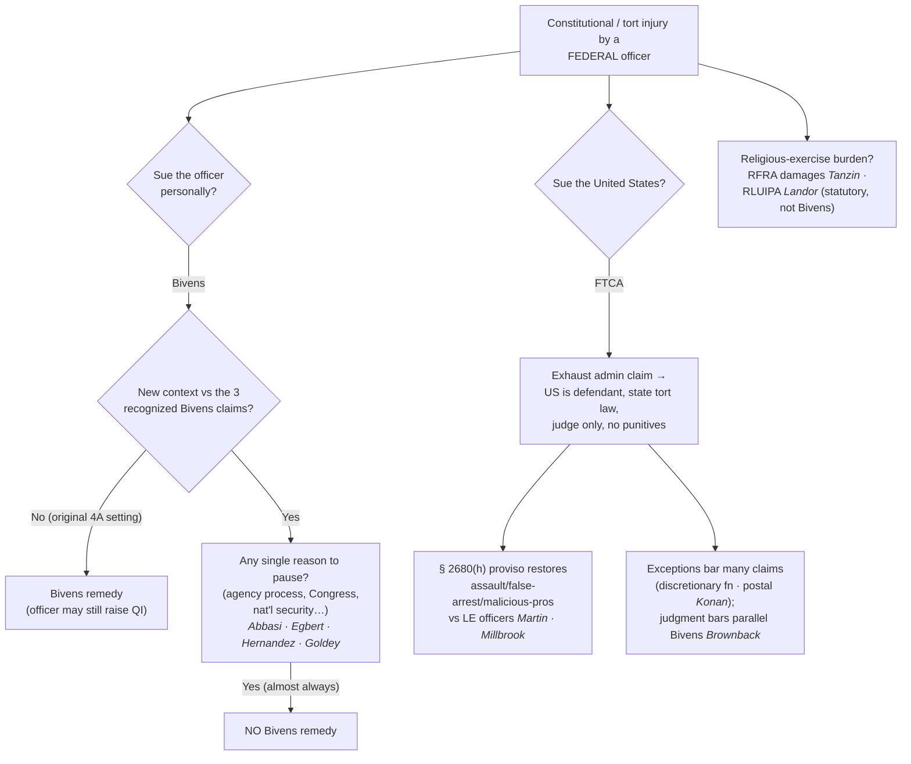
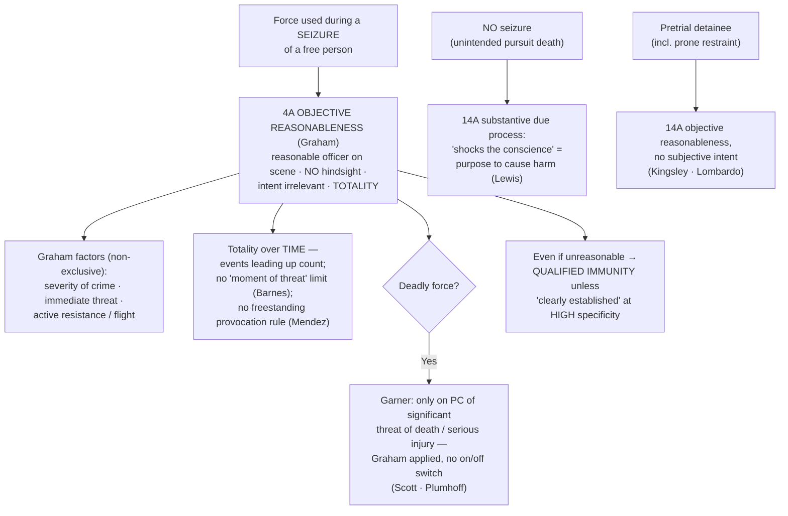

# S9 R1 panel-review — Opus model-diversity lane (prompt pack)

You are the **Claude/Opus** leg of the S9 three-lane adversarial panel (1 Claude + 2 Codex, R1). The two Codex lanes carry the A (support/quote-fidelity) and B (currency/treatment) attack lenses; **you carry model diversity and MUST vote on every paneled assertion across BOTH lenses' concerns.** You are refute-framed: try hard to break each assertion; **default to REFUTED on uncertainty**; never fabricate a cite, quote, or holding; use ONLY the evidence inlined below (no search, no outside knowledge). You are a SIGHTED reviewer — the FULL lake record (judgment fields included) is inlined.

You are a WRITER lane, not an adjudicator: you FIND and VOTE. You do not tally, adjudicate, or close any row — the orchestrator does.

For EACH group below, return one JSON object with the exact `reviewed[]` shape from the output contract (identical framing to the Codex lenses). Emit a finding object ONLY for a real defect (verdict refuted / stands-modified); a group you find wholly clean returns all-`stands` verdicts (the harness records a clean attestation). Concatenate the per-group JSON objects into a top-level `{"packs": [ ... ]}` array, one entry per group, each carrying its `group_id`.


OUTPUT CONTRACT — return ONE JSON object, nothing else:
{
  "lens": "A" | "B",
  "group_id": "<echo the group id>",
  "reviewed": [
    {
      "assertion_id": "<from group_inventory.jsonl>",
      "dimension": "existence|support|quote_fidelity|pincite|treatment|black_letter",
      "verdict": "stands" | "refuted" | "stands-modified",
      "verifiable_from_disclosed": true | false,
      "defect": null,   // null when verdict=="stands"; else an object:
      //  {"problem": "...", "severity": "high|medium|low", "proposed_fix": "...", "evidence_quote": "verbatim from disclosed evidence or null", "needs_cl": true|false, "locator_note": "..."}
      "reasons": ["short evidence-grounded reason", "..."],
      "breaks_true_positives": true | false,
      "residual_risks": ["..."],
      "suggested_tightening": "... or null"
    }
  ],
  "notes": ""
}
Rules: verdict=='stands' <=> defect==null (assertion survives your attack). verdict=='refuted' <=> a real defect (the assertion as framed is wrong). verdict=='stands-modified' <=> survives but needs a stated modification (a minor defect). Review EVERY assertion_id in group_inventory.jsonl exactly once. Output ONLY the JSON object.
---

## GROUP: content/use-of-force-and-liability/Suing Federal Officers.md  (`doctrine`, 12 assertions)

### content_page

```
---
weight: 40
title: "Suing Federal Officers"
aliases:
  - "Suing Federal Officers"
  - "Suing Federal Officers — Bivens and the FTCA"
  - "Bivens and the FTCA"
  - "Bivens"
  - "FTCA"
  - "suing-federal-officers"
topic: "Suing federal officers — Bivens & the FTCA"
type: doctrine
jurisdiction: "Federal — implied constitutional-tort remedy; 28 U.S.C. §§ 1346(b), 2671–2680 (FTCA); SCOTUS baseline"
status: draft
related:
  - "[[Section 1983 Liability and Qualified Immunity]]"
  - "[[Qualified Immunity]]"
  - "[[Absolute Immunity]]"
  - "[[Use of Force]]"
---

# Suing Federal Officers

*The officer was federal, not state — so § 1983 does not apply. Is there any damages remedy at all?*

> [!rule] Black-letter rule
> **§ 1983 reaches only state and local actors.** A **federal** officer who violates the Constitution may be sued for damages only under *[[Bivens v. Six Unknown Named Agents|Bivens]]*, which implied a Fourth Amendment damages remedy in 1971 — but the Court has since made extending *[[Bivens v. Six Unknown Named Agents|Bivens]]* to any **new context** a **"disfavored judicial activity,"** and "**if there is even a single reason to pause** before applying *Bivens* in a new context, a court may not recognize a *Bivens* remedy." The separate **Federal Tort Claims Act** waives the United States' immunity for many torts by federal employees, subject to exceptions. *[[Bivens v. Six Unknown Named Agents|Bivens]]*, 403 U.S. 388 (1971); *[[Ziglar v. Abbasi|Ziglar v. Abbasi]]*, 582 U.S. 120 (2017); *[[Egbert v. Boule|Egbert v. Boule]]*, 596 U.S. 482 (2022).
> ^rule-federal-officer-suits

## The Brief

**Two doors, both narrow.** Because § 1983 reaches only action under color of **state** law (see [[Section 1983 Liability and Qualified Immunity]]), a plaintiff injured by a **federal** agent (FBI, DEA, CBP, BOP) has two possible routes: a *[[Bivens v. Six Unknown Named Agents|Bivens]]* action against the **officer personally**, or a **Federal Tort Claims Act** suit against the **United States**. The first is nearly closed; the second is a limited, exception-riddled waiver. Both are worth knowing because officers on federal task forces, and their state partners, live at the seam between the two liability systems.

**Bivens: the implied remedy, then the retreat.** *[[Bivens v. Six Unknown Named Agents|Bivens]]* held that a Fourth Amendment violation by federal narcotics agents supports an **implied damages remedy** even though no statute created one. 403 U.S. at 397. The Court later recognized *[[Bivens v. Six Unknown Named Agents|Bivens]]* claims in only two more settings (a Fifth Amendment gender-discrimination claim and an Eighth Amendment failure-to-treat claim) and has recognized **none since 1980**. The modern doctrine treats any extension as presumptively improper.

**The special-factors test (*Abbasi* and *[[Egbert v. Boule|Egbert]]*).** Creating a damages remedy is "a **disfavored judicial activity.**" *[[Ziglar v. Abbasi|Ziglar v. Abbasi]]*, 582 U.S. 120 (2017). A court first asks whether the case presents a **new context** (any meaningful difference from the three recognized *[[Bivens v. Six Unknown Named Agents|Bivens]]* claims); if so, it asks whether **special factors** counsel hesitation, and Congress (not the courts) should usually decide whether to create a remedy. *[[Egbert v. Boule|Egbert v. Boule]]* collapsed the inquiry to a single question and set the bar at the floor: "**If there is even a single reason to pause** before applying *Bivens* in a new context, a court may not recognize a *Bivens* remedy." 596 U.S. at 491–492. It also treated the availability of an **agency grievance process** as an adequate alternative that defeats the claim. After *[[Egbert v. Boule|Egbert]]*, virtually every claim outside *[[Bivens v. Six Unknown Named Agents|Bivens]]*'s original facts is a "new context" with a "reason to pause."

**Where the door has closed.** *[[Hernandez v. Mesa|Hernandez v. Mesa]]*, 589 U.S. 93 (2020), refused a *[[Bivens v. Six Unknown Named Agents|Bivens]]* remedy for a **cross-border shooting** (a Border Patrol agent on U.S. soil killed a boy on the Mexican side), citing foreign-relations and national-security factors. *[[Egbert v. Boule|Egbert]]* refused claims arising from a border-area encounter and a First Amendment retaliation theory. And the Court continues to **summarily reverse** lower courts that recognize new *[[Bivens v. Six Unknown Named Agents|Bivens]]* claims, declining, for example, to extend *[[Bivens v. Six Unknown Named Agents|Bivens]]* to a federal prisoner's excessive-force claim. *[[Goldey v. Fields|Goldey v. Fields]]*, 606 U.S. 942 (2025) (per curiam). Separately, *[[FBI v. Fazaga|FBI v. Fazaga]]*, 595 U.S. 344 (2022), held that the Foreign Intelligence Surveillance Act's procedures (50 U.S.C. § 1806(f)) do **not** displace the **state-secrets privilege** — a reminder that suits against federal surveillance run into evidentiary walls even where a cause of action exists.

**The FTCA path — suing the United States, not the officer.** The **Federal Tort Claims Act** waives sovereign immunity for torts committed by federal employees within the scope of employment, making the **United States** the defendant under the law of the place where the act occurred. 28 U.S.C. §§ 1346(b), 2674. Two features matter most in law-enforcement cases:
- **The law-enforcement proviso.** The FTCA generally excludes intentional torts, but § 2680(h) restores claims for **assault, battery, false arrest, false imprisonment, abuse of process, and malicious prosecution** committed by **investigative or law-enforcement officers**. That proviso is not limited to conduct during a search, seizure, or arrest. *Millbrook v. United States*, 569 U.S. 50 (2013). It supplied the remedy for a **wrong-house raid**, and the Supremacy Clause is no defense to FTCA liability. *[[Martin v. United States|Martin v. United States]]*, 605 U.S. 395 (2025).
- **The judgment bar.** A judgment **on an FTCA claim** bars a related *[[Bivens v. Six Unknown Named Agents|Bivens]]* claim against the individual employees for the same conduct (§ 2676), a trap for plaintiffs who plead both. *[[Brownback v. King|Brownback v. King]]*, 592 U.S. 209 (2021). The FTCA's many **exceptions** (discretionary function, intentional torts outside the proviso, the postal-matter exception) frequently defeat suits; the scope of the **postal-matter exception** was before the Court in *[[Postal Service v. Konan|Postal Service v. Konan]]*, No. 24-351 (2026).

**Two statutory cousins: RFRA and RLUIPA, not § 1983 and not *[[Bivens v. Six Unknown Named Agents|Bivens]]*.** Where the federal government substantially burdens religious exercise, the **Religious Freedom Restoration Act** supplies its own damages remedy: "appropriate relief against a government" **includes money damages against federal officials sued in their individual capacities.** *[[Tanzin v. Tanvir|Tanzin v. Tanvir]]*, 592 U.S. 43 (2020). The companion question (whether the **Religious Land Use and Institutionalized Persons Act** likewise authorizes individual-capacity damages) reached the Court in *[[Landor v. Louisiana Dept. of Corrections|Landor v. Louisiana Dep't of Corrections]]*, No. 23-1197 (2026). Teach these honestly as **statutory** remedies: they are neither § 1983 nor *[[Bivens v. Six Unknown Named Agents|Bivens]]*, and they exist only because Congress wrote the cause of action *[[Bivens v. Six Unknown Named Agents|Bivens]]* plaintiffs now lack.

**Burden, standard of review, and remedy.** In a *[[Bivens v. Six Unknown Named Agents|Bivens]]* action the court decides the **threshold legal question** (new context and special factors) before the merits, and dismissal is the norm outside the original settings; where a claim does proceed, the officer may still assert **[[Qualified Immunity|qualified immunity]]** (see [[Qualified Immunity]]). Under the FTCA the plaintiff must first exhaust an **administrative claim**, sue the **United States** (individual employees are dismissed and substituted), and try the case to a **judge** under state tort law with **no jury and no punitive damages**. The practical lesson: for a federal officer, the constitutional-tort door is mostly shut, and the realistic remedy is usually the **FTCA**, if an exception does not bar it.

**Common pitfalls.**
- **Filing a § 1983 claim against a federal officer.** Section 1983 requires action under color of **state** law; a federal agent needs *[[Bivens v. Six Unknown Named Agents|Bivens]]* (or the FTCA).
- **Assuming *[[Bivens v. Six Unknown Named Agents|Bivens]]* extends to new facts.** After *[[Egbert v. Boule|Egbert]]*, a single "reason to pause" defeats the claim, and almost everything outside *[[Bivens v. Six Unknown Named Agents|Bivens]]*'s original Fourth Amendment setting is a "new context."
- **Overlooking the FTCA judgment bar.** Litigating the FTCA claim to judgment can **extinguish** the parallel *[[Bivens v. Six Unknown Named Agents|Bivens]]* claim (*[[Brownback v. King|Brownback]]*).
- **Forgetting the FTCA's exceptions.** The discretionary-function and postal-matter exceptions and the intentional-tort bar (outside the § 2680(h) proviso) defeat many suits.
- **Confusing RFRA/RLUIPA damages with a constitutional-tort remedy.** They are **statutory** (*[[Tanzin v. Tanvir|Tanzin]]*), not § 1983 or *[[Bivens v. Six Unknown Named Agents|Bivens]]*.
- **Treating the state task-force partner like the federal agent.** The state officer may still be a § 1983 defendant even where the federal agent is *[[Bivens v. Six Unknown Named Agents|Bivens]]*-immune in practice.

## Key cases

| Case | Holding | Opinion |
|---|---|---|
| *[[Bivens v. Six Unknown Named Agents]]*, 403 U.S. 388 (1971) | **Anchor.** Recognized an **implied damages remedy** against federal officers for a Fourth Amendment violation; the § 1983 analog for federal agents. | [opinion](https://www.courtlistener.com/opinion/108375/bivens-v-six-unknown-named-agents-of-federal-bureau-of-narcotics/) |
| *[[Ziglar v. Abbasi]]*, 582 U.S. 120 (2017) | **Retrenchment.** Extending *[[Bivens v. Six Unknown Named Agents\|Bivens]]* to a **new context** is a "disfavored judicial activity"; courts ask whether special factors counsel leaving the remedy to Congress. | [opinion](https://www.courtlistener.com/opinion/4403804/ziglar-v-abbasi/) |
| *[[Hernandez v. Mesa]]*, 589 U.S. 93 (2020) | **Boundary.** No *[[Bivens v. Six Unknown Named Agents\|Bivens]]* remedy for a **cross-border shooting**; foreign-relations and national-security factors counsel hesitation. | [opinion](https://www.courtlistener.com/opinion/9231296/hernandez-v-mesa/) |
| *[[Egbert v. Boule]]*, 596 U.S. 482 (2022) | **Near-closure.** A **single "reason to pause"** bars a new *[[Bivens v. Six Unknown Named Agents\|Bivens]]* remedy; an agency grievance process counts as an adequate alternative; the door is all but shut. | [opinion](https://www.courtlistener.com/opinion/6475794/egbert-v-boule/) |
| *[[Goldey v. Fields]]*, 606 U.S. 942 (2025) | **Reaffirmation.** Summarily declined to extend *[[Bivens v. Six Unknown Named Agents\|Bivens]]* to a federal prisoner's excessive-force claim; the pattern of refusal continues. | [opinion](https://www.courtlistener.com/opinion/10776815/goldey-v-fields/) |
| *[[FBI v. Fazaga]]*, 595 U.S. 344 (2022) | **Evidentiary wall.** FISA's § 1806(f) procedures do **not** displace the **state-secrets privilege** in a surveillance suit against federal agents. | [opinion](https://www.courtlistener.com/opinion/6448059/fbi-v-fazaga/) |
| *[[Brownback v. King]]*, 592 U.S. 209 (2021) | **FTCA judgment bar.** A judgment on an FTCA claim can **bar** a related *[[Bivens v. Six Unknown Named Agents\|Bivens]]* claim against the employees for the same conduct (§ 2676). | [opinion](https://www.courtlistener.com/opinion/4858987/brownback-v-king/) |
| *[[Martin v. United States]]*, 605 U.S. 395 (2025) | **FTCA proviso.** The § 2680(h) law-enforcement proviso reaches a **wrong-house raid**, and the Supremacy Clause is no defense to FTCA liability. | [opinion](https://www.courtlistener.com/opinion/10776839/martin-v-united-states/) |
| *[[Postal Service v. Konan]]*, No. 24-351 (2026) | **FTCA exception.** Addresses the scope of the FTCA's **postal-matter exception** (§ 2680(b)) for a claim of intentional non-delivery of mail. | [opinion](https://www.courtlistener.com/opinion/10799651/postal-service-v-konan/) |
| *[[Tanzin v. Tanvir]]*, 592 U.S. 43 (2020) | **Statutory cousin.** RFRA's "appropriate relief against a government" **includes money damages** against federal officials in their **individual** capacities. | [opinion](https://www.courtlistener.com/opinion/4837663/tanzin-v-tanvir/) |
| *[[Landor v. Louisiana Dept. of Corrections]]*, No. 23-1197 (2026) | **Statutory cousin.** Presents the RLUIPA companion to *[[Tanzin v. Tanvir\|Tanzin]]*; whether that statute authorizes **individual-capacity damages**. | [opinion](https://www.courtlistener.com/opinion/10878535/landor-v-louisiana-dept-of-corrections-and-public-safety/) |

## Visual



## Sources
- *Bivens v. Six Unknown Named Agents*, 403 U.S. 388 (1971) (pinpoint 397) — https://www.courtlistener.com/opinion/108375/bivens-v-six-unknown-named-agents-of-federal-bureau-of-narcotics/
- *Ziglar v. Abbasi*, 582 U.S. 120 (2017) — https://www.courtlistener.com/opinion/4403804/ziglar-v-abbasi/
- *Hernandez v. Mesa*, 589 U.S. 93 (2020) — https://www.courtlistener.com/opinion/9231296/hernandez-v-mesa/
- *Egbert v. Boule*, 596 U.S. 482 (2022) (pinpoints 491–492) — https://www.courtlistener.com/opinion/6475794/egbert-v-boule/
- *Goldey v. Fields*, 606 U.S. 942 (2025) (per curiam) — https://www.courtlistener.com/opinion/10776815/goldey-v-fields/
- *FBI v. Fazaga*, 595 U.S. 344 (2022) — https://www.courtlistener.com/opinion/6448059/fbi-v-fazaga/
- *Brownback v. King*, 592 U.S. 209 (2021) — https://www.courtlistener.com/opinion/4858987/brownback-v-king/
- *Martin v. United States*, 605 U.S. 395 (2025) — https://www.courtlistener.com/opinion/10776839/martin-v-united-states/
- *Postal Service v. Konan*, No. 24-351 (U.S. decided Feb. 24, 2026) (slip opinion) — https://www.courtlistener.com/opinion/10799651/postal-service-v-konan/
- *Millbrook v. United States*, 569 U.S. 50 (2013) — https://www.courtlistener.com/opinion/856345/millbrook-v-united-states/
- *Tanzin v. Tanvir*, 592 U.S. 43 (2020) — https://www.courtlistener.com/opinion/4837663/tanzin-v-tanvir/
- *Landor v. Louisiana Dept. of Corrections and Public Safety*, No. 23-1197 (U.S. decided June 23, 2026) (slip opinion) — https://www.courtlistener.com/opinion/10878535/landor-v-louisiana-dept-of-corrections-and-public-safety/

```

### group_inventory (assertions under review)

```jsonl
{"assertion_id": "2fca66b5ae43d928", "dimension": "existence", "kind": "case_cite", "locator": {"case": "Postal Service v. Konan", "table_line": 48}, "payload": {"case": "Postal Service v. Konan", "cells": ["*[[Postal Service v. Konan]]*, No. 24-351 (2026)", "**FTCA exception.** Addresses the scope of the FTCA's **postal-matter exception** (§ 2680(b)) for a claim of intentional non-delivery of mail.", "[opinion](https://www.courtlistener.com/opinion/10799651/postal-service-v-konan/)"], "header": ["Case", "Holding", "Opinion"]}}
{"assertion_id": "3c39ac39b7321263", "dimension": "existence", "kind": "case_cite", "locator": {"case": "Tanzin v. Tanvir", "table_line": 49}, "payload": {"case": "Tanzin v. Tanvir", "cells": ["*[[Tanzin v. Tanvir]]*, 592 U.S. 43 (2020)", "**Statutory cousin.** RFRA's \"appropriate relief against a government\" **includes money damages** against federal officials in their **individual** capacities.", "[opinion](https://www.courtlistener.com/opinion/4837663/tanzin-v-tanvir/)"], "header": ["Case", "Holding", "Opinion"]}}
{"assertion_id": "3e3a7581cb505f01", "dimension": "existence", "kind": "case_cite", "locator": {"case": "Brownback v. King", "table_line": 46}, "payload": {"case": "Brownback v. King", "cells": ["*[[Brownback v. King]]*, 592 U.S. 209 (2021)", "**FTCA judgment bar.** A judgment on an FTCA claim can **bar** a related *[[Bivens v. Six Unknown Named Agents\\|Bivens]]* claim against the employees for the same conduct (§ 2676).", "[opinion](https://www.courtlistener.com/opinion/4858987/brownback-v-king/)"], "header": ["Case", "Holding", "Opinion"]}}
{"assertion_id": "9f89e7cef5ad935b", "dimension": "existence", "kind": "case_cite", "locator": {"case": "Martin v. United States", "table_line": 47}, "payload": {"case": "Martin v. United States", "cells": ["*[[Martin v. United States]]*, 605 U.S. 395 (2025)", "**FTCA proviso.** The § 2680(h) law-enforcement proviso reaches a **wrong-house raid**, and the Supremacy Clause is no defense to FTCA liability.", "[opinion](https://www.courtlistener.com/opinion/10776839/martin-v-united-states/)"], "header": ["Case", "Holding", "Opinion"]}}
{"assertion_id": "a086848608baa80d", "dimension": "existence", "kind": "case_cite", "locator": {"case": "Egbert v. Boule", "table_line": 43}, "payload": {"case": "Egbert v. Boule", "cells": ["*[[Egbert v. Boule]]*, 596 U.S. 482 (2022)", "**Near-closure.** A **single \"reason to pause\"** bars a new *[[Bivens v. Six Unknown Named Agents\\|Bivens]]* remedy; an agency grievance process counts as an adequate alternative; the door is all but shut.", "[opinion](https://www.courtlistener.com/opinion/6475794/egbert-v-boule/)"], "header": ["Case", "Holding", "Opinion"]}}
{"assertion_id": "ab1f1bef25ba7778", "dimension": "existence", "kind": "case_cite", "locator": {"case": "Bivens v. Six Unknown Named Agents", "table_line": 40}, "payload": {"case": "Bivens v. Six Unknown Named Agents", "cells": ["*[[Bivens v. Six Unknown Named Agents]]*, 403 U.S. 388 (1971)", "**Anchor.** Recognized an **implied damages remedy** against federal officers for a Fourth Amendment violation; the § 1983 analog for federal agents.", "[opinion](https://www.courtlistener.com/opinion/108375/bivens-v-six-unknown-named-agents-of-federal-bureau-of-narcotics/)"], "header": ["Case", "Holding", "Opinion"]}}
{"assertion_id": "b046335db111746c", "dimension": "existence", "kind": "case_cite", "locator": {"case": "Hernandez v. Mesa", "table_line": 42}, "payload": {"case": "Hernandez v. Mesa", "cells": ["*[[Hernandez v. Mesa]]*, 589 U.S. 93 (2020)", "**Boundary.** No *[[Bivens v. Six Unknown Named Agents\\|Bivens]]* remedy for a **cross-border shooting**; foreign-relations and national-security factors counsel hesitation.", "[opinion](https://www.courtlistener.com/opinion/9231296/hernandez-v-mesa/)"], "header": ["Case", "Holding", "Opinion"]}}
{"assertion_id": "c0bdfa7625b8eacd", "dimension": "existence", "kind": "case_cite", "locator": {"case": "Landor v. Louisiana Dept. of Corrections", "table_line": 50}, "payload": {"case": "Landor v. Louisiana Dept. of Corrections", "cells": ["*[[Landor v. Louisiana Dept. of Corrections]]*, No. 23-1197 (2026)", "**Statutory cousin.** Presents the RLUIPA companion to *[[Tanzin v. Tanvir\\|Tanzin]]*; whether that statute authorizes **individual-capacity damages**.", "[opinion](https://www.courtlistener.com/opinion/10878535/landor-v-louisiana-dept-of-corrections-and-public-safety/)"], "header": ["Case", "Holding", "Opinion"]}}
{"assertion_id": "c19d6c25bb0c7410", "dimension": "existence", "kind": "case_cite", "locator": {"case": "Goldey v. Fields", "table_line": 44}, "payload": {"case": "Goldey v. Fields", "cells": ["*[[Goldey v. Fields]]*, 606 U.S. 942 (2025)", "**Reaffirmation.** Summarily declined to extend *[[Bivens v. Six Unknown Named Agents\\|Bivens]]* to a federal prisoner's excessive-force claim; the pattern of refusal continues.", "[opinion](https://www.courtlistener.com/opinion/10776815/goldey-v-fields/)"], "header": ["Case", "Holding", "Opinion"]}}
{"assertion_id": "ed896780773ab15c", "dimension": "existence", "kind": "case_cite", "locator": {"case": "Ziglar v. Abbasi", "table_line": 41}, "payload": {"case": "Ziglar v. Abbasi", "cells": ["*[[Ziglar v. Abbasi]]*, 582 U.S. 120 (2017)", "**Retrenchment.** Extending *[[Bivens v. Six Unknown Named Agents\\|Bivens]]* to a **new context** is a \"disfavored judicial activity\"; courts ask whether special factors counsel leaving the remedy to Congress.", "[opinion](https://www.courtlistener.com/opinion/4403804/ziglar-v-abbasi/)"], "header": ["Case", "Holding", "Opinion"]}}
{"assertion_id": "f992573a74b67724", "dimension": "existence", "kind": "case_cite", "locator": {"case": "FBI v. Fazaga", "table_line": 45}, "payload": {"case": "FBI v. Fazaga", "cells": ["*[[FBI v. Fazaga]]*, 595 U.S. 344 (2022)", "**Evidentiary wall.** FISA's § 1806(f) procedures do **not** displace the **state-secrets privilege** in a surveillance suit against federal agents.", "[opinion](https://www.courtlistener.com/opinion/6448059/fbi-v-fazaga/)"], "header": ["Case", "Holding", "Opinion"]}}
{"assertion_id": "e6360a79ab807460", "dimension": "support", "kind": "proposition", "locator": {"callout": "^rule-federal-officer-suits"}, "payload": {"anchor": "^rule-federal-officer-suits", "statement": "[!rule] Black-letter rule\n**§ 1983 reaches only state and local actors.** A **federal** officer who violates the Constitution may be sued for damages only under *[[Bivens v. Six Unknown Named Agents|Bivens]]*, which implied a Fourth Amendment damages remedy in 1971 — but the Court has since made extending *[[Bivens v. Six Unknown Named Agents|Bivens]]* to any **new context** a **\"disfavored judicial activity,\"** and \"**if there is even a single reason to pause** before applying *Bivens* in a new context, a court may not recognize a *Bivens* remedy.\" The separate **Federal Tort Claims Act** waives the United States' immunity for many torts by federal employees, subject to exceptions. *[[Bivens v. Six Unknown Named Agents|Bivens]]*, 403 U.S. 388 (1971); *[[Ziglar v. Abbasi|Ziglar v. Abbasi]]*, 582 U.S. 120 (2017); *[[Egbert v. Boule|Egbert v. Boule]]*, 596 U.S. 482 (2022)."}}
```

### lake record — Bivens v. Six Unknown Named Agents

```json
{
  "schema_version": "s2.v1",
  "record_id": "Bivens v. Six Unknown Named Agents",
  "stub": false,
  "status": "verified",
  "identity": {
    "case_name": "Bivens v. Six Unknown Named Agents of Federal Bureau of Narcotics",
    "case_name_short": "Bivens",
    "case_name_full": "Bivens v. Six Unknown Named Agents of Federal Bureau of Narcotics",
    "input_case_name": "Bivens v. Six Unknown Named Agents",
    "court": "U.S. Supreme Court",
    "court_id": "scotus",
    "court_level": "scotus",
    "circuit": null,
    "state": null,
    "date_decided": "1971-06-21",
    "year": 1971,
    "docket": "301",
    "cluster_id": 108375,
    "lead_opinion_id": 108375,
    "sibling_ids": [
      108375,
      9883113,
      9883114,
      9883115,
      9883116,
      9883117
    ],
    "absolute_url": "/opinion/108375/bivens-v-six-unknown-named-agents-of-federal-bureau-of-narcotics/",
    "identity_method": "citation+party-text",
    "expected_citation_found": true,
    "party_name_in_text": true,
    "canonical_name_match": true,
    "alternates": [],
    "reason_code": null
  },
  "citations": {
    "official": {
      "cite": "403 U.S. 388",
      "volume": "403",
      "reporter": "U.S.",
      "page": "388",
      "type": 1,
      "selected_official": true,
      "source": "cluster.citations[]"
    },
    "parallel": [
      {
        "cite": "91 S. Ct. 1999",
        "volume": "91",
        "reporter": "S. Ct.",
        "page": "1999",
        "type": 1,
        "selected_official": false,
        "source": "cluster.citations[]"
      },
      {
        "cite": "29 L. Ed. 2d 619",
        "volume": "29",
        "reporter": "L. Ed. 2d",
        "page": "619",
        "type": 1,
        "selected_official": false,
        "source": "cluster.citations[]"
      }
    ],
    "vendor_neutral": [
      {
        "cite": "1971 U.S. LEXIS 23",
        "volume": "1971",
        "reporter": "U.S. LEXIS",
        "page": "23",
        "type": 6,
        "selected_official": false,
        "source": "cluster.citations[]"
      }
    ],
    "all": [
      {
        "cite": "403 U.S. 388",
        "volume": "403",
        "reporter": "U.S.",
        "page": "388",
        "type": 1,
        "selected_official": false,
        "source": "cluster.citations[]"
      },
      {
        "cite": "91 S. Ct. 1999",
        "volume": "91",
        "reporter": "S. Ct.",
        "page": "1999",
        "type": 1,
        "selected_official": false,
        "source": "cluster.citations[]"
      },
      {
        "cite": "29 L. Ed. 2d 619",
        "volume": "29",
        "reporter": "L. Ed. 2d",
        "page": "619",
        "type": 1,
        "selected_official": false,
        "source": "cluster.citations[]"
      },
      {
        "cite": "1971 U.S. LEXIS 23",
        "volume": "1971",
        "reporter": "U.S. LEXIS",
        "page": "23",
        "type": 6,
        "selected_official": false,
        "source": "cluster.citations[]"
      }
    ],
    "display": "403 U.S. 388",
    "official_selection": {
      "court_class": "scotus",
      "selected": "403 U.S. 388",
      "reason": "selected_rank_1"
    }
  },
  "pinpoints": [
    {
      "id": "pin-392",
      "page": null,
      "quote": "--- # Bivens v. Six Unknown Named Agents *403 U.S. 388 (1971)* \u00b7 U.S. Supreme Court \u00b7 **Binding \u2014 SCOTUS** \u00b7 Treatment: **good** *(as of 2026-06-30)* <!-- header line; TreatmentBadge + weight render here, degrading to the text above --> ## Background Webster Bivens alleged that agents of the Federal Bureau of Narcotics, acting without a warrant or probable cause, entered his apartment, arrested him for narcotics offenses, manacled him in front of his wife and children, threatened to arrest the entire family, searched the apartment, and later subjected him to a visual strip search. He sued the agents for damages, claiming the entry, arrest, and search violated the Fourth Amendment. The lower courts dismissed because no federal statute authorized a damages suit against federal officers for such a violation. ## Issue Whether a victim of an unconstitutional search and seizure by federal officers may sue them for money damages directly under the Fourth Amendment, even though no statute creates the cause of action. ## Rule Yes. The Fourth Amendment itself supports a damages remedy against federal officers who violate it. Invoking *Bell v. Hood*, the Court reasoned that",
      "star_marker": null,
      "quote_fidelity": "mismatch",
      "pinpoint_status": "slip-only",
      "position": null
    },
    {
      "id": "pin-397",
      "page": null,
      "quote": "Having concluded that petitioner's complaint states a cause of action under the Fourth Amendment . . . we hold that petitioner is entitled to recover money damages for any injuries he has suffered as a result of the agents' violation of the Amendment.",
      "star_marker": null,
      "quote_fidelity": "mismatch",
      "pinpoint_status": "slip-only",
      "position": null
    }
  ],
  "treatment": {
    "field_i_validity": "good_law",
    "as_of_content": "1971-06-21",
    "as_of_treatment": "2026-06-30",
    "composite_basis": "migration-seed",
    "composite_basis_ref": "Bivens v. Six Unknown Named Agents",
    "varies_by_point": false,
    "scope_note": "Core holding (4A damages against federal officers) remains good law; the Court has declined to extend Bivens to new contexts (Ziglar v. Abbasi (2017); Egbert v. Boule (2022)).",
    "point_overrides": [],
    "edges": [
      {
        "citing_case": {
          "name": "Andrew Lennette, Individually and on behalf of C.L., O.L. and S.L., Minor Children v. State of Iowa, Melody Siver, Amy Howell, and Valerie Lovaglia",
          "cluster_id": 6476611,
          "cite": null,
          "field_ii": "overruled"
        },
        "field_ii": "overruled",
        "field_iii": "mentioned",
        "point": null,
        "proposed": true,
        "journal_ref": "Bivens v. Six Unknown Named Agents:lane1_negative"
      },
      {
        "citing_case": {
          "name": "Ashcroft v. Iqbal",
          "cluster_id": 145875,
          "cite": [
            "173 L. Ed. 2d 868",
            "129 S. Ct. 1937",
            "556 U.S. 662",
            "2009 U.S. LEXIS 3472"
          ],
          "field_ii": "questioned"
        },
        "field_ii": "questioned",
        "field_iii": "mentioned",
        "point": null,
        "proposed": true,
        "journal_ref": "Bivens v. Six Unknown Named Agents:lane2_top_cited"
      },
      {
        "citing_case": {
          "name": "Monell v. New York City Dept. of Social Servs.",
          "cluster_id": 109881,
          "cite": [
            "56 L. Ed. 2d 611",
            "98 S. Ct. 2018",
            "436 U.S. 658",
            "1978 U.S. LEXIS 100",
            "16 Empl. Prac. Dec. (CCH) 8345",
            "17 Fair Empl. Prac. Cas. (BNA) 873"
          ],
          "field_ii": "overruled"
        },
        "field_ii": "overruled",
        "field_iii": "mentioned",
        "point": null,
        "proposed": true,
        "journal_ref": "Bivens v. Six Unknown Named Agents:lane2_top_cited"
      },
      {
        "citing_case": {
          "name": "Farmer v. Brennan",
          "cluster_id": 1087956,
          "cite": [
            "128 L. Ed. 2d 811",
            "114 S. Ct. 1970",
            "511 U.S. 825",
            "1994 U.S. LEXIS 4274"
          ],
          "field_ii": "overruled"
        },
        "field_ii": "overruled",
        "field_iii": "mentioned",
        "point": null,
        "proposed": true,
        "journal_ref": "Bivens v. Six Unknown Named Agents:lane2_top_cited"
      },
      {
        "citing_case": {
          "name": "Harlow v. Fitzgerald",
          "cluster_id": 110763,
          "cite": [
            "73 L. Ed. 2d 396",
            "102 S. Ct. 2727",
            "457 U.S. 800",
            "1982 U.S. LEXIS 139"
          ],
          "field_ii": "abrogated"
        },
        "field_ii": "abrogated",
        "field_iii": "mentioned",
        "point": null,
        "proposed": true,
        "journal_ref": "Bivens v. Six Unknown Named Agents:lane2_top_cited"
      },
      {
        "citing_case": {
          "name": "Neitzke v. Williams",
          "cluster_id": 112254,
          "cite": [
            "104 L. Ed. 2d 338",
            "109 S. Ct. 1827",
            "490 U.S. 319",
            "1989 U.S. LEXIS 2231",
            "57 U.S.L.W. 4493"
          ],
          "field_ii": "questioned"
        },
        "field_ii": "questioned",
        "field_iii": "mentioned",
        "point": null,
        "proposed": true,
        "journal_ref": "Bivens v. Six Unknown Named Agents:lane2_top_cited"
      },
      {
        "citing_case": {
          "name": "Illinois v. Gates",
          "cluster_id": 110959,
          "cite": [
            "76 L. Ed. 2d 527",
            "103 S. Ct. 2317",
            "462 U.S. 213",
            "1983 U.S. LEXIS 54",
            "51 U.S.L.W. 4709"
          ],
          "field_ii": "overruled"
        },
        "field_ii": "overruled",
        "field_iii": "mentioned",
        "point": null,
        "proposed": true,
        "journal_ref": "Bivens v. Six Unknown Named Agents:lane2_top_cited"
      },
      {
        "citing_case": {
          "name": "Graham v. Connor",
          "cluster_id": 112257,
          "cite": [
            "104 L. Ed. 2d 443",
            "109 S. Ct. 1865",
            "490 U.S. 386",
            "1989 U.S. LEXIS 2467",
            "57 U.S.L.W. 4513"
          ],
          "field_ii": "questioned"
        },
        "field_ii": "questioned",
        "field_iii": "mentioned",
        "point": null,
        "proposed": true,
        "journal_ref": "Bivens v. Six Unknown Named Agents:lane2_top_cited"
      },
      {
        "citing_case": {
          "name": "Pearson v. Callahan",
          "cluster_id": 145918,
          "cite": [
            "172 L. Ed. 2d 565",
            "129 S. Ct. 808",
            "555 U.S. 223",
            "2009 U.S. LEXIS 591"
          ],
          "field_ii": "overruled"
        },
        "field_ii": "overruled",
        "field_iii": "mentioned",
        "point": null,
        "proposed": true,
        "journal_ref": "Bivens v. Six Unknown Named Agents:lane2_top_cited"
      },
      {
        "citing_case": {
          "name": "Anderson v. Creighton",
          "cluster_id": 111953,
          "cite": [
            "97 L. Ed. 2d 523",
            "107 S. Ct. 3034",
            "483 U.S. 635",
            "1987 U.S. LEXIS 2894",
            "55 U.S.L.W. 5092"
          ],
          "field_ii": "overruled"
        },
        "field_ii": "overruled",
        "field_iii": "mentioned",
        "point": null,
        "proposed": true,
        "journal_ref": "Bivens v. Six Unknown Named Agents:lane2_top_cited"
      },
      {
        "citing_case": {
          "name": "Schneckloth v. Bustamonte",
          "cluster_id": 108800,
          "cite": [
            "36 L. Ed. 2d 854",
            "93 S. Ct. 2041",
            "412 U.S. 218",
            "1973 U.S. LEXIS 6"
          ],
          "field_ii": "questioned"
        },
        "field_ii": "questioned",
        "field_iii": "mentioned",
        "point": null,
        "proposed": true,
        "journal_ref": "Bivens v. Six Unknown Named Agents:lane2_top_cited"
      },
      {
        "citing_case": {
          "name": "Steel Co. v. Citizens for a Better Environment",
          "cluster_id": 2620886,
          "cite": [
            "140 L. Ed. 2d 210",
            "118 S. Ct. 1003",
            "523 U.S. 83",
            "1998 U.S. LEXIS 1601",
            "66 U.S.L.W. 4174",
            "98 Daily Journal DAR 2102",
            "11 Fla. L. Weekly Fed. S 369",
            "1998 Colo. J. C.A.R. 1025",
            "98 Cal. Daily Op. Serv. 1512",
            "28 Envtl. L. Rep. (Envtl. Law Inst.) 20434",
            "46 ERC (BNA) 1097"
          ],
          "field_ii": "overruled"
        },
        "field_ii": "overruled",
        "field_iii": "mentioned",
        "point": null,
        "proposed": true,
        "journal_ref": "Bivens v. Six Unknown Named Agents:lane2_top_cited"
      },
      {
        "citing_case": {
          "name": "United States v. Leon",
          "cluster_id": 111262,
          "cite": [
            "82 L. Ed. 2d 677",
            "104 S. Ct. 3405",
            "468 U.S. 897",
            "1984 U.S. LEXIS 153"
          ],
          "field_ii": "overruled"
        },
        "field_ii": "overruled",
        "field_iii": "mentioned",
        "point": null,
        "proposed": true,
        "journal_ref": "Bivens v. Six Unknown Named Agents:lane2_top_cited"
      },
      {
        "citing_case": {
          "name": "Mitchell v. Forsyth",
          "cluster_id": 111481,
          "cite": [
            "86 L. Ed. 2d 411",
            "105 S. Ct. 2806",
            "472 U.S. 511",
            "1985 U.S. LEXIS 113",
            "53 U.S.L.W. 4798",
            "2 Fed. R. Serv. 3d 221"
          ],
          "field_ii": "questioned"
        },
        "field_ii": "questioned",
        "field_iii": "mentioned",
        "point": null,
        "proposed": true,
        "journal_ref": "Bivens v. Six Unknown Named Agents:lane2_top_cited"
      },
      {
        "citing_case": {
          "name": "Lewis v. Casey",
          "cluster_id": 118054,
          "cite": [
            "135 L. Ed. 2d 606",
            "116 S. Ct. 2174",
            "518 U.S. 343",
            "1996 U.S. LEXIS 4220"
          ],
          "field_ii": "overruled"
        },
        "field_ii": "overruled",
        "field_iii": "mentioned",
        "point": null,
        "proposed": true,
        "journal_ref": "Bivens v. Six Unknown Named Agents:lane2_top_cited"
      },
      {
        "citing_case": {
          "name": "Mt. Healthy City School District Board of Education v. Doyle",
          "cluster_id": 109574,
          "cite": [
            "50 L. Ed. 2d 471",
            "97 S. Ct. 568",
            "429 U.S. 274",
            "1977 U.S. LEXIS 29",
            "1 I.E.R. Cas. (BNA) 76"
          ],
          "field_ii": "questioned"
        },
        "field_ii": "questioned",
        "field_iii": "mentioned",
        "point": null,
        "proposed": true,
        "journal_ref": "Bivens v. Six Unknown Named Agents:lane2_top_cited"
      },
      {
        "citing_case": {
          "name": "Ben Gary Triestman v. Federal Bureau of Prisons, United States of America",
          "cluster_id": 796150,
          "cite": [
            "470 F.3d 471",
            "2006 U.S. App. LEXIS 29858",
            "2006 WL 3499975"
          ],
          "field_ii": "questioned"
        },
        "field_ii": "questioned",
        "field_iii": "mentioned",
        "point": null,
        "proposed": true,
        "journal_ref": "Bivens v. Six Unknown Named Agents:lane2_top_cited"
      },
      {
        "citing_case": {
          "name": "City of Los Angeles v. Lyons",
          "cluster_id": 110916,
          "cite": [
            "75 L. Ed. 2d 675",
            "103 S. Ct. 1660",
            "461 U.S. 95",
            "1983 U.S. LEXIS 152",
            "51 U.S.L.W. 4424"
          ],
          "field_ii": "questioned"
        },
        "field_ii": "questioned",
        "field_iii": "mentioned",
        "point": null,
        "proposed": true,
        "journal_ref": "Bivens v. Six Unknown Named Agents:lane2_top_cited"
      },
      {
        "citing_case": {
          "name": "Hill v. Lappin",
          "cluster_id": 181820,
          "cite": [
            "630 F.3d 468",
            "2010 U.S. App. LEXIS 26261",
            "2010 WL 5288892"
          ],
          "field_ii": "questioned"
        },
        "field_ii": "questioned",
        "field_iii": "mentioned",
        "point": null,
        "proposed": true,
        "journal_ref": "Bivens v. Six Unknown Named Agents:lane2_top_cited"
      },
      {
        "citing_case": {
          "name": "Porter v. Nussle",
          "cluster_id": 118483,
          "cite": [
            "152 L. Ed. 2d 12",
            "122 S. Ct. 983",
            "534 U.S. 516",
            "2002 U.S. LEXIS 1373"
          ],
          "field_ii": "questioned"
        },
        "field_ii": "questioned",
        "field_iii": "mentioned",
        "point": null,
        "proposed": true,
        "journal_ref": "Bivens v. Six Unknown Named Agents:lane2_top_cited"
      },
      {
        "citing_case": {
          "name": "Allen v. McCurry",
          "cluster_id": 110360,
          "cite": [
            "66 L. Ed. 2d 308",
            "101 S. Ct. 411",
            "449 U.S. 90",
            "1980 U.S. LEXIS 156",
            "49 U.S.L.W. 4015"
          ],
          "field_ii": "overruled"
        },
        "field_ii": "overruled",
        "field_iii": "mentioned",
        "point": null,
        "proposed": true,
        "journal_ref": "Bivens v. Six Unknown Named Agents:lane2_top_cited"
      },
      {
        "citing_case": {
          "name": "Federal Deposit Insurance v. Meyer",
          "cluster_id": 112931,
          "cite": [
            "127 L. Ed. 2d 308",
            "114 S. Ct. 996",
            "510 U.S. 471",
            "1994 U.S. LEXIS 1866",
            "94 Cal. Daily Op. Serv. 1298",
            "93 Daily Journal DAR 2365",
            "62 U.S.L.W. 4138",
            "7 Fla. L. Weekly Fed. S 761",
            "63 Empl. Prac. Dec. (CCH) 42,847"
          ],
          "field_ii": "questioned"
        },
        "field_ii": "questioned",
        "field_iii": "mentioned",
        "point": null,
        "proposed": true,
        "journal_ref": "Bivens v. Six Unknown Named Agents:lane2_top_cited"
      },
      {
        "citing_case": {
          "name": "Paul v. Davis",
          "cluster_id": 109402,
          "cite": [
            "47 L. Ed. 2d 405",
            "96 S. Ct. 1155",
            "424 U.S. 693",
            "1976 U.S. LEXIS 112"
          ],
          "field_ii": "questioned"
        },
        "field_ii": "questioned",
        "field_iii": "mentioned",
        "point": null,
        "proposed": true,
        "journal_ref": "Bivens v. Six Unknown Named Agents:lane2_top_cited"
      },
      {
        "citing_case": {
          "name": "Brown v. Illinois",
          "cluster_id": 109304,
          "cite": [
            "45 L. Ed. 2d 416",
            "95 S. Ct. 2254",
            "422 U.S. 590",
            "1975 U.S. LEXIS 82"
          ],
          "field_ii": "overruled"
        },
        "field_ii": "overruled",
        "field_iii": "mentioned",
        "point": null,
        "proposed": true,
        "journal_ref": "Bivens v. Six Unknown Named Agents:lane2_top_cited"
      },
      {
        "citing_case": {
          "name": "Stone v. Powell",
          "cluster_id": 109540,
          "cite": [
            "49 L. Ed. 2d 1067",
            "96 S. Ct. 3037",
            "428 U.S. 465",
            "1976 U.S. LEXIS 86"
          ],
          "field_ii": "overruled"
        },
        "field_ii": "overruled",
        "field_iii": "mentioned",
        "point": null,
        "proposed": true,
        "journal_ref": "Bivens v. Six Unknown Named Agents:lane2_top_cited"
      },
      {
        "citing_case": {
          "name": "Hafer v. Melo",
          "cluster_id": 112657,
          "cite": [
            "116 L. Ed. 2d 301",
            "112 S. Ct. 358",
            "502 U.S. 21",
            "1991 U.S. LEXIS 6502",
            "57 Empl. Prac. Dec. (CCH) 41,059"
          ],
          "field_ii": "questioned"
        },
        "field_ii": "questioned",
        "field_iii": "mentioned",
        "point": null,
        "proposed": true,
        "journal_ref": "Bivens v. Six Unknown Named Agents:lane2_top_cited"
      }
    ],
    "derivation": {
      "lane1_negative": {
        "query": "cites:(108375 OR 9883113 OR 9883114 OR 9883115 OR 9883116 OR 9883117) AND (overrul* OR abrogat* OR supersed* OR \"recede from\" OR \"no longer good law\" OR vacat* OR reversed) ",
        "reviewed": 200,
        "cap": 200,
        "cap_hit": true,
        "final_cursor": "https://www.courtlistener.com/api/rest/v4/search/?cursor=cz0xNjI2OTEyMDAwMDAwJnM9NDkwMjYzNiZ0PW8mZD0yMDI2LTA3LTA0JnA9MTE%3D&fields=absolute_url%2CcaseName%2CcaseNameFull%2Ccitation%2CciteCount%2Ccluster_id%2Ccourt%2Ccourt_citation_string%2Ccourt_id%2CdateFiled%2Copinions%2Csibling_ids%2Cstatus%2Csyllabus&order_by=dateFiled+desc&page_size=100&q=cites%3A%28108375+OR+9883113+OR+9883114+OR+9883115+OR+9883116+OR+9883117%29+AND+%28overrul%2A+OR+abrogat%2A+OR+supersed%2A+OR+%22recede+from%22+OR+%22no+longer+good+law%22+OR+vacat%2A+OR+reversed%29+&stat_Published=on&type=o",
        "audit_needed": true,
        "proposed_negative_events": 1,
        "audit_marker": "R15 treatment audit required",
        "triage_mode": "snippet-first",
        "snippet_field": "results[].opinions[].snippet",
        "triage_journaled": 200,
        "triage_read": 1,
        "triage_snippet_classified": 199
      },
      "lane2_top_cited": {
        "query": "cites:(108375 OR 9883113 OR 9883114 OR 9883115 OR 9883116 OR 9883117)",
        "reviewed": 25,
        "cap": 25,
        "cap_hit": true,
        "final_cursor": "https://www.courtlistener.com/api/rest/v4/search/?cursor=cz0zMDQxJnM9NzA4MDk5OSZ0PW8mZD0yMDI2LTA3LTA0JnA9Mw%3D%3D&order_by=citeCount+desc&page_size=25&q=cites%3A%28108375+OR+9883113+OR+9883114+OR+9883115+OR+9883116+OR+9883117%29&type=o",
        "audit_needed": true,
        "proposed_negative_events": 25,
        "audit_marker": "R15 treatment audit required"
      },
      "lane3_recency": {
        "query": "cites:(108375 OR 9883113 OR 9883114 OR 9883115 OR 9883116 OR 9883117)",
        "reviewed": 153,
        "cap": 200,
        "cap_hit": false,
        "final_cursor": null,
        "audit_needed": false,
        "proposed_negative_events": 0,
        "audit_marker": null,
        "triage_mode": "snippet-first",
        "snippet_field": "results[].opinions[].snippet",
        "triage_journaled": 153,
        "triage_read": 0,
        "triage_snippet_classified": 153
      }
    }
  },
  "progeny": {
    "complete_query": "cites:(108375 OR 9883113 OR 9883114 OR 9883115 OR 9883116 OR 9883117)",
    "indexed_citing_opinions": 5558,
    "count_source": "search",
    "per_sibling": [
      {
        "opinion_id": 108375,
        "count": 4988,
        "count_source": "search"
      },
      {
        "opinion_id": 9883113,
        "count": 640,
        "count_source": "search"
      },
      {
        "opinion_id": 9883114,
        "count": 0,
        "count_source": "search"
      },
      {
        "opinion_id": 9883115,
        "count": 0,
        "count_source": "search"
      },
      {
        "opinion_id": 9883116,
        "count": 0,
        "count_source": "search"
      },
      {
        "opinion_id": 9883117,
        "count": 0,
        "count_source": "search"
      }
    ],
    "citation_count": 18304,
    "cache_path": "/Users/johngalt/cssi-lake/cache/progeny/bivens-v-six-unknown-named-agents.jsonl",
    "enumeration": "bounded",
    "cursor": "https://www.courtlistener.com/api/rest/v4/search/?cursor=cz0xLjk1MTI1OCZzPTEwNjYxNTg4JnQ9byZkPTIwMjYtMDctMDQmcD0y&order_by=score+desc&page_size=100&q=cites%3A%28108375+OR+9883113+OR+9883114+OR+9883115+OR+9883116+OR+9883117%29&type=o",
    "rows_cached": 20,
    "outbound_opinion_edges": [
      {
        "source_opinion_id": 108375,
        "cited_id": 90667,
        "source": "search.opinions[].cites[]"
      },
      {
        "source_opinion_id": 108375,
        "cited_id": 91076,
        "source": "search.opinions[].cites[]"
      },
      {
        "source_opinion_id": 108375,
        "cited_id": 91573,
        "source": "search.opinions[].cites[]"
      },
      {
        "source_opinion_id": 108375,
        "cited_id": 92059,
        "source": "search.opinions[].cites[]"
      },
      {
        "source_opinion_id": 108375,
        "cited_id": 92766,
        "source": "search.opinions[].cites[]"
      },
      {
        "source_opinion_id": 108375,
        "cited_id": 93880,
        "source": "search.opinions[].cites[]"
      },
      {
        "source_opinion_id": 108375,
        "cited_id": 95333,
        "source": "search.opinions[].cites[]"
      },
      {
        "source_opinion_id": 108375,
        "cited_id": 95662,
        "source": "search.opinions[].cites[]"
      },
      {
        "source_opinion_id": 108375,
        "cited_id": 96087,
        "source": "search.opinions[].cites[]"
      },
      {
        "source_opinion_id": 108375,
        "cited_id": 96819,
        "source": "search.opinions[].cites[]"
      },
      {
        "source_opinion_id": 108375,
        "cited_id": 97862,
        "source": "search.opinions[].cites[]"
      },
      {
        "source_opinion_id": 108375,
        "cited_id": 98094,
        "source": "search.opinions[].cites[]"
      },
      {
        "source_opinion_id": 108375,
        "cited_id": 99746,
        "source": "search.opinions[].cites[]"
      },
      {
        "source_opinion_id": 108375,
        "cited_id": 99820,
        "source": "search.opinions[].cites[]"
      },
      {
        "source_opinion_id": 108375,
        "cited_id": 100413,
        "source": "search.opinions[].cites[]"
      },
      {
        "source_opinion_id": 108375,
        "cited_id": 100980,
        "source": "search.opinions[].cites[]"
      },
      {
        "source_opinion_id": 108375,
        "cited_id": 100989,
        "source": "search.opinions[].cites[]"
      },
      {
        "source_opinion_id": 108375,
        "cited_id": 101032,
        "source": "search.opinions[].cites[]"
      },
      {
        "source_opinion_id": 108375,
        "cited_id": 101164,
        "source": "search.opinions[].cites[]"
      },
      {
        "source_opinion_id": 108375,
        "cited_id": 101911,
        "source": "search.opinions[].cites[]"
      },
      {
        "source_opinion_id": 108375,
        "cited_id": 102063,
        "source": "search.opinions[].cites[]"
      },
      {
        "source_opinion_id": 108375,
        "cited_id": 102125,
        "source": "search.opinions[].cites[]"
      },
      {
        "source_opinion_id": 108375,
        "cited_id": 103012,
        "source": "search.opinions[].cites[]"
      },
      {
        "source_opinion_id": 108375,
        "cited_id": 103201,
        "source": "search.opinions[].cites[]"
      },
      {
        "source_opinion_id": 108375,
        "cited_id": 103531,
        "source": "search.opinions[].cites[]"
      },
      {
        "source_opinion_id": 108375,
        "cited_id": 103794,
        "source": "search.opinions[].cites[]"
      },
      {
        "source_opinion_id": 108375,
        "cited_id": 104250,
        "source": "search.opinions[].cites[]"
      },
      {
        "source_opinion_id": 108375,
        "cited_id": 104272,
        "source": "search.opinions[].cites[]"
      },
      {
        "source_opinion_id": 108375,
        "cited_id": 104468,
        "source": "search.opinions[].cites[]"
      },
      {
        "source_opinion_id": 108375,
        "cited_id": 104709,
        "source": "search.opinions[].cites[]"
      },
      {
        "source_opinion_id": 108375,
        "cited_id": 105194,
        "source": "search.opinions[].cites[]"
      },
      {
        "source_opinion_id": 108375,
        "cited_id": 105224,
        "source": "search.opinions[].cites[]"
      },
      {
        "source_opinion_id": 108375,
        "cited_id": 105511,
        "source": "search.opinions[].cites[]"
      },
      {
        "source_opinion_id": 108375,
        "cited_id": 105731,
        "source": "search.opinions[].cites[]"
      },
      {
        "source_opinion_id": 108375,
        "cited_id": 105933,
        "source": "search.opinions[].cites[]"
      },
      {
        "source_opinion_id": 108375,
        "cited_id": 106170,
        "source": "search.opinions[].cites[]"
      },
      {
        "source_opinion_id": 108375,
        "cited_id": 106187,
        "source": "search.opinions[].cites[]"
      },
      {
        "source_opinion_id": 108375,
        "cited_id": 106285,
        "source": "search.opinions[].cites[]"
      },
      {
        "source_opinion_id": 108375,
        "cited_id": 106628,
        "source": "search.opinions[].cites[]"
      },
      {
        "source_opinion_id": 108375,
        "cited_id": 106845,
        "source": "search.opinions[].cites[]"
      },
      {
        "source_opinion_id": 108375,
        "cited_id": 107262,
        "source": "search.opinions[].cites[]"
      },
      {
        "source_opinion_id": 108375,
        "cited_id": 107483,
        "source": "search.opinions[].cites[]"
      },
      {
        "source_opinion_id": 108375,
        "cited_id": 107486,
        "source": "search.opinions[].cites[]"
      },
      {
        "source_opinion_id": 108375,
        "cited_id": 107547,
        "source": "search.opinions[].cites[]"
      },
      {
        "source_opinion_id": 108375,
        "cited_id": 107564,
        "source": "search.opinions[].cites[]"
      },
      {
        "source_opinion_id": 108375,
        "cited_id": 107729,
        "source": "search.opinions[].cites[]"
      },
      {
        "source_opinion_id": 108375,
        "cited_id": 107898,
        "source": "search.opinions[].cites[]"
      },
      {
        "source_opinion_id": 108375,
        "cited_id": 107963,
        "source": "search.opinions[].cites[]"
      },
      {
        "source_opinion_id": 108375,
        "cited_id": 108261,
        "source": "search.opinions[].cites[]"
      },
      {
        "source_opinion_id": 108375,
        "cited_id": 108273,
        "source": "search.opinions[].cites[]"
      },
      {
        "source_opinion_id": 108375,
        "cited_id": 260072,
        "source": "search.opinions[].cites[]"
      },
      {
        "source_opinion_id": 108375,
        "cited_id": 284380,
        "source": "search.opinions[].cites[]"
      },
      {
        "source_opinion_id": 108375,
        "cited_id": 1116658,
        "source": "search.opinions[].cites[]"
      },
      {
        "source_opinion_id": 108375,
        "cited_id": 1461249,
        "source": "search.opinions[].cites[]"
      },
      {
        "source_opinion_id": 108375,
        "cited_id": 1518638,
        "source": "search.opinions[].cites[]"
      },
      {
        "source_opinion_id": 108375,
        "cited_id": 1674567,
        "source": "search.opinions[].cites[]"
      },
      {
        "source_opinion_id": 108375,
        "cited_id": 2390269,
        "source": "search.opinions[].cites[]"
      },
      {
        "source_opinion_id": 108375,
        "cited_id": 3576215,
        "source": "search.opinions[].cites[]"
      },
      {
        "source_opinion_id": 108375,
        "cited_id": 3580565,
        "source": "search.opinions[].cites[]"
      }
    ]
  },
  "off_cl_links": [],
  "provenance": {
    "cl_source": "LRU",
    "cl_api": "https://www.courtlistener.com/api/rest/v4",
    "built_by": "S2-BUILDER-AUTHORING",
    "build_run": "s2-build-96d841cbb12e",
    "date_created": "2026-07-04T22:57:48Z",
    "date_modified": "2026-07-06T10:25:11Z",
    "warnings": [
      "legacy treatment migrated: good -> good_law"
    ],
    "field_provenance": {
      "identity": {
        "src": "CourtListener search + clusters + lead opinion text",
        "at": "2026-07-04T23:05:55Z",
        "verifier": "S2-BUILDER-AUTHORING"
      },
      "treatment.field_i_validity": {
        "src": "_treatment-migration.json + page frontmatter",
        "at": "2026-07-04T23:05:55Z",
        "verifier": "S2-BUILDER-AUTHORING"
      },
      "point_overrides": {
        "src": "S2 treatment derivation proposed only",
        "at": "2026-07-04T23:09:32Z",
        "verifier": "S2-BUILDER-AUTHORING"
      },
      "pinpoints": {
        "src": "content page quote harvest + lead opinion text",
        "at": "2026-07-04T23:05:55Z",
        "verifier": "S2-BUILDER-AUTHORING"
      }
    }
  }
}

```

### lake record — Brownback v. King

```json
{
  "schema_version": "s2.v1",
  "record_id": "Brownback v. King",
  "status": "under_review",
  "identity": {
    "case_name": "Brownback v. King",
    "case_name_short": "Brownback",
    "case_name_full": "",
    "input_case_name": "Brownback v. King",
    "court": "scotus",
    "court_id": null,
    "court_level": "scotus",
    "circuit": null,
    "state": null,
    "date_decided": null,
    "year": 2021,
    "docket": "19-546",
    "cluster_id": 4858987,
    "lead_opinion_id": 4662766,
    "sibling_ids": [],
    "absolute_url": "/opinion/4858987/brownback-v-king/",
    "identity_method": "frontier-identity",
    "expected_citation_found": true,
    "party_name_in_text": false,
    "canonical_name_match": true,
    "alternates": [],
    "reason_code": null
  },
  "citations": {
    "official": {
      "cite": "592 U.S. 209",
      "volume": "592",
      "reporter": "U.S.",
      "page": "209",
      "type": 1,
      "selected_official": true,
      "source": "cluster.citations[]"
    },
    "parallel": [
      {
        "cite": "209 L. Ed. 2d 33",
        "volume": "209",
        "reporter": "L. Ed. 2d",
        "page": "33",
        "type": 1,
        "selected_official": false,
        "source": "cluster.citations[]"
      },
      {
        "cite": "141 S. Ct. 740",
        "volume": "141",
        "reporter": "S. Ct.",
        "page": "740",
        "type": 1,
        "selected_official": false,
        "source": "cluster.citations[]"
      }
    ],
    "vendor_neutral": [],
    "all": [
      {
        "cite": "592 U.S. 209",
        "volume": "592",
        "reporter": "U.S.",
        "page": "209",
        "type": 1,
        "selected_official": false,
        "source": "cluster.citations[]"
      },
      {
        "cite": "209 L. Ed. 2d 33",
        "volume": "209",
        "reporter": "L. Ed. 2d",
        "page": "33",
        "type": 1,
        "selected_official": false,
        "source": "cluster.citations[]"
      },
      {
        "cite": "141 S. Ct. 740",
        "volume": "141",
        "reporter": "S. Ct.",
        "page": "740",
        "type": 1,
        "selected_official": false,
        "source": "cluster.citations[]"
      }
    ],
    "display": "592 U.S. 209",
    "official_selection": {
      "court_class": "scotus",
      "selected": "592 U.S. 209",
      "reason": "selected_rank_1"
    }
  },
  "pinpoints": [],
  "treatment": {
    "field_i_validity": "unverified",
    "as_of_content": null,
    "as_of_treatment": null,
    "composite_basis": "unverified",
    "composite_basis_ref": null,
    "varies_by_point": false,
    "scope_note": "Frontier stub: treatment/progeny intentionally not derived until S6 promotion.",
    "point_overrides": [],
    "edges": [],
    "derivation": {}
  },
  "progeny": {
    "complete_query": null,
    "indexed_citing_opinions": null,
    "count_source": null,
    "per_sibling": [],
    "citation_count": null,
    "cache_path": null,
    "enumeration": null,
    "cursor": null,
    "rows_cached": 0,
    "outbound_opinion_edges": []
  },
  "off_cl_links": [],
  "provenance": {
    "cl_source": null,
    "cl_api": "https://www.courtlistener.com/api/rest/v4",
    "built_by": "S2-BUILDER-AUTHORING",
    "build_run": "s2-build-96d841cbb12e",
    "date_created": "2026-07-06T12:09:57Z",
    "date_modified": "2026-07-10T20:54:54Z",
    "warnings": [],
    "field_provenance": {
      "identity": {
        "src": "CourtListener frontier identity search",
        "at": "2026-07-06T12:10:06Z",
        "verifier": "S2-BUILDER-AUTHORING"
      },
      "treatment.field_i_validity": {
        "src": "frontier stub, no treatment",
        "at": "2026-07-06T12:10:06Z",
        "verifier": "S2-BUILDER-AUTHORING"
      },
      "point_overrides": {
        "src": "frontier stub, no treatment",
        "at": "2026-07-06T12:10:06Z",
        "verifier": "S2-BUILDER-AUTHORING"
      },
      "pinpoints": {
        "src": "frontier stub, no pinpoints",
        "at": "2026-07-06T12:10:06Z",
        "verifier": "S2-BUILDER-AUTHORING"
      }
    },
    "s6_promotion": {
      "from_record_id": "brownback-v-king--4858987",
      "to_record_id": "Brownback v. King",
      "as_of": "2026-07-07",
      "born_status": "under_review"
    }
  }
}

```

### lake record — Egbert v. Boule

```json
{
  "schema_version": "s2.v1",
  "record_id": "Egbert v. Boule",
  "status": "under_review",
  "identity": {
    "case_name": "Egbert v. Boule",
    "case_name_short": "Egbert",
    "case_name_full": "",
    "input_case_name": "Egbert v. Boule",
    "court": "U.S. Supreme Court",
    "court_id": "scotus",
    "court_level": "scotus",
    "circuit": null,
    "state": null,
    "date_decided": "2022-06-08",
    "year": 2022,
    "docket": null,
    "cluster_id": 6475794,
    "lead_opinion_id": 6347905,
    "sibling_ids": [],
    "absolute_url": "/opinion/6475794/egbert-v-boule/",
    "identity_method": "frontier-identity",
    "expected_citation_found": true,
    "party_name_in_text": false,
    "canonical_name_match": true,
    "alternates": [],
    "reason_code": null
  },
  "citations": {
    "official": {
      "cite": "596 U.S. 482",
      "volume": "596",
      "reporter": "U.S.",
      "page": "482",
      "type": 1,
      "selected_official": true,
      "source": "cluster.citations[]"
    },
    "parallel": [
      {
        "cite": "142 S. Ct. 1793",
        "volume": "142",
        "reporter": "S. Ct.",
        "page": "1793",
        "type": 1,
        "selected_official": false,
        "source": "cluster.citations[]"
      }
    ],
    "vendor_neutral": [],
    "all": [
      {
        "cite": "596 U.S. 482",
        "volume": "596",
        "reporter": "U.S.",
        "page": "482",
        "type": 1,
        "selected_official": false,
        "source": "cluster.citations[]"
      },
      {
        "cite": "142 S. Ct. 1793",
        "volume": "142",
        "reporter": "S. Ct.",
        "page": "1793",
        "type": 1,
        "selected_official": false,
        "source": "cluster.citations[]"
      }
    ],
    "display": "596 U.S. 482",
    "official_selection": {
      "court_class": "scotus",
      "selected": "596 U.S. 482",
      "reason": "selected_rank_1"
    }
  },
  "pinpoints": [],
  "treatment": {
    "field_i_validity": "unverified",
    "as_of_content": null,
    "as_of_treatment": null,
    "composite_basis": "unverified",
    "composite_basis_ref": null,
    "varies_by_point": false,
    "scope_note": "Frontier stub: treatment/progeny intentionally not derived until S6 promotion.",
    "point_overrides": [],
    "edges": [],
    "derivation": {}
  },
  "progeny": {
    "complete_query": null,
    "indexed_citing_opinions": null,
    "count_source": null,
    "per_sibling": [],
    "citation_count": null,
    "cache_path": null,
    "enumeration": null,
    "cursor": null,
    "rows_cached": 0,
    "outbound_opinion_edges": []
  },
  "off_cl_links": [],
  "provenance": {
    "cl_source": null,
    "cl_api": "https://www.courtlistener.com/api/rest/v4",
    "built_by": "S2-BUILDER-AUTHORING",
    "build_run": "s2-build-96d841cbb12e",
    "date_created": "2026-07-06T05:45:13Z",
    "date_modified": "2026-07-10T20:54:54Z",
    "warnings": [],
    "field_provenance": {
      "identity": {
        "src": "CourtListener frontier identity search",
        "at": "2026-07-06T05:45:23Z",
        "verifier": "S2-BUILDER-AUTHORING"
      },
      "treatment.field_i_validity": {
        "src": "frontier stub, no treatment",
        "at": "2026-07-06T05:45:23Z",
        "verifier": "S2-BUILDER-AUTHORING"
      },
      "point_overrides": {
        "src": "frontier stub, no treatment",
        "at": "2026-07-06T05:45:23Z",
        "verifier": "S2-BUILDER-AUTHORING"
      },
      "pinpoints": {
        "src": "frontier stub, no pinpoints",
        "at": "2026-07-06T05:45:23Z",
        "verifier": "S2-BUILDER-AUTHORING"
      }
    },
    "s6_promotion": {
      "from_record_id": "egbert-v-boule--6475794",
      "to_record_id": "Egbert v. Boule",
      "as_of": "2026-07-07",
      "born_status": "under_review"
    }
  }
}

```

### lake record — FBI v. Fazaga

```json
{
  "schema_version": "s2.v1",
  "record_id": "FBI v. Fazaga",
  "status": "under_review",
  "identity": {
    "case_name": "FBI v. Fazaga",
    "case_name_short": "Fazaga",
    "case_name_full": "",
    "input_case_name": "Federal Bureau of Investigation v. Fazaga",
    "court": "scotus",
    "court_id": null,
    "court_level": "scotus",
    "circuit": null,
    "state": null,
    "date_decided": null,
    "year": 2022,
    "docket": "20-828",
    "cluster_id": 6448059,
    "lead_opinion_id": 6320170,
    "sibling_ids": [],
    "absolute_url": "/opinion/6448059/fbi-v-fazaga/",
    "identity_method": "frontier-identity",
    "expected_citation_found": true,
    "party_name_in_text": false,
    "canonical_name_match": true,
    "alternates": [],
    "reason_code": null
  },
  "citations": {
    "official": {
      "cite": "595 U.S. 344",
      "volume": "595",
      "reporter": "U.S.",
      "page": "344",
      "type": 1,
      "selected_official": true,
      "source": "cluster.citations[]"
    },
    "parallel": [],
    "vendor_neutral": [],
    "all": [
      {
        "cite": "595 U.S. 344",
        "volume": "595",
        "reporter": "U.S.",
        "page": "344",
        "type": 1,
        "selected_official": false,
        "source": "cluster.citations[]"
      }
    ],
    "display": "595 U.S. 344",
    "official_selection": {
      "court_class": "scotus",
      "selected": "595 U.S. 344",
      "reason": "selected_rank_1"
    }
  },
  "pinpoints": [],
  "treatment": {
    "field_i_validity": "unverified",
    "as_of_content": null,
    "as_of_treatment": null,
    "composite_basis": "unverified",
    "composite_basis_ref": null,
    "varies_by_point": false,
    "scope_note": "Frontier stub: treatment/progeny intentionally not derived until S6 promotion.",
    "point_overrides": [],
    "edges": [],
    "derivation": {}
  },
  "progeny": {
    "complete_query": null,
    "indexed_citing_opinions": null,
    "count_source": null,
    "per_sibling": [],
    "citation_count": null,
    "cache_path": null,
    "enumeration": null,
    "cursor": null,
    "rows_cached": 0,
    "outbound_opinion_edges": []
  },
  "off_cl_links": [],
  "provenance": {
    "cl_source": null,
    "cl_api": "https://www.courtlistener.com/api/rest/v4",
    "built_by": "S2-BUILDER-AUTHORING",
    "build_run": "s2-build-96d841cbb12e",
    "date_created": "2026-07-06T12:26:27Z",
    "date_modified": "2026-07-10T20:54:54Z",
    "warnings": [],
    "field_provenance": {
      "identity": {
        "src": "CourtListener frontier identity search",
        "at": "2026-07-06T12:26:27Z",
        "verifier": "S2-BUILDER-AUTHORING"
      },
      "treatment.field_i_validity": {
        "src": "frontier stub, no treatment",
        "at": "2026-07-06T12:26:27Z",
        "verifier": "S2-BUILDER-AUTHORING"
      },
      "point_overrides": {
        "src": "frontier stub, no treatment",
        "at": "2026-07-06T12:26:27Z",
        "verifier": "S2-BUILDER-AUTHORING"
      },
      "pinpoints": {
        "src": "frontier stub, no pinpoints",
        "at": "2026-07-06T12:26:27Z",
        "verifier": "S2-BUILDER-AUTHORING"
      }
    },
    "s6_promotion": {
      "from_record_id": "federal-bureau-of-investigation-v-fazaga--6448059",
      "to_record_id": "FBI v. Fazaga",
      "as_of": "2026-07-07",
      "born_status": "under_review"
    }
  }
}

```

### lake record — Goldey v. Fields

```json
{
  "schema_version": "s2.v1",
  "record_id": "Goldey v. Fields",
  "status": "under_review",
  "identity": {
    "case_name": "Goldey v. Fields",
    "case_name_short": "Goldey",
    "case_name_full": "",
    "input_case_name": "Goldey v. Fields",
    "court": "scotus",
    "court_id": null,
    "court_level": "scotus",
    "circuit": null,
    "state": null,
    "date_decided": null,
    "year": 2025,
    "docket": "24-809",
    "cluster_id": 10776815,
    "lead_opinion_id": 11243402,
    "sibling_ids": [],
    "absolute_url": "/opinion/10776815/goldey-v-fields/",
    "identity_method": "frontier-identity",
    "expected_citation_found": true,
    "party_name_in_text": false,
    "canonical_name_match": true,
    "alternates": [],
    "reason_code": null
  },
  "citations": {
    "official": {
      "cite": "606 U.S. 942",
      "volume": "606",
      "reporter": "U.S.",
      "page": "942",
      "type": 1,
      "selected_official": true,
      "source": "cluster.citations[]"
    },
    "parallel": [],
    "vendor_neutral": [],
    "all": [
      {
        "cite": "606 U.S. 942",
        "volume": "606",
        "reporter": "U.S.",
        "page": "942",
        "type": 1,
        "selected_official": false,
        "source": "cluster.citations[]"
      }
    ],
    "display": "606 U.S. 942",
    "official_selection": {
      "court_class": "scotus",
      "selected": "606 U.S. 942",
      "reason": "selected_rank_1"
    }
  },
  "pinpoints": [],
  "treatment": {
    "field_i_validity": "unverified",
    "as_of_content": null,
    "as_of_treatment": null,
    "composite_basis": "unverified",
    "composite_basis_ref": null,
    "varies_by_point": false,
    "scope_note": "Frontier stub: treatment/progeny intentionally not derived until S6 promotion.",
    "point_overrides": [],
    "edges": [],
    "derivation": {}
  },
  "progeny": {
    "complete_query": null,
    "indexed_citing_opinions": null,
    "count_source": null,
    "per_sibling": [],
    "citation_count": null,
    "cache_path": null,
    "enumeration": null,
    "cursor": null,
    "rows_cached": 0,
    "outbound_opinion_edges": []
  },
  "off_cl_links": [],
  "provenance": {
    "cl_source": null,
    "cl_api": "https://www.courtlistener.com/api/rest/v4",
    "built_by": "S2-BUILDER-AUTHORING",
    "build_run": "s2-build-96d841cbb12e",
    "date_created": "2026-07-06T12:13:01Z",
    "date_modified": "2026-07-10T20:54:54Z",
    "warnings": [],
    "field_provenance": {
      "identity": {
        "src": "CourtListener frontier identity search",
        "at": "2026-07-06T12:13:11Z",
        "verifier": "S2-BUILDER-AUTHORING"
      },
      "treatment.field_i_validity": {
        "src": "frontier stub, no treatment",
        "at": "2026-07-06T12:13:11Z",
        "verifier": "S2-BUILDER-AUTHORING"
      },
      "point_overrides": {
        "src": "frontier stub, no treatment",
        "at": "2026-07-06T12:13:11Z",
        "verifier": "S2-BUILDER-AUTHORING"
      },
      "pinpoints": {
        "src": "frontier stub, no pinpoints",
        "at": "2026-07-06T12:13:11Z",
        "verifier": "S2-BUILDER-AUTHORING"
      }
    },
    "s6_promotion": {
      "from_record_id": "goldey-v-fields--10776815",
      "to_record_id": "Goldey v. Fields",
      "as_of": "2026-07-07",
      "born_status": "under_review"
    }
  }
}

```

### lake record — Hernandez v. Mesa

```json
{
  "schema_version": "s2.v1",
  "record_id": "Hernandez v. Mesa",
  "status": "under_review",
  "identity": {
    "case_name": "Hernandez v. Mesa",
    "case_name_short": "Hernandez",
    "case_name_full": "Jesus C. HERNANDEZ v. Jesus MESA, Jr.",
    "input_case_name": "Hernandez v. Mesa",
    "court": "scotus",
    "court_id": null,
    "court_level": "scotus",
    "circuit": null,
    "state": null,
    "date_decided": null,
    "year": 2020,
    "docket": "17-1678",
    "cluster_id": 9231296,
    "lead_opinion_id": 9226104,
    "sibling_ids": [],
    "absolute_url": "/opinion/9231296/hernandez-v-mesa/",
    "identity_method": "frontier-identity",
    "expected_citation_found": true,
    "party_name_in_text": false,
    "canonical_name_match": true,
    "alternates": [],
    "reason_code": null
  },
  "citations": {
    "official": {
      "cite": "589 U.S. 93",
      "volume": "589",
      "reporter": "U.S.",
      "page": "93",
      "type": 1,
      "selected_official": true,
      "source": "cluster.citations[]"
    },
    "parallel": [
      {
        "cite": "140 S. Ct. 735",
        "volume": "140",
        "reporter": "S. Ct.",
        "page": "735",
        "type": 1,
        "selected_official": false,
        "source": "cluster.citations[]"
      },
      {
        "cite": "206 L. Ed. 2d 29",
        "volume": "206",
        "reporter": "L. Ed. 2d",
        "page": "29",
        "type": 1,
        "selected_official": false,
        "source": "cluster.citations[]"
      }
    ],
    "vendor_neutral": [],
    "all": [
      {
        "cite": "589 U.S. 93",
        "volume": "589",
        "reporter": "U.S.",
        "page": "93",
        "type": 1,
        "selected_official": false,
        "source": "cluster.citations[]"
      },
      {
        "cite": "140 S. Ct. 735",
        "volume": "140",
        "reporter": "S. Ct.",
        "page": "735",
        "type": 1,
        "selected_official": false,
        "source": "cluster.citations[]"
      },
      {
        "cite": "206 L. Ed. 2d 29",
        "volume": "206",
        "reporter": "L. Ed. 2d",
        "page": "29",
        "type": 1,
        "selected_official": false,
        "source": "cluster.citations[]"
      }
    ],
    "display": "589 U.S. 93",
    "official_selection": {
      "court_class": "scotus",
      "selected": "589 U.S. 93",
      "reason": "selected_rank_1"
    }
  },
  "pinpoints": [],
  "treatment": {
    "field_i_validity": "unverified",
    "as_of_content": null,
    "as_of_treatment": null,
    "composite_basis": "unverified",
    "composite_basis_ref": null,
    "varies_by_point": false,
    "scope_note": "Frontier stub: treatment/progeny intentionally not derived until S6 promotion.",
    "point_overrides": [],
    "edges": [],
    "derivation": {}
  },
  "progeny": {
    "complete_query": null,
    "indexed_citing_opinions": null,
    "count_source": null,
    "per_sibling": [],
    "citation_count": null,
    "cache_path": null,
    "enumeration": null,
    "cursor": null,
    "rows_cached": 0,
    "outbound_opinion_edges": []
  },
  "off_cl_links": [],
  "provenance": {
    "cl_source": null,
    "cl_api": "https://www.courtlistener.com/api/rest/v4",
    "built_by": "S2-BUILDER-AUTHORING",
    "build_run": "s2-build-96d841cbb12e",
    "date_created": "2026-07-06T12:09:39Z",
    "date_modified": "2026-07-10T20:54:54Z",
    "warnings": [],
    "field_provenance": {
      "identity": {
        "src": "CourtListener frontier identity search",
        "at": "2026-07-06T12:09:45Z",
        "verifier": "S2-BUILDER-AUTHORING"
      },
      "treatment.field_i_validity": {
        "src": "frontier stub, no treatment",
        "at": "2026-07-06T12:09:45Z",
        "verifier": "S2-BUILDER-AUTHORING"
      },
      "point_overrides": {
        "src": "frontier stub, no treatment",
        "at": "2026-07-06T12:09:45Z",
        "verifier": "S2-BUILDER-AUTHORING"
      },
      "pinpoints": {
        "src": "frontier stub, no pinpoints",
        "at": "2026-07-06T12:09:45Z",
        "verifier": "S2-BUILDER-AUTHORING"
      }
    },
    "s6_promotion": {
      "from_record_id": "hernandez-v-mesa--9231296",
      "to_record_id": "Hernandez v. Mesa",
      "as_of": "2026-07-07",
      "born_status": "under_review"
    }
  }
}

```

### lake record — Landor v. Louisiana Dept. of Corrections

```json
{
  "schema_version": "s2.v1",
  "record_id": "Landor v. Louisiana Dept. of Corrections",
  "status": "under_review",
  "identity": {
    "case_name": "Landor v. Louisiana Dept of Corrections and Public Safety",
    "case_name_short": "Landor",
    "case_name_full": "",
    "input_case_name": "Landor v. Louisiana Department of Corrections and Public Safety",
    "court": "scotus",
    "court_id": null,
    "court_level": "scotus",
    "circuit": null,
    "state": null,
    "date_decided": null,
    "year": 2026,
    "docket": "23-1197",
    "cluster_id": 10878535,
    "lead_opinion_id": 11346052,
    "sibling_ids": [],
    "absolute_url": "/opinion/10878535/landor-v-louisiana-dept-of-corrections-and-public-safety/",
    "identity_method": "frontier-identity",
    "expected_citation_found": false,
    "party_name_in_text": false,
    "canonical_name_match": true,
    "alternates": [],
    "reason_code": null
  },
  "citations": {
    "official": null,
    "parallel": [],
    "vendor_neutral": [],
    "all": [],
    "display": null,
    "official_selection": {
      "court_class": "scotus",
      "selected": null,
      "reason": "no_official_class_citation"
    },
    "slip_only": true,
    "slip_only_provenance": {
      "source": "R8-R3-web-cites.jsonl",
      "as_of": "2026-07-07",
      "by": "s6-slip-stamp",
      "note": "SCOTUS No. 23-1197, decided 2026-06-23 (609 U.S. ___; Gorsuch, 6-3). No S. Ct. page yet.",
      "legs": [
        {
          "source": "Cornell LII",
          "url": "https://www.law.cornell.edu/supremecourt/text/23-1197",
          "cite": "No. 23-1197, decided 2026-06-23"
        },
        {
          "source": "Justia",
          "url": "https://supreme.justia.com/cases/federal/us/609/23-1197/",
          "cite": "609 U.S. ___ (2026) placeholder"
        }
      ]
    }
  },
  "pinpoints": [],
  "treatment": {
    "field_i_validity": "unverified",
    "as_of_content": null,
    "as_of_treatment": null,
    "composite_basis": "unverified",
    "composite_basis_ref": null,
    "varies_by_point": false,
    "scope_note": "Frontier stub: treatment/progeny intentionally not derived until S6 promotion.",
    "point_overrides": [],
    "edges": [],
    "derivation": {}
  },
  "progeny": {
    "complete_query": null,
    "indexed_citing_opinions": null,
    "count_source": null,
    "per_sibling": [],
    "citation_count": null,
    "cache_path": null,
    "enumeration": null,
    "cursor": null,
    "rows_cached": 0,
    "outbound_opinion_edges": []
  },
  "off_cl_links": [],
  "provenance": {
    "cl_source": null,
    "cl_api": "https://www.courtlistener.com/api/rest/v4",
    "built_by": "S2-BUILDER-AUTHORING",
    "build_run": "s2-build-96d841cbb12e",
    "date_created": "2026-07-06T12:14:06Z",
    "date_modified": "2026-07-09T05:52:34Z",
    "warnings": [],
    "field_provenance": {
      "identity": {
        "src": "CourtListener frontier identity search",
        "at": "2026-07-06T12:14:23Z",
        "verifier": "S2-BUILDER-AUTHORING"
      },
      "treatment.field_i_validity": {
        "src": "frontier stub, no treatment",
        "at": "2026-07-06T12:14:23Z",
        "verifier": "S2-BUILDER-AUTHORING"
      },
      "point_overrides": {
        "src": "frontier stub, no treatment",
        "at": "2026-07-06T12:14:23Z",
        "verifier": "S2-BUILDER-AUTHORING"
      },
      "pinpoints": {
        "src": "frontier stub, no pinpoints",
        "at": "2026-07-06T12:14:23Z",
        "verifier": "S2-BUILDER-AUTHORING"
      }
    },
    "s6_promotion": {
      "from_record_id": "landor-v-louisiana-department-of-corrections-and-public-safety--10878535",
      "to_record_id": "Landor v. Louisiana Dept. of Corrections",
      "as_of": "2026-07-07",
      "born_status": "under_review"
    }
  }
}

```

### lake record — Martin v. United States

```json
{
  "schema_version": "s2.v1",
  "record_id": "Martin v. United States",
  "status": "under_review",
  "identity": {
    "case_name": "Martin v. United States",
    "case_name_short": "Martin",
    "case_name_full": "",
    "input_case_name": "Martin v. United States",
    "court": "U.S.",
    "court_id": null,
    "court_level": "scotus",
    "circuit": null,
    "state": null,
    "date_decided": "2025-06-12",
    "year": 2025,
    "docket": "24-362",
    "cluster_id": 10776839,
    "lead_opinion_id": 11243426,
    "sibling_ids": [],
    "absolute_url": "/opinion/10776839/martin-v-united-states/",
    "identity_method": "frontier-identity",
    "expected_citation_found": true,
    "party_name_in_text": false,
    "canonical_name_match": true,
    "alternates": [
      {
        "cluster_id": 10603452,
        "score": 120,
        "case_name": "Martin v. United States"
      }
    ],
    "reason_code": null
  },
  "citations": {
    "official": {
      "cite": "605 U.S. 395",
      "volume": "605",
      "reporter": "U.S.",
      "page": "395",
      "type": 1,
      "selected_official": true,
      "source": "cluster.citations[]"
    },
    "parallel": [],
    "vendor_neutral": [],
    "all": [
      {
        "cite": "605 U.S. 395",
        "volume": "605",
        "reporter": "U.S.",
        "page": "395",
        "type": 1,
        "selected_official": false,
        "source": "cluster.citations[]"
      }
    ],
    "display": "605 U.S. 395",
    "official_selection": {
      "court_class": "scotus",
      "selected": "605 U.S. 395",
      "reason": "selected_rank_1"
    }
  },
  "pinpoints": [],
  "treatment": {
    "field_i_validity": "unverified",
    "as_of_content": null,
    "as_of_treatment": null,
    "composite_basis": "unverified",
    "composite_basis_ref": null,
    "varies_by_point": false,
    "scope_note": "Frontier stub: treatment/progeny intentionally not derived until S6 promotion.",
    "point_overrides": [],
    "edges": [],
    "derivation": {}
  },
  "progeny": {
    "complete_query": null,
    "indexed_citing_opinions": null,
    "count_source": null,
    "per_sibling": [],
    "citation_count": null,
    "cache_path": null,
    "enumeration": null,
    "cursor": null,
    "rows_cached": 0,
    "outbound_opinion_edges": []
  },
  "off_cl_links": [],
  "provenance": {
    "cl_source": null,
    "cl_api": "https://www.courtlistener.com/api/rest/v4",
    "built_by": "S2-BUILDER-AUTHORING",
    "build_run": "s2-build-96d841cbb12e",
    "date_created": "2026-07-07T01:37:28Z",
    "date_modified": "2026-07-10T20:54:54Z",
    "warnings": [],
    "field_provenance": {
      "identity": {
        "src": "CourtListener frontier identity search",
        "at": "2026-07-07T01:37:43Z",
        "verifier": "S2-BUILDER-AUTHORING"
      },
      "treatment.field_i_validity": {
        "src": "frontier stub, no treatment",
        "at": "2026-07-07T01:37:43Z",
        "verifier": "S2-BUILDER-AUTHORING"
      },
      "point_overrides": {
        "src": "frontier stub, no treatment",
        "at": "2026-07-07T01:37:43Z",
        "verifier": "S2-BUILDER-AUTHORING"
      },
      "pinpoints": {
        "src": "frontier stub, no pinpoints",
        "at": "2026-07-07T01:37:43Z",
        "verifier": "S2-BUILDER-AUTHORING"
      }
    },
    "s6_promotion": {
      "from_record_id": "martin-v-united-states--10776839",
      "to_record_id": "Martin v. United States",
      "as_of": "2026-07-07",
      "born_status": "under_review"
    }
  }
}

```

### lake record — Postal Service v. Konan

```json
{
  "schema_version": "s2.v1",
  "record_id": "Postal Service v. Konan",
  "status": "under_review",
  "identity": {
    "case_name": "Postal Service v. Konan",
    "case_name_short": "Konan",
    "case_name_full": "",
    "input_case_name": "Postal Service v. Konan",
    "court": "scotus",
    "court_id": null,
    "court_level": "scotus",
    "circuit": null,
    "state": null,
    "date_decided": null,
    "year": 2026,
    "docket": "24-351",
    "cluster_id": 10799651,
    "lead_opinion_id": 11266325,
    "sibling_ids": [],
    "absolute_url": "/opinion/10799651/postal-service-v-konan/",
    "identity_method": "frontier-identity",
    "expected_citation_found": false,
    "party_name_in_text": false,
    "canonical_name_match": true,
    "alternates": [],
    "reason_code": null
  },
  "citations": {
    "official": null,
    "parallel": [],
    "vendor_neutral": [],
    "all": [],
    "display": null,
    "official_selection": {
      "court_class": "scotus",
      "selected": null,
      "reason": "no_official_class_citation"
    },
    "slip_only": true,
    "slip_only_provenance": {
      "source": "R8-R3-web-cites.jsonl",
      "as_of": "2026-07-07",
      "by": "s6-slip-stamp",
      "note": "SCOTUS No. 24-351, decided 2026-02-24 (607 U.S. ___; slip 'subject to formal revision'). No S. Ct. page yet.",
      "legs": [
        {
          "source": "Cornell LII",
          "url": "https://www.law.cornell.edu/supremecourt/text/24-351",
          "cite": "No. 24-351, decided 2026-02-24, subject to revision"
        },
        {
          "source": "Justia",
          "url": "https://supreme.justia.com/cases/federal/us/607/24-351/",
          "cite": "607 U.S. ___ (2026) placeholder"
        }
      ]
    }
  },
  "pinpoints": [],
  "treatment": {
    "field_i_validity": "unverified",
    "as_of_content": null,
    "as_of_treatment": null,
    "composite_basis": "unverified",
    "composite_basis_ref": null,
    "varies_by_point": false,
    "scope_note": "Frontier stub: treatment/progeny intentionally not derived until S6 promotion.",
    "point_overrides": [],
    "edges": [],
    "derivation": {}
  },
  "progeny": {
    "complete_query": null,
    "indexed_citing_opinions": null,
    "count_source": null,
    "per_sibling": [],
    "citation_count": null,
    "cache_path": null,
    "enumeration": null,
    "cursor": null,
    "rows_cached": 0,
    "outbound_opinion_edges": []
  },
  "off_cl_links": [],
  "provenance": {
    "cl_source": null,
    "cl_api": "https://www.courtlistener.com/api/rest/v4",
    "built_by": "S2-BUILDER-AUTHORING",
    "build_run": "s2-build-96d841cbb12e",
    "date_created": "2026-07-06T12:13:11Z",
    "date_modified": "2026-07-09T05:52:34Z",
    "warnings": [],
    "field_provenance": {
      "identity": {
        "src": "CourtListener frontier identity search",
        "at": "2026-07-06T12:13:28Z",
        "verifier": "S2-BUILDER-AUTHORING"
      },
      "treatment.field_i_validity": {
        "src": "frontier stub, no treatment",
        "at": "2026-07-06T12:13:28Z",
        "verifier": "S2-BUILDER-AUTHORING"
      },
      "point_overrides": {
        "src": "frontier stub, no treatment",
        "at": "2026-07-06T12:13:28Z",
        "verifier": "S2-BUILDER-AUTHORING"
      },
      "pinpoints": {
        "src": "frontier stub, no pinpoints",
        "at": "2026-07-06T12:13:28Z",
        "verifier": "S2-BUILDER-AUTHORING"
      }
    },
    "s6_promotion": {
      "from_record_id": "postal-service-v-konan--10799651",
      "to_record_id": "Postal Service v. Konan",
      "as_of": "2026-07-07",
      "born_status": "under_review"
    }
  }
}

```

### lake record — Tanzin v. Tanvir

```json
{
  "schema_version": "s2.v1",
  "record_id": "Tanzin v. Tanvir",
  "status": "under_review",
  "identity": {
    "case_name": "Tanzin v. Tanvir",
    "case_name_short": "Tanzin",
    "case_name_full": "",
    "input_case_name": "Tanzin v. Tanvir",
    "court": "scotus",
    "court_id": null,
    "court_level": "scotus",
    "circuit": null,
    "state": null,
    "date_decided": null,
    "year": 2020,
    "docket": "19-71",
    "cluster_id": 4837663,
    "lead_opinion_id": 4641442,
    "sibling_ids": [],
    "absolute_url": "/opinion/4837663/tanzin-v-tanvir/",
    "identity_method": "frontier-identity",
    "expected_citation_found": true,
    "party_name_in_text": false,
    "canonical_name_match": true,
    "alternates": [],
    "reason_code": null
  },
  "citations": {
    "official": {
      "cite": "592 U.S. 43",
      "volume": "592",
      "reporter": "U.S.",
      "page": "43",
      "type": 1,
      "selected_official": true,
      "source": "cluster.citations[]"
    },
    "parallel": [
      {
        "cite": "141 S. Ct. 486",
        "volume": "141",
        "reporter": "S. Ct.",
        "page": "486",
        "type": 1,
        "selected_official": false,
        "source": "cluster.citations[]"
      },
      {
        "cite": "208 L. Ed. 2d 295",
        "volume": "208",
        "reporter": "L. Ed. 2d",
        "page": "295",
        "type": 1,
        "selected_official": false,
        "source": "cluster.citations[]"
      }
    ],
    "vendor_neutral": [],
    "all": [
      {
        "cite": "592 U.S. 43",
        "volume": "592",
        "reporter": "U.S.",
        "page": "43",
        "type": 1,
        "selected_official": false,
        "source": "cluster.citations[]"
      },
      {
        "cite": "141 S. Ct. 486",
        "volume": "141",
        "reporter": "S. Ct.",
        "page": "486",
        "type": 1,
        "selected_official": false,
        "source": "cluster.citations[]"
      },
      {
        "cite": "208 L. Ed. 2d 295",
        "volume": "208",
        "reporter": "L. Ed. 2d",
        "page": "295",
        "type": 1,
        "selected_official": false,
        "source": "cluster.citations[]"
      }
    ],
    "display": "592 U.S. 43",
    "official_selection": {
      "court_class": "scotus",
      "selected": "592 U.S. 43",
      "reason": "selected_rank_1"
    }
  },
  "pinpoints": [],
  "treatment": {
    "field_i_validity": "unverified",
    "as_of_content": null,
    "as_of_treatment": null,
    "composite_basis": "unverified",
    "composite_basis_ref": null,
    "varies_by_point": false,
    "scope_note": "Frontier stub: treatment/progeny intentionally not derived until S6 promotion.",
    "point_overrides": [],
    "edges": [],
    "derivation": {}
  },
  "progeny": {
    "complete_query": null,
    "indexed_citing_opinions": null,
    "count_source": null,
    "per_sibling": [],
    "citation_count": null,
    "cache_path": null,
    "enumeration": null,
    "cursor": null,
    "rows_cached": 0,
    "outbound_opinion_edges": []
  },
  "off_cl_links": [],
  "provenance": {
    "cl_source": null,
    "cl_api": "https://www.courtlistener.com/api/rest/v4",
    "built_by": "S2-BUILDER-AUTHORING",
    "build_run": "s2-build-96d841cbb12e",
    "date_created": "2026-07-06T12:09:45Z",
    "date_modified": "2026-07-10T20:54:54Z",
    "warnings": [],
    "field_provenance": {
      "identity": {
        "src": "CourtListener frontier identity search",
        "at": "2026-07-06T12:09:56Z",
        "verifier": "S2-BUILDER-AUTHORING"
      },
      "treatment.field_i_validity": {
        "src": "frontier stub, no treatment",
        "at": "2026-07-06T12:09:56Z",
        "verifier": "S2-BUILDER-AUTHORING"
      },
      "point_overrides": {
        "src": "frontier stub, no treatment",
        "at": "2026-07-06T12:09:56Z",
        "verifier": "S2-BUILDER-AUTHORING"
      },
      "pinpoints": {
        "src": "frontier stub, no pinpoints",
        "at": "2026-07-06T12:09:56Z",
        "verifier": "S2-BUILDER-AUTHORING"
      }
    },
    "s6_promotion": {
      "from_record_id": "tanzin-v-tanvir--4837663",
      "to_record_id": "Tanzin v. Tanvir",
      "as_of": "2026-07-07",
      "born_status": "under_review"
    }
  }
}

```

### lake record — Ziglar v. Abbasi

```json
{
  "schema_version": "s2.v1",
  "record_id": "Ziglar v. Abbasi",
  "status": "under_review",
  "identity": {
    "case_name": "Ziglar v. Abbasi",
    "case_name_short": "Ziglar",
    "case_name_full": "James W. ZIGLAR, Petitioner v. Ahmer Iqbal ABBASI, Et Al. John D. Ashcroft, Former Attorney General, Et Al., Petitioners v. Ahmer Iqbal Abbasi, Et Al. Dennis Hasty, Et Al., Petitioners v. Ahmer Iqbal Abbasi, Et Al.",
    "input_case_name": "Ziglar v. Abbasi",
    "court": "U.S. Supreme Court",
    "court_id": "scotus",
    "court_level": "scotus",
    "circuit": null,
    "state": null,
    "date_decided": "2017-06-19",
    "year": 2017,
    "docket": null,
    "cluster_id": 4403804,
    "lead_opinion_id": 4181057,
    "sibling_ids": [],
    "absolute_url": "/opinion/4403804/ziglar-v-abbasi/",
    "identity_method": "frontier-identity",
    "expected_citation_found": true,
    "party_name_in_text": false,
    "canonical_name_match": true,
    "alternates": [],
    "reason_code": null
  },
  "citations": {
    "official": {
      "cite": "582 U.S. 120",
      "volume": "582",
      "reporter": "U.S.",
      "page": "120",
      "type": 1,
      "selected_official": true,
      "source": "cluster.citations[]"
    },
    "parallel": [
      {
        "cite": "137 S. Ct. 1843",
        "volume": "137",
        "reporter": "S. Ct.",
        "page": "1843",
        "type": 1,
        "selected_official": false,
        "source": "cluster.citations[]"
      },
      {
        "cite": "198 L. Ed. 2d 290",
        "volume": "198",
        "reporter": "L. Ed. 2d",
        "page": "290",
        "type": 1,
        "selected_official": false,
        "source": "cluster.citations[]"
      },
      {
        "cite": "26 Fla. L. Weekly Fed. S 655",
        "volume": "26",
        "reporter": "Fla. L. Weekly Fed. S",
        "page": "655",
        "type": 1,
        "selected_official": false,
        "source": "cluster.citations[]"
      },
      {
        "cite": "85 U.S.L.W. 4360",
        "volume": "85",
        "reporter": "U.S.L.W.",
        "page": "4360",
        "type": 4,
        "selected_official": false,
        "source": "cluster.citations[]"
      }
    ],
    "vendor_neutral": [
      {
        "cite": "2017 U.S. LEXIS 3874",
        "volume": "2017",
        "reporter": "U.S. LEXIS",
        "page": "3874",
        "type": 6,
        "selected_official": false,
        "source": "cluster.citations[]"
      },
      {
        "cite": "2017 WL 2621317",
        "volume": "2017",
        "reporter": "WL",
        "page": "2621317",
        "type": 7,
        "selected_official": false,
        "source": "cluster.citations[]"
      }
    ],
    "all": [
      {
        "cite": "582 U.S. 120",
        "volume": "582",
        "reporter": "U.S.",
        "page": "120",
        "type": 1,
        "selected_official": false,
        "source": "cluster.citations[]"
      },
      {
        "cite": "2017 U.S. LEXIS 3874",
        "volume": "2017",
        "reporter": "U.S. LEXIS",
        "page": "3874",
        "type": 6,
        "selected_official": false,
        "source": "cluster.citations[]"
      },
      {
        "cite": "137 S. Ct. 1843",
        "volume": "137",
        "reporter": "S. Ct.",
        "page": "1843",
        "type": 1,
        "selected_official": false,
        "source": "cluster.citations[]"
      },
      {
        "cite": "198 L. Ed. 2d 290",
        "volume": "198",
        "reporter": "L. Ed. 2d",
        "page": "290",
        "type": 1,
        "selected_official": false,
        "source": "cluster.citations[]"
      },
      {
        "cite": "26 Fla. L. Weekly Fed. S 655",
        "volume": "26",
        "reporter": "Fla. L. Weekly Fed. S",
        "page": "655",
        "type": 1,
        "selected_official": false,
        "source": "cluster.citations[]"
      },
      {
        "cite": "85 U.S.L.W. 4360",
        "volume": "85",
        "reporter": "U.S.L.W.",
        "page": "4360",
        "type": 4,
        "selected_official": false,
        "source": "cluster.citations[]"
      },
      {
        "cite": "2017 WL 2621317",
        "volume": "2017",
        "reporter": "WL",
        "page": "2621317",
        "type": 7,
        "selected_official": false,
        "source": "cluster.citations[]"
      }
    ],
    "display": "582 U.S. 120",
    "official_selection": {
      "court_class": "scotus",
      "selected": "582 U.S. 120",
      "reason": "selected_rank_1"
    }
  },
  "pinpoints": [],
  "treatment": {
    "field_i_validity": "unverified",
    "as_of_content": null,
    "as_of_treatment": null,
    "composite_basis": "unverified",
    "composite_basis_ref": null,
    "varies_by_point": false,
    "scope_note": "Frontier stub: treatment/progeny intentionally not derived until S6 promotion.",
    "point_overrides": [],
    "edges": [],
    "derivation": {}
  },
  "progeny": {
    "complete_query": null,
    "indexed_citing_opinions": null,
    "count_source": null,
    "per_sibling": [],
    "citation_count": null,
    "cache_path": null,
    "enumeration": null,
    "cursor": null,
    "rows_cached": 0,
    "outbound_opinion_edges": []
  },
  "off_cl_links": [],
  "provenance": {
    "cl_source": null,
    "cl_api": "https://www.courtlistener.com/api/rest/v4",
    "built_by": "S2-BUILDER-AUTHORING",
    "build_run": "s2-build-96d841cbb12e",
    "date_created": "2026-07-06T06:02:09Z",
    "date_modified": "2026-07-10T20:54:54Z",
    "warnings": [],
    "field_provenance": {
      "identity": {
        "src": "CourtListener frontier identity search",
        "at": "2026-07-06T06:02:29Z",
        "verifier": "S2-BUILDER-AUTHORING"
      },
      "treatment.field_i_validity": {
        "src": "frontier stub, no treatment",
        "at": "2026-07-06T06:02:29Z",
        "verifier": "S2-BUILDER-AUTHORING"
      },
      "point_overrides": {
        "src": "frontier stub, no treatment",
        "at": "2026-07-06T06:02:29Z",
        "verifier": "S2-BUILDER-AUTHORING"
      },
      "pinpoints": {
        "src": "frontier stub, no pinpoints",
        "at": "2026-07-06T06:02:29Z",
        "verifier": "S2-BUILDER-AUTHORING"
      }
    },
    "s6_promotion": {
      "from_record_id": "ziglar-v-abbasi--4403804",
      "to_record_id": "Ziglar v. Abbasi",
      "as_of": "2026-07-07",
      "born_status": "under_review"
    }
  }
}

```

---

## GROUP: content/use-of-force-and-liability/Use of Force.md  (`doctrine`, 17 assertions)

### content_page

```
---
weight: 10
title: "Use of Force"
aliases:
  - "Use of Force"
  - "Graham v Connor"
  - "Use of Force — Graham v. Connor"
  - "10-use-of-force-liability/Use-of-Force"
topic: Use of Force (objective reasonableness — Graham v. Connor)
type: doctrine
jurisdiction: Federal (U.S. Const. amend. IV); SCOTUS baseline
status: draft
related:
  - "[[Section 1983 Liability and Qualified Immunity]]"
  - "[[Qualified Immunity]]"
  - "[[Seizure of the Person]]"
  - "[[Fourth Amendment Framework]]"
  - "[[Three Golden Rules]]"
---

# Use of Force

*Was this force objectively reasonable under the [[Common Legal Terms#totality-of-the-circumstances|totality of the circumstances]] — judged from the perspective of a reasonable officer on the scene, not with 20/20 hindsight?*

> [!rule] Black-letter rule
> Force used to make an arrest, an investigatory stop, or any other **seizure of a free person** is a Fourth Amendment event, judged by the Amendment's **objective-reasonableness** standard — **not** substantive due process. Reasonableness is measured "from the perspective of a reasonable officer on the scene," **without regard to intent**, on the **[[Common Legal Terms#totality-of-the-circumstances|totality of the circumstances]]**, guided by three **non-exclusive** factors: **severity of the crime · immediate threat · active resistance or flight**. *[[Graham v. Connor|Graham v. Connor]]*, 490 U.S. 386, [395–397](https://www.courtlistener.com/opinion/112257/graham-v-connor/) (1989). **Deadly force** requires **probable cause** that the suspect poses a significant threat of death or serious physical injury. *[[Tennessee v. Garner|Tennessee v. Garner]]*, 471 U.S. 1, [3](https://www.courtlistener.com/opinion/111397/tennessee-v-garner/) (1985).
> ^rule-use-of-force

## The Brief

**Force during a seizure is a Fourth Amendment question, measured objectively.** When an officer uses force to make an arrest, an investigatory stop, or any other **seizure of a free person**, the force is itself a Fourth Amendment event judged by the Amendment's **objective-reasonableness** standard, not by substantive due process. "[A]ll claims that law enforcement officers have used excessive force ... in the course of an arrest, investigatory stop, or other 'seizure' of a free citizen should be analyzed under the Fourth Amendment and its 'reasonableness' standard." *[[Graham v. Connor|Graham v. Connor]]*, 490 U.S. 386, [395](https://www.courtlistener.com/opinion/112257/graham-v-connor/) (1989). The test is **purely objective**, judged "from the perspective of a reasonable officer on the scene, rather than with the 20/20 vision of hindsight." *[[Graham v. Connor|Graham]]*, 490 U.S. at [396](https://www.courtlistener.com/opinion/112257/graham-v-connor/). Intent is irrelevant on both sides: an officer's "evil intentions will not make a Fourth Amendment violation out of an objectively reasonable use of force," and good intentions will not save objectively unreasonable force. *Id.* at 397. The standard "must embody allowance for the fact that police officers are often forced to make split-second judgments ... about the amount of force that is necessary." *Id.* at 396–397.

**The *[[Graham v. Connor|Graham]]* factors, plus everything else.** Reasonableness "requires careful attention to the facts and circumstances of each particular case, **including** the severity of the crime at issue, whether the suspect poses an immediate threat to the safety of the officers or others, and whether he is actively resisting arrest or attempting to evade arrest by flight." *[[Graham v. Connor|Graham]]*, 490 U.S. at [396](https://www.courtlistener.com/opinion/112257/graham-v-connor/). Those three named factors (**severity of the crime · immediate threat · active resistance or flight**) are **non-exclusive** (the word is "including"); force is judged on the **[[Common Legal Terms#totality-of-the-circumstances|totality of the circumstances]]**, so the factors are the starting point, not a closed checklist. This is where the articulation habit pays off: name every fact that made the force reasonable ([[Three Golden Rules]]).

**Deadly force is the same standard at its sharpest.** Apprehension by deadly force is a seizure, and deadly force against a fleeing suspect "may not be used unless it is necessary to prevent the escape and the officer has **probable cause to believe that the suspect poses a significant threat of death or serious physical injury** to the officer or others." *[[Tennessee v. Garner|Tennessee v. Garner]]*, 471 U.S. 1, [3](https://www.courtlistener.com/opinion/111397/tennessee-v-garner/) (1985). So "[a] police officer may not seize an unarmed, nondangerous suspect by shooting him dead." *[[Tennessee v. Garner|Garner]]*, 471 U.S. at [11](https://www.courtlistener.com/opinion/111397/tennessee-v-garner/). But *[[Tennessee v. Garner|Garner]]* is **not a rigid on/off switch**: it "did not establish a magical on/off switch that triggers rigid preconditions whenever an officer's actions constitute 'deadly force,'" it "was simply an application of the Fourth Amendment's 'reasonableness' test." *[[Scott v. Harris|Scott v. Harris]]*, 550 U.S. 372 (2007). *[[Tennessee v. Garner|Garner]]*'s factors therefore **inform** reasonableness; they are not a separate two-prong gate.

**Vehicle pursuits are the paradigmatic dangerous-flight case.** "A police officer's attempt to terminate a dangerous high-speed car chase that threatens the lives of innocent bystanders does not violate the Fourth Amendment, even when it places the fleeing motorist at risk of serious injury or death." *[[Scott v. Harris|Scott]]*, 550 U.S. at [386](https://www.courtlistener.com/opinion/145738/scott-v-harris/) (ramming a recklessly fleeing motorist was reasonable). *[[Plumhoff v. Rickard#^pin-777b|Plumhoff v. Rickard]]*, 572 U.S. 765, [777](https://www.courtlistener.com/opinion/2675750/plumhoff-v-rickard/#:~:text=if%20police%20officers%20are%20justified) (2014), applied that rule to shots fired to end a 100-mph chase and added that "if police officers are justified in firing at a suspect in order to end a severe threat to public safety, the officers need not stop shooting until the threat has ended."

**Totality, not a single frozen instant.** In *[[Barnes v. Felix|Barnes v. Felix]]*, 605 U.S. 73 (2025), a unanimous Court rejected the Fifth Circuit's "moment-of-threat" rule and held that reasonableness is judged on **all** the relevant circumstances, **including the facts and events leading up to the climactic moment**. A court "cannot review the totality of the circumstances if it has put on chronological blinders." *[[Barnes v. Felix|Barnes]]*, 605 U.S. 73. The totality inquiry has **no time limit**: the reason for the stop and the officer's own approach are part of the picture. *[[Barnes v. Felix|Barnes]]* **[[Reading and Citing Cases#vacated|vacated]] and [[Reading and Citing Cases#on-remand|remanded]]** without itself deciding whether the force was reasonable, and it expressly **left open the "officer-created danger" question** (the lower-court developments below).

**No freestanding "provocation" rule.** A separate, earlier Fourth Amendment violation does not automatically make later force unreasonable. The Court rejected the Ninth Circuit's "provocation rule," which had made an otherwise-reasonable use of force actionable whenever the officer's own prior constitutional violation "provoked" the confrontation. *[[County of Los Angeles v. Mendez|County of Los Angeles v. Mendez]]*, 581 U.S. 420 (2017). Excessive-force reasonableness runs through *[[Graham v. Connor|Graham]]*; a distinct unlawful entry is litigated as its **own** Fourth Amendment claim, with damages limited to what that violation **proximately caused**. *[[County of Los Angeles v. Mendez|Mendez]]* did not resolve whether an officer's reckless pre-seizure conduct can bear on the reasonableness of the force itself — the question *[[Barnes v. Felix|Barnes]]* also left open.

**Pretrial detainees are judged objectively too — under the Fourteenth Amendment.** A convicted prisoner's excessive-force claim (Eighth Amendment) turns on whether force was applied "maliciously and sadistically"; a **pretrial detainee's** claim does not. "[A] pretrial detainee must show only that the force purposely or knowingly used against him was **objectively unreasonable**." *[[Kingsley v. Hendrickson|Kingsley v. Hendrickson]]*, 576 U.S. 389, [396–397](https://www.courtlistener.com/opinion/2811847/kingsley-v-hendrickson/) (2015). The force must be deliberate, but its reasonableness is objective. That objective standard controls **prone-restraint** cases: a court may not treat precedent as making the prone restraint of a handcuffed, resisting detainee **[[Common Legal Terms#per-se|per se]]** constitutional; it must weigh the specific facts (duration, pressure on the back, the risk of positional asphyxia). *[[Lombardo v. City of St. Louis|Lombardo v. City of St. Louis]]*, 594 U.S. 464 (2021) (per curiam).

**When there is no seizure, the Fourth Amendment does not apply at all.** A person killed by a pursuit the police did not intend to stop him with is not "seized" — a seizure requires "termination of freedom of movement **through means intentionally applied**." *[[Brower v. County of Inyo|Brower v. County of Inyo]]*, 489 U.S. 593, [596–597](https://www.courtlistener.com/opinion/112218/brower-ex-rel-estate-of-caldwell-v-county-of-inyo/) (1989). Such a death is judged under **Fourteenth Amendment substantive due process**, which in the pursuit setting is satisfied only by conduct that "shocks the conscience," meaning "a **purpose to cause harm** unrelated to the legitimate object of arrest"; deliberate or reckless indifference is not enough in a high-speed chase. *[[County of Sacramento v. Lewis|County of Sacramento v. Lewis]]*, 523 U.S. 833, [836](https://www.courtlistener.com/opinion/118214/county-of-sacramento-v-lewis/), 854 (1998). Keep the two tracks straight: an intentional seizure runs through *[[Graham v. Connor|Graham]]*; an unintended pursuit death runs through *[[County of Sacramento v. Lewis|Lewis]]*.

**The qualified-immunity overlay — where most force cases are actually won and lost.** Even where force may have been unreasonable, an officer sued under § 1983 is immune unless the illegality was **clearly established** at a **high level of specificity**. The general standards of *[[Graham v. Connor|Graham]]* and *[[Tennessee v. Garner|Garner]]* "do not by themselves create clearly established law outside an 'obvious case,'" so officers keep immunity unless precedent "squarely governs" the specific facts. The full doctrine, with the recurring criticism that immunity shields fatal force on hard facts (as in the [[Reading and Citing Cases#certiorari-cert|certiorari]] statements in *Ramirez v. Guadarrama*, *N.S. v. Kansas City Board of Police Commissioners*, and *McCoy v. Alamu*), lives on [[Qualified Immunity]]. The field point: the **reasonableness** question and the **clearly-established** question are distinct, and force claims often turn on the second.

**Documentation and body-worn cameras.** Because reasonableness is measured on the whole scene, **contemporaneous documentation** is decisive at summary judgment, where the historical facts are taken in the plaintiff's favor and the ultimate reasonableness question is one of law. **Body-worn-camera** footage is now central proof, and it cuts both ways: it can corroborate the articulated threat or contradict it. Recording, activation, and retention are **agency-policy and evidence-practice** matters, not a distinct Fourth Amendment doctrine (there is no separate constitutional "camera rule"), but a gap in the footage, or a failure to activate, is a fact the totality will weigh. The safest posture is the one the standard rewards: reasonable force, **well-articulated** and documented.

**Apply it.** For any use of force:
1. **Was there a seizure of a free person?** If yes → Fourth Amendment *[[Graham v. Connor|Graham]]* reasonableness. If the harm came from an **unintended** act (a pursuit the officer did not mean to stop the person with) → no seizure → Fourteenth Amendment *[[County of Sacramento v. Lewis|Lewis]]* shocks-the-conscience.
2. **Whose claim is it?** Free person → 4A *[[Graham v. Connor|Graham]]*; **pretrial detainee** → 14A *[[Kingsley v. Hendrickson|Kingsley]]* (objective); convicted prisoner → 8A malicious-and-sadistic.
3. **Run the totality**, not just the final second: name the severity of the crime, the immediate threat, active resistance or flight, **and** the events leading up (*[[Barnes v. Felix|Barnes]]*).
4. **If deadly force**, articulate the **probable cause** of a significant threat of death or serious injury (*[[Tennessee v. Garner|Garner]]*), remembering it is *[[Graham v. Connor|Graham]]* applied, not a rigid gate (*[[Scott v. Harris|Scott]]*).
5. **Document it** — articulate every fact contemporaneously; treat body-camera footage as the record the totality will be judged against.

**Common pitfalls.**
- **Treating the three factors as a closed test.** *[[Graham v. Connor|Graham]]* says "including" — severity, threat, and resistance are illustrative. Judge the totality.
- **Judging with hindsight.** The question is what a reasonable officer on the scene perceived in a tense, rapidly evolving moment.
- **Smuggling in intent.** A "good faith" or "malicious/sadistic" inquiry misstates the standard; *[[Graham v. Connor|Graham]]* rejected the *[[Johnson v. Glick]]* good-faith test.
- **Reading *[[Tennessee v. Garner|Garner]]* as a rigid two-part precondition.** *[[Scott v. Harris|Scott]]* corrects this: no on/off switch; a dangerous fleeing driver is a different totality than the unarmed, non-dangerous burglar in *[[Tennessee v. Garner|Garner]]*.
- **Compressing the scene to the final second.** After *[[Barnes v. Felix|Barnes]]*, ignoring the events leading up to the force is reversible error.
- **Confusing the standard with liability.** *[[Graham v. Connor|Graham]]* fixes the constitutional force standard; [[Qualified Immunity|qualified immunity]] and § 1983 damages are separate questions (see [[Qualified Immunity]]; [[Section 1983 Liability and Qualified Immunity]]).
- **Applying the wrong amendment.** Free-person seizure → 4A *[[Graham v. Connor|Graham]]*; pretrial detainee → 14A *[[Kingsley v. Hendrickson|Kingsley]]*; convicted prisoner → 8A; unintended pursuit death (no seizure) → 14A *[[County of Sacramento v. Lewis|Lewis]]*.

## Lower-court developments

The Supreme Court supplies the governing force standard; the circuits do the day-to-day line-drawing on the *[[Graham v. Connor|Graham]]* factors, and each decision below binds only in its own circuit. The open frontier is the **officer-created-danger** question that *[[Barnes v. Felix|Barnes]]* expressly reserved and *[[County of Los Angeles v. Mendez|Mendez]]* declined to reach through a "provocation" rule: **can an officer's own reckless pre-seizure conduct, which created the need for force, bear on the reasonableness of that force (or independently support liability)?** The circuits divide.

- **Broad reading (recognizing pre-seizure conduct)** — *the majority position, persuasive outside each circuit.* Several circuits (including the **1st, 7th, 9th, and 10th**) hold that an officer's own **reckless conduct that provoked or created** the dangerous confrontation can be part of the reasonableness inquiry or can independently support a claim. *Role: broad reading / plaintiff-favorable.*
- **Narrow reading (moment-of-threat focus)** — *the minority position, persuasive outside each circuit.* Other circuits (the **2d and 4th**) confine the inquiry to the **moment force was used** and reject officer-created-danger as an independent Fourth Amendment theory. *Role: narrow reading / defense-favorable.*
- **Application of the *[[Graham v. Connor|Graham]]* factors — *[[Wright v. City of Euclid]]* (6th Cir. 2020).** A published decision reversing summary judgment and denying [[Qualified Immunity|qualified immunity]]: taking the plaintiff's account as true, drawing a weapon on a non-fleeing, non-threatening suspect and tasering a non-resisting one was excessive force, and clearly established. A worked example of the factors cutting against the force used. *Role: application / illustrative denial.* **Binding in-circuit — 6th Cir.** [opinion](https://www.courtlistener.com/opinion/4762133/lamar-wright-v-city-of-euclid/)

**Synthesis.** Until the Court answers the reserved *[[Barnes v. Felix|Barnes]]* question, the practical rule is jurisdiction-specific: in the broad-reading circuits, the plaintiff can put the officer's own set-up before the factfinder; in the narrow-reading circuits, the inquiry snaps to the moment of the threat. Everywhere, *[[County of Los Angeles v. Mendez|Mendez]]* forecloses treating a separate prior violation as an automatic multiplier of force liability — the entry claim and the force claim stay distinct.

## Key cases

| Case | Holding | Opinion |
|---|---|---|
| *[[Graham v. Connor]]*, 490 U.S. 386 (1989) | **Anchor.** Excessive force during any seizure of a free person is judged under the Fourth Amendment's **objective-reasonableness** standard (on-scene perspective, no hindsight, intent irrelevant), guided by three non-exclusive factors; not substantive due process. | [opinion](https://www.courtlistener.com/opinion/112257/graham-v-connor/) |
| *[[Tennessee v. Garner]]*, 471 U.S. 1 (1985) | **Deadly force.** Deadly force against an apparently unarmed, non-dangerous fleeing suspect is an unreasonable seizure; it requires **probable cause** the suspect poses a significant threat of death or serious injury. | [opinion](https://www.courtlistener.com/opinion/111397/tennessee-v-garner/) |
| *[[Scott v. Harris]]*, 550 U.S. 372 (2007) | **No on/off switch.** *[[Tennessee v. Garner\|Garner]]* is "simply an application" of *[[Graham v. Connor\|Graham]]* reasonableness; no "magical on/off switch"; ramming a recklessly fleeing motorist who endangered the public was reasonable. | [opinion](https://www.courtlistener.com/opinion/145738/scott-v-harris/) |
| *[[Plumhoff v. Rickard]]*, 572 U.S. 765 (2014) | **Pursuit.** Deadly force to end a dangerous high-speed chase is reasonable, and officers "need not stop shooting until the threat has ended." | [opinion](https://www.courtlistener.com/opinion/2675750/plumhoff-v-rickard/) |
| *[[Barnes v. Felix]]*, 605 U.S. 73 (2025) | **Totality over time.** Reasonableness is judged on the **[[Common Legal Terms#totality-of-the-circumstances\|totality of the circumstances]]**, which has **no time limit**; the "moment-of-threat" rule is rejected (vacated & remanded, unanimous). Leaves the officer-created-danger question open. | [opinion](https://www.courtlistener.com/opinion/10584846/barnes-v-felix/) |
| *[[County of Los Angeles v. Mendez]]*, 581 U.S. 420 (2017) | **No provocation rule.** There is no freestanding "provocation" rule; a separate Fourth Amendment violation does not make otherwise-reasonable force unreasonable, though it may support damages it proximately caused. | [opinion](https://www.courtlistener.com/opinion/4395246/county-of-los-angeles-v-mendez/) |
| *[[Kingsley v. Hendrickson]]*, 576 U.S. 389 (2015) | **Pretrial detainee.** A pretrial detainee's Fourteenth Amendment excessive-force claim requires only that the deliberate force was **objectively unreasonable**; no subjective awareness need be shown. | [opinion](https://www.courtlistener.com/opinion/2811847/kingsley-v-hendrickson/) |
| *[[Lombardo v. City of St. Louis]]*, 594 U.S. 464 (2021) | **Prone restraint.** Precedent does not make prone restraint of a handcuffed, resisting detainee **[[Common Legal Terms#per-se\|per se]]** constitutional; the specific facts (duration, pressure, positional-asphyxia risk) must be weighed under *[[Kingsley v. Hendrickson\|Kingsley]]*. | [opinion](https://www.courtlistener.com/opinion/4895266/lombardo-v-st-louis/) |
| *[[County of Sacramento v. Lewis]]*, 523 U.S. 833 (1998) | **No seizure.** A pursuit death **without a seizure** is judged under Fourteenth Amendment substantive due process; only a **purpose to cause harm** unrelated to arrest "shocks the conscience." | [opinion](https://www.courtlistener.com/opinion/118214/county-of-sacramento-v-lewis/) |

## Related cases across doctrines

| Case | Relevance here | Primary home | Opinion |
|---|---|---|---|
| *[[Brower v. County of Inyo]]*, 489 U.S. 593 (1989) | Defines when force effects a **seizure** at all: only "termination of freedom of movement through means intentionally applied"; the threshold separating a *[[Graham v. Connor\|Graham]]* claim from the *[[County of Sacramento v. Lewis\|Lewis]]* substantive-due-process track. | [[Seizure of the Person]] | [opinion](https://www.courtlistener.com/opinion/112218/brower-ex-rel-estate-of-caldwell-v-county-of-inyo/) |
| *[[Kisela v. Hughes]]*, 584 U.S. 100 (2018) | The specificity demand in force cases: officers keep immunity unless precedent "squarely governs" the specific facts. | [[Qualified Immunity]] | [opinion](https://www.courtlistener.com/opinion/4482892/kisela-v-hughes/) |
| *[[Brosseau v. Haugen]]*, 543 U.S. 194 (2004) | Immunity for shooting a fleeing driver: *[[Tennessee v. Garner\|Garner]]*/*[[Graham v. Connor\|Graham]]* are cast too generally, putting the conduct in the "hazy border between excessive and acceptable force." | [[Qualified Immunity]] | [opinion](https://www.courtlistener.com/opinion/137736/brosseau-v-haugen/) |
| *[[White v. Pauly]]*, 580 U.S. 73 (2017) | Clearly-established law must be "particularized"; *[[Graham v. Connor\|Graham]]*/*[[Tennessee v. Garner\|Garner]]* alone do not create it outside an obvious case. | [[Qualified Immunity]] | [opinion](https://www.courtlistener.com/opinion/4374579/white-v-pauly/) |
| *[[Mullenix v. Luna]]*, 577 U.S. 7 (2015) | Immunity for shooting a fleeing, intoxicated suspect who threatened officers: "clearly established" is judged at the specific-conduct level. | [[Qualified Immunity]] | [opinion](https://www.courtlistener.com/opinion/3153112/mullenix-v-luna/) |
| *[[Rivas-Villegas v. Cortesluna]]*, 595 U.S. 1 (2021) | A brief knee-to-the-back during a serious domestic-violence call was immune; the plaintiff must identify a case on the specific facts. | [[Qualified Immunity]] | [opinion](https://www.courtlistener.com/opinion/5290447/rivas-villegas-v-cortesluna/) |
| *[[City and County of San Francisco v. Sheehan]]*, 575 U.S. 600 (2015) | Officers who used force against an armed, mentally ill suspect after re-entering her room had immunity; the ADA-accommodation question was left open. | [[Qualified Immunity]] | [opinion](https://www.courtlistener.com/opinion/2801435/city-and-county-of-san-francisco-v-sheehan/) |

## Visual



## Sources
- *Graham v. Connor*, 490 U.S. 386 (1989) — https://www.courtlistener.com/opinion/112257/graham-v-connor/ (pinpoints: 395, 396, 396–397, 397).
- *Tennessee v. Garner*, 471 U.S. 1 (1985) — https://www.courtlistener.com/opinion/111397/tennessee-v-garner/ (pinpoints: 3, 11).
- *Scott v. Harris*, 550 U.S. 372 (2007) — https://www.courtlistener.com/opinion/145738/scott-v-harris/ (pinpoint: 386).
- *Plumhoff v. Rickard*, 572 U.S. 765 (2014) — https://www.courtlistener.com/opinion/2675750/plumhoff-v-rickard/ (pinpoint: 777).
- *Barnes v. Felix*, 605 U.S. 73 (2025) — https://www.courtlistener.com/opinion/10584846/barnes-v-felix/ (pinpoint: 605 U.S. 73).
- *County of Los Angeles v. Mendez*, 581 U.S. 420 (2017) — https://www.courtlistener.com/opinion/4395246/county-of-los-angeles-v-mendez/
- *Kingsley v. Hendrickson*, 576 U.S. 389 (2015) — https://www.courtlistener.com/opinion/2811847/kingsley-v-hendrickson/ (pinpoints: 396–397).
- *Lombardo v. City of St. Louis*, 594 U.S. 464 (2021) (per curiam) — https://www.courtlistener.com/opinion/4895266/lombardo-v-st-louis/
- *County of Sacramento v. Lewis*, 523 U.S. 833 (1998) — https://www.courtlistener.com/opinion/118214/county-of-sacramento-v-lewis/ (pinpoints: 836, 854).
- *Brower v. County of Inyo*, 489 U.S. 593 (1989) — https://www.courtlistener.com/opinion/112218/brower-ex-rel-estate-of-caldwell-v-county-of-inyo/ (pinpoints: 596–597).
- *Kisela v. Hughes*, 584 U.S. 100 (2018) (per curiam) — https://www.courtlistener.com/opinion/4482892/kisela-v-hughes/
- *Brosseau v. Haugen*, 543 U.S. 194 (2004) (per curiam) — https://www.courtlistener.com/opinion/137736/brosseau-v-haugen/
- *White v. Pauly*, 580 U.S. 73 (2017) (per curiam) — https://www.courtlistener.com/opinion/4374579/white-v-pauly/
- *Mullenix v. Luna*, 577 U.S. 7 (2015) (per curiam) — https://www.courtlistener.com/opinion/3153112/mullenix-v-luna/
- *Rivas-Villegas v. Cortesluna*, 595 U.S. 1 (2021) (per curiam) — https://www.courtlistener.com/opinion/5290447/rivas-villegas-v-cortesluna/
- *City and County of San Francisco v. Sheehan*, 575 U.S. 600 (2015) — https://www.courtlistener.com/opinion/2801435/city-and-county-of-san-francisco-v-sheehan/
- *Wright v. City of Euclid*, 962 F.3d 852 (6th Cir. 2020) — https://www.courtlistener.com/opinion/4762133/lamar-wright-v-city-of-euclid/ (pinpoint: 868).

```

### group_inventory (assertions under review)

```jsonl
{"assertion_id": "0819e135c5abfdb7", "dimension": "existence", "kind": "case_cite", "locator": {"case": "Scott v. Harris", "table_line": 64}, "payload": {"case": "Scott v. Harris", "cells": ["*[[Scott v. Harris]]*, 550 U.S. 372 (2007)", "**No on/off switch.** *[[Tennessee v. Garner\\|Garner]]* is \"simply an application\" of *[[Graham v. Connor\\|Graham]]* reasonableness; no \"magical on/off switch\"; ramming a recklessly fleeing motorist who endangered the public was reasonable.", "[opinion](https://www.courtlistener.com/opinion/145738/scott-v-harris/)"], "header": ["Case", "Holding", "Opinion"]}}
{"assertion_id": "2aa33f0a4771c36a", "dimension": "existence", "kind": "case_cite", "locator": {"case": "Barnes v. Felix", "table_line": 66}, "payload": {"case": "Barnes v. Felix", "cells": ["*[[Barnes v. Felix]]*, 605 U.S. 73 (2025)", "**Totality over time.** Reasonableness is judged on the **[[Common Legal Terms#totality-of-the-circumstances\\|totality of the circumstances]]**, which has **no time limit**; the \"moment-of-threat\" rule is rejected (vacated & remanded, unanimous). Leaves the officer-created-danger question open.", "[opinion](https://www.courtlistener.com/opinion/10584846/barnes-v-felix/)"], "header": ["Case", "Holding", "Opinion"]}}
{"assertion_id": "2df71154547a2247", "dimension": "existence", "kind": "case_cite", "locator": {"case": "County of Los Angeles v. Mendez", "table_line": 67}, "payload": {"case": "County of Los Angeles v. Mendez", "cells": ["*[[County of Los Angeles v. Mendez]]*, 581 U.S. 420 (2017)", "**No provocation rule.** There is no freestanding \"provocation\" rule; a separate Fourth Amendment violation does not make otherwise-reasonable force unreasonable, though it may support damages it proximately caused.", "[opinion](https://www.courtlistener.com/opinion/4395246/county-of-los-angeles-v-mendez/)"], "header": ["Case", "Holding", "Opinion"]}}
{"assertion_id": "60925ff3b6946897", "dimension": "existence", "kind": "case_cite", "locator": {"case": "Plumhoff v. Rickard", "table_line": 65}, "payload": {"case": "Plumhoff v. Rickard", "cells": ["*[[Plumhoff v. Rickard]]*, 572 U.S. 765 (2014)", "**Pursuit.** Deadly force to end a dangerous high-speed chase is reasonable, and officers \"need not stop shooting until the threat has ended.\"", "[opinion](https://www.courtlistener.com/opinion/2675750/plumhoff-v-rickard/)"], "header": ["Case", "Holding", "Opinion"]}}
{"assertion_id": "68a249feb69b3807", "dimension": "existence", "kind": "case_cite", "locator": {"case": "White v. Pauly", "table_line": 79}, "payload": {"case": "White v. Pauly", "cells": ["*[[White v. Pauly]]*, 580 U.S. 73 (2017)", "Clearly-established law must be \"particularized\"; *[[Graham v. Connor\\|Graham]]*/*[[Tennessee v. Garner\\|Garner]]* alone do not create it outside an obvious case.", "[[Qualified Immunity]]", "[opinion](https://www.courtlistener.com/opinion/4374579/white-v-pauly/)"], "header": ["Case", "Relevance here", "Primary home", "Opinion"]}}
{"assertion_id": "722b0756564d30bb", "dimension": "existence", "kind": "case_cite", "locator": {"case": "Graham v. Connor", "table_line": 62}, "payload": {"case": "Graham v. Connor", "cells": ["*[[Graham v. Connor]]*, 490 U.S. 386 (1989)", "**Anchor.** Excessive force during any seizure of a free person is judged under the Fourth Amendment's **objective-reasonableness** standard (on-scene perspective, no hindsight, intent irrelevant), guided by three non-exclusive factors; not substantive due process.", "[opinion](https://www.courtlistener.com/opinion/112257/graham-v-connor/)"], "header": ["Case", "Holding", "Opinion"]}}
{"assertion_id": "7239308ff6340749", "dimension": "existence", "kind": "case_cite", "locator": {"case": "Rivas-Villegas v. Cortesluna", "table_line": 81}, "payload": {"case": "Rivas-Villegas v. Cortesluna", "cells": ["*[[Rivas-Villegas v. Cortesluna]]*, 595 U.S. 1 (2021)", "A brief knee-to-the-back during a serious domestic-violence call was immune; the plaintiff must identify a case on the specific facts.", "[[Qualified Immunity]]", "[opinion](https://www.courtlistener.com/opinion/5290447/rivas-villegas-v-cortesluna/)"], "header": ["Case", "Relevance here", "Primary home", "Opinion"]}}
{"assertion_id": "76dda72f61bb2da5", "dimension": "existence", "kind": "case_cite", "locator": {"case": "Brosseau v. Haugen", "table_line": 78}, "payload": {"case": "Brosseau v. Haugen", "cells": ["*[[Brosseau v. Haugen]]*, 543 U.S. 194 (2004)", "Immunity for shooting a fleeing driver: *[[Tennessee v. Garner\\|Garner]]*/*[[Graham v. Connor\\|Graham]]* are cast too generally, putting the conduct in the \"hazy border between excessive and acceptable force.\"", "[[Qualified Immunity]]", "[opinion](https://www.courtlistener.com/opinion/137736/brosseau-v-haugen/)"], "header": ["Case", "Relevance here", "Primary home", "Opinion"]}}
{"assertion_id": "79da66367100d893", "dimension": "existence", "kind": "case_cite", "locator": {"case": "Kisela v. Hughes", "table_line": 77}, "payload": {"case": "Kisela v. Hughes", "cells": ["*[[Kisela v. Hughes]]*, 584 U.S. 100 (2018)", "The specificity demand in force cases: officers keep immunity unless precedent \"squarely governs\" the specific facts.", "[[Qualified Immunity]]", "[opinion](https://www.courtlistener.com/opinion/4482892/kisela-v-hughes/)"], "header": ["Case", "Relevance here", "Primary home", "Opinion"]}}
{"assertion_id": "83be75004d170fd3", "dimension": "existence", "kind": "case_cite", "locator": {"case": "City and County of San Francisco v. Sheehan", "table_line": 82}, "payload": {"case": "City and County of San Francisco v. Sheehan", "cells": ["*[[City and County of San Francisco v. Sheehan]]*, 575 U.S. 600 (2015)", "Officers who used force against an armed, mentally ill suspect after re-entering her room had immunity; the ADA-accommodation question was left open.", "[[Qualified Immunity]]", "[opinion](https://www.courtlistener.com/opinion/2801435/city-and-county-of-san-francisco-v-sheehan/)"], "header": ["Case", "Relevance here", "Primary home", "Opinion"]}}
{"assertion_id": "9f4ef45dc4d0e243", "dimension": "existence", "kind": "case_cite", "locator": {"case": "Lombardo v. City of St. Louis", "table_line": 69}, "payload": {"case": "Lombardo v. City of St. Louis", "cells": ["*[[Lombardo v. City of St. Louis]]*, 594 U.S. 464 (2021)", "**Prone restraint.** Precedent does not make prone restraint of a handcuffed, resisting detainee **[[Common Legal Terms#per-se\\|per se]]** constitutional; the specific facts (duration, pressure, positional-asphyxia risk) must be weighed under *[[Kingsley v. Hendrickson\\|Kingsley]]*.", "[opinion](https://www.courtlistener.com/opinion/4895266/lombardo-v-st-louis/)"], "header": ["Case", "Holding", "Opinion"]}}
{"assertion_id": "a0be7dec2920fd3c", "dimension": "existence", "kind": "case_cite", "locator": {"case": "County of Sacramento v. Lewis", "table_line": 70}, "payload": {"case": "County of Sacramento v. Lewis", "cells": ["*[[County of Sacramento v. Lewis]]*, 523 U.S. 833 (1998)", "**No seizure.** A pursuit death **without a seizure** is judged under Fourteenth Amendment substantive due process; only a **purpose to cause harm** unrelated to arrest \"shocks the conscience.\"", "[opinion](https://www.courtlistener.com/opinion/118214/county-of-sacramento-v-lewis/)"], "header": ["Case", "Holding", "Opinion"]}}
{"assertion_id": "b135422a0cbdcfd5", "dimension": "existence", "kind": "case_cite", "locator": {"case": "Tennessee v. Garner", "table_line": 63}, "payload": {"case": "Tennessee v. Garner", "cells": ["*[[Tennessee v. Garner]]*, 471 U.S. 1 (1985)", "**Deadly force.** Deadly force against an apparently unarmed, non-dangerous fleeing suspect is an unreasonable seizure; it requires **probable cause** the suspect poses a significant threat of death or serious injury.", "[opinion](https://www.courtlistener.com/opinion/111397/tennessee-v-garner/)"], "header": ["Case", "Holding", "Opinion"]}}
{"assertion_id": "d57c61fe1eec2a3c", "dimension": "existence", "kind": "case_cite", "locator": {"case": "Kingsley v. Hendrickson", "table_line": 68}, "payload": {"case": "Kingsley v. Hendrickson", "cells": ["*[[Kingsley v. Hendrickson]]*, 576 U.S. 389 (2015)", "**Pretrial detainee.** A pretrial detainee's Fourteenth Amendment excessive-force claim requires only that the deliberate force was **objectively unreasonable**; no subjective awareness need be shown.", "[opinion](https://www.courtlistener.com/opinion/2811847/kingsley-v-hendrickson/)"], "header": ["Case", "Holding", "Opinion"]}}
{"assertion_id": "f0a15fd233a65c0a", "dimension": "existence", "kind": "case_cite", "locator": {"case": "Mullenix v. Luna", "table_line": 80}, "payload": {"case": "Mullenix v. Luna", "cells": ["*[[Mullenix v. Luna]]*, 577 U.S. 7 (2015)", "Immunity for shooting a fleeing, intoxicated suspect who threatened officers: \"clearly established\" is judged at the specific-conduct level.", "[[Qualified Immunity]]", "[opinion](https://www.courtlistener.com/opinion/3153112/mullenix-v-luna/)"], "header": ["Case", "Relevance here", "Primary home", "Opinion"]}}
{"assertion_id": "fca4bf5d6cc6295b", "dimension": "existence", "kind": "case_cite", "locator": {"case": "Brower v. County of Inyo", "table_line": 76}, "payload": {"case": "Brower v. County of Inyo", "cells": ["*[[Brower v. County of Inyo]]*, 489 U.S. 593 (1989)", "Defines when force effects a **seizure** at all: only \"termination of freedom of movement through means intentionally applied\"; the threshold separating a *[[Graham v. Connor\\|Graham]]* claim from the *[[County of Sacramento v. Lewis\\|Lewis]]* substantive-due-process track.", "[[Seizure of the Person]]", "[opinion](https://www.courtlistener.com/opinion/112218/brower-ex-rel-estate-of-caldwell-v-county-of-inyo/)"], "header": ["Case", "Relevance here", "Primary home", "Opinion"]}}
{"assertion_id": "3d19bddea281bb08", "dimension": "support", "kind": "proposition", "locator": {"callout": "^rule-use-of-force"}, "payload": {"anchor": "^rule-use-of-force", "statement": "[!rule] Black-letter rule\nForce used to make an arrest, an investigatory stop, or any other **seizure of a free person** is a Fourth Amendment event, judged by the Amendment's **objective-reasonableness** standard — **not** substantive due process. Reasonableness is measured \"from the perspective of a reasonable officer on the scene,\" **without regard to intent**, on the **[[Common Legal Terms#totality-of-the-circumstances|totality of the circumstances]]**, guided by three **non-exclusive** factors: **severity of the crime · immediate threat · active resistance or flight**. *[[Graham v. Connor|Graham v. Connor]]*, 490 U.S. 386, [395–397](https://www.courtlistener.com/opinion/112257/graham-v-connor/) (1989). **Deadly force** requires **probable cause** that the suspect poses a significant threat of death or serious physical injury. *[[Tennessee v. Garner|Tennessee v. Garner]]*, 471 U.S. 1, [3](https://www.courtlistener.com/opinion/111397/tennessee-v-garner/) (1985)."}}
```

### lake record — Barnes v. Felix

```json
{
  "schema_version": "s2.v1",
  "record_id": "Barnes v. Felix",
  "stub": false,
  "status": "verified",
  "identity": {
    "case_name": "Barnes v. Felix",
    "case_name_short": "Barnes",
    "case_name_full": "",
    "input_case_name": "Barnes v. Felix",
    "court": "U.S. Supreme Court",
    "court_id": "scotus",
    "court_level": "scotus",
    "circuit": null,
    "state": null,
    "date_decided": "2025-05-15",
    "year": 2025,
    "docket": "23-1239",
    "cluster_id": 10776852,
    "lead_opinion_id": 11243439,
    "sibling_ids": [
      11243439
    ],
    "absolute_url": "/opinion/10776852/barnes-v-felix/",
    "identity_method": "citation+party-text",
    "expected_citation_found": true,
    "party_name_in_text": true,
    "canonical_name_match": true,
    "alternates": [
      {
        "cluster_id": 10584846,
        "score": 110,
        "case_name": "Barnes v. Felix"
      }
    ],
    "reason_code": null
  },
  "citations": {
    "official": {
      "cite": "605 U.S. 73",
      "volume": "605",
      "reporter": "U.S.",
      "page": "73",
      "type": 1,
      "selected_official": true,
      "source": "cluster.citations[]"
    },
    "parallel": [],
    "vendor_neutral": [],
    "all": [
      {
        "cite": "605 U.S. 73",
        "volume": "605",
        "reporter": "U.S.",
        "page": "73",
        "type": 1,
        "selected_official": false,
        "source": "cluster.citations[]"
      }
    ],
    "display": "605 U.S. 73",
    "official_selection": {
      "court_class": "scotus",
      "selected": "605 U.S. 73",
      "reason": "selected_rank_1"
    }
  },
  "pinpoints": [
    {
      "id": "pin-73",
      "page": null,
      "quote": "rule that confines the inquiry to the circumstances at the precise instant force was used, ignoring the events leading up to it. ## Rule No \u2014 the inquiry is the totality of the circumstances, with no time limit.",
      "star_marker": null,
      "quote_fidelity": "mismatch",
      "pinpoint_status": "slip-only",
      "position": null
    },
    {
      "id": "pin-73b",
      "page": null,
      "quote": "A court deciding a use-of-force case cannot review the totality of the circumstances if it has put on chronological blinders.",
      "star_marker": null,
      "quote_fidelity": "mismatch",
      "pinpoint_status": "slip-only",
      "position": null
    }
  ],
  "treatment": {
    "field_i_validity": "good_law",
    "as_of_content": "2025-05-15",
    "as_of_treatment": "2026-06-30",
    "composite_basis": "migration-seed",
    "composite_basis_ref": "Barnes v. Felix",
    "varies_by_point": false,
    "scope_note": "Good law (2025, unanimous): excessive-force reasonableness is judged on the totality of the circumstances with no 'moment of threat' time limit. Slip opinion subject to formal revision.",
    "point_overrides": [],
    "edges": [],
    "derivation": {
      "lane1_negative": {
        "query": "cites:(11243439) AND (overrul* OR abrogat* OR supersed* OR \"recede from\" OR \"no longer good law\" OR vacat* OR reversed) ",
        "reviewed": 0,
        "cap": 200,
        "cap_hit": false,
        "final_cursor": null,
        "audit_needed": false,
        "proposed_negative_events": 0,
        "audit_marker": null,
        "triage_mode": "snippet-first",
        "snippet_field": "results[].opinions[].snippet",
        "triage_journaled": 0,
        "triage_read": 0,
        "triage_snippet_classified": 0
      },
      "lane2_top_cited": {
        "query": "cites:(11243439)",
        "reviewed": 0,
        "cap": 25,
        "cap_hit": false,
        "final_cursor": null,
        "audit_needed": false,
        "proposed_negative_events": 0,
        "audit_marker": null
      },
      "lane3_recency": {
        "query": "cites:(11243439)",
        "reviewed": 0,
        "cap": 200,
        "cap_hit": false,
        "final_cursor": null,
        "audit_needed": false,
        "proposed_negative_events": 0,
        "audit_marker": null,
        "triage_mode": "snippet-first",
        "snippet_field": "results[].opinions[].snippet",
        "triage_journaled": 0,
        "triage_read": 0,
        "triage_snippet_classified": 0
      }
    }
  },
  "progeny": {
    "complete_query": "cites:(11243439)",
    "indexed_citing_opinions": 0,
    "count_source": "search",
    "per_sibling": [
      {
        "opinion_id": 11243439,
        "count": 0,
        "count_source": "search"
      }
    ],
    "citation_count": 0,
    "cache_path": "/Users/johngalt/cssi-lake/cache/progeny/barnes-v-felix.jsonl",
    "enumeration": "bounded",
    "cursor": null,
    "rows_cached": 0,
    "outbound_opinion_edges": [
      {
        "source_opinion_id": 11243439,
        "cited_id": 508475,
        "source": "search.opinions[].cites[]"
      },
      {
        "source_opinion_id": 11243439,
        "cited_id": 2656509,
        "source": "search.opinions[].cites[]"
      },
      {
        "source_opinion_id": 11243439,
        "cited_id": 2675750,
        "source": "search.opinions[].cites[]"
      },
      {
        "source_opinion_id": 11243439,
        "cited_id": 4172499,
        "source": "search.opinions[].cites[]"
      },
      {
        "source_opinion_id": 11243439,
        "cited_id": 4697833,
        "source": "search.opinions[].cites[]"
      },
      {
        "source_opinion_id": 11243439,
        "cited_id": 9425474,
        "source": "search.opinions[].cites[]"
      },
      {
        "source_opinion_id": 11243439,
        "cited_id": 9427002,
        "source": "search.opinions[].cites[]"
      },
      {
        "source_opinion_id": 11243439,
        "cited_id": 9429990,
        "source": "search.opinions[].cites[]"
      },
      {
        "source_opinion_id": 11243439,
        "cited_id": 9431666,
        "source": "search.opinions[].cites[]"
      },
      {
        "source_opinion_id": 11243439,
        "cited_id": 9434949,
        "source": "search.opinions[].cites[]"
      },
      {
        "source_opinion_id": 11243439,
        "cited_id": 9435077,
        "source": "search.opinions[].cites[]"
      },
      {
        "source_opinion_id": 11243439,
        "cited_id": 9485101,
        "source": "search.opinions[].cites[]"
      },
      {
        "source_opinion_id": 11243439,
        "cited_id": 9485643,
        "source": "search.opinions[].cites[]"
      },
      {
        "source_opinion_id": 11243439,
        "cited_id": 9808641,
        "source": "search.opinions[].cites[]"
      },
      {
        "source_opinion_id": 11243439,
        "cited_id": 9842054,
        "source": "search.opinions[].cites[]"
      },
      {
        "source_opinion_id": 11243439,
        "cited_id": 9926212,
        "source": "search.opinions[].cites[]"
      },
      {
        "source_opinion_id": 11243439,
        "cited_id": 11051434,
        "source": "search.opinions[].cites[]"
      }
    ]
  },
  "off_cl_links": [],
  "provenance": {
    "cl_source": "C",
    "cl_api": "https://www.courtlistener.com/api/rest/v4",
    "built_by": "S2-BUILDER-AUTHORING",
    "build_run": "s2-build-96d841cbb12e",
    "date_created": "2026-07-04T19:26:45Z",
    "date_modified": "2026-07-06T10:25:11Z",
    "warnings": [
      "legacy treatment migrated: good -> good_law"
    ],
    "field_provenance": {
      "identity": {
        "src": "CourtListener search + clusters + lead opinion text",
        "at": "2026-07-04T19:27:05Z",
        "verifier": "S2-BUILDER-AUTHORING"
      },
      "treatment.field_i_validity": {
        "src": "_treatment-migration.json + page frontmatter",
        "at": "2026-07-04T19:27:05Z",
        "verifier": "S2-BUILDER-AUTHORING"
      },
      "point_overrides": {
        "src": "S2 treatment derivation proposed only",
        "at": "2026-07-04T19:27:30Z",
        "verifier": "S2-BUILDER-AUTHORING"
      },
      "pinpoints": {
        "src": "content page quote harvest + lead opinion text",
        "at": "2026-07-04T19:27:05Z",
        "verifier": "S2-BUILDER-AUTHORING"
      }
    }
  }
}

```

### lake record — Brosseau v. Haugen

```json
{
  "schema_version": "s2.v1",
  "record_id": "Brosseau v. Haugen",
  "stub": false,
  "status": "verified",
  "identity": {
    "case_name": "Brosseau v. Haugen",
    "case_name_short": "Brosseau",
    "case_name_full": "Brosseau v. Haugen",
    "input_case_name": "Brosseau v. Haugen",
    "court": "U.S. Supreme Court",
    "court_id": "scotus",
    "court_level": "scotus",
    "circuit": null,
    "state": null,
    "date_decided": "2004-12-13",
    "year": 2004,
    "docket": "03-1261",
    "cluster_id": 137736,
    "lead_opinion_id": 137736,
    "sibling_ids": [
      137736,
      9434715,
      9434716,
      9434717
    ],
    "absolute_url": "/opinion/137736/brosseau-v-haugen/",
    "identity_method": "citation+party-text",
    "expected_citation_found": true,
    "party_name_in_text": true,
    "canonical_name_match": true,
    "alternates": [],
    "reason_code": null
  },
  "citations": {
    "official": {
      "cite": "543 U.S. 194",
      "volume": "543",
      "reporter": "U.S.",
      "page": "194",
      "type": 1,
      "selected_official": true,
      "source": "cluster.citations[]"
    },
    "parallel": [
      {
        "cite": "125 S. Ct. 596",
        "volume": "125",
        "reporter": "S. Ct.",
        "page": "596",
        "type": 1,
        "selected_official": false,
        "source": "cluster.citations[]"
      },
      {
        "cite": "160 L. Ed. 2d 583",
        "volume": "160",
        "reporter": "L. Ed. 2d",
        "page": "583",
        "type": 1,
        "selected_official": false,
        "source": "cluster.citations[]"
      }
    ],
    "vendor_neutral": [
      {
        "cite": "2004 U.S. LEXIS 8275",
        "volume": "2004",
        "reporter": "U.S. LEXIS",
        "page": "8275",
        "type": 6,
        "selected_official": false,
        "source": "cluster.citations[]"
      }
    ],
    "all": [
      {
        "cite": "543 U.S. 194",
        "volume": "543",
        "reporter": "U.S.",
        "page": "194",
        "type": 1,
        "selected_official": false,
        "source": "cluster.citations[]"
      },
      {
        "cite": "125 S. Ct. 596",
        "volume": "125",
        "reporter": "S. Ct.",
        "page": "596",
        "type": 1,
        "selected_official": false,
        "source": "cluster.citations[]"
      },
      {
        "cite": "160 L. Ed. 2d 583",
        "volume": "160",
        "reporter": "L. Ed. 2d",
        "page": "583",
        "type": 1,
        "selected_official": false,
        "source": "cluster.citations[]"
      },
      {
        "cite": "2004 U.S. LEXIS 8275",
        "volume": "2004",
        "reporter": "U.S. LEXIS",
        "page": "8275",
        "type": 6,
        "selected_official": false,
        "source": "cluster.citations[]"
      }
    ],
    "display": "543 U.S. 194",
    "official_selection": {
      "court_class": "scotus",
      "selected": "543 U.S. 194",
      "reason": "selected_rank_1"
    }
  },
  "pinpoints": [
    {
      "id": "pin-198",
      "page": null,
      "quote": "and sued under \u00a7 1983 for excessive force. ## Issue Whether Officer Brosseau was entitled to qualified immunity on the excessive-force claim \u2014 i.e., whether it was clearly established that shooting a fleeing suspect in these circumstances violated the Fourth Amendment. ## Rule Qualified immunity protects an officer who reasonably misjudges an unsettled legal question.",
      "star_marker": null,
      "quote_fidelity": "mismatch",
      "pinpoint_status": "slip-only",
      "position": null
    },
    {
      "id": "pin-199",
      "page": null,
      "quote": "*Graham* and *Garner*, following the lead of the Fourth Amendment's text, are cast at a high level of generality.",
      "star_marker": null,
      "quote_fidelity": "mismatch",
      "pinpoint_status": "slip-only",
      "position": null
    },
    {
      "id": "pin-201",
      "page": null,
      "quote": "\u2014 *Id.* The fact-specific precedent did not place the question beyond debate. The relevant cases",
      "star_marker": null,
      "quote_fidelity": "mismatch",
      "pinpoint_status": "slip-only",
      "position": null
    },
    {
      "id": "pin-201b",
      "page": null,
      "quote": "[t]he cases by no means 'clearly establish' that Brosseau's conduct violated the Fourth Amendment.",
      "star_marker": null,
      "quote_fidelity": "mismatch",
      "pinpoint_status": "slip-only",
      "position": null
    }
  ],
  "treatment": {
    "field_i_validity": "good_law",
    "as_of_content": "2004-12-13",
    "as_of_treatment": "2026-06-30",
    "composite_basis": "migration-seed",
    "composite_basis_ref": "Brosseau v. Haugen",
    "varies_by_point": false,
    "scope_note": "Good law (per curiam). The leading specificity case for qualified immunity in the use-of-force setting: Graham and Garner are 'cast at a high level of generality' and rarely clearly establish the answer in a particular shooting; repeatedly reaffirmed (e.g. Mullenix v. Luna, Kisela v. Hughes).",
    "point_overrides": [],
    "edges": [
      {
        "citing_case": {
          "name": "Pearson v. Callahan",
          "cluster_id": 145918,
          "cite": [
            "172 L. Ed. 2d 565",
            "129 S. Ct. 808",
            "555 U.S. 223",
            "2009 U.S. LEXIS 591"
          ],
          "field_ii": "overruled"
        },
        "field_ii": "overruled",
        "field_iii": "mentioned",
        "point": null,
        "proposed": true,
        "journal_ref": "Brosseau v. Haugen:lane2_top_cited"
      },
      {
        "citing_case": {
          "name": "Scott v. Harris",
          "cluster_id": 145738,
          "cite": [
            "167 L. Ed. 2d 686",
            "127 S. Ct. 1769",
            "550 U.S. 372",
            "2007 U.S. LEXIS 4748"
          ],
          "field_ii": "overruled"
        },
        "field_ii": "overruled",
        "field_iii": "mentioned",
        "point": null,
        "proposed": true,
        "journal_ref": "Brosseau v. Haugen:lane2_top_cited"
      },
      {
        "citing_case": {
          "name": "Tolan v. Cotton",
          "cluster_id": 2672535,
          "cite": [
            "188 L. Ed. 2d 895",
            "134 S. Ct. 1861",
            "2014 U.S. LEXIS 3112",
            "82 U.S.L.W. 4358",
            "572 U.S. 650",
            "88 Fed. R. Serv. 3d 765",
            "24 Fla. L. Weekly Fed. S 731",
            "2014 WL 1757856"
          ],
          "field_ii": "questioned"
        },
        "field_ii": "questioned",
        "field_iii": "mentioned",
        "point": null,
        "proposed": true,
        "journal_ref": "Brosseau v. Haugen:lane2_top_cited"
      },
      {
        "citing_case": {
          "name": "Mullenix v. Luna",
          "cluster_id": 3153112,
          "cite": [
            "577 U.S. 7",
            "136 S. Ct. 305",
            "193 L. Ed. 2d 255",
            "2015 U.S. LEXIS 7160",
            "84 U.S.L.W. 4003",
            "25 Fla. L. Weekly Fed. S 555"
          ],
          "field_ii": "questioned"
        },
        "field_ii": "questioned",
        "field_iii": "mentioned",
        "point": null,
        "proposed": true,
        "journal_ref": "Brosseau v. Haugen:lane2_top_cited"
      },
      {
        "citing_case": {
          "name": "Reichle v. Howards",
          "cluster_id": 801500,
          "cite": [
            "182 L. Ed. 2d 985",
            "132 S. Ct. 2088",
            "566 U.S. 658",
            "2012 U.S. LEXIS 4132"
          ],
          "field_ii": "abrogated"
        },
        "field_ii": "abrogated",
        "field_iii": "mentioned",
        "point": null,
        "proposed": true,
        "journal_ref": "Brosseau v. Haugen:lane2_top_cited"
      },
      {
        "citing_case": {
          "name": "Ashcroft v. al-Kidd",
          "cluster_id": 217703,
          "cite": [
            "179 L. Ed. 2d 1149",
            "131 S. Ct. 2074",
            "563 U.S. 731",
            "2011 U.S. LEXIS 4021"
          ],
          "field_ii": "questioned"
        },
        "field_ii": "questioned",
        "field_iii": "mentioned",
        "point": null,
        "proposed": true,
        "journal_ref": "Brosseau v. Haugen:lane2_top_cited"
      },
      {
        "citing_case": {
          "name": "White v. Pauly",
          "cluster_id": 4374579,
          "cite": [
            "580 U.S. 73",
            "196 L. Ed. 2d 463",
            "2017 U.S. LEXIS 5",
            "137 S. Ct. 548",
            "26 Fla. L. Weekly Fed. S 409",
            "85 U.S.L.W. 4027",
            "2017 WL 69170"
          ],
          "field_ii": "questioned"
        },
        "field_ii": "questioned",
        "field_iii": "mentioned",
        "point": null,
        "proposed": true,
        "journal_ref": "Brosseau v. Haugen:lane2_top_cited"
      },
      {
        "citing_case": {
          "name": "District of Columbia v. Wesby",
          "cluster_id": 4460854,
          "cite": [
            "583 U.S. 48",
            "138 S. Ct. 577",
            "199 L. Ed. 2d 453",
            "2018 U.S. LEXIS 760"
          ],
          "field_ii": "criticized"
        },
        "field_ii": "criticized",
        "field_iii": "mentioned",
        "point": null,
        "proposed": true,
        "journal_ref": "Brosseau v. Haugen:lane2_top_cited"
      },
      {
        "citing_case": {
          "name": "Kisela v. Hughes",
          "cluster_id": 4482892,
          "cite": [
            "584 U.S. 100",
            "138 S. Ct. 1148",
            "200 L. Ed. 2d 449",
            "2018 U.S. LEXIS 2066"
          ],
          "field_ii": "questioned"
        },
        "field_ii": "questioned",
        "field_iii": "mentioned",
        "point": null,
        "proposed": true,
        "journal_ref": "Brosseau v. Haugen:lane2_top_cited"
      },
      {
        "citing_case": {
          "name": "Plumhoff v. Rickard",
          "cluster_id": 2675750,
          "cite": [
            "188 L. Ed. 2d 1056",
            "134 S. Ct. 2012",
            "2014 U.S. LEXIS 3816",
            "82 U.S.L.W. 4394",
            "572 U.S. 765",
            "24 Fla. L. Weekly Fed. S 790",
            "2014 WL 2178335"
          ],
          "field_ii": "questioned"
        },
        "field_ii": "questioned",
        "field_iii": "mentioned",
        "point": null,
        "proposed": true,
        "journal_ref": "Brosseau v. Haugen:lane2_top_cited"
      },
      {
        "citing_case": {
          "name": "Crawford v. Metropolitan Government of Nashville and Davidson Cty.",
          "cluster_id": 145915,
          "cite": [
            "172 L. Ed. 2d 650",
            "129 S. Ct. 846",
            "555 U.S. 271",
            "2009 U.S. LEXIS 870",
            "21 Fla. L. Weekly Fed. S 609",
            "77 U.S.L.W. 4093",
            "91 Empl. Prac. Dec. (CCH) 43,434",
            "105 Fair Empl. Prac. Cas. (BNA) 353"
          ],
          "field_ii": "questioned"
        },
        "field_ii": "questioned",
        "field_iii": "mentioned",
        "point": null,
        "proposed": true,
        "journal_ref": "Brosseau v. Haugen:lane2_top_cited"
      },
      {
        "citing_case": {
          "name": "Goebert v. Lee County",
          "cluster_id": 77881,
          "cite": [
            "510 F.3d 1312",
            "2007 U.S. App. LEXIS 29513",
            "2007 WL 4458122"
          ],
          "field_ii": "questioned"
        },
        "field_ii": "questioned",
        "field_iii": "mentioned",
        "point": null,
        "proposed": true,
        "journal_ref": "Brosseau v. Haugen:lane2_top_cited"
      },
      {
        "citing_case": {
          "name": "Laura Skop v. City of Atlanta, Georgia",
          "cluster_id": 77695,
          "cite": [
            "485 F.3d 1130",
            "2007 U.S. App. LEXIS 10341",
            "2007 WL 1288012"
          ],
          "field_ii": "overruled"
        },
        "field_ii": "overruled",
        "field_iii": "mentioned",
        "point": null,
        "proposed": true,
        "journal_ref": "Brosseau v. Haugen:lane2_top_cited"
      },
      {
        "citing_case": {
          "name": "Wilkie v. Robbins",
          "cluster_id": 145705,
          "cite": [
            "168 L. Ed. 2d 389",
            "127 S. Ct. 2588",
            "551 U.S. 537",
            "2007 U.S. LEXIS 8513"
          ],
          "field_ii": "questioned"
        },
        "field_ii": "questioned",
        "field_iii": "mentioned",
        "point": null,
        "proposed": true,
        "journal_ref": "Brosseau v. Haugen:lane2_top_cited"
      },
      {
        "citing_case": {
          "name": "District of Columbia v. Wesby",
          "cluster_id": 4460811,
          "cite": [
            "583 U.S. 48"
          ],
          "field_ii": "criticized"
        },
        "field_ii": "criticized",
        "field_iii": "mentioned",
        "point": null,
        "proposed": true,
        "journal_ref": "Brosseau v. Haugen:lane2_top_cited"
      },
      {
        "citing_case": {
          "name": "Patrick Booker v. South Carolina Department of Corrections",
          "cluster_id": 4387227,
          "cite": [
            "855 F.3d 533",
            "2017 WL 1531576",
            "2017 U.S. App. LEXIS 7563"
          ],
          "field_ii": "overruled"
        },
        "field_ii": "overruled",
        "field_iii": "mentioned",
        "point": null,
        "proposed": true,
        "journal_ref": "Brosseau v. Haugen:lane2_top_cited"
      },
      {
        "citing_case": {
          "name": "Deville v. Marcantel",
          "cluster_id": 65780,
          "cite": [
            "567 F.3d 156",
            "2009 U.S. App. LEXIS 9403",
            "2009 WL 1162586"
          ],
          "field_ii": "questioned"
        },
        "field_ii": "questioned",
        "field_iii": "mentioned",
        "point": null,
        "proposed": true,
        "journal_ref": "Brosseau v. Haugen:lane2_top_cited"
      },
      {
        "citing_case": {
          "name": "Morgan v. Swanson",
          "cluster_id": 8441074,
          "cite": [
            "659 F.3d 359",
            "2011 U.S. App. LEXIS 19656",
            "2011 WL 4470233"
          ],
          "field_ii": "overruled"
        },
        "field_ii": "overruled",
        "field_iii": "mentioned",
        "point": null,
        "proposed": true,
        "journal_ref": "Brosseau v. Haugen:lane2_top_cited"
      },
      {
        "citing_case": {
          "name": "Iqbal v. Hasty",
          "cluster_id": 2716,
          "cite": [
            "490 F.3d 143"
          ],
          "field_ii": "abrogated"
        },
        "field_ii": "abrogated",
        "field_iii": "mentioned",
        "point": null,
        "proposed": true,
        "journal_ref": "Brosseau v. Haugen:lane2_top_cited"
      },
      {
        "citing_case": {
          "name": "Cindy Abbott v. Sangamon County",
          "cluster_id": 816250,
          "cite": [
            "705 F.3d 706",
            "2013 WL 322920",
            "2013 U.S. App. LEXIS 1963"
          ],
          "field_ii": "abrogated"
        },
        "field_ii": "abrogated",
        "field_iii": "mentioned",
        "point": null,
        "proposed": true,
        "journal_ref": "Brosseau v. Haugen:lane2_top_cited"
      },
      {
        "citing_case": {
          "name": "Ellen Keates v. Michael Koile",
          "cluster_id": 4474827,
          "cite": [
            "883 F.3d 1228"
          ],
          "field_ii": "overruled"
        },
        "field_ii": "overruled",
        "field_iii": "mentioned",
        "point": null,
        "proposed": true,
        "journal_ref": "Brosseau v. Haugen:lane2_top_cited"
      },
      {
        "citing_case": {
          "name": "Roe v. Elyea",
          "cluster_id": 183790,
          "cite": [
            "631 F.3d 843",
            "78 Fed. R. Serv. 3d 874",
            "2011 U.S. App. LEXIS 1781",
            "2011 WL 256978"
          ],
          "field_ii": "questioned"
        },
        "field_ii": "questioned",
        "field_iii": "mentioned",
        "point": null,
        "proposed": true,
        "journal_ref": "Brosseau v. Haugen:lane2_top_cited"
      },
      {
        "citing_case": {
          "name": "Maldonado v. Fontanes",
          "cluster_id": 203857,
          "cite": [
            "568 F.3d 263",
            "2009 U.S. App. LEXIS 12716",
            "2009 WL 1547737"
          ],
          "field_ii": "overruled"
        },
        "field_ii": "overruled",
        "field_iii": "mentioned",
        "point": null,
        "proposed": true,
        "journal_ref": "Brosseau v. Haugen:lane2_top_cited"
      },
      {
        "citing_case": {
          "name": "Victoria Zetwick v. County of Yolo",
          "cluster_id": 4370725,
          "cite": [
            "850 F.3d 436",
            "2017 WL 710476",
            "2017 U.S. App. LEXIS 3260",
            "101 Empl. Prac. Dec. (CCH) 45,744",
            "129 Fair Empl. Prac. Cas. (BNA) 1657"
          ],
          "field_ii": "questioned"
        },
        "field_ii": "questioned",
        "field_iii": "mentioned",
        "point": null,
        "proposed": true,
        "journal_ref": "Brosseau v. Haugen:lane2_top_cited"
      },
      {
        "citing_case": {
          "name": "Cortez v. McCauley",
          "cluster_id": 167088,
          "cite": [
            "478 F.3d 1108",
            "2007 WL 503819"
          ],
          "field_ii": "abrogated"
        },
        "field_ii": "abrogated",
        "field_iii": "mentioned",
        "point": null,
        "proposed": true,
        "journal_ref": "Brosseau v. Haugen:lane2_top_cited"
      }
    ],
    "derivation": {
      "lane1_negative": {
        "query": "cites:(137736 OR 9434715 OR 9434716 OR 9434717) AND (overrul* OR abrogat* OR supersed* OR \"recede from\" OR \"no longer good law\" OR vacat* OR reversed) ",
        "reviewed": 200,
        "cap": 200,
        "cap_hit": true,
        "final_cursor": "https://www.courtlistener.com/api/rest/v4/search/?cursor=cz0xNTk3MzYzMjAwMDAwJnM9NDc3NTMxOCZ0PW8mZD0yMDI2LTA3LTA0JnA9MTE%3D&fields=absolute_url%2CcaseName%2CcaseNameFull%2Ccitation%2CciteCount%2Ccluster_id%2Ccourt%2Ccourt_citation_string%2Ccourt_id%2CdateFiled%2Copinions%2Csibling_ids%2Cstatus%2Csyllabus&order_by=dateFiled+desc&page_size=100&q=cites%3A%28137736+OR+9434715+OR+9434716+OR+9434717%29+AND+%28overrul%2A+OR+abrogat%2A+OR+supersed%2A+OR+%22recede+from%22+OR+%22no+longer+good+law%22+OR+vacat%2A+OR+reversed%29+&stat_Published=on&type=o",
        "audit_needed": true,
        "proposed_negative_events": 0,
        "audit_marker": "R15 treatment audit required",
        "triage_mode": "snippet-first",
        "snippet_field": "results[].opinions[].snippet",
        "triage_journaled": 200,
        "triage_read": 0,
        "triage_snippet_classified": 200
      },
      "lane2_top_cited": {
        "query": "cites:(137736 OR 9434715 OR 9434716 OR 9434717)",
        "reviewed": 25,
        "cap": 25,
        "cap_hit": true,
        "final_cursor": "https://www.courtlistener.com/api/rest/v4/search/?cursor=cz0zNjUmcz0yMDkyJnQ9byZkPTIwMjYtMDctMDQmcD0z&order_by=citeCount+desc&page_size=25&q=cites%3A%28137736+OR+9434715+OR+9434716+OR+9434717%29&type=o",
        "audit_needed": true,
        "proposed_negative_events": 25,
        "audit_marker": "R15 treatment audit required"
      },
      "lane3_recency": {
        "query": "cites:(137736 OR 9434715 OR 9434716 OR 9434717)",
        "reviewed": 105,
        "cap": 200,
        "cap_hit": false,
        "final_cursor": null,
        "audit_needed": false,
        "proposed_negative_events": 0,
        "audit_marker": null,
        "triage_mode": "snippet-first",
        "snippet_field": "results[].opinions[].snippet",
        "triage_journaled": 105,
        "triage_read": 0,
        "triage_snippet_classified": 105
      }
    }
  },
  "progeny": {
    "complete_query": "cites:(137736 OR 9434715 OR 9434716 OR 9434717)",
    "indexed_citing_opinions": 1039,
    "count_source": "search",
    "per_sibling": [
      {
        "opinion_id": 137736,
        "count": 743,
        "count_source": "search"
      },
      {
        "opinion_id": 9434715,
        "count": 312,
        "count_source": "search"
      },
      {
        "opinion_id": 9434716,
        "count": 0,
        "count_source": "search"
      },
      {
        "opinion_id": 9434717,
        "count": 0,
        "count_source": "search"
      }
    ],
    "citation_count": 2766,
    "cache_path": "/Users/johngalt/cssi-lake/cache/progeny/brosseau-v-haugen.jsonl",
    "enumeration": "bounded",
    "cursor": "https://www.courtlistener.com/api/rest/v4/search/?cursor=cz0xLjkyOTAwNjYmcz0xMDM3MzA2NCZ0PW8mZD0yMDI2LTA3LTA0JnA9Mg%3D%3D&order_by=score+desc&page_size=100&q=cites%3A%28137736+OR+9434715+OR+9434716+OR+9434717%29&type=o",
    "rows_cached": 20,
    "outbound_opinion_edges": [
      {
        "source_opinion_id": 137736,
        "cited_id": 110763,
        "source": "search.opinions[].cites[]"
      },
      {
        "source_opinion_id": 137736,
        "cited_id": 111397,
        "source": "search.opinions[].cites[]"
      },
      {
        "source_opinion_id": 137736,
        "cited_id": 111953,
        "source": "search.opinions[].cites[]"
      },
      {
        "source_opinion_id": 137736,
        "cited_id": 112257,
        "source": "search.opinions[].cites[]"
      },
      {
        "source_opinion_id": 137736,
        "cited_id": 112594,
        "source": "search.opinions[].cites[]"
      },
      {
        "source_opinion_id": 137736,
        "cited_id": 112671,
        "source": "search.opinions[].cites[]"
      },
      {
        "source_opinion_id": 137736,
        "cited_id": 118098,
        "source": "search.opinions[].cites[]"
      },
      {
        "source_opinion_id": 137736,
        "cited_id": 118214,
        "source": "search.opinions[].cites[]"
      },
      {
        "source_opinion_id": 137736,
        "cited_id": 121169,
        "source": "search.opinions[].cites[]"
      },
      {
        "source_opinion_id": 137736,
        "cited_id": 136067,
        "source": "search.opinions[].cites[]"
      },
      {
        "source_opinion_id": 137736,
        "cited_id": 541812,
        "source": "search.opinions[].cites[]"
      },
      {
        "source_opinion_id": 137736,
        "cited_id": 576267,
        "source": "search.opinions[].cites[]"
      },
      {
        "source_opinion_id": 137736,
        "cited_id": 607163,
        "source": "search.opinions[].cites[]"
      },
      {
        "source_opinion_id": 137736,
        "cited_id": 652953,
        "source": "search.opinions[].cites[]"
      },
      {
        "source_opinion_id": 137736,
        "cited_id": 765106,
        "source": "search.opinions[].cites[]"
      },
      {
        "source_opinion_id": 137736,
        "cited_id": 765160,
        "source": "search.opinions[].cites[]"
      },
      {
        "source_opinion_id": 137736,
        "cited_id": 767897,
        "source": "search.opinions[].cites[]"
      },
      {
        "source_opinion_id": 137736,
        "cited_id": 776968,
        "source": "search.opinions[].cites[]"
      },
      {
        "source_opinion_id": 137736,
        "cited_id": 783116,
        "source": "search.opinions[].cites[]"
      },
      {
        "source_opinion_id": 137736,
        "cited_id": 784483,
        "source": "search.opinions[].cites[]"
      }
    ]
  },
  "off_cl_links": [],
  "provenance": {
    "cl_source": "LRU",
    "cl_api": "https://www.courtlistener.com/api/rest/v4",
    "built_by": "S2-BUILDER-AUTHORING",
    "build_run": "s2-build-96d841cbb12e",
    "date_created": "2026-07-04T20:37:54Z",
    "date_modified": "2026-07-06T10:25:11Z",
    "warnings": [
      "legacy treatment migrated: good -> good_law"
    ],
    "field_provenance": {
      "identity": {
        "src": "CourtListener search + clusters + lead opinion text",
        "at": "2026-07-04T20:38:11Z",
        "verifier": "S2-BUILDER-AUTHORING"
      },
      "treatment.field_i_validity": {
        "src": "_treatment-migration.json + page frontmatter",
        "at": "2026-07-04T20:38:11Z",
        "verifier": "S2-BUILDER-AUTHORING"
      },
      "point_overrides": {
        "src": "S2 treatment derivation proposed only",
        "at": "2026-07-04T20:41:53Z",
        "verifier": "S2-BUILDER-AUTHORING"
      },
      "pinpoints": {
        "src": "content page quote harvest + lead opinion text",
        "at": "2026-07-04T20:38:11Z",
        "verifier": "S2-BUILDER-AUTHORING"
      }
    }
  }
}

```

### lake record — Brower v. County of Inyo

```json
{
  "schema_version": "s2.v1",
  "record_id": "Brower v. County of Inyo",
  "stub": false,
  "status": "verified",
  "identity": {
    "case_name": "Brower Ex Rel. Estate of Caldwell v. County of Inyo",
    "case_name_short": "Brower",
    "case_name_full": "BROWER, Individually and as Administrator of the ESTATE OF CALDWELL (BROWER), Et Al. v. COUNTY OF INYO Et Al.",
    "input_case_name": "Brower v. County of Inyo",
    "court": "U.S. Supreme Court",
    "court_id": "scotus",
    "court_level": "scotus",
    "circuit": null,
    "state": null,
    "date_decided": "1989-03-21",
    "year": 1989,
    "docket": null,
    "cluster_id": 112218,
    "lead_opinion_id": 112218,
    "sibling_ids": [
      112218,
      9431604,
      9431605
    ],
    "absolute_url": "/opinion/112218/brower-ex-rel-estate-of-caldwell-v-county-of-inyo/",
    "identity_method": "citation+party-text",
    "expected_citation_found": true,
    "party_name_in_text": true,
    "canonical_name_match": true,
    "alternates": [],
    "reason_code": null
  },
  "citations": {
    "official": {
      "cite": "489 U.S. 593",
      "volume": "489",
      "reporter": "U.S.",
      "page": "593",
      "type": 1,
      "selected_official": true,
      "source": "cluster.citations[]"
    },
    "parallel": [
      {
        "cite": "109 S. Ct. 1378",
        "volume": "109",
        "reporter": "S. Ct.",
        "page": "1378",
        "type": 1,
        "selected_official": false,
        "source": "cluster.citations[]"
      },
      {
        "cite": "103 L. Ed. 2d 628",
        "volume": "103",
        "reporter": "L. Ed. 2d",
        "page": "628",
        "type": 1,
        "selected_official": false,
        "source": "cluster.citations[]"
      },
      {
        "cite": "57 U.S.L.W. 4321",
        "volume": "57",
        "reporter": "U.S.L.W.",
        "page": "4321",
        "type": 4,
        "selected_official": false,
        "source": "cluster.citations[]"
      }
    ],
    "vendor_neutral": [
      {
        "cite": "1989 U.S. LEXIS 1569",
        "volume": "1989",
        "reporter": "U.S. LEXIS",
        "page": "1569",
        "type": 6,
        "selected_official": false,
        "source": "cluster.citations[]"
      }
    ],
    "all": [
      {
        "cite": "489 U.S. 593",
        "volume": "489",
        "reporter": "U.S.",
        "page": "593",
        "type": 1,
        "selected_official": false,
        "source": "cluster.citations[]"
      },
      {
        "cite": "109 S. Ct. 1378",
        "volume": "109",
        "reporter": "S. Ct.",
        "page": "1378",
        "type": 1,
        "selected_official": false,
        "source": "cluster.citations[]"
      },
      {
        "cite": "103 L. Ed. 2d 628",
        "volume": "103",
        "reporter": "L. Ed. 2d",
        "page": "628",
        "type": 1,
        "selected_official": false,
        "source": "cluster.citations[]"
      },
      {
        "cite": "1989 U.S. LEXIS 1569",
        "volume": "1989",
        "reporter": "U.S. LEXIS",
        "page": "1569",
        "type": 6,
        "selected_official": false,
        "source": "cluster.citations[]"
      },
      {
        "cite": "57 U.S.L.W. 4321",
        "volume": "57",
        "reporter": "U.S.L.W.",
        "page": "4321",
        "type": 4,
        "selected_official": false,
        "source": "cluster.citations[]"
      }
    ],
    "display": "489 U.S. 593",
    "official_selection": {
      "court_class": "scotus",
      "selected": "489 U.S. 593",
      "reason": "selected_rank_1"
    }
  },
  "pinpoints": [
    {
      "id": "pin-596",
      "page": null,
      "quote": "occurs when police stop a fleeing motorist by means of a roadblock into which he crashes \u2014 i.e., what governmental conduct counts as a seizure of the person. ## Rule A seizure requires that the government stop the person by the means it intended.",
      "star_marker": null,
      "quote_fidelity": "mismatch",
      "pinpoint_status": "slip-only",
      "position": null
    },
    {
      "id": "pin-596b",
      "page": null,
      "quote": "addresses 'misuse of power,' . . . not the accidental effects of otherwise lawful government conduct.",
      "star_marker": null,
      "quote_fidelity": "mismatch",
      "pinpoint_status": "slip-only",
      "position": null
    },
    {
      "id": "pin-599",
      "page": null,
      "quote": "enough for a seizure that a person be stopped by the very instrumentality set in motion or put in place in order to achieve that result.",
      "star_marker": "599",
      "quote_fidelity": "matched",
      "pinpoint_status": "star-verified",
      "position": 15618,
      "fragment": "#:~:text=enough%20for%20a%20seizure%20that",
      "fragment_validated_at": "2026-07-09T15:40:45Z"
    }
  ],
  "treatment": {
    "field_i_validity": "good_law",
    "as_of_content": "1989-03-21",
    "as_of_treatment": "2026-06-30",
    "composite_basis": "migration-seed",
    "composite_basis_ref": "Brower v. County of Inyo",
    "varies_by_point": false,
    "scope_note": "Good law. A Fourth Amendment seizure occurs only when the government terminates a person's freedom of movement through means intentionally applied; a stop produced by the very instrumentality the police put in place is a seizure. Canonical caption is Brower v. County of Inyo; the ingest queue refers to it as Brower v. Inyo County (aliased).",
    "point_overrides": [],
    "edges": [
      {
        "citing_case": {
          "name": "Morrow v. Meachum",
          "cluster_id": 8443910,
          "cite": [
            "917 F.3d 870"
          ],
          "field_ii": "questioned"
        },
        "field_ii": "questioned",
        "field_iii": "mentioned",
        "point": null,
        "proposed": true,
        "journal_ref": "Brower v. County of Inyo:lane1_negative"
      },
      {
        "citing_case": {
          "name": "United States v. Tanguay",
          "cluster_id": 4598184,
          "cite": [
            "918 F.3d 1"
          ],
          "field_ii": "criticized"
        },
        "field_ii": "criticized",
        "field_iii": "mentioned",
        "point": null,
        "proposed": true,
        "journal_ref": "Brower v. County of Inyo:lane1_negative"
      },
      {
        "citing_case": {
          "name": "Claudia Harbourt v. PPE Casino Resorts Maryland",
          "cluster_id": 3197571,
          "cite": [
            "820 F.3d 655",
            "26 Wage & Hour Cas.2d (BNA) 625",
            "2016 U.S. App. LEXIS 7415",
            "2016 WL 1621908"
          ],
          "field_ii": "superseded_by_statute"
        },
        "field_ii": "superseded_by_statute",
        "field_iii": "mentioned",
        "point": null,
        "proposed": true,
        "journal_ref": "Brower v. County of Inyo:lane1_negative"
      },
      {
        "citing_case": {
          "name": "Johnson v. State",
          "cluster_id": 2546477,
          "cite": [
            "359 S.W.3d 725",
            "2011 WL 6176184"
          ],
          "field_ii": "overruled"
        },
        "field_ii": "overruled",
        "field_iii": "mentioned",
        "point": null,
        "proposed": true,
        "journal_ref": "Brower v. County of Inyo:lane1_negative"
      },
      {
        "citing_case": {
          "name": "Hernandez v. City of Pomona",
          "cluster_id": 1801687,
          "cite": [
            "46 Cal. 4th 501",
            "207 P.3d 506",
            "94 Cal. Rptr. 3d 1",
            "2009 Cal. LEXIS 4630"
          ],
          "field_ii": "overruled"
        },
        "field_ii": "overruled",
        "field_iii": "mentioned",
        "point": null,
        "proposed": true,
        "journal_ref": "Brower v. County of Inyo:lane1_negative"
      },
      {
        "citing_case": {
          "name": "Bell Atlantic Corp. v. Twombly",
          "cluster_id": 145730,
          "cite": [
            "167 L. Ed. 2d 929",
            "127 S. Ct. 1955",
            "550 U.S. 544",
            "2007 U.S. LEXIS 5901",
            "41 Communications Reg. (P&F) 567",
            "20 Fla. L. Weekly Fed. S 267",
            "68 Fed. R. Serv. 3d 661",
            "75 U.S.L.W. 4337"
          ],
          "field_ii": "criticized"
        },
        "field_ii": "criticized",
        "field_iii": "mentioned",
        "point": null,
        "proposed": true,
        "journal_ref": "Brower v. County of Inyo:lane2_top_cited"
      },
      {
        "citing_case": {
          "name": "Neitzke v. Williams",
          "cluster_id": 112254,
          "cite": [
            "104 L. Ed. 2d 338",
            "109 S. Ct. 1827",
            "490 U.S. 319",
            "1989 U.S. LEXIS 2231",
            "57 U.S.L.W. 4493"
          ],
          "field_ii": "questioned"
        },
        "field_ii": "questioned",
        "field_iii": "mentioned",
        "point": null,
        "proposed": true,
        "journal_ref": "Brower v. County of Inyo:lane2_top_cited"
      },
      {
        "citing_case": {
          "name": "Graham v. Connor",
          "cluster_id": 112257,
          "cite": [
            "104 L. Ed. 2d 443",
            "109 S. Ct. 1865",
            "490 U.S. 386",
            "1989 U.S. LEXIS 2467",
            "57 U.S.L.W. 4513"
          ],
          "field_ii": "questioned"
        },
        "field_ii": "questioned",
        "field_iii": "mentioned",
        "point": null,
        "proposed": true,
        "journal_ref": "Brower v. County of Inyo:lane2_top_cited"
      },
      {
        "citing_case": {
          "name": "Scott v. Harris",
          "cluster_id": 145738,
          "cite": [
            "167 L. Ed. 2d 686",
            "127 S. Ct. 1769",
            "550 U.S. 372",
            "2007 U.S. LEXIS 4748"
          ],
          "field_ii": "overruled"
        },
        "field_ii": "overruled",
        "field_iii": "mentioned",
        "point": null,
        "proposed": true,
        "journal_ref": "Brower v. County of Inyo:lane2_top_cited"
      },
      {
        "citing_case": {
          "name": "Albright v. Oliver",
          "cluster_id": 112924,
          "cite": [
            "127 L. Ed. 2d 114",
            "114 S. Ct. 807",
            "510 U.S. 266",
            "1994 U.S. LEXIS 1319"
          ],
          "field_ii": "overruled"
        },
        "field_ii": "overruled",
        "field_iii": "mentioned",
        "point": null,
        "proposed": true,
        "journal_ref": "Brower v. County of Inyo:lane2_top_cited"
      },
      {
        "citing_case": {
          "name": "County of Sacramento v. Lewis",
          "cluster_id": 118214,
          "cite": [
            "140 L. Ed. 2d 1043",
            "118 S. Ct. 1708",
            "523 U.S. 833",
            "1998 U.S. LEXIS 3404"
          ],
          "field_ii": "overruled"
        },
        "field_ii": "overruled",
        "field_iii": "mentioned",
        "point": null,
        "proposed": true,
        "journal_ref": "Brower v. County of Inyo:lane2_top_cited"
      },
      {
        "citing_case": {
          "name": "California v. Hodari D.",
          "cluster_id": 112579,
          "cite": [
            "113 L. Ed. 2d 690",
            "111 S. Ct. 1547",
            "499 U.S. 621",
            "1991 U.S. LEXIS 2397",
            "91 Cal. Daily Op. Serv. 2893",
            "59 U.S.L.W. 4335",
            "91 Daily Journal DAR 4665"
          ],
          "field_ii": "criticized"
        },
        "field_ii": "criticized",
        "field_iii": "mentioned",
        "point": null,
        "proposed": true,
        "journal_ref": "Brower v. County of Inyo:lane2_top_cited"
      },
      {
        "citing_case": {
          "name": "Brendlin v. California",
          "cluster_id": 145712,
          "cite": [
            "168 L. Ed. 2d 132",
            "127 S. Ct. 2400",
            "551 U.S. 249",
            "2007 U.S. LEXIS 7897"
          ],
          "field_ii": "questioned"
        },
        "field_ii": "questioned",
        "field_iii": "mentioned",
        "point": null,
        "proposed": true,
        "journal_ref": "Brower v. County of Inyo:lane2_top_cited"
      },
      {
        "citing_case": {
          "name": "Michigan Department of State Police v. Sitz",
          "cluster_id": 112459,
          "cite": [
            "110 L. Ed. 2d 412",
            "110 S. Ct. 2481",
            "496 U.S. 444",
            "1990 U.S. LEXIS 3144",
            "58 U.S.L.W. 4781"
          ],
          "field_ii": "questioned"
        },
        "field_ii": "questioned",
        "field_iii": "mentioned",
        "point": null,
        "proposed": true,
        "journal_ref": "Brower v. County of Inyo:lane2_top_cited"
      },
      {
        "citing_case": {
          "name": "United States v. Jones",
          "cluster_id": 622304,
          "cite": [
            "181 L. Ed. 2d 911",
            "132 S. Ct. 945",
            "565 U.S. 400",
            "2012 U.S. LEXIS 1063"
          ],
          "field_ii": "overruled"
        },
        "field_ii": "overruled",
        "field_iii": "mentioned",
        "point": null,
        "proposed": true,
        "journal_ref": "Brower v. County of Inyo:lane2_top_cited"
      },
      {
        "citing_case": {
          "name": "Shirley Presley v. City of Charlottesville Rivanna Trails Foundation",
          "cluster_id": 795822,
          "cite": [
            "464 F.3d 480",
            "2006 U.S. App. LEXIS 24048",
            "2006 WL 2709208"
          ],
          "field_ii": "questioned"
        },
        "field_ii": "questioned",
        "field_iii": "mentioned",
        "point": null,
        "proposed": true,
        "journal_ref": "Brower v. County of Inyo:lane2_top_cited"
      },
      {
        "citing_case": {
          "name": "Michael Hayes v. Idaho Correctional Center",
          "cluster_id": 4372888,
          "cite": [
            "849 F.3d 1204",
            "2017 WL 836072",
            "2017 U.S. App. LEXIS 3851"
          ],
          "field_ii": "overruled"
        },
        "field_ii": "overruled",
        "field_iii": "mentioned",
        "point": null,
        "proposed": true,
        "journal_ref": "Brower v. County of Inyo:lane2_top_cited"
      },
      {
        "citing_case": {
          "name": "State v. Garcia-Cantu",
          "cluster_id": 1769810,
          "cite": [
            "253 S.W.3d 236",
            "2008 Tex. Crim. App. LEXIS 581",
            "2008 WL 1958956"
          ],
          "field_ii": "questioned"
        },
        "field_ii": "questioned",
        "field_iii": "mentioned",
        "point": null,
        "proposed": true,
        "journal_ref": "Brower v. County of Inyo:lane2_top_cited"
      },
      {
        "citing_case": {
          "name": "Henry v. Purnell",
          "cluster_id": 220962,
          "cite": [
            "652 F.3d 524",
            "2011 U.S. App. LEXIS 14391",
            "2011 WL 2725816"
          ],
          "field_ii": "overruled"
        },
        "field_ii": "overruled",
        "field_iii": "mentioned",
        "point": null,
        "proposed": true,
        "journal_ref": "Brower v. County of Inyo:lane2_top_cited"
      },
      {
        "citing_case": {
          "name": "Cindy Abbott v. Sangamon County",
          "cluster_id": 816250,
          "cite": [
            "705 F.3d 706",
            "2013 WL 322920",
            "2013 U.S. App. LEXIS 1963"
          ],
          "field_ii": "abrogated"
        },
        "field_ii": "abrogated",
        "field_iii": "mentioned",
        "point": null,
        "proposed": true,
        "journal_ref": "Brower v. County of Inyo:lane2_top_cited"
      },
      {
        "citing_case": {
          "name": "Lamont v. New Jersey",
          "cluster_id": 205997,
          "cite": [
            "637 F.3d 177",
            "2011 U.S. App. LEXIS 4104",
            "2011 WL 753856"
          ],
          "field_ii": "superseded_by_statute"
        },
        "field_ii": "superseded_by_statute",
        "field_iii": "mentioned",
        "point": null,
        "proposed": true,
        "journal_ref": "Brower v. County of Inyo:lane2_top_cited"
      },
      {
        "citing_case": {
          "name": "Johnson v. State",
          "cluster_id": 1676406,
          "cite": [
            "912 S.W.2d 227",
            "1995 Tex. Crim. App. LEXIS 115",
            "1995 WL 675559"
          ],
          "field_ii": "overruled"
        },
        "field_ii": "overruled",
        "field_iii": "mentioned",
        "point": null,
        "proposed": true,
        "journal_ref": "Brower v. County of Inyo:lane2_top_cited"
      },
      {
        "citing_case": {
          "name": "Outdoor Media Dimensions Inc. v. State",
          "cluster_id": 836243,
          "cite": [
            "20 P.3d 180",
            "331 Or. 634",
            "2001 Ore. LEXIS 135"
          ],
          "field_ii": "questioned"
        },
        "field_ii": "questioned",
        "field_iii": "mentioned",
        "point": null,
        "proposed": true,
        "journal_ref": "Brower v. County of Inyo:lane2_top_cited"
      },
      {
        "citing_case": {
          "name": "Henry Szabla v. City Of Brooklyn Park",
          "cluster_id": 797743,
          "cite": [
            "486 F.3d 385",
            "2007 U.S. App. LEXIS 11602"
          ],
          "field_ii": "overruled"
        },
        "field_ii": "overruled",
        "field_iii": "mentioned",
        "point": null,
        "proposed": true,
        "journal_ref": "Brower v. County of Inyo:lane2_top_cited"
      },
      {
        "citing_case": {
          "name": "Murphy v. Lynn",
          "cluster_id": 7048090,
          "cite": [
            "118 F.3d 938",
            "1997 WL 371091"
          ],
          "field_ii": "questioned"
        },
        "field_ii": "questioned",
        "field_iii": "mentioned",
        "point": null,
        "proposed": true,
        "journal_ref": "Brower v. County of Inyo:lane2_top_cited"
      },
      {
        "citing_case": {
          "name": "Kyle Ciminillo v. Thomas Streicher Daniel Hills Richard Janke, Gerald Knight City of Cincinnati",
          "cluster_id": 792929,
          "cite": [
            "434 F.3d 461",
            "2006 U.S. App. LEXIS 1020",
            "2006 WL 89157"
          ],
          "field_ii": "questioned"
        },
        "field_ii": "questioned",
        "field_iii": "mentioned",
        "point": null,
        "proposed": true,
        "journal_ref": "Brower v. County of Inyo:lane2_top_cited"
      },
      {
        "citing_case": {
          "name": "Emil Ewolski v. City of Brunswick",
          "cluster_id": 777338,
          "cite": [
            "287 F.3d 492",
            "2002 U.S. App. LEXIS 7129",
            "2002 WL 571329"
          ],
          "field_ii": "questioned"
        },
        "field_ii": "questioned",
        "field_iii": "mentioned",
        "point": null,
        "proposed": true,
        "journal_ref": "Brower v. County of Inyo:lane2_top_cited"
      },
      {
        "citing_case": {
          "name": "Torres v. Madrid",
          "cluster_id": 4867542,
          "cite": [
            "592 U.S. 306",
            "141 S. Ct. 989",
            "209 L. Ed. 2d 190"
          ],
          "field_ii": "criticized"
        },
        "field_ii": "criticized",
        "field_iii": "mentioned",
        "point": null,
        "proposed": true,
        "journal_ref": "Brower v. County of Inyo:lane2_top_cited"
      },
      {
        "citing_case": {
          "name": "Mark Atkinson v. City of Mountain View",
          "cluster_id": 819982,
          "cite": [
            "709 F.3d 1201",
            "2013 WL 462381",
            "2013 U.S. App. LEXIS 2703"
          ],
          "field_ii": "questioned"
        },
        "field_ii": "questioned",
        "field_iii": "mentioned",
        "point": null,
        "proposed": true,
        "journal_ref": "Brower v. County of Inyo:lane2_top_cited"
      },
      {
        "citing_case": {
          "name": "Flores v. City of Palacios",
          "cluster_id": 36003,
          "cite": [
            "381 F.3d 391",
            "2004 U.S. App. LEXIS 16477",
            "2004 WL 1775948"
          ],
          "field_ii": "overruled"
        },
        "field_ii": "overruled",
        "field_iii": "mentioned",
        "point": null,
        "proposed": true,
        "journal_ref": "Brower v. County of Inyo:lane2_top_cited"
      }
    ],
    "derivation": {
      "lane1_negative": {
        "query": "cites:(112218 OR 9431604 OR 9431605) AND (overrul* OR abrogat* OR supersed* OR \"recede from\" OR \"no longer good law\" OR vacat* OR reversed) ",
        "reviewed": 200,
        "cap": 200,
        "cap_hit": true,
        "final_cursor": "https://www.courtlistener.com/api/rest/v4/search/?cursor=cz0xMTc3ODkxMjAwMDAwJnM9MTQ1NzM4JnQ9byZkPTIwMjYtMDctMDQmcD0xMQ%3D%3D&fields=absolute_url%2CcaseName%2CcaseNameFull%2Ccitation%2CciteCount%2Ccluster_id%2Ccourt%2Ccourt_citation_string%2Ccourt_id%2CdateFiled%2Copinions%2Csibling_ids%2Cstatus%2Csyllabus&order_by=dateFiled+desc&page_size=100&q=cites%3A%28112218+OR+9431604+OR+9431605%29+AND+%28overrul%2A+OR+abrogat%2A+OR+supersed%2A+OR+%22recede+from%22+OR+%22no+longer+good+law%22+OR+vacat%2A+OR+reversed%29+&stat_Published=on&type=o",
        "audit_needed": true,
        "proposed_negative_events": 5,
        "audit_marker": "R15 treatment audit required",
        "triage_mode": "snippet-first",
        "snippet_field": "results[].opinions[].snippet",
        "triage_journaled": 200,
        "triage_read": 5,
        "triage_snippet_classified": 195
      },
      "lane2_top_cited": {
        "query": "cites:(112218 OR 9431604 OR 9431605)",
        "reviewed": 25,
        "cap": 25,
        "cap_hit": true,
        "final_cursor": "https://www.courtlistener.com/api/rest/v4/search/?cursor=cz0yNTkmcz0xNTI2NTImdD1vJmQ9MjAyNi0wNy0wNCZwPTM%3D&order_by=citeCount+desc&page_size=25&q=cites%3A%28112218+OR+9431604+OR+9431605%29&type=o",
        "audit_needed": true,
        "proposed_negative_events": 25,
        "audit_marker": "R15 treatment audit required"
      },
      "lane3_recency": {
        "query": "cites:(112218 OR 9431604 OR 9431605)",
        "reviewed": 26,
        "cap": 200,
        "cap_hit": false,
        "final_cursor": null,
        "audit_needed": false,
        "proposed_negative_events": 0,
        "audit_marker": null,
        "triage_mode": "snippet-first",
        "snippet_field": "results[].opinions[].snippet",
        "triage_journaled": 26,
        "triage_read": 0,
        "triage_snippet_classified": 26
      }
    }
  },
  "progeny": {
    "complete_query": "cites:(112218 OR 9431604 OR 9431605)",
    "indexed_citing_opinions": 705,
    "count_source": "search",
    "per_sibling": [
      {
        "opinion_id": 112218,
        "count": 604,
        "count_source": "search"
      },
      {
        "opinion_id": 9431604,
        "count": 112,
        "count_source": "search"
      },
      {
        "opinion_id": 9431605,
        "count": 0,
        "count_source": "search"
      }
    ],
    "citation_count": 1485,
    "cache_path": "/Users/johngalt/cssi-lake/cache/progeny/brower-v-county-of-inyo.jsonl",
    "enumeration": "bounded",
    "cursor": "https://www.courtlistener.com/api/rest/v4/search/?cursor=cz0xLjgxMDUxNzImcz05MzY5NTk3JnQ9byZkPTIwMjYtMDctMDQmcD0y&order_by=score+desc&page_size=100&q=cites%3A%28112218+OR+9431604+OR+9431605%29&type=o",
    "rows_cached": 20,
    "outbound_opinion_edges": [
      {
        "source_opinion_id": 112218,
        "cited_id": 91573,
        "source": "search.opinions[].cites[]"
      },
      {
        "source_opinion_id": 112218,
        "cited_id": 100413,
        "source": "search.opinions[].cites[]"
      },
      {
        "source_opinion_id": 112218,
        "cited_id": 100980,
        "source": "search.opinions[].cites[]"
      },
      {
        "source_opinion_id": 112218,
        "cited_id": 105573,
        "source": "search.opinions[].cites[]"
      },
      {
        "source_opinion_id": 112218,
        "cited_id": 108305,
        "source": "search.opinions[].cites[]"
      },
      {
        "source_opinion_id": 112218,
        "cited_id": 109009,
        "source": "search.opinions[].cites[]"
      },
      {
        "source_opinion_id": 112218,
        "cited_id": 110169,
        "source": "search.opinions[].cites[]"
      },
      {
        "source_opinion_id": 112218,
        "cited_id": 110264,
        "source": "search.opinions[].cites[]"
      },
      {
        "source_opinion_id": 112218,
        "cited_id": 110763,
        "source": "search.opinions[].cites[]"
      },
      {
        "source_opinion_id": 112218,
        "cited_id": 111148,
        "source": "search.opinions[].cites[]"
      },
      {
        "source_opinion_id": 112218,
        "cited_id": 111262,
        "source": "search.opinions[].cites[]"
      },
      {
        "source_opinion_id": 112218,
        "cited_id": 111397,
        "source": "search.opinions[].cites[]"
      },
      {
        "source_opinion_id": 112218,
        "cited_id": 111823,
        "source": "search.opinions[].cites[]"
      },
      {
        "source_opinion_id": 112218,
        "cited_id": 111831,
        "source": "search.opinions[].cites[]"
      },
      {
        "source_opinion_id": 112218,
        "cited_id": 111953,
        "source": "search.opinions[].cites[]"
      },
      {
        "source_opinion_id": 112218,
        "cited_id": 458562,
        "source": "search.opinions[].cites[]"
      },
      {
        "source_opinion_id": 112218,
        "cited_id": 461210,
        "source": "search.opinions[].cites[]"
      },
      {
        "source_opinion_id": 112218,
        "cited_id": 476350,
        "source": "search.opinions[].cites[]"
      },
      {
        "source_opinion_id": 112218,
        "cited_id": 484686,
        "source": "search.opinions[].cites[]"
      },
      {
        "source_opinion_id": 112218,
        "cited_id": 487470,
        "source": "search.opinions[].cites[]"
      }
    ]
  },
  "off_cl_links": [],
  "provenance": {
    "cl_source": "LRU",
    "cl_api": "https://www.courtlistener.com/api/rest/v4",
    "built_by": "S2-BUILDER-AUTHORING",
    "build_run": "s2-build-96d841cbb12e",
    "date_created": "2026-07-04T22:57:48Z",
    "date_modified": "2026-07-09T15:47:29Z",
    "warnings": [
      "legacy treatment migrated: good -> good_law"
    ],
    "field_provenance": {
      "identity": {
        "src": "CourtListener search + clusters + lead opinion text",
        "at": "2026-07-04T23:12:53Z",
        "verifier": "S2-BUILDER-AUTHORING"
      },
      "treatment.field_i_validity": {
        "src": "_treatment-migration.json + page frontmatter",
        "at": "2026-07-04T23:12:53Z",
        "verifier": "S2-BUILDER-AUTHORING"
      },
      "point_overrides": {
        "src": "S2 treatment derivation proposed only",
        "at": "2026-07-04T23:16:50Z",
        "verifier": "S2-BUILDER-AUTHORING"
      },
      "pinpoints": {
        "src": "content page quote harvest + lead opinion text",
        "at": "2026-07-04T23:12:53Z",
        "verifier": "S2-BUILDER-AUTHORING"
      }
    }
  }
}

```

### lake record — City and County of San Francisco v. Sheehan

```json
{
  "schema_version": "s2.v1",
  "record_id": "City and County of San Francisco v. Sheehan",
  "stub": false,
  "status": "verified",
  "identity": {
    "case_name": "City and County of San Francisco v. Sheehan",
    "case_name_short": "Sheehan",
    "case_name_full": "CITY AND COUNTY OF SAN FRANCISCO, CALIFORNIA, Et Al., Petitioners v. Teresa SHEEHAN.",
    "input_case_name": "City and County of San Francisco v. Sheehan",
    "court": "U.S. Supreme Court",
    "court_id": "scotus",
    "court_level": "scotus",
    "circuit": null,
    "state": null,
    "date_decided": "2015-05-18",
    "year": 2015,
    "docket": "13-1412",
    "cluster_id": 2801435,
    "lead_opinion_id": 2801435,
    "sibling_ids": [
      2801435
    ],
    "absolute_url": "/opinion/2801435/city-and-county-of-san-francisco-v-sheehan/",
    "identity_method": "citation+party-text",
    "expected_citation_found": true,
    "party_name_in_text": true,
    "canonical_name_match": true,
    "alternates": [],
    "reason_code": null
  },
  "citations": {
    "official": null,
    "parallel": [
      {
        "cite": "575 U.S. 600",
        "volume": "575",
        "reporter": "U.S.",
        "page": "600",
        "type": 1,
        "selected_official": false,
        "source": "cluster.citations[]"
      },
      {
        "cite": "135 S. Ct. 1765",
        "volume": "135",
        "reporter": "S. Ct.",
        "page": "1765",
        "type": 1,
        "selected_official": false,
        "source": "cluster.citations[]"
      },
      {
        "cite": "191 L. Ed. 2d 856",
        "volume": "191",
        "reporter": "L. Ed. 2d",
        "page": "856",
        "type": 1,
        "selected_official": false,
        "source": "cluster.citations[]"
      },
      {
        "cite": "83 U.S.L.W. 4303",
        "volume": "83",
        "reporter": "U.S.L.W.",
        "page": "4303",
        "type": 4,
        "selected_official": false,
        "source": "cluster.citations[]"
      },
      {
        "cite": "25 Fla. L. Weekly Fed. S 254",
        "volume": "25",
        "reporter": "Fla. L. Weekly Fed. S",
        "page": "254",
        "type": 1,
        "selected_official": false,
        "source": "cluster.citations[]"
      }
    ],
    "vendor_neutral": [
      {
        "cite": "2015 U.S. LEXIS 3200",
        "volume": "2015",
        "reporter": "U.S. LEXIS",
        "page": "3200",
        "type": 6,
        "selected_official": false,
        "source": "cluster.citations[]"
      }
    ],
    "all": [
      {
        "cite": "575 U.S. 600",
        "volume": "575",
        "reporter": "U.S.",
        "page": "600",
        "type": 1,
        "selected_official": false,
        "source": "cluster.citations[]"
      },
      {
        "cite": "135 S. Ct. 1765",
        "volume": "135",
        "reporter": "S. Ct.",
        "page": "1765",
        "type": 1,
        "selected_official": false,
        "source": "cluster.citations[]"
      },
      {
        "cite": "191 L. Ed. 2d 856",
        "volume": "191",
        "reporter": "L. Ed. 2d",
        "page": "856",
        "type": 1,
        "selected_official": false,
        "source": "cluster.citations[]"
      },
      {
        "cite": "2015 U.S. LEXIS 3200",
        "volume": "2015",
        "reporter": "U.S. LEXIS",
        "page": "3200",
        "type": 6,
        "selected_official": false,
        "source": "cluster.citations[]"
      },
      {
        "cite": "83 U.S.L.W. 4303",
        "volume": "83",
        "reporter": "U.S.L.W.",
        "page": "4303",
        "type": 4,
        "selected_official": false,
        "source": "cluster.citations[]"
      },
      {
        "cite": "25 Fla. L. Weekly Fed. S 254",
        "volume": "25",
        "reporter": "Fla. L. Weekly Fed. S",
        "page": "254",
        "type": 1,
        "selected_official": false,
        "source": "cluster.citations[]"
      }
    ],
    "display": null,
    "official_selection": {
      "court_class": "scotus",
      "selected": null,
      "reason": "unlisted_reporter:Fla. L. Weekly Fed. S"
    }
  },
  "pinpoints": [
    {
      "id": "pin-600",
      "page": null,
      "quote": ") rather than waiting; when Sheehan again advanced with the knife, they used pepper spray and then shot her several times (she survived). She sued under the Americans with Disabilities Act and under \u00a7 1983 for excessive force. ## Issue Whether the officers were entitled to qualified immunity for the force used after re-entering Sheehan's room (and whether the ADA's accommodation requirement applies to arrests). ## Rule The Court declined to resolve the ADA question and held the officers immune.",
      "star_marker": null,
      "quote_fidelity": "mismatch",
      "pinpoint_status": "slip-only",
      "position": null
    },
    {
      "id": "pin-1778",
      "page": null,
      "quote": "no precedent clearly established that there was not 'an objective need for immediate entry' here,",
      "star_marker": null,
      "quote_fidelity": "mismatch",
      "pinpoint_status": "slip-only",
      "position": null
    }
  ],
  "treatment": {
    "field_i_validity": "good_law",
    "as_of_content": "2015-05-18",
    "as_of_treatment": "2026-06-30",
    "composite_basis": "migration-seed",
    "composite_basis_ref": "City and County of San Francisco v. Sheehan",
    "varies_by_point": false,
    "scope_note": "Good law: QI for force against an armed, mentally ill suspect; the ADA-accommodation question was dismissed as improvidently granted (left open).",
    "point_overrides": [],
    "edges": [
      {
        "citing_case": {
          "name": "Morrow v. Meachum",
          "cluster_id": 8443910,
          "cite": [
            "917 F.3d 870"
          ],
          "field_ii": "questioned"
        },
        "field_ii": "questioned",
        "field_iii": "mentioned",
        "point": null,
        "proposed": true,
        "journal_ref": "City and County of San Francisco v. Sheehan:lane1_negative"
      },
      {
        "citing_case": {
          "name": "Eunice Winzer v. Kaufman County",
          "cluster_id": 4591565,
          "cite": [
            "916 F.3d 464"
          ],
          "field_ii": "questioned"
        },
        "field_ii": "questioned",
        "field_iii": "mentioned",
        "point": null,
        "proposed": true,
        "journal_ref": "City and County of San Francisco v. Sheehan:lane1_negative"
      },
      {
        "citing_case": {
          "name": "Michael Kingsley v. Stan Hendrickson",
          "cluster_id": 2898269,
          "cite": [
            "801 F.3d 828",
            "2015 U.S. App. LEXIS 15963",
            "2015 WL 5210679"
          ],
          "field_ii": "questioned"
        },
        "field_ii": "questioned",
        "field_iii": "mentioned",
        "point": null,
        "proposed": true,
        "journal_ref": "City and County of San Francisco v. Sheehan:lane1_negative"
      },
      {
        "citing_case": {
          "name": "Barton Ex Rel. Estate of Barton v. Taber",
          "cluster_id": 3198370,
          "cite": [
            "820 F.3d 958",
            "2016 WL 1658098"
          ],
          "field_ii": "questioned"
        },
        "field_ii": "questioned",
        "field_iii": "mentioned",
        "point": null,
        "proposed": true,
        "journal_ref": "City and County of San Francisco v. Sheehan:lane2_top_cited"
      },
      {
        "citing_case": {
          "name": "John Benavidez v. County of San Diego",
          "cluster_id": 4872698,
          "cite": [
            "993 F.3d 1134"
          ],
          "field_ii": "overruled"
        },
        "field_ii": "overruled",
        "field_iii": "mentioned",
        "point": null,
        "proposed": true,
        "journal_ref": "City and County of San Francisco v. Sheehan:lane2_top_cited"
      },
      {
        "citing_case": {
          "name": "Robert Reese, Jr. v. County of Sacramento",
          "cluster_id": 4489118,
          "cite": [
            "888 F.3d 1030"
          ],
          "field_ii": "overruled"
        },
        "field_ii": "overruled",
        "field_iii": "mentioned",
        "point": null,
        "proposed": true,
        "journal_ref": "City and County of San Francisco v. Sheehan:lane2_top_cited"
      },
      {
        "citing_case": {
          "name": "Fleet Hamby v. Steven Hammond",
          "cluster_id": 3199645,
          "cite": [
            "821 F.3d 1085",
            "2016 U.S. App. LEXIS 7894",
            "2016 WL 1730532"
          ],
          "field_ii": "overruled"
        },
        "field_ii": "overruled",
        "field_iii": "mentioned",
        "point": null,
        "proposed": true,
        "journal_ref": "City and County of San Francisco v. Sheehan:lane2_top_cited"
      },
      {
        "citing_case": {
          "name": "Katie Joseph v. John Doe",
          "cluster_id": 4821017,
          "cite": [
            "981 F.3d 319"
          ],
          "field_ii": "overruled"
        },
        "field_ii": "overruled",
        "field_iii": "mentioned",
        "point": null,
        "proposed": true,
        "journal_ref": "City and County of San Francisco v. Sheehan:lane2_top_cited"
      },
      {
        "citing_case": {
          "name": "Jeffery Mays v. Ronald Sprinkle",
          "cluster_id": 4869132,
          "cite": [
            "992 F.3d 295"
          ],
          "field_ii": "questioned"
        },
        "field_ii": "questioned",
        "field_iii": "mentioned",
        "point": null,
        "proposed": true,
        "journal_ref": "City and County of San Francisco v. Sheehan:lane2_top_cited"
      },
      {
        "citing_case": {
          "name": "Gutierrez v. Luna County",
          "cluster_id": 4321034,
          "cite": [
            "841 F.3d 895",
            "96 Fed. R. Serv. 3d 126",
            "2016 U.S. App. LEXIS 20466",
            "2016 WL 6694533"
          ],
          "field_ii": "overruled"
        },
        "field_ii": "overruled",
        "field_iii": "mentioned",
        "point": null,
        "proposed": true,
        "journal_ref": "City and County of San Francisco v. Sheehan:lane2_top_cited"
      },
      {
        "citing_case": {
          "name": "Damon Wilson v. Prince George's County, Md",
          "cluster_id": 4508229,
          "cite": [
            "893 F.3d 213"
          ],
          "field_ii": "questioned"
        },
        "field_ii": "questioned",
        "field_iii": "mentioned",
        "point": null,
        "proposed": true,
        "journal_ref": "City and County of San Francisco v. Sheehan:lane2_top_cited"
      },
      {
        "citing_case": {
          "name": "Joan Kedra v. Richard Schroeter",
          "cluster_id": 4446761,
          "cite": [
            "876 F.3d 424"
          ],
          "field_ii": "questioned"
        },
        "field_ii": "questioned",
        "field_iii": "mentioned",
        "point": null,
        "proposed": true,
        "journal_ref": "City and County of San Francisco v. Sheehan:lane2_top_cited"
      },
      {
        "citing_case": {
          "name": "Austin Gates v. Hassan Khokar",
          "cluster_id": 4476683,
          "cite": [
            "884 F.3d 1290"
          ],
          "field_ii": "overruled"
        },
        "field_ii": "overruled",
        "field_iii": "mentioned",
        "point": null,
        "proposed": true,
        "journal_ref": "City and County of San Francisco v. Sheehan:lane2_top_cited"
      },
      {
        "citing_case": {
          "name": "Richard Vos v. City of Newport Beach",
          "cluster_id": 4506067,
          "cite": [
            "892 F.3d 1024"
          ],
          "field_ii": "questioned"
        },
        "field_ii": "questioned",
        "field_iii": "mentioned",
        "point": null,
        "proposed": true,
        "journal_ref": "City and County of San Francisco v. Sheehan:lane2_top_cited"
      },
      {
        "citing_case": {
          "name": "Scott Lee Rudlaff v. Brandon Gillispie",
          "cluster_id": 2813642,
          "cite": [
            "791 F.3d 638",
            "2015 FED App. 0133p",
            "2015 U.S. App. LEXIS 11304",
            "2015 WL 3981335"
          ],
          "field_ii": "questioned"
        },
        "field_ii": "questioned",
        "field_iii": "mentioned",
        "point": null,
        "proposed": true,
        "journal_ref": "City and County of San Francisco v. Sheehan:lane2_top_cited"
      },
      {
        "citing_case": {
          "name": "Jamie Kirkpatrick v. County of Washoe",
          "cluster_id": 4328788,
          "cite": [
            "843 F.3d 784",
            "2016 U.S. App. LEXIS 21925",
            "2016 WL 7176654"
          ],
          "field_ii": "questioned"
        },
        "field_ii": "questioned",
        "field_iii": "mentioned",
        "point": null,
        "proposed": true,
        "journal_ref": "City and County of San Francisco v. Sheehan:lane2_top_cited"
      },
      {
        "citing_case": {
          "name": "Knight Ex Rel. Kerr v. Miami-Dade County",
          "cluster_id": 4389467,
          "cite": [
            "856 F.3d 795",
            "103 Fed. R. Serv. 388",
            "97 Fed. R. Serv. 3d 1086",
            "2017 WL 1755573",
            "2017 U.S. App. LEXIS 8036"
          ],
          "field_ii": "questioned"
        },
        "field_ii": "questioned",
        "field_iii": "mentioned",
        "point": null,
        "proposed": true,
        "journal_ref": "City and County of San Francisco v. Sheehan:lane2_top_cited"
      },
      {
        "citing_case": {
          "name": "Darrell Frederick v. City of Rogers, Arkansas",
          "cluster_id": 4434883,
          "cite": [
            "873 F.3d 641",
            "2017 WL 4622313",
            "2017 U.S. App. LEXIS 20221"
          ],
          "field_ii": "questioned"
        },
        "field_ii": "questioned",
        "field_iii": "mentioned",
        "point": null,
        "proposed": true,
        "journal_ref": "City and County of San Francisco v. Sheehan:lane2_top_cited"
      },
      {
        "citing_case": {
          "name": "Nicole Haberle v. Daniel Troxell",
          "cluster_id": 4479031,
          "cite": [
            "885 F.3d 170"
          ],
          "field_ii": "overruled"
        },
        "field_ii": "overruled",
        "field_iii": "mentioned",
        "point": null,
        "proposed": true,
        "journal_ref": "City and County of San Francisco v. Sheehan:lane2_top_cited"
      },
      {
        "citing_case": {
          "name": "Randy Cole v. Michael Hunter",
          "cluster_id": 4654098,
          "cite": [
            "935 F.3d 444"
          ],
          "field_ii": "overruled"
        },
        "field_ii": "overruled",
        "field_iii": "mentioned",
        "point": null,
        "proposed": true,
        "journal_ref": "City and County of San Francisco v. Sheehan:lane2_top_cited"
      },
      {
        "citing_case": {
          "name": "Yvette Felarca v. Robert Birgeneau",
          "cluster_id": 4502868,
          "cite": [
            "891 F.3d 809"
          ],
          "field_ii": "questioned"
        },
        "field_ii": "questioned",
        "field_iii": "mentioned",
        "point": null,
        "proposed": true,
        "journal_ref": "City and County of San Francisco v. Sheehan:lane2_top_cited"
      },
      {
        "citing_case": {
          "name": "Debbie Latits v. Lowell Phillips",
          "cluster_id": 4455479,
          "cite": [
            "878 F.3d 541"
          ],
          "field_ii": "questioned"
        },
        "field_ii": "questioned",
        "field_iii": "mentioned",
        "point": null,
        "proposed": true,
        "journal_ref": "City and County of San Francisco v. Sheehan:lane2_top_cited"
      },
      {
        "citing_case": {
          "name": "Jonathan Capp v. County of San Diego",
          "cluster_id": 4667181,
          "cite": [
            "940 F.3d 1046"
          ],
          "field_ii": "abrogated"
        },
        "field_ii": "abrogated",
        "field_iii": "mentioned",
        "point": null,
        "proposed": true,
        "journal_ref": "City and County of San Francisco v. Sheehan:lane2_top_cited"
      },
      {
        "citing_case": {
          "name": "Harmon v. City of Arlington",
          "cluster_id": 5292775,
          "cite": [
            "16 F.4th 1159"
          ],
          "field_ii": "questioned"
        },
        "field_ii": "questioned",
        "field_iii": "mentioned",
        "point": null,
        "proposed": true,
        "journal_ref": "City and County of San Francisco v. Sheehan:lane2_top_cited"
      },
      {
        "citing_case": {
          "name": "Caniglia v. Strom",
          "cluster_id": 4883694,
          "cite": [
            "593 U.S. 194",
            "209 L. Ed. 2d 604",
            "141 S. Ct. 1596"
          ],
          "field_ii": "questioned"
        },
        "field_ii": "questioned",
        "field_iii": "mentioned",
        "point": null,
        "proposed": true,
        "journal_ref": "City and County of San Francisco v. Sheehan:lane2_top_cited"
      },
      {
        "citing_case": {
          "name": "Leonard Young, Jr. v. Deputy Superintendent Greene S",
          "cluster_id": 2898025,
          "cite": [
            "801 F.3d 172",
            "2015 U.S. App. LEXIS 15922",
            "2015 WL 5202968"
          ],
          "field_ii": "questioned"
        },
        "field_ii": "questioned",
        "field_iii": "mentioned",
        "point": null,
        "proposed": true,
        "journal_ref": "City and County of San Francisco v. Sheehan:lane2_top_cited"
      },
      {
        "citing_case": {
          "name": "John Entler v. Christine Gregoire",
          "cluster_id": 4432666,
          "cite": [
            "872 F.3d 1031",
            "2017 WL 4448218",
            "2017 U.S. App. LEXIS 19657"
          ],
          "field_ii": "overruled"
        },
        "field_ii": "overruled",
        "field_iii": "mentioned",
        "point": null,
        "proposed": true,
        "journal_ref": "City and County of San Francisco v. Sheehan:lane2_top_cited"
      }
    ],
    "derivation": {
      "lane1_negative": {
        "query": "cites:(2801435) AND (overrul* OR abrogat* OR supersed* OR \"recede from\" OR \"no longer good law\" OR vacat* OR reversed) ",
        "reviewed": 200,
        "cap": 200,
        "cap_hit": true,
        "final_cursor": "https://www.courtlistener.com/api/rest/v4/search/?cursor=cz0xNDM5ODU2MDAwMDAwJnM9MjgyODAxMSZ0PW8mZD0yMDI2LTA3LTA0JnA9MTE%3D&fields=absolute_url%2CcaseName%2CcaseNameFull%2Ccitation%2CciteCount%2Ccluster_id%2Ccourt%2Ccourt_citation_string%2Ccourt_id%2CdateFiled%2Copinions%2Csibling_ids%2Cstatus%2Csyllabus&order_by=dateFiled+desc&page_size=100&q=cites%3A%282801435%29+AND+%28overrul%2A+OR+abrogat%2A+OR+supersed%2A+OR+%22recede+from%22+OR+%22no+longer+good+law%22+OR+vacat%2A+OR+reversed%29+&stat_Published=on&type=o",
        "audit_needed": true,
        "proposed_negative_events": 3,
        "audit_marker": "R15 treatment audit required",
        "triage_mode": "snippet-first",
        "snippet_field": "results[].opinions[].snippet",
        "triage_journaled": 200,
        "triage_read": 3,
        "triage_snippet_classified": 197
      },
      "lane2_top_cited": {
        "query": "cites:(2801435)",
        "reviewed": 25,
        "cap": 25,
        "cap_hit": true,
        "final_cursor": "https://www.courtlistener.com/api/rest/v4/search/?cursor=cz0xMDcmcz00Njg4Nzk3JnQ9byZkPTIwMjYtMDctMDQmcD0z&order_by=citeCount+desc&page_size=25&q=cites%3A%282801435%29&type=o",
        "audit_needed": true,
        "proposed_negative_events": 25,
        "audit_marker": "R15 treatment audit required"
      },
      "lane3_recency": {
        "query": "cites:(2801435)",
        "reviewed": 43,
        "cap": 200,
        "cap_hit": false,
        "final_cursor": null,
        "audit_needed": false,
        "proposed_negative_events": 0,
        "audit_marker": null,
        "triage_mode": "snippet-first",
        "snippet_field": "results[].opinions[].snippet",
        "triage_journaled": 43,
        "triage_read": 0,
        "triage_snippet_classified": 43
      }
    }
  },
  "progeny": {
    "complete_query": "cites:(2801435)",
    "indexed_citing_opinions": 271,
    "count_source": "search",
    "per_sibling": [
      {
        "opinion_id": 2801435,
        "count": 271,
        "count_source": "search"
      }
    ],
    "citation_count": 1024,
    "cache_path": "/Users/johngalt/cssi-lake/cache/progeny/city-and-county-of-san-francisco-v-sheehan.jsonl",
    "enumeration": "bounded",
    "cursor": "https://www.courtlistener.com/api/rest/v4/search/?cursor=cz0xLjkxOTQyNzImcz0xMDMyNTMyNSZ0PW8mZD0yMDI2LTA3LTA0JnA9Mg%3D%3D&order_by=score+desc&page_size=100&q=cites%3A%282801435%29&type=o",
    "rows_cached": 20,
    "outbound_opinion_edges": [
      {
        "source_opinion_id": 2801435,
        "cited_id": 96405,
        "source": "search.opinions[].cites[]"
      },
      {
        "source_opinion_id": 2801435,
        "cited_id": 107465,
        "source": "search.opinions[].cites[]"
      },
      {
        "source_opinion_id": 2801435,
        "cited_id": 109874,
        "source": "search.opinions[].cites[]"
      },
      {
        "source_opinion_id": 2801435,
        "cited_id": 110763,
        "source": "search.opinions[].cites[]"
      },
      {
        "source_opinion_id": 2801435,
        "cited_id": 112257,
        "source": "search.opinions[].cites[]"
      },
      {
        "source_opinion_id": 2801435,
        "cited_id": 112524,
        "source": "search.opinions[].cites[]"
      },
      {
        "source_opinion_id": 2801435,
        "cited_id": 118228,
        "source": "search.opinions[].cites[]"
      },
      {
        "source_opinion_id": 2801435,
        "cited_id": 118407,
        "source": "search.opinions[].cites[]"
      },
      {
        "source_opinion_id": 2801435,
        "cited_id": 145654,
        "source": "search.opinions[].cites[]"
      },
      {
        "source_opinion_id": 2801435,
        "cited_id": 145738,
        "source": "search.opinions[].cites[]"
      },
      {
        "source_opinion_id": 2801435,
        "cited_id": 145918,
        "source": "search.opinions[].cites[]"
      },
      {
        "source_opinion_id": 2801435,
        "cited_id": 195798,
        "source": "search.opinions[].cites[]"
      },
      {
        "source_opinion_id": 2801435,
        "cited_id": 670832,
        "source": "search.opinions[].cites[]"
      },
      {
        "source_opinion_id": 2801435,
        "cited_id": 674655,
        "source": "search.opinions[].cites[]"
      },
      {
        "source_opinion_id": 2801435,
        "cited_id": 768131,
        "source": "search.opinions[].cites[]"
      },
      {
        "source_opinion_id": 2801435,
        "cited_id": 769161,
        "source": "search.opinions[].cites[]"
      },
      {
        "source_opinion_id": 2801435,
        "cited_id": 775749,
        "source": "search.opinions[].cites[]"
      },
      {
        "source_opinion_id": 2801435,
        "cited_id": 777936,
        "source": "search.opinions[].cites[]"
      },
      {
        "source_opinion_id": 2801435,
        "cited_id": 796573,
        "source": "search.opinions[].cites[]"
      },
      {
        "source_opinion_id": 2801435,
        "cited_id": 796758,
        "source": "search.opinions[].cites[]"
      }
    ]
  },
  "off_cl_links": [],
  "provenance": {
    "cl_source": "CU",
    "cl_api": "https://www.courtlistener.com/api/rest/v4",
    "built_by": "S2-BUILDER-AUTHORING",
    "build_run": "s2-build-96d841cbb12e",
    "date_created": "2026-07-05T00:07:42Z",
    "date_modified": "2026-07-06T10:25:11Z",
    "warnings": [
      "official cite selection failed closed: unlisted_reporter:Fla. L. Weekly Fed. S",
      "legacy treatment migrated: good -> good_law"
    ],
    "field_provenance": {
      "identity": {
        "src": "CourtListener search + clusters + lead opinion text",
        "at": "2026-07-05T00:07:56Z",
        "verifier": "S2-BUILDER-AUTHORING"
      },
      "treatment.field_i_validity": {
        "src": "_treatment-migration.json + page frontmatter",
        "at": "2026-07-05T00:07:56Z",
        "verifier": "S2-BUILDER-AUTHORING"
      },
      "point_overrides": {
        "src": "S2 treatment derivation proposed only",
        "at": "2026-07-05T00:11:30Z",
        "verifier": "S2-BUILDER-AUTHORING"
      },
      "pinpoints": {
        "src": "content page quote harvest + lead opinion text",
        "at": "2026-07-05T00:07:56Z",
        "verifier": "S2-BUILDER-AUTHORING"
      }
    }
  }
}

```

### lake record — County of Los Angeles v. Mendez

```json
{
  "schema_version": "s2.v1",
  "record_id": "County of Los Angeles v. Mendez",
  "status": "under_review",
  "identity": {
    "case_name": "County of Los Angeles v. Mendez",
    "case_name_short": "Mendez",
    "case_name_full": "COUNTY OF LOS ANGELES, CALIFORNIA, Et Al., Petitioners v. Angel MENDEZ, Et Al.",
    "input_case_name": "County of Los Angeles v. Mendez",
    "court": "U.S. Supreme Court",
    "court_id": "scotus",
    "court_level": "scotus",
    "circuit": null,
    "state": null,
    "date_decided": "2017-05-30",
    "year": 2017,
    "docket": "No. 16-369",
    "cluster_id": 4395246,
    "lead_opinion_id": 4172499,
    "sibling_ids": [],
    "absolute_url": "/opinion/4395246/county-of-los-angeles-v-mendez/",
    "identity_method": "frontier-identity",
    "expected_citation_found": true,
    "party_name_in_text": false,
    "canonical_name_match": true,
    "alternates": [],
    "reason_code": null
  },
  "citations": {
    "official": {
      "cite": "581 U.S. 420",
      "volume": "581",
      "reporter": "U.S.",
      "page": "420",
      "type": 1,
      "selected_official": true,
      "source": "cluster.citations[]"
    },
    "parallel": [
      {
        "cite": "137 S. Ct. 1539",
        "volume": "137",
        "reporter": "S. Ct.",
        "page": "1539",
        "type": 1,
        "selected_official": false,
        "source": "cluster.citations[]"
      },
      {
        "cite": "198 L. Ed. 2d 52",
        "volume": "198",
        "reporter": "L. Ed. 2d",
        "page": "52",
        "type": 1,
        "selected_official": false,
        "source": "cluster.citations[]"
      },
      {
        "cite": "26 Fla. L. Weekly Fed. S 604",
        "volume": "26",
        "reporter": "Fla. L. Weekly Fed. S",
        "page": "604",
        "type": 1,
        "selected_official": false,
        "source": "cluster.citations[]"
      },
      {
        "cite": "85 U.S.L.W. 4292",
        "volume": "85",
        "reporter": "U.S.L.W.",
        "page": "4292",
        "type": 4,
        "selected_official": false,
        "source": "cluster.citations[]"
      }
    ],
    "vendor_neutral": [
      {
        "cite": "2017 U.S. LEXIS 3396",
        "volume": "2017",
        "reporter": "U.S. LEXIS",
        "page": "3396",
        "type": 6,
        "selected_official": false,
        "source": "cluster.citations[]"
      },
      {
        "cite": "2017 WL 2322832",
        "volume": "2017",
        "reporter": "WL",
        "page": "2322832",
        "type": 7,
        "selected_official": false,
        "source": "cluster.citations[]"
      }
    ],
    "all": [
      {
        "cite": "581 U.S. 420",
        "volume": "581",
        "reporter": "U.S.",
        "page": "420",
        "type": 1,
        "selected_official": false,
        "source": "cluster.citations[]"
      },
      {
        "cite": "137 S. Ct. 1539",
        "volume": "137",
        "reporter": "S. Ct.",
        "page": "1539",
        "type": 1,
        "selected_official": false,
        "source": "cluster.citations[]"
      },
      {
        "cite": "198 L. Ed. 2d 52",
        "volume": "198",
        "reporter": "L. Ed. 2d",
        "page": "52",
        "type": 1,
        "selected_official": false,
        "source": "cluster.citations[]"
      },
      {
        "cite": "2017 U.S. LEXIS 3396",
        "volume": "2017",
        "reporter": "U.S. LEXIS",
        "page": "3396",
        "type": 6,
        "selected_official": false,
        "source": "cluster.citations[]"
      },
      {
        "cite": "26 Fla. L. Weekly Fed. S 604",
        "volume": "26",
        "reporter": "Fla. L. Weekly Fed. S",
        "page": "604",
        "type": 1,
        "selected_official": false,
        "source": "cluster.citations[]"
      },
      {
        "cite": "85 U.S.L.W. 4292",
        "volume": "85",
        "reporter": "U.S.L.W.",
        "page": "4292",
        "type": 4,
        "selected_official": false,
        "source": "cluster.citations[]"
      },
      {
        "cite": "2017 WL 2322832",
        "volume": "2017",
        "reporter": "WL",
        "page": "2322832",
        "type": 7,
        "selected_official": false,
        "source": "cluster.citations[]"
      }
    ],
    "display": "581 U.S. 420",
    "official_selection": {
      "court_class": "scotus",
      "selected": "581 U.S. 420",
      "reason": "selected_rank_1"
    }
  },
  "pinpoints": [],
  "treatment": {
    "field_i_validity": "unverified",
    "as_of_content": null,
    "as_of_treatment": null,
    "composite_basis": "unverified",
    "composite_basis_ref": null,
    "varies_by_point": false,
    "scope_note": "Frontier stub: treatment/progeny intentionally not derived until S6 promotion.",
    "point_overrides": [],
    "edges": [],
    "derivation": {}
  },
  "progeny": {
    "complete_query": null,
    "indexed_citing_opinions": null,
    "count_source": null,
    "per_sibling": [],
    "citation_count": null,
    "cache_path": null,
    "enumeration": null,
    "cursor": null,
    "rows_cached": 0,
    "outbound_opinion_edges": []
  },
  "off_cl_links": [],
  "provenance": {
    "cl_source": null,
    "cl_api": "https://www.courtlistener.com/api/rest/v4",
    "built_by": "S2-BUILDER-AUTHORING",
    "build_run": "s2-build-96d841cbb12e",
    "date_created": "2026-07-06T13:14:37Z",
    "date_modified": "2026-07-10T20:54:54Z",
    "warnings": [],
    "field_provenance": {
      "identity": {
        "src": "CourtListener frontier identity search",
        "at": "2026-07-06T13:14:46Z",
        "verifier": "S2-BUILDER-AUTHORING"
      },
      "treatment.field_i_validity": {
        "src": "frontier stub, no treatment",
        "at": "2026-07-06T13:14:46Z",
        "verifier": "S2-BUILDER-AUTHORING"
      },
      "point_overrides": {
        "src": "frontier stub, no treatment",
        "at": "2026-07-06T13:14:46Z",
        "verifier": "S2-BUILDER-AUTHORING"
      },
      "pinpoints": {
        "src": "frontier stub, no pinpoints",
        "at": "2026-07-06T13:14:46Z",
        "verifier": "S2-BUILDER-AUTHORING"
      }
    },
    "s6_promotion": {
      "from_record_id": "county-of-los-angeles-v-mendez--4395246",
      "to_record_id": "County of Los Angeles v. Mendez",
      "as_of": "2026-07-07",
      "born_status": "under_review"
    }
  }
}

```

### lake record — County of Sacramento v. Lewis

```json
{
  "schema_version": "s2.v1",
  "record_id": "County of Sacramento v. Lewis",
  "stub": false,
  "status": "verified",
  "identity": {
    "case_name": "County of Sacramento v. Lewis",
    "case_name_short": "Lewis",
    "case_name_full": "COUNTY OF SACRAMENTO Et Al. v. LEWIS, Et Al., Personal Representatives of the ESTATE OF LEWIS, DECEASED",
    "input_case_name": "County of Sacramento v. Lewis",
    "court": "U.S. Supreme Court",
    "court_id": "scotus",
    "court_level": "scotus",
    "circuit": null,
    "state": null,
    "date_decided": "1998-05-26",
    "year": 1998,
    "docket": "96-1337",
    "cluster_id": 118214,
    "lead_opinion_id": 118214,
    "sibling_ids": [
      118214,
      9433650,
      9433651,
      9433652,
      9433653,
      9433654,
      9433655
    ],
    "absolute_url": "/opinion/118214/county-of-sacramento-v-lewis/",
    "identity_method": "citation+party-text",
    "expected_citation_found": true,
    "party_name_in_text": true,
    "canonical_name_match": true,
    "alternates": [],
    "reason_code": null
  },
  "citations": {
    "official": {
      "cite": "523 U.S. 833",
      "volume": "523",
      "reporter": "U.S.",
      "page": "833",
      "type": 1,
      "selected_official": true,
      "source": "cluster.citations[]"
    },
    "parallel": [
      {
        "cite": "118 S. Ct. 1708",
        "volume": "118",
        "reporter": "S. Ct.",
        "page": "1708",
        "type": 1,
        "selected_official": false,
        "source": "cluster.citations[]"
      },
      {
        "cite": "140 L. Ed. 2d 1043",
        "volume": "140",
        "reporter": "L. Ed. 2d",
        "page": "1043",
        "type": 1,
        "selected_official": false,
        "source": "cluster.citations[]"
      }
    ],
    "vendor_neutral": [
      {
        "cite": "1998 U.S. LEXIS 3404",
        "volume": "1998",
        "reporter": "U.S. LEXIS",
        "page": "3404",
        "type": 6,
        "selected_official": false,
        "source": "cluster.citations[]"
      }
    ],
    "all": [
      {
        "cite": "523 U.S. 833",
        "volume": "523",
        "reporter": "U.S.",
        "page": "833",
        "type": 1,
        "selected_official": false,
        "source": "cluster.citations[]"
      },
      {
        "cite": "118 S. Ct. 1708",
        "volume": "118",
        "reporter": "S. Ct.",
        "page": "1708",
        "type": 1,
        "selected_official": false,
        "source": "cluster.citations[]"
      },
      {
        "cite": "140 L. Ed. 2d 1043",
        "volume": "140",
        "reporter": "L. Ed. 2d",
        "page": "1043",
        "type": 1,
        "selected_official": false,
        "source": "cluster.citations[]"
      },
      {
        "cite": "1998 U.S. LEXIS 3404",
        "volume": "1998",
        "reporter": "U.S. LEXIS",
        "page": "3404",
        "type": 6,
        "selected_official": false,
        "source": "cluster.citations[]"
      }
    ],
    "display": "523 U.S. 833",
    "official_selection": {
      "court_class": "scotus",
      "selected": "523 U.S. 833",
      "reason": "selected_rank_1"
    }
  },
  "pinpoints": [
    {
      "id": "pin-836",
      "page": null,
      "quote": "--- # County of Sacramento v. Lewis *523 U.S. 833 (1998)* \u00b7 U.S. Supreme Court \u00b7 **Binding \u2014 SCOTUS** \u00b7 Treatment: **good** *(as of 2026-06-30)* <!-- header line; TreatmentBadge + weight render here, degrading to the text above --> ## Background Sacramento County sheriff's deputies responded to a fight call when a motorcycle sped past, driven by Brian Willard with 16-year-old Philip Lewis as a passenger. Deputy James Everett Smith pursued at high speed through a residential area. When the motorcycle tipped over, Smith's patrol car could not stop in time and struck and killed Lewis. Lewis's parents sued Smith and the county under \u00a7 1983, alleging the pursuit deprived their son of life without due process. ## Issue Whether a police officer violates the Fourteenth Amendment's substantive-due-process guarantee by causing death through deliberate or reckless indifference to life in a high-speed pursuit aimed at apprehending a suspect. ## Rule Such a claim is judged under substantive due process, and only a purpose to harm shocks the conscience.",
      "star_marker": null,
      "quote_fidelity": "mismatch",
      "pinpoint_status": "slip-only",
      "position": null
    },
    {
      "id": "pin-854",
      "page": null,
      "quote": "Accordingly, we hold that high-speed chases with no intent to harm suspects physically or to worsen their legal plight do not give rise to liability under the Fourteenth Amendment, redressible by an action under \u00a7 1983.",
      "star_marker": "854",
      "quote_fidelity": "matched",
      "pinpoint_status": "star-verified",
      "position": 43691,
      "fragment": "#:~:text=Accordingly%2C%20we%20hold%20that%20high%2Dspeed",
      "fragment_validated_at": "2026-07-09T15:40:45Z"
    }
  ],
  "treatment": {
    "field_i_validity": "good_law",
    "as_of_content": "1998-05-26",
    "as_of_treatment": "2026-06-30",
    "composite_basis": "migration-seed",
    "composite_basis_ref": "County of Sacramento v. Lewis",
    "varies_by_point": false,
    "scope_note": "Good law: pursuit deaths without a seizure are judged under Fourteenth Amendment substantive due process ('shocks the conscience'), requiring a purpose to cause harm.",
    "point_overrides": [],
    "edges": [
      {
        "citing_case": {
          "name": "John McNeill, Jr, R.Ph. And Nichols Southside Pharmacy v. Courtney N. Phillips, Executive Commissioner Sylvia Hernandez Kauffman, Inspector General And Texas Health and Human Services Commission",
          "cluster_id": 4654085,
          "cite": null,
          "field_ii": "overruled"
        },
        "field_ii": "overruled",
        "field_iii": "mentioned",
        "point": null,
        "proposed": true,
        "journal_ref": "County of Sacramento v. Lewis:lane1_negative"
      },
      {
        "citing_case": {
          "name": "Michael Campos v. Cook County",
          "cluster_id": 4645586,
          "cite": [
            "932 F.3d 972"
          ],
          "field_ii": "abrogated"
        },
        "field_ii": "abrogated",
        "field_iii": "mentioned",
        "point": null,
        "proposed": true,
        "journal_ref": "County of Sacramento v. Lewis:lane1_negative"
      },
      {
        "citing_case": {
          "name": "Pearson v. Callahan",
          "cluster_id": 145918,
          "cite": [
            "172 L. Ed. 2d 565",
            "129 S. Ct. 808",
            "555 U.S. 223",
            "2009 U.S. LEXIS 591"
          ],
          "field_ii": "overruled"
        },
        "field_ii": "overruled",
        "field_iii": "mentioned",
        "point": null,
        "proposed": true,
        "journal_ref": "County of Sacramento v. Lewis:lane2_top_cited"
      },
      {
        "citing_case": {
          "name": "Scott v. Harris",
          "cluster_id": 145738,
          "cite": [
            "167 L. Ed. 2d 686",
            "127 S. Ct. 1769",
            "550 U.S. 372",
            "2007 U.S. LEXIS 4748"
          ],
          "field_ii": "overruled"
        },
        "field_ii": "overruled",
        "field_iii": "mentioned",
        "point": null,
        "proposed": true,
        "journal_ref": "County of Sacramento v. Lewis:lane2_top_cited"
      },
      {
        "citing_case": {
          "name": "Phillips v. County of Allegheny",
          "cluster_id": 1387268,
          "cite": [
            "515 F.3d 224",
            "2008 U.S. App. LEXIS 2513",
            "2008 WL 305025"
          ],
          "field_ii": "questioned"
        },
        "field_ii": "questioned",
        "field_iii": "mentioned",
        "point": null,
        "proposed": true,
        "journal_ref": "County of Sacramento v. Lewis:lane2_top_cited"
      },
      {
        "citing_case": {
          "name": "In the Interest of J.F.C.",
          "cluster_id": 5275637,
          "cite": [
            "96 S.W.3d 256",
            "46 Tex. Sup. Ct. J. 328",
            "2002 Tex. LEXIS 215"
          ],
          "field_ii": "questioned"
        },
        "field_ii": "questioned",
        "field_iii": "mentioned",
        "point": null,
        "proposed": true,
        "journal_ref": "County of Sacramento v. Lewis:lane2_top_cited"
      },
      {
        "citing_case": {
          "name": "Kingsley v. Hendrickson",
          "cluster_id": 2811847,
          "cite": [
            "576 U.S. 389",
            "135 S. Ct. 2466",
            "192 L. Ed. 2d 416",
            "2015 U.S. LEXIS 4073",
            "25 Fla. L. Weekly Fed. S 401",
            "83 U.S.L.W. 4515"
          ],
          "field_ii": "questioned"
        },
        "field_ii": "questioned",
        "field_iii": "mentioned",
        "point": null,
        "proposed": true,
        "journal_ref": "County of Sacramento v. Lewis:lane2_top_cited"
      },
      {
        "citing_case": {
          "name": "In Re JFC",
          "cluster_id": 1377577,
          "cite": [
            "96 S.W.3d 256",
            "2002 WL 31890913"
          ],
          "field_ii": "overruled"
        },
        "field_ii": "overruled",
        "field_iii": "mentioned",
        "point": null,
        "proposed": true,
        "journal_ref": "County of Sacramento v. Lewis:lane2_top_cited"
      },
      {
        "citing_case": {
          "name": "Toguchi v. Soon Hwang Chung",
          "cluster_id": 788614,
          "cite": [
            "391 F.3d 1051",
            "2004 U.S. App. LEXIS 25465",
            "2004 WL 2827667"
          ],
          "field_ii": "questioned"
        },
        "field_ii": "questioned",
        "field_iii": "mentioned",
        "point": null,
        "proposed": true,
        "journal_ref": "County of Sacramento v. Lewis:lane2_top_cited"
      },
      {
        "citing_case": {
          "name": "Brosseau v. Haugen",
          "cluster_id": 137736,
          "cite": [
            "160 L. Ed. 2d 583",
            "125 S. Ct. 596",
            "543 U.S. 194",
            "2004 U.S. LEXIS 8275"
          ],
          "field_ii": "questioned"
        },
        "field_ii": "questioned",
        "field_iii": "mentioned",
        "point": null,
        "proposed": true,
        "journal_ref": "County of Sacramento v. Lewis:lane2_top_cited"
      },
      {
        "citing_case": {
          "name": "Wilson v. Layne",
          "cluster_id": 118289,
          "cite": [
            "143 L. Ed. 2d 818",
            "119 S. Ct. 1692",
            "526 U.S. 603",
            "1999 U.S. LEXIS 3633"
          ],
          "field_ii": "superseded_by_statute"
        },
        "field_ii": "superseded_by_statute",
        "field_iii": "mentioned",
        "point": null,
        "proposed": true,
        "journal_ref": "County of Sacramento v. Lewis:lane2_top_cited"
      },
      {
        "citing_case": {
          "name": "Jonathon Castro v. County of Los Angeles",
          "cluster_id": 4247081,
          "cite": [
            "833 F.3d 1060",
            "2016 U.S. App. LEXIS 14950",
            "2016 WL 4268955"
          ],
          "field_ii": "overruled"
        },
        "field_ii": "overruled",
        "field_iii": "mentioned",
        "point": null,
        "proposed": true,
        "journal_ref": "County of Sacramento v. Lewis:lane2_top_cited"
      },
      {
        "citing_case": {
          "name": "Plumhoff v. Rickard",
          "cluster_id": 2675750,
          "cite": [
            "188 L. Ed. 2d 1056",
            "134 S. Ct. 2012",
            "2014 U.S. LEXIS 3816",
            "82 U.S.L.W. 4394",
            "572 U.S. 765",
            "24 Fla. L. Weekly Fed. S 790",
            "2014 WL 2178335"
          ],
          "field_ii": "questioned"
        },
        "field_ii": "questioned",
        "field_iii": "mentioned",
        "point": null,
        "proposed": true,
        "journal_ref": "County of Sacramento v. Lewis:lane2_top_cited"
      },
      {
        "citing_case": {
          "name": "D. S. v. East Porter County School Corp",
          "cluster_id": 2830138,
          "cite": [
            "799 F.3d 793",
            "2015 U.S. App. LEXIS 14901",
            "2015 WL 5005080"
          ],
          "field_ii": "questioned"
        },
        "field_ii": "questioned",
        "field_iii": "mentioned",
        "point": null,
        "proposed": true,
        "journal_ref": "County of Sacramento v. Lewis:lane2_top_cited"
      },
      {
        "citing_case": {
          "name": "Brendlin v. California",
          "cluster_id": 145712,
          "cite": [
            "168 L. Ed. 2d 132",
            "127 S. Ct. 2400",
            "551 U.S. 249",
            "2007 U.S. LEXIS 7897"
          ],
          "field_ii": "questioned"
        },
        "field_ii": "questioned",
        "field_iii": "mentioned",
        "point": null,
        "proposed": true,
        "journal_ref": "County of Sacramento v. Lewis:lane2_top_cited"
      },
      {
        "citing_case": {
          "name": "Lawrence v. Texas",
          "cluster_id": 130160,
          "cite": [
            "156 L. Ed. 2d 508",
            "123 S. Ct. 2472",
            "539 U.S. 558",
            "2003 U.S. LEXIS 5013"
          ],
          "field_ii": "overruled"
        },
        "field_ii": "overruled",
        "field_iii": "mentioned",
        "point": null,
        "proposed": true,
        "journal_ref": "County of Sacramento v. Lewis:lane2_top_cited"
      },
      {
        "citing_case": {
          "name": "Lingle v. Chevron U. S. A. Inc.",
          "cluster_id": 142894,
          "cite": [
            "161 L. Ed. 2d 876",
            "125 S. Ct. 2074",
            "544 U.S. 528",
            "2005 U.S. LEXIS 4342",
            "18 Fla. L. Weekly Fed. S 303",
            "35 Envtl. L. Rep. (Envtl. Law Inst.) 20106",
            "73 U.S.L.W. 4343"
          ],
          "field_ii": "questioned"
        },
        "field_ii": "questioned",
        "field_iii": "mentioned",
        "point": null,
        "proposed": true,
        "journal_ref": "County of Sacramento v. Lewis:lane2_top_cited"
      },
      {
        "citing_case": {
          "name": "Lucas Burgess v. Gene Fischer",
          "cluster_id": 2641010,
          "cite": [
            "735 F.3d 462",
            "2013 WL 5873323",
            "2013 U.S. App. LEXIS 22279"
          ],
          "field_ii": "abrogated"
        },
        "field_ii": "abrogated",
        "field_iii": "mentioned",
        "point": null,
        "proposed": true,
        "journal_ref": "County of Sacramento v. Lewis:lane2_top_cited"
      },
      {
        "citing_case": {
          "name": "Edwards v. City of Goldsboro",
          "cluster_id": 764384,
          "cite": [
            "178 F.3d 231",
            "15 I.E.R. Cas. (BNA) 333",
            "43 Fed. R. Serv. 3d 890",
            "1999 U.S. App. LEXIS 9088"
          ],
          "field_ii": "questioned"
        },
        "field_ii": "questioned",
        "field_iii": "mentioned",
        "point": null,
        "proposed": true,
        "journal_ref": "County of Sacramento v. Lewis:lane2_top_cited"
      },
      {
        "citing_case": {
          "name": "Caperton v. A. T. Massey Coal Co., Inc.",
          "cluster_id": 145867,
          "cite": [
            "173 L. Ed. 2d 1208",
            "129 S. Ct. 2252",
            "556 U.S. 868",
            "2009 U.S. LEXIS 4157",
            "39 Envtl. L. Rep. (Envtl. Law Inst.) 20125",
            "77 U.S.L.W. 4456",
            "21 Fla. L. Weekly Fed. S 908"
          ],
          "field_ii": "questioned"
        },
        "field_ii": "questioned",
        "field_iii": "mentioned",
        "point": null,
        "proposed": true,
        "journal_ref": "County of Sacramento v. Lewis:lane2_top_cited"
      },
      {
        "citing_case": {
          "name": "Geinosky v. City of Chicago",
          "cluster_id": 626218,
          "cite": [
            "675 F.3d 743",
            "86 A.L.R. 6th 713",
            "2012 U.S. App. LEXIS 6261",
            "2012 WL 1021141"
          ],
          "field_ii": "questioned"
        },
        "field_ii": "questioned",
        "field_iii": "mentioned",
        "point": null,
        "proposed": true,
        "journal_ref": "County of Sacramento v. Lewis:lane2_top_cited"
      },
      {
        "citing_case": {
          "name": "Sutton v. Utah State School for the Deaf & Blind",
          "cluster_id": 157630,
          "cite": [
            "173 F.3d 1226",
            "1999 Colo. J. C.A.R. 1387",
            "1999 U.S. App. LEXIS 3159",
            "1999 WL 100895"
          ],
          "field_ii": "overruled"
        },
        "field_ii": "overruled",
        "field_iii": "mentioned",
        "point": null,
        "proposed": true,
        "journal_ref": "County of Sacramento v. Lewis:lane2_top_cited"
      },
      {
        "citing_case": {
          "name": "Chavez v. Martinez",
          "cluster_id": 127927,
          "cite": [
            "155 L. Ed. 2d 984",
            "123 S. Ct. 1994",
            "538 U.S. 760",
            "2003 U.S. LEXIS 4274"
          ],
          "field_ii": "questioned"
        },
        "field_ii": "questioned",
        "field_iii": "mentioned",
        "point": null,
        "proposed": true,
        "journal_ref": "County of Sacramento v. Lewis:lane2_top_cited"
      },
      {
        "citing_case": {
          "name": "Alexandra Chavarriaga v. State of NJ Department of Corr",
          "cluster_id": 3154962,
          "cite": [
            "806 F.3d 210",
            "2015 U.S. App. LEXIS 19854",
            "2015 WL 7171306"
          ],
          "field_ii": "questioned"
        },
        "field_ii": "questioned",
        "field_iii": "mentioned",
        "point": null,
        "proposed": true,
        "journal_ref": "County of Sacramento v. Lewis:lane2_top_cited"
      },
      {
        "citing_case": {
          "name": "City of Monterey v. Del Monte Dunes at Monterey, Ltd.",
          "cluster_id": 118291,
          "cite": [
            "143 L. Ed. 2d 882",
            "119 S. Ct. 1624",
            "526 U.S. 687",
            "1999 U.S. LEXIS 3631"
          ],
          "field_ii": "overruled"
        },
        "field_ii": "overruled",
        "field_iii": "mentioned",
        "point": null,
        "proposed": true,
        "journal_ref": "County of Sacramento v. Lewis:lane2_top_cited"
      },
      {
        "citing_case": {
          "name": "Matson v. BD. OF EDUC., CITY SCHOOL DIST. OF NY",
          "cluster_id": 182561,
          "cite": [
            "631 F.3d 57",
            "31 I.E.R. Cas. (BNA) 1185",
            "23 Am. Disabilities Cas. (BNA) 1825",
            "39 Media L. Rep. (BNA) 1321",
            "2011 U.S. App. LEXIS 514",
            "2011 WL 70572"
          ],
          "field_ii": "abrogated"
        },
        "field_ii": "abrogated",
        "field_iii": "mentioned",
        "point": null,
        "proposed": true,
        "journal_ref": "County of Sacramento v. Lewis:lane2_top_cited"
      },
      {
        "citing_case": {
          "name": "United States v. Moreno",
          "cluster_id": 800522,
          "cite": [
            "63 M.J. 129",
            "2006 CAAF LEXIS 632",
            "2006 WL 1311865"
          ],
          "field_ii": "overruled"
        },
        "field_ii": "overruled",
        "field_iii": "mentioned",
        "point": null,
        "proposed": true,
        "journal_ref": "County of Sacramento v. Lewis:lane2_top_cited"
      }
    ],
    "derivation": {
      "lane1_negative": {
        "query": "cites:(118214 OR 9433650 OR 9433651 OR 9433652 OR 9433653 OR 9433654 OR 9433655) AND (overrul* OR abrogat* OR supersed* OR \"recede from\" OR \"no longer good law\" OR vacat* OR reversed) ",
        "reviewed": 200,
        "cap": 200,
        "cap_hit": true,
        "final_cursor": "https://www.courtlistener.com/api/rest/v4/search/?cursor=cz0xNTYwMTI0ODAwMDAwJnM9NDYyNzk3NiZ0PW8mZD0yMDI2LTA3LTA0JnA9MTE%3D&fields=absolute_url%2CcaseName%2CcaseNameFull%2Ccitation%2CciteCount%2Ccluster_id%2Ccourt%2Ccourt_citation_string%2Ccourt_id%2CdateFiled%2Copinions%2Csibling_ids%2Cstatus%2Csyllabus&order_by=dateFiled+desc&page_size=100&q=cites%3A%28118214+OR+9433650+OR+9433651+OR+9433652+OR+9433653+OR+9433654+OR+9433655%29+AND+%28overrul%2A+OR+abrogat%2A+OR+supersed%2A+OR+%22recede+from%22+OR+%22no+longer+good+law%22+OR+vacat%2A+OR+reversed%29+&stat_Published=on&type=o",
        "audit_needed": true,
        "proposed_negative_events": 2,
        "audit_marker": "R15 treatment audit required",
        "triage_mode": "snippet-first",
        "snippet_field": "results[].opinions[].snippet",
        "triage_journaled": 200,
        "triage_read": 2,
        "triage_snippet_classified": 198
      },
      "lane2_top_cited": {
        "query": "cites:(118214 OR 9433650 OR 9433651 OR 9433652 OR 9433653 OR 9433654 OR 9433655)",
        "reviewed": 25,
        "cap": 25,
        "cap_hit": true,
        "final_cursor": "https://www.courtlistener.com/api/rest/v4/search/?cursor=cz01NzYmcz0xMDM2OTQ0JnQ9byZkPTIwMjYtMDctMDQmcD0z&order_by=citeCount+desc&page_size=25&q=cites%3A%28118214+OR+9433650+OR+9433651+OR+9433652+OR+9433653+OR+9433654+OR+9433655%29&type=o",
        "audit_needed": true,
        "proposed_negative_events": 25,
        "audit_marker": "R15 treatment audit required"
      },
      "lane3_recency": {
        "query": "cites:(118214 OR 9433650 OR 9433651 OR 9433652 OR 9433653 OR 9433654 OR 9433655)",
        "reviewed": 111,
        "cap": 200,
        "cap_hit": false,
        "final_cursor": null,
        "audit_needed": false,
        "proposed_negative_events": 0,
        "audit_marker": null,
        "triage_mode": "snippet-first",
        "snippet_field": "results[].opinions[].snippet",
        "triage_journaled": 111,
        "triage_read": 0,
        "triage_snippet_classified": 111
      }
    }
  },
  "progeny": {
    "complete_query": "cites:(118214 OR 9433650 OR 9433651 OR 9433652 OR 9433653 OR 9433654 OR 9433655)",
    "indexed_citing_opinions": 2439,
    "count_source": "search",
    "per_sibling": [
      {
        "opinion_id": 118214,
        "count": 2084,
        "count_source": "search"
      },
      {
        "opinion_id": 9433650,
        "count": 386,
        "count_source": "search"
      },
      {
        "opinion_id": 9433651,
        "count": 0,
        "count_source": "search"
      },
      {
        "opinion_id": 9433652,
        "count": 0,
        "count_source": "search"
      },
      {
        "opinion_id": 9433653,
        "count": 0,
        "count_source": "search"
      },
      {
        "opinion_id": 9433654,
        "count": 1,
        "count_source": "search"
      },
      {
        "opinion_id": 9433655,
        "count": 0,
        "count_source": "search"
      }
    ],
    "citation_count": 6251,
    "cache_path": "/Users/johngalt/cssi-lake/cache/progeny/county-of-sacramento-v-lewis.jsonl",
    "enumeration": "bounded",
    "cursor": "https://www.courtlistener.com/api/rest/v4/search/?cursor=cz0xLjk0MDc4NzQmcz0xMDYxNDU2NiZ0PW8mZD0yMDI2LTA3LTA0JnA9Mg%3D%3D&order_by=score+desc&page_size=100&q=cites%3A%28118214+OR+9433650+OR+9433651+OR+9433652+OR+9433653+OR+9433654+OR+9433655%29&type=o",
    "rows_cached": 20,
    "outbound_opinion_edges": [
      {
        "source_opinion_id": 118214,
        "cited_id": 85272,
        "source": "search.opinions[].cites[]"
      },
      {
        "source_opinion_id": 118214,
        "cited_id": 91054,
        "source": "search.opinions[].cites[]"
      },
      {
        "source_opinion_id": 118214,
        "cited_id": 102879,
        "source": "search.opinions[].cites[]"
      },
      {
        "source_opinion_id": 118214,
        "cited_id": 103694,
        "source": "search.opinions[].cites[]"
      },
      {
        "source_opinion_id": 118214,
        "cited_id": 104943,
        "source": "search.opinions[].cites[]"
      },
      {
        "source_opinion_id": 118214,
        "cited_id": 105456,
        "source": "search.opinions[].cites[]"
      },
      {
        "source_opinion_id": 118214,
        "cited_id": 106285,
        "source": "search.opinions[].cites[]"
      },
      {
        "source_opinion_id": 118214,
        "cited_id": 107082,
        "source": "search.opinions[].cites[]"
      },
      {
        "source_opinion_id": 118214,
        "cited_id": 108568,
        "source": "search.opinions[].cites[]"
      },
      {
        "source_opinion_id": 118214,
        "cited_id": 109097,
        "source": "search.opinions[].cites[]"
      },
      {
        "source_opinion_id": 118214,
        "cited_id": 109402,
        "source": "search.opinions[].cites[]"
      },
      {
        "source_opinion_id": 118214,
        "cited_id": 109561,
        "source": "search.opinions[].cites[]"
      },
      {
        "source_opinion_id": 118214,
        "cited_id": 109881,
        "source": "search.opinions[].cites[]"
      },
      {
        "source_opinion_id": 118214,
        "cited_id": 110075,
        "source": "search.opinions[].cites[]"
      },
      {
        "source_opinion_id": 118214,
        "cited_id": 110478,
        "source": "search.opinions[].cites[]"
      },
      {
        "source_opinion_id": 118214,
        "cited_id": 110746,
        "source": "search.opinions[].cites[]"
      },
      {
        "source_opinion_id": 118214,
        "cited_id": 110998,
        "source": "search.opinions[].cites[]"
      },
      {
        "source_opinion_id": 118214,
        "cited_id": 111555,
        "source": "search.opinions[].cites[]"
      },
      {
        "source_opinion_id": 118214,
        "cited_id": 111556,
        "source": "search.opinions[].cites[]"
      },
      {
        "source_opinion_id": 118214,
        "cited_id": 111610,
        "source": "search.opinions[].cites[]"
      },
      {
        "source_opinion_id": 118214,
        "cited_id": 111891,
        "source": "search.opinions[].cites[]"
      },
      {
        "source_opinion_id": 118214,
        "cited_id": 112202,
        "source": "search.opinions[].cites[]"
      },
      {
        "source_opinion_id": 118214,
        "cited_id": 112209,
        "source": "search.opinions[].cites[]"
      },
      {
        "source_opinion_id": 118214,
        "cited_id": 112218,
        "source": "search.opinions[].cites[]"
      },
      {
        "source_opinion_id": 118214,
        "cited_id": 112257,
        "source": "search.opinions[].cites[]"
      },
      {
        "source_opinion_id": 118214,
        "cited_id": 112295,
        "source": "search.opinions[].cites[]"
      },
      {
        "source_opinion_id": 118214,
        "cited_id": 112579,
        "source": "search.opinions[].cites[]"
      },
      {
        "source_opinion_id": 118214,
        "cited_id": 112594,
        "source": "search.opinions[].cites[]"
      },
      {
        "source_opinion_id": 118214,
        "cited_id": 112699,
        "source": "search.opinions[].cites[]"
      },
      {
        "source_opinion_id": 118214,
        "cited_id": 112786,
        "source": "search.opinions[].cites[]"
      },
      {
        "source_opinion_id": 118214,
        "cited_id": 112808,
        "source": "search.opinions[].cites[]"
      },
      {
        "source_opinion_id": 118214,
        "cited_id": 112924,
        "source": "search.opinions[].cites[]"
      },
      {
        "source_opinion_id": 118214,
        "cited_id": 118021,
        "source": "search.opinions[].cites[]"
      },
      {
        "source_opinion_id": 118214,
        "cited_id": 118098,
        "source": "search.opinions[].cites[]"
      },
      {
        "source_opinion_id": 118214,
        "cited_id": 118144,
        "source": "search.opinions[].cites[]"
      },
      {
        "source_opinion_id": 118214,
        "cited_id": 197095,
        "source": "search.opinions[].cites[]"
      },
      {
        "source_opinion_id": 118214,
        "cited_id": 466102,
        "source": "search.opinions[].cites[]"
      },
      {
        "source_opinion_id": 118214,
        "cited_id": 493644,
        "source": "search.opinions[].cites[]"
      },
      {
        "source_opinion_id": 118214,
        "cited_id": 549807,
        "source": "search.opinions[].cites[]"
      },
      {
        "source_opinion_id": 118214,
        "cited_id": 669076,
        "source": "search.opinions[].cites[]"
      },
      {
        "source_opinion_id": 118214,
        "cited_id": 698391,
        "source": "search.opinions[].cites[]"
      },
      {
        "source_opinion_id": 118214,
        "cited_id": 728048,
        "source": "search.opinions[].cites[]"
      },
      {
        "source_opinion_id": 118214,
        "cited_id": 730829,
        "source": "search.opinions[].cites[]"
      },
      {
        "source_opinion_id": 118214,
        "cited_id": 744143,
        "source": "search.opinions[].cites[]"
      },
      {
        "source_opinion_id": 118214,
        "cited_id": 745416,
        "source": "search.opinions[].cites[]"
      },
      {
        "source_opinion_id": 118214,
        "cited_id": 1163447,
        "source": "search.opinions[].cites[]"
      },
      {
        "source_opinion_id": 118214,
        "cited_id": 1472846,
        "source": "search.opinions[].cites[]"
      },
      {
        "source_opinion_id": 118214,
        "cited_id": 2620710,
        "source": "search.opinions[].cites[]"
      },
      {
        "source_opinion_id": 118214,
        "cited_id": 3224606,
        "source": "search.opinions[].cites[]"
      }
    ]
  },
  "off_cl_links": [],
  "provenance": {
    "cl_source": "LRU",
    "cl_api": "https://www.courtlistener.com/api/rest/v4",
    "built_by": "S2-BUILDER-AUTHORING",
    "build_run": "s2-build-96d841cbb12e",
    "date_created": "2026-07-05T01:46:12Z",
    "date_modified": "2026-07-09T15:47:29Z",
    "warnings": [
      "legacy treatment migrated: good -> good_law"
    ],
    "field_provenance": {
      "identity": {
        "src": "CourtListener search + clusters + lead opinion text",
        "at": "2026-07-05T01:46:23Z",
        "verifier": "S2-BUILDER-AUTHORING"
      },
      "treatment.field_i_validity": {
        "src": "_treatment-migration.json + page frontmatter",
        "at": "2026-07-05T01:46:23Z",
        "verifier": "S2-BUILDER-AUTHORING"
      },
      "point_overrides": {
        "src": "S2 treatment derivation proposed only",
        "at": "2026-07-05T01:51:50Z",
        "verifier": "S2-BUILDER-AUTHORING"
      },
      "pinpoints": {
        "src": "content page quote harvest + lead opinion text",
        "at": "2026-07-05T01:46:23Z",
        "verifier": "S2-BUILDER-AUTHORING"
      }
    }
  }
}

```

### lake record — Graham v. Connor

```json
{
  "schema_version": "s2.v1",
  "record_id": "Graham v. Connor",
  "stub": false,
  "status": "verified",
  "identity": {
    "case_name": "Graham v. Connor",
    "case_name_short": "Graham",
    "case_name_full": "GRAHAM v. CONNOR Et Al.",
    "input_case_name": "Graham v. Connor",
    "court": "U.S. Supreme Court",
    "court_id": "scotus",
    "court_level": "scotus",
    "circuit": null,
    "state": null,
    "date_decided": "1989-05-15",
    "year": 1989,
    "docket": null,
    "cluster_id": 112257,
    "lead_opinion_id": 112257,
    "sibling_ids": [
      112257,
      9431666,
      9431667
    ],
    "absolute_url": "/opinion/112257/graham-v-connor/",
    "identity_method": "citation+party-text",
    "expected_citation_found": true,
    "party_name_in_text": true,
    "canonical_name_match": true,
    "alternates": [
      {
        "cluster_id": 9083940,
        "score": 20,
        "case_name": "Graham v. Connor"
      },
      {
        "cluster_id": 9083939,
        "score": 20,
        "case_name": "Graham v. Connor"
      },
      {
        "cluster_id": 9083419,
        "score": 20,
        "case_name": "Graham v. Connor"
      },
      {
        "cluster_id": 9083418,
        "score": 20,
        "case_name": "Graham v. Connor"
      }
    ],
    "reason_code": null
  },
  "citations": {
    "official": {
      "cite": "490 U.S. 386",
      "volume": "490",
      "reporter": "U.S.",
      "page": "386",
      "type": 1,
      "selected_official": true,
      "source": "cluster.citations[]"
    },
    "parallel": [
      {
        "cite": "109 S. Ct. 1865",
        "volume": "109",
        "reporter": "S. Ct.",
        "page": "1865",
        "type": 1,
        "selected_official": false,
        "source": "cluster.citations[]"
      },
      {
        "cite": "104 L. Ed. 2d 443",
        "volume": "104",
        "reporter": "L. Ed. 2d",
        "page": "443",
        "type": 1,
        "selected_official": false,
        "source": "cluster.citations[]"
      },
      {
        "cite": "57 U.S.L.W. 4513",
        "volume": "57",
        "reporter": "U.S.L.W.",
        "page": "4513",
        "type": 4,
        "selected_official": false,
        "source": "cluster.citations[]"
      }
    ],
    "vendor_neutral": [
      {
        "cite": "1989 U.S. LEXIS 2467",
        "volume": "1989",
        "reporter": "U.S. LEXIS",
        "page": "2467",
        "type": 6,
        "selected_official": false,
        "source": "cluster.citations[]"
      }
    ],
    "all": [
      {
        "cite": "490 U.S. 386",
        "volume": "490",
        "reporter": "U.S.",
        "page": "386",
        "type": 1,
        "selected_official": false,
        "source": "cluster.citations[]"
      },
      {
        "cite": "109 S. Ct. 1865",
        "volume": "109",
        "reporter": "S. Ct.",
        "page": "1865",
        "type": 1,
        "selected_official": false,
        "source": "cluster.citations[]"
      },
      {
        "cite": "104 L. Ed. 2d 443",
        "volume": "104",
        "reporter": "L. Ed. 2d",
        "page": "443",
        "type": 1,
        "selected_official": false,
        "source": "cluster.citations[]"
      },
      {
        "cite": "1989 U.S. LEXIS 2467",
        "volume": "1989",
        "reporter": "U.S. LEXIS",
        "page": "2467",
        "type": 6,
        "selected_official": false,
        "source": "cluster.citations[]"
      },
      {
        "cite": "57 U.S.L.W. 4513",
        "volume": "57",
        "reporter": "U.S.L.W.",
        "page": "4513",
        "type": 4,
        "selected_official": false,
        "source": "cluster.citations[]"
      }
    ],
    "display": "490 U.S. 386",
    "official_selection": {
      "court_class": "scotus",
      "selected": "490 U.S. 386",
      "reason": "selected_rank_1"
    }
  },
  "pinpoints": [
    {
      "id": "pin-395",
      "page": null,
      "quote": "test drawn from *Johnson v. Glick*. ## Issue What constitutional standard governs a \u00a7 1983 claim that law enforcement officers used excessive force in the course of an arrest, investigatory stop, or other seizure. ## Rule Such claims are governed by the Fourth Amendment's objective-reasonableness standard, not substantive due process.",
      "star_marker": null,
      "quote_fidelity": "mismatch",
      "pinpoint_status": "slip-only",
      "position": null
    },
    {
      "id": "pin-396",
      "page": null,
      "quote": "The 'reasonableness' of a particular use of force must be judged from the perspective of a reasonable officer on the scene, rather than with the 20/20 vision of hindsight.",
      "star_marker": null,
      "quote_fidelity": "mismatch",
      "pinpoint_status": "slip-only",
      "position": null
    },
    {
      "id": "pin-396a",
      "page": null,
      "quote": "including the severity of the crime at issue, whether the suspect poses an immediate threat to the safety of the officers or others, and whether he is actively resisting arrest or attempting to evade arrest by flight.",
      "star_marker": "396",
      "quote_fidelity": "matched",
      "pinpoint_status": "star-verified",
      "position": 19548,
      "fragment": "#:~:text=including%20the%20severity%20of%20the",
      "fragment_validated_at": "2026-07-09T15:40:45Z"
    }
  ],
  "treatment": {
    "field_i_validity": "good_law",
    "as_of_content": "1989-05-15",
    "as_of_treatment": "2026-06-30",
    "composite_basis": "migration-seed",
    "composite_basis_ref": "Graham v. Connor",
    "varies_by_point": false,
    "scope_note": "Old as_of seeds as_of_treatment; S2 derivation re-derives and may downgrade.",
    "point_overrides": [],
    "edges": [
      {
        "citing_case": {
          "name": "Scott v. Harris",
          "cluster_id": 145738,
          "cite": [
            "167 L. Ed. 2d 686",
            "127 S. Ct. 1769",
            "550 U.S. 372",
            "2007 U.S. LEXIS 4748"
          ],
          "field_ii": "overruled"
        },
        "field_ii": "overruled",
        "field_iii": "mentioned",
        "point": null,
        "proposed": true,
        "journal_ref": "Graham v. Connor:lane2_top_cited"
      },
      {
        "citing_case": {
          "name": "Albright v. Oliver",
          "cluster_id": 112924,
          "cite": [
            "127 L. Ed. 2d 114",
            "114 S. Ct. 807",
            "510 U.S. 266",
            "1994 U.S. LEXIS 1319"
          ],
          "field_ii": "overruled"
        },
        "field_ii": "overruled",
        "field_iii": "mentioned",
        "point": null,
        "proposed": true,
        "journal_ref": "Graham v. Connor:lane2_top_cited"
      },
      {
        "citing_case": {
          "name": "Wilson v. Seiter",
          "cluster_id": 112626,
          "cite": [
            "115 L. Ed. 2d 271",
            "111 S. Ct. 2321",
            "501 U.S. 294",
            "1991 U.S. LEXIS 3490"
          ],
          "field_ii": "questioned"
        },
        "field_ii": "questioned",
        "field_iii": "mentioned",
        "point": null,
        "proposed": true,
        "journal_ref": "Graham v. Connor:lane2_top_cited"
      },
      {
        "citing_case": {
          "name": "County of Sacramento v. Lewis",
          "cluster_id": 118214,
          "cite": [
            "140 L. Ed. 2d 1043",
            "118 S. Ct. 1708",
            "523 U.S. 833",
            "1998 U.S. LEXIS 3404"
          ],
          "field_ii": "overruled"
        },
        "field_ii": "overruled",
        "field_iii": "mentioned",
        "point": null,
        "proposed": true,
        "journal_ref": "Graham v. Connor:lane2_top_cited"
      },
      {
        "citing_case": {
          "name": "Michael Lacey v. Joseph Arpaio",
          "cluster_id": 807646,
          "cite": [
            "693 F.3d 896"
          ],
          "field_ii": "overruled"
        },
        "field_ii": "overruled",
        "field_iii": "mentioned",
        "point": null,
        "proposed": true,
        "journal_ref": "Graham v. Connor:lane2_top_cited"
      },
      {
        "citing_case": {
          "name": "Tolan v. Cotton",
          "cluster_id": 2672535,
          "cite": [
            "188 L. Ed. 2d 895",
            "134 S. Ct. 1861",
            "2014 U.S. LEXIS 3112",
            "82 U.S.L.W. 4358",
            "572 U.S. 650",
            "88 Fed. R. Serv. 3d 765",
            "24 Fla. L. Weekly Fed. S 731",
            "2014 WL 1757856"
          ],
          "field_ii": "questioned"
        },
        "field_ii": "questioned",
        "field_iii": "mentioned",
        "point": null,
        "proposed": true,
        "journal_ref": "Graham v. Connor:lane2_top_cited"
      },
      {
        "citing_case": {
          "name": "Kingsley v. Hendrickson",
          "cluster_id": 2811847,
          "cite": [
            "576 U.S. 389",
            "135 S. Ct. 2466",
            "192 L. Ed. 2d 416",
            "2015 U.S. LEXIS 4073",
            "25 Fla. L. Weekly Fed. S 401",
            "83 U.S.L.W. 4515"
          ],
          "field_ii": "questioned"
        },
        "field_ii": "questioned",
        "field_iii": "mentioned",
        "point": null,
        "proposed": true,
        "journal_ref": "Graham v. Connor:lane2_top_cited"
      },
      {
        "citing_case": {
          "name": "Koon v. United States",
          "cluster_id": 118044,
          "cite": [
            "135 L. Ed. 2d 392",
            "116 S. Ct. 2035",
            "518 U.S. 81",
            "1996 U.S. LEXIS 3877"
          ],
          "field_ii": "questioned"
        },
        "field_ii": "questioned",
        "field_iii": "mentioned",
        "point": null,
        "proposed": true,
        "journal_ref": "Graham v. Connor:lane2_top_cited"
      },
      {
        "citing_case": {
          "name": "Mullenix v. Luna",
          "cluster_id": 3153112,
          "cite": [
            "577 U.S. 7",
            "136 S. Ct. 305",
            "193 L. Ed. 2d 255",
            "2015 U.S. LEXIS 7160",
            "84 U.S.L.W. 4003",
            "25 Fla. L. Weekly Fed. S 555"
          ],
          "field_ii": "questioned"
        },
        "field_ii": "questioned",
        "field_iii": "mentioned",
        "point": null,
        "proposed": true,
        "journal_ref": "Graham v. Connor:lane2_top_cited"
      },
      {
        "citing_case": {
          "name": "Lee v. City of Los Angeles",
          "cluster_id": 7092482,
          "cite": [
            "250 F.3d 668",
            "2001 WL 468408"
          ],
          "field_ii": "overruled"
        },
        "field_ii": "overruled",
        "field_iii": "mentioned",
        "point": null,
        "proposed": true,
        "journal_ref": "Graham v. Connor:lane2_top_cited"
      },
      {
        "citing_case": {
          "name": "Brosseau v. Haugen",
          "cluster_id": 137736,
          "cite": [
            "160 L. Ed. 2d 583",
            "125 S. Ct. 596",
            "543 U.S. 194",
            "2004 U.S. LEXIS 8275"
          ],
          "field_ii": "questioned"
        },
        "field_ii": "questioned",
        "field_iii": "mentioned",
        "point": null,
        "proposed": true,
        "journal_ref": "Graham v. Connor:lane2_top_cited"
      },
      {
        "citing_case": {
          "name": "Wilson v. Layne",
          "cluster_id": 118289,
          "cite": [
            "143 L. Ed. 2d 818",
            "119 S. Ct. 1692",
            "526 U.S. 603",
            "1999 U.S. LEXIS 3633"
          ],
          "field_ii": "superseded_by_statute"
        },
        "field_ii": "superseded_by_statute",
        "field_iii": "mentioned",
        "point": null,
        "proposed": true,
        "journal_ref": "Graham v. Connor:lane2_top_cited"
      },
      {
        "citing_case": {
          "name": "Thaddeus-X and Earnest Bell, Jr. v. Blatter",
          "cluster_id": 763587,
          "cite": [
            "175 F.3d 378",
            "1999 U.S. App. LEXIS 3497",
            "1999 WL 114379"
          ],
          "field_ii": "criticized"
        },
        "field_ii": "criticized",
        "field_iii": "mentioned",
        "point": null,
        "proposed": true,
        "journal_ref": "Graham v. Connor:lane2_top_cited"
      },
      {
        "citing_case": {
          "name": "White v. Pauly",
          "cluster_id": 4374579,
          "cite": [
            "580 U.S. 73",
            "196 L. Ed. 2d 463",
            "2017 U.S. LEXIS 5",
            "137 S. Ct. 548",
            "26 Fla. L. Weekly Fed. S 409",
            "85 U.S.L.W. 4027",
            "2017 WL 69170"
          ],
          "field_ii": "questioned"
        },
        "field_ii": "questioned",
        "field_iii": "mentioned",
        "point": null,
        "proposed": true,
        "journal_ref": "Graham v. Connor:lane2_top_cited"
      },
      {
        "citing_case": {
          "name": "Lee v. City Of Los Angeles",
          "cluster_id": 773312,
          "cite": [
            "250 F.3d 668",
            "2001 Cal. Daily Op. Serv. 3507",
            "2001 Daily Journal DAR 4351",
            "56 Fed. R. Serv. 698",
            "2001 U.S. App. LEXIS 8150"
          ],
          "field_ii": "overruled"
        },
        "field_ii": "overruled",
        "field_iii": "mentioned",
        "point": null,
        "proposed": true,
        "journal_ref": "Graham v. Connor:lane2_top_cited"
      },
      {
        "citing_case": {
          "name": "Christopher J. Weiland v. Palm Beach County Sheriff's Office",
          "cluster_id": 2815299,
          "cite": [
            "792 F.3d 1313",
            "92 Fed. R. Serv. 3d 378",
            "2015 U.S. App. LEXIS 11750",
            "2015 WL 4098270"
          ],
          "field_ii": "abrogated"
        },
        "field_ii": "abrogated",
        "field_iii": "mentioned",
        "point": null,
        "proposed": true,
        "journal_ref": "Graham v. Connor:lane2_top_cited"
      },
      {
        "citing_case": {
          "name": "Brigham City v. Stuart",
          "cluster_id": 145654,
          "cite": [
            "164 L. Ed. 2d 650",
            "126 S. Ct. 1943",
            "547 U.S. 398",
            "2006 U.S. LEXIS 4155"
          ],
          "field_ii": "questioned"
        },
        "field_ii": "questioned",
        "field_iii": "mentioned",
        "point": null,
        "proposed": true,
        "journal_ref": "Graham v. Connor:lane2_top_cited"
      },
      {
        "citing_case": {
          "name": "Jonathon Castro v. County of Los Angeles",
          "cluster_id": 4247081,
          "cite": [
            "833 F.3d 1060",
            "2016 U.S. App. LEXIS 14950",
            "2016 WL 4268955"
          ],
          "field_ii": "overruled"
        },
        "field_ii": "overruled",
        "field_iii": "mentioned",
        "point": null,
        "proposed": true,
        "journal_ref": "Graham v. Connor:lane2_top_cited"
      },
      {
        "citing_case": {
          "name": "United States v. Lanier",
          "cluster_id": 118098,
          "cite": [
            "137 L. Ed. 2d 432",
            "117 S. Ct. 1219",
            "520 U.S. 259",
            "1997 U.S. LEXIS 2079"
          ],
          "field_ii": "questioned"
        },
        "field_ii": "questioned",
        "field_iii": "mentioned",
        "point": null,
        "proposed": true,
        "journal_ref": "Graham v. Connor:lane2_top_cited"
      },
      {
        "citing_case": {
          "name": "Allen King v. Eric Taylor",
          "cluster_id": 808337,
          "cite": [
            "694 F.3d 650",
            "2012 WL 3968371",
            "2012 U.S. App. LEXIS 19109"
          ],
          "field_ii": "overruled"
        },
        "field_ii": "overruled",
        "field_iii": "mentioned",
        "point": null,
        "proposed": true,
        "journal_ref": "Graham v. Connor:lane2_top_cited"
      },
      {
        "citing_case": {
          "name": "Tracy v. Freshwater",
          "cluster_id": 177179,
          "cite": [
            "623 F.3d 90",
            "2010 U.S. App. LEXIS 21238",
            "2010 WL 4008747"
          ],
          "field_ii": "questioned"
        },
        "field_ii": "questioned",
        "field_iii": "mentioned",
        "point": null,
        "proposed": true,
        "journal_ref": "Graham v. Connor:lane2_top_cited"
      },
      {
        "citing_case": {
          "name": "Kisela v. Hughes",
          "cluster_id": 4482892,
          "cite": [
            "584 U.S. 100",
            "138 S. Ct. 1148",
            "200 L. Ed. 2d 449",
            "2018 U.S. LEXIS 2066"
          ],
          "field_ii": "questioned"
        },
        "field_ii": "questioned",
        "field_iii": "mentioned",
        "point": null,
        "proposed": true,
        "journal_ref": "Graham v. Connor:lane2_top_cited"
      },
      {
        "citing_case": {
          "name": "Plumhoff v. Rickard",
          "cluster_id": 2675750,
          "cite": [
            "188 L. Ed. 2d 1056",
            "134 S. Ct. 2012",
            "2014 U.S. LEXIS 3816",
            "82 U.S.L.W. 4394",
            "572 U.S. 765",
            "24 Fla. L. Weekly Fed. S 790",
            "2014 WL 2178335"
          ],
          "field_ii": "questioned"
        },
        "field_ii": "questioned",
        "field_iii": "mentioned",
        "point": null,
        "proposed": true,
        "journal_ref": "Graham v. Connor:lane2_top_cited"
      },
      {
        "citing_case": {
          "name": "Kentucky v. King",
          "cluster_id": 216733,
          "cite": [
            "179 L. Ed. 2d 865",
            "131 S. Ct. 1849",
            "563 U.S. 452",
            "2011 U.S. LEXIS 3541"
          ],
          "field_ii": "questioned"
        },
        "field_ii": "questioned",
        "field_iii": "mentioned",
        "point": null,
        "proposed": true,
        "journal_ref": "Graham v. Connor:lane2_top_cited"
      },
      {
        "citing_case": {
          "name": "Atwater v. City of Lago Vista",
          "cluster_id": 2620702,
          "cite": [
            "149 L. Ed. 2d 549",
            "121 S. Ct. 1536",
            "532 U.S. 318",
            "2001 U.S. LEXIS 3366",
            "2001 Daily Journal DAR 3953",
            "2001 Colo. J. C.A.R. 2069",
            "14 Fla. L. Weekly Fed. S 193",
            "69 U.S.L.W. 4262",
            "2001 Cal. Daily Op. Serv. 3203"
          ],
          "field_ii": "overruled"
        },
        "field_ii": "overruled",
        "field_iii": "mentioned",
        "point": null,
        "proposed": true,
        "journal_ref": "Graham v. Connor:lane2_top_cited"
      }
    ],
    "derivation": {
      "lane1_negative": {
        "query": "cites:(112257 OR 9431666 OR 9431667) AND (overrul* OR abrogat* OR supersed* OR \"recede from\" OR \"no longer good law\" OR vacat* OR reversed) ",
        "reviewed": 200,
        "cap": 200,
        "cap_hit": true,
        "final_cursor": "https://www.courtlistener.com/api/rest/v4/search/?cursor=cz0xNzA2ODMyMDAwMDAwJnM9OTQ3MTU4NyZ0PW8mZD0yMDI2LTA3LTA0JnA9MTE%3D&fields=absolute_url%2CcaseName%2CcaseNameFull%2Ccitation%2CciteCount%2Ccluster_id%2Ccourt%2Ccourt_citation_string%2Ccourt_id%2CdateFiled%2Copinions%2Csibling_ids%2Cstatus%2Csyllabus&order_by=dateFiled+desc&page_size=100&q=cites%3A%28112257+OR+9431666+OR+9431667%29+AND+%28overrul%2A+OR+abrogat%2A+OR+supersed%2A+OR+%22recede+from%22+OR+%22no+longer+good+law%22+OR+vacat%2A+OR+reversed%29+&stat_Published=on&type=o",
        "audit_needed": true,
        "proposed_negative_events": 0,
        "audit_marker": "R15 treatment audit required",
        "triage_mode": "snippet-first",
        "snippet_field": "results[].opinions[].snippet",
        "triage_journaled": 200,
        "triage_read": 0,
        "triage_snippet_classified": 200
      },
      "lane2_top_cited": {
        "query": "cites:(112257 OR 9431666 OR 9431667)",
        "reviewed": 25,
        "cap": 25,
        "cap_hit": true,
        "final_cursor": "https://www.courtlistener.com/api/rest/v4/search/?cursor=cz0xMDI4JnM9MjgwMTQzNSZ0PW8mZD0yMDI2LTA3LTA0JnA9Mw%3D%3D&order_by=citeCount+desc&page_size=25&q=cites%3A%28112257+OR+9431666+OR+9431667%29&type=o",
        "audit_needed": true,
        "proposed_negative_events": 25,
        "audit_marker": "R15 treatment audit required"
      },
      "lane3_recency": {
        "query": "cites:(112257 OR 9431666 OR 9431667)",
        "reviewed": 200,
        "cap": 200,
        "cap_hit": true,
        "final_cursor": "https://www.courtlistener.com/api/rest/v4/search/?cursor=cz0xNzI4MzQ1NjAwMDAwJnM9MTAxMzE3NjMmdD1vJmQ9MjAyNi0wNy0wNiZwPTEx&fields=absolute_url%2CcaseName%2CcaseNameFull%2Ccitation%2CciteCount%2Ccluster_id%2Ccourt%2Ccourt_citation_string%2Ccourt_id%2CdateFiled%2Copinions%2Csibling_ids%2Cstatus%2Csyllabus&filed_after=2023-07-06&order_by=dateFiled+desc&page_size=100&q=cites%3A%28112257+OR+9431666+OR+9431667%29&type=o",
        "audit_needed": true,
        "proposed_negative_events": 0,
        "audit_marker": "R15 treatment audit required",
        "triage_mode": "snippet-first",
        "snippet_field": "results[].opinions[].snippet",
        "triage_journaled": 200,
        "triage_read": 0,
        "triage_snippet_classified": 200
      }
    }
  },
  "progeny": {
    "complete_query": "cites:(112257 OR 9431666 OR 9431667)",
    "indexed_citing_opinions": 5378,
    "count_source": "search",
    "per_sibling": [
      {
        "opinion_id": 112257,
        "count": 4465,
        "count_source": "search"
      },
      {
        "opinion_id": 9431666,
        "count": 1007,
        "count_source": "search"
      },
      {
        "opinion_id": 9431667,
        "count": 0,
        "count_source": "search"
      }
    ],
    "citation_count": 16638,
    "cache_path": "/Users/johngalt/cssi-lake/cache/progeny/graham-v-connor.jsonl",
    "enumeration": "bounded",
    "cursor": "https://www.courtlistener.com/api/rest/v4/search/?cursor=cz0yLjY2MDU5MSZzPTg3MTI4MzImdD1vJmQ9MjAyNi0wNy0wNCZwPTI%3D&order_by=score+desc&page_size=100&q=cites%3A%28112257+OR+9431666+OR+9431667%29&type=o",
    "rows_cached": 20,
    "outbound_opinion_edges": [
      {
        "source_opinion_id": 112257,
        "cited_id": 104943,
        "source": "search.opinions[].cites[]"
      },
      {
        "source_opinion_id": 112257,
        "cited_id": 107729,
        "source": "search.opinions[].cites[]"
      },
      {
        "source_opinion_id": 112257,
        "cited_id": 108305,
        "source": "search.opinions[].cites[]"
      },
      {
        "source_opinion_id": 112257,
        "cited_id": 108375,
        "source": "search.opinions[].cites[]"
      },
      {
        "source_opinion_id": 112257,
        "cited_id": 108893,
        "source": "search.opinions[].cites[]"
      },
      {
        "source_opinion_id": 112257,
        "cited_id": 109561,
        "source": "search.opinions[].cites[]"
      },
      {
        "source_opinion_id": 112257,
        "cited_id": 109635,
        "source": "search.opinions[].cites[]"
      },
      {
        "source_opinion_id": 112257,
        "cited_id": 109860,
        "source": "search.opinions[].cites[]"
      },
      {
        "source_opinion_id": 112257,
        "cited_id": 110075,
        "source": "search.opinions[].cites[]"
      },
      {
        "source_opinion_id": 112257,
        "cited_id": 110132,
        "source": "search.opinions[].cites[]"
      },
      {
        "source_opinion_id": 112257,
        "cited_id": 110979,
        "source": "search.opinions[].cites[]"
      },
      {
        "source_opinion_id": 112257,
        "cited_id": 111397,
        "source": "search.opinions[].cites[]"
      },
      {
        "source_opinion_id": 112257,
        "cited_id": 111610,
        "source": "search.opinions[].cites[]"
      },
      {
        "source_opinion_id": 112257,
        "cited_id": 111823,
        "source": "search.opinions[].cites[]"
      },
      {
        "source_opinion_id": 112257,
        "cited_id": 111953,
        "source": "search.opinions[].cites[]"
      },
      {
        "source_opinion_id": 112257,
        "cited_id": 112218,
        "source": "search.opinions[].cites[]"
      },
      {
        "source_opinion_id": 112257,
        "cited_id": 312370,
        "source": "search.opinions[].cites[]"
      },
      {
        "source_opinion_id": 112257,
        "cited_id": 459830,
        "source": "search.opinions[].cites[]"
      },
      {
        "source_opinion_id": 112257,
        "cited_id": 493625,
        "source": "search.opinions[].cites[]"
      },
      {
        "source_opinion_id": 112257,
        "cited_id": 498147,
        "source": "search.opinions[].cites[]"
      },
      {
        "source_opinion_id": 112257,
        "cited_id": 1558828,
        "source": "search.opinions[].cites[]"
      }
    ]
  },
  "off_cl_links": [],
  "provenance": {
    "cl_source": "LRU",
    "cl_api": "https://www.courtlistener.com/api/rest/v4",
    "built_by": "S2-BUILDER-AUTHORING",
    "build_run": "s2-build-96d841cbb12e",
    "date_created": "2026-07-05T05:51:56Z",
    "date_modified": "2026-07-09T15:47:29Z",
    "warnings": [
      "legacy treatment migrated: good -> good_law"
    ],
    "field_provenance": {
      "identity": {
        "src": "CourtListener search + clusters + lead opinion text",
        "at": "2026-07-05T05:52:27Z",
        "verifier": "S2-BUILDER-AUTHORING"
      },
      "treatment.field_i_validity": {
        "src": "_treatment-migration.json + page frontmatter",
        "at": "2026-07-05T05:52:27Z",
        "verifier": "S2-BUILDER-AUTHORING"
      },
      "point_overrides": {
        "src": "S2 treatment derivation proposed only",
        "at": "2026-07-05T05:55:14Z",
        "verifier": "S2-BUILDER-AUTHORING"
      },
      "pinpoints": {
        "src": "content page quote harvest + lead opinion text",
        "at": "2026-07-05T05:52:27Z",
        "verifier": "S2-BUILDER-AUTHORING"
      }
    }
  }
}

```

### lake record — Kingsley v. Hendrickson

```json
{
  "schema_version": "s2.v1",
  "record_id": "Kingsley v. Hendrickson",
  "stub": false,
  "status": "verified",
  "identity": {
    "case_name": "Kingsley v. Hendrickson",
    "case_name_short": "Kingsley",
    "case_name_full": "Michael B. KINGSLEY, Petitioner v. Stan HENDRICKSON, Et Al.",
    "input_case_name": "Kingsley v. Hendrickson",
    "court": "U.S. Supreme Court",
    "court_id": "scotus",
    "court_level": "scotus",
    "circuit": null,
    "state": null,
    "date_decided": "2015-06-22",
    "year": 2015,
    "docket": "14-6368",
    "cluster_id": 2811847,
    "lead_opinion_id": 9808641,
    "sibling_ids": [
      2811847,
      9808641,
      9808642
    ],
    "absolute_url": "/opinion/2811847/kingsley-v-hendrickson/",
    "identity_method": "citation+party-text",
    "expected_citation_found": true,
    "party_name_in_text": true,
    "canonical_name_match": true,
    "alternates": [
      {
        "cluster_id": 8174063,
        "score": 20,
        "case_name": "Kingsley v. Hendrickson"
      },
      {
        "cluster_id": 8172260,
        "score": 20,
        "case_name": "Kingsley v. Hendrickson"
      }
    ],
    "reason_code": null
  },
  "citations": {
    "official": null,
    "parallel": [
      {
        "cite": "576 U.S. 389",
        "volume": "576",
        "reporter": "U.S.",
        "page": "389",
        "type": 1,
        "selected_official": false,
        "source": "cluster.citations[]"
      },
      {
        "cite": "135 S. Ct. 2466",
        "volume": "135",
        "reporter": "S. Ct.",
        "page": "2466",
        "type": 1,
        "selected_official": false,
        "source": "cluster.citations[]"
      },
      {
        "cite": "192 L. Ed. 2d 416",
        "volume": "192",
        "reporter": "L. Ed. 2d",
        "page": "416",
        "type": 1,
        "selected_official": false,
        "source": "cluster.citations[]"
      },
      {
        "cite": "25 Fla. L. Weekly Fed. S 401",
        "volume": "25",
        "reporter": "Fla. L. Weekly Fed. S",
        "page": "401",
        "type": 1,
        "selected_official": false,
        "source": "cluster.citations[]"
      },
      {
        "cite": "83 U.S.L.W. 4515",
        "volume": "83",
        "reporter": "U.S.L.W.",
        "page": "4515",
        "type": 4,
        "selected_official": false,
        "source": "cluster.citations[]"
      }
    ],
    "vendor_neutral": [
      {
        "cite": "2015 U.S. LEXIS 4073",
        "volume": "2015",
        "reporter": "U.S. LEXIS",
        "page": "4073",
        "type": 6,
        "selected_official": false,
        "source": "cluster.citations[]"
      }
    ],
    "all": [
      {
        "cite": "576 U.S. 389",
        "volume": "576",
        "reporter": "U.S.",
        "page": "389",
        "type": 1,
        "selected_official": false,
        "source": "cluster.citations[]"
      },
      {
        "cite": "135 S. Ct. 2466",
        "volume": "135",
        "reporter": "S. Ct.",
        "page": "2466",
        "type": 1,
        "selected_official": false,
        "source": "cluster.citations[]"
      },
      {
        "cite": "192 L. Ed. 2d 416",
        "volume": "192",
        "reporter": "L. Ed. 2d",
        "page": "416",
        "type": 1,
        "selected_official": false,
        "source": "cluster.citations[]"
      },
      {
        "cite": "2015 U.S. LEXIS 4073",
        "volume": "2015",
        "reporter": "U.S. LEXIS",
        "page": "4073",
        "type": 6,
        "selected_official": false,
        "source": "cluster.citations[]"
      },
      {
        "cite": "25 Fla. L. Weekly Fed. S 401",
        "volume": "25",
        "reporter": "Fla. L. Weekly Fed. S",
        "page": "401",
        "type": 1,
        "selected_official": false,
        "source": "cluster.citations[]"
      },
      {
        "cite": "83 U.S.L.W. 4515",
        "volume": "83",
        "reporter": "U.S.L.W.",
        "page": "4515",
        "type": 4,
        "selected_official": false,
        "source": "cluster.citations[]"
      }
    ],
    "display": null,
    "official_selection": {
      "court_class": "scotus",
      "selected": null,
      "reason": "unlisted_reporter:Fla. L. Weekly Fed. S"
    }
  },
  "pinpoints": [
    {
      "id": "pin-397",
      "page": null,
      "quote": "disregarded his safety (a subjective element) and returned a verdict for the officers; the Seventh Circuit affirmed. ## Issue Whether a pretrial detainee's excessive-force claim under the Fourteenth Amendment requires proof that the officers were subjectively aware that their use of force was unreasonable, or only that the force was objectively unreasonable. ## Rule Only objective unreasonableness need be shown.",
      "star_marker": null,
      "quote_fidelity": "mismatch",
      "pinpoint_status": "slip-only",
      "position": null
    }
  ],
  "treatment": {
    "field_i_validity": "good_law",
    "as_of_content": "2015-06-22",
    "as_of_treatment": "2026-06-30",
    "composite_basis": "migration-seed",
    "composite_basis_ref": "Kingsley v. Hendrickson",
    "varies_by_point": false,
    "scope_note": "Good law: pretrial-detainee excessive-force claims use a purely objective-reasonableness standard under the Fourteenth Amendment.",
    "point_overrides": [],
    "edges": [
      {
        "citing_case": {
          "name": "Foster v. Commissioner of Correction (No. 1)",
          "cluster_id": 4758096,
          "cite": null,
          "field_ii": "superseded_by_statute"
        },
        "field_ii": "superseded_by_statute",
        "field_iii": "mentioned",
        "point": null,
        "proposed": true,
        "journal_ref": "Kingsley v. Hendrickson:lane1_negative"
      },
      {
        "citing_case": {
          "name": "Jonathon Castro v. County of Los Angeles",
          "cluster_id": 4247081,
          "cite": [
            "833 F.3d 1060",
            "2016 U.S. App. LEXIS 14950",
            "2016 WL 4268955"
          ],
          "field_ii": "overruled"
        },
        "field_ii": "overruled",
        "field_iii": "mentioned",
        "point": null,
        "proposed": true,
        "journal_ref": "Kingsley v. Hendrickson:lane2_top_cited"
      },
      {
        "citing_case": {
          "name": "Darnell v. City of New York",
          "cluster_id": 4369355,
          "cite": [
            "849 F.3d 17",
            "2017 WL 676521",
            "2017 U.S. App. LEXIS 2911"
          ],
          "field_ii": "overruled"
        },
        "field_ii": "overruled",
        "field_iii": "mentioned",
        "point": null,
        "proposed": true,
        "journal_ref": "Kingsley v. Hendrickson:lane2_top_cited"
      },
      {
        "citing_case": {
          "name": "Alfredo Miranda v. County of Lake",
          "cluster_id": 4525558,
          "cite": [
            "900 F.3d 335"
          ],
          "field_ii": "overruled"
        },
        "field_ii": "overruled",
        "field_iii": "mentioned",
        "point": null,
        "proposed": true,
        "journal_ref": "Kingsley v. Hendrickson:lane2_top_cited"
      },
      {
        "citing_case": {
          "name": "Mary Gordon v. County of Orange",
          "cluster_id": 4493836,
          "cite": [
            "888 F.3d 1118"
          ],
          "field_ii": "questioned"
        },
        "field_ii": "questioned",
        "field_iii": "mentioned",
        "point": null,
        "proposed": true,
        "journal_ref": "Kingsley v. Hendrickson:lane2_top_cited"
      },
      {
        "citing_case": {
          "name": "Barton Ex Rel. Estate of Barton v. Taber",
          "cluster_id": 3198370,
          "cite": [
            "820 F.3d 958",
            "2016 WL 1658098"
          ],
          "field_ii": "questioned"
        },
        "field_ii": "questioned",
        "field_iii": "mentioned",
        "point": null,
        "proposed": true,
        "journal_ref": "Kingsley v. Hendrickson:lane2_top_cited"
      },
      {
        "citing_case": {
          "name": "Tapanga Hardeman v. David Wathen",
          "cluster_id": 4647629,
          "cite": [
            "933 F.3d 816"
          ],
          "field_ii": "questioned"
        },
        "field_ii": "questioned",
        "field_iii": "mentioned",
        "point": null,
        "proposed": true,
        "journal_ref": "Kingsley v. Hendrickson:lane2_top_cited"
      },
      {
        "citing_case": {
          "name": "Anthony Mays v. Thomas Dart",
          "cluster_id": 4783259,
          "cite": [
            "974 F.3d 810"
          ],
          "field_ii": "overruled"
        },
        "field_ii": "overruled",
        "field_iii": "mentioned",
        "point": null,
        "proposed": true,
        "journal_ref": "Kingsley v. Hendrickson:lane2_top_cited"
      },
      {
        "citing_case": {
          "name": "Heriberto Rodriguez v. County of Los Angeles",
          "cluster_id": 4502306,
          "cite": [
            "891 F.3d 776"
          ],
          "field_ii": "overruled"
        },
        "field_ii": "overruled",
        "field_iii": "mentioned",
        "point": null,
        "proposed": true,
        "journal_ref": "Kingsley v. Hendrickson:lane2_top_cited"
      },
      {
        "citing_case": {
          "name": "Tammy Brawner v. Scott Cnty., Tenn.",
          "cluster_id": 5106013,
          "cite": [
            "14 F.4th 585"
          ],
          "field_ii": "overruled"
        },
        "field_ii": "overruled",
        "field_iii": "mentioned",
        "point": null,
        "proposed": true,
        "journal_ref": "Kingsley v. Hendrickson:lane2_top_cited"
      },
      {
        "citing_case": {
          "name": "Melisa Richmond v. Rubab Huq",
          "cluster_id": 4480081,
          "cite": [
            "885 F.3d 928"
          ],
          "field_ii": "abrogated"
        },
        "field_ii": "abrogated",
        "field_iii": "mentioned",
        "point": null,
        "proposed": true,
        "journal_ref": "Kingsley v. Hendrickson:lane2_top_cited"
      },
      {
        "citing_case": {
          "name": "Ana Sandoval v. County of San Diego",
          "cluster_id": 4847368,
          "cite": [
            "985 F.3d 657"
          ],
          "field_ii": "overruled"
        },
        "field_ii": "overruled",
        "field_iii": "mentioned",
        "point": null,
        "proposed": true,
        "journal_ref": "Kingsley v. Hendrickson:lane2_top_cited"
      },
      {
        "citing_case": {
          "name": "Shane Horton v. City of Santa Maria",
          "cluster_id": 4586718,
          "cite": [
            "915 F.3d 592"
          ],
          "field_ii": "overruled"
        },
        "field_ii": "overruled",
        "field_iii": "mentioned",
        "point": null,
        "proposed": true,
        "journal_ref": "Kingsley v. Hendrickson:lane2_top_cited"
      },
      {
        "citing_case": {
          "name": "Frost v. New York City Police Department",
          "cluster_id": 4805103,
          "cite": [
            "980 F.3d 231"
          ],
          "field_ii": "questioned"
        },
        "field_ii": "questioned",
        "field_iii": "mentioned",
        "point": null,
        "proposed": true,
        "journal_ref": "Kingsley v. Hendrickson:lane2_top_cited"
      },
      {
        "citing_case": {
          "name": "Gail Stockton v. Milwaukee County, Wisconsin",
          "cluster_id": 7855452,
          "cite": [
            "44 F.4th 605"
          ],
          "field_ii": "questioned"
        },
        "field_ii": "questioned",
        "field_iii": "mentioned",
        "point": null,
        "proposed": true,
        "journal_ref": "Kingsley v. Hendrickson:lane2_top_cited"
      },
      {
        "citing_case": {
          "name": "Denise Coley v. Lucas County, Ohio",
          "cluster_id": 2829693,
          "cite": [
            "799 F.3d 530",
            "2015 FED App. 0200P",
            "2015 U.S. App. LEXIS 14702",
            "2015 WL 4978463"
          ],
          "field_ii": "questioned"
        },
        "field_ii": "questioned",
        "field_iii": "mentioned",
        "point": null,
        "proposed": true,
        "journal_ref": "Kingsley v. Hendrickson:lane2_top_cited"
      },
      {
        "citing_case": {
          "name": "Jeffery Mays v. Ronald Sprinkle",
          "cluster_id": 4869132,
          "cite": [
            "992 F.3d 295"
          ],
          "field_ii": "questioned"
        },
        "field_ii": "questioned",
        "field_iii": "mentioned",
        "point": null,
        "proposed": true,
        "journal_ref": "Kingsley v. Hendrickson:lane2_top_cited"
      },
      {
        "citing_case": {
          "name": "Charles Short v. J. Hartman",
          "cluster_id": 9450747,
          "cite": [
            "87 F.4th 593"
          ],
          "field_ii": "overruled"
        },
        "field_ii": "overruled",
        "field_iii": "mentioned",
        "point": null,
        "proposed": true,
        "journal_ref": "Kingsley v. Hendrickson:lane2_top_cited"
      },
      {
        "citing_case": {
          "name": "Eric Darden v. City of Fort Worth, Texas",
          "cluster_id": 4461803,
          "cite": [
            "880 F.3d 722"
          ],
          "field_ii": "abrogated"
        },
        "field_ii": "abrogated",
        "field_iii": "mentioned",
        "point": null,
        "proposed": true,
        "journal_ref": "Kingsley v. Hendrickson:lane2_top_cited"
      },
      {
        "citing_case": {
          "name": "Julie Helphenstine v. Lewis County",
          "cluster_id": 9374379,
          "cite": [
            "60 F.4th 305"
          ],
          "field_ii": "questioned"
        },
        "field_ii": "questioned",
        "field_iii": "mentioned",
        "point": null,
        "proposed": true,
        "journal_ref": "Kingsley v. Hendrickson:lane2_top_cited"
      },
      {
        "citing_case": {
          "name": "E.W. v. Rosemary Dolgos",
          "cluster_id": 4467174,
          "cite": [
            "884 F.3d 172"
          ],
          "field_ii": "criticized"
        },
        "field_ii": "criticized",
        "field_iii": "mentioned",
        "point": null,
        "proposed": true,
        "journal_ref": "Kingsley v. Hendrickson:lane2_top_cited"
      },
      {
        "citing_case": {
          "name": "Larry Alderson v. Concordia Parish Corrtl Facil, e",
          "cluster_id": 4347641,
          "cite": [
            "848 F.3d 415",
            "2017 WL 541006",
            "2017 U.S. App. LEXIS 2382"
          ],
          "field_ii": "questioned"
        },
        "field_ii": "questioned",
        "field_iii": "mentioned",
        "point": null,
        "proposed": true,
        "journal_ref": "Kingsley v. Hendrickson:lane2_top_cited"
      },
      {
        "citing_case": {
          "name": "Altony Brooks v. Captain Jacumin",
          "cluster_id": 4618747,
          "cite": [
            "924 F.3d 104"
          ],
          "field_ii": "questioned"
        },
        "field_ii": "questioned",
        "field_iii": "mentioned",
        "point": null,
        "proposed": true,
        "journal_ref": "Kingsley v. Hendrickson:lane2_top_cited"
      },
      {
        "citing_case": {
          "name": "Joan Kedra v. Richard Schroeter",
          "cluster_id": 4446761,
          "cite": [
            "876 F.3d 424"
          ],
          "field_ii": "questioned"
        },
        "field_ii": "questioned",
        "field_iii": "mentioned",
        "point": null,
        "proposed": true,
        "journal_ref": "Kingsley v. Hendrickson:lane2_top_cited"
      },
      {
        "citing_case": {
          "name": "Danzel Stearns v. Inmate Services Corporation",
          "cluster_id": 4749382,
          "cite": [
            "957 F.3d 902"
          ],
          "field_ii": "questioned"
        },
        "field_ii": "questioned",
        "field_iii": "mentioned",
        "point": null,
        "proposed": true,
        "journal_ref": "Kingsley v. Hendrickson:lane2_top_cited"
      }
    ],
    "derivation": {
      "lane1_negative": {
        "query": "cites:(2811847 OR 9808641 OR 9808642) AND (overrul* OR abrogat* OR supersed* OR \"recede from\" OR \"no longer good law\" OR vacat* OR reversed) ",
        "reviewed": 200,
        "cap": 200,
        "cap_hit": true,
        "final_cursor": "https://www.courtlistener.com/api/rest/v4/search/?cursor=cz0xNDk0Mjg4MDAwMDAwJnM9NDM5MDAxOSZ0PW8mZD0yMDI2LTA3LTA1JnA9MTE%3D&fields=absolute_url%2CcaseName%2CcaseNameFull%2Ccitation%2CciteCount%2Ccluster_id%2Ccourt%2Ccourt_citation_string%2Ccourt_id%2CdateFiled%2Copinions%2Csibling_ids%2Cstatus%2Csyllabus&order_by=dateFiled+desc&page_size=100&q=cites%3A%282811847+OR+9808641+OR+9808642%29+AND+%28overrul%2A+OR+abrogat%2A+OR+supersed%2A+OR+%22recede+from%22+OR+%22no+longer+good+law%22+OR+vacat%2A+OR+reversed%29+&stat_Published=on&type=o",
        "audit_needed": true,
        "proposed_negative_events": 1,
        "audit_marker": "R15 treatment audit required",
        "triage_mode": "snippet-first",
        "snippet_field": "results[].opinions[].snippet",
        "triage_journaled": 200,
        "triage_read": 1,
        "triage_snippet_classified": 199
      },
      "lane2_top_cited": {
        "query": "cites:(2811847 OR 9808641 OR 9808642)",
        "reviewed": 25,
        "cap": 25,
        "cap_hit": true,
        "final_cursor": "https://www.courtlistener.com/api/rest/v4/search/?cursor=cz0xMzcmcz00NDg2MTU3JnQ9byZkPTIwMjYtMDctMDUmcD0z&order_by=citeCount+desc&page_size=25&q=cites%3A%282811847+OR+9808641+OR+9808642%29&type=o",
        "audit_needed": true,
        "proposed_negative_events": 24,
        "audit_marker": "R15 treatment audit required"
      },
      "lane3_recency": {
        "query": "cites:(2811847 OR 9808641 OR 9808642)",
        "reviewed": 73,
        "cap": 200,
        "cap_hit": false,
        "final_cursor": null,
        "audit_needed": false,
        "proposed_negative_events": 0,
        "audit_marker": null,
        "triage_mode": "snippet-first",
        "snippet_field": "results[].opinions[].snippet",
        "triage_journaled": 73,
        "triage_read": 0,
        "triage_snippet_classified": 73
      }
    }
  },
  "progeny": {
    "complete_query": "cites:(2811847 OR 9808641 OR 9808642)",
    "indexed_citing_opinions": 284,
    "count_source": "search",
    "per_sibling": [
      {
        "opinion_id": 2811847,
        "count": 113,
        "count_source": "search"
      },
      {
        "opinion_id": 9808641,
        "count": 174,
        "count_source": "search"
      },
      {
        "opinion_id": 9808642,
        "count": 0,
        "count_source": "search"
      }
    ],
    "citation_count": 4145,
    "cache_path": "/Users/johngalt/cssi-lake/cache/progeny/kingsley-v-hendrickson.jsonl",
    "enumeration": "bounded",
    "cursor": "https://www.courtlistener.com/api/rest/v4/search/?cursor=cz0xLjkxMTQwOTMmcz0xMDI5MTA2NyZ0PW8mZD0yMDI2LTA3LTA1JnA9Mg%3D%3D&order_by=score+desc&page_size=100&q=cites%3A%282811847+OR+9808641+OR+9808642%29&type=o",
    "rows_cached": 20,
    "outbound_opinion_edges": [
      {
        "source_opinion_id": 2811847,
        "cited_id": 77039,
        "source": "search.opinions[].cites[]"
      },
      {
        "source_opinion_id": 2811847,
        "cited_id": 96405,
        "source": "search.opinions[].cites[]"
      },
      {
        "source_opinion_id": 2811847,
        "cited_id": 109402,
        "source": "search.opinions[].cites[]"
      },
      {
        "source_opinion_id": 2811847,
        "cited_id": 109635,
        "source": "search.opinions[].cites[]"
      },
      {
        "source_opinion_id": 2811847,
        "cited_id": 110075,
        "source": "search.opinions[].cites[]"
      },
      {
        "source_opinion_id": 2811847,
        "cited_id": 111198,
        "source": "search.opinions[].cites[]"
      },
      {
        "source_opinion_id": 2811847,
        "cited_id": 111254,
        "source": "search.opinions[].cites[]"
      },
      {
        "source_opinion_id": 2811847,
        "cited_id": 111555,
        "source": "search.opinions[].cites[]"
      },
      {
        "source_opinion_id": 2811847,
        "cited_id": 111610,
        "source": "search.opinions[].cites[]"
      },
      {
        "source_opinion_id": 2811847,
        "cited_id": 111891,
        "source": "search.opinions[].cites[]"
      },
      {
        "source_opinion_id": 2811847,
        "cited_id": 111904,
        "source": "search.opinions[].cites[]"
      },
      {
        "source_opinion_id": 2811847,
        "cited_id": 112257,
        "source": "search.opinions[].cites[]"
      },
      {
        "source_opinion_id": 2811847,
        "cited_id": 112626,
        "source": "search.opinions[].cites[]"
      },
      {
        "source_opinion_id": 2811847,
        "cited_id": 112693,
        "source": "search.opinions[].cites[]"
      },
      {
        "source_opinion_id": 2811847,
        "cited_id": 112833,
        "source": "search.opinions[].cites[]"
      },
      {
        "source_opinion_id": 2811847,
        "cited_id": 112924,
        "source": "search.opinions[].cites[]"
      },
      {
        "source_opinion_id": 2811847,
        "cited_id": 118144,
        "source": "search.opinions[].cites[]"
      },
      {
        "source_opinion_id": 2811847,
        "cited_id": 118214,
        "source": "search.opinions[].cites[]"
      },
      {
        "source_opinion_id": 2811847,
        "cited_id": 149651,
        "source": "search.opinions[].cites[]"
      },
      {
        "source_opinion_id": 2811847,
        "cited_id": 312370,
        "source": "search.opinions[].cites[]"
      },
      {
        "source_opinion_id": 2811847,
        "cited_id": 718230,
        "source": "search.opinions[].cites[]"
      }
    ]
  },
  "off_cl_links": [],
  "provenance": {
    "cl_source": "CU",
    "cl_api": "https://www.courtlistener.com/api/rest/v4",
    "built_by": "S2-BUILDER-AUTHORING",
    "build_run": "s2-build-96d841cbb12e",
    "date_created": "2026-07-05T09:19:13Z",
    "date_modified": "2026-07-06T10:25:11Z",
    "warnings": [
      "official cite selection failed closed: unlisted_reporter:Fla. L. Weekly Fed. S",
      "legacy treatment migrated: good -> good_law"
    ],
    "field_provenance": {
      "identity": {
        "src": "CourtListener search + clusters + lead opinion text",
        "at": "2026-07-05T09:19:35Z",
        "verifier": "S2-BUILDER-AUTHORING"
      },
      "treatment.field_i_validity": {
        "src": "_treatment-migration.json + page frontmatter",
        "at": "2026-07-05T09:59:46Z",
        "verifier": "S2-BUILDER-AUTHORING"
      },
      "point_overrides": {
        "src": "S2 treatment derivation proposed only",
        "at": "2026-07-05T10:05:39Z",
        "verifier": "S2-BUILDER-AUTHORING"
      },
      "pinpoints": {
        "src": "content page quote harvest + lead opinion text",
        "at": "2026-07-05T09:59:46Z",
        "verifier": "S2-BUILDER-AUTHORING"
      }
    }
  }
}

```

### lake record — Kisela v. Hughes

```json
{
  "schema_version": "s2.v1",
  "record_id": "Kisela v. Hughes",
  "stub": false,
  "status": "verified",
  "identity": {
    "case_name": "Kisela v. Hughes",
    "case_name_short": "Kisela",
    "case_name_full": "Andrew KISELA v. Amy HUGHES.",
    "input_case_name": "Kisela v. Hughes",
    "court": "U.S. Supreme Court",
    "court_id": "scotus",
    "court_level": "scotus",
    "circuit": null,
    "state": null,
    "date_decided": "2018-04-02",
    "year": 2018,
    "docket": "17-467",
    "cluster_id": 4482892,
    "lead_opinion_id": 4260145,
    "sibling_ids": [
      4260145
    ],
    "absolute_url": "/opinion/4482892/kisela-v-hughes/",
    "identity_method": "citation+party-text",
    "expected_citation_found": true,
    "party_name_in_text": true,
    "canonical_name_match": true,
    "alternates": [],
    "reason_code": null
  },
  "citations": {
    "official": {
      "cite": "584 U.S. 100",
      "volume": "584",
      "reporter": "U.S.",
      "page": "100",
      "type": 1,
      "selected_official": true,
      "source": "cluster.citations[]"
    },
    "parallel": [
      {
        "cite": "138 S. Ct. 1148",
        "volume": "138",
        "reporter": "S. Ct.",
        "page": "1148",
        "type": 1,
        "selected_official": false,
        "source": "cluster.citations[]"
      },
      {
        "cite": "200 L. Ed. 2d 449",
        "volume": "200",
        "reporter": "L. Ed. 2d",
        "page": "449",
        "type": 1,
        "selected_official": false,
        "source": "cluster.citations[]"
      }
    ],
    "vendor_neutral": [
      {
        "cite": "2018 U.S. LEXIS 2066",
        "volume": "2018",
        "reporter": "U.S. LEXIS",
        "page": "2066",
        "type": 6,
        "selected_official": false,
        "source": "cluster.citations[]"
      }
    ],
    "all": [
      {
        "cite": "584 U.S. 100",
        "volume": "584",
        "reporter": "U.S.",
        "page": "100",
        "type": 1,
        "selected_official": false,
        "source": "cluster.citations[]"
      },
      {
        "cite": "138 S. Ct. 1148",
        "volume": "138",
        "reporter": "S. Ct.",
        "page": "1148",
        "type": 1,
        "selected_official": false,
        "source": "cluster.citations[]"
      },
      {
        "cite": "200 L. Ed. 2d 449",
        "volume": "200",
        "reporter": "L. Ed. 2d",
        "page": "449",
        "type": 1,
        "selected_official": false,
        "source": "cluster.citations[]"
      },
      {
        "cite": "2018 U.S. LEXIS 2066",
        "volume": "2018",
        "reporter": "U.S. LEXIS",
        "page": "2066",
        "type": 6,
        "selected_official": false,
        "source": "cluster.citations[]"
      }
    ],
    "display": "584 U.S. 100",
    "official_selection": {
      "court_class": "scotus",
      "selected": "584 U.S. 100",
      "reason": "selected_rank_1"
    }
  },
  "pinpoints": [
    {
      "id": "pin-1152",
      "page": null,
      "quote": "--- # Kisela v. Hughes *584 U.S. 100 (2018)* \u00b7 U.S. Supreme Court \u00b7 **Binding \u2014 SCOTUS** \u00b7 Treatment: **good** *(as of 2026-06-30)* <!-- header line; TreatmentBadge + weight render here, degrading to the text above --> ## Background Tucson officer Andrew Kisela and two others responded to a 911 report of a woman hacking a tree with a kitchen knife and acting erratically. Within about a minute of arriving they saw Amy Hughes emerge from a house carrying a large knife and walk to within six feet of another woman, Sharon Chadwick. A chain-link fence separated the officers from the two women. The officers drew their guns and ordered Hughes at least twice to drop the knife; she appeared calm but did not comply. Kisela dropped to the ground and fired four shots through the fence, wounding Hughes (non-life-threatening). It later emerged the women were roommates and Chadwick said she never felt endangered. Hughes sued Kisela under \u00a7 1983 for excessive force. ## Issue Whether Officer Kisela was entitled to qualified immunity \u2014 i.e., whether his use of deadly force against Hughes violated clearly established law. ## Rule The Court assumed without deciding that the shooting may have violated the Fourth Amendment and resolved the case on qualified immunity.",
      "star_marker": null,
      "quote_fidelity": "mismatch",
      "pinpoint_status": "slip-only",
      "position": null
    },
    {
      "id": "pin-1153",
      "page": null,
      "quote": "\u2014 *Id.* Force law demands particularity.",
      "star_marker": null,
      "quote_fidelity": "mismatch",
      "pinpoint_status": "slip-only",
      "position": null
    }
  ],
  "treatment": {
    "field_i_validity": "good_law",
    "as_of_content": "2018-04-02",
    "as_of_treatment": "2026-06-30",
    "composite_basis": "migration-seed",
    "composite_basis_ref": "Kisela v. Hughes",
    "varies_by_point": false,
    "scope_note": "Good law (per curiam). Reaffirms and applies the Brosseau/Mullenix specificity rule: in excessive-force cases officers get qualified immunity unless existing precedent 'squarely governs' the specific facts. Sotomayor (joined by Ginsburg) dissented.",
    "point_overrides": [],
    "edges": [
      {
        "citing_case": {
          "name": "Nat'l Rifle Ass'n of Am. v. Vullo",
          "cluster_id": 10635063,
          "cite": null,
          "field_ii": "overruled"
        },
        "field_ii": "overruled",
        "field_iii": "mentioned",
        "point": null,
        "proposed": true,
        "journal_ref": "Kisela v. Hughes:lane1_negative"
      },
      {
        "citing_case": {
          "name": "Heriberto Rodriguez v. County of Los Angeles",
          "cluster_id": 4502306,
          "cite": [
            "891 F.3d 776"
          ],
          "field_ii": "overruled"
        },
        "field_ii": "overruled",
        "field_iii": "mentioned",
        "point": null,
        "proposed": true,
        "journal_ref": "Kisela v. Hughes:lane2_top_cited"
      },
      {
        "citing_case": {
          "name": "Ana Sandoval v. County of San Diego",
          "cluster_id": 4847368,
          "cite": [
            "985 F.3d 657"
          ],
          "field_ii": "overruled"
        },
        "field_ii": "overruled",
        "field_iii": "mentioned",
        "point": null,
        "proposed": true,
        "journal_ref": "Kisela v. Hughes:lane2_top_cited"
      },
      {
        "citing_case": {
          "name": "Frost v. New York City Police Department",
          "cluster_id": 4805103,
          "cite": [
            "980 F.3d 231"
          ],
          "field_ii": "questioned"
        },
        "field_ii": "questioned",
        "field_iii": "mentioned",
        "point": null,
        "proposed": true,
        "journal_ref": "Kisela v. Hughes:lane2_top_cited"
      },
      {
        "citing_case": {
          "name": "Maurice Lewis v. City of Chicago",
          "cluster_id": 4583974,
          "cite": [
            "914 F.3d 472"
          ],
          "field_ii": "overruled"
        },
        "field_ii": "overruled",
        "field_iii": "mentioned",
        "point": null,
        "proposed": true,
        "journal_ref": "Kisela v. Hughes:lane2_top_cited"
      },
      {
        "citing_case": {
          "name": "Jeffery Mays v. Ronald Sprinkle",
          "cluster_id": 4869132,
          "cite": [
            "992 F.3d 295"
          ],
          "field_ii": "questioned"
        },
        "field_ii": "questioned",
        "field_iii": "mentioned",
        "point": null,
        "proposed": true,
        "journal_ref": "Kisela v. Hughes:lane2_top_cited"
      },
      {
        "citing_case": {
          "name": "Amy Corbitt v. Michael Vickers",
          "cluster_id": 4638184,
          "cite": [
            "929 F.3d 1304"
          ],
          "field_ii": "questioned"
        },
        "field_ii": "questioned",
        "field_iii": "mentioned",
        "point": null,
        "proposed": true,
        "journal_ref": "Kisela v. Hughes:lane2_top_cited"
      },
      {
        "citing_case": {
          "name": "Kirk Horshaw v. Mark Casper",
          "cluster_id": 4573724,
          "cite": [
            "910 F.3d 1027"
          ],
          "field_ii": "questioned"
        },
        "field_ii": "questioned",
        "field_iii": "mentioned",
        "point": null,
        "proposed": true,
        "journal_ref": "Kisela v. Hughes:lane2_top_cited"
      },
      {
        "citing_case": {
          "name": "Richard Vos v. City of Newport Beach",
          "cluster_id": 4506067,
          "cite": [
            "892 F.3d 1024"
          ],
          "field_ii": "questioned"
        },
        "field_ii": "questioned",
        "field_iii": "mentioned",
        "point": null,
        "proposed": true,
        "journal_ref": "Kisela v. Hughes:lane2_top_cited"
      },
      {
        "citing_case": {
          "name": "Morrow v. Meachum",
          "cluster_id": 8443910,
          "cite": [
            "917 F.3d 870"
          ],
          "field_ii": "questioned"
        },
        "field_ii": "questioned",
        "field_iii": "mentioned",
        "point": null,
        "proposed": true,
        "journal_ref": "Kisela v. Hughes:lane2_top_cited"
      },
      {
        "citing_case": {
          "name": "Anthony Martin v. Susan Duffy",
          "cluster_id": 4795803,
          "cite": [
            "977 F.3d 294"
          ],
          "field_ii": "criticized"
        },
        "field_ii": "criticized",
        "field_iii": "mentioned",
        "point": null,
        "proposed": true,
        "journal_ref": "Kisela v. Hughes:lane2_top_cited"
      },
      {
        "citing_case": {
          "name": "Feminist Majority Foundation v. Richard Hurley",
          "cluster_id": 4574853,
          "cite": [
            "911 F.3d 674"
          ],
          "field_ii": "abrogated"
        },
        "field_ii": "abrogated",
        "field_iii": "mentioned",
        "point": null,
        "proposed": true,
        "journal_ref": "Kisela v. Hughes:lane2_top_cited"
      },
      {
        "citing_case": {
          "name": "Naumovski v. Norris",
          "cluster_id": 4647449,
          "cite": [
            "934 F.3d 200"
          ],
          "field_ii": "overruled"
        },
        "field_ii": "overruled",
        "field_iii": "mentioned",
        "point": null,
        "proposed": true,
        "journal_ref": "Kisela v. Hughes:lane2_top_cited"
      },
      {
        "citing_case": {
          "name": "Jose Peroza-Benitez v. Darren Smith",
          "cluster_id": 4871933,
          "cite": [
            "994 F.3d 157"
          ],
          "field_ii": "questioned"
        },
        "field_ii": "questioned",
        "field_iii": "mentioned",
        "point": null,
        "proposed": true,
        "journal_ref": "Kisela v. Hughes:lane2_top_cited"
      },
      {
        "citing_case": {
          "name": "Raheem Jacobs v. Cumberland County",
          "cluster_id": 4906491,
          "cite": [
            "8 F.4th 187"
          ],
          "field_ii": "abrogated"
        },
        "field_ii": "abrogated",
        "field_iii": "mentioned",
        "point": null,
        "proposed": true,
        "journal_ref": "Kisela v. Hughes:lane2_top_cited"
      },
      {
        "citing_case": {
          "name": "Brittany Harris v. Kimberly Klare",
          "cluster_id": 4532638,
          "cite": [
            "902 F.3d 630"
          ],
          "field_ii": "questioned"
        },
        "field_ii": "questioned",
        "field_iii": "mentioned",
        "point": null,
        "proposed": true,
        "journal_ref": "Kisela v. Hughes:lane2_top_cited"
      },
      {
        "citing_case": {
          "name": "Jonathan Capp v. County of San Diego",
          "cluster_id": 4667181,
          "cite": [
            "940 F.3d 1046"
          ],
          "field_ii": "abrogated"
        },
        "field_ii": "abrogated",
        "field_iii": "mentioned",
        "point": null,
        "proposed": true,
        "journal_ref": "Kisela v. Hughes:lane2_top_cited"
      },
      {
        "citing_case": {
          "name": "Harmon v. City of Arlington",
          "cluster_id": 5292775,
          "cite": [
            "16 F.4th 1159"
          ],
          "field_ii": "questioned"
        },
        "field_ii": "questioned",
        "field_iii": "mentioned",
        "point": null,
        "proposed": true,
        "journal_ref": "Kisela v. Hughes:lane2_top_cited"
      },
      {
        "citing_case": {
          "name": "James P. Crocker v. Deputy Sheriff Steven Eric Beatty",
          "cluster_id": 4875336,
          "cite": [
            "995 F.3d 1232"
          ],
          "field_ii": "abrogated"
        },
        "field_ii": "abrogated",
        "field_iii": "mentioned",
        "point": null,
        "proposed": true,
        "journal_ref": "Kisela v. Hughes:lane2_top_cited"
      },
      {
        "citing_case": {
          "name": "Torcivia v. Suffolk County, New York",
          "cluster_id": 5295971,
          "cite": [
            "17 F.4th 342"
          ],
          "field_ii": "criticized"
        },
        "field_ii": "criticized",
        "field_iii": "mentioned",
        "point": null,
        "proposed": true,
        "journal_ref": "Kisela v. Hughes:lane2_top_cited"
      },
      {
        "citing_case": {
          "name": "Gene Bell, Jr. v. City of Southfield, Mich.",
          "cluster_id": 6477591,
          "cite": [
            "37 F.4th 362"
          ],
          "field_ii": "questioned"
        },
        "field_ii": "questioned",
        "field_iii": "mentioned",
        "point": null,
        "proposed": true,
        "journal_ref": "Kisela v. Hughes:lane2_top_cited"
      },
      {
        "citing_case": {
          "name": "Vega v. Semple",
          "cluster_id": 4764447,
          "cite": [
            "963 F.3d 259"
          ],
          "field_ii": "abrogated"
        },
        "field_ii": "abrogated",
        "field_iii": "mentioned",
        "point": null,
        "proposed": true,
        "journal_ref": "Kisela v. Hughes:lane2_top_cited"
      },
      {
        "citing_case": {
          "name": "Jerry Smith, Jr. v. Melvin Finkley",
          "cluster_id": 4970388,
          "cite": [
            "10 F.4th 725"
          ],
          "field_ii": "questioned"
        },
        "field_ii": "questioned",
        "field_iii": "mentioned",
        "point": null,
        "proposed": true,
        "journal_ref": "Kisela v. Hughes:lane2_top_cited"
      },
      {
        "citing_case": {
          "name": "Sachin Gupta v. Chad Melloh",
          "cluster_id": 5303583,
          "cite": [
            "19 F.4th 990"
          ],
          "field_ii": "questioned"
        },
        "field_ii": "questioned",
        "field_iii": "mentioned",
        "point": null,
        "proposed": true,
        "journal_ref": "Kisela v. Hughes:lane2_top_cited"
      },
      {
        "citing_case": {
          "name": "Corey Hughes v. Michael Rodriguez",
          "cluster_id": 6461702,
          "cite": [
            "31 F.4th 1211"
          ],
          "field_ii": "questioned"
        },
        "field_ii": "questioned",
        "field_iii": "mentioned",
        "point": null,
        "proposed": true,
        "journal_ref": "Kisela v. Hughes:lane2_top_cited"
      },
      {
        "citing_case": {
          "name": "Matthew King v. Hendricks County Commissioner",
          "cluster_id": 4740934,
          "cite": [
            "954 F.3d 981"
          ],
          "field_ii": "questioned"
        },
        "field_ii": "questioned",
        "field_iii": "mentioned",
        "point": null,
        "proposed": true,
        "journal_ref": "Kisela v. Hughes:lane2_top_cited"
      }
    ],
    "derivation": {
      "lane1_negative": {
        "query": "cites:(4260145) AND (overrul* OR abrogat* OR supersed* OR \"recede from\" OR \"no longer good law\" OR vacat* OR reversed) ",
        "reviewed": 200,
        "cap": 200,
        "cap_hit": true,
        "final_cursor": "https://www.courtlistener.com/api/rest/v4/search/?cursor=cz0xNjE3MDYyNDAwMDAwJnM9NDg2OTEzMiZ0PW8mZD0yMDI2LTA3LTA1JnA9MTE%3D&fields=absolute_url%2CcaseName%2CcaseNameFull%2Ccitation%2CciteCount%2Ccluster_id%2Ccourt%2Ccourt_citation_string%2Ccourt_id%2CdateFiled%2Copinions%2Csibling_ids%2Cstatus%2Csyllabus&order_by=dateFiled+desc&page_size=100&q=cites%3A%284260145%29+AND+%28overrul%2A+OR+abrogat%2A+OR+supersed%2A+OR+%22recede+from%22+OR+%22no+longer+good+law%22+OR+vacat%2A+OR+reversed%29+&stat_Published=on&type=o",
        "audit_needed": true,
        "proposed_negative_events": 1,
        "audit_marker": "R15 treatment audit required",
        "triage_mode": "snippet-first",
        "snippet_field": "results[].opinions[].snippet",
        "triage_journaled": 200,
        "triage_read": 1,
        "triage_snippet_classified": 199
      },
      "lane2_top_cited": {
        "query": "cites:(4260145)",
        "reviewed": 25,
        "cap": 25,
        "cap_hit": true,
        "final_cursor": "https://www.courtlistener.com/api/rest/v4/search/?cursor=cz0xMDImcz02NDQ1OTcwJnQ9byZkPTIwMjYtMDctMDUmcD0z&order_by=citeCount+desc&page_size=25&q=cites%3A%284260145%29&type=o",
        "audit_needed": true,
        "proposed_negative_events": 25,
        "audit_marker": "R15 treatment audit required"
      },
      "lane3_recency": {
        "query": "cites:(4260145)",
        "reviewed": 139,
        "cap": 200,
        "cap_hit": false,
        "final_cursor": null,
        "audit_needed": false,
        "proposed_negative_events": 1,
        "audit_marker": null,
        "triage_mode": "snippet-first",
        "snippet_field": "results[].opinions[].snippet",
        "triage_journaled": 139,
        "triage_read": 1,
        "triage_snippet_classified": 138
      }
    }
  },
  "progeny": {
    "complete_query": "cites:(4260145)",
    "indexed_citing_opinions": 381,
    "count_source": "search",
    "per_sibling": [
      {
        "opinion_id": 4260145,
        "count": 381,
        "count_source": "search"
      }
    ],
    "citation_count": 1755,
    "cache_path": "/Users/johngalt/cssi-lake/cache/progeny/kisela-v-hughes.jsonl",
    "enumeration": "bounded",
    "cursor": "https://www.courtlistener.com/api/rest/v4/search/?cursor=cz0xLjkyOTQ2NDEmcz0xMDM3NDUzMCZ0PW8mZD0yMDI2LTA3LTA1JnA9Mg%3D%3D&order_by=score+desc&page_size=100&q=cites%3A%284260145%29&type=o",
    "rows_cached": 20,
    "outbound_opinion_edges": [
      {
        "source_opinion_id": 4260145,
        "cited_id": 110443,
        "source": "search.opinions[].cites[]"
      },
      {
        "source_opinion_id": 4260145,
        "cited_id": 111397,
        "source": "search.opinions[].cites[]"
      },
      {
        "source_opinion_id": 4260145,
        "cited_id": 111953,
        "source": "search.opinions[].cites[]"
      },
      {
        "source_opinion_id": 4260145,
        "cited_id": 112257,
        "source": "search.opinions[].cites[]"
      },
      {
        "source_opinion_id": 4260145,
        "cited_id": 112458,
        "source": "search.opinions[].cites[]"
      },
      {
        "source_opinion_id": 4260145,
        "cited_id": 118289,
        "source": "search.opinions[].cites[]"
      },
      {
        "source_opinion_id": 4260145,
        "cited_id": 121169,
        "source": "search.opinions[].cites[]"
      },
      {
        "source_opinion_id": 4260145,
        "cited_id": 137736,
        "source": "search.opinions[].cites[]"
      },
      {
        "source_opinion_id": 4260145,
        "cited_id": 145738,
        "source": "search.opinions[].cites[]"
      },
      {
        "source_opinion_id": 4260145,
        "cited_id": 180078,
        "source": "search.opinions[].cites[]"
      },
      {
        "source_opinion_id": 4260145,
        "cited_id": 217703,
        "source": "search.opinions[].cites[]"
      },
      {
        "source_opinion_id": 4260145,
        "cited_id": 574389,
        "source": "search.opinions[].cites[]"
      },
      {
        "source_opinion_id": 4260145,
        "cited_id": 610866,
        "source": "search.opinions[].cites[]"
      },
      {
        "source_opinion_id": 4260145,
        "cited_id": 746949,
        "source": "search.opinions[].cites[]"
      },
      {
        "source_opinion_id": 4260145,
        "cited_id": 775749,
        "source": "search.opinions[].cites[]"
      },
      {
        "source_opinion_id": 4260145,
        "cited_id": 790155,
        "source": "search.opinions[].cites[]"
      },
      {
        "source_opinion_id": 4260145,
        "cited_id": 2620705,
        "source": "search.opinions[].cites[]"
      }
    ]
  },
  "off_cl_links": [],
  "provenance": {
    "cl_source": "CU",
    "cl_api": "https://www.courtlistener.com/api/rest/v4",
    "built_by": "S2-BUILDER-AUTHORING",
    "build_run": "s2-build-96d841cbb12e",
    "date_created": "2026-07-05T10:16:31Z",
    "date_modified": "2026-07-06T10:25:11Z",
    "warnings": [
      "legacy treatment migrated: good -> good_law"
    ],
    "field_provenance": {
      "identity": {
        "src": "CourtListener search + clusters + lead opinion text",
        "at": "2026-07-05T10:16:45Z",
        "verifier": "S2-BUILDER-AUTHORING"
      },
      "treatment.field_i_validity": {
        "src": "_treatment-migration.json + page frontmatter",
        "at": "2026-07-05T10:16:45Z",
        "verifier": "S2-BUILDER-AUTHORING"
      },
      "point_overrides": {
        "src": "S2 treatment derivation proposed only",
        "at": "2026-07-05T10:19:41Z",
        "verifier": "S2-BUILDER-AUTHORING"
      },
      "pinpoints": {
        "src": "content page quote harvest + lead opinion text",
        "at": "2026-07-05T10:16:45Z",
        "verifier": "S2-BUILDER-AUTHORING"
      }
    }
  }
}

```

### lake record — Lombardo v. City of St. Louis

```json
{
  "schema_version": "s2.v1",
  "record_id": "Lombardo v. City of St. Louis",
  "status": "under_review",
  "identity": {
    "case_name": "Lombardo v. St. Louis",
    "case_name_short": "Lombardo",
    "case_name_full": "",
    "input_case_name": "Lombardo v. City of St. Louis",
    "court": "scotus",
    "court_id": null,
    "court_level": "scotus",
    "circuit": null,
    "state": null,
    "date_decided": null,
    "year": 2021,
    "docket": "20-391",
    "cluster_id": 4895266,
    "lead_opinion_id": 4699045,
    "sibling_ids": [],
    "absolute_url": "/opinion/4895266/lombardo-v-st-louis/",
    "identity_method": "frontier-identity",
    "expected_citation_found": true,
    "party_name_in_text": false,
    "canonical_name_match": true,
    "alternates": [],
    "reason_code": null
  },
  "citations": {
    "official": {
      "cite": "594 U.S. 464",
      "volume": "594",
      "reporter": "U.S.",
      "page": "464",
      "type": 1,
      "selected_official": true,
      "source": "cluster.citations[]"
    },
    "parallel": [
      {
        "cite": "210 L. Ed. 2d 609",
        "volume": "210",
        "reporter": "L. Ed. 2d",
        "page": "609",
        "type": 1,
        "selected_official": false,
        "source": "cluster.citations[]"
      },
      {
        "cite": "141 S. Ct. 2239",
        "volume": "141",
        "reporter": "S. Ct.",
        "page": "2239",
        "type": 1,
        "selected_official": false,
        "source": "cluster.citations[]"
      }
    ],
    "vendor_neutral": [],
    "all": [
      {
        "cite": "594 U.S. 464",
        "volume": "594",
        "reporter": "U.S.",
        "page": "464",
        "type": 1,
        "selected_official": false,
        "source": "cluster.citations[]"
      },
      {
        "cite": "210 L. Ed. 2d 609",
        "volume": "210",
        "reporter": "L. Ed. 2d",
        "page": "609",
        "type": 1,
        "selected_official": false,
        "source": "cluster.citations[]"
      },
      {
        "cite": "141 S. Ct. 2239",
        "volume": "141",
        "reporter": "S. Ct.",
        "page": "2239",
        "type": 1,
        "selected_official": false,
        "source": "cluster.citations[]"
      }
    ],
    "display": "594 U.S. 464",
    "official_selection": {
      "court_class": "scotus",
      "selected": "594 U.S. 464",
      "reason": "selected_rank_1"
    }
  },
  "pinpoints": [],
  "treatment": {
    "field_i_validity": "unverified",
    "as_of_content": null,
    "as_of_treatment": null,
    "composite_basis": "unverified",
    "composite_basis_ref": null,
    "varies_by_point": false,
    "scope_note": "Frontier stub: treatment/progeny intentionally not derived until S6 promotion.",
    "point_overrides": [],
    "edges": [],
    "derivation": {}
  },
  "progeny": {
    "complete_query": null,
    "indexed_citing_opinions": null,
    "count_source": null,
    "per_sibling": [],
    "citation_count": null,
    "cache_path": null,
    "enumeration": null,
    "cursor": null,
    "rows_cached": 0,
    "outbound_opinion_edges": []
  },
  "off_cl_links": [],
  "provenance": {
    "cl_source": null,
    "cl_api": "https://www.courtlistener.com/api/rest/v4",
    "built_by": "S2-BUILDER-AUTHORING",
    "build_run": "s2-build-96d841cbb12e",
    "date_created": "2026-07-06T12:10:28Z",
    "date_modified": "2026-07-10T20:54:54Z",
    "warnings": [],
    "field_provenance": {
      "identity": {
        "src": "CourtListener frontier identity search",
        "at": "2026-07-06T12:10:43Z",
        "verifier": "S2-BUILDER-AUTHORING"
      },
      "treatment.field_i_validity": {
        "src": "frontier stub, no treatment",
        "at": "2026-07-06T12:10:43Z",
        "verifier": "S2-BUILDER-AUTHORING"
      },
      "point_overrides": {
        "src": "frontier stub, no treatment",
        "at": "2026-07-06T12:10:43Z",
        "verifier": "S2-BUILDER-AUTHORING"
      },
      "pinpoints": {
        "src": "frontier stub, no pinpoints",
        "at": "2026-07-06T12:10:43Z",
        "verifier": "S2-BUILDER-AUTHORING"
      }
    },
    "s6_promotion": {
      "from_record_id": "lombardo-v-city-of-st-louis--4895266",
      "to_record_id": "Lombardo v. City of St. Louis",
      "as_of": "2026-07-07",
      "born_status": "under_review"
    }
  }
}

```

### lake record — Mullenix v. Luna

```json
{
  "schema_version": "s2.v1",
  "record_id": "Mullenix v. Luna",
  "stub": false,
  "status": "verified",
  "identity": {
    "case_name": "Mullenix v. Luna",
    "case_name_short": "Mullenix",
    "case_name_full": "Chadrin Lee MULLENIX v. Beatrice LUNA, Individually and as Representative of the Estate of Israel Leija, Jr., Et Al.",
    "input_case_name": "Mullenix v. Luna",
    "court": "U.S. Supreme Court",
    "court_id": "scotus",
    "court_level": "scotus",
    "circuit": null,
    "state": null,
    "date_decided": "2015-11-09",
    "year": 2015,
    "docket": null,
    "cluster_id": 3153112,
    "lead_opinion_id": 3153112,
    "sibling_ids": [
      3153112,
      9820073,
      9820074
    ],
    "absolute_url": "/opinion/3153112/mullenix-v-luna/",
    "identity_method": "citation+party-text",
    "expected_citation_found": true,
    "party_name_in_text": true,
    "canonical_name_match": true,
    "alternates": [],
    "reason_code": null
  },
  "citations": {
    "official": null,
    "parallel": [
      {
        "cite": "577 U.S. 7",
        "volume": "577",
        "reporter": "U.S.",
        "page": "7",
        "type": 1,
        "selected_official": false,
        "source": "cluster.citations[]"
      },
      {
        "cite": "136 S. Ct. 305",
        "volume": "136",
        "reporter": "S. Ct.",
        "page": "305",
        "type": 1,
        "selected_official": false,
        "source": "cluster.citations[]"
      },
      {
        "cite": "193 L. Ed. 2d 255",
        "volume": "193",
        "reporter": "L. Ed. 2d",
        "page": "255",
        "type": 1,
        "selected_official": false,
        "source": "cluster.citations[]"
      },
      {
        "cite": "84 U.S.L.W. 4003",
        "volume": "84",
        "reporter": "U.S.L.W.",
        "page": "4003",
        "type": 4,
        "selected_official": false,
        "source": "cluster.citations[]"
      },
      {
        "cite": "25 Fla. L. Weekly Fed. S 555",
        "volume": "25",
        "reporter": "Fla. L. Weekly Fed. S",
        "page": "555",
        "type": 1,
        "selected_official": false,
        "source": "cluster.citations[]"
      }
    ],
    "vendor_neutral": [
      {
        "cite": "2015 U.S. LEXIS 7160",
        "volume": "2015",
        "reporter": "U.S. LEXIS",
        "page": "7160",
        "type": 6,
        "selected_official": false,
        "source": "cluster.citations[]"
      }
    ],
    "all": [
      {
        "cite": "577 U.S. 7",
        "volume": "577",
        "reporter": "U.S.",
        "page": "7",
        "type": 1,
        "selected_official": false,
        "source": "cluster.citations[]"
      },
      {
        "cite": "136 S. Ct. 305",
        "volume": "136",
        "reporter": "S. Ct.",
        "page": "305",
        "type": 1,
        "selected_official": false,
        "source": "cluster.citations[]"
      },
      {
        "cite": "193 L. Ed. 2d 255",
        "volume": "193",
        "reporter": "L. Ed. 2d",
        "page": "255",
        "type": 1,
        "selected_official": false,
        "source": "cluster.citations[]"
      },
      {
        "cite": "2015 U.S. LEXIS 7160",
        "volume": "2015",
        "reporter": "U.S. LEXIS",
        "page": "7160",
        "type": 6,
        "selected_official": false,
        "source": "cluster.citations[]"
      },
      {
        "cite": "84 U.S.L.W. 4003",
        "volume": "84",
        "reporter": "U.S.L.W.",
        "page": "4003",
        "type": 4,
        "selected_official": false,
        "source": "cluster.citations[]"
      },
      {
        "cite": "25 Fla. L. Weekly Fed. S 555",
        "volume": "25",
        "reporter": "Fla. L. Weekly Fed. S",
        "page": "555",
        "type": 1,
        "selected_official": false,
        "source": "cluster.citations[]"
      }
    ],
    "display": null,
    "official_selection": {
      "court_class": "scotus",
      "selected": null,
      "reason": "unlisted_reporter:Fla. L. Weekly Fed. S"
    }
  },
  "pinpoints": [
    {
      "id": "pin-12",
      "page": null,
      "quote": "--- # Mullenix v. Luna *577 U.S. 7 (2015)* \u00b7 U.S. Supreme Court \u00b7 **Binding \u2014 SCOTUS** \u00b7 Treatment: **good** *(as of 2026-06-30)* <!-- header line; TreatmentBadge + weight render here, degrading to the text above --> ## Background A fleeing, reportedly intoxicated suspect, Israel Leija, led police on a high-speed chase and twice threatened by phone to shoot officers. As other officers set up spike strips beneath an overpass, Trooper Mullenix instead fired six rifle shots at Leija's car from the overpass, killing him. Leija's estate sued Mullenix under \u00a7 1983 for excessive force. ## Issue Whether Mullenix was entitled to qualified immunity \u2014 that is, whether the unlawfulness of his use of deadly force was clearly established at the time he acted. ## Rule Qualified immunity shields an official unless his conduct violated clearly established law, and that law must be identified with specificity, not at a high level of generality.",
      "star_marker": null,
      "quote_fidelity": "mismatch",
      "pinpoint_status": "slip-only",
      "position": null
    }
  ],
  "treatment": {
    "field_i_validity": "good_law",
    "as_of_content": "2015-11-09",
    "as_of_treatment": "2026-06-30",
    "composite_basis": "migration-seed",
    "composite_basis_ref": "Mullenix v. Luna",
    "varies_by_point": false,
    "scope_note": "Per curiam; good law on the specificity of 'clearly established' law for qualified immunity.",
    "point_overrides": [],
    "edges": [
      {
        "citing_case": {
          "name": "Nat'l Rifle Ass'n of Am. v. Vullo",
          "cluster_id": 10635063,
          "cite": null,
          "field_ii": "overruled"
        },
        "field_ii": "overruled",
        "field_iii": "mentioned",
        "point": null,
        "proposed": true,
        "journal_ref": "Mullenix v. Luna:lane1_negative"
      },
      {
        "citing_case": {
          "name": "Barton Ex Rel. Estate of Barton v. Taber",
          "cluster_id": 3198370,
          "cite": [
            "820 F.3d 958",
            "2016 WL 1658098"
          ],
          "field_ii": "questioned"
        },
        "field_ii": "questioned",
        "field_iii": "mentioned",
        "point": null,
        "proposed": true,
        "journal_ref": "Mullenix v. Luna:lane2_top_cited"
      },
      {
        "citing_case": {
          "name": "Patrick Booker v. South Carolina Department of Corrections",
          "cluster_id": 4387227,
          "cite": [
            "855 F.3d 533",
            "2017 WL 1531576",
            "2017 U.S. App. LEXIS 7563"
          ],
          "field_ii": "overruled"
        },
        "field_ii": "overruled",
        "field_iii": "mentioned",
        "point": null,
        "proposed": true,
        "journal_ref": "Mullenix v. Luna:lane2_top_cited"
      },
      {
        "citing_case": {
          "name": "Tapanga Hardeman v. David Wathen",
          "cluster_id": 4647629,
          "cite": [
            "933 F.3d 816"
          ],
          "field_ii": "questioned"
        },
        "field_ii": "questioned",
        "field_iii": "mentioned",
        "point": null,
        "proposed": true,
        "journal_ref": "Mullenix v. Luna:lane2_top_cited"
      },
      {
        "citing_case": {
          "name": "Ellen Keates v. Michael Koile",
          "cluster_id": 4474827,
          "cite": [
            "883 F.3d 1228"
          ],
          "field_ii": "overruled"
        },
        "field_ii": "overruled",
        "field_iii": "mentioned",
        "point": null,
        "proposed": true,
        "journal_ref": "Mullenix v. Luna:lane2_top_cited"
      },
      {
        "citing_case": {
          "name": "Kwame Ajamu v. City of Cleveland",
          "cluster_id": 4621394,
          "cite": [
            "925 F.3d 793"
          ],
          "field_ii": "abrogated"
        },
        "field_ii": "abrogated",
        "field_iii": "mentioned",
        "point": null,
        "proposed": true,
        "journal_ref": "Mullenix v. Luna:lane2_top_cited"
      },
      {
        "citing_case": {
          "name": "Rivas-Villegas v. Cortesluna",
          "cluster_id": 5290447,
          "cite": [
            "595 U.S. 1",
            "142 S. Ct. 4",
            "211 L. Ed. 2d 164"
          ],
          "field_ii": "questioned"
        },
        "field_ii": "questioned",
        "field_iii": "mentioned",
        "point": null,
        "proposed": true,
        "journal_ref": "Mullenix v. Luna:lane2_top_cited"
      },
      {
        "citing_case": {
          "name": "Barna v. Board of School Directors of the Panther Valley School District",
          "cluster_id": 4449477,
          "cite": [
            "877 F.3d 136"
          ],
          "field_ii": "questioned"
        },
        "field_ii": "questioned",
        "field_iii": "mentioned",
        "point": null,
        "proposed": true,
        "journal_ref": "Mullenix v. Luna:lane2_top_cited"
      },
      {
        "citing_case": {
          "name": "Charles Mack v. Warden Loretto FCI",
          "cluster_id": 4311322,
          "cite": [
            "839 F.3d 286",
            "2016 U.S. App. LEXIS 18336",
            "2016 WL 5899173"
          ],
          "field_ii": "abrogated"
        },
        "field_ii": "abrogated",
        "field_iii": "mentioned",
        "point": null,
        "proposed": true,
        "journal_ref": "Mullenix v. Luna:lane2_top_cited"
      },
      {
        "citing_case": {
          "name": "Figueroa v. Mazza",
          "cluster_id": 3209159,
          "cite": [
            "825 F.3d 89",
            "2016 U.S. App. LEXIS 10152",
            "2016 WL 3126772"
          ],
          "field_ii": "questioned"
        },
        "field_ii": "questioned",
        "field_iii": "mentioned",
        "point": null,
        "proposed": true,
        "journal_ref": "Mullenix v. Luna:lane2_top_cited"
      },
      {
        "citing_case": {
          "name": "Robert Reese, Jr. v. County of Sacramento",
          "cluster_id": 4489118,
          "cite": [
            "888 F.3d 1030"
          ],
          "field_ii": "overruled"
        },
        "field_ii": "overruled",
        "field_iii": "mentioned",
        "point": null,
        "proposed": true,
        "journal_ref": "Mullenix v. Luna:lane2_top_cited"
      },
      {
        "citing_case": {
          "name": "Fleet Hamby v. Steven Hammond",
          "cluster_id": 3199645,
          "cite": [
            "821 F.3d 1085",
            "2016 U.S. App. LEXIS 7894",
            "2016 WL 1730532"
          ],
          "field_ii": "overruled"
        },
        "field_ii": "overruled",
        "field_iii": "mentioned",
        "point": null,
        "proposed": true,
        "journal_ref": "Mullenix v. Luna:lane2_top_cited"
      },
      {
        "citing_case": {
          "name": "Shane Horton v. City of Santa Maria",
          "cluster_id": 4586718,
          "cite": [
            "915 F.3d 592"
          ],
          "field_ii": "overruled"
        },
        "field_ii": "overruled",
        "field_iii": "mentioned",
        "point": null,
        "proposed": true,
        "journal_ref": "Mullenix v. Luna:lane2_top_cited"
      },
      {
        "citing_case": {
          "name": "Katie Joseph v. John Doe",
          "cluster_id": 4821017,
          "cite": [
            "981 F.3d 319"
          ],
          "field_ii": "overruled"
        },
        "field_ii": "overruled",
        "field_iii": "mentioned",
        "point": null,
        "proposed": true,
        "journal_ref": "Mullenix v. Luna:lane2_top_cited"
      },
      {
        "citing_case": {
          "name": "Shari Guertin v. State of Mich.",
          "cluster_id": 4578962,
          "cite": [
            "912 F.3d 907"
          ],
          "field_ii": "overruled"
        },
        "field_ii": "overruled",
        "field_iii": "mentioned",
        "point": null,
        "proposed": true,
        "journal_ref": "Mullenix v. Luna:lane2_top_cited"
      },
      {
        "citing_case": {
          "name": "A.M. Ex Rel. F.M. v. Holmes",
          "cluster_id": 4241340,
          "cite": [
            "830 F.3d 1123"
          ],
          "field_ii": "overruled"
        },
        "field_ii": "overruled",
        "field_iii": "mentioned",
        "point": null,
        "proposed": true,
        "journal_ref": "Mullenix v. Luna:lane2_top_cited"
      },
      {
        "citing_case": {
          "name": "Gutierrez v. Luna County",
          "cluster_id": 4321034,
          "cite": [
            "841 F.3d 895",
            "96 Fed. R. Serv. 3d 126",
            "2016 U.S. App. LEXIS 20466",
            "2016 WL 6694533"
          ],
          "field_ii": "overruled"
        },
        "field_ii": "overruled",
        "field_iii": "mentioned",
        "point": null,
        "proposed": true,
        "journal_ref": "Mullenix v. Luna:lane2_top_cited"
      },
      {
        "citing_case": {
          "name": "Susan King v. Todd Harwood",
          "cluster_id": 4378482,
          "cite": [
            "852 F.3d 568",
            "2017 FED App. 0070P",
            "2017 WL 1130881",
            "2017 U.S. App. LEXIS 5264"
          ],
          "field_ii": "criticized"
        },
        "field_ii": "criticized",
        "field_iii": "mentioned",
        "point": null,
        "proposed": true,
        "journal_ref": "Mullenix v. Luna:lane2_top_cited"
      },
      {
        "citing_case": {
          "name": "E.W. v. Rosemary Dolgos",
          "cluster_id": 4467174,
          "cite": [
            "884 F.3d 172"
          ],
          "field_ii": "criticized"
        },
        "field_ii": "criticized",
        "field_iii": "mentioned",
        "point": null,
        "proposed": true,
        "journal_ref": "Mullenix v. Luna:lane2_top_cited"
      },
      {
        "citing_case": {
          "name": "Paige Ray-Cluney v. Charles Palmer",
          "cluster_id": 4542007,
          "cite": [
            "906 F.3d 540"
          ],
          "field_ii": "questioned"
        },
        "field_ii": "questioned",
        "field_iii": "mentioned",
        "point": null,
        "proposed": true,
        "journal_ref": "Mullenix v. Luna:lane2_top_cited"
      },
      {
        "citing_case": {
          "name": "L.R. v. Philadelphia School District",
          "cluster_id": 4254183,
          "cite": [
            "836 F.3d 235",
            "2016 U.S. App. LEXIS 16344",
            "2016 WL 4608133"
          ],
          "field_ii": "questioned"
        },
        "field_ii": "questioned",
        "field_iii": "mentioned",
        "point": null,
        "proposed": true,
        "journal_ref": "Mullenix v. Luna:lane2_top_cited"
      },
      {
        "citing_case": {
          "name": "Joan Kedra v. Richard Schroeter",
          "cluster_id": 4446761,
          "cite": [
            "876 F.3d 424"
          ],
          "field_ii": "questioned"
        },
        "field_ii": "questioned",
        "field_iii": "mentioned",
        "point": null,
        "proposed": true,
        "journal_ref": "Mullenix v. Luna:lane2_top_cited"
      },
      {
        "citing_case": {
          "name": "Austin Gates v. Hassan Khokar",
          "cluster_id": 4476683,
          "cite": [
            "884 F.3d 1290"
          ],
          "field_ii": "overruled"
        },
        "field_ii": "overruled",
        "field_iii": "mentioned",
        "point": null,
        "proposed": true,
        "journal_ref": "Mullenix v. Luna:lane2_top_cited"
      },
      {
        "citing_case": {
          "name": "Richard Vos v. City of Newport Beach",
          "cluster_id": 4506067,
          "cite": [
            "892 F.3d 1024"
          ],
          "field_ii": "questioned"
        },
        "field_ii": "questioned",
        "field_iii": "mentioned",
        "point": null,
        "proposed": true,
        "journal_ref": "Mullenix v. Luna:lane2_top_cited"
      },
      {
        "citing_case": {
          "name": "Morrow v. Meachum",
          "cluster_id": 8443910,
          "cite": [
            "917 F.3d 870"
          ],
          "field_ii": "questioned"
        },
        "field_ii": "questioned",
        "field_iii": "mentioned",
        "point": null,
        "proposed": true,
        "journal_ref": "Mullenix v. Luna:lane2_top_cited"
      },
      {
        "citing_case": {
          "name": "Phillip Turner v. Driver",
          "cluster_id": 4349754,
          "cite": [
            "848 F.3d 678",
            "2017 WL 650186",
            "2017 U.S. App. LEXIS 2769"
          ],
          "field_ii": "questioned"
        },
        "field_ii": "questioned",
        "field_iii": "mentioned",
        "point": null,
        "proposed": true,
        "journal_ref": "Mullenix v. Luna:lane2_top_cited"
      }
    ],
    "derivation": {
      "lane1_negative": {
        "query": "cites:(3153112 OR 9820073 OR 9820074) AND (overrul* OR abrogat* OR supersed* OR \"recede from\" OR \"no longer good law\" OR vacat* OR reversed) ",
        "reviewed": 200,
        "cap": 200,
        "cap_hit": true,
        "final_cursor": "https://www.courtlistener.com/api/rest/v4/search/?cursor=cz0xNjYxMTI2NDAwMDAwJnM9Nzg1ODUxOSZ0PW8mZD0yMDI2LTA3LTA1JnA9MTE%3D&fields=absolute_url%2CcaseName%2CcaseNameFull%2Ccitation%2CciteCount%2Ccluster_id%2Ccourt%2Ccourt_citation_string%2Ccourt_id%2CdateFiled%2Copinions%2Csibling_ids%2Cstatus%2Csyllabus&order_by=dateFiled+desc&page_size=100&q=cites%3A%283153112+OR+9820073+OR+9820074%29+AND+%28overrul%2A+OR+abrogat%2A+OR+supersed%2A+OR+%22recede+from%22+OR+%22no+longer+good+law%22+OR+vacat%2A+OR+reversed%29+&stat_Published=on&type=o",
        "audit_needed": true,
        "proposed_negative_events": 1,
        "audit_marker": "R15 treatment audit required",
        "triage_mode": "snippet-first",
        "snippet_field": "results[].opinions[].snippet",
        "triage_journaled": 200,
        "triage_read": 1,
        "triage_snippet_classified": 199
      },
      "lane2_top_cited": {
        "query": "cites:(3153112 OR 9820073 OR 9820074)",
        "reviewed": 25,
        "cap": 25,
        "cap_hit": true,
        "final_cursor": "https://www.courtlistener.com/api/rest/v4/search/?cursor=cz0xNzMmcz00NjU0MDk4JnQ9byZkPTIwMjYtMDctMDUmcD0z&order_by=citeCount+desc&page_size=25&q=cites%3A%283153112+OR+9820073+OR+9820074%29&type=o",
        "audit_needed": true,
        "proposed_negative_events": 25,
        "audit_marker": "R15 treatment audit required"
      },
      "lane3_recency": {
        "query": "cites:(3153112 OR 9820073 OR 9820074)",
        "reviewed": 199,
        "cap": 200,
        "cap_hit": false,
        "final_cursor": null,
        "audit_needed": false,
        "proposed_negative_events": 1,
        "audit_marker": null,
        "triage_mode": "snippet-first",
        "snippet_field": "results[].opinions[].snippet",
        "triage_journaled": 199,
        "triage_read": 1,
        "triage_snippet_classified": 198
      }
    }
  },
  "progeny": {
    "complete_query": "cites:(3153112 OR 9820073 OR 9820074)",
    "indexed_citing_opinions": 756,
    "count_source": "search",
    "per_sibling": [
      {
        "opinion_id": 3153112,
        "count": 324,
        "count_source": "search"
      },
      {
        "opinion_id": 9820073,
        "count": 437,
        "count_source": "search"
      },
      {
        "opinion_id": 9820074,
        "count": 0,
        "count_source": "search"
      }
    ],
    "citation_count": 3491,
    "cache_path": "/Users/johngalt/cssi-lake/cache/progeny/mullenix-v-luna.jsonl",
    "enumeration": "bounded",
    "cursor": "https://www.courtlistener.com/api/rest/v4/search/?cursor=cz0xLjkzNTExNjUmcz0xMDU4NDk1MyZ0PW8mZD0yMDI2LTA3LTA1JnA9Mg%3D%3D&order_by=score+desc&page_size=100&q=cites%3A%283153112+OR+9820073+OR+9820074%29&type=o",
    "rows_cached": 20,
    "outbound_opinion_edges": [
      {
        "source_opinion_id": 3153112,
        "cited_id": 64737,
        "source": "search.opinions[].cites[]"
      },
      {
        "source_opinion_id": 3153112,
        "cited_id": 65421,
        "source": "search.opinions[].cites[]"
      },
      {
        "source_opinion_id": 3153112,
        "cited_id": 76270,
        "source": "search.opinions[].cites[]"
      },
      {
        "source_opinion_id": 3153112,
        "cited_id": 77858,
        "source": "search.opinions[].cites[]"
      },
      {
        "source_opinion_id": 3153112,
        "cited_id": 110763,
        "source": "search.opinions[].cites[]"
      },
      {
        "source_opinion_id": 3153112,
        "cited_id": 110979,
        "source": "search.opinions[].cites[]"
      },
      {
        "source_opinion_id": 3153112,
        "cited_id": 111397,
        "source": "search.opinions[].cites[]"
      },
      {
        "source_opinion_id": 3153112,
        "cited_id": 111611,
        "source": "search.opinions[].cites[]"
      },
      {
        "source_opinion_id": 3153112,
        "cited_id": 111953,
        "source": "search.opinions[].cites[]"
      },
      {
        "source_opinion_id": 3153112,
        "cited_id": 112257,
        "source": "search.opinions[].cites[]"
      },
      {
        "source_opinion_id": 3153112,
        "cited_id": 121169,
        "source": "search.opinions[].cites[]"
      },
      {
        "source_opinion_id": 3153112,
        "cited_id": 137736,
        "source": "search.opinions[].cites[]"
      },
      {
        "source_opinion_id": 3153112,
        "cited_id": 145738,
        "source": "search.opinions[].cites[]"
      },
      {
        "source_opinion_id": 3153112,
        "cited_id": 145918,
        "source": "search.opinions[].cites[]"
      },
      {
        "source_opinion_id": 3153112,
        "cited_id": 172286,
        "source": "search.opinions[].cites[]"
      },
      {
        "source_opinion_id": 3153112,
        "cited_id": 217703,
        "source": "search.opinions[].cites[]"
      },
      {
        "source_opinion_id": 3153112,
        "cited_id": 223678,
        "source": "search.opinions[].cites[]"
      },
      {
        "source_opinion_id": 3153112,
        "cited_id": 783116,
        "source": "search.opinions[].cites[]"
      },
      {
        "source_opinion_id": 3153112,
        "cited_id": 792586,
        "source": "search.opinions[].cites[]"
      },
      {
        "source_opinion_id": 3153112,
        "cited_id": 796504,
        "source": "search.opinions[].cites[]"
      },
      {
        "source_opinion_id": 3153112,
        "cited_id": 1189741,
        "source": "search.opinions[].cites[]"
      }
    ]
  },
  "off_cl_links": [],
  "provenance": {
    "cl_source": "CU",
    "cl_api": "https://www.courtlistener.com/api/rest/v4",
    "built_by": "S2-BUILDER-AUTHORING",
    "build_run": "s2-build-96d841cbb12e",
    "date_created": "2026-07-05T14:46:44Z",
    "date_modified": "2026-07-06T10:25:12Z",
    "warnings": [
      "official cite selection failed closed: unlisted_reporter:Fla. L. Weekly Fed. S",
      "legacy treatment migrated: good -> good_law"
    ],
    "field_provenance": {
      "identity": {
        "src": "CourtListener search + clusters + lead opinion text",
        "at": "2026-07-05T14:46:58Z",
        "verifier": "S2-BUILDER-AUTHORING"
      },
      "treatment.field_i_validity": {
        "src": "_treatment-migration.json + page frontmatter",
        "at": "2026-07-05T14:46:58Z",
        "verifier": "S2-BUILDER-AUTHORING"
      },
      "point_overrides": {
        "src": "S2 treatment derivation proposed only",
        "at": "2026-07-05T14:49:53Z",
        "verifier": "S2-BUILDER-AUTHORING"
      },
      "pinpoints": {
        "src": "content page quote harvest + lead opinion text",
        "at": "2026-07-05T14:46:58Z",
        "verifier": "S2-BUILDER-AUTHORING"
      }
    }
  }
}

```

### lake record — Plumhoff v. Rickard

```json
{
  "schema_version": "s2.v1",
  "record_id": "Plumhoff v. Rickard",
  "stub": false,
  "status": "verified",
  "identity": {
    "case_name": "Plumhoff v. Rickard",
    "case_name_short": "Plumhoff",
    "case_name_full": "Officer Vance PLUMHOFF, Et Al., Petitioners v. Whitne RICKARD, a Minor Child, Individually, and as Surviving Daughter of Donald Rickard, Deceased, by and Through Her Mother Samantha Rickard, as Parent and Next Friend.",
    "input_case_name": "Plumhoff v. Rickard",
    "court": "U.S. Supreme Court",
    "court_id": "scotus",
    "court_level": "scotus",
    "circuit": null,
    "state": null,
    "date_decided": "2014-05-27",
    "year": 2014,
    "docket": "12-1117",
    "cluster_id": 2675750,
    "lead_opinion_id": 2675750,
    "sibling_ids": [
      2675750
    ],
    "absolute_url": "/opinion/2675750/plumhoff-v-rickard/",
    "identity_method": "citation+party-text",
    "expected_citation_found": true,
    "party_name_in_text": true,
    "canonical_name_match": true,
    "alternates": [
      {
        "cluster_id": 8415040,
        "score": 20,
        "case_name": "Plumhoff v. Rickard"
      }
    ],
    "reason_code": null
  },
  "citations": {
    "official": null,
    "parallel": [
      {
        "cite": "134 S. Ct. 2012",
        "volume": "134",
        "reporter": "S. Ct.",
        "page": "2012",
        "type": 1,
        "selected_official": false,
        "source": "cluster.citations[]"
      },
      {
        "cite": "188 L. Ed. 2d 1056",
        "volume": "188",
        "reporter": "L. Ed. 2d",
        "page": "1056",
        "type": 1,
        "selected_official": false,
        "source": "cluster.citations[]"
      },
      {
        "cite": "82 U.S.L.W. 4394",
        "volume": "82",
        "reporter": "U.S.L.W.",
        "page": "4394",
        "type": 4,
        "selected_official": false,
        "source": "cluster.citations[]"
      },
      {
        "cite": "572 U.S. 765",
        "volume": "572",
        "reporter": "U.S.",
        "page": "765",
        "type": 1,
        "selected_official": false,
        "source": "cluster.citations[]"
      },
      {
        "cite": "24 Fla. L. Weekly Fed. S 790",
        "volume": "24",
        "reporter": "Fla. L. Weekly Fed. S",
        "page": "790",
        "type": 1,
        "selected_official": false,
        "source": "cluster.citations[]"
      }
    ],
    "vendor_neutral": [
      {
        "cite": "2014 U.S. LEXIS 3816",
        "volume": "2014",
        "reporter": "U.S. LEXIS",
        "page": "3816",
        "type": 6,
        "selected_official": false,
        "source": "cluster.citations[]"
      },
      {
        "cite": "2014 WL 2178335",
        "volume": "2014",
        "reporter": "WL",
        "page": "2178335",
        "type": 7,
        "selected_official": false,
        "source": "cluster.citations[]"
      }
    ],
    "all": [
      {
        "cite": "134 S. Ct. 2012",
        "volume": "134",
        "reporter": "S. Ct.",
        "page": "2012",
        "type": 1,
        "selected_official": false,
        "source": "cluster.citations[]"
      },
      {
        "cite": "188 L. Ed. 2d 1056",
        "volume": "188",
        "reporter": "L. Ed. 2d",
        "page": "1056",
        "type": 1,
        "selected_official": false,
        "source": "cluster.citations[]"
      },
      {
        "cite": "2014 U.S. LEXIS 3816",
        "volume": "2014",
        "reporter": "U.S. LEXIS",
        "page": "3816",
        "type": 6,
        "selected_official": false,
        "source": "cluster.citations[]"
      },
      {
        "cite": "82 U.S.L.W. 4394",
        "volume": "82",
        "reporter": "U.S.L.W.",
        "page": "4394",
        "type": 4,
        "selected_official": false,
        "source": "cluster.citations[]"
      },
      {
        "cite": "572 U.S. 765",
        "volume": "572",
        "reporter": "U.S.",
        "page": "765",
        "type": 1,
        "selected_official": false,
        "source": "cluster.citations[]"
      },
      {
        "cite": "24 Fla. L. Weekly Fed. S 790",
        "volume": "24",
        "reporter": "Fla. L. Weekly Fed. S",
        "page": "790",
        "type": 1,
        "selected_official": false,
        "source": "cluster.citations[]"
      },
      {
        "cite": "2014 WL 2178335",
        "volume": "2014",
        "reporter": "WL",
        "page": "2178335",
        "type": 7,
        "selected_official": false,
        "source": "cluster.citations[]"
      }
    ],
    "display": null,
    "official_selection": {
      "court_class": "scotus",
      "selected": null,
      "reason": "unlisted_reporter:Fla. L. Weekly Fed. S"
    }
  },
  "pinpoints": [
    {
      "id": "pin-777",
      "page": null,
      "quote": "--- # Plumhoff v. Rickard *572 U.S. 765 (2014)* \u00b7 U.S. Supreme Court \u00b7 **Binding \u2014 SCOTUS** \u00b7 Treatment: **good** *(as of 2026-06-30)* <!-- header line; TreatmentBadge + weight render here, degrading to the text above --> ## Background A West Memphis officer stopped Donald Rickard's car for a broken headlight. When asked to step out, Rickard sped off and led police on a chase exceeding 100 mph for over five minutes, passing more than two dozen cars. After colliding with cruisers and spinning into a parking lot, Rickard kept maneuvering to escape \u2014 bumper flush against a police car, accelerator down, wheels spinning. Officers fired 15 shots, killing Rickard and his passenger, Kelly Allen. Rickard's daughter sued the officers under \u00a7 1983 for excessive force. ## Issue Whether the officers' use of deadly force to end the chase (and the firing of 15 shots) violated the Fourth Amendment, and if so whether the officers were entitled to qualified immunity. ## Rule The deadly force was reasonable.",
      "star_marker": null,
      "quote_fidelity": "mismatch",
      "pinpoint_status": "slip-only",
      "position": null
    },
    {
      "id": "pin-777b",
      "page": null,
      "quote": "if police officers are justified in firing at a suspect in order to end a severe threat to public safety, the officers need not stop shooting until the threat has ended.",
      "star_marker": "8",
      "quote_fidelity": "matched",
      "pinpoint_status": "star-verified",
      "position": 26739,
      "fragment": "#:~:text=if%20police%20officers%20are%20justified",
      "fragment_validated_at": "2026-07-09T15:40:45Z"
    },
    {
      "id": "pin-778",
      "page": null,
      "quote": "We have held that petitioners' conduct did not violate the Fourth Amendment, but even if that were not the case, petitioners would still be entitled to summary judgment based on qualified immunity.",
      "star_marker": null,
      "quote_fidelity": "mismatch",
      "pinpoint_status": "slip-only",
      "position": null
    }
  ],
  "treatment": {
    "field_i_validity": "good_law",
    "as_of_content": "2014-05-27",
    "as_of_treatment": "2026-06-30",
    "composite_basis": "migration-seed",
    "composite_basis_ref": "Plumhoff v. Rickard",
    "varies_by_point": false,
    "scope_note": "Good law: deadly force to end a dangerous high-speed chase is reasonable; officers also had QI. Reasonableness is judged on the totality (consistent with Barnes v. Felix (2025)).",
    "point_overrides": [],
    "edges": [
      {
        "citing_case": {
          "name": "Christopher J. Weiland v. Palm Beach County Sheriff's Office",
          "cluster_id": 2815299,
          "cite": [
            "792 F.3d 1313",
            "92 Fed. R. Serv. 3d 378",
            "2015 U.S. App. LEXIS 11750",
            "2015 WL 4098270"
          ],
          "field_ii": "abrogated"
        },
        "field_ii": "abrogated",
        "field_iii": "mentioned",
        "point": null,
        "proposed": true,
        "journal_ref": "Plumhoff v. Rickard:lane2_top_cited"
      },
      {
        "citing_case": {
          "name": "James Maben v. Troy Thelen",
          "cluster_id": 4483206,
          "cite": [
            "887 F.3d 252"
          ],
          "field_ii": "abrogated"
        },
        "field_ii": "abrogated",
        "field_iii": "mentioned",
        "point": null,
        "proposed": true,
        "journal_ref": "Plumhoff v. Rickard:lane2_top_cited"
      },
      {
        "citing_case": {
          "name": "Schuchardt v. President of the United States",
          "cluster_id": 4302531,
          "cite": [
            "839 F.3d 336",
            "2016 U.S. App. LEXIS 18025",
            "2016 WL 5799656"
          ],
          "field_ii": "questioned"
        },
        "field_ii": "questioned",
        "field_iii": "mentioned",
        "point": null,
        "proposed": true,
        "journal_ref": "Plumhoff v. Rickard:lane2_top_cited"
      },
      {
        "citing_case": {
          "name": "Barna v. Board of School Directors of the Panther Valley School District",
          "cluster_id": 4449477,
          "cite": [
            "877 F.3d 136"
          ],
          "field_ii": "questioned"
        },
        "field_ii": "questioned",
        "field_iii": "mentioned",
        "point": null,
        "proposed": true,
        "journal_ref": "Plumhoff v. Rickard:lane2_top_cited"
      },
      {
        "citing_case": {
          "name": "Raspardo v. Carlone",
          "cluster_id": 8442004,
          "cite": [
            "770 F.3d 97",
            "2014 U.S. App. LEXIS 19010",
            "98 Empl. Prac. Dec. (CCH) 45,175",
            "124 Fair Empl. Prac. Cas. (BNA) 1049",
            "2014 WL 4958157"
          ],
          "field_ii": "abrogated"
        },
        "field_ii": "abrogated",
        "field_iii": "mentioned",
        "point": null,
        "proposed": true,
        "journal_ref": "Plumhoff v. Rickard:lane2_top_cited"
      },
      {
        "citing_case": {
          "name": "David Gavitt v. Bruce Born",
          "cluster_id": 4253418,
          "cite": [
            "835 F.3d 623",
            "2016 FED App. 0216P",
            "2016 U.S. App. LEXIS 16181"
          ],
          "field_ii": "questioned"
        },
        "field_ii": "questioned",
        "field_iii": "mentioned",
        "point": null,
        "proposed": true,
        "journal_ref": "Plumhoff v. Rickard:lane2_top_cited"
      },
      {
        "citing_case": {
          "name": "Ana Sandoval v. County of San Diego",
          "cluster_id": 4847368,
          "cite": [
            "985 F.3d 657"
          ],
          "field_ii": "overruled"
        },
        "field_ii": "overruled",
        "field_iii": "mentioned",
        "point": null,
        "proposed": true,
        "journal_ref": "Plumhoff v. Rickard:lane2_top_cited"
      },
      {
        "citing_case": {
          "name": "Robert Reese, Jr. v. County of Sacramento",
          "cluster_id": 4489118,
          "cite": [
            "888 F.3d 1030"
          ],
          "field_ii": "overruled"
        },
        "field_ii": "overruled",
        "field_iii": "mentioned",
        "point": null,
        "proposed": true,
        "journal_ref": "Plumhoff v. Rickard:lane2_top_cited"
      },
      {
        "citing_case": {
          "name": "Katie Joseph v. John Doe",
          "cluster_id": 4821017,
          "cite": [
            "981 F.3d 319"
          ],
          "field_ii": "overruled"
        },
        "field_ii": "overruled",
        "field_iii": "mentioned",
        "point": null,
        "proposed": true,
        "journal_ref": "Plumhoff v. Rickard:lane2_top_cited"
      },
      {
        "citing_case": {
          "name": "Phillip Cordell v. Glen McKinney",
          "cluster_id": 2683914,
          "cite": [
            "759 F.3d 573",
            "2014 WL 3455556",
            "2014 U.S. App. LEXIS 13500"
          ],
          "field_ii": "questioned"
        },
        "field_ii": "questioned",
        "field_iii": "mentioned",
        "point": null,
        "proposed": true,
        "journal_ref": "Plumhoff v. Rickard:lane2_top_cited"
      },
      {
        "citing_case": {
          "name": "A.M. Ex Rel. F.M. v. Holmes",
          "cluster_id": 4241340,
          "cite": [
            "830 F.3d 1123"
          ],
          "field_ii": "overruled"
        },
        "field_ii": "overruled",
        "field_iii": "mentioned",
        "point": null,
        "proposed": true,
        "journal_ref": "Plumhoff v. Rickard:lane2_top_cited"
      },
      {
        "citing_case": {
          "name": "E.W. v. Rosemary Dolgos",
          "cluster_id": 4467174,
          "cite": [
            "884 F.3d 172"
          ],
          "field_ii": "criticized"
        },
        "field_ii": "criticized",
        "field_iii": "mentioned",
        "point": null,
        "proposed": true,
        "journal_ref": "Plumhoff v. Rickard:lane2_top_cited"
      },
      {
        "citing_case": {
          "name": "Paige Ray-Cluney v. Charles Palmer",
          "cluster_id": 4542007,
          "cite": [
            "906 F.3d 540"
          ],
          "field_ii": "questioned"
        },
        "field_ii": "questioned",
        "field_iii": "mentioned",
        "point": null,
        "proposed": true,
        "journal_ref": "Plumhoff v. Rickard:lane2_top_cited"
      },
      {
        "citing_case": {
          "name": "Austin Gates v. Hassan Khokar",
          "cluster_id": 4476683,
          "cite": [
            "884 F.3d 1290"
          ],
          "field_ii": "overruled"
        },
        "field_ii": "overruled",
        "field_iii": "mentioned",
        "point": null,
        "proposed": true,
        "journal_ref": "Plumhoff v. Rickard:lane2_top_cited"
      },
      {
        "citing_case": {
          "name": "Morrow v. Meachum",
          "cluster_id": 8443910,
          "cite": [
            "917 F.3d 870"
          ],
          "field_ii": "questioned"
        },
        "field_ii": "questioned",
        "field_iii": "mentioned",
        "point": null,
        "proposed": true,
        "journal_ref": "Plumhoff v. Rickard:lane2_top_cited"
      },
      {
        "citing_case": {
          "name": "Michael-Ryan Kruger v. State of Nebraska",
          "cluster_id": 3192229,
          "cite": [
            "820 F.3d 295",
            "2016 U.S. App. LEXIS 6326",
            "2016 WL 1376343"
          ],
          "field_ii": "questioned"
        },
        "field_ii": "questioned",
        "field_iii": "mentioned",
        "point": null,
        "proposed": true,
        "journal_ref": "Plumhoff v. Rickard:lane2_top_cited"
      },
      {
        "citing_case": {
          "name": "Angelo DiLuzio v. Village of Yorkville Ohio",
          "cluster_id": 2982966,
          "cite": [
            "796 F.3d 604",
            "2015 FED App. 0179P",
            "2015 U.S. App. LEXIS 13720",
            "2015 WL 4646121"
          ],
          "field_ii": "overruled"
        },
        "field_ii": "overruled",
        "field_iii": "mentioned",
        "point": null,
        "proposed": true,
        "journal_ref": "Plumhoff v. Rickard:lane2_top_cited"
      },
      {
        "citing_case": {
          "name": "Brittany Harris v. Kimberly Klare",
          "cluster_id": 4532638,
          "cite": [
            "902 F.3d 630"
          ],
          "field_ii": "questioned"
        },
        "field_ii": "questioned",
        "field_iii": "mentioned",
        "point": null,
        "proposed": true,
        "journal_ref": "Plumhoff v. Rickard:lane2_top_cited"
      },
      {
        "citing_case": {
          "name": "Leona Mullins v. Oscar Cyranek",
          "cluster_id": 3153107,
          "cite": [
            "805 F.3d 760",
            "2015 FED App. 0273P",
            "2015 U.S. App. LEXIS 19485",
            "2015 WL 6859303"
          ],
          "field_ii": "questioned"
        },
        "field_ii": "questioned",
        "field_iii": "mentioned",
        "point": null,
        "proposed": true,
        "journal_ref": "Plumhoff v. Rickard:lane2_top_cited"
      },
      {
        "citing_case": {
          "name": "Randy Cole v. Michael Hunter",
          "cluster_id": 4654098,
          "cite": [
            "935 F.3d 444"
          ],
          "field_ii": "overruled"
        },
        "field_ii": "overruled",
        "field_iii": "mentioned",
        "point": null,
        "proposed": true,
        "journal_ref": "Plumhoff v. Rickard:lane2_top_cited"
      },
      {
        "citing_case": {
          "name": "Roger Trent v. Steven Wade",
          "cluster_id": 2774855,
          "cite": [
            "776 F.3d 368",
            "2015 WL 394096"
          ],
          "field_ii": "abrogated"
        },
        "field_ii": "abrogated",
        "field_iii": "mentioned",
        "point": null,
        "proposed": true,
        "journal_ref": "Plumhoff v. Rickard:lane2_top_cited"
      },
      {
        "citing_case": {
          "name": "Debbie Latits v. Lowell Phillips",
          "cluster_id": 4455479,
          "cite": [
            "878 F.3d 541"
          ],
          "field_ii": "questioned"
        },
        "field_ii": "questioned",
        "field_iii": "mentioned",
        "point": null,
        "proposed": true,
        "journal_ref": "Plumhoff v. Rickard:lane2_top_cited"
      },
      {
        "citing_case": {
          "name": "James P. Crocker v. Deputy Sheriff Steven Eric Beatty",
          "cluster_id": 4875336,
          "cite": [
            "995 F.3d 1232"
          ],
          "field_ii": "abrogated"
        },
        "field_ii": "abrogated",
        "field_iii": "mentioned",
        "point": null,
        "proposed": true,
        "journal_ref": "Plumhoff v. Rickard:lane2_top_cited"
      },
      {
        "citing_case": {
          "name": "Edrei v. Maguire",
          "cluster_id": 8439942,
          "cite": [
            "892 F.3d 525"
          ],
          "field_ii": "overruled"
        },
        "field_ii": "overruled",
        "field_iii": "mentioned",
        "point": null,
        "proposed": true,
        "journal_ref": "Plumhoff v. Rickard:lane2_top_cited"
      },
      {
        "citing_case": {
          "name": "Kishna Brown v. Bradley Lewis",
          "cluster_id": 2782387,
          "cite": [
            "779 F.3d 401",
            "2004 FED App. 0354P",
            "2015 U.S. App. LEXIS 2917",
            "2015 WL 794705"
          ],
          "field_ii": "overruled"
        },
        "field_ii": "overruled",
        "field_iii": "mentioned",
        "point": null,
        "proposed": true,
        "journal_ref": "Plumhoff v. Rickard:lane2_top_cited"
      }
    ],
    "derivation": {
      "lane1_negative": {
        "query": "cites:(2675750) AND (overrul* OR abrogat* OR supersed* OR \"recede from\" OR \"no longer good law\" OR vacat* OR reversed) ",
        "reviewed": 200,
        "cap": 200,
        "cap_hit": true,
        "final_cursor": "https://www.courtlistener.com/api/rest/v4/search/?cursor=cz0xNTkyNzg0MDAwMDAwJnM9NDc2MjY5MiZ0PW8mZD0yMDI2LTA3LTA1JnA9MTE%3D&fields=absolute_url%2CcaseName%2CcaseNameFull%2Ccitation%2CciteCount%2Ccluster_id%2Ccourt%2Ccourt_citation_string%2Ccourt_id%2CdateFiled%2Copinions%2Csibling_ids%2Cstatus%2Csyllabus&order_by=dateFiled+desc&page_size=100&q=cites%3A%282675750%29+AND+%28overrul%2A+OR+abrogat%2A+OR+supersed%2A+OR+%22recede+from%22+OR+%22no+longer+good+law%22+OR+vacat%2A+OR+reversed%29+&stat_Published=on&type=o",
        "audit_needed": true,
        "proposed_negative_events": 0,
        "audit_marker": "R15 treatment audit required",
        "triage_mode": "snippet-first",
        "snippet_field": "results[].opinions[].snippet",
        "triage_journaled": 200,
        "triage_read": 0,
        "triage_snippet_classified": 200
      },
      "lane2_top_cited": {
        "query": "cites:(2675750)",
        "reviewed": 25,
        "cap": 25,
        "cap_hit": true,
        "final_cursor": "https://www.courtlistener.com/api/rest/v4/search/?cursor=cz0xMTkmcz00NzgzNjIwJnQ9byZkPTIwMjYtMDctMDUmcD0z&order_by=citeCount+desc&page_size=25&q=cites%3A%282675750%29&type=o",
        "audit_needed": true,
        "proposed_negative_events": 25,
        "audit_marker": "R15 treatment audit required"
      },
      "lane3_recency": {
        "query": "cites:(2675750)",
        "reviewed": 144,
        "cap": 200,
        "cap_hit": false,
        "final_cursor": null,
        "audit_needed": false,
        "proposed_negative_events": 0,
        "audit_marker": null,
        "triage_mode": "snippet-first",
        "snippet_field": "results[].opinions[].snippet",
        "triage_journaled": 144,
        "triage_read": 0,
        "triage_snippet_classified": 144
      }
    }
  },
  "progeny": {
    "complete_query": "cites:(2675750)",
    "indexed_citing_opinions": 498,
    "count_source": "search",
    "per_sibling": [
      {
        "opinion_id": 2675750,
        "count": 498,
        "count_source": "search"
      }
    ],
    "citation_count": 1736,
    "cache_path": "/Users/johngalt/cssi-lake/cache/progeny/plumhoff-v-rickard.jsonl",
    "enumeration": "bounded",
    "cursor": "https://www.courtlistener.com/api/rest/v4/search/?cursor=cz0xLjkzMzEyODUmcz0xMDQ2MzYxMSZ0PW8mZD0yMDI2LTA3LTA1JnA9Mg%3D%3D&order_by=score+desc&page_size=100&q=cites%3A%282675750%29&type=o",
    "rows_cached": 20,
    "outbound_opinion_edges": [
      {
        "source_opinion_id": 2675750,
        "cited_id": 76270,
        "source": "search.opinions[].cites[]"
      },
      {
        "source_opinion_id": 2675750,
        "cited_id": 96405,
        "source": "search.opinions[].cites[]"
      },
      {
        "source_opinion_id": 2675750,
        "cited_id": 107872,
        "source": "search.opinions[].cites[]"
      },
      {
        "source_opinion_id": 2675750,
        "cited_id": 111397,
        "source": "search.opinions[].cites[]"
      },
      {
        "source_opinion_id": 2675750,
        "cited_id": 111481,
        "source": "search.opinions[].cites[]"
      },
      {
        "source_opinion_id": 2675750,
        "cited_id": 112257,
        "source": "search.opinions[].cites[]"
      },
      {
        "source_opinion_id": 2675750,
        "cited_id": 117950,
        "source": "search.opinions[].cites[]"
      },
      {
        "source_opinion_id": 2675750,
        "cited_id": 118214,
        "source": "search.opinions[].cites[]"
      },
      {
        "source_opinion_id": 2675750,
        "cited_id": 118289,
        "source": "search.opinions[].cites[]"
      },
      {
        "source_opinion_id": 2675750,
        "cited_id": 137736,
        "source": "search.opinions[].cites[]"
      },
      {
        "source_opinion_id": 2675750,
        "cited_id": 145705,
        "source": "search.opinions[].cites[]"
      },
      {
        "source_opinion_id": 2675750,
        "cited_id": 145738,
        "source": "search.opinions[].cites[]"
      },
      {
        "source_opinion_id": 2675750,
        "cited_id": 145875,
        "source": "search.opinions[].cites[]"
      },
      {
        "source_opinion_id": 2675750,
        "cited_id": 145918,
        "source": "search.opinions[].cites[]"
      },
      {
        "source_opinion_id": 2675750,
        "cited_id": 543722,
        "source": "search.opinions[].cites[]"
      },
      {
        "source_opinion_id": 2675750,
        "cited_id": 772438,
        "source": "search.opinions[].cites[]"
      },
      {
        "source_opinion_id": 2675750,
        "cited_id": 783116,
        "source": "search.opinions[].cites[]"
      }
    ]
  },
  "off_cl_links": [],
  "provenance": {
    "cl_source": "CU",
    "cl_api": "https://www.courtlistener.com/api/rest/v4",
    "built_by": "S2-BUILDER-AUTHORING",
    "build_run": "s2-build-96d841cbb12e",
    "date_created": "2026-07-05T17:12:36Z",
    "date_modified": "2026-07-09T15:47:29Z",
    "warnings": [
      "official cite selection failed closed: unlisted_reporter:Fla. L. Weekly Fed. S",
      "legacy treatment migrated: good -> good_law"
    ],
    "field_provenance": {
      "identity": {
        "src": "CourtListener search + clusters + lead opinion text",
        "at": "2026-07-05T17:12:56Z",
        "verifier": "S2-BUILDER-AUTHORING"
      },
      "treatment.field_i_validity": {
        "src": "_treatment-migration.json + page frontmatter",
        "at": "2026-07-05T17:12:56Z",
        "verifier": "S2-BUILDER-AUTHORING"
      },
      "point_overrides": {
        "src": "S2 treatment derivation proposed only",
        "at": "2026-07-05T17:15:33Z",
        "verifier": "S2-BUILDER-AUTHORING"
      },
      "pinpoints": {
        "src": "content page quote harvest + lead opinion text",
        "at": "2026-07-05T17:12:56Z",
        "verifier": "S2-BUILDER-AUTHORING"
      }
    }
  }
}

```

### lake record — Rivas-Villegas v. Cortesluna

```json
{
  "schema_version": "s2.v1",
  "record_id": "Rivas-Villegas v. Cortesluna",
  "stub": false,
  "status": "verified",
  "identity": {
    "case_name": "Rivas-Villegas v. Cortesluna",
    "case_name_short": "Rivas-Villegas",
    "case_name_full": "",
    "input_case_name": "Rivas-Villegas v. Cortesluna",
    "court": "U.S. Supreme Court",
    "court_id": "scotus",
    "court_level": "scotus",
    "circuit": null,
    "state": null,
    "date_decided": "2021-10-18",
    "year": 2021,
    "docket": "20-1539",
    "cluster_id": 5290447,
    "lead_opinion_id": 5118993,
    "sibling_ids": [
      5118993
    ],
    "absolute_url": "/opinion/5290447/rivas-villegas-v-cortesluna/",
    "identity_method": "citation+party-text",
    "expected_citation_found": true,
    "party_name_in_text": true,
    "canonical_name_match": true,
    "alternates": [],
    "reason_code": null
  },
  "citations": {
    "official": {
      "cite": "595 U.S. 1",
      "volume": "595",
      "reporter": "U.S.",
      "page": "1",
      "type": 1,
      "selected_official": true,
      "source": "cluster.citations[]"
    },
    "parallel": [
      {
        "cite": "142 S. Ct. 4",
        "volume": "142",
        "reporter": "S. Ct.",
        "page": "4",
        "type": 1,
        "selected_official": false,
        "source": "cluster.citations[]"
      },
      {
        "cite": "211 L. Ed. 2d 164",
        "volume": "211",
        "reporter": "L. Ed. 2d",
        "page": "164",
        "type": 1,
        "selected_official": false,
        "source": "cluster.citations[]"
      }
    ],
    "vendor_neutral": [],
    "all": [
      {
        "cite": "595 U.S. 1",
        "volume": "595",
        "reporter": "U.S.",
        "page": "1",
        "type": 1,
        "selected_official": false,
        "source": "cluster.citations[]"
      },
      {
        "cite": "142 S. Ct. 4",
        "volume": "142",
        "reporter": "S. Ct.",
        "page": "4",
        "type": 1,
        "selected_official": false,
        "source": "cluster.citations[]"
      },
      {
        "cite": "211 L. Ed. 2d 164",
        "volume": "211",
        "reporter": "L. Ed. 2d",
        "page": "164",
        "type": 1,
        "selected_official": false,
        "source": "cluster.citations[]"
      }
    ],
    "display": "595 U.S. 1",
    "official_selection": {
      "court_class": "scotus",
      "selected": "595 U.S. 1",
      "reason": "selected_rank_1"
    }
  },
  "pinpoints": [
    {
      "id": "pin-op4",
      "page": null,
      "quote": "--- # Rivas-Villegas v. Cortesluna *595 U.S. 1 (2021)* \u00b7 U.S. Supreme Court \u00b7 **Binding \u2014 SCOTUS** \u00b7 Treatment: **good** *(as of 2026-06-30)* <!-- header line; TreatmentBadge + weight render here, degrading to the text above --> ## Background Officers responded to a 911 call from a crying 12-year-old reporting that she, her mother, and her sister had locked themselves in a room because the mother's boyfriend, Cortesluna, was trying to hurt them and had a chainsaw. Officers ordered Cortesluna out and onto the ground and saw a knife in his left pocket. While removing the knife and handcuffing him, Officer Rivas-Villegas briefly placed his knee on the left side of Cortesluna's back for no more than eight seconds. Cortesluna sued under \u00a7 1983 for excessive force; the Ninth Circuit denied qualified immunity, relying on its precedent *LaLonde v. County of Riverside*. ## Issue Whether Rivas-Villegas was entitled to qualified immunity because he did not violate clearly established law. ## Rule Clearly established law must be particularized to the case. The",
      "star_marker": null,
      "quote_fidelity": "mismatch",
      "pinpoint_status": "slip-only",
      "position": null
    },
    {
      "id": "pin-op5",
      "page": null,
      "quote": "[T]o show a violation of clearly established law, Cortesluna must identify a case that put Rivas-Villegas on notice that his specific conduct was unlawful.",
      "star_marker": null,
      "quote_fidelity": "mismatch",
      "pinpoint_status": "slip-only",
      "position": null
    }
  ],
  "treatment": {
    "field_i_validity": "good_law",
    "as_of_content": "2021-10-18",
    "as_of_treatment": "2026-06-30",
    "composite_basis": "migration-seed",
    "composite_basis_ref": "Rivas-Villegas v. Cortesluna",
    "varies_by_point": false,
    "scope_note": "Old as_of seeds as_of_treatment; S2 derivation re-derives and may downgrade.",
    "point_overrides": [],
    "edges": [
      {
        "citing_case": {
          "name": "Pearlie Gambrel v. Knox Cnty., Ky.",
          "cluster_id": 6347889,
          "cite": [
            "25 F.4th 391"
          ],
          "field_ii": "questioned"
        },
        "field_ii": "questioned",
        "field_iii": "mentioned",
        "point": null,
        "proposed": true,
        "journal_ref": "Rivas-Villegas v. Cortesluna:lane2_top_cited"
      },
      {
        "citing_case": {
          "name": "Bretton Westmoreland v. Butler Cnty.",
          "cluster_id": 6454550,
          "cite": [
            "29 F.4th 721"
          ],
          "field_ii": "overruled"
        },
        "field_ii": "overruled",
        "field_iii": "mentioned",
        "point": null,
        "proposed": true,
        "journal_ref": "Rivas-Villegas v. Cortesluna:lane2_top_cited"
      },
      {
        "citing_case": {
          "name": "Melissa Knibbs v. Anthony Momphard, Jr.",
          "cluster_id": 6456228,
          "cite": [
            "30 F.4th 200"
          ],
          "field_ii": "superseded_by_statute"
        },
        "field_ii": "superseded_by_statute",
        "field_iii": "mentioned",
        "point": null,
        "proposed": true,
        "journal_ref": "Rivas-Villegas v. Cortesluna:lane2_top_cited"
      },
      {
        "citing_case": {
          "name": "Jerry Lawler v. Hardeman Cnty., Tenn.",
          "cluster_id": 9476181,
          "cite": [
            "93 F.4th 919"
          ],
          "field_ii": "questioned"
        },
        "field_ii": "questioned",
        "field_iii": "mentioned",
        "point": null,
        "proposed": true,
        "journal_ref": "Rivas-Villegas v. Cortesluna:lane2_top_cited"
      },
      {
        "citing_case": {
          "name": "Salvatore Palma, Jr. v. Matthew Johns",
          "cluster_id": 6445970,
          "cite": [
            "27 F.4th 419"
          ],
          "field_ii": "questioned"
        },
        "field_ii": "questioned",
        "field_iii": "mentioned",
        "point": null,
        "proposed": true,
        "journal_ref": "Rivas-Villegas v. Cortesluna:lane2_top_cited"
      },
      {
        "citing_case": {
          "name": "Trellus Richmond v. Mario J. Badia",
          "cluster_id": 7858519,
          "cite": [
            "47 F.4th 1172"
          ],
          "field_ii": "abrogated"
        },
        "field_ii": "abrogated",
        "field_iii": "mentioned",
        "point": null,
        "proposed": true,
        "journal_ref": "Rivas-Villegas v. Cortesluna:lane2_top_cited"
      },
      {
        "citing_case": {
          "name": "Sheri Trozzi v. Lake County, Ohio",
          "cluster_id": 6455758,
          "cite": [
            "29 F.4th 745"
          ],
          "field_ii": "questioned"
        },
        "field_ii": "questioned",
        "field_iii": "mentioned",
        "point": null,
        "proposed": true,
        "journal_ref": "Rivas-Villegas v. Cortesluna:lane2_top_cited"
      },
      {
        "citing_case": {
          "name": "Robert Shumate v. City of Adrian, Mich.",
          "cluster_id": 7855599,
          "cite": [
            "44 F.4th 427"
          ],
          "field_ii": "questioned"
        },
        "field_ii": "questioned",
        "field_iii": "mentioned",
        "point": null,
        "proposed": true,
        "journal_ref": "Rivas-Villegas v. Cortesluna:lane2_top_cited"
      },
      {
        "citing_case": {
          "name": "William LaPlante v. City of Battle Creek, Mich.",
          "cluster_id": 6458100,
          "cite": [
            "30 F.4th 572"
          ],
          "field_ii": "questioned"
        },
        "field_ii": "questioned",
        "field_iii": "mentioned",
        "point": null,
        "proposed": true,
        "journal_ref": "Rivas-Villegas v. Cortesluna:lane2_top_cited"
      },
      {
        "citing_case": {
          "name": "Sherelle Thomas v. City of Harrisburg",
          "cluster_id": 9449712,
          "cite": [
            "88 F.4th 275"
          ],
          "field_ii": "questioned"
        },
        "field_ii": "questioned",
        "field_iii": "mentioned",
        "point": null,
        "proposed": true,
        "journal_ref": "Rivas-Villegas v. Cortesluna:lane2_top_cited"
      },
      {
        "citing_case": {
          "name": "Patricia Polanco v. Ralph Diaz",
          "cluster_id": 9418406,
          "cite": [
            "76 F.4th 918"
          ],
          "field_ii": "criticized"
        },
        "field_ii": "criticized",
        "field_iii": "mentioned",
        "point": null,
        "proposed": true,
        "journal_ref": "Rivas-Villegas v. Cortesluna:lane2_top_cited"
      },
      {
        "citing_case": {
          "name": "Charles Mack v. John Yost",
          "cluster_id": 9385401,
          "cite": [
            "63 F.4th 211"
          ],
          "field_ii": "overruled"
        },
        "field_ii": "overruled",
        "field_iii": "mentioned",
        "point": null,
        "proposed": true,
        "journal_ref": "Rivas-Villegas v. Cortesluna:lane2_top_cited"
      },
      {
        "citing_case": {
          "name": "Henderson v. Harris County",
          "cluster_id": 8248448,
          "cite": [
            "51 F.4th 125"
          ],
          "field_ii": "questioned"
        },
        "field_ii": "questioned",
        "field_iii": "mentioned",
        "point": null,
        "proposed": true,
        "journal_ref": "Rivas-Villegas v. Cortesluna:lane2_top_cited"
      },
      {
        "citing_case": {
          "name": "Azucena Zamorano Aleman v. City of Charlotte",
          "cluster_id": 9421054,
          "cite": [
            "80 F.4th 264"
          ],
          "field_ii": "criticized"
        },
        "field_ii": "criticized",
        "field_iii": "mentioned",
        "point": null,
        "proposed": true,
        "journal_ref": "Rivas-Villegas v. Cortesluna:lane2_top_cited"
      },
      {
        "citing_case": {
          "name": "Salazar v. Molina",
          "cluster_id": 6478362,
          "cite": [
            "37 F.4th 278"
          ],
          "field_ii": "questioned"
        },
        "field_ii": "questioned",
        "field_iii": "mentioned",
        "point": null,
        "proposed": true,
        "journal_ref": "Rivas-Villegas v. Cortesluna:lane2_top_cited"
      },
      {
        "citing_case": {
          "name": "Kamel Chaney-Snell v. Andrew Young",
          "cluster_id": 9493618,
          "cite": [
            "98 F.4th 699"
          ],
          "field_ii": "overruled"
        },
        "field_ii": "overruled",
        "field_iii": "mentioned",
        "point": null,
        "proposed": true,
        "journal_ref": "Rivas-Villegas v. Cortesluna:lane2_top_cited"
      },
      {
        "citing_case": {
          "name": "George v. Beaver County",
          "cluster_id": 6465265,
          "cite": [
            "32 F.4th 1246"
          ],
          "field_ii": "questioned"
        },
        "field_ii": "questioned",
        "field_iii": "mentioned",
        "point": null,
        "proposed": true,
        "journal_ref": "Rivas-Villegas v. Cortesluna:lane2_top_cited"
      },
      {
        "citing_case": {
          "name": "Anthony Novak v. City of Parma, Ohio",
          "cluster_id": 6464344,
          "cite": [
            "33 F.4th 296"
          ],
          "field_ii": "criticized"
        },
        "field_ii": "criticized",
        "field_iii": "mentioned",
        "point": null,
        "proposed": true,
        "journal_ref": "Rivas-Villegas v. Cortesluna:lane2_top_cited"
      },
      {
        "citing_case": {
          "name": "Crittindon v. LeBlanc",
          "cluster_id": 6476851,
          "cite": [
            "37 F.4th 177"
          ],
          "field_ii": "questioned"
        },
        "field_ii": "questioned",
        "field_iii": "mentioned",
        "point": null,
        "proposed": true,
        "journal_ref": "Rivas-Villegas v. Cortesluna:lane2_top_cited"
      },
      {
        "citing_case": {
          "name": "Charles Jackson v. City of Cleveland",
          "cluster_id": 9389985,
          "cite": [
            "64 F.4th 736"
          ],
          "field_ii": "criticized"
        },
        "field_ii": "criticized",
        "field_iii": "mentioned",
        "point": null,
        "proposed": true,
        "journal_ref": "Rivas-Villegas v. Cortesluna:lane2_top_cited"
      },
      {
        "citing_case": {
          "name": "Timmy Mosier v. Joseph Evans",
          "cluster_id": 9458549,
          "cite": [
            "90 F.4th 541"
          ],
          "field_ii": "abrogated"
        },
        "field_ii": "abrogated",
        "field_iii": "mentioned",
        "point": null,
        "proposed": true,
        "journal_ref": "Rivas-Villegas v. Cortesluna:lane2_top_cited"
      },
      {
        "citing_case": {
          "name": "Mark Campbell v. Cheatham County Sheriff's Dep't",
          "cluster_id": 7860703,
          "cite": [
            "47 F.4th 468"
          ],
          "field_ii": "questioned"
        },
        "field_ii": "questioned",
        "field_iii": "mentioned",
        "point": null,
        "proposed": true,
        "journal_ref": "Rivas-Villegas v. Cortesluna:lane2_top_cited"
      },
      {
        "citing_case": {
          "name": "Daniel Andrews v. City of Henderson",
          "cluster_id": 6470929,
          "cite": [
            "35 F.4th 710"
          ],
          "field_ii": "questioned"
        },
        "field_ii": "questioned",
        "field_iii": "mentioned",
        "point": null,
        "proposed": true,
        "journal_ref": "Rivas-Villegas v. Cortesluna:lane2_top_cited"
      },
      {
        "citing_case": {
          "name": "Cameron Lewis v. Kevin Caraballo",
          "cluster_id": 9494123,
          "cite": [
            "98 F.4th 521"
          ],
          "field_ii": "questioned"
        },
        "field_ii": "questioned",
        "field_iii": "mentioned",
        "point": null,
        "proposed": true,
        "journal_ref": "Rivas-Villegas v. Cortesluna:lane2_top_cited"
      },
      {
        "citing_case": {
          "name": "Dejuan Hopson v. Jacob Alexander",
          "cluster_id": 9407196,
          "cite": [
            "71 F.4th 692"
          ],
          "field_ii": "questioned"
        },
        "field_ii": "questioned",
        "field_iii": "mentioned",
        "point": null,
        "proposed": true,
        "journal_ref": "Rivas-Villegas v. Cortesluna:lane2_top_cited"
      }
    ],
    "derivation": {
      "lane1_negative": {
        "query": "cites:(5118993) AND (overrul* OR abrogat* OR supersed* OR \"recede from\" OR \"no longer good law\" OR vacat* OR reversed) ",
        "reviewed": 105,
        "cap": 200,
        "cap_hit": false,
        "final_cursor": null,
        "audit_needed": false,
        "proposed_negative_events": 0,
        "audit_marker": null,
        "triage_mode": "snippet-first",
        "snippet_field": "results[].opinions[].snippet",
        "triage_journaled": 105,
        "triage_read": 0,
        "triage_snippet_classified": 105
      },
      "lane2_top_cited": {
        "query": "cites:(5118993)",
        "reviewed": 25,
        "cap": 25,
        "cap_hit": true,
        "final_cursor": "https://www.courtlistener.com/api/rest/v4/search/?cursor=cz0yMSZzPTU3OTM4ODUmdD1vJmQ9MjAyNi0wNy0wNSZwPTM%3D&order_by=citeCount+desc&page_size=25&q=cites%3A%285118993%29&type=o",
        "audit_needed": true,
        "proposed_negative_events": 25,
        "audit_marker": "R15 treatment audit required"
      },
      "lane3_recency": {
        "query": "cites:(5118993)",
        "reviewed": 77,
        "cap": 200,
        "cap_hit": false,
        "final_cursor": null,
        "audit_needed": false,
        "proposed_negative_events": 0,
        "audit_marker": null,
        "triage_mode": "snippet-first",
        "snippet_field": "results[].opinions[].snippet",
        "triage_journaled": 77,
        "triage_read": 0,
        "triage_snippet_classified": 77
      }
    }
  },
  "progeny": {
    "complete_query": "cites:(5118993)",
    "indexed_citing_opinions": 126,
    "count_source": "search",
    "per_sibling": [
      {
        "opinion_id": 5118993,
        "count": 126,
        "count_source": "search"
      }
    ],
    "citation_count": 489,
    "cache_path": "/Users/johngalt/cssi-lake/cache/progeny/rivas-villegas-v-cortesluna.jsonl",
    "enumeration": "bounded",
    "cursor": "https://www.courtlistener.com/api/rest/v4/search/?cursor=cz0xLjg5OTIyNzkmcz0xMDEyNDEwMSZ0PW8mZD0yMDI2LTA3LTA1JnA9Mg%3D%3D&order_by=score+desc&page_size=100&q=cites%3A%285118993%29&type=o",
    "rows_cached": 20,
    "outbound_opinion_edges": [
      {
        "source_opinion_id": 5118993,
        "cited_id": 4580945,
        "source": "search.opinions[].cites[]"
      },
      {
        "source_opinion_id": 5118993,
        "cited_id": 9429990,
        "source": "search.opinions[].cites[]"
      },
      {
        "source_opinion_id": 5118993,
        "cited_id": 9431666,
        "source": "search.opinions[].cites[]"
      },
      {
        "source_opinion_id": 5118993,
        "cited_id": 9434715,
        "source": "search.opinions[].cites[]"
      },
      {
        "source_opinion_id": 5118993,
        "cited_id": 9492827,
        "source": "search.opinions[].cites[]"
      },
      {
        "source_opinion_id": 5118993,
        "cited_id": 9820073,
        "source": "search.opinions[].cites[]"
      }
    ]
  },
  "off_cl_links": [],
  "provenance": {
    "cl_source": "C",
    "cl_api": "https://www.courtlistener.com/api/rest/v4",
    "built_by": "S2-BUILDER-AUTHORING",
    "build_run": "s2-build-96d841cbb12e",
    "date_created": "2026-07-05T17:35:44Z",
    "date_modified": "2026-07-06T10:25:12Z",
    "warnings": [
      "legacy treatment migrated: good -> good_law"
    ],
    "field_provenance": {
      "identity": {
        "src": "CourtListener search + clusters + lead opinion text",
        "at": "2026-07-05T17:35:57Z",
        "verifier": "S2-BUILDER-AUTHORING"
      },
      "treatment.field_i_validity": {
        "src": "_treatment-migration.json + page frontmatter",
        "at": "2026-07-05T17:35:57Z",
        "verifier": "S2-BUILDER-AUTHORING"
      },
      "point_overrides": {
        "src": "S2 treatment derivation proposed only",
        "at": "2026-07-05T17:38:44Z",
        "verifier": "S2-BUILDER-AUTHORING"
      },
      "pinpoints": {
        "src": "content page quote harvest + lead opinion text",
        "at": "2026-07-05T17:35:57Z",
        "verifier": "S2-BUILDER-AUTHORING"
      }
    }
  }
}

```

### lake record — Scott v. Harris

```json
{
  "schema_version": "s2.v1",
  "record_id": "Scott v. Harris",
  "stub": false,
  "status": "verified",
  "identity": {
    "case_name": "Scott v. Harris",
    "case_name_short": "Scott",
    "case_name_full": "Scott v. Harris",
    "input_case_name": "Scott v. Harris",
    "court": "U.S. Supreme Court",
    "court_id": "scotus",
    "court_level": "scotus",
    "circuit": null,
    "state": null,
    "date_decided": "2007-04-30",
    "year": 2007,
    "docket": "05-1631",
    "cluster_id": 145738,
    "lead_opinion_id": 145738,
    "sibling_ids": [
      145738,
      9435077,
      9435078,
      9435079,
      9435080
    ],
    "absolute_url": "/opinion/145738/scott-v-harris/",
    "identity_method": "citation+party-text",
    "expected_citation_found": true,
    "party_name_in_text": true,
    "canonical_name_match": true,
    "alternates": [],
    "reason_code": null
  },
  "citations": {
    "official": {
      "cite": "550 U.S. 372",
      "volume": "550",
      "reporter": "U.S.",
      "page": "372",
      "type": 1,
      "selected_official": true,
      "source": "cluster.citations[]"
    },
    "parallel": [
      {
        "cite": "127 S. Ct. 1769",
        "volume": "127",
        "reporter": "S. Ct.",
        "page": "1769",
        "type": 1,
        "selected_official": false,
        "source": "cluster.citations[]"
      },
      {
        "cite": "167 L. Ed. 2d 686",
        "volume": "167",
        "reporter": "L. Ed. 2d",
        "page": "686",
        "type": 1,
        "selected_official": false,
        "source": "cluster.citations[]"
      }
    ],
    "vendor_neutral": [
      {
        "cite": "2007 U.S. LEXIS 4748",
        "volume": "2007",
        "reporter": "U.S. LEXIS",
        "page": "4748",
        "type": 6,
        "selected_official": false,
        "source": "cluster.citations[]"
      }
    ],
    "all": [
      {
        "cite": "550 U.S. 372",
        "volume": "550",
        "reporter": "U.S.",
        "page": "372",
        "type": 1,
        "selected_official": false,
        "source": "cluster.citations[]"
      },
      {
        "cite": "127 S. Ct. 1769",
        "volume": "127",
        "reporter": "S. Ct.",
        "page": "1769",
        "type": 1,
        "selected_official": false,
        "source": "cluster.citations[]"
      },
      {
        "cite": "167 L. Ed. 2d 686",
        "volume": "167",
        "reporter": "L. Ed. 2d",
        "page": "686",
        "type": 1,
        "selected_official": false,
        "source": "cluster.citations[]"
      },
      {
        "cite": "2007 U.S. LEXIS 4748",
        "volume": "2007",
        "reporter": "U.S. LEXIS",
        "page": "4748",
        "type": 6,
        "selected_official": false,
        "source": "cluster.citations[]"
      }
    ],
    "display": "550 U.S. 372",
    "official_selection": {
      "court_class": "scotus",
      "selected": "550 U.S. 372",
      "reason": "selected_rank_1"
    }
  },
  "pinpoints": [
    {
      "id": "pin-1777",
      "page": null,
      "quote": "--- # Scott v. Harris *550 U.S. 372 (2007)* \u00b7 U.S. Supreme Court \u00b7 **Binding \u2014 SCOTUS** \u00b7 Treatment: **good** *(as of 2026-06-30)* <!-- header line; TreatmentBadge + weight render here, degrading to the text above --> ## Background Deputy Timothy Scott ended a high-speed chase of Victor Harris\u2014who had fled a traffic stop and reached roughly 85 m.p.h. on two-lane roads\u2014by ramming the rear of Harris's car, causing a crash that left Harris a quadriplegic. A police video captured the pursuit. Harris sued under 42 U.S.C. \u00a7 1983 for excessive force; the lower courts denied Scott qualified immunity. ## Issue Whether an officer's ramming of a fleeing motorist's vehicle to terminate a dangerous high-speed chase is an unreasonable seizure under the Fourth Amendment, and whether the deadly-force preconditions of *Tennessee v. Garner* rigidly control that question. ## Rule The reasonableness of force is judged under the Fourth Amendment's objective-reasonableness standard, and *Garner* does not impose rigid preconditions.",
      "star_marker": null,
      "quote_fidelity": "mismatch",
      "pinpoint_status": "slip-only",
      "position": null
    },
    {
      "id": "pin-1779",
      "page": null,
      "quote": "was simply an application of the Fourth Amendment's 'reasonableness' test ... to the use of a particular type of force in a particular situation.",
      "star_marker": null,
      "quote_fidelity": "mismatch",
      "pinpoint_status": "slip-only",
      "position": null
    }
  ],
  "treatment": {
    "field_i_validity": "good_law",
    "as_of_content": "2007-04-30",
    "as_of_treatment": "2026-06-30",
    "composite_basis": "migration-seed",
    "composite_basis_ref": "Scott v. Harris",
    "varies_by_point": false,
    "scope_note": "Reads Tennessee v. Garner as an application of Graham reasonableness, not a rigid test.",
    "point_overrides": [],
    "edges": [
      {
        "citing_case": {
          "name": "Pearson v. Callahan",
          "cluster_id": 145918,
          "cite": [
            "172 L. Ed. 2d 565",
            "129 S. Ct. 808",
            "555 U.S. 223",
            "2009 U.S. LEXIS 591"
          ],
          "field_ii": "overruled"
        },
        "field_ii": "overruled",
        "field_iii": "mentioned",
        "point": null,
        "proposed": true,
        "journal_ref": "Scott v. Harris:lane2_top_cited"
      },
      {
        "citing_case": {
          "name": "Mullenix v. Luna",
          "cluster_id": 3153112,
          "cite": [
            "577 U.S. 7",
            "136 S. Ct. 305",
            "193 L. Ed. 2d 255",
            "2015 U.S. LEXIS 7160",
            "84 U.S.L.W. 4003",
            "25 Fla. L. Weekly Fed. S 555"
          ],
          "field_ii": "questioned"
        },
        "field_ii": "questioned",
        "field_iii": "mentioned",
        "point": null,
        "proposed": true,
        "journal_ref": "Scott v. Harris:lane2_top_cited"
      },
      {
        "citing_case": {
          "name": "District of Columbia v. Wesby",
          "cluster_id": 4460854,
          "cite": [
            "583 U.S. 48",
            "138 S. Ct. 577",
            "199 L. Ed. 2d 453",
            "2018 U.S. LEXIS 760"
          ],
          "field_ii": "criticized"
        },
        "field_ii": "criticized",
        "field_iii": "mentioned",
        "point": null,
        "proposed": true,
        "journal_ref": "Scott v. Harris:lane2_top_cited"
      },
      {
        "citing_case": {
          "name": "Ricci v. DeStefano",
          "cluster_id": 145848,
          "cite": [
            "174 L. Ed. 2d 490",
            "129 S. Ct. 2658",
            "557 U.S. 557",
            "2009 U.S. LEXIS 4945"
          ],
          "field_ii": "overruled"
        },
        "field_ii": "overruled",
        "field_iii": "mentioned",
        "point": null,
        "proposed": true,
        "journal_ref": "Scott v. Harris:lane2_top_cited"
      },
      {
        "citing_case": {
          "name": "Kisela v. Hughes",
          "cluster_id": 4482892,
          "cite": [
            "584 U.S. 100",
            "138 S. Ct. 1148",
            "200 L. Ed. 2d 449",
            "2018 U.S. LEXIS 2066"
          ],
          "field_ii": "questioned"
        },
        "field_ii": "questioned",
        "field_iii": "mentioned",
        "point": null,
        "proposed": true,
        "journal_ref": "Scott v. Harris:lane2_top_cited"
      },
      {
        "citing_case": {
          "name": "Plumhoff v. Rickard",
          "cluster_id": 2675750,
          "cite": [
            "188 L. Ed. 2d 1056",
            "134 S. Ct. 2012",
            "2014 U.S. LEXIS 3816",
            "82 U.S.L.W. 4394",
            "572 U.S. 765",
            "24 Fla. L. Weekly Fed. S 790",
            "2014 WL 2178335"
          ],
          "field_ii": "questioned"
        },
        "field_ii": "questioned",
        "field_iii": "mentioned",
        "point": null,
        "proposed": true,
        "journal_ref": "Scott v. Harris:lane2_top_cited"
      },
      {
        "citing_case": {
          "name": "Davis v. United States",
          "cluster_id": 218926,
          "cite": [
            "180 L. Ed. 2d 285",
            "131 S. Ct. 2419",
            "564 U.S. 229",
            "2011 U.S. LEXIS 4560"
          ],
          "field_ii": "overruled"
        },
        "field_ii": "overruled",
        "field_iii": "mentioned",
        "point": null,
        "proposed": true,
        "journal_ref": "Scott v. Harris:lane2_top_cited"
      },
      {
        "citing_case": {
          "name": "Iko v. Shreve",
          "cluster_id": 1026358,
          "cite": [
            "535 F.3d 225",
            "2008 U.S. App. LEXIS 16607",
            "2008 WL 3018444"
          ],
          "field_ii": "questioned"
        },
        "field_ii": "questioned",
        "field_iii": "mentioned",
        "point": null,
        "proposed": true,
        "journal_ref": "Scott v. Harris:lane2_top_cited"
      },
      {
        "citing_case": {
          "name": "Torgerson v. City of Rochester",
          "cluster_id": 217808,
          "cite": [
            "643 F.3d 1031",
            "2011 U.S. App. LEXIS 10938",
            "94 Empl. Prac. Dec. (CCH) 44,199",
            "112 Fair Empl. Prac. Cas. (BNA) 613",
            "2011 WL 2135636"
          ],
          "field_ii": "abrogated"
        },
        "field_ii": "abrogated",
        "field_iii": "mentioned",
        "point": null,
        "proposed": true,
        "journal_ref": "Scott v. Harris:lane2_top_cited"
      },
      {
        "citing_case": {
          "name": "City and County of San Francisco v. Sheehan",
          "cluster_id": 2801435,
          "cite": [
            "575 U.S. 600",
            "135 S. Ct. 1765",
            "191 L. Ed. 2d 856",
            "2015 U.S. LEXIS 3200",
            "83 U.S.L.W. 4303",
            "25 Fla. L. Weekly Fed. S 254"
          ],
          "field_ii": "questioned"
        },
        "field_ii": "questioned",
        "field_iii": "mentioned",
        "point": null,
        "proposed": true,
        "journal_ref": "Scott v. Harris:lane2_top_cited"
      },
      {
        "citing_case": {
          "name": "Phillips v. Roane County, Tenn.",
          "cluster_id": 1198739,
          "cite": [
            "534 F.3d 531",
            "2008 U.S. App. LEXIS 15777",
            "2008 WL 2852898"
          ],
          "field_ii": "questioned"
        },
        "field_ii": "questioned",
        "field_iii": "mentioned",
        "point": null,
        "proposed": true,
        "journal_ref": "Scott v. Harris:lane2_top_cited"
      },
      {
        "citing_case": {
          "name": "Jacqueline Lewis v. City of Union City, Georgia",
          "cluster_id": 4602166,
          "cite": [
            "918 F.3d 1213"
          ],
          "field_ii": "overruled"
        },
        "field_ii": "overruled",
        "field_iii": "mentioned",
        "point": null,
        "proposed": true,
        "journal_ref": "Scott v. Harris:lane2_top_cited"
      },
      {
        "citing_case": {
          "name": "Antonio Pearson v. Prison Health Service",
          "cluster_id": 4373439,
          "cite": [
            "850 F.3d 526",
            "102 Fed. R. Serv. 1123",
            "2017 WL 892371",
            "2017 U.S. App. LEXIS 4003"
          ],
          "field_ii": "criticized"
        },
        "field_ii": "criticized",
        "field_iii": "mentioned",
        "point": null,
        "proposed": true,
        "journal_ref": "Scott v. Harris:lane2_top_cited"
      },
      {
        "citing_case": {
          "name": "Henry v. Purnell",
          "cluster_id": 220962,
          "cite": [
            "652 F.3d 524",
            "2011 U.S. App. LEXIS 14391",
            "2011 WL 2725816"
          ],
          "field_ii": "overruled"
        },
        "field_ii": "overruled",
        "field_iii": "mentioned",
        "point": null,
        "proposed": true,
        "journal_ref": "Scott v. Harris:lane2_top_cited"
      },
      {
        "citing_case": {
          "name": "District of Columbia v. Wesby",
          "cluster_id": 4460811,
          "cite": [
            "583 U.S. 48"
          ],
          "field_ii": "criticized"
        },
        "field_ii": "criticized",
        "field_iii": "mentioned",
        "point": null,
        "proposed": true,
        "journal_ref": "Scott v. Harris:lane2_top_cited"
      },
      {
        "citing_case": {
          "name": "Pahls v. Thomas",
          "cluster_id": 875382,
          "cite": [
            "718 F.3d 1210",
            "2013 WL 2398559"
          ],
          "field_ii": "questioned"
        },
        "field_ii": "questioned",
        "field_iii": "mentioned",
        "point": null,
        "proposed": true,
        "journal_ref": "Scott v. Harris:lane2_top_cited"
      },
      {
        "citing_case": {
          "name": "Iqbal v. Hasty",
          "cluster_id": 2716,
          "cite": [
            "490 F.3d 143"
          ],
          "field_ii": "abrogated"
        },
        "field_ii": "abrogated",
        "field_iii": "mentioned",
        "point": null,
        "proposed": true,
        "journal_ref": "Scott v. Harris:lane2_top_cited"
      },
      {
        "citing_case": {
          "name": "Cindy Abbott v. Sangamon County",
          "cluster_id": 816250,
          "cite": [
            "705 F.3d 706",
            "2013 WL 322920",
            "2013 U.S. App. LEXIS 1963"
          ],
          "field_ii": "abrogated"
        },
        "field_ii": "abrogated",
        "field_iii": "mentioned",
        "point": null,
        "proposed": true,
        "journal_ref": "Scott v. Harris:lane2_top_cited"
      },
      {
        "citing_case": {
          "name": "Tracey White v. Thomas Jackson",
          "cluster_id": 4414209,
          "cite": [
            "865 F.3d 1064",
            "2017 WL 3254496",
            "2017 U.S. App. LEXIS 13926"
          ],
          "field_ii": "questioned"
        },
        "field_ii": "questioned",
        "field_iii": "mentioned",
        "point": null,
        "proposed": true,
        "journal_ref": "Scott v. Harris:lane2_top_cited"
      },
      {
        "citing_case": {
          "name": "Victoria Zetwick v. County of Yolo",
          "cluster_id": 4370725,
          "cite": [
            "850 F.3d 436",
            "2017 WL 710476",
            "2017 U.S. App. LEXIS 3260",
            "101 Empl. Prac. Dec. (CCH) 45,744",
            "129 Fair Empl. Prac. Cas. (BNA) 1657"
          ],
          "field_ii": "questioned"
        },
        "field_ii": "questioned",
        "field_iii": "mentioned",
        "point": null,
        "proposed": true,
        "journal_ref": "Scott v. Harris:lane2_top_cited"
      },
      {
        "citing_case": {
          "name": "Shawn Eagan v. Michael Dempsey",
          "cluster_id": 4855039,
          "cite": [
            "987 F.3d 667"
          ],
          "field_ii": "questioned"
        },
        "field_ii": "questioned",
        "field_iii": "mentioned",
        "point": null,
        "proposed": true,
        "journal_ref": "Scott v. Harris:lane2_top_cited"
      },
      {
        "citing_case": {
          "name": "Maldonado v. Fontanes",
          "cluster_id": 203857,
          "cite": [
            "568 F.3d 263",
            "2009 U.S. App. LEXIS 12716",
            "2009 WL 1547737"
          ],
          "field_ii": "overruled"
        },
        "field_ii": "overruled",
        "field_iii": "mentioned",
        "point": null,
        "proposed": true,
        "journal_ref": "Scott v. Harris:lane2_top_cited"
      },
      {
        "citing_case": {
          "name": "Variety Stores, Inc. v. Wal-Mart Stores, Inc.",
          "cluster_id": 4492318,
          "cite": [
            "888 F.3d 651"
          ],
          "field_ii": "superseded_by_statute"
        },
        "field_ii": "superseded_by_statute",
        "field_iii": "mentioned",
        "point": null,
        "proposed": true,
        "journal_ref": "Scott v. Harris:lane2_top_cited"
      },
      {
        "citing_case": {
          "name": "Lazy Y Ranch Ltd. v. Behrens",
          "cluster_id": 1361176,
          "cite": [
            "546 F.3d 580",
            "2008 U.S. App. LEXIS 20335",
            "2008 WL 4368216"
          ],
          "field_ii": "overruled"
        },
        "field_ii": "overruled",
        "field_iii": "mentioned",
        "point": null,
        "proposed": true,
        "journal_ref": "Scott v. Harris:lane2_top_cited"
      },
      {
        "citing_case": {
          "name": "Lamont v. New Jersey",
          "cluster_id": 205997,
          "cite": [
            "637 F.3d 177",
            "2011 U.S. App. LEXIS 4104",
            "2011 WL 753856"
          ],
          "field_ii": "superseded_by_statute"
        },
        "field_ii": "superseded_by_statute",
        "field_iii": "mentioned",
        "point": null,
        "proposed": true,
        "journal_ref": "Scott v. Harris:lane2_top_cited"
      }
    ],
    "derivation": {
      "lane1_negative": {
        "query": "cites:(145738 OR 9435077 OR 9435078 OR 9435079 OR 9435080) AND (overrul* OR abrogat* OR supersed* OR \"recede from\" OR \"no longer good law\" OR vacat* OR reversed) ",
        "reviewed": 200,
        "cap": 200,
        "cap_hit": true,
        "final_cursor": "https://www.courtlistener.com/api/rest/v4/search/?cursor=cz0xNzEwNDYwODAwMDAwJnM9OTQ4NDM2NiZ0PW8mZD0yMDI2LTA3LTA1JnA9MTE%3D&fields=absolute_url%2CcaseName%2CcaseNameFull%2Ccitation%2CciteCount%2Ccluster_id%2Ccourt%2Ccourt_citation_string%2Ccourt_id%2CdateFiled%2Copinions%2Csibling_ids%2Cstatus%2Csyllabus&order_by=dateFiled+desc&page_size=100&q=cites%3A%28145738+OR+9435077+OR+9435078+OR+9435079+OR+9435080%29+AND+%28overrul%2A+OR+abrogat%2A+OR+supersed%2A+OR+%22recede+from%22+OR+%22no+longer+good+law%22+OR+vacat%2A+OR+reversed%29+&stat_Published=on&type=o",
        "audit_needed": true,
        "proposed_negative_events": 0,
        "audit_marker": "R15 treatment audit required",
        "triage_mode": "snippet-first",
        "snippet_field": "results[].opinions[].snippet",
        "triage_journaled": 200,
        "triage_read": 0,
        "triage_snippet_classified": 200
      },
      "lane2_top_cited": {
        "query": "cites:(145738 OR 9435077 OR 9435078 OR 9435079 OR 9435080)",
        "reviewed": 25,
        "cap": 25,
        "cap_hit": true,
        "final_cursor": "https://www.courtlistener.com/api/rest/v4/search/?cursor=cz00MzQmcz00NDU5MjIyJnQ9byZkPTIwMjYtMDctMDUmcD0z&order_by=citeCount+desc&page_size=25&q=cites%3A%28145738+OR+9435077+OR+9435078+OR+9435079+OR+9435080%29&type=o",
        "audit_needed": true,
        "proposed_negative_events": 25,
        "audit_marker": "R15 treatment audit required"
      },
      "lane3_recency": {
        "query": "cites:(145738 OR 9435077 OR 9435078 OR 9435079 OR 9435080)",
        "reviewed": 200,
        "cap": 200,
        "cap_hit": true,
        "final_cursor": "https://www.courtlistener.com/api/rest/v4/search/?cursor=cz0xNzM5OTIzMjAwMDAwJnM9MTAzMzU1MjMmdD1vJmQ9MjAyNi0wNy0wNiZwPTEx&fields=absolute_url%2CcaseName%2CcaseNameFull%2Ccitation%2CciteCount%2Ccluster_id%2Ccourt%2Ccourt_citation_string%2Ccourt_id%2CdateFiled%2Copinions%2Csibling_ids%2Cstatus%2Csyllabus&filed_after=2023-07-06&order_by=dateFiled+desc&page_size=100&q=cites%3A%28145738+OR+9435077+OR+9435078+OR+9435079+OR+9435080%29&type=o",
        "audit_needed": true,
        "proposed_negative_events": 0,
        "audit_marker": "R15 treatment audit required",
        "triage_mode": "snippet-first",
        "snippet_field": "results[].opinions[].snippet",
        "triage_journaled": 200,
        "triage_read": 0,
        "triage_snippet_classified": 200
      }
    }
  },
  "progeny": {
    "complete_query": "cites:(145738 OR 9435077 OR 9435078 OR 9435079 OR 9435080)",
    "indexed_citing_opinions": 2857,
    "count_source": "search",
    "per_sibling": [
      {
        "opinion_id": 145738,
        "count": 2154,
        "count_source": "search"
      },
      {
        "opinion_id": 9435077,
        "count": 721,
        "count_source": "search"
      },
      {
        "opinion_id": 9435078,
        "count": 0,
        "count_source": "search"
      },
      {
        "opinion_id": 9435079,
        "count": 0,
        "count_source": "search"
      },
      {
        "opinion_id": 9435080,
        "count": 0,
        "count_source": "search"
      }
    ],
    "citation_count": 13453,
    "cache_path": "/Users/johngalt/cssi-lake/cache/progeny/scott-v-harris.jsonl",
    "enumeration": "bounded",
    "cursor": "https://www.courtlistener.com/api/rest/v4/search/?cursor=cz0xLjk1MTEwMzYmcz0xMDY2MTczMyZ0PW8mZD0yMDI2LTA3LTA1JnA9Mg%3D%3D&order_by=score+desc&page_size=100&q=cites%3A%28145738+OR+9435077+OR+9435078+OR+9435079+OR+9435080%29&type=o",
    "rows_cached": 20,
    "outbound_opinion_edges": [
      {
        "source_opinion_id": 145738,
        "cited_id": 76270,
        "source": "search.opinions[].cites[]"
      },
      {
        "source_opinion_id": 145738,
        "cited_id": 102605,
        "source": "search.opinions[].cites[]"
      },
      {
        "source_opinion_id": 145738,
        "cited_id": 104029,
        "source": "search.opinions[].cites[]"
      },
      {
        "source_opinion_id": 145738,
        "cited_id": 106395,
        "source": "search.opinions[].cites[]"
      },
      {
        "source_opinion_id": 145738,
        "cited_id": 110979,
        "source": "search.opinions[].cites[]"
      },
      {
        "source_opinion_id": 145738,
        "cited_id": 111397,
        "source": "search.opinions[].cites[]"
      },
      {
        "source_opinion_id": 145738,
        "cited_id": 111481,
        "source": "search.opinions[].cites[]"
      },
      {
        "source_opinion_id": 145738,
        "cited_id": 111620,
        "source": "search.opinions[].cites[]"
      },
      {
        "source_opinion_id": 145738,
        "cited_id": 111719,
        "source": "search.opinions[].cites[]"
      },
      {
        "source_opinion_id": 145738,
        "cited_id": 112218,
        "source": "search.opinions[].cites[]"
      },
      {
        "source_opinion_id": 145738,
        "cited_id": 112257,
        "source": "search.opinions[].cites[]"
      },
      {
        "source_opinion_id": 145738,
        "cited_id": 112643,
        "source": "search.opinions[].cites[]"
      },
      {
        "source_opinion_id": 145738,
        "cited_id": 112671,
        "source": "search.opinions[].cites[]"
      },
      {
        "source_opinion_id": 145738,
        "cited_id": 117898,
        "source": "search.opinions[].cites[]"
      },
      {
        "source_opinion_id": 145738,
        "cited_id": 118214,
        "source": "search.opinions[].cites[]"
      },
      {
        "source_opinion_id": 145738,
        "cited_id": 136067,
        "source": "search.opinions[].cites[]"
      },
      {
        "source_opinion_id": 145738,
        "cited_id": 137736,
        "source": "search.opinions[].cites[]"
      },
      {
        "source_opinion_id": 145738,
        "cited_id": 582751,
        "source": "search.opinions[].cites[]"
      },
      {
        "source_opinion_id": 145738,
        "cited_id": 611060,
        "source": "search.opinions[].cites[]"
      },
      {
        "source_opinion_id": 145738,
        "cited_id": 791266,
        "source": "search.opinions[].cites[]"
      }
    ]
  },
  "off_cl_links": [],
  "provenance": {
    "cl_source": "LCU",
    "cl_api": "https://www.courtlistener.com/api/rest/v4",
    "built_by": "S2-BUILDER-AUTHORING",
    "build_run": "s2-build-96d841cbb12e",
    "date_created": "2026-07-05T18:44:50Z",
    "date_modified": "2026-07-06T10:25:12Z",
    "warnings": [
      "legacy treatment migrated: good -> good_law"
    ],
    "field_provenance": {
      "identity": {
        "src": "CourtListener search + clusters + lead opinion text",
        "at": "2026-07-05T18:45:00Z",
        "verifier": "S2-BUILDER-AUTHORING"
      },
      "treatment.field_i_validity": {
        "src": "_treatment-migration.json + page frontmatter",
        "at": "2026-07-05T18:45:00Z",
        "verifier": "S2-BUILDER-AUTHORING"
      },
      "point_overrides": {
        "src": "S2 treatment derivation proposed only",
        "at": "2026-07-05T18:47:38Z",
        "verifier": "S2-BUILDER-AUTHORING"
      },
      "pinpoints": {
        "src": "content page quote harvest + lead opinion text",
        "at": "2026-07-05T18:45:00Z",
        "verifier": "S2-BUILDER-AUTHORING"
      }
    }
  }
}

```

### lake record — Tennessee v. Garner

```json
{
  "schema_version": "s2.v1",
  "record_id": "Tennessee v. Garner",
  "stub": false,
  "status": "verified",
  "identity": {
    "case_name": "Tennessee v. Garner",
    "case_name_short": "Garner",
    "case_name_full": "TENNESSEE v. GARNER Et Al.",
    "input_case_name": "Tennessee v. Garner",
    "court": "U.S. Supreme Court",
    "court_id": "scotus",
    "court_level": "scotus",
    "circuit": null,
    "state": null,
    "date_decided": "1985-03-27",
    "year": 1985,
    "docket": "83-1035",
    "cluster_id": 111397,
    "lead_opinion_id": 9429990,
    "sibling_ids": [
      111397,
      9429990,
      9429991
    ],
    "absolute_url": "/opinion/111397/tennessee-v-garner/",
    "identity_method": "citation+party-text",
    "expected_citation_found": true,
    "party_name_in_text": true,
    "canonical_name_match": true,
    "alternates": [],
    "reason_code": null
  },
  "citations": {
    "official": {
      "cite": "471 U.S. 1",
      "volume": "471",
      "reporter": "U.S.",
      "page": "1",
      "type": 1,
      "selected_official": true,
      "source": "cluster.citations[]"
    },
    "parallel": [
      {
        "cite": "105 S. Ct. 1694",
        "volume": "105",
        "reporter": "S. Ct.",
        "page": "1694",
        "type": 1,
        "selected_official": false,
        "source": "cluster.citations[]"
      },
      {
        "cite": "85 L. Ed. 2d 1",
        "volume": "85",
        "reporter": "L. Ed. 2d",
        "page": "1",
        "type": 1,
        "selected_official": false,
        "source": "cluster.citations[]"
      },
      {
        "cite": "53 U.S.L.W. 4410",
        "volume": "53",
        "reporter": "U.S.L.W.",
        "page": "4410",
        "type": 4,
        "selected_official": false,
        "source": "cluster.citations[]"
      }
    ],
    "vendor_neutral": [
      {
        "cite": "1985 U.S. LEXIS 195",
        "volume": "1985",
        "reporter": "U.S. LEXIS",
        "page": "195",
        "type": 6,
        "selected_official": false,
        "source": "cluster.citations[]"
      }
    ],
    "all": [
      {
        "cite": "471 U.S. 1",
        "volume": "471",
        "reporter": "U.S.",
        "page": "1",
        "type": 1,
        "selected_official": false,
        "source": "cluster.citations[]"
      },
      {
        "cite": "105 S. Ct. 1694",
        "volume": "105",
        "reporter": "S. Ct.",
        "page": "1694",
        "type": 1,
        "selected_official": false,
        "source": "cluster.citations[]"
      },
      {
        "cite": "85 L. Ed. 2d 1",
        "volume": "85",
        "reporter": "L. Ed. 2d",
        "page": "1",
        "type": 1,
        "selected_official": false,
        "source": "cluster.citations[]"
      },
      {
        "cite": "1985 U.S. LEXIS 195",
        "volume": "1985",
        "reporter": "U.S. LEXIS",
        "page": "195",
        "type": 6,
        "selected_official": false,
        "source": "cluster.citations[]"
      },
      {
        "cite": "53 U.S.L.W. 4410",
        "volume": "53",
        "reporter": "U.S.L.W.",
        "page": "4410",
        "type": 4,
        "selected_official": false,
        "source": "cluster.citations[]"
      }
    ],
    "display": "471 U.S. 1",
    "official_selection": {
      "court_class": "scotus",
      "selected": "471 U.S. 1",
      "reason": "selected_rank_1"
    }
  },
  "pinpoints": [
    {
      "id": "pin-3",
      "page": null,
      "quote": "was unarmed\u2014climbed a fence to flee a nighttime house burglary. A Tennessee statute authorized deadly force against any fleeing felon. Garner's father sued under 42 U.S.C. \u00a7 1983. ## Issue Whether the Fourth Amendment permits the use of deadly force to prevent the escape of an apparently unarmed, non-dangerous fleeing felon. ## Rule Deadly force to seize a fleeing suspect is constitutionally constrained.",
      "star_marker": null,
      "quote_fidelity": "mismatch",
      "pinpoint_status": "slip-only",
      "position": null
    },
    {
      "id": "pin-11",
      "page": null,
      "quote": "[a] police officer may not seize an unarmed, nondangerous suspect by shooting him dead.",
      "star_marker": null,
      "quote_fidelity": "mismatch",
      "pinpoint_status": "slip-only",
      "position": null
    },
    {
      "id": "pin-11a",
      "page": null,
      "quote": "[w]here the officer has probable cause to believe that the suspect poses a threat of serious physical harm, either to the officer or to others, it is not constitutionally unreasonable to prevent escape by using deadly force.",
      "star_marker": null,
      "quote_fidelity": "mismatch",
      "pinpoint_status": "slip-only",
      "position": null
    }
  ],
  "treatment": {
    "field_i_validity": "good_law",
    "as_of_content": "1985-03-27",
    "as_of_treatment": "2026-06-30",
    "composite_basis": "migration-seed",
    "composite_basis_ref": "Tennessee v. Garner",
    "varies_by_point": false,
    "scope_note": "Clarified (not limited) by Scott v. Harris: Garner is an application of Graham reasonableness, not a rigid on/off switch.",
    "point_overrides": [],
    "edges": [
      {
        "citing_case": {
          "name": "Krystal Wagner, Individually and as Administrator of the Estate of Shane Jensen v. State of Iowa and William L. Spece a/k/a Bill L. Spece",
          "cluster_id": 4844322,
          "cite": null,
          "field_ii": "overruled"
        },
        "field_ii": "overruled",
        "field_iii": "mentioned",
        "point": null,
        "proposed": true,
        "journal_ref": "Tennessee v. Garner:lane1_negative"
      },
      {
        "citing_case": {
          "name": "United States v. Booker",
          "cluster_id": 137739,
          "cite": [
            "160 L. Ed. 2d 621",
            "125 S. Ct. 738",
            "543 U.S. 220",
            "2005 U.S. LEXIS 628"
          ],
          "field_ii": "overruled"
        },
        "field_ii": "overruled",
        "field_iii": "mentioned",
        "point": null,
        "proposed": true,
        "journal_ref": "Tennessee v. Garner:lane2_top_cited"
      },
      {
        "citing_case": {
          "name": "Graham v. Connor",
          "cluster_id": 112257,
          "cite": [
            "104 L. Ed. 2d 443",
            "109 S. Ct. 1865",
            "490 U.S. 386",
            "1989 U.S. LEXIS 2467",
            "57 U.S.L.W. 4513"
          ],
          "field_ii": "questioned"
        },
        "field_ii": "questioned",
        "field_iii": "mentioned",
        "point": null,
        "proposed": true,
        "journal_ref": "Tennessee v. Garner:lane2_top_cited"
      },
      {
        "citing_case": {
          "name": "Scott v. Harris",
          "cluster_id": 145738,
          "cite": [
            "167 L. Ed. 2d 686",
            "127 S. Ct. 1769",
            "550 U.S. 372",
            "2007 U.S. LEXIS 4748"
          ],
          "field_ii": "overruled"
        },
        "field_ii": "overruled",
        "field_iii": "mentioned",
        "point": null,
        "proposed": true,
        "journal_ref": "Tennessee v. Garner:lane2_top_cited"
      },
      {
        "citing_case": {
          "name": "Kentucky v. Graham",
          "cluster_id": 111500,
          "cite": [
            "87 L. Ed. 2d 114",
            "105 S. Ct. 3099",
            "473 U.S. 159",
            "1985 U.S. LEXIS 86",
            "53 U.S.L.W. 4966"
          ],
          "field_ii": "abrogated"
        },
        "field_ii": "abrogated",
        "field_iii": "mentioned",
        "point": null,
        "proposed": true,
        "journal_ref": "Tennessee v. Garner:lane2_top_cited"
      },
      {
        "citing_case": {
          "name": "City of Canton v. Harris",
          "cluster_id": 112209,
          "cite": [
            "103 L. Ed. 2d 412",
            "109 S. Ct. 1197",
            "489 U.S. 378",
            "1989 U.S. LEXIS 1200",
            "57 U.S.L.W. 4270"
          ],
          "field_ii": "questioned"
        },
        "field_ii": "questioned",
        "field_iii": "mentioned",
        "point": null,
        "proposed": true,
        "journal_ref": "Tennessee v. Garner:lane2_top_cited"
      },
      {
        "citing_case": {
          "name": "Albright v. Oliver",
          "cluster_id": 112924,
          "cite": [
            "127 L. Ed. 2d 114",
            "114 S. Ct. 807",
            "510 U.S. 266",
            "1994 U.S. LEXIS 1319"
          ],
          "field_ii": "overruled"
        },
        "field_ii": "overruled",
        "field_iii": "mentioned",
        "point": null,
        "proposed": true,
        "journal_ref": "Tennessee v. Garner:lane2_top_cited"
      },
      {
        "citing_case": {
          "name": "Whren v. United States",
          "cluster_id": 118036,
          "cite": [
            "135 L. Ed. 2d 89",
            "116 S. Ct. 1769",
            "517 U.S. 806",
            "1996 U.S. LEXIS 3720"
          ],
          "field_ii": "questioned"
        },
        "field_ii": "questioned",
        "field_iii": "mentioned",
        "point": null,
        "proposed": true,
        "journal_ref": "Tennessee v. Garner:lane2_top_cited"
      },
      {
        "citing_case": {
          "name": "Tolan v. Cotton",
          "cluster_id": 2672535,
          "cite": [
            "188 L. Ed. 2d 895",
            "134 S. Ct. 1861",
            "2014 U.S. LEXIS 3112",
            "82 U.S.L.W. 4358",
            "572 U.S. 650",
            "88 Fed. R. Serv. 3d 765",
            "24 Fla. L. Weekly Fed. S 731",
            "2014 WL 1757856"
          ],
          "field_ii": "questioned"
        },
        "field_ii": "questioned",
        "field_iii": "mentioned",
        "point": null,
        "proposed": true,
        "journal_ref": "Tennessee v. Garner:lane2_top_cited"
      },
      {
        "citing_case": {
          "name": "California v. Hodari D.",
          "cluster_id": 112579,
          "cite": [
            "113 L. Ed. 2d 690",
            "111 S. Ct. 1547",
            "499 U.S. 621",
            "1991 U.S. LEXIS 2397",
            "91 Cal. Daily Op. Serv. 2893",
            "59 U.S.L.W. 4335",
            "91 Daily Journal DAR 4665"
          ],
          "field_ii": "criticized"
        },
        "field_ii": "criticized",
        "field_iii": "mentioned",
        "point": null,
        "proposed": true,
        "journal_ref": "Tennessee v. Garner:lane2_top_cited"
      },
      {
        "citing_case": {
          "name": "Mullenix v. Luna",
          "cluster_id": 3153112,
          "cite": [
            "577 U.S. 7",
            "136 S. Ct. 305",
            "193 L. Ed. 2d 255",
            "2015 U.S. LEXIS 7160",
            "84 U.S.L.W. 4003",
            "25 Fla. L. Weekly Fed. S 555"
          ],
          "field_ii": "questioned"
        },
        "field_ii": "questioned",
        "field_iii": "mentioned",
        "point": null,
        "proposed": true,
        "journal_ref": "Tennessee v. Garner:lane2_top_cited"
      },
      {
        "citing_case": {
          "name": "Brosseau v. Haugen",
          "cluster_id": 137736,
          "cite": [
            "160 L. Ed. 2d 583",
            "125 S. Ct. 596",
            "543 U.S. 194",
            "2004 U.S. LEXIS 8275"
          ],
          "field_ii": "questioned"
        },
        "field_ii": "questioned",
        "field_iii": "mentioned",
        "point": null,
        "proposed": true,
        "journal_ref": "Tennessee v. Garner:lane2_top_cited"
      },
      {
        "citing_case": {
          "name": "White v. Pauly",
          "cluster_id": 4374579,
          "cite": [
            "580 U.S. 73",
            "196 L. Ed. 2d 463",
            "2017 U.S. LEXIS 5",
            "137 S. Ct. 548",
            "26 Fla. L. Weekly Fed. S 409",
            "85 U.S.L.W. 4027",
            "2017 WL 69170"
          ],
          "field_ii": "questioned"
        },
        "field_ii": "questioned",
        "field_iii": "mentioned",
        "point": null,
        "proposed": true,
        "journal_ref": "Tennessee v. Garner:lane2_top_cited"
      },
      {
        "citing_case": {
          "name": "Allen King v. Eric Taylor",
          "cluster_id": 808337,
          "cite": [
            "694 F.3d 650",
            "2012 WL 3968371",
            "2012 U.S. App. LEXIS 19109"
          ],
          "field_ii": "overruled"
        },
        "field_ii": "overruled",
        "field_iii": "mentioned",
        "point": null,
        "proposed": true,
        "journal_ref": "Tennessee v. Garner:lane2_top_cited"
      },
      {
        "citing_case": {
          "name": "Hamdi v. Rumsfeld",
          "cluster_id": 137001,
          "cite": [
            "159 L. Ed. 2d 578",
            "124 S. Ct. 2633",
            "542 U.S. 507",
            "2004 U.S. LEXIS 4761"
          ],
          "field_ii": "overruled"
        },
        "field_ii": "overruled",
        "field_iii": "mentioned",
        "point": null,
        "proposed": true,
        "journal_ref": "Tennessee v. Garner:lane2_top_cited"
      },
      {
        "citing_case": {
          "name": "Kisela v. Hughes",
          "cluster_id": 4482892,
          "cite": [
            "584 U.S. 100",
            "138 S. Ct. 1148",
            "200 L. Ed. 2d 449",
            "2018 U.S. LEXIS 2066"
          ],
          "field_ii": "questioned"
        },
        "field_ii": "questioned",
        "field_iii": "mentioned",
        "point": null,
        "proposed": true,
        "journal_ref": "Tennessee v. Garner:lane2_top_cited"
      },
      {
        "citing_case": {
          "name": "Plumhoff v. Rickard",
          "cluster_id": 2675750,
          "cite": [
            "188 L. Ed. 2d 1056",
            "134 S. Ct. 2012",
            "2014 U.S. LEXIS 3816",
            "82 U.S.L.W. 4394",
            "572 U.S. 765",
            "24 Fla. L. Weekly Fed. S 790",
            "2014 WL 2178335"
          ],
          "field_ii": "questioned"
        },
        "field_ii": "questioned",
        "field_iii": "mentioned",
        "point": null,
        "proposed": true,
        "journal_ref": "Tennessee v. Garner:lane2_top_cited"
      },
      {
        "citing_case": {
          "name": "Missouri v. McNeely",
          "cluster_id": 858288,
          "cite": [
            "185 L. Ed. 2d 696",
            "133 S. Ct. 1552",
            "569 U.S. 141",
            "2013 U.S. LEXIS 3160",
            "81 U.S.L.W. 4250",
            "24 Fla. L. Weekly Fed. S 150",
            "2013 WL 1628934"
          ],
          "field_ii": "questioned"
        },
        "field_ii": "questioned",
        "field_iii": "mentioned",
        "point": null,
        "proposed": true,
        "journal_ref": "Tennessee v. Garner:lane2_top_cited"
      },
      {
        "citing_case": {
          "name": "Brower Ex Rel. Estate of Caldwell v. County of Inyo",
          "cluster_id": 112218,
          "cite": [
            "103 L. Ed. 2d 628",
            "109 S. Ct. 1378",
            "489 U.S. 593",
            "1989 U.S. LEXIS 1569",
            "57 U.S.L.W. 4321"
          ],
          "field_ii": "questioned"
        },
        "field_ii": "questioned",
        "field_iii": "mentioned",
        "point": null,
        "proposed": true,
        "journal_ref": "Tennessee v. Garner:lane2_top_cited"
      },
      {
        "citing_case": {
          "name": "Johnson v. United States",
          "cluster_id": 1732,
          "cite": [
            "176 L. Ed. 2d 1",
            "130 S. Ct. 1265",
            "559 U.S. 133",
            "2010 U.S. LEXIS 2201"
          ],
          "field_ii": "questioned"
        },
        "field_ii": "questioned",
        "field_iii": "mentioned",
        "point": null,
        "proposed": true,
        "journal_ref": "Tennessee v. Garner:lane2_top_cited"
      },
      {
        "citing_case": {
          "name": "Atwater v. City of Lago Vista",
          "cluster_id": 2620702,
          "cite": [
            "149 L. Ed. 2d 549",
            "121 S. Ct. 1536",
            "532 U.S. 318",
            "2001 U.S. LEXIS 3366",
            "2001 Daily Journal DAR 3953",
            "2001 Colo. J. C.A.R. 2069",
            "14 Fla. L. Weekly Fed. S 193",
            "69 U.S.L.W. 4262",
            "2001 Cal. Daily Op. Serv. 3203"
          ],
          "field_ii": "overruled"
        },
        "field_ii": "overruled",
        "field_iii": "mentioned",
        "point": null,
        "proposed": true,
        "journal_ref": "Tennessee v. Garner:lane2_top_cited"
      },
      {
        "citing_case": {
          "name": "Kim D. Lee v. Luis Ferraro",
          "cluster_id": 75789,
          "cite": [
            "284 F.3d 1188",
            "2002 U.S. App. LEXIS 3438",
            "2002 WL 340670"
          ],
          "field_ii": "questioned"
        },
        "field_ii": "questioned",
        "field_iii": "mentioned",
        "point": null,
        "proposed": true,
        "journal_ref": "Tennessee v. Garner:lane2_top_cited"
      },
      {
        "citing_case": {
          "name": "National Treasury Employees Union v. Von Raab",
          "cluster_id": 112220,
          "cite": [
            "103 L. Ed. 2d 685",
            "109 S. Ct. 1384",
            "489 U.S. 656",
            "1989 U.S. LEXIS 6033",
            "1989 CCH OSHD 28,589",
            "4 I.E.R. Cas. (BNA) 246",
            "57 U.S.L.W. 4338",
            "49 Empl. Prac. Dec. (CCH) 38,792"
          ],
          "field_ii": "questioned"
        },
        "field_ii": "questioned",
        "field_iii": "mentioned",
        "point": null,
        "proposed": true,
        "journal_ref": "Tennessee v. Garner:lane2_top_cited"
      },
      {
        "citing_case": {
          "name": "Scott L. Matthews v. Leon E. Jones, Sr., Jefferson County Police Department, and Unknown Police Officer, Jefferson County Police Department",
          "cluster_id": 678528,
          "cite": [
            "35 F.3d 1046",
            "1994 U.S. App. LEXIS 25924",
            "1994 WL 509049"
          ],
          "field_ii": "questioned"
        },
        "field_ii": "questioned",
        "field_iii": "mentioned",
        "point": null,
        "proposed": true,
        "journal_ref": "Tennessee v. Garner:lane2_top_cited"
      },
      {
        "citing_case": {
          "name": "Gibson v. County of Washoe, Nevada",
          "cluster_id": 777732,
          "cite": [
            "290 F.3d 1175",
            "2002 Cal. Daily Op. Serv. 4392",
            "2002 Daily Journal DAR 5649",
            "2002 U.S. App. LEXIS 9604"
          ],
          "field_ii": "questioned"
        },
        "field_ii": "questioned",
        "field_iii": "mentioned",
        "point": null,
        "proposed": true,
        "journal_ref": "Tennessee v. Garner:lane2_top_cited"
      },
      {
        "citing_case": {
          "name": "United States v. Montoya De Hernandez",
          "cluster_id": 111509,
          "cite": [
            "87 L. Ed. 2d 381",
            "105 S. Ct. 3304",
            "473 U.S. 531",
            "1985 U.S. LEXIS 120",
            "53 U.S.L.W. 5048"
          ],
          "field_ii": "questioned"
        },
        "field_ii": "questioned",
        "field_iii": "mentioned",
        "point": null,
        "proposed": true,
        "journal_ref": "Tennessee v. Garner:lane2_top_cited"
      }
    ],
    "derivation": {
      "lane1_negative": {
        "query": "cites:(111397 OR 9429990 OR 9429991) AND (overrul* OR abrogat* OR supersed* OR \"recede from\" OR \"no longer good law\" OR vacat* OR reversed) ",
        "reviewed": 200,
        "cap": 200,
        "cap_hit": true,
        "final_cursor": "https://www.courtlistener.com/api/rest/v4/search/?cursor=cz0xNTk1Mzc2MDAwMDAwJnM9NDc2OTgyMSZ0PW8mZD0yMDI2LTA3LTA1JnA9MTE%3D&fields=absolute_url%2CcaseName%2CcaseNameFull%2Ccitation%2CciteCount%2Ccluster_id%2Ccourt%2Ccourt_citation_string%2Ccourt_id%2CdateFiled%2Copinions%2Csibling_ids%2Cstatus%2Csyllabus&order_by=dateFiled+desc&page_size=100&q=cites%3A%28111397+OR+9429990+OR+9429991%29+AND+%28overrul%2A+OR+abrogat%2A+OR+supersed%2A+OR+%22recede+from%22+OR+%22no+longer+good+law%22+OR+vacat%2A+OR+reversed%29+&stat_Published=on&type=o",
        "audit_needed": true,
        "proposed_negative_events": 1,
        "audit_marker": "R15 treatment audit required",
        "triage_mode": "snippet-first",
        "snippet_field": "results[].opinions[].snippet",
        "triage_journaled": 200,
        "triage_read": 1,
        "triage_snippet_classified": 199
      },
      "lane2_top_cited": {
        "query": "cites:(111397 OR 9429990 OR 9429991)",
        "reviewed": 25,
        "cap": 25,
        "cap_hit": true,
        "final_cursor": "https://www.courtlistener.com/api/rest/v4/search/?cursor=cz02NDMmcz03ODM4NjEmdD1vJmQ9MjAyNi0wNy0wNSZwPTM%3D&order_by=citeCount+desc&page_size=25&q=cites%3A%28111397+OR+9429990+OR+9429991%29&type=o",
        "audit_needed": true,
        "proposed_negative_events": 25,
        "audit_marker": "R15 treatment audit required"
      },
      "lane3_recency": {
        "query": "cites:(111397 OR 9429990 OR 9429991)",
        "reviewed": 128,
        "cap": 200,
        "cap_hit": false,
        "final_cursor": null,
        "audit_needed": false,
        "proposed_negative_events": 0,
        "audit_marker": null,
        "triage_mode": "snippet-first",
        "snippet_field": "results[].opinions[].snippet",
        "triage_journaled": 128,
        "triage_read": 0,
        "triage_snippet_classified": 128
      }
    }
  },
  "progeny": {
    "complete_query": "cites:(111397 OR 9429990 OR 9429991)",
    "indexed_citing_opinions": 2005,
    "count_source": "search",
    "per_sibling": [
      {
        "opinion_id": 111397,
        "count": 1666,
        "count_source": "search"
      },
      {
        "opinion_id": 9429990,
        "count": 371,
        "count_source": "search"
      },
      {
        "opinion_id": 9429991,
        "count": 0,
        "count_source": "search"
      }
    ],
    "citation_count": 4292,
    "cache_path": "/Users/johngalt/cssi-lake/cache/progeny/tennessee-v-garner.jsonl",
    "enumeration": "bounded",
    "cursor": "https://www.courtlistener.com/api/rest/v4/search/?cursor=cz0xLjk0MzcwNjYmcz0xMDYyNjgyNiZ0PW8mZD0yMDI2LTA3LTA1JnA9Mg%3D%3D&order_by=score+desc&page_size=100&q=cites%3A%28111397+OR+9429990+OR+9429991%29&type=o",
    "rows_cached": 20,
    "outbound_opinion_edges": [
      {
        "source_opinion_id": 111397,
        "cited_id": 100567,
        "source": "search.opinions[].cites[]"
      },
      {
        "source_opinion_id": 111397,
        "cited_id": 106641,
        "source": "search.opinions[].cites[]"
      },
      {
        "source_opinion_id": 111397,
        "cited_id": 107262,
        "source": "search.opinions[].cites[]"
      },
      {
        "source_opinion_id": 111397,
        "cited_id": 107473,
        "source": "search.opinions[].cites[]"
      },
      {
        "source_opinion_id": 111397,
        "cited_id": 107729,
        "source": "search.opinions[].cites[]"
      },
      {
        "source_opinion_id": 111397,
        "cited_id": 107912,
        "source": "search.opinions[].cites[]"
      },
      {
        "source_opinion_id": 111397,
        "cited_id": 108801,
        "source": "search.opinions[].cites[]"
      },
      {
        "source_opinion_id": 111397,
        "cited_id": 109186,
        "source": "search.opinions[].cites[]"
      },
      {
        "source_opinion_id": 111397,
        "cited_id": 109311,
        "source": "search.opinions[].cites[]"
      },
      {
        "source_opinion_id": 111397,
        "cited_id": 109312,
        "source": "search.opinions[].cites[]"
      },
      {
        "source_opinion_id": 111397,
        "cited_id": 109541,
        "source": "search.opinions[].cites[]"
      },
      {
        "source_opinion_id": 111397,
        "cited_id": 109657,
        "source": "search.opinions[].cites[]"
      },
      {
        "source_opinion_id": 111397,
        "cited_id": 109731,
        "source": "search.opinions[].cites[]"
      },
      {
        "source_opinion_id": 111397,
        "cited_id": 109881,
        "source": "search.opinions[].cites[]"
      },
      {
        "source_opinion_id": 111397,
        "cited_id": 110045,
        "source": "search.opinions[].cites[]"
      },
      {
        "source_opinion_id": 111397,
        "cited_id": 110075,
        "source": "search.opinions[].cites[]"
      },
      {
        "source_opinion_id": 111397,
        "cited_id": 110132,
        "source": "search.opinions[].cites[]"
      },
      {
        "source_opinion_id": 111397,
        "cited_id": 110235,
        "source": "search.opinions[].cites[]"
      },
      {
        "source_opinion_id": 111397,
        "cited_id": 110236,
        "source": "search.opinions[].cites[]"
      },
      {
        "source_opinion_id": 111397,
        "cited_id": 110264,
        "source": "search.opinions[].cites[]"
      },
      {
        "source_opinion_id": 111397,
        "cited_id": 110534,
        "source": "search.opinions[].cites[]"
      },
      {
        "source_opinion_id": 111397,
        "cited_id": 110795,
        "source": "search.opinions[].cites[]"
      },
      {
        "source_opinion_id": 111397,
        "cited_id": 110890,
        "source": "search.opinions[].cites[]"
      },
      {
        "source_opinion_id": 111397,
        "cited_id": 110916,
        "source": "search.opinions[].cites[]"
      },
      {
        "source_opinion_id": 111397,
        "cited_id": 110973,
        "source": "search.opinions[].cites[]"
      },
      {
        "source_opinion_id": 111397,
        "cited_id": 110979,
        "source": "search.opinions[].cites[]"
      },
      {
        "source_opinion_id": 111397,
        "cited_id": 111000,
        "source": "search.opinions[].cites[]"
      },
      {
        "source_opinion_id": 111397,
        "cited_id": 111173,
        "source": "search.opinions[].cites[]"
      },
      {
        "source_opinion_id": 111397,
        "cited_id": 111250,
        "source": "search.opinions[].cites[]"
      },
      {
        "source_opinion_id": 111397,
        "cited_id": 111380,
        "source": "search.opinions[].cites[]"
      },
      {
        "source_opinion_id": 111397,
        "cited_id": 111382,
        "source": "search.opinions[].cites[]"
      },
      {
        "source_opinion_id": 111397,
        "cited_id": 326345,
        "source": "search.opinions[].cites[]"
      },
      {
        "source_opinion_id": 111397,
        "cited_id": 332062,
        "source": "search.opinions[].cites[]"
      },
      {
        "source_opinion_id": 111397,
        "cited_id": 341835,
        "source": "search.opinions[].cites[]"
      },
      {
        "source_opinion_id": 111397,
        "cited_id": 342570,
        "source": "search.opinions[].cites[]"
      },
      {
        "source_opinion_id": 111397,
        "cited_id": 366970,
        "source": "search.opinions[].cites[]"
      },
      {
        "source_opinion_id": 111397,
        "cited_id": 420737,
        "source": "search.opinions[].cites[]"
      },
      {
        "source_opinion_id": 111397,
        "cited_id": 1215610,
        "source": "search.opinions[].cites[]"
      },
      {
        "source_opinion_id": 111397,
        "cited_id": 1572528,
        "source": "search.opinions[].cites[]"
      },
      {
        "source_opinion_id": 111397,
        "cited_id": 1800197,
        "source": "search.opinions[].cites[]"
      },
      {
        "source_opinion_id": 111397,
        "cited_id": 1802731,
        "source": "search.opinions[].cites[]"
      },
      {
        "source_opinion_id": 111397,
        "cited_id": 1868014,
        "source": "search.opinions[].cites[]"
      },
      {
        "source_opinion_id": 111397,
        "cited_id": 2038641,
        "source": "search.opinions[].cites[]"
      },
      {
        "source_opinion_id": 111397,
        "cited_id": 2045742,
        "source": "search.opinions[].cites[]"
      },
      {
        "source_opinion_id": 111397,
        "cited_id": 2130642,
        "source": "search.opinions[].cites[]"
      },
      {
        "source_opinion_id": 111397,
        "cited_id": 2151033,
        "source": "search.opinions[].cites[]"
      },
      {
        "source_opinion_id": 111397,
        "cited_id": 2169808,
        "source": "search.opinions[].cites[]"
      },
      {
        "source_opinion_id": 111397,
        "cited_id": 2215247,
        "source": "search.opinions[].cites[]"
      },
      {
        "source_opinion_id": 111397,
        "cited_id": 2380557,
        "source": "search.opinions[].cites[]"
      },
      {
        "source_opinion_id": 111397,
        "cited_id": 2609526,
        "source": "search.opinions[].cites[]"
      },
      {
        "source_opinion_id": 111397,
        "cited_id": 3662921,
        "source": "search.opinions[].cites[]"
      },
      {
        "source_opinion_id": 111397,
        "cited_id": 3895566,
        "source": "search.opinions[].cites[]"
      },
      {
        "source_opinion_id": 111397,
        "cited_id": 4004205,
        "source": "search.opinions[].cites[]"
      }
    ]
  },
  "off_cl_links": [],
  "provenance": {
    "cl_source": "LRU",
    "cl_api": "https://www.courtlistener.com/api/rest/v4",
    "built_by": "S2-BUILDER-AUTHORING",
    "build_run": "s2-build-96d841cbb12e",
    "date_created": "2026-07-05T21:21:13Z",
    "date_modified": "2026-07-06T10:25:12Z",
    "warnings": [
      "legacy treatment migrated: good -> good_law"
    ],
    "field_provenance": {
      "identity": {
        "src": "CourtListener search + clusters + lead opinion text",
        "at": "2026-07-05T21:21:28Z",
        "verifier": "S2-BUILDER-AUTHORING"
      },
      "treatment.field_i_validity": {
        "src": "_treatment-migration.json + page frontmatter",
        "at": "2026-07-05T21:21:28Z",
        "verifier": "S2-BUILDER-AUTHORING"
      },
      "point_overrides": {
        "src": "S2 treatment derivation proposed only",
        "at": "2026-07-05T21:24:02Z",
        "verifier": "S2-BUILDER-AUTHORING"
      },
      "pinpoints": {
        "src": "content page quote harvest + lead opinion text",
        "at": "2026-07-05T21:21:28Z",
        "verifier": "S2-BUILDER-AUTHORING"
      }
    }
  }
}

```

### lake record — White v. Pauly

```json
{
  "schema_version": "s2.v1",
  "record_id": "White v. Pauly",
  "stub": false,
  "status": "verified",
  "identity": {
    "case_name": "White v. Pauly",
    "case_name_short": "White",
    "case_name_full": "Ray WHITE, Et Al. v. Daniel T. PAULY, as Personal Representative of the Estate of Samuel Pauly, Deceased Et Al.",
    "input_case_name": "White v. Pauly",
    "court": "U.S. Supreme Court",
    "court_id": "scotus",
    "court_level": "scotus",
    "circuit": null,
    "state": null,
    "date_decided": "2017-01-09",
    "year": 2017,
    "docket": "16-67",
    "cluster_id": 4374579,
    "lead_opinion_id": 4151832,
    "sibling_ids": [
      4151832,
      9873109,
      9873111
    ],
    "absolute_url": "/opinion/4374579/white-v-pauly/",
    "identity_method": "citation+party-text",
    "expected_citation_found": true,
    "party_name_in_text": true,
    "canonical_name_match": true,
    "alternates": [],
    "reason_code": null
  },
  "citations": {
    "official": null,
    "parallel": [
      {
        "cite": "580 U.S. 73",
        "volume": "580",
        "reporter": "U.S.",
        "page": "73",
        "type": 1,
        "selected_official": false,
        "source": "cluster.citations[]"
      },
      {
        "cite": "196 L. Ed. 2d 463",
        "volume": "196",
        "reporter": "L. Ed. 2d",
        "page": "463",
        "type": 1,
        "selected_official": false,
        "source": "cluster.citations[]"
      },
      {
        "cite": "137 S. Ct. 548",
        "volume": "137",
        "reporter": "S. Ct.",
        "page": "548",
        "type": 1,
        "selected_official": false,
        "source": "cluster.citations[]"
      },
      {
        "cite": "26 Fla. L. Weekly Fed. S 409",
        "volume": "26",
        "reporter": "Fla. L. Weekly Fed. S",
        "page": "409",
        "type": 1,
        "selected_official": false,
        "source": "cluster.citations[]"
      },
      {
        "cite": "85 U.S.L.W. 4027",
        "volume": "85",
        "reporter": "U.S.L.W.",
        "page": "4027",
        "type": 4,
        "selected_official": false,
        "source": "cluster.citations[]"
      }
    ],
    "vendor_neutral": [
      {
        "cite": "2017 U.S. LEXIS 5",
        "volume": "2017",
        "reporter": "U.S. LEXIS",
        "page": "5",
        "type": 6,
        "selected_official": false,
        "source": "cluster.citations[]"
      },
      {
        "cite": "2017 WL 69170",
        "volume": "2017",
        "reporter": "WL",
        "page": "69170",
        "type": 7,
        "selected_official": false,
        "source": "cluster.citations[]"
      }
    ],
    "all": [
      {
        "cite": "580 U.S. 73",
        "volume": "580",
        "reporter": "U.S.",
        "page": "73",
        "type": 1,
        "selected_official": false,
        "source": "cluster.citations[]"
      },
      {
        "cite": "196 L. Ed. 2d 463",
        "volume": "196",
        "reporter": "L. Ed. 2d",
        "page": "463",
        "type": 1,
        "selected_official": false,
        "source": "cluster.citations[]"
      },
      {
        "cite": "2017 U.S. LEXIS 5",
        "volume": "2017",
        "reporter": "U.S. LEXIS",
        "page": "5",
        "type": 6,
        "selected_official": false,
        "source": "cluster.citations[]"
      },
      {
        "cite": "137 S. Ct. 548",
        "volume": "137",
        "reporter": "S. Ct.",
        "page": "548",
        "type": 1,
        "selected_official": false,
        "source": "cluster.citations[]"
      },
      {
        "cite": "26 Fla. L. Weekly Fed. S 409",
        "volume": "26",
        "reporter": "Fla. L. Weekly Fed. S",
        "page": "409",
        "type": 1,
        "selected_official": false,
        "source": "cluster.citations[]"
      },
      {
        "cite": "85 U.S.L.W. 4027",
        "volume": "85",
        "reporter": "U.S.L.W.",
        "page": "4027",
        "type": 4,
        "selected_official": false,
        "source": "cluster.citations[]"
      },
      {
        "cite": "2017 WL 69170",
        "volume": "2017",
        "reporter": "WL",
        "page": "69170",
        "type": 7,
        "selected_official": false,
        "source": "cluster.citations[]"
      }
    ],
    "display": null,
    "official_selection": {
      "court_class": "scotus",
      "selected": null,
      "reason": "unlisted_reporter:Fla. L. Weekly Fed. S"
    }
  },
  "pinpoints": [
    {
      "id": "pin-73",
      "page": null,
      "quote": "Officer White arrived late, took cover behind a stone wall, and \u2014 without first shouting a warning \u2014 shot and killed Samuel Pauly when Samuel pointed a handgun out a window. Samuel's estate sued under \u00a7 1983 for excessive force; the district court and a divided Tenth Circuit denied White qualified immunity. ## Issue Whether Officer White, who arrived late to an ongoing armed confrontation, violated clearly established law by using deadly force without first giving a warning. ## Rule",
      "star_marker": null,
      "quote_fidelity": "mismatch",
      "pinpoint_status": "slip-only",
      "position": null
    },
    {
      "id": "pin-73b",
      "page": null,
      "quote": "we have held that *Garner* and *Graham* do not by themselves create clearly established law outside 'an obvious case.'",
      "star_marker": null,
      "quote_fidelity": "mismatch",
      "pinpoint_status": "slip-only",
      "position": null
    }
  ],
  "treatment": {
    "field_i_validity": "good_law",
    "as_of_content": "2017-01-09",
    "as_of_treatment": "2026-06-30",
    "composite_basis": "migration-seed",
    "composite_basis_ref": "White v. Pauly",
    "varies_by_point": false,
    "scope_note": "Per curiam; good law on the specificity ('particularized') requirement for clearly established law in excessive-force cases.",
    "point_overrides": [],
    "edges": [
      {
        "citing_case": {
          "name": "Nat'l Rifle Ass'n of Am. v. Vullo",
          "cluster_id": 10635063,
          "cite": null,
          "field_ii": "overruled"
        },
        "field_ii": "overruled",
        "field_iii": "mentioned",
        "point": null,
        "proposed": true,
        "journal_ref": "White v. Pauly:lane1_negative"
      },
      {
        "citing_case": {
          "name": "Katie Joseph v. John Doe",
          "cluster_id": 4821017,
          "cite": [
            "981 F.3d 319"
          ],
          "field_ii": "overruled"
        },
        "field_ii": "overruled",
        "field_iii": "mentioned",
        "point": null,
        "proposed": true,
        "journal_ref": "White v. Pauly:lane2_top_cited"
      },
      {
        "citing_case": {
          "name": "Dawn Crawford v. John Tilley",
          "cluster_id": 5288690,
          "cite": [
            "15 F.4th 752"
          ],
          "field_ii": "questioned"
        },
        "field_ii": "questioned",
        "field_iii": "mentioned",
        "point": null,
        "proposed": true,
        "journal_ref": "White v. Pauly:lane2_top_cited"
      },
      {
        "citing_case": {
          "name": "Morrow v. Meachum",
          "cluster_id": 8443910,
          "cite": [
            "917 F.3d 870"
          ],
          "field_ii": "questioned"
        },
        "field_ii": "questioned",
        "field_iii": "mentioned",
        "point": null,
        "proposed": true,
        "journal_ref": "White v. Pauly:lane2_top_cited"
      },
      {
        "citing_case": {
          "name": "Phillip Turner v. Driver",
          "cluster_id": 4349754,
          "cite": [
            "848 F.3d 678",
            "2017 WL 650186",
            "2017 U.S. App. LEXIS 2769"
          ],
          "field_ii": "questioned"
        },
        "field_ii": "questioned",
        "field_iii": "mentioned",
        "point": null,
        "proposed": true,
        "journal_ref": "White v. Pauly:lane2_top_cited"
      },
      {
        "citing_case": {
          "name": "Merritt Sharp, III v. County of Orange",
          "cluster_id": 4427211,
          "cite": [
            "871 F.3d 901",
            "2017 WL 4126947",
            "2017 U.S. App. LEXIS 18148"
          ],
          "field_ii": "questioned"
        },
        "field_ii": "questioned",
        "field_iii": "mentioned",
        "point": null,
        "proposed": true,
        "journal_ref": "White v. Pauly:lane2_top_cited"
      },
      {
        "citing_case": {
          "name": "Naumovski v. Norris",
          "cluster_id": 4647449,
          "cite": [
            "934 F.3d 200"
          ],
          "field_ii": "overruled"
        },
        "field_ii": "overruled",
        "field_iii": "mentioned",
        "point": null,
        "proposed": true,
        "journal_ref": "White v. Pauly:lane2_top_cited"
      },
      {
        "citing_case": {
          "name": "Harmon v. City of Arlington",
          "cluster_id": 5292775,
          "cite": [
            "16 F.4th 1159"
          ],
          "field_ii": "questioned"
        },
        "field_ii": "questioned",
        "field_iii": "mentioned",
        "point": null,
        "proposed": true,
        "journal_ref": "White v. Pauly:lane2_top_cited"
      },
      {
        "citing_case": {
          "name": "Maria Morales v. Sonya Fry",
          "cluster_id": 4434701,
          "cite": [
            "873 F.3d 817"
          ],
          "field_ii": "overruled"
        },
        "field_ii": "overruled",
        "field_iii": "mentioned",
        "point": null,
        "proposed": true,
        "journal_ref": "White v. Pauly:lane2_top_cited"
      },
      {
        "citing_case": {
          "name": "Gene Bell, Jr. v. City of Southfield, Mich.",
          "cluster_id": 6477591,
          "cite": [
            "37 F.4th 362"
          ],
          "field_ii": "questioned"
        },
        "field_ii": "questioned",
        "field_iii": "mentioned",
        "point": null,
        "proposed": true,
        "journal_ref": "White v. Pauly:lane2_top_cited"
      },
      {
        "citing_case": {
          "name": "Percy Taylor v. Joseph Ways",
          "cluster_id": 4888555,
          "cite": [
            "999 F.3d 478"
          ],
          "field_ii": "overruled"
        },
        "field_ii": "overruled",
        "field_iii": "mentioned",
        "point": null,
        "proposed": true,
        "journal_ref": "White v. Pauly:lane2_top_cited"
      },
      {
        "citing_case": {
          "name": "McKinney v. City of Middletown",
          "cluster_id": 8243805,
          "cite": [
            "49 F.4th 730"
          ],
          "field_ii": "overruled"
        },
        "field_ii": "overruled",
        "field_iii": "mentioned",
        "point": null,
        "proposed": true,
        "journal_ref": "White v. Pauly:lane2_top_cited"
      },
      {
        "citing_case": {
          "name": "Will El v. City of Pittsburgh",
          "cluster_id": 4785653,
          "cite": [
            "975 F.3d 327"
          ],
          "field_ii": "overruled"
        },
        "field_ii": "overruled",
        "field_iii": "mentioned",
        "point": null,
        "proposed": true,
        "journal_ref": "White v. Pauly:lane2_top_cited"
      },
      {
        "citing_case": {
          "name": "Estate of Lopez Ex Rel. Lopez v. Gelhaus",
          "cluster_id": 4428262,
          "cite": [
            "871 F.3d 998",
            "2017 U.S. App. LEXIS 18439"
          ],
          "field_ii": "abrogated"
        },
        "field_ii": "abrogated",
        "field_iii": "mentioned",
        "point": null,
        "proposed": true,
        "journal_ref": "White v. Pauly:lane2_top_cited"
      },
      {
        "citing_case": {
          "name": "Bledsoe v. Board Cty Comm. Jefferson KS",
          "cluster_id": 8511576,
          "cite": [
            "53 F.4th 589"
          ],
          "field_ii": "overruled"
        },
        "field_ii": "overruled",
        "field_iii": "mentioned",
        "point": null,
        "proposed": true,
        "journal_ref": "White v. Pauly:lane2_top_cited"
      },
      {
        "citing_case": {
          "name": "Natia Sampson v. County of Los Angeles",
          "cluster_id": 4783620,
          "cite": [
            "974 F.3d 1012"
          ],
          "field_ii": "superseded_by_statute"
        },
        "field_ii": "superseded_by_statute",
        "field_iii": "mentioned",
        "point": null,
        "proposed": true,
        "journal_ref": "White v. Pauly:lane2_top_cited"
      },
      {
        "citing_case": {
          "name": "Michael Melton v. Hunt County",
          "cluster_id": 4442642,
          "cite": [
            "875 F.3d 256"
          ],
          "field_ii": "overruled"
        },
        "field_ii": "overruled",
        "field_iii": "mentioned",
        "point": null,
        "proposed": true,
        "journal_ref": "White v. Pauly:lane2_top_cited"
      },
      {
        "citing_case": {
          "name": "Melissa Knibbs v. Anthony Momphard, Jr.",
          "cluster_id": 6456228,
          "cite": [
            "30 F.4th 200"
          ],
          "field_ii": "superseded_by_statute"
        },
        "field_ii": "superseded_by_statute",
        "field_iii": "mentioned",
        "point": null,
        "proposed": true,
        "journal_ref": "White v. Pauly:lane2_top_cited"
      },
      {
        "citing_case": {
          "name": "Sloley v. VanBramer",
          "cluster_id": 4686314,
          "cite": [
            "945 F.3d 30"
          ],
          "field_ii": "abrogated"
        },
        "field_ii": "abrogated",
        "field_iii": "mentioned",
        "point": null,
        "proposed": true,
        "journal_ref": "White v. Pauly:lane2_top_cited"
      },
      {
        "citing_case": {
          "name": "Jerry Lawler v. Hardeman Cnty., Tenn.",
          "cluster_id": 9476181,
          "cite": [
            "93 F.4th 919"
          ],
          "field_ii": "questioned"
        },
        "field_ii": "questioned",
        "field_iii": "mentioned",
        "point": null,
        "proposed": true,
        "journal_ref": "White v. Pauly:lane2_top_cited"
      },
      {
        "citing_case": {
          "name": "Ullery v. Bradley",
          "cluster_id": 4725783,
          "cite": [
            "949 F.3d 1282"
          ],
          "field_ii": "abrogated"
        },
        "field_ii": "abrogated",
        "field_iii": "mentioned",
        "point": null,
        "proposed": true,
        "journal_ref": "White v. Pauly:lane2_top_cited"
      },
      {
        "citing_case": {
          "name": "Aguirre v. City of San Antonio",
          "cluster_id": 4876506,
          "cite": [
            "995 F.3d 395"
          ],
          "field_ii": "questioned"
        },
        "field_ii": "questioned",
        "field_iii": "mentioned",
        "point": null,
        "proposed": true,
        "journal_ref": "White v. Pauly:lane2_top_cited"
      },
      {
        "citing_case": {
          "name": "Cope v. Cogdill",
          "cluster_id": 4897232,
          "cite": [
            "3 F.4th 198"
          ],
          "field_ii": "abrogated"
        },
        "field_ii": "abrogated",
        "field_iii": "mentioned",
        "point": null,
        "proposed": true,
        "journal_ref": "White v. Pauly:lane2_top_cited"
      },
      {
        "citing_case": {
          "name": "Radwan v. Manuel",
          "cluster_id": 9302274,
          "cite": [
            "55 F.4th 101"
          ],
          "field_ii": "abrogated"
        },
        "field_ii": "abrogated",
        "field_iii": "mentioned",
        "point": null,
        "proposed": true,
        "journal_ref": "White v. Pauly:lane2_top_cited"
      },
      {
        "citing_case": {
          "name": "Salvatore Palma, Jr. v. Matthew Johns",
          "cluster_id": 6445970,
          "cite": [
            "27 F.4th 419"
          ],
          "field_ii": "questioned"
        },
        "field_ii": "questioned",
        "field_iii": "mentioned",
        "point": null,
        "proposed": true,
        "journal_ref": "White v. Pauly:lane2_top_cited"
      },
      {
        "citing_case": {
          "name": "McKenney v. Mangino",
          "cluster_id": 4432664,
          "cite": [
            "873 F.3d 75",
            "2017 WL 4450989",
            "2017 U.S. App. LEXIS 19548"
          ],
          "field_ii": "questioned"
        },
        "field_ii": "questioned",
        "field_iii": "mentioned",
        "point": null,
        "proposed": true,
        "journal_ref": "White v. Pauly:lane2_top_cited"
      }
    ],
    "derivation": {
      "lane1_negative": {
        "query": "cites:(4151832 OR 9873109 OR 9873111) AND (overrul* OR abrogat* OR supersed* OR \"recede from\" OR \"no longer good law\" OR vacat* OR reversed) ",
        "reviewed": 200,
        "cap": 200,
        "cap_hit": true,
        "final_cursor": "https://www.courtlistener.com/api/rest/v4/search/?cursor=cz0xNTk1OTgwODAwMDAwJnM9NDc3MTM1NSZ0PW8mZD0yMDI2LTA3LTA1JnA9MTE%3D&fields=absolute_url%2CcaseName%2CcaseNameFull%2Ccitation%2CciteCount%2Ccluster_id%2Ccourt%2Ccourt_citation_string%2Ccourt_id%2CdateFiled%2Copinions%2Csibling_ids%2Cstatus%2Csyllabus&order_by=dateFiled+desc&page_size=100&q=cites%3A%284151832+OR+9873109+OR+9873111%29+AND+%28overrul%2A+OR+abrogat%2A+OR+supersed%2A+OR+%22recede+from%22+OR+%22no+longer+good+law%22+OR+vacat%2A+OR+reversed%29+&stat_Published=on&type=o",
        "audit_needed": true,
        "proposed_negative_events": 1,
        "audit_marker": "R15 treatment audit required",
        "triage_mode": "snippet-first",
        "snippet_field": "results[].opinions[].snippet",
        "triage_journaled": 200,
        "triage_read": 1,
        "triage_snippet_classified": 199
      },
      "lane2_top_cited": {
        "query": "cites:(4151832 OR 9873109 OR 9873111)",
        "reviewed": 25,
        "cap": 25,
        "cap_hit": true,
        "final_cursor": "https://www.courtlistener.com/api/rest/v4/search/?cursor=cz03NyZzPTQ3NDA0MzgmdD1vJmQ9MjAyNi0wNy0wNSZwPTM%3D&order_by=citeCount+desc&page_size=25&q=cites%3A%284151832+OR+9873109+OR+9873111%29&type=o",
        "audit_needed": true,
        "proposed_negative_events": 25,
        "audit_marker": "R15 treatment audit required"
      },
      "lane3_recency": {
        "query": "cites:(4151832 OR 9873109 OR 9873111)",
        "reviewed": 129,
        "cap": 200,
        "cap_hit": false,
        "final_cursor": null,
        "audit_needed": false,
        "proposed_negative_events": 1,
        "audit_marker": null,
        "triage_mode": "snippet-first",
        "snippet_field": "results[].opinions[].snippet",
        "triage_journaled": 129,
        "triage_read": 1,
        "triage_snippet_classified": 128
      }
    }
  },
  "progeny": {
    "complete_query": "cites:(4151832 OR 9873109 OR 9873111)",
    "indexed_citing_opinions": 330,
    "count_source": "search",
    "per_sibling": [
      {
        "opinion_id": 4151832,
        "count": 32,
        "count_source": "search"
      },
      {
        "opinion_id": 9873109,
        "count": 299,
        "count_source": "search"
      },
      {
        "opinion_id": 9873111,
        "count": 0,
        "count_source": "search"
      }
    ],
    "citation_count": 2532,
    "cache_path": "/Users/johngalt/cssi-lake/cache/progeny/white-v-pauly.jsonl",
    "enumeration": "bounded",
    "cursor": "https://www.courtlistener.com/api/rest/v4/search/?cursor=cz0xLjkyNTA0Njcmcz0xMDM1MzA2MSZ0PW8mZD0yMDI2LTA3LTA1JnA9Mg%3D%3D&order_by=score+desc&page_size=100&q=cites%3A%284151832+OR+9873109+OR+9873111%29&type=o",
    "rows_cached": 20,
    "outbound_opinion_edges": [
      {
        "source_opinion_id": 4151832,
        "cited_id": 111397,
        "source": "search.opinions[].cites[]"
      },
      {
        "source_opinion_id": 4151832,
        "cited_id": 111953,
        "source": "search.opinions[].cites[]"
      },
      {
        "source_opinion_id": 4151832,
        "cited_id": 112257,
        "source": "search.opinions[].cites[]"
      },
      {
        "source_opinion_id": 4151832,
        "cited_id": 118098,
        "source": "search.opinions[].cites[]"
      },
      {
        "source_opinion_id": 4151832,
        "cited_id": 137736,
        "source": "search.opinions[].cites[]"
      },
      {
        "source_opinion_id": 4151832,
        "cited_id": 145918,
        "source": "search.opinions[].cites[]"
      },
      {
        "source_opinion_id": 4151832,
        "cited_id": 217703,
        "source": "search.opinions[].cites[]"
      }
    ]
  },
  "off_cl_links": [],
  "provenance": {
    "cl_source": "CU",
    "cl_api": "https://www.courtlistener.com/api/rest/v4",
    "built_by": "S2-BUILDER-AUTHORING",
    "build_run": "s2-build-96d841cbb12e",
    "date_created": "2026-07-06T04:16:35Z",
    "date_modified": "2026-07-06T10:25:12Z",
    "warnings": [
      "official cite selection failed closed: unlisted_reporter:Fla. L. Weekly Fed. S",
      "legacy treatment migrated: good -> good_law"
    ],
    "field_provenance": {
      "identity": {
        "src": "CourtListener search + clusters + lead opinion text",
        "at": "2026-07-06T04:16:44Z",
        "verifier": "S2-BUILDER-AUTHORING"
      },
      "treatment.field_i_validity": {
        "src": "_treatment-migration.json + page frontmatter",
        "at": "2026-07-06T04:16:44Z",
        "verifier": "S2-BUILDER-AUTHORING"
      },
      "point_overrides": {
        "src": "S2 treatment derivation proposed only",
        "at": "2026-07-06T04:19:47Z",
        "verifier": "S2-BUILDER-AUTHORING"
      },
      "pinpoints": {
        "src": "content page quote harvest + lead opinion text",
        "at": "2026-07-06T04:16:44Z",
        "verifier": "S2-BUILDER-AUTHORING"
      }
    }
  }
}

```

---
