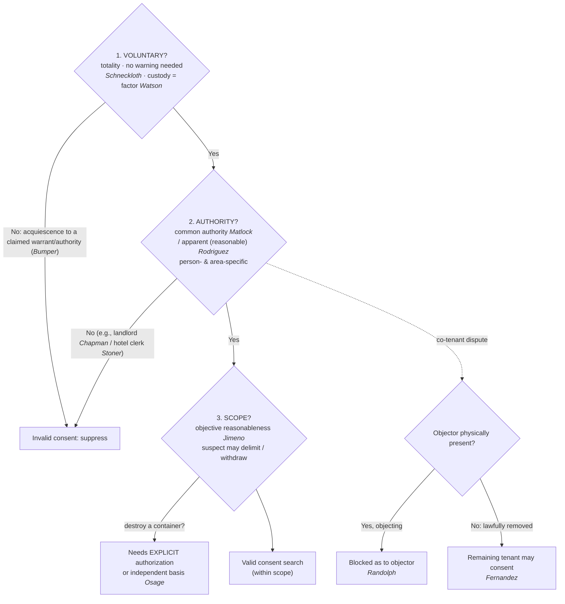

# S9 R1 panel-review — Opus model-diversity lane (prompt pack)

You are the **Claude/Opus** leg of the S9 three-lane adversarial panel (1 Claude + 2 Codex, R1). The two Codex lanes carry the A (support/quote-fidelity) and B (currency/treatment) attack lenses; **you carry model diversity and MUST vote on every paneled assertion across BOTH lenses' concerns.** You are refute-framed: try hard to break each assertion; **default to REFUTED on uncertainty**; never fabricate a cite, quote, or holding; use ONLY the evidence inlined below (no search, no outside knowledge). You are a SIGHTED reviewer — the FULL lake record (judgment fields included) is inlined.

You are a WRITER lane, not an adjudicator: you FIND and VOTE. You do not tally, adjudicate, or close any row — the orchestrator does.

For EACH group below, return one JSON object with the exact `reviewed[]` shape from the output contract (identical framing to the Codex lenses). Emit a finding object ONLY for a real defect (verdict refuted / stands-modified); a group you find wholly clean returns all-`stands` verdicts (the harness records a clean attestation). Concatenate the per-group JSON objects into a top-level `{"packs": [ ... ]}` array, one entry per group, each carrying its `group_id`.


OUTPUT CONTRACT — return ONE JSON object, nothing else:
{
  "lens": "A" | "B",
  "group_id": "<echo the group id>",
  "reviewed": [
    {
      "assertion_id": "<from group_inventory.jsonl>",
      "dimension": "existence|support|quote_fidelity|pincite|treatment|black_letter",
      "verdict": "stands" | "refuted" | "stands-modified",
      "verifiable_from_disclosed": true | false,
      "defect": null,   // null when verdict=="stands"; else an object:
      //  {"problem": "...", "severity": "high|medium|low", "proposed_fix": "...", "evidence_quote": "verbatim from disclosed evidence or null", "needs_cl": true|false, "locator_note": "..."}
      "reasons": ["short evidence-grounded reason", "..."],
      "breaks_true_positives": true | false,
      "residual_risks": ["..."],
      "suggested_tightening": "... or null"
    }
  ],
  "notes": ""
}
Rules: verdict=='stands' <=> defect==null (assertion survives your attack). verdict=='refuted' <=> a real defect (the assertion as framed is wrong). verdict=='stands-modified' <=> survives but needs a stated modification (a minor defect). Review EVERY assertion_id in group_inventory.jsonl exactly once. Output ONLY the JSON object.
---

## GROUP: content/warrant-exceptions/Consent Searches.md  (`doctrine`, 19 assertions)

### content_page

```
---
weight: 50
aliases:
  - "Consent"
  - "Consent Searches"
  - "7-exceptions-warrant/7b-pc-not-needed/Consent-Searches"
title: "Consent Searches"
topic: Consent Searches
type: doctrine
jurisdiction: Federal (U.S. Const. amend. IV); SCOTUS baseline
status: draft
related: ["[[Abandonment]]", "[[CREW]]", "[[Fourth Amendment Analysis Checklist]]", "[[Knock and Talk]]", "[[Traffic Stops]]", "[[Seizure of the Person]]", "[[Terry Stops and Reasonable Suspicion]]"]
---

# Consent Searches

*Do I have valid consent: from someone who can give it, and does the search stay inside what they agreed to?*

> [!rule] Black-letter rule
> A warrantless search is valid on consent only where the government proves, by a preponderance and on the [[Common Legal Terms#totality-of-the-circumstances|totality of the circumstances]], three things: **(1)** the consent was **voluntary**; **(2)** it came from someone with **actual or apparent authority** over the place or effects searched; and **(3)** the search stayed within the **scope** a reasonable person would understand the exchange to authorize. That burden "cannot be discharged by showing no more than acquiescence to a claim of lawful authority." *[[Bumper v. North Carolina|Bumper]]*, 391 U.S. 543, [548–549](https://www.courtlistener.com/opinion/107716/bumper-v-north-carolina/) (1968); see *[[Schneckloth v. Bustamonte|Schneckloth]]*, 412 U.S. 218, [227](https://www.courtlistener.com/opinion/108800/schneckloth-v-bustamonte/) (1973); *[[United States v. Matlock|Matlock]]*, 415 U.S. 164, [171](https://www.courtlistener.com/opinion/108967/united-states-v-matlock/) (1974); *[[Florida v. Jimeno|Jimeno]]*, 500 U.S. 248, [251](https://www.courtlistener.com/opinion/112595/florida-v-jimeno/) (1991).
> ^rule-consent

## The Brief

**What it is, and is not.** Consent is the "C" of [[CREW]]: a recognized, warrant-free justification for a search that needs **no warrant and no probable cause**. It is not a magic word. A consent search is lawful only when all three prongs line up, and on every prong the **government** carries the burden. Consent also does not enlarge police authority beyond what was given; it is measured by what a reasonable person would understand, so a "yes" to one thing is not a "yes" to everything.

**The test up front.** A consent search is valid only if the government proves each of three prongs:
1. **Voluntariness** — the choice was free, judged on the **[[Common Legal Terms#totality-of-the-circumstances|totality of the circumstances]]**, with no requirement that the person be warned of the right to refuse (*[[Schneckloth v. Bustamonte|Schneckloth]]*). The floor: mere **acquiescence to a claim of lawful authority** is not consent (*[[Bumper v. North Carolina|Bumper]]*).
2. **Authority** — the consenter had **actual common authority** (mutual use, not title) over the place or effects (*[[United States v. Matlock|Matlock]]*), **or apparent authority** a reasonable officer would credit (*[[Illinois v. Rodriguez|Rodriguez]]*).
3. **Scope** — the search went no further than what a reasonable person would understand the exchange to authorize (*[[Florida v. Jimeno|Jimeno]]*), and the suspect may narrow or withdraw it.

**Prong 1 — voluntariness, and no warning is required.** Whether consent was "voluntary" or "the product of duress or coercion, express or implied, is a question of fact to be determined from the totality of all the circumstances." *[[Schneckloth v. Bustamonte|Schneckloth]]*, 412 U.S. 218, [227](https://www.courtlistener.com/opinion/108800/schneckloth-v-bustamonte/) (1973). Knowledge of the right to refuse is one factor, never the decisive one: the government "need not establish such knowledge as the *sine qua non* of an effective consent." *Id.* Unlike *[[Miranda v. Arizona|Miranda]]*, there is **no consent-search warning**. The Court "rejected in specific terms the suggestion that police officers must always inform citizens of their right to refuse when seeking permission to conduct a warrantless consent search." *[[United States v. Drayton#^pin-206|Drayton]]*, 536 U.S. 194, [206](https://www.courtlistener.com/opinion/121153/united-states-v-drayton/#:~:text=The%20Court%20has%20rejected%20in) (2002). The same holds for a stopped motorist; it is "unrealistic to require police officers to always inform detainees that they are free to go before a consent to search may be deemed voluntary." *[[Ohio v. Robinette|Robinette]]*, 519 U.S. 33, [39–40](https://www.courtlistener.com/opinion/118066/ohio-v-robinette/) (1996). (*[[Ohio v. Robinette|Robinette]]* arises in the stop context, so see [[Traffic Stops]]; for when an encounter is consensual rather than a seizure, see [[Seizure of the Person]] and [[Terry Stops and Reasonable Suspicion]].)

**But there is a floor: acquiescence to claimed authority is not consent.** When the government relies on consent it "has the burden of proving that the consent was, in fact, freely and voluntarily given," and that "burden cannot be discharged by showing no more than acquiescence to a claim of lawful authority." *[[Bumper v. North Carolina|Bumper]]*, 391 U.S. 543, [548–549](https://www.courtlistener.com/opinion/107716/bumper-v-north-carolina/) (1968). An officer who claims a warrant "announces in effect that the occupant has no right to resist the search," a situation "instinct with coercion" where "there cannot be consent." *Id.* at 550. Prong one is therefore a spectrum: no warning is required (*[[Schneckloth v. Bustamonte|Schneckloth]]* / *[[United States v. Drayton|Drayton]]* / *[[Ohio v. Robinette|Robinette]]*), but a false or bare assertion of authority converts a "yes" into mere submission (*[[Bumper v. North Carolina|Bumper]]*).

**Custody is a factor, not a veto.** Detained, even handcuffed, people can consent. In *[[United States v. Watson|Watson]]* the suspect "had been arrested and was in custody, but his consent was given while on a public street," and "the fact of custody alone has never been enough in itself to demonstrate a coerced consent to search." *[[United States v. Watson|Watson]]*, 423 U.S. 411, [424](https://www.courtlistener.com/opinion/109352/united-states-v-watson/) (1976). Ignorance of the right to refuse "may be a factor," but "is not to be given controlling significance." *Id.* One caveat rides the setting: *[[United States v. Watson|Watson]]*'s consent arose on a public street, and consent obtained at the station is a question *[[Schneckloth v. Bustamonte|Schneckloth]]* expressly reserved (412 U.S. at 240–241 & n.29). The more custodial and coercive the setting, the heavier the government's burden on the totality.

**Prong 2 — authority means actual common authority, or a reasonable belief in it.** Common authority "rests . . . on mutual use of the property by persons generally having joint access or control for most purposes, so that it is reasonable to recognize that any of the co-inhabitants has the right to permit the inspection in his own right and that the others have assumed the risk that one of their number might permit the common area to be searched." *[[United States v. Matlock|Matlock]]*, 415 U.S. 164, [171](https://www.courtlistener.com/opinion/108967/united-states-v-matlock/) n.7 (1974). It turns on mutual use, not property title, so "[t]he consent of one who possesses common authority over premises or effects is valid as against the absent, nonconsenting person with whom that authority is shared." *Id.* at 170. (The assumption-of-risk logic predates *[[United States v. Matlock|Matlock]]*; in *[[Frazier v. Cupp|Frazier v. Cupp]]* a joint user of a duffel bag was taken to have assumed the risk his co-user would let police look inside.)

**Authority is person- and area-specific.** Because authority flows from what the consenter actually shares, a driver's general consent to search "the car" does not automatically reach a **passenger's personal bag** the driver has no common authority over. Frame it as objective reasonableness plus common authority: would a reasonable officer understand the consent, and the consenter's authority, to extend to that item?

**Apparent authority must be objectively reasonable.** *[[Illinois v. Rodriguez|Rodriguez]]* validates a warrantless entry on the consent of a third party the police reasonably believe has common authority, even if in fact he does not, judged "against an objective standard: would the facts available to the officer at the moment . . . 'warrant a man of reasonable caution in the belief' that the consenting party had authority over the premises?" *[[Illinois v. Rodriguez|Rodriguez]]*, 497 U.S. 177, [188](https://www.courtlistener.com/opinion/112475/illinois-v-rodriguez/) (1990). Where a reasonable officer would doubt the authority, "warrantless entry without further inquiry is unlawful"; ambiguity triggers a **duty to inquire further**. *Id.* at 188–189.

**Third-party limits: the classic "cannot consent" cases.** Apparent authority does not rescue consent from someone the officer has no basis to think is authorized. A **landlord cannot** consent to a search of premises currently leased to a tenant; to hold otherwise "would reduce the [Fourth] Amendment to a nullity and leave [tenants'] homes secure only in the discretion of [landlords]." *[[Chapman v. United States (1961)|Chapman]]*, 365 U.S. 610, 616–617 (1961). Likewise a **hotel desk clerk cannot** consent to a search of a current guest's room, because "the rights protected by the Fourth Amendment are not to be eroded by strained applications of the law of agency or by unrealistic doctrines of 'apparent authority.'" *[[Stoner v. California|Stoner]]*, 376 U.S. 483, [488](https://www.courtlistener.com/opinion/106777/stoner-v-california/) (1964). Both survive *[[Illinois v. Rodriguez|Rodriguez]]*: apparent authority still needs facts warranting a reasonable officer's belief, and a landlord's or clerk's bare say-so is not enough.

**Co-occupants: present objector wins, removed objector loses the veto.** When co-tenants disagree, "a warrantless search of a shared dwelling for evidence over the express refusal of consent by a physically present resident cannot be justified as reasonable as to him on the basis of consent given to the police by another resident." *[[Georgia v. Randolph|Randolph]]*, 547 U.S. 103, [120](https://www.courtlistener.com/opinion/145669/georgia-v-randolph/) (2006). That rule operates only while the objector is physically present: "an occupant who is absent due to a lawful detention or arrest stands in the same shoes as an occupant who is absent for any other reason," so once he is lawfully gone the remaining occupant may validly consent. *[[Fernandez v. California|Fernandez]]*, 571 U.S. 292, [303](https://www.courtlistener.com/opinion/2654534/fernandez-v-california/) (2014). A **lawful** arrest is fine; a **staged** removal engineered to manufacture a "yes" is not, and the test is whether the removal was objectively reasonable, not the officers' subjective motive.

**Prong 3 — scope is objective, and the suspect controls it.** "The standard for measuring the scope of a suspect's consent under the Fourth Amendment is that of 'objective' reasonableness: what would the typical reasonable person have understood by the exchange between the officer and the suspect?" *[[Florida v. Jimeno|Jimeno]]*, 500 U.S. 248, [251](https://www.courtlistener.com/opinion/112595/florida-v-jimeno/) (1991). "The scope of a search is generally defined by its expressed object," so a general consent to search a car **for drugs** reasonably reaches closed containers inside that might hold drugs. *Id.* But the consenter sets the limits: "[a] suspect may of course delimit as he chooses the scope of the search to which he consents." *Id.* at 252.

**Scope has a hard outer edge: general consent does not authorize destruction.** *[[Florida v. Jimeno|Jimeno]]*'s rule cuts both ways, and the Court drew the line by illustration: a general consent reaches a closed paper bag that might hold the drugs, but a reasonable person would not understand it to authorize breaking open a locked briefcase inside. Building on that distinction, *[[United States v. Osage|Osage]]* set the bright line for containers an officer would ruin. General consent reaches containers that might hold contraband, "[h]owever, we do not read that authority to permit the destruction of such containers." *[[United States v. Osage|Osage]]*, 235 F.3d 518, 521 (10th Cir. 2000). The rule: "before an officer may actually destroy or render completely useless a container which would otherwise be within the scope of a permissive search, the officer must obtain explicit authorization, or have some other, lawful, basis upon which to proceed." *Id.* at 522. Cutting open a sealed can was "more like breaking open a locked briefcase than opening the folds of a paper bag" and exceeded the consent. The field application: a general "sure, search the car" lets an officer look inside containers that could hold the object, but slashing a seat, prying open a welded compartment, or destroying a sealed container needs explicit authorization or an independent basis such as probable cause or a warrant.

**Scope also bounds duration, manner, and digital devices.** A voluntary consent can support a prolonged search and a canine sniff so long as a reasonable person would understand it to reach that far and the suspect does not unambiguously withdraw or narrow it (see *[[United States v. Carlton Williams]]* under **Lower-court developments**). Scope is also object- and place-specific in the digital age: an on-the-spot consent to "preview" a phone or laptop does not necessarily authorize a later off-site, comprehensive **forensic** examination, which is a different search in kind and degree needing its own justification (see *[[United States v. Lewis]]* under **Lower-court developments**).

**The right to limit, and to withdraw, consent.** The right to **limit** scope at the outset is settled SCOTUS law (*[[Florida v. Jimeno|Jimeno]]*'s "delimit as he chooses," 500 U.S. at 252). Federal circuits broadly recognize the corollary that consent, once given, may be **withdrawn** before the search concludes, at which point the officer must stop absent an independent justification. Two operational rules travel with it: the withdrawal (or mid-search narrowing) must be **unequivocal**, measured by the same *[[Florida v. Jimeno|Jimeno]]* reasonable-person standard, so an ambiguous grumble or nervous question is generally not effective; and withdrawal is **prospective**, so it does not retroactively taint what officers already lawfully found. Flag this as a **circuit-developed, persuasive** principle anchored in *[[Florida v. Jimeno|Jimeno]]*'s scope-control language, not a SCOTUS holding.

**Consent to *enter and transact* is not consent to *search*.** A person who invites an undercover officer in to do business assumes the risk of misplaced trust, so an invited undercover entry to buy contraband is no Fourth Amendment search at all (*[[Lewis v. United States (1966)|Lewis v. United States]]*), and an undercover over-the-counter purchase of publicly displayed wares is neither a search nor a seizure (*[[Maryland v. Macon|Macon]]*). But the invitation is bounded: it "does not mean that . . . an agent is authorized to conduct a general search for incriminating materials." *[[Lewis v. United States (1966)|Lewis]]*, 385 U.S. 206, 211 (1966). The agent may do only what the occupant invited, the same scope logic as *[[Florida v. Jimeno|Jimeno]]* applied to an invitation.

**Burden, standard of review, remedy.** On all three prongs the **government** bears the burden of proving valid consent by a **[[Common Legal Terms#preponderance-of-the-evidence|preponderance of the evidence]]**, judged on the [[Common Legal Terms#totality-of-the-circumstances|totality of the circumstances]]. Voluntariness (and the historical facts under every prong) is a **question of fact** reviewed for [[Common Legal Terms#clear-error|clear error]], with the ultimate reasonableness reviewed [[Common Legal Terms#de-novo|de novo]]. The **remedy** for a search that exceeds valid consent is **suppression** of the evidence and its fruits under [[The Exclusionary Rule]].

**Apply it.**
1. **Get a real "yes," and read the room.** No warning is required, but voluntariness is scored on the totality. Do not lean on a claimed warrant or a bare assertion of a right to search; that turns consent into submission (*[[Bumper v. North Carolina|Bumper]]*).
2. **Confirm who is consenting, and over what.** Does this person share **actual** use and access (*[[United States v. Matlock|Matlock]]*), or would a reasonable officer credit **apparent** authority (*[[Illinois v. Rodriguez|Rodriguez]]*)? If the facts are ambiguous, inquire before entering. A landlord (*[[Chapman v. United States (1961)|Chapman]]*) or hotel clerk (*[[Stoner v. California|Stoner]]*) cannot consent for a tenant or guest.
3. **Check for a present objector.** A physically present, objecting co-tenant defeats another's consent (*[[Georgia v. Randolph|Randolph]]*); once he is lawfully removed for a reason independent of getting consent, the remaining occupant may consent (*[[Fernandez v. California|Fernandez]]*).
4. **Stay inside the object and the words.** Search only where the stated object could be, and only what a reasonable person would understand was authorized (*[[Florida v. Jimeno|Jimeno]]*). To **destroy** a container or the vehicle, get explicit authorization or an independent basis (*[[United States v. Osage|Osage]]*).
5. **Stop when consent stops.** If the suspect unequivocally withdraws or narrows consent, stop unless you have an independent justification for continuing.

**Common pitfalls.**
- **Thinking you must Mirandize or warn before asking.** No warning is required, but the totality still governs (*[[Schneckloth v. Bustamonte|Schneckloth]]*; *[[United States v. Drayton|Drayton]]* / *[[Ohio v. Robinette|Robinette]]*).
- **Claiming a warrant to pressure a "yes."** Acquiescence to claimed authority is invalid (*[[Bumper v. North Carolina|Bumper]]*).
- **Assuming handcuffs or arrest void consent.** Custody is a factor, not [[Common Legal Terms#per-se|per se]] coercion (*[[United States v. Watson|Watson]]*).
- **Treating every closed container as off-limits, or the reverse.** A general car-for-drugs consent reaches containers that might hold drugs unless the suspect limited it, but it never authorizes destroying them (*[[Florida v. Jimeno|Jimeno]]*; *[[United States v. Osage|Osage]]*).
- **Letting a driver consent away a passenger's effects.** Authority is person- and area-specific (*[[United States v. Matlock|Matlock]]*).
- **Relying on "apparent authority" a reasonable officer would doubt, or searching over a present co-tenant's "no."** Inquire first (*[[Illinois v. Rodriguez|Rodriguez]]*); the present objector controls (*[[Georgia v. Randolph|Randolph]]*), and removal must be genuine, not staged (*[[Fernandez v. California|Fernandez]]*).

## Lower-court developments

The federal courts of appeals have applied the SCOTUS consent framework, especially *[[Florida v. Jimeno|Jimeno]]*'s objective-scope rule, to new settings including digital devices and prolonged vehicle searches. Each binds only within its own circuit and is persuasive elsewhere; none states nationwide law, and no SCOTUS consent-search case is currently pending.

- ***[[United States v. Lewis|United States v. Lewis]]* (6th Cir. 2023)** — *scope, applied to digital devices.* A suspect's in-home consent to an on-the-spot "preview" of his laptop and phone did not extend to the later off-site seizure and comprehensive forensic examination of those devices; the forensic exam exceeded the scope of consent and needed an independent Fourth Amendment justification, and the court rejected a plain-view rationale for opening the seized devices. **Binding in-circuit — 6th Cir.** (This 6th Circuit consent-scope case is distinct from *[[Lewis v. United States (1966)]]*, the SCOTUS undercover-entry case in the Related table below.)
- ***[[United States v. Carlton Williams|United States v. Carlton Williams]]* (3d Cir. 2018)** — *scope duration and withdrawal.* A voluntary consent to search a car authorized a roughly 71-minute search and a canine sniff; the suspect's statements did not unambiguously withdraw or limit the consent, so suppression was properly denied. 898 F.3d 323. **Binding in-circuit — 3d Cir.**

The through-line: circuits apply *[[Florida v. Jimeno|Jimeno]]*'s reasonable-person standard to both dimensions of scope, how far the search may reach (containers, duration, a device's data) and when a suspect has effectively pulled the consent back.

## Key cases

| Case | Holding | Opinion |
|---|---|---|
| *[[Schneckloth v. Bustamonte]]*, 412 U.S. 218 (1973) | **Voluntariness anchor.** Consent voluntariness is a totality-of-the-circumstances question of fact; the government need not prove the person knew of the right to refuse, and no *[[Miranda v. Arizona\|Miranda]]*-style warning is required. | [opinion](https://www.courtlistener.com/opinion/108800/schneckloth-v-bustamonte/) |
| *[[Bumper v. North Carolina]]*, 391 U.S. 543 (1968) | **Voluntariness floor.** Consent that is mere acquiescence to a claim of lawful authority (an officer asserting a warrant) is invalid; the government cannot carry its burden by showing submission to claimed authority. | [opinion](https://www.courtlistener.com/opinion/107716/bumper-v-north-carolina/) |
| *[[United States v. Watson]]*, 423 U.S. 411 (1976) | **Custody is a factor.** Being under arrest is one factor in the voluntariness totality, not [[Common Legal Terms#per-se\|per se]] coercion; custody alone never demonstrates coerced consent. | [opinion](https://www.courtlistener.com/opinion/109352/united-states-v-watson/) |
| *[[United States v. Drayton]]*, 536 U.S. 194 (2002) | **No-warning rule.** Officers need not advise of the right to refuse a search for consent to be voluntary; the totality controls. | [opinion](https://www.courtlistener.com/opinion/121153/united-states-v-drayton/) |
| *[[Ohio v. Robinette]]*, 519 U.S. 33 (1996) | **No "free to go" advisory.** A lawfully stopped motorist need not be told he is free to leave before his consent to search is voluntary. | [opinion](https://www.courtlistener.com/opinion/118066/ohio-v-robinette/) |
| *[[United States v. Matlock]]*, 415 U.S. 164 (1974) | **Common-authority anchor.** Mutual use and joint access, not property title, let a co-occupant consent against an absent co-occupant who assumed the risk. | [opinion](https://www.courtlistener.com/opinion/108967/united-states-v-matlock/) |
| *[[Illinois v. Rodriguez]]*, 497 U.S. 177 (1990) | **Apparent authority.** A reasonable, even if mistaken, belief that the consenter had common authority validates the entry, judged objectively; ambiguity triggers a duty to inquire. | [opinion](https://www.courtlistener.com/opinion/112475/illinois-v-rodriguez/) |
| *[[Chapman v. United States (1961)]]*, 365 U.S. 610 (1961) | **Third-party limit.** A landlord cannot consent to a search of premises currently leased to and occupied by a tenant. | [opinion](https://www.courtlistener.com/opinion/106197/chapman-v-united-states/) |
| *[[Stoner v. California]]*, 376 U.S. 483 (1964) | **Third-party limit.** A hotel clerk cannot consent to a search of a current guest's room; apparent authority cannot be conjured from agency law absent a basis to believe the consenter was authorized. | [opinion](https://www.courtlistener.com/opinion/106777/stoner-v-california/) |
| *[[Georgia v. Randolph]]*, 547 U.S. 103 (2006) | **Present objector.** A physically present, expressly objecting co-occupant's refusal prevails over another tenant's consent and is invalid as to the objector. | [opinion](https://www.courtlistener.com/opinion/145669/georgia-v-randolph/) |
| *[[Fernandez v. California]]*, 571 U.S. 292 (2014) | **Removed objector.** *[[Georgia v. Randolph\|Randolph]]* applies only while the objector is present; once he is objectively-reasonably removed (e.g., arrested), the remaining occupant may validly consent. | [opinion](https://www.courtlistener.com/opinion/2654534/fernandez-v-california/) |
| *[[Florida v. Jimeno]]*, 500 U.S. 248 (1991) | **Scope anchor.** Consent scope is objective reasonableness measured by the expressed object; a general car-for-drugs consent reaches containers that could hold drugs, and the suspect may delimit it. | [opinion](https://www.courtlistener.com/opinion/112595/florida-v-jimeno/) |
| *[[United States v. Osage]]*, 235 F.3d 518 (10th Cir. 2000) | **Scope limit, no destruction.** General consent does not authorize destroying a container; before rendering one useless the officer must get explicit authorization or another lawful basis. Cabins *[[Florida v. Jimeno\|Jimeno]]*. | [opinion](https://www.courtlistener.com/opinion/160502/united-states-v-osage/) |

## Related cases across doctrines

These are treated in full elsewhere but bear directly on consent, framed for it here.

| Case | Relevance here | Primary home | Opinion |
|---|---|---|---|
| *[[Frazier v. Cupp]]*, 394 U.S. 731 (1969) | ***Assumption-of-risk root.*** A joint user of an effect may consent against the absent co-user: the defendant who let his cousin use and store the duffel bag assumed the risk the cousin would let police look inside, the pre-*[[United States v. Matlock\|Matlock]]* root of common-authority consent. | [[Due-Process Voluntariness of Confessions]] | [opinion](https://www.courtlistener.com/opinion/107913/frazier-v-cupp/) |
| *[[United States v. Conner]]*, 127 F.3d 663 (8th Cir. 1997) | ***Bumper applied.*** Where police under color of authority demand that occupants open a motel-room door and an occupant opens it in submission rather than free choice, that is mere acquiescence to claimed authority, not valid consent. | [[Securing the Scene]] | [opinion](https://www.courtlistener.com/opinion/747208/united-states-v-larry-duane-conner-united-states-of-america-v-john/) |
| *[[Florida v. Bostick]]*, 501 U.S. 429 (1991) | ***Consent-encounter boundary.*** Bus-sweep consent can be voluntary even where the passenger is not free to leave; voluntariness turns on whether a reasonable person would feel free to decline the officers' requests, the totality test that requires no "free to refuse" advisory. | [[Knock and Talk]] | [opinion](https://www.courtlistener.com/opinion/112631/florida-v-bostick/) |
| *[[Lewis v. United States (1966)]]*, 385 U.S. 206 (1966) | ***Consent-to-transact.*** An occupant who invites an undercover agent in to buy contraband suffers no Fourth Amendment search, but the invitation does not license a "general search for incriminating materials"; the *[[Florida v. Jimeno\|Jimeno]]* scope logic applied to an invitation. | [[Reasonable Expectation of Privacy]] | [opinion](https://www.courtlistener.com/opinion/107312/lewis-v-united-states/) |
| *[[Maryland v. Macon]]*, 472 U.S. 463 (1985) | ***Public-marketplace edge.*** An undercover purchase of publicly displayed wares is neither a search nor a seizure: no [[Reasonable Expectation of Privacy\|reasonable expectation of privacy]] in goods exposed for public sale, and the seller voluntarily transfers possession. | [[Reasonable Expectation of Privacy]] | [opinion](https://www.courtlistener.com/opinion/111477/maryland-v-macon/) |

## Visual



## Sources
- [*Schneckloth v. Bustamonte*, 412 U.S. 218 (1973)](https://www.courtlistener.com/opinion/108800/schneckloth-v-bustamonte/) (pinpoints: 227, 240–241 & n.29)
- [*Bumper v. North Carolina*, 391 U.S. 543 (1968)](https://www.courtlistener.com/opinion/107716/bumper-v-north-carolina/) (pinpoints: 548–549, 550)
- [*United States v. Watson*, 423 U.S. 411 (1976)](https://www.courtlistener.com/opinion/109352/united-states-v-watson/) (pinpoint: 424)
- [*United States v. Drayton*, 536 U.S. 194 (2002)](https://www.courtlistener.com/opinion/121153/united-states-v-drayton/) (pinpoint: 206)
- [*Ohio v. Robinette*, 519 U.S. 33 (1996)](https://www.courtlistener.com/opinion/118066/ohio-v-robinette/) (pinpoints: 39–40)
- [*United States v. Matlock*, 415 U.S. 164 (1974)](https://www.courtlistener.com/opinion/108967/united-states-v-matlock/) (pinpoints: 170, 171 n.7)
- [*Illinois v. Rodriguez*, 497 U.S. 177 (1990)](https://www.courtlistener.com/opinion/112475/illinois-v-rodriguez/) (pinpoints: 188, 188–189)
- [*Chapman v. United States*, 365 U.S. 610 (1961)](https://www.courtlistener.com/opinion/106197/chapman-v-united-states/) (pinpoints: 616–617)
- [*Stoner v. California*, 376 U.S. 483 (1964)](https://www.courtlistener.com/opinion/106777/stoner-v-california/) (pinpoint: 488)
- [*Georgia v. Randolph*, 547 U.S. 103 (2006)](https://www.courtlistener.com/opinion/145669/georgia-v-randolph/) (pinpoint: 120)
- [*Fernandez v. California*, 571 U.S. 292 (2014)](https://www.courtlistener.com/opinion/2654534/fernandez-v-california/) (pinpoint: 303)
- [*Florida v. Jimeno*, 500 U.S. 248 (1991)](https://www.courtlistener.com/opinion/112595/florida-v-jimeno/) (pinpoints: 251, 252)
- [*United States v. Osage*, 235 F.3d 518 (10th Cir. 2000)](https://www.courtlistener.com/opinion/160502/united-states-v-osage/) (pinpoints: 521, 522) (Binding in-circuit — 10th Cir.)
- [*Frazier v. Cupp*, 394 U.S. 731 (1969)](https://www.courtlistener.com/opinion/107913/frazier-v-cupp/) (pinpoint: 740; home = [[Due-Process Voluntariness of Confessions]])
- [*United States v. Conner*, 127 F.3d 663 (8th Cir. 1997)](https://www.courtlistener.com/opinion/747208/united-states-v-larry-duane-conner-united-states-of-america-v-john/) (pinpoint: 666; home = [[Securing the Scene]])
- [*Florida v. Bostick*, 501 U.S. 429 (1991)](https://www.courtlistener.com/opinion/112631/florida-v-bostick/) (pinpoints: 436, 439; home = [[Knock and Talk]])
- [*Lewis v. United States*, 385 U.S. 206 (1966)](https://www.courtlistener.com/opinion/107312/lewis-v-united-states/) (pinpoint: 211; home = [[Reasonable Expectation of Privacy]])
- [*Maryland v. Macon*, 472 U.S. 463 (1985)](https://www.courtlistener.com/opinion/111477/maryland-v-macon/) (pinpoint: 469; home = [[Reasonable Expectation of Privacy]])
- [*United States v. Lewis*, 6th Cir. 2023](https://www.courtlistener.com/opinion/9424185/united-states-v-edward-leonidas-lewis/) (Binding in-circuit — 6th Cir.)
- [*United States v. Carlton Williams*, 898 F.3d 323 (3d Cir. 2018)](https://www.courtlistener.com/opinion/4522771/united-states-v-carlton-williams/) (Binding in-circuit — 3d Cir.)

```

### group_inventory (assertions under review)

```jsonl
{"assertion_id": "06f6396b3d9a3dfe", "dimension": "existence", "kind": "case_cite", "locator": {"case": "Florida v. Jimeno", "table_line": 86}, "payload": {"case": "Florida v. Jimeno", "cells": ["*[[Florida v. Jimeno]]*, 500 U.S. 248 (1991)", "**Scope anchor.** Consent scope is objective reasonableness measured by the expressed object; a general car-for-drugs consent reaches containers that could hold drugs, and the suspect may delimit it.", "[opinion](https://www.courtlistener.com/opinion/112595/florida-v-jimeno/)"], "header": ["Case", "Holding", "Opinion"]}}
{"assertion_id": "18dee457db5a3602", "dimension": "existence", "kind": "case_cite", "locator": {"case": "United States v. Conner", "table_line": 96}, "payload": {"case": "United States v. Conner", "cells": ["*[[United States v. Conner]]*, 127 F.3d 663 (8th Cir. 1997)", "***Bumper applied.*** Where police under color of authority demand that occupants open a motel-room door and an occupant opens it in submission rather than free choice, that is mere acquiescence to claimed authority, not valid consent.", "[[Securing the Scene]]", "[opinion](https://www.courtlistener.com/opinion/747208/united-states-v-larry-duane-conner-united-states-of-america-v-john/)"], "header": ["Case", "Relevance here", "Primary home", "Opinion"]}}
{"assertion_id": "21616788d94b7b66", "dimension": "existence", "kind": "case_cite", "locator": {"case": "Stoner v. California", "table_line": 83}, "payload": {"case": "Stoner v. California", "cells": ["*[[Stoner v. California]]*, 376 U.S. 483 (1964)", "**Third-party limit.** A hotel clerk cannot consent to a search of a current guest's room; apparent authority cannot be conjured from agency law absent a basis to believe the consenter was authorized.", "[opinion](https://www.courtlistener.com/opinion/106777/stoner-v-california/)"], "header": ["Case", "Holding", "Opinion"]}}
{"assertion_id": "5006e41f2d182c32", "dimension": "existence", "kind": "case_cite", "locator": {"case": "Ohio v. Robinette", "table_line": 79}, "payload": {"case": "Ohio v. Robinette", "cells": ["*[[Ohio v. Robinette]]*, 519 U.S. 33 (1996)", "**No \"free to go\" advisory.** A lawfully stopped motorist need not be told he is free to leave before his consent to search is voluntary.", "[opinion](https://www.courtlistener.com/opinion/118066/ohio-v-robinette/)"], "header": ["Case", "Holding", "Opinion"]}}
{"assertion_id": "585793e158d26c4c", "dimension": "existence", "kind": "case_cite", "locator": {"case": "Fernandez v. California", "table_line": 85}, "payload": {"case": "Fernandez v. California", "cells": ["*[[Fernandez v. California]]*, 571 U.S. 292 (2014)", "**Removed objector.** *[[Georgia v. Randolph\\|Randolph]]* applies only while the objector is present; once he is objectively-reasonably removed (e.g., arrested), the remaining occupant may validly consent.", "[opinion](https://www.courtlistener.com/opinion/2654534/fernandez-v-california/)"], "header": ["Case", "Holding", "Opinion"]}}
{"assertion_id": "79f558e461fc8d3a", "dimension": "existence", "kind": "case_cite", "locator": {"case": "United States v. Drayton", "table_line": 78}, "payload": {"case": "United States v. Drayton", "cells": ["*[[United States v. Drayton]]*, 536 U.S. 194 (2002)", "**No-warning rule.** Officers need not advise of the right to refuse a search for consent to be voluntary; the totality controls.", "[opinion](https://www.courtlistener.com/opinion/121153/united-states-v-drayton/)"], "header": ["Case", "Holding", "Opinion"]}}
{"assertion_id": "88aeb9d55ac79810", "dimension": "existence", "kind": "case_cite", "locator": {"case": "Frazier v. Cupp", "table_line": 95}, "payload": {"case": "Frazier v. Cupp", "cells": ["*[[Frazier v. Cupp]]*, 394 U.S. 731 (1969)", "***Assumption-of-risk root.*** A joint user of an effect may consent against the absent co-user: the defendant who let his cousin use and store the duffel bag assumed the risk the cousin would let police look inside, the pre-*[[United States v. Matlock\\|Matlock]]* root of common-authority consent.", "[[Due-Process Voluntariness of Confessions]]", "[opinion](https://www.courtlistener.com/opinion/107913/frazier-v-cupp/)"], "header": ["Case", "Relevance here", "Primary home", "Opinion"]}}
{"assertion_id": "8acdb718f83b787e", "dimension": "existence", "kind": "case_cite", "locator": {"case": "United States v. Matlock", "table_line": 80}, "payload": {"case": "United States v. Matlock", "cells": ["*[[United States v. Matlock]]*, 415 U.S. 164 (1974)", "**Common-authority anchor.** Mutual use and joint access, not property title, let a co-occupant consent against an absent co-occupant who assumed the risk.", "[opinion](https://www.courtlistener.com/opinion/108967/united-states-v-matlock/)"], "header": ["Case", "Holding", "Opinion"]}}
{"assertion_id": "8ef67d4b46d35762", "dimension": "existence", "kind": "case_cite", "locator": {"case": "Florida v. Bostick", "table_line": 97}, "payload": {"case": "Florida v. Bostick", "cells": ["*[[Florida v. Bostick]]*, 501 U.S. 429 (1991)", "***Consent-encounter boundary.*** Bus-sweep consent can be voluntary even where the passenger is not free to leave; voluntariness turns on whether a reasonable person would feel free to decline the officers' requests, the totality test that requires no \"free to refuse\" advisory.", "[[Knock and Talk]]", "[opinion](https://www.courtlistener.com/opinion/112631/florida-v-bostick/)"], "header": ["Case", "Relevance here", "Primary home", "Opinion"]}}
{"assertion_id": "93dcdf52c65689e8", "dimension": "existence", "kind": "case_cite", "locator": {"case": "Chapman v. United States (1961)", "table_line": 82}, "payload": {"case": "Chapman v. United States (1961)", "cells": ["*[[Chapman v. United States (1961)]]*, 365 U.S. 610 (1961)", "**Third-party limit.** A landlord cannot consent to a search of premises currently leased to and occupied by a tenant.", "[opinion](https://www.courtlistener.com/opinion/106197/chapman-v-united-states/)"], "header": ["Case", "Holding", "Opinion"]}}
{"assertion_id": "97736ab2cf586ed6", "dimension": "existence", "kind": "case_cite", "locator": {"case": "United States v. Osage", "table_line": 87}, "payload": {"case": "United States v. Osage", "cells": ["*[[United States v. Osage]]*, 235 F.3d 518 (10th Cir. 2000)", "**Scope limit, no destruction.** General consent does not authorize destroying a container; before rendering one useless the officer must get explicit authorization or another lawful basis. Cabins *[[Florida v. Jimeno\\|Jimeno]]*.", "[opinion](https://www.courtlistener.com/opinion/160502/united-states-v-osage/)"], "header": ["Case", "Holding", "Opinion"]}}
{"assertion_id": "9d4c430a927b4004", "dimension": "existence", "kind": "case_cite", "locator": {"case": "Georgia v. Randolph", "table_line": 84}, "payload": {"case": "Georgia v. Randolph", "cells": ["*[[Georgia v. Randolph]]*, 547 U.S. 103 (2006)", "**Present objector.** A physically present, expressly objecting co-occupant's refusal prevails over another tenant's consent and is invalid as to the objector.", "[opinion](https://www.courtlistener.com/opinion/145669/georgia-v-randolph/)"], "header": ["Case", "Holding", "Opinion"]}}
{"assertion_id": "9d5975c306e47960", "dimension": "existence", "kind": "case_cite", "locator": {"case": "Illinois v. Rodriguez", "table_line": 81}, "payload": {"case": "Illinois v. Rodriguez", "cells": ["*[[Illinois v. Rodriguez]]*, 497 U.S. 177 (1990)", "**Apparent authority.** A reasonable, even if mistaken, belief that the consenter had common authority validates the entry, judged objectively; ambiguity triggers a duty to inquire.", "[opinion](https://www.courtlistener.com/opinion/112475/illinois-v-rodriguez/)"], "header": ["Case", "Holding", "Opinion"]}}
{"assertion_id": "b4879ed8bc919349", "dimension": "existence", "kind": "case_cite", "locator": {"case": "Schneckloth v. Bustamonte", "table_line": 75}, "payload": {"case": "Schneckloth v. Bustamonte", "cells": ["*[[Schneckloth v. Bustamonte]]*, 412 U.S. 218 (1973)", "**Voluntariness anchor.** Consent voluntariness is a totality-of-the-circumstances question of fact; the government need not prove the person knew of the right to refuse, and no *[[Miranda v. Arizona\\|Miranda]]*-style warning is required.", "[opinion](https://www.courtlistener.com/opinion/108800/schneckloth-v-bustamonte/)"], "header": ["Case", "Holding", "Opinion"]}}
{"assertion_id": "b5fad355f8bc250e", "dimension": "existence", "kind": "case_cite", "locator": {"case": "Maryland v. Macon", "table_line": 99}, "payload": {"case": "Maryland v. Macon", "cells": ["*[[Maryland v. Macon]]*, 472 U.S. 463 (1985)", "***Public-marketplace edge.*** An undercover purchase of publicly displayed wares is neither a search nor a seizure: no [[Reasonable Expectation of Privacy\\|reasonable expectation of privacy]] in goods exposed for public sale, and the seller voluntarily transfers possession.", "[[Reasonable Expectation of Privacy]]", "[opinion](https://www.courtlistener.com/opinion/111477/maryland-v-macon/)"], "header": ["Case", "Relevance here", "Primary home", "Opinion"]}}
{"assertion_id": "c07a37fe8ee9b77c", "dimension": "existence", "kind": "case_cite", "locator": {"case": "Lewis v. United States (1966)", "table_line": 98}, "payload": {"case": "Lewis v. United States (1966)", "cells": ["*[[Lewis v. United States (1966)]]*, 385 U.S. 206 (1966)", "***Consent-to-transact.*** An occupant who invites an undercover agent in to buy contraband suffers no Fourth Amendment search, but the invitation does not license a \"general search for incriminating materials\"; the *[[Florida v. Jimeno\\|Jimeno]]* scope logic applied to an invitation.", "[[Reasonable Expectation of Privacy]]", "[opinion](https://www.courtlistener.com/opinion/107312/lewis-v-united-states/)"], "header": ["Case", "Relevance here", "Primary home", "Opinion"]}}
{"assertion_id": "c151e1f5e44f7fa9", "dimension": "existence", "kind": "case_cite", "locator": {"case": "United States v. Watson", "table_line": 77}, "payload": {"case": "United States v. Watson", "cells": ["*[[United States v. Watson]]*, 423 U.S. 411 (1976)", "**Custody is a factor.** Being under arrest is one factor in the voluntariness totality, not [[Common Legal Terms#per-se\\|per se]] coercion; custody alone never demonstrates coerced consent.", "[opinion](https://www.courtlistener.com/opinion/109352/united-states-v-watson/)"], "header": ["Case", "Holding", "Opinion"]}}
{"assertion_id": "ec0d0239ef382006", "dimension": "existence", "kind": "case_cite", "locator": {"case": "Bumper v. North Carolina", "table_line": 76}, "payload": {"case": "Bumper v. North Carolina", "cells": ["*[[Bumper v. North Carolina]]*, 391 U.S. 543 (1968)", "**Voluntariness floor.** Consent that is mere acquiescence to a claim of lawful authority (an officer asserting a warrant) is invalid; the government cannot carry its burden by showing submission to claimed authority.", "[opinion](https://www.courtlistener.com/opinion/107716/bumper-v-north-carolina/)"], "header": ["Case", "Holding", "Opinion"]}}
{"assertion_id": "b0713bb349573b4f", "dimension": "support", "kind": "proposition", "locator": {"callout": "^rule-consent"}, "payload": {"anchor": "^rule-consent", "statement": "[!rule] Black-letter rule\nA warrantless search is valid on consent only where the government proves, by a preponderance and on the [[Common Legal Terms#totality-of-the-circumstances|totality of the circumstances]], three things: **(1)** the consent was **voluntary**; **(2)** it came from someone with **actual or apparent authority** over the place or effects searched; and **(3)** the search stayed within the **scope** a reasonable person would understand the exchange to authorize. That burden \"cannot be discharged by showing no more than acquiescence to a claim of lawful authority.\" *[[Bumper v. North Carolina|Bumper]]*, 391 U.S. 543, [548–549](https://www.courtlistener.com/opinion/107716/bumper-v-north-carolina/) (1968); see *[[Schneckloth v. Bustamonte|Schneckloth]]*, 412 U.S. 218, [227](https://www.courtlistener.com/opinion/108800/schneckloth-v-bustamonte/) (1973); *[[United States v. Matlock|Matlock]]*, 415 U.S. 164, [171](https://www.courtlistener.com/opinion/108967/united-states-v-matlock/) (1974); *[[Florida v. Jimeno|Jimeno]]*, 500 U.S. 248, [251](https://www.courtlistener.com/opinion/112595/florida-v-jimeno/) (1991)."}}
```

### lake record — Bumper v. North Carolina

```json
{
  "schema_version": "s2.v1",
  "record_id": "Bumper v. North Carolina",
  "stub": false,
  "status": "verified",
  "identity": {
    "case_name": "Bumper v. North Carolina",
    "case_name_short": "Bumper",
    "case_name_full": "Bumper v. North Carolina",
    "input_case_name": "Bumper v. North Carolina",
    "court": "U.S. Supreme Court",
    "court_id": "scotus",
    "court_level": "scotus",
    "circuit": null,
    "state": null,
    "date_decided": "1968-06-03",
    "year": 1968,
    "docket": "1016",
    "cluster_id": 107716,
    "lead_opinion_id": 107716,
    "sibling_ids": [
      107716,
      9423732,
      9423733,
      9423734,
      9423735
    ],
    "absolute_url": "/opinion/107716/bumper-v-north-carolina/",
    "identity_method": "citation+party-text",
    "expected_citation_found": true,
    "party_name_in_text": true,
    "canonical_name_match": true,
    "alternates": [
      {
        "cluster_id": 8969853,
        "score": 10,
        "case_name": "Bumper v. North Carolina"
      }
    ],
    "reason_code": null
  },
  "citations": {
    "official": {
      "cite": "391 U.S. 543",
      "volume": "391",
      "reporter": "U.S.",
      "page": "543",
      "type": 1,
      "selected_official": true,
      "source": "cluster.citations[]"
    },
    "parallel": [
      {
        "cite": "88 S. Ct. 1788",
        "volume": "88",
        "reporter": "S. Ct.",
        "page": "1788",
        "type": 1,
        "selected_official": false,
        "source": "cluster.citations[]"
      },
      {
        "cite": "20 L. Ed. 2d 797",
        "volume": "20",
        "reporter": "L. Ed. 2d",
        "page": "797",
        "type": 1,
        "selected_official": false,
        "source": "cluster.citations[]"
      },
      {
        "cite": "46 Ohio Op. 2d 382",
        "volume": "46",
        "reporter": "Ohio Op. 2d",
        "page": "382",
        "type": 2,
        "selected_official": false,
        "source": "cluster.citations[]"
      }
    ],
    "vendor_neutral": [
      {
        "cite": "1968 U.S. LEXIS 1470",
        "volume": "1968",
        "reporter": "U.S. LEXIS",
        "page": "1470",
        "type": 6,
        "selected_official": false,
        "source": "cluster.citations[]"
      }
    ],
    "all": [
      {
        "cite": "391 U.S. 543",
        "volume": "391",
        "reporter": "U.S.",
        "page": "543",
        "type": 1,
        "selected_official": false,
        "source": "cluster.citations[]"
      },
      {
        "cite": "88 S. Ct. 1788",
        "volume": "88",
        "reporter": "S. Ct.",
        "page": "1788",
        "type": 1,
        "selected_official": false,
        "source": "cluster.citations[]"
      },
      {
        "cite": "20 L. Ed. 2d 797",
        "volume": "20",
        "reporter": "L. Ed. 2d",
        "page": "797",
        "type": 1,
        "selected_official": false,
        "source": "cluster.citations[]"
      },
      {
        "cite": "1968 U.S. LEXIS 1470",
        "volume": "1968",
        "reporter": "U.S. LEXIS",
        "page": "1470",
        "type": 6,
        "selected_official": false,
        "source": "cluster.citations[]"
      },
      {
        "cite": "46 Ohio Op. 2d 382",
        "volume": "46",
        "reporter": "Ohio Op. 2d",
        "page": "382",
        "type": 2,
        "selected_official": false,
        "source": "cluster.citations[]"
      }
    ],
    "display": "391 U.S. 543",
    "official_selection": {
      "court_class": "scotus",
      "selected": "391 U.S. 543",
      "reason": "selected_rank_1"
    }
  },
  "pinpoints": [
    {
      "id": "pin-548",
      "page": null,
      "quote": "and let them in. They found a rifle later admitted at trial to convict Bumper. At the suppression hearing the prosecution did not rely on \u2014 or even produce \u2014 any warrant; it sought to justify the search solely as consensual. ## Issue Whether a homeowner's permission to search, given after officers assert that they have a search warrant, constitutes valid voluntary consent under the Fourth Amendment when the warrant's validity is not established. ## Rule No.",
      "star_marker": null,
      "quote_fidelity": "mismatch",
      "pinpoint_status": "slip-only",
      "position": null
    },
    {
      "id": "pin-550",
      "page": null,
      "quote": "When a law enforcement officer claims authority to search a home under a warrant, he announces in effect that the occupant has no right to resist the search. The situation is instinct with coercion \u2014 albeit colorably lawful coercion. Where there is coercion there cannot be consent.",
      "star_marker": null,
      "quote_fidelity": "mismatch",
      "pinpoint_status": "slip-only",
      "position": null
    }
  ],
  "treatment": {
    "field_i_validity": "good_law",
    "as_of_content": "1968-06-03",
    "as_of_treatment": "2026-06-30",
    "composite_basis": "migration-seed",
    "composite_basis_ref": "Bumper v. North Carolina",
    "varies_by_point": false,
    "scope_note": "Foundational consent-voluntariness rule; good law and incorporated into the Schneckloth totality-of-circumstances framework.",
    "point_overrides": [],
    "edges": [
      {
        "citing_case": {
          "name": "People v. Gutierrez",
          "cluster_id": 6240355,
          "cite": [
            "245 Cal. Rptr. 3d 143",
            "33 Cal. App. Supp. 5th 11"
          ],
          "field_ii": "questioned"
        },
        "field_ii": "questioned",
        "field_iii": "mentioned",
        "point": null,
        "proposed": true,
        "journal_ref": "Bumper v. North Carolina:lane1_negative"
      },
      {
        "citing_case": {
          "name": "State v. Banks",
          "cluster_id": 6658146,
          "cite": [
            "434 P.3d 361",
            "364 Or. 332"
          ],
          "field_ii": "questioned"
        },
        "field_ii": "questioned",
        "field_iii": "mentioned",
        "point": null,
        "proposed": true,
        "journal_ref": "Bumper v. North Carolina:lane1_negative"
      },
      {
        "citing_case": {
          "name": "Commonwealth v. Buckley",
          "cluster_id": 4468007,
          "cite": [
            "90 N.E.3d 767",
            "478 Mass. 861"
          ],
          "field_ii": "superseded_by_statute"
        },
        "field_ii": "superseded_by_statute",
        "field_iii": "mentioned",
        "point": null,
        "proposed": true,
        "journal_ref": "Bumper v. North Carolina:lane1_negative"
      },
      {
        "citing_case": {
          "name": "People v. Arredondo",
          "cluster_id": 6238731,
          "cite": [
            "199 Cal. Rptr. 3d 563",
            "245 Cal. App. 4th 186",
            "2016 Cal. App. LEXIS 153"
          ],
          "field_ii": "overruled"
        },
        "field_ii": "overruled",
        "field_iii": "mentioned",
        "point": null,
        "proposed": true,
        "journal_ref": "Bumper v. North Carolina:lane1_negative"
      },
      {
        "citing_case": {
          "name": "United States v. Kenneth Rush",
          "cluster_id": 3164356,
          "cite": [
            "808 F.3d 1007",
            "2015 U.S. App. LEXIS 22212",
            "2015 WL 9269763"
          ],
          "field_ii": "questioned"
        },
        "field_ii": "questioned",
        "field_iii": "mentioned",
        "point": null,
        "proposed": true,
        "journal_ref": "Bumper v. North Carolina:lane1_negative"
      },
      {
        "citing_case": {
          "name": "United States v. Casellas-Toro",
          "cluster_id": 3160467,
          "cite": [
            "807 F.3d 380",
            "2015 U.S. App. LEXIS 21199",
            "2015 WL 8044991"
          ],
          "field_ii": "overruled"
        },
        "field_ii": "overruled",
        "field_iii": "mentioned",
        "point": null,
        "proposed": true,
        "journal_ref": "Bumper v. North Carolina:lane1_negative"
      },
      {
        "citing_case": {
          "name": "Moises Donjuan v. State",
          "cluster_id": 2980860,
          "cite": [
            "461 S.W.3d 611",
            "2015 Tex. App. LEXIS 1618",
            "2015 WL 732640"
          ],
          "field_ii": "overruled"
        },
        "field_ii": "overruled",
        "field_iii": "mentioned",
        "point": null,
        "proposed": true,
        "journal_ref": "Bumper v. North Carolina:lane1_negative"
      },
      {
        "citing_case": {
          "name": "State v. Camp",
          "cluster_id": 2774669,
          "cite": [
            "2015 Ohio 329"
          ],
          "field_ii": "abrogated"
        },
        "field_ii": "abrogated",
        "field_iii": "mentioned",
        "point": null,
        "proposed": true,
        "journal_ref": "Bumper v. North Carolina:lane1_negative"
      },
      {
        "citing_case": {
          "name": "Schneckloth v. Bustamonte",
          "cluster_id": 108800,
          "cite": [
            "36 L. Ed. 2d 854",
            "93 S. Ct. 2041",
            "412 U.S. 218",
            "1973 U.S. LEXIS 6"
          ],
          "field_ii": "questioned"
        },
        "field_ii": "questioned",
        "field_iii": "mentioned",
        "point": null,
        "proposed": true,
        "journal_ref": "Bumper v. North Carolina:lane2_top_cited"
      },
      {
        "citing_case": {
          "name": "Florida v. Royer",
          "cluster_id": 110890,
          "cite": [
            "75 L. Ed. 2d 229",
            "103 S. Ct. 1319",
            "460 U.S. 491",
            "1983 U.S. LEXIS 151",
            "51 U.S.L.W. 4293"
          ],
          "field_ii": "questioned"
        },
        "field_ii": "questioned",
        "field_iii": "mentioned",
        "point": null,
        "proposed": true,
        "journal_ref": "Bumper v. North Carolina:lane2_top_cited"
      },
      {
        "citing_case": {
          "name": "United States v. Mendenhall",
          "cluster_id": 110264,
          "cite": [
            "64 L. Ed. 2d 497",
            "100 S. Ct. 1870",
            "446 U.S. 544",
            "1980 U.S. LEXIS 102"
          ],
          "field_ii": "questioned"
        },
        "field_ii": "questioned",
        "field_iii": "mentioned",
        "point": null,
        "proposed": true,
        "journal_ref": "Bumper v. North Carolina:lane2_top_cited"
      },
      {
        "citing_case": {
          "name": "Rakas v. Illinois",
          "cluster_id": 109953,
          "cite": [
            "58 L. Ed. 2d 387",
            "99 S. Ct. 421",
            "439 U.S. 128",
            "1978 U.S. LEXIS 2452"
          ],
          "field_ii": "overruled"
        },
        "field_ii": "overruled",
        "field_iii": "mentioned",
        "point": null,
        "proposed": true,
        "journal_ref": "Bumper v. North Carolina:lane2_top_cited"
      },
      {
        "citing_case": {
          "name": "South Dakota v. Opperman",
          "cluster_id": 109537,
          "cite": [
            "49 L. Ed. 2d 1000",
            "96 S. Ct. 3092",
            "428 U.S. 364",
            "1976 U.S. LEXIS 15"
          ],
          "field_ii": "questioned"
        },
        "field_ii": "questioned",
        "field_iii": "mentioned",
        "point": null,
        "proposed": true,
        "journal_ref": "Bumper v. North Carolina:lane2_top_cited"
      },
      {
        "citing_case": {
          "name": "Carmouche v. State",
          "cluster_id": 1463452,
          "cite": [
            "10 S.W.3d 323",
            "2000 Tex. Crim. App. LEXIS 8",
            "2000 WL 60020"
          ],
          "field_ii": "overruled"
        },
        "field_ii": "overruled",
        "field_iii": "mentioned",
        "point": null,
        "proposed": true,
        "journal_ref": "Bumper v. North Carolina:lane2_top_cited"
      },
      {
        "citing_case": {
          "name": "Lockhart v. McCree",
          "cluster_id": 111665,
          "cite": [
            "90 L. Ed. 2d 137",
            "106 S. Ct. 1758",
            "476 U.S. 162",
            "1986 U.S. LEXIS 153",
            "54 U.S.L.W. 4449"
          ],
          "field_ii": "criticized"
        },
        "field_ii": "criticized",
        "field_iii": "mentioned",
        "point": null,
        "proposed": true,
        "journal_ref": "Bumper v. North Carolina:lane2_top_cited"
      },
      {
        "citing_case": {
          "name": "Minnesota v. Murphy",
          "cluster_id": 111105,
          "cite": [
            "79 L. Ed. 2d 409",
            "104 S. Ct. 1136",
            "465 U.S. 420",
            "1984 U.S. LEXIS 33",
            "52 U.S.L.W. 4246"
          ],
          "field_ii": "questioned"
        },
        "field_ii": "questioned",
        "field_iii": "mentioned",
        "point": null,
        "proposed": true,
        "journal_ref": "Bumper v. North Carolina:lane2_top_cited"
      },
      {
        "citing_case": {
          "name": "Birchfield v. N. Dakota. William Robert Bernard",
          "cluster_id": 3216497,
          "cite": [
            "579 U.S. 438",
            "195 L. Ed. 2d 560",
            "2016 U.S. LEXIS 4058",
            "136 S. Ct. 2160"
          ],
          "field_ii": "abrogated"
        },
        "field_ii": "abrogated",
        "field_iii": "mentioned",
        "point": null,
        "proposed": true,
        "journal_ref": "Bumper v. North Carolina:lane2_top_cited"
      },
      {
        "citing_case": {
          "name": "State v. Kelly",
          "cluster_id": 1397401,
          "cite": [
            "204 S.W.3d 808",
            "2006 Tex. Crim. App. LEXIS 2060",
            "2006 WL 3019246"
          ],
          "field_ii": "questioned"
        },
        "field_ii": "questioned",
        "field_iii": "mentioned",
        "point": null,
        "proposed": true,
        "journal_ref": "Bumper v. North Carolina:lane2_top_cited"
      },
      {
        "citing_case": {
          "name": "Davis v. Mississippi",
          "cluster_id": 107912,
          "cite": [
            "22 L. Ed. 2d 676",
            "89 S. Ct. 1394",
            "394 U.S. 721",
            "1969 U.S. LEXIS 1869"
          ],
          "field_ii": "questioned"
        },
        "field_ii": "questioned",
        "field_iii": "mentioned",
        "point": null,
        "proposed": true,
        "journal_ref": "Bumper v. North Carolina:lane2_top_cited"
      },
      {
        "citing_case": {
          "name": "Andresen v. Maryland",
          "cluster_id": 109522,
          "cite": [
            "49 L. Ed. 2d 627",
            "96 S. Ct. 2737",
            "427 U.S. 463",
            "1976 U.S. LEXIS 78"
          ],
          "field_ii": "overruled"
        },
        "field_ii": "overruled",
        "field_iii": "mentioned",
        "point": null,
        "proposed": true,
        "journal_ref": "Bumper v. North Carolina:lane2_top_cited"
      },
      {
        "citing_case": {
          "name": "People v. Ledesma",
          "cluster_id": 1228080,
          "cite": [
            "729 P.2d 839",
            "43 Cal. 3d 171",
            "233 Cal. Rptr. 404",
            "1987 Cal. LEXIS 278"
          ],
          "field_ii": "questioned"
        },
        "field_ii": "questioned",
        "field_iii": "mentioned",
        "point": null,
        "proposed": true,
        "journal_ref": "Bumper v. North Carolina:lane2_top_cited"
      },
      {
        "citing_case": {
          "name": "Hudson v. Michigan",
          "cluster_id": 145646,
          "cite": [
            "165 L. Ed. 2d 56",
            "126 S. Ct. 2159",
            "547 U.S. 586",
            "2006 U.S. LEXIS 4677"
          ],
          "field_ii": "overruled"
        },
        "field_ii": "overruled",
        "field_iii": "mentioned",
        "point": null,
        "proposed": true,
        "journal_ref": "Bumper v. North Carolina:lane2_top_cited"
      },
      {
        "citing_case": {
          "name": "Minnesota v. Carter",
          "cluster_id": 118249,
          "cite": [
            "142 L. Ed. 2d 373",
            "119 S. Ct. 469",
            "525 U.S. 83",
            "1998 U.S. LEXIS 7844"
          ],
          "field_ii": "overruled"
        },
        "field_ii": "overruled",
        "field_iii": "mentioned",
        "point": null,
        "proposed": true,
        "journal_ref": "Bumper v. North Carolina:lane2_top_cited"
      },
      {
        "citing_case": {
          "name": "Carpenter v. United States",
          "cluster_id": 4510032,
          "cite": [
            "585 U.S. 296",
            "138 S. Ct. 2206",
            "201 L. Ed. 2d 507",
            "2018 U.S. LEXIS 3844"
          ],
          "field_ii": "overruled"
        },
        "field_ii": "overruled",
        "field_iii": "mentioned",
        "point": null,
        "proposed": true,
        "journal_ref": "Bumper v. North Carolina:lane2_top_cited"
      },
      {
        "citing_case": {
          "name": "Harris v. State",
          "cluster_id": 1577216,
          "cite": [
            "790 S.W.2d 568",
            "1989 Tex. Crim. App. LEXIS 151",
            "1989 WL 69709"
          ],
          "field_ii": "overruled"
        },
        "field_ii": "overruled",
        "field_iii": "mentioned",
        "point": null,
        "proposed": true,
        "journal_ref": "Bumper v. North Carolina:lane2_top_cited"
      },
      {
        "citing_case": {
          "name": "United States v. Biswell",
          "cluster_id": 108533,
          "cite": [
            "32 L. Ed. 2d 87",
            "92 S. Ct. 1593",
            "406 U.S. 311",
            "1972 U.S. LEXIS 60"
          ],
          "field_ii": "questioned"
        },
        "field_ii": "questioned",
        "field_iii": "mentioned",
        "point": null,
        "proposed": true,
        "journal_ref": "Bumper v. North Carolina:lane2_top_cited"
      },
      {
        "citing_case": {
          "name": "State v. Guloy",
          "cluster_id": 1116120,
          "cite": [
            "705 P.2d 1182",
            "104 Wash. 2d 412"
          ],
          "field_ii": "overruled"
        },
        "field_ii": "overruled",
        "field_iii": "mentioned",
        "point": null,
        "proposed": true,
        "journal_ref": "Bumper v. North Carolina:lane2_top_cited"
      },
      {
        "citing_case": {
          "name": "United States v. Phillips",
          "cluster_id": 8924874,
          "cite": [
            "664 F.2d 971",
            "9 Fed. R. Serv. 970"
          ],
          "field_ii": "overruled"
        },
        "field_ii": "overruled",
        "field_iii": "mentioned",
        "point": null,
        "proposed": true,
        "journal_ref": "Bumper v. North Carolina:lane2_top_cited"
      },
      {
        "citing_case": {
          "name": "Dorsey v. State",
          "cluster_id": 2347482,
          "cite": [
            "350 A.2d 665",
            "276 Md. 638",
            "1976 Md. LEXIS 1109"
          ],
          "field_ii": "overruled"
        },
        "field_ii": "overruled",
        "field_iii": "mentioned",
        "point": null,
        "proposed": true,
        "journal_ref": "Bumper v. North Carolina:lane2_top_cited"
      },
      {
        "citing_case": {
          "name": "Lo-Ji Sales, Inc. v. New York",
          "cluster_id": 110100,
          "cite": [
            "60 L. Ed. 2d 920",
            "99 S. Ct. 2319",
            "442 U.S. 319",
            "1979 U.S. LEXIS 107",
            "5 Media L. Rep. (BNA) 1177"
          ],
          "field_ii": "questioned"
        },
        "field_ii": "questioned",
        "field_iii": "mentioned",
        "point": null,
        "proposed": true,
        "journal_ref": "Bumper v. North Carolina:lane2_top_cited"
      },
      {
        "citing_case": {
          "name": "Johnson v. State",
          "cluster_id": 1718150,
          "cite": [
            "803 S.W.2d 272",
            "1990 WL 180807"
          ],
          "field_ii": "overruled"
        },
        "field_ii": "overruled",
        "field_iii": "mentioned",
        "point": null,
        "proposed": true,
        "journal_ref": "Bumper v. North Carolina:lane2_top_cited"
      },
      {
        "citing_case": {
          "name": "People v. Weaver",
          "cluster_id": 2633370,
          "cite": [
            "29 P.3d 103",
            "111 Cal. Rptr. 2d 2",
            "26 Cal. 4th 876",
            "2001 D.A.R. 8853",
            "2001 Daily Journal DAR 8853",
            "2001 Cal. Daily Op. Serv. 7228",
            "2001 Cal. LEXIS 5263"
          ],
          "field_ii": "overruled"
        },
        "field_ii": "overruled",
        "field_iii": "mentioned",
        "point": null,
        "proposed": true,
        "journal_ref": "Bumper v. North Carolina:lane2_top_cited"
      },
      {
        "citing_case": {
          "name": "United States v. Mark Steven Phillips and Richard Elliott Grant, Jr., United States of America v. Robert Jay Meinster, A/K/A \"Robby\", Eugene Arter Myers, A/K/A \"Big Gene\", Richard Elliott Grant, Jr., Randall Gene Fisher, Modesto Echezarreta-Cruz, Robert Elliot Platshorn, A/K/A \"Roger Culpepper\"",
          "cluster_id": 397156,
          "cite": [
            "664 F.2d 971",
            "9 Fed. R. Serv. 970",
            "1981 U.S. App. LEXIS 14875"
          ],
          "field_ii": "overruled"
        },
        "field_ii": "overruled",
        "field_iii": "mentioned",
        "point": null,
        "proposed": true,
        "journal_ref": "Bumper v. North Carolina:lane2_top_cited"
      }
    ],
    "derivation": {
      "lane1_negative": {
        "query": "cites:(107716 OR 9423732 OR 9423733 OR 9423734 OR 9423735) AND (overrul* OR abrogat* OR supersed* OR \"recede from\" OR \"no longer good law\" OR vacat* OR reversed) ",
        "reviewed": 200,
        "cap": 200,
        "cap_hit": true,
        "final_cursor": "https://www.courtlistener.com/api/rest/v4/search/?cursor=cz0xNDE0NTQwODAwMDAwJnM9MzEzMzMxNyZ0PW8mZD0yMDI2LTA3LTA0JnA9MTE%3D&fields=absolute_url%2CcaseName%2CcaseNameFull%2Ccitation%2CciteCount%2Ccluster_id%2Ccourt%2Ccourt_citation_string%2Ccourt_id%2CdateFiled%2Copinions%2Csibling_ids%2Cstatus%2Csyllabus&order_by=dateFiled+desc&page_size=100&q=cites%3A%28107716+OR+9423732+OR+9423733+OR+9423734+OR+9423735%29+AND+%28overrul%2A+OR+abrogat%2A+OR+supersed%2A+OR+%22recede+from%22+OR+%22no+longer+good+law%22+OR+vacat%2A+OR+reversed%29+&stat_Published=on&type=o",
        "audit_needed": true,
        "proposed_negative_events": 8,
        "audit_marker": "R15 treatment audit required",
        "triage_mode": "snippet-first",
        "snippet_field": "results[].opinions[].snippet",
        "triage_journaled": 200,
        "triage_read": 8,
        "triage_snippet_classified": 192
      },
      "lane2_top_cited": {
        "query": "cites:(107716 OR 9423732 OR 9423733 OR 9423734 OR 9423735)",
        "reviewed": 25,
        "cap": 25,
        "cap_hit": true,
        "final_cursor": "https://www.courtlistener.com/api/rest/v4/search/?cursor=cz0zMDUmcz0zMTI3NzImdD1vJmQ9MjAyNi0wNy0wNCZwPTM%3D&order_by=citeCount+desc&page_size=25&q=cites%3A%28107716+OR+9423732+OR+9423733+OR+9423734+OR+9423735%29&type=o",
        "audit_needed": true,
        "proposed_negative_events": 25,
        "audit_marker": "R15 treatment audit required"
      },
      "lane3_recency": {
        "query": "cites:(107716 OR 9423732 OR 9423733 OR 9423734 OR 9423735)",
        "reviewed": 32,
        "cap": 200,
        "cap_hit": false,
        "final_cursor": null,
        "audit_needed": false,
        "proposed_negative_events": 0,
        "audit_marker": null,
        "triage_mode": "snippet-first",
        "snippet_field": "results[].opinions[].snippet",
        "triage_journaled": 32,
        "triage_read": 0,
        "triage_snippet_classified": 32
      }
    }
  },
  "progeny": {
    "complete_query": "cites:(107716 OR 9423732 OR 9423733 OR 9423734 OR 9423735)",
    "indexed_citing_opinions": 2086,
    "count_source": "search",
    "per_sibling": [
      {
        "opinion_id": 107716,
        "count": 1901,
        "count_source": "search"
      },
      {
        "opinion_id": 9423732,
        "count": 259,
        "count_source": "search"
      },
      {
        "opinion_id": 9423733,
        "count": 0,
        "count_source": "search"
      },
      {
        "opinion_id": 9423734,
        "count": 0,
        "count_source": "search"
      },
      {
        "opinion_id": 9423735,
        "count": 0,
        "count_source": "search"
      }
    ],
    "citation_count": 3107,
    "cache_path": "/Users/johngalt/cssi-lake/cache/progeny/bumper-v-north-carolina.jsonl",
    "enumeration": "bounded",
    "cursor": "https://www.courtlistener.com/api/rest/v4/search/?cursor=cz0xLjg3NjE1ODgmcz05NDk1NjY2JnQ9byZkPTIwMjYtMDctMDQmcD0y&order_by=score+desc&page_size=100&q=cites%3A%28107716+OR+9423732+OR+9423733+OR+9423734+OR+9423735%29&type=o",
    "rows_cached": 20,
    "outbound_opinion_edges": [
      {
        "source_opinion_id": 107716,
        "cited_id": 99746,
        "source": "search.opinions[].cites[]"
      },
      {
        "source_opinion_id": 107716,
        "cited_id": 100980,
        "source": "search.opinions[].cites[]"
      },
      {
        "source_opinion_id": 107716,
        "cited_id": 104490,
        "source": "search.opinions[].cites[]"
      },
      {
        "source_opinion_id": 107716,
        "cited_id": 104504,
        "source": "search.opinions[].cites[]"
      },
      {
        "source_opinion_id": 107716,
        "cited_id": 105691,
        "source": "search.opinions[].cites[]"
      },
      {
        "source_opinion_id": 107716,
        "cited_id": 105963,
        "source": "search.opinions[].cites[]"
      },
      {
        "source_opinion_id": 107716,
        "cited_id": 106022,
        "source": "search.opinions[].cites[]"
      },
      {
        "source_opinion_id": 107716,
        "cited_id": 106259,
        "source": "search.opinions[].cites[]"
      },
      {
        "source_opinion_id": 107716,
        "cited_id": 106285,
        "source": "search.opinions[].cites[]"
      },
      {
        "source_opinion_id": 107716,
        "cited_id": 106963,
        "source": "search.opinions[].cites[]"
      },
      {
        "source_opinion_id": 107716,
        "cited_id": 107359,
        "source": "search.opinions[].cites[]"
      },
      {
        "source_opinion_id": 107716,
        "cited_id": 227607,
        "source": "search.opinions[].cites[]"
      },
      {
        "source_opinion_id": 107716,
        "cited_id": 233239,
        "source": "search.opinions[].cites[]"
      },
      {
        "source_opinion_id": 107716,
        "cited_id": 268815,
        "source": "search.opinions[].cites[]"
      },
      {
        "source_opinion_id": 107716,
        "cited_id": 269625,
        "source": "search.opinions[].cites[]"
      },
      {
        "source_opinion_id": 107716,
        "cited_id": 1149975,
        "source": "search.opinions[].cites[]"
      },
      {
        "source_opinion_id": 107716,
        "cited_id": 1271914,
        "source": "search.opinions[].cites[]"
      },
      {
        "source_opinion_id": 107716,
        "cited_id": 1383993,
        "source": "search.opinions[].cites[]"
      },
      {
        "source_opinion_id": 107716,
        "cited_id": 1405835,
        "source": "search.opinions[].cites[]"
      },
      {
        "source_opinion_id": 107716,
        "cited_id": 1507641,
        "source": "search.opinions[].cites[]"
      },
      {
        "source_opinion_id": 107716,
        "cited_id": 1543976,
        "source": "search.opinions[].cites[]"
      },
      {
        "source_opinion_id": 107716,
        "cited_id": 1565757,
        "source": "search.opinions[].cites[]"
      },
      {
        "source_opinion_id": 107716,
        "cited_id": 1723755,
        "source": "search.opinions[].cites[]"
      },
      {
        "source_opinion_id": 107716,
        "cited_id": 1868038,
        "source": "search.opinions[].cites[]"
      },
      {
        "source_opinion_id": 107716,
        "cited_id": 1963425,
        "source": "search.opinions[].cites[]"
      },
      {
        "source_opinion_id": 107716,
        "cited_id": 3423906,
        "source": "search.opinions[].cites[]"
      },
      {
        "source_opinion_id": 107716,
        "cited_id": 3831607,
        "source": "search.opinions[].cites[]"
      }
    ]
  },
  "off_cl_links": [],
  "provenance": {
    "cl_source": "LRU",
    "cl_api": "https://www.courtlistener.com/api/rest/v4",
    "built_by": "S2-BUILDER-AUTHORING",
    "build_run": "s2-build-96d841cbb12e",
    "date_created": "2026-07-04T20:56:59Z",
    "date_modified": "2026-07-06T10:25:11Z",
    "warnings": [
      "legacy treatment migrated: good -> good_law"
    ],
    "field_provenance": {
      "identity": {
        "src": "CourtListener search + clusters + lead opinion text",
        "at": "2026-07-04T20:57:18Z",
        "verifier": "S2-BUILDER-AUTHORING"
      },
      "treatment.field_i_validity": {
        "src": "_treatment-migration.json + page frontmatter",
        "at": "2026-07-04T20:57:18Z",
        "verifier": "S2-BUILDER-AUTHORING"
      },
      "point_overrides": {
        "src": "S2 treatment derivation proposed only",
        "at": "2026-07-04T21:01:57Z",
        "verifier": "S2-BUILDER-AUTHORING"
      },
      "pinpoints": {
        "src": "content page quote harvest + lead opinion text",
        "at": "2026-07-04T20:57:18Z",
        "verifier": "S2-BUILDER-AUTHORING"
      }
    }
  }
}

```

### lake record — Chapman v. United States (1961)

```json
{
  "schema_version": "s2.v1",
  "record_id": "Chapman v. United States (1961)",
  "stub": false,
  "status": "verified",
  "identity": {
    "case_name": "Chapman v. United States",
    "case_name_short": "Chapman",
    "case_name_full": "Chapman v. United States",
    "input_case_name": "Chapman v. United States (1961)",
    "court": "U.S. Supreme Court",
    "court_id": "scotus",
    "court_level": "scotus",
    "circuit": null,
    "state": null,
    "date_decided": "1961-04-03",
    "year": 1961,
    "docket": "175",
    "cluster_id": 106197,
    "lead_opinion_id": 106197,
    "sibling_ids": [
      106197,
      9422156,
      9422157,
      9422158
    ],
    "absolute_url": "/opinion/106197/chapman-v-united-states/",
    "identity_method": "citation+party-text",
    "expected_citation_found": true,
    "party_name_in_text": true,
    "canonical_name_match": true,
    "alternates": [
      {
        "cluster_id": 106282,
        "score": 20,
        "case_name": "Poe v. Ullman"
      },
      {
        "cluster_id": 106195,
        "score": 20,
        "case_name": "Ferguson v. Georgia"
      }
    ],
    "reason_code": null
  },
  "citations": {
    "official": {
      "cite": "365 U.S. 610",
      "volume": "365",
      "reporter": "U.S.",
      "page": "610",
      "type": 1,
      "selected_official": true,
      "source": "cluster.citations[]"
    },
    "parallel": [
      {
        "cite": "81 S. Ct. 776",
        "volume": "81",
        "reporter": "S. Ct.",
        "page": "776",
        "type": 1,
        "selected_official": false,
        "source": "cluster.citations[]"
      },
      {
        "cite": "5 L. Ed. 2d 828",
        "volume": "5",
        "reporter": "L. Ed. 2d",
        "page": "828",
        "type": 1,
        "selected_official": false,
        "source": "cluster.citations[]"
      }
    ],
    "vendor_neutral": [
      {
        "cite": "1961 U.S. LEXIS 1396",
        "volume": "1961",
        "reporter": "U.S. LEXIS",
        "page": "1396",
        "type": 6,
        "selected_official": false,
        "source": "cluster.citations[]"
      }
    ],
    "all": [
      {
        "cite": "365 U.S. 610",
        "volume": "365",
        "reporter": "U.S.",
        "page": "610",
        "type": 1,
        "selected_official": false,
        "source": "cluster.citations[]"
      },
      {
        "cite": "81 S. Ct. 776",
        "volume": "81",
        "reporter": "S. Ct.",
        "page": "776",
        "type": 1,
        "selected_official": false,
        "source": "cluster.citations[]"
      },
      {
        "cite": "5 L. Ed. 2d 828",
        "volume": "5",
        "reporter": "L. Ed. 2d",
        "page": "828",
        "type": 1,
        "selected_official": false,
        "source": "cluster.citations[]"
      },
      {
        "cite": "1961 U.S. LEXIS 1396",
        "volume": "1961",
        "reporter": "U.S. LEXIS",
        "page": "1396",
        "type": 6,
        "selected_official": false,
        "source": "cluster.citations[]"
      }
    ],
    "display": "365 U.S. 610",
    "official_selection": {
      "court_class": "scotus",
      "selected": "365 U.S. 610",
      "reason": "selected_rank_1"
    }
  },
  "pinpoints": [
    {
      "id": "pin-617",
      "page": null,
      "quote": "--- # Chapman v. United States (1961) *365 U.S. 610 (1961)* \u00b7 U.S. Supreme Court \u00b7 **Binding \u2014 SCOTUS** \u00b7 Treatment: **good** *(as of 2026-06-30)* <!-- header line; TreatmentBadge + weight render here, degrading to the text above --> > **Disambiguation:** This is *Chapman v. United States*, 365 U.S. 610 (1961) (landlord consent). Not to be confused with the unrelated *Chapman v. United States*, 500 U.S. 453 (1991) (LSD carrier-weight sentencing), which is not part of this corpus. A bare `[[Chapman v. United States]]` link resolves here. ## Background Georgia officers, acting without a warrant but with the consent of the petitioner's landlord, forced open an unlocked window and searched the petitioner's rented house in his absence, finding an unregistered distillery and 1,300 gallons of mash. The landlord, on a social visit, had smelled mash and called police; before the entry he had not exercised any statutory option to forfeit the tenancy. Chapman was convicted of federal liquor-law violations on the seized evidence. ## Issue Whether a landlord's consent can authorize a warrantless search of premises leased to and occupied by a tenant, rendering the search reasonable under the Fourth Amendment. ## Rule No. A landlord has no right, absent an express covenant,",
      "star_marker": null,
      "quote_fidelity": "mismatch",
      "pinpoint_status": "slip-only",
      "position": null
    },
    {
      "id": "pin-618",
      "page": null,
      "quote": "It follows that this search was unlawful, and since evidence obtained through that search was admitted at the trial, the judgment of the Court of Appeals must be [reversed].",
      "star_marker": null,
      "quote_fidelity": "mismatch",
      "pinpoint_status": "slip-only",
      "position": null
    }
  ],
  "treatment": {
    "field_i_validity": "good_law",
    "as_of_content": "1961-04-03",
    "as_of_treatment": "2026-06-30",
    "composite_basis": "migration-seed",
    "composite_basis_ref": "Chapman v. United States (1961)",
    "varies_by_point": false,
    "scope_note": "Landlord-cannot-consent rule remains good law; consistent with the later common-authority consent framework (Matlock) and reaffirmed in spirit by Stoner v. California and Georgia v. Randolph.",
    "point_overrides": [],
    "edges": [
      {
        "citing_case": {
          "name": "State v. Grice",
          "cluster_id": 2792904,
          "cite": null,
          "field_ii": "overruled"
        },
        "field_ii": "overruled",
        "field_iii": "mentioned",
        "point": null,
        "proposed": true,
        "journal_ref": "Chapman v. United States (1961):lane1_negative"
      },
      {
        "citing_case": {
          "name": "State v. Grice",
          "cluster_id": 2772730,
          "cite": [
            "367 N.C. 753",
            "767 S.E.2d 312",
            "2015 N.C. LEXIS 69"
          ],
          "field_ii": "overruled"
        },
        "field_ii": "overruled",
        "field_iii": "mentioned",
        "point": null,
        "proposed": true,
        "journal_ref": "Chapman v. United States (1961):lane1_negative"
      },
      {
        "citing_case": {
          "name": "State of Iowa v. Isaac Andrew Baldon III",
          "cluster_id": 4472245,
          "cite": [
            "829 N.W.2d 785",
            "2013 WL 1694553",
            "2013 Iowa Sup. LEXIS 42"
          ],
          "field_ii": "superseded_by_statute"
        },
        "field_ii": "superseded_by_statute",
        "field_iii": "mentioned",
        "point": null,
        "proposed": true,
        "journal_ref": "Chapman v. United States (1961):lane1_negative"
      },
      {
        "citing_case": {
          "name": "Adrian Biera v. State",
          "cluster_id": 3096517,
          "cite": [
            "391 S.W.3d 204",
            "2012 WL 5199374",
            "2012 Tex. App. LEXIS 8782"
          ],
          "field_ii": "overruled"
        },
        "field_ii": "overruled",
        "field_iii": "mentioned",
        "point": null,
        "proposed": true,
        "journal_ref": "Chapman v. United States (1961):lane1_negative"
      },
      {
        "citing_case": {
          "name": "State Of Iowa Vs. Joshua Daniel Fleming",
          "cluster_id": 4472496,
          "cite": [
            "790 N.W.2d 560",
            "2010 Iowa Sup. LEXIS 110"
          ],
          "field_ii": "overruled"
        },
        "field_ii": "overruled",
        "field_iii": "mentioned",
        "point": null,
        "proposed": true,
        "journal_ref": "Chapman v. United States (1961):lane1_negative"
      },
      {
        "citing_case": {
          "name": "People v. M. Santulli, LLC",
          "cluster_id": 5630495,
          "cite": [
            "29 Misc. 3d 37"
          ],
          "field_ii": "questioned"
        },
        "field_ii": "questioned",
        "field_iii": "mentioned",
        "point": null,
        "proposed": true,
        "journal_ref": "Chapman v. United States (1961):lane1_negative"
      },
      {
        "citing_case": {
          "name": "State v. Gibson",
          "cluster_id": 3975410,
          "cite": [
            "164 Ohio App. 3d 558",
            "2005 Ohio 6380",
            "843 N.E.2d 224"
          ],
          "field_ii": "overruled"
        },
        "field_ii": "overruled",
        "field_iii": "mentioned",
        "point": null,
        "proposed": true,
        "journal_ref": "Chapman v. United States (1961):lane1_negative"
      },
      {
        "citing_case": {
          "name": "Barocio v. State",
          "cluster_id": 1426797,
          "cite": [
            "117 S.W.3d 19",
            "2003 WL 21402504"
          ],
          "field_ii": "overruled"
        },
        "field_ii": "overruled",
        "field_iii": "mentioned",
        "point": null,
        "proposed": true,
        "journal_ref": "Chapman v. United States (1961):lane1_negative"
      },
      {
        "citing_case": {
          "name": "Barocio, Xavier Hernandez v. State",
          "cluster_id": 2928784,
          "cite": null,
          "field_ii": "overruled"
        },
        "field_ii": "overruled",
        "field_iii": "mentioned",
        "point": null,
        "proposed": true,
        "journal_ref": "Chapman v. United States (1961):lane1_negative"
      },
      {
        "citing_case": {
          "name": "Edward Wilhelm v. John A. Boggs, Deputy, and Joseph Tanner, Deputy",
          "cluster_id": 777694,
          "cite": [
            "290 F.3d 822",
            "2002 U.S. App. LEXIS 9590",
            "2002 WL 1021362"
          ],
          "field_ii": "questioned"
        },
        "field_ii": "questioned",
        "field_iii": "mentioned",
        "point": null,
        "proposed": true,
        "journal_ref": "Chapman v. United States (1961):lane1_negative"
      },
      {
        "citing_case": {
          "name": "Richardson v. State",
          "cluster_id": 2446882,
          "cite": [
            "865 S.W.2d 944",
            "1993 Tex. Crim. App. LEXIS 167",
            "1993 WL 431499"
          ],
          "field_ii": "overruled"
        },
        "field_ii": "overruled",
        "field_iii": "mentioned",
        "point": null,
        "proposed": true,
        "journal_ref": "Chapman v. United States (1961):lane1_negative"
      },
      {
        "citing_case": {
          "name": "Woodberry v. State",
          "cluster_id": 1510666,
          "cite": [
            "856 S.W.2d 453",
            "1993 Tex. App. LEXIS 1887",
            "1993 WL 117161"
          ],
          "field_ii": "overruled"
        },
        "field_ii": "overruled",
        "field_iii": "mentioned",
        "point": null,
        "proposed": true,
        "journal_ref": "Chapman v. United States (1961):lane1_negative"
      },
      {
        "citing_case": {
          "name": "People v. Broge",
          "cluster_id": 2062103,
          "cite": [
            "511 N.E.2d 1321",
            "159 Ill. App. 3d 127",
            "111 Ill. Dec. 26",
            "1987 Ill. App. LEXIS 2947"
          ],
          "field_ii": "overruled"
        },
        "field_ii": "overruled",
        "field_iii": "mentioned",
        "point": null,
        "proposed": true,
        "journal_ref": "Chapman v. United States (1961):lane1_negative"
      },
      {
        "citing_case": {
          "name": "United States v. Sonja Yvette Osunegbu",
          "cluster_id": 490555,
          "cite": [
            "822 F.2d 472",
            "1987 U.S. App. LEXIS 9851"
          ],
          "field_ii": "questioned"
        },
        "field_ii": "questioned",
        "field_iii": "mentioned",
        "point": null,
        "proposed": true,
        "journal_ref": "Chapman v. United States (1961):lane1_negative"
      },
      {
        "citing_case": {
          "name": "Terry v. Ohio",
          "cluster_id": 107729,
          "cite": [
            "20 L. Ed. 2d 889",
            "88 S. Ct. 1868",
            "392 U.S. 1",
            "1968 U.S. LEXIS 1345",
            "44 Ohio Op. 2d 383"
          ],
          "field_ii": "questioned"
        },
        "field_ii": "questioned",
        "field_iii": "mentioned",
        "point": null,
        "proposed": true,
        "journal_ref": "Chapman v. United States (1961):lane2_top_cited"
      },
      {
        "citing_case": {
          "name": "Katz v. United States",
          "cluster_id": 107564,
          "cite": [
            "19 L. Ed. 2d 576",
            "88 S. Ct. 507",
            "389 U.S. 347",
            "1967 U.S. LEXIS 2"
          ],
          "field_ii": "overruled"
        },
        "field_ii": "overruled",
        "field_iii": "mentioned",
        "point": null,
        "proposed": true,
        "journal_ref": "Chapman v. United States (1961):lane2_top_cited"
      },
      {
        "citing_case": {
          "name": "Wong Sun v. United States",
          "cluster_id": 106515,
          "cite": [
            "9 L. Ed. 2d 441",
            "83 S. Ct. 407",
            "371 U.S. 471",
            "1963 U.S. LEXIS 2431"
          ],
          "field_ii": "overruled"
        },
        "field_ii": "overruled",
        "field_iii": "mentioned",
        "point": null,
        "proposed": true,
        "journal_ref": "Chapman v. United States (1961):lane2_top_cited"
      },
      {
        "citing_case": {
          "name": "Coolidge v. New Hampshire",
          "cluster_id": 108377,
          "cite": [
            "29 L. Ed. 2d 564",
            "91 S. Ct. 2022",
            "403 U.S. 443",
            "1971 U.S. LEXIS 25"
          ],
          "field_ii": "overruled"
        },
        "field_ii": "overruled",
        "field_iii": "mentioned",
        "point": null,
        "proposed": true,
        "journal_ref": "Chapman v. United States (1961):lane2_top_cited"
      },
      {
        "citing_case": {
          "name": "Malley v. Briggs",
          "cluster_id": 111611,
          "cite": [
            "89 L. Ed. 2d 271",
            "106 S. Ct. 1092",
            "475 U.S. 335",
            "1986 U.S. LEXIS 29",
            "54 U.S.L.W. 4243"
          ],
          "field_ii": "questioned"
        },
        "field_ii": "questioned",
        "field_iii": "mentioned",
        "point": null,
        "proposed": true,
        "journal_ref": "Chapman v. United States (1961):lane2_top_cited"
      },
      {
        "citing_case": {
          "name": "Chimel v. California",
          "cluster_id": 107979,
          "cite": [
            "23 L. Ed. 2d 685",
            "89 S. Ct. 2034",
            "395 U.S. 752",
            "1969 U.S. LEXIS 1166"
          ],
          "field_ii": "questioned"
        },
        "field_ii": "questioned",
        "field_iii": "mentioned",
        "point": null,
        "proposed": true,
        "journal_ref": "Chapman v. United States (1961):lane2_top_cited"
      },
      {
        "citing_case": {
          "name": "United States v. Ventresca",
          "cluster_id": 106990,
          "cite": [
            "13 L. Ed. 2d 684",
            "85 S. Ct. 741",
            "380 U.S. 102",
            "1965 U.S. LEXIS 2438",
            "16 A.F.T.R.2d (RIA) 5787"
          ],
          "field_ii": "questioned"
        },
        "field_ii": "questioned",
        "field_iii": "mentioned",
        "point": null,
        "proposed": true,
        "journal_ref": "Chapman v. United States (1961):lane2_top_cited"
      },
      {
        "citing_case": {
          "name": "United States v. Matlock",
          "cluster_id": 108967,
          "cite": [
            "39 L. Ed. 2d 242",
            "94 S. Ct. 988",
            "415 U.S. 164",
            "1974 U.S. LEXIS 8"
          ],
          "field_ii": "questioned"
        },
        "field_ii": "questioned",
        "field_iii": "mentioned",
        "point": null,
        "proposed": true,
        "journal_ref": "Chapman v. United States (1961):lane2_top_cited"
      },
      {
        "citing_case": {
          "name": "Camara v. Municipal Court of City and County of San Francisco",
          "cluster_id": 107473,
          "cite": [
            "18 L. Ed. 2d 930",
            "87 S. Ct. 1727",
            "387 U.S. 523",
            "1967 U.S. LEXIS 1254"
          ],
          "field_ii": "overruled"
        },
        "field_ii": "overruled",
        "field_iii": "mentioned",
        "point": null,
        "proposed": true,
        "journal_ref": "Chapman v. United States (1961):lane2_top_cited"
      },
      {
        "citing_case": {
          "name": "Ker v. California",
          "cluster_id": 106641,
          "cite": [
            "10 L. Ed. 2d 726",
            "83 S. Ct. 1623",
            "374 U.S. 23",
            "1963 U.S. LEXIS 2473",
            "24 Ohio Op. 2d 201"
          ],
          "field_ii": "questioned"
        },
        "field_ii": "questioned",
        "field_iii": "mentioned",
        "point": null,
        "proposed": true,
        "journal_ref": "Chapman v. United States (1961):lane2_top_cited"
      },
      {
        "citing_case": {
          "name": "Horton v. California",
          "cluster_id": 112448,
          "cite": [
            "110 L. Ed. 2d 112",
            "110 S. Ct. 2301",
            "496 U.S. 128",
            "1990 U.S. LEXIS 2937"
          ],
          "field_ii": "questioned"
        },
        "field_ii": "questioned",
        "field_iii": "mentioned",
        "point": null,
        "proposed": true,
        "journal_ref": "Chapman v. United States (1961):lane2_top_cited"
      },
      {
        "citing_case": {
          "name": "Illinois v. Rodriguez",
          "cluster_id": 112475,
          "cite": [
            "111 L. Ed. 2d 148",
            "110 S. Ct. 2793",
            "497 U.S. 177",
            "1990 U.S. LEXIS 3295",
            "58 U.S.L.W. 4892"
          ],
          "field_ii": "questioned"
        },
        "field_ii": "questioned",
        "field_iii": "mentioned",
        "point": null,
        "proposed": true,
        "journal_ref": "Chapman v. United States (1961):lane2_top_cited"
      },
      {
        "citing_case": {
          "name": "Stoner v. California",
          "cluster_id": 106777,
          "cite": [
            "11 L. Ed. 2d 856",
            "84 S. Ct. 889",
            "376 U.S. 483",
            "1964 U.S. LEXIS 1579"
          ],
          "field_ii": "questioned"
        },
        "field_ii": "questioned",
        "field_iii": "mentioned",
        "point": null,
        "proposed": true,
        "journal_ref": "Chapman v. United States (1961):lane2_top_cited"
      },
      {
        "citing_case": {
          "name": "Hudson v. Michigan",
          "cluster_id": 145646,
          "cite": [
            "165 L. Ed. 2d 56",
            "126 S. Ct. 2159",
            "547 U.S. 586",
            "2006 U.S. LEXIS 4677"
          ],
          "field_ii": "overruled"
        },
        "field_ii": "overruled",
        "field_iii": "mentioned",
        "point": null,
        "proposed": true,
        "journal_ref": "Chapman v. United States (1961):lane2_top_cited"
      },
      {
        "citing_case": {
          "name": "Minnesota v. Carter",
          "cluster_id": 118249,
          "cite": [
            "142 L. Ed. 2d 373",
            "119 S. Ct. 469",
            "525 U.S. 83",
            "1998 U.S. LEXIS 7844"
          ],
          "field_ii": "overruled"
        },
        "field_ii": "overruled",
        "field_iii": "mentioned",
        "point": null,
        "proposed": true,
        "journal_ref": "Chapman v. United States (1961):lane2_top_cited"
      },
      {
        "citing_case": {
          "name": "Carpenter v. United States",
          "cluster_id": 4510032,
          "cite": [
            "585 U.S. 296",
            "138 S. Ct. 2206",
            "201 L. Ed. 2d 507",
            "2018 U.S. LEXIS 3844"
          ],
          "field_ii": "overruled"
        },
        "field_ii": "overruled",
        "field_iii": "mentioned",
        "point": null,
        "proposed": true,
        "journal_ref": "Chapman v. United States (1961):lane2_top_cited"
      },
      {
        "citing_case": {
          "name": "Georgia v. Randolph",
          "cluster_id": 145669,
          "cite": [
            "164 L. Ed. 2d 208",
            "126 S. Ct. 1515",
            "547 U.S. 103",
            "2006 U.S. LEXIS 2498"
          ],
          "field_ii": "questioned"
        },
        "field_ii": "questioned",
        "field_iii": "mentioned",
        "point": null,
        "proposed": true,
        "journal_ref": "Chapman v. United States (1961):lane2_top_cited"
      },
      {
        "citing_case": {
          "name": "Poe v. Ullman",
          "cluster_id": 106282,
          "cite": [
            "6 L. Ed. 2d 989",
            "81 S. Ct. 1752",
            "367 U.S. 497",
            "1961 U.S. LEXIS 1953"
          ],
          "field_ii": "questioned"
        },
        "field_ii": "questioned",
        "field_iii": "mentioned",
        "point": null,
        "proposed": true,
        "journal_ref": "Chapman v. United States (1961):lane2_top_cited"
      },
      {
        "citing_case": {
          "name": "United States v. White",
          "cluster_id": 108304,
          "cite": [
            "28 L. Ed. 2d 453",
            "91 S. Ct. 1122",
            "401 U.S. 745",
            "1971 U.S. LEXIS 132"
          ],
          "field_ii": "overruled"
        },
        "field_ii": "overruled",
        "field_iii": "mentioned",
        "point": null,
        "proposed": true,
        "journal_ref": "Chapman v. United States (1961):lane2_top_cited"
      },
      {
        "citing_case": {
          "name": "California v. Greenwood",
          "cluster_id": 112067,
          "cite": [
            "100 L. Ed. 2d 30",
            "108 S. Ct. 1625",
            "486 U.S. 35",
            "1988 U.S. LEXIS 2279",
            "56 U.S.L.W. 4409"
          ],
          "field_ii": "overruled"
        },
        "field_ii": "overruled",
        "field_iii": "mentioned",
        "point": null,
        "proposed": true,
        "journal_ref": "Chapman v. United States (1961):lane2_top_cited"
      },
      {
        "citing_case": {
          "name": "Vale v. Louisiana",
          "cluster_id": 108183,
          "cite": [
            "26 L. Ed. 2d 409",
            "90 S. Ct. 1969",
            "399 U.S. 30",
            "1970 U.S. LEXIS 18"
          ],
          "field_ii": "questioned"
        },
        "field_ii": "questioned",
        "field_iii": "mentioned",
        "point": null,
        "proposed": true,
        "journal_ref": "Chapman v. United States (1961):lane2_top_cited"
      },
      {
        "citing_case": {
          "name": "Lopez v. United States",
          "cluster_id": 106622,
          "cite": [
            "10 L. Ed. 2d 462",
            "83 S. Ct. 1381",
            "373 U.S. 427",
            "1963 U.S. LEXIS 2618"
          ],
          "field_ii": "overruled"
        },
        "field_ii": "overruled",
        "field_iii": "mentioned",
        "point": null,
        "proposed": true,
        "journal_ref": "Chapman v. United States (1961):lane2_top_cited"
      },
      {
        "citing_case": {
          "name": "People v. Jenkins",
          "cluster_id": 1195356,
          "cite": [
            "997 P.2d 1044",
            "95 Cal. Rptr. 2d 377",
            "22 Cal. 4th 900"
          ],
          "field_ii": "overruled"
        },
        "field_ii": "overruled",
        "field_iii": "mentioned",
        "point": null,
        "proposed": true,
        "journal_ref": "Chapman v. United States (1961):lane2_top_cited"
      },
      {
        "citing_case": {
          "name": "Maxwell v. State",
          "cluster_id": 2105782,
          "cite": [
            "73 S.W.3d 278",
            "2002 Tex. Crim. App. LEXIS 84",
            "2002 WL 562264"
          ],
          "field_ii": "overruled"
        },
        "field_ii": "overruled",
        "field_iii": "mentioned",
        "point": null,
        "proposed": true,
        "journal_ref": "Chapman v. United States (1961):lane2_top_cited"
      },
      {
        "citing_case": {
          "name": "Harold B. Dorman v. United States",
          "cluster_id": 293653,
          "cite": [
            "435 F.2d 385",
            "140 U.S. App. D.C. 313",
            "1970 U.S. App. LEXIS 9785"
          ],
          "field_ii": "overruled"
        },
        "field_ii": "overruled",
        "field_iii": "mentioned",
        "point": null,
        "proposed": true,
        "journal_ref": "Chapman v. United States (1961):lane2_top_cited"
      }
    ],
    "derivation": {
      "lane1_negative": {
        "query": "cites:(106197 OR 9422156 OR 9422157 OR 9422158) AND (overrul* OR abrogat* OR supersed* OR \"recede from\" OR \"no longer good law\" OR vacat* OR reversed) ",
        "reviewed": 200,
        "cap": 200,
        "cap_hit": true,
        "final_cursor": "https://www.courtlistener.com/api/rest/v4/search/?cursor=cz0zODY0NjcyMDAwMDAmcz0yMzI1MzI1JnQ9byZkPTIwMjYtMDctMDQmcD0xMQ%3D%3D&fields=absolute_url%2CcaseName%2CcaseNameFull%2Ccitation%2CciteCount%2Ccluster_id%2Ccourt%2Ccourt_citation_string%2Ccourt_id%2CdateFiled%2Copinions%2Csibling_ids%2Cstatus%2Csyllabus&order_by=dateFiled+desc&page_size=100&q=cites%3A%28106197+OR+9422156+OR+9422157+OR+9422158%29+AND+%28overrul%2A+OR+abrogat%2A+OR+supersed%2A+OR+%22recede+from%22+OR+%22no+longer+good+law%22+OR+vacat%2A+OR+reversed%29+&stat_Published=on&type=o",
        "audit_needed": true,
        "proposed_negative_events": 14,
        "audit_marker": "R15 treatment audit required",
        "triage_mode": "snippet-first",
        "snippet_field": "results[].opinions[].snippet",
        "triage_journaled": 200,
        "triage_read": 14,
        "triage_snippet_classified": 186
      },
      "lane2_top_cited": {
        "query": "cites:(106197 OR 9422156 OR 9422157 OR 9422158)",
        "reviewed": 25,
        "cap": 25,
        "cap_hit": true,
        "final_cursor": "https://www.courtlistener.com/api/rest/v4/search/?cursor=cz0xODImcz0xMTIwNjI0JnQ9byZkPTIwMjYtMDctMDQmcD0z&order_by=citeCount+desc&page_size=25&q=cites%3A%28106197+OR+9422156+OR+9422157+OR+9422158%29&type=o",
        "audit_needed": true,
        "proposed_negative_events": 25,
        "audit_marker": "R15 treatment audit required"
      },
      "lane3_recency": {
        "query": "cites:(106197 OR 9422156 OR 9422157 OR 9422158)",
        "reviewed": 6,
        "cap": 200,
        "cap_hit": false,
        "final_cursor": null,
        "audit_needed": false,
        "proposed_negative_events": 0,
        "audit_marker": null,
        "triage_mode": "snippet-first",
        "snippet_field": "results[].opinions[].snippet",
        "triage_journaled": 6,
        "triage_read": 0,
        "triage_snippet_classified": 6
      }
    }
  },
  "progeny": {
    "complete_query": "cites:(106197 OR 9422156 OR 9422157 OR 9422158)",
    "indexed_citing_opinions": 576,
    "count_source": "search",
    "per_sibling": [
      {
        "opinion_id": 106197,
        "count": 549,
        "count_source": "search"
      },
      {
        "opinion_id": 9422156,
        "count": 36,
        "count_source": "search"
      },
      {
        "opinion_id": 9422157,
        "count": 0,
        "count_source": "search"
      },
      {
        "opinion_id": 9422158,
        "count": 0,
        "count_source": "search"
      }
    ],
    "citation_count": 891,
    "cache_path": "/Users/johngalt/cssi-lake/cache/progeny/chapman-v-united-states-1961.jsonl",
    "enumeration": "bounded",
    "cursor": "https://www.courtlistener.com/api/rest/v4/search/?cursor=cz0xLjU1OTA1OTMmcz00NDM0NDU4JnQ9byZkPTIwMjYtMDctMDQmcD0y&order_by=score+desc&page_size=100&q=cites%3A%28106197+OR+9422156+OR+9422157+OR+9422158%29&type=o",
    "rows_cached": 20,
    "outbound_opinion_edges": [
      {
        "source_opinion_id": 106197,
        "cited_id": 100711,
        "source": "search.opinions[].cites[]"
      },
      {
        "source_opinion_id": 106197,
        "cited_id": 101905,
        "source": "search.opinions[].cites[]"
      },
      {
        "source_opinion_id": 106197,
        "cited_id": 104313,
        "source": "search.opinions[].cites[]"
      },
      {
        "source_opinion_id": 106197,
        "cited_id": 104314,
        "source": "search.opinions[].cites[]"
      },
      {
        "source_opinion_id": 106197,
        "cited_id": 104422,
        "source": "search.opinions[].cites[]"
      },
      {
        "source_opinion_id": 106197,
        "cited_id": 104504,
        "source": "search.opinions[].cites[]"
      },
      {
        "source_opinion_id": 106197,
        "cited_id": 104576,
        "source": "search.opinions[].cites[]"
      },
      {
        "source_opinion_id": 106197,
        "cited_id": 104713,
        "source": "search.opinions[].cites[]"
      },
      {
        "source_opinion_id": 106197,
        "cited_id": 104769,
        "source": "search.opinions[].cites[]"
      },
      {
        "source_opinion_id": 106197,
        "cited_id": 104932,
        "source": "search.opinions[].cites[]"
      },
      {
        "source_opinion_id": 106197,
        "cited_id": 105749,
        "source": "search.opinions[].cites[]"
      },
      {
        "source_opinion_id": 106197,
        "cited_id": 106022,
        "source": "search.opinions[].cites[]"
      },
      {
        "source_opinion_id": 106197,
        "cited_id": 106107,
        "source": "search.opinions[].cites[]"
      },
      {
        "source_opinion_id": 106197,
        "cited_id": 249324,
        "source": "search.opinions[].cites[]"
      },
      {
        "source_opinion_id": 106197,
        "cited_id": 3400993,
        "source": "search.opinions[].cites[]"
      }
    ]
  },
  "off_cl_links": [],
  "provenance": {
    "cl_source": "LRU",
    "cl_api": "https://www.courtlistener.com/api/rest/v4",
    "built_by": "S2-BUILDER-AUTHORING",
    "build_run": "s2-build-96d841cbb12e",
    "date_created": "2026-07-04T23:53:11Z",
    "date_modified": "2026-07-06T10:25:11Z",
    "warnings": [
      "legacy treatment migrated: good -> good_law"
    ],
    "field_provenance": {
      "identity": {
        "src": "CourtListener search + clusters + lead opinion text",
        "at": "2026-07-04T23:53:42Z",
        "verifier": "S2-BUILDER-AUTHORING"
      },
      "treatment.field_i_validity": {
        "src": "_treatment-migration.json + page frontmatter",
        "at": "2026-07-04T23:53:42Z",
        "verifier": "S2-BUILDER-AUTHORING"
      },
      "point_overrides": {
        "src": "S2 treatment derivation proposed only",
        "at": "2026-07-04T23:57:44Z",
        "verifier": "S2-BUILDER-AUTHORING"
      },
      "pinpoints": {
        "src": "content page quote harvest + lead opinion text",
        "at": "2026-07-04T23:53:42Z",
        "verifier": "S2-BUILDER-AUTHORING"
      }
    }
  }
}

```

### lake record — Fernandez v. California

```json
{
  "schema_version": "s2.v1",
  "record_id": "Fernandez v. California",
  "stub": false,
  "status": "verified",
  "identity": {
    "case_name": "Fernandez v. California",
    "case_name_short": "Fernandez",
    "case_name_full": "Walter FERNANDEZ, Petitioner v. CALIFORNIA.",
    "input_case_name": "Fernandez v. California",
    "court": "U.S. Supreme Court",
    "court_id": "scotus",
    "court_level": "scotus",
    "circuit": null,
    "state": null,
    "date_decided": "2014-02-25",
    "year": 2014,
    "docket": null,
    "cluster_id": 2654534,
    "lead_opinion_id": 9798884,
    "sibling_ids": [
      2654534,
      9798884,
      9798885,
      9798886
    ],
    "absolute_url": "/opinion/2654534/fernandez-v-california/",
    "identity_method": "citation+party-text",
    "expected_citation_found": true,
    "party_name_in_text": true,
    "canonical_name_match": true,
    "alternates": [],
    "reason_code": null
  },
  "citations": {
    "official": null,
    "parallel": [
      {
        "cite": "134 S. Ct. 1126",
        "volume": "134",
        "reporter": "S. Ct.",
        "page": "1126",
        "type": 1,
        "selected_official": false,
        "source": "cluster.citations[]"
      },
      {
        "cite": "188 L. Ed. 2d 25",
        "volume": "188",
        "reporter": "L. Ed. 2d",
        "page": "25",
        "type": 1,
        "selected_official": false,
        "source": "cluster.citations[]"
      },
      {
        "cite": "82 U.S.L.W. 4102",
        "volume": "82",
        "reporter": "U.S.L.W.",
        "page": "4102",
        "type": 4,
        "selected_official": false,
        "source": "cluster.citations[]"
      },
      {
        "cite": "571 U.S. 292",
        "volume": "571",
        "reporter": "U.S.",
        "page": "292",
        "type": 1,
        "selected_official": false,
        "source": "cluster.citations[]"
      },
      {
        "cite": "24 Fla. L. Weekly Fed. S 553",
        "volume": "24",
        "reporter": "Fla. L. Weekly Fed. S",
        "page": "553",
        "type": 1,
        "selected_official": false,
        "source": "cluster.citations[]"
      }
    ],
    "vendor_neutral": [
      {
        "cite": "2014 U.S. LEXIS 1636",
        "volume": "2014",
        "reporter": "U.S. LEXIS",
        "page": "1636",
        "type": 6,
        "selected_official": false,
        "source": "cluster.citations[]"
      },
      {
        "cite": "2014 WL 700100",
        "volume": "2014",
        "reporter": "WL",
        "page": "700100",
        "type": 7,
        "selected_official": false,
        "source": "cluster.citations[]"
      }
    ],
    "all": [
      {
        "cite": "134 S. Ct. 1126",
        "volume": "134",
        "reporter": "S. Ct.",
        "page": "1126",
        "type": 1,
        "selected_official": false,
        "source": "cluster.citations[]"
      },
      {
        "cite": "188 L. Ed. 2d 25",
        "volume": "188",
        "reporter": "L. Ed. 2d",
        "page": "25",
        "type": 1,
        "selected_official": false,
        "source": "cluster.citations[]"
      },
      {
        "cite": "2014 U.S. LEXIS 1636",
        "volume": "2014",
        "reporter": "U.S. LEXIS",
        "page": "1636",
        "type": 6,
        "selected_official": false,
        "source": "cluster.citations[]"
      },
      {
        "cite": "82 U.S.L.W. 4102",
        "volume": "82",
        "reporter": "U.S.L.W.",
        "page": "4102",
        "type": 4,
        "selected_official": false,
        "source": "cluster.citations[]"
      },
      {
        "cite": "571 U.S. 292",
        "volume": "571",
        "reporter": "U.S.",
        "page": "292",
        "type": 1,
        "selected_official": false,
        "source": "cluster.citations[]"
      },
      {
        "cite": "24 Fla. L. Weekly Fed. S 553",
        "volume": "24",
        "reporter": "Fla. L. Weekly Fed. S",
        "page": "553",
        "type": 1,
        "selected_official": false,
        "source": "cluster.citations[]"
      },
      {
        "cite": "2014 WL 700100",
        "volume": "2014",
        "reporter": "WL",
        "page": "700100",
        "type": 7,
        "selected_official": false,
        "source": "cluster.citations[]"
      }
    ],
    "display": null,
    "official_selection": {
      "court_class": "scotus",
      "selected": null,
      "reason": "unlisted_reporter:Fla. L. Weekly Fed. S"
    }
  },
  "pinpoints": [
    {
      "id": "pin-303",
      "page": null,
      "quote": "--- # Fernandez v. California *571 U.S. 292 (2014)* \u00b7 U.S. Supreme Court \u00b7 **Binding \u2014 SCOTUS** \u00b7 Treatment: **good** *(as of 2026-06-30)* <!-- header line; TreatmentBadge + weight render here, degrading to the text above --> ## Background Officers investigating a robbery followed a suspect to an apartment and heard sounds of a fight inside. Roxanne Rojas answered the door appearing battered. Fernandez stepped forward and told the officers they had no right to enter. The officers arrested him for assaulting Rojas and removed him from the scene; about an hour later they returned and obtained Rojas's consent to search the apartment, where they found gang paraphernalia, a knife, and ammunition tying Fernandez to the robbery. ## Issue Whether the rule of [[Georgia v. Randolph]] \u2014 that a physically present co-occupant's express objection defeats another occupant's consent \u2014 bars a search later consented to by the remaining occupant after the objecting occupant has been lawfully removed from the premises by arrest. ## Rule No. *Randolph*'s objecting-occupant rule operates only while the objector is physically present; once he has been lawfully removed, the consent of the remaining occupant controls.",
      "star_marker": null,
      "quote_fidelity": "mismatch",
      "pinpoint_status": "slip-only",
      "position": null
    },
    {
      "id": "pin-303a",
      "page": null,
      "quote": "holding unequivocally requires the presence of the objecting occupant in every situation other than the one mentioned in the dictum discussed above.",
      "star_marker": null,
      "quote_fidelity": "mismatch",
      "pinpoint_status": "slip-only",
      "position": null
    }
  ],
  "treatment": {
    "field_i_validity": "good_law",
    "as_of_content": "2014-02-25",
    "as_of_treatment": "2026-06-30",
    "composite_basis": "migration-seed",
    "composite_basis_ref": "Fernandez v. California",
    "varies_by_point": false,
    "scope_note": "Old as_of seeds as_of_treatment; S2 derivation re-derives and may downgrade.",
    "point_overrides": [],
    "edges": [
      {
        "citing_case": {
          "name": "United States v. Bodie Witzlib",
          "cluster_id": 2825238,
          "cite": [
            "796 F.3d 799",
            "2015 U.S. App. LEXIS 13811",
            "2015 WL 4664340"
          ],
          "field_ii": "questioned"
        },
        "field_ii": "questioned",
        "field_iii": "mentioned",
        "point": null,
        "proposed": true,
        "journal_ref": "Fernandez v. California:lane1_negative"
      },
      {
        "citing_case": {
          "name": "United States v. Fadul",
          "cluster_id": 7306139,
          "cite": [
            "16 F. Supp. 3d 270",
            "2014 WL 1584044"
          ],
          "field_ii": "superseded_by_statute"
        },
        "field_ii": "superseded_by_statute",
        "field_iii": "mentioned",
        "point": null,
        "proposed": true,
        "journal_ref": "Fernandez v. California:lane1_negative"
      },
      {
        "citing_case": {
          "name": "Roger Trent v. Steven Wade",
          "cluster_id": 2774855,
          "cite": [
            "776 F.3d 368",
            "2015 WL 394096"
          ],
          "field_ii": "abrogated"
        },
        "field_ii": "abrogated",
        "field_iii": "mentioned",
        "point": null,
        "proposed": true,
        "journal_ref": "Fernandez v. California:lane2_top_cited"
      },
      {
        "citing_case": {
          "name": "United States v. Quartavious Davis",
          "cluster_id": 2798570,
          "cite": [
            "785 F.3d 498",
            "2015 WL 2058977"
          ],
          "field_ii": "overruled"
        },
        "field_ii": "overruled",
        "field_iii": "mentioned",
        "point": null,
        "proposed": true,
        "journal_ref": "Fernandez v. California:lane2_top_cited"
      },
      {
        "citing_case": {
          "name": "State v. Byseem T. Coles (070653)",
          "cluster_id": 2674841,
          "cite": [
            "218 N.J. 322",
            "95 A.3d 136",
            "2014 N.J. LEXIS 1079"
          ],
          "field_ii": "questioned"
        },
        "field_ii": "questioned",
        "field_iii": "mentioned",
        "point": null,
        "proposed": true,
        "journal_ref": "Fernandez v. California:lane2_top_cited"
      },
      {
        "citing_case": {
          "name": "State v. Michael Lamb (071262)",
          "cluster_id": 2674840,
          "cite": [
            "218 N.J. 300",
            "95 A.3d 123",
            "2014 N.J. LEXIS 1078"
          ],
          "field_ii": "overruled"
        },
        "field_ii": "overruled",
        "field_iii": "mentioned",
        "point": null,
        "proposed": true,
        "journal_ref": "Fernandez v. California:lane2_top_cited"
      },
      {
        "citing_case": {
          "name": "People v. Harris",
          "cluster_id": 2780548,
          "cite": [
            "234 Cal. App. 4th 671",
            "184 Cal. Rptr. 3d 198",
            "2015 Cal. App. LEXIS 154"
          ],
          "field_ii": "questioned"
        },
        "field_ii": "questioned",
        "field_iii": "mentioned",
        "point": null,
        "proposed": true,
        "journal_ref": "Fernandez v. California:lane2_top_cited"
      },
      {
        "citing_case": {
          "name": "State v. Richard",
          "cluster_id": 2723972,
          "cite": [
            "300 Kan. 715",
            "333 P.3d 179",
            "2014 Kan. LEXIS 498"
          ],
          "field_ii": "questioned"
        },
        "field_ii": "questioned",
        "field_iii": "mentioned",
        "point": null,
        "proposed": true,
        "journal_ref": "Fernandez v. California:lane2_top_cited"
      },
      {
        "citing_case": {
          "name": "United States v. Diaz",
          "cluster_id": 8443247,
          "cite": [
            "854 F.3d 197",
            "2017 WL 1379188",
            "2017 U.S. App. LEXIS 6579"
          ],
          "field_ii": "overruled"
        },
        "field_ii": "overruled",
        "field_iii": "mentioned",
        "point": null,
        "proposed": true,
        "journal_ref": "Fernandez v. California:lane2_top_cited"
      },
      {
        "citing_case": {
          "name": "Lange v. California",
          "cluster_id": 4894054,
          "cite": [
            "594 U.S. 295"
          ],
          "field_ii": "questioned"
        },
        "field_ii": "questioned",
        "field_iii": "mentioned",
        "point": null,
        "proposed": true,
        "journal_ref": "Fernandez v. California:lane2_top_cited"
      },
      {
        "citing_case": {
          "name": "Luis W. Lebron v. Secretary of the Florida Department of Children and Families",
          "cluster_id": 2756970,
          "cite": [
            "772 F.3d 1352",
            "96 Fed. R. Serv. 113",
            "2014 U.S. App. LEXIS 22815",
            "2014 WL 6782734"
          ],
          "field_ii": "overruled"
        },
        "field_ii": "overruled",
        "field_iii": "mentioned",
        "point": null,
        "proposed": true,
        "journal_ref": "Fernandez v. California:lane2_top_cited"
      },
      {
        "citing_case": {
          "name": "United States v. Dwayne Sheckles",
          "cluster_id": 4879211,
          "cite": [
            "996 F.3d 330"
          ],
          "field_ii": "abrogated"
        },
        "field_ii": "abrogated",
        "field_iii": "mentioned",
        "point": null,
        "proposed": true,
        "journal_ref": "Fernandez v. California:lane2_top_cited"
      },
      {
        "citing_case": {
          "name": "Evans v. Commonwealth",
          "cluster_id": 2959682,
          "cite": [
            "776 S.E.2d 760",
            "290 Va. 277",
            "2015 Va. LEXIS 115"
          ],
          "field_ii": "questioned"
        },
        "field_ii": "questioned",
        "field_iii": "mentioned",
        "point": null,
        "proposed": true,
        "journal_ref": "Fernandez v. California:lane2_top_cited"
      },
      {
        "citing_case": {
          "name": "United States v. Kamaal Mallory",
          "cluster_id": 2723305,
          "cite": [
            "765 F.3d 373",
            "2014 U.S. App. LEXIS 17228",
            "2014 WL 4347198"
          ],
          "field_ii": "overruled"
        },
        "field_ii": "overruled",
        "field_iii": "mentioned",
        "point": null,
        "proposed": true,
        "journal_ref": "Fernandez v. California:lane2_top_cited"
      },
      {
        "citing_case": {
          "name": "United States v. Tyslen Baker",
          "cluster_id": 4788854,
          "cite": [
            "976 F.3d 636"
          ],
          "field_ii": "questioned"
        },
        "field_ii": "questioned",
        "field_iii": "mentioned",
        "point": null,
        "proposed": true,
        "journal_ref": "Fernandez v. California:lane2_top_cited"
      },
      {
        "citing_case": {
          "name": "Fine v. ESPN, Inc.",
          "cluster_id": 7305676,
          "cite": [
            "11 F. Supp. 3d 209",
            "42 Media L. Rep. (BNA) 1564",
            "2014 U.S. Dist. LEXIS 44533",
            "2014 WL 1312261"
          ],
          "field_ii": "questioned"
        },
        "field_ii": "questioned",
        "field_iii": "mentioned",
        "point": null,
        "proposed": true,
        "journal_ref": "Fernandez v. California:lane2_top_cited"
      },
      {
        "citing_case": {
          "name": "Conroy v. Caron",
          "cluster_id": 7327330,
          "cite": [
            "275 F. Supp. 3d 328"
          ],
          "field_ii": "questioned"
        },
        "field_ii": "questioned",
        "field_iii": "mentioned",
        "point": null,
        "proposed": true,
        "journal_ref": "Fernandez v. California:lane2_top_cited"
      },
      {
        "citing_case": {
          "name": "United States v. Davon Peyton",
          "cluster_id": 2657561,
          "cite": [
            "409 U.S. App. D.C. 26",
            "745 F.3d 546",
            "2014 WL 1099576",
            "2014 U.S. App. LEXIS 5296"
          ],
          "field_ii": "superseded_by_statute"
        },
        "field_ii": "superseded_by_statute",
        "field_iii": "mentioned",
        "point": null,
        "proposed": true,
        "journal_ref": "Fernandez v. California:lane2_top_cited"
      },
      {
        "citing_case": {
          "name": "State v. Michael Cushing(073925)",
          "cluster_id": 4244110,
          "cite": [
            "226 N.J. 187",
            "140 A.3d 1281",
            "2016 N.J. LEXIS 723"
          ],
          "field_ii": "questioned"
        },
        "field_ii": "questioned",
        "field_iii": "mentioned",
        "point": null,
        "proposed": true,
        "journal_ref": "Fernandez v. California:lane2_top_cited"
      },
      {
        "citing_case": {
          "name": "UNITED STATES v. DAVID D. LEWIS",
          "cluster_id": 4281856,
          "cite": [
            "147 A.3d 236",
            "2016 D.C. App. LEXIS 369",
            "2016 WL 5539892"
          ],
          "field_ii": "overruled"
        },
        "field_ii": "overruled",
        "field_iii": "mentioned",
        "point": null,
        "proposed": true,
        "journal_ref": "Fernandez v. California:lane2_top_cited"
      },
      {
        "citing_case": {
          "name": "United States v. Cordero-Rosario",
          "cluster_id": 2798310,
          "cite": [
            "786 F.3d 64",
            "2015 U.S. App. LEXIS 7365",
            "2015 WL 1965871"
          ],
          "field_ii": "abrogated"
        },
        "field_ii": "abrogated",
        "field_iii": "mentioned",
        "point": null,
        "proposed": true,
        "journal_ref": "Fernandez v. California:lane2_top_cited"
      },
      {
        "citing_case": {
          "name": "United States v. Denson",
          "cluster_id": 2765319,
          "cite": [
            "775 F.3d 1214",
            "2014 WL 7380656",
            "2014 U.S. App. LEXIS 24616"
          ],
          "field_ii": "abrogated"
        },
        "field_ii": "abrogated",
        "field_iii": "mentioned",
        "point": null,
        "proposed": true,
        "journal_ref": "Fernandez v. California:lane2_top_cited"
      },
      {
        "citing_case": {
          "name": "In re Telephone Information Needed for a Criminal Investigation",
          "cluster_id": 7314782,
          "cite": [
            "119 F. Supp. 3d 1011",
            "2015 U.S. Dist. LEXIS 99871",
            "2015 WL 4594558"
          ],
          "field_ii": "overruled"
        },
        "field_ii": "overruled",
        "field_iii": "mentioned",
        "point": null,
        "proposed": true,
        "journal_ref": "Fernandez v. California:lane2_top_cited"
      },
      {
        "citing_case": {
          "name": "Varriale v. State",
          "cluster_id": 2828520,
          "cite": [
            "444 Md. 400",
            "119 A.3d 824",
            "2015 Md. LEXIS 561"
          ],
          "field_ii": "questioned"
        },
        "field_ii": "questioned",
        "field_iii": "mentioned",
        "point": null,
        "proposed": true,
        "journal_ref": "Fernandez v. California:lane2_top_cited"
      },
      {
        "citing_case": {
          "name": "United States v. Jason Long",
          "cluster_id": 2827389,
          "cite": [
            "797 F.3d 558",
            "2015 U.S. App. LEXIS 14264",
            "2015 WL 4774786"
          ],
          "field_ii": "questioned"
        },
        "field_ii": "questioned",
        "field_iii": "mentioned",
        "point": null,
        "proposed": true,
        "journal_ref": "Fernandez v. California:lane2_top_cited"
      },
      {
        "citing_case": {
          "name": "People v. Stock",
          "cluster_id": 4407126,
          "cite": [
            "2017 CO 80",
            "397 P.3d 386",
            "2017 WL 2837129"
          ],
          "field_ii": "questioned"
        },
        "field_ii": "questioned",
        "field_iii": "mentioned",
        "point": null,
        "proposed": true,
        "journal_ref": "Fernandez v. California:lane2_top_cited"
      }
    ],
    "derivation": {
      "lane1_negative": {
        "query": "cites:(2654534 OR 9798884 OR 9798885 OR 9798886) AND (overrul* OR abrogat* OR supersed* OR \"recede from\" OR \"no longer good law\" OR vacat* OR reversed) ",
        "reviewed": 83,
        "cap": 200,
        "cap_hit": false,
        "final_cursor": null,
        "audit_needed": false,
        "proposed_negative_events": 2,
        "audit_marker": null,
        "triage_mode": "snippet-first",
        "snippet_field": "results[].opinions[].snippet",
        "triage_journaled": 83,
        "triage_read": 2,
        "triage_snippet_classified": 81
      },
      "lane2_top_cited": {
        "query": "cites:(2654534 OR 9798884 OR 9798885 OR 9798886)",
        "reviewed": 25,
        "cap": 25,
        "cap_hit": true,
        "final_cursor": "https://www.courtlistener.com/api/rest/v4/search/?cursor=cz0yJnM9MTA4MDk3ODImdD1vJmQ9MjAyNi0wNy0wNCZwPTM%3D&order_by=citeCount+desc&page_size=25&q=cites%3A%282654534+OR+9798884+OR+9798885+OR+9798886%29&type=o",
        "audit_needed": true,
        "proposed_negative_events": 25,
        "audit_marker": "R15 treatment audit required"
      },
      "lane3_recency": {
        "query": "cites:(2654534 OR 9798884 OR 9798885 OR 9798886)",
        "reviewed": 16,
        "cap": 200,
        "cap_hit": false,
        "final_cursor": null,
        "audit_needed": false,
        "proposed_negative_events": 0,
        "audit_marker": null,
        "triage_mode": "snippet-first",
        "snippet_field": "results[].opinions[].snippet",
        "triage_journaled": 16,
        "triage_read": 0,
        "triage_snippet_classified": 16
      }
    }
  },
  "progeny": {
    "complete_query": "cites:(2654534 OR 9798884 OR 9798885 OR 9798886)",
    "indexed_citing_opinions": 104,
    "count_source": "search",
    "per_sibling": [
      {
        "opinion_id": 2654534,
        "count": 67,
        "count_source": "search"
      },
      {
        "opinion_id": 9798884,
        "count": 37,
        "count_source": "search"
      },
      {
        "opinion_id": 9798885,
        "count": 0,
        "count_source": "search"
      },
      {
        "opinion_id": 9798886,
        "count": 0,
        "count_source": "search"
      }
    ],
    "citation_count": 230,
    "cache_path": "/Users/johngalt/cssi-lake/cache/progeny/fernandez-v-california.jsonl",
    "enumeration": "bounded",
    "cursor": "https://www.courtlistener.com/api/rest/v4/search/?cursor=cz0xLjczMDg4Njcmcz00ODk0NDA2JnQ9byZkPTIwMjYtMDctMDQmcD0y&order_by=score+desc&page_size=100&q=cites%3A%282654534+OR+9798884+OR+9798885+OR+9798886%29&type=o",
    "rows_cached": 20,
    "outbound_opinion_edges": [
      {
        "source_opinion_id": 2654534,
        "cited_id": 1734,
        "source": "search.opinions[].cites[]"
      },
      {
        "source_opinion_id": 2654534,
        "cited_id": 1755,
        "source": "search.opinions[].cites[]"
      },
      {
        "source_opinion_id": 2654534,
        "cited_id": 96405,
        "source": "search.opinions[].cites[]"
      },
      {
        "source_opinion_id": 2654534,
        "cited_id": 104504,
        "source": "search.opinions[].cites[]"
      },
      {
        "source_opinion_id": 2654534,
        "cited_id": 105749,
        "source": "search.opinions[].cites[]"
      },
      {
        "source_opinion_id": 2654534,
        "cited_id": 107564,
        "source": "search.opinions[].cites[]"
      },
      {
        "source_opinion_id": 2654534,
        "cited_id": 107729,
        "source": "search.opinions[].cites[]"
      },
      {
        "source_opinion_id": 2654534,
        "cited_id": 108581,
        "source": "search.opinions[].cites[]"
      },
      {
        "source_opinion_id": 2654534,
        "cited_id": 108800,
        "source": "search.opinions[].cites[]"
      },
      {
        "source_opinion_id": 2654534,
        "cited_id": 108967,
        "source": "search.opinions[].cites[]"
      },
      {
        "source_opinion_id": 2654534,
        "cited_id": 109905,
        "source": "search.opinions[].cites[]"
      },
      {
        "source_opinion_id": 2654534,
        "cited_id": 109925,
        "source": "search.opinions[].cites[]"
      },
      {
        "source_opinion_id": 2654534,
        "cited_id": 110235,
        "source": "search.opinions[].cites[]"
      },
      {
        "source_opinion_id": 2654534,
        "cited_id": 110534,
        "source": "search.opinions[].cites[]"
      },
      {
        "source_opinion_id": 2654534,
        "cited_id": 112475,
        "source": "search.opinions[].cites[]"
      },
      {
        "source_opinion_id": 2654534,
        "cited_id": 118289,
        "source": "search.opinions[].cites[]"
      },
      {
        "source_opinion_id": 2654534,
        "cited_id": 118443,
        "source": "search.opinions[].cites[]"
      },
      {
        "source_opinion_id": 2654534,
        "cited_id": 131161,
        "source": "search.opinions[].cites[]"
      },
      {
        "source_opinion_id": 2654534,
        "cited_id": 145654,
        "source": "search.opinions[].cites[]"
      },
      {
        "source_opinion_id": 2654534,
        "cited_id": 145669,
        "source": "search.opinions[].cites[]"
      },
      {
        "source_opinion_id": 2654534,
        "cited_id": 625222,
        "source": "search.opinions[].cites[]"
      },
      {
        "source_opinion_id": 2654534,
        "cited_id": 798254,
        "source": "search.opinions[].cites[]"
      },
      {
        "source_opinion_id": 2654534,
        "cited_id": 856347,
        "source": "search.opinions[].cites[]"
      },
      {
        "source_opinion_id": 2654534,
        "cited_id": 1262290,
        "source": "search.opinions[].cites[]"
      },
      {
        "source_opinion_id": 2654534,
        "cited_id": 1399467,
        "source": "search.opinions[].cites[]"
      },
      {
        "source_opinion_id": 2654534,
        "cited_id": 1403682,
        "source": "search.opinions[].cites[]"
      },
      {
        "source_opinion_id": 2654534,
        "cited_id": 3293980,
        "source": "search.opinions[].cites[]"
      },
      {
        "source_opinion_id": 2654534,
        "cited_id": 3864956,
        "source": "search.opinions[].cites[]"
      }
    ]
  },
  "off_cl_links": [],
  "provenance": {
    "cl_source": "CU",
    "cl_api": "https://www.courtlistener.com/api/rest/v4",
    "built_by": "S2-BUILDER-AUTHORING",
    "build_run": "s2-build-96d841cbb12e",
    "date_created": "2026-07-05T03:33:42Z",
    "date_modified": "2026-07-06T10:25:11Z",
    "warnings": [
      "official cite selection failed closed: unlisted_reporter:Fla. L. Weekly Fed. S",
      "legacy treatment migrated: good -> good_law"
    ],
    "field_provenance": {
      "identity": {
        "src": "CourtListener search + clusters + lead opinion text",
        "at": "2026-07-05T03:34:00Z",
        "verifier": "S2-BUILDER-AUTHORING"
      },
      "treatment.field_i_validity": {
        "src": "_treatment-migration.json + page frontmatter",
        "at": "2026-07-05T03:34:00Z",
        "verifier": "S2-BUILDER-AUTHORING"
      },
      "point_overrides": {
        "src": "S2 treatment derivation proposed only",
        "at": "2026-07-05T03:37:52Z",
        "verifier": "S2-BUILDER-AUTHORING"
      },
      "pinpoints": {
        "src": "content page quote harvest + lead opinion text",
        "at": "2026-07-05T03:34:00Z",
        "verifier": "S2-BUILDER-AUTHORING"
      }
    }
  }
}

```

### lake record — Florida v. Bostick

```json
{
  "schema_version": "s2.v1",
  "record_id": "Florida v. Bostick",
  "stub": false,
  "status": "verified",
  "identity": {
    "case_name": "Florida v. Bostick",
    "case_name_short": "Bostick",
    "case_name_full": "Florida v. Bostick",
    "input_case_name": "Florida v. Bostick",
    "court": "U.S. Supreme Court",
    "court_id": "scotus",
    "court_level": "scotus",
    "circuit": null,
    "state": null,
    "date_decided": "1991-06-20",
    "year": 1991,
    "docket": null,
    "cluster_id": 112631,
    "lead_opinion_id": 112631,
    "sibling_ids": [
      112631,
      9842116,
      9842117
    ],
    "absolute_url": "/opinion/112631/florida-v-bostick/",
    "identity_method": "citation+party-text",
    "expected_citation_found": true,
    "party_name_in_text": true,
    "canonical_name_match": true,
    "alternates": [
      {
        "cluster_id": 9104125,
        "score": 20,
        "case_name": "Florida v. Bostick"
      },
      {
        "cluster_id": 9104124,
        "score": 20,
        "case_name": "Florida v. Bostick"
      }
    ],
    "reason_code": null
  },
  "citations": {
    "official": {
      "cite": "501 U.S. 429",
      "volume": "501",
      "reporter": "U.S.",
      "page": "429",
      "type": 1,
      "selected_official": true,
      "source": "cluster.citations[]"
    },
    "parallel": [
      {
        "cite": "111 S. Ct. 2382",
        "volume": "111",
        "reporter": "S. Ct.",
        "page": "2382",
        "type": 1,
        "selected_official": false,
        "source": "cluster.citations[]"
      },
      {
        "cite": "115 L. Ed. 2d 389",
        "volume": "115",
        "reporter": "L. Ed. 2d",
        "page": "389",
        "type": 1,
        "selected_official": false,
        "source": "cluster.citations[]"
      },
      {
        "cite": "59 U.S.L.W. 4708",
        "volume": "59",
        "reporter": "U.S.L.W.",
        "page": "4708",
        "type": 4,
        "selected_official": false,
        "source": "cluster.citations[]"
      },
      {
        "cite": "91 Daily Journal DAR 7328",
        "volume": "91",
        "reporter": "Daily Journal DAR",
        "page": "7328",
        "type": 2,
        "selected_official": false,
        "source": "cluster.citations[]"
      }
    ],
    "vendor_neutral": [
      {
        "cite": "1991 U.S. LEXIS 3625",
        "volume": "1991",
        "reporter": "U.S. LEXIS",
        "page": "3625",
        "type": 6,
        "selected_official": false,
        "source": "cluster.citations[]"
      },
      {
        "cite": "91 Cal. Daily Op. Serv. 4671",
        "volume": "91",
        "reporter": "Cal. Daily Op. Serv.",
        "page": "4671",
        "type": 6,
        "selected_official": false,
        "source": "cluster.citations[]"
      },
      {
        "cite": "1991 WL 105224",
        "volume": "1991",
        "reporter": "WL",
        "page": "105224",
        "type": 7,
        "selected_official": false,
        "source": "cluster.citations[]"
      }
    ],
    "all": [
      {
        "cite": "501 U.S. 429",
        "volume": "501",
        "reporter": "U.S.",
        "page": "429",
        "type": 1,
        "selected_official": false,
        "source": "cluster.citations[]"
      },
      {
        "cite": "111 S. Ct. 2382",
        "volume": "111",
        "reporter": "S. Ct.",
        "page": "2382",
        "type": 1,
        "selected_official": false,
        "source": "cluster.citations[]"
      },
      {
        "cite": "115 L. Ed. 2d 389",
        "volume": "115",
        "reporter": "L. Ed. 2d",
        "page": "389",
        "type": 1,
        "selected_official": false,
        "source": "cluster.citations[]"
      },
      {
        "cite": "1991 U.S. LEXIS 3625",
        "volume": "1991",
        "reporter": "U.S. LEXIS",
        "page": "3625",
        "type": 6,
        "selected_official": false,
        "source": "cluster.citations[]"
      },
      {
        "cite": "59 U.S.L.W. 4708",
        "volume": "59",
        "reporter": "U.S.L.W.",
        "page": "4708",
        "type": 4,
        "selected_official": false,
        "source": "cluster.citations[]"
      },
      {
        "cite": "91 Daily Journal DAR 7328",
        "volume": "91",
        "reporter": "Daily Journal DAR",
        "page": "7328",
        "type": 2,
        "selected_official": false,
        "source": "cluster.citations[]"
      },
      {
        "cite": "91 Cal. Daily Op. Serv. 4671",
        "volume": "91",
        "reporter": "Cal. Daily Op. Serv.",
        "page": "4671",
        "type": 6,
        "selected_official": false,
        "source": "cluster.citations[]"
      },
      {
        "cite": "1991 WL 105224",
        "volume": "1991",
        "reporter": "WL",
        "page": "105224",
        "type": 7,
        "selected_official": false,
        "source": "cluster.citations[]"
      }
    ],
    "display": "501 U.S. 429",
    "official_selection": {
      "court_class": "scotus",
      "selected": "501 U.S. 429",
      "reason": "selected_rank_1"
    }
  },
  "pinpoints": [
    {
      "id": "pin-436",
      "page": null,
      "quote": "test does not fit. ## Rule When a person's movement is constrained by something other than the police, the seizure question is not whether he was free to leave but whether he was free to end the encounter:",
      "star_marker": null,
      "quote_fidelity": "mismatch",
      "pinpoint_status": "slip-only",
      "position": null
    },
    {
      "id": "pin-439",
      "page": null,
      "quote": "in order to determine whether a particular encounter constitutes a seizure, a court must consider all the circumstances surrounding the encounter to determine whether the police conduct would have communicated to a reasonable person that the person was not free to decline the officers' requests or otherwise terminate the encounter.",
      "star_marker": "439",
      "quote_fidelity": "matched",
      "pinpoint_status": "star-verified",
      "position": 24942,
      "fragment": "#:~:text=in%20order%20to%20determine%20whether",
      "fragment_validated_at": "2026-07-09T15:40:45Z"
    }
  ],
  "treatment": {
    "field_i_validity": "good_law",
    "as_of_content": "1991-06-20",
    "as_of_treatment": "2026-06-30",
    "composite_basis": "migration-seed",
    "composite_basis_ref": "Florida v. Bostick",
    "varies_by_point": false,
    "scope_note": "Old as_of seeds as_of_treatment; S2 derivation re-derives and may downgrade.",
    "point_overrides": [],
    "edges": [
      {
        "citing_case": {
          "name": "State of Louisiana v. K.B.",
          "cluster_id": 10581696,
          "cite": null,
          "field_ii": "questioned"
        },
        "field_ii": "questioned",
        "field_iii": "mentioned",
        "point": null,
        "proposed": true,
        "journal_ref": "Florida v. Bostick:lane1_negative"
      },
      {
        "citing_case": {
          "name": "Poulson v. Commonwealth",
          "cluster_id": 10375911,
          "cite": null,
          "field_ii": "questioned"
        },
        "field_ii": "questioned",
        "field_iii": "mentioned",
        "point": null,
        "proposed": true,
        "journal_ref": "Florida v. Bostick:lane1_negative"
      },
      {
        "citing_case": {
          "name": "Illinois v. Wardlow",
          "cluster_id": 118326,
          "cite": [
            "145 L. Ed. 2d 570",
            "120 S. Ct. 673",
            "528 U.S. 119",
            "2000 U.S. LEXIS 504"
          ],
          "field_ii": "questioned"
        },
        "field_ii": "questioned",
        "field_iii": "mentioned",
        "point": null,
        "proposed": true,
        "journal_ref": "Florida v. Bostick:lane2_top_cited"
      },
      {
        "citing_case": {
          "name": "Ohio v. Robinette",
          "cluster_id": 118066,
          "cite": [
            "136 L. Ed. 2d 347",
            "117 S. Ct. 417",
            "519 U.S. 33",
            "1996 U.S. LEXIS 6971"
          ],
          "field_ii": "criticized"
        },
        "field_ii": "criticized",
        "field_iii": "mentioned",
        "point": null,
        "proposed": true,
        "journal_ref": "Florida v. Bostick:lane2_top_cited"
      },
      {
        "citing_case": {
          "name": "Illinois v. Caballes",
          "cluster_id": 137742,
          "cite": [
            "160 L. Ed. 2d 842",
            "125 S. Ct. 834",
            "543 U.S. 405",
            "2005 U.S. LEXIS 769"
          ],
          "field_ii": "questioned"
        },
        "field_ii": "questioned",
        "field_iii": "mentioned",
        "point": null,
        "proposed": true,
        "journal_ref": "Florida v. Bostick:lane2_top_cited"
      },
      {
        "citing_case": {
          "name": "Adrian King, Jr. v. Jim Rubenstein",
          "cluster_id": 3210222,
          "cite": [
            "825 F.3d 206",
            "2016 U.S. App. LEXIS 10276",
            "2016 WL 3165598"
          ],
          "field_ii": "abrogated"
        },
        "field_ii": "abrogated",
        "field_iii": "mentioned",
        "point": null,
        "proposed": true,
        "journal_ref": "Florida v. Bostick:lane2_top_cited"
      },
      {
        "citing_case": {
          "name": "Arizona v. Johnson",
          "cluster_id": 145912,
          "cite": [
            "172 L. Ed. 2d 694",
            "129 S. Ct. 781",
            "555 U.S. 323",
            "2009 U.S. LEXIS 868"
          ],
          "field_ii": "questioned"
        },
        "field_ii": "questioned",
        "field_iii": "mentioned",
        "point": null,
        "proposed": true,
        "journal_ref": "Florida v. Bostick:lane2_top_cited"
      },
      {
        "citing_case": {
          "name": "Brendlin v. California",
          "cluster_id": 145712,
          "cite": [
            "168 L. Ed. 2d 132",
            "127 S. Ct. 2400",
            "551 U.S. 249",
            "2007 U.S. LEXIS 7897"
          ],
          "field_ii": "questioned"
        },
        "field_ii": "questioned",
        "field_iii": "mentioned",
        "point": null,
        "proposed": true,
        "journal_ref": "Florida v. Bostick:lane2_top_cited"
      },
      {
        "citing_case": {
          "name": "Dowthitt v. State",
          "cluster_id": 1777832,
          "cite": [
            "931 S.W.2d 244",
            "1996 Tex. Crim. App. LEXIS 93",
            "1996 WL 347772"
          ],
          "field_ii": "overruled"
        },
        "field_ii": "overruled",
        "field_iii": "mentioned",
        "point": null,
        "proposed": true,
        "journal_ref": "Florida v. Bostick:lane2_top_cited"
      },
      {
        "citing_case": {
          "name": "People v. Zamudio",
          "cluster_id": 2634388,
          "cite": [
            "181 P.3d 105",
            "75 Cal. Rptr. 3d 289",
            "43 Cal. 4th 327",
            "2008 Cal. LEXIS 4431"
          ],
          "field_ii": "overruled"
        },
        "field_ii": "overruled",
        "field_iii": "mentioned",
        "point": null,
        "proposed": true,
        "journal_ref": "Florida v. Bostick:lane2_top_cited"
      },
      {
        "citing_case": {
          "name": "Georgia v. Randolph",
          "cluster_id": 145669,
          "cite": [
            "164 L. Ed. 2d 208",
            "126 S. Ct. 1515",
            "547 U.S. 103",
            "2006 U.S. LEXIS 2498"
          ],
          "field_ii": "questioned"
        },
        "field_ii": "questioned",
        "field_iii": "mentioned",
        "point": null,
        "proposed": true,
        "journal_ref": "Florida v. Bostick:lane2_top_cited"
      },
      {
        "citing_case": {
          "name": "United States v. Drayton",
          "cluster_id": 121153,
          "cite": [
            "153 L. Ed. 2d 242",
            "122 S. Ct. 2105",
            "536 U.S. 194",
            "2002 U.S. LEXIS 4420"
          ],
          "field_ii": "superseded_by_statute"
        },
        "field_ii": "superseded_by_statute",
        "field_iii": "mentioned",
        "point": null,
        "proposed": true,
        "journal_ref": "Florida v. Bostick:lane2_top_cited"
      },
      {
        "citing_case": {
          "name": "Muehler v. Mena",
          "cluster_id": 142878,
          "cite": [
            "161 L. Ed. 2d 299",
            "125 S. Ct. 1465",
            "544 U.S. 93",
            "2005 U.S. LEXIS 2755"
          ],
          "field_ii": "questioned"
        },
        "field_ii": "questioned",
        "field_iii": "mentioned",
        "point": null,
        "proposed": true,
        "journal_ref": "Florida v. Bostick:lane2_top_cited"
      },
      {
        "citing_case": {
          "name": "McGee v. Commonwealth",
          "cluster_id": 1067400,
          "cite": [
            "487 S.E.2d 259",
            "25 Va. App. 193",
            "1997 Va. App. LEXIS 444"
          ],
          "field_ii": "questioned"
        },
        "field_ii": "questioned",
        "field_iii": "mentioned",
        "point": null,
        "proposed": true,
        "journal_ref": "Florida v. Bostick:lane2_top_cited"
      },
      {
        "citing_case": {
          "name": "State v. Garcia-Cantu",
          "cluster_id": 1769810,
          "cite": [
            "253 S.W.3d 236",
            "2008 Tex. Crim. App. LEXIS 581",
            "2008 WL 1958956"
          ],
          "field_ii": "questioned"
        },
        "field_ii": "questioned",
        "field_iii": "mentioned",
        "point": null,
        "proposed": true,
        "journal_ref": "Florida v. Bostick:lane2_top_cited"
      },
      {
        "citing_case": {
          "name": "United States v. David Lee Rusher, United States of America v. Sarah Jean Shoemaker Rusher, A/K/A Sarah Anne Rusher, United States of America v. James Joseph Flannery, A/K/A James Joseph Fleming, A/K/A Richard J. Mutschler",
          "cluster_id": 584528,
          "cite": [
            "966 F.2d 868",
            "1992 U.S. App. LEXIS 12338"
          ],
          "field_ii": "questioned"
        },
        "field_ii": "questioned",
        "field_iii": "mentioned",
        "point": null,
        "proposed": true,
        "journal_ref": "Florida v. Bostick:lane2_top_cited"
      },
      {
        "citing_case": {
          "name": "People v. Hollman",
          "cluster_id": 5690698,
          "cite": [
            "79 N.Y.2d 181"
          ],
          "field_ii": "overruled"
        },
        "field_ii": "overruled",
        "field_iii": "mentioned",
        "point": null,
        "proposed": true,
        "journal_ref": "Florida v. Bostick:lane2_top_cited"
      },
      {
        "citing_case": {
          "name": "Crain v. State",
          "cluster_id": 2353970,
          "cite": [
            "315 S.W.3d 43",
            "2010 Tex. Crim. App. LEXIS 794",
            "2010 WL 2595077"
          ],
          "field_ii": "overruled"
        },
        "field_ii": "overruled",
        "field_iii": "mentioned",
        "point": null,
        "proposed": true,
        "journal_ref": "Florida v. Bostick:lane2_top_cited"
      },
      {
        "citing_case": {
          "name": "State v. Ehly",
          "cluster_id": 1448102,
          "cite": [
            "854 P.2d 421",
            "317 Or. 66",
            "1993 Ore. LEXIS 91"
          ],
          "field_ii": "questioned"
        },
        "field_ii": "questioned",
        "field_iii": "mentioned",
        "point": null,
        "proposed": true,
        "journal_ref": "Florida v. Bostick:lane2_top_cited"
      },
      {
        "citing_case": {
          "name": "State v. Retherford",
          "cluster_id": 4001886,
          "cite": [
            "639 N.E.2d 498",
            "93 Ohio App. 3d 586",
            "1994 Ohio App. LEXIS 1066"
          ],
          "field_ii": "overruled"
        },
        "field_ii": "overruled",
        "field_iii": "mentioned",
        "point": null,
        "proposed": true,
        "journal_ref": "Florida v. Bostick:lane2_top_cited"
      },
      {
        "citing_case": {
          "name": "Cheryl James v. Wilkes Barre City",
          "cluster_id": 812864,
          "cite": [
            "700 F.3d 675",
            "2012 U.S. App. LEXIS 24592",
            "2012 WL 5954632"
          ],
          "field_ii": "questioned"
        },
        "field_ii": "questioned",
        "field_iii": "mentioned",
        "point": null,
        "proposed": true,
        "journal_ref": "Florida v. Bostick:lane2_top_cited"
      },
      {
        "citing_case": {
          "name": "Cindy Abbott v. Sangamon County",
          "cluster_id": 816250,
          "cite": [
            "705 F.3d 706",
            "2013 WL 322920",
            "2013 U.S. App. LEXIS 1963"
          ],
          "field_ii": "abrogated"
        },
        "field_ii": "abrogated",
        "field_iii": "mentioned",
        "point": null,
        "proposed": true,
        "journal_ref": "Florida v. Bostick:lane2_top_cited"
      },
      {
        "citing_case": {
          "name": "People v. Luedemann",
          "cluster_id": 2008176,
          "cite": [
            "857 N.E.2d 187",
            "222 Ill. 2d 530",
            "306 Ill. Dec. 94",
            "2006 Ill. LEXIS 1641"
          ],
          "field_ii": "overruled"
        },
        "field_ii": "overruled",
        "field_iii": "mentioned",
        "point": null,
        "proposed": true,
        "journal_ref": "Florida v. Bostick:lane2_top_cited"
      },
      {
        "citing_case": {
          "name": "Johnson v. State",
          "cluster_id": 1676406,
          "cite": [
            "912 S.W.2d 227",
            "1995 Tex. Crim. App. LEXIS 115",
            "1995 WL 675559"
          ],
          "field_ii": "overruled"
        },
        "field_ii": "overruled",
        "field_iii": "mentioned",
        "point": null,
        "proposed": true,
        "journal_ref": "Florida v. Bostick:lane2_top_cited"
      },
      {
        "citing_case": {
          "name": "St. George v. State",
          "cluster_id": 1450469,
          "cite": [
            "237 S.W.3d 720",
            "2007 Tex. Crim. App. LEXIS 1476",
            "2007 WL 3171746"
          ],
          "field_ii": "overruled"
        },
        "field_ii": "overruled",
        "field_iii": "mentioned",
        "point": null,
        "proposed": true,
        "journal_ref": "Florida v. Bostick:lane2_top_cited"
      },
      {
        "citing_case": {
          "name": "United States v. Mateen Yusuf Shabazz, A/K/A Edward L. Eberhart, A/K/A Edward Wallace, and Keith Lamar Parker",
          "cluster_id": 606689,
          "cite": [
            "993 F.2d 431",
            "1993 U.S. App. LEXIS 13132",
            "1993 WL 187994"
          ],
          "field_ii": "questioned"
        },
        "field_ii": "questioned",
        "field_iii": "mentioned",
        "point": null,
        "proposed": true,
        "journal_ref": "Florida v. Bostick:lane2_top_cited"
      },
      {
        "citing_case": {
          "name": "Nenno v. State",
          "cluster_id": 1491957,
          "cite": [
            "970 S.W.2d 549",
            "1998 Tex. Crim. App. LEXIS 81",
            "1998 WL 331283"
          ],
          "field_ii": "overruled"
        },
        "field_ii": "overruled",
        "field_iii": "mentioned",
        "point": null,
        "proposed": true,
        "journal_ref": "Florida v. Bostick:lane2_top_cited"
      }
    ],
    "derivation": {
      "lane1_negative": {
        "query": "cites:(112631 OR 9842116 OR 9842117) AND (overrul* OR abrogat* OR supersed* OR \"recede from\" OR \"no longer good law\" OR vacat* OR reversed) ",
        "reviewed": 200,
        "cap": 200,
        "cap_hit": true,
        "final_cursor": "https://www.courtlistener.com/api/rest/v4/search/?cursor=cz0xNTc5NTY0ODAwMDAwJnM9NDcxMzkxNSZ0PW8mZD0yMDI2LTA3LTA0JnA9MTE%3D&fields=absolute_url%2CcaseName%2CcaseNameFull%2Ccitation%2CciteCount%2Ccluster_id%2Ccourt%2Ccourt_citation_string%2Ccourt_id%2CdateFiled%2Copinions%2Csibling_ids%2Cstatus%2Csyllabus&order_by=dateFiled+desc&page_size=100&q=cites%3A%28112631+OR+9842116+OR+9842117%29+AND+%28overrul%2A+OR+abrogat%2A+OR+supersed%2A+OR+%22recede+from%22+OR+%22no+longer+good+law%22+OR+vacat%2A+OR+reversed%29+&stat_Published=on&type=o",
        "audit_needed": true,
        "proposed_negative_events": 2,
        "audit_marker": "R15 treatment audit required",
        "triage_mode": "snippet-first",
        "snippet_field": "results[].opinions[].snippet",
        "triage_journaled": 200,
        "triage_read": 2,
        "triage_snippet_classified": 198
      },
      "lane2_top_cited": {
        "query": "cites:(112631 OR 9842116 OR 9842117)",
        "reviewed": 25,
        "cap": 25,
        "cap_hit": true,
        "final_cursor": "https://www.courtlistener.com/api/rest/v4/search/?cursor=cz0yOTAmcz02MDI4MjQmdD1vJmQ9MjAyNi0wNy0wNCZwPTM%3D&order_by=citeCount+desc&page_size=25&q=cites%3A%28112631+OR+9842116+OR+9842117%29&type=o",
        "audit_needed": true,
        "proposed_negative_events": 25,
        "audit_marker": "R15 treatment audit required"
      },
      "lane3_recency": {
        "query": "cites:(112631 OR 9842116 OR 9842117)",
        "reviewed": 90,
        "cap": 200,
        "cap_hit": false,
        "final_cursor": null,
        "audit_needed": false,
        "proposed_negative_events": 2,
        "audit_marker": null,
        "triage_mode": "snippet-first",
        "snippet_field": "results[].opinions[].snippet",
        "triage_journaled": 90,
        "triage_read": 2,
        "triage_snippet_classified": 88
      }
    }
  },
  "progeny": {
    "complete_query": "cites:(112631 OR 9842116 OR 9842117)",
    "indexed_citing_opinions": 2663,
    "count_source": "search",
    "per_sibling": [
      {
        "opinion_id": 112631,
        "count": 2402,
        "count_source": "search"
      },
      {
        "opinion_id": 9842116,
        "count": 299,
        "count_source": "search"
      },
      {
        "opinion_id": 9842117,
        "count": 0,
        "count_source": "search"
      }
    ],
    "citation_count": 4438,
    "cache_path": "/Users/johngalt/cssi-lake/cache/progeny/florida-v-bostick.jsonl",
    "enumeration": "bounded",
    "cursor": "https://www.courtlistener.com/api/rest/v4/search/?cursor=cz0xLjkzNjM0MSZzPTEwNTg5MjIzJnQ9byZkPTIwMjYtMDctMDQmcD0y&order_by=score+desc&page_size=100&q=cites%3A%28112631+OR+9842116+OR+9842117%29&type=o",
    "rows_cached": 20,
    "outbound_opinion_edges": [
      {
        "source_opinion_id": 112631,
        "cited_id": 91573,
        "source": "search.opinions[].cites[]"
      },
      {
        "source_opinion_id": 112631,
        "cited_id": 104422,
        "source": "search.opinions[].cites[]"
      },
      {
        "source_opinion_id": 112631,
        "cited_id": 106515,
        "source": "search.opinions[].cites[]"
      },
      {
        "source_opinion_id": 112631,
        "cited_id": 107729,
        "source": "search.opinions[].cites[]"
      },
      {
        "source_opinion_id": 112631,
        "cited_id": 108800,
        "source": "search.opinions[].cites[]"
      },
      {
        "source_opinion_id": 112631,
        "cited_id": 110128,
        "source": "search.opinions[].cites[]"
      },
      {
        "source_opinion_id": 112631,
        "cited_id": 110264,
        "source": "search.opinions[].cites[]"
      },
      {
        "source_opinion_id": 112631,
        "cited_id": 110890,
        "source": "search.opinions[].cites[]"
      },
      {
        "source_opinion_id": 112631,
        "cited_id": 111148,
        "source": "search.opinions[].cites[]"
      },
      {
        "source_opinion_id": 112631,
        "cited_id": 111280,
        "source": "search.opinions[].cites[]"
      },
      {
        "source_opinion_id": 112631,
        "cited_id": 112095,
        "source": "search.opinions[].cites[]"
      },
      {
        "source_opinion_id": 112631,
        "cited_id": 112579,
        "source": "search.opinions[].cites[]"
      },
      {
        "source_opinion_id": 112631,
        "cited_id": 535568,
        "source": "search.opinions[].cites[]"
      },
      {
        "source_opinion_id": 112631,
        "cited_id": 545303,
        "source": "search.opinions[].cites[]"
      },
      {
        "source_opinion_id": 112631,
        "cited_id": 547221,
        "source": "search.opinions[].cites[]"
      },
      {
        "source_opinion_id": 112631,
        "cited_id": 553310,
        "source": "search.opinions[].cites[]"
      },
      {
        "source_opinion_id": 112631,
        "cited_id": 563232,
        "source": "search.opinions[].cites[]"
      },
      {
        "source_opinion_id": 112631,
        "cited_id": 1111734,
        "source": "search.opinions[].cites[]"
      },
      {
        "source_opinion_id": 112631,
        "cited_id": 1427842,
        "source": "search.opinions[].cites[]"
      },
      {
        "source_opinion_id": 112631,
        "cited_id": 1492587,
        "source": "search.opinions[].cites[]"
      },
      {
        "source_opinion_id": 112631,
        "cited_id": 1689153,
        "source": "search.opinions[].cites[]"
      },
      {
        "source_opinion_id": 112631,
        "cited_id": 1689253,
        "source": "search.opinions[].cites[]"
      },
      {
        "source_opinion_id": 112631,
        "cited_id": 1721587,
        "source": "search.opinions[].cites[]"
      },
      {
        "source_opinion_id": 112631,
        "cited_id": 1721782,
        "source": "search.opinions[].cites[]"
      },
      {
        "source_opinion_id": 112631,
        "cited_id": 1721924,
        "source": "search.opinions[].cites[]"
      },
      {
        "source_opinion_id": 112631,
        "cited_id": 1797492,
        "source": "search.opinions[].cites[]"
      },
      {
        "source_opinion_id": 112631,
        "cited_id": 1797787,
        "source": "search.opinions[].cites[]"
      },
      {
        "source_opinion_id": 112631,
        "cited_id": 1816927,
        "source": "search.opinions[].cites[]"
      },
      {
        "source_opinion_id": 112631,
        "cited_id": 1817273,
        "source": "search.opinions[].cites[]"
      },
      {
        "source_opinion_id": 112631,
        "cited_id": 1817337,
        "source": "search.opinions[].cites[]"
      },
      {
        "source_opinion_id": 112631,
        "cited_id": 1874170,
        "source": "search.opinions[].cites[]"
      },
      {
        "source_opinion_id": 112631,
        "cited_id": 1905980,
        "source": "search.opinions[].cites[]"
      },
      {
        "source_opinion_id": 112631,
        "cited_id": 1915148,
        "source": "search.opinions[].cites[]"
      },
      {
        "source_opinion_id": 112631,
        "cited_id": 2253144,
        "source": "search.opinions[].cites[]"
      },
      {
        "source_opinion_id": 112631,
        "cited_id": 2596785,
        "source": "search.opinions[].cites[]"
      },
      {
        "source_opinion_id": 112631,
        "cited_id": 2618916,
        "source": "search.opinions[].cites[]"
      }
    ]
  },
  "off_cl_links": [],
  "provenance": {
    "cl_source": "LRU",
    "cl_api": "https://www.courtlistener.com/api/rest/v4",
    "built_by": "S2-BUILDER-AUTHORING",
    "build_run": "s2-build-96d841cbb12e",
    "date_created": "2026-07-05T03:45:45Z",
    "date_modified": "2026-07-09T15:47:29Z",
    "warnings": [
      "legacy treatment migrated: good -> good_law"
    ],
    "field_provenance": {
      "identity": {
        "src": "CourtListener search + clusters + lead opinion text",
        "at": "2026-07-05T03:46:05Z",
        "verifier": "S2-BUILDER-AUTHORING"
      },
      "treatment.field_i_validity": {
        "src": "_treatment-migration.json + page frontmatter",
        "at": "2026-07-05T03:46:05Z",
        "verifier": "S2-BUILDER-AUTHORING"
      },
      "point_overrides": {
        "src": "S2 treatment derivation proposed only",
        "at": "2026-07-05T03:48:49Z",
        "verifier": "S2-BUILDER-AUTHORING"
      },
      "pinpoints": {
        "src": "content page quote harvest + lead opinion text",
        "at": "2026-07-05T03:46:05Z",
        "verifier": "S2-BUILDER-AUTHORING"
      }
    }
  }
}

```

### lake record — Florida v. Jimeno

```json
{
  "schema_version": "s2.v1",
  "record_id": "Florida v. Jimeno",
  "stub": false,
  "status": "verified",
  "identity": {
    "case_name": "Florida v. Jimeno",
    "case_name_short": "Jimeno",
    "case_name_full": "FLORIDA v. JIMENO Et Al.",
    "input_case_name": "Florida v. Jimeno",
    "court": "U.S. Supreme Court",
    "court_id": "scotus",
    "court_level": "scotus",
    "circuit": null,
    "state": null,
    "date_decided": "1991-05-23",
    "year": 1991,
    "docket": null,
    "cluster_id": 112595,
    "lead_opinion_id": 9432279,
    "sibling_ids": [
      112595,
      9432279,
      9432280
    ],
    "absolute_url": "/opinion/112595/florida-v-jimeno/",
    "identity_method": "citation+party-text",
    "expected_citation_found": true,
    "party_name_in_text": true,
    "canonical_name_match": true,
    "alternates": [
      {
        "cluster_id": 9107096,
        "score": 20,
        "case_name": "Florida v. Jimeno"
      },
      {
        "cluster_id": 9107095,
        "score": 20,
        "case_name": "Florida v. Jimeno"
      },
      {
        "cluster_id": 9105239,
        "score": 20,
        "case_name": "Florida v. Jimeno"
      },
      {
        "cluster_id": 9105238,
        "score": 20,
        "case_name": "Florida v. Jimeno"
      }
    ],
    "reason_code": null
  },
  "citations": {
    "official": {
      "cite": "500 U.S. 248",
      "volume": "500",
      "reporter": "U.S.",
      "page": "248",
      "type": 1,
      "selected_official": true,
      "source": "cluster.citations[]"
    },
    "parallel": [
      {
        "cite": "111 S. Ct. 1801",
        "volume": "111",
        "reporter": "S. Ct.",
        "page": "1801",
        "type": 1,
        "selected_official": false,
        "source": "cluster.citations[]"
      },
      {
        "cite": "114 L. Ed. 2d 297",
        "volume": "114",
        "reporter": "L. Ed. 2d",
        "page": "297",
        "type": 1,
        "selected_official": false,
        "source": "cluster.citations[]"
      }
    ],
    "vendor_neutral": [
      {
        "cite": "1991 U.S. LEXIS 2910",
        "volume": "1991",
        "reporter": "U.S. LEXIS",
        "page": "2910",
        "type": 6,
        "selected_official": false,
        "source": "cluster.citations[]"
      }
    ],
    "all": [
      {
        "cite": "500 U.S. 248",
        "volume": "500",
        "reporter": "U.S.",
        "page": "248",
        "type": 1,
        "selected_official": false,
        "source": "cluster.citations[]"
      },
      {
        "cite": "111 S. Ct. 1801",
        "volume": "111",
        "reporter": "S. Ct.",
        "page": "1801",
        "type": 1,
        "selected_official": false,
        "source": "cluster.citations[]"
      },
      {
        "cite": "114 L. Ed. 2d 297",
        "volume": "114",
        "reporter": "L. Ed. 2d",
        "page": "297",
        "type": 1,
        "selected_official": false,
        "source": "cluster.citations[]"
      },
      {
        "cite": "1991 U.S. LEXIS 2910",
        "volume": "1991",
        "reporter": "U.S. LEXIS",
        "page": "2910",
        "type": 6,
        "selected_official": false,
        "source": "cluster.citations[]"
      }
    ],
    "display": "500 U.S. 248",
    "official_selection": {
      "court_class": "scotus",
      "selected": "500 U.S. 248",
      "reason": "selected_rank_1"
    }
  },
  "pinpoints": [
    {
      "id": "pin-251",
      "page": null,
      "quote": "--- # Florida v. Jimeno *500 U.S. 248 (1991)* \u00b7 U.S. Supreme Court \u00b7 **Binding \u2014 SCOTUS** \u00b7 Treatment: **good** *(as of 2026-06-30)* <!-- header line; TreatmentBadge + weight render here, degrading to the text above --> ## Background A Dade County officer overheard Enio Jimeno apparently arranging a drug deal on a pay phone and followed his car. After Jimeno committed a traffic violation, the officer stopped him, said he believed Jimeno was carrying narcotics, and asked to search the car; Jimeno consented. Inside, the officer opened a folded brown paper bag on the floorboard and found a kilogram of cocaine. Jimeno moved to suppress, arguing his consent to search the car did not extend to the closed bag. ## Issue Whether a suspect's general consent to search his car for narcotics authorizes an officer to open a closed container found inside the car that might hold the drugs. ## Rule Yes \u2014 the scope of consent is measured objectively.",
      "star_marker": null,
      "quote_fidelity": "mismatch",
      "pinpoint_status": "slip-only",
      "position": null
    },
    {
      "id": "pin-251a",
      "page": null,
      "quote": "[t]he scope of a search is generally defined by its expressed object.",
      "star_marker": null,
      "quote_fidelity": "mismatch",
      "pinpoint_status": "slip-only",
      "position": null
    }
  ],
  "treatment": {
    "field_i_validity": "good_law",
    "as_of_content": "1991-05-23",
    "as_of_treatment": "2026-06-30",
    "composite_basis": "migration-seed",
    "composite_basis_ref": "Florida v. Jimeno",
    "varies_by_point": false,
    "scope_note": "Old as_of seeds as_of_treatment; S2 derivation re-derives and may downgrade.",
    "point_overrides": [],
    "edges": [
      {
        "citing_case": {
          "name": "United States v. Darrell Mark Babcock",
          "cluster_id": 4623035,
          "cite": [
            "924 F.3d 1180"
          ],
          "field_ii": "questioned"
        },
        "field_ii": "questioned",
        "field_iii": "mentioned",
        "point": null,
        "proposed": true,
        "journal_ref": "Florida v. Jimeno:lane1_negative"
      },
      {
        "citing_case": {
          "name": "People v. Gutierrez",
          "cluster_id": 6240355,
          "cite": [
            "245 Cal. Rptr. 3d 143",
            "33 Cal. App. Supp. 5th 11"
          ],
          "field_ii": "questioned"
        },
        "field_ii": "questioned",
        "field_iii": "mentioned",
        "point": null,
        "proposed": true,
        "journal_ref": "Florida v. Jimeno:lane1_negative"
      },
      {
        "citing_case": {
          "name": "United States v. Chhay Lim",
          "cluster_id": 4522500,
          "cite": [
            "897 F.3d 673"
          ],
          "field_ii": "overruled"
        },
        "field_ii": "overruled",
        "field_iii": "mentioned",
        "point": null,
        "proposed": true,
        "journal_ref": "Florida v. Jimeno:lane1_negative"
      },
      {
        "citing_case": {
          "name": "In the Matter of James C. Wollrab",
          "cluster_id": 4510606,
          "cite": [
            "2018 CO 64",
            "420 P.3d 960"
          ],
          "field_ii": "questioned"
        },
        "field_ii": "questioned",
        "field_iii": "mentioned",
        "point": null,
        "proposed": true,
        "journal_ref": "Florida v. Jimeno:lane1_negative"
      },
      {
        "citing_case": {
          "name": "United States v. Brian Thurman",
          "cluster_id": 4494862,
          "cite": [
            "889 F.3d 356"
          ],
          "field_ii": "overruled"
        },
        "field_ii": "overruled",
        "field_iii": "mentioned",
        "point": null,
        "proposed": true,
        "journal_ref": "Florida v. Jimeno:lane1_negative"
      },
      {
        "citing_case": {
          "name": "Ohio v. Robinette",
          "cluster_id": 118066,
          "cite": [
            "136 L. Ed. 2d 347",
            "117 S. Ct. 417",
            "519 U.S. 33",
            "1996 U.S. LEXIS 6971"
          ],
          "field_ii": "criticized"
        },
        "field_ii": "criticized",
        "field_iii": "mentioned",
        "point": null,
        "proposed": true,
        "journal_ref": "Florida v. Jimeno:lane2_top_cited"
      },
      {
        "citing_case": {
          "name": "Atwater v. City of Lago Vista",
          "cluster_id": 2620702,
          "cite": [
            "149 L. Ed. 2d 549",
            "121 S. Ct. 1536",
            "532 U.S. 318",
            "2001 U.S. LEXIS 3366",
            "2001 Daily Journal DAR 3953",
            "2001 Colo. J. C.A.R. 2069",
            "14 Fla. L. Weekly Fed. S 193",
            "69 U.S.L.W. 4262",
            "2001 Cal. Daily Op. Serv. 3203"
          ],
          "field_ii": "overruled"
        },
        "field_ii": "overruled",
        "field_iii": "mentioned",
        "point": null,
        "proposed": true,
        "journal_ref": "Florida v. Jimeno:lane2_top_cited"
      },
      {
        "citing_case": {
          "name": "Muscarello v. United States",
          "cluster_id": 118224,
          "cite": [
            "141 L. Ed. 2d 111",
            "118 S. Ct. 1911",
            "524 U.S. 125",
            "1998 U.S. LEXIS 3879"
          ],
          "field_ii": "overruled"
        },
        "field_ii": "overruled",
        "field_iii": "mentioned",
        "point": null,
        "proposed": true,
        "journal_ref": "Florida v. Jimeno:lane2_top_cited"
      },
      {
        "citing_case": {
          "name": "People v. Jenkins",
          "cluster_id": 1195356,
          "cite": [
            "997 P.2d 1044",
            "95 Cal. Rptr. 2d 377",
            "22 Cal. 4th 900"
          ],
          "field_ii": "overruled"
        },
        "field_ii": "overruled",
        "field_iii": "mentioned",
        "point": null,
        "proposed": true,
        "journal_ref": "Florida v. Jimeno:lane2_top_cited"
      },
      {
        "citing_case": {
          "name": "Valtierra v. State",
          "cluster_id": 1370428,
          "cite": [
            "310 S.W.3d 442",
            "2010 Tex. Crim. App. LEXIS 828",
            "2010 WL 1850384"
          ],
          "field_ii": "questioned"
        },
        "field_ii": "questioned",
        "field_iii": "mentioned",
        "point": null,
        "proposed": true,
        "journal_ref": "Florida v. Jimeno:lane2_top_cited"
      },
      {
        "citing_case": {
          "name": "United States v. David Lee Rusher, United States of America v. Sarah Jean Shoemaker Rusher, A/K/A Sarah Anne Rusher, United States of America v. James Joseph Flannery, A/K/A James Joseph Fleming, A/K/A Richard J. Mutschler",
          "cluster_id": 584528,
          "cite": [
            "966 F.2d 868",
            "1992 U.S. App. LEXIS 12338"
          ],
          "field_ii": "questioned"
        },
        "field_ii": "questioned",
        "field_iii": "mentioned",
        "point": null,
        "proposed": true,
        "journal_ref": "Florida v. Jimeno:lane2_top_cited"
      },
      {
        "citing_case": {
          "name": "People v. Alvarez",
          "cluster_id": 1160457,
          "cite": [
            "14 Cal. 4th 155",
            "926 P.2d 365",
            "96 Cal. Daily Op. Serv. 8805",
            "58 Cal. Rptr. 2d 385",
            "96 Daily Journal DAR 14567",
            "1996 Cal. LEXIS 6514"
          ],
          "field_ii": "overruled"
        },
        "field_ii": "overruled",
        "field_iii": "mentioned",
        "point": null,
        "proposed": true,
        "journal_ref": "Florida v. Jimeno:lane2_top_cited"
      },
      {
        "citing_case": {
          "name": "Dubbs Ex Rel. Dubbs v. Head Start, Inc.",
          "cluster_id": 163684,
          "cite": [
            "336 F.3d 1194",
            "2003 U.S. App. LEXIS 14578",
            "2003 WL 21690533"
          ],
          "field_ii": "questioned"
        },
        "field_ii": "questioned",
        "field_iii": "mentioned",
        "point": null,
        "proposed": true,
        "journal_ref": "Florida v. Jimeno:lane2_top_cited"
      },
      {
        "citing_case": {
          "name": "People v. Tully",
          "cluster_id": 844166,
          "cite": [
            "54 Cal. 4th 952",
            "282 P.3d 173",
            "145 Cal. Rptr. 3d 146",
            "2012 WL 3064338",
            "2012 Cal. LEXIS 7247"
          ],
          "field_ii": "overruled"
        },
        "field_ii": "overruled",
        "field_iii": "mentioned",
        "point": null,
        "proposed": true,
        "journal_ref": "Florida v. Jimeno:lane2_top_cited"
      },
      {
        "citing_case": {
          "name": "Peterson v. City of Fort Worth, Tex.",
          "cluster_id": 69197,
          "cite": [
            "588 F.3d 838",
            "2009 U.S. App. LEXIS 25183",
            "2009 WL 3818826"
          ],
          "field_ii": "questioned"
        },
        "field_ii": "questioned",
        "field_iii": "mentioned",
        "point": null,
        "proposed": true,
        "journal_ref": "Florida v. Jimeno:lane2_top_cited"
      },
      {
        "citing_case": {
          "name": "State v. Dunn",
          "cluster_id": 1131042,
          "cite": [
            "850 P.2d 1201",
            "208 Utah Adv. Rep. 100",
            "1993 Utah LEXIS 54",
            "1993 WL 79651"
          ],
          "field_ii": "overruled"
        },
        "field_ii": "overruled",
        "field_iii": "mentioned",
        "point": null,
        "proposed": true,
        "journal_ref": "Florida v. Jimeno:lane2_top_cited"
      },
      {
        "citing_case": {
          "name": "Mark A. Lee v. City of Chicago",
          "cluster_id": 782110,
          "cite": [
            "330 F.3d 456",
            "2003 U.S. App. LEXIS 10254",
            "2003 WL 21196550"
          ],
          "field_ii": "questioned"
        },
        "field_ii": "questioned",
        "field_iii": "mentioned",
        "point": null,
        "proposed": true,
        "journal_ref": "Florida v. Jimeno:lane2_top_cited"
      },
      {
        "citing_case": {
          "name": "Safford Unified School District 1 v. Redding",
          "cluster_id": 145852,
          "cite": [
            "174 L. Ed. 2d 354",
            "129 S. Ct. 2633",
            "557 U.S. 364",
            "2009 U.S. LEXIS 4735",
            "21 Fla. L. Weekly Fed. S 1011",
            "77 U.S.L.W. 4591"
          ],
          "field_ii": "questioned"
        },
        "field_ii": "questioned",
        "field_iii": "mentioned",
        "point": null,
        "proposed": true,
        "journal_ref": "Florida v. Jimeno:lane2_top_cited"
      },
      {
        "citing_case": {
          "name": "Gates v. Texas Deparment of Protective & Regulatory Services",
          "cluster_id": 62905,
          "cite": [
            "537 F.3d 404",
            "2008 WL 2875378"
          ],
          "field_ii": "questioned"
        },
        "field_ii": "questioned",
        "field_iii": "mentioned",
        "point": null,
        "proposed": true,
        "journal_ref": "Florida v. Jimeno:lane2_top_cited"
      },
      {
        "citing_case": {
          "name": "United States v. John Jay Hill and Malcolm Scott Hill",
          "cluster_id": 766585,
          "cite": [
            "195 F.3d 258",
            "1999 U.S. App. LEXIS 24597",
            "1999 WL 781810"
          ],
          "field_ii": "questioned"
        },
        "field_ii": "questioned",
        "field_iii": "mentioned",
        "point": null,
        "proposed": true,
        "journal_ref": "Florida v. Jimeno:lane2_top_cited"
      },
      {
        "citing_case": {
          "name": "Reedy v. Evanson",
          "cluster_id": 152023,
          "cite": [
            "615 F.3d 197",
            "2010 U.S. App. LEXIS 15974",
            "2010 WL 2991378"
          ],
          "field_ii": "overruled"
        },
        "field_ii": "overruled",
        "field_iii": "mentioned",
        "point": null,
        "proposed": true,
        "journal_ref": "Florida v. Jimeno:lane2_top_cited"
      },
      {
        "citing_case": {
          "name": "United States v. Jaime Soto, Also Known as Leonel Guerra",
          "cluster_id": 602824,
          "cite": [
            "988 F.2d 1548",
            "1993 U.S. App. LEXIS 5415",
            "1993 WL 77475"
          ],
          "field_ii": "questioned"
        },
        "field_ii": "questioned",
        "field_iii": "mentioned",
        "point": null,
        "proposed": true,
        "journal_ref": "Florida v. Jimeno:lane2_top_cited"
      },
      {
        "citing_case": {
          "name": "United States v. Scottie Ray Hurst",
          "cluster_id": 770650,
          "cite": [
            "228 F.3d 751",
            "2000 U.S. App. LEXIS 23606",
            "2000 WL 1363206"
          ],
          "field_ii": "questioned"
        },
        "field_ii": "questioned",
        "field_iii": "mentioned",
        "point": null,
        "proposed": true,
        "journal_ref": "Florida v. Jimeno:lane2_top_cited"
      },
      {
        "citing_case": {
          "name": "Lanning v. City of Glens Falls",
          "cluster_id": 8443755,
          "cite": [
            "908 F.3d 19"
          ],
          "field_ii": "questioned"
        },
        "field_ii": "questioned",
        "field_iii": "mentioned",
        "point": null,
        "proposed": true,
        "journal_ref": "Florida v. Jimeno:lane2_top_cited"
      },
      {
        "citing_case": {
          "name": "DuBose v. State",
          "cluster_id": 2468681,
          "cite": [
            "915 S.W.2d 493",
            "1996 Tex. Crim. App. LEXIS 17",
            "1996 WL 61148"
          ],
          "field_ii": "overruled"
        },
        "field_ii": "overruled",
        "field_iii": "mentioned",
        "point": null,
        "proposed": true,
        "journal_ref": "Florida v. Jimeno:lane2_top_cited"
      },
      {
        "citing_case": {
          "name": "Gasho v. United States",
          "cluster_id": 7030706,
          "cite": [
            "39 F.3d 1420",
            "1994 WL 595370"
          ],
          "field_ii": "questioned"
        },
        "field_ii": "questioned",
        "field_iii": "mentioned",
        "point": null,
        "proposed": true,
        "journal_ref": "Florida v. Jimeno:lane2_top_cited"
      },
      {
        "citing_case": {
          "name": "United States v. Brigham",
          "cluster_id": 35972,
          "cite": [
            "382 F.3d 500",
            "2004 WL 1854552"
          ],
          "field_ii": "overruled"
        },
        "field_ii": "overruled",
        "field_iii": "mentioned",
        "point": null,
        "proposed": true,
        "journal_ref": "Florida v. Jimeno:lane2_top_cited"
      },
      {
        "citing_case": {
          "name": "State v. Villarreal, David",
          "cluster_id": 2948963,
          "cite": [
            "475 S.W.3d 784",
            "2014 Tex. Crim. App. LEXIS 1898",
            "2014 WL 6734178"
          ],
          "field_ii": "overruled"
        },
        "field_ii": "overruled",
        "field_iii": "mentioned",
        "point": null,
        "proposed": true,
        "journal_ref": "Florida v. Jimeno:lane2_top_cited"
      },
      {
        "citing_case": {
          "name": "United States v. Pack",
          "cluster_id": 150729,
          "cite": [
            "612 F.3d 341",
            "2010 U.S. App. LEXIS 14562",
            "2010 WL 2777061"
          ],
          "field_ii": "overruled"
        },
        "field_ii": "overruled",
        "field_iii": "mentioned",
        "point": null,
        "proposed": true,
        "journal_ref": "Florida v. Jimeno:lane2_top_cited"
      },
      {
        "citing_case": {
          "name": "State of Iowa v. Randall Lee Pals",
          "cluster_id": 4472392,
          "cite": [
            "805 N.W.2d 767",
            "2011 Iowa Sup. LEXIS 87"
          ],
          "field_ii": "overruled"
        },
        "field_ii": "overruled",
        "field_iii": "mentioned",
        "point": null,
        "proposed": true,
        "journal_ref": "Florida v. Jimeno:lane2_top_cited"
      }
    ],
    "derivation": {
      "lane1_negative": {
        "query": "cites:(112595 OR 9432279 OR 9432280) AND (overrul* OR abrogat* OR supersed* OR \"recede from\" OR \"no longer good law\" OR vacat* OR reversed) ",
        "reviewed": 200,
        "cap": 200,
        "cap_hit": true,
        "final_cursor": "https://www.courtlistener.com/api/rest/v4/search/?cursor=cz0xNTIyOTcyODAwMDAwJnM9NDQ4NDc5MiZ0PW8mZD0yMDI2LTA3LTA0JnA9MTE%3D&fields=absolute_url%2CcaseName%2CcaseNameFull%2Ccitation%2CciteCount%2Ccluster_id%2Ccourt%2Ccourt_citation_string%2Ccourt_id%2CdateFiled%2Copinions%2Csibling_ids%2Cstatus%2Csyllabus&order_by=dateFiled+desc&page_size=100&q=cites%3A%28112595+OR+9432279+OR+9432280%29+AND+%28overrul%2A+OR+abrogat%2A+OR+supersed%2A+OR+%22recede+from%22+OR+%22no+longer+good+law%22+OR+vacat%2A+OR+reversed%29+&stat_Published=on&type=o",
        "audit_needed": true,
        "proposed_negative_events": 5,
        "audit_marker": "R15 treatment audit required",
        "triage_mode": "snippet-first",
        "snippet_field": "results[].opinions[].snippet",
        "triage_journaled": 200,
        "triage_read": 5,
        "triage_snippet_classified": 195
      },
      "lane2_top_cited": {
        "query": "cites:(112595 OR 9432279 OR 9432280)",
        "reviewed": 25,
        "cap": 25,
        "cap_hit": true,
        "final_cursor": "https://www.courtlistener.com/api/rest/v4/search/?cursor=cz0xODUmcz01ODI1NjQmdD1vJmQ9MjAyNi0wNy0wNCZwPTM%3D&order_by=citeCount+desc&page_size=25&q=cites%3A%28112595+OR+9432279+OR+9432280%29&type=o",
        "audit_needed": true,
        "proposed_negative_events": 25,
        "audit_marker": "R15 treatment audit required"
      },
      "lane3_recency": {
        "query": "cites:(112595 OR 9432279 OR 9432280)",
        "reviewed": 67,
        "cap": 200,
        "cap_hit": false,
        "final_cursor": null,
        "audit_needed": false,
        "proposed_negative_events": 0,
        "audit_marker": null,
        "triage_mode": "snippet-first",
        "snippet_field": "results[].opinions[].snippet",
        "triage_journaled": 67,
        "triage_read": 0,
        "triage_snippet_classified": 67
      }
    }
  },
  "progeny": {
    "complete_query": "cites:(112595 OR 9432279 OR 9432280)",
    "indexed_citing_opinions": 1450,
    "count_source": "search",
    "per_sibling": [
      {
        "opinion_id": 112595,
        "count": 1271,
        "count_source": "search"
      },
      {
        "opinion_id": 9432279,
        "count": 208,
        "count_source": "search"
      },
      {
        "opinion_id": 9432280,
        "count": 0,
        "count_source": "search"
      }
    ],
    "citation_count": 2280,
    "cache_path": "/Users/johngalt/cssi-lake/cache/progeny/florida-v-jimeno.jsonl",
    "enumeration": "bounded",
    "cursor": "https://www.courtlistener.com/api/rest/v4/search/?cursor=cz0xLjkzMDgzNzQmcz0xMDM3OTU4NSZ0PW8mZD0yMDI2LTA3LTA0JnA9Mg%3D%3D&order_by=score+desc&page_size=100&q=cites%3A%28112595+OR+9432279+OR+9432280%29&type=o",
    "rows_cached": 20,
    "outbound_opinion_edges": [
      {
        "source_opinion_id": 112595,
        "cited_id": 107564,
        "source": "search.opinions[].cites[]"
      },
      {
        "source_opinion_id": 112595,
        "cited_id": 108800,
        "source": "search.opinions[].cites[]"
      },
      {
        "source_opinion_id": 112595,
        "cited_id": 109069,
        "source": "search.opinions[].cites[]"
      },
      {
        "source_opinion_id": 112595,
        "cited_id": 109537,
        "source": "search.opinions[].cites[]"
      },
      {
        "source_opinion_id": 112595,
        "cited_id": 109714,
        "source": "search.opinions[].cites[]"
      },
      {
        "source_opinion_id": 112595,
        "cited_id": 110119,
        "source": "search.opinions[].cites[]"
      },
      {
        "source_opinion_id": 112595,
        "cited_id": 110558,
        "source": "search.opinions[].cites[]"
      },
      {
        "source_opinion_id": 112595,
        "cited_id": 110719,
        "source": "search.opinions[].cites[]"
      },
      {
        "source_opinion_id": 112595,
        "cited_id": 110890,
        "source": "search.opinions[].cites[]"
      },
      {
        "source_opinion_id": 112595,
        "cited_id": 110959,
        "source": "search.opinions[].cites[]"
      },
      {
        "source_opinion_id": 112595,
        "cited_id": 112412,
        "source": "search.opinions[].cites[]"
      },
      {
        "source_opinion_id": 112595,
        "cited_id": 112475,
        "source": "search.opinions[].cites[]"
      },
      {
        "source_opinion_id": 112595,
        "cited_id": 1095147,
        "source": "search.opinions[].cites[]"
      },
      {
        "source_opinion_id": 112595,
        "cited_id": 1707694,
        "source": "search.opinions[].cites[]"
      }
    ]
  },
  "off_cl_links": [],
  "provenance": {
    "cl_source": "LRU",
    "cl_api": "https://www.courtlistener.com/api/rest/v4",
    "built_by": "S2-BUILDER-AUTHORING",
    "build_run": "s2-build-96d841cbb12e",
    "date_created": "2026-07-05T04:05:42Z",
    "date_modified": "2026-07-06T10:25:11Z",
    "warnings": [
      "legacy treatment migrated: good -> good_law"
    ],
    "field_provenance": {
      "identity": {
        "src": "CourtListener search + clusters + lead opinion text",
        "at": "2026-07-05T04:06:27Z",
        "verifier": "S2-BUILDER-AUTHORING"
      },
      "treatment.field_i_validity": {
        "src": "_treatment-migration.json + page frontmatter",
        "at": "2026-07-05T04:06:27Z",
        "verifier": "S2-BUILDER-AUTHORING"
      },
      "point_overrides": {
        "src": "S2 treatment derivation proposed only",
        "at": "2026-07-05T04:10:55Z",
        "verifier": "S2-BUILDER-AUTHORING"
      },
      "pinpoints": {
        "src": "content page quote harvest + lead opinion text",
        "at": "2026-07-05T04:06:27Z",
        "verifier": "S2-BUILDER-AUTHORING"
      }
    }
  }
}

```

### lake record — Frazier v. Cupp

```json
{
  "schema_version": "s2.v1",
  "record_id": "Frazier v. Cupp",
  "stub": false,
  "status": "under_review",
  "identity": {
    "case_name": "Frazier v. Cupp",
    "case_name_short": "Frazier",
    "case_name_full": "Frazier v. Cupp, Warden",
    "input_case_name": "Frazier v. Cupp",
    "court": "U.S. Supreme Court",
    "court_id": "scotus",
    "court_level": "scotus",
    "circuit": null,
    "state": null,
    "date_decided": "1969-04-23",
    "year": 1969,
    "docket": null,
    "cluster_id": 107913,
    "lead_opinion_id": 107913,
    "sibling_ids": [
      107913
    ],
    "absolute_url": "/opinion/107913/frazier-v-cupp/",
    "identity_method": "pending",
    "expected_citation_found": true,
    "party_name_in_text": false,
    "canonical_name_match": true,
    "alternates": [],
    "reason_code": "two_key_not_satisfied"
  },
  "citations": {
    "official": {
      "cite": "394 U.S. 731",
      "volume": "394",
      "reporter": "U.S.",
      "page": "731",
      "type": 1,
      "selected_official": true,
      "source": "cluster.citations[]"
    },
    "parallel": [
      {
        "cite": "89 S. Ct. 1420",
        "volume": "89",
        "reporter": "S. Ct.",
        "page": "1420",
        "type": 1,
        "selected_official": false,
        "source": "cluster.citations[]"
      },
      {
        "cite": "22 L. Ed. 2d 684",
        "volume": "22",
        "reporter": "L. Ed. 2d",
        "page": "684",
        "type": 1,
        "selected_official": false,
        "source": "cluster.citations[]"
      }
    ],
    "vendor_neutral": [
      {
        "cite": "1969 U.S. LEXIS 1870",
        "volume": "1969",
        "reporter": "U.S. LEXIS",
        "page": "1870",
        "type": 6,
        "selected_official": false,
        "source": "cluster.citations[]"
      }
    ],
    "all": [
      {
        "cite": "394 U.S. 731",
        "volume": "394",
        "reporter": "U.S.",
        "page": "731",
        "type": 1,
        "selected_official": false,
        "source": "cluster.citations[]"
      },
      {
        "cite": "89 S. Ct. 1420",
        "volume": "89",
        "reporter": "S. Ct.",
        "page": "1420",
        "type": 1,
        "selected_official": false,
        "source": "cluster.citations[]"
      },
      {
        "cite": "22 L. Ed. 2d 684",
        "volume": "22",
        "reporter": "L. Ed. 2d",
        "page": "684",
        "type": 1,
        "selected_official": false,
        "source": "cluster.citations[]"
      },
      {
        "cite": "1969 U.S. LEXIS 1870",
        "volume": "1969",
        "reporter": "U.S. LEXIS",
        "page": "1870",
        "type": 6,
        "selected_official": false,
        "source": "cluster.citations[]"
      }
    ],
    "display": "394 U.S. 731",
    "official_selection": {
      "court_class": "scotus",
      "selected": "394 U.S. 731",
      "reason": "selected_rank_1"
    }
  },
  "pinpoints": [
    {
      "id": "pin-739",
      "page": null,
      "quote": "--- # Frazier v. Cupp *394 U.S. 731 (1969)* \u00b7 U.S. Supreme Court \u00b7 **Binding \u2014 SCOTUS** \u00b7 Treatment: **good** *(as of 2026-06-30)* <!-- header line; TreatmentBadge + weight render here, degrading to the text above --> ## Background Martin Frazier was questioned about a murder. During the interrogation an officer falsely told him that his cousin and companion, Jerry Lee Rawls, had already confessed and implicated him. After receiving partial warnings of his rights, Frazier then made an incriminating statement. He later argued the confession was involuntary because it had been induced by the officer's deception. ## Issue Whether a confession is rendered involuntary, and thus inadmissible, because the police obtained it by falsely telling the suspect that an accomplice had already confessed. ## Rule No. Police deception is one relevant factor, but it does not by itself make an otherwise voluntary confession inadmissible; voluntariness is judged on the totality of the circumstances.",
      "star_marker": null,
      "quote_fidelity": "mismatch",
      "pinpoint_status": "slip-only",
      "position": null
    }
  ],
  "treatment": {
    "field_i_validity": "good_law",
    "as_of_content": "1969-04-22",
    "as_of_treatment": "2026-06-30",
    "composite_basis": "migration-seed",
    "composite_basis_ref": "Frazier v. Cupp",
    "varies_by_point": false,
    "scope_note": "Old as_of seeds as_of_treatment; S2 derivation re-derives and may downgrade.",
    "point_overrides": [],
    "edges": [
      {
        "citing_case": {
          "name": "State v. Flores Ramos",
          "cluster_id": 10160768,
          "cite": [
            "367 Or. 292",
            "478 P.3d 515"
          ],
          "field_ii": "overruled"
        },
        "field_ii": "overruled",
        "field_iii": "mentioned",
        "point": null,
        "proposed": true,
        "journal_ref": "Frazier v. Cupp:lane1_negative"
      },
      {
        "citing_case": {
          "name": "State v. Vasquez-Santiago",
          "cluster_id": 10133179,
          "cite": [
            "301 Or. App. 90",
            "456 P.3d 270"
          ],
          "field_ii": "questioned"
        },
        "field_ii": "questioned",
        "field_iii": "mentioned",
        "point": null,
        "proposed": true,
        "journal_ref": "Frazier v. Cupp:lane1_negative"
      },
      {
        "citing_case": {
          "name": "United States v. Larry Whitfield",
          "cluster_id": 2968731,
          "cite": [
            "695 F.3d 288",
            "2012 U.S. App. LEXIS 17762",
            "2012 WL 3591038"
          ],
          "field_ii": "overruled"
        },
        "field_ii": "overruled",
        "field_iii": "mentioned",
        "point": null,
        "proposed": true,
        "journal_ref": "Frazier v. Cupp:lane1_negative"
      },
      {
        "citing_case": {
          "name": "United States v. Hughes",
          "cluster_id": 214334,
          "cite": [
            "640 F.3d 428",
            "2011 U.S. App. LEXIS 7338",
            "2011 WL 1332061"
          ],
          "field_ii": "questioned"
        },
        "field_ii": "questioned",
        "field_iii": "mentioned",
        "point": null,
        "proposed": true,
        "journal_ref": "Frazier v. Cupp:lane1_negative"
      },
      {
        "citing_case": {
          "name": "United States v. Burnette",
          "cluster_id": 2519721,
          "cite": [
            "535 F. Supp. 2d 772",
            "2007 WL 4911523"
          ],
          "field_ii": "overruled"
        },
        "field_ii": "overruled",
        "field_iii": "mentioned",
        "point": null,
        "proposed": true,
        "journal_ref": "Frazier v. Cupp:lane1_negative"
      },
      {
        "citing_case": {
          "name": "Schneckloth v. Bustamonte",
          "cluster_id": 108800,
          "cite": [
            "36 L. Ed. 2d 854",
            "93 S. Ct. 2041",
            "412 U.S. 218",
            "1973 U.S. LEXIS 6"
          ],
          "field_ii": "questioned"
        },
        "field_ii": "questioned",
        "field_iii": "mentioned",
        "point": null,
        "proposed": true,
        "journal_ref": "Frazier v. Cupp:lane2_top_cited"
      },
      {
        "citing_case": {
          "name": "Coolidge v. New Hampshire",
          "cluster_id": 108377,
          "cite": [
            "29 L. Ed. 2d 564",
            "91 S. Ct. 2022",
            "403 U.S. 443",
            "1971 U.S. LEXIS 25"
          ],
          "field_ii": "overruled"
        },
        "field_ii": "overruled",
        "field_iii": "mentioned",
        "point": null,
        "proposed": true,
        "journal_ref": "Frazier v. Cupp:lane2_top_cited"
      },
      {
        "citing_case": {
          "name": "Rakas v. Illinois",
          "cluster_id": 109953,
          "cite": [
            "58 L. Ed. 2d 387",
            "99 S. Ct. 421",
            "439 U.S. 128",
            "1978 U.S. LEXIS 2452"
          ],
          "field_ii": "overruled"
        },
        "field_ii": "overruled",
        "field_iii": "mentioned",
        "point": null,
        "proposed": true,
        "journal_ref": "Frazier v. Cupp:lane2_top_cited"
      },
      {
        "citing_case": {
          "name": "Colorado v. Connelly",
          "cluster_id": 111779,
          "cite": [
            "93 L. Ed. 2d 473",
            "107 S. Ct. 515",
            "479 U.S. 157",
            "1986 U.S. LEXIS 23",
            "55 U.S.L.W. 4043"
          ],
          "field_ii": "criticized"
        },
        "field_ii": "criticized",
        "field_iii": "mentioned",
        "point": null,
        "proposed": true,
        "journal_ref": "Frazier v. Cupp:lane2_top_cited"
      },
      {
        "citing_case": {
          "name": "United States v. Matlock",
          "cluster_id": 108967,
          "cite": [
            "39 L. Ed. 2d 242",
            "94 S. Ct. 988",
            "415 U.S. 164",
            "1974 U.S. LEXIS 8"
          ],
          "field_ii": "questioned"
        },
        "field_ii": "questioned",
        "field_iii": "mentioned",
        "point": null,
        "proposed": true,
        "journal_ref": "Frazier v. Cupp:lane2_top_cited"
      },
      {
        "citing_case": {
          "name": "Texas v. Brown",
          "cluster_id": 110901,
          "cite": [
            "75 L. Ed. 2d 502",
            "103 S. Ct. 1535",
            "460 U.S. 730",
            "1983 U.S. LEXIS 143",
            "51 U.S.L.W. 4361"
          ],
          "field_ii": "criticized"
        },
        "field_ii": "criticized",
        "field_iii": "mentioned",
        "point": null,
        "proposed": true,
        "journal_ref": "Frazier v. Cupp:lane2_top_cited"
      },
      {
        "citing_case": {
          "name": "Horton v. California",
          "cluster_id": 112448,
          "cite": [
            "110 L. Ed. 2d 112",
            "110 S. Ct. 2301",
            "496 U.S. 128",
            "1990 U.S. LEXIS 2937"
          ],
          "field_ii": "questioned"
        },
        "field_ii": "questioned",
        "field_iii": "mentioned",
        "point": null,
        "proposed": true,
        "journal_ref": "Frazier v. Cupp:lane2_top_cited"
      },
      {
        "citing_case": {
          "name": "Oregon v. Elstad",
          "cluster_id": 111364,
          "cite": [
            "84 L. Ed. 2d 222",
            "105 S. Ct. 1285",
            "470 U.S. 298",
            "1985 U.S. LEXIS 60",
            "53 U.S.L.W. 4244"
          ],
          "field_ii": "criticized"
        },
        "field_ii": "criticized",
        "field_iii": "mentioned",
        "point": null,
        "proposed": true,
        "journal_ref": "Frazier v. Cupp:lane2_top_cited"
      },
      {
        "citing_case": {
          "name": "Illinois v. Rodriguez",
          "cluster_id": 112475,
          "cite": [
            "111 L. Ed. 2d 148",
            "110 S. Ct. 2793",
            "497 U.S. 177",
            "1990 U.S. LEXIS 3295",
            "58 U.S.L.W. 4892"
          ],
          "field_ii": "questioned"
        },
        "field_ii": "questioned",
        "field_iii": "mentioned",
        "point": null,
        "proposed": true,
        "journal_ref": "Frazier v. Cupp:lane2_top_cited"
      },
      {
        "citing_case": {
          "name": "North Carolina v. Butler",
          "cluster_id": 110065,
          "cite": [
            "60 L. Ed. 2d 286",
            "99 S. Ct. 1755",
            "441 U.S. 369",
            "1979 U.S. LEXIS 91"
          ],
          "field_ii": "questioned"
        },
        "field_ii": "questioned",
        "field_iii": "mentioned",
        "point": null,
        "proposed": true,
        "journal_ref": "Frazier v. Cupp:lane2_top_cited"
      },
      {
        "citing_case": {
          "name": "Lego v. Twomey",
          "cluster_id": 108429,
          "cite": [
            "30 L. Ed. 2d 618",
            "92 S. Ct. 619",
            "404 U.S. 477",
            "1972 U.S. LEXIS 100"
          ],
          "field_ii": "questioned"
        },
        "field_ii": "questioned",
        "field_iii": "mentioned",
        "point": null,
        "proposed": true,
        "journal_ref": "Frazier v. Cupp:lane2_top_cited"
      },
      {
        "citing_case": {
          "name": "Sharp v. State",
          "cluster_id": 2458281,
          "cite": [
            "707 S.W.2d 611",
            "1986 Tex. Crim. App. LEXIS 1225"
          ],
          "field_ii": "overruled"
        },
        "field_ii": "overruled",
        "field_iii": "mentioned",
        "point": null,
        "proposed": true,
        "journal_ref": "Frazier v. Cupp:lane2_top_cited"
      },
      {
        "citing_case": {
          "name": "Miller v. Fenton",
          "cluster_id": 111542,
          "cite": [
            "88 L. Ed. 2d 405",
            "106 S. Ct. 445",
            "474 U.S. 104",
            "1985 U.S. LEXIS 144",
            "54 U.S.L.W. 4022"
          ],
          "field_ii": "overruled"
        },
        "field_ii": "overruled",
        "field_iii": "mentioned",
        "point": null,
        "proposed": true,
        "journal_ref": "Frazier v. Cupp:lane2_top_cited"
      },
      {
        "citing_case": {
          "name": "Missouri v. Seibert",
          "cluster_id": 137002,
          "cite": [
            "159 L. Ed. 2d 643",
            "124 S. Ct. 2601",
            "542 U.S. 600",
            "2004 U.S. LEXIS 4578"
          ],
          "field_ii": "overruled"
        },
        "field_ii": "overruled",
        "field_iii": "mentioned",
        "point": null,
        "proposed": true,
        "journal_ref": "Frazier v. Cupp:lane2_top_cited"
      },
      {
        "citing_case": {
          "name": "Michigan v. Tucker",
          "cluster_id": 109063,
          "cite": [
            "41 L. Ed. 2d 182",
            "94 S. Ct. 2357",
            "417 U.S. 433",
            "1974 U.S. LEXIS 71"
          ],
          "field_ii": "overruled"
        },
        "field_ii": "overruled",
        "field_iii": "mentioned",
        "point": null,
        "proposed": true,
        "journal_ref": "Frazier v. Cupp:lane2_top_cited"
      },
      {
        "citing_case": {
          "name": "Green v. State",
          "cluster_id": 1657475,
          "cite": [
            "934 S.W.2d 92",
            "1996 Tex. Crim. App. LEXIS 185",
            "1996 WL 512395"
          ],
          "field_ii": "overruled"
        },
        "field_ii": "overruled",
        "field_iii": "mentioned",
        "point": null,
        "proposed": true,
        "journal_ref": "Frazier v. Cupp:lane2_top_cited"
      },
      {
        "citing_case": {
          "name": "Georgia v. Randolph",
          "cluster_id": 145669,
          "cite": [
            "164 L. Ed. 2d 208",
            "126 S. Ct. 1515",
            "547 U.S. 103",
            "2006 U.S. LEXIS 2498"
          ],
          "field_ii": "questioned"
        },
        "field_ii": "questioned",
        "field_iii": "mentioned",
        "point": null,
        "proposed": true,
        "journal_ref": "Frazier v. Cupp:lane2_top_cited"
      },
      {
        "citing_case": {
          "name": "Harris v. State",
          "cluster_id": 1577216,
          "cite": [
            "790 S.W.2d 568",
            "1989 Tex. Crim. App. LEXIS 151",
            "1989 WL 69709"
          ],
          "field_ii": "overruled"
        },
        "field_ii": "overruled",
        "field_iii": "mentioned",
        "point": null,
        "proposed": true,
        "journal_ref": "Frazier v. Cupp:lane2_top_cited"
      },
      {
        "citing_case": {
          "name": "Beckwith v. United States",
          "cluster_id": 109430,
          "cite": [
            "48 L. Ed. 2d 1",
            "96 S. Ct. 1612",
            "425 U.S. 341",
            "1976 U.S. LEXIS 147",
            "37 A.F.T.R.2d (RIA) 1232"
          ],
          "field_ii": "questioned"
        },
        "field_ii": "questioned",
        "field_iii": "mentioned",
        "point": null,
        "proposed": true,
        "journal_ref": "Frazier v. Cupp:lane2_top_cited"
      },
      {
        "citing_case": {
          "name": "United States v. Edwards",
          "cluster_id": 108995,
          "cite": [
            "39 L. Ed. 2d 771",
            "94 S. Ct. 1234",
            "415 U.S. 800",
            "1974 U.S. LEXIS 120"
          ],
          "field_ii": "questioned"
        },
        "field_ii": "questioned",
        "field_iii": "mentioned",
        "point": null,
        "proposed": true,
        "journal_ref": "Frazier v. Cupp:lane2_top_cited"
      },
      {
        "citing_case": {
          "name": "Illinois v. Perkins",
          "cluster_id": 112452,
          "cite": [
            "110 L. Ed. 2d 243",
            "110 S. Ct. 2394",
            "496 U.S. 292",
            "1990 U.S. LEXIS 2885"
          ],
          "field_ii": "questioned"
        },
        "field_ii": "questioned",
        "field_iii": "mentioned",
        "point": null,
        "proposed": true,
        "journal_ref": "Frazier v. Cupp:lane2_top_cited"
      },
      {
        "citing_case": {
          "name": "United States v. Karo",
          "cluster_id": 111257,
          "cite": [
            "82 L. Ed. 2d 530",
            "104 S. Ct. 3296",
            "468 U.S. 705",
            "1984 U.S. LEXIS 148"
          ],
          "field_ii": "questioned"
        },
        "field_ii": "questioned",
        "field_iii": "mentioned",
        "point": null,
        "proposed": true,
        "journal_ref": "Frazier v. Cupp:lane2_top_cited"
      },
      {
        "citing_case": {
          "name": "People v. Jenkins",
          "cluster_id": 1195356,
          "cite": [
            "997 P.2d 1044",
            "95 Cal. Rptr. 2d 377",
            "22 Cal. 4th 900"
          ],
          "field_ii": "overruled"
        },
        "field_ii": "overruled",
        "field_iii": "mentioned",
        "point": null,
        "proposed": true,
        "journal_ref": "Frazier v. Cupp:lane2_top_cited"
      },
      {
        "citing_case": {
          "name": "Tennessee v. Street",
          "cluster_id": 111424,
          "cite": [
            "85 L. Ed. 2d 425",
            "105 S. Ct. 2078",
            "471 U.S. 409",
            "1985 U.S. LEXIS 9",
            "53 U.S.L.W. 4527",
            "17 Fed. R. Serv. 817"
          ],
          "field_ii": "questioned"
        },
        "field_ii": "questioned",
        "field_iii": "mentioned",
        "point": null,
        "proposed": true,
        "journal_ref": "Frazier v. Cupp:lane2_top_cited"
      },
      {
        "citing_case": {
          "name": "Moore v. Illinois",
          "cluster_id": 109757,
          "cite": [
            "54 L. Ed. 2d 424",
            "98 S. Ct. 458",
            "434 U.S. 220",
            "1977 U.S. LEXIS 163"
          ],
          "field_ii": "questioned"
        },
        "field_ii": "questioned",
        "field_iii": "mentioned",
        "point": null,
        "proposed": true,
        "journal_ref": "Frazier v. Cupp:lane2_top_cited"
      }
    ],
    "derivation": {
      "lane1_negative": {
        "query": "cites:(107913) AND (overrul* OR abrogat* OR supersed* OR \"recede from\" OR \"no longer good law\" OR vacat* OR reversed) ",
        "reviewed": 200,
        "cap": 200,
        "cap_hit": true,
        "final_cursor": "https://www.courtlistener.com/api/rest/v4/search/?cursor=cz0xMDgwMjU5MjAwMDAwJnM9MjIyNDg4MiZ0PW8mZD0yMDI2LTA3LTA0JnA9MTE%3D&fields=absolute_url%2CcaseName%2CcaseNameFull%2Ccitation%2CciteCount%2Ccluster_id%2Ccourt%2Ccourt_citation_string%2Ccourt_id%2CdateFiled%2Copinions%2Csibling_ids%2Cstatus%2Csyllabus&order_by=dateFiled+desc&page_size=100&q=cites%3A%28107913%29+AND+%28overrul%2A+OR+abrogat%2A+OR+supersed%2A+OR+%22recede+from%22+OR+%22no+longer+good+law%22+OR+vacat%2A+OR+reversed%29+&stat_Published=on&type=o",
        "audit_needed": true,
        "proposed_negative_events": 5,
        "audit_marker": "R15 treatment audit required",
        "triage_mode": "snippet-first",
        "snippet_field": "results[].opinions[].snippet",
        "triage_journaled": 200,
        "triage_read": 6,
        "triage_snippet_classified": 194
      },
      "lane2_top_cited": {
        "query": "cites:(107913)",
        "reviewed": 25,
        "cap": 25,
        "cap_hit": true,
        "final_cursor": "https://www.courtlistener.com/api/rest/v4/search/?cursor=cz0yMzUmcz0xNTUwODA2JnQ9byZkPTIwMjYtMDctMDQmcD0z&order_by=citeCount+desc&page_size=25&q=cites%3A%28107913%29&type=o",
        "audit_needed": true,
        "proposed_negative_events": 25,
        "audit_marker": "R15 treatment audit required"
      },
      "lane3_recency": {
        "query": "cites:(107913)",
        "reviewed": 22,
        "cap": 200,
        "cap_hit": false,
        "final_cursor": null,
        "audit_needed": false,
        "proposed_negative_events": 0,
        "audit_marker": null,
        "triage_mode": "snippet-first",
        "snippet_field": "results[].opinions[].snippet",
        "triage_journaled": 22,
        "triage_read": 0,
        "triage_snippet_classified": 22
      }
    }
  },
  "progeny": {
    "complete_query": "cites:(107913)",
    "indexed_citing_opinions": 940,
    "count_source": "search",
    "per_sibling": [
      {
        "opinion_id": 107913,
        "count": 940,
        "count_source": "search"
      }
    ],
    "citation_count": 1469,
    "cache_path": "/Users/johngalt/cssi-lake/cache/progeny/frazier-v-cupp.jsonl",
    "enumeration": "bounded",
    "cursor": "https://www.courtlistener.com/api/rest/v4/search/?cursor=cz0xLjc5MDYxNTImcz03ODYxNzE4JnQ9byZkPTIwMjYtMDctMDQmcD0y&order_by=score+desc&page_size=100&q=cites%3A%28107913%29&type=o",
    "rows_cached": 20,
    "outbound_opinion_edges": [
      {
        "source_opinion_id": 107913,
        "cited_id": 103352,
        "source": "search.opinions[].cites[]"
      },
      {
        "source_opinion_id": 107913,
        "cited_id": 106883,
        "source": "search.opinions[].cites[]"
      },
      {
        "source_opinion_id": 107913,
        "cited_id": 107014,
        "source": "search.opinions[].cites[]"
      },
      {
        "source_opinion_id": 107913,
        "cited_id": 107015,
        "source": "search.opinions[].cites[]"
      },
      {
        "source_opinion_id": 107913,
        "cited_id": 107252,
        "source": "search.opinions[].cites[]"
      },
      {
        "source_opinion_id": 107913,
        "cited_id": 107260,
        "source": "search.opinions[].cites[]"
      },
      {
        "source_opinion_id": 107913,
        "cited_id": 107261,
        "source": "search.opinions[].cites[]"
      },
      {
        "source_opinion_id": 107913,
        "cited_id": 107354,
        "source": "search.opinions[].cites[]"
      },
      {
        "source_opinion_id": 107913,
        "cited_id": 107419,
        "source": "search.opinions[].cites[]"
      },
      {
        "source_opinion_id": 107913,
        "cited_id": 107465,
        "source": "search.opinions[].cites[]"
      },
      {
        "source_opinion_id": 107913,
        "cited_id": 107625,
        "source": "search.opinions[].cites[]"
      },
      {
        "source_opinion_id": 107913,
        "cited_id": 107684,
        "source": "search.opinions[].cites[]"
      },
      {
        "source_opinion_id": 107913,
        "cited_id": 107848,
        "source": "search.opinions[].cites[]"
      },
      {
        "source_opinion_id": 107913,
        "cited_id": 278627,
        "source": "search.opinions[].cites[]"
      },
      {
        "source_opinion_id": 107913,
        "cited_id": 1296618,
        "source": "search.opinions[].cites[]"
      }
    ]
  },
  "off_cl_links": [],
  "provenance": {
    "cl_source": "LRU",
    "cl_api": "https://www.courtlistener.com/api/rest/v4",
    "built_by": "S2-BUILDER-AUTHORING",
    "build_run": "s2-build-96d841cbb12e",
    "date_created": "2026-07-05T04:55:46Z",
    "date_modified": "2026-07-06T07:48:51Z",
    "warnings": [
      "two-key identity check did not fully satisfy citation plus party text",
      "legacy treatment migrated: good -> good_law"
    ],
    "field_provenance": {
      "identity": {
        "src": "CourtListener search + clusters + lead opinion text",
        "at": "2026-07-05T04:55:56Z",
        "verifier": "S2-BUILDER-AUTHORING"
      },
      "treatment.field_i_validity": {
        "src": "_treatment-migration.json + page frontmatter",
        "at": "2026-07-05T04:55:56Z",
        "verifier": "S2-BUILDER-AUTHORING"
      },
      "point_overrides": {
        "src": "S2 treatment derivation proposed only",
        "at": "2026-07-05T05:01:43Z",
        "verifier": "S2-BUILDER-AUTHORING"
      },
      "pinpoints": {
        "src": "content page quote harvest + lead opinion text",
        "at": "2026-07-05T04:55:56Z",
        "verifier": "S2-BUILDER-AUTHORING"
      }
    }
  }
}

```

### lake record — Georgia v. Randolph

```json
{
  "schema_version": "s2.v1",
  "record_id": "Georgia v. Randolph",
  "stub": false,
  "status": "verified",
  "identity": {
    "case_name": "Georgia v. Randolph",
    "case_name_short": "Randolph",
    "case_name_full": "Georgia v. Randolph",
    "input_case_name": "Georgia v. Randolph",
    "court": "U.S. Supreme Court",
    "court_id": "scotus",
    "court_level": "scotus",
    "circuit": null,
    "state": null,
    "date_decided": "2006-03-22",
    "year": 2006,
    "docket": null,
    "cluster_id": 145669,
    "lead_opinion_id": 145669,
    "sibling_ids": [
      145669,
      9434962,
      9434963,
      9434964,
      9434965,
      9434966,
      9434967
    ],
    "absolute_url": "/opinion/145669/georgia-v-randolph/",
    "identity_method": "citation+party-text",
    "expected_citation_found": true,
    "party_name_in_text": true,
    "canonical_name_match": true,
    "alternates": [],
    "reason_code": null
  },
  "citations": {
    "official": {
      "cite": "547 U.S. 103",
      "volume": "547",
      "reporter": "U.S.",
      "page": "103",
      "type": 1,
      "selected_official": true,
      "source": "cluster.citations[]"
    },
    "parallel": [
      {
        "cite": "126 S. Ct. 1515",
        "volume": "126",
        "reporter": "S. Ct.",
        "page": "1515",
        "type": 1,
        "selected_official": false,
        "source": "cluster.citations[]"
      },
      {
        "cite": "164 L. Ed. 2d 208",
        "volume": "164",
        "reporter": "L. Ed. 2d",
        "page": "208",
        "type": 1,
        "selected_official": false,
        "source": "cluster.citations[]"
      }
    ],
    "vendor_neutral": [
      {
        "cite": "2006 U.S. LEXIS 2498",
        "volume": "2006",
        "reporter": "U.S. LEXIS",
        "page": "2498",
        "type": 6,
        "selected_official": false,
        "source": "cluster.citations[]"
      }
    ],
    "all": [
      {
        "cite": "547 U.S. 103",
        "volume": "547",
        "reporter": "U.S.",
        "page": "103",
        "type": 1,
        "selected_official": false,
        "source": "cluster.citations[]"
      },
      {
        "cite": "126 S. Ct. 1515",
        "volume": "126",
        "reporter": "S. Ct.",
        "page": "1515",
        "type": 1,
        "selected_official": false,
        "source": "cluster.citations[]"
      },
      {
        "cite": "164 L. Ed. 2d 208",
        "volume": "164",
        "reporter": "L. Ed. 2d",
        "page": "208",
        "type": 1,
        "selected_official": false,
        "source": "cluster.citations[]"
      },
      {
        "cite": "2006 U.S. LEXIS 2498",
        "volume": "2006",
        "reporter": "U.S. LEXIS",
        "page": "2498",
        "type": 6,
        "selected_official": false,
        "source": "cluster.citations[]"
      }
    ],
    "display": "547 U.S. 103",
    "official_selection": {
      "court_class": "scotus",
      "selected": "547 U.S. 103",
      "reason": "selected_rank_1"
    }
  },
  "pinpoints": [
    {
      "id": "pin-120",
      "page": null,
      "quote": "--- # Georgia v. Randolph *547 U.S. 103 (2006)* \u00b7 U.S. Supreme Court \u00b7 **Binding \u2014 SCOTUS** \u00b7 Treatment: **good** *(as of 2026-06-30)* <!-- header line; TreatmentBadge + weight render here, degrading to the text above --> ## Background Scott Randolph's estranged wife told police that he used cocaine and that there was drug evidence in their home. When officers asked Randolph for consent to search, he expressly refused; his wife, present at the scene, then consented and led the officers to the evidence. Randolph moved to suppress, arguing that his present, express refusal made the search unreasonable as to him. ## Issue Whether one occupant's consent to a warrantless search of a shared home is valid against a co-occupant who is physically present and expressly refuses consent. ## Rule No. A physically present co-occupant's express refusal defeats another occupant's consent.",
      "star_marker": null,
      "quote_fidelity": "mismatch",
      "pinpoint_status": "slip-only",
      "position": null
    }
  ],
  "treatment": {
    "field_i_validity": "good_law",
    "as_of_content": "2006-03-22",
    "as_of_treatment": "2026-06-30",
    "composite_basis": "migration-seed",
    "composite_basis_ref": "Georgia v. Randolph",
    "varies_by_point": false,
    "scope_note": "Confined to a physically present objector by Fernandez v. California (2014).",
    "point_overrides": [],
    "edges": [
      {
        "citing_case": {
          "name": "Commonwealth v. White",
          "cluster_id": 4396241,
          "cite": [
            "799 S.E.2d 494",
            "293 Va. 411",
            "2017 WL 2376924",
            "2017 Va. LEXIS 78"
          ],
          "field_ii": "questioned"
        },
        "field_ii": "questioned",
        "field_iii": "mentioned",
        "point": null,
        "proposed": true,
        "journal_ref": "Georgia v. Randolph:lane1_negative"
      },
      {
        "citing_case": {
          "name": "Glenda Smith v. City of Wyoming",
          "cluster_id": 3194781,
          "cite": [
            "821 F.3d 697",
            "2016 FED App. 0094P",
            "2016 U.S. App. LEXIS 6833",
            "2016 WL 1533998"
          ],
          "field_ii": "questioned"
        },
        "field_ii": "questioned",
        "field_iii": "mentioned",
        "point": null,
        "proposed": true,
        "journal_ref": "Georgia v. Randolph:lane1_negative"
      },
      {
        "citing_case": {
          "name": "United States v. Kenneth Rush",
          "cluster_id": 3164356,
          "cite": [
            "808 F.3d 1007",
            "2015 U.S. App. LEXIS 22212",
            "2015 WL 9269763"
          ],
          "field_ii": "questioned"
        },
        "field_ii": "questioned",
        "field_iii": "mentioned",
        "point": null,
        "proposed": true,
        "journal_ref": "Georgia v. Randolph:lane1_negative"
      },
      {
        "citing_case": {
          "name": "Timmie Bradley v. State of Indiana",
          "cluster_id": 2950910,
          "cite": [
            "44 N.E.3d 7",
            "2015 Ind. App. LEXIS 631",
            "2015 WL 5438394"
          ],
          "field_ii": "questioned"
        },
        "field_ii": "questioned",
        "field_iii": "mentioned",
        "point": null,
        "proposed": true,
        "journal_ref": "Georgia v. Randolph:lane1_negative"
      },
      {
        "citing_case": {
          "name": "Rivas, Gerardo Tomas",
          "cluster_id": 4288590,
          "cite": null,
          "field_ii": "overruled"
        },
        "field_ii": "overruled",
        "field_iii": "mentioned",
        "point": null,
        "proposed": true,
        "journal_ref": "Georgia v. Randolph:lane1_negative"
      },
      {
        "citing_case": {
          "name": "United States v. Bodie Witzlib",
          "cluster_id": 2825238,
          "cite": [
            "796 F.3d 799",
            "2015 U.S. App. LEXIS 13811",
            "2015 WL 4664340"
          ],
          "field_ii": "questioned"
        },
        "field_ii": "questioned",
        "field_iii": "mentioned",
        "point": null,
        "proposed": true,
        "journal_ref": "Georgia v. Randolph:lane1_negative"
      },
      {
        "citing_case": {
          "name": "Rivas, Gerardo Tomas",
          "cluster_id": 4287047,
          "cite": null,
          "field_ii": "overruled"
        },
        "field_ii": "overruled",
        "field_iii": "mentioned",
        "point": null,
        "proposed": true,
        "journal_ref": "Georgia v. Randolph:lane1_negative"
      },
      {
        "citing_case": {
          "name": "Rivas, Gerardo Tomas",
          "cluster_id": 4286131,
          "cite": null,
          "field_ii": "overruled"
        },
        "field_ii": "overruled",
        "field_iii": "mentioned",
        "point": null,
        "proposed": true,
        "journal_ref": "Georgia v. Randolph:lane1_negative"
      },
      {
        "citing_case": {
          "name": "United States of America v. Frederick Drane",
          "cluster_id": 10697016,
          "cite": [
            "2014 DNH 150"
          ],
          "field_ii": "criticized"
        },
        "field_ii": "criticized",
        "field_iii": "mentioned",
        "point": null,
        "proposed": true,
        "journal_ref": "Georgia v. Randolph:lane1_negative"
      },
      {
        "citing_case": {
          "name": "United States v. Fadul",
          "cluster_id": 7306139,
          "cite": [
            "16 F. Supp. 3d 270",
            "2014 WL 1584044"
          ],
          "field_ii": "superseded_by_statute"
        },
        "field_ii": "superseded_by_statute",
        "field_iii": "mentioned",
        "point": null,
        "proposed": true,
        "journal_ref": "Georgia v. Randolph:lane1_negative"
      },
      {
        "citing_case": {
          "name": "MacDonald v. Town of Eastham",
          "cluster_id": 2656464,
          "cite": [
            "745 F.3d 8",
            "2014 WL 944707",
            "2014 U.S. App. LEXIS 4618"
          ],
          "field_ii": "questioned"
        },
        "field_ii": "questioned",
        "field_iii": "mentioned",
        "point": null,
        "proposed": true,
        "journal_ref": "Georgia v. Randolph:lane1_negative"
      },
      {
        "citing_case": {
          "name": "United States v. Adams",
          "cluster_id": 2648986,
          "cite": [
            "740 F.3d 40",
            "2014 U.S. App. LEXIS 631",
            "113 A.F.T.R.2d (RIA) 522",
            "2014 WL 112937"
          ],
          "field_ii": "questioned"
        },
        "field_ii": "questioned",
        "field_iii": "mentioned",
        "point": null,
        "proposed": true,
        "journal_ref": "Georgia v. Randolph:lane1_negative"
      },
      {
        "citing_case": {
          "name": "United States v. Omar Arreguin",
          "cluster_id": 2643845,
          "cite": [
            "735 F.3d 1168",
            "2013 U.S. App. LEXIS 23506"
          ],
          "field_ii": "overruled"
        },
        "field_ii": "overruled",
        "field_iii": "mentioned",
        "point": null,
        "proposed": true,
        "journal_ref": "Georgia v. Randolph:lane1_negative"
      },
      {
        "citing_case": {
          "name": "Pearson v. Callahan",
          "cluster_id": 145918,
          "cite": [
            "172 L. Ed. 2d 565",
            "129 S. Ct. 808",
            "555 U.S. 223",
            "2009 U.S. LEXIS 591"
          ],
          "field_ii": "overruled"
        },
        "field_ii": "overruled",
        "field_iii": "mentioned",
        "point": null,
        "proposed": true,
        "journal_ref": "Georgia v. Randolph:lane2_top_cited"
      },
      {
        "citing_case": {
          "name": "Florida v. Jardines",
          "cluster_id": 856347,
          "cite": [
            "185 L. Ed. 2d 495",
            "133 S. Ct. 1409",
            "569 U.S. 1",
            "2013 U.S. LEXIS 2542",
            "24 Fla. L. Weekly Fed. S 117",
            "81 U.S.L.W. 4209",
            "2013 WL 1196577"
          ],
          "field_ii": "questioned"
        },
        "field_ii": "questioned",
        "field_iii": "mentioned",
        "point": null,
        "proposed": true,
        "journal_ref": "Georgia v. Randolph:lane2_top_cited"
      },
      {
        "citing_case": {
          "name": "Missouri v. McNeely",
          "cluster_id": 858288,
          "cite": [
            "185 L. Ed. 2d 696",
            "133 S. Ct. 1552",
            "569 U.S. 141",
            "2013 U.S. LEXIS 3160",
            "81 U.S.L.W. 4250",
            "24 Fla. L. Weekly Fed. S 150",
            "2013 WL 1628934"
          ],
          "field_ii": "questioned"
        },
        "field_ii": "questioned",
        "field_iii": "mentioned",
        "point": null,
        "proposed": true,
        "journal_ref": "Georgia v. Randolph:lane2_top_cited"
      },
      {
        "citing_case": {
          "name": "Kentucky v. King",
          "cluster_id": 216733,
          "cite": [
            "179 L. Ed. 2d 865",
            "131 S. Ct. 1849",
            "563 U.S. 452",
            "2011 U.S. LEXIS 3541"
          ],
          "field_ii": "questioned"
        },
        "field_ii": "questioned",
        "field_iii": "mentioned",
        "point": null,
        "proposed": true,
        "journal_ref": "Georgia v. Randolph:lane2_top_cited"
      },
      {
        "citing_case": {
          "name": "People v. Ledesma",
          "cluster_id": 2599941,
          "cite": [
            "140 P.3d 657",
            "47 Cal. Rptr. 3d 326",
            "39 Cal. 4th 641",
            "2006 Daily Journal DAR 10936",
            "2006 Cal. LEXIS 9521"
          ],
          "field_ii": "overruled"
        },
        "field_ii": "overruled",
        "field_iii": "mentioned",
        "point": null,
        "proposed": true,
        "journal_ref": "Georgia v. Randolph:lane2_top_cited"
      },
      {
        "citing_case": {
          "name": "v. Stone",
          "cluster_id": 4958214,
          "cite": [
            "2021 COA 104"
          ],
          "field_ii": "questioned"
        },
        "field_ii": "questioned",
        "field_iii": "mentioned",
        "point": null,
        "proposed": true,
        "journal_ref": "Georgia v. Randolph:lane2_top_cited"
      },
      {
        "citing_case": {
          "name": "Cortez v. McCauley",
          "cluster_id": 167088,
          "cite": [
            "478 F.3d 1108",
            "2007 WL 503819"
          ],
          "field_ii": "abrogated"
        },
        "field_ii": "abrogated",
        "field_iii": "mentioned",
        "point": null,
        "proposed": true,
        "journal_ref": "Georgia v. Randolph:lane2_top_cited"
      },
      {
        "citing_case": {
          "name": "People v. Brown",
          "cluster_id": 1670023,
          "cite": [
            "755 N.W.2d 664",
            "279 Mich. App. 116"
          ],
          "field_ii": "questioned"
        },
        "field_ii": "questioned",
        "field_iii": "mentioned",
        "point": null,
        "proposed": true,
        "journal_ref": "Georgia v. Randolph:lane2_top_cited"
      },
      {
        "citing_case": {
          "name": "Safford Unified School District 1 v. Redding",
          "cluster_id": 145852,
          "cite": [
            "174 L. Ed. 2d 354",
            "129 S. Ct. 2633",
            "557 U.S. 364",
            "2009 U.S. LEXIS 4735",
            "21 Fla. L. Weekly Fed. S 1011",
            "77 U.S.L.W. 4591"
          ],
          "field_ii": "questioned"
        },
        "field_ii": "questioned",
        "field_iii": "mentioned",
        "point": null,
        "proposed": true,
        "journal_ref": "Georgia v. Randolph:lane2_top_cited"
      },
      {
        "citing_case": {
          "name": "Gates v. Texas Deparment of Protective & Regulatory Services",
          "cluster_id": 62905,
          "cite": [
            "537 F.3d 404",
            "2008 WL 2875378"
          ],
          "field_ii": "questioned"
        },
        "field_ii": "questioned",
        "field_iii": "mentioned",
        "point": null,
        "proposed": true,
        "journal_ref": "Georgia v. Randolph:lane2_top_cited"
      },
      {
        "citing_case": {
          "name": "People v. Shover",
          "cluster_id": 2635828,
          "cite": [
            "217 P.3d 901",
            "2009 Colo. App. LEXIS 212",
            "2009 WL 399727"
          ],
          "field_ii": "questioned"
        },
        "field_ii": "questioned",
        "field_iii": "mentioned",
        "point": null,
        "proposed": true,
        "journal_ref": "Georgia v. Randolph:lane2_top_cited"
      },
      {
        "citing_case": {
          "name": "Luna v. State",
          "cluster_id": 1488102,
          "cite": [
            "268 S.W.3d 594",
            "2008 Tex. Crim. App. LEXIS 1672",
            "2008 WL 4724087"
          ],
          "field_ii": "overruled"
        },
        "field_ii": "overruled",
        "field_iii": "mentioned",
        "point": null,
        "proposed": true,
        "journal_ref": "Georgia v. Randolph:lane2_top_cited"
      },
      {
        "citing_case": {
          "name": "State v. Villarreal, David",
          "cluster_id": 2948963,
          "cite": [
            "475 S.W.3d 784",
            "2014 Tex. Crim. App. LEXIS 1898",
            "2014 WL 6734178"
          ],
          "field_ii": "overruled"
        },
        "field_ii": "overruled",
        "field_iii": "mentioned",
        "point": null,
        "proposed": true,
        "journal_ref": "Georgia v. Randolph:lane2_top_cited"
      },
      {
        "citing_case": {
          "name": "People v. McKnight",
          "cluster_id": 4621444,
          "cite": [
            "2019 CO 36",
            "446 P.3d 397"
          ],
          "field_ii": "overruled"
        },
        "field_ii": "overruled",
        "field_iii": "mentioned",
        "point": null,
        "proposed": true,
        "journal_ref": "Georgia v. Randolph:lane2_top_cited"
      },
      {
        "citing_case": {
          "name": "Meekins v. State",
          "cluster_id": 2544137,
          "cite": [
            "340 S.W.3d 454",
            "2011 Tex. Crim. App. LEXIS 592",
            "2011 WL 1663151"
          ],
          "field_ii": "overruled"
        },
        "field_ii": "overruled",
        "field_iii": "mentioned",
        "point": null,
        "proposed": true,
        "journal_ref": "Georgia v. Randolph:lane2_top_cited"
      },
      {
        "citing_case": {
          "name": "Fernandez v. California",
          "cluster_id": 2654534,
          "cite": [
            "188 L. Ed. 2d 25",
            "134 S. Ct. 1126",
            "2014 U.S. LEXIS 1636",
            "82 U.S.L.W. 4102",
            "571 U.S. 292",
            "24 Fla. L. Weekly Fed. S 553",
            "2014 WL 700100"
          ],
          "field_ii": "questioned"
        },
        "field_ii": "questioned",
        "field_iii": "mentioned",
        "point": null,
        "proposed": true,
        "journal_ref": "Georgia v. Randolph:lane2_top_cited"
      },
      {
        "citing_case": {
          "name": "People v. Chavez",
          "cluster_id": 2380403,
          "cite": [
            "240 P.3d 448",
            "2010 Colo. App. LEXIS 213",
            "2010 WL 547625"
          ],
          "field_ii": "questioned"
        },
        "field_ii": "questioned",
        "field_iii": "mentioned",
        "point": null,
        "proposed": true,
        "journal_ref": "Georgia v. Randolph:lane2_top_cited"
      },
      {
        "citing_case": {
          "name": "Douglas McClish v. Richard B. Nugent",
          "cluster_id": 77659,
          "cite": [
            "483 F.3d 1231",
            "2007 U.S. App. LEXIS 8294",
            "2007 WL 1063337"
          ],
          "field_ii": "overruled"
        },
        "field_ii": "overruled",
        "field_iii": "mentioned",
        "point": null,
        "proposed": true,
        "journal_ref": "Georgia v. Randolph:lane2_top_cited"
      },
      {
        "citing_case": {
          "name": "United States v. Stabile",
          "cluster_id": 183984,
          "cite": [
            "633 F.3d 219",
            "2011 U.S. App. LEXIS 1945",
            "2011 WL 294036"
          ],
          "field_ii": "superseded_by_statute"
        },
        "field_ii": "superseded_by_statute",
        "field_iii": "mentioned",
        "point": null,
        "proposed": true,
        "journal_ref": "Georgia v. Randolph:lane2_top_cited"
      },
      {
        "citing_case": {
          "name": "Ryburn v. Huff",
          "cluster_id": 622303,
          "cite": [
            "181 L. Ed. 2d 966",
            "132 S. Ct. 987",
            "565 U.S. 469",
            "2012 U.S. LEXIS 910"
          ],
          "field_ii": "questioned"
        },
        "field_ii": "questioned",
        "field_iii": "mentioned",
        "point": null,
        "proposed": true,
        "journal_ref": "Georgia v. Randolph:lane2_top_cited"
      },
      {
        "citing_case": {
          "name": "Karen Fitzgerald v. M. Santoro",
          "cluster_id": 819861,
          "cite": [
            "707 F.3d 725",
            "2013 WL 452446",
            "2013 U.S. App. LEXIS 2600"
          ],
          "field_ii": "questioned"
        },
        "field_ii": "questioned",
        "field_iii": "mentioned",
        "point": null,
        "proposed": true,
        "journal_ref": "Georgia v. Randolph:lane2_top_cited"
      },
      {
        "citing_case": {
          "name": "United States v. Wilson",
          "cluster_id": 147086,
          "cite": [
            "605 F.3d 985",
            "390 U.S. App. D.C. 368",
            "82 Fed. R. Serv. 940",
            "2010 U.S. App. LEXIS 10558",
            "2010 WL 2036304"
          ],
          "field_ii": "overruled"
        },
        "field_ii": "overruled",
        "field_iii": "mentioned",
        "point": null,
        "proposed": true,
        "journal_ref": "Georgia v. Randolph:lane2_top_cited"
      },
      {
        "citing_case": {
          "name": "Glenn v. Com.",
          "cluster_id": 1058555,
          "cite": [
            "654 S.E.2d 910",
            "275 Va. 123",
            "2008 Va. LEXIS 16"
          ],
          "field_ii": "questioned"
        },
        "field_ii": "questioned",
        "field_iii": "mentioned",
        "point": null,
        "proposed": true,
        "journal_ref": "Georgia v. Randolph:lane2_top_cited"
      }
    ],
    "derivation": {
      "lane1_negative": {
        "query": "cites:(145669 OR 9434962 OR 9434963 OR 9434964 OR 9434965 OR 9434966 OR 9434967) AND (overrul* OR abrogat* OR supersed* OR \"recede from\" OR \"no longer good law\" OR vacat* OR reversed) ",
        "reviewed": 200,
        "cap": 200,
        "cap_hit": true,
        "final_cursor": "https://www.courtlistener.com/api/rest/v4/search/?cursor=cz0xMzcxNjg2NDAwMDAwJnM9OTA0NTQ2JnQ9byZkPTIwMjYtMDctMDQmcD0xMQ%3D%3D&fields=absolute_url%2CcaseName%2CcaseNameFull%2Ccitation%2CciteCount%2Ccluster_id%2Ccourt%2Ccourt_citation_string%2Ccourt_id%2CdateFiled%2Copinions%2Csibling_ids%2Cstatus%2Csyllabus&order_by=dateFiled+desc&page_size=100&q=cites%3A%28145669+OR+9434962+OR+9434963+OR+9434964+OR+9434965+OR+9434966+OR+9434967%29+AND+%28overrul%2A+OR+abrogat%2A+OR+supersed%2A+OR+%22recede+from%22+OR+%22no+longer+good+law%22+OR+vacat%2A+OR+reversed%29+&stat_Published=on&type=o",
        "audit_needed": true,
        "proposed_negative_events": 13,
        "audit_marker": "R15 treatment audit required",
        "triage_mode": "snippet-first",
        "snippet_field": "results[].opinions[].snippet",
        "triage_journaled": 200,
        "triage_read": 13,
        "triage_snippet_classified": 187
      },
      "lane2_top_cited": {
        "query": "cites:(145669 OR 9434962 OR 9434963 OR 9434964 OR 9434965 OR 9434966 OR 9434967)",
        "reviewed": 25,
        "cap": 25,
        "cap_hit": true,
        "final_cursor": "https://www.courtlistener.com/api/rest/v4/search/?cursor=cz05OCZzPTI2NzQ4NDEmdD1vJmQ9MjAyNi0wNy0wNCZwPTM%3D&order_by=citeCount+desc&page_size=25&q=cites%3A%28145669+OR+9434962+OR+9434963+OR+9434964+OR+9434965+OR+9434966+OR+9434967%29&type=o",
        "audit_needed": true,
        "proposed_negative_events": 24,
        "audit_marker": "R15 treatment audit required"
      },
      "lane3_recency": {
        "query": "cites:(145669 OR 9434962 OR 9434963 OR 9434964 OR 9434965 OR 9434966 OR 9434967)",
        "reviewed": 40,
        "cap": 200,
        "cap_hit": false,
        "final_cursor": null,
        "audit_needed": false,
        "proposed_negative_events": 0,
        "audit_marker": null,
        "triage_mode": "snippet-first",
        "snippet_field": "results[].opinions[].snippet",
        "triage_journaled": 40,
        "triage_read": 0,
        "triage_snippet_classified": 40
      }
    }
  },
  "progeny": {
    "complete_query": "cites:(145669 OR 9434962 OR 9434963 OR 9434964 OR 9434965 OR 9434966 OR 9434967)",
    "indexed_citing_opinions": 692,
    "count_source": "search",
    "per_sibling": [
      {
        "opinion_id": 145669,
        "count": 583,
        "count_source": "search"
      },
      {
        "opinion_id": 9434962,
        "count": 123,
        "count_source": "search"
      },
      {
        "opinion_id": 9434963,
        "count": 0,
        "count_source": "search"
      },
      {
        "opinion_id": 9434964,
        "count": 0,
        "count_source": "search"
      },
      {
        "opinion_id": 9434965,
        "count": 0,
        "count_source": "search"
      },
      {
        "opinion_id": 9434966,
        "count": 0,
        "count_source": "search"
      },
      {
        "opinion_id": 9434967,
        "count": 0,
        "count_source": "search"
      }
    ],
    "citation_count": 1204,
    "cache_path": "/Users/johngalt/cssi-lake/cache/progeny/georgia-v-randolph.jsonl",
    "enumeration": "bounded",
    "cursor": "https://www.courtlistener.com/api/rest/v4/search/?cursor=cz0xLjg4NjY4Njgmcz0xMDYwMDA0NiZ0PW8mZD0yMDI2LTA3LTA0JnA9Mg%3D%3D&order_by=score+desc&page_size=100&q=cites%3A%28145669+OR+9434962+OR+9434963+OR+9434964+OR+9434965+OR+9434966+OR+9434967%29&type=o",
    "rows_cached": 20,
    "outbound_opinion_edges": [
      {
        "source_opinion_id": 145669,
        "cited_id": 99820,
        "source": "search.opinions[].cites[]"
      },
      {
        "source_opinion_id": 145669,
        "cited_id": 101899,
        "source": "search.opinions[].cites[]"
      },
      {
        "source_opinion_id": 145669,
        "cited_id": 104504,
        "source": "search.opinions[].cites[]"
      },
      {
        "source_opinion_id": 145669,
        "cited_id": 104932,
        "source": "search.opinions[].cites[]"
      },
      {
        "source_opinion_id": 145669,
        "cited_id": 105731,
        "source": "search.opinions[].cites[]"
      },
      {
        "source_opinion_id": 145669,
        "cited_id": 105749,
        "source": "search.opinions[].cites[]"
      },
      {
        "source_opinion_id": 145669,
        "cited_id": 106197,
        "source": "search.opinions[].cites[]"
      },
      {
        "source_opinion_id": 145669,
        "cited_id": 106777,
        "source": "search.opinions[].cites[]"
      },
      {
        "source_opinion_id": 145669,
        "cited_id": 106990,
        "source": "search.opinions[].cites[]"
      },
      {
        "source_opinion_id": 145669,
        "cited_id": 107252,
        "source": "search.opinions[].cites[]"
      },
      {
        "source_opinion_id": 145669,
        "cited_id": 107262,
        "source": "search.opinions[].cites[]"
      },
      {
        "source_opinion_id": 145669,
        "cited_id": 107465,
        "source": "search.opinions[].cites[]"
      },
      {
        "source_opinion_id": 145669,
        "cited_id": 107473,
        "source": "search.opinions[].cites[]"
      },
      {
        "source_opinion_id": 145669,
        "cited_id": 107564,
        "source": "search.opinions[].cites[]"
      },
      {
        "source_opinion_id": 145669,
        "cited_id": 107913,
        "source": "search.opinions[].cites[]"
      },
      {
        "source_opinion_id": 145669,
        "cited_id": 107979,
        "source": "search.opinions[].cites[]"
      },
      {
        "source_opinion_id": 145669,
        "cited_id": 108304,
        "source": "search.opinions[].cites[]"
      },
      {
        "source_opinion_id": 145669,
        "cited_id": 108377,
        "source": "search.opinions[].cites[]"
      },
      {
        "source_opinion_id": 145669,
        "cited_id": 108404,
        "source": "search.opinions[].cites[]"
      },
      {
        "source_opinion_id": 145669,
        "cited_id": 108608,
        "source": "search.opinions[].cites[]"
      },
      {
        "source_opinion_id": 145669,
        "cited_id": 108800,
        "source": "search.opinions[].cites[]"
      },
      {
        "source_opinion_id": 145669,
        "cited_id": 108967,
        "source": "search.opinions[].cites[]"
      },
      {
        "source_opinion_id": 145669,
        "cited_id": 109433,
        "source": "search.opinions[].cites[]"
      },
      {
        "source_opinion_id": 145669,
        "cited_id": 109874,
        "source": "search.opinions[].cites[]"
      },
      {
        "source_opinion_id": 145669,
        "cited_id": 109905,
        "source": "search.opinions[].cites[]"
      },
      {
        "source_opinion_id": 145669,
        "cited_id": 110212,
        "source": "search.opinions[].cites[]"
      },
      {
        "source_opinion_id": 145669,
        "cited_id": 110235,
        "source": "search.opinions[].cites[]"
      },
      {
        "source_opinion_id": 145669,
        "cited_id": 110314,
        "source": "search.opinions[].cites[]"
      },
      {
        "source_opinion_id": 145669,
        "cited_id": 110890,
        "source": "search.opinions[].cites[]"
      },
      {
        "source_opinion_id": 145669,
        "cited_id": 110901,
        "source": "search.opinions[].cites[]"
      },
      {
        "source_opinion_id": 145669,
        "cited_id": 111143,
        "source": "search.opinions[].cites[]"
      },
      {
        "source_opinion_id": 145669,
        "cited_id": 111257,
        "source": "search.opinions[].cites[]"
      },
      {
        "source_opinion_id": 145669,
        "cited_id": 112095,
        "source": "search.opinions[].cites[]"
      },
      {
        "source_opinion_id": 145669,
        "cited_id": 112219,
        "source": "search.opinions[].cites[]"
      },
      {
        "source_opinion_id": 145669,
        "cited_id": 112416,
        "source": "search.opinions[].cites[]"
      },
      {
        "source_opinion_id": 145669,
        "cited_id": 112475,
        "source": "search.opinions[].cites[]"
      },
      {
        "source_opinion_id": 145669,
        "cited_id": 112608,
        "source": "search.opinions[].cites[]"
      },
      {
        "source_opinion_id": 145669,
        "cited_id": 112631,
        "source": "search.opinions[].cites[]"
      },
      {
        "source_opinion_id": 145669,
        "cited_id": 118036,
        "source": "search.opinions[].cites[]"
      },
      {
        "source_opinion_id": 145669,
        "cited_id": 118066,
        "source": "search.opinions[].cites[]"
      },
      {
        "source_opinion_id": 145669,
        "cited_id": 118226,
        "source": "search.opinions[].cites[]"
      },
      {
        "source_opinion_id": 145669,
        "cited_id": 118289,
        "source": "search.opinions[].cites[]"
      },
      {
        "source_opinion_id": 145669,
        "cited_id": 118326,
        "source": "search.opinions[].cites[]"
      },
      {
        "source_opinion_id": 145669,
        "cited_id": 118405,
        "source": "search.opinions[].cites[]"
      },
      {
        "source_opinion_id": 145669,
        "cited_id": 118443,
        "source": "search.opinions[].cites[]"
      },
      {
        "source_opinion_id": 145669,
        "cited_id": 134746,
        "source": "search.opinions[].cites[]"
      },
      {
        "source_opinion_id": 145669,
        "cited_id": 162237,
        "source": "search.opinions[].cites[]"
      },
      {
        "source_opinion_id": 145669,
        "cited_id": 197429,
        "source": "search.opinions[].cites[]"
      },
      {
        "source_opinion_id": 145669,
        "cited_id": 272739,
        "source": "search.opinions[].cites[]"
      },
      {
        "source_opinion_id": 145669,
        "cited_id": 299112,
        "source": "search.opinions[].cites[]"
      },
      {
        "source_opinion_id": 145669,
        "cited_id": 351740,
        "source": "search.opinions[].cites[]"
      },
      {
        "source_opinion_id": 145669,
        "cited_id": 364861,
        "source": "search.opinions[].cites[]"
      },
      {
        "source_opinion_id": 145669,
        "cited_id": 552251,
        "source": "search.opinions[].cites[]"
      },
      {
        "source_opinion_id": 145669,
        "cited_id": 702612,
        "source": "search.opinions[].cites[]"
      },
      {
        "source_opinion_id": 145669,
        "cited_id": 799991,
        "source": "search.opinions[].cites[]"
      },
      {
        "source_opinion_id": 145669,
        "cited_id": 1147536,
        "source": "search.opinions[].cites[]"
      },
      {
        "source_opinion_id": 145669,
        "cited_id": 1211487,
        "source": "search.opinions[].cites[]"
      },
      {
        "source_opinion_id": 145669,
        "cited_id": 1298391,
        "source": "search.opinions[].cites[]"
      },
      {
        "source_opinion_id": 145669,
        "cited_id": 1366935,
        "source": "search.opinions[].cites[]"
      },
      {
        "source_opinion_id": 145669,
        "cited_id": 1449748,
        "source": "search.opinions[].cites[]"
      },
      {
        "source_opinion_id": 145669,
        "cited_id": 3878196,
        "source": "search.opinions[].cites[]"
      }
    ]
  },
  "off_cl_links": [],
  "provenance": {
    "cl_source": "LCU",
    "cl_api": "https://www.courtlistener.com/api/rest/v4",
    "built_by": "S2-BUILDER-AUTHORING",
    "build_run": "s2-build-96d841cbb12e",
    "date_created": "2026-07-05T05:18:41Z",
    "date_modified": "2026-07-06T10:25:11Z",
    "warnings": [
      "legacy treatment migrated: good -> good_law"
    ],
    "field_provenance": {
      "identity": {
        "src": "CourtListener search + clusters + lead opinion text",
        "at": "2026-07-05T05:18:52Z",
        "verifier": "S2-BUILDER-AUTHORING"
      },
      "treatment.field_i_validity": {
        "src": "_treatment-migration.json + page frontmatter",
        "at": "2026-07-05T05:18:52Z",
        "verifier": "S2-BUILDER-AUTHORING"
      },
      "point_overrides": {
        "src": "S2 treatment derivation proposed only",
        "at": "2026-07-05T05:22:22Z",
        "verifier": "S2-BUILDER-AUTHORING"
      },
      "pinpoints": {
        "src": "content page quote harvest + lead opinion text",
        "at": "2026-07-05T05:18:52Z",
        "verifier": "S2-BUILDER-AUTHORING"
      }
    }
  }
}

```

### lake record — Illinois v. Rodriguez

```json
{
  "schema_version": "s2.v1",
  "record_id": "Illinois v. Rodriguez",
  "stub": false,
  "status": "verified",
  "identity": {
    "case_name": "Illinois v. Rodriguez",
    "case_name_short": "Rodriguez",
    "case_name_full": "Illinois v. Rodriguez",
    "input_case_name": "Illinois v. Rodriguez",
    "court": "U.S. Supreme Court",
    "court_id": "scotus",
    "court_level": "scotus",
    "circuit": null,
    "state": null,
    "date_decided": "1990-06-21",
    "year": 1990,
    "docket": null,
    "cluster_id": 112475,
    "lead_opinion_id": 112475,
    "sibling_ids": [
      112475,
      9432101,
      9432102
    ],
    "absolute_url": "/opinion/112475/illinois-v-rodriguez/",
    "identity_method": "citation+party-text",
    "expected_citation_found": true,
    "party_name_in_text": true,
    "canonical_name_match": true,
    "alternates": [
      {
        "cluster_id": 9094047,
        "score": 20,
        "case_name": "Illinois v. Rodriguez"
      },
      {
        "cluster_id": 9094046,
        "score": 20,
        "case_name": "Illinois v. Rodriguez"
      }
    ],
    "reason_code": null
  },
  "citations": {
    "official": {
      "cite": "497 U.S. 177",
      "volume": "497",
      "reporter": "U.S.",
      "page": "177",
      "type": 1,
      "selected_official": true,
      "source": "cluster.citations[]"
    },
    "parallel": [
      {
        "cite": "110 S. Ct. 2793",
        "volume": "110",
        "reporter": "S. Ct.",
        "page": "2793",
        "type": 1,
        "selected_official": false,
        "source": "cluster.citations[]"
      },
      {
        "cite": "111 L. Ed. 2d 148",
        "volume": "111",
        "reporter": "L. Ed. 2d",
        "page": "148",
        "type": 1,
        "selected_official": false,
        "source": "cluster.citations[]"
      },
      {
        "cite": "58 U.S.L.W. 4892",
        "volume": "58",
        "reporter": "U.S.L.W.",
        "page": "4892",
        "type": 4,
        "selected_official": false,
        "source": "cluster.citations[]"
      }
    ],
    "vendor_neutral": [
      {
        "cite": "1990 U.S. LEXIS 3295",
        "volume": "1990",
        "reporter": "U.S. LEXIS",
        "page": "3295",
        "type": 6,
        "selected_official": false,
        "source": "cluster.citations[]"
      }
    ],
    "all": [
      {
        "cite": "497 U.S. 177",
        "volume": "497",
        "reporter": "U.S.",
        "page": "177",
        "type": 1,
        "selected_official": false,
        "source": "cluster.citations[]"
      },
      {
        "cite": "110 S. Ct. 2793",
        "volume": "110",
        "reporter": "S. Ct.",
        "page": "2793",
        "type": 1,
        "selected_official": false,
        "source": "cluster.citations[]"
      },
      {
        "cite": "111 L. Ed. 2d 148",
        "volume": "111",
        "reporter": "L. Ed. 2d",
        "page": "148",
        "type": 1,
        "selected_official": false,
        "source": "cluster.citations[]"
      },
      {
        "cite": "1990 U.S. LEXIS 3295",
        "volume": "1990",
        "reporter": "U.S. LEXIS",
        "page": "3295",
        "type": 6,
        "selected_official": false,
        "source": "cluster.citations[]"
      },
      {
        "cite": "58 U.S.L.W. 4892",
        "volume": "58",
        "reporter": "U.S.L.W.",
        "page": "4892",
        "type": 4,
        "selected_official": false,
        "source": "cluster.citations[]"
      }
    ],
    "display": "497 U.S. 177",
    "official_selection": {
      "court_class": "scotus",
      "selected": "497 U.S. 177",
      "reason": "selected_rank_1"
    }
  },
  "pinpoints": [
    {
      "id": "pin-188",
      "page": null,
      "quote": "apartment. Officers entered without a warrant, found drugs and paraphernalia in plain view, and arrested Rodriguez. In fact Fischer had moved out weeks earlier and lacked common authority: her name was not on the lease, she did not pay rent, and she could not admit others on her own. ## Issue Whether a warrantless entry based on a third party's consent is valid when the police reasonably, but mistakenly, believe the consenting person has common authority over the premises. ## Rule The validity of an entry on apparent authority is measured by objective reasonableness, not by whether the consenting party actually had authority. The Court held that the determination of consent to enter must",
      "star_marker": null,
      "quote_fidelity": "mismatch",
      "pinpoint_status": "slip-only",
      "position": null
    },
    {
      "id": "pin-188a",
      "page": null,
      "quote": "If not, then warrantless entry without further inquiry is unlawful unless authority actually exists. But if so, the search is valid.",
      "star_marker": null,
      "quote_fidelity": "mismatch",
      "pinpoint_status": "slip-only",
      "position": null
    }
  ],
  "treatment": {
    "field_i_validity": "good_law",
    "as_of_content": "1990-06-21",
    "as_of_treatment": "2026-06-30",
    "composite_basis": "migration-seed",
    "composite_basis_ref": "Illinois v. Rodriguez",
    "varies_by_point": false,
    "scope_note": "Old as_of seeds as_of_treatment; S2 derivation re-derives and may downgrade.",
    "point_overrides": [],
    "edges": [
      {
        "citing_case": {
          "name": "Commonwealth v. Jones",
          "cluster_id": 4517594,
          "cite": [
            "193 A.3d 957"
          ],
          "field_ii": "questioned"
        },
        "field_ii": "questioned",
        "field_iii": "mentioned",
        "point": null,
        "proposed": true,
        "journal_ref": "Illinois v. Rodriguez:lane1_negative"
      },
      {
        "citing_case": {
          "name": "United States v. Henry Bams",
          "cluster_id": 4396584,
          "cite": [
            "858 F.3d 937",
            "2017 WL 2380680",
            "2017 U.S. App. LEXIS 9735"
          ],
          "field_ii": "questioned"
        },
        "field_ii": "questioned",
        "field_iii": "mentioned",
        "point": null,
        "proposed": true,
        "journal_ref": "Illinois v. Rodriguez:lane1_negative"
      },
      {
        "citing_case": {
          "name": "Thomas Rigterink v. State of Florida",
          "cluster_id": 3196514,
          "cite": [
            "193 So. 3d 846",
            "41 Fla. L. Weekly Supp. 177",
            "2016 WL 1592714",
            "2016 Fla. LEXIS 835"
          ],
          "field_ii": "questioned"
        },
        "field_ii": "questioned",
        "field_iii": "mentioned",
        "point": null,
        "proposed": true,
        "journal_ref": "Illinois v. Rodriguez:lane1_negative"
      },
      {
        "citing_case": {
          "name": "Glenda Smith v. City of Wyoming",
          "cluster_id": 3194781,
          "cite": [
            "821 F.3d 697",
            "2016 FED App. 0094P",
            "2016 U.S. App. LEXIS 6833",
            "2016 WL 1533998"
          ],
          "field_ii": "questioned"
        },
        "field_ii": "questioned",
        "field_iii": "mentioned",
        "point": null,
        "proposed": true,
        "journal_ref": "Illinois v. Rodriguez:lane1_negative"
      },
      {
        "citing_case": {
          "name": "Schriro v. Landrigan",
          "cluster_id": 145734,
          "cite": [
            "167 L. Ed. 2d 836",
            "127 S. Ct. 1933",
            "550 U.S. 465",
            "2007 U.S. LEXIS 5496"
          ],
          "field_ii": "overruled"
        },
        "field_ii": "overruled",
        "field_iii": "mentioned",
        "point": null,
        "proposed": true,
        "journal_ref": "Illinois v. Rodriguez:lane2_top_cited"
      },
      {
        "citing_case": {
          "name": "Florida v. Jimeno",
          "cluster_id": 112595,
          "cite": [
            "114 L. Ed. 2d 297",
            "111 S. Ct. 1801",
            "500 U.S. 248",
            "1991 U.S. LEXIS 2910"
          ],
          "field_ii": "questioned"
        },
        "field_ii": "questioned",
        "field_iii": "mentioned",
        "point": null,
        "proposed": true,
        "journal_ref": "Illinois v. Rodriguez:lane2_top_cited"
      },
      {
        "citing_case": {
          "name": "Kyllo v. United States",
          "cluster_id": 118443,
          "cite": [
            "150 L. Ed. 2d 94",
            "121 S. Ct. 2038",
            "533 U.S. 27",
            "2001 U.S. LEXIS 4487"
          ],
          "field_ii": "criticized"
        },
        "field_ii": "criticized",
        "field_iii": "mentioned",
        "point": null,
        "proposed": true,
        "journal_ref": "Illinois v. Rodriguez:lane2_top_cited"
      },
      {
        "citing_case": {
          "name": "Patrick v. State",
          "cluster_id": 1713584,
          "cite": [
            "906 S.W.2d 481",
            "1995 WL 379872"
          ],
          "field_ii": "overruled"
        },
        "field_ii": "overruled",
        "field_iii": "mentioned",
        "point": null,
        "proposed": true,
        "journal_ref": "Illinois v. Rodriguez:lane2_top_cited"
      },
      {
        "citing_case": {
          "name": "Missouri v. McNeely",
          "cluster_id": 858288,
          "cite": [
            "185 L. Ed. 2d 696",
            "133 S. Ct. 1552",
            "569 U.S. 141",
            "2013 U.S. LEXIS 3160",
            "81 U.S.L.W. 4250",
            "24 Fla. L. Weekly Fed. S 150",
            "2013 WL 1628934"
          ],
          "field_ii": "questioned"
        },
        "field_ii": "questioned",
        "field_iii": "mentioned",
        "point": null,
        "proposed": true,
        "journal_ref": "Illinois v. Rodriguez:lane2_top_cited"
      },
      {
        "citing_case": {
          "name": "California v. Acevedo",
          "cluster_id": 112608,
          "cite": [
            "114 L. Ed. 2d 619",
            "111 S. Ct. 1982",
            "500 U.S. 565",
            "1991 U.S. LEXIS 3016"
          ],
          "field_ii": "overruled"
        },
        "field_ii": "overruled",
        "field_iii": "mentioned",
        "point": null,
        "proposed": true,
        "journal_ref": "Illinois v. Rodriguez:lane2_top_cited"
      },
      {
        "citing_case": {
          "name": "Groh v. Ramirez",
          "cluster_id": 131161,
          "cite": [
            "157 L. Ed. 2d 1068",
            "124 S. Ct. 1284",
            "540 U.S. 551",
            "2004 U.S. LEXIS 1624",
            "2004 WL 330057"
          ],
          "field_ii": "abrogated"
        },
        "field_ii": "abrogated",
        "field_iii": "mentioned",
        "point": null,
        "proposed": true,
        "journal_ref": "Illinois v. Rodriguez:lane2_top_cited"
      },
      {
        "citing_case": {
          "name": "Georgia v. Randolph",
          "cluster_id": 145669,
          "cite": [
            "164 L. Ed. 2d 208",
            "126 S. Ct. 1515",
            "547 U.S. 103",
            "2006 U.S. LEXIS 2498"
          ],
          "field_ii": "questioned"
        },
        "field_ii": "questioned",
        "field_iii": "mentioned",
        "point": null,
        "proposed": true,
        "journal_ref": "Illinois v. Rodriguez:lane2_top_cited"
      },
      {
        "citing_case": {
          "name": "Arizona v. Evans",
          "cluster_id": 117905,
          "cite": [
            "131 L. Ed. 2d 34",
            "115 S. Ct. 1185",
            "514 U.S. 1",
            "1995 U.S. LEXIS 1806"
          ],
          "field_ii": "overruled"
        },
        "field_ii": "overruled",
        "field_iii": "mentioned",
        "point": null,
        "proposed": true,
        "journal_ref": "Illinois v. Rodriguez:lane2_top_cited"
      },
      {
        "citing_case": {
          "name": "People v. Jenkins",
          "cluster_id": 1195356,
          "cite": [
            "997 P.2d 1044",
            "95 Cal. Rptr. 2d 377",
            "22 Cal. 4th 900"
          ],
          "field_ii": "overruled"
        },
        "field_ii": "overruled",
        "field_iii": "mentioned",
        "point": null,
        "proposed": true,
        "journal_ref": "Illinois v. Rodriguez:lane2_top_cited"
      },
      {
        "citing_case": {
          "name": "Valtierra v. State",
          "cluster_id": 1370428,
          "cite": [
            "310 S.W.3d 442",
            "2010 Tex. Crim. App. LEXIS 828",
            "2010 WL 1850384"
          ],
          "field_ii": "questioned"
        },
        "field_ii": "questioned",
        "field_iii": "mentioned",
        "point": null,
        "proposed": true,
        "journal_ref": "Illinois v. Rodriguez:lane2_top_cited"
      },
      {
        "citing_case": {
          "name": "Henry v. Purnell",
          "cluster_id": 220962,
          "cite": [
            "652 F.3d 524",
            "2011 U.S. App. LEXIS 14391",
            "2011 WL 2725816"
          ],
          "field_ii": "overruled"
        },
        "field_ii": "overruled",
        "field_iii": "mentioned",
        "point": null,
        "proposed": true,
        "journal_ref": "Illinois v. Rodriguez:lane2_top_cited"
      },
      {
        "citing_case": {
          "name": "Pennsylvania v. Labron",
          "cluster_id": 118063,
          "cite": [
            "135 L. Ed. 2d 1031",
            "116 S. Ct. 2485",
            "518 U.S. 938",
            "1996 U.S. LEXIS 4268"
          ],
          "field_ii": "questioned"
        },
        "field_ii": "questioned",
        "field_iii": "mentioned",
        "point": null,
        "proposed": true,
        "journal_ref": "Illinois v. Rodriguez:lane2_top_cited"
      },
      {
        "citing_case": {
          "name": "Dubbs Ex Rel. Dubbs v. Head Start, Inc.",
          "cluster_id": 163684,
          "cite": [
            "336 F.3d 1194",
            "2003 U.S. App. LEXIS 14578",
            "2003 WL 21690533"
          ],
          "field_ii": "questioned"
        },
        "field_ii": "questioned",
        "field_iii": "mentioned",
        "point": null,
        "proposed": true,
        "journal_ref": "Illinois v. Rodriguez:lane2_top_cited"
      },
      {
        "citing_case": {
          "name": "Heien v. North Carolina",
          "cluster_id": 2760668,
          "cite": [
            "190 L. Ed. 2d 475",
            "135 S. Ct. 530",
            "2014 U.S. LEXIS 8306",
            "83 U.S.L.W. 4021",
            "25 Fla. L. Weekly Fed. S 20"
          ],
          "field_ii": "questioned"
        },
        "field_ii": "questioned",
        "field_iii": "mentioned",
        "point": null,
        "proposed": true,
        "journal_ref": "Illinois v. Rodriguez:lane2_top_cited"
      },
      {
        "citing_case": {
          "name": "Peterson v. City of Fort Worth, Tex.",
          "cluster_id": 69197,
          "cite": [
            "588 F.3d 838",
            "2009 U.S. App. LEXIS 25183",
            "2009 WL 3818826"
          ],
          "field_ii": "questioned"
        },
        "field_ii": "questioned",
        "field_iii": "mentioned",
        "point": null,
        "proposed": true,
        "journal_ref": "Illinois v. Rodriguez:lane2_top_cited"
      },
      {
        "citing_case": {
          "name": "v. Stone",
          "cluster_id": 4958214,
          "cite": [
            "2021 COA 104"
          ],
          "field_ii": "questioned"
        },
        "field_ii": "questioned",
        "field_iii": "mentioned",
        "point": null,
        "proposed": true,
        "journal_ref": "Illinois v. Rodriguez:lane2_top_cited"
      },
      {
        "citing_case": {
          "name": "State v. Tibbetts",
          "cluster_id": 6889013,
          "cite": [
            "92 Ohio St. 3d 146",
            "749 N.E.2d 226"
          ],
          "field_ii": "overruled"
        },
        "field_ii": "overruled",
        "field_iii": "mentioned",
        "point": null,
        "proposed": true,
        "journal_ref": "Illinois v. Rodriguez:lane2_top_cited"
      },
      {
        "citing_case": {
          "name": "People v. Givens",
          "cluster_id": 2482051,
          "cite": [
            "934 N.E.2d 470",
            "237 Ill. 2d 311"
          ],
          "field_ii": "overruled"
        },
        "field_ii": "overruled",
        "field_iii": "mentioned",
        "point": null,
        "proposed": true,
        "journal_ref": "Illinois v. Rodriguez:lane2_top_cited"
      },
      {
        "citing_case": {
          "name": "People v. Bull",
          "cluster_id": 1998703,
          "cite": [
            "705 N.E.2d 824",
            "185 Ill. 2d 179",
            "235 Ill. Dec. 641",
            "1998 Ill. LEXIS 1578"
          ],
          "field_ii": "criticized"
        },
        "field_ii": "criticized",
        "field_iii": "mentioned",
        "point": null,
        "proposed": true,
        "journal_ref": "Illinois v. Rodriguez:lane2_top_cited"
      },
      {
        "citing_case": {
          "name": "People v. Brown",
          "cluster_id": 1670023,
          "cite": [
            "755 N.W.2d 664",
            "279 Mich. App. 116"
          ],
          "field_ii": "questioned"
        },
        "field_ii": "questioned",
        "field_iii": "mentioned",
        "point": null,
        "proposed": true,
        "journal_ref": "Illinois v. Rodriguez:lane2_top_cited"
      },
      {
        "citing_case": {
          "name": "People v. Henderson",
          "cluster_id": 2094180,
          "cite": [
            "568 N.E.2d 1234",
            "142 Ill. 2d 258",
            "154 Ill. Dec. 785",
            "1990 Ill. LEXIS 138"
          ],
          "field_ii": "overruled"
        },
        "field_ii": "overruled",
        "field_iii": "mentioned",
        "point": null,
        "proposed": true,
        "journal_ref": "Illinois v. Rodriguez:lane2_top_cited"
      },
      {
        "citing_case": {
          "name": "Brimage v. State",
          "cluster_id": 2417512,
          "cite": [
            "918 S.W.2d 466",
            "1996 Tex. Crim. App. LEXIS 5",
            "1994 WL 511395"
          ],
          "field_ii": "overruled"
        },
        "field_ii": "overruled",
        "field_iii": "mentioned",
        "point": null,
        "proposed": true,
        "journal_ref": "Illinois v. Rodriguez:lane2_top_cited"
      },
      {
        "citing_case": {
          "name": "United States v. Roy C. Blakeney (90-5664), Kenneth A. Kutnyak (90-5665), and James E. Box (90-6041)",
          "cluster_id": 567212,
          "cite": [
            "942 F.2d 1001",
            "33 Fed. R. Serv. 1362",
            "1991 U.S. App. LEXIS 19690"
          ],
          "field_ii": "overruled"
        },
        "field_ii": "overruled",
        "field_iii": "mentioned",
        "point": null,
        "proposed": true,
        "journal_ref": "Illinois v. Rodriguez:lane2_top_cited"
      },
      {
        "citing_case": {
          "name": "People v. Pitman",
          "cluster_id": 2234418,
          "cite": [
            "813 N.E.2d 93",
            "211 Ill. 2d 502",
            "286 Ill. Dec. 36",
            "2004 Ill. LEXIS 989"
          ],
          "field_ii": "overruled"
        },
        "field_ii": "overruled",
        "field_iii": "mentioned",
        "point": null,
        "proposed": true,
        "journal_ref": "Illinois v. Rodriguez:lane2_top_cited"
      }
    ],
    "derivation": {
      "lane1_negative": {
        "query": "cites:(112475 OR 9432101 OR 9432102) AND (overrul* OR abrogat* OR supersed* OR \"recede from\" OR \"no longer good law\" OR vacat* OR reversed) ",
        "reviewed": 200,
        "cap": 200,
        "cap_hit": true,
        "final_cursor": "https://www.courtlistener.com/api/rest/v4/search/?cursor=cz0xNDU2OTYzMjAwMDAwJnM9MzE4MzM4NyZ0PW8mZD0yMDI2LTA3LTA1JnA9MTE%3D&fields=absolute_url%2CcaseName%2CcaseNameFull%2Ccitation%2CciteCount%2Ccluster_id%2Ccourt%2Ccourt_citation_string%2Ccourt_id%2CdateFiled%2Copinions%2Csibling_ids%2Cstatus%2Csyllabus&order_by=dateFiled+desc&page_size=100&q=cites%3A%28112475+OR+9432101+OR+9432102%29+AND+%28overrul%2A+OR+abrogat%2A+OR+supersed%2A+OR+%22recede+from%22+OR+%22no+longer+good+law%22+OR+vacat%2A+OR+reversed%29+&stat_Published=on&type=o",
        "audit_needed": true,
        "proposed_negative_events": 4,
        "audit_marker": "R15 treatment audit required",
        "triage_mode": "snippet-first",
        "snippet_field": "results[].opinions[].snippet",
        "triage_journaled": 200,
        "triage_read": 4,
        "triage_snippet_classified": 196
      },
      "lane2_top_cited": {
        "query": "cites:(112475 OR 9432101 OR 9432102)",
        "reviewed": 25,
        "cap": 25,
        "cap_hit": true,
        "final_cursor": "https://www.courtlistener.com/api/rest/v4/search/?cursor=cz0yMTAmcz03NzA0MjkmdD1vJmQ9MjAyNi0wNy0wNSZwPTM%3D&order_by=citeCount+desc&page_size=25&q=cites%3A%28112475+OR+9432101+OR+9432102%29&type=o",
        "audit_needed": true,
        "proposed_negative_events": 25,
        "audit_marker": "R15 treatment audit required"
      },
      "lane3_recency": {
        "query": "cites:(112475 OR 9432101 OR 9432102)",
        "reviewed": 48,
        "cap": 200,
        "cap_hit": false,
        "final_cursor": null,
        "audit_needed": false,
        "proposed_negative_events": 0,
        "audit_marker": null,
        "triage_mode": "snippet-first",
        "snippet_field": "results[].opinions[].snippet",
        "triage_journaled": 48,
        "triage_read": 0,
        "triage_snippet_classified": 48
      }
    }
  },
  "progeny": {
    "complete_query": "cites:(112475 OR 9432101 OR 9432102)",
    "indexed_citing_opinions": 1600,
    "count_source": "search",
    "per_sibling": [
      {
        "opinion_id": 112475,
        "count": 1445,
        "count_source": "search"
      },
      {
        "opinion_id": 9432101,
        "count": 182,
        "count_source": "search"
      },
      {
        "opinion_id": 9432102,
        "count": 0,
        "count_source": "search"
      }
    ],
    "citation_count": 2585,
    "cache_path": "/Users/johngalt/cssi-lake/cache/progeny/illinois-v-rodriguez.jsonl",
    "enumeration": "bounded",
    "cursor": "https://www.courtlistener.com/api/rest/v4/search/?cursor=cz0xLjkwODY5NDcmcz0xMDI4MjE4NSZ0PW8mZD0yMDI2LTA3LTA1JnA9Mg%3D%3D&order_by=score+desc&page_size=100&q=cites%3A%28112475+OR+9432101+OR+9432102%29&type=o",
    "rows_cached": 20,
    "outbound_opinion_edges": [
      {
        "source_opinion_id": 112475,
        "cited_id": 101899,
        "source": "search.opinions[].cites[]"
      },
      {
        "source_opinion_id": 112475,
        "cited_id": 103050,
        "source": "search.opinions[].cites[]"
      },
      {
        "source_opinion_id": 112475,
        "cited_id": 104504,
        "source": "search.opinions[].cites[]"
      },
      {
        "source_opinion_id": 112475,
        "cited_id": 104605,
        "source": "search.opinions[].cites[]"
      },
      {
        "source_opinion_id": 112475,
        "cited_id": 104716,
        "source": "search.opinions[].cites[]"
      },
      {
        "source_opinion_id": 112475,
        "cited_id": 106187,
        "source": "search.opinions[].cites[]"
      },
      {
        "source_opinion_id": 112475,
        "cited_id": 106197,
        "source": "search.opinions[].cites[]"
      },
      {
        "source_opinion_id": 112475,
        "cited_id": 106777,
        "source": "search.opinions[].cites[]"
      },
      {
        "source_opinion_id": 112475,
        "cited_id": 107465,
        "source": "search.opinions[].cites[]"
      },
      {
        "source_opinion_id": 112475,
        "cited_id": 107564,
        "source": "search.opinions[].cites[]"
      },
      {
        "source_opinion_id": 112475,
        "cited_id": 107729,
        "source": "search.opinions[].cites[]"
      },
      {
        "source_opinion_id": 112475,
        "cited_id": 107913,
        "source": "search.opinions[].cites[]"
      },
      {
        "source_opinion_id": 112475,
        "cited_id": 107979,
        "source": "search.opinions[].cites[]"
      },
      {
        "source_opinion_id": 112475,
        "cited_id": 108305,
        "source": "search.opinions[].cites[]"
      },
      {
        "source_opinion_id": 112475,
        "cited_id": 108377,
        "source": "search.opinions[].cites[]"
      },
      {
        "source_opinion_id": 112475,
        "cited_id": 108581,
        "source": "search.opinions[].cites[]"
      },
      {
        "source_opinion_id": 112475,
        "cited_id": 108800,
        "source": "search.opinions[].cites[]"
      },
      {
        "source_opinion_id": 112475,
        "cited_id": 108967,
        "source": "search.opinions[].cites[]"
      },
      {
        "source_opinion_id": 112475,
        "cited_id": 109714,
        "source": "search.opinions[].cites[]"
      },
      {
        "source_opinion_id": 112475,
        "cited_id": 109874,
        "source": "search.opinions[].cites[]"
      },
      {
        "source_opinion_id": 112475,
        "cited_id": 109905,
        "source": "search.opinions[].cites[]"
      },
      {
        "source_opinion_id": 112475,
        "cited_id": 110045,
        "source": "search.opinions[].cites[]"
      },
      {
        "source_opinion_id": 112475,
        "cited_id": 110235,
        "source": "search.opinions[].cites[]"
      },
      {
        "source_opinion_id": 112475,
        "cited_id": 110959,
        "source": "search.opinions[].cites[]"
      },
      {
        "source_opinion_id": 112475,
        "cited_id": 111020,
        "source": "search.opinions[].cites[]"
      },
      {
        "source_opinion_id": 112475,
        "cited_id": 111798,
        "source": "search.opinions[].cites[]"
      },
      {
        "source_opinion_id": 112475,
        "cited_id": 111823,
        "source": "search.opinions[].cites[]"
      },
      {
        "source_opinion_id": 112475,
        "cited_id": 112219,
        "source": "search.opinions[].cites[]"
      },
      {
        "source_opinion_id": 112475,
        "cited_id": 403411,
        "source": "search.opinions[].cites[]"
      },
      {
        "source_opinion_id": 112475,
        "cited_id": 1129895,
        "source": "search.opinions[].cites[]"
      }
    ]
  },
  "off_cl_links": [],
  "provenance": {
    "cl_source": "LRU",
    "cl_api": "https://www.courtlistener.com/api/rest/v4",
    "built_by": "S2-BUILDER-AUTHORING",
    "build_run": "s2-build-96d841cbb12e",
    "date_created": "2026-07-05T08:26:15Z",
    "date_modified": "2026-07-06T10:25:11Z",
    "warnings": [
      "legacy treatment migrated: good -> good_law"
    ],
    "field_provenance": {
      "identity": {
        "src": "CourtListener search + clusters + lead opinion text",
        "at": "2026-07-05T08:26:40Z",
        "verifier": "S2-BUILDER-AUTHORING"
      },
      "treatment.field_i_validity": {
        "src": "_treatment-migration.json + page frontmatter",
        "at": "2026-07-05T08:26:40Z",
        "verifier": "S2-BUILDER-AUTHORING"
      },
      "point_overrides": {
        "src": "S2 treatment derivation proposed only",
        "at": "2026-07-05T08:31:25Z",
        "verifier": "S2-BUILDER-AUTHORING"
      },
      "pinpoints": {
        "src": "content page quote harvest + lead opinion text",
        "at": "2026-07-05T08:26:40Z",
        "verifier": "S2-BUILDER-AUTHORING"
      }
    }
  }
}

```

### lake record — Lewis v. United States (1966)

```json
{
  "schema_version": "s2.v1",
  "record_id": "Lewis v. United States (1966)",
  "stub": false,
  "status": "verified",
  "identity": {
    "case_name": "Lewis v. United States",
    "case_name_short": "Lewis",
    "case_name_full": "Lewis v. United States",
    "input_case_name": "Lewis v. United States (1966)",
    "court": "U.S. Supreme Court",
    "court_id": "scotus",
    "court_level": "scotus",
    "circuit": null,
    "state": null,
    "date_decided": "1966-12-12",
    "year": 1966,
    "docket": "36",
    "cluster_id": 107312,
    "lead_opinion_id": 9423294,
    "sibling_ids": [
      107312,
      9423294,
      9423295
    ],
    "absolute_url": "/opinion/107312/lewis-v-united-states/",
    "identity_method": "citation+party-text",
    "expected_citation_found": true,
    "party_name_in_text": true,
    "canonical_name_match": true,
    "alternates": [
      {
        "cluster_id": 8965963,
        "score": 20,
        "case_name": "Marine National Exchanges Bank v. Government of the Virgin Islands"
      },
      {
        "cluster_id": 8965961,
        "score": 20,
        "case_name": "McFaddin Express, Inc. v. Adley Corp."
      }
    ],
    "reason_code": null
  },
  "citations": {
    "official": {
      "cite": "385 U.S. 206",
      "volume": "385",
      "reporter": "U.S.",
      "page": "206",
      "type": 1,
      "selected_official": true,
      "source": "cluster.citations[]"
    },
    "parallel": [
      {
        "cite": "87 S. Ct. 424",
        "volume": "87",
        "reporter": "S. Ct.",
        "page": "424",
        "type": 1,
        "selected_official": false,
        "source": "cluster.citations[]"
      },
      {
        "cite": "17 L. Ed. 2d 312",
        "volume": "17",
        "reporter": "L. Ed. 2d",
        "page": "312",
        "type": 1,
        "selected_official": false,
        "source": "cluster.citations[]"
      }
    ],
    "vendor_neutral": [
      {
        "cite": "1966 U.S. LEXIS 3",
        "volume": "1966",
        "reporter": "U.S. LEXIS",
        "page": "3",
        "type": 6,
        "selected_official": false,
        "source": "cluster.citations[]"
      }
    ],
    "all": [
      {
        "cite": "385 U.S. 206",
        "volume": "385",
        "reporter": "U.S.",
        "page": "206",
        "type": 1,
        "selected_official": false,
        "source": "cluster.citations[]"
      },
      {
        "cite": "87 S. Ct. 424",
        "volume": "87",
        "reporter": "S. Ct.",
        "page": "424",
        "type": 1,
        "selected_official": false,
        "source": "cluster.citations[]"
      },
      {
        "cite": "17 L. Ed. 2d 312",
        "volume": "17",
        "reporter": "L. Ed. 2d",
        "page": "312",
        "type": 1,
        "selected_official": false,
        "source": "cluster.citations[]"
      },
      {
        "cite": "1966 U.S. LEXIS 3",
        "volume": "1966",
        "reporter": "U.S. LEXIS",
        "page": "3",
        "type": 6,
        "selected_official": false,
        "source": "cluster.citations[]"
      }
    ],
    "display": "385 U.S. 206",
    "official_selection": {
      "court_class": "scotus",
      "selected": "385 U.S. 206",
      "reason": "selected_rank_1"
    }
  },
  "pinpoints": [
    {
      "id": "pin-211",
      "page": null,
      "quote": "The agent saw, heard, and took nothing beyond what Lewis exposed and handed over as part of the drug sale. Lewis moved to suppress, arguing the agent's deception-procured entry into his home was an unconstitutional search. ## Issue Whether a government agent's entry into a home by the occupant's invitation, achieved by concealing his identity, to buy contraband as part of the occupant's illegal business constitutes a Fourth Amendment search. ## Rule No search occurs.",
      "star_marker": null,
      "quote_fidelity": "mismatch",
      "pinpoint_status": "slip-only",
      "position": null
    },
    {
      "id": "pin-211b",
      "page": null,
      "quote": "does not mean that, whenever entry is obtained by invitation and the locus is characterized as a place of business, an agent is authorized to conduct a general search for incriminating materials",
      "star_marker": "211",
      "quote_fidelity": "matched",
      "pinpoint_status": "star-verified",
      "position": 8982,
      "fragment": "#:~:text=does%20not%20mean%20that%2C%20whenever",
      "fragment_validated_at": "2026-07-09T15:40:45Z"
    },
    {
      "id": "pin-210",
      "page": null,
      "quote": "During neither of his visits to petitioner's home did the agent see, hear, or take anything that was not contemplated, and in fact intended, by petitioner as a necessary part of his illegal business.",
      "star_marker": null,
      "quote_fidelity": "mismatch",
      "pinpoint_status": "slip-only",
      "position": null
    }
  ],
  "treatment": {
    "field_i_validity": "good_law",
    "as_of_content": "1966-12-12",
    "as_of_treatment": "2026-06-30",
    "composite_basis": "migration-seed",
    "composite_basis_ref": "Lewis v. United States (1966)",
    "varies_by_point": false,
    "scope_note": "Good law; part of the settled misplaced-trust / false-friend line (Hoffa, Lopez, On Lee, later United States v. White) holding that undercover dealing with a willing party is no Fourth Amendment search.",
    "point_overrides": [],
    "edges": [
      {
        "citing_case": {
          "name": "United States v. Perry G. Blocker",
          "cluster_id": 733272,
          "cite": [
            "104 F.3d 720",
            "1997 U.S. App. LEXIS 712",
            "1997 WL 14762"
          ],
          "field_ii": "questioned"
        },
        "field_ii": "questioned",
        "field_iii": "mentioned",
        "point": null,
        "proposed": true,
        "journal_ref": "Lewis v. United States (1966):lane1_negative"
      },
      {
        "citing_case": {
          "name": "United States v. Tidswell",
          "cluster_id": 8707842,
          "cite": [
            "753 F. Supp. 1001",
            "1990 U.S. Dist. LEXIS 17789",
            "1990 WL 251821"
          ],
          "field_ii": "superseded_by_statute"
        },
        "field_ii": "superseded_by_statute",
        "field_iii": "mentioned",
        "point": null,
        "proposed": true,
        "journal_ref": "Lewis v. United States (1966):lane1_negative"
      },
      {
        "citing_case": {
          "name": "Jones v. Berry",
          "cluster_id": 8928076,
          "cite": [
            "722 F.2d 443"
          ],
          "field_ii": "questioned"
        },
        "field_ii": "questioned",
        "field_iii": "mentioned",
        "point": null,
        "proposed": true,
        "journal_ref": "Lewis v. United States (1966):lane1_negative"
      },
      {
        "citing_case": {
          "name": "People v. Auletta",
          "cluster_id": 5994618,
          "cite": [
            "88 A.D.2d 867",
            "452 N.Y.S.2d 32",
            "1982 N.Y. App. Div. LEXIS 17187"
          ],
          "field_ii": "questioned"
        },
        "field_ii": "questioned",
        "field_iii": "mentioned",
        "point": null,
        "proposed": true,
        "journal_ref": "Lewis v. United States (1966):lane1_negative"
      },
      {
        "citing_case": {
          "name": "United States v. Barry Dean Michael, A/K/A Mike Thompson, A/K/A Mike Johnson, Defendant",
          "cluster_id": 389127,
          "cite": [
            "645 F.2d 252",
            "1981 U.S. App. LEXIS 13417"
          ],
          "field_ii": "questioned"
        },
        "field_ii": "questioned",
        "field_iii": "mentioned",
        "point": null,
        "proposed": true,
        "journal_ref": "Lewis v. United States (1966):lane1_negative"
      },
      {
        "citing_case": {
          "name": "Rovinsky v. State",
          "cluster_id": 1501764,
          "cite": [
            "605 S.W.2d 578",
            "1980 Tex. Crim. App. LEXIS 1335"
          ],
          "field_ii": "overruled"
        },
        "field_ii": "overruled",
        "field_iii": "mentioned",
        "point": null,
        "proposed": true,
        "journal_ref": "Lewis v. United States (1966):lane1_negative"
      },
      {
        "citing_case": {
          "name": "Pedro Amezquita v. Rafael Hernandez Colon",
          "cluster_id": 328469,
          "cite": [
            "518 F.2d 8",
            "1975 U.S. App. LEXIS 5616"
          ],
          "field_ii": "superseded_by_statute"
        },
        "field_ii": "superseded_by_statute",
        "field_iii": "mentioned",
        "point": null,
        "proposed": true,
        "journal_ref": "Lewis v. United States (1966):lane1_negative"
      },
      {
        "citing_case": {
          "name": "Patterson v. State",
          "cluster_id": 1371382,
          "cite": [
            "212 S.E.2d 858",
            "133 Ga. App. 742",
            "1975 Ga. App. LEXIS 2268"
          ],
          "field_ii": "overruled"
        },
        "field_ii": "overruled",
        "field_iii": "mentioned",
        "point": null,
        "proposed": true,
        "journal_ref": "Lewis v. United States (1966):lane1_negative"
      },
      {
        "citing_case": {
          "name": "W. Thomas Holmes v. Waldon v. Burr, Sheriff of Pima County, Arizona",
          "cluster_id": 314071,
          "cite": [
            "486 F.2d 55"
          ],
          "field_ii": "overruled"
        },
        "field_ii": "overruled",
        "field_iii": "mentioned",
        "point": null,
        "proposed": true,
        "journal_ref": "Lewis v. United States (1966):lane1_negative"
      },
      {
        "citing_case": {
          "name": "Piazzola v. Watkins",
          "cluster_id": 8898665,
          "cite": [
            "442 F.2d 284"
          ],
          "field_ii": "questioned"
        },
        "field_ii": "questioned",
        "field_iii": "mentioned",
        "point": null,
        "proposed": true,
        "journal_ref": "Lewis v. United States (1966):lane1_negative"
      },
      {
        "citing_case": {
          "name": "Grady Monroe Holsen v. United States",
          "cluster_id": 292305,
          "cite": [
            "432 F.2d 47",
            "1970 U.S. App. LEXIS 7135"
          ],
          "field_ii": "questioned"
        },
        "field_ii": "questioned",
        "field_iii": "mentioned",
        "point": null,
        "proposed": true,
        "journal_ref": "Lewis v. United States (1966):lane1_negative"
      },
      {
        "citing_case": {
          "name": "United States v. Garland William Boggus",
          "cluster_id": 284907,
          "cite": [
            "411 F.2d 110"
          ],
          "field_ii": "overruled"
        },
        "field_ii": "overruled",
        "field_iii": "mentioned",
        "point": null,
        "proposed": true,
        "journal_ref": "Lewis v. United States (1966):lane1_negative"
      },
      {
        "citing_case": {
          "name": "Katz v. United States",
          "cluster_id": 107564,
          "cite": [
            "19 L. Ed. 2d 576",
            "88 S. Ct. 507",
            "389 U.S. 347",
            "1967 U.S. LEXIS 2"
          ],
          "field_ii": "overruled"
        },
        "field_ii": "overruled",
        "field_iii": "mentioned",
        "point": null,
        "proposed": true,
        "journal_ref": "Lewis v. United States (1966):lane2_top_cited"
      },
      {
        "citing_case": {
          "name": "Coolidge v. New Hampshire",
          "cluster_id": 108377,
          "cite": [
            "29 L. Ed. 2d 564",
            "91 S. Ct. 2022",
            "403 U.S. 443",
            "1971 U.S. LEXIS 25"
          ],
          "field_ii": "overruled"
        },
        "field_ii": "overruled",
        "field_iii": "mentioned",
        "point": null,
        "proposed": true,
        "journal_ref": "Lewis v. United States (1966):lane2_top_cited"
      },
      {
        "citing_case": {
          "name": "McCray v. Illinois",
          "cluster_id": 107394,
          "cite": [
            "18 L. Ed. 2d 62",
            "87 S. Ct. 1056",
            "386 U.S. 300",
            "1967 U.S. LEXIS 1983"
          ],
          "field_ii": "questioned"
        },
        "field_ii": "questioned",
        "field_iii": "mentioned",
        "point": null,
        "proposed": true,
        "journal_ref": "Lewis v. United States (1966):lane2_top_cited"
      },
      {
        "citing_case": {
          "name": "Club Retro, L.L.C. v. Hilton",
          "cluster_id": 1459439,
          "cite": [
            "568 F.3d 181",
            "2009 U.S. App. LEXIS 9864",
            "2006 WL 6245546"
          ],
          "field_ii": "questioned"
        },
        "field_ii": "questioned",
        "field_iii": "mentioned",
        "point": null,
        "proposed": true,
        "journal_ref": "Lewis v. United States (1966):lane2_top_cited"
      },
      {
        "citing_case": {
          "name": "White v. Davis",
          "cluster_id": 1235711,
          "cite": [
            "533 P.2d 222",
            "13 Cal. 3d 757",
            "120 Cal. Rptr. 94",
            "1975 Cal. LEXIS 208"
          ],
          "field_ii": "overruled"
        },
        "field_ii": "overruled",
        "field_iii": "mentioned",
        "point": null,
        "proposed": true,
        "journal_ref": "Lewis v. United States (1966):lane2_top_cited"
      },
      {
        "citing_case": {
          "name": "United States v. Vincent Martino, John Torrioni, Policardo Despaigne, A/K/A \"Paulie,\" Odell Miller, A/K/A \"Pluggy,\" John Radice, and John Perry",
          "cluster_id": 397139,
          "cite": [
            "664 F.2d 860",
            "1981 U.S. App. LEXIS 16278"
          ],
          "field_ii": "overruled"
        },
        "field_ii": "overruled",
        "field_iii": "mentioned",
        "point": null,
        "proposed": true,
        "journal_ref": "Lewis v. United States (1966):lane2_top_cited"
      },
      {
        "citing_case": {
          "name": "United States v. Aguilar",
          "cluster_id": 8980450,
          "cite": [
            "883 F.2d 662"
          ],
          "field_ii": "criticized"
        },
        "field_ii": "criticized",
        "field_iii": "mentioned",
        "point": null,
        "proposed": true,
        "journal_ref": "Lewis v. United States (1966):lane2_top_cited"
      },
      {
        "citing_case": {
          "name": "United States v. Turner",
          "cluster_id": 8910590,
          "cite": [
            "528 F.2d 143"
          ],
          "field_ii": "questioned"
        },
        "field_ii": "questioned",
        "field_iii": "mentioned",
        "point": null,
        "proposed": true,
        "journal_ref": "Lewis v. United States (1966):lane2_top_cited"
      },
      {
        "citing_case": {
          "name": "United States v. Larry Knohl",
          "cluster_id": 276382,
          "cite": [
            "379 F.2d 427",
            "1967 U.S. App. LEXIS 5888"
          ],
          "field_ii": "overruled"
        },
        "field_ii": "overruled",
        "field_iii": "mentioned",
        "point": null,
        "proposed": true,
        "journal_ref": "Lewis v. United States (1966):lane2_top_cited"
      },
      {
        "citing_case": {
          "name": "United States v. Hardin",
          "cluster_id": 1427400,
          "cite": [
            "539 F.3d 404",
            "2008 U.S. App. LEXIS 18135",
            "2008 WL 3891265"
          ],
          "field_ii": "overruled"
        },
        "field_ii": "overruled",
        "field_iii": "mentioned",
        "point": null,
        "proposed": true,
        "journal_ref": "Lewis v. United States (1966):lane2_top_cited"
      },
      {
        "citing_case": {
          "name": "State v. Texeira",
          "cluster_id": 1409339,
          "cite": [
            "433 P.2d 593",
            "50 Haw. 138",
            "1967 Haw. LEXIS 75"
          ],
          "field_ii": "questioned"
        },
        "field_ii": "questioned",
        "field_iii": "mentioned",
        "point": null,
        "proposed": true,
        "journal_ref": "Lewis v. United States (1966):lane2_top_cited"
      },
      {
        "citing_case": {
          "name": "Bosley v. State",
          "cluster_id": 2411414,
          "cite": [
            "414 S.W.2d 468",
            "1967 Tex. Crim. App. LEXIS 1072"
          ],
          "field_ii": "questioned"
        },
        "field_ii": "questioned",
        "field_iii": "mentioned",
        "point": null,
        "proposed": true,
        "journal_ref": "Lewis v. United States (1966):lane2_top_cited"
      },
      {
        "citing_case": {
          "name": "A. A. Dietemann v. Time, Inc., a New York Corporation",
          "cluster_id": 299367,
          "cite": [
            "449 F.2d 245",
            "1 Media L. Rep. (BNA) 2417",
            "1971 U.S. App. LEXIS 8409"
          ],
          "field_ii": "questioned"
        },
        "field_ii": "questioned",
        "field_iii": "mentioned",
        "point": null,
        "proposed": true,
        "journal_ref": "Lewis v. United States (1966):lane2_top_cited"
      },
      {
        "citing_case": {
          "name": "United States v. David T. Lace, Roger R. Ducharme, Gary D. Butts, Patricia Eckman, and Glenn Pollack",
          "cluster_id": 398901,
          "cite": [
            "669 F.2d 46",
            "1982 U.S. App. LEXIS 22855"
          ],
          "field_ii": "questioned"
        },
        "field_ii": "questioned",
        "field_iii": "mentioned",
        "point": null,
        "proposed": true,
        "journal_ref": "Lewis v. United States (1966):lane2_top_cited"
      },
      {
        "citing_case": {
          "name": "United States v. Dennis Roy Choate",
          "cluster_id": 355886,
          "cite": [
            "576 F.2d 165"
          ],
          "field_ii": "overruled"
        },
        "field_ii": "overruled",
        "field_iii": "mentioned",
        "point": null,
        "proposed": true,
        "journal_ref": "Lewis v. United States (1966):lane2_top_cited"
      },
      {
        "citing_case": {
          "name": "Theofel v. Farey-Jones",
          "cluster_id": 8438109,
          "cite": [
            "359 F.3d 1066"
          ],
          "field_ii": "questioned"
        },
        "field_ii": "questioned",
        "field_iii": "mentioned",
        "point": null,
        "proposed": true,
        "journal_ref": "Lewis v. United States (1966):lane2_top_cited"
      },
      {
        "citing_case": {
          "name": "State v. Wyatt",
          "cluster_id": 1389377,
          "cite": [
            "687 P.2d 544",
            "67 Haw. 293",
            "1984 Haw. LEXIS 120"
          ],
          "field_ii": "questioned"
        },
        "field_ii": "questioned",
        "field_iii": "mentioned",
        "point": null,
        "proposed": true,
        "journal_ref": "Lewis v. United States (1966):lane2_top_cited"
      },
      {
        "citing_case": {
          "name": "United States v. Carmine G. Desapio",
          "cluster_id": 293630,
          "cite": [
            "435 F.2d 272",
            "1970 U.S. App. LEXIS 6389"
          ],
          "field_ii": "criticized"
        },
        "field_ii": "criticized",
        "field_iii": "mentioned",
        "point": null,
        "proposed": true,
        "journal_ref": "Lewis v. United States (1966):lane2_top_cited"
      },
      {
        "citing_case": {
          "name": "United States v. William Ross Phillips",
          "cluster_id": 319783,
          "cite": [
            "497 F.2d 1131"
          ],
          "field_ii": "questioned"
        },
        "field_ii": "questioned",
        "field_iii": "mentioned",
        "point": null,
        "proposed": true,
        "journal_ref": "Lewis v. United States (1966):lane2_top_cited"
      },
      {
        "citing_case": {
          "name": "United States v. James A. White",
          "cluster_id": 283034,
          "cite": [
            "405 F.2d 838"
          ],
          "field_ii": "overruled"
        },
        "field_ii": "overruled",
        "field_iii": "mentioned",
        "point": null,
        "proposed": true,
        "journal_ref": "Lewis v. United States (1966):lane2_top_cited"
      },
      {
        "citing_case": {
          "name": "United States v. Arthur Fera",
          "cluster_id": 375495,
          "cite": [
            "616 F.2d 590",
            "1980 U.S. App. LEXIS 20064"
          ],
          "field_ii": "questioned"
        },
        "field_ii": "questioned",
        "field_iii": "mentioned",
        "point": null,
        "proposed": true,
        "journal_ref": "Lewis v. United States (1966):lane2_top_cited"
      },
      {
        "citing_case": {
          "name": "United States v. Charles B. Bradley, Jr.",
          "cluster_id": 301708,
          "cite": [
            "455 F.2d 1181"
          ],
          "field_ii": "questioned"
        },
        "field_ii": "questioned",
        "field_iii": "mentioned",
        "point": null,
        "proposed": true,
        "journal_ref": "Lewis v. United States (1966):lane2_top_cited"
      },
      {
        "citing_case": {
          "name": "United States v. Curtis Keith Glassel",
          "cluster_id": 315375,
          "cite": [
            "488 F.2d 143",
            "1973 U.S. App. LEXIS 6619"
          ],
          "field_ii": "questioned"
        },
        "field_ii": "questioned",
        "field_iii": "mentioned",
        "point": null,
        "proposed": true,
        "journal_ref": "Lewis v. United States (1966):lane2_top_cited"
      }
    ],
    "derivation": {
      "lane1_negative": {
        "query": "cites:(107312 OR 9423294 OR 9423295) AND (overrul* OR abrogat* OR supersed* OR \"recede from\" OR \"no longer good law\" OR vacat* OR reversed) ",
        "reviewed": 167,
        "cap": 200,
        "cap_hit": false,
        "final_cursor": null,
        "audit_needed": false,
        "proposed_negative_events": 12,
        "audit_marker": null,
        "triage_mode": "snippet-first",
        "snippet_field": "results[].opinions[].snippet",
        "triage_journaled": 167,
        "triage_read": 15,
        "triage_snippet_classified": 152
      },
      "lane2_top_cited": {
        "query": "cites:(107312 OR 9423294 OR 9423295)",
        "reviewed": 25,
        "cap": 25,
        "cap_hit": true,
        "final_cursor": "https://www.courtlistener.com/api/rest/v4/search/?cursor=cz00NyZzPTEwOTE0NiZ0PW8mZD0yMDI2LTA3LTA1JnA9Mw%3D%3D&order_by=citeCount+desc&page_size=25&q=cites%3A%28107312+OR+9423294+OR+9423295%29&type=o",
        "audit_needed": true,
        "proposed_negative_events": 24,
        "audit_marker": "R15 treatment audit required"
      },
      "lane3_recency": {
        "query": "cites:(107312 OR 9423294 OR 9423295)",
        "reviewed": 6,
        "cap": 200,
        "cap_hit": false,
        "final_cursor": null,
        "audit_needed": false,
        "proposed_negative_events": 0,
        "audit_marker": null,
        "triage_mode": "snippet-first",
        "snippet_field": "results[].opinions[].snippet",
        "triage_journaled": 6,
        "triage_read": 0,
        "triage_snippet_classified": 6
      }
    }
  },
  "progeny": {
    "complete_query": "cites:(107312 OR 9423294 OR 9423295)",
    "indexed_citing_opinions": 236,
    "count_source": "search",
    "per_sibling": [
      {
        "opinion_id": 107312,
        "count": 145,
        "count_source": "search"
      },
      {
        "opinion_id": 9423294,
        "count": 100,
        "count_source": "search"
      },
      {
        "opinion_id": 9423295,
        "count": 0,
        "count_source": "search"
      }
    ],
    "citation_count": 885,
    "cache_path": "/Users/johngalt/cssi-lake/cache/progeny/lewis-v-united-states-1966.jsonl",
    "enumeration": "bounded",
    "cursor": "https://www.courtlistener.com/api/rest/v4/search/?cursor=cz0xLjI0OTIyMTEmcz0yNTI1NzQ5JnQ9byZkPTIwMjYtMDctMDUmcD0y&order_by=score+desc&page_size=100&q=cites%3A%28107312+OR+9423294+OR+9423295%29&type=o",
    "rows_cached": 20,
    "outbound_opinion_edges": [
      {
        "source_opinion_id": 107312,
        "cited_id": 91573,
        "source": "search.opinions[].cites[]"
      },
      {
        "source_opinion_id": 107312,
        "cited_id": 94127,
        "source": "search.opinions[].cites[]"
      },
      {
        "source_opinion_id": 107312,
        "cited_id": 94440,
        "source": "search.opinions[].cites[]"
      },
      {
        "source_opinion_id": 107312,
        "cited_id": 99745,
        "source": "search.opinions[].cites[]"
      },
      {
        "source_opinion_id": 107312,
        "cited_id": 99746,
        "source": "search.opinions[].cites[]"
      },
      {
        "source_opinion_id": 107312,
        "cited_id": 101997,
        "source": "search.opinions[].cites[]"
      },
      {
        "source_opinion_id": 107312,
        "cited_id": 104422,
        "source": "search.opinions[].cites[]"
      },
      {
        "source_opinion_id": 107312,
        "cited_id": 104504,
        "source": "search.opinions[].cites[]"
      },
      {
        "source_opinion_id": 107312,
        "cited_id": 104576,
        "source": "search.opinions[].cites[]"
      },
      {
        "source_opinion_id": 107312,
        "cited_id": 104605,
        "source": "search.opinions[].cites[]"
      },
      {
        "source_opinion_id": 107312,
        "cited_id": 105681,
        "source": "search.opinions[].cites[]"
      },
      {
        "source_opinion_id": 107312,
        "cited_id": 106022,
        "source": "search.opinions[].cites[]"
      },
      {
        "source_opinion_id": 107312,
        "cited_id": 106108,
        "source": "search.opinions[].cites[]"
      },
      {
        "source_opinion_id": 107312,
        "cited_id": 106187,
        "source": "search.opinions[].cites[]"
      },
      {
        "source_opinion_id": 107312,
        "cited_id": 106515,
        "source": "search.opinions[].cites[]"
      },
      {
        "source_opinion_id": 107312,
        "cited_id": 106822,
        "source": "search.opinions[].cites[]"
      },
      {
        "source_opinion_id": 107312,
        "cited_id": 269666,
        "source": "search.opinions[].cites[]"
      }
    ]
  },
  "off_cl_links": [],
  "provenance": {
    "cl_source": "LRU",
    "cl_api": "https://www.courtlistener.com/api/rest/v4",
    "built_by": "S2-BUILDER-AUTHORING",
    "build_run": "s2-build-96d841cbb12e",
    "date_created": "2026-07-05T12:44:19Z",
    "date_modified": "2026-07-10T00:12:42Z",
    "warnings": [
      "legacy treatment migrated: good -> good_law"
    ],
    "field_provenance": {
      "identity": {
        "src": "CourtListener search + clusters + lead opinion text",
        "at": "2026-07-05T12:45:40Z",
        "verifier": "S2-BUILDER-AUTHORING"
      },
      "treatment.field_i_validity": {
        "src": "_treatment-migration.json + page frontmatter",
        "at": "2026-07-05T12:45:40Z",
        "verifier": "S2-BUILDER-AUTHORING"
      },
      "point_overrides": {
        "src": "S2 treatment derivation proposed only",
        "at": "2026-07-05T12:50:50Z",
        "verifier": "S2-BUILDER-AUTHORING"
      },
      "pinpoints": {
        "src": "content page quote harvest + lead opinion text",
        "at": "2026-07-05T12:45:40Z",
        "verifier": "S2-BUILDER-AUTHORING"
      }
    }
  }
}

```

### lake record — Maryland v. Macon

```json
{
  "schema_version": "s2.v1",
  "record_id": "Maryland v. Macon",
  "stub": false,
  "status": "verified",
  "identity": {
    "case_name": "Maryland v. MacOn",
    "case_name_short": "MacOn",
    "case_name_full": "Maryland v. MacOn",
    "input_case_name": "Maryland v. Macon",
    "court": "U.S. Supreme Court",
    "court_id": "scotus",
    "court_level": "scotus",
    "circuit": null,
    "state": null,
    "date_decided": "1985-06-17",
    "year": 1985,
    "docket": null,
    "cluster_id": 111477,
    "lead_opinion_id": 9430099,
    "sibling_ids": [
      111477,
      9430099,
      9430100
    ],
    "absolute_url": "/opinion/111477/maryland-v-macon/",
    "identity_method": "citation+party-text",
    "expected_citation_found": true,
    "party_name_in_text": true,
    "canonical_name_match": true,
    "alternates": [
      {
        "cluster_id": 9051928,
        "score": 20,
        "case_name": "Maryland v. Macon"
      }
    ],
    "reason_code": null
  },
  "citations": {
    "official": {
      "cite": "472 U.S. 463",
      "volume": "472",
      "reporter": "U.S.",
      "page": "463",
      "type": 1,
      "selected_official": true,
      "source": "cluster.citations[]"
    },
    "parallel": [
      {
        "cite": "105 S. Ct. 2778",
        "volume": "105",
        "reporter": "S. Ct.",
        "page": "2778",
        "type": 1,
        "selected_official": false,
        "source": "cluster.citations[]"
      },
      {
        "cite": "86 L. Ed. 2d 370",
        "volume": "86",
        "reporter": "L. Ed. 2d",
        "page": "370",
        "type": 1,
        "selected_official": false,
        "source": "cluster.citations[]"
      },
      {
        "cite": "53 U.S.L.W. 4783",
        "volume": "53",
        "reporter": "U.S.L.W.",
        "page": "4783",
        "type": 4,
        "selected_official": false,
        "source": "cluster.citations[]"
      }
    ],
    "vendor_neutral": [
      {
        "cite": "1985 U.S. LEXIS 110",
        "volume": "1985",
        "reporter": "U.S. LEXIS",
        "page": "110",
        "type": 6,
        "selected_official": false,
        "source": "cluster.citations[]"
      }
    ],
    "all": [
      {
        "cite": "472 U.S. 463",
        "volume": "472",
        "reporter": "U.S.",
        "page": "463",
        "type": 1,
        "selected_official": false,
        "source": "cluster.citations[]"
      },
      {
        "cite": "105 S. Ct. 2778",
        "volume": "105",
        "reporter": "S. Ct.",
        "page": "2778",
        "type": 1,
        "selected_official": false,
        "source": "cluster.citations[]"
      },
      {
        "cite": "86 L. Ed. 2d 370",
        "volume": "86",
        "reporter": "L. Ed. 2d",
        "page": "370",
        "type": 1,
        "selected_official": false,
        "source": "cluster.citations[]"
      },
      {
        "cite": "1985 U.S. LEXIS 110",
        "volume": "1985",
        "reporter": "U.S. LEXIS",
        "page": "110",
        "type": 6,
        "selected_official": false,
        "source": "cluster.citations[]"
      },
      {
        "cite": "53 U.S.L.W. 4783",
        "volume": "53",
        "reporter": "U.S.L.W.",
        "page": "4783",
        "type": 4,
        "selected_official": false,
        "source": "cluster.citations[]"
      }
    ],
    "display": "472 U.S. 463",
    "official_selection": {
      "court_class": "scotus",
      "selected": "472 U.S. 463",
      "reason": "selected_rank_1"
    }
  },
  "pinpoints": [
    {
      "id": "pin-469",
      "page": null,
      "quote": "--- # Maryland v. Macon *472 U.S. 463 (1985)* \u00b7 U.S. Supreme Court \u00b7 **Binding \u2014 SCOTUS** \u00b7 Treatment: **good** *(as of 2026-06-30)* <!-- header line; TreatmentBadge + weight render here, degrading to the text above --> ## Background Plain-clothes detectives entered an adult bookstore open to the public, browsed, and one bought two magazines from a clerk with a marked $50 bill. After determining the magazines were obscene, the detectives returned, arrested the clerk (Macon), and retrieved the marked bill from the register. Macon argued the warrantless purchase amounted to an unconstitutional search and seizure of presumptively protected First Amendment materials. ## Issue Whether an undercover officer's entry into a store open to the public and purchase of allegedly obscene magazines exposed for sale constitutes a Fourth Amendment search or seizure. ## Rule **No search.**",
      "star_marker": null,
      "quote_fidelity": "mismatch",
      "pinpoint_status": "slip-only",
      "position": null
    },
    {
      "id": "pin-469a",
      "page": null,
      "quote": "Nor was the subsequent purchase a seizure within the meaning of the Fourth Amendment. . . . Here, respondent voluntarily transferred any possessory interest he may have had in the magazines to the purchaser upon the receipt of the funds.",
      "star_marker": null,
      "quote_fidelity": "mismatch",
      "pinpoint_status": "slip-only",
      "position": null
    }
  ],
  "treatment": {
    "field_i_validity": "good_law",
    "as_of_content": "1985-06-17",
    "as_of_treatment": "2026-06-30",
    "composite_basis": "migration-seed",
    "composite_basis_ref": "Maryland v. Macon",
    "varies_by_point": false,
    "scope_note": "Good law; an undercover over-the-counter purchase of materials exposed for public sale is neither a search nor a seizure.",
    "point_overrides": [],
    "edges": [
      {
        "citing_case": {
          "name": "Commonwealth v. Johnson",
          "cluster_id": 4578601,
          "cite": [
            "202 A.3d 125"
          ],
          "field_ii": "questioned"
        },
        "field_ii": "questioned",
        "field_iii": "mentioned",
        "point": null,
        "proposed": true,
        "journal_ref": "Maryland v. Macon:lane1_negative"
      },
      {
        "citing_case": {
          "name": "State of Missouri v. Nicholas Carr",
          "cluster_id": 2731166,
          "cite": [
            "441 S.W.3d 166",
            "2014 Mo. App. LEXIS 997",
            "2014 WL 4411614"
          ],
          "field_ii": "questioned"
        },
        "field_ii": "questioned",
        "field_iii": "mentioned",
        "point": null,
        "proposed": true,
        "journal_ref": "Maryland v. Macon:lane1_negative"
      },
      {
        "citing_case": {
          "name": "Al-Kidd v. Ashcroft",
          "cluster_id": 1204118,
          "cite": [
            "580 F.3d 949",
            "2009 U.S. App. LEXIS 20000",
            "2009 WL 2836448"
          ],
          "field_ii": "overruled"
        },
        "field_ii": "overruled",
        "field_iii": "mentioned",
        "point": null,
        "proposed": true,
        "journal_ref": "Maryland v. Macon:lane1_negative"
      },
      {
        "citing_case": {
          "name": "State Of Iowa Vs. Christopher Leon Christopher",
          "cluster_id": 4472742,
          "cite": null,
          "field_ii": "overruled"
        },
        "field_ii": "overruled",
        "field_iii": "mentioned",
        "point": null,
        "proposed": true,
        "journal_ref": "Maryland v. Macon:lane1_negative"
      },
      {
        "citing_case": {
          "name": "Eric Perez v. State",
          "cluster_id": 2922355,
          "cite": null,
          "field_ii": "overruled"
        },
        "field_ii": "overruled",
        "field_iii": "mentioned",
        "point": null,
        "proposed": true,
        "journal_ref": "Maryland v. Macon:lane1_negative"
      },
      {
        "citing_case": {
          "name": "United States v. Harsimrat Singh Randhir Singh Khangura",
          "cluster_id": 785673,
          "cite": [
            "363 F.3d 347",
            "2004 U.S. App. LEXIS 6332",
            "2004 WL 691524"
          ],
          "field_ii": "questioned"
        },
        "field_ii": "questioned",
        "field_iii": "mentioned",
        "point": null,
        "proposed": true,
        "journal_ref": "Maryland v. Macon:lane1_negative"
      },
      {
        "citing_case": {
          "name": "Horton v. California",
          "cluster_id": 112448,
          "cite": [
            "110 L. Ed. 2d 112",
            "110 S. Ct. 2301",
            "496 U.S. 128",
            "1990 U.S. LEXIS 2937"
          ],
          "field_ii": "questioned"
        },
        "field_ii": "questioned",
        "field_iii": "mentioned",
        "point": null,
        "proposed": true,
        "journal_ref": "Maryland v. Macon:lane2_top_cited"
      },
      {
        "citing_case": {
          "name": "Arizona v. Hicks",
          "cluster_id": 111834,
          "cite": [
            "94 L. Ed. 2d 347",
            "107 S. Ct. 1149",
            "480 U.S. 321",
            "1987 U.S. LEXIS 1056",
            "55 U.S.L.W. 4258"
          ],
          "field_ii": "overruled"
        },
        "field_ii": "overruled",
        "field_iii": "mentioned",
        "point": null,
        "proposed": true,
        "journal_ref": "Maryland v. Macon:lane2_top_cited"
      },
      {
        "citing_case": {
          "name": "Soldal v. Cook County",
          "cluster_id": 112795,
          "cite": [
            "121 L. Ed. 2d 450",
            "113 S. Ct. 538",
            "506 U.S. 56",
            "1992 U.S. LEXIS 7835",
            "92 Daily Journal DAR 16378",
            "61 U.S.L.W. 4019",
            "6 Fla. L. Weekly Fed. S 769",
            "92 Cal. Daily Op. Serv. 9794"
          ],
          "field_ii": "questioned"
        },
        "field_ii": "questioned",
        "field_iii": "mentioned",
        "point": null,
        "proposed": true,
        "journal_ref": "Maryland v. Macon:lane2_top_cited"
      },
      {
        "citing_case": {
          "name": "United States v. David Lee Rusher, United States of America v. Sarah Jean Shoemaker Rusher, A/K/A Sarah Anne Rusher, United States of America v. James Joseph Flannery, A/K/A James Joseph Fleming, A/K/A Richard J. Mutschler",
          "cluster_id": 584528,
          "cite": [
            "966 F.2d 868",
            "1992 U.S. App. LEXIS 12338"
          ],
          "field_ii": "questioned"
        },
        "field_ii": "questioned",
        "field_iii": "mentioned",
        "point": null,
        "proposed": true,
        "journal_ref": "Maryland v. Macon:lane2_top_cited"
      },
      {
        "citing_case": {
          "name": "New York v. Class",
          "cluster_id": 111600,
          "cite": [
            "89 L. Ed. 2d 81",
            "106 S. Ct. 960",
            "475 U.S. 106",
            "1986 U.S. LEXIS 5",
            "54 U.S.L.W. 4178"
          ],
          "field_ii": "questioned"
        },
        "field_ii": "questioned",
        "field_iii": "mentioned",
        "point": null,
        "proposed": true,
        "journal_ref": "Maryland v. Macon:lane2_top_cited"
      },
      {
        "citing_case": {
          "name": "Alexander v. United States",
          "cluster_id": 112902,
          "cite": [
            "125 L. Ed. 2d 441",
            "113 S. Ct. 2766",
            "509 U.S. 544",
            "1993 U.S. LEXIS 4409"
          ],
          "field_ii": "questioned"
        },
        "field_ii": "questioned",
        "field_iii": "mentioned",
        "point": null,
        "proposed": true,
        "journal_ref": "Maryland v. Macon:lane2_top_cited"
      },
      {
        "citing_case": {
          "name": "United States v. Murad Nersesian",
          "cluster_id": 492031,
          "cite": [
            "824 F.2d 1294",
            "23 Fed. R. Serv. 487",
            "1987 U.S. App. LEXIS 8418"
          ],
          "field_ii": "overruled"
        },
        "field_ii": "overruled",
        "field_iii": "mentioned",
        "point": null,
        "proposed": true,
        "journal_ref": "Maryland v. Macon:lane2_top_cited"
      },
      {
        "citing_case": {
          "name": "Garcia v. State",
          "cluster_id": 2428168,
          "cite": [
            "827 S.W.2d 937",
            "1992 Tex. Crim. App. LEXIS 83",
            "1992 WL 61756"
          ],
          "field_ii": "overruled"
        },
        "field_ii": "overruled",
        "field_iii": "mentioned",
        "point": null,
        "proposed": true,
        "journal_ref": "Maryland v. Macon:lane2_top_cited"
      },
      {
        "citing_case": {
          "name": "United States v. Carlos Botero-Ospina",
          "cluster_id": 709242,
          "cite": [
            "71 F.3d 783",
            "1995 U.S. App. LEXIS 34347",
            "1995 WL 723102"
          ],
          "field_ii": "overruled"
        },
        "field_ii": "overruled",
        "field_iii": "mentioned",
        "point": null,
        "proposed": true,
        "journal_ref": "Maryland v. Macon:lane2_top_cited"
      },
      {
        "citing_case": {
          "name": "United States v. Jose Luis Guzman and Sonia Cruz-Lazo",
          "cluster_id": 516479,
          "cite": [
            "864 F.2d 1512",
            "1988 U.S. App. LEXIS 17681",
            "1988 WL 138644"
          ],
          "field_ii": "questioned"
        },
        "field_ii": "questioned",
        "field_iii": "mentioned",
        "point": null,
        "proposed": true,
        "journal_ref": "Maryland v. Macon:lane2_top_cited"
      },
      {
        "citing_case": {
          "name": "United States v. Cecil Ferguson",
          "cluster_id": 656143,
          "cite": [
            "8 F.3d 385",
            "1993 U.S. App. LEXIS 28306",
            "1993 WL 437691"
          ],
          "field_ii": "overruled"
        },
        "field_ii": "overruled",
        "field_iii": "mentioned",
        "point": null,
        "proposed": true,
        "journal_ref": "Maryland v. Macon:lane2_top_cited"
      },
      {
        "citing_case": {
          "name": "Albert Woods v. City of Chicago, Officer Makowski, Chicago Police Officer 16971, Officer Alanis, Chicago Police Officer 5001",
          "cluster_id": 771403,
          "cite": [
            "234 F.3d 979",
            "55 Fed. R. Serv. 912",
            "2000 U.S. App. LEXIS 31315",
            "2000 WL 1801038"
          ],
          "field_ii": "abrogated"
        },
        "field_ii": "abrogated",
        "field_iii": "mentioned",
        "point": null,
        "proposed": true,
        "journal_ref": "Maryland v. Macon:lane2_top_cited"
      },
      {
        "citing_case": {
          "name": "Olsen v. Layton Hills Mall",
          "cluster_id": 162822,
          "cite": [
            "312 F.3d 1304",
            "2002 U.S. App. LEXIS 25446",
            "2002 WL 31768455"
          ],
          "field_ii": "criticized"
        },
        "field_ii": "criticized",
        "field_iii": "mentioned",
        "point": null,
        "proposed": true,
        "journal_ref": "Maryland v. Macon:lane2_top_cited"
      },
      {
        "citing_case": {
          "name": "Harris v. Miller",
          "cluster_id": 8442644,
          "cite": [
            "818 F.3d 49",
            "2016 U.S. App. LEXIS 4701",
            "2016 WL 963904"
          ],
          "field_ii": "questioned"
        },
        "field_ii": "questioned",
        "field_iii": "mentioned",
        "point": null,
        "proposed": true,
        "journal_ref": "Maryland v. Macon:lane2_top_cited"
      },
      {
        "citing_case": {
          "name": "United States v. Branch",
          "cluster_id": 1026476,
          "cite": [
            "537 F.3d 328",
            "2008 U.S. App. LEXIS 17710",
            "2008 WL 3854500"
          ],
          "field_ii": "questioned"
        },
        "field_ii": "questioned",
        "field_iii": "mentioned",
        "point": null,
        "proposed": true,
        "journal_ref": "Maryland v. Macon:lane2_top_cited"
      },
      {
        "citing_case": {
          "name": "United States v. Edelmiro Augustin Fernandez",
          "cluster_id": 664754,
          "cite": [
            "18 F.3d 874",
            "1994 U.S. App. LEXIS 4377",
            "1994 WL 74413"
          ],
          "field_ii": "criticized"
        },
        "field_ii": "criticized",
        "field_iii": "mentioned",
        "point": null,
        "proposed": true,
        "journal_ref": "Maryland v. Macon:lane2_top_cited"
      },
      {
        "citing_case": {
          "name": "United States v. James Hassan El",
          "cluster_id": 653635,
          "cite": [
            "5 F.3d 726",
            "1993 U.S. App. LEXIS 23376",
            "1993 WL 345368"
          ],
          "field_ii": "questioned"
        },
        "field_ii": "questioned",
        "field_iii": "mentioned",
        "point": null,
        "proposed": true,
        "journal_ref": "Maryland v. Macon:lane2_top_cited"
      },
      {
        "citing_case": {
          "name": "United States v. Gregory Lynn Cummins, United States of America v. Timothy Akins, A/K/A Michael Mayfield",
          "cluster_id": 552404,
          "cite": [
            "920 F.2d 498"
          ],
          "field_ii": "questioned"
        },
        "field_ii": "questioned",
        "field_iii": "mentioned",
        "point": null,
        "proposed": true,
        "journal_ref": "Maryland v. Macon:lane2_top_cited"
      },
      {
        "citing_case": {
          "name": "United States v. Timothy Andrew Smith, Stephen Lawrence Swindell",
          "cluster_id": 475352,
          "cite": [
            "799 F.2d 704",
            "1986 U.S. App. LEXIS 30726",
            "55 U.S.L.W. 2202"
          ],
          "field_ii": "questioned"
        },
        "field_ii": "questioned",
        "field_iii": "mentioned",
        "point": null,
        "proposed": true,
        "journal_ref": "Maryland v. Macon:lane2_top_cited"
      },
      {
        "citing_case": {
          "name": "O'HARA v. State",
          "cluster_id": 2275765,
          "cite": [
            "27 S.W.3d 548",
            "2000 Tex. Crim. App. LEXIS 83",
            "2000 WL 1347932"
          ],
          "field_ii": "overruled"
        },
        "field_ii": "overruled",
        "field_iii": "mentioned",
        "point": null,
        "proposed": true,
        "journal_ref": "Maryland v. Macon:lane2_top_cited"
      },
      {
        "citing_case": {
          "name": "Meekins v. State",
          "cluster_id": 2544137,
          "cite": [
            "340 S.W.3d 454",
            "2011 Tex. Crim. App. LEXIS 592",
            "2011 WL 1663151"
          ],
          "field_ii": "overruled"
        },
        "field_ii": "overruled",
        "field_iii": "mentioned",
        "point": null,
        "proposed": true,
        "journal_ref": "Maryland v. Macon:lane2_top_cited"
      },
      {
        "citing_case": {
          "name": "United States v. Reginald James Causey",
          "cluster_id": 498394,
          "cite": [
            "834 F.2d 1179",
            "1987 U.S. App. LEXIS 17041",
            "1987 WL 23392"
          ],
          "field_ii": "overruled"
        },
        "field_ii": "overruled",
        "field_iii": "mentioned",
        "point": null,
        "proposed": true,
        "journal_ref": "Maryland v. Macon:lane2_top_cited"
      },
      {
        "citing_case": {
          "name": "Alexis v. McDonald's Restaurants of Massachusetts, Inc.",
          "cluster_id": 196337,
          "cite": [
            "67 F.3d 341",
            "43 Fed. R. Serv. 315",
            "1995 U.S. App. LEXIS 28046",
            "1995 WL 584187"
          ],
          "field_ii": "overruled"
        },
        "field_ii": "overruled",
        "field_iii": "mentioned",
        "point": null,
        "proposed": true,
        "journal_ref": "Maryland v. Macon:lane2_top_cited"
      },
      {
        "citing_case": {
          "name": "United States v. Aguilar",
          "cluster_id": 8980450,
          "cite": [
            "883 F.2d 662"
          ],
          "field_ii": "criticized"
        },
        "field_ii": "criticized",
        "field_iii": "mentioned",
        "point": null,
        "proposed": true,
        "journal_ref": "Maryland v. Macon:lane2_top_cited"
      },
      {
        "citing_case": {
          "name": "New York v. P. J. Video, Inc.",
          "cluster_id": 111635,
          "cite": [
            "89 L. Ed. 2d 871",
            "106 S. Ct. 1610",
            "475 U.S. 868",
            "1986 U.S. LEXIS 104",
            "54 U.S.L.W. 4396"
          ],
          "field_ii": "overruled"
        },
        "field_ii": "overruled",
        "field_iii": "mentioned",
        "point": null,
        "proposed": true,
        "journal_ref": "Maryland v. Macon:lane2_top_cited"
      }
    ],
    "derivation": {
      "lane1_negative": {
        "query": "cites:(111477 OR 9430099 OR 9430100) AND (overrul* OR abrogat* OR supersed* OR \"recede from\" OR \"no longer good law\" OR vacat* OR reversed) ",
        "reviewed": 200,
        "cap": 200,
        "cap_hit": true,
        "final_cursor": "https://www.courtlistener.com/api/rest/v4/search/?cursor=cz03NjcyMzIwMDAwMDAmcz0xMjA5OTQwJnQ9byZkPTIwMjYtMDctMDUmcD0xMQ%3D%3D&fields=absolute_url%2CcaseName%2CcaseNameFull%2Ccitation%2CciteCount%2Ccluster_id%2Ccourt%2Ccourt_citation_string%2Ccourt_id%2CdateFiled%2Copinions%2Csibling_ids%2Cstatus%2Csyllabus&order_by=dateFiled+desc&page_size=100&q=cites%3A%28111477+OR+9430099+OR+9430100%29+AND+%28overrul%2A+OR+abrogat%2A+OR+supersed%2A+OR+%22recede+from%22+OR+%22no+longer+good+law%22+OR+vacat%2A+OR+reversed%29+&stat_Published=on&type=o",
        "audit_needed": true,
        "proposed_negative_events": 6,
        "audit_marker": "R15 treatment audit required",
        "triage_mode": "snippet-first",
        "snippet_field": "results[].opinions[].snippet",
        "triage_journaled": 200,
        "triage_read": 6,
        "triage_snippet_classified": 194
      },
      "lane2_top_cited": {
        "query": "cites:(111477 OR 9430099 OR 9430100)",
        "reviewed": 25,
        "cap": 25,
        "cap_hit": true,
        "final_cursor": "https://www.courtlistener.com/api/rest/v4/search/?cursor=cz0xMzYmcz00ODI4NzAmdD1vJmQ9MjAyNi0wNy0wNSZwPTM%3D&order_by=citeCount+desc&page_size=25&q=cites%3A%28111477+OR+9430099+OR+9430100%29&type=o",
        "audit_needed": true,
        "proposed_negative_events": 25,
        "audit_marker": "R15 treatment audit required"
      },
      "lane3_recency": {
        "query": "cites:(111477 OR 9430099 OR 9430100)",
        "reviewed": 3,
        "cap": 200,
        "cap_hit": false,
        "final_cursor": null,
        "audit_needed": false,
        "proposed_negative_events": 0,
        "audit_marker": null,
        "triage_mode": "snippet-first",
        "snippet_field": "results[].opinions[].snippet",
        "triage_journaled": 3,
        "triage_read": 0,
        "triage_snippet_classified": 3
      }
    }
  },
  "progeny": {
    "complete_query": "cites:(111477 OR 9430099 OR 9430100)",
    "indexed_citing_opinions": 403,
    "count_source": "search",
    "per_sibling": [
      {
        "opinion_id": 111477,
        "count": 372,
        "count_source": "search"
      },
      {
        "opinion_id": 9430099,
        "count": 40,
        "count_source": "search"
      },
      {
        "opinion_id": 9430100,
        "count": 0,
        "count_source": "search"
      }
    ],
    "citation_count": 626,
    "cache_path": "/Users/johngalt/cssi-lake/cache/progeny/maryland-v-macon.jsonl",
    "enumeration": "bounded",
    "cursor": "https://www.courtlistener.com/api/rest/v4/search/?cursor=cz0xLjUzOTQyNjcmcz00Mzg4MDkwJnQ9byZkPTIwMjYtMDctMDUmcD0y&order_by=score+desc&page_size=100&q=cites%3A%28111477+OR+9430099+OR+9430100%29&type=o",
    "rows_cached": 20,
    "outbound_opinion_edges": [
      {
        "source_opinion_id": 111477,
        "cited_id": 91573,
        "source": "search.opinions[].cites[]"
      },
      {
        "source_opinion_id": 111477,
        "cited_id": 104504,
        "source": "search.opinions[].cites[]"
      },
      {
        "source_opinion_id": 111477,
        "cited_id": 104716,
        "source": "search.opinions[].cites[]"
      },
      {
        "source_opinion_id": 111477,
        "cited_id": 104977,
        "source": "search.opinions[].cites[]"
      },
      {
        "source_opinion_id": 111477,
        "cited_id": 106287,
        "source": "search.opinions[].cites[]"
      },
      {
        "source_opinion_id": 111477,
        "cited_id": 106530,
        "source": "search.opinions[].cites[]"
      },
      {
        "source_opinion_id": 111477,
        "cited_id": 106964,
        "source": "search.opinions[].cites[]"
      },
      {
        "source_opinion_id": 111477,
        "cited_id": 107238,
        "source": "search.opinions[].cites[]"
      },
      {
        "source_opinion_id": 111477,
        "cited_id": 107564,
        "source": "search.opinions[].cites[]"
      },
      {
        "source_opinion_id": 111477,
        "cited_id": 107755,
        "source": "search.opinions[].cites[]"
      },
      {
        "source_opinion_id": 111477,
        "cited_id": 108838,
        "source": "search.opinions[].cites[]"
      },
      {
        "source_opinion_id": 111477,
        "cited_id": 108839,
        "source": "search.opinions[].cites[]"
      },
      {
        "source_opinion_id": 111477,
        "cited_id": 108853,
        "source": "search.opinions[].cites[]"
      },
      {
        "source_opinion_id": 111477,
        "cited_id": 108854,
        "source": "search.opinions[].cites[]"
      },
      {
        "source_opinion_id": 111477,
        "cited_id": 109860,
        "source": "search.opinions[].cites[]"
      },
      {
        "source_opinion_id": 111477,
        "cited_id": 110100,
        "source": "search.opinions[].cites[]"
      },
      {
        "source_opinion_id": 111477,
        "cited_id": 110230,
        "source": "search.opinions[].cites[]"
      },
      {
        "source_opinion_id": 111477,
        "cited_id": 110882,
        "source": "search.opinions[].cites[]"
      },
      {
        "source_opinion_id": 111477,
        "cited_id": 111143,
        "source": "search.opinions[].cites[]"
      },
      {
        "source_opinion_id": 111477,
        "cited_id": 111262,
        "source": "search.opinions[].cites[]"
      },
      {
        "source_opinion_id": 111477,
        "cited_id": 111301,
        "source": "search.opinions[].cites[]"
      },
      {
        "source_opinion_id": 111477,
        "cited_id": 372546,
        "source": "search.opinions[].cites[]"
      },
      {
        "source_opinion_id": 111477,
        "cited_id": 1168654,
        "source": "search.opinions[].cites[]"
      },
      {
        "source_opinion_id": 111477,
        "cited_id": 1235659,
        "source": "search.opinions[].cites[]"
      },
      {
        "source_opinion_id": 111477,
        "cited_id": 1270714,
        "source": "search.opinions[].cites[]"
      },
      {
        "source_opinion_id": 111477,
        "cited_id": 1355149,
        "source": "search.opinions[].cites[]"
      },
      {
        "source_opinion_id": 111477,
        "cited_id": 2133248,
        "source": "search.opinions[].cites[]"
      },
      {
        "source_opinion_id": 111477,
        "cited_id": 2272875,
        "source": "search.opinions[].cites[]"
      }
    ]
  },
  "off_cl_links": [],
  "provenance": {
    "cl_source": "LRU",
    "cl_api": "https://www.courtlistener.com/api/rest/v4",
    "built_by": "S2-BUILDER-AUTHORING",
    "build_run": "s2-build-96d841cbb12e",
    "date_created": "2026-07-05T12:04:37Z",
    "date_modified": "2026-07-06T10:25:11Z",
    "warnings": [
      "legacy treatment migrated: good -> good_law"
    ],
    "field_provenance": {
      "identity": {
        "src": "CourtListener search + clusters + lead opinion text",
        "at": "2026-07-05T12:04:58Z",
        "verifier": "S2-BUILDER-AUTHORING"
      },
      "treatment.field_i_validity": {
        "src": "_treatment-migration.json + page frontmatter",
        "at": "2026-07-05T12:04:58Z",
        "verifier": "S2-BUILDER-AUTHORING"
      },
      "point_overrides": {
        "src": "S2 treatment derivation proposed only",
        "at": "2026-07-05T12:09:02Z",
        "verifier": "S2-BUILDER-AUTHORING"
      },
      "pinpoints": {
        "src": "content page quote harvest + lead opinion text",
        "at": "2026-07-05T12:04:58Z",
        "verifier": "S2-BUILDER-AUTHORING"
      }
    }
  }
}

```

### lake record — Ohio v. Robinette

```json
{
  "schema_version": "s2.v1",
  "record_id": "Ohio v. Robinette",
  "stub": false,
  "status": "verified",
  "identity": {
    "case_name": "Ohio v. Robinette",
    "case_name_short": "Robinette",
    "case_name_full": "Ohio v. Robinette",
    "input_case_name": "Ohio v. Robinette",
    "court": "U.S. Supreme Court",
    "court_id": "scotus",
    "court_level": "scotus",
    "circuit": null,
    "state": null,
    "date_decided": "1996-11-18",
    "year": 1996,
    "docket": null,
    "cluster_id": 118066,
    "lead_opinion_id": 118066,
    "sibling_ids": [
      118066,
      9433390,
      9433391,
      9433392
    ],
    "absolute_url": "/opinion/118066/ohio-v-robinette/",
    "identity_method": "citation+party-text",
    "expected_citation_found": true,
    "party_name_in_text": true,
    "canonical_name_match": true,
    "alternates": [
      {
        "cluster_id": 9161388,
        "score": 20,
        "case_name": "Ohio v. Robinette"
      },
      {
        "cluster_id": 9161387,
        "score": 20,
        "case_name": "Ohio v. Robinette"
      },
      {
        "cluster_id": 9159470,
        "score": 20,
        "case_name": "Ohio v. Robinette"
      },
      {
        "cluster_id": 9159469,
        "score": 20,
        "case_name": "Ohio v. Robinette"
      },
      {
        "cluster_id": 9274301,
        "score": 20,
        "case_name": "Ohio v. Robinette"
      }
    ],
    "reason_code": null
  },
  "citations": {
    "official": {
      "cite": "519 U.S. 33",
      "volume": "519",
      "reporter": "U.S.",
      "page": "33",
      "type": 1,
      "selected_official": true,
      "source": "cluster.citations[]"
    },
    "parallel": [
      {
        "cite": "117 S. Ct. 417",
        "volume": "117",
        "reporter": "S. Ct.",
        "page": "417",
        "type": 1,
        "selected_official": false,
        "source": "cluster.citations[]"
      },
      {
        "cite": "136 L. Ed. 2d 347",
        "volume": "136",
        "reporter": "L. Ed. 2d",
        "page": "347",
        "type": 1,
        "selected_official": false,
        "source": "cluster.citations[]"
      }
    ],
    "vendor_neutral": [
      {
        "cite": "1996 U.S. LEXIS 6971",
        "volume": "1996",
        "reporter": "U.S. LEXIS",
        "page": "6971",
        "type": 6,
        "selected_official": false,
        "source": "cluster.citations[]"
      }
    ],
    "all": [
      {
        "cite": "519 U.S. 33",
        "volume": "519",
        "reporter": "U.S.",
        "page": "33",
        "type": 1,
        "selected_official": false,
        "source": "cluster.citations[]"
      },
      {
        "cite": "117 S. Ct. 417",
        "volume": "117",
        "reporter": "S. Ct.",
        "page": "417",
        "type": 1,
        "selected_official": false,
        "source": "cluster.citations[]"
      },
      {
        "cite": "136 L. Ed. 2d 347",
        "volume": "136",
        "reporter": "L. Ed. 2d",
        "page": "347",
        "type": 1,
        "selected_official": false,
        "source": "cluster.citations[]"
      },
      {
        "cite": "1996 U.S. LEXIS 6971",
        "volume": "1996",
        "reporter": "U.S. LEXIS",
        "page": "6971",
        "type": 6,
        "selected_official": false,
        "source": "cluster.citations[]"
      }
    ],
    "display": "519 U.S. 33",
    "official_selection": {
      "court_class": "scotus",
      "selected": "519 U.S. 33",
      "reason": "selected_rank_1"
    }
  },
  "pinpoints": [
    {
      "id": "pin-39",
      "page": null,
      "quote": "before a consent to search obtained during the encounter can be voluntary. ## Rule No. Just as the Court has not required a detailed warning before an ordinary consent search,",
      "star_marker": null,
      "quote_fidelity": "mismatch",
      "pinpoint_status": "slip-only",
      "position": null
    },
    {
      "id": "pin-40",
      "page": null,
      "quote": "The Fourth Amendment test for a valid consent to search is that the consent be voluntary, and '[v]oluntariness is a question of fact to be determined from all the circumstances.'",
      "star_marker": null,
      "quote_fidelity": "mismatch",
      "pinpoint_status": "slip-only",
      "position": null
    }
  ],
  "treatment": {
    "field_i_validity": "good_law",
    "as_of_content": "1996-11-18",
    "as_of_treatment": "2026-06-30",
    "composite_basis": "migration-seed",
    "composite_basis_ref": "Ohio v. Robinette",
    "varies_by_point": false,
    "scope_note": "No 'free to go' advisory required for voluntary consent; good law.",
    "point_overrides": [],
    "edges": [
      {
        "citing_case": {
          "name": "Marlon Juan Lall v. the State of Texas",
          "cluster_id": 10046849,
          "cite": null,
          "field_ii": "overruled"
        },
        "field_ii": "overruled",
        "field_iii": "mentioned",
        "point": null,
        "proposed": true,
        "journal_ref": "Ohio v. Robinette:lane1_negative"
      },
      {
        "citing_case": {
          "name": "Commonwealth v. Privette",
          "cluster_id": 9387170,
          "cite": null,
          "field_ii": "overruled"
        },
        "field_ii": "overruled",
        "field_iii": "mentioned",
        "point": null,
        "proposed": true,
        "journal_ref": "Ohio v. Robinette:lane1_negative"
      },
      {
        "citing_case": {
          "name": "Commonwealth v. Villagran",
          "cluster_id": 4422358,
          "cite": [
            "477 Mass. 711",
            "81 N.E.3d 310"
          ],
          "field_ii": "superseded_by_statute"
        },
        "field_ii": "superseded_by_statute",
        "field_iii": "mentioned",
        "point": null,
        "proposed": true,
        "journal_ref": "Ohio v. Robinette:lane1_negative"
      },
      {
        "citing_case": {
          "name": "State of Iowa v. Connor William Clar Steffens",
          "cluster_id": 4332280,
          "cite": [
            "889 N.W.2d 691",
            "2016 Iowa App. LEXIS 1316",
            "2016 WL 7393893"
          ],
          "field_ii": "questioned"
        },
        "field_ii": "questioned",
        "field_iii": "mentioned",
        "point": null,
        "proposed": true,
        "journal_ref": "Ohio v. Robinette:lane1_negative"
      },
      {
        "citing_case": {
          "name": "State v. Dickson",
          "cluster_id": 4244499,
          "cite": [
            "141 A.3d 810",
            "322 Conn. 410",
            "2016 Conn. LEXIS 236"
          ],
          "field_ii": "overruled"
        },
        "field_ii": "overruled",
        "field_iii": "mentioned",
        "point": null,
        "proposed": true,
        "journal_ref": "Ohio v. Robinette:lane1_negative"
      },
      {
        "citing_case": {
          "name": "Carmouche v. State",
          "cluster_id": 1463452,
          "cite": [
            "10 S.W.3d 323",
            "2000 Tex. Crim. App. LEXIS 8",
            "2000 WL 60020"
          ],
          "field_ii": "overruled"
        },
        "field_ii": "overruled",
        "field_iii": "mentioned",
        "point": null,
        "proposed": true,
        "journal_ref": "Ohio v. Robinette:lane2_top_cited"
      },
      {
        "citing_case": {
          "name": "Wilson v. Layne",
          "cluster_id": 118289,
          "cite": [
            "143 L. Ed. 2d 818",
            "119 S. Ct. 1692",
            "526 U.S. 603",
            "1999 U.S. LEXIS 3633"
          ],
          "field_ii": "superseded_by_statute"
        },
        "field_ii": "superseded_by_statute",
        "field_iii": "mentioned",
        "point": null,
        "proposed": true,
        "journal_ref": "Ohio v. Robinette:lane2_top_cited"
      },
      {
        "citing_case": {
          "name": "Baldwin v. Reese",
          "cluster_id": 134723,
          "cite": [
            "158 L. Ed. 2d 64",
            "124 S. Ct. 1347",
            "541 U.S. 27",
            "2004 U.S. LEXIS 1835"
          ],
          "field_ii": "questioned"
        },
        "field_ii": "questioned",
        "field_iii": "mentioned",
        "point": null,
        "proposed": true,
        "journal_ref": "Ohio v. Robinette:lane2_top_cited"
      },
      {
        "citing_case": {
          "name": "Rodriguez v. United States",
          "cluster_id": 2795278,
          "cite": [
            "575 U.S. 348",
            "135 S. Ct. 1609",
            "191 L. Ed. 2d 492",
            "2015 U.S. LEXIS 2807",
            "83 U.S.L.W. 4241",
            "25 Fla. L. Weekly Fed. S 191"
          ],
          "field_ii": "abrogated"
        },
        "field_ii": "abrogated",
        "field_iii": "mentioned",
        "point": null,
        "proposed": true,
        "journal_ref": "Ohio v. Robinette:lane2_top_cited"
      },
      {
        "citing_case": {
          "name": "Missouri v. McNeely",
          "cluster_id": 858288,
          "cite": [
            "185 L. Ed. 2d 696",
            "133 S. Ct. 1552",
            "569 U.S. 141",
            "2013 U.S. LEXIS 3160",
            "81 U.S.L.W. 4250",
            "24 Fla. L. Weekly Fed. S 150",
            "2013 WL 1628934"
          ],
          "field_ii": "questioned"
        },
        "field_ii": "questioned",
        "field_iii": "mentioned",
        "point": null,
        "proposed": true,
        "journal_ref": "Ohio v. Robinette:lane2_top_cited"
      },
      {
        "citing_case": {
          "name": "Johnson v. State",
          "cluster_id": 2336338,
          "cite": [
            "68 S.W.3d 644",
            "2002 Tex. Crim. App. LEXIS 17",
            "2002 WL 122735"
          ],
          "field_ii": "overruled"
        },
        "field_ii": "overruled",
        "field_iii": "mentioned",
        "point": null,
        "proposed": true,
        "journal_ref": "Ohio v. Robinette:lane2_top_cited"
      },
      {
        "citing_case": {
          "name": "United States v. Knights",
          "cluster_id": 118468,
          "cite": [
            "151 L. Ed. 2d 497",
            "122 S. Ct. 587",
            "534 U.S. 112",
            "2001 U.S. LEXIS 10950"
          ],
          "field_ii": "questioned"
        },
        "field_ii": "questioned",
        "field_iii": "mentioned",
        "point": null,
        "proposed": true,
        "journal_ref": "Ohio v. Robinette:lane2_top_cited"
      },
      {
        "citing_case": {
          "name": "Atwater v. City of Lago Vista",
          "cluster_id": 2620702,
          "cite": [
            "149 L. Ed. 2d 549",
            "121 S. Ct. 1536",
            "532 U.S. 318",
            "2001 U.S. LEXIS 3366",
            "2001 Daily Journal DAR 3953",
            "2001 Colo. J. C.A.R. 2069",
            "14 Fla. L. Weekly Fed. S 193",
            "69 U.S.L.W. 4262",
            "2001 Cal. Daily Op. Serv. 3203"
          ],
          "field_ii": "overruled"
        },
        "field_ii": "overruled",
        "field_iii": "mentioned",
        "point": null,
        "proposed": true,
        "journal_ref": "Ohio v. Robinette:lane2_top_cited"
      },
      {
        "citing_case": {
          "name": "Genesis HealthCare Corp. v. Symczyk",
          "cluster_id": 858086,
          "cite": [
            "185 L. Ed. 2d 636",
            "133 S. Ct. 1523",
            "569 U.S. 66",
            "2013 U.S. LEXIS 3157",
            "24 Fla. L. Weekly Fed. S 133",
            "81 U.S.L.W. 4229",
            "20 Wage & Hour Cas.2d (BNA) 801",
            "2013 WL 1567370"
          ],
          "field_ii": "questioned"
        },
        "field_ii": "questioned",
        "field_iii": "mentioned",
        "point": null,
        "proposed": true,
        "journal_ref": "Ohio v. Robinette:lane2_top_cited"
      },
      {
        "citing_case": {
          "name": "Davis v. State",
          "cluster_id": 2419717,
          "cite": [
            "947 S.W.2d 240",
            "1997 Tex. Crim. App. LEXIS 43",
            "1997 WL 292676"
          ],
          "field_ii": "overruled"
        },
        "field_ii": "overruled",
        "field_iii": "mentioned",
        "point": null,
        "proposed": true,
        "journal_ref": "Ohio v. Robinette:lane2_top_cited"
      },
      {
        "citing_case": {
          "name": "Georgia v. Randolph",
          "cluster_id": 145669,
          "cite": [
            "164 L. Ed. 2d 208",
            "126 S. Ct. 1515",
            "547 U.S. 103",
            "2006 U.S. LEXIS 2498"
          ],
          "field_ii": "questioned"
        },
        "field_ii": "questioned",
        "field_iii": "mentioned",
        "point": null,
        "proposed": true,
        "journal_ref": "Ohio v. Robinette:lane2_top_cited"
      },
      {
        "citing_case": {
          "name": "United States v. Drayton",
          "cluster_id": 121153,
          "cite": [
            "153 L. Ed. 2d 242",
            "122 S. Ct. 2105",
            "536 U.S. 194",
            "2002 U.S. LEXIS 4420"
          ],
          "field_ii": "superseded_by_statute"
        },
        "field_ii": "superseded_by_statute",
        "field_iii": "mentioned",
        "point": null,
        "proposed": true,
        "journal_ref": "Ohio v. Robinette:lane2_top_cited"
      },
      {
        "citing_case": {
          "name": "Jones v. United States",
          "cluster_id": 118309,
          "cite": [
            "144 L. Ed. 2d 370",
            "119 S. Ct. 2090",
            "527 U.S. 373",
            "1999 U.S. LEXIS 4201"
          ],
          "field_ii": "questioned"
        },
        "field_ii": "questioned",
        "field_iii": "mentioned",
        "point": null,
        "proposed": true,
        "journal_ref": "Ohio v. Robinette:lane2_top_cited"
      },
      {
        "citing_case": {
          "name": "Kothe v. State",
          "cluster_id": 1504839,
          "cite": [
            "152 S.W.3d 54",
            "2004 Tex. Crim. App. LEXIS 1749",
            "2004 WL 2347781"
          ],
          "field_ii": "questioned"
        },
        "field_ii": "questioned",
        "field_iii": "mentioned",
        "point": null,
        "proposed": true,
        "journal_ref": "Ohio v. Robinette:lane2_top_cited"
      },
      {
        "citing_case": {
          "name": "State v. Yeargan",
          "cluster_id": 1060948,
          "cite": [
            "958 S.W.2d 626",
            "1997 Tenn. LEXIS 574",
            "1997 WL 724993"
          ],
          "field_ii": "questioned"
        },
        "field_ii": "questioned",
        "field_iii": "mentioned",
        "point": null,
        "proposed": true,
        "journal_ref": "Ohio v. Robinette:lane2_top_cited"
      },
      {
        "citing_case": {
          "name": "Valtierra v. State",
          "cluster_id": 1370428,
          "cite": [
            "310 S.W.3d 442",
            "2010 Tex. Crim. App. LEXIS 828",
            "2010 WL 1850384"
          ],
          "field_ii": "questioned"
        },
        "field_ii": "questioned",
        "field_iii": "mentioned",
        "point": null,
        "proposed": true,
        "journal_ref": "Ohio v. Robinette:lane2_top_cited"
      },
      {
        "citing_case": {
          "name": "Maxwell v. State",
          "cluster_id": 2105782,
          "cite": [
            "73 S.W.3d 278",
            "2002 Tex. Crim. App. LEXIS 84",
            "2002 WL 562264"
          ],
          "field_ii": "overruled"
        },
        "field_ii": "overruled",
        "field_iii": "mentioned",
        "point": null,
        "proposed": true,
        "journal_ref": "Ohio v. Robinette:lane2_top_cited"
      },
      {
        "citing_case": {
          "name": "Thornton v. United States",
          "cluster_id": 134746,
          "cite": [
            "158 L. Ed. 2d 905",
            "124 S. Ct. 2127",
            "541 U.S. 615",
            "2004 U.S. LEXIS 3681"
          ],
          "field_ii": "overruled"
        },
        "field_ii": "overruled",
        "field_iii": "mentioned",
        "point": null,
        "proposed": true,
        "journal_ref": "Ohio v. Robinette:lane2_top_cited"
      },
      {
        "citing_case": {
          "name": "Peterson v. City of Fort Worth, Tex.",
          "cluster_id": 69197,
          "cite": [
            "588 F.3d 838",
            "2009 U.S. App. LEXIS 25183",
            "2009 WL 3818826"
          ],
          "field_ii": "questioned"
        },
        "field_ii": "questioned",
        "field_iii": "mentioned",
        "point": null,
        "proposed": true,
        "journal_ref": "Ohio v. Robinette:lane2_top_cited"
      },
      {
        "citing_case": {
          "name": "Gutierrez v. State",
          "cluster_id": 1508583,
          "cite": [
            "221 S.W.3d 680",
            "2007 Tex. Crim. App. LEXIS 500",
            "2007 WL 1217343"
          ],
          "field_ii": "questioned"
        },
        "field_ii": "questioned",
        "field_iii": "mentioned",
        "point": null,
        "proposed": true,
        "journal_ref": "Ohio v. Robinette:lane2_top_cited"
      },
      {
        "citing_case": {
          "name": "Granite Rock Co. v. International Brotherhood of Teamsters",
          "cluster_id": 149288,
          "cite": [
            "177 L. Ed. 2d 567",
            "130 S. Ct. 2847",
            "561 U.S. 287",
            "2010 U.S. LEXIS 5255",
            "22 Fla. L. Weekly Fed. S 593",
            "78 U.S.L.W. 4712",
            "188 L.R.R.M. (BNA) 2897"
          ],
          "field_ii": "overruled"
        },
        "field_ii": "overruled",
        "field_iii": "mentioned",
        "point": null,
        "proposed": true,
        "journal_ref": "Ohio v. Robinette:lane2_top_cited"
      },
      {
        "citing_case": {
          "name": "State v. Gomez",
          "cluster_id": 2613548,
          "cite": [
            "932 P.2d 1",
            "122 N.M. 777",
            "1997 NMSC 006"
          ],
          "field_ii": "overruled"
        },
        "field_ii": "overruled",
        "field_iii": "mentioned",
        "point": null,
        "proposed": true,
        "journal_ref": "Ohio v. Robinette:lane2_top_cited"
      },
      {
        "citing_case": {
          "name": "United States v. Grubbs",
          "cluster_id": 145670,
          "cite": [
            "164 L. Ed. 2d 195",
            "126 S. Ct. 1494",
            "547 U.S. 90",
            "2006 U.S. LEXIS 2496"
          ],
          "field_ii": "questioned"
        },
        "field_ii": "questioned",
        "field_iii": "mentioned",
        "point": null,
        "proposed": true,
        "journal_ref": "Ohio v. Robinette:lane2_top_cited"
      },
      {
        "citing_case": {
          "name": "Commonwealth v. Strickler",
          "cluster_id": 2156861,
          "cite": [
            "757 A.2d 884",
            "563 Pa. 47",
            "2000 Pa. LEXIS 2114"
          ],
          "field_ii": "overruled"
        },
        "field_ii": "overruled",
        "field_iii": "mentioned",
        "point": null,
        "proposed": true,
        "journal_ref": "Ohio v. Robinette:lane2_top_cited"
      },
      {
        "citing_case": {
          "name": "Mark A. Lee v. City of Chicago",
          "cluster_id": 782110,
          "cite": [
            "330 F.3d 456",
            "2003 U.S. App. LEXIS 10254",
            "2003 WL 21196550"
          ],
          "field_ii": "questioned"
        },
        "field_ii": "questioned",
        "field_iii": "mentioned",
        "point": null,
        "proposed": true,
        "journal_ref": "Ohio v. Robinette:lane2_top_cited"
      }
    ],
    "derivation": {
      "lane1_negative": {
        "query": "cites:(118066 OR 9433390 OR 9433391 OR 9433392) AND (overrul* OR abrogat* OR supersed* OR \"recede from\" OR \"no longer good law\" OR vacat* OR reversed) ",
        "reviewed": 200,
        "cap": 200,
        "cap_hit": true,
        "final_cursor": "https://www.courtlistener.com/api/rest/v4/search/?cursor=cz0xNDY0NjUyODAwMDAwJnM9MzIwODE1MyZ0PW8mZD0yMDI2LTA3LTA1JnA9MTE%3D&fields=absolute_url%2CcaseName%2CcaseNameFull%2Ccitation%2CciteCount%2Ccluster_id%2Ccourt%2Ccourt_citation_string%2Ccourt_id%2CdateFiled%2Copinions%2Csibling_ids%2Cstatus%2Csyllabus&order_by=dateFiled+desc&page_size=100&q=cites%3A%28118066+OR+9433390+OR+9433391+OR+9433392%29+AND+%28overrul%2A+OR+abrogat%2A+OR+supersed%2A+OR+%22recede+from%22+OR+%22no+longer+good+law%22+OR+vacat%2A+OR+reversed%29+&stat_Published=on&type=o",
        "audit_needed": true,
        "proposed_negative_events": 5,
        "audit_marker": "R15 treatment audit required",
        "triage_mode": "snippet-first",
        "snippet_field": "results[].opinions[].snippet",
        "triage_journaled": 200,
        "triage_read": 5,
        "triage_snippet_classified": 195
      },
      "lane2_top_cited": {
        "query": "cites:(118066 OR 9433390 OR 9433391 OR 9433392)",
        "reviewed": 25,
        "cap": 25,
        "cap_hit": true,
        "final_cursor": "https://www.courtlistener.com/api/rest/v4/search/?cursor=cz0yNTImcz00NDcyMzkyJnQ9byZkPTIwMjYtMDctMDUmcD0z&order_by=citeCount+desc&page_size=25&q=cites%3A%28118066+OR+9433390+OR+9433391+OR+9433392%29&type=o",
        "audit_needed": true,
        "proposed_negative_events": 25,
        "audit_marker": "R15 treatment audit required"
      },
      "lane3_recency": {
        "query": "cites:(118066 OR 9433390 OR 9433391 OR 9433392)",
        "reviewed": 45,
        "cap": 200,
        "cap_hit": false,
        "final_cursor": null,
        "audit_needed": false,
        "proposed_negative_events": 1,
        "audit_marker": null,
        "triage_mode": "snippet-first",
        "snippet_field": "results[].opinions[].snippet",
        "triage_journaled": 45,
        "triage_read": 1,
        "triage_snippet_classified": 44
      }
    }
  },
  "progeny": {
    "complete_query": "cites:(118066 OR 9433390 OR 9433391 OR 9433392)",
    "indexed_citing_opinions": 1352,
    "count_source": "search",
    "per_sibling": [
      {
        "opinion_id": 118066,
        "count": 1211,
        "count_source": "search"
      },
      {
        "opinion_id": 9433390,
        "count": 175,
        "count_source": "search"
      },
      {
        "opinion_id": 9433391,
        "count": 0,
        "count_source": "search"
      },
      {
        "opinion_id": 9433392,
        "count": 0,
        "count_source": "search"
      }
    ],
    "citation_count": 2025,
    "cache_path": "/Users/johngalt/cssi-lake/cache/progeny/ohio-v-robinette.jsonl",
    "enumeration": "bounded",
    "cursor": "https://www.courtlistener.com/api/rest/v4/search/?cursor=cz0xLjg4NTE5OTkmcz05NTY3NjgzJnQ9byZkPTIwMjYtMDctMDUmcD0y&order_by=score+desc&page_size=100&q=cites%3A%28118066+OR+9433390+OR+9433391+OR+9433392%29&type=o",
    "rows_cached": 20,
    "outbound_opinion_edges": [
      {
        "source_opinion_id": 118066,
        "cited_id": 106515,
        "source": "search.opinions[].cites[]"
      },
      {
        "source_opinion_id": 118066,
        "cited_id": 107252,
        "source": "search.opinions[].cites[]"
      },
      {
        "source_opinion_id": 118066,
        "cited_id": 107729,
        "source": "search.opinions[].cites[]"
      },
      {
        "source_opinion_id": 118066,
        "cited_id": 108800,
        "source": "search.opinions[].cites[]"
      },
      {
        "source_opinion_id": 118066,
        "cited_id": 109221,
        "source": "search.opinions[].cites[]"
      },
      {
        "source_opinion_id": 118066,
        "cited_id": 109304,
        "source": "search.opinions[].cites[]"
      },
      {
        "source_opinion_id": 118066,
        "cited_id": 109311,
        "source": "search.opinions[].cites[]"
      },
      {
        "source_opinion_id": 118066,
        "cited_id": 109424,
        "source": "search.opinions[].cites[]"
      },
      {
        "source_opinion_id": 118066,
        "cited_id": 109611,
        "source": "search.opinions[].cites[]"
      },
      {
        "source_opinion_id": 118066,
        "cited_id": 109730,
        "source": "search.opinions[].cites[]"
      },
      {
        "source_opinion_id": 118066,
        "cited_id": 109751,
        "source": "search.opinions[].cites[]"
      },
      {
        "source_opinion_id": 118066,
        "cited_id": 109860,
        "source": "search.opinions[].cites[]"
      },
      {
        "source_opinion_id": 118066,
        "cited_id": 110096,
        "source": "search.opinions[].cites[]"
      },
      {
        "source_opinion_id": 118066,
        "cited_id": 110168,
        "source": "search.opinions[].cites[]"
      },
      {
        "source_opinion_id": 118066,
        "cited_id": 110264,
        "source": "search.opinions[].cites[]"
      },
      {
        "source_opinion_id": 118066,
        "cited_id": 110380,
        "source": "search.opinions[].cites[]"
      },
      {
        "source_opinion_id": 118066,
        "cited_id": 110636,
        "source": "search.opinions[].cites[]"
      },
      {
        "source_opinion_id": 118066,
        "cited_id": 110890,
        "source": "search.opinions[].cites[]"
      },
      {
        "source_opinion_id": 118066,
        "cited_id": 111020,
        "source": "search.opinions[].cites[]"
      },
      {
        "source_opinion_id": 118066,
        "cited_id": 111093,
        "source": "search.opinions[].cites[]"
      },
      {
        "source_opinion_id": 118066,
        "cited_id": 111221,
        "source": "search.opinions[].cites[]"
      },
      {
        "source_opinion_id": 118066,
        "cited_id": 111364,
        "source": "search.opinions[].cites[]"
      },
      {
        "source_opinion_id": 118066,
        "cited_id": 111378,
        "source": "search.opinions[].cites[]"
      },
      {
        "source_opinion_id": 118066,
        "cited_id": 112095,
        "source": "search.opinions[].cites[]"
      },
      {
        "source_opinion_id": 118066,
        "cited_id": 112595,
        "source": "search.opinions[].cites[]"
      },
      {
        "source_opinion_id": 118066,
        "cited_id": 112631,
        "source": "search.opinions[].cites[]"
      },
      {
        "source_opinion_id": 118066,
        "cited_id": 117905,
        "source": "search.opinions[].cites[]"
      },
      {
        "source_opinion_id": 118066,
        "cited_id": 118036,
        "source": "search.opinions[].cites[]"
      },
      {
        "source_opinion_id": 118066,
        "cited_id": 3755951,
        "source": "search.opinions[].cites[]"
      }
    ]
  },
  "off_cl_links": [],
  "provenance": {
    "cl_source": "LRU",
    "cl_api": "https://www.courtlistener.com/api/rest/v4",
    "built_by": "S2-BUILDER-AUTHORING",
    "build_run": "s2-build-96d841cbb12e",
    "date_created": "2026-07-05T16:05:25Z",
    "date_modified": "2026-07-06T10:25:12Z",
    "warnings": [
      "legacy treatment migrated: good -> good_law"
    ],
    "field_provenance": {
      "identity": {
        "src": "CourtListener search + clusters + lead opinion text",
        "at": "2026-07-05T16:05:59Z",
        "verifier": "S2-BUILDER-AUTHORING"
      },
      "treatment.field_i_validity": {
        "src": "_treatment-migration.json + page frontmatter",
        "at": "2026-07-05T16:05:59Z",
        "verifier": "S2-BUILDER-AUTHORING"
      },
      "point_overrides": {
        "src": "S2 treatment derivation proposed only",
        "at": "2026-07-05T16:08:48Z",
        "verifier": "S2-BUILDER-AUTHORING"
      },
      "pinpoints": {
        "src": "content page quote harvest + lead opinion text",
        "at": "2026-07-05T16:05:59Z",
        "verifier": "S2-BUILDER-AUTHORING"
      }
    }
  }
}

```

### lake record — Schneckloth v. Bustamonte

```json
{
  "schema_version": "s2.v1",
  "record_id": "Schneckloth v. Bustamonte",
  "stub": false,
  "status": "verified",
  "identity": {
    "case_name": "Schneckloth v. Bustamonte",
    "case_name_short": "Schneckloth",
    "case_name_full": "Schneckloth, Conservation Center Superintendent v. Bustamonte",
    "input_case_name": "Schneckloth v. Bustamonte",
    "court": "U.S. Supreme Court",
    "court_id": "scotus",
    "court_level": "scotus",
    "circuit": null,
    "state": null,
    "date_decided": "1973-05-29",
    "year": 1973,
    "docket": "71-732",
    "cluster_id": 108800,
    "lead_opinion_id": 108800,
    "sibling_ids": [
      108800,
      9425314,
      9425315,
      9425316,
      9425317,
      9425318,
      9425319
    ],
    "absolute_url": "/opinion/108800/schneckloth-v-bustamonte/",
    "identity_method": "citation+party-text",
    "expected_citation_found": true,
    "party_name_in_text": true,
    "canonical_name_match": true,
    "alternates": [],
    "reason_code": null
  },
  "citations": {
    "official": {
      "cite": "412 U.S. 218",
      "volume": "412",
      "reporter": "U.S.",
      "page": "218",
      "type": 1,
      "selected_official": true,
      "source": "cluster.citations[]"
    },
    "parallel": [
      {
        "cite": "93 S. Ct. 2041",
        "volume": "93",
        "reporter": "S. Ct.",
        "page": "2041",
        "type": 1,
        "selected_official": false,
        "source": "cluster.citations[]"
      },
      {
        "cite": "36 L. Ed. 2d 854",
        "volume": "36",
        "reporter": "L. Ed. 2d",
        "page": "854",
        "type": 1,
        "selected_official": false,
        "source": "cluster.citations[]"
      }
    ],
    "vendor_neutral": [
      {
        "cite": "1973 U.S. LEXIS 6",
        "volume": "1973",
        "reporter": "U.S. LEXIS",
        "page": "6",
        "type": 6,
        "selected_official": false,
        "source": "cluster.citations[]"
      }
    ],
    "all": [
      {
        "cite": "412 U.S. 218",
        "volume": "412",
        "reporter": "U.S.",
        "page": "218",
        "type": 1,
        "selected_official": false,
        "source": "cluster.citations[]"
      },
      {
        "cite": "93 S. Ct. 2041",
        "volume": "93",
        "reporter": "S. Ct.",
        "page": "2041",
        "type": 1,
        "selected_official": false,
        "source": "cluster.citations[]"
      },
      {
        "cite": "36 L. Ed. 2d 854",
        "volume": "36",
        "reporter": "L. Ed. 2d",
        "page": "854",
        "type": 1,
        "selected_official": false,
        "source": "cluster.citations[]"
      },
      {
        "cite": "1973 U.S. LEXIS 6",
        "volume": "1973",
        "reporter": "U.S. LEXIS",
        "page": "6",
        "type": 6,
        "selected_official": false,
        "source": "cluster.citations[]"
      }
    ],
    "display": "412 U.S. 218",
    "official_selection": {
      "court_class": "scotus",
      "selected": "412 U.S. 218",
      "reason": "selected_rank_1"
    }
  },
  "pinpoints": [
    {
      "id": "pin-227",
      "page": null,
      "quote": "and helped open the trunk, where stolen checks were found. Bustamonte, another occupant, was convicted; he argued the consent was invalid because no one had been told of a right to refuse. ## Issue Whether, to establish that consent to a search was voluntary, the State must prove that the person consenting knew he had a right to refuse. ## Rule Voluntariness is judged on the totality of the circumstances, and knowledge of the right to refuse is not required.",
      "star_marker": null,
      "quote_fidelity": "mismatch",
      "pinpoint_status": "slip-only",
      "position": null
    },
    {
      "id": "pin-227a",
      "page": null,
      "quote": "While knowledge of the right to refuse consent is one factor to be taken into account, the government need not establish such knowledge as the *sine qua non* of an effective consent.",
      "star_marker": null,
      "quote_fidelity": "mismatch",
      "pinpoint_status": "slip-only",
      "position": null
    }
  ],
  "treatment": {
    "field_i_validity": "good_law",
    "as_of_content": "1973-05-29",
    "as_of_treatment": "2026-06-30",
    "composite_basis": "migration-seed",
    "composite_basis_ref": "Schneckloth v. Bustamonte",
    "varies_by_point": false,
    "scope_note": "Old as_of seeds as_of_treatment; S2 derivation re-derives and may downgrade.",
    "point_overrides": [],
    "edges": [
      {
        "citing_case": {
          "name": "State v. Wright",
          "cluster_id": 10658752,
          "cite": null,
          "field_ii": "questioned"
        },
        "field_ii": "questioned",
        "field_iii": "mentioned",
        "point": null,
        "proposed": true,
        "journal_ref": "Schneckloth v. Bustamonte:lane1_negative"
      },
      {
        "citing_case": {
          "name": "Poulson v. Commonwealth",
          "cluster_id": 10375911,
          "cite": null,
          "field_ii": "questioned"
        },
        "field_ii": "questioned",
        "field_iii": "mentioned",
        "point": null,
        "proposed": true,
        "journal_ref": "Schneckloth v. Bustamonte:lane1_negative"
      },
      {
        "citing_case": {
          "name": "United States v. Baez",
          "cluster_id": 10283156,
          "cite": null,
          "field_ii": "superseded_by_statute"
        },
        "field_ii": "superseded_by_statute",
        "field_iii": "mentioned",
        "point": null,
        "proposed": true,
        "journal_ref": "Schneckloth v. Bustamonte:lane1_negative"
      },
      {
        "citing_case": {
          "name": "United States v. Leon",
          "cluster_id": 111262,
          "cite": [
            "82 L. Ed. 2d 677",
            "104 S. Ct. 3405",
            "468 U.S. 897",
            "1984 U.S. LEXIS 153"
          ],
          "field_ii": "overruled"
        },
        "field_ii": "overruled",
        "field_iii": "mentioned",
        "point": null,
        "proposed": true,
        "journal_ref": "Schneckloth v. Bustamonte:lane2_top_cited"
      },
      {
        "citing_case": {
          "name": "Brecht v. Abrahamson",
          "cluster_id": 112845,
          "cite": [
            "123 L. Ed. 2d 353",
            "113 S. Ct. 1710",
            "507 U.S. 619",
            "1993 U.S. LEXIS 2981"
          ],
          "field_ii": "criticized"
        },
        "field_ii": "criticized",
        "field_iii": "mentioned",
        "point": null,
        "proposed": true,
        "journal_ref": "Schneckloth v. Bustamonte:lane2_top_cited"
      },
      {
        "citing_case": {
          "name": "Edwards v. Arizona",
          "cluster_id": 110475,
          "cite": [
            "68 L. Ed. 2d 378",
            "101 S. Ct. 1880",
            "451 U.S. 477",
            "1981 U.S. LEXIS 96"
          ],
          "field_ii": "questioned"
        },
        "field_ii": "questioned",
        "field_iii": "mentioned",
        "point": null,
        "proposed": true,
        "journal_ref": "Schneckloth v. Bustamonte:lane2_top_cited"
      },
      {
        "citing_case": {
          "name": "Florida v. Royer",
          "cluster_id": 110890,
          "cite": [
            "75 L. Ed. 2d 229",
            "103 S. Ct. 1319",
            "460 U.S. 491",
            "1983 U.S. LEXIS 151",
            "51 U.S.L.W. 4293"
          ],
          "field_ii": "questioned"
        },
        "field_ii": "questioned",
        "field_iii": "mentioned",
        "point": null,
        "proposed": true,
        "journal_ref": "Schneckloth v. Bustamonte:lane2_top_cited"
      },
      {
        "citing_case": {
          "name": "Teague v. Lane",
          "cluster_id": 112206,
          "cite": [
            "103 L. Ed. 2d 334",
            "109 S. Ct. 1060",
            "489 U.S. 288",
            "1989 U.S. LEXIS 1043"
          ],
          "field_ii": "overruled"
        },
        "field_ii": "overruled",
        "field_iii": "mentioned",
        "point": null,
        "proposed": true,
        "journal_ref": "Schneckloth v. Bustamonte:lane2_top_cited"
      },
      {
        "citing_case": {
          "name": "United States v. Mendenhall",
          "cluster_id": 110264,
          "cite": [
            "64 L. Ed. 2d 497",
            "100 S. Ct. 1870",
            "446 U.S. 544",
            "1980 U.S. LEXIS 102"
          ],
          "field_ii": "questioned"
        },
        "field_ii": "questioned",
        "field_iii": "mentioned",
        "point": null,
        "proposed": true,
        "journal_ref": "Schneckloth v. Bustamonte:lane2_top_cited"
      },
      {
        "citing_case": {
          "name": "Rakas v. Illinois",
          "cluster_id": 109953,
          "cite": [
            "58 L. Ed. 2d 387",
            "99 S. Ct. 421",
            "439 U.S. 128",
            "1978 U.S. LEXIS 2452"
          ],
          "field_ii": "overruled"
        },
        "field_ii": "overruled",
        "field_iii": "mentioned",
        "point": null,
        "proposed": true,
        "journal_ref": "Schneckloth v. Bustamonte:lane2_top_cited"
      },
      {
        "citing_case": {
          "name": "Wainwright v. Sykes",
          "cluster_id": 109717,
          "cite": [
            "53 L. Ed. 2d 594",
            "97 S. Ct. 2497",
            "433 U.S. 72",
            "1977 U.S. LEXIS 135"
          ],
          "field_ii": "overruled"
        },
        "field_ii": "overruled",
        "field_iii": "mentioned",
        "point": null,
        "proposed": true,
        "journal_ref": "Schneckloth v. Bustamonte:lane2_top_cited"
      },
      {
        "citing_case": {
          "name": "Arizona v. Fulminante",
          "cluster_id": 112566,
          "cite": [
            "113 L. Ed. 2d 302",
            "111 S. Ct. 1246",
            "499 U.S. 279",
            "1991 U.S. LEXIS 1854"
          ],
          "field_ii": "overruled"
        },
        "field_ii": "overruled",
        "field_iii": "mentioned",
        "point": null,
        "proposed": true,
        "journal_ref": "Schneckloth v. Bustamonte:lane2_top_cited"
      },
      {
        "citing_case": {
          "name": "Bounds v. Smith",
          "cluster_id": 109643,
          "cite": [
            "52 L. Ed. 2d 72",
            "97 S. Ct. 1491",
            "430 U.S. 817",
            "1977 U.S. LEXIS 79"
          ],
          "field_ii": "overruled"
        },
        "field_ii": "overruled",
        "field_iii": "mentioned",
        "point": null,
        "proposed": true,
        "journal_ref": "Schneckloth v. Bustamonte:lane2_top_cited"
      },
      {
        "citing_case": {
          "name": "Brown v. Illinois",
          "cluster_id": 109304,
          "cite": [
            "45 L. Ed. 2d 416",
            "95 S. Ct. 2254",
            "422 U.S. 590",
            "1975 U.S. LEXIS 82"
          ],
          "field_ii": "overruled"
        },
        "field_ii": "overruled",
        "field_iii": "mentioned",
        "point": null,
        "proposed": true,
        "journal_ref": "Schneckloth v. Bustamonte:lane2_top_cited"
      },
      {
        "citing_case": {
          "name": "Florida v. Bostick",
          "cluster_id": 112631,
          "cite": [
            "115 L. Ed. 2d 389",
            "111 S. Ct. 2382",
            "501 U.S. 429",
            "1991 U.S. LEXIS 3625",
            "59 U.S.L.W. 4708",
            "91 Daily Journal DAR 7328",
            "91 Cal. Daily Op. Serv. 4671",
            "1991 WL 105224"
          ],
          "field_ii": "overruled"
        },
        "field_ii": "overruled",
        "field_iii": "mentioned",
        "point": null,
        "proposed": true,
        "journal_ref": "Schneckloth v. Bustamonte:lane2_top_cited"
      },
      {
        "citing_case": {
          "name": "Stone v. Powell",
          "cluster_id": 109540,
          "cite": [
            "49 L. Ed. 2d 1067",
            "96 S. Ct. 3037",
            "428 U.S. 465",
            "1976 U.S. LEXIS 86"
          ],
          "field_ii": "overruled"
        },
        "field_ii": "overruled",
        "field_iii": "mentioned",
        "point": null,
        "proposed": true,
        "journal_ref": "Schneckloth v. Bustamonte:lane2_top_cited"
      },
      {
        "citing_case": {
          "name": "Colorado v. Connelly",
          "cluster_id": 111779,
          "cite": [
            "93 L. Ed. 2d 473",
            "107 S. Ct. 515",
            "479 U.S. 157",
            "1986 U.S. LEXIS 23",
            "55 U.S.L.W. 4043"
          ],
          "field_ii": "criticized"
        },
        "field_ii": "criticized",
        "field_iii": "mentioned",
        "point": null,
        "proposed": true,
        "journal_ref": "Schneckloth v. Bustamonte:lane2_top_cited"
      },
      {
        "citing_case": {
          "name": "Blackledge v. Allison",
          "cluster_id": 109648,
          "cite": [
            "52 L. Ed. 2d 136",
            "97 S. Ct. 1621",
            "431 U.S. 63",
            "1977 U.S. LEXIS 80"
          ],
          "field_ii": "questioned"
        },
        "field_ii": "questioned",
        "field_iii": "mentioned",
        "point": null,
        "proposed": true,
        "journal_ref": "Schneckloth v. Bustamonte:lane2_top_cited"
      },
      {
        "citing_case": {
          "name": "Engle v. Isaac",
          "cluster_id": 110692,
          "cite": [
            "71 L. Ed. 2d 783",
            "102 S. Ct. 1558",
            "456 U.S. 107",
            "1982 U.S. LEXIS 94"
          ],
          "field_ii": "overruled"
        },
        "field_ii": "overruled",
        "field_iii": "mentioned",
        "point": null,
        "proposed": true,
        "journal_ref": "Schneckloth v. Bustamonte:lane2_top_cited"
      },
      {
        "citing_case": {
          "name": "United States v. Matlock",
          "cluster_id": 108967,
          "cite": [
            "39 L. Ed. 2d 242",
            "94 S. Ct. 988",
            "415 U.S. 164",
            "1974 U.S. LEXIS 8"
          ],
          "field_ii": "questioned"
        },
        "field_ii": "questioned",
        "field_iii": "mentioned",
        "point": null,
        "proposed": true,
        "journal_ref": "Schneckloth v. Bustamonte:lane2_top_cited"
      },
      {
        "citing_case": {
          "name": "Yarborough v. Alvarado",
          "cluster_id": 134748,
          "cite": [
            "158 L. Ed. 2d 938",
            "124 S. Ct. 2140",
            "541 U.S. 652",
            "2004 U.S. LEXIS 3843"
          ],
          "field_ii": "questioned"
        },
        "field_ii": "questioned",
        "field_iii": "mentioned",
        "point": null,
        "proposed": true,
        "journal_ref": "Schneckloth v. Bustamonte:lane2_top_cited"
      },
      {
        "citing_case": {
          "name": "McCleskey v. Zant",
          "cluster_id": 112573,
          "cite": [
            "113 L. Ed. 2d 517",
            "111 S. Ct. 1454",
            "499 U.S. 467",
            "1991 U.S. LEXIS 2218",
            "59 U.S.L.W. 4288",
            "91 Cal. Daily Op. Serv. 2680",
            "91 Daily Journal DAR 4340"
          ],
          "field_ii": "superseded_by_statute"
        },
        "field_ii": "superseded_by_statute",
        "field_iii": "mentioned",
        "point": null,
        "proposed": true,
        "journal_ref": "Schneckloth v. Bustamonte:lane2_top_cited"
      },
      {
        "citing_case": {
          "name": "Moran v. Burbine",
          "cluster_id": 111614,
          "cite": [
            "89 L. Ed. 2d 410",
            "106 S. Ct. 1135",
            "475 U.S. 412",
            "1986 U.S. LEXIS 32",
            "54 U.S.L.W. 4265"
          ],
          "field_ii": "questioned"
        },
        "field_ii": "questioned",
        "field_iii": "mentioned",
        "point": null,
        "proposed": true,
        "journal_ref": "Schneckloth v. Bustamonte:lane2_top_cited"
      },
      {
        "citing_case": {
          "name": "Schriro v. Landrigan",
          "cluster_id": 145734,
          "cite": [
            "167 L. Ed. 2d 836",
            "127 S. Ct. 1933",
            "550 U.S. 465",
            "2007 U.S. LEXIS 5496"
          ],
          "field_ii": "overruled"
        },
        "field_ii": "overruled",
        "field_iii": "mentioned",
        "point": null,
        "proposed": true,
        "journal_ref": "Schneckloth v. Bustamonte:lane2_top_cited"
      },
      {
        "citing_case": {
          "name": "Carmouche v. State",
          "cluster_id": 1463452,
          "cite": [
            "10 S.W.3d 323",
            "2000 Tex. Crim. App. LEXIS 8",
            "2000 WL 60020"
          ],
          "field_ii": "overruled"
        },
        "field_ii": "overruled",
        "field_iii": "mentioned",
        "point": null,
        "proposed": true,
        "journal_ref": "Schneckloth v. Bustamonte:lane2_top_cited"
      },
      {
        "citing_case": {
          "name": "Nix v. Williams",
          "cluster_id": 111204,
          "cite": [
            "81 L. Ed. 2d 377",
            "104 S. Ct. 2501",
            "467 U.S. 431",
            "1984 U.S. LEXIS 101",
            "52 U.S.L.W. 4732"
          ],
          "field_ii": "questioned"
        },
        "field_ii": "questioned",
        "field_iii": "mentioned",
        "point": null,
        "proposed": true,
        "journal_ref": "Schneckloth v. Bustamonte:lane2_top_cited"
      },
      {
        "citing_case": {
          "name": "Brewer v. Williams",
          "cluster_id": 109624,
          "cite": [
            "51 L. Ed. 2d 424",
            "97 S. Ct. 1232",
            "430 U.S. 387",
            "1977 U.S. LEXIS 64"
          ],
          "field_ii": "overruled"
        },
        "field_ii": "overruled",
        "field_iii": "mentioned",
        "point": null,
        "proposed": true,
        "journal_ref": "Schneckloth v. Bustamonte:lane2_top_cited"
      },
      {
        "citing_case": {
          "name": "Illinois v. Rodriguez",
          "cluster_id": 112475,
          "cite": [
            "111 L. Ed. 2d 148",
            "110 S. Ct. 2793",
            "497 U.S. 177",
            "1990 U.S. LEXIS 3295",
            "58 U.S.L.W. 4892"
          ],
          "field_ii": "questioned"
        },
        "field_ii": "questioned",
        "field_iii": "mentioned",
        "point": null,
        "proposed": true,
        "journal_ref": "Schneckloth v. Bustamonte:lane2_top_cited"
      }
    ],
    "derivation": {
      "lane1_negative": {
        "query": "cites:(108800 OR 9425314 OR 9425315 OR 9425316 OR 9425317 OR 9425318 OR 9425319) AND (overrul* OR abrogat* OR supersed* OR \"recede from\" OR \"no longer good law\" OR vacat* OR reversed) ",
        "reviewed": 200,
        "cap": 200,
        "cap_hit": true,
        "final_cursor": "https://www.courtlistener.com/api/rest/v4/search/?cursor=cz0xNjc1MjA5NjAwMDAwJnM9OTM3MjI2NCZ0PW8mZD0yMDI2LTA3LTA1JnA9MTE%3D&fields=absolute_url%2CcaseName%2CcaseNameFull%2Ccitation%2CciteCount%2Ccluster_id%2Ccourt%2Ccourt_citation_string%2Ccourt_id%2CdateFiled%2Copinions%2Csibling_ids%2Cstatus%2Csyllabus&order_by=dateFiled+desc&page_size=100&q=cites%3A%28108800+OR+9425314+OR+9425315+OR+9425316+OR+9425317+OR+9425318+OR+9425319%29+AND+%28overrul%2A+OR+abrogat%2A+OR+supersed%2A+OR+%22recede+from%22+OR+%22no+longer+good+law%22+OR+vacat%2A+OR+reversed%29+&stat_Published=on&type=o",
        "audit_needed": true,
        "proposed_negative_events": 3,
        "audit_marker": "R15 treatment audit required",
        "triage_mode": "snippet-first",
        "snippet_field": "results[].opinions[].snippet",
        "triage_journaled": 200,
        "triage_read": 3,
        "triage_snippet_classified": 197
      },
      "lane2_top_cited": {
        "query": "cites:(108800 OR 9425314 OR 9425315 OR 9425316 OR 9425317 OR 9425318 OR 9425319)",
        "reviewed": 25,
        "cap": 25,
        "cap_hit": true,
        "final_cursor": "https://www.courtlistener.com/api/rest/v4/search/?cursor=cz0xNDgxJnM9MTE4NDY4JnQ9byZkPTIwMjYtMDctMDUmcD0z&order_by=citeCount+desc&page_size=25&q=cites%3A%28108800+OR+9425314+OR+9425315+OR+9425316+OR+9425317+OR+9425318+OR+9425319%29&type=o",
        "audit_needed": true,
        "proposed_negative_events": 25,
        "audit_marker": "R15 treatment audit required"
      },
      "lane3_recency": {
        "query": "cites:(108800 OR 9425314 OR 9425315 OR 9425316 OR 9425317 OR 9425318 OR 9425319)",
        "reviewed": 200,
        "cap": 200,
        "cap_hit": true,
        "final_cursor": "https://www.courtlistener.com/api/rest/v4/search/?cursor=cz0xNjk4NjI0MDAwMDAwJnM9OTQzODk5NCZ0PW8mZD0yMDI2LTA3LTA2JnA9MTE%3D&fields=absolute_url%2CcaseName%2CcaseNameFull%2Ccitation%2CciteCount%2Ccluster_id%2Ccourt%2Ccourt_citation_string%2Ccourt_id%2CdateFiled%2Copinions%2Csibling_ids%2Cstatus%2Csyllabus&filed_after=2023-07-06&order_by=dateFiled+desc&page_size=100&q=cites%3A%28108800+OR+9425314+OR+9425315+OR+9425316+OR+9425317+OR+9425318+OR+9425319%29&type=o",
        "audit_needed": true,
        "proposed_negative_events": 3,
        "audit_marker": "R15 treatment audit required",
        "triage_mode": "snippet-first",
        "snippet_field": "results[].opinions[].snippet",
        "triage_journaled": 200,
        "triage_read": 3,
        "triage_snippet_classified": 197
      }
    }
  },
  "progeny": {
    "complete_query": "cites:(108800 OR 9425314 OR 9425315 OR 9425316 OR 9425317 OR 9425318 OR 9425319)",
    "indexed_citing_opinions": 7588,
    "count_source": "search",
    "per_sibling": [
      {
        "opinion_id": 108800,
        "count": 6834,
        "count_source": "search"
      },
      {
        "opinion_id": 9425314,
        "count": 913,
        "count_source": "search"
      },
      {
        "opinion_id": 9425315,
        "count": 0,
        "count_source": "search"
      },
      {
        "opinion_id": 9425316,
        "count": 0,
        "count_source": "search"
      },
      {
        "opinion_id": 9425317,
        "count": 0,
        "count_source": "search"
      },
      {
        "opinion_id": 9425318,
        "count": 0,
        "count_source": "search"
      },
      {
        "opinion_id": 9425319,
        "count": 0,
        "count_source": "search"
      }
    ],
    "citation_count": 11786,
    "cache_path": "/Users/johngalt/cssi-lake/cache/progeny/schneckloth-v-bustamonte.jsonl",
    "enumeration": "bounded",
    "cursor": "https://www.courtlistener.com/api/rest/v4/search/?cursor=cz0xLjk1NzQ0NjUmcz0xMDY5MjE3OSZ0PW8mZD0yMDI2LTA3LTA1JnA9Mg%3D%3D&order_by=score+desc&page_size=100&q=cites%3A%28108800+OR+9425314+OR+9425315+OR+9425316+OR+9425317+OR+9425318+OR+9425319%29&type=o",
    "rows_cached": 20,
    "outbound_opinion_edges": [
      {
        "source_opinion_id": 108800,
        "cited_id": 85668,
        "source": "search.opinions[].cites[]"
      },
      {
        "source_opinion_id": 108800,
        "cited_id": 90687,
        "source": "search.opinions[].cites[]"
      },
      {
        "source_opinion_id": 108800,
        "cited_id": 91573,
        "source": "search.opinions[].cites[]"
      },
      {
        "source_opinion_id": 108800,
        "cited_id": 94093,
        "source": "search.opinions[].cites[]"
      },
      {
        "source_opinion_id": 108800,
        "cited_id": 96504,
        "source": "search.opinions[].cites[]"
      },
      {
        "source_opinion_id": 108800,
        "cited_id": 98441,
        "source": "search.opinions[].cites[]"
      },
      {
        "source_opinion_id": 108800,
        "cited_id": 99746,
        "source": "search.opinions[].cites[]"
      },
      {
        "source_opinion_id": 108800,
        "cited_id": 100567,
        "source": "search.opinions[].cites[]"
      },
      {
        "source_opinion_id": 108800,
        "cited_id": 102604,
        "source": "search.opinions[].cites[]"
      },
      {
        "source_opinion_id": 108800,
        "cited_id": 102823,
        "source": "search.opinions[].cites[]"
      },
      {
        "source_opinion_id": 108800,
        "cited_id": 102830,
        "source": "search.opinions[].cites[]"
      },
      {
        "source_opinion_id": 108800,
        "cited_id": 103012,
        "source": "search.opinions[].cites[]"
      },
      {
        "source_opinion_id": 108800,
        "cited_id": 103050,
        "source": "search.opinions[].cites[]"
      },
      {
        "source_opinion_id": 108800,
        "cited_id": 103301,
        "source": "search.opinions[].cites[]"
      },
      {
        "source_opinion_id": 108800,
        "cited_id": 103597,
        "source": "search.opinions[].cites[]"
      },
      {
        "source_opinion_id": 108800,
        "cited_id": 103735,
        "source": "search.opinions[].cites[]"
      },
      {
        "source_opinion_id": 108800,
        "cited_id": 103981,
        "source": "search.opinions[].cites[]"
      },
      {
        "source_opinion_id": 108800,
        "cited_id": 104313,
        "source": "search.opinions[].cites[]"
      },
      {
        "source_opinion_id": 108800,
        "cited_id": 104314,
        "source": "search.opinions[].cites[]"
      },
      {
        "source_opinion_id": 108800,
        "cited_id": 104491,
        "source": "search.opinions[].cites[]"
      },
      {
        "source_opinion_id": 108800,
        "cited_id": 104496,
        "source": "search.opinions[].cites[]"
      },
      {
        "source_opinion_id": 108800,
        "cited_id": 104504,
        "source": "search.opinions[].cites[]"
      },
      {
        "source_opinion_id": 108800,
        "cited_id": 104604,
        "source": "search.opinions[].cites[]"
      },
      {
        "source_opinion_id": 108800,
        "cited_id": 104675,
        "source": "search.opinions[].cites[]"
      },
      {
        "source_opinion_id": 108800,
        "cited_id": 104709,
        "source": "search.opinions[].cites[]"
      },
      {
        "source_opinion_id": 108800,
        "cited_id": 104711,
        "source": "search.opinions[].cites[]"
      },
      {
        "source_opinion_id": 108800,
        "cited_id": 104712,
        "source": "search.opinions[].cites[]"
      },
      {
        "source_opinion_id": 108800,
        "cited_id": 104716,
        "source": "search.opinions[].cites[]"
      },
      {
        "source_opinion_id": 108800,
        "cited_id": 105074,
        "source": "search.opinions[].cites[]"
      },
      {
        "source_opinion_id": 108800,
        "cited_id": 105149,
        "source": "search.opinions[].cites[]"
      },
      {
        "source_opinion_id": 108800,
        "cited_id": 105188,
        "source": "search.opinions[].cites[]"
      },
      {
        "source_opinion_id": 108800,
        "cited_id": 105229,
        "source": "search.opinions[].cites[]"
      },
      {
        "source_opinion_id": 108800,
        "cited_id": 105306,
        "source": "search.opinions[].cites[]"
      },
      {
        "source_opinion_id": 108800,
        "cited_id": 105436,
        "source": "search.opinions[].cites[]"
      },
      {
        "source_opinion_id": 108800,
        "cited_id": 105531,
        "source": "search.opinions[].cites[]"
      },
      {
        "source_opinion_id": 108800,
        "cited_id": 105589,
        "source": "search.opinions[].cites[]"
      },
      {
        "source_opinion_id": 108800,
        "cited_id": 105594,
        "source": "search.opinions[].cites[]"
      },
      {
        "source_opinion_id": 108800,
        "cited_id": 105690,
        "source": "search.opinions[].cites[]"
      },
      {
        "source_opinion_id": 108800,
        "cited_id": 105751,
        "source": "search.opinions[].cites[]"
      },
      {
        "source_opinion_id": 108800,
        "cited_id": 105917,
        "source": "search.opinions[].cites[]"
      },
      {
        "source_opinion_id": 108800,
        "cited_id": 105977,
        "source": "search.opinions[].cites[]"
      },
      {
        "source_opinion_id": 108800,
        "cited_id": 106021,
        "source": "search.opinions[].cites[]"
      },
      {
        "source_opinion_id": 108800,
        "cited_id": 106022,
        "source": "search.opinions[].cites[]"
      },
      {
        "source_opinion_id": 108800,
        "cited_id": 106107,
        "source": "search.opinions[].cites[]"
      },
      {
        "source_opinion_id": 108800,
        "cited_id": 106278,
        "source": "search.opinions[].cites[]"
      },
      {
        "source_opinion_id": 108800,
        "cited_id": 106284,
        "source": "search.opinions[].cites[]"
      },
      {
        "source_opinion_id": 108800,
        "cited_id": 106285,
        "source": "search.opinions[].cites[]"
      },
      {
        "source_opinion_id": 108800,
        "cited_id": 106388,
        "source": "search.opinions[].cites[]"
      },
      {
        "source_opinion_id": 108800,
        "cited_id": 106548,
        "source": "search.opinions[].cites[]"
      },
      {
        "source_opinion_id": 108800,
        "cited_id": 106591,
        "source": "search.opinions[].cites[]"
      },
      {
        "source_opinion_id": 108800,
        "cited_id": 106625,
        "source": "search.opinions[].cites[]"
      },
      {
        "source_opinion_id": 108800,
        "cited_id": 106641,
        "source": "search.opinions[].cites[]"
      },
      {
        "source_opinion_id": 108800,
        "cited_id": 106660,
        "source": "search.opinions[].cites[]"
      },
      {
        "source_opinion_id": 108800,
        "cited_id": 106721,
        "source": "search.opinions[].cites[]"
      },
      {
        "source_opinion_id": 108800,
        "cited_id": 106821,
        "source": "search.opinions[].cites[]"
      },
      {
        "source_opinion_id": 108800,
        "cited_id": 106883,
        "source": "search.opinions[].cites[]"
      },
      {
        "source_opinion_id": 108800,
        "cited_id": 107014,
        "source": "search.opinions[].cites[]"
      },
      {
        "source_opinion_id": 108800,
        "cited_id": 107084,
        "source": "search.opinions[].cites[]"
      },
      {
        "source_opinion_id": 108800,
        "cited_id": 107148,
        "source": "search.opinions[].cites[]"
      },
      {
        "source_opinion_id": 108800,
        "cited_id": 107209,
        "source": "search.opinions[].cites[]"
      },
      {
        "source_opinion_id": 108800,
        "cited_id": 107252,
        "source": "search.opinions[].cites[]"
      },
      {
        "source_opinion_id": 108800,
        "cited_id": 107261,
        "source": "search.opinions[].cites[]"
      },
      {
        "source_opinion_id": 108800,
        "cited_id": 107419,
        "source": "search.opinions[].cites[]"
      },
      {
        "source_opinion_id": 108800,
        "cited_id": 107439,
        "source": "search.opinions[].cites[]"
      },
      {
        "source_opinion_id": 108800,
        "cited_id": 107465,
        "source": "search.opinions[].cites[]"
      },
      {
        "source_opinion_id": 108800,
        "cited_id": 107486,
        "source": "search.opinions[].cites[]"
      },
      {
        "source_opinion_id": 108800,
        "cited_id": 107487,
        "source": "search.opinions[].cites[]"
      },
      {
        "source_opinion_id": 108800,
        "cited_id": 107564,
        "source": "search.opinions[].cites[]"
      },
      {
        "source_opinion_id": 108800,
        "cited_id": 107606,
        "source": "search.opinions[].cites[]"
      },
      {
        "source_opinion_id": 108800,
        "cited_id": 107663,
        "source": "search.opinions[].cites[]"
      },
      {
        "source_opinion_id": 108800,
        "cited_id": 107668,
        "source": "search.opinions[].cites[]"
      },
      {
        "source_opinion_id": 108800,
        "cited_id": 107689,
        "source": "search.opinions[].cites[]"
      },
      {
        "source_opinion_id": 108800,
        "cited_id": 107716,
        "source": "search.opinions[].cites[]"
      },
      {
        "source_opinion_id": 108800,
        "cited_id": 107729,
        "source": "search.opinions[].cites[]"
      },
      {
        "source_opinion_id": 108800,
        "cited_id": 107745,
        "source": "search.opinions[].cites[]"
      },
      {
        "source_opinion_id": 108800,
        "cited_id": 107874,
        "source": "search.opinions[].cites[]"
      },
      {
        "source_opinion_id": 108800,
        "cited_id": 107875,
        "source": "search.opinions[].cites[]"
      },
      {
        "source_opinion_id": 108800,
        "cited_id": 107877,
        "source": "search.opinions[].cites[]"
      },
      {
        "source_opinion_id": 108800,
        "cited_id": 107892,
        "source": "search.opinions[].cites[]"
      },
      {
        "source_opinion_id": 108800,
        "cited_id": 107901,
        "source": "search.opinions[].cites[]"
      },
      {
        "source_opinion_id": 108800,
        "cited_id": 107913,
        "source": "search.opinions[].cites[]"
      },
      {
        "source_opinion_id": 108800,
        "cited_id": 107951,
        "source": "search.opinions[].cites[]"
      },
      {
        "source_opinion_id": 108800,
        "cited_id": 107979,
        "source": "search.opinions[].cites[]"
      },
      {
        "source_opinion_id": 108800,
        "cited_id": 108137,
        "source": "search.opinions[].cites[]"
      },
      {
        "source_opinion_id": 108800,
        "cited_id": 108138,
        "source": "search.opinions[].cites[]"
      },
      {
        "source_opinion_id": 108800,
        "cited_id": 108183,
        "source": "search.opinions[].cites[]"
      },
      {
        "source_opinion_id": 108800,
        "cited_id": 108184,
        "source": "search.opinions[].cites[]"
      },
      {
        "source_opinion_id": 108800,
        "cited_id": 108297,
        "source": "search.opinions[].cites[]"
      },
      {
        "source_opinion_id": 108800,
        "cited_id": 108305,
        "source": "search.opinions[].cites[]"
      },
      {
        "source_opinion_id": 108800,
        "cited_id": 108375,
        "source": "search.opinions[].cites[]"
      },
      {
        "source_opinion_id": 108800,
        "cited_id": 108377,
        "source": "search.opinions[].cites[]"
      },
      {
        "source_opinion_id": 108800,
        "cited_id": 108462,
        "source": "search.opinions[].cites[]"
      },
      {
        "source_opinion_id": 108800,
        "cited_id": 108474,
        "source": "search.opinions[].cites[]"
      },
      {
        "source_opinion_id": 108800,
        "cited_id": 108533,
        "source": "search.opinions[].cites[]"
      },
      {
        "source_opinion_id": 108800,
        "cited_id": 108554,
        "source": "search.opinions[].cites[]"
      },
      {
        "source_opinion_id": 108800,
        "cited_id": 108568,
        "source": "search.opinions[].cites[]"
      },
      {
        "source_opinion_id": 108800,
        "cited_id": 108590,
        "source": "search.opinions[].cites[]"
      },
      {
        "source_opinion_id": 108800,
        "cited_id": 108609,
        "source": "search.opinions[].cites[]"
      },
      {
        "source_opinion_id": 108800,
        "cited_id": 108763,
        "source": "search.opinions[].cites[]"
      },
      {
        "source_opinion_id": 108800,
        "cited_id": 108772,
        "source": "search.opinions[].cites[]"
      },
      {
        "source_opinion_id": 108800,
        "cited_id": 227607,
        "source": "search.opinions[].cites[]"
      },
      {
        "source_opinion_id": 108800,
        "cited_id": 252628,
        "source": "search.opinions[].cites[]"
      },
      {
        "source_opinion_id": 108800,
        "cited_id": 258899,
        "source": "search.opinions[].cites[]"
      },
      {
        "source_opinion_id": 108800,
        "cited_id": 259180,
        "source": "search.opinions[].cites[]"
      },
      {
        "source_opinion_id": 108800,
        "cited_id": 265436,
        "source": "search.opinions[].cites[]"
      },
      {
        "source_opinion_id": 108800,
        "cited_id": 267291,
        "source": "search.opinions[].cites[]"
      },
      {
        "source_opinion_id": 108800,
        "cited_id": 273438,
        "source": "search.opinions[].cites[]"
      },
      {
        "source_opinion_id": 108800,
        "cited_id": 276566,
        "source": "search.opinions[].cites[]"
      },
      {
        "source_opinion_id": 108800,
        "cited_id": 278364,
        "source": "search.opinions[].cites[]"
      },
      {
        "source_opinion_id": 108800,
        "cited_id": 278813,
        "source": "search.opinions[].cites[]"
      },
      {
        "source_opinion_id": 108800,
        "cited_id": 279301,
        "source": "search.opinions[].cites[]"
      },
      {
        "source_opinion_id": 108800,
        "cited_id": 280244,
        "source": "search.opinions[].cites[]"
      },
      {
        "source_opinion_id": 108800,
        "cited_id": 281169,
        "source": "search.opinions[].cites[]"
      },
      {
        "source_opinion_id": 108800,
        "cited_id": 286049,
        "source": "search.opinions[].cites[]"
      },
      {
        "source_opinion_id": 108800,
        "cited_id": 287694,
        "source": "search.opinions[].cites[]"
      },
      {
        "source_opinion_id": 108800,
        "cited_id": 289231,
        "source": "search.opinions[].cites[]"
      },
      {
        "source_opinion_id": 108800,
        "cited_id": 291168,
        "source": "search.opinions[].cites[]"
      },
      {
        "source_opinion_id": 108800,
        "cited_id": 296899,
        "source": "search.opinions[].cites[]"
      },
      {
        "source_opinion_id": 108800,
        "cited_id": 298163,
        "source": "search.opinions[].cites[]"
      },
      {
        "source_opinion_id": 108800,
        "cited_id": 299112,
        "source": "search.opinions[].cites[]"
      },
      {
        "source_opinion_id": 108800,
        "cited_id": 1100260,
        "source": "search.opinions[].cites[]"
      },
      {
        "source_opinion_id": 108800,
        "cited_id": 1140144,
        "source": "search.opinions[].cites[]"
      },
      {
        "source_opinion_id": 108800,
        "cited_id": 1149746,
        "source": "search.opinions[].cites[]"
      },
      {
        "source_opinion_id": 108800,
        "cited_id": 1165751,
        "source": "search.opinions[].cites[]"
      },
      {
        "source_opinion_id": 108800,
        "cited_id": 1207365,
        "source": "search.opinions[].cites[]"
      },
      {
        "source_opinion_id": 108800,
        "cited_id": 1222379,
        "source": "search.opinions[].cites[]"
      },
      {
        "source_opinion_id": 108800,
        "cited_id": 1297467,
        "source": "search.opinions[].cites[]"
      },
      {
        "source_opinion_id": 108800,
        "cited_id": 1607433,
        "source": "search.opinions[].cites[]"
      },
      {
        "source_opinion_id": 108800,
        "cited_id": 1687619,
        "source": "search.opinions[].cites[]"
      },
      {
        "source_opinion_id": 108800,
        "cited_id": 1750377,
        "source": "search.opinions[].cites[]"
      },
      {
        "source_opinion_id": 108800,
        "cited_id": 1818084,
        "source": "search.opinions[].cites[]"
      },
      {
        "source_opinion_id": 108800,
        "cited_id": 2112687,
        "source": "search.opinions[].cites[]"
      },
      {
        "source_opinion_id": 108800,
        "cited_id": 2614149,
        "source": "search.opinions[].cites[]"
      }
    ]
  },
  "off_cl_links": [],
  "provenance": {
    "cl_source": "LRU",
    "cl_api": "https://www.courtlistener.com/api/rest/v4",
    "built_by": "S2-BUILDER-AUTHORING",
    "build_run": "s2-build-96d841cbb12e",
    "date_created": "2026-07-05T18:41:45Z",
    "date_modified": "2026-07-06T10:25:12Z",
    "warnings": [
      "legacy treatment migrated: good -> good_law"
    ],
    "field_provenance": {
      "identity": {
        "src": "CourtListener search + clusters + lead opinion text",
        "at": "2026-07-05T18:41:54Z",
        "verifier": "S2-BUILDER-AUTHORING"
      },
      "treatment.field_i_validity": {
        "src": "_treatment-migration.json + page frontmatter",
        "at": "2026-07-05T18:41:54Z",
        "verifier": "S2-BUILDER-AUTHORING"
      },
      "point_overrides": {
        "src": "S2 treatment derivation proposed only",
        "at": "2026-07-05T18:44:49Z",
        "verifier": "S2-BUILDER-AUTHORING"
      },
      "pinpoints": {
        "src": "content page quote harvest + lead opinion text",
        "at": "2026-07-05T18:41:54Z",
        "verifier": "S2-BUILDER-AUTHORING"
      }
    }
  }
}

```

### lake record — Stoner v. California

```json
{
  "schema_version": "s2.v1",
  "record_id": "Stoner v. California",
  "stub": false,
  "status": "verified",
  "identity": {
    "case_name": "Stoner v. California",
    "case_name_short": "Stoner",
    "case_name_full": "Stoner v. California",
    "input_case_name": "Stoner v. California",
    "court": "U.S. Supreme Court",
    "court_id": "scotus",
    "court_level": "scotus",
    "circuit": null,
    "state": null,
    "date_decided": "1964-05-18",
    "year": 1964,
    "docket": "209",
    "cluster_id": 106777,
    "lead_opinion_id": 106777,
    "sibling_ids": [
      106777,
      9422755,
      9422756
    ],
    "absolute_url": "/opinion/106777/stoner-v-california/",
    "identity_method": "citation+party-text",
    "expected_citation_found": true,
    "party_name_in_text": true,
    "canonical_name_match": true,
    "alternates": [],
    "reason_code": null
  },
  "citations": {
    "official": {
      "cite": "376 U.S. 483",
      "volume": "376",
      "reporter": "U.S.",
      "page": "483",
      "type": 1,
      "selected_official": true,
      "source": "cluster.citations[]"
    },
    "parallel": [
      {
        "cite": "84 S. Ct. 889",
        "volume": "84",
        "reporter": "S. Ct.",
        "page": "889",
        "type": 1,
        "selected_official": false,
        "source": "cluster.citations[]"
      },
      {
        "cite": "11 L. Ed. 2d 856",
        "volume": "11",
        "reporter": "L. Ed. 2d",
        "page": "856",
        "type": 1,
        "selected_official": false,
        "source": "cluster.citations[]"
      }
    ],
    "vendor_neutral": [
      {
        "cite": "1964 U.S. LEXIS 1579",
        "volume": "1964",
        "reporter": "U.S. LEXIS",
        "page": "1579",
        "type": 6,
        "selected_official": false,
        "source": "cluster.citations[]"
      }
    ],
    "all": [
      {
        "cite": "376 U.S. 483",
        "volume": "376",
        "reporter": "U.S.",
        "page": "483",
        "type": 1,
        "selected_official": false,
        "source": "cluster.citations[]"
      },
      {
        "cite": "84 S. Ct. 889",
        "volume": "84",
        "reporter": "S. Ct.",
        "page": "889",
        "type": 1,
        "selected_official": false,
        "source": "cluster.citations[]"
      },
      {
        "cite": "11 L. Ed. 2d 856",
        "volume": "11",
        "reporter": "L. Ed. 2d",
        "page": "856",
        "type": 1,
        "selected_official": false,
        "source": "cluster.citations[]"
      },
      {
        "cite": "1964 U.S. LEXIS 1579",
        "volume": "1964",
        "reporter": "U.S. LEXIS",
        "page": "1579",
        "type": 6,
        "selected_official": false,
        "source": "cluster.citations[]"
      }
    ],
    "display": "376 U.S. 483",
    "official_selection": {
      "court_class": "scotus",
      "selected": "376 U.S. 483",
      "reason": "selected_rank_1"
    }
  },
  "pinpoints": [
    {
      "id": "pin-490",
      "page": null,
      "quote": "). Officers searched the room and seized eyeglasses, a jacket, and a pistol used at trial to convict Stoner of robbery. ## Issue Whether a hotel desk clerk's consent can authorize a warrantless police search of a guest's rented room consistent with the Fourth Amendment. ## Rule No. A hotel guest enjoys full Fourth Amendment protection in the room.",
      "star_marker": null,
      "quote_fidelity": "mismatch",
      "pinpoint_status": "slip-only",
      "position": null
    },
    {
      "id": "pin-488",
      "page": null,
      "quote": "the rights protected by the Fourth Amendment are not to be eroded by strained applications of the law of agency or by unrealistic doctrines of 'apparent authority.'",
      "star_marker": null,
      "quote_fidelity": "mismatch",
      "pinpoint_status": "slip-only",
      "position": null
    },
    {
      "id": "pin-489",
      "page": null,
      "quote": "only the petitioner could waive by word or deed, either directly or through an agent,",
      "star_marker": null,
      "quote_fidelity": "mismatch",
      "pinpoint_status": "slip-only",
      "position": null
    }
  ],
  "treatment": {
    "field_i_validity": "good_law",
    "as_of_content": "1964-03-23",
    "as_of_treatment": "2026-06-30",
    "composite_basis": "migration-seed",
    "composite_basis_ref": "Stoner v. California",
    "varies_by_point": false,
    "scope_note": "Good law. Later apparent-authority doctrine (Illinois v. Rodriguez) permits searches on an officer's reasonable belief in a consenter's authority, but a hotel clerk still lacks authority to consent to a current guest's room; Stoner remains good law.",
    "point_overrides": [],
    "edges": [
      {
        "citing_case": {
          "name": "State v. Gatto",
          "cluster_id": 10133498,
          "cite": [
            "304 Or. App. 210",
            "466 P.3d 981"
          ],
          "field_ii": "questioned"
        },
        "field_ii": "questioned",
        "field_iii": "mentioned",
        "point": null,
        "proposed": true,
        "journal_ref": "Stoner v. California:lane1_negative"
      },
      {
        "citing_case": {
          "name": "Commonwealth v. Owens",
          "cluster_id": 4425178,
          "cite": null,
          "field_ii": "abrogated"
        },
        "field_ii": "abrogated",
        "field_iii": "mentioned",
        "point": null,
        "proposed": true,
        "journal_ref": "Stoner v. California:lane1_negative"
      },
      {
        "citing_case": {
          "name": "State of Iowa v. Hillary Lee Tyler",
          "cluster_id": 2820149,
          "cite": null,
          "field_ii": "overruled"
        },
        "field_ii": "overruled",
        "field_iii": "mentioned",
        "point": null,
        "proposed": true,
        "journal_ref": "Stoner v. California:lane1_negative"
      },
      {
        "citing_case": {
          "name": "State of Iowa v. Hillary Lee Tyler",
          "cluster_id": 2812907,
          "cite": [
            "867 N.W.2d 136",
            "2015 Iowa Sup. LEXIS 79"
          ],
          "field_ii": "overruled"
        },
        "field_ii": "overruled",
        "field_iii": "mentioned",
        "point": null,
        "proposed": true,
        "journal_ref": "Stoner v. California:lane1_negative"
      },
      {
        "citing_case": {
          "name": "State Of Iowa Vs. Joshua Daniel Fleming",
          "cluster_id": 4472496,
          "cite": [
            "790 N.W.2d 560",
            "2010 Iowa Sup. LEXIS 110"
          ],
          "field_ii": "overruled"
        },
        "field_ii": "overruled",
        "field_iii": "mentioned",
        "point": null,
        "proposed": true,
        "journal_ref": "Stoner v. California:lane1_negative"
      },
      {
        "citing_case": {
          "name": "United States v. Kareem Jamal Currence",
          "cluster_id": 794165,
          "cite": [
            "446 F.3d 554",
            "2006 U.S. App. LEXIS 11090",
            "2006 WL 1172337"
          ],
          "field_ii": "questioned"
        },
        "field_ii": "questioned",
        "field_iii": "mentioned",
        "point": null,
        "proposed": true,
        "journal_ref": "Stoner v. California:lane1_negative"
      },
      {
        "citing_case": {
          "name": "State v. Gibson",
          "cluster_id": 3975410,
          "cite": [
            "164 Ohio App. 3d 558",
            "2005 Ohio 6380",
            "843 N.E.2d 224"
          ],
          "field_ii": "overruled"
        },
        "field_ii": "overruled",
        "field_iii": "mentioned",
        "point": null,
        "proposed": true,
        "journal_ref": "Stoner v. California:lane1_negative"
      },
      {
        "citing_case": {
          "name": "United States v. Piedad Barajas-Avalos, AKA Opinion Piedad Barajas-Avaslos",
          "cluster_id": 785295,
          "cite": [
            "359 F.3d 1204",
            "2004 U.S. App. LEXIS 4569",
            "2004 D.A.R. 3084"
          ],
          "field_ii": "questioned"
        },
        "field_ii": "questioned",
        "field_iii": "mentioned",
        "point": null,
        "proposed": true,
        "journal_ref": "Stoner v. California:lane1_negative"
      },
      {
        "citing_case": {
          "name": "Katz v. United States",
          "cluster_id": 107564,
          "cite": [
            "19 L. Ed. 2d 576",
            "88 S. Ct. 507",
            "389 U.S. 347",
            "1967 U.S. LEXIS 2"
          ],
          "field_ii": "overruled"
        },
        "field_ii": "overruled",
        "field_iii": "mentioned",
        "point": null,
        "proposed": true,
        "journal_ref": "Stoner v. California:lane2_top_cited"
      },
      {
        "citing_case": {
          "name": "Coolidge v. New Hampshire",
          "cluster_id": 108377,
          "cite": [
            "29 L. Ed. 2d 564",
            "91 S. Ct. 2022",
            "403 U.S. 443",
            "1971 U.S. LEXIS 25"
          ],
          "field_ii": "overruled"
        },
        "field_ii": "overruled",
        "field_iii": "mentioned",
        "point": null,
        "proposed": true,
        "journal_ref": "Stoner v. California:lane2_top_cited"
      },
      {
        "citing_case": {
          "name": "Chimel v. California",
          "cluster_id": 107979,
          "cite": [
            "23 L. Ed. 2d 685",
            "89 S. Ct. 2034",
            "395 U.S. 752",
            "1969 U.S. LEXIS 1166"
          ],
          "field_ii": "questioned"
        },
        "field_ii": "questioned",
        "field_iii": "mentioned",
        "point": null,
        "proposed": true,
        "journal_ref": "Stoner v. California:lane2_top_cited"
      },
      {
        "citing_case": {
          "name": "Gilbert v. California",
          "cluster_id": 107487,
          "cite": [
            "18 L. Ed. 2d 1178",
            "87 S. Ct. 1951",
            "388 U.S. 263",
            "1967 U.S. LEXIS 1086"
          ],
          "field_ii": "questioned"
        },
        "field_ii": "questioned",
        "field_iii": "mentioned",
        "point": null,
        "proposed": true,
        "journal_ref": "Stoner v. California:lane2_top_cited"
      },
      {
        "citing_case": {
          "name": "United States v. Matlock",
          "cluster_id": 108967,
          "cite": [
            "39 L. Ed. 2d 242",
            "94 S. Ct. 988",
            "415 U.S. 164",
            "1974 U.S. LEXIS 8"
          ],
          "field_ii": "questioned"
        },
        "field_ii": "questioned",
        "field_iii": "mentioned",
        "point": null,
        "proposed": true,
        "journal_ref": "Stoner v. California:lane2_top_cited"
      },
      {
        "citing_case": {
          "name": "Camara v. Municipal Court of City and County of San Francisco",
          "cluster_id": 107473,
          "cite": [
            "18 L. Ed. 2d 930",
            "87 S. Ct. 1727",
            "387 U.S. 523",
            "1967 U.S. LEXIS 1254"
          ],
          "field_ii": "overruled"
        },
        "field_ii": "overruled",
        "field_iii": "mentioned",
        "point": null,
        "proposed": true,
        "journal_ref": "Stoner v. California:lane2_top_cited"
      },
      {
        "citing_case": {
          "name": "New York v. Belton",
          "cluster_id": 110559,
          "cite": [
            "69 L. Ed. 2d 768",
            "101 S. Ct. 2860",
            "453 U.S. 454",
            "1981 U.S. LEXIS 13"
          ],
          "field_ii": "overruled"
        },
        "field_ii": "overruled",
        "field_iii": "mentioned",
        "point": null,
        "proposed": true,
        "journal_ref": "Stoner v. California:lane2_top_cited"
      },
      {
        "citing_case": {
          "name": "South Dakota v. Opperman",
          "cluster_id": 109537,
          "cite": [
            "49 L. Ed. 2d 1000",
            "96 S. Ct. 3092",
            "428 U.S. 364",
            "1976 U.S. LEXIS 15"
          ],
          "field_ii": "questioned"
        },
        "field_ii": "questioned",
        "field_iii": "mentioned",
        "point": null,
        "proposed": true,
        "journal_ref": "Stoner v. California:lane2_top_cited"
      },
      {
        "citing_case": {
          "name": "Warden, Maryland Penitentiary v. Hayden",
          "cluster_id": 107465,
          "cite": [
            "18 L. Ed. 2d 782",
            "87 S. Ct. 1642",
            "387 U.S. 294",
            "1967 U.S. LEXIS 2753"
          ],
          "field_ii": "criticized"
        },
        "field_ii": "criticized",
        "field_iii": "mentioned",
        "point": null,
        "proposed": true,
        "journal_ref": "Stoner v. California:lane2_top_cited"
      },
      {
        "citing_case": {
          "name": "Linkletter v. Walker",
          "cluster_id": 107084,
          "cite": [
            "14 L. Ed. 2d 601",
            "85 S. Ct. 1731",
            "381 U.S. 618",
            "1965 U.S. LEXIS 2283",
            "5 Ohio Misc. 49",
            "33 Ohio Op. 2d 118"
          ],
          "field_ii": "overruled"
        },
        "field_ii": "overruled",
        "field_iii": "mentioned",
        "point": null,
        "proposed": true,
        "journal_ref": "Stoner v. California:lane2_top_cited"
      },
      {
        "citing_case": {
          "name": "Illinois v. Rodriguez",
          "cluster_id": 112475,
          "cite": [
            "111 L. Ed. 2d 148",
            "110 S. Ct. 2793",
            "497 U.S. 177",
            "1990 U.S. LEXIS 3295",
            "58 U.S.L.W. 4892"
          ],
          "field_ii": "questioned"
        },
        "field_ii": "questioned",
        "field_iii": "mentioned",
        "point": null,
        "proposed": true,
        "journal_ref": "Stoner v. California:lane2_top_cited"
      },
      {
        "citing_case": {
          "name": "California v. Carney",
          "cluster_id": 111423,
          "cite": [
            "85 L. Ed. 2d 406",
            "105 S. Ct. 2066",
            "471 U.S. 386",
            "1985 U.S. LEXIS 8",
            "53 U.S.L.W. 4521"
          ],
          "field_ii": "questioned"
        },
        "field_ii": "questioned",
        "field_iii": "mentioned",
        "point": null,
        "proposed": true,
        "journal_ref": "Stoner v. California:lane2_top_cited"
      },
      {
        "citing_case": {
          "name": "Desist v. United States",
          "cluster_id": 107875,
          "cite": [
            "22 L. Ed. 2d 248",
            "89 S. Ct. 1030",
            "394 U.S. 244",
            "1969 U.S. LEXIS 2159"
          ],
          "field_ii": "overruled"
        },
        "field_ii": "overruled",
        "field_iii": "mentioned",
        "point": null,
        "proposed": true,
        "journal_ref": "Stoner v. California:lane2_top_cited"
      },
      {
        "citing_case": {
          "name": "Carpenter v. United States",
          "cluster_id": 4510032,
          "cite": [
            "585 U.S. 296",
            "138 S. Ct. 2206",
            "201 L. Ed. 2d 507",
            "2018 U.S. LEXIS 3844"
          ],
          "field_ii": "overruled"
        },
        "field_ii": "overruled",
        "field_iii": "mentioned",
        "point": null,
        "proposed": true,
        "journal_ref": "Stoner v. California:lane2_top_cited"
      },
      {
        "citing_case": {
          "name": "Georgia v. Randolph",
          "cluster_id": 145669,
          "cite": [
            "164 L. Ed. 2d 208",
            "126 S. Ct. 1515",
            "547 U.S. 103",
            "2006 U.S. LEXIS 2498"
          ],
          "field_ii": "questioned"
        },
        "field_ii": "questioned",
        "field_iii": "mentioned",
        "point": null,
        "proposed": true,
        "journal_ref": "Stoner v. California:lane2_top_cited"
      },
      {
        "citing_case": {
          "name": "California v. Greenwood",
          "cluster_id": 112067,
          "cite": [
            "100 L. Ed. 2d 30",
            "108 S. Ct. 1625",
            "486 U.S. 35",
            "1988 U.S. LEXIS 2279",
            "56 U.S.L.W. 4409"
          ],
          "field_ii": "overruled"
        },
        "field_ii": "overruled",
        "field_iii": "mentioned",
        "point": null,
        "proposed": true,
        "journal_ref": "Stoner v. California:lane2_top_cited"
      },
      {
        "citing_case": {
          "name": "Vale v. Louisiana",
          "cluster_id": 108183,
          "cite": [
            "26 L. Ed. 2d 409",
            "90 S. Ct. 1969",
            "399 U.S. 30",
            "1970 U.S. LEXIS 18"
          ],
          "field_ii": "questioned"
        },
        "field_ii": "questioned",
        "field_iii": "mentioned",
        "point": null,
        "proposed": true,
        "journal_ref": "Stoner v. California:lane2_top_cited"
      },
      {
        "citing_case": {
          "name": "United States v. Johnson",
          "cluster_id": 110754,
          "cite": [
            "73 L. Ed. 2d 202",
            "102 S. Ct. 2579",
            "457 U.S. 537",
            "1982 U.S. LEXIS 134",
            "50 U.S.L.W. 4742"
          ],
          "field_ii": "overruled"
        },
        "field_ii": "overruled",
        "field_iii": "mentioned",
        "point": null,
        "proposed": true,
        "journal_ref": "Stoner v. California:lane2_top_cited"
      },
      {
        "citing_case": {
          "name": "United States v. Edwards",
          "cluster_id": 108995,
          "cite": [
            "39 L. Ed. 2d 771",
            "94 S. Ct. 1234",
            "415 U.S. 800",
            "1974 U.S. LEXIS 120"
          ],
          "field_ii": "questioned"
        },
        "field_ii": "questioned",
        "field_iii": "mentioned",
        "point": null,
        "proposed": true,
        "journal_ref": "Stoner v. California:lane2_top_cited"
      },
      {
        "citing_case": {
          "name": "People v. Jenkins",
          "cluster_id": 1195356,
          "cite": [
            "997 P.2d 1044",
            "95 Cal. Rptr. 2d 377",
            "22 Cal. 4th 900"
          ],
          "field_ii": "overruled"
        },
        "field_ii": "overruled",
        "field_iii": "mentioned",
        "point": null,
        "proposed": true,
        "journal_ref": "Stoner v. California:lane2_top_cited"
      },
      {
        "citing_case": {
          "name": "Mancusi v. DeForte",
          "cluster_id": 107745,
          "cite": [
            "20 L. Ed. 2d 1154",
            "88 S. Ct. 2120",
            "392 U.S. 364",
            "1968 U.S. LEXIS 3075",
            "68 L.R.R.M. (BNA) 2449"
          ],
          "field_ii": "questioned"
        },
        "field_ii": "questioned",
        "field_iii": "mentioned",
        "point": null,
        "proposed": true,
        "journal_ref": "Stoner v. California:lane2_top_cited"
      },
      {
        "citing_case": {
          "name": "Maxwell v. State",
          "cluster_id": 2105782,
          "cite": [
            "73 S.W.3d 278",
            "2002 Tex. Crim. App. LEXIS 84",
            "2002 WL 562264"
          ],
          "field_ii": "overruled"
        },
        "field_ii": "overruled",
        "field_iii": "mentioned",
        "point": null,
        "proposed": true,
        "journal_ref": "Stoner v. California:lane2_top_cited"
      },
      {
        "citing_case": {
          "name": "United States v. Peltier",
          "cluster_id": 109302,
          "cite": [
            "45 L. Ed. 2d 374",
            "95 S. Ct. 2313",
            "422 U.S. 531",
            "1975 U.S. LEXIS 155"
          ],
          "field_ii": "overruled"
        },
        "field_ii": "overruled",
        "field_iii": "mentioned",
        "point": null,
        "proposed": true,
        "journal_ref": "Stoner v. California:lane2_top_cited"
      },
      {
        "citing_case": {
          "name": "G. M. Leasing Corp. v. United States",
          "cluster_id": 109579,
          "cite": [
            "50 L. Ed. 2d 530",
            "97 S. Ct. 619",
            "429 U.S. 338",
            "1977 U.S. LEXIS 33",
            "39 A.F.T.R.2d (RIA) 475"
          ],
          "field_ii": "questioned"
        },
        "field_ii": "questioned",
        "field_iii": "mentioned",
        "point": null,
        "proposed": true,
        "journal_ref": "Stoner v. California:lane2_top_cited"
      },
      {
        "citing_case": {
          "name": "State v. Ross",
          "cluster_id": 1060457,
          "cite": [
            "49 S.W.3d 833",
            "2001 Tenn. LEXIS 563",
            "2001 WL 760100"
          ],
          "field_ii": "questioned"
        },
        "field_ii": "questioned",
        "field_iii": "mentioned",
        "point": null,
        "proposed": true,
        "journal_ref": "Stoner v. California:lane2_top_cited"
      }
    ],
    "derivation": {
      "lane1_negative": {
        "query": "cites:(106777 OR 9422755 OR 9422756) AND (overrul* OR abrogat* OR supersed* OR \"recede from\" OR \"no longer good law\" OR vacat* OR reversed) ",
        "reviewed": 200,
        "cap": 200,
        "cap_hit": true,
        "final_cursor": "https://www.courtlistener.com/api/rest/v4/search/?cursor=cz0xMDQ3NjAwMDAwMDAwJnM9MTI5ODU1MiZ0PW8mZD0yMDI2LTA3LTA1JnA9MTE%3D&fields=absolute_url%2CcaseName%2CcaseNameFull%2Ccitation%2CciteCount%2Ccluster_id%2Ccourt%2Ccourt_citation_string%2Ccourt_id%2CdateFiled%2Copinions%2Csibling_ids%2Cstatus%2Csyllabus&order_by=dateFiled+desc&page_size=100&q=cites%3A%28106777+OR+9422755+OR+9422756%29+AND+%28overrul%2A+OR+abrogat%2A+OR+supersed%2A+OR+%22recede+from%22+OR+%22no+longer+good+law%22+OR+vacat%2A+OR+reversed%29+&stat_Published=on&type=o",
        "audit_needed": true,
        "proposed_negative_events": 8,
        "audit_marker": "R15 treatment audit required",
        "triage_mode": "snippet-first",
        "snippet_field": "results[].opinions[].snippet",
        "triage_journaled": 200,
        "triage_read": 8,
        "triage_snippet_classified": 192
      },
      "lane2_top_cited": {
        "query": "cites:(106777 OR 9422755 OR 9422756)",
        "reviewed": 25,
        "cap": 25,
        "cap_hit": true,
        "final_cursor": "https://www.courtlistener.com/api/rest/v4/search/?cursor=cz0yMDAmcz0xMTc0OTc0JnQ9byZkPTIwMjYtMDctMDUmcD0z&order_by=citeCount+desc&page_size=25&q=cites%3A%28106777+OR+9422755+OR+9422756%29&type=o",
        "audit_needed": true,
        "proposed_negative_events": 25,
        "audit_marker": "R15 treatment audit required"
      },
      "lane3_recency": {
        "query": "cites:(106777 OR 9422755 OR 9422756)",
        "reviewed": 11,
        "cap": 200,
        "cap_hit": false,
        "final_cursor": null,
        "audit_needed": false,
        "proposed_negative_events": 0,
        "audit_marker": null,
        "triage_mode": "snippet-first",
        "snippet_field": "results[].opinions[].snippet",
        "triage_journaled": 11,
        "triage_read": 0,
        "triage_snippet_classified": 11
      }
    }
  },
  "progeny": {
    "complete_query": "cites:(106777 OR 9422755 OR 9422756)",
    "indexed_citing_opinions": 1038,
    "count_source": "search",
    "per_sibling": [
      {
        "opinion_id": 106777,
        "count": 963,
        "count_source": "search"
      },
      {
        "opinion_id": 9422755,
        "count": 93,
        "count_source": "search"
      },
      {
        "opinion_id": 9422756,
        "count": 0,
        "count_source": "search"
      }
    ],
    "citation_count": 1576,
    "cache_path": "/Users/johngalt/cssi-lake/cache/progeny/stoner-v-california.jsonl",
    "enumeration": "bounded",
    "cursor": "https://www.courtlistener.com/api/rest/v4/search/?cursor=cz0xLjc3MzAzODUmcz02NDY0MzQ2JnQ9byZkPTIwMjYtMDctMDUmcD0y&order_by=score+desc&page_size=100&q=cites%3A%28106777+OR+9422755+OR+9422756%29&type=o",
    "rows_cached": 20,
    "outbound_opinion_edges": [
      {
        "source_opinion_id": 106777,
        "cited_id": 98094,
        "source": "search.opinions[].cites[]"
      },
      {
        "source_opinion_id": 106777,
        "cited_id": 100567,
        "source": "search.opinions[].cites[]"
      },
      {
        "source_opinion_id": 106777,
        "cited_id": 100711,
        "source": "search.opinions[].cites[]"
      },
      {
        "source_opinion_id": 106777,
        "cited_id": 104422,
        "source": "search.opinions[].cites[]"
      },
      {
        "source_opinion_id": 106777,
        "cited_id": 104504,
        "source": "search.opinions[].cites[]"
      },
      {
        "source_opinion_id": 106777,
        "cited_id": 104605,
        "source": "search.opinions[].cites[]"
      },
      {
        "source_opinion_id": 106777,
        "cited_id": 104713,
        "source": "search.opinions[].cites[]"
      },
      {
        "source_opinion_id": 106777,
        "cited_id": 104769,
        "source": "search.opinions[].cites[]"
      },
      {
        "source_opinion_id": 106777,
        "cited_id": 104932,
        "source": "search.opinions[].cites[]"
      },
      {
        "source_opinion_id": 106777,
        "cited_id": 105749,
        "source": "search.opinions[].cites[]"
      },
      {
        "source_opinion_id": 106777,
        "cited_id": 106022,
        "source": "search.opinions[].cites[]"
      },
      {
        "source_opinion_id": 106777,
        "cited_id": 106108,
        "source": "search.opinions[].cites[]"
      },
      {
        "source_opinion_id": 106777,
        "cited_id": 106197,
        "source": "search.opinions[].cites[]"
      },
      {
        "source_opinion_id": 106777,
        "cited_id": 106285,
        "source": "search.opinions[].cites[]"
      },
      {
        "source_opinion_id": 106777,
        "cited_id": 106641,
        "source": "search.opinions[].cites[]"
      },
      {
        "source_opinion_id": 106777,
        "cited_id": 106699,
        "source": "search.opinions[].cites[]"
      }
    ]
  },
  "off_cl_links": [],
  "provenance": {
    "cl_source": "LRU",
    "cl_api": "https://www.courtlistener.com/api/rest/v4",
    "built_by": "S2-BUILDER-AUTHORING",
    "build_run": "s2-build-96d841cbb12e",
    "date_created": "2026-07-05T21:03:18Z",
    "date_modified": "2026-07-06T10:25:12Z",
    "warnings": [
      "legacy treatment migrated: good -> good_law"
    ],
    "field_provenance": {
      "identity": {
        "src": "CourtListener search + clusters + lead opinion text",
        "at": "2026-07-05T21:03:30Z",
        "verifier": "S2-BUILDER-AUTHORING"
      },
      "treatment.field_i_validity": {
        "src": "_treatment-migration.json + page frontmatter",
        "at": "2026-07-05T21:03:30Z",
        "verifier": "S2-BUILDER-AUTHORING"
      },
      "point_overrides": {
        "src": "S2 treatment derivation proposed only",
        "at": "2026-07-05T21:06:14Z",
        "verifier": "S2-BUILDER-AUTHORING"
      },
      "pinpoints": {
        "src": "content page quote harvest + lead opinion text",
        "at": "2026-07-05T21:03:30Z",
        "verifier": "S2-BUILDER-AUTHORING"
      }
    }
  }
}

```

### lake record — United States v. Conner

```json
{
  "schema_version": "s2.v1",
  "record_id": "United States v. Conner",
  "stub": false,
  "status": "verified",
  "identity": {
    "case_name": "United States v. Larry Duane Conner, United States of America v. John Charles Tilton",
    "case_name_short": "",
    "case_name_full": "UNITED STATES of America, Appellant, v. Larry Duane CONNER, Appellee; UNITED STATES of America, Appellant, v. John Charles TILTON, Appellee",
    "input_case_name": "United States v. Conner",
    "court": "U.S. Court of Appeals, 8th Circuit",
    "court_id": "ca8",
    "court_level": "coa",
    "circuit": "8th",
    "state": null,
    "date_decided": "1997-10-08",
    "year": 1997,
    "docket": null,
    "cluster_id": 747208,
    "lead_opinion_id": 9490703,
    "sibling_ids": [
      747208,
      9490703,
      9490704
    ],
    "absolute_url": "/opinion/747208/united-states-v-larry-duane-conner-united-states-of-america-v-john/",
    "identity_method": "citation+party-text",
    "expected_citation_found": true,
    "party_name_in_text": true,
    "canonical_name_match": true,
    "alternates": [],
    "reason_code": null
  },
  "citations": {
    "official": {
      "cite": "127 F.3d 663",
      "volume": "127",
      "reporter": "F.3d",
      "page": "663",
      "type": 1,
      "selected_official": true,
      "source": "cluster.citations[]"
    },
    "parallel": [],
    "vendor_neutral": [
      {
        "cite": "1997 U.S. App. LEXIS 27680",
        "volume": "1997",
        "reporter": "U.S. App. LEXIS",
        "page": "27680",
        "type": 6,
        "selected_official": false,
        "source": "cluster.citations[]"
      },
      {
        "cite": "1997 WL 615947",
        "volume": "1997",
        "reporter": "WL",
        "page": "615947",
        "type": 7,
        "selected_official": false,
        "source": "cluster.citations[]"
      }
    ],
    "all": [
      {
        "cite": "127 F.3d 663",
        "volume": "127",
        "reporter": "F.3d",
        "page": "663",
        "type": 1,
        "selected_official": false,
        "source": "cluster.citations[]"
      },
      {
        "cite": "1997 U.S. App. LEXIS 27680",
        "volume": "1997",
        "reporter": "U.S. App. LEXIS",
        "page": "27680",
        "type": 6,
        "selected_official": false,
        "source": "cluster.citations[]"
      },
      {
        "cite": "1997 WL 615947",
        "volume": "1997",
        "reporter": "WL",
        "page": "615947",
        "type": 7,
        "selected_official": false,
        "source": "cluster.citations[]"
      }
    ],
    "display": "127 F.3d 663",
    "official_selection": {
      "court_class": "coa",
      "selected": "127 F.3d 663",
      "reason": "selected_rank_1"
    }
  },
  "pinpoints": [
    {
      "id": "pin-666",
      "page": null,
      "quote": "and that the occupant opened the door not voluntarily but in response to their show of authority. ## Issue Whether police obtain lawful, consensual access to a motel room when an occupant opens the door in submission to a police demand made under color of authority, rather than voluntarily. ## Rule A door opened in submission to authority is not consent:",
      "star_marker": null,
      "quote_fidelity": "mismatch",
      "pinpoint_status": "slip-only",
      "position": null
    }
  ],
  "treatment": {
    "field_i_validity": "good_law",
    "as_of_content": null,
    "as_of_treatment": "2026-06-30",
    "composite_basis": "migration-seed",
    "composite_basis_ref": "United States v. Conner",
    "varies_by_point": false,
    "scope_note": "Good law in-circuit; a door opened in submission to a police demand under color of authority is not consensual.",
    "point_overrides": [],
    "edges": [
      {
        "citing_case": {
          "name": "United States v. Randy Lee Vanhorn",
          "cluster_id": 778362,
          "cite": [
            "296 F.3d 713",
            "2002 WL 1540153"
          ],
          "field_ii": "superseded_by_statute"
        },
        "field_ii": "superseded_by_statute",
        "field_iii": "mentioned",
        "point": null,
        "proposed": true,
        "journal_ref": "United States v. Conner:lane1_negative"
      },
      {
        "citing_case": {
          "name": "United States v. Rene Madrid",
          "cluster_id": 757241,
          "cite": [
            "152 F.3d 1034",
            "1998 U.S. App. LEXIS 20785",
            "1998 WL 538150"
          ],
          "field_ii": "questioned"
        },
        "field_ii": "questioned",
        "field_iii": "mentioned",
        "point": null,
        "proposed": true,
        "journal_ref": "United States v. Conner:lane1_negative"
      },
      {
        "citing_case": {
          "name": "State v. Ross",
          "cluster_id": 1060457,
          "cite": [
            "49 S.W.3d 833",
            "2001 Tenn. LEXIS 563",
            "2001 WL 760100"
          ],
          "field_ii": "questioned"
        },
        "field_ii": "questioned",
        "field_iii": "mentioned",
        "point": null,
        "proposed": true,
        "journal_ref": "United States v. Conner:lane2_top_cited"
      },
      {
        "citing_case": {
          "name": "No. 98-3583",
          "cluster_id": 764869,
          "cite": [
            "180 F.3d 967"
          ],
          "field_ii": "superseded_by_statute"
        },
        "field_ii": "superseded_by_statute",
        "field_iii": "mentioned",
        "point": null,
        "proposed": true,
        "journal_ref": "United States v. Conner:lane2_top_cited"
      },
      {
        "citing_case": {
          "name": "United States v. Spotted Elk",
          "cluster_id": 1285159,
          "cite": [
            "548 F.3d 641",
            "2008 U.S. App. LEXIS 24202",
            "2008 WL 4999125"
          ],
          "field_ii": "overruled"
        },
        "field_ii": "overruled",
        "field_iii": "mentioned",
        "point": null,
        "proposed": true,
        "journal_ref": "United States v. Conner:lane2_top_cited"
      },
      {
        "citing_case": {
          "name": "United States v. Ronald Berry Washington",
          "cluster_id": 788213,
          "cite": [
            "387 F.3d 1060",
            "2004 U.S. App. LEXIS 22710",
            "2004 WL 2435487"
          ],
          "field_ii": "overruled"
        },
        "field_ii": "overruled",
        "field_iii": "mentioned",
        "point": null,
        "proposed": true,
        "journal_ref": "United States v. Conner:lane2_top_cited"
      },
      {
        "citing_case": {
          "name": "United States v. Are",
          "cluster_id": 1434458,
          "cite": [
            "590 F.3d 499",
            "2009 U.S. App. LEXIS 28701",
            "2009 WL 5125820"
          ],
          "field_ii": "overruled"
        },
        "field_ii": "overruled",
        "field_iii": "mentioned",
        "point": null,
        "proposed": true,
        "journal_ref": "United States v. Conner:lane2_top_cited"
      },
      {
        "citing_case": {
          "name": "United States v. Mar James, Also Known as James Beine",
          "cluster_id": 784577,
          "cite": [
            "353 F.3d 606",
            "2003 U.S. App. LEXIS 26148",
            "2003 WL 22998108"
          ],
          "field_ii": "questioned"
        },
        "field_ii": "questioned",
        "field_iii": "mentioned",
        "point": null,
        "proposed": true,
        "journal_ref": "United States v. Conner:lane2_top_cited"
      },
      {
        "citing_case": {
          "name": "United States v. Reeves",
          "cluster_id": 170685,
          "cite": [
            "524 F.3d 1161",
            "2008 U.S. App. LEXIS 9808",
            "2008 WL 1961246"
          ],
          "field_ii": "questioned"
        },
        "field_ii": "questioned",
        "field_iii": "mentioned",
        "point": null,
        "proposed": true,
        "journal_ref": "United States v. Conner:lane2_top_cited"
      },
      {
        "citing_case": {
          "name": "United States v. Tonnie Franklin Williams",
          "cluster_id": 764955,
          "cite": [
            "181 F.3d 945",
            "1999 U.S. App. LEXIS 13704",
            "1999 WL 410110"
          ],
          "field_ii": "questioned"
        },
        "field_ii": "questioned",
        "field_iii": "mentioned",
        "point": null,
        "proposed": true,
        "journal_ref": "United States v. Conner:lane2_top_cited"
      },
      {
        "citing_case": {
          "name": "Lawyer v. City of Council Bluffs",
          "cluster_id": 785513,
          "cite": [
            "361 F.3d 1099",
            "2004 U.S. App. LEXIS 5689"
          ],
          "field_ii": "criticized"
        },
        "field_ii": "criticized",
        "field_iii": "mentioned",
        "point": null,
        "proposed": true,
        "journal_ref": "United States v. Conner:lane2_top_cited"
      },
      {
        "citing_case": {
          "name": "United States v. Ruth Lee, United States of America v. Michael Sandmeyer",
          "cluster_id": 784928,
          "cite": [
            "356 F.3d 831",
            "2003 U.S. App. LEXIS 26456"
          ],
          "field_ii": "questioned"
        },
        "field_ii": "questioned",
        "field_iii": "mentioned",
        "point": null,
        "proposed": true,
        "journal_ref": "United States v. Conner:lane2_top_cited"
      },
      {
        "citing_case": {
          "name": "Williams v. State",
          "cluster_id": 2275446,
          "cite": [
            "813 A.2d 231",
            "372 Md. 386",
            "2002 Md. LEXIS 957"
          ],
          "field_ii": "questioned"
        },
        "field_ii": "questioned",
        "field_iii": "mentioned",
        "point": null,
        "proposed": true,
        "journal_ref": "United States v. Conner:lane2_top_cited"
      },
      {
        "citing_case": {
          "name": "United States v. Tejada",
          "cluster_id": 1195099,
          "cite": [
            "524 F.3d 809",
            "2008 U.S. App. LEXIS 7658",
            "2008 WL 962837"
          ],
          "field_ii": "questioned"
        },
        "field_ii": "questioned",
        "field_iii": "mentioned",
        "point": null,
        "proposed": true,
        "journal_ref": "United States v. Conner:lane2_top_cited"
      },
      {
        "citing_case": {
          "name": "United States v. Marrocco",
          "cluster_id": 1456522,
          "cite": [
            "578 F.3d 627",
            "2009 U.S. App. LEXIS 18980",
            "2009 WL 2581339"
          ],
          "field_ii": "abrogated"
        },
        "field_ii": "abrogated",
        "field_iii": "mentioned",
        "point": null,
        "proposed": true,
        "journal_ref": "United States v. Conner:lane2_top_cited"
      },
      {
        "citing_case": {
          "name": "Cox v. State",
          "cluster_id": 854101,
          "cite": [
            "696 N.E.2d 853",
            "1998 Ind. LEXIS 84",
            "1998 WL 340696"
          ],
          "field_ii": "overruled"
        },
        "field_ii": "overruled",
        "field_iii": "mentioned",
        "point": null,
        "proposed": true,
        "journal_ref": "United States v. Conner:lane2_top_cited"
      },
      {
        "citing_case": {
          "name": "United States v. Henry Vincent Kelly",
          "cluster_id": 782013,
          "cite": [
            "329 F.3d 624",
            "2003 U.S. App. LEXIS 10415",
            "2003 WL 21212088"
          ],
          "field_ii": "questioned"
        },
        "field_ii": "questioned",
        "field_iii": "mentioned",
        "point": null,
        "proposed": true,
        "journal_ref": "United States v. Conner:lane2_top_cited"
      },
      {
        "citing_case": {
          "name": "State v. Rutter",
          "cluster_id": 1891781,
          "cite": [
            "93 S.W.3d 714",
            "2002 Mo. LEXIS 146",
            "2002 WL 31863839"
          ],
          "field_ii": "overruled"
        },
        "field_ii": "overruled",
        "field_iii": "mentioned",
        "point": null,
        "proposed": true,
        "journal_ref": "United States v. Conner:lane2_top_cited"
      },
      {
        "citing_case": {
          "name": "United States v. Deandra Sue Warford, United States of America v. Phillip Whatley",
          "cluster_id": 793505,
          "cite": [
            "439 F.3d 836",
            "2006 U.S. App. LEXIS 5554",
            "2006 WL 522210"
          ],
          "field_ii": "questioned"
        },
        "field_ii": "questioned",
        "field_iii": "mentioned",
        "point": null,
        "proposed": true,
        "journal_ref": "United States v. Conner:lane2_top_cited"
      },
      {
        "citing_case": {
          "name": "United States v. Michael Deshawne Glenn, Also Known as George Loper",
          "cluster_id": 757243,
          "cite": [
            "152 F.3d 1047",
            "1998 U.S. App. LEXIS 20858",
            "1998 WL 541579"
          ],
          "field_ii": "questioned"
        },
        "field_ii": "questioned",
        "field_iii": "mentioned",
        "point": null,
        "proposed": true,
        "journal_ref": "United States v. Conner:lane2_top_cited"
      },
      {
        "citing_case": {
          "name": "United States v. Raymond Marion",
          "cluster_id": 771898,
          "cite": [
            "238 F.3d 965",
            "2001 U.S. App. LEXIS 1719",
            "2001 WL 96090"
          ],
          "field_ii": "overruled"
        },
        "field_ii": "overruled",
        "field_iii": "mentioned",
        "point": null,
        "proposed": true,
        "journal_ref": "United States v. Conner:lane2_top_cited"
      },
      {
        "citing_case": {
          "name": "United States v. Mowatt",
          "cluster_id": 1024793,
          "cite": [
            "513 F.3d 395",
            "2008 U.S. App. LEXIS 1438",
            "2008 WL 203581"
          ],
          "field_ii": "questioned"
        },
        "field_ii": "questioned",
        "field_iii": "mentioned",
        "point": null,
        "proposed": true,
        "journal_ref": "United States v. Conner:lane2_top_cited"
      },
      {
        "citing_case": {
          "name": "United States v. Phillip W. Hammons",
          "cluster_id": 757239,
          "cite": [
            "152 F.3d 1025",
            "1998 U.S. App. LEXIS 20786",
            "1998 WL 538141"
          ],
          "field_ii": "questioned"
        },
        "field_ii": "questioned",
        "field_iii": "mentioned",
        "point": null,
        "proposed": true,
        "journal_ref": "United States v. Conner:lane2_top_cited"
      },
      {
        "citing_case": {
          "name": "State v. Mastella L. Jackson",
          "cluster_id": 3219456,
          "cite": [
            "369 Wis. 2d 673",
            "2016 WI 56",
            "882 N.W.2d 422",
            "2016 Wisc. LEXIS 161"
          ],
          "field_ii": "questioned"
        },
        "field_ii": "questioned",
        "field_iii": "mentioned",
        "point": null,
        "proposed": true,
        "journal_ref": "United States v. Conner:lane2_top_cited"
      }
    ],
    "derivation": {
      "lane1_negative": {
        "query": "cites:(747208 OR 9490703 OR 9490704) AND (overrul* OR abrogat* OR supersed* OR \"recede from\" OR \"no longer good law\" OR vacat* OR reversed) AND court_id:(scotus OR ca8)",
        "reviewed": 30,
        "cap": 200,
        "cap_hit": false,
        "final_cursor": null,
        "audit_needed": false,
        "proposed_negative_events": 2,
        "audit_marker": null,
        "triage_mode": "snippet-first",
        "snippet_field": "results[].opinions[].snippet",
        "triage_journaled": 30,
        "triage_read": 2,
        "triage_snippet_classified": 28
      },
      "lane2_top_cited": {
        "query": "cites:(747208 OR 9490703 OR 9490704)",
        "reviewed": 25,
        "cap": 25,
        "cap_hit": true,
        "final_cursor": "https://www.courtlistener.com/api/rest/v4/search/?cursor=cz02JnM9MTQ1NDE3OSZ0PW8mZD0yMDI2LTA3LTA1JnA9Mw%3D%3D&order_by=citeCount+desc&page_size=25&q=cites%3A%28747208+OR+9490703+OR+9490704%29&type=o",
        "audit_needed": true,
        "proposed_negative_events": 24,
        "audit_marker": "R15 treatment audit required"
      },
      "lane3_recency": {
        "query": "cites:(747208 OR 9490703 OR 9490704)",
        "reviewed": 2,
        "cap": 200,
        "cap_hit": false,
        "final_cursor": null,
        "audit_needed": false,
        "proposed_negative_events": 0,
        "audit_marker": null,
        "triage_mode": "snippet-first",
        "snippet_field": "results[].opinions[].snippet",
        "triage_journaled": 2,
        "triage_read": 0,
        "triage_snippet_classified": 2
      }
    }
  },
  "progeny": {
    "complete_query": "cites:(747208 OR 9490703 OR 9490704)",
    "indexed_citing_opinions": 84,
    "count_source": "search",
    "per_sibling": [
      {
        "opinion_id": 747208,
        "count": 78,
        "count_source": "search"
      },
      {
        "opinion_id": 9490703,
        "count": 6,
        "count_source": "search"
      },
      {
        "opinion_id": 9490704,
        "count": 0,
        "count_source": "search"
      }
    ],
    "citation_count": 109,
    "cache_path": "/Users/johngalt/cssi-lake/cache/progeny/united-states-v-conner.jsonl",
    "enumeration": "bounded",
    "cursor": "https://www.courtlistener.com/api/rest/v4/search/?cursor=cz0xLjMzNTI5MDQmcz02MjUzMDcmdD1vJmQ9MjAyNi0wNy0wNSZwPTI%3D&order_by=score+desc&page_size=100&q=cites%3A%28747208+OR+9490703+OR+9490704%29&type=o",
    "rows_cached": 20,
    "outbound_opinion_edges": [
      {
        "source_opinion_id": 747208,
        "cited_id": 6756,
        "source": "search.opinions[].cites[]"
      },
      {
        "source_opinion_id": 747208,
        "cited_id": 106777,
        "source": "search.opinions[].cites[]"
      },
      {
        "source_opinion_id": 747208,
        "cited_id": 107318,
        "source": "search.opinions[].cites[]"
      },
      {
        "source_opinion_id": 747208,
        "cited_id": 107729,
        "source": "search.opinions[].cites[]"
      },
      {
        "source_opinion_id": 747208,
        "cited_id": 110235,
        "source": "search.opinions[].cites[]"
      },
      {
        "source_opinion_id": 747208,
        "cited_id": 110464,
        "source": "search.opinions[].cites[]"
      },
      {
        "source_opinion_id": 747208,
        "cited_id": 111204,
        "source": "search.opinions[].cites[]"
      },
      {
        "source_opinion_id": 747208,
        "cited_id": 111262,
        "source": "search.opinions[].cites[]"
      },
      {
        "source_opinion_id": 747208,
        "cited_id": 118030,
        "source": "search.opinions[].cites[]"
      },
      {
        "source_opinion_id": 747208,
        "cited_id": 154170,
        "source": "search.opinions[].cites[]"
      },
      {
        "source_opinion_id": 747208,
        "cited_id": 610652,
        "source": "search.opinions[].cites[]"
      },
      {
        "source_opinion_id": 747208,
        "cited_id": 629188,
        "source": "search.opinions[].cites[]"
      },
      {
        "source_opinion_id": 747208,
        "cited_id": 663762,
        "source": "search.opinions[].cites[]"
      },
      {
        "source_opinion_id": 747208,
        "cited_id": 677812,
        "source": "search.opinions[].cites[]"
      },
      {
        "source_opinion_id": 747208,
        "cited_id": 701300,
        "source": "search.opinions[].cites[]"
      },
      {
        "source_opinion_id": 747208,
        "cited_id": 703196,
        "source": "search.opinions[].cites[]"
      },
      {
        "source_opinion_id": 747208,
        "cited_id": 710920,
        "source": "search.opinions[].cites[]"
      },
      {
        "source_opinion_id": 747208,
        "cited_id": 722457,
        "source": "search.opinions[].cites[]"
      },
      {
        "source_opinion_id": 747208,
        "cited_id": 722623,
        "source": "search.opinions[].cites[]"
      },
      {
        "source_opinion_id": 747208,
        "cited_id": 737426,
        "source": "search.opinions[].cites[]"
      },
      {
        "source_opinion_id": 747208,
        "cited_id": 2098652,
        "source": "search.opinions[].cites[]"
      }
    ]
  },
  "off_cl_links": [],
  "provenance": {
    "cl_source": "RU",
    "cl_api": "https://www.courtlistener.com/api/rest/v4",
    "built_by": "S2-BUILDER-AUTHORING",
    "build_run": "s2-build-96d841cbb12e",
    "date_created": "2026-07-05T23:13:14Z",
    "date_modified": "2026-07-06T10:25:12Z",
    "warnings": [
      "legacy treatment migrated: good -> good_law"
    ],
    "field_provenance": {
      "identity": {
        "src": "CourtListener search + clusters + lead opinion text",
        "at": "2026-07-05T23:13:53Z",
        "verifier": "S2-BUILDER-AUTHORING"
      },
      "treatment.field_i_validity": {
        "src": "_treatment-migration.json + page frontmatter",
        "at": "2026-07-05T23:13:53Z",
        "verifier": "S2-BUILDER-AUTHORING"
      },
      "point_overrides": {
        "src": "S2 treatment derivation proposed only",
        "at": "2026-07-05T23:17:11Z",
        "verifier": "S2-BUILDER-AUTHORING"
      },
      "pinpoints": {
        "src": "content page quote harvest + lead opinion text",
        "at": "2026-07-05T23:13:53Z",
        "verifier": "S2-BUILDER-AUTHORING"
      }
    }
  }
}

```

### lake record — United States v. Drayton

```json
{
  "schema_version": "s2.v1",
  "record_id": "United States v. Drayton",
  "stub": false,
  "status": "verified",
  "identity": {
    "case_name": "United States v. Drayton",
    "case_name_short": "Drayton",
    "case_name_full": "UNITED STATES v. DRAYTON Et Al.",
    "input_case_name": "United States v. Drayton",
    "court": "U.S. Supreme Court",
    "court_id": "scotus",
    "court_level": "scotus",
    "circuit": null,
    "state": null,
    "date_decided": "2002-06-17",
    "year": 2002,
    "docket": null,
    "cluster_id": 121153,
    "lead_opinion_id": 121153,
    "sibling_ids": [
      121153,
      9434276,
      9434277
    ],
    "absolute_url": "/opinion/121153/united-states-v-drayton/",
    "identity_method": "citation+party-text",
    "expected_citation_found": true,
    "party_name_in_text": true,
    "canonical_name_match": true,
    "alternates": [],
    "reason_code": null
  },
  "citations": {
    "official": {
      "cite": "536 U.S. 194",
      "volume": "536",
      "reporter": "U.S.",
      "page": "194",
      "type": 1,
      "selected_official": true,
      "source": "cluster.citations[]"
    },
    "parallel": [
      {
        "cite": "122 S. Ct. 2105",
        "volume": "122",
        "reporter": "S. Ct.",
        "page": "2105",
        "type": 1,
        "selected_official": false,
        "source": "cluster.citations[]"
      },
      {
        "cite": "153 L. Ed. 2d 242",
        "volume": "153",
        "reporter": "L. Ed. 2d",
        "page": "242",
        "type": 1,
        "selected_official": false,
        "source": "cluster.citations[]"
      }
    ],
    "vendor_neutral": [
      {
        "cite": "2002 U.S. LEXIS 4420",
        "volume": "2002",
        "reporter": "U.S. LEXIS",
        "page": "4420",
        "type": 6,
        "selected_official": false,
        "source": "cluster.citations[]"
      }
    ],
    "all": [
      {
        "cite": "536 U.S. 194",
        "volume": "536",
        "reporter": "U.S.",
        "page": "194",
        "type": 1,
        "selected_official": false,
        "source": "cluster.citations[]"
      },
      {
        "cite": "122 S. Ct. 2105",
        "volume": "122",
        "reporter": "S. Ct.",
        "page": "2105",
        "type": 1,
        "selected_official": false,
        "source": "cluster.citations[]"
      },
      {
        "cite": "153 L. Ed. 2d 242",
        "volume": "153",
        "reporter": "L. Ed. 2d",
        "page": "242",
        "type": 1,
        "selected_official": false,
        "source": "cluster.citations[]"
      },
      {
        "cite": "2002 U.S. LEXIS 4420",
        "volume": "2002",
        "reporter": "U.S. LEXIS",
        "page": "4420",
        "type": 6,
        "selected_official": false,
        "source": "cluster.citations[]"
      }
    ],
    "display": "536 U.S. 194",
    "official_selection": {
      "court_class": "scotus",
      "selected": "536 U.S. 194",
      "reason": "selected_rank_1"
    }
  },
  "pinpoints": [
    {
      "id": "pin-203",
      "page": null,
      "quote": "--- # United States v. Drayton *536 U.S. 194 (2002)* \u00b7 U.S. Supreme Court \u00b7 **Binding \u2014 SCOTUS** \u00b7 Treatment: **good** *(as of 2026-06-30)* <!-- header line; TreatmentBadge + weight render here, degrading to the text above --> ## Background Three officers boarded a stopped interstate bus as part of a drug interdiction sweep. One stationed himself at the front, another at the rear, and a third worked his way down the aisle, leaning toward passengers and asking about their travel and luggage. He asked Drayton and Brown for permission to search their persons; both consented, and officers found drugs taped to their legs. The officer did not tell passengers they were free to refuse to cooperate. ## Issue Whether the bus passengers were seized when officers questioned them and requested consent to search, and whether their consent was involuntary because officers did not advise them of their right to refuse. ## Rule Bus-sweep questioning is not a per se seizure; the test is objective:",
      "star_marker": null,
      "quote_fidelity": "mismatch",
      "pinpoint_status": "slip-only",
      "position": null
    },
    {
      "id": "pin-202",
      "page": null,
      "quote": "whether a reasonable person would feel free to decline the officers' requests or otherwise terminate the encounter.",
      "star_marker": "202",
      "quote_fidelity": "matched",
      "pinpoint_status": "star-verified",
      "position": 13873,
      "fragment": "#:~:text=whether%20a%20reasonable%20person%20would",
      "fragment_validated_at": "2026-07-09T15:40:45Z"
    },
    {
      "id": "pin-206",
      "page": null,
      "quote": "The Court has rejected in specific terms the suggestion that police officers must always inform citizens of their right to refuse when seeking permission to conduct a warrantless consent search.",
      "star_marker": "206",
      "quote_fidelity": "matched",
      "pinpoint_status": "star-verified",
      "position": 28368,
      "fragment": "#:~:text=The%20Court%20has%20rejected%20in",
      "fragment_validated_at": "2026-07-09T15:40:45Z"
    }
  ],
  "treatment": {
    "field_i_validity": "good_law",
    "as_of_content": "2002-06-17",
    "as_of_treatment": "2026-06-30",
    "composite_basis": "migration-seed",
    "composite_basis_ref": "United States v. Drayton",
    "varies_by_point": false,
    "scope_note": "Good law; bus-sweep questioning and consent requests are not a per se seizure, and officers need not advise of the right to refuse.",
    "point_overrides": [],
    "edges": [
      {
        "citing_case": {
          "name": "People v. Gutierrez",
          "cluster_id": 6240355,
          "cite": [
            "245 Cal. Rptr. 3d 143",
            "33 Cal. App. Supp. 5th 11"
          ],
          "field_ii": "questioned"
        },
        "field_ii": "questioned",
        "field_iii": "mentioned",
        "point": null,
        "proposed": true,
        "journal_ref": "United States v. Drayton:lane1_negative"
      },
      {
        "citing_case": {
          "name": "United States v. Morris Wise",
          "cluster_id": 4448990,
          "cite": [
            "877 F.3d 209"
          ],
          "field_ii": "questioned"
        },
        "field_ii": "questioned",
        "field_iii": "mentioned",
        "point": null,
        "proposed": true,
        "journal_ref": "United States v. Drayton:lane1_negative"
      },
      {
        "citing_case": {
          "name": "State v. Parker",
          "cluster_id": 4440893,
          "cite": [
            "807 S.E.2d 617",
            "256 N.C. App. 319"
          ],
          "field_ii": "questioned"
        },
        "field_ii": "questioned",
        "field_iii": "mentioned",
        "point": null,
        "proposed": true,
        "journal_ref": "United States v. Drayton:lane1_negative"
      },
      {
        "citing_case": {
          "name": "State of Iowa v. Patrick Daniel White",
          "cluster_id": 4322612,
          "cite": [
            "887 N.W.2d 172",
            "2016 Iowa Sup. LEXIS 105"
          ],
          "field_ii": "questioned"
        },
        "field_ii": "questioned",
        "field_iii": "mentioned",
        "point": null,
        "proposed": true,
        "journal_ref": "United States v. Drayton:lane1_negative"
      },
      {
        "citing_case": {
          "name": "United States v. Fields",
          "cluster_id": 3203547,
          "cite": [
            "823 F.3d 20",
            "2016 U.S. App. LEXIS 8834",
            "2016 WL 2821485"
          ],
          "field_ii": "questioned"
        },
        "field_ii": "questioned",
        "field_iii": "mentioned",
        "point": null,
        "proposed": true,
        "journal_ref": "United States v. Drayton:lane1_negative"
      },
      {
        "citing_case": {
          "name": "Moises Donjuan v. State",
          "cluster_id": 2980860,
          "cite": [
            "461 S.W.3d 611",
            "2015 Tex. App. LEXIS 1618",
            "2015 WL 732640"
          ],
          "field_ii": "overruled"
        },
        "field_ii": "overruled",
        "field_iii": "mentioned",
        "point": null,
        "proposed": true,
        "journal_ref": "United States v. Drayton:lane1_negative"
      },
      {
        "citing_case": {
          "name": "State v. Camp",
          "cluster_id": 2774669,
          "cite": [
            "2015 Ohio 329"
          ],
          "field_ii": "abrogated"
        },
        "field_ii": "abrogated",
        "field_iii": "mentioned",
        "point": null,
        "proposed": true,
        "journal_ref": "United States v. Drayton:lane1_negative"
      },
      {
        "citing_case": {
          "name": "Branham v. Commonwealth",
          "cluster_id": 1057965,
          "cite": null,
          "field_ii": "questioned"
        },
        "field_ii": "questioned",
        "field_iii": "mentioned",
        "point": null,
        "proposed": true,
        "journal_ref": "United States v. Drayton:lane1_negative"
      },
      {
        "citing_case": {
          "name": "Brendlin v. California",
          "cluster_id": 145712,
          "cite": [
            "168 L. Ed. 2d 132",
            "127 S. Ct. 2400",
            "551 U.S. 249",
            "2007 U.S. LEXIS 7897"
          ],
          "field_ii": "questioned"
        },
        "field_ii": "questioned",
        "field_iii": "mentioned",
        "point": null,
        "proposed": true,
        "journal_ref": "United States v. Drayton:lane2_top_cited"
      },
      {
        "citing_case": {
          "name": "Kentucky v. King",
          "cluster_id": 216733,
          "cite": [
            "179 L. Ed. 2d 865",
            "131 S. Ct. 1849",
            "563 U.S. 452",
            "2011 U.S. LEXIS 3541"
          ],
          "field_ii": "questioned"
        },
        "field_ii": "questioned",
        "field_iii": "mentioned",
        "point": null,
        "proposed": true,
        "journal_ref": "United States v. Drayton:lane2_top_cited"
      },
      {
        "citing_case": {
          "name": "People v. Zamudio",
          "cluster_id": 2634388,
          "cite": [
            "181 P.3d 105",
            "75 Cal. Rptr. 3d 289",
            "43 Cal. 4th 327",
            "2008 Cal. LEXIS 4431"
          ],
          "field_ii": "overruled"
        },
        "field_ii": "overruled",
        "field_iii": "mentioned",
        "point": null,
        "proposed": true,
        "journal_ref": "United States v. Drayton:lane2_top_cited"
      },
      {
        "citing_case": {
          "name": "Crain v. State",
          "cluster_id": 2353970,
          "cite": [
            "315 S.W.3d 43",
            "2010 Tex. Crim. App. LEXIS 794",
            "2010 WL 2595077"
          ],
          "field_ii": "overruled"
        },
        "field_ii": "overruled",
        "field_iii": "mentioned",
        "point": null,
        "proposed": true,
        "journal_ref": "United States v. Drayton:lane2_top_cited"
      },
      {
        "citing_case": {
          "name": "Cheryl James v. Wilkes Barre City",
          "cluster_id": 812864,
          "cite": [
            "700 F.3d 675",
            "2012 U.S. App. LEXIS 24592",
            "2012 WL 5954632"
          ],
          "field_ii": "questioned"
        },
        "field_ii": "questioned",
        "field_iii": "mentioned",
        "point": null,
        "proposed": true,
        "journal_ref": "United States v. Drayton:lane2_top_cited"
      },
      {
        "citing_case": {
          "name": "People v. Tully",
          "cluster_id": 844166,
          "cite": [
            "54 Cal. 4th 952",
            "282 P.3d 173",
            "145 Cal. Rptr. 3d 146",
            "2012 WL 3064338",
            "2012 Cal. LEXIS 7247"
          ],
          "field_ii": "overruled"
        },
        "field_ii": "overruled",
        "field_iii": "mentioned",
        "point": null,
        "proposed": true,
        "journal_ref": "United States v. Drayton:lane2_top_cited"
      },
      {
        "citing_case": {
          "name": "Cindy Abbott v. Sangamon County",
          "cluster_id": 816250,
          "cite": [
            "705 F.3d 706",
            "2013 WL 322920",
            "2013 U.S. App. LEXIS 1963"
          ],
          "field_ii": "abrogated"
        },
        "field_ii": "abrogated",
        "field_iii": "mentioned",
        "point": null,
        "proposed": true,
        "journal_ref": "United States v. Drayton:lane2_top_cited"
      },
      {
        "citing_case": {
          "name": "People v. Luedemann",
          "cluster_id": 2008176,
          "cite": [
            "857 N.E.2d 187",
            "222 Ill. 2d 530",
            "306 Ill. Dec. 94",
            "2006 Ill. LEXIS 1641"
          ],
          "field_ii": "overruled"
        },
        "field_ii": "overruled",
        "field_iii": "mentioned",
        "point": null,
        "proposed": true,
        "journal_ref": "United States v. Drayton:lane2_top_cited"
      },
      {
        "citing_case": {
          "name": "People v. Gherna",
          "cluster_id": 2252587,
          "cite": [
            "784 N.E.2d 799",
            "203 Ill. 2d 165",
            "271 Ill. Dec. 245",
            "2003 Ill. LEXIS 2"
          ],
          "field_ii": "questioned"
        },
        "field_ii": "questioned",
        "field_iii": "mentioned",
        "point": null,
        "proposed": true,
        "journal_ref": "United States v. Drayton:lane2_top_cited"
      },
      {
        "citing_case": {
          "name": "A.M. Ex Rel. F.M. v. Holmes",
          "cluster_id": 4241340,
          "cite": [
            "830 F.3d 1123"
          ],
          "field_ii": "overruled"
        },
        "field_ii": "overruled",
        "field_iii": "mentioned",
        "point": null,
        "proposed": true,
        "journal_ref": "United States v. Drayton:lane2_top_cited"
      },
      {
        "citing_case": {
          "name": "State v. Villarreal, David",
          "cluster_id": 2948963,
          "cite": [
            "475 S.W.3d 784",
            "2014 Tex. Crim. App. LEXIS 1898",
            "2014 WL 6734178"
          ],
          "field_ii": "overruled"
        },
        "field_ii": "overruled",
        "field_iii": "mentioned",
        "point": null,
        "proposed": true,
        "journal_ref": "United States v. Drayton:lane2_top_cited"
      },
      {
        "citing_case": {
          "name": "State of Iowa v. Randall Lee Pals",
          "cluster_id": 4472392,
          "cite": [
            "805 N.W.2d 767",
            "2011 Iowa Sup. LEXIS 87"
          ],
          "field_ii": "overruled"
        },
        "field_ii": "overruled",
        "field_iii": "mentioned",
        "point": null,
        "proposed": true,
        "journal_ref": "United States v. Drayton:lane2_top_cited"
      },
      {
        "citing_case": {
          "name": "E.W. v. Rosemary Dolgos",
          "cluster_id": 4467174,
          "cite": [
            "884 F.3d 172"
          ],
          "field_ii": "criticized"
        },
        "field_ii": "criticized",
        "field_iii": "mentioned",
        "point": null,
        "proposed": true,
        "journal_ref": "United States v. Drayton:lane2_top_cited"
      },
      {
        "citing_case": {
          "name": "State v. Castleberry",
          "cluster_id": 2282066,
          "cite": [
            "332 S.W.3d 460",
            "2011 Tex. Crim. App. LEXIS 283",
            "2011 WL 709697"
          ],
          "field_ii": "questioned"
        },
        "field_ii": "questioned",
        "field_iii": "mentioned",
        "point": null,
        "proposed": true,
        "journal_ref": "United States v. Drayton:lane2_top_cited"
      },
      {
        "citing_case": {
          "name": "United States v. Caraballo",
          "cluster_id": 78534,
          "cite": [
            "595 F.3d 1214",
            "2010 WL 297146"
          ],
          "field_ii": "abrogated"
        },
        "field_ii": "abrogated",
        "field_iii": "mentioned",
        "point": null,
        "proposed": true,
        "journal_ref": "United States v. Drayton:lane2_top_cited"
      },
      {
        "citing_case": {
          "name": "State v. Thompson",
          "cluster_id": 2623710,
          "cite": [
            "166 P.3d 1015",
            "284 Kan. 763",
            "2007 Kan. LEXIS 487"
          ],
          "field_ii": "criticized"
        },
        "field_ii": "criticized",
        "field_iii": "mentioned",
        "point": null,
        "proposed": true,
        "journal_ref": "United States v. Drayton:lane2_top_cited"
      },
      {
        "citing_case": {
          "name": "People v. Monterroso",
          "cluster_id": 2507854,
          "cite": [
            "101 P.3d 956",
            "22 Cal. Rptr. 3d 1",
            "34 Cal. 4th 743",
            "2004 Daily Journal DAR 14707",
            "2004 Cal. Daily Op. Serv. 10899",
            "2004 Cal. LEXIS 11763"
          ],
          "field_ii": "overruled"
        },
        "field_ii": "overruled",
        "field_iii": "mentioned",
        "point": null,
        "proposed": true,
        "journal_ref": "United States v. Drayton:lane2_top_cited"
      },
      {
        "citing_case": {
          "name": "Commonwealth v. Hicks, M., Aplt.",
          "cluster_id": 4625130,
          "cite": [
            "208 A.3d 916"
          ],
          "field_ii": "overruled"
        },
        "field_ii": "overruled",
        "field_iii": "mentioned",
        "point": null,
        "proposed": true,
        "journal_ref": "United States v. Drayton:lane2_top_cited"
      },
      {
        "citing_case": {
          "name": "Brittany Harris v. Kimberly Klare",
          "cluster_id": 4532638,
          "cite": [
            "902 F.3d 630"
          ],
          "field_ii": "questioned"
        },
        "field_ii": "questioned",
        "field_iii": "mentioned",
        "point": null,
        "proposed": true,
        "journal_ref": "United States v. Drayton:lane2_top_cited"
      },
      {
        "citing_case": {
          "name": "Jennings v. Jones",
          "cluster_id": 8440132,
          "cite": [
            "499 F.3d 2",
            "2007 U.S. App. LEXIS 19583",
            "2007 WL 2339195"
          ],
          "field_ii": "overruled"
        },
        "field_ii": "overruled",
        "field_iii": "mentioned",
        "point": null,
        "proposed": true,
        "journal_ref": "United States v. Drayton:lane2_top_cited"
      },
      {
        "citing_case": {
          "name": "United States v. Jordan",
          "cluster_id": 212479,
          "cite": [
            "635 F.3d 1181",
            "2011 U.S. App. LEXIS 5235",
            "2011 WL 891075"
          ],
          "field_ii": "overruled"
        },
        "field_ii": "overruled",
        "field_iii": "mentioned",
        "point": null,
        "proposed": true,
        "journal_ref": "United States v. Drayton:lane2_top_cited"
      },
      {
        "citing_case": {
          "name": "Trafton v. City of Woodbury",
          "cluster_id": 2150404,
          "cite": [
            "799 F. Supp. 2d 417",
            "2011 U.S. Dist. LEXIS 70682",
            "2011 WL 2610747"
          ],
          "field_ii": "questioned"
        },
        "field_ii": "questioned",
        "field_iii": "mentioned",
        "point": null,
        "proposed": true,
        "journal_ref": "United States v. Drayton:lane2_top_cited"
      },
      {
        "citing_case": {
          "name": "State v. Cox",
          "cluster_id": 1058221,
          "cite": [
            "171 S.W.3d 174",
            "2005 Tenn. LEXIS 683",
            "2005 WL 2051278"
          ],
          "field_ii": "overruled"
        },
        "field_ii": "overruled",
        "field_iii": "mentioned",
        "point": null,
        "proposed": true,
        "journal_ref": "United States v. Drayton:lane2_top_cited"
      },
      {
        "citing_case": {
          "name": "People v. Gonzalez",
          "cluster_id": 2200827,
          "cite": [
            "789 N.E.2d 260",
            "204 Ill. 2d 220",
            "273 Ill. Dec. 360",
            "2003 Ill. LEXIS 765"
          ],
          "field_ii": "questioned"
        },
        "field_ii": "questioned",
        "field_iii": "mentioned",
        "point": null,
        "proposed": true,
        "journal_ref": "United States v. Drayton:lane2_top_cited"
      },
      {
        "citing_case": {
          "name": "United States v. Romain",
          "cluster_id": 201394,
          "cite": [
            "393 F.3d 63",
            "2004 WL 2997954"
          ],
          "field_ii": "questioned"
        },
        "field_ii": "questioned",
        "field_iii": "mentioned",
        "point": null,
        "proposed": true,
        "journal_ref": "United States v. Drayton:lane2_top_cited"
      }
    ],
    "derivation": {
      "lane1_negative": {
        "query": "cites:(121153 OR 9434276 OR 9434277) AND (overrul* OR abrogat* OR supersed* OR \"recede from\" OR \"no longer good law\" OR vacat* OR reversed) ",
        "reviewed": 200,
        "cap": 200,
        "cap_hit": true,
        "final_cursor": "https://www.courtlistener.com/api/rest/v4/search/?cursor=cz0xMzEyNDE2MDAwMDAwJnM9MzEyMjU1NyZ0PW8mZD0yMDI2LTA3LTA1JnA9MTE%3D&fields=absolute_url%2CcaseName%2CcaseNameFull%2Ccitation%2CciteCount%2Ccluster_id%2Ccourt%2Ccourt_citation_string%2Ccourt_id%2CdateFiled%2Copinions%2Csibling_ids%2Cstatus%2Csyllabus&order_by=dateFiled+desc&page_size=100&q=cites%3A%28121153+OR+9434276+OR+9434277%29+AND+%28overrul%2A+OR+abrogat%2A+OR+supersed%2A+OR+%22recede+from%22+OR+%22no+longer+good+law%22+OR+vacat%2A+OR+reversed%29+&stat_Published=on&type=o",
        "audit_needed": true,
        "proposed_negative_events": 8,
        "audit_marker": "R15 treatment audit required",
        "triage_mode": "snippet-first",
        "snippet_field": "results[].opinions[].snippet",
        "triage_journaled": 200,
        "triage_read": 8,
        "triage_snippet_classified": 192
      },
      "lane2_top_cited": {
        "query": "cites:(121153 OR 9434276 OR 9434277)",
        "reviewed": 25,
        "cap": 25,
        "cap_hit": true,
        "final_cursor": "https://www.courtlistener.com/api/rest/v4/search/?cursor=cz05OSZzPTc3OTI3MSZ0PW8mZD0yMDI2LTA3LTA1JnA9Mw%3D%3D&order_by=citeCount+desc&page_size=25&q=cites%3A%28121153+OR+9434276+OR+9434277%29&type=o",
        "audit_needed": true,
        "proposed_negative_events": 25,
        "audit_marker": "R15 treatment audit required"
      },
      "lane3_recency": {
        "query": "cites:(121153 OR 9434276 OR 9434277)",
        "reviewed": 25,
        "cap": 200,
        "cap_hit": false,
        "final_cursor": null,
        "audit_needed": false,
        "proposed_negative_events": 0,
        "audit_marker": null,
        "triage_mode": "snippet-first",
        "snippet_field": "results[].opinions[].snippet",
        "triage_journaled": 25,
        "triage_read": 0,
        "triage_snippet_classified": 25
      }
    }
  },
  "progeny": {
    "complete_query": "cites:(121153 OR 9434276 OR 9434277)",
    "indexed_citing_opinions": 594,
    "count_source": "search",
    "per_sibling": [
      {
        "opinion_id": 121153,
        "count": 502,
        "count_source": "search"
      },
      {
        "opinion_id": 9434276,
        "count": 101,
        "count_source": "search"
      },
      {
        "opinion_id": 9434277,
        "count": 0,
        "count_source": "search"
      }
    ],
    "citation_count": 1085,
    "cache_path": "/Users/johngalt/cssi-lake/cache/progeny/united-states-v-drayton.jsonl",
    "enumeration": "bounded",
    "cursor": "https://www.courtlistener.com/api/rest/v4/search/?cursor=cz0xLjg0NDA5NzMmcz05NDI1NzQ5JnQ9byZkPTIwMjYtMDctMDUmcD0y&order_by=score+desc&page_size=100&q=cites%3A%28121153+OR+9434276+OR+9434277%29&type=o",
    "rows_cached": 20,
    "outbound_opinion_edges": [
      {
        "source_opinion_id": 121153,
        "cited_id": 72919,
        "source": "search.opinions[].cites[]"
      },
      {
        "source_opinion_id": 121153,
        "cited_id": 73082,
        "source": "search.opinions[].cites[]"
      },
      {
        "source_opinion_id": 121153,
        "cited_id": 107729,
        "source": "search.opinions[].cites[]"
      },
      {
        "source_opinion_id": 121153,
        "cited_id": 108800,
        "source": "search.opinions[].cites[]"
      },
      {
        "source_opinion_id": 121153,
        "cited_id": 110264,
        "source": "search.opinions[].cites[]"
      },
      {
        "source_opinion_id": 121153,
        "cited_id": 110890,
        "source": "search.opinions[].cites[]"
      },
      {
        "source_opinion_id": 121153,
        "cited_id": 111148,
        "source": "search.opinions[].cites[]"
      },
      {
        "source_opinion_id": 121153,
        "cited_id": 111280,
        "source": "search.opinions[].cites[]"
      },
      {
        "source_opinion_id": 121153,
        "cited_id": 112095,
        "source": "search.opinions[].cites[]"
      },
      {
        "source_opinion_id": 121153,
        "cited_id": 112579,
        "source": "search.opinions[].cites[]"
      },
      {
        "source_opinion_id": 121153,
        "cited_id": 112631,
        "source": "search.opinions[].cites[]"
      },
      {
        "source_opinion_id": 121153,
        "cited_id": 118066,
        "source": "search.opinions[].cites[]"
      },
      {
        "source_opinion_id": 121153,
        "cited_id": 771014,
        "source": "search.opinions[].cites[]"
      }
    ]
  },
  "off_cl_links": [],
  "provenance": {
    "cl_source": "LRU",
    "cl_api": "https://www.courtlistener.com/api/rest/v4",
    "built_by": "S2-BUILDER-AUTHORING",
    "build_run": "s2-build-96d841cbb12e",
    "date_created": "2026-07-05T23:36:24Z",
    "date_modified": "2026-07-09T15:47:29Z",
    "warnings": [
      "legacy treatment migrated: good -> good_law"
    ],
    "field_provenance": {
      "identity": {
        "src": "CourtListener search + clusters + lead opinion text",
        "at": "2026-07-05T23:36:37Z",
        "verifier": "S2-BUILDER-AUTHORING"
      },
      "treatment.field_i_validity": {
        "src": "_treatment-migration.json + page frontmatter",
        "at": "2026-07-05T23:36:37Z",
        "verifier": "S2-BUILDER-AUTHORING"
      },
      "point_overrides": {
        "src": "S2 treatment derivation proposed only",
        "at": "2026-07-05T23:42:59Z",
        "verifier": "S2-BUILDER-AUTHORING"
      },
      "pinpoints": {
        "src": "content page quote harvest + lead opinion text",
        "at": "2026-07-05T23:36:37Z",
        "verifier": "S2-BUILDER-AUTHORING"
      }
    }
  }
}

```

### lake record — United States v. Matlock

```json
{
  "schema_version": "s2.v1",
  "record_id": "United States v. Matlock",
  "stub": false,
  "status": "verified",
  "identity": {
    "case_name": "United States v. Matlock",
    "case_name_short": "Matlock",
    "case_name_full": "United States v. Matlock",
    "input_case_name": "United States v. Matlock",
    "court": "U.S. Supreme Court",
    "court_id": "scotus",
    "court_level": "scotus",
    "circuit": null,
    "state": null,
    "date_decided": "1974-02-20",
    "year": 1974,
    "docket": "72-1355",
    "cluster_id": 108967,
    "lead_opinion_id": 9425606,
    "sibling_ids": [
      108967,
      9425606,
      9425607,
      9425608
    ],
    "absolute_url": "/opinion/108967/united-states-v-matlock/",
    "identity_method": "citation+party-text",
    "expected_citation_found": true,
    "party_name_in_text": true,
    "canonical_name_match": true,
    "alternates": [],
    "reason_code": null
  },
  "citations": {
    "official": {
      "cite": "415 U.S. 164",
      "volume": "415",
      "reporter": "U.S.",
      "page": "164",
      "type": 1,
      "selected_official": true,
      "source": "cluster.citations[]"
    },
    "parallel": [
      {
        "cite": "94 S. Ct. 988",
        "volume": "94",
        "reporter": "S. Ct.",
        "page": "988",
        "type": 1,
        "selected_official": false,
        "source": "cluster.citations[]"
      },
      {
        "cite": "39 L. Ed. 2d 242",
        "volume": "39",
        "reporter": "L. Ed. 2d",
        "page": "242",
        "type": 1,
        "selected_official": false,
        "source": "cluster.citations[]"
      }
    ],
    "vendor_neutral": [
      {
        "cite": "1974 U.S. LEXIS 8",
        "volume": "1974",
        "reporter": "U.S. LEXIS",
        "page": "8",
        "type": 6,
        "selected_official": false,
        "source": "cluster.citations[]"
      }
    ],
    "all": [
      {
        "cite": "415 U.S. 164",
        "volume": "415",
        "reporter": "U.S.",
        "page": "164",
        "type": 1,
        "selected_official": false,
        "source": "cluster.citations[]"
      },
      {
        "cite": "94 S. Ct. 988",
        "volume": "94",
        "reporter": "S. Ct.",
        "page": "988",
        "type": 1,
        "selected_official": false,
        "source": "cluster.citations[]"
      },
      {
        "cite": "39 L. Ed. 2d 242",
        "volume": "39",
        "reporter": "L. Ed. 2d",
        "page": "242",
        "type": 1,
        "selected_official": false,
        "source": "cluster.citations[]"
      },
      {
        "cite": "1974 U.S. LEXIS 8",
        "volume": "1974",
        "reporter": "U.S. LEXIS",
        "page": "8",
        "type": 6,
        "selected_official": false,
        "source": "cluster.citations[]"
      }
    ],
    "display": "415 U.S. 164",
    "official_selection": {
      "court_class": "scotus",
      "selected": "415 U.S. 164",
      "reason": "selected_rank_1"
    }
  },
  "pinpoints": [
    {
      "id": "pin-170",
      "page": null,
      "quote": "--- # United States v. Matlock *415 U.S. 164 (1974)* \u00b7 U.S. Supreme Court \u00b7 **Binding \u2014 SCOTUS** \u00b7 Treatment: **good** *(as of 2026-06-30)* <!-- header line; TreatmentBadge + weight render here, degrading to the text above --> ## Background Matlock was arrested in the front yard of a house where he lived with Mrs. Gayle Graff and her family. Officers did not ask Matlock for consent; instead Mrs. Graff consented to a search of the house, including the east bedroom she said she jointly occupied with him. In a diaper bag in the bedroom closet, officers found $4,995 in cash \u2014 evidence of a bank robbery. At the suppression hearing the District Court excluded, as hearsay, Mrs. Graff's out-of-court statements that she and Matlock shared the bedroom, and suppressed the money. ## Issue Whether a third party's voluntary consent to search shared premises is valid against an absent, nonconsenting co-occupant, and what the Government must show about that party's authority over the premises. ## Rule A co-occupant with common authority may consent for the absent one.",
      "star_marker": null,
      "quote_fidelity": "mismatch",
      "pinpoint_status": "slip-only",
      "position": null
    },
    {
      "id": "pin-171",
      "page": null,
      "quote": "may show that permission to search was obtained from a third party who possessed common authority over or other sufficient relationship to the premises or effects sought to be inspected.",
      "star_marker": "171",
      "quote_fidelity": "matched",
      "pinpoint_status": "star-verified",
      "position": 10811,
      "fragment": "#:~:text=may%20show%20that%20permission%20to",
      "fragment_validated_at": "2026-07-09T15:40:45Z"
    },
    {
      "id": "pin-171a",
      "page": null,
      "quote": "rests rather on mutual use of the property by persons generally having joint access or control for most purposes, so that it is reasonable to recognize that any of the co-inhabitants has the right to permit the inspection in his own right and that the others have assumed the risk that one of their number might permit the common area to be searched.",
      "star_marker": "170",
      "quote_fidelity": "matched",
      "pinpoint_status": "star-verified",
      "position": 32667,
      "fragment": "#:~:text=rests%20rather%20on%20mutual%20use",
      "fragment_validated_at": "2026-07-09T15:40:45Z"
    }
  ],
  "treatment": {
    "field_i_validity": "good_law",
    "as_of_content": "1974-02-20",
    "as_of_treatment": "2026-06-30",
    "composite_basis": "migration-seed",
    "composite_basis_ref": "United States v. Matlock",
    "varies_by_point": false,
    "scope_note": "Old as_of seeds as_of_treatment; S2 derivation re-derives and may downgrade.",
    "point_overrides": [],
    "edges": [
      {
        "citing_case": {
          "name": "Commonwealth v. Evelyn",
          "cluster_id": 4786331,
          "cite": null,
          "field_ii": "superseded_by_statute"
        },
        "field_ii": "superseded_by_statute",
        "field_iii": "mentioned",
        "point": null,
        "proposed": true,
        "journal_ref": "United States v. Matlock:lane1_negative"
      },
      {
        "citing_case": {
          "name": "State v. H. K. D. S. (A163158)",
          "cluster_id": 10133573,
          "cite": [
            "305 Or. App. 86",
            "469 P.3d 770"
          ],
          "field_ii": "overruled"
        },
        "field_ii": "overruled",
        "field_iii": "mentioned",
        "point": null,
        "proposed": true,
        "journal_ref": "United States v. Matlock:lane1_negative"
      },
      {
        "citing_case": {
          "name": "Commonwealth v. Jones",
          "cluster_id": 4517594,
          "cite": [
            "193 A.3d 957"
          ],
          "field_ii": "questioned"
        },
        "field_ii": "questioned",
        "field_iii": "mentioned",
        "point": null,
        "proposed": true,
        "journal_ref": "United States v. Matlock:lane1_negative"
      },
      {
        "citing_case": {
          "name": "State of Washington v. Amanda Marie Torres",
          "cluster_id": 4389851,
          "cite": [
            "198 Wash. App. 864",
            "397 P.3d 900"
          ],
          "field_ii": "overruled"
        },
        "field_ii": "overruled",
        "field_iii": "mentioned",
        "point": null,
        "proposed": true,
        "journal_ref": "United States v. Matlock:lane1_negative"
      },
      {
        "citing_case": {
          "name": "Thomas Rigterink v. State of Florida",
          "cluster_id": 3196514,
          "cite": [
            "193 So. 3d 846",
            "41 Fla. L. Weekly Supp. 177",
            "2016 WL 1592714",
            "2016 Fla. LEXIS 835"
          ],
          "field_ii": "questioned"
        },
        "field_ii": "questioned",
        "field_iii": "mentioned",
        "point": null,
        "proposed": true,
        "journal_ref": "United States v. Matlock:lane1_negative"
      },
      {
        "citing_case": {
          "name": "Glenda Smith v. City of Wyoming",
          "cluster_id": 3194781,
          "cite": [
            "821 F.3d 697",
            "2016 FED App. 0094P",
            "2016 U.S. App. LEXIS 6833",
            "2016 WL 1533998"
          ],
          "field_ii": "questioned"
        },
        "field_ii": "questioned",
        "field_iii": "mentioned",
        "point": null,
        "proposed": true,
        "journal_ref": "United States v. Matlock:lane1_negative"
      },
      {
        "citing_case": {
          "name": "CIAN PRIDGEN v. UNITED STATES.",
          "cluster_id": 3192171,
          "cite": [
            "134 A.3d 297",
            "2016 D.C. App. LEXIS 91",
            "2016 WL 1392012"
          ],
          "field_ii": "questioned"
        },
        "field_ii": "questioned",
        "field_iii": "mentioned",
        "point": null,
        "proposed": true,
        "journal_ref": "United States v. Matlock:lane1_negative"
      },
      {
        "citing_case": {
          "name": "Rakas v. Illinois",
          "cluster_id": 109953,
          "cite": [
            "58 L. Ed. 2d 387",
            "99 S. Ct. 421",
            "439 U.S. 128",
            "1978 U.S. LEXIS 2452"
          ],
          "field_ii": "overruled"
        },
        "field_ii": "overruled",
        "field_iii": "mentioned",
        "point": null,
        "proposed": true,
        "journal_ref": "United States v. Matlock:lane2_top_cited"
      },
      {
        "citing_case": {
          "name": "United States v. Nixon",
          "cluster_id": 109101,
          "cite": [
            "41 L. Ed. 2d 1039",
            "94 S. Ct. 3090",
            "418 U.S. 683",
            "1974 U.S. LEXIS 93"
          ],
          "field_ii": "questioned"
        },
        "field_ii": "questioned",
        "field_iii": "mentioned",
        "point": null,
        "proposed": true,
        "journal_ref": "United States v. Matlock:lane2_top_cited"
      },
      {
        "citing_case": {
          "name": "Colorado v. Connelly",
          "cluster_id": 111779,
          "cite": [
            "93 L. Ed. 2d 473",
            "107 S. Ct. 515",
            "479 U.S. 157",
            "1986 U.S. LEXIS 23",
            "55 U.S.L.W. 4043"
          ],
          "field_ii": "criticized"
        },
        "field_ii": "criticized",
        "field_iii": "mentioned",
        "point": null,
        "proposed": true,
        "journal_ref": "United States v. Matlock:lane2_top_cited"
      },
      {
        "citing_case": {
          "name": "South Dakota v. Opperman",
          "cluster_id": 109537,
          "cite": [
            "49 L. Ed. 2d 1000",
            "96 S. Ct. 3092",
            "428 U.S. 364",
            "1976 U.S. LEXIS 15"
          ],
          "field_ii": "questioned"
        },
        "field_ii": "questioned",
        "field_iii": "mentioned",
        "point": null,
        "proposed": true,
        "journal_ref": "United States v. Matlock:lane2_top_cited"
      },
      {
        "citing_case": {
          "name": "United States v. Raddatz",
          "cluster_id": 110315,
          "cite": [
            "65 L. Ed. 2d 424",
            "100 S. Ct. 2406",
            "447 U.S. 667",
            "1980 U.S. LEXIS 49"
          ],
          "field_ii": "overruled"
        },
        "field_ii": "overruled",
        "field_iii": "mentioned",
        "point": null,
        "proposed": true,
        "journal_ref": "United States v. Matlock:lane2_top_cited"
      },
      {
        "citing_case": {
          "name": "Nix v. Williams",
          "cluster_id": 111204,
          "cite": [
            "81 L. Ed. 2d 377",
            "104 S. Ct. 2501",
            "467 U.S. 431",
            "1984 U.S. LEXIS 101",
            "52 U.S.L.W. 4732"
          ],
          "field_ii": "questioned"
        },
        "field_ii": "questioned",
        "field_iii": "mentioned",
        "point": null,
        "proposed": true,
        "journal_ref": "United States v. Matlock:lane2_top_cited"
      },
      {
        "citing_case": {
          "name": "Bourjaily v. United States",
          "cluster_id": 111938,
          "cite": [
            "97 L. Ed. 2d 144",
            "107 S. Ct. 2775",
            "483 U.S. 171",
            "1987 U.S. LEXIS 2874",
            "22 Fed. R. Serv. 1105",
            "55 U.S.L.W. 4962"
          ],
          "field_ii": "overruled"
        },
        "field_ii": "overruled",
        "field_iii": "mentioned",
        "point": null,
        "proposed": true,
        "journal_ref": "United States v. Matlock:lane2_top_cited"
      },
      {
        "citing_case": {
          "name": "Illinois v. Rodriguez",
          "cluster_id": 112475,
          "cite": [
            "111 L. Ed. 2d 148",
            "110 S. Ct. 2793",
            "497 U.S. 177",
            "1990 U.S. LEXIS 3295",
            "58 U.S.L.W. 4892"
          ],
          "field_ii": "questioned"
        },
        "field_ii": "questioned",
        "field_iii": "mentioned",
        "point": null,
        "proposed": true,
        "journal_ref": "United States v. Matlock:lane2_top_cited"
      },
      {
        "citing_case": {
          "name": "Patrick v. State",
          "cluster_id": 1713584,
          "cite": [
            "906 S.W.2d 481",
            "1995 WL 379872"
          ],
          "field_ii": "overruled"
        },
        "field_ii": "overruled",
        "field_iii": "mentioned",
        "point": null,
        "proposed": true,
        "journal_ref": "United States v. Matlock:lane2_top_cited"
      },
      {
        "citing_case": {
          "name": "Georgia v. Randolph",
          "cluster_id": 145669,
          "cite": [
            "164 L. Ed. 2d 208",
            "126 S. Ct. 1515",
            "547 U.S. 103",
            "2006 U.S. LEXIS 2498"
          ],
          "field_ii": "questioned"
        },
        "field_ii": "questioned",
        "field_iii": "mentioned",
        "point": null,
        "proposed": true,
        "journal_ref": "United States v. Matlock:lane2_top_cited"
      },
      {
        "citing_case": {
          "name": "United States v. Orange Jell Beechum",
          "cluster_id": 358983,
          "cite": [
            "582 F.2d 898",
            "1978 U.S. App. LEXIS 8198",
            "3 Fed. R. Serv. 1185"
          ],
          "field_ii": "overruled"
        },
        "field_ii": "overruled",
        "field_iii": "mentioned",
        "point": null,
        "proposed": true,
        "journal_ref": "United States v. Matlock:lane2_top_cited"
      },
      {
        "citing_case": {
          "name": "Medina v. California",
          "cluster_id": 112775,
          "cite": [
            "120 L. Ed. 2d 353",
            "112 S. Ct. 2572",
            "505 U.S. 437",
            "1992 U.S. LEXIS 3696"
          ],
          "field_ii": "abrogated"
        },
        "field_ii": "abrogated",
        "field_iii": "mentioned",
        "point": null,
        "proposed": true,
        "journal_ref": "United States v. Matlock:lane2_top_cited"
      },
      {
        "citing_case": {
          "name": "United States v. Karo",
          "cluster_id": 111257,
          "cite": [
            "82 L. Ed. 2d 530",
            "104 S. Ct. 3296",
            "468 U.S. 705",
            "1984 U.S. LEXIS 148"
          ],
          "field_ii": "questioned"
        },
        "field_ii": "questioned",
        "field_iii": "mentioned",
        "point": null,
        "proposed": true,
        "journal_ref": "United States v. Matlock:lane2_top_cited"
      },
      {
        "citing_case": {
          "name": "Balentine v. State",
          "cluster_id": 1662103,
          "cite": [
            "71 S.W.3d 763",
            "2002 WL 496960"
          ],
          "field_ii": "overruled"
        },
        "field_ii": "overruled",
        "field_iii": "mentioned",
        "point": null,
        "proposed": true,
        "journal_ref": "United States v. Matlock:lane2_top_cited"
      },
      {
        "citing_case": {
          "name": "People v. Frye",
          "cluster_id": 5607916,
          "cite": [
            "18 Cal. 4th 894",
            "98 Cal. Daily Op. Serv. 5949",
            "959 P.2d 183",
            "98 Daily Journal DAR 8259",
            "77 Cal. Rptr. 2d 25",
            "1998 Cal. LEXIS 4688"
          ],
          "field_ii": "overruled"
        },
        "field_ii": "overruled",
        "field_iii": "mentioned",
        "point": null,
        "proposed": true,
        "journal_ref": "United States v. Matlock:lane2_top_cited"
      },
      {
        "citing_case": {
          "name": "People v. Jenkins",
          "cluster_id": 1195356,
          "cite": [
            "997 P.2d 1044",
            "95 Cal. Rptr. 2d 377",
            "22 Cal. 4th 900"
          ],
          "field_ii": "overruled"
        },
        "field_ii": "overruled",
        "field_iii": "mentioned",
        "point": null,
        "proposed": true,
        "journal_ref": "United States v. Matlock:lane2_top_cited"
      },
      {
        "citing_case": {
          "name": "Valtierra v. State",
          "cluster_id": 1370428,
          "cite": [
            "310 S.W.3d 442",
            "2010 Tex. Crim. App. LEXIS 828",
            "2010 WL 1850384"
          ],
          "field_ii": "questioned"
        },
        "field_ii": "questioned",
        "field_iii": "mentioned",
        "point": null,
        "proposed": true,
        "journal_ref": "United States v. Matlock:lane2_top_cited"
      },
      {
        "citing_case": {
          "name": "Maxwell v. State",
          "cluster_id": 2105782,
          "cite": [
            "73 S.W.3d 278",
            "2002 Tex. Crim. App. LEXIS 84",
            "2002 WL 562264"
          ],
          "field_ii": "overruled"
        },
        "field_ii": "overruled",
        "field_iii": "mentioned",
        "point": null,
        "proposed": true,
        "journal_ref": "United States v. Matlock:lane2_top_cited"
      },
      {
        "citing_case": {
          "name": "Oles v. State",
          "cluster_id": 1762668,
          "cite": [
            "993 S.W.2d 103",
            "1999 Tex. Crim. App. LEXIS 53",
            "1999 WL 330266"
          ],
          "field_ii": "questioned"
        },
        "field_ii": "questioned",
        "field_iii": "mentioned",
        "point": null,
        "proposed": true,
        "journal_ref": "United States v. Matlock:lane2_top_cited"
      },
      {
        "citing_case": {
          "name": "People v. Montoya",
          "cluster_id": 1202376,
          "cite": [
            "753 P.2d 729",
            "12 Brief Times Rptr. 482",
            "1988 Colo. LEXIS 39",
            "1988 WL 25119"
          ],
          "field_ii": "overruled"
        },
        "field_ii": "overruled",
        "field_iii": "mentioned",
        "point": null,
        "proposed": true,
        "journal_ref": "United States v. Matlock:lane2_top_cited"
      },
      {
        "citing_case": {
          "name": "Bruce A. Campbell v. United States District Court for the Northern District of California",
          "cluster_id": 320998,
          "cite": [
            "501 F.2d 196"
          ],
          "field_ii": "questioned"
        },
        "field_ii": "questioned",
        "field_iii": "mentioned",
        "point": null,
        "proposed": true,
        "journal_ref": "United States v. Matlock:lane2_top_cited"
      },
      {
        "citing_case": {
          "name": "v. Stone",
          "cluster_id": 4958214,
          "cite": [
            "2021 COA 104"
          ],
          "field_ii": "questioned"
        },
        "field_ii": "questioned",
        "field_iii": "mentioned",
        "point": null,
        "proposed": true,
        "journal_ref": "United States v. Matlock:lane2_top_cited"
      },
      {
        "citing_case": {
          "name": "Ford v. State",
          "cluster_id": 2187417,
          "cite": [
            "305 S.W.3d 530",
            "2009 Tex. Crim. App. LEXIS 1440",
            "2009 WL 3365661"
          ],
          "field_ii": "overruled"
        },
        "field_ii": "overruled",
        "field_iii": "mentioned",
        "point": null,
        "proposed": true,
        "journal_ref": "United States v. Matlock:lane2_top_cited"
      },
      {
        "citing_case": {
          "name": "United States v. Donald James and David Anthony Butler, United States of America v. Henry Smith and Kenneth Wayne Whitmore",
          "cluster_id": 362801,
          "cite": [
            "590 F.2d 575",
            "1979 U.S. App. LEXIS 17005",
            "3 Fed. R. Serv. 785"
          ],
          "field_ii": "overruled"
        },
        "field_ii": "overruled",
        "field_iii": "mentioned",
        "point": null,
        "proposed": true,
        "journal_ref": "United States v. Matlock:lane2_top_cited"
      },
      {
        "citing_case": {
          "name": "Hill v. National Collegiate Athletic Assn.",
          "cluster_id": 1235436,
          "cite": [
            "865 P.2d 633",
            "7 Cal. 4th 1",
            "26 Cal. Rptr. 2d 834",
            "94 Cal. Daily Op. Serv. 681",
            "94 Daily Journal DAR 1141",
            "9 I.E.R. Cas. (BNA) 716",
            "1994 Cal. LEXIS 9"
          ],
          "field_ii": "overruled"
        },
        "field_ii": "overruled",
        "field_iii": "mentioned",
        "point": null,
        "proposed": true,
        "journal_ref": "United States v. Matlock:lane2_top_cited"
      }
    ],
    "derivation": {
      "lane1_negative": {
        "query": "cites:(108967 OR 9425606 OR 9425607 OR 9425608) AND (overrul* OR abrogat* OR supersed* OR \"recede from\" OR \"no longer good law\" OR vacat* OR reversed) ",
        "reviewed": 200,
        "cap": 200,
        "cap_hit": true,
        "final_cursor": "https://www.courtlistener.com/api/rest/v4/search/?cursor=cz0xNDQxNjcwNDAwMDAwJnM9Mjg5ODIxNiZ0PW8mZD0yMDI2LTA3LTA1JnA9MTE%3D&fields=absolute_url%2CcaseName%2CcaseNameFull%2Ccitation%2CciteCount%2Ccluster_id%2Ccourt%2Ccourt_citation_string%2Ccourt_id%2CdateFiled%2Copinions%2Csibling_ids%2Cstatus%2Csyllabus&order_by=dateFiled+desc&page_size=100&q=cites%3A%28108967+OR+9425606+OR+9425607+OR+9425608%29+AND+%28overrul%2A+OR+abrogat%2A+OR+supersed%2A+OR+%22recede+from%22+OR+%22no+longer+good+law%22+OR+vacat%2A+OR+reversed%29+&stat_Published=on&type=o",
        "audit_needed": true,
        "proposed_negative_events": 7,
        "audit_marker": "R15 treatment audit required",
        "triage_mode": "snippet-first",
        "snippet_field": "results[].opinions[].snippet",
        "triage_journaled": 200,
        "triage_read": 7,
        "triage_snippet_classified": 193
      },
      "lane2_top_cited": {
        "query": "cites:(108967 OR 9425606 OR 9425607 OR 9425608)",
        "reviewed": 25,
        "cap": 25,
        "cap_hit": true,
        "final_cursor": "https://www.courtlistener.com/api/rest/v4/search/?cursor=cz0zMzAmcz0yMDk0NzcyJnQ9byZkPTIwMjYtMDctMDUmcD0z&order_by=citeCount+desc&page_size=25&q=cites%3A%28108967+OR+9425606+OR+9425607+OR+9425608%29&type=o",
        "audit_needed": true,
        "proposed_negative_events": 25,
        "audit_marker": "R15 treatment audit required"
      },
      "lane3_recency": {
        "query": "cites:(108967 OR 9425606 OR 9425607 OR 9425608)",
        "reviewed": 60,
        "cap": 200,
        "cap_hit": false,
        "final_cursor": null,
        "audit_needed": false,
        "proposed_negative_events": 0,
        "audit_marker": null,
        "triage_mode": "snippet-first",
        "snippet_field": "results[].opinions[].snippet",
        "triage_journaled": 60,
        "triage_read": 0,
        "triage_snippet_classified": 60
      }
    }
  },
  "progeny": {
    "complete_query": "cites:(108967 OR 9425606 OR 9425607 OR 9425608)",
    "indexed_citing_opinions": 2399,
    "count_source": "search",
    "per_sibling": [
      {
        "opinion_id": 108967,
        "count": 2188,
        "count_source": "search"
      },
      {
        "opinion_id": 9425606,
        "count": 255,
        "count_source": "search"
      },
      {
        "opinion_id": 9425607,
        "count": 1,
        "count_source": "search"
      },
      {
        "opinion_id": 9425608,
        "count": 0,
        "count_source": "search"
      }
    ],
    "citation_count": 3649,
    "cache_path": "/Users/johngalt/cssi-lake/cache/progeny/united-states-v-matlock.jsonl",
    "enumeration": "bounded",
    "cursor": "https://www.courtlistener.com/api/rest/v4/search/?cursor=cz0xLjkxNzE1NDImcz0xMDMxNjc5MSZ0PW8mZD0yMDI2LTA3LTA1JnA9Mg%3D%3D&order_by=score+desc&page_size=100&q=cites%3A%28108967+OR+9425606+OR+9425607+OR+9425608%29&type=o",
    "rows_cached": 20,
    "outbound_opinion_edges": [
      {
        "source_opinion_id": 108967,
        "cited_id": 97847,
        "source": "search.opinions[].cites[]"
      },
      {
        "source_opinion_id": 108967,
        "cited_id": 99746,
        "source": "search.opinions[].cites[]"
      },
      {
        "source_opinion_id": 108967,
        "cited_id": 101899,
        "source": "search.opinions[].cites[]"
      },
      {
        "source_opinion_id": 108967,
        "cited_id": 104184,
        "source": "search.opinions[].cites[]"
      },
      {
        "source_opinion_id": 108967,
        "cited_id": 104504,
        "source": "search.opinions[].cites[]"
      },
      {
        "source_opinion_id": 108967,
        "cited_id": 104576,
        "source": "search.opinions[].cites[]"
      },
      {
        "source_opinion_id": 108967,
        "cited_id": 104605,
        "source": "search.opinions[].cites[]"
      },
      {
        "source_opinion_id": 108967,
        "cited_id": 104716,
        "source": "search.opinions[].cites[]"
      },
      {
        "source_opinion_id": 108967,
        "cited_id": 105502,
        "source": "search.opinions[].cites[]"
      },
      {
        "source_opinion_id": 108967,
        "cited_id": 105749,
        "source": "search.opinions[].cites[]"
      },
      {
        "source_opinion_id": 108967,
        "cited_id": 106197,
        "source": "search.opinions[].cites[]"
      },
      {
        "source_opinion_id": 108967,
        "cited_id": 106777,
        "source": "search.opinions[].cites[]"
      },
      {
        "source_opinion_id": 108967,
        "cited_id": 106990,
        "source": "search.opinions[].cites[]"
      },
      {
        "source_opinion_id": 108967,
        "cited_id": 107394,
        "source": "search.opinions[].cites[]"
      },
      {
        "source_opinion_id": 108967,
        "cited_id": 107465,
        "source": "search.opinions[].cites[]"
      },
      {
        "source_opinion_id": 108967,
        "cited_id": 107913,
        "source": "search.opinions[].cites[]"
      },
      {
        "source_opinion_id": 108967,
        "cited_id": 108212,
        "source": "search.opinions[].cites[]"
      },
      {
        "source_opinion_id": 108967,
        "cited_id": 108377,
        "source": "search.opinions[].cites[]"
      },
      {
        "source_opinion_id": 108967,
        "cited_id": 108429,
        "source": "search.opinions[].cites[]"
      },
      {
        "source_opinion_id": 108967,
        "cited_id": 108800,
        "source": "search.opinions[].cites[]"
      },
      {
        "source_opinion_id": 108967,
        "cited_id": 233305,
        "source": "search.opinions[].cites[]"
      },
      {
        "source_opinion_id": 108967,
        "cited_id": 264623,
        "source": "search.opinions[].cites[]"
      },
      {
        "source_opinion_id": 108967,
        "cited_id": 267102,
        "source": "search.opinions[].cites[]"
      },
      {
        "source_opinion_id": 108967,
        "cited_id": 268073,
        "source": "search.opinions[].cites[]"
      },
      {
        "source_opinion_id": 108967,
        "cited_id": 276553,
        "source": "search.opinions[].cites[]"
      },
      {
        "source_opinion_id": 108967,
        "cited_id": 278916,
        "source": "search.opinions[].cites[]"
      },
      {
        "source_opinion_id": 108967,
        "cited_id": 288276,
        "source": "search.opinions[].cites[]"
      },
      {
        "source_opinion_id": 108967,
        "cited_id": 292123,
        "source": "search.opinions[].cites[]"
      },
      {
        "source_opinion_id": 108967,
        "cited_id": 292716,
        "source": "search.opinions[].cites[]"
      },
      {
        "source_opinion_id": 108967,
        "cited_id": 298539,
        "source": "search.opinions[].cites[]"
      },
      {
        "source_opinion_id": 108967,
        "cited_id": 303962,
        "source": "search.opinions[].cites[]"
      },
      {
        "source_opinion_id": 108967,
        "cited_id": 310284,
        "source": "search.opinions[].cites[]"
      },
      {
        "source_opinion_id": 108967,
        "cited_id": 1359720,
        "source": "search.opinions[].cites[]"
      },
      {
        "source_opinion_id": 108967,
        "cited_id": 1656389,
        "source": "search.opinions[].cites[]"
      },
      {
        "source_opinion_id": 108967,
        "cited_id": 1976399,
        "source": "search.opinions[].cites[]"
      },
      {
        "source_opinion_id": 108967,
        "cited_id": 2059444,
        "source": "search.opinions[].cites[]"
      },
      {
        "source_opinion_id": 108967,
        "cited_id": 3868069,
        "source": "search.opinions[].cites[]"
      }
    ]
  },
  "off_cl_links": [],
  "provenance": {
    "cl_source": "LRU",
    "cl_api": "https://www.courtlistener.com/api/rest/v4",
    "built_by": "S2-BUILDER-AUTHORING",
    "build_run": "s2-build-96d841cbb12e",
    "date_created": "2026-07-06T01:32:24Z",
    "date_modified": "2026-07-09T15:47:29Z",
    "warnings": [
      "legacy treatment migrated: good -> good_law"
    ],
    "field_provenance": {
      "identity": {
        "src": "CourtListener search + clusters + lead opinion text",
        "at": "2026-07-06T01:33:05Z",
        "verifier": "S2-BUILDER-AUTHORING"
      },
      "treatment.field_i_validity": {
        "src": "_treatment-migration.json + page frontmatter",
        "at": "2026-07-06T01:33:05Z",
        "verifier": "S2-BUILDER-AUTHORING"
      },
      "point_overrides": {
        "src": "S2 treatment derivation proposed only",
        "at": "2026-07-06T01:37:11Z",
        "verifier": "S2-BUILDER-AUTHORING"
      },
      "pinpoints": {
        "src": "content page quote harvest + lead opinion text",
        "at": "2026-07-06T01:33:05Z",
        "verifier": "S2-BUILDER-AUTHORING"
      }
    }
  }
}

```

### lake record — United States v. Osage

```json
{
  "schema_version": "s2.v1",
  "record_id": "United States v. Osage",
  "stub": false,
  "status": "verified",
  "identity": {
    "case_name": "United States v. Osage",
    "case_name_short": "Osage",
    "case_name_full": "UNITED STATES of America, Plaintiff-Appellee, v. David Blake OSAGE, Defendant-Appellant",
    "input_case_name": "United States v. Osage",
    "court": "U.S. Court of Appeals, 10th Circuit",
    "court_id": "ca10",
    "court_level": "coa",
    "circuit": "10th",
    "state": null,
    "date_decided": "2000-12-15",
    "year": 2000,
    "docket": null,
    "cluster_id": 160502,
    "lead_opinion_id": 160502,
    "sibling_ids": [
      160502
    ],
    "absolute_url": "/opinion/160502/united-states-v-osage/",
    "identity_method": "citation+party-text",
    "expected_citation_found": true,
    "party_name_in_text": true,
    "canonical_name_match": true,
    "alternates": [],
    "reason_code": null
  },
  "citations": {
    "official": {
      "cite": "235 F.3d 518",
      "volume": "235",
      "reporter": "F.3d",
      "page": "518",
      "type": 1,
      "selected_official": true,
      "source": "cluster.citations[]"
    },
    "parallel": [
      {
        "cite": "2000 Colo. J. C.A.R. 6671",
        "volume": "2000",
        "reporter": "Colo. J. C.A.R.",
        "page": "6671",
        "type": 2,
        "selected_official": false,
        "source": "cluster.citations[]"
      }
    ],
    "vendor_neutral": [
      {
        "cite": "2000 U.S. App. LEXIS 32020",
        "volume": "2000",
        "reporter": "U.S. App. LEXIS",
        "page": "32020",
        "type": 6,
        "selected_official": false,
        "source": "cluster.citations[]"
      },
      {
        "cite": "2000 WL 1842404",
        "volume": "2000",
        "reporter": "WL",
        "page": "1842404",
        "type": 7,
        "selected_official": false,
        "source": "cluster.citations[]"
      }
    ],
    "all": [
      {
        "cite": "235 F.3d 518",
        "volume": "235",
        "reporter": "F.3d",
        "page": "518",
        "type": 1,
        "selected_official": false,
        "source": "cluster.citations[]"
      },
      {
        "cite": "2000 Colo. J. C.A.R. 6671",
        "volume": "2000",
        "reporter": "Colo. J. C.A.R.",
        "page": "6671",
        "type": 2,
        "selected_official": false,
        "source": "cluster.citations[]"
      },
      {
        "cite": "2000 U.S. App. LEXIS 32020",
        "volume": "2000",
        "reporter": "U.S. App. LEXIS",
        "page": "32020",
        "type": 6,
        "selected_official": false,
        "source": "cluster.citations[]"
      },
      {
        "cite": "2000 WL 1842404",
        "volume": "2000",
        "reporter": "WL",
        "page": "1842404",
        "type": 7,
        "selected_official": false,
        "source": "cluster.citations[]"
      }
    ],
    "display": "235 F.3d 518",
    "official_selection": {
      "court_class": "coa",
      "selected": "235 F.3d 518",
      "reason": "selected_rank_1"
    }
  },
  "pinpoints": [
    {
      "id": "pin-520",
      "page": null,
      "quote": "Noticing that one can's label appeared re-glued and that the can felt and sounded like it held salt rather than tamales in liquid, the officer used a Leatherman tool to cut the can open, discovering methamphetamine inside. Osage was charged with possession with intent to distribute methamphetamine (21 U.S.C. \u00a7 841); the district court denied suppression, reasoning that Osage's consent was voluntary and that he never limited its scope or objected as the can was opened. Osage pleaded guilty, reserving his right to appeal the suppression ruling. ## Issue Whether a suspect's general consent to search his luggage authorized the officer to cut open \u2014 and thereby destroy \u2014 a sealed can found inside. ## Rule The scope of a consent search is bounded by the consent given,",
      "star_marker": null,
      "quote_fidelity": "mismatch",
      "pinpoint_status": "slip-only",
      "position": null
    },
    {
      "id": "pin-521",
      "page": null,
      "quote": "We acknowledge that the Supreme Court and this court have previously stated that a general consent to search a particular area is reasonably understood to extend to a search of containers within that area that could contain contraband . . . . However, we do not read that authority to permit the destruction of such containers.",
      "star_marker": null,
      "quote_fidelity": "mismatch",
      "pinpoint_status": "slip-only",
      "position": null
    },
    {
      "id": "pin-522",
      "page": null,
      "quote": "before an officer may actually destroy or render completely useless a container which would otherwise be within the scope of a permissive search, the officer must obtain explicit authorization, or have some other, lawful, basis upon which to proceed.",
      "star_marker": null,
      "quote_fidelity": "matched",
      "pinpoint_status": "slip-only",
      "position": 12507,
      "fragment": "#:~:text=before%20an%20officer%20may%20actually",
      "fragment_validated_at": "2026-07-09T15:40:45Z"
    }
  ],
  "treatment": {
    "field_i_validity": "good_law",
    "as_of_content": "2000-12-15",
    "as_of_treatment": "2026-06-30",
    "composite_basis": "migration-seed",
    "composite_basis_ref": "United States v. Osage",
    "varies_by_point": false,
    "scope_note": "Good law. Applies and cabins Florida v. Jimeno: general consent does not authorize destroying a container.",
    "point_overrides": [],
    "edges": [
      {
        "citing_case": {
          "name": "Dubbs Ex Rel. Dubbs v. Head Start, Inc.",
          "cluster_id": 163684,
          "cite": [
            "336 F.3d 1194",
            "2003 U.S. App. LEXIS 14578",
            "2003 WL 21690533"
          ],
          "field_ii": "questioned"
        },
        "field_ii": "questioned",
        "field_iii": "mentioned",
        "point": null,
        "proposed": true,
        "journal_ref": "United States v. Osage:lane2_top_cited"
      },
      {
        "citing_case": {
          "name": "No. 01-5098",
          "cluster_id": 782823,
          "cite": [
            "336 F.3d 1194"
          ],
          "field_ii": "questioned"
        },
        "field_ii": "questioned",
        "field_iii": "mentioned",
        "point": null,
        "proposed": true,
        "journal_ref": "United States v. Osage:lane2_top_cited"
      },
      {
        "citing_case": {
          "name": "United States v. Lyons",
          "cluster_id": 170093,
          "cite": [
            "510 F.3d 1225",
            "2007 U.S. App. LEXIS 29307",
            "2007 WL 4395442"
          ],
          "field_ii": "questioned"
        },
        "field_ii": "questioned",
        "field_iii": "mentioned",
        "point": null,
        "proposed": true,
        "journal_ref": "United States v. Osage:lane2_top_cited"
      },
      {
        "citing_case": {
          "name": "United States v. Marquez",
          "cluster_id": 163723,
          "cite": [
            "337 F.3d 1203",
            "2003 U.S. App. LEXIS 15374",
            "2003 WL 21758415"
          ],
          "field_ii": "questioned"
        },
        "field_ii": "questioned",
        "field_iii": "mentioned",
        "point": null,
        "proposed": true,
        "journal_ref": "United States v. Osage:lane2_top_cited"
      },
      {
        "citing_case": {
          "name": "United States v. Gregoire",
          "cluster_id": 166481,
          "cite": [
            "425 F.3d 872",
            "2005 U.S. App. LEXIS 21398",
            "2005 WL 2422788"
          ],
          "field_ii": "questioned"
        },
        "field_ii": "questioned",
        "field_iii": "mentioned",
        "point": null,
        "proposed": true,
        "journal_ref": "United States v. Osage:lane2_top_cited"
      },
      {
        "citing_case": {
          "name": "Jonathan v. Nally",
          "cluster_id": 8209848,
          "cite": [
            "178 Vt. 222",
            "2005 VT 85",
            "882 A.2d 1164",
            "2005 Vt. LEXIS 168"
          ],
          "field_ii": "questioned"
        },
        "field_ii": "questioned",
        "field_iii": "mentioned",
        "point": null,
        "proposed": true,
        "journal_ref": "United States v. Osage:lane2_top_cited"
      },
      {
        "citing_case": {
          "name": "Shaniz West v. City of Caldwell",
          "cluster_id": 4642875,
          "cite": [
            "931 F.3d 978"
          ],
          "field_ii": "questioned"
        },
        "field_ii": "questioned",
        "field_iii": "mentioned",
        "point": null,
        "proposed": true,
        "journal_ref": "United States v. Osage:lane2_top_cited"
      },
      {
        "citing_case": {
          "name": "United States v. Carbajal-Iriarte",
          "cluster_id": 172835,
          "cite": [
            "586 F.3d 795",
            "2009 U.S. App. LEXIS 24129",
            "2009 WL 3585083"
          ],
          "field_ii": "questioned"
        },
        "field_ii": "questioned",
        "field_iii": "mentioned",
        "point": null,
        "proposed": true,
        "journal_ref": "United States v. Osage:lane2_top_cited"
      },
      {
        "citing_case": {
          "name": "United States v. Pikyavit",
          "cluster_id": 170798,
          "cite": [
            "527 F.3d 1126",
            "2008 U.S. App. LEXIS 11874",
            "2008 WL 2265154"
          ],
          "field_ii": "overruled"
        },
        "field_ii": "overruled",
        "field_iii": "mentioned",
        "point": null,
        "proposed": true,
        "journal_ref": "United States v. Osage:lane2_top_cited"
      },
      {
        "citing_case": {
          "name": "State of Arizona v. Rosa Elene Becerra",
          "cluster_id": 3171759,
          "cite": [
            "239 Ariz. 90",
            "366 P.3d 567",
            "731 Ariz. Adv. Rep. 9",
            "2016 Ariz. App. LEXIS 9"
          ],
          "field_ii": "abrogated"
        },
        "field_ii": "abrogated",
        "field_iii": "mentioned",
        "point": null,
        "proposed": true,
        "journal_ref": "United States v. Osage:lane2_top_cited"
      },
      {
        "citing_case": {
          "name": "United States v. Jones",
          "cluster_id": 2378130,
          "cite": [
            "501 F. Supp. 2d 1284",
            "2007 U.S. Dist. LEXIS 58308",
            "2007 WL 2258451"
          ],
          "field_ii": "questioned"
        },
        "field_ii": "questioned",
        "field_iii": "mentioned",
        "point": null,
        "proposed": true,
        "journal_ref": "United States v. Osage:lane2_top_cited"
      },
      {
        "citing_case": {
          "name": "United States v. Mendoza",
          "cluster_id": 3189005,
          "cite": [
            "817 F.3d 695",
            "2016 WL 1169102",
            "2016 U.S. App. LEXIS 5597"
          ],
          "field_ii": "questioned"
        },
        "field_ii": "questioned",
        "field_iii": "mentioned",
        "point": null,
        "proposed": true,
        "journal_ref": "United States v. Osage:lane2_top_cited"
      },
      {
        "citing_case": {
          "name": "United States v. Santana-Aguirre",
          "cluster_id": 1451461,
          "cite": [
            "537 F.3d 929",
            "2008 U.S. App. LEXIS 17125",
            "2008 WL 3289403"
          ],
          "field_ii": "questioned"
        },
        "field_ii": "questioned",
        "field_iii": "mentioned",
        "point": null,
        "proposed": true,
        "journal_ref": "United States v. Osage:lane2_top_cited"
      },
      {
        "citing_case": {
          "name": "United States v. Al-Marri",
          "cluster_id": 2425981,
          "cite": [
            "230 F. Supp. 2d 535",
            "2002 U.S. Dist. LEXIS 21765",
            "2002 WL 31519619"
          ],
          "field_ii": "questioned"
        },
        "field_ii": "questioned",
        "field_iii": "mentioned",
        "point": null,
        "proposed": true,
        "journal_ref": "United States v. Osage:lane2_top_cited"
      },
      {
        "citing_case": {
          "name": "United States v. Gomez-Arzate",
          "cluster_id": 4835114,
          "cite": [
            "981 F.3d 832"
          ],
          "field_ii": "questioned"
        },
        "field_ii": "questioned",
        "field_iii": "mentioned",
        "point": null,
        "proposed": true,
        "journal_ref": "United States v. Osage:lane2_top_cited"
      },
      {
        "citing_case": {
          "name": "United States v. Navas",
          "cluster_id": 1452233,
          "cite": [
            "640 F. Supp. 2d 256",
            "2009 U.S. Dist. LEXIS 37464",
            "2009 WL 1138020"
          ],
          "field_ii": "questioned"
        },
        "field_ii": "questioned",
        "field_iii": "mentioned",
        "point": null,
        "proposed": true,
        "journal_ref": "United States v. Osage:lane2_top_cited"
      },
      {
        "citing_case": {
          "name": "Villarreal v. State",
          "cluster_id": 6243487,
          "cite": [
            "565 S.W.3d 919"
          ],
          "field_ii": "overruled"
        },
        "field_ii": "overruled",
        "field_iii": "mentioned",
        "point": null,
        "proposed": true,
        "journal_ref": "United States v. Osage:lane2_top_cited"
      },
      {
        "citing_case": {
          "name": "Pablo Ernesto Villarreal Jr. v. State",
          "cluster_id": 4577200,
          "cite": null,
          "field_ii": "overruled"
        },
        "field_ii": "overruled",
        "field_iii": "mentioned",
        "point": null,
        "proposed": true,
        "journal_ref": "United States v. Osage:lane2_top_cited"
      },
      {
        "citing_case": {
          "name": "Commonwealth v. Valdivia, R., Aplt.",
          "cluster_id": 4544418,
          "cite": null,
          "field_ii": "questioned"
        },
        "field_ii": "questioned",
        "field_iii": "mentioned",
        "point": null,
        "proposed": true,
        "journal_ref": "United States v. Osage:lane2_top_cited"
      },
      {
        "citing_case": {
          "name": "United States v. David Santana-Aguirre",
          "cluster_id": 3045182,
          "cite": null,
          "field_ii": "questioned"
        },
        "field_ii": "questioned",
        "field_iii": "mentioned",
        "point": null,
        "proposed": true,
        "journal_ref": "United States v. Osage:lane2_top_cited"
      },
      {
        "citing_case": {
          "name": "United States v. Garza",
          "cluster_id": 2528576,
          "cite": [
            "269 F. Supp. 2d 1330",
            "2003 U.S. Dist. LEXIS 11095",
            "2003 WL 21499232"
          ],
          "field_ii": "questioned"
        },
        "field_ii": "questioned",
        "field_iii": "mentioned",
        "point": null,
        "proposed": true,
        "journal_ref": "United States v. Osage:lane2_top_cited"
      },
      {
        "citing_case": {
          "name": "United States v. Jeter",
          "cluster_id": 2427055,
          "cite": [
            "394 F. Supp. 2d 1334",
            "2005 U.S. Dist. LEXIS 6790",
            "2005 WL 941178"
          ],
          "field_ii": "overruled"
        },
        "field_ii": "overruled",
        "field_iii": "mentioned",
        "point": null,
        "proposed": true,
        "journal_ref": "United States v. Osage:lane2_top_cited"
      },
      {
        "citing_case": {
          "name": "United States v. Gonzalez-Garcia",
          "cluster_id": 2147739,
          "cite": [
            "781 F. Supp. 2d 1167",
            "2011 U.S. Dist. LEXIS 27360",
            "2011 WL 938360"
          ],
          "field_ii": "questioned"
        },
        "field_ii": "questioned",
        "field_iii": "mentioned",
        "point": null,
        "proposed": true,
        "journal_ref": "United States v. Osage:lane2_top_cited"
      }
    ],
    "derivation": {
      "lane1_negative": {
        "query": "cites:(160502) AND (overrul* OR abrogat* OR supersed* OR \"recede from\" OR \"no longer good law\" OR vacat* OR reversed) AND court_id:(scotus OR ca10)",
        "reviewed": 6,
        "cap": 200,
        "cap_hit": false,
        "final_cursor": null,
        "audit_needed": false,
        "proposed_negative_events": 0,
        "audit_marker": null,
        "triage_mode": "snippet-first",
        "snippet_field": "results[].opinions[].snippet",
        "triage_journaled": 6,
        "triage_read": 0,
        "triage_snippet_classified": 6
      },
      "lane2_top_cited": {
        "query": "cites:(160502)",
        "reviewed": 24,
        "cap": 25,
        "cap_hit": false,
        "final_cursor": null,
        "audit_needed": false,
        "proposed_negative_events": 23,
        "audit_marker": null
      },
      "lane3_recency": {
        "query": "cites:(160502)",
        "reviewed": 0,
        "cap": 200,
        "cap_hit": false,
        "final_cursor": null,
        "audit_needed": false,
        "proposed_negative_events": 0,
        "audit_marker": null,
        "triage_mode": "snippet-first",
        "snippet_field": "results[].opinions[].snippet",
        "triage_journaled": 0,
        "triage_read": 0,
        "triage_snippet_classified": 0
      }
    }
  },
  "progeny": {
    "complete_query": "cites:(160502)",
    "indexed_citing_opinions": 24,
    "count_source": "search",
    "per_sibling": [
      {
        "opinion_id": 160502,
        "count": 24,
        "count_source": "search"
      }
    ],
    "citation_count": 34,
    "cache_path": "/Users/johngalt/cssi-lake/cache/progeny/united-states-v-osage.jsonl",
    "enumeration": "bounded",
    "cursor": "https://www.courtlistener.com/api/rest/v4/search/?cursor=cz0xLjA2MDAwNTMmcz0xNjM3MjMmdD1vJmQ9MjAyNi0wNy0wNSZwPTI%3D&order_by=score+desc&page_size=100&q=cites%3A%28160502%29&type=o",
    "rows_cached": 20,
    "outbound_opinion_edges": [
      {
        "source_opinion_id": 160502,
        "cited_id": 112595,
        "source": "search.opinions[].cites[]"
      },
      {
        "source_opinion_id": 160502,
        "cited_id": 153281,
        "source": "search.opinions[].cites[]"
      },
      {
        "source_opinion_id": 160502,
        "cited_id": 396620,
        "source": "search.opinions[].cites[]"
      },
      {
        "source_opinion_id": 160502,
        "cited_id": 463815,
        "source": "search.opinions[].cites[]"
      },
      {
        "source_opinion_id": 160502,
        "cited_id": 540933,
        "source": "search.opinions[].cites[]"
      },
      {
        "source_opinion_id": 160502,
        "cited_id": 552827,
        "source": "search.opinions[].cites[]"
      },
      {
        "source_opinion_id": 160502,
        "cited_id": 563771,
        "source": "search.opinions[].cites[]"
      },
      {
        "source_opinion_id": 160502,
        "cited_id": 572508,
        "source": "search.opinions[].cites[]"
      },
      {
        "source_opinion_id": 160502,
        "cited_id": 672873,
        "source": "search.opinions[].cites[]"
      },
      {
        "source_opinion_id": 160502,
        "cited_id": 673940,
        "source": "search.opinions[].cites[]"
      },
      {
        "source_opinion_id": 160502,
        "cited_id": 676092,
        "source": "search.opinions[].cites[]"
      },
      {
        "source_opinion_id": 160502,
        "cited_id": 754317,
        "source": "search.opinions[].cites[]"
      },
      {
        "source_opinion_id": 160502,
        "cited_id": 763263,
        "source": "search.opinions[].cites[]"
      },
      {
        "source_opinion_id": 160502,
        "cited_id": 769221,
        "source": "search.opinions[].cites[]"
      },
      {
        "source_opinion_id": 160502,
        "cited_id": 1200095,
        "source": "search.opinions[].cites[]"
      }
    ]
  },
  "off_cl_links": [],
  "provenance": {
    "cl_source": "CRU",
    "cl_api": "https://www.courtlistener.com/api/rest/v4",
    "built_by": "S2-BUILDER-AUTHORING",
    "build_run": "s2-build-96d841cbb12e",
    "date_created": "2026-07-06T01:55:18Z",
    "date_modified": "2026-07-09T15:47:29Z",
    "warnings": [
      "legacy treatment migrated: good -> good_law"
    ],
    "field_provenance": {
      "identity": {
        "src": "CourtListener search + clusters + lead opinion text",
        "at": "2026-07-06T01:55:32Z",
        "verifier": "S2-BUILDER-AUTHORING"
      },
      "treatment.field_i_validity": {
        "src": "_treatment-migration.json + page frontmatter",
        "at": "2026-07-06T01:55:32Z",
        "verifier": "S2-BUILDER-AUTHORING"
      },
      "point_overrides": {
        "src": "S2 treatment derivation proposed only",
        "at": "2026-07-06T01:58:19Z",
        "verifier": "S2-BUILDER-AUTHORING"
      },
      "pinpoints": {
        "src": "content page quote harvest + lead opinion text",
        "at": "2026-07-06T01:55:32Z",
        "verifier": "S2-BUILDER-AUTHORING"
      }
    }
  }
}

```

### lake record — United States v. Watson

```json
{
  "schema_version": "s2.v1",
  "record_id": "United States v. Watson",
  "stub": false,
  "status": "verified",
  "identity": {
    "case_name": "United States v. Watson",
    "case_name_short": "Watson",
    "case_name_full": "United States v. Watson",
    "input_case_name": "United States v. Watson",
    "court": "U.S. Supreme Court",
    "court_id": "scotus",
    "court_level": "scotus",
    "circuit": null,
    "state": null,
    "date_decided": "1976-01-26",
    "year": 1976,
    "docket": null,
    "cluster_id": 109352,
    "lead_opinion_id": 109352,
    "sibling_ids": [
      109352,
      9426247,
      9426248,
      9426249,
      9426250
    ],
    "absolute_url": "/opinion/109352/united-states-v-watson/",
    "identity_method": "citation+party-text",
    "expected_citation_found": true,
    "party_name_in_text": true,
    "canonical_name_match": true,
    "alternates": [],
    "reason_code": null
  },
  "citations": {
    "official": {
      "cite": "423 U.S. 411",
      "volume": "423",
      "reporter": "U.S.",
      "page": "411",
      "type": 1,
      "selected_official": true,
      "source": "cluster.citations[]"
    },
    "parallel": [
      {
        "cite": "96 S. Ct. 820",
        "volume": "96",
        "reporter": "S. Ct.",
        "page": "820",
        "type": 1,
        "selected_official": false,
        "source": "cluster.citations[]"
      },
      {
        "cite": "46 L. Ed. 2d 598",
        "volume": "46",
        "reporter": "L. Ed. 2d",
        "page": "598",
        "type": 1,
        "selected_official": false,
        "source": "cluster.citations[]"
      }
    ],
    "vendor_neutral": [
      {
        "cite": "1976 U.S. LEXIS 121",
        "volume": "1976",
        "reporter": "U.S. LEXIS",
        "page": "121",
        "type": 6,
        "selected_official": false,
        "source": "cluster.citations[]"
      }
    ],
    "all": [
      {
        "cite": "423 U.S. 411",
        "volume": "423",
        "reporter": "U.S.",
        "page": "411",
        "type": 1,
        "selected_official": false,
        "source": "cluster.citations[]"
      },
      {
        "cite": "96 S. Ct. 820",
        "volume": "96",
        "reporter": "S. Ct.",
        "page": "820",
        "type": 1,
        "selected_official": false,
        "source": "cluster.citations[]"
      },
      {
        "cite": "46 L. Ed. 2d 598",
        "volume": "46",
        "reporter": "L. Ed. 2d",
        "page": "598",
        "type": 1,
        "selected_official": false,
        "source": "cluster.citations[]"
      },
      {
        "cite": "1976 U.S. LEXIS 121",
        "volume": "1976",
        "reporter": "U.S. LEXIS",
        "page": "121",
        "type": 6,
        "selected_official": false,
        "source": "cluster.citations[]"
      }
    ],
    "display": "423 U.S. 411",
    "official_selection": {
      "court_class": "scotus",
      "selected": "423 U.S. 411",
      "reason": "selected_rank_1"
    }
  },
  "pinpoints": [
    {
      "id": "pin-424",
      "page": null,
      "quote": "and stolen credit cards were found inside. Watson moved to suppress. The Ninth Circuit held the warrantless arrest invalid and the consent therefore tainted. ## Issue Whether Watson's consent to search, given after a custodial arrest, was voluntary \u2014 and whether the fact of being in custody renders consent involuntary. ## Rule First, the warrantless arrest was lawful \u2014 a warrantless felony arrest in public on probable cause does not violate the Fourth Amendment \u2014 so the consent was not the product of an illegal arrest. Second, consent given in custody is judged by the *Schneckloth* totality of the circumstances, and custody alone does not make it involuntary:",
      "star_marker": null,
      "quote_fidelity": "mismatch",
      "pinpoint_status": "slip-only",
      "position": null
    },
    {
      "id": "pin-424a",
      "page": null,
      "quote": "may be a factor in the overall judgment,",
      "star_marker": "424",
      "quote_fidelity": "matched",
      "pinpoint_status": "star-verified",
      "position": 23606,
      "fragment": "#:~:text=may%20be%20a%20factor%20in",
      "fragment_validated_at": "2026-07-09T15:40:45Z"
    }
  ],
  "treatment": {
    "field_i_validity": "good_law",
    "as_of_content": "1976-01-26",
    "as_of_treatment": "2026-06-30",
    "composite_basis": "migration-seed",
    "composite_basis_ref": "United States v. Watson",
    "varies_by_point": false,
    "scope_note": "Old as_of seeds as_of_treatment; S2 derivation re-derives and may downgrade.",
    "point_overrides": [],
    "edges": [
      {
        "citing_case": {
          "name": "State v. Reed",
          "cluster_id": 10018647,
          "cite": null,
          "field_ii": "superseded_by_statute"
        },
        "field_ii": "superseded_by_statute",
        "field_iii": "mentioned",
        "point": null,
        "proposed": true,
        "journal_ref": "United States v. Watson:lane1_negative"
      },
      {
        "citing_case": {
          "name": "State v. Jenkins",
          "cluster_id": 2444991,
          "cite": [
            "3 A.3d 806",
            "298 Conn. 209",
            "2010 Conn. LEXIS 304"
          ],
          "field_ii": "overruled"
        },
        "field_ii": "overruled",
        "field_iii": "mentioned",
        "point": null,
        "proposed": true,
        "journal_ref": "United States v. Watson:lane1_negative"
      },
      {
        "citing_case": {
          "name": "Bartlett v. State",
          "cluster_id": 1449101,
          "cite": [
            "249 S.W.3d 658",
            "2008 WL 480174"
          ],
          "field_ii": "overruled"
        },
        "field_ii": "overruled",
        "field_iii": "mentioned",
        "point": null,
        "proposed": true,
        "journal_ref": "United States v. Watson:lane1_negative"
      },
      {
        "citing_case": {
          "name": "State v. Bickel, 2006-Coa-034 (7-10-2007)",
          "cluster_id": 3949285,
          "cite": [
            "2007 Ohio 3517"
          ],
          "field_ii": "overruled"
        },
        "field_ii": "overruled",
        "field_iii": "mentioned",
        "point": null,
        "proposed": true,
        "journal_ref": "United States v. Watson:lane1_negative"
      },
      {
        "citing_case": {
          "name": "United States v. Winston",
          "cluster_id": 202176,
          "cite": [
            "444 F.3d 115",
            "2006 U.S. App. LEXIS 10038",
            "2006 WL 1044180"
          ],
          "field_ii": "questioned"
        },
        "field_ii": "questioned",
        "field_iii": "mentioned",
        "point": null,
        "proposed": true,
        "journal_ref": "United States v. Watson:lane1_negative"
      },
      {
        "citing_case": {
          "name": "United States v. Keith Forbes",
          "cluster_id": 764880,
          "cite": [
            "181 F.3d 1",
            "1999 WL 315796"
          ],
          "field_ii": "questioned"
        },
        "field_ii": "questioned",
        "field_iii": "mentioned",
        "point": null,
        "proposed": true,
        "journal_ref": "United States v. Watson:lane1_negative"
      },
      {
        "citing_case": {
          "name": "Sandoval v. State",
          "cluster_id": 1575995,
          "cite": [
            "35 S.W.3d 763",
            "2000 WL 1863674"
          ],
          "field_ii": "overruled"
        },
        "field_ii": "overruled",
        "field_iii": "mentioned",
        "point": null,
        "proposed": true,
        "journal_ref": "United States v. Watson:lane1_negative"
      },
      {
        "citing_case": {
          "name": "Atwater v. City of Lago Vista",
          "cluster_id": 7076046,
          "cite": [
            "165 F.3d 380",
            "1999 U.S. App. LEXIS 1639",
            "1999 WL 13050"
          ],
          "field_ii": "criticized"
        },
        "field_ii": "criticized",
        "field_iii": "mentioned",
        "point": null,
        "proposed": true,
        "journal_ref": "United States v. Watson:lane1_negative"
      },
      {
        "citing_case": {
          "name": "People v. La Fontaine",
          "cluster_id": 6144105,
          "cite": [
            "235 A.D.2d 93",
            "664 N.Y.S.2d 587",
            "1997 N.Y. App. Div. LEXIS 11046"
          ],
          "field_ii": "questioned"
        },
        "field_ii": "questioned",
        "field_iii": "mentioned",
        "point": null,
        "proposed": true,
        "journal_ref": "United States v. Watson:lane1_negative"
      },
      {
        "citing_case": {
          "name": "People v. Glia",
          "cluster_id": 6134935,
          "cite": [
            "226 A.D.2d 66",
            "651 N.Y.S.2d 967",
            "1996 N.Y. App. Div. LEXIS 12576"
          ],
          "field_ii": "questioned"
        },
        "field_ii": "questioned",
        "field_iii": "mentioned",
        "point": null,
        "proposed": true,
        "journal_ref": "United States v. Watson:lane1_negative"
      },
      {
        "citing_case": {
          "name": "United States v. Mourning",
          "cluster_id": 8913620,
          "cite": [
            "716 F. Supp. 279",
            "1989 U.S. Dist. LEXIS 7281",
            "1989 WL 71233"
          ],
          "field_ii": "superseded_by_statute"
        },
        "field_ii": "superseded_by_statute",
        "field_iii": "mentioned",
        "point": null,
        "proposed": true,
        "journal_ref": "United States v. Watson:lane1_negative"
      },
      {
        "citing_case": {
          "name": "Leal v. State",
          "cluster_id": 5244283,
          "cite": [
            "736 S.W.2d 903"
          ],
          "field_ii": "overruled"
        },
        "field_ii": "overruled",
        "field_iii": "mentioned",
        "point": null,
        "proposed": true,
        "journal_ref": "United States v. Watson:lane1_negative"
      },
      {
        "citing_case": {
          "name": "Payton v. New York",
          "cluster_id": 110235,
          "cite": [
            "63 L. Ed. 2d 639",
            "100 S. Ct. 1371",
            "445 U.S. 573",
            "1980 U.S. LEXIS 13"
          ],
          "field_ii": "questioned"
        },
        "field_ii": "questioned",
        "field_iii": "mentioned",
        "point": null,
        "proposed": true,
        "journal_ref": "United States v. Watson:lane2_top_cited"
      },
      {
        "citing_case": {
          "name": "Johnson v. United States",
          "cluster_id": 1732,
          "cite": [
            "176 L. Ed. 2d 1",
            "130 S. Ct. 1265",
            "559 U.S. 133",
            "2010 U.S. LEXIS 2201"
          ],
          "field_ii": "questioned"
        },
        "field_ii": "questioned",
        "field_iii": "mentioned",
        "point": null,
        "proposed": true,
        "journal_ref": "United States v. Watson:lane2_top_cited"
      },
      {
        "citing_case": {
          "name": "California v. Acevedo",
          "cluster_id": 112608,
          "cite": [
            "114 L. Ed. 2d 619",
            "111 S. Ct. 1982",
            "500 U.S. 565",
            "1991 U.S. LEXIS 3016"
          ],
          "field_ii": "overruled"
        },
        "field_ii": "overruled",
        "field_iii": "mentioned",
        "point": null,
        "proposed": true,
        "journal_ref": "United States v. Watson:lane2_top_cited"
      },
      {
        "citing_case": {
          "name": "United States v. Phillips",
          "cluster_id": 8924874,
          "cite": [
            "664 F.2d 971",
            "9 Fed. R. Serv. 970"
          ],
          "field_ii": "overruled"
        },
        "field_ii": "overruled",
        "field_iii": "mentioned",
        "point": null,
        "proposed": true,
        "journal_ref": "United States v. Watson:lane2_top_cited"
      },
      {
        "citing_case": {
          "name": "People v. Ramey",
          "cluster_id": 1185860,
          "cite": [
            "545 P.2d 1333",
            "16 Cal. 3d 263",
            "127 Cal. Rptr. 629",
            "1976 Cal. LEXIS 220"
          ],
          "field_ii": "questioned"
        },
        "field_ii": "questioned",
        "field_iii": "mentioned",
        "point": null,
        "proposed": true,
        "journal_ref": "United States v. Watson:lane2_top_cited"
      },
      {
        "citing_case": {
          "name": "People v. Gonzalez",
          "cluster_id": 5681980,
          "cite": [
            "39 N.Y.2d 122",
            "347 N.E.2d 575",
            "383 N.Y.S.2d 215",
            "1976 N.Y. LEXIS 2389"
          ],
          "field_ii": "questioned"
        },
        "field_ii": "questioned",
        "field_iii": "mentioned",
        "point": null,
        "proposed": true,
        "journal_ref": "United States v. Watson:lane2_top_cited"
      },
      {
        "citing_case": {
          "name": "Patrick Bell, Sr., Etc. v. City of Milwaukee, Howard Johnson and Edwin Shaffer, Patrick Bell, Sr., Etc. v. Thomas Grady, Jr., Patrick Bell, Sr., Etc. v. City of Milwaukee",
          "cluster_id": 443256,
          "cite": [
            "746 F.2d 1205",
            "16 Fed. R. Serv. 279",
            "1984 U.S. App. LEXIS 18950"
          ],
          "field_ii": "overruled"
        },
        "field_ii": "overruled",
        "field_iii": "mentioned",
        "point": null,
        "proposed": true,
        "journal_ref": "United States v. Watson:lane2_top_cited"
      },
      {
        "citing_case": {
          "name": "People v. James",
          "cluster_id": 1433510,
          "cite": [
            "561 P.2d 1135",
            "19 Cal. 3d 99",
            "137 Cal. Rptr. 447"
          ],
          "field_ii": "questioned"
        },
        "field_ii": "questioned",
        "field_iii": "mentioned",
        "point": null,
        "proposed": true,
        "journal_ref": "United States v. Watson:lane2_top_cited"
      },
      {
        "citing_case": {
          "name": "People v. Ervine",
          "cluster_id": 2527109,
          "cite": [
            "47 Cal. 4th 745",
            "220 P.3d 820",
            "102 Cal. Rptr. 3d 786",
            "2009 Cal. LEXIS 12406"
          ],
          "field_ii": "overruled"
        },
        "field_ii": "overruled",
        "field_iii": "mentioned",
        "point": null,
        "proposed": true,
        "journal_ref": "United States v. Watson:lane2_top_cited"
      },
      {
        "citing_case": {
          "name": "Meekins v. State",
          "cluster_id": 2544137,
          "cite": [
            "340 S.W.3d 454",
            "2011 Tex. Crim. App. LEXIS 592",
            "2011 WL 1663151"
          ],
          "field_ii": "overruled"
        },
        "field_ii": "overruled",
        "field_iii": "mentioned",
        "point": null,
        "proposed": true,
        "journal_ref": "United States v. Watson:lane2_top_cited"
      },
      {
        "citing_case": {
          "name": "Hulit v. State",
          "cluster_id": 2452885,
          "cite": [
            "982 S.W.2d 431",
            "1998 Tex. Crim. App. LEXIS 174",
            "1998 WL 870923"
          ],
          "field_ii": "criticized"
        },
        "field_ii": "criticized",
        "field_iii": "mentioned",
        "point": null,
        "proposed": true,
        "journal_ref": "United States v. Watson:lane2_top_cited"
      },
      {
        "citing_case": {
          "name": "United States v. Jackie David Miller",
          "cluster_id": 362441,
          "cite": [
            "589 F.2d 1117",
            "3 Fed. R. Serv. 1418",
            "1978 U.S. App. LEXIS 7704"
          ],
          "field_ii": "criticized"
        },
        "field_ii": "criticized",
        "field_iii": "mentioned",
        "point": null,
        "proposed": true,
        "journal_ref": "United States v. Watson:lane2_top_cited"
      },
      {
        "citing_case": {
          "name": "United States v. Saundra Prescott",
          "cluster_id": 358848,
          "cite": [
            "581 F.2d 1343",
            "1978 U.S. App. LEXIS 9041"
          ],
          "field_ii": "overruled"
        },
        "field_ii": "overruled",
        "field_iii": "mentioned",
        "point": null,
        "proposed": true,
        "journal_ref": "United States v. Watson:lane2_top_cited"
      },
      {
        "citing_case": {
          "name": "People v. Monterroso",
          "cluster_id": 2507854,
          "cite": [
            "101 P.3d 956",
            "22 Cal. Rptr. 3d 1",
            "34 Cal. 4th 743",
            "2004 Daily Journal DAR 14707",
            "2004 Cal. Daily Op. Serv. 10899",
            "2004 Cal. LEXIS 11763"
          ],
          "field_ii": "overruled"
        },
        "field_ii": "overruled",
        "field_iii": "mentioned",
        "point": null,
        "proposed": true,
        "journal_ref": "United States v. Watson:lane2_top_cited"
      },
      {
        "citing_case": {
          "name": "United States v. Orlando Vasquez, Carlos Sanchez, Fernando Eugenio Medina, Amparo Valencia Medina, Clara Inez Mesa and Hernando Mesa",
          "cluster_id": 386016,
          "cite": [
            "638 F.2d 507",
            "1980 U.S. App. LEXIS 11022"
          ],
          "field_ii": "overruled"
        },
        "field_ii": "overruled",
        "field_iii": "mentioned",
        "point": null,
        "proposed": true,
        "journal_ref": "United States v. Watson:lane2_top_cited"
      },
      {
        "citing_case": {
          "name": "Commonwealth v. Walker",
          "cluster_id": 2005731,
          "cite": [
            "350 N.E.2d 678",
            "370 Mass. 548",
            "1976 Mass. LEXIS 1011"
          ],
          "field_ii": "overruled"
        },
        "field_ii": "overruled",
        "field_iii": "mentioned",
        "point": null,
        "proposed": true,
        "journal_ref": "United States v. Watson:lane2_top_cited"
      },
      {
        "citing_case": {
          "name": "Juarez v. State",
          "cluster_id": 1562920,
          "cite": [
            "758 S.W.2d 772",
            "1988 Tex. Crim. App. LEXIS 172",
            "1988 WL 98938"
          ],
          "field_ii": "overruled"
        },
        "field_ii": "overruled",
        "field_iii": "mentioned",
        "point": null,
        "proposed": true,
        "journal_ref": "United States v. Watson:lane2_top_cited"
      },
      {
        "citing_case": {
          "name": "United States v. Nancy Reed and Morris Goldsmith, A/K/A \"Marlowe,\"",
          "cluster_id": 354014,
          "cite": [
            "572 F.2d 412",
            "3 Fed. R. Serv. 155",
            "1978 U.S. App. LEXIS 11727"
          ],
          "field_ii": "questioned"
        },
        "field_ii": "questioned",
        "field_iii": "mentioned",
        "point": null,
        "proposed": true,
        "journal_ref": "United States v. Watson:lane2_top_cited"
      },
      {
        "citing_case": {
          "name": "Arcila v. State",
          "cluster_id": 1495036,
          "cite": [
            "834 S.W.2d 357",
            "1992 Tex. Crim. App. LEXIS 160",
            "1992 WL 139308"
          ],
          "field_ii": "overruled"
        },
        "field_ii": "overruled",
        "field_iii": "mentioned",
        "point": null,
        "proposed": true,
        "journal_ref": "United States v. Watson:lane2_top_cited"
      },
      {
        "citing_case": {
          "name": "People v. Bacigalupo",
          "cluster_id": 1386250,
          "cite": [
            "820 P.2d 559",
            "1 Cal. 4th 103",
            "2 Cal. Rptr. 2d 335",
            "91 Daily Journal DAR 15109",
            "1991 Cal. LEXIS 5500"
          ],
          "field_ii": "overruled"
        },
        "field_ii": "overruled",
        "field_iii": "mentioned",
        "point": null,
        "proposed": true,
        "journal_ref": "United States v. Watson:lane2_top_cited"
      },
      {
        "citing_case": {
          "name": "United States v. Reginald Glover",
          "cluster_id": 578612,
          "cite": [
            "957 F.2d 1004",
            "1992 U.S. App. LEXIS 2799",
            "1992 WL 29046"
          ],
          "field_ii": "questioned"
        },
        "field_ii": "questioned",
        "field_iii": "mentioned",
        "point": null,
        "proposed": true,
        "journal_ref": "United States v. Watson:lane2_top_cited"
      },
      {
        "citing_case": {
          "name": "United States v. Deunte L. Humphries",
          "cluster_id": 786633,
          "cite": [
            "372 F.3d 653",
            "2004 U.S. App. LEXIS 11898",
            "2004 WL 1351562"
          ],
          "field_ii": "questioned"
        },
        "field_ii": "questioned",
        "field_iii": "mentioned",
        "point": null,
        "proposed": true,
        "journal_ref": "United States v. Watson:lane2_top_cited"
      },
      {
        "citing_case": {
          "name": "Dyar v. State",
          "cluster_id": 1384792,
          "cite": [
            "125 S.W.3d 460",
            "2003 Tex. Crim. App. LEXIS 74",
            "2003 WL 1917729"
          ],
          "field_ii": "questioned"
        },
        "field_ii": "questioned",
        "field_iii": "mentioned",
        "point": null,
        "proposed": true,
        "journal_ref": "United States v. Watson:lane2_top_cited"
      },
      {
        "citing_case": {
          "name": "United States v. Richard Wiener",
          "cluster_id": 334863,
          "cite": [
            "534 F.2d 15",
            "1976 U.S. App. LEXIS 12212"
          ],
          "field_ii": "questioned"
        },
        "field_ii": "questioned",
        "field_iii": "mentioned",
        "point": null,
        "proposed": true,
        "journal_ref": "United States v. Watson:lane2_top_cited"
      },
      {
        "citing_case": {
          "name": "People v. Avalos",
          "cluster_id": 2269454,
          "cite": [
            "47 Cal. App. 4th 1569",
            "55 Cal. Rptr. 2d 450",
            "96 Cal. Daily Op. Serv. 5718",
            "96 Daily Journal DAR 9266",
            "1996 Cal. App. LEXIS 740"
          ],
          "field_ii": "criticized"
        },
        "field_ii": "criticized",
        "field_iii": "mentioned",
        "point": null,
        "proposed": true,
        "journal_ref": "United States v. Watson:lane2_top_cited"
      }
    ],
    "derivation": {
      "lane1_negative": {
        "query": "cites:(109352 OR 9426247 OR 9426248 OR 9426249 OR 9426250) AND (overrul* OR abrogat* OR supersed* OR \"recede from\" OR \"no longer good law\" OR vacat* OR reversed) ",
        "reviewed": 200,
        "cap": 200,
        "cap_hit": true,
        "final_cursor": "https://www.courtlistener.com/api/rest/v4/search/?cursor=cz01NTcxMDcyMDAwMDAmcz0xNjIxMTI5JnQ9byZkPTIwMjYtMDctMDUmcD0xMQ%3D%3D&fields=absolute_url%2CcaseName%2CcaseNameFull%2Ccitation%2CciteCount%2Ccluster_id%2Ccourt%2Ccourt_citation_string%2Ccourt_id%2CdateFiled%2Copinions%2Csibling_ids%2Cstatus%2Csyllabus&order_by=dateFiled+desc&page_size=100&q=cites%3A%28109352+OR+9426247+OR+9426248+OR+9426249+OR+9426250%29+AND+%28overrul%2A+OR+abrogat%2A+OR+supersed%2A+OR+%22recede+from%22+OR+%22no+longer+good+law%22+OR+vacat%2A+OR+reversed%29+&stat_Published=on&type=o",
        "audit_needed": true,
        "proposed_negative_events": 12,
        "audit_marker": "R15 treatment audit required",
        "triage_mode": "snippet-first",
        "snippet_field": "results[].opinions[].snippet",
        "triage_journaled": 200,
        "triage_read": 12,
        "triage_snippet_classified": 188
      },
      "lane2_top_cited": {
        "query": "cites:(109352 OR 9426247 OR 9426248 OR 9426249 OR 9426250)",
        "reviewed": 25,
        "cap": 25,
        "cap_hit": true,
        "final_cursor": "https://www.courtlistener.com/api/rest/v4/search/?cursor=cz0xMDYmcz0zODkyNTAmdD1vJmQ9MjAyNi0wNy0wNSZwPTM%3D&order_by=citeCount+desc&page_size=25&q=cites%3A%28109352+OR+9426247+OR+9426248+OR+9426249+OR+9426250%29&type=o",
        "audit_needed": true,
        "proposed_negative_events": 25,
        "audit_marker": "R15 treatment audit required"
      },
      "lane3_recency": {
        "query": "cites:(109352 OR 9426247 OR 9426248 OR 9426249 OR 9426250)",
        "reviewed": 30,
        "cap": 200,
        "cap_hit": false,
        "final_cursor": null,
        "audit_needed": false,
        "proposed_negative_events": 0,
        "audit_marker": null,
        "triage_mode": "snippet-first",
        "snippet_field": "results[].opinions[].snippet",
        "triage_journaled": 30,
        "triage_read": 0,
        "triage_snippet_classified": 30
      }
    }
  },
  "progeny": {
    "complete_query": "cites:(109352 OR 9426247 OR 9426248 OR 9426249 OR 9426250)",
    "indexed_citing_opinions": 508,
    "count_source": "search",
    "per_sibling": [
      {
        "opinion_id": 109352,
        "count": 191,
        "count_source": "search"
      },
      {
        "opinion_id": 9426247,
        "count": 329,
        "count_source": "search"
      },
      {
        "opinion_id": 9426248,
        "count": 0,
        "count_source": "search"
      },
      {
        "opinion_id": 9426249,
        "count": 0,
        "count_source": "search"
      },
      {
        "opinion_id": 9426250,
        "count": 0,
        "count_source": "search"
      }
    ],
    "citation_count": 2263,
    "cache_path": "/Users/johngalt/cssi-lake/cache/progeny/united-states-v-watson.jsonl",
    "enumeration": "bounded",
    "cursor": "https://www.courtlistener.com/api/rest/v4/search/?cursor=cz0xLjkwMDg3NyZzPTEwMTI3OTAzJnQ9byZkPTIwMjYtMDctMDUmcD0y&order_by=score+desc&page_size=100&q=cites%3A%28109352+OR+9426247+OR+9426248+OR+9426249+OR+9426250%29&type=o",
    "rows_cached": 20,
    "outbound_opinion_edges": [
      {
        "source_opinion_id": 109352,
        "cited_id": 84759,
        "source": "search.opinions[].cites[]"
      },
      {
        "source_opinion_id": 109352,
        "cited_id": 84827,
        "source": "search.opinions[].cites[]"
      },
      {
        "source_opinion_id": 109352,
        "cited_id": 91385,
        "source": "search.opinions[].cites[]"
      },
      {
        "source_opinion_id": 109352,
        "cited_id": 91470,
        "source": "search.opinions[].cites[]"
      },
      {
        "source_opinion_id": 109352,
        "cited_id": 91573,
        "source": "search.opinions[].cites[]"
      },
      {
        "source_opinion_id": 109352,
        "cited_id": 95265,
        "source": "search.opinions[].cites[]"
      },
      {
        "source_opinion_id": 109352,
        "cited_id": 100567,
        "source": "search.opinions[].cites[]"
      },
      {
        "source_opinion_id": 109352,
        "cited_id": 101970,
        "source": "search.opinions[].cites[]"
      },
      {
        "source_opinion_id": 109352,
        "cited_id": 104490,
        "source": "search.opinions[].cites[]"
      },
      {
        "source_opinion_id": 109352,
        "cited_id": 104504,
        "source": "search.opinions[].cites[]"
      },
      {
        "source_opinion_id": 109352,
        "cited_id": 104576,
        "source": "search.opinions[].cites[]"
      },
      {
        "source_opinion_id": 109352,
        "cited_id": 104716,
        "source": "search.opinions[].cites[]"
      },
      {
        "source_opinion_id": 109352,
        "cited_id": 104769,
        "source": "search.opinions[].cites[]"
      },
      {
        "source_opinion_id": 109352,
        "cited_id": 105731,
        "source": "search.opinions[].cites[]"
      },
      {
        "source_opinion_id": 109352,
        "cited_id": 105748,
        "source": "search.opinions[].cites[]"
      },
      {
        "source_opinion_id": 109352,
        "cited_id": 105749,
        "source": "search.opinions[].cites[]"
      },
      {
        "source_opinion_id": 109352,
        "cited_id": 105820,
        "source": "search.opinions[].cites[]"
      },
      {
        "source_opinion_id": 109352,
        "cited_id": 105963,
        "source": "search.opinions[].cites[]"
      },
      {
        "source_opinion_id": 109352,
        "cited_id": 106021,
        "source": "search.opinions[].cites[]"
      },
      {
        "source_opinion_id": 109352,
        "cited_id": 106515,
        "source": "search.opinions[].cites[]"
      },
      {
        "source_opinion_id": 109352,
        "cited_id": 106545,
        "source": "search.opinions[].cites[]"
      },
      {
        "source_opinion_id": 109352,
        "cited_id": 106641,
        "source": "search.opinions[].cites[]"
      },
      {
        "source_opinion_id": 109352,
        "cited_id": 106850,
        "source": "search.opinions[].cites[]"
      },
      {
        "source_opinion_id": 109352,
        "cited_id": 106865,
        "source": "search.opinions[].cites[]"
      },
      {
        "source_opinion_id": 109352,
        "cited_id": 106936,
        "source": "search.opinions[].cites[]"
      },
      {
        "source_opinion_id": 109352,
        "cited_id": 106990,
        "source": "search.opinions[].cites[]"
      },
      {
        "source_opinion_id": 109352,
        "cited_id": 107082,
        "source": "search.opinions[].cites[]"
      },
      {
        "source_opinion_id": 109352,
        "cited_id": 107252,
        "source": "search.opinions[].cites[]"
      },
      {
        "source_opinion_id": 109352,
        "cited_id": 107318,
        "source": "search.opinions[].cites[]"
      },
      {
        "source_opinion_id": 109352,
        "cited_id": 107465,
        "source": "search.opinions[].cites[]"
      },
      {
        "source_opinion_id": 109352,
        "cited_id": 107473,
        "source": "search.opinions[].cites[]"
      },
      {
        "source_opinion_id": 109352,
        "cited_id": 107483,
        "source": "search.opinions[].cites[]"
      },
      {
        "source_opinion_id": 109352,
        "cited_id": 107486,
        "source": "search.opinions[].cites[]"
      },
      {
        "source_opinion_id": 109352,
        "cited_id": 107487,
        "source": "search.opinions[].cites[]"
      },
      {
        "source_opinion_id": 109352,
        "cited_id": 107564,
        "source": "search.opinions[].cites[]"
      },
      {
        "source_opinion_id": 109352,
        "cited_id": 107729,
        "source": "search.opinions[].cites[]"
      },
      {
        "source_opinion_id": 109352,
        "cited_id": 107912,
        "source": "search.opinions[].cites[]"
      },
      {
        "source_opinion_id": 109352,
        "cited_id": 107979,
        "source": "search.opinions[].cites[]"
      },
      {
        "source_opinion_id": 109352,
        "cited_id": 108135,
        "source": "search.opinions[].cites[]"
      },
      {
        "source_opinion_id": 109352,
        "cited_id": 108377,
        "source": "search.opinions[].cites[]"
      },
      {
        "source_opinion_id": 109352,
        "cited_id": 108581,
        "source": "search.opinions[].cites[]"
      },
      {
        "source_opinion_id": 109352,
        "cited_id": 108605,
        "source": "search.opinions[].cites[]"
      },
      {
        "source_opinion_id": 109352,
        "cited_id": 108713,
        "source": "search.opinions[].cites[]"
      },
      {
        "source_opinion_id": 109352,
        "cited_id": 108714,
        "source": "search.opinions[].cites[]"
      },
      {
        "source_opinion_id": 109352,
        "cited_id": 108800,
        "source": "search.opinions[].cites[]"
      },
      {
        "source_opinion_id": 109352,
        "cited_id": 108845,
        "source": "search.opinions[].cites[]"
      },
      {
        "source_opinion_id": 109352,
        "cited_id": 108850,
        "source": "search.opinions[].cites[]"
      },
      {
        "source_opinion_id": 109352,
        "cited_id": 109186,
        "source": "search.opinions[].cites[]"
      },
      {
        "source_opinion_id": 109352,
        "cited_id": 109221,
        "source": "search.opinions[].cites[]"
      },
      {
        "source_opinion_id": 109352,
        "cited_id": 109304,
        "source": "search.opinions[].cites[]"
      },
      {
        "source_opinion_id": 109352,
        "cited_id": 226125,
        "source": "search.opinions[].cites[]"
      },
      {
        "source_opinion_id": 109352,
        "cited_id": 227607,
        "source": "search.opinions[].cites[]"
      },
      {
        "source_opinion_id": 109352,
        "cited_id": 227881,
        "source": "search.opinions[].cites[]"
      },
      {
        "source_opinion_id": 109352,
        "cited_id": 241496,
        "source": "search.opinions[].cites[]"
      },
      {
        "source_opinion_id": 109352,
        "cited_id": 260271,
        "source": "search.opinions[].cites[]"
      },
      {
        "source_opinion_id": 109352,
        "cited_id": 262538,
        "source": "search.opinions[].cites[]"
      },
      {
        "source_opinion_id": 109352,
        "cited_id": 267195,
        "source": "search.opinions[].cites[]"
      },
      {
        "source_opinion_id": 109352,
        "cited_id": 267556,
        "source": "search.opinions[].cites[]"
      },
      {
        "source_opinion_id": 109352,
        "cited_id": 269642,
        "source": "search.opinions[].cites[]"
      },
      {
        "source_opinion_id": 109352,
        "cited_id": 271327,
        "source": "search.opinions[].cites[]"
      },
      {
        "source_opinion_id": 109352,
        "cited_id": 273438,
        "source": "search.opinions[].cites[]"
      },
      {
        "source_opinion_id": 109352,
        "cited_id": 275790,
        "source": "search.opinions[].cites[]"
      },
      {
        "source_opinion_id": 109352,
        "cited_id": 277223,
        "source": "search.opinions[].cites[]"
      },
      {
        "source_opinion_id": 109352,
        "cited_id": 278957,
        "source": "search.opinions[].cites[]"
      },
      {
        "source_opinion_id": 109352,
        "cited_id": 286516,
        "source": "search.opinions[].cites[]"
      },
      {
        "source_opinion_id": 109352,
        "cited_id": 291586,
        "source": "search.opinions[].cites[]"
      },
      {
        "source_opinion_id": 109352,
        "cited_id": 293653,
        "source": "search.opinions[].cites[]"
      },
      {
        "source_opinion_id": 109352,
        "cited_id": 299839,
        "source": "search.opinions[].cites[]"
      },
      {
        "source_opinion_id": 109352,
        "cited_id": 305071,
        "source": "search.opinions[].cites[]"
      },
      {
        "source_opinion_id": 109352,
        "cited_id": 305803,
        "source": "search.opinions[].cites[]"
      },
      {
        "source_opinion_id": 109352,
        "cited_id": 305873,
        "source": "search.opinions[].cites[]"
      },
      {
        "source_opinion_id": 109352,
        "cited_id": 306113,
        "source": "search.opinions[].cites[]"
      },
      {
        "source_opinion_id": 109352,
        "cited_id": 322384,
        "source": "search.opinions[].cites[]"
      },
      {
        "source_opinion_id": 109352,
        "cited_id": 1606693,
        "source": "search.opinions[].cites[]"
      },
      {
        "source_opinion_id": 109352,
        "cited_id": 1939307,
        "source": "search.opinions[].cites[]"
      },
      {
        "source_opinion_id": 109352,
        "cited_id": 1978640,
        "source": "search.opinions[].cites[]"
      },
      {
        "source_opinion_id": 109352,
        "cited_id": 2114928,
        "source": "search.opinions[].cites[]"
      },
      {
        "source_opinion_id": 109352,
        "cited_id": 2292926,
        "source": "search.opinions[].cites[]"
      },
      {
        "source_opinion_id": 109352,
        "cited_id": 2304502,
        "source": "search.opinions[].cites[]"
      },
      {
        "source_opinion_id": 109352,
        "cited_id": 2614205,
        "source": "search.opinions[].cites[]"
      },
      {
        "source_opinion_id": 109352,
        "cited_id": 3238539,
        "source": "search.opinions[].cites[]"
      },
      {
        "source_opinion_id": 109352,
        "cited_id": 5513252,
        "source": "search.opinions[].cites[]"
      },
      {
        "source_opinion_id": 109352,
        "cited_id": 5554010,
        "source": "search.opinions[].cites[]"
      }
    ]
  },
  "off_cl_links": [],
  "provenance": {
    "cl_source": "LRU",
    "cl_api": "https://www.courtlistener.com/api/rest/v4",
    "built_by": "S2-BUILDER-AUTHORING",
    "build_run": "s2-build-96d841cbb12e",
    "date_created": "2026-07-06T03:32:02Z",
    "date_modified": "2026-07-10T00:12:42Z",
    "warnings": [
      "legacy treatment migrated: good -> good_law"
    ],
    "field_provenance": {
      "identity": {
        "src": "CourtListener search + clusters + lead opinion text",
        "at": "2026-07-06T03:32:42Z",
        "verifier": "S2-BUILDER-AUTHORING"
      },
      "treatment.field_i_validity": {
        "src": "_treatment-migration.json + page frontmatter",
        "at": "2026-07-06T03:32:42Z",
        "verifier": "S2-BUILDER-AUTHORING"
      },
      "point_overrides": {
        "src": "S2 treatment derivation proposed only",
        "at": "2026-07-06T03:39:54Z",
        "verifier": "S2-BUILDER-AUTHORING"
      },
      "pinpoints": {
        "src": "content page quote harvest + lead opinion text",
        "at": "2026-07-06T03:32:42Z",
        "verifier": "S2-BUILDER-AUTHORING"
      }
    }
  }
}

```

---
